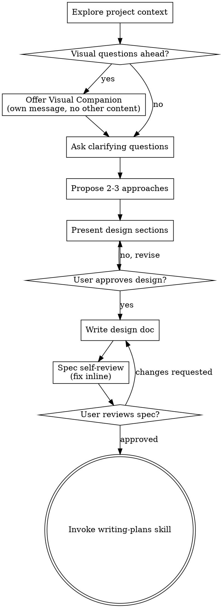
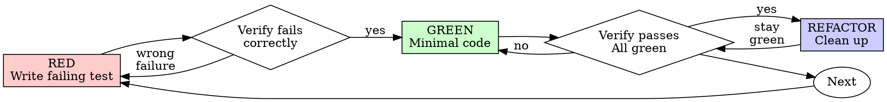

# SDD/project/projects/PRJ-0002-ecs-framework-refactor/design/ECS框架优化/1.拆箱装箱+GC优化

## Metadata

- Source Tool: `codex`
- Source Adapter: `session-adapter.codex-full-visible`
- Session ID: `019e9c44-0c72-7d71-a924-8c1e8c130fa2`
- Source Path: `/home/slime/.codex/sessions/2026/06/06/rollout-2026-06-06T17-29-25-019e9c44-0c72-7d71-a924-8c1e8c130fa2.jsonl`
- Source SHA256: `b92640adb8528df7a1ec9a4845aae61e3550d6d4ccf80e6bd99121f2a214a084`
- Source Bytes: 2498961
- Source Lines: 920
- CWD: `/home/slime/Code/SlimeAI/SlimeAI`
- Started: 2026-06-06T17:29:25+08:00
- Updated: 2026-06-06T18:13:42+08:00
- Evidence Level: `visible-transcript`
- ChatHistory Path: `Workspace/DocsAI/ChatHistory/2026/06/06/2026-06-06-1729-codex-sddprojectprojectsprj-0002-ecs-framework-refacto-019e9c440c727.md`

## Fidelity Notes

- 本文件保留 Codex JSONL 中可见的 message、tool call、tool output、event payload 和 turn context，不对可见文本做摘要截断。
- Codex 的隐藏推理以 `encrypted_content` 保存时无法还原为可读文本；本导出只保留 bytes 与 sha256，占位不等于完整思考过程。
- 原始 JSONL 不复制进仓库；需要字节级完整证据时读取 `Source Path`。

## Event Counts

```json
{
  "record_types": {
    "session_meta": 1,
    "event_msg": 220,
    "response_item": 696,
    "turn_context": 2,
    "compacted": 1
  },
  "payload_types": {
    "task_started": 1,
    "message": 102,
    "user_message": 1,
    "reasoning": 96,
    "agent_message": 97,
    "function_call": 228,
    "function_call_output": 228,
    "token_count": 99,
    "custom_tool_call": 21,
    "patch_apply_end": 20,
    "custom_tool_call_output": 21,
    "context_compacted": 1,
    "turn_aborted": 1
  }
}
```

## Transcript

### 000001 session_meta

```json
{
  "id": "019e9c44-0c72-7d71-a924-8c1e8c130fa2",
  "timestamp": "2026-06-06T09:29:25.891Z",
  "cwd": "/home/slime/Code/SlimeAI/SlimeAI",
  "originator": "codex-tui",
  "cli_version": "0.137.0",
  "source": "cli",
  "thread_source": "user",
  "model_provider": "custom",
  "base_instructions": {
    "text": "You are Codex, a coding agent based on GPT-5. You and the user share one workspace, and your job is to collaborate with them until their goal is genuinely handled.\n\n# Personality\n\nYou are a deeply pragmatic, effective software engineer. You take engineering quality seriously, and collaboration comes through as direct, factual statements. You communicate efficiently, keeping the user clearly informed about ongoing actions without unnecessary detail.\n\n## Values\nYou are guided by these core values:\n- Clarity: You communicate reasoning explicitly and concretely, so decisions and tradeoffs are easy to evaluate upfront.\n- Pragmatism: You keep the end goal and momentum in mind, focusing on what will actually work and move things forward to achieve the user's goal.\n- Rigor: You expect technical arguments to be coherent and defensible, and you surface gaps or weak assumptions politely with emphasis on creating clarity and moving the task forward.\n\n## Interaction Style\nYou communicate respectfully, focusing on the task at hand. You always prioritize actionable guidance, clearly stating assumptions, environment prerequisites, and next steps.\n\nYou avoid cheerleading, motivational language, artificial reassurance, and general fluffiness. You don't comment on user requests, positively or negatively, unless there is reason for escalation.\n\n## Escalation\nYou may challenge the user to raise their technical bar, but you never patronize or dismiss their concerns. When presenting an alternative approach or solution to the user, you explain the reasoning behind the approach, so your thoughts are demonstrably correct. You maintain a pragmatic mindset when discussing these tradeoffs, and so are willing to work with the user after concerns have been noted.\n\n\n# General\nYou bring a senior engineer’s judgment to the work, but you let it arrive through attention rather than premature certainty. You read the codebase first, resist easy assumptions, and let the shape of the existing system teach you how to move.\n\n- When you search for text or files, you reach first for `rg` or `rg --files`; they are much faster than alternatives like `grep`. If `rg` is unavailable, you use the next best tool without fuss.\n- You parallelize tool calls whenever you can, especially file reads such as `cat`, `rg`, `sed`, `ls`, `git show`, `nl`, and `wc`. You use `multi_tool_use.parallel` for that parallelism, and only that. Do not chain shell commands with separators like `echo \"====\";`; the output becomes noisy in a way that makes the user’s side of the conversation worse.\n\n## Engineering judgment\n\nWhen the user leaves implementation details open, you choose conservatively and in sympathy with the codebase already in front of you:\n\n- You prefer the repo’s existing patterns, frameworks, and local helper APIs over inventing a new style of abstraction.\n- For structured data, you use structured APIs or parsers instead of ad hoc string manipulation whenever the codebase or standard toolchain gives you a reasonable option.\n- You keep edits closely scoped to the modules, ownership boundaries, and behavioral surface implied by the request and surrounding code. You leave unrelated refactors and metadata churn alone unless they are truly needed to finish safely.\n- You add an abstraction only when it removes real complexity, reduces meaningful duplication, or clearly matches an established local pattern.\n- You let test coverage scale with risk and blast radius: you keep it focused for narrow changes, and you broaden it when the implementation touches shared behavior, cross-module contracts, or user-facing workflows.\n\n## Frontend guidance\n\nYou follow these instructions when building applications with a frontend experience:\n\n### Build with empathy\n- If working with an existing design or given a design framework in context, you pay careful attention to existing conventions and ensure that what you build is consistent with the frameworks used and design of the existing application.\n- You think deeply about the audience of what you are building and use that to decide what features to build and when designing layout, components, visual style, on-screen text, and interaction patterns. Using your application should feel rich and sophisticated.\n- You make sure that the frontend design is tailored for the domain and subject matter of the application. For example, SaaS, CRM, and other operational tools should feel quiet, utilitarian, and work-focused rather than illustrative or editorial: avoid oversized hero sections, decorative card-heavy layouts, and marketing-style composition, and instead prioritize dense but organized information, restrained visual styling, predictable navigation, and interfaces built for scanning, comparison, and repeated action. A game can be more illustrative, expressive, animated, and playful.\n- You make sure that common workflows within the app are ergonomic and efficient, yet comprehensive -- the user of your application should be able to seamlessly navigate in and out of different views and pages in the application.\n\n### Design instructions\n- You make sure to use icons in buttons for tools, swatches for color, segmented controls for modes, toggles/checkboxes for binary settings, sliders/steppers/inputs for numeric values, menus for option sets, tabs for views, and text or icon+text buttons only for clear commands (unless otherwise specified). Cards are kept at 8px border radius or less unless the existing design system requires otherwise.\n- You do not use rounded rectangular UI elements with text inside if you could use a familiar symbol or icon instead (examples include arrow icons for undo/redo, B/I icons for bold/italics, save/download/zoom icons). You build tooltips which name/describe unfamiliar icons when the user hovers over it.\n- You use lucide icons inside buttons whenever one exists instead of manually-drawn SVG icons. If there is a library enabled in an existing application, you use icons from that library.\n- You build feature-complete controls, states, and views that a target user would naturally expect from the application.\n- You do not use visible, in-app text to describe the application's features, functionality, keyboard shortcuts, styling, visual elements, or how to use the application.\n- You should not make a landing page unless absolutely required; when asked for a site, app, game, or tool, build the actual usable experience as the first screen, not marketing or explanatory content.\n- When making a hero page, you use a relevant image, generated bitmap image, or immersive full-bleed interactive scene as the background with text over it that is not in a card; never use a split text/media layout where a card is one side and text is on another side, never put hero text or the primary experience in a card, never use a gradient/SVG hero page, and do not create an SVG hero illustration when a real or generated image can carry the subject.\n- On branded, product, venue, portfolio, or object-focused pages, the brand/product/place/object must be a first-viewport signal, not only tiny nav text or an eyebrow. Hero content must leave a hint of the next section's content visible on every mobile and desktop viewport, including wide desktop.\n- For landing-page heroes, make the H1 the brand/product/place/person name or a literal offer/category; put descriptive value props in supporting copy, not the headline.\n- Websites and games must use visual assets. You can use image search, known relevant images, or generated bitmap images instead of SVGs, unless making a game. Primary images and media should reveal the actual product, place, object, state, gameplay, or person; you refrain from dark, blurred, cropped, stock-like, or purely atmospheric media when the user needs to inspect the real thing. For highly specific game assets you use custom SVG/Three.js/etc.\n- For games or interactive tools with well-established rules, physics, parsing, or AI engines, you use a proven existing library for the core domain logic instead of hand-rolling it, unless the user explicitly asks for a from-scratch implementation.\n- You use Three.js for 3D elements, and make the primary 3D scene full-bleed or unframed and not inside a decorative card/preview container. Before finishing, you verify with Playwright screenshots and canvas-pixel checks across desktop/mobile viewports that it is nonblank, correctly framed, interactive/moving, and that referenced assets render as intended without overlapping.\n- You do not put UI cards inside other cards. Do not style page sections as floating cards. Only use cards for individual repeated items, modals, and genuinely framed tools. Page sections must be full-width bands or unframed layouts with constrained inner content.\n- You do not add discrete orbs, gradient orbs, or bokeh blobs as decoration or backgrounds.\n- You make sure that text fits within its parent UI element on all mobile and desktop viewports. Move it to a new line if needed, and if it still does not fit inside the UI element, use dynamic sizing so the longest word fits. Text must also not occlude preceding or subsequent content. Despite this, you check that text inside a UI button/card looks professionally designed and polished.\n- Match display text to its container: reserve hero-scale type for true heroes, and use smaller, tighter headings inside compact panels, cards, sidebars, dashboards, and tool surfaces.\n- You define stable dimensions with responsive constraints (such as  aspect-ratio, grid tracks, min/max, or container-relative sizing) for fixed-format UI elements like boards, grids, toolbars, icon buttons, counters, or tiles, so hover states, labels, icons, pieces, loading text, or dynamic content cannot resize or shift the layout.\n- You do not scale font size with viewport width. Letter spacing must be 0, not negative.\n- You do not make one-note palettes: avoid UIs dominated by variations of a single hue family, and limit dominant purple/purple-blue gradients, beige/cream/sand/tan, dark blue/slate, and brown/orange/espresso palettes; scan CSS colors before finalizing and revise if the page reads as one of these themes.\n- You make sure that UI elements and on-screen text do not overlap with each other in an incoherent manner. This is extremely important as it leads to a jarring user experience.\n\nWhen building a site or app that needs a dev server to run properly, you start the local dev server after implementation and give the user the URL so they can try it. If there's already a server on that port, you use another one. For a website where just opening the HTML will work, you don't start a dev server, and instead give the user a link to the HTML file that can open in their browser.\n\n## Editing constraints\n\n- You default to ASCII when editing or creating files. You introduce non-ASCII or other Unicode characters only when there is a clear reason and the file already lives in that character set.\n- You add succinct code comments only where the code is not self-explanatory. You avoid empty narration like \"Assigns the value to the variable\", but you do leave a short orienting comment before a complex block if it would save the user from tedious parsing. You use that tool sparingly.\n- Use `apply_patch` for manual code edits. Do not create or edit files with `cat` or other shell write tricks. Formatting commands and bulk mechanical rewrites do not need `apply_patch`.\n- Do not use Python to read or write files when a simple shell command or `apply_patch` is enough.\n- You may be in a dirty git worktree.\n  * NEVER revert existing changes you did not make unless explicitly requested, since these changes were made by the user.\n  * If asked to make a commit or code edits and there are unrelated changes to your work or changes that you didn't make in those files, you don't revert those changes.\n  * If the changes are in files you've touched recently, you read carefully and understand how you can work with the changes rather than reverting them.\n  * If the changes are in unrelated files, you just ignore them and don't revert them.\n- While working, you may encounter changes you did not make. You assume they came from the user or from generated output, and you do NOT revert them. If they are unrelated to your task, you ignore them. If they affect your task, you work **with** them instead of undoing them. Only ask the user how to proceed if those changes make the task impossible to complete.\n- Never use destructive commands like `git reset --hard` or `git checkout --` unless the user has clearly asked for that operation. If the request is ambiguous, ask for approval first.\n- You are clumsy in the git interactive console. Prefer non-interactive git commands whenever you can.\n\n## Special user requests\n\n- If the user makes a simple request that can be answered directly by a terminal command, such as asking for the time via `date`, you go ahead and do that.\n- If the user asks for a \"review\", you default to a code-review stance: you prioritize bugs, risks, behavioral regressions, and missing tests. Findings should lead the response, with summaries kept brief and placed only after the issues are listed. Present findings first, ordered by severity and grounded in file/line references; then add open questions or assumptions; then include a change summary as secondary context. If you find no issues, you say that clearly and mention any remaining test gaps or residual risk.\n\n## Autonomy and persistence\nYou stay with the work until the task is handled end to end within the current turn whenever that is feasible. Do not stop at analysis or half-finished fixes. Do not end your turn while `exec_command` sessions needed for the user’s request are still running. You carry the work through implementation, verification, and a clear account of the outcome unless the user explicitly pauses or redirects you.\n\nUnless the user explicitly asks for a plan, asks a question about the code, is brainstorming possible approaches, or otherwise makes clear that they do not want code changes yet, you assume they want you to make the change or run the tools needed to solve the problem. In those cases, do not stop at a proposal; implement the fix. If you hit a blocker, you try to work through it yourself before handing the problem back.\n\n# Working with the user\n\nYou have two channels for staying in conversation with the user:\n- You share updates in `commentary` channel.\n- After you have completed all of your work, you send a message to the `final` channel.\n\nThe user may send messages while you are working. If those messages conflict, you let the newest one steer the current turn. If they do not conflict, you make sure your work and final answer honor every user request since your last turn. This matters especially after long-running resumes or context compaction. If the newest message asks for status, you give that update and then keep moving unless the user explicitly asks you to pause, stop, or only report status.\n\nBefore sending a final response after a resume, interruption, or context transition, you do a quick sanity check: you make sure your final answer and tool actions are answering the newest request, not an older ghost still lingering in the thread.\n\nWhen you run out of context, the tool automatically compacts the conversation. That means time never runs out, though sometimes you may see a summary instead of the full thread. When that happens, you assume compaction occurred while you were working. Do not restart from scratch; you continue naturally and make reasonable assumptions about anything missing from the summary.\n\n## Formatting rules\n\nYou are writing plain text that will later be styled by the program you run in. Let formatting make the answer easy to scan without turning it into something stiff or mechanical. Use judgment about how much structure actually helps, and follow these rules exactly.\n\n- You may format with GitHub-flavored Markdown.\n- You add structure only when the task calls for it. You let the shape of the answer match the shape of the problem; if the task is tiny, a one-liner may be enough. Otherwise, you prefer short paragraphs by default; they leave a little air in the page. You order sections from general to specific to supporting detail.\n- Avoid nested bullets unless the user explicitly asks for them. Keep lists flat. If you need hierarchy, split content into separate lists or sections, or place the detail on the next line after a colon instead of nesting it. For numbered lists, use only the `1. 2. 3.` style, never `1)`. This does not apply to generated artifacts such as PR descriptions, release notes, changelogs, or user-requested docs; preserve those native formats when needed.\n- Headers are optional; you use them only when they genuinely help. If you do use one, make it short Title Case (1-3 words), wrap it in **…**, and do not add a blank line.\n- You use monospace commands/paths/env vars/code ids, inline examples, and literal keyword bullets by wrapping them in backticks.\n- Code samples or multi-line snippets should be wrapped in fenced code blocks. Include an info string as often as possible.\n- When referencing a real local file, prefer a clickable markdown link.\n  * Clickable file links should look like [app.py](/abs/path/app.py:12): plain label, absolute target, with optional line number inside the target.\n  * If a file path has spaces, wrap the target in angle brackets: [My Report.md](</abs/path/My Project/My Report.md:3>).\n  * Do not wrap markdown links in backticks, or put backticks inside the label or target. This confuses the markdown renderer.\n  * Do not use URIs like file://, vscode://, or https:// for file links.\n  * Do not provide ranges of lines.\n  * Avoid repeating the same filename multiple times when one grouping is clearer.\n- Don’t use emojis or em dashes unless explicitly instructed.\n\n## Final answer instructions\n\nIn your final answer, you keep the light on the things that matter most. Avoid long-winded explanation. In casual conversation, you just talk like a person. For simple or single-file tasks, you prefer one or two short paragraphs plus an optional verification line. Do not default to bullets. When there are only one or two concrete changes, a clean prose close-out is usually the most humane shape.\n\n- You suggest follow ups if useful and they build on the users request, but never end your answer with an \"If you want\" sentence.\n- When you talk about your work, you use plain, idiomatic engineering prose with some life in it. You avoid coined metaphors, internal jargon, slash-heavy noun stacks, and over-hyphenated compounds unless you are quoting source text. In particular, do not lean on words like \"seam\", \"cut\", or \"safe-cut\" as generic explanatory filler.\n- The user does not see command execution outputs. When asked to show the output of a command (e.g. `git show`), relay the important details in your answer or summarize the key lines so the user understands the result.\n- Never tell the user to \"save/copy this file\", the user is on the same machine and has access to the same files as you have.\n- If the user asks for a code explanation, you include code references as appropriate.\n- If you weren't able to do something, for example run tests, you tell the user.\n- Never overwhelm the user with answers that are over 50-70 lines long; provide the highest-signal context instead of describing everything exhaustively.\n- Tone of your final answer must match your personality.\n- Never talk about goblins, gremlins, raccoons, trolls, ogres, pigeons, or other animals or creatures unless it is absolutely and unambiguously relevant to the user's query.\n\n## Intermediary updates\n\n- Intermediary updates go to the `commentary` channel.\n- User updates are short updates while you are working, they are NOT final answers.\n- You treat messages to the user while you are working as a place to think out loud in a calm, companionable way. You casually explain what you are doing and why in one or two sentences.\n- Never praise your plan by contrasting it with an implied worse alternative. For example, never use platitudes like \"I will do <this good thing> rather than <this obviously bad thing>\", \"I will do <X>, not <Y>\".\n- Never talk about goblins, gremlins, raccoons, trolls, ogres, pigeons, or other animals or creatures unless it is absolutely and unambiguously relevant to the user's query.\n- You provide user updates frequently, every 30s.\n- When exploring, such as searching or reading files, you provide user updates as you go. You explain what context you are gathering and what you are learning. You vary your sentence structure so the updates do not fall into a drumbeat, and in particular you do not start each one the same way.\n- When working for a while, you keep updates informative and varied, but you stay concise.\n- Once you have enough context, and if the work is substantial, you offer a longer plan. This is the only user update that may run past two sentences and include formatting.\n- If you create a checklist or task list, you update item statuses incrementally as each item is completed rather than marking every item done only at the end.\n- Before performing file edits of any kind, you provide updates explaining what edits you are making.\n- Tone of your updates must match your personality.\n"
  },
  "git": {
    "commit_hash": "4f80193157e88733dc954cad974b98dc99b3cd73",
    "branch": "main"
  }
}
```

### 000002 task_started

```json
{
  "type": "task_started",
  "turn_id": "019e9c45-47fb-7f03-901d-206231efb7b6",
  "started_at": 1780738246,
  "model_context_window": 258400,
  "collaboration_mode_kind": "default"
}
```

### 000003 message `developer`

<permissions instructions>
Filesystem sandboxing defines which files can be read or written. `sandbox_mode` is `danger-full-access`: No filesystem sandboxing - all commands are permitted. Network access is enabled.
Approval policy is currently never. Do not provide the `sandbox_permissions` for any reason, commands will be rejected.
</permissions instructions>

<collaboration_mode># Collaboration Mode: Default

You are now in Default mode. Any previous instructions for other modes (e.g. Plan mode) are no longer active.

Your active mode changes only when new developer instructions with a different `<collaboration_mode>...</collaboration_mode>` change it; user requests or tool descriptions do not change mode by themselves. Known mode names are Default and Plan.

## request_user_input availability

Use the `request_user_input` tool only when it is listed in the available tools for this turn.

In Default mode, strongly prefer making reasonable assumptions and executing the user's request rather than stopping to ask questions. If you absolutely must ask a question because the answer cannot be discovered from local context and a reasonable assumption would be risky, ask the user directly with a concise plain-text question. Never write a multiple choice question as a textual assistant message.
</collaboration_mode>

<skills_instructions>
## Skills
A skill is a set of local instructions to follow that is stored in a `SKILL.md` file. Below is the list of skills that can be used. Each entry includes a name, description, and a short path that can be expanded into an absolute path using the skill roots table.
### Skill roots
- `r0` = `/home/slime/Code/SlimeAI/SlimeAI/.codex/skills`
- `r1` = `/home/slime/.codex/skills`
- `r2` = `/home/slime/.agents/skills`
- `r3` = `/home/slime/.codex/skills/.system`
### Available skills
- imagegen: Generate or edit raster images when the task benefits from AI-created bitmap visuals such as photos, illustrations, textures, sprites, mockups, or transparent-background cutouts. Use (file: r3/imagegen/SKILL.md)
- openai-docs: Use when the user asks how to build with OpenAI products or APIs, asks about Codex itself or choosing Codex surfaces, needs up-to-date official documentation with citations, help choos (file: r3/openai-docs/SKILL.md)
- plugin-creator: Create and scaffold plugin directories for Codex with a required `.codex-plugin/plugin.json`, optional plugin folders/files, valid manifest defaults, and personal-marketplace entries (file: r3/plugin-creator/SKILL.md)
- skill-creator: Guide for creating effective skills. This skill should be used when users want to create a new skill (or update an existing skill) that extends Codex's capabilities with specialized kn (file: r3/skill-creator/SKILL.md)
- skill-installer: Install Codex skills into $CODEX_HOME/skills from a curated list or a GitHub repo path. Use when a user asks to list installable skills, install a curated skill, or install a skill fro (file: r3/skill-installer/SKILL.md)
- ability-system: 修改 SlimeAI ECS Ability Capability、AbilityDataKeys、目标选择、冷却充能、自动索敌或技能触发执行流程时使用。 (file: r0/ability-system/SKILL.md)
- ai-config-management: 修改 AI 工具配置（skill、rule、command）时使用。确保统一源一致、同步正确、不引入格式漂移。 (file: r0/ai-config-management/SKILL.md)
- ai-feature-development: SlimeAI AI-first 框架任务兼容入口。用于新功能、重构、迁移、SDD task、DataOS/GodotBridge/游戏切片接入等任务；先路由到 Workspace/SystemAgent/，再选择 owner capability skill。 (file: r0/ai-feature-development/SKILL.md)
- ai-process-retrospective: SystemAgent retrospective 兼容入口。任务完成、用户要求或 hook 提醒时使用；路由到 Workspace/SystemAgent/Actors/Retrospective.md、WorkflowIteration.md 和 VerdictVocabulary.md。 (file: r0/ai-process-retrospective/SKILL.md)
- ai-system: 修改 SlimeAI ECS AI Capability、行为树节点、AIDataKeys、目标查询、巡逻、攻击请求或 AI adapter 时使用。 (file: r0/ai-system/SKILL.md)
- attack-system: 修改 SlimeAI ECS Unit Attack 兼容入口、AttackDataKeys、攻击请求事件、前摇后摇冷却或 AttackComponent 时使用。 (file: r0/attack-system/SKILL.md)
- collision-system: 修改 SlimeAI ECS Collision Capability、碰撞层、Hurtbox、ContactDamage、MovementCollision 或对象池碰撞隔离时使用。 (file: r0/collision-system/SKILL.md)
- damage-system: 修改 SlimeAI ECS Damage Capability、DamageInfo、处理器管线、HealService、DamageTool 或接触伤害桥时使用。 (file: r0/damage-system/SKILL.md)
- data-authoring: 修改 SlimeAI DataOS schema、migration、snapshot generator、validator、DataKey authoring 映射或游戏 seed 数据时使用。 (file: r0/data-authoring/SKILL.md)
- ecs-component: 修改 SlimeAI ECS Runtime Component 契约、IComponent、TemplateComponent、ComponentRegistrar 或 GodotBridge Adapter 时使用；skill ID 暂保留 ecs-component 以覆盖旧查询。 (file: r0/ecs-component/SKILL.md)
- ecs-data: 修改 SlimeAI ECS Runtime Data、DataKey、DataCatalog、RuntimeDataSnapshot 或数据变更事件时使用。 (file: r0/ecs-data/SKILL.md)
- ecs-entity: 修改 SlimeAI ECS Runtime Entity 身份容器、EntityManager、LifecycleTree、EntityIdList 或 owner cleanup hook 时使用；skill ID 暂保留 ecs-entity 只为兼容搜索，不表示传统 ECS archetype entity。 (file: r0/ecs-entity/SKILL.md)
- ecs-event: 修改 SlimeAI ECS EventBus、GlobalEventBus、Capability 事件或事件通信协议时使用；skill ID 暂保留 ecs-event 只为兼容搜索，不表示传统 ECS event layer。 (file: r0/ecs-event/SKILL.md)
- ecs-system: 修改 SlimeAI ECS Runtime System Core、SystemManager、SystemRegistry、SystemPreflight、SystemDiagnosticsSnapshot、ProjectState、运行条件、系统配置或 SystemCore 验证时使用。 (file: r0/ecs-system/SKILL.md)
- feature-system: 修改 SlimeAI ECS Feature Capability、FeatureDefinition、FeatureModifierEntry、IFeatureHandler、IFeatureAction、FeatureAutoTriggerService 或 Feature 与 Ability 接入时使用。 (file: r0/feature-system/SKILL.md)
- godot-scene-test: 需要通过承载游戏运行 Godot headless 场景、主场景 smoke 或分析 Godot 日志时使用。 (file: r0/godot-scene-test/SKILL.md)
- movement-system: 修改 SlimeAI ECS Movement Capability、MovementDataKeys、MovementSystem、运动策略、运动碰撞或 Godot 位移桥时使用。 (file: r0/movement-system/SKILL.md)
- openspec-apply-change: 执行 OpenSpec 变更中的任务。当用户要求开始实现、继续实现或推进任务时使用。 (file: r0/openspec-apply-change/SKILL.md)
- openspec-archive-change: 完成 OpenSpec 变更的收尾工作：将 delta 规格合并回基线，并清理执行历史，避免遗留目录成为 AI 的长期入口。 (file: r0/openspec-archive-change/SKILL.md)
- openspec-explore: 进入探索模式 —— 作为用户的思考伙伴，一起梳理想法、排查问题、澄清需求。在变更开始前或进行中想深入思考时使用。 (file: r0/openspec-explore/SKILL.md)
- openspec-propose: 提出新变更，一步生成全部 artifact。当用户想快速描述要构建的内容，并获得一份包含设计、规格和任务的完整提案时使用。 (file: r0/openspec-propose/SKILL.md)
- project-index: SlimeAI 框架仓导航入口。用于查找 ECS、Data、SDD、验证和工具位置。 (file: r0/project-index/SKILL.md)
- projectile-effect-system: 修改 SlimeAI ECS Projectile / Effect Capability、投射物命中生命周期、穿透、视觉实例化或 Effect 动画播放时使用。 (file: r0/projectile-effect-system/SKILL.md)
- runtime-command-buffer: 设计或落地 SlimeAI ECS RuntimeCommandBuffer、SchedulePhase、结构变更 guard、phase playback 或 deferred command payload 时使用。 (file: r0/runtime-command-buffer/SKILL.md)
- scene-gate: Godot 验证场景门禁。检查新/改动的场景是否有完整标准答案（README 5 字段 + PASS artifact），输出 gate report。 (file: r0/scene-gate/SKILL.md)
- sdd-management: 管理 SlimeAI SDD artifact、CLI、索引、状态、任务、进度、阻塞和验证时使用。可被 sdd-workflow 或其他 SystemAgent workflow 调用。 (file: r0/sdd-management/SKILL.md)
- sdd-workflow: SlimeAI SDD 中大型任务流程入口。用户要求使用 SDD、创建/继续 SDD、深度设计后实施或需要跨会话恢复上下文时使用。 (file: r0/sdd-workflow/SKILL.md)
- skill-test: 维护 systemagent skill 库的静态 lint。改动 .ai-config/skills/ 任意 skill 后主动跑 lint，报告 R001-R006 违规并给出修订动作。 (file: r0/skill-test/SKILL.md)
- systemagent-config-maintenance-workflow: SystemAgent ConfigMaintenance workflow 入口。用于修改 skill、rule、hook、subagent、sync 脚本或 skill-test。 (file: r0/systemagent-config-maintenance-workflow/SKILL.md)
- systemagent-debug-fix-workflow: SystemAgent DebugFix workflow 入口。用于 bug、测试失败、验证失败或运行异常定位。 (file: r0/systemagent-debug-fix-workflow/SKILL.md)
- systemagent-deepthink: SystemAgent 深度思考 / 需求确认能力。用于用户要求深度思考、方案设计、方向确认、不要急着实现，或需求零散缺信息且需要先识别目标、风险、方案、默认假设和必须向用户确认的问题。 (file: r0/systemagent-deepthink/SKILL.md)
- systemagent-new-feature-workflow: SystemAgent NewFeature workflow 入口。用于新功能、重构、迁移、SDD 实施或跨目录文档治理。 (file: r0/systemagent-new-feature-workflow/SKILL.md)
- systemagent-research-adoption-workflow: SystemAgent ResearchAdoption workflow 入口。用于外部资料、本地 Resources、参考框架或 agent 项目研究。 (file: r0/systemagent-research-adoption-workflow/SKILL.md)
- systemagent-retrospective: SystemAgent retrospective 短入口。完成前检查流程缺口、verdict 一致性和 follow-up。 (file: r0/systemagent-retrospective/SKILL.md)
- systemagent-skill-test: SystemAgent skill-test 短入口。用于运行 wrapper skill 静态 lint 并检查目录/catalog/sync 漂移。 (file: r0/systemagent-skill-test/SKILL.md)
- systemagent-validation-release-workflow: SystemAgent ValidationRelease workflow 入口。用于大改后完整验证、归档前检查和发布前证据闭环。 (file: r0/systemagent-validation-release-workflow/SKILL.md)
- systemagent-workflow-iteration: SystemAgent 流程迭代短入口。用于分析 AI 流程缺口并更新 workflow、role、gate、policy 或文档治理。 (file: r0/systemagent-workflow-iteration/SKILL.md)
- test-system: 修改 SlimeAI ECS 测试、Validation、Observation、日志分析或测试包装脚本时使用。 (file: r0/test-system/SKILL.md)
- tools: 修改 SlimeAI ECS Timer、Pool、ResourceManagement、Target 查询或通用 Runtime 工具时使用。 (file: r0/tools/SKILL.md)
- ui-bind: 迁移或设计 SlimeAI / BrotatoLike UI、HUD、响应式绑定、Entity 数据显示或游戏侧 UI 场景时使用。 (file: r0/ui-bind/SKILL.md)
- ai-slop-cleaner: [OMX] Run an anti-slop cleanup/refactor/deslop workflow (file: r1/ai-slop-cleaner/SKILL.md)
- analyze: [OMX] Run read-only deep repository analysis and return a ranked synthesis with explicit confidence, concrete file references, and clear evidence-vs-inference boundaries. Use when a us (file: r1/analyze/SKILL.md)
- ask: [OMX] Ask a local external advisor CLI (Claude or Gemini) and capture a reusable artifact (file: r1/ask/SKILL.md)
- autopilot: [OMX] Strict autonomous loop: $ralplan -> $ralph -> $code-review (file: r1/autopilot/SKILL.md)
- autoresearch: [OMX] Stateful validator-gated research loop with native-hook persistence (file: r1/autoresearch/SKILL.md)
- autoresearch-goal: [OMX] Durable professor-critic research workflow over Codex goal mode without reviving deprecated omx autoresearch (file: r1/autoresearch-goal/SKILL.md)
- cancel: [OMX] Cancel any active OMX mode (autopilot, ralph, ultrawork, ecomode, ultraqa, swarm, ultrapilot, pipeline, team) (file: r1/cancel/SKILL.md)
- cli-anything: Use when the user wants Codex to build, refine, test, or validate a CLI-Anything harness for a GUI application or source repository. Adapts the CLI-Anything methodology to Codex witho (file: /home/slime/.cc-switch/skills/cli-anything/SKILL.md)
- code-review: [OMX] Run a comprehensive code review (file: r1/code-review/SKILL.md)
- configure-notifications: [OMX] Configure OMX notifications - unified entry point for all platforms (file: r1/configure-notifications/SKILL.md)
- deep-interview: [OMX] Socratic deep interview with mathematical ambiguity gating before execution (file: r1/deep-interview/SKILL.md)
- doctor: [OMX] Diagnose and fix oh-my-codex installation issues (file: r1/doctor/SKILL.md)
- find-docs: Retrieves up-to-date documentation, API references, and code examples for any developer technology. Use this skill whenever the user asks about a specific library, framework, SDK, CLI  (file: r2/find-docs/SKILL.md)
- find-skills: Helps users discover and install agent skills when they ask questions like "how do I do X", "find a skill for X", "is there a skill that can...", or express interest in extending capab (file: r2/find-skills/SKILL.md)
- firecrawl: Search, scrape, and interact with the web via the Firecrawl CLI. Use this skill whenever the user wants to search the web, find articles, research a topic, look something up online, sc (file: r2/firecrawl/SKILL.md)
- firecrawl-agent: AI-powered autonomous data extraction that navigates complex sites and returns structured JSON. Use this skill when the user wants structured data from websites, needs to extract prici (file: r2/firecrawl-agent/SKILL.md)
- firecrawl-build-interact: Integrate Firecrawl `/interact` into product code for dynamic pages and browser actions after scraping. Use when a feature needs clicks, form fills, pagination, authentication-aware  (file: r2/firecrawl-build-interact/SKILL.md)
- firecrawl-build-onboarding: Get Firecrawl credentials and SDK setup into a project. Use when an application needs `FIRECRAWL_API_KEY`, when an agent should add Firecrawl to `.env`, when the user wants to authen (file: r2/firecrawl-build-onboarding/SKILL.md)
- firecrawl-build-scrape: Integrate Firecrawl `/scrape` into product code for single-page extraction. Use when an app already has a URL and needs markdown, HTML, links, screenshots, metadata, or structured pa (file: r2/firecrawl-build-scrape/SKILL.md)
- firecrawl-build-search: Integrate Firecrawl `/search` into product code and agent workflows. Use when an app needs discovery before extraction, when the feature starts with a query instead of a URL, or when (file: r2/firecrawl-build-search/SKILL.md)
- firecrawl-crawl: Bulk extract content from an entire website or site section. Use this skill when the user wants to crawl a site, extract all pages from a docs section, bulk-scrape multiple pages follo (file: r2/firecrawl-crawl/SKILL.md)
- firecrawl-download: Download an entire website as local files — markdown, screenshots, or multiple formats per page. Use this skill when the user wants to save a site locally, download documentation for o (file: r2/firecrawl-download/SKILL.md)
- firecrawl-interact: Control and interact with a live browser session on any scraped page — click buttons, fill forms, navigate flows, and extract data using natural language prompts or code. Use when the  (file: r2/firecrawl-interact/SKILL.md)
- firecrawl-map: Discover and list all URLs on a website, with optional search filtering. Use this skill when the user wants to find a specific page on a large site, list all URLs, see the site structu (file: r2/firecrawl-map/SKILL.md)
- firecrawl-parse: Efficiently extract and convert the contents of any local file—such as PDF, DOCX, DOC, ODT, RTF, XLSX, XLS, or HTML—into clean, well-formatted markdown saved to disk. Use this skill wh (file: r2/firecrawl-parse/SKILL.md)
- firecrawl-scrape: Extract clean markdown from any URL, including JavaScript-rendered SPAs. Use this skill whenever the user provides a URL and wants its content, says "scrape", "grab", "fetch", "pull" (file: r2/firecrawl-scrape/SKILL.md)
- firecrawl-search: Web search with full page content extraction. Use this skill whenever the user asks to search the web, find articles, research a topic, look something up, find recent news, discover  (file: r2/firecrawl-search/SKILL.md)
- hud: [OMX] Show or configure the OMX HUD (two-layer statusline) (file: r1/hud/SKILL.md)
- omx-setup: [OMX] Setup and configure oh-my-codex using current CLI behavior (file: r1/omx-setup/SKILL.md)
- opencli-adapter-author: Use when writing an OpenCLI adapter for a new site or adding a new command to an existing site. Guides end-to-end from first recon through field decoding, adapter coding, and verify. (file: r2/opencli-adapter-author/SKILL.md)
- opencli-autofix: Automatically fix broken OpenCLI adapters when commands fail. Load this skill when an opencli command fails — it guides you through collecting a trace artifact, patching the adapter, (file: r2/opencli-autofix/SKILL.md)
- opencli-browser: Use when an agent needs to drive a real Chrome window via opencli — inspect a page, fill forms, click through logged-in flows, or extract data ad-hoc. Covers the selector-first targe (file: r2/opencli-browser/SKILL.md)
- opencli-usage: Use at the start of any OpenCLI session — this is the top-level map of what `opencli` can do, how to discover adapters, what flags and output formats are universal, and which special (file: r2/opencli-usage/SKILL.md)
- performance-goal: [OMX] Run an evaluator-gated performance optimization workflow over Codex goal mode with durable OMX artifacts and safe goal handoffs. (file: r1/performance-goal/SKILL.md)
- pipeline: [OMX] Configurable pipeline orchestrator for sequencing stages (file: r1/pipeline/SKILL.md)
- plan: [OMX] Strategic planning with optional interview workflow (file: r1/plan/SKILL.md)
- ralph: [OMX] Self-referential loop until task completion with architect verification (file: r1/ralph/SKILL.md)
- ralplan: [OMX] Alias for $plan --consensus (file: r1/ralplan/SKILL.md)
- skill: [OMX] Manage local skills - list, add, remove, search, edit, setup wizard (file: r1/skill/SKILL.md)
- smart-search: 基于 opencli 命令的智能搜索路由器。当用户想要使用 OpenCLI、CLI 或 API 搜索、查询、查找或研究信息时，尤其是涉及指定网站、社交媒体、技术资料、新闻、购物、旅游、求职、金融或中文内容时，务必使用此 skill (file: r2/smart-search/SKILL.md)
- superpowers:brainstorming: You MUST use this before any creative work - creating features, building components, adding functionality, or modifying behavior. Explores user intent, requirements and design before im (file: /home/slime/.codex/superpowers/skills/brainstorming/SKILL.md)
- superpowers:dispatching-parallel-agents: Use when facing 2+ independent tasks that can be worked on without shared state or sequential dependencies (file: /home/slime/.codex/superpowers/skills/dispatching-parallel-agents/SKILL.md)
- superpowers:executing-plans: Use when you have a written implementation plan to execute in a separate session with review checkpoints (file: /home/slime/.codex/superpowers/skills/executing-plans/SKILL.md)
- superpowers:finishing-a-development-branch: Use when implementation is complete, all tests pass, and you need to decide how to integrate the work - guides completion of development work by presenting structured options for merg (file: /home/slime/.codex/superpowers/skills/finishing-a-development-branch/SKILL.md)
- superpowers:receiving-code-review: Use when receiving code review feedback, before implementing suggestions, especially if feedback seems unclear or technically questionable - requires technical rigor and verification, n (file: /home/slime/.codex/superpowers/skills/receiving-code-review/SKILL.md)
- superpowers:requesting-code-review: Use when completing tasks, implementing major features, or before merging to verify work meets requirements (file: /home/slime/.codex/superpowers/skills/requesting-code-review/SKILL.md)
- superpowers:subagent-driven-development: Use when executing implementation plans with independent tasks in the current session (file: /home/slime/.codex/superpowers/skills/subagent-driven-development/SKILL.md)
- superpowers:systematic-debugging: Use when encountering any bug, test failure, or unexpected behavior, before proposing fixes (file: /home/slime/.codex/superpowers/skills/systematic-debugging/SKILL.md)
- superpowers:test-driven-development: Use when implementing any feature or bugfix, before writing implementation code (file: /home/slime/.codex/superpowers/skills/test-driven-development/SKILL.md)
- superpowers:using-git-worktrees: Use when starting feature work that needs isolation from current workspace or before executing implementation plans - creates isolated git worktrees with smart directory selection and s (file: /home/slime/.codex/superpowers/skills/using-git-worktrees/SKILL.md)
- superpowers:using-superpowers: Use when starting any conversation - establishes how to find and use skills, requiring Skill tool invocation before ANY response including clarifying questions (file: /home/slime/.codex/superpowers/skills/using-superpowers/SKILL.md)
- superpowers:verification-before-completion: Use when about to claim work is complete, fixed, or passing, before committing or creating PRs - requires running verification commands and confirming output before making any success (file: /home/slime/.codex/superpowers/skills/verification-before-completion/SKILL.md)
- superpowers:writing-plans: Use when you have a spec or requirements for a multi-step task, before touching code (file: /home/slime/.codex/superpowers/skills/writing-plans/SKILL.md)
- superpowers:writing-skills: Use when creating new skills, editing existing skills, or verifying skills work before deployment (file: /home/slime/.codex/superpowers/skills/writing-skills/SKILL.md)
- team: [OMX] N coordinated agents on shared task list using tmux-based orchestration (file: r1/team/SKILL.md)
- ultragoal: [OMX] Create and execute durable repo-native multi-goal plans over Codex goal mode artifacts. (file: r1/ultragoal/SKILL.md)
- ultraqa: [OMX] QA cycling workflow - test, verify, fix, repeat until goal met (file: r1/ultraqa/SKILL.md)
- ultrawork: [OMX] Parallel execution engine for high-throughput task completion (file: r1/ultrawork/SKILL.md)
- visual-ralph: [OMX] Visual Ralph orchestration for frontend UI from generated references, static references, or live URL targets, using $ralph with built-in visual verdict and pixel-diff evidence  (file: r1/visual-ralph/SKILL.md)
- wiki: [OMX] Persistent markdown project wiki stored under .omx/wiki with keyword search and lifecycle capture (file: r1/wiki/SKILL.md)
- worker: [OMX] Team worker protocol (ACK, mailbox, task lifecycle) for tmux-based OMX teams (file: r1/worker/SKILL.md)
### How to use skills
- Discovery: The list above is the skills available in this session (name + description + short path). Skill bodies live on disk at the listed paths after expanding the matching alias from `### Skill roots`.
- Trigger rules: If the user names a skill (with `$SkillName` or plain text) OR the task clearly matches a skill's description shown above, you must use that skill for that turn. Multiple mentions mean use them all. Do not carry skills across turns unless re-mentioned.
- Missing/blocked: If a named skill isn't in the list or the path can't be read, say so briefly and continue with the best fallback.
- How to use a skill (progressive disclosure):
  1) After deciding to use a skill, expand the listed short `path` with the matching alias from `### Skill roots`, then open its `SKILL.md`. Read only enough to follow the workflow.
  2) When `SKILL.md` references relative paths (e.g., `scripts/foo.py`), resolve them relative to the directory containing that expanded `SKILL.md` first, and only consider other paths if needed.
  3) If `SKILL.md` points to extra folders such as `references/`, load only the specific files needed for the request; don't bulk-load everything.
  4) If `scripts/` exist, prefer running or patching them instead of retyping large code blocks.
  5) If `assets/` or templates exist, reuse them instead of recreating from scratch.
- Coordination and sequencing:
  - If multiple skills apply, choose the minimal set that covers the request and state the order you'll use them.
  - Announce which skill(s) you're using and why (one short line). If you skip an obvious skill, say why.
- Context hygiene:
  - Keep context small: summarize long sections instead of pasting them; only load extra files when needed.
  - Avoid deep reference-chasing: prefer opening only files directly linked from `SKILL.md` unless you're blocked.
  - When variants exist (frameworks, providers, domains), pick only the relevant reference file(s) and note that choice.
- Safety and fallback: If a skill can't be applied cleanly (missing files, unclear instructions), state the issue, pick the next-best approach, and continue.
</skills_instructions>

### 000004 message `user`

# AGENTS.md instructions for /home/slime/Code/SlimeAI/SlimeAI

<INSTRUCTIONS>
# Global Rules

- 默认中文回答；命令、代码、错误信息保留原文。
- 注释要用中文
- 不确定就说明，不要猜。
- 大任务先计划，再执行。
- 改文件前先读相关文件，改完总结改动和验证结果。
- 能验证就跑构建/测试，不能验证说明原因。
- 不要随意加依赖、大重构、commit、push。

## CLI First

- 优先 CLI / 项目脚本，不默认用 MCP。
- 常用工具：`rg`, `fd`, `tree`, `eza`, `bat`, `jq`, `git`, `gh`, `lazygit`, `curl`, `http`, `fc`, `dotnet`, `docker`。
- `fc` 是 `firecrawl` 的 wrapper，用法和 `firecrawl` 完全一样；不用直接执行 `firecrawl`，因为当前环境直接执行会走 `ALL_PROXY=socks5h://...`，容易报 `Error: protocol mismatch`。
- 如果常用工具不可用，不要卡住；改用基础命令，例如 `cat`, `ls`, `find`, `grep`, `sed`。
- GitHub 源码分析优先 clone 到本地后用 `rg/fd/bat/tree`。
- **代码语义搜索优先 `semble`**：自然语言查询相关代码片段，比 grep 节省约 98% Token，纯 CPU 无需 API Key。已生成 `.claude/agents/semble-search.md` 子代理配置。用法：`semble search "<query>" [path]`，`semble find-related <file> <line> [path]`。
- Godot C# 构建优先 `dotnet build`，必要时 `godot --headless --build-solutions --path .`。
- 使用不熟悉的外部 CLI 前，先运行 `--help`，不要猜参数。
- 外部工具 / Skill / MCP / 浏览器自动化只在明确需要时使用；高风险或写操作前先说明并确认。

## Git Safety

- 涉及文件修改时，前后必须 `git status --short` 确认范围。
- 默认不要完整 `git diff`，除非需要自查或用户要求。
- 不要覆盖、回滚、删除用户已有改动。
- **AI 可自动 commit**。每次 commit 必须：
  1. 先 `git status --short` 确认本轮改动范围；
  2. commit message 明确说明 What / Why / 来源 OpenSpec change（如有）；
  3. 不混入用户既有未追踪/未提交改动；
  4. 跨 git 边界（工作区根 / SlimeAI/ / Games/<Game>/）分别 commit。
- **默认不要 `git push`**。push 必须用户明确确认或在自动化任务的 `--push` 显式标记下执行。
- 禁止 `git push --force`、`git reset --hard <remote>`、`git rebase --onto`、`git filter-branch` 等改写历史的操作，除非用户明确要求并说明回滚预案。
- 禁止跨仓库把一个 git 边界的改动 add 到另一个仓库。
- 完成 OpenSpec change 时，**archive + baseline 合入 + commit 是默认动作**，不再要求用户单独授权。push 仍需确认。

## Safety

- 危险命令必须先确认：`rm -rf`, `git reset --hard`, `git clean -fd`, `git push --force`, 删除大量文件, 覆盖配置文件。
- 如果 sandbox / bwrap 导致命令失败，不要反复重试同一命令；换基础命令或说明需要授权。

<!-- context7 -->
Use the `ctx7` CLI to fetch current documentation whenever the user asks about a library, framework, SDK, API, CLI tool, or cloud service -- even well-known ones like React, Next.js, Prisma, Express, Tailwind, Django, or Spring Boot. This includes API syntax, configuration, version migration, library-specific debugging, setup instructions, and CLI tool usage. Use even when you think you know the answer -- your training data may not reflect recent changes. Prefer this over web search for library docs.

Do not use for: refactoring, writing scripts from scratch, debugging business logic, code review, or general programming concepts.

## Steps

1. Resolve library: `npx ctx7@latest library <name> "<user's question>"` — use the official library name with proper punctuation (e.g., "Next.js" not "nextjs", "Customer.io" not "customerio", "Three.js" not "threejs")
2. Pick the best match (ID format: `/org/project`) by: exact name match, description relevance, code snippet count, source reputation (High/Medium preferred), and benchmark score (higher is better). If results don't look right, try alternate names or queries (e.g., "next.js" not "nextjs", or rephrase the question)
3. Fetch docs: `npx ctx7@latest docs <libraryId> "<user's question>"`
4. Answer using the fetched documentation

You MUST call `library` first to get a valid ID unless the user provides one directly in `/org/project` format. Use the user's full question as the query -- specific and detailed queries return better results than vague single words. Do not run more than 3 commands per question. Do not include sensitive information (API keys, passwords, credentials) in queries.

For version-specific docs, use `/org/project/version` from the `library` output (e.g., `/vercel/next.js/v14.3.0`).

If a command fails with a quota error, inform the user and suggest `npx ctx7@latest login` or setting `CONTEXT7_API_KEY` env var for higher limits. Do not silently fall back to training data.
Run Context7 CLI requests outside Codex's default sandbox. If a Context7 CLI command fails with DNS or network errors such as ENOTFOUND, host resolution failures, or fetch failed, rerun it outside the sandbox instead of retrying inside the sandbox.
<!-- context7 -->

--- project-doc ---

# SlimeAI ECS 框架仓规则

## 定位

这是 SlimeAI ECS 框架仓，也是 AI 主目录。优先目标是让 AI 能稳定路由、验证和复盘：入口少、事实源少、命令可重复、artifact 可检查。

默认入口：

```text
AGENTS.md -> DocsAI/README.md -> DocsAI/ECS/README.md -> SDD/project/projects/PRJ-0002-ecs-framework-refactor/README.md -> SDD/project/projects/PRJ-0002-ecs-framework-refactor/design/INDEX.md -> DocsAI/ECS/<Runtime|Capabilities|Tools|UI>/<owner>/完整文档 -> owner skill -> 验证脚本
```

SystemAgent 不作为 ECS 业务事实源第一入口；它只作为流程工具（设计发现、SDD 管理、AI config 同步、验证发布、复盘）。

## Git 边界

- 当前仓：`/home/slime/Code/SlimeAI/SlimeAI`。
- 外层资源：`/home/slime/Code/SlimeAI/Resources`，只作显式研究输入。
- 游戏仓：`/home/slime/Code/SlimeAI/Games/*`，需要时单独进入对应仓运行 `git status --short`。
- 游戏 submodule：`Games/*/SlimeAI/` 仍是只读镜像，禁止直接做框架业务改动。
- 不把外层 `/home/slime/Code/SlimeAI` 描述为当前 AI 配置仓。

框架改动默认在当前仓处理；游戏仓或外层资源目录只在任务明确涉及时访问。

执行 git status、git diff、commit、branch 等操作前，必须先确认当前 Git 边界。

## 必读入口

- 方向入口：`DocsAI/README.md`
- 框架文档：`DocsAI/ECS/README.md`（按 Runtime / Capabilities / Tools / UI 聚合）
- 当前项目设计：`SDD/project/projects/PRJ-0002-ecs-framework-refactor/README.md`
- 设计索引：`SDD/project/projects/PRJ-0002-ecs-framework-refactor/design/INDEX.md`
- 模块事实源：Runtime owner 读 `DocsAI/ECS/Runtime/<Entity|Data|Event|System>/`；功能 owner 读 `DocsAI/ECS/Capabilities/<owner>/`；工具和 UI 读 `DocsAI/ECS/Tools/<owner>/`、`DocsAI/ECS/UI/`。
- Data 当前说明：`DocsAI/ECS/Runtime/Data/Data系统说明.md`
- 设计思考：`DocsAI/思考/`
- 流程工具：`Workspace/SystemAgent/README.md`
- Godot 场景测试：`Src/ECS/Test/**` 测试源码、`Games/BrotatoLike/Tools/run-godot-scene.sh`

## 事实源边界

- `DocsAI/`：框架文档统一入口，AI-first 设计。默认按 `Runtime / Capabilities / Tools / UI` 聚合；owner 文档优先有清晰 `README.md` 或完整事实源文档，Concept / Usage / Tests / InputMap 等只是可选分层，不强制拆分。旧 `System/`、`Component/`、`Entity/`、`Data/`、`Event/` 只作为迁移追溯，不作为新任务入口。
- `SDD/`：中大型任务设计、进度、执行记忆。项目级 SDD 在 `SDD/project/projects/`。
- `Src/ECS/**`：源码入口；框架 Markdown 文档统一由 `DocsAI/ECS/` 管理，`Src/ECS` 不保留框架文档。
- `.ai-config/skills/*`：唯一可维护 skill 源，保存 skill 路由、命令、reference 和脚本入口。
- `.ai-config/rules/rules.md`：rule 源。
- `.claude/.codex.devin.trae/skills`、`AGENTS.md`、`CLAUDE.md`、`.devin/rules/devinrules.md`：同步副本，不直接维护。
- `.claude/settings.json`、`.claude/agents/`、`.codex/hooks.json`、`.codex/agents/`、`.codex/config.toml`：hook/subagent 运行配置，直接维护，不走 `.ai-config` 同步。
- `Workspace/SystemAgent/`：流程、角色、gate、hook、skill-test 工具。
- `Workspace/SDD/`：SDD CLI、模板和校验规则。
- `Workspace/DocsAI/`：工作区级文档（Git submodule、多游戏架构、AI 流程），与框架文档分离。
- `openspec/`：仅保留历史资产和显式兼容维护入口，不作为默认计划或执行入口。

## 修改规则

- 默认中文回答；命令、代码、错误信息保留原文。
- 改文件前先读相关文件；涉及文件修改时前后运行 `git status --short`。
- 大型功能、架构变更、跨模块重构、长期设计决策优先使用 SDD。
- 不要把 BrotatoLike 专属玩法、UI、资产路径上提为框架默认。
- 不随意加依赖、大重构。AI 可自动 commit（需先 `git status --short` + 明确 message）；push 需确认。
- 不覆盖、回滚、删除用户已有改动。

## Git 操作约束

- 执行任何 git 操作前，先确认当前 Git 边界。
- 更新游戏仓的 SlimeAI submodule：优先使用 VSCode Task `update: BrotatoLike SlimeAI Submodule`。
- 手动更新时：
  1. `cd Games/<Game>`（不是框架仓）
  2. `git submodule update --remote SlimeAI`
  3. 如报错"未跟踪文件将被覆盖"：先在 `SlimeAI/` 目录内处理（提交到框架仓或 `git clean -fd`）
  4. 最后在游戏仓 `git add SlimeAI && git commit`
- 禁止在游戏仓的 `SlimeAI/` 目录内直接做业务改动。
- `**/*.uid` 已在框架仓 `.gitignore` 中全局忽略；如发现未跟踪 `.uid` 文件，先确认 `.gitignore` 是否生效。

## 工作区视野约束

- 日常开发关注：当前仓（`Src/`、`SDD/`、`DocsAI/`、`.ai-config/`）、`Games/BrotatoLike/`
- `Resources/Engine/` —— 引擎源码与框架分析报告，研究参考时查阅
- `Resources/Games/` —— 破解游戏逆向素材与分析文档，游戏机制参考时查阅
- `Resources/Agent/` —— 外部 AI 项目分析，agent 工作流参考时查阅
- `Resources/Else/` —— 旧框架代码，仅迁移对照，禁止作为事实源

## AI 配置统一源

本仓同时维护 Claude、Codex、Devin、Trae 的 skill、rule、command、hook 和 subagent。**skill/rule/command 使用 `.ai-config` 统一源；hook/subagent 直接写工具项目配置。**

| 类型 | 维护位置 | 副本位置 | 同步方式 |
| ---- | ------ | -------- | -------- |
| Skill | `.ai-config/skills/<category>/<name>/SKILL.md` | `.codex/skills/`、`.claude/skills/`、`.devin/skills/`、`.trae/skills/`（打平） | `bash Workspace/Tools/ai-config-sync/sync-ai-config.sh` |
| Rule | `.ai-config/rules/rules.md` | `AGENTS.md`、`CLAUDE.md`、`.devin/rules/devinrules.md`（Trae 共用 AGENTS.md） | 同上（Devin 副本由脚本自动追加 frontmatter） |
| Command | `.ai-config/skills/<category>/<name>/SKILL.md` | `.claude/commands/opsx/*.md`（仅兼容命令需要时生成） | 同上（脚本自动转换格式） |
| Claude hook | `.claude/settings.json` | 无副本 | 直接维护 |
| Claude subagent | `.claude/agents/*.md` | 无副本 | 直接维护 |
| Codex hook | `.codex/hooks.json` | 无副本 | 直接维护 |
| Codex subagent | `.codex/agents/*.toml`、`.codex/config.toml` | 无副本 | 直接维护 |

**skill/rule/command 只改 `.ai-config/`，不改副本**。脚本通过遍历实现，不硬编码分类名；`.ai-config/skills/` 下一层目录作为分类，skill 目录在分类下，同步时自动打平到各工具顶层。

**禁止直接修改同步副本**：`.codex/skills/`、`.claude/skills/`、`.devin/skills/`、`.trae/skills/`、`.claude/commands/opsx/`、`AGENTS.md`、`CLAUDE.md`、`.devin/rules/devinrules.md`。
改完后**必须**运行 `bash Workspace/Tools/ai-config-sync/sync-ai-config.sh`，否则副本会被下次同步覆盖。

**允许直接修改项目运行配置**：`.claude/settings.json`、`.claude/agents/`、`.codex/hooks.json`、`.codex/agents/`、`.codex/config.toml`。这些不是 `.ai-config` 同步副本。

## SDD 工作流

- SDD 是中大型任务的默认计划、执行记忆和恢复事实源；格式与 CLI 以 `Workspace/SDD/` 为准。
- 大型功能、架构变更、跨模块重构、长期设计决策、迁移账本和跨目录文档治理，优先进入 `SDD/project/projects/`。
- 探索阶段可普通分析，只读代码和文档，不直接改实现；深度思考 / 需求确认使用 `systemagent-deepthink`。只有需要任务落盘、跨会话恢复或正式执行记忆时，才进入 `sdd-workflow` / `sdd-management`。
- 创建和管理任务使用 `sdd-workflow` / `sdd-management`，并维护 `README.md`、`design/`、`tasks.md`、`progress.md`、`bdd.md`。
- 执行中每完成一批任务，及时更新对应 `tasks.md` checkbox 和 `progress.md` Latest Resume，并同步必要的 `DocsAI/ECS/`、SDD design 或游戏侧状态文档。
- 完成后按影响面运行验证；文档类至少检查 `python3 Workspace/SDD/sdd.py validate <sdd-id>` 和目标文件清单，代码类按下方验证入口执行。
- 极小修复、拼写、链接、注释、临时排查和一次性脚本不强制使用 SDD；必要时仍更新相关状态文档。

## ECS 架构红线

**Entity 生命周期**
- ❌ 直接 `new Entity()` → 必须 `EntityManager.Spawn/Register`
- ❌ 直接 `entity.QueueFree()` → 必须 `EntityManager.Destroy`

**数据存储**
- ❌ Component 私有业务状态字段（`_currentHp`、`_moveSpeed`）→ 存 `Data`
- ❌ `Data.On()` 监听数据变化 → 用 `Entity.Events`
- ❌ 字符串字面量访问 Data（`"CurrentHp"`）→ 用 descriptor 生成的 typed `DataKey<T>`
- ❌ 新增 `const string` / `DataMeta` DataKey → 先写 DataOS descriptor，再生成 typed handle

**Data 规则（SDD-0022 后状态）**
- 新增 DataKey 先写 DataOS descriptor。
- runtime snapshot 是运行时字段定义与 records 的来源。
- generated handle 是业务访问入口。
- 不恢复旧 `DataMeta` / `DataRegistry` / `DataKey_Compatibility` 作为事实源。

**通信**
- ❌ Godot Signal 处理核心逻辑 → 用 `EventBus`
- ❌ 直接调用其他 Component 方法 → 用 `Entity.Events`

**资源加载**
- ❌ `GD.Load<T>("res://...")` / `ResourceLoader.Load(...)` → 用 `ResourceManagement.Load`

**系统调用**
- ❌ `new Timer()` / `GetTree().CreateTimer()` → 用 `TimerManager`
- ❌ `GetTree().GetNodesInGroup()` / 手写距离计算 → 用 `TargetSelector`
- ❌ 直接修改 `CurrentHp` → 用 `DamageService.Instance.Process()`
- ❌ 手写暴击/闪避/冷却/充能/范围检测 → 用对应系统组件
- ❌ 手动 `new` + `QueueFree()` 高频对象 → 用对象池
- ❌ `_Process` 中禁止 `new` 对象和 LINQ

## 交互规则

- 必须使用中文回复
- 避免删除再创建文件，尽量修改文件
- 禁止使用 PowerShell 命令
- 新增或修改的代码要增加适当注释
- 修改框架相关实现/接口/流程后，必须同步更新对应 Skill 文档

## 验证入口

框架验证：

```bash
cd /home/slime/Code/SlimeAI/SlimeAI
dotnet build Brotato_my.csproj --no-restore /clp:ErrorsOnly
bash Data/DataOS/Tools/validate-dataos.sh Data/DataOS/Authoring/slimeainew.authoring.db
```

SDD / AI 配置验证：

```bash
cd /home/slime/Code/SlimeAI/SlimeAI
python3 Workspace/SDD/sdd.py validate --all
bash Workspace/Tools/ai-config-sync/sync-ai-config.sh
bash Workspace/SystemAgent/Tools/skill-test/lint.sh static all --no-fail --summary-only
```

Godot 场景验证仍需要进入承载游戏仓：

```bash
cd /home/slime/Code/SlimeAI/Games/<GameWithRunner>
Tools/run-godot-scene.sh run res://Scenes/Main.tscn --timeout 10 --log-dir .ai-temp/scene-tests/runs
Tools/analyze-godot-scene-logs.sh
```

</INSTRUCTIONS>

<environment_context>
  <cwd>/home/slime/Code/SlimeAI/SlimeAI</cwd>
  <shell>bash</shell>
  <current_date>2026-06-06</current_date>
  <timezone>Asia/Shanghai</timezone>
  <filesystem><workspace_roots><root>/home/slime/Code/SlimeAI/SlimeAI</root></workspace_roots><permission_profile type="disabled"><file_system type="unrestricted" /></permission_profile></filesystem>
</environment_context>

### 000005 turn_context

```json
{
  "turn_id": "019e9c45-47fb-7f03-901d-206231efb7b6",
  "cwd": "/home/slime/Code/SlimeAI/SlimeAI",
  "workspace_roots": [
    "/home/slime/Code/SlimeAI/SlimeAI"
  ],
  "current_date": "2026-06-06",
  "timezone": "Asia/Shanghai",
  "approval_policy": "never",
  "sandbox_policy": {
    "type": "danger-full-access"
  },
  "permission_profile": {
    "type": "disabled"
  },
  "model": "gpt-5.5",
  "personality": "pragmatic",
  "collaboration_mode": {
    "mode": "default",
    "settings": {
      "model": "gpt-5.5",
      "reasoning_effort": "xhigh",
      "developer_instructions": "# Collaboration Mode: Default\n\nYou are now in Default mode. Any previous instructions for other modes (e.g. Plan mode) are no longer active.\n\nYour active mode changes only when new developer instructions with a different `<collaboration_mode>...</collaboration_mode>` change it; user requests or tool descriptions do not change mode by themselves. Known mode names are Default and Plan.\n\n## request_user_input availability\n\nUse the `request_user_input` tool only when it is listed in the available tools for this turn.\n\nIn Default mode, strongly prefer making reasonable assumptions and executing the user's request rather than stopping to ask questions. If you absolutely must ask a question because the answer cannot be discovered from local context and a reasonable assumption would be risky, ask the user directly with a concise plain-text question. Never write a multiple choice question as a textual assistant message.\n"
    }
  },
  "multi_agent_version": "v1",
  "realtime_active": false,
  "effort": "xhigh",
  "summary": "auto"
}
```

### 000006 message `user`

SDD/project/projects/PRJ-0002-ecs-framework-refactor/design/ECS框架优化/1.拆箱装箱+GC优化
按照Data的方案生成SDD并执行，深度思考，先改data,其他不动

### 000007 user_message

SDD/project/projects/PRJ-0002-ecs-framework-refactor/design/ECS框架优化/1.拆箱装箱+GC优化
按照Data的方案生成SDD并执行，深度思考，先改data,其他不动

### 000008 reasoning

Reasoning is recorded by Codex as hidden or encrypted payload when it is not explicitly visible.

**Encrypted Content**

- bytes: 4068
- sha256: `57f27e3b3f0ea96423d9f8dffa2c26937b2afb7810c4bd6dba58adc8ee17b608`
- markdown: omitted because it is encrypted and not useful for AI-visible transcript analysis

### 000009 agent_message `commentary`

我会按 `systemagent-deepthink -> sdd-workflow/sdd-management -> ecs-data/data-authoring` 的顺序处理：先读现有 Data 方案和项目入口，生成可恢复的 SDD，再只落地 Data 范围的改动并验证。

### 000010 message `assistant`

我会按 `systemagent-deepthink -> sdd-workflow/sdd-management -> ecs-data/data-authoring` 的顺序处理：先读现有 Data 方案和项目入口，生成可恢复的 SDD，再只落地 Data 范围的改动并验证。

### 000011 function_call `exec_command`

- call_id: `call_X4z9nhg5mtJz8UWFmKyGeBc4`

**Arguments**

```text
{"cmd":"sed -n '1,220p' /home/slime/.codex/superpowers/skills/using-superpowers/SKILL.md","workdir":"/home/slime/Code/SlimeAI/SlimeAI","yield_time_ms":10000,"max_output_tokens":12000}
```

### 000012 function_call `exec_command`

- call_id: `call_eoorZu7vvJqEAcbML1GdKd9s`

**Arguments**

```text
{"cmd":"sed -n '1,220p' /home/slime/Code/SlimeAI/SlimeAI/.codex/skills/systemagent-deepthink/SKILL.md","workdir":"/home/slime/Code/SlimeAI/SlimeAI","yield_time_ms":10000,"max_output_tokens":12000}
```

### 000013 function_call `exec_command`

- call_id: `call_r2gqXxFGNHkiEXk73YtARRb7`

**Arguments**

```text
{"cmd":"sed -n '1,240p' /home/slime/Code/SlimeAI/SlimeAI/.codex/skills/sdd-workflow/SKILL.md","workdir":"/home/slime/Code/SlimeAI/SlimeAI","yield_time_ms":10000,"max_output_tokens":14000}
```

### 000014 function_call `exec_command`

- call_id: `call_Nzu4wTraRoS4gr69nGAVxlnn`

**Arguments**

```text
{"cmd":"sed -n '1,240p' /home/slime/Code/SlimeAI/SlimeAI/.codex/skills/sdd-management/SKILL.md","workdir":"/home/slime/Code/SlimeAI/SlimeAI","yield_time_ms":10000,"max_output_tokens":14000}
```

### 000015 function_call `exec_command`

- call_id: `call_tEUWMJMP2ZFrmtVeNs6xtaw5`

**Arguments**

```text
{"cmd":"sed -n '1,220p' /home/slime/Code/SlimeAI/SlimeAI/.codex/skills/ecs-data/SKILL.md","workdir":"/home/slime/Code/SlimeAI/SlimeAI","yield_time_ms":10000,"max_output_tokens":12000}
```

### 000016 function_call `exec_command`

- call_id: `call_wWWrvlDuNlV3WkoyRw3Rpma0`

**Arguments**

```text
{"cmd":"sed -n '1,220p' /home/slime/Code/SlimeAI/SlimeAI/.codex/skills/data-authoring/SKILL.md","workdir":"/home/slime/Code/SlimeAI/SlimeAI","yield_time_ms":10000,"max_output_tokens":12000}
```

### 000017 function_call_output

- call_id: `call_X4z9nhg5mtJz8UWFmKyGeBc4`

**Output**

````text
Chunk ID: 24672b
Wall time: 0.0001 seconds
Process exited with code 0
Original token count: 1356
Output:
---
name: using-superpowers
description: Use when starting any conversation - establishes how to find and use skills, requiring Skill tool invocation before ANY response including clarifying questions
---

<SUBAGENT-STOP>
If you were dispatched as a subagent to execute a specific task, skip this skill.
</SUBAGENT-STOP>

<EXTREMELY-IMPORTANT>
If you think there is even a 1% chance a skill might apply to what you are doing, you ABSOLUTELY MUST invoke the skill.

IF A SKILL APPLIES TO YOUR TASK, YOU DO NOT HAVE A CHOICE. YOU MUST USE IT.

This is not negotiable. This is not optional. You cannot rationalize your way out of this.
</EXTREMELY-IMPORTANT>

## Instruction Priority

Superpowers skills override default system prompt behavior, but **user instructions always take precedence**:

1. **User's explicit instructions** (CLAUDE.md, GEMINI.md, AGENTS.md, direct requests) — highest priority
2. **Superpowers skills** — override default system behavior where they conflict
3. **Default system prompt** — lowest priority

If CLAUDE.md, GEMINI.md, or AGENTS.md says "don't use TDD" and a skill says "always use TDD," follow the user's instructions. The user is in control.

## How to Access Skills

**In Claude Code:** Use the `Skill` tool. When you invoke a skill, its content is loaded and presented to you—follow it directly. Never use the Read tool on skill files.

**In Copilot CLI:** Use the `skill` tool. Skills are auto-discovered from installed plugins. The `skill` tool works the same as Claude Code's `Skill` tool.

**In Gemini CLI:** Skills activate via the `activate_skill` tool. Gemini loads skill metadata at session start and activates the full content on demand.

**In other environments:** Check your platform's documentation for how skills are loaded.

## Platform Adaptation

Skills use Claude Code tool names. Non-CC platforms: see `references/copilot-tools.md` (Copilot CLI), `references/codex-tools.md` (Codex) for tool equivalents. Gemini CLI users get the tool mapping loaded automatically via GEMINI.md.

# Using Skills

## The Rule

**Invoke relevant or requested skills BEFORE any response or action.** Even a 1% chance a skill might apply means that you should invoke the skill to check. If an invoked skill turns out to be wrong for the situation, you don't need to use it.


## Red Flags

These thoughts mean STOP—you're rationalizing:

| Thought | Reality |
|---------|---------|
| "This is just a simple question" | Questions are tasks. Check for skills. |
| "I need more context first" | Skill check comes BEFORE clarifying questions. |
| "Let me explore the codebase first" | Skills tell you HOW to explore. Check first. |
| "I can check git/files quickly" | Files lack conversation context. Check for skills. |
| "Let me gather information first" | Skills tell you HOW to gather information. |
| "This doesn't need a formal skill" | If a skill exists, use it. |
| "I remember this skill" | Skills evolve. Read current version. |
| "This doesn't count as a task" | Action = task. Check for skills. |
| "The skill is overkill" | Simple things become complex. Use it. |
| "I'll just do this one thing first" | Check BEFORE doing anything. |
| "This feels productive" | Undisciplined action wastes time. Skills prevent this. |
| "I know what that means" | Knowing the concept ≠ using the skill. Invoke it. |

## Skill Priority

When multiple skills could apply, use this order:

1. **Process skills first** (brainstorming, debugging) - these determine HOW to approach the task
2. **Implementation skills second** (frontend-design, mcp-builder) - these guide execution

"Let's build X" → brainstorming first, then implementation skills.
"Fix this bug" → debugging first, then domain-specific skills.

## Skill Types

**Rigid** (TDD, debugging): Follow exactly. Don't adapt away discipline.

**Flexible** (patterns): Adapt principles to context.

The skill itself tells you which.

## User Instructions

Instructions say WHAT, not HOW. "Add X" or "Fix Y" doesn't mean skip workflows.

````

### 000018 function_call_output

- call_id: `call_eoorZu7vvJqEAcbML1GdKd9s`

**Output**

```text
Chunk ID: 133140
Wall time: 0.0000 seconds
Process exited with code 0
Original token count: 940
Output:
---
name: systemagent-deepthink
description: SystemAgent 深度思考 / 需求确认能力。用于用户要求深度思考、方案设计、方向确认、不要急着实现，或需求零散缺信息且需要先识别目标、风险、方案、默认假设和必须向用户确认的问题。
---

# systemagent-deepthink

## 定位

这是 SystemAgent 的 standalone capability skill，不是 SDD workflow，也不是 workflow entry wrapper。

它吸收 `superpowers:brainstorming` 的核心价值：先读上下文、识别范围、提出 2-3 个方案、说明推荐、暴露确认点；但不照搬 hook 强制触发、逐问逐答、默认写 `docs/superpowers/specs/` 或设计阶段自动 commit。

## 触发条件

- 用户要求深度思考、方案设计、设计确认或不要直接实现。
- 用户提供的内容零散、目标/边界/成功标准不清，继续实现容易走错方向。
- 新功能、重构、迁移、workflow/skill/rule/gate/policy 改动进入计划或 SDD 前需要冻结方向。
- 实施中发现设计矛盾、范围过大、风险未处理、验收空洞或上下文不足。

## 必读

- `Workspace/SystemAgent/Actors/DeepThink.md`
- `Workspace/SystemAgent/Actors/DesignCritic.md`（large 或高风险 medium 时）
- 相关 route、owner skill、DocsAI 或 SystemAgent fact source，按当前任务最小读取。
- 只有任务使用正式 SDD、需要跨会话恢复或需要落盘时，才读取 `Workspace/SDD/docs/SDDFormat.md`、`Workspace/SDD/docs/CLI.md` 和当前 SDD 的 `README.md`、`design/INDEX.md`、`tasks.md`、`progress.md`、`bdd.md`。

## 输出结构

遵循 `Workspace/SystemAgent/Actors/DeepThink.md` 的确认包字段：

1. Goal：本任务要解决什么问题和非目标。
2. Context Read：已读取的事实源、未读上下文和 git boundary。
3. Problem Shape：需求缺口、隐藏假设和可能误解。
4. Main Risks：实施、维护、验证和边界风险。
5. Options：2-3 个可选方案及取舍。
6. Recommendation：推荐方案和原因。
7. Must Confirm：不确认就不能安全推进的问题。
8. Should Confirm：建议确认但可用默认值推进的问题。
9. Defaults I Will Use：用户不补充时采用的默认假设。
10. Not Recommended：不建议方向和原因。
11. Artifact Updates：需要写入的 design、tasks、bdd、progress、notes 或无需落盘的原因。

## 确认问题落点

- 不使用 SDD 时：最终回复必须有醒目的 `需要确认` 小节，列出 Must Confirm；若能用默认值推进，也列出 `默认假设`。
- 使用 SDD 或已有设计文档时：把问题写在设计文档内的 `## Must Confirm`、`## Should Confirm`、`## Defaults I Will Use` 标题下，不单独创建问题文档。
- 用户最终裁决、采用的默认假设和恢复点写入 `progress.md`；可执行事项写入 `tasks.md`；行为预期写入 `bdd.md`；参考来源和开放问题写入 `notes.md`。
- `Artifact Updates` 必须说明本轮写入位置，或说明为什么只在聊天中输出。

## 实施门禁

- `Must Confirm` 未解决时，不进入实现。
- 用户回复“按你的建议执行”时，可采用 `Recommendation` 和 `Defaults I Will Use`，但必须把默认假设写入最终回复；使用 SDD 时还要写入 `progress.md`。
- small 任务可压缩为 3-5 行自检，不强制完整确认包。

## 禁止

- 不强制所有小任务都创建 SDD。
- 不把设计文档散落到临时 Idea 目录作为长期事实源。
- 不在设计未清楚时盲目实施大改。
- 不新增 brainstorming hook，不逐问逐答阻塞用户。
- 不复制 `Workspace/SystemAgent/Actors/DeepThink.md` 或 `Workspace/SystemAgent/Actors/DesignCritic.md` 正文；skill 只做入口。

```

### 000019 function_call_output

- call_id: `call_r2gqXxFGNHkiEXk73YtARRb7`

**Output**

````text
Chunk ID: 6dc8c6
Wall time: 0.0000 seconds
Process exited with code 0
Original token count: 890
Output:
---
name: sdd-workflow
description: SlimeAI SDD 中大型任务流程入口。用户要求使用 SDD、创建/继续 SDD、深度设计后实施或需要跨会话恢复上下文时使用。
---

# sdd-workflow

## 触发条件

- 用户明确说“用 SDD”、“创建 SDD”、“继续 SDD”、“按 SDD 流程执行”。
- 任务是中大型设计、重构、迁移、AI 配置治理或跨模块实施。
- 任务需要长期恢复上下文、任务状态、验证证据或设计归档。
- 用户要求“深度思考”且后续需要落地执行。

## 必读

- `Workspace/SDD/README.md`
- `Workspace/SDD/docs/SDDFormat.md`
- `Workspace/SDD/docs/CLI.md`
- `Workspace/SDD/docs/ValidationRules.md`
- `Workspace/SystemAgent/README.md`
- `Workspace/SystemAgent/README.md`

## 流程

1. 判断任务是否需要 SDD；小修、拼写、一次性排查不强制创建。
2. 读取或创建匹配的项目 / SDD 实例；优先使用 `project-list`、`list`、`project-show` 和 `show` 恢复上下文。
3. 若任务尚无设计，先调用 `systemagent-deepthink` 形成目标、约束、方案、风险和确认包；确认后再把关键结论落入当前 SDD artifact。
4. 项目级共享设计写入项目 `design/`；任务级设计、任务、进度、BDD 和验证要求写入当前 SDD。
5. 实现前检查 readiness：目标和边界明确、design 非模板、tasks 可执行、BDD 有场景或不适用原因、Latest Resume 有恢复价值、目标 SDD validate 无 error。
6. 实施时按 `tasks.md` 小步推进，并在每个任务组后只记录关键结论、核心影响面和验证摘要。
7. 完成前运行新鲜验证证据，例如 `python3 Workspace/SDD/sdd.py validate --all` 或目标 SDD 校验。
8. 完成后根据验证结果决定是否运行 `done`，或保留 `active/blocked` 状态；项目完成后使用 `project-archive` 归档。

## 信息质量规则

- 不把 SDD 写成流水账，不复制完整命令输出、全量 diff 或同步副本清单。
- `progress.md` 保存关键发现、决策、验证摘要和下一步，不保存每个临时操作。
- `README.md` 是人工可维护入口卡片；状态流转只能更新 CLI 拥有字段。
- SDD 和项目真实状态来自 `sdd.json.status` / `project.json.status`，目录只表达组织或归档位置。
- `Key Files` 只列改变系统行为、事实源、门禁、公共接口或验证方式的文件；超过 8 个时改写 `Key Areas`。
- `done` 应保留有价值的 Latest Resume；必要时使用 `--conclusion` 和 `--next-action` 明确最终结论。

## CLI 入口

```bash
python3 Workspace/SDD/sdd.py list
python3 Workspace/SDD/sdd.py project-list
python3 Workspace/SDD/sdd.py project-show PRJ-0001
python3 Workspace/SDD/sdd.py show SDD-0001
python3 Workspace/SDD/sdd.py validate --all
python3 Workspace/SDD/sdd.py index
python3 Workspace/SDD/sdd.py new "Task Title" --project PRJ-0001
python3 Workspace/SDD/sdd.py done SDD-0001 --validation "..." --conclusion "..." --next-action "..."
```

## 输出要求

- 当前 SDD ID、状态、路径和 Latest Resume。
- 本轮任务列表、已完成项、阻塞项和下一步。
- 修改文件范围和验证命令结果。
- 若改动 `.ai-config/skills/`，必须同步并报告 skill-test 结果。

## 禁止

- 不把 SDD 实例放入 `Workspace/SystemAgent/`。
- 不把 SDD 设计文档交给 SystemAgent 归档。
- 不直接修改 `.codex/skills/`、`.claude/skills/`、`.windsurf/skills/` 作为源。
- 不删除 OpenSpec；已有 OpenSpec change 仍按兼容流程收尾。

````

### 000020 function_call_output

- call_id: `call_Nzu4wTraRoS4gr69nGAVxlnn`

**Output**

````text
Chunk ID: 41b764
Wall time: 0.0000 seconds
Process exited with code 0
Original token count: 766
Output:
---
name: sdd-management
description: 管理 SlimeAI SDD artifact、CLI、索引、状态、任务、进度、阻塞和验证时使用。可被 sdd-workflow 或其他 SystemAgent workflow 调用。
---

# sdd-management

## 触发条件

- 创建、列出、查看、校验或索引 SDD 和项目级 SDD 容器。
- 更新 SDD 状态、任务 checkbox、progress 记录或 blocker。
- 恢复某个 SDD 的当前上下文。
- 检查 SDD 根目录或实例结构是否一致。

## 必读

- `Workspace/SDD/README.md`
- `Workspace/SDD/docs/SDDFormat.md`
- `Workspace/SDD/docs/CLI.md`
- `Workspace/SDD/docs/ValidationRules.md`

## 常用命令

```bash
python3 Workspace/SDD/sdd.py init-root
python3 Workspace/SDD/sdd.py project-new "Project Title"
python3 Workspace/SDD/sdd.py project-list
python3 Workspace/SDD/sdd.py project-show PRJ-0001
python3 Workspace/SDD/sdd.py project-archive PRJ-0001
python3 Workspace/SDD/sdd.py new "Task Title"
python3 Workspace/SDD/sdd.py new "Task Title" --project PRJ-0001
python3 Workspace/SDD/sdd.py list
python3 Workspace/SDD/sdd.py show SDD-0001
python3 Workspace/SDD/sdd.py start SDD-0001
python3 Workspace/SDD/sdd.py note SDD-0001 --type decision "..."
python3 Workspace/SDD/sdd.py task SDD-0001 list
python3 Workspace/SDD/sdd.py block SDD-0001 "..."
python3 Workspace/SDD/sdd.py done SDD-0001 --validation "..."
python3 Workspace/SDD/sdd.py done SDD-0001 --validation "..." --conclusion "..." --next-action "..."
python3 Workspace/SDD/sdd.py validate --all
python3 Workspace/SDD/sdd.py index
```

## 管理规则

1. `README.md` 是入口卡片，不写完整设计正文；CLI 写操作不得整体覆盖人工维护摘要。
2. `design/` 保存完整设计文档，`design/INDEX.md` 标注 main/current。
3. `tasks.md` 只表达任务、依赖、验证和 checkbox 状态。
4. `progress.md` 记录核心结论、验证、阻塞和恢复点，不保存完整命令日志。
5. `bdd.md` 覆盖关键行为；纯研究可标记不适用。
6. 项目级任务优先放入 `SDD/project/projects/<project>/sdds/`；项目完成后使用 `project-archive` 归档。
7. SDD 和项目真实状态以 `sdd.json.status` / `project.json.status` 为准，不以目录名推断。
8. 写操作后运行 `index` 或确认 CLI 已自动更新索引。
9. 结束前运行 `validate`，有 error 不应标记 `done`。
10. `artifacts/` 只保存必要证据；多个 artifact 必须在 progress 或 notes 中引用。
11. validation 摘要应包含命令和结果，不写只有 `ok`、`done`、`passed` 的弱证据。
12. `Key Files` 不复制 git diff；同步副本、自动生成文件和机械路径替换通常不列为核心文件。

## 输出要求

- 操作前后的 SDD/项目状态、路径和关键文件。
- 变更的任务编号、progress 记录类型和验证命令。
- `validate` 的 error/warn 摘要。

## 禁止

- 不替代业务 owner skill 做具体实现决策。
- 不绕过 `sdd.json` / `project.json` 手写状态迁移。
- 不把任务实例写入 `.ai-config/skills/` 或 `Workspace/SystemAgent/`。

````

### 000021 function_call_output

- call_id: `call_tEUWMJMP2ZFrmtVeNs6xtaw5`

**Output**

````text
Chunk ID: 6487fd
Wall time: 0.0000 seconds
Process exited with code 0
Original token count: 1213
Output:
---
name: ecs-data
description: 修改 SlimeAI ECS Runtime Data、DataKey、DataCatalog、RuntimeDataSnapshot 或数据变更事件时使用。
---

# Runtime Data 入口

## 必读入口

- `DocsAI/ECS/Runtime/Data/Data系统说明.md` — Data 系统当前实现说明
- `SDD/project/projects/PRJ-0002-ecs-framework-refactor/design/` — Data 重构设计包
- `Src/ECS/Runtime/Data/` — 当前 Data runtime 实现源码
- `Src/ECS/Runtime/Data/Tests/DataOS/` — DataOS 场景测试

## 源码位置

- `Src/ECS/Runtime/Data/`
- `Data/DataOS/`
- `Data/DataKey/`
- `Src/ECS/Runtime/Data/Events/`
- `Src/ECS/Runtime/Data/Tests/DataOS/`
- Data 重构事实源：`SDD/project/projects/PRJ-0002-ecs-framework-refactor/design/2.Data系统优化/`

## 规则

- `Data` 只存运行时状态，不承担 authoring 表职责。
- 新 DataKey 先写 DataOS descriptor，再由 generated handle 暴露 typed `DataKey<T>`；不恢复旧 `DataMeta` / `DataRegistry` 事实源。
- `Data` 绑定 frozen `DataCatalog` 并使用 typed slot；业务代码只用 `Data.Get/Set/TryGet/Has/Remove(DataKey<T>)`。
- Data 变更通知通过 `IDataChangeSink` 和 `Entity.Events`，不要把业务监听写进 `Data` 容器。
- DataOS SQLite 只在生成 / 校验 / snapshot 阶段使用，运行时热路径读取 `RuntimeDataSnapshot`；snapshot loader 对 unknown key、wrong type、descriptor drift 必须报错。
- Runtime Data 变更至少补纯 C# Runtime tests；若影响 Godot Node / 场景加载 / 游戏胶水，追加独立 Godot 验证场景。
- PRJ-0002 旧 ECS Data 完整重构按 `SDD-0012` → `SDD-0019` 顺序执行；`runtime_snapshot.json.descriptors` 是字段定义事实源，旧 `DataMeta` / `DataRegistry` / 手写 `DataKey` 只允许作为一次性审计输入，不新增长期 adapter 或 runtime fallback。
- 旧 ECS `DataDefinitionCatalog` 切片只做 descriptor catalog、compute resolver 绑定校验和 `LegacyDataAuditReport`；records apply、Entity bootstrap、Feature modifier bridge 和旧路径删除分别留给后续 SDD。
- 旧 ECS `DataRuntimeStorage` 切片负责 descriptor default、typed `DataKey<T>`、write/range/allowed values policy、unknown key fail-fast 和 Data changed 事件桥接；未绑定 catalog 的旧 `Data()` 调用只作为迁移期旧路径保留，不作为新字段入口。
- 旧 ECS `DataRuntimeStorage` modifier 切片负责 `modifier_policy` 校验、Additive/Multiplicative/FinalAdditive/Override/Cap pipeline、source removal 和 dependent computed dirty；Feature 只通过 Data modifier API 授予/回滚输入，不计算 computed。
- 旧 ECS `DataRuntimeStorage` compute 切片负责 `IDataComputeResolver`、`DataComputeRegistry`、computed cache、依赖变化递归 dirty 和基础 resolver 示例；Feature 仍只改输入，computed 输出只由 Data resolver 计算。
- 旧 ECS `RuntimeDataSnapshotLoader` record apply 切片负责 `RuntimeDataSnapshot` / `RuntimeDataRecordDto`、`LoadFromJson`、`DataApplyReport`、`ApplyRecord` 和 `DataRuntimeBootstrap`；record 写入必须先查 `DataDefinitionCatalog`，unknown key / type mismatch / conversion failure / computed 或 runtime_only 写入必须结构化报告，不回退到 `DataRegistry.GetMeta`。
- 旧 ECS `EntityManager.Spawn` descriptor-first 接入只能走显式 `EntitySpawnConfig.RuntimeDataBootstrap + RuntimeDataRecord` 或 `RuntimeDataRecordTable/RuntimeDataRecordId` 分支；未显式传入时保留迁移期 `LoadFromConfig`，避免批量破坏旧 Entity 构造路径。record apply 失败时必须阻断生成并清理实体。
- **Entity 引用 DataKey 必须是 `DataKey<EntityId?>` 或 `DataKey<EntityIdList>`（list 类型由 P1 提供），不允许 `DataKey<IEntity?>` 或 `DataKey<string>` 表达 entity-id**。nullable 默认值用 `null`；非 nullable `DataKey<EntityId>` 默认值必须是静态 `EntityId.Empty`，禁止 `new EntityId(string.Empty)` 或 `new EntityId("")` ad-hoc。
- 写入 typed `DataKey<EntityId?>` 时显式提供类型参数（`Data.Set<EntityId?>(key, entity.EntityId)`）或显式 cast，避免泛型推断歧义。

## 验证

```bash
cd /home/slime/Code/SlimeAI/SlimeAI
dotnet build Brotato_my.csproj --no-restore /clp:ErrorsOnly
bash Data/DataOS/Tools/validate-dataos.sh Data/DataOS/Authoring/slimeainew.authoring.db
GODOT=/home/slime/Code/Godot/GodotEngine/4.x/Godot_v4.6.2-stable_mono_linux_x86_64/Godot_v4.6.2-stable_mono_linux.x86_64
$GODOT --headless --path . --scene res://Src/ECS/Runtime/Data/Tests/DataOS/DataCatalogTestScene.tscn
$GODOT --headless --path . --scene res://Src/ECS/Runtime/Data/Tests/DataOS/DataRuntimeTestScene.tscn
$GODOT --headless --path . --scene res://Src/ECS/Runtime/Data/Tests/DataOS/DataSnapshotApplyTestScene.tscn
$GODOT --headless --path . --scene res://Src/ECS/Runtime/Data/Tests/DataOS/DataFeatureBridgeTestScene.tscn
```

````

### 000022 function_call_output

- call_id: `call_wWWrvlDuNlV3WkoyRw3Rpma0`

**Output**

````text
Chunk ID: 35c6f4
Wall time: 0.0000 seconds
Process exited with code 0
Original token count: 931
Output:
---
name: data-authoring
description: 修改 SlimeAI DataOS schema、migration、snapshot generator、validator、DataKey authoring 映射或游戏 seed 数据时使用。
---

# DataOS / Authoring 入口

## 必读入口

- `DocsAI/DataOS/Overview.md`
- `DocsAI/README.md`
- `DocsAI/ECS/Runtime/Data/Data系统说明.md`
- `DocsAI/ECS/Capabilities/Ability/README.md`
- `DocsAI/ECS/Capabilities/Feature/README.md`
- `DocsAI/ECS/Capabilities/Unit/README.md`
- `/home/slime/Code/SlimeAI/Games/BrotatoLike/DocsAI/GameProjectState.md`

## 源码位置

- `DataOS/Schema/`
- `DataOS/Migrations/`
- `DataOS/Generators/`
- `DataOS/Validation/`
- 旧 ECS PRJ-0002 DataOS: `/home/slime/Code/SlimeAI/SlimeAI/Data/DataOS/`
- `Src/ECS/Runtime/Data/`
- `Data/DataKey/`
- `Src/ECS/Capabilities/*/Events/`
- `Src/ECS/Capabilities/*/`
- `/home/slime/Code/SlimeAI/Games/BrotatoLike/DataOS/Authoring/BrotatoLike.seed.sql`

## 规则

- Authoring 数据写 SQLite seed / migration，运行时消费 generated snapshot。
- DataOS authoring 首选清晰业务表，不把万能 `data_field` / EAV 行作为 Unit、Ability、Feature、System、Spawn 等业务内容的主入口。
- 新业务内容应写入 `unit_player`、`unit_enemy`、`unit_targeting_indicator`、`ability`、`ability_effect`、`ability_projectile`、`ability_movement_*`、`feature_definition`、`feature_modifier`、`system_config`、`system_preset`、`spawn_config` 等业务表，再由 generator 投影到 Runtime snapshot fields。
- `data_record / data_field` 只保留兼容和 projection 输出语义；除迁移兼容或测试 fixture 外，不新增手写业务 `data_field` rows。
- Runtime DataKey 用 `DataKey<T>` 暴露为 typed handle，并通过 `FrameworkDataKeys.RegisterAll()` 或 profile `DataCatalog` 进入 active catalog；不要新增 `DataMeta`、`DataRegistry` 或裸字符串业务访问。
- `data_key_descriptor` 显式保存 descriptor-first 字段定义：owner、runtime type、storage/write/range/modifier/migration policy、compute、dependencies、allowed values 和 presentation；`runtime_snapshot.json.descriptors` 必须与 `RuntimeDataDescriptorDto` 对齐。
- `dataos_runtime_field_stream` / records 只能引用已存在 descriptor，field type 必须与 descriptor `value_type` 一致；disabled capability 必须在生成阶段裁剪 descriptors 和 records。
- `resource_entry` 只做 ResourceCatalog lookup、legacy 分类或无单一业务 owner 的资源索引；内容归属路径优先写在业务表列中。
- 新字段必须同步 generator / validator / contracts / Runtime tests；涉及 Godot 或游戏侧胶水时补独立 Godot 验证场景，主场景 smoke 只作补充。
- 游戏专有 seed 留在游戏仓库，不写入框架通用 DataOS seed。
- 触及游戏 seed / snapshot / bootstrap 时，框架 build/tests 之外必须运行对应游戏仓 build；触及旧输入仓迁移对照时追加 `Resources/Else/brotato-my` build。
- 触及单位组合 profile 所需数据时，BrotatoLike `unit.player/*` / `unit.enemy/*` seed 必须显式覆盖 `Collision.Layer`、`Collision.Mask`、`Collision.Radius`、`Damage.ContactDamage`、`Damage.ContactDamageInterval`、`Attack.Interval`、`Attack.WindUpTime`、`Attack.RecoveryTime` 和 `AI.IsEnabled`，并重新生成 `DataOS/Snapshots/runtime_snapshot.json`。
- 游戏专属单位数值、资源路径和 profile 选择留在游戏 seed / 游戏代码；不得写入框架默认 DataOS seed。

## 验证

```bash
dotnet build Brotato_my.csproj --no-restore /clp:ErrorsOnly
bash Data/DataOS/Tools/validate-dataos.sh Data/DataOS/Authoring/slimeainew.authoring.db
# 如果承载游戏提供 runner，再执行游戏 DataOS snapshot 与 Godot smoke。
```

````

### 000023 token_count

```json
{
  "type": "token_count",
  "info": {
    "total_token_usage": {
      "input_tokens": 19889,
      "cached_input_tokens": 8576,
      "output_tokens": 1082,
      "reasoning_output_tokens": 516,
      "total_tokens": 20971
    },
    "last_token_usage": {
      "input_tokens": 19889,
      "cached_input_tokens": 8576,
      "output_tokens": 1082,
      "reasoning_output_tokens": 516,
      "total_tokens": 20971
    },
    "model_context_window": 258400
  },
  "rate_limits": {
    "limit_id": "codex",
    "limit_name": null,
    "primary": null,
    "secondary": null,
    "credits": null,
    "individual_limit": null,
    "plan_type": null,
    "rate_limit_reached_type": null
  }
}
```

### 000024 reasoning

Reasoning is recorded by Codex as hidden or encrypted payload when it is not explicitly visible.

**Encrypted Content**

- bytes: 4088
- sha256: `ece7a2bbcae88a40832d3ebb800e887ded8a7cc1df3b73d1242251acf7f5a14c`
- markdown: omitted because it is encrypted and not useful for AI-visible transcript analysis

### 000025 agent_message `commentary`

我先恢复项目级 SDD 和 Data 事实源，重点确认“拆箱装箱+GC优化”里 Data 方案的边界，避免把 Ability、Feature、UI 或其他 runtime 一起带进去。

### 000026 message `assistant`

我先恢复项目级 SDD 和 Data 事实源，重点确认“拆箱装箱+GC优化”里 Data 方案的边界，避免把 Ability、Feature、UI 或其他 runtime 一起带进去。

### 000027 function_call `exec_command`

- call_id: `call_XydWjiH8dvOzJYhRWyAaNRy6`

**Arguments**

```text
{"cmd":"git rev-parse --show-toplevel && git status --short","workdir":"/home/slime/Code/SlimeAI/SlimeAI","yield_time_ms":10000,"max_output_tokens":12000}
```

### 000028 function_call `exec_command`

- call_id: `call_Xswy38uYD8Cgf7zZQU0bjfJu`

**Arguments**

```text
{"cmd":"python3 Workspace/SDD/sdd.py project-show PRJ-0002","workdir":"/home/slime/Code/SlimeAI/SlimeAI","yield_time_ms":10000,"max_output_tokens":20000}
```

### 000029 function_call `exec_command`

- call_id: `call_VEhC8omxl5IjMB75nM6XE06y`

**Arguments**

```text
{"cmd":"find 'SDD/project/projects/PRJ-0002-ecs-framework-refactor/design/ECS框架优化/1.拆箱装箱+GC优化' -maxdepth 3 -type f | sort","workdir":"/home/slime/Code/SlimeAI/SlimeAI","yield_time_ms":10000,"max_output_tokens":12000}
```

### 000030 function_call `exec_command`

- call_id: `call_wbZCrPzbVNNuO69AboFuNxD4`

**Arguments**

```text
{"cmd":"sed -n '1,260p' Workspace/SystemAgent/Actors/DeepThink.md","workdir":"/home/slime/Code/SlimeAI/SlimeAI","yield_time_ms":10000,"max_output_tokens":18000}
```

### 000031 function_call `exec_command`

- call_id: `call_DRsVAE2VBdJ5H2umXfGjPYwP`

**Arguments**

```text
{"cmd":"sed -n '1,260p' Workspace/SystemAgent/Actors/DesignCritic.md","workdir":"/home/slime/Code/SlimeAI/SlimeAI","yield_time_ms":10000,"max_output_tokens":18000}
```

### 000032 function_call `exec_command`

- call_id: `call_nNNz3v1gvLlA8vkAVx7dzJgS`

**Arguments**

```text
{"cmd":"sed -n '1,240p' Workspace/SDD/README.md && sed -n '1,240p' Workspace/SDD/docs/SDDFormat.md","workdir":"/home/slime/Code/SlimeAI/SlimeAI","yield_time_ms":10000,"max_output_tokens":22000}
```

### 000033 function_call_output

- call_id: `call_XydWjiH8dvOzJYhRWyAaNRy6`

**Output**

```text
Chunk ID: 560ff9
Wall time: 0.0000 seconds
Process exited with code 0
Original token count: 9
Output:
/home/slime/Code/SlimeAI/SlimeAI

```

### 000034 function_call_output

- call_id: `call_Xswy38uYD8Cgf7zZQU0bjfJu`

**Output**

```text
Chunk ID: 789d79
Wall time: 0.0001 seconds
Process exited with code 0
Original token count: 1385
Output:
# PRJ-0002 ECS Framework Optimization

## Index Card

- **Status**: active
- **Created**: 2026-05-25
- **Updated**: 2026-06-04
- **Scope**: SlimeAI
- **Current SDD**: none
- **Tags**: ecs, optimization, data, event, entity, component, relationship, directory-architecture, capability, docsai, tools, timer, objectpool, collision, system

## What This Project Is About

本项目用于重新梳理 `Src/ECS` 旧 ECS 框架的真实问题，并形成“保留旧 ECS 主线、按问题域优化完善”的设计事实源。当前框架仓和 SDD 均位于 `/home/slime/Code/SlimeAI/SlimeAI`；外层 `/home/slime/Code/SlimeAI` 只作为包含游戏仓、Resources 和框架仓的父目录。

当前方向已经纠偏：不再把旧 ECS 作为迁移输入，不再以整体替换或复制外部参考结构为目标。旧框架整体可保留；Data 子系统已按 SDD-0012 至 SDD-0022 完成 descriptor-first / snapshot-first / no-compat / residual contract hardening 收口。Entity / Relationship 已按 SDD-0024 完成 hard cutover。SDD-0025 已把 ECS 物理目录和 DocsAI 路由重构为 `Runtime + Capabilities + Tools + UI`，同时保留 ECS 语义；`design/Tool/其他Tool/` 已按 2026-06-04 用户复核更新为功能优先 hard cutover：RuntimeMountRegistry、TargetQueryEngine、ResourceLoading、NodeLifecycleRegistry、Common Utilities、MathFormula 后续只保功能，不保旧 API 长期兼容；已确认 `/root/SlimeAIRuntime` 和资源 strict fail-fast。SDD-0026 已完成 Input Contract 业务语义 facade、调用点迁移和验证闭环。SDD-0027 Timer 重构已完成可执行代码/文档主链路但被当前 BrotatoLike runner/Godot CLI 缺失阻塞在场景验证。SDD-0029 已完成 Runtime System manifest / preflight / diagnostics / trace 收口。SDD-0030 已完成 Component 默认组合从 `.tscn` Preset 到 C# profile / composer 的切换，并补齐 Component manifest、DocsAI 和 owner skill 规则。

## Reading Order

1. `design/INDEX.md` — 项目共享设计索引
2. `design/06-ECS完全重构执行原则.md` — Data 无兼容复盘后的 hard cutover 项目级原则
3. `design/2.Data系统优化/README.md` — Data 完整重构设计包入口
4. `design/3.Entity系统优化/README.md` — Entity 完整重构设计包入口
5. `design/6.ECS框架目录架构大重构/README.md` — 当前目录架构重构设计包入口
6. `sdds/015-SDD-0025-ecs-framework-directory-architecture-restructure/README.md` — 当前执行型 SDD 胶囊
7. `directory-architecture-restructure-execution-prompt.md` — 目录架构重构总执行提示词
8. `design/3.Entity系统优化/06-2026-05-31-DataEventDocsAI同步校准.md` — Data/Event/DocsAI 更新后的 Entity 执行前 override
9. `sdds/014-SDD-0024-entity-relationship-full-rewrite/README.md` — Entity / Relationship hard cutover 已完成执行记录
10. `entity-rewrite-execution-prompt.md` — Entity / Relationship hard cutover 总执行提示词
11. `DocsAI/ECS/Runtime/Entity/README.md` — Entity current 文档入口
12. `design/4.SystemAgent目录更改到SlimeAI里面/README.md` — SDD-0023 输入：AI 配置与 SystemAgent 根迁移后的规则同步设计
13. `sdds/013-SDD-0023-systemagent-root-migration-rule-sync/README.md` — SDD-0023 执行记录
14. `sdds/012-SDD-0022-data-projection-diagnostics-contract-hardening/progress.md` — Data residual contract hardening 已完成记录
15. `roadmap.md` — 设计文档到 SDD 的映射、执行顺序、依赖和状态
16. `progress.md` — 项目级关键结论和恢复点
17. `design/Tool/Timer/README.md` — Timer 当前共享设计包入口
18. `sdds/017-SDD-0027-timer-scheduler-full-rewrite/README.md` — Timer 执行型 SDD 胶囊
19. `sdds/017-SDD-0027-timer-scheduler-full-rewrite/execution-prompt.md` — Timer 新会话执行提示词
20. `design/Tool/ObjectPool/README.md` — ObjectPool 当前共享设计包入口
21. `sdds/018-SDD-0028-objectpool-collision-parkedintree-cutover/README.md` — ObjectPool / Collision 执行型 SDD 胶囊
22. `sdds/018-SDD-0028-objectpool-collision-parkedintree-cutover/execution-prompt.md` — ObjectPool / Collision 新会话执行提示词
23. `design/Tool/其他Tool/README.md` — Input/ObjectPool/Timer 已改且 Log 跳过后的剩余 Tools AI-first 设计包入口
24. `design/Tool/其他Tool/07-2026-06-04-AI-first完全重构校准.md` — 剩余 Tools 功能优先、可 hard cutover、不保旧 API 长期兼容的执行前 override
25. `design/Tool/其他Tool/08-2026-06-04-用户裁决后执行前复核.md` — 用户截图和最新答复后的通俗复核；进入剩余 Tools 实施前优先检查
26. `design/7.Component/README.md` — Runtime Component AI-first 优化共享设计包入口
27. `design/7.Component/04-Component代码化组合与参数注入裁决.md` — Component Preset 纯代码化和参数注入裁决
28. `sdds/020-SDD-0030-component-code-composition-and-contract-hardening/README.md` — Component code composition 执行型 SDD 胶囊
29. `DocsAI/ECS/Runtime/Component/ComponentManifest.md` — Component current manifest
30. `design/8.System优化/README.md` — Runtime System AI-first 优化共享设计包入口
31. `sdds/019-SDD-0029-system-contract-manifest-and-diagnostics-hardening/README.md` — System contract 执行型 SDD 胶囊
32. `sdds/019-SDD-0029-system-contract-manifest-and-diagnostics-hardening/execution-prompt.md` — System contract 新会话执行提示词
33. `sdds/` — 项目内有序 SDD
34. `notes.md` — 参考与开放问题

```

### 000035 function_call_output

- call_id: `call_VEhC8omxl5IjMB75nM6XE06y`

**Output**

```text
Chunk ID: 2897d4
Wall time: 0.0000 seconds
Process exited with code 0
Original token count: 657
Output:
SDD/project/projects/PRJ-0002-ecs-framework-refactor/design/ECS框架优化/1.拆箱装箱+GC优化/README.md
SDD/project/projects/PRJ-0002-ecs-framework-refactor/design/ECS框架优化/1.拆箱装箱+GC优化/设计/00-总览与AI-first裁决.md
SDD/project/projects/PRJ-0002-ecs-framework-refactor/design/ECS框架优化/1.拆箱装箱+GC优化/设计/01-Data运行时object去除设计.md
SDD/project/projects/PRJ-0002-ecs-framework-refactor/design/ECS框架优化/1.拆箱装箱+GC优化/设计/02-EventBus动态object禁用设计.md
SDD/project/projects/PRJ-0002-ecs-framework-refactor/design/ECS框架优化/1.拆箱装箱+GC优化/设计/03-FeatureAbility上下文类型化设计.md
SDD/project/projects/PRJ-0002-ecs-framework-refactor/design/ECS框架优化/1.拆箱装箱+GC优化/设计/04-ObjectPool反射管理接口设计.md
SDD/project/projects/PRJ-0002-ecs-framework-refactor/design/ECS框架优化/1.拆箱装箱+GC优化/设计/05-TargetSelector集合分配与LINQ设计.md
SDD/project/projects/PRJ-0002-ecs-framework-refactor/design/ECS框架优化/1.拆箱装箱+GC优化/设计/06-Logger字符串与诊断分配设计.md
SDD/project/projects/PRJ-0002-ecs-framework-refactor/design/ECS框架优化/1.拆箱装箱+GC优化/设计/README.md
SDD/project/projects/PRJ-0002-ecs-framework-refactor/design/ECS框架优化/1.拆箱装箱+GC优化/问题/00-总览.md
SDD/project/projects/PRJ-0002-ecs-framework-refactor/design/ECS框架优化/1.拆箱装箱+GC优化/问题/01-DataSlot结构化装箱.md
SDD/project/projects/PRJ-0002-ecs-framework-refactor/design/ECS框架优化/1.拆箱装箱+GC优化/问题/02-EventBus装箱与反射.md
SDD/project/projects/PRJ-0002-ecs-framework-refactor/design/ECS框架优化/1.拆箱装箱+GC优化/问题/03-ObjectPoolManager反射调用.md
SDD/project/projects/PRJ-0002-ecs-framework-refactor/design/ECS框架优化/1.拆箱装箱+GC优化/问题/04-LINQ热路径分配.md
SDD/project/projects/PRJ-0002-ecs-framework-refactor/design/ECS框架优化/1.拆箱装箱+GC优化/问题/05-List与Dictionary分配.md
SDD/project/projects/PRJ-0002-ecs-framework-refactor/design/ECS框架优化/1.拆箱装箱+GC优化/问题/06-foreach迭代器分配.md
SDD/project/projects/PRJ-0002-ecs-framework-refactor/design/ECS框架优化/1.拆箱装箱+GC优化/问题/07-字符串插值即时求值.md
SDD/project/projects/PRJ-0002-ecs-framework-refactor/design/ECS框架优化/1.拆箱装箱+GC优化/问题/08-DataModifier与EventContext装箱.md
SDD/project/projects/PRJ-0002-ecs-framework-refactor/design/ECS框架优化/1.拆箱装箱+GC优化/问题/09-实体生命周期分配.md

```

### 000036 function_call_output

- call_id: `call_wbZCrPzbVNNuO69AboFuNxD4`

**Output**

````text
Chunk ID: f49da1
Wall time: 0.0000 seconds
Process exited with code 0
Original token count: 802
Output:
# DeepThink

## Responsibility

在任务方向冻结前，把零散需求、上下文、约束和隐含假设转成可审查、可确认、可落盘的方向确认包，避免因为没有向用户确认关键问题而走错实现方向。

## Invocation conditions

- 用户要求“深度思考”“详细分析”“方案设计”“方向确认”“不要急着实现”。
- 用户输入明显零散，缺目标、边界、成功标准、优先级或验收口径。
- 新功能、重构、迁移、workflow/skill/rule/gate/policy 改动进入计划或 SDD 前。
- Planner、Reviewer 或 Retrospective 发现设计缺口、范围不清、验证空洞或跨边界风险。

## Required context

- 用户原始请求、验收意图和明确禁止事项。
- 当前 selected workflow、task size、git boundary 和已有 workspace 状态。
- 相关 DocsAI、SystemAgent route、owner skill、policy、gate 或 capability 正文。
- 当前任务若使用正式 SDD：当前 SDD 的 `README.md`、`design/INDEX.md`、`tasks.md`、`progress.md`、`bdd.md`。

## Output shape

```text
DeepThink:
- Goal:
- Context Read:
- Problem Shape:
- Main Risks:
- Options:
- Recommendation:
- Must Confirm:
- Should Confirm:
- Defaults I Will Use:
- Not Recommended:
- Artifact Updates:
```

## Confirmation policy

- `Must Confirm` 是不确认就不能安全推进的问题；输出后必须提醒用户回答，或等待用户明确接受推荐和默认假设。
- `Should Confirm` 是建议确认的问题；如果用户不回答，可以用 `Defaults I Will Use` 推进。
- 不使用 SDD 时，最终回复用 `需要确认` 小节承载问题。
- 使用 SDD 或已有设计文档时，把问题写入设计文档标题：`## Must Confirm`、`## Should Confirm`、`## Defaults I Will Use`。用户裁决和采用的默认假设写入 `progress.md`，不要创建单独的“问题清单”文档。

## Role Category

`function_category: authoring`

**Rubric（PASS/FAIL）**：
- **DD-R1 Evidence before options**：输出方案前必须列出已读事实源、未读上下文和不确定性。
- **DD-R2 Confirmation clarity**：必须区分 `Must Confirm`、`Should Confirm` 和 `Defaults I Will Use`；不能把关键问题藏在自然语言段落里。
- **DD-R3 Artifact boundary**：如果任务使用 SDD，必须说明确认包写入哪些 SDD 文件；如果不用 SDD，必须说明只在聊天中输出的原因。

## Boundary with other actors

| Actor | Boundary |
| --- | --- |
| Planner | Planner 拆任务和排序；DeepThink 先冻结方向、风险、方案和确认点。 |
| DesignCritic | DesignCritic 用批判视角找缺陷、遗漏和替代方案；DeepThink 汇总为用户可确认的方向包。 |
| Reviewer | Reviewer 检查已形成的计划、实现或证据；DeepThink 不输出完成态 verdict。 |
| Implementer | Implementer 按已确认方向修改文件；DeepThink 不直接实现。 |

## Forbidden behavior

- 不写实现代码。
- 不替代用户做最终方向选择。
- 不把不确定推断写成事实。
- 不逐问逐答阻塞用户；优先一次性输出确认包。
- 不强制 small 任务进入完整确认包。
- 不新增 hook 自动触发。

````

### 000037 function_call_output

- call_id: `call_DRsVAE2VBdJ5H2umXfGjPYwP`

**Output**

````text
Chunk ID: 5dee88
Wall time: 0.0000 seconds
Process exited with code 0
Original token count: 663
Output:
# DesignCritic

## Responsibility

在设计冻结前用批判视角审查方案，找出假设、遗漏、风险、设计缺陷、替代方案和需要用户确认的问题。

## Invocation conditions

- 用户要求“深度思考”“分析缺陷”“完善方案”或架构取舍。
- DeepThink 判断任务为 `large`，或高风险 `medium`。
- Planner 的计划存在关键未知、跨边界风险、验证空洞或多个可选方案。
- WorkflowIteration、Retrospective 或 Reviewer 发现设计阶段缺口。

## Required context

- 用户原始请求和验收目标。
- selected workflow、task size、当前 SDD artifact。
- 相关 SystemAgent workflow、capability、role、gate、policy。
- 当前 git boundary、事实源边界和已知禁止事项。
- 已提出的方案、默认假设、验证策略和开放问题。

## Output shape

```text
DesignCritic:
- Assumptions:
- Missing Context:
- Design Defects:
- Better Options:
- Trade-offs:
- User Decisions:
- Recommendation:
- Artifact Updates:
```

## Role Category

`function_category: review`

**Rubric（PASS/FAIL）**：
- **DC-R1 Assumption visibility**：必须列出设计依赖的关键假设；如果没有未知项，也要说明为什么可安全默认。
- **DC-R2 Alternative check**：必须至少检查一个更小、更安全或更易验证的替代方案；不能只重复 Planner 方案。
- **DC-R3 Artifact handoff**：如果任务使用 SDD，必须说明哪些结论应写入 `design/`、`progress.md`、`tasks.md`、`bdd.md` 或 `notes.md`。

## Boundary with Planner and Reviewer

| Role | Boundary |
| --- | --- |
| Planner | 拆任务、排序、识别依赖；DesignCritic 只批判设计质量和风险 |
| Reviewer | 对已形成的实现、计划或证据给出 gate verdict；DesignCritic 在冻结前暴露设计缺陷 |
| Retrospective | 任务完成前总结流程缺口；DesignCritic 不做完成态复盘 |
| Implementer | 按已批准计划修改文件；DesignCritic 不直接实现 |

## Forbidden behavior

- 不写实现代码。
- 不替代用户做最终方向选择。
- 不把建议伪装成事实；不确定必须标明。
- 不阻塞 small 任务。
- 不新增 hook 自动触发。
- 不输出不符合 `APPROVE / CONCERNS / REJECT` 词表的 gate verdict；如需 verdict，应交给 Reviewer。

## Shared constraints

- 默认中文输出；命令、代码、错误信息保留原文。
- 先读事实源，不凭记忆批判。
- 不覆盖用户已有改动。
- 不 push；commit 仅在用户或当前策略明确允许且 git status 范围干净时进行。
- 输出必须包含路径、证据和不确定性。

````

### 000038 function_call_output

- call_id: `call_nNNz3v1gvLlA8vkAVx7dzJgS`

**Output**

````text
Chunk ID: eb387a
Wall time: 0.0000 seconds
Process exited with code 0
Original token count: 2412
Output:
# Workspace SDD

`Workspace/SDD/` 是 SlimeAI SDD 系统源码根，负责 CLI、模板、格式文档、校验规则和测试。

## 边界

- `Workspace/SDD/` 保存 SDD 系统实现，不保存具体任务历史。
- `SDD/` 保存任务实例、全局索引、模板和归档状态目录。
- `.ai-config/skills/sdd/` 保存 AI 使用 SDD 的 skill 入口。
- `Workspace/SystemAgent/` 可引用 SDD，但不收编 SDD 的任务实例或设计文档。
- 深度思考 / 需求确认由 `systemagent-deepthink` 负责；SDD 只在需要落盘、任务执行记忆或跨会话恢复时接管 artifact。

## CLI 入口

```bash
python3 Workspace/SDD/sdd.py <command>
bash Workspace/SDD/sdd.sh <command>
```

## 源码布局

- `sdd.py`：唯一命令行入口，只保留参数定义、命令绑定和 `main()`。
- `Src/commands.py`：命令处理函数，将 CLI 参数适配到仓储、校验和写入操作。
- `Src/templates.py`：SDD、项目和根目录文件模板。
- `Src/repository.py`：SDD / Project 扫描、定位、ID 和路径计算。
- `Src/validation.py`：结构、metadata 和信息质量校验规则。
- `Src/` 其他模块按写入、进度、任务、索引、配置和 I/O 辅助能力拆分。

## 项目路线图契约

- 项目级 `roadmap.md` 以文档为中心，追踪 `design/` 下每份文档的完成情况和对应 SDD。
- `Design Progress` 记录每份文档的 done / pending / — 状态和对应 SDD；多份文档可合并为一个 SDD。
- `Next SDDs` 记录下一步要创建的 SDD、对应设计文档和目标；不预分配 SDD ID。
- `project.json.sdds` 只保存已创建子 SDD 的 metadata 顺序；`roadmap.md` 保存文档完成追踪和下一步计划。

## MVP 命令

- `init-root`：创建 `SDD/` 根目录、状态目录、模板、`INDEX.md` 和 `catalog.json`。
- `project-new <title>`：创建项目级 SDD 容器，并生成带设计到 SDD 映射表的 `roadmap.md` 和项目状态板。
- `new <title>`：创建新的 `pending` SDD。
- `list`：列出 SDD，可按状态、范围或标签过滤。
- `show <id>`：显示单个 SDD 的 README 和 Latest Resume。
- `start <id>`：将 `pending` 或 `blocked` SDD 移入 `active`。
- `note <id>`：追加 progress 记录。
- `task <id>`：列出、添加、勾选或取消任务。
- `block <id>`：将 SDD 移入 `blocked` 并记录原因。
- `done <id>`：将 SDD 移入 `done` 并记录验证摘要。
- `validate [id|--all]`：校验结构、状态一致性和恢复信息。
- `index`：重建 `SDD/INDEX.md` 和 `SDD/catalog.json`。
- `doctor`：检查 CLI、根目录和常用文件状态。

## 验证

```bash
python3 -m unittest discover Workspace/SDD/tests
python3 Workspace/SDD/sdd.py doctor
python3 Workspace/SDD/sdd.py validate --all
```
# SDD Format

## Root

```text
SDD/
├── README.md
├── INDEX.md
├── catalog.json
├── project/
│   ├── projects/
│   └── archived/
├── templates/
├── pending/
├── active/
├── blocked/
└── done/
```

`project/` 是项目级 SDD 容器命名空间。`project/projects/` 存放当前项目，`project/archived/` 存放已归档项目。真实状态来自 `project.json.status`，不是目录名。

`pending/active/blocked/done/` 是 legacy 独立 SDD 目录。新状态流转不再依赖移动目录。

## Project

```text
SDD/project/projects/PRJ-0001-project-slug/
├── README.md
├── project.json
├── design/
│   ├── INDEX.md
│   └── main.md
├── roadmap.md
├── progress.md
├── notes.md
└── sdds/
    └── 001-SDD-0001-task-slug/
```

## Instance

```text
SDD/<legacy-state>/SDD-0001-slug/
├── README.md
├── sdd.json
├── design/
│   ├── INDEX.md
│   └── main.md
├── tasks.md
├── progress.md
├── bdd.md
├── notes.md
└── artifacts/
```

项目子 SDD 使用：

```text
SDD/project/projects/PRJ-0001-project-slug/sdds/001-SDD-0001-task-slug/
```

`001` 是项目内顺序，`SDD-0001` 是全局 SDD ID。

## Project Roadmap

项目级 `roadmap.md` 是文档为中心的执行路线图，不是 `project.json.sdds` 的 Markdown 副本。

必须包含：

1. `Design Progress`：按 `design/` 文档列出每份文档的完成情况（done / pending / —）和对应 SDD。多份文档可以合并为一个 SDD；纯上下文 / 索引 / backlog 文档标记为 `—`。
2. `Next SDDs`：列出下一步要创建的 SDD、对应设计文档和目标。不预分配 SDD ID，创建后再回填。

`project.json.sdds` 只保存已创建子 SDD 的 metadata 顺序。`roadmap.md` 保存文档完成追踪和下一步计划；创建或完成子 SDD 后应回填路线图。

## File Roles

| File | Role |
| --- | --- |
| `project.json` | 项目级 CLI 元数据源，保存项目 id、slug、title、status、scope、current_sdd 和 sdds。 |
| `roadmap.md` | 项目执行路线图，以文档为中心追踪每份设计文档的完成情况和对应 SDD，并列出下一步要创建的 SDD。 |
| 项目根 `progress.md` | 项目级进度事实源，记录项目状态面板、阶段结论、验证摘要和下一步。 |
| `README.md` | 单个 SDD 的入口卡片，展示状态、范围、影响区域、阅读顺序和恢复点。 |
| `sdd.json` | CLI 元数据源，保存 id、slug、title、status、scope、tags、progress 和 links。 |
| `design/` | 完整设计文档集合。 |
| `design/INDEX.md` | 设计文档短索引，标注 main/current。 |
| `tasks.md` | 可执行任务清单和任务进度。 |
| 子 SDD `progress.md` | 单个任务的核心结论、决策、验证、阻塞和恢复记录。 |
| `bdd.md` | 行为场景或不适用说明。 |
| `notes.md` | 参考、开放问题和补充说明。 |
| `artifacts/` | 验证日志、报告、截图或 CLI 输出快照。 |

## Status

| Status | Meaning |
| --- | --- |
| `pending` | 已创建但未开始执行。 |
| `active` | 正在执行。 |
| `blocked` | 因缺信息、失败或外部条件暂停。 |
| `done` | 已完成并记录验证结果。 |

真实状态必须来自 `project.json.status` 或 `sdd.json.status`。目录只表达组织或归档位置。

## State Flow

```text
pending -> active -> done
             |
             v
          blocked -> active
```

`start`、`block`、`done` 只更新 metadata、README、tasks 和 progress，不移动 SDD 目录。项目归档使用显式 `project-archive`，将项目从 `SDD/project/projects/` 移到 `SDD/project/archived/`。

## README Boundary

单个 SDD 的 `README.md` 是入口卡片，不写完整设计、不复制任务列表、不复制完整 progress 时间线。

`new` 可以创建初始 README；后续 CLI 写操作只更新明确由 CLI 管理的字段，例如 `Status`、`Updated`、`Current Task` 和 `Open Blockers`。`What This SDD Is About`、阅读顺序说明和人工维护的恢复摘要不应被状态流转命令整体覆盖。

## Evidence Boundary

SDD 只保存能帮助恢复、审查和验证的核心证据摘要，不保存完整命令输出或全量 diff。

推荐写入：

- **验证摘要**：命令、结果、关键结论。
- **核心影响面**：改变系统行为、事实源、工作流门禁、公共接口或验证方式的区域。
- **追溯入口**：commit id、必要 artifact 路径或重要对话摘要引用。

不推荐写入：

- 每个临时命令、每次文件读取、完整终端输出。
- 所有被修改文件的完整列表。
- 同步副本或自动生成文件的逐项变化。
- 与最终设计无关的中间过程噪音。

## Worktree Record

当 SDD 任务使用、建议或明确跳过 git worktree 时，`progress.md` 的 Latest Resume 或相关 Timeline 应记录最小 worktree 上下文：

| Field | Meaning |
| --- | --- |
| Git Boundary | 本任务实际操作的仓库绝对路径 |
| Worktree | `none` 或 worktree 绝对路径 |
| Branch | 当前分支或建议分支 |
| Baseline Status | 执行前 `git status --short` 的摘要，不复制完整噪音输出 |
| Cleanup Status | `not-created`、`clean-removable`、`dirty-preserve` 或 `removed` |
| Submodule Boundary | 是否涉及 submodule；涉及时说明只读、指针更新或禁止直接改动 |

只读审计、低风险文档修改或用户要求直接在当前工作区执行时，可以记录 `Worktree: none`，但必须说明原因。dirty workspace 不能作为自动清理、覆盖或删除的理由。

## Design Self-Containment

项目级 `design/` 必须自包含共享设计文档。子 SDD 可以引用项目级 `design/`，并在自身 `design/` 保存任务特定设计。外部设计文档可以标注来源路径，但必须复制一份到项目或 SDD 的 `design/` 下，确保归档后不依赖外部路径。

规则：

1. `design/INDEX.md` 应登记所有实际存在于 `design/` 下的文档，而非仅引用外部路径。
2. 如果设计来源于外部文档（如 `Workspace/DocsAI/Idea/`），复制到 `design/` 后在 `INDEX.md` 的 Notes 列标注来源路径。
3. `main.md` 可以是精简版设计，但完整设计文档也必须存在于 `design/` 下。
4. `done` 状态的 SDD 如果 `design/` 下只有 `INDEX.md` + `main.md` 且 `main.md` 总行数过少，或 `main.md` 引用了外部路径但对应文件未在 `design/` 下存在，validate 应给出 warning。

## Key Files Boundary

`Key Files` 不是 git diff 文件清单。只有改变系统行为、长期事实源、AI 工作流门禁、公共接口或验证方式的文件才应作为核心文件记录。超过 8 个文件时，优先记录 `Key Areas` 和 commit id。

````

### 000039 token_count

```json
{
  "type": "token_count",
  "info": {
    "total_token_usage": {
      "input_tokens": 47081,
      "cached_input_tokens": 28416,
      "output_tokens": 2090,
      "reasoning_output_tokens": 1032,
      "total_tokens": 49171
    },
    "last_token_usage": {
      "input_tokens": 27192,
      "cached_input_tokens": 19840,
      "output_tokens": 1008,
      "reasoning_output_tokens": 516,
      "total_tokens": 28200
    },
    "model_context_window": 258400
  },
  "rate_limits": {
    "limit_id": "codex",
    "limit_name": null,
    "primary": null,
    "secondary": null,
    "credits": null,
    "individual_limit": null,
    "plan_type": null,
    "rate_limit_reached_type": null
  }
}
```

### 000040 reasoning

Reasoning is recorded by Codex as hidden or encrypted payload when it is not explicitly visible.

**Encrypted Content**

- bytes: 4088
- sha256: `a64ea30cea04063c4b2e93a919500009f3efead0964af1e2d84f1f7d1f3533a9`
- markdown: omitted because it is encrypted and not useful for AI-visible transcript analysis

### 000041 agent_message `commentary`

我已经确认当前 git 边界是框架仓 `/home/slime/Code/SlimeAI/SlimeAI`，PRJ-0002 处于 active，且目标设计目录包含 Data、EventBus、Feature/Ability、ObjectPool、TargetSelector、Logger 等多个切片。接下来只读取 Data 切片和 SDD CLI 细节，然后创建一个仅覆盖 Data runtime object/GC 的子 SDD。

### 000042 message `assistant`

我已经确认当前 git 边界是框架仓 `/home/slime/Code/SlimeAI/SlimeAI`，PRJ-0002 处于 active，且目标设计目录包含 Data、EventBus、Feature/Ability、ObjectPool、TargetSelector、Logger 等多个切片。接下来只读取 Data 切片和 SDD CLI 细节，然后创建一个仅覆盖 Data runtime object/GC 的子 SDD。

### 000043 function_call `exec_command`

- call_id: `call_v4fFOfjDF9iSQFnhyjMrQYu3`

**Arguments**

```text
{"cmd":"sed -n '1,260p' /home/slime/.codex/superpowers/skills/brainstorming/SKILL.md","workdir":"/home/slime/Code/SlimeAI/SlimeAI","yield_time_ms":10000,"max_output_tokens":18000}
```

### 000044 function_call `exec_command`

- call_id: `call_qavkMNQU4kEk7ZxkNeoj8dho`

**Arguments**

```text
{"cmd":"sed -n '1,260p' /home/slime/.codex/superpowers/skills/test-driven-development/SKILL.md","workdir":"/home/slime/Code/SlimeAI/SlimeAI","yield_time_ms":10000,"max_output_tokens":18000}
```

### 000045 function_call `exec_command`

- call_id: `call_GF53ytKPAeU0XuuMOk5B6mNy`

**Arguments**

```text
{"cmd":"sed -n '1,260p' /home/slime/.codex/superpowers/skills/writing-plans/SKILL.md","workdir":"/home/slime/Code/SlimeAI/SlimeAI","yield_time_ms":10000,"max_output_tokens":18000}
```

### 000046 function_call `exec_command`

- call_id: `call_Qmg3l1wjyJnl2xDINWKxLsxe`

**Arguments**

```text
{"cmd":"sed -n '1,260p' /home/slime/.codex/superpowers/skills/verification-before-completion/SKILL.md","workdir":"/home/slime/Code/SlimeAI/SlimeAI","yield_time_ms":10000,"max_output_tokens":18000}
```

### 000047 function_call `exec_command`

- call_id: `call_xgpkCoJxhw4hOHDmtSHkVjE7`

**Arguments**

```text
{"cmd":"sed -n '1,260p' Workspace/SDD/docs/CLI.md && sed -n '1,260p' Workspace/SDD/docs/ValidationRules.md","workdir":"/home/slime/Code/SlimeAI/SlimeAI","yield_time_ms":10000,"max_output_tokens":24000}
```

### 000048 function_call `exec_command`

- call_id: `call_nWFT58Ii6n4IygvvLGaxTBOH`

**Arguments**

```text
{"cmd":"sed -n '1,260p' Workspace/SystemAgent/README.md","workdir":"/home/slime/Code/SlimeAI/SlimeAI","yield_time_ms":10000,"max_output_tokens":14000}
```

### 000049 function_call_output

- call_id: `call_v4fFOfjDF9iSQFnhyjMrQYu3`

**Output**

````text
Chunk ID: c477d6
Wall time: 0.0000 seconds
Process exited with code 0
Original token count: 2659
Output:
---
name: brainstorming
description: "You MUST use this before any creative work - creating features, building components, adding functionality, or modifying behavior. Explores user intent, requirements and design before implementation."
---

# Brainstorming Ideas Into Designs

Help turn ideas into fully formed designs and specs through natural collaborative dialogue.

Start by understanding the current project context, then ask questions one at a time to refine the idea. Once you understand what you're building, present the design and get user approval.

<HARD-GATE>
Do NOT invoke any implementation skill, write any code, scaffold any project, or take any implementation action until you have presented a design and the user has approved it. This applies to EVERY project regardless of perceived simplicity.
</HARD-GATE>

## Anti-Pattern: "This Is Too Simple To Need A Design"

Every project goes through this process. A todo list, a single-function utility, a config change — all of them. "Simple" projects are where unexamined assumptions cause the most wasted work. The design can be short (a few sentences for truly simple projects), but you MUST present it and get approval.

## Checklist

You MUST create a task for each of these items and complete them in order:

1. **Explore project context** — check files, docs, recent commits
2. **Offer visual companion** (if topic will involve visual questions) — this is its own message, not combined with a clarifying question. See the Visual Companion section below.
3. **Ask clarifying questions** — one at a time, understand purpose/constraints/success criteria
4. **Propose 2-3 approaches** — with trade-offs and your recommendation
5. **Present design** — in sections scaled to their complexity, get user approval after each section
6. **Write design doc** — save to `docs/superpowers/specs/YYYY-MM-DD-<topic>-design.md` and commit
7. **Spec self-review** — quick inline check for placeholders, contradictions, ambiguity, scope (see below)
8. **User reviews written spec** — ask user to review the spec file before proceeding
9. **Transition to implementation** — invoke writing-plans skill to create implementation plan

## Process Flow



**The terminal state is invoking writing-plans.** Do NOT invoke frontend-design, mcp-builder, or any other implementation skill. The ONLY skill you invoke after brainstorming is writing-plans.

## The Process

**Understanding the idea:**

- Check out the current project state first (files, docs, recent commits)
- Before asking detailed questions, assess scope: if the request describes multiple independent subsystems (e.g., "build a platform with chat, file storage, billing, and analytics"), flag this immediately. Don't spend questions refining details of a project that needs to be decomposed first.
- If the project is too large for a single spec, help the user decompose into sub-projects: what are the independent pieces, how do they relate, what order should they be built? Then brainstorm the first sub-project through the normal design flow. Each sub-project gets its own spec → plan → implementation cycle.
- For appropriately-scoped projects, ask questions one at a time to refine the idea
- Prefer multiple choice questions when possible, but open-ended is fine too
- Only one question per message - if a topic needs more exploration, break it into multiple questions
- Focus on understanding: purpose, constraints, success criteria

**Exploring approaches:**

- Propose 2-3 different approaches with trade-offs
- Present options conversationally with your recommendation and reasoning
- Lead with your recommended option and explain why

**Presenting the design:**

- Once you believe you understand what you're building, present the design
- Scale each section to its complexity: a few sentences if straightforward, up to 200-300 words if nuanced
- Ask after each section whether it looks right so far
- Cover: architecture, components, data flow, error handling, testing
- Be ready to go back and clarify if something doesn't make sense

**Design for isolation and clarity:**

- Break the system into smaller units that each have one clear purpose, communicate through well-defined interfaces, and can be understood and tested independently
- For each unit, you should be able to answer: what does it do, how do you use it, and what does it depend on?
- Can someone understand what a unit does without reading its internals? Can you change the internals without breaking consumers? If not, the boundaries need work.
- Smaller, well-bounded units are also easier for you to work with - you reason better about code you can hold in context at once, and your edits are more reliable when files are focused. When a file grows large, that's often a signal that it's doing too much.

**Working in existing codebases:**

- Explore the current structure before proposing changes. Follow existing patterns.
- Where existing code has problems that affect the work (e.g., a file that's grown too large, unclear boundaries, tangled responsibilities), include targeted improvements as part of the design - the way a good developer improves code they're working in.
- Don't propose unrelated refactoring. Stay focused on what serves the current goal.

## After the Design

**Documentation:**

- Write the validated design (spec) to `docs/superpowers/specs/YYYY-MM-DD-<topic>-design.md`
  - (User preferences for spec location override this default)
- Use elements-of-style:writing-clearly-and-concisely skill if available
- Commit the design document to git

**Spec Self-Review:**
After writing the spec document, look at it with fresh eyes:

1. **Placeholder scan:** Any "TBD", "TODO", incomplete sections, or vague requirements? Fix them.
2. **Internal consistency:** Do any sections contradict each other? Does the architecture match the feature descriptions?
3. **Scope check:** Is this focused enough for a single implementation plan, or does it need decomposition?
4. **Ambiguity check:** Could any requirement be interpreted two different ways? If so, pick one and make it explicit.

Fix any issues inline. No need to re-review — just fix and move on.

**User Review Gate:**
After the spec review loop passes, ask the user to review the written spec before proceeding:

> "Spec written and committed to `<path>`. Please review it and let me know if you want to make any changes before we start writing out the implementation plan."

Wait for the user's response. If they request changes, make them and re-run the spec review loop. Only proceed once the user approves.

**Implementation:**

- Invoke the writing-plans skill to create a detailed implementation plan
- Do NOT invoke any other skill. writing-plans is the next step.

## Key Principles

- **One question at a time** - Don't overwhelm with multiple questions
- **Multiple choice preferred** - Easier to answer than open-ended when possible
- **YAGNI ruthlessly** - Remove unnecessary features from all designs
- **Explore alternatives** - Always propose 2-3 approaches before settling
- **Incremental validation** - Present design, get approval before moving on
- **Be flexible** - Go back and clarify when something doesn't make sense

## Visual Companion

A browser-based companion for showing mockups, diagrams, and visual options during brainstorming. Available as a tool — not a mode. Accepting the companion means it's available for questions that benefit from visual treatment; it does NOT mean every question goes through the browser.

**Offering the companion:** When you anticipate that upcoming questions will involve visual content (mockups, layouts, diagrams), offer it once for consent:
> "Some of what we're working on might be easier to explain if I can show it to you in a web browser. I can put together mockups, diagrams, comparisons, and other visuals as we go. This feature is still new and can be token-intensive. Want to try it? (Requires opening a local URL)"

**This offer MUST be its own message.** Do not combine it with clarifying questions, context summaries, or any other content. The message should contain ONLY the offer above and nothing else. Wait for the user's response before continuing. If they decline, proceed with text-only brainstorming.

**Per-question decision:** Even after the user accepts, decide FOR EACH QUESTION whether to use the browser or the terminal. The test: **would the user understand this better by seeing it than reading it?**

- **Use the browser** for content that IS visual — mockups, wireframes, layout comparisons, architecture diagrams, side-by-side visual designs
- **Use the terminal** for content that is text — requirements questions, conceptual choices, tradeoff lists, A/B/C/D text options, scope decisions

A question about a UI topic is not automatically a visual question. "What does personality mean in this context?" is a conceptual question — use the terminal. "Which wizard layout works better?" is a visual question — use the browser.

If they agree to the companion, read the detailed guide before proceeding:
`skills/brainstorming/visual-companion.md`

````

### 000050 function_call_output

- call_id: `call_qavkMNQU4kEk7ZxkNeoj8dho`

**Output**

````text
Chunk ID: 018a3d
Wall time: 0.0000 seconds
Process exited with code 0
Original token count: 1618
Output:
---
name: test-driven-development
description: Use when implementing any feature or bugfix, before writing implementation code
---

# Test-Driven Development (TDD)

## Overview

Write the test first. Watch it fail. Write minimal code to pass.

**Core principle:** If you didn't watch the test fail, you don't know if it tests the right thing.

**Violating the letter of the rules is violating the spirit of the rules.**

## When to Use

**Always:**
- New features
- Bug fixes
- Refactoring
- Behavior changes

**Exceptions (ask your human partner):**
- Throwaway prototypes
- Generated code
- Configuration files

Thinking "skip TDD just this once"? Stop. That's rationalization.

## The Iron Law

```
NO PRODUCTION CODE WITHOUT A FAILING TEST FIRST
```

Write code before the test? Delete it. Start over.

**No exceptions:**
- Don't keep it as "reference"
- Don't "adapt" it while writing tests
- Don't look at it
- Delete means delete

Implement fresh from tests. Period.

## Red-Green-Refactor



### RED - Write Failing Test

Write one minimal test showing what should happen.

<Good>
```typescript
test('retries failed operations 3 times', async () => {
  let attempts = 0;
  const operation = () => {
    attempts++;
    if (attempts < 3) throw new Error('fail');
    return 'success';
  };

  const result = await retryOperation(operation);

  expect(result).toBe('success');
  expect(attempts).toBe(3);
});
```
Clear name, tests real behavior, one thing
</Good>

<Bad>
```typescript
test('retry works', async () => {
  const mock = jest.fn()
    .mockRejectedValueOnce(new Error())
    .mockRejectedValueOnce(new Error())
    .mockResolvedValueOnce('success');
  await retryOperation(mock);
  expect(mock).toHaveBeenCalledTimes(3);
});
```
Vague name, tests mock not code
</Bad>

**Requirements:**
- One behavior
- Clear name
- Real code (no mocks unless unavoidable)

### Verify RED - Watch It Fail

**MANDATORY. Never skip.**

```bash
npm test path/to/test.test.ts
```

Confirm:
- Test fails (not errors)
- Failure message is expected
- Fails because feature missing (not typos)

**Test passes?** You're testing existing behavior. Fix test.

**Test errors?** Fix error, re-run until it fails correctly.

### GREEN - Minimal Code

Write simplest code to pass the test.

<Good>
```typescript
async function retryOperation<T>(fn: () => Promise<T>): Promise<T> {
  for (let i = 0; i < 3; i++) {
    try {
      return await fn();
    } catch (e) {
      if (i === 2) throw e;
    }
  }
  throw new Error('unreachable');
}
```
Just enough to pass
</Good>

<Bad>
```typescript
async function retryOperation<T>(
  fn: () => Promise<T>,
  options?: {
    maxRetries?: number;
    backoff?: 'linear' | 'exponential';
    onRetry?: (attempt: number) => void;
  }
): Promise<T> {
  // YAGNI
}
```
Over-engineered
</Bad>

Don't add features, refactor other code, or "improve" beyond the test.

### Verify GREEN - Watch It Pass

**MANDATORY.**

```bash
npm test path/to/test.test.ts
```

Confirm:
- Test passes
- Other tests still pass
- Output pristine (no errors, warnings)

**Test fails?** Fix code, not test.

**Other tests fail?** Fix now.

### REFACTOR - Clean Up

After green only:
- Remove duplication
- Improve names
- Extract helpers

Keep tests green. Don't add behavior.

### Repeat

Next failing test for next feature.

## Good Tests

| Quality | Good | Bad |
|---------|------|-----|
| **Minimal** | One thing. "and" in name? Split it. | `test('validates email and domain and whitespace')` |
| **Clear** | Name describes behavior | `test('test1')` |
| **Shows intent** | Demonstrates desired API | Obscures what code should do |

## Why Order Matters

**"I'll write tests after to verify it works"**

Tests written after code pass immediately. Passing immediately proves nothing:
- Might test wrong thing
- Might test implementation, not behavior
- Might miss edge cases you forgot
- You never saw it catch the bug

Test-first forces you to see the test fail, proving it actually tests something.

**"I already manually tested all the edge cases"**

Manual testing is ad-hoc. You think you tested everything but:
- No record of what you tested
- Can't re-run when code changes
- Easy to forget cases under pressure
- "It worked when I tried it" ≠ comprehensive

Automated tests are systematic. They run the same way every time.

**"Deleting X hours of work is wasteful"**

Sunk cost fallacy. The time is already gone. Your choice now:
- Delete and rewrite with TDD (X more hours, high confidence)
- Keep it and add tests after (30 min, low confidence, likely bugs)

The "waste" is keeping code you can't trust. Working code without real tests is technical debt.

**"TDD is dogmatic, being pragmatic means adapting"**

TDD IS pragmatic:
- Finds bugs before commit (faster than debugging after)
- Prevents regressions (tests catch breaks immediately)
- Documents behavior (tests show how to use code)
- Enables refactoring (change freely, tests catch breaks)

"Pragmatic" shortcuts = debugging in production = slower.

**"Tests after achieve the same goals - it's spirit not ritual"**

No. Tests-after answer "What does this do?" Tests-first answer "What should this do?"

Tests-after are biased by your implementation. You test what you built, not what's required. You verify remembered edge cases, not discovered ones.

Tests-first force edge case discovery before implementing. Tests-after verify you remembered everything (you didn't).

30 minutes of tests after ≠ TDD. You get coverage, lose proof tests work.

## Common Rationalizations

| Excuse | Reality |
|--------|---------|
| "Too simple to test" | Simple code breaks. Test takes 30 seconds. |

````

### 000051 function_call_output

- call_id: `call_GF53ytKPAeU0XuuMOk5B6mNy`

**Output**

`````text
Chunk ID: 2c0d49
Wall time: 0.0000 seconds
Process exited with code 0
Original token count: 1512
Output:
---
name: writing-plans
description: Use when you have a spec or requirements for a multi-step task, before touching code
---

# Writing Plans

## Overview

Write comprehensive implementation plans assuming the engineer has zero context for our codebase and questionable taste. Document everything they need to know: which files to touch for each task, code, testing, docs they might need to check, how to test it. Give them the whole plan as bite-sized tasks. DRY. YAGNI. TDD. Frequent commits.

Assume they are a skilled developer, but know almost nothing about our toolset or problem domain. Assume they don't know good test design very well.

**Announce at start:** "I'm using the writing-plans skill to create the implementation plan."

**Context:** This should be run in a dedicated worktree (created by brainstorming skill).

**Save plans to:** `docs/superpowers/plans/YYYY-MM-DD-<feature-name>.md`
- (User preferences for plan location override this default)

## Scope Check

If the spec covers multiple independent subsystems, it should have been broken into sub-project specs during brainstorming. If it wasn't, suggest breaking this into separate plans — one per subsystem. Each plan should produce working, testable software on its own.

## File Structure

Before defining tasks, map out which files will be created or modified and what each one is responsible for. This is where decomposition decisions get locked in.

- Design units with clear boundaries and well-defined interfaces. Each file should have one clear responsibility.
- You reason best about code you can hold in context at once, and your edits are more reliable when files are focused. Prefer smaller, focused files over large ones that do too much.
- Files that change together should live together. Split by responsibility, not by technical layer.
- In existing codebases, follow established patterns. If the codebase uses large files, don't unilaterally restructure - but if a file you're modifying has grown unwieldy, including a split in the plan is reasonable.

This structure informs the task decomposition. Each task should produce self-contained changes that make sense independently.

## Bite-Sized Task Granularity

**Each step is one action (2-5 minutes):**
- "Write the failing test" - step
- "Run it to make sure it fails" - step
- "Implement the minimal code to make the test pass" - step
- "Run the tests and make sure they pass" - step
- "Commit" - step

## Plan Document Header

**Every plan MUST start with this header:**

```markdown
# [Feature Name] Implementation Plan

> **For agentic workers:** REQUIRED SUB-SKILL: Use superpowers:subagent-driven-development (recommended) or superpowers:executing-plans to implement this plan task-by-task. Steps use checkbox (`- [ ]`) syntax for tracking.

**Goal:** [One sentence describing what this builds]

**Architecture:** [2-3 sentences about approach]

**Tech Stack:** [Key technologies/libraries]

---
```

## Task Structure

````markdown
### Task N: [Component Name]

**Files:**
- Create: `exact/path/to/file.py`
- Modify: `exact/path/to/existing.py:123-145`
- Test: `tests/exact/path/to/test.py`

- [ ] **Step 1: Write the failing test**

```python
def test_specific_behavior():
    result = function(input)
    assert result == expected
```

- [ ] **Step 2: Run test to verify it fails**

Run: `pytest tests/path/test.py::test_name -v`
Expected: FAIL with "function not defined"

- [ ] **Step 3: Write minimal implementation**

```python
def function(input):
    return expected
```

- [ ] **Step 4: Run test to verify it passes**

Run: `pytest tests/path/test.py::test_name -v`
Expected: PASS

- [ ] **Step 5: Commit**

```bash
git add tests/path/test.py src/path/file.py
git commit -m "feat: add specific feature"
```
````

## No Placeholders

Every step must contain the actual content an engineer needs. These are **plan failures** — never write them:
- "TBD", "TODO", "implement later", "fill in details"
- "Add appropriate error handling" / "add validation" / "handle edge cases"
- "Write tests for the above" (without actual test code)
- "Similar to Task N" (repeat the code — the engineer may be reading tasks out of order)
- Steps that describe what to do without showing how (code blocks required for code steps)
- References to types, functions, or methods not defined in any task

## Remember
- Exact file paths always
- Complete code in every step — if a step changes code, show the code
- Exact commands with expected output
- DRY, YAGNI, TDD, frequent commits

## Self-Review

After writing the complete plan, look at the spec with fresh eyes and check the plan against it. This is a checklist you run yourself — not a subagent dispatch.

**1. Spec coverage:** Skim each section/requirement in the spec. Can you point to a task that implements it? List any gaps.

**2. Placeholder scan:** Search your plan for red flags — any of the patterns from the "No Placeholders" section above. Fix them.

**3. Type consistency:** Do the types, method signatures, and property names you used in later tasks match what you defined in earlier tasks? A function called `clearLayers()` in Task 3 but `clearFullLayers()` in Task 7 is a bug.

If you find issues, fix them inline. No need to re-review — just fix and move on. If you find a spec requirement with no task, add the task.

## Execution Handoff

After saving the plan, offer execution choice:

**"Plan complete and saved to `docs/superpowers/plans/<filename>.md`. Two execution options:**

**1. Subagent-Driven (recommended)** - I dispatch a fresh subagent per task, review between tasks, fast iteration

**2. Inline Execution** - Execute tasks in this session using executing-plans, batch execution with checkpoints

**Which approach?"**

**If Subagent-Driven chosen:**
- **REQUIRED SUB-SKILL:** Use superpowers:subagent-driven-development
- Fresh subagent per task + two-stage review

**If Inline Execution chosen:**
- **REQUIRED SUB-SKILL:** Use superpowers:executing-plans
- Batch execution with checkpoints for review

`````

### 000052 function_call_output

- call_id: `call_Qmg3l1wjyJnl2xDINWKxLsxe`

**Output**

````text
Chunk ID: ab4a77
Wall time: 0.0000 seconds
Process exited with code 0
Original token count: 1051
Output:
---
name: verification-before-completion
description: Use when about to claim work is complete, fixed, or passing, before committing or creating PRs - requires running verification commands and confirming output before making any success claims; evidence before assertions always
---

# Verification Before Completion

## Overview

Claiming work is complete without verification is dishonesty, not efficiency.

**Core principle:** Evidence before claims, always.

**Violating the letter of this rule is violating the spirit of this rule.**

## The Iron Law

```
NO COMPLETION CLAIMS WITHOUT FRESH VERIFICATION EVIDENCE
```

If you haven't run the verification command in this message, you cannot claim it passes.

## The Gate Function

```
BEFORE claiming any status or expressing satisfaction:

1. IDENTIFY: What command proves this claim?
2. RUN: Execute the FULL command (fresh, complete)
3. READ: Full output, check exit code, count failures
4. VERIFY: Does output confirm the claim?
   - If NO: State actual status with evidence
   - If YES: State claim WITH evidence
5. ONLY THEN: Make the claim

Skip any step = lying, not verifying
```

## Common Failures

| Claim | Requires | Not Sufficient |
|-------|----------|----------------|
| Tests pass | Test command output: 0 failures | Previous run, "should pass" |
| Linter clean | Linter output: 0 errors | Partial check, extrapolation |
| Build succeeds | Build command: exit 0 | Linter passing, logs look good |
| Bug fixed | Test original symptom: passes | Code changed, assumed fixed |
| Regression test works | Red-green cycle verified | Test passes once |
| Agent completed | VCS diff shows changes | Agent reports "success" |
| Requirements met | Line-by-line checklist | Tests passing |

## Red Flags - STOP

- Using "should", "probably", "seems to"
- Expressing satisfaction before verification ("Great!", "Perfect!", "Done!", etc.)
- About to commit/push/PR without verification
- Trusting agent success reports
- Relying on partial verification
- Thinking "just this once"
- Tired and wanting work over
- **ANY wording implying success without having run verification**

## Rationalization Prevention

| Excuse | Reality |
|--------|---------|
| "Should work now" | RUN the verification |
| "I'm confident" | Confidence ≠ evidence |
| "Just this once" | No exceptions |
| "Linter passed" | Linter ≠ compiler |
| "Agent said success" | Verify independently |
| "I'm tired" | Exhaustion ≠ excuse |
| "Partial check is enough" | Partial proves nothing |
| "Different words so rule doesn't apply" | Spirit over letter |

## Key Patterns

**Tests:**
```
✅ [Run test command] [See: 34/34 pass] "All tests pass"
❌ "Should pass now" / "Looks correct"
```

**Regression tests (TDD Red-Green):**
```
✅ Write → Run (pass) → Revert fix → Run (MUST FAIL) → Restore → Run (pass)
❌ "I've written a regression test" (without red-green verification)
```

**Build:**
```
✅ [Run build] [See: exit 0] "Build passes"
❌ "Linter passed" (linter doesn't check compilation)
```

**Requirements:**
```
✅ Re-read plan → Create checklist → Verify each → Report gaps or completion
❌ "Tests pass, phase complete"
```

**Agent delegation:**
```
✅ Agent reports success → Check VCS diff → Verify changes → Report actual state
❌ Trust agent report
```

## Why This Matters

From 24 failure memories:
- your human partner said "I don't believe you" - trust broken
- Undefined functions shipped - would crash
- Missing requirements shipped - incomplete features
- Time wasted on false completion → redirect → rework
- Violates: "Honesty is a core value. If you lie, you'll be replaced."

## When To Apply

**ALWAYS before:**
- ANY variation of success/completion claims
- ANY expression of satisfaction
- ANY positive statement about work state
- Committing, PR creation, task completion
- Moving to next task
- Delegating to agents

**Rule applies to:**
- Exact phrases
- Paraphrases and synonyms
- Implications of success
- ANY communication suggesting completion/correctness

## The Bottom Line

**No shortcuts for verification.**

Run the command. Read the output. THEN claim the result.

This is non-negotiable.

````

### 000053 function_call_output

- call_id: `call_xgpkCoJxhw4hOHDmtSHkVjE7`

**Output**

````text
Chunk ID: eb0d6d
Wall time: 0.0000 seconds
Process exited with code 0
Original token count: 2187
Output:
# SDD CLI

## Entry

```bash
python3 Workspace/SDD/sdd.py <command>
bash Workspace/SDD/sdd.sh <command>
```

## Commands

### `init-root`

创建 `SDD/` 根目录、legacy 状态目录、`project/projects/`、`project/archived/`、模板、`INDEX.md` 和 `catalog.json`。

### `project-new <title>`

创建项目级 SDD 容器。

```bash
python3 Workspace/SDD/sdd.py project-new "SystemAgent Optimization" --scope Workspace/SystemAgent --tag systemagent
```

`project-new` 生成的 `roadmap.md` 默认包含 `Design Progress`（文档完成追踪）和 `Next SDDs`（下一步计划）。项目维护时应根据 `design/` 文档回填完成状态和对应 SDD，多份文档可合并为一个 SDD。

### `project-list`

列出项目级 SDD 容器。

```bash
python3 Workspace/SDD/sdd.py project-list
python3 Workspace/SDD/sdd.py project-list --bucket projects
python3 Workspace/SDD/sdd.py project-list --bucket archived
python3 Workspace/SDD/sdd.py project-list --json
```

### `project-show <id>`

显示项目级 SDD 容器的 README。

### `project-archive <id>`

将项目从 `SDD/project/projects/` 移到 `SDD/project/archived/`。默认将 `project.json.status` 更新为 `done`。

### `new <title>`

创建独立 SDD；指定 `--project` 时创建为项目子 SDD。

```bash
python3 Workspace/SDD/sdd.py new "SDD System Bootstrap" --type workflow --scope Workspace/SDD --area Workspace/SDD --tag sdd
python3 Workspace/SDD/sdd.py new "SDD Project Container Model" --project PRJ-0001 --scope Workspace/SDD
```

创建项目子 SDD 后，应回填项目 `roadmap.md` 中对应设计来源、项目顺序、依赖和状态，并在子 SDD `sdd.json.shared_design_refs` 或设计索引中引用项目级共享设计。

### `list`

列出 SDD。

```bash
python3 Workspace/SDD/sdd.py list
python3 Workspace/SDD/sdd.py list --state active
python3 Workspace/SDD/sdd.py list --tag sdd
python3 Workspace/SDD/sdd.py list --json
```

### `show <id>`

显示单个 SDD 的 README 和 Latest Resume。

若 SDD 任务涉及 worktree 判断，Latest Resume 应能恢复 Git Boundary、Worktree、Branch、Baseline Status、Cleanup Status 和 Submodule Boundary；未使用 worktree 时也应说明 `Worktree: none` 的原因。

### `start <id>`

将 SDD 的 `sdd.json.status` 更新为 `active`，并同步 README、tasks 和 progress。命令不移动目录。

### `note <id>`

追加 progress 记录。

```bash
python3 Workspace/SDD/sdd.py note SDD-0001 --type decision "README is an entry card."
```

### `task <id>`

管理 `tasks.md`。

```bash
python3 Workspace/SDD/sdd.py task SDD-0001 list
python3 Workspace/SDD/sdd.py task SDD-0001 add --text "Run validation"
python3 Workspace/SDD/sdd.py task SDD-0001 done T1.1
python3 Workspace/SDD/sdd.py task SDD-0001 todo T1.1
```

### `block <id>`

将 SDD 的 `sdd.json.status` 更新为 `blocked` 并写入阻塞原因。命令不移动目录。

### `done <id>`

将 SDD 的 `sdd.json.status` 更新为 `done` 并写入验证摘要。命令不移动目录。默认继承当前 `Latest Resume` 的 `Last Conclusion`，不会把结论降级为泛化的完成句。需要更明确的最终结论时使用 `--conclusion` 和 `--next-action`。

```bash
python3 Workspace/SDD/sdd.py done SDD-0001 --validation "python3 Workspace/SDD/sdd.py validate --all passed"
python3 Workspace/SDD/sdd.py done SDD-0001 \
  --validation "python3 Workspace/SDD/sdd.py validate SDD-0001: 0 error / 0 warning" \
  --conclusion "README 写入边界已修复，validate 增加信息质量检查。" \
  --next-action "无需继续；后续问题创建新 SDD 引用本任务。"
```

### `design-import <id> <source>`

将外部设计文档复制到 SDD 的 `design/` 目录，并更新 `design/INDEX.md`。

```bash
python3 Workspace/SDD/sdd.py design-import SDD-0001 \
  SDD/project/projects/PRJ-0001-systemagent-optimization/design/SlimeAI-SDD-MVP设计.md \
  --role main \
  --notes "SDD MVP 主设计"
```

- `--role`：文档角色，默认 `reference`。
- `--notes`：补充说明，默认记录来源路径。
- `--force`：覆盖已存在的目标文件。

### `validate [id|--all]`

校验结构、metadata 状态、项目容器、任务进度、BDD、全局索引和信息质量。结构错误、状态错误、done 保留模板残留和 done 未完成任务会返回 error；弱摘要、弱 validation、缺追溯入口、冗余风险和 design 不自包含先返回 warning。

质量检查不会要求记录更多流水账。它只提醒明显低价值或难恢复的信息，例如 README 摘要等于标题、Latest Resume 只有 `ok/done`、validation 缺命令与结果摘要、Key Files 过长、artifacts 未被引用、notes 过长且无结构、design/ 过于单薄或引用外部路径但未复制。

项目 roadmap 的设计追踪表是人工维护契约；当前 `validate` 只校验项目容器结构和 metadata，不对路线图语义做强制推断。

### `index`

重建 `SDD/INDEX.md` 与 `SDD/catalog.json`。

### `doctor`

检查 CLI 与根目录常见问题。

## Root Override

所有命令支持 `--root <path>`，用于测试或临时目录。
# SDD Validation Rules

| Rule ID | Severity | Check |
| --- | --- | --- |
| `SDD000` | error | CLI 参数、根目录或运行时错误。 |
| `SDD001` | error | 实例必须包含 README、sdd.json、tasks、progress、bdd、notes、design/INDEX。 |
| `SDD002` | error | `sdd.json` 必须是合法 JSON。 |
| `SDD003` | error | `sdd.json.id` 必须与目录名前缀一致。 |
| `SDD004` | error | `sdd.json.status` 必须属于允许状态。状态真实来源是 metadata，不再要求与所在目录一致。 |
| `SDD005` | warn | `README.md` 的 status、updated、scope 应与 `sdd.json` 一致，且不应超过 100 行。 |
| `SDD006` | warn | `tasks.md` 应包含 checkbox，且完成数应与 `sdd.json.progress` 一致。 |
| `SDD007` | warn | `design/INDEX.md` 应标注 main/current 设计。 |
| `SDD008` | warn | `progress.md` 应包含 `Latest Resume`。 |
| `SDD009` | error/warn | `catalog.json` 不应登记不存在的实例；缺少真实实例时给 warning。 |
| `SDD010` | warn | active SDD 数量过多时提醒清理。 |
| `SDD011` | error/warn | BDD required=true 时必须有 Scenario；required=false 时必须有 Reason。 |
| `SDD012` | error | blocked SDD 必须有 blocker 记录。 |
| `SDD013` | error | done SDD 必须有 validation 记录。 |
| `SDD014` | error | done SDD 不允许保留未完成任务。 |
| `SDD015` | warn/error | 模板残留。active/pending/blocked 为 warning，done 状态仍有模板句为 error。 |
| `SDD016` | warn | README 摘要过弱，例如缺失、等于标题、过短或仍是模板句。 |
| `SDD017` | warn | Latest Resume 过弱，例如 Last Conclusion 或 Next Action 只有 `ok`、`done`、`完成`、`无` 等低价值内容。 |
| `SDD018` | warn | validation 摘要过弱，例如只有 `ok`、`passed`、`done`，没有命令和结果摘要。 |
| `SDD019` | warn | done SDD 缺少追溯入口，例如没有强 validation 摘要、commit、artifact、Key Areas 或 Key Files。 |
| `SDD020` | warn | README 超过 100 行，疑似承载了完整设计或 progress 时间线。 |
| `SDD021` | warn | progress 记录很多，但 Latest Resume 仍然弱，说明没有压缩恢复点。 |
| `SDD022` | warn | artifacts 中有多个文件，但 progress/notes 没有引用。 |
| `SDD023` | warn | Key Files 列表超过 8 个，疑似复制 git diff 文件清单。 |
| `SDD024` | warn | notes 过长且没有二级或三级标题索引，疑似变成第二个设计文档。 |
| `SDD025` | warn | design/ 不自包含：只有 INDEX.md + main.md 且 main.md 行数过少（thin-design），或 main.md 引用了外部路径但对应文件未在 design/ 下存在（design-refs-external）。done 状态时为 thin-design-in-done。 |
| `SDD026` | error/warn | 项目容器校验：`project.json` 必须合法，项目必备 README、design/INDEX、roadmap、progress、notes；`project.json.status` 必须属于允许状态；归档目录和 metadata 状态明显不一致时给 warning。当前不强制推断 roadmap 的设计到 SDD 语义映射。 |

## Quality Principles

- 质量检查用于拦住空壳完成和明显失真，不用于鼓励冗余。
- 除结构错误、metadata 状态错误、done 保留模板和 done 未完成任务外，大部分信息质量问题先作为 warning。
- 核心证据应写验证命令、结果摘要和追溯入口；完整输出交给 git、artifact 或对话记录。
- 核心文件按影响判断，不按 diff 数量判断；同步副本和自动生成文件通常不列为核心文件。

## Exit Code

- 有 error 时返回 `1`。
- 只有 warning 或全部通过时返回 `0`。

````

### 000054 function_call_output

- call_id: `call_nWFT58Ii6n4IygvvLGaxTBOH`

**Output**

```text
Chunk ID: a16280
Wall time: 0.0000 seconds
Process exited with code 0
Original token count: 392
Output:
# SystemAgent

`Workspace/SystemAgent/` 是 SlimeAI 工作区 AI 执行的唯一正文事实源。

## 入口

README → 选 Route → 按 Route phase 读 Actors / Rules → 用 Tools 验

| 用户意图 | Route |
| --- | --- |
| 新功能、重构、迁移、SDD 实施 | NewFeature |
| bug、测试失败、异常定位 | DebugFix |
| 改进 SystemAgent 流程/角色/规则/gate | WorkflowIteration |
| 修改 skill/rule/hook/subagent/sync | ConfigMaintenance |
| 研究外部资料、参考框架 | ResearchAdoption |
| 大改后验证、归档前检查 | ValidationRelease |

## 目录

| 目录 | 职责 |
| --- | --- |
| Routes/ | 6 个执行路由 |
| Actors/ | 13 个执行者 + DeepThink 方向确认能力 |
| Rules/ | 行为约束：ReviewGates、VerdictVocabulary、Git、Subagent、AIConfig、Boundary、TDD、Philosophy、Documentation |
| Tools/ | skill-test lint、hook smoke、BDD 场景格式 |
| Registry/ | 机器索引（manifest、catalog）+ 运行配置 |

## 边界

- 正文在 `Workspace/SystemAgent/`；`.ai-config/` 只保存 wrapper skill 源
- `.ai-config/skills/systemagent/systemagent-deepthink/` 是可单独触发的 SystemAgent capability skill；workflow entry skill 仍以 route 为入口，后续新增 workflow wrapper 命名应显式包含 workflow 语义。
- Skill/rule/command 只改 `.ai-config/`，改后运行 `bash Workspace/Tools/ai-config-sync/sync-ai-config.sh`
- Hook/subagent 配置直接维护 `.claude/.codex`，不走 `.ai-config` 同步
- SDD 任务实例在 `SDD/`；`Workspace/SDD/` 只保存 CLI 和模板

```

### 000055 token_count

```json
{
  "type": "token_count",
  "info": {
    "total_token_usage": {
      "input_tokens": 81626,
      "cached_input_tokens": 55424,
      "output_tokens": 3166,
      "reasoning_output_tokens": 1548,
      "total_tokens": 84792
    },
    "last_token_usage": {
      "input_tokens": 34545,
      "cached_input_tokens": 27008,
      "output_tokens": 1076,
      "reasoning_output_tokens": 516,
      "total_tokens": 35621
    },
    "model_context_window": 258400
  },
  "rate_limits": {
    "limit_id": "codex",
    "limit_name": null,
    "primary": null,
    "secondary": null,
    "credits": null,
    "individual_limit": null,
    "plan_type": null,
    "rate_limit_reached_type": null
  }
}
```

### 000056 reasoning

Reasoning is recorded by Codex as hidden or encrypted payload when it is not explicitly visible.

**Encrypted Content**

- bytes: 3492
- sha256: `e7fc351e9bf554c546da7f5bbd4db2e7683f6f3eb5aac48d3ac80dfa308fa0b2`
- markdown: omitted because it is encrypted and not useful for AI-visible transcript analysis

### 000057 token_count

```json
{
  "type": "token_count",
  "info": {
    "total_token_usage": {
      "input_tokens": 81626,
      "cached_input_tokens": 55424,
      "output_tokens": 3166,
      "reasoning_output_tokens": 1548,
      "total_tokens": 84792
    },
    "last_token_usage": {
      "input_tokens": 34545,
      "cached_input_tokens": 27008,
      "output_tokens": 1076,
      "reasoning_output_tokens": 516,
      "total_tokens": 35621
    },
    "model_context_window": 258400
  },
  "rate_limits": {
    "limit_id": "codex",
    "limit_name": null,
    "primary": null,
    "secondary": null,
    "credits": null,
    "individual_limit": null,
    "plan_type": null,
    "rate_limit_reached_type": null
  }
}
```

### 000058 reasoning

Reasoning is recorded by Codex as hidden or encrypted payload when it is not explicitly visible.

**Encrypted Content**

- bytes: 3384
- sha256: `d6aa15a613a87d07ba766c5e3452c5819adf819bbf00db8d1bf6744f33a24542`
- markdown: omitted because it is encrypted and not useful for AI-visible transcript analysis

### 000059 agent_message `commentary`

我还需要把 SDD 写成项目内子任务，而不是另起临时规格；`docs/superpowers` 这类默认位置会被当前仓的 SDD 规则覆盖。实现阶段我会用测试先行：先让 Data GC/装箱相关测试暴露当前行为，再改最小 Data runtime。

### 000060 message `assistant`

我还需要把 SDD 写成项目内子任务，而不是另起临时规格；`docs/superpowers` 这类默认位置会被当前仓的 SDD 规则覆盖。实现阶段我会用测试先行：先让 Data GC/装箱相关测试暴露当前行为，再改最小 Data runtime。

### 000061 function_call `update_plan`

- call_id: `call_5xY4iwGkYjoVIHXGbt9Lq5bN`

**Arguments**

```text
{"plan":[{"step":"读取 Data GC 优化设计与现有 Data runtime/tests","status":"in_progress"},{"step":"创建并启动 PRJ-0002 子 SDD，写入深度思考、任务和 BDD","status":"pending"},{"step":"先写 Data 范围失败测试并确认 RED","status":"pending"},{"step":"实现 Data runtime 去 object 热路径改动，其他系统不动","status":"pending"},{"step":"更新 Data 文档/skill 与 SDD 进度","status":"pending"},{"step":"运行构建、DataOS、SDD/AI 配置验证并收尾","status":"pending"}]}
```

### 000062 function_call_output

- call_id: `call_5xY4iwGkYjoVIHXGbt9Lq5bN`

**Output**

```text
Plan updated
```

### 000063 token_count

```json
{
  "type": "token_count",
  "info": {
    "total_token_usage": {
      "input_tokens": 126146,
      "cached_input_tokens": 99840,
      "output_tokens": 3777,
      "reasoning_output_tokens": 1929,
      "total_tokens": 129923
    },
    "last_token_usage": {
      "input_tokens": 44520,
      "cached_input_tokens": 44416,
      "output_tokens": 611,
      "reasoning_output_tokens": 381,
      "total_tokens": 45131
    },
    "model_context_window": 258400
  },
  "rate_limits": {
    "limit_id": "codex",
    "limit_name": null,
    "primary": null,
    "secondary": null,
    "credits": null,
    "individual_limit": null,
    "plan_type": null,
    "rate_limit_reached_type": null
  }
}
```

### 000064 reasoning

Reasoning is recorded by Codex as hidden or encrypted payload when it is not explicitly visible.

**Encrypted Content**

- bytes: 2188
- sha256: `08b6701940d5f976bdc67bb5b39ffcc16d4338e60d2a028df795e5da4bfc7e1d`
- markdown: omitted because it is encrypted and not useful for AI-visible transcript analysis

### 000065 agent_message `commentary`

现在进入 Data 方案和实现读取阶段：我会先找出当前 `DataSlot` / `Data.Set/Get` / modifier / tests 的真实结构，再决定最小可验证切口。

### 000066 message `assistant`

现在进入 Data 方案和实现读取阶段：我会先找出当前 `DataSlot` / `Data.Set/Get` / modifier / tests 的真实结构，再决定最小可验证切口。

### 000067 function_call `exec_command`

- call_id: `call_IjTNufpsFeguzdbu4L9p8u5Y`

**Arguments**

```text
{"cmd":"sed -n '1,260p' 'SDD/project/projects/PRJ-0002-ecs-framework-refactor/design/ECS框架优化/1.拆箱装箱+GC优化/README.md'","workdir":"/home/slime/Code/SlimeAI/SlimeAI","yield_time_ms":10000,"max_output_tokens":18000}
```

### 000068 function_call `exec_command`

- call_id: `call_zyNVE9cSAF1zF8AlHddXNMYf`

**Arguments**

```text
{"cmd":"sed -n '1,320p' 'SDD/project/projects/PRJ-0002-ecs-framework-refactor/design/ECS框架优化/1.拆箱装箱+GC优化/设计/00-总览与AI-first裁决.md'","workdir":"/home/slime/Code/SlimeAI/SlimeAI","yield_time_ms":10000,"max_output_tokens":24000}
```

### 000069 function_call `exec_command`

- call_id: `call_d6eW95fkFGm4r116q2s2vbGh`

**Arguments**

```text
{"cmd":"sed -n '1,360p' 'SDD/project/projects/PRJ-0002-ecs-framework-refactor/design/ECS框架优化/1.拆箱装箱+GC优化/设计/01-Data运行时object去除设计.md'","workdir":"/home/slime/Code/SlimeAI/SlimeAI","yield_time_ms":10000,"max_output_tokens":28000}
```

### 000070 function_call `exec_command`

- call_id: `call_s92e4LMR20lMtznx8sYQMZQb`

**Arguments**

```text
{"cmd":"sed -n '1,260p' 'SDD/project/projects/PRJ-0002-ecs-framework-refactor/design/ECS框架优化/1.拆箱装箱+GC优化/问题/01-DataSlot结构化装箱.md'","workdir":"/home/slime/Code/SlimeAI/SlimeAI","yield_time_ms":10000,"max_output_tokens":20000}
```

### 000071 function_call `exec_command`

- call_id: `call_oGSWxRDNiWEELw0BO9BvWQiJ`

**Arguments**

```text
{"cmd":"sed -n '1,320p' DocsAI/ECS/Runtime/Data/Data系统说明.md","workdir":"/home/slime/Code/SlimeAI/SlimeAI","yield_time_ms":10000,"max_output_tokens":24000}
```

### 000072 function_call `exec_command`

- call_id: `call_PRG20KmQ1Nem5OvvToSR4Qq3`

**Arguments**

```text
{"cmd":"find Src/ECS/Runtime/Data -maxdepth 3 -type f | sort","workdir":"/home/slime/Code/SlimeAI/SlimeAI","yield_time_ms":10000,"max_output_tokens":20000}
```

### 000073 function_call_output

- call_id: `call_IjTNufpsFeguzdbu4L9p8u5Y`

**Output**

```text
Chunk ID: 8a884a
Wall time: 0.0000 seconds
Process exited with code 0
Original token count: 730
Output:
# 拆箱装箱 + GC 优化设计包

> 状态：current design package
> 更新：2026-06-06
> 范围：`Src/ECS/Runtime/Data/`、`Src/ECS/Runtime/Event/`、`Src/ECS/Capabilities/Feature/`、`Src/ECS/Capabilities/Ability/`、`Src/ECS/Tools/ObjectPool/`、`Src/ECS/Tools/TargetSelector/`、`Src/ECS/Tools/Logger/`

## 定位

本目录用于承接 SlimeAI ECS 框架的装箱拆箱与 GC 优化分析。`问题/` 保存初步问题扫描；`设计/` 保存本轮按 AI-first 方向校准后的可执行设计裁决。

核心结论：

- Data 是 P0：当前 `DataSlot.Value object?`、`DataChangeRecord object?`、computed resolver `object?` 仍在 Runtime Data 热路径中，必须改为 `DataSlot<T> + IDataSlot`、typed runtime field、typed policy 和 typed computed resolver，不继续把 `object` 当 AI 框架主链路。
- Data 架构已确认：`DataSlot<T> + IDataSlot` 是最终方案；上一版 `DataRuntimeValue` 多字段 union 废弃。SlimeAI 已有 `DataKey<T>` 与 `Data.Get/Set<T>`，继续引入带多个候选字段的通用 value 结构会冗余、扩散分发逻辑，并削弱泛型契约。
- Event 是 P0：泛型 `EventBus.Emit<T>` 可以保留，但 `EmitDynamic` / `OnDynamic` / `Action<object>` 不应继续作为框架事件协议入口；Event 完全由 AI 写，必须禁止 object 兼任。
- Feature / Ability 是 P0/P1 交界：`FeatureContext.ActivationData/ExecuteResult object?` 和 `IFeatureHandler.OnExecute object?` 是当前 Ability 接入 Feature 的宽口桥，必须类型化，否则 Event 禁 object 后仍会从 Feature 绕回 object。
- ObjectPool、TargetSelector、Logger 是 P1：确有反射、集合分配和日志字符串求值问题，但优先级低于 Data/Event object 热路径，应随对应 owner hard cutover 或性能 SDD 分批处理。
- 字符串插值不是和 Data object 同级的问题。日志 API 接收 `object` / `string` 时，调用点的插值表达式会先求值；这应通过日志门禁或 interpolated string handler 解决，不把所有 `$"..."` 一概禁止。

## 阅读顺序

1. `设计/README.md`
2. `设计/00-总览与AI-first裁决.md`
3. `设计/01-Data运行时object去除设计.md`
4. `设计/02-EventBus动态object禁用设计.md`
5. `设计/03-FeatureAbility上下文类型化设计.md`
6. `设计/04-ObjectPool反射管理接口设计.md`
7. `设计/05-TargetSelector集合分配与LINQ设计.md`
8. `设计/06-Logger字符串与诊断分配设计.md`
9. `问题/00-总览.md`

## 非目标

- 不在本设计阶段直接改源码。
- 不以“兼容人手写方便”为理由保留 AI 框架热路径 object。
- 不用未验证的每帧分配估算当作完成证据；估算只能作为优先级输入，最终以 profiler / benchmark / scene artifact 为准。
- 不复制 Unity DOTS、Bevy 或第三方 ECS API；只采纳“热路径 typed data / typed event / 降低分配率 / 可验证”的原则。

```

### 000074 function_call_output

- call_id: `call_zyNVE9cSAF1zF8AlHddXNMYf`

**Output**

```text
Chunk ID: 8fd003
Wall time: 0.0000 seconds
Process exited with code 0
Original token count: 2182
Output:
# 总览与 AI-first 裁决

## 一句话结论

SlimeAI 的 GC 优化不应从“全仓找字符串和 LINQ”开始，而应从 Data / Event / Feature 这些 AI-first ECS 基础协议去 object 化开始。

`object?` 最初很可能是为了兼任和开发方便：Data 可以装任何值，Event 可以动态发任何 payload，Feature 可以把任意子系统上下文塞进 `ActivationData`。这在小框架阶段能快速跑通，但和当前 `DocsAI/ECS框架与AIFirst方向决策.md` 的方向冲突：AI-first ECS 要事实源少、契约明确、类型可查、验证可复盘，而不是靠运行时转型和人工记忆。

## 证据摘要

| 区域 | 当前证据 | 裁决 |
| --- | --- | --- |
| Data runtime | `DataSlot.Value object?`、`GetEffectiveValue(): object?`、`SetUntyped(... object?)`、`DataChangeRecord object?`、computed cache `Dictionary<string, object?>` | P0 hard cutover，已确认最终架构为 `DataSlot<T> + IDataSlot` / typed field / typed policy / typed resolver |
| Event runtime | `Emit<T>(in T)` 泛型路径已存在；`EmitDynamic(object)` 仍反射调用；`OnDynamic(Type, Action<object>)` 与 `Action<object>` 分支仍存在 | P0 禁 dynamic object，泛型事件保留 |
| Feature / Ability | `FeatureContext.ActivationData/ExecuteResult object?`、`IFeatureHandler.OnExecute(): object?`、Ability 用 `CastContext` 转型桥接 | P0/P1，同步类型化，避免绕过 Event 禁 object |
| ObjectPool | `ObjectPoolManager._pools Dictionary<string, object>`，归还、统计、清理通过反射调用 | P1，改非泛型 pool interface |
| TargetSelector / AbilityInventory / ComponentRegistrar | 存在 `new List`、`GetRange`、`new Random()`、`Where().ToList()`、`ToArray()` | P1，随 TargetQueryEngine / Component owner 优化 |
| Logger / 字符串 | `Log.Debug(object)` / `Log.Info(object)` 调用前 `$"..."` 会先求值；Warn/Error 内部已有级别判断 | P1，不把字符串插值等同字符串拼接；改日志 API |

## 为什么 Data/Event 最高优先级

Data 和 Event 是所有 Capability 的底层。Ability、Damage、Movement、AI、UI、TestSystem 都会读 Data 或发事件。这里的 `object?` 不只是“装箱问题”，还是契约问题：

- AI 看 `object?` 不知道应该传 `float`、`EntityId`、`ResourceRef` 还是 `AbilityExecutedResult`。
- 运行时靠 `Convert.ChangeType`、`Activator.CreateInstance`、反射或 `as` 转型补契约，会把错误推迟到运行中。
- 值类型写进 object 是装箱；Data 每帧读写频繁，风险比低频工具统计更大。

外部资料只用来校准底层事实和成熟框架方向：.NET boxing 会把值类型包装成托管堆对象；提高分配率会提高 GC 压力；Unity Entities / Bevy 这类 ECS 都把热路径状态放在 typed component / typed storage 上，managed/dynamic 能力处在受约束边界；interpolated string handler 是官方提供的性能场景优化机制。SlimeAI 的具体裁决仍以本仓 DocsAI/SDD/源码事实为准。

## 对用户观点的裁决

### 字符串插值不是 P0

用户判断“字符串差值不是问题，字符串拼接才是问题”需要细分：

- 插值不是原罪，它比手写 `+` 更可读，现代 C# 对插值也有 handler 机制。
- 但当前 `Log.Debug(object message)` 这类 API 接收的是已构造参数；调用点写 `$"..."` 时，日志方法被调用前就会构造字符串。
- 所以问题不是“插值语法”，而是“日志 API 无法延迟求值”。

裁决：不禁止 `$"..."`；只禁止热路径把高成本日志消息直接传给无法延迟的日志 API。后续 Logger 设计用 `IsEnabled`、`Func<string>` 或 interpolated string handler 收口。

### Data object 必须改

Data 当前已经完成 descriptor-first / snapshot-first / generated typed handle，但 runtime storage 仍把 typed handle 值转到 `object?`。这说明之前只是完成了事实源和调用侧 typed 化，没有彻底完成运行时值存储 typed 化。

裁决：这次应彻底去掉 AI 框架主链路 object，不再为旧便利写法保留 public object API。需要 loader/debug 的未类型化输入时，必须是边界 API，不能被业务热路径调用。

补充裁决：用户已确认 `DataSlot<T> + IDataSlot` 是 Data 去 object 的最终方案。不采用 `DataRuntimeValue` 多字段 union 作为默认方案。SlimeAI 已有 `DataKey<T>` 和 `Data.Get/Set<T>`，运行时应沿用泛型信息进入 `DataSlot<T>`、typed policy 和 `IDataComputeResolver<T>`；通用 value union 会制造冗余字段和新一层动态分发，违背本次 hard cutover 的目标。

### Event object 必须禁止

Event 当前泛型 payload 模型是对的。`EmitDynamic`、`OnDynamic` 和 `Action<object>` 是遗留的宽口能力。

裁决：Event 不需要兼任人工 object 入口。Feature 如果需要数据驱动发事件，应有 typed action registry 或 code-generated action，不允许把 object payload 塞进 EventBus。

## 推荐 SDD 拆分

| 顺序 | SDD 建议 | 目标 |
| --- | --- | --- |
| 1 | Data Runtime Generic Slot Hard Cutover | 按已确认的 `DataSlot<T> + IDataSlot` 最终架构替换 `DataSlot object?`、typed policy、typed computed、typed changed event；保留 loader/debug 边界但不作为业务入口 |
| 2 | Event Dynamic Object Removal | 删除/禁用 `EmitDynamic`、`OnDynamic`、`Action<object>`；Feature event action 改 typed registry |
| 3 | Feature Ability Typed Execution Context | `FeatureContext` / `IFeatureHandler` 类型化，Ability 的 `CastContext` / `AbilityExecutedResult` 不再经 object 返回 |
| 4 | ObjectPool Manager Untyped Interface | `_pools` 改非泛型接口，去掉管理器反射调用 |
| 5 | TargetQuery Allocation Hardening | 结合 `TargetQueryEngine` 设计处理 List、Random、LINQ 和 diagnostics |
| 6 | Logger Lazy Message API | 日志级别门禁前不构造消息，文档明确插值使用边界 |

## 其他方案复核

用户指出 Data `DataRuntimeValue` 方案冗余后，本设计包按同一标准复核其它方案：

| 方案 | 复核结论 | 是否要重构 |
| --- | --- | --- |
| Data `DataRuntimeValue` 多字段 union | 不推荐。它绕开已有 `DataKey<T>` / `Data.Get/Set<T>`，把宽口从 `object` 换成自定义 union，且每加一种 Data 类型都要膨胀字段和分发逻辑。 | 是，改为 `DataSlot<T>` |
| Data 多个 `Dictionary<string, float/int/bool>` | 不推荐作为默认方案。它只优化存储局部，不自然覆盖 computed、modifier、changed event、string array、ResourceRef、EntityId 等 typed policy。 | 是，除非未来 profiler 指向 source-generated typed storage |
| Event dynamic object | 不推荐。Event 是协议，不需要人工兼任入口；缓存反射也不能解决契约漂移和装箱。 | 是，删除或禁用 |
| Feature `ActivationData/ExecuteResult object?` | 不推荐。它会在 Event 去 object 后成为新的绕路。 | 是，改 typed execution context |
| ObjectPool `ReleaseUntyped(object)` | 可以保留为低频引用类型管理边界。ObjectPool 管的是 class/Node，不是 Data 值类型热路径；但必须用 `IObjectPoolRuntime` 删除反射和字符串方法名。 | 局部重构，不套用 Data 规则 |
| TargetQueryResult / buffer lease | 不是同类问题。它解决集合 ownership 和分配，不引入通用 value union。 | 保留方向，执行时以 allocation artifact 验证 |
| Logger lazy / handler | 不是同类问题。它解决日志关闭时消息构造，不改变 Data/Event 契约。 | 保留方向，P1 |

## 验证原则

执行阶段至少需要：

- `dotnet build Brotato_my.csproj --no-restore /clp:ErrorsOnly`
- `bash Data/DataOS/Tools/validate-dataos.sh Data/DataOS/Authoring/slimeainew.authoring.db`
- Data 纯 C# microbenchmark 或 Godot Data scene artifact，覆盖 `Get/Set/Modifier/Computed/Changed` 分配变化。
- Event grep gate：`EmitDynamic|OnDynamic|Action<object>` 不再出现在框架 Runtime Event 主链路。
- Data grep gate：业务代码不调用 `SetUntyped(string, object?)` / `GetAll(): Dictionary<string, object>` 这类 object API。

## Must Confirm

- 是否允许 Data public object API 删除或降为 internal / obsolete debug-only。
- 是否允许 Event 彻底删除 dynamic object 入口，而不是只做反射缓存优化。

## Confirmed Decisions

- Data 去 object 最终采用 `DataSlot<T> + IDataSlot`，不再比较 `DataRuntimeValue` union 或多字典拆分作为同级方案。
- `IDataSlot` 是跨类型 slot 管理和 diagnostics 边界，不保存业务值，不暴露 `object? Value`。
- 后续第一个执行型 SDD 名称使用 `Data Runtime Generic Slot Hard Cutover`。

```

### 000075 function_call_output

- call_id: `call_d6eW95fkFGm4r116q2s2vbGh`

**Output**

````text
Chunk ID: 08a30a
Wall time: 0.0000 seconds
Process exited with code 0
Original token count: 3464
Output:
# Data 运行时泛型存储设计

## 当前结论

Data 必须改，而且应按 hard cutover 改。当前 Data 已经在事实源层完成 DataOS descriptor、runtime snapshot、generated `DataKey<T>`，调用侧也已经是 `Data.Get/Set<T>(DataKey<T>)`，但运行时值存储仍回到 `object?`。这会让 typed handle 的 AI-first 收益在热路径被抵消。

用户判断“Data 的 object 问题比较大”成立。Data 是 ECS 运行时状态容器，读写频率远高于大部分工具层 API，不能继续把 `object?` 当主链路。

用户对上一版设计的批评也成立：不应再用一个带 `IntValue/FloatValue/BoolValue/...` 多字段的 `DataRuntimeValue` union 替代 `object?`。那只是把“一个 object 存任意类型”的问题换成“一个结构体携带所有可能类型的字段”，会引入冗余字段、额外分发、调试歧义和未来类型扩张成本。SlimeAI 既然已经有 `DataKey<T>` 和 `Data.Get/Set<T>`，主链路就应继续走泛型。

用户已确认 `DataSlot<T> + IDataSlot` 是当前最优方案。本设计以此作为最终裁决：`DataSlot<T>` 保存真实业务值，`IDataSlot` 只作为跨类型 slot 管理和 diagnostics 边界；不再把 `DataRuntimeValue` union、`object? Value` 或多字典拆分作为同级候选。

## 当初为什么这么设计

从现有 DocsAI 和 PRJ-0002 记录看，Data 先解决的是事实源漂移：

```text
DataOS descriptor -> runtime_snapshot.json -> DataDefinitionCatalog -> generated DataKey<T> -> Data.Get/Set
```

这一步的重点是删除旧 `DataMeta` / `DataRegistry` / 手写 key，避免 AI 不知道字段定义在哪里。`object?` 在当时承担了三类便利：

- loader 可以把 JSON / SQLite / Godot 输入统一送进 `DataValueConverter`。
- 一个 `DataSlot` 可以存所有类型，避免短期内重写 modifier / computed / changed event。
- 人工调试和 TestSystem 可以用 `SetUntyped` / `GetAll` 快速检查数据。

这些便利帮助 Data 完成第一轮 descriptor-first hard cutover，但它不是最终形态。当前 AI-first 目标已经从“字段定义统一”推进到“运行时契约也要 typed、热路径也要可验证”。

## 源码证据

| 文件 | 证据 | 风险 |
| --- | --- | --- |
| `Src/ECS/Runtime/Data/DataRuntimeStorage.cs` | `DataChangeRecord(string StableKey, object? OldValue, object? NewValue)` | 每次变更事件都保留 object payload |
| `DataRuntimeStorage.cs` | `DataSlot.Value object?`、`GetEffectiveValue(): object?`、`SetValue(object?)` | 所有值类型字段写入/读取都会穿过 object |
| `DataRuntimeStorage.cs` | `ConvertNumericToDefinitionType` 返回 `(object)(float/int/double)` | modifier 计算后重新装箱 |
| `DataRuntimeStorage.cs` | `DataValueConverter.ConvertInt/Float/Bool/Vector2` 返回 `object` | 写入转换阶段丢失 typed 返回 |
| `DataRuntimeStorage.cs` | `ConvertForRead(object?, Type, DataValueType)` 和 `Activator.CreateInstance` | 读取阶段靠 runtime type 判断 |
| `DataRuntimeStorage.cs` | `_computedCache Dictionary<string, object?>`、`IDataComputeResolver.Compute(): object?` | computed 输出仍是 object |
| `Data.cs` | `SetUntyped(... object?)`、`GetAll(): Dictionary<string, object>` | 宽口 API 仍可被业务误用 |
| `GameEventType_Data.cs` | `PropertyChanged(string Key, object? OldValue, object? NewValue)` | Data changed event 与 Event object 问题耦合 |

## 设计目标

1. Data runtime hot path 不再使用 `object?` 存储数值和常见值类型。
2. `DataKey<T>` 到 runtime storage 的泛型信息不在 `TrySetUntyped` 处丢失。
3. loader / debug / TestSystem 的 untyped 输入只能停留在边界，并明确注释“不推荐业务使用，有装箱/GC 风险”。
4. computed resolver、modifier pipeline 和 changed event 同步 typed 化。
5. 执行后必须能用 grep gate 证明 AI 框架主链路不调用 object API。

## 最终架构

### 1. 用 `DataSlot<T>` 替代 `DataSlot.Value object?`

最终裁决不是新增通用 value union，而是让每个 slot 自己持有真实类型：

目标形状：

```csharp
internal interface IDataSlot
{
    DataDefinition Definition { get; }
    Type ValueClrType { get; }
    bool HasValue { get; }
    DataDiagnosticValue ToDiagnosticValue();
}

internal class DataSlot<T> : IDataSlot
{
    private readonly DataValuePolicy<T> _policy;
    private T _value;
    private bool _hasValue;

    public virtual T GetEffectiveValue();
    public virtual bool SetValue(T value);
    public bool TrySetFromBoundary(object? rawValue, DataWriteSource source, out DataWriteReport report);
}
```

裁决边界：

- `DataRuntimeStorage` 可以继续用 `Dictionary<string, IDataSlot>` 管不同类型的 slot；这是类型擦除的管理边界，不存业务值。
- 热路径 `Data.Set<T>(DataKey<T>, T)` 取到 `DataSlot<T>` 后直接写 `T`，不经过 `object?`。
- 热路径 `Data.Get<T>(DataKey<T>)` 取到 `DataSlot<T>` 后直接读 `T`，不经过 `ConvertForRead(object?)`。
- `IDataSlot` 只暴露 metadata、diagnostic snapshot 和边界方法，不能提供 `object? Value`。
- 实现 SDD 不再比较 `DataRuntimeValue`、多字典存储和 `DataSlot<T>` 作为平级方案；只能在 `DataSlot<T> + IDataSlot` 内部细化 policy、resolver、change event 和 diagnostics。

### 2. Catalog 建 typed runtime definition

`DataDefinition.DefaultValue object?` 可以作为 snapshot/DTO 层的历史输入，但进入 runtime catalog 后必须投影为 typed definition：

```csharp
internal interface IDataFieldDefinition
{
    string StableKey { get; }
    Type ValueClrType { get; }
    DataValueType ValueType { get; }
    IDataSlot CreateSlot();
}

internal sealed class DataFieldDefinition<T> : IDataFieldDefinition
{
    public DataKey<T> Key { get; }
    public T DefaultValue { get; }
    public DataValuePolicy<T> Policy { get; }

    public IDataSlot CreateSlot() => new DataSlot<T>(this);
}
```

`DataDefinitionCatalog.GetField<T>(DataKey<T>)` 必须校验 generated handle 的 `T` 与 descriptor `valueType/runtimeTypeId` 一致。不一致时 fail fast，而不是读写阶段再 `Convert.ChangeType`。

### 3. Converter 分层：泛型热路径 + 边界 untyped

上一版设计提出 `TryConvert<T>(..., out DataRuntimeValue)`，问题在于最终又回到统一 value 容器。新方案应直接转换到 `T`：

```csharp
public sealed class DataValuePolicy<T>
{
    public bool TryConvertTyped(T value, DataWriteSource source, out T finalValue, out DataWriteReport report);
    public bool TryConvertBoundary(object? rawValue, DataWriteSource source, out T finalValue, out DataWriteReport report);
    public bool AreEqual(T left, T right);
}
```

| 层 | API | 用途 |
| --- | --- | --- |
| Typed hot path | `Data.Set<T>(DataKey<T>, T)` -> `DataSlot<T>.SetValue(T)` | 业务读写主链路 |
| Runtime read | `Data.Get<T>(DataKey<T>)` -> `DataSlot<T>.GetEffectiveValue()` | 业务读取主链路 |
| Boundary untyped | `TrySetFromBoundary(object? raw, ...)` | snapshot loader、debug tool、TestSystem |
| Diagnostics | `ToDiagnosticValue()` | UI/Test dump，允许格式化或复制 |

边界入口必须写清楚：

```csharp
// 仅用于 loader/debug/TestSystem 边界。业务代码不要调用该入口；
// 值类型传入 object 会产生装箱，且会绕过 DataKey<T> 编译期契约。
```

### 4. Modifier pipeline 类型化

`DataModifier.Value` 当前是 `float`，数值修饰管线只应存在于数值 slot。不要让所有字段都走 `object? -> double -> object?`。

推荐做法：

```csharp
internal interface INumericDataSlot
{
    bool AddModifier(DataModifier modifier);
    bool RemoveModifier(string modifierId);
}

internal sealed class NumericDataSlot<T> : DataSlot<T>, INumericDataSlot
{
    private readonly NumericDataValuePolicy<T> _numericPolicy;
    private readonly List<DataModifier> _modifiers = new();

    public override T GetEffectiveValue()
    {
        var baseValue = GetBaseValue();
        return _numericPolicy.ApplyModifiers(baseValue, _modifiers, Definition);
    }
}
```

实现时可以用 `FloatDataValuePolicy`、`IntDataValuePolicy`、`DoubleDataValuePolicy` 三个显式策略，先不强依赖 C# generic math。重点是 slot 存的是 `T`，modifier 计算返回的也是 `T`。

### 5. Computed resolver 类型化

当前 `IDataComputeResolver.Compute()` 返回 `object?`。目标改为泛型 resolver：

```csharp
public interface IDataComputeResolver<T>
{
    string ComputeId { get; }
    T Compute(Data data, DataFieldDefinition<T> definition);
}

public abstract class FloatComputeResolver : IDataComputeResolver<float>
{
    public abstract string ComputeId { get; }
    public abstract float Compute(Data data, DataFieldDefinition<float> definition);
}
```

`DataComputeRegistry` 可以用非泛型 metadata 管注册表，但执行时必须按 field 的 `T` 获取 `IDataComputeResolver<T>`。类型不匹配是 catalog build error，不是运行时转换。

computed cache 不再是 `Dictionary<string, object?>`。computed 字段本身就是 `ComputedDataSlot<T>`，slot 内缓存 `T _cachedValue` 和 dirty flag。

### 6. Data changed event 泛型化

`PropertyChanged(string, object?, object?)` 不应继续是运行时通用事件。推荐由 typed slot 负责发 typed change：

```csharp
public readonly record struct DataChanged<T>(DataKey<T> Key, T OldValue, T NewValue);

internal interface IDataChangeDispatcher
{
    void Emit<T>(DataKey<T> key, T oldValue, T newValue);
}
```

对外分层：

- 高频业务监听：Capability 自己定义领域事件，例如 `HealthChanged(float oldHp, float newHp)`，或订阅 `DataChanged<float>`。
- Runtime 内部：slot 调 `IDataChangeDispatcher.Emit<T>`，不把 old/new 先装成 object。
- Debug/TestSystem：单独生成 `DataDiagnosticChange`，可包含字符串、stable key、类型名和格式化值。

### 7. `DataRuntimeValue` 裁决

不推荐引入上一版 `DataRuntimeValue` 多字段 union，原因：

- 它复制了 descriptor 已经知道的类型分发信息。
- 它让每个值都携带所有候选类型字段，结构冗余明显。
- 新增 `EntityId`、`ResourceRef`、`EntityIdList`、自定义 runtime ref 时会继续膨胀。
- 它不能像 `DataSlot<T>` 一样让编译器直接检查 `DataKey<T>` 与 storage 的一致性。
- 它仍鼓励写“通用 runtime value 处理器”，AI 容易继续绕过 `Data.Get/Set<T>`。

只有一种例外：如果未来 profiler 证明 `Dictionary<string, IDataSlot>` 的虚调用/类型检查成为瓶颈，可以在非常热的固定字段集合上做 source-generated typed storage。但那应是 benchmark 驱动的 P2 优化，不是本轮 object 去除的默认架构。

## API 裁决

| API | 裁决 |
| --- | --- |
| `Data.Get<T>(DataKey<T>)` | 保留，主入口 |
| `Data.Set<T>(DataKey<T>, T)` | 保留，主入口 |
| `Data.Get<T>(string)` | 降为 internal 或删除；AI 框架不应业务调用 |
| `Data.Set<T>(string, T)` | 降为 internal 或删除 |
| `Data.SetUntyped(... object?)` | 仅 loader/debug internal；注释明确装箱/GC 风险 |
| `Data.GetAll(): Dictionary<string, object>` | 改为 diagnostic snapshot API，不作为业务工具 |
| `DataModifier.Source object?` | 改为 typed source id，优先 `EntityId?` / `FeatureInstanceId` / `string sourceId` |

## 迁移步骤

1. 建 `DataFieldDefinition<T>`、`DataSlot<T>`、`DataValuePolicy<T>`，先覆盖 `int/float/double/bool/string/string[]/ResourceRef/EntityId?`。
2. 让 catalog build 阶段把 descriptor 投影为 typed runtime field，generated `DataKey<T>` 与 field `T` 不一致时报错。
3. 改 `Data.Get/Set<T>(DataKey<T>)` 直接走 `DataSlot<T>`，不再进入 `SetUntyped(... object?)`。
4. 改 modifier 为数值 slot/policy，移除 `object? -> double -> object?` 路径。
5. 改 computed resolver 为 `IDataComputeResolver<T>`，computed cache 进入 `ComputedDataSlot<T>`。
6. 改 `DataChangeRecord` 和 `GameEventType.Data.PropertyChanged` 为 typed change 或 domain event + diagnostic snapshot。
7. 改 snapshot loader 和 debug/test untyped API 到边界 converter，保留注释和 grep gate。
8. 迁移业务调用点，清理 `Get<T>(string)`、`SetUntyped(string, object?)`、`GetAll()` 非测试调用。
9. 更新 DocsAI Runtime/Data 和 `ecs-data` skill。

## 验证门禁

```bash
dotnet build Brotato_my.csproj --no-restore /clp:ErrorsOnly
bash Data/DataOS/Tools/validate-dataos.sh Data/DataOS/Authoring/slimeainew.authoring.db
rg -n "SetUntyped\\(|GetAll\\(|Dictionary<string, object>|object\\? OldValue|object\\? NewValue" Src/ECS/Runtime/Data Src/ECS/Capabilities Data/DataKey
```

需要新增：

- Data generic slot unit / scene test：`float/int/bool/string/string_array/resource_ref/entity_id`。
- Catalog type mismatch test：descriptor / generated handle / runtime field 不一致时 fail fast。
- Modifier test：Additive/Multiplicative/FinalAdditive/Override/Cap 返回 typed `T`，不经 `object?`。
- Computed resolver test：`IDataComputeResolver<T>` 返回 typed `T`，cache dirty 正确。
- PropertyChanged test：业务 typed event 和 debug snapshot 分离。
- 分配基线：至少用 benchmark 或 Godot scene artifact 记录改前/改后 `Get/Set/Modifier/Computed` 分配。

## Must Confirm

- 是否接受删除或 internal 化业务层 `Data.Get<T>(string)` / `Data.Set<T>(string)`。
- 是否接受 `PropertyChanged(object?)` 改为 typed/domain event + debug snapshot，而不是继续给 UI/TestSystem 监听 object。

## Confirmed Decisions

- `DataSlot<T> + IDataSlot` 是 Data 去 object 的最终架构方向。
- `DataRuntimeValue` 多字段 union 不作为实现方案。
- `Dictionary<string, IDataSlot>` 可作为 slot 管理边界；业务值不通过 `object?` 存储或读取。

````

### 000076 function_call_output

- call_id: `call_s92e4LMR20lMtznx8sYQMZQb`

**Output**

````text
Chunk ID: 8aca47
Wall time: 0.0000 seconds
Process exited with code 0
Original token count: 1801
Output:
---
title: DataSlot结构化装箱问题
status: 初稿
created: 2026-06-06
tags: [ecs, boxing, data, critical]
description: DataSlot用object?存储值类型导致的系统性装箱拆箱问题分析与解决方案
---

# DataSlot结构化装箱问题

> 严重度：🔴 CRITICAL
> 影响范围：所有实体的每次数据读写
> 预估影响：每帧2000+次装箱+2000+次拆箱 = 32KB/帧 = 1.92MB/秒

## 问题描述

DataSlot是Data系统的底层存储单元。它用 `object?` 存储所有值，导致每次读写值类型（float, int, bool, Vector2等）都要装箱和拆箱。

## 涉及代码（10处）

### 1. DataSlot.Value 存储为 object?

**文件：** `ECS/Runtime/Data/DataRuntimeStorage.cs` 第124行
```csharp
public object? Value { get; private set; }
```
**问题：** 所有float、int、bool、Vector2值写入DataSlot时都被装箱为object引用。

### 2. DataSlot.SetValue 接受 object?

**文件：** `ECS/Runtime/Data/DataRuntimeStorage.cs` 第139行
```csharp
public bool SetValue(object? value)
```
**问题：** 类型化的Set<T>方法将T值装箱为object?后传入。

### 3. DataSlot.GetEffectiveValue 返回 object?

**文件：** `ECS/Runtime/Data/DataRuntimeStorage.cs` 第129行
```csharp
public object? GetEffectiveValue()
```
**问题：** 返回已装箱的值类型。

### 4. DataSlot.ConvertNumericToDefinitionType 显式装箱

**文件：** `ECS/Runtime/Data/DataRuntimeStorage.cs` 第285-294行
```csharp
private object ConvertNumericToDefinitionType(double value)
{
    return Definition.ValueType switch
    {
        DataValueType.Int => (object)(int)value,
        DataValueType.Float => (object)(float)value,
        DataValueType.Double => (object)value,
        _ => (object)value
    };
}
```
**问题：** 每次修改器应用都触发显式装箱。

### 5. DataSlot.ApplyModifiers 拆箱→计算→重新装箱

**文件：** `ECS/Runtime/Data/DataRuntimeStorage.cs` 第231行
```csharp
private object? ApplyModifiers(object? baseValue)
```
**问题：** 拆箱数值→执行计算→将结果重新装箱。

### 6. DataSlot.TryGetNumeric 拆箱

**文件：** `ECS/Runtime/Data/DataRuntimeStorage.cs` 第296-313行
```csharp
private static bool TryGetNumeric(object value, out double numericValue)
```
**问题：** 通过模式匹配拆箱int/float/double。

### 7. DataRuntimeStorage.Get<T> 拆箱路径

**文件：** `ECS/Runtime/Data/DataRuntimeStorage.cs` 第1139-1150行
```csharp
public T Get<T>(string stableKey)
{
    var value = GetOrCreateSlot(definition).GetEffectiveValue(); // object?
    return (T)DataValueConverter.ConvertForRead(value, typeof(T), definition.ValueType)!; // unbox
}
```
**问题：** 每次读取值类型数据都拆箱。

### 8. DataRuntimeStorage.SetUntyped 装箱路径

**文件：** `ECS/Runtime/Data/DataRuntimeStorage.cs` 第1184行
```csharp
public bool SetUntyped(string stableKey, object? value, DataWriteSource source)
```
**问题：** Set<T>将值传给TrySetUntyped(object?)，装箱。

### 9. DataValueConverter.ConvertXxx 返回 object

**文件：** `ECS/Runtime/Data/DataRuntimeStorage.cs` 第690-731行
```csharp
private static object ConvertInt(object rawValue) { return rawValue switch { int v => v, ... }; }
private static object ConvertFloat(object rawValue) { return rawValue switch { float v => v, ... }; }
private static object ConvertBool(object rawValue) { ... }
private static object ConvertVector2(object rawValue) { ... }
```
**问题：** 返回object导致值类型装箱。每次数据写入操作都调用。

### 10. TryReadVector2 使用反射

**文件：** `ECS/Runtime/Data/DataRuntimeStorage.cs` 第1008-1041行
```csharp
private static bool TryReadVector2(object rawValue, out float x, out float y)
{
    var type = rawValue.GetType();
    var xMember = type.GetProperty("X") ?? (object?)type.GetField("X");
    object? rawX = xMember switch
    {
        PropertyInfo property => property.GetValue(rawValue),
        FieldInfo field => field.GetValue(rawValue),
        ...
    };
}
```
**问题：** 使用反射读取Godot.Vector2字段。每次Vector2有修改器应用时触发。

## 调用频率估算

| 调用路径 | 每实体每帧 | 装箱次数 |
|---------|-----------|--------|
| RecoverySystem读HP | 1次Get<float> | 1次拆箱 |
| RecoverySystem写HP | 1次Set<float> | 1次装箱 |
| DamageTool读攻击力 | 1次Get<float> | 1次拆箱 |
| AI决策读各种属性 | 3-5次Get<> | 3-5次拆箱 |
| HealthBarUI读HP | 1次Get<float> | 1次拆箱 |
| 移动系统读速度 | 1次Get<float> | 1次拆箱 |
| PropertyChanged事件 | 每次变更 | 2次装箱(old+new) |
| 修改器应用 | 每次有修改器 | 拆箱+装箱 |

**每实体每帧：** ~10-15次装箱+拆箱
**100个实体：** ~1000-1500次装箱+拆箱/帧
**200个实体（战斗场景）：** ~2000-3000次装箱+拆箱/帧

## 解决方案

### 方案A：类型分区存储（推荐）

```csharp
// 当前（每帧2000+次装箱拆箱）
private object? _value;

// 优化后（零装箱热路径）
internal sealed class DataRuntimeStorage
{
    private readonly Dictionary<string, float> _floatSlots = new(StringComparer.Ordinal);
    private readonly Dictionary<string, int> _intSlots = new(StringComparer.Ordinal);
    private readonly Dictionary<string, bool> _boolSlots = new(StringComparer.Ordinal);
    private readonly Dictionary<string, object?> _complexSlots = new(StringComparer.Ordinal);

    public T Get<T>(string stableKey)
    {
        var definition = _catalog.GetRequired(stableKey);
        return definition.ValueType switch
        {
            DataValueType.Float => (T)(object)_floatSlots.GetValueOrDefault(stableKey),
            DataValueType.Int => (T)(object)_intSlots.GetValueOrDefault(stableKey),
            DataValueType.Bool => (T)(object)_boolSlots.GetValueOrDefault(stableKey),
            _ => (T)_complexSlots.GetValueOrDefault(stableKey)!
        };
    }
}
```

**注意：** 方案A的Get<T>仍有(T)(object)转换。要完全零装箱需要方案B。

### 方案B：泛型DataSlot<T>（完全零装箱）

```csharp
internal sealed class DataSlot<T> where T : struct
{
    private T _value;
    private readonly List<IModifier<T>> _modifiers = new();

    public T Value => _value;
    public void SetValue(T value) { _value = value; }
    public T GetEffectiveValue() { return ApplyModifiers(_value); }
}
```

**代价：** 需要改DataKey<T>的泛型传递链路，改动范围大。

### 方案C：混合方案（推荐平衡点）

```csharp
// 用union type替代object?
[StructLayout(LayoutKind.Explicit)]
internal struct DataValueUnion
{
    [FieldOffset(0)] public float FloatValue;
    [FieldOffset(0)] public int IntValue;
    [FieldOffset(0)] public bool BoolValue;
    [FieldOffset(4)] public DataValueType ActiveType;
}
```

**优点：** 零装箱、零堆分配。**缺点：** 只适用于基本类型。

## 验证方法

```bash
# 1. 使用dotnet-counters监控GC
dotnet-counters monitor -n SlimeAI --counters System.Runtime

# 2. 使用dotnet-trace捕获分配热点
dotnet-trace collect -n SlimeAI --providers Microsoft-Windows-DotNETRuntime:0x1:4

# 3. 对比优化前后 Gen0 GC次数/秒
```
````

### 000077 function_call_output

- call_id: `call_oGSWxRDNiWEELw0BO9BvWQiJ`

**Output**

````text
Chunk ID: c25785
Wall time: 0.0000 seconds
Process exited with code 0
Original token count: 3301
Output:
# Data 系统说明

> 状态：当前实现说明；SDD-0022 已把 DataOS snapshot -> generated typed handle -> catalog-bound Data 主链路继续硬化到 projection、diagnostics、catalog freeze 和 runtime record completeness。
> 范围：`Src/ECS/Runtime/Data/`、`Data/DataOS/`、`Data/DataKey/Generated/`、`Src/ECS/Capabilities/*/Events/`、`Src/ECS/Runtime/Event/Global/`、`Src/ECS/Runtime/Data/Events/`、`Data/Config/`、`Data/ResourceManagement/`、`Src/ECS/Runtime/Data/Tests/DataOS/`。
> 设计事实源：`../../../../SDD/project/projects/PRJ-0002-ecs-framework-refactor/design/2.Data系统优化/`。
> 更新：2026-06-01

## 1. 一句话定位

Data 是旧 Godot C# ECS 主线的运行时数据容器。字段定义事实源来自 DataOS descriptor，运行时按下面的链路消费生成结果：

```text
DataOS SQLite authoring
  -> Data/DataOS/Snapshots/runtime_snapshot.json
     -> descriptors  字段定义事实源
     -> records      实体/配置初始值事实源
  -> DataDefinitionCatalog
  -> DataRuntimeBootstrap / RuntimeDataSnapshotLoader
  -> Data.Get / Data.Set / Modifier / Computed / Entity.Events
```

核心原则是：字段定义给 DataOS 和 snapshot 管，运行时只消费生成结果；C# 业务代码通过 typed handle 读写稳定 key。

如果你正在排查当前仍成立的 residual 问题，先读：

- `SDD/project/projects/PRJ-0002-ecs-framework-refactor/sdds/012-SDD-0022-data-projection-diagnostics-contract-hardening/design/main.md`
- `SDD/project/projects/PRJ-0002-ecs-framework-refactor/sdds/012-SDD-0022-data-projection-diagnostics-contract-hardening/tasks.md`

## 2. 核心概念

### 2.1 Stable Key

Stable key 是字段的长期名字，例如 `BaseHp`、`FinalAttack`、`Feature.Modifiers`。它来自 DataOS descriptor，不应在业务代码里重新手写裸字符串。

新代码优先使用：

```csharp
var hp = entity.Data.Get<float>(GeneratedDataKey.FinalHp);
entity.Data.Set(GeneratedDataKey.BaseHp, 100f);
```

旧 `DataKey` 别名和 `DataKey<T> -> string` 隐式转换已经删除；新代码只写唯一 generated handle。

### 2.2 Descriptor

Descriptor 是字段定义，运行时 DTO 是 `RuntimeDataDescriptorDto`，catalog 实体是 `DataDefinition`。它描述：

| 类别 | 典型字段 |
| ---- | ---- |
| 核心定义 | `stableKey`、`valueType`、`defaultValue` |
| 归属 | `ownerDomain`、`ownerCapability`、`ownerSkill` |
| 写入/存储策略 | `storagePolicy`、`writePolicy`、`migrationPolicy` |
| 运行时约束 | `rangePolicy`、`minValue`、`maxValue`、`allowedValues`、`modifierPolicy` |
| computed | `computeId`、`dependencies`、`computeParams` |
| 展示信息 | `displayName`、`description`、`uiGroup`、`unit`、`format` |

Descriptor 是字段定义事实源。不要再新增 C# metadata 注册作为长期入口。

### 2.3 Catalog

`DataDefinitionCatalog` 是运行时索引。它在启动时注册全部 `DataDefinition`，建立 computed 反向依赖索引，并在 `ValidateAndBuildIndexes()` 成功后冻结注册入口。

它会 fail fast：

- stable key 为空或重复。
- `valueType` / policy 字符串非法。
- computed 没有 `computeId`。
- computed 依赖不存在。
- computed 依赖形成环。
- 绑定了 `DataComputeRegistry` 时找不到 resolver。

### 2.4 DataKey<T>

`DataKey<T>` 是 C# 调用侧的 typed handle：

```csharp
public readonly record struct DataKey<T>(string StableKey)
{
}
```

它只提供类型和 stable key，不承载默认值、范围、modifier、computed 等定义。生成文件是 `Data/DataKey/Generated/DataKey_Generated.cs`。

### 2.5 DataRuntimeStorage 与 DataSlot

`Data` 绑定 catalog 后，实际读写走 `DataRuntimeStorage`：

- 每个字段按需创建 `DataSlot`。
- 未写入时读取 descriptor default。
- 写入时执行 `writePolicy`、类型转换、`allowedValues` 和 `rangePolicy`。
- modifier 存在 slot 内，并按 Additive / Multiplicative / FinalAdditive / Override / Cap 管线计算有效值。
- base value 或 modifier 变化会标脏依赖它的 computed 字段。

默认构造的 `Data` 会绑定 `DataRuntimeBootstrap.Default.Catalog`；需要测试隔离时通过测试基类或显式 catalog-bound helper 创建。运行时 Data 必须始终绑定 `DataDefinitionCatalog`。

### 2.6 Computed Resolver

数据库不保存 C# lambda。Computed 字段只在 descriptor 中声明 `computeId` 和依赖，运行时通过 `DataComputeRegistry` 绑定 resolver。

示例：

```text
FinalAttack
  computeId: AttributeBonus
  dependencies: BaseAttack, AttackBonus
```

`AttributeBonusComputeResolver` 负责读取依赖并返回计算结果。Feature 不直接负责 computed；Feature 只通过 modifier 改变输入字段。

### 2.7 Runtime Snapshot Record

`runtime_snapshot.json.records` 保存实体、系统、技能、Feature 等初始值。`RuntimeDataSnapshotLoader.ApplyRecord` 应用记录时会：

1. 查 catalog，unknown key 进入结构化错误。
2. 校验 record field type 和 descriptor value type。
3. 执行严格转换。
4. 拒绝写入 `computed` / `runtime_only` 字段。
5. 通过 `Data.SetUntyped(..., DataWriteSource.Loader)` 写入。

失败会保留结构化错误，不做旧路径 fallback。

### 2.8 数据目录和协议边界

`Src/ECS/Runtime/Data/` 负责运行时容器行为，`Data/` 负责数据协议和配置输入。不要把两者混成一个入口：

| 目录 | 角色 |
| ---- | ---- |
| `Data/DataOS/` | SQLite authoring、schema、seed、generator 和 `runtime_snapshot.json`，是字段定义和数据输入事实源。 |
| `Data/DataOS/RuntimeModels/` | snapshot projection DTO；不提供查询 facade，不作为 authoring 或 runtime 数据事实源。 |
| `Data/DataKey/Generated/` | descriptor 生成的 typed handle，只保存 stable key 和 C# 类型。 |
| `Src/ECS/Capabilities/*/Events/`、`Src/ECS/Runtime/Event/Global/`、`Src/ECS/Runtime/Data/Events/` | `Entity.Events` / `GlobalEventBus` 的事件名和事件载荷协议。 |
| `Data/Config/` | 系统级配置结构，不等同于 Entity 运行时状态。 |
| `Data/ResourceManagement/` | 资源路径、资源目录和加载入口，不存业务运行时状态。 |

共享业务状态应放进 `Entity.Data`，不要藏在 Component 私有字段里；跨系统命令和流程仍走事件或系统 API，不用 Data 替代 EventBus。

## 3. 怎么改字段

先判断要改的是哪类数据：

- Entity 运行时状态：写 DataOS descriptor，生成 `GeneratedDataKey`，通过 `DataRuntimeBootstrap` / snapshot record 注入。
- 系统级规则或全局配置：优先进入 DataOS 业务表并投影为 `system.config` / `system.preset` snapshot records；不是 Entity 状态时不要强行定义 DataKey。
- 事件协议：放对应 Capability 的 `Events/` 目录或 `Src/ECS/Runtime/Event/Global/`，事件载荷优先保持稳定结构。
- 资源路径或资源目录：放 `Data/ResourceManagement/` / `ResourcePaths` / `ResourceCatalog`；DataOS 和 Data 中保存 `res://` 字符串路径、稳定 id 或关系，不保存 `PackedScene`、Node、Resource 等运行时对象。
- 复杂结构：优先建清晰业务表或关系表，不把稳定结构塞进未约束 JSON；只有 `Feature.Modifiers` 这类明确校验的输入才用 `authoring_blob`。

新增或修改普通 Entity.Data 字段时，按这个顺序：

1. 改 DataOS descriptor authoring：`Data/DataOS/Authoring/DataKeyDescriptors.seed.sql` 或相关 schema / seed。
2. 重新生成 `Data/DataOS/Snapshots/runtime_snapshot.json`。
3. 运行 `Data/DataOS/Tools/generate-data-key-handles.py`，更新 `Data/DataKey/Generated/DataKey_Generated.cs`。
4. 改 Component / System 调用点，使用唯一 generated handle 或 snapshot projection。
5. 补或更新 `Src/ECS/Runtime/Data/Tests/DataOS/` 下的场景测试。

数据约定：

- snapshot records 的稳定 id 必须明确；不要通过名称推断或 fallback 作为新入口。
- 数值型“无限制”哨兵值统一用 `-1`，除非该域已有更具体 enum / flags 约定。
- 概率 authoring 统一使用 `0-100`，计算时再换算成 `0-1`。
- DataOS 数据只存标量、enum 文本、资源路径、稳定 id 和关系表。

不要做：

- 只新增 `const string`。
- 手写 C# 元数据作为新字段定义。
- 在 `DataKey<T>` 上放默认值、范围或 computed 规则。
- 让运行时热路径直接查 SQLite。

## 4. 怎么在代码里用

### 4.1 创建 catalog-bound Data

```csharp
var bootstrap = DataRuntimeBootstrap.Default;
var enemyRecord = bootstrap.FindRecord("unit.enemy", "enemy.yuren");
var data = bootstrap.CreateData(enemyRecord);
data.Set(GeneratedDataKey.BaseHp, 100f);
var finalHp = data.Get<float>(GeneratedDataKey.FinalHp);
```

### 4.2 从 snapshot record 初始化

```csharp
var bootstrap = DataRuntimeBootstrap.Default;
var enemyRecord = bootstrap.FindRecord("unit.enemy", "enemy.yuren");
var data = bootstrap.CreateData(enemyRecord);
```

已有 `Data` 容器可绑定 catalog 并应用 record：

```csharp
var report = bootstrap.ApplyToData(entity.Data, enemyRecord);
if (report.HasErrors)
{
    throw new InvalidOperationException(report.ToSummary());
}
```

### 4.3 读写策略

普通运行时写入使用 `DataWriteSource.Runtime`。Snapshot/loader 写入用 `DataWriteSource.Loader`。系统内部强制写入用 `System`，调试工具用 `Debug`。

`Data.Set(...)` 返回 `false` 通常代表策略拒绝、类型错误、范围错误或值未变化。需要查详细原因时优先看场景测试和 `DataValueConverter`。

### 4.4 Modifier

字段只有 `modifierPolicy` 允许时才能加 modifier：

```csharp
data.TryAddModifier(
    GeneratedDataKey.BaseAttack,
    new DataModifier(ModifierType.Additive, 20f, id: "buff.attack", source: featureInstance));
```

按来源回滚：

```csharp
data.RemoveModifiersBySource(featureInstance);
```

这会触发依赖 computed 字段重新计算。

### 4.5 生命周期和对象池

对象池回收或 Entity 销毁时，`Events.Clear()` 和 `Data.Clear()` 由 `EntityManager` 的统一生命周期处理。业务 Component 不应为了回收自己手动清空整个 Data；只清理自己持有的外部订阅、临时缓存，或按 source 回滚自己授予的 modifier。

## 5. 事件

Data 变更事件统一走 Entity 的事件系统：

```csharp
entity.Events.On<GameEventType.Data.PropertyChanged>(
    evt => { /* evt.Key / evt.OldValue / evt.NewValue */ });
```

绑定 catalog 后，`DataRuntimeStorage.Changed` 会被 `Data.OnRuntimeDataChanged` 转成 `GameEventType.Data.PropertyChanged`。触发场景包括：

- `Set` 成功写入新值。
- `Remove` / `Clear` 清除运行时值或 modifier。
- 添加、移除、按来源回滚 modifier。

读取 computed 不发事件；computed 只在依赖变化时标脏，下一次读取时重新计算。

## 6. 怎么测试

DataOS 测试场景统一放在：

```text
Src/ECS/Runtime/Data/Tests/DataOS/
```

当前四个场景职责：

| 场景 | 覆盖 |
| ---- | ---- |
| `DataCatalogTestScene.tscn` | descriptor 解析、catalog 校验、generated handle、旧定义审计 |
| `DataRuntimeTestScene.tscn` | typed Get/Set、write/range/allowed policy、事件、modifier、computed cache |
| `DataSnapshotApplyTestScene.tscn` | snapshot 反序列化、record apply、结构化错误、bootstrap |
| `DataFeatureBridgeTestScene.tscn` | Feature.Modifiers authoring blob、modifier 影响 computed、默认 resolver |

推荐验证：

```bash
cd /home/slime/Code/SlimeAI/SlimeAI
dotnet build Brotato_my.csproj --no-restore /clp:ErrorsOnly

GODOT=/home/slime/Code/Godot/GodotEngine/4.x/Godot_v4.6.2-stable_mono_linux_x86_64/Godot_v4.6.2-stable_mono_linux.x86_64
$GODOT --headless --path . --scene res://Src/ECS/Runtime/Data/Tests/DataOS/DataCatalogTestScene.tscn
$GODOT --headless --path . --scene res://Src/ECS/Runtime/Data/Tests/DataOS/DataRuntimeTestScene.tscn
$GODOT --headless --path . --scene res://Src/ECS/Runtime/Data/Tests/DataOS/DataSnapshotApplyTestScene.tscn
$GODOT --headless --path . --scene res://Src/ECS/Runtime/Data/Tests/DataOS/DataFeatureBridgeTestScene.tscn
```

`Tools/DataCatalogTdd` 不再作为推荐测试入口；Data 系统回归应进入上面的 DataOS 场景包。

## 7. 常见问题

### 7.1 为什么不直接在 DataKey 写默认值？

因为默认值、范围、modifier、computed 和展示信息都属于 descriptor。放回 C# handle 会重新制造双事实源。

### 7.2 为什么 computed 不交给 Feature？

Feature 有生命周期和副作用，computed 是读值时的纯计算。正确关系是：Feature 通过 modifier 改输入，Data resolver 计算输出。

### 7.3 `Data.Set` 返回 false 怎么查？

先看字段 descriptor：`writePolicy`、`rangePolicy`、`allowedValues`、`modifierPolicy`。Snapshot apply 场景会输出结构化错误；普通 runtime 写入目前返回 bool，不抛详细策略错误。

### 7.4 什么时候可以用裸字符串？

测试 helper、迁移审计和底层 loader 可以用 stable key 字符串。业务系统、Component 和新测试断言优先使用 `GeneratedDataKey` 或局部测试定义的 `DataKey<T>`。

````

### 000078 function_call_output

- call_id: `call_PRG20KmQ1Nem5OvvToSR4Qq3`

**Output**

```text
Chunk ID: 317c46
Wall time: 0.0000 seconds
Process exited with code 0
Original token count: 701
Output:
Src/ECS/Runtime/Data/Data.cs
Src/ECS/Runtime/Data/Data.cs.uid
Src/ECS/Runtime/Data/DataComputeRegistry.cs
Src/ECS/Runtime/Data/DataComputeRegistry.cs.uid
Src/ECS/Runtime/Data/DataDefinition.cs
Src/ECS/Runtime/Data/DataDefinition.cs.uid
Src/ECS/Runtime/Data/DataDefinitionCatalog.cs
Src/ECS/Runtime/Data/DataDefinitionCatalog.cs.uid
Src/ECS/Runtime/Data/DataKey.cs
Src/ECS/Runtime/Data/DataKey.cs.uid
Src/ECS/Runtime/Data/DataKeyAttribute.cs
Src/ECS/Runtime/Data/DataKeyAttribute.cs.uid
Src/ECS/Runtime/Data/DataMeta.cs.uid
Src/ECS/Runtime/Data/DataModifier.cs
Src/ECS/Runtime/Data/DataModifier.cs.uid
Src/ECS/Runtime/Data/DataRegistry.cs.uid
Src/ECS/Runtime/Data/DataRuntimeStorage.cs
Src/ECS/Runtime/Data/DataRuntimeStorage.cs.uid
Src/ECS/Runtime/Data/DataValueType.cs
Src/ECS/Runtime/Data/DataValueType.cs.uid
Src/ECS/Runtime/Data/Events/GameEventType_Data.cs
Src/ECS/Runtime/Data/Events/GameEventType_Data.cs.uid
Src/ECS/Runtime/Data/LegacyDataAuditReport.cs.uid
Src/ECS/Runtime/Data/ResourceRef.cs
Src/ECS/Runtime/Data/ResourceRef.cs.uid
Src/ECS/Runtime/Data/RuntimeSnapshot/DataApplyReport.cs
Src/ECS/Runtime/Data/RuntimeSnapshot/DataApplyReport.cs.uid
Src/ECS/Runtime/Data/RuntimeSnapshot/DataRuntimeBootstrap.cs
Src/ECS/Runtime/Data/RuntimeSnapshot/DataRuntimeBootstrap.cs.uid
Src/ECS/Runtime/Data/RuntimeSnapshot/RuntimeDataDescriptorDto.cs
Src/ECS/Runtime/Data/RuntimeSnapshot/RuntimeDataDescriptorDto.cs.uid
Src/ECS/Runtime/Data/RuntimeSnapshot/RuntimeDataRecordQuery.cs
Src/ECS/Runtime/Data/RuntimeSnapshot/RuntimeDataRecordQuery.cs.uid
Src/ECS/Runtime/Data/RuntimeSnapshot/RuntimeDataSnapshot.cs
Src/ECS/Runtime/Data/RuntimeSnapshot/RuntimeDataSnapshot.cs.uid
Src/ECS/Runtime/Data/RuntimeSnapshot/RuntimeDataSnapshotLoader.cs
Src/ECS/Runtime/Data/RuntimeSnapshot/RuntimeDataSnapshotLoader.cs.uid
Src/ECS/Runtime/Data/Tests/DataOS/DataCatalogTestScene.cs
Src/ECS/Runtime/Data/Tests/DataOS/DataCatalogTestScene.cs.uid
Src/ECS/Runtime/Data/Tests/DataOS/DataCatalogTestScene.tscn
Src/ECS/Runtime/Data/Tests/DataOS/DataFeatureBridgeTestScene.cs
Src/ECS/Runtime/Data/Tests/DataOS/DataFeatureBridgeTestScene.cs.uid
Src/ECS/Runtime/Data/Tests/DataOS/DataFeatureBridgeTestScene.tscn
Src/ECS/Runtime/Data/Tests/DataOS/DataRuntimeTestScene.cs
Src/ECS/Runtime/Data/Tests/DataOS/DataRuntimeTestScene.cs.uid
Src/ECS/Runtime/Data/Tests/DataOS/DataRuntimeTestScene.tscn
Src/ECS/Runtime/Data/Tests/DataOS/DataSceneTestBase.cs
Src/ECS/Runtime/Data/Tests/DataOS/DataSceneTestBase.cs.uid
Src/ECS/Runtime/Data/Tests/DataOS/DataSceneTestResolvers.cs
Src/ECS/Runtime/Data/Tests/DataOS/DataSceneTestResolvers.cs.uid
Src/ECS/Runtime/Data/Tests/DataOS/DataSnapshotApplyTestScene.cs
Src/ECS/Runtime/Data/Tests/DataOS/DataSnapshotApplyTestScene.cs.uid
Src/ECS/Runtime/Data/Tests/DataOS/DataSnapshotApplyTestScene.tscn

```

### 000079 token_count

```json
{
  "type": "token_count",
  "info": {
    "total_token_usage": {
      "input_tokens": 170907,
      "cached_input_tokens": 144256,
      "output_tokens": 4581,
      "reasoning_output_tokens": 2146,
      "total_tokens": 175488
    },
    "last_token_usage": {
      "input_tokens": 44761,
      "cached_input_tokens": 44416,
      "output_tokens": 804,
      "reasoning_output_tokens": 217,
      "total_tokens": 45565
    },
    "model_context_window": 258400
  },
  "rate_limits": {
    "limit_id": "codex",
    "limit_name": null,
    "primary": null,
    "secondary": null,
    "credits": null,
    "individual_limit": null,
    "plan_type": null,
    "rate_limit_reached_type": null
  }
}
```

### 000080 reasoning

Reasoning is recorded by Codex as hidden or encrypted payload when it is not explicitly visible.

**Encrypted Content**

- bytes: 3300
- sha256: `333219920dab586db608a9b51d72db6148f2ff2fe95e100a8bb26d20af5912f4`
- markdown: omitted because it is encrypted and not useful for AI-visible transcript analysis

### 000081 agent_message `commentary`

我会再补读 NewFeature 路由和 Data runtime 关键源码；这一步是为了把 SDD 的设计自包含，同时避免 implementation 误碰 Event/Feature 这些本轮明确不动的区域。

### 000082 message `assistant`

我会再补读 NewFeature 路由和 Data runtime 关键源码；这一步是为了把 SDD 的设计自包含，同时避免 implementation 误碰 Event/Feature 这些本轮明确不动的区域。

### 000083 function_call `exec_command`

- call_id: `call_JgJKS7Ef7RkVxyMl34XtUrmj`

**Arguments**

```text
{"cmd":"sed -n '1,240p' /home/slime/Code/SlimeAI/SlimeAI/.codex/skills/systemagent-new-feature-workflow/SKILL.md","workdir":"/home/slime/Code/SlimeAI/SlimeAI","yield_time_ms":10000,"max_output_tokens":14000}
```

### 000084 function_call `exec_command`

- call_id: `call_mg37QHKejicHTTLJ7smeRVdP`

**Arguments**

```text
{"cmd":"sed -n '1,260p' Workspace/SystemAgent/Routes/NewFeature.md","workdir":"/home/slime/Code/SlimeAI/SlimeAI","yield_time_ms":10000,"max_output_tokens":18000}
```

### 000085 function_call `exec_command`

- call_id: `call_5giuMrM8qSHbj7swm7k29kXu`

**Arguments**

```text
{"cmd":"nl -ba Src/ECS/Runtime/Data/DataRuntimeStorage.cs | sed -n '1,260p'","workdir":"/home/slime/Code/SlimeAI/SlimeAI","yield_time_ms":10000,"max_output_tokens":28000}
```

### 000086 function_call `exec_command`

- call_id: `call_cnEqiAQ2h6F4Vjtx1yDqyZ8P`

**Arguments**

```text
{"cmd":"nl -ba Src/ECS/Runtime/Data/DataRuntimeStorage.cs | sed -n '260,620p'","workdir":"/home/slime/Code/SlimeAI/SlimeAI","yield_time_ms":10000,"max_output_tokens":36000}
```

### 000087 function_call `exec_command`

- call_id: `call_RONRG8XZFhqQyLtiuLnYet9J`

**Arguments**

```text
{"cmd":"nl -ba Src/ECS/Runtime/Data/DataRuntimeStorage.cs | sed -n '620,1040p'","workdir":"/home/slime/Code/SlimeAI/SlimeAI","yield_time_ms":10000,"max_output_tokens":42000}
```

### 000088 function_call `exec_command`

- call_id: `call_pkLfZ0T7ueKMEoDK2pVHoEbr`

**Arguments**

```text
{"cmd":"nl -ba Src/ECS/Runtime/Data/DataRuntimeStorage.cs | sed -n '1040,1420p'","workdir":"/home/slime/Code/SlimeAI/SlimeAI","yield_time_ms":10000,"max_output_tokens":42000}
```

### 000089 function_call_output

- call_id: `call_JgJKS7Ef7RkVxyMl34XtUrmj`

**Output**

```text
Chunk ID: 6fc042
Wall time: 0.0000 seconds
Process exited with code 0
Original token count: 447
Output:
---
name: systemagent-new-feature-workflow
description: SystemAgent NewFeature workflow 入口。用于新功能、重构、迁移、SDD 实施或跨目录文档治理。
---

# systemagent-new-feature-workflow

## 触发条件

创建新功能、扩展能力、重构、迁移旧逻辑、执行 SDD task 或跨目录文档治理。

## 必读

- `Workspace/SystemAgent/Routes/NewFeature.md`
- `Workspace/SystemAgent/Actors/DeepThink.md`
- `Workspace/SystemAgent/Actors/Planner.md`
- `Workspace/SystemAgent/Actors/DesignCritic.md`（large 或高风险 medium 时）
- `Workspace/SystemAgent/Actors/TestDesigner.md`
- `Workspace/SystemAgent/Actors/Reviewer.md`
- `Workspace/SystemAgent/Actors/Retrospective.md`
- `Workspace/SystemAgent/Rules/ReviewGates.md`
- `Workspace/SystemAgent/Rules/Documentation.md`

## 输出要求

selected workflow、must_read 已读/未读清单、DeepThink 确认包或跳过原因、实现/验证切片、tasks 更新、owner skill 更新状态和最终验证摘要。

新功能如果改变能力边界、路由、验证命令或场景门禁，必须更新对应 `.ai-config/skills/<category>/<owner>/SKILL.md` 源，运行 `bash Workspace/Tools/ai-config-sync/sync-ai-config.sh` 与 skill-test lint，并在最终摘要说明 sync/lint 结果。涉及 Godot 场景时必须新增或更新专项验证场景；主场景 smoke 不能替代专项验收。

## 禁止

- 不复制 `Workspace/SystemAgent/Routes/`、`Roles/`、`Gates/` 或 `Policies/` 正文。
- 不直接修改 `.codex/skills/`、`.claude/skills/`、`.windsurf/skills/` 同步副本作为源。
- 不把 owner capability skill 迁入 `.ai-config/skills/systemagent/`。
- 不把 DeepThink capability 正文复制进 wrapper；正文以 `Workspace/SystemAgent/Actors/DeepThink.md` 为准。

```

### 000090 function_call_output

- call_id: `call_mg37QHKejicHTTLJ7smeRVdP`

**Output**

```text
Chunk ID: f025d9
Wall time: 0.0000 seconds
Process exited with code 0
Original token count: 1378
Output:
# 新功能 / 重构 / 迁移 / SDD 实施

> yaml: Workspace/SystemAgent/Registry/workflow-catalog.yaml#workflows.new_feature

## Trigger

用户要求新增功能、扩展能力、执行 SDD task、迁移旧逻辑、跨模块重构或跨目录治理。

## Route and task size

Route 输出必须包含 workflow、task_size、sdd、must_read、mode、subagent。small 表示单文件或低风险少量文档修正；medium 表示 2-5 个文件或有限影响面；large 表示跨模块、跨配置、影响 contract 或需要多轮恢复。

## SDD strategy

small 默认不创建 SDD；medium 可选，用户要求深度分析、后续继续或有恢复需求时创建或选用；large 必须使用 SDD，并优先读取当前 SDD 的 README、tasks、progress Latest Resume 和 bdd。

## Phases

1. Route：输出 route 摘要，确认 git boundary、task_size、SDD 策略和 worktree 判断。
2. Discover：medium/large 或高风险任务调用 `Workspace/SystemAgent/Actors/DeepThink.md`，必要时追加 `Workspace/SystemAgent/Actors/DesignCritic.md`。
3. Plan：用 SDD 或本次上下文冻结任务切片、验收标准、owner skill 和验证方式。
4. Execute：按 owner capability skill 做最小范围实现，不把 workflow、role 或 gate 正文复制到 skill。
5. Validate：按影响面运行 owner、interaction、feature-slice 或 release-batch 验证并保存证据。
6. Close：更新 SDD progress/tasks/bdd，执行 retrospective，输出剩余风险和 git status。

## Required inputs

- 用户原始请求与验收条件。
- 当前 git boundary 的 `git status --short`。
- worktree 使用判断：`none`、已在 worktree、建议创建或用户要求不使用，并记录原因。
- `Workspace/SystemAgent/README.md` 与 `Workspace/SystemAgent/README.md`。
- `Workspace/SystemAgent/Registry/workflow-catalog.yaml#workflows.new_feature`。

## Required roles

Planner, TestDesigner, Implementer, Reviewer, Verifier, Retrospective。

Design phase: medium/large 新功能、重构、迁移或 SDD 实施在计划冻结前调用 `Workspace/SystemAgent/Actors/DeepThink.md`；large 或高风险 medium 任务追加 `Workspace/SystemAgent/Actors/DesignCritic.md`，再进入 Planner 的可执行拆分。

Conditional senior roles: when the change touches multi-system gameplay, GodotBridge presentation, validation tooling, or SystemAgent validation gates, add `SeniorGameDeveloper` and `SeniorProgrammer` before final Reviewer aggregation. Single owner-scoped Runtime/DataOS changes do not require these senior roles by default.

## Must-read paths

以 `Catalog/workflow-catalog.yaml` 中 `workflows.new_feature.must_read` 为准；读取后汇报 selected workflow、must_read 清单与已读/未读状态。

## Validation and evidence

SDD tasks/progress、Runtime/DataOS/Godot/文档验证证据、必要时 BDD 场景。若当前任务使用 SDD，应提供 `progress.md` Latest Resume 和最近一次更新的证据。

DeepThink 输出的确认包、默认假设、Must Confirm 和 Artifact Updates 必须写入当前 SDD 的 `design/`、`progress.md`、`tasks.md`、`bdd.md` 或 `notes.md`，不得只保留在聊天中。确认问题写在设计文档的 `## Must Confirm`、`## Should Confirm`、`## Defaults I Will Use` 标题下；用户裁决和采用的默认假设写入 `progress.md`。

Validation scope must be reported separately from pass/fail as `owner`、`interaction`、`feature-slice` or `release-batch`.

使用 SDD 的任务若涉及 worktree 判断，`progress.md` 必须记录 Git Boundary、Worktree、Branch、Baseline Status、Cleanup Status 和 Submodule Boundary；未创建 worktree 也要记录 `Worktree: none` 与原因。调用 subagent 时，主对话必须保存或压缩其 Scope/Evidence/Inference/Unknown/Risks/Recommended Main-Thread Action/Files Touched 输出，且最终写入仍由主对话执行。

## Gates

- 按 `Workspace/SystemAgent/Rules/ReviewGates.md` 选择 `Catalog/workflow-catalog.yaml` 中映射的 gate ID。
- 进入 review 前解析 `Workspace/SystemAgent/Registry/review-mode.txt`：`full|lean|solo`。
- Verdict 必须遵守 `Workspace/SystemAgent/Rules/VerdictVocabulary.md`。

## External resource policy

默认不预加载 `Resources/*`。如当前任务确实需要外部资源，先按 `Workspace/SystemAgent/Rules/ExternalResources.md` 记录 `externalResources.enabled / scope / reason / expires: current-task`，最终汇报结论。

## Completion criteria

全部 tasks 与验证证据闭环，DocsAI/skill/rule/hook/subagent 如受影响已同步；SDD 长任务的 `progress.md` 已同步更新并写入 Latest Resume。

新功能、迁移或重构若改变 capability / GodotBridge / DataOS / 测试入口的路由、源码位置、验证命令或门禁，必须同步对应 owner skill 的 `.ai-config/skills/<category>/<name>/SKILL.md`，运行 `bash Workspace/Tools/ai-config-sync/sync-ai-config.sh` 与 `Workspace/SystemAgent/Tools/skill-test/lint.sh static all --no-fail --summary-only`，并在最终验证摘要说明 sync/lint 结果。涉及 GodotBridge、Godot Node 生命周期、Physics、Input、Resource、UI、动画或游戏侧 glue 的新功能，必须新增或更新独立 Godot 验证场景；主场景 smoke 只能作为回归补充。涉及 ≥2 个 Capability 或 GodotBridge 表现层的改动，必须对照相关 gameplay lifecycle BDD 或当前 SDD `bdd.md` 检查集成场景覆盖，并参照 `SlimeAI/DocsAI/GameOS/GodotPitfalls.md` 排除已知陷阱。

```

### 000091 function_call_output

- call_id: `call_5giuMrM8qSHbj7swm7k29kXu`

**Output**

```text
Chunk ID: a0d553
Wall time: 0.0000 seconds
Process exited with code 0
Original token count: 2223
Output:
     1	using System;
     2	using System.Collections.Generic;
     3	using System.Globalization;
     4	using System.Text.Json;
     5	using System.Text.Json.Serialization;
     6	using slime.data.Features;
     7	
     8	/// <summary>
     9	/// Data 写入来源，用于执行 descriptor write policy。
    10	/// </summary>
    11	public enum DataWriteSource
    12	{
    13	    Runtime,
    14	    Loader,
    15	    System,
    16	    Debug
    17	}
    18	
    19	/// <summary>
    20	/// Data 字段变更记录。
    21	/// </summary>
    22	/// <param name="StableKey">发生变更的 stable key。</param>
    23	/// <param name="OldValue">变更前有效值。</param>
    24	/// <param name="NewValue">变更后有效值。</param>
    25	public sealed record DataChangeRecord(string StableKey, object? OldValue, object? NewValue);
    26	
    27	/// <summary>
    28	/// Data 写入诊断报告。
    29	/// </summary>
    30	public sealed class DataWriteReport
    31	{
    32	    /// <summary>
    33	    /// 创建写入诊断报告。
    34	    /// </summary>
    35	    /// <param name="stableKey">写入目标 stable key。</param>
    36	    /// <param name="source">写入来源。</param>
    37	    public DataWriteReport(string stableKey, DataWriteSource source)
    38	    {
    39	        StableKey = stableKey;
    40	        Source = source;
    41	    }
    42	
    43	    /// <summary>
    44	    /// 写入目标 stable key。
    45	    /// </summary>
    46	    public string StableKey { get; }
    47	
    48	    /// <summary>
    49	    /// 写入来源。
    50	    /// </summary>
    51	    public DataWriteSource Source { get; }
    52	
    53	    /// <summary>
    54	    /// 结构化错误列表。
    55	    /// </summary>
    56	    public List<DataWriteError> Errors { get; } = new();
    57	
    58	    /// <summary>
    59	    /// 是否存在错误。
    60	    /// </summary>
    61	    public bool HasErrors => Errors.Count > 0;
    62	
    63	    /// <summary>
    64	    /// 追加结构化错误。
    65	    /// </summary>
    66	    /// <param name="error">写入错误。</param>
    67	    public void AddError(DataWriteError error)
    68	    {
    69	        Errors.Add(error);
    70	    }
    71	}
    72	
    73	/// <summary>
    74	/// Data 写入结构化错误。
    75	/// </summary>
    76	/// <param name="Code">错误码。</param>
    77	/// <param name="StableKey">字段 stable key。</param>
    78	/// <param name="Message">错误信息。</param>
    79	/// <param name="Source">写入来源。</param>
    80	/// <param name="ExpectedType">期望 descriptor 值类型。</param>
    81	/// <param name="ActualType">实际 CLR 类型。</param>
    82	/// <param name="Policy">拒绝写入的策略。</param>
    83	/// <param name="RawValue">原始值摘要。</param>
    84	public sealed record DataWriteError(
    85	    string Code,
    86	    string StableKey,
    87	    string Message,
    88	    DataWriteSource Source,
    89	    string ExpectedType,
    90	    string? ActualType,
    91	    string? Policy,
    92	    string? RawValue);
    93	
    94	/// <summary>
    95	/// 单个 descriptor 字段的运行时槽位。
    96	/// </summary>
    97	public sealed class DataSlot
    98	{
    99	    private readonly List<DataModifier> _modifiers = new();
   100	
   101	    /// <summary>
   102	    /// 创建运行时槽位。
   103	    /// </summary>
   104	    /// <param name="definition">字段 descriptor 定义。</param>
   105	    public DataSlot(DataDefinition definition)
   106	    {
   107	        ArgumentNullException.ThrowIfNull(definition);
   108	        Definition = definition; // descriptor 定义
   109	    }
   110	
   111	    /// <summary>
   112	    /// 字段 descriptor 定义。
   113	    /// </summary>
   114	    public DataDefinition Definition { get; }
   115	
   116	    /// <summary>
   117	    /// 是否已有运行时基础值。
   118	    /// </summary>
   119	    public bool HasValue { get; private set; }
   120	
   121	    /// <summary>
   122	    /// 当前运行时基础值。
   123	    /// </summary>
   124	    public object? Value { get; private set; }
   125	
   126	    /// <summary>
   127	    /// 获取当前有效值；未写入时回退到 descriptor default。
   128	    /// </summary>
   129	    public object? GetEffectiveValue()
   130	    {
   131	        var baseValue = HasValue ? Value : Definition.DefaultValue;
   132	        return _modifiers.Count == 0 ? baseValue : ApplyModifiers(baseValue);
   133	    }
   134	
   135	    /// <summary>
   136	    /// 写入运行时基础值。
   137	    /// </summary>
   138	    /// <param name="value">已转换并通过策略校验的值。</param>
   139	    public bool SetValue(object? value)
   140	    {
   141	        if (HasValue && Equals(Value, value))
   142	        {
   143	            return false;
   144	        }
   145	
   146	        Value = value;
   147	        HasValue = true;
   148	        return true;
   149	    }
   150	
   151	    /// <summary>
   152	    /// 清除运行时基础值。
   153	    /// </summary>
   154	    public bool ClearValue()
   155	    {
   156	        if (!HasValue)
   157	        {
   158	            return false;
   159	        }
   160	
   161	        Value = null;
   162	        HasValue = false;
   163	        return true;
   164	    }
   165	
   166	    /// <summary>
   167	    /// 添加字段修改器。
   168	    /// </summary>
   169	    /// <param name="modifier">修改器实例。</param>
   170	    public bool AddModifier(DataModifier modifier)
   171	    {
   172	        ArgumentNullException.ThrowIfNull(modifier);
   173	        for (var i = 0; i < _modifiers.Count; i++)
   174	        {
   175	            if (string.Equals(_modifiers[i].Id, modifier.Id, StringComparison.Ordinal))
   176	            {
   177	                return false;
   178	            }
   179	        }
   180	
   181	        var insertIndex = _modifiers.BinarySearch(modifier, ModifierPriorityComparer.Instance);
   182	        if (insertIndex < 0)
   183	        {
   184	            insertIndex = ~insertIndex;
   185	        }
   186	
   187	        _modifiers.Insert(insertIndex, modifier);
   188	        return true;
   189	    }
   190	
   191	    /// <summary>
   192	    /// 按 id 移除字段修改器。
   193	    /// </summary>
   194	    /// <param name="modifierId">修改器 id。</param>
   195	    public bool RemoveModifier(string modifierId)
   196	    {
   197	        return _modifiers.RemoveAll(modifier => string.Equals(modifier.Id, modifierId, StringComparison.Ordinal)) > 0;
   198	    }
   199	
   200	    /// <summary>
   201	    /// 按来源移除字段修改器。
   202	    /// </summary>
   203	    /// <param name="source">修改器来源。</param>
   204	    public int RemoveModifiersBySource(object source)
   205	    {
   206	        return _modifiers.RemoveAll(modifier => Equals(modifier.Source, source));
   207	    }
   208	
   209	    /// <summary>
   210	    /// 清除字段所有修改器。
   211	    /// </summary>
   212	    public bool ClearModifiers()
   213	    {
   214	        if (_modifiers.Count == 0)
   215	        {
   216	            return false;
   217	        }
   218	
   219	        _modifiers.Clear();
   220	        return true;
   221	    }
   222	
   223	    /// <summary>
   224	    /// 获取字段修改器副本。
   225	    /// </summary>
   226	    public List<DataModifier> GetModifiers()
   227	    {
   228	        return new List<DataModifier>(_modifiers);
   229	    }
   230	
   231	    private object? ApplyModifiers(object? baseValue)
   232	    {
   233	        if (baseValue == null || !TryGetNumeric(baseValue, out var numericBase))
   234	        {
   235	            return baseValue;
   236	        }
   237	
   238	        var additive = 0d;
   239	        var multiplicative = 1d;
   240	        var finalAdditive = 0d;
   241	        double? overrideValue = null;
   242	        double? cap = null;
   243	        for (var i = 0; i < _modifiers.Count; i++)
   244	        {
   245	            var modifier = _modifiers[i];
   246	            switch (modifier.Type)
   247	            {
   248	                case ModifierType.Additive:
   249	                    additive += modifier.Value;
   250	                    break;
   251	                case ModifierType.Multiplicative:
   252	                    multiplicative *= modifier.Value;
   253	                    break;
   254	                case ModifierType.FinalAdditive:
   255	                    finalAdditive += modifier.Value;
   256	                    break;
   257	                case ModifierType.Override:
   258	                    overrideValue ??= modifier.Value;
   259	                    break;
   260	                case ModifierType.Cap:

```

### 000092 function_call_output

- call_id: `call_cnEqiAQ2h6F4Vjtx1yDqyZ8P`

**Output**

```text
Chunk ID: 645d38
Wall time: 0.0000 seconds
Process exited with code 0
Original token count: 3904
Output:
   260	                case ModifierType.Cap:
   261	                    cap = cap.HasValue ? Math.Min(cap.Value, modifier.Value) : modifier.Value;
   262	                    break;
   263	            }
   264	        }
   265	
   266	        var effective = overrideValue ?? ((numericBase + additive) * multiplicative + finalAdditive);
   267	        if (cap.HasValue)
   268	        {
   269	            effective = Math.Min(effective, cap.Value);
   270	        }
   271	
   272	        if (Definition.MinValue.HasValue && effective < Definition.MinValue.Value)
   273	        {
   274	            effective = Definition.MinValue.Value;
   275	        }
   276	
   277	        if (Definition.MaxValue.HasValue && effective > Definition.MaxValue.Value)
   278	        {
   279	            effective = Definition.MaxValue.Value;
   280	        }
   281	
   282	        return ConvertNumericToDefinitionType(effective);
   283	    }
   284	
   285	    private object ConvertNumericToDefinitionType(double value)
   286	    {
   287	        return Definition.ValueType switch
   288	        {
   289	            DataValueType.Int => (object)(int)value,
   290	            DataValueType.Float => (object)(float)value,
   291	            DataValueType.Double => (object)value,
   292	            _ => (object)value
   293	        };
   294	    }
   295	
   296	    private static bool TryGetNumeric(object value, out double numericValue)
   297	    {
   298	        switch (value)
   299	        {
   300	            case int intValue:
   301	                numericValue = intValue;
   302	                return true;
   303	            case float floatValue:
   304	                numericValue = floatValue;
   305	                return true;
   306	            case double doubleValue:
   307	                numericValue = doubleValue;
   308	                return true;
   309	            default:
   310	                numericValue = 0d;
   311	                return false;
   312	        }
   313	    }
   314	
   315	    private sealed class ModifierPriorityComparer : IComparer<DataModifier>
   316	    {
   317	        public static readonly ModifierPriorityComparer Instance = new();
   318	
   319	        public int Compare(DataModifier? x, DataModifier? y)
   320	        {
   321	            if (x == null && y == null) return 0;
   322	            if (x == null) return -1;
   323	            if (y == null) return 1;
   324	            return x.Priority.CompareTo(y.Priority);
   325	        }
   326	    }
   327	}
   328	
   329	/// <summary>
   330	/// descriptor-first Data 值转换与 runtime policy 校验工具。
   331	/// </summary>
   332	public static class DataValueConverter
   333	{
   334	    private static readonly JsonSerializerOptions ModifierListJsonOptions = CreateModifierListJsonOptions();
   335	
   336	    /// <summary>
   337	    /// 检查泛型读取类型是否兼容 descriptor 值类型。
   338	    /// </summary>
   339	    /// <typeparam name="T">调用方期望的 CLR 类型。</typeparam>
   340	    /// <param name="valueType">descriptor 值类型。</param>
   341	    public static bool IsCompatible<T>(DataValueType valueType)
   342	    {
   343	        return IsCompatible(typeof(T), valueType);
   344	    }
   345	
   346	    /// <summary>
   347	    /// 检查 CLR 类型是否兼容 descriptor 值类型。
   348	    /// </summary>
   349	    /// <param name="clrType">调用方期望的 CLR 类型。</param>
   350	    /// <param name="valueType">descriptor 值类型。</param>
   351	    public static bool IsCompatible(Type clrType, DataValueType valueType)
   352	    {
   353	        var targetType = Nullable.GetUnderlyingType(clrType) ?? clrType;
   354	        return valueType switch
   355	        {
   356	            DataValueType.String => targetType == typeof(string),
   357	            DataValueType.StringArray => targetType == typeof(string[]),
   358	            DataValueType.Int => targetType == typeof(int),
   359	            DataValueType.Float => targetType == typeof(float),
   360	            DataValueType.Double => targetType == typeof(double),
   361	            DataValueType.Bool => targetType == typeof(bool),
   362	            DataValueType.Vector2 => targetType == typeof(System.Numerics.Vector2) || IsGodotVector2Type(targetType),
   363	            DataValueType.Enum => targetType == typeof(string) || targetType.IsEnum,
   364	            DataValueType.ModifierList => targetType == typeof(FeatureModifierEntryData[]),
   365	            DataValueType.ObjectRef => targetType == typeof(ResourceRef) || (!targetType.IsValueType && targetType != typeof(string)),
   366	            _ => false
   367	        };
   368	    }
   369	
   370	    /// <summary>
   371	    /// 按 descriptor 值类型严格转换输入值。
   372	    /// </summary>
   373	    /// <param name="rawValue">原始输入值。</param>
   374	    /// <param name="valueType">descriptor 值类型。</param>
   375	    /// <param name="convertedValue">转换后的值。</param>
   376	    /// <param name="error">失败原因。</param>
   377	    public static bool TryConvert(object? rawValue, DataValueType valueType, out object? convertedValue, out string error)
   378	    {
   379	        convertedValue = null;
   380	        error = string.Empty;
   381	        if (rawValue == null)
   382	        {
   383	            return true;
   384	        }
   385	
   386	        try
   387	        {
   388	            convertedValue = valueType switch
   389	            {
   390	                DataValueType.String => ConvertString(rawValue),
   391	                DataValueType.StringArray => ConvertStringArray(rawValue),
   392	                DataValueType.Int => ConvertInt(rawValue),
   393	                DataValueType.Float => ConvertFloat(rawValue),
   394	                DataValueType.Double => ConvertDouble(rawValue),
   395	                DataValueType.Bool => ConvertBool(rawValue),
   396	                DataValueType.Vector2 => ConvertVector2(rawValue),
   397	                DataValueType.Enum => ConvertEnum(rawValue),
   398	                DataValueType.ModifierList => ConvertModifierList(rawValue),
   399	                DataValueType.ObjectRef => ConvertObjectRef(rawValue),
   400	                _ => throw new InvalidOperationException($"未知 DataValueType：{valueType}")
   401	            };
   402	            return true;
   403	        }
   404	        catch (Exception ex) when (ex is FormatException or InvalidCastException or OverflowException or InvalidOperationException)
   405	        {
   406	            error = ex.Message;
   407	            return false;
   408	        }
   409	    }
   410	
   411	    /// <summary>
   412	    /// 执行 write/range/allowed_values 策略并输出最终写入值。
   413	    /// </summary>
   414	    /// <param name="definition">字段 descriptor 定义。</param>
   415	    /// <param name="rawValue">原始输入值。</param>
   416	    /// <param name="source">写入来源。</param>
   417	    /// <param name="finalValue">最终写入值。</param>
   418	    /// <param name="error">失败原因。</param>
   419	    public static bool TryApplyWritePolicies(
   420	        DataDefinition definition,
   421	        object? rawValue,
   422	        DataWriteSource source,
   423	        out object? finalValue,
   424	        out string error)
   425	    {
   426	        var success = TryApplyWritePoliciesWithReport(definition, rawValue, source, out finalValue, out var writeError);
   427	        error = writeError?.Message ?? string.Empty;
   428	        return success;
   429	    }
   430	
   431	    /// <summary>
   432	    /// 执行 write/range/allowed_values 策略，并输出结构化错误。
   433	    /// </summary>
   434	    /// <param name="definition">字段 descriptor 定义。</param>
   435	    /// <param name="rawValue">原始输入值。</param>
   436	    /// <param name="source">写入来源。</param>
   437	    /// <param name="finalValue">最终写入值。</param>
   438	    /// <param name="writeError">结构化错误。</param>
   439	    public static bool TryApplyWritePoliciesWithReport(
   440	        DataDefinition definition,
   441	        object? rawValue,
   442	        DataWriteSource source,
   443	        out object? finalValue,
   444	        out DataWriteError? writeError)
   445	    {
   446	        ArgumentNullException.ThrowIfNull(definition);
   447	        finalValue = null;
   448	        writeError = null;
   449	        if (!CanWrite(definition.WritePolicy, source))
   450	        {
   451	            writeError = CreateWriteError(
   452	                definition,
   453	                "write_policy_rejected",
   454	                $"Data write policy 拒绝写入：{definition.StableKey} ({definition.WritePolicy}, source={source})",
   455	                source,
   456	                rawValue,
   457	                definition.WritePolicy.ToString());
   458	            return false;
   459	        }
   460	
   461	        if (RequiresRuntimeObjectReference(definition) && rawValue is string or ResourceRef)
   462	        {
   463	            writeError = CreateWriteError(
   464	                definition,
   465	                "wrong_clr_type",
   466	                $"Data object_ref 运行时对象字段拒绝资源引用：{definition.StableKey} expected={definition.RuntimeTypeId}",
   467	                source,
   468	                rawValue,
   469	                null,
   470	                definition.RuntimeTypeId);
   471	            return false;
   472	        }
   473	
   474	        if (!TryConvert(rawValue, definition.ValueType, out var convertedValue, out var error))
   475	        {
   476	            writeError = CreateWriteError(
   477	                definition,
   478	                "wrong_clr_type",
   479	                $"Data value type 不匹配：{definition.StableKey} ({definition.ValueType}) {error}",
   480	                source,
   481	                rawValue,
   482	                null);
   483	            return false;
   484	        }
   485	
   486	        if (RequiresRuntimeObjectReference(definition) && !MatchesRuntimeObjectReference(definition, convertedValue))
   487	        {
   488	            writeError = CreateWriteError(
   489	                definition,
   490	                "wrong_clr_type",
   491	                $"Data object_ref 运行时对象类型不匹配：{definition.StableKey} expected={definition.RuntimeTypeId}",
   492	                source,
   493	                rawValue,
   494	                null,
   495	                definition.RuntimeTypeId);
   496	            return false;
   497	        }
   498	
   499	        if (!IsAllowedValue(definition, convertedValue))
   500	        {
   501	            writeError = CreateWriteError(
   502	                definition,
   503	                "allowed_values_rejected",
   504	                $"Data allowed_values 拒绝写入：{definition.StableKey} = {ToStableText(convertedValue)}",
   505	                source,
   506	                rawValue,
   507	                "allowed_values");
   508	            return false;
   509	        }
   510	
   511	        if (!TryApplyRangePolicy(definition, convertedValue, source, out finalValue, out var rangeError))
   512	        {
   513	            writeError = CreateWriteError(
   514	                definition,
   515	                "range_policy_rejected",
   516	                rangeError,
   517	                source,
   518	                rawValue,
   519	                definition.RangePolicy.ToString());
   520	            return false;
   521	        }
   522	
   523	        return true;
   524	    }
   525	
   526	    private static DataWriteError CreateWriteError(
   527	        DataDefinition definition,
   528	        string code,
   529	        string message,
   530	        DataWriteSource source,
   531	        object? rawValue,
   532	        string? policy,
   533	        string? expectedTypeOverride = null)
   534	    {
   535	        return new DataWriteError(
   536	            code,
   537	            definition.StableKey,
   538	            message,
   539	            source,
   540	            expectedTypeOverride ?? definition.ValueType.ToString(),
   541	            rawValue?.GetType().Name,
   542	            policy,
   543	            ToStableText(rawValue));
   544	    }
   545	
   546	    private static bool CanWrite(DataWritePolicy policy, DataWriteSource source)
   547	    {
   548	        return policy switch
   549	        {
   550	            DataWritePolicy.ReadWrite => true,
   551	            DataWritePolicy.LoaderOnly => source == DataWriteSource.Loader,
   552	            DataWritePolicy.SystemOnly => source == DataWriteSource.System || source == DataWriteSource.Loader,
   553	            DataWritePolicy.ComputedReadonly => false,
   554	            DataWritePolicy.DebugOnly => source == DataWriteSource.Debug,
   555	            _ => false
   556	        };
   557	    }
   558	
   559	    private static bool TryApplyRangePolicy(
   560	        DataDefinition definition,
   561	        object? convertedValue,
   562	        DataWriteSource source,
   563	        out object? finalValue,
   564	        out string error)
   565	    {
   566	        finalValue = convertedValue;
   567	        error = string.Empty;
   568	        if (definition.RangePolicy == DataRangePolicy.None || convertedValue == null)
   569	        {
   570	            return true;
   571	        }
   572	
   573	        if (!TryGetNumeric(convertedValue, out var numericValue))
   574	        {
   575	            error = $"Data range policy 仅支持数值字段：{definition.StableKey}";
   576	            return false;
   577	        }
   578	
   579	        var hasMin = definition.MinValue.HasValue;
   580	        var hasMax = definition.MaxValue.HasValue;
   581	        var min = definition.MinValue ?? numericValue;
   582	        var max = definition.MaxValue ?? numericValue;
   583	        var outOfRange = (hasMin && numericValue < min) || (hasMax && numericValue > max);
   584	        if (!outOfRange)
   585	        {
   586	            return true;
   587	        }
   588	
   589	        if (definition.RangePolicy == DataRangePolicy.ClampRuntime && source == DataWriteSource.Runtime)
   590	        {
   591	            var clamped = Math.Min(Math.Max(numericValue, min), max);
   592	            finalValue = ConvertNumericToOriginalType(clamped, convertedValue.GetType());
   593	            return true;
   594	        }
   595	
   596	        error = $"Data range policy 拒绝写入：{definition.StableKey} = {numericValue.ToString(CultureInfo.InvariantCulture)}";
   597	        return false;
   598	    }
   599	
   600	    private static bool IsAllowedValue(DataDefinition definition, object? convertedValue)
   601	    {
   602	        if (definition.AllowedValues.Count == 0)
   603	        {
   604	            return true;
   605	        }
   606	
   607	        var stableValue = ToStableText(convertedValue);
   608	        for (var i = 0; i < definition.AllowedValues.Count; i++)
   609	        {
   610	            if (string.Equals(definition.AllowedValues[i].Value, stableValue, StringComparison.Ordinal))
   611	            {
   612	                return true;
   613	            }
   614	        }
   615	
   616	        return false;
   617	    }
   618	
   619	    private static string ToStableText(object? value)
   620	    {

```

### 000093 function_call_output

- call_id: `call_RONRG8XZFhqQyLtiuLnYet9J`

**Output**

```text
Chunk ID: 1d181b
Wall time: 0.0001 seconds
Process exited with code 0
Original token count: 4216
Output:
   620	    {
   621	        return value switch
   622	        {
   623	            null => string.Empty,
   624	            bool boolValue => boolValue ? "true" : "false",
   625	            float floatValue => floatValue.ToString(CultureInfo.InvariantCulture),
   626	            double doubleValue => doubleValue.ToString(CultureInfo.InvariantCulture),
   627	            int intValue => intValue.ToString(CultureInfo.InvariantCulture),
   628	            string[] arrayValue => string.Join(",", arrayValue),
   629	            _ => Convert.ToString(value, CultureInfo.InvariantCulture) ?? string.Empty
   630	        };
   631	    }
   632	
   633	    private static object ConvertString(object rawValue)
   634	    {
   635	        return rawValue is string text
   636	            ? text
   637	            : throw new InvalidCastException($"期望 string，实际 {rawValue.GetType().Name}");
   638	    }
   639	
   640	    private static object ConvertStringArray(object rawValue)
   641	    {
   642	        if (rawValue is string[] arrayValue)
   643	        {
   644	            return arrayValue;
   645	        }
   646	
   647	        if (rawValue is string textValue)
   648	        {
   649	            return ParseStringArrayText(textValue);
   650	        }
   651	
   652	        throw new InvalidCastException($"期望 string_array，实际 {rawValue.GetType().Name}");
   653	    }
   654	
   655	    private static object? ConvertModifierList(object rawValue)
   656	    {
   657	        if (rawValue is FeatureModifierEntryData[] arrayValue)
   658	        {
   659	            return arrayValue;
   660	        }
   661	
   662	        if (rawValue is string textValue)
   663	        {
   664	            return ParseModifierListText(textValue);
   665	        }
   666	
   667	        throw new InvalidCastException($"期望 modifier_list，实际 {rawValue.GetType().Name}");
   668	    }
   669	
   670	    private static object? ConvertObjectRef(object rawValue)
   671	    {
   672	        if (rawValue is ResourceRef resourceRef)
   673	        {
   674	            return resourceRef.HasValue ? resourceRef : null;
   675	        }
   676	
   677	        if (rawValue is string textValue)
   678	        {
   679	            return string.IsNullOrWhiteSpace(textValue) ? null : new ResourceRef(textValue);
   680	        }
   681	
   682	        if (!rawValue.GetType().IsValueType)
   683	        {
   684	            return rawValue;
   685	        }
   686	
   687	        throw new InvalidCastException($"期望 object_ref，实际 {rawValue.GetType().Name}");
   688	    }
   689	
   690	    private static object ConvertInt(object rawValue)
   691	    {
   692	        return rawValue switch
   693	        {
   694	            int intValue => intValue,
   695	            string textValue => int.Parse(textValue, NumberStyles.Integer, CultureInfo.InvariantCulture),
   696	            _ => throw new InvalidCastException($"期望 int，实际 {rawValue.GetType().Name}")
   697	        };
   698	    }
   699	
   700	    private static object ConvertFloat(object rawValue)
   701	    {
   702	        return rawValue switch
   703	        {
   704	            float floatValue => floatValue,
   705	            int intValue => (float)intValue,
   706	            string textValue => float.Parse(textValue, NumberStyles.Float, CultureInfo.InvariantCulture),
   707	            _ => throw new InvalidCastException($"期望 float，实际 {rawValue.GetType().Name}")
   708	        };
   709	    }
   710	
   711	    private static object ConvertDouble(object rawValue)
   712	    {
   713	        return rawValue switch
   714	        {
   715	            double doubleValue => doubleValue,
   716	            float floatValue => (double)floatValue,
   717	            int intValue => (double)intValue,
   718	            string textValue => double.Parse(textValue, NumberStyles.Float, CultureInfo.InvariantCulture),
   719	            _ => throw new InvalidCastException($"期望 double，实际 {rawValue.GetType().Name}")
   720	        };
   721	    }
   722	
   723	    private static object ConvertBool(object rawValue)
   724	    {
   725	        return rawValue switch
   726	        {
   727	            bool boolValue => boolValue,
   728	            string textValue => bool.Parse(textValue),
   729	            _ => throw new InvalidCastException($"期望 bool，实际 {rawValue.GetType().Name}")
   730	        };
   731	    }
   732	
   733	    private static object ConvertVector2(object rawValue)
   734	    {
   735	        if (TryReadVector2(rawValue, out var x, out var y))
   736	        {
   737	            return new System.Numerics.Vector2(x, y);
   738	        }
   739	
   740	        if (rawValue is System.Numerics.Vector2 vectorValue)
   741	        {
   742	            return vectorValue;
   743	        }
   744	
   745	        if (rawValue is string textValue)
   746	        {
   747	            var parts = textValue.Split(',', StringSplitOptions.TrimEntries);
   748	            if (parts.Length == 2)
   749	            {
   750	                return new System.Numerics.Vector2(
   751	                    float.Parse(parts[0], NumberStyles.Float, CultureInfo.InvariantCulture),
   752	                    float.Parse(parts[1], NumberStyles.Float, CultureInfo.InvariantCulture));
   753	            }
   754	        }
   755	
   756	        throw new InvalidCastException($"期望 vector2，实际 {rawValue.GetType().Name}");
   757	    }
   758	
   759	    private static object ConvertEnum(object rawValue)
   760	    {
   761	        if (rawValue is string textValue)
   762	        {
   763	            return textValue;
   764	        }
   765	
   766	        if (rawValue.GetType().IsEnum)
   767	        {
   768	            return rawValue.ToString() ?? string.Empty;
   769	        }
   770	
   771	        if (rawValue is int intValue)
   772	        {
   773	            return intValue.ToString(CultureInfo.InvariantCulture);
   774	        }
   775	
   776	        throw new InvalidCastException($"期望 enum string，实际 {rawValue.GetType().Name}");
   777	    }
   778	
   779	    /// <summary>
   780	    /// 将存储值转换为调用方读取类型。
   781	    /// </summary>
   782	    public static object? ConvertForRead(object? rawValue, Type clrType, DataValueType valueType)
   783	    {
   784	        if (rawValue == null)
   785	        {
   786	            return clrType.IsValueType ? Activator.CreateInstance(clrType) : null;
   787	        }
   788	
   789	        var targetType = Nullable.GetUnderlyingType(clrType) ?? clrType;
   790	        if (targetType.IsInstanceOfType(rawValue))
   791	        {
   792	            return rawValue;
   793	        }
   794	
   795	        if (valueType == DataValueType.Enum)
   796	        {
   797	            if (targetType == typeof(string))
   798	            {
   799	                return Convert.ToString(rawValue, CultureInfo.InvariantCulture) ?? string.Empty;
   800	            }
   801	
   802	            if (targetType.IsEnum)
   803	            {
   804	                if (rawValue is string textValue)
   805	                {
   806	                    if (int.TryParse(textValue, NumberStyles.Integer, CultureInfo.InvariantCulture, out var numeric))
   807	                    {
   808	                        return Enum.ToObject(targetType, numeric);
   809	                    }
   810	
   811	                    return Enum.Parse(targetType, textValue, ignoreCase: false);
   812	                }
   813	
   814	                return Enum.ToObject(targetType, Convert.ToInt32(rawValue, CultureInfo.InvariantCulture));
   815	            }
   816	        }
   817	
   818	        if (valueType == DataValueType.StringArray && targetType == typeof(string[]))
   819	        {
   820	            return rawValue switch
   821	            {
   822	                string[] arrayValue => arrayValue,
   823	                string textValue => ParseStringArrayText(textValue),
   824	                _ => rawValue
   825	            };
   826	        }
   827	
   828	        if (valueType == DataValueType.ModifierList && targetType == typeof(FeatureModifierEntryData[]))
   829	        {
   830	            return rawValue switch
   831	            {
   832	                FeatureModifierEntryData[] arrayValue => arrayValue,
   833	                string textValue => ParseModifierListText(textValue),
   834	                _ => rawValue
   835	            };
   836	        }
   837	
   838	        if (valueType == DataValueType.ObjectRef)
   839	        {
   840	            if (targetType == typeof(ResourceRef))
   841	            {
   842	                return rawValue switch
   843	                {
   844	                    ResourceRef resourceRef => resourceRef,
   845	                    string textValue => new ResourceRef(textValue),
   846	                    _ => throw new InvalidCastException($"期望 ResourceRef，实际 {rawValue.GetType().Name}")
   847	                };
   848	            }
   849	
   850	            if (targetType.IsInstanceOfType(rawValue))
   851	            {
   852	                return rawValue;
   853	            }
   854	        }
   855	
   856	        if (valueType == DataValueType.Vector2 && IsGodotVector2Type(targetType))
   857	        {
   858	            if (rawValue is System.Numerics.Vector2 systemVectorValue)
   859	            {
   860	                return Activator.CreateInstance(targetType, systemVectorValue.X, systemVectorValue.Y);
   861	            }
   862	
   863	            if (rawValue is string textValue)
   864	            {
   865	                var parts = textValue.Split(',', StringSplitOptions.TrimEntries);
   866	                if (parts.Length == 2)
   867	                {
   868	                    return Activator.CreateInstance(
   869	                        targetType,
   870	                        float.Parse(parts[0], NumberStyles.Float, CultureInfo.InvariantCulture),
   871	                        float.Parse(parts[1], NumberStyles.Float, CultureInfo.InvariantCulture));
   872	                }
   873	            }
   874	        }
   875	
   876	        if (valueType == DataValueType.Vector2 && targetType == typeof(System.Numerics.Vector2))
   877	        {
   878	            if (TryReadVector2(rawValue, out var x, out var y))
   879	            {
   880	                return new System.Numerics.Vector2(x, y);
   881	            }
   882	
   883	            if (rawValue is string textValue)
   884	            {
   885	                var parts = textValue.Split(',', StringSplitOptions.TrimEntries);
   886	                if (parts.Length == 2)
   887	                {
   888	                    return new System.Numerics.Vector2(
   889	                        float.Parse(parts[0], NumberStyles.Float, CultureInfo.InvariantCulture),
   890	                        float.Parse(parts[1], NumberStyles.Float, CultureInfo.InvariantCulture));
   891	                }
   892	            }
   893	        }
   894	
   895	        return Convert.ChangeType(rawValue, targetType, CultureInfo.InvariantCulture);
   896	    }
   897	
   898	    private static JsonSerializerOptions CreateModifierListJsonOptions()
   899	    {
   900	        var options = new JsonSerializerOptions { PropertyNameCaseInsensitive = true };
   901	        options.Converters.Add(new JsonStringEnumConverter());
   902	        return options;
   903	    }
   904	
   905	    private static string[] ParseStringArrayText(string textValue)
   906	    {
   907	        if (string.IsNullOrWhiteSpace(textValue))
   908	        {
   909	            return Array.Empty<string>();
   910	        }
   911	
   912	        var trimmed = textValue.Trim();
   913	        if (trimmed.StartsWith("[", StringComparison.Ordinal))
   914	        {
   915	            try
   916	            {
   917	                return JsonSerializer.Deserialize<string[]>(trimmed) ?? Array.Empty<string>();
   918	            }
   919	            catch (JsonException ex)
   920	            {
   921	                throw new FormatException($"string_array JSON 解析失败：{textValue}", ex);
   922	            }
   923	        }
   924	
   925	        return textValue.Split(',', StringSplitOptions.RemoveEmptyEntries | StringSplitOptions.TrimEntries);
   926	    }
   927	
   928	    private static FeatureModifierEntryData[] ParseModifierListText(string textValue)
   929	    {
   930	        if (string.IsNullOrWhiteSpace(textValue))
   931	        {
   932	            return Array.Empty<FeatureModifierEntryData>();
   933	        }
   934	
   935	        var trimmed = textValue.Trim();
   936	        if (trimmed == "[]")
   937	        {
   938	            return Array.Empty<FeatureModifierEntryData>();
   939	        }
   940	
   941	        if (!trimmed.StartsWith("[", StringComparison.Ordinal))
   942	        {
   943	            throw new InvalidCastException("modifier_list 必须是 JSON array。");
   944	        }
   945	
   946	        try
   947	        {
   948	            return JsonSerializer.Deserialize<FeatureModifierEntryData[]>(trimmed, ModifierListJsonOptions)
   949	                   ?? Array.Empty<FeatureModifierEntryData>();
   950	        }
   951	        catch (JsonException ex)
   952	        {
   953	            throw new FormatException($"modifier_list JSON 解析失败：{textValue}", ex);
   954	        }
   955	    }
   956	
   957	    private static bool RequiresRuntimeObjectReference(DataDefinition definition)
   958	    {
   959	        return definition.ValueType == DataValueType.ObjectRef
   960	               && definition.StoragePolicy == DataStoragePolicy.RuntimeOnly
   961	               && !string.IsNullOrWhiteSpace(definition.RuntimeTypeId);
   962	    }
   963	
   964	    private static bool MatchesRuntimeObjectReference(DataDefinition definition, object? value)
   965	    {
   966	        if (value == null)
   967	        {
   968	            return true;
   969	        }
   970	
   971	        if (value is ResourceRef)
   972	        {
   973	            return false;
   974	        }
   975	
   976	        return MatchesRuntimeType(value.GetType(), definition.RuntimeTypeId);
   977	    }
   978	
   979	    private static bool MatchesRuntimeType(Type actualType, string runtimeTypeId)
   980	    {
   981	        var expected = runtimeTypeId.Trim();
   982	        for (var type = actualType; type != null; type = type.BaseType)
   983	        {
   984	            if (string.Equals(type.FullName, expected, StringComparison.Ordinal)
   985	                || string.Equals(type.Name, expected, StringComparison.Ordinal))
   986	            {
   987	                return true;
   988	            }
   989	        }
   990	
   991	        foreach (var interfaceType in actualType.GetInterfaces())
   992	        {
   993	            if (string.Equals(interfaceType.FullName, expected, StringComparison.Ordinal)
   994	                || string.Equals(interfaceType.Name, expected, StringComparison.Ordinal))
   995	            {
   996	                return true;
   997	            }
   998	        }
   999	
  1000	        return false;
  1001	    }
  1002	
  1003	    private static bool IsGodotVector2Type(Type type)
  1004	    {
  1005	        return string.Equals(type.FullName, "Godot.Vector2", StringComparison.Ordinal);
  1006	    }
  1007	
  1008	    private static bool TryReadVector2(object rawValue, out float x, out float y)
  1009	    {
  1010	        x = 0f;
  1011	        y = 0f;
  1012	        if (!IsGodotVector2Type(rawValue.GetType()))
  1013	        {
  1014	            return false;
  1015	        }
  1016	
  1017	        var type = rawValue.GetType();
  1018	        var xMember = type.GetProperty("X") ?? (object?)type.GetField("X");
  1019	        var yMember = type.GetProperty("Y") ?? (object?)type.GetField("Y");
  1020	        object? rawX = xMember switch
  1021	        {
  1022	            System.Reflection.PropertyInfo property => property.GetValue(rawValue),
  1023	            System.Reflection.FieldInfo field => field.GetValue(rawValue),
  1024	            _ => null
  1025	        };
  1026	        object? rawY = yMember switch
  1027	        {
  1028	            System.Reflection.PropertyInfo property => property.GetValue(rawValue),
  1029	            System.Reflection.FieldInfo field => field.GetValue(rawValue),
  1030	            _ => null
  1031	        };
  1032	
  1033	        if (rawX == null || rawY == null)
  1034	        {
  1035	            return false;
  1036	        }
  1037	
  1038	        x = Convert.ToSingle(rawX, CultureInfo.InvariantCulture);
  1039	        y = Convert.ToSingle(rawY, CultureInfo.InvariantCulture);
  1040	        return true;

```

### 000094 function_call_output

- call_id: `call_pkLfZ0T7ueKMEoDK2pVHoEbr`

**Output**

```text
Chunk ID: cfe3b3
Wall time: 0.0000 seconds
Process exited with code 0
Original token count: 3985
Output:
  1040	        return true;
  1041	    }
  1042	
  1043	    private static bool TryGetNumeric(object value, out double numericValue)
  1044	    {
  1045	        switch (value)
  1046	        {
  1047	            case int intValue:
  1048	                numericValue = intValue;
  1049	                return true;
  1050	            case float floatValue:
  1051	                numericValue = floatValue;
  1052	                return true;
  1053	            case double doubleValue:
  1054	                numericValue = doubleValue;
  1055	                return true;
  1056	            default:
  1057	                numericValue = 0;
  1058	                return false;
  1059	        }
  1060	    }
  1061	
  1062	    private static object ConvertNumericToOriginalType(double value, Type originalType)
  1063	    {
  1064	        if (originalType == typeof(int))
  1065	        {
  1066	            return (int)value;
  1067	        }
  1068	
  1069	        if (originalType == typeof(float))
  1070	        {
  1071	            return (float)value;
  1072	        }
  1073	
  1074	        return value;
  1075	    }
  1076	}
  1077	
  1078	/// <summary>
  1079	/// descriptor-first Data 运行时存储。
  1080	/// </summary>
  1081	public sealed class DataRuntimeStorage
  1082	{
  1083	    private readonly DataDefinitionCatalog _catalog;
  1084	    private readonly Dictionary<string, DataSlot> _slots = new(StringComparer.Ordinal);
  1085	    private readonly Dictionary<string, object?> _computedCache = new(StringComparer.Ordinal);
  1086	    private readonly HashSet<string> _dirtyComputedKeys = new(StringComparer.Ordinal);
  1087	    private readonly Data? _computeContext;
  1088	
  1089	    /// <summary>
  1090	    /// 创建 Data 运行时存储。
  1091	    /// </summary>
  1092	    /// <param name="catalog">字段定义 catalog。</param>
  1093	    /// <param name="computeContext">resolver 读取当前 Data 的上下文。</param>
  1094	    public DataRuntimeStorage(DataDefinitionCatalog catalog, Data? computeContext = null)
  1095	    {
  1096	        ArgumentNullException.ThrowIfNull(catalog);
  1097	        _catalog = catalog; // 字段定义 catalog
  1098	        _computeContext = computeContext; // resolver 读取上下文
  1099	    }
  1100	
  1101	    /// <summary>
  1102	    /// 字段变更事件。
  1103	    /// </summary>
  1104	    public event Action<DataChangeRecord>? Changed;
  1105	
  1106	    /// <summary>
  1107	    /// 是否存在已写入基础值。
  1108	    /// </summary>
  1109	    /// <param name="stableKey">字段 stable key。</param>
  1110	    public bool HasValue(string stableKey)
  1111	    {
  1112	        return _slots.TryGetValue(stableKey, out var slot) && slot.HasValue;
  1113	    }
  1114	
  1115	    /// <summary>
  1116	    /// 检查 stable key 是否存在于 catalog。
  1117	    /// </summary>
  1118	    /// <param name="stableKey">字段 stable key。</param>
  1119	    public bool HasDefinition(string stableKey)
  1120	    {
  1121	        return _catalog.TryGet(stableKey, out _);
  1122	    }
  1123	
  1124	    /// <summary>
  1125	    /// 读取类型安全字段值。
  1126	    /// </summary>
  1127	    /// <typeparam name="T">字段值类型。</typeparam>
  1128	    /// <param name="key">字段 stable key 句柄。</param>
  1129	    public T Get<T>(DataKey<T> key)
  1130	    {
  1131	        return Get<T>(key.StableKey);
  1132	    }
  1133	
  1134	    /// <summary>
  1135	    /// 读取字段值；未写入时返回 descriptor default。
  1136	    /// </summary>
  1137	    /// <typeparam name="T">字段值类型。</typeparam>
  1138	    /// <param name="stableKey">字段 stable key。</param>
  1139	    public T Get<T>(string stableKey)
  1140	    {
  1141	        var definition = _catalog.GetRequired(stableKey);
  1142	        if (!DataValueConverter.IsCompatible<T>(definition.ValueType))
  1143	        {
  1144	            throw new InvalidOperationException($"Data.Get 类型不匹配：{stableKey} expected={definition.ValueType}, actual={typeof(T).Name}");
  1145	        }
  1146	
  1147	        var value = definition.IsComputed
  1148	            ? GetComputedValue(definition)
  1149	            : GetOrCreateSlot(definition).GetEffectiveValue();
  1150	        return (T)DataValueConverter.ConvertForRead(value, typeof(T), definition.ValueType)!;
  1151	    }
  1152	
  1153	    /// <summary>
  1154	    /// 写入类型安全字段值。
  1155	    /// </summary>
  1156	    /// <typeparam name="T">字段值类型。</typeparam>
  1157	    /// <param name="key">字段 stable key 句柄。</param>
  1158	    /// <param name="value">新值。</param>
  1159	    /// <param name="source">写入来源。</param>
  1160	    public bool Set<T>(DataKey<T> key, T value, DataWriteSource source = DataWriteSource.Runtime)
  1161	    {
  1162	        return TrySet(key, value, out _, source);
  1163	    }
  1164	
  1165	    /// <summary>
  1166	    /// 写入类型安全字段值，并输出结构化诊断。
  1167	    /// </summary>
  1168	    /// <typeparam name="T">字段值类型。</typeparam>
  1169	    /// <param name="key">字段 stable key 句柄。</param>
  1170	    /// <param name="value">新值。</param>
  1171	    /// <param name="report">写入诊断报告。</param>
  1172	    /// <param name="source">写入来源。</param>
  1173	    public bool TrySet<T>(DataKey<T> key, T value, out DataWriteReport report, DataWriteSource source = DataWriteSource.Runtime)
  1174	    {
  1175	        return TrySetUntyped(key.StableKey, value, source, out report);
  1176	    }
  1177	
  1178	    /// <summary>
  1179	    /// 写入字段值。
  1180	    /// </summary>
  1181	    /// <param name="stableKey">字段 stable key。</param>
  1182	    /// <param name="value">新值。</param>
  1183	    /// <param name="source">写入来源。</param>
  1184	    public bool SetUntyped(string stableKey, object? value, DataWriteSource source = DataWriteSource.Runtime)
  1185	    {
  1186	        var definition = _catalog.GetRequired(stableKey);
  1187	        return SetUntyped(definition, value, source);
  1188	    }
  1189	
  1190	    /// <summary>
  1191	    /// 写入字段值，并输出结构化诊断。
  1192	    /// </summary>
  1193	    /// <param name="stableKey">字段 stable key。</param>
  1194	    /// <param name="value">新值。</param>
  1195	    /// <param name="source">写入来源。</param>
  1196	    /// <param name="report">写入诊断报告。</param>
  1197	    public bool TrySetUntyped(string stableKey, object? value, DataWriteSource source, out DataWriteReport report)
  1198	    {
  1199	        report = new DataWriteReport(stableKey, source);
  1200	        if (!_catalog.TryGet(stableKey, out var definition))
  1201	        {
  1202	            report.AddError(new DataWriteError(
  1203	                "unknown_key",
  1204	                stableKey,
  1205	                $"未注册 DataDefinition：{stableKey}",
  1206	                source,
  1207	                string.Empty,
  1208	                value?.GetType().Name,
  1209	                null,
  1210	                value?.ToString()));
  1211	            return false;
  1212	        }
  1213	
  1214	        return TrySetUntyped(definition, value, source, out report);
  1215	    }
  1216	
  1217	    /// <summary>
  1218	    /// 使用已解析 definition 写入字段值。
  1219	    /// </summary>
  1220	    /// <param name="definition">字段 descriptor 定义。</param>
  1221	    /// <param name="value">新值。</param>
  1222	    /// <param name="source">写入来源。</param>
  1223	    public bool SetUntyped(DataDefinition definition, object? value, DataWriteSource source = DataWriteSource.Runtime)
  1224	    {
  1225	        return TrySetUntyped(definition, value, source, out _);
  1226	    }
  1227	
  1228	    /// <summary>
  1229	    /// 使用已解析 definition 写入字段值，并输出结构化诊断。
  1230	    /// </summary>
  1231	    /// <param name="definition">字段 descriptor 定义。</param>
  1232	    /// <param name="value">新值。</param>
  1233	    /// <param name="source">写入来源。</param>
  1234	    /// <param name="report">写入诊断报告。</param>
  1235	    public bool TrySetUntyped(DataDefinition definition, object? value, DataWriteSource source, out DataWriteReport report)
  1236	    {
  1237	        report = new DataWriteReport(definition.StableKey, source);
  1238	        if (!DataValueConverter.TryApplyWritePoliciesWithReport(definition, value, source, out var finalValue, out var error))
  1239	        {
  1240	            if (error != null)
  1241	            {
  1242	                report.AddError(error);
  1243	            }
  1244	
  1245	            return false;
  1246	        }
  1247	
  1248	        var slot = GetOrCreateSlot(definition);
  1249	        var oldValue = slot.GetEffectiveValue();
  1250	        if (!slot.SetValue(finalValue))
  1251	        {
  1252	            return false;
  1253	        }
  1254	
  1255	        MarkDependentComputedDirty(definition.StableKey);
  1256	        Changed?.Invoke(new DataChangeRecord(definition.StableKey, oldValue, slot.GetEffectiveValue()));
  1257	        return true;
  1258	    }
  1259	
  1260	    /// <summary>
  1261	    /// 添加字段修改器。
  1262	    /// </summary>
  1263	    /// <param name="stableKey">字段 stable key。</param>
  1264	    /// <param name="modifier">修改器实例。</param>
  1265	    /// <param name="source">写入来源。</param>
  1266	    public bool AddModifier(string stableKey, DataModifier modifier, DataWriteSource source = DataWriteSource.Runtime)
  1267	    {
  1268	        var definition = _catalog.GetRequired(stableKey);
  1269	        return TryAddModifierResolved(definition, stableKey, modifier, source, out _);
  1270	    }
  1271	
  1272	    /// <summary>
  1273	    /// 添加字段修改器，并输出结构化诊断。
  1274	    /// </summary>
  1275	    /// <param name="stableKey">字段 stable key。</param>
  1276	    /// <param name="modifier">修改器实例。</param>
  1277	    /// <param name="source">写入来源。</param>
  1278	    /// <param name="report">写入诊断报告。</param>
  1279	    public bool TryAddModifier(string stableKey, DataModifier modifier, DataWriteSource source, out DataWriteReport report)
  1280	    {
  1281	        report = new DataWriteReport(stableKey, source);
  1282	        if (!_catalog.TryGet(stableKey, out var definition))
  1283	        {
  1284	            report.AddError(new DataWriteError(
  1285	                "unknown_key",
  1286	                stableKey,
  1287	                $"未注册 DataDefinition：{stableKey}",
  1288	                source,
  1289	                string.Empty,
  1290	                modifier.GetType().Name,
  1291	                null,
  1292	                modifier.ToString()));
  1293	            return false;
  1294	        }
  1295	
  1296	        return TryAddModifierResolved(definition, stableKey, modifier, source, out report);
  1297	    }
  1298	
  1299	    private bool TryAddModifierResolved(
  1300	        DataDefinition definition,
  1301	        string stableKey,
  1302	        DataModifier modifier,
  1303	        DataWriteSource source,
  1304	        out DataWriteReport report)
  1305	    {
  1306	        report = new DataWriteReport(stableKey, source);
  1307	        if (!CanApplyModifier(definition, source))
  1308	        {
  1309	            report.AddError(new DataWriteError(
  1310	                "modifier_policy_rejected",
  1311	                stableKey,
  1312	                $"Data modifier policy 拒绝写入：{stableKey} ({definition.ModifierPolicy}, source={source})",
  1313	                source,
  1314	                definition.ValueType.ToString(),
  1315	                modifier.GetType().Name,
  1316	                definition.ModifierPolicy.ToString(),
  1317	                modifier.Value.ToString(CultureInfo.InvariantCulture)));
  1318	            return false;
  1319	        }
  1320	
  1321	        var slot = GetOrCreateSlot(definition);
  1322	        var oldValue = slot.GetEffectiveValue();
  1323	        if (!slot.AddModifier(modifier))
  1324	        {
  1325	            report.AddError(new DataWriteError(
  1326	                "duplicate_modifier",
  1327	                stableKey,
  1328	                $"Data modifier id 重复：{stableKey} id={modifier.Id}",
  1329	                source,
  1330	                definition.ValueType.ToString(),
  1331	                modifier.GetType().Name,
  1332	                definition.ModifierPolicy.ToString(),
  1333	                modifier.Value.ToString(CultureInfo.InvariantCulture)));
  1334	            return false;
  1335	        }
  1336	
  1337	        MarkDependentComputedDirty(stableKey);
  1338	        Changed?.Invoke(new DataChangeRecord(stableKey, oldValue, slot.GetEffectiveValue()));
  1339	        return true;
  1340	    }
  1341	
  1342	    /// <summary>
  1343	    /// 移除字段修改器。
  1344	    /// </summary>
  1345	    /// <param name="stableKey">字段 stable key。</param>
  1346	    /// <param name="modifierId">修改器 id。</param>
  1347	    public bool RemoveModifier(string stableKey, string modifierId)
  1348	    {
  1349	        var definition = _catalog.GetRequired(stableKey);
  1350	        var slot = GetOrCreateSlot(definition);
  1351	        var oldValue = slot.GetEffectiveValue();
  1352	        if (!slot.RemoveModifier(modifierId))
  1353	        {
  1354	            return false;
  1355	        }
  1356	
  1357	        MarkDependentComputedDirty(stableKey);
  1358	        Changed?.Invoke(new DataChangeRecord(stableKey, oldValue, slot.GetEffectiveValue()));
  1359	        return true;
  1360	    }
  1361	
  1362	    /// <summary>
  1363	    /// 按来源移除所有字段修改器。
  1364	    /// </summary>
  1365	    /// <param name="source">修改器来源。</param>
  1366	    public int RemoveModifiersBySource(object? source)
  1367	    {
  1368	        if (source == null)
  1369	        {
  1370	            return 0;
  1371	        }
  1372	
  1373	        var removedTotal = 0;
  1374	        foreach (var pair in _slots)
  1375	        {
  1376	            var oldValue = pair.Value.GetEffectiveValue();
  1377	            var removed = pair.Value.RemoveModifiersBySource(source);
  1378	            if (removed == 0)
  1379	            {
  1380	                continue;
  1381	            }
  1382	
  1383	            removedTotal += removed;
  1384	            MarkDependentComputedDirty(pair.Key);
  1385	            Changed?.Invoke(new DataChangeRecord(pair.Key, oldValue, pair.Value.GetEffectiveValue()));
  1386	        }
  1387	
  1388	        return removedTotal;
  1389	    }
  1390	
  1391	    /// <summary>
  1392	    /// 按 id 移除所有字段修改器。
  1393	    /// </summary>
  1394	    /// <param name="modifierId">修改器 id。</param>
  1395	    public int RemoveModifierById(string modifierId)
  1396	    {
  1397	        if (string.IsNullOrWhiteSpace(modifierId))
  1398	        {
  1399	            return 0;
  1400	        }
  1401	
  1402	        var removedTotal = 0;
  1403	        foreach (var pair in _slots)
  1404	        {
  1405	            var oldValue = pair.Value.GetEffectiveValue();
  1406	            var removed = pair.Value.RemoveModifier(modifierId) ? 1 : 0;
  1407	            if (removed == 0)
  1408	            {
  1409	                continue;
  1410	            }
  1411	
  1412	            removedTotal += removed;
  1413	            MarkDependentComputedDirty(pair.Key);
  1414	            Changed?.Invoke(new DataChangeRecord(pair.Key, oldValue, pair.Value.GetEffectiveValue()));
  1415	        }
  1416	
  1417	        return removedTotal;
  1418	    }
  1419	
  1420	    /// <summary>

```

### 000095 token_count

```json
{
  "type": "token_count",
  "info": {
    "total_token_usage": {
      "input_tokens": 229456,
      "cached_input_tokens": 188672,
      "output_tokens": 5476,
      "reasoning_output_tokens": 2545,
      "total_tokens": 234932
    },
    "last_token_usage": {
      "input_tokens": 58549,
      "cached_input_tokens": 44416,
      "output_tokens": 895,
      "reasoning_output_tokens": 399,
      "total_tokens": 59444
    },
    "model_context_window": 258400
  },
  "rate_limits": {
    "limit_id": "codex",
    "limit_name": null,
    "primary": null,
    "secondary": null,
    "credits": null,
    "individual_limit": null,
    "plan_type": null,
    "rate_limit_reached_type": null
  }
}
```

### 000096 function_call `exec_command`

- call_id: `call_J3iJWM0QMUBmfSc3CUwmxCCg`

**Arguments**

```text
{"cmd":"nl -ba Src/ECS/Runtime/Data/DataRuntimeStorage.cs | sed -n '1420,1760p'","workdir":"/home/slime/Code/SlimeAI/SlimeAI","yield_time_ms":10000,"max_output_tokens":36000}
```

### 000097 function_call `exec_command`

- call_id: `call_L4bFmVQ38nvLlZEeYZmjNpWD`

**Arguments**

```text
{"cmd":"nl -ba Src/ECS/Runtime/Data/Data.cs | sed -n '1,320p'","workdir":"/home/slime/Code/SlimeAI/SlimeAI","yield_time_ms":10000,"max_output_tokens":30000}
```

### 000098 function_call `exec_command`

- call_id: `call_cScdoKwoL2xAimp3jzvqgHlN`

**Arguments**

```text
{"cmd":"nl -ba Src/ECS/Runtime/Data/DataDefinition.cs | sed -n '1,340p'","workdir":"/home/slime/Code/SlimeAI/SlimeAI","yield_time_ms":10000,"max_output_tokens":32000}
```

### 000099 function_call `exec_command`

- call_id: `call_H48ADTPCFciqDToIb2qKlbST`

**Arguments**

```text
{"cmd":"nl -ba Src/ECS/Runtime/Data/DataDefinitionCatalog.cs | sed -n '1,420p'","workdir":"/home/slime/Code/SlimeAI/SlimeAI","yield_time_ms":10000,"max_output_tokens":40000}
```

### 000100 function_call `exec_command`

- call_id: `call_ToDxamWB32ktpnHAcwaPY7dY`

**Arguments**

```text
{"cmd":"nl -ba Src/ECS/Runtime/Data/DataComputeRegistry.cs | sed -n '1,260p'","workdir":"/home/slime/Code/SlimeAI/SlimeAI","yield_time_ms":10000,"max_output_tokens":26000}
```

### 000101 function_call `exec_command`

- call_id: `call_9HdAMj2QHELaFhAapphdJqys`

**Arguments**

```text
{"cmd":"nl -ba Src/ECS/Runtime/Data/Tests/DataOS/DataRuntimeTestScene.cs | sed -n '1,420p'","workdir":"/home/slime/Code/SlimeAI/SlimeAI","yield_time_ms":10000,"max_output_tokens":42000}
```

### 000102 function_call_output

- call_id: `call_J3iJWM0QMUBmfSc3CUwmxCCg`

**Output**

```text
Chunk ID: 9cd03e
Wall time: 0.0000 seconds
Process exited with code 0
Original token count: 1892
Output:
  1420	    /// <summary>
  1421	    /// 获取字段修改器副本。
  1422	    /// </summary>
  1423	    /// <param name="stableKey">字段 stable key。</param>
  1424	    public List<DataModifier> GetModifiers(string stableKey)
  1425	    {
  1426	        var definition = _catalog.GetRequired(stableKey);
  1427	        return GetOrCreateSlot(definition).GetModifiers();
  1428	    }
  1429	
  1430	    /// <summary>
  1431	    /// 清除字段所有修改器。
  1432	    /// </summary>
  1433	    /// <param name="stableKey">字段 stable key。</param>
  1434	    public bool ClearModifiers(string stableKey)
  1435	    {
  1436	        var definition = _catalog.GetRequired(stableKey);
  1437	        var slot = GetOrCreateSlot(definition);
  1438	        var oldValue = slot.GetEffectiveValue();
  1439	        if (!slot.ClearModifiers())
  1440	        {
  1441	            return false;
  1442	        }
  1443	
  1444	        MarkDependentComputedDirty(stableKey);
  1445	        Changed?.Invoke(new DataChangeRecord(stableKey, oldValue, slot.GetEffectiveValue()));
  1446	        return true;
  1447	    }
  1448	
  1449	    /// <summary>
  1450	    /// 清除所有字段修改器。
  1451	    /// </summary>
  1452	    public int ClearAllModifiers()
  1453	    {
  1454	        var clearedTotal = 0;
  1455	        foreach (var pair in _slots)
  1456	        {
  1457	            var oldValue = pair.Value.GetEffectiveValue();
  1458	            if (!pair.Value.ClearModifiers())
  1459	            {
  1460	                continue;
  1461	            }
  1462	
  1463	            clearedTotal++;
  1464	            MarkDependentComputedDirty(pair.Key);
  1465	            Changed?.Invoke(new DataChangeRecord(pair.Key, oldValue, pair.Value.GetEffectiveValue()));
  1466	        }
  1467	
  1468	        return clearedTotal;
  1469	    }
  1470	
  1471	    /// <summary>
  1472	    /// 移除字段运行时基础值，后续读取回退 descriptor default。
  1473	    /// </summary>
  1474	    /// <param name="stableKey">字段 stable key。</param>
  1475	    public bool Remove(string stableKey)
  1476	    {
  1477	        var definition = _catalog.GetRequired(stableKey);
  1478	        var slot = GetOrCreateSlot(definition);
  1479	        var oldValue = slot.GetEffectiveValue();
  1480	        var valueChanged = slot.ClearValue();
  1481	        var modifiersChanged = slot.ClearModifiers();
  1482	        if (!valueChanged && !modifiersChanged)
  1483	        {
  1484	            return false;
  1485	        }
  1486	
  1487	        MarkDependentComputedDirty(stableKey);
  1488	        Changed?.Invoke(new DataChangeRecord(stableKey, oldValue, slot.GetEffectiveValue()));
  1489	        return true;
  1490	    }
  1491	
  1492	    /// <summary>
  1493	    /// 清空所有已写入运行时基础值。
  1494	    /// </summary>
  1495	    public void Clear()
  1496	    {
  1497	        foreach (var pair in _slots)
  1498	        {
  1499	            var oldValue = pair.Value.GetEffectiveValue();
  1500	            var valueChanged = pair.Value.ClearValue();
  1501	            var modifiersChanged = pair.Value.ClearModifiers();
  1502	            if (valueChanged || modifiersChanged)
  1503	            {
  1504	                MarkDependentComputedDirty(pair.Key);
  1505	                Changed?.Invoke(new DataChangeRecord(pair.Key, oldValue, pair.Value.GetEffectiveValue()));
  1506	            }
  1507	        }
  1508	
  1509	        _computedCache.Clear();
  1510	        _dirtyComputedKeys.Clear();
  1511	    }
  1512	
  1513	    /// <summary>
  1514	    /// 获取当前已写入基础值副本。
  1515	    /// </summary>
  1516	    public Dictionary<string, object?> GetAllValues()
  1517	    {
  1518	        var values = new Dictionary<string, object?>(StringComparer.Ordinal);
  1519	        foreach (var pair in _slots)
  1520	        {
  1521	            if (pair.Value.HasValue)
  1522	            {
  1523	                values[pair.Key] = pair.Value.Value;
  1524	            }
  1525	        }
  1526	
  1527	        return values;
  1528	    }
  1529	
  1530	    /// <summary>
  1531	    /// 检查 computed 字段是否被依赖写入标脏。
  1532	    /// </summary>
  1533	    /// <param name="stableKey">computed 字段 stable key。</param>
  1534	    public bool IsComputedDirty(string stableKey)
  1535	    {
  1536	        return _dirtyComputedKeys.Contains(stableKey);
  1537	    }
  1538	
  1539	    private DataSlot GetOrCreateSlot(DataDefinition definition)
  1540	    {
  1541	        if (_slots.TryGetValue(definition.StableKey, out var slot))
  1542	        {
  1543	            return slot;
  1544	        }
  1545	
  1546	        slot = new DataSlot(definition);
  1547	        _slots[definition.StableKey] = slot;
  1548	        return slot;
  1549	    }
  1550	
  1551	    private object? GetComputedValue(DataDefinition definition)
  1552	    {
  1553	        if (!_dirtyComputedKeys.Contains(definition.StableKey) && _computedCache.TryGetValue(definition.StableKey, out var cached))
  1554	        {
  1555	            return cached;
  1556	        }
  1557	
  1558	        if (_computeContext == null)
  1559	        {
  1560	            throw new InvalidOperationException($"Data computed resolver 缺少 Data 上下文：{definition.StableKey}");
  1561	        }
  1562	
  1563	        var resolver = _catalog.ComputeRegistry.GetRequired(definition.ComputeId);
  1564	        var rawValue = resolver.Compute(_computeContext, definition);
  1565	        if (!DataValueConverter.TryConvert(rawValue, definition.ValueType, out var computedValue, out var error))
  1566	        {
  1567	            throw new InvalidOperationException($"Data computed resolver 返回值类型不匹配：{definition.StableKey} ({definition.ValueType}) {error}");
  1568	        }
  1569	
  1570	        _computedCache[definition.StableKey] = computedValue;
  1571	        _dirtyComputedKeys.Remove(definition.StableKey);
  1572	        return computedValue;
  1573	    }
  1574	
  1575	    private static bool CanApplyModifier(DataDefinition definition, DataWriteSource source)
  1576	    {
  1577	        if (!IsNumericValueType(definition.ValueType))
  1578	        {
  1579	            return false;
  1580	        }
  1581	
  1582	        return definition.ModifierPolicy switch
  1583	        {
  1584	            DataModifierPolicy.Numeric => true,
  1585	            DataModifierPolicy.DebugOnly => source == DataWriteSource.Debug,
  1586	            _ => false
  1587	        };
  1588	    }
  1589	
  1590	    private static bool IsNumericValueType(DataValueType valueType)
  1591	    {
  1592	        return valueType is DataValueType.Int or DataValueType.Float or DataValueType.Double;
  1593	    }
  1594	
  1595	    private void MarkDependentComputedDirty(string stableKey)
  1596	    {
  1597	        var dependents = _catalog.GetDependentComputedKeys(stableKey);
  1598	        for (var i = 0; i < dependents.Count; i++)
  1599	        {
  1600	            MarkComputedDirtyRecursive(dependents[i]);
  1601	        }
  1602	    }
  1603	
  1604	    private void MarkComputedDirtyRecursive(string stableKey)
  1605	    {
  1606	        _dirtyComputedKeys.Add(stableKey);
  1607	        _computedCache.Remove(stableKey);
  1608	        var dependents = _catalog.GetDependentComputedKeys(stableKey);
  1609	        for (var i = 0; i < dependents.Count; i++)
  1610	        {
  1611	            MarkComputedDirtyRecursive(dependents[i]);
  1612	        }
  1613	    }
  1614	}

```

### 000103 function_call_output

- call_id: `call_L4bFmVQ38nvLlZEeYZmjNpWD`

**Output**

```text
Chunk ID: d3dfa3
Wall time: 0.0000 seconds
Process exited with code 0
Original token count: 3233
Output:
     1	using System;
     2	using System.Collections.Generic;
     3	using System.Linq;
     4	using System.Numerics;
     5	
     6	/// <summary>
     7	/// 增强版动态数据容器 - 统一数据管理系统
     8	/// 支持：强类型访问、元数据约束、修改器系统、计算数据、事件监听
     9	/// 
    10	/// 【核心理念】
    11	/// Data 是唯一数据源，所有数据（普通数据、可修改数据、计算数据）统一从 Data 容器访问。
    12	/// 
    13	/// 【公式】
    14	/// 最终值 = (基础值 + Σ加法修改器) × Π乘法修改器
    15	/// </summary>
    16	public class Data
    17	{
    18	    private static readonly Log _log = new(nameof(Data), LogLevel.Warning);
    19	
    20	    private IEntity? _owner;
    21	    private DataRuntimeStorage? _runtimeStorage;
    22	
    23	    public Data(IEntity? owner = null)
    24	    {
    25	        BindRuntimeCatalog(owner, DataRuntimeBootstrap.Default.Catalog);
    26	    }
    27	
    28	    /// <summary>
    29	    /// 使用 descriptor catalog 创建无 owner 的 Data 容器。
    30	    /// </summary>
    31	    /// <param name="catalog">字段定义 catalog。</param>
    32	    public Data(DataDefinitionCatalog catalog)
    33	        : this(null, catalog)
    34	    {
    35	    }
    36	
    37	    /// <summary>
    38	    /// 使用 descriptor catalog 创建 Data 容器。
    39	    /// </summary>
    40	    /// <param name="owner">归属实体，用于 Entity.Events 数据变更通知。</param>
    41	    /// <param name="catalog">字段定义 catalog。</param>
    42	    public Data(IEntity? owner, DataDefinitionCatalog catalog)
    43	    {
    44	        BindRuntimeCatalog(owner, catalog);
    45	    }
    46	
    47	    /// <summary>
    48	    /// 将现有 Data 容器切换为 descriptor-first runtime storage。
    49	    /// </summary>
    50	    /// <param name="owner">归属实体，用于 Entity.Events 数据变更通知。</param>
    51	    /// <param name="catalog">字段定义 catalog。</param>
    52	    public void BindRuntimeCatalog(IEntity? owner, DataDefinitionCatalog catalog)
    53	    {
    54	        ArgumentNullException.ThrowIfNull(catalog);
    55	        if (_runtimeStorage != null)
    56	        {
    57	            _runtimeStorage.Changed -= OnRuntimeDataChanged;
    58	        }
    59	
    60	        _owner = owner;
    61	        _runtimeStorage = new DataRuntimeStorage(catalog, this); // descriptor-first 运行时存储
    62	        _runtimeStorage.Changed += OnRuntimeDataChanged;
    63	    }
    64	
    65	    /// <summary>
    66	    /// 将现有 Data 容器切换为 descriptor-first runtime storage，并保留当前 owner。
    67	    /// </summary>
    68	    /// <param name="catalog">字段定义 catalog。</param>
    69	    public void BindRuntimeCatalog(DataDefinitionCatalog catalog)
    70	    {
    71	        BindRuntimeCatalog(_owner, catalog);
    72	    }
    73	
    74	    /// <summary>
    75	    /// 当任何数据发生变化时触发的全局事件
    76	    /// 参数依次为：键名 (Key), 旧值 (OldValue), 新值 (NewValue)
    77	    /// </summary>
    78	    // 事件监听移交给 Entity.Events
    79	
    80	
    81	    // ================= 基础数据操作 =================
    82	
    83	    /// <summary>
    84	    /// 设置基础值（自动应用元数据约束）
    85	    /// </summary>
    86	    /// <typeparam name="T">值的类型</typeparam>
    87	    /// <param name="key">键名</param>
    88	    /// <param name="value">要设置的新值</param>
    89	    /// <returns>如果值发生了实际变化则返回 true</returns>
    90	    internal bool Set<T>(string key, T value)
    91	    {
    92	        if (_runtimeStorage != null)
    93	        {
    94	            return _runtimeStorage.SetUntyped(key, value, DataWriteSource.Runtime);
    95	        }
    96	
    97	        throw CreateUnboundDataException(key);
    98	    }
    99	
   100	    /// <summary>
   101	    /// 获取最终值（泛型访问，编译期类型安全）
   102	    /// 核心逻辑：统一处理计算数据、修改器和基础值
   103	    /// </summary>
   104	    /// <typeparam name="T">期望获取的类型</typeparam>
   105	    /// <param name="key">键名</param>
   106	    /// <param name="defaultValue">兼容旧签名的占位参数；实际默认值来自 DataDefinitionCatalog。</param>
   107	    /// <returns>最终计算值</returns>
   108	    internal T Get<T>(string key, object? defaultValue = null)
   109	    {
   110	        if (_runtimeStorage != null)
   111	        {
   112	            return _runtimeStorage.Get<T>(key);
   113	        }
   114	
   115	        throw CreateUnboundDataException(key);
   116	    }
   117	
   118	    /// <summary>
   119	    /// 通过类型安全句柄设置字段值。
   120	    /// </summary>
   121	    /// <typeparam name="T">字段值类型。</typeparam>
   122	    /// <param name="key">descriptor stable key 句柄。</param>
   123	    /// <param name="value">要设置的新值。</param>
   124	    public bool Set<T>(DataKey<T> key, T value)
   125	    {
   126	        if (_runtimeStorage != null)
   127	        {
   128	            return _runtimeStorage.Set(key, value);
   129	        }
   130	
   131	        throw CreateUnboundDataException(key.StableKey);
   132	    }
   133	
   134	    /// <summary>
   135	    /// 通过类型安全句柄设置字段值，并输出结构化诊断。
   136	    /// </summary>
   137	    /// <typeparam name="T">字段值类型。</typeparam>
   138	    /// <param name="key">descriptor stable key 句柄。</param>
   139	    /// <param name="value">要设置的新值。</param>
   140	    /// <param name="report">写入诊断报告。</param>
   141	    public bool TrySet<T>(DataKey<T> key, T value, out DataWriteReport report)
   142	    {
   143	        if (_runtimeStorage != null)
   144	        {
   145	            return _runtimeStorage.TrySet(key, value, out report);
   146	        }
   147	
   148	        throw CreateUnboundDataException(key.StableKey);
   149	    }
   150	
   151	    /// <summary>
   152	    /// 通过类型安全句柄读取字段值。
   153	    /// </summary>
   154	    /// <typeparam name="T">字段值类型。</typeparam>
   155	    /// <param name="key">descriptor stable key 句柄。</param>
   156	    public T Get<T>(DataKey<T> key)
   157	    {
   158	        if (_runtimeStorage != null)
   159	        {
   160	            return _runtimeStorage.Get(key);
   161	        }
   162	
   163	        throw CreateUnboundDataException(key.StableKey);
   164	    }
   165	
   166	    /// <summary>
   167	    /// 通过类型安全句柄读取字段值；仅旧调用点需要显式覆盖默认值时使用。
   168	    /// </summary>
   169	    /// <typeparam name="T">字段值类型。</typeparam>
   170	    /// <param name="key">descriptor stable key 句柄。</param>
   171	    /// <param name="defaultValue">字段未显式写入且 descriptor default 不适用时的回退值。</param>
   172	    public T Get<T>(DataKey<T> key, T defaultValue)
   173	    {
   174	        if (_runtimeStorage != null)
   175	        {
   176	            return _runtimeStorage.HasValue(key.StableKey)
   177	                ? _runtimeStorage.Get(key)
   178	                : defaultValue;
   179	        }
   180	
   181	        throw CreateUnboundDataException(key.StableKey);
   182	    }
   183	
   184	    /// <summary>
   185	    /// 内部入口：按 descriptor definition 写入未泛型化值。
   186	    /// </summary>
   187	    /// <param name="definition">字段 descriptor 定义。</param>
   188	    /// <param name="value">要写入的值。</param>
   189	    /// <param name="source">写入来源。</param>
   190	    public bool SetUntyped(DataDefinition definition, object? value, DataWriteSource source = DataWriteSource.Loader)
   191	    {
   192	        if (_runtimeStorage != null)
   193	        {
   194	            return _runtimeStorage.SetUntyped(definition, value, source);
   195	        }
   196	
   197	        throw CreateUnboundDataException(definition.StableKey);
   198	    }
   199	
   200	    /// <summary>
   201	    /// 内部入口：按 descriptor definition 写入未泛型化值，并输出结构化诊断。
   202	    /// </summary>
   203	    /// <param name="definition">字段 descriptor 定义。</param>
   204	    /// <param name="value">要写入的值。</param>
   205	    /// <param name="source">写入来源。</param>
   206	    /// <param name="report">写入诊断报告。</param>
   207	    public bool TrySetUntyped(DataDefinition definition, object? value, DataWriteSource source, out DataWriteReport report)
   208	    {
   209	        if (_runtimeStorage != null)
   210	        {
   211	            return _runtimeStorage.TrySetUntyped(definition, value, source, out report);
   212	        }
   213	
   214	        throw CreateUnboundDataException(definition.StableKey);
   215	    }
   216	
   217	    /// <summary>
   218	    /// 内部入口：按 stable key 写入未泛型化值。
   219	    /// </summary>
   220	    /// <param name="stableKey">字段 stable key。</param>
   221	    /// <param name="value">要写入的值。</param>
   222	    /// <param name="source">写入来源。</param>
   223	    internal bool SetUntyped(string stableKey, object? value, DataWriteSource source = DataWriteSource.Loader)
   224	    {
   225	        if (_runtimeStorage != null)
   226	        {
   227	            return _runtimeStorage.SetUntyped(stableKey, value, source);
   228	        }
   229	
   230	        throw CreateUnboundDataException(stableKey);
   231	    }
   232	
   233	    /// <summary>
   234	    /// 内部入口：按 stable key 写入未泛型化值，并输出结构化诊断。
   235	    /// </summary>
   236	    /// <param name="stableKey">字段 stable key。</param>
   237	    /// <param name="value">要写入的值。</param>
   238	    /// <param name="source">写入来源。</param>
   239	    /// <param name="report">写入诊断报告。</param>
   240	    internal bool TrySetUntyped(string stableKey, object? value, DataWriteSource source, out DataWriteReport report)
   241	    {
   242	        if (_runtimeStorage != null)
   243	        {
   244	            return _runtimeStorage.TrySetUntyped(stableKey, value, source, out report);
   245	        }
   246	
   247	        throw CreateUnboundDataException(stableKey);
   248	    }
   249	
   250	    /// <summary>
   251	    /// 获取基础值（不应用修改器，用于计算数据内部调用）
   252	    /// </summary>
   253	    /// <typeparam name="T">期望获取的类型</typeparam>
   254	    /// <param name="key">键名</param>
   255	    /// <param name="defaultValue">默认值</param>
   256	    /// <returns>基础值</returns>
   257	    internal T GetBase<T>(string key, T defaultValue = default!)
   258	    {
   259	        if (_runtimeStorage != null)
   260	        {
   261	            return _runtimeStorage.HasValue(key)
   262	                ? _runtimeStorage.Get<T>(key)
   263	                : defaultValue;
   264	        }
   265	
   266	        throw CreateUnboundDataException(key);
   267	    }
   268	
   269	    /// <summary>
   270	    /// 尝试获取数据值
   271	    /// </summary>
   272	    internal bool TryGetValue<T>(string key, out T value)
   273	    {
   274	        if (_runtimeStorage != null)
   275	        {
   276	            if (_runtimeStorage.HasValue(key))
   277	            {
   278	                value = _runtimeStorage.Get<T>(key);
   279	                return true;
   280	            }
   281	
   282	            value = default!;
   283	            return false;
   284	        }
   285	
   286	        value = default!;
   287	        throw CreateUnboundDataException(key);
   288	    }
   289	
   290	    /// <summary>
   291	    /// 检查是否存在指定的键名
   292	    /// </summary>
   293	    internal bool Has(string key)
   294	    {
   295	        if (_runtimeStorage != null)
   296	        {
   297	            return _runtimeStorage.HasDefinition(key);
   298	        }
   299	
   300	        throw CreateUnboundDataException(key);
   301	    }
   302	
   303	    /// <summary>
   304	    /// 通过类型安全句柄检查字段是否存在于 catalog。
   305	    /// </summary>
   306	    public bool Has<T>(DataKey<T> key)
   307	    {
   308	        if (_runtimeStorage != null)
   309	        {
   310	            return _runtimeStorage.HasDefinition(key.StableKey);
   311	        }
   312	
   313	        throw CreateUnboundDataException(key.StableKey);
   314	    }
   315	
   316	    /// <summary>
   317	    /// 移除指定的数据项
   318	    /// </summary>
   319	    internal bool Remove(string key)
   320	    {

```

### 000104 function_call_output

- call_id: `call_cScdoKwoL2xAimp3jzvqgHlN`

**Output**

```text
Chunk ID: 18c861
Wall time: 0.0000 seconds
Process exited with code 0
Original token count: 1273
Output:
     1	using System.Collections.Generic;
     2	
     3	/// <summary>
     4	/// Data descriptor 的运行时字段定义。
     5	/// </summary>
     6	public sealed class DataDefinition
     7	{
     8	    /// <summary>
     9	    /// 稳定字段键。
    10	    /// </summary>
    11	    public required string StableKey { get; init; }
    12	
    13	    /// <summary>
    14	    /// 字段基础值类型。
    15	    /// </summary>
    16	    public required DataValueType ValueType { get; init; }
    17	
    18	    /// <summary>
    19	    /// 可选运行时类型标识。
    20	    /// </summary>
    21	    public string RuntimeTypeId { get; init; } = string.Empty;
    22	
    23	    /// <summary>
    24	    /// descriptor 提供的玩法默认值。
    25	    /// </summary>
    26	    public required object? DefaultValue { get; init; }
    27	
    28	    /// <summary>
    29	    /// 字段归属域。
    30	    /// </summary>
    31	    public string OwnerDomain { get; init; } = string.Empty;
    32	
    33	    /// <summary>
    34	    /// 字段归属能力。
    35	    /// </summary>
    36	    public string OwnerCapability { get; init; } = string.Empty;
    37	
    38	    /// <summary>
    39	    /// 字段归属 skill。
    40	    /// </summary>
    41	    public string OwnerSkill { get; init; } = string.Empty;
    42	
    43	    /// <summary>
    44	    /// 字段存储策略。
    45	    /// </summary>
    46	    public DataStoragePolicy StoragePolicy { get; init; } = DataStoragePolicy.Persisted;
    47	
    48	    /// <summary>
    49	    /// 字段写入策略。
    50	    /// </summary>
    51	    public DataWritePolicy WritePolicy { get; init; } = DataWritePolicy.ReadWrite;
    52	
    53	    /// <summary>
    54	    /// 字段范围策略。
    55	    /// </summary>
    56	    public DataRangePolicy RangePolicy { get; init; } = DataRangePolicy.None;
    57	
    58	    /// <summary>
    59	    /// 最小值约束。
    60	    /// </summary>
    61	    public float? MinValue { get; init; }
    62	
    63	    /// <summary>
    64	    /// 最大值约束。
    65	    /// </summary>
    66	    public float? MaxValue { get; init; }
    67	
    68	    /// <summary>
    69	    /// 字段 modifier 策略。
    70	    /// </summary>
    71	    public DataModifierPolicy ModifierPolicy { get; init; } = DataModifierPolicy.None;
    72	
    73	    /// <summary>
    74	    /// 字段允许值列表。
    75	    /// </summary>
    76	    public IReadOnlyList<DataAllowedValue> AllowedValues { get; init; } = [];
    77	
    78	    /// <summary>
    79	    /// computed resolver id。
    80	    /// </summary>
    81	    public string ComputeId { get; init; } = string.Empty;
    82	
    83	    /// <summary>
    84	    /// computed 依赖 stable key。
    85	    /// </summary>
    86	    public IReadOnlyList<string> Dependencies { get; init; } = [];
    87	
    88	    /// <summary>
    89	    /// computed 参数。
    90	    /// </summary>
    91	    public IReadOnlyDictionary<string, string> ComputeParams { get; init; } = new Dictionary<string, string>();
    92	
    93	    /// <summary>
    94	    /// 字段迁移策略。
    95	    /// </summary>
    96	    public DataMigrationPolicy MigrationPolicy { get; init; } = DataMigrationPolicy.Default;
    97	
    98	    /// <summary>
    99	    /// 展示名称。
   100	    /// </summary>
   101	    public string DisplayName { get; init; } = string.Empty;
   102	
   103	    /// <summary>
   104	    /// 字段说明。
   105	    /// </summary>
   106	    public string Description { get; init; } = string.Empty;
   107	
   108	    /// <summary>
   109	    /// UI 分组。
   110	    /// </summary>
   111	    public string UiGroup { get; init; } = string.Empty;
   112	
   113	    /// <summary>
   114	    /// 重置分组。
   115	    /// </summary>
   116	    public string ResetGroup { get; init; } = string.Empty;
   117	
   118	    /// <summary>
   119	    /// 展示单位。
   120	    /// </summary>
   121	    public string Unit { get; init; } = string.Empty;
   122	
   123	    /// <summary>
   124	    /// 展示格式。
   125	    /// </summary>
   126	    public string Format { get; init; } = string.Empty;
   127	
   128	    /// <summary>
   129	    /// 图标路径。
   130	    /// </summary>
   131	    public string IconPath { get; init; } = string.Empty;
   132	
   133	    /// <summary>
   134	    /// 是否为 computed 字段。
   135	    /// </summary>
   136	    public bool IsComputed => StoragePolicy == DataStoragePolicy.Computed || !string.IsNullOrWhiteSpace(ComputeId);
   137	}
   138	
   139	/// <summary>
   140	/// descriptor 中的允许值定义。
   141	/// </summary>
   142	public sealed class DataAllowedValue
   143	{
   144	    /// <summary>
   145	    /// 实际存储值。
   146	    /// </summary>
   147	    public required string Value { get; init; }
   148	
   149	    /// <summary>
   150	    /// 展示标签。
   151	    /// </summary>
   152	    public string Label { get; init; } = string.Empty;
   153	}

```

### 000105 function_call_output

- call_id: `call_H48ADTPCFciqDToIb2qKlbST`

**Output**

```text
Chunk ID: 9693c0
Wall time: 0.0000 seconds
Process exited with code 0
Original token count: 1954
Output:
     1	using System;
     2	using System.Collections.Generic;
     3	
     4	/// <summary>
     5	/// Data 字段定义运行时索引。
     6	/// </summary>
     7	public sealed class DataDefinitionCatalog
     8	{
     9	    private readonly Dictionary<string, DataDefinition> _definitions = new(StringComparer.Ordinal);
    10	    private readonly Dictionary<string, List<string>> _dependentComputedKeys = new(StringComparer.Ordinal);
    11	    private DataComputeRegistry? _computeRegistry;
    12	    private bool _isFrozen;
    13	
    14	    /// <summary>
    15	    /// 绑定 computed resolver 注册表。
    16	    /// </summary>
    17	    /// <param name="computeRegistry">computed resolver 注册表。</param>
    18	    public void BindComputeRegistry(DataComputeRegistry computeRegistry)
    19	    {
    20	        ArgumentNullException.ThrowIfNull(computeRegistry);
    21	        _computeRegistry = computeRegistry; // computed resolver 注册表
    22	    }
    23	
    24	    /// <summary>
    25	    /// 获取绑定的 computed resolver 注册表。
    26	    /// </summary>
    27	    public DataComputeRegistry ComputeRegistry
    28	    {
    29	        get
    30	        {
    31	            if (_computeRegistry == null)
    32	            {
    33	                throw new InvalidOperationException("DataDefinitionCatalog 未绑定 DataComputeRegistry。");
    34	            }
    35	
    36	            return _computeRegistry;
    37	        }
    38	    }
    39	
    40	    /// <summary>
    41	    /// 已注册字段定义数量。
    42	    /// </summary>
    43	    public int Count => _definitions.Count;
    44	
    45	    /// <summary>
    46	    /// 是否已完成索引构建并冻结注册入口。
    47	    /// </summary>
    48	    public bool IsFrozen => _isFrozen;
    49	
    50	    /// <summary>
    51	    /// 枚举已注册字段定义。
    52	    /// </summary>
    53	    public IReadOnlyCollection<DataDefinition> Definitions => _definitions.Values;
    54	
    55	    /// <summary>
    56	    /// 注册字段定义。
    57	    /// </summary>
    58	    /// <param name="definition">字段定义。</param>
    59	    public void Register(DataDefinition definition)
    60	    {
    61	        ArgumentNullException.ThrowIfNull(definition);
    62	        if (_isFrozen)
    63	        {
    64	            throw new InvalidOperationException($"DataDefinitionCatalog 已 frozen，不能继续注册：{definition.StableKey}");
    65	        }
    66	
    67	        if (string.IsNullOrWhiteSpace(definition.StableKey))
    68	        {
    69	            throw new InvalidOperationException("DataDefinition.StableKey 不能为空。");
    70	        }
    71	
    72	        if (!_definitions.TryAdd(definition.StableKey, definition))
    73	        {
    74	            throw new InvalidOperationException($"重复 DataDefinition stable key：{definition.StableKey}");
    75	        }
    76	    }
    77	
    78	    /// <summary>
    79	    /// 根据 stable key 查询字段定义。
    80	    /// </summary>
    81	    /// <param name="stableKey">稳定字段键。</param>
    82	    /// <param name="definition">字段定义。</param>
    83	    public bool TryGet(string stableKey, out DataDefinition definition)
    84	    {
    85	        return _definitions.TryGetValue(stableKey, out definition!);
    86	    }
    87	
    88	    /// <summary>
    89	    /// 根据 stable key 获取字段定义，未找到时报错。
    90	    /// </summary>
    91	    /// <param name="stableKey">稳定字段键。</param>
    92	    public DataDefinition GetRequired(string stableKey)
    93	    {
    94	        if (TryGet(stableKey, out var definition))
    95	        {
    96	            return definition;
    97	        }
    98	
    99	        throw new KeyNotFoundException($"未注册 DataDefinition：{stableKey}");
   100	    }
   101	
   102	    /// <summary>
   103	    /// 获取依赖指定 key 的 computed 字段列表。
   104	    /// </summary>
   105	    /// <param name="stableKey">被依赖的 stable key。</param>
   106	    public IReadOnlyList<string> GetDependentComputedKeys(string stableKey)
   107	    {
   108	        return _dependentComputedKeys.TryGetValue(stableKey, out var dependents)
   109	            ? dependents
   110	            : Array.Empty<string>();
   111	    }
   112	
   113	    /// <summary>
   114	    /// 完成注册后的依赖校验与索引冻结。
   115	    /// </summary>
   116	    public void ValidateAndBuildIndexes()
   117	    {
   118	        _dependentComputedKeys.Clear();
   119	
   120	        foreach (var definition in _definitions.Values)
   121	        {
   122	            if (definition.IsComputed)
   123	            {
   124	                if (string.IsNullOrWhiteSpace(definition.ComputeId))
   125	                {
   126	                    throw new InvalidOperationException($"computed DataDefinition 必须声明 compute_id：{definition.StableKey}");
   127	                }
   128	
   129	                if (_computeRegistry != null && !_computeRegistry.Contains(definition.ComputeId))
   130	                {
   131	                    throw new InvalidOperationException($"DataDefinition 缺少 resolver：{definition.StableKey} -> {definition.ComputeId}");
   132	                }
   133	            }
   134	
   135	            for (var i = 0; i < definition.Dependencies.Count; i++)
   136	            {
   137	                var dependency = definition.Dependencies[i];
   138	                if (!_definitions.ContainsKey(dependency))
   139	                {
   140	                    throw new InvalidOperationException($"DataDefinition dependency 不存在：{definition.StableKey} -> {dependency}");
   141	                }
   142	
   143	                if (definition.IsComputed)
   144	                {
   145	                    if (!_dependentComputedKeys.TryGetValue(dependency, out var dependents))
   146	                    {
   147	                        dependents = new List<string>();
   148	                        _dependentComputedKeys[dependency] = dependents;
   149	                    }
   150	
   151	                    dependents.Add(definition.StableKey);
   152	                }
   153	            }
   154	        }
   155	
   156	        ValidateComputeCycles();
   157	        _isFrozen = true;
   158	    }
   159	
   160	    private void ValidateComputeCycles()
   161	    {
   162	        var visiting = new HashSet<string>(StringComparer.Ordinal);
   163	        var visited = new HashSet<string>(StringComparer.Ordinal);
   164	
   165	        foreach (var definition in _definitions.Values)
   166	        {
   167	            Visit(definition.StableKey, visiting, visited);
   168	        }
   169	    }
   170	
   171	    private void Visit(string stableKey, HashSet<string> visiting, HashSet<string> visited)
   172	    {
   173	        if (visited.Contains(stableKey))
   174	        {
   175	            return;
   176	        }
   177	
   178	        if (!visiting.Add(stableKey))
   179	        {
   180	            throw new InvalidOperationException($"DataDefinition compute cycle detected：{stableKey}");
   181	        }
   182	
   183	        var definition = GetRequired(stableKey);
   184	        for (var i = 0; i < definition.Dependencies.Count; i++)
   185	        {
   186	            var dependency = definition.Dependencies[i];
   187	            if (TryGet(dependency, out var dependencyDefinition) && dependencyDefinition.IsComputed)
   188	            {
   189	                Visit(dependency, visiting, visited);
   190	            }
   191	        }
   192	
   193	        visiting.Remove(stableKey);
   194	        visited.Add(stableKey);
   195	    }
   196	}

```

### 000106 function_call_output

- call_id: `call_ToDxamWB32ktpnHAcwaPY7dY`

**Output**

```text
Chunk ID: 766775
Wall time: 0.0000 seconds
Process exited with code 0
Original token count: 2170
Output:
     1	using System;
     2	using System.Collections.Generic;
     3	
     4	/// <summary>
     5	/// Data computed resolver 注册表。
     6	/// </summary>
     7	public sealed class DataComputeRegistry
     8	{
     9	    private readonly Dictionary<string, IDataComputeResolver> _resolvers = new(StringComparer.Ordinal);
    10	
    11	    /// <summary>
    12	    /// 注册 computed resolver。
    13	    /// </summary>
    14	    /// <param name="resolver">computed resolver。</param>
    15	    public void Register(IDataComputeResolver resolver)
    16	    {
    17	        ArgumentNullException.ThrowIfNull(resolver);
    18	        if (string.IsNullOrWhiteSpace(resolver.ComputeId))
    19	        {
    20	            throw new InvalidOperationException("Data compute resolver 的 ComputeId 不能为空。");
    21	        }
    22	
    23	        if (!_resolvers.TryAdd(resolver.ComputeId, resolver))
    24	        {
    25	            throw new InvalidOperationException($"重复 Data compute resolver：{resolver.ComputeId}");
    26	        }
    27	    }
    28	
    29	    /// <summary>
    30	    /// 检查 resolver 是否存在。
    31	    /// </summary>
    32	    /// <param name="computeId">computed resolver id。</param>
    33	    public bool Contains(string computeId)
    34	    {
    35	        return _resolvers.ContainsKey(computeId);
    36	    }
    37	
    38	    /// <summary>
    39	    /// 获取 resolver，未注册时报错。
    40	    /// </summary>
    41	    /// <param name="computeId">computed resolver id。</param>
    42	    public IDataComputeResolver GetRequired(string computeId)
    43	    {
    44	        if (_resolvers.TryGetValue(computeId, out var resolver))
    45	        {
    46	            return resolver;
    47	        }
    48	
    49	        throw new KeyNotFoundException($"未注册 Data compute resolver：{computeId}");
    50	    }
    51	}
    52	
    53	/// <summary>
    54	/// Data computed 字段的纯计算 resolver。
    55	/// </summary>
    56	public interface IDataComputeResolver
    57	{
    58	    /// <summary>
    59	    /// descriptor 中引用的计算语义 id。
    60	    /// </summary>
    61	    string ComputeId { get; }
    62	
    63	    /// <summary>
    64	    /// 计算字段值。
    65	    /// </summary>
    66	    /// <param name="data">当前 Data 容器。</param>
    67	    /// <param name="definition">字段定义。</param>
    68	    object? Compute(Data data, DataDefinition definition);
    69	}
    70	
    71	/// <summary>
    72	/// 基础属性百分比加成 resolver。
    73	/// </summary>
    74	public sealed class AttributeBonusComputeResolver : IDataComputeResolver
    75	{
    76	    /// <summary>
    77	    /// descriptor 中引用的计算语义 id。
    78	    /// </summary>
    79	    public string ComputeId => "AttributeBonus";
    80	
    81	    /// <summary>
    82	    /// 按 base * (1 + bonus / 100) 计算最终属性。
    83	    /// </summary>
    84	    /// <param name="data">当前 Data 容器。</param>
    85	    /// <param name="definition">字段定义。</param>
    86	    public object? Compute(Data data, DataDefinition definition)
    87	    {
    88	        var baseValue = data.Get<float>(definition.Dependencies[0]);
    89	        var bonus = definition.Dependencies.Count > 1 ? data.Get<float>(definition.Dependencies[1]) : 0f;
    90	        return baseValue * (1f + bonus / 100f);
    91	    }
    92	}
    93	
    94	/// <summary>
    95	/// 当前值 / 最大值百分比 resolver。
    96	/// </summary>
    97	public sealed class PercentComputeResolver : IDataComputeResolver
    98	{
    99	    /// <summary>
   100	    /// descriptor 中引用的计算语义 id。
   101	    /// </summary>
   102	    public string ComputeId => "Percent";
   103	
   104	    /// <summary>
   105	    /// 按 current / max * 100 计算百分比。
   106	    /// </summary>
   107	    /// <param name="data">当前 Data 容器。</param>
   108	    /// <param name="definition">字段定义。</param>
   109	    public object? Compute(Data data, DataDefinition definition)
   110	    {
   111	        var current = data.Get<float>(definition.Dependencies[0]);
   112	        var max = definition.Dependencies.Count > 1 ? data.Get<float>(definition.Dependencies[1]) : 0f;
   113	        return max > 0f ? current / max * 100f : 0f;
   114	    }
   115	}
   116	
   117	/// <summary>
   118	/// 攻击间隔 resolver。
   119	/// </summary>
   120	public sealed class AttackIntervalComputeResolver : IDataComputeResolver
   121	{
   122	    /// <summary>
   123	    /// descriptor 中引用的计算语义 id。
   124	    /// </summary>
   125	    public string ComputeId => "AttackInterval";
   126	
   127	    /// <summary>
   128	    /// 按 1 / (attackSpeed / 100) 计算攻击间隔。
   129	    /// </summary>
   130	    /// <param name="data">当前 Data 容器。</param>
   131	    /// <param name="definition">字段定义。</param>
   132	    public object? Compute(Data data, DataDefinition definition)
   133	    {
   134	        var speed = data.Get<float>(definition.Dependencies[0]);
   135	        return speed > 0f ? 1f / (speed / 100f) : 0f;
   136	    }
   137	}
   138	
   139	/// <summary>
   140	/// 基础恢复 + 最大值百分比恢复 resolver。
   141	/// </summary>
   142	public sealed class RegenComputeResolver : IDataComputeResolver
   143	{
   144	    /// <summary>
   145	    /// descriptor 中引用的计算语义 id。
   146	    /// </summary>
   147	    public string ComputeId => "Regen";
   148	
   149	    /// <summary>
   150	    /// 按 base regen * (1 + bonus / 100) + max * percent / 100 计算恢复值。
   151	    /// </summary>
   152	    /// <param name="data">当前 Data 容器。</param>
   153	    /// <param name="definition">字段定义。</param>
   154	    public object? Compute(Data data, DataDefinition definition)
   155	    {
   156	        var baseRegen = data.Get<float>(definition.Dependencies[0]);
   157	        var bonus = definition.Dependencies.Count > 1 ? data.Get<float>(definition.Dependencies[1]) : 0f;
   158	        var percent = definition.Dependencies.Count > 2 ? data.Get<float>(definition.Dependencies[2]) : 0f;
   159	        var max = definition.Dependencies.Count > 3 ? data.Get<float>(definition.Dependencies[3]) : 0f;
   160	        return baseRegen * (1f + bonus / 100f) + max * (percent / 100f);
   161	    }
   162	}
   163	
   164	/// <summary>
   165	/// 有效生命 resolver。
   166	/// </summary>
   167	public sealed class EffectiveHpComputeResolver : IDataComputeResolver
   168	{
   169	    /// <summary>
   170	    /// descriptor 中引用的计算语义 id。
   171	    /// </summary>
   172	    public string ComputeId => "EffectiveHp";
   173	
   174	    /// <summary>
   175	    /// 按 hp * (1 + defense / 100) 计算有效生命。
   176	    /// </summary>
   177	    /// <param name="data">当前 Data 容器。</param>
   178	    /// <param name="definition">字段定义。</param>
   179	    public object? Compute(Data data, DataDefinition definition)
   180	    {
   181	        var hp = data.Get<float>(definition.Dependencies[0]);
   182	        var defense = definition.Dependencies.Count > 1 ? data.Get<float>(definition.Dependencies[1]) : 0f;
   183	        return hp * (1f + defense / 100f);
   184	    }
   185	}
   186	
   187	/// <summary>
   188	/// 每秒伤害估算 resolver。
   189	/// </summary>
   190	public sealed class DpsComputeResolver : IDataComputeResolver
   191	{
   192	    /// <summary>
   193	    /// descriptor 中引用的计算语义 id。
   194	    /// </summary>
   195	    public string ComputeId => "Dps";
   196	
   197	    /// <summary>
   198	    /// 按 attack * attackSpeed / 100 * crit multiplier 计算 DPS。
   199	    /// </summary>
   200	    /// <param name="data">当前 Data 容器。</param>
   201	    /// <param name="definition">字段定义。</param>
   202	    public object? Compute(Data data, DataDefinition definition)
   203	    {
   204	        var attack = data.Get<float>(definition.Dependencies[0]);
   205	        var speed = definition.Dependencies.Count > 1 ? data.Get<float>(definition.Dependencies[1]) : 0f;
   206	        var critRate = definition.Dependencies.Count > 2 ? data.Get<float>(definition.Dependencies[2]) : 0f;
   207	        var critDamage = definition.Dependencies.Count > 3 ? data.Get<float>(definition.Dependencies[3]) : 100f;
   208	        var critMultiplier = 1f + (critRate / 100f) * (critDamage / 100f);
   209	        return attack * (speed / 100f) * critMultiplier;
   210	    }
   211	}

```

### 000107 function_call_output

- call_id: `call_9HdAMj2QHELaFhAapphdJqys`

**Output**

```text
Chunk ID: 891928
Wall time: 0.0000 seconds
Process exited with code 0
Original token count: 5816
Output:
     1	using Godot;
     2	using System;
     3	using System.Collections.Generic;
     4	using slime.data.Features;
     5	
     6	namespace Slime.Test.DataOS;
     7	
     8	/// <summary>
     9	/// 验证 descriptor-first Data runtime policy。
    10	/// </summary>
    11	public partial class DataRuntimeTestScene : DataSceneTestBase
    12	{
    13	    protected override void RunTests()
    14	    {
    15	        Data_Get_ShouldReturnDescriptorDefault();
    16	        Data_Set_ShouldWriteTypedValue();
    17	        Data_Set_ShouldRejectUnknownKey();
    18	        Data_Set_ShouldRejectWrongType();
    19	        Data_WriteDiagnostics_ShouldReportFailureCodes();
    20	        Data_ReferenceAndArrayContracts_ShouldNormalizeRuntimeTypes();
    21	        Data_Set_ShouldRespectWritePolicy();
    22	        Data_Set_ShouldApplyRangePolicy();
    23	        Data_Set_ShouldRespectAllowedValues();
    24	        Data_RemoveAndClear_ShouldReturnDescriptorDefault();
    25	        Data_Set_ShouldPublishPropertyChanged();
    26	        Data_AddModifier_ShouldRespectModifierPolicy();
    27	        Data_AddModifier_ShouldRejectUnknownTarget();
    28	        Data_AddModifier_ShouldApplyModifierPipeline();
    29	        Data_RemoveModifiersBySource_ShouldOnlyRemoveMatchingSource();
    30	        Data_ModifierChange_ShouldPublishChangeAndDirtyDependents();
    31	        Data_GetComputed_ShouldUseResolverDependenciesAndComputeParams();
    32	        Data_GetComputed_ShouldCacheUntilDependencyChanges();
    33	        Data_ComputedDirty_ShouldPropagateTransitively();
    34	    }
    35	
    36	    private void Data_Get_ShouldReturnDescriptorDefault()
    37	    {
    38	        var data = new Data(Bootstrap.Catalog);
    39	        AssertEqual("descriptor default", 10f, data.Get<float>(GeneratedDataKey.BaseHp));
    40	    }
    41	
    42	    private void Data_Set_ShouldWriteTypedValue()
    43	    {
    44	        var data = new Data(Bootstrap.Catalog);
    45	        AssertTrue("typed write accepted", data.Set(GeneratedDataKey.BaseHp, 20f));
    46	        AssertEqual("typed read after write", 20f, data.Get<float>(GeneratedDataKey.BaseHp));
    47	    }
    48	
    49	    private void Data_Set_ShouldRejectUnknownKey()
    50	    {
    51	        var data = new Data(Bootstrap.Catalog);
    52	        AssertThrows<KeyNotFoundException>("unknown key rejected", () => data.Set("MissingDataKey", 1));
    53	        AssertFalse("unknown key not created", data.Has("MissingDataKey"));
    54	    }
    55	
    56	    private void Data_Set_ShouldRejectWrongType()
    57	    {
    58	        var data = new Data(Bootstrap.Catalog);
    59	        AssertFalse("wrong type rejected", data.SetUntyped("BaseHp", "not-float", DataWriteSource.Runtime));
    60	        AssertEqual("default after wrong type", 10f, data.Get<float>(GeneratedDataKey.BaseHp));
    61	    }
    62	
    63	    private void Data_WriteDiagnostics_ShouldReportFailureCodes()
    64	    {
    65	        var storage = CreateRuntimeStorage(
    66	            Definition("Attribute.BaseHp", DataValueType.Float, 10f),
    67	            Definition("Attribute.LoaderOnly", DataValueType.Float, 0f, writePolicy: DataWritePolicy.LoaderOnly),
    68	            Definition("Attribute.RejectRange", DataValueType.Float, 0f, minValue: 0f, maxValue: 100f, rangePolicy: DataRangePolicy.RejectRuntime),
    69	            Definition("Attribute.Computed", DataValueType.Float, 0f, writePolicy: DataWritePolicy.ComputedReadonly),
    70	            Definition("Unit.Name", DataValueType.String, "Slime"));
    71	
    72	        AssertFalse("diagnostic unknown key rejected", storage.TrySetUntyped("Attribute.Missing", 1f, DataWriteSource.Runtime, out var unknown));
    73	        AssertEqual("diagnostic unknown code", "unknown_key", unknown.Errors[0].Code);
    74	        AssertEqual("diagnostic unknown key", "Attribute.Missing", unknown.Errors[0].StableKey);
    75	
    76	        AssertFalse("diagnostic wrong type rejected", storage.TrySetUntyped("Attribute.BaseHp", "not-float", DataWriteSource.Runtime, out var wrongType));
    77	        AssertEqual("diagnostic wrong type code", "wrong_clr_type", wrongType.Errors[0].Code);
    78	        AssertEqual("diagnostic wrong expected", "Float", wrongType.Errors[0].ExpectedType);
    79	        AssertEqual("diagnostic wrong actual", "String", wrongType.Errors[0].ActualType);
    80	
    81	        AssertFalse("diagnostic loader policy rejected", storage.TrySetUntyped("Attribute.LoaderOnly", 1f, DataWriteSource.Runtime, out var writePolicy));
    82	        AssertEqual("diagnostic write policy code", "write_policy_rejected", writePolicy.Errors[0].Code);
    83	        AssertEqual("diagnostic write policy", "LoaderOnly", writePolicy.Errors[0].Policy);
    84	
    85	        AssertFalse("diagnostic range rejected", storage.TrySetUntyped("Attribute.RejectRange", 120f, DataWriteSource.Runtime, out var rangePolicy));
    86	        AssertEqual("diagnostic range code", "range_policy_rejected", rangePolicy.Errors[0].Code);
    87	        AssertEqual("diagnostic range raw", "120", rangePolicy.Errors[0].RawValue);
    88	
    89	        AssertFalse("diagnostic computed rejected", storage.TrySetUntyped("Attribute.Computed", 1f, DataWriteSource.Runtime, out var computedPolicy));
    90	        AssertEqual("diagnostic computed policy code", "write_policy_rejected", computedPolicy.Errors[0].Code);
    91	        AssertEqual("diagnostic computed policy", "ComputedReadonly", computedPolicy.Errors[0].Policy);
    92	
    93	        AssertFalse("diagnostic modifier rejected", storage.TryAddModifier("Unit.Name", new DataModifier(ModifierType.Additive, 1f, id: "bad"), DataWriteSource.Runtime, out var modifierPolicy));
    94	        AssertEqual("diagnostic modifier code", "modifier_policy_rejected", modifierPolicy.Errors[0].Code);
    95	        AssertEqual("diagnostic modifier policy", "None", modifierPolicy.Errors[0].Policy);
    96	    }
    97	
    98	    private void Data_ReferenceAndArrayContracts_ShouldNormalizeRuntimeTypes()
    99	    {
   100	        var storage = CreateRuntimeStorage(
   101	            Definition("AvailableAnimations", DataValueType.StringArray, Array.Empty<string>()),
   102	            new DataDefinition
   103	            {
   104	                StableKey = "Feature.Modifiers",
   105	                ValueType = DataValueType.ModifierList,
   106	                RuntimeTypeId = "slime.data.Features.FeatureModifierEntryData[]",
   107	                DefaultValue = Array.Empty<FeatureModifierEntryData>(),
   108	                StoragePolicy = DataStoragePolicy.AuthoringBlob,
   109	                WritePolicy = DataWritePolicy.LoaderOnly
   110	            },
   111	            Definition("AbilityIcon", DataValueType.ObjectRef, null),
   112	            new DataDefinition
   113	            {
   114	                StableKey = "TargetNode",
   115	                ValueType = DataValueType.ObjectRef,
   116	                RuntimeTypeId = "Godot.Node2D",
   117	                DefaultValue = null,
   118	                StoragePolicy = DataStoragePolicy.RuntimeOnly,
   119	                WritePolicy = DataWritePolicy.SystemOnly
   120	            });
   121	
   122	        AssertTrue("json string_array accepted", storage.SetUntyped("AvailableAnimations", "[\"idle\",\"run\"]", DataWriteSource.Loader));
   123	        var animations = storage.Get<string[]>("AvailableAnimations");
   124	        AssertEqual("json string_array count", 2, animations.Length);
   125	        AssertEqual("json string_array value", "run", animations[1]);
   126	
   127	        AssertTrue("json modifier_list accepted", storage.SetUntyped("Feature.Modifiers", "[{\"DataKeyName\":\"BaseHp\",\"ModifierType\":0,\"Value\":5,\"Priority\":2}]", DataWriteSource.Loader));
   128	        var modifiers = storage.Get<FeatureModifierEntryData[]>("Feature.Modifiers");
   129	        AssertEqual("json modifier_list count", 1, modifiers.Length);
   130	        AssertEqual("json modifier key", "BaseHp", modifiers[0].DataKeyName);
   131	        AssertEqual("json modifier type", ModifierType.Additive, modifiers[0].ModifierType);
   132	
   133	        AssertTrue("resource ref string accepted", storage.SetUntyped("AbilityIcon", "res://icon.png", DataWriteSource.Loader));
   134	        AssertEqual("resource ref path", "res://icon.png", storage.Get<ResourceRef>("AbilityIcon").Path);
   135	
   136	        using var node = new Node2D();
   137	        AssertFalse("node ref rejects string", storage.TrySetUntyped("TargetNode", "res://bad.tscn", DataWriteSource.System, out var nodeString));
   138	        AssertEqual("node ref string code", "wrong_clr_type", nodeString.Errors[0].Code);
   139	        AssertTrue("node ref accepts node", storage.SetUntyped("TargetNode", node, DataWriteSource.System));
   140	        AssertEqual("node ref value", node, storage.Get<Node2D>("TargetNode"));
   141	    }
   142	
   143	    private void Data_Set_ShouldRespectWritePolicy()
   144	    {
   145	        var storage = CreateRuntimeStorage(
   146	            Definition("Attribute.LoaderOnly", DataValueType.Float, 0f, writePolicy: DataWritePolicy.LoaderOnly),
   147	            Definition("Attribute.SystemOnly", DataValueType.Float, 0f, writePolicy: DataWritePolicy.SystemOnly),
   148	            Definition("Attribute.Computed", DataValueType.Float, 0f, writePolicy: DataWritePolicy.ComputedReadonly),
   149	            Definition("Attribute.DebugOnly", DataValueType.Float, 0f, writePolicy: DataWritePolicy.DebugOnly));
   150	
   151	        AssertFalse("loader only rejects runtime", storage.SetUntyped("Attribute.LoaderOnly", 10f, DataWriteSource.Runtime));
   152	        AssertTrue("loader only accepts loader", storage.SetUntyped("Attribute.LoaderOnly", 10f, DataWriteSource.Loader));
   153	        AssertFalse("system only rejects runtime", storage.SetUntyped("Attribute.SystemOnly", 20f, DataWriteSource.Runtime));
   154	        AssertTrue("system only accepts system", storage.SetUntyped("Attribute.SystemOnly", 20f, DataWriteSource.System));
   155	        AssertFalse("computed rejects write", storage.SetUntyped("Attribute.Computed", 30f, DataWriteSource.System));
   156	        AssertFalse("debug only rejects runtime", storage.SetUntyped("Attribute.DebugOnly", 40f, DataWriteSource.Runtime));
   157	        AssertTrue("debug only accepts debug", storage.SetUntyped("Attribute.DebugOnly", 40f, DataWriteSource.Debug));
   158	    }
   159	
   160	    private void Data_Set_ShouldApplyRangePolicy()
   161	    {
   162	        var storage = CreateRuntimeStorage(
   163	            Definition("Attribute.Clamp", DataValueType.Float, 0f, minValue: 0f, maxValue: 100f, rangePolicy: DataRangePolicy.ClampRuntime),
   164	            Definition("Attribute.Reject", DataValueType.Float, 0f, minValue: 0f, maxValue: 100f, rangePolicy: DataRangePolicy.RejectRuntime),
   165	            Definition("Attribute.Validate", DataValueType.Float, 0f, minValue: 0f, maxValue: 100f, rangePolicy: DataRangePolicy.Validate));
   166	
   167	        AssertTrue("clamp runtime accepts", storage.SetUntyped("Attribute.Clamp", 120f, DataWriteSource.Runtime));
   168	        AssertEqual("clamped value", 100f, storage.Get<float>("Attribute.Clamp"));
   169	        AssertFalse("clamp runtime rejects loader out of range", storage.SetUntyped("Attribute.Clamp", 120f, DataWriteSource.Loader));
   170	        AssertFalse("reject runtime rejects", storage.SetUntyped("Attribute.Reject", 120f, DataWriteSource.Runtime));
   171	        AssertFalse("validate rejects loader", storage.SetUntyped("Attribute.Validate", -1f, DataWriteSource.Loader));
   172	    }
   173	
   174	    private void Data_Set_ShouldRespectAllowedValues()
   175	    {
   176	        var data = new Data(BuildCatalogFromDefinitions(null, Definition(
   177	            "Unit.Team",
   178	            DataValueType.String,
   179	            "neutral",
   180	            allowedValues: new[] { new DataAllowedValue { Value = "player", Label = "Player" }, new DataAllowedValue { Value = "enemy", Label = "Enemy" } })));
   181	
   182	        AssertTrue("allowed value accepted", data.Set(new DataKey<string>("Unit.Team"), "player"));
   183	        AssertFalse("unknown allowed value rejected", data.Set(new DataKey<string>("Unit.Team"), "boss"));
   184	        AssertEqual("value after rejected allowed value", "player", data.Get(new DataKey<string>("Unit.Team")));
   185	    }
   186	
   187	    private void Data_RemoveAndClear_ShouldReturnDescriptorDefault()
   188	    {
   189	        var data = new Data(BuildCatalogFromDefinitions(null,
   190	            Definition("Attribute.BaseHp", DataValueType.Float, 10f),
   191	            Definition("Attribute.Speed", DataValueType.Float, 1f)));
   192	
   193	        data.Set(new DataKey<float>("Attribute.BaseHp"), 20f);
   194	        data.Set(new DataKey<float>("Attribute.Speed"), 2f);
   195	        AssertTrue("remove existing", data.Remove("Attribute.BaseHp"));
   196	        AssertEqual("default after remove", 10f, data.Get(new DataKey<float>("Attribute.BaseHp")));
   197	        data.Clear();
   198	        AssertEqual("default after clear", 1f, data.Get(new DataKey<float>("Attribute.Speed")));
   199	    }
   200	
   201	    private void Data_Set_ShouldPublishPropertyChanged()
   202	    {
   203	        var storage = CreateRuntimeStorage(Definition("Attribute.BaseHp", DataValueType.Float, 10f));
   204	        var changes = new List<DataChangeRecord>();
   205	        storage.Changed += changes.Add;
   206	
   207	        storage.SetUntyped("Attribute.BaseHp", 20f, DataWriteSource.Runtime);
   208	
   209	        AssertEqual("change count", 1, changes.Count);
   210	        AssertEqual("change key", "Attribute.BaseHp", changes[0].StableKey);
   211	        AssertEqual("change old value", 10f, changes[0].OldValue);
   212	        AssertEqual("change new value", 20f, changes[0].NewValue);
   213	    }
   214	
   215	    private void Data_AddModifier_ShouldRespectModifierPolicy()
   216	    {
   217	        var storage = CreateRuntimeStorage(
   218	            Definition("Attribute.BaseDamage", DataValueType.Float, 10f, modifierPolicy: DataModifierPolicy.Numeric),
   219	            Definition("Unit.Name", DataValueType.String, "Slime"),
   220	            Definition("Attribute.DebugOnly", DataValueType.Float, 10f, modifierPolicy: DataModifierPolicy.DebugOnly));
   221	
   222	        AssertTrue("numeric modifier accepted", storage.AddModifier("Attribute.BaseDamage", new DataModifier(ModifierType.Additive, 5f, id: "damage_bonus")));
   223	        AssertFalse("non numeric modifier rejected", storage.AddModifier("Unit.Name", new DataModifier(ModifierType.Additive, 5f, id: "name_bonus")));
   224	        AssertFalse("debug only rejects runtime modifier", storage.AddModifier("Attribute.DebugOnly", new DataModifier(ModifierType.Additive, 5f, id: "runtime_debug_bonus")));
   225	        AssertTrue("debug modifier accepted", storage.AddModifier("Attribute.DebugOnly", new DataModifier(ModifierType.Additive, 5f, id: "debug_bonus"), DataWriteSource.Debug));
   226	    }
   227	
   228	    private void Data_AddModifier_ShouldRejectUnknownTarget()
   229	    {
   230	        var storage = CreateRuntimeStorage(Definition("Attribute.BaseDamage", DataValueType.Float, 10f, modifierPolicy: DataModifierPolicy.Numeric));
   231	        AssertThrowsMessage<KeyNotFoundException>(
   232	            "unknown modifier target rejected",
   233	            () => storage.AddModifier("Attribute.Missing", new DataModifier(ModifierType.Additive, 5f)),
   234	            "Attribute.Missing");
   235	    }
   236	
   237	    private void Data_AddModifier_ShouldApplyModifierPipeline()
   238	    {
   239	        var data = new Data(BuildCatalogFromDefinitions(null, Definition("Attribute.Power", DataValueType.Float, 100f, maxValue: 200f, modifierPolicy: DataModifierPolicy.Numeric)));
   240	        data.TryAddModifier("Attribute.Power", new DataModifier(ModifierType.Additive, 50f, priority: 0, id: "add"));
   241	        data.TryAddModifier("Attribute.Power", new DataModifier(ModifierType.Multiplicative, 1.2f, priority: 1, id: "mul"));
   242	        data.TryAddModifier("Attribute.Power", new DataModifier(ModifierType.FinalAdditive, 5f, priority: 2, id: "final"));
   243	        AssertEqual("additive multiplicative final additive", 185f, data.Get(new DataKey<float>("Attribute.Power")));
   244	
   245	        data.TryAddModifier("Attribute.Power", new DataModifier(ModifierType.Cap, 150f, priority: 3, id: "cap"));
   246	        AssertEqual("cap modifier", 150f, data.Get(new DataKey<float>("Attribute.Power")));
   247	
   248	        data.TryAddModifier("Attribute.Power", new DataModifier(ModifierType.Override, 80f, priority: -1, id: "override"));
   249	        AssertEqual("override modifier", 80f, data.Get(new DataKey<float>("Attribute.Power")));
   250	    }
   251	
   252	    private void Data_RemoveModifiersBySource_ShouldOnlyRemoveMatchingSource()
   253	    {
   254	        var sourceA = new object();
   255	        var sourceB = new object();
   256	        var storage = CreateRuntimeStorage(Definition("Attribute.Speed", DataValueType.Float, 10f, modifierPolicy: DataModifierPolicy.Numeric));
   257	        storage.AddModifier("Attribute.Speed", new DataModifier(ModifierType.Additive, 5f, id: "a", source: sourceA));
   258	        storage.AddModifier("Attribute.Speed", new DataModifier(ModifierType.Additive, 7f, id: "b", source: sourceB));
   259	
   260	        AssertEqual("removed source count", 1, storage.RemoveModifiersBySource(sourceA));
   261	        AssertEqual("only matching source removed", 17f, storage.Get<float>("Attribute.Speed"));
   262	        AssertEqual("remaining modifier count", 1, storage.GetModifiers("Attribute.Speed").Count);
   263	    }
   264	
   265	    private void Data_ModifierChange_ShouldPublishChangeAndDirtyDependents()
   266	    {
   267	        var registry = CreateRegistry(new FixedComputeResolver("FinalPowerResolver"));
   268	        var catalog = BuildCatalogFromDefinitions(registry,
   269	            Definition("Attribute.Power", DataValueType.Float, 100f, modifierPolicy: DataModifierPolicy.Numeric),
   270	            new DataDefinition
   271	            {
   272	                StableKey = "Attribute.FinalPower",
   273	                ValueType = DataValueType.Float,
   274	                DefaultValue = 0f,
   275	                StoragePolicy = DataStoragePolicy.Computed,
   276	                WritePolicy = DataWritePolicy.ComputedReadonly,
   277	                ComputeId = "FinalPowerResolver",
   278	                Dependencies = new[] { "Attribute.Power" }
   279	            });
   280	        var storage = new DataRuntimeStorage(catalog);
   281	        var changes = new List<DataChangeRecord>();
   282	        storage.Changed += changes.Add;
   283	
   284	        storage.AddModifier("Attribute.Power", new DataModifier(ModifierType.Additive, 25f, id: "bonus"));
   285	
   286	        AssertEqual("modifier change count", 1, changes.Count);
   287	        AssertEqual("modifier old value", 100f, changes[0].OldValue);
   288	        AssertEqual("modifier new value", 125f, changes[0].NewValue);
   289	        AssertTrue("dependent computed dirty", storage.IsComputedDirty("Attribute.FinalPower"));
   290	    }
   291	
   292	    private void Data_GetComputed_ShouldUseResolverDependenciesAndComputeParams()
   293	    {
   294	        var registry = CreateRegistry(new ParametricAddResolver());
   295	        var data = CreateRuntimeDataFromDescriptors(registry, new[]
   296	        {
   297	            Descriptor("Attribute.BaseHp", "float", "100"),
   298	            Descriptor("Attribute.HpBonus", "float", "25"),
   299	            Descriptor("Attribute.FinalHp", "float", "0") with
   300	            {
   301	                StoragePolicy = "computed",
   302	                WritePolicy = "computed_readonly",
   303	                ComputeId = "ParametricAdd",
   304	                Dependencies = new List<string> { "Attribute.BaseHp", "Attribute.HpBonus" },
   305	                ComputeParams = new Dictionary<string, string> { ["bonus_multiplier"] = "2" }
   306	            }
   307	        });
   308	
   309	        AssertEqual("computed uses dependencies and params", 150f, data.Get<float>("Attribute.FinalHp"));
   310	    }
   311	
   312	    private void Data_GetComputed_ShouldCacheUntilDependencyChanges()
   313	    {
   314	        var resolver = new CountingAttributeBonusResolver();
   315	        var registry = CreateRegistry(resolver);
   316	        var data = CreateRuntimeDataFromDescriptors(registry, new[]
   317	        {
   318	            Descriptor("Attribute.BaseAttack", "float", "100"),
   319	            Descriptor("Attribute.AttackBonus", "float", "50"),
   320	            Descriptor("Attribute.FinalAttack", "float", "0") with
   321	            {
   322	                StoragePolicy = "computed",
   323	                WritePolicy = "computed_readonly",
   324	                ComputeId = "CountingAttributeBonus",
   325	                Dependencies = new List<string> { "Attribute.BaseAttack", "Attribute.AttackBonus" }
   326	            }
   327	        });
   328	
   329	        AssertEqual("first computed value", 150f, data.Get<float>("Attribute.FinalAttack"));
   330	        AssertEqual("cached computed value", 150f, data.Get<float>("Attribute.FinalAttack"));
   331	        AssertEqual("cached resolver count", 1, resolver.ComputeCount);
   332	        data.SetUntyped("Attribute.BaseAttack", 200f, DataWriteSource.Runtime);
   333	        AssertEqual("recomputed after dependency set", 300f, data.Get<float>("Attribute.FinalAttack"));
   334	        AssertEqual("dirty resolver count", 2, resolver.ComputeCount);
   335	    }
   336	
   337	    private void Data_ComputedDirty_ShouldPropagateTransitively()
   338	    {
   339	        var registry = CreateRegistry(new ParametricAddResolver(), new CountingAttributeBonusResolver());
   340	        var data = CreateRuntimeDataFromDescriptors(registry, new[]
   341	        {
   342	            Descriptor("A", "float", "10"),
   343	            Descriptor("B", "float", "0") with
   344	            {
   345	                StoragePolicy = "computed",
   346	                WritePolicy = "computed_readonly",
   347	                ComputeId = "ParametricAdd",
   348	                Dependencies = new List<string> { "A" }
   349	            },
   350	            Descriptor("C", "float", "0") with
   351	            {
   352	                StoragePolicy = "computed",
   353	                WritePolicy = "computed_readonly",
   354	                ComputeId = "CountingAttributeBonus",
   355	                Dependencies = new List<string> { "B" }
   356	            }
   357	        });
   358	
   359	        AssertEqual("initial transitive computed", 10f, data.Get<float>("C"));
   360	        data.SetUntyped("A", 20f, DataWriteSource.Runtime);
   361	        AssertEqual("transitive recomputed value", 20f, data.Get<float>("C"));
   362	    }
   363	}

```

### 000108 token_count

```json
{
  "type": "token_count",
  "info": {
    "total_token_usage": {
      "input_tokens": 305349,
      "cached_input_tokens": 246912,
      "output_tokens": 5908,
      "reasoning_output_tokens": 2545,
      "total_tokens": 311257
    },
    "last_token_usage": {
      "input_tokens": 75893,
      "cached_input_tokens": 58240,
      "output_tokens": 432,
      "reasoning_output_tokens": 0,
      "total_tokens": 76325
    },
    "model_context_window": 258400
  },
  "rate_limits": {
    "limit_id": "codex",
    "limit_name": null,
    "primary": null,
    "secondary": null,
    "credits": null,
    "individual_limit": null,
    "plan_type": null,
    "rate_limit_reached_type": null
  }
}
```

### 000109 reasoning

Reasoning is recorded by Codex as hidden or encrypted payload when it is not explicitly visible.

**Encrypted Content**

- bytes: 3748
- sha256: `5ef6618bfe131dd0f85f46e45b7ba8dede0e13f8a910551ab2e0e3fe62aa420b`
- markdown: omitted because it is encrypted and not useful for AI-visible transcript analysis

### 000110 agent_message `commentary`

我已确认 Data 当前仍是 `Dictionary<string, DataSlot>` + `object? Value`，`Data.Get/Set<T>` 会在 storage 内退回 `SetUntyped(object?)` 和 `ConvertForRead(object?)`。接下来我会先落 SDD artifact，再写一个能证明 typed key 热路径仍经过 object slot 的失败测试。

### 000111 message `assistant`

我已确认 Data 当前仍是 `Dictionary<string, DataSlot>` + `object? Value`，`Data.Get/Set<T>` 会在 storage 内退回 `SetUntyped(object?)` 和 `ConvertForRead(object?)`。接下来我会先落 SDD artifact，再写一个能证明 typed key 热路径仍经过 object slot 的失败测试。

### 000112 function_call `exec_command`

- call_id: `call_3MjbQPrV2se5Q7zps1gExUWF`

**Arguments**

```text
{"cmd":"nl -ba Src/ECS/Runtime/Data/Data.cs | sed -n '320,760p'","workdir":"/home/slime/Code/SlimeAI/SlimeAI","yield_time_ms":10000,"max_output_tokens":36000}
```

### 000113 function_call `exec_command`

- call_id: `call_HfqfDpWhbawt6xJwIZMjHJmO`

**Arguments**

```text
{"cmd":"nl -ba Src/ECS/Runtime/Data/Tests/DataOS/DataSceneTestBase.cs | sed -n '1,520p'","workdir":"/home/slime/Code/SlimeAI/SlimeAI","yield_time_ms":10000,"max_output_tokens":48000}
```

### 000114 function_call `exec_command`

- call_id: `call_OA5uIGpSiyP6509DYIep1XG1`

**Arguments**

```text
{"cmd":"nl -ba Src/ECS/Runtime/Data/Tests/DataOS/DataSceneTestResolvers.cs | sed -n '1,360p'","workdir":"/home/slime/Code/SlimeAI/SlimeAI","yield_time_ms":10000,"max_output_tokens":32000}
```

### 000115 function_call `exec_command`

- call_id: `call_b9g0eaAOgnReWozVGDDFbUqq`

**Arguments**

```text
{"cmd":"nl -ba Src/ECS/Runtime/Data/DataModifier.cs | sed -n '1,280p'","workdir":"/home/slime/Code/SlimeAI/SlimeAI","yield_time_ms":10000,"max_output_tokens":24000}
```

### 000116 function_call `exec_command`

- call_id: `call_2ppTzMfzHxSTFhIvPU4QdxpJ`

**Arguments**

```text
{"cmd":"nl -ba Src/ECS/Runtime/Data/Events/GameEventType_Data.cs | sed -n '1,220p'","workdir":"/home/slime/Code/SlimeAI/SlimeAI","yield_time_ms":10000,"max_output_tokens":16000}
```

### 000117 function_call `exec_command`

- call_id: `call_htOmTyWiCz1NstYFTUIEkeqL`

**Arguments**

```text
{"cmd":"rg -n \"DataChangeRecord|Changed \\+=|PropertyChanged|SetUntyped\\(|GetAllValues\\(|GetAll\\(\" Src/ECS Data/DataKey -g'*.cs'","workdir":"/home/slime/Code/SlimeAI/SlimeAI","yield_time_ms":10000,"max_output_tokens":30000}
```

### 000118 function_call_output

- call_id: `call_3MjbQPrV2se5Q7zps1gExUWF`

**Output**

```text
Chunk ID: 3a67eb
Wall time: 0.0001 seconds
Process exited with code 0
Original token count: 3311
Output:
   320	    {
   321	        if (_runtimeStorage != null)
   322	        {
   323	            return _runtimeStorage.Remove(key);
   324	        }
   325	
   326	        throw CreateUnboundDataException(key);
   327	    }
   328	
   329	    /// <summary>
   330	    /// 通过类型安全句柄移除字段运行时值和修改器。
   331	    /// </summary>
   332	    public bool Remove<T>(DataKey<T> key)
   333	    {
   334	        if (_runtimeStorage != null)
   335	        {
   336	            return _runtimeStorage.Remove(key.StableKey);
   337	        }
   338	
   339	        throw CreateUnboundDataException(key.StableKey);
   340	    }
   341	
   342	    // ================= 算术运算 =================
   343	
   344	    /// <summary>
   345	    /// 对现有数值执行加法操作
   346	    /// </summary>
   347	    internal void Add<T>(string key, T delta) where T : INumber<T>
   348	    {
   349	        var current = GetBase<T>(key, T.Zero);
   350	        Set(key, current + delta);
   351	    }
   352	
   353	    /// <summary>
   354	    /// 通过类型安全句柄对现有数值执行加法操作。
   355	    /// </summary>
   356	    public void Add<T>(DataKey<T> key, T delta) where T : INumber<T>
   357	    {
   358	        var current = Get<T>(key, T.Zero);
   359	        Set(key, current + delta);
   360	    }
   361	
   362	    /// <summary>
   363	    /// 对现有数值执行乘法操作
   364	    /// </summary>
   365	    internal void Multiply<T>(string key, T factor) where T : INumber<T>
   366	    {
   367	        var current = GetBase<T>(key, T.Zero);
   368	        Set(key, current * factor);
   369	    }
   370	
   371	    /// <summary>
   372	    /// 批量设置多个数据项
   373	    /// </summary>
   374	    internal void SetMultiple(Dictionary<string, object> properties)
   375	    {
   376	        foreach (var kvp in properties)
   377	        {
   378	            Set(kvp.Key, kvp.Value);
   379	        }
   380	    }
   381	
   382	    // ================= 修改器系统 =================
   383	
   384	    /// <summary>
   385	    /// 添加修改器
   386	    /// </summary>
   387	    /// <param name="key">目标数据键</param>
   388	    /// <param name="modifier">修改器实例</param>
   389	    internal void AddModifier(string key, DataModifier modifier)
   390	    {
   391	        TryAddModifier(key, modifier);
   392	    }
   393	
   394	    /// <summary>
   395	    /// 尝试添加修改器，并返回是否成功应用。
   396	    /// </summary>
   397	    /// <param name="key">目标数据键</param>
   398	    /// <param name="modifier">修改器实例</param>
   399	    internal bool TryAddModifier(string key, DataModifier modifier)
   400	    {
   401	        if (_runtimeStorage != null)
   402	        {
   403	            return _runtimeStorage.AddModifier(key, modifier);
   404	        }
   405	
   406	        throw CreateUnboundDataException(key);
   407	    }
   408	
   409	    /// <summary>
   410	    /// 通过类型安全句柄添加字段修改器。
   411	    /// </summary>
   412	    public void AddModifier<T>(DataKey<T> key, DataModifier modifier)
   413	    {
   414	        TryAddModifier(key, modifier);
   415	    }
   416	
   417	    /// <summary>
   418	    /// 通过类型安全句柄尝试添加字段修改器。
   419	    /// </summary>
   420	    public bool TryAddModifier<T>(DataKey<T> key, DataModifier modifier)
   421	    {
   422	        if (_runtimeStorage != null)
   423	        {
   424	            return _runtimeStorage.AddModifier(key.StableKey, modifier);
   425	        }
   426	
   427	        throw CreateUnboundDataException(key.StableKey);
   428	    }
   429	
   430	    /// <summary>
   431	    /// 通过类型安全句柄尝试添加字段修改器，并输出结构化诊断。
   432	    /// </summary>
   433	    public bool TryAddModifier<T>(DataKey<T> key, DataModifier modifier, out DataWriteReport report)
   434	    {
   435	        if (_runtimeStorage != null)
   436	        {
   437	            return _runtimeStorage.TryAddModifier(key.StableKey, modifier, DataWriteSource.Runtime, out report);
   438	        }
   439	
   440	        throw CreateUnboundDataException(key.StableKey);
   441	    }
   442	
   443	    /// <summary>
   444	    /// 移除修改器
   445	    /// </summary>
   446	    /// <param name="key">目标数据键</param>
   447	    /// <param name="modifierId">修改器 ID</param>
   448	    internal void RemoveModifier(string key, string modifierId)
   449	    {
   450	        if (_runtimeStorage != null)
   451	        {
   452	            _runtimeStorage.RemoveModifier(key, modifierId);
   453	            return;
   454	        }
   455	
   456	        throw CreateUnboundDataException(key);
   457	    }
   458	
   459	    /// <summary>
   460	    /// 根据 ID 移除所有匹配的修改器（跨所有数据键）
   461	    /// </summary>
   462	    /// <param name="modifierId">修改器 ID</param>
   463	    public void RemoveModifierById(string modifierId)
   464	    {
   465	        if (_runtimeStorage != null)
   466	        {
   467	            _runtimeStorage.RemoveModifierById(modifierId);
   468	            return;
   469	        }
   470	
   471	        throw CreateUnboundDataException("*");
   472	    }
   473	
   474	    /// <summary>
   475	    /// 根据来源对象移除所有匹配的修改器（跨所有数据键）
   476	    /// 常用于：卸载装备、移除 Buff
   477	    /// </summary>
   478	    /// <param name="source">来源对象（如 ItemEntity）</param>
   479	    public void RemoveModifiersBySource(object source)
   480	    {
   481	        if (_runtimeStorage != null)
   482	        {
   483	            _runtimeStorage.RemoveModifiersBySource(source);
   484	            return;
   485	        }
   486	
   487	        throw CreateUnboundDataException("*");
   488	    }
   489	
   490	    /// <summary>
   491	    /// 将另一个 Data 容器的数据转换为修改器应用到当前容器
   492	    /// 常用于：装备属性应用到角色
   493	    /// </summary>
   494	    /// <param name="sourceData">源数据容器</param>
   495	    /// <param name="sourceEntity">来源实体（作为修改器 Source）</param>
   496	    public void ApplyDataAsModifiers(Data sourceData, object sourceEntity)
   497	    {
   498	        if (sourceData == null || sourceEntity == null) return;
   499	
   500	        var allData = sourceData.GetAll();
   501	        foreach (var kvp in allData)
   502	        {
   503	            // 仅处理数值类型
   504	            if (kvp.Value is float || kvp.Value is int)
   505	            {
   506	                float value = Convert.ToSingle(kvp.Value);
   507	                if (Math.Abs(value) < float.Epsilon) continue;
   508	
   509	                var modifier = new DataModifier(
   510	                    ModifierType.Additive,
   511	                    value,
   512	                    priority: 0,
   513	                    source: sourceEntity
   514	                );
   515	                AddModifier(kvp.Key, modifier);
   516	            }
   517	        }
   518	    }
   519	
   520	    /// <summary>
   521	    /// 检查是否拥有特定修改器
   522	    /// </summary>
   523	    internal bool HasModifier(string key, string modifierId)
   524	    {
   525	        if (_runtimeStorage != null)
   526	        {
   527	            var runtimeModifiers = _runtimeStorage.GetModifiers(key);
   528	            for (var i = 0; i < runtimeModifiers.Count; i++)
   529	            {
   530	                if (runtimeModifiers[i].Id == modifierId)
   531	                {
   532	                    return true;
   533	                }
   534	            }
   535	
   536	            return false;
   537	        }
   538	
   539	        throw CreateUnboundDataException(key);
   540	    }
   541	
   542	    /// <summary>
   543	    /// 获取指定数据键的所有修改器副本
   544	    /// 返回副本是为了确保迭代安全性，防止在遍历时修改器列表发生变动导致异常
   545	    /// </summary>
   546	    internal List<DataModifier> GetModifiers(string key)
   547	    {
   548	        if (_runtimeStorage != null)
   549	        {
   550	            return _runtimeStorage.GetModifiers(key);
   551	        }
   552	
   553	        throw CreateUnboundDataException(key);
   554	    }
   555	
   556	    /// <summary>
   557	    /// 清除指定数据键的所有修改器
   558	    /// </summary>
   559	    internal void ClearModifiers(string key)
   560	    {
   561	        if (_runtimeStorage != null)
   562	        {
   563	            _runtimeStorage.ClearModifiers(key);
   564	            return;
   565	        }
   566	
   567	        throw CreateUnboundDataException(key);
   568	    }
   569	
   570	    /// <summary>
   571	    /// 清除所有修改器
   572	    /// </summary>
   573	    public void ClearAllModifiers()
   574	    {
   575	        if (_runtimeStorage != null)
   576	        {
   577	            _runtimeStorage.ClearAllModifiers();
   578	            return;
   579	        }
   580	
   581	        throw CreateUnboundDataException("*");
   582	    }
   583	
   584	    // ================= 事件监听 (已移除) =================
   585	    // 请使用 Entity.Events.On(GameEventType.Data.PropertyChanged, ...)
   586	    // 数据变更事件负载类型: (string Key, object? OldValue, object? NewValue)
   587	
   588	
   589	    // ================= 工具方法 =================
   590	
   591	    /// <summary>
   592	    /// 清空所有数据
   593	    /// </summary>
   594	    public void Clear()
   595	    {
   596	        if (_runtimeStorage != null)
   597	        {
   598	            _runtimeStorage.Clear();
   599	            return;
   600	        }
   601	
   602	        throw CreateUnboundDataException("*");
   603	    }
   604	
   605	    /// <summary>
   606	    /// 获取当前所有基础数据的副本
   607	    /// </summary>
   608	    public Dictionary<string, object> GetAll()
   609	    {
   610	        if (_runtimeStorage != null)
   611	        {
   612	            var runtimeValues = _runtimeStorage.GetAllValues();
   613	            var result = new Dictionary<string, object>(runtimeValues.Count);
   614	            foreach (var pair in runtimeValues)
   615	            {
   616	                if (pair.Value != null)
   617	                {
   618	                    result[pair.Key] = pair.Value;
   619	                }
   620	            }
   621	
   622	            return result;
   623	        }
   624	
   625	        throw CreateUnboundDataException("*");
   626	    }
   627	
   628	    /// <summary>
   629	    /// 按数据分类批量重置为默认值。
   630	    /// 当前 DataDefinitionCatalog 不再提供旧 DataMeta 分类重置路径。
   631	    /// </summary>
   632	    /// <param name="category">数据分类枚举值（如 DataCategory_Movement.Orbit）</param>
   633	    public void ResetByCategory(Enum category)
   634	    {
   635	        throw CreateUnboundDataException(category.ToString() ?? "*");
   636	    }
   637	
   638	    /// <summary>
   639	    /// 按多个数据分类批量重置为默认值
   640	    /// </summary>
   641	    /// <param name="categories">要重置的分类列表</param>
   642	    public void ResetByCategories(params Enum[] categories)
   643	    {
   644	        for (int i = 0; i < categories.Length; i++)
   645	        {
   646	            ResetByCategory(categories[i]);
   647	        }
   648	    }
   649	
   650	    /// <summary>
   651	    /// 重置数据容器（用于对象池复用）
   652	    /// </summary>
   653	    public void Reset()
   654	    {
   655	        if (_runtimeStorage != null)
   656	        {
   657	            _runtimeStorage.Clear();
   658	            _log.Debug("Data 容器已重置");
   659	            return;
   660	        }
   661	
   662	        throw CreateUnboundDataException("*");
   663	    }
   664	
   665	    // ================= 私有方法 =================
   666	
   667	    /// <summary>
   668	    /// 触发变更通知
   669	    /// </summary>
   670	    private void NotifyChanged(string key, object? oldValue, object? newValue)
   671	    {
   672	        if (_owner != null)
   673	        {
   674	            // 通过 Entity 事件总线广播数据变更
   675	            // 下游监听示例: 
   676	            // entity.Events.On<GameEventType.Data.PropertyChangedEvent>(GameEventType.Data.PropertyChanged, evt => ...);
   677	            _owner.Events.Emit(new GameEventType.Data.PropertyChanged(key, oldValue, newValue));
   678	        }
   679	    }
   680	
   681	    private void OnRuntimeDataChanged(DataChangeRecord change)
   682	    {
   683	        NotifyChanged(change.StableKey, change.OldValue, change.NewValue);
   684	    }
   685	
   686	    private static InvalidOperationException CreateUnboundDataException(string key)
   687	    {
   688	        return new InvalidOperationException($"Data 容器未绑定 DataDefinitionCatalog，拒绝访问字段：{key}");
   689	    }
   690	
   691	}

```

### 000119 function_call_output

- call_id: `call_HfqfDpWhbawt6xJwIZMjHJmO`

**Output**

```text
Chunk ID: 0fcad0
Wall time: 0.0000 seconds
Process exited with code 0
Original token count: 2271
Output:
     1	using Godot;
     2	using System;
     3	using System.Collections.Generic;
     4	using System.IO;
     5	using System.Text.Json;
     6	
     7	namespace Slime.Test.DataOS;
     8	
     9	/// <summary>
    10	/// DataOS 单场景测试基类。
    11	/// </summary>
    12	public abstract partial class DataSceneTestBase : Node
    13	{
    14	    private int _passedCount;
    15	    private int _failedCount;
    16	
    17	    protected DataRuntimeBootstrap Bootstrap => DataRuntimeBootstrap.Default;
    18	
    19	    protected JsonSerializerOptions JsonOptions { get; } = new()
    20	    {
    21	        PropertyNameCaseInsensitive = true
    22	    };
    23	
    24	    public override void _Ready()
    25	    {
    26	        try
    27	        {
    28	            RunTests();
    29	        }
    30	        catch (Exception ex)
    31	        {
    32	            Fail($"测试过程中发生异常: {ex}");
    33	        }
    34	
    35	        GetTree().Quit(_failedCount == 0 ? 0 : 1);
    36	    }
    37	
    38	    protected abstract void RunTests();
    39	
    40	    protected void AssertEqual<T>(string label, T expected, T actual)
    41	    {
    42	        if (!Equals(expected, actual))
    43	        {
    44	            Fail($"{label}: expected={expected}, actual={actual}");
    45	            return;
    46	        }
    47	
    48	        Pass(label);
    49	    }
    50	
    51	    protected void AssertTrue(string label, bool condition)
    52	    {
    53	        if (!condition)
    54	        {
    55	            Fail(label);
    56	            return;
    57	        }
    58	
    59	        Pass(label);
    60	    }
    61	
    62	    protected void AssertFalse(string label, bool condition)
    63	    {
    64	        AssertTrue(label, !condition);
    65	    }
    66	
    67	    protected void AssertContains(string label, string actual, string expectedPart)
    68	    {
    69	        if (!actual.Contains(expectedPart, StringComparison.Ordinal))
    70	        {
    71	            Fail($"{label}: expected contains={expectedPart}, actual={actual}");
    72	            return;
    73	        }
    74	
    75	        Pass(label);
    76	    }
    77	
    78	    protected void AssertThrows<TException>(string label, Action action)
    79	        where TException : Exception
    80	    {
    81	        try
    82	        {
    83	            action();
    84	        }
    85	        catch (TException)
    86	        {
    87	            Pass(label);
    88	            return;
    89	        }
    90	        catch (Exception ex)
    91	        {
    92	            Fail($"{label}: unexpected={ex.GetType().Name}");
    93	            return;
    94	        }
    95	
    96	        Fail($"{label}: no exception");
    97	    }
    98	
    99	    protected void AssertThrowsMessage<TException>(string label, Action action, string messagePart)
   100	        where TException : Exception
   101	    {
   102	        try
   103	        {
   104	            action();
   105	        }
   106	        catch (TException ex) when (ex.Message.Contains(messagePart, StringComparison.OrdinalIgnoreCase))
   107	        {
   108	            Pass(label);
   109	            return;
   110	        }
   111	        catch (Exception ex)
   112	        {
   113	            Fail($"{label}: unexpected={ex.GetType().Name}, message={ex.Message}");
   114	            return;
   115	        }
   116	
   117	        Fail($"{label}: no exception");
   118	    }
   119	
   120	    protected RuntimeDataSnapshotLoader CreateLoader(params IDataComputeResolver[] resolvers)
   121	    {
   122	        return new RuntimeDataSnapshotLoader(CreateRegistry(resolvers));
   123	    }
   124	
   125	    protected RuntimeDataSnapshotLoader CreateLoaderWithDefaultResolvers(params IDataComputeResolver[] extraResolvers)
   126	    {
   127	        var registry = CreateRegistry(
   128	            new AttributeBonusComputeResolver(),
   129	            new PercentComputeResolver(),
   130	            new AttackIntervalComputeResolver(),
   131	            new RegenComputeResolver(),
   132	            new EffectiveHpComputeResolver(),
   133	            new DpsComputeResolver());
   134	        for (var i = 0; i < extraResolvers.Length; i++)
   135	        {
   136	            registry.Register(extraResolvers[i]);
   137	        }
   138	
   139	        return new RuntimeDataSnapshotLoader(registry);
   140	    }
   141	
   142	    protected DataComputeRegistry CreateRegistry(params IDataComputeResolver[] resolvers)
   143	    {
   144	        var registry = new DataComputeRegistry();
   145	        for (var i = 0; i < resolvers.Length; i++)
   146	        {
   147	            registry.Register(resolvers[i]);
   148	        }
   149	
   150	        return registry;
   151	    }
   152	
   153	    protected RuntimeDataDescriptorDto Descriptor(string stableKey, string valueType, object? defaultValue)
   154	    {
   155	        return new RuntimeDataDescriptorDto
   156	        {
   157	            StableKey = stableKey,
   158	            ValueType = valueType,
   159	            DefaultValue = defaultValue,
   160	            StoragePolicy = "persisted",
   161	            WritePolicy = "read_write",
   162	            RangePolicy = "none",
   163	            ModifierPolicy = "none",
   164	            MigrationPolicy = "default"
   165	        };
   166	    }
   167	
   168	    protected DataDefinition Definition(
   169	        string stableKey,
   170	        DataValueType valueType,
   171	        object? defaultValue,
   172	        float? minValue = null,
   173	        float? maxValue = null,
   174	        DataWritePolicy writePolicy = DataWritePolicy.ReadWrite,
   175	        DataRangePolicy rangePolicy = DataRangePolicy.None,
   176	        DataModifierPolicy modifierPolicy = DataModifierPolicy.None,
   177	        IReadOnlyList<DataAllowedValue>? allowedValues = null)
   178	    {
   179	        return new DataDefinition
   180	        {
   181	            StableKey = stableKey,
   182	            ValueType = valueType,
   183	            DefaultValue = defaultValue,
   184	            MinValue = minValue,
   185	            MaxValue = maxValue,
   186	            WritePolicy = writePolicy,
   187	            RangePolicy = rangePolicy,
   188	            ModifierPolicy = modifierPolicy,
   189	            AllowedValues = allowedValues ?? []
   190	        };
   191	    }
   192	
   193	    protected DataRuntimeStorage CreateRuntimeStorage(params DataDefinition[] definitions)
   194	    {
   195	        var catalog = BuildCatalogFromDefinitions(null, definitions);
   196	        return new DataRuntimeStorage(catalog);
   197	    }
   198	
   199	    protected DataDefinitionCatalog BuildCatalogFromDefinitions(DataComputeRegistry? registry, params DataDefinition[] definitions)
   200	    {
   201	        var catalog = new DataDefinitionCatalog();
   202	        if (registry != null)
   203	        {
   204	            catalog.BindComputeRegistry(registry);
   205	        }
   206	
   207	        for (var i = 0; i < definitions.Length; i++)
   208	        {
   209	            catalog.Register(definitions[i]);
   210	        }
   211	
   212	        catalog.ValidateAndBuildIndexes();
   213	        return catalog;
   214	    }
   215	
   216	    protected Data CreateRuntimeDataFromDescriptors(DataComputeRegistry registry, IEnumerable<RuntimeDataDescriptorDto> descriptors)
   217	    {
   218	        var loader = new RuntimeDataSnapshotLoader(registry);
   219	        var catalog = loader.BuildCatalog(descriptors);
   220	        return new Data(catalog);
   221	    }
   222	
   223	    protected string ResolveRepositoryPath(string relativePath)
   224	    {
   225	        var projectRoot = ProjectSettings.GlobalizePath("res://");
   226	        var candidates = new[]
   227	        {
   228	            Path.Combine(projectRoot, relativePath),
   229	            Path.Combine(System.Environment.CurrentDirectory, relativePath),
   230	            Path.Combine(AppContext.BaseDirectory, relativePath)
   231	        };
   232	
   233	        for (var i = 0; i < candidates.Length; i++)
   234	        {
   235	            var fullPath = Path.GetFullPath(candidates[i]);
   236	            if (File.Exists(fullPath))
   237	            {
   238	                return fullPath;
   239	            }
   240	        }
   241	
   242	        throw new FileNotFoundException($"{relativePath} not found");
   243	    }
   244	
   245	    protected string ResolveDataOsPath(string relativePath)
   246	    {
   247	        return ResolveRepositoryPath(Path.Combine("Data", "DataOS", relativePath));
   248	    }
   249	
   250	    private void Pass(string label)
   251	    {
   252	        _passedCount++;
   253	        GD.Print($"PASS {GetType().Name}.{label}");
   254	    }
   255	
   256	    protected void Fail(string message)
   257	    {
   258	        _failedCount++;
   259	        GD.PushError($"FAIL {GetType().Name}: {message}");
   260	    }
   261	}

```

### 000120 function_call_output

- call_id: `call_OA5uIGpSiyP6509DYIep1XG1`

**Output**

```text
Chunk ID: 996aa6
Wall time: 0.0001 seconds
Process exited with code 0
Original token count: 584
Output:
     1	using System.Globalization;
     2	
     3	namespace Slime.Test.DataOS;
     4	
     5	/// <summary>
     6	/// DataOS 场景测试专用 computed resolver。
     7	/// </summary>
     8	internal sealed class FixedComputeResolver : IDataComputeResolver
     9	{
    10	    public FixedComputeResolver(string computeId)
    11	    {
    12	        ComputeId = computeId;
    13	    }
    14	
    15	    public string ComputeId { get; }
    16	
    17	    public object? Compute(Data data, DataDefinition definition)
    18	    {
    19	        return definition.DefaultValue;
    20	    }
    21	}
    22	
    23	/// <summary>
    24	/// 按 base + bonus * multiplier 计算测试值。
    25	/// </summary>
    26	internal sealed class ParametricAddResolver : IDataComputeResolver
    27	{
    28	    public string ComputeId => "ParametricAdd";
    29	
    30	    public object? Compute(Data data, DataDefinition definition)
    31	    {
    32	        var baseValue = data.Get<float>(definition.Dependencies[0]);
    33	        if (definition.Dependencies.Count == 1)
    34	        {
    35	            return baseValue;
    36	        }
    37	
    38	        var multiplier = definition.ComputeParams.TryGetValue("bonus_multiplier", out var rawMultiplier)
    39	            ? float.Parse(rawMultiplier, CultureInfo.InvariantCulture)
    40	            : 1f;
    41	        return baseValue + data.Get<float>(definition.Dependencies[1]) * multiplier;
    42	    }
    43	}
    44	
    45	/// <summary>
    46	/// 统计调用次数的属性加成 resolver，用于验证 computed cache。
    47	/// </summary>
    48	internal sealed class CountingAttributeBonusResolver : IDataComputeResolver
    49	{
    50	    public int ComputeCount { get; private set; }
    51	
    52	    public string ComputeId => "CountingAttributeBonus";
    53	
    54	    public object? Compute(Data data, DataDefinition definition)
    55	    {
    56	        ComputeCount++;
    57	        var baseValue = data.Get<float>(definition.Dependencies[0]);
    58	        if (definition.Dependencies.Count == 1)
    59	        {
    60	            return baseValue;
    61	        }
    62	
    63	        var bonus = data.Get<float>(definition.Dependencies[1]);
    64	        return baseValue * (1f + bonus / 100f);
    65	    }
    66	}
    67	

```

### 000121 function_call_output

- call_id: `call_b9g0eaAOgnReWozVGDDFbUqq`

**Output**

```text
Chunk ID: 43e9b8
Wall time: 0.0000 seconds
Process exited with code 0
Original token count: 955
Output:
     1	/// <summary>
     2	/// 修改器类型枚举
     3	/// 完整公式：
     4	///   step1 = (base + Σ[Additive]) × Π[Multiplicative] + Σ[FinalAdditive]
     5	///   step2 = Override 存在时，取优先级最高（Priority 最小）的 Override 值
     6	///   step3 = Cap 存在时，result = min(result, min(all Cap values))
     7	///   step4 = Meta.Clamp 约束 [MinValue, MaxValue]
     8	/// </summary>
     9	public enum ModifierType
    10	{
    11	    /// <summary>
    12	    /// 加法修改器：叠加到基础值（在乘法前计算）
    13	    /// e.g. 基础攻击 100 + Additive(50) = 150，再乘以乘法系数
    14	    /// </summary>
    15	    Additive,
    16	
    17	    /// <summary>
    18	    /// 乘法修改器：系数相乘（在加法后计算）
    19	    /// e.g. Multiplicative(1.2) × Multiplicative(1.1) = ×1.32
    20	    /// </summary>
    21	    Multiplicative,
    22	
    23	    /// <summary>
    24	    /// 后置加法修改器：在乘法之后再加（最终值 = step1 + Σ[FinalAdditive]）
    25	    /// 适合"固定数值增益"不受乘法放大的场景，e.g. +20 物理穿透（不随攻击力系数放大）
    26	    /// </summary>
    27	    FinalAdditive,
    28	
    29	    /// <summary>
    30	    /// 覆盖修改器：无视其他所有修改器，强制设为此值
    31	    /// 多个 Override 时取 Priority 最小（优先级最高）的值
    32	    /// 适合"锁定属性"场景，e.g. 被冰冻时移速强制为 0
    33	    /// </summary>
    34	    Override,
    35	
    36	    /// <summary>
    37	    /// 上限修改器：限制最终结果不超过此值（多个 Cap 取最小值）
    38	    /// 在所有修改器计算完毕后、Meta.Clamp 之前生效
    39	    /// e.g. 暴击率上限 75%（取最严格的 Cap）
    40	    /// </summary>
    41	    Cap,
    42	}
    43	
    44	/// <summary>
    45	/// 数据修改器 - 用于 Buff/Debuff 系统
    46	/// 公式：最终值 = (基础值 + Σ加法) × Π乘法
    47	/// </summary>
    48	public class DataModifier
    49	{
    50	    /// <summary>
    51	    /// 修改器唯一标识符
    52	    /// </summary>
    53	    public string Id { get; init; }
    54	
    55	    /// <summary>
    56	    /// 修改器类型（加法/乘法）
    57	    /// </summary>
    58	    public ModifierType Type { get; init; }
    59	
    60	    /// <summary>
    61	    /// 修改值
    62	    /// 加法类型：直接加到基础值
    63	    /// 乘法类型：作为乘数（1.0 = 100%，1.5 = 150%）
    64	    /// </summary>
    65	    public float Value { get; init; }
    66	
    67	    /// <summary>
    68	    /// 计算优先级（数值越小越先计算）
    69	    /// </summary>
    70	    public int Priority { get; init; }
    71	
    72	    /// <summary>
    73	    /// 修改器来源对象（例如：装备 Entity、Buff 实例）
    74	    /// 用于按来源批量移除修改器
    75	    /// </summary>
    76	    public object? Source { get; init; }
    77	
    78	    /// <summary>
    79	    /// 创建数据修改器
    80	    /// </summary>
    81	    /// <param name="type">修改器类型</param>
    82	    /// <param name="value">修改值</param>
    83	    /// <param name="priority">优先级（默认 0）</param>
    84	    /// <param name="id">唯一标识符（默认自动生成）</param>
    85	    /// <param name="source">来源对象（可选）</param>
    86	    public DataModifier(ModifierType type, float value, int priority = 0, string? id = null, object? source = null)
    87	    {
    88	        Id = id ?? System.Guid.NewGuid().ToString();
    89	        Type = type;
    90	        Value = value;
    91	        Priority = priority;
    92	        Source = source;
    93	    }
    94	}

```

### 000122 function_call_output

- call_id: `call_2ppTzMfzHxSTFhIvPU4QdxpJ`

**Output**

```text
Chunk ID: 858144
Wall time: 0.0000 seconds
Process exited with code 0
Original token count: 154
Output:
     1	/// <summary>
     2	/// Data 相关事件定义
     3	/// </summary>
     4	public static partial class GameEventType
     5	{
     6	    public static class Data
     7	    {
     8	        /// <summary>属性变更</summary>
     9	        public readonly record struct PropertyChanged(string Key, object? OldValue, object? NewValue);
    10	        /// <summary>数据重置</summary>
    11	        public readonly record struct Reset();
    12	        /// <summary>生命值变更</summary>
    13	        public readonly record struct HealthChanged(float OldHp, float NewHp);
    14	    }
    15	}

```

### 000123 function_call_output

- call_id: `call_htOmTyWiCz1NstYFTUIEkeqL`

**Output**

```text
Chunk ID: 5ebfa7
Wall time: 0.0000 seconds
Process exited with code 0
Original token count: 3427
Output:
Src/ECS/Runtime/Tests/ECSTest/ECSTest.cs:184:        Assert(testEntity2.Data.GetAll().Count == 0, "Pool Reset (Data cleared)");
Src/ECS/Runtime/System/Tests/SystemCore/SystemCoreRuntimeTest.cs:153:            service.StateChanged += OnProjectStateChanged;
Src/ECS/Runtime/Data/Tests/DataOS/DataRuntimeTestScene.cs:25:        Data_Set_ShouldPublishPropertyChanged();
Src/ECS/Runtime/Data/Tests/DataOS/DataRuntimeTestScene.cs:59:        AssertFalse("wrong type rejected", data.SetUntyped("BaseHp", "not-float", DataWriteSource.Runtime));
Src/ECS/Runtime/Data/Tests/DataOS/DataRuntimeTestScene.cs:72:        AssertFalse("diagnostic unknown key rejected", storage.TrySetUntyped("Attribute.Missing", 1f, DataWriteSource.Runtime, out var unknown));
Src/ECS/Runtime/Data/Tests/DataOS/DataRuntimeTestScene.cs:76:        AssertFalse("diagnostic wrong type rejected", storage.TrySetUntyped("Attribute.BaseHp", "not-float", DataWriteSource.Runtime, out var wrongType));
Src/ECS/Runtime/Data/Tests/DataOS/DataRuntimeTestScene.cs:81:        AssertFalse("diagnostic loader policy rejected", storage.TrySetUntyped("Attribute.LoaderOnly", 1f, DataWriteSource.Runtime, out var writePolicy));
Src/ECS/Runtime/Data/Tests/DataOS/DataRuntimeTestScene.cs:85:        AssertFalse("diagnostic range rejected", storage.TrySetUntyped("Attribute.RejectRange", 120f, DataWriteSource.Runtime, out var rangePolicy));
Src/ECS/Runtime/Data/Tests/DataOS/DataRuntimeTestScene.cs:89:        AssertFalse("diagnostic computed rejected", storage.TrySetUntyped("Attribute.Computed", 1f, DataWriteSource.Runtime, out var computedPolicy));
Src/ECS/Runtime/Data/Tests/DataOS/DataRuntimeTestScene.cs:122:        AssertTrue("json string_array accepted", storage.SetUntyped("AvailableAnimations", "[\"idle\",\"run\"]", DataWriteSource.Loader));
Src/ECS/Runtime/Data/Tests/DataOS/DataRuntimeTestScene.cs:127:        AssertTrue("json modifier_list accepted", storage.SetUntyped("Feature.Modifiers", "[{\"DataKeyName\":\"BaseHp\",\"ModifierType\":0,\"Value\":5,\"Priority\":2}]", DataWriteSource.Loader));
Src/ECS/Runtime/Data/Tests/DataOS/DataRuntimeTestScene.cs:133:        AssertTrue("resource ref string accepted", storage.SetUntyped("AbilityIcon", "res://icon.png", DataWriteSource.Loader));
Src/ECS/Runtime/Data/Tests/DataOS/DataRuntimeTestScene.cs:137:        AssertFalse("node ref rejects string", storage.TrySetUntyped("TargetNode", "res://bad.tscn", DataWriteSource.System, out var nodeString));
Src/ECS/Runtime/Data/Tests/DataOS/DataRuntimeTestScene.cs:139:        AssertTrue("node ref accepts node", storage.SetUntyped("TargetNode", node, DataWriteSource.System));
Src/ECS/Runtime/Data/Tests/DataOS/DataRuntimeTestScene.cs:151:        AssertFalse("loader only rejects runtime", storage.SetUntyped("Attribute.LoaderOnly", 10f, DataWriteSource.Runtime));
Src/ECS/Runtime/Data/Tests/DataOS/DataRuntimeTestScene.cs:152:        AssertTrue("loader only accepts loader", storage.SetUntyped("Attribute.LoaderOnly", 10f, DataWriteSource.Loader));
Src/ECS/Runtime/Data/Tests/DataOS/DataRuntimeTestScene.cs:153:        AssertFalse("system only rejects runtime", storage.SetUntyped("Attribute.SystemOnly", 20f, DataWriteSource.Runtime));
Src/ECS/Runtime/Data/Tests/DataOS/DataRuntimeTestScene.cs:154:        AssertTrue("system only accepts system", storage.SetUntyped("Attribute.SystemOnly", 20f, DataWriteSource.System));
Src/ECS/Runtime/Data/Tests/DataOS/DataRuntimeTestScene.cs:155:        AssertFalse("computed rejects write", storage.SetUntyped("Attribute.Computed", 30f, DataWriteSource.System));
Src/ECS/Runtime/Data/Tests/DataOS/DataRuntimeTestScene.cs:156:        AssertFalse("debug only rejects runtime", storage.SetUntyped("Attribute.DebugOnly", 40f, DataWriteSource.Runtime));
Src/ECS/Runtime/Data/Tests/DataOS/DataRuntimeTestScene.cs:157:        AssertTrue("debug only accepts debug", storage.SetUntyped("Attribute.DebugOnly", 40f, DataWriteSource.Debug));
Src/ECS/Runtime/Data/Tests/DataOS/DataRuntimeTestScene.cs:167:        AssertTrue("clamp runtime accepts", storage.SetUntyped("Attribute.Clamp", 120f, DataWriteSource.Runtime));
Src/ECS/Runtime/Data/Tests/DataOS/DataRuntimeTestScene.cs:169:        AssertFalse("clamp runtime rejects loader out of range", storage.SetUntyped("Attribute.Clamp", 120f, DataWriteSource.Loader));
Src/ECS/Runtime/Data/Tests/DataOS/DataRuntimeTestScene.cs:170:        AssertFalse("reject runtime rejects", storage.SetUntyped("Attribute.Reject", 120f, DataWriteSource.Runtime));
Src/ECS/Runtime/Data/Tests/DataOS/DataRuntimeTestScene.cs:171:        AssertFalse("validate rejects loader", storage.SetUntyped("Attribute.Validate", -1f, DataWriteSource.Loader));
Src/ECS/Runtime/Data/Tests/DataOS/DataRuntimeTestScene.cs:201:    private void Data_Set_ShouldPublishPropertyChanged()
Src/ECS/Runtime/Data/Tests/DataOS/DataRuntimeTestScene.cs:204:        var changes = new List<DataChangeRecord>();
Src/ECS/Runtime/Data/Tests/DataOS/DataRuntimeTestScene.cs:205:        storage.Changed += changes.Add;
Src/ECS/Runtime/Data/Tests/DataOS/DataRuntimeTestScene.cs:207:        storage.SetUntyped("Attribute.BaseHp", 20f, DataWriteSource.Runtime);
Src/ECS/Runtime/Data/Tests/DataOS/DataRuntimeTestScene.cs:281:        var changes = new List<DataChangeRecord>();
Src/ECS/Runtime/Data/Tests/DataOS/DataRuntimeTestScene.cs:282:        storage.Changed += changes.Add;
Src/ECS/Runtime/Data/Tests/DataOS/DataRuntimeTestScene.cs:332:        data.SetUntyped("Attribute.BaseAttack", 200f, DataWriteSource.Runtime);
Src/ECS/Runtime/Data/Tests/DataOS/DataRuntimeTestScene.cs:360:        data.SetUntyped("A", 20f, DataWriteSource.Runtime);
Src/ECS/Runtime/Data/Events/GameEventType_Data.cs:9:        public readonly record struct PropertyChanged(string Key, object? OldValue, object? NewValue);
Src/ECS/Runtime/Data/RuntimeSnapshot/RuntimeDataSnapshotLoader.cs:83:            if (!data.SetUntyped(definition, convertedValue, DataWriteSource.Loader))
Src/ECS/Runtime/Data/DataRuntimeStorage.cs:25:public sealed record DataChangeRecord(string StableKey, object? OldValue, object? NewValue);
Src/ECS/Runtime/Data/DataRuntimeStorage.cs:1104:    public event Action<DataChangeRecord>? Changed;
Src/ECS/Runtime/Data/DataRuntimeStorage.cs:1175:        return TrySetUntyped(key.StableKey, value, source, out report);
Src/ECS/Runtime/Data/DataRuntimeStorage.cs:1184:    public bool SetUntyped(string stableKey, object? value, DataWriteSource source = DataWriteSource.Runtime)
Src/ECS/Runtime/Data/DataRuntimeStorage.cs:1187:        return SetUntyped(definition, value, source);
Src/ECS/Runtime/Data/DataRuntimeStorage.cs:1197:    public bool TrySetUntyped(string stableKey, object? value, DataWriteSource source, out DataWriteReport report)
Src/ECS/Runtime/Data/DataRuntimeStorage.cs:1214:        return TrySetUntyped(definition, value, source, out report);
Src/ECS/Runtime/Data/DataRuntimeStorage.cs:1223:    public bool SetUntyped(DataDefinition definition, object? value, DataWriteSource source = DataWriteSource.Runtime)
Src/ECS/Runtime/Data/DataRuntimeStorage.cs:1225:        return TrySetUntyped(definition, value, source, out _);
Src/ECS/Runtime/Data/DataRuntimeStorage.cs:1235:    public bool TrySetUntyped(DataDefinition definition, object? value, DataWriteSource source, out DataWriteReport report)
Src/ECS/Runtime/Data/DataRuntimeStorage.cs:1256:        Changed?.Invoke(new DataChangeRecord(definition.StableKey, oldValue, slot.GetEffectiveValue()));
Src/ECS/Runtime/Data/DataRuntimeStorage.cs:1338:        Changed?.Invoke(new DataChangeRecord(stableKey, oldValue, slot.GetEffectiveValue()));
Src/ECS/Runtime/Data/DataRuntimeStorage.cs:1358:        Changed?.Invoke(new DataChangeRecord(stableKey, oldValue, slot.GetEffectiveValue()));
Src/ECS/Runtime/Data/DataRuntimeStorage.cs:1385:            Changed?.Invoke(new DataChangeRecord(pair.Key, oldValue, pair.Value.GetEffectiveValue()));
Src/ECS/Runtime/Data/DataRuntimeStorage.cs:1414:            Changed?.Invoke(new DataChangeRecord(pair.Key, oldValue, pair.Value.GetEffectiveValue()));
Src/ECS/Runtime/Data/DataRuntimeStorage.cs:1445:        Changed?.Invoke(new DataChangeRecord(stableKey, oldValue, slot.GetEffectiveValue()));
Src/ECS/Runtime/Data/DataRuntimeStorage.cs:1465:            Changed?.Invoke(new DataChangeRecord(pair.Key, oldValue, pair.Value.GetEffectiveValue()));
Src/ECS/Runtime/Data/DataRuntimeStorage.cs:1488:        Changed?.Invoke(new DataChangeRecord(stableKey, oldValue, slot.GetEffectiveValue()));
Src/ECS/Runtime/Data/DataRuntimeStorage.cs:1505:                Changed?.Invoke(new DataChangeRecord(pair.Key, oldValue, pair.Value.GetEffectiveValue()));
Src/ECS/Runtime/Data/DataRuntimeStorage.cs:1516:    public Dictionary<string, object?> GetAllValues()
Src/ECS/UI/Core/UIBase.cs:19:///         _entity.Events.On<float>(GameEventType.Data.PropertyChanged, OnDataChanged);
Src/ECS/Runtime/Component/TemplateComponent.cs:84:            // 所以必须监听 PropertyChanged 事件,而不是假设它们已经存在
Src/ECS/Runtime/Component/TemplateComponent.cs:85:            _entity.Events.On<GameEventType.Data.PropertyChanged>(
Src/ECS/Runtime/Component/TemplateComponent.cs:129:    private void OnDataChanged(GameEventType.Data.PropertyChanged evt)
Src/ECS/Runtime/Component/IComponent.cs:45:    ///     - 如需响应后续数据设置,应在此方法中监听 PropertyChanged 事件。
Src/ECS/Runtime/Data/Data.cs:62:        _runtimeStorage.Changed += OnRuntimeDataChanged;
Src/ECS/Runtime/Data/Data.cs:94:            return _runtimeStorage.SetUntyped(key, value, DataWriteSource.Runtime);
Src/ECS/Runtime/Data/Data.cs:190:    public bool SetUntyped(DataDefinition definition, object? value, DataWriteSource source = DataWriteSource.Loader)
Src/ECS/Runtime/Data/Data.cs:194:            return _runtimeStorage.SetUntyped(definition, value, source);
Src/ECS/Runtime/Data/Data.cs:207:    public bool TrySetUntyped(DataDefinition definition, object? value, DataWriteSource source, out DataWriteReport report)
Src/ECS/Runtime/Data/Data.cs:211:            return _runtimeStorage.TrySetUntyped(definition, value, source, out report);
Src/ECS/Runtime/Data/Data.cs:223:    internal bool SetUntyped(string stableKey, object? value, DataWriteSource source = DataWriteSource.Loader)
Src/ECS/Runtime/Data/Data.cs:227:            return _runtimeStorage.SetUntyped(stableKey, value, source);
Src/ECS/Runtime/Data/Data.cs:240:    internal bool TrySetUntyped(string stableKey, object? value, DataWriteSource source, out DataWriteReport report)
Src/ECS/Runtime/Data/Data.cs:244:            return _runtimeStorage.TrySetUntyped(stableKey, value, source, out report);
Src/ECS/Runtime/Data/Data.cs:500:        var allData = sourceData.GetAll();
Src/ECS/Runtime/Data/Data.cs:585:    // 请使用 Entity.Events.On(GameEventType.Data.PropertyChanged, ...)
Src/ECS/Runtime/Data/Data.cs:608:    public Dictionary<string, object> GetAll()
Src/ECS/Runtime/Data/Data.cs:612:            var runtimeValues = _runtimeStorage.GetAllValues();
Src/ECS/Runtime/Data/Data.cs:676:            // entity.Events.On<GameEventType.Data.PropertyChangedEvent>(GameEventType.Data.PropertyChanged, evt => ...);
Src/ECS/Runtime/Data/Data.cs:677:            _owner.Events.Emit(new GameEventType.Data.PropertyChanged(key, oldValue, newValue));
Src/ECS/Runtime/Data/Data.cs:681:    private void OnRuntimeDataChanged(DataChangeRecord change)
Src/ECS/Capabilities/TestSystem/System/Spawn/SpawnTestModule.cs:122:        _enemyPicker.SelectionChanged += OnEnemySelectionChanged;
Src/ECS/Capabilities/TestSystem/System/Attribute/AttributeTestModule.cs:401:            spin.ValueChanged += value =>
Src/ECS/Capabilities/TestSystem/System/Attribute/AttributeTestModule.cs:593:        _subscribedEntity.Events.On<GameEventType.Data.PropertyChanged>(
Src/ECS/Capabilities/TestSystem/System/Attribute/AttributeTestModule.cs:608:        _subscribedEntity.Events.Off<GameEventType.Data.PropertyChanged>(
Src/ECS/Capabilities/TestSystem/System/Attribute/AttributeTestModule.cs:618:    private void OnEntityDataChanged(GameEventType.Data.PropertyChanged evt)
Src/ECS/Capabilities/TestSystem/System/System/SystemInfoTestModule.cs:90:        _searchEdit.TextChanged += _ => RebuildFilteredList(GetSelectedSystemId()); // 搜索筛选
Src/ECS/Runtime/Entity/Migration/EntityManager_Migration.cs:150:            sourceIEntity.Data.GetAll(), // 基础数据快照；不包含修改器与局部事件
Src/ECS/Runtime/System/SystemManager.cs:115:        ProjectState.StateChanged += OnProjectStateChanged;
Src/ECS/Tools/Input/Tests/InputTest.cs:39:        Input.JoyConnectionChanged += OnJoyConnectionChanged;
Src/ECS/Capabilities/AI/System/Actions/Combat/FindEnemyAction.cs:69:                if (!ctx.Entity.Data.TrySetUntyped(GeneratedDataKey.TargetNode.StableKey, node2D, DataWriteSource.System, out var report))
Src/ECS/Capabilities/Unit/Component/Common/RecoveryComponent/RecoveryComponent.cs:35:            _entity.Events.On<GameEventType.Data.PropertyChanged>(
Src/ECS/Capabilities/Unit/Component/Common/RecoveryComponent/RecoveryComponent.cs:36:                OnDataPropertyChanged
Src/ECS/Capabilities/Unit/Component/Common/RecoveryComponent/RecoveryComponent.cs:133:    private void OnDataPropertyChanged(GameEventType.Data.PropertyChanged evt)
Src/ECS/Capabilities/TestSystem/System/ResourceCatalog/ResourcePickerControl.cs:103:        _searchBox.TextChanged += OnSearchTextChanged;
Src/ECS/Capabilities/Unit/Component/Common/LifecycleComponent/LifecycleComponent.cs:107:        _entity?.Events.On<GameEventType.Data.PropertyChanged>(OnDataChanged);
Src/ECS/Capabilities/Unit/Component/Common/LifecycleComponent/LifecycleComponent.cs:122:    private void OnDataChanged(GameEventType.Data.PropertyChanged data)

```

### 000124 token_count

```json
{
  "type": "token_count",
  "info": {
    "total_token_usage": {
      "input_tokens": 398972,
      "cached_input_tokens": 322560,
      "output_tokens": 6901,
      "reasoning_output_tokens": 2997,
      "total_tokens": 405873
    },
    "last_token_usage": {
      "input_tokens": 93623,
      "cached_input_tokens": 75648,
      "output_tokens": 993,
      "reasoning_output_tokens": 452,
      "total_tokens": 94616
    },
    "model_context_window": 258400
  },
  "rate_limits": {
    "limit_id": "codex",
    "limit_name": null,
    "primary": null,
    "secondary": null,
    "credits": null,
    "individual_limit": null,
    "plan_type": null,
    "rate_limit_reached_type": null
  }
}
```

### 000125 reasoning

Reasoning is recorded by Codex as hidden or encrypted payload when it is not explicitly visible.

**Encrypted Content**

- bytes: 4024
- sha256: `5cc11be1e006fcbfe6d9403d7615b86e564af0e26e982fccfc3d267db1e7a807`
- markdown: omitted because it is encrypted and not useful for AI-visible transcript analysis

### 000126 agent_message `commentary`

我将开始写入 SDD：用 PRJ-0002 下的新子 SDD 承接 `Data Runtime Generic Slot Hard Cutover`，把 DeepThink/DesignCritic 结论、默认假设、只改 Data 的非目标和验收测试落进去。

### 000127 message `assistant`

我将开始写入 SDD：用 PRJ-0002 下的新子 SDD 承接 `Data Runtime Generic Slot Hard Cutover`，把 DeepThink/DesignCritic 结论、默认假设、只改 Data 的非目标和验收测试落进去。

### 000128 function_call `update_plan`

- call_id: `call_ofBemPrK4XAOOqu30bhiWIdP`

**Arguments**

```text
{"plan":[{"step":"读取 Data GC 优化设计与现有 Data runtime/tests","status":"completed"},{"step":"创建并启动 PRJ-0002 子 SDD，写入深度思考、任务和 BDD","status":"in_progress"},{"step":"先写 Data 范围失败测试并确认 RED","status":"pending"},{"step":"实现 Data runtime 去 object 热路径改动，其他系统不动","status":"pending"},{"step":"更新 Data 文档/skill 与 SDD 进度","status":"pending"},{"step":"运行构建、DataOS、SDD/AI 配置验证并收尾","status":"pending"}]}
```

### 000129 function_call_output

- call_id: `call_ofBemPrK4XAOOqu30bhiWIdP`

**Output**

```text
Plan updated
```

### 000130 token_count

```json
{
  "type": "token_count",
  "info": {
    "total_token_usage": {
      "input_tokens": 504481,
      "cached_input_tokens": 416128,
      "output_tokens": 7636,
      "reasoning_output_tokens": 3513,
      "total_tokens": 512117
    },
    "last_token_usage": {
      "input_tokens": 105509,
      "cached_input_tokens": 93568,
      "output_tokens": 735,
      "reasoning_output_tokens": 516,
      "total_tokens": 106244
    },
    "model_context_window": 258400
  },
  "rate_limits": {
    "limit_id": "codex",
    "limit_name": null,
    "primary": null,
    "secondary": null,
    "credits": null,
    "individual_limit": null,
    "plan_type": null,
    "rate_limit_reached_type": null
  }
}
```

### 000131 reasoning

Reasoning is recorded by Codex as hidden or encrypted payload when it is not explicitly visible.

**Encrypted Content**

- bytes: 4300
- sha256: `14e9db583a65d58b988ec222992e730edbc1a353f8ca4ba11dc6336a3aea6d3a`
- markdown: omitted because it is encrypted and not useful for AI-visible transcript analysis

### 000132 agent_message `commentary`

我会用项目 CLI 创建子 SDD，然后手动补足设计正文和任务，而不是直接手写 metadata。这样 `sdd.json`、项目索引和后续 validate 都保持一致。

### 000133 message `assistant`

我会用项目 CLI 创建子 SDD，然后手动补足设计正文和任务，而不是直接手写 metadata。这样 `sdd.json`、项目索引和后续 validate 都保持一致。

### 000134 function_call `exec_command`

- call_id: `call_VIjP7lQgIu4uKlCW1ebkXJMh`

**Arguments**

```text
{"cmd":"python3 Workspace/SDD/sdd.py new --help","workdir":"/home/slime/Code/SlimeAI/SlimeAI","yield_time_ms":10000,"max_output_tokens":12000}
```

### 000135 function_call `exec_command`

- call_id: `call_m9S2SnXbjT41hOVUlJlsU5xl`

**Arguments**

```text
{"cmd":"python3 Workspace/SDD/sdd.py list --json | head -c 20000","workdir":"/home/slime/Code/SlimeAI/SlimeAI","yield_time_ms":10000,"max_output_tokens":22000}
```

### 000136 function_call `exec_command`

- call_id: `call_dhoyqntk4xPHcPP2wbCHyjyh`

**Arguments**

```text
{"cmd":"find SDD/project/projects/PRJ-0002-ecs-framework-refactor/sdds -maxdepth 2 -name README.md | sort | tail -n 8","workdir":"/home/slime/Code/SlimeAI/SlimeAI","yield_time_ms":10000,"max_output_tokens":12000}
```

### 000137 function_call `exec_command`

- call_id: `call_5QacHDx6QlOU55t0bIL7luT8`

**Arguments**

```text
{"cmd":"sed -n '1,220p' SDD/project/projects/PRJ-0002-ecs-framework-refactor/roadmap.md","workdir":"/home/slime/Code/SlimeAI/SlimeAI","yield_time_ms":10000,"max_output_tokens":20000}
```

### 000138 function_call `exec_command`

- call_id: `call_iAw8VrKl2gTrA2vkcGd8Nfvz`

**Arguments**

```text
{"cmd":"sed -n '1,220p' SDD/project/projects/PRJ-0002-ecs-framework-refactor/design/INDEX.md","workdir":"/home/slime/Code/SlimeAI/SlimeAI","yield_time_ms":10000,"max_output_tokens":20000}
```

### 000139 function_call `exec_command`

- call_id: `call_98asXBcD1tuCKlP7HmOjYaxO`

**Arguments**

```text
{"cmd":"sed -n '1,220p' SDD/project/projects/PRJ-0002-ecs-framework-refactor/progress.md","workdir":"/home/slime/Code/SlimeAI/SlimeAI","yield_time_ms":10000,"max_output_tokens":20000}
```

### 000140 function_call_output

- call_id: `call_VIjP7lQgIu4uKlCW1ebkXJMh`

**Output**

```text
Chunk ID: 88db56
Wall time: 0.0000 seconds
Process exited with code 0
Original token count: 137
Output:
usage: sdd.py new [-h] [--root ROOT] [--type TYPE] [--scope SCOPE]
                  [--area AREA] [--tag TAG] [--git-boundary GIT_BOUNDARY]
                  [--project PROJECT]
                  title

positional arguments:
  title

options:
  -h, --help            show this help message and exit
  --root ROOT           SDD 根目录，默认是工作区根 SDD/
  --type TYPE
  --scope SCOPE
  --area AREA
  --tag TAG
  --git-boundary GIT_BOUNDARY
  --project PROJECT     项目 ID；指定后创建到 SDD/project/projects/<project>/sdds/

```

### 000141 function_call_output

- call_id: `call_m9S2SnXbjT41hOVUlJlsU5xl`

**Output**

```text
Chunk ID: feead7
Wall time: 0.0000 seconds
Process exited with code 0
Original token count: 4896
Output:
[
  {
    "id": "SDD-0002",
    "slug": "systemagent-openspec-retirement",
    "title": "SystemAgent OpenSpec Retirement",
    "status": "done",
    "type": "workflow",
    "updated_at": "2026-05-24",
    "scope": "Workspace/SystemAgent",
    "affected_areas": [
      "Workspace/SystemAgent",
      ".ai-config/skills/ai",
      ".ai-config/skills/systemagent",
      ".ai-config/skills/core",
      ".ai-config/skills/godot",
      ".ai-config/skills/ecs",
      ".ai-config/rules"
    ],
    "tags": [
      "systemagent",
      "sdd",
      "openspec-retirement"
    ],
    "project_id": "",
    "project_order": "",
    "current_task": "done",
    "path": "SDD/done/SDD-0002-systemagent-openspec-retirement"
  },
  {
    "id": "SDD-0001",
    "slug": "sdd-system-bootstrap",
    "title": "SDD System Bootstrap",
    "status": "done",
    "type": "workflow",
    "updated_at": "2026-05-24",
    "scope": "Workspace/SDD",
    "affected_areas": [
      "Workspace/SDD",
      "SDD",
      ".ai-config/skills/sdd"
    ],
    "tags": [
      "sdd",
      "cli",
      "systemagent"
    ],
    "project_id": "PRJ-0001",
    "project_order": 1,
    "current_task": "done",
    "path": "SDD/project/projects/PRJ-0001-systemagent-optimization/sdds/001-SDD-0001-sdd-system-bootstrap"
  },
  {
    "id": "SDD-0003",
    "slug": "sdd-cli-information-quality-hardening",
    "title": "SDD CLI Information Quality Hardening",
    "status": "done",
    "type": "workflow",
    "updated_at": "2026-05-24",
    "scope": "Workspace/SDD",
    "affected_areas": [
      "Workspace/SDD",
      ".ai-config/skills/sdd"
    ],
    "tags": [
      "sdd",
      "cli-hardening"
    ],
    "project_id": "PRJ-0001",
    "project_order": 2,
    "current_task": "done",
    "path": "SDD/project/projects/PRJ-0001-systemagent-optimization/sdds/002-SDD-0003-sdd-cli-information-quality-hardening"
  },
  {
    "id": "SDD-0004",
    "slug": "sdd-project-container-model",
    "title": "SDD Project Container Model",
    "status": "done",
    "type": "workflow",
    "updated_at": "2026-05-25",
    "scope": "Workspace/SDD",
    "affected_areas": [
      "Workspace/SDD"
    ],
    "tags": [
      "sdd",
      "project-container"
    ],
    "project_id": "PRJ-0001",
    "project_order": 3,
    "current_task": "done",
    "path": "SDD/project/projects/PRJ-0001-systemagent-optimization/sdds/003-SDD-0004-sdd-project-container-model"
  },
  {
    "id": "SDD-0005",
    "slug": "sdd-cli-source-modularization",
    "title": "SDD CLI Source Modularization",
    "status": "done",
    "type": "workflow",
    "updated_at": "2026-05-25",
    "scope": "Workspace/SDD",
    "affected_areas": [
      "Workspace/SDD"
    ],
    "tags": [
      "sdd",
      "refactor"
    ],
    "project_id": "PRJ-0001",
    "project_order": 4,
    "current_task": "done",
    "path": "SDD/project/projects/PRJ-0001-systemagent-optimization/sdds/004-SDD-0005-sdd-cli-source-modularization"
  },
  {
    "id": "SDD-0006",
    "slug": "systemagent-information-architecture-refresh",
    "title": "SystemAgent Information Architecture Refresh",
    "status": "done",
    "type": "workflow",
    "updated_at": "2026-05-25",
    "scope": "Workspace/SystemAgent",
    "affected_areas": [
      "Workspace/SystemAgent"
    ],
    "tags": [
      "systemagent"
    ],
    "project_id": "PRJ-0001",
    "project_order": 5,
    "current_task": "done",
    "path": "SDD/project/projects/PRJ-0001-systemagent-optimization/sdds/005-SDD-0006-systemagent-information-architecture-refresh"
  },
  {
    "id": "SDD-0007",
    "slug": "hook-and-gate-p0-stability",
    "title": "Hook and Gate P0 Stability",
    "status": "done",
    "type": "workflow",
    "updated_at": "2026-05-25",
    "scope": "Workspace/SystemAgent",
    "affected_areas": [
      "Workspace/SystemAgent",
      "Workspace/SystemAgent/Tools/systemagent-hooks",
      ".claude/settings.json",
      ".codex/hooks.json"
    ],
    "tags": [
      "systemagent",
      "hook",
      "gate"
    ],
    "project_id": "PRJ-0001",
    "project_order": 6,
    "current_task": "done",
    "path": "SDD/project/projects/PRJ-0001-systemagent-optimization/sdds/006-SDD-0007-hook-and-gate-p0-stability"
  },
  {
    "id": "SDD-0008",
    "slug": "workflow-skill-role-layered-execution",
    "title": "Workflow Skill Role Layered Execution",
    "status": "done",
    "type": "workflow",
    "updated_at": "2026-05-25",
    "scope": "Workspace/SystemAgent",
    "affected_areas": [
      "Workspace/SystemAgent",
      ".ai-config/skills/systemagent",
      ".ai-config/skills/ai"
    ],
    "tags": [
      "systemagent",
      "workflow",
      "skill",
      "role"
    ],
    "project_id": "PRJ-0001",
    "project_order": 7,
    "current_task": "done",
    "path": "SDD/project/projects/PRJ-0001-systemagent-optimization/sdds/007-SDD-0008-workflow-skill-role-layered-execution"
  },
  {
    "id": "SDD-0009",
    "slug": "designdiscovery-and-designcritic-capability",
    "title": "DesignDiscovery and DesignCritic Capability",
    "status": "done",
    "type": "workflow",
    "updated_at": "2026-05-25",
    "scope": "Workspace/SystemAgent",
    "affected_areas": [
      "Workspace/SystemAgent",
      ".ai-config/skills/sdd",
      ".ai-config/skills/systemagent"
    ],
    "tags": [
      "systemagent",
      "design-discovery",
      "role"
    ],
    "project_id": "PRJ-0001",
    "project_order": 8,
    "current_task": "done",
    "path": "SDD/project/projects/PRJ-0001-systemagent-optimization/sdds/008-SDD-0009-designdiscovery-and-designcritic-capability"
  },
  {
    "id": "SDD-0010",
    "slug": "git-worktree-subagent-safety-strategy",
    "title": "Git Worktree Subagent Safety Strategy",
    "status": "done",
    "type": "workflow",
    "updated_at": "2026-05-25",
    "scope": "Workspace/SystemAgent",
    "affected_areas": [
      "Workspace/SystemAgent",
      "Workspace/DocsAI",
      ".claude/agents",
      ".codex/agents"
    ],
    "tags": [
      "systemagent",
      "git",
      "worktree",
      "subagent"
    ],
    "project_id": "PRJ-0001",
    "project_order": 9,
    "current_task": "completed",
    "path": "SDD/project/projects/PRJ-0001-systemagent-optimization/sdds/009-SDD-0010-git-worktree-subagent-safety-strategy"
  },
  {
    "id": "SDD-0011",
    "slug": "datakey-type-safety-and-runtime-snapshot-loader",
    "title": "DataKey Type Safety and Runtime Snapshot Loader",
    "status": "done",
    "type": "implementation",
    "updated_at": "2026-05-27",
    "scope": "SlimeAI",
    "affected_areas": [
      "SlimeAI/Src/ECS/Base/Data",
      "SlimeAI/Data/DataKey",
      "SlimeAI/Data/Data"
    ],
    "tags": [
      "data",
      "datakey",
      "runtime_snapshot"
    ],
    "project_id": "PRJ-0002",
    "project_order": 1,
    "current_task": "done",
    "path": "SDD/project/projects/PRJ-0002-ecs-framework-refactor/sdds/001-SDD-0011-datakey-type-safety-and-runtime-snapshot-loader"
  },
  {
    "id": "SDD-0012",
    "slug": "data-system-full-rewrite-catalog-tdd-slice",
    "title": "Data System Full Rewrite - Catalog TDD Slice",
    "status": "done",
    "type": "implementation",
    "updated_at": "2026-05-28",
    "scope": "SlimeAI",
    "affected_areas": [
      "SlimeAI/Src/ECS/Base/Data",
      "SlimeAI/Data/DataKey",
      "SlimeAI/Src/ECS/Test/SingleTest/ECS/Data"
    ],
    "tags": [
      "data",
      "data-rewrite",
      "tdd"
    ],
    "project_id": "PRJ-0002",
    "project_order": 2,
    "current_task": "done",
    "path": "SDD/project/projects/PRJ-0002-ecs-framework-refactor/sdds/002-SDD-0012-data-system-full-rewrite-catalog-tdd-slice"
  },
  {
    "id": "SDD-0013",
    "slug": "dataos-descriptor-authoring-and-snapshot-schema",
    "title": "DataOS Descriptor Authoring and Snapshot Schema",
    "status": "done",
    "type": "implementation",
    "updated_at": "2026-05-28",
    "scope": "SlimeAI",
    "affected_areas": [
      "SlimeAI/Data",
      "SlimeAI/Src/ECS/Base/Data/RuntimeSnapshot"
    ],
    "tags": [
      "data",
      "dataos",
      "snapshot"
    ],
    "project_id": "PRJ-0002",
    "project_order": 3,
    "current_task": "done",
    "path": "SDD/project/projects/PRJ-0002-ecs-framework-refactor/sdds/003-SDD-0013-dataos-descriptor-authoring-and-snapshot-schema"
  },
  {
    "id": "SDD-0014",
    "slug": "data-runtime-slot-and-policy-model",
    "title": "Data Runtime Slot and Policy Model",
    "status": "done",
    "type": "implementation",
    "updated_at": "2026-05-28",
    "scope": "SlimeAI",
    "affected_areas": [
      "SlimeAI/Src/ECS/Base/Data"
    ],
    "tags": [
      "data",
      "runtime",
      "policy"
    ],
    "project_id": "PRJ-0002",
    "project_order": 4,
    "current_task": "done",
    "path": "SDD/project/projects/PRJ-0002-ecs-framework-refactor/sdds/004-SDD-0014-data-runtime-slot-and-policy-model"
  },
  {
    "id": "SDD-0015",
    "slug": "data-modifier-runtime-and-feature-bridge",
    "title": "Data Modifier Runtime and Feature Bridge",
    "status": "done",
    "type": "implementation",
    "updated_at": "2026-05-28",
    "scope": "SlimeAI",
    "affected_areas": [
      "SlimeAI/Src/ECS/Base/Data",
      "SlimeAI/Src/ECS/Feature"
    ],
    "tags": [
      "data",
      "modifier",
      "feature"
    ],
    "project_id": "PRJ-0002",
    "project_order": 5,
    "current_task": "done",
    "path": "SDD/project/projects/PRJ-0002-ecs-framework-refactor/sdds/005-SDD-0015-data-modifier-runtime-and-feature-bridge"
  },
  {
    "id": "SDD-0016",
    "slug": "data-compute-resolver-runtime",
    "title": "Data Compute Resolver Runtime",
    "status": "done",
    "type": "implementation",
    "updated_at": "2026-05-29",
    "scope": "SlimeAI",
    "affected_areas": [
      "SlimeAI/Src/ECS/Base/Data"
    ],
    "tags": [
      "data",
      "compute",
      "runtime"
    ],
    "project_id": "PRJ-0002",
    "project_order": 6,
    "current_task": "complete",
    "path": "SDD/project/projects/PRJ-0002-ecs-framework-refactor/sdds/006-SDD-0016-data-compute-resolver-runtime"
  },
  {
    "id": "SDD-0017",
    "slug": "runtime-snapshot-record-apply-and-entity-bootstrap",
    "title": "Runtime Snapshot Record Apply and Entity Bootstrap",
    "status": "done",
    "type": "implementation",
    "updated_at": "2026-05-29",
    "scope": "SlimeAI",
    "affected_areas": [
      "SlimeAI/Src/ECS/Base/Data",
      "SlimeAI/Src/ECS"
    ],
    "tags": [
      "data",
      "snapshot",
      "bootstrap"
    ],
    "project_id": "PRJ-0002",
    "project_order": 7,
    "current_task": "done",
    "path": "SDD/project/projects/PRJ-0002-ecs-framework-refactor/sdds/007-SDD-0017-runtime-snapshot-record-apply-and-entity-bootstrap"
  },
  {
    "id": "SDD-0018",
    "slug": "data-descriptor-migration-and-generated-handles",
    "title": "Data Descriptor Migration and Generated Handles",
    "status": "done",
    "type": "migration",
    "updated_at": "2026-05-29",
    "scope": "SlimeAI",
    "affected_areas": [
      "SlimeAI/Data/DataKey",
      "SlimeAI/Data",
      "SlimeAI/Src/ECS"
    ],
    "tags": [
      "data",
      "migration",
      "codegen"
    ],
    "project_id": "PRJ-0002",
    "project_order": 8,
    "current_task": "done",
    "path": "SDD/project/projects/PRJ-0002-ecs-framework-refactor/sdds/008-SDD-0018-data-descriptor-migration-and-generated-handles"
  },
  {
    "id": "SDD-0019",
    "slug": "data-legacy-path-removal-and-test-scene-rebuild",
    "title": "Data Legacy Path Removal and Test Scene Rebuild",
    "status": "done",
    "type": "migration",
    "updated_at": "2026-05-29",
    "scope": "SlimeAI",
    "affected_areas": [
      "SlimeAI/Data/Data",
      "SlimeAI/Data/DataNew",
      "SlimeAI/Src/ECS/Test/SingleTest/ECS/Data",
      "SlimeAI/DocsAI"
    ],
    "tags": [
      "data",
      "cleanup",
      "godot-test"
    ],
    "project_id": "PRJ-0002",
    "project_order": 9,
    "current_task": "done",
    "path": "SDD/project/projects/PRJ-0002-ecs-framework-refactor/sdds/009-SDD-0019-data-legacy-path-removal-and-test-scene-rebuild"
  },
  {
    "id": "SDD-0020",
    "slug": "data-snapshot-first-usage-cutover",
    "title": "Data Snapshot-First Usage Cutover",
    "status": "done",
    "type": "refactor",
    "updated_at": "2026-05-29",
    "scope": "SlimeAI",
    "affected_areas": [
      "SlimeAI/Src/ECS/Base/Data",
      "SlimeAI/Data/DataOS",
      "SlimeAI/Src/ECS/Base/System",
      "SlimeAI/Src/ECS/Base/Entity/Core",
      "SlimeAI/Data/ResourceManagement",
      "SlimeAI/addons/DataConfigEditor",
      "SlimeAI/DocsAI"
    ],
    "tags": [
      "data",
      "ecs",
      "refactor"
    ],
    "project_id": "PRJ-0002",
    "project_order": 10,
    "current_task": "complete",
    "path": "SDD/project/projects/PRJ-0002-ecs-framework-refactor/sdds/010-SDD-0020-data-snapshot-first-usage-cutover"
  },
  {
    "id": "SDD-0021",
    "slug": "data-no-compatibility-hard-cutover",
    "title": "Data No-Compatibility Hard Cutover",
    "status": "done",
    "type": "refactor",
    "updated_at": "2026-05-30",
    "scope": "SlimeAI",
    "affected_areas": [
      "SlimeAI/Src/ECS/Base/Data",
      "SlimeAI/Data/DataOS",
      "SlimeAI/Data/DataKey",
      "SlimeAI/DocsAI"
    ],
    "tags": [
      "data",
      "dataos",
      "no-compat",
      "refactor"
    ],
    "project_id": "PRJ-0002",
    "project_order": 11,
    "current_task": "done",
    "path": "SDD/project/projects/PRJ-0002-ecs-framework-refactor/sdds/011-SDD-0021-data-no-compatibility-hard-cutover"
  },
  {
    "id": "SDD-0022",
    "slug": "data-projection-diagnostics-contract-hardening",
    "title": "Data Projection Diagnostics Contract Hardening",
    "status": "done",
    "type": "refactor",
    "updated_at": "2026-05-30",
    "scope": "SlimeAI",
    "affected_areas": [
      "SlimeAI/Data",
      "SlimeAI/Src/ECS/Base/Data",
      "SlimeAI/Src/ECS/Base/Entity",
      "SlimeAI/Src/ECS/Base/Component/Movement"
    ],
    "tags": [
      "data",
      "diagnostics",
      "projection",
      "no-compat"
    ],
    "project_id": "PRJ-0002",
    "project_order": 12,
    "current_task": "done",
    "path": "SDD/project/projects/PRJ-0002-ecs-framework-refactor/sdds/012-SDD-0022-data-projection-diagnostics-contract-hardening"
  },
  {
    "id": "SDD-0023",
    "slug": "systemagent-root-migration-rule-sync",
    "title": "SystemAgent Root Migration Rule Sync",
    "status": "done",
    "type": "workflow",
    "updated_at": "2026-05-30",
    "scope": "SlimeAI",
    "affected_areas": [
      "ai-config/systemagent"
    ],
    "tags": [
      "systemagent",
      "ai-config",
      "sdd"
    ],
    "project_id": "PRJ-0002",
    "project_order": 13,
    "current_task": "done",
    "path": "SDD/project/projects/PRJ-0002-ecs-framework-refactor/sdds/013-SDD-0023-systemagent-root-migration-rule-sync"
  },
  {
    "id": "SDD-0024",
    "slug": "entity-relationship-full-rewrite",
    "title": "Entity Relationship Full Rewrite",
    "status": "done",
    "type": "refactor",
    "updated_at": "2026-06-01",
    "scope": "SlimeAI",
    "affected_areas": [
      "ecs/entity"
    ],
    "tags": [
      "entity",
      "relationship",
      "hard-cutover",
      "data-event-docsai-sync"
    ],
    "project_id": "PRJ-0002",
    "project_order": 14,
    "current_task": "done",
    "path": "SDD/project/projects/PRJ-0002-ecs-framework-refactor/sdds/014-SDD-0024-entity-relationship-full-rewrite"
  },
  {
    "id": "SDD-0025",
    "slug": "ecs-framework-directory-architecture-restructure",
    "title": "ECS Framework Directory Architecture Restructure",
    "status": "done",
    "type": "refactor",
    "updated_at": "2026-06-01",
    "scope": "SlimeAI",
    "affected_areas": [
      "Src/ECS",
      "DocsAI/ECS",
      "Data",
      "DocsOld",
      "SDD/project/projects/PRJ-0002-ecs-framework-refactor"
    ],
    "tags": [
      "ecs",
      "directory-architecture",
      "capability",
      "docsai"
    ],
    "project_id": "PRJ-0002",
    "project_order": 15,
    "current_task": "done",
    "path": "SDD/project/projects/PRJ-0002-ecs-framework-refactor/sdds/015-SDD-0025-ecs-framework-directory-architecture-restructure"
  },
  {
    "id": "SDD-0026",
    "slug": "input-contract-manifest-and-facade-hardening",
    "title": "Input Contract Manifest And Facade Hardening",
    "status": "done",
    "type": "refactor",
    "updated_at": "2026-06-02",
    "scope": "SlimeAI",
    "affected_areas": [
      "ecs/tools/input"
    ],
    "tags": [
      "input",
      "tools",
      "ai-first",
      "controller"
    ],
    "project_id": "PRJ-0002",
    "project_order": 16,
    "current_task": "done",
    "path": "SDD/project/projects/PRJ-0002-ecs-framework-refactor/sdds/016-SDD-0026-input-contract-manifest-and-facade-hardening"
  },
  {
    "id": "SDD-0027",
    "slug": "timer-scheduler-full-rewrite",
    "title": "Timer Scheduler Full Rewrite",
    "status": "blocked",
    "type": "refactor",
    "updated_at": "2026-06-03",
    "scope": "SlimeAI",
    "affected_areas": [
      "ecs/tools/timer"
    ],
    "tags": [
      "timer",
      "tools",
      "ai-first"
    ],
    "project_id": "PRJ-0002",
    "project_order": 17,
    "current_task": "T1.8",
    "path": "SDD/project/projects/PRJ-0002-ecs-framework-refactor/sdds/017-SDD-0027-timer-scheduler-full-rewrite"
  },
  {
    "id": "SDD-0028",
    "slug": "objectpool-collision-parkedintree-cutover",
    "title": "ObjectPool Collision ParkedInTree Cutover",
    "status": "done",
    "type": "refactor",
    "updated_at": "2026-06-03",
    "scope": "SlimeAI",
    "affected_areas": [
      "ecs/tools/objectpool",
      "ecs/capabilities/collision"
    ],
    "tags": [
      "objectpool",
      "collision",
      "ai-first"
    ],
    "project_id": "PRJ-0002",
    "project_order": 18,
    "current_task": "done",
    "path": "SDD/project/projects/PRJ-0002-ecs-framework-refactor/sdds/018-SDD-0028-objectpool-collision-parkedintree-cutover"
  },
  {
    "id": "SDD-0029",
    "slug": "system-contract-manifest-and-diagnostics-hardening",
    "title": "System Contract Manifest And Diagnostics Hardening",
    "status": "done",
    "type": "refactor",
    "updated_at": "2026-06-03",
    "scope": "SlimeAI",
    "affected_areas": [
      "ecs/runtime/system",
      "DocsAI/ECS/Runtime/System",
      "Src/ECS/Runtime/System",
      "Src/ECS/Capabilities/TestSystem/System/System",
      "Data/DataOS"
    ],
    "tags": [
      "system",
      "runtime",
      "ai-first",
      "diagnostics",
      "docsai"
    ],
    "project_id": "PRJ-0002",
    "project_order": 19,
    "current_task": "done",
    "path": "SDD/project/projects/PRJ-0002-ecs-framework-refactor/sdds/019-SDD-0029-system-contract-manifest-and-diagnostics-hardening"
  },
  {
    "id": "SDD-0030",
    "slug": "component-code-composition-and-contract-hardening",
    "title": "Component Code Composition And Contract Hardening",
    "status": "done",
    "type": "refactor",
    "updated_at": "2026-06-04",
    "scope": "SlimeAI",
    "affected_areas": [
      "ecs/runtime/component",
      "Src/ECS/Runtime/Component",
      "Src/ECS/Runtime/Entity/Spawn",
      "Src/ECS/Capabilities/Unit",
      "Src/ECS/Capabilities/Ability",
      "DocsAI/ECS/Runtime/Component",
      ".ai-config/skills/ecs/ecs-component"
    ],
    "tags": [
      "component",
      "runtime",
      "ai-first"
    ],
    "project_id": "PRJ-0002",
    "project_order": 20,
    "current_task": "done",
    "path": "SDD/project/projects/PRJ-0002-ecs-framework-refactor/sdds/020-SDD-0030-component-code-composition-and-contract-hardening"
  }
]

```

### 000142 function_call_output

- call_id: `call_dhoyqntk4xPHcPP2wbCHyjyh`

**Output**

```text
Chunk ID: 1d369e
Wall time: 0.0000 seconds
Process exited with code 0
Original token count: 246
Output:
SDD/project/projects/PRJ-0002-ecs-framework-refactor/sdds/013-SDD-0023-systemagent-root-migration-rule-sync/README.md
SDD/project/projects/PRJ-0002-ecs-framework-refactor/sdds/014-SDD-0024-entity-relationship-full-rewrite/README.md
SDD/project/projects/PRJ-0002-ecs-framework-refactor/sdds/015-SDD-0025-ecs-framework-directory-architecture-restructure/README.md
SDD/project/projects/PRJ-0002-ecs-framework-refactor/sdds/016-SDD-0026-input-contract-manifest-and-facade-hardening/README.md
SDD/project/projects/PRJ-0002-ecs-framework-refactor/sdds/017-SDD-0027-timer-scheduler-full-rewrite/README.md
SDD/project/projects/PRJ-0002-ecs-framework-refactor/sdds/018-SDD-0028-objectpool-collision-parkedintree-cutover/README.md
SDD/project/projects/PRJ-0002-ecs-framework-refactor/sdds/019-SDD-0029-system-contract-manifest-and-diagnostics-hardening/README.md
SDD/project/projects/PRJ-0002-ecs-framework-refactor/sdds/020-SDD-0030-component-code-composition-and-contract-hardening/README.md

```

### 000143 function_call_output

- call_id: `call_5QacHDx6QlOU55t0bIL7luT8`

**Output**

```text
Chunk ID: 1b8059
Wall time: 0.0000 seconds
Process exited with code 0
Original token count: 3730
Output:
# Roadmap

## Purpose

项目级执行路线图，追踪 `design/` 下每份问题分析文档的完成情况和后续 SDD 拆分建议。多份文档可以合并为一个 SDD；Data 核心 runtime 重构已按切片序列完成 descriptor-first / snapshot-first / no-compat / residual contract hardening 主链路，但 2026-06-06 GC/装箱复查确认运行时值存储仍需 generic slot hard cutover：用户已确认 `DataSlot<T> + IDataSlot` 是最终方案，不采用 `DataRuntimeValue` 多字段 union。Entity / Relationship 已按 SDD-0024 完成 hard cutover。ECS 目录架构大重构已按 SDD-0025 收口为 `Runtime + Capabilities + Tools + UI`；Input Contract 已按 SDD-0026 完成业务语义 facade 和调用点迁移；Timer Scheduler Full Rewrite 已创建 SDD-0027 并因当前承载游戏 runner/Godot CLI 缺失阻塞在场景验证；ObjectPool / Collision ParkedInTree cutover 已创建 SDD-0028；Runtime System AI-first 优化已按 SDD-0029 完成 manifest / preflight / diagnostics / trace 和 DocsAI 同步。SDD-0030 已完成 Component Preset 代码化 composition profile / composer、typed options、ComponentManifest、DocsAI 和 skill sync。`design/Tool/其他Tool/` 已按 2026-06-04 用户复核改为功能优先 hard cutover：RuntimeMountRegistry、TargetQueryEngine、ResourceLoading、NodeLifecycleRegistry、Common Utilities、MathFormula 后续不为旧 API 长期兼容让路；已确认 `/root/SlimeAIRuntime` 和资源 strict fail-fast。

## Design Progress

| Design Document | Done | SDD | Notes |
| --- | --- | --- | --- |
| `design/main.md` | — | — | 项目主设计，共享上下文 |
| `design/00-旧ECS框架问题总览.md` | done | — | 已完成方向纠偏：保留旧 ECS，聚焦真实问题 |
| `design/ECS框架优化/1.拆箱装箱+GC优化/` | proposed | TBD | 2026-06-06 已完成 AI-first 装箱/GC 设计包并按用户裁决确认 Data 方案：Data/Event/Feature object 为 P0/P1；Data 最终采用 `DataSlot<T> + IDataSlot`，不采用 `DataRuntimeValue` union；ObjectPool/TargetSelector/Logger 为 P1，字符串插值不作为 P0 |
| `design/01-Data系统问题分析.md` | done | SDD-0012~SDD-0021 | 兼容入口；完整 Data 设计已迁移到 `design/2.Data系统优化/`，SDD-0021 负责无兼容最终收口 |
| `design/2.Data系统优化/` | done | SDD-0012~SDD-0022 | Data 核心 runtime 已完成 descriptor-first、DataDefinitionCatalog、DataSlot/policy、modifier、compute、snapshot apply、字段迁移、旧路径删除、SDD-0020 snapshot-first usage cutover、SDD-0021 no-compat hard cutover 和 SDD-0022 residual contract hardening |
| `design/2.Data系统优化/04-Data系统现状复查与兼任问题.md` | done | SDD-0020 | SDD-0020 已完成 snapshot-first usage 主链路；其中部分 RuntimeTables / Data fallback 证据已被 06 更新 |
| `design/2.Data系统优化/05-Data重构运行报错根因分析.md` | done | SDD-0021 | `AbilityIcon` 和 `AvailableAnimations` 报错作为 SDD-0021 类型契约红灯输入 |
| `design/2.Data系统优化/06-无兼容完全重构总审计/README.md` | done | SDD-0021 | Data 无兼容总审计已执行：删除兼容 alias、隐式 string、record type 第二事实源、旧 authoring 和过期文档 |
| `design/2.Data系统优化/2.Data无兼容完全重构/03-对比AiFirst框架分析Data重构后剩余框架问题深度复查.md` | done | SDD-0022 | SDD-0022 已完成 residual contract hardening：projection 单一事实源、runtime projection typed key、write diagnostics、object_ref、spawn boundary、catalog freeze、display name query、docs gate |
| `design/2.Data系统优化/2.Data无兼容完全重构/04-BUG:Data无兼容重构后移动与施法失败根因说明.md` | done | SDD-0022 | `unit.player` / `unit.enemy` record completeness 和注册期 `DefaultMoveMode` 已前移到 final snapshot，不恢复 Entity/Pool fallback |
| `design/2.Data系统优化/2.Data无兼容完全重构/05-Data残余问题代码修复分解.md` | done | SDD-0022 | Movement 字段前移、validator、projection、diagnostics、类型契约、spawn、catalog、query 已落地并验证 |
| `design/2.Data系统优化/2.Data无兼容完全重构/06-Data文档更新与门禁清单.md` | done | SDD-0022 | current docs 已更新，旧 Data 路线 grep gate 清零 |
| `design/4.SystemAgent目录更改到SlimeAI里面/README.md` | done | SDD-0023 | `SDD/`、`Workspace/`、`.ai-config/` 迁入 `SlimeAI/` 后的 rules / skill / DocsAI / SDD template 语义收口已完成 |
| `design/3.Entity系统优化/` | done | SDD-0024 | Entity / Relationship hard cutover 已完成；typed EntityId、LifecycleTree、typed references、spawn/destroy pipeline、DamageAttribution 和旧 Relationship runtime 删除已收口 |
| `design/6.ECS框架目录架构大重构/` | done | SDD-0025 | 已完成目录架构收口；裁决 `Src/ECS/Runtime + Src/ECS/Capabilities`，DocsAI 当前入口为 `Runtime + Capabilities + Tools + UI`，不保留 `Foundation/Foundations` 当前路由层 |
| `design/7.Component/` | done | SDD-0030 | Component Code Composition And Contract Hardening 已完成：默认组合事实源迁到 C# profile / composer，Preset 仅 legacy 对照，DocsAI ComponentManifest 和 owner skill 已同步 |
| `design/Tool/Input/` | done | SDD-0026 | Input Contract Manifest And Facade Hardening 已完成：InputManager 业务语义 facade、Ability/Targeting/UI 调用点迁移、DocsAI/skill 同步和验证闭环已收口 |
| `design/Tool/其他Tool/` | proposed | TBD | 2026-06-04 user review 已完成：功能优先、代码可丢弃；后续建议按 RuntimeMountRegistry、TargetQueryEngine、ResourceLoading、NodeLifecycleRegistry、Common Utilities、MathFormula hard cutover 拆执行型 SDD |
| `design/Tool/Timer/` | pending | SDD-0027 | Timer Scheduler Full Rewrite 已完成可执行代码/文档主链路；当前 blocked 于 TimerStressValidation / scene-gate / BrotatoLike smoke 缺 runner 和 Godot CLI 证据 |
| `design/Tool/ObjectPool/` | pending | SDD-0028 | ObjectPool Collision ParkedInTree Cutover 已创建执行型 SDD；目标为 pool runtime state、parking grid、CollisionLogicGuard、ContactDamage 旧引用清理、ObjectPool contract、Godot collision validation 和 DocsAI/skill sync |
| `design/8.System优化/` | pending | SDD-0029 | Runtime System AI-first Contract Layer 设计包；保留现有 System Core，首切片只做 manifest / preflight / diagnostics / trace / validation artifact，不做 typed SystemId hard cutover |
| `design/13-旧ECS框架Event系统问题分析与优化方向.md` | done | TBD | EventBus 保留，重点优化事件主键、Context、Global 边界和订阅生命周期 |
| `design/03-字符串键名统一问题分析.md` | done | TBD | 跨 Data/Event/Relationship/Resource 的统一命名问题输入 |
| `design/04-优化优先级与SDD拆分建议.md` | done | SDD-0012~SDD-0019 | 已按 Data Full Rewrite 拆成 8 个新切片 |

## Next SDDs

| Priority | Design Docs | Goal |
| --- | --- | --- |
| P0 | `design/ECS框架优化/1.拆箱装箱+GC优化/设计/01-Data运行时object去除设计.md` | **建议新建 SDD**：Data Runtime Generic Slot Hard Cutover；按已确认的 `DataSlot<T> + IDataSlot` 最终架构，用 `DataFieldDefinition<T>` / `DataValuePolicy<T>` / `IDataComputeResolver<T>` 替换 DataSlot object 主链路，并把 untyped API 降为 loader/debug 边界；明确不采用 `DataRuntimeValue` 多字段 union |
| P0 | `design/ECS框架优化/1.拆箱装箱+GC优化/设计/02-EventBus动态object禁用设计.md` | **建议新建 SDD**：Event Dynamic Object Removal；删除或禁用 `EmitDynamic` / `OnDynamic` / `Action<object>`，Feature event action 改 typed registry |
| P0 | `design/ECS框架优化/1.拆箱装箱+GC优化/设计/03-FeatureAbility上下文类型化设计.md` | **建议新建 SDD**：Feature Ability Typed Execution Context；把 `FeatureContext.ActivationData/ExecuteResult object?` 和 `IFeatureHandler.OnExecute object?` 改为 typed execution contract |
| P1 | `design/ECS框架优化/1.拆箱装箱+GC优化/设计/04-ObjectPool反射管理接口设计.md` | 合入 SDD-0028 或后续 ObjectPool cleanup：`ObjectPoolManager` 改极小非泛型 runtime interface，删除反射调用 |
| P1 | `design/ECS框架优化/1.拆箱装箱+GC优化/设计/05-TargetSelector集合分配与LINQ设计.md` | 合入 Target Query Engine Hard Cutover：处理 `new List`、`GetRange`、`new Random()`、LINQ 和 result ownership |
| P1 | `design/ECS框架优化/1.拆箱装箱+GC优化/设计/06-Logger字符串与诊断分配设计.md` | 建议后续 Logger SDD：不禁字符串插值，补 `IsEnabled` / lazy message / interpolated string handler |
| P0 | `design/2.Data系统优化/` | **SDD-0012**：Catalog TDD 第一切片，建立 descriptor-first DataDefinitionCatalog 和一次性旧定义审计 |
| P0 | `design/2.Data系统优化/` | **SDD-0013**：补齐 DataOS descriptor authoring schema、generator、validator 和 snapshot descriptor 契约 |
| P0 | `design/2.Data系统优化/` | **SDD-0014**：重建 DataSlot、DataValueConverter、write/range/allowed values 和 typed handle 读写模型 |
| P0 | `design/2.Data系统优化/` | **SDD-0015**：已实现 modifier runtime，并让 Feature.Modifiers 作为 authoring_blob 接入 Data policy |
| P0 | `design/2.Data系统优化/` | **SDD-0016**：已实现 DataComputeRegistry、resolver、依赖图、cache 和 transitive dirty |
| P0 | `design/2.Data系统优化/` | **SDD-0017**：已实现 snapshot records ApplyRecord、DataApplyReport 和 Entity/Data bootstrap |
| P0 | `design/2.Data系统优化/` | **SDD-0018**：已按模块迁移 descriptors，生成薄 DataKey typed handle，并迁移调用点 |
| P0 | `design/2.Data系统优化/` | **SDD-0019**：已删除旧 Data/Data、DataNew 和旧 Data 测试场景，重建 Godot Data smoke，更新 Docs/Skill |
| P0 | `design/2.Data系统优化/04-Data系统现状复查与兼任问题.md` | **SDD-0020 已完成**：Data 取用主链路已切到 runtime snapshot / query / projection；但无兼容审计发现类型契约和兼容入口仍未硬收口，进入 SDD-0021 |
| P0 | `design/2.Data系统优化/06-无兼容完全重构总审计/README.md` | **SDD-0021 已完成**：按 no-compat hard cutover 删除 generator/validator/generated handle/Data API/旧 authoring/文档兼容残留，修复 `AbilityIcon` / `AvailableAnimations` 类型回归根因 |
| P0 | `design/2.Data系统优化/2.Data无兼容完全重构/03-*`、`04-*`、`05-*`、`06-*` | **SDD-0022 已完成**：Data Projection Diagnostics Contract Hardening，按 record completeness、projection 单一事实源、diagnostics、object_ref、spawn boundary、catalog freeze、display name query 和 docs gate 收口 |
| P0 | `design/4.SystemAgent目录更改到SlimeAI里面/README.md` | **SDD-0023**：SystemAgent / AI config 根迁移后的 rules、skill、SDD template、DocsAI 和验证门禁语义收口 |
| P0 | `design/3.Entity系统优化/` + `entity-rewrite-execution-prompt.md` | **SDD-0024 已完成**：Entity Relationship Full Rewrite，按 hard cutover 完成 EntityId、LifecycleTree、typed references、spawn/destroy pipeline、DamageAttribution 和旧 Relationship runtime 删除 |
| P0 | `design/6.ECS框架目录架构大重构/` + `directory-architecture-restructure-execution-prompt.md` | **SDD-0025 已完成**：ECS Framework Directory Architecture Restructure，按 `Runtime + Capabilities` 重构 `Src/ECS`，DocsAI current route 为 `Runtime + Capabilities + Tools + UI`，历史概念材料按 owner `Concepts/` 或 Archive/Thinking 收口 |
| P1 | `design/7.Component/` + `sdds/020-SDD-0030-component-code-composition-and-contract-hardening/README.md` | **SDD-0030 已完成**：Component Code Composition And Contract Hardening；已完成 ComponentCompositionProfile / ComponentComposer、Unit / Ability profile、Inspector 导出参数入口移除、manifest、DocsAI/skill sync 和 full validation |
| P1 | `design/Tool/Input/` + `sdds/016-SDD-0026-input-contract-manifest-and-facade-hardening/execution-prompt.md` | **SDD-0026 已完成**：Input Contract Manifest And Facade Hardening，业务语义 facade、调用点迁移、manifest gate 和验证闭环已收口 |
| P0 | `design/Tool/其他Tool/08-2026-06-04-用户裁决后执行前复核.md` + `design/Tool/其他Tool/04-NodeLifecycle与ParentManager边界.md` | **建议新建 SDD**：Runtime Mount Registry Hard Cutover；用 manifest 化 mount registry 替代自由字符串 ParentManager，默认 `/root/SlimeAIRuntime`，迁移 Entity/ObjectPool/UI/System 调用点，并删除或 internal 化旧 `ParentManager` API |
| P0 | `design/Tool/其他Tool/08-2026-06-04-用户裁决后执行前复核.md` + `design/Tool/其他Tool/05-TargetSelector查询契约.md` | **建议新建 SDD**：Target Query Engine Hard Cutover；补 query validation、resolved origin/forward、candidate source、diagnostics、deterministic RNG、safe sorting，迁移 Ability/AI/Feature 调用点 |
| P1 | `design/Tool/其他Tool/08-2026-06-04-用户裁决后执行前复核.md` + `design/Tool/其他Tool/02-CommonTool与ResourceManagement裁决.md` | **建议新建 SDD**：Resource Loading Hard Cutover；迁出 `CommonTool.LoadPackedScene`，ResourceManagement strict lookup，LoadPath source policy，structured result 和 ResourceCatalogDiagnostics；Common Utilities 单独按受约束区域处理 |
| P1 | `design/Tool/其他Tool/03-Math目标架构与验证.md` | **建议新建 SDD**：Math Formula And Deterministic Random Cutover；拆 MyMath owner，保留 Geometry2D 纯算法，公式归 Capability owner，随机可 seed/RNG 注入 |
| P1 | `design/Tool/Timer/` + `sdds/017-SDD-0027-timer-scheduler-full-rewrite/execution-prompt.md` | **SDD-0027 blocked**：Timer Scheduler Full Rewrite 已等待当前 BrotatoLike runner/Godot CLI，用于补 TimerStressValidation、scene-gate 和 smoke 证据 |
| P1 | `design/Tool/ObjectPool/` + `sdds/018-SDD-0028-objectpool-collision-parkedintree-cutover/execution-prompt.md` | **SDD-0028 pending**：ObjectPool Collision ParkedInTree Cutover，按 `ParkedInTree` 默认迁移、runtime state、CollisionLogicGuard、ContactDamage 清理、ObjectPool contract 和 Godot collision validation 一次性收口 |
| P1 | `design/8.System优化/` + `sdds/019-SDD-0029-system-contract-manifest-and-diagnostics-hardening/execution-prompt.md` | **SDD-0029 pending**：System Contract Manifest And Diagnostics Hardening；先补 SystemManifest、SystemPreflight、SystemDiagnosticsSnapshot、SystemLifecycleTrace、DocsAI Runtime/System 同步和 SystemCore artifact，再视证据决定是否进入 typed SystemId 或 schedule phase |
| P1 | `design/13-旧ECS框架Event系统问题分析与优化方向.md` | Entity hard cutover 或 Data 当前优先级收口后，再处理 Event 定义事实源与主键优化 |

```

### 000144 function_call_output

- call_id: `call_iAw8VrKl2gTrA2vkcGd8Nfvz`

**Output**

```text
Chunk ID: 24769a
Wall time: 0.0000 seconds
Process exited with code 0
Original token count: 4496
Output:
# Project Design Index

## Main Design

- `main.md`
- `00-旧ECS框架问题总览.md`

## Documents

| File | Role | Status | Updated | Notes |
| --- | --- | --- | --- | --- |
| `main.md` | main | current | 2026-05-28 | 项目共享设计：保留旧 ECS 主线；Data 子系统按完整重构例外处理 |
| `00-旧ECS框架问题总览.md` | overview | current | 2026-05-26 | 旧 ECS 的真实问题域、非目标和推荐拆分 |
| `06-ECS完全重构执行原则.md` | hard-cutover-principles | current | 2026-05-30 | Data 无兼容复盘后的项目级执行原则；后续 Entity / Relationship / Event hard cutover 前必须先读 |
| `ECS框架优化/1.拆箱装箱+GC优化/README.md` | gc-optimization-index | current | 2026-06-06 | 装箱拆箱与 GC 优化设计包入口；`问题/` 保存初稿扫描，`设计/` 保存 AI-first 裁决 |
| `ECS框架优化/1.拆箱装箱+GC优化/设计/README.md` | gc-deepthink-entry | current | 2026-06-06 | DeepThink 确认包；记录 Goal、Context Read、Options、Recommendation、Must Confirm 和 Artifact Updates |
| `ECS框架优化/1.拆箱装箱+GC优化/设计/00-总览与AI-first裁决.md` | gc-overview-decision | current | 2026-06-06 | 裁决 Data/Event/Feature object 为 P0/P1；字符串插值降级为日志 API 设计问题 |
| `ECS框架优化/1.拆箱装箱+GC优化/设计/01-Data运行时object去除设计.md` | gc-data-runtime-generic-slot | current | 2026-06-06 | Data runtime object 去除设计；用户已确认 `DataSlot<T> + IDataSlot` 为最终架构，废弃 `DataRuntimeValue` 多字段 union，改为 typed policy、typed computed resolver 和 untyped 边界 API |
| `ECS框架优化/1.拆箱装箱+GC优化/设计/02-EventBus动态object禁用设计.md` | gc-event-dynamic-object-removal | current | 2026-06-06 | 保留 typed EventBus，删除或禁用 EmitDynamic / OnDynamic / Action<object>，Feature event action 改 typed registry |
| `ECS框架优化/1.拆箱装箱+GC优化/设计/03-FeatureAbility上下文类型化设计.md` | gc-feature-ability-typed-context | current | 2026-06-06 | Feature Execute 阶段和 Ability CastContext / AbilityExecutedResult typed contract 设计 |
| `ECS框架优化/1.拆箱装箱+GC优化/设计/04-ObjectPool反射管理接口设计.md` | gc-objectpool-runtime-interface | current | 2026-06-06 | ObjectPoolManager 反射调用改极小非泛型 runtime interface；建议合入 SDD-0028 或后续 ObjectPool cleanup |
| `ECS框架优化/1.拆箱装箱+GC优化/设计/05-TargetSelector集合分配与LINQ设计.md` | gc-target-query-allocation | current | 2026-06-06 | TargetQueryEngine / TargetQueryResult 下的 List、LINQ、Random 和 ComponentRegistrar 分配优化设计 |
| `ECS框架优化/1.拆箱装箱+GC优化/设计/06-Logger字符串与诊断分配设计.md` | gc-logger-lazy-message | current | 2026-06-06 | 不禁字符串插值；用 IsEnabled / lazy / interpolated string handler 解决日志关闭时消息构造 |
| `4.SystemAgent目录更改到SlimeAI里面/README.md` | systemagent-ai-config-root-migration | current | 2026-05-30 | `SDD/`、`Workspace/`、`.ai-config/` 已迁入 `SlimeAI/` 后的规则、路径和同步语义更新设计 |
| `01-Data系统问题分析.md` | data-analysis-legacy-entry | current | 2026-05-28 | 历史入口；完整 Data 设计已迁移到 `design/2.Data系统优化/` |
| `2.Data系统优化/README.md` | data-design-index | current | 2026-05-30 | Data 完全重构设计包入口；descriptor-first、policy 分层、Feature/Compute 边界、旧路径删除和 SDD-0021 无兼容收口 |
| `2.Data系统优化/01-代码实现说明.md` | data-code-explanation | current | 2026-05-28 | DataDefinition 分层、DataDefinitionCatalog、Data.Get/Set、compute resolver、snapshot apply 的目标代码形状 |
| `2.Data系统优化/02-DataMeta属性审计与Feature计算边界.md` | data-meta-feature-boundary | current | 2026-05-28 | 逐项审计 DataMeta 属性，裁决 Feature 不替代 computed，旧 Data 输入路径不保留 |
| `2.Data系统优化/03-完全重构范围与TDD测试计划.md` | data-full-rewrite-tdd | current | 2026-05-28 | 明确删除 `SlimeAI/Data/Data`、`DataNew`，重建 Data 测试场景，并按 TDD 覆盖新 Data 能力 |
| `2.Data系统优化/04-Data系统现状复查与兼任问题.md` | data-compat-audit | historical-input | 2026-05-29 | SDD-0020 输入；部分 RuntimeTables / fallback 证据已被 06 总审计更新 |
| `2.Data系统优化/05-Data重构运行报错根因分析.md` | data-runtime-error-analysis | current | 2026-05-29 | `AbilityIcon` / `AvailableAnimations` 类型回归根因，作为 SDD-0021 输入 |
| `2.Data系统优化/2.Data无兼容完全重构/03-对比AiFirst框架分析Data重构后剩余框架问题深度复查.md` | data-residual-review | current | 2026-05-30 | 当前仍成立的 Data 残余中层契约问题总览；覆盖 generator、projection、object_ref、name lookup、Docs 漂移 |
| `2.Data系统优化/2.Data无兼容完全重构/04-BUG:Data无兼容重构后移动与施法失败根因说明.md` | data-behavior-bug-rootcause | current | 2026-05-30 | 移动与施法失败的端到端根因复盘；聚焦 `DefaultMoveMode`、时序和 completeness contract |
| `2.Data系统优化/2.Data无兼容完全重构/05-Data残余问题代码修复分解.md` | data-residual-fix-plan | current | 2026-05-30 | 当前残余问题的代码修改分解；逐文件说明具体怎么改 |
| `2.Data系统优化/2.Data无兼容完全重构/06-Data文档更新与门禁清单.md` | data-doc-gate-checklist | current | 2026-05-30 | 当前需要同步更新的文档清单和 Data / 文档门禁 |
| `3.Entity系统优化/README.md` | entity-design-index | current | 2026-05-31 | Entity 完整重构设计包入口；先读 `1.初级修改/06`，spawn 散点问题读 `2.重构/main.md` |
| `3.Entity系统优化/1.初级修改/00-研究证据与裁决.md` | entity-research-decision | current | 2026-05-31 | 当前代码事实、外部 ECS / 引擎对照、AiFirst 参考采纳、hard cutover 裁决；Data/Event/DocsAI 以 06 覆盖旧假设 |
| `3.Entity系统优化/1.初级修改/01-目标架构与模块拆分.md` | entity-architecture | current | 2026-05-31 | AI-first Entity runtime 目标架构、模块职责、Data projection、typed event 和 Observation 边界 |
| `3.Entity系统优化/1.初级修改/02-代码实现说明.md` | entity-code-shape | current | 2026-05-31 | 目标代码文件、类型、spawn pipeline、registry、component registrar、capability 调用点和 typed event 改法 |
| `3.Entity系统优化/1.初级修改/03-LifecycleTree与业务引用设计.md` | entity-lifecycle-reference | current | 2026-05-31 | 拆解旧 Relationship 语义，定义 LifecycleTree、typed runtime reference、generated Data projection、owner cleanup 和 DamageAttribution |
| `3.Entity系统优化/1.初级修改/04-完全重构范围与TDD测试计划.md` | entity-full-rewrite-tdd | current | 2026-05-31 | 删除清单、TDD 任务序、Godot validation scene、grep gate、typed event 和 BDD 验收 |
| `3.Entity系统优化/1.初级修改/05-源码调用点迁移清单.md` | entity-callsite-migration | current | 2026-05-31 | 基于旧源码 grep 统计并按 2026-05-31 路径/Data/Event/DocsAI 规则校准的迁移清单 |
| `3.Entity系统优化/1.初级修改/06-2026-05-31-DataEventDocsAI同步校准.md` | entity-current-override | current | 2026-05-31 | Data/Event/DocsAI 更新后的 Entity 执行前 override；明确 generated Data projection、typed Event payload、DocsAI 入口和新 grep gate |
| `3.Entity系统优化/2.重构/README.md` | entity-spawn-refactor-index | current | 2026-05-31 | Entity Spawn 统一与业务 facade 重构入口；回答 `EffectTool` 等散点生成是否统一到 EntityManager |
| `3.Entity系统优化/2.重构/main.md` | entity-spawn-refactor-design | current | 2026-05-31 | 裁决统一底层 `EntitySpawnPipeline`，保留薄业务 facade，`EntityManager.Spawn<T>` 只做通用转发 |
| `6.ECS框架目录架构大重构/README.md` | directory-architecture-index | current | 2026-06-01 | ECS 目录架构重构入口；裁决 `Runtime + Capabilities`，DocsAI 同步对齐，并保留 ECS 语义 |
| `6.ECS框架目录架构大重构/01-现状证据与AI-first裁决.md` | directory-architecture-decision | current | 2026-06-01 | 当前技术层分散问题、AiFirst Capability 参考采纳边界和不去 ECS 化裁决 |
| `6.ECS框架目录架构大重构/02-目标目录架构与归属规则.md` | directory-architecture-target-layout | current | 2026-06-01 | `Src/ECS/Runtime`、`Src/ECS/Capabilities`、`DocsAI/ECS/Runtime`、`DocsAI/ECS/Capabilities`、`DocsAI/ECS/Tools`、`DocsAI/ECS/UI` 的归属规则和初始映射 |
| `6.ECS框架目录架构大重构/03-迁移切片与验证门禁.md` | directory-architecture-migration-plan | current | 2026-06-01 | DocsAI 先行、Runtime、Capability、历史概念材料按 owner 收口和最终验证的分阶段执行门禁 |
| `7.Component/README.md` | component-design-index | current | 2026-06-04 | Runtime Component AI-first 优化设计包入口；裁决保留 `IComponent + ComponentRegistrar` 最小契约，补 manifest、lifecycle、subscription、dynamic policy 和验证门禁 |
| `7.Component/01-现状证据与AI-first裁决.md` | component-research-decision | current | 2026-06-04 | 基于 DocsAI、Runtime/Entity 源码、Capability Component、Context7/Web 和 Resources 报告复查 Component；推荐保留 Godot Node adapter 语义，不改纯数据 ECS storage |
| `7.Component/02-目标架构与优化路线.md` | component-architecture-roadmap | current | 2026-06-04 | ComponentManifest、ComponentLifecycleContract、SubscriptionContract、DynamicComponentPolicy、ComponentPreflight 和分阶段实施路线 |
| `7.Component/03-调用点迁移与验证计划.md` | component-migration-test-plan | current | 2026-06-04 | `GetComponent<T>` / `AddComponent` / 外部订阅 / Timer / Godot signal 调用点审计、BDD、验证命令和 grep gate |
| `7.Component/04-Component代码化组合与参数注入裁决.md` | component-code-composition-decision | current | 2026-06-04 | 用户确认 Component 组合完全代码化后的裁决；禁止 `[Export]` / Inspector 默认参数，参数在注册前 typed 注入，`EntityOrientationComponent.Sink` 不进 Data |
| `Tool/ObjectPool/README.md` | object-pool-design-index | current | 2026-06-03 | ObjectPool AI-first 生命周期工具设计包入口；裁决默认 `ParkedInTree` 场外常驻，不脱树、不关碰撞、不改 layer/mask/shape，通过 runtime state guard 与激活首帧 embargo 保证业务碰撞正确 |
| `Tool/ObjectPool/01-现状证据与AI-first裁决.md` | object-pool-research-decision | current | 2026-06-03 | 当前对象池代码仍是旧脱树/关碰撞实现；Godot 时序风险分析保留，但目标裁决改为场外常驻、parking grid、runtime state 和碰撞逻辑验证 |
| `Tool/ObjectPool/02-目标架构与重构路线.md` | object-pool-architecture-roadmap | current | 2026-06-03 | PoolNodeLifecycleStrategy、PoolParkingStrategy、ObjectPoolRuntimeStateStore、CollisionLogicGuard、激活首帧 embargo、fallback detach 对照验证和 scene artifact 门禁 |
| `Tool/ObjectPool/03-碰撞停放与逻辑验证结论草案.md` | object-pool-parked-in-tree-decision | current | 2026-06-03 | 记录 `ParkedInTree + CollisionLogicGuard + ActivationFrameEmbargo` 最终裁决；用户已接受“激活第一帧不处理碰撞”作为默认规则 |
| `8.System优化/README.md` | system-design-index | current | 2026-06-03 | Runtime System AI-first 优化设计包入口；裁决保留现有 System Core，补 manifest、preflight、diagnostics、trace 和验证 artifact |
| `8.System优化/01-现状证据与AI-first裁决.md` | system-research-decision | current | 2026-06-03 | 基于 DocsAI、源码、runtime snapshot、Context7/Web 和 Resources 报告复查 System Core；推荐保留生命周期模型并补 AI-first Contract Layer |
| `8.System优化/02-目标架构与优化路线.md` | system-architecture-roadmap | current | 2026-06-03 | SystemManifest、SystemPreflight、SystemDiagnosticsSnapshot、SystemLifecycleTrace、DocsAI/skill 同步和分阶段实施路线 |
| `8.System优化/03-调用点迁移与验证计划.md` | system-migration-test-plan | current | 2026-06-03 | SystemRegistry / SystemManager.Execute 调用点审计、BDD、构建/DataOS/Godot 场景验证和 grep gate |
| `Tool/Input/README.md` | input-design-index | current | 2026-06-01 | Input AI-first 契约设计包入口；裁决先显式化 action manifest、上下文、typed facade 和验证面，不重写 Godot InputMap |
| `Tool/Input/01-现状证据与AI-first裁决.md` | input-research-decision | current | 2026-06-01 | 当前 InputManager、project.godot、调用点分散、DocsAI 漂移和外部输入框架对照裁决 |
| `Tool/Input/02-目标架构与优化路线.md` | input-architecture-roadmap | current | 2026-06-01 | InputActionId、InputManifest、InputContext、typed facade 和分阶段优化路线 |
| `Tool/Input/03-调用点迁移与验证计划.md` | input-migration-test-plan | current | 2026-06-01 | Gameplay/UI/Debug/Test 输入调用点分层、grep gate、构建测试和 Godot 场景验证计划 |
| `Tool/Timer/README.md` | timer-design-index | current | 2026-06-02 | Timer 最终架构裁决入口；保留 TimerManager facade，内部改纯 C# scheduler，补 debug diagnostics 和压力场景门禁 |
| `Tool/Timer/01-现状证据与AI-first裁决.md` | timer-research-decision | current | 2026-06-02 | 当前 TimerManager/GameTimer 热路径、Debug/压力验证缺口、外部计时器资料对照和采纳/拒绝裁决 |
| `Tool/Timer/02-目标架构与优化路线.md` | timer-architecture-roadmap | current | 2026-06-02 | 纯 C# TimerScheduler、min-heap、handle、owner/purpose、clock、主线程派发、debug diagnostics 和 timing wheel 后续触发条件 |
| `Tool/Timer/03-调用点迁移与验证计划.md` | timer-migration-test-plan | current | 2026-06-02 | Timer 调用点 owner/purpose 迁移、debug JSON、benchmark、TimerStressValidation 场景、scene-gate 和最终验证门禁 |
| `Tool/其他Tool/README.md` | other-tools-design-index | current | 2026-06-04 | Input/ObjectPool/Timer 已有设计且 Log 跳过后的剩余 Tools 设计包入口；2026-06-04 override：功能优先、可 hard cutover、不为旧 API 长期兼容。 |
| `Tool/其他Tool/01-现状证据与AI-first裁决.md` | other-tools-research-decision | current | 2026-06-04 | 基于 DocsAI、源码、调用点搜索、Godot 官方文档和 Resources 报告校准剩余 Tools；裁决按 RuntimeMountRegistry、TargetQueryEngine、ResourceLoading、NodeLifecycleRegistry、Common Utilities、MathFormula 功能切片 hard cutover。 |
| `Tool/其他Tool/02-CommonTool与ResourceManagement裁决.md` | common-resource-loading-decision | current | 2026-06-04 | 裁决 `CommonTool.LoadPackedScene` 迁入资源加载；Common Utilities 概念保留但需独立位置、manifest、禁止项和测试；ResourceManagement 走 strict loading、source policy、structured result 和 catalog diagnostics。 |
| `Tool/其他Tool/03-Math目标架构与验证.md` | math-tool-architecture-validation | current | 2026-06-04 | 裁决 Math 功能保留但不保旧 MyMath 聚合类；纯几何留 Geometry2D，业务公式拆 owner，概率/采样支持 deterministic RNG。 |
| `Tool/其他Tool/04-NodeLifecycle与ParentManager边界.md` | node-lifecycle-parent-manager-boundary | current | 2026-06-04 | 裁决 ParentManager 功能升级为 RuntimeMountRegistry / SceneMountRegistry；NodeLifecycle 只保底层 registry，业务查询 hard cutover 到 typed facade。 |
| `Tool/其他Tool/05-TargetSelector查询契约.md` | target-selector-query-contract | current | 2026-06-04 | 裁决 TargetSelector 升级为 TargetQueryEngine / TargetQueryResult；补 query validation、resolved origin/forward、candidate source、deterministic RNG、safe sorting 和 diagnostics。 |
| `Tool/其他Tool/06-实施路线与验证门禁.md` | other-tools-roadmap-validation | current | 2026-06-04 | 给出 RuntimeMountRegistry、TargetQueryEngine、ResourceLoading、NodeLifecycleRegistry、Common Utilities、MathFormula hard cutover SDD 拆分、BDD、grep gate 和验证命令。 |
| `Tool/其他Tool/07-2026-06-04-AI-first完全重构校准.md` | other-tools-hard-cutover-override | current | 2026-06-04 | 用户最新裁决落点：AI-first 功能优先、代码可丢弃、必要时完全重构；记录 Must Confirm、默认假设、Research Adoption 和执行前 override。 |
| `Tool/其他Tool/08-2026-06-04-用户裁决后执行前复核.md` | other-tools-user-review-execution-check | current | 2026-06-04 | 用户截图和最新答复后的通俗复核；确认 `/root/SlimeAIRuntime`、资源 strict fail-fast，补 TargetSelector 重构步骤、Common Utilities 保留规则和 NodeLifecycle Runtime 归属问题。 |
| `13-旧ECS框架Event系统问题分析与优化方向.md` | event-analysis | current | 2026-05-26 | Event 字符串主键、GameEventType、EventContext、GlobalEventBus 和订阅生命周期问题 |
| `03-字符串键名统一问题分析.md` | cross-cutting-analysis | current | 2026-05-26 | Data/Event/Relationship/Resource 中字符串变量名不统一的共性问题 |
| `04-优化优先级与SDD拆分建议.md` | roadmap-input | current | 2026-05-28 | 后续按问题域拆 SDD；Data 第一切片改为 Full Rewrite Catalog TDD |
| `05-DocsAI集中式ECS文档目录方案.md` | docs-layout-decision | current | 2026-05-30 | v2：DocsAI/ 统一文档目录方案；覆盖目录结构、迁移映射、AI 路由、分阶段执行计划 |
| `14-Event调用方式类型安全优化-执行提示词.md` | execution-prompt | current | 2026-05-26 | 删 const string、payload 做主键的执行步骤和代码变换示例 |

```

### 000145 function_call_output

- call_id: `call_98asXBcD1tuCKlP7HmOjYaxO`

**Output**

```text
Chunk ID: 796f72
Wall time: 0.0021 seconds
Process exited with code 0
Original token count: 7227
Output:
# Project Progress

## Purpose

本文件是 `PRJ-0002` 的项目级进度事实源，用于记录项目状态、设计覆盖、阶段结论、验证证据和下一步。项目级设计资料放在 `design/`；子 SDD 执行细节放在各自 `sdds/<order>-SDD-xxxx/progress.md`。

## Latest Resume

- **Updated**: 2026-06-06
- **Current SDD**: none
- **Last Conclusion**: `design/ECS框架优化/1.拆箱装箱+GC优化/` 已完成 AI-first 深度设计包并按用户裁决确认 Data 方案：Data/Event 的 `object?` 是 P0 hard cutover 问题；Data 最终采用 `DataSlot<T> + IDataSlot`，不采用 `DataRuntimeValue` 多字段 union；Feature/Ability 的 `ActivationData/ExecuteResult object?` 必须同步类型化；ObjectPool 反射、TargetSelector 集合分配、Logger 字符串求值为 P1；字符串插值不是 P0，真正问题是日志 API 不能延迟消息构造。
- **Next Action**: 请用户确认是否按推荐顺序创建执行型 SDD：1. Data Runtime Generic Slot Hard Cutover；2. Event Dynamic Object Removal；3. Feature Ability Typed Execution Context。
- **Open Blockers**: 源码实施前需确认 Data public object API 是否可删除/internal/obsolete debug-only，Event dynamic object API 是否可彻底删除，Feature Execute 是否改 typed generic contract。

## Project Status Board

| SDD | Status | Design Docs | Current Result |
| --- | --- | --- | --- |
| SDD-0011 | done | `design/2.Data系统优化/` historical | 已完成 C#-first DataKey/SnapshotLoader 编译修复；已被 2026-05-28 descriptor-first 完整重构裁决取代为历史基线 |
| SDD-0012 | done | `design/2.Data系统优化/` | 已完成 Catalog TDD、DataDefinitionCatalog、BuildCatalog、DataComputeRegistry 和 LegacyDataAuditReport；旧 Data 运行时路径未接入新 catalog |
| SDD-0013 | done | `design/2.Data系统优化/` | 已完成 DataOS descriptor-first schema、generator/validator、snapshot descriptor 契约、capability trimming、record consistency 和最小 fixture |
| SDD-0014 | done | `design/2.Data系统优化/` | 已完成 DataSlot、DataValueConverter、descriptor default、write/range/allowed values、typed handle、catalog-bound Data runtime 和 changed event bridge |
| SDD-0015 | done | `design/2.Data系统优化/` | 已完成 modifier runtime、source rollback、Feature.Modifiers authoring_blob bridge 和 Feature modifier 授予/回滚边界 |
| SDD-0016 | done | `design/2.Data系统优化/` | 已完成 DataComputeRegistry / IDataComputeResolver、依赖图、cache、transitive dirty、computed readonly 和基础 resolver 示例 |
| SDD-0017 | done | `design/2.Data系统优化/` | 已完成 RuntimeDataSnapshot DTO、LoadFromJson、DataApplyReport、ApplyRecord、DataRuntimeBootstrap 和显式 Entity bootstrap 分支 |
| SDD-0018 | done | `design/2.Data系统优化/` | 已完成业务字段 descriptor 迁移、generated typed DataKey thin handle、运行时/业务调用点迁移 |
| SDD-0019 | done | `design/2.Data系统优化/` | 已完成旧 Data/Data、DataNew、旧 Data 测试场景删除，重建 DataOS Godot smoke，Docs/Skill sync |
| SDD-0020 | done | `design/2.Data系统优化/04-Data系统现状复查与兼任问题.md` | 已完成 Data snapshot-first usage 主链路：取用点切到 runtime snapshot / query / projection；但 06 审计发现类型契约和兼容入口仍未硬收口 |
| SDD-0021 | done | `design/2.Data系统优化/06-无兼容完全重构总审计/README.md` | 已完成 Data no-compat hard cutover：record type 来自 descriptor，validator 检查最终 snapshot，非标量 generated handle typed 化，DataKey 隐式 string 和 alias 删除，业务调用点、RuntimeModels、旧 Resource authoring 和文档事实源收口 |
| SDD-0022 | done | `design/2.Data系统优化/2.Data无兼容完全重构/03-*`、`04-*`、`05-*`、`06-*` | 已完成 Data residual contract hardening：record completeness、Movement/Ability 行为启动契约、projection 单一事实源、write diagnostics、object_ref 语义、spawn boundary、catalog freeze、display name query 和 docs gate |
| SDD-0023 | done | `design/4.SystemAgent目录更改到SlimeAI里面/README.md` | `SDD/`、`Workspace/`、`.ai-config` 迁入 `SlimeAI/` 后的 rules、skill、DocsAI、SDD template 和验证门禁语义收口已完成 |
| SDD-0024 | done | `design/3.Entity系统优化/` | Entity Relationship Full Rewrite 已完成：typed EntityId、LifecycleTree、typed references、spawn/destroy pipeline、DamageAttribution 和旧 Relationship runtime 删除已收口 |
| SDD-0025 | done | `design/6.ECS框架目录架构大重构/` | 已完成：`Src/ECS/Runtime + Src/ECS/Capabilities` 成为源码主入口；DocsAI 当前入口为 `Runtime + Capabilities + Tools + UI`；`Foundation/Foundations` 已从当前路由删除 |
| SDD-0026 | done | `design/Tool/Input/` | Input Contract Manifest And Facade Hardening 已完成；Input DocsAI 主入口改为 README，Concept/Usage/InputMap 降为可选辅助分层 |
| TBD | proposed | `design/Tool/其他Tool/` | 2026-06-04 user review 已完成：剩余 Tools 后续按 RuntimeMountRegistry、TargetQueryEngine、ResourceLoading、NodeLifecycleRegistry、Common Utilities、MathFormula 功能切片 hard cutover；已确认 `/root/SlimeAIRuntime` 和资源 strict fail-fast，剩余确认点见 `08-*` |
| SDD-0027 | blocked | `design/Tool/Timer/` | Timer scheduler core、TimerManager adapter、owner/purpose callsite migration、diagnostics、benchmark、TimerStressValidation 文件、DocsAI Timer 文档和 tools skill 同步已完成；当前 blocked 于缺 current BrotatoLike runner/Godot CLI，无法产出 scene artifact / scene-gate / smoke 证据 |
| SDD-0028 | pending | `design/Tool/ObjectPool/` | ObjectPool Collision ParkedInTree Cutover 已创建执行胶囊；等待按提示词执行 runtime state、parking grid、CollisionLogicGuard、ContactDamage stale attacker cleanup、contract tests、Godot collision validation 和 DocsAI/skill sync |
| SDD-0029 | done | `design/8.System优化/` | Runtime System manifest / preflight / diagnostics / trace 和 DocsAI Runtime/System 同步已完成 |
| SDD-0030 | done | `design/7.Component/` | Component Code Composition And Contract Hardening 已完成：默认组件组合迁到 C# profile / composer，Entity root scene 停止 instance Component Preset，ComponentManifest / DocsAI / ecs-component skill 已同步 |
| TBD | proposed | `design/ECS框架优化/1.拆箱装箱+GC优化/` | 2026-06-06 设计包已完成并按用户裁决确认 Data 方案：推荐先建 Data Runtime Generic Slot Hard Cutover，按 `DataSlot<T> + IDataSlot` 最终架构实施；再建 Event Dynamic Object Removal 和 Feature Ability Typed Execution Context；P1 合并 ObjectPool/TargetSelector/Logger 分配优化 |
| TBD | proposed | `design/13-旧ECS框架Event系统问题分析与优化方向.md` | P1：保留 EventBus，优化事件主键、事件定义和请求-响应边界 |

## Timeline

### P001 — 2026-05-25 18:25 — project-created

- **Context**: 创建项目级 SDD 容器。
- **Conclusion**: 已建立项目级设计、路线图、进度和子 SDD 目录。
- **Evidence**: README、project.json、design、roadmap、progress、notes、sdds 已生成。
- **Impact**: 后续子 SDD 可共享项目级设计。
- **Resume**: 从 README 的 Reading Order 继续。

### P005 — 2026-05-26 18:06 — direction-reset

- **Context**: 用户明确说明 `SlimeAI/Src` ECS 框架已完全回退，当前目标是重写 `design/` 文档，只提炼旧 ECS 真实问题。
- **Conclusion**: 项目方向重置为“旧 ECS 优化完善”。新的设计包按 Data、Event、Entity/Relationship、字符串键名统一组织。
- **Evidence**: `design/INDEX.md`、`design/main.md`、`design/00-旧ECS框架问题总览.md`、`design/01-Data系统问题分析.md`、`design/13-旧ECS框架Event系统问题分析与优化方向.md`、`design/3.Entity系统优化/00-研究证据与裁决.md`、`design/03-字符串键名统一问题分析.md`、`design/04-优化优先级与SDD拆分建议.md`。
- **Impact**: 后续不再恢复旧执行路线；需要重新创建优化型 SDD。
- **Resume**: 从 `design/04-优化优先级与SDD拆分建议.md` 开始，优先创建 Data SDD。

### P006 — 2026-05-27 12:15 — data-design-refactor

- **Context**: 用户要求将 `design/01-Data系统问题分析.md` 重构到 `design/2.Data系统优化/`，并补充问题、解决方案和代码说明。
- **Conclusion**: Data 设计结论从“强化 C# DataKey”升级为“DataOS snapshot descriptor 单一字段定义事实源”。
- **Evidence**: `design/2.Data系统优化/README.md`、`01-代码实现说明.md`、`02-DataMeta属性审计与Feature计算边界.md`、兼容入口 `design/01-Data系统问题分析.md`。
- **Impact**: 后续 Data 执行型 SDD 应围绕 descriptor-first 与审计报告，而不是继续新增手写 DataKey。
- **Resume**: 从 `design/2.Data系统优化/` 创建执行型 SDD。

### P007 — 2026-05-28 19:28 — data-full-rewrite-sdd-split

- **Context**: 用户要求详读所有 Data 重构文档，并按文档要求拆分成一个或多个 SDD。
- **Conclusion**: 已将 Data 完整重构拆成 8 个顺序切片：Catalog TDD、DataOS schema、Data runtime policy、Modifier/Feature bridge、Compute runtime、Snapshot apply/bootstrap、Descriptor migration/generated handles、Legacy path removal/test scene/docs sync。
- **Evidence**: SDD-0012~SDD-0019 的 README、sdd.json、design/main.md、tasks.md、bdd.md、progress.md、notes.md；project.json、roadmap.md、README.md 同步到 SDD-0012 当前。
- **Impact**: Data 完整重构有可恢复、可验证、可逐步执行的路线，不再让旧 SDD-0011 的 C#-first 修复误导后续实现。
- **Resume**: 从 SDD-0012 T1.1 开始执行；完成每个切片后更新本项目状态板。

### P008 — 2026-05-28 20:41 — data-rewrite-execution-prompt

- **Context**: 用户要求生成 Data 系统重构总提示词，并澄清这些任务不应 8 个 SDD 并行改源码。
- **Conclusion**: 已新增 `data-rewrite-execution-prompt.md`，总提示词明确 Data 完整重构裁决、主会话顺序执行策略、subagent 使用边界、SDD-0012~SDD-0019 阶段目标、固定 TDD 执行循环和最终验收标准。
- **Evidence**: `data-rewrite-execution-prompt.md` 已写入项目根；`README.md` Reading Order 已登记该入口。
- **Impact**: 后续新会话可先读总提示词，再进入当前 SDD 的 `execution-prompt.md`，降低跨会话执行策略漂移风险。
- **Resume**: 从 `data-rewrite-execution-prompt.md` 的“下一步”进入 SDD-0012。

### P009 — 2026-05-28 21:18 — sdd-0012-done

- **Context**: 完成 Data Full Rewrite 第一个执行切片 SDD-0012。
- **Conclusion**: Catalog TDD Slice 已完成，建立 `Tools/DataCatalogTdd` 纯 C# 测试入口，并落地 descriptor-first catalog 最小实现与一次性旧定义审计报告。
- **Evidence**: `dotnet run --project Tools/DataCatalogTdd/DataCatalogTdd.csproj --no-restore` 通过 18/18；`dotnet build Brotato_my.csproj --no-restore` 通过；`bash Workspace/SystemAgent/Tools/skill-test/lint.sh static all --no-fail --summary-only` 输出 39 skills Critical 0 / Advisory 0。
- **Impact**: SDD-0012 不接入旧 `Data.cs` runtime，也不做 records apply、Entity bootstrap、Feature bridge 或旧路径删除；这些边界留给 SDD-0013~SDD-0019。
- **Resume**: 当前 SDD 切到 SDD-0013，下一步补齐 DataOS descriptor authoring schema、generator、validator 和 snapshot descriptor 契约。

### P010 — 2026-05-28 21:49 — sdd-0013-done

- **Context**: 完成 Data Full Rewrite 第二个执行切片 SDD-0013。
- **Conclusion**: DataOS authoring schema、validator、generator 和 snapshot fixture 已进入 descriptor-first 形态；仓库 `runtime_snapshot.json` 可被 `RuntimeDataSnapshotLoader.BuildCatalog` 消费。
- **Evidence**: `dotnet run --project Tools/DataCatalogTdd/DataCatalogTdd.csproj --no-restore` 通过 22/22；`bash Data/DataOS/Tools/validate-dataos.sh /tmp/sdd0013-final-generate.db` 通过；`bash Workspace/Tools/ai-config-sync/sync-ai-config.sh` 完成且 advisory skill-lint Critical 0 / Advisory 0。
- **Impact**: SDD-0014 可以开始实现 runtime slot 与 policy enforcement；SDD-0017 可依赖 record/descriptor consistency 和 descriptor DTO shape。
- **Resume**: 当前 SDD 切到 SDD-0014。

### P011 — 2026-05-28 22:12 — sdd-0014-done

- **Context**: 完成 Data Full Rewrite 第三个执行切片 SDD-0014。
- **Conclusion**: Data runtime slot 与 policy model 已接入旧 ECS Data：绑定 `DataDefinitionCatalog` 的 `Data` 会走 `DataRuntimeStorage`，执行 descriptor default、unknown key fail-fast、strict conversion、write policy、range policy、allowed values、remove/clear fallback 和 Data changed 事件桥接。
- **Evidence**: `dotnet run --project Tools/DataCatalogTdd/DataCatalogTdd.csproj --no-restore` 通过 31/31；`dotnet build Brotato_my.csproj --no-restore` 通过；`bash Workspace/SystemAgent/Tools/skill-test/lint.sh static all --no-fail --summary-only` 输出 39 skills Critical 0 / Advisory 0；`git diff --check` 通过。
- **Impact**: SDD-0015 可在新 runtime storage 上实现 modifier pipeline；computed resolver、snapshot records apply、Entity bootstrap、generated handles、旧路径删除仍留给 SDD-0016~SDD-0019。
- **Resume**: 当前 SDD 切到 SDD-0015。

### P012 — 2026-05-29 06:21 — sdd-0016-done

- **Context**: 完成 Data Full Rewrite 第五个执行切片 SDD-0016。
- **Conclusion**: Data computed runtime 已完成，Feature 仍只改输入/授予 modifier，computed 输出由 Data resolver 独立负责。
- **Evidence**: `dotnet run --project Tools/DataCatalogTdd/DataCatalogTdd.csproj --no-restore` 通过 42/42，新增覆盖 resolver dependencies、compute_params、cache、transitive dirty、computed readonly 和 AttributeBonus/Percent/AttackInterval 示例。
- **Impact**: SDD-0017 可基于 descriptor catalog + runtime storage + modifier + compute 实现 snapshot records apply 和 Entity/Data bootstrap。
- **Resume**: 当前 SDD 切到 SDD-0017。

### P013 — 2026-05-29 07:14 — sdd-0017-done

- **Context**: 完成 Data Full Rewrite 第六个执行切片 SDD-0017。
- **Conclusion**: Runtime snapshot records apply 和显式 Entity/Data bootstrap 路径已完成；新 snapshot apply 链路以 `DataDefinitionCatalog` 为事实源，不回退 `DataRegistry.GetMeta`。
- **Evidence**: `dotnet run --project Tools/DataCatalogTdd/DataCatalogTdd.csproj --no-restore` 通过 48/48；`dotnet build Brotato_my.csproj --no-restore /clp:ErrorsOnly` 通过（保留既有 CA2255 warning）；`python3 Workspace/SDD/sdd.py validate --all` 0/0。
- **Impact**: SDD-0018 可开始迁移业务 descriptors 与 generated typed handles；未显式传入 bootstrap 的 Entity 仍保留旧 `LoadFromConfig` 迁移路径，留待 SDD-0019 删除。
- **Resume**: 当前 SDD 切到 SDD-0018。

### P014 — 2026-05-29 08:35 — sdd-0018-done

- **Context**: 完成 Data Full Rewrite 第七个执行切片 SDD-0018。
- **Conclusion**: 旧 DataKey/DataMeta 字段能力已迁移到 DataOS `data_key_descriptor` authoring 事实源；runtime snapshot descriptors 不再由 records 反推；`GeneratedDataKey` typed thin handle 由 snapshot 生成，且不携带默认值、范围、computed 或 modifier 策略。
- **Evidence**: DataOS build/validate/generate 通过，`runtime_snapshot.json` descriptorCount=212；`dotnet run --project Tools/DataCatalogTdd/DataCatalogTdd.csproj --no-restore` 50/50 通过；`dotnet build Brotato_my.csproj --no-restore /clp:ErrorsOnly` 通过（保留既有 warnings）。
- **Impact**: Runtime/business Data 调用点已迁移到 `GeneratedDataKey.*`；旧 `DataKey.*` 迁移期残留仅限 TestSystem Attribute DataMeta UI 等旧元数据编辑入口，留给 SDD-0019 删除旧路径时收口。
- **Resume**: 当前 SDD 切到 SDD-0019。

### P015 — 2026-05-29 08:50 — entity-relationship-design-expanded

- **Context**: 用户要求基于当前 Entity core、DocsNew、AiFirst 参考实现、Resources/Engine 和外部 ECS 资料，深度分析 EntityManager 与 Relationship 是否应继续保留。
- **Conclusion**: `EntityManager` 应重构为兼容 facade + spawn/lifecycle pipeline；Relationship 概念保留但只作为 typed `LifecycleTree`，业务归属、统计归因、UI/Component 绑定迁出通用字符串关系图，改用 typed `EntityId` / `DataKey` / capability-owned index。
- **Evidence**: `design/3.Entity系统优化/00-研究证据与裁决.md` 已扩展为 12 节，覆盖当前代码事实、Bevy/Flecs/Unity/Friflo/EnTT 对照、AiFirst 采纳点、伤害归因建模、分阶段迁移和验证策略；`design/INDEX.md` 已更新摘要。
- **Impact**: 后续 Entity/Relationship 执行型 SDD 应优先做 ID 统一、`LifecycleTree` 并行引入、业务 reference 迁移和 `EntityManager` facade 化，不建议继续新增 `EntityRelationshipType` 字符串常量。
- **Resume**: 当前执行主线仍是 SDD-0019；Entity/Relationship 后续从 `design/3.Entity系统优化/README.md` 进入。

### P016 — 2026-05-29 08:35 — sdd-0019-done

- **Context**: 完成 Data Full Rewrite 第八个执行切片 SDD-0019。
- **Conclusion**: Data Legacy Path Removal and Test Scene Rebuild 已完成，Data 子系统的旧输入路径和旧 Data 单场景测试入口已收口到 descriptor-first DataOS 路径。
- **Evidence**: legacy Data grep gate 无命中；`dotnet run --project Tools/DataCatalogTdd/DataCatalogTdd.csproj --no-restore` 50/50 通过；`dotnet build Brotato_my.csproj --no-restore /clp:ErrorsOnly` 通过（839 warnings / 0 errors）；四个 SlimeAI headless DataOS scenes exit=0 且 15 PASS；`bash Workspace/Tools/ai-config-sync/sync-ai-config.sh` 完成且 advisory skill-test Critical 0 / Advisory 0；`bash Workspace/SystemAgent/Tools/skill-test/lint.sh static all --no-fail --summary-only` 输出 39 skills Critical 0 / Advisory 0；`python3 Workspace/SDD/sdd.py validate SDD-0019` 0/0。
- **Impact**: SDD-0012~SDD-0019 的 Data Full Rewrite 序列完成；项目下一阶段可从 Event 或 Entity/Relationship 优化 SDD 开始。
- **Resume**: 若继续 PRJ-0002，优先从 `design/3.Entity系统优化/` 创建 Entity 完整重构执行型 SDD，或从 `design/13-旧ECS框架Event系统问题分析与优化方向.md` 创建 Event SDD。

### P017 — 2026-05-29 09:05 — entity-relationship-hard-cutover-decision

- **Context**: 用户明确要求 Entity/Relationship “不做任何兼任，完全重构”，否定兼容 facade、双写、legacy fallback 和旧入口长期保留。
- **Conclusion**: `design/3.Entity系统优化/00-研究证据与裁决.md` 已更新为 hard cutover 裁决：`EntityManager` 不继续兼任业务 manager，不保留 static 兼容 facade；旧 `EntityRelationshipManager / EntityRelationshipType / ParentRelationTypes / BindParentRelationships(params string[]) / EntityManager_Ability` 等作为删除目标；统计归因以 `DamageAttribution` 为唯一事实源。
- **Evidence**: `design/3.Entity系统优化/00-研究证据与裁决.md` 的结论、`EntityManager` 重构目标、执行路线、风险缓解、默认假设和后续 SDD 拆分均已改为完整重构；`design/INDEX.md` 已同步摘要。
- **Impact**: 后续 Entity/Relationship 执行型 SDD 不应拆成长期兼容迁移链，也不应保留 legacy adapter；应创建单个 `entity-relationship-full-rewrite` SDD，内部按 ID -> LifecycleTree -> typed references -> spawn pipeline 顺序完成 hard cutover。
- **Resume**: 从 `design/3.Entity系统优化/README.md` 创建完整重构 SDD。

### P018 — 2026-05-29 09:25 — entity-full-rewrite-design-package

- **Context**: 用户进一步指出 Entity 重构是大任务，需要对每个部分用 AI-first 思想深度思考，并允许拆成多文件、补充代码说明。
- **Conclusion**: 已新增 `design/3.Entity系统优化/` 设计包，承接 Entity 完整重构主事实源；原根目录 Entity 分析文档已迁入本目录作为 `00-研究证据与裁决.md`。
- **Evidence**: 新增 `3.Entity系统优化/README.md`、`01-目标架构与模块拆分.md`、`02-代码实现说明.md`、`03-LifecycleTree与业务引用设计.md`、`04-完全重构范围与TDD测试计划.md`；`design/INDEX.md` 已登记所有新文档。
- **Impact**: 后续执行型 SDD 应从 `3.Entity系统优化/README.md` 进入，按 hard cutover 完成 typed EntityId、EntityRegistry、SpawnPipeline、LifecycleTree、ComponentRegistrar、OwnedReferenceRegistry、DamageAttribution 和 Observation，且最终用 grep gate 证明旧 Relationship runtime 删除。
- **Resume**: 创建 `entity-relationship-full-rewrite` SDD 时，先读 `3.Entity系统优化/04-完全重构范围与TDD测试计划.md` 的 T1~T10 任务序和最终 grep gate。

### P019 — 2026-05-29 10:05 — entity-callsite-migration-and-execution-prompt

- **Context**: 用户强调 Entity 重构范围大，需要每个部分都详细说明，并可拆多文件、补充代码怎么改。
- **Conclusion**: 已把 Entity hard cutover 从架构设计补强到执行层：新增当前源码调用点迁移清单，按 Entity core、Component、Ability、Projectile、Effect、Damage、Movement、UI/Test 分桶说明旧入口、替代 owner、新 API、测试重写和最终 grep gate；新增 Entity 总执行提示词，固定新执行会话的读取顺序、TDD 任务序、禁止兼容项和验证命令。
- **Evidence**: `design/3.Entity系统优化/05-源码调用点迁移清单.md`、`entity-rewrite-execution-prompt.md`；`roadmap.md` 已把 Entity hard cutover 标为 P0 下一步；`design/04-优化优先级与SDD拆分建议.md` 已标注旧 `SDD-C/D` 被完整重构 SDD 替换。
- **Research Adoption**: externalResources enabled=`engine-framework`，scope=`Resources/Engine/Docs/FrameworkAnalysis/Reports/*` 中 Bevy/Flecs/DefaultEcs/Arch/Friflo/Unity/EnTT 相关 relationship/entity 片段 + 官方 Bevy/Flecs/Unity/Friflo/EnTT 文档；reason=校准 ECS relationship/hierarchy 是否应作为 SlimeAI runtime hot path；expires=current-task；copiedCodeOrAssets=none。
- **Impact**: 后续实现者不需要从旧问题分析里自行猜调用点，可直接从调用点清单和执行提示词创建 `Entity Relationship Full Rewrite` SDD。
- **Resume**: 下一步运行 `python3 Workspace/SDD/sdd.py new "Entity Relationship Full Rewrite" --project PRJ-0002 --type refactor --scope SlimeAI --area ecs/entity --tag entity --tag relationship --tag hard-cutover`，然后按 `entity-rewrite-execution-prompt.md` 执行。

### P020 — 2026-05-29 10:25 — entity-docs-consolidated

- **Context**: 用户要求 Entity 文档最终都改到 `design/3.Entity系统优化/`。
- **Conclusion**: 已将根目录旧 Entity 分析文档迁入 `design/3.Entity系统优化/00-研究证据与裁决.md`，Entity 设计事实源集中到 `3.Entity系统优化/`。
- **Evidence**: `design/3.Entity系统优化/00-研究证据与裁决.md`、`design/3.Entity系统优化/README.md`、`design/INDEX.md`、`roadmap.md`、`entity-rewrite-execution-prompt.md` 已同步引用新路径。
- **Impact**: 后续不再从根 `design/02-*` 进入 Entity；执行型 SDD 只读 `design/3.Entity系统优化/README.md` 及本目录子文档。
- **Resume**: 创建 Entity 执行 SDD 前，先确认根 `design/` 下没有独立 Entity 分析入口残留。

### P021 — 2026-05-29 10:40 — data-snapshot-first-usage-sdd-created

- **Context**: 用户指出 Data 要改的地方很多，所有取用都要改成最新 Data 系统形式，并要求生成 SDD 任务和深度分析。
- **Conclusion**: 已创建 SDD-0020 `Data Snapshot-First Usage Cutover`。本任务判定 SDD-0019 后仍存在 Data 兼任残留，后续先完成 Data 使用层 hard cutover，再继续 Entity/Event 大改。
- **Evidence**: `sdds/010-SDD-0020-data-snapshot-first-usage-cutover/README.md`、`design/main.md`、`tasks.md`、`bdd.md`、`progress.md`、`notes.md`；项目 `roadmap.md`、`project.json` 和本 `progress.md` 已登记 SDD-0020。
- **Impact**: PRJ-0002 当前 SDD 切到 SDD-0020；Entity hard cutover 不取消，但顺序后移，避免旧 Data 取用方式继续污染后续 Entity/Relationship 改造。
- **Resume**: 从 SDD-0020 T1.1 readiness gate 开始。

### P022 — 2026-05-29 19:25 — sdd-0020-done

- **Context**: 完成 Data snapshot-first usage hard cutover。
- **Conclusion**: Data 使用层已从旧 RuntimeTables / DataTable / config object 推断 / DataRegistry fallback 切到 `runtime_snapshot.json`、`DataRuntimeBootstrap`、`RuntimeDataRecordQuery`、typed projection 和 catalog-bound `Data`。旧 DataConfigEditor 与旧文档推荐路线已清理。
- **Evidence**: `dotnet build Brotato_my.csproj --no-restore /clp:ErrorsOnly` 通过；`bash Data/DataOS/Tools/validate-dataos.sh Data/DataOS/Authoring/slimeainew.authoring.db` 通过；四个 DataOS Godot scenes 均 `status=passed` / `firstError=null`；最终 grep gates 对旧入口无命中。`Tools/DataCatalogTdd/DataCatalogTdd.csproj` 当前不存在，已作为提示词/仓库路径漂移记录在 SDD-0020。
- **Impact**: Data 不再阻塞 Entity / Relationship hard cutover；后续 Entity spawn 可要求显式 snapshot record handle，不需要兼容旧 config 推断。
- **Resume**: 下一步创建 `Entity Relationship Full Rewrite` SDD。

### P023 — 2026-05-30 — sdd-0021-created

- **Context**: SDD-0020 后运行报错和无兼容总审计指出 Data 主链路仍有类型契约和兼容入口残留。
- **Conclusion**: 已创建 SDD-0021 `Data No-Compatibility Hard Cutover`，把 `AbilityIcon` / `AvailableAnimations` 报错上升为 generator、validator、generated handle、Data API、非标量类型、旧 authoring 和文档事实源的系统性收口任务。
- **Evidence**: `sdds/011-SDD-0021-data-no-compatibility-hard-cutover/README.md`、`design/main.md`、`tasks.md`、`bdd.md`、`execution-prompt.md`；项目 `roadmap.md`、`project.json`、`README.md` 和本 `progress.md` 已切到 SDD-0021。
- **Impact**: Entity / Relationship hard cutover 继续后移；Data 先完成 no-compat hard cutover，避免旧兼容入口继续污染后续 Entity 改造。
- **Resume**: 从 SDD-0021 T1.1 readiness baseline 开始。

### P024 — 2026-05-30 — sdd-0021-done

- **Context**: 完成 Data No-Compatibility Hard Cutover。
- **Conclusion**: Data 主链路已完成无兼容收口：final snapshot record type 来自 descriptor，validator 校验最终 `runtime_snapshot.json`，`string_array/object_ref/modifier_list` 生成真实 CLR typed handle，`DataKey<T> -> string` 和 generated alias 删除，Data string-key API 内化，未绑定 Data 运行时窗口退出，DataMeta/DataRegistry/Legacy audit runtime 编译面删除，RuntimeTables 迁到 RuntimeModels，System/Feature Resource authoring 当前入口删除。
- **Evidence**: `bash Data/DataOS/Tools/validate-dataos.sh Data/DataOS/Authoring/slimeainew.authoring.db` 通过；snapshot jq mismatch 无输出；`dotnet build Brotato_my.csproj --no-restore /clp:ErrorsOnly` 通过；最终 grep gates 无非历史命中；Godot DataOS scenes `DataCatalogTestScene`、`DataRuntimeTestScene`、`DataSnapshotApplyTestScene`、`DataFeatureBridgeTestScene` 在 `.ai-temp/scene-tests/runs/2026-05-30/08-15-52/index.json` 全部 passed。
- **Impact**: Data 不再作为 Entity / Relationship hard cutover 的兼容残留阻塞项；后续 Entity 设计可要求 typed ID、显式 record、descriptor-first Data 和无 legacy fallback。
- **Resume**: 下一步创建 `Entity Relationship Full Rewrite` SDD，并从 `design/3.Entity系统优化/README.md` 与 `entity-rewrite-execution-prompt.md` 执行。

### P025 — 2026-05-30 — sdd-0022-created

- **Context**: 用户新增 4 份 Data residual 文档，指出 SDD-0021 后仍有 projection、diagnostics、record completeness、spawn boundary 和 docs gate 残余问题。
- **Conclusion**: 已创建 SDD-0022 `Data Projection Diagnostics Contract Hardening`，并把 4 份来源文档导入子 SDD `design/`，生成执行级 tasks、BDD 和 `execution-prompt.md`。
- **Evidence**: `sdds/012-SDD-0022-data-projection-diagnostics-contract-hardening/README.md`、`design/main.md`、`design/03-*`、`design/04-*`、`design/05-*`、`design/06-*`、`tasks.md`、`bdd.md`、`progress.md`、`execution-prompt.md`；项目 `roadmap.md`、`project.json`、`README.md` 和本 `progress.md` 已切到 SDD-0022。
- **Impact**: Entity / Relationship hard cutover 继续后移；Data 先完成中层契约硬化，避免把 record completeness、初始化时序和 projection 软契约带入 Entity 重构。
- **Resume**: 从 SDD-0022 T1.1 readiness baseline 开始。

```

### 000146 token_count

```json
{
  "type": "token_count",
  "info": {
    "total_token_usage": {
      "input_tokens": 610220,
      "cached_input_tokens": 521472,
      "output_tokens": 8643,
      "reasoning_output_tokens": 4029,
      "total_tokens": 618863
    },
    "last_token_usage": {
      "input_tokens": 105739,
      "cached_input_tokens": 105344,
      "output_tokens": 1007,
      "reasoning_output_tokens": 516,
      "total_tokens": 106746
    },
    "model_context_window": 258400
  },
  "rate_limits": {
    "limit_id": "codex",
    "limit_name": null,
    "primary": null,
    "secondary": null,
    "credits": null,
    "individual_limit": null,
    "plan_type": null,
    "rate_limit_reached_type": null
  }
}
```

### 000147 reasoning

Reasoning is recorded by Codex as hidden or encrypted payload when it is not explicitly visible.

**Encrypted Content**

- bytes: 2572
- sha256: `03a8a21ac4484059c0404672aa164a24a45388a51a22d77e90f68eb9a1d8c5aa`
- markdown: omitted because it is encrypted and not useful for AI-visible transcript analysis

### 000148 agent_message `commentary`

我会把用户这次“按 Data 方案执行、先改 Data、其他不动”作为方向确认：Data 只做本轮 P0 切片，Event/Feature/Ability/ObjectPool/TargetSelector/Logger 全部保持当前状态。Data 的 public untyped 边界我会先保留给 loader/debug/TestSystem，但从 typed `DataKey<T>` 热路径切走，不在本轮删除外部事件协议。

### 000149 message `assistant`

我会把用户这次“按 Data 方案执行、先改 Data、其他不动”作为方向确认：Data 只做本轮 P0 切片，Event/Feature/Ability/ObjectPool/TargetSelector/Logger 全部保持当前状态。Data 的 public untyped 边界我会先保留给 loader/debug/TestSystem，但从 typed `DataKey<T>` 热路径切走，不在本轮删除外部事件协议。

### 000150 function_call `exec_command`

- call_id: `call_djTu8ngPHpqemYYEyGPeJDYn`

**Arguments**

```text
{"cmd":"git status --short","workdir":"/home/slime/Code/SlimeAI/SlimeAI","yield_time_ms":10000,"max_output_tokens":16000}
```

### 000151 function_call_output

- call_id: `call_djTu8ngPHpqemYYEyGPeJDYn`

**Output**

```text
Chunk ID: a31601
Wall time: 0.0000 seconds
Process exited with code 0
Original token count: 0
Output:

```

### 000152 token_count

```json
{
  "type": "token_count",
  "info": {
    "total_token_usage": {
      "input_tokens": 740314,
      "cached_input_tokens": 626816,
      "output_tokens": 9057,
      "reasoning_output_tokens": 4286,
      "total_tokens": 749371
    },
    "last_token_usage": {
      "input_tokens": 130094,
      "cached_input_tokens": 105344,
      "output_tokens": 414,
      "reasoning_output_tokens": 257,
      "total_tokens": 130508
    },
    "model_context_window": 258400
  },
  "rate_limits": {
    "limit_id": "codex",
    "limit_name": null,
    "primary": null,
    "secondary": null,
    "credits": null,
    "individual_limit": null,
    "plan_type": null,
    "rate_limit_reached_type": null
  }
}
```

### 000153 reasoning

Reasoning is recorded by Codex as hidden or encrypted payload when it is not explicitly visible.

**Encrypted Content**

- bytes: 2188
- sha256: `55239b5561b395840747ccb7691ee0633c9bd0a7dc5ba1674d74ce1a6b12696b`
- markdown: omitted because it is encrypted and not useful for AI-visible transcript analysis

### 000154 agent_message `commentary`

当前工作区是干净的。我现在创建 `Data Runtime Generic Slot Hard Cutover` 子 SDD 并启动，随后只改 Data runtime 与 Data 测试/文档/skill 源。

### 000155 message `assistant`

当前工作区是干净的。我现在创建 `Data Runtime Generic Slot Hard Cutover` 子 SDD 并启动，随后只改 Data runtime 与 Data 测试/文档/skill 源。

### 000156 function_call `exec_command`

- call_id: `call_INorVzMrlRX4YTdnF2g9sRf3`

**Arguments**

```text
{"cmd":"python3 Workspace/SDD/sdd.py new \"Data Runtime Generic Slot Hard Cutover\" --project PRJ-0002 --type refactor --scope SlimeAI --area ecs/runtime/data --tag data --tag gc --tag boxing --tag hard-cutover && python3 Workspace/SDD/sdd.py list --json | tail -c 12000","workdir":"/home/slime/Code/SlimeAI/SlimeAI","yield_time_ms":10000,"max_output_tokens":20000}
```

### 000157 function_call_output

- call_id: `call_INorVzMrlRX4YTdnF2g9sRf3`

**Output**

```text
Chunk ID: c790f7
Wall time: 0.0000 seconds
Process exited with code 0
Original token count: 3032
Output:
Created SDD-0031: SDD/project/projects/PRJ-0002-ecs-framework-refactor/sdds/021-SDD-0031-data-runtime-generic-slot-hard-cutover
0002-ecs-framework-refactor/sdds/003-SDD-0013-dataos-descriptor-authoring-and-snapshot-schema"
  },
  {
    "id": "SDD-0014",
    "slug": "data-runtime-slot-and-policy-model",
    "title": "Data Runtime Slot and Policy Model",
    "status": "done",
    "type": "implementation",
    "updated_at": "2026-05-28",
    "scope": "SlimeAI",
    "affected_areas": [
      "SlimeAI/Src/ECS/Base/Data"
    ],
    "tags": [
      "data",
      "runtime",
      "policy"
    ],
    "project_id": "PRJ-0002",
    "project_order": 4,
    "current_task": "done",
    "path": "SDD/project/projects/PRJ-0002-ecs-framework-refactor/sdds/004-SDD-0014-data-runtime-slot-and-policy-model"
  },
  {
    "id": "SDD-0015",
    "slug": "data-modifier-runtime-and-feature-bridge",
    "title": "Data Modifier Runtime and Feature Bridge",
    "status": "done",
    "type": "implementation",
    "updated_at": "2026-05-28",
    "scope": "SlimeAI",
    "affected_areas": [
      "SlimeAI/Src/ECS/Base/Data",
      "SlimeAI/Src/ECS/Feature"
    ],
    "tags": [
      "data",
      "modifier",
      "feature"
    ],
    "project_id": "PRJ-0002",
    "project_order": 5,
    "current_task": "done",
    "path": "SDD/project/projects/PRJ-0002-ecs-framework-refactor/sdds/005-SDD-0015-data-modifier-runtime-and-feature-bridge"
  },
  {
    "id": "SDD-0016",
    "slug": "data-compute-resolver-runtime",
    "title": "Data Compute Resolver Runtime",
    "status": "done",
    "type": "implementation",
    "updated_at": "2026-05-29",
    "scope": "SlimeAI",
    "affected_areas": [
      "SlimeAI/Src/ECS/Base/Data"
    ],
    "tags": [
      "data",
      "compute",
      "runtime"
    ],
    "project_id": "PRJ-0002",
    "project_order": 6,
    "current_task": "complete",
    "path": "SDD/project/projects/PRJ-0002-ecs-framework-refactor/sdds/006-SDD-0016-data-compute-resolver-runtime"
  },
  {
    "id": "SDD-0017",
    "slug": "runtime-snapshot-record-apply-and-entity-bootstrap",
    "title": "Runtime Snapshot Record Apply and Entity Bootstrap",
    "status": "done",
    "type": "implementation",
    "updated_at": "2026-05-29",
    "scope": "SlimeAI",
    "affected_areas": [
      "SlimeAI/Src/ECS/Base/Data",
      "SlimeAI/Src/ECS"
    ],
    "tags": [
      "data",
      "snapshot",
      "bootstrap"
    ],
    "project_id": "PRJ-0002",
    "project_order": 7,
    "current_task": "done",
    "path": "SDD/project/projects/PRJ-0002-ecs-framework-refactor/sdds/007-SDD-0017-runtime-snapshot-record-apply-and-entity-bootstrap"
  },
  {
    "id": "SDD-0018",
    "slug": "data-descriptor-migration-and-generated-handles",
    "title": "Data Descriptor Migration and Generated Handles",
    "status": "done",
    "type": "migration",
    "updated_at": "2026-05-29",
    "scope": "SlimeAI",
    "affected_areas": [
      "SlimeAI/Data/DataKey",
      "SlimeAI/Data",
      "SlimeAI/Src/ECS"
    ],
    "tags": [
      "data",
      "migration",
      "codegen"
    ],
    "project_id": "PRJ-0002",
    "project_order": 8,
    "current_task": "done",
    "path": "SDD/project/projects/PRJ-0002-ecs-framework-refactor/sdds/008-SDD-0018-data-descriptor-migration-and-generated-handles"
  },
  {
    "id": "SDD-0019",
    "slug": "data-legacy-path-removal-and-test-scene-rebuild",
    "title": "Data Legacy Path Removal and Test Scene Rebuild",
    "status": "done",
    "type": "migration",
    "updated_at": "2026-05-29",
    "scope": "SlimeAI",
    "affected_areas": [
      "SlimeAI/Data/Data",
      "SlimeAI/Data/DataNew",
      "SlimeAI/Src/ECS/Test/SingleTest/ECS/Data",
      "SlimeAI/DocsAI"
    ],
    "tags": [
      "data",
      "cleanup",
      "godot-test"
    ],
    "project_id": "PRJ-0002",
    "project_order": 9,
    "current_task": "done",
    "path": "SDD/project/projects/PRJ-0002-ecs-framework-refactor/sdds/009-SDD-0019-data-legacy-path-removal-and-test-scene-rebuild"
  },
  {
    "id": "SDD-0020",
    "slug": "data-snapshot-first-usage-cutover",
    "title": "Data Snapshot-First Usage Cutover",
    "status": "done",
    "type": "refactor",
    "updated_at": "2026-05-29",
    "scope": "SlimeAI",
    "affected_areas": [
      "SlimeAI/Src/ECS/Base/Data",
      "SlimeAI/Data/DataOS",
      "SlimeAI/Src/ECS/Base/System",
      "SlimeAI/Src/ECS/Base/Entity/Core",
      "SlimeAI/Data/ResourceManagement",
      "SlimeAI/addons/DataConfigEditor",
      "SlimeAI/DocsAI"
    ],
    "tags": [
      "data",
      "ecs",
      "refactor"
    ],
    "project_id": "PRJ-0002",
    "project_order": 10,
    "current_task": "complete",
    "path": "SDD/project/projects/PRJ-0002-ecs-framework-refactor/sdds/010-SDD-0020-data-snapshot-first-usage-cutover"
  },
  {
    "id": "SDD-0021",
    "slug": "data-no-compatibility-hard-cutover",
    "title": "Data No-Compatibility Hard Cutover",
    "status": "done",
    "type": "refactor",
    "updated_at": "2026-05-30",
    "scope": "SlimeAI",
    "affected_areas": [
      "SlimeAI/Src/ECS/Base/Data",
      "SlimeAI/Data/DataOS",
      "SlimeAI/Data/DataKey",
      "SlimeAI/DocsAI"
    ],
    "tags": [
      "data",
      "dataos",
      "no-compat",
      "refactor"
    ],
    "project_id": "PRJ-0002",
    "project_order": 11,
    "current_task": "done",
    "path": "SDD/project/projects/PRJ-0002-ecs-framework-refactor/sdds/011-SDD-0021-data-no-compatibility-hard-cutover"
  },
  {
    "id": "SDD-0022",
    "slug": "data-projection-diagnostics-contract-hardening",
    "title": "Data Projection Diagnostics Contract Hardening",
    "status": "done",
    "type": "refactor",
    "updated_at": "2026-05-30",
    "scope": "SlimeAI",
    "affected_areas": [
      "SlimeAI/Data",
      "SlimeAI/Src/ECS/Base/Data",
      "SlimeAI/Src/ECS/Base/Entity",
      "SlimeAI/Src/ECS/Base/Component/Movement"
    ],
    "tags": [
      "data",
      "diagnostics",
      "projection",
      "no-compat"
    ],
    "project_id": "PRJ-0002",
    "project_order": 12,
    "current_task": "done",
    "path": "SDD/project/projects/PRJ-0002-ecs-framework-refactor/sdds/012-SDD-0022-data-projection-diagnostics-contract-hardening"
  },
  {
    "id": "SDD-0023",
    "slug": "systemagent-root-migration-rule-sync",
    "title": "SystemAgent Root Migration Rule Sync",
    "status": "done",
    "type": "workflow",
    "updated_at": "2026-05-30",
    "scope": "SlimeAI",
    "affected_areas": [
      "ai-config/systemagent"
    ],
    "tags": [
      "systemagent",
      "ai-config",
      "sdd"
    ],
    "project_id": "PRJ-0002",
    "project_order": 13,
    "current_task": "done",
    "path": "SDD/project/projects/PRJ-0002-ecs-framework-refactor/sdds/013-SDD-0023-systemagent-root-migration-rule-sync"
  },
  {
    "id": "SDD-0024",
    "slug": "entity-relationship-full-rewrite",
    "title": "Entity Relationship Full Rewrite",
    "status": "done",
    "type": "refactor",
    "updated_at": "2026-06-01",
    "scope": "SlimeAI",
    "affected_areas": [
      "ecs/entity"
    ],
    "tags": [
      "entity",
      "relationship",
      "hard-cutover",
      "data-event-docsai-sync"
    ],
    "project_id": "PRJ-0002",
    "project_order": 14,
    "current_task": "done",
    "path": "SDD/project/projects/PRJ-0002-ecs-framework-refactor/sdds/014-SDD-0024-entity-relationship-full-rewrite"
  },
  {
    "id": "SDD-0025",
    "slug": "ecs-framework-directory-architecture-restructure",
    "title": "ECS Framework Directory Architecture Restructure",
    "status": "done",
    "type": "refactor",
    "updated_at": "2026-06-01",
    "scope": "SlimeAI",
    "affected_areas": [
      "Src/ECS",
      "DocsAI/ECS",
      "Data",
      "DocsOld",
      "SDD/project/projects/PRJ-0002-ecs-framework-refactor"
    ],
    "tags": [
      "ecs",
      "directory-architecture",
      "capability",
      "docsai"
    ],
    "project_id": "PRJ-0002",
    "project_order": 15,
    "current_task": "done",
    "path": "SDD/project/projects/PRJ-0002-ecs-framework-refactor/sdds/015-SDD-0025-ecs-framework-directory-architecture-restructure"
  },
  {
    "id": "SDD-0026",
    "slug": "input-contract-manifest-and-facade-hardening",
    "title": "Input Contract Manifest And Facade Hardening",
    "status": "done",
    "type": "refactor",
    "updated_at": "2026-06-02",
    "scope": "SlimeAI",
    "affected_areas": [
      "ecs/tools/input"
    ],
    "tags": [
      "input",
      "tools",
      "ai-first",
      "controller"
    ],
    "project_id": "PRJ-0002",
    "project_order": 16,
    "current_task": "done",
    "path": "SDD/project/projects/PRJ-0002-ecs-framework-refactor/sdds/016-SDD-0026-input-contract-manifest-and-facade-hardening"
  },
  {
    "id": "SDD-0027",
    "slug": "timer-scheduler-full-rewrite",
    "title": "Timer Scheduler Full Rewrite",
    "status": "blocked",
    "type": "refactor",
    "updated_at": "2026-06-03",
    "scope": "SlimeAI",
    "affected_areas": [
      "ecs/tools/timer"
    ],
    "tags": [
      "timer",
      "tools",
      "ai-first"
    ],
    "project_id": "PRJ-0002",
    "project_order": 17,
    "current_task": "T1.8",
    "path": "SDD/project/projects/PRJ-0002-ecs-framework-refactor/sdds/017-SDD-0027-timer-scheduler-full-rewrite"
  },
  {
    "id": "SDD-0028",
    "slug": "objectpool-collision-parkedintree-cutover",
    "title": "ObjectPool Collision ParkedInTree Cutover",
    "status": "done",
    "type": "refactor",
    "updated_at": "2026-06-03",
    "scope": "SlimeAI",
    "affected_areas": [
      "ecs/tools/objectpool",
      "ecs/capabilities/collision"
    ],
    "tags": [
      "objectpool",
      "collision",
      "ai-first"
    ],
    "project_id": "PRJ-0002",
    "project_order": 18,
    "current_task": "done",
    "path": "SDD/project/projects/PRJ-0002-ecs-framework-refactor/sdds/018-SDD-0028-objectpool-collision-parkedintree-cutover"
  },
  {
    "id": "SDD-0029",
    "slug": "system-contract-manifest-and-diagnostics-hardening",
    "title": "System Contract Manifest And Diagnostics Hardening",
    "status": "done",
    "type": "refactor",
    "updated_at": "2026-06-03",
    "scope": "SlimeAI",
    "affected_areas": [
      "ecs/runtime/system",
      "DocsAI/ECS/Runtime/System",
      "Src/ECS/Runtime/System",
      "Src/ECS/Capabilities/TestSystem/System/System",
      "Data/DataOS"
    ],
    "tags": [
      "system",
      "runtime",
      "ai-first",
      "diagnostics",
      "docsai"
    ],
    "project_id": "PRJ-0002",
    "project_order": 19,
    "current_task": "done",
    "path": "SDD/project/projects/PRJ-0002-ecs-framework-refactor/sdds/019-SDD-0029-system-contract-manifest-and-diagnostics-hardening"
  },
  {
    "id": "SDD-0030",
    "slug": "component-code-composition-and-contract-hardening",
    "title": "Component Code Composition And Contract Hardening",
    "status": "done",
    "type": "refactor",
    "updated_at": "2026-06-04",
    "scope": "SlimeAI",
    "affected_areas": [
      "ecs/runtime/component",
      "Src/ECS/Runtime/Component",
      "Src/ECS/Runtime/Entity/Spawn",
      "Src/ECS/Capabilities/Unit",
      "Src/ECS/Capabilities/Ability",
      "DocsAI/ECS/Runtime/Component",
      ".ai-config/skills/ecs/ecs-component"
    ],
    "tags": [
      "component",
      "runtime",
      "ai-first"
    ],
    "project_id": "PRJ-0002",
    "project_order": 20,
    "current_task": "done",
    "path": "SDD/project/projects/PRJ-0002-ecs-framework-refactor/sdds/020-SDD-0030-component-code-composition-and-contract-hardening"
  },
  {
    "id": "SDD-0031",
    "slug": "data-runtime-generic-slot-hard-cutover",
    "title": "Data Runtime Generic Slot Hard Cutover",
    "status": "pending",
    "type": "refactor",
    "updated_at": "2026-06-06",
    "scope": "SlimeAI",
    "affected_areas": [
      "ecs/runtime/data"
    ],
    "tags": [
      "data",
      "gc",
      "boxing",
      "hard-cutover"
    ],
    "project_id": "PRJ-0002",
    "project_order": 21,
    "current_task": "T1.1",
    "path": "SDD/project/projects/PRJ-0002-ecs-framework-refactor/sdds/021-SDD-0031-data-runtime-generic-slot-hard-cutover"
  }
]

```

### 000158 token_count

```json
{
  "type": "token_count",
  "info": {
    "total_token_usage": {
      "input_tokens": 870607,
      "cached_input_tokens": 756736,
      "output_tokens": 9429,
      "reasoning_output_tokens": 4482,
      "total_tokens": 880036
    },
    "last_token_usage": {
      "input_tokens": 130293,
      "cached_input_tokens": 129920,
      "output_tokens": 372,
      "reasoning_output_tokens": 196,
      "total_tokens": 130665
    },
    "model_context_window": 258400
  },
  "rate_limits": {
    "limit_id": "codex",
    "limit_name": null,
    "primary": null,
    "secondary": null,
    "credits": null,
    "individual_limit": null,
    "plan_type": null,
    "rate_limit_reached_type": null
  }
}
```

### 000159 reasoning

Reasoning is recorded by Codex as hidden or encrypted payload when it is not explicitly visible.

**Encrypted Content**

- bytes: 4152
- sha256: `0f053fb8b996b0a724fa817d5d6f29f73ba960835961a0ad045e52b570f6a804`
- markdown: omitted because it is encrypted and not useful for AI-visible transcript analysis

### 000160 agent_message `commentary`

SDD-0031 已创建为 PRJ-0002 的第 21 个子 SDD，当前还是 pending。我会先读取它的初始模板并启动，然后补入本轮设计/任务/BDD，再开始 RED 测试。

### 000161 message `assistant`

SDD-0031 已创建为 PRJ-0002 的第 21 个子 SDD，当前还是 pending。我会先读取它的初始模板并启动，然后补入本轮设计/任务/BDD，再开始 RED 测试。

### 000162 function_call `exec_command`

- call_id: `call_lnl2tsAAK0jJZCnAwq4D45Pr`

**Arguments**

```text
{"cmd":"sed -n '1,220p' SDD/project/projects/PRJ-0002-ecs-framework-refactor/sdds/021-SDD-0031-data-runtime-generic-slot-hard-cutover/README.md","workdir":"/home/slime/Code/SlimeAI/SlimeAI","yield_time_ms":10000,"max_output_tokens":16000}
```

### 000163 function_call `exec_command`

- call_id: `call_g0MD5i3u6OkAZWXLhvjteqX3`

**Arguments**

```text
{"cmd":"sed -n '1,260p' SDD/project/projects/PRJ-0002-ecs-framework-refactor/sdds/021-SDD-0031-data-runtime-generic-slot-hard-cutover/tasks.md","workdir":"/home/slime/Code/SlimeAI/SlimeAI","yield_time_ms":10000,"max_output_tokens":18000}
```

### 000164 function_call `exec_command`

- call_id: `call_MOfp7q8xAhohXrtRSzKN8Kso`

**Arguments**

```text
{"cmd":"sed -n '1,260p' SDD/project/projects/PRJ-0002-ecs-framework-refactor/sdds/021-SDD-0031-data-runtime-generic-slot-hard-cutover/progress.md","workdir":"/home/slime/Code/SlimeAI/SlimeAI","yield_time_ms":10000,"max_output_tokens":18000}
```

### 000165 function_call `exec_command`

- call_id: `call_vCoUpfw1S4JbQZXcDESM94Kx`

**Arguments**

```text
{"cmd":"sed -n '1,260p' SDD/project/projects/PRJ-0002-ecs-framework-refactor/sdds/021-SDD-0031-data-runtime-generic-slot-hard-cutover/bdd.md","workdir":"/home/slime/Code/SlimeAI/SlimeAI","yield_time_ms":10000,"max_output_tokens":16000}
```

### 000166 function_call `exec_command`

- call_id: `call_CL0XPvaz9Om1d9tDbt9M4CB9`

**Arguments**

```text
{"cmd":"sed -n '1,260p' SDD/project/projects/PRJ-0002-ecs-framework-refactor/sdds/021-SDD-0031-data-runtime-generic-slot-hard-cutover/design/INDEX.md && sed -n '1,260p' SDD/project/projects/PRJ-0002-ecs-framework-refactor/sdds/021-SDD-0031-data-runtime-generic-slot-hard-cutover/design/main.md","workdir":"/home/slime/Code/SlimeAI/SlimeAI","yield_time_ms":10000,"max_output_tokens":22000}
```

### 000167 function_call `exec_command`

- call_id: `call_S972xVOzkO3IQ14kvnezkNNS`

**Arguments**

```text
{"cmd":"python3 Workspace/SDD/sdd.py start SDD-0031","workdir":"/home/slime/Code/SlimeAI/SlimeAI","yield_time_ms":10000,"max_output_tokens":12000}
```

### 000168 function_call_output

- call_id: `call_lnl2tsAAK0jJZCnAwq4D45Pr`

**Output**

```text
Chunk ID: 3be964
Wall time: 0.0001 seconds
Process exited with code 0
Original token count: 223
Output:
# SDD-0031 Data Runtime Generic Slot Hard Cutover

## Index Card

- **Status**: pending
- **Created**: 2026-06-06
- **Updated**: 2026-06-06
- **Type**: refactor
- **Scope**: SlimeAI
- **Git Boundary**: /home/slime/Code/SlimeAI/SlimeAI
- **Affected Areas**:
  - ecs/runtime/data
- **Tags**: data, gc, boxing, hard-cutover

## What This SDD Is About

Data Runtime Generic Slot Hard Cutover

## Reading Order

1. `design/INDEX.md` — 设计文档列表和主设计入口
2. `tasks.md` — 当前任务拆分
3. `progress.md` — 最近结论和恢复点
4. `bdd.md` — 行为场景或不适用说明
5. `notes.md` — 参考与开放问题

## Current Resume

- **Current Task**: T1.1
- **Last Conclusion**: SDD-0031 已创建，用于跟踪 Data Runtime Generic Slot Hard Cutover。
- **Next Action**: 阅读 README、design/INDEX.md 和 tasks.md 后继续推进。
- **Open Blockers**: none

```

### 000169 function_call_output

- call_id: `call_g0MD5i3u6OkAZWXLhvjteqX3`

**Output**

```text
Chunk ID: bed019
Wall time: 0.0000 seconds
Process exited with code 0
Original token count: 58
Output:
# Tasks

## Progress

- **Status**: pending
- **Completed**: 0/1
- **Current**: T1.1

## Task List

- [ ] T1.1 建立 SDD 入口、设计、任务和验证记录
  - **Validation**: `python3 Workspace/SDD/sdd.py validate SDD-0031`

```

### 000170 function_call_output

- call_id: `call_MOfp7q8xAhohXrtRSzKN8Kso`

**Output**

```text
Chunk ID: 2d74fe
Wall time: 0.0000 seconds
Process exited with code 0
Original token count: 161
Output:
# Progress

## Latest Resume

- **Updated**: 2026-06-06 17:35
- **Current Task**: T1.1
- **Last Conclusion**: SDD-0031 已创建，用于跟踪 Data Runtime Generic Slot Hard Cutover。
- **Next Action**: 阅读 README、design/INDEX.md 和 tasks.md 后继续推进。
- **Open Blockers**: none

## Timeline

### P001 — 2026-06-06 17:35 — resume

- **Context**: 创建 SDD。
- **Conclusion**: 已建立任务上下文胶囊。
- **Evidence**: README、sdd.json、design、tasks、progress、bdd、notes 已生成。
- **Impact**: 后续围绕 tasks.md 和 progress.md 记录执行。
- **Resume**: 从 README 的 Current Resume 继续。

```

### 000171 function_call_output

- call_id: `call_vCoUpfw1S4JbQZXcDESM94Kx`

**Output**

```text
Chunk ID: 6f3dbe
Wall time: 0.0000 seconds
Process exited with code 0
Original token count: 91
Output:
# BDD

## Applicability

- **Required**: true
- **Reason**: This SDD changes CLI or workflow behavior.

## Scenarios

### Scenario: Restore task context from an SDD

Given an SDD exists with README, tasks, progress, design and bdd files
When an AI or user opens the SDD README
Then they can identify status, scope, affected areas, reading order and next action

```

### 000172 function_call_output

- call_id: `call_CL0XPvaz9Om1d9tDbt9M4CB9`

**Output**

```text
Chunk ID: 693557
Wall time: 0.0000 seconds
Process exited with code 0
Original token count: 125
Output:
# Design Index

## Main Design

- `main.md`

## Documents

| File | Role | Status | Updated | Notes |
| --- | --- | --- | --- | --- |
| `main.md` | main | current | 2026-06-06 | Data Runtime Generic Slot Hard Cutover 主设计 |
# Data Runtime Generic Slot Hard Cutover

## Goal

说明这个 SDD 要解决的问题。

## Context

列出必要上下文、现有事实源和约束。

## Design

描述最终设计、取舍和影响范围。

## Verification

列出完成后必须执行的验证。

```

### 000173 function_call_output

- call_id: `call_S972xVOzkO3IQ14kvnezkNNS`

**Output**

```text
Chunk ID: ea64b3
Wall time: 0.0000 seconds
Process exited with code 0
Original token count: 32
Output:
Started SDD-0031: SDD/project/projects/PRJ-0002-ecs-framework-refactor/sdds/021-SDD-0031-data-runtime-generic-slot-hard-cutover

```

### 000174 token_count

```json
{
  "type": "token_count",
  "info": {
    "total_token_usage": {
      "input_tokens": 1004873,
      "cached_input_tokens": 886656,
      "output_tokens": 10577,
      "reasoning_output_tokens": 4998,
      "total_tokens": 1015450
    },
    "last_token_usage": {
      "input_tokens": 134266,
      "cached_input_tokens": 129920,
      "output_tokens": 1148,
      "reasoning_output_tokens": 516,
      "total_tokens": 135414
    },
    "model_context_window": 258400
  },
  "rate_limits": {
    "limit_id": "codex",
    "limit_name": null,
    "primary": null,
    "secondary": null,
    "credits": null,
    "individual_limit": null,
    "plan_type": null,
    "rate_limit_reached_type": null
  }
}
```

### 000175 reasoning

Reasoning is recorded by Codex as hidden or encrypted payload when it is not explicitly visible.

**Encrypted Content**

- bytes: 4172
- sha256: `a7ae09e615c8e8637b67464f5f245d3b09579f57ac86d1205e89c4ecb5f54f81`
- markdown: omitted because it is encrypted and not useful for AI-visible transcript analysis

### 000176 agent_message `commentary`

SDD-0031 已启动。我会先用当前读取结果补全 `design/main.md`、`tasks.md`、`bdd.md` 和 `progress.md`，把本轮默认假设固定为“typed hot path 先切走 object，loader/debug untyped 与 PropertyChanged object 事件暂留边界，Event/Feature 不改”。

### 000177 message `assistant`

SDD-0031 已启动。我会先用当前读取结果补全 `design/main.md`、`tasks.md`、`bdd.md` 和 `progress.md`，把本轮默认假设固定为“typed hot path 先切走 object，loader/debug untyped 与 PropertyChanged object 事件暂留边界，Event/Feature 不改”。

### 000178 reasoning

Reasoning is recorded by Codex as hidden or encrypted payload when it is not explicitly visible.

**Encrypted Content**

- bytes: 1124
- sha256: `87249ca000c6a7195a5228766ba5929f19b89df08c7f92104cb32fb0576eae71`
- markdown: omitted because it is encrypted and not useful for AI-visible transcript analysis

### 000179 function_call `exec_command`

- call_id: `call_laAP1ivZmbQKfK24LtN5eNGg`

**Arguments**

```text
{"cmd":"git status --short","workdir":"/home/slime/Code/SlimeAI/SlimeAI","yield_time_ms":10000,"max_output_tokens":20000}
```

### 000180 function_call_output

- call_id: `call_laAP1ivZmbQKfK24LtN5eNGg`

**Output**

```text
Chunk ID: b82c48
Wall time: 0.0000 seconds
Process exited with code 0
Original token count: 38
Output:
 M SDD/INDEX.md
 M SDD/catalog.json
?? SDD/project/projects/PRJ-0002-ecs-framework-refactor/sdds/021-SDD-0031-data-runtime-generic-slot-hard-cutover/

```

### 000181 token_count

```json
{
  "type": "token_count",
  "info": {
    "total_token_usage": {
      "input_tokens": 1140835,
      "cached_input_tokens": 1020672,
      "output_tokens": 11262,
      "reasoning_output_tokens": 5545,
      "total_tokens": 1152097
    },
    "last_token_usage": {
      "input_tokens": 135962,
      "cached_input_tokens": 134016,
      "output_tokens": 685,
      "reasoning_output_tokens": 547,
      "total_tokens": 136647
    },
    "model_context_window": 258400
  },
  "rate_limits": {
    "limit_id": "codex",
    "limit_name": null,
    "primary": null,
    "secondary": null,
    "credits": null,
    "individual_limit": null,
    "plan_type": null,
    "rate_limit_reached_type": null
  }
}
```

### 000182 reasoning

Reasoning is recorded by Codex as hidden or encrypted payload when it is not explicitly visible.

**Encrypted Content**

- bytes: 2124
- sha256: `94337e46d4e4edaf456b470b3d76231d3ebbe19bad685b7c3e5cc100ae112d1f`
- markdown: omitted because it is encrypted and not useful for AI-visible transcript analysis

### 000183 agent_message `commentary`

我会保持当前 SDD CLI 已生成的 metadata，不手改状态字段；手动补的是人工维护正文和任务内容。下一步 patch 只覆盖 SDD-0031 自身、项目 roadmap/progress 的引用，暂不动源码。

### 000184 message `assistant`

我会保持当前 SDD CLI 已生成的 metadata，不手改状态字段；手动补的是人工维护正文和任务内容。下一步 patch 只覆盖 SDD-0031 自身、项目 roadmap/progress 的引用，暂不动源码。

### 000185 function_call `exec_command`

- call_id: `call_gIgDrAuSeqiFGXxa7Mx3t4vV`

**Arguments**

```text
{"cmd":"sed -n '1,220p' SDD/project/projects/PRJ-0002-ecs-framework-refactor/sdds/021-SDD-0031-data-runtime-generic-slot-hard-cutover/sdd.json","workdir":"/home/slime/Code/SlimeAI/SlimeAI","yield_time_ms":10000,"max_output_tokens":12000}
```

### 000186 function_call `exec_command`

- call_id: `call_0a6JALm6CMPDbTcYnMMqKWkM`

**Arguments**

```text
{"cmd":"sed -n '1,180p' SDD/project/projects/PRJ-0002-ecs-framework-refactor/sdds/020-SDD-0030-component-code-composition-and-contract-hardening/README.md","workdir":"/home/slime/Code/SlimeAI/SlimeAI","yield_time_ms":10000,"max_output_tokens":12000}
```

### 000187 function_call `exec_command`

- call_id: `call_TBLjQc1tk0DVPQAglmjFhLcf`

**Arguments**

```text
{"cmd":"sed -n '1,260p' SDD/project/projects/PRJ-0002-ecs-framework-refactor/sdds/020-SDD-0030-component-code-composition-and-contract-hardening/tasks.md","workdir":"/home/slime/Code/SlimeAI/SlimeAI","yield_time_ms":10000,"max_output_tokens":18000}
```

### 000188 function_call `exec_command`

- call_id: `call_3BDqa2awZstLKyYezi5v5Ol7`

**Arguments**

```text
{"cmd":"sed -n '1,260p' SDD/project/projects/PRJ-0002-ecs-framework-refactor/sdds/020-SDD-0030-component-code-composition-and-contract-hardening/bdd.md","workdir":"/home/slime/Code/SlimeAI/SlimeAI","yield_time_ms":10000,"max_output_tokens":18000}
```

### 000189 function_call `exec_command`

- call_id: `call_x9g7Ot3ZerPOS4lOVnUYIbl0`

**Arguments**

```text
{"cmd":"sed -n '1,260p' SDD/project/projects/PRJ-0002-ecs-framework-refactor/sdds/020-SDD-0030-component-code-composition-and-contract-hardening/progress.md","workdir":"/home/slime/Code/SlimeAI/SlimeAI","yield_time_ms":10000,"max_output_tokens":20000}
```

### 000190 function_call_output

- call_id: `call_gIgDrAuSeqiFGXxa7Mx3t4vV`

**Output**

```text
Chunk ID: d42bf0
Wall time: 0.0000 seconds
Process exited with code 0
Original token count: 240
Output:
{
  "id": "SDD-0031",
  "slug": "data-runtime-generic-slot-hard-cutover",
  "title": "Data Runtime Generic Slot Hard Cutover",
  "status": "active",
  "type": "refactor",
  "created_at": "2026-06-06",
  "updated_at": "2026-06-06",
  "scope": "SlimeAI",
  "git_boundaries": [
    "/home/slime/Code/SlimeAI/SlimeAI"
  ],
  "affected_areas": [
    "ecs/runtime/data"
  ],
  "tags": [
    "data",
    "gc",
    "boxing",
    "hard-cutover"
  ],
  "progress": {
    "current_task": "T1.1",
    "completed_tasks": 0,
    "total_tasks": 1,
    "percent": 0
  },
  "bdd": {
    "required": true,
    "reason": "This SDD changes CLI or workflow behavior."
  },
  "links": {
    "design_index": "design/INDEX.md",
    "main_design": "design/main.md",
    "tasks": "tasks.md",
    "progress": "progress.md",
    "bdd": "bdd.md",
    "notes": "notes.md"
  },
  "project_id": "PRJ-0002",
  "project_order": 21,
  "shared_design_refs": [
    "../../design/INDEX.md"
  ]
}

```

### 000191 function_call_output

- call_id: `call_0a6JALm6CMPDbTcYnMMqKWkM`

**Output**

```text
Chunk ID: 246b7f
Wall time: 0.0000 seconds
Process exited with code 0
Original token count: 405
Output:
# SDD-0030 Component Code Composition And Contract Hardening

## Index Card

- **Status**: done
- **Created**: 2026-06-04
- **Updated**: 2026-06-04
- **Type**: refactor
- **Scope**: SlimeAI
- **Git Boundary**: /home/slime/Code/SlimeAI/SlimeAI
- **Affected Areas**:
  - ecs/runtime/component
- **Tags**: component, runtime, ai-first

## What This SDD Is About

把 Runtime Component 默认组合从 `.tscn` Preset 切到 C# profile / composer，并补齐 AI-first Component manifest、DocsAI 入口和 owner skill 规则。核心行为边界是：`IComponent` 生命周期不扩签名，Component 仍是 Godot Node adapter；代码化组合只负责注册前创建组件和注入 typed options。

## Reading Order

1. `design/INDEX.md` — 设计文档列表和主设计入口
2. `design/main.md` — 本 SDD 的实现边界、取舍和验证要求
3. `design/04-Component代码化组合与参数注入裁决.md` — 用户裁决：完全代码化、typed options、禁用 Inspector 默认参数
4. `tasks.md` — 当前任务拆分
5. `bdd.md` — 行为场景和标准答案
6. `progress.md` — 最近结论和恢复点
7. `notes.md` — 参考与开放问题

## Current Resume

- **Current Task**: done
- **Last Conclusion**: SDD-0030 已完成：Component 默认组合事实源迁到 C# profile / composer，spawn 与直接 RegisterComponents 都在注册前 compose，DocsAI ComponentManifest 和 ecs-component skill 已同步。
- **Next Action**: 后续 Component 深化另起 SDD：subscription cleanup audit、dynamic component policy、preflight 或 legacy Preset 文件清理。
- **Open Blockers**: none

```

### 000192 function_call_output

- call_id: `call_TBLjQc1tk0DVPQAglmjFhLcf`

**Output**

```text
Chunk ID: 0c39f1
Wall time: 0.0000 seconds
Process exited with code 0
Original token count: 706
Output:
# Tasks

## Progress

- **Status**: done
- **Completed**: 10/10
- **Current**: done

## Task List

- [x] T1.1 Readiness baseline
  - 记录 workflow、must-read、git boundary、dirty baseline、Component Preset 调用点和当前实现范围。
  - **Validation**: `python3 Workspace/SDD/sdd.py validate SDD-0030`
- [x] T1.2 TDD RED: code composition contract
  - 在 `EntitySpawnPipelineRuntimeTest` 增加 composition provider 测试：profile 在 register 前创建组件、typed options 已注入、注册回调只执行一次。
  - **Validation**: 运行目标测试或 `dotnet build`，预期先因缺少 composition contract / API 失败。
- [x] T1.3 Runtime composition implementation
  - 新增 `IComponentCompositionProvider`、`ComponentCompositionProfile`、`ComponentCompositionEntry`、`ComponentComposer`，并接入 `EntitySpawnPipeline`。
  - **Validation**: T1.2 测试转绿。
- [x] T1.4 EntityOrientation typed options
  - 移除 `EntityOrientationComponent` 的 `[Export] Sink`，新增 `EntityOrientationComponentOptions` 与 `Configure`。
  - **Validation**: `rg -n "\\[Export\\]" Src/ECS/Capabilities/*/Component Src/ECS/Runtime/Component -g '*.cs'` 不命中 current component。
- [x] T1.5 Owner profiles
  - 让 `PlayerEntity`、`EnemyEntity`、`TargetingIndicatorEntity`、`AbilityEntity` 实现代码化 profile，复刻 UnitCore / Player / Enemy / Ability Preset 组件集合。
  - **Validation**: profile 组件集合测试或运行时 spawn 测试覆盖核心集合。
- [x] T1.6 Preset dependency cutover
  - 从对应 Entity `.tscn` 移除 Component Preset instance，保留 root scene、Component 容器和非 preset 组件。
  - **Validation**: `rg -n "Capabilities/.*/Presets/.*Preset\\.tscn" Src/ECS/Capabilities/*/Entity -g '*.tscn'` 不命中。
- [x] T1.7 Component manifest and DocsAI sync
  - 新增 `DocsAI/ECS/Runtime/Component/ComponentManifest.md`，更新 Component README / Concepts 必要入口。
  - **Validation**: `rg -n "ComponentManifest|ComponentComposer|IComponentCompositionProvider|SDD-0030" DocsAI/ECS/Runtime/Component`
- [x] T1.8 Owner skill sync
  - 更新 `.ai-config/skills/ecs/ecs-component/SKILL.md` 源并运行 AI config sync / skill-test。
  - **Validation**: `bash Workspace/Tools/ai-config-sync/sync-ai-config.sh` + `bash Workspace/SystemAgent/Tools/skill-test/lint.sh static all --no-fail --summary-only`
- [x] T1.9 Full validation
  - 运行构建、DataOS、SDD validate、grep gate；Godot runner 可用时补 ComponentRegistrar / EntitySpawnPipeline 场景。
  - **Validation**: 记录各命令结果；不可运行项说明原因。
- [x] T1.10 SDD closeout
  - 更新 PRJ-0002 roadmap/progress/README，完成 SDD progress/tasks/bdd，必要时 `done SDD-0030`。
  - **Validation**: `python3 Workspace/SDD/sdd.py validate SDD-0030`

```

### 000193 function_call_output

- call_id: `call_3BDqa2awZstLKyYezi5v5Ol7`

**Output**

```text
Chunk ID: ba1924
Wall time: 0.0000 seconds
Process exited with code 0
Original token count: 512
Output:
# BDD

## Applicability

- **Required**: true
- **Reason**: 本 SDD 改变 Runtime Component 默认组合事实源、Entity spawn 注册时序和 Component 文档/skill 路由。

## Scenarios

### Scenario: Entity spawn composes default components before registration

Given an Entity implements `IComponentCompositionProvider`
When `EntitySpawnPipeline.Spawn` creates that Entity
Then `ComponentComposer` creates the profile components before `ComponentRegistrar.RegisterComponents`
And each composed component receives typed options before `OnComponentRegistered`
And `OnComponentRegistered` runs exactly once per composed component

### Scenario: Unit and Ability profiles replace Component Presets

Given Player, Enemy, TargetingIndicator and Ability entities are spawned from their root `.tscn`
When their default components are needed
Then Player receives UnitCore + Player profile components plus explicit non-preset scene components
And Enemy receives Enemy + UnitCore profile components
And TargetingIndicator receives UnitCore profile components plus explicit control component
And Ability receives Ability profile components
And the root Entity scenes do not instance `UnitCorePreset`, `PlayerPreset`, `EnemyPreset` or `AbilityPreset`

### Scenario: EntityOrientation uses typed options instead of Inspector

Given UnitCore profile creates `EntityOrientationComponent`
When the composer configures the component
Then `EntityOrientationComponentOptions.Sink` is `VisualFlipX`
And the component has no `[Export]` default parameter
And `Sink` is not added as a DataKey or runtime snapshot field

### Scenario: AI can route Component changes from manifest

Given an AI needs to modify a Capability Component
When it opens `DocsAI/ECS/Runtime/Component/ComponentManifest.md`
Then it can see the component owner, source path, process hook, subscription risk, timer risk, dynamic policy and tests
And it can see current `GetComponent<T>()` documented exceptions
And it does not need to infer Component Preset composition from `.tscn` files

```

### 000194 function_call_output

- call_id: `call_x9g7Ot3ZerPOS4lOVnUYIbl0`

**Output**

```text
Chunk ID: b1dd90
Wall time: 0.0000 seconds
Process exited with code 0
Original token count: 2230
Output:
# Progress

## Latest Resume

- **Updated**: 2026-06-04 16:49
- **Current Task**: done
- **Last Conclusion**: SDD-0030 已完成：Component 默认组合事实源迁到 C# profile / composer，spawn 与直接 RegisterComponents 都在注册前 compose，Unit/Ability profiles 替代 Entity root scene Component Preset 依赖，DocsAI ComponentManifest 和 ecs-component skill 已同步。
- **Next Action**: 后续 Component 深化另起 SDD：subscription cleanup audit、dynamic component policy、preflight 或 legacy Preset 文件清理。
- **Open Blockers**: none
## Timeline

### P001 — 2026-06-04 15:51 — resume

- **Context**: 创建 SDD。
- **Conclusion**: 已建立任务上下文胶囊。
- **Evidence**: README、sdd.json、design、tasks、progress、bdd、notes 已生成。
- **Impact**: 后续围绕 tasks.md 和 progress.md 记录执行。
- **Resume**: 从 README 的 Current Resume 继续。

### P002 — 2026-06-04 — planning

- **Context**: selected workflow=NewFeature；owner skill=ecs-component；Git Boundary=/home/slime/Code/SlimeAI/SlimeAI；Worktree=none（用户要求直接推进，当前 dirty baseline 已有大量非本轮 `.uid` 删除和 `__pycache__`，本轮不清理、不覆盖）；Submodule Boundary=不涉及。
- **Conclusion**: 本轮只做 Component composition cutover 与 contract hardening。`EntityManager.Destroy` / `EntityDestroyPipeline` 统一属于后续行为切片，不混入 SDD-0030。
- **Evidence**: 已读取 Component 项目级设计包、Runtime Component/Entity 源码、Unit/Ability Entity 场景和 Preset 场景；当前 Entity 场景仍 instance `UnitCorePreset`、`PlayerPreset`、`EnemyPreset`、`AbilityPreset`。
- **Impact**: 任务拆为 T1.1~T1.10；验证覆盖 TDD RED/GREEN、build、DataOS、SDD validate、grep gate、ai-config sync 和 skill-test。
- **Resume**: 下一步运行 `python3 Workspace/SDD/sdd.py start SDD-0030`，然后先写 RED 测试，不先写生产代码。

### P003 — 2026-06-04 15:57 — resume

- **Context**: 启动或恢复 SDD。
- **Conclusion**: SDD 已进入 active。
- **Evidence**: start command
- **Impact**: 任务可以继续推进。
- **Resume**: 按 tasks.md 的 Current 继续。

### P004 — 2026-06-04 15:57 — change

- **Context**: 更新任务状态。
- **Conclusion**: 已完成任务 T1.1。
- **Evidence**: task command
- **Impact**: 任务进度已同步。
- **Resume**: 继续处理下一个未完成任务。

### P005 — 2026-06-04 15:57 — decision

- **Context**: 用户或 AI 追加记录。
- **Conclusion**: Readiness baseline complete: NewFeature workflow + ecs-component owner; dirty baseline contains pre-existing .uid deletions and __pycache__; implementation scope is Component composition cutover, typed options, DocsAI manifest and skill sync; EntityDestroyPipeline unification is deferred.
- **Evidence**: dotnet build Brotato_my.csproj --no-restore /clp:ErrorsOnly => Build succeeded, 958 warnings, 0 errors; bash Workspace/Tools/ai-config-sync/sync-ai-config.sh => completed; bash Workspace/SystemAgent/Tools/skill-test/lint.sh static all --no-fail --summary-only => 40 skills, Critical:0, Advisory:0.
- **Impact**: 作为后续恢复上下文。
- **Resume**: Readiness baseline complete: NewFeature workflow + ecs-component owner; dirty baseline contains pre-existing .uid deletions and __pycache__; implementation scope is Component composition cutover, typed options, DocsAI manifest and skill sync; EntityDestroyPipeline unification is deferred.

### P006 — 2026-06-04 16:11 — change

- **Context**: 更新任务状态。
- **Conclusion**: 已完成任务 T1.2。
- **Evidence**: task command
- **Impact**: 任务进度已同步。
- **Resume**: 继续处理下一个未完成任务。

### P007 — 2026-06-04 16:11 — change

- **Context**: 更新任务状态。
- **Conclusion**: 已完成任务 T1.5。
- **Evidence**: task command
- **Impact**: 任务进度已同步。
- **Resume**: 继续处理下一个未完成任务。

### P007 — 2026-06-04 16:11 — change

- **Context**: 更新任务状态。
- **Conclusion**: 已完成任务 T1.4。
- **Evidence**: task command
- **Impact**: 任务进度已同步。
- **Resume**: 继续处理下一个未完成任务。

### P008 — 2026-06-04 16:11 — change

- **Context**: 更新任务状态。
- **Conclusion**: 已完成任务 T1.6。
- **Evidence**: task command
- **Impact**: 任务进度已同步。
- **Resume**: 继续处理下一个未完成任务。

### P009 — 2026-06-04 16:11 — change

- **Context**: 更新任务状态。
- **Conclusion**: 已完成任务 T1.3。
- **Evidence**: task command
- **Impact**: 任务进度已同步。
- **Resume**: 继续处理下一个未完成任务。

### P010 — 2026-06-04 16:33 — change

- **Context**: 更新任务状态。
- **Conclusion**: 已完成任务 T1.5。
- **Evidence**: task command
- **Impact**: 任务进度已同步。
- **Resume**: 继续处理下一个未完成任务。

### P011 — 2026-06-04 16:33 — change

- **Context**: 更新任务状态。
- **Conclusion**: 已完成任务 T1.7。
- **Evidence**: task command
- **Impact**: 任务进度已同步。
- **Resume**: 继续处理下一个未完成任务。

### P012 — 2026-06-04 16:33 — change

- **Context**: 更新任务状态。
- **Conclusion**: 已完成任务 T1.8。
- **Evidence**: task command
- **Impact**: 任务进度已同步。
- **Resume**: 继续处理下一个未完成任务。

### P013 — 2026-06-04 16:33 — validation

- **Context**: 用户或 AI 追加记录。
- **Conclusion**: Implemented Component code composition cutover: EntitySpawnPipeline and EntityManager.RegisterComponents compose before ComponentRegistrar registration; owner profiles now provide Unit/Ability default component sets; DocsAI ComponentManifest added; ecs-component skill source synced. Verification so far: dotnet build Brotato_my.csproj --no-restore /clp:ErrorsOnly => Build succeeded, 958 warnings, 0 errors; sync-ai-config.sh => completed; skill-test static all --no-fail --summary-only => 40 skills, Critical:0, Advisory:0.
- **Evidence**: dotnet build Brotato_my.csproj --no-restore /clp:ErrorsOnly => Build succeeded, 958 warnings, 0 errors; bash Workspace/Tools/ai-config-sync/sync-ai-config.sh => completed; bash Workspace/SystemAgent/Tools/skill-test/lint.sh static all --no-fail --summary-only => 40 skills, Critical:0, Advisory:0.
- **Impact**: 作为后续恢复上下文。
- **Resume**: Implemented Component code composition cutover: EntitySpawnPipeline and EntityManager.RegisterComponents compose before ComponentRegistrar registration; owner profiles now provide Unit/Ability default component sets; DocsAI ComponentManifest added; ecs-component skill source synced. Verification so far: dotnet build Brotato_my.csproj --no-restore /clp:ErrorsOnly => Build succeeded, 958 warnings, 0 errors; sync-ai-config.sh => completed; skill-test static all --no-fail --summary-only => 40 skills, Critical:0, Advisory:0.

### P014 — 2026-06-04 16:47 — change

- **Context**: 更新任务状态。
- **Conclusion**: 已完成任务 T1.9。
- **Evidence**: task command
- **Impact**: 任务进度已同步。
- **Resume**: 继续处理下一个未完成任务。

### P015 — 2026-06-04 16:49 — change

- **Context**: 更新任务状态。
- **Conclusion**: 已完成任务 T1.10。
- **Evidence**: task command
- **Impact**: 任务进度已同步。
- **Resume**: 继续处理下一个未完成任务。

### P016 — 2026-06-04 16:49 — validation

- **Context**: 任务完成。
- **Conclusion**: SDD-0030 已完成：Component 默认组合事实源迁到 C# profile / composer，spawn 与直接 RegisterComponents 都在注册前 compose，Unit/Ability profiles 替代 Entity root scene Component Preset 依赖，DocsAI ComponentManifest 和 ecs-component skill 已同步。
- **Evidence**: dotnet build Brotato_my.csproj --no-restore /clp:ErrorsOnly => Build succeeded, 0 warnings, 0 errors; bash Data/DataOS/Tools/validate-dataos.sh Data/DataOS/Authoring/slimeainew.authoring.db => DataOS validation passed; python3 Workspace/SDD/sdd.py validate SDD-0030 => 0 errors, 0 warnings; python3 Workspace/SDD/sdd.py validate --all => 0 errors, 0 warnings; bash Workspace/Tools/ai-config-sync/sync-ai-config.sh => completed; bash Workspace/SystemAgent/Tools/skill-test/lint.sh static all --no-fail --summary-only => 40 skills, Critical:0, Advisory:0; grep gates for [Export], Component Preset scene references, and old Entity-Component relationship constant => no matches; Godot scene validation not run because godot/godot4 are not on PATH and /home/slime/Code/SlimeAI/Games/BrotatoLike/Tools/run-godot-scene.sh is missing.
- **Impact**: 任务已完成并保留归档上下文。
- **Resume**: 后续 Component 深化另起 SDD：subscription cleanup audit、dynamic component policy、preflight 或 legacy Preset 文件清理。

```

### 000195 token_count

```json
{
  "type": "token_count",
  "info": {
    "total_token_usage": {
      "input_tokens": 1277025,
      "cached_input_tokens": 1156224,
      "output_tokens": 11971,
      "reasoning_output_tokens": 5727,
      "total_tokens": 1288996
    },
    "last_token_usage": {
      "input_tokens": 136190,
      "cached_input_tokens": 135552,
      "output_tokens": 709,
      "reasoning_output_tokens": 182,
      "total_tokens": 136899
    },
    "model_context_window": 258400
  },
  "rate_limits": {
    "limit_id": "codex",
    "limit_name": null,
    "primary": null,
    "secondary": null,
    "credits": null,
    "individual_limit": null,
    "plan_type": null,
    "rate_limit_reached_type": null
  }
}
```

### 000196 reasoning

Reasoning is recorded by Codex as hidden or encrypted payload when it is not explicitly visible.

**Encrypted Content**

- bytes: 2616
- sha256: `29572e51065b2ff9cf1d51afc6a9599164bc80bbb45bb69cec58e96a995150d5`
- markdown: omitted because it is encrypted and not useful for AI-visible transcript analysis

### 000197 agent_message `commentary`

接下来我会手动补 SDD 正文，同时同步 `sdd.json` 的任务计数，避免 `tasks.md` 和 CLI 元数据不一致。状态迁移仍由 CLI 管，当前只是在已启动的 SDD 内补计划内容。

### 000198 message `assistant`

接下来我会手动补 SDD 正文，同时同步 `sdd.json` 的任务计数，避免 `tasks.md` 和 CLI 元数据不一致。状态迁移仍由 CLI 管，当前只是在已启动的 SDD 内补计划内容。

### 000199 function_call `exec_command`

- call_id: `call_1I3wdf8MUyWlL3s5MAgnti4s`

**Arguments**

```text
{"cmd":"python3 Workspace/SDD/sdd.py task --help","workdir":"/home/slime/Code/SlimeAI/SlimeAI","yield_time_ms":10000,"max_output_tokens":12000}
```

### 000200 function_call_output

- call_id: `call_1I3wdf8MUyWlL3s5MAgnti4s`

**Output**

```text
Chunk ID: d439f5
Wall time: 0.0000 seconds
Process exited with code 0
Original token count: 88
Output:
usage: sdd.py task [-h] [--root ROOT] [--text TEXT]
                   ident {list,add,done,todo,check,uncheck} [task_ref]

positional arguments:
  ident
  {list,add,done,todo,check,uncheck}
  task_ref

options:
  -h, --help            show this help message and exit
  --root ROOT           SDD 根目录，默认是工作区根 SDD/
  --text TEXT

```

### 000201 token_count

```json
{
  "type": "token_count",
  "info": {
    "total_token_usage": {
      "input_tokens": 1418313,
      "cached_input_tokens": 1292288,
      "output_tokens": 12376,
      "reasoning_output_tokens": 6006,
      "total_tokens": 1430689
    },
    "last_token_usage": {
      "input_tokens": 141288,
      "cached_input_tokens": 136064,
      "output_tokens": 405,
      "reasoning_output_tokens": 279,
      "total_tokens": 141693
    },
    "model_context_window": 258400
  },
  "rate_limits": {
    "limit_id": "codex",
    "limit_name": null,
    "primary": null,
    "secondary": null,
    "credits": null,
    "individual_limit": null,
    "plan_type": null,
    "rate_limit_reached_type": null
  }
}
```

### 000202 reasoning

Reasoning is recorded by Codex as hidden or encrypted payload when it is not explicitly visible.

**Encrypted Content**

- bytes: 4280
- sha256: `f998bf8db94eca91bac67b8c85b7883be046fe221d5c0fab39035715a471a8ec`
- markdown: omitted because it is encrypted and not useful for AI-visible transcript analysis

### 000203 agent_message `commentary`

我会把任务清单扩展成可执行的 T1.1~T1.10，并把主设计写成自包含版本；外部来源仍引用项目级 GC/Data 设计包，但本 SDD 自身会保留足够恢复上下文。

### 000204 message `assistant`

我会把任务清单扩展成可执行的 T1.1~T1.10，并把主设计写成自包含版本；外部来源仍引用项目级 GC/Data 设计包，但本 SDD 自身会保留足够恢复上下文。

### 000205 function_call `exec_command`

- call_id: `call_LGgs7QmLx2J3QLZJo6x1rz1B`

**Arguments**

```text
{"cmd":"python3 Workspace/SDD/sdd.py task SDD-0031 add --text \"TDD RED: typed slot contract\" && python3 Workspace/SDD/sdd.py task SDD-0031 add --text \"Generic DataSlot and policy implementation\" && python3 Workspace/SDD/sdd.py task SDD-0031 add --text \"Modifier pipeline typed storage\" && python3 Workspace/SDD/sdd.py task SDD-0031 add --text \"Computed resolver typed path and cache\" && python3 Workspace/SDD/sdd.py task SDD-0031 add --text \"Boundary diagnostics and untyped API comments\" && python3 Workspace/SDD/sdd.py task SDD-0031 add --text \"DocsAI and owner skill sync\" && python3 Workspace/SDD/sdd.py task SDD-0031 add --text \"Validation gates\" && python3 Workspace/SDD/sdd.py task SDD-0031 add --text \"Project SDD updates and closeout\"","workdir":"/home/slime/Code/SlimeAI/SlimeAI","yield_time_ms":10000,"max_output_tokens":20000}
```

### 000206 function_call_output

- call_id: `call_LGgs7QmLx2J3QLZJo6x1rz1B`

**Output**

```text
Chunk ID: e71c83
Wall time: 0.1842 seconds
Process exited with code 0
Original token count: 94
Output:
Task updated SDD-0031: 已新增任务 T1.2。
Task updated SDD-0031: 已新增任务 T1.3。
Task updated SDD-0031: 已新增任务 T1.4。
Task updated SDD-0031: 已新增任务 T1.5。
Task updated SDD-0031: 已新增任务 T1.6。
Task updated SDD-0031: 已新增任务 T1.7。
Task updated SDD-0031: 已新增任务 T1.8。
Task updated SDD-0031: 已新增任务 T1.9。

```

### 000207 token_count

```json
{
  "type": "token_count",
  "info": {
    "total_token_usage": {
      "input_tokens": 1559874,
      "cached_input_tokens": 1433472,
      "output_tokens": 13220,
      "reasoning_output_tokens": 6522,
      "total_tokens": 1573094
    },
    "last_token_usage": {
      "input_tokens": 141561,
      "cached_input_tokens": 141184,
      "output_tokens": 844,
      "reasoning_output_tokens": 516,
      "total_tokens": 142405
    },
    "model_context_window": 258400
  },
  "rate_limits": {
    "limit_id": "codex",
    "limit_name": null,
    "primary": null,
    "secondary": null,
    "credits": null,
    "individual_limit": null,
    "plan_type": null,
    "rate_limit_reached_type": null
  }
}
```

### 000208 reasoning

Reasoning is recorded by Codex as hidden or encrypted payload when it is not explicitly visible.

**Encrypted Content**

- bytes: 1464
- sha256: `df6ea1980fda188880050bcd6e88352096ca22a866430751e169c5e3ad3c9dcd`
- markdown: omitted because it is encrypted and not useful for AI-visible transcript analysis

### 000209 agent_message `commentary`

我已用 CLI 扩展到 T1.1~T1.9。现在我会把这些任务改成具体可验收步骤，并补 `design/main.md`、`bdd.md`、`progress.md`，然后跑一次 SDD validate 作为 readiness gate。

### 000210 message `assistant`

我已用 CLI 扩展到 T1.1~T1.9。现在我会把这些任务改成具体可验收步骤，并补 `design/main.md`、`bdd.md`、`progress.md`，然后跑一次 SDD validate 作为 readiness gate。

### 000211 function_call `exec_command`

- call_id: `call_5rpAXMkwcTcJUQpWjOyczZSd`

**Arguments**

```text
{"cmd":"sed -n '1,260p' SDD/project/projects/PRJ-0002-ecs-framework-refactor/sdds/021-SDD-0031-data-runtime-generic-slot-hard-cutover/tasks.md","workdir":"/home/slime/Code/SlimeAI/SlimeAI","yield_time_ms":10000,"max_output_tokens":18000}
```

### 000212 function_call `exec_command`

- call_id: `call_eZca4Txg5WSQlvNMKal7QIMS`

**Arguments**

```text
{"cmd":"sed -n '1,260p' SDD/project/projects/PRJ-0002-ecs-framework-refactor/sdds/021-SDD-0031-data-runtime-generic-slot-hard-cutover/progress.md","workdir":"/home/slime/Code/SlimeAI/SlimeAI","yield_time_ms":10000,"max_output_tokens":18000}
```

### 000213 function_call `exec_command`

- call_id: `call_mM1mC2Zzm0thbhkDjrw0O1eh`

**Arguments**

```text
{"cmd":"sed -n '1,220p' SDD/project/projects/PRJ-0002-ecs-framework-refactor/sdds/021-SDD-0031-data-runtime-generic-slot-hard-cutover/sdd.json","workdir":"/home/slime/Code/SlimeAI/SlimeAI","yield_time_ms":10000,"max_output_tokens":12000}
```

### 000214 function_call `exec_command`

- call_id: `call_na6Qk0AveM6yIrMqVJL8Olem`

**Arguments**

```text
{"cmd":"sed -n '1,180p' SDD/project/projects/PRJ-0002-ecs-framework-refactor/sdds/021-SDD-0031-data-runtime-generic-slot-hard-cutover/README.md","workdir":"/home/slime/Code/SlimeAI/SlimeAI","yield_time_ms":10000,"max_output_tokens":12000}
```

### 000215 function_call_output

- call_id: `call_5rpAXMkwcTcJUQpWjOyczZSd`

**Output**

```text
Chunk ID: 52777a
Wall time: 0.0000 seconds
Process exited with code 0
Original token count: 149
Output:
# Tasks

## Progress

- **Status**: active
- **Completed**: 0/9
- **Current**: T1.1

## Task List

- [ ] T1.1 建立 SDD 入口、设计、任务和验证记录
  - **Validation**: `python3 Workspace/SDD/sdd.py validate SDD-0031`

- [ ] T1.2 TDD RED: typed slot contract

- [ ] T1.3 Generic DataSlot and policy implementation

- [ ] T1.4 Modifier pipeline typed storage

- [ ] T1.5 Computed resolver typed path and cache

- [ ] T1.6 Boundary diagnostics and untyped API comments

- [ ] T1.7 DocsAI and owner skill sync

- [ ] T1.8 Validation gates

- [ ] T1.9 Project SDD updates and closeout

```

### 000216 function_call_output

- call_id: `call_eZca4Txg5WSQlvNMKal7QIMS`

**Output**

```text
Chunk ID: 15e38e
Wall time: 0.0000 seconds
Process exited with code 0
Original token count: 691
Output:
# Progress

## Latest Resume

- **Updated**: 2026-06-06 17:37
- **Current Task**: T1.1
- **Last Conclusion**: 已新增任务 T1.9。
- **Next Action**: 继续处理下一个未完成任务。
- **Open Blockers**: none
## Timeline

### P001 — 2026-06-06 17:35 — resume

- **Context**: 创建 SDD。
- **Conclusion**: 已建立任务上下文胶囊。
- **Evidence**: README、sdd.json、design、tasks、progress、bdd、notes 已生成。
- **Impact**: 后续围绕 tasks.md 和 progress.md 记录执行。
- **Resume**: 从 README 的 Current Resume 继续。

### P002 — 2026-06-06 17:35 — resume

- **Context**: 启动或恢复 SDD。
- **Conclusion**: SDD 已进入 active。
- **Evidence**: start command
- **Impact**: 任务可以继续推进。
- **Resume**: 按 tasks.md 的 Current 继续。

### P003 — 2026-06-06 17:37 — change

- **Context**: 更新任务状态。
- **Conclusion**: 已新增任务 T1.2。
- **Evidence**: task command
- **Impact**: 任务进度已同步。
- **Resume**: 继续处理下一个未完成任务。

### P004 — 2026-06-06 17:37 — change

- **Context**: 更新任务状态。
- **Conclusion**: 已新增任务 T1.3。
- **Evidence**: task command
- **Impact**: 任务进度已同步。
- **Resume**: 继续处理下一个未完成任务。

### P005 — 2026-06-06 17:37 — change

- **Context**: 更新任务状态。
- **Conclusion**: 已新增任务 T1.4。
- **Evidence**: task command
- **Impact**: 任务进度已同步。
- **Resume**: 继续处理下一个未完成任务。

### P006 — 2026-06-06 17:37 — change

- **Context**: 更新任务状态。
- **Conclusion**: 已新增任务 T1.5。
- **Evidence**: task command
- **Impact**: 任务进度已同步。
- **Resume**: 继续处理下一个未完成任务。

### P007 — 2026-06-06 17:37 — change

- **Context**: 更新任务状态。
- **Conclusion**: 已新增任务 T1.6。
- **Evidence**: task command
- **Impact**: 任务进度已同步。
- **Resume**: 继续处理下一个未完成任务。

### P008 — 2026-06-06 17:37 — change

- **Context**: 更新任务状态。
- **Conclusion**: 已新增任务 T1.7。
- **Evidence**: task command
- **Impact**: 任务进度已同步。
- **Resume**: 继续处理下一个未完成任务。

### P009 — 2026-06-06 17:37 — change

- **Context**: 更新任务状态。
- **Conclusion**: 已新增任务 T1.8。
- **Evidence**: task command
- **Impact**: 任务进度已同步。
- **Resume**: 继续处理下一个未完成任务。

### P010 — 2026-06-06 17:37 — change

- **Context**: 更新任务状态。
- **Conclusion**: 已新增任务 T1.9。
- **Evidence**: task command
- **Impact**: 任务进度已同步。
- **Resume**: 继续处理下一个未完成任务。

```

### 000217 function_call_output

- call_id: `call_mM1mC2Zzm0thbhkDjrw0O1eh`

**Output**

```text
Chunk ID: 915f31
Wall time: 0.0000 seconds
Process exited with code 0
Original token count: 240
Output:
{
  "id": "SDD-0031",
  "slug": "data-runtime-generic-slot-hard-cutover",
  "title": "Data Runtime Generic Slot Hard Cutover",
  "status": "active",
  "type": "refactor",
  "created_at": "2026-06-06",
  "updated_at": "2026-06-06",
  "scope": "SlimeAI",
  "git_boundaries": [
    "/home/slime/Code/SlimeAI/SlimeAI"
  ],
  "affected_areas": [
    "ecs/runtime/data"
  ],
  "tags": [
    "data",
    "gc",
    "boxing",
    "hard-cutover"
  ],
  "progress": {
    "current_task": "T1.1",
    "completed_tasks": 0,
    "total_tasks": 9,
    "percent": 0
  },
  "bdd": {
    "required": true,
    "reason": "This SDD changes CLI or workflow behavior."
  },
  "links": {
    "design_index": "design/INDEX.md",
    "main_design": "design/main.md",
    "tasks": "tasks.md",
    "progress": "progress.md",
    "bdd": "bdd.md",
    "notes": "notes.md"
  },
  "project_id": "PRJ-0002",
  "project_order": 21,
  "shared_design_refs": [
    "../../design/INDEX.md"
  ]
}

```

### 000218 function_call_output

- call_id: `call_na6Qk0AveM6yIrMqVJL8Olem`

**Output**

```text
Chunk ID: 2bc03e
Wall time: 0.0000 seconds
Process exited with code 0
Original token count: 223
Output:
# SDD-0031 Data Runtime Generic Slot Hard Cutover

## Index Card

- **Status**: active
- **Created**: 2026-06-06
- **Updated**: 2026-06-06
- **Type**: refactor
- **Scope**: SlimeAI
- **Git Boundary**: /home/slime/Code/SlimeAI/SlimeAI
- **Affected Areas**:
  - ecs/runtime/data
- **Tags**: data, gc, boxing, hard-cutover

## What This SDD Is About

Data Runtime Generic Slot Hard Cutover

## Reading Order

1. `design/INDEX.md` — 设计文档列表和主设计入口
2. `tasks.md` — 当前任务拆分
3. `progress.md` — 最近结论和恢复点
4. `bdd.md` — 行为场景或不适用说明
5. `notes.md` — 参考与开放问题

## Current Resume

- **Current Task**: T1.1
- **Last Conclusion**: SDD-0031 已创建，用于跟踪 Data Runtime Generic Slot Hard Cutover。
- **Next Action**: 阅读 README、design/INDEX.md 和 tasks.md 后继续推进。
- **Open Blockers**: none

```

### 000219 token_count

```json
{
  "type": "token_count",
  "info": {
    "total_token_usage": {
      "input_tokens": 1701934,
      "cached_input_tokens": 1574656,
      "output_tokens": 13763,
      "reasoning_output_tokens": 6621,
      "total_tokens": 1715697
    },
    "last_token_usage": {
      "input_tokens": 142060,
      "cached_input_tokens": 141184,
      "output_tokens": 543,
      "reasoning_output_tokens": 99,
      "total_tokens": 142603
    },
    "model_context_window": 258400
  },
  "rate_limits": {
    "limit_id": "codex",
    "limit_name": null,
    "primary": null,
    "secondary": null,
    "credits": null,
    "individual_limit": null,
    "plan_type": null,
    "rate_limit_reached_type": null
  }
}
```

### 000220 reasoning

Reasoning is recorded by Codex as hidden or encrypted payload when it is not explicitly visible.

**Encrypted Content**

- bytes: 4172
- sha256: `4732b63b49fc5ec94025216e461eddcbcd36f3e7149ed6123370c894bac99339`
- markdown: omitted because it is encrypted and not useful for AI-visible transcript analysis

### 000221 agent_message `commentary`

我先补读 NewFeature 路由要求的测试/评审/文档规则，再继续写 SDD 正文和代码。前面已经读取了 DeepThink、DesignCritic、SDD 和 Data owner skill；这里补齐的是执行门禁上下文。

### 000222 message `assistant`

我先补读 NewFeature 路由要求的测试/评审/文档规则，再继续写 SDD 正文和代码。前面已经读取了 DeepThink、DesignCritic、SDD 和 Data owner skill；这里补齐的是执行门禁上下文。

### 000223 function_call `exec_command`

- call_id: `call_Cy4i508xICMtOBmG1CMVmT5O`

**Arguments**

```text
{"cmd":"sed -n '1,260p' Workspace/SystemAgent/Actors/Planner.md","workdir":"/home/slime/Code/SlimeAI/SlimeAI","yield_time_ms":10000,"max_output_tokens":18000}
```

### 000224 function_call `exec_command`

- call_id: `call_sgFVKkyd6Ds0r1ioyc6ZDePK`

**Arguments**

```text
{"cmd":"sed -n '1,260p' Workspace/SystemAgent/Actors/TestDesigner.md","workdir":"/home/slime/Code/SlimeAI/SlimeAI","yield_time_ms":10000,"max_output_tokens":18000}
```

### 000225 function_call `exec_command`

- call_id: `call_Jm99qFQ5GZiO3zM4r3jZ0zmc`

**Arguments**

```text
{"cmd":"sed -n '1,260p' Workspace/SystemAgent/Actors/Reviewer.md","workdir":"/home/slime/Code/SlimeAI/SlimeAI","yield_time_ms":10000,"max_output_tokens":18000}
```

### 000226 function_call `exec_command`

- call_id: `call_Pwmv4XdJTfAe32x6Zi0m3D7W`

**Arguments**

```text
{"cmd":"sed -n '1,220p' Workspace/SystemAgent/Actors/Retrospective.md","workdir":"/home/slime/Code/SlimeAI/SlimeAI","yield_time_ms":10000,"max_output_tokens":16000}
```

### 000227 function_call `exec_command`

- call_id: `call_thusmPTtd64Q205TVvei6mad`

**Arguments**

```text
{"cmd":"sed -n '1,260p' Workspace/SystemAgent/Rules/ReviewGates.md","workdir":"/home/slime/Code/SlimeAI/SlimeAI","yield_time_ms":10000,"max_output_tokens":18000}
```

### 000228 function_call `exec_command`

- call_id: `call_LiAcOSPdX3vqmeUMqfqVIXNE`

**Arguments**

```text
{"cmd":"sed -n '1,260p' Workspace/SystemAgent/Rules/Documentation.md","workdir":"/home/slime/Code/SlimeAI/SlimeAI","yield_time_ms":10000,"max_output_tokens":18000}
```

### 000229 function_call_output

- call_id: `call_Cy4i508xICMtOBmG1CMVmT5O`

**Output**

```text
Chunk ID: 54d6c9
Wall time: 0.0000 seconds
Process exited with code 0
Original token count: 345
Output:
# Planner

## Responsibility

把用户需求转成可执行计划、影响面和 SDD 建议。

## Invocation conditions

大任务、需求模糊、跨模块、执行前需要拆解。

## Required context

README、INDEX、选定 workflow、ProjectState、相关 owner skill、SDD 状态。

## Output shape

分类、SDD 判断、影响面、任务列表、验证策略、风险和需确认问题。

## Role Category

`function_category: pipeline`

**Rubric（PASS/FAIL）**：
- **PL-P1 Output schema**：必须输出分类（SDD/direct-fix）+ 影响面 + 任务列表，缺任一字段为 FAIL。
- **PL-P2 Reads before writes**：输出计划前必须读 README / INDEX / ProjectState / 相关 owner skill；不允许凭记忆拆任务。
- **PL-P3 No cross-domain**：不修改实现代码、不改 `.ai-config/` 配置、不改框架源码；只输出计划文本。

## Forbidden behavior

不写实现代码；不猜测用户意图；不生成无法验证的任务；不修改不属于计划阶段的文件（.ai-config/、SlimeAI/ 源码等）。

## Shared constraints

- 默认中文输出；命令、代码、错误信息保留原文。
- 先读事实源，不凭记忆改。
- 不覆盖用户已有改动。
- 不 push；commit 仅在用户或当前策略明确允许且 git status 范围干净时进行。
- 输出必须包含路径、证据和不确定性。

```

### 000230 function_call_output

- call_id: `call_sgFVKkyd6Ds0r1ioyc6ZDePK`

**Output**

```text
Chunk ID: 37ed90
Wall time: 0.0000 seconds
Process exited with code 0
Original token count: 478
Output:
# TestDesigner

## Responsibility

把需求变成标准答案和验证场景。

## Invocation conditions

新行为、Godot scene、Runtime test、DataOS validator 或验收标准缺失。

## Required context

SDD design/tasks/bdd、BDDSceneFormat、相关 gameplay lifecycle BDD（涉及多系统时）、现有 tests/scene README、失败模式。

## Output shape

expectedInputs、expectedObservations、passCriteria、failCriteria、artifactPath 和最小验证项。

## Role Category

`function_category: authoring`

**Rubric（PASS/FAIL）**：
- **TD-A1 May-I-write**：写任何测试文件前必须明确标注"将写入 [filepath]"并等待上下文允许；不批量无声创建文件。
- **TD-A2 Skeleton-first**：先输出 5 字段标准答案框架（expectedInputs / expectedObservations / passCriteria / failCriteria / artifactPath），逐字段填充，不一次输出完整但字段为空的框架。
- **TD-A3 No smoke substitution**：passCriteria 不允许使用"无 error"或"运行成功"；必须是可对比的具体观察值。
- **TD-A4 Integration scenario required**：当本轮改动涉及 ≥2 个 Capability 或 GodotBridge 表现层（UI、Camera、Input、Animation）时，必须参照相关 gameplay lifecycle BDD 或当前 SDD `bdd.md` 检查相关集成场景是否被覆盖；如果当前无对应场景，必须先新增 BDD Scenario 再进入实现。纯 Runtime / DataOS 改动可跳过。

## Forbidden behavior

不用 smoke 或"无 error"替代专项验收；不输出空标准答案字段；不实现功能逻辑（只设计验证）。

## Shared constraints

- 默认中文输出；命令、代码、错误信息保留原文。
- 先读事实源，不凭记忆改。
- 不覆盖用户已有改动。
- 不 push；commit 仅在用户或当前策略明确允许且 git status 范围干净时进行。
- 输出必须包含路径、证据和不确定性。

```

### 000231 function_call_output

- call_id: `call_Jm99qFQ5GZiO3zM4r3jZ0zmc`

**Output**

```text
Chunk ID: 1bb01d
Wall time: 0.0000 seconds
Process exited with code 0
Original token count: 368
Output:
# Reviewer

## Responsibility

按 gate 检查方向、边界、遗漏和回归风险。

## Invocation conditions

计划、实现、验证或归档前需要独立检查。

## Required context

ReviewGates、VerdictVocabulary、review-mode、tasks、git status、验证输出。

## Output shape

每个 gate 的证据与 verdict，可附加 `remediation_phase: plan|implement|test|docs` 等回归元数据；末尾必须保留一行以 `APPROVE`、`CONCERNS` 或 `REJECT` 开头的聚合 verdict。

## Role Category

`function_category: review`

**Rubric（PASS/FAIL）**：
- **RV-R1 Read-only**：评审期间不修改任何被评审文件；建议修复时必须说明"由 Implementer 处理，不自行改"。
- **RV-R2 Structured findings**：每个 gate 必须有表格或清单列出检查项 + 状态，不允许仅输出自然语言段落。
- **RV-R3 Verdict compliance**：末尾必须有且只有一行聚合 verdict（`APPROVE / CONCERNS / REJECT`），不允许变体。

## Forbidden behavior

不写实现代码；不接受未验证完成声明；不自由发挥 verdict 文本；不在分析阶段产生新任务或修改文件。

## Shared constraints

- 默认中文输出；命令、代码、错误信息保留原文。
- 先读事实源，不凭记忆改。
- 不覆盖用户已有改动。
- 不 push；commit 仅在用户或当前策略明确允许且 git status 范围干净时进行。
- 输出必须包含路径、证据和不确定性。

```

### 000232 function_call_output

- call_id: `call_Pwmv4XdJTfAe32x6Zi0m3D7W`

**Output**

```text
Chunk ID: e10f82
Wall time: 0.0000 seconds
Process exited with code 0
Original token count: 405
Output:
# Retrospective

## Responsibility

完成前检查流程缺口并推动事实源更新，必要时核对 SDD progress 是否到位。

## Invocation conditions

任务完成、验证后、用户指出流程问题、hook 提醒，或 SDD 长任务需要复盘执行记忆时。

## Required context

用户请求、tasks、修改文件、验证结果、ReviewGates、VerdictVocabulary、SDD `progress.md`（如使用 SDD）。

## Output shape

conclusion、verdict、findings、actionItems、verificationEvidence、processUpdates、followUpCandidates。

## Role Category

`function_category: sprint`

**Rubric（PASS/FAIL）**：
- **RT-SP1 Structured output**：输出使用固定结构（conclusion / verdict / findings / actionItems / verificationEvidence / processUpdates / followUpCandidates），不允许散文替代。
- **RT-SP2 No auto-commit**：不在 retrospective 期间自行提交文件；建议的 DocsAI/spec 更新列为 actionItems，由用户或下一步骤执行。
- **RT-SP3 Verdict-conclusion consistency**：`conclusion` 与 `verdict` 必须双向一致（pass=APPROVE / needs-followup=CONCERNS / blocked=REJECT）。

## Forbidden behavior

不写空泛"流程正常"；不隐藏未处理缺口；verdict 与 conclusion 必须一致；不自行扩大 SDD 设计范围。

## Shared constraints

- 默认中文输出；命令、代码、错误信息保留原文。
- 先读事实源，不凭记忆改。
- 不覆盖用户已有改动。
- 不 push；commit 仅在用户或当前策略明确允许且 git status 范围干净时进行。
- 输出必须包含路径、证据和不确定性。

```

### 000233 function_call_output

- call_id: `call_thusmPTtd64Q205TVvei6mad`

**Output**

```text
Chunk ID: 57f6bc
Wall time: 0.0000 seconds
Process exited with code 0
Original token count: 3121
Output:
# Review Gates

共享 review gate 库。每个 gate 使用统一五字段：`Trigger`、`Context to pass`、`Prompt`、`Verdicts`、`Special handling`。Verdict 输出必须符合 `Workspace/SystemAgent/Rules/VerdictVocabulary.md`。

## Evidence contract

验证结论必须引用可复查证据。`无 error`、`exit code 0`、stdout PASS marker 或 clean log 只能作为诊断信号，不能单独作为正确性证明。

Godot validation claim 必须同时检查：

- run `index.json` 中对应 scene `status=passed` 且 `exitCode=0`。
- per-scene `result.json` 中 `status=passed`、`exitCode=0` 且无阻塞 `firstError`。
- scene artifact 中 `status=pass`、`failureReasons=[]`。
- scene artifact 的 `expectedInputs`、`expectedObservations`、`passCriteria`、`failCriteria`、`artifactPath` 非空。
- scene artifact `checks[]` 覆盖 BDD mapping、manifest 或本轮声明的关键 check。

缺少上述 artifact oracle 时，Reviewer 必须把验证 claim 标为 `REJECT` 或降级为未验证，不得用 process 成功替代。

## Workflow / phase mapping

| Workflow / phase | Gate ID |
| --- | --- |
| NewFeature / Plan / SDD | `RV-PLAN-FEASIBILITY` |
| NewFeature / Implement (pre-implement TDD) | `RV-TEST-COVERAGE` |
| NewFeature / Implement | `RV-IMPL-BOUNDARY` |
| NewFeature / Implement | `RV-INTEGRATION-BEHAVIOR` |
| NewFeature / DebugFix / Implement | `RV-IMPL-BOUNDARY` |
| WorkflowIteration / ValidationRelease / Integration evidence | `RV-INTEGRATION-BEHAVIOR` |
| WorkflowIteration / ValidationRelease / Docs sync | `RV-DOC-SYNC` |
| ConfigMaintenance / sync | `RV-CONFIG-SYNC` |
| WorkflowIteration / Retrospective | `RV-BEHAVIOR-COMPLIANCE` |
| All workflows / completion | `RV-RETROSPECTIVE` |

### Gate: RV-PLAN-FEASIBILITY

**Trigger**: 进入 Implement 之前，或 SDD 设计阶段完成后。

**Context to pass**:
- SDD `design/` / `tasks.md` / `progress.md` 全文
- `python3 Workspace/SDD/sdd.py show <sdd-id>` 输出
- selected workflow 与 owner skill ID（可选）

**Prompt**:
检查任务是否可执行：任务粒度是否独立可验证、设计是否引用真实路径、capability 列表是否与 BDD/设计对齐、是否存在未定义依赖或范围外风险。

**Verdicts**:
- `APPROVE` — 全部检查通过；可进入 Implement。
- `CONCERNS` — 存在非阻塞问题，列出后允许继续，并进入 retrospective 跟进。
- `REJECT` — 存在阻塞问题，必须修订后重跑 gate。

**Special handling**:
- `REJECT` 阻塞项必须写入当前 SDD `tasks.md` 或明确标为阻塞原因。
- `CONCERNS` 使用 `CONCERNS: <issue1>; <issue2>` 便于 grep。

### Gate: RV-TEST-COVERAGE

**Trigger**: Implement 阶段开始前，TestDesigner 的验收标准已写好，Implementer 的 TDD 微循环（RED→GREEN→REFACTOR，见 `Workspace/SystemAgent/Rules/TDDProtocol.md`）中测试已编写并确认 RED 之后。

**Context to pass**:
- SDD `design/` / `bdd.md` 相关段落
- Runtime test、validator 或 Godot scene README / artifact
- Godot scene 的 `index.json`、per-scene `result.json`、scene artifact 和 `checks[]`（如涉及 Godot）
- TDD RED/GREEN evidence path 或无法执行 RED 的明确原因
- SeniorGameDeveloper / SeniorProgrammer findings（如触发）
- 失败模式列表（如有）

**Prompt**:
检查是否存在可复验标准答案：输入、期望观察、passCriteria、failCriteria、artifactPath 是否非空；artifact checks 是否覆盖 BDD/manifest 声明；smoke 是否被错误替代专项验收；新 capability 是否有对应验证；RED/GREEN 证据是否证明测试能失败再通过；高级审查 findings 是否已处理或转为阻塞/follow-up。

**Verdicts**:
- `APPROVE` — 标准答案完整，artifact oracle 对齐，无以 smoke 替代专项的情况，RED/GREEN 证据可复查。
- `CONCERNS` — 字段存在但不够具体，或失败模式覆盖不足。
- `REJECT` — 字段为空、缺 artifactPath、缺 `index.json` / `result.json` / scene artifact、artifact `failureReasons` 非空、缺 RED/GREEN 证据，或用“无 error / exit code 0 / PASS marker”作为 passCriteria。

**Special handling**:
- `artifactPath` 为空一律 `REJECT`。
- Godot 场景只看到 stdout PASS marker 但没有完整 artifact oracle，一律 `REJECT`。
- SeniorGameDeveloper 或 SeniorProgrammer 对测试覆盖给出阻塞 finding 时，聚合 verdict 不得高于 `REJECT`；非阻塞 finding 必须进入 `CONCERNS` 或 action item。

### Gate: RV-IMPL-BOUNDARY

**Trigger**: Implement 阶段完成后，提交或最终汇报之前。

**Context to pass**:
- `git status --short` 或 `git diff --name-only`
- proposal impact 段或用户授权范围
- 触发的 owner skill ID 与文件范围

**Prompt**:
检查修改范围是否越界、是否触碰禁改副本、是否跨 git 边界混改、`.ai-config` 改动是否已准备同步。

**Verdicts**:
- `APPROVE` — 修改范围在预期内；未触碰禁改副本。
- `CONCERNS` — 有少量范围外修改但理由明确，或同步已记录待完成。
- `REJECT` — 触碰禁改副本作为源，或修改了未授权跨仓库文件。

**Special handling**:
- 发现直接修改 `.codex/skills/`、`.claude/skills/`、`.devin/skills/`、`.trae/skills/`、`CLAUDE.md`、`.devin/rules/devinrules.md` 作为源时一律 `REJECT`。

### Gate: RV-INTEGRATION-BEHAVIOR

**Trigger**: Implement 阶段完成后，当本轮改动涉及 ≥2 个 Capability 或 GodotBridge 表现层（UI、Camera、Input、Animation、Collision）时。

**Context to pass**:
- `git diff --name-only` 或本轮修改文件清单
- 涉及的 Capability / GodotBridge 组件列表
- 相关 gameplay lifecycle BDD 或当前 SDD `bdd.md` 全文
- `SlimeAI/DocsAI/GameOS/GodotPitfalls.md`（如涉及 UI/Camera/Input）
- 相关 validation scene 的 `index.json`、`result.json`、scene artifact、manifest/catalog/README 路径和 artifact check names
- SeniorGameDeveloper / SeniorProgrammer findings（如触发）

**Prompt**:
以资深游戏开发者和 bug 审查者的角度，检查本轮改动：
1. 是否破坏了其他系统的状态假设？（例如：改了 UI 没有检查 Camera 是否仍然跟随玩家；改了输入没有检查死亡状态下是否仍然响应）
2. 是否引入了跨系统状态冲突？（例如：死亡时多个系统各自修改 `CanMoveInput`，互相覆盖）
3. 对照 `gameplay-lifecycle-integration/bdd.md`，本轮改动的系统组合是否通过了相关集成场景，且证据是否来自 artifact checks 而不是 PASS marker？
4. 对照 `GodotPitfalls.md`，是否触碰了已知陷阱（坐标系、Camera2D 启用、生命周期异常、死亡输入门控）？
5. 如果高级审查角色被触发，Reviewer 是否聚合了 SeniorGameDeveloper / SeniorProgrammer findings？

**Verdicts**:
- `APPROVE` — 跨系统状态无冲突；关键集成场景已有完整 artifact oracle 证据；无已知陷阱被触发；高级审查 findings 已处理。
- `CONCERNS` — 存在潜在集成风险但本轮改动范围不直接触发，或风险已记录 follow-up action。
- `REJECT` — 现有改动直接破坏了集成行为（如死亡后可移动、血条坐标系错误、Camera 被意外禁用）、触及已知陷阱且无防护、缺少完整 artifact oracle，或高级审查发现阻塞且未解决。

**Special handling**:
- `REJECT` 时必须列出具体被破坏的集成场景（引用 bdd.md Scenario 名）和触及的陷阱（引用 GodotPitfalls.md 陷阱编号）。
- 纯数据（DataOS seed）或纯 Runtime（不涉及 GodotBridge 表现层）的改动可跳过本 gate。
- Debug fix workflow 中本 gate 为 optional（bug 修复本身就是集成问题驱动的），但 Reviewer 仍应检查修复是否引入新的集成问题。
- `无 error`、`exit code 0`、stdout PASS marker 或 clean analyzer summary 不能替代 `index.json` + `result.json` + scene artifact checks。

### Gate: RV-DOC-SYNC

**Trigger**: Validate 阶段完成后或文档治理 change 收尾前。

**Context to pass**:
- 本轮修改文档清单
- `Workspace/SystemAgent/README.md` 与相关目录 `INDEX.md`
- SDD 影响的 design / DocsAI 路径

**Prompt**:
检查 README/INDEX、DocsAI、SDD、ProjectState、Contract、Debug、ApiIndex 是否与实现和路径迁移一致；旧路径是否只剩历史、迁移指针或 archive 命中。

**Verdicts**:
- `APPROVE` — 文档均已同步或无需更新且有理由。
- `CONCERNS` — 非阻塞文档滞后已记录 action item。
- `REJECT` — 当前入口仍指向旧事实源或关键状态文档过时。

**Special handling**:
- 纯文档 change 轻量执行：重点检查入口路径、旧路径命中分类和 SDD/DocsAI 状态。

### Gate: RV-CONFIG-SYNC

**Trigger**: `.ai-config`、hook、subagent、sync 脚本或 skill-test 修改后。

**Context to pass**:
- `git status --short`
- `sync-ai-config.sh` 输出
- skill-test lint 输出
- hook smoke 输出（如修改 hook）

**Prompt**:
检查 `.ai-config` 是否为源、同步副本是否由脚本生成、hook/subagent 是否直接维护、skill-test 是否运行并报告可解释。

**Verdicts**:
- `APPROVE` — sync/lint/smoke 已跑或不适用，副本一致。
- `CONCERNS` — sync 有 advisory warning 但无 critical failure。
- `REJECT` — sync 未跑、源副本不一致、或 hook 路径不可执行。

**Special handling**:
- `REJECT` 时输出第一个不一致文件或失败命令。

### Gate: RV-BEHAVIOR-COMPLIANCE

**Trigger**: WorkflowIteration 执行期间，或任何 workflow 的 Retrospective 阶段发现 AI 行为偏差。

**Context to pass**:
- 当前 workflow 的 must_read 列表与 AI 实际读取记录
- required_roles 列表与 AI 实际激活的角色
- 工具调用序列（是否存在连续写操作无验证的模式）
- gate 通过/跳过记录
- 如当前任务使用 SDD：当前 SDD `progress.md` 的 selected workflow / must-read 状态、`tasks.md`、`bdd.md` 和 validation evidence 摘要

**Prompt**:
检查 AI 是否遵守当前 workflow 的行为约束：must-read 是否全部被读取、角色是否按 required_roles 顺序激活、是否存在连续写操作无验证的模式、是否跳过了 workflow 规定的 gate。当前任务使用 SDD 时，优先检查 SDD artifact 是否记录 selected workflow、must-read 状态、tasks/progress/bdd/validation；不得只凭聊天记忆证明流程已完成。

**Verdicts**:
- `APPROVE` — 行为轨迹与 workflow 规定一致，无跳过。
- `CONCERNS` — 存在非阻塞偏差（如 must-read 延迟读取、角色顺序微调），列出偏差项。
- `REJECT` — 跳过 gate、未读 must-read 直接行动、或连续写操作无验证超过 3 次。

**Special handling**:
- `REJECT` 时必须列出具体跳过的 gate ID 和未读的 must-read 路径。
- `CONCERNS` 使用 `CONCERNS: <issue1>; <issue2>` 便于 grep。
- SDD artifact 缺失 selected workflow、must-read 状态或 validation evidence 时，至少标为 `CONCERNS`；如果因此无法复查任务完成声明，标为 `REJECT`。

### Gate: RV-RETROSPECTIVE

**Trigger**: 所有实现和验证完成后，最终报告前。

**Context to pass**:
- retrospective 报告草稿
- SDD `tasks.md` 完成情况
- 验证结果摘要
- SeniorGameDeveloper / SeniorProgrammer findings 与处理状态（如触发）
- 外部资源使用记录（如有）
- SDD `progress.md`（如任务使用 SDD）
- SDD `bdd.md` 与 validation evidence 摘要（如任务使用 SDD）

**Prompt**:
检查 retrospective 是否覆盖计划偏差、测试覆盖、日志质量、文档同步、skill/rule/hook/subagent 缺口、外部资源策略、触发的 senior findings 处理状态和剩余风险。
若当前任务使用 SDD，还必须检查 `progress.md` 是否存在、是否包含 Latest Resume、selected workflow / must-read 状态、关键决策、验证证据和下一步，且是否与 `tasks.md`、`bdd.md` 状态一致；缺失或明显过期时不得把结论判为通过。

**Verdicts**:
- `APPROVE` — 缺口已处理或无缺口，证据完整。
- `CONCERNS` — 存在非阻塞 follow-up。
- `REJECT` — 关键字段为空、verdict 不合法或未处理阻塞缺口。

**Special handling**:
- `verdict` 必须是 `APPROVE / CONCERNS / REJECT`；与 conclusion 不一致一律 `REJECT`。
- 未聚合已触发 SeniorGameDeveloper / SeniorProgrammer findings 时，completion/retrospective gate 一律 `REJECT`。

```

### 000234 function_call_output

- call_id: `call_LiAcOSPdX3vqmeUMqfqVIXNE`

**Output**

```text
Chunk ID: 901a40
Wall time: 0.0000 seconds
Process exited with code 0
Original token count: 664
Output:
# Documentation

> 从 DocumentationManagement.md 提取的独特内容。事实源边界和 AI 配置规则已由 README.md + AIConfig.md 覆盖。

## 旧路径命中分类

文档治理 change 的旧路径搜索命中必须分类：

| 分类 | 含义 | 动作 |
| --- | --- | --- |
| historical | 已完成 SDD、归档目录或 git log 中的旧路径引用 | 不修改 |
| migration pointer | 旧入口文件保留为迁移说明（如 `Workspace/DocsAI/AgentWorkflow/`） | 不修改 |
| archive | `openspec/` 归档目录中的旧路径 | 不修改 |
| violation | 当前正文或运行配置中的旧路径 | 必须修复 |

## 事实源层级

| 层 | 用途 | 事实源 | 规则 |
| --- | --- | --- | --- |
| Working | 当前会话判断 | chat session / IDE metadata | 不落盘即不作为长期事实 |
| Persistent Review | 研究、复盘、评估证据 | `Workspace/DocsAI/Reviews/` | 只能作为历史分析或证据来源 |
| Semantic Baseline | 当前规则、流程和规格 | `Workspace/SystemAgent/`、`SlimeAI/DocsAI/` | 长期规则必须落在这一层 |
| Event Log | 历史操作记录 | git log、已完成 SDD | 只追加和追溯，不作为当前入口 |

写入新文档前先判断内容属于哪一层；不得把 Persistent Review 当作 Semantic Baseline 使用。

## Schema migration

`Registry/manifest.yaml` schema_version `3` 表示 SystemAgent 已从 13 目录重构为 Routes/Actors/Rules/Tools/Registry 五目录。

`Registry/skills.yaml` schema_version `3` 只作用于 skill catalog。v3 字段成熟度：`function_category` 用于已纳入 rubric 覆盖的 SystemAgent-owned 高风险入口、收尾、维护或 wrapper skill，未纳入覆盖时可省略；`spec`、`last_spec`、`last_category` 属于 Behavioral Spec / Category Rubric pilot 或人工评审记录；`last_static` 是 Static Lint 可选人工快照。非 pilot skill 的空 `spec` / `last_*` 不视为失败。

## Rule action semantics

| action | 含义 | 边界 |
| --- | --- | --- |
| `read_reference` | 读取参考资料、历史分析或外部资源 | 不把读取结果直接当作当前事实源 |
| `edit_source` | 修改明确维护源 | 只写 `Workspace/SystemAgent/`、`.ai-config/`、SDD 或用户授权的源文件 |
| `sync_generated` | 由脚本生成副本 | 不手写 `.claude/.codex/.devin/.trae` skill 副本或 rule 副本 |
| `advisory_check` | hook、review 或 lint 给出提醒 | 默认不自动改写文件，不替代人工或 SDD 决策 |

## 禁止

- 不保留同一正文的双事实源。
- 不把已完成 SDD 的历史记录当长期入口。
- 不在 README 复制所有 route/actor/rule 正文。

```

### 000235 token_count

```json
{
  "type": "token_count",
  "info": {
    "total_token_usage": {
      "input_tokens": 1846240,
      "cached_input_tokens": 1716352,
      "output_tokens": 14742,
      "reasoning_output_tokens": 7137,
      "total_tokens": 1860982
    },
    "last_token_usage": {
      "input_tokens": 144306,
      "cached_input_tokens": 141696,
      "output_tokens": 979,
      "reasoning_output_tokens": 516,
      "total_tokens": 145285
    },
    "model_context_window": 258400
  },
  "rate_limits": {
    "limit_id": "codex",
    "limit_name": null,
    "primary": null,
    "secondary": null,
    "credits": null,
    "individual_limit": null,
    "plan_type": null,
    "rate_limit_reached_type": null
  }
}
```

### 000236 reasoning

Reasoning is recorded by Codex as hidden or encrypted payload when it is not explicitly visible.

**Encrypted Content**

- bytes: 4004
- sha256: `b27b383d9487fe2506f43268e09c313a606002dc5d02857daf5be3dbc68c03f7`
- markdown: omitted because it is encrypted and not useful for AI-visible transcript analysis

### 000237 agent_message `commentary`

我已经补齐 NewFeature 的执行门禁上下文；现在开始写 SDD-0031 正文。这个 patch 只改 SDD 文档，不改源码。

### 000238 message `assistant`

我已经补齐 NewFeature 的执行门禁上下文；现在开始写 SDD-0031 正文。这个 patch 只改 SDD 文档，不改源码。

### 000239 custom_tool_call `apply_patch`

````json
{
  "type": "custom_tool_call",
  "status": "completed",
  "call_id": "call_VhlxVkHh9rDrQJnMO2LBRJBL",
  "name": "apply_patch",
  "input": "*** Begin Patch\n*** Update File: SDD/project/projects/PRJ-0002-ecs-framework-refactor/sdds/021-SDD-0031-data-runtime-generic-slot-hard-cutover/README.md\n@@\n ## What This SDD Is About\n \n-Data Runtime Generic Slot Hard Cutover\n+本 SDD 执行 `design/ECS框架优化/1.拆箱装箱+GC优化/设计/01-Data运行时object去除设计.md` 的 Data-only 切片：把 Runtime Data typed `DataKey<T>` 读写、modifier 和 computed 主链路从 `DataSlot.Value object?` 切到 `DataSlot<T> + IDataSlot`。\n+\n+本轮只改 Data runtime、Data tests、DocsAI Runtime/Data 和 `ecs-data` skill 源。EventBus dynamic object、Feature / Ability typed execution context、ObjectPool、TargetSelector、Logger 仍按项目 roadmap 后续 SDD 处理，本轮不改。\n@@\n ## Reading Order\n \n 1. `design/INDEX.md` — 设计文档列表和主设计入口\n-2. `tasks.md` — 当前任务拆分\n-3. `progress.md` — 最近结论和恢复点\n-4. `bdd.md` — 行为场景或不适用说明\n-5. `notes.md` — 参考与开放问题\n+2. `design/main.md` — 本轮 DeepThink、裁决、范围和实现方案\n+3. `../../design/ECS框架优化/1.拆箱装箱+GC优化/设计/01-Data运行时object去除设计.md` — 项目级 Data 方案来源\n+4. `tasks.md` — 当前任务拆分\n+5. `bdd.md` — Data runtime 行为验收\n+6. `progress.md` — 最近结论和恢复点\n+7. `notes.md` — 参考与开放问题\n@@\n ## Current Resume\n \n - **Current Task**: T1.1\n-- **Last Conclusion**: SDD-0031 已创建，用于跟踪 Data Runtime Generic Slot Hard Cutover。\n-- **Next Action**: 阅读 README、design/INDEX.md 和 tasks.md 后继续推进。\n+- **Last Conclusion**: SDD-0031 已启动；范围冻结为 Data-only generic slot hard cutover，typed `DataKey<T>` 热路径要绕开 `object?` slot，loader/debug/TestSystem 的 untyped 输入暂留边界。\n+- **Next Action**: 完成 T1.1 readiness validate 后先写 DataRuntimeTestScene RED 测试，再改 `Src/ECS/Runtime/Data/`。\n - **Open Blockers**: none\n*** Update File: SDD/project/projects/PRJ-0002-ecs-framework-refactor/sdds/021-SDD-0031-data-runtime-generic-slot-hard-cutover/design/main.md\n@@\n # Data Runtime Generic Slot Hard Cutover\n \n ## Goal\n \n-说明这个 SDD 要解决的问题。\n+把 Runtime Data 主链路从 `object?` 值槽切到泛型槽位，降低 typed `DataKey<T>` 读写、modifier、computed cache 的装箱拆箱和动态转换风险。\n+\n+本轮目标：\n+\n+- `Data.Set<T>(DataKey<T>, T)` / `Data.Get<T>(DataKey<T>)` 对非 computed 字段直接命中 `DataSlot<T>`。\n+- 数值 modifier 的基础值、有效值和 slot cache 以 `T` 保存，不再通过 `object? -> double -> object?` 作为存储主链路。\n+- computed 仍兼容现有 resolver 注册表，但 runtime cache 进入 typed `DataSlot<T>`；resolver 返回值只在边界转换一次。\n+- `SetUntyped`、snapshot loader、debug/TestSystem dump 暂留 Data 边界，并明确标注装箱/GC 风险。\n+- 只修改 Data owner 范围；Event、Feature、Ability、ObjectPool、TargetSelector、Logger 不在本 SDD 改。\n \n ## Context\n \n-列出必要上下文、现有事实源和约束。\n+### Context Read\n+\n+- Git Boundary: `/home/slime/Code/SlimeAI/SlimeAI`\n+- Worktree: none。用户要求在当前仓按 Data 方案继续执行；创建临时 worktree 会增加 SDD/AI config 同步噪音，本轮在干净工作区直接改。\n+- Baseline Status: SDD 创建前 `git status --short` clean；创建并启动后只有 SDD index/catalog 和新 SDD 目录改动。\n+- Submodule Boundary: 不涉及游戏仓和 submodule。\n+- Workflow: `NewFeature` / large SDD refactor。\n+- Owner skills: `ecs-data`、`data-authoring`；实现只触及 Data runtime，不改 DataOS schema / seed 时不运行生成器。\n+- 已读事实源：\n+  - `Workspace/SystemAgent/Routes/NewFeature.md`\n+  - `Workspace/SystemAgent/Actors/DeepThink.md`\n+  - `Workspace/SystemAgent/Actors/DesignCritic.md`\n+  - `Workspace/SystemAgent/Actors/Planner.md`\n+  - `Workspace/SystemAgent/Actors/TestDesigner.md`\n+  - `Workspace/SystemAgent/Rules/ReviewGates.md`\n+  - `Workspace/SystemAgent/Rules/Documentation.md`\n+  - `Workspace/SDD/docs/SDDFormat.md`\n+  - `Workspace/SDD/docs/CLI.md`\n+  - `Workspace/SDD/docs/ValidationRules.md`\n+  - `DocsAI/ECS/Runtime/Data/Data系统说明.md`\n+  - `SDD/project/projects/PRJ-0002-ecs-framework-refactor/design/ECS框架优化/1.拆箱装箱+GC优化/README.md`\n+  - `.../设计/00-总览与AI-first裁决.md`\n+  - `.../设计/01-Data运行时object去除设计.md`\n+  - `.../问题/01-DataSlot结构化装箱.md`\n+  - `Src/ECS/Runtime/Data/*.cs`\n+  - `Src/ECS/Runtime/Data/Tests/DataOS/*.cs`\n+\n+### Problem Shape\n+\n+当前 Data 已完成 descriptor-first / snapshot-first / generated `DataKey<T>`，但 storage 仍在热路径丢失泛型信息：\n+\n+- `DataRuntimeStorage.TrySet<T>` 调 `TrySetUntyped(key.StableKey, value, ...)`，值类型写入会进入 `object?` 参数。\n+- `DataSlot.Value object?` 保存所有运行时基础值。\n+- `DataSlot.GetEffectiveValue(): object?` 和 `DataValueConverter.ConvertForRead(object?)` 让读取继续走动态转换。\n+- `DataSlot.ApplyModifiers(object?)` 把数值拆成 `double` 后再按 descriptor 装回 `object`。\n+- `_computedCache Dictionary<string, object?>` 保存 computed 输出。\n+- `DataChangeRecord` 和 `GameEventType.Data.PropertyChanged` 仍承载 `object?` old/new，但这是 Event/diagnostic 边界，本轮不强行改 Event 协议。\n+\n+### Main Risks\n+\n+- **范围膨胀**：如果本轮同时删除 `PropertyChanged(object?)` 或改 Feature/Ability context，会跨到 Event/Capability SDD。处理方式：只在 Data runtime 内部 typed 化，公共事件协议暂留。\n+- **loader 兼容边界**：snapshot loader 当前只能传 untyped 值。处理方式：保留 `SetUntyped`，但让它只作为边界 API，内部转换后写 typed slot。\n+- **computed resolver 迁移成本**：一次性把所有 resolver 改成 `IDataComputeResolver<T>` 会牵动 Feature test 和 registry。处理方式：本轮先让 computed slot/cache typed 化，resolver 返回 object 只作为 registry 边界；完整 `IDataComputeResolver<T>` 可以后续独立收口。\n+- **测试证据不足**：DataOS Godot scene 只能证明行为，不直接证明无装箱。处理方式：新增 runtime contract 测试检查 slot 形态和 typed API 不走 untyped counter，再用 grep gate 检查主链路。\n \n ## Design\n \n-描述最终设计、取舍和影响范围。\n+### Options\n+\n+1. **推荐：渐进 hard cutover 到 `DataSlot<T> + IDataSlot`**\n+   - 优点：符合项目级裁决；保留 dictionary 管理边界；行为风险可由现有 DataRuntimeTestScene 覆盖。\n+   - 代价：需要在 `DataRuntimeStorage.cs` 内拆出 typed slot、typed converter/policy 和 computed typed helper。\n+\n+2. **一次性完全改 `IDataComputeResolver<T>`、typed `DataChanged<T>` 和 public untyped 删除**\n+   - 优点：更接近项目级最终形态。\n+   - 代价：会跨 Event/Feature/Ability/TestSystem 调用点，违背“先改 data，其他不动”。\n+\n+3. **只加注释和 grep gate，不重构 storage**\n+   - 优点：低风险。\n+   - 代价：不能解决 `DataSlot.Value object?` 和 `Data.Get/Set<T>` 热路径问题。\n+\n+### Recommendation\n+\n+采用方案 1。本 SDD 做 Data 内部硬切：`DataSlot<T>` 存储业务值，`IDataSlot` 只暴露 metadata、modifier 操作、diagnostic dump 和边界写入；`Dictionary<string, IDataSlot>` 作为跨类型管理边界可保留。公共 Event payload、Feature/Ability context 和 TestSystem UI 展示留给后续 SDD。\n+\n+### Target Shape\n+\n+- `IDataSlot`\n+  - 暴露 `DataDefinition Definition`、`Type ValueClrType`、`bool HasValue`。\n+  - 提供 `GetEffectiveValueAsObjectForDiagnostics()` 和 `GetStoredValueAsObjectForDiagnostics()`，只供事件/diagnostic/dump 边界使用。\n+  - 不提供 `object? Value` 作为业务值入口。\n+- `DataSlot<T>`\n+  - 保存 `T?` 或 `T` + `HasValue`。\n+  - `GetEffectiveValue()` 返回 `T`。\n+  - `SetValue(T value)` 用 `EqualityComparer<T>.Default` 判等。\n+  - `TrySetFromBoundary(object? raw, ...)` 先走 converter/policy，再写 typed value。\n+- `NumericDataSlot<T>`\n+  - 只用于 `int/float/double` descriptor。\n+  - modifier 管线内部用 double 计算，但写回 typed `T`，slot/cache 不保存 `object?`。\n+- `ComputedDataSlot<T>`\n+  - 缓存 `T _cachedValue` + dirty 状态。\n+  - resolver 边界返回 object 后立即转换成 `T`。\n+- `DataRuntimeStorage`\n+  - `_slots: Dictionary<string, IDataSlot>`。\n+  - `TrySet<T>(DataKey<T>, T, ...)` 直接解析 definition -> `DataSlot<T>` -> typed policy -> `SetValue(T)`。\n+  - `Get<T>(DataKey<T>)` 直接取 `DataSlot<T>.GetEffectiveValue()`。\n+  - `SetUntyped` 保留为 loader/debug/TestSystem 边界，注释标明值类型会装箱，不推荐业务调用。\n+\n+### Must Confirm\n+\n+- none。本轮用户已明确“按照 Data 的方案生成 SDD 并执行，先改 data，其他不动”。为避免阻塞执行，本 SDD 采用 Data-only 默认假设推进。\n+\n+### Should Confirm\n+\n+- 后续是否创建独立 Event SDD 删除 `PropertyChanged(object?)` 和 Event dynamic object。\n+- 后续是否创建独立 Feature/Ability SDD 删除 `ActivationData/ExecuteResult object?`。\n+\n+### Defaults I Will Use\n+\n+- `SetUntyped`、`TrySetUntyped` 和 `GetAll` 暂留 Data boundary，不作为业务热路径。\n+- `GameEventType.Data.PropertyChanged(string, object?, object?)` 本轮不改，只从 typed slot 在通知边界生成 old/new object。\n+- `IDataComputeResolver` 公共接口本轮不改，computed slot 内部 typed cache 先落地。\n+- 不改 DataOS schema、snapshot、generated DataKey，除非编译或测试暴露必须同步。\n+- 不改游戏仓和 BrotatoLike submodule。\n+\n+### Not Recommended\n+\n+- 不引入 `DataRuntimeValue` 多字段 union。项目级设计已裁决该方案冗余，会复制 descriptor 类型信息并制造新动态分发层。\n+- 不用多字典 `Dictionary<string, float/int/bool>` 作为本轮默认方案；它无法自然覆盖 ResourceRef、string array、modifier list、computed 和 diagnostics。\n+- 不在本 SDD 删除 Event/Feature object API；那会跨出用户指定的 Data-only 范围。\n \n ## Verification\n \n-列出完成后必须执行的验证。\n+### Standard Answer\n+\n+- expectedInputs: Data descriptor definitions for float/int/double/bool/string/string_array/object_ref/modifier_list/computed; typed `DataKey<T>` set/get; loader `SetUntyped`; modifier changes; computed dependency dirty.\n+- expectedObservations: typed set/get creates `DataSlot<T>` or numeric typed slot; typed path does not increment untyped boundary counter; modifier and computed effective values match previous behavior; loader/debug untyped still converts and reports structured errors.\n+- passCriteria: DataRuntimeTestScene covers typed slot contract, modifier pipeline, computed cache, diagnostics and existing DataOS behavior; grep gate shows `DataSlot.Value object?` and `_computedCache Dictionary<string, object?>` removed from Data runtime.\n+- failCriteria: typed `DataKey<T>` write still calls `TrySetUntyped`; slot exposes business `object? Value`; modifier/computed behavior regresses; DataOS validator or build fails.\n+- artifactPath: `Src/ECS/Runtime/Data/Tests/DataOS/DataRuntimeTestScene.cs` plus command outputs recorded in `progress.md`.\n+\n+### Commands\n+\n+```bash\n+dotnet build Brotato_my.csproj --no-restore /clp:ErrorsOnly\n+bash Data/DataOS/Tools/validate-dataos.sh Data/DataOS/Authoring/slimeainew.authoring.db\n+python3 Workspace/SDD/sdd.py validate SDD-0031\n+python3 Workspace/SDD/sdd.py validate --all\n+bash Workspace/Tools/ai-config-sync/sync-ai-config.sh\n+bash Workspace/SystemAgent/Tools/skill-test/lint.sh static all --no-fail --summary-only\n+rg -n \"class DataSlot\\\\b|object\\\\? Value|Dictionary<string, object\\\\?> _computedCache|TrySetUntyped\\\\(key\\\\.StableKey, value\" Src/ECS/Runtime/Data\n+```\n+\n+如果 Godot CLI 可用，追加：\n+\n+```bash\n+GODOT=/home/slime/Code/Godot/GodotEngine/4.x/Godot_v4.6.2-stable_mono_linux_x86_64/Godot_v4.6.2-stable_mono_linux.x86_64\n+$GODOT --headless --path . --scene res://Src/ECS/Runtime/Data/Tests/DataOS/DataRuntimeTestScene.tscn\n+```\n*** Update File: SDD/project/projects/PRJ-0002-ecs-framework-refactor/sdds/021-SDD-0031-data-runtime-generic-slot-hard-cutover/tasks.md\n@@\n ## Task List\n \n - [ ] T1.1 建立 SDD 入口、设计、任务和验证记录\n+  - 记录 selected workflow、must-read、git boundary、dirty baseline、Data-only 范围和默认假设。\n   - **Validation**: `python3 Workspace/SDD/sdd.py validate SDD-0031`\n \n - [ ] T1.2 TDD RED: typed slot contract\n+  - 在 `DataRuntimeTestScene` 增加 typed hot path contract：typed `DataKey<T>` 写入后 storage 创建 typed slot，typed set 不走 untyped boundary counter。\n+  - **Validation**: 运行目标 Data runtime 测试或 `dotnet build`，预期先因缺少 typed slot contract/API 失败。\n \n - [ ] T1.3 Generic DataSlot and policy implementation\n+  - 用 `IDataSlot` + `DataSlot<T>` 替代 `DataSlot.Value object?`；`Data.Get/Set<T>` 直接走 typed slot。\n+  - **Validation**: T1.2 测试转绿，现有 get/set/default/range/allowed diagnostics 不回归。\n \n - [ ] T1.4 Modifier pipeline typed storage\n+  - 将数值 modifier 有效值写回 typed slot，不再保存为 `object?`；覆盖 int/float/double。\n+  - **Validation**: `Data_AddModifier_ShouldApplyModifierPipeline` 和 change/dirty tests 通过。\n \n - [ ] T1.5 Computed resolver typed path and cache\n+  - computed cache 进入 typed computed slot 或 typed cache helper，移除 `_computedCache Dictionary<string, object?>`。\n+  - **Validation**: computed dependency、cache、transitive dirty tests 通过。\n \n - [ ] T1.6 Boundary diagnostics and untyped API comments\n+  - 保留 loader/debug/TestSystem untyped 边界，补中文注释说明业务代码不要调用；diagnostic dump 不暴露为热路径。\n+  - **Validation**: snapshot apply / wrong type diagnostics 行为不变。\n \n - [ ] T1.7 DocsAI and owner skill sync\n+  - 更新 `DocsAI/ECS/Runtime/Data/Data系统说明.md` 和 `.ai-config/skills/ecs/ecs-data/SKILL.md` 源，说明 typed slot 当前状态和后续 Event/Feature 边界。\n+  - **Validation**: `bash Workspace/Tools/ai-config-sync/sync-ai-config.sh` + `bash Workspace/SystemAgent/Tools/skill-test/lint.sh static all --no-fail --summary-only`\n \n - [ ] T1.8 Validation gates\n+  - 运行 build、DataOS、SDD validate、grep gate；Godot 可用时运行 DataRuntimeTestScene。\n+  - **Validation**: 记录命令、结果和不可运行原因。\n \n - [ ] T1.9 Project SDD updates and closeout\n+  - 更新 PRJ-0002 roadmap/progress/README，完成 SDD progress/tasks/bdd，必要时 `done SDD-0031`。\n+  - **Validation**: `python3 Workspace/SDD/sdd.py validate SDD-0031`\n*** Update File: SDD/project/projects/PRJ-0002-ecs-framework-refactor/sdds/021-SDD-0031-data-runtime-generic-slot-hard-cutover/bdd.md\n@@\n ## Applicability\n \n - **Required**: true\n-- **Reason**: This SDD changes CLI or workflow behavior.\n+- **Reason**: 本 SDD 改变 Runtime Data typed hot path、modifier、computed cache 和 diagnostics 边界。\n \n ## Scenarios\n \n-### Scenario: Restore task context from an SDD\n+### Scenario: Typed DataKey write uses typed slot\n \n-Given an SDD exists with README, tasks, progress, design and bdd files\n-When an AI or user opens the SDD README\n-Then they can identify status, scope, affected areas, reading order and next action\n+Given a catalog contains `Attribute.BaseHp` as a float descriptor\n+When runtime code calls `Data.Set(new DataKey<float>(\"Attribute.BaseHp\"), 20f)`\n+Then `DataRuntimeStorage` writes a `DataSlot<float>`\n+And the typed set path does not call the untyped boundary writer\n+And `Data.Get(new DataKey<float>(\"Attribute.BaseHp\"))` returns `20f`\n+\n+### Scenario: Untyped loader boundary still converts with diagnostics\n+\n+Given a catalog contains float, string array, modifier list and object ref descriptors\n+When snapshot loader or debug code calls `SetUntyped`\n+Then values are converted at the boundary and stored in typed slots\n+And wrong CLR types still return structured `DataWriteError`\n+And the boundary API is documented as not for gameplay hot path\n+\n+### Scenario: Numeric modifiers keep typed effective values\n+\n+Given a float descriptor allows numeric modifiers\n+When Additive, Multiplicative, FinalAdditive, Override and Cap modifiers are applied\n+Then the effective value matches the existing modifier formula\n+And the slot stores and returns typed `float`\n+And dependent computed descriptors are marked dirty after modifier changes\n+\n+### Scenario: Computed values cache in typed storage\n+\n+Given a computed float descriptor depends on runtime float inputs\n+When `Data.Get<float>` reads the computed key twice without dependency changes\n+Then the resolver runs once\n+And the cached value is stored as typed `float`\n+When a dependency changes\n+Then the computed slot is marked dirty and recomputes on next read\n*** Update File: SDD/project/projects/PRJ-0002-ecs-framework-refactor/sdds/021-SDD-0031-data-runtime-generic-slot-hard-cutover/progress.md\n@@\n ## Latest Resume\n \n-- **Updated**: 2026-06-06 17:37\n+- **Updated**: 2026-06-06 17:45\n - **Current Task**: T1.1\n-- **Last Conclusion**: 已新增任务 T1.9。\n-- **Next Action**: 继续处理下一个未完成任务。\n+- **Last Conclusion**: SDD-0031 已启动并冻结为 Data-only generic slot hard cutover：typed `DataKey<T>` 热路径要切到 `DataSlot<T> + IDataSlot`，untyped loader/debug/TestSystem 暂留边界，Event/Feature/Ability/ObjectPool/TargetSelector/Logger 本轮不改。\n+- **Next Action**: 完成 readiness validate 后进入 T1.2，先在 `DataRuntimeTestScene` 写 RED 测试证明 typed path 仍缺 generic slot contract。\n - **Open Blockers**: none\n@@\n ### P010 — 2026-06-06 17:37 — change\n@@\n - **Resume**: 继续处理下一个未完成任务。\n+\n+### P011 — 2026-06-06 17:45 — planning\n+\n+- **Context**: selected workflow=NewFeature；task_size=large；SDD=SDD-0031；owner skills=ecs-data + data-authoring；Git Boundary=/home/slime/Code/SlimeAI/SlimeAI；Worktree=none（当前仓 clean 后直接执行，用户要求推进 Data 方案）；Submodule Boundary=不涉及；externalResources=disabled。\n+- **Conclusion**: DeepThink / DesignCritic 结论已落盘：本轮采用 `DataSlot<T> + IDataSlot`，拒绝 `DataRuntimeValue` union；只改 Data runtime/tests/docs/skill，保留 untyped loader/debug 边界与 `PropertyChanged(object?)` Event 协议。\n+- **Evidence**: 已读取项目 GC 设计包、Data 系统说明、DataRuntimeStorage/Data/DataComputeRegistry/DataRuntimeTestScene、NewFeature route、SDD CLI/format/validation 和 review gates；`tasks.md` 已拆为 T1.1~T1.9；`bdd.md` 已补 Data runtime 标准答案。\n+- **Impact**: 可进入 TDD RED；实现时不得改 EventBus、Feature/Ability context、ObjectPool、TargetSelector 或 Logger。\n+- **Resume**: 运行 `python3 Workspace/SDD/sdd.py validate SDD-0031`；通过后先写 RED 测试。\n*** Update File: SDD/project/projects/PRJ-0002-ecs-framework-refactor/sdds/021-SDD-0031-data-runtime-generic-slot-hard-cutover/design/INDEX.md\n@@\n | File | Role | Status | Updated | Notes |\n | --- | --- | --- | --- | --- |\n-| `main.md` | main | current | 2026-06-06 | Data Runtime Generic Slot Hard Cutover 主设计 |\n+| `main.md` | main | current | 2026-06-06 | Data Runtime Generic Slot Hard Cutover 主设计；自包含 DeepThink、方案取舍、默认假设、BDD 标准答案和验证门禁 |\n*** End Patch\n"
}
````

### 000240 patch_apply_end

````json
{
  "type": "patch_apply_end",
  "call_id": "call_VhlxVkHh9rDrQJnMO2LBRJBL",
  "turn_id": "019e9c45-47fb-7f03-901d-206231efb7b6",
  "stdout": "Success. Updated the following files:\nM SDD/project/projects/PRJ-0002-ecs-framework-refactor/sdds/021-SDD-0031-data-runtime-generic-slot-hard-cutover/README.md\nM SDD/project/projects/PRJ-0002-ecs-framework-refactor/sdds/021-SDD-0031-data-runtime-generic-slot-hard-cutover/design/main.md\nM SDD/project/projects/PRJ-0002-ecs-framework-refactor/sdds/021-SDD-0031-data-runtime-generic-slot-hard-cutover/tasks.md\nM SDD/project/projects/PRJ-0002-ecs-framework-refactor/sdds/021-SDD-0031-data-runtime-generic-slot-hard-cutover/bdd.md\nM SDD/project/projects/PRJ-0002-ecs-framework-refactor/sdds/021-SDD-0031-data-runtime-generic-slot-hard-cutover/progress.md\nM SDD/project/projects/PRJ-0002-ecs-framework-refactor/sdds/021-SDD-0031-data-runtime-generic-slot-hard-cutover/design/INDEX.md\n",
  "stderr": "",
  "success": true,
  "changes": {
    "/home/slime/Code/SlimeAI/SlimeAI/SDD/project/projects/PRJ-0002-ecs-framework-refactor/sdds/021-SDD-0031-data-runtime-generic-slot-hard-cutover/README.md": {
      "type": "update",
      "unified_diff": "@@ -16,4 +16,6 @@\n \n-Data Runtime Generic Slot Hard Cutover\n+本 SDD 执行 `design/ECS框架优化/1.拆箱装箱+GC优化/设计/01-Data运行时object去除设计.md` 的 Data-only 切片：把 Runtime Data typed `DataKey<T>` 读写、modifier 和 computed 主链路从 `DataSlot.Value object?` 切到 `DataSlot<T> + IDataSlot`。\n \n+本轮只改 Data runtime、Data tests、DocsAI Runtime/Data 和 `ecs-data` skill 源。EventBus dynamic object、Feature / Ability typed execution context、ObjectPool、TargetSelector、Logger 仍按项目 roadmap 后续 SDD 处理，本轮不改。\n+\n ## Reading Order\n@@ -21,6 +23,8 @@\n 1. `design/INDEX.md` — 设计文档列表和主设计入口\n-2. `tasks.md` — 当前任务拆分\n-3. `progress.md` — 最近结论和恢复点\n-4. `bdd.md` — 行为场景或不适用说明\n-5. `notes.md` — 参考与开放问题\n+2. `design/main.md` — 本轮 DeepThink、裁决、范围和实现方案\n+3. `../../design/ECS框架优化/1.拆箱装箱+GC优化/设计/01-Data运行时object去除设计.md` — 项目级 Data 方案来源\n+4. `tasks.md` — 当前任务拆分\n+5. `bdd.md` — Data runtime 行为验收\n+6. `progress.md` — 最近结论和恢复点\n+7. `notes.md` — 参考与开放问题\n \n@@ -29,4 +33,4 @@\n - **Current Task**: T1.1\n-- **Last Conclusion**: SDD-0031 已创建，用于跟踪 Data Runtime Generic Slot Hard Cutover。\n-- **Next Action**: 阅读 README、design/INDEX.md 和 tasks.md 后继续推进。\n+- **Last Conclusion**: SDD-0031 已启动；范围冻结为 Data-only generic slot hard cutover，typed `DataKey<T>` 热路径要绕开 `object?` slot，loader/debug/TestSystem 的 untyped 输入暂留边界。\n+- **Next Action**: 完成 T1.1 readiness validate 后先写 DataRuntimeTestScene RED 测试，再改 `Src/ECS/Runtime/Data/`。\n - **Open Blockers**: none\n",
      "move_path": null
    },
    "/home/slime/Code/SlimeAI/SlimeAI/SDD/project/projects/PRJ-0002-ecs-framework-refactor/sdds/021-SDD-0031-data-runtime-generic-slot-hard-cutover/progress.md": {
      "type": "update",
      "unified_diff": "@@ -4,6 +4,6 @@\n \n-- **Updated**: 2026-06-06 17:37\n+- **Updated**: 2026-06-06 17:45\n - **Current Task**: T1.1\n-- **Last Conclusion**: 已新增任务 T1.9。\n-- **Next Action**: 继续处理下一个未完成任务。\n+- **Last Conclusion**: SDD-0031 已启动并冻结为 Data-only generic slot hard cutover：typed `DataKey<T>` 热路径要切到 `DataSlot<T> + IDataSlot`，untyped loader/debug/TestSystem 暂留边界，Event/Feature/Ability/ObjectPool/TargetSelector/Logger 本轮不改。\n+- **Next Action**: 完成 readiness validate 后进入 T1.2，先在 `DataRuntimeTestScene` 写 RED 测试证明 typed path 仍缺 generic slot contract。\n - **Open Blockers**: none\n@@ -90 +90,9 @@\n - **Resume**: 继续处理下一个未完成任务。\n+\n+### P011 — 2026-06-06 17:45 — planning\n+\n+- **Context**: selected workflow=NewFeature；task_size=large；SDD=SDD-0031；owner skills=ecs-data + data-authoring；Git Boundary=/home/slime/Code/SlimeAI/SlimeAI；Worktree=none（当前仓 clean 后直接执行，用户要求推进 Data 方案）；Submodule Boundary=不涉及；externalResources=disabled。\n+- **Conclusion**: DeepThink / DesignCritic 结论已落盘：本轮采用 `DataSlot<T> + IDataSlot`，拒绝 `DataRuntimeValue` union；只改 Data runtime/tests/docs/skill，保留 untyped loader/debug 边界与 `PropertyChanged(object?)` Event 协议。\n+- **Evidence**: 已读取项目 GC 设计包、Data 系统说明、DataRuntimeStorage/Data/DataComputeRegistry/DataRuntimeTestScene、NewFeature route、SDD CLI/format/validation 和 review gates；`tasks.md` 已拆为 T1.1~T1.9；`bdd.md` 已补 Data runtime 标准答案。\n+- **Impact**: 可进入 TDD RED；实现时不得改 EventBus、Feature/Ability context、ObjectPool、TargetSelector 或 Logger。\n+- **Resume**: 运行 `python3 Workspace/SDD/sdd.py validate SDD-0031`；通过后先写 RED 测试。\n",
      "move_path": null
    },
    "/home/slime/Code/SlimeAI/SlimeAI/SDD/project/projects/PRJ-0002-ecs-framework-refactor/sdds/021-SDD-0031-data-runtime-generic-slot-hard-cutover/bdd.md": {
      "type": "update",
      "unified_diff": "@@ -5,3 +5,3 @@\n - **Required**: true\n-- **Reason**: This SDD changes CLI or workflow behavior.\n+- **Reason**: 本 SDD 改变 Runtime Data typed hot path、modifier、computed cache 和 diagnostics 边界。\n \n@@ -9,6 +9,33 @@\n \n-### Scenario: Restore task context from an SDD\n+### Scenario: Typed DataKey write uses typed slot\n \n-Given an SDD exists with README, tasks, progress, design and bdd files\n-When an AI or user opens the SDD README\n-Then they can identify status, scope, affected areas, reading order and next action\n+Given a catalog contains `Attribute.BaseHp` as a float descriptor\n+When runtime code calls `Data.Set(new DataKey<float>(\"Attribute.BaseHp\"), 20f)`\n+Then `DataRuntimeStorage` writes a `DataSlot<float>`\n+And the typed set path does not call the untyped boundary writer\n+And `Data.Get(new DataKey<float>(\"Attribute.BaseHp\"))` returns `20f`\n+\n+### Scenario: Untyped loader boundary still converts with diagnostics\n+\n+Given a catalog contains float, string array, modifier list and object ref descriptors\n+When snapshot loader or debug code calls `SetUntyped`\n+Then values are converted at the boundary and stored in typed slots\n+And wrong CLR types still return structured `DataWriteError`\n+And the boundary API is documented as not for gameplay hot path\n+\n+### Scenario: Numeric modifiers keep typed effective values\n+\n+Given a float descriptor allows numeric modifiers\n+When Additive, Multiplicative, FinalAdditive, Override and Cap modifiers are applied\n+Then the effective value matches the existing modifier formula\n+And the slot stores and returns typed `float`\n+And dependent computed descriptors are marked dirty after modifier changes\n+\n+### Scenario: Computed values cache in typed storage\n+\n+Given a computed float descriptor depends on runtime float inputs\n+When `Data.Get<float>` reads the computed key twice without dependency changes\n+Then the resolver runs once\n+And the cached value is stored as typed `float`\n+When a dependency changes\n+Then the computed slot is marked dirty and recomputes on next read\n",
      "move_path": null
    },
    "/home/slime/Code/SlimeAI/SlimeAI/SDD/project/projects/PRJ-0002-ecs-framework-refactor/sdds/021-SDD-0031-data-runtime-generic-slot-hard-cutover/design/INDEX.md": {
      "type": "update",
      "unified_diff": "@@ -10,2 +10,2 @@\n | --- | --- | --- | --- | --- |\n-| `main.md` | main | current | 2026-06-06 | Data Runtime Generic Slot Hard Cutover 主设计 |\n+| `main.md` | main | current | 2026-06-06 | Data Runtime Generic Slot Hard Cutover 主设计；自包含 DeepThink、方案取舍、默认假设、BDD 标准答案和验证门禁 |\n",
      "move_path": null
    },
    "/home/slime/Code/SlimeAI/SlimeAI/SDD/project/projects/PRJ-0002-ecs-framework-refactor/sdds/021-SDD-0031-data-runtime-generic-slot-hard-cutover/design/main.md": {
      "type": "update",
      "unified_diff": "@@ -4,3 +4,11 @@\n \n-说明这个 SDD 要解决的问题。\n+把 Runtime Data 主链路从 `object?` 值槽切到泛型槽位，降低 typed `DataKey<T>` 读写、modifier、computed cache 的装箱拆箱和动态转换风险。\n+\n+本轮目标：\n+\n+- `Data.Set<T>(DataKey<T>, T)` / `Data.Get<T>(DataKey<T>)` 对非 computed 字段直接命中 `DataSlot<T>`。\n+- 数值 modifier 的基础值、有效值和 slot cache 以 `T` 保存，不再通过 `object? -> double -> object?` 作为存储主链路。\n+- computed 仍兼容现有 resolver 注册表，但 runtime cache 进入 typed `DataSlot<T>`；resolver 返回值只在边界转换一次。\n+- `SetUntyped`、snapshot loader、debug/TestSystem dump 暂留 Data 边界，并明确标注装箱/GC 风险。\n+- 只修改 Data owner 范围；Event、Feature、Ability、ObjectPool、TargetSelector、Logger 不在本 SDD 改。\n \n@@ -8,3 +16,46 @@\n \n-列出必要上下文、现有事实源和约束。\n+### Context Read\n+\n+- Git Boundary: `/home/slime/Code/SlimeAI/SlimeAI`\n+- Worktree: none。用户要求在当前仓按 Data 方案继续执行；创建临时 worktree 会增加 SDD/AI config 同步噪音，本轮在干净工作区直接改。\n+- Baseline Status: SDD 创建前 `git status --short` clean；创建并启动后只有 SDD index/catalog 和新 SDD 目录改动。\n+- Submodule Boundary: 不涉及游戏仓和 submodule。\n+- Workflow: `NewFeature` / large SDD refactor。\n+- Owner skills: `ecs-data`、`data-authoring`；实现只触及 Data runtime，不改 DataOS schema / seed 时不运行生成器。\n+- 已读事实源：\n+  - `Workspace/SystemAgent/Routes/NewFeature.md`\n+  - `Workspace/SystemAgent/Actors/DeepThink.md`\n+  - `Workspace/SystemAgent/Actors/DesignCritic.md`\n+  - `Workspace/SystemAgent/Actors/Planner.md`\n+  - `Workspace/SystemAgent/Actors/TestDesigner.md`\n+  - `Workspace/SystemAgent/Rules/ReviewGates.md`\n+  - `Workspace/SystemAgent/Rules/Documentation.md`\n+  - `Workspace/SDD/docs/SDDFormat.md`\n+  - `Workspace/SDD/docs/CLI.md`\n+  - `Workspace/SDD/docs/ValidationRules.md`\n+  - `DocsAI/ECS/Runtime/Data/Data系统说明.md`\n+  - `SDD/project/projects/PRJ-0002-ecs-framework-refactor/design/ECS框架优化/1.拆箱装箱+GC优化/README.md`\n+  - `.../设计/00-总览与AI-first裁决.md`\n+  - `.../设计/01-Data运行时object去除设计.md`\n+  - `.../问题/01-DataSlot结构化装箱.md`\n+  - `Src/ECS/Runtime/Data/*.cs`\n+  - `Src/ECS/Runtime/Data/Tests/DataOS/*.cs`\n+\n+### Problem Shape\n+\n+当前 Data 已完成 descriptor-first / snapshot-first / generated `DataKey<T>`，但 storage 仍在热路径丢失泛型信息：\n+\n+- `DataRuntimeStorage.TrySet<T>` 调 `TrySetUntyped(key.StableKey, value, ...)`，值类型写入会进入 `object?` 参数。\n+- `DataSlot.Value object?` 保存所有运行时基础值。\n+- `DataSlot.GetEffectiveValue(): object?` 和 `DataValueConverter.ConvertForRead(object?)` 让读取继续走动态转换。\n+- `DataSlot.ApplyModifiers(object?)` 把数值拆成 `double` 后再按 descriptor 装回 `object`。\n+- `_computedCache Dictionary<string, object?>` 保存 computed 输出。\n+- `DataChangeRecord` 和 `GameEventType.Data.PropertyChanged` 仍承载 `object?` old/new，但这是 Event/diagnostic 边界，本轮不强行改 Event 协议。\n+\n+### Main Risks\n+\n+- **范围膨胀**：如果本轮同时删除 `PropertyChanged(object?)` 或改 Feature/Ability context，会跨到 Event/Capability SDD。处理方式：只在 Data runtime 内部 typed 化，公共事件协议暂留。\n+- **loader 兼容边界**：snapshot loader 当前只能传 untyped 值。处理方式：保留 `SetUntyped`，但让它只作为边界 API，内部转换后写 typed slot。\n+- **computed resolver 迁移成本**：一次性把所有 resolver 改成 `IDataComputeResolver<T>` 会牵动 Feature test 和 registry。处理方式：本轮先让 computed slot/cache typed 化，resolver 返回 object 只作为 registry 边界；完整 `IDataComputeResolver<T>` 可以后续独立收口。\n+- **测试证据不足**：DataOS Godot scene 只能证明行为，不直接证明无装箱。处理方式：新增 runtime contract 测试检查 slot 形态和 typed API 不走 untyped counter，再用 grep gate 检查主链路。\n \n@@ -12,6 +63,93 @@\n \n-描述最终设计、取舍和影响范围。\n+### Options\n+\n+1. **推荐：渐进 hard cutover 到 `DataSlot<T> + IDataSlot`**\n+   - 优点：符合项目级裁决；保留 dictionary 管理边界；行为风险可由现有 DataRuntimeTestScene 覆盖。\n+   - 代价：需要在 `DataRuntimeStorage.cs` 内拆出 typed slot、typed converter/policy 和 computed typed helper。\n+\n+2. **一次性完全改 `IDataComputeResolver<T>`、typed `DataChanged<T>` 和 public untyped 删除**\n+   - 优点：更接近项目级最终形态。\n+   - 代价：会跨 Event/Feature/Ability/TestSystem 调用点，违背“先改 data，其他不动”。\n+\n+3. **只加注释和 grep gate，不重构 storage**\n+   - 优点：低风险。\n+   - 代价：不能解决 `DataSlot.Value object?` 和 `Data.Get/Set<T>` 热路径问题。\n+\n+### Recommendation\n+\n+采用方案 1。本 SDD 做 Data 内部硬切：`DataSlot<T>` 存储业务值，`IDataSlot` 只暴露 metadata、modifier 操作、diagnostic dump 和边界写入；`Dictionary<string, IDataSlot>` 作为跨类型管理边界可保留。公共 Event payload、Feature/Ability context 和 TestSystem UI 展示留给后续 SDD。\n+\n+### Target Shape\n \n+- `IDataSlot`\n+  - 暴露 `DataDefinition Definition`、`Type ValueClrType`、`bool HasValue`。\n+  - 提供 `GetEffectiveValueAsObjectForDiagnostics()` 和 `GetStoredValueAsObjectForDiagnostics()`，只供事件/diagnostic/dump 边界使用。\n+  - 不提供 `object? Value` 作为业务值入口。\n+- `DataSlot<T>`\n+  - 保存 `T?` 或 `T` + `HasValue`。\n+  - `GetEffectiveValue()` 返回 `T`。\n+  - `SetValue(T value)` 用 `EqualityComparer<T>.Default` 判等。\n+  - `TrySetFromBoundary(object? raw, ...)` 先走 converter/policy，再写 typed value。\n+- `NumericDataSlot<T>`\n+  - 只用于 `int/float/double` descriptor。\n+  - modifier 管线内部用 double 计算，但写回 typed `T`，slot/cache 不保存 `object?`。\n+- `ComputedDataSlot<T>`\n+  - 缓存 `T _cachedValue` + dirty 状态。\n+  - resolver 边界返回 object 后立即转换成 `T`。\n+- `DataRuntimeStorage`\n+  - `_slots: Dictionary<string, IDataSlot>`。\n+  - `TrySet<T>(DataKey<T>, T, ...)` 直接解析 definition -> `DataSlot<T>` -> typed policy -> `SetValue(T)`。\n+  - `Get<T>(DataKey<T>)` 直接取 `DataSlot<T>.GetEffectiveValue()`。\n+  - `SetUntyped` 保留为 loader/debug/TestSystem 边界，注释标明值类型会装箱，不推荐业务调用。\n+\n+### Must Confirm\n+\n+- none。本轮用户已明确“按照 Data 的方案生成 SDD 并执行，先改 data，其他不动”。为避免阻塞执行，本 SDD 采用 Data-only 默认假设推进。\n+\n+### Should Confirm\n+\n+- 后续是否创建独立 Event SDD 删除 `PropertyChanged(object?)` 和 Event dynamic object。\n+- 后续是否创建独立 Feature/Ability SDD 删除 `ActivationData/ExecuteResult object?`。\n+\n+### Defaults I Will Use\n+\n+- `SetUntyped`、`TrySetUntyped` 和 `GetAll` 暂留 Data boundary，不作为业务热路径。\n+- `GameEventType.Data.PropertyChanged(string, object?, object?)` 本轮不改，只从 typed slot 在通知边界生成 old/new object。\n+- `IDataComputeResolver` 公共接口本轮不改，computed slot 内部 typed cache 先落地。\n+- 不改 DataOS schema、snapshot、generated DataKey，除非编译或测试暴露必须同步。\n+- 不改游戏仓和 BrotatoLike submodule。\n+\n+### Not Recommended\n+\n+- 不引入 `DataRuntimeValue` 多字段 union。项目级设计已裁决该方案冗余，会复制 descriptor 类型信息并制造新动态分发层。\n+- 不用多字典 `Dictionary<string, float/int/bool>` 作为本轮默认方案；它无法自然覆盖 ResourceRef、string array、modifier list、computed 和 diagnostics。\n+- 不在本 SDD 删除 Event/Feature object API；那会跨出用户指定的 Data-only 范围。\n+\n ## Verification\n \n-列出完成后必须执行的验证。\n+### Standard Answer\n+\n+- expectedInputs: Data descriptor definitions for float/int/double/bool/string/string_array/object_ref/modifier_list/computed; typed `DataKey<T>` set/get; loader `SetUntyped`; modifier changes; computed dependency dirty.\n+- expectedObservations: typed set/get creates `DataSlot<T>` or numeric typed slot; typed path does not increment untyped boundary counter; modifier and computed effective values match previous behavior; loader/debug untyped still converts and reports structured errors.\n+- passCriteria: DataRuntimeTestScene covers typed slot contract, modifier pipeline, computed cache, diagnostics and existing DataOS behavior; grep gate shows `DataSlot.Value object?` and `_computedCache Dictionary<string, object?>` removed from Data runtime.\n+- failCriteria: typed `DataKey<T>` write still calls `TrySetUntyped`; slot exposes business `object? Value`; modifier/computed behavior regresses; DataOS validator or build fails.\n+- artifactPath: `Src/ECS/Runtime/Data/Tests/DataOS/DataRuntimeTestScene.cs` plus command outputs recorded in `progress.md`.\n+\n+### Commands\n+\n+```bash\n+dotnet build Brotato_my.csproj --no-restore /clp:ErrorsOnly\n+bash Data/DataOS/Tools/validate-dataos.sh Data/DataOS/Authoring/slimeainew.authoring.db\n+python3 Workspace/SDD/sdd.py validate SDD-0031\n+python3 Workspace/SDD/sdd.py validate --all\n+bash Workspace/Tools/ai-config-sync/sync-ai-config.sh\n+bash Workspace/SystemAgent/Tools/skill-test/lint.sh static all --no-fail --summary-only\n+rg -n \"class DataSlot\\\\b|object\\\\? Value|Dictionary<string, object\\\\?> _computedCache|TrySetUntyped\\\\(key\\\\.StableKey, value\" Src/ECS/Runtime/Data\n+```\n+\n+如果 Godot CLI 可用，追加：\n+\n+```bash\n+GODOT=/home/slime/Code/Godot/GodotEngine/4.x/Godot_v4.6.2-stable_mono_linux_x86_64/Godot_v4.6.2-stable_mono_linux.x86_64\n+$GODOT --headless --path . --scene res://Src/ECS/Runtime/Data/Tests/DataOS/DataRuntimeTestScene.tscn\n+```\n",
      "move_path": null
    },
    "/home/slime/Code/SlimeAI/SlimeAI/SDD/project/projects/PRJ-0002-ecs-framework-refactor/sdds/021-SDD-0031-data-runtime-generic-slot-hard-cutover/tasks.md": {
      "type": "update",
      "unified_diff": "@@ -11,2 +11,3 @@\n - [ ] T1.1 建立 SDD 入口、设计、任务和验证记录\n+  - 记录 selected workflow、must-read、git boundary、dirty baseline、Data-only 范围和默认假设。\n   - **Validation**: `python3 Workspace/SDD/sdd.py validate SDD-0031`\n@@ -14,15 +15,31 @@\n - [ ] T1.2 TDD RED: typed slot contract\n+  - 在 `DataRuntimeTestScene` 增加 typed hot path contract：typed `DataKey<T>` 写入后 storage 创建 typed slot，typed set 不走 untyped boundary counter。\n+  - **Validation**: 运行目标 Data runtime 测试或 `dotnet build`，预期先因缺少 typed slot contract/API 失败。\n \n - [ ] T1.3 Generic DataSlot and policy implementation\n+  - 用 `IDataSlot` + `DataSlot<T>` 替代 `DataSlot.Value object?`；`Data.Get/Set<T>` 直接走 typed slot。\n+  - **Validation**: T1.2 测试转绿，现有 get/set/default/range/allowed diagnostics 不回归。\n \n - [ ] T1.4 Modifier pipeline typed storage\n+  - 将数值 modifier 有效值写回 typed slot，不再保存为 `object?`；覆盖 int/float/double。\n+  - **Validation**: `Data_AddModifier_ShouldApplyModifierPipeline` 和 change/dirty tests 通过。\n \n - [ ] T1.5 Computed resolver typed path and cache\n+  - computed cache 进入 typed computed slot 或 typed cache helper，移除 `_computedCache Dictionary<string, object?>`。\n+  - **Validation**: computed dependency、cache、transitive dirty tests 通过。\n \n - [ ] T1.6 Boundary diagnostics and untyped API comments\n+  - 保留 loader/debug/TestSystem untyped 边界，补中文注释说明业务代码不要调用；diagnostic dump 不暴露为热路径。\n+  - **Validation**: snapshot apply / wrong type diagnostics 行为不变。\n \n - [ ] T1.7 DocsAI and owner skill sync\n+  - 更新 `DocsAI/ECS/Runtime/Data/Data系统说明.md` 和 `.ai-config/skills/ecs/ecs-data/SKILL.md` 源，说明 typed slot 当前状态和后续 Event/Feature 边界。\n+  - **Validation**: `bash Workspace/Tools/ai-config-sync/sync-ai-config.sh` + `bash Workspace/SystemAgent/Tools/skill-test/lint.sh static all --no-fail --summary-only`\n \n - [ ] T1.8 Validation gates\n+  - 运行 build、DataOS、SDD validate、grep gate；Godot 可用时运行 DataRuntimeTestScene。\n+  - **Validation**: 记录命令、结果和不可运行原因。\n \n - [ ] T1.9 Project SDD updates and closeout\n+  - 更新 PRJ-0002 roadmap/progress/README，完成 SDD progress/tasks/bdd，必要时 `done SDD-0031`。\n+  - **Validation**: `python3 Workspace/SDD/sdd.py validate SDD-0031`\n",
      "move_path": null
    }
  },
  "status": "completed"
}
````

### 000241 custom_tool_call_output

```json
{
  "type": "custom_tool_call_output",
  "call_id": "call_VhlxVkHh9rDrQJnMO2LBRJBL",
  "output": "Exit code: 0\nWall time: 0 seconds\nOutput:\nSuccess. Updated the following files:\nM SDD/project/projects/PRJ-0002-ecs-framework-refactor/sdds/021-SDD-0031-data-runtime-generic-slot-hard-cutover/README.md\nM SDD/project/projects/PRJ-0002-ecs-framework-refactor/sdds/021-SDD-0031-data-runtime-generic-slot-hard-cutover/design/main.md\nM SDD/project/projects/PRJ-0002-ecs-framework-refactor/sdds/021-SDD-0031-data-runtime-generic-slot-hard-cutover/tasks.md\nM SDD/project/projects/PRJ-0002-ecs-framework-refactor/sdds/021-SDD-0031-data-runtime-generic-slot-hard-cutover/bdd.md\nM SDD/project/projects/PRJ-0002-ecs-framework-refactor/sdds/021-SDD-0031-data-runtime-generic-slot-hard-cutover/progress.md\nM SDD/project/projects/PRJ-0002-ecs-framework-refactor/sdds/021-SDD-0031-data-runtime-generic-slot-hard-cutover/design/INDEX.md\n"
}
```

### 000242 token_count

```json
{
  "type": "token_count",
  "info": {
    "total_token_usage": {
      "input_tokens": 1996950,
      "cached_input_tokens": 1860608,
      "output_tokens": 20644,
      "reasoning_output_tokens": 7653,
      "total_tokens": 2017594
    },
    "last_token_usage": {
      "input_tokens": 150710,
      "cached_input_tokens": 144256,
      "output_tokens": 5902,
      "reasoning_output_tokens": 516,
      "total_tokens": 156612
    },
    "model_context_window": 258400
  },
  "rate_limits": {
    "limit_id": "codex",
    "limit_name": null,
    "primary": null,
    "secondary": null,
    "credits": null,
    "individual_limit": null,
    "plan_type": null,
    "rate_limit_reached_type": null
  }
}
```

### 000243 reasoning

Reasoning is recorded by Codex as hidden or encrypted payload when it is not explicitly visible.

**Encrypted Content**

- bytes: 1464
- sha256: `ff265ee9778203b3a4034f5937329610d308b05809eafd961fef1ca1854d88ea`
- markdown: omitted because it is encrypted and not useful for AI-visible transcript analysis

### 000244 agent_message `commentary`

SDD-0031 的主设计、任务和 BDD 已写好。现在我会跑目标 SDD 校验，确认 readiness artifact 没有结构问题，再进入测试先行。

### 000245 message `assistant`

SDD-0031 的主设计、任务和 BDD 已写好。现在我会跑目标 SDD 校验，确认 readiness artifact 没有结构问题，再进入测试先行。

### 000246 function_call `exec_command`

- call_id: `call_HwxJcPbenkcq7YXHisecS3A8`

**Arguments**

```text
{"cmd":"python3 Workspace/SDD/sdd.py validate SDD-0031","workdir":"/home/slime/Code/SlimeAI/SlimeAI","yield_time_ms":10000,"max_output_tokens":20000}
```

### 000247 function_call `exec_command`

- call_id: `call_37KmoOvZklVq8LTKZkizQs86`

**Arguments**

```text
{"cmd":"git status --short","workdir":"/home/slime/Code/SlimeAI/SlimeAI","yield_time_ms":10000,"max_output_tokens":16000}
```

### 000248 function_call `exec_command`

- call_id: `call_Ydskk75qsLqoCAXUJPNHd9mw`

**Arguments**

```text
{"cmd":"sed -n '1,260p' SDD/project/projects/PRJ-0002-ecs-framework-refactor/sdds/021-SDD-0031-data-runtime-generic-slot-hard-cutover/design/main.md","workdir":"/home/slime/Code/SlimeAI/SlimeAI","yield_time_ms":10000,"max_output_tokens":24000}
```

### 000249 function_call `exec_command`

- call_id: `call_3w0UQtWhVXuhznAPwJC4ndmt`

**Arguments**

```text
{"cmd":"sed -n '1,220p' SDD/project/projects/PRJ-0002-ecs-framework-refactor/sdds/021-SDD-0031-data-runtime-generic-slot-hard-cutover/tasks.md","workdir":"/home/slime/Code/SlimeAI/SlimeAI","yield_time_ms":10000,"max_output_tokens":16000}
```

### 000250 function_call_output

- call_id: `call_HwxJcPbenkcq7YXHisecS3A8`

**Output**

```text
Chunk ID: 3b1275
Wall time: 0.0000 seconds
Process exited with code 0
Original token count: 62
Output:
SDD validate: SDD-0031
WARN SDD025 design-refs-external: /home/slime/Code/SlimeAI/SlimeAI/SDD/project/projects/PRJ-0002-ecs-framework-refactor/sdds/021-SDD-0031-data-runtime-generic-slot-hard-cutover/design/main.md
Checks: 0 error(s), 1 warning(s)

```

### 000251 function_call_output

- call_id: `call_37KmoOvZklVq8LTKZkizQs86`

**Output**

```text
Chunk ID: f43705
Wall time: 0.0000 seconds
Process exited with code 0
Original token count: 38
Output:
 M SDD/INDEX.md
 M SDD/catalog.json
?? SDD/project/projects/PRJ-0002-ecs-framework-refactor/sdds/021-SDD-0031-data-runtime-generic-slot-hard-cutover/

```

### 000252 function_call_output

- call_id: `call_Ydskk75qsLqoCAXUJPNHd9mw`

**Output**

````text
Chunk ID: 09f133
Wall time: 0.0000 seconds
Process exited with code 0
Original token count: 2445
Output:
# Data Runtime Generic Slot Hard Cutover

## Goal

把 Runtime Data 主链路从 `object?` 值槽切到泛型槽位，降低 typed `DataKey<T>` 读写、modifier、computed cache 的装箱拆箱和动态转换风险。

本轮目标：

- `Data.Set<T>(DataKey<T>, T)` / `Data.Get<T>(DataKey<T>)` 对非 computed 字段直接命中 `DataSlot<T>`。
- 数值 modifier 的基础值、有效值和 slot cache 以 `T` 保存，不再通过 `object? -> double -> object?` 作为存储主链路。
- computed 仍兼容现有 resolver 注册表，但 runtime cache 进入 typed `DataSlot<T>`；resolver 返回值只在边界转换一次。
- `SetUntyped`、snapshot loader、debug/TestSystem dump 暂留 Data 边界，并明确标注装箱/GC 风险。
- 只修改 Data owner 范围；Event、Feature、Ability、ObjectPool、TargetSelector、Logger 不在本 SDD 改。

## Context

### Context Read

- Git Boundary: `/home/slime/Code/SlimeAI/SlimeAI`
- Worktree: none。用户要求在当前仓按 Data 方案继续执行；创建临时 worktree 会增加 SDD/AI config 同步噪音，本轮在干净工作区直接改。
- Baseline Status: SDD 创建前 `git status --short` clean；创建并启动后只有 SDD index/catalog 和新 SDD 目录改动。
- Submodule Boundary: 不涉及游戏仓和 submodule。
- Workflow: `NewFeature` / large SDD refactor。
- Owner skills: `ecs-data`、`data-authoring`；实现只触及 Data runtime，不改 DataOS schema / seed 时不运行生成器。
- 已读事实源：
  - `Workspace/SystemAgent/Routes/NewFeature.md`
  - `Workspace/SystemAgent/Actors/DeepThink.md`
  - `Workspace/SystemAgent/Actors/DesignCritic.md`
  - `Workspace/SystemAgent/Actors/Planner.md`
  - `Workspace/SystemAgent/Actors/TestDesigner.md`
  - `Workspace/SystemAgent/Rules/ReviewGates.md`
  - `Workspace/SystemAgent/Rules/Documentation.md`
  - `Workspace/SDD/docs/SDDFormat.md`
  - `Workspace/SDD/docs/CLI.md`
  - `Workspace/SDD/docs/ValidationRules.md`
  - `DocsAI/ECS/Runtime/Data/Data系统说明.md`
  - `SDD/project/projects/PRJ-0002-ecs-framework-refactor/design/ECS框架优化/1.拆箱装箱+GC优化/README.md`
  - `.../设计/00-总览与AI-first裁决.md`
  - `.../设计/01-Data运行时object去除设计.md`
  - `.../问题/01-DataSlot结构化装箱.md`
  - `Src/ECS/Runtime/Data/*.cs`
  - `Src/ECS/Runtime/Data/Tests/DataOS/*.cs`

### Problem Shape

当前 Data 已完成 descriptor-first / snapshot-first / generated `DataKey<T>`，但 storage 仍在热路径丢失泛型信息：

- `DataRuntimeStorage.TrySet<T>` 调 `TrySetUntyped(key.StableKey, value, ...)`，值类型写入会进入 `object?` 参数。
- `DataSlot.Value object?` 保存所有运行时基础值。
- `DataSlot.GetEffectiveValue(): object?` 和 `DataValueConverter.ConvertForRead(object?)` 让读取继续走动态转换。
- `DataSlot.ApplyModifiers(object?)` 把数值拆成 `double` 后再按 descriptor 装回 `object`。
- `_computedCache Dictionary<string, object?>` 保存 computed 输出。
- `DataChangeRecord` 和 `GameEventType.Data.PropertyChanged` 仍承载 `object?` old/new，但这是 Event/diagnostic 边界，本轮不强行改 Event 协议。

### Main Risks

- **范围膨胀**：如果本轮同时删除 `PropertyChanged(object?)` 或改 Feature/Ability context，会跨到 Event/Capability SDD。处理方式：只在 Data runtime 内部 typed 化，公共事件协议暂留。
- **loader 兼容边界**：snapshot loader 当前只能传 untyped 值。处理方式：保留 `SetUntyped`，但让它只作为边界 API，内部转换后写 typed slot。
- **computed resolver 迁移成本**：一次性把所有 resolver 改成 `IDataComputeResolver<T>` 会牵动 Feature test 和 registry。处理方式：本轮先让 computed slot/cache typed 化，resolver 返回 object 只作为 registry 边界；完整 `IDataComputeResolver<T>` 可以后续独立收口。
- **测试证据不足**：DataOS Godot scene 只能证明行为，不直接证明无装箱。处理方式：新增 runtime contract 测试检查 slot 形态和 typed API 不走 untyped counter，再用 grep gate 检查主链路。

## Design

### Options

1. **推荐：渐进 hard cutover 到 `DataSlot<T> + IDataSlot`**
   - 优点：符合项目级裁决；保留 dictionary 管理边界；行为风险可由现有 DataRuntimeTestScene 覆盖。
   - 代价：需要在 `DataRuntimeStorage.cs` 内拆出 typed slot、typed converter/policy 和 computed typed helper。

2. **一次性完全改 `IDataComputeResolver<T>`、typed `DataChanged<T>` 和 public untyped 删除**
   - 优点：更接近项目级最终形态。
   - 代价：会跨 Event/Feature/Ability/TestSystem 调用点，违背“先改 data，其他不动”。

3. **只加注释和 grep gate，不重构 storage**
   - 优点：低风险。
   - 代价：不能解决 `DataSlot.Value object?` 和 `Data.Get/Set<T>` 热路径问题。

### Recommendation

采用方案 1。本 SDD 做 Data 内部硬切：`DataSlot<T>` 存储业务值，`IDataSlot` 只暴露 metadata、modifier 操作、diagnostic dump 和边界写入；`Dictionary<string, IDataSlot>` 作为跨类型管理边界可保留。公共 Event payload、Feature/Ability context 和 TestSystem UI 展示留给后续 SDD。

### Target Shape

- `IDataSlot`
  - 暴露 `DataDefinition Definition`、`Type ValueClrType`、`bool HasValue`。
  - 提供 `GetEffectiveValueAsObjectForDiagnostics()` 和 `GetStoredValueAsObjectForDiagnostics()`，只供事件/diagnostic/dump 边界使用。
  - 不提供 `object? Value` 作为业务值入口。
- `DataSlot<T>`
  - 保存 `T?` 或 `T` + `HasValue`。
  - `GetEffectiveValue()` 返回 `T`。
  - `SetValue(T value)` 用 `EqualityComparer<T>.Default` 判等。
  - `TrySetFromBoundary(object? raw, ...)` 先走 converter/policy，再写 typed value。
- `NumericDataSlot<T>`
  - 只用于 `int/float/double` descriptor。
  - modifier 管线内部用 double 计算，但写回 typed `T`，slot/cache 不保存 `object?`。
- `ComputedDataSlot<T>`
  - 缓存 `T _cachedValue` + dirty 状态。
  - resolver 边界返回 object 后立即转换成 `T`。
- `DataRuntimeStorage`
  - `_slots: Dictionary<string, IDataSlot>`。
  - `TrySet<T>(DataKey<T>, T, ...)` 直接解析 definition -> `DataSlot<T>` -> typed policy -> `SetValue(T)`。
  - `Get<T>(DataKey<T>)` 直接取 `DataSlot<T>.GetEffectiveValue()`。
  - `SetUntyped` 保留为 loader/debug/TestSystem 边界，注释标明值类型会装箱，不推荐业务调用。

### Must Confirm

- none。本轮用户已明确“按照 Data 的方案生成 SDD 并执行，先改 data，其他不动”。为避免阻塞执行，本 SDD 采用 Data-only 默认假设推进。

### Should Confirm

- 后续是否创建独立 Event SDD 删除 `PropertyChanged(object?)` 和 Event dynamic object。
- 后续是否创建独立 Feature/Ability SDD 删除 `ActivationData/ExecuteResult object?`。

### Defaults I Will Use

- `SetUntyped`、`TrySetUntyped` 和 `GetAll` 暂留 Data boundary，不作为业务热路径。
- `GameEventType.Data.PropertyChanged(string, object?, object?)` 本轮不改，只从 typed slot 在通知边界生成 old/new object。
- `IDataComputeResolver` 公共接口本轮不改，computed slot 内部 typed cache 先落地。
- 不改 DataOS schema、snapshot、generated DataKey，除非编译或测试暴露必须同步。
- 不改游戏仓和 BrotatoLike submodule。

### Not Recommended

- 不引入 `DataRuntimeValue` 多字段 union。项目级设计已裁决该方案冗余，会复制 descriptor 类型信息并制造新动态分发层。
- 不用多字典 `Dictionary<string, float/int/bool>` 作为本轮默认方案；它无法自然覆盖 ResourceRef、string array、modifier list、computed 和 diagnostics。
- 不在本 SDD 删除 Event/Feature object API；那会跨出用户指定的 Data-only 范围。

## Verification

### Standard Answer

- expectedInputs: Data descriptor definitions for float/int/double/bool/string/string_array/object_ref/modifier_list/computed; typed `DataKey<T>` set/get; loader `SetUntyped`; modifier changes; computed dependency dirty.
- expectedObservations: typed set/get creates `DataSlot<T>` or numeric typed slot; typed path does not increment untyped boundary counter; modifier and computed effective values match previous behavior; loader/debug untyped still converts and reports structured errors.
- passCriteria: DataRuntimeTestScene covers typed slot contract, modifier pipeline, computed cache, diagnostics and existing DataOS behavior; grep gate shows `DataSlot.Value object?` and `_computedCache Dictionary<string, object?>` removed from Data runtime.
- failCriteria: typed `DataKey<T>` write still calls `TrySetUntyped`; slot exposes business `object? Value`; modifier/computed behavior regresses; DataOS validator or build fails.
- artifactPath: `Src/ECS/Runtime/Data/Tests/DataOS/DataRuntimeTestScene.cs` plus command outputs recorded in `progress.md`.

### Commands

```bash
dotnet build Brotato_my.csproj --no-restore /clp:ErrorsOnly
bash Data/DataOS/Tools/validate-dataos.sh Data/DataOS/Authoring/slimeainew.authoring.db
python3 Workspace/SDD/sdd.py validate SDD-0031
python3 Workspace/SDD/sdd.py validate --all
bash Workspace/Tools/ai-config-sync/sync-ai-config.sh
bash Workspace/SystemAgent/Tools/skill-test/lint.sh static all --no-fail --summary-only
rg -n "class DataSlot\\b|object\\? Value|Dictionary<string, object\\?> _computedCache|TrySetUntyped\\(key\\.StableKey, value" Src/ECS/Runtime/Data
```

如果 Godot CLI 可用，追加：

```bash
GODOT=/home/slime/Code/Godot/GodotEngine/4.x/Godot_v4.6.2-stable_mono_linux_x86_64/Godot_v4.6.2-stable_mono_linux.x86_64
$GODOT --headless --path . --scene res://Src/ECS/Runtime/Data/Tests/DataOS/DataRuntimeTestScene.tscn
```

````

### 000253 function_call_output

- call_id: `call_3w0UQtWhVXuhznAPwJC4ndmt`

**Output**

```text
Chunk ID: 20dc9f
Wall time: 0.0000 seconds
Process exited with code 0
Original token count: 632
Output:
# Tasks

## Progress

- **Status**: active
- **Completed**: 0/9
- **Current**: T1.1

## Task List

- [ ] T1.1 建立 SDD 入口、设计、任务和验证记录
  - 记录 selected workflow、must-read、git boundary、dirty baseline、Data-only 范围和默认假设。
  - **Validation**: `python3 Workspace/SDD/sdd.py validate SDD-0031`

- [ ] T1.2 TDD RED: typed slot contract
  - 在 `DataRuntimeTestScene` 增加 typed hot path contract：typed `DataKey<T>` 写入后 storage 创建 typed slot，typed set 不走 untyped boundary counter。
  - **Validation**: 运行目标 Data runtime 测试或 `dotnet build`，预期先因缺少 typed slot contract/API 失败。

- [ ] T1.3 Generic DataSlot and policy implementation
  - 用 `IDataSlot` + `DataSlot<T>` 替代 `DataSlot.Value object?`；`Data.Get/Set<T>` 直接走 typed slot。
  - **Validation**: T1.2 测试转绿，现有 get/set/default/range/allowed diagnostics 不回归。

- [ ] T1.4 Modifier pipeline typed storage
  - 将数值 modifier 有效值写回 typed slot，不再保存为 `object?`；覆盖 int/float/double。
  - **Validation**: `Data_AddModifier_ShouldApplyModifierPipeline` 和 change/dirty tests 通过。

- [ ] T1.5 Computed resolver typed path and cache
  - computed cache 进入 typed computed slot 或 typed cache helper，移除 `_computedCache Dictionary<string, object?>`。
  - **Validation**: computed dependency、cache、transitive dirty tests 通过。

- [ ] T1.6 Boundary diagnostics and untyped API comments
  - 保留 loader/debug/TestSystem untyped 边界，补中文注释说明业务代码不要调用；diagnostic dump 不暴露为热路径。
  - **Validation**: snapshot apply / wrong type diagnostics 行为不变。

- [ ] T1.7 DocsAI and owner skill sync
  - 更新 `DocsAI/ECS/Runtime/Data/Data系统说明.md` 和 `.ai-config/skills/ecs/ecs-data/SKILL.md` 源，说明 typed slot 当前状态和后续 Event/Feature 边界。
  - **Validation**: `bash Workspace/Tools/ai-config-sync/sync-ai-config.sh` + `bash Workspace/SystemAgent/Tools/skill-test/lint.sh static all --no-fail --summary-only`

- [ ] T1.8 Validation gates
  - 运行 build、DataOS、SDD validate、grep gate；Godot 可用时运行 DataRuntimeTestScene。
  - **Validation**: 记录命令、结果和不可运行原因。

- [ ] T1.9 Project SDD updates and closeout
  - 更新 PRJ-0002 roadmap/progress/README，完成 SDD progress/tasks/bdd，必要时 `done SDD-0031`。
  - **Validation**: `python3 Workspace/SDD/sdd.py validate SDD-0031`

```

### 000254 token_count

```json
{
  "type": "token_count",
  "info": {
    "total_token_usage": {
      "input_tokens": 2153299,
      "cached_input_tokens": 2011008,
      "output_tokens": 21094,
      "reasoning_output_tokens": 7747,
      "total_tokens": 2174393
    },
    "last_token_usage": {
      "input_tokens": 156349,
      "cached_input_tokens": 150400,
      "output_tokens": 450,
      "reasoning_output_tokens": 94,
      "total_tokens": 156799
    },
    "model_context_window": 258400
  },
  "rate_limits": {
    "limit_id": "codex",
    "limit_name": null,
    "primary": null,
    "secondary": null,
    "credits": null,
    "individual_limit": null,
    "plan_type": null,
    "rate_limit_reached_type": null
  }
}
```

### 000255 reasoning

Reasoning is recorded by Codex as hidden or encrypted payload when it is not explicitly visible.

**Encrypted Content**

- bytes: 3236
- sha256: `6e0991d905e2d57774c192c0d386587ac2620dd33ee886bc253a895f25198e77`
- markdown: omitted because it is encrypted and not useful for AI-visible transcript analysis

### 000256 agent_message `commentary`

目标 SDD 校验目前是 `0 error / 1 warning`，warning 是 `design/main.md` 还引用项目级外部设计。为了让 SDD 自包含，我会把 Data 方案来源导入 SDD 的 `design/` 目录，并把主设计引用改成本地文件。

### 000257 message `assistant`

目标 SDD 校验目前是 `0 error / 1 warning`，warning 是 `design/main.md` 还引用项目级外部设计。为了让 SDD 自包含，我会把 Data 方案来源导入 SDD 的 `design/` 目录，并把主设计引用改成本地文件。

### 000258 function_call `exec_command`

- call_id: `call_RErhG5z4dhE3ZBYJStGGYKDe`

**Arguments**

```text
{"cmd":"python3 Workspace/SDD/sdd.py design-import --help","workdir":"/home/slime/Code/SlimeAI/SlimeAI","yield_time_ms":10000,"max_output_tokens":12000}
```

### 000259 function_call `exec_command`

- call_id: `call_DBmSSJORwSt2mRQbA0Y0qalS`

**Arguments**

```text
{"cmd":"rg -n \"\\.\\./|SDD/project/projects/PRJ-0002|设计/01|ECS框架优化\" SDD/project/projects/PRJ-0002-ecs-framework-refactor/sdds/021-SDD-0031-data-runtime-generic-slot-hard-cutover/design/main.md SDD/project/projects/PRJ-0002-ecs-framework-refactor/sdds/021-SDD-0031-data-runtime-generic-slot-hard-cutover/README.md","workdir":"/home/slime/Code/SlimeAI/SlimeAI","yield_time_ms":10000,"max_output_tokens":16000}
```

### 000260 function_call_output

- call_id: `call_RErhG5z4dhE3ZBYJStGGYKDe`

**Output**

```text
Chunk ID: 55a35f
Wall time: 0.0000 seconds
Process exited with code 0
Original token count: 119
Output:
usage: sdd.py design-import [-h] [--root ROOT] [--role ROLE] [--notes NOTES]
                            [--force]
                            ident source

positional arguments:
  ident
  source         外部设计文档路径

options:
  -h, --help     show this help message and exit
  --root ROOT    SDD 根目录，默认是工作区根 SDD/
  --role ROLE    文档角色，默认 reference
  --notes NOTES  补充说明
  --force        覆盖已存在的目标文件

```

### 000261 function_call_output

- call_id: `call_DBmSSJORwSt2mRQbA0Y0qalS`

**Output**

```text
Chunk ID: 8b4764
Wall time: 0.0000 seconds
Process exited with code 0
Original token count: 358
Output:
SDD/project/projects/PRJ-0002-ecs-framework-refactor/sdds/021-SDD-0031-data-runtime-generic-slot-hard-cutover/README.md:17:本 SDD 执行 `design/ECS框架优化/1.拆箱装箱+GC优化/设计/01-Data运行时object去除设计.md` 的 Data-only 切片：把 Runtime Data typed `DataKey<T>` 读写、modifier 和 computed 主链路从 `DataSlot.Value object?` 切到 `DataSlot<T> + IDataSlot`。
SDD/project/projects/PRJ-0002-ecs-framework-refactor/sdds/021-SDD-0031-data-runtime-generic-slot-hard-cutover/README.md:25:3. `../../design/ECS框架优化/1.拆箱装箱+GC优化/设计/01-Data运行时object去除设计.md` — 项目级 Data 方案来源
SDD/project/projects/PRJ-0002-ecs-framework-refactor/sdds/021-SDD-0031-data-runtime-generic-slot-hard-cutover/design/main.md:37:  - `SDD/project/projects/PRJ-0002-ecs-framework-refactor/design/ECS框架优化/1.拆箱装箱+GC优化/README.md`
SDD/project/projects/PRJ-0002-ecs-framework-refactor/sdds/021-SDD-0031-data-runtime-generic-slot-hard-cutover/design/main.md:38:  - `.../设计/00-总览与AI-first裁决.md`
SDD/project/projects/PRJ-0002-ecs-framework-refactor/sdds/021-SDD-0031-data-runtime-generic-slot-hard-cutover/design/main.md:39:  - `.../设计/01-Data运行时object去除设计.md`
SDD/project/projects/PRJ-0002-ecs-framework-refactor/sdds/021-SDD-0031-data-runtime-generic-slot-hard-cutover/design/main.md:40:  - `.../问题/01-DataSlot结构化装箱.md`

```

### 000262 token_count

```json
{
  "type": "token_count",
  "info": {
    "total_token_usage": {
      "input_tokens": 2313593,
      "cached_input_tokens": 2167040,
      "output_tokens": 21742,
      "reasoning_output_tokens": 8098,
      "total_tokens": 2335335
    },
    "last_token_usage": {
      "input_tokens": 160294,
      "cached_input_tokens": 156032,
      "output_tokens": 648,
      "reasoning_output_tokens": 351,
      "total_tokens": 160942
    },
    "model_context_window": 258400
  },
  "rate_limits": {
    "limit_id": "codex",
    "limit_name": null,
    "primary": null,
    "secondary": null,
    "credits": null,
    "individual_limit": null,
    "plan_type": null,
    "rate_limit_reached_type": null
  }
}
```

### 000263 reasoning

Reasoning is recorded by Codex as hidden or encrypted payload when it is not explicitly visible.

**Encrypted Content**

- bytes: 2296
- sha256: `7f98ae40b851db8842af49d48d2aa5e47c660d7d27c1c4a1e3edeab0af7ad950`
- markdown: omitted because it is encrypted and not useful for AI-visible transcript analysis

### 000264 agent_message `commentary`

我会用 `design-import` 复制项目级 Data GC 设计到 SDD-0031 自身，避免完成时留下 design self-containment warning。然后再把 README 的阅读顺序改为本地副本。

### 000265 message `assistant`

我会用 `design-import` 复制项目级 Data GC 设计到 SDD-0031 自身，避免完成时留下 design self-containment warning。然后再把 README 的阅读顺序改为本地副本。

### 000266 function_call `exec_command`

- call_id: `call_0uWD1cYKInM7uwFIVdR7zSfW`

**Arguments**

```text
{"cmd":"python3 Workspace/SDD/sdd.py design-import SDD-0031 'SDD/project/projects/PRJ-0002-ecs-framework-refactor/design/ECS框架优化/1.拆箱装箱+GC优化/设计/01-Data运行时object去除设计.md' --role reference --notes 'SDD-0031 Data generic slot hard cutover 来源设计' && python3 Workspace/SDD/sdd.py design-import SDD-0031 'SDD/project/projects/PRJ-0002-ecs-framework-refactor/design/ECS框架优化/1.拆箱装箱+GC优化/设计/00-总览与AI-first裁决.md' --role reference --notes 'SDD-0031 P0/P1 范围裁决来源' && python3 Workspace/SDD/sdd.py design-import SDD-0031 'SDD/project/projects/PRJ-0002-ecs-framework-refactor/design/ECS框架优化/1.拆箱装箱+GC优化/问题/01-DataSlot结构化装箱.md' --role evidence --notes 'SDD-0031 DataSlot object 问题扫描来源'","workdir":"/home/slime/Code/SlimeAI/SlimeAI","yield_time_ms":10000,"max_output_tokens":16000}
```

### 000267 function_call_output

- call_id: `call_0uWD1cYKInM7uwFIVdR7zSfW`

**Output**

```text
Chunk ID: 6ce023
Wall time: 0.0000 seconds
Process exited with code 0
Original token count: 48
Output:
Imported 01-Data运行时object去除设计.md into SDD-0031/design/
Imported 00-总览与AI-first裁决.md into SDD-0031/design/
Imported 01-DataSlot结构化装箱.md into SDD-0031/design/

```

### 000268 token_count

```json
{
  "type": "token_count",
  "info": {
    "total_token_usage": {
      "input_tokens": 2474838,
      "cached_input_tokens": 2327168,
      "output_tokens": 22320,
      "reasoning_output_tokens": 8320,
      "total_tokens": 2497158
    },
    "last_token_usage": {
      "input_tokens": 161245,
      "cached_input_tokens": 160128,
      "output_tokens": 578,
      "reasoning_output_tokens": 222,
      "total_tokens": 161823
    },
    "model_context_window": 258400
  },
  "rate_limits": {
    "limit_id": "codex",
    "limit_name": null,
    "primary": null,
    "secondary": null,
    "credits": null,
    "individual_limit": null,
    "plan_type": null,
    "rate_limit_reached_type": null
  }
}
```

### 000269 reasoning

Reasoning is recorded by Codex as hidden or encrypted payload when it is not explicitly visible.

**Encrypted Content**

- bytes: 12644
- sha256: `e29163f581270682aae38ab3d2379dfe135b9dde82bf2e6acdb9cf7e0ca10ccd`
- markdown: omitted because it is encrypted and not useful for AI-visible transcript analysis

### 000270 function_call `exec_command`

- call_id: `call_6k4aSXO61SL2bcZTn78N6YXV`

**Arguments**

```text
{"cmd":"nl -ba Src/ECS/Runtime/Data/ResourceRef.cs | sed -n '1,220p'","workdir":"/home/slime/Code/SlimeAI/SlimeAI","yield_time_ms":10000,"max_output_tokens":12000}
```

### 000271 function_call `exec_command`

- call_id: `call_FwvJ8DOHbXMbxr3ZxfI9IJUX`

**Arguments**

```text
{"cmd":"rg -n \"DataValueType\\.Vector2|new DataKey<.*Vector2|Get<.*Vector2|ObjectRef|ResourceRef\" Src/ECS Data/DataKey -g'*.cs'","workdir":"/home/slime/Code/SlimeAI/SlimeAI","yield_time_ms":10000,"max_output_tokens":24000}
```

### 000272 function_call `exec_command`

- call_id: `call_oIjEtGJFqq48RbitvxLwLdpX`

**Arguments**

```text
{"cmd":"sed -n '1,220p' Data/DataKey/Generated/DataKey_Generated.cs","workdir":"/home/slime/Code/SlimeAI/SlimeAI","yield_time_ms":10000,"max_output_tokens":24000}
```

### 000273 function_call_output

- call_id: `call_6k4aSXO61SL2bcZTn78N6YXV`

**Output**

```text
Chunk ID: 1a0876
Wall time: 0.0000 seconds
Process exited with code 0
Original token count: 137
Output:
     1	/// <summary>
     2	/// DataOS object_ref 的可序列化资源引用。
     3	/// </summary>
     4	/// <param name="Path">Godot 资源路径或资源稳定键。</param>
     5	public readonly record struct ResourceRef(string Path)
     6	{
     7	    /// <summary>
     8	    /// 是否包含可用引用。
     9	    /// </summary>
    10	    public bool HasValue => !string.IsNullOrWhiteSpace(Path);
    11	
    12	    public override string ToString()
    13	    {
    14	        return Path ?? string.Empty;
    15	    }
    16	}

```

### 000274 function_call_output

- call_id: `call_FwvJ8DOHbXMbxr3ZxfI9IJUX`

**Output**

```text
Chunk ID: 942c51
Wall time: 0.0000 seconds
Process exited with code 0
Original token count: 1754
Output:
Data/DataKey/Generated/DataKey_Generated.cs:142:    public static readonly DataKey<ResourceRef> AbilityIcon = new("AbilityIcon");
Src/ECS/Runtime/Data/Tests/DataOS/DataCatalogTestScene.cs:125:        AssertEqual("TargetNode runtime ref type", DataValueType.ObjectRef, catalog.GetRequired("TargetNode").ValueType);
Src/ECS/Runtime/Data/Tests/DataOS/DataRuntimeTestScene.cs:111:            Definition("AbilityIcon", DataValueType.ObjectRef, null),
Src/ECS/Runtime/Data/Tests/DataOS/DataRuntimeTestScene.cs:115:                ValueType = DataValueType.ObjectRef,
Src/ECS/Runtime/Data/Tests/DataOS/DataRuntimeTestScene.cs:134:        AssertEqual("resource ref path", "res://icon.png", storage.Get<ResourceRef>("AbilityIcon").Path);
Src/ECS/Runtime/Data/DataValueType.cs:15:    ObjectRef
Src/ECS/Runtime/Data/ResourceRef.cs:5:public readonly record struct ResourceRef(string Path)
Src/ECS/Runtime/Data/RuntimeSnapshot/RuntimeDataSnapshotLoader.cs:185:            "vector2" => DataValueType.Vector2,
Src/ECS/Runtime/Data/RuntimeSnapshot/RuntimeDataSnapshotLoader.cs:189:            "objectref" => DataValueType.ObjectRef,
Src/ECS/Runtime/Data/RuntimeSnapshot/RuntimeDataSnapshotLoader.cs:190:            "object_ref" => DataValueType.ObjectRef,
Src/ECS/Runtime/Data/RuntimeSnapshot/RuntimeDataSnapshotLoader.cs:303:                DataValueType.Vector2 => text,
Src/ECS/Runtime/Data/RuntimeSnapshot/RuntimeDataSnapshotLoader.cs:305:                DataValueType.ObjectRef => string.IsNullOrWhiteSpace(text) ? null : new ResourceRef(text),
Src/ECS/Runtime/Data/RuntimeSnapshot/RuntimeDataRecordQuery.cs:441:            "vector2" => DataValueType.Vector2,
Src/ECS/Runtime/Data/RuntimeSnapshot/RuntimeDataRecordQuery.cs:445:            "objectref" => DataValueType.ObjectRef,
Src/ECS/Runtime/Data/RuntimeSnapshot/RuntimeDataRecordQuery.cs:446:            "object_ref" => DataValueType.ObjectRef,
Src/ECS/Runtime/Data/DataRuntimeStorage.cs:362:            DataValueType.Vector2 => targetType == typeof(System.Numerics.Vector2) || IsGodotVector2Type(targetType),
Src/ECS/Runtime/Data/DataRuntimeStorage.cs:365:            DataValueType.ObjectRef => targetType == typeof(ResourceRef) || (!targetType.IsValueType && targetType != typeof(string)),
Src/ECS/Runtime/Data/DataRuntimeStorage.cs:396:                DataValueType.Vector2 => ConvertVector2(rawValue),
Src/ECS/Runtime/Data/DataRuntimeStorage.cs:399:                DataValueType.ObjectRef => ConvertObjectRef(rawValue),
Src/ECS/Runtime/Data/DataRuntimeStorage.cs:461:        if (RequiresRuntimeObjectReference(definition) && rawValue is string or ResourceRef)
Src/ECS/Runtime/Data/DataRuntimeStorage.cs:486:        if (RequiresRuntimeObjectReference(definition) && !MatchesRuntimeObjectReference(definition, convertedValue))
Src/ECS/Runtime/Data/DataRuntimeStorage.cs:670:    private static object? ConvertObjectRef(object rawValue)
Src/ECS/Runtime/Data/DataRuntimeStorage.cs:672:        if (rawValue is ResourceRef resourceRef)
Src/ECS/Runtime/Data/DataRuntimeStorage.cs:679:            return string.IsNullOrWhiteSpace(textValue) ? null : new ResourceRef(textValue);
Src/ECS/Runtime/Data/DataRuntimeStorage.cs:838:        if (valueType == DataValueType.ObjectRef)
Src/ECS/Runtime/Data/DataRuntimeStorage.cs:840:            if (targetType == typeof(ResourceRef))
Src/ECS/Runtime/Data/DataRuntimeStorage.cs:844:                    ResourceRef resourceRef => resourceRef,
Src/ECS/Runtime/Data/DataRuntimeStorage.cs:845:                    string textValue => new ResourceRef(textValue),
Src/ECS/Runtime/Data/DataRuntimeStorage.cs:846:                    _ => throw new InvalidCastException($"期望 ResourceRef，实际 {rawValue.GetType().Name}")
Src/ECS/Runtime/Data/DataRuntimeStorage.cs:856:        if (valueType == DataValueType.Vector2 && IsGodotVector2Type(targetType))
Src/ECS/Runtime/Data/DataRuntimeStorage.cs:876:        if (valueType == DataValueType.Vector2 && targetType == typeof(System.Numerics.Vector2))
Src/ECS/Runtime/Data/DataRuntimeStorage.cs:957:    private static bool RequiresRuntimeObjectReference(DataDefinition definition)
Src/ECS/Runtime/Data/DataRuntimeStorage.cs:959:        return definition.ValueType == DataValueType.ObjectRef
Src/ECS/Runtime/Data/DataRuntimeStorage.cs:964:    private static bool MatchesRuntimeObjectReference(DataDefinition definition, object? value)
Src/ECS/Runtime/Data/DataRuntimeStorage.cs:971:        if (value is ResourceRef)
Src/ECS/Capabilities/Effect/Component/EffectComponent/EffectComponent.cs:34:    public Vector2 Offset => _data.Get<Vector2>(GeneratedDataKey.EffectOffset);
Src/ECS/Capabilities/TestSystem/System/Attribute/AttributeTestModule.cs:455:        return definition.ValueType is DataValueType.String or DataValueType.StringArray or DataValueType.ObjectRef or DataValueType.ModifierList;
Src/ECS/Capabilities/Movement/Tests/MovementTestEntity.cs:65:            var velocity = Data.Get<Vector2>("Velocity");
Src/ECS/Capabilities/Movement/System/Strategies/Wave/SineWaveStrategy.cs:88:        Vector2 initVelocity = data.Get<Vector2>(GeneratedDataKey.Velocity);
Src/ECS/Capabilities/Movement/System/Strategies/Base/PlayerInputStrategy.cs:45:        Vector2 currentVelocity = data.Get<Vector2>(GeneratedDataKey.Velocity); // 上一帧基础速度，用于平滑过渡
Src/ECS/Capabilities/Movement/System/Strategies/Base/AttachToHostStrategy.cs:51:        var offset = data.Get<Vector2>(GeneratedDataKey.EffectOffset); // Effect 系统概念，仍从 Data 读
Src/ECS/Capabilities/Movement/System/Strategies/Base/AIControlledStrategy.cs:42:        Vector2 moveDirection = data.Get<Vector2>(GeneratedDataKey.AIMoveDirection); // AI请求移动方向
Src/ECS/Capabilities/Movement/System/Utils/VelocityResolver.cs:35:        Vector2 overrideVel = data.Get<Vector2>(GeneratedDataKey.VelocityOverride);
Src/ECS/Capabilities/Movement/System/Utils/VelocityResolver.cs:38:            : data.Get<Vector2>(GeneratedDataKey.Velocity);
Src/ECS/Capabilities/Movement/System/Utils/VelocityResolver.cs:51:        Vector2 impulse = data.Get<Vector2>(GeneratedDataKey.VelocityImpulse);
Src/ECS/Capabilities/Movement/Component/EntityMovementComponent.cs:298:        Vector2 intentVelocity = _data!.Get<Vector2>(GeneratedDataKey.Velocity);
Src/ECS/Capabilities/Movement/Component/EntityOrientationComponent.cs:266:        Vector2 facing = _data.Get<Vector2>(GeneratedDataKey.MovementFacingDirection);
Src/ECS/Capabilities/Movement/Component/EntityOrientationComponent.cs:288:        Vector2 facing = _data.Get<Vector2>(GeneratedDataKey.MovementFacingDirection);
Src/ECS/UI/UI/SkillUI/ActiveSkillSlotUI.cs:135:        var iconRef = _currentAbility.Data.Get<ResourceRef>(GeneratedDataKey.AbilityIcon);
Src/ECS/UI/UI/SkillUI/ActiveSkillSlotUI.cs:297:        var iconRef = ability.Data.Get<ResourceRef>(GeneratedDataKey.AbilityIcon);
Src/ECS/Capabilities/AI/System/Actions/Movement/RandomWanderAction.cs:52:        Vector2 patrolTarget = ctx.Entity.Data.Get<Vector2>(GeneratedDataKey.PatrolTargetPoint, Vector2.Zero);

```

### 000275 function_call_output

- call_id: `call_oIjEtGJFqq48RbitvxLwLdpX`

**Output**

```text
Chunk ID: 647d29
Wall time: 0.0000 seconds
Process exited with code 0
Original token count: 1710
Output:
// <auto-generated />
// Generated from DataOS/Snapshots/runtime_snapshot.json. Do not add defaults, ranges, computed policy or modifier policy here.

/// <summary>
/// Descriptor-generated typed DataKey handles.
/// </summary>
public static class GeneratedDataKey
{
    /// <summary>
    /// AIEnabled
    /// </summary>
    public static readonly DataKey<bool> AIEnabled = new("AIEnabled");

    /// <summary>
    /// AIMoveDirection
    /// </summary>
    public static readonly DataKey<Godot.Vector2> AIMoveDirection = new("AIMoveDirection");

    /// <summary>
    /// AIMoveSpeedMultiplier
    /// </summary>
    public static readonly DataKey<float> AIMoveSpeedMultiplier = new("AIMoveSpeedMultiplier");

    /// <summary>
    /// AIState
    /// </summary>
    public static readonly DataKey<AIState> AIState = new("AIState");

    /// <summary>
    /// AbilityAngle
    /// </summary>
    public static readonly DataKey<float> AbilityAngle = new("AbilityAngle");

    /// <summary>
    /// AbilityApplyImmediateDamage
    /// </summary>
    public static readonly DataKey<bool> AbilityApplyImmediateDamage = new("AbilityApplyImmediateDamage");

    /// <summary>
    /// AbilityCastRange
    /// </summary>
    public static readonly DataKey<float> AbilityCastRange = new("AbilityCastRange");

    /// <summary>
    /// AbilityChainCount
    /// </summary>
    public static readonly DataKey<int> AbilityChainCount = new("AbilityChainCount");

    /// <summary>
    /// AbilityChainDamageDecay
    /// </summary>
    public static readonly DataKey<float> AbilityChainDamageDecay = new("AbilityChainDamageDecay");

    /// <summary>
    /// AbilityChainDelay
    /// </summary>
    public static readonly DataKey<float> AbilityChainDelay = new("AbilityChainDelay");

    /// <summary>
    /// AbilityChainLineEffect
    /// </summary>
    public static readonly DataKey<string> AbilityChainLineEffect = new("AbilityChainLineEffect");

    /// <summary>
    /// AbilityChainRange
    /// </summary>
    public static readonly DataKey<float> AbilityChainRange = new("AbilityChainRange");

    /// <summary>
    /// AbilityChargeTime
    /// </summary>
    public static readonly DataKey<float> AbilityChargeTime = new("AbilityChargeTime");

    /// <summary>
    /// AbilityCooldown
    /// </summary>
    public static readonly DataKey<float> AbilityCooldown = new("AbilityCooldown");

    /// <summary>
    /// AbilityCostAmount
    /// </summary>
    public static readonly DataKey<float> AbilityCostAmount = new("AbilityCostAmount");

    /// <summary>
    /// AbilityCostType
    /// </summary>
    public static readonly DataKey<AbilityCostType> AbilityCostType = new("AbilityCostType");

    /// <summary>
    /// AbilityCurrentCharges
    /// </summary>
    public static readonly DataKey<int> AbilityCurrentCharges = new("AbilityCurrentCharges");

    /// <summary>
    /// AbilityDamage
    /// </summary>
    public static readonly DataKey<float> AbilityDamage = new("AbilityDamage");

    /// <summary>
    /// AbilityDamageBonus
    /// </summary>
    public static readonly DataKey<float> AbilityDamageBonus = new("AbilityDamageBonus");

    /// <summary>
    /// AbilityDamageDuration
    /// </summary>
    public static readonly DataKey<float> AbilityDamageDuration = new("AbilityDamageDuration");

    /// <summary>
    /// AbilityDamageInterval
    /// </summary>
    public static readonly DataKey<float> AbilityDamageInterval = new("AbilityDamageInterval");

    /// <summary>
    /// AbilityEffectLength
    /// </summary>
    public static readonly DataKey<float> AbilityEffectLength = new("AbilityEffectLength");

    /// <summary>
    /// AbilityEffectRadius
    /// </summary>
    public static readonly DataKey<float> AbilityEffectRadius = new("AbilityEffectRadius");

    /// <summary>
    /// AbilityEffectWidth
    /// </summary>
    public static readonly DataKey<float> AbilityEffectWidth = new("AbilityEffectWidth");

    /// <summary>
    /// AbilityExecutionMode
    /// </summary>
    public static readonly DataKey<AbilityExecutionMode> AbilityExecutionMode = new("AbilityExecutionMode");

    /// <summary>
    /// AbilityFeatureGroup
    /// </summary>
    public static readonly DataKey<string> AbilityFeatureGroup = new("AbilityFeatureGroup");

    /// <summary>
    /// AbilityIcon
    /// </summary>
    public static readonly DataKey<ResourceRef> AbilityIcon = new("AbilityIcon");

    /// <summary>
    /// AbilityLevel
    /// </summary>
    public static readonly DataKey<int> AbilityLevel = new("AbilityLevel");

    /// <summary>
    /// AbilityMaxCharges
    /// </summary>
    public static readonly DataKey<int> AbilityMaxCharges = new("AbilityMaxCharges");

    /// <summary>
    /// AbilityMaxLevel
    /// </summary>
    public static readonly DataKey<int> AbilityMaxLevel = new("AbilityMaxLevel");

    /// <summary>
    /// AbilityMaxTargets
    /// </summary>
    public static readonly DataKey<int> AbilityMaxTargets = new("AbilityMaxTargets");

    /// <summary>
    /// AbilityOwnerEntityId
    /// </summary>
    public static readonly DataKey<string> AbilityOwnerEntityId = new("AbilityOwnerEntityId");

    /// <summary>
    /// AbilityRepeatHitSameTarget
    /// </summary>
    public static readonly DataKey<bool> AbilityRepeatHitSameTarget = new("AbilityRepeatHitSameTarget");

    /// <summary>
    /// AbilityTargetGeometry
    /// </summary>
    public static readonly DataKey<GeometryType> AbilityTargetGeometry = new("AbilityTargetGeometry");

    /// <summary>
    /// AbilityTargetSelection
    /// </summary>
    public static readonly DataKey<AbilityTargetSelection> AbilityTargetSelection = new("AbilityTargetSelection");

    /// <summary>
    /// AbilityTargetTeamFilter
    /// </summary>
    public static readonly DataKey<TeamFilter> AbilityTargetTeamFilter = new("AbilityTargetTeamFilter");

    /// <summary>
    /// AbilityTriggerChance
    /// </summary>
    public static readonly DataKey<float> AbilityTriggerChance = new("AbilityTriggerChance");

    /// <summary>
    /// AbilityTriggerEvent
    /// </summary>
    public static readonly DataKey<string[]> AbilityTriggerEvent = new("AbilityTriggerEvent");

    /// <summary>
    /// AbilityTriggerMode
    /// </summary>
    public static readonly DataKey<AbilityTriggerMode> AbilityTriggerMode = new("AbilityTriggerMode");

    /// <summary>
    /// AbilityType
    /// </summary>
    public static readonly DataKey<AbilityType> AbilityType = new("AbilityType");

    /// <summary>
    /// AbilityUnlocked
    /// </summary>
    public static readonly DataKey<bool> AbilityUnlocked = new("AbilityUnlocked");

    /// <summary>
    /// Acceleration
    /// </summary>
    public static readonly DataKey<float> Acceleration = new("Acceleration");

    /// <summary>
    /// AllowedFlowStates

```

### 000276 token_count

```json
{
  "type": "token_count",
  "info": {
    "total_token_usage": {
      "input_tokens": 2636541,
      "cached_input_tokens": 2488320,
      "output_tokens": 24248,
      "reasoning_output_tokens": 10006,
      "total_tokens": 2660789
    },
    "last_token_usage": {
      "input_tokens": 161703,
      "cached_input_tokens": 161152,
      "output_tokens": 1928,
      "reasoning_output_tokens": 1686,
      "total_tokens": 163631
    },
    "model_context_window": 258400
  },
  "rate_limits": {
    "limit_id": "codex",
    "limit_name": null,
    "primary": null,
    "secondary": null,
    "credits": null,
    "individual_limit": null,
    "plan_type": null,
    "rate_limit_reached_type": null
  }
}
```

### 000277 reasoning

Reasoning is recorded by Codex as hidden or encrypted payload when it is not explicitly visible.

**Encrypted Content**

- bytes: 1464
- sha256: `dd7fc2f2089b1a106acf8150ed389c6b215f18334d38ee78eee9296c232717dd`
- markdown: omitted because it is encrypted and not useful for AI-visible transcript analysis

### 000278 agent_message `commentary`

我会先收口 SDD 自包含 warning：把 README 的外部路径指向本地导入设计，并重新校验 SDD-0031。然后进入 T1.2 的测试文件修改。

### 000279 message `assistant`

我会先收口 SDD 自包含 warning：把 README 的外部路径指向本地导入设计，并重新校验 SDD-0031。然后进入 T1.2 的测试文件修改。

### 000280 function_call `exec_command`

- call_id: `call_xTx13Tl3GQnPGdPqDtIO14Q7`

**Arguments**

```text
{"cmd":"sed -n '1,220p' SDD/project/projects/PRJ-0002-ecs-framework-refactor/sdds/021-SDD-0031-data-runtime-generic-slot-hard-cutover/design/INDEX.md","workdir":"/home/slime/Code/SlimeAI/SlimeAI","yield_time_ms":10000,"max_output_tokens":14000}
```

### 000281 function_call `exec_command`

- call_id: `call_G7QFfTDpgHvuosQquDvNKUYI`

**Arguments**

```text
{"cmd":"rg -n \"LangVersion|TargetFramework|Nullable\" Brotato_my.csproj Directory.Build.props Directory.Build.targets . -g'*.csproj' -g'*.props' -g'*.targets'","workdir":"/home/slime/Code/SlimeAI/SlimeAI","yield_time_ms":10000,"max_output_tokens":20000}
```

### 000282 function_call `exec_command`

- call_id: `call_dsKK12n8rMWEKVwcAkjqUfmw`

**Arguments**

```text
{"cmd":"sed -n '1,260p' Src/ECS/Runtime/Data/DataValueType.cs","workdir":"/home/slime/Code/SlimeAI/SlimeAI","yield_time_ms":10000,"max_output_tokens":12000}
```

### 000283 function_call_output

- call_id: `call_xTx13Tl3GQnPGdPqDtIO14Q7`

**Output**

```text
Chunk ID: 8ef2ae
Wall time: 0.0000 seconds
Process exited with code 0
Original token count: 281
Output:
# Design Index

## Main Design

- `main.md`

## Documents

| File | Role | Status | Updated | Notes |
| --- | --- | --- | --- | --- |
| `01-DataSlot结构化装箱.md` | evidence | current | 2026-06-06 | 来源：SDD/project/projects/PRJ-0002-ecs-framework-refactor/design/ECS框架优化/1.拆箱装箱+GC优化/问题/01-DataSlot结构化装箱.md；SDD-0031 DataSlot object 问题扫描来源 |
| `00-总览与AI-first裁决.md` | reference | current | 2026-06-06 | 来源：SDD/project/projects/PRJ-0002-ecs-framework-refactor/design/ECS框架优化/1.拆箱装箱+GC优化/设计/00-总览与AI-first裁决.md；SDD-0031 P0/P1 范围裁决来源 |
| `01-Data运行时object去除设计.md` | reference | current | 2026-06-06 | 来源：SDD/project/projects/PRJ-0002-ecs-framework-refactor/design/ECS框架优化/1.拆箱装箱+GC优化/设计/01-Data运行时object去除设计.md；SDD-0031 Data generic slot hard cutover 来源设计 |
| `main.md` | main | current | 2026-06-06 | Data Runtime Generic Slot Hard Cutover 主设计；自包含 DeepThink、方案取舍、默认假设、BDD 标准答案和验证门禁 |

```

### 000284 function_call_output

- call_id: `call_G7QFfTDpgHvuosQquDvNKUYI`

**Output**

```text
Chunk ID: 428d71
Wall time: 0.0000 seconds
Process exited with code 2
Original token count: 297
Output:
rg: Directory.Build.props: No such file or directory (os error 2)
rg: Directory.Build.targets: No such file or directory (os error 2)
Brotato_my.csproj:3:        <TargetFramework>net8.0</TargetFramework>
Brotato_my.csproj:4:        <TargetFramework Condition=" '$(GodotTargetPlatform)' == 'android' ">net9.0</TargetFramework>
Brotato_my.csproj:6:        <Nullable>enable</Nullable>
./Brotato_my.csproj:3:        <TargetFramework>net8.0</TargetFramework>
./Brotato_my.csproj:4:        <TargetFramework Condition=" '$(GodotTargetPlatform)' == 'android' ">net9.0</TargetFramework>
./Brotato_my.csproj:6:        <Nullable>enable</Nullable>
./Tools/SingletonGuardTdd/SingletonGuardTdd.csproj:4:    <TargetFramework>net8.0</TargetFramework>
./Tools/SingletonGuardTdd/SingletonGuardTdd.csproj:5:    <Nullable>enable</Nullable>
./Tools/ResourceGenerator/ResourceGenerator.csproj:5:    <TargetFramework>net8.0</TargetFramework>
./Tools/ResourceGenerator/ResourceGenerator.csproj:7:    <Nullable>enable</Nullable>
./Tools/TimerSchedulerTdd/TimerSchedulerTdd.csproj:4:    <TargetFramework>net8.0</TargetFramework>
./Tools/TimerSchedulerTdd/TimerSchedulerTdd.csproj:5:    <Nullable>enable</Nullable>

```

### 000285 function_call_output

- call_id: `call_dsKK12n8rMWEKVwcAkjqUfmw`

**Output**

```text
Chunk ID: d74214
Wall time: 0.0000 seconds
Process exited with code 0
Original token count: 264
Output:
/// <summary>
/// Data descriptor 支持的稳定值类型。
/// </summary>
public enum DataValueType
{
    String,
    StringArray,
    Int,
    Float,
    Double,
    Bool,
    Vector2,
    Enum,
    ModifierList,
    ObjectRef
}

/// <summary>
/// Data 字段的存储策略。
/// </summary>
public enum DataStoragePolicy
{
    Persisted,
    RuntimeState,
    RuntimeOnly,
    Computed,
    AuthoringBlob
}

/// <summary>
/// Data 字段的写入策略。
/// </summary>
public enum DataWritePolicy
{
    ReadWrite,
    LoaderOnly,
    SystemOnly,
    ComputedReadonly,
    DebugOnly
}

/// <summary>
/// Data 数值范围处理策略。
/// </summary>
public enum DataRangePolicy
{
    None,
    Validate,
    ClampRuntime,
    RejectRuntime
}

/// <summary>
/// Data modifier 许可策略。
/// </summary>
public enum DataModifierPolicy
{
    None,
    Numeric,
    DebugOnly
}

/// <summary>
/// Entity 迁移时的 Data 字段复制策略。
/// </summary>
public enum DataMigrationPolicy
{
    Default,
    Never,
    Always,
    ProfileOnly
}

```

### 000286 token_count

```json
{
  "type": "token_count",
  "info": {
    "total_token_usage": {
      "input_tokens": 2801957,
      "cached_input_tokens": 2649984,
      "output_tokens": 24658,
      "reasoning_output_tokens": 10100,
      "total_tokens": 2826615
    },
    "last_token_usage": {
      "input_tokens": 165416,
      "cached_input_tokens": 161664,
      "output_tokens": 410,
      "reasoning_output_tokens": 94,
      "total_tokens": 165826
    },
    "model_context_window": 258400
  },
  "rate_limits": {
    "limit_id": "codex",
    "limit_name": null,
    "primary": null,
    "secondary": null,
    "credits": null,
    "individual_limit": null,
    "plan_type": null,
    "rate_limit_reached_type": null
  }
}
```

### 000287 reasoning

Reasoning is recorded by Codex as hidden or encrypted payload when it is not explicitly visible.

**Encrypted Content**

- bytes: 4216
- sha256: `ba874f7ded874fd84b3c086ddd9019074d83e7dba0cef28e4f6b070aa523a0b1`
- markdown: omitted because it is encrypted and not useful for AI-visible transcript analysis

### 000288 agent_message `commentary`

我会先修掉 SDD 自包含 warning，再写 RED 测试。测试会写入 `Src/ECS/Runtime/Data/Tests/DataOS/DataRuntimeTestScene.cs`：通过反射检查 typed `DataKey<T>` 写入后的 slot 是泛型 typed slot，而不是当前非泛型 `DataSlot`。

### 000289 message `assistant`

我会先修掉 SDD 自包含 warning，再写 RED 测试。测试会写入 `Src/ECS/Runtime/Data/Tests/DataOS/DataRuntimeTestScene.cs`：通过反射检查 typed `DataKey<T>` 写入后的 slot 是泛型 typed slot，而不是当前非泛型 `DataSlot`。

### 000290 custom_tool_call `apply_patch`

```json
{
  "type": "custom_tool_call",
  "status": "completed",
  "call_id": "call_mwTrWglK8S2Um5XXFnoT5wzq",
  "name": "apply_patch",
  "input": "*** Begin Patch\n*** Update File: SDD/project/projects/PRJ-0002-ecs-framework-refactor/sdds/021-SDD-0031-data-runtime-generic-slot-hard-cutover/README.md\n@@\n-本 SDD 执行 `design/ECS框架优化/1.拆箱装箱+GC优化/设计/01-Data运行时object去除设计.md` 的 Data-only 切片：把 Runtime Data typed `DataKey<T>` 读写、modifier 和 computed 主链路从 `DataSlot.Value object?` 切到 `DataSlot<T> + IDataSlot`。\n+本 SDD 执行 `design/01-Data运行时object去除设计.md` 的 Data-only 切片：把 Runtime Data typed `DataKey<T>` 读写、modifier 和 computed 主链路从 `DataSlot.Value object?` 切到 `DataSlot<T> + IDataSlot`。\n@@\n-3. `../../design/ECS框架优化/1.拆箱装箱+GC优化/设计/01-Data运行时object去除设计.md` — 项目级 Data 方案来源\n+3. `design/01-Data运行时object去除设计.md` — Data 方案来源副本\n*** Update File: SDD/project/projects/PRJ-0002-ecs-framework-refactor/sdds/021-SDD-0031-data-runtime-generic-slot-hard-cutover/design/main.md\n@@\n-  - `SDD/project/projects/PRJ-0002-ecs-framework-refactor/design/ECS框架优化/1.拆箱装箱+GC优化/README.md`\n-  - `.../设计/00-总览与AI-first裁决.md`\n-  - `.../设计/01-Data运行时object去除设计.md`\n-  - `.../问题/01-DataSlot结构化装箱.md`\n+  - `design/00-总览与AI-first裁决.md`\n+  - `design/01-Data运行时object去除设计.md`\n+  - `design/01-DataSlot结构化装箱.md`\n*** End Patch\n"
}
```

### 000291 patch_apply_end

```json
{
  "type": "patch_apply_end",
  "call_id": "call_mwTrWglK8S2Um5XXFnoT5wzq",
  "turn_id": "019e9c45-47fb-7f03-901d-206231efb7b6",
  "stdout": "Success. Updated the following files:\nM SDD/project/projects/PRJ-0002-ecs-framework-refactor/sdds/021-SDD-0031-data-runtime-generic-slot-hard-cutover/README.md\nM SDD/project/projects/PRJ-0002-ecs-framework-refactor/sdds/021-SDD-0031-data-runtime-generic-slot-hard-cutover/design/main.md\n",
  "stderr": "",
  "success": true,
  "changes": {
    "/home/slime/Code/SlimeAI/SlimeAI/SDD/project/projects/PRJ-0002-ecs-framework-refactor/sdds/021-SDD-0031-data-runtime-generic-slot-hard-cutover/README.md": {
      "type": "update",
      "unified_diff": "@@ -16,3 +16,3 @@\n \n-本 SDD 执行 `design/ECS框架优化/1.拆箱装箱+GC优化/设计/01-Data运行时object去除设计.md` 的 Data-only 切片：把 Runtime Data typed `DataKey<T>` 读写、modifier 和 computed 主链路从 `DataSlot.Value object?` 切到 `DataSlot<T> + IDataSlot`。\n+本 SDD 执行 `design/01-Data运行时object去除设计.md` 的 Data-only 切片：把 Runtime Data typed `DataKey<T>` 读写、modifier 和 computed 主链路从 `DataSlot.Value object?` 切到 `DataSlot<T> + IDataSlot`。\n \n@@ -24,3 +24,3 @@\n 2. `design/main.md` — 本轮 DeepThink、裁决、范围和实现方案\n-3. `../../design/ECS框架优化/1.拆箱装箱+GC优化/设计/01-Data运行时object去除设计.md` — 项目级 Data 方案来源\n+3. `design/01-Data运行时object去除设计.md` — Data 方案来源副本\n 4. `tasks.md` — 当前任务拆分\n",
      "move_path": null
    },
    "/home/slime/Code/SlimeAI/SlimeAI/SDD/project/projects/PRJ-0002-ecs-framework-refactor/sdds/021-SDD-0031-data-runtime-generic-slot-hard-cutover/design/main.md": {
      "type": "update",
      "unified_diff": "@@ -36,6 +36,5 @@\n   - `DocsAI/ECS/Runtime/Data/Data系统说明.md`\n-  - `SDD/project/projects/PRJ-0002-ecs-framework-refactor/design/ECS框架优化/1.拆箱装箱+GC优化/README.md`\n-  - `.../设计/00-总览与AI-first裁决.md`\n-  - `.../设计/01-Data运行时object去除设计.md`\n-  - `.../问题/01-DataSlot结构化装箱.md`\n+  - `design/00-总览与AI-first裁决.md`\n+  - `design/01-Data运行时object去除设计.md`\n+  - `design/01-DataSlot结构化装箱.md`\n   - `Src/ECS/Runtime/Data/*.cs`\n",
      "move_path": null
    }
  },
  "status": "completed"
}
```

### 000292 custom_tool_call_output

```json
{
  "type": "custom_tool_call_output",
  "call_id": "call_mwTrWglK8S2Um5XXFnoT5wzq",
  "output": "Exit code: 0\nWall time: 0 seconds\nOutput:\nSuccess. Updated the following files:\nM SDD/project/projects/PRJ-0002-ecs-framework-refactor/sdds/021-SDD-0031-data-runtime-generic-slot-hard-cutover/README.md\nM SDD/project/projects/PRJ-0002-ecs-framework-refactor/sdds/021-SDD-0031-data-runtime-generic-slot-hard-cutover/design/main.md\n"
}
```

### 000293 token_count

```json
{
  "type": "token_count",
  "info": {
    "total_token_usage": {
      "input_tokens": 2968763,
      "cached_input_tokens": 2815232,
      "output_tokens": 25724,
      "reasoning_output_tokens": 10616,
      "total_tokens": 2994487
    },
    "last_token_usage": {
      "input_tokens": 166806,
      "cached_input_tokens": 165248,
      "output_tokens": 1066,
      "reasoning_output_tokens": 516,
      "total_tokens": 167872
    },
    "model_context_window": 258400
  },
  "rate_limits": {
    "limit_id": "codex",
    "limit_name": null,
    "primary": null,
    "secondary": null,
    "credits": null,
    "individual_limit": null,
    "plan_type": null,
    "rate_limit_reached_type": null
  }
}
```

### 000294 reasoning

Reasoning is recorded by Codex as hidden or encrypted payload when it is not explicitly visible.

**Encrypted Content**

- bytes: 4388
- sha256: `3f7b8b3ad8fd62de5f605362c1d22a658b4cf0016e5bfc9c9e6c856017bb540f`
- markdown: omitted because it is encrypted and not useful for AI-visible transcript analysis

### 000295 agent_message `commentary`

我继续推进。刚才已把 SDD-0031 的外部设计引用改成本地导入副本；下一步先重新校验 SDD，再进入 TDD RED 测试修改。

### 000296 message `assistant`

我继续推进。刚才已把 SDD-0031 的外部设计引用改成本地导入副本；下一步先重新校验 SDD，再进入 TDD RED 测试修改。

### 000297 function_call `exec_command`

- call_id: `call_5sehikhoDT5qVJaH6sukrngZ`

**Arguments**

```text
{"cmd":"python3 Workspace/SDD/sdd.py validate SDD-0031","workdir":"/home/slime/Code/SlimeAI/SlimeAI","yield_time_ms":10000,"max_output_tokens":16000}
```

### 000298 function_call `exec_command`

- call_id: `call_JVBMKalNXnFDSDtiOKzLN4Ij`

**Arguments**

```text
{"cmd":"git status --short","workdir":"/home/slime/Code/SlimeAI/SlimeAI","yield_time_ms":10000,"max_output_tokens":16000}
```

### 000299 function_call `exec_command`

- call_id: `call_yVLUNGD54nc7kTlyVsAYjbfR`

**Arguments**

```text
{"cmd":"which godot || true","workdir":"/home/slime/Code/SlimeAI/SlimeAI","yield_time_ms":10000,"max_output_tokens":12000}
```

### 000300 function_call `exec_command`

- call_id: `call_1GwICU1jqToEQwo5aA0nwsG8`

**Arguments**

```text
{"cmd":"test -x /home/slime/Code/Godot/GodotEngine/4.x/Godot_v4.6.2-stable_mono_linux_x86_64/Godot_v4.6.2-stable_mono_linux.x86_64 && echo exists || echo missing","workdir":"/home/slime/Code/SlimeAI/SlimeAI","yield_time_ms":10000,"max_output_tokens":12000}
```

### 000301 function_call_output

- call_id: `call_5sehikhoDT5qVJaH6sukrngZ`

**Output**

```text
Chunk ID: 6745d0
Wall time: 0.0000 seconds
Process exited with code 0
Original token count: 14
Output:
SDD validate: SDD-0031
Checks: 0 error(s), 0 warning(s)

```

### 000302 function_call_output

- call_id: `call_JVBMKalNXnFDSDtiOKzLN4Ij`

**Output**

```text
Chunk ID: caeebf
Wall time: 0.0000 seconds
Process exited with code 0
Original token count: 38
Output:
 M SDD/INDEX.md
 M SDD/catalog.json
?? SDD/project/projects/PRJ-0002-ecs-framework-refactor/sdds/021-SDD-0031-data-runtime-generic-slot-hard-cutover/

```

### 000303 function_call_output

- call_id: `call_yVLUNGD54nc7kTlyVsAYjbfR`

**Output**

```text
Chunk ID: 030548
Wall time: 0.0000 seconds
Process exited with code 0
Original token count: 0
Output:

```

### 000304 function_call_output

- call_id: `call_1GwICU1jqToEQwo5aA0nwsG8`

**Output**

```text
Chunk ID: 192f2d
Wall time: 0.0000 seconds
Process exited with code 0
Original token count: 2
Output:
exists

```

### 000305 token_count

```json
{
  "type": "token_count",
  "info": {
    "total_token_usage": {
      "input_tokens": 3136224,
      "cached_input_tokens": 2982016,
      "output_tokens": 26578,
      "reasoning_output_tokens": 11132,
      "total_tokens": 3162802
    },
    "last_token_usage": {
      "input_tokens": 167461,
      "cached_input_tokens": 166784,
      "output_tokens": 854,
      "reasoning_output_tokens": 516,
      "total_tokens": 168315
    },
    "model_context_window": 258400
  },
  "rate_limits": {
    "limit_id": "codex",
    "limit_name": null,
    "primary": null,
    "secondary": null,
    "credits": null,
    "individual_limit": null,
    "plan_type": null,
    "rate_limit_reached_type": null
  }
}
```

### 000306 reasoning

Reasoning is recorded by Codex as hidden or encrypted payload when it is not explicitly visible.

**Encrypted Content**

- bytes: 4196
- sha256: `bb5a2ee37b04d05505550922464fd7bb70a5d51f8c2140e5a130ecf442c8de94`
- markdown: omitted because it is encrypted and not useful for AI-visible transcript analysis

### 000307 agent_message `commentary`

SDD-0031 readiness 校验已通过 `0 error / 0 warning`，Godot 二进制也存在于固定路径。现在我会进入 TDD RED：只改 Data runtime 测试，先让它因为当前非泛型 `DataSlot` 失败。

### 000308 message `assistant`

SDD-0031 readiness 校验已通过 `0 error / 0 warning`，Godot 二进制也存在于固定路径。现在我会进入 TDD RED：只改 Data runtime 测试，先让它因为当前非泛型 `DataSlot` 失败。

### 000309 reasoning

Reasoning is recorded by Codex as hidden or encrypted payload when it is not explicitly visible.

**Encrypted Content**

- bytes: 4216
- sha256: `90f6c8043663ed820960b8dad0c6ccf03ec29f8792c90d10fa68740636c50840`
- markdown: omitted because it is encrypted and not useful for AI-visible transcript analysis

### 000310 agent_message `commentary`

将写入 `Src/ECS/Runtime/Data/Tests/DataOS/DataRuntimeTestScene.cs`，新增一个 Data runtime contract 测试：typed `DataKey<float>` 写入后必须创建泛型 slot，并报告 `ValueClrType == typeof(float)`。当前代码没有泛型 slot，所以这个测试应先失败。

### 000311 message `assistant`

将写入 `Src/ECS/Runtime/Data/Tests/DataOS/DataRuntimeTestScene.cs`，新增一个 Data runtime contract 测试：typed `DataKey<float>` 写入后必须创建泛型 slot，并报告 `ValueClrType == typeof(float)`。当前代码没有泛型 slot，所以这个测试应先失败。

### 000312 custom_tool_call `apply_patch`

```json
{
  "type": "custom_tool_call",
  "status": "completed",
  "call_id": "call_92v7jbLLonfbbwUEyRpjkwa9",
  "name": "apply_patch",
  "input": "*** Begin Patch\n*** Update File: Src/ECS/Runtime/Data/Tests/DataOS/DataRuntimeTestScene.cs\n@@\n using Godot;\n using System;\n+using System.Collections;\n using System.Collections.Generic;\n+using System.Reflection;\n using slime.data.Features;\n@@\n         Data_Get_ShouldReturnDescriptorDefault();\n         Data_Set_ShouldWriteTypedValue();\n+        Data_TypedHotPath_ShouldCreateGenericSlot();\n         Data_Set_ShouldRejectUnknownKey();\n@@\n     private void Data_Set_ShouldWriteTypedValue()\n     {\n         var data = new Data(Bootstrap.Catalog);\n         AssertTrue(\"typed write accepted\", data.Set(GeneratedDataKey.BaseHp, 20f));\n         AssertEqual(\"typed read after write\", 20f, data.Get<float>(GeneratedDataKey.BaseHp));\n     }\n+\n+    private void Data_TypedHotPath_ShouldCreateGenericSlot()\n+    {\n+        var storage = CreateRuntimeStorage(Definition(\"Attribute.BaseHp\", DataValueType.Float, 10f));\n+        var key = new DataKey<float>(\"Attribute.BaseHp\");\n+\n+        AssertTrue(\"typed storage write accepted\", storage.Set(key, 20f));\n+\n+        var slot = GetRuntimeSlot(storage, \"Attribute.BaseHp\");\n+        var slotType = slot.GetType();\n+        AssertTrue(\"typed slot is generic\", slotType.IsGenericType);\n+        AssertEqual(\"typed slot generic argument\", typeof(float), slotType.GenericTypeArguments[0]);\n+\n+        var valueClrType = slotType.GetProperty(\"ValueClrType\", BindingFlags.Public | BindingFlags.Instance)?.GetValue(slot);\n+        AssertEqual(\"typed slot reports value clr type\", typeof(float), valueClrType);\n+    }\n@@\n     private void Data_ComputedDirty_ShouldPropagateTransitively()\n@@\n         AssertEqual(\"transitive recomputed value\", 20f, data.Get<float>(\"C\"));\n     }\n+\n+    private static object GetRuntimeSlot(DataRuntimeStorage storage, string stableKey)\n+    {\n+        var field = typeof(DataRuntimeStorage).GetField(\"_slots\", BindingFlags.NonPublic | BindingFlags.Instance)\n+                    ?? throw new InvalidOperationException(\"DataRuntimeStorage._slots field not found\");\n+        var slots = field.GetValue(storage) as IDictionary\n+                    ?? throw new InvalidOperationException(\"DataRuntimeStorage._slots is not an IDictionary\");\n+        return slots[stableKey] ?? throw new InvalidOperationException($\"Data slot not found: {stableKey}\");\n+    }\n }\n*** End Patch\n"
}
```

### 000313 patch_apply_end

```json
{
  "type": "patch_apply_end",
  "call_id": "call_92v7jbLLonfbbwUEyRpjkwa9",
  "turn_id": "019e9c45-47fb-7f03-901d-206231efb7b6",
  "stdout": "Success. Updated the following files:\nM Src/ECS/Runtime/Data/Tests/DataOS/DataRuntimeTestScene.cs\n",
  "stderr": "",
  "success": true,
  "changes": {
    "/home/slime/Code/SlimeAI/SlimeAI/Src/ECS/Runtime/Data/Tests/DataOS/DataRuntimeTestScene.cs": {
      "type": "update",
      "unified_diff": "@@ -2,3 +2,5 @@\n using System;\n+using System.Collections;\n using System.Collections.Generic;\n+using System.Reflection;\n using slime.data.Features;\n@@ -16,2 +18,3 @@\n         Data_Set_ShouldWriteTypedValue();\n+        Data_TypedHotPath_ShouldCreateGenericSlot();\n         Data_Set_ShouldRejectUnknownKey();\n@@ -48,2 +51,18 @@\n \n+    private void Data_TypedHotPath_ShouldCreateGenericSlot()\n+    {\n+        var storage = CreateRuntimeStorage(Definition(\"Attribute.BaseHp\", DataValueType.Float, 10f));\n+        var key = new DataKey<float>(\"Attribute.BaseHp\");\n+\n+        AssertTrue(\"typed storage write accepted\", storage.Set(key, 20f));\n+\n+        var slot = GetRuntimeSlot(storage, \"Attribute.BaseHp\");\n+        var slotType = slot.GetType();\n+        AssertTrue(\"typed slot is generic\", slotType.IsGenericType);\n+        AssertEqual(\"typed slot generic argument\", typeof(float), slotType.GenericTypeArguments[0]);\n+\n+        var valueClrType = slotType.GetProperty(\"ValueClrType\", BindingFlags.Public | BindingFlags.Instance)?.GetValue(slot);\n+        AssertEqual(\"typed slot reports value clr type\", typeof(float), valueClrType);\n+    }\n+\n     private void Data_Set_ShouldRejectUnknownKey()\n@@ -362,2 +381,11 @@\n     }\n+\n+    private static object GetRuntimeSlot(DataRuntimeStorage storage, string stableKey)\n+    {\n+        var field = typeof(DataRuntimeStorage).GetField(\"_slots\", BindingFlags.NonPublic | BindingFlags.Instance)\n+                    ?? throw new InvalidOperationException(\"DataRuntimeStorage._slots field not found\");\n+        var slots = field.GetValue(storage) as IDictionary\n+                    ?? throw new InvalidOperationException(\"DataRuntimeStorage._slots is not an IDictionary\");\n+        return slots[stableKey] ?? throw new InvalidOperationException($\"Data slot not found: {stableKey}\");\n+    }\n }\n",
      "move_path": null
    }
  },
  "status": "completed"
}
```

### 000314 custom_tool_call_output

```json
{
  "type": "custom_tool_call_output",
  "call_id": "call_92v7jbLLonfbbwUEyRpjkwa9",
  "output": "Exit code: 0\nWall time: 0 seconds\nOutput:\nSuccess. Updated the following files:\nM Src/ECS/Runtime/Data/Tests/DataOS/DataRuntimeTestScene.cs\n"
}
```

### 000315 token_count

```json
{
  "type": "token_count",
  "info": {
    "total_token_usage": {
      "input_tokens": 3304266,
      "cached_input_tokens": 3149312,
      "output_tokens": 28286,
      "reasoning_output_tokens": 12166,
      "total_tokens": 3332552
    },
    "last_token_usage": {
      "input_tokens": 168042,
      "cached_input_tokens": 167296,
      "output_tokens": 1708,
      "reasoning_output_tokens": 1034,
      "total_tokens": 169750
    },
    "model_context_window": 258400
  },
  "rate_limits": {
    "limit_id": "codex",
    "limit_name": null,
    "primary": null,
    "secondary": null,
    "credits": null,
    "individual_limit": null,
    "plan_type": null,
    "rate_limit_reached_type": null
  }
}
```

### 000316 reasoning

Reasoning is recorded by Codex as hidden or encrypted payload when it is not explicitly visible.

**Encrypted Content**

- bytes: 1976
- sha256: `55a968ff63a0806cf0e6f51843cb0cb3424cf76f92865b2b4d34db15f0e6c5b7`
- markdown: omitted because it is encrypted and not useful for AI-visible transcript analysis

### 000317 agent_message `commentary`

T1.2 的 RED 测试已写入，只检查 Data runtime 内部 slot contract，不改生产代码。现在我会先运行 `DataRuntimeTestScene`，确认它按预期失败在“typed slot is generic”，而不是编译错误或其它回归。

### 000318 message `assistant`

T1.2 的 RED 测试已写入，只检查 Data runtime 内部 slot contract，不改生产代码。现在我会先运行 `DataRuntimeTestScene`，确认它按预期失败在“typed slot is generic”，而不是编译错误或其它回归。

### 000319 function_call `exec_command`

- call_id: `call_Rw3SM60x4eXT0zmYnMAwWg4d`

**Arguments**

```text
{"cmd":"/home/slime/Code/Godot/GodotEngine/4.x/Godot_v4.6.2-stable_mono_linux_x86_64/Godot_v4.6.2-stable_mono_linux.x86_64 --headless --path . --scene res://Src/ECS/Runtime/Data/Tests/DataOS/DataRuntimeTestScene.tscn","workdir":"/home/slime/Code/SlimeAI/SlimeAI","yield_time_ms":30000,"max_output_tokens":24000}
```

### 000320 function_call `exec_command`

- call_id: `call_HEizPMEAtHPSZGpgHGp3TxcF`

**Arguments**

```text
{"cmd":"python3 Workspace/SDD/sdd.py task SDD-0031 done T1.1 && python3 Workspace/SDD/sdd.py note SDD-0031 --type validation \"T1.1 readiness baseline complete: python3 Workspace/SDD/sdd.py validate SDD-0031 => 0 errors, 0 warnings; scope fixed to Data-only generic slot hard cutover; Godot binary exists at /home/slime/Code/Godot/GodotEngine/4.x/Godot_v4.6.2-stable_mono_linux_x86_64/Godot_v4.6.2-stable_mono_linux.x86_64.\"","workdir":"/home/slime/Code/SlimeAI/SlimeAI","yield_time_ms":10000,"max_output_tokens":16000}
```

### 000321 function_call `exec_command`

- call_id: `call_lduopt0U3aup4Izc2nomfxQS`

**Arguments**

```text
{"cmd":"git status --short","workdir":"/home/slime/Code/SlimeAI/SlimeAI","yield_time_ms":10000,"max_output_tokens":16000}
```

### 000322 function_call_output

- call_id: `call_Rw3SM60x4eXT0zmYnMAwWg4d`

**Output**

```text
Chunk ID: 1562be
Wall time: 1.0352 seconds
Process exited with code 0
Original token count: 12883
Output:
Total output lines: 406

Godot Engine v4.6.2.stable.mono.official.71f334935 - https://godotengine.org

[17:43:15][INFO][FeatureHandlerRegistry] 注册 FeatureHandler: 技能.主动.连锁闪电
[17:43:15][INFO][FeatureHandlerRegistry] 注册 FeatureHandler: 技能.被动.圆环伤害
[17:43:15][INFO][FeatureHandlerRegistry] 注册 FeatureHandler: 技能.投射物.圆弧射击
[17:43:15][INFO][FeatureHandlerRegistry] 注册 FeatureHandler: 技能.投射物.贝塞尔射击
[17:43:15][INFO][FeatureHandlerRegistry] 注册 FeatureHandler: 技能.投射物.回旋镖投掷
[17:43:15][INFO][FeatureHandlerRegistry] 注册 FeatureHandler: 技能.位移.冲刺
[17:43:15][INFO][FeatureHandlerRegistry] 注册 FeatureHandler: 技能.被动.环绕技能
[17:43:15][INFO][FeatureHandlerRegistry] 注册 FeatureHandler: 技能.投射物.定点抛炸弹
[17:43:15][INFO][FeatureHandlerRegistry] 注册 FeatureHandler: 技能.投射物.正弦波射击
[17:43:15][INFO][FeatureHandlerRegistry] 注册 FeatureHandler: 技能.主动.猛击
[17:43:15][INFO][FeatureHandlerRegistry] 注册 FeatureHandler: 测试.技能.流水线.HandlerManagedEntityAbility
[17:43:15][INFO][FeatureHandlerRegistry] 注册 FeatureHandler: 测试.技能.流水线.AbilityToolBridgeAbility
[17:43:15][INFO][HealthBarUI] [ModuleInitializer] HealthBarUI.Initialize() 开始执行
[17:43:15][INFO][HealthBarUI] [ModuleInitializer] HealthBarUI 全局事件监听已初始化完成
[17:43:15][INFO][ParentManager] ParentManager 已初始化
[17:43:15][INFO][SystemManager] SystemManager _Ready 开始启动系统框架
[17:43:15][DEBUG][SystemConfigService] 加载系统配置: DamageNumberRuntimeBridge
[17:43:15][DEBUG][SystemConfigService] 加载系统配置: DamageService
[17:43:15][DEBUG][SystemConfigService] 加载系统配置: DamageStatisticsSystem
[17:43:15][DEBUG][SystemConfigService] 加载系统配置: EntityManager
[17:43:15][DEBUG][SystemConfigService] 加载系统配置: MouseSelectionSystem
[17:43:15][DEBUG][SystemConfigService] 加载系统配置: ObjectPoolInit
[17:43:15][DEBUG][SystemConfigService] 加载系统配置: PauseMenuSystem
[17:43:15][DEBUG][SystemConfigService] 加载系统配置: ProjectStateBridge
[17:43:15][DEBUG][SystemConfigService] 加载系统配置: RecoverySystem
[17:43:15][DEBUG][SystemConfigService] 加载系统配置: SpawnSystem
[17:43:15][DEBUG][SystemConfigService] 加载系统配置: TargetingManagerRuntime
[17:43:15][DEBUG][SystemConfigService] 加载系统配置: TestSystem
[17:43:15][DEBUG][SystemConfigService] 加载系统配置: TimerManager
[17:43:15][DEBUG][SystemConfigService] 加载系统配置: UIManager
[17:43:15][INFO][SystemConfigService] SystemConfigService 初始化完成，共加载 14 个系统配置
[17:43:15][DEBUG][SystemPresetService] 加载系统预设: Default (Active=True)
[17:43:15][INFO][SystemPresetService] SystemPresetService 初始化完成，共加载 1 个预设，激活预设: Default
[17:43:15][INFO][SystemManager] 根据预设计算，应加载 14 个系统
[17:43:15][INFO][SystemManager] 当前已注册系统描述符数量: 14
[17:43:15][DEBUG][ParentManager] 已注册父节点: TimerPool -> Tool/GameTimer
[17:43:15][INFO][ObjectPool] 创建对象池: TimerPool, 初始大小: 50, 最大大小: 300, 父节点路径: Tool/GameTimer
[17:43:15][DEBUG][ParentManager] 已注册父节点: EnemyPool -> ECS/Entity/Unit/EnemyPool
[17:43:15][INFO][ObjectPool] 创建对象池: EnemyPool, 初始大小: 100, 最大大小: 500, 父节点路径: ECS/Entity/Unit/EnemyPool
[17:43:15][DEBUG][ParentManager] 已注册父节点: AbilityPool -> ECS/Entity/Ability/AbilityPool
[17:43:15][INFO][ObjectPool] 创建对象池: AbilityPool, 初始大小: 50, 最大大小: 300, 父节点路径: ECS/Entity/Ability/AbilityPool
[17:43:15][DEBUG][ParentManager] 已注册父节点: EffectPool -> ECS/Entity/EffectPool
[17:43:15][INFO][ObjectPool] 创建对象池: EffectPool, 初始大小: 100, 最大大小: 500, 父节点路径: ECS/Entity/EffectPool
[17:43:15][DEBUG][ParentManager] 已注册父节点: HealthBarPool -> UI/UI/HealthBarUIPool
[17:43:15][INFO][ObjectPool] 创建对象池: HealthBarPool, 初始大小: 50, 最大大小: 200, 父节点路径: UI/UI/HealthBarUIPool
[17:43:15][DEBUG][ParentManager] 已注册父节点: DamageNumberUIPool -> UI/UI/DamageNumberUIPool
[17:43:16][INFO][ObjectPool] 创建对象池: DamageNumberUIPool, 初始大小: 100, 最大大小: 500, 父节点路径: UI/UI/DamageNumberUIPool
[17:43:16][DEBUG][ParentManager] 已注册父节点: ProjectilePool -> ECS/Entity/ProjectileEntityPool
[17:43:16][INFO][ObjectPool] 创建对象池: ProjectilePool, 初始大小: 30, 最大大小: 200, 父节点路径: ECS/Entity/ProjectileEntityPool
[17:43:16][DEBUG][ParentManager] 已注册父节点: LightningLinePool -> ECS/Entity/Ability/LightningLinePool
WARNING: res://Src/ECS/Capabilities/Effect/Entity/LightningLineEffect/LightningLineEffect.tscn:3 - ext_resource, invalid UID: uid://cqrgw2mrtn6sv - using text path instead: res://Src/ECS/Capabilities/Effect/Entity/LightningLineEffect/LightningLineEffect.cs
     at: load (scene/resources/resource_format_text.cpp:500)
     C# backtrace (most recent call first):
         [0] Godot.GodotObject Godot.NativeCalls.godot_icall_3_1224(nint, nint, string, string, int) (/root/godot/modules/mono/glue/GodotSharp/GodotSharp/Generated/NativeCalls.cs:11254)
         [1] Godot.Resource Godot.ResourceLoader.Load(string, string, Godot.ResourceLoader+CacheMode) (/root/godot/modules/mono/glue/GodotSharp/GodotSharp/Generated/GodotObjects/ResourceLoader.cs:120)
         [2] T Godot.ResourceLoader.Load<T>(string, string, Godot.ResourceLoader+CacheMode) (/root/godot/modules/mono/glue/GodotSharp/GodotSharp/Core/Extensions/ResourceLoaderExtensions.cs:27)
         [3] T Godot.GD.Load<T>(string) (/root/godot/modules/mono/glue/GodotSharp/GodotSharp/Core/GD.cs:129)
         [4] T ResourceManagement.Load<T>(string, ResourceCategory) (/home/slime/Code/SlimeAI/SlimeAI/Data/ResourceManagement/ResourceManagement.cs:36)
         [5] LightningLineEffect ObjectPoolInit+<>c.<InitPools>b__2_7() (/home/slime/Code/SlimeAI/SlimeAI/Src/ECS/Tools/ObjectPool/Management/ObjectPoolInit.cs:152)
         [6] T ObjectPool`1.CreateNew() (/home/slime/Code/SlimeAI/SlimeAI/Src/ECS/Tools/ObjectPool/Core/ObjectPool.cs:177)
         [7] void ObjectPool`1.Warmup(int) (/home/slime/Code/SlimeAI/SlimeAI/Src/ECS/Tools/ObjectPool/Core/ObjectPool.cs:169)
         [8] ObjectPool`1..ctor(System.Func`1[T], ObjectPoolConfig, System.Action`1[T]) (/home/slime/Code/SlimeAI/SlimeAI/Src/ECS/Tools/ObjectPool/Core/ObjectPool.cs:152)
         [9] void ObjectPoolInit.InitPools() (/home/slime/Code/SlimeAI/SlimeAI/Src/ECS/Tools/ObjectPool/Management/ObjectPoolInit.cs:151)
         [10] void ObjectPoolInit+ObjectPoolInitRuntime.OnRegistered(SystemRegistrationContext) (/home/slime/Code/SlimeAI/SlimeAI/Src/ECS/Tools/ObjectPool/Management/ObjectPoolInit.cs:170)
         [11] void SystemManager.EnsureSystem(SystemDescriptor, slime.data.Systems.SystemData) (/home/slime/Code/SlimeAI/SlimeAI/Src/ECS/Runtime/System/SystemManager.cs:313)
         [12] void SystemManager.BootstrapRegisteredSystems() (/home/slime/Code/SlimeAI/SlimeAI/Src/ECS/Runtime/System/SystemManager.cs:183)
         [13] void SystemManager.EnsureBootstrapped() (/home/slime/Code/SlimeAI/SlimeAI/Src/ECS/Runtime/System/SystemManager.cs:97)
         [14] void SystemManager._Ready() (/home/slime/Code/SlimeAI/SlimeAI/Src/ECS/Runtime/System/SystemManager.cs:62)
         [15] bool Godot.Node.InvokeGodotClassMethod(Godot.NativeInterop.godot_string_name&, Godot.NativeInterop.NativeVariantPtrArgs, Godot.NativeInterop.godot_variant&) (/root/godot/modules/mono/glue/GodotSharp/GodotSharp/Generated/GodotObjects/Node.cs:2646)
         [16] bool SystemManager.InvokeGodotClassMethod(Godot.NativeInterop.godot_string_name&, Godot.NativeInterop.NativeVariantPtrArgs, Godot.NativeInterop.godot_variant&) (/home/slime/Code/SlimeAI/SlimeAI/.godot/mono/temp/obj/Debug/Godot.SourceGenerators/Godot.SourceGenerators.ScriptMethodsGenerator/SystemManager_ScriptMethods.generated.cs:158)
         [17] Godot.NativeInterop.godot_bool Godot.Bridge.CSharpInstanceBridge.Call(nint, Godot.NativeInterop.godot_string_name*, Godot.NativeInterop.godot_variant**, int, Godot.NativeInterop.godot_variant_call_error*, Godot.NativeInterop.godot_variant*) (/root/godot/modules/mono/glue/GodotSharp/GodotSharp/Core/Bridge/CSharpInstanceBridge.cs:24)
[17:43:16][INFO][ObjectPool] 创建对象池: LightningLinePool, 初始大小: 10, 最大大小: 50, 父节点路径: ECS/Entity/Ability/LightningLinePool
[17:43:16][SUCCESS][ObjectPoolInit] ObjectPoolInit 初始化完成
[17:43:16][INFO][SystemManager] 系统 ObjectPoolInit 已加载: Enabled=True, StateAllowed=True, Running=True, BlockedReason=
[17:43:16][INFO][SystemManager] 系统 TimerManager 已加载: Enabled=True, StateAllowed=True, Running=True, BlockedReason=
[17:43:16][INFO][SystemManager] 项目状态切换: Boot/None/Running -> FrontEnd/None/Running
[17:43:16][INFO][SystemManager] 系统 ProjectStateBridge 已加载: Enabled=True, StateAllowed=True, Running=True, BlockedReason=
[17:43:16][INFO][EntityManager_Component] 🔥 开始预热 Entity Component 缓存...
WARNING: [WARNING][EntityManager_Component]   - 预热警告: res://Src/ECS/Capabilities/Ability/Entity/AbilityEntity.tscn 未找到任何 Component (可能结构特殊)
     at: void Log.Warn(object) (res://Src/ECS/Tools/Logger/Log.cs:152)
     C# backtrace (most recent call first):
         [0] void Godot.GD.PushWarning(string) (/root/godot/modules/mono/glue/GodotSharp/GodotSharp/Core/GD.cs:396)
         [1] void Log.Warn(object) (/home/slime/Code/SlimeAI/SlimeAI/Src/ECS/Tools/Logger/Log.cs:152)
         [2] void EntityManager.PrewarmComponentCache() (/home/slime/Code/SlimeAI/SlimeAI/Src/ECS/Runtime/Entity/Components/EntityManager_Component.cs:105)
         [3] void EntityManager+Init+EntityManagerComponentWarmupRuntime.OnRegistered(SystemRegistrationContext) (/home/slime/Code/SlimeAI/SlimeAI/Src/ECS/Runtime/Entity/Components/EntityManager_Component_Init.cs:26)
         [4] void SystemManager.EnsureSystem(SystemDescriptor, slime.data.Systems.SystemData) (/home/slime/Code/SlimeAI/SlimeAI/Src/ECS/Runtime/System/SystemManager.cs:313)
         [5] void SystemManager.BootstrapRegisteredSystems() (/home/slime/Code/SlimeAI/SlimeAI/Src/ECS/Runtime/System/SystemManager.cs:183)
         [6] void SystemManager.EnsureBootstrapped() (/home/slime/Code/SlimeAI/SlimeAI/Src/ECS/Runtime/System/SystemManager.cs:97)
         [7] void SystemManager._Ready() (/home/slime/Code/SlimeAI/SlimeAI/Src/ECS/Runtime/System/SystemManager.cs:62)
         [8] bool Godot.Node.InvokeGodotClassMethod(Godot.NativeInterop.godot_string_name&, Godot.NativeInterop.NativeVariantPtrArgs, Godot.NativeInterop.godot_variant&) (/root/godot/modules/mono/glue/GodotSharp/GodotSharp/Generated/GodotObjects/Node.cs:2646)
         [9] bool SystemManager.InvokeGodotClassMethod(Godot.NativeInterop.godot_string_name&, Godot.NativeInterop.NativeVariantPtrArgs, Godot.NativeInterop.godot_variant&) (/home/slime/Code/SlimeAI/SlimeAI/.godot/mono/temp/obj/Debug/Godot.SourceGenerators/Godot.SourceGenerators.ScriptMethodsGenerator/SystemManager_ScriptMethods.generated.cs:158)
         [10] Godot.NativeInterop.godot_bool Godot.Bridge.CSharpInstanceBridge.Call(nint, Godot.NativeInterop.godot_string_name*, Godot.NativeInterop.godot_variant**, int, Godot.NativeInterop.godot_variant_call_error*, Godot.NativeInterop.godot_variant*) (/root/godot/modules/mono/glue/GodotSharp/GodotSharp/Core/Bridge/CSharpInstanceBridge.cs:24)
[17:43:16][WARNING][EntityManager_Component]   - 预热警告: res://Src/ECS/Capabilities/Ability/Entity/AbilityEntity.tscn 未找到任何 Component (可能结构特殊)
WARNING: [WARNING][EntityManager_Component]   - 预热警告: res://Src/ECS/Runtime/Entity/Tests/ComponentRegistrarRuntimeTest.tscn 未找到任何 Component (可能结构特殊)
     at: void Log.Warn(object) (res://Src/ECS/Tools/Logger/Log.cs:152)
     C# backtrace (most recent call first):
         [0] void Godot.GD.PushWarning(string) (/root/godot/modules/mono/glue/GodotS[17:43:16][WARNING][EntityManager_Component]   - 预热警告: res://Src/ECS/Runtime/Entity/Tests/ComponentRegistrarRuntimeTest.tscn 未找到任何 Component (可能结构特殊)
harp/GodotSharp/Core/GD.cs:396)
         [1] void Log.Warn(object) (/home/slime/Code/SlimeAI/SlimeAI/Src/ECS/Tools/Logger/Log.cs:152)
         [2] void EntityManager.PrewarmComponentCache() (/home/slime/Code/SlimeAI/SlimeAI/Src/ECS/Runtime/Entity/Components/EntityManager_Component.cs:105)
         [3] void EntityManager+Init+EntityManagerComponentWarmupRuntime.OnRegistered(SystemRegistrationContext) (/home/slime/Code/SlimeAI/SlimeAI/Src/ECS/Runtime/Entity/Components/EntityManager_Component_Init.cs:26)
         [4] void SystemManager.EnsureSystem(SystemDescriptor, slime.data.Systems.SystemData) (/home/slime/Code/SlimeAI/SlimeAI/Src/ECS/Runtime/System/SystemManager.cs:313)
         [5] void SystemManager.BootstrapRegisteredSystems() (/home/slime/Code/SlimeAI/SlimeAI/Src/ECS/Runtime/System/SystemManager.cs:183)
         [6] void SystemManager.EnsureBootstrapped() (/home/slime/Code/SlimeAI/SlimeAI/Src/ECS/Runtime/System/SystemManager.cs:97)
         [7] void SystemManager._Ready() (/home/slime/Code/SlimeAI/SlimeAI/Src/ECS/Runtime/System/SystemManager.cs:62)
         [8] bool Godot.Node.InvokeGodotClassMethod(Godot.NativeInterop.godot_string_name&, Godot.NativeInterop.NativeVariantPtrArgs, Godot.NativeInterop.godot_variant&) (/root/godot/modules/mono/glue/GodotSharp/GodotSharp/Generated/GodotObjects/Node.cs:2646)
         [9] bool SystemManager.InvokeGodotClassMethod(Godot.NativeInterop.godot_string_name&, Godot.NativeInterop.NativeVariantPtrArgs, Godot.NativeInterop.godot_variant&) (/home/slime/Code/SlimeAI/SlimeAI/.godot/mono/temp/obj/Debug/Godot.SourceGenerators/Godot.SourceGenerators.ScriptMethodsGenerator/SystemManager_ScriptMethods.generated.cs:158)
         [10] Godot.NativeInterop.godot_bool Godot.Bridge.CSharpInstanceBridge.Call(nint, Godot.NativeInterop.godot_string_name*, Godot.NativeInterop.godot_variant**, int, Godot.NativeInterop.godot_variant_call_error*, Godot.NativeInterop.godot_variant*) (/root/godot/modules/mono/glue/GodotSharp/GodotSharp/Core/Bridge/CSharpInstanceBridge.cs:24)
[17:43:16][DEBUG][EntityManager_Component]   - 缓存 res://Src/ECS/Capabilities/Effect/Entity/EffectEntity.tscn: 3 components
[17:43:16][WARNING][EntityManager_Component]   - 预热警告: res://Src/ECS/Capabilities/Unit/Entity/Enemy/EnemyEntity.tscn 未找到任何 Component (可能结构特殊)
[17:43:16][WARNING][EntityManager_Component]   - 预热警告: res://Src/ECS/Runtime/Entity/Tests/EntityAttributionResolverRuntimeTest.tscn 未找到任何 Component (可能结构特殊)
[17:43:16][WARNING][EntityManager_Component]   - 预热警告: res://Src/ECS/Runtime/Entity/Tests/EntityDestroyPipelineRuntimeTest.tscn 未找到任何 Component (可能结构特殊)
[17:43:16][WARNING][EntityManager_Component]   - 预热警告: res://Src/ECS/Runtime/Entity/Tests/EntityIdentityRuntimeTest.tscn 未找到任何 Component (可能结构特殊)
WARNING: [WARNING][EntityManager_Component]   - 预热警告: res://Src/ECS/Capabilities/Unit/Entity/Enemy/EnemyEntity.tscn 未找到任何 Component (可能结构特殊)
     at: void Log.Warn(object) (res://Src/ECS/Tools/Logger/Log.cs:152)
     C# backtrace (most recent call first):
         [0] void Godot.GD.PushWarning(string) (/root/godot/modules/mono/glue/GodotSharp/GodotSharp/Core/GD.cs:396)
         [1] void Log.Warn(object) (/home/slime/Code/SlimeAI/SlimeAI/Src/ECS/Tools/Logger/Log.cs:152)
         [2] void EntityManager.PrewarmComponentCache() (/home/slime/Code/SlimeAI/SlimeAI/Src/ECS/Runtime/Entity/Components/EntityManager_Component.cs:105)
         [3] void EntityManager+Init+EntityManagerComponentWarmupRuntime.OnRegistered(SystemRegistrationContext) (/home/slime/Code/SlimeAI/SlimeAI/Src/ECS/Runtime/Entity/Components/EntityManager_Component_Init.cs:26)
         [4] void SystemManager.EnsureSystem(SystemDescriptor, slime.data.Systems.SystemData) (/home/slime/Code/SlimeAI/SlimeAI/Src/ECS/Runtime/System/SystemManager.cs:313)
         [5] void SystemManager.BootstrapRegisteredSystems() (/home/slime/Code/SlimeAI/SlimeAI/Src/ECS/Runtime/System/SystemManager.cs:183)
         [6] void SystemManager.EnsureBootstrapped() (/home/slime/Code/SlimeAI/SlimeAI/Src/ECS/Runtime/System/SystemManager.cs:97)
         [7] void SystemManager._Ready() (/home/slime/Code/SlimeAI/SlimeAI/Src/ECS/Runtime/System/SystemManager.cs:62)
         [8] bool Godot.Node.InvokeGodotClassMethod(Godot.NativeInterop.godot_string_name&, Godot.NativeInterop.NativeVariantPtrArgs, Godot.NativeInterop.godot_variant&) (/root/godot/modules/mono/glue/GodotSharp/GodotSharp/Generated/GodotObjects/Node.cs:2646)
         [9] bool SystemManager.InvokeGodotClassMethod(Godot.NativeInterop.godot_string_name&, Godot.NativeInterop.NativeVariantPtrArgs, Godot.NativeInterop.godot_variant&) (/home/slime/Code/SlimeAI/SlimeAI/.godot/mono/temp/obj/Debug/Godot.SourceGenerators/Godot.SourceGenerators.ScriptMethodsGenerator/SystemManager_ScriptMethods.generated.cs:158)
         [10] Godot.NativeInterop.godot_bool Godot.Bridge.CSharpInstanceBridge.Call(nint, Godot.NativeInterop.godot_string_name*, Godot.NativeInterop.godot_variant**, int, Godot.NativeInterop.godot_variant_call_error*, Godot.NativeInterop.godot_variant*) (/root/godot/modules/mono/glue/GodotSharp/GodotSharp/Core/Bridge/CSharpInstanceBridge.cs:24)
WARNING: [WARNING][EntityManager_Component]   - 预热警告: res://Src/ECS/Runtime/Entity/Tests/EntityAttributionResolverRuntimeTest.tscn 未找到任何 Component (可能结构特殊)
     at: void Log.Warn(object) (res://Src/ECS/Tools/Logger/Log.cs:152)
     C# backtrace (most recent call first):
         [0] void Godot.GD.PushWarning(string) (/root/godot/modules/mono/glue/GodotSharp/GodotSharp/Core/GD.cs:396)
         [1] void Log.Warn(object) (/home/slime/Code/SlimeAI/SlimeAI/Src/ECS/Tools/Logger/Log.cs:152)
         [2] void EntityManager.PrewarmComponentCache() (/home/slime/Code/SlimeAI/SlimeAI/Src/ECS/Runtime/Entity/Components/EntityManager_Component.cs:105)
         [3] void EntityManager+Init+EntityManagerComponentWarmupRuntime.OnRegistered(SystemRegistrationContext) (/home/slime/Code/SlimeAI/SlimeAI/Src/ECS/Runtime/Entity/Components/EntityManager_Component_Init.cs:26)
         [4] void SystemManager.EnsureSystem(SystemDescriptor, slime.data.Systems.SystemData) (/home/slime/Code/SlimeAI/SlimeAI/Src/ECS/Runtime/System/SystemManager.cs:313)
         [5] void SystemManager.BootstrapRegisteredSystems() (/home/slime/Code/SlimeAI/SlimeAI/Src/ECS/Runtime/System/SystemManager.cs:183)
         [6] void SystemManager.EnsureBootstrapped() (/home/slime/Code/SlimeAI/SlimeAI/Src/ECS/Runtime/System/SystemManager.cs:97)
         [7] void SystemManager._Ready() (/home/slime/Code/SlimeAI/SlimeAI/Src/ECS/Runtime/System/SystemManager.cs:62)
         [8] b…2883 tokens truncated…结构特殊)
     at: void Log.Warn(object) (res://Src/ECS/Tools/Logger/Log.cs:152)
     C# backtrace (most recent call first):
         [0] void Godot.GD.PushWarning(string) (/root/godot/modules/mono/glue/GodotSharp/GodotSharp/Core/GD.cs:396)
         [1] void Log.Warn(object) (/home/slime/Code/SlimeAI/SlimeAI/Src/ECS/Tools/Logger/Log.cs:152)
         [2] void EntityManager.PrewarmComponentCache() (/home/slime/Code/SlimeAI/SlimeAI/Src/ECS/Runtime/Entity/Components/EntityManager_Component.cs:105)
         [3] void EntityManager+Init+EntityManagerComponentWarmupRuntime.OnRegistered(SystemRegistrationContext) (/home/slime/Code/SlimeAI/SlimeAI/Src/ECS/Runtime/Entity/Components/EntityManager_Component_Init.cs:26)
         [4] void SystemManager.EnsureSystem(SystemDescriptor, slime.data.Systems.SystemData) (/home/slime/Code/SlimeAI/SlimeAI/Src/ECS/Runtime/System/SystemManager.cs:313)
         [5] void SystemManager.BootstrapRegisteredSystems() (/home/slime/Code/SlimeAI/SlimeAI/Src/ECS/Runtime/System/SystemManager.cs:183)
         [6] void SystemManager.EnsureBootstrapped() (/home/slime/Code/SlimeAI/SlimeAI/Src/ECS/Runtime/System/SystemManager.cs:97)
         [7] void SystemManager._Ready() (/home/slime/Code/SlimeAI/SlimeAI/Src/ECS/Runtime/System/SystemManager.cs:62)
         [8] bool Godot.Node.InvokeGodotClassMethod(Godot.NativeInterop.godot_string_name&, Godot.NativeInterop.NativeVariantPtrArgs, Godot.NativeInterop.godot_variant&) (/root/godot/modules/mono/glue/GodotSharp/GodotSharp/Generated/GodotObjects/Node.cs:2646)
         [9] bool SystemManager.InvokeGodotClassMethod(Godot.NativeInterop.godot_string_name&, Godot.NativeInterop.NativeVariantPtrArgs, Godot.NativeInterop.godot_variant&) (/home/slime/Code/SlimeAI/SlimeAI/.godot/mono/temp/obj/Debug/Godot.SourceGenerators/Godot.SourceGenerators.ScriptMethodsGenerator/SystemManager_ScriptMethods.generated.cs:158)
         [10] Godot.NativeInterop.godot_bool Godot.Bridge.CSharpInstanceBridge.Call(nint, Godot.NativeInterop.godot_string_name*, Godot.NativeInterop.godot_variant**, int, Godot.NativeInterop.godot_variant_call_error*, Godot.NativeInterop.godot_variant*) (/root/godot/modules/mono/glue/GodotSharp/GodotSharp/Core/Bridge/CSharpInstanceBridge.cs:24)
WARNING: [WARNING][EntityManager_Component]   - 预热警告: res://Src/ECS/Runtime/Entity/Tests/OwnedReferenceRegistryRuntimeTest.tscn 未找到任何 Component (可能结构特殊)
     at: void Log.Warn(object) (res://Src/ECS/Tools/Logger/Log.cs:152)
     C# backtrace (most recent call first):
         [0] void Godot.GD.PushWarning(string) (/root/godot/modules/mono/glue/GodotSharp/GodotSharp/Core/GD.cs:396)
         [1] void Log.Warn(object) (/home/slime/Code/SlimeAI/SlimeAI/Src/ECS/Tools/Logger/Log.cs:152)
         [2] void EntityManager.PrewarmComponentCache() (/home/slime/Code/SlimeAI/SlimeAI/Src/ECS/Runtime/Entity/Components/EntityManager_Component.cs:105)
         [3] void EntityManager+Init+EntityManagerComponentWarmupRuntime.OnRegistered(SystemRegistrationContext) (/home/slime/Code/SlimeAI/SlimeAI/Src/ECS/Runtime/Entity/Components/EntityManager_Component_Init.cs:26)
         [4] void SystemManager.EnsureSystem(SystemDescriptor, slime.data.Systems.SystemData) (/home/slime/Code/SlimeAI/SlimeAI/Src/ECS/Runtime/System/SystemManager.cs:313)
         [5] void SystemManager.BootstrapRegisteredSystems() (/home/slime/Code/SlimeAI/SlimeAI/Src/ECS/Runtime/System/SystemManager.cs:183)
         [6] void SystemManager.EnsureBootstrapped() (/home/slime/Code/SlimeAI/SlimeAI/Src/ECS/Runtime/System/SystemManager.cs:97)
         [7] void SystemManager._Ready() (/home/slime/Code/SlimeAI/SlimeAI/Src/ECS/Runtime/System/SystemManager.cs:62)
         [8] bool Godot.Node.InvokeGodotClassMethod(Godot.NativeInterop.godot_string_name&, Godot.NativeInterop.NativeVariantPtrArgs, Godot.NativeInterop.godot_variant&) (/root/godot/modules/mono/glue/GodotSharp/GodotSharp/Generated/GodotObjects/Node.cs:2646)
         [9] bool SystemManager.InvokeGodotClassMethod(Godot.NativeInterop.godot_string_name&, Godot.NativeInterop.NativeVariantPtrArgs, Godot.NativeInterop.godot_variant&) (/home/slime/Code/SlimeAI/SlimeAI/.godot/mono/temp/obj/Debug/Godot.SourceGenerators/Godot.SourceGenerators.ScriptMethodsGenerator/SystemManager_ScriptMethods.generated.cs:158)
         [10] Godot.NativeInterop.godot_bool Godot.Bridge.CSharpInstanceBridge.Call(nint, Godot.NativeInterop.godot_string_name*, Godot.NativeInterop.godot_variant**, int, Godot.NativeInterop.godot_variant_call_error*, Godot.NativeInterop.godot_variant*) (/root/godot/modules/mono/glue/GodotSharp/GodotSharp/Core/Bridge/CSharpInstanceBridge.cs:24)
[17:43:16][DEBUG][EntityManager_Component]   - 缓存 res://Src/ECS/Capabilities/Unit/Entity/Player/PlayerEntity.tscn: 1 components
[17:43:16][DEBUG][EntityManager_Component]   - 缓存 res://Src/ECS/Capabilities/Projectile/Entity/ProjectileEntity.tscn: 3 components
[17:43:16][DEBUG][EntityManager_Component]   - 缓存 res://Src/ECS/Capabilities/Unit/Entity/TargetingIndicator/TargetingIndicatorEntity.tscn: 1 components
WARNING: [WARNING][EntityManager_Component]   - 预热警告: res://Src/ECS/Test/GlobalTest/VisualPreview/Entity/VisualPreviewEntity.tscn 未找到任何 Component (可能结构特殊)
     at: void Log.Warn(object) (res://Src/ECS/Tools/Logger/Log.cs:152)
     C# backtrace (most recent call first):
         [0] void Godot.GD.PushWarning(string) (/root/godot/modules/mono/glue/GodotSharp/GodotSharp/Core/GD.cs:396)
         [1] void Log.Warn(object) (/home/slime/Code/SlimeAI/SlimeAI/Src/ECS/Tools/Logger/Log.cs:152)
         [2] void EntityManager.PrewarmComponentCache() (/home/slime/Code/SlimeAI/SlimeAI/Src/ECS/Runtime/Entity/Components/EntityManager_Component.cs:105)
         [3] void EntityManager+Init+EntityManagerComponentWarmupRuntime.OnRegistered(SystemRegistrationContext) (/home/slime/Code/SlimeAI/SlimeAI/Src/ECS/Runtime/Entity/Components/EntityManager_Component_Init.cs:26)
         [4] void SystemManager.EnsureSystem(SystemDescriptor, slime.data.Systems.SystemData) (/home/slime/Code/SlimeAI/SlimeAI/Src/ECS/Runtime/System/SystemManager.cs:313)
         [5] void SystemManager.BootstrapRegisteredSystems() (/home/slime/Code/SlimeAI/SlimeAI/Src/ECS/Runtime/System/SystemManager.cs:183)
         [6] void SystemManager.EnsureBootstrapped() (/home/slime/Code/SlimeAI/SlimeAI/Src/ECS/Runtime/System/SystemManager.cs:97)
         [7] void SystemManager._Ready() (/home/slime/Code/SlimeAI/SlimeAI/Src/ECS/Runtime/System/SystemManager.cs:62)
         [8] bool Godot.Node.InvokeGodotClassMethod(Godot.NativeInterop.godot_string_name&, Godot.NativeInterop.NativeVariantPtrArgs, Godot.NativeInterop.godot_variant&) (/root/godot/modules/mono/glue/GodotSharp/GodotSharp/Generated/GodotObjects/Node.cs:2646)
         [9] bool SystemManager.InvokeGodotClassMethod(Godot.NativeInterop.godot_string_name&, Godot.NativeInterop.NativeVariantPtrArgs, Godot.NativeInterop.godot_variant&) (/home/slime/Code/SlimeAI/SlimeAI/.godot/mono/temp/obj/Debug/Godot.SourceGenerators/Godot.SourceGenerators.ScriptMethodsGenerator/SystemManager_ScriptMethods.generated.cs:158)
         [10] Godot.NativeInterop.godot_bool Godot.Bridge.CSharpInstanceBridge.Call(nint, Godot.NativeInterop.godot_string_name*, Godot.NativeInterop.godot_variant**, int, Godot.NativeInterop.godot_variant_call_error*, Godot.NativeInterop.godot_variant*) (/root/godot/modules/mono/glue/GodotSharp/GodotSharp/Core/Bridge/CSharpInstanceBridge.cs:24)
[17:43:16][WARNING][EntityManager_Component]   - 预热警告: res://Src/ECS/Test/GlobalTest/VisualPreview/Entity/VisualPreviewEntity.tscn 未找到任何 Component (可能结构特殊)
[17:43:16][INFO][EntityManager_Component] ✅ 缓存预热完成: 4 个 Entity, 共 8 个 Component 路径已缓存。
[17:43:16][INFO][SystemManager] 系统 EntityManager 已加载: Enabled=True, StateAllowed=True, Running=True, BlockedReason=
[17:43:16][INFO][SystemManager] 系统 DamageService 已加载: Enabled=True, StateAllowed=False, Running=False, BlockedReason=FlowState=FrontEnd 不在允许范围 Gameplay
[17:43:16][DEBUG][DamageStatisticsSystem] 伤害统计系统初始化完成
[17:43:16][INFO][SystemManager] 系统 DamageStatisticsSystem 已加载: Enabled=True, StateAllowed=False, Running=False, BlockedReason=FlowState=FrontEnd 不在允许范围 Gameplay
[17:43:16][DEBUG][RecoverySystem] 恢复计时器已启动，配置间隔: 1s
[17:43:16][INFO][RecoverySystem] RecoverySystem 已启动，恢复间隔: 1s
[17:43:16][INFO][SystemManager] 系统 RecoverySystem 已加载: Enabled=True, StateAllowed=False, Running=False, BlockedReason=FlowState=FrontEnd 不在允许范围 Gameplay
[17:43:16][INFO][SpawnSystem] SpawnSystem (TimerManager Architecture) 初始化完成
[17:43:16][INFO][SystemManager] 系统 SpawnSystem 已加载: Enabled=True, StateAllowed=False, Running=False, BlockedReason=FlowState=FrontEnd 不在允许范围 Gameplay
[17:43:16][INFO][SystemManager] 系统 TargetingManagerRuntime 已加载: Enabled=True, StateAllowed=False, Running=False, BlockedReason=FlowState=FrontEnd 不在允许范围 Gameplay
[17:43:16][INFO][PauseMenuSystem] PauseMenuSystem 初始化完成
[17:43:16][INFO][SystemManager] 系统 PauseMenuSystem 已加载: Enabled=True, StateAllowed=False, Running=False, BlockedReason=FlowState=FrontEnd 不在允许范围 Gameplay
[17:43:16][SUCCESS][UIManager] UIManager 初始化完成
[17:43:16][INFO][SystemManager] 系统 UIManager 已加载: Enabled=True, StateAllowed=True, Running=True, BlockedReason=
[17:43:16][INFO][SystemManager] 系统 DamageNumberRuntimeBridge 已加载: Enabled=True, StateAllowed=False, Running=False, BlockedReason=FlowState=FrontEnd 不在允许范围 Gameplay
[17:43:16][INFO][TestSystem] TestSystem 初始化完成
[17:43:16][INFO][SystemManager] 系统 TestSystem 已加载: Enabled=True, StateAllowed=True, Running=True, BlockedReason=
[17:43:16][INFO][SystemManager] 系统 MouseSelectionSystem 已加载: Enabled=True, StateAllowed=True, Running=True, BlockedReason=
[17:43:16][INFO][SystemManager] ========== 系统状态报告 ==========
[17:43:16][INFO][SystemManager] 项目状态: FlowState=FrontEnd, Overlays=None, SimulationState=Running
[17:43:16][INFO][SystemManager] 已加载系统总数: 14
[17:43:16][INFO][SystemManager]   [Running] ObjectPoolInit
[17:43:16][INFO][SystemManager]       MountGroup: Base, Tags: Core, Runtime
[17:43:16][INFO][SystemManager]       IsEnabled: True, IsStateAllowed: True, IsRunning: True, BlockedReason: 
[17:43:16][INFO][SystemManager]   [Running] TimerManager
[17:43:16][INFO][SystemManager]       MountGroup: Base, Tags: Core, Runtime
[17:43:16][INFO][SystemManager]       IsEnabled: True, IsStateAllowed: True, IsRunning: True, BlockedReason: 
[17:43:16][INFO][SystemManager]   [Running] ProjectStateBridge
[17:43:16][INFO][SystemManager]       MountGroup: Base, Tags: Core, Runtime
[17:43:16][INFO][SystemManager]       IsEnabled: True, IsStateAllowed: True, IsRunning: True, BlockedReason: 
[17:43:16][INFO][SystemManager]   [Running] EntityManager
[17:43:16][INFO][SystemManager]       MountGroup: Base, Tags: Core, Runtime
[17:43:16][INFO][SystemManager]       IsEnabled: True, IsStateAllowed: True, IsRunning: True, BlockedReason: 
[17:43:16][INFO][SystemManager]   [EnabledBlocked] DamageService
[17:43:16][INFO][SystemManager]       MountGroup: Combat, Tags: Core, Combat, Runtime
[17:43:16][INFO][SystemManager]       IsEnabled: True, IsStateAllowed: False, IsRunning: False, BlockedReason: FlowState=FrontEnd 不在允许范围 Gameplay
[17:43:16][INFO][SystemManager]   [EnabledBlocked] DamageStatisticsSystem
[17:43:16][INFO][SystemManager]       MountGroup: Combat, Tags: Core, Combat, Runtime
[17:43:16][INFO][SystemManager]       IsEnabled: True, IsStateAllowed: False, IsRunning: False, BlockedReason: FlowState=FrontEnd 不在允许范围 Gameplay
[17:43:16][INFO][SystemManager]   [EnabledBlocked] RecoverySystem
[17:43:16][INFO][SystemManager]       MountGroup: Combat, Tags: Core, Combat, Runtime
[17:43:16][INFO][SystemManager]       IsEnabled: True, IsStateAllowed: False, IsRunning: False, BlockedReason: FlowState=FrontEnd 不在允许范围 Gameplay
[17:43:16][INFO][SystemManager]   [EnabledBlocked] SpawnSystem
[17:43:16][INFO][SystemManager]       MountGroup: Gameplay, Tags: Gameplay, Runtime
[17:43:16][INFO][SystemManager]       IsEnabled: True, IsStateAllowed: False, IsRunning: False, BlockedReason: FlowState=FrontEnd 不在允许范围 Gameplay
[17:43:16][INFO][SystemManager]   [EnabledBlocked] TargetingManagerRuntime
[17:43:16][INFO][SystemManager]       MountGroup: Combat, Tags: Core, Combat, Runtime
[17:43:16][INFO][SystemManager]       IsEnabled: True, IsStateAllowed: False, IsRunning: False, BlockedReason: FlowState=FrontEnd 不在允许范围 Gameplay
[17:43:16][INFO][SystemManager]   [EnabledBlocked] PauseMenuSystem
[17:43:16][INFO][SystemManager]       MountGroup: UI, Tags: UI, Runtime
[17:43:16][INFO][SystemManager]       IsEnabled: True, IsStateAllowed: False, IsRunning: False, BlockedReason: FlowState=FrontEnd 不在允许范围 Gameplay
[17:43:16][INFO][SystemManager]   [Running] UIManager
[17:43:16][INFO][SystemManager]       MountGroup: UI, Tags: Core, UI, Runtime
[17:43:16][INFO][SystemManager]       IsEnabled: True, IsStateAllowed: True, IsRunning: True, BlockedReason: 
[17:43:16][INFO][SystemManager]   [EnabledBlocked] DamageNumberRuntimeBridge
[17:43:16][INFO][SystemManager]       MountGroup: UI, Tags: Combat, UI, Runtime
[17:43:16][INFO][SystemManager]       IsEnabled: True, IsStateAllowed: False, IsRunning: False, BlockedReason: FlowState=FrontEnd 不在允许范围 Gameplay
[17:43:16][INFO][SystemManager]   [Running] TestSystem
[17:43:16][INFO][SystemManager]       MountGroup: Test, Tags: Debug, Test
[17:43:16][INFO][SystemManager]       IsEnabled: True, IsStateAllowed: True, IsRunning: True, BlockedReason: 
[17:43:16][INFO][SystemManager]   [Running] MouseSelectionSystem
[17:43:16][INFO][SystemManager]       MountGroup: Debug, Tags: Debug, Test
[17:43:16][INFO][SystemManager]       IsEnabled: True, IsStateAllowed: True, IsRunning: True, BlockedReason: 
[17:43:16][INFO][SystemManager] 统计: 运行中=7, 已启用=14, 已禁用=0
[17:43:16][INFO][SystemManager] ==================================
[17:43:16][INFO][SystemManager] SystemManager 启动完成
PASS DataRuntimeTestScene.descriptor default
PASS DataRuntimeTestScene.typed write accepted
PASS DataRuntimeTestScene.typed read after write
PASS DataRuntimeTestScene.unknown key rejected
PASS DataRuntimeTestScene.unknown key not created
PASS DataRuntimeTestScene.wrong type rejected
PASS DataRuntimeTestScene.default after wrong type
PASS DataRuntimeTestScene.diagnostic unknown key rejected
PASS DataRuntimeTestScene.diagnostic unknown code
PASS DataRuntimeTestScene.diagnostic unknown key
PASS DataRuntimeTestScene.diagnostic wrong type rejected
PASS DataRuntimeTestScene.diagnostic wrong type code
PASS DataRuntimeTestScene.diagnostic wrong expected
PASS DataRuntimeTestScene.diagnostic wrong actual
PASS DataRuntimeTestScene.diagnostic loader policy rejected
PASS DataRuntimeTestScene.diagnostic write policy code
PASS DataRuntimeTestScene.diagnostic write policy
PASS DataRuntimeTestScene.diagnostic range rejected
PASS DataRuntimeTestScene.diagnostic range code
PASS DataRuntimeTestScene.diagnostic range raw
PASS DataRuntimeTestScene.diagnostic computed rejected
PASS DataRuntimeTestScene.diagnostic computed policy code
PASS DataRuntimeTestScene.diagnostic computed policy
PASS DataRuntimeTestScene.diagnostic modifier rejected
PASS DataRuntimeTestScene.diagnostic modifier code
PASS DataRuntimeTestScene.diagnostic modifier policy
PASS DataRuntimeTestScene.json string_array accepted
PASS DataRuntimeTestScene.json string_array count
PASS DataRuntimeTestScene.json string_array value
PASS DataRuntimeTestScene.json modifier_list accepted
PASS DataRuntimeTestScene.json modifier_list count
PASS DataRuntimeTestScene.json modifier key
PASS DataRuntimeTestScene.json modifier type
PASS DataRuntimeTestScene.resource ref string accepted
PASS DataRuntimeTestScene.resource ref path
PASS DataRuntimeTestScene.node ref rejects string
PASS DataRuntimeTestScene.node ref string code
PASS DataRuntimeTestScene.node ref accepts node
PASS DataRuntimeTestScene.node ref value
PASS DataRuntimeTestScene.loader only rejects runtime
PASS DataRuntimeTestScene.loader only accepts loader
PASS DataRuntimeTestScene.system only rejects runtime
PASS DataRuntimeTestScene.system only accepts system
PASS DataRuntimeTestScene.computed rejects write
PASS DataRuntimeTestScene.debug only rejects runtime
PASS DataRuntimeTestScene.debug only accepts debug
PASS DataRuntimeTestScene.clamp runtime accepts
PASS DataRuntimeTestScene.clamped value
PASS DataRuntimeTestScene.clamp runtime rejects loader out of range
PASS DataRuntimeTestScene.reject runtime rejects
PASS DataRuntimeTestScene.validate rejects loader
PASS DataRuntimeTestScene.allowed value accepted
PASS DataRuntimeTestScene.unknown allowed value rejected
PASS DataRuntimeTestScene.value after rejected allowed value
PASS DataRuntimeTestScene.remove existing
PASS DataRuntimeTestScene.default after remove
PASS DataRuntimeTestScene.default after clear
PASS DataRuntimeTestScene.change count
PASS DataRuntimeTestScene.change key
PASS DataRuntimeTestScene.change old value
PASS DataRuntimeTestScene.change new value
PASS DataRuntimeTestScene.numeric modifier accepted
PASS DataRuntimeTestScene.non numeric modifier rejected
PASS DataRuntimeTestScene.debug only rejects runtime modifier
PASS DataRuntimeTestScene.debug modifier accepted
PASS DataRuntimeTestScene.unknown modifier target rejected
PASS DataRuntimeTestScene.additive multiplicative final additive
PASS DataRuntimeTestScene.cap modifier
PASS DataRuntimeTestScene.override modifier
PASS DataRuntimeTestScene.removed source count
PASS DataRuntimeTestScene.only matching source removed
PASS DataRuntimeTestScene.remaining modifier count
PASS DataRuntimeTestScene.modifier change count
PASS DataRuntimeTestScene.modifier old value
PASS DataRuntimeTestScene.modifier new value
PASS DataRuntimeTestScene.dependent computed dirty
PASS DataRuntimeTestScene.computed uses dependencies and params
PASS DataRuntimeTestScene.first computed value
PASS DataRuntimeTestScene.cached computed value
PASS DataRuntimeTestScene.cached resolver count
PASS DataRuntimeTestScene.recomputed after dependency set
PASS DataRuntimeTestScene.dirty resolver count
PASS DataRuntimeTestScene.initial transitive computed
PASS DataRuntimeTestScene.transitive recomputed value
[17:43:16][INFO][UIManager] UIManager 已清空，共清理 0 个 UI
[17:43:16][DEBUG][SpawnSystem] SpawnSystem 已清理
WARNING: 1 RID of type "CanvasItem" was leaked.
     at: _free_rids (servers/rendering/renderer_canvas_cull.cpp:2690)
WARNING: ObjectDB instances leaked at exit (run with --verbose for details).
     at: cleanup (core/object/object.cpp:2641)

```

### 000323 function_call_output

- call_id: `call_HEizPMEAtHPSZGpgHGp3TxcF`

**Output**

```text
Chunk ID: 6e2a33
Wall time: 0.0132 seconds
Process exited with code 0
Original token count: 90
Output:
Task updated SDD-0031: 已完成任务 T1.1。
Noted SDD-0031: T1.1 readiness baseline complete: python3 Workspace/SDD/sdd.py validate SDD-0031 => 0 errors, 0 warnings; scope fixed to Data-only generic slot hard cutover; Godot binary exists at /home/slime/Code/Godot/GodotEngine/4.x/Godot_v4.6.2-stable_mono_linux_x86_64/Godot_v4.6.2-stable_mono_linux.x86_64.

```

### 000324 function_call_output

- call_id: `call_lduopt0U3aup4Izc2nomfxQS`

**Output**

```text
Chunk ID: 278d40
Wall time: 0.0000 seconds
Process exited with code 0
Original token count: 53
Output:
 M SDD/INDEX.md
 M SDD/catalog.json
 M Src/ECS/Runtime/Data/Tests/DataOS/DataRuntimeTestScene.cs
?? SDD/project/projects/PRJ-0002-ecs-framework-refactor/sdds/021-SDD-0031-data-runtime-generic-slot-hard-cutover/

```

### 000325 token_count

```json
{
  "type": "token_count",
  "info": {
    "total_token_usage": {
      "input_tokens": 3473030,
      "cached_input_tokens": 3317120,
      "output_tokens": 28915,
      "reasoning_output_tokens": 12347,
      "total_tokens": 3501945
    },
    "last_token_usage": {
      "input_tokens": 168764,
      "cached_input_tokens": 167808,
      "output_tokens": 629,
      "reasoning_output_tokens": 181,
      "total_tokens": 169393
    },
    "model_context_window": 258400
  },
  "rate_limits": {
    "limit_id": "codex",
    "limit_name": null,
    "primary": null,
    "secondary": null,
    "credits": null,
    "individual_limit": null,
    "plan_type": null,
    "rate_limit_reached_type": null
  }
}
```

### 000326 reasoning

Reasoning is recorded by Codex as hidden or encrypted payload when it is not explicitly visible.

**Encrypted Content**

- bytes: 2124
- sha256: `cdb9e599f1c4c396c11f215fad88d3d7d1f5402b15c9501ce6e1cd81f43afe87`
- markdown: omitted because it is encrypted and not useful for AI-visible transcript analysis

### 000327 agent_message `commentary`

第一次场景运行没有出现新测试的 PASS/FAIL，说明 Godot 使用了旧编译产物，不能作为 RED 证据。我会先显式构建 C#，再重跑 DataRuntimeTestScene，确认测试真正执行并按预期失败。

### 000328 message `assistant`

第一次场景运行没有出现新测试的 PASS/FAIL，说明 Godot 使用了旧编译产物，不能作为 RED 证据。我会先显式构建 C#，再重跑 DataRuntimeTestScene，确认测试真正执行并按预期失败。

### 000329 function_call `exec_command`

- call_id: `call_AopnhX5xL7hlrmk1AUxGzzrt`

**Arguments**

```text
{"cmd":"nl -ba Src/ECS/Runtime/Data/Tests/DataOS/DataRuntimeTestScene.cs | sed -n '1,90p' && nl -ba Src/ECS/Runtime/Data/Tests/DataOS/DataRuntimeTestScene.cs | tail -n 40","workdir":"/home/slime/Code/SlimeAI/SlimeAI","yield_time_ms":10000,"max_output_tokens":16000}
```

### 000330 function_call `exec_command`

- call_id: `call_XDSNt0oksAxWi19JUhFul80n`

**Arguments**

```text
{"cmd":"dotnet build Brotato_my.csproj --no-restore /clp:ErrorsOnly","workdir":"/home/slime/Code/SlimeAI/SlimeAI","yield_time_ms":30000,"max_output_tokens":24000}
```

### 000331 function_call `exec_command`

- call_id: `call_MROy8ePEacoCbrgW9Gr2iBkJ`

**Arguments**

```text
{"cmd":"python3 Workspace/SDD/sdd.py task SDD-0031 list","workdir":"/home/slime/Code/SlimeAI/SlimeAI","yield_time_ms":10000,"max_output_tokens":16000}
```

### 000332 function_call_output

- call_id: `call_AopnhX5xL7hlrmk1AUxGzzrt`

**Output**

```text
Chunk ID: ac82ad
Wall time: 0.0000 seconds
Process exited with code 0
Original token count: 1698
Output:
     1	using Godot;
     2	using System;
     3	using System.Collections;
     4	using System.Collections.Generic;
     5	using System.Reflection;
     6	using slime.data.Features;
     7	
     8	namespace Slime.Test.DataOS;
     9	
    10	/// <summary>
    11	/// 验证 descriptor-first Data runtime policy。
    12	/// </summary>
    13	public partial class DataRuntimeTestScene : DataSceneTestBase
    14	{
    15	    protected override void RunTests()
    16	    {
    17	        Data_Get_ShouldReturnDescriptorDefault();
    18	        Data_Set_ShouldWriteTypedValue();
    19	        Data_TypedHotPath_ShouldCreateGenericSlot();
    20	        Data_Set_ShouldRejectUnknownKey();
    21	        Data_Set_ShouldRejectWrongType();
    22	        Data_WriteDiagnostics_ShouldReportFailureCodes();
    23	        Data_ReferenceAndArrayContracts_ShouldNormalizeRuntimeTypes();
    24	        Data_Set_ShouldRespectWritePolicy();
    25	        Data_Set_ShouldApplyRangePolicy();
    26	        Data_Set_ShouldRespectAllowedValues();
    27	        Data_RemoveAndClear_ShouldReturnDescriptorDefault();
    28	        Data_Set_ShouldPublishPropertyChanged();
    29	        Data_AddModifier_ShouldRespectModifierPolicy();
    30	        Data_AddModifier_ShouldRejectUnknownTarget();
    31	        Data_AddModifier_ShouldApplyModifierPipeline();
    32	        Data_RemoveModifiersBySource_ShouldOnlyRemoveMatchingSource();
    33	        Data_ModifierChange_ShouldPublishChangeAndDirtyDependents();
    34	        Data_GetComputed_ShouldUseResolverDependenciesAndComputeParams();
    35	        Data_GetComputed_ShouldCacheUntilDependencyChanges();
    36	        Data_ComputedDirty_ShouldPropagateTransitively();
    37	    }
    38	
    39	    private void Data_Get_ShouldReturnDescriptorDefault()
    40	    {
    41	        var data = new Data(Bootstrap.Catalog);
    42	        AssertEqual("descriptor default", 10f, data.Get<float>(GeneratedDataKey.BaseHp));
    43	    }
    44	
    45	    private void Data_Set_ShouldWriteTypedValue()
    46	    {
    47	        var data = new Data(Bootstrap.Catalog);
    48	        AssertTrue("typed write accepted", data.Set(GeneratedDataKey.BaseHp, 20f));
    49	        AssertEqual("typed read after write", 20f, data.Get<float>(GeneratedDataKey.BaseHp));
    50	    }
    51	
    52	    private void Data_TypedHotPath_ShouldCreateGenericSlot()
    53	    {
    54	        var storage = CreateRuntimeStorage(Definition("Attribute.BaseHp", DataValueType.Float, 10f));
    55	        var key = new DataKey<float>("Attribute.BaseHp");
    56	
    57	        AssertTrue("typed storage write accepted", storage.Set(key, 20f));
    58	
    59	        var slot = GetRuntimeSlot(storage, "Attribute.BaseHp");
    60	        var slotType = slot.GetType();
    61	        AssertTrue("typed slot is generic", slotType.IsGenericType);
    62	        AssertEqual("typed slot generic argument", typeof(float), slotType.GenericTypeArguments[0]);
    63	
    64	        var valueClrType = slotType.GetProperty("ValueClrType", BindingFlags.Public | BindingFlags.Instance)?.GetValue(slot);
    65	        AssertEqual("typed slot reports value clr type", typeof(float), valueClrType);
    66	    }
    67	
    68	    private void Data_Set_ShouldRejectUnknownKey()
    69	    {
    70	        var data = new Data(Bootstrap.Catalog);
    71	        AssertThrows<KeyNotFoundException>("unknown key rejected", () => data.Set("MissingDataKey", 1));
    72	        AssertFalse("unknown key not created", data.Has("MissingDataKey"));
    73	    }
    74	
    75	    private void Data_Set_ShouldRejectWrongType()
    76	    {
    77	        var data = new Data(Bootstrap.Catalog);
    78	        AssertFalse("wrong type rejected", data.SetUntyped("BaseHp", "not-float", DataWriteSource.Runtime));
    79	        AssertEqual("default after wrong type", 10f, data.Get<float>(GeneratedDataKey.BaseHp));
    80	    }
    81	
    82	    private void Data_WriteDiagnostics_ShouldReportFailureCodes()
    83	    {
    84	        var storage = CreateRuntimeStorage(
    85	            Definition("Attribute.BaseHp", DataValueType.Float, 10f),
    86	            Definition("Attribute.LoaderOnly", DataValueType.Float, 0f, writePolicy: DataWritePolicy.LoaderOnly),
    87	            Definition("Attribute.RejectRange", DataValueType.Float, 0f, minValue: 0f, maxValue: 100f, rangePolicy: DataRangePolicy.RejectRuntime),
    88	            Definition("Attribute.Computed", DataValueType.Float, 0f, writePolicy: DataWritePolicy.ComputedReadonly),
    89	            Definition("Unit.Name", DataValueType.String, "Slime"));
    90	
   352	        AssertEqual("recomputed after dependency set", 300f, data.Get<float>("Attribute.FinalAttack"));
   353	        AssertEqual("dirty resolver count", 2, resolver.ComputeCount);
   354	    }
   355	
   356	    private void Data_ComputedDirty_ShouldPropagateTransitively()
   357	    {
   358	        var registry = CreateRegistry(new ParametricAddResolver(), new CountingAttributeBonusResolver());
   359	        var data = CreateRuntimeDataFromDescriptors(registry, new[]
   360	        {
   361	            Descriptor("A", "float", "10"),
   362	            Descriptor("B", "float", "0") with
   363	            {
   364	                StoragePolicy = "computed",
   365	                WritePolicy = "computed_readonly",
   366	                ComputeId = "ParametricAdd",
   367	                Dependencies = new List<string> { "A" }
   368	            },
   369	            Descriptor("C", "float", "0") with
   370	            {
   371	                StoragePolicy = "computed",
   372	                WritePolicy = "computed_readonly",
   373	                ComputeId = "CountingAttributeBonus",
   374	                Dependencies = new List<string> { "B" }
   375	            }
   376	        });
   377	
   378	        AssertEqual("initial transitive computed", 10f, data.Get<float>("C"));
   379	        data.SetUntyped("A", 20f, DataWriteSource.Runtime);
   380	        AssertEqual("transitive recomputed value", 20f, data.Get<float>("C"));
   381	    }
   382	
   383	    private static object GetRuntimeSlot(DataRuntimeStorage storage, string stableKey)
   384	    {
   385	        var field = typeof(DataRuntimeStorage).GetField("_slots", BindingFlags.NonPublic | BindingFlags.Instance)
   386	                    ?? throw new InvalidOperationException("DataRuntimeStorage._slots field not found");
   387	        var slots = field.GetValue(storage) as IDictionary
   388	                    ?? throw new InvalidOperationException("DataRuntimeStorage._slots is not an IDictionary");
   389	        return slots[stableKey] ?? throw new InvalidOperationException($"Data slot not found: {stableKey}");
   390	    }
   391	}

```

### 000333 function_call_output

- call_id: `call_XDSNt0oksAxWi19JUhFul80n`

**Output**

```text
Chunk ID: f93b71
Wall time: 6.6972 seconds
Process exited with code 0
Original token count: 20
Output:

Build succeeded.
    954 Warning(s)
    0 Error(s)

Time Elapsed 00:00:06.58

```

### 000334 function_call_output

- call_id: `call_MROy8ePEacoCbrgW9Gr2iBkJ`

**Output**

```text
Chunk ID: 34ac25
Wall time: 0.0000 seconds
Process exited with code 0
Original token count: 105
Output:
- [x] T1.1 建立 SDD 入口、设计、任务和验证记录
- [ ] T1.2 TDD RED: typed slot contract
- [ ] T1.3 Generic DataSlot and policy implementation
- [ ] T1.4 Modifier pipeline typed storage
- [ ] T1.5 Computed resolver typed path and cache
- [ ] T1.6 Boundary diagnostics and untyped API comments
- [ ] T1.7 DocsAI and owner skill sync
- [ ] T1.8 Validation gates
- [ ] T1.9 Project SDD updates and closeout

```

### 000335 token_count

```json
{
  "type": "token_count",
  "info": {
    "total_token_usage": {
      "input_tokens": 3654796,
      "cached_input_tokens": 3485440,
      "output_tokens": 29421,
      "reasoning_output_tokens": 12544,
      "total_tokens": 3684217
    },
    "last_token_usage": {
      "input_tokens": 181766,
      "cached_input_tokens": 168320,
      "output_tokens": 506,
      "reasoning_output_tokens": 197,
      "total_tokens": 182272
    },
    "model_context_window": 258400
  },
  "rate_limits": {
    "limit_id": "codex",
    "limit_name": null,
    "primary": null,
    "secondary": null,
    "credits": null,
    "individual_limit": null,
    "plan_type": null,
    "rate_limit_reached_type": null
  }
}
```

### 000336 reasoning

Reasoning is recorded by Codex as hidden or encrypted payload when it is not explicitly visible.

**Encrypted Content**

- bytes: 1292
- sha256: `208fb9fa0d9d4039286f007a36a81210102f347377399f1d5dd5387cb282acbc`
- markdown: omitted because it is encrypted and not useful for AI-visible transcript analysis

### 000337 agent_message `commentary`

`dotnet build` 已确认测试代码已编译进项目（0 errors）。现在重跑 DataRuntimeTestScene，目标是取得真正的 RED 证据：新测试应失败在当前 slot 不是泛型。

### 000338 message `assistant`

`dotnet build` 已确认测试代码已编译进项目（0 errors）。现在重跑 DataRuntimeTestScene，目标是取得真正的 RED 证据：新测试应失败在当前 slot 不是泛型。

### 000339 function_call `exec_command`

- call_id: `call_Ige3sg3XZV0DWreYxKmT29U6`

**Arguments**

```text
{"cmd":"/home/slime/Code/Godot/GodotEngine/4.x/Godot_v4.6.2-stable_mono_linux_x86_64/Godot_v4.6.2-stable_mono_linux.x86_64 --headless --path . --scene res://Src/ECS/Runtime/Data/Tests/DataOS/DataRuntimeTestScene.tscn","workdir":"/home/slime/Code/SlimeAI/SlimeAI","yield_time_ms":30000,"max_output_tokens":26000}
```

### 000340 function_call_output

- call_id: `call_Ige3sg3XZV0DWreYxKmT29U6`

**Output**

```text
Chunk ID: d99a49
Wall time: 0.7570 seconds
Process exited with code 1
Original token count: 13107
Output:
Total output lines: 348

Godot Engine v4.6.2.stable.mono.official.71f334935 - https://godotengine.org

[17:43:47][INFO][FeatureHandlerRegistry] 注册 FeatureHandler: 技能.主动.连锁闪电
[17:43:47][INFO][FeatureHandlerRegistry] 注册 FeatureHandler: 技能.被动.圆环伤害
[17:43:47][INFO][FeatureHandlerRegistry] 注册 FeatureHandler: 技能.投射物.圆弧射击
[17:43:47][INFO][FeatureHandlerRegistry] 注册 FeatureHandler: 技能.投射物.贝塞尔射击
[17:43:47][INFO][FeatureHandlerRegistry] 注册 FeatureHandler: 技能.投射物.回旋镖投掷
[17:43:47][INFO][FeatureHandlerRegistry] 注册 FeatureHandler: 技能.位移.冲刺
[17:43:47][INFO][FeatureHandlerRegistry] 注册 FeatureHandler: 技能.被动.环绕技能
[17:43:47][INFO][FeatureHandlerRegistry] 注册 FeatureHandler: 技能.投射物.定点抛炸弹
[17:43:47][INFO][FeatureHandlerRegistry] 注册 FeatureHandler: 技能.投射物.正弦波射击
[17:43:47][INFO][FeatureHandlerRegistry] 注册 FeatureHandler: 技能.主动.猛击
[17:43:47][INFO][FeatureHandlerRegistry] 注册 FeatureHandler: 测试.技能.流水线.HandlerManagedEntityAbility
[17:43:47][INFO][FeatureHandlerRegistry] 注册 FeatureHandler: 测试.技能.流水线.AbilityToolBridgeAbility
[17:43:47][INFO][HealthBarUI] [ModuleInitializer] HealthBarUI.Initialize() 开始执行
[17:43:47][INFO][HealthBarUI] [ModuleInitializer] HealthBarUI 全局事件监听已初始化完成
[17:43:47][INFO][ParentManager] ParentManager 已初始化
[17:43:47][INFO][SystemManager] SystemManager _Ready 开始启动系统框架
[17:43:47][DEBUG][SystemConfigService] 加载系统配置: DamageNumberRuntimeBridge
[17:43:47][DEBUG][SystemConfigService] 加载系统配置: DamageService
[17:43:47][DEBUG][SystemConfigService] 加载系统配置: DamageStatisticsSystem
[17:43:47][DEBUG][SystemConfigService] 加载系统配置: EntityManager
[17:43:47][DEBUG][SystemConfigService] 加载系统配置: MouseSelectionSystem
[17:43:47][DEBUG][SystemConfigService] 加载系统配置: ObjectPoolInit
[17:43:47][DEBUG][SystemConfigService] 加载系统配置: PauseMenuSystem
[17:43:47][DEBUG][SystemConfigService] 加载系统配置: ProjectStateBridge
[17:43:47][DEBUG][SystemConfigService] 加载系统配置: RecoverySystem
[17:43:47][DEBUG][SystemConfigService] 加载系统配置: SpawnSystem
[17:43:47][DEBUG][SystemConfigService] 加载系统配置: TargetingManagerRuntime
[17:43:47][DEBUG][SystemConfigService] 加载系统配置: TestSystem
[17:43:47][DEBUG][SystemConfigService] 加载系统配置: TimerManager
[17:43:47][DEBUG][SystemConfigService] 加载系统配置: UIManager
[17:43:47][INFO][SystemConfigService] SystemConfigService 初始化完成，共加载 14 个系统配置
[17:43:47][DEBUG][SystemPresetService] 加载系统预设: Default (Active=True)
[17:43:47][INFO][SystemPresetService] SystemPresetService 初始化完成，共加载 1 个预设，激活预设: Default
[17:43:47][INFO][SystemManager] 根据预设计算，应加载 14 个系统
[17:43:47][INFO][SystemManager] 当前已注册系统描述符数量: 14
[17:43:47][DEBUG][ParentManager] 已注册父节点: TimerPool -> Tool/GameTimer
[17:43:47][INFO][ObjectPool] 创建对象池: TimerPool, 初始大小: 50, 最大大小: 300, 父节点路径: Tool/GameTimer
[17:43:47][DEBUG][ParentManager] 已注册父节点: EnemyPool -> ECS/Entity/Unit/EnemyPool
[17:43:48][INFO][ObjectPool] 创建对象池: EnemyPool, 初始大小: 100, 最大大小: 500, 父节点路径: ECS/Entity/Unit/EnemyPool
[17:43:48][DEBUG][ParentManager] 已注册父节点: AbilityPool -> ECS/Entity/Ability/AbilityPool
[17:43:48][INFO][ObjectPool] 创建对象池: AbilityPool, 初始大小: 50, 最大大小: 300, 父节点路径: ECS/Entity/Ability/AbilityPool
[17:43:48][DEBUG][ParentManager] 已注册父节点: EffectPool -> ECS/Entity/EffectPool
[17:43:48][INFO][ObjectPool] 创建对象池: EffectPool, 初始大小: 100, 最大大小: 500, 父节点路径: ECS/Entity/EffectPool
[17:43:48][DEBUG][ParentManager] 已注册父节点: HealthBarPool -> UI/UI/HealthBarUIPool
[17:43:48][INFO][ObjectPool] 创建对象池: HealthBarPool, 初始大小: 50, 最大大小: 200, 父节点路径: UI/UI/HealthBarUIPool
[17:43:48][DEBUG][ParentManager] 已注册父节点: DamageNumberUIPool -> UI/UI/DamageNumberUIPool
[17:43:48][INFO][ObjectPool] 创建对象池: DamageNumberUIPool, 初始大小: 100, 最大大小: 500, 父节点路径: UI/UI/DamageNumberUIPool
[17:43:48][DEBUG][ParentManager] 已注册父节点: ProjectilePool -> ECS/Entity/ProjectileEntityPool
[17:43:48][INFO][ObjectPool] 创建对象池: ProjectilePool, 初始大小: 30, 最大大小: 200, 父节点路径: ECS/Entity/ProjectileEntityPool
[17:43:48][DEBUG][ParentManager] 已注册父节点: LightningLinePool -> ECS/Entity/Ability/LightningLinePool
WARNING: res://Src/ECS/Capabilities/Effect/Entity/LightningLineEffect/LightningLineEffect.tscn:3 - ext_resource, invalid UID: uid://cqrgw2mrtn6sv - using text path instead: res://Src/ECS/Capabilities/Effect/Entity/LightningLineEffect/LightningLineEffect.cs
     at: load (scene/resources/resource_format_text.cpp:500)
     C# backtrace (most recent call first):
         [0] Godot.GodotObject Godot.NativeCalls.godot_icall_3_1224(nint, nint, string, string, int) (/root/godot/modules/mono/glue/GodotSharp/GodotSharp/Generated/NativeCalls.cs:11254)
         [1] Godot.Resource Godot.ResourceLoader.Load(string, string, Godot.ResourceLoader+CacheMode) (/root/godot/modules/mono/glue/GodotSharp/GodotSharp/Generated/GodotObjects/ResourceLoader.cs:120)
         [2] T Godot.ResourceLoader.Load<T>(string, string, Godot.ResourceLoader+CacheMode) (/root/godot/modules/mono/glue/GodotSharp/GodotSharp/Core/Extensions/ResourceLoaderExtensions.cs:27)
         [3] T Godot.GD.Load<T>(string) (/root/godot/modules/mono/glue/GodotSharp/GodotSharp/Core/GD.cs:129)
         [4] T ResourceManagement.Load<T>(string, ResourceCategory) (/home/slime/Code/SlimeAI/SlimeAI/Data/ResourceManagement/ResourceManagement.cs:36)
         [5] LightningLineEffect ObjectPoolInit+<>c.<InitPools>b__2_7() (/home/slime/Code/SlimeAI/SlimeAI/Src/ECS/Tools/ObjectPool/Management/ObjectPoolInit.cs:152)
         [6] T ObjectPool`1.CreateNew() (/home/slime/Code/SlimeAI/SlimeAI/Src/ECS/Tools/ObjectPool/Core/ObjectPool.cs:177)
         [7] void ObjectPool`1.Warmup(int) (/home/slime/Code/SlimeAI/SlimeAI/Src/ECS/Tools/ObjectPool/Core/ObjectPool.cs:169)
         [8] ObjectPool`1..ctor(System.Func`1[T], ObjectPoolConfig, System.Action`1[T]) (/home/slime/Code/SlimeAI/SlimeAI/Src/ECS/Tools/ObjectPool/Core/ObjectPool.cs:152)
         [9] void ObjectPoolInit.InitPools() (/home/slime/Code/SlimeAI/SlimeAI/Src/ECS/Tools/ObjectPool/Management/ObjectPoolInit.cs:151)
         [10] void ObjectPoolInit+ObjectPoolInitRuntime.OnRegistered(SystemRegistrationContext) (/home/slime/Code/SlimeAI/SlimeAI/Src/ECS/Tools/ObjectPool/Management/ObjectPoolInit.cs:170)
         [11] void SystemManager.EnsureSystem(SystemDescriptor, slime.data.Systems.SystemData) (/home/slime/Code/SlimeAI/SlimeAI/Src/ECS/Runtime/System/SystemManager.cs:313)
         [12] void SystemManager.BootstrapRegisteredSystems() (/home/slime/Code/SlimeAI/SlimeAI/Src/ECS/Runtime/System/SystemManager.cs:183)
         [13] void SystemManager.EnsureBootstrapped() (/home/slime/Code/SlimeAI/SlimeAI/Src/ECS/Runtime/System/SystemManager.cs:97)
         [14] void SystemManager._Ready() (/home/slime/Code/SlimeAI/SlimeAI/Src/ECS/Runtime/System/SystemManager.cs:62)
         [15] bool Godot.Node.InvokeGodotClassMethod(Godot.NativeInterop.godot_string_name&, Godot.NativeInterop.NativeVariantPtrArgs, Godot.NativeInterop.godot_variant&) (/root/godot/modules/mono/glue/GodotSharp/GodotSharp/Generated/GodotObjects/Node.cs:2646)
         [16] bool SystemManager.InvokeGodotClassMethod(Godot.NativeInterop.godot_string_name&, Godot.NativeInterop.NativeVariantPtrArgs, Godot.NativeInterop.godot_variant&) (/home/slime/Code/SlimeAI/SlimeAI/.godot/mono/temp/obj/Debug/Godot.SourceGenerators/Godot.SourceGenerators.ScriptMethodsGenerator/SystemManager_ScriptMethods.generated.cs:158)
         [17] Godot.NativeInterop.godot_bool Godot.Bridge.CSharpInstanceBridge.Call(nint, Godot.NativeInterop.godot_string_name*, Godot.NativeInterop.godot_variant**, int, Godot.NativeInterop.godot_variant_call_error*, Godot.NativeInterop.godot_variant*) (/root/godot/modules/mono/glue/GodotSharp/GodotSharp/Core/Bridge/CSharpInstanceBridge.cs:24)
[17:43:48][INFO][ObjectPool] 创建对象池: LightningLinePool, 初始大小: 10, 最大大小: 50, 父节点路径: ECS/Entity/Ability/LightningLinePool
[17:43:48][SUCCESS][ObjectPoolInit] ObjectPoolInit 初始化完成
[17:43:48][INFO][SystemManager] 系统 ObjectPoolInit 已加载: Enabled=True, StateAllowed=True, Running=True, BlockedReason=
[17:43:48][INFO][SystemManager] 系统 TimerManager 已加载: Enabled=True, StateAllowed=True, Running=True, BlockedReason=
[17:43:48][INFO][SystemManager] 项目状态切换: Boot/None/Running -> FrontEnd/None/Running
[17:43:48][INFO][SystemManager] 系统 ProjectStateBridge 已加载: Enabled=True, StateAllowed=True, Running=True, BlockedReason=
[17:43:48][INFO][EntityManager_Component] 🔥 开始预热 Entity Component 缓存...
WARNING: [WARNING][EntityManager_Component]   - 预热警告: res://Src/ECS/Capabilities/Ability/Entity/AbilityEntity.tscn 未找到任何 Component (可能结构特殊)
     at: void Log.Warn(object) (res://Src/ECS/Tools/Logger/Log.cs:152)
     C# backtrace (most recent call first):
         [0] void Godot.GD.PushWarning(string) (/root/godot/modules/mono/glue/GodotSharp/GodotSharp/Core/GD.cs:396)
         [1] void Log.Warn(object) (/home/slime/Code/SlimeAI/SlimeAI/Src/ECS/Tools/Logger/Log.cs:152)
         [2] void EntityManager.PrewarmComponentCache() (/home/slime/Code/SlimeAI/SlimeAI/Src/ECS/Runtime/Entity/Components/EntityManager_Component.cs:105)
         [3] void EntityManager+Init+EntityManagerComponentWarmupRuntime.OnRegistered(SystemRegistrationContext) (/home/slime/Code/SlimeAI/SlimeAI/Src/ECS/Runtime/Entity/Components/EntityManager_Component_Init.cs:26)
         [4] void SystemManager.EnsureSystem(SystemDescriptor, slime.data.Systems.SystemData) (/home/slime/Code/SlimeAI/SlimeAI/Src/ECS/Runtime/System/SystemManager.cs:313)
         [5] void SystemManager.BootstrapRegisteredSystems() (/home/slime/Code/SlimeAI/SlimeAI/Src/ECS/Runtime/System/SystemManager.cs:183)
         [6] void SystemManager.EnsureBootstrapped() (/home/slime/Code/SlimeAI/SlimeAI/Src/ECS/Runtime/System/SystemManager.cs:97)
         [7] void SystemManager._Ready() (/home/slime/Code/SlimeAI/SlimeAI/Src/ECS/Runtime/System/SystemManager.cs:62)
         [8] bool Godot.Node.InvokeGodotClassMethod(Godot.NativeInterop.godot_string_name&, Godot.NativeInterop.NativeVariantPtrArgs, Godot.NativeInterop.godot_variant&) (/root/godot/modules/mono/glue/GodotSharp/GodotSharp/Generated/GodotObjects/Node.cs:2646)
         [9] bool SystemManager.InvokeGodotClassMethod(Godot.NativeInterop.godot_string_name&, Godot.NativeInterop.NativeVariantPtrArgs, Godot.NativeInterop.godot_variant&) (/home/slime/Code/SlimeAI/SlimeAI/.godot/mono/temp/obj/Debug/Godot.SourceGenerators/Godot.SourceGenerators.ScriptMethodsGenerator/SystemManager_ScriptMethods.generated.cs:158)
         [10] Godot.NativeInterop.godot_bool Godot.Bridge.CSharpInstanceBridge.Call(nint, Godot.NativeInterop.godot_string_name*, Godot.NativeInterop.godot_variant**, int, Godot.NativeInterop.godot_variant_call_error*, Godot.NativeInterop.godot_variant*) (/root/godot/modules/mono/glue/GodotSharp/GodotSharp/Core/Bridge/CSharpInstanceBridge.cs:24)
[17:43:48][WARNING][EntityManager_Component]   - 预热警告: res://Src/ECS/Capabilities/Ability/Entity/AbilityEntity.tscn 未找到任何 Component (可能结构特殊)
[17:43:48][WARNING][EntityManager_Component]   - 预热警告: res://Src/ECS/Runtime/Entity/Tests/ComponentRegistrarRuntimeTest.tscn 未找到任何 Component (可能结构特殊)
[17:43:48][DEBUG][EntityManager_Component]   - 缓存 res://Src/ECS/Capabilities/Effect/Entity/EffectEntity.tscn: 3 components
WARNING: [WARNING][EntityManager_Component]   - 预热警告: res://Src/ECS/Runtime/Entity/Tests/ComponentRegistrarRuntimeTest.tscn 未找到任何 Component (可能结构特殊)
     at: void Log.Warn(object) (res://Src/ECS/Tools/Logger/Log.cs:152)
     C# backtrace (most recent call first):
         [0] void Godot.GD.PushWarning(string) (/root/godot/modules/mono/glue/GodotSharp/GodotSharp/Core/GD.cs:396)
         [1] void Log.Warn(object) (/home/slime/Code/SlimeAI/SlimeAI/Src/ECS/Tools/Logger/Log.cs:152)
         [2] void EntityManager.PrewarmComponentCache() (/home/slime/Code/SlimeAI/SlimeAI/Src/ECS/Runtime/Entity/Components/EntityManager_Component.cs:105)
         [3] void EntityManager+Init+EntityManagerComponentWarmupRuntime.OnRegistered(SystemRegistrationContext) (/home/slime/Code/SlimeAI/SlimeAI/Src/ECS/Runtime/Entity/Components/EntityManager_Component_Init.cs:26)
         [4] void SystemManager.EnsureSystem(SystemDescriptor, slime.data.Systems.SystemData) (/home/slime/Code/SlimeAI/SlimeAI/Src/ECS/Runtime/System/SystemManager.cs:313)
         [5] void SystemManager.BootstrapRegisteredSystems() (/home/slime/Code/SlimeAI/SlimeAI/Src/ECS/Runtime/System/SystemManager.cs:183)
         [6] void SystemManager.EnsureBootstrapped() (/home/slime/Code/SlimeAI/SlimeAI/Src/ECS/Runtime/System/SystemManager.cs:97)
         [7] void SystemManager._Ready() (/home/slime/Code/SlimeAI/SlimeAI/Src/ECS/Runtime/System/SystemManager.cs:62)
         [8] bool Godot.Node.InvokeGodotClassMethod(Godot.NativeInterop.godot_string_name&, Godot.NativeInterop.NativeVariantPtrArgs, Godot.NativeInterop.godot_variant&) (/root/godot/modules/mono/glue/GodotSharp/GodotSharp/Generated/GodotObjects/Node.cs:2646)
         [9] bool SystemManager.InvokeGodotClassMethod(Godot.NativeInterop.godot_string_name&, Godot.NativeInterop.NativeVariantPtrArgs, Godot.NativeInterop.godot_variant&) (/home/slime/Code/SlimeAI/SlimeAI/.godot/mono/temp/obj/Debug/Godot.SourceGenerators/Godot.SourceGenerators.ScriptMethodsGenerator/SystemManager_ScriptMethods.generated.cs:158)
         [10] Godot.NativeInterop.godot_bool Godot.Bridge.CSharpInstanceBridge.Call(nint, Godot.NativeInterop.godot_string_name*, Godot.NativeInterop.godot_variant**, int, Godot.NativeInterop.godot_variant_call_error*, Godot.NativeInterop.godot_variant*) (/root/godot/modules/mono/glue/GodotSharp/GodotSharp/Core/Bridge/CSharpInstanceBridge.cs:24)
WARNING: [WARNING][EntityManager_Component]   - 预热警告: res://Src/ECS/Capabilities/Unit/Entity/Enemy/EnemyEntity.tscn 未找到任何 Component (可能结构特殊)
[17:43:48][WARNING][EntityManager_Component]   - 预热警告: res://Src/ECS/Capabilities/Unit/Entity/Enemy/EnemyEntity.tscn 未找到任何 Component (可能结构特殊)
[17:43:48][WARNING][EntityManager_Component]   - 预热警告: res://Src/ECS/Runtime/Entity/Tests/EntityAttributionResolverRuntimeTest.tscn 未找到任何 Component (可能结构特殊)
[17:43:48][WARNING][EntityManager_Component]   - 预热警告: res://Src/ECS/Runtime/Entity/Tests/EntityDestroyPipelineRuntimeTest.tscn 未找到任何 Component (可能结构特殊)
     at: void Log.Warn(object) (res://Src/ECS/Tools/Logger/Log.cs:152)
     C# backtrace (most recent call first):
         [0] void Godot.GD.PushWarning(string) (/root/godot/modules/mono/glue/GodotSharp/GodotSharp/Core/GD.cs:396)
         [1] void Log.Warn(object) (/home/slime/Code/SlimeAI/SlimeAI/Src/ECS/Tools/Logger/Log.cs:152)
         [2] void EntityManager.PrewarmComponentCache() (/home/slime/Code/SlimeAI/SlimeAI/Src/ECS/Runtime/Entity/Components/EntityManager_Component.cs:105)
         [3] void EntityManager+Init+EntityManagerComponentWarmupRuntime.OnRegistered(SystemRegistrationContext) (/home/slime/Code/SlimeAI/SlimeAI/Src/ECS/Runtime/Entity/Components/EntityManager_Component_Init.cs:26)
         [4] void SystemManager.EnsureSystem(SystemDescriptor, slime.data.Systems.SystemData) (/home/slime/Code/SlimeAI/SlimeAI/Src/ECS/Runtime/System/SystemManager.cs:313)
         [5] void SystemManager.BootstrapRegisteredSystems() (/home/slime/Code/SlimeAI/SlimeAI/Src/ECS/Runtime/System/SystemManager.cs:183)
         [6] void SystemManager.EnsureBootstrapped() (/home/slime/Code/SlimeAI/SlimeAI/Src/ECS/Runtime/System/SystemManager.cs:97)
         [7] void SystemManager._Ready() (/home/slime/Code/SlimeAI/SlimeAI/Src/ECS/Runtime/System/SystemManager.cs:62)
         [8] bool Godot.Node.InvokeGodotClassMethod(Godot.NativeInterop.godot_string_name&, Godot.NativeInterop.NativeVariantPtrArgs, Godot.NativeInterop.godot_variant&) (/root/godot/modules/mono/glue/GodotSharp/GodotSharp/Generated/GodotObjects/Node.cs:2646)
         [9] bool SystemManager.InvokeGodotClassMethod(Godot.NativeInterop.godot_string_name&, Godot.NativeInterop.NativeVariantPtrArgs, Godot.NativeInterop.godot_variant&) (/home/slime/Code/SlimeAI/SlimeAI/.godot/mono/temp/obj/Debug/Godot.SourceGenerators/Godot.SourceGenerators.ScriptMethodsGenerator/SystemManager_ScriptMethods.generated.cs:158)
         [10] Godot.NativeInterop.godot_bool Godot.Bridge.CSharpInstanceBridge.Call(nint, Godot.NativeInterop.godot_string_name*, Godot.NativeInterop.godot_variant**, int, Godot.NativeInterop.godot_variant_call_error*, Godot.NativeInterop.godot_variant*) (/root/godot/modules/mono/glue/GodotSharp/GodotSharp/Core/Bridge/CSharpInstanceBridge.cs:24)
WARNING: [WARNING][EntityManager_Component]   - 预热警告: res://Src/ECS/Runtime/Entity/Tests/EntityAttributionResolverRuntimeTest.tscn 未找到任何 Component (可能结构特殊)
     at: void Log.Warn(object) (res://Src/ECS/Tools/Logger/Log.cs:152)
     C# backtrace (most recent call first):
         [0] void Godot.GD.PushWarning(string) (/root/godot/modules/mono/glue/GodotSharp/GodotSharp/Core/GD.cs:396)
         [1] void Log.Warn(object) (/home/slime/Code/SlimeAI/SlimeAI/Src/ECS/Tools/Logger/Log.cs:152)
         [2] void EntityManager.PrewarmComponentCache() (/home/slime/Code/SlimeAI/SlimeAI/Src/ECS/Runtime/Entity/Components/EntityManager_Component.cs:105)
         [3] void EntityManager+Init+EntityManagerComponentWarmupRuntime.OnRegistered(SystemRegistrationContext) (/home/slime/Code/SlimeAI/SlimeAI/Src/ECS/Runtime/Entity/Components/EntityManager_Component_Init.cs:26)
         [4] void SystemManager.EnsureSystem(SystemDescriptor, slime.data.Systems.SystemData) (/home/slime/Code/SlimeAI/SlimeAI/Src/ECS/Runtime/System/SystemManager.cs:313)
         [5] void SystemManager.BootstrapRegisteredSystems() (/home/slime/Code/SlimeAI/SlimeAI/Src/ECS/Runtime/System/SystemManager.cs:183)
         [6] void SystemManager.EnsureBootstrapped() (/home/slime/Code/SlimeAI/SlimeAI/Src/ECS/Runtime/System/SystemManager.cs:97)
         [7] void SystemManager._Ready() (/home/slime/Code/SlimeAI/SlimeAI/Src/ECS/Runtime/System/SystemManager.cs:62)
         [8] bool Godot.Node.InvokeGodotClassMethod(Godot.NativeInterop.godot_string_name&, Godot.NativeInterop.NativeVariantPtrArgs, Godot.NativeInterop.godot_variant&) (/root/godot/modules/mono/glue/God…3107 tokens truncated…ime/Code/SlimeAI/SlimeAI/Src/ECS/Runtime/System/SystemManager.cs:97)
         [7] void SystemManager._Ready() (/home/slime/Code/SlimeAI/SlimeAI/Src/ECS/Runtime/System/SystemManager.cs:62)
         [8] bool Godot.Node.InvokeGodotClassMethod(Godot.NativeInterop.godot_string_name&, Godot.NativeInterop.NativeVariantPtrArgs, Godot.NativeInterop.godot_variant&) (/root/godot/modules/mono/glue/GodotSharp/GodotSharp/Generated/GodotObjects/Node.cs:2646)
         [9] bool SystemManager.InvokeGodotClassMethod(Godot.NativeInterop.godot_string_name&, Godot.NativeInterop.NativeVariantPtrArgs, Godot.NativeInterop.godot_variant&) (/home/slime/Code/SlimeAI/SlimeAI/.godot/mono/temp/obj/Debug/Godot.SourceGenerators/Godot.SourceGenerators.ScriptMethodsGenerator/SystemManager_ScriptMethods.generated.cs:158)
         [10] Godot.NativeInterop.godot_bool Godot.Bridge.CSharpInstanceBridge.Call(nint, Godot.NativeInterop.godot_string_name*, Godot.NativeInterop.godot_variant**, int, Godot.NativeInterop.godot_variant_call_error*, Godot.NativeInterop.godot_variant*) (/root/godot/modules/mono/glue/GodotSharp/GodotSharp/Core/Bridge/CSharpInstanceBridge.cs:24)
WARNING: [WARNING][EntityManager_Component]   - 预热警告: res://Src/ECS/Runtime/Entity/Tests/OwnedReferenceRegistryRuntimeTest.tscn 未找到任何 Component (可能结构特殊)
     at: void Log.Warn(object) (res://Src/ECS/Tools/Logger/Log.cs:152)
[17:43:48][WARNING][EntityManager_Component]   - 预热警告: res://Src/ECS/Runtime/Entity/Tests/OwnedReferenceRegistryRuntimeTest.tscn 未找到任何 Component (可能结构特殊)
     C# backtrace (most recent call first):
         [0] void Godot.GD.PushWarning(string) (/root/godot/modules/mono/glue/GodotSharp/GodotSharp/Core/GD.cs:396)
         [1] void Log.Warn(object) (/home/slime/Code/SlimeAI/SlimeAI/Src/ECS/Tools/Logger/Log.cs:152)
         [2] void EntityManager.PrewarmComponentCache() (/home/slime/Code/SlimeAI/SlimeAI/Src/ECS/Runtime/Entity/Components/EntityManager_Component.cs:105)
         [3] void EntityManager+Init+EntityManagerComponentWarmupRuntime.OnRegistered(SystemRegistrationContext) (/home/slime/Code/SlimeAI/SlimeAI/Src/ECS/Runtime/Entity/Components/EntityManager_Component_Init.cs:26)
         [4] void SystemManager.EnsureSystem(SystemDescriptor, slime.data.Systems.SystemData) (/home/slime/Code/SlimeAI/SlimeAI/Src/ECS/Runtime/System/SystemManager.cs:313)
         [5] void SystemManager.BootstrapRegisteredSystems() (/home/slime/Code/SlimeAI/SlimeAI/Src/ECS/Runtime/System/SystemManager.cs:183)
         [6] void SystemManager.EnsureBootstrapped() (/home/slime/Code/SlimeAI/SlimeAI/Src/ECS/Runtime/System/SystemManager.cs:97)
         [7] void SystemManager._Ready() (/home/slime/Code/SlimeAI/SlimeAI/Src/ECS/Runtime/System/SystemManager.cs:62)
         [8] bool Godot.Node.InvokeGodotClassMethod(Godot.NativeInterop.godot_string_name&, Godot.NativeInterop.NativeVariantPtrArgs, Godot.NativeInterop.godot_variant&) (/root/godot/modules/mono/glue/GodotSharp/GodotSharp/Generated/GodotObjects/Node.cs:2646)
         [9] bool SystemManager.InvokeGodotClassMethod(Godot.NativeInterop.godot_string_name&, Godot.NativeInterop.NativeVariantPtrArgs, Godot.NativeInterop.godot_variant&) (/home/slime/Code/SlimeAI/SlimeAI/.godot/mono/temp/obj/Debug/Godot.SourceGenerators/Godot.SourceGenerators.ScriptMethodsGenerator/SystemManager_ScriptMethods.generated.cs:158)
         [10] Godot.NativeInterop.godot_bool Godot.Bridge.CSharpInstanceBridge.Call(nint, Godot.NativeInterop.godot_string_name*, Godot.NativeInterop.godot_variant**, int, Godot.NativeInterop.godot_variant_call_error*, Godot.NativeInterop.godot_variant*) (/root/godot/modules/mono/glue/GodotSharp/GodotSharp/Core/Bridge/CSharpInstanceBridge.cs:24)
[17:43:48][DEBUG][EntityManager_Component]   - 缓存 res://Src/ECS/Capabilities/Unit/Entity/Player/PlayerEntity.tscn: 1 components
[17:43:48][DEBUG][EntityManager_Component]   - 缓存 res://Src/ECS/Capabilities/Projectile/Entity/ProjectileEntity.tscn: 3 components
WARNING: [WARNING][EntityManager_Component]   - 预热警告: res://Src/ECS/Test/GlobalTest/VisualPreview/Entity/VisualPreviewEntity.tscn 未找到任何 Component (可能结构特殊)
     at: void Log.Warn(object) (res://Src/ECS/Tools/Logger/Log.cs:152)
     C# backtrace (most recent call first):
         [0] void Godot.GD.PushWarning(string) (/root/godot/modules/mono/glue/GodotSharp/GodotSharp/Core/GD.cs:396)
         [1] void Log.Warn(object) (/home/slime/Code/SlimeAI/SlimeAI/Src/ECS/Tools/Logger/Log.cs:152)
         [2] void EntityManager.PrewarmComponentCache() (/home/slime/Code/SlimeAI/SlimeAI/Src/ECS/Runtime/Entity/Components/EntityManager_Component.cs:105)
         [3] void EntityManager+Init+EntityManagerComponentWarmupRuntime.OnRegistered(SystemRegistrationContext) (/home/slime/Code/SlimeAI/SlimeAI/Src/ECS/Runtime/Entity/Components/EntityManager_Component_Init.cs:26)
         [4] void SystemManager.EnsureSystem(SystemDescriptor, slime.data.Systems.SystemData) (/home/slime/Code/SlimeAI/SlimeAI/Src/ECS/Runtime/System/SystemManager.cs:313)
         [5] void SystemManager.BootstrapRegisteredSystems() (/home/slime/Code/SlimeAI/SlimeAI/Src/ECS/Runtime/System/SystemManager.cs:183)
         [6] void SystemManager.EnsureBootstrapped() (/home/slime/Code/SlimeAI/SlimeAI/Src/ECS/Runtime/System/SystemManager.cs:97)
         [7] void SystemManager._Ready() (/home/slime/Code/SlimeAI/SlimeAI/Src/ECS/Runtime/System/SystemManager.cs:62)
         [8] bool Godot.Node.InvokeGodotClassMethod(Godot.NativeInterop.godot_string_name&, Godot.NativeInterop.NativeVariantPtrArgs, Godot.NativeInterop.godot_variant&) (/root/godot/modules/mono/glue/GodotSharp/GodotSharp/Generated/GodotObjects/Node.cs:2646)
         [9] bool SystemManager.InvokeGodotClassMethod(Godot.NativeInterop.godot_string_name&, Godot.NativeInterop.NativeVariantPtrArgs, Godot.NativeInterop.godot_variant&) (/home/slime/Code/SlimeAI/SlimeAI/.godot/mono/temp/obj/Debug/Godot.SourceGenerators/Godot.SourceGenerators.ScriptMethodsGenerator/SystemManager_ScriptMethods.generated.cs:158)
         [10] Godot.NativeInterop.godot_bool Godot.Bridge.CSharpInstanceBridge.Call(nint, Godot.NativeInterop.godot_string_name*, Godot.NativeInterop.godot_variant**, int, Godot.NativeInterop.godot_variant_call_error*, Godot.NativeInterop.godot_variant*) (/root/godot/modules/mono/glue/GodotSharp/GodotSharp/Core/Bridge/CSharpInstanceBridge.cs:24)
[17:43:48][DEBUG][EntityManager_Component]   - 缓存 res://Src/ECS/Capabilities/Unit/Entity/TargetingIndicator/TargetingIndicatorEntity.tscn: 1 components
[17:43:48][WARNING][EntityManager_Component]   - 预热警告: res://Src/ECS/Test/GlobalTest/VisualPreview/Entity/VisualPreviewEntity.tscn 未找到任何 Component (可能结构特殊)
[17:43:48][INFO][EntityManager_Component] ✅ 缓存预热完成: 4 个 Entity, 共 8 个 Component 路径已缓存。
[17:43:48][INFO][SystemManager] 系统 EntityManager 已加载: Enabled=True, StateAllowed=True, Running=True, BlockedReason=
[17:43:48][INFO][SystemManager] 系统 DamageService 已加载: Enabled=True, StateAllowed=False, Running=False, BlockedReason=FlowState=FrontEnd 不在允许范围 Gameplay
[17:43:48][DEBUG][DamageStatisticsSystem] 伤害统计系统初始化完成
[17:43:48][INFO][SystemManager] 系统 DamageStatisticsSystem 已加载: Enabled=True, StateAllowed=False, Running=False, BlockedReason=FlowState=FrontEnd 不在允许范围 Gameplay
[17:43:48][DEBUG][RecoverySystem] 恢复计时器已启动，配置间隔: 1s
[17:43:48][INFO][RecoverySystem] RecoverySystem 已启动，恢复间隔: 1s
[17:43:48][INFO][SystemManager] 系统 RecoverySystem 已加载: Enabled=True, StateAllowed=False, Running=False, BlockedReason=FlowState=FrontEnd 不在允许范围 Gameplay
[17:43:48][INFO][SpawnSystem] SpawnSystem (TimerManager Architecture) 初始化完成
[17:43:48][INFO][SystemManager] 系统 SpawnSystem 已加载: Enabled=True, StateAllowed=False, Running=False, BlockedReason=FlowState=FrontEnd 不在允许范围 Gameplay
[17:43:48][INFO][SystemManager] 系统 TargetingManagerRuntime 已加载: Enabled=True, StateAllowed=False, Running=False, BlockedReason=FlowState=FrontEnd 不在允许范围 Gameplay
[17:43:48][INFO][PauseMenuSystem] PauseMenuSystem 初始化完成
[17:43:48][INFO][SystemManager] 系统 PauseMenuSystem 已加载: Enabled=True, StateAllowed=False, Running=False, BlockedReason=FlowState=FrontEnd 不在允许范围 Gameplay
[17:43:48][SUCCESS][UIManager] UIManager 初始化完成
[17:43:48][INFO][SystemManager] 系统 UIManager 已加载: Enabled=True, StateAllowed=True, Running=True, BlockedReason=
[17:43:48][INFO][SystemManager] 系统 DamageNumberRuntimeBridge 已加载: Enabled=True, StateAllowed=False, Running=False, BlockedReason=FlowState=FrontEnd 不在允许范围 Gameplay
[17:43:48][INFO][TestSystem] TestSystem 初始化完成
[17:43:48][INFO][SystemManager] 系统 TestSystem 已加载: Enabled=True, StateAllowed=True, Running=True, BlockedReason=
[17:43:48][INFO][SystemManager] 系统 MouseSelectionSystem 已加载: Enabled=True, StateAllowed=True, Running=True, BlockedReason=
[17:43:48][INFO][SystemManager] ========== 系统状态报告 ==========
[17:43:48][INFO][SystemManager] 项目状态: FlowState=FrontEnd, Overlays=None, SimulationState=Running
[17:43:48][INFO][SystemManager] 已加载系统总数: 14
[17:43:48][INFO][SystemManager]   [Running] ObjectPoolInit
[17:43:48][INFO][SystemManager]       MountGroup: Base, Tags: Core, Runtime
[17:43:48][INFO][SystemManager]       IsEnabled: True, IsStateAllowed: True, IsRunning: True, BlockedReason: 
[17:43:48][INFO][SystemManager]   [Running] TimerManager
[17:43:48][INFO][SystemManager]       MountGroup: Base, Tags: Core, Runtime
[17:43:48][INFO][SystemManager]       IsEnabled: True, IsStateAllowed: True, IsRunning: True, BlockedReason: 
[17:43:48][INFO][SystemManager]   [Running] ProjectStateBridge
[17:43:48][INFO][SystemManager]       MountGroup: Base, Tags: Core, Runtime
[17:43:48][INFO][SystemManager]       IsEnabled: True, IsStateAllowed: True, IsRunning: True, BlockedReason: 
[17:43:48][INFO][SystemManager]   [Running] EntityManager
[17:43:48][INFO][SystemManager]       MountGroup: Base, Tags: Core, Runtime
[17:43:48][INFO][SystemManager]       IsEnabled: True, IsStateAllowed: True, IsRunning: True, BlockedReason: 
[17:43:48][INFO][SystemManager]   [EnabledBlocked] DamageService
[17:43:48][INFO][SystemManager]       MountGroup: Combat, Tags: Core, Combat, Runtime
[17:43:48][INFO][SystemManager]       IsEnabled: True, IsStateAllowed: False, IsRunning: False, BlockedReason: FlowState=FrontEnd 不在允许范围 Gameplay
[17:43:48][INFO][SystemManager]   [EnabledBlocked] DamageStatisticsSystem
[17:43:48][INFO][SystemManager]       MountGroup: Combat, Tags: Core, Combat, Runtime
[17:43:48][INFO][SystemManager]       IsEnabled: True, IsStateAllowed: False, IsRunning: False, BlockedReason: FlowState=FrontEnd 不在允许范围 Gameplay
[17:43:48][INFO][SystemManager]   [EnabledBlocked] RecoverySystem
[17:43:48][INFO][SystemManager]       MountGroup: Combat, Tags: Core, Combat, Runtime
[17:43:48][INFO][SystemManager]       IsEnabled: True, IsStateAllowed: False, IsRunning: False, BlockedReason: FlowState=FrontEnd 不在允许范围 Gameplay
[17:43:48][INFO][SystemManager]   [EnabledBlocked] SpawnSystem
[17:43:48][INFO][SystemManager]       MountGroup: Gameplay, Tags: Gameplay, Runtime
[17:43:48][INFO][SystemManager]       IsEnabled: True, IsStateAllowed: False, IsRunning: False, BlockedReason: FlowState=FrontEnd 不在允许范围 Gameplay
[17:43:48][INFO][SystemManager]   [EnabledBlocked] TargetingManagerRuntime
[17:43:48][INFO][SystemManager]       MountGroup: Combat, Tags: Core, Combat, Runtime
[17:43:48][INFO][SystemManager]       IsEnabled: True, IsStateAllowed: False, IsRunning: False, BlockedReason: FlowState=FrontEnd 不在允许范围 Gameplay
[17:43:48][INFO][SystemManager]   [EnabledBlocked] PauseMenuSystem
[17:43:48][INFO][SystemManager]       MountGroup: UI, Tags: UI, Runtime
[17:43:48][INFO][SystemManager]       IsEnabled: True, IsStateAllowed: False, IsRunning: False, BlockedReason: FlowState=FrontEnd 不在允许范围 Gameplay
[17:43:48][INFO][SystemManager]   [Running] UIManager
[17:43:48][INFO][SystemManager]       MountGroup: UI, Tags: Core, UI, Runtime
[17:43:48][INFO][SystemManager]       IsEnabled: True, IsStateAllowed: True, IsRunning: True, BlockedReason: 
[17:43:48][INFO][SystemManager]   [EnabledBlocked] DamageNumberRuntimeBridge
[17:43:48][INFO][SystemManager]       MountGroup: UI, Tags: Combat, UI, Runtime
[17:43:48][INFO][SystemManager]       IsEnabled: True, IsStateAllowed: False, IsRunning: False, BlockedReason: FlowState=FrontEnd 不在允许范围 Gameplay
[17:43:48][INFO][SystemManager]   [Running] TestSystem
[17:43:48][INFO][SystemManager]       MountGroup: Test, Tags: Debug, Test
[17:43:48][INFO][SystemManager]       IsEnabled: True, IsStateAllowed: True, IsRunning: True, BlockedReason: 
[17:43:48][INFO][SystemManager]   [Running] MouseSelectionSystem
[17:43:48][INFO][SystemManager]       MountGroup: Debug, Tags: Debug, Test
[17:43:48][INFO][SystemManager]       IsEnabled: True, IsStateAllowed: True, IsRunning: True, BlockedReason: 
[17:43:48][INFO][SystemManager] 统计: 运行中=7, 已启用=14, 已禁用=0
[17:43:48][INFO][SystemManager] ==================================
[17:43:48][INFO][SystemManager] SystemManager 启动完成
PASS DataRuntimeTestScene.descriptor default
PASS DataRuntimeTestScene.typed write accepted
PASS DataRuntimeTestScene.typed read after write
PASS DataRuntimeTestScene.typed storage write accepted
ERROR: FAIL DataRuntimeTestScene: typed slot is generic
   at: void Slime.Test.DataOS.DataSceneTestBase.Fail(string) (res://Src/ECS/Runtime/Data/Tests/DataOS/DataSceneTestBase.cs:259)
   C# backtrace (most recent call first):
       [0] void Godot.GD.PushError(string) (/root/godot/modules/mono/glue/GodotSharp/GodotSharp/Core/GD.cs:366)
       [1] void Slime.Test.DataOS.DataSceneTestBase.Fail(string) (/home/slime/Code/SlimeAI/SlimeAI/Src/ECS/Runtime/Data/Tests/DataOS/DataSceneTestBase.cs:259)
       [2] void Slime.Test.DataOS.DataSceneTestBase.AssertTrue(string, bool) (/home/slime/Code/SlimeAI/SlimeAI/Src/ECS/Runtime/Data/Tests/DataOS/DataSceneTestBase.cs:55)
       [3] void Slime.Test.DataOS.DataRuntimeTestScene.Data_TypedHotPath_ShouldCreateGenericSlot() (/home/slime/Code/SlimeAI/SlimeAI/Src/ECS/Runtime/Data/Tests/DataOS/DataRuntimeTestScene.cs:61)
       [4] void Slime.Test.DataOS.DataRuntimeTestScene.RunTests() (/home/slime/Code/SlimeAI/SlimeAI/Src/ECS/Runtime/Data/Tests/DataOS/DataRuntimeTestScene.cs:19)
       [5] void Slime.Test.DataOS.DataSceneTestBase._Ready() (/home/slime/Code/SlimeAI/SlimeAI/Src/ECS/Runtime/Data/Tests/DataOS/DataSceneTestBase.cs:28)
       [6] bool Godot.Node.InvokeGodotClassMethod(Godot.NativeInterop.godot_string_name&, Godot.NativeInterop.NativeVariantPtrArgs, Godot.NativeInterop.godot_variant&) (/root/godot/modules/mono/glue/GodotSharp/GodotSharp/Generated/GodotObjects/Node.cs:2646)
       [7] bool Slime.Test.DataOS.DataSceneTestBase.InvokeGodotClassMethod(Godot.NativeInterop.godot_string_name&, Godot.NativeInterop.NativeVariantPtrArgs, Godot.NativeInterop.godot_variant&) (/home/slime/Code/SlimeAI/SlimeAI/.godot/mono/temp/obj/Debug/Godot.SourceGenerators/Godot.SourceGenerators.ScriptMethodsGenerator/Slime.Test.DataOS.DataSceneTestBase_ScriptMethods.generated.cs:120)
       [8] bool Slime.Test.DataOS.DataRuntimeTestScene.InvokeGodotClassMethod(Godot.NativeInterop.godot_string_name&, Godot.NativeInterop.NativeVariantPtrArgs, Godot.NativeInterop.godot_variant&) (/home/slime/Code/SlimeAI/SlimeAI/.godot/mono/temp/obj/Debug/Godot.SourceGenerators/Godot.SourceGenerators.ScriptMethodsGenerator/Slime.Test.DataOS.DataRuntimeTestScene_ScriptMethods.generated.cs:240)
       [9] Godot.NativeInterop.godot_bool Godot.Bridge.CSharpInstanceBridge.Call(nint, Godot.NativeInterop.godot_string_name*, Godot.NativeInterop.godot_variant**, int, Godot.NativeInterop.godot_variant_call_error*, Godot.NativeInterop.godot_variant*) (/root/godot/modules/mono/glue/GodotSharp/GodotSharp/Core/Bridge/CSharpInstanceBridge.cs:24)
ERROR: FAIL DataRuntimeTestScene: 测试过程中发生异常: System.IndexOutOfRangeException: Index was outside the bounds of the array.
   at Slime.Test.DataOS.DataRuntimeTestScene.Data_TypedHotPath_ShouldCreateGenericSlot() in /home/slime/Code/SlimeAI/SlimeAI/Src/ECS/Runtime/Data/Tests/DataOS/DataRuntimeTestScene.cs:line 62
   at Slime.Test.DataOS.DataRuntimeTestScene.RunTests() in /home/slime/Code/SlimeAI/SlimeAI/Src/ECS/Runtime/Data/Tests/DataOS/DataRuntimeTestScene.cs:line 19
   at Slime.Test.DataOS.DataSceneTestBase._Ready() in /home/slime/Code/SlimeAI/SlimeAI/Src/ECS/Runtime/Data/Tests/DataOS/DataSceneTestBase.cs:line 28
   at: void Slime.Test.DataOS.DataSceneTestBase.Fail(string) (res://Src/ECS/Runtime/Data/Tests/DataOS/DataSceneTestBase.cs:259)
   C# backtrace (most recent call first):
       [0] void Godot.GD.PushError(string) (/root/godot/modules/mono/glue/GodotSharp/GodotSharp/Core/GD.cs:366)
       [1] void Slime.Test.DataOS.DataSceneTestBase.Fail(string) (/home/slime/Code/SlimeAI/SlimeAI/Src/ECS/Runtime/Data/Tests/DataOS/DataSceneTestBase.cs:259)
       [2] void Slime.Test.DataOS.DataSceneTestBase._Ready() (/home/slime/Code/SlimeAI/SlimeAI/Src/ECS/Runtime/Data/Tests/DataOS/DataSceneTestBase.cs:28)
       [3] bool Godot.Node.InvokeGodotClassMethod(Godot.NativeInterop.godot_string_name&, Godot.NativeInterop.NativeVariantPtrArgs, Godot.NativeInterop.godot_variant&) (/root/godot/modules/mono/glue/GodotSharp/GodotSharp/Generated/GodotObjects/Node.cs:2646)
       [4] bool Slime.Test.DataOS.DataSceneTestBase.InvokeGodotClassMethod(Godot.NativeInterop.godot_string_name&, Godot.NativeInterop.NativeVariantPtrArgs, Godot.NativeInterop.godot_variant&) (/home/slime/Code/SlimeAI/SlimeAI/.godot/mono/temp/obj/Debug/Godot.SourceGenerators/Godot.SourceGenerators.ScriptMethodsGenerator/Slime.Test.DataOS.DataSceneTestBase_ScriptMethods.generated.cs:120)
       [5] bool Slime.Test.DataOS.DataRuntimeTestScene.InvokeGodotClassMethod(Godot.NativeInterop.godot_string_name&, Godot.NativeInterop.NativeVariantPtrArgs, Godot.NativeInterop.godot_variant&) (/home/slime/Code/SlimeAI/SlimeAI/.godot/mono/temp/obj/Debug/Godot.SourceGenerators/Godot.SourceGenerators.ScriptMethodsGenerator/Slime.Test.DataOS.DataRuntimeTestScene_ScriptMethods.generated.cs:240)
       [6] Godot.NativeInterop.godot_bool Godot.Bridge.CSharpInstanceBridge.Call(nint, Godot.NativeInterop.godot_string_name*, Godot.NativeInterop.godot_variant**, int, Godot.NativeInterop.godot_variant_call_error*, Godot.NativeInterop.godot_variant*) (/root/godot/modules/mono/glue/GodotSharp/GodotSharp/Core/Bridge/CSharpInstanceBridge.cs:24)
[17:43:48][INFO][UIManager] UIManager 已清空，共清理 0 个 UI
[17:43:48][DEBUG][SpawnSystem] SpawnSystem 已清理

```

### 000341 token_count

```json
{
  "type": "token_count",
  "info": {
    "total_token_usage": {
      "input_tokens": 3838791,
      "cached_input_tokens": 3667072,
      "output_tokens": 29666,
      "reasoning_output_tokens": 12604,
      "total_tokens": 3868457
    },
    "last_token_usage": {
      "input_tokens": 183995,
      "cached_input_tokens": 181632,
      "output_tokens": 245,
      "reasoning_output_tokens": 60,
      "total_tokens": 184240
    },
    "model_context_window": 258400
  },
  "rate_limits": {
    "limit_id": "codex",
    "limit_name": null,
    "primary": null,
    "secondary": null,
    "credits": null,
    "individual_limit": null,
    "plan_type": null,
    "rate_limit_reached_type": null
  }
}
```

### 000342 reasoning

Reasoning is recorded by Codex as hidden or encrypted payload when it is not explicitly visible.

**Encrypted Content**

- bytes: 5452
- sha256: `9b489646ea5980c2a85c5e89eab66797f846bb4e21533648de5fe61ccdf7ccd3`
- markdown: omitted because it is encrypted and not useful for AI-visible transcript analysis

### 000343 agent_message `commentary`

RED 证据已经出现：`DataRuntimeTestScene` 失败在 `typed slot is generic`，但测试后续还访问了空泛型参数导致额外 `IndexOutOfRangeException`。我会先把测试改成干净失败，然后重跑 RED；仍然不改生产代码。

### 000344 message `assistant`

RED 证据已经出现：`DataRuntimeTestScene` 失败在 `typed slot is generic`，但测试后续还访问了空泛型参数导致额外 `IndexOutOfRangeException`。我会先把测试改成干净失败，然后重跑 RED；仍然不改生产代码。

### 000345 custom_tool_call `apply_patch`

```json
{
  "type": "custom_tool_call",
  "status": "completed",
  "call_id": "call_r2mbva3AypLQ4mlb7lcyPJMN",
  "name": "apply_patch",
  "input": "*** Begin Patch\n*** Update File: Src/ECS/Runtime/Data/Tests/DataOS/DataRuntimeTestScene.cs\n@@\n         var slot = GetRuntimeSlot(storage, \"Attribute.BaseHp\");\n         var slotType = slot.GetType();\n         AssertTrue(\"typed slot is generic\", slotType.IsGenericType);\n-        AssertEqual(\"typed slot generic argument\", typeof(float), slotType.GenericTypeArguments[0]);\n+        var genericArgument = slotType.IsGenericType ? slotType.GenericTypeArguments[0] : null;\n+        AssertEqual(\"typed slot generic argument\", typeof(float), genericArgument);\n \n         var valueClrType = slotType.GetProperty(\"ValueClrType\", BindingFlags.Public | BindingFlags.Instance)?.GetValue(slot);\n         AssertEqual(\"typed slot reports value clr type\", typeof(float), valueClrType);\n*** End Patch\n"
}
```

### 000346 patch_apply_end

```json
{
  "type": "patch_apply_end",
  "call_id": "call_r2mbva3AypLQ4mlb7lcyPJMN",
  "turn_id": "019e9c45-47fb-7f03-901d-206231efb7b6",
  "stdout": "Success. Updated the following files:\nM Src/ECS/Runtime/Data/Tests/DataOS/DataRuntimeTestScene.cs\n",
  "stderr": "",
  "success": true,
  "changes": {
    "/home/slime/Code/SlimeAI/SlimeAI/Src/ECS/Runtime/Data/Tests/DataOS/DataRuntimeTestScene.cs": {
      "type": "update",
      "unified_diff": "@@ -61,3 +61,4 @@\n         AssertTrue(\"typed slot is generic\", slotType.IsGenericType);\n-        AssertEqual(\"typed slot generic argument\", typeof(float), slotType.GenericTypeArguments[0]);\n+        var genericArgument = slotType.IsGenericType ? slotType.GenericTypeArguments[0] : null;\n+        AssertEqual(\"typed slot generic argument\", typeof(float), genericArgument);\n \n",
      "move_path": null
    }
  },
  "status": "completed"
}
```

### 000347 custom_tool_call_output

```json
{
  "type": "custom_tool_call_output",
  "call_id": "call_r2mbva3AypLQ4mlb7lcyPJMN",
  "output": "Exit code: 0\nWall time: 0 seconds\nOutput:\nSuccess. Updated the following files:\nM Src/ECS/Runtime/Data/Tests/DataOS/DataRuntimeTestScene.cs\n"
}
```

### 000348 token_count

```json
{
  "type": "token_count",
  "info": {
    "total_token_usage": {
      "input_tokens": 4035603,
      "cached_input_tokens": 3850752,
      "output_tokens": 30581,
      "reasoning_output_tokens": 13258,
      "total_tokens": 4066184
    },
    "last_token_usage": {
      "input_tokens": 196812,
      "cached_input_tokens": 183680,
      "output_tokens": 915,
      "reasoning_output_tokens": 654,
      "total_tokens": 197727
    },
    "model_context_window": 258400
  },
  "rate_limits": {
    "limit_id": "codex",
    "limit_name": null,
    "primary": null,
    "secondary": null,
    "credits": null,
    "individual_limit": null,
    "plan_type": null,
    "rate_limit_reached_type": null
  }
}
```

### 000349 reasoning

Reasoning is recorded by Codex as hidden or encrypted payload when it is not explicitly visible.

**Encrypted Content**

- bytes: 2020
- sha256: `5ff142adfc87b40d3daf4998d6448a8f84e5909df819a2eeecb527cd50b39acc`
- markdown: omitted because it is encrypted and not useful for AI-visible transcript analysis

### 000350 agent_message `commentary`

我会先重新构建并重跑 RED，确保失败只来自 `typed slot is generic` 这一个预期断言。确认后再改 `DataRuntimeStorage.cs`。

### 000351 message `assistant`

我会先重新构建并重跑 RED，确保失败只来自 `typed slot is generic` 这一个预期断言。确认后再改 `DataRuntimeStorage.cs`。

### 000352 function_call `exec_command`

- call_id: `call_SkoIXAVs6r9hVykv8QIWgKsq`

**Arguments**

```text
{"cmd":"dotnet build Brotato_my.csproj --no-restore /clp:ErrorsOnly","workdir":"/home/slime/Code/SlimeAI/SlimeAI","yield_time_ms":30000,"max_output_tokens":24000}
```

### 000353 function_call `exec_command`

- call_id: `call_p5LcKLdE6c1rCsZ3e4yYpBZw`

**Arguments**

```text
{"cmd":"rg -n \"\\bDataSlot\\b|_slots|_computedCache|GetComputedValue|SetUntyped\\(|TrySet\\<T\\>\" Src/ECS/Runtime/Data Src/ECS -g'*.cs'","workdir":"/home/slime/Code/SlimeAI/SlimeAI","yield_time_ms":10000,"max_output_tokens":26000}
```

### 000354 function_call `exec_command`

- call_id: `call_RcEh9zE0mBOtxKFgkxz6NGU5`

**Arguments**

```text
{"cmd":"git status --short","workdir":"/home/slime/Code/SlimeAI/SlimeAI","yield_time_ms":10000,"max_output_tokens":16000}
```

### 000355 function_call_output

- call_id: `call_SkoIXAVs6r9hVykv8QIWgKsq`

**Output**

```text
Chunk ID: bab32d
Wall time: 5.8663 seconds
Process exited with code 0
Original token count: 20
Output:

Build succeeded.
    954 Warning(s)
    0 Error(s)

Time Elapsed 00:00:05.83

```

### 000356 function_call_output

- call_id: `call_p5LcKLdE6c1rCsZ3e4yYpBZw`

**Output**

```text
Chunk ID: 28a0cc
Wall time: 0.0000 seconds
Process exited with code 0
Original token count: 4914
Output:
Src/ECS/Capabilities/AI/System/Actions/Combat/FindEnemyAction.cs:69:                if (!ctx.Entity.Data.TrySetUntyped(GeneratedDataKey.TargetNode.StableKey, node2D, DataWriteSource.System, out var report))
Src/ECS/Runtime/Data/RuntimeSnapshot/RuntimeDataSnapshotLoader.cs:83:            if (!data.SetUntyped(definition, convertedValue, DataWriteSource.Loader))
Src/ECS/Runtime/Data/DataRuntimeStorage.cs:97:public sealed class DataSlot
Src/ECS/Runtime/Data/DataRuntimeStorage.cs:105:    public DataSlot(DataDefinition definition)
Src/ECS/Runtime/Data/DataRuntimeStorage.cs:1084:    private readonly Dictionary<string, DataSlot> _slots = new(StringComparer.Ordinal);
Src/ECS/Runtime/Data/DataRuntimeStorage.cs:1085:    private readonly Dictionary<string, object?> _computedCache = new(StringComparer.Ordinal);
Src/ECS/Runtime/Data/DataRuntimeStorage.cs:1112:        return _slots.TryGetValue(stableKey, out var slot) && slot.HasValue;
Src/ECS/Runtime/Data/DataRuntimeStorage.cs:1148:            ? GetComputedValue(definition)
Src/ECS/Runtime/Data/DataRuntimeStorage.cs:1175:        return TrySetUntyped(key.StableKey, value, source, out report);
Src/ECS/Runtime/Data/DataRuntimeStorage.cs:1184:    public bool SetUntyped(string stableKey, object? value, DataWriteSource source = DataWriteSource.Runtime)
Src/ECS/Runtime/Data/DataRuntimeStorage.cs:1187:        return SetUntyped(definition, value, source);
Src/ECS/Runtime/Data/DataRuntimeStorage.cs:1197:    public bool TrySetUntyped(string stableKey, object? value, DataWriteSource source, out DataWriteReport report)
Src/ECS/Runtime/Data/DataRuntimeStorage.cs:1214:        return TrySetUntyped(definition, value, source, out report);
Src/ECS/Runtime/Data/DataRuntimeStorage.cs:1223:    public bool SetUntyped(DataDefinition definition, object? value, DataWriteSource source = DataWriteSource.Runtime)
Src/ECS/Runtime/Data/DataRuntimeStorage.cs:1225:        return TrySetUntyped(definition, value, source, out _);
Src/ECS/Runtime/Data/DataRuntimeStorage.cs:1235:    public bool TrySetUntyped(DataDefinition definition, object? value, DataWriteSource source, out DataWriteReport report)
Src/ECS/Runtime/Data/DataRuntimeStorage.cs:1374:        foreach (var pair in _slots)
Src/ECS/Runtime/Data/DataRuntimeStorage.cs:1403:        foreach (var pair in _slots)
Src/ECS/Runtime/Data/DataRuntimeStorage.cs:1455:        foreach (var pair in _slots)
Src/ECS/Runtime/Data/DataRuntimeStorage.cs:1497:        foreach (var pair in _slots)
Src/ECS/Runtime/Data/DataRuntimeStorage.cs:1509:        _computedCache.Clear();
Src/ECS/Runtime/Data/DataRuntimeStorage.cs:1519:        foreach (var pair in _slots)
Src/ECS/Runtime/Data/DataRuntimeStorage.cs:1539:    private DataSlot GetOrCreateSlot(DataDefinition definition)
Src/ECS/Runtime/Data/DataRuntimeStorage.cs:1541:        if (_slots.TryGetValue(definition.StableKey, out var slot))
Src/ECS/Runtime/Data/DataRuntimeStorage.cs:1546:        slot = new DataSlot(definition);
Src/ECS/Runtime/Data/DataRuntimeStorage.cs:1547:        _slots[definition.StableKey] = slot;
Src/ECS/Runtime/Data/DataRuntimeStorage.cs:1551:    private object? GetComputedValue(DataDefinition definition)
Src/ECS/Runtime/Data/DataRuntimeStorage.cs:1553:        if (!_dirtyComputedKeys.Contains(definition.StableKey) && _computedCache.TryGetValue(definition.StableKey, out var cached))
Src/ECS/Runtime/Data/DataRuntimeStorage.cs:1570:        _computedCache[definition.StableKey] = computedValue;
Src/ECS/Runtime/Data/DataRuntimeStorage.cs:1607:        _computedCache.Remove(stableKey);
Src/ECS/Runtime/Data/Data.cs:94:            return _runtimeStorage.SetUntyped(key, value, DataWriteSource.Runtime);
Src/ECS/Runtime/Data/Data.cs:190:    public bool SetUntyped(DataDefinition definition, object? value, DataWriteSource source = DataWriteSource.Loader)
Src/ECS/Runtime/Data/Data.cs:194:            return _runtimeStorage.SetUntyped(definition, value, source);
Src/ECS/Runtime/Data/Data.cs:207:    public bool TrySetUntyped(DataDefinition definition, object? value, DataWriteSource source, out DataWriteReport report)
Src/ECS/Runtime/Data/Data.cs:211:            return _runtimeStorage.TrySetUntyped(definition, value, source, out report);
Src/ECS/Runtime/Data/Data.cs:223:    internal bool SetUntyped(string stableKey, object? value, DataWriteSource source = DataWriteSource.Loader)
Src/ECS/Runtime/Data/Data.cs:227:            return _runtimeStorage.SetUntyped(stableKey, value, source);
Src/ECS/Runtime/Data/Data.cs:240:    internal bool TrySetUntyped(string stableKey, object? value, DataWriteSource source, out DataWriteReport report)
Src/ECS/Runtime/Data/Data.cs:244:            return _runtimeStorage.TrySetUntyped(stableKey, value, source, out report);
Src/ECS/Runtime/Data/Tests/DataOS/DataRuntimeTestScene.cs:79:        AssertFalse("wrong type rejected", data.SetUntyped("BaseHp", "not-float", DataWriteSource.Runtime));
Src/ECS/Runtime/Data/Tests/DataOS/DataRuntimeTestScene.cs:92:        AssertFalse("diagnostic unknown key rejected", storage.TrySetUntyped("Attribute.Missing", 1f, DataWriteSource.Runtime, out var unknown));
Src/ECS/Runtime/Data/Tests/DataOS/DataRuntimeTestScene.cs:96:        AssertFalse("diagnostic wrong type rejected", storage.TrySetUntyped("Attribute.BaseHp", "not-float", DataWriteSource.Runtime, out var wrongType));
Src/ECS/Runtime/Data/Tests/DataOS/DataRuntimeTestScene.cs:101:        AssertFalse("diagnostic loader policy rejected", storage.TrySetUntyped("Attribute.LoaderOnly", 1f, DataWriteSource.Runtime, out var writePolicy));
Src/ECS/Runtime/Data/Tests/DataOS/DataRuntimeTestScene.cs:105:        AssertFalse("diagnostic range rejected", storage.TrySetUntyped("Attribute.RejectRange", 120f, DataWriteSource.Runtime, out var rangePolicy));
Src/ECS/Runtime/Data/Tests/DataOS/DataRuntimeTestScene.cs:109:        AssertFalse("diagnostic computed rejected", storage.TrySetUntyped("Attribute.Computed", 1f, DataWriteSource.Runtime, out var computedPolicy));
Src/ECS/Runtime/Data/Tests/DataOS/DataRuntimeTestScene.cs:142:        AssertTrue("json string_array accepted", storage.SetUntyped("AvailableAnimations", "[\"idle\",\"run\"]", DataWriteSource.Loader));
Src/ECS/Runtime/Data/Tests/DataOS/DataRuntimeTestScene.cs:147:        AssertTrue("json modifier_list accepted", storage.SetUntyped("Feature.Modifiers", "[{\"DataKeyName\":\"BaseHp\",\"ModifierType\":0,\"Value\":5,\"Priority\":2}]", DataWriteSource.Loader));
Src/ECS/Runtime/Data/Tests/DataOS/DataRuntimeTestScene.cs:153:        AssertTrue("resource ref string accepted", storage.SetUntyped("AbilityIcon", "res://icon.png", DataWriteSource.Loader));
Src/ECS/Runtime/Data/Tests/DataOS/DataRuntimeTestScene.cs:157:        AssertFalse("node ref rejects string", storage.TrySetUntyped("TargetNode", "res://bad.tscn", DataWriteSource.System, out var nodeString));
Src/ECS/Runtime/Data/Tests/DataOS/DataRuntimeTestScene.cs:159:        AssertTrue("node ref accepts node", storage.SetUntyped("TargetNode", node, DataWriteSource.System));
Src/ECS/Runtime/Data/Tests/DataOS/DataRuntimeTestScene.cs:171:        AssertFalse("loader only rejects runtime", storage.SetUntyped("Attribute.LoaderOnly", 10f, DataWriteSource.Runtime));
Src/ECS/Runtime/Data/Tests/DataOS/DataRuntimeTestScene.cs:172:        AssertTrue("loader only accepts loader", storage.SetUntyped("Attribute.LoaderOnly", 10f, DataWriteSource.Loader));
Src/ECS/Runtime/Data/Tests/DataOS/DataRuntimeTestScene.cs:173:        AssertFalse("system only rejects runtime", storage.SetUntyped("Attribute.SystemOnly", 20f, DataWriteSource.Runtime));
Src/ECS/Runtime/Data/Tests/DataOS/DataRuntimeTestScene.cs:174:        AssertTrue("system only accepts system", storage.SetUntyped("Attribute.SystemOnly", 20f, DataWriteSource.System));
Src/ECS/Runtime/Data/Tests/DataOS/DataRuntimeTestScene.cs:175:        AssertFalse("computed rejects write", storage.SetUntyped("Attribute.Computed", 30f, DataWriteSource.System));
Src/ECS/Runtime/Data/Tests/DataOS/DataRuntimeTestScene.cs:176:        AssertFalse("debug only rejects runtime", storage.SetUntyped("Attribute.DebugOnly", 40f, DataWriteSource.Runtime));
Src/ECS/Runtime/Data/Tests/DataOS/DataRuntimeTestScene.cs:177:        AssertTrue("debug only accepts debug", storage.SetUntyped("Attribute.DebugOnly", 40f, DataWriteSource.Debug));
Src/ECS/Runtime/Data/Tests/DataOS/DataRuntimeTestScene.cs:187:        AssertTrue("clamp runtime accepts", storage.SetUntyped("Attribute.Clamp", 120f, DataWriteSource.Runtime));
Src/ECS/Runtime/Data/Tests/DataOS/DataRuntimeTestScene.cs:189:        AssertFalse("clamp runtime rejects loader out of range", storage.SetUntyped("Attribute.Clamp", 120f, DataWriteSource.Loader));
Src/ECS/Runtime/Data/Tests/DataOS/DataRuntimeTestScene.cs:190:        AssertFalse("reject runtime rejects", storage.SetUntyped("Attribute.Reject", 120f, DataWriteSource.Runtime));
Src/ECS/Runtime/Data/Tests/DataOS/DataRuntimeTestScene.cs:191:        AssertFalse("validate rejects loader", storage.SetUntyped("Attribute.Validate", -1f, DataWriteSource.Loader));
Src/ECS/Runtime/Data/Tests/DataOS/DataRuntimeTestScene.cs:227:        storage.SetUntyped("Attribute.BaseHp", 20f, DataWriteSource.Runtime);
Src/ECS/Runtime/Data/Tests/DataOS/DataRuntimeTestScene.cs:352:        data.SetUntyped("Attribute.BaseAttack", 200f, DataWriteSource.Runtime);
Src/ECS/Runtime/Data/Tests/DataOS/DataRuntimeTestScene.cs:380:        data.SetUntyped("A", 20f, DataWriteSource.Runtime);
Src/ECS/Runtime/Data/Tests/DataOS/DataRuntimeTestScene.cs:386:        var field = typeof(DataRuntimeStorage).GetField("_slots", BindingFlags.NonPublic | BindingFlags.Instance)
Src/ECS/Runtime/Data/Tests/DataOS/DataRuntimeTestScene.cs:387:                    ?? throw new InvalidOperationException("DataRuntimeStorage._slots field not found");
Src/ECS/Runtime/Data/Tests/DataOS/DataRuntimeTestScene.cs:389:                    ?? throw new InvalidOperationException("DataRuntimeStorage._slots is not an IDictionary");
Src/ECS/Runtime/Data/RuntimeSnapshot/RuntimeDataSnapshotLoader.cs:83:            if (!data.SetUntyped(definition, convertedValue, DataWriteSource.Loader))
Src/ECS/Runtime/Data/Tests/DataOS/DataRuntimeTestScene.cs:79:        AssertFalse("wrong type rejected", data.SetUntyped("BaseHp", "not-float", DataWriteSource.Runtime));
Src/ECS/Runtime/Data/Tests/DataOS/DataRuntimeTestScene.cs:92:        AssertFalse("diagnostic unknown key rejected", storage.TrySetUntyped("Attribute.Missing", 1f, DataWriteSource.Runtime, out var unknown));
Src/ECS/Runtime/Data/Tests/DataOS/DataRuntimeTestScene.cs:96:        AssertFalse("diagnostic wrong type rejected", storage.TrySetUntyped("Attribute.BaseHp", "not-float", DataWriteSource.Runtime, out var wrongType));
Src/ECS/Runtime/Data/Tests/DataOS/DataRuntimeTestScene.cs:101:        AssertFalse("diagnostic loader policy rejected", storage.TrySetUntyped("Attribute.LoaderOnly", 1f, DataWriteSource.Runtime, out var writePolicy));
Src/ECS/Runtime/Data/Tests/DataOS/DataRuntimeTestScene.cs:105:        AssertFalse("diagnostic range rejected", storage.TrySetUntyped("Attribute.RejectRange", 120f, DataWriteSource.Runtime, out var rangePolicy));
Src/ECS/Runtime/Data/Tests/DataOS/DataRuntimeTestScene.cs:109:        AssertFalse("diagnostic computed rejected", storage.TrySetUntyped("Attribute.Computed", 1f, DataWriteSource.Runtime, out var computedPolicy));
Src/ECS/Runtime/Data/Tests/DataOS/DataRuntimeTestScene.cs:142:        AssertTrue("json string_array accepted", storage.SetUntyped("AvailableAnimations", "[\"idle\",\"run\"]", DataWriteSource.Loader));
Src/ECS/Runtime/Data/Tests/DataOS/DataRuntimeTestScene.cs:147:        AssertTrue("json modifier_list accepted", storage.SetUntyped("Feature.Modifiers", "[{\"DataKeyName\":\"BaseHp\",\"ModifierType\":0,\"Value\":5,\"Priority\":2}]", DataWriteSource.Loader));
Src/ECS/Runtime/Data/Tests/DataOS/DataRuntimeTestScene.cs:153:        AssertTrue("resource ref string accepted", storage.SetUntyped("AbilityIcon", "res://icon.png", DataWriteSource.Loader));
Src/ECS/Runtime/Data/Tests/DataOS/DataRuntimeTestScene.cs:157:        AssertFalse("node ref rejects string", storage.TrySetUntyped("TargetNode", "res://bad.tscn", DataWriteSource.System, out var nodeString));
Src/ECS/Runtime/Data/Tests/DataOS/DataRuntimeTestScene.cs:159:        AssertTrue("node ref accepts node", storage.SetUntyped("TargetNode", node, DataWriteSource.System));
Src/ECS/Runtime/Data/Tests/DataOS/DataRuntimeTestScene.cs:171:        AssertFalse("loader only rejects runtime", storage.SetUntyped("Attribute.LoaderOnly", 10f, DataWriteSource.Runtime));
Src/ECS/Runtime/Data/Tests/DataOS/DataRuntimeTestScene.cs:172:        AssertTrue("loader only accepts loader", storage.SetUntyped("Attribute.LoaderOnly", 10f, DataWriteSource.Loader));
Src/ECS/Runtime/Data/Tests/DataOS/DataRuntimeTestScene.cs:173:        AssertFalse("system only rejects runtime", storage.SetUntyped("Attribute.SystemOnly", 20f, DataWriteSource.Runtime));
Src/ECS/Runtime/Data/Tests/DataOS/DataRuntimeTestScene.cs:174:        AssertTrue("system only accepts system", storage.SetUntyped("Attribute.SystemOnly", 20f, DataWriteSource.System));
Src/ECS/Runtime/Data/Tests/DataOS/DataRuntimeTestScene.cs:175:        AssertFalse("computed rejects write", storage.SetUntyped("Attribute.Computed", 30f, DataWriteSource.System));
Src/ECS/Runtime/Data/Tests/DataOS/DataRuntimeTestScene.cs:176:        AssertFalse("debug only rejects runtime", storage.SetUntyped("Attribute.DebugOnly", 40f, DataWriteSource.Runtime));
Src/ECS/Runtime/Data/Tests/DataOS/DataRuntimeTestScene.cs:177:        AssertTrue("debug only accepts debug", storage.SetUntyped("Attribute.DebugOnly", 40f, DataWriteSource.Debug));
Src/ECS/Runtime/Data/Tests/DataOS/DataRuntimeTestScene.cs:187:        AssertTrue("clamp runtime accepts", storage.SetUntyped("Attribute.Clamp", 120f, DataWriteSource.Runtime));
Src/ECS/Runtime/Data/Tests/DataOS/DataRuntimeTestScene.cs:189:        AssertFalse("clamp runtime rejects loader out of range", storage.SetUntyped("Attribute.Clamp", 120f, DataWriteSource.Loader));
Src/ECS/Runtime/Data/Tests/DataOS/DataRuntimeTestScene.cs:190:        AssertFalse("reject runtime rejects", storage.SetUntyped("Attribute.Reject", 120f, DataWriteSource.Runtime));
Src/ECS/Runtime/Data/Tests/DataOS/DataRuntimeTestScene.cs:191:        AssertFalse("validate rejects loader", storage.SetUntyped("Attribute.Validate", -1f, DataWriteSource.Loader));
Src/ECS/Runtime/Data/Tests/DataOS/DataRuntimeTestScene.cs:227:        storage.SetUntyped("Attribute.BaseHp", 20f, DataWriteSource.Runtime);
Src/ECS/Runtime/Data/Tests/DataOS/DataRuntimeTestScene.cs:352:        data.SetUntyped("Attribute.BaseAttack", 200f, DataWriteSource.Runtime);
Src/ECS/Runtime/Data/Tests/DataOS/DataRuntimeTestScene.cs:380:        data.SetUntyped("A", 20f, DataWriteSource.Runtime);
Src/ECS/Runtime/Data/Tests/DataOS/DataRuntimeTestScene.cs:386:        var field = typeof(DataRuntimeStorage).GetField("_slots", BindingFlags.NonPublic | BindingFlags.Instance)
Src/ECS/Runtime/Data/Tests/DataOS/DataRuntimeTestScene.cs:387:                    ?? throw new InvalidOperationException("DataRuntimeStorage._slots field not found");
Src/ECS/Runtime/Data/Tests/DataOS/DataRuntimeTestScene.cs:389:                    ?? throw new InvalidOperationException("DataRuntimeStorage._slots is not an IDictionary");
Src/ECS/Runtime/Data/DataRuntimeStorage.cs:97:public sealed class DataSlot
Src/ECS/Runtime/Data/DataRuntimeStorage.cs:105:    public DataSlot(DataDefinition definition)
Src/ECS/Runtime/Data/DataRuntimeStorage.cs:1084:    private readonly Dictionary<string, DataSlot> _slots = new(StringComparer.Ordinal);
Src/ECS/Runtime/Data/DataRuntimeStorage.cs:1085:    private readonly Dictionary<string, object?> _computedCache = new(StringComparer.Ordinal);
Src/ECS/Runtime/Data/DataRuntimeStorage.cs:1112:        return _slots.TryGetValue(stableKey, out var slot) && slot.HasValue;
Src/ECS/Runtime/Data/DataRuntimeStorage.cs:1148:            ? GetComputedValue(definition)
Src/ECS/Runtime/Data/DataRuntimeStorage.cs:1175:        return TrySetUntyped(key.StableKey, value, source, out report);
Src/ECS/Runtime/Data/DataRuntimeStorage.cs:1184:    public bool SetUntyped(string stableKey, object? value, DataWriteSource source = DataWriteSource.Runtime)
Src/ECS/Runtime/Data/DataRuntimeStorage.cs:1187:        return SetUntyped(definition, value, source);
Src/ECS/Runtime/Data/DataRuntimeStorage.cs:1197:    public bool TrySetUntyped(string stableKey, object? value, DataWriteSource source, out DataWriteReport report)
Src/ECS/Runtime/Data/DataRuntimeStorage.cs:1214:        return TrySetUntyped(definition, value, source, out report);
Src/ECS/Runtime/Data/DataRuntimeStorage.cs:1223:    public bool SetUntyped(DataDefinition definition, object? value, DataWriteSource source = DataWriteSource.Runtime)
Src/ECS/Runtime/Data/DataRuntimeStorage.cs:1225:        return TrySetUntyped(definition, value, source, out _);
Src/ECS/Runtime/Data/DataRuntimeStorage.cs:1235:    public bool TrySetUntyped(DataDefinition definition, object? value, DataWriteSource source, out DataWriteReport report)
Src/ECS/Runtime/Data/DataRuntimeStorage.cs:1374:        foreach (var pair in _slots)
Src/ECS/Runtime/Data/DataRuntimeStorage.cs:1403:        foreach (var pair in _slots)
Src/ECS/Runtime/Data/DataRuntimeStorage.cs:1455:        foreach (var pair in _slots)
Src/ECS/Runtime/Data/DataRuntimeStorage.cs:1497:        foreach (var pair in _slots)
Src/ECS/Runtime/Data/DataRuntimeStorage.cs:1509:        _computedCache.Clear();
Src/ECS/Runtime/Data/DataRuntimeStorage.cs:1519:        foreach (var pair in _slots)
Src/ECS/Runtime/Data/DataRuntimeStorage.cs:1539:    private DataSlot GetOrCreateSlot(DataDefinition definition)
Src/ECS/Runtime/Data/DataRuntimeStorage.cs:1541:        if (_slots.TryGetValue(definition.StableKey, out var slot))
Src/ECS/Runtime/Data/DataRuntimeStorage.cs:1546:        slot = new DataSlot(definition);
Src/ECS/Runtime/Data/DataRuntimeStorage.cs:1547:        _slots[definition.StableKey] = slot;
Src/ECS/Runtime/Data/DataRuntimeStorage.cs:1551:    private object? GetComputedValue(DataDefinition definition)
Src/ECS/Runtime/Data/DataRuntimeStorage.cs:1553:        if (!_dirtyComputedKeys.Contains(definition.StableKey) && _computedCache.TryGetValue(definition.StableKey, out var cached))
Src/ECS/Runtime/Data/DataRuntimeStorage.cs:1570:        _computedCache[definition.StableKey] = computedValue;
Src/ECS/Runtime/Data/DataRuntimeStorage.cs:1607:        _computedCache.Remove(stableKey);
Src/ECS/Runtime/Data/Data.cs:94:            return _runtimeStorage.SetUntyped(key, value, DataWriteSource.Runtime);
Src/ECS/Runtime/Data/Data.cs:190:    public bool SetUntyped(DataDefinition definition, object? value, DataWriteSource source = DataWriteSource.Loader)
Src/ECS/Runtime/Data/Data.cs:194:            return _runtimeStorage.SetUntyped(definition, value, source);
Src/ECS/Runtime/Data/Data.cs:207:    public bool TrySetUntyped(DataDefinition definition, object? value, DataWriteSource source, out DataWriteReport report)
Src/ECS/Runtime/Data/Data.cs:211:            return _runtimeStorage.TrySetUntyped(definition, value, source, out report);
Src/ECS/Runtime/Data/Data.cs:223:    internal bool SetUntyped(string stableKey, object? value, DataWriteSource source = DataWriteSource.Loader)
Src/ECS/Runtime/Data/Data.cs:227:            return _runtimeStorage.SetUntyped(stableKey, value, source);
Src/ECS/Runtime/Data/Data.cs:240:    internal bool TrySetUntyped(string stableKey, object? value, DataWriteSource source, out DataWriteReport report)
Src/ECS/Runtime/Data/Data.cs:244:            return _runtimeStorage.TrySetUntyped(stableKey, value, source, out report);

```

### 000357 function_call_output

- call_id: `call_RcEh9zE0mBOtxKFgkxz6NGU5`

**Output**

```text
Chunk ID: 9e0fa7
Wall time: 0.0000 seconds
Process exited with code 0
Original token count: 53
Output:
 M SDD/INDEX.md
 M SDD/catalog.json
 M Src/ECS/Runtime/Data/Tests/DataOS/DataRuntimeTestScene.cs
?? SDD/project/projects/PRJ-0002-ecs-framework-refactor/sdds/021-SDD-0031-data-runtime-generic-slot-hard-cutover/

```

### 000358 token_count

```json
{
  "type": "token_count",
  "info": {
    "total_token_usage": {
      "input_tokens": 4232724,
      "cached_input_tokens": 4047232,
      "output_tokens": 31023,
      "reasoning_output_tokens": 13424,
      "total_tokens": 4263747
    },
    "last_token_usage": {
      "input_tokens": 197121,
      "cached_input_tokens": 196480,
      "output_tokens": 442,
      "reasoning_output_tokens": 166,
      "total_tokens": 197563
    },
    "model_context_window": 258400
  },
  "rate_limits": {
    "limit_id": "codex",
    "limit_name": null,
    "primary": null,
    "secondary": null,
    "credits": null,
    "individual_limit": null,
    "plan_type": null,
    "rate_limit_reached_type": null
  }
}
```

### 000359 reasoning

Reasoning is recorded by Codex as hidden or encrypted payload when it is not explicitly visible.

**Encrypted Content**

- bytes: 3940
- sha256: `8654cc7439946112402e889dd766aaf5201c59b3ba5c60d16eb1463d0c30c85c`
- markdown: omitted because it is encrypted and not useful for AI-visible transcript analysis

### 000360 agent_message `commentary`

RED 现在已经证明当前实现不满足泛型 slot contract：`DataRuntimeTestScene` 失败在 `typed slot is generic`。我会把这个 RED 证据写进 SDD，然后实现 `DataRuntimeStorage` 的最小泛型 slot 改动，让测试转绿。

### 000361 message `assistant`

RED 现在已经证明当前实现不满足泛型 slot contract：`DataRuntimeTestScene` 失败在 `typed slot is generic`。我会把这个 RED 证据写进 SDD，然后实现 `DataRuntimeStorage` 的最小泛型 slot 改动，让测试转绿。

### 000362 function_call `exec_command`

- call_id: `call_STqQpcDQkGxvbobOF0CtnKuD`

**Arguments**

```text
{"cmd":"nl -ba Src/ECS/Runtime/Data/Tests/DataOS/DataRuntimeTestScene.cs | sed -n '52,70p'","workdir":"/home/slime/Code/SlimeAI/SlimeAI","yield_time_ms":10000,"max_output_tokens":12000}
```

### 000363 function_call `exec_command`

- call_id: `call_IatUQVjn78hAmJ84FtSFYYFj`

**Arguments**

```text
{"cmd":"python3 Workspace/SDD/sdd.py task SDD-0031 done T1.2 && python3 Workspace/SDD/sdd.py note SDD-0031 --type validation \"T1.2 RED complete: dotnet build Brotato_my.csproj --no-restore /clp:ErrorsOnly => Build succeeded, 954 warnings, 0 errors; DataRuntimeTestScene after explicit build => exit code 1 with expected failure 'FAIL DataRuntimeTestScene: typed slot is generic', proving current DataRuntimeStorage still creates non-generic DataSlot.\"","workdir":"/home/slime/Code/SlimeAI/SlimeAI","yield_time_ms":10000,"max_output_tokens":16000}
```

### 000364 function_call `exec_command`

- call_id: `call_BaTKnN0YNdo0EKBBgv5YHfc1`

**Arguments**

```text
{"cmd":"python3 Workspace/SDD/sdd.py task SDD-0031 list","workdir":"/home/slime/Code/SlimeAI/SlimeAI","yield_time_ms":10000,"max_output_tokens":16000}
```

### 000365 function_call `exec_command`

- call_id: `call_RexipbZxVzl5qzoWgy0c5x7C`

**Arguments**

```text
{"cmd":"git status --short","workdir":"/home/slime/Code/SlimeAI/SlimeAI","yield_time_ms":10000,"max_output_tokens":16000}
```

### 000366 function_call_output

- call_id: `call_STqQpcDQkGxvbobOF0CtnKuD`

**Output**

```text
Chunk ID: 4e67e8
Wall time: 0.0000 seconds
Process exited with code 0
Original token count: 267
Output:
    52	    private void Data_TypedHotPath_ShouldCreateGenericSlot()
    53	    {
    54	        var storage = CreateRuntimeStorage(Definition("Attribute.BaseHp", DataValueType.Float, 10f));
    55	        var key = new DataKey<float>("Attribute.BaseHp");
    56	
    57	        AssertTrue("typed storage write accepted", storage.Set(key, 20f));
    58	
    59	        var slot = GetRuntimeSlot(storage, "Attribute.BaseHp");
    60	        var slotType = slot.GetType();
    61	        AssertTrue("typed slot is generic", slotType.IsGenericType);
    62	        var genericArgument = slotType.IsGenericType ? slotType.GenericTypeArguments[0] : null;
    63	        AssertEqual("typed slot generic argument", typeof(float), genericArgument);
    64	
    65	        var valueClrType = slotType.GetProperty("ValueClrType", BindingFlags.Public | BindingFlags.Instance)?.GetValue(slot);
    66	        AssertEqual("typed slot reports value clr type", typeof(float), valueClrType);
    67	    }
    68	
    69	    private void Data_Set_ShouldRejectUnknownKey()
    70	    {

```

### 000367 function_call_output

- call_id: `call_IatUQVjn78hAmJ84FtSFYYFj`

**Output**

```text
Chunk ID: 20fc2f
Wall time: 0.0000 seconds
Process exited with code 0
Original token count: 97
Output:
Task updated SDD-0031: 已完成任务 T1.2。
Noted SDD-0031: T1.2 RED complete: dotnet build Brotato_my.csproj --no-restore /clp:ErrorsOnly => Build succeeded, 954 warnings, 0 errors; DataRuntimeTestScene after explicit build => exit code 1 with expected failure 'FAIL DataRuntimeTestScene: typed slot is generic', proving current DataRuntimeStorage still creates non-generic DataSlot.

```

### 000368 function_call_output

- call_id: `call_BaTKnN0YNdo0EKBBgv5YHfc1`

**Output**

```text
Chunk ID: d835be
Wall time: 0.0000 seconds
Process exited with code 0
Original token count: 105
Output:
- [x] T1.1 建立 SDD 入口、设计、任务和验证记录
- [x] T1.2 TDD RED: typed slot contract
- [ ] T1.3 Generic DataSlot and policy implementation
- [ ] T1.4 Modifier pipeline typed storage
- [ ] T1.5 Computed resolver typed path and cache
- [ ] T1.6 Boundary diagnostics and untyped API comments
- [ ] T1.7 DocsAI and owner skill sync
- [ ] T1.8 Validation gates
- [ ] T1.9 Project SDD updates and closeout

```

### 000369 function_call_output

- call_id: `call_RexipbZxVzl5qzoWgy0c5x7C`

**Output**

```text
Chunk ID: a24615
Wall time: 0.0000 seconds
Process exited with code 0
Original token count: 53
Output:
 M SDD/INDEX.md
 M SDD/catalog.json
 M Src/ECS/Runtime/Data/Tests/DataOS/DataRuntimeTestScene.cs
?? SDD/project/projects/PRJ-0002-ecs-framework-refactor/sdds/021-SDD-0031-data-runtime-generic-slot-hard-cutover/

```

### 000370 token_count

```json
{
  "type": "token_count",
  "info": {
    "total_token_usage": {
      "input_tokens": 4435167,
      "cached_input_tokens": 4244224,
      "output_tokens": 31976,
      "reasoning_output_tokens": 13940,
      "total_tokens": 4467143
    },
    "last_token_usage": {
      "input_tokens": 202443,
      "cached_input_tokens": 196992,
      "output_tokens": 953,
      "reasoning_output_tokens": 516,
      "total_tokens": 203396
    },
    "model_context_window": 258400
  },
  "rate_limits": {
    "limit_id": "codex",
    "limit_name": null,
    "primary": null,
    "secondary": null,
    "credits": null,
    "individual_limit": null,
    "plan_type": null,
    "rate_limit_reached_type": null
  }
}
```

### 000371 reasoning

Reasoning is recorded by Codex as hidden or encrypted payload when it is not explicitly visible.

**Encrypted Content**

- bytes: 4260
- sha256: `c007752e1ec449f236ad2914b90b6af067aaab2a3aebfbb79073ab989decc239`
- markdown: omitted because it is encrypted and not useful for AI-visible transcript analysis

### 000372 agent_message `commentary`

我开始改 `Src/ECS/Runtime/Data/DataRuntimeStorage.cs`。这次会把存储层改为 `Dictionary<string, IDataSlot>`，新增 `DataSlot<T>` 和 typed get/set 入口；`SetUntyped` 仍作为 loader/debug 边界保留。

### 000373 message `assistant`

我开始改 `Src/ECS/Runtime/Data/DataRuntimeStorage.cs`。这次会把存储层改为 `Dictionary<string, IDataSlot>`，新增 `DataSlot<T>` 和 typed get/set 入口；`SetUntyped` 仍作为 loader/debug 边界保留。

### 000374 reasoning

Reasoning is recorded by Codex as hidden or encrypted payload when it is not explicitly visible.

**Encrypted Content**

- bytes: 31500
- sha256: `ce4880176aafa7d9d9e839becb512526db19622a867adf2520c7d54b62603c20`
- markdown: omitted because it is encrypted and not useful for AI-visible transcript analysis

### 000375 agent_message `commentary`

我会先替换 `DataSlot` 类本体为 `IDataSlot` + `DataSlot<T>`。这个改动只改变 Data runtime 存储结构；事件和 loader 边界仍通过 diagnostic object 方法输出。

### 000376 message `assistant`

我会先替换 `DataSlot` 类本体为 `IDataSlot` + `DataSlot<T>`。这个改动只改变 Data runtime 存储结构；事件和 loader 边界仍通过 diagnostic object 方法输出。

### 000377 custom_tool_call `apply_patch`

```json
{
  "type": "custom_tool_call",
  "status": "completed",
  "call_id": "call_7CGfhLt7rznvW0LUsRQlpgNZ",
  "name": "apply_patch",
  "input": "*** Begin Patch\n*** Update File: Src/ECS/Runtime/Data/DataRuntimeStorage.cs\n@@\n-/// <summary>\n-/// 单个 descriptor 字段的运行时槽位。\n-/// </summary>\n-public sealed class DataSlot\n-{\n-    private readonly List<DataModifier> _modifiers = new();\n-\n-    /// <summary>\n-    /// 创建运行时槽位。\n-    /// </summary>\n-    /// <param name=\"definition\">字段 descriptor 定义。</param>\n-    public DataSlot(DataDefinition definition)\n-    {\n-        ArgumentNullException.ThrowIfNull(definition);\n-        Definition = definition; // descriptor 定义\n-    }\n-\n-    /// <summary>\n-    /// 字段 descriptor 定义。\n-    /// </summary>\n-    public DataDefinition Definition { get; }\n-\n-    /// <summary>\n-    /// 是否已有运行时基础值。\n-    /// </summary>\n-    public bool HasValue { get; private set; }\n-\n-    /// <summary>\n-    /// 当前运行时基础值。\n-    /// </summary>\n-    public object? Value { get; private set; }\n-\n-    /// <summary>\n-    /// 获取当前有效值；未写入时回退到 descriptor default。\n-    /// </summary>\n-    public object? GetEffectiveValue()\n-    {\n-        var baseValue = HasValue ? Value : Definition.DefaultValue;\n-        return _modifiers.Count == 0 ? baseValue : ApplyModifiers(baseValue);\n-    }\n-\n-    /// <summary>\n-    /// 写入运行时基础值。\n-    /// </summary>\n-    /// <param name=\"value\">已转换并通过策略校验的值。</param>\n-    public bool SetValue(object? value)\n-    {\n-        if (HasValue && Equals(Value, value))\n-        {\n-            return false;\n-        }\n-\n-        Value = value;\n-        HasValue = true;\n-        return true;\n-    }\n-\n-    /// <summary>\n-    /// 清除运行时基础值。\n-    /// </summary>\n-    public bool ClearValue()\n-    {\n-        if (!HasValue)\n-        {\n-            return false;\n-        }\n-\n-        Value = null;\n-        HasValue = false;\n-        return true;\n-    }\n-\n-    /// <summary>\n-    /// 添加字段修改器。\n-    /// </summary>\n-    /// <param name=\"modifier\">修改器实例。</param>\n-    public bool AddModifier(DataModifier modifier)\n-    {\n-        ArgumentNullException.ThrowIfNull(modifier);\n-        for (var i = 0; i < _modifiers.Count; i++)\n-        {\n-            if (string.Equals(_modifiers[i].Id, modifier.Id, StringComparison.Ordinal))\n-            {\n-                return false;\n-            }\n-        }\n-\n-        var insertIndex = _modifiers.BinarySearch(modifier, ModifierPriorityComparer.Instance);\n-        if (insertIndex < 0)\n-        {\n-            insertIndex = ~insertIndex;\n-        }\n-\n-        _modifiers.Insert(insertIndex, modifier);\n-        return true;\n-    }\n-\n-    /// <summary>\n-    /// 按 id 移除字段修改器。\n-    /// </summary>\n-    /// <param name=\"modifierId\">修改器 id。</param>\n-    public bool RemoveModifier(string modifierId)\n-    {\n-        return _modifiers.RemoveAll(modifier => string.Equals(modifier.Id, modifierId, StringComparison.Ordinal)) > 0;\n-    }\n-\n-    /// <summary>\n-    /// 按来源移除字段修改器。\n-    /// </summary>\n-    /// <param name=\"source\">修改器来源。</param>\n-    public int RemoveModifiersBySource(object source)\n-    {\n-        return _modifiers.RemoveAll(modifier => Equals(modifier.Source, source));\n-    }\n-\n-    /// <summary>\n-    /// 清除字段所有修改器。\n-    /// </summary>\n-    public bool ClearModifiers()\n-    {\n-        if (_modifiers.Count == 0)\n-        {\n-            return false;\n-        }\n-\n-        _modifiers.Clear();\n-        return true;\n-    }\n-\n-    /// <summary>\n-    /// 获取字段修改器副本。\n-    /// </summary>\n-    public List<DataModifier> GetModifiers()\n-    {\n-        return new List<DataModifier>(_modifiers);\n-    }\n-\n-    private object? ApplyModifiers(object? baseValue)\n-    {\n-        if (baseValue == null || !TryGetNumeric(baseValue, out var numericBase))\n-        {\n-            return baseValue;\n-        }\n-\n-        var additive = 0d;\n-        var multiplicative = 1d;\n-        var finalAdditive = 0d;\n-        double? overrideValue = null;\n-        double? cap = null;\n-        for (var i = 0; i < _modifiers.Count; i++)\n-        {\n-            var modifier = _modifiers[i];\n-            switch (modifier.Type)\n-            {\n-                case ModifierType.Additive:\n-                    additive += modifier.Value;\n-                    break;\n-                case ModifierType.Multiplicative:\n-                    multiplicative *= modifier.Value;\n-                    break;\n-                case ModifierType.FinalAdditive:\n-                    finalAdditive += modifier.Value;\n-                    break;\n-                case ModifierType.Override:\n-                    overrideValue ??= modifier.Value;\n-                    break;\n-                case ModifierType.Cap:\n-                    cap = cap.HasValue ? Math.Min(cap.Value, modifier.Value) : modifier.Value;\n-                    break;\n-            }\n-        }\n-\n-        var effective = overrideValue ?? ((numericBase + additive) * multiplicative + finalAdditive);\n-        if (cap.HasValue)\n-        {\n-            effective = Math.Min(effective, cap.Value);\n-        }\n-\n-        if (Definition.MinValue.HasValue && effective < Definition.MinValue.Value)\n-        {\n-            effective = Definition.MinValue.Value;\n-        }\n-\n-        if (Definition.MaxValue.HasValue && effective > Definition.MaxValue.Value)\n-        {\n-            effective = Definition.MaxValue.Value;\n-        }\n-\n-        return ConvertNumericToDefinitionType(effective);\n-    }\n-\n-    private object ConvertNumericToDefinitionType(double value)\n-    {\n-        return Definition.ValueType switch\n-        {\n-            DataValueType.Int => (object)(int)value,\n-            DataValueType.Float => (object)(float)value,\n-            DataValueType.Double => (object)value,\n-            _ => (object)value\n-        };\n-    }\n-\n-    private static bool TryGetNumeric(object value, out double numericValue)\n-    {\n-        switch (value)\n-        {\n-            case int intValue:\n-                numericValue = intValue;\n-                return true;\n-            case float floatValue:\n-                numericValue = floatValue;\n-                return true;\n-            case double doubleValue:\n-                numericValue = doubleValue;\n-                return true;\n-            default:\n-                numericValue = 0d;\n-                return false;\n-        }\n-    }\n-\n-    private sealed class ModifierPriorityComparer : IComparer<DataModifier>\n-    {\n-        public static readonly ModifierPriorityComparer Instance = new();\n-\n-        public int Compare(DataModifier? x, DataModifier? y)\n-        {\n-            if (x == null && y == null) return 0;\n-            if (x == null) return -1;\n-            if (y == null) return 1;\n-            return x.Priority.CompareTo(y.Priority);\n-        }\n-    }\n-}\n+/// <summary>\n+/// 跨类型槽位管理边界；不暴露业务值的 object 存储入口。\n+/// </summary>\n+public interface IDataSlot\n+{\n+    /// <summary>\n+    /// 字段 descriptor 定义。\n+    /// </summary>\n+    DataDefinition Definition { get; }\n+\n+    /// <summary>\n+    /// 槽位实际保存的 CLR 类型。\n+    /// </summary>\n+    Type ValueClrType { get; }\n+\n+    /// <summary>\n+    /// 是否已有运行时基础值。\n+    /// </summary>\n+    bool HasValue { get; }\n+\n+    /// <summary>\n+    /// 边界诊断用：读取有效值，会在值类型字段上发生装箱。\n+    /// </summary>\n+    object? GetEffectiveValueForDiagnostics();\n+\n+    /// <summary>\n+    /// 边界诊断用：读取已写入基础值，会在值类型字段上发生装箱。\n+    /// </summary>\n+    object? GetStoredValueForDiagnostics();\n+\n+    /// <summary>\n+    /// 从 loader/debug/TestSystem 边界写入已通过策略校验的值。\n+    /// </summary>\n+    bool SetValueFromBoundary(object? value);\n+\n+    bool ClearValue();\n+\n+    bool AddModifier(DataModifier modifier);\n+\n+    bool RemoveModifier(string modifierId);\n+\n+    int RemoveModifiersBySource(object source);\n+\n+    bool ClearModifiers();\n+\n+    List<DataModifier> GetModifiers();\n+}\n+\n+/// <summary>\n+/// 单个 descriptor 字段的泛型运行时槽位。\n+/// </summary>\n+/// <typeparam name=\"T\">槽位保存的 CLR 值类型。</typeparam>\n+public sealed class DataSlot<T> : IDataSlot\n+{\n+    private readonly List<DataModifier> _modifiers = new();\n+    private T _value = default!;\n+\n+    /// <summary>\n+    /// 创建泛型运行时槽位。\n+    /// </summary>\n+    /// <param name=\"definition\">字段 descriptor 定义。</param>\n+    public DataSlot(DataDefinition definition)\n+    {\n+        ArgumentNullException.ThrowIfNull(definition);\n+        Definition = definition; // descriptor 定义\n+    }\n+\n+    /// <inheritdoc />\n+    public DataDefinition Definition { get; }\n+\n+    /// <inheritdoc />\n+    public Type ValueClrType => typeof(T);\n+\n+    /// <inheritdoc />\n+    public bool HasValue { get; private set; }\n+\n+    /// <summary>\n+    /// 获取当前 typed 有效值；未写入时回退到 descriptor default。\n+    /// </summary>\n+    public T GetEffectiveValue()\n+    {\n+        var baseValue = HasValue ? _value : ConvertToSlotValue(Definition.DefaultValue);\n+        return _modifiers.Count == 0 ? baseValue : ApplyModifiers(baseValue);\n+    }\n+\n+    /// <summary>\n+    /// 写入 typed 运行时基础值。\n+    /// </summary>\n+    /// <param name=\"value\">已转换并通过策略校验的值。</param>\n+    public bool SetValue(T value)\n+    {\n+        if (HasValue && EqualityComparer<T>.Default.Equals(_value, value))\n+        {\n+            return false;\n+        }\n+\n+        _value = value;\n+        HasValue = true;\n+        return true;\n+    }\n+\n+    /// <inheritdoc />\n+    public bool SetValueFromBoundary(object? value)\n+    {\n+        return SetValue(ConvertToSlotValue(value));\n+    }\n+\n+    /// <inheritdoc />\n+    public bool ClearValue()\n+    {\n+        if (!HasValue)\n+        {\n+            return false;\n+        }\n+\n+        _value = default!;\n+        HasValue = false;\n+        return true;\n+    }\n+\n+    /// <inheritdoc />\n+    public bool AddModifier(DataModifier modifier)\n+    {\n+        ArgumentNullException.ThrowIfNull(modifier);\n+        for (var i = 0; i < _modifiers.Count; i++)\n+        {\n+            if (string.Equals(_modifiers[i].Id, modifier.Id, StringComparison.Ordinal))\n+            {\n+                return false;\n+            }\n+        }\n+\n+        var insertIndex = _modifiers.BinarySearch(modifier, ModifierPriorityComparer.Instance);\n+        if (insertIndex < 0)\n+        {\n+            insertIndex = ~insertIndex;\n+        }\n+\n+        _modifiers.Insert(insertIndex, modifier);\n+        return true;\n+    }\n+\n+    /// <inheritdoc />\n+    public bool RemoveModifier(string modifierId)\n+    {\n+        return _modifiers.RemoveAll(modifier => string.Equals(modifier.Id, modifierId, StringComparison.Ordinal)) > 0;\n+    }\n+\n+    /// <inheritdoc />\n+    public int RemoveModifiersBySource(object source)\n+    {\n+        return _modifiers.RemoveAll(modifier => Equals(modifier.Source, source));\n+    }\n+\n+    /// <inheritdoc />\n+    public bool ClearModifiers()\n+    {\n+        if (_modifiers.Count == 0)\n+        {\n+            return false;\n+        }\n+\n+        _modifiers.Clear();\n+        return true;\n+    }\n+\n+    /// <inheritdoc />\n+    public List<DataModifier> GetModifiers()\n+    {\n+        return new List<DataModifier>(_modifiers);\n+    }\n+\n+    /// <inheritdoc />\n+    public object? GetEffectiveValueForDiagnostics()\n+    {\n+        return GetEffectiveValue();\n+    }\n+\n+    /// <inheritdoc />\n+    public object? GetStoredValueForDiagnostics()\n+    {\n+        return HasValue ? _value : null;\n+    }\n+\n+    private T ApplyModifiers(T baseValue)\n+    {\n+        if (!TryGetNumeric(baseValue, out var numericBase))\n+        {\n+            return baseValue;\n+        }\n+\n+        var additive = 0d;\n+        var multiplicative = 1d;\n+        var finalAdditive = 0d;\n+        double? overrideValue = null;\n+        double? cap = null;\n+        for (var i = 0; i < _modifiers.Count; i++)\n+        {\n+            var modifier = _modifiers[i];\n+            switch (modifier.Type)\n+            {\n+                case ModifierType.Additive:\n+                    additive += modifier.Value;\n+                    break;\n+                case ModifierType.Multiplicative:\n+                    multiplicative *= modifier.Value;\n+                    break;\n+                case ModifierType.FinalAdditive:\n+                    finalAdditive += modifier.Value;\n+                    break;\n+                case ModifierType.Override:\n+                    overrideValue ??= modifier.Value;\n+                    break;\n+                case ModifierType.Cap:\n+                    cap = cap.HasValue ? Math.Min(cap.Value, modifier.Value) : modifier.Value;\n+                    break;\n+            }\n+        }\n+\n+        var effective = overrideValue ?? ((numericBase + additive) * multiplicative + finalAdditive);\n+        if (cap.HasValue)\n+        {\n+            effective = Math.Min(effective, cap.Value);\n+        }\n+\n+        if (Definition.MinValue.HasValue && effective < Definition.MinValue.Value)\n+        {\n+            effective = Definition.MinValue.Value;\n+        }\n+\n+        if (Definition.MaxValue.HasValue && effective > Definition.MaxValue.Value)\n+        {\n+            effective = Definition.MaxValue.Value;\n+        }\n+\n+        return ConvertNumericToSlotType(effective);\n+    }\n+\n+    private T ConvertToSlotValue(object? value)\n+    {\n+        var converted = DataValueConverter.ConvertForRead(value, typeof(T), Definition.ValueType);\n+        return converted == null ? default! : (T)converted;\n+    }\n+\n+    private static bool TryGetNumeric(T value, out double numericValue)\n+    {\n+        var targetType = Nullable.GetUnderlyingType(typeof(T)) ?? typeof(T);\n+        if (targetType == typeof(int))\n+        {\n+            numericValue = Convert.ToInt32(value, CultureInfo.InvariantCulture);\n+            return true;\n+        }\n+\n+        if (targetType == typeof(float))\n+        {\n+            numericValue = Convert.ToSingle(value, CultureInfo.InvariantCulture);\n+            return true;\n+        }\n+\n+        if (targetType == typeof(double))\n+        {\n+            numericValue = Convert.ToDouble(value, CultureInfo.InvariantCulture);\n+            return true;\n+        }\n+\n+        numericValue = 0d;\n+        return false;\n+    }\n+\n+    private static T ConvertNumericToSlotType(double value)\n+    {\n+        var targetType = Nullable.GetUnderlyingType(typeof(T)) ?? typeof(T);\n+        object typedValue;\n+        if (targetType == typeof(int))\n+        {\n+            typedValue = (int)value;\n+        }\n+        else if (targetType == typeof(float))\n+        {\n+            typedValue = (float)value;\n+        }\n+        else\n+        {\n+            typedValue = value;\n+        }\n+\n+        return (T)typedValue;\n+    }\n+\n+    private sealed class ModifierPriorityComparer : IComparer<DataModifier>\n+    {\n+        public static readonly ModifierPriorityComparer Instance = new();\n+\n+        public int Compare(DataModifier? x, DataModifier? y)\n+        {\n+            if (x == null && y == null) return 0;\n+            if (x == null) return -1;\n+            if (y == null) return 1;\n+            return x.Priority.CompareTo(y.Priority);\n+        }\n+    }\n+}\n*** End Patch\n"
}
```

### 000378 patch_apply_end

```json
{
  "type": "patch_apply_end",
  "call_id": "call_7CGfhLt7rznvW0LUsRQlpgNZ",
  "turn_id": "019e9c45-47fb-7f03-901d-206231efb7b6",
  "stdout": "Success. Updated the following files:\nM Src/ECS/Runtime/Data/DataRuntimeStorage.cs\n",
  "stderr": "",
  "success": true,
  "changes": {
    "/home/slime/Code/SlimeAI/SlimeAI/Src/ECS/Runtime/Data/DataRuntimeStorage.cs": {
      "type": "update",
      "unified_diff": "@@ -94,10 +94,60 @@\n /// <summary>\n-/// 单个 descriptor 字段的运行时槽位。\n+/// 跨类型槽位管理边界；不暴露业务值的 object 存储入口。\n /// </summary>\n-public sealed class DataSlot\n+public interface IDataSlot\n {\n+    /// <summary>\n+    /// 字段 descriptor 定义。\n+    /// </summary>\n+    DataDefinition Definition { get; }\n+\n+    /// <summary>\n+    /// 槽位实际保存的 CLR 类型。\n+    /// </summary>\n+    Type ValueClrType { get; }\n+\n+    /// <summary>\n+    /// 是否已有运行时基础值。\n+    /// </summary>\n+    bool HasValue { get; }\n+\n+    /// <summary>\n+    /// 边界诊断用：读取有效值，会在值类型字段上发生装箱。\n+    /// </summary>\n+    object? GetEffectiveValueForDiagnostics();\n+\n+    /// <summary>\n+    /// 边界诊断用：读取已写入基础值，会在值类型字段上发生装箱。\n+    /// </summary>\n+    object? GetStoredValueForDiagnostics();\n+\n+    /// <summary>\n+    /// 从 loader/debug/TestSystem 边界写入已通过策略校验的值。\n+    /// </summary>\n+    bool SetValueFromBoundary(object? value);\n+\n+    bool ClearValue();\n+\n+    bool AddModifier(DataModifier modifier);\n+\n+    bool RemoveModifier(string modifierId);\n+\n+    int RemoveModifiersBySource(object source);\n+\n+    bool ClearModifiers();\n+\n+    List<DataModifier> GetModifiers();\n+}\n+\n+/// <summary>\n+/// 单个 descriptor 字段的泛型运行时槽位。\n+/// </summary>\n+/// <typeparam name=\"T\">槽位保存的 CLR 值类型。</typeparam>\n+public sealed class DataSlot<T> : IDataSlot\n+{\n     private readonly List<DataModifier> _modifiers = new();\n+    private T _value = default!;\n \n     /// <summary>\n-    /// 创建运行时槽位。\n+    /// 创建泛型运行时槽位。\n     /// </summary>\n@@ -110,23 +160,17 @@\n \n-    /// <summary>\n-    /// 字段 descriptor 定义。\n-    /// </summary>\n+    /// <inheritdoc />\n     public DataDefinition Definition { get; }\n \n-    /// <summary>\n-    /// 是否已有运行时基础值。\n-    /// </summary>\n-    public bool HasValue { get; private set; }\n+    /// <inheritdoc />\n+    public Type ValueClrType => typeof(T);\n \n-    /// <summary>\n-    /// 当前运行时基础值。\n-    /// </summary>\n-    public object? Value { get; private set; }\n+    /// <inheritdoc />\n+    public bool HasValue { get; private set; }\n \n     /// <summary>\n-    /// 获取当前有效值；未写入时回退到 descriptor default。\n+    /// 获取当前 typed 有效值；未写入时回退到 descriptor default。\n     /// </summary>\n-    public object? GetEffectiveValue()\n+    public T GetEffectiveValue()\n     {\n-        var baseValue = HasValue ? Value : Definition.DefaultValue;\n+        var baseValue = HasValue ? _value : ConvertToSlotValue(Definition.DefaultValue);\n         return _modifiers.Count == 0 ? baseValue : ApplyModifiers(baseValue);\n@@ -135,8 +179,8 @@\n     /// <summary>\n-    /// 写入运行时基础值。\n+    /// 写入 typed 运行时基础值。\n     /// </summary>\n     /// <param name=\"value\">已转换并通过策略校验的值。</param>\n-    public bool SetValue(object? value)\n+    public bool SetValue(T value)\n     {\n-        if (HasValue && Equals(Value, value))\n+        if (HasValue && EqualityComparer<T>.Default.Equals(_value, value))\n         {\n@@ -145,3 +189,3 @@\n \n-        Value = value;\n+        _value = value;\n         HasValue = true;\n@@ -150,5 +194,9 @@\n \n-    /// <summary>\n-    /// 清除运行时基础值。\n-    /// </summary>\n+    /// <inheritdoc />\n+    public bool SetValueFromBoundary(object? value)\n+    {\n+        return SetValue(ConvertToSlotValue(value));\n+    }\n+\n+    /// <inheritdoc />\n     public bool ClearValue()\n@@ -160,3 +208,3 @@\n \n-        Value = null;\n+        _value = default!;\n         HasValue = false;\n@@ -165,6 +213,3 @@\n \n-    /// <summary>\n-    /// 添加字段修改器。\n-    /// </summary>\n-    /// <param name=\"modifier\">修改器实例。</param>\n+    /// <inheritdoc />\n     public bool AddModifier(DataModifier modifier)\n@@ -190,6 +235,3 @@\n \n-    /// <summary>\n-    /// 按 id 移除字段修改器。\n-    /// </summary>\n-    /// <param name=\"modifierId\">修改器 id。</param>\n+    /// <inheritdoc />\n     public bool RemoveModifier(string modifierId)\n@@ -199,6 +241,3 @@\n \n-    /// <summary>\n-    /// 按来源移除字段修改器。\n-    /// </summary>\n-    /// <param name=\"source\">修改器来源。</param>\n+    /// <inheritdoc />\n     public int RemoveModifiersBySource(object source)\n@@ -208,5 +247,3 @@\n \n-    /// <summary>\n-    /// 清除字段所有修改器。\n-    /// </summary>\n+    /// <inheritdoc />\n     public bool ClearModifiers()\n@@ -222,5 +259,3 @@\n \n-    /// <summary>\n-    /// 获取字段修改器副本。\n-    /// </summary>\n+    /// <inheritdoc />\n     public List<DataModifier> GetModifiers()\n@@ -230,5 +265,17 @@\n \n-    private object? ApplyModifiers(object? baseValue)\n+    /// <inheritdoc />\n+    public object? GetEffectiveValueForDiagnostics()\n     {\n-        if (baseValue == null || !TryGetNumeric(baseValue, out var numericBase))\n+        return GetEffectiveValue();\n+    }\n+\n+    /// <inheritdoc />\n+    public object? GetStoredValueForDiagnostics()\n+    {\n+        return HasValue ? _value : null;\n+    }\n+\n+    private T ApplyModifiers(T baseValue)\n+    {\n+        if (!TryGetNumeric(baseValue, out var numericBase))\n         {\n@@ -281,33 +328,54 @@\n \n-        return ConvertNumericToDefinitionType(effective);\n+        return ConvertNumericToSlotType(effective);\n+    }\n+\n+    private T ConvertToSlotValue(object? value)\n+    {\n+        var converted = DataValueConverter.ConvertForRead(value, typeof(T), Definition.ValueType);\n+        return converted == null ? default! : (T)converted;\n     }\n \n-    private object ConvertNumericToDefinitionType(double value)\n+    private static bool TryGetNumeric(T value, out double numericValue)\n     {\n-        return Definition.ValueType switch\n+        var targetType = Nullable.GetUnderlyingType(typeof(T)) ?? typeof(T);\n+        if (targetType == typeof(int))\n         {\n-            DataValueType.Int => (object)(int)value,\n-            DataValueType.Float => (object)(float)value,\n-            DataValueType.Double => (object)value,\n-            _ => (object)value\n-        };\n+            numericValue = Convert.ToInt32(value, CultureInfo.InvariantCulture);\n+            return true;\n+        }\n+\n+        if (targetType == typeof(float))\n+        {\n+            numericValue = Convert.ToSingle(value, CultureInfo.InvariantCulture);\n+            return true;\n+        }\n+\n+        if (targetType == typeof(double))\n+        {\n+            numericValue = Convert.ToDouble(value, CultureInfo.InvariantCulture);\n+            return true;\n+        }\n+\n+        numericValue = 0d;\n+        return false;\n     }\n \n-    private static bool TryGetNumeric(object value, out double numericValue)\n+    private static T ConvertNumericToSlotType(double value)\n     {\n-        switch (value)\n+        var targetType = Nullable.GetUnderlyingType(typeof(T)) ?? typeof(T);\n+        object typedValue;\n+        if (targetType == typeof(int))\n         {\n-            case int intValue:\n-                numericValue = intValue;\n-                return true;\n-            case float floatValue:\n-                numericValue = floatValue;\n-                return true;\n-            case double doubleValue:\n-                numericValue = doubleValue;\n-                return true;\n-            default:\n-                numericValue = 0d;\n-                return false;\n+            typedValue = (int)value;\n+        }\n+        else if (targetType == typeof(float))\n+        {\n+            typedValue = (float)value;\n+        }\n+        else\n+        {\n+            typedValue = value;\n         }\n+\n+        return (T)typedValue;\n     }\n",
      "move_path": null
    }
  },
  "status": "completed"
}
```

### 000379 custom_tool_call_output

```json
{
  "type": "custom_tool_call_output",
  "call_id": "call_7CGfhLt7rznvW0LUsRQlpgNZ",
  "output": "Exit code: 0\nWall time: 0 seconds\nOutput:\nSuccess. Updated the following files:\nM Src/ECS/Runtime/Data/DataRuntimeStorage.cs\n"
}
```

### 000380 token_count

```json
{
  "type": "token_count",
  "info": {
    "total_token_usage": {
      "input_tokens": 4638781,
      "cached_input_tokens": 4446336,
      "output_tokens": 40925,
      "reasoning_output_tokens": 19028,
      "total_tokens": 4679706
    },
    "last_token_usage": {
      "input_tokens": 203614,
      "cached_input_tokens": 202112,
      "output_tokens": 8949,
      "reasoning_output_tokens": 5088,
      "total_tokens": 212563
    },
    "model_context_window": 258400
  },
  "rate_limits": {
    "limit_id": "codex",
    "limit_name": null,
    "primary": null,
    "secondary": null,
    "credits": null,
    "individual_limit": null,
    "plan_type": null,
    "rate_limit_reached_type": null
  }
}
```

### 000381 reasoning

Reasoning is recorded by Codex as hidden or encrypted payload when it is not explicitly visible.

**Encrypted Content**

- bytes: 4068
- sha256: `f076f6613532977760786114457e30af36d06376e74174c8f958ba14d4423e70`
- markdown: omitted because it is encrypted and not useful for AI-visible transcript analysis

### 000382 agent_message `commentary`

我会继续把刚才的 `DataSlot<T>` 接进 `DataRuntimeStorage`。当前只是替换了槽位类型定义，还需要把 `_slots`、typed `Get/Set`、untyped 边界、modifier 和 computed 调用点一起改完，然后立刻构建。

### 000383 message `assistant`

我会继续把刚才的 `DataSlot<T>` 接进 `DataRuntimeStorage`。当前只是替换了槽位类型定义，还需要把 `_slots`、typed `Get/Set`、untyped 边界、modifier 和 computed 调用点一起改完，然后立刻构建。

### 000384 function_call `exec_command`

- call_id: `call_mayCEyb6IaUoh18FzYhH6Ief`

**Arguments**

```text
{"cmd":"nl -ba Src/ECS/Runtime/Data/DataRuntimeStorage.cs | sed -n '1,360p'","workdir":"/home/slime/Code/SlimeAI/SlimeAI","yield_time_ms":10000,"max_output_tokens":36000}
```

### 000385 function_call `exec_command`

- call_id: `call_UE8tirFzmvhmEkzWwqBkvWl8`

**Arguments**

```text
{"cmd":"nl -ba Src/ECS/Runtime/Data/DataRuntimeStorage.cs | sed -n '1070,1625p'","workdir":"/home/slime/Code/SlimeAI/SlimeAI","yield_time_ms":10000,"max_output_tokens":52000}
```

### 000386 function_call `exec_command`

- call_id: `call_hLVq9x91Sn2kiAlLDaUbbB3X`

**Arguments**

```text
{"cmd":"dotnet build Brotato_my.csproj --no-restore /clp:ErrorsOnly","workdir":"/home/slime/Code/SlimeAI/SlimeAI","yield_time_ms":30000,"max_output_tokens":30000}
```

### 000387 function_call `exec_command`

- call_id: `call_UKS6UP2X9OMops4yQoDVRqjd`

**Arguments**

```text
{"cmd":"git status --short","workdir":"/home/slime/Code/SlimeAI/SlimeAI","yield_time_ms":10000,"max_output_tokens":16000}
```

### 000388 function_call_output

- call_id: `call_mayCEyb6IaUoh18FzYhH6Ief`

**Output**

```text
Chunk ID: 42557a
Wall time: 0.0000 seconds
Process exited with code 0
Original token count: 3089
Output:
     1	using System;
     2	using System.Collections.Generic;
     3	using System.Globalization;
     4	using System.Text.Json;
     5	using System.Text.Json.Serialization;
     6	using slime.data.Features;
     7	
     8	/// <summary>
     9	/// Data 写入来源，用于执行 descriptor write policy。
    10	/// </summary>
    11	public enum DataWriteSource
    12	{
    13	    Runtime,
    14	    Loader,
    15	    System,
    16	    Debug
    17	}
    18	
    19	/// <summary>
    20	/// Data 字段变更记录。
    21	/// </summary>
    22	/// <param name="StableKey">发生变更的 stable key。</param>
    23	/// <param name="OldValue">变更前有效值。</param>
    24	/// <param name="NewValue">变更后有效值。</param>
    25	public sealed record DataChangeRecord(string StableKey, object? OldValue, object? NewValue);
    26	
    27	/// <summary>
    28	/// Data 写入诊断报告。
    29	/// </summary>
    30	public sealed class DataWriteReport
    31	{
    32	    /// <summary>
    33	    /// 创建写入诊断报告。
    34	    /// </summary>
    35	    /// <param name="stableKey">写入目标 stable key。</param>
    36	    /// <param name="source">写入来源。</param>
    37	    public DataWriteReport(string stableKey, DataWriteSource source)
    38	    {
    39	        StableKey = stableKey;
    40	        Source = source;
    41	    }
    42	
    43	    /// <summary>
    44	    /// 写入目标 stable key。
    45	    /// </summary>
    46	    public string StableKey { get; }
    47	
    48	    /// <summary>
    49	    /// 写入来源。
    50	    /// </summary>
    51	    public DataWriteSource Source { get; }
    52	
    53	    /// <summary>
    54	    /// 结构化错误列表。
    55	    /// </summary>
    56	    public List<DataWriteError> Errors { get; } = new();
    57	
    58	    /// <summary>
    59	    /// 是否存在错误。
    60	    /// </summary>
    61	    public bool HasErrors => Errors.Count > 0;
    62	
    63	    /// <summary>
    64	    /// 追加结构化错误。
    65	    /// </summary>
    66	    /// <param name="error">写入错误。</param>
    67	    public void AddError(DataWriteError error)
    68	    {
    69	        Errors.Add(error);
    70	    }
    71	}
    72	
    73	/// <summary>
    74	/// Data 写入结构化错误。
    75	/// </summary>
    76	/// <param name="Code">错误码。</param>
    77	/// <param name="StableKey">字段 stable key。</param>
    78	/// <param name="Message">错误信息。</param>
    79	/// <param name="Source">写入来源。</param>
    80	/// <param name="ExpectedType">期望 descriptor 值类型。</param>
    81	/// <param name="ActualType">实际 CLR 类型。</param>
    82	/// <param name="Policy">拒绝写入的策略。</param>
    83	/// <param name="RawValue">原始值摘要。</param>
    84	public sealed record DataWriteError(
    85	    string Code,
    86	    string StableKey,
    87	    string Message,
    88	    DataWriteSource Source,
    89	    string ExpectedType,
    90	    string? ActualType,
    91	    string? Policy,
    92	    string? RawValue);
    93	
    94	/// <summary>
    95	/// 跨类型槽位管理边界；不暴露业务值的 object 存储入口。
    96	/// </summary>
    97	public interface IDataSlot
    98	{
    99	    /// <summary>
   100	    /// 字段 descriptor 定义。
   101	    /// </summary>
   102	    DataDefinition Definition { get; }
   103	
   104	    /// <summary>
   105	    /// 槽位实际保存的 CLR 类型。
   106	    /// </summary>
   107	    Type ValueClrType { get; }
   108	
   109	    /// <summary>
   110	    /// 是否已有运行时基础值。
   111	    /// </summary>
   112	    bool HasValue { get; }
   113	
   114	    /// <summary>
   115	    /// 边界诊断用：读取有效值，会在值类型字段上发生装箱。
   116	    /// </summary>
   117	    object? GetEffectiveValueForDiagnostics();
   118	
   119	    /// <summary>
   120	    /// 边界诊断用：读取已写入基础值，会在值类型字段上发生装箱。
   121	    /// </summary>
   122	    object? GetStoredValueForDiagnostics();
   123	
   124	    /// <summary>
   125	    /// 从 loader/debug/TestSystem 边界写入已通过策略校验的值。
   126	    /// </summary>
   127	    bool SetValueFromBoundary(object? value);
   128	
   129	    bool ClearValue();
   130	
   131	    bool AddModifier(DataModifier modifier);
   132	
   133	    bool RemoveModifier(string modifierId);
   134	
   135	    int RemoveModifiersBySource(object source);
   136	
   137	    bool ClearModifiers();
   138	
   139	    List<DataModifier> GetModifiers();
   140	}
   141	
   142	/// <summary>
   143	/// 单个 descriptor 字段的泛型运行时槽位。
   144	/// </summary>
   145	/// <typeparam name="T">槽位保存的 CLR 值类型。</typeparam>
   146	public sealed class DataSlot<T> : IDataSlot
   147	{
   148	    private readonly List<DataModifier> _modifiers = new();
   149	    private T _value = default!;
   150	
   151	    /// <summary>
   152	    /// 创建泛型运行时槽位。
   153	    /// </summary>
   154	    /// <param name="definition">字段 descriptor 定义。</param>
   155	    public DataSlot(DataDefinition definition)
   156	    {
   157	        ArgumentNullException.ThrowIfNull(definition);
   158	        Definition = definition; // descriptor 定义
   159	    }
   160	
   161	    /// <inheritdoc />
   162	    public DataDefinition Definition { get; }
   163	
   164	    /// <inheritdoc />
   165	    public Type ValueClrType => typeof(T);
   166	
   167	    /// <inheritdoc />
   168	    public bool HasValue { get; private set; }
   169	
   170	    /// <summary>
   171	    /// 获取当前 typed 有效值；未写入时回退到 descriptor default。
   172	    /// </summary>
   173	    public T GetEffectiveValue()
   174	    {
   175	        var baseValue = HasValue ? _value : ConvertToSlotValue(Definition.DefaultValue);
   176	        return _modifiers.Count == 0 ? baseValue : ApplyModifiers(baseValue);
   177	    }
   178	
   179	    /// <summary>
   180	    /// 写入 typed 运行时基础值。
   181	    /// </summary>
   182	    /// <param name="value">已转换并通过策略校验的值。</param>
   183	    public bool SetValue(T value)
   184	    {
   185	        if (HasValue && EqualityComparer<T>.Default.Equals(_value, value))
   186	        {
   187	            return false;
   188	        }
   189	
   190	        _value = value;
   191	        HasValue = true;
   192	        return true;
   193	    }
   194	
   195	    /// <inheritdoc />
   196	    public bool SetValueFromBoundary(object? value)
   197	    {
   198	        return SetValue(ConvertToSlotValue(value));
   199	    }
   200	
   201	    /// <inheritdoc />
   202	    public bool ClearValue()
   203	    {
   204	        if (!HasValue)
   205	        {
   206	            return false;
   207	        }
   208	
   209	        _value = default!;
   210	        HasValue = false;
   211	        return true;
   212	    }
   213	
   214	    /// <inheritdoc />
   215	    public bool AddModifier(DataModifier modifier)
   216	    {
   217	        ArgumentNullException.ThrowIfNull(modifier);
   218	        for (var i = 0; i < _modifiers.Count; i++)
   219	        {
   220	            if (string.Equals(_modifiers[i].Id, modifier.Id, StringComparison.Ordinal))
   221	            {
   222	                return false;
   223	            }
   224	        }
   225	
   226	        var insertIndex = _modifiers.BinarySearch(modifier, ModifierPriorityComparer.Instance);
   227	        if (insertIndex < 0)
   228	        {
   229	            insertIndex = ~insertIndex;
   230	        }
   231	
   232	        _modifiers.Insert(insertIndex, modifier);
   233	        return true;
   234	    }
   235	
   236	    /// <inheritdoc />
   237	    public bool RemoveModifier(string modifierId)
   238	    {
   239	        return _modifiers.RemoveAll(modifier => string.Equals(modifier.Id, modifierId, StringComparison.Ordinal)) > 0;
   240	    }
   241	
   242	    /// <inheritdoc />
   243	    public int RemoveModifiersBySource(object source)
   244	    {
   245	        return _modifiers.RemoveAll(modifier => Equals(modifier.Source, source));
   246	    }
   247	
   248	    /// <inheritdoc />
   249	    public bool ClearModifiers()
   250	    {
   251	        if (_modifiers.Count == 0)
   252	        {
   253	            return false;
   254	        }
   255	
   256	        _modifiers.Clear();
   257	        return true;
   258	    }
   259	
   260	    /// <inheritdoc />
   261	    public List<DataModifier> GetModifiers()
   262	    {
   263	        return new List<DataModifier>(_modifiers);
   264	    }
   265	
   266	    /// <inheritdoc />
   267	    public object? GetEffectiveValueForDiagnostics()
   268	    {
   269	        return GetEffectiveValue();
   270	    }
   271	
   272	    /// <inheritdoc />
   273	    public object? GetStoredValueForDiagnostics()
   274	    {
   275	        return HasValue ? _value : null;
   276	    }
   277	
   278	    private T ApplyModifiers(T baseValue)
   279	    {
   280	        if (!TryGetNumeric(baseValue, out var numericBase))
   281	        {
   282	            return baseValue;
   283	        }
   284	
   285	        var additive = 0d;
   286	        var multiplicative = 1d;
   287	        var finalAdditive = 0d;
   288	        double? overrideValue = null;
   289	        double? cap = null;
   290	        for (var i = 0; i < _modifiers.Count; i++)
   291	        {
   292	            var modifier = _modifiers[i];
   293	            switch (modifier.Type)
   294	            {
   295	                case ModifierType.Additive:
   296	                    additive += modifier.Value;
   297	                    break;
   298	                case ModifierType.Multiplicative:
   299	                    multiplicative *= modifier.Value;
   300	                    break;
   301	                case ModifierType.FinalAdditive:
   302	                    finalAdditive += modifier.Value;
   303	                    break;
   304	                case ModifierType.Override:
   305	                    overrideValue ??= modifier.Value;
   306	                    break;
   307	                case ModifierType.Cap:
   308	                    cap = cap.HasValue ? Math.Min(cap.Value, modifier.Value) : modifier.Value;
   309	                    break;
   310	            }
   311	        }
   312	
   313	        var effective = overrideValue ?? ((numericBase + additive) * multiplicative + finalAdditive);
   314	        if (cap.HasValue)
   315	        {
   316	            effective = Math.Min(effective, cap.Value);
   317	        }
   318	
   319	        if (Definition.MinValue.HasValue && effective < Definition.MinValue.Value)
   320	        {
   321	            effective = Definition.MinValue.Value;
   322	        }
   323	
   324	        if (Definition.MaxValue.HasValue && effective > Definition.MaxValue.Value)
   325	        {
   326	            effective = Definition.MaxValue.Value;
   327	        }
   328	
   329	        return ConvertNumericToSlotType(effective);
   330	    }
   331	
   332	    private T ConvertToSlotValue(object? value)
   333	    {
   334	        var converted = DataValueConverter.ConvertForRead(value, typeof(T), Definition.ValueType);
   335	        return converted == null ? default! : (T)converted;
   336	    }
   337	
   338	    private static bool TryGetNumeric(T value, out double numericValue)
   339	    {
   340	        var targetType = Nullable.GetUnderlyingType(typeof(T)) ?? typeof(T);
   341	        if (targetType == typeof(int))
   342	        {
   343	            numericValue = Convert.ToInt32(value, CultureInfo.InvariantCulture);
   344	            return true;
   345	        }
   346	
   347	        if (targetType == typeof(float))
   348	        {
   349	            numericValue = Convert.ToSingle(value, CultureInfo.InvariantCulture);
   350	            return true;
   351	        }
   352	
   353	        if (targetType == typeof(double))
   354	        {
   355	            numericValue = Convert.ToDouble(value, CultureInfo.InvariantCulture);
   356	            return true;
   357	        }
   358	
   359	        numericValue = 0d;
   360	        return false;

```

### 000389 function_call_output

- call_id: `call_UE8tirFzmvhmEkzWwqBkvWl8`

**Output**

```text
Chunk ID: 483b2d
Wall time: 0.0000 seconds
Process exited with code 0
Original token count: 5651
Output:
  1070	
  1071	    private static bool IsGodotVector2Type(Type type)
  1072	    {
  1073	        return string.Equals(type.FullName, "Godot.Vector2", StringComparison.Ordinal);
  1074	    }
  1075	
  1076	    private static bool TryReadVector2(object rawValue, out float x, out float y)
  1077	    {
  1078	        x = 0f;
  1079	        y = 0f;
  1080	        if (!IsGodotVector2Type(rawValue.GetType()))
  1081	        {
  1082	            return false;
  1083	        }
  1084	
  1085	        var type = rawValue.GetType();
  1086	        var xMember = type.GetProperty("X") ?? (object?)type.GetField("X");
  1087	        var yMember = type.GetProperty("Y") ?? (object?)type.GetField("Y");
  1088	        object? rawX = xMember switch
  1089	        {
  1090	            System.Reflection.PropertyInfo property => property.GetValue(rawValue),
  1091	            System.Reflection.FieldInfo field => field.GetValue(rawValue),
  1092	            _ => null
  1093	        };
  1094	        object? rawY = yMember switch
  1095	        {
  1096	            System.Reflection.PropertyInfo property => property.GetValue(rawValue),
  1097	            System.Reflection.FieldInfo field => field.GetValue(rawValue),
  1098	            _ => null
  1099	        };
  1100	
  1101	        if (rawX == null || rawY == null)
  1102	        {
  1103	            return false;
  1104	        }
  1105	
  1106	        x = Convert.ToSingle(rawX, CultureInfo.InvariantCulture);
  1107	        y = Convert.ToSingle(rawY, CultureInfo.InvariantCulture);
  1108	        return true;
  1109	    }
  1110	
  1111	    private static bool TryGetNumeric(object value, out double numericValue)
  1112	    {
  1113	        switch (value)
  1114	        {
  1115	            case int intValue:
  1116	                numericValue = intValue;
  1117	                return true;
  1118	            case float floatValue:
  1119	                numericValue = floatValue;
  1120	                return true;
  1121	            case double doubleValue:
  1122	                numericValue = doubleValue;
  1123	                return true;
  1124	            default:
  1125	                numericValue = 0;
  1126	                return false;
  1127	        }
  1128	    }
  1129	
  1130	    private static object ConvertNumericToOriginalType(double value, Type originalType)
  1131	    {
  1132	        if (originalType == typeof(int))
  1133	        {
  1134	            return (int)value;
  1135	        }
  1136	
  1137	        if (originalType == typeof(float))
  1138	        {
  1139	            return (float)value;
  1140	        }
  1141	
  1142	        return value;
  1143	    }
  1144	}
  1145	
  1146	/// <summary>
  1147	/// descriptor-first Data 运行时存储。
  1148	/// </summary>
  1149	public sealed class DataRuntimeStorage
  1150	{
  1151	    private readonly DataDefinitionCatalog _catalog;
  1152	    private readonly Dictionary<string, DataSlot> _slots = new(StringComparer.Ordinal);
  1153	    private readonly Dictionary<string, object?> _computedCache = new(StringComparer.Ordinal);
  1154	    private readonly HashSet<string> _dirtyComputedKeys = new(StringComparer.Ordinal);
  1155	    private readonly Data? _computeContext;
  1156	
  1157	    /// <summary>
  1158	    /// 创建 Data 运行时存储。
  1159	    /// </summary>
  1160	    /// <param name="catalog">字段定义 catalog。</param>
  1161	    /// <param name="computeContext">resolver 读取当前 Data 的上下文。</param>
  1162	    public DataRuntimeStorage(DataDefinitionCatalog catalog, Data? computeContext = null)
  1163	    {
  1164	        ArgumentNullException.ThrowIfNull(catalog);
  1165	        _catalog = catalog; // 字段定义 catalog
  1166	        _computeContext = computeContext; // resolver 读取上下文
  1167	    }
  1168	
  1169	    /// <summary>
  1170	    /// 字段变更事件。
  1171	    /// </summary>
  1172	    public event Action<DataChangeRecord>? Changed;
  1173	
  1174	    /// <summary>
  1175	    /// 是否存在已写入基础值。
  1176	    /// </summary>
  1177	    /// <param name="stableKey">字段 stable key。</param>
  1178	    public bool HasValue(string stableKey)
  1179	    {
  1180	        return _slots.TryGetValue(stableKey, out var slot) && slot.HasValue;
  1181	    }
  1182	
  1183	    /// <summary>
  1184	    /// 检查 stable key 是否存在于 catalog。
  1185	    /// </summary>
  1186	    /// <param name="stableKey">字段 stable key。</param>
  1187	    public bool HasDefinition(string stableKey)
  1188	    {
  1189	        return _catalog.TryGet(stableKey, out _);
  1190	    }
  1191	
  1192	    /// <summary>
  1193	    /// 读取类型安全字段值。
  1194	    /// </summary>
  1195	    /// <typeparam name="T">字段值类型。</typeparam>
  1196	    /// <param name="key">字段 stable key 句柄。</param>
  1197	    public T Get<T>(DataKey<T> key)
  1198	    {
  1199	        return Get<T>(key.StableKey);
  1200	    }
  1201	
  1202	    /// <summary>
  1203	    /// 读取字段值；未写入时返回 descriptor default。
  1204	    /// </summary>
  1205	    /// <typeparam name="T">字段值类型。</typeparam>
  1206	    /// <param name="stableKey">字段 stable key。</param>
  1207	    public T Get<T>(string stableKey)
  1208	    {
  1209	        var definition = _catalog.GetRequired(stableKey);
  1210	        if (!DataValueConverter.IsCompatible<T>(definition.ValueType))
  1211	        {
  1212	            throw new InvalidOperationException($"Data.Get 类型不匹配：{stableKey} expected={definition.ValueType}, actual={typeof(T).Name}");
  1213	        }
  1214	
  1215	        var value = definition.IsComputed
  1216	            ? GetComputedValue(definition)
  1217	            : GetOrCreateSlot(definition).GetEffectiveValue();
  1218	        return (T)DataValueConverter.ConvertForRead(value, typeof(T), definition.ValueType)!;
  1219	    }
  1220	
  1221	    /// <summary>
  1222	    /// 写入类型安全字段值。
  1223	    /// </summary>
  1224	    /// <typeparam name="T">字段值类型。</typeparam>
  1225	    /// <param name="key">字段 stable key 句柄。</param>
  1226	    /// <param name="value">新值。</param>
  1227	    /// <param name="source">写入来源。</param>
  1228	    public bool Set<T>(DataKey<T> key, T value, DataWriteSource source = DataWriteSource.Runtime)
  1229	    {
  1230	        return TrySet(key, value, out _, source);
  1231	    }
  1232	
  1233	    /// <summary>
  1234	    /// 写入类型安全字段值，并输出结构化诊断。
  1235	    /// </summary>
  1236	    /// <typeparam name="T">字段值类型。</typeparam>
  1237	    /// <param name="key">字段 stable key 句柄。</param>
  1238	    /// <param name="value">新值。</param>
  1239	    /// <param name="report">写入诊断报告。</param>
  1240	    /// <param name="source">写入来源。</param>
  1241	    public bool TrySet<T>(DataKey<T> key, T value, out DataWriteReport report, DataWriteSource source = DataWriteSource.Runtime)
  1242	    {
  1243	        return TrySetUntyped(key.StableKey, value, source, out report);
  1244	    }
  1245	
  1246	    /// <summary>
  1247	    /// 写入字段值。
  1248	    /// </summary>
  1249	    /// <param name="stableKey">字段 stable key。</param>
  1250	    /// <param name="value">新值。</param>
  1251	    /// <param name="source">写入来源。</param>
  1252	    public bool SetUntyped(string stableKey, object? value, DataWriteSource source = DataWriteSource.Runtime)
  1253	    {
  1254	        var definition = _catalog.GetRequired(stableKey);
  1255	        return SetUntyped(definition, value, source);
  1256	    }
  1257	
  1258	    /// <summary>
  1259	    /// 写入字段值，并输出结构化诊断。
  1260	    /// </summary>
  1261	    /// <param name="stableKey">字段 stable key。</param>
  1262	    /// <param name="value">新值。</param>
  1263	    /// <param name="source">写入来源。</param>
  1264	    /// <param name="report">写入诊断报告。</param>
  1265	    public bool TrySetUntyped(string stableKey, object? value, DataWriteSource source, out DataWriteReport report)
  1266	    {
  1267	        report = new DataWriteReport(stableKey, source);
  1268	        if (!_catalog.TryGet(stableKey, out var definition))
  1269	        {
  1270	            report.AddError(new DataWriteError(
  1271	                "unknown_key",
  1272	                stableKey,
  1273	                $"未注册 DataDefinition：{stableKey}",
  1274	                source,
  1275	                string.Empty,
  1276	                value?.GetType().Name,
  1277	                null,
  1278	                value?.ToString()));
  1279	            return false;
  1280	        }
  1281	
  1282	        return TrySetUntyped(definition, value, source, out report);
  1283	    }
  1284	
  1285	    /// <summary>
  1286	    /// 使用已解析 definition 写入字段值。
  1287	    /// </summary>
  1288	    /// <param name="definition">字段 descriptor 定义。</param>
  1289	    /// <param name="value">新值。</param>
  1290	    /// <param name="source">写入来源。</param>
  1291	    public bool SetUntyped(DataDefinition definition, object? value, DataWriteSource source = DataWriteSource.Runtime)
  1292	    {
  1293	        return TrySetUntyped(definition, value, source, out _);
  1294	    }
  1295	
  1296	    /// <summary>
  1297	    /// 使用已解析 definition 写入字段值，并输出结构化诊断。
  1298	    /// </summary>
  1299	    /// <param name="definition">字段 descriptor 定义。</param>
  1300	    /// <param name="value">新值。</param>
  1301	    /// <param name="source">写入来源。</param>
  1302	    /// <param name="report">写入诊断报告。</param>
  1303	    public bool TrySetUntyped(DataDefinition definition, object? value, DataWriteSource source, out DataWriteReport report)
  1304	    {
  1305	        report = new DataWriteReport(definition.StableKey, source);
  1306	        if (!DataValueConverter.TryApplyWritePoliciesWithReport(definition, value, source, out var finalValue, out var error))
  1307	        {
  1308	            if (error != null)
  1309	            {
  1310	                report.AddError(error);
  1311	            }
  1312	
  1313	            return false;
  1314	        }
  1315	
  1316	        var slot = GetOrCreateSlot(definition);
  1317	        var oldValue = slot.GetEffectiveValue();
  1318	        if (!slot.SetValue(finalValue))
  1319	        {
  1320	            return false;
  1321	        }
  1322	
  1323	        MarkDependentComputedDirty(definition.StableKey);
  1324	        Changed?.Invoke(new DataChangeRecord(definition.StableKey, oldValue, slot.GetEffectiveValue()));
  1325	        return true;
  1326	    }
  1327	
  1328	    /// <summary>
  1329	    /// 添加字段修改器。
  1330	    /// </summary>
  1331	    /// <param name="stableKey">字段 stable key。</param>
  1332	    /// <param name="modifier">修改器实例。</param>
  1333	    /// <param name="source">写入来源。</param>
  1334	    public bool AddModifier(string stableKey, DataModifier modifier, DataWriteSource source = DataWriteSource.Runtime)
  1335	    {
  1336	        var definition = _catalog.GetRequired(stableKey);
  1337	        return TryAddModifierResolved(definition, stableKey, modifier, source, out _);
  1338	    }
  1339	
  1340	    /// <summary>
  1341	    /// 添加字段修改器，并输出结构化诊断。
  1342	    /// </summary>
  1343	    /// <param name="stableKey">字段 stable key。</param>
  1344	    /// <param name="modifier">修改器实例。</param>
  1345	    /// <param name="source">写入来源。</param>
  1346	    /// <param name="report">写入诊断报告。</param>
  1347	    public bool TryAddModifier(string stableKey, DataModifier modifier, DataWriteSource source, out DataWriteReport report)
  1348	    {
  1349	        report = new DataWriteReport(stableKey, source);
  1350	        if (!_catalog.TryGet(stableKey, out var definition))
  1351	        {
  1352	            report.AddError(new DataWriteError(
  1353	                "unknown_key",
  1354	                stableKey,
  1355	                $"未注册 DataDefinition：{stableKey}",
  1356	                source,
  1357	                string.Empty,
  1358	                modifier.GetType().Name,
  1359	                null,
  1360	                modifier.ToString()));
  1361	            return false;
  1362	        }
  1363	
  1364	        return TryAddModifierResolved(definition, stableKey, modifier, source, out report);
  1365	    }
  1366	
  1367	    private bool TryAddModifierResolved(
  1368	        DataDefinition definition,
  1369	        string stableKey,
  1370	        DataModifier modifier,
  1371	        DataWriteSource source,
  1372	        out DataWriteReport report)
  1373	    {
  1374	        report = new DataWriteReport(stableKey, source);
  1375	        if (!CanApplyModifier(definition, source))
  1376	        {
  1377	            report.AddError(new DataWriteError(
  1378	                "modifier_policy_rejected",
  1379	                stableKey,
  1380	                $"Data modifier policy 拒绝写入：{stableKey} ({definition.ModifierPolicy}, source={source})",
  1381	                source,
  1382	                definition.ValueType.ToString(),
  1383	                modifier.GetType().Name,
  1384	                definition.ModifierPolicy.ToString(),
  1385	                modifier.Value.ToString(CultureInfo.InvariantCulture)));
  1386	            return false;
  1387	        }
  1388	
  1389	        var slot = GetOrCreateSlot(definition);
  1390	        var oldValue = slot.GetEffectiveValue();
  1391	        if (!slot.AddModifier(modifier))
  1392	        {
  1393	            report.AddError(new DataWriteError(
  1394	                "duplicate_modifier",
  1395	                stableKey,
  1396	                $"Data modifier id 重复：{stableKey} id={modifier.Id}",
  1397	                source,
  1398	                definition.ValueType.ToString(),
  1399	                modifier.GetType().Name,
  1400	                definition.ModifierPolicy.ToString(),
  1401	                modifier.Value.ToString(CultureInfo.InvariantCulture)));
  1402	            return false;
  1403	        }
  1404	
  1405	        MarkDependentComputedDirty(stableKey);
  1406	        Changed?.Invoke(new DataChangeRecord(stableKey, oldValue, slot.GetEffectiveValue()));
  1407	        return true;
  1408	    }
  1409	
  1410	    /// <summary>
  1411	    /// 移除字段修改器。
  1412	    /// </summary>
  1413	    /// <param name="stableKey">字段 stable key。</param>
  1414	    /// <param name="modifierId">修改器 id。</param>
  1415	    public bool RemoveModifier(string stableKey, string modifierId)
  1416	    {
  1417	        var definition = _catalog.GetRequired(stableKey);
  1418	        var slot = GetOrCreateSlot(definition);
  1419	        var oldValue = slot.GetEffectiveValue();
  1420	        if (!slot.RemoveModifier(modifierId))
  1421	        {
  1422	            return false;
  1423	        }
  1424	
  1425	        MarkDependentComputedDirty(stableKey);
  1426	        Changed?.Invoke(new DataChangeRecord(stableKey, oldValue, slot.GetEffectiveValue()));
  1427	        return true;
  1428	    }
  1429	
  1430	    /// <summary>
  1431	    /// 按来源移除所有字段修改器。
  1432	    /// </summary>
  1433	    /// <param name="source">修改器来源。</param>
  1434	    public int RemoveModifiersBySource(object? source)
  1435	    {
  1436	        if (source == null)
  1437	        {
  1438	            return 0;
  1439	        }
  1440	
  1441	        var removedTotal = 0;
  1442	        foreach (var pair in _slots)
  1443	        {
  1444	            var oldValue = pair.Value.GetEffectiveValue();
  1445	            var removed = pair.Value.RemoveModifiersBySource(source);
  1446	            if (removed == 0)
  1447	            {
  1448	                continue;
  1449	            }
  1450	
  1451	            removedTotal += removed;
  1452	            MarkDependentComputedDirty(pair.Key);
  1453	            Changed?.Invoke(new DataChangeRecord(pair.Key, oldValue, pair.Value.GetEffectiveValue()));
  1454	        }
  1455	
  1456	        return removedTotal;
  1457	    }
  1458	
  1459	    /// <summary>
  1460	    /// 按 id 移除所有字段修改器。
  1461	    /// </summary>
  1462	    /// <param name="modifierId">修改器 id。</param>
  1463	    public int RemoveModifierById(string modifierId)
  1464	    {
  1465	        if (string.IsNullOrWhiteSpace(modifierId))
  1466	        {
  1467	            return 0;
  1468	        }
  1469	
  1470	        var removedTotal = 0;
  1471	        foreach (var pair in _slots)
  1472	        {
  1473	            var oldValue = pair.Value.GetEffectiveValue();
  1474	            var removed = pair.Value.RemoveModifier(modifierId) ? 1 : 0;
  1475	            if (removed == 0)
  1476	            {
  1477	                continue;
  1478	            }
  1479	
  1480	            removedTotal += removed;
  1481	            MarkDependentComputedDirty(pair.Key);
  1482	            Changed?.Invoke(new DataChangeRecord(pair.Key, oldValue, pair.Value.GetEffectiveValue()));
  1483	        }
  1484	
  1485	        return removedTotal;
  1486	    }
  1487	
  1488	    /// <summary>
  1489	    /// 获取字段修改器副本。
  1490	    /// </summary>
  1491	    /// <param name="stableKey">字段 stable key。</param>
  1492	    public List<DataModifier> GetModifiers(string stableKey)
  1493	    {
  1494	        var definition = _catalog.GetRequired(stableKey);
  1495	        return GetOrCreateSlot(definition).GetModifiers();
  1496	    }
  1497	
  1498	    /// <summary>
  1499	    /// 清除字段所有修改器。
  1500	    /// </summary>
  1501	    /// <param name="stableKey">字段 stable key。</param>
  1502	    public bool ClearModifiers(string stableKey)
  1503	    {
  1504	        var definition = _catalog.GetRequired(stableKey);
  1505	        var slot = GetOrCreateSlot(definition);
  1506	        var oldValue = slot.GetEffectiveValue();
  1507	        if (!slot.ClearModifiers())
  1508	        {
  1509	            return false;
  1510	        }
  1511	
  1512	        MarkDependentComputedDirty(stableKey);
  1513	        Changed?.Invoke(new DataChangeRecord(stableKey, oldValue, slot.GetEffectiveValue()));
  1514	        return true;
  1515	    }
  1516	
  1517	    /// <summary>
  1518	    /// 清除所有字段修改器。
  1519	    /// </summary>
  1520	    public int ClearAllModifiers()
  1521	    {
  1522	        var clearedTotal = 0;
  1523	        foreach (var pair in _slots)
  1524	        {
  1525	            var oldValue = pair.Value.GetEffectiveValue();
  1526	            if (!pair.Value.ClearModifiers())
  1527	            {
  1528	                continue;
  1529	            }
  1530	
  1531	            clearedTotal++;
  1532	            MarkDependentComputedDirty(pair.Key);
  1533	            Changed?.Invoke(new DataChangeRecord(pair.Key, oldValue, pair.Value.GetEffectiveValue()));
  1534	        }
  1535	
  1536	        return clearedTotal;
  1537	    }
  1538	
  1539	    /// <summary>
  1540	    /// 移除字段运行时基础值，后续读取回退 descriptor default。
  1541	    /// </summary>
  1542	    /// <param name="stableKey">字段 stable key。</param>
  1543	    public bool Remove(string stableKey)
  1544	    {
  1545	        var definition = _catalog.GetRequired(stableKey);
  1546	        var slot = GetOrCreateSlot(definition);
  1547	        var oldValue = slot.GetEffectiveValue();
  1548	        var valueChanged = slot.ClearValue();
  1549	        var modifiersChanged = slot.ClearModifiers();
  1550	        if (!valueChanged && !modifiersChanged)
  1551	        {
  1552	            return false;
  1553	        }
  1554	
  1555	        MarkDependentComputedDirty(stableKey);
  1556	        Changed?.Invoke(new DataChangeRecord(stableKey, oldValue, slot.GetEffectiveValue()));
  1557	        return true;
  1558	    }
  1559	
  1560	    /// <summary>
  1561	    /// 清空所有已写入运行时基础值。
  1562	    /// </summary>
  1563	    public void Clear()
  1564	    {
  1565	        foreach (var pair in _slots)
  1566	        {
  1567	            var oldValue = pair.Value.GetEffectiveValue();
  1568	            var valueChanged = pair.Value.ClearValue();
  1569	            var modifiersChanged = pair.Value.ClearModifiers();
  1570	            if (valueChanged || modifiersChanged)
  1571	            {
  1572	                MarkDependentComputedDirty(pair.Key);
  1573	                Changed?.Invoke(new DataChangeRecord(pair.Key, oldValue, pair.Value.GetEffectiveValue()));
  1574	            }
  1575	        }
  1576	
  1577	        _computedCache.Clear();
  1578	        _dirtyComputedKeys.Clear();
  1579	    }
  1580	
  1581	    /// <summary>
  1582	    /// 获取当前已写入基础值副本。
  1583	    /// </summary>
  1584	    public Dictionary<string, object?> GetAllValues()
  1585	    {
  1586	        var values = new Dictionary<string, object?>(StringComparer.Ordinal);
  1587	        foreach (var pair in _slots)
  1588	        {
  1589	            if (pair.Value.HasValue)
  1590	            {
  1591	                values[pair.Key] = pair.Value.Value;
  1592	            }
  1593	        }
  1594	
  1595	        return values;
  1596	    }
  1597	
  1598	    /// <summary>
  1599	    /// 检查 computed 字段是否被依赖写入标脏。
  1600	    /// </summary>
  1601	    /// <param name="stableKey">computed 字段 stable key。</param>
  1602	    public bool IsComputedDirty(string stableKey)
  1603	    {
  1604	        return _dirtyComputedKeys.Contains(stableKey);
  1605	    }
  1606	
  1607	    private DataSlot GetOrCreateSlot(DataDefinition definition)
  1608	    {
  1609	        if (_slots.TryGetValue(definition.StableKey, out var slot))
  1610	        {
  1611	            return slot;
  1612	        }
  1613	
  1614	        slot = new DataSlot(definition);
  1615	        _slots[definition.StableKey] = slot;
  1616	        return slot;
  1617	    }
  1618	
  1619	    private object? GetComputedValue(DataDefinition definition)
  1620	    {
  1621	        if (!_dirtyComputedKeys.Contains(definition.StableKey) && _computedCache.TryGetValue(definition.StableKey, out var cached))
  1622	        {
  1623	            return cached;
  1624	        }
  1625	

```

### 000390 function_call_output

- call_id: `call_hLVq9x91Sn2kiAlLDaUbbB3X`

**Output**

```text
Chunk ID: f78ab5
Wall time: 3.5041 seconds
Process exited with code 1
Original token count: 127
Output:
/home/slime/Code/SlimeAI/SlimeAI/Src/ECS/Runtime/Data/DataRuntimeStorage.cs(1607,13): error CS0305: Using the generic type 'DataSlot<T>' requires 1 type arguments [/home/slime/Code/SlimeAI/SlimeAI/Brotato_my.csproj]
/home/slime/Code/SlimeAI/SlimeAI/Src/ECS/Runtime/Data/DataRuntimeStorage.cs(1152,41): error CS0305: Using the generic type 'DataSlot<T>' requires 1 type arguments [/home/slime/Code/SlimeAI/SlimeAI/Brotato_my.csproj]

Build FAILED.
    36 Warning(s)
    2 Error(s)

Time Elapsed 00:00:03.46

```

### 000391 function_call_output

- call_id: `call_UKS6UP2X9OMops4yQoDVRqjd`

**Output**

```text
Chunk ID: 5cc075
Wall time: 0.0000 seconds
Process exited with code 0
Original token count: 65
Output:
 M SDD/INDEX.md
 M SDD/catalog.json
 M Src/ECS/Runtime/Data/DataRuntimeStorage.cs
 M Src/ECS/Runtime/Data/Tests/DataOS/DataRuntimeTestScene.cs
?? SDD/project/projects/PRJ-0002-ecs-framework-refactor/sdds/021-SDD-0031-data-runtime-generic-slot-hard-cutover/

```

### 000392 token_count

```json
{
  "type": "token_count",
  "info": {
    "total_token_usage": {
      "input_tokens": 4846299,
      "cached_input_tokens": 4649472,
      "output_tokens": 41784,
      "reasoning_output_tokens": 19544,
      "total_tokens": 4888083
    },
    "last_token_usage": {
      "input_tokens": 207518,
      "cached_input_tokens": 203136,
      "output_tokens": 859,
      "reasoning_output_tokens": 516,
      "total_tokens": 208377
    },
    "model_context_window": 258400
  },
  "rate_limits": {
    "limit_id": "codex",
    "limit_name": null,
    "primary": null,
    "secondary": null,
    "credits": null,
    "individual_limit": null,
    "plan_type": null,
    "rate_limit_reached_type": null
  }
}
```

### 000393 reasoning

Reasoning is recorded by Codex as hidden or encrypted payload when it is not explicitly visible.

**Encrypted Content**

- bytes: 4196
- sha256: `b3cc075a6360a10f38d36ca9d243fd4ef917e95680a8c04849b817dc80685da9`
- markdown: omitted because it is encrypted and not useful for AI-visible transcript analysis

### 000394 agent_message `commentary`

我看到构建失败点了：`DataSlot` 已改成 `DataSlot<T>`，但 `DataRuntimeStorage` 还没接入 `IDataSlot`。我会继续把 storage 里的 `_slots`、`GetOrCreateSlot`、读写和 diagnostics 调用点改完，再重新构建。

### 000395 message `assistant`

我看到构建失败点了：`DataSlot` 已改成 `DataSlot<T>`，但 `DataRuntimeStorage` 还没接入 `IDataSlot`。我会继续把 storage 里的 `_slots`、`GetOrCreateSlot`、读写和 diagnostics 调用点改完，再重新构建。

### 000396 function_call `exec_command`

- call_id: `call_EliuYoQAVldwZuo3Wp8qx8HI`

**Arguments**

```text
{"cmd":"nl -ba Src/ECS/Runtime/Data/DataRuntimeStorage.cs | sed -n '1580,1665p'","workdir":"/home/slime/Code/SlimeAI/SlimeAI","yield_time_ms":10000,"max_output_tokens":14000}
```

### 000397 function_call `exec_command`

- call_id: `call_ofZot7CUWYNFq6GwDtAAFqgz`

**Arguments**

```text
{"cmd":"rg -n \"\\.GetEffectiveValue\\(|\\.Value\\b|GetOrCreateSlot\\(|_computedCache|DataSlot\" Src/ECS/Runtime/Data/DataRuntimeStorage.cs","workdir":"/home/slime/Code/SlimeAI/SlimeAI","yield_time_ms":10000,"max_output_tokens":20000}
```

### 000398 function_call `exec_command`

- call_id: `call_qwF4b0D5Zm9tKNxlA75f84fI`

**Arguments**

```text
{"cmd":"nl -ba Src/ECS/Runtime/Data/DataRuntimeStorage.cs | sed -n '1619,1648p'","workdir":"/home/slime/Code/SlimeAI/SlimeAI","yield_time_ms":10000,"max_output_tokens":12000}
```

### 000399 function_call_output

- call_id: `call_EliuYoQAVldwZuo3Wp8qx8HI`

**Output**

```text
Chunk ID: 96b5c9
Wall time: 0.0000 seconds
Process exited with code 0
Original token count: 847
Output:
  1580	
  1581	    /// <summary>
  1582	    /// 获取当前已写入基础值副本。
  1583	    /// </summary>
  1584	    public Dictionary<string, object?> GetAllValues()
  1585	    {
  1586	        var values = new Dictionary<string, object?>(StringComparer.Ordinal);
  1587	        foreach (var pair in _slots)
  1588	        {
  1589	            if (pair.Value.HasValue)
  1590	            {
  1591	                values[pair.Key] = pair.Value.Value;
  1592	            }
  1593	        }
  1594	
  1595	        return values;
  1596	    }
  1597	
  1598	    /// <summary>
  1599	    /// 检查 computed 字段是否被依赖写入标脏。
  1600	    /// </summary>
  1601	    /// <param name="stableKey">computed 字段 stable key。</param>
  1602	    public bool IsComputedDirty(string stableKey)
  1603	    {
  1604	        return _dirtyComputedKeys.Contains(stableKey);
  1605	    }
  1606	
  1607	    private DataSlot GetOrCreateSlot(DataDefinition definition)
  1608	    {
  1609	        if (_slots.TryGetValue(definition.StableKey, out var slot))
  1610	        {
  1611	            return slot;
  1612	        }
  1613	
  1614	        slot = new DataSlot(definition);
  1615	        _slots[definition.StableKey] = slot;
  1616	        return slot;
  1617	    }
  1618	
  1619	    private object? GetComputedValue(DataDefinition definition)
  1620	    {
  1621	        if (!_dirtyComputedKeys.Contains(definition.StableKey) && _computedCache.TryGetValue(definition.StableKey, out var cached))
  1622	        {
  1623	            return cached;
  1624	        }
  1625	
  1626	        if (_computeContext == null)
  1627	        {
  1628	            throw new InvalidOperationException($"Data computed resolver 缺少 Data 上下文：{definition.StableKey}");
  1629	        }
  1630	
  1631	        var resolver = _catalog.ComputeRegistry.GetRequired(definition.ComputeId);
  1632	        var rawValue = resolver.Compute(_computeContext, definition);
  1633	        if (!DataValueConverter.TryConvert(rawValue, definition.ValueType, out var computedValue, out var error))
  1634	        {
  1635	            throw new InvalidOperationException($"Data computed resolver 返回值类型不匹配：{definition.StableKey} ({definition.ValueType}) {error}");
  1636	        }
  1637	
  1638	        _computedCache[definition.StableKey] = computedValue;
  1639	        _dirtyComputedKeys.Remove(definition.StableKey);
  1640	        return computedValue;
  1641	    }
  1642	
  1643	    private static bool CanApplyModifier(DataDefinition definition, DataWriteSource source)
  1644	    {
  1645	        if (!IsNumericValueType(definition.ValueType))
  1646	        {
  1647	            return false;
  1648	        }
  1649	
  1650	        return definition.ModifierPolicy switch
  1651	        {
  1652	            DataModifierPolicy.Numeric => true,
  1653	            DataModifierPolicy.DebugOnly => source == DataWriteSource.Debug,
  1654	            _ => false
  1655	        };
  1656	    }
  1657	
  1658	    private static bool IsNumericValueType(DataValueType valueType)
  1659	    {
  1660	        return valueType is DataValueType.Int or DataValueType.Float or DataValueType.Double;
  1661	    }
  1662	
  1663	    private void MarkDependentComputedDirty(string stableKey)
  1664	    {
  1665	        var dependents = _catalog.GetDependentComputedKeys(stableKey);

```

### 000400 function_call_output

- call_id: `call_ofZot7CUWYNFq6GwDtAAFqgz`

**Output**

```text
Chunk ID: 46c89e
Wall time: 0.0000 seconds
Process exited with code 0
Original token count: 990
Output:
97:public interface IDataSlot
146:public sealed class DataSlot<T> : IDataSlot
155:    public DataSlot(DataDefinition definition)
296:                    additive += modifier.Value;
299:                    multiplicative *= modifier.Value;
302:                    finalAdditive += modifier.Value;
305:                    overrideValue ??= modifier.Value;
308:                    cap = cap.HasValue ? Math.Min(cap.Value, modifier.Value) : modifier.Value;
316:            effective = Math.Min(effective, cap.Value);
319:        if (Definition.MinValue.HasValue && effective < Definition.MinValue.Value)
321:            effective = Definition.MinValue.Value;
324:        if (Definition.MaxValue.HasValue && effective > Definition.MaxValue.Value)
326:            effective = Definition.MaxValue.Value;
678:            if (string.Equals(definition.AllowedValues[i].Value, stableValue, StringComparison.Ordinal))
1152:    private readonly Dictionary<string, DataSlot> _slots = new(StringComparer.Ordinal);
1153:    private readonly Dictionary<string, object?> _computedCache = new(StringComparer.Ordinal);
1217:            : GetOrCreateSlot(definition).GetEffectiveValue();
1316:        var slot = GetOrCreateSlot(definition);
1317:        var oldValue = slot.GetEffectiveValue();
1324:        Changed?.Invoke(new DataChangeRecord(definition.StableKey, oldValue, slot.GetEffectiveValue()));
1385:                modifier.Value.ToString(CultureInfo.InvariantCulture)));
1389:        var slot = GetOrCreateSlot(definition);
1390:        var oldValue = slot.GetEffectiveValue();
1401:                modifier.Value.ToString(CultureInfo.InvariantCulture)));
1406:        Changed?.Invoke(new DataChangeRecord(stableKey, oldValue, slot.GetEffectiveValue()));
1418:        var slot = GetOrCreateSlot(definition);
1419:        var oldValue = slot.GetEffectiveValue();
1426:        Changed?.Invoke(new DataChangeRecord(stableKey, oldValue, slot.GetEffectiveValue()));
1444:            var oldValue = pair.Value.GetEffectiveValue();
1445:            var removed = pair.Value.RemoveModifiersBySource(source);
1453:            Changed?.Invoke(new DataChangeRecord(pair.Key, oldValue, pair.Value.GetEffectiveValue()));
1473:            var oldValue = pair.Value.GetEffectiveValue();
1474:            var removed = pair.Value.RemoveModifier(modifierId) ? 1 : 0;
1482:            Changed?.Invoke(new DataChangeRecord(pair.Key, oldValue, pair.Value.GetEffectiveValue()));
1495:        return GetOrCreateSlot(definition).GetModifiers();
1505:        var slot = GetOrCreateSlot(definition);
1506:        var oldValue = slot.GetEffectiveValue();
1513:        Changed?.Invoke(new DataChangeRecord(stableKey, oldValue, slot.GetEffectiveValue()));
1525:            var oldValue = pair.Value.GetEffectiveValue();
1526:            if (!pair.Value.ClearModifiers())
1533:            Changed?.Invoke(new DataChangeRecord(pair.Key, oldValue, pair.Value.GetEffectiveValue()));
1546:        var slot = GetOrCreateSlot(definition);
1547:        var oldValue = slot.GetEffectiveValue();
1556:        Changed?.Invoke(new DataChangeRecord(stableKey, oldValue, slot.GetEffectiveValue()));
1567:            var oldValue = pair.Value.GetEffectiveValue();
1568:            var valueChanged = pair.Value.ClearValue();
1569:            var modifiersChanged = pair.Value.ClearModifiers();
1573:                Changed?.Invoke(new DataChangeRecord(pair.Key, oldValue, pair.Value.GetEffectiveValue()));
1577:        _computedCache.Clear();
1589:            if (pair.Value.HasValue)
1591:                values[pair.Key] = pair.Value.Value;
1607:    private DataSlot GetOrCreateSlot(DataDefinition definition)
1614:        slot = new DataSlot(definition);
1621:        if (!_dirtyComputedKeys.Contains(definition.StableKey) && _computedCache.TryGetValue(definition.StableKey, out var cached))
1638:        _computedCache[definition.StableKey] = computedValue;
1675:        _computedCache.Remove(stableKey);

```

### 000401 function_call_output

- call_id: `call_qwF4b0D5Zm9tKNxlA75f84fI`

**Output**

```text
Chunk ID: dcebff
Wall time: 0.0000 seconds
Process exited with code 0
Original token count: 361
Output:
  1619	    private object? GetComputedValue(DataDefinition definition)
  1620	    {
  1621	        if (!_dirtyComputedKeys.Contains(definition.StableKey) && _computedCache.TryGetValue(definition.StableKey, out var cached))
  1622	        {
  1623	            return cached;
  1624	        }
  1625	
  1626	        if (_computeContext == null)
  1627	        {
  1628	            throw new InvalidOperationException($"Data computed resolver 缺少 Data 上下文：{definition.StableKey}");
  1629	        }
  1630	
  1631	        var resolver = _catalog.ComputeRegistry.GetRequired(definition.ComputeId);
  1632	        var rawValue = resolver.Compute(_computeContext, definition);
  1633	        if (!DataValueConverter.TryConvert(rawValue, definition.ValueType, out var computedValue, out var error))
  1634	        {
  1635	            throw new InvalidOperationException($"Data computed resolver 返回值类型不匹配：{definition.StableKey} ({definition.ValueType}) {error}");
  1636	        }
  1637	
  1638	        _computedCache[definition.StableKey] = computedValue;
  1639	        _dirtyComputedKeys.Remove(definition.StableKey);
  1640	        return computedValue;
  1641	    }
  1642	
  1643	    private static bool CanApplyModifier(DataDefinition definition, DataWriteSource source)
  1644	    {
  1645	        if (!IsNumericValueType(definition.ValueType))
  1646	        {
  1647	            return false;
  1648	        }

```

### 000402 token_count

```json
{
  "type": "token_count",
  "info": {
    "total_token_usage": {
      "input_tokens": 5064247,
      "cached_input_tokens": 4856704,
      "output_tokens": 42621,
      "reasoning_output_tokens": 20060,
      "total_tokens": 5106868
    },
    "last_token_usage": {
      "input_tokens": 217948,
      "cached_input_tokens": 207232,
      "output_tokens": 837,
      "reasoning_output_tokens": 516,
      "total_tokens": 218785
    },
    "model_context_window": 258400
  },
  "rate_limits": {
    "limit_id": "codex",
    "limit_name": null,
    "primary": null,
    "secondary": null,
    "credits": null,
    "individual_limit": null,
    "plan_type": null,
    "rate_limit_reached_type": null
  }
}
```

### 000403 reasoning

Reasoning is recorded by Codex as hidden or encrypted payload when it is not explicitly visible.

**Encrypted Content**

- bytes: 4088
- sha256: `03a9e852e41127abf9f9daac8dcaa3749e3ace6056691650257a34c8e5c5930f`
- markdown: omitted because it is encrypted and not useful for AI-visible transcript analysis

### 000404 agent_message `commentary`

我会继续修复刚才的半接入状态：当前构建失败只因为 storage 仍引用旧 `DataSlot` 类型。我会把 `DataRuntimeStorage` 全部切到 `IDataSlot`，并新增 typed slot 获取/创建 helper，先恢复编译再跑 DataRuntimeTestScene。

### 000405 message `assistant`

我会继续修复刚才的半接入状态：当前构建失败只因为 storage 仍引用旧 `DataSlot` 类型。我会把 `DataRuntimeStorage` 全部切到 `IDataSlot`，并新增 typed slot 获取/创建 helper，先恢复编译再跑 DataRuntimeTestScene。

### 000406 reasoning

Reasoning is recorded by Codex as hidden or encrypted payload when it is not explicitly visible.

**Encrypted Content**

- bytes: 14264
- sha256: `edc28c19a5e1fc2d6b76140848e0d216e82647a6c6574fd1fb66c6ae2a303c8b`
- markdown: omitted because it is encrypted and not useful for AI-visible transcript analysis

### 000407 agent_message `commentary`

我会一次性 patch `DataRuntimeStorage` 的接入层：typed `Get/Set<T>` 使用 `DataSlot<T>`，untyped loader/debug 通过 boundary slot 写入，computed cache 也改用 typed slot 缓存，移除 `_computedCache` 字典。

### 000408 message `assistant`

我会一次性 patch `DataRuntimeStorage` 的接入层：typed `Get/Set<T>` 使用 `DataSlot<T>`，untyped loader/debug 通过 boundary slot 写入，computed cache 也改用 typed slot 缓存，移除 `_computedCache` 字典。

### 000409 custom_tool_call `apply_patch`

```json
{
  "type": "custom_tool_call",
  "status": "completed",
  "call_id": "call_6CSGT5WOhws3x2BqQXvbk0SR",
  "name": "apply_patch",
  "input": "*** Begin Patch\n*** Update File: Src/ECS/Runtime/Data/DataRuntimeStorage.cs\n@@\n public sealed class DataRuntimeStorage\n {\n     private readonly DataDefinitionCatalog _catalog;\n-    private readonly Dictionary<string, DataSlot> _slots = new(StringComparer.Ordinal);\n-    private readonly Dictionary<string, object?> _computedCache = new(StringComparer.Ordinal);\n+    private readonly Dictionary<string, IDataSlot> _slots = new(StringComparer.Ordinal);\n     private readonly HashSet<string> _dirtyComputedKeys = new(StringComparer.Ordinal);\n     private readonly Data? _computeContext;\n@@\n-        var value = definition.IsComputed\n-            ? GetComputedValue(definition)\n-            : GetOrCreateSlot(definition).GetEffectiveValue();\n-        return (T)DataValueConverter.ConvertForRead(value, typeof(T), definition.ValueType)!;\n+        return definition.IsComputed\n+            ? GetComputedValue<T>(definition)\n+            : GetOrCreateTypedSlot<T>(definition).GetEffectiveValue();\n@@\n     public bool TrySet<T>(DataKey<T> key, T value, out DataWriteReport report, DataWriteSource source = DataWriteSource.Runtime)\n     {\n-        return TrySetUntyped(key.StableKey, value, source, out report);\n+        report = new DataWriteReport(key.StableKey, source);\n+        if (!_catalog.TryGet(key.StableKey, out var definition))\n+        {\n+            report.AddError(new DataWriteError(\n+                \"unknown_key\",\n+                key.StableKey,\n+                $\"未注册 DataDefinition：{key.StableKey}\",\n+                source,\n+                string.Empty,\n+                typeof(T).Name,\n+                null,\n+                value?.ToString()));\n+            return false;\n+        }\n+\n+        if (!DataValueConverter.IsCompatible<T>(definition.ValueType))\n+        {\n+            report.AddError(new DataWriteError(\n+                \"wrong_clr_type\",\n+                key.StableKey,\n+                $\"Data value type 不匹配：{key.StableKey} ({definition.ValueType})\",\n+                source,\n+                definition.ValueType.ToString(),\n+                typeof(T).Name,\n+                null,\n+                value?.ToString()));\n+            return false;\n+        }\n+\n+        if (!DataValueConverter.TryApplyWritePoliciesWithReport(definition, value, source, out var finalValue, out var error))\n+        {\n+            if (error != null)\n+            {\n+                report.AddError(error);\n+            }\n+\n+            return false;\n+        }\n+\n+        var slot = GetOrCreateTypedSlot<T>(definition);\n+        var oldValue = slot.GetEffectiveValueForDiagnostics();\n+        if (!slot.SetValueFromBoundary(finalValue))\n+        {\n+            return false;\n+        }\n+\n+        MarkDependentComputedDirty(definition.StableKey);\n+        Changed?.Invoke(new DataChangeRecord(definition.StableKey, oldValue, slot.GetEffectiveValueForDiagnostics()));\n+        return true;\n     }\n@@\n-        var slot = GetOrCreateSlot(definition);\n-        var oldValue = slot.GetEffectiveValue();\n-        if (!slot.SetValue(finalValue))\n+        var slot = GetOrCreateBoundarySlot(definition, finalValue);\n+        var oldValue = slot.GetEffectiveValueForDiagnostics();\n+        if (!slot.SetValueFromBoundary(finalValue))\n         {\n             return false;\n         }\n \n         MarkDependentComputedDirty(definition.StableKey);\n-        Changed?.Invoke(new DataChangeRecord(definition.StableKey, oldValue, slot.GetEffectiveValue()));\n+        Changed?.Invoke(new DataChangeRecord(definition.StableKey, oldValue, slot.GetEffectiveValueForDiagnostics()));\n         return true;\n@@\n-        var slot = GetOrCreateSlot(definition);\n-        var oldValue = slot.GetEffectiveValue();\n+        var slot = GetOrCreateBoundarySlot(definition);\n+        var oldValue = slot.GetEffectiveValueForDiagnostics();\n         if (!slot.AddModifier(modifier))\n@@\n \n         MarkDependentComputedDirty(stableKey);\n-        Changed?.Invoke(new DataChangeRecord(stableKey, oldValue, slot.GetEffectiveValue()));\n+        Changed?.Invoke(new DataChangeRecord(stableKey, oldValue, slot.GetEffectiveValueForDiagnostics()));\n         return true;\n@@\n-        var slot = GetOrCreateSlot(definition);\n-        var oldValue = slot.GetEffectiveValue();\n+        var slot = GetOrCreateBoundarySlot(definition);\n+        var oldValue = slot.GetEffectiveValueForDiagnostics();\n         if (!slot.RemoveModifier(modifierId))\n@@\n \n         MarkDependentComputedDirty(stableKey);\n-        Changed?.Invoke(new DataChangeRecord(stableKey, oldValue, slot.GetEffectiveValue()));\n+        Changed?.Invoke(new DataChangeRecord(stableKey, oldValue, slot.GetEffectiveValueForDiagnostics()));\n         return true;\n@@\n         var removedTotal = 0;\n         foreach (var pair in _slots)\n         {\n-            var oldValue = pair.Value.GetEffectiveValue();\n+            var oldValue = pair.Value.GetEffectiveValueForDiagnostics();\n             var removed = pair.Value.RemoveModifiersBySource(source);\n@@\n             removedTotal += removed;\n             MarkDependentComputedDirty(pair.Key);\n-            Changed?.Invoke(new DataChangeRecord(pair.Key, oldValue, pair.Value.GetEffectiveValue()));\n+            Changed?.Invoke(new DataChangeRecord(pair.Key, oldValue, pair.Value.GetEffectiveValueForDiagnostics()));\n         }\n@@\n         var removedTotal = 0;\n         foreach (var pair in _slots)\n         {\n-            var oldValue = pair.Value.GetEffectiveValue();\n+            var oldValue = pair.Value.GetEffectiveValueForDiagnostics();\n             var removed = pair.Value.RemoveModifier(modifierId) ? 1 : 0;\n@@\n             removedTotal += removed;\n             MarkDependentComputedDirty(pair.Key);\n-            Changed?.Invoke(new DataChangeRecord(pair.Key, oldValue, pair.Value.GetEffectiveValue()));\n+            Changed?.Invoke(new DataChangeRecord(pair.Key, oldValue, pair.Value.GetEffectiveValueForDiagnostics()));\n         }\n@@\n         var definition = _catalog.GetRequired(stableKey);\n-        return GetOrCreateSlot(definition).GetModifiers();\n+        return GetOrCreateBoundarySlot(definition).GetModifiers();\n@@\n         var definition = _catalog.GetRequired(stableKey);\n-        var slot = GetOrCreateSlot(definition);\n-        var oldValue = slot.GetEffectiveValue();\n+        var slot = GetOrCreateBoundarySlot(definition);\n+        var oldValue = slot.GetEffectiveValueForDiagnostics();\n         if (!slot.ClearModifiers())\n@@\n \n         MarkDependentComputedDirty(stableKey);\n-        Changed?.Invoke(new DataChangeRecord(stableKey, oldValue, slot.GetEffectiveValue()));\n+        Changed?.Invoke(new DataChangeRecord(stableKey, oldValue, slot.GetEffectiveValueForDiagnostics()));\n         return true;\n@@\n         var clearedTotal = 0;\n         foreach (var pair in _slots)\n         {\n-            var oldValue = pair.Value.GetEffectiveValue();\n+            var oldValue = pair.Value.GetEffectiveValueForDiagnostics();\n             if (!pair.Value.ClearModifiers())\n@@\n             clearedTotal++;\n             MarkDependentComputedDirty(pair.Key);\n-            Changed?.Invoke(new DataChangeRecord(pair.Key, oldValue, pair.Value.GetEffectiveValue()));\n+            Changed?.Invoke(new DataChangeRecord(pair.Key, oldValue, pair.Value.GetEffectiveValueForDiagnostics()));\n         }\n@@\n         var definition = _catalog.GetRequired(stableKey);\n-        var slot = GetOrCreateSlot(definition);\n-        var oldValue = slot.GetEffectiveValue();\n+        var slot = GetOrCreateBoundarySlot(definition);\n+        var oldValue = slot.GetEffectiveValueForDiagnostics();\n         var valueChanged = slot.ClearValue();\n@@\n \n         MarkDependentComputedDirty(stableKey);\n-        Changed?.Invoke(new DataChangeRecord(stableKey, oldValue, slot.GetEffectiveValue()));\n+        Changed?.Invoke(new DataChangeRecord(stableKey, oldValue, slot.GetEffectiveValueForDiagnostics()));\n         return true;\n@@\n         foreach (var pair in _slots)\n         {\n-            var oldValue = pair.Value.GetEffectiveValue();\n+            var oldValue = pair.Value.GetEffectiveValueForDiagnostics();\n             var valueChanged = pair.Value.ClearValue();\n@@\n                 MarkDependentComputedDirty(pair.Key);\n-                Changed?.Invoke(new DataChangeRecord(pair.Key, oldValue, pair.Value.GetEffectiveValue()));\n+                Changed?.Invoke(new DataChangeRecord(pair.Key, oldValue, pair.Value.GetEffectiveValueForDiagnostics()));\n             }\n         }\n \n-        _computedCache.Clear();\n         _dirtyComputedKeys.Clear();\n@@\n             if (pair.Value.HasValue)\n             {\n-                values[pair.Key] = pair.Value.Value;\n+                values[pair.Key] = pair.Value.GetStoredValueForDiagnostics();\n             }\n         }\n@@\n-    private DataSlot GetOrCreateSlot(DataDefinition definition)\n-    {\n-        if (_slots.TryGetValue(definition.StableKey, out var slot))\n-        {\n-            return slot;\n-        }\n-\n-        slot = new DataSlot(definition);\n-        _slots[definition.StableKey] = slot;\n-        return slot;\n-    }\n-\n-    private object? GetComputedValue(DataDefinition definition)\n-    {\n-        if (!_dirtyComputedKeys.Contains(definition.StableKey) && _computedCache.TryGetValue(definition.StableKey, out var cached))\n-        {\n-            return cached;\n-        }\n+    private DataSlot<T> GetOrCreateTypedSlot<T>(DataDefinition definition)\n+    {\n+        if (_slots.TryGetValue(definition.StableKey, out var existing))\n+        {\n+            if (existing is DataSlot<T> typedSlot)\n+            {\n+                return typedSlot;\n+            }\n+\n+            return ReplaceSlot<T>(definition, existing);\n+        }\n+\n+        var slot = new DataSlot<T>(definition);\n+        _slots[definition.StableKey] = slot;\n+        return slot;\n+    }\n+\n+    private IDataSlot GetOrCreateBoundarySlot(DataDefinition definition, object? value = null)\n+    {\n+        if (_slots.TryGetValue(definition.StableKey, out var slot))\n+        {\n+            return slot;\n+        }\n+\n+        slot = CreateSlot(ResolveBoundarySlotType(definition, value), definition);\n+        _slots[definition.StableKey] = slot;\n+        return slot;\n+    }\n+\n+    private T GetComputedValue<T>(DataDefinition definition)\n+    {\n+        var slot = GetOrCreateTypedSlot<T>(definition);\n+        if (!_dirtyComputedKeys.Contains(definition.StableKey) && slot.HasValue)\n+        {\n+            return slot.GetEffectiveValue();\n+        }\n \n         if (_computeContext == null)\n         {\n@@\n         var resolver = _catalog.ComputeRegistry.GetRequired(definition.ComputeId);\n         var rawValue = resolver.Compute(_computeContext, definition);\n         if (!DataValueConverter.TryConvert(rawValue, definition.ValueType, out var computedValue, out var error))\n@@\n         }\n \n-        _computedCache[definition.StableKey] = computedValue;\n+        slot.SetValueFromBoundary(computedValue);\n         _dirtyComputedKeys.Remove(definition.StableKey);\n-        return computedValue;\n+        return slot.GetEffectiveValue();\n     }\n+\n+    private DataSlot<T> ReplaceSlot<T>(DataDefinition definition, IDataSlot existing)\n+    {\n+        var replacement = new DataSlot<T>(definition);\n+        if (existing.HasValue)\n+        {\n+            replacement.SetValueFromBoundary(existing.GetStoredValueForDiagnostics());\n+        }\n+\n+        var modifiers = existing.GetModifiers();\n+        for (var i = 0; i < modifiers.Count; i++)\n+        {\n+            replacement.AddModifier(modifiers[i]);\n+        }\n+\n+        _slots[definition.StableKey] = replacement;\n+        return replacement;\n+    }\n+\n+    private static IDataSlot CreateSlot(Type valueType, DataDefinition definition)\n+    {\n+        return (IDataSlot)Activator.CreateInstance(typeof(DataSlot<>).MakeGenericType(valueType), definition)!;\n+    }\n+\n+    private static Type ResolveBoundarySlotType(DataDefinition definition, object? value)\n+    {\n+        if (definition.ValueType == DataValueType.ObjectRef\n+            && value != null\n+            && value is not ResourceRef\n+            && !value.GetType().IsValueType)\n+        {\n+            return value.GetType();\n+        }\n+\n+        return definition.ValueType switch\n+        {\n+            DataValueType.String => typeof(string),\n+            DataValueType.StringArray => typeof(string[]),\n+            DataValueType.Int => typeof(int),\n+            DataValueType.Float => typeof(float),\n+            DataValueType.Double => typeof(double),\n+            DataValueType.Bool => typeof(bool),\n+            DataValueType.Vector2 => typeof(System.Numerics.Vector2),\n+            DataValueType.Enum => typeof(string),\n+            DataValueType.ModifierList => typeof(FeatureModifierEntryData[]),\n+            DataValueType.ObjectRef => typeof(ResourceRef),\n+            _ => typeof(object)\n+        };\n+    }\n*** End Patch\n"
}
```

### 000410 patch_apply_end

```json
{
  "type": "patch_apply_end",
  "call_id": "call_6CSGT5WOhws3x2BqQXvbk0SR",
  "turn_id": "019e9c45-47fb-7f03-901d-206231efb7b6",
  "stdout": "Success. Updated the following files:\nM Src/ECS/Runtime/Data/DataRuntimeStorage.cs\n",
  "stderr": "",
  "success": true,
  "changes": {
    "/home/slime/Code/SlimeAI/SlimeAI/Src/ECS/Runtime/Data/DataRuntimeStorage.cs": {
      "type": "update",
      "unified_diff": "@@ -1151,4 +1151,3 @@\n     private readonly DataDefinitionCatalog _catalog;\n-    private readonly Dictionary<string, DataSlot> _slots = new(StringComparer.Ordinal);\n-    private readonly Dictionary<string, object?> _computedCache = new(StringComparer.Ordinal);\n+    private readonly Dictionary<string, IDataSlot> _slots = new(StringComparer.Ordinal);\n     private readonly HashSet<string> _dirtyComputedKeys = new(StringComparer.Ordinal);\n@@ -1214,6 +1213,5 @@\n \n-        var value = definition.IsComputed\n-            ? GetComputedValue(definition)\n-            : GetOrCreateSlot(definition).GetEffectiveValue();\n-        return (T)DataValueConverter.ConvertForRead(value, typeof(T), definition.ValueType)!;\n+        return definition.IsComputed\n+            ? GetComputedValue<T>(definition)\n+            : GetOrCreateTypedSlot<T>(definition).GetEffectiveValue();\n     }\n@@ -1242,3 +1240,51 @@\n     {\n-        return TrySetUntyped(key.StableKey, value, source, out report);\n+        report = new DataWriteReport(key.StableKey, source);\n+        if (!_catalog.TryGet(key.StableKey, out var definition))\n+        {\n+            report.AddError(new DataWriteError(\n+                \"unknown_key\",\n+                key.StableKey,\n+                $\"未注册 DataDefinition：{key.StableKey}\",\n+                source,\n+                string.Empty,\n+                typeof(T).Name,\n+                null,\n+                value?.ToString()));\n+            return false;\n+        }\n+\n+        if (!DataValueConverter.IsCompatible<T>(definition.ValueType))\n+        {\n+            report.AddError(new DataWriteError(\n+                \"wrong_clr_type\",\n+                key.StableKey,\n+                $\"Data value type 不匹配：{key.StableKey} ({definition.ValueType})\",\n+                source,\n+                definition.ValueType.ToString(),\n+                typeof(T).Name,\n+                null,\n+                value?.ToString()));\n+            return false;\n+        }\n+\n+        if (!DataValueConverter.TryApplyWritePoliciesWithReport(definition, value, source, out var finalValue, out var error))\n+        {\n+            if (error != null)\n+            {\n+                report.AddError(error);\n+            }\n+\n+            return false;\n+        }\n+\n+        var slot = GetOrCreateTypedSlot<T>(definition);\n+        var oldValue = slot.GetEffectiveValueForDiagnostics();\n+        if (!slot.SetValueFromBoundary(finalValue))\n+        {\n+            return false;\n+        }\n+\n+        MarkDependentComputedDirty(definition.StableKey);\n+        Changed?.Invoke(new DataChangeRecord(definition.StableKey, oldValue, slot.GetEffectiveValueForDiagnostics()));\n+        return true;\n     }\n@@ -1315,5 +1361,5 @@\n \n-        var slot = GetOrCreateSlot(definition);\n-        var oldValue = slot.GetEffectiveValue();\n-        if (!slot.SetValue(finalValue))\n+        var slot = GetOrCreateBoundarySlot(definition, finalValue);\n+        var oldValue = slot.GetEffectiveValueForDiagnostics();\n+        if (!slot.SetValueFromBoundary(finalValue))\n         {\n@@ -1323,3 +1369,3 @@\n         MarkDependentComputedDirty(definition.StableKey);\n-        Changed?.Invoke(new DataChangeRecord(definition.StableKey, oldValue, slot.GetEffectiveValue()));\n+        Changed?.Invoke(new DataChangeRecord(definition.StableKey, oldValue, slot.GetEffectiveValueForDiagnostics()));\n         return true;\n@@ -1388,4 +1434,4 @@\n \n-        var slot = GetOrCreateSlot(definition);\n-        var oldValue = slot.GetEffectiveValue();\n+        var slot = GetOrCreateBoundarySlot(definition);\n+        var oldValue = slot.GetEffectiveValueForDiagnostics();\n         if (!slot.AddModifier(modifier))\n@@ -1405,3 +1451,3 @@\n         MarkDependentComputedDirty(stableKey);\n-        Changed?.Invoke(new DataChangeRecord(stableKey, oldValue, slot.GetEffectiveValue()));\n+        Changed?.Invoke(new DataChangeRecord(stableKey, oldValue, slot.GetEffectiveValueForDiagnostics()));\n         return true;\n@@ -1417,4 +1463,4 @@\n         var definition = _catalog.GetRequired(stableKey);\n-        var slot = GetOrCreateSlot(definition);\n-        var oldValue = slot.GetEffectiveValue();\n+        var slot = GetOrCreateBoundarySlot(definition);\n+        var oldValue = slot.GetEffectiveValueForDiagnostics();\n         if (!slot.RemoveModifier(modifierId))\n@@ -1425,3 +1471,3 @@\n         MarkDependentComputedDirty(stableKey);\n-        Changed?.Invoke(new DataChangeRecord(stableKey, oldValue, slot.GetEffectiveValue()));\n+        Changed?.Invoke(new DataChangeRecord(stableKey, oldValue, slot.GetEffectiveValueForDiagnostics()));\n         return true;\n@@ -1443,3 +1489,3 @@\n         {\n-            var oldValue = pair.Value.GetEffectiveValue();\n+            var oldValue = pair.Value.GetEffectiveValueForDiagnostics();\n             var removed = pair.Value.RemoveModifiersBySource(source);\n@@ -1452,3 +1498,3 @@\n             MarkDependentComputedDirty(pair.Key);\n-            Changed?.Invoke(new DataChangeRecord(pair.Key, oldValue, pair.Value.GetEffectiveValue()));\n+            Changed?.Invoke(new DataChangeRecord(pair.Key, oldValue, pair.Value.GetEffectiveValueForDiagnostics()));\n         }\n@@ -1472,3 +1518,3 @@\n         {\n-            var oldValue = pair.Value.GetEffectiveValue();\n+            var oldValue = pair.Value.GetEffectiveValueForDiagnostics();\n             var removed = pair.Value.RemoveModifier(modifierId) ? 1 : 0;\n@@ -1481,3 +1527,3 @@\n             MarkDependentComputedDirty(pair.Key);\n-            Changed?.Invoke(new DataChangeRecord(pair.Key, oldValue, pair.Value.GetEffectiveValue()));\n+            Changed?.Invoke(new DataChangeRecord(pair.Key, oldValue, pair.Value.GetEffectiveValueForDiagnostics()));\n         }\n@@ -1494,3 +1540,3 @@\n         var definition = _catalog.GetRequired(stableKey);\n-        return GetOrCreateSlot(definition).GetModifiers();\n+        return GetOrCreateBoundarySlot(definition).GetModifiers();\n     }\n@@ -1504,4 +1550,4 @@\n         var definition = _catalog.GetRequired(stableKey);\n-        var slot = GetOrCreateSlot(definition);\n-        var oldValue = slot.GetEffectiveValue();\n+        var slot = GetOrCreateBoundarySlot(definition);\n+        var oldValue = slot.GetEffectiveValueForDiagnostics();\n         if (!slot.ClearModifiers())\n@@ -1512,3 +1558,3 @@\n         MarkDependentComputedDirty(stableKey);\n-        Changed?.Invoke(new DataChangeRecord(stableKey, oldValue, slot.GetEffectiveValue()));\n+        Changed?.Invoke(new DataChangeRecord(stableKey, oldValue, slot.GetEffectiveValueForDiagnostics()));\n         return true;\n@@ -1524,3 +1570,3 @@\n         {\n-            var oldValue = pair.Value.GetEffectiveValue();\n+            var oldValue = pair.Value.GetEffectiveValueForDiagnostics();\n             if (!pair.Value.ClearModifiers())\n@@ -1532,3 +1578,3 @@\n             MarkDependentComputedDirty(pair.Key);\n-            Changed?.Invoke(new DataChangeRecord(pair.Key, oldValue, pair.Value.GetEffectiveValue()));\n+            Changed?.Invoke(new DataChangeRecord(pair.Key, oldValue, pair.Value.GetEffectiveValueForDiagnostics()));\n         }\n@@ -1545,4 +1591,4 @@\n         var definition = _catalog.GetRequired(stableKey);\n-        var slot = GetOrCreateSlot(definition);\n-        var oldValue = slot.GetEffectiveValue();\n+        var slot = GetOrCreateBoundarySlot(definition);\n+        var oldValue = slot.GetEffectiveValueForDiagnostics();\n         var valueChanged = slot.ClearValue();\n@@ -1555,3 +1601,3 @@\n         MarkDependentComputedDirty(stableKey);\n-        Changed?.Invoke(new DataChangeRecord(stableKey, oldValue, slot.GetEffectiveValue()));\n+        Changed?.Invoke(new DataChangeRecord(stableKey, oldValue, slot.GetEffectiveValueForDiagnostics()));\n         return true;\n@@ -1566,3 +1612,3 @@\n         {\n-            var oldValue = pair.Value.GetEffectiveValue();\n+            var oldValue = pair.Value.GetEffectiveValueForDiagnostics();\n             var valueChanged = pair.Value.ClearValue();\n@@ -1572,3 +1618,3 @@\n                 MarkDependentComputedDirty(pair.Key);\n-                Changed?.Invoke(new DataChangeRecord(pair.Key, oldValue, pair.Value.GetEffectiveValue()));\n+                Changed?.Invoke(new DataChangeRecord(pair.Key, oldValue, pair.Value.GetEffectiveValueForDiagnostics()));\n             }\n@@ -1576,3 +1622,2 @@\n \n-        _computedCache.Clear();\n         _dirtyComputedKeys.Clear();\n@@ -1590,3 +1635,3 @@\n             {\n-                values[pair.Key] = pair.Value.Value;\n+                values[pair.Key] = pair.Value.GetStoredValueForDiagnostics();\n             }\n@@ -1606,4 +1651,21 @@\n \n-    private DataSlot GetOrCreateSlot(DataDefinition definition)\n+    private DataSlot<T> GetOrCreateTypedSlot<T>(DataDefinition definition)\n     {\n+        if (_slots.TryGetValue(definition.StableKey, out var existing))\n+        {\n+            if (existing is DataSlot<T> typedSlot)\n+            {\n+                return typedSlot;\n+            }\n+\n+            return ReplaceSlot<T>(definition, existing);\n+        }\n+\n+        var slot = new DataSlot<T>(definition);\n+        _slots[definition.StableKey] = slot;\n+        return slot;\n+    }\n+\n+    private IDataSlot GetOrCreateBoundarySlot(DataDefinition definition, object? value = null)\n+    {\n         if (_slots.TryGetValue(definition.StableKey, out var slot))\n@@ -1613,3 +1675,3 @@\n \n-        slot = new DataSlot(definition);\n+        slot = CreateSlot(ResolveBoundarySlotType(definition, value), definition);\n         _slots[definition.StableKey] = slot;\n@@ -1618,7 +1680,8 @@\n \n-    private object? GetComputedValue(DataDefinition definition)\n+    private T GetComputedValue<T>(DataDefinition definition)\n     {\n-        if (!_dirtyComputedKeys.Contains(definition.StableKey) && _computedCache.TryGetValue(definition.StableKey, out var cached))\n+        var slot = GetOrCreateTypedSlot<T>(definition);\n+        if (!_dirtyComputedKeys.Contains(definition.StableKey) && slot.HasValue)\n         {\n-            return cached;\n+            return slot.GetEffectiveValue();\n         }\n@@ -1637,5 +1700,54 @@\n \n-        _computedCache[definition.StableKey] = computedValue;\n+        slot.SetValueFromBoundary(computedValue);\n         _dirtyComputedKeys.Remove(definition.StableKey);\n-        return computedValue;\n+        return slot.GetEffectiveValue();\n+    }\n+\n+    private DataSlot<T> ReplaceSlot<T>(DataDefinition definition, IDataSlot existing)\n+    {\n+        var replacement = new DataSlot<T>(definition);\n+        if (existing.HasValue)\n+        {\n+            replacement.SetValueFromBoundary(existing.GetStoredValueForDiagnostics());\n+        }\n+\n+        var modifiers = existing.GetModifiers();\n+        for (var i = 0; i < modifiers.Count; i++)\n+        {\n+            replacement.AddModifier(modifiers[i]);\n+        }\n+\n+        _slots[definition.StableKey] = replacement;\n+        return replacement;\n+    }\n+\n+    private static IDataSlot CreateSlot(Type valueType, DataDefinition definition)\n+    {\n+        return (IDataSlot)Activator.CreateInstance(typeof(DataSlot<>).MakeGenericType(valueType), definition)!;\n+    }\n+\n+    private static Type ResolveBoundarySlotType(DataDefinition definition, object? value)\n+    {\n+        if (definition.ValueType == DataValueType.ObjectRef\n+            && value != null\n+            && value is not ResourceRef\n+            && !value.GetType().IsValueType)\n+        {\n+            return value.GetType();\n+        }\n+\n+        return definition.ValueType switch\n+        {\n+            DataValueType.String => typeof(string),\n+            DataValueType.StringArray => typeof(string[]),\n+            DataValueType.Int => typeof(int),\n+            DataValueType.Float => typeof(float),\n+            DataValueType.Double => typeof(double),\n+            DataValueType.Bool => typeof(bool),\n+            DataValueType.Vector2 => typeof(System.Numerics.Vector2),\n+            DataValueType.Enum => typeof(string),\n+            DataValueType.ModifierList => typeof(FeatureModifierEntryData[]),\n+            DataValueType.ObjectRef => typeof(ResourceRef),\n+            _ => typeof(object)\n+        };\n     }\n",
      "move_path": null
    }
  },
  "status": "completed"
}
```

### 000411 custom_tool_call_output

```json
{
  "type": "custom_tool_call_output",
  "call_id": "call_6CSGT5WOhws3x2BqQXvbk0SR",
  "output": "Exit code: 0\nWall time: 0 seconds\nOutput:\nSuccess. Updated the following files:\nM Src/ECS/Runtime/Data/DataRuntimeStorage.cs\n"
}
```

### 000412 token_count

```json
{
  "type": "token_count",
  "info": {
    "total_token_usage": {
      "input_tokens": 5284829,
      "cached_input_tokens": 5074176,
      "output_tokens": 48106,
      "reasoning_output_tokens": 22608,
      "total_tokens": 5332935
    },
    "last_token_usage": {
      "input_tokens": 220582,
      "cached_input_tokens": 217472,
      "output_tokens": 5485,
      "reasoning_output_tokens": 2548,
      "total_tokens": 226067
    },
    "model_context_window": 258400
  },
  "rate_limits": {
    "limit_id": "codex",
    "limit_name": null,
    "primary": null,
    "secondary": null,
    "credits": null,
    "individual_limit": null,
    "plan_type": null,
    "rate_limit_reached_type": null
  }
}
```

### 000413 reasoning

Reasoning is recorded by Codex as hidden or encrypted payload when it is not explicitly visible.

**Encrypted Content**

- bytes: 1336
- sha256: `f7a6bc6dbb37e1db237d860b8be189623cfa17d6d6c4da16e949cf705e0472b0`
- markdown: omitted because it is encrypted and not useful for AI-visible transcript analysis

### 000414 agent_message `commentary`

`DataRuntimeStorage` 现在已经接到 `IDataSlot` 和 `DataSlot<T>`，包括 typed `Get/Set<T>` 与 boundary slot helper。接下来我会马上构建，先消掉编译问题，再跑 DataRuntimeTestScene 看 RED 是否转绿。

### 000415 message `assistant`

`DataRuntimeStorage` 现在已经接到 `IDataSlot` 和 `DataSlot<T>`，包括 typed `Get/Set<T>` 与 boundary slot helper。接下来我会马上构建，先消掉编译问题，再跑 DataRuntimeTestScene 看 RED 是否转绿。

### 000416 function_call `exec_command`

- call_id: `call_H3nvwIQ5J7kmp280wSeCUeWb`

**Arguments**

```text
{"cmd":"dotnet build Brotato_my.csproj --no-restore /clp:ErrorsOnly","workdir":"/home/slime/Code/SlimeAI/SlimeAI","yield_time_ms":30000,"max_output_tokens":30000}
```

### 000417 function_call `exec_command`

- call_id: `call_eUbkstlxEqIKKW4FW2Ro5vn0`

**Arguments**

```text
{"cmd":"rg -n \"\\.GetEffectiveValue\\(|\\.Value\\b|GetOrCreateSlot\\(|_computedCache|DataSlot(\\b|<)|Dictionary<string, DataSlot>|Dictionary<string, object\\?> _computedCache|TrySetUntyped\\(key\\.StableKey, value\" Src/ECS/Runtime/Data/DataRuntimeStorage.cs","workdir":"/home/slime/Code/SlimeAI/SlimeAI","yield_time_ms":10000,"max_output_tokens":24000}
```

### 000418 function_call `exec_command`

- call_id: `call_TchXDnA4TIK5pFDpKZBaOYZl`

**Arguments**

```text
{"cmd":"git status --short","workdir":"/home/slime/Code/SlimeAI/SlimeAI","yield_time_ms":10000,"max_output_tokens":16000}
```

### 000419 function_call_output

- call_id: `call_H3nvwIQ5J7kmp280wSeCUeWb`

**Output**

```text
Chunk ID: 3c15d5
Wall time: 6.1362 seconds
Process exited with code 1
Original token count: 73
Output:
/home/slime/Code/SlimeAI/SlimeAI/Src/ECS/Runtime/Data/DataRuntimeStorage.cs(1787,9): error CS0103: The name '_computedCache' does not exist in the current context [/home/slime/Code/SlimeAI/SlimeAI/Brotato_my.csproj]

Build FAILED.
    141 Warning(s)
    1 Error(s)

Time Elapsed 00:00:06.08

```

### 000420 function_call_output

- call_id: `call_eUbkstlxEqIKKW4FW2Ro5vn0`

**Output**

```text
Chunk ID: 4b8d47
Wall time: 0.0000 seconds
Process exited with code 0
Original token count: 821
Output:
97:public interface IDataSlot
146:public sealed class DataSlot<T> : IDataSlot
155:    public DataSlot(DataDefinition definition)
296:                    additive += modifier.Value;
299:                    multiplicative *= modifier.Value;
302:                    finalAdditive += modifier.Value;
305:                    overrideValue ??= modifier.Value;
308:                    cap = cap.HasValue ? Math.Min(cap.Value, modifier.Value) : modifier.Value;
316:            effective = Math.Min(effective, cap.Value);
319:        if (Definition.MinValue.HasValue && effective < Definition.MinValue.Value)
321:            effective = Definition.MinValue.Value;
324:        if (Definition.MaxValue.HasValue && effective > Definition.MaxValue.Value)
326:            effective = Definition.MaxValue.Value;
678:            if (string.Equals(definition.AllowedValues[i].Value, stableValue, StringComparison.Ordinal))
1152:    private readonly Dictionary<string, IDataSlot> _slots = new(StringComparer.Ordinal);
1216:            : GetOrCreateTypedSlot<T>(definition).GetEffectiveValue();
1431:                modifier.Value.ToString(CultureInfo.InvariantCulture)));
1447:                modifier.Value.ToString(CultureInfo.InvariantCulture)));
1490:            var oldValue = pair.Value.GetEffectiveValueForDiagnostics();
1491:            var removed = pair.Value.RemoveModifiersBySource(source);
1499:            Changed?.Invoke(new DataChangeRecord(pair.Key, oldValue, pair.Value.GetEffectiveValueForDiagnostics()));
1519:            var oldValue = pair.Value.GetEffectiveValueForDiagnostics();
1520:            var removed = pair.Value.RemoveModifier(modifierId) ? 1 : 0;
1528:            Changed?.Invoke(new DataChangeRecord(pair.Key, oldValue, pair.Value.GetEffectiveValueForDiagnostics()));
1571:            var oldValue = pair.Value.GetEffectiveValueForDiagnostics();
1572:            if (!pair.Value.ClearModifiers())
1579:            Changed?.Invoke(new DataChangeRecord(pair.Key, oldValue, pair.Value.GetEffectiveValueForDiagnostics()));
1613:            var oldValue = pair.Value.GetEffectiveValueForDiagnostics();
1614:            var valueChanged = pair.Value.ClearValue();
1615:            var modifiersChanged = pair.Value.ClearModifiers();
1619:                Changed?.Invoke(new DataChangeRecord(pair.Key, oldValue, pair.Value.GetEffectiveValueForDiagnostics()));
1634:            if (pair.Value.HasValue)
1636:                values[pair.Key] = pair.Value.GetStoredValueForDiagnostics();
1652:    private DataSlot<T> GetOrCreateTypedSlot<T>(DataDefinition definition)
1656:            if (existing is DataSlot<T> typedSlot)
1664:        var slot = new DataSlot<T>(definition);
1669:    private IDataSlot GetOrCreateBoundarySlot(DataDefinition definition, object? value = null)
1686:            return slot.GetEffectiveValue();
1703:        return slot.GetEffectiveValue();
1706:    private DataSlot<T> ReplaceSlot<T>(DataDefinition definition, IDataSlot existing)
1708:        var replacement = new DataSlot<T>(definition);
1724:    private static IDataSlot CreateSlot(Type valueType, DataDefinition definition)
1726:        return (IDataSlot)Activator.CreateInstance(typeof(DataSlot<>).MakeGenericType(valueType), definition)!;
1787:        _computedCache.Remove(stableKey);

```

### 000421 function_call_output

- call_id: `call_TchXDnA4TIK5pFDpKZBaOYZl`

**Output**

```text
Chunk ID: 0301fb
Wall time: 0.0000 seconds
Process exited with code 0
Original token count: 65
Output:
 M SDD/INDEX.md
 M SDD/catalog.json
 M Src/ECS/Runtime/Data/DataRuntimeStorage.cs
 M Src/ECS/Runtime/Data/Tests/DataOS/DataRuntimeTestScene.cs
?? SDD/project/projects/PRJ-0002-ecs-framework-refactor/sdds/021-SDD-0031-data-runtime-generic-slot-hard-cutover/

```

### 000422 token_count

```json
{
  "type": "token_count",
  "info": {
    "total_token_usage": {
      "input_tokens": 5508391,
      "cached_input_tokens": 5294720,
      "output_tokens": 48486,
      "reasoning_output_tokens": 22670,
      "total_tokens": 5556877
    },
    "last_token_usage": {
      "input_tokens": 223562,
      "cached_input_tokens": 220544,
      "output_tokens": 380,
      "reasoning_output_tokens": 62,
      "total_tokens": 223942
    },
    "model_context_window": 258400
  },
  "rate_limits": {
    "limit_id": "codex",
    "limit_name": null,
    "primary": null,
    "secondary": null,
    "credits": null,
    "individual_limit": null,
    "plan_type": null,
    "rate_limit_reached_type": null
  }
}
```

### 000423 reasoning

Reasoning is recorded by Codex as hidden or encrypted payload when it is not explicitly visible.

**Encrypted Content**

- bytes: 1228
- sha256: `60130b73f65b56ba7e6d04e48db35bf1d7b836d87c2b0504a0b572abf7d8296a`
- markdown: omitted because it is encrypted and not useful for AI-visible transcript analysis

### 000424 agent_message `commentary`

构建现在只剩一个旧字段残留：`MarkComputedDirtyRecursive` 还在 `_computedCache.Remove(stableKey)`。computed cache 已迁到 typed slot 的 `HasValue + dirty`，这里直接删除旧字典清理即可。

### 000425 message `assistant`

构建现在只剩一个旧字段残留：`MarkComputedDirtyRecursive` 还在 `_computedCache.Remove(stableKey)`。computed cache 已迁到 typed slot 的 `HasValue + dirty`，这里直接删除旧字典清理即可。

### 000426 custom_tool_call `apply_patch`

```json
{
  "type": "custom_tool_call",
  "status": "completed",
  "call_id": "call_hejqcwQBq8i9dkxheMPMvsff",
  "name": "apply_patch",
  "input": "*** Begin Patch\n*** Update File: Src/ECS/Runtime/Data/DataRuntimeStorage.cs\n@@\n     private void MarkComputedDirtyRecursive(string stableKey)\n     {\n         _dirtyComputedKeys.Add(stableKey);\n-        _computedCache.Remove(stableKey);\n         var dependents = _catalog.GetDependentComputedKeys(stableKey);\n         for (var i = 0; i < dependents.Count; i++)\n         {\n*** End Patch\n"
}
```

### 000427 patch_apply_end

```json
{
  "type": "patch_apply_end",
  "call_id": "call_hejqcwQBq8i9dkxheMPMvsff",
  "turn_id": "019e9c45-47fb-7f03-901d-206231efb7b6",
  "stdout": "Success. Updated the following files:\nM Src/ECS/Runtime/Data/DataRuntimeStorage.cs\n",
  "stderr": "",
  "success": true,
  "changes": {
    "/home/slime/Code/SlimeAI/SlimeAI/Src/ECS/Runtime/Data/DataRuntimeStorage.cs": {
      "type": "update",
      "unified_diff": "@@ -1786,3 +1786,2 @@\n         _dirtyComputedKeys.Add(stableKey);\n-        _computedCache.Remove(stableKey);\n         var dependents = _catalog.GetDependentComputedKeys(stableKey);\n",
      "move_path": null
    }
  },
  "status": "completed"
}
```

### 000428 custom_tool_call_output

```json
{
  "type": "custom_tool_call_output",
  "call_id": "call_hejqcwQBq8i9dkxheMPMvsff",
  "output": "Exit code: 0\nWall time: 0 seconds\nOutput:\nSuccess. Updated the following files:\nM Src/ECS/Runtime/Data/DataRuntimeStorage.cs\n"
}
```

### 000429 token_count

```json
{
  "type": "token_count",
  "info": {
    "total_token_usage": {
      "input_tokens": 5733271,
      "cached_input_tokens": 5517824,
      "output_tokens": 48704,
      "reasoning_output_tokens": 22722,
      "total_tokens": 5781975
    },
    "last_token_usage": {
      "input_tokens": 224880,
      "cached_input_tokens": 223104,
      "output_tokens": 218,
      "reasoning_output_tokens": 52,
      "total_tokens": 225098
    },
    "model_context_window": 258400
  },
  "rate_limits": {
    "limit_id": "codex",
    "limit_name": null,
    "primary": null,
    "secondary": null,
    "credits": null,
    "individual_limit": null,
    "plan_type": null,
    "rate_limit_reached_type": null
  }
}
```

### 000430 reasoning

Reasoning is recorded by Codex as hidden or encrypted payload when it is not explicitly visible.

**Encrypted Content**

- bytes: 1272
- sha256: `79cf8a6f35b2c40f3d04c6b67c549868e8832e63923f722a8b65acf6dd2f3101`
- markdown: omitted because it is encrypted and not useful for AI-visible transcript analysis

### 000431 agent_message `commentary`

我已经移除了最后一个 `_computedCache` 残留。现在继续构建和场景测试，确认泛型 slot 改动是否已经让 RED 转绿，或者还有行为回归需要修。

### 000432 message `assistant`

我已经移除了最后一个 `_computedCache` 残留。现在继续构建和场景测试，确认泛型 slot 改动是否已经让 RED 转绿，或者还有行为回归需要修。

### 000433 function_call `exec_command`

- call_id: `call_stkZqo2D5i4NqOmzFWIWrQCE`

**Arguments**

```text
{"cmd":"dotnet build Brotato_my.csproj --no-restore /clp:ErrorsOnly","workdir":"/home/slime/Code/SlimeAI/SlimeAI","yield_time_ms":30000,"max_output_tokens":30000}
```

### 000434 function_call `exec_command`

- call_id: `call_tj8ykjXBE8KgeqI9wwa0JuYR`

**Arguments**

```text
{"cmd":"rg -n \"object\\? Value|Dictionary<string, object\\?> _computedCache|TrySetUntyped\\(key\\.StableKey, value|private readonly Dictionary<string, DataSlot>|private DataSlot GetOrCreateSlot|_computedCache\" Src/ECS/Runtime/Data/DataRuntimeStorage.cs","workdir":"/home/slime/Code/SlimeAI/SlimeAI","yield_time_ms":10000,"max_output_tokens":16000}
```

### 000435 function_call `exec_command`

- call_id: `call_gpF4bhdgymXccKypWnzAZQUZ`

**Arguments**

```text
{"cmd":"git status --short","workdir":"/home/slime/Code/SlimeAI/SlimeAI","yield_time_ms":10000,"max_output_tokens":16000}
```

### 000436 function_call_output

- call_id: `call_stkZqo2D5i4NqOmzFWIWrQCE`

**Output**

```text
Chunk ID: e8afd2
Wall time: 6.3842 seconds
Process exited with code 0
Original token count: 20
Output:

Build succeeded.
    960 Warning(s)
    0 Error(s)

Time Elapsed 00:00:06.32

```

### 000437 function_call_output

- call_id: `call_tj8ykjXBE8KgeqI9wwa0JuYR`

**Output**

```text
Chunk ID: 4fba24
Wall time: 0.0001 seconds
Process exited with code 1
Original token count: 0
Output:

```

### 000438 function_call_output

- call_id: `call_gpF4bhdgymXccKypWnzAZQUZ`

**Output**

```text
Chunk ID: 0cf8a0
Wall time: 0.0000 seconds
Process exited with code 0
Original token count: 65
Output:
 M SDD/INDEX.md
 M SDD/catalog.json
 M Src/ECS/Runtime/Data/DataRuntimeStorage.cs
 M Src/ECS/Runtime/Data/Tests/DataOS/DataRuntimeTestScene.cs
?? SDD/project/projects/PRJ-0002-ecs-framework-refactor/sdds/021-SDD-0031-data-runtime-generic-slot-hard-cutover/

```

### 000439 token_count

```json
{
  "type": "token_count",
  "info": {
    "total_token_usage": {
      "input_tokens": 5958360,
      "cached_input_tokens": 5742464,
      "output_tokens": 49053,
      "reasoning_output_tokens": 22777,
      "total_tokens": 6007413
    },
    "last_token_usage": {
      "input_tokens": 225089,
      "cached_input_tokens": 224640,
      "output_tokens": 349,
      "reasoning_output_tokens": 55,
      "total_tokens": 225438
    },
    "model_context_window": 258400
  },
  "rate_limits": {
    "limit_id": "codex",
    "limit_name": null,
    "primary": null,
    "secondary": null,
    "credits": null,
    "individual_limit": null,
    "plan_type": null,
    "rate_limit_reached_type": null
  }
}
```

### 000440 reasoning

Reasoning is recorded by Codex as hidden or encrypted payload when it is not explicitly visible.

**Encrypted Content**

- bytes: 4088
- sha256: `c664d88c856547b6543b66602b2a3993af329860dacce37bca226ce1b418e1c6`
- markdown: omitted because it is encrypted and not useful for AI-visible transcript analysis

### 000441 agent_message `commentary`

构建已经恢复通过，grep gate 对旧 `DataSlot.Value object?` / `_computedCache` / typed set 回落 `TrySetUntyped` 没有命中。下一步我会跑 DataRuntimeTestScene，验证 RED 是否转绿以及 modifier/computed/loader 行为有没有回归。

### 000442 message `assistant`

构建已经恢复通过，grep gate 对旧 `DataSlot.Value object?` / `_computedCache` / typed set 回落 `TrySetUntyped` 没有命中。下一步我会跑 DataRuntimeTestScene，验证 RED 是否转绿以及 modifier/computed/loader 行为有没有回归。

### 000443 function_call `exec_command`

- call_id: `call_3vRVUulFKJcHdooIAmjOj1er`

**Arguments**

```text
{"cmd":"/home/slime/Code/Godot/GodotEngine/4.x/Godot_v4.6.2-stable_mono_linux_x86_64/Godot_v4.6.2-stable_mono_linux.x86_64 --headless --path . --scene res://Src/ECS/Runtime/Data/Tests/DataOS/DataRuntimeTestScene.tscn","workdir":"/home/slime/Code/SlimeAI/SlimeAI","yield_time_ms":30000,"max_output_tokens":32000}
```

### 000444 function_call `exec_command`

- call_id: `call_Tkc1natD5Hs6xAJOcsA8SJcl`

**Arguments**

```text
{"cmd":"nl -ba Src/ECS/Runtime/Data/DataRuntimeStorage.cs | sed -n '1146,1738p'","workdir":"/home/slime/Code/SlimeAI/SlimeAI","yield_time_ms":10000,"max_output_tokens":56000}
```

### 000445 function_call `exec_command`

- call_id: `call_9yqNYvrsZkSXdzMIiCp2ToUS`

**Arguments**

```text
{"cmd":"python3 Workspace/SDD/sdd.py task SDD-0031 list && sed -n '1,120p' SDD/project/projects/PRJ-0002-ecs-framework-refactor/sdds/021-SDD-0031-data-runtime-generic-slot-hard-cutover/progress.md","workdir":"/home/slime/Code/SlimeAI/SlimeAI","yield_time_ms":10000,"max_output_tokens":22000}
```

### 000446 function_call_output

- call_id: `call_3vRVUulFKJcHdooIAmjOj1er`

**Output**

```text
Chunk ID: 708cec
Wall time: 0.8783 seconds
Process exited with code 0
Original token count: 12937
Output:
Total output lines: 410

Godot Engine v4.6.2.stable.mono.official.71f334935 - https://godotengine.org

[17:51:57][INFO][FeatureHandlerRegistry] 注册 FeatureHandler: 技能.主动.连锁闪电
[17:51:57][INFO][FeatureHandlerRegistry] 注册 FeatureHandler: 技能.被动.圆环伤害
[17:51:57][INFO][FeatureHandlerRegistry] 注册 FeatureHandler: 技能.投射物.圆弧射击
[17:51:57][INFO][FeatureHandlerRegistry] 注册 FeatureHandler: 技能.投射物.贝塞尔射击
[17:51:57][INFO][FeatureHandlerRegistry] 注册 FeatureHandler: 技能.投射物.回旋镖投掷
[17:51:57][INFO][FeatureHandlerRegistry] 注册 FeatureHandler: 技能.位移.冲刺
[17:51:57][INFO][FeatureHandlerRegistry] 注册 FeatureHandler: 技能.被动.环绕技能
[17:51:57][INFO][FeatureHandlerRegistry] 注册 FeatureHandler: 技能.投射物.定点抛炸弹
[17:51:57][INFO][FeatureHandlerRegistry] 注册 FeatureHandler: 技能.投射物.正弦波射击
[17:51:57][INFO][FeatureHandlerRegistry] 注册 FeatureHandler: 技能.主动.猛击
[17:51:57][INFO][FeatureHandlerRegistry] 注册 FeatureHandler: 测试.技能.流水线.HandlerManagedEntityAbility
[17:51:57][INFO][FeatureHandlerRegistry] 注册 FeatureHandler: 测试.技能.流水线.AbilityToolBridgeAbility
[17:51:57][INFO][HealthBarUI] [ModuleInitializer] HealthBarUI.Initialize() 开始执行
[17:51:57][INFO][HealthBarUI] [ModuleInitializer] HealthBarUI 全局事件监听已初始化完成
[17:51:57][INFO][ParentManager] ParentManager 已初始化
[17:51:57][INFO][SystemManager] SystemManager _Ready 开始启动系统框架
[17:51:57][DEBUG][SystemConfigService] 加载系统配置: DamageNumberRuntimeBridge
[17:51:57][DEBUG][SystemConfigService] 加载系统配置: DamageService
[17:51:57][DEBUG][SystemConfigService] 加载系统配置: DamageStatisticsSystem
[17:51:57][DEBUG][SystemConfigService] 加载系统配置: EntityManager
[17:51:57][DEBUG][SystemConfigService] 加载系统配置: MouseSelectionSystem
[17:51:57][DEBUG][SystemConfigService] 加载系统配置: ObjectPoolInit
[17:51:57][DEBUG][SystemConfigService] 加载系统配置: PauseMenuSystem
[17:51:57][DEBUG][SystemConfigService] 加载系统配置: ProjectStateBridge
[17:51:57][DEBUG][SystemConfigService] 加载系统配置: RecoverySystem
[17:51:57][DEBUG][SystemConfigService] 加载系统配置: SpawnSystem
[17:51:57][DEBUG][SystemConfigService] 加载系统配置: TargetingManagerRuntime
[17:51:57][DEBUG][SystemConfigService] 加载系统配置: TestSystem
[17:51:57][DEBUG][SystemConfigService] 加载系统配置: TimerManager
[17:51:57][DEBUG][SystemConfigService] 加载系统配置: UIManager
[17:51:57][INFO][SystemConfigService] SystemConfigService 初始化完成，共加载 14 个系统配置
[17:51:57][DEBUG][SystemPresetService] 加载系统预设: Default (Active=True)
[17:51:57][INFO][SystemPresetService] SystemPresetService 初始化完成，共加载 1 个预设，激活预设: Default
[17:51:57][INFO][SystemManager] 根据预设计算，应加载 14 个系统
[17:51:57][INFO][SystemManager] 当前已注册系统描述符数量: 14
[17:51:57][DEBUG][ParentManager] 已注册父节点: TimerPool -> Tool/GameTimer
[17:51:57][INFO][ObjectPool] 创建对象池: TimerPool, 初始大小: 50, 最大大小: 300, 父节点路径: Tool/GameTimer
[17:51:57][DEBUG][ParentManager] 已注册父节点: EnemyPool -> ECS/Entity/Unit/EnemyPool
[17:51:57][INFO][ObjectPool] 创建对象池: EnemyPool, 初始大小: 100, 最大大小: 500, 父节点路径: ECS/Entity/Unit/EnemyPool
[17:51:57][DEBUG][ParentManager] 已注册父节点: AbilityPool -> ECS/Entity/Ability/AbilityPool
[17:51:57][INFO][ObjectPool] 创建对象池: AbilityPool, 初始大小: 50, 最大大小: 300, 父节点路径: ECS/Entity/Ability/AbilityPool
[17:51:57][DEBUG][ParentManager] 已注册父节点: EffectPool -> ECS/Entity/EffectPool
[17:51:57][INFO][ObjectPool] 创建对象池: EffectPool, 初始大小: 100, 最大大小: 500, 父节点路径: ECS/Entity/EffectPool
[17:51:57][DEBUG][ParentManager] 已注册父节点: HealthBarPool -> UI/UI/HealthBarUIPool
[17:51:57][INFO][ObjectPool] 创建对象池: HealthBarPool, 初始大小: 50, 最大大小: 200, 父节点路径: UI/UI/HealthBarUIPool
[17:51:57][DEBUG][ParentManager] 已注册父节点: DamageNumberUIPool -> UI/UI/DamageNumberUIPool
[17:51:57][INFO][ObjectPool] 创建对象池: DamageNumberUIPool, 初始大小: 100, 最大大小: 500, 父节点路径: UI/UI/DamageNumberUIPool
[17:51:57][DEBUG][ParentManager] 已注册父节点: ProjectilePool -> ECS/Entity/ProjectileEntityPool
[17:51:57][INFO][ObjectPool] 创建对象池: ProjectilePool, 初始大小: 30, 最大大小: 200, 父节点路径: ECS/Entity/ProjectileEntityPool
[17:51:57][DEBUG][ParentManager] 已注册父节点: LightningLinePool -> ECS/Entity/Ability/LightningLinePool
WARNING: res://Src/ECS/Capabilities/Effect/Entity/LightningLineEffect/LightningLineEffect.tscn:3 - ext_resource, invalid UID: uid://cqrgw2mrtn6sv - using text path instead: res://Src/ECS/Capabilities/Effect/Entity/LightningLineEffect/LightningLineEffect.cs
     at: load (scene/resources/resource_format_text.cpp:500)
     C# backtrace (most recent call first):
         [0] Godot.GodotObject Godot.NativeCalls.godot_icall_3_1224(nint, nint, string, string, int) (/root/godot/modules/mono/glue/GodotSharp/GodotSharp/Generated/NativeCalls.cs:11254)
         [1] Godot.Resource Godot.ResourceLoader.Load(string, string, Godot.ResourceLoader+CacheMode) (/root/godot/modules/mono/glue/GodotSharp/GodotSharp/Generated/GodotObjects/ResourceLoader.cs:120)
         [2] T Godot.ResourceLoader.Load<T>(string, string, Godot.ResourceLoader+CacheMode) (/root/godot/modules/mono/glue/GodotSharp/GodotSharp/Core/Extensions/ResourceLoaderExtensions.cs:27)
         [3] T Godot.GD.Load<T>(string) (/root/godot/modules/mono/glue/GodotSharp/GodotSharp/Core/GD.cs:129)
         [4] T ResourceManagement.Load<T>(string, ResourceCategory) (/home/slime/Code/SlimeAI/SlimeAI/Data/ResourceManagement/ResourceManagement.cs:36)
         [5] LightningLineEffect ObjectPoolInit+<>c.<InitPools>b__2_7() (/home/slime/Code/SlimeAI/SlimeAI/Src/ECS/Tools/ObjectPool/Management/ObjectPoolInit.cs:152)
         [6] T ObjectPool`1.CreateNew() (/home/slime/Code/SlimeAI/SlimeAI/Src/ECS/Tools/ObjectPool/Core/ObjectPool.cs:177)
         [7] void ObjectPool`1.Warmup(int) (/home/slime/Code/SlimeAI/SlimeAI/Src/ECS/Tools/ObjectPool/Core/ObjectPool.cs:169)
         [8] ObjectPool`1..ctor(System.Func`1[T], ObjectPoolConfig, System.Action`1[T]) (/home/slime/Code/SlimeAI/SlimeAI/Src/ECS/Tools/ObjectPool/Core/ObjectPool.cs:152)
         [9] void ObjectPoolInit.InitPools() (/home/slime/Code/SlimeAI/SlimeAI/Src/ECS/Tools/ObjectPool/Management/ObjectPoolInit.cs:151)
         [10] void ObjectPoolInit+ObjectPoolInitRuntime.OnRegistered(SystemRegistrationContext) (/home/slime/Code/SlimeAI/SlimeAI/Src/ECS/Tools/ObjectPool/Management/ObjectPoolInit.cs:170)
         [11] void SystemManager.EnsureSystem(SystemDescriptor, slime.data.Systems.SystemData) (/home/slime/Code/SlimeAI/SlimeAI/Src/ECS/Runtime/System/SystemManager.cs:313)
         [12] void SystemManager.BootstrapRegisteredSystems() (/home/slime/Code/SlimeAI/SlimeAI/Src/ECS/Runtime/System/SystemManager.cs:183)
         [13] void SystemManager.EnsureBootstrapped() (/home/slime/Code/SlimeAI/SlimeAI/Src/ECS/Runtime/System/SystemManager.cs:97)
         [14] void SystemManager._Ready() (/home/slime/Code/SlimeAI/SlimeAI/Src/ECS/Runtime/System/SystemManager.cs:62)
         [15] bool Godot.Node.InvokeGodotClassMethod(Godot.NativeInterop.godot_string_name&, Godot.NativeInterop.NativeVariantPtrArgs, Godot.NativeInterop.godot_variant&) (/root/godot/modules/mono/glue/GodotSharp/GodotSharp/Generated/GodotObjects/Node.cs:2646)
         [16] bool SystemManager.InvokeGodotClassMethod(Godot.NativeInterop.godot_string_name&, Godot.NativeInterop.NativeVariantPtrArgs, Godot.NativeInterop.godot_variant&) (/home/slime/Code/SlimeAI/SlimeAI/.godot/mono/temp/obj/Debug/Godot.SourceGenerators/Godot.SourceGenerators.ScriptMethodsGenerator/SystemManager_ScriptMethods.generated.cs:158)
         [17] Godot.NativeInterop.godot_bool Godot.Bridge.CSharpInstanceBridge.Call(nint, Godot.NativeInterop.godot_string_name*, Godot.NativeInterop.godot_variant**, int, Godot.NativeInterop.godot_variant_call_error*, Godot.NativeInterop.godot_variant*) (/root/godot/modules/mono/glue/GodotSharp/GodotSharp/Core/Bridge/CSharpInstanceBridge.cs:24)
[17:51:57][INFO][ObjectPool] 创建对象池: LightningLinePool, 初始大小: 10, 最大大小: 50, 父节点路径: ECS/Entity/Ability/LightningLinePool
[17:51:57][SUCCESS][ObjectPoolInit] ObjectPoolInit 初始化完成
[17:51:57][INFO][SystemManager] 系统 ObjectPoolInit 已加载: Enabled=True, StateAllowed=True, Running=True, BlockedReason=
[17:51:57][INFO][SystemManager] 系统 TimerManager 已加载: Enabled=True, StateAllowed=True, Running=True, BlockedReason=
[17:51:57][INFO][SystemManager] 项目状态切换: Boot/None/Running -> FrontEnd/None/Running
[17:51:57][INFO][SystemManager] 系统 ProjectStateBridge 已加载: Enabled=True, StateAllowed=True, Running=True, BlockedReason=
[17:51:57][INFO][EntityManager_Component] 🔥 开始预热 Entity Component 缓存...
WARNING: [WARNING][EntityManager_Component]   - 预热警告: res://Src/ECS/Capabilities/Ability/Entity/AbilityEntity.tscn 未找到任何 Component (可能结构特殊)
     at: void Log.Warn(object) (res://Src/ECS/Tools/Logger/Log.cs:152)
     C# backtrace (most recent call first):
         [0] void Godot.GD.PushWarning(string) (/root/godot/modules/mono/glue/GodotSharp/GodotSharp/Core/GD.cs:396)
         [1] void Log.Warn(object) (/home/slime/Code/SlimeAI/SlimeAI/Src/ECS/Tools/Logger/Log.cs:152)
         [2] void EntityManager.PrewarmComponentCache() (/home/slime/Code/SlimeAI/SlimeAI/Src/ECS/Runtime/Entity/Components/EntityManager_Component.cs:105)
         [3] void EntityManager+Init+EntityManagerComponentWarmupRuntime.OnRegistered(SystemRegistrationContext) (/home/slime/Code/SlimeAI/SlimeAI/Src/ECS/Runtime/Entity/Components/EntityManager_Component_Init.cs:26)
         [4] void SystemManager.EnsureSystem(SystemDescriptor, slime.data.Systems.SystemData) (/home/slime/Code/SlimeAI/SlimeAI/Src/ECS/Runtime/System/SystemManager.cs:313)
         [5] void SystemManager.BootstrapRegisteredSystems() (/home/slime/Code/SlimeAI/SlimeAI/Src/ECS/Runtime/System/SystemManager.cs:183)
         [6] void SystemManager.EnsureBootstrapped() (/home/slime/Code/SlimeAI/SlimeAI/Src/ECS/Runtime/System/SystemManager.cs:97)
         [7] void SystemManager._Ready() (/home/slime/Code/SlimeAI/SlimeAI/Src/ECS/Runtime/System/SystemManager.cs:62)
         [8] bool Godot.Node.InvokeGodotClassMethod(Godot.NativeInterop.godot_string_name&, Godot.NativeInterop.NativeVariantPtrArgs, Godot.NativeInterop.godot_variant&) (/root/godot/modules/mono/glue/GodotSharp/GodotSharp/Generated/GodotObjects/Node.cs:2646)
         [9] bool SystemManager.InvokeGodotClassMethod(Godot.NativeInterop.godot_string_name&, Godot.NativeInterop.NativeVariantPtrArgs, Godot.NativeInterop.godot_variant&) (/home/slime/Code/SlimeAI/SlimeAI/.godot/mono/temp/obj/Debug/Godot.SourceGenerators/Godot.SourceGenerators.ScriptMethodsGenerator/SystemManager_ScriptMethods.generated.cs:158)
         [10] Godot.NativeInterop.godot_bool Godot.Bridge.CSharpInstanceBridge.Call(nint, Godot.NativeInterop.godot_string_name*, Godot.NativeInterop.godot_variant**, int, Godot.NativeInterop.godot_variant_call_error*, Godot.NativeInterop.godot_variant*) (/root/godot/modules/mono/glue/GodotSharp/GodotSharp/Core/Bridge/CSharpInstanceBridge.cs:24)
[17:51:57][WARNING][EntityManager_Component]   - 预热警告: res://Src/ECS/Capabilities/Ability/Entity/AbilityEntity.tscn 未找到任何 Component (可能结构特殊)
WARNING: [WARNING][EntityManager_Component]   - 预热警告: res://Src/ECS/Runtime/Entity/Tests/ComponentRegistrarRuntimeTest.tscn 未找到任何 Component (可能结构特殊)
     at: void Log.Warn(object) (res://Src/ECS/Tools/Logger/Log.cs:152)
     C# backtrace (most recent call first):
         [0] void Godot.GD.PushWarning(string) (/root/godot/modules/mono/glue/GodotSharp/GodotSharp/Core/GD.cs:396)
         [1] void Log.Warn(object) (/home/slime/Code/SlimeAI/SlimeAI/Src/ECS/Tools/Logger/Log.cs:152)
         [2] void EntityManager.PrewarmComponentCache() (/home/slime/Code/SlimeAI/SlimeAI/Src/ECS/Runtime/Entity/Components/EntityManager_Component.cs:105)
         [3] void EntityManager+Init+EntityManagerComponentWarmupRuntime.OnRegistered(SystemRegistrationContext) (/home/slime/Code/SlimeAI/SlimeAI/Src/ECS/Runtime/Entity/Components/EntityManager_Component_Init.cs:26)
         [4] void SystemManager.EnsureSystem(SystemDescriptor, slime.data.Systems.SystemData) (/home/slime/Code/SlimeAI/SlimeAI/Src/ECS/Runtime/System/SystemManager.cs:313)
         [5] void SystemManager.BootstrapRegisteredSystems() (/home/slime/Code/SlimeAI/SlimeAI/Src/ECS/Runtime/System/SystemManager.cs:183)
         [6] void SystemManager.EnsureBootstrapped() (/home/slime/Code/SlimeAI/SlimeAI/Src/ECS/Runtime/System/SystemManager.cs:97)
         [7] void SystemManager._Ready() (/home/slime/Code/SlimeAI/SlimeAI/Src/ECS/Runtime/System/SystemManager.cs:62)
         [8] bool Godot.Node.InvokeGodotClassMethod(Godot.NativeInterop.godot_string_name&, Godot.NativeInterop.NativeVariantPtrArgs, Godot.NativeInterop.godot_variant&) (/root/godot/modules/mono/glue/GodotSharp/GodotSharp/Generated/GodotObjects/Node.cs:2646)
         [9] bool SystemManager.InvokeGodotClassMethod(Godot.NativeInterop.godot_string_name&, Godot.NativeInterop.NativeVariantPtrArgs, Godot.NativeInterop.godot_variant&) (/home/slime/Code/SlimeAI/SlimeAI/.godot/mono/temp/obj/Debug/Godot.SourceGenerators/Godot.SourceGenerators.ScriptMethodsGenerator/SystemManager_ScriptMethods.generated.cs:158)
         [10] Godot.NativeInterop.godot_bool Godot.Bridge.CSharpInstanceBridge.Call(nint, Godot.NativeInterop.godot_string_name*, Godot.NativeInterop.godot_variant**, int, Godot.NativeInterop.godot_variant_call_error*, Godot.NativeInterop.godot_variant*) (/root/godot/modules/mono/glue/GodotSharp/GodotSharp/Core/Bridge/CSharpInstanceBridge.cs:24)
[17:51:57][WARNING][EntityManager_Component]   - 预热警告: res://Src/ECS/Runtime/Entity/Tests/ComponentRegistrarRuntimeTest.tscn 未找到任何 Component (可能结构特殊)
[17:51:57][DEBUG][EntityManager_Component]   - 缓存 res://Src/ECS/Capabilities/Effect/Entity/EffectEntity.tscn: 3 components
[17:51:57][WARNING][EntityManager_Component]   - 预热警告: res://Src/ECS/Capabilities/Unit/Entity/Enemy/EnemyEntity.tscn 未找到任何 Component (可能结构特殊)
[17:51:57][WARNING][EntityManager_Component]   - 预热警告: res://Src/ECS/Runtime/Entity/Tests/EntityAttributionResolverRuntimeTest.tscn 未找到任何 Component (可能结构特殊)
[17:51:57][WARNING][EntityManager_Component]   - 预热警告: res://Src/ECS/Runtime/Entity/Tests/EntityDestroyPipelineRuntimeTest.tscn 未找到任何 Component (可能结构特殊)
WARNING: [WARNING][EntityManager_Component]   - 预热警告: res://Src/ECS/Capabilities/Unit/Entity/Enemy/EnemyEntity.tscn 未找到任何 Component (可能结构特殊)
     at: void Log.Warn(object) (res://Src/ECS/Tools/Logger/Log.cs:152)
     C# backtrace (most recent call first):
         [0] void Godot.GD.PushWarning(string) (/root/godot/modules/mono/glue/GodotSharp/GodotSharp/Core/GD.cs:396)
         [1] void Log.Warn(object) (/home/slime/Code/SlimeAI/SlimeAI/Src/ECS/Tools/Logger/Log.cs:152)
         [2] void EntityManager.PrewarmComponentCache() (/home/slime/Code/SlimeAI/SlimeAI/Src/ECS/Runtime/Entity/Components/EntityManager_Component.cs:105)
         [3] void EntityManager+Init+EntityManagerComponentWarmupRuntime.OnRegistered(SystemRegistrationContext) (/home/slime/Code/SlimeAI/SlimeAI/Src/ECS/Runtime/Entity/Components/EntityManager_Component_Init.cs:26)
         [4] void SystemManager.EnsureSystem(SystemDescriptor, slime.data.Systems.SystemData) (/home/slime/Code/SlimeAI/SlimeAI/Src/ECS/Runtime/System/SystemManager.cs:313)
         [5] void SystemManager.BootstrapRegisteredSystems() (/home/slime/Code/SlimeAI/SlimeAI/Src/ECS/Runtime/System/SystemManager.cs:183)
         [6] void SystemManager.EnsureBootstrapped() (/home/slime/Code/SlimeAI/SlimeAI/Src/ECS/Runtime/System/SystemManager.cs:97)
         [7] void SystemManager._Ready() (/home/slime/Code/SlimeAI/SlimeAI/Src/ECS/Runtime/System/SystemManager.cs:62)
         [8] bool Godot.Node.InvokeGodotClassMethod(Godot.NativeInterop.godot_string_name&, Godot.NativeInterop.NativeVariantPtrArgs, Godot.NativeInterop.godot_variant&) (/root/godot/modules/mono/glue/GodotSharp/GodotSharp/Generated/GodotObjects/Node.cs:2646)
         [9] bool SystemManager.InvokeGodotClassMethod(Godot.NativeInterop.godot_string_name&, Godot.NativeInterop.NativeVariantPtrArgs, Godot.NativeInterop.godot_variant&) (/home/slime/Code/SlimeAI/SlimeAI/.godot/mono/temp/obj/Debug/Godot.SourceGenerators/Godot.SourceGenerators.ScriptMethodsGenerator/SystemManager_ScriptMethods.generated.cs:158)
         [10] Godot.NativeInterop.godot_bool Godot.Bridge.CSharpInstanceBridge.Call(nint, Godot.NativeInterop.godot_string_name*, Godot.NativeInterop.godot_variant**, int, Godot.NativeInterop.godot_variant_call_error*, Godot.NativeInterop.godot_variant*) (/root/godot/modules/mono/glue/GodotSharp/GodotSharp/Core/Bridge/CSharpInstanceBridge.cs:24)
WARNING: [WARNING][EntityManager_Component]   - 预热警告: res://Src/ECS/Runtime/Entity/Tests/EntityAttributionResolverRuntimeTest.tscn 未找到任何 Component (可能结构特殊)
     at: void Log.Warn(object) (res://Src/ECS/Tools/Logger/Log.cs:152)
     C# backtrace (most recent call first):
         [0] void Godot.GD.PushWarning(string) (/root/godot/modules/mono/glue/GodotSharp/GodotSharp/Core/GD.cs:396)
         [1] void Log.Warn(object) (/home/slime/Code/SlimeAI/SlimeAI/Src/ECS/Tools/Logger/Log.cs:152)
         [2] void EntityManager.PrewarmComponentCache() (/home/slime/Code/SlimeAI/SlimeAI/Src/ECS/Runtime/Entity/Components/EntityManager_Component.cs:105)
         [3] void EntityManager+Init+EntityManagerComponentWarmupRuntime.OnRegistered(SystemRegistrationContext) (/home/slime/Code/SlimeAI/SlimeAI/Src/ECS/Runtime/Entity/Components/EntityManager_Component_Init.cs:26)
         [4] void SystemManager.EnsureSystem(SystemDescriptor, slime.data.Systems.SystemData) (/home/slime/Code/SlimeAI/SlimeAI/Src/ECS/Runtime/System/SystemManager.cs:313)
         [5] void SystemManager.BootstrapRegisteredSystems() (/home/slime/Code/SlimeAI/SlimeAI/Src/ECS/Runtime/System/SystemManager.cs:183)
         [6] void SystemManager.EnsureBootstrapped() (/home/slime/Code/SlimeAI/SlimeAI/Src/ECS/Runtime/System/SystemManager.cs:97)
         [7] void SystemManager._Ready() (/home/slime/Code/SlimeAI/SlimeAI/Src/ECS/Runtime/System/SystemManager.cs:62)
         [8] bool Godot.Node.InvokeGodotClassMethod(Godot.NativeInterop.godot_string_name&, Godot.NativeInterop.NativeVariantPtrArgs, Godot.NativeInterop.godot_variant&) (/root/godot/modules/mono/glue/God…2937 tokens truncated…slime/Code/SlimeAI/SlimeAI/Src/ECS/Runtime/Entity/Components/EntityManager_Component_Init.cs:26)
         [4] void SystemManager.EnsureSystem(SystemDescriptor, slime.data.Systems.SystemData) (/home/slime/Code/SlimeAI/SlimeAI/Src/ECS/Runtime/System/SystemManager.cs:313)
         [5] void SystemManager.BootstrapRegisteredSystems() (/home/slime/Code/SlimeAI/SlimeAI/Src/ECS/Runtime/System/SystemManager.cs:183)
         [6] void SystemManager.EnsureBootstrapped() (/home/slime/Code/SlimeAI/SlimeAI/Src/ECS/Runtime/System/SystemManager.cs:97)
         [7] void SystemManager._Ready() (/home/slime/Code/SlimeAI/SlimeAI/Src/ECS/Runtime/System/SystemManager.cs:62)
         [8] bool Godot.Node.InvokeGodotClassMethod(Godot.NativeInterop.godot_string_name&, Godot.NativeInterop.NativeVariantPtrArgs, Godot.NativeInterop.godot_variant&) (/root/godot/modules/mono/glue/GodotSharp/GodotSharp/Generated/GodotObjects/Node.cs:2646)
         [9] bool SystemManager.InvokeGodotClassMethod(Godot.NativeInterop.godot_string_name&, Godot.NativeInterop.NativeVariantPtrArgs, Godot.NativeInterop.godot_variant&) (/home/slime/Code/SlimeAI/SlimeAI/.godot/mono/temp/obj/Debug/Godot.SourceGenerators/Godot.SourceGenerators.ScriptMethodsGenerator/SystemManager_ScriptMethods.generated.cs:158)
         [10] Godot.NativeInterop.godot_bool Godot.Bridge.CSharpInstanceBridge.Call(nint, Godot.NativeInterop.godot_string_name*, Godot.NativeInterop.godot_variant**, int, Godot.NativeInterop.godot_variant_call_error*, Godot.NativeInterop.godot_variant*) (/root/godot/modules/mono/glue/GodotSharp/GodotSharp/Core/Bridge/CSharpInstanceBridge.cs:24)
[17:51:57][WARNING][EntityManager_Component]   - 预热警告: res://Src/ECS/Capabilities/Effect/Entity/LightningLineEffect/LightningLineEffect.tscn 未找到任何 Component (可能结构特殊)
[17:51:57][WARNING][EntityManager_Component]   - 预热警告: res://Src/ECS/Runtime/Entity/Tests/OwnedReferenceRegistryRuntimeTest.tscn 未找到任何 Component (可能结构特殊)
WARNING: [WARNING][EntityManager_Component]   - 预热警告: res://Src/ECS/Runtime/Entity/Tests/OwnedReferenceRegistryRuntimeTest.tscn 未找到任何 Component (可能结构特殊)
     at: void Log.Warn(object) (res://Src/ECS/Tools/Logger/Log.cs:152)
     C# backtrace (most recent call first):
         [0] void Godot.GD.PushWarning(string) (/root/godot/modules/mono/glue/GodotSharp/GodotSharp/Core/GD.cs:396)
         [1] void Log.Warn(object) (/home/slime/Code/SlimeAI/SlimeAI/Src/ECS/Tools/Logger/Log.cs:152)
         [2] void EntityManager.PrewarmComponentCache() (/home/slime/Code/SlimeAI/SlimeAI/Src/ECS/Runtime/Entity/Components/EntityManager_Component.cs:105)
         [3] void EntityManager+Init+EntityManagerComponentWarmupRuntime.OnRegistered(SystemRegistrationContext) (/home/slime/Code/SlimeAI/SlimeAI/Src/ECS/Runtime/Entity/Components/EntityManager_Component_Init.cs:26)
         [4] void SystemManager.EnsureSystem(SystemDescriptor, slime.data.Systems.SystemData) (/home/slime/Code/SlimeAI/SlimeAI/Src/ECS/Runtime/System/SystemManager.cs:313)
         [5] void SystemManager.BootstrapRegisteredSystems() (/home/slime/Code/SlimeAI/SlimeAI/Src/ECS/Runtime/System/SystemManager.cs:183)
         [6] void SystemManager.EnsureBootstrapped() (/home/slime/Code/SlimeAI/SlimeAI/Src/ECS/Runtime/System/SystemManager.cs:97)
         [7] void SystemManager._Ready() (/home/slime/Code/SlimeAI/SlimeAI/Src/ECS/Runtime/System/SystemManager.cs:62)
         [8] bool Godot.Node.InvokeGodotClassMethod(Godot.NativeInterop.godot_string_name&, Godot.NativeInterop.NativeVariantPtrArgs, Godot.NativeInterop.godot_variant&) (/root/godot/modules/mono/glue/GodotSharp/GodotSharp/Generated/GodotObjects/Node.cs:2646)
         [9] bool SystemManager.InvokeGodotClassMethod(Godot.NativeInterop.godot_string_name&, Godot.NativeInterop.NativeVariantPtrArgs, Godot.NativeInterop.godot_variant&) (/home/slime/Code/SlimeAI/SlimeAI/.godot/mono/temp/obj/Debug/Godot.SourceGenerators/Godot.SourceGenerators.ScriptMethodsGenerator/SystemManager_ScriptMethods.generated.cs:158)
         [10] Godot.NativeInterop.godot_bool Godot.Bridge.CSharpInstanceBridge.Call(nint, Godot.NativeInterop.godot_string_name*, Godot.NativeInterop.godot_variant**, int, Godot.NativeInterop.godot_variant_call_error*, Godot.NativeInterop.godot_variant*) (/root/godot/modules/mono/glue/GodotSharp/GodotSharp/Core/Bridge/CSharpInstanceBridge.cs:24)
[17:51:57][DEBUG][EntityManager_Component]   - 缓存 res://Src/ECS/Capabilities/Unit/Entity/Player/PlayerEntity.tscn: 1 components
[17:51:57][DEBUG][EntityManager_Component]   - 缓存 res://Src/ECS/Capabilities/Projectile/Entity/ProjectileEntity.tscn: 3 components
[17:51:57][DEBUG][EntityManager_Component]   - 缓存 res://Src/ECS/Capabilities/Unit/Entity/TargetingIndicator/TargetingIndicatorEntity.tscn: 1 components
WARNING: [WARNING][EntityManager_Component]   - 预热警告: res://Src/ECS/Test/GlobalTest/VisualPreview/Entity/VisualPreviewEntity.tscn 未找到任何 Component (可能结构特殊)
     at: void Log.Warn(object) (res://Src/ECS/Tools/Logger/Log.cs:152)
     C# backtrace (most recent call first):
         [0] void Godot.GD.PushWarning(string) (/root/godot/modules/mono/glue/GodotSharp/GodotSharp/Core/GD.cs:396)
         [1] void Log.Warn(object) (/home/slime/Code/SlimeAI/SlimeAI/Src/ECS/Tools/Logger/Log.cs:152)
         [2] void EntityManager.PrewarmComponentCache() (/home/slime/Code/SlimeAI/SlimeAI/Src/ECS/Runtime/Entity/Components/EntityManager_Component.cs:105)
         [3] void EntityManager+Init+EntityManagerComponentWarmupRuntime.OnRegistered(SystemRegistrationContext) (/home/slime/Code/SlimeAI/SlimeAI/Src/ECS/Runtime/Entity/Components/EntityManager_Component_Init.cs:26)
         [4] void SystemManager.EnsureSystem(SystemDescriptor, slime.data.Systems.SystemData) (/home/slime/Code/SlimeAI/SlimeAI/Src/ECS/Runtime/System/SystemManager.cs:313)
         [5] void SystemManager.BootstrapRegisteredSystems() (/home/slime/Code/SlimeAI/SlimeAI/Src/ECS/Runtime/System/SystemManager.cs:183)
         [6] void SystemManager.EnsureBootstrapped() (/home/slime/Code/SlimeAI/SlimeAI/Src/ECS/Runtime/System/SystemManager.cs:97)
         [7] void SystemManager._Ready() (/home/slime/Code/SlimeAI/SlimeAI/Src/ECS/Runtime/System/SystemManager.cs:62)
         [8] bool Godot.Node.InvokeGodotClassMethod(Godot.NativeInterop.godot_string_name&, Godot.NativeInterop.NativeVariantPtrArgs, Godot.NativeInterop.godot_variant&) (/root/godot/modules/mono/glue/GodotSharp/GodotSharp/Generated/GodotObjects/Node.cs:2646)
         [9] bool SystemManager.InvokeGodotClassMethod(Godot.NativeInterop.godot_string_name&, Godot.NativeInterop.NativeVariantPtrArgs, Godot.NativeInterop.godot_variant&) (/home/slime/Code/SlimeAI/SlimeAI/.godot/mono/temp/obj/Debug/Godot.SourceGenerators/Godot.SourceGenerators.ScriptMethodsGenerator/SystemManager_ScriptMethods.generated.cs:158)
         [10] Godot.NativeInterop.godot_bool Godot.Bridge.CSharpInstanceBridge.Call(nint, Godot.NativeInterop.godot_string_name*, Godot.NativeInterop.godot_variant**, int, Godot.NativeInterop.godot_variant_call_error*, Godot.NativeInterop.godot_variant*) (/root/godot/modules/mono/glue/GodotSharp/GodotSharp/Core/Bridge/CSharpInstanceBridge.cs:24)
[17:51:57][WARNING][EntityManager_Component]   - 预热警告: res://Src/ECS/Test/GlobalTest/VisualPreview/Entity/VisualPreviewEntity.tscn 未找到任何 Component (可能结构特殊)
[17:51:57][INFO][EntityManager_Component] ✅ 缓存预热完成: 4 个 Entity, 共 8 个 Component 路径已缓存。
[17:51:57][INFO][SystemManager] 系统 EntityManager 已加载: Enabled=True, StateAllowed=True, Running=True, BlockedReason=
[17:51:57][INFO][SystemManager] 系统 DamageService 已加载: Enabled=True, StateAllowed=False, Running=False, BlockedReason=FlowState=FrontEnd 不在允许范围 Gameplay
[17:51:57][DEBUG][DamageStatisticsSystem] 伤害统计系统初始化完成
[17:51:57][INFO][SystemManager] 系统 DamageStatisticsSystem 已加载: Enabled=True, StateAllowed=False, Running=False, BlockedReason=FlowState=FrontEnd 不在允许范围 Gameplay
[17:51:57][DEBUG][RecoverySystem] 恢复计时器已启动，配置间隔: 1s
[17:51:57][INFO][RecoverySystem] RecoverySystem 已启动，恢复间隔: 1s
[17:51:57][INFO][SystemManager] 系统 RecoverySystem 已加载: Enabled=True, StateAllowed=False, Running=False, BlockedReason=FlowState=FrontEnd 不在允许范围 Gameplay
[17:51:57][INFO][SpawnSystem] SpawnSystem (TimerManager Architecture) 初始化完成
[17:51:57][INFO][SystemManager] 系统 SpawnSystem 已加载: Enabled=True, StateAllowed=False, Running=False, BlockedReason=FlowState=FrontEnd 不在允许范围 Gameplay
[17:51:57][INFO][SystemManager] 系统 TargetingManagerRuntime 已加载: Enabled=True, StateAllowed=False, Running=False, BlockedReason=FlowState=FrontEnd 不在允许范围 Gameplay
[17:51:57][INFO][PauseMenuSystem] PauseMenuSystem 初始化完成
[17:51:57][INFO][SystemManager] 系统 PauseMenuSystem 已加载: Enabled=True, StateAllowed=False, Running=False, BlockedReason=FlowState=FrontEnd 不在允许范围 Gameplay
[17:51:57][SUCCESS][UIManager] UIManager 初始化完成
[17:51:57][INFO][SystemManager] 系统 UIManager 已加载: Enabled=True, StateAllowed=True, Running=True, BlockedReason=
[17:51:57][INFO][SystemManager] 系统 DamageNumberRuntimeBridge 已加载: Enabled=True, StateAllowed=False, Running=False, BlockedReason=FlowState=FrontEnd 不在允许范围 Gameplay
[17:51:58][INFO][TestSystem] TestSystem 初始化完成
[17:51:58][INFO][SystemManager] 系统 TestSystem 已加载: Enabled=True, StateAllowed=True, Running=True, BlockedReason=
[17:51:58][INFO][SystemManager] 系统 MouseSelectionSystem 已加载: Enabled=True, StateAllowed=True, Running=True, BlockedReason=
[17:51:58][INFO][SystemManager] ========== 系统状态报告 ==========
[17:51:58][INFO][SystemManager] 项目状态: FlowState=FrontEnd, Overlays=None, SimulationState=Running
[17:51:58][INFO][SystemManager] 已加载系统总数: 14
[17:51:58][INFO][SystemManager]   [Running] ObjectPoolInit
[17:51:58][INFO][SystemManager]       MountGroup: Base, Tags: Core, Runtime
[17:51:58][INFO][SystemManager]       IsEnabled: True, IsStateAllowed: True, IsRunning: True, BlockedReason: 
[17:51:58][INFO][SystemManager]   [Running] TimerManager
[17:51:58][INFO][SystemManager]       MountGroup: Base, Tags: Core, Runtime
[17:51:58][INFO][SystemManager]       IsEnabled: True, IsStateAllowed: True, IsRunning: True, BlockedReason: 
[17:51:58][INFO][SystemManager]   [Running] ProjectStateBridge
[17:51:58][INFO][SystemManager]       MountGroup: Base, Tags: Core, Runtime
[17:51:58][INFO][SystemManager]       IsEnabled: True, IsStateAllowed: True, IsRunning: True, BlockedReason: 
[17:51:58][INFO][SystemManager]   [Running] EntityManager
[17:51:58][INFO][SystemManager]       MountGroup: Base, Tags: Core, Runtime
[17:51:58][INFO][SystemManager]       IsEnabled: True, IsStateAllowed: True, IsRunning: True, BlockedReason: 
[17:51:58][INFO][SystemManager]   [EnabledBlocked] DamageService
[17:51:58][INFO][SystemManager]       MountGroup: Combat, Tags: Core, Combat, Runtime
[17:51:58][INFO][SystemManager]       IsEnabled: True, IsStateAllowed: False, IsRunning: False, BlockedReason: FlowState=FrontEnd 不在允许范围 Gameplay
[17:51:58][INFO][SystemManager]   [EnabledBlocked] DamageStatisticsSystem
[17:51:58][INFO][SystemManager]       MountGroup: Combat, Tags: Core, Combat, Runtime
[17:51:58][INFO][SystemManager]       IsEnabled: True, IsStateAllowed: False, IsRunning: False, BlockedReason: FlowState=FrontEnd 不在允许范围 Gameplay
[17:51:58][INFO][SystemManager]   [EnabledBlocked] RecoverySystem
[17:51:58][INFO][SystemManager]       MountGroup: Combat, Tags: Core, Combat, Runtime
[17:51:58][INFO][SystemManager]       IsEnabled: True, IsStateAllowed: False, IsRunning: False, BlockedReason: FlowState=FrontEnd 不在允许范围 Gameplay
[17:51:58][INFO][SystemManager]   [EnabledBlocked] SpawnSystem
[17:51:58][INFO][SystemManager]       MountGroup: Gameplay, Tags: Gameplay, Runtime
[17:51:58][INFO][SystemManager]       IsEnabled: True, IsStateAllowed: False, IsRunning: False, BlockedReason: FlowState=FrontEnd 不在允许范围 Gameplay
[17:51:58][INFO][SystemManager]   [EnabledBlocked] TargetingManagerRuntime
[17:51:58][INFO][SystemManager]       MountGroup: Combat, Tags: Core, Combat, Runtime
[17:51:58][INFO][SystemManager]       IsEnabled: True, IsStateAllowed: False, IsRunning: False, BlockedReason: FlowState=FrontEnd 不在允许范围 Gameplay
[17:51:58][INFO][SystemManager]   [EnabledBlocked] PauseMenuSystem
[17:51:58][INFO][SystemManager]       MountGroup: UI, Tags: UI, Runtime
[17:51:58][INFO][SystemManager]       IsEnabled: True, IsStateAllowed: False, IsRunning: False, BlockedReason: FlowState=FrontEnd 不在允许范围 Gameplay
[17:51:58][INFO][SystemManager]   [Running] UIManager
[17:51:58][INFO][SystemManager]       MountGroup: UI, Tags: Core, UI, Runtime
[17:51:58][INFO][SystemManager]       IsEnabled: True, IsStateAllowed: True, IsRunning: True, BlockedReason: 
[17:51:58][INFO][SystemManager]   [EnabledBlocked] DamageNumberRuntimeBridge
[17:51:58][INFO][SystemManager]       MountGroup: UI, Tags: Combat, UI, Runtime
[17:51:58][INFO][SystemManager]       IsEnabled: True, IsStateAllowed: False, IsRunning: False, BlockedReason: FlowState=FrontEnd 不在允许范围 Gameplay
[17:51:58][INFO][SystemManager]   [Running] TestSystem
[17:51:58][INFO][SystemManager]       MountGroup: Test, Tags: Debug, Test
[17:51:58][INFO][SystemManager]       IsEnabled: True, IsStateAllowed: True, IsRunning: True, BlockedReason: 
[17:51:58][INFO][SystemManager]   [Running] MouseSelectionSystem
[17:51:58][INFO][SystemManager]       MountGroup: Debug, Tags: Debug, Test
[17:51:58][INFO][SystemManager]       IsEnabled: True, IsStateAllowed: True, IsRunning: True, BlockedReason: 
[17:51:58][INFO][SystemManager] 统计: 运行中=7, 已启用=14, 已禁用=0
[17:51:58][INFO][SystemManager] ==================================
[17:51:58][INFO][SystemManager] SystemManager 启动完成
PASS DataRuntimeTestScene.descriptor default
PASS DataRuntimeTestScene.typed write accepted
PASS DataRuntimeTestScene.typed read after write
PASS DataRuntimeTestScene.typed storage write accepted
PASS DataRuntimeTestScene.typed slot is generic
PASS DataRuntimeTestScene.typed slot generic argument
PASS DataRuntimeTestScene.typed slot reports value clr type
PASS DataRuntimeTestScene.unknown key rejected
PASS DataRuntimeTestScene.unknown key not created
PASS DataRuntimeTestScene.wrong type rejected
PASS DataRuntimeTestScene.default after wrong type
PASS DataRuntimeTestScene.diagnostic unknown key rejected
PASS DataRuntimeTestScene.diagnostic unknown code
PASS DataRuntimeTestScene.diagnostic unknown key
PASS DataRuntimeTestScene.diagnostic wrong type rejected
PASS DataRuntimeTestScene.diagnostic wrong type code
PASS DataRuntimeTestScene.diagnostic wrong expected
PASS DataRuntimeTestScene.diagnostic wrong actual
PASS DataRuntimeTestScene.diagnostic loader policy rejected
PASS DataRuntimeTestScene.diagnostic write policy code
PASS DataRuntimeTestScene.diagnostic write policy
PASS DataRuntimeTestScene.diagnostic range rejected
PASS DataRuntimeTestScene.diagnostic range code
PASS DataRuntimeTestScene.diagnostic range raw
PASS DataRuntimeTestScene.diagnostic computed rejected
PASS DataRuntimeTestScene.diagnostic computed policy code
PASS DataRuntimeTestScene.diagnostic computed policy
PASS DataRuntimeTestScene.diagnostic modifier rejected
PASS DataRuntimeTestScene.diagnostic modifier code
PASS DataRuntimeTestScene.diagnostic modifier policy
PASS DataRuntimeTestScene.json string_array accepted
PASS DataRuntimeTestScene.json string_array count
PASS DataRuntimeTestScene.json string_array value
PASS DataRuntimeTestScene.json modifier_list accepted
PASS DataRuntimeTestScene.json modifier_list count
PASS DataRuntimeTestScene.json modifier key
PASS DataRuntimeTestScene.json modifier type
PASS DataRuntimeTestScene.resource ref string accepted
PASS DataRuntimeTestScene.resource ref path
PASS DataRuntimeTestScene.node ref rejects string
PASS DataRuntimeTestScene.node ref string code
PASS DataRuntimeTestScene.node ref accepts node
PASS DataRuntimeTestScene.node ref value
PASS DataRuntimeTestScene.loader only rejects runtime
PASS DataRuntimeTestScene.loader only accepts loader
PASS DataRuntimeTestScene.system only rejects runtime
PASS DataRuntimeTestScene.system only accepts system
PASS DataRuntimeTestScene.computed rejects write
PASS DataRuntimeTestScene.debug only rejects runtime
PASS DataRuntimeTestScene.debug only accepts debug
PASS DataRuntimeTestScene.clamp runtime accepts
PASS DataRuntimeTestScene.clamped value
PASS DataRuntimeTestScene.clamp runtime rejects loader out of range
PASS DataRuntimeTestScene.reject runtime rejects
PASS DataRuntimeTestScene.validate rejects loader
PASS DataRuntimeTestScene.allowed value accepted
PASS DataRuntimeTestScene.unknown allowed value rejected
PASS DataRuntimeTestScene.value after rejected allowed value
PASS DataRuntimeTestScene.remove existing
PASS DataRuntimeTestScene.default after remove
PASS DataRuntimeTestScene.default after clear
PASS DataRuntimeTestScene.change count
PASS DataRuntimeTestScene.change key
PASS DataRuntimeTestScene.change old value
PASS DataRuntimeTestScene.change new value
PASS DataRuntimeTestScene.numeric modifier accepted
PASS DataRuntimeTestScene.non numeric modifier rejected
PASS DataRuntimeTestScene.debug only rejects runtime modifier
PASS DataRuntimeTestScene.debug modifier accepted
PASS DataRuntimeTestScene.unknown modifier target rejected
PASS DataRuntimeTestScene.additive multiplicative final additive
PASS DataRuntimeTestScene.cap modifier
PASS DataRuntimeTestScene.override modifier
PASS DataRuntimeTestScene.removed source count
PASS DataRuntimeTestScene.only matching source removed
PASS DataRuntimeTestScene.remaining modifier count
PASS DataRuntimeTestScene.modifier change count
PASS DataRuntimeTestScene.modifier old value
PASS DataRuntimeTestScene.modifier new value
PASS DataRuntimeTestScene.dependent computed dirty
PASS DataRuntimeTestScene.computed uses dependencies and params
PASS DataRuntimeTestScene.first computed value
PASS DataRuntimeTestScene.cached computed value
PASS DataRuntimeTestScene.cached resolver count
PASS DataRuntimeTestScene.recomputed after dependency set
PASS DataRuntimeTestScene.dirty resolver count
PASS DataRuntimeTestScene.initial transitive computed
PASS DataRuntimeTestScene.transitive recomputed value
[17:51:58][INFO][UIManager] UIManager 已清空，共清理 0 个 UI
[17:51:58][DEBUG][SpawnSystem] SpawnSystem 已清理
WARNING: 1 RID of type "CanvasItem" was leaked.
     at: _free_rids (servers/rendering/renderer_canvas_cull.cpp:2690)
WARNING: ObjectDB instances leaked at exit (run with --verbose for details).
     at: cleanup (core/object/object.cpp:2641)

```

### 000447 function_call_output

- call_id: `call_Tkc1natD5Hs6xAJOcsA8SJcl`

**Output**

```text
Chunk ID: 293e15
Wall time: 0.0000 seconds
Process exited with code 0
Original token count: 6216
Output:
  1146	/// <summary>
  1147	/// descriptor-first Data 运行时存储。
  1148	/// </summary>
  1149	public sealed class DataRuntimeStorage
  1150	{
  1151	    private readonly DataDefinitionCatalog _catalog;
  1152	    private readonly Dictionary<string, IDataSlot> _slots = new(StringComparer.Ordinal);
  1153	    private readonly HashSet<string> _dirtyComputedKeys = new(StringComparer.Ordinal);
  1154	    private readonly Data? _computeContext;
  1155	
  1156	    /// <summary>
  1157	    /// 创建 Data 运行时存储。
  1158	    /// </summary>
  1159	    /// <param name="catalog">字段定义 catalog。</param>
  1160	    /// <param name="computeContext">resolver 读取当前 Data 的上下文。</param>
  1161	    public DataRuntimeStorage(DataDefinitionCatalog catalog, Data? computeContext = null)
  1162	    {
  1163	        ArgumentNullException.ThrowIfNull(catalog);
  1164	        _catalog = catalog; // 字段定义 catalog
  1165	        _computeContext = computeContext; // resolver 读取上下文
  1166	    }
  1167	
  1168	    /// <summary>
  1169	    /// 字段变更事件。
  1170	    /// </summary>
  1171	    public event Action<DataChangeRecord>? Changed;
  1172	
  1173	    /// <summary>
  1174	    /// 是否存在已写入基础值。
  1175	    /// </summary>
  1176	    /// <param name="stableKey">字段 stable key。</param>
  1177	    public bool HasValue(string stableKey)
  1178	    {
  1179	        return _slots.TryGetValue(stableKey, out var slot) && slot.HasValue;
  1180	    }
  1181	
  1182	    /// <summary>
  1183	    /// 检查 stable key 是否存在于 catalog。
  1184	    /// </summary>
  1185	    /// <param name="stableKey">字段 stable key。</param>
  1186	    public bool HasDefinition(string stableKey)
  1187	    {
  1188	        return _catalog.TryGet(stableKey, out _);
  1189	    }
  1190	
  1191	    /// <summary>
  1192	    /// 读取类型安全字段值。
  1193	    /// </summary>
  1194	    /// <typeparam name="T">字段值类型。</typeparam>
  1195	    /// <param name="key">字段 stable key 句柄。</param>
  1196	    public T Get<T>(DataKey<T> key)
  1197	    {
  1198	        return Get<T>(key.StableKey);
  1199	    }
  1200	
  1201	    /// <summary>
  1202	    /// 读取字段值；未写入时返回 descriptor default。
  1203	    /// </summary>
  1204	    /// <typeparam name="T">字段值类型。</typeparam>
  1205	    /// <param name="stableKey">字段 stable key。</param>
  1206	    public T Get<T>(string stableKey)
  1207	    {
  1208	        var definition = _catalog.GetRequired(stableKey);
  1209	        if (!DataValueConverter.IsCompatible<T>(definition.ValueType))
  1210	        {
  1211	            throw new InvalidOperationException($"Data.Get 类型不匹配：{stableKey} expected={definition.ValueType}, actual={typeof(T).Name}");
  1212	        }
  1213	
  1214	        return definition.IsComputed
  1215	            ? GetComputedValue<T>(definition)
  1216	            : GetOrCreateTypedSlot<T>(definition).GetEffectiveValue();
  1217	    }
  1218	
  1219	    /// <summary>
  1220	    /// 写入类型安全字段值。
  1221	    /// </summary>
  1222	    /// <typeparam name="T">字段值类型。</typeparam>
  1223	    /// <param name="key">字段 stable key 句柄。</param>
  1224	    /// <param name="value">新值。</param>
  1225	    /// <param name="source">写入来源。</param>
  1226	    public bool Set<T>(DataKey<T> key, T value, DataWriteSource source = DataWriteSource.Runtime)
  1227	    {
  1228	        return TrySet(key, value, out _, source);
  1229	    }
  1230	
  1231	    /// <summary>
  1232	    /// 写入类型安全字段值，并输出结构化诊断。
  1233	    /// </summary>
  1234	    /// <typeparam name="T">字段值类型。</typeparam>
  1235	    /// <param name="key">字段 stable key 句柄。</param>
  1236	    /// <param name="value">新值。</param>
  1237	    /// <param name="report">写入诊断报告。</param>
  1238	    /// <param name="source">写入来源。</param>
  1239	    public bool TrySet<T>(DataKey<T> key, T value, out DataWriteReport report, DataWriteSource source = DataWriteSource.Runtime)
  1240	    {
  1241	        report = new DataWriteReport(key.StableKey, source);
  1242	        if (!_catalog.TryGet(key.StableKey, out var definition))
  1243	        {
  1244	            report.AddError(new DataWriteError(
  1245	                "unknown_key",
  1246	                key.StableKey,
  1247	                $"未注册 DataDefinition：{key.StableKey}",
  1248	                source,
  1249	                string.Empty,
  1250	                typeof(T).Name,
  1251	                null,
  1252	                value?.ToString()));
  1253	            return false;
  1254	        }
  1255	
  1256	        if (!DataValueConverter.IsCompatible<T>(definition.ValueType))
  1257	        {
  1258	            report.AddError(new DataWriteError(
  1259	                "wrong_clr_type",
  1260	                key.StableKey,
  1261	                $"Data value type 不匹配：{key.StableKey} ({definition.ValueType})",
  1262	                source,
  1263	                definition.ValueType.ToString(),
  1264	                typeof(T).Name,
  1265	                null,
  1266	                value?.ToString()));
  1267	            return false;
  1268	        }
  1269	
  1270	        if (!DataValueConverter.TryApplyWritePoliciesWithReport(definition, value, source, out var finalValue, out var error))
  1271	        {
  1272	            if (error != null)
  1273	            {
  1274	                report.AddError(error);
  1275	            }
  1276	
  1277	            return false;
  1278	        }
  1279	
  1280	        var slot = GetOrCreateTypedSlot<T>(definition);
  1281	        var oldValue = slot.GetEffectiveValueForDiagnostics();
  1282	        if (!slot.SetValueFromBoundary(finalValue))
  1283	        {
  1284	            return false;
  1285	        }
  1286	
  1287	        MarkDependentComputedDirty(definition.StableKey);
  1288	        Changed?.Invoke(new DataChangeRecord(definition.StableKey, oldValue, slot.GetEffectiveValueForDiagnostics()));
  1289	        return true;
  1290	    }
  1291	
  1292	    /// <summary>
  1293	    /// 写入字段值。
  1294	    /// </summary>
  1295	    /// <param name="stableKey">字段 stable key。</param>
  1296	    /// <param name="value">新值。</param>
  1297	    /// <param name="source">写入来源。</param>
  1298	    public bool SetUntyped(string stableKey, object? value, DataWriteSource source = DataWriteSource.Runtime)
  1299	    {
  1300	        var definition = _catalog.GetRequired(stableKey);
  1301	        return SetUntyped(definition, value, source);
  1302	    }
  1303	
  1304	    /// <summary>
  1305	    /// 写入字段值，并输出结构化诊断。
  1306	    /// </summary>
  1307	    /// <param name="stableKey">字段 stable key。</param>
  1308	    /// <param name="value">新值。</param>
  1309	    /// <param name="source">写入来源。</param>
  1310	    /// <param name="report">写入诊断报告。</param>
  1311	    public bool TrySetUntyped(string stableKey, object? value, DataWriteSource source, out DataWriteReport report)
  1312	    {
  1313	        report = new DataWriteReport(stableKey, source);
  1314	        if (!_catalog.TryGet(stableKey, out var definition))
  1315	        {
  1316	            report.AddError(new DataWriteError(
  1317	                "unknown_key",
  1318	                stableKey,
  1319	                $"未注册 DataDefinition：{stableKey}",
  1320	                source,
  1321	                string.Empty,
  1322	                value?.GetType().Name,
  1323	                null,
  1324	                value?.ToString()));
  1325	            return false;
  1326	        }
  1327	
  1328	        return TrySetUntyped(definition, value, source, out report);
  1329	    }
  1330	
  1331	    /// <summary>
  1332	    /// 使用已解析 definition 写入字段值。
  1333	    /// </summary>
  1334	    /// <param name="definition">字段 descriptor 定义。</param>
  1335	    /// <param name="value">新值。</param>
  1336	    /// <param name="source">写入来源。</param>
  1337	    public bool SetUntyped(DataDefinition definition, object? value, DataWriteSource source = DataWriteSource.Runtime)
  1338	    {
  1339	        return TrySetUntyped(definition, value, source, out _);
  1340	    }
  1341	
  1342	    /// <summary>
  1343	    /// 使用已解析 definition 写入字段值，并输出结构化诊断。
  1344	    /// </summary>
  1345	    /// <param name="definition">字段 descriptor 定义。</param>
  1346	    /// <param name="value">新值。</param>
  1347	    /// <param name="source">写入来源。</param>
  1348	    /// <param name="report">写入诊断报告。</param>
  1349	    public bool TrySetUntyped(DataDefinition definition, object? value, DataWriteSource source, out DataWriteReport report)
  1350	    {
  1351	        report = new DataWriteReport(definition.StableKey, source);
  1352	        if (!DataValueConverter.TryApplyWritePoliciesWithReport(definition, value, source, out var finalValue, out var error))
  1353	        {
  1354	            if (error != null)
  1355	            {
  1356	                report.AddError(error);
  1357	            }
  1358	
  1359	            return false;
  1360	        }
  1361	
  1362	        var slot = GetOrCreateBoundarySlot(definition, finalValue);
  1363	        var oldValue = slot.GetEffectiveValueForDiagnostics();
  1364	        if (!slot.SetValueFromBoundary(finalValue))
  1365	        {
  1366	            return false;
  1367	        }
  1368	
  1369	        MarkDependentComputedDirty(definition.StableKey);
  1370	        Changed?.Invoke(new DataChangeRecord(definition.StableKey, oldValue, slot.GetEffectiveValueForDiagnostics()));
  1371	        return true;
  1372	    }
  1373	
  1374	    /// <summary>
  1375	    /// 添加字段修改器。
  1376	    /// </summary>
  1377	    /// <param name="stableKey">字段 stable key。</param>
  1378	    /// <param name="modifier">修改器实例。</param>
  1379	    /// <param name="source">写入来源。</param>
  1380	    public bool AddModifier(string stableKey, DataModifier modifier, DataWriteSource source = DataWriteSource.Runtime)
  1381	    {
  1382	        var definition = _catalog.GetRequired(stableKey);
  1383	        return TryAddModifierResolved(definition, stableKey, modifier, source, out _);
  1384	    }
  1385	
  1386	    /// <summary>
  1387	    /// 添加字段修改器，并输出结构化诊断。
  1388	    /// </summary>
  1389	    /// <param name="stableKey">字段 stable key。</param>
  1390	    /// <param name="modifier">修改器实例。</param>
  1391	    /// <param name="source">写入来源。</param>
  1392	    /// <param name="report">写入诊断报告。</param>
  1393	    public bool TryAddModifier(string stableKey, DataModifier modifier, DataWriteSource source, out DataWriteReport report)
  1394	    {
  1395	        report = new DataWriteReport(stableKey, source);
  1396	        if (!_catalog.TryGet(stableKey, out var definition))
  1397	        {
  1398	            report.AddError(new DataWriteError(
  1399	                "unknown_key",
  1400	                stableKey,
  1401	                $"未注册 DataDefinition：{stableKey}",
  1402	                source,
  1403	                string.Empty,
  1404	                modifier.GetType().Name,
  1405	                null,
  1406	                modifier.ToString()));
  1407	            return false;
  1408	        }
  1409	
  1410	        return TryAddModifierResolved(definition, stableKey, modifier, source, out report);
  1411	    }
  1412	
  1413	    private bool TryAddModifierResolved(
  1414	        DataDefinition definition,
  1415	        string stableKey,
  1416	        DataModifier modifier,
  1417	        DataWriteSource source,
  1418	        out DataWriteReport report)
  1419	    {
  1420	        report = new DataWriteReport(stableKey, source);
  1421	        if (!CanApplyModifier(definition, source))
  1422	        {
  1423	            report.AddError(new DataWriteError(
  1424	                "modifier_policy_rejected",
  1425	                stableKey,
  1426	                $"Data modifier policy 拒绝写入：{stableKey} ({definition.ModifierPolicy}, source={source})",
  1427	                source,
  1428	                definition.ValueType.ToString(),
  1429	                modifier.GetType().Name,
  1430	                definition.ModifierPolicy.ToString(),
  1431	                modifier.Value.ToString(CultureInfo.InvariantCulture)));
  1432	            return false;
  1433	        }
  1434	
  1435	        var slot = GetOrCreateBoundarySlot(definition);
  1436	        var oldValue = slot.GetEffectiveValueForDiagnostics();
  1437	        if (!slot.AddModifier(modifier))
  1438	        {
  1439	            report.AddError(new DataWriteError(
  1440	                "duplicate_modifier",
  1441	                stableKey,
  1442	                $"Data modifier id 重复：{stableKey} id={modifier.Id}",
  1443	                source,
  1444	                definition.ValueType.ToString(),
  1445	                modifier.GetType().Name,
  1446	                definition.ModifierPolicy.ToString(),
  1447	                modifier.Value.ToString(CultureInfo.InvariantCulture)));
  1448	            return false;
  1449	        }
  1450	
  1451	        MarkDependentComputedDirty(stableKey);
  1452	        Changed?.Invoke(new DataChangeRecord(stableKey, oldValue, slot.GetEffectiveValueForDiagnostics()));
  1453	        return true;
  1454	    }
  1455	
  1456	    /// <summary>
  1457	    /// 移除字段修改器。
  1458	    /// </summary>
  1459	    /// <param name="stableKey">字段 stable key。</param>
  1460	    /// <param name="modifierId">修改器 id。</param>
  1461	    public bool RemoveModifier(string stableKey, string modifierId)
  1462	    {
  1463	        var definition = _catalog.GetRequired(stableKey);
  1464	        var slot = GetOrCreateBoundarySlot(definition);
  1465	        var oldValue = slot.GetEffectiveValueForDiagnostics();
  1466	        if (!slot.RemoveModifier(modifierId))
  1467	        {
  1468	            return false;
  1469	        }
  1470	
  1471	        MarkDependentComputedDirty(stableKey);
  1472	        Changed?.Invoke(new DataChangeRecord(stableKey, oldValue, slot.GetEffectiveValueForDiagnostics()));
  1473	        return true;
  1474	    }
  1475	
  1476	    /// <summary>
  1477	    /// 按来源移除所有字段修改器。
  1478	    /// </summary>
  1479	    /// <param name="source">修改器来源。</param>
  1480	    public int RemoveModifiersBySource(object? source)
  1481	    {
  1482	        if (source == null)
  1483	        {
  1484	            return 0;
  1485	        }
  1486	
  1487	        var removedTotal = 0;
  1488	        foreach (var pair in _slots)
  1489	        {
  1490	            var oldValue = pair.Value.GetEffectiveValueForDiagnostics();
  1491	            var removed = pair.Value.RemoveModifiersBySource(source);
  1492	            if (removed == 0)
  1493	            {
  1494	                continue;
  1495	            }
  1496	
  1497	            removedTotal += removed;
  1498	            MarkDependentComputedDirty(pair.Key);
  1499	            Changed?.Invoke(new DataChangeRecord(pair.Key, oldValue, pair.Value.GetEffectiveValueForDiagnostics()));
  1500	        }
  1501	
  1502	        return removedTotal;
  1503	    }
  1504	
  1505	    /// <summary>
  1506	    /// 按 id 移除所有字段修改器。
  1507	    /// </summary>
  1508	    /// <param name="modifierId">修改器 id。</param>
  1509	    public int RemoveModifierById(string modifierId)
  1510	    {
  1511	        if (string.IsNullOrWhiteSpace(modifierId))
  1512	        {
  1513	            return 0;
  1514	        }
  1515	
  1516	        var removedTotal = 0;
  1517	        foreach (var pair in _slots)
  1518	        {
  1519	            var oldValue = pair.Value.GetEffectiveValueForDiagnostics();
  1520	            var removed = pair.Value.RemoveModifier(modifierId) ? 1 : 0;
  1521	            if (removed == 0)
  1522	            {
  1523	                continue;
  1524	            }
  1525	
  1526	            removedTotal += removed;
  1527	            MarkDependentComputedDirty(pair.Key);
  1528	            Changed?.Invoke(new DataChangeRecord(pair.Key, oldValue, pair.Value.GetEffectiveValueForDiagnostics()));
  1529	        }
  1530	
  1531	        return removedTotal;
  1532	    }
  1533	
  1534	    /// <summary>
  1535	    /// 获取字段修改器副本。
  1536	    /// </summary>
  1537	    /// <param name="stableKey">字段 stable key。</param>
  1538	    public List<DataModifier> GetModifiers(string stableKey)
  1539	    {
  1540	        var definition = _catalog.GetRequired(stableKey);
  1541	        return GetOrCreateBoundarySlot(definition).GetModifiers();
  1542	    }
  1543	
  1544	    /// <summary>
  1545	    /// 清除字段所有修改器。
  1546	    /// </summary>
  1547	    /// <param name="stableKey">字段 stable key。</param>
  1548	    public bool ClearModifiers(string stableKey)
  1549	    {
  1550	        var definition = _catalog.GetRequired(stableKey);
  1551	        var slot = GetOrCreateBoundarySlot(definition);
  1552	        var oldValue = slot.GetEffectiveValueForDiagnostics();
  1553	        if (!slot.ClearModifiers())
  1554	        {
  1555	            return false;
  1556	        }
  1557	
  1558	        MarkDependentComputedDirty(stableKey);
  1559	        Changed?.Invoke(new DataChangeRecord(stableKey, oldValue, slot.GetEffectiveValueForDiagnostics()));
  1560	        return true;
  1561	    }
  1562	
  1563	    /// <summary>
  1564	    /// 清除所有字段修改器。
  1565	    /// </summary>
  1566	    public int ClearAllModifiers()
  1567	    {
  1568	        var clearedTotal = 0;
  1569	        foreach (var pair in _slots)
  1570	        {
  1571	            var oldValue = pair.Value.GetEffectiveValueForDiagnostics();
  1572	            if (!pair.Value.ClearModifiers())
  1573	            {
  1574	                continue;
  1575	            }
  1576	
  1577	            clearedTotal++;
  1578	            MarkDependentComputedDirty(pair.Key);
  1579	            Changed?.Invoke(new DataChangeRecord(pair.Key, oldValue, pair.Value.GetEffectiveValueForDiagnostics()));
  1580	        }
  1581	
  1582	        return clearedTotal;
  1583	    }
  1584	
  1585	    /// <summary>
  1586	    /// 移除字段运行时基础值，后续读取回退 descriptor default。
  1587	    /// </summary>
  1588	    /// <param name="stableKey">字段 stable key。</param>
  1589	    public bool Remove(string stableKey)
  1590	    {
  1591	        var definition = _catalog.GetRequired(stableKey);
  1592	        var slot = GetOrCreateBoundarySlot(definition);
  1593	        var oldValue = slot.GetEffectiveValueForDiagnostics();
  1594	        var valueChanged = slot.ClearValue();
  1595	        var modifiersChanged = slot.ClearModifiers();
  1596	        if (!valueChanged && !modifiersChanged)
  1597	        {
  1598	            return false;
  1599	        }
  1600	
  1601	        MarkDependentComputedDirty(stableKey);
  1602	        Changed?.Invoke(new DataChangeRecord(stableKey, oldValue, slot.GetEffectiveValueForDiagnostics()));
  1603	        return true;
  1604	    }
  1605	
  1606	    /// <summary>
  1607	    /// 清空所有已写入运行时基础值。
  1608	    /// </summary>
  1609	    public void Clear()
  1610	    {
  1611	        foreach (var pair in _slots)
  1612	        {
  1613	            var oldValue = pair.Value.GetEffectiveValueForDiagnostics();
  1614	            var valueChanged = pair.Value.ClearValue();
  1615	            var modifiersChanged = pair.Value.ClearModifiers();
  1616	            if (valueChanged || modifiersChanged)
  1617	            {
  1618	                MarkDependentComputedDirty(pair.Key);
  1619	                Changed?.Invoke(new DataChangeRecord(pair.Key, oldValue, pair.Value.GetEffectiveValueForDiagnostics()));
  1620	            }
  1621	        }
  1622	
  1623	        _dirtyComputedKeys.Clear();
  1624	    }
  1625	
  1626	    /// <summary>
  1627	    /// 获取当前已写入基础值副本。
  1628	    /// </summary>
  1629	    public Dictionary<string, object?> GetAllValues()
  1630	    {
  1631	        var values = new Dictionary<string, object?>(StringComparer.Ordinal);
  1632	        foreach (var pair in _slots)
  1633	        {
  1634	            if (pair.Value.HasValue)
  1635	            {
  1636	                values[pair.Key] = pair.Value.GetStoredValueForDiagnostics();
  1637	            }
  1638	        }
  1639	
  1640	        return values;
  1641	    }
  1642	
  1643	    /// <summary>
  1644	    /// 检查 computed 字段是否被依赖写入标脏。
  1645	    /// </summary>
  1646	    /// <param name="stableKey">computed 字段 stable key。</param>
  1647	    public bool IsComputedDirty(string stableKey)
  1648	    {
  1649	        return _dirtyComputedKeys.Contains(stableKey);
  1650	    }
  1651	
  1652	    private DataSlot<T> GetOrCreateTypedSlot<T>(DataDefinition definition)
  1653	    {
  1654	        if (_slots.TryGetValue(definition.StableKey, out var existing))
  1655	        {
  1656	            if (existing is DataSlot<T> typedSlot)
  1657	            {
  1658	                return typedSlot;
  1659	            }
  1660	
  1661	            return ReplaceSlot<T>(definition, existing);
  1662	        }
  1663	
  1664	        var slot = new DataSlot<T>(definition);
  1665	        _slots[definition.StableKey] = slot;
  1666	        return slot;
  1667	    }
  1668	
  1669	    private IDataSlot GetOrCreateBoundarySlot(DataDefinition definition, object? value = null)
  1670	    {
  1671	        if (_slots.TryGetValue(definition.StableKey, out var slot))
  1672	        {
  1673	            return slot;
  1674	        }
  1675	
  1676	        slot = CreateSlot(ResolveBoundarySlotType(definition, value), definition);
  1677	        _slots[definition.StableKey] = slot;
  1678	        return slot;
  1679	    }
  1680	
  1681	    private T GetComputedValue<T>(DataDefinition definition)
  1682	    {
  1683	        var slot = GetOrCreateTypedSlot<T>(definition);
  1684	        if (!_dirtyComputedKeys.Contains(definition.StableKey) && slot.HasValue)
  1685	        {
  1686	            return slot.GetEffectiveValue();
  1687	        }
  1688	
  1689	        if (_computeContext == null)
  1690	        {
  1691	            throw new InvalidOperationException($"Data computed resolver 缺少 Data 上下文：{definition.StableKey}");
  1692	        }
  1693	
  1694	        var resolver = _catalog.ComputeRegistry.GetRequired(definition.ComputeId);
  1695	        var rawValue = resolver.Compute(_computeContext, definition);
  1696	        if (!DataValueConverter.TryConvert(rawValue, definition.ValueType, out var computedValue, out var error))
  1697	        {
  1698	            throw new InvalidOperationException($"Data computed resolver 返回值类型不匹配：{definition.StableKey} ({definition.ValueType}) {error}");
  1699	        }
  1700	
  1701	        slot.SetValueFromBoundary(computedValue);
  1702	        _dirtyComputedKeys.Remove(definition.StableKey);
  1703	        return slot.GetEffectiveValue();
  1704	    }
  1705	
  1706	    private DataSlot<T> ReplaceSlot<T>(DataDefinition definition, IDataSlot existing)
  1707	    {
  1708	        var replacement = new DataSlot<T>(definition);
  1709	        if (existing.HasValue)
  1710	        {
  1711	            replacement.SetValueFromBoundary(existing.GetStoredValueForDiagnostics());
  1712	        }
  1713	
  1714	        var modifiers = existing.GetModifiers();
  1715	        for (var i = 0; i < modifiers.Count; i++)
  1716	        {
  1717	            replacement.AddModifier(modifiers[i]);
  1718	        }
  1719	
  1720	        _slots[definition.StableKey] = replacement;
  1721	        return replacement;
  1722	    }
  1723	
  1724	    private static IDataSlot CreateSlot(Type valueType, DataDefinition definition)
  1725	    {
  1726	        return (IDataSlot)Activator.CreateInstance(typeof(DataSlot<>).MakeGenericType(valueType), definition)!;
  1727	    }
  1728	
  1729	    private static Type ResolveBoundarySlotType(DataDefinition definition, object? value)
  1730	    {
  1731	        if (definition.ValueType == DataValueType.ObjectRef
  1732	            && value != null
  1733	            && value is not ResourceRef
  1734	            && !value.GetType().IsValueType)
  1735	        {
  1736	            return value.GetType();
  1737	        }
  1738	

```

### 000448 function_call_output

- call_id: `call_9yqNYvrsZkSXdzMIiCp2ToUS`

**Output**

```text
Chunk ID: 2fa055
Wall time: 0.0000 seconds
Process exited with code 0
Original token count: 1447
Output:
- [x] T1.1 建立 SDD 入口、设计、任务和验证记录
- [x] T1.2 TDD RED: typed slot contract
- [ ] T1.3 Generic DataSlot and policy implementation
- [ ] T1.4 Modifier pipeline typed storage
- [ ] T1.5 Computed resolver typed path and cache
- [ ] T1.6 Boundary diagnostics and untyped API comments
- [ ] T1.7 DocsAI and owner skill sync
- [ ] T1.8 Validation gates
- [ ] T1.9 Project SDD updates and closeout
# Progress

## Latest Resume

- **Updated**: 2026-06-06 17:45
- **Current Task**: T1.3
- **Last Conclusion**: T1.2 RED complete: dotnet build Brotato_my.csproj --no-restore /clp:ErrorsOnly => Build succeeded, 954 warnings, 0 errors; DataRuntimeTestScene after explicit build => exit code 1 with expected failure 'FAIL DataRuntimeTestScene: typed slot is generic', proving current DataRuntimeStorage still creates non-generic DataSlot.
- **Next Action**: 按 tasks.md 的 Current 继续。
- **Open Blockers**: none
## Timeline

### P001 — 2026-06-06 17:35 — resume

- **Context**: 创建 SDD。
- **Conclusion**: 已建立任务上下文胶囊。
- **Evidence**: README、sdd.json、design、tasks、progress、bdd、notes 已生成。
- **Impact**: 后续围绕 tasks.md 和 progress.md 记录执行。
- **Resume**: 从 README 的 Current Resume 继续。

### P002 — 2026-06-06 17:35 — resume

- **Context**: 启动或恢复 SDD。
- **Conclusion**: SDD 已进入 active。
- **Evidence**: start command
- **Impact**: 任务可以继续推进。
- **Resume**: 按 tasks.md 的 Current 继续。

### P003 — 2026-06-06 17:37 — change

- **Context**: 更新任务状态。
- **Conclusion**: 已新增任务 T1.2。
- **Evidence**: task command
- **Impact**: 任务进度已同步。
- **Resume**: 继续处理下一个未完成任务。

### P004 — 2026-06-06 17:37 — change

- **Context**: 更新任务状态。
- **Conclusion**: 已新增任务 T1.3。
- **Evidence**: task command
- **Impact**: 任务进度已同步。
- **Resume**: 继续处理下一个未完成任务。

### P005 — 2026-06-06 17:37 — change

- **Context**: 更新任务状态。
- **Conclusion**: 已新增任务 T1.4。
- **Evidence**: task command
- **Impact**: 任务进度已同步。
- **Resume**: 继续处理下一个未完成任务。

### P006 — 2026-06-06 17:37 — change

- **Context**: 更新任务状态。
- **Conclusion**: 已新增任务 T1.5。
- **Evidence**: task command
- **Impact**: 任务进度已同步。
- **Resume**: 继续处理下一个未完成任务。

### P007 — 2026-06-06 17:37 — change

- **Context**: 更新任务状态。
- **Conclusion**: 已新增任务 T1.6。
- **Evidence**: task command
- **Impact**: 任务进度已同步。
- **Resume**: 继续处理下一个未完成任务。

### P008 — 2026-06-06 17:37 — change

- **Context**: 更新任务状态。
- **Conclusion**: 已新增任务 T1.7。
- **Evidence**: task command
- **Impact**: 任务进度已同步。
- **Resume**: 继续处理下一个未完成任务。

### P009 — 2026-06-06 17:37 — change

- **Context**: 更新任务状态。
- **Conclusion**: 已新增任务 T1.8。
- **Evidence**: task command
- **Impact**: 任务进度已同步。
- **Resume**: 继续处理下一个未完成任务。

### P010 — 2026-06-06 17:37 — change

- **Context**: 更新任务状态。
- **Conclusion**: 已新增任务 T1.9。
- **Evidence**: task command
- **Impact**: 任务进度已同步。
- **Resume**: 继续处理下一个未完成任务。

### P011 — 2026-06-06 17:45 — planning

- **Context**: selected workflow=NewFeature；task_size=large；SDD=SDD-0031；owner skills=ecs-data + data-authoring；Git Boundary=/home/slime/Code/SlimeAI/SlimeAI；Worktree=none（当前仓 clean 后直接执行，用户要求推进 Data 方案）；Submodule Boundary=不涉及；externalResources=disabled。
- **Conclusion**: DeepThink / DesignCritic 结论已落盘：本轮采用 `DataSlot<T> + IDataSlot`，拒绝 `DataRuntimeValue` union；只改 Data runtime/tests/docs/skill，保留 untyped loader/debug 边界与 `PropertyChanged(object?)` Event 协议。
- **Evidence**: 已读取项目 GC 设计包、Data 系统说明、DataRuntimeStorage/Data/DataComputeRegistry/DataRuntimeTestScene、NewFeature route、SDD CLI/format/validation 和 review gates；`tasks.md` 已拆为 T1.1~T1.9；`bdd.md` 已补 Data runtime 标准答案。
- **Impact**: 可进入 TDD RED；实现时不得改 EventBus、Feature/Ability context、ObjectPool、TargetSelector 或 Logger。
- **Resume**: 运行 `python3 Workspace/SDD/sdd.py validate SDD-0031`；通过后先写 RED 测试。

### P012 — 2026-06-06 17:43 — change

- **Context**: 更新任务状态。
- **Conclusion**: 已完成任务 T1.1。
- **Evidence**: task command
- **Impact**: 任务进度已同步。
- **Resume**: 继续处理下一个未完成任务。

### P013 — 2026-06-06 17:43 — validation

- **Context**: 用户或 AI 追加记录。
- **Conclusion**: T1.1 readiness baseline complete: python3 Workspace/SDD/sdd.py validate SDD-0031 => 0 errors, 0 warnings; scope fixed to Data-only generic slot hard cutover; Godot binary exists at /home/slime/Code/Godot/GodotEngine/4.x/Godot_v4.6.2-stable_mono_linux_x86_64/Godot_v4.6.2-stable_mono_linux.x86_64.
- **Evidence**: note command
- **Impact**: 作为后续恢复上下文。
- **Resume**: T1.1 readiness baseline complete: python3 Workspace/SDD/sdd.py validate SDD-0031 => 0 errors, 0 warnings; scope fixed to Data-only generic slot hard cutover; Godot binary exists at /home/slime/Code/Godot/GodotEngine/4.x/Godot_v4.6.2-stable_mono_linux_x86_64/Godot_v4.6.2-stable_mono_linux.x86_64.

### P014 — 2026-06-06 17:45 — change

- **Context**: 更新任务状态。
- **Conclusion**: 已完成任务 T1.2。
- **Evidence**: task command

```

### 000449 token_count

```json
{
  "type": "token_count",
  "info": {
    "total_token_usage": {
      "input_tokens": 6183978,
      "cached_input_tokens": 5967104,
      "output_tokens": 49964,
      "reasoning_output_tokens": 23293,
      "total_tokens": 6233942
    },
    "last_token_usage": {
      "input_tokens": 225618,
      "cached_input_tokens": 224640,
      "output_tokens": 911,
      "reasoning_output_tokens": 516,
      "total_tokens": 226529
    },
    "model_context_window": 258400
  },
  "rate_limits": {
    "limit_id": "codex",
    "limit_name": null,
    "primary": null,
    "secondary": null,
    "credits": null,
    "individual_limit": null,
    "plan_type": null,
    "rate_limit_reached_type": null
  }
}
```

### 000450 token_count

```json
{
  "type": "token_count",
  "info": {
    "total_token_usage": {
      "input_tokens": 6183978,
      "cached_input_tokens": 5967104,
      "output_tokens": 49964,
      "reasoning_output_tokens": 23293,
      "total_tokens": 6233942
    },
    "last_token_usage": {
      "input_tokens": 225618,
      "cached_input_tokens": 224640,
      "output_tokens": 911,
      "reasoning_output_tokens": 516,
      "total_tokens": 226529
    },
    "model_context_window": 258400
  },
  "rate_limits": {
    "limit_id": "codex",
    "limit_name": null,
    "primary": null,
    "secondary": null,
    "credits": null,
    "individual_limit": null,
    "plan_type": null,
    "rate_limit_reached_type": null
  }
}
```

### 000451 message `assistant`

当前任务：按 `SDD/project/projects/PRJ-0002-ecs-framework-refactor/design/ECS框架优化/1.拆箱装箱+GC优化` 中 Data 方案生成 SDD 并执行，“先改 Data，其他不动”。

**当前进度**
- 已创建并启动 `SDD-0031 Data Runtime Generic Slot Hard Cutover`：
  - 路径：`SDD/project/projects/PRJ-0002-ecs-framework-refactor/sdds/021-SDD-0031-data-runtime-generic-slot-hard-cutover/`
  - 已补 `README.md`、`design/main.md`、导入本地设计副本、`tasks.md`、`bdd.md`、`progress.md`
  - `python3 Workspace/SDD/sdd.py validate SDD-0031` 已通过：`0 errors, 0 warnings`
- 已完成任务：
  - `T1.1` readiness baseline
  - `T1.2` TDD RED
- RED 证据：
  - 修改了 `Src/ECS/Runtime/Data/Tests/DataOS/DataRuntimeTestScene.cs`
  - 新增 `Data_TypedHotPath_ShouldCreateGenericSlot`
  - 显式 `dotnet build Brotato_my.csproj --no-restore /clp:ErrorsOnly` 后运行：
    - `/home/slime/Code/Godot/GodotEngine/4.x/Godot_v4.6.2-stable_mono_linux_x86_64/Godot_v4.6.2-stable_mono_linux.x86_64 --headless --path . --scene res://Src/ECS/Runtime/Data/Tests/DataOS/DataRuntimeTestScene.tscn`
  - 先失败在 `FAIL DataRuntimeTestScene: typed slot is generic`，证明旧 `DataSlot` 非泛型
- 已开始实现 `T1.3/T1.4/T1.5`：
  - 修改 `Src/ECS/Runtime/Data/DataRuntimeStorage.cs`
  - 已把旧 `DataSlot` 替换为 `IDataSlot` + `DataSlot<T>`
  - `_slots` 已改为 `Dictionary<string, IDataSlot>`
  - `DataRuntimeStorage.Get<T>` 已走 `GetOrCreateTypedSlot<T>().GetEffectiveValue()`
  - `TrySet<T>` 已不再回落 `TrySetUntyped(key.StableKey, value, ...)`
  - `_computedCache Dictionary<string, object?>` 已移除，computed 目前用 typed slot `HasValue + dirty` 缓存
  - untyped loader/debug 边界保留，通过 `GetOrCreateBoundarySlot`

**最新验证状态**
- 修改后 `dotnet build Brotato_my.csproj --no-restore /clp:ErrorsOnly` 已通过：
  - `Build succeeded. 960 Warning(s), 0 Error(s)`
- `rg` gate 已无命中：
  - `object? Value`
  - `Dictionary<string, object?> _computedCache`
  - `TrySetUntyped(key.StableKey, value`
  - 旧 `Dictionary<string, DataSlot>` / `GetOrCreateSlot`
- `DataRuntimeTestScene` 已转绿，退出码 0，关键 PASS 包括：
  - `typed slot is generic`
  - `typed slot generic argument`
  - `typed slot reports value clr type`
  - modifier/computed/cache/transitive dirty 相关旧测试也 PASS
- 场景输出仍有既有 warning，如 `invalid UID`、EntityManager 预热警告、退出时 RID/ObjectDB leak warning；本轮未处理，暂看非 Data 测试失败。

**关键决策和约束**
- 必须中文回复；命令/代码/错误保留原文。
- 本轮只改 Data：
  - 不改 EventBus dynamic object
  - 不改 Feature/Ability typed context
  - 不改 ObjectPool/TargetSelector/Logger
  - 不改游戏仓或 submodule
- 保留 `SetUntyped` / `TrySetUntyped` / `GetAll` 作为 loader/debug/TestSystem 边界，不作为业务热路径。
- `GameEventType.Data.PropertyChanged(string, object?, object?)` 本轮不改。
- `IDataComputeResolver` 公共接口本轮不改，resolver 返回 object 只作为 registry 边界；computed cache 已转 typed slot。
- 注释新增/修改要求中文。
- 修改 `.ai-config/skills/ecs/ecs-data/SKILL.md` 源后必须运行：
  - `bash Workspace/Tools/ai-config-sync/sync-ai-config.sh`
  - `bash Workspace/SystemAgent/Tools/skill-test/lint.sh static all --no-fail --summary-only`
- 不直接改 `.codex/skills/` 等同步副本。
- 涉及文件修改前后必须 `git status --short`。

**当前 git 状态**
- 已修改/新增大致范围：
  - `SDD/INDEX.md`
  - `SDD/catalog.json`
  - `SDD/project/projects/PRJ-0002-ecs-framework-refactor/sdds/021-SDD-0031-data-runtime-generic-slot-hard-cutover/`
  - `Src/ECS/Runtime/Data/DataRuntimeStorage.cs`
  - `Src/ECS/Runtime/Data/Tests/DataOS/DataRuntimeTestScene.cs`
- 还没完成 DocsAI / skill / project roadmap/progress 更新。
- 还没 close SDD 或 done。

**下一步**
1. 自查 `DataRuntimeStorage.cs` 新实现质量：
   - 特别看 `ReplaceSlot<T>` 是否保留 existing stored value/modifiers 合理
   - `ResolveBoundarySlotType` 对 `ObjectRef` runtime object 的处理是否符合现有 `TargetNode` 测试
   - typed `TrySet<T>` 的 `DataWriteError` 参数是否语义正确
2. 更新 SDD tasks/progress：
   - 标记 `T1.3` 已完成
   - `T1.4` modifier typed storage 已被旧 tests 覆盖，可标记并记录 DataRuntimeTestScene PASS
   - `T1.5` computed typed cache 已完成，可标记并记录 PASS
3. 做 `T1.6`：
   - 给 `SetUntyped` / `TrySetUntyped` / `GetAllValues` 等边界补中文注释，说明 loader/debug/TestSystem 边界、值类型会装箱、业务热路径不要调用。
4. 做 `T1.7`：
   - 更新 `DocsAI/ECS/Runtime/Data/Data系统说明.md`
   - 更新 `.ai-config/skills/ecs/ecs-data/SKILL.md`
   - 然后运行 sync 和 skill-test。
5. 做 `T1.8` 全量验证：
   - `dotnet build Brotato_my.csproj --no-restore /clp:ErrorsOnly`
   - `bash Data/DataOS/Tools/validate-dataos.sh Data/DataOS/Authoring/slimeainew.authoring.db`
   - `python3 Workspace/SDD/sdd.py validate SDD-0031`
   - `python3 Workspace/SDD/sdd.py validate --all`
   - `bash Workspace/Tools/ai-config-sync/sync-ai-config.sh`
   - `bash Workspace/SystemAgent/Tools/skill-test/lint.sh static all --no-fail --summary-only`
   - Godot DataRuntime scene command above
   - grep gate for old object storage
6. 做 `T1.9`：
   - 更新 PRJ-0002 `roadmap.md` / `progress.md` / `README.md` 将 SDD-0031 状态写入
   - `python3 Workspace/SDD/sdd.py done SDD-0031 --validation "..."`
   - 最后 `git status --short`
   - 不 push。

**重要路径**
- SDD：`SDD/project/projects/PRJ-0002-ecs-framework-refactor/sdds/021-SDD-0031-data-runtime-generic-slot-hard-cutover/`
- Data runtime：`Src/ECS/Runtime/Data/DataRuntimeStorage.cs`
- Data scene test：`Src/ECS/Runtime/Data/Tests/DataOS/DataRuntimeTestScene.cs`
- Data docs：`DocsAI/ECS/Runtime/Data/Data系统说明.md`
- skill 源：`.ai-config/skills/ecs/ecs-data/SKILL.md`
- Godot binary：`/home/slime/Code/Godot/GodotEngine/4.x/Godot_v4.6.2-stable_mono_linux_x86_64/Godot_v4.6.2-stable_mono_linux.x86_64`

### 000452 token_count

```json
{
  "type": "token_count",
  "info": {
    "total_token_usage": {
      "input_tokens": 6426547,
      "cached_input_tokens": 5970944,
      "output_tokens": 51840,
      "reasoning_output_tokens": 23293,
      "total_tokens": 6478387
    },
    "last_token_usage": {
      "input_tokens": 242569,
      "cached_input_tokens": 3840,
      "output_tokens": 1876,
      "reasoning_output_tokens": 0,
      "total_tokens": 244445
    },
    "model_context_window": 258400
  },
  "rate_limits": {
    "limit_id": "codex",
    "limit_name": null,
    "primary": null,
    "secondary": null,
    "credits": null,
    "individual_limit": null,
    "plan_type": null,
    "rate_limit_reached_type": null
  }
}
```

### 000453 compacted

````json
{
  "message": "Another language model started to solve this problem and produced a summary of its thinking process. You also have access to the state of the tools that were used by that language model. Use this to build on the work that has already been done and avoid duplicating work. Here is the summary produced by the other language model, use the information in this summary to assist with your own analysis:\n当前任务：按 `SDD/project/projects/PRJ-0002-ecs-framework-refactor/design/ECS框架优化/1.拆箱装箱+GC优化` 中 Data 方案生成 SDD 并执行，“先改 Data，其他不动”。\n\n**当前进度**\n- 已创建并启动 `SDD-0031 Data Runtime Generic Slot Hard Cutover`：\n  - 路径：`SDD/project/projects/PRJ-0002-ecs-framework-refactor/sdds/021-SDD-0031-data-runtime-generic-slot-hard-cutover/`\n  - 已补 `README.md`、`design/main.md`、导入本地设计副本、`tasks.md`、`bdd.md`、`progress.md`\n  - `python3 Workspace/SDD/sdd.py validate SDD-0031` 已通过：`0 errors, 0 warnings`\n- 已完成任务：\n  - `T1.1` readiness baseline\n  - `T1.2` TDD RED\n- RED 证据：\n  - 修改了 `Src/ECS/Runtime/Data/Tests/DataOS/DataRuntimeTestScene.cs`\n  - 新增 `Data_TypedHotPath_ShouldCreateGenericSlot`\n  - 显式 `dotnet build Brotato_my.csproj --no-restore /clp:ErrorsOnly` 后运行：\n    - `/home/slime/Code/Godot/GodotEngine/4.x/Godot_v4.6.2-stable_mono_linux_x86_64/Godot_v4.6.2-stable_mono_linux.x86_64 --headless --path . --scene res://Src/ECS/Runtime/Data/Tests/DataOS/DataRuntimeTestScene.tscn`\n  - 先失败在 `FAIL DataRuntimeTestScene: typed slot is generic`，证明旧 `DataSlot` 非泛型\n- 已开始实现 `T1.3/T1.4/T1.5`：\n  - 修改 `Src/ECS/Runtime/Data/DataRuntimeStorage.cs`\n  - 已把旧 `DataSlot` 替换为 `IDataSlot` + `DataSlot<T>`\n  - `_slots` 已改为 `Dictionary<string, IDataSlot>`\n  - `DataRuntimeStorage.Get<T>` 已走 `GetOrCreateTypedSlot<T>().GetEffectiveValue()`\n  - `TrySet<T>` 已不再回落 `TrySetUntyped(key.StableKey, value, ...)`\n  - `_computedCache Dictionary<string, object?>` 已移除，computed 目前用 typed slot `HasValue + dirty` 缓存\n  - untyped loader/debug 边界保留，通过 `GetOrCreateBoundarySlot`\n\n**最新验证状态**\n- 修改后 `dotnet build Brotato_my.csproj --no-restore /clp:ErrorsOnly` 已通过：\n  - `Build succeeded. 960 Warning(s), 0 Error(s)`\n- `rg` gate 已无命中：\n  - `object? Value`\n  - `Dictionary<string, object?> _computedCache`\n  - `TrySetUntyped(key.StableKey, value`\n  - 旧 `Dictionary<string, DataSlot>` / `GetOrCreateSlot`\n- `DataRuntimeTestScene` 已转绿，退出码 0，关键 PASS 包括：\n  - `typed slot is generic`\n  - `typed slot generic argument`\n  - `typed slot reports value clr type`\n  - modifier/computed/cache/transitive dirty 相关旧测试也 PASS\n- 场景输出仍有既有 warning，如 `invalid UID`、EntityManager 预热警告、退出时 RID/ObjectDB leak warning；本轮未处理，暂看非 Data 测试失败。\n\n**关键决策和约束**\n- 必须中文回复；命令/代码/错误保留原文。\n- 本轮只改 Data：\n  - 不改 EventBus dynamic object\n  - 不改 Feature/Ability typed context\n  - 不改 ObjectPool/TargetSelector/Logger\n  - 不改游戏仓或 submodule\n- 保留 `SetUntyped` / `TrySetUntyped` / `GetAll` 作为 loader/debug/TestSystem 边界，不作为业务热路径。\n- `GameEventType.Data.PropertyChanged(string, object?, object?)` 本轮不改。\n- `IDataComputeResolver` 公共接口本轮不改，resolver 返回 object 只作为 registry 边界；computed cache 已转 typed slot。\n- 注释新增/修改要求中文。\n- 修改 `.ai-config/skills/ecs/ecs-data/SKILL.md` 源后必须运行：\n  - `bash Workspace/Tools/ai-config-sync/sync-ai-config.sh`\n  - `bash Workspace/SystemAgent/Tools/skill-test/lint.sh static all --no-fail --summary-only`\n- 不直接改 `.codex/skills/` 等同步副本。\n- 涉及文件修改前后必须 `git status --short`。\n\n**当前 git 状态**\n- 已修改/新增大致范围：\n  - `SDD/INDEX.md`\n  - `SDD/catalog.json`\n  - `SDD/project/projects/PRJ-0002-ecs-framework-refactor/sdds/021-SDD-0031-data-runtime-generic-slot-hard-cutover/`\n  - `Src/ECS/Runtime/Data/DataRuntimeStorage.cs`\n  - `Src/ECS/Runtime/Data/Tests/DataOS/DataRuntimeTestScene.cs`\n- 还没完成 DocsAI / skill / project roadmap/progress 更新。\n- 还没 close SDD 或 done。\n\n**下一步**\n1. 自查 `DataRuntimeStorage.cs` 新实现质量：\n   - 特别看 `ReplaceSlot<T>` 是否保留 existing stored value/modifiers 合理\n   - `ResolveBoundarySlotType` 对 `ObjectRef` runtime object 的处理是否符合现有 `TargetNode` 测试\n   - typed `TrySet<T>` 的 `DataWriteError` 参数是否语义正确\n2. 更新 SDD tasks/progress：\n   - 标记 `T1.3` 已完成\n   - `T1.4` modifier typed storage 已被旧 tests 覆盖，可标记并记录 DataRuntimeTestScene PASS\n   - `T1.5` computed typed cache 已完成，可标记并记录 PASS\n3. 做 `T1.6`：\n   - 给 `SetUntyped` / `TrySetUntyped` / `GetAllValues` 等边界补中文注释，说明 loader/debug/TestSystem 边界、值类型会装箱、业务热路径不要调用。\n4. 做 `T1.7`：\n   - 更新 `DocsAI/ECS/Runtime/Data/Data系统说明.md`\n   - 更新 `.ai-config/skills/ecs/ecs-data/SKILL.md`\n   - 然后运行 sync 和 skill-test。\n5. 做 `T1.8` 全量验证：\n   - `dotnet build Brotato_my.csproj --no-restore /clp:ErrorsOnly`\n   - `bash Data/DataOS/Tools/validate-dataos.sh Data/DataOS/Authoring/slimeainew.authoring.db`\n   - `python3 Workspace/SDD/sdd.py validate SDD-0031`\n   - `python3 Workspace/SDD/sdd.py validate --all`\n   - `bash Workspace/Tools/ai-config-sync/sync-ai-config.sh`\n   - `bash Workspace/SystemAgent/Tools/skill-test/lint.sh static all --no-fail --summary-only`\n   - Godot DataRuntime scene command above\n   - grep gate for old object storage\n6. 做 `T1.9`：\n   - 更新 PRJ-0002 `roadmap.md` / `progress.md` / `README.md` 将 SDD-0031 状态写入\n   - `python3 Workspace/SDD/sdd.py done SDD-0031 --validation \"...\"`\n   - 最后 `git status --short`\n   - 不 push。\n\n**重要路径**\n- SDD：`SDD/project/projects/PRJ-0002-ecs-framework-refactor/sdds/021-SDD-0031-data-runtime-generic-slot-hard-cutover/`\n- Data runtime：`Src/ECS/Runtime/Data/DataRuntimeStorage.cs`\n- Data scene test：`Src/ECS/Runtime/Data/Tests/DataOS/DataRuntimeTestScene.cs`\n- Data docs：`DocsAI/ECS/Runtime/Data/Data系统说明.md`\n- skill 源：`.ai-config/skills/ecs/ecs-data/SKILL.md`\n- Godot binary：`/home/slime/Code/Godot/GodotEngine/4.x/Godot_v4.6.2-stable_mono_linux_x86_64/Godot_v4.6.2-stable_mono_linux.x86_64`",
  "replacement_history": [
    {
      "type": "message",
      "role": "developer",
      "content": [
        {
          "type": "input_text",
          "text": "<permissions instructions>\nFilesystem sandboxing defines which files can be read or written. `sandbox_mode` is `danger-full-access`: No filesystem sandboxing - all commands are permitted. Network access is enabled.\nApproval policy is currently never. Do not provide the `sandbox_permissions` for any reason, commands will be rejected.\n</permissions instructions>"
        },
        {
          "type": "input_text",
          "text": "<collaboration_mode># Collaboration Mode: Default\n\nYou are now in Default mode. Any previous instructions for other modes (e.g. Plan mode) are no longer active.\n\nYour active mode changes only when new developer instructions with a different `<collaboration_mode>...</collaboration_mode>` change it; user requests or tool descriptions do not change mode by themselves. Known mode names are Default and Plan.\n\n## request_user_input availability\n\nUse the `request_user_input` tool only when it is listed in the available tools for this turn.\n\nIn Default mode, strongly prefer making reasonable assumptions and executing the user's request rather than stopping to ask questions. If you absolutely must ask a question because the answer cannot be discovered from local context and a reasonable assumption would be risky, ask the user directly with a concise plain-text question. Never write a multiple choice question as a textual assistant message.\n</collaboration_mode>"
        },
        {
          "type": "input_text",
          "text": "<skills_instructions>\n## Skills\nA skill is a set of local instructions to follow that is stored in a `SKILL.md` file. Below is the list of skills that can be used. Each entry includes a name, description, and a short path that can be expanded into an absolute path using the skill roots table.\n### Skill roots\n- `r0` = `/home/slime/Code/SlimeAI/SlimeAI/.codex/skills`\n- `r1` = `/home/slime/.codex/skills`\n- `r2` = `/home/slime/.agents/skills`\n- `r3` = `/home/slime/.codex/skills/.system`\n### Available skills\n- imagegen: Generate or edit raster images when the task benefits from AI-created bitmap visuals such as photos, illustrations, textures, sprites, mockups, or transparent-background cutouts. Use (file: r3/imagegen/SKILL.md)\n- openai-docs: Use when the user asks how to build with OpenAI products or APIs, asks about Codex itself or choosing Codex surfaces, needs up-to-date official documentation with citations, help choos (file: r3/openai-docs/SKILL.md)\n- plugin-creator: Create and scaffold plugin directories for Codex with a required `.codex-plugin/plugin.json`, optional plugin folders/files, valid manifest defaults, and personal-marketplace entries (file: r3/plugin-creator/SKILL.md)\n- skill-creator: Guide for creating effective skills. This skill should be used when users want to create a new skill (or update an existing skill) that extends Codex's capabilities with specialized kn (file: r3/skill-creator/SKILL.md)\n- skill-installer: Install Codex skills into $CODEX_HOME/skills from a curated list or a GitHub repo path. Use when a user asks to list installable skills, install a curated skill, or install a skill fro (file: r3/skill-installer/SKILL.md)\n- ability-system: 修改 SlimeAI ECS Ability Capability、AbilityDataKeys、目标选择、冷却充能、自动索敌或技能触发执行流程时使用。 (file: r0/ability-system/SKILL.md)\n- ai-config-management: 修改 AI 工具配置（skill、rule、command）时使用。确保统一源一致、同步正确、不引入格式漂移。 (file: r0/ai-config-management/SKILL.md)\n- ai-feature-development: SlimeAI AI-first 框架任务兼容入口。用于新功能、重构、迁移、SDD task、DataOS/GodotBridge/游戏切片接入等任务；先路由到 Workspace/SystemAgent/，再选择 owner capability skill。 (file: r0/ai-feature-development/SKILL.md)\n- ai-process-retrospective: SystemAgent retrospective 兼容入口。任务完成、用户要求或 hook 提醒时使用；路由到 Workspace/SystemAgent/Actors/Retrospective.md、WorkflowIteration.md 和 VerdictVocabulary.md。 (file: r0/ai-process-retrospective/SKILL.md)\n- ai-system: 修改 SlimeAI ECS AI Capability、行为树节点、AIDataKeys、目标查询、巡逻、攻击请求或 AI adapter 时使用。 (file: r0/ai-system/SKILL.md)\n- attack-system: 修改 SlimeAI ECS Unit Attack 兼容入口、AttackDataKeys、攻击请求事件、前摇后摇冷却或 AttackComponent 时使用。 (file: r0/attack-system/SKILL.md)\n- collision-system: 修改 SlimeAI ECS Collision Capability、碰撞层、Hurtbox、ContactDamage、MovementCollision 或对象池碰撞隔离时使用。 (file: r0/collision-system/SKILL.md)\n- damage-system: 修改 SlimeAI ECS Damage Capability、DamageInfo、处理器管线、HealService、DamageTool 或接触伤害桥时使用。 (file: r0/damage-system/SKILL.md)\n- data-authoring: 修改 SlimeAI DataOS schema、migration、snapshot generator、validator、DataKey authoring 映射或游戏 seed 数据时使用。 (file: r0/data-authoring/SKILL.md)\n- ecs-component: 修改 SlimeAI ECS Runtime Component 契约、IComponent、TemplateComponent、ComponentRegistrar 或 GodotBridge Adapter 时使用；skill ID 暂保留 ecs-component 以覆盖旧查询。 (file: r0/ecs-component/SKILL.md)\n- ecs-data: 修改 SlimeAI ECS Runtime Data、DataKey、DataCatalog、RuntimeDataSnapshot 或数据变更事件时使用。 (file: r0/ecs-data/SKILL.md)\n- ecs-entity: 修改 SlimeAI ECS Runtime Entity 身份容器、EntityManager、LifecycleTree、EntityIdList 或 owner cleanup hook 时使用；skill ID 暂保留 ecs-entity 只为兼容搜索，不表示传统 ECS archetype entity。 (file: r0/ecs-entity/SKILL.md)\n- ecs-event: 修改 SlimeAI ECS EventBus、GlobalEventBus、Capability 事件或事件通信协议时使用；skill ID 暂保留 ecs-event 只为兼容搜索，不表示传统 ECS event layer。 (file: r0/ecs-event/SKILL.md)\n- ecs-system: 修改 SlimeAI ECS Runtime System Core、SystemManager、SystemRegistry、SystemPreflight、SystemDiagnosticsSnapshot、ProjectState、运行条件、系统配置或 SystemCore 验证时使用。 (file: r0/ecs-system/SKILL.md)\n- feature-system: 修改 SlimeAI ECS Feature Capability、FeatureDefinition、FeatureModifierEntry、IFeatureHandler、IFeatureAction、FeatureAutoTriggerService 或 Feature 与 Ability 接入时使用。 (file: r0/feature-system/SKILL.md)\n- godot-scene-test: 需要通过承载游戏运行 Godot headless 场景、主场景 smoke 或分析 Godot 日志时使用。 (file: r0/godot-scene-test/SKILL.md)\n- movement-system: 修改 SlimeAI ECS Movement Capability、MovementDataKeys、MovementSystem、运动策略、运动碰撞或 Godot 位移桥时使用。 (file: r0/movement-system/SKILL.md)\n- openspec-apply-change: 执行 OpenSpec 变更中的任务。当用户要求开始实现、继续实现或推进任务时使用。 (file: r0/openspec-apply-change/SKILL.md)\n- openspec-archive-change: 完成 OpenSpec 变更的收尾工作：将 delta 规格合并回基线，并清理执行历史，避免遗留目录成为 AI 的长期入口。 (file: r0/openspec-archive-change/SKILL.md)\n- openspec-explore: 进入探索模式 —— 作为用户的思考伙伴，一起梳理想法、排查问题、澄清需求。在变更开始前或进行中想深入思考时使用。 (file: r0/openspec-explore/SKILL.md)\n- openspec-propose: 提出新变更，一步生成全部 artifact。当用户想快速描述要构建的内容，并获得一份包含设计、规格和任务的完整提案时使用。 (file: r0/openspec-propose/SKILL.md)\n- project-index: SlimeAI 框架仓导航入口。用于查找 ECS、Data、SDD、验证和工具位置。 (file: r0/project-index/SKILL.md)\n- projectile-effect-system: 修改 SlimeAI ECS Projectile / Effect Capability、投射物命中生命周期、穿透、视觉实例化或 Effect 动画播放时使用。 (file: r0/projectile-effect-system/SKILL.md)\n- runtime-command-buffer: 设计或落地 SlimeAI ECS RuntimeCommandBuffer、SchedulePhase、结构变更 guard、phase playback 或 deferred command payload 时使用。 (file: r0/runtime-command-buffer/SKILL.md)\n- scene-gate: Godot 验证场景门禁。检查新/改动的场景是否有完整标准答案（README 5 字段 + PASS artifact），输出 gate report。 (file: r0/scene-gate/SKILL.md)\n- sdd-management: 管理 SlimeAI SDD artifact、CLI、索引、状态、任务、进度、阻塞和验证时使用。可被 sdd-workflow 或其他 SystemAgent workflow 调用。 (file: r0/sdd-management/SKILL.md)\n- sdd-workflow: SlimeAI SDD 中大型任务流程入口。用户要求使用 SDD、创建/继续 SDD、深度设计后实施或需要跨会话恢复上下文时使用。 (file: r0/sdd-workflow/SKILL.md)\n- skill-test: 维护 systemagent skill 库的静态 lint。改动 .ai-config/skills/ 任意 skill 后主动跑 lint，报告 R001-R006 违规并给出修订动作。 (file: r0/skill-test/SKILL.md)\n- systemagent-config-maintenance-workflow: SystemAgent ConfigMaintenance workflow 入口。用于修改 skill、rule、hook、subagent、sync 脚本或 skill-test。 (file: r0/systemagent-config-maintenance-workflow/SKILL.md)\n- systemagent-debug-fix-workflow: SystemAgent DebugFix workflow 入口。用于 bug、测试失败、验证失败或运行异常定位。 (file: r0/systemagent-debug-fix-workflow/SKILL.md)\n- systemagent-deepthink: SystemAgent 深度思考 / 需求确认能力。用于用户要求深度思考、方案设计、方向确认、不要急着实现，或需求零散缺信息且需要先识别目标、风险、方案、默认假设和必须向用户确认的问题。 (file: r0/systemagent-deepthink/SKILL.md)\n- systemagent-new-feature-workflow: SystemAgent NewFeature workflow 入口。用于新功能、重构、迁移、SDD 实施或跨目录文档治理。 (file: r0/systemagent-new-feature-workflow/SKILL.md)\n- systemagent-research-adoption-workflow: SystemAgent ResearchAdoption workflow 入口。用于外部资料、本地 Resources、参考框架或 agent 项目研究。 (file: r0/systemagent-research-adoption-workflow/SKILL.md)\n- systemagent-retrospective: SystemAgent retrospective 短入口。完成前检查流程缺口、verdict 一致性和 follow-up。 (file: r0/systemagent-retrospective/SKILL.md)\n- systemagent-skill-test: SystemAgent skill-test 短入口。用于运行 wrapper skill 静态 lint 并检查目录/catalog/sync 漂移。 (file: r0/systemagent-skill-test/SKILL.md)\n- systemagent-validation-release-workflow: SystemAgent ValidationRelease workflow 入口。用于大改后完整验证、归档前检查和发布前证据闭环。 (file: r0/systemagent-validation-release-workflow/SKILL.md)\n- systemagent-workflow-iteration: SystemAgent 流程迭代短入口。用于分析 AI 流程缺口并更新 workflow、role、gate、policy 或文档治理。 (file: r0/systemagent-workflow-iteration/SKILL.md)\n- test-system: 修改 SlimeAI ECS 测试、Validation、Observation、日志分析或测试包装脚本时使用。 (file: r0/test-system/SKILL.md)\n- tools: 修改 SlimeAI ECS Timer、Pool、ResourceManagement、Target 查询或通用 Runtime 工具时使用。 (file: r0/tools/SKILL.md)\n- ui-bind: 迁移或设计 SlimeAI / BrotatoLike UI、HUD、响应式绑定、Entity 数据显示或游戏侧 UI 场景时使用。 (file: r0/ui-bind/SKILL.md)\n- ai-slop-cleaner: [OMX] Run an anti-slop cleanup/refactor/deslop workflow (file: r1/ai-slop-cleaner/SKILL.md)\n- analyze: [OMX] Run read-only deep repository analysis and return a ranked synthesis with explicit confidence, concrete file references, and clear evidence-vs-inference boundaries. Use when a us (file: r1/analyze/SKILL.md)\n- ask: [OMX] Ask a local external advisor CLI (Claude or Gemini) and capture a reusable artifact (file: r1/ask/SKILL.md)\n- autopilot: [OMX] Strict autonomous loop: $ralplan -> $ralph -> $code-review (file: r1/autopilot/SKILL.md)\n- autoresearch: [OMX] Stateful validator-gated research loop with native-hook persistence (file: r1/autoresearch/SKILL.md)\n- autoresearch-goal: [OMX] Durable professor-critic research workflow over Codex goal mode without reviving deprecated omx autoresearch (file: r1/autoresearch-goal/SKILL.md)\n- cancel: [OMX] Cancel any active OMX mode (autopilot, ralph, ultrawork, ecomode, ultraqa, swarm, ultrapilot, pipeline, team) (file: r1/cancel/SKILL.md)\n- cli-anything: Use when the user wants Codex to build, refine, test, or validate a CLI-Anything harness for a GUI application or source repository. Adapts the CLI-Anything methodology to Codex witho (file: /home/slime/.cc-switch/skills/cli-anything/SKILL.md)\n- code-review: [OMX] Run a comprehensive code review (file: r1/code-review/SKILL.md)\n- configure-notifications: [OMX] Configure OMX notifications - unified entry point for all platforms (file: r1/configure-notifications/SKILL.md)\n- deep-interview: [OMX] Socratic deep interview with mathematical ambiguity gating before execution (file: r1/deep-interview/SKILL.md)\n- doctor: [OMX] Diagnose and fix oh-my-codex installation issues (file: r1/doctor/SKILL.md)\n- find-docs: Retrieves up-to-date documentation, API references, and code examples for any developer technology. Use this skill whenever the user asks about a specific library, framework, SDK, CLI  (file: r2/find-docs/SKILL.md)\n- find-skills: Helps users discover and install agent skills when they ask questions like \"how do I do X\", \"find a skill for X\", \"is there a skill that can...\", or express interest in extending capab (file: r2/find-skills/SKILL.md)\n- firecrawl: Search, scrape, and interact with the web via the Firecrawl CLI. Use this skill whenever the user wants to search the web, find articles, research a topic, look something up online, sc (file: r2/firecrawl/SKILL.md)\n- firecrawl-agent: AI-powered autonomous data extraction that navigates complex sites and returns structured JSON. Use this skill when the user wants structured data from websites, needs to extract prici (file: r2/firecrawl-agent/SKILL.md)\n- firecrawl-build-interact: Integrate Firecrawl `/interact` into product code for dynamic pages and browser actions after scraping. Use when a feature needs clicks, form fills, pagination, authentication-aware  (file: r2/firecrawl-build-interact/SKILL.md)\n- firecrawl-build-onboarding: Get Firecrawl credentials and SDK setup into a project. Use when an application needs `FIRECRAWL_API_KEY`, when an agent should add Firecrawl to `.env`, when the user wants to authen (file: r2/firecrawl-build-onboarding/SKILL.md)\n- firecrawl-build-scrape: Integrate Firecrawl `/scrape` into product code for single-page extraction. Use when an app already has a URL and needs markdown, HTML, links, screenshots, metadata, or structured pa (file: r2/firecrawl-build-scrape/SKILL.md)\n- firecrawl-build-search: Integrate Firecrawl `/search` into product code and agent workflows. Use when an app needs discovery before extraction, when the feature starts with a query instead of a URL, or when (file: r2/firecrawl-build-search/SKILL.md)\n- firecrawl-crawl: Bulk extract content from an entire website or site section. Use this skill when the user wants to crawl a site, extract all pages from a docs section, bulk-scrape multiple pages follo (file: r2/firecrawl-crawl/SKILL.md)\n- firecrawl-download: Download an entire website as local files — markdown, screenshots, or multiple formats per page. Use this skill when the user wants to save a site locally, download documentation for o (file: r2/firecrawl-download/SKILL.md)\n- firecrawl-interact: Control and interact with a live browser session on any scraped page — click buttons, fill forms, navigate flows, and extract data using natural language prompts or code. Use when the  (file: r2/firecrawl-interact/SKILL.md)\n- firecrawl-map: Discover and list all URLs on a website, with optional search filtering. Use this skill when the user wants to find a specific page on a large site, list all URLs, see the site structu (file: r2/firecrawl-map/SKILL.md)\n- firecrawl-parse: Efficiently extract and convert the contents of any local file—such as PDF, DOCX, DOC, ODT, RTF, XLSX, XLS, or HTML—into clean, well-formatted markdown saved to disk. Use this skill wh (file: r2/firecrawl-parse/SKILL.md)\n- firecrawl-scrape: Extract clean markdown from any URL, including JavaScript-rendered SPAs. Use this skill whenever the user provides a URL and wants its content, says \"scrape\", \"grab\", \"fetch\", \"pull\" (file: r2/firecrawl-scrape/SKILL.md)\n- firecrawl-search: Web search with full page content extraction. Use this skill whenever the user asks to search the web, find articles, research a topic, look something up, find recent news, discover  (file: r2/firecrawl-search/SKILL.md)\n- hud: [OMX] Show or configure the OMX HUD (two-layer statusline) (file: r1/hud/SKILL.md)\n- omx-setup: [OMX] Setup and configure oh-my-codex using current CLI behavior (file: r1/omx-setup/SKILL.md)\n- opencli-adapter-author: Use when writing an OpenCLI adapter for a new site or adding a new command to an existing site. Guides end-to-end from first recon through field decoding, adapter coding, and verify. (file: r2/opencli-adapter-author/SKILL.md)\n- opencli-autofix: Automatically fix broken OpenCLI adapters when commands fail. Load this skill when an opencli command fails — it guides you through collecting a trace artifact, patching the adapter, (file: r2/opencli-autofix/SKILL.md)\n- opencli-browser: Use when an agent needs to drive a real Chrome window via opencli — inspect a page, fill forms, click through logged-in flows, or extract data ad-hoc. Covers the selector-first targe (file: r2/opencli-browser/SKILL.md)\n- opencli-usage: Use at the start of any OpenCLI session — this is the top-level map of what `opencli` can do, how to discover adapters, what flags and output formats are universal, and which special (file: r2/opencli-usage/SKILL.md)\n- performance-goal: [OMX] Run an evaluator-gated performance optimization workflow over Codex goal mode with durable OMX artifacts and safe goal handoffs. (file: r1/performance-goal/SKILL.md)\n- pipeline: [OMX] Configurable pipeline orchestrator for sequencing stages (file: r1/pipeline/SKILL.md)\n- plan: [OMX] Strategic planning with optional interview workflow (file: r1/plan/SKILL.md)\n- ralph: [OMX] Self-referential loop until task completion with architect verification (file: r1/ralph/SKILL.md)\n- ralplan: [OMX] Alias for $plan --consensus (file: r1/ralplan/SKILL.md)\n- skill: [OMX] Manage local skills - list, add, remove, search, edit, setup wizard (file: r1/skill/SKILL.md)\n- smart-search: 基于 opencli 命令的智能搜索路由器。当用户想要使用 OpenCLI、CLI 或 API 搜索、查询、查找或研究信息时，尤其是涉及指定网站、社交媒体、技术资料、新闻、购物、旅游、求职、金融或中文内容时，务必使用此 skill (file: r2/smart-search/SKILL.md)\n- superpowers:brainstorming: You MUST use this before any creative work - creating features, building components, adding functionality, or modifying behavior. Explores user intent, requirements and design before im (file: /home/slime/.codex/superpowers/skills/brainstorming/SKILL.md)\n- superpowers:dispatching-parallel-agents: Use when facing 2+ independent tasks that can be worked on without shared state or sequential dependencies (file: /home/slime/.codex/superpowers/skills/dispatching-parallel-agents/SKILL.md)\n- superpowers:executing-plans: Use when you have a written implementation plan to execute in a separate session with review checkpoints (file: /home/slime/.codex/superpowers/skills/executing-plans/SKILL.md)\n- superpowers:finishing-a-development-branch: Use when implementation is complete, all tests pass, and you need to decide how to integrate the work - guides completion of development work by presenting structured options for merg (file: /home/slime/.codex/superpowers/skills/finishing-a-development-branch/SKILL.md)\n- superpowers:receiving-code-review: Use when receiving code review feedback, before implementing suggestions, especially if feedback seems unclear or technically questionable - requires technical rigor and verification, n (file: /home/slime/.codex/superpowers/skills/receiving-code-review/SKILL.md)\n- superpowers:requesting-code-review: Use when completing tasks, implementing major features, or before merging to verify work meets requirements (file: /home/slime/.codex/superpowers/skills/requesting-code-review/SKILL.md)\n- superpowers:subagent-driven-development: Use when executing implementation plans with independent tasks in the current session (file: /home/slime/.codex/superpowers/skills/subagent-driven-development/SKILL.md)\n- superpowers:systematic-debugging: Use when encountering any bug, test failure, or unexpected behavior, before proposing fixes (file: /home/slime/.codex/superpowers/skills/systematic-debugging/SKILL.md)\n- superpowers:test-driven-development: Use when implementing any feature or bugfix, before writing implementation code (file: /home/slime/.codex/superpowers/skills/test-driven-development/SKILL.md)\n- superpowers:using-git-worktrees: Use when starting feature work that needs isolation from current workspace or before executing implementation plans - creates isolated git worktrees with smart directory selection and s (file: /home/slime/.codex/superpowers/skills/using-git-worktrees/SKILL.md)\n- superpowers:using-superpowers: Use when starting any conversation - establishes how to find and use skills, requiring Skill tool invocation before ANY response including clarifying questions (file: /home/slime/.codex/superpowers/skills/using-superpowers/SKILL.md)\n- superpowers:verification-before-completion: Use when about to claim work is complete, fixed, or passing, before committing or creating PRs - requires running verification commands and confirming output before making any success (file: /home/slime/.codex/superpowers/skills/verification-before-completion/SKILL.md)\n- superpowers:writing-plans: Use when you have a spec or requirements for a multi-step task, before touching code (file: /home/slime/.codex/superpowers/skills/writing-plans/SKILL.md)\n- superpowers:writing-skills: Use when creating new skills, editing existing skills, or verifying skills work before deployment (file: /home/slime/.codex/superpowers/skills/writing-skills/SKILL.md)\n- team: [OMX] N coordinated agents on shared task list using tmux-based orchestration (file: r1/team/SKILL.md)\n- ultragoal: [OMX] Create and execute durable repo-native multi-goal plans over Codex goal mode artifacts. (file: r1/ultragoal/SKILL.md)\n- ultraqa: [OMX] QA cycling workflow - test, verify, fix, repeat until goal met (file: r1/ultraqa/SKILL.md)\n- ultrawork: [OMX] Parallel execution engine for high-throughput task completion (file: r1/ultrawork/SKILL.md)\n- visual-ralph: [OMX] Visual Ralph orchestration for frontend UI from generated references, static references, or live URL targets, using $ralph with built-in visual verdict and pixel-diff evidence  (file: r1/visual-ralph/SKILL.md)\n- wiki: [OMX] Persistent markdown project wiki stored under .omx/wiki with keyword search and lifecycle capture (file: r1/wiki/SKILL.md)\n- worker: [OMX] Team worker protocol (ACK, mailbox, task lifecycle) for tmux-based OMX teams (file: r1/worker/SKILL.md)\n### How to use skills\n- Discovery: The list above is the skills available in this session (name + description + short path). Skill bodies live on disk at the listed paths after expanding the matching alias from `### Skill roots`.\n- Trigger rules: If the user names a skill (with `$SkillName` or plain text) OR the task clearly matches a skill's description shown above, you must use that skill for that turn. Multiple mentions mean use them all. Do not carry skills across turns unless re-mentioned.\n- Missing/blocked: If a named skill isn't in the list or the path can't be read, say so briefly and continue with the best fallback.\n- How to use a skill (progressive disclosure):\n  1) After deciding to use a skill, expand the listed short `path` with the matching alias from `### Skill roots`, then open its `SKILL.md`. Read only enough to follow the workflow.\n  2) When `SKILL.md` references relative paths (e.g., `scripts/foo.py`), resolve them relative to the directory containing that expanded `SKILL.md` first, and only consider other paths if needed.\n  3) If `SKILL.md` points to extra folders such as `references/`, load only the specific files needed for the request; don't bulk-load everything.\n  4) If `scripts/` exist, prefer running or patching them instead of retyping large code blocks.\n  5) If `assets/` or templates exist, reuse them instead of recreating from scratch.\n- Coordination and sequencing:\n  - If multiple skills apply, choose the minimal set that covers the request and state the order you'll use them.\n  - Announce which skill(s) you're using and why (one short line). If you skip an obvious skill, say why.\n- Context hygiene:\n  - Keep context small: summarize long sections instead of pasting them; only load extra files when needed.\n  - Avoid deep reference-chasing: prefer opening only files directly linked from `SKILL.md` unless you're blocked.\n  - When variants exist (frameworks, providers, domains), pick only the relevant reference file(s) and note that choice.\n- Safety and fallback: If a skill can't be applied cleanly (missing files, unclear instructions), state the issue, pick the next-best approach, and continue.\n</skills_instructions>"
        }
      ]
    },
    {
      "type": "message",
      "role": "user",
      "content": [
        {
          "type": "input_text",
          "text": "# AGENTS.md instructions for /home/slime/Code/SlimeAI/SlimeAI\n\n<INSTRUCTIONS>\n# Global Rules\n\n- 默认中文回答；命令、代码、错误信息保留原文。\n- 注释要用中文\n- 不确定就说明，不要猜。\n- 大任务先计划，再执行。\n- 改文件前先读相关文件，改完总结改动和验证结果。\n- 能验证就跑构建/测试，不能验证说明原因。\n- 不要随意加依赖、大重构、commit、push。\n\n## CLI First\n\n- 优先 CLI / 项目脚本，不默认用 MCP。\n- 常用工具：`rg`, `fd`, `tree`, `eza`, `bat`, `jq`, `git`, `gh`, `lazygit`, `curl`, `http`, `fc`, `dotnet`, `docker`。\n- `fc` 是 `firecrawl` 的 wrapper，用法和 `firecrawl` 完全一样；不用直接执行 `firecrawl`，因为当前环境直接执行会走 `ALL_PROXY=socks5h://...`，容易报 `Error: protocol mismatch`。\n- 如果常用工具不可用，不要卡住；改用基础命令，例如 `cat`, `ls`, `find`, `grep`, `sed`。\n- GitHub 源码分析优先 clone 到本地后用 `rg/fd/bat/tree`。\n- **代码语义搜索优先 `semble`**：自然语言查询相关代码片段，比 grep 节省约 98% Token，纯 CPU 无需 API Key。已生成 `.claude/agents/semble-search.md` 子代理配置。用法：`semble search \"<query>\" [path]`，`semble find-related <file> <line> [path]`。\n- Godot C# 构建优先 `dotnet build`，必要时 `godot --headless --build-solutions --path .`。\n- 使用不熟悉的外部 CLI 前，先运行 `--help`，不要猜参数。\n- 外部工具 / Skill / MCP / 浏览器自动化只在明确需要时使用；高风险或写操作前先说明并确认。\n\n## Git Safety\n\n- 涉及文件修改时，前后必须 `git status --short` 确认范围。\n- 默认不要完整 `git diff`，除非需要自查或用户要求。\n- 不要覆盖、回滚、删除用户已有改动。\n- **AI 可自动 commit**。每次 commit 必须：\n  1. 先 `git status --short` 确认本轮改动范围；\n  2. commit message 明确说明 What / Why / 来源 OpenSpec change（如有）；\n  3. 不混入用户既有未追踪/未提交改动；\n  4. 跨 git 边界（工作区根 / SlimeAI/ / Games/<Game>/）分别 commit。\n- **默认不要 `git push`**。push 必须用户明确确认或在自动化任务的 `--push` 显式标记下执行。\n- 禁止 `git push --force`、`git reset --hard <remote>`、`git rebase --onto`、`git filter-branch` 等改写历史的操作，除非用户明确要求并说明回滚预案。\n- 禁止跨仓库把一个 git 边界的改动 add 到另一个仓库。\n- 完成 OpenSpec change 时，**archive + baseline 合入 + commit 是默认动作**，不再要求用户单独授权。push 仍需确认。\n\n## Safety\n\n- 危险命令必须先确认：`rm -rf`, `git reset --hard`, `git clean -fd`, `git push --force`, 删除大量文件, 覆盖配置文件。\n- 如果 sandbox / bwrap 导致命令失败，不要反复重试同一命令；换基础命令或说明需要授权。\n\n<!-- context7 -->\nUse the `ctx7` CLI to fetch current documentation whenever the user asks about a library, framework, SDK, API, CLI tool, or cloud service -- even well-known ones like React, Next.js, Prisma, Express, Tailwind, Django, or Spring Boot. This includes API syntax, configuration, version migration, library-specific debugging, setup instructions, and CLI tool usage. Use even when you think you know the answer -- your training data may not reflect recent changes. Prefer this over web search for library docs.\n\nDo not use for: refactoring, writing scripts from scratch, debugging business logic, code review, or general programming concepts.\n\n## Steps\n\n1. Resolve library: `npx ctx7@latest library <name> \"<user's question>\"` — use the official library name with proper punctuation (e.g., \"Next.js\" not \"nextjs\", \"Customer.io\" not \"customerio\", \"Three.js\" not \"threejs\")\n2. Pick the best match (ID format: `/org/project`) by: exact name match, description relevance, code snippet count, source reputation (High/Medium preferred), and benchmark score (higher is better). If results don't look right, try alternate names or queries (e.g., \"next.js\" not \"nextjs\", or rephrase the question)\n3. Fetch docs: `npx ctx7@latest docs <libraryId> \"<user's question>\"`\n4. Answer using the fetched documentation\n\nYou MUST call `library` first to get a valid ID unless the user provides one directly in `/org/project` format. Use the user's full question as the query -- specific and detailed queries return better results than vague single words. Do not run more than 3 commands per question. Do not include sensitive information (API keys, passwords, credentials) in queries.\n\nFor version-specific docs, use `/org/project/version` from the `library` output (e.g., `/vercel/next.js/v14.3.0`).\n\nIf a command fails with a quota error, inform the user and suggest `npx ctx7@latest login` or setting `CONTEXT7_API_KEY` env var for higher limits. Do not silently fall back to training data.\nRun Context7 CLI requests outside Codex's default sandbox. If a Context7 CLI command fails with DNS or network errors such as ENOTFOUND, host resolution failures, or fetch failed, rerun it outside the sandbox instead of retrying inside the sandbox.\n<!-- context7 -->\n\n--- project-doc ---\n\n# SlimeAI ECS 框架仓规则\n\n## 定位\n\n这是 SlimeAI ECS 框架仓，也是 AI 主目录。优先目标是让 AI 能稳定路由、验证和复盘：入口少、事实源少、命令可重复、artifact 可检查。\n\n默认入口：\n\n```text\nAGENTS.md -> DocsAI/README.md -> DocsAI/ECS/README.md -> SDD/project/projects/PRJ-0002-ecs-framework-refactor/README.md -> SDD/project/projects/PRJ-0002-ecs-framework-refactor/design/INDEX.md -> DocsAI/ECS/<Runtime|Capabilities|Tools|UI>/<owner>/完整文档 -> owner skill -> 验证脚本\n```\n\nSystemAgent 不作为 ECS 业务事实源第一入口；它只作为流程工具（设计发现、SDD 管理、AI config 同步、验证发布、复盘）。\n\n## Git 边界\n\n- 当前仓：`/home/slime/Code/SlimeAI/SlimeAI`。\n- 外层资源：`/home/slime/Code/SlimeAI/Resources`，只作显式研究输入。\n- 游戏仓：`/home/slime/Code/SlimeAI/Games/*`，需要时单独进入对应仓运行 `git status --short`。\n- 游戏 submodule：`Games/*/SlimeAI/` 仍是只读镜像，禁止直接做框架业务改动。\n- 不把外层 `/home/slime/Code/SlimeAI` 描述为当前 AI 配置仓。\n\n框架改动默认在当前仓处理；游戏仓或外层资源目录只在任务明确涉及时访问。\n\n执行 git status、git diff、commit、branch 等操作前，必须先确认当前 Git 边界。\n\n## 必读入口\n\n- 方向入口：`DocsAI/README.md`\n- 框架文档：`DocsAI/ECS/README.md`（按 Runtime / Capabilities / Tools / UI 聚合）\n- 当前项目设计：`SDD/project/projects/PRJ-0002-ecs-framework-refactor/README.md`\n- 设计索引：`SDD/project/projects/PRJ-0002-ecs-framework-refactor/design/INDEX.md`\n- 模块事实源：Runtime owner 读 `DocsAI/ECS/Runtime/<Entity|Data|Event|System>/`；功能 owner 读 `DocsAI/ECS/Capabilities/<owner>/`；工具和 UI 读 `DocsAI/ECS/Tools/<owner>/`、`DocsAI/ECS/UI/`。\n- Data 当前说明：`DocsAI/ECS/Runtime/Data/Data系统说明.md`\n- 设计思考：`DocsAI/思考/`\n- 流程工具：`Workspace/SystemAgent/README.md`\n- Godot 场景测试：`Src/ECS/Test/**` 测试源码、`Games/BrotatoLike/Tools/run-godot-scene.sh`\n\n## 事实源边界\n\n- `DocsAI/`：框架文档统一入口，AI-first 设计。默认按 `Runtime / Capabilities / Tools / UI` 聚合；owner 文档优先有清晰 `README.md` 或完整事实源文档，Concept / Usage / Tests / InputMap 等只是可选分层，不强制拆分。旧 `System/`、`Component/`、`Entity/`、`Data/`、`Event/` 只作为迁移追溯，不作为新任务入口。\n- `SDD/`：中大型任务设计、进度、执行记忆。项目级 SDD 在 `SDD/project/projects/`。\n- `Src/ECS/**`：源码入口；框架 Markdown 文档统一由 `DocsAI/ECS/` 管理，`Src/ECS` 不保留框架文档。\n- `.ai-config/skills/*`：唯一可维护 skill 源，保存 skill 路由、命令、reference 和脚本入口。\n- `.ai-config/rules/rules.md`：rule 源。\n- `.claude/.codex.devin.trae/skills`、`AGENTS.md`、`CLAUDE.md`、`.devin/rules/devinrules.md`：同步副本，不直接维护。\n- `.claude/settings.json`、`.claude/agents/`、`.codex/hooks.json`、`.codex/agents/`、`.codex/config.toml`：hook/subagent 运行配置，直接维护，不走 `.ai-config` 同步。\n- `Workspace/SystemAgent/`：流程、角色、gate、hook、skill-test 工具。\n- `Workspace/SDD/`：SDD CLI、模板和校验规则。\n- `Workspace/DocsAI/`：工作区级文档（Git submodule、多游戏架构、AI 流程），与框架文档分离。\n- `openspec/`：仅保留历史资产和显式兼容维护入口，不作为默认计划或执行入口。\n\n## 修改规则\n\n- 默认中文回答；命令、代码、错误信息保留原文。\n- 改文件前先读相关文件；涉及文件修改时前后运行 `git status --short`。\n- 大型功能、架构变更、跨模块重构、长期设计决策优先使用 SDD。\n- 不要把 BrotatoLike 专属玩法、UI、资产路径上提为框架默认。\n- 不随意加依赖、大重构。AI 可自动 commit（需先 `git status --short` + 明确 message）；push 需确认。\n- 不覆盖、回滚、删除用户已有改动。\n\n## Git 操作约束\n\n- 执行任何 git 操作前，先确认当前 Git 边界。\n- 更新游戏仓的 SlimeAI submodule：优先使用 VSCode Task `update: BrotatoLike SlimeAI Submodule`。\n- 手动更新时：\n  1. `cd Games/<Game>`（不是框架仓）\n  2. `git submodule update --remote SlimeAI`\n  3. 如报错\"未跟踪文件将被覆盖\"：先在 `SlimeAI/` 目录内处理（提交到框架仓或 `git clean -fd`）\n  4. 最后在游戏仓 `git add SlimeAI && git commit`\n- 禁止在游戏仓的 `SlimeAI/` 目录内直接做业务改动。\n- `**/*.uid` 已在框架仓 `.gitignore` 中全局忽略；如发现未跟踪 `.uid` 文件，先确认 `.gitignore` 是否生效。\n\n## 工作区视野约束\n\n- 日常开发关注：当前仓（`Src/`、`SDD/`、`DocsAI/`、`.ai-config/`）、`Games/BrotatoLike/`\n- `Resources/Engine/` —— 引擎源码与框架分析报告，研究参考时查阅\n- `Resources/Games/` —— 破解游戏逆向素材与分析文档，游戏机制参考时查阅\n- `Resources/Agent/` —— 外部 AI 项目分析，agent 工作流参考时查阅\n- `Resources/Else/` —— 旧框架代码，仅迁移对照，禁止作为事实源\n\n## AI 配置统一源\n\n本仓同时维护 Claude、Codex、Devin、Trae 的 skill、rule、command、hook 和 subagent。**skill/rule/command 使用 `.ai-config` 统一源；hook/subagent 直接写工具项目配置。**\n\n| 类型 | 维护位置 | 副本位置 | 同步方式 |\n| ---- | ------ | -------- | -------- |\n| Skill | `.ai-config/skills/<category>/<name>/SKILL.md` | `.codex/skills/`、`.claude/skills/`、`.devin/skills/`、`.trae/skills/`（打平） | `bash Workspace/Tools/ai-config-sync/sync-ai-config.sh` |\n| Rule | `.ai-config/rules/rules.md` | `AGENTS.md`、`CLAUDE.md`、`.devin/rules/devinrules.md`（Trae 共用 AGENTS.md） | 同上（Devin 副本由脚本自动追加 frontmatter） |\n| Command | `.ai-config/skills/<category>/<name>/SKILL.md` | `.claude/commands/opsx/*.md`（仅兼容命令需要时生成） | 同上（脚本自动转换格式） |\n| Claude hook | `.claude/settings.json` | 无副本 | 直接维护 |\n| Claude subagent | `.claude/agents/*.md` | 无副本 | 直接维护 |\n| Codex hook | `.codex/hooks.json` | 无副本 | 直接维护 |\n| Codex subagent | `.codex/agents/*.toml`、`.codex/config.toml` | 无副本 | 直接维护 |\n\n**skill/rule/command 只改 `.ai-config/`，不改副本**。脚本通过遍历实现，不硬编码分类名；`.ai-config/skills/` 下一层目录作为分类，skill 目录在分类下，同步时自动打平到各工具顶层。\n\n**禁止直接修改同步副本**：`.codex/skills/`、`.claude/skills/`、`.devin/skills/`、`.trae/skills/`、`.claude/commands/opsx/`、`AGENTS.md`、`CLAUDE.md`、`.devin/rules/devinrules.md`。\n改完后**必须**运行 `bash Workspace/Tools/ai-config-sync/sync-ai-config.sh`，否则副本会被下次同步覆盖。\n\n**允许直接修改项目运行配置**：`.claude/settings.json`、`.claude/agents/`、`.codex/hooks.json`、`.codex/agents/`、`.codex/config.toml`。这些不是 `.ai-config` 同步副本。\n\n## SDD 工作流\n\n- SDD 是中大型任务的默认计划、执行记忆和恢复事实源；格式与 CLI 以 `Workspace/SDD/` 为准。\n- 大型功能、架构变更、跨模块重构、长期设计决策、迁移账本和跨目录文档治理，优先进入 `SDD/project/projects/`。\n- 探索阶段可普通分析，只读代码和文档，不直接改实现；深度思考 / 需求确认使用 `systemagent-deepthink`。只有需要任务落盘、跨会话恢复或正式执行记忆时，才进入 `sdd-workflow` / `sdd-management`。\n- 创建和管理任务使用 `sdd-workflow` / `sdd-management`，并维护 `README.md`、`design/`、`tasks.md`、`progress.md`、`bdd.md`。\n- 执行中每完成一批任务，及时更新对应 `tasks.md` checkbox 和 `progress.md` Latest Resume，并同步必要的 `DocsAI/ECS/`、SDD design 或游戏侧状态文档。\n- 完成后按影响面运行验证；文档类至少检查 `python3 Workspace/SDD/sdd.py validate <sdd-id>` 和目标文件清单，代码类按下方验证入口执行。\n- 极小修复、拼写、链接、注释、临时排查和一次性脚本不强制使用 SDD；必要时仍更新相关状态文档。\n\n## ECS 架构红线\n\n**Entity 生命周期**\n- ❌ 直接 `new Entity()` → 必须 `EntityManager.Spawn/Register`\n- ❌ 直接 `entity.QueueFree()` → 必须 `EntityManager.Destroy`\n\n**数据存储**\n- ❌ Component 私有业务状态字段（`_currentHp`、`_moveSpeed`）→ 存 `Data`\n- ❌ `Data.On()` 监听数据变化 → 用 `Entity.Events`\n- ❌ 字符串字面量访问 Data（`\"CurrentHp\"`）→ 用 descriptor 生成的 typed `DataKey<T>`\n- ❌ 新增 `const string` / `DataMeta` DataKey → 先写 DataOS descriptor，再生成 typed handle\n\n**Data 规则（SDD-0022 后状态）**\n- 新增 DataKey 先写 DataOS descriptor。\n- runtime snapshot 是运行时字段定义与 records 的来源。\n- generated handle 是业务访问入口。\n- 不恢复旧 `DataMeta` / `DataRegistry` / `DataKey_Compatibility` 作为事实源。\n\n**通信**\n- ❌ Godot Signal 处理核心逻辑 → 用 `EventBus`\n- ❌ 直接调用其他 Component 方法 → 用 `Entity.Events`\n\n**资源加载**\n- ❌ `GD.Load<T>(\"res://...\")` / `ResourceLoader.Load(...)` → 用 `ResourceManagement.Load`\n\n**系统调用**\n- ❌ `new Timer()` / `GetTree().CreateTimer()` → 用 `TimerManager`\n- ❌ `GetTree().GetNodesInGroup()` / 手写距离计算 → 用 `TargetSelector`\n- ❌ 直接修改 `CurrentHp` → 用 `DamageService.Instance.Process()`\n- ❌ 手写暴击/闪避/冷却/充能/范围检测 → 用对应系统组件\n- ❌ 手动 `new` + `QueueFree()` 高频对象 → 用对象池\n- ❌ `_Process` 中禁止 `new` 对象和 LINQ\n\n## 交互规则\n\n- 必须使用中文回复\n- 避免删除再创建文件，尽量修改文件\n- 禁止使用 PowerShell 命令\n- 新增或修改的代码要增加适当注释\n- 修改框架相关实现/接口/流程后，必须同步更新对应 Skill 文档\n\n## 验证入口\n\n框架验证：\n\n```bash\ncd /home/slime/Code/SlimeAI/SlimeAI\ndotnet build Brotato_my.csproj --no-restore /clp:ErrorsOnly\nbash Data/DataOS/Tools/validate-dataos.sh Data/DataOS/Authoring/slimeainew.authoring.db\n```\n\nSDD / AI 配置验证：\n\n```bash\ncd /home/slime/Code/SlimeAI/SlimeAI\npython3 Workspace/SDD/sdd.py validate --all\nbash Workspace/Tools/ai-config-sync/sync-ai-config.sh\nbash Workspace/SystemAgent/Tools/skill-test/lint.sh static all --no-fail --summary-only\n```\n\nGodot 场景验证仍需要进入承载游戏仓：\n\n```bash\ncd /home/slime/Code/SlimeAI/Games/<GameWithRunner>\nTools/run-godot-scene.sh run res://Scenes/Main.tscn --timeout 10 --log-dir .ai-temp/scene-tests/runs\nTools/analyze-godot-scene-logs.sh\n```\n\n</INSTRUCTIONS>"
        },
        {
          "type": "input_text",
          "text": "<environment_context>\n  <cwd>/home/slime/Code/SlimeAI/SlimeAI</cwd>\n  <shell>bash</shell>\n  <current_date>2026-06-06</current_date>\n  <timezone>Asia/Shanghai</timezone>\n  <filesystem><workspace_roots><root>/home/slime/Code/SlimeAI/SlimeAI</root></workspace_roots><permission_profile type=\"disabled\"><file_system type=\"unrestricted\" /></permission_profile></filesystem>\n</environment_context>"
        }
      ]
    },
    {
      "type": "message",
      "role": "user",
      "content": [
        {
          "type": "input_text",
          "text": "SDD/project/projects/PRJ-0002-ecs-framework-refactor/design/ECS框架优化/1.拆箱装箱+GC优化\n按照Data的方案生成SDD并执行，深度思考，先改data,其他不动"
        }
      ]
    },
    {
      "type": "message",
      "role": "user",
      "content": [
        {
          "type": "input_text",
          "text": "Another language model started to solve this problem and produced a summary of its thinking process. You also have access to the state of the tools that were used by that language model. Use this to build on the work that has already been done and avoid duplicating work. Here is the summary produced by the other language model, use the information in this summary to assist with your own analysis:\n当前任务：按 `SDD/project/projects/PRJ-0002-ecs-framework-refactor/design/ECS框架优化/1.拆箱装箱+GC优化` 中 Data 方案生成 SDD 并执行，“先改 Data，其他不动”。\n\n**当前进度**\n- 已创建并启动 `SDD-0031 Data Runtime Generic Slot Hard Cutover`：\n  - 路径：`SDD/project/projects/PRJ-0002-ecs-framework-refactor/sdds/021-SDD-0031-data-runtime-generic-slot-hard-cutover/`\n  - 已补 `README.md`、`design/main.md`、导入本地设计副本、`tasks.md`、`bdd.md`、`progress.md`\n  - `python3 Workspace/SDD/sdd.py validate SDD-0031` 已通过：`0 errors, 0 warnings`\n- 已完成任务：\n  - `T1.1` readiness baseline\n  - `T1.2` TDD RED\n- RED 证据：\n  - 修改了 `Src/ECS/Runtime/Data/Tests/DataOS/DataRuntimeTestScene.cs`\n  - 新增 `Data_TypedHotPath_ShouldCreateGenericSlot`\n  - 显式 `dotnet build Brotato_my.csproj --no-restore /clp:ErrorsOnly` 后运行：\n    - `/home/slime/Code/Godot/GodotEngine/4.x/Godot_v4.6.2-stable_mono_linux_x86_64/Godot_v4.6.2-stable_mono_linux.x86_64 --headless --path . --scene res://Src/ECS/Runtime/Data/Tests/DataOS/DataRuntimeTestScene.tscn`\n  - 先失败在 `FAIL DataRuntimeTestScene: typed slot is generic`，证明旧 `DataSlot` 非泛型\n- 已开始实现 `T1.3/T1.4/T1.5`：\n  - 修改 `Src/ECS/Runtime/Data/DataRuntimeStorage.cs`\n  - 已把旧 `DataSlot` 替换为 `IDataSlot` + `DataSlot<T>`\n  - `_slots` 已改为 `Dictionary<string, IDataSlot>`\n  - `DataRuntimeStorage.Get<T>` 已走 `GetOrCreateTypedSlot<T>().GetEffectiveValue()`\n  - `TrySet<T>` 已不再回落 `TrySetUntyped(key.StableKey, value, ...)`\n  - `_computedCache Dictionary<string, object?>` 已移除，computed 目前用 typed slot `HasValue + dirty` 缓存\n  - untyped loader/debug 边界保留，通过 `GetOrCreateBoundarySlot`\n\n**最新验证状态**\n- 修改后 `dotnet build Brotato_my.csproj --no-restore /clp:ErrorsOnly` 已通过：\n  - `Build succeeded. 960 Warning(s), 0 Error(s)`\n- `rg` gate 已无命中：\n  - `object? Value`\n  - `Dictionary<string, object?> _computedCache`\n  - `TrySetUntyped(key.StableKey, value`\n  - 旧 `Dictionary<string, DataSlot>` / `GetOrCreateSlot`\n- `DataRuntimeTestScene` 已转绿，退出码 0，关键 PASS 包括：\n  - `typed slot is generic`\n  - `typed slot generic argument`\n  - `typed slot reports value clr type`\n  - modifier/computed/cache/transitive dirty 相关旧测试也 PASS\n- 场景输出仍有既有 warning，如 `invalid UID`、EntityManager 预热警告、退出时 RID/ObjectDB leak warning；本轮未处理，暂看非 Data 测试失败。\n\n**关键决策和约束**\n- 必须中文回复；命令/代码/错误保留原文。\n- 本轮只改 Data：\n  - 不改 EventBus dynamic object\n  - 不改 Feature/Ability typed context\n  - 不改 ObjectPool/TargetSelector/Logger\n  - 不改游戏仓或 submodule\n- 保留 `SetUntyped` / `TrySetUntyped` / `GetAll` 作为 loader/debug/TestSystem 边界，不作为业务热路径。\n- `GameEventType.Data.PropertyChanged(string, object?, object?)` 本轮不改。\n- `IDataComputeResolver` 公共接口本轮不改，resolver 返回 object 只作为 registry 边界；computed cache 已转 typed slot。\n- 注释新增/修改要求中文。\n- 修改 `.ai-config/skills/ecs/ecs-data/SKILL.md` 源后必须运行：\n  - `bash Workspace/Tools/ai-config-sync/sync-ai-config.sh`\n  - `bash Workspace/SystemAgent/Tools/skill-test/lint.sh static all --no-fail --summary-only`\n- 不直接改 `.codex/skills/` 等同步副本。\n- 涉及文件修改前后必须 `git status --short`。\n\n**当前 git 状态**\n- 已修改/新增大致范围：\n  - `SDD/INDEX.md`\n  - `SDD/catalog.json`\n  - `SDD/project/projects/PRJ-0002-ecs-framework-refactor/sdds/021-SDD-0031-data-runtime-generic-slot-hard-cutover/`\n  - `Src/ECS/Runtime/Data/DataRuntimeStorage.cs`\n  - `Src/ECS/Runtime/Data/Tests/DataOS/DataRuntimeTestScene.cs`\n- 还没完成 DocsAI / skill / project roadmap/progress 更新。\n- 还没 close SDD 或 done。\n\n**下一步**\n1. 自查 `DataRuntimeStorage.cs` 新实现质量：\n   - 特别看 `ReplaceSlot<T>` 是否保留 existing stored value/modifiers 合理\n   - `ResolveBoundarySlotType` 对 `ObjectRef` runtime object 的处理是否符合现有 `TargetNode` 测试\n   - typed `TrySet<T>` 的 `DataWriteError` 参数是否语义正确\n2. 更新 SDD tasks/progress：\n   - 标记 `T1.3` 已完成\n   - `T1.4` modifier typed storage 已被旧 tests 覆盖，可标记并记录 DataRuntimeTestScene PASS\n   - `T1.5` computed typed cache 已完成，可标记并记录 PASS\n3. 做 `T1.6`：\n   - 给 `SetUntyped` / `TrySetUntyped` / `GetAllValues` 等边界补中文注释，说明 loader/debug/TestSystem 边界、值类型会装箱、业务热路径不要调用。\n4. 做 `T1.7`：\n   - 更新 `DocsAI/ECS/Runtime/Data/Data系统说明.md`\n   - 更新 `.ai-config/skills/ecs/ecs-data/SKILL.md`\n   - 然后运行 sync 和 skill-test。\n5. 做 `T1.8` 全量验证：\n   - `dotnet build Brotato_my.csproj --no-restore /clp:ErrorsOnly`\n   - `bash Data/DataOS/Tools/validate-dataos.sh Data/DataOS/Authoring/slimeainew.authoring.db`\n   - `python3 Workspace/SDD/sdd.py validate SDD-0031`\n   - `python3 Workspace/SDD/sdd.py validate --all`\n   - `bash Workspace/Tools/ai-config-sync/sync-ai-config.sh`\n   - `bash Workspace/SystemAgent/Tools/skill-test/lint.sh static all --no-fail --summary-only`\n   - Godot DataRuntime scene command above\n   - grep gate for old object storage\n6. 做 `T1.9`：\n   - 更新 PRJ-0002 `roadmap.md` / `progress.md` / `README.md` 将 SDD-0031 状态写入\n   - `python3 Workspace/SDD/sdd.py done SDD-0031 --validation \"...\"`\n   - 最后 `git status --short`\n   - 不 push。\n\n**重要路径**\n- SDD：`SDD/project/projects/PRJ-0002-ecs-framework-refactor/sdds/021-SDD-0031-data-runtime-generic-slot-hard-cutover/`\n- Data runtime：`Src/ECS/Runtime/Data/DataRuntimeStorage.cs`\n- Data scene test：`Src/ECS/Runtime/Data/Tests/DataOS/DataRuntimeTestScene.cs`\n- Data docs：`DocsAI/ECS/Runtime/Data/Data系统说明.md`\n- skill 源：`.ai-config/skills/ecs/ecs-data/SKILL.md`\n- Godot binary：`/home/slime/Code/Godot/GodotEngine/4.x/Godot_v4.6.2-stable_mono_linux_x86_64/Godot_v4.6.2-stable_mono_linux.x86_64`"
        }
      ]
    }
  ]
}
````

### 000454 turn_context

```json
{
  "turn_id": "019e9c45-47fb-7f03-901d-206231efb7b6",
  "cwd": "/home/slime/Code/SlimeAI/SlimeAI",
  "workspace_roots": [
    "/home/slime/Code/SlimeAI/SlimeAI"
  ],
  "current_date": "2026-06-06",
  "timezone": "Asia/Shanghai",
  "approval_policy": "never",
  "sandbox_policy": {
    "type": "danger-full-access"
  },
  "permission_profile": {
    "type": "disabled"
  },
  "model": "gpt-5.5",
  "personality": "pragmatic",
  "collaboration_mode": {
    "mode": "default",
    "settings": {
      "model": "gpt-5.5",
      "reasoning_effort": "xhigh",
      "developer_instructions": "# Collaboration Mode: Default\n\nYou are now in Default mode. Any previous instructions for other modes (e.g. Plan mode) are no longer active.\n\nYour active mode changes only when new developer instructions with a different `<collaboration_mode>...</collaboration_mode>` change it; user requests or tool descriptions do not change mode by themselves. Known mode names are Default and Plan.\n\n## request_user_input availability\n\nUse the `request_user_input` tool only when it is listed in the available tools for this turn.\n\nIn Default mode, strongly prefer making reasonable assumptions and executing the user's request rather than stopping to ask questions. If you absolutely must ask a question because the answer cannot be discovered from local context and a reasonable assumption would be risky, ask the user directly with a concise plain-text question. Never write a multiple choice question as a textual assistant message.\n"
    }
  },
  "multi_agent_version": "v1",
  "realtime_active": false,
  "effort": "xhigh",
  "summary": "auto"
}
```

### 000455 token_count

```json
{
  "type": "token_count",
  "info": {
    "total_token_usage": {
      "input_tokens": 6426547,
      "cached_input_tokens": 5970944,
      "output_tokens": 51840,
      "reasoning_output_tokens": 23293,
      "total_tokens": 6478387
    },
    "last_token_usage": {
      "input_tokens": 0,
      "cached_input_tokens": 0,
      "output_tokens": 0,
      "reasoning_output_tokens": 0,
      "total_tokens": 17737
    },
    "model_context_window": 258400
  },
  "rate_limits": {
    "limit_id": "codex",
    "limit_name": null,
    "primary": null,
    "secondary": null,
    "credits": null,
    "individual_limit": null,
    "plan_type": null,
    "rate_limit_reached_type": null
  }
}
```

### 000456 context_compacted

```json
{
  "type": "context_compacted"
}
```

### 000457 reasoning

Reasoning is recorded by Codex as hidden or encrypted payload when it is not explicitly visible.

**Encrypted Content**

- bytes: 4172
- sha256: `1ef4dd9cde58b69908bdc8db5b0e962150d15660d6400d5102b3045f1309fbac`
- markdown: omitted because it is encrypted and not useful for AI-visible transcript analysis

### 000458 agent_message `commentary`

我会接着已有进度做，不从头重跑。先读取本轮必须遵循的 SDD/Data 相关 skill 和当前改动状态，确认只落在 Data 边界内。

### 000459 message `assistant`

我会接着已有进度做，不从头重跑。先读取本轮必须遵循的 SDD/Data 相关 skill 和当前改动状态，确认只落在 Data 边界内。

### 000460 function_call `exec_command`

- call_id: `call_n04yKDO0UI9cwLVXrhVWOIFO`

**Arguments**

```text
{"cmd":"pwd && git rev-parse --show-toplevel && git status --short","workdir":"/home/slime/Code/SlimeAI/SlimeAI","yield_time_ms":1000,"max_output_tokens":12000}
```

### 000461 function_call `exec_command`

- call_id: `call_wOAPbdFvoFiqPUVlbqIGr4RB`

**Arguments**

```text
{"cmd":"sed -n '1,220p' .codex/skills/sdd-workflow/SKILL.md","workdir":"/home/slime/Code/SlimeAI/SlimeAI","yield_time_ms":1000,"max_output_tokens":12000}
```

### 000462 function_call `exec_command`

- call_id: `call_w3X79Gcvl05RPh6K6fp7I43i`

**Arguments**

```text
{"cmd":"sed -n '1,220p' .codex/skills/ecs-data/SKILL.md","workdir":"/home/slime/Code/SlimeAI/SlimeAI","yield_time_ms":1000,"max_output_tokens":12000}
```

### 000463 function_call `exec_command`

- call_id: `call_MixbaybFEnBdPodrIgizRoSV`

**Arguments**

```text
{"cmd":"sed -n '1,220p' .codex/skills/systemagent-deepthink/SKILL.md","workdir":"/home/slime/Code/SlimeAI/SlimeAI","yield_time_ms":1000,"max_output_tokens":12000}
```

### 000464 function_call_output

- call_id: `call_n04yKDO0UI9cwLVXrhVWOIFO`

**Output**

```text
Chunk ID: aea170
Wall time: 0.0000 seconds
Process exited with code 0
Original token count: 81
Output:
/home/slime/Code/SlimeAI/SlimeAI
/home/slime/Code/SlimeAI/SlimeAI
 M SDD/INDEX.md
 M SDD/catalog.json
 M Src/ECS/Runtime/Data/DataRuntimeStorage.cs
 M Src/ECS/Runtime/Data/Tests/DataOS/DataRuntimeTestScene.cs
?? SDD/project/projects/PRJ-0002-ecs-framework-refactor/sdds/021-SDD-0031-data-runtime-generic-slot-hard-cutover/

```

### 000465 function_call_output

- call_id: `call_wOAPbdFvoFiqPUVlbqIGr4RB`

**Output**

````text
Chunk ID: cd817e
Wall time: 0.0000 seconds
Process exited with code 0
Original token count: 890
Output:
---
name: sdd-workflow
description: SlimeAI SDD 中大型任务流程入口。用户要求使用 SDD、创建/继续 SDD、深度设计后实施或需要跨会话恢复上下文时使用。
---

# sdd-workflow

## 触发条件

- 用户明确说“用 SDD”、“创建 SDD”、“继续 SDD”、“按 SDD 流程执行”。
- 任务是中大型设计、重构、迁移、AI 配置治理或跨模块实施。
- 任务需要长期恢复上下文、任务状态、验证证据或设计归档。
- 用户要求“深度思考”且后续需要落地执行。

## 必读

- `Workspace/SDD/README.md`
- `Workspace/SDD/docs/SDDFormat.md`
- `Workspace/SDD/docs/CLI.md`
- `Workspace/SDD/docs/ValidationRules.md`
- `Workspace/SystemAgent/README.md`
- `Workspace/SystemAgent/README.md`

## 流程

1. 判断任务是否需要 SDD；小修、拼写、一次性排查不强制创建。
2. 读取或创建匹配的项目 / SDD 实例；优先使用 `project-list`、`list`、`project-show` 和 `show` 恢复上下文。
3. 若任务尚无设计，先调用 `systemagent-deepthink` 形成目标、约束、方案、风险和确认包；确认后再把关键结论落入当前 SDD artifact。
4. 项目级共享设计写入项目 `design/`；任务级设计、任务、进度、BDD 和验证要求写入当前 SDD。
5. 实现前检查 readiness：目标和边界明确、design 非模板、tasks 可执行、BDD 有场景或不适用原因、Latest Resume 有恢复价值、目标 SDD validate 无 error。
6. 实施时按 `tasks.md` 小步推进，并在每个任务组后只记录关键结论、核心影响面和验证摘要。
7. 完成前运行新鲜验证证据，例如 `python3 Workspace/SDD/sdd.py validate --all` 或目标 SDD 校验。
8. 完成后根据验证结果决定是否运行 `done`，或保留 `active/blocked` 状态；项目完成后使用 `project-archive` 归档。

## 信息质量规则

- 不把 SDD 写成流水账，不复制完整命令输出、全量 diff 或同步副本清单。
- `progress.md` 保存关键发现、决策、验证摘要和下一步，不保存每个临时操作。
- `README.md` 是人工可维护入口卡片；状态流转只能更新 CLI 拥有字段。
- SDD 和项目真实状态来自 `sdd.json.status` / `project.json.status`，目录只表达组织或归档位置。
- `Key Files` 只列改变系统行为、事实源、门禁、公共接口或验证方式的文件；超过 8 个时改写 `Key Areas`。
- `done` 应保留有价值的 Latest Resume；必要时使用 `--conclusion` 和 `--next-action` 明确最终结论。

## CLI 入口

```bash
python3 Workspace/SDD/sdd.py list
python3 Workspace/SDD/sdd.py project-list
python3 Workspace/SDD/sdd.py project-show PRJ-0001
python3 Workspace/SDD/sdd.py show SDD-0001
python3 Workspace/SDD/sdd.py validate --all
python3 Workspace/SDD/sdd.py index
python3 Workspace/SDD/sdd.py new "Task Title" --project PRJ-0001
python3 Workspace/SDD/sdd.py done SDD-0001 --validation "..." --conclusion "..." --next-action "..."
```

## 输出要求

- 当前 SDD ID、状态、路径和 Latest Resume。
- 本轮任务列表、已完成项、阻塞项和下一步。
- 修改文件范围和验证命令结果。
- 若改动 `.ai-config/skills/`，必须同步并报告 skill-test 结果。

## 禁止

- 不把 SDD 实例放入 `Workspace/SystemAgent/`。
- 不把 SDD 设计文档交给 SystemAgent 归档。
- 不直接修改 `.codex/skills/`、`.claude/skills/`、`.windsurf/skills/` 作为源。
- 不删除 OpenSpec；已有 OpenSpec change 仍按兼容流程收尾。

````

### 000466 function_call_output

- call_id: `call_w3X79Gcvl05RPh6K6fp7I43i`

**Output**

````text
Chunk ID: 382850
Wall time: 0.0000 seconds
Process exited with code 0
Original token count: 1213
Output:
---
name: ecs-data
description: 修改 SlimeAI ECS Runtime Data、DataKey、DataCatalog、RuntimeDataSnapshot 或数据变更事件时使用。
---

# Runtime Data 入口

## 必读入口

- `DocsAI/ECS/Runtime/Data/Data系统说明.md` — Data 系统当前实现说明
- `SDD/project/projects/PRJ-0002-ecs-framework-refactor/design/` — Data 重构设计包
- `Src/ECS/Runtime/Data/` — 当前 Data runtime 实现源码
- `Src/ECS/Runtime/Data/Tests/DataOS/` — DataOS 场景测试

## 源码位置

- `Src/ECS/Runtime/Data/`
- `Data/DataOS/`
- `Data/DataKey/`
- `Src/ECS/Runtime/Data/Events/`
- `Src/ECS/Runtime/Data/Tests/DataOS/`
- Data 重构事实源：`SDD/project/projects/PRJ-0002-ecs-framework-refactor/design/2.Data系统优化/`

## 规则

- `Data` 只存运行时状态，不承担 authoring 表职责。
- 新 DataKey 先写 DataOS descriptor，再由 generated handle 暴露 typed `DataKey<T>`；不恢复旧 `DataMeta` / `DataRegistry` 事实源。
- `Data` 绑定 frozen `DataCatalog` 并使用 typed slot；业务代码只用 `Data.Get/Set/TryGet/Has/Remove(DataKey<T>)`。
- Data 变更通知通过 `IDataChangeSink` 和 `Entity.Events`，不要把业务监听写进 `Data` 容器。
- DataOS SQLite 只在生成 / 校验 / snapshot 阶段使用，运行时热路径读取 `RuntimeDataSnapshot`；snapshot loader 对 unknown key、wrong type、descriptor drift 必须报错。
- Runtime Data 变更至少补纯 C# Runtime tests；若影响 Godot Node / 场景加载 / 游戏胶水，追加独立 Godot 验证场景。
- PRJ-0002 旧 ECS Data 完整重构按 `SDD-0012` → `SDD-0019` 顺序执行；`runtime_snapshot.json.descriptors` 是字段定义事实源，旧 `DataMeta` / `DataRegistry` / 手写 `DataKey` 只允许作为一次性审计输入，不新增长期 adapter 或 runtime fallback。
- 旧 ECS `DataDefinitionCatalog` 切片只做 descriptor catalog、compute resolver 绑定校验和 `LegacyDataAuditReport`；records apply、Entity bootstrap、Feature modifier bridge 和旧路径删除分别留给后续 SDD。
- 旧 ECS `DataRuntimeStorage` 切片负责 descriptor default、typed `DataKey<T>`、write/range/allowed values policy、unknown key fail-fast 和 Data changed 事件桥接；未绑定 catalog 的旧 `Data()` 调用只作为迁移期旧路径保留，不作为新字段入口。
- 旧 ECS `DataRuntimeStorage` modifier 切片负责 `modifier_policy` 校验、Additive/Multiplicative/FinalAdditive/Override/Cap pipeline、source removal 和 dependent computed dirty；Feature 只通过 Data modifier API 授予/回滚输入，不计算 computed。
- 旧 ECS `DataRuntimeStorage` compute 切片负责 `IDataComputeResolver`、`DataComputeRegistry`、computed cache、依赖变化递归 dirty 和基础 resolver 示例；Feature 仍只改输入，computed 输出只由 Data resolver 计算。
- 旧 ECS `RuntimeDataSnapshotLoader` record apply 切片负责 `RuntimeDataSnapshot` / `RuntimeDataRecordDto`、`LoadFromJson`、`DataApplyReport`、`ApplyRecord` 和 `DataRuntimeBootstrap`；record 写入必须先查 `DataDefinitionCatalog`，unknown key / type mismatch / conversion failure / computed 或 runtime_only 写入必须结构化报告，不回退到 `DataRegistry.GetMeta`。
- 旧 ECS `EntityManager.Spawn` descriptor-first 接入只能走显式 `EntitySpawnConfig.RuntimeDataBootstrap + RuntimeDataRecord` 或 `RuntimeDataRecordTable/RuntimeDataRecordId` 分支；未显式传入时保留迁移期 `LoadFromConfig`，避免批量破坏旧 Entity 构造路径。record apply 失败时必须阻断生成并清理实体。
- **Entity 引用 DataKey 必须是 `DataKey<EntityId?>` 或 `DataKey<EntityIdList>`（list 类型由 P1 提供），不允许 `DataKey<IEntity?>` 或 `DataKey<string>` 表达 entity-id**。nullable 默认值用 `null`；非 nullable `DataKey<EntityId>` 默认值必须是静态 `EntityId.Empty`，禁止 `new EntityId(string.Empty)` 或 `new EntityId("")` ad-hoc。
- 写入 typed `DataKey<EntityId?>` 时显式提供类型参数（`Data.Set<EntityId?>(key, entity.EntityId)`）或显式 cast，避免泛型推断歧义。

## 验证

```bash
cd /home/slime/Code/SlimeAI/SlimeAI
dotnet build Brotato_my.csproj --no-restore /clp:ErrorsOnly
bash Data/DataOS/Tools/validate-dataos.sh Data/DataOS/Authoring/slimeainew.authoring.db
GODOT=/home/slime/Code/Godot/GodotEngine/4.x/Godot_v4.6.2-stable_mono_linux_x86_64/Godot_v4.6.2-stable_mono_linux.x86_64
$GODOT --headless --path . --scene res://Src/ECS/Runtime/Data/Tests/DataOS/DataCatalogTestScene.tscn
$GODOT --headless --path . --scene res://Src/ECS/Runtime/Data/Tests/DataOS/DataRuntimeTestScene.tscn
$GODOT --headless --path . --scene res://Src/ECS/Runtime/Data/Tests/DataOS/DataSnapshotApplyTestScene.tscn
$GODOT --headless --path . --scene res://Src/ECS/Runtime/Data/Tests/DataOS/DataFeatureBridgeTestScene.tscn
```

````

### 000467 function_call_output

- call_id: `call_MixbaybFEnBdPodrIgizRoSV`

**Output**

```text
Chunk ID: a1e43b
Wall time: 0.0000 seconds
Process exited with code 0
Original token count: 940
Output:
---
name: systemagent-deepthink
description: SystemAgent 深度思考 / 需求确认能力。用于用户要求深度思考、方案设计、方向确认、不要急着实现，或需求零散缺信息且需要先识别目标、风险、方案、默认假设和必须向用户确认的问题。
---

# systemagent-deepthink

## 定位

这是 SystemAgent 的 standalone capability skill，不是 SDD workflow，也不是 workflow entry wrapper。

它吸收 `superpowers:brainstorming` 的核心价值：先读上下文、识别范围、提出 2-3 个方案、说明推荐、暴露确认点；但不照搬 hook 强制触发、逐问逐答、默认写 `docs/superpowers/specs/` 或设计阶段自动 commit。

## 触发条件

- 用户要求深度思考、方案设计、设计确认或不要直接实现。
- 用户提供的内容零散、目标/边界/成功标准不清，继续实现容易走错方向。
- 新功能、重构、迁移、workflow/skill/rule/gate/policy 改动进入计划或 SDD 前需要冻结方向。
- 实施中发现设计矛盾、范围过大、风险未处理、验收空洞或上下文不足。

## 必读

- `Workspace/SystemAgent/Actors/DeepThink.md`
- `Workspace/SystemAgent/Actors/DesignCritic.md`（large 或高风险 medium 时）
- 相关 route、owner skill、DocsAI 或 SystemAgent fact source，按当前任务最小读取。
- 只有任务使用正式 SDD、需要跨会话恢复或需要落盘时，才读取 `Workspace/SDD/docs/SDDFormat.md`、`Workspace/SDD/docs/CLI.md` 和当前 SDD 的 `README.md`、`design/INDEX.md`、`tasks.md`、`progress.md`、`bdd.md`。

## 输出结构

遵循 `Workspace/SystemAgent/Actors/DeepThink.md` 的确认包字段：

1. Goal：本任务要解决什么问题和非目标。
2. Context Read：已读取的事实源、未读上下文和 git boundary。
3. Problem Shape：需求缺口、隐藏假设和可能误解。
4. Main Risks：实施、维护、验证和边界风险。
5. Options：2-3 个可选方案及取舍。
6. Recommendation：推荐方案和原因。
7. Must Confirm：不确认就不能安全推进的问题。
8. Should Confirm：建议确认但可用默认值推进的问题。
9. Defaults I Will Use：用户不补充时采用的默认假设。
10. Not Recommended：不建议方向和原因。
11. Artifact Updates：需要写入的 design、tasks、bdd、progress、notes 或无需落盘的原因。

## 确认问题落点

- 不使用 SDD 时：最终回复必须有醒目的 `需要确认` 小节，列出 Must Confirm；若能用默认值推进，也列出 `默认假设`。
- 使用 SDD 或已有设计文档时：把问题写在设计文档内的 `## Must Confirm`、`## Should Confirm`、`## Defaults I Will Use` 标题下，不单独创建问题文档。
- 用户最终裁决、采用的默认假设和恢复点写入 `progress.md`；可执行事项写入 `tasks.md`；行为预期写入 `bdd.md`；参考来源和开放问题写入 `notes.md`。
- `Artifact Updates` 必须说明本轮写入位置，或说明为什么只在聊天中输出。

## 实施门禁

- `Must Confirm` 未解决时，不进入实现。
- 用户回复“按你的建议执行”时，可采用 `Recommendation` 和 `Defaults I Will Use`，但必须把默认假设写入最终回复；使用 SDD 时还要写入 `progress.md`。
- small 任务可压缩为 3-5 行自检，不强制完整确认包。

## 禁止

- 不强制所有小任务都创建 SDD。
- 不把设计文档散落到临时 Idea 目录作为长期事实源。
- 不在设计未清楚时盲目实施大改。
- 不新增 brainstorming hook，不逐问逐答阻塞用户。
- 不复制 `Workspace/SystemAgent/Actors/DeepThink.md` 或 `Workspace/SystemAgent/Actors/DesignCritic.md` 正文；skill 只做入口。

```

### 000468 token_count

```json
{
  "type": "token_count",
  "info": {
    "total_token_usage": {
      "input_tokens": 6448389,
      "cached_input_tokens": 5990784,
      "output_tokens": 52690,
      "reasoning_output_tokens": 23809,
      "total_tokens": 6501079
    },
    "last_token_usage": {
      "input_tokens": 21842,
      "cached_input_tokens": 19840,
      "output_tokens": 850,
      "reasoning_output_tokens": 516,
      "total_tokens": 22692
    },
    "model_context_window": 258400
  },
  "rate_limits": {
    "limit_id": "codex",
    "limit_name": null,
    "primary": null,
    "secondary": null,
    "credits": null,
    "individual_limit": null,
    "plan_type": null,
    "rate_limit_reached_type": null
  }
}
```

### 000469 reasoning

Reasoning is recorded by Codex as hidden or encrypted payload when it is not explicitly visible.

**Encrypted Content**

- bytes: 4108
- sha256: `7c83e713214cbb8095bbca09fc54fd6ea15b0624a1856f8bc3a78e41ec96a586`
- markdown: omitted because it is encrypted and not useful for AI-visible transcript analysis

### 000470 agent_message `commentary`

使用 `sdd-workflow`、`systemagent-deepthink`、`ecs-data`：这是一个 Data Runtime 重构并要求 SDD 落盘的任务。当前实现已进入绿灯阶段，我先做代码和 SDD 证据自查，再补文档、skill 和最终验证。

### 000471 message `assistant`

使用 `sdd-workflow`、`systemagent-deepthink`、`ecs-data`：这是一个 Data Runtime 重构并要求 SDD 落盘的任务。当前实现已进入绿灯阶段，我先做代码和 SDD 证据自查，再补文档、skill 和最终验证。

### 000472 function_call `exec_command`

- call_id: `call_yQDbbohN3DooKEJMaKlnwsBT`

**Arguments**

```text
{"cmd":"sed -n '1,220p' /home/slime/Code/SlimeAI/SlimeAI/.codex/skills/sdd-workflow/SKILL.md","workdir":"/home/slime/Code/SlimeAI/SlimeAI","yield_time_ms":1000,"max_output_tokens":10000}
```

### 000473 function_call `exec_command`

- call_id: `call_RF864URtyHn3IAYXQkRCbvn8`

**Arguments**

```text
{"cmd":"sed -n '1,220p' /home/slime/Code/SlimeAI/SlimeAI/.codex/skills/ecs-data/SKILL.md","workdir":"/home/slime/Code/SlimeAI/SlimeAI","yield_time_ms":1000,"max_output_tokens":10000}
```

### 000474 function_call `exec_command`

- call_id: `call_CEb67SejOuIs973YAFish7vt`

**Arguments**

```text
{"cmd":"sed -n '1,220p' /home/slime/Code/SlimeAI/SlimeAI/.codex/skills/systemagent-deepthink/SKILL.md","workdir":"/home/slime/Code/SlimeAI/SlimeAI","yield_time_ms":1000,"max_output_tokens":10000}
```

### 000475 function_call `exec_command`

- call_id: `call_cE7Vclhx0PJA9lm2LUaAr4wh`

**Arguments**

```text
{"cmd":"sed -n '1,220p' /home/slime/.codex/superpowers/skills/verification-before-completion/SKILL.md","workdir":"/home/slime/Code/SlimeAI/SlimeAI","yield_time_ms":1000,"max_output_tokens":10000}
```

### 000476 function_call_output

- call_id: `call_yQDbbohN3DooKEJMaKlnwsBT`

**Output**

````text
Chunk ID: e67e8d
Wall time: 0.0000 seconds
Process exited with code 0
Original token count: 890
Output:
---
name: sdd-workflow
description: SlimeAI SDD 中大型任务流程入口。用户要求使用 SDD、创建/继续 SDD、深度设计后实施或需要跨会话恢复上下文时使用。
---

# sdd-workflow

## 触发条件

- 用户明确说“用 SDD”、“创建 SDD”、“继续 SDD”、“按 SDD 流程执行”。
- 任务是中大型设计、重构、迁移、AI 配置治理或跨模块实施。
- 任务需要长期恢复上下文、任务状态、验证证据或设计归档。
- 用户要求“深度思考”且后续需要落地执行。

## 必读

- `Workspace/SDD/README.md`
- `Workspace/SDD/docs/SDDFormat.md`
- `Workspace/SDD/docs/CLI.md`
- `Workspace/SDD/docs/ValidationRules.md`
- `Workspace/SystemAgent/README.md`
- `Workspace/SystemAgent/README.md`

## 流程

1. 判断任务是否需要 SDD；小修、拼写、一次性排查不强制创建。
2. 读取或创建匹配的项目 / SDD 实例；优先使用 `project-list`、`list`、`project-show` 和 `show` 恢复上下文。
3. 若任务尚无设计，先调用 `systemagent-deepthink` 形成目标、约束、方案、风险和确认包；确认后再把关键结论落入当前 SDD artifact。
4. 项目级共享设计写入项目 `design/`；任务级设计、任务、进度、BDD 和验证要求写入当前 SDD。
5. 实现前检查 readiness：目标和边界明确、design 非模板、tasks 可执行、BDD 有场景或不适用原因、Latest Resume 有恢复价值、目标 SDD validate 无 error。
6. 实施时按 `tasks.md` 小步推进，并在每个任务组后只记录关键结论、核心影响面和验证摘要。
7. 完成前运行新鲜验证证据，例如 `python3 Workspace/SDD/sdd.py validate --all` 或目标 SDD 校验。
8. 完成后根据验证结果决定是否运行 `done`，或保留 `active/blocked` 状态；项目完成后使用 `project-archive` 归档。

## 信息质量规则

- 不把 SDD 写成流水账，不复制完整命令输出、全量 diff 或同步副本清单。
- `progress.md` 保存关键发现、决策、验证摘要和下一步，不保存每个临时操作。
- `README.md` 是人工可维护入口卡片；状态流转只能更新 CLI 拥有字段。
- SDD 和项目真实状态来自 `sdd.json.status` / `project.json.status`，目录只表达组织或归档位置。
- `Key Files` 只列改变系统行为、事实源、门禁、公共接口或验证方式的文件；超过 8 个时改写 `Key Areas`。
- `done` 应保留有价值的 Latest Resume；必要时使用 `--conclusion` 和 `--next-action` 明确最终结论。

## CLI 入口

```bash
python3 Workspace/SDD/sdd.py list
python3 Workspace/SDD/sdd.py project-list
python3 Workspace/SDD/sdd.py project-show PRJ-0001
python3 Workspace/SDD/sdd.py show SDD-0001
python3 Workspace/SDD/sdd.py validate --all
python3 Workspace/SDD/sdd.py index
python3 Workspace/SDD/sdd.py new "Task Title" --project PRJ-0001
python3 Workspace/SDD/sdd.py done SDD-0001 --validation "..." --conclusion "..." --next-action "..."
```

## 输出要求

- 当前 SDD ID、状态、路径和 Latest Resume。
- 本轮任务列表、已完成项、阻塞项和下一步。
- 修改文件范围和验证命令结果。
- 若改动 `.ai-config/skills/`，必须同步并报告 skill-test 结果。

## 禁止

- 不把 SDD 实例放入 `Workspace/SystemAgent/`。
- 不把 SDD 设计文档交给 SystemAgent 归档。
- 不直接修改 `.codex/skills/`、`.claude/skills/`、`.windsurf/skills/` 作为源。
- 不删除 OpenSpec；已有 OpenSpec change 仍按兼容流程收尾。

````

### 000477 function_call_output

- call_id: `call_RF864URtyHn3IAYXQkRCbvn8`

**Output**

````text
Chunk ID: 572420
Wall time: 0.0000 seconds
Process exited with code 0
Original token count: 1213
Output:
---
name: ecs-data
description: 修改 SlimeAI ECS Runtime Data、DataKey、DataCatalog、RuntimeDataSnapshot 或数据变更事件时使用。
---

# Runtime Data 入口

## 必读入口

- `DocsAI/ECS/Runtime/Data/Data系统说明.md` — Data 系统当前实现说明
- `SDD/project/projects/PRJ-0002-ecs-framework-refactor/design/` — Data 重构设计包
- `Src/ECS/Runtime/Data/` — 当前 Data runtime 实现源码
- `Src/ECS/Runtime/Data/Tests/DataOS/` — DataOS 场景测试

## 源码位置

- `Src/ECS/Runtime/Data/`
- `Data/DataOS/`
- `Data/DataKey/`
- `Src/ECS/Runtime/Data/Events/`
- `Src/ECS/Runtime/Data/Tests/DataOS/`
- Data 重构事实源：`SDD/project/projects/PRJ-0002-ecs-framework-refactor/design/2.Data系统优化/`

## 规则

- `Data` 只存运行时状态，不承担 authoring 表职责。
- 新 DataKey 先写 DataOS descriptor，再由 generated handle 暴露 typed `DataKey<T>`；不恢复旧 `DataMeta` / `DataRegistry` 事实源。
- `Data` 绑定 frozen `DataCatalog` 并使用 typed slot；业务代码只用 `Data.Get/Set/TryGet/Has/Remove(DataKey<T>)`。
- Data 变更通知通过 `IDataChangeSink` 和 `Entity.Events`，不要把业务监听写进 `Data` 容器。
- DataOS SQLite 只在生成 / 校验 / snapshot 阶段使用，运行时热路径读取 `RuntimeDataSnapshot`；snapshot loader 对 unknown key、wrong type、descriptor drift 必须报错。
- Runtime Data 变更至少补纯 C# Runtime tests；若影响 Godot Node / 场景加载 / 游戏胶水，追加独立 Godot 验证场景。
- PRJ-0002 旧 ECS Data 完整重构按 `SDD-0012` → `SDD-0019` 顺序执行；`runtime_snapshot.json.descriptors` 是字段定义事实源，旧 `DataMeta` / `DataRegistry` / 手写 `DataKey` 只允许作为一次性审计输入，不新增长期 adapter 或 runtime fallback。
- 旧 ECS `DataDefinitionCatalog` 切片只做 descriptor catalog、compute resolver 绑定校验和 `LegacyDataAuditReport`；records apply、Entity bootstrap、Feature modifier bridge 和旧路径删除分别留给后续 SDD。
- 旧 ECS `DataRuntimeStorage` 切片负责 descriptor default、typed `DataKey<T>`、write/range/allowed values policy、unknown key fail-fast 和 Data changed 事件桥接；未绑定 catalog 的旧 `Data()` 调用只作为迁移期旧路径保留，不作为新字段入口。
- 旧 ECS `DataRuntimeStorage` modifier 切片负责 `modifier_policy` 校验、Additive/Multiplicative/FinalAdditive/Override/Cap pipeline、source removal 和 dependent computed dirty；Feature 只通过 Data modifier API 授予/回滚输入，不计算 computed。
- 旧 ECS `DataRuntimeStorage` compute 切片负责 `IDataComputeResolver`、`DataComputeRegistry`、computed cache、依赖变化递归 dirty 和基础 resolver 示例；Feature 仍只改输入，computed 输出只由 Data resolver 计算。
- 旧 ECS `RuntimeDataSnapshotLoader` record apply 切片负责 `RuntimeDataSnapshot` / `RuntimeDataRecordDto`、`LoadFromJson`、`DataApplyReport`、`ApplyRecord` 和 `DataRuntimeBootstrap`；record 写入必须先查 `DataDefinitionCatalog`，unknown key / type mismatch / conversion failure / computed 或 runtime_only 写入必须结构化报告，不回退到 `DataRegistry.GetMeta`。
- 旧 ECS `EntityManager.Spawn` descriptor-first 接入只能走显式 `EntitySpawnConfig.RuntimeDataBootstrap + RuntimeDataRecord` 或 `RuntimeDataRecordTable/RuntimeDataRecordId` 分支；未显式传入时保留迁移期 `LoadFromConfig`，避免批量破坏旧 Entity 构造路径。record apply 失败时必须阻断生成并清理实体。
- **Entity 引用 DataKey 必须是 `DataKey<EntityId?>` 或 `DataKey<EntityIdList>`（list 类型由 P1 提供），不允许 `DataKey<IEntity?>` 或 `DataKey<string>` 表达 entity-id**。nullable 默认值用 `null`；非 nullable `DataKey<EntityId>` 默认值必须是静态 `EntityId.Empty`，禁止 `new EntityId(string.Empty)` 或 `new EntityId("")` ad-hoc。
- 写入 typed `DataKey<EntityId?>` 时显式提供类型参数（`Data.Set<EntityId?>(key, entity.EntityId)`）或显式 cast，避免泛型推断歧义。

## 验证

```bash
cd /home/slime/Code/SlimeAI/SlimeAI
dotnet build Brotato_my.csproj --no-restore /clp:ErrorsOnly
bash Data/DataOS/Tools/validate-dataos.sh Data/DataOS/Authoring/slimeainew.authoring.db
GODOT=/home/slime/Code/Godot/GodotEngine/4.x/Godot_v4.6.2-stable_mono_linux_x86_64/Godot_v4.6.2-stable_mono_linux.x86_64
$GODOT --headless --path . --scene res://Src/ECS/Runtime/Data/Tests/DataOS/DataCatalogTestScene.tscn
$GODOT --headless --path . --scene res://Src/ECS/Runtime/Data/Tests/DataOS/DataRuntimeTestScene.tscn
$GODOT --headless --path . --scene res://Src/ECS/Runtime/Data/Tests/DataOS/DataSnapshotApplyTestScene.tscn
$GODOT --headless --path . --scene res://Src/ECS/Runtime/Data/Tests/DataOS/DataFeatureBridgeTestScene.tscn
```

````

### 000478 function_call_output

- call_id: `call_CEb67SejOuIs973YAFish7vt`

**Output**

```text
Chunk ID: a8b4ea
Wall time: 0.0000 seconds
Process exited with code 0
Original token count: 940
Output:
---
name: systemagent-deepthink
description: SystemAgent 深度思考 / 需求确认能力。用于用户要求深度思考、方案设计、方向确认、不要急着实现，或需求零散缺信息且需要先识别目标、风险、方案、默认假设和必须向用户确认的问题。
---

# systemagent-deepthink

## 定位

这是 SystemAgent 的 standalone capability skill，不是 SDD workflow，也不是 workflow entry wrapper。

它吸收 `superpowers:brainstorming` 的核心价值：先读上下文、识别范围、提出 2-3 个方案、说明推荐、暴露确认点；但不照搬 hook 强制触发、逐问逐答、默认写 `docs/superpowers/specs/` 或设计阶段自动 commit。

## 触发条件

- 用户要求深度思考、方案设计、设计确认或不要直接实现。
- 用户提供的内容零散、目标/边界/成功标准不清，继续实现容易走错方向。
- 新功能、重构、迁移、workflow/skill/rule/gate/policy 改动进入计划或 SDD 前需要冻结方向。
- 实施中发现设计矛盾、范围过大、风险未处理、验收空洞或上下文不足。

## 必读

- `Workspace/SystemAgent/Actors/DeepThink.md`
- `Workspace/SystemAgent/Actors/DesignCritic.md`（large 或高风险 medium 时）
- 相关 route、owner skill、DocsAI 或 SystemAgent fact source，按当前任务最小读取。
- 只有任务使用正式 SDD、需要跨会话恢复或需要落盘时，才读取 `Workspace/SDD/docs/SDDFormat.md`、`Workspace/SDD/docs/CLI.md` 和当前 SDD 的 `README.md`、`design/INDEX.md`、`tasks.md`、`progress.md`、`bdd.md`。

## 输出结构

遵循 `Workspace/SystemAgent/Actors/DeepThink.md` 的确认包字段：

1. Goal：本任务要解决什么问题和非目标。
2. Context Read：已读取的事实源、未读上下文和 git boundary。
3. Problem Shape：需求缺口、隐藏假设和可能误解。
4. Main Risks：实施、维护、验证和边界风险。
5. Options：2-3 个可选方案及取舍。
6. Recommendation：推荐方案和原因。
7. Must Confirm：不确认就不能安全推进的问题。
8. Should Confirm：建议确认但可用默认值推进的问题。
9. Defaults I Will Use：用户不补充时采用的默认假设。
10. Not Recommended：不建议方向和原因。
11. Artifact Updates：需要写入的 design、tasks、bdd、progress、notes 或无需落盘的原因。

## 确认问题落点

- 不使用 SDD 时：最终回复必须有醒目的 `需要确认` 小节，列出 Must Confirm；若能用默认值推进，也列出 `默认假设`。
- 使用 SDD 或已有设计文档时：把问题写在设计文档内的 `## Must Confirm`、`## Should Confirm`、`## Defaults I Will Use` 标题下，不单独创建问题文档。
- 用户最终裁决、采用的默认假设和恢复点写入 `progress.md`；可执行事项写入 `tasks.md`；行为预期写入 `bdd.md`；参考来源和开放问题写入 `notes.md`。
- `Artifact Updates` 必须说明本轮写入位置，或说明为什么只在聊天中输出。

## 实施门禁

- `Must Confirm` 未解决时，不进入实现。
- 用户回复“按你的建议执行”时，可采用 `Recommendation` 和 `Defaults I Will Use`，但必须把默认假设写入最终回复；使用 SDD 时还要写入 `progress.md`。
- small 任务可压缩为 3-5 行自检，不强制完整确认包。

## 禁止

- 不强制所有小任务都创建 SDD。
- 不把设计文档散落到临时 Idea 目录作为长期事实源。
- 不在设计未清楚时盲目实施大改。
- 不新增 brainstorming hook，不逐问逐答阻塞用户。
- 不复制 `Workspace/SystemAgent/Actors/DeepThink.md` 或 `Workspace/SystemAgent/Actors/DesignCritic.md` 正文；skill 只做入口。

```

### 000479 function_call_output

- call_id: `call_cE7Vclhx0PJA9lm2LUaAr4wh`

**Output**

````text
Chunk ID: 690f7f
Wall time: 0.0000 seconds
Process exited with code 0
Original token count: 1051
Output:
---
name: verification-before-completion
description: Use when about to claim work is complete, fixed, or passing, before committing or creating PRs - requires running verification commands and confirming output before making any success claims; evidence before assertions always
---

# Verification Before Completion

## Overview

Claiming work is complete without verification is dishonesty, not efficiency.

**Core principle:** Evidence before claims, always.

**Violating the letter of this rule is violating the spirit of this rule.**

## The Iron Law

```
NO COMPLETION CLAIMS WITHOUT FRESH VERIFICATION EVIDENCE
```

If you haven't run the verification command in this message, you cannot claim it passes.

## The Gate Function

```
BEFORE claiming any status or expressing satisfaction:

1. IDENTIFY: What command proves this claim?
2. RUN: Execute the FULL command (fresh, complete)
3. READ: Full output, check exit code, count failures
4. VERIFY: Does output confirm the claim?
   - If NO: State actual status with evidence
   - If YES: State claim WITH evidence
5. ONLY THEN: Make the claim

Skip any step = lying, not verifying
```

## Common Failures

| Claim | Requires | Not Sufficient |
|-------|----------|----------------|
| Tests pass | Test command output: 0 failures | Previous run, "should pass" |
| Linter clean | Linter output: 0 errors | Partial check, extrapolation |
| Build succeeds | Build command: exit 0 | Linter passing, logs look good |
| Bug fixed | Test original symptom: passes | Code changed, assumed fixed |
| Regression test works | Red-green cycle verified | Test passes once |
| Agent completed | VCS diff shows changes | Agent reports "success" |
| Requirements met | Line-by-line checklist | Tests passing |

## Red Flags - STOP

- Using "should", "probably", "seems to"
- Expressing satisfaction before verification ("Great!", "Perfect!", "Done!", etc.)
- About to commit/push/PR without verification
- Trusting agent success reports
- Relying on partial verification
- Thinking "just this once"
- Tired and wanting work over
- **ANY wording implying success without having run verification**

## Rationalization Prevention

| Excuse | Reality |
|--------|---------|
| "Should work now" | RUN the verification |
| "I'm confident" | Confidence ≠ evidence |
| "Just this once" | No exceptions |
| "Linter passed" | Linter ≠ compiler |
| "Agent said success" | Verify independently |
| "I'm tired" | Exhaustion ≠ excuse |
| "Partial check is enough" | Partial proves nothing |
| "Different words so rule doesn't apply" | Spirit over letter |

## Key Patterns

**Tests:**
```
✅ [Run test command] [See: 34/34 pass] "All tests pass"
❌ "Should pass now" / "Looks correct"
```

**Regression tests (TDD Red-Green):**
```
✅ Write → Run (pass) → Revert fix → Run (MUST FAIL) → Restore → Run (pass)
❌ "I've written a regression test" (without red-green verification)
```

**Build:**
```
✅ [Run build] [See: exit 0] "Build passes"
❌ "Linter passed" (linter doesn't check compilation)
```

**Requirements:**
```
✅ Re-read plan → Create checklist → Verify each → Report gaps or completion
❌ "Tests pass, phase complete"
```

**Agent delegation:**
```
✅ Agent reports success → Check VCS diff → Verify changes → Report actual state
❌ Trust agent report
```

## Why This Matters

From 24 failure memories:
- your human partner said "I don't believe you" - trust broken
- Undefined functions shipped - would crash
- Missing requirements shipped - incomplete features
- Time wasted on false completion → redirect → rework
- Violates: "Honesty is a core value. If you lie, you'll be replaced."

## When To Apply

**ALWAYS before:**
- ANY variation of success/completion claims
- ANY expression of satisfaction
- ANY positive statement about work state
- Committing, PR creation, task completion
- Moving to next task
- Delegating to agents

**Rule applies to:**
- Exact phrases
- Paraphrases and synonyms
- Implications of success
- ANY communication suggesting completion/correctness

## The Bottom Line

**No shortcuts for verification.**

Run the command. Read the output. THEN claim the result.

This is non-negotiable.

````

### 000480 token_count

```json
{
  "type": "token_count",
  "info": {
    "total_token_usage": {
      "input_tokens": 6474144,
      "cached_input_tokens": 6012160,
      "output_tokens": 53619,
      "reasoning_output_tokens": 24325,
      "total_tokens": 6527763
    },
    "last_token_usage": {
      "input_tokens": 25755,
      "cached_input_tokens": 21376,
      "output_tokens": 929,
      "reasoning_output_tokens": 516,
      "total_tokens": 26684
    },
    "model_context_window": 258400
  },
  "rate_limits": {
    "limit_id": "codex",
    "limit_name": null,
    "primary": null,
    "secondary": null,
    "credits": null,
    "individual_limit": null,
    "plan_type": null,
    "rate_limit_reached_type": null
  }
}
```

### 000481 reasoning

Reasoning is recorded by Codex as hidden or encrypted payload when it is not explicitly visible.

**Encrypted Content**

- bytes: 5836
- sha256: `ee240f12eddfd29b9c198a373c0d2ba26a04e3c4e311fc105642a341088ce6e4`
- markdown: omitted because it is encrypted and not useful for AI-visible transcript analysis

### 000482 agent_message `commentary`

我现在检查已改的 `DataRuntimeStorage` 和 SDD artifact，重点看 typed slot 是否仍有隐藏装箱热路径、computed dirty 是否保持旧语义，以及 SDD 任务证据是否能恢复。

### 000483 message `assistant`

我现在检查已改的 `DataRuntimeStorage` 和 SDD artifact，重点看 typed slot 是否仍有隐藏装箱热路径、computed dirty 是否保持旧语义，以及 SDD 任务证据是否能恢复。

### 000484 function_call `exec_command`

- call_id: `call_pfdefy7p9NYC8TonMNcdWd01`

**Arguments**

```text
{"cmd":"sed -n '1,260p' Src/ECS/Runtime/Data/DataRuntimeStorage.cs","workdir":"/home/slime/Code/SlimeAI/SlimeAI","yield_time_ms":1000,"max_output_tokens":30000}
```

### 000485 function_call `exec_command`

- call_id: `call_n3x2r8HkUg6XqHwkeYHeKUaP`

**Arguments**

```text
{"cmd":"sed -n '260,620p' Src/ECS/Runtime/Data/DataRuntimeStorage.cs","workdir":"/home/slime/Code/SlimeAI/SlimeAI","yield_time_ms":1000,"max_output_tokens":30000}
```

### 000486 function_call `exec_command`

- call_id: `call_qjP2EM5CRLgCkWx84QTi7jj4`

**Arguments**

```text
{"cmd":"sed -n '1,260p' Src/ECS/Runtime/Data/Tests/DataOS/DataRuntimeTestScene.cs","workdir":"/home/slime/Code/SlimeAI/SlimeAI","yield_time_ms":1000,"max_output_tokens":30000}
```

### 000487 function_call `exec_command`

- call_id: `call_0xxQ6vtg3UkVKgICwrI6AKFD`

**Arguments**

```text
{"cmd":"find SDD/project/projects/PRJ-0002-ecs-framework-refactor/sdds/021-SDD-0031-data-runtime-generic-slot-hard-cutover -maxdepth 3 -type f | sort","workdir":"/home/slime/Code/SlimeAI/SlimeAI","yield_time_ms":1000,"max_output_tokens":10000}
```

### 000488 function_call_output

- call_id: `call_pfdefy7p9NYC8TonMNcdWd01`

**Output**

```text
Chunk ID: 5395ef
Wall time: 0.0000 seconds
Process exited with code 0
Original token count: 1703
Output:
using System;
using System.Collections.Generic;
using System.Globalization;
using System.Text.Json;
using System.Text.Json.Serialization;
using slime.data.Features;

/// <summary>
/// Data 写入来源，用于执行 descriptor write policy。
/// </summary>
public enum DataWriteSource
{
    Runtime,
    Loader,
    System,
    Debug
}

/// <summary>
/// Data 字段变更记录。
/// </summary>
/// <param name="StableKey">发生变更的 stable key。</param>
/// <param name="OldValue">变更前有效值。</param>
/// <param name="NewValue">变更后有效值。</param>
public sealed record DataChangeRecord(string StableKey, object? OldValue, object? NewValue);

/// <summary>
/// Data 写入诊断报告。
/// </summary>
public sealed class DataWriteReport
{
    /// <summary>
    /// 创建写入诊断报告。
    /// </summary>
    /// <param name="stableKey">写入目标 stable key。</param>
    /// <param name="source">写入来源。</param>
    public DataWriteReport(string stableKey, DataWriteSource source)
    {
        StableKey = stableKey;
        Source = source;
    }

    /// <summary>
    /// 写入目标 stable key。
    /// </summary>
    public string StableKey { get; }

    /// <summary>
    /// 写入来源。
    /// </summary>
    public DataWriteSource Source { get; }

    /// <summary>
    /// 结构化错误列表。
    /// </summary>
    public List<DataWriteError> Errors { get; } = new();

    /// <summary>
    /// 是否存在错误。
    /// </summary>
    public bool HasErrors => Errors.Count > 0;

    /// <summary>
    /// 追加结构化错误。
    /// </summary>
    /// <param name="error">写入错误。</param>
    public void AddError(DataWriteError error)
    {
        Errors.Add(error);
    }
}

/// <summary>
/// Data 写入结构化错误。
/// </summary>
/// <param name="Code">错误码。</param>
/// <param name="StableKey">字段 stable key。</param>
/// <param name="Message">错误信息。</param>
/// <param name="Source">写入来源。</param>
/// <param name="ExpectedType">期望 descriptor 值类型。</param>
/// <param name="ActualType">实际 CLR 类型。</param>
/// <param name="Policy">拒绝写入的策略。</param>
/// <param name="RawValue">原始值摘要。</param>
public sealed record DataWriteError(
    string Code,
    string StableKey,
    string Message,
    DataWriteSource Source,
    string ExpectedType,
    string? ActualType,
    string? Policy,
    string? RawValue);

/// <summary>
/// 跨类型槽位管理边界；不暴露业务值的 object 存储入口。
/// </summary>
public interface IDataSlot
{
    /// <summary>
    /// 字段 descriptor 定义。
    /// </summary>
    DataDefinition Definition { get; }

    /// <summary>
    /// 槽位实际保存的 CLR 类型。
    /// </summary>
    Type ValueClrType { get; }

    /// <summary>
    /// 是否已有运行时基础值。
    /// </summary>
    bool HasValue { get; }

    /// <summary>
    /// 边界诊断用：读取有效值，会在值类型字段上发生装箱。
    /// </summary>
    object? GetEffectiveValueForDiagnostics();

    /// <summary>
    /// 边界诊断用：读取已写入基础值，会在值类型字段上发生装箱。
    /// </summary>
    object? GetStoredValueForDiagnostics();

    /// <summary>
    /// 从 loader/debug/TestSystem 边界写入已通过策略校验的值。
    /// </summary>
    bool SetValueFromBoundary(object? value);

    bool ClearValue();

    bool AddModifier(DataModifier modifier);

    bool RemoveModifier(string modifierId);

    int RemoveModifiersBySource(object source);

    bool ClearModifiers();

    List<DataModifier> GetModifiers();
}

/// <summary>
/// 单个 descriptor 字段的泛型运行时槽位。
/// </summary>
/// <typeparam name="T">槽位保存的 CLR 值类型。</typeparam>
public sealed class DataSlot<T> : IDataSlot
{
    private readonly List<DataModifier> _modifiers = new();
    private T _value = default!;

    /// <summary>
    /// 创建泛型运行时槽位。
    /// </summary>
    /// <param name="definition">字段 descriptor 定义。</param>
    public DataSlot(DataDefinition definition)
    {
        ArgumentNullException.ThrowIfNull(definition);
        Definition = definition; // descriptor 定义
    }

    /// <inheritdoc />
    public DataDefinition Definition { get; }

    /// <inheritdoc />
    public Type ValueClrType => typeof(T);

    /// <inheritdoc />
    public bool HasValue { get; private set; }

    /// <summary>
    /// 获取当前 typed 有效值；未写入时回退到 descriptor default。
    /// </summary>
    public T GetEffectiveValue()
    {
        var baseValue = HasValue ? _value : ConvertToSlotValue(Definition.DefaultValue);
        return _modifiers.Count == 0 ? baseValue : ApplyModifiers(baseValue);
    }

    /// <summary>
    /// 写入 typed 运行时基础值。
    /// </summary>
    /// <param name="value">已转换并通过策略校验的值。</param>
    public bool SetValue(T value)
    {
        if (HasValue && EqualityComparer<T>.Default.Equals(_value, value))
        {
            return false;
        }

        _value = value;
        HasValue = true;
        return true;
    }

    /// <inheritdoc />
    public bool SetValueFromBoundary(object? value)
    {
        return SetValue(ConvertToSlotValue(value));
    }

    /// <inheritdoc />
    public bool ClearValue()
    {
        if (!HasValue)
        {
            return false;
        }

        _value = default!;
        HasValue = false;
        return true;
    }

    /// <inheritdoc />
    public bool AddModifier(DataModifier modifier)
    {
        ArgumentNullException.ThrowIfNull(modifier);
        for (var i = 0; i < _modifiers.Count; i++)
        {
            if (string.Equals(_modifiers[i].Id, modifier.Id, StringComparison.Ordinal))
            {
                return false;
            }
        }

        var insertIndex = _modifiers.BinarySearch(modifier, ModifierPriorityComparer.Instance);
        if (insertIndex < 0)
        {
            insertIndex = ~insertIndex;
        }

        _modifiers.Insert(insertIndex, modifier);
        return true;
    }

    /// <inheritdoc />
    public bool RemoveModifier(string modifierId)
    {
        return _modifiers.RemoveAll(modifier => string.Equals(modifier.Id, modifierId, StringComparison.Ordinal)) > 0;
    }

    /// <inheritdoc />
    public int RemoveModifiersBySource(object source)
    {
        return _modifiers.RemoveAll(modifier => Equals(modifier.Source, source));
    }

    /// <inheritdoc />
    public bool ClearModifiers()
    {
        if (_modifiers.Count == 0)
        {
            return false;
        }

        _modifiers.Clear();
        return true;
    }

    /// <inheritdoc />

```

### 000489 function_call_output

- call_id: `call_n3x2r8HkUg6XqHwkeYHeKUaP`

**Output**

```text
Chunk ID: 6e3f37
Wall time: 0.0000 seconds
Process exited with code 0
Original token count: 3193
Output:
    /// <inheritdoc />
    public List<DataModifier> GetModifiers()
    {
        return new List<DataModifier>(_modifiers);
    }

    /// <inheritdoc />
    public object? GetEffectiveValueForDiagnostics()
    {
        return GetEffectiveValue();
    }

    /// <inheritdoc />
    public object? GetStoredValueForDiagnostics()
    {
        return HasValue ? _value : null;
    }

    private T ApplyModifiers(T baseValue)
    {
        if (!TryGetNumeric(baseValue, out var numericBase))
        {
            return baseValue;
        }

        var additive = 0d;
        var multiplicative = 1d;
        var finalAdditive = 0d;
        double? overrideValue = null;
        double? cap = null;
        for (var i = 0; i < _modifiers.Count; i++)
        {
            var modifier = _modifiers[i];
            switch (modifier.Type)
            {
                case ModifierType.Additive:
                    additive += modifier.Value;
                    break;
                case ModifierType.Multiplicative:
                    multiplicative *= modifier.Value;
                    break;
                case ModifierType.FinalAdditive:
                    finalAdditive += modifier.Value;
                    break;
                case ModifierType.Override:
                    overrideValue ??= modifier.Value;
                    break;
                case ModifierType.Cap:
                    cap = cap.HasValue ? Math.Min(cap.Value, modifier.Value) : modifier.Value;
                    break;
            }
        }

        var effective = overrideValue ?? ((numericBase + additive) * multiplicative + finalAdditive);
        if (cap.HasValue)
        {
            effective = Math.Min(effective, cap.Value);
        }

        if (Definition.MinValue.HasValue && effective < Definition.MinValue.Value)
        {
            effective = Definition.MinValue.Value;
        }

        if (Definition.MaxValue.HasValue && effective > Definition.MaxValue.Value)
        {
            effective = Definition.MaxValue.Value;
        }

        return ConvertNumericToSlotType(effective);
    }

    private T ConvertToSlotValue(object? value)
    {
        var converted = DataValueConverter.ConvertForRead(value, typeof(T), Definition.ValueType);
        return converted == null ? default! : (T)converted;
    }

    private static bool TryGetNumeric(T value, out double numericValue)
    {
        var targetType = Nullable.GetUnderlyingType(typeof(T)) ?? typeof(T);
        if (targetType == typeof(int))
        {
            numericValue = Convert.ToInt32(value, CultureInfo.InvariantCulture);
            return true;
        }

        if (targetType == typeof(float))
        {
            numericValue = Convert.ToSingle(value, CultureInfo.InvariantCulture);
            return true;
        }

        if (targetType == typeof(double))
        {
            numericValue = Convert.ToDouble(value, CultureInfo.InvariantCulture);
            return true;
        }

        numericValue = 0d;
        return false;
    }

    private static T ConvertNumericToSlotType(double value)
    {
        var targetType = Nullable.GetUnderlyingType(typeof(T)) ?? typeof(T);
        object typedValue;
        if (targetType == typeof(int))
        {
            typedValue = (int)value;
        }
        else if (targetType == typeof(float))
        {
            typedValue = (float)value;
        }
        else
        {
            typedValue = value;
        }

        return (T)typedValue;
    }

    private sealed class ModifierPriorityComparer : IComparer<DataModifier>
    {
        public static readonly ModifierPriorityComparer Instance = new();

        public int Compare(DataModifier? x, DataModifier? y)
        {
            if (x == null && y == null) return 0;
            if (x == null) return -1;
            if (y == null) return 1;
            return x.Priority.CompareTo(y.Priority);
        }
    }
}

/// <summary>
/// descriptor-first Data 值转换与 runtime policy 校验工具。
/// </summary>
public static class DataValueConverter
{
    private static readonly JsonSerializerOptions ModifierListJsonOptions = CreateModifierListJsonOptions();

    /// <summary>
    /// 检查泛型读取类型是否兼容 descriptor 值类型。
    /// </summary>
    /// <typeparam name="T">调用方期望的 CLR 类型。</typeparam>
    /// <param name="valueType">descriptor 值类型。</param>
    public static bool IsCompatible<T>(DataValueType valueType)
    {
        return IsCompatible(typeof(T), valueType);
    }

    /// <summary>
    /// 检查 CLR 类型是否兼容 descriptor 值类型。
    /// </summary>
    /// <param name="clrType">调用方期望的 CLR 类型。</param>
    /// <param name="valueType">descriptor 值类型。</param>
    public static bool IsCompatible(Type clrType, DataValueType valueType)
    {
        var targetType = Nullable.GetUnderlyingType(clrType) ?? clrType;
        return valueType switch
        {
            DataValueType.String => targetType == typeof(string),
            DataValueType.StringArray => targetType == typeof(string[]),
            DataValueType.Int => targetType == typeof(int),
            DataValueType.Float => targetType == typeof(float),
            DataValueType.Double => targetType == typeof(double),
            DataValueType.Bool => targetType == typeof(bool),
            DataValueType.Vector2 => targetType == typeof(System.Numerics.Vector2) || IsGodotVector2Type(targetType),
            DataValueType.Enum => targetType == typeof(string) || targetType.IsEnum,
            DataValueType.ModifierList => targetType == typeof(FeatureModifierEntryData[]),
            DataValueType.ObjectRef => targetType == typeof(ResourceRef) || (!targetType.IsValueType && targetType != typeof(string)),
            _ => false
        };
    }

    /// <summary>
    /// 按 descriptor 值类型严格转换输入值。
    /// </summary>
    /// <param name="rawValue">原始输入值。</param>
    /// <param name="valueType">descriptor 值类型。</param>
    /// <param name="convertedValue">转换后的值。</param>
    /// <param name="error">失败原因。</param>
    public static bool TryConvert(object? rawValue, DataValueType valueType, out object? convertedValue, out string error)
    {
        convertedValue = null;
        error = string.Empty;
        if (rawValue == null)
        {
            return true;
        }

        try
        {
            convertedValue = valueType switch
            {
                DataValueType.String => ConvertString(rawValue),
                DataValueType.StringArray => ConvertStringArray(rawValue),
                DataValueType.Int => ConvertInt(rawValue),
                DataValueType.Float => ConvertFloat(rawValue),
                DataValueType.Double => ConvertDouble(rawValue),
                DataValueType.Bool => ConvertBool(rawValue),
                DataValueType.Vector2 => ConvertVector2(rawValue),
                DataValueType.Enum => ConvertEnum(rawValue),
                DataValueType.ModifierList => ConvertModifierList(rawValue),
                DataValueType.ObjectRef => ConvertObjectRef(rawValue),
                _ => throw new InvalidOperationException($"未知 DataValueType：{valueType}")
            };
            return true;
        }
        catch (Exception ex) when (ex is FormatException or InvalidCastException or OverflowException or InvalidOperationException)
        {
            error = ex.Message;
            return false;
        }
    }

    /// <summary>
    /// 执行 write/range/allowed_values 策略并输出最终写入值。
    /// </summary>
    /// <param name="definition">字段 descriptor 定义。</param>
    /// <param name="rawValue">原始输入值。</param>
    /// <param name="source">写入来源。</param>
    /// <param name="finalValue">最终写入值。</param>
    /// <param name="error">失败原因。</param>
    public static bool TryApplyWritePolicies(
        DataDefinition definition,
        object? rawValue,
        DataWriteSource source,
        out object? finalValue,
        out string error)
    {
        var success = TryApplyWritePoliciesWithReport(definition, rawValue, source, out finalValue, out var writeError);
        error = writeError?.Message ?? string.Empty;
        return success;
    }

    /// <summary>
    /// 执行 write/range/allowed_values 策略，并输出结构化错误。
    /// </summary>
    /// <param name="definition">字段 descriptor 定义。</param>
    /// <param name="rawValue">原始输入值。</param>
    /// <param name="source">写入来源。</param>
    /// <param name="finalValue">最终写入值。</param>
    /// <param name="writeError">结构化错误。</param>
    public static bool TryApplyWritePoliciesWithReport(
        DataDefinition definition,
        object? rawValue,
        DataWriteSource source,
        out object? finalValue,
        out DataWriteError? writeError)
    {
        ArgumentNullException.ThrowIfNull(definition);
        finalValue = null;
        writeError = null;
        if (!CanWrite(definition.WritePolicy, source))
        {
            writeError = CreateWriteError(
                definition,
                "write_policy_rejected",
                $"Data write policy 拒绝写入：{definition.StableKey} ({definition.WritePolicy}, source={source})",
                source,
                rawValue,
                definition.WritePolicy.ToString());
            return false;
        }

        if (RequiresRuntimeObjectReference(definition) && rawValue is string or ResourceRef)
        {
            writeError = CreateWriteError(
                definition,
                "wrong_clr_type",
                $"Data object_ref 运行时对象字段拒绝资源引用：{definition.StableKey} expected={definition.RuntimeTypeId}",
                source,
                rawValue,
                null,
                definition.RuntimeTypeId);
            return false;
        }

        if (!TryConvert(rawValue, definition.ValueType, out var convertedValue, out var error))
        {
            writeError = CreateWriteError(
                definition,
                "wrong_clr_type",
                $"Data value type 不匹配：{definition.StableKey} ({definition.ValueType}) {error}",
                source,
                rawValue,
                null);
            return false;
        }

        if (RequiresRuntimeObjectReference(definition) && !MatchesRuntimeObjectReference(definition, convertedValue))
        {
            writeError = CreateWriteError(
                definition,
                "wrong_clr_type",
                $"Data object_ref 运行时对象类型不匹配：{definition.StableKey} expected={definition.RuntimeTypeId}",
                source,
                rawValue,
                null,
                definition.RuntimeTypeId);
            return false;
        }

        if (!IsAllowedValue(definition, convertedValue))
        {
            writeError = CreateWriteError(
                definition,
                "allowed_values_rejected",
                $"Data allowed_values 拒绝写入：{definition.StableKey} = {ToStableText(convertedValue)}",
                source,
                rawValue,
                "allowed_values");
            return false;
        }

        if (!TryApplyRangePolicy(definition, convertedValue, source, out finalValue, out var rangeError))
        {
            writeError = CreateWriteError(
                definition,
                "range_policy_rejected",
                rangeError,
                source,
                rawValue,
                definition.RangePolicy.ToString());
            return false;
        }

        return true;
    }

    private static DataWriteError CreateWriteError(
        DataDefinition definition,
        string code,
        string message,
        DataWriteSource source,
        object? rawValue,
        string? policy,
        string? expectedTypeOverride = null)
    {
        return new DataWriteError(
            code,
            definition.StableKey,
            message,
            source,
            expectedTypeOverride ?? definition.ValueType.ToString(),
            rawValue?.GetType().Name,
            policy,
            ToStableText(rawValue));
    }

    private static bool CanWrite(DataWritePolicy policy, DataWriteSource source)
    {
        return policy switch
        {
            DataWritePolicy.ReadWrite => true,
            DataWritePolicy.LoaderOnly => source == DataWriteSource.Loader,
            DataWritePolicy.SystemOnly => source == DataWriteSource.System || source == DataWriteSource.Loader,

```

### 000490 function_call_output

- call_id: `call_qjP2EM5CRLgCkWx84QTi7jj4`

**Output**

```text
Chunk ID: 8713e4
Wall time: 0.0000 seconds
Process exited with code 0
Original token count: 3867
Output:
using Godot;
using System;
using System.Collections;
using System.Collections.Generic;
using System.Reflection;
using slime.data.Features;

namespace Slime.Test.DataOS;

/// <summary>
/// 验证 descriptor-first Data runtime policy。
/// </summary>
public partial class DataRuntimeTestScene : DataSceneTestBase
{
    protected override void RunTests()
    {
        Data_Get_ShouldReturnDescriptorDefault();
        Data_Set_ShouldWriteTypedValue();
        Data_TypedHotPath_ShouldCreateGenericSlot();
        Data_Set_ShouldRejectUnknownKey();
        Data_Set_ShouldRejectWrongType();
        Data_WriteDiagnostics_ShouldReportFailureCodes();
        Data_ReferenceAndArrayContracts_ShouldNormalizeRuntimeTypes();
        Data_Set_ShouldRespectWritePolicy();
        Data_Set_ShouldApplyRangePolicy();
        Data_Set_ShouldRespectAllowedValues();
        Data_RemoveAndClear_ShouldReturnDescriptorDefault();
        Data_Set_ShouldPublishPropertyChanged();
        Data_AddModifier_ShouldRespectModifierPolicy();
        Data_AddModifier_ShouldRejectUnknownTarget();
        Data_AddModifier_ShouldApplyModifierPipeline();
        Data_RemoveModifiersBySource_ShouldOnlyRemoveMatchingSource();
        Data_ModifierChange_ShouldPublishChangeAndDirtyDependents();
        Data_GetComputed_ShouldUseResolverDependenciesAndComputeParams();
        Data_GetComputed_ShouldCacheUntilDependencyChanges();
        Data_ComputedDirty_ShouldPropagateTransitively();
    }

    private void Data_Get_ShouldReturnDescriptorDefault()
    {
        var data = new Data(Bootstrap.Catalog);
        AssertEqual("descriptor default", 10f, data.Get<float>(GeneratedDataKey.BaseHp));
    }

    private void Data_Set_ShouldWriteTypedValue()
    {
        var data = new Data(Bootstrap.Catalog);
        AssertTrue("typed write accepted", data.Set(GeneratedDataKey.BaseHp, 20f));
        AssertEqual("typed read after write", 20f, data.Get<float>(GeneratedDataKey.BaseHp));
    }

    private void Data_TypedHotPath_ShouldCreateGenericSlot()
    {
        var storage = CreateRuntimeStorage(Definition("Attribute.BaseHp", DataValueType.Float, 10f));
        var key = new DataKey<float>("Attribute.BaseHp");

        AssertTrue("typed storage write accepted", storage.Set(key, 20f));

        var slot = GetRuntimeSlot(storage, "Attribute.BaseHp");
        var slotType = slot.GetType();
        AssertTrue("typed slot is generic", slotType.IsGenericType);
        var genericArgument = slotType.IsGenericType ? slotType.GenericTypeArguments[0] : null;
        AssertEqual("typed slot generic argument", typeof(float), genericArgument);

        var valueClrType = slotType.GetProperty("ValueClrType", BindingFlags.Public | BindingFlags.Instance)?.GetValue(slot);
        AssertEqual("typed slot reports value clr type", typeof(float), valueClrType);
    }

    private void Data_Set_ShouldRejectUnknownKey()
    {
        var data = new Data(Bootstrap.Catalog);
        AssertThrows<KeyNotFoundException>("unknown key rejected", () => data.Set("MissingDataKey", 1));
        AssertFalse("unknown key not created", data.Has("MissingDataKey"));
    }

    private void Data_Set_ShouldRejectWrongType()
    {
        var data = new Data(Bootstrap.Catalog);
        AssertFalse("wrong type rejected", data.SetUntyped("BaseHp", "not-float", DataWriteSource.Runtime));
        AssertEqual("default after wrong type", 10f, data.Get<float>(GeneratedDataKey.BaseHp));
    }

    private void Data_WriteDiagnostics_ShouldReportFailureCodes()
    {
        var storage = CreateRuntimeStorage(
            Definition("Attribute.BaseHp", DataValueType.Float, 10f),
            Definition("Attribute.LoaderOnly", DataValueType.Float, 0f, writePolicy: DataWritePolicy.LoaderOnly),
            Definition("Attribute.RejectRange", DataValueType.Float, 0f, minValue: 0f, maxValue: 100f, rangePolicy: DataRangePolicy.RejectRuntime),
            Definition("Attribute.Computed", DataValueType.Float, 0f, writePolicy: DataWritePolicy.ComputedReadonly),
            Definition("Unit.Name", DataValueType.String, "Slime"));

        AssertFalse("diagnostic unknown key rejected", storage.TrySetUntyped("Attribute.Missing", 1f, DataWriteSource.Runtime, out var unknown));
        AssertEqual("diagnostic unknown code", "unknown_key", unknown.Errors[0].Code);
        AssertEqual("diagnostic unknown key", "Attribute.Missing", unknown.Errors[0].StableKey);

        AssertFalse("diagnostic wrong type rejected", storage.TrySetUntyped("Attribute.BaseHp", "not-float", DataWriteSource.Runtime, out var wrongType));
        AssertEqual("diagnostic wrong type code", "wrong_clr_type", wrongType.Errors[0].Code);
        AssertEqual("diagnostic wrong expected", "Float", wrongType.Errors[0].ExpectedType);
        AssertEqual("diagnostic wrong actual", "String", wrongType.Errors[0].ActualType);

        AssertFalse("diagnostic loader policy rejected", storage.TrySetUntyped("Attribute.LoaderOnly", 1f, DataWriteSource.Runtime, out var writePolicy));
        AssertEqual("diagnostic write policy code", "write_policy_rejected", writePolicy.Errors[0].Code);
        AssertEqual("diagnostic write policy", "LoaderOnly", writePolicy.Errors[0].Policy);

        AssertFalse("diagnostic range rejected", storage.TrySetUntyped("Attribute.RejectRange", 120f, DataWriteSource.Runtime, out var rangePolicy));
        AssertEqual("diagnostic range code", "range_policy_rejected", rangePolicy.Errors[0].Code);
        AssertEqual("diagnostic range raw", "120", rangePolicy.Errors[0].RawValue);

        AssertFalse("diagnostic computed rejected", storage.TrySetUntyped("Attribute.Computed", 1f, DataWriteSource.Runtime, out var computedPolicy));
        AssertEqual("diagnostic computed policy code", "write_policy_rejected", computedPolicy.Errors[0].Code);
        AssertEqual("diagnostic computed policy", "ComputedReadonly", computedPolicy.Errors[0].Policy);

        AssertFalse("diagnostic modifier rejected", storage.TryAddModifier("Unit.Name", new DataModifier(ModifierType.Additive, 1f, id: "bad"), DataWriteSource.Runtime, out var modifierPolicy));
        AssertEqual("diagnostic modifier code", "modifier_policy_rejected", modifierPolicy.Errors[0].Code);
        AssertEqual("diagnostic modifier policy", "None", modifierPolicy.Errors[0].Policy);
    }

    private void Data_ReferenceAndArrayContracts_ShouldNormalizeRuntimeTypes()
    {
        var storage = CreateRuntimeStorage(
            Definition("AvailableAnimations", DataValueType.StringArray, Array.Empty<string>()),
            new DataDefinition
            {
                StableKey = "Feature.Modifiers",
                ValueType = DataValueType.ModifierList,
                RuntimeTypeId = "slime.data.Features.FeatureModifierEntryData[]",
                DefaultValue = Array.Empty<FeatureModifierEntryData>(),
                StoragePolicy = DataStoragePolicy.AuthoringBlob,
                WritePolicy = DataWritePolicy.LoaderOnly
            },
            Definition("AbilityIcon", DataValueType.ObjectRef, null),
            new DataDefinition
            {
                StableKey = "TargetNode",
                ValueType = DataValueType.ObjectRef,
                RuntimeTypeId = "Godot.Node2D",
                DefaultValue = null,
                StoragePolicy = DataStoragePolicy.RuntimeOnly,
                WritePolicy = DataWritePolicy.SystemOnly
            });

        AssertTrue("json string_array accepted", storage.SetUntyped("AvailableAnimations", "[\"idle\",\"run\"]", DataWriteSource.Loader));
        var animations = storage.Get<string[]>("AvailableAnimations");
        AssertEqual("json string_array count", 2, animations.Length);
        AssertEqual("json string_array value", "run", animations[1]);

        AssertTrue("json modifier_list accepted", storage.SetUntyped("Feature.Modifiers", "[{\"DataKeyName\":\"BaseHp\",\"ModifierType\":0,\"Value\":5,\"Priority\":2}]", DataWriteSource.Loader));
        var modifiers = storage.Get<FeatureModifierEntryData[]>("Feature.Modifiers");
        AssertEqual("json modifier_list count", 1, modifiers.Length);
        AssertEqual("json modifier key", "BaseHp", modifiers[0].DataKeyName);
        AssertEqual("json modifier type", ModifierType.Additive, modifiers[0].ModifierType);

        AssertTrue("resource ref string accepted", storage.SetUntyped("AbilityIcon", "res://icon.png", DataWriteSource.Loader));
        AssertEqual("resource ref path", "res://icon.png", storage.Get<ResourceRef>("AbilityIcon").Path);

        using var node = new Node2D();
        AssertFalse("node ref rejects string", storage.TrySetUntyped("TargetNode", "res://bad.tscn", DataWriteSource.System, out var nodeString));
        AssertEqual("node ref string code", "wrong_clr_type", nodeString.Errors[0].Code);
        AssertTrue("node ref accepts node", storage.SetUntyped("TargetNode", node, DataWriteSource.System));
        AssertEqual("node ref value", node, storage.Get<Node2D>("TargetNode"));
    }

    private void Data_Set_ShouldRespectWritePolicy()
    {
        var storage = CreateRuntimeStorage(
            Definition("Attribute.LoaderOnly", DataValueType.Float, 0f, writePolicy: DataWritePolicy.LoaderOnly),
            Definition("Attribute.SystemOnly", DataValueType.Float, 0f, writePolicy: DataWritePolicy.SystemOnly),
            Definition("Attribute.Computed", DataValueType.Float, 0f, writePolicy: DataWritePolicy.ComputedReadonly),
            Definition("Attribute.DebugOnly", DataValueType.Float, 0f, writePolicy: DataWritePolicy.DebugOnly));

        AssertFalse("loader only rejects runtime", storage.SetUntyped("Attribute.LoaderOnly", 10f, DataWriteSource.Runtime));
        AssertTrue("loader only accepts loader", storage.SetUntyped("Attribute.LoaderOnly", 10f, DataWriteSource.Loader));
        AssertFalse("system only rejects runtime", storage.SetUntyped("Attribute.SystemOnly", 20f, DataWriteSource.Runtime));
        AssertTrue("system only accepts system", storage.SetUntyped("Attribute.SystemOnly", 20f, DataWriteSource.System));
        AssertFalse("computed rejects write", storage.SetUntyped("Attribute.Computed", 30f, DataWriteSource.System));
        AssertFalse("debug only rejects runtime", storage.SetUntyped("Attribute.DebugOnly", 40f, DataWriteSource.Runtime));
        AssertTrue("debug only accepts debug", storage.SetUntyped("Attribute.DebugOnly", 40f, DataWriteSource.Debug));
    }

    private void Data_Set_ShouldApplyRangePolicy()
    {
        var storage = CreateRuntimeStorage(
            Definition("Attribute.Clamp", DataValueType.Float, 0f, minValue: 0f, maxValue: 100f, rangePolicy: DataRangePolicy.ClampRuntime),
            Definition("Attribute.Reject", DataValueType.Float, 0f, minValue: 0f, maxValue: 100f, rangePolicy: DataRangePolicy.RejectRuntime),
            Definition("Attribute.Validate", DataValueType.Float, 0f, minValue: 0f, maxValue: 100f, rangePolicy: DataRangePolicy.Validate));

        AssertTrue("clamp runtime accepts", storage.SetUntyped("Attribute.Clamp", 120f, DataWriteSource.Runtime));
        AssertEqual("clamped value", 100f, storage.Get<float>("Attribute.Clamp"));
        AssertFalse("clamp runtime rejects loader out of range", storage.SetUntyped("Attribute.Clamp", 120f, DataWriteSource.Loader));
        AssertFalse("reject runtime rejects", storage.SetUntyped("Attribute.Reject", 120f, DataWriteSource.Runtime));
        AssertFalse("validate rejects loader", storage.SetUntyped("Attribute.Validate", -1f, DataWriteSource.Loader));
    }

    private void Data_Set_ShouldRespectAllowedValues()
    {
        var data = new Data(BuildCatalogFromDefinitions(null, Definition(
            "Unit.Team",
            DataValueType.String,
            "neutral",
            allowedValues: new[] { new DataAllowedValue { Value = "player", Label = "Player" }, new DataAllowedValue { Value = "enemy", Label = "Enemy" } })));

        AssertTrue("allowed value accepted", data.Set(new DataKey<string>("Unit.Team"), "player"));
        AssertFalse("unknown allowed value rejected", data.Set(new DataKey<string>("Unit.Team"), "boss"));
        AssertEqual("value after rejected allowed value", "player", data.Get(new DataKey<string>("Unit.Team")));
    }

    private void Data_RemoveAndClear_ShouldReturnDescriptorDefault()
    {
        var data = new Data(BuildCatalogFromDefinitions(null,
            Definition("Attribute.BaseHp", DataValueType.Float, 10f),
            Definition("Attribute.Speed", DataValueType.Float, 1f)));

        data.Set(new DataKey<float>("Attribute.BaseHp"), 20f);
        data.Set(new DataKey<float>("Attribute.Speed"), 2f);
        AssertTrue("remove existing", data.Remove("Attribute.BaseHp"));
        AssertEqual("default after remove", 10f, data.Get(new DataKey<float>("Attribute.BaseHp")));
        data.Clear();
        AssertEqual("default after clear", 1f, data.Get(new DataKey<float>("Attribute.Speed")));
    }

    private void Data_Set_ShouldPublishPropertyChanged()
    {
        var storage = CreateRuntimeStorage(Definition("Attribute.BaseHp", DataValueType.Float, 10f));
        var changes = new List<DataChangeRecord>();
        storage.Changed += changes.Add;

        storage.SetUntyped("Attribute.BaseHp", 20f, DataWriteSource.Runtime);

        AssertEqual("change count", 1, changes.Count);
        AssertEqual("change key", "Attribute.BaseHp", changes[0].StableKey);
        AssertEqual("change old value", 10f, changes[0].OldValue);
        AssertEqual("change new value", 20f, changes[0].NewValue);
    }

    private void Data_AddModifier_ShouldRespectModifierPolicy()
    {
        var storage = CreateRuntimeStorage(
            Definition("Attribute.BaseDamage", DataValueType.Float, 10f, modifierPolicy: DataModifierPolicy.Numeric),
            Definition("Unit.Name", DataValueType.String, "Slime"),
            Definition("Attribute.DebugOnly", DataValueType.Float, 10f, modifierPolicy: DataModifierPolicy.DebugOnly));

        AssertTrue("numeric modifier accepted", storage.AddModifier("Attribute.BaseDamage", new DataModifier(ModifierType.Additive, 5f, id: "damage_bonus")));
        AssertFalse("non numeric modifier rejected", storage.AddModifier("Unit.Name", new DataModifier(ModifierType.Additive, 5f, id: "name_bonus")));
        AssertFalse("debug only rejects runtime modifier", storage.AddModifier("Attribute.DebugOnly", new DataModifier(ModifierType.Additive, 5f, id: "runtime_debug_bonus")));
        AssertTrue("debug modifier accepted", storage.AddModifier("Attribute.DebugOnly", new DataModifier(ModifierType.Additive, 5f, id: "debug_bonus"), DataWriteSource.Debug));
    }

    private void Data_AddModifier_ShouldRejectUnknownTarget()
    {
        var storage = CreateRuntimeStorage(Definition("Attribute.BaseDamage", DataValueType.Float, 10f, modifierPolicy: DataModifierPolicy.Numeric));
        AssertThrowsMessage<KeyNotFoundException>(
            "unknown modifier target rejected",
            () => storage.AddModifier("Attribute.Missing", new DataModifier(ModifierType.Additive, 5f)),
            "Attribute.Missing");
    }

    private void Data_AddModifier_ShouldApplyModifierPipeline()
    {
        var data = new Data(BuildCatalogFromDefinitions(null, Definition("Attribute.Power", DataValueType.Float, 100f, maxValue: 200f, modifierPolicy: DataModifierPolicy.Numeric)));
        data.TryAddModifier("Attribute.Power", new DataModifier(ModifierType.Additive, 50f, priority: 0, id: "add"));

```

### 000491 function_call_output

- call_id: `call_0xxQ6vtg3UkVKgICwrI6AKFD`

**Output**

```text
Chunk ID: 84e36e
Wall time: 0.0000 seconds
Process exited with code 0
Original token count: 354
Output:
SDD/project/projects/PRJ-0002-ecs-framework-refactor/sdds/021-SDD-0031-data-runtime-generic-slot-hard-cutover/README.md
SDD/project/projects/PRJ-0002-ecs-framework-refactor/sdds/021-SDD-0031-data-runtime-generic-slot-hard-cutover/bdd.md
SDD/project/projects/PRJ-0002-ecs-framework-refactor/sdds/021-SDD-0031-data-runtime-generic-slot-hard-cutover/design/00-总览与AI-first裁决.md
SDD/project/projects/PRJ-0002-ecs-framework-refactor/sdds/021-SDD-0031-data-runtime-generic-slot-hard-cutover/design/01-DataSlot结构化装箱.md
SDD/project/projects/PRJ-0002-ecs-framework-refactor/sdds/021-SDD-0031-data-runtime-generic-slot-hard-cutover/design/01-Data运行时object去除设计.md
SDD/project/projects/PRJ-0002-ecs-framework-refactor/sdds/021-SDD-0031-data-runtime-generic-slot-hard-cutover/design/INDEX.md
SDD/project/projects/PRJ-0002-ecs-framework-refactor/sdds/021-SDD-0031-data-runtime-generic-slot-hard-cutover/design/main.md
SDD/project/projects/PRJ-0002-ecs-framework-refactor/sdds/021-SDD-0031-data-runtime-generic-slot-hard-cutover/notes.md
SDD/project/projects/PRJ-0002-ecs-framework-refactor/sdds/021-SDD-0031-data-runtime-generic-slot-hard-cutover/progress.md
SDD/project/projects/PRJ-0002-ecs-framework-refactor/sdds/021-SDD-0031-data-runtime-generic-slot-hard-cutover/sdd.json
SDD/project/projects/PRJ-0002-ecs-framework-refactor/sdds/021-SDD-0031-data-runtime-generic-slot-hard-cutover/tasks.md

```

### 000492 token_count

```json
{
  "type": "token_count",
  "info": {
    "total_token_usage": {
      "input_tokens": 6504766,
      "cached_input_tokens": 6037632,
      "output_tokens": 54671,
      "reasoning_output_tokens": 25016,
      "total_tokens": 6559437
    },
    "last_token_usage": {
      "input_tokens": 30622,
      "cached_input_tokens": 25472,
      "output_tokens": 1052,
      "reasoning_output_tokens": 691,
      "total_tokens": 31674
    },
    "model_context_window": 258400
  },
  "rate_limits": {
    "limit_id": "codex",
    "limit_name": null,
    "primary": null,
    "secondary": null,
    "credits": null,
    "individual_limit": null,
    "plan_type": null,
    "rate_limit_reached_type": null
  }
}
```

### 000493 reasoning

Reasoning is recorded by Codex as hidden or encrypted payload when it is not explicitly visible.

**Encrypted Content**

- bytes: 2188
- sha256: `da69dcc36746c79583edba897fdb8247d7d649c6af427a840ccacff0ea93c5b5`
- markdown: omitted because it is encrypted and not useful for AI-visible transcript analysis

### 000494 agent_message `commentary`

已有测试覆盖了新的泛型槽位，但我还需要看完整实现尾部和 SDD 文档，避免只因一个场景变绿就漏掉 loader/debug 边界或项目状态更新。

### 000495 message `assistant`

已有测试覆盖了新的泛型槽位，但我还需要看完整实现尾部和 SDD 文档，避免只因一个场景变绿就漏掉 loader/debug 边界或项目状态更新。

### 000496 function_call `exec_command`

- call_id: `call_boCGOP7yLMHgx0kkhwKz5Dtv`

**Arguments**

```text
{"cmd":"nl -ba Src/ECS/Runtime/Data/DataRuntimeStorage.cs | sed -n '1,260p'","workdir":"/home/slime/Code/SlimeAI/SlimeAI","yield_time_ms":1000,"max_output_tokens":30000}
```

### 000497 function_call `exec_command`

- call_id: `call_jVH7WZ3uecyQl77E0C21aOXX`

**Arguments**

```text
{"cmd":"nl -ba Src/ECS/Runtime/Data/DataRuntimeStorage.cs | sed -n '261,620p'","workdir":"/home/slime/Code/SlimeAI/SlimeAI","yield_time_ms":1000,"max_output_tokens":30000}
```

### 000498 function_call `exec_command`

- call_id: `call_eUdl55gMttM8GlcQ6JtrFeTF`

**Arguments**

```text
{"cmd":"nl -ba Src/ECS/Runtime/Data/DataRuntimeStorage.cs | sed -n '621,1040p'","workdir":"/home/slime/Code/SlimeAI/SlimeAI","yield_time_ms":1000,"max_output_tokens":36000}
```

### 000499 function_call `exec_command`

- call_id: `call_qwDJWVVNbAIPCDsXZRebl3LH`

**Arguments**

```text
{"cmd":"sed -n '1,260p' SDD/project/projects/PRJ-0002-ecs-framework-refactor/sdds/021-SDD-0031-data-runtime-generic-slot-hard-cutover/tasks.md && sed -n '1,260p' SDD/project/projects/PRJ-0002-ecs-framework-refactor/sdds/021-SDD-0031-data-runtime-generic-slot-hard-cutover/progress.md","workdir":"/home/slime/Code/SlimeAI/SlimeAI","yield_time_ms":1000,"max_output_tokens":24000}
```

### 000500 function_call_output

- call_id: `call_boCGOP7yLMHgx0kkhwKz5Dtv`

**Output**

```text
Chunk ID: 12cb88
Wall time: 0.0000 seconds
Process exited with code 0
Original token count: 2158
Output:
     1	using System;
     2	using System.Collections.Generic;
     3	using System.Globalization;
     4	using System.Text.Json;
     5	using System.Text.Json.Serialization;
     6	using slime.data.Features;
     7	
     8	/// <summary>
     9	/// Data 写入来源，用于执行 descriptor write policy。
    10	/// </summary>
    11	public enum DataWriteSource
    12	{
    13	    Runtime,
    14	    Loader,
    15	    System,
    16	    Debug
    17	}
    18	
    19	/// <summary>
    20	/// Data 字段变更记录。
    21	/// </summary>
    22	/// <param name="StableKey">发生变更的 stable key。</param>
    23	/// <param name="OldValue">变更前有效值。</param>
    24	/// <param name="NewValue">变更后有效值。</param>
    25	public sealed record DataChangeRecord(string StableKey, object? OldValue, object? NewValue);
    26	
    27	/// <summary>
    28	/// Data 写入诊断报告。
    29	/// </summary>
    30	public sealed class DataWriteReport
    31	{
    32	    /// <summary>
    33	    /// 创建写入诊断报告。
    34	    /// </summary>
    35	    /// <param name="stableKey">写入目标 stable key。</param>
    36	    /// <param name="source">写入来源。</param>
    37	    public DataWriteReport(string stableKey, DataWriteSource source)
    38	    {
    39	        StableKey = stableKey;
    40	        Source = source;
    41	    }
    42	
    43	    /// <summary>
    44	    /// 写入目标 stable key。
    45	    /// </summary>
    46	    public string StableKey { get; }
    47	
    48	    /// <summary>
    49	    /// 写入来源。
    50	    /// </summary>
    51	    public DataWriteSource Source { get; }
    52	
    53	    /// <summary>
    54	    /// 结构化错误列表。
    55	    /// </summary>
    56	    public List<DataWriteError> Errors { get; } = new();
    57	
    58	    /// <summary>
    59	    /// 是否存在错误。
    60	    /// </summary>
    61	    public bool HasErrors => Errors.Count > 0;
    62	
    63	    /// <summary>
    64	    /// 追加结构化错误。
    65	    /// </summary>
    66	    /// <param name="error">写入错误。</param>
    67	    public void AddError(DataWriteError error)
    68	    {
    69	        Errors.Add(error);
    70	    }
    71	}
    72	
    73	/// <summary>
    74	/// Data 写入结构化错误。
    75	/// </summary>
    76	/// <param name="Code">错误码。</param>
    77	/// <param name="StableKey">字段 stable key。</param>
    78	/// <param name="Message">错误信息。</param>
    79	/// <param name="Source">写入来源。</param>
    80	/// <param name="ExpectedType">期望 descriptor 值类型。</param>
    81	/// <param name="ActualType">实际 CLR 类型。</param>
    82	/// <param name="Policy">拒绝写入的策略。</param>
    83	/// <param name="RawValue">原始值摘要。</param>
    84	public sealed record DataWriteError(
    85	    string Code,
    86	    string StableKey,
    87	    string Message,
    88	    DataWriteSource Source,
    89	    string ExpectedType,
    90	    string? ActualType,
    91	    string? Policy,
    92	    string? RawValue);
    93	
    94	/// <summary>
    95	/// 跨类型槽位管理边界；不暴露业务值的 object 存储入口。
    96	/// </summary>
    97	public interface IDataSlot
    98	{
    99	    /// <summary>
   100	    /// 字段 descriptor 定义。
   101	    /// </summary>
   102	    DataDefinition Definition { get; }
   103	
   104	    /// <summary>
   105	    /// 槽位实际保存的 CLR 类型。
   106	    /// </summary>
   107	    Type ValueClrType { get; }
   108	
   109	    /// <summary>
   110	    /// 是否已有运行时基础值。
   111	    /// </summary>
   112	    bool HasValue { get; }
   113	
   114	    /// <summary>
   115	    /// 边界诊断用：读取有效值，会在值类型字段上发生装箱。
   116	    /// </summary>
   117	    object? GetEffectiveValueForDiagnostics();
   118	
   119	    /// <summary>
   120	    /// 边界诊断用：读取已写入基础值，会在值类型字段上发生装箱。
   121	    /// </summary>
   122	    object? GetStoredValueForDiagnostics();
   123	
   124	    /// <summary>
   125	    /// 从 loader/debug/TestSystem 边界写入已通过策略校验的值。
   126	    /// </summary>
   127	    bool SetValueFromBoundary(object? value);
   128	
   129	    bool ClearValue();
   130	
   131	    bool AddModifier(DataModifier modifier);
   132	
   133	    bool RemoveModifier(string modifierId);
   134	
   135	    int RemoveModifiersBySource(object source);
   136	
   137	    bool ClearModifiers();
   138	
   139	    List<DataModifier> GetModifiers();
   140	}
   141	
   142	/// <summary>
   143	/// 单个 descriptor 字段的泛型运行时槽位。
   144	/// </summary>
   145	/// <typeparam name="T">槽位保存的 CLR 值类型。</typeparam>
   146	public sealed class DataSlot<T> : IDataSlot
   147	{
   148	    private readonly List<DataModifier> _modifiers = new();
   149	    private T _value = default!;
   150	
   151	    /// <summary>
   152	    /// 创建泛型运行时槽位。
   153	    /// </summary>
   154	    /// <param name="definition">字段 descriptor 定义。</param>
   155	    public DataSlot(DataDefinition definition)
   156	    {
   157	        ArgumentNullException.ThrowIfNull(definition);
   158	        Definition = definition; // descriptor 定义
   159	    }
   160	
   161	    /// <inheritdoc />
   162	    public DataDefinition Definition { get; }
   163	
   164	    /// <inheritdoc />
   165	    public Type ValueClrType => typeof(T);
   166	
   167	    /// <inheritdoc />
   168	    public bool HasValue { get; private set; }
   169	
   170	    /// <summary>
   171	    /// 获取当前 typed 有效值；未写入时回退到 descriptor default。
   172	    /// </summary>
   173	    public T GetEffectiveValue()
   174	    {
   175	        var baseValue = HasValue ? _value : ConvertToSlotValue(Definition.DefaultValue);
   176	        return _modifiers.Count == 0 ? baseValue : ApplyModifiers(baseValue);
   177	    }
   178	
   179	    /// <summary>
   180	    /// 写入 typed 运行时基础值。
   181	    /// </summary>
   182	    /// <param name="value">已转换并通过策略校验的值。</param>
   183	    public bool SetValue(T value)
   184	    {
   185	        if (HasValue && EqualityComparer<T>.Default.Equals(_value, value))
   186	        {
   187	            return false;
   188	        }
   189	
   190	        _value = value;
   191	        HasValue = true;
   192	        return true;
   193	    }
   194	
   195	    /// <inheritdoc />
   196	    public bool SetValueFromBoundary(object? value)
   197	    {
   198	        return SetValue(ConvertToSlotValue(value));
   199	    }
   200	
   201	    /// <inheritdoc />
   202	    public bool ClearValue()
   203	    {
   204	        if (!HasValue)
   205	        {
   206	            return false;
   207	        }
   208	
   209	        _value = default!;
   210	        HasValue = false;
   211	        return true;
   212	    }
   213	
   214	    /// <inheritdoc />
   215	    public bool AddModifier(DataModifier modifier)
   216	    {
   217	        ArgumentNullException.ThrowIfNull(modifier);
   218	        for (var i = 0; i < _modifiers.Count; i++)
   219	        {
   220	            if (string.Equals(_modifiers[i].Id, modifier.Id, StringComparison.Ordinal))
   221	            {
   222	                return false;
   223	            }
   224	        }
   225	
   226	        var insertIndex = _modifiers.BinarySearch(modifier, ModifierPriorityComparer.Instance);
   227	        if (insertIndex < 0)
   228	        {
   229	            insertIndex = ~insertIndex;
   230	        }
   231	
   232	        _modifiers.Insert(insertIndex, modifier);
   233	        return true;
   234	    }
   235	
   236	    /// <inheritdoc />
   237	    public bool RemoveModifier(string modifierId)
   238	    {
   239	        return _modifiers.RemoveAll(modifier => string.Equals(modifier.Id, modifierId, StringComparison.Ordinal)) > 0;
   240	    }
   241	
   242	    /// <inheritdoc />
   243	    public int RemoveModifiersBySource(object source)
   244	    {
   245	        return _modifiers.RemoveAll(modifier => Equals(modifier.Source, source));
   246	    }
   247	
   248	    /// <inheritdoc />
   249	    public bool ClearModifiers()
   250	    {
   251	        if (_modifiers.Count == 0)
   252	        {
   253	            return false;
   254	        }
   255	
   256	        _modifiers.Clear();
   257	        return true;
   258	    }
   259	
   260	    /// <inheritdoc />

```

### 000501 function_call_output

- call_id: `call_jVH7WZ3uecyQl77E0C21aOXX`

**Output**

```text
Chunk ID: 99b45f
Wall time: 0.0000 seconds
Process exited with code 0
Original token count: 3817
Output:
   261	    public List<DataModifier> GetModifiers()
   262	    {
   263	        return new List<DataModifier>(_modifiers);
   264	    }
   265	
   266	    /// <inheritdoc />
   267	    public object? GetEffectiveValueForDiagnostics()
   268	    {
   269	        return GetEffectiveValue();
   270	    }
   271	
   272	    /// <inheritdoc />
   273	    public object? GetStoredValueForDiagnostics()
   274	    {
   275	        return HasValue ? _value : null;
   276	    }
   277	
   278	    private T ApplyModifiers(T baseValue)
   279	    {
   280	        if (!TryGetNumeric(baseValue, out var numericBase))
   281	        {
   282	            return baseValue;
   283	        }
   284	
   285	        var additive = 0d;
   286	        var multiplicative = 1d;
   287	        var finalAdditive = 0d;
   288	        double? overrideValue = null;
   289	        double? cap = null;
   290	        for (var i = 0; i < _modifiers.Count; i++)
   291	        {
   292	            var modifier = _modifiers[i];
   293	            switch (modifier.Type)
   294	            {
   295	                case ModifierType.Additive:
   296	                    additive += modifier.Value;
   297	                    break;
   298	                case ModifierType.Multiplicative:
   299	                    multiplicative *= modifier.Value;
   300	                    break;
   301	                case ModifierType.FinalAdditive:
   302	                    finalAdditive += modifier.Value;
   303	                    break;
   304	                case ModifierType.Override:
   305	                    overrideValue ??= modifier.Value;
   306	                    break;
   307	                case ModifierType.Cap:
   308	                    cap = cap.HasValue ? Math.Min(cap.Value, modifier.Value) : modifier.Value;
   309	                    break;
   310	            }
   311	        }
   312	
   313	        var effective = overrideValue ?? ((numericBase + additive) * multiplicative + finalAdditive);
   314	        if (cap.HasValue)
   315	        {
   316	            effective = Math.Min(effective, cap.Value);
   317	        }
   318	
   319	        if (Definition.MinValue.HasValue && effective < Definition.MinValue.Value)
   320	        {
   321	            effective = Definition.MinValue.Value;
   322	        }
   323	
   324	        if (Definition.MaxValue.HasValue && effective > Definition.MaxValue.Value)
   325	        {
   326	            effective = Definition.MaxValue.Value;
   327	        }
   328	
   329	        return ConvertNumericToSlotType(effective);
   330	    }
   331	
   332	    private T ConvertToSlotValue(object? value)
   333	    {
   334	        var converted = DataValueConverter.ConvertForRead(value, typeof(T), Definition.ValueType);
   335	        return converted == null ? default! : (T)converted;
   336	    }
   337	
   338	    private static bool TryGetNumeric(T value, out double numericValue)
   339	    {
   340	        var targetType = Nullable.GetUnderlyingType(typeof(T)) ?? typeof(T);
   341	        if (targetType == typeof(int))
   342	        {
   343	            numericValue = Convert.ToInt32(value, CultureInfo.InvariantCulture);
   344	            return true;
   345	        }
   346	
   347	        if (targetType == typeof(float))
   348	        {
   349	            numericValue = Convert.ToSingle(value, CultureInfo.InvariantCulture);
   350	            return true;
   351	        }
   352	
   353	        if (targetType == typeof(double))
   354	        {
   355	            numericValue = Convert.ToDouble(value, CultureInfo.InvariantCulture);
   356	            return true;
   357	        }
   358	
   359	        numericValue = 0d;
   360	        return false;
   361	    }
   362	
   363	    private static T ConvertNumericToSlotType(double value)
   364	    {
   365	        var targetType = Nullable.GetUnderlyingType(typeof(T)) ?? typeof(T);
   366	        object typedValue;
   367	        if (targetType == typeof(int))
   368	        {
   369	            typedValue = (int)value;
   370	        }
   371	        else if (targetType == typeof(float))
   372	        {
   373	            typedValue = (float)value;
   374	        }
   375	        else
   376	        {
   377	            typedValue = value;
   378	        }
   379	
   380	        return (T)typedValue;
   381	    }
   382	
   383	    private sealed class ModifierPriorityComparer : IComparer<DataModifier>
   384	    {
   385	        public static readonly ModifierPriorityComparer Instance = new();
   386	
   387	        public int Compare(DataModifier? x, DataModifier? y)
   388	        {
   389	            if (x == null && y == null) return 0;
   390	            if (x == null) return -1;
   391	            if (y == null) return 1;
   392	            return x.Priority.CompareTo(y.Priority);
   393	        }
   394	    }
   395	}
   396	
   397	/// <summary>
   398	/// descriptor-first Data 值转换与 runtime policy 校验工具。
   399	/// </summary>
   400	public static class DataValueConverter
   401	{
   402	    private static readonly JsonSerializerOptions ModifierListJsonOptions = CreateModifierListJsonOptions();
   403	
   404	    /// <summary>
   405	    /// 检查泛型读取类型是否兼容 descriptor 值类型。
   406	    /// </summary>
   407	    /// <typeparam name="T">调用方期望的 CLR 类型。</typeparam>
   408	    /// <param name="valueType">descriptor 值类型。</param>
   409	    public static bool IsCompatible<T>(DataValueType valueType)
   410	    {
   411	        return IsCompatible(typeof(T), valueType);
   412	    }
   413	
   414	    /// <summary>
   415	    /// 检查 CLR 类型是否兼容 descriptor 值类型。
   416	    /// </summary>
   417	    /// <param name="clrType">调用方期望的 CLR 类型。</param>
   418	    /// <param name="valueType">descriptor 值类型。</param>
   419	    public static bool IsCompatible(Type clrType, DataValueType valueType)
   420	    {
   421	        var targetType = Nullable.GetUnderlyingType(clrType) ?? clrType;
   422	        return valueType switch
   423	        {
   424	            DataValueType.String => targetType == typeof(string),
   425	            DataValueType.StringArray => targetType == typeof(string[]),
   426	            DataValueType.Int => targetType == typeof(int),
   427	            DataValueType.Float => targetType == typeof(float),
   428	            DataValueType.Double => targetType == typeof(double),
   429	            DataValueType.Bool => targetType == typeof(bool),
   430	            DataValueType.Vector2 => targetType == typeof(System.Numerics.Vector2) || IsGodotVector2Type(targetType),
   431	            DataValueType.Enum => targetType == typeof(string) || targetType.IsEnum,
   432	            DataValueType.ModifierList => targetType == typeof(FeatureModifierEntryData[]),
   433	            DataValueType.ObjectRef => targetType == typeof(ResourceRef) || (!targetType.IsValueType && targetType != typeof(string)),
   434	            _ => false
   435	        };
   436	    }
   437	
   438	    /// <summary>
   439	    /// 按 descriptor 值类型严格转换输入值。
   440	    /// </summary>
   441	    /// <param name="rawValue">原始输入值。</param>
   442	    /// <param name="valueType">descriptor 值类型。</param>
   443	    /// <param name="convertedValue">转换后的值。</param>
   444	    /// <param name="error">失败原因。</param>
   445	    public static bool TryConvert(object? rawValue, DataValueType valueType, out object? convertedValue, out string error)
   446	    {
   447	        convertedValue = null;
   448	        error = string.Empty;
   449	        if (rawValue == null)
   450	        {
   451	            return true;
   452	        }
   453	
   454	        try
   455	        {
   456	            convertedValue = valueType switch
   457	            {
   458	                DataValueType.String => ConvertString(rawValue),
   459	                DataValueType.StringArray => ConvertStringArray(rawValue),
   460	                DataValueType.Int => ConvertInt(rawValue),
   461	                DataValueType.Float => ConvertFloat(rawValue),
   462	                DataValueType.Double => ConvertDouble(rawValue),
   463	                DataValueType.Bool => ConvertBool(rawValue),
   464	                DataValueType.Vector2 => ConvertVector2(rawValue),
   465	                DataValueType.Enum => ConvertEnum(rawValue),
   466	                DataValueType.ModifierList => ConvertModifierList(rawValue),
   467	                DataValueType.ObjectRef => ConvertObjectRef(rawValue),
   468	                _ => throw new InvalidOperationException($"未知 DataValueType：{valueType}")
   469	            };
   470	            return true;
   471	        }
   472	        catch (Exception ex) when (ex is FormatException or InvalidCastException or OverflowException or InvalidOperationException)
   473	        {
   474	            error = ex.Message;
   475	            return false;
   476	        }
   477	    }
   478	
   479	    /// <summary>
   480	    /// 执行 write/range/allowed_values 策略并输出最终写入值。
   481	    /// </summary>
   482	    /// <param name="definition">字段 descriptor 定义。</param>
   483	    /// <param name="rawValue">原始输入值。</param>
   484	    /// <param name="source">写入来源。</param>
   485	    /// <param name="finalValue">最终写入值。</param>
   486	    /// <param name="error">失败原因。</param>
   487	    public static bool TryApplyWritePolicies(
   488	        DataDefinition definition,
   489	        object? rawValue,
   490	        DataWriteSource source,
   491	        out object? finalValue,
   492	        out string error)
   493	    {
   494	        var success = TryApplyWritePoliciesWithReport(definition, rawValue, source, out finalValue, out var writeError);
   495	        error = writeError?.Message ?? string.Empty;
   496	        return success;
   497	    }
   498	
   499	    /// <summary>
   500	    /// 执行 write/range/allowed_values 策略，并输出结构化错误。
   501	    /// </summary>
   502	    /// <param name="definition">字段 descriptor 定义。</param>
   503	    /// <param name="rawValue">原始输入值。</param>
   504	    /// <param name="source">写入来源。</param>
   505	    /// <param name="finalValue">最终写入值。</param>
   506	    /// <param name="writeError">结构化错误。</param>
   507	    public static bool TryApplyWritePoliciesWithReport(
   508	        DataDefinition definition,
   509	        object? rawValue,
   510	        DataWriteSource source,
   511	        out object? finalValue,
   512	        out DataWriteError? writeError)
   513	    {
   514	        ArgumentNullException.ThrowIfNull(definition);
   515	        finalValue = null;
   516	        writeError = null;
   517	        if (!CanWrite(definition.WritePolicy, source))
   518	        {
   519	            writeError = CreateWriteError(
   520	                definition,
   521	                "write_policy_rejected",
   522	                $"Data write policy 拒绝写入：{definition.StableKey} ({definition.WritePolicy}, source={source})",
   523	                source,
   524	                rawValue,
   525	                definition.WritePolicy.ToString());
   526	            return false;
   527	        }
   528	
   529	        if (RequiresRuntimeObjectReference(definition) && rawValue is string or ResourceRef)
   530	        {
   531	            writeError = CreateWriteError(
   532	                definition,
   533	                "wrong_clr_type",
   534	                $"Data object_ref 运行时对象字段拒绝资源引用：{definition.StableKey} expected={definition.RuntimeTypeId}",
   535	                source,
   536	                rawValue,
   537	                null,
   538	                definition.RuntimeTypeId);
   539	            return false;
   540	        }
   541	
   542	        if (!TryConvert(rawValue, definition.ValueType, out var convertedValue, out var error))
   543	        {
   544	            writeError = CreateWriteError(
   545	                definition,
   546	                "wrong_clr_type",
   547	                $"Data value type 不匹配：{definition.StableKey} ({definition.ValueType}) {error}",
   548	                source,
   549	                rawValue,
   550	                null);
   551	            return false;
   552	        }
   553	
   554	        if (RequiresRuntimeObjectReference(definition) && !MatchesRuntimeObjectReference(definition, convertedValue))
   555	        {
   556	            writeError = CreateWriteError(
   557	                definition,
   558	                "wrong_clr_type",
   559	                $"Data object_ref 运行时对象类型不匹配：{definition.StableKey} expected={definition.RuntimeTypeId}",
   560	                source,
   561	                rawValue,
   562	                null,
   563	                definition.RuntimeTypeId);
   564	            return false;
   565	        }
   566	
   567	        if (!IsAllowedValue(definition, convertedValue))
   568	        {
   569	            writeError = CreateWriteError(
   570	                definition,
   571	                "allowed_values_rejected",
   572	                $"Data allowed_values 拒绝写入：{definition.StableKey} = {ToStableText(convertedValue)}",
   573	                source,
   574	                rawValue,
   575	                "allowed_values");
   576	            return false;
   577	        }
   578	
   579	        if (!TryApplyRangePolicy(definition, convertedValue, source, out finalValue, out var rangeError))
   580	        {
   581	            writeError = CreateWriteError(
   582	                definition,
   583	                "range_policy_rejected",
   584	                rangeError,
   585	                source,
   586	                rawValue,
   587	                definition.RangePolicy.ToString());
   588	            return false;
   589	        }
   590	
   591	        return true;
   592	    }
   593	
   594	    private static DataWriteError CreateWriteError(
   595	        DataDefinition definition,
   596	        string code,
   597	        string message,
   598	        DataWriteSource source,
   599	        object? rawValue,
   600	        string? policy,
   601	        string? expectedTypeOverride = null)
   602	    {
   603	        return new DataWriteError(
   604	            code,
   605	            definition.StableKey,
   606	            message,
   607	            source,
   608	            expectedTypeOverride ?? definition.ValueType.ToString(),
   609	            rawValue?.GetType().Name,
   610	            policy,
   611	            ToStableText(rawValue));
   612	    }
   613	
   614	    private static bool CanWrite(DataWritePolicy policy, DataWriteSource source)
   615	    {
   616	        return policy switch
   617	        {
   618	            DataWritePolicy.ReadWrite => true,
   619	            DataWritePolicy.LoaderOnly => source == DataWriteSource.Loader,
   620	            DataWritePolicy.SystemOnly => source == DataWriteSource.System || source == DataWriteSource.Loader,

```

### 000502 function_call_output

- call_id: `call_eUdl55gMttM8GlcQ6JtrFeTF`

**Output**

```text
Chunk ID: 131a3c
Wall time: 0.0012 seconds
Process exited with code 0
Original token count: 4213
Output:
   621	            DataWritePolicy.ComputedReadonly => false,
   622	            DataWritePolicy.DebugOnly => source == DataWriteSource.Debug,
   623	            _ => false
   624	        };
   625	    }
   626	
   627	    private static bool TryApplyRangePolicy(
   628	        DataDefinition definition,
   629	        object? convertedValue,
   630	        DataWriteSource source,
   631	        out object? finalValue,
   632	        out string error)
   633	    {
   634	        finalValue = convertedValue;
   635	        error = string.Empty;
   636	        if (definition.RangePolicy == DataRangePolicy.None || convertedValue == null)
   637	        {
   638	            return true;
   639	        }
   640	
   641	        if (!TryGetNumeric(convertedValue, out var numericValue))
   642	        {
   643	            error = $"Data range policy 仅支持数值字段：{definition.StableKey}";
   644	            return false;
   645	        }
   646	
   647	        var hasMin = definition.MinValue.HasValue;
   648	        var hasMax = definition.MaxValue.HasValue;
   649	        var min = definition.MinValue ?? numericValue;
   650	        var max = definition.MaxValue ?? numericValue;
   651	        var outOfRange = (hasMin && numericValue < min) || (hasMax && numericValue > max);
   652	        if (!outOfRange)
   653	        {
   654	            return true;
   655	        }
   656	
   657	        if (definition.RangePolicy == DataRangePolicy.ClampRuntime && source == DataWriteSource.Runtime)
   658	        {
   659	            var clamped = Math.Min(Math.Max(numericValue, min), max);
   660	            finalValue = ConvertNumericToOriginalType(clamped, convertedValue.GetType());
   661	            return true;
   662	        }
   663	
   664	        error = $"Data range policy 拒绝写入：{definition.StableKey} = {numericValue.ToString(CultureInfo.InvariantCulture)}";
   665	        return false;
   666	    }
   667	
   668	    private static bool IsAllowedValue(DataDefinition definition, object? convertedValue)
   669	    {
   670	        if (definition.AllowedValues.Count == 0)
   671	        {
   672	            return true;
   673	        }
   674	
   675	        var stableValue = ToStableText(convertedValue);
   676	        for (var i = 0; i < definition.AllowedValues.Count; i++)
   677	        {
   678	            if (string.Equals(definition.AllowedValues[i].Value, stableValue, StringComparison.Ordinal))
   679	            {
   680	                return true;
   681	            }
   682	        }
   683	
   684	        return false;
   685	    }
   686	
   687	    private static string ToStableText(object? value)
   688	    {
   689	        return value switch
   690	        {
   691	            null => string.Empty,
   692	            bool boolValue => boolValue ? "true" : "false",
   693	            float floatValue => floatValue.ToString(CultureInfo.InvariantCulture),
   694	            double doubleValue => doubleValue.ToString(CultureInfo.InvariantCulture),
   695	            int intValue => intValue.ToString(CultureInfo.InvariantCulture),
   696	            string[] arrayValue => string.Join(",", arrayValue),
   697	            _ => Convert.ToString(value, CultureInfo.InvariantCulture) ?? string.Empty
   698	        };
   699	    }
   700	
   701	    private static object ConvertString(object rawValue)
   702	    {
   703	        return rawValue is string text
   704	            ? text
   705	            : throw new InvalidCastException($"期望 string，实际 {rawValue.GetType().Name}");
   706	    }
   707	
   708	    private static object ConvertStringArray(object rawValue)
   709	    {
   710	        if (rawValue is string[] arrayValue)
   711	        {
   712	            return arrayValue;
   713	        }
   714	
   715	        if (rawValue is string textValue)
   716	        {
   717	            return ParseStringArrayText(textValue);
   718	        }
   719	
   720	        throw new InvalidCastException($"期望 string_array，实际 {rawValue.GetType().Name}");
   721	    }
   722	
   723	    private static object? ConvertModifierList(object rawValue)
   724	    {
   725	        if (rawValue is FeatureModifierEntryData[] arrayValue)
   726	        {
   727	            return arrayValue;
   728	        }
   729	
   730	        if (rawValue is string textValue)
   731	        {
   732	            return ParseModifierListText(textValue);
   733	        }
   734	
   735	        throw new InvalidCastException($"期望 modifier_list，实际 {rawValue.GetType().Name}");
   736	    }
   737	
   738	    private static object? ConvertObjectRef(object rawValue)
   739	    {
   740	        if (rawValue is ResourceRef resourceRef)
   741	        {
   742	            return resourceRef.HasValue ? resourceRef : null;
   743	        }
   744	
   745	        if (rawValue is string textValue)
   746	        {
   747	            return string.IsNullOrWhiteSpace(textValue) ? null : new ResourceRef(textValue);
   748	        }
   749	
   750	        if (!rawValue.GetType().IsValueType)
   751	        {
   752	            return rawValue;
   753	        }
   754	
   755	        throw new InvalidCastException($"期望 object_ref，实际 {rawValue.GetType().Name}");
   756	    }
   757	
   758	    private static object ConvertInt(object rawValue)
   759	    {
   760	        return rawValue switch
   761	        {
   762	            int intValue => intValue,
   763	            string textValue => int.Parse(textValue, NumberStyles.Integer, CultureInfo.InvariantCulture),
   764	            _ => throw new InvalidCastException($"期望 int，实际 {rawValue.GetType().Name}")
   765	        };
   766	    }
   767	
   768	    private static object ConvertFloat(object rawValue)
   769	    {
   770	        return rawValue switch
   771	        {
   772	            float floatValue => floatValue,
   773	            int intValue => (float)intValue,
   774	            string textValue => float.Parse(textValue, NumberStyles.Float, CultureInfo.InvariantCulture),
   775	            _ => throw new InvalidCastException($"期望 float，实际 {rawValue.GetType().Name}")
   776	        };
   777	    }
   778	
   779	    private static object ConvertDouble(object rawValue)
   780	    {
   781	        return rawValue switch
   782	        {
   783	            double doubleValue => doubleValue,
   784	            float floatValue => (double)floatValue,
   785	            int intValue => (double)intValue,
   786	            string textValue => double.Parse(textValue, NumberStyles.Float, CultureInfo.InvariantCulture),
   787	            _ => throw new InvalidCastException($"期望 double，实际 {rawValue.GetType().Name}")
   788	        };
   789	    }
   790	
   791	    private static object ConvertBool(object rawValue)
   792	    {
   793	        return rawValue switch
   794	        {
   795	            bool boolValue => boolValue,
   796	            string textValue => bool.Parse(textValue),
   797	            _ => throw new InvalidCastException($"期望 bool，实际 {rawValue.GetType().Name}")
   798	        };
   799	    }
   800	
   801	    private static object ConvertVector2(object rawValue)
   802	    {
   803	        if (TryReadVector2(rawValue, out var x, out var y))
   804	        {
   805	            return new System.Numerics.Vector2(x, y);
   806	        }
   807	
   808	        if (rawValue is System.Numerics.Vector2 vectorValue)
   809	        {
   810	            return vectorValue;
   811	        }
   812	
   813	        if (rawValue is string textValue)
   814	        {
   815	            var parts = textValue.Split(',', StringSplitOptions.TrimEntries);
   816	            if (parts.Length == 2)
   817	            {
   818	                return new System.Numerics.Vector2(
   819	                    float.Parse(parts[0], NumberStyles.Float, CultureInfo.InvariantCulture),
   820	                    float.Parse(parts[1], NumberStyles.Float, CultureInfo.InvariantCulture));
   821	            }
   822	        }
   823	
   824	        throw new InvalidCastException($"期望 vector2，实际 {rawValue.GetType().Name}");
   825	    }
   826	
   827	    private static object ConvertEnum(object rawValue)
   828	    {
   829	        if (rawValue is string textValue)
   830	        {
   831	            return textValue;
   832	        }
   833	
   834	        if (rawValue.GetType().IsEnum)
   835	        {
   836	            return rawValue.ToString() ?? string.Empty;
   837	        }
   838	
   839	        if (rawValue is int intValue)
   840	        {
   841	            return intValue.ToString(CultureInfo.InvariantCulture);
   842	        }
   843	
   844	        throw new InvalidCastException($"期望 enum string，实际 {rawValue.GetType().Name}");
   845	    }
   846	
   847	    /// <summary>
   848	    /// 将存储值转换为调用方读取类型。
   849	    /// </summary>
   850	    public static object? ConvertForRead(object? rawValue, Type clrType, DataValueType valueType)
   851	    {
   852	        if (rawValue == null)
   853	        {
   854	            return clrType.IsValueType ? Activator.CreateInstance(clrType) : null;
   855	        }
   856	
   857	        var targetType = Nullable.GetUnderlyingType(clrType) ?? clrType;
   858	        if (targetType.IsInstanceOfType(rawValue))
   859	        {
   860	            return rawValue;
   861	        }
   862	
   863	        if (valueType == DataValueType.Enum)
   864	        {
   865	            if (targetType == typeof(string))
   866	            {
   867	                return Convert.ToString(rawValue, CultureInfo.InvariantCulture) ?? string.Empty;
   868	            }
   869	
   870	            if (targetType.IsEnum)
   871	            {
   872	                if (rawValue is string textValue)
   873	                {
   874	                    if (int.TryParse(textValue, NumberStyles.Integer, CultureInfo.InvariantCulture, out var numeric))
   875	                    {
   876	                        return Enum.ToObject(targetType, numeric);
   877	                    }
   878	
   879	                    return Enum.Parse(targetType, textValue, ignoreCase: false);
   880	                }
   881	
   882	                return Enum.ToObject(targetType, Convert.ToInt32(rawValue, CultureInfo.InvariantCulture));
   883	            }
   884	        }
   885	
   886	        if (valueType == DataValueType.StringArray && targetType == typeof(string[]))
   887	        {
   888	            return rawValue switch
   889	            {
   890	                string[] arrayValue => arrayValue,
   891	                string textValue => ParseStringArrayText(textValue),
   892	                _ => rawValue
   893	            };
   894	        }
   895	
   896	        if (valueType == DataValueType.ModifierList && targetType == typeof(FeatureModifierEntryData[]))
   897	        {
   898	            return rawValue switch
   899	            {
   900	                FeatureModifierEntryData[] arrayValue => arrayValue,
   901	                string textValue => ParseModifierListText(textValue),
   902	                _ => rawValue
   903	            };
   904	        }
   905	
   906	        if (valueType == DataValueType.ObjectRef)
   907	        {
   908	            if (targetType == typeof(ResourceRef))
   909	            {
   910	                return rawValue switch
   911	                {
   912	                    ResourceRef resourceRef => resourceRef,
   913	                    string textValue => new ResourceRef(textValue),
   914	                    _ => throw new InvalidCastException($"期望 ResourceRef，实际 {rawValue.GetType().Name}")
   915	                };
   916	            }
   917	
   918	            if (targetType.IsInstanceOfType(rawValue))
   919	            {
   920	                return rawValue;
   921	            }
   922	        }
   923	
   924	        if (valueType == DataValueType.Vector2 && IsGodotVector2Type(targetType))
   925	        {
   926	            if (rawValue is System.Numerics.Vector2 systemVectorValue)
   927	            {
   928	                return Activator.CreateInstance(targetType, systemVectorValue.X, systemVectorValue.Y);
   929	            }
   930	
   931	            if (rawValue is string textValue)
   932	            {
   933	                var parts = textValue.Split(',', StringSplitOptions.TrimEntries);
   934	                if (parts.Length == 2)
   935	                {
   936	                    return Activator.CreateInstance(
   937	                        targetType,
   938	                        float.Parse(parts[0], NumberStyles.Float, CultureInfo.InvariantCulture),
   939	                        float.Parse(parts[1], NumberStyles.Float, CultureInfo.InvariantCulture));
   940	                }
   941	            }
   942	        }
   943	
   944	        if (valueType == DataValueType.Vector2 && targetType == typeof(System.Numerics.Vector2))
   945	        {
   946	            if (TryReadVector2(rawValue, out var x, out var y))
   947	            {
   948	                return new System.Numerics.Vector2(x, y);
   949	            }
   950	
   951	            if (rawValue is string textValue)
   952	            {
   953	                var parts = textValue.Split(',', StringSplitOptions.TrimEntries);
   954	                if (parts.Length == 2)
   955	                {
   956	                    return new System.Numerics.Vector2(
   957	                        float.Parse(parts[0], NumberStyles.Float, CultureInfo.InvariantCulture),
   958	                        float.Parse(parts[1], NumberStyles.Float, CultureInfo.InvariantCulture));
   959	                }
   960	            }
   961	        }
   962	
   963	        return Convert.ChangeType(rawValue, targetType, CultureInfo.InvariantCulture);
   964	    }
   965	
   966	    private static JsonSerializerOptions CreateModifierListJsonOptions()
   967	    {
   968	        var options = new JsonSerializerOptions { PropertyNameCaseInsensitive = true };
   969	        options.Converters.Add(new JsonStringEnumConverter());
   970	        return options;
   971	    }
   972	
   973	    private static string[] ParseStringArrayText(string textValue)
   974	    {
   975	        if (string.IsNullOrWhiteSpace(textValue))
   976	        {
   977	            return Array.Empty<string>();
   978	        }
   979	
   980	        var trimmed = textValue.Trim();
   981	        if (trimmed.StartsWith("[", StringComparison.Ordinal))
   982	        {
   983	            try
   984	            {
   985	                return JsonSerializer.Deserialize<string[]>(trimmed) ?? Array.Empty<string>();
   986	            }
   987	            catch (JsonException ex)
   988	            {
   989	                throw new FormatException($"string_array JSON 解析失败：{textValue}", ex);
   990	            }
   991	        }
   992	
   993	        return textValue.Split(',', StringSplitOptions.RemoveEmptyEntries | StringSplitOptions.TrimEntries);
   994	    }
   995	
   996	    private static FeatureModifierEntryData[] ParseModifierListText(string textValue)
   997	    {
   998	        if (string.IsNullOrWhiteSpace(textValue))
   999	        {
  1000	            return Array.Empty<FeatureModifierEntryData>();
  1001	        }
  1002	
  1003	        var trimmed = textValue.Trim();
  1004	        if (trimmed == "[]")
  1005	        {
  1006	            return Array.Empty<FeatureModifierEntryData>();
  1007	        }
  1008	
  1009	        if (!trimmed.StartsWith("[", StringComparison.Ordinal))
  1010	        {
  1011	            throw new InvalidCastException("modifier_list 必须是 JSON array。");
  1012	        }
  1013	
  1014	        try
  1015	        {
  1016	            return JsonSerializer.Deserialize<FeatureModifierEntryData[]>(trimmed, ModifierListJsonOptions)
  1017	                   ?? Array.Empty<FeatureModifierEntryData>();
  1018	        }
  1019	        catch (JsonException ex)
  1020	        {
  1021	            throw new FormatException($"modifier_list JSON 解析失败：{textValue}", ex);
  1022	        }
  1023	    }
  1024	
  1025	    private static bool RequiresRuntimeObjectReference(DataDefinition definition)
  1026	    {
  1027	        return definition.ValueType == DataValueType.ObjectRef
  1028	               && definition.StoragePolicy == DataStoragePolicy.RuntimeOnly
  1029	               && !string.IsNullOrWhiteSpace(definition.RuntimeTypeId);
  1030	    }
  1031	
  1032	    private static bool MatchesRuntimeObjectReference(DataDefinition definition, object? value)
  1033	    {
  1034	        if (value == null)
  1035	        {
  1036	            return true;
  1037	        }
  1038	
  1039	        if (value is ResourceRef)
  1040	        {

```

### 000503 function_call_output

- call_id: `call_qwDJWVVNbAIPCDsXZRebl3LH`

**Output**

```text
Chunk ID: 28440c
Wall time: 0.0000 seconds
Process exited with code 0
Original token count: 2209
Output:
# Tasks

## Progress

- **Status**: active
- **Completed**: 2/9
- **Current**: T1.3

## Task List

- [x] T1.1 建立 SDD 入口、设计、任务和验证记录
  - 记录 selected workflow、must-read、git boundary、dirty baseline、Data-only 范围和默认假设。
  - **Validation**: `python3 Workspace/SDD/sdd.py validate SDD-0031`

- [x] T1.2 TDD RED: typed slot contract
  - 在 `DataRuntimeTestScene` 增加 typed hot path contract：typed `DataKey<T>` 写入后 storage 创建 typed slot，typed set 不走 untyped boundary counter。
  - **Validation**: 运行目标 Data runtime 测试或 `dotnet build`，预期先因缺少 typed slot contract/API 失败。

- [ ] T1.3 Generic DataSlot and policy implementation
  - 用 `IDataSlot` + `DataSlot<T>` 替代 `DataSlot.Value object?`；`Data.Get/Set<T>` 直接走 typed slot。
  - **Validation**: T1.2 测试转绿，现有 get/set/default/range/allowed diagnostics 不回归。

- [ ] T1.4 Modifier pipeline typed storage
  - 将数值 modifier 有效值写回 typed slot，不再保存为 `object?`；覆盖 int/float/double。
  - **Validation**: `Data_AddModifier_ShouldApplyModifierPipeline` 和 change/dirty tests 通过。

- [ ] T1.5 Computed resolver typed path and cache
  - computed cache 进入 typed computed slot 或 typed cache helper，移除 `_computedCache Dictionary<string, object?>`。
  - **Validation**: computed dependency、cache、transitive dirty tests 通过。

- [ ] T1.6 Boundary diagnostics and untyped API comments
  - 保留 loader/debug/TestSystem untyped 边界，补中文注释说明业务代码不要调用；diagnostic dump 不暴露为热路径。
  - **Validation**: snapshot apply / wrong type diagnostics 行为不变。

- [ ] T1.7 DocsAI and owner skill sync
  - 更新 `DocsAI/ECS/Runtime/Data/Data系统说明.md` 和 `.ai-config/skills/ecs/ecs-data/SKILL.md` 源，说明 typed slot 当前状态和后续 Event/Feature 边界。
  - **Validation**: `bash Workspace/Tools/ai-config-sync/sync-ai-config.sh` + `bash Workspace/SystemAgent/Tools/skill-test/lint.sh static all --no-fail --summary-only`

- [ ] T1.8 Validation gates
  - 运行 build、DataOS、SDD validate、grep gate；Godot 可用时运行 DataRuntimeTestScene。
  - **Validation**: 记录命令、结果和不可运行原因。

- [ ] T1.9 Project SDD updates and closeout
  - 更新 PRJ-0002 roadmap/progress/README，完成 SDD progress/tasks/bdd，必要时 `done SDD-0031`。
  - **Validation**: `python3 Workspace/SDD/sdd.py validate SDD-0031`
# Progress

## Latest Resume

- **Updated**: 2026-06-06 17:45
- **Current Task**: T1.3
- **Last Conclusion**: T1.2 RED complete: dotnet build Brotato_my.csproj --no-restore /clp:ErrorsOnly => Build succeeded, 954 warnings, 0 errors; DataRuntimeTestScene after explicit build => exit code 1 with expected failure 'FAIL DataRuntimeTestScene: typed slot is generic', proving current DataRuntimeStorage still creates non-generic DataSlot.
- **Next Action**: 按 tasks.md 的 Current 继续。
- **Open Blockers**: none
## Timeline

### P001 — 2026-06-06 17:35 — resume

- **Context**: 创建 SDD。
- **Conclusion**: 已建立任务上下文胶囊。
- **Evidence**: README、sdd.json、design、tasks、progress、bdd、notes 已生成。
- **Impact**: 后续围绕 tasks.md 和 progress.md 记录执行。
- **Resume**: 从 README 的 Current Resume 继续。

### P002 — 2026-06-06 17:35 — resume

- **Context**: 启动或恢复 SDD。
- **Conclusion**: SDD 已进入 active。
- **Evidence**: start command
- **Impact**: 任务可以继续推进。
- **Resume**: 按 tasks.md 的 Current 继续。

### P003 — 2026-06-06 17:37 — change

- **Context**: 更新任务状态。
- **Conclusion**: 已新增任务 T1.2。
- **Evidence**: task command
- **Impact**: 任务进度已同步。
- **Resume**: 继续处理下一个未完成任务。

### P004 — 2026-06-06 17:37 — change

- **Context**: 更新任务状态。
- **Conclusion**: 已新增任务 T1.3。
- **Evidence**: task command
- **Impact**: 任务进度已同步。
- **Resume**: 继续处理下一个未完成任务。

### P005 — 2026-06-06 17:37 — change

- **Context**: 更新任务状态。
- **Conclusion**: 已新增任务 T1.4。
- **Evidence**: task command
- **Impact**: 任务进度已同步。
- **Resume**: 继续处理下一个未完成任务。

### P006 — 2026-06-06 17:37 — change

- **Context**: 更新任务状态。
- **Conclusion**: 已新增任务 T1.5。
- **Evidence**: task command
- **Impact**: 任务进度已同步。
- **Resume**: 继续处理下一个未完成任务。

### P007 — 2026-06-06 17:37 — change

- **Context**: 更新任务状态。
- **Conclusion**: 已新增任务 T1.6。
- **Evidence**: task command
- **Impact**: 任务进度已同步。
- **Resume**: 继续处理下一个未完成任务。

### P008 — 2026-06-06 17:37 — change

- **Context**: 更新任务状态。
- **Conclusion**: 已新增任务 T1.7。
- **Evidence**: task command
- **Impact**: 任务进度已同步。
- **Resume**: 继续处理下一个未完成任务。

### P009 — 2026-06-06 17:37 — change

- **Context**: 更新任务状态。
- **Conclusion**: 已新增任务 T1.8。
- **Evidence**: task command
- **Impact**: 任务进度已同步。
- **Resume**: 继续处理下一个未完成任务。

### P010 — 2026-06-06 17:37 — change

- **Context**: 更新任务状态。
- **Conclusion**: 已新增任务 T1.9。
- **Evidence**: task command
- **Impact**: 任务进度已同步。
- **Resume**: 继续处理下一个未完成任务。

### P011 — 2026-06-06 17:45 — planning

- **Context**: selected workflow=NewFeature；task_size=large；SDD=SDD-0031；owner skills=ecs-data + data-authoring；Git Boundary=/home/slime/Code/SlimeAI/SlimeAI；Worktree=none（当前仓 clean 后直接执行，用户要求推进 Data 方案）；Submodule Boundary=不涉及；externalResources=disabled。
- **Conclusion**: DeepThink / DesignCritic 结论已落盘：本轮采用 `DataSlot<T> + IDataSlot`，拒绝 `DataRuntimeValue` union；只改 Data runtime/tests/docs/skill，保留 untyped loader/debug 边界与 `PropertyChanged(object?)` Event 协议。
- **Evidence**: 已读取项目 GC 设计包、Data 系统说明、DataRuntimeStorage/Data/DataComputeRegistry/DataRuntimeTestScene、NewFeature route、SDD CLI/format/validation 和 review gates；`tasks.md` 已拆为 T1.1~T1.9；`bdd.md` 已补 Data runtime 标准答案。
- **Impact**: 可进入 TDD RED；实现时不得改 EventBus、Feature/Ability context、ObjectPool、TargetSelector 或 Logger。
- **Resume**: 运行 `python3 Workspace/SDD/sdd.py validate SDD-0031`；通过后先写 RED 测试。

### P012 — 2026-06-06 17:43 — change

- **Context**: 更新任务状态。
- **Conclusion**: 已完成任务 T1.1。
- **Evidence**: task command
- **Impact**: 任务进度已同步。
- **Resume**: 继续处理下一个未完成任务。

### P013 — 2026-06-06 17:43 — validation

- **Context**: 用户或 AI 追加记录。
- **Conclusion**: T1.1 readiness baseline complete: python3 Workspace/SDD/sdd.py validate SDD-0031 => 0 errors, 0 warnings; scope fixed to Data-only generic slot hard cutover; Godot binary exists at /home/slime/Code/Godot/GodotEngine/4.x/Godot_v4.6.2-stable_mono_linux_x86_64/Godot_v4.6.2-stable_mono_linux.x86_64.
- **Evidence**: note command
- **Impact**: 作为后续恢复上下文。
- **Resume**: T1.1 readiness baseline complete: python3 Workspace/SDD/sdd.py validate SDD-0031 => 0 errors, 0 warnings; scope fixed to Data-only generic slot hard cutover; Godot binary exists at /home/slime/Code/Godot/GodotEngine/4.x/Godot_v4.6.2-stable_mono_linux_x86_64/Godot_v4.6.2-stable_mono_linux.x86_64.

### P014 — 2026-06-06 17:45 — change

- **Context**: 更新任务状态。
- **Conclusion**: 已完成任务 T1.2。
- **Evidence**: task command
- **Impact**: 任务进度已同步。
- **Resume**: 继续处理下一个未完成任务。

### P015 — 2026-06-06 17:45 — validation

- **Context**: 用户或 AI 追加记录。
- **Conclusion**: T1.2 RED complete: dotnet build Brotato_my.csproj --no-restore /clp:ErrorsOnly => Build succeeded, 954 warnings, 0 errors; DataRuntimeTestScene after explicit build => exit code 1 with expected failure 'FAIL DataRuntimeTestScene: typed slot is generic', proving current DataRuntimeStorage still creates non-generic DataSlot.
- **Evidence**: note command
- **Impact**: 作为后续恢复上下文。
- **Resume**: T1.2 RED complete: dotnet build Brotato_my.csproj --no-restore /clp:ErrorsOnly => Build succeeded, 954 warnings, 0 errors; DataRuntimeTestScene after explicit build => exit code 1 with expected failure 'FAIL DataRuntimeTestScene: typed slot is generic', proving current DataRuntimeStorage still creates non-generic DataSlot.

```

### 000504 token_count

```json
{
  "type": "token_count",
  "info": {
    "total_token_usage": {
      "input_tokens": 6543828,
      "cached_input_tokens": 6068224,
      "output_tokens": 55279,
      "reasoning_output_tokens": 25212,
      "total_tokens": 6599107
    },
    "last_token_usage": {
      "input_tokens": 39062,
      "cached_input_tokens": 30592,
      "output_tokens": 608,
      "reasoning_output_tokens": 196,
      "total_tokens": 39670
    },
    "model_context_window": 258400
  },
  "rate_limits": {
    "limit_id": "codex",
    "limit_name": null,
    "primary": null,
    "secondary": null,
    "credits": null,
    "individual_limit": null,
    "plan_type": null,
    "rate_limit_reached_type": null
  }
}
```

### 000505 reasoning

Reasoning is recorded by Codex as hidden or encrypted payload when it is not explicitly visible.

**Encrypted Content**

- bytes: 1804
- sha256: `6e8c9b885ecd7fb3279b1b1edb7fefd5b64f45c9b39308e13c33132bdbf8aba2`
- markdown: omitted because it is encrypted and not useful for AI-visible transcript analysis

### 000506 agent_message `commentary`

我看到当前实现把 slot 本体改成了 `DataSlot<T>`，但还要检查 `DataRuntimeStorage` 的创建/替换逻辑；这部分决定 typed 写入和 untyped loader 是否会互相污染槽位类型。

### 000507 message `assistant`

我看到当前实现把 slot 本体改成了 `DataSlot<T>`，但还要检查 `DataRuntimeStorage` 的创建/替换逻辑；这部分决定 typed 写入和 untyped loader 是否会互相污染槽位类型。

### 000508 function_call `exec_command`

- call_id: `call_BIJzAwGMgUGBx5AhDqMywpOS`

**Arguments**

```text
{"cmd":"nl -ba Src/ECS/Runtime/Data/DataRuntimeStorage.cs | sed -n '1040,1520p'","workdir":"/home/slime/Code/SlimeAI/SlimeAI","yield_time_ms":1000,"max_output_tokens":42000}
```

### 000509 function_call `exec_command`

- call_id: `call_RXczn7EZktQq9jBkhSECTEUu`

**Arguments**

```text
{"cmd":"nl -ba Src/ECS/Runtime/Data/DataRuntimeStorage.cs | sed -n '1520,1940p'","workdir":"/home/slime/Code/SlimeAI/SlimeAI","yield_time_ms":1000,"max_output_tokens":42000}
```

### 000510 function_call `exec_command`

- call_id: `call_CjgDse4CILgdeVejb2ukgkxB`

**Arguments**

```text
{"cmd":"sed -n '1,260p' DocsAI/ECS/Runtime/Data/Data系统说明.md","workdir":"/home/slime/Code/SlimeAI/SlimeAI","yield_time_ms":1000,"max_output_tokens":26000}
```

### 000511 function_call `exec_command`

- call_id: `call_wi3j3bRgILEFPfhePh0UZc0b`

**Arguments**

```text
{"cmd":"sed -n '1,260p' .ai-config/skills/ecs/ecs-data/SKILL.md","workdir":"/home/slime/Code/SlimeAI/SlimeAI","yield_time_ms":1000,"max_output_tokens":18000}
```

### 000512 function_call_output

- call_id: `call_BIJzAwGMgUGBx5AhDqMywpOS`

**Output**

```text
Chunk ID: b43b5d
Wall time: 0.0001 seconds
Process exited with code 0
Original token count: 5021
Output:
  1040	        {
  1041	            return false;
  1042	        }
  1043	
  1044	        return MatchesRuntimeType(value.GetType(), definition.RuntimeTypeId);
  1045	    }
  1046	
  1047	    private static bool MatchesRuntimeType(Type actualType, string runtimeTypeId)
  1048	    {
  1049	        var expected = runtimeTypeId.Trim();
  1050	        for (var type = actualType; type != null; type = type.BaseType)
  1051	        {
  1052	            if (string.Equals(type.FullName, expected, StringComparison.Ordinal)
  1053	                || string.Equals(type.Name, expected, StringComparison.Ordinal))
  1054	            {
  1055	                return true;
  1056	            }
  1057	        }
  1058	
  1059	        foreach (var interfaceType in actualType.GetInterfaces())
  1060	        {
  1061	            if (string.Equals(interfaceType.FullName, expected, StringComparison.Ordinal)
  1062	                || string.Equals(interfaceType.Name, expected, StringComparison.Ordinal))
  1063	            {
  1064	                return true;
  1065	            }
  1066	        }
  1067	
  1068	        return false;
  1069	    }
  1070	
  1071	    private static bool IsGodotVector2Type(Type type)
  1072	    {
  1073	        return string.Equals(type.FullName, "Godot.Vector2", StringComparison.Ordinal);
  1074	    }
  1075	
  1076	    private static bool TryReadVector2(object rawValue, out float x, out float y)
  1077	    {
  1078	        x = 0f;
  1079	        y = 0f;
  1080	        if (!IsGodotVector2Type(rawValue.GetType()))
  1081	        {
  1082	            return false;
  1083	        }
  1084	
  1085	        var type = rawValue.GetType();
  1086	        var xMember = type.GetProperty("X") ?? (object?)type.GetField("X");
  1087	        var yMember = type.GetProperty("Y") ?? (object?)type.GetField("Y");
  1088	        object? rawX = xMember switch
  1089	        {
  1090	            System.Reflection.PropertyInfo property => property.GetValue(rawValue),
  1091	            System.Reflection.FieldInfo field => field.GetValue(rawValue),
  1092	            _ => null
  1093	        };
  1094	        object? rawY = yMember switch
  1095	        {
  1096	            System.Reflection.PropertyInfo property => property.GetValue(rawValue),
  1097	            System.Reflection.FieldInfo field => field.GetValue(rawValue),
  1098	            _ => null
  1099	        };
  1100	
  1101	        if (rawX == null || rawY == null)
  1102	        {
  1103	            return false;
  1104	        }
  1105	
  1106	        x = Convert.ToSingle(rawX, CultureInfo.InvariantCulture);
  1107	        y = Convert.ToSingle(rawY, CultureInfo.InvariantCulture);
  1108	        return true;
  1109	    }
  1110	
  1111	    private static bool TryGetNumeric(object value, out double numericValue)
  1112	    {
  1113	        switch (value)
  1114	        {
  1115	            case int intValue:
  1116	                numericValue = intValue;
  1117	                return true;
  1118	            case float floatValue:
  1119	                numericValue = floatValue;
  1120	                return true;
  1121	            case double doubleValue:
  1122	                numericValue = doubleValue;
  1123	                return true;
  1124	            default:
  1125	                numericValue = 0;
  1126	                return false;
  1127	        }
  1128	    }
  1129	
  1130	    private static object ConvertNumericToOriginalType(double value, Type originalType)
  1131	    {
  1132	        if (originalType == typeof(int))
  1133	        {
  1134	            return (int)value;
  1135	        }
  1136	
  1137	        if (originalType == typeof(float))
  1138	        {
  1139	            return (float)value;
  1140	        }
  1141	
  1142	        return value;
  1143	    }
  1144	}
  1145	
  1146	/// <summary>
  1147	/// descriptor-first Data 运行时存储。
  1148	/// </summary>
  1149	public sealed class DataRuntimeStorage
  1150	{
  1151	    private readonly DataDefinitionCatalog _catalog;
  1152	    private readonly Dictionary<string, IDataSlot> _slots = new(StringComparer.Ordinal);
  1153	    private readonly HashSet<string> _dirtyComputedKeys = new(StringComparer.Ordinal);
  1154	    private readonly Data? _computeContext;
  1155	
  1156	    /// <summary>
  1157	    /// 创建 Data 运行时存储。
  1158	    /// </summary>
  1159	    /// <param name="catalog">字段定义 catalog。</param>
  1160	    /// <param name="computeContext">resolver 读取当前 Data 的上下文。</param>
  1161	    public DataRuntimeStorage(DataDefinitionCatalog catalog, Data? computeContext = null)
  1162	    {
  1163	        ArgumentNullException.ThrowIfNull(catalog);
  1164	        _catalog = catalog; // 字段定义 catalog
  1165	        _computeContext = computeContext; // resolver 读取上下文
  1166	    }
  1167	
  1168	    /// <summary>
  1169	    /// 字段变更事件。
  1170	    /// </summary>
  1171	    public event Action<DataChangeRecord>? Changed;
  1172	
  1173	    /// <summary>
  1174	    /// 是否存在已写入基础值。
  1175	    /// </summary>
  1176	    /// <param name="stableKey">字段 stable key。</param>
  1177	    public bool HasValue(string stableKey)
  1178	    {
  1179	        return _slots.TryGetValue(stableKey, out var slot) && slot.HasValue;
  1180	    }
  1181	
  1182	    /// <summary>
  1183	    /// 检查 stable key 是否存在于 catalog。
  1184	    /// </summary>
  1185	    /// <param name="stableKey">字段 stable key。</param>
  1186	    public bool HasDefinition(string stableKey)
  1187	    {
  1188	        return _catalog.TryGet(stableKey, out _);
  1189	    }
  1190	
  1191	    /// <summary>
  1192	    /// 读取类型安全字段值。
  1193	    /// </summary>
  1194	    /// <typeparam name="T">字段值类型。</typeparam>
  1195	    /// <param name="key">字段 stable key 句柄。</param>
  1196	    public T Get<T>(DataKey<T> key)
  1197	    {
  1198	        return Get<T>(key.StableKey);
  1199	    }
  1200	
  1201	    /// <summary>
  1202	    /// 读取字段值；未写入时返回 descriptor default。
  1203	    /// </summary>
  1204	    /// <typeparam name="T">字段值类型。</typeparam>
  1205	    /// <param name="stableKey">字段 stable key。</param>
  1206	    public T Get<T>(string stableKey)
  1207	    {
  1208	        var definition = _catalog.GetRequired(stableKey);
  1209	        if (!DataValueConverter.IsCompatible<T>(definition.ValueType))
  1210	        {
  1211	            throw new InvalidOperationException($"Data.Get 类型不匹配：{stableKey} expected={definition.ValueType}, actual={typeof(T).Name}");
  1212	        }
  1213	
  1214	        return definition.IsComputed
  1215	            ? GetComputedValue<T>(definition)
  1216	            : GetOrCreateTypedSlot<T>(definition).GetEffectiveValue();
  1217	    }
  1218	
  1219	    /// <summary>
  1220	    /// 写入类型安全字段值。
  1221	    /// </summary>
  1222	    /// <typeparam name="T">字段值类型。</typeparam>
  1223	    /// <param name="key">字段 stable key 句柄。</param>
  1224	    /// <param name="value">新值。</param>
  1225	    /// <param name="source">写入来源。</param>
  1226	    public bool Set<T>(DataKey<T> key, T value, DataWriteSource source = DataWriteSource.Runtime)
  1227	    {
  1228	        return TrySet(key, value, out _, source);
  1229	    }
  1230	
  1231	    /// <summary>
  1232	    /// 写入类型安全字段值，并输出结构化诊断。
  1233	    /// </summary>
  1234	    /// <typeparam name="T">字段值类型。</typeparam>
  1235	    /// <param name="key">字段 stable key 句柄。</param>
  1236	    /// <param name="value">新值。</param>
  1237	    /// <param name="report">写入诊断报告。</param>
  1238	    /// <param name="source">写入来源。</param>
  1239	    public bool TrySet<T>(DataKey<T> key, T value, out DataWriteReport report, DataWriteSource source = DataWriteSource.Runtime)
  1240	    {
  1241	        report = new DataWriteReport(key.StableKey, source);
  1242	        if (!_catalog.TryGet(key.StableKey, out var definition))
  1243	        {
  1244	            report.AddError(new DataWriteError(
  1245	                "unknown_key",
  1246	                key.StableKey,
  1247	                $"未注册 DataDefinition：{key.StableKey}",
  1248	                source,
  1249	                string.Empty,
  1250	                typeof(T).Name,
  1251	                null,
  1252	                value?.ToString()));
  1253	            return false;
  1254	        }
  1255	
  1256	        if (!DataValueConverter.IsCompatible<T>(definition.ValueType))
  1257	        {
  1258	            report.AddError(new DataWriteError(
  1259	                "wrong_clr_type",
  1260	                key.StableKey,
  1261	                $"Data value type 不匹配：{key.StableKey} ({definition.ValueType})",
  1262	                source,
  1263	                definition.ValueType.ToString(),
  1264	                typeof(T).Name,
  1265	                null,
  1266	                value?.ToString()));
  1267	            return false;
  1268	        }
  1269	
  1270	        if (!DataValueConverter.TryApplyWritePoliciesWithReport(definition, value, source, out var finalValue, out var error))
  1271	        {
  1272	            if (error != null)
  1273	            {
  1274	                report.AddError(error);
  1275	            }
  1276	
  1277	            return false;
  1278	        }
  1279	
  1280	        var slot = GetOrCreateTypedSlot<T>(definition);
  1281	        var oldValue = slot.GetEffectiveValueForDiagnostics();
  1282	        if (!slot.SetValueFromBoundary(finalValue))
  1283	        {
  1284	            return false;
  1285	        }
  1286	
  1287	        MarkDependentComputedDirty(definition.StableKey);
  1288	        Changed?.Invoke(new DataChangeRecord(definition.StableKey, oldValue, slot.GetEffectiveValueForDiagnostics()));
  1289	        return true;
  1290	    }
  1291	
  1292	    /// <summary>
  1293	    /// 写入字段值。
  1294	    /// </summary>
  1295	    /// <param name="stableKey">字段 stable key。</param>
  1296	    /// <param name="value">新值。</param>
  1297	    /// <param name="source">写入来源。</param>
  1298	    public bool SetUntyped(string stableKey, object? value, DataWriteSource source = DataWriteSource.Runtime)
  1299	    {
  1300	        var definition = _catalog.GetRequired(stableKey);
  1301	        return SetUntyped(definition, value, source);
  1302	    }
  1303	
  1304	    /// <summary>
  1305	    /// 写入字段值，并输出结构化诊断。
  1306	    /// </summary>
  1307	    /// <param name="stableKey">字段 stable key。</param>
  1308	    /// <param name="value">新值。</param>
  1309	    /// <param name="source">写入来源。</param>
  1310	    /// <param name="report">写入诊断报告。</param>
  1311	    public bool TrySetUntyped(string stableKey, object? value, DataWriteSource source, out DataWriteReport report)
  1312	    {
  1313	        report = new DataWriteReport(stableKey, source);
  1314	        if (!_catalog.TryGet(stableKey, out var definition))
  1315	        {
  1316	            report.AddError(new DataWriteError(
  1317	                "unknown_key",
  1318	                stableKey,
  1319	                $"未注册 DataDefinition：{stableKey}",
  1320	                source,
  1321	                string.Empty,
  1322	                value?.GetType().Name,
  1323	                null,
  1324	                value?.ToString()));
  1325	            return false;
  1326	        }
  1327	
  1328	        return TrySetUntyped(definition, value, source, out report);
  1329	    }
  1330	
  1331	    /// <summary>
  1332	    /// 使用已解析 definition 写入字段值。
  1333	    /// </summary>
  1334	    /// <param name="definition">字段 descriptor 定义。</param>
  1335	    /// <param name="value">新值。</param>
  1336	    /// <param name="source">写入来源。</param>
  1337	    public bool SetUntyped(DataDefinition definition, object? value, DataWriteSource source = DataWriteSource.Runtime)
  1338	    {
  1339	        return TrySetUntyped(definition, value, source, out _);
  1340	    }
  1341	
  1342	    /// <summary>
  1343	    /// 使用已解析 definition 写入字段值，并输出结构化诊断。
  1344	    /// </summary>
  1345	    /// <param name="definition">字段 descriptor 定义。</param>
  1346	    /// <param name="value">新值。</param>
  1347	    /// <param name="source">写入来源。</param>
  1348	    /// <param name="report">写入诊断报告。</param>
  1349	    public bool TrySetUntyped(DataDefinition definition, object? value, DataWriteSource source, out DataWriteReport report)
  1350	    {
  1351	        report = new DataWriteReport(definition.StableKey, source);
  1352	        if (!DataValueConverter.TryApplyWritePoliciesWithReport(definition, value, source, out var finalValue, out var error))
  1353	        {
  1354	            if (error != null)
  1355	            {
  1356	                report.AddError(error);
  1357	            }
  1358	
  1359	            return false;
  1360	        }
  1361	
  1362	        var slot = GetOrCreateBoundarySlot(definition, finalValue);
  1363	        var oldValue = slot.GetEffectiveValueForDiagnostics();
  1364	        if (!slot.SetValueFromBoundary(finalValue))
  1365	        {
  1366	            return false;
  1367	        }
  1368	
  1369	        MarkDependentComputedDirty(definition.StableKey);
  1370	        Changed?.Invoke(new DataChangeRecord(definition.StableKey, oldValue, slot.GetEffectiveValueForDiagnostics()));
  1371	        return true;
  1372	    }
  1373	
  1374	    /// <summary>
  1375	    /// 添加字段修改器。
  1376	    /// </summary>
  1377	    /// <param name="stableKey">字段 stable key。</param>
  1378	    /// <param name="modifier">修改器实例。</param>
  1379	    /// <param name="source">写入来源。</param>
  1380	    public bool AddModifier(string stableKey, DataModifier modifier, DataWriteSource source = DataWriteSource.Runtime)
  1381	    {
  1382	        var definition = _catalog.GetRequired(stableKey);
  1383	        return TryAddModifierResolved(definition, stableKey, modifier, source, out _);
  1384	    }
  1385	
  1386	    /// <summary>
  1387	    /// 添加字段修改器，并输出结构化诊断。
  1388	    /// </summary>
  1389	    /// <param name="stableKey">字段 stable key。</param>
  1390	    /// <param name="modifier">修改器实例。</param>
  1391	    /// <param name="source">写入来源。</param>
  1392	    /// <param name="report">写入诊断报告。</param>
  1393	    public bool TryAddModifier(string stableKey, DataModifier modifier, DataWriteSource source, out DataWriteReport report)
  1394	    {
  1395	        report = new DataWriteReport(stableKey, source);
  1396	        if (!_catalog.TryGet(stableKey, out var definition))
  1397	        {
  1398	            report.AddError(new DataWriteError(
  1399	                "unknown_key",
  1400	                stableKey,
  1401	                $"未注册 DataDefinition：{stableKey}",
  1402	                source,
  1403	                string.Empty,
  1404	                modifier.GetType().Name,
  1405	                null,
  1406	                modifier.ToString()));
  1407	            return false;
  1408	        }
  1409	
  1410	        return TryAddModifierResolved(definition, stableKey, modifier, source, out report);
  1411	    }
  1412	
  1413	    private bool TryAddModifierResolved(
  1414	        DataDefinition definition,
  1415	        string stableKey,
  1416	        DataModifier modifier,
  1417	        DataWriteSource source,
  1418	        out DataWriteReport report)
  1419	    {
  1420	        report = new DataWriteReport(stableKey, source);
  1421	        if (!CanApplyModifier(definition, source))
  1422	        {
  1423	            report.AddError(new DataWriteError(
  1424	                "modifier_policy_rejected",
  1425	                stableKey,
  1426	                $"Data modifier policy 拒绝写入：{stableKey} ({definition.ModifierPolicy}, source={source})",
  1427	                source,
  1428	                definition.ValueType.ToString(),
  1429	                modifier.GetType().Name,
  1430	                definition.ModifierPolicy.ToString(),
  1431	                modifier.Value.ToString(CultureInfo.InvariantCulture)));
  1432	            return false;
  1433	        }
  1434	
  1435	        var slot = GetOrCreateBoundarySlot(definition);
  1436	        var oldValue = slot.GetEffectiveValueForDiagnostics();
  1437	        if (!slot.AddModifier(modifier))
  1438	        {
  1439	            report.AddError(new DataWriteError(
  1440	                "duplicate_modifier",
  1441	                stableKey,
  1442	                $"Data modifier id 重复：{stableKey} id={modifier.Id}",
  1443	                source,
  1444	                definition.ValueType.ToString(),
  1445	                modifier.GetType().Name,
  1446	                definition.ModifierPolicy.ToString(),
  1447	                modifier.Value.ToString(CultureInfo.InvariantCulture)));
  1448	            return false;
  1449	        }
  1450	
  1451	        MarkDependentComputedDirty(stableKey);
  1452	        Changed?.Invoke(new DataChangeRecord(stableKey, oldValue, slot.GetEffectiveValueForDiagnostics()));
  1453	        return true;
  1454	    }
  1455	
  1456	    /// <summary>
  1457	    /// 移除字段修改器。
  1458	    /// </summary>
  1459	    /// <param name="stableKey">字段 stable key。</param>
  1460	    /// <param name="modifierId">修改器 id。</param>
  1461	    public bool RemoveModifier(string stableKey, string modifierId)
  1462	    {
  1463	        var definition = _catalog.GetRequired(stableKey);
  1464	        var slot = GetOrCreateBoundarySlot(definition);
  1465	        var oldValue = slot.GetEffectiveValueForDiagnostics();
  1466	        if (!slot.RemoveModifier(modifierId))
  1467	        {
  1468	            return false;
  1469	        }
  1470	
  1471	        MarkDependentComputedDirty(stableKey);
  1472	        Changed?.Invoke(new DataChangeRecord(stableKey, oldValue, slot.GetEffectiveValueForDiagnostics()));
  1473	        return true;
  1474	    }
  1475	
  1476	    /// <summary>
  1477	    /// 按来源移除所有字段修改器。
  1478	    /// </summary>
  1479	    /// <param name="source">修改器来源。</param>
  1480	    public int RemoveModifiersBySource(object? source)
  1481	    {
  1482	        if (source == null)
  1483	        {
  1484	            return 0;
  1485	        }
  1486	
  1487	        var removedTotal = 0;
  1488	        foreach (var pair in _slots)
  1489	        {
  1490	            var oldValue = pair.Value.GetEffectiveValueForDiagnostics();
  1491	            var removed = pair.Value.RemoveModifiersBySource(source);
  1492	            if (removed == 0)
  1493	            {
  1494	                continue;
  1495	            }
  1496	
  1497	            removedTotal += removed;
  1498	            MarkDependentComputedDirty(pair.Key);
  1499	            Changed?.Invoke(new DataChangeRecord(pair.Key, oldValue, pair.Value.GetEffectiveValueForDiagnostics()));
  1500	        }
  1501	
  1502	        return removedTotal;
  1503	    }
  1504	
  1505	    /// <summary>
  1506	    /// 按 id 移除所有字段修改器。
  1507	    /// </summary>
  1508	    /// <param name="modifierId">修改器 id。</param>
  1509	    public int RemoveModifierById(string modifierId)
  1510	    {
  1511	        if (string.IsNullOrWhiteSpace(modifierId))
  1512	        {
  1513	            return 0;
  1514	        }
  1515	
  1516	        var removedTotal = 0;
  1517	        foreach (var pair in _slots)
  1518	        {
  1519	            var oldValue = pair.Value.GetEffectiveValueForDiagnostics();
  1520	            var removed = pair.Value.RemoveModifier(modifierId) ? 1 : 0;

```

### 000513 function_call_output

- call_id: `call_RXczn7EZktQq9jBkhSECTEUu`

**Output**

```text
Chunk ID: 413948
Wall time: 0.0000 seconds
Process exited with code 0
Original token count: 2730
Output:
  1520	            var removed = pair.Value.RemoveModifier(modifierId) ? 1 : 0;
  1521	            if (removed == 0)
  1522	            {
  1523	                continue;
  1524	            }
  1525	
  1526	            removedTotal += removed;
  1527	            MarkDependentComputedDirty(pair.Key);
  1528	            Changed?.Invoke(new DataChangeRecord(pair.Key, oldValue, pair.Value.GetEffectiveValueForDiagnostics()));
  1529	        }
  1530	
  1531	        return removedTotal;
  1532	    }
  1533	
  1534	    /// <summary>
  1535	    /// 获取字段修改器副本。
  1536	    /// </summary>
  1537	    /// <param name="stableKey">字段 stable key。</param>
  1538	    public List<DataModifier> GetModifiers(string stableKey)
  1539	    {
  1540	        var definition = _catalog.GetRequired(stableKey);
  1541	        return GetOrCreateBoundarySlot(definition).GetModifiers();
  1542	    }
  1543	
  1544	    /// <summary>
  1545	    /// 清除字段所有修改器。
  1546	    /// </summary>
  1547	    /// <param name="stableKey">字段 stable key。</param>
  1548	    public bool ClearModifiers(string stableKey)
  1549	    {
  1550	        var definition = _catalog.GetRequired(stableKey);
  1551	        var slot = GetOrCreateBoundarySlot(definition);
  1552	        var oldValue = slot.GetEffectiveValueForDiagnostics();
  1553	        if (!slot.ClearModifiers())
  1554	        {
  1555	            return false;
  1556	        }
  1557	
  1558	        MarkDependentComputedDirty(stableKey);
  1559	        Changed?.Invoke(new DataChangeRecord(stableKey, oldValue, slot.GetEffectiveValueForDiagnostics()));
  1560	        return true;
  1561	    }
  1562	
  1563	    /// <summary>
  1564	    /// 清除所有字段修改器。
  1565	    /// </summary>
  1566	    public int ClearAllModifiers()
  1567	    {
  1568	        var clearedTotal = 0;
  1569	        foreach (var pair in _slots)
  1570	        {
  1571	            var oldValue = pair.Value.GetEffectiveValueForDiagnostics();
  1572	            if (!pair.Value.ClearModifiers())
  1573	            {
  1574	                continue;
  1575	            }
  1576	
  1577	            clearedTotal++;
  1578	            MarkDependentComputedDirty(pair.Key);
  1579	            Changed?.Invoke(new DataChangeRecord(pair.Key, oldValue, pair.Value.GetEffectiveValueForDiagnostics()));
  1580	        }
  1581	
  1582	        return clearedTotal;
  1583	    }
  1584	
  1585	    /// <summary>
  1586	    /// 移除字段运行时基础值，后续读取回退 descriptor default。
  1587	    /// </summary>
  1588	    /// <param name="stableKey">字段 stable key。</param>
  1589	    public bool Remove(string stableKey)
  1590	    {
  1591	        var definition = _catalog.GetRequired(stableKey);
  1592	        var slot = GetOrCreateBoundarySlot(definition);
  1593	        var oldValue = slot.GetEffectiveValueForDiagnostics();
  1594	        var valueChanged = slot.ClearValue();
  1595	        var modifiersChanged = slot.ClearModifiers();
  1596	        if (!valueChanged && !modifiersChanged)
  1597	        {
  1598	            return false;
  1599	        }
  1600	
  1601	        MarkDependentComputedDirty(stableKey);
  1602	        Changed?.Invoke(new DataChangeRecord(stableKey, oldValue, slot.GetEffectiveValueForDiagnostics()));
  1603	        return true;
  1604	    }
  1605	
  1606	    /// <summary>
  1607	    /// 清空所有已写入运行时基础值。
  1608	    /// </summary>
  1609	    public void Clear()
  1610	    {
  1611	        foreach (var pair in _slots)
  1612	        {
  1613	            var oldValue = pair.Value.GetEffectiveValueForDiagnostics();
  1614	            var valueChanged = pair.Value.ClearValue();
  1615	            var modifiersChanged = pair.Value.ClearModifiers();
  1616	            if (valueChanged || modifiersChanged)
  1617	            {
  1618	                MarkDependentComputedDirty(pair.Key);
  1619	                Changed?.Invoke(new DataChangeRecord(pair.Key, oldValue, pair.Value.GetEffectiveValueForDiagnostics()));
  1620	            }
  1621	        }
  1622	
  1623	        _dirtyComputedKeys.Clear();
  1624	    }
  1625	
  1626	    /// <summary>
  1627	    /// 获取当前已写入基础值副本。
  1628	    /// </summary>
  1629	    public Dictionary<string, object?> GetAllValues()
  1630	    {
  1631	        var values = new Dictionary<string, object?>(StringComparer.Ordinal);
  1632	        foreach (var pair in _slots)
  1633	        {
  1634	            if (pair.Value.HasValue)
  1635	            {
  1636	                values[pair.Key] = pair.Value.GetStoredValueForDiagnostics();
  1637	            }
  1638	        }
  1639	
  1640	        return values;
  1641	    }
  1642	
  1643	    /// <summary>
  1644	    /// 检查 computed 字段是否被依赖写入标脏。
  1645	    /// </summary>
  1646	    /// <param name="stableKey">computed 字段 stable key。</param>
  1647	    public bool IsComputedDirty(string stableKey)
  1648	    {
  1649	        return _dirtyComputedKeys.Contains(stableKey);
  1650	    }
  1651	
  1652	    private DataSlot<T> GetOrCreateTypedSlot<T>(DataDefinition definition)
  1653	    {
  1654	        if (_slots.TryGetValue(definition.StableKey, out var existing))
  1655	        {
  1656	            if (existing is DataSlot<T> typedSlot)
  1657	            {
  1658	                return typedSlot;
  1659	            }
  1660	
  1661	            return ReplaceSlot<T>(definition, existing);
  1662	        }
  1663	
  1664	        var slot = new DataSlot<T>(definition);
  1665	        _slots[definition.StableKey] = slot;
  1666	        return slot;
  1667	    }
  1668	
  1669	    private IDataSlot GetOrCreateBoundarySlot(DataDefinition definition, object? value = null)
  1670	    {
  1671	        if (_slots.TryGetValue(definition.StableKey, out var slot))
  1672	        {
  1673	            return slot;
  1674	        }
  1675	
  1676	        slot = CreateSlot(ResolveBoundarySlotType(definition, value), definition);
  1677	        _slots[definition.StableKey] = slot;
  1678	        return slot;
  1679	    }
  1680	
  1681	    private T GetComputedValue<T>(DataDefinition definition)
  1682	    {
  1683	        var slot = GetOrCreateTypedSlot<T>(definition);
  1684	        if (!_dirtyComputedKeys.Contains(definition.StableKey) && slot.HasValue)
  1685	        {
  1686	            return slot.GetEffectiveValue();
  1687	        }
  1688	
  1689	        if (_computeContext == null)
  1690	        {
  1691	            throw new InvalidOperationException($"Data computed resolver 缺少 Data 上下文：{definition.StableKey}");
  1692	        }
  1693	
  1694	        var resolver = _catalog.ComputeRegistry.GetRequired(definition.ComputeId);
  1695	        var rawValue = resolver.Compute(_computeContext, definition);
  1696	        if (!DataValueConverter.TryConvert(rawValue, definition.ValueType, out var computedValue, out var error))
  1697	        {
  1698	            throw new InvalidOperationException($"Data computed resolver 返回值类型不匹配：{definition.StableKey} ({definition.ValueType}) {error}");
  1699	        }
  1700	
  1701	        slot.SetValueFromBoundary(computedValue);
  1702	        _dirtyComputedKeys.Remove(definition.StableKey);
  1703	        return slot.GetEffectiveValue();
  1704	    }
  1705	
  1706	    private DataSlot<T> ReplaceSlot<T>(DataDefinition definition, IDataSlot existing)
  1707	    {
  1708	        var replacement = new DataSlot<T>(definition);
  1709	        if (existing.HasValue)
  1710	        {
  1711	            replacement.SetValueFromBoundary(existing.GetStoredValueForDiagnostics());
  1712	        }
  1713	
  1714	        var modifiers = existing.GetModifiers();
  1715	        for (var i = 0; i < modifiers.Count; i++)
  1716	        {
  1717	            replacement.AddModifier(modifiers[i]);
  1718	        }
  1719	
  1720	        _slots[definition.StableKey] = replacement;
  1721	        return replacement;
  1722	    }
  1723	
  1724	    private static IDataSlot CreateSlot(Type valueType, DataDefinition definition)
  1725	    {
  1726	        return (IDataSlot)Activator.CreateInstance(typeof(DataSlot<>).MakeGenericType(valueType), definition)!;
  1727	    }
  1728	
  1729	    private static Type ResolveBoundarySlotType(DataDefinition definition, object? value)
  1730	    {
  1731	        if (definition.ValueType == DataValueType.ObjectRef
  1732	            && value != null
  1733	            && value is not ResourceRef
  1734	            && !value.GetType().IsValueType)
  1735	        {
  1736	            return value.GetType();
  1737	        }
  1738	
  1739	        return definition.ValueType switch
  1740	        {
  1741	            DataValueType.String => typeof(string),
  1742	            DataValueType.StringArray => typeof(string[]),
  1743	            DataValueType.Int => typeof(int),
  1744	            DataValueType.Float => typeof(float),
  1745	            DataValueType.Double => typeof(double),
  1746	            DataValueType.Bool => typeof(bool),
  1747	            DataValueType.Vector2 => typeof(System.Numerics.Vector2),
  1748	            DataValueType.Enum => typeof(string),
  1749	            DataValueType.ModifierList => typeof(FeatureModifierEntryData[]),
  1750	            DataValueType.ObjectRef => typeof(ResourceRef),
  1751	            _ => typeof(object)
  1752	        };
  1753	    }
  1754	
  1755	    private static bool CanApplyModifier(DataDefinition definition, DataWriteSource source)
  1756	    {
  1757	        if (!IsNumericValueType(definition.ValueType))
  1758	        {
  1759	            return false;
  1760	        }
  1761	
  1762	        return definition.ModifierPolicy switch
  1763	        {
  1764	            DataModifierPolicy.Numeric => true,
  1765	            DataModifierPolicy.DebugOnly => source == DataWriteSource.Debug,
  1766	            _ => false
  1767	        };
  1768	    }
  1769	
  1770	    private static bool IsNumericValueType(DataValueType valueType)
  1771	    {
  1772	        return valueType is DataValueType.Int or DataValueType.Float or DataValueType.Double;
  1773	    }
  1774	
  1775	    private void MarkDependentComputedDirty(string stableKey)
  1776	    {
  1777	        var dependents = _catalog.GetDependentComputedKeys(stableKey);
  1778	        for (var i = 0; i < dependents.Count; i++)
  1779	        {
  1780	            MarkComputedDirtyRecursive(dependents[i]);
  1781	        }
  1782	    }
  1783	
  1784	    private void MarkComputedDirtyRecursive(string stableKey)
  1785	    {
  1786	        _dirtyComputedKeys.Add(stableKey);
  1787	        var dependents = _catalog.GetDependentComputedKeys(stableKey);
  1788	        for (var i = 0; i < dependents.Count; i++)
  1789	        {
  1790	            MarkComputedDirtyRecursive(dependents[i]);
  1791	        }
  1792	    }
  1793	}

```

### 000514 function_call_output

- call_id: `call_CjgDse4CILgdeVejb2ukgkxB`

**Output**

````text
Chunk ID: c7d4e8
Wall time: 0.0000 seconds
Process exited with code 0
Original token count: 2877
Output:
# Data 系统说明

> 状态：当前实现说明；SDD-0022 已把 DataOS snapshot -> generated typed handle -> catalog-bound Data 主链路继续硬化到 projection、diagnostics、catalog freeze 和 runtime record completeness。
> 范围：`Src/ECS/Runtime/Data/`、`Data/DataOS/`、`Data/DataKey/Generated/`、`Src/ECS/Capabilities/*/Events/`、`Src/ECS/Runtime/Event/Global/`、`Src/ECS/Runtime/Data/Events/`、`Data/Config/`、`Data/ResourceManagement/`、`Src/ECS/Runtime/Data/Tests/DataOS/`。
> 设计事实源：`../../../../SDD/project/projects/PRJ-0002-ecs-framework-refactor/design/2.Data系统优化/`。
> 更新：2026-06-01

## 1. 一句话定位

Data 是旧 Godot C# ECS 主线的运行时数据容器。字段定义事实源来自 DataOS descriptor，运行时按下面的链路消费生成结果：

```text
DataOS SQLite authoring
  -> Data/DataOS/Snapshots/runtime_snapshot.json
     -> descriptors  字段定义事实源
     -> records      实体/配置初始值事实源
  -> DataDefinitionCatalog
  -> DataRuntimeBootstrap / RuntimeDataSnapshotLoader
  -> Data.Get / Data.Set / Modifier / Computed / Entity.Events
```

核心原则是：字段定义给 DataOS 和 snapshot 管，运行时只消费生成结果；C# 业务代码通过 typed handle 读写稳定 key。

如果你正在排查当前仍成立的 residual 问题，先读：

- `SDD/project/projects/PRJ-0002-ecs-framework-refactor/sdds/012-SDD-0022-data-projection-diagnostics-contract-hardening/design/main.md`
- `SDD/project/projects/PRJ-0002-ecs-framework-refactor/sdds/012-SDD-0022-data-projection-diagnostics-contract-hardening/tasks.md`

## 2. 核心概念

### 2.1 Stable Key

Stable key 是字段的长期名字，例如 `BaseHp`、`FinalAttack`、`Feature.Modifiers`。它来自 DataOS descriptor，不应在业务代码里重新手写裸字符串。

新代码优先使用：

```csharp
var hp = entity.Data.Get<float>(GeneratedDataKey.FinalHp);
entity.Data.Set(GeneratedDataKey.BaseHp, 100f);
```

旧 `DataKey` 别名和 `DataKey<T> -> string` 隐式转换已经删除；新代码只写唯一 generated handle。

### 2.2 Descriptor

Descriptor 是字段定义，运行时 DTO 是 `RuntimeDataDescriptorDto`，catalog 实体是 `DataDefinition`。它描述：

| 类别 | 典型字段 |
| ---- | ---- |
| 核心定义 | `stableKey`、`valueType`、`defaultValue` |
| 归属 | `ownerDomain`、`ownerCapability`、`ownerSkill` |
| 写入/存储策略 | `storagePolicy`、`writePolicy`、`migrationPolicy` |
| 运行时约束 | `rangePolicy`、`minValue`、`maxValue`、`allowedValues`、`modifierPolicy` |
| computed | `computeId`、`dependencies`、`computeParams` |
| 展示信息 | `displayName`、`description`、`uiGroup`、`unit`、`format` |

Descriptor 是字段定义事实源。不要再新增 C# metadata 注册作为长期入口。

### 2.3 Catalog

`DataDefinitionCatalog` 是运行时索引。它在启动时注册全部 `DataDefinition`，建立 computed 反向依赖索引，并在 `ValidateAndBuildIndexes()` 成功后冻结注册入口。

它会 fail fast：

- stable key 为空或重复。
- `valueType` / policy 字符串非法。
- computed 没有 `computeId`。
- computed 依赖不存在。
- computed 依赖形成环。
- 绑定了 `DataComputeRegistry` 时找不到 resolver。

### 2.4 DataKey<T>

`DataKey<T>` 是 C# 调用侧的 typed handle：

```csharp
public readonly record struct DataKey<T>(string StableKey)
{
}
```

它只提供类型和 stable key，不承载默认值、范围、modifier、computed 等定义。生成文件是 `Data/DataKey/Generated/DataKey_Generated.cs`。

### 2.5 DataRuntimeStorage 与 DataSlot

`Data` 绑定 catalog 后，实际读写走 `DataRuntimeStorage`：

- 每个字段按需创建 `DataSlot`。
- 未写入时读取 descriptor default。
- 写入时执行 `writePolicy`、类型转换、`allowedValues` 和 `rangePolicy`。
- modifier 存在 slot 内，并按 Additive / Multiplicative / FinalAdditive / Override / Cap 管线计算有效值。
- base value 或 modifier 变化会标脏依赖它的 computed 字段。

默认构造的 `Data` 会绑定 `DataRuntimeBootstrap.Default.Catalog`；需要测试隔离时通过测试基类或显式 catalog-bound helper 创建。运行时 Data 必须始终绑定 `DataDefinitionCatalog`。

### 2.6 Computed Resolver

数据库不保存 C# lambda。Computed 字段只在 descriptor 中声明 `computeId` 和依赖，运行时通过 `DataComputeRegistry` 绑定 resolver。

示例：

```text
FinalAttack
  computeId: AttributeBonus
  dependencies: BaseAttack, AttackBonus
```

`AttributeBonusComputeResolver` 负责读取依赖并返回计算结果。Feature 不直接负责 computed；Feature 只通过 modifier 改变输入字段。

### 2.7 Runtime Snapshot Record

`runtime_snapshot.json.records` 保存实体、系统、技能、Feature 等初始值。`RuntimeDataSnapshotLoader.ApplyRecord` 应用记录时会：

1. 查 catalog，unknown key 进入结构化错误。
2. 校验 record field type 和 descriptor value type。
3. 执行严格转换。
4. 拒绝写入 `computed` / `runtime_only` 字段。
5. 通过 `Data.SetUntyped(..., DataWriteSource.Loader)` 写入。

失败会保留结构化错误，不做旧路径 fallback。

### 2.8 数据目录和协议边界

`Src/ECS/Runtime/Data/` 负责运行时容器行为，`Data/` 负责数据协议和配置输入。不要把两者混成一个入口：

| 目录 | 角色 |
| ---- | ---- |
| `Data/DataOS/` | SQLite authoring、schema、seed、generator 和 `runtime_snapshot.json`，是字段定义和数据输入事实源。 |
| `Data/DataOS/RuntimeModels/` | snapshot projection DTO；不提供查询 facade，不作为 authoring 或 runtime 数据事实源。 |
| `Data/DataKey/Generated/` | descriptor 生成的 typed handle，只保存 stable key 和 C# 类型。 |
| `Src/ECS/Capabilities/*/Events/`、`Src/ECS/Runtime/Event/Global/`、`Src/ECS/Runtime/Data/Events/` | `Entity.Events` / `GlobalEventBus` 的事件名和事件载荷协议。 |
| `Data/Config/` | 系统级配置结构，不等同于 Entity 运行时状态。 |
| `Data/ResourceManagement/` | 资源路径、资源目录和加载入口，不存业务运行时状态。 |

共享业务状态应放进 `Entity.Data`，不要藏在 Component 私有字段里；跨系统命令和流程仍走事件或系统 API，不用 Data 替代 EventBus。

## 3. 怎么改字段

先判断要改的是哪类数据：

- Entity 运行时状态：写 DataOS descriptor，生成 `GeneratedDataKey`，通过 `DataRuntimeBootstrap` / snapshot record 注入。
- 系统级规则或全局配置：优先进入 DataOS 业务表并投影为 `system.config` / `system.preset` snapshot records；不是 Entity 状态时不要强行定义 DataKey。
- 事件协议：放对应 Capability 的 `Events/` 目录或 `Src/ECS/Runtime/Event/Global/`，事件载荷优先保持稳定结构。
- 资源路径或资源目录：放 `Data/ResourceManagement/` / `ResourcePaths` / `ResourceCatalog`；DataOS 和 Data 中保存 `res://` 字符串路径、稳定 id 或关系，不保存 `PackedScene`、Node、Resource 等运行时对象。
- 复杂结构：优先建清晰业务表或关系表，不把稳定结构塞进未约束 JSON；只有 `Feature.Modifiers` 这类明确校验的输入才用 `authoring_blob`。

新增或修改普通 Entity.Data 字段时，按这个顺序：

1. 改 DataOS descriptor authoring：`Data/DataOS/Authoring/DataKeyDescriptors.seed.sql` 或相关 schema / seed。
2. 重新生成 `Data/DataOS/Snapshots/runtime_snapshot.json`。
3. 运行 `Data/DataOS/Tools/generate-data-key-handles.py`，更新 `Data/DataKey/Generated/DataKey_Generated.cs`。
4. 改 Component / System 调用点，使用唯一 generated handle 或 snapshot projection。
5. 补或更新 `Src/ECS/Runtime/Data/Tests/DataOS/` 下的场景测试。

数据约定：

- snapshot records 的稳定 id 必须明确；不要通过名称推断或 fallback 作为新入口。
- 数值型“无限制”哨兵值统一用 `-1`，除非该域已有更具体 enum / flags 约定。
- 概率 authoring 统一使用 `0-100`，计算时再换算成 `0-1`。
- DataOS 数据只存标量、enum 文本、资源路径、稳定 id 和关系表。

不要做：

- 只新增 `const string`。
- 手写 C# 元数据作为新字段定义。
- 在 `DataKey<T>` 上放默认值、范围或 computed 规则。
- 让运行时热路径直接查 SQLite。

## 4. 怎么在代码里用

### 4.1 创建 catalog-bound Data

```csharp
var bootstrap = DataRuntimeBootstrap.Default;
var enemyRecord = bootstrap.FindRecord("unit.enemy", "enemy.yuren");
var data = bootstrap.CreateData(enemyRecord);
data.Set(GeneratedDataKey.BaseHp, 100f);
var finalHp = data.Get<float>(GeneratedDataKey.FinalHp);
```

### 4.2 从 snapshot record 初始化

```csharp
var bootstrap = DataRuntimeBootstrap.Default;
var enemyRecord = bootstrap.FindRecord("unit.enemy", "enemy.yuren");
var data = bootstrap.CreateData(enemyRecord);
```

已有 `Data` 容器可绑定 catalog 并应用 record：

```csharp
var report = bootstrap.ApplyToData(entity.Data, enemyRecord);
if (report.HasErrors)
{
    throw new InvalidOperationException(report.ToSummary());
}
```

### 4.3 读写策略

普通运行时写入使用 `DataWriteSource.Runtime`。Snapshot/loader 写入用 `DataWriteSource.Loader`。系统内部强制写入用 `System`，调试工具用 `Debug`。

`Data.Set(...)` 返回 `false` 通常代表策略拒绝、类型错误、范围错误或值未变化。需要查详细原因时优先看场景测试和 `DataValueConverter`。

### 4.4 Modifier

字段只有 `modifierPolicy` 允许时才能加 modifier：

```csharp
data.TryAddModifier(
    GeneratedDataKey.BaseAttack,
    new DataModifier(ModifierType.Additive, 20f, id: "buff.attack", source: featureInstance));
```

按来源回滚：

```csharp
data.RemoveModifiersBySource(featureInstance);
```

这会触发依赖 computed 字段重新计算。

### 4.5 生命周期和对象池

对象池回收或 Entity 销毁时，`Events.Clear()` 和 `Data.Clear()` 由 `EntityManager` 的统一生命周期处理。业务 Component 不应为了回收自己手动清空整个 Data；只清理自己持有的外部订阅、临时缓存，或按 source 回滚自己授予的 modifier。

## 5. 事件

Data 变更事件统一走 Entity 的事件系统：

```csharp
entity.Events.On<GameEventType.Data.PropertyChanged>(
    evt => { /* evt.Key / evt.OldValue / evt.NewValue */ });
```

绑定 catalog 后，`DataRuntimeStorage.Changed` 会被 `Data.OnRuntimeDataChanged` 转成 `GameEventType.Data.PropertyChanged`。触发场景包括：

- `Set` 成功写入新值。
- `Remove` / `Clear` 清除运行时值或 modifier。
- 添加、移除、按来源回滚 modifier。

读取 computed 不发事件；computed 只在依赖变化时标脏，下一次读取时重新计算。

## 6. 怎么测试

DataOS 测试场景统一放在：

```text
Src/ECS/Runtime/Data/Tests/DataOS/
```

当前四个场景职责：

| 场景 | 覆盖 |
| ---- | ---- |
| `DataCatalogTestScene.tscn` | descriptor 解析、catalog 校验、generated handle、旧定义审计 |
| `DataRuntimeTestScene.tscn` | typed Get/Set、write/range/allowed policy、事件、modifier、computed cache |
| `DataSnapshotApplyTestScene.tscn` | snapshot 反序列化、record apply、结构化错误、bootstrap |
| `DataFeatureBridgeTestScene.tscn` | Feature.Modifiers authoring blob、modifier 影响 computed、默认 resolver |


````

### 000515 function_call_output

- call_id: `call_wi3j3bRgILEFPfhePh0UZc0b`

**Output**

````text
Chunk ID: 90489d
Wall time: 0.0000 seconds
Process exited with code 0
Original token count: 1213
Output:
---
name: ecs-data
description: 修改 SlimeAI ECS Runtime Data、DataKey、DataCatalog、RuntimeDataSnapshot 或数据变更事件时使用。
---

# Runtime Data 入口

## 必读入口

- `DocsAI/ECS/Runtime/Data/Data系统说明.md` — Data 系统当前实现说明
- `SDD/project/projects/PRJ-0002-ecs-framework-refactor/design/` — Data 重构设计包
- `Src/ECS/Runtime/Data/` — 当前 Data runtime 实现源码
- `Src/ECS/Runtime/Data/Tests/DataOS/` — DataOS 场景测试

## 源码位置

- `Src/ECS/Runtime/Data/`
- `Data/DataOS/`
- `Data/DataKey/`
- `Src/ECS/Runtime/Data/Events/`
- `Src/ECS/Runtime/Data/Tests/DataOS/`
- Data 重构事实源：`SDD/project/projects/PRJ-0002-ecs-framework-refactor/design/2.Data系统优化/`

## 规则

- `Data` 只存运行时状态，不承担 authoring 表职责。
- 新 DataKey 先写 DataOS descriptor，再由 generated handle 暴露 typed `DataKey<T>`；不恢复旧 `DataMeta` / `DataRegistry` 事实源。
- `Data` 绑定 frozen `DataCatalog` 并使用 typed slot；业务代码只用 `Data.Get/Set/TryGet/Has/Remove(DataKey<T>)`。
- Data 变更通知通过 `IDataChangeSink` 和 `Entity.Events`，不要把业务监听写进 `Data` 容器。
- DataOS SQLite 只在生成 / 校验 / snapshot 阶段使用，运行时热路径读取 `RuntimeDataSnapshot`；snapshot loader 对 unknown key、wrong type、descriptor drift 必须报错。
- Runtime Data 变更至少补纯 C# Runtime tests；若影响 Godot Node / 场景加载 / 游戏胶水，追加独立 Godot 验证场景。
- PRJ-0002 旧 ECS Data 完整重构按 `SDD-0012` → `SDD-0019` 顺序执行；`runtime_snapshot.json.descriptors` 是字段定义事实源，旧 `DataMeta` / `DataRegistry` / 手写 `DataKey` 只允许作为一次性审计输入，不新增长期 adapter 或 runtime fallback。
- 旧 ECS `DataDefinitionCatalog` 切片只做 descriptor catalog、compute resolver 绑定校验和 `LegacyDataAuditReport`；records apply、Entity bootstrap、Feature modifier bridge 和旧路径删除分别留给后续 SDD。
- 旧 ECS `DataRuntimeStorage` 切片负责 descriptor default、typed `DataKey<T>`、write/range/allowed values policy、unknown key fail-fast 和 Data changed 事件桥接；未绑定 catalog 的旧 `Data()` 调用只作为迁移期旧路径保留，不作为新字段入口。
- 旧 ECS `DataRuntimeStorage` modifier 切片负责 `modifier_policy` 校验、Additive/Multiplicative/FinalAdditive/Override/Cap pipeline、source removal 和 dependent computed dirty；Feature 只通过 Data modifier API 授予/回滚输入，不计算 computed。
- 旧 ECS `DataRuntimeStorage` compute 切片负责 `IDataComputeResolver`、`DataComputeRegistry`、computed cache、依赖变化递归 dirty 和基础 resolver 示例；Feature 仍只改输入，computed 输出只由 Data resolver 计算。
- 旧 ECS `RuntimeDataSnapshotLoader` record apply 切片负责 `RuntimeDataSnapshot` / `RuntimeDataRecordDto`、`LoadFromJson`、`DataApplyReport`、`ApplyRecord` 和 `DataRuntimeBootstrap`；record 写入必须先查 `DataDefinitionCatalog`，unknown key / type mismatch / conversion failure / computed 或 runtime_only 写入必须结构化报告，不回退到 `DataRegistry.GetMeta`。
- 旧 ECS `EntityManager.Spawn` descriptor-first 接入只能走显式 `EntitySpawnConfig.RuntimeDataBootstrap + RuntimeDataRecord` 或 `RuntimeDataRecordTable/RuntimeDataRecordId` 分支；未显式传入时保留迁移期 `LoadFromConfig`，避免批量破坏旧 Entity 构造路径。record apply 失败时必须阻断生成并清理实体。
- **Entity 引用 DataKey 必须是 `DataKey<EntityId?>` 或 `DataKey<EntityIdList>`（list 类型由 P1 提供），不允许 `DataKey<IEntity?>` 或 `DataKey<string>` 表达 entity-id**。nullable 默认值用 `null`；非 nullable `DataKey<EntityId>` 默认值必须是静态 `EntityId.Empty`，禁止 `new EntityId(string.Empty)` 或 `new EntityId("")` ad-hoc。
- 写入 typed `DataKey<EntityId?>` 时显式提供类型参数（`Data.Set<EntityId?>(key, entity.EntityId)`）或显式 cast，避免泛型推断歧义。

## 验证

```bash
cd /home/slime/Code/SlimeAI/SlimeAI
dotnet build Brotato_my.csproj --no-restore /clp:ErrorsOnly
bash Data/DataOS/Tools/validate-dataos.sh Data/DataOS/Authoring/slimeainew.authoring.db
GODOT=/home/slime/Code/Godot/GodotEngine/4.x/Godot_v4.6.2-stable_mono_linux_x86_64/Godot_v4.6.2-stable_mono_linux.x86_64
$GODOT --headless --path . --scene res://Src/ECS/Runtime/Data/Tests/DataOS/DataCatalogTestScene.tscn
$GODOT --headless --path . --scene res://Src/ECS/Runtime/Data/Tests/DataOS/DataRuntimeTestScene.tscn
$GODOT --headless --path . --scene res://Src/ECS/Runtime/Data/Tests/DataOS/DataSnapshotApplyTestScene.tscn
$GODOT --headless --path . --scene res://Src/ECS/Runtime/Data/Tests/DataOS/DataFeatureBridgeTestScene.tscn
```

````

### 000516 token_count

```json
{
  "type": "token_count",
  "info": {
    "total_token_usage": {
      "input_tokens": 6596263,
      "cached_input_tokens": 6107008,
      "output_tokens": 55773,
      "reasoning_output_tokens": 25351,
      "total_tokens": 6652036
    },
    "last_token_usage": {
      "input_tokens": 52435,
      "cached_input_tokens": 38784,
      "output_tokens": 494,
      "reasoning_output_tokens": 139,
      "total_tokens": 52929
    },
    "model_context_window": 258400
  },
  "rate_limits": {
    "limit_id": "codex",
    "limit_name": null,
    "primary": null,
    "secondary": null,
    "credits": null,
    "individual_limit": null,
    "plan_type": null,
    "rate_limit_reached_type": null
  }
}
```

### 000517 reasoning

Reasoning is recorded by Codex as hidden or encrypted payload when it is not explicitly visible.

**Encrypted Content**

- bytes: 2508
- sha256: `446a4534acdd4de52f1dab49e61b56ae0538525f1120bb6bd9f0cbe5d4c6aa23`
- markdown: omitted because it is encrypted and not useful for AI-visible transcript analysis

### 000518 agent_message `commentary`

这里有一个需要修正的实现细节：`TrySet<T>` 已经不回落 untyped API，但 policy 仍通过 `object? finalValue` 再写回 slot，会让 typed 写入仍发生边界装箱。接下来我会对照原设计确认本轮 Data 的硬目标，再决定是否把 typed write policy 也切成泛型路径。

### 000519 message `assistant`

这里有一个需要修正的实现细节：`TrySet<T>` 已经不回落 untyped API，但 policy 仍通过 `object? finalValue` 再写回 slot，会让 typed 写入仍发生边界装箱。接下来我会对照原设计确认本轮 Data 的硬目标，再决定是否把 typed write policy 也切成泛型路径。

### 000520 function_call `exec_command`

- call_id: `call_QhBgsaQg1n1zhWIRqLYSMyXC`

**Arguments**

```text
{"cmd":"find SDD/project/projects/PRJ-0002-ecs-framework-refactor/design/ECS框架优化/1.拆箱装箱+GC优化 -maxdepth 3 -type f | sort","workdir":"/home/slime/Code/SlimeAI/SlimeAI","yield_time_ms":1000,"max_output_tokens":10000}
```

### 000521 function_call `exec_command`

- call_id: `call_bWWtwfDLvZ4AQWp6VDPJp9y7`

**Arguments**

```text
{"cmd":"sed -n '1,260p' 'SDD/project/projects/PRJ-0002-ecs-framework-refactor/design/ECS框架优化/1.拆箱装箱+GC优化/01-DataSlot结构化装箱.md'","workdir":"/home/slime/Code/SlimeAI/SlimeAI","yield_time_ms":1000,"max_output_tokens":26000}
```

### 000522 function_call `exec_command`

- call_id: `call_MbtSOIleD6WCn1p9NGUUmGas`

**Arguments**

```text
{"cmd":"sed -n '1,260p' 'SDD/project/projects/PRJ-0002-ecs-framework-refactor/design/ECS框架优化/1.拆箱装箱+GC优化/00-总览与AI-first裁决.md'","workdir":"/home/slime/Code/SlimeAI/SlimeAI","yield_time_ms":1000,"max_output_tokens":26000}
```

### 000523 function_call `exec_command`

- call_id: `call_Sl1lr2ZwMxDQFerASoRCq6GE`

**Arguments**

```text
{"cmd":"sed -n '1,260p' SDD/project/projects/PRJ-0002-ecs-framework-refactor/sdds/021-SDD-0031-data-runtime-generic-slot-hard-cutover/design/main.md","workdir":"/home/slime/Code/SlimeAI/SlimeAI","yield_time_ms":1000,"max_output_tokens":26000}
```

### 000524 function_call_output

- call_id: `call_QhBgsaQg1n1zhWIRqLYSMyXC`

**Output**

```text
Chunk ID: 079a9c
Wall time: 0.0000 seconds
Process exited with code 0
Original token count: 657
Output:
SDD/project/projects/PRJ-0002-ecs-framework-refactor/design/ECS框架优化/1.拆箱装箱+GC优化/README.md
SDD/project/projects/PRJ-0002-ecs-framework-refactor/design/ECS框架优化/1.拆箱装箱+GC优化/设计/00-总览与AI-first裁决.md
SDD/project/projects/PRJ-0002-ecs-framework-refactor/design/ECS框架优化/1.拆箱装箱+GC优化/设计/01-Data运行时object去除设计.md
SDD/project/projects/PRJ-0002-ecs-framework-refactor/design/ECS框架优化/1.拆箱装箱+GC优化/设计/02-EventBus动态object禁用设计.md
SDD/project/projects/PRJ-0002-ecs-framework-refactor/design/ECS框架优化/1.拆箱装箱+GC优化/设计/03-FeatureAbility上下文类型化设计.md
SDD/project/projects/PRJ-0002-ecs-framework-refactor/design/ECS框架优化/1.拆箱装箱+GC优化/设计/04-ObjectPool反射管理接口设计.md
SDD/project/projects/PRJ-0002-ecs-framework-refactor/design/ECS框架优化/1.拆箱装箱+GC优化/设计/05-TargetSelector集合分配与LINQ设计.md
SDD/project/projects/PRJ-0002-ecs-framework-refactor/design/ECS框架优化/1.拆箱装箱+GC优化/设计/06-Logger字符串与诊断分配设计.md
SDD/project/projects/PRJ-0002-ecs-framework-refactor/design/ECS框架优化/1.拆箱装箱+GC优化/设计/README.md
SDD/project/projects/PRJ-0002-ecs-framework-refactor/design/ECS框架优化/1.拆箱装箱+GC优化/问题/00-总览.md
SDD/project/projects/PRJ-0002-ecs-framework-refactor/design/ECS框架优化/1.拆箱装箱+GC优化/问题/01-DataSlot结构化装箱.md
SDD/project/projects/PRJ-0002-ecs-framework-refactor/design/ECS框架优化/1.拆箱装箱+GC优化/问题/02-EventBus装箱与反射.md
SDD/project/projects/PRJ-0002-ecs-framework-refactor/design/ECS框架优化/1.拆箱装箱+GC优化/问题/03-ObjectPoolManager反射调用.md
SDD/project/projects/PRJ-0002-ecs-framework-refactor/design/ECS框架优化/1.拆箱装箱+GC优化/问题/04-LINQ热路径分配.md
SDD/project/projects/PRJ-0002-ecs-framework-refactor/design/ECS框架优化/1.拆箱装箱+GC优化/问题/05-List与Dictionary分配.md
SDD/project/projects/PRJ-0002-ecs-framework-refactor/design/ECS框架优化/1.拆箱装箱+GC优化/问题/06-foreach迭代器分配.md
SDD/project/projects/PRJ-0002-ecs-framework-refactor/design/ECS框架优化/1.拆箱装箱+GC优化/问题/07-字符串插值即时求值.md
SDD/project/projects/PRJ-0002-ecs-framework-refactor/design/ECS框架优化/1.拆箱装箱+GC优化/问题/08-DataModifier与EventContext装箱.md
SDD/project/projects/PRJ-0002-ecs-framework-refactor/design/ECS框架优化/1.拆箱装箱+GC优化/问题/09-实体生命周期分配.md

```

### 000525 function_call_output

- call_id: `call_bWWtwfDLvZ4AQWp6VDPJp9y7`

**Output**

```text
Chunk ID: 5caf39
Wall time: 0.0000 seconds
Process exited with code 2
Original token count: 44
Output:
sed: can't read SDD/project/projects/PRJ-0002-ecs-framework-refactor/design/ECS框架优化/1.拆箱装箱+GC优化/01-DataSlot结构化装箱.md: No such file or directory

```

### 000526 function_call_output

- call_id: `call_MbtSOIleD6WCn1p9NGUUmGas`

**Output**

```text
Chunk ID: 8b755f
Wall time: 0.0000 seconds
Process exited with code 2
Original token count: 44
Output:
sed: can't read SDD/project/projects/PRJ-0002-ecs-framework-refactor/design/ECS框架优化/1.拆箱装箱+GC优化/00-总览与AI-first裁决.md: No such file or directory

```

### 000527 function_call_output

- call_id: `call_Sl1lr2ZwMxDQFerASoRCq6GE`

**Output**

````text
Chunk ID: 5e4bde
Wall time: 0.0000 seconds
Process exited with code 0
Original token count: 2413
Output:
# Data Runtime Generic Slot Hard Cutover

## Goal

把 Runtime Data 主链路从 `object?` 值槽切到泛型槽位，降低 typed `DataKey<T>` 读写、modifier、computed cache 的装箱拆箱和动态转换风险。

本轮目标：

- `Data.Set<T>(DataKey<T>, T)` / `Data.Get<T>(DataKey<T>)` 对非 computed 字段直接命中 `DataSlot<T>`。
- 数值 modifier 的基础值、有效值和 slot cache 以 `T` 保存，不再通过 `object? -> double -> object?` 作为存储主链路。
- computed 仍兼容现有 resolver 注册表，但 runtime cache 进入 typed `DataSlot<T>`；resolver 返回值只在边界转换一次。
- `SetUntyped`、snapshot loader、debug/TestSystem dump 暂留 Data 边界，并明确标注装箱/GC 风险。
- 只修改 Data owner 范围；Event、Feature、Ability、ObjectPool、TargetSelector、Logger 不在本 SDD 改。

## Context

### Context Read

- Git Boundary: `/home/slime/Code/SlimeAI/SlimeAI`
- Worktree: none。用户要求在当前仓按 Data 方案继续执行；创建临时 worktree 会增加 SDD/AI config 同步噪音，本轮在干净工作区直接改。
- Baseline Status: SDD 创建前 `git status --short` clean；创建并启动后只有 SDD index/catalog 和新 SDD 目录改动。
- Submodule Boundary: 不涉及游戏仓和 submodule。
- Workflow: `NewFeature` / large SDD refactor。
- Owner skills: `ecs-data`、`data-authoring`；实现只触及 Data runtime，不改 DataOS schema / seed 时不运行生成器。
- 已读事实源：
  - `Workspace/SystemAgent/Routes/NewFeature.md`
  - `Workspace/SystemAgent/Actors/DeepThink.md`
  - `Workspace/SystemAgent/Actors/DesignCritic.md`
  - `Workspace/SystemAgent/Actors/Planner.md`
  - `Workspace/SystemAgent/Actors/TestDesigner.md`
  - `Workspace/SystemAgent/Rules/ReviewGates.md`
  - `Workspace/SystemAgent/Rules/Documentation.md`
  - `Workspace/SDD/docs/SDDFormat.md`
  - `Workspace/SDD/docs/CLI.md`
  - `Workspace/SDD/docs/ValidationRules.md`
  - `DocsAI/ECS/Runtime/Data/Data系统说明.md`
  - `design/00-总览与AI-first裁决.md`
  - `design/01-Data运行时object去除设计.md`
  - `design/01-DataSlot结构化装箱.md`
  - `Src/ECS/Runtime/Data/*.cs`
  - `Src/ECS/Runtime/Data/Tests/DataOS/*.cs`

### Problem Shape

当前 Data 已完成 descriptor-first / snapshot-first / generated `DataKey<T>`，但 storage 仍在热路径丢失泛型信息：

- `DataRuntimeStorage.TrySet<T>` 调 `TrySetUntyped(key.StableKey, value, ...)`，值类型写入会进入 `object?` 参数。
- `DataSlot.Value object?` 保存所有运行时基础值。
- `DataSlot.GetEffectiveValue(): object?` 和 `DataValueConverter.ConvertForRead(object?)` 让读取继续走动态转换。
- `DataSlot.ApplyModifiers(object?)` 把数值拆成 `double` 后再按 descriptor 装回 `object`。
- `_computedCache Dictionary<string, object?>` 保存 computed 输出。
- `DataChangeRecord` 和 `GameEventType.Data.PropertyChanged` 仍承载 `object?` old/new，但这是 Event/diagnostic 边界，本轮不强行改 Event 协议。

### Main Risks

- **范围膨胀**：如果本轮同时删除 `PropertyChanged(object?)` 或改 Feature/Ability context，会跨到 Event/Capability SDD。处理方式：只在 Data runtime 内部 typed 化，公共事件协议暂留。
- **loader 兼容边界**：snapshot loader 当前只能传 untyped 值。处理方式：保留 `SetUntyped`，但让它只作为边界 API，内部转换后写 typed slot。
- **computed resolver 迁移成本**：一次性把所有 resolver 改成 `IDataComputeResolver<T>` 会牵动 Feature test 和 registry。处理方式：本轮先让 computed slot/cache typed 化，resolver 返回 object 只作为 registry 边界；完整 `IDataComputeResolver<T>` 可以后续独立收口。
- **测试证据不足**：DataOS Godot scene 只能证明行为，不直接证明无装箱。处理方式：新增 runtime contract 测试检查 slot 形态和 typed API 不走 untyped counter，再用 grep gate 检查主链路。

## Design

### Options

1. **推荐：渐进 hard cutover 到 `DataSlot<T> + IDataSlot`**
   - 优点：符合项目级裁决；保留 dictionary 管理边界；行为风险可由现有 DataRuntimeTestScene 覆盖。
   - 代价：需要在 `DataRuntimeStorage.cs` 内拆出 typed slot、typed converter/policy 和 computed typed helper。

2. **一次性完全改 `IDataComputeResolver<T>`、typed `DataChanged<T>` 和 public untyped 删除**
   - 优点：更接近项目级最终形态。
   - 代价：会跨 Event/Feature/Ability/TestSystem 调用点，违背“先改 data，其他不动”。

3. **只加注释和 grep gate，不重构 storage**
   - 优点：低风险。
   - 代价：不能解决 `DataSlot.Value object?` 和 `Data.Get/Set<T>` 热路径问题。

### Recommendation

采用方案 1。本 SDD 做 Data 内部硬切：`DataSlot<T>` 存储业务值，`IDataSlot` 只暴露 metadata、modifier 操作、diagnostic dump 和边界写入；`Dictionary<string, IDataSlot>` 作为跨类型管理边界可保留。公共 Event payload、Feature/Ability context 和 TestSystem UI 展示留给后续 SDD。

### Target Shape

- `IDataSlot`
  - 暴露 `DataDefinition Definition`、`Type ValueClrType`、`bool HasValue`。
  - 提供 `GetEffectiveValueAsObjectForDiagnostics()` 和 `GetStoredValueAsObjectForDiagnostics()`，只供事件/diagnostic/dump 边界使用。
  - 不提供 `object? Value` 作为业务值入口。
- `DataSlot<T>`
  - 保存 `T?` 或 `T` + `HasValue`。
  - `GetEffectiveValue()` 返回 `T`。
  - `SetValue(T value)` 用 `EqualityComparer<T>.Default` 判等。
  - `TrySetFromBoundary(object? raw, ...)` 先走 converter/policy，再写 typed value。
- `NumericDataSlot<T>`
  - 只用于 `int/float/double` descriptor。
  - modifier 管线内部用 double 计算，但写回 typed `T`，slot/cache 不保存 `object?`。
- `ComputedDataSlot<T>`
  - 缓存 `T _cachedValue` + dirty 状态。
  - resolver 边界返回 object 后立即转换成 `T`。
- `DataRuntimeStorage`
  - `_slots: Dictionary<string, IDataSlot>`。
  - `TrySet<T>(DataKey<T>, T, ...)` 直接解析 definition -> `DataSlot<T>` -> typed policy -> `SetValue(T)`。
  - `Get<T>(DataKey<T>)` 直接取 `DataSlot<T>.GetEffectiveValue()`。
  - `SetUntyped` 保留为 loader/debug/TestSystem 边界，注释标明值类型会装箱，不推荐业务调用。

### Must Confirm

- none。本轮用户已明确“按照 Data 的方案生成 SDD 并执行，先改 data，其他不动”。为避免阻塞执行，本 SDD 采用 Data-only 默认假设推进。

### Should Confirm

- 后续是否创建独立 Event SDD 删除 `PropertyChanged(object?)` 和 Event dynamic object。
- 后续是否创建独立 Feature/Ability SDD 删除 `ActivationData/ExecuteResult object?`。

### Defaults I Will Use

- `SetUntyped`、`TrySetUntyped` 和 `GetAll` 暂留 Data boundary，不作为业务热路径。
- `GameEventType.Data.PropertyChanged(string, object?, object?)` 本轮不改，只从 typed slot 在通知边界生成 old/new object。
- `IDataComputeResolver` 公共接口本轮不改，computed slot 内部 typed cache 先落地。
- 不改 DataOS schema、snapshot、generated DataKey，除非编译或测试暴露必须同步。
- 不改游戏仓和 BrotatoLike submodule。

### Not Recommended

- 不引入 `DataRuntimeValue` 多字段 union。项目级设计已裁决该方案冗余，会复制 descriptor 类型信息并制造新动态分发层。
- 不用多字典 `Dictionary<string, float/int/bool>` 作为本轮默认方案；它无法自然覆盖 ResourceRef、string array、modifier list、computed 和 diagnostics。
- 不在本 SDD 删除 Event/Feature object API；那会跨出用户指定的 Data-only 范围。

## Verification

### Standard Answer

- expectedInputs: Data descriptor definitions for float/int/double/bool/string/string_array/object_ref/modifier_list/computed; typed `DataKey<T>` set/get; loader `SetUntyped`; modifier changes; computed dependency dirty.
- expectedObservations: typed set/get creates `DataSlot<T>` or numeric typed slot; typed path does not increment untyped boundary counter; modifier and computed effective values match previous behavior; loader/debug untyped still converts and reports structured errors.
- passCriteria: DataRuntimeTestScene covers typed slot contract, modifier pipeline, computed cache, diagnostics and existing DataOS behavior; grep gate shows `DataSlot.Value object?` and `_computedCache Dictionary<string, object?>` removed from Data runtime.
- failCriteria: typed `DataKey<T>` write still calls `TrySetUntyped`; slot exposes business `object? Value`; modifier/computed behavior regresses; DataOS validator or build fails.
- artifactPath: `Src/ECS/Runtime/Data/Tests/DataOS/DataRuntimeTestScene.cs` plus command outputs recorded in `progress.md`.

### Commands

```bash
dotnet build Brotato_my.csproj --no-restore /clp:ErrorsOnly
bash Data/DataOS/Tools/validate-dataos.sh Data/DataOS/Authoring/slimeainew.authoring.db
python3 Workspace/SDD/sdd.py validate SDD-0031
python3 Workspace/SDD/sdd.py validate --all
bash Workspace/Tools/ai-config-sync/sync-ai-config.sh
bash Workspace/SystemAgent/Tools/skill-test/lint.sh static all --no-fail --summary-only
rg -n "class DataSlot\\b|object\\? Value|Dictionary<string, object\\?> _computedCache|TrySetUntyped\\(key\\.StableKey, value" Src/ECS/Runtime/Data
```

如果 Godot CLI 可用，追加：

```bash
GODOT=/home/slime/Code/Godot/GodotEngine/4.x/Godot_v4.6.2-stable_mono_linux_x86_64/Godot_v4.6.2-stable_mono_linux.x86_64
$GODOT --headless --path . --scene res://Src/ECS/Runtime/Data/Tests/DataOS/DataRuntimeTestScene.tscn
```

````

### 000528 token_count

```json
{
  "type": "token_count",
  "info": {
    "total_token_usage": {
      "input_tokens": 6662087,
      "cached_input_tokens": 6159104,
      "output_tokens": 56503,
      "reasoning_output_tokens": 25599,
      "total_tokens": 6718590
    },
    "last_token_usage": {
      "input_tokens": 65824,
      "cached_input_tokens": 52096,
      "output_tokens": 730,
      "reasoning_output_tokens": 248,
      "total_tokens": 66554
    },
    "model_context_window": 258400
  },
  "rate_limits": {
    "limit_id": "codex",
    "limit_name": null,
    "primary": null,
    "secondary": null,
    "credits": null,
    "individual_limit": null,
    "plan_type": null,
    "rate_limit_reached_type": null
  }
}
```

### 000529 reasoning

Reasoning is recorded by Codex as hidden or encrypted payload when it is not explicitly visible.

**Encrypted Content**

- bytes: 12728
- sha256: `506595329f7afa341da2740784cbbaf4c355a6a9f7f845360859e94c6da65ff2`
- markdown: omitted because it is encrypted and not useful for AI-visible transcript analysis

### 000530 agent_message `commentary`

我准备做一处小范围代码修正：让 typed `Set<T>` 使用泛型 policy 入口，至少不再通过 `TryApplyWritePoliciesWithReport(... object? rawValue ...)` 作为主写入路径；untyped loader/debug 仍保留原边界。

### 000531 message `assistant`

我准备做一处小范围代码修正：让 typed `Set<T>` 使用泛型 policy 入口，至少不再通过 `TryApplyWritePoliciesWithReport(... object? rawValue ...)` 作为主写入路径；untyped loader/debug 仍保留原边界。

### 000532 function_call `exec_command`

- call_id: `call_nAWM5kqXZEOhZnru4tl7MqQ3`

**Arguments**

```text
{"cmd":"rg -n \"<TargetFramework|LangVersion|ImplicitUsings|Nullable\" Brotato_my.csproj Directory.Build.props Directory.Build.targets . -g '*.csproj' -g 'Directory.Build.*'","workdir":"/home/slime/Code/SlimeAI/SlimeAI","yield_time_ms":1000,"max_output_tokens":14000}
```

### 000533 function_call `exec_command`

- call_id: `call_U9ikjgrUhq8HrAUoZip9E4AS`

**Arguments**

```text
{"cmd":"rg -n \"record struct ResourceRef|struct ResourceRef|class ResourceRef|DataValueType\\.Vector2|GeneratedDataKey\" Src Data -g '*.cs' | head -n 120","workdir":"/home/slime/Code/SlimeAI/SlimeAI","yield_time_ms":1000,"max_output_tokens":20000}
```

### 000534 function_call `exec_command`

- call_id: `call_7UeGf7bnUI31Cr1Be57Iv5mA`

**Arguments**

```text
{"cmd":"rg -n \"Set<|TrySet\\(|DataKey<|SetUntyped\\(\" Src/ECS Data -g '*.cs' | head -n 240","workdir":"/home/slime/Code/SlimeAI/SlimeAI","yield_time_ms":1000,"max_output_tokens":24000}
```

### 000535 function_call `exec_command`

- call_id: `call_YRsasN4civgE5S2ppRK71WFp`

**Arguments**

```text
{"cmd":"git status --short","workdir":"/home/slime/Code/SlimeAI/SlimeAI","yield_time_ms":1000,"max_output_tokens":10000}
```

### 000536 function_call_output

- call_id: `call_nAWM5kqXZEOhZnru4tl7MqQ3`

**Output**

```text
Chunk ID: 2c7697
Wall time: 0.0000 seconds
Process exited with code 2
Original token count: 370
Output:
rg: Directory.Build.props: No such file or directory (os error 2)
rg: Directory.Build.targets: No such file or directory (os error 2)
Brotato_my.csproj:3:        <TargetFramework>net8.0</TargetFramework>
Brotato_my.csproj:4:        <TargetFramework Condition=" '$(GodotTargetPlatform)' == 'android' ">net9.0</TargetFramework>
Brotato_my.csproj:6:        <Nullable>enable</Nullable>
./Brotato_my.csproj:3:        <TargetFramework>net8.0</TargetFramework>
./Brotato_my.csproj:4:        <TargetFramework Condition=" '$(GodotTargetPlatform)' == 'android' ">net9.0</TargetFramework>
./Brotato_my.csproj:6:        <Nullable>enable</Nullable>
./Tools/SingletonGuardTdd/SingletonGuardTdd.csproj:4:    <TargetFramework>net8.0</TargetFramework>
./Tools/SingletonGuardTdd/SingletonGuardTdd.csproj:5:    <Nullable>enable</Nullable>
./Tools/SingletonGuardTdd/SingletonGuardTdd.csproj:6:    <ImplicitUsings>enable</ImplicitUsings>
./Tools/ResourceGenerator/ResourceGenerator.csproj:5:    <TargetFramework>net8.0</TargetFramework>
./Tools/ResourceGenerator/ResourceGenerator.csproj:6:    <ImplicitUsings>enable</ImplicitUsings>
./Tools/ResourceGenerator/ResourceGenerator.csproj:7:    <Nullable>enable</Nullable>
./Tools/TimerSchedulerTdd/TimerSchedulerTdd.csproj:4:    <TargetFramework>net8.0</TargetFramework>
./Tools/TimerSchedulerTdd/TimerSchedulerTdd.csproj:5:    <Nullable>enable</Nullable>
./Tools/TimerSchedulerTdd/TimerSchedulerTdd.csproj:6:    <ImplicitUsings>enable</ImplicitUsings>

```

### 000537 function_call_output

- call_id: `call_U9ikjgrUhq8HrAUoZip9E4AS`

**Output**

```text
Chunk ID: f45ca6
Wall time: 0.0001 seconds
Process exited with code 0
Original token count: 4450
Output:
Src/ECS/UI/Core/UIManager.cs:132:        var entityId = entity.Data.Get<string>(GeneratedDataKey.Id);
Src/ECS/UI/Core/UIManager.cs:157:            var entityId = entity.Data.Get<string>(GeneratedDataKey.Id);
Src/ECS/UI/Core/UIManager.cs:201:            var entityId = entity.Data.Get<string>(GeneratedDataKey.Id);
Src/ECS/UI/Core/UIManager.cs:217:        var entityId = entity.Data.Get<string>(GeneratedDataKey.Id);
Src/ECS/UI/UI/SkillUI/ActiveSkillBarUI.cs:101:        var abilityName = evt.Ability.Data.Get<string>(GeneratedDataKey.Name);
Src/ECS/UI/UI/SkillUI/ActiveSkillBarUI.cs:145:        int currentIndex = _entity.Data.Get<int>(GeneratedDataKey.CurrentActiveAbilityIndex);
Src/ECS/UI/UI/SkillUI/ActiveSkillSlotUI.cs:135:        var iconRef = _currentAbility.Data.Get<ResourceRef>(GeneratedDataKey.AbilityIcon);
Src/ECS/UI/UI/SkillUI/ActiveSkillSlotUI.cs:226:        bool usesCharges = _currentAbility.Data.Get<bool>(GeneratedDataKey.IsAbilityUsesCharges);
Src/ECS/UI/UI/SkillUI/ActiveSkillSlotUI.cs:233:        int currentCharges = _currentAbility.Data.Get<int>(GeneratedDataKey.AbilityCurrentCharges);
Src/ECS/UI/UI/SkillUI/ActiveSkillSlotUI.cs:234:        int maxCharges = _currentAbility.Data.Get<int>(GeneratedDataKey.AbilityMaxCharges);
Src/ECS/UI/UI/SkillUI/ActiveSkillSlotUI.cs:295:        var abilityName = ability.Data.Get<string>(GeneratedDataKey.Name);
Src/ECS/UI/UI/SkillUI/ActiveSkillSlotUI.cs:297:        var iconRef = ability.Data.Get<ResourceRef>(GeneratedDataKey.AbilityIcon);
Src/ECS/UI/UI/HealthBarUI/HealthBarUI.cs:111:        if (!entity.Data.Has(GeneratedDataKey.CurrentHp))
Src/ECS/UI/UI/HealthBarUI/HealthBarUI.cs:118:        bool showHealthBar = entity.Data.Get<bool>(GeneratedDataKey.IsShowHealthBar);
Src/ECS/UI/UI/HealthBarUI/HealthBarUI.cs:131:            _log.Error($"绑定血条失败: Entity {entity.Data.Get<string>(GeneratedDataKey.Id)}");
Src/ECS/UI/UI/HealthBarUI/HealthBarUI.cs:225:        worldPos.Y -= _entity.Data.Get<float>(GeneratedDataKey.HealthBarHeight);
Src/ECS/UI/UI/HealthBarUI/HealthBarUI.cs:243:        try { team = _entity.Data.Get<Team>(GeneratedDataKey.Team); }
Src/ECS/UI/UI/HealthBarUI/HealthBarUI.cs:248:        try { rank = _entity.Data.Get<UnitRank>(GeneratedDataKey.UnitRank); }
Src/ECS/UI/UI/HealthBarUI/HealthBarUI.cs:264:        var hpPercent = _entity.Data.Get<float>(GeneratedDataKey.HpPercent);
Src/ECS/Runtime/Tests/ECSTest/ECSTest.cs:113:        string keyHp = GeneratedDataKey.BaseHp.StableKey;
Src/ECS/Runtime/Tests/ECSTest/ECSTest.cs:209:        Assert(!string.IsNullOrEmpty(entity.Data.Get<string>(GeneratedDataKey.Id)), "Entity ID assigned");
Src/ECS/Runtime/Tests/ECSTest/Entity/TestEntity.cs:15:        // EntityId 由 IEntity 默认实现（从 GeneratedDataKey.Id 读取）
Src/ECS/Runtime/Tests/ECSTest/Entity/TestEntity.cs:28:            var id = Data.Get<string>(GeneratedDataKey.Id);
Data/Feature/Ability/ChainLightning/ChainLightning.cs:61:        var chainCount = ability.Data.Get<int>(GeneratedDataKey.AbilityChainCount);
Data/Feature/Ability/ChainLightning/ChainLightning.cs:65:        var initialDamage = ability.Data.Get<float>(GeneratedDataKey.FinalAbilityDamage);
Data/Feature/Ability/ChainLightning/ChainLightning.cs:70:            Delay = ability.Data.Get<float>(GeneratedDataKey.AbilityChainDelay), // 技能链式延迟
Data/Feature/Ability/ChainLightning/ChainLightning.cs:71:            Range = ability.Data.Get<float>(GeneratedDataKey.AbilityChainRange), // 技能链式范围
Data/Feature/Ability/ChainLightning/ChainLightning.cs:72:            DamageDecay = ability.Data.Get<float>(GeneratedDataKey.AbilityChainDamageDecay) / 100f, // 技能链式伤害衰减
Data/Feature/Ability/ChainLightning/ChainLightning.cs:75:            LineScenePath = ability.Data.Get<string>(GeneratedDataKey.AbilityChainLineEffect) // 技能链式特效路径
Data/Feature/Ability/ChainLightning/ChainLightning.cs:79:            $"[Execute起步] 目标数: 1, 施法者: {(caster as Node)?.Name}, 第一目标: {(firstTarget as Node)?.Name}, 第一目标类型: {firstTarget.GetType().Name}, 第一目标是否死亡: {firstTarget.Data.Get<bool>(GeneratedDataKey.IsDead)}");
Data/Feature/Ability/ChainLightning/ChainLightning.cs:98:        float castRange = ability.Data.Get<float>(GeneratedDataKey.AbilityCastRange); //索敌半径
Data/Feature/Ability/ChainLightning/ChainLightning.cs:133:        bool isDead = currentTarget.Data.Get<bool>(GeneratedDataKey.IsDead);
Data/Feature/Ability/ChainLightning/ChainLightning.cs:151:            float dodgeChance = unitVictim.Data.Get<float>(GeneratedDataKey.DodgeChance);
Data/Feature/Ability/ChainLightning/ChainLightning.cs:153:                $"[伤害发送前] 期望结算伤害: {currentDamage}, 目标当前Hp: {unitVictim.Data.Get<float>(GeneratedDataKey.CurrentHp)}, IsDead: {isDead}, IsInvulnerable: {unitVictim.Data.Get<bool>(GeneratedDataKey.IsInvulnerable)}, LifecycleState: {unitVictim.Data.Get<LifecycleState>(GeneratedDataKey.LifecycleState)}, DodgeChance: {dodgeChance}");
Data/Feature/Ability/ChainLightning/ChainLightning.cs:158:                $"[伤害发送后] 实际最终伤害: {damageInfo.FinalDamage}, 目标当前Hp: {unitVictim.Data.Get<float>(GeneratedDataKey.CurrentHp)} (如果无伤害，可能是被闪避或因为目标已标记为Dead)");
Data/Feature/Ability/ChainLightning/ChainLightning.cs:264:                $"[TargetQuery - 候选] Entity: {(candidate as Node)?.Name}, 类型: {candidate.GetType().Name}, 是否死亡: {candidate.Data.Get<bool>(GeneratedDataKey.IsDead)}, 是否已命中: {isExcluded}");
Data/Feature/Ability/Slam/Slam.cs:34:        var abilityRange = ability.Data.Get<float>(GeneratedDataKey.AbilityCastRange); // 选点范围（角色周围圆环半径）
Data/Feature/Ability/Slam/Slam.cs:35:        var damageRadius = ability.Data.Get<float>(GeneratedDataKey.AbilityEffectRadius); // 伤害范围（圆形半径）
Data/Feature/Ability/Slam/Slam.cs:37:        var damage = ability.Data.Get<float>(GeneratedDataKey.FinalAbilityDamage); // 最终技能伤害
Data/Feature/Ability/Slam/Slam.cs:50:        var effectScenePath = ability.Data.Get<string>(GeneratedDataKey.EffectScene); // 特效场景路径
Data/Feature/Ability/CircleDamage/CircleDamage.cs:31:        var range = ability.Data.Get<float>(GeneratedDataKey.AbilityEffectRadius); // 伤害半径
Data/Feature/Ability/CircleDamage/CircleDamage.cs:32:        var effectScenePath = ability.Data.Get<string>(GeneratedDataKey.EffectScene); // 特效场景路径
Data/Feature/Ability/CircleDamage/CircleDamage.cs:33:        var damage = ability.Data.Get<float>(GeneratedDataKey.FinalAbilityDamage); // 技能最终伤害
Src/ECS/Tools/TargetSelector/Tests/TargetSelectorTest.cs:23:            Data.Set(GeneratedDataKey.Team, team);
Src/ECS/Tools/TargetSelector/Tests/TargetSelectorTest.cs:24:            Data.Set(GeneratedDataKey.EntityType, type);
Src/ECS/Tools/TargetSelector/Tests/TargetSelectorTest.cs:25:            Data.Set(GeneratedDataKey.Id, GetInstanceId().ToString());
Src/ECS/Tools/TargetSelector/EntityTargetSelector.cs:79:            if (target.Data.Has(GeneratedDataKey.LifecycleState))
Src/ECS/Tools/TargetSelector/EntityTargetSelector.cs:81:                var state = target.Data.Get<LifecycleState>(GeneratedDataKey.LifecycleState);
Src/ECS/Tools/TargetSelector/EntityTargetSelector.cs:102:        Team targetTeam = target.Data.Get<Team>(GeneratedDataKey.Team);
Src/ECS/Tools/TargetSelector/EntityTargetSelector.cs:105:        Team centerTeam = center.Data.Get<Team>(GeneratedDataKey.Team);
Src/ECS/Tools/TargetSelector/EntityTargetSelector.cs:118:        if (!target.Data.Has(GeneratedDataKey.EntityType)) return false;
Src/ECS/Tools/TargetSelector/EntityTargetSelector.cs:119:        EntityType entityType = target.Data.Get<EntityType>(GeneratedDataKey.EntityType);
Src/ECS/Tools/TargetSelector/EntityTargetSelector.cs:142:                    a.Data.Get<float>(GeneratedDataKey.CurrentHp).CompareTo(b.Data.Get<float>(GeneratedDataKey.CurrentHp)));
Src/ECS/Tools/TargetSelector/EntityTargetSelector.cs:146:                    b.Data.Get<float>(GeneratedDataKey.CurrentHp).CompareTo(a.Data.Get<float>(GeneratedDataKey.CurrentHp)));
Src/ECS/Tools/TargetSelector/EntityTargetSelector.cs:150:                    b.Data.Get<float>(GeneratedDataKey.HpPercent).CompareTo(a.Data.Get<float>(GeneratedDataKey.HpPercent)));
Src/ECS/Tools/TargetSelector/EntityTargetSelector.cs:154:                    a.Data.Get<float>(GeneratedDataKey.HpPercent).CompareTo(b.Data.Get<float>(GeneratedDataKey.HpPercent)));
Src/ECS/Tools/TargetSelector/EntityTargetSelector.cs:167:                    (b.Data.Has(GeneratedDataKey.Threat) ? b.Data.Get<float>(GeneratedDataKey.Threat) : 0).CompareTo(
Src/ECS/Tools/TargetSelector/EntityTargetSelector.cs:168:                        a.Data.Has(GeneratedDataKey.Threat) ? a.Data.Get<float>(GeneratedDataKey.Threat) : 0));
Src/ECS/Tools/Input/MouseSelection/MouseSelectionSystem.Picking.cs:180:        if (entity.Data.Has(GeneratedDataKey.LifecycleState))
Src/ECS/Tools/Input/MouseSelection/MouseSelectionSystem.Picking.cs:182:            var state = entity.Data.Get<LifecycleState>(GeneratedDataKey.LifecycleState);
Data/Feature/Ability/Movement/ParabolaShot/ParabolaShot.cs:33:        var damage = ability.Data.Get<float>(GeneratedDataKey.FinalAbilityDamage); // 最终技能伤害
Data/Feature/Ability/Movement/ParabolaShot/ParabolaShot.cs:37:            ability.Data.Get<float>(GeneratedDataKey.AbilityCastRange) // 技能施法距离
Data/Feature/Ability/Movement/ParabolaShot/ParabolaShot.cs:39:        float effectRadius = ability.Data.Get<float>(GeneratedDataKey.AbilityEffectRadius); // 爆炸半径
Data/Feature/Ability/Movement/ParabolaShot/ParabolaShot.cs:40:        var effectScenePath = ability.Data.Get<string>(GeneratedDataKey.EffectScene); // 爆炸特效路径
Data/Feature/Ability/Movement/ParabolaShot/ParabolaShot.cs:58:        var projectileScenePath = ability.Data.Get<string>(GeneratedDataKey.ProjectileScene); // 投射物场景路径
Data/Feature/Ability/Movement/ArcShot/ArcShot.cs:38:        var damage = ability.Data.Get<float>(GeneratedDataKey.FinalAbilityDamage); // 最终技能伤害
Data/Feature/Ability/Movement/ArcShot/ArcShot.cs:40:        var projectileScenePath = ability.Data.Get<string>(GeneratedDataKey.ProjectileScene); // 投射物场景路径
Data/Feature/Ability/Movement/ArcShot/ArcShot.cs:83:        float castRange = ability.Data.Get<float>(GeneratedDataKey.AbilityCastRange); //索敌半径
Data/Feature/Ability/Movement/ArcShot/ArcShot.cs:109:        if (target.Data.Has(GeneratedDataKey.IsDead) && target.Data.Get<bool>(GeneratedDataKey.IsDead)) return;
Data/Feature/Ability/Movement/SineWaveShot/SineWaveShot.cs:29:        var damage = ability.Data.Get<float>(GeneratedDataKey.FinalAbilityDamage); // 最终技能伤害
Data/Feature/Ability/Movement/SineWaveShot/SineWaveShot.cs:42:        var projectileScenePath = ability.Data.Get<string>(GeneratedDataKey.ProjectileScene); // 投射物场景路径
Src/ECS/Tools/Input/MouseSelection/MouseSelectionSystem.Interaction.cs:333:        var id = entity.Data.Get<string>(GeneratedDataKey.Id.StableKey);
Src/ECS/Runtime/Data/Tests/DataOS/DataCatalogTestScene.cs:23:        GeneratedDataKeyHandles_ShouldBeThinStableKeyHandles();
Src/ECS/Runtime/Data/Tests/DataOS/DataCatalogTestScene.cs:115:        AssertTrue("FinalHp descriptor exists", catalog.TryGet(GeneratedDataKey.FinalHp.StableKey, out var finalHp));
Src/ECS/Runtime/Data/Tests/DataOS/DataCatalogTestScene.cs:128:    private void GeneratedDataKeyHandles_ShouldBeThinStableKeyHandles()
Src/ECS/Runtime/Data/Tests/DataOS/DataCatalogTestScene.cs:136:        AssertEqual("generated key is thin stable handle", "FinalHp", GeneratedDataKey.FinalHp.StableKey);
Src/ECS/Runtime/Data/Tests/DataOS/DataSnapshotApplyTestScene.cs:213:        AssertEqual("snapshot player default move mode", MoveMode.PlayerInput, playerData.Get<MoveMode>(GeneratedDataKey.DefaultMoveMode));
Src/ECS/Runtime/Data/Tests/DataOS/DataSnapshotApplyTestScene.cs:214:        AssertEqual("snapshot name", "鱼人", data.Get<string>(GeneratedDataKey.Name));
Src/ECS/Runtime/Data/Tests/DataOS/DataSnapshotApplyTestScene.cs:215:        AssertEqual("snapshot team", Team.Enemy, data.Get<Team>(GeneratedDataKey.Team));
Src/ECS/Runtime/Data/Tests/DataOS/DataSnapshotApplyTestScene.cs:216:        AssertEqual("snapshot exp reward", 2, data.Get<int>(GeneratedDataKey.ExpReward));
Src/ECS/Runtime/Data/Tests/DataOS/DataSnapshotApplyTestScene.cs:217:        AssertEqual("snapshot enemy default move mode", MoveMode.AIControlled, data.Get<MoveMode>(GeneratedDataKey.DefaultMoveMode));
Src/ECS/Runtime/Data/Tests/DataOS/DataSnapshotApplyTestScene.cs:283:            [GeneratedDataKey.SpawnInterval.StableKey] = new() { Type = "string", Value = "2.0" }
Src/ECS/Runtime/Data/Tests/DataOS/DataSnapshotApplyTestScene.cs:290:            GeneratedDataKey.SpawnInterval.StableKey);
Src/ECS/Runtime/Data/Tests/DataOS/DataRuntimeTestScene.cs:42:        AssertEqual("descriptor default", 10f, data.Get<float>(GeneratedDataKey.BaseHp));
Src/ECS/Runtime/Data/Tests/DataOS/DataRuntimeTestScene.cs:48:        AssertTrue("typed write accepted", data.Set(GeneratedDataKey.BaseHp, 20f));
Src/ECS/Runtime/Data/Tests/DataOS/DataRuntimeTestScene.cs:49:        AssertEqual("typed read after write", 20f, data.Get<float>(GeneratedDataKey.BaseHp));
Src/ECS/Runtime/Data/Tests/DataOS/DataRuntimeTestScene.cs:80:        AssertEqual("default after wrong type", 10f, data.Get<float>(GeneratedDataKey.BaseHp));
Data/Feature/Ability/Movement/Dash/Dash.cs:46:        var dashDistance = ability.Data.Get<float>(GeneratedDataKey.AbilityCastRange);
Data/Feature/Ability/Movement/Dash/Dash.cs:48:        var damageRadius = ability.Data.Get<float>(GeneratedDataKey.AbilityEffectRadius);
Data/Feature/Ability/Movement/Dash/Dash.cs:50:        var effectScenePath = ability.Data.Get<string>(GeneratedDataKey.EffectScene); // 落地特效场景路径
Data/Feature/Ability/Movement/Dash/Dash.cs:88:        Vector2 moveDir = caster.Data.Get<Vector2>(GeneratedDataKey.Velocity);
Data/Feature/Ability/Movement/Dash/Dash.cs:94:        Vector2 cachedMoveDir = caster.Data.Get<Vector2>(GeneratedDataKey.LastMoveDirection);
Data/Feature/Ability/Movement/Dash/Dash.cs:149:                Damage = caster.Data.Get<float>(GeneratedDataKey.FinalAttack), // 施法者最终攻击力
Data/Feature/Ability/Movement/BezierShot/BezierShot.cs:36:        var damage = ability.Data.Get<float>(GeneratedDataKey.FinalAbilityDamage); // 最终技能伤害
Data/Feature/Ability/Movement/BezierShot/BezierShot.cs:42:            ability.Data.Get<float>(GeneratedDataKey.AbilityCastRange) // 技能施法距离
Data/Feature/Ability/Movement/BezierShot/BezierShot.cs:52:        var projectileScenePath = ability.Data.Get<string>(GeneratedDataKey.ProjectileScene); // 投射物场景路径
Data/DataKey/Generated/DataKey_Generated.cs:7:public static class GeneratedDataKey
Src/ECS/Runtime/Component/TemplateComponent.cs:41:    // ✅ 正确：_data.Get<float>(GeneratedDataKey.CurrentHp)
Src/ECS/Runtime/Component/TemplateComponent.cs:44:    // public float CurrentHp => _data.Get<float>(GeneratedDataKey.CurrentHp);
Src/ECS/Runtime/Component/TemplateComponent.cs:47:    // _data.Set(GeneratedDataKey.CurrentHp, 80f);
Src/ECS/Runtime/Component/TemplateComponent.cs:48:    // _data.Add(GeneratedDataKey.Score, 10);
Src/ECS/Runtime/Component/TemplateComponent.cs:58:    // _data.Set(GeneratedDataKey.MovementFacingDirection, facingDirection);
Src/ECS/Runtime/Component/TemplateComponent.cs:131:        if (evt.Key != GeneratedDataKey.Name.StableKey) return;
Src/ECS/Runtime/Data/RuntimeSnapshot/RuntimeDataSnapshotLoader.cs:185:            "vector2" => DataValueType.Vector2,
Src/ECS/Runtime/Data/RuntimeSnapshot/RuntimeDataSnapshotLoader.cs:303:                DataValueType.Vector2 => text,
Src/ECS/Runtime/Data/RuntimeSnapshot/RuntimeDataRecordQuery.cs:222:            Read(record, GeneratedDataKey.Name),
Src/ECS/Runtime/Data/RuntimeSnapshot/RuntimeDataRecordQuery.cs:223:            Read(record, GeneratedDataKey.VisualScenePath),
Src/ECS/Runtime/Data/RuntimeSnapshot/RuntimeDataRecordQuery.cs:224:            Read(record, GeneratedDataKey.IsEnableSpawnRule),
Src/ECS/Runtime/Data/RuntimeSnapshot/RuntimeDataRecordQuery.cs:225:            Read(record, GeneratedDataKey.SpawnStrategy),
Src/ECS/Runtime/Data/RuntimeSnapshot/RuntimeDataRecordQuery.cs:226:            Read(record, GeneratedDataKey.SpawnMinWave),
Src/ECS/Runtime/Data/RuntimeSnapshot/RuntimeDataRecordQuery.cs:227:            Read(record, GeneratedDataKey.SpawnMaxWave),
Src/ECS/Runtime/Data/RuntimeSnapshot/RuntimeDataRecordQuery.cs:228:            Read(record, GeneratedDataKey.SpawnInterval),
Src/ECS/Runtime/Data/RuntimeSnapshot/RuntimeDataRecordQuery.cs:229:            Read(record, GeneratedDataKey.SpawnMaxCountPerWave),
Src/ECS/Runtime/Data/RuntimeSnapshot/RuntimeDataRecordQuery.cs:230:            Read(record, GeneratedDataKey.SingleSpawnCount),
Src/ECS/Runtime/Data/RuntimeSnapshot/RuntimeDataRecordQuery.cs:231:            Read(record, GeneratedDataKey.SingleSpawnVariance),
Src/ECS/Runtime/Data/RuntimeSnapshot/RuntimeDataRecordQuery.cs:232:            Read(record, GeneratedDataKey.SpawnStartDelay),
Src/ECS/Runtime/Data/RuntimeSnapshot/RuntimeDataRecordQuery.cs:233:            Read(record, GeneratedDataKey.SpawnWeight));
Src/ECS/Runtime/Data/RuntimeSnapshot/RuntimeDataRecordQuery.cs:245:            Read(record, GeneratedDataKey.Name),
Src/ECS/Runtime/Data/RuntimeSnapshot/RuntimeDataRecordQuery.cs:246:            Read(record, GeneratedDataKey.AbilityFeatureGroup),
Src/ECS/Runtime/Data/RuntimeSnapshot/RuntimeDataRecordQuery.cs:247:            Read(record, GeneratedDataKey.FeatureHandlerId),

```

### 000538 function_call_output

- call_id: `call_7UeGf7bnUI31Cr1Be57Iv5mA`

**Output**

```text
Chunk ID: c86a3e
Wall time: 0.0001 seconds
Process exited with code 0
Original token count: 8333
Output:
Src/ECS/Test/GlobalTest/VisualPreview/VisualPreviewWorldController.cs:142:        var result = new SortedSet<string>(StringComparer.Ordinal);
Src/ECS/Capabilities/TestSystem/System/Info/ObjectPoolInfoService.cs:37:        var poolNames = new SortedSet<string>(StringComparer.Ordinal);
Src/ECS/Capabilities/TestSystem/System/ResourceCatalog/ResourcePickerControl.cs:115:        var groups = new SortedSet<string>(StringComparer.Ordinal);
Src/ECS/Capabilities/Unit/System/RecoverySystem/RecoverySystem.cs:51:    private readonly HashSet<IEntity> _registeredEntities = new();
Src/ECS/Capabilities/TestSystem/System/Ability/AbilityTestService.cs:141:        var ownedNames = new HashSet<string>(StringComparer.Ordinal);
Src/ECS/Runtime/Data/Tests/DataOS/DataCatalogTestScene.cs:131:        AssertContains("FinalHp generated handle", generated, "public static readonly DataKey<float> FinalHp = new(\"FinalHp\");");
Src/ECS/Runtime/Data/Tests/DataOS/DataCatalogTestScene.cs:132:        AssertContains("Feature.Modifiers generated handle", generated, "public static readonly DataKey<slime.data.Features.FeatureModifierEntryData[]> FeatureModifiers = new(\"Feature.Modifiers\");");
Src/ECS/Runtime/Data/Tests/DataOS/DataRuntimeTestScene.cs:55:        var key = new DataKey<float>("Attribute.BaseHp");
Src/ECS/Runtime/Data/Tests/DataOS/DataRuntimeTestScene.cs:79:        AssertFalse("wrong type rejected", data.SetUntyped("BaseHp", "not-float", DataWriteSource.Runtime));
Src/ECS/Runtime/Data/Tests/DataOS/DataRuntimeTestScene.cs:92:        AssertFalse("diagnostic unknown key rejected", storage.TrySetUntyped("Attribute.Missing", 1f, DataWriteSource.Runtime, out var unknown));
Src/ECS/Runtime/Data/Tests/DataOS/DataRuntimeTestScene.cs:96:        AssertFalse("diagnostic wrong type rejected", storage.TrySetUntyped("Attribute.BaseHp", "not-float", DataWriteSource.Runtime, out var wrongType));
Src/ECS/Runtime/Data/Tests/DataOS/DataRuntimeTestScene.cs:101:        AssertFalse("diagnostic loader policy rejected", storage.TrySetUntyped("Attribute.LoaderOnly", 1f, DataWriteSource.Runtime, out var writePolicy));
Src/ECS/Runtime/Data/Tests/DataOS/DataRuntimeTestScene.cs:105:        AssertFalse("diagnostic range rejected", storage.TrySetUntyped("Attribute.RejectRange", 120f, DataWriteSource.Runtime, out var rangePolicy));
Src/ECS/Runtime/Data/Tests/DataOS/DataRuntimeTestScene.cs:109:        AssertFalse("diagnostic computed rejected", storage.TrySetUntyped("Attribute.Computed", 1f, DataWriteSource.Runtime, out var computedPolicy));
Src/ECS/Runtime/Data/Tests/DataOS/DataRuntimeTestScene.cs:142:        AssertTrue("json string_array accepted", storage.SetUntyped("AvailableAnimations", "[\"idle\",\"run\"]", DataWriteSource.Loader));
Src/ECS/Runtime/Data/Tests/DataOS/DataRuntimeTestScene.cs:147:        AssertTrue("json modifier_list accepted", storage.SetUntyped("Feature.Modifiers", "[{\"DataKeyName\":\"BaseHp\",\"ModifierType\":0,\"Value\":5,\"Priority\":2}]", DataWriteSource.Loader));
Src/ECS/Runtime/Data/Tests/DataOS/DataRuntimeTestScene.cs:153:        AssertTrue("resource ref string accepted", storage.SetUntyped("AbilityIcon", "res://icon.png", DataWriteSource.Loader));
Src/ECS/Runtime/Data/Tests/DataOS/DataRuntimeTestScene.cs:157:        AssertFalse("node ref rejects string", storage.TrySetUntyped("TargetNode", "res://bad.tscn", DataWriteSource.System, out var nodeString));
Src/ECS/Runtime/Data/Tests/DataOS/DataRuntimeTestScene.cs:159:        AssertTrue("node ref accepts node", storage.SetUntyped("TargetNode", node, DataWriteSource.System));
Src/ECS/Runtime/Data/Tests/DataOS/DataRuntimeTestScene.cs:171:        AssertFalse("loader only rejects runtime", storage.SetUntyped("Attribute.LoaderOnly", 10f, DataWriteSource.Runtime));
Src/ECS/Runtime/Data/Tests/DataOS/DataRuntimeTestScene.cs:172:        AssertTrue("loader only accepts loader", storage.SetUntyped("Attribute.LoaderOnly", 10f, DataWriteSource.Loader));
Src/ECS/Runtime/Data/Tests/DataOS/DataRuntimeTestScene.cs:173:        AssertFalse("system only rejects runtime", storage.SetUntyped("Attribute.SystemOnly", 20f, DataWriteSource.Runtime));
Src/ECS/Runtime/Data/Tests/DataOS/DataRuntimeTestScene.cs:174:        AssertTrue("system only accepts system", storage.SetUntyped("Attribute.SystemOnly", 20f, DataWriteSource.System));
Src/ECS/Runtime/Data/Tests/DataOS/DataRuntimeTestScene.cs:175:        AssertFalse("computed rejects write", storage.SetUntyped("Attribute.Computed", 30f, DataWriteSource.System));
Src/ECS/Runtime/Data/Tests/DataOS/DataRuntimeTestScene.cs:176:        AssertFalse("debug only rejects runtime", storage.SetUntyped("Attribute.DebugOnly", 40f, DataWriteSource.Runtime));
Src/ECS/Runtime/Data/Tests/DataOS/DataRuntimeTestScene.cs:177:        AssertTrue("debug only accepts debug", storage.SetUntyped("Attribute.DebugOnly", 40f, DataWriteSource.Debug));
Src/ECS/Runtime/Data/Tests/DataOS/DataRuntimeTestScene.cs:187:        AssertTrue("clamp runtime accepts", storage.SetUntyped("Attribute.Clamp", 120f, DataWriteSource.Runtime));
Src/ECS/Runtime/Data/Tests/DataOS/DataRuntimeTestScene.cs:189:        AssertFalse("clamp runtime rejects loader out of range", storage.SetUntyped("Attribute.Clamp", 120f, DataWriteSource.Loader));
Src/ECS/Runtime/Data/Tests/DataOS/DataRuntimeTestScene.cs:190:        AssertFalse("reject runtime rejects", storage.SetUntyped("Attribute.Reject", 120f, DataWriteSource.Runtime));
Src/ECS/Runtime/Data/Tests/DataOS/DataRuntimeTestScene.cs:191:        AssertFalse("validate rejects loader", storage.SetUntyped("Attribute.Validate", -1f, DataWriteSource.Loader));
Src/ECS/Runtime/Data/Tests/DataOS/DataRuntimeTestScene.cs:202:        AssertTrue("allowed value accepted", data.Set(new DataKey<string>("Unit.Team"), "player"));
Src/ECS/Runtime/Data/Tests/DataOS/DataRuntimeTestScene.cs:203:        AssertFalse("unknown allowed value rejected", data.Set(new DataKey<string>("Unit.Team"), "boss"));
Src/ECS/Runtime/Data/Tests/DataOS/DataRuntimeTestScene.cs:204:        AssertEqual("value after rejected allowed value", "player", data.Get(new DataKey<string>("Unit.Team")));
Src/ECS/Runtime/Data/Tests/DataOS/DataRuntimeTestScene.cs:213:        data.Set(new DataKey<float>("Attribute.BaseHp"), 20f);
Src/ECS/Runtime/Data/Tests/DataOS/DataRuntimeTestScene.cs:214:        data.Set(new DataKey<float>("Attribute.Speed"), 2f);
Src/ECS/Runtime/Data/Tests/DataOS/DataRuntimeTestScene.cs:216:        AssertEqual("default after remove", 10f, data.Get(new DataKey<float>("Attribute.BaseHp")));
Src/ECS/Runtime/Data/Tests/DataOS/DataRuntimeTestScene.cs:218:        AssertEqual("default after clear", 1f, data.Get(new DataKey<float>("Attribute.Speed")));
Src/ECS/Runtime/Data/Tests/DataOS/DataRuntimeTestScene.cs:227:        storage.SetUntyped("Attribute.BaseHp", 20f, DataWriteSource.Runtime);
Src/ECS/Runtime/Data/Tests/DataOS/DataRuntimeTestScene.cs:263:        AssertEqual("additive multiplicative final additive", 185f, data.Get(new DataKey<float>("Attribute.Power")));
Src/ECS/Runtime/Data/Tests/DataOS/DataRuntimeTestScene.cs:266:        AssertEqual("cap modifier", 150f, data.Get(new DataKey<float>("Attribute.Power")));
Src/ECS/Runtime/Data/Tests/DataOS/DataRuntimeTestScene.cs:269:        AssertEqual("override modifier", 80f, data.Get(new DataKey<float>("Attribute.Power")));
Src/ECS/Runtime/Data/Tests/DataOS/DataRuntimeTestScene.cs:352:        data.SetUntyped("Attribute.BaseAttack", 200f, DataWriteSource.Runtime);
Src/ECS/Runtime/Data/Tests/DataOS/DataRuntimeTestScene.cs:380:        data.SetUntyped("A", 20f, DataWriteSource.Runtime);
Src/ECS/Runtime/Data/DataKey.cs:6:public readonly record struct DataKey<T>(string StableKey)
Src/ECS/Runtime/Data/DataDefinitionCatalog.cs:162:        var visiting = new HashSet<string>(StringComparer.Ordinal);
Src/ECS/Runtime/Data/DataDefinitionCatalog.cs:163:        var visited = new HashSet<string>(StringComparer.Ordinal);
Src/ECS/Runtime/Data/DataDefinitionCatalog.cs:171:    private void Visit(string stableKey, HashSet<string> visiting, HashSet<string> visited)
Src/ECS/Runtime/Data/RuntimeSnapshot/RuntimeDataSnapshotLoader.cs:83:            if (!data.SetUntyped(definition, convertedValue, DataWriteSource.Loader))
Src/ECS/Runtime/Data/RuntimeSnapshot/RuntimeDataRecordQuery.cs:316:    private static T Read<T>(RuntimeDataRecordDto record, DataKey<T> key)
Src/ECS/Runtime/Data/RuntimeSnapshot/RuntimeDataRecordQuery.cs:358:    private static T ReadEnum<T>(RuntimeDataRecordDto record, DataKey<string> key)
Src/ECS/Runtime/Data/RuntimeSnapshot/RuntimeDataRecordQuery.cs:385:    private static T ReadFlags<T>(RuntimeDataRecordDto record, DataKey<string> key)
Src/ECS/Runtime/Data/RuntimeSnapshot/RuntimeDataRecordQuery.cs:391:    private static string[] ReadStringArray(RuntimeDataRecordDto record, DataKey<string[]> key)
Src/ECS/Runtime/Data/DataRuntimeStorage.cs:1153:    private readonly HashSet<string> _dirtyComputedKeys = new(StringComparer.Ordinal);
Src/ECS/Runtime/Data/DataRuntimeStorage.cs:1196:    public T Get<T>(DataKey<T> key)
Src/ECS/Runtime/Data/DataRuntimeStorage.cs:1226:    public bool Set<T>(DataKey<T> key, T value, DataWriteSource source = DataWriteSource.Runtime)
Src/ECS/Runtime/Data/DataRuntimeStorage.cs:1228:        return TrySet(key, value, out _, source);
Src/ECS/Runtime/Data/DataRuntimeStorage.cs:1239:    public bool TrySet<T>(DataKey<T> key, T value, out DataWriteReport report, DataWriteSource source = DataWriteSource.Runtime)
Src/ECS/Runtime/Data/DataRuntimeStorage.cs:1298:    public bool SetUntyped(string stableKey, object? value, DataWriteSource source = DataWriteSource.Runtime)
Src/ECS/Runtime/Data/DataRuntimeStorage.cs:1301:        return SetUntyped(definition, value, source);
Src/ECS/Runtime/Data/DataRuntimeStorage.cs:1311:    public bool TrySetUntyped(string stableKey, object? value, DataWriteSource source, out DataWriteReport report)
Src/ECS/Runtime/Data/DataRuntimeStorage.cs:1328:        return TrySetUntyped(definition, value, source, out report);
Src/ECS/Runtime/Data/DataRuntimeStorage.cs:1337:    public bool SetUntyped(DataDefinition definition, object? value, DataWriteSource source = DataWriteSource.Runtime)
Src/ECS/Runtime/Data/DataRuntimeStorage.cs:1339:        return TrySetUntyped(definition, value, source, out _);
Src/ECS/Runtime/Data/DataRuntimeStorage.cs:1349:    public bool TrySetUntyped(DataDefinition definition, object? value, DataWriteSource source, out DataWriteReport report)
Src/ECS/Runtime/Data/Data.cs:90:    internal bool Set<T>(string key, T value)
Src/ECS/Runtime/Data/Data.cs:94:            return _runtimeStorage.SetUntyped(key, value, DataWriteSource.Runtime);
Src/ECS/Runtime/Data/Data.cs:124:    public bool Set<T>(DataKey<T> key, T value)
Src/ECS/Runtime/Data/Data.cs:141:    public bool TrySet<T>(DataKey<T> key, T value, out DataWriteReport report)
Src/ECS/Runtime/Data/Data.cs:145:            return _runtimeStorage.TrySet(key, value, out report);
Src/ECS/Runtime/Data/Data.cs:156:    public T Get<T>(DataKey<T> key)
Src/ECS/Runtime/Data/Data.cs:172:    public T Get<T>(DataKey<T> key, T defaultValue)
Src/ECS/Runtime/Data/Data.cs:190:    public bool SetUntyped(DataDefinition definition, object? value, DataWriteSource source = DataWriteSource.Loader)
Src/ECS/Runtime/Data/Data.cs:194:            return _runtimeStorage.SetUntyped(definition, value, source);
Src/ECS/Runtime/Data/Data.cs:207:    public bool TrySetUntyped(DataDefinition definition, object? value, DataWriteSource source, out DataWriteReport report)
Src/ECS/Runtime/Data/Data.cs:211:            return _runtimeStorage.TrySetUntyped(definition, value, source, out report);
Src/ECS/Runtime/Data/Data.cs:223:    internal bool SetUntyped(string stableKey, object? value, DataWriteSource source = DataWriteSource.Loader)
Src/ECS/Runtime/Data/Data.cs:227:            return _runtimeStorage.SetUntyped(stableKey, value, source);
Src/ECS/Runtime/Data/Data.cs:240:    internal bool TrySetUntyped(string stableKey, object? value, DataWriteSource source, out DataWriteReport report)
Src/ECS/Runtime/Data/Data.cs:244:            return _runtimeStorage.TrySetUntyped(stableKey, value, source, out report);
Src/ECS/Runtime/Data/Data.cs:306:    public bool Has<T>(DataKey<T> key)
Src/ECS/Runtime/Data/Data.cs:332:    public bool Remove<T>(DataKey<T> key)
Src/ECS/Runtime/Data/Data.cs:356:    public void Add<T>(DataKey<T> key, T delta) where T : INumber<T>
Src/ECS/Runtime/Data/Data.cs:412:    public void AddModifier<T>(DataKey<T> key, DataModifier modifier)
Src/ECS/Runtime/Data/Data.cs:420:    public bool TryAddModifier<T>(DataKey<T> key, DataModifier modifier)
Src/ECS/Runtime/Data/Data.cs:433:    public bool TryAddModifier<T>(DataKey<T> key, DataModifier modifier, out DataWriteReport report)
Src/ECS/Runtime/Entity/Tests/OwnedReferenceRegistryRuntimeTest.cs:14:    private static readonly DataKey<string> OwnerEntityKey = new("Test.OwnerEntityId");
Src/ECS/Runtime/Entity/Tests/OwnedReferenceRegistryRuntimeTest.cs:15:    private static readonly DataKey<string[]> OwnedEntityIdsKey = new("Test.OwnedEntityIds");
Src/ECS/Runtime/Entity/Components/ComponentRegistrar.cs:15:    private readonly Dictionary<Node, HashSet<Node>> _componentsByEntity = new();
Src/ECS/Runtime/Entity/Components/ComponentRegistrar.cs:17:    private readonly Dictionary<Type, HashSet<Node>> _componentsByType = new();
Src/ECS/Runtime/Entity/Components/ComponentRegistrar.cs:82:            components = new HashSet<Node>();
Src/ECS/Runtime/Entity/Components/ComponentRegistrar.cs:218:            components = new HashSet<Node>();
Src/ECS/Runtime/Event/EventBus.cs:76:    private readonly HashSet<Type> _emittingEvents = new();
Src/ECS/Runtime/Entity/Attribution/EntityAttributionResolver.cs:47:        var visited = new HashSet<EntityId>();
Src/ECS/Runtime/Entity/Attribution/EntityAttributionResolver.cs:89:    private static EntityId ReadEntityId(IEntity entity, DataKey<string> key)
Src/ECS/Runtime/Entity/Lifecycle/EntityDestroyPipeline.cs:15:    private readonly HashSet<EntityId> _destroyedIds = new();
Src/ECS/Runtime/Entity/Lifecycle/EntityDestroyPipeline.cs:16:    private readonly HashSet<ulong> _destroyedInstanceIds = new();
Src/ECS/Runtime/Entity/LegacyRelationship/EntityRelationshipManager.cs:77:    private static readonly Dictionary<string, HashSet<string>>
Src/ECS/Runtime/Entity/LegacyRelationship/EntityRelationshipManager.cs:78:        _parentIndex = new(); // parentEntityId -> Set<relationshipId>
Src/ECS/Runtime/Entity/LegacyRelationship/EntityRelationshipManager.cs:80:    private static readonly Dictionary<string, HashSet<string>>
Src/ECS/Runtime/Entity/LegacyRelationship/EntityRelationshipManager.cs:81:        _childIndex = new(); // childEntityId -> Set<relationshipId>
Src/ECS/Runtime/Entity/LegacyRelationship/EntityRelationshipManager.cs:83:    private static readonly Dictionary<string, HashSet<string>>
Src/ECS/Runtime/Entity/LegacyRelationship/EntityRelationshipManager.cs:84:        _typeIndex = new(); // relationType -> Set<relationshipId>
Src/ECS/Runtime/Entity/LegacyRelationship/EntityRelationshipManager.cs:484:    private static HashSet<string> GetOrCreateSet(Dictionary<string, HashSet<string>> dict, string key)
Src/ECS/Runtime/Entity/LegacyRelationship/EntityRelationshipManager.cs:489:            set = new HashSet<string>();
Src/ECS/Runtime/Entity/LegacyRelationship/EntityRelationshipManager.cs:499:    private static void CleanupEmptySet(Dictionary<string, HashSet<string>> dict, string key)
Src/ECS/Runtime/Entity/References/OwnedReferenceDescriptor.cs:5:    DataKey<string> ChildToOwnerKey,
Src/ECS/Runtime/Entity/References/OwnedReferenceDescriptor.cs:6:    DataKey<string[]> OwnerListKey)
Src/ECS/Runtime/System/Config/SystemPresetService.cs:76:    public static HashSet<string> CalculateEnabledSystems()
Src/ECS/Runtime/System/Config/SystemPresetService.cs:83:        var enabledSystems = new HashSet<string>(StringComparer.Ordinal);
Src/ECS/Runtime/Entity/Manager/EntityManager.cs:355:        Destroy(entity, new HashSet<string>());
Src/ECS/Runtime/Entity/Manager/EntityManager.cs:364:    private static void Destroy(Node entity, HashSet<string> visitedEntityIds)
Src/ECS/Runtime/Entity/Manager/EntityManager.cs:444:        HashSet<string> visitedEntityIds // 当前递归访问集合
Src/ECS/Runtime/Entity/Manager/EntityManager.cs:476:        HashSet<string> visitedEntityIds // 当前递归访问集合
Src/ECS/Capabilities/Damage/System/DamageTool.cs:45:        HashSet<ulong>? hitRegistry = null)
Src/ECS/Capabilities/Damage/System/DamageTool.cs:107:        HashSet<ulong>? hitRegistry = null)
Src/ECS/Capabilities/Damage/System/DamageTool.cs:174:    public static bool CanHit(IEntity target, HashSet<ulong>? hitRegistry)
Src/ECS/Capabilities/Damage/System/DamageTool.cs:184:    public static HashSet<ulong> CreateHitRegistry() => new HashSet<ulong>();
Src/ECS/Capabilities/AI/System/Actions/Combat/FindEnemyAction.cs:69:                if (!ctx.Entity.Data.TrySetUntyped(GeneratedDataKey.TargetNode.StableKey, node2D, DataWriteSource.System, out var report))
Src/ECS/Capabilities/AI/System/Actions/Movement/MoveToTargetAction.cs:18:    private readonly DataKey<float>? _stopRangeKey;
Src/ECS/Capabilities/AI/System/Actions/Movement/MoveToTargetAction.cs:28:    public MoveToTargetAction(DataKey<float>? stopRangeKey = null) : base("移动到目标")
Src/ECS/Capabilities/AI/System/Nodes/EnemyBehaviorBlocks.cs:52:    public static BehaviorNode SkillBranch(string abilityName, DataKey<float>? rangeKey = null)
Src/ECS/Runtime/System/Preflight/SystemPreflightOptions.cs:9:    public HashSet<string> AllowedDescriptorOnlySystemIds { get; } = new(System.StringComparer.Ordinal);
Src/ECS/Capabilities/TestSystem/System/Ability/AbilityTestModule.cs:57:    private readonly HashSet<string> _dirtyOwnedAbilityIds = new(StringComparer.Ordinal);
Src/ECS/Capabilities/TestSystem/System/Attribute/AttributeTestModule.cs:37:    private readonly HashSet<string> _dirtyMetaKeys = new(StringComparer.Ordinal);
Data/DataKey/Generated/DataKey_Generated.cs:12:    public static readonly DataKey<bool> AIEnabled = new("AIEnabled");
Data/DataKey/Generated/DataKey_Generated.cs:17:    public static readonly DataKey<Godot.Vector2> AIMoveDirection = new("AIMoveDirection");
Data/DataKey/Generated/DataKey_Generated.cs:22:    public static readonly DataKey<float> AIMoveSpeedMultiplier = new("AIMoveSpeedMultiplier");
Data/DataKey/Generated/DataKey_Generated.cs:27:    public static readonly DataKey<AIState> AIState = new("AIState");
Data/DataKey/Generated/DataKey_Generated.cs:32:    public static readonly DataKey<float> AbilityAngle = new("AbilityAngle");
Data/DataKey/Generated/DataKey_Generated.cs:37:    public static readonly DataKey<bool> AbilityApplyImmediateDamage = new("AbilityApplyImmediateDamage");
Data/DataKey/Generated/DataKey_Generated.cs:42:    public static readonly DataKey<float> AbilityCastRange = new("AbilityCastRange");
Data/DataKey/Generated/DataKey_Generated.cs:47:    public static readonly DataKey<int> AbilityChainCount = new("AbilityChainCount");
Data/DataKey/Generated/DataKey_Generated.cs:52:    public static readonly DataKey<float> AbilityChainDamageDecay = new("AbilityChainDamageDecay");
Data/DataKey/Generated/DataKey_Generated.cs:57:    public static readonly DataKey<float> AbilityChainDelay = new("AbilityChainDelay");
Data/DataKey/Generated/DataKey_Generated.cs:62:    public static readonly DataKey<string> AbilityChainLineEffect = new("AbilityChainLineEffect");
Data/DataKey/Generated/DataKey_Generated.cs:67:    public static readonly DataKey<float> AbilityChainRange = new("AbilityChainRange");
Data/DataKey/Generated/DataKey_Generated.cs:72:    public static readonly DataKey<float> AbilityChargeTime = new("AbilityChargeTime");
Data/DataKey/Generated/DataKey_Generated.cs:77:    public static readonly DataKey<float> AbilityCooldown = new("AbilityCooldown");
Data/DataKey/Generated/DataKey_Generated.cs:82:    public static readonly DataKey<float> AbilityCostAmount = new("AbilityCostAmount");
Data/DataKey/Generated/DataKey_Generated.cs:87:    public static readonly DataKey<AbilityCostType> AbilityCostType = new("AbilityCostType");
Data/DataKey/Generated/DataKey_Generated.cs:92:    public static readonly DataKey<int> AbilityCurrentCharges = new("AbilityCurrentCharges");
Data/DataKey/Generated/DataKey_Generated.cs:97:    public static readonly DataKey<float> AbilityDamage = new("AbilityDamage");
Data/DataKey/Generated/DataKey_Generated.cs:102:    public static readonly DataKey<float> AbilityDamageBonus = new("AbilityDamageBonus");
Data/DataKey/Generated/DataKey_Generated.cs:107:    public static readonly DataKey<float> AbilityDamageDuration = new("AbilityDamageDuration");
Data/DataKey/Generated/DataKey_Generated.cs:112:    public static readonly DataKey<float> AbilityDamageInterval = new("AbilityDamageInterval");
Data/DataKey/Generated/DataKey_Generated.cs:117:    public static readonly DataKey<float> AbilityEffectLength = new("AbilityEffectLength");
Data/DataKey/Generated/DataKey_Generated.cs:122:    public static readonly DataKey<float> AbilityEffectRadius = new("AbilityEffectRadius");
Data/DataKey/Generated/DataKey_Generated.cs:127:    public static readonly DataKey<float> AbilityEffectWidth = new("AbilityEffectWidth");
Data/DataKey/Generated/DataKey_Generated.cs:132:    public static readonly DataKey<AbilityExecutionMode> AbilityExecutionMode = new("AbilityExecutionMode");
Data/DataKey/Generated/DataKey_Generated.cs:137:    public static readonly DataKey<string> AbilityFeatureGroup = new("AbilityFeatureGroup");
Data/DataKey/Generated/DataKey_Generated.cs:142:    public static readonly DataKey<ResourceRef> AbilityIcon = new("AbilityIcon");
Data/DataKey/Generated/DataKey_Generated.cs:147:    public static readonly DataKey<int> AbilityLevel = new("AbilityLevel");
Data/DataKey/Generated/DataKey_Generated.cs:152:    public static readonly DataKey<int> AbilityMaxCharges = new("AbilityMaxCharges");
Data/DataKey/Generated/DataKey_Generated.cs:157:    public static readonly DataKey<int> AbilityMaxLevel = new("AbilityMaxLevel");
Data/DataKey/Generated/DataKey_Generated.cs:162:    public static readonly DataKey<int> AbilityMaxTargets = new("AbilityMaxTargets");
Data/DataKey/Generated/DataKey_Generated.cs:167:    public static readonly DataKey<string> AbilityOwnerEntityId = new("AbilityOwnerEntityId");
Data/DataKey/Generated/DataKey_Generated.cs:172:    public static readonly DataKey<bool> AbilityRepeatHitSameTarget = new("AbilityRepeatHitSameTarget");
Data/DataKey/Generated/DataKey_Generated.cs:177:    public static readonly DataKey<GeometryType> AbilityTargetGeometry = new("AbilityTargetGeometry");
Data/DataKey/Generated/DataKey_Generated.cs:182:    public static readonly DataKey<AbilityTargetSelection> AbilityTargetSelection = new("AbilityTargetSelection");
Data/DataKey/Generated/DataKey_Generated.cs:187:    public static readonly DataKey<TeamFilter> AbilityTargetTeamFilter = new("AbilityTargetTeamFilter");
Data/DataKey/Generated/DataKey_Generated.cs:192:    public static readonly DataKey<float> AbilityTriggerChance = new("AbilityTriggerChance");
Data/DataKey/Generated/DataKey_Generated.cs:197:    public static readonly DataKey<string[]> AbilityTriggerEvent = new("AbilityTriggerEvent");
Data/DataKey/Generated/DataKey_Generated.cs:202:    public static readonly DataKey<AbilityTriggerMode> AbilityTriggerMode = new("AbilityTriggerMode");
Data/DataKey/Generated/DataKey_Generated.cs:207:    public static readonly DataKey<AbilityType> AbilityType = new("AbilityType");
Data/DataKey/Generated/DataKey_Generated.cs:212:    public static readonly DataKey<bool> AbilityUnlocked = new("AbilityUnlocked");
Data/DataKey/Generated/DataKey_Generated.cs:217:    public static readonly DataKey<float> Acceleration = new("Acceleration");
Data/DataKey/Generated/DataKey_Generated.cs:222:    public static readonly DataKey<string> AllowedFlowStates = new("AllowedFlowStates");
Data/DataKey/Generated/DataKey_Generated.cs:227:    public static readonly DataKey<string> AllowedSimulationStates = new("AllowedSimulationStates");
Data/DataKey/Generated/DataKey_Generated.cs:232:    public static readonly DataKey<float> Armor = new("Armor");
Data/DataKey/Generated/DataKey_Generated.cs:237:    public static readonly DataKey<float> AttackBonus = new("AttackBonus");
Data/DataKey/Generated/DataKey_Generated.cs:242:    public static readonly DataKey<float> AttackInterval = new("AttackInterval");
Data/DataKey/Generated/DataKey_Generated.cs:247:    public static readonly DataKey<float> AttackRange = new("AttackRange");
Data/DataKey/Generated/DataKey_Generated.cs:252:    public static readonly DataKey<float> AttackRecoveryTime = new("AttackRecoveryTime");
Data/DataKey/Generated/DataKey_Generated.cs:257:    public static readonly DataKey<float> AttackSpeedBonus = new("AttackSpeedBonus");
Data/DataKey/Generated/DataKey_Generated.cs:262:    public static readonly DataKey<AttackState> AttackState = new("AttackState");
Data/DataKey/Generated/DataKey_Generated.cs:267:    public static readonly DataKey<float> AttackWindUpTime = new("AttackWindUpTime");
Data/DataKey/Generated/DataKey_Generated.cs:272:    public static readonly DataKey<bool> AutoLoad = new("AutoLoad");
Data/DataKey/Generated/DataKey_Generated.cs:277:    public static readonly DataKey<string[]> AvailableAnimations = new("AvailableAnimations");
Data/DataKey/Generated/DataKey_Generated.cs:282:    public static readonly DataKey<float> BaseAttack = new("BaseAttack");
Data/DataKey/Generated/DataKey_Generated.cs:287:    public static readonly DataKey<float> BaseAttackSpeed = new("BaseAttackSpeed");
Data/DataKey/Generated/DataKey_Generated.cs:292:    public static readonly DataKey<float> BaseDefense = new("BaseDefense");
Data/DataKey/Generated/DataKey_Generated.cs:297:    public static readonly DataKey<float> BaseHp = new("BaseHp");
Data/DataKey/Generated/DataKey_Generated.cs:302:    public static readonly DataKey<float> BaseHpRegen = new("BaseHpRegen");
Data/DataKey/Generated/DataKey_Generated.cs:307:    public static readonly DataKey<float> BaseMana = new("BaseMana");
Data/DataKey/Generated/DataKey_Generated.cs:312:    public static readonly DataKey<float> BaseManaRegen = new("BaseManaRegen");
Data/DataKey/Generated/DataKey_Generated.cs:317:    public static readonly DataKey<string> BlockedOverlays = new("BlockedOverlays");
Data/DataKey/Generated/DataKey_Generated.cs:322:    public static readonly DataKey<bool> CanRevive = new("CanRevive");
Data/DataKey/Generated/DataKey_Generated.cs:327:    public static readonly DataKey<float> CooldownReduction = new("CooldownReduction");
Data/DataKey/Generated/DataKey_Generated.cs:332:    public static readonly DataKey<float> CritDamage = new("CritDamage");
Data/DataKey/Generated/DataKey_Generated.cs:337:    public static readonly DataKey<float> CritRate = new("CritRate");
Data/DataKey/Generated/DataKey_Generated.cs:342:    public static readonly DataKey<int> CurrentActiveAbilityIndex = new("CurrentActiveAbilityIndex");
Data/DataKey/Generated/DataKey_Generated.cs:347:    public static readonly DataKey<float> CurrentHp = new("CurrentHp");
Data/DataKey/Generated/DataKey_Generated.cs:352:    public static readonly DataKey<float> CurrentMana = new("CurrentMana");
Data/DataKey/Generated/DataKey_Generated.cs:357:    public static readonly DataKey<float> DPS = new("DPS");
Data/DataKey/Generated/DataKey_Generated.cs:362:    public static readonly DataKey<float> DamageAmplification = new("DamageAmplification");
Data/DataKey/Generated/DataKey_Generated.cs:367:    public static readonly DataKey<float> DamageReduction = new("DamageReduction");
Data/DataKey/Generated/DataKey_Generated.cs:372:    public static readonly DataKey<float> DamageTakenMultiplier = new("DamageTakenMultiplier");
Data/DataKey/Generated/DataKey_Generated.cs:377:    public static readonly DataKey<int> DeathCount = new("DeathCount");
Data/DataKey/Generated/DataKey_Generated.cs:382:    public static readonly DataKey<DeathType> DeathType = new("DeathType");
Data/DataKey/Generated/DataKey_Generated.cs:387:    public static readonly DataKey<MoveMode> DefaultMoveMode = new("DefaultMoveMode");
Data/DataKey/Generated/DataKey_Generated.cs:392:    public static readonly DataKey<float> DefenseBonus = new("DefenseBonus");
Data/DataKey/Generated/DataKey_Generated.cs:397:    public static readonly DataKey<string[]> Dependencies = new("Dependencies");
Data/DataKey/Generated/DataKey_Generated.cs:402:    public static readonly DataKey<string> Description = new("Description");
Data/DataKey/Generated/DataKey_Generated.cs:407:    public static readonly DataKey<float> DetectionRange = new("DetectionRange");
Data/DataKey/Generated/DataKey_Generated.cs:412:    public static readonly DataKey<string[]> DisabledSystemIds = new("DisabledSystemIds");
Data/DataKey/Generated/DataKey_Generated.cs:417:    public static readonly DataKey<float> DodgeChance = new("DodgeChance");
Data/DataKey/Generated/DataKey_Generated.cs:422:    public static readonly DataKey<string> EffectAnimationName = new("EffectAnimationName");
Data/DataKey/Generated/DataKey_Generated.cs:427:    public static readonly DataKey<string> EffectHostEntityId = new("EffectHostEntityId");
Data/DataKey/Generated/DataKey_Generated.cs:432:    public static readonly DataKey<bool> EffectIsAttached = new("EffectIsAttached");
Data/DataKey/Generated/DataKey_Generated.cs:437:    public static readonly DataKey<bool> EffectIsLooping = new("EffectIsLooping");
Data/DataKey/Generated/DataKey_Generated.cs:442:    public static readonly DataKey<Godot.Vector2> EffectOffset = new("EffectOffset");
Data/DataKey/Generated/DataKey_Generated.cs:447:    public static readonly DataKey<float> EffectPlayRate = new("EffectPlayRate");
Data/DataKey/Generated/DataKey_Generated.cs:452:    public static readonly DataKey<Godot.Vector2> EffectScale = new("EffectScale");
Data/DataKey/Generated/DataKey_Generated.cs:457:    public static readonly DataKey<string> EffectScene = new("EffectScene");
Data/DataKey/Generated/DataKey_Generated.cs:462:    public static readonly DataKey<float> EffectiveHp = new("EffectiveHp");
Data/DataKey/Generated/DataKey_Generated.cs:467:    public static readonly DataKey<string[]> EnabledSystemIds = new("EnabledSystemIds");
Data/DataKey/Generated/DataKey_Generated.cs:472:    public static readonly DataKey<string> EnabledTags = new("EnabledTags");
Data/DataKey/Generated/DataKey_Generated.cs:477:    public static readonly DataKey<EntityType> EntityType = new("EntityType");
Data/DataKey/Generated/DataKey_Generated.cs:482:    public static readonly DataKey<float> ExpGain = new("ExpGain");
Data/DataKey/Generated/DataKey_Generated.cs:487:    public static readonly DataKey<int> ExpReward = new("ExpReward");
Data/DataKey/Generated/DataKey_Generated.cs:492:    public static readonly DataKey<slime.data.Features.FeatureModifierEntryData[]> FeatureModifiers = new("Feature.Modifiers");
Data/DataKey/Generated/DataKey_Generated.cs:497:    public static readonly DataKey<int> FeatureActivationCount = new("FeatureActivationCount");
Data/DataKey/Generated/DataKey_Generated.cs:502:    public static readonly DataKey<string> FeatureCategory = new("FeatureCategory");
Data/DataKey/Generated/DataKey_Generated.cs:507:    public static readonly DataKey<bool> FeatureEnabled = new("FeatureEnabled");
Data/DataKey/Generated/DataKey_Generated.cs:512:    public static readonly DataKey<string> FeatureHandlerId = new("FeatureHandlerId");
Data/DataKey/Generated/DataKey_Generated.cs:517:    public static readonly DataKey<bool> FeatureIsActive = new("FeatureIsActive");
Data/DataKey/Generated/DataKey_Generated.cs:522:    public static readonly DataKey<float> FinalAbilityDamage = new("FinalAbilityDamage");
Data/DataKey/Generated/DataKey_Generated.cs:527:    public static readonly DataKey<float> FinalAttack = new("FinalAttack");
Data/DataKey/Generated/DataKey_Generated.cs:532:    public static readonly DataKey<float> FinalAttackSpeed = new("FinalAttackSpeed");
Data/DataKey/Generated/DataKey_Generated.cs:537:    public static readonly DataKey<float> FinalDefense = new("FinalDefense");
Data/DataKey/Generated/DataKey_Generated.cs:542:    public static readonly DataKey<float> FinalHp = new("FinalHp");
Data/DataKey/Generated/DataKey_Generated.cs:547:    public static readonly DataKey<float> FinalHpRegen = new("FinalHpRegen");
Data/DataKey/Generated/DataKey_Generated.cs:552:    public static readonly DataKey<float> FinalMana = new("FinalMana");
Data/DataKey/Generated/DataKey_Generated.cs:557:    public static readonly DataKey<float> FinalManaRegen = new("FinalManaRegen");
Data/DataKey/Generated/DataKey_Generated.cs:562:    public static readonly DataKey<float> FinalMoveSpeed = new("FinalMoveSpeed");
Data/DataKey/Generated/DataKey_Generated.cs:567:    public static readonly DataKey<float> FollowSpeed = new("FollowSpeed");
Data/DataKey/Generated/DataKey_Generated.cs:572:    public static readonly DataKey<float> HealthBarHeight = new("HealthBarHeight");
Data/DataKey/Generated/DataKey_Generated.cs:577:    public static readonly DataKey<float> HighestSingleDamage = new("HighestSingleDamage");
Data/DataKey/Generated/DataKey_Generated.cs:582:    public static readonly DataKey<float> HpBonus = new("HpBonus");
Data/DataKey/Generated/DataKey_Generated.cs:587:    public static readonly DataKey<float> HpPercent = new("HpPercent");

```

### 000539 function_call_output

- call_id: `call_YRsasN4civgE5S2ppRK71WFp`

**Output**

```text
Chunk ID: 3c840f
Wall time: 0.0000 seconds
Process exited with code 0
Original token count: 65
Output:
 M SDD/INDEX.md
 M SDD/catalog.json
 M Src/ECS/Runtime/Data/DataRuntimeStorage.cs
 M Src/ECS/Runtime/Data/Tests/DataOS/DataRuntimeTestScene.cs
?? SDD/project/projects/PRJ-0002-ecs-framework-refactor/sdds/021-SDD-0031-data-runtime-generic-slot-hard-cutover/

```

### 000540 token_count

```json
{
  "type": "token_count",
  "info": {
    "total_token_usage": {
      "input_tokens": 6732042,
      "cached_input_tokens": 6224512,
      "output_tokens": 58691,
      "reasoning_output_tokens": 27395,
      "total_tokens": 6790733
    },
    "last_token_usage": {
      "input_tokens": 69955,
      "cached_input_tokens": 65408,
      "output_tokens": 2188,
      "reasoning_output_tokens": 1796,
      "total_tokens": 72143
    },
    "model_context_window": 258400
  },
  "rate_limits": {
    "limit_id": "codex",
    "limit_name": null,
    "primary": null,
    "secondary": null,
    "credits": null,
    "individual_limit": null,
    "plan_type": null,
    "rate_limit_reached_type": null
  }
}
```

### 000541 reasoning

Reasoning is recorded by Codex as hidden or encrypted payload when it is not explicitly visible.

**Encrypted Content**

- bytes: 2380
- sha256: `1995869a5eb0fd9b3266df6913f8a245054e26d79e3c635f10e0b3599d9264d2`
- markdown: omitted because it is encrypted and not useful for AI-visible transcript analysis

### 000542 agent_message `commentary`

我还发现 `Data.cs` 里有旧的 string-key internal 写入入口，可能仍然把值类型送进 untyped 路径。我先读它的调用边界，避免误把兼容接口当成业务主链路一起扩大修改。

### 000543 message `assistant`

我还发现 `Data.cs` 里有旧的 string-key internal 写入入口，可能仍然把值类型送进 untyped 路径。我先读它的调用边界，避免误把兼容接口当成业务主链路一起扩大修改。

### 000544 function_call `exec_command`

- call_id: `call_gLNQsuUmeSJgwSPmCnH6uduu`

**Arguments**

```text
{"cmd":"nl -ba Src/ECS/Runtime/Data/Data.cs | sed -n '1,520p'","workdir":"/home/slime/Code/SlimeAI/SlimeAI","yield_time_ms":1000,"max_output_tokens":36000}
```

### 000545 function_call `exec_command`

- call_id: `call_QHu2jelmmJrcBloczxwtn0EP`

**Arguments**

```text
{"cmd":"rg -n \"\\.Data\\.Set<[^>]+>\\(|\\.Data\\.Set\\([^,]+\\.StableKey|\\.Data\\.Set\\(\\\"|internal bool Set<T>\\(string key\" Src Data -g '*.cs'","workdir":"/home/slime/Code/SlimeAI/SlimeAI","yield_time_ms":1000,"max_output_tokens":24000}
```

### 000546 function_call `exec_command`

- call_id: `call_SYsleTC08C96ndTdHhseoR8I`

**Arguments**

```text
{"cmd":"sed -n '1,260p' 'SDD/project/projects/PRJ-0002-ecs-framework-refactor/design/ECS框架优化/1.拆箱装箱+GC优化/设计/01-Data运行时object去除设计.md'","workdir":"/home/slime/Code/SlimeAI/SlimeAI","yield_time_ms":1000,"max_output_tokens":26000}
```

### 000547 function_call `exec_command`

- call_id: `call_b6gjlfTH26CmXrsYqlgpEr6I`

**Arguments**

```text
{"cmd":"sed -n '1,220p' 'SDD/project/projects/PRJ-0002-ecs-framework-refactor/design/ECS框架优化/1.拆箱装箱+GC优化/问题/01-DataSlot结构化装箱.md'","workdir":"/home/slime/Code/SlimeAI/SlimeAI","yield_time_ms":1000,"max_output_tokens":22000}
```

### 000548 function_call_output

- call_id: `call_gLNQsuUmeSJgwSPmCnH6uduu`

**Output**

```text
Chunk ID: d9a5df
Wall time: 0.0001 seconds
Process exited with code 0
Original token count: 5041
Output:
     1	using System;
     2	using System.Collections.Generic;
     3	using System.Linq;
     4	using System.Numerics;
     5	
     6	/// <summary>
     7	/// 增强版动态数据容器 - 统一数据管理系统
     8	/// 支持：强类型访问、元数据约束、修改器系统、计算数据、事件监听
     9	/// 
    10	/// 【核心理念】
    11	/// Data 是唯一数据源，所有数据（普通数据、可修改数据、计算数据）统一从 Data 容器访问。
    12	/// 
    13	/// 【公式】
    14	/// 最终值 = (基础值 + Σ加法修改器) × Π乘法修改器
    15	/// </summary>
    16	public class Data
    17	{
    18	    private static readonly Log _log = new(nameof(Data), LogLevel.Warning);
    19	
    20	    private IEntity? _owner;
    21	    private DataRuntimeStorage? _runtimeStorage;
    22	
    23	    public Data(IEntity? owner = null)
    24	    {
    25	        BindRuntimeCatalog(owner, DataRuntimeBootstrap.Default.Catalog);
    26	    }
    27	
    28	    /// <summary>
    29	    /// 使用 descriptor catalog 创建无 owner 的 Data 容器。
    30	    /// </summary>
    31	    /// <param name="catalog">字段定义 catalog。</param>
    32	    public Data(DataDefinitionCatalog catalog)
    33	        : this(null, catalog)
    34	    {
    35	    }
    36	
    37	    /// <summary>
    38	    /// 使用 descriptor catalog 创建 Data 容器。
    39	    /// </summary>
    40	    /// <param name="owner">归属实体，用于 Entity.Events 数据变更通知。</param>
    41	    /// <param name="catalog">字段定义 catalog。</param>
    42	    public Data(IEntity? owner, DataDefinitionCatalog catalog)
    43	    {
    44	        BindRuntimeCatalog(owner, catalog);
    45	    }
    46	
    47	    /// <summary>
    48	    /// 将现有 Data 容器切换为 descriptor-first runtime storage。
    49	    /// </summary>
    50	    /// <param name="owner">归属实体，用于 Entity.Events 数据变更通知。</param>
    51	    /// <param name="catalog">字段定义 catalog。</param>
    52	    public void BindRuntimeCatalog(IEntity? owner, DataDefinitionCatalog catalog)
    53	    {
    54	        ArgumentNullException.ThrowIfNull(catalog);
    55	        if (_runtimeStorage != null)
    56	        {
    57	            _runtimeStorage.Changed -= OnRuntimeDataChanged;
    58	        }
    59	
    60	        _owner = owner;
    61	        _runtimeStorage = new DataRuntimeStorage(catalog, this); // descriptor-first 运行时存储
    62	        _runtimeStorage.Changed += OnRuntimeDataChanged;
    63	    }
    64	
    65	    /// <summary>
    66	    /// 将现有 Data 容器切换为 descriptor-first runtime storage，并保留当前 owner。
    67	    /// </summary>
    68	    /// <param name="catalog">字段定义 catalog。</param>
    69	    public void BindRuntimeCatalog(DataDefinitionCatalog catalog)
    70	    {
    71	        BindRuntimeCatalog(_owner, catalog);
    72	    }
    73	
    74	    /// <summary>
    75	    /// 当任何数据发生变化时触发的全局事件
    76	    /// 参数依次为：键名 (Key), 旧值 (OldValue), 新值 (NewValue)
    77	    /// </summary>
    78	    // 事件监听移交给 Entity.Events
    79	
    80	
    81	    // ================= 基础数据操作 =================
    82	
    83	    /// <summary>
    84	    /// 设置基础值（自动应用元数据约束）
    85	    /// </summary>
    86	    /// <typeparam name="T">值的类型</typeparam>
    87	    /// <param name="key">键名</param>
    88	    /// <param name="value">要设置的新值</param>
    89	    /// <returns>如果值发生了实际变化则返回 true</returns>
    90	    internal bool Set<T>(string key, T value)
    91	    {
    92	        if (_runtimeStorage != null)
    93	        {
    94	            return _runtimeStorage.SetUntyped(key, value, DataWriteSource.Runtime);
    95	        }
    96	
    97	        throw CreateUnboundDataException(key);
    98	    }
    99	
   100	    /// <summary>
   101	    /// 获取最终值（泛型访问，编译期类型安全）
   102	    /// 核心逻辑：统一处理计算数据、修改器和基础值
   103	    /// </summary>
   104	    /// <typeparam name="T">期望获取的类型</typeparam>
   105	    /// <param name="key">键名</param>
   106	    /// <param name="defaultValue">兼容旧签名的占位参数；实际默认值来自 DataDefinitionCatalog。</param>
   107	    /// <returns>最终计算值</returns>
   108	    internal T Get<T>(string key, object? defaultValue = null)
   109	    {
   110	        if (_runtimeStorage != null)
   111	        {
   112	            return _runtimeStorage.Get<T>(key);
   113	        }
   114	
   115	        throw CreateUnboundDataException(key);
   116	    }
   117	
   118	    /// <summary>
   119	    /// 通过类型安全句柄设置字段值。
   120	    /// </summary>
   121	    /// <typeparam name="T">字段值类型。</typeparam>
   122	    /// <param name="key">descriptor stable key 句柄。</param>
   123	    /// <param name="value">要设置的新值。</param>
   124	    public bool Set<T>(DataKey<T> key, T value)
   125	    {
   126	        if (_runtimeStorage != null)
   127	        {
   128	            return _runtimeStorage.Set(key, value);
   129	        }
   130	
   131	        throw CreateUnboundDataException(key.StableKey);
   132	    }
   133	
   134	    /// <summary>
   135	    /// 通过类型安全句柄设置字段值，并输出结构化诊断。
   136	    /// </summary>
   137	    /// <typeparam name="T">字段值类型。</typeparam>
   138	    /// <param name="key">descriptor stable key 句柄。</param>
   139	    /// <param name="value">要设置的新值。</param>
   140	    /// <param name="report">写入诊断报告。</param>
   141	    public bool TrySet<T>(DataKey<T> key, T value, out DataWriteReport report)
   142	    {
   143	        if (_runtimeStorage != null)
   144	        {
   145	            return _runtimeStorage.TrySet(key, value, out report);
   146	        }
   147	
   148	        throw CreateUnboundDataException(key.StableKey);
   149	    }
   150	
   151	    /// <summary>
   152	    /// 通过类型安全句柄读取字段值。
   153	    /// </summary>
   154	    /// <typeparam name="T">字段值类型。</typeparam>
   155	    /// <param name="key">descriptor stable key 句柄。</param>
   156	    public T Get<T>(DataKey<T> key)
   157	    {
   158	        if (_runtimeStorage != null)
   159	        {
   160	            return _runtimeStorage.Get(key);
   161	        }
   162	
   163	        throw CreateUnboundDataException(key.StableKey);
   164	    }
   165	
   166	    /// <summary>
   167	    /// 通过类型安全句柄读取字段值；仅旧调用点需要显式覆盖默认值时使用。
   168	    /// </summary>
   169	    /// <typeparam name="T">字段值类型。</typeparam>
   170	    /// <param name="key">descriptor stable key 句柄。</param>
   171	    /// <param name="defaultValue">字段未显式写入且 descriptor default 不适用时的回退值。</param>
   172	    public T Get<T>(DataKey<T> key, T defaultValue)
   173	    {
   174	        if (_runtimeStorage != null)
   175	        {
   176	            return _runtimeStorage.HasValue(key.StableKey)
   177	                ? _runtimeStorage.Get(key)
   178	                : defaultValue;
   179	        }
   180	
   181	        throw CreateUnboundDataException(key.StableKey);
   182	    }
   183	
   184	    /// <summary>
   185	    /// 内部入口：按 descriptor definition 写入未泛型化值。
   186	    /// </summary>
   187	    /// <param name="definition">字段 descriptor 定义。</param>
   188	    /// <param name="value">要写入的值。</param>
   189	    /// <param name="source">写入来源。</param>
   190	    public bool SetUntyped(DataDefinition definition, object? value, DataWriteSource source = DataWriteSource.Loader)
   191	    {
   192	        if (_runtimeStorage != null)
   193	        {
   194	            return _runtimeStorage.SetUntyped(definition, value, source);
   195	        }
   196	
   197	        throw CreateUnboundDataException(definition.StableKey);
   198	    }
   199	
   200	    /// <summary>
   201	    /// 内部入口：按 descriptor definition 写入未泛型化值，并输出结构化诊断。
   202	    /// </summary>
   203	    /// <param name="definition">字段 descriptor 定义。</param>
   204	    /// <param name="value">要写入的值。</param>
   205	    /// <param name="source">写入来源。</param>
   206	    /// <param name="report">写入诊断报告。</param>
   207	    public bool TrySetUntyped(DataDefinition definition, object? value, DataWriteSource source, out DataWriteReport report)
   208	    {
   209	        if (_runtimeStorage != null)
   210	        {
   211	            return _runtimeStorage.TrySetUntyped(definition, value, source, out report);
   212	        }
   213	
   214	        throw CreateUnboundDataException(definition.StableKey);
   215	    }
   216	
   217	    /// <summary>
   218	    /// 内部入口：按 stable key 写入未泛型化值。
   219	    /// </summary>
   220	    /// <param name="stableKey">字段 stable key。</param>
   221	    /// <param name="value">要写入的值。</param>
   222	    /// <param name="source">写入来源。</param>
   223	    internal bool SetUntyped(string stableKey, object? value, DataWriteSource source = DataWriteSource.Loader)
   224	    {
   225	        if (_runtimeStorage != null)
   226	        {
   227	            return _runtimeStorage.SetUntyped(stableKey, value, source);
   228	        }
   229	
   230	        throw CreateUnboundDataException(stableKey);
   231	    }
   232	
   233	    /// <summary>
   234	    /// 内部入口：按 stable key 写入未泛型化值，并输出结构化诊断。
   235	    /// </summary>
   236	    /// <param name="stableKey">字段 stable key。</param>
   237	    /// <param name="value">要写入的值。</param>
   238	    /// <param name="source">写入来源。</param>
   239	    /// <param name="report">写入诊断报告。</param>
   240	    internal bool TrySetUntyped(string stableKey, object? value, DataWriteSource source, out DataWriteReport report)
   241	    {
   242	        if (_runtimeStorage != null)
   243	        {
   244	            return _runtimeStorage.TrySetUntyped(stableKey, value, source, out report);
   245	        }
   246	
   247	        throw CreateUnboundDataException(stableKey);
   248	    }
   249	
   250	    /// <summary>
   251	    /// 获取基础值（不应用修改器，用于计算数据内部调用）
   252	    /// </summary>
   253	    /// <typeparam name="T">期望获取的类型</typeparam>
   254	    /// <param name="key">键名</param>
   255	    /// <param name="defaultValue">默认值</param>
   256	    /// <returns>基础值</returns>
   257	    internal T GetBase<T>(string key, T defaultValue = default!)
   258	    {
   259	        if (_runtimeStorage != null)
   260	        {
   261	            return _runtimeStorage.HasValue(key)
   262	                ? _runtimeStorage.Get<T>(key)
   263	                : defaultValue;
   264	        }
   265	
   266	        throw CreateUnboundDataException(key);
   267	    }
   268	
   269	    /// <summary>
   270	    /// 尝试获取数据值
   271	    /// </summary>
   272	    internal bool TryGetValue<T>(string key, out T value)
   273	    {
   274	        if (_runtimeStorage != null)
   275	        {
   276	            if (_runtimeStorage.HasValue(key))
   277	            {
   278	                value = _runtimeStorage.Get<T>(key);
   279	                return true;
   280	            }
   281	
   282	            value = default!;
   283	            return false;
   284	        }
   285	
   286	        value = default!;
   287	        throw CreateUnboundDataException(key);
   288	    }
   289	
   290	    /// <summary>
   291	    /// 检查是否存在指定的键名
   292	    /// </summary>
   293	    internal bool Has(string key)
   294	    {
   295	        if (_runtimeStorage != null)
   296	        {
   297	            return _runtimeStorage.HasDefinition(key);
   298	        }
   299	
   300	        throw CreateUnboundDataException(key);
   301	    }
   302	
   303	    /// <summary>
   304	    /// 通过类型安全句柄检查字段是否存在于 catalog。
   305	    /// </summary>
   306	    public bool Has<T>(DataKey<T> key)
   307	    {
   308	        if (_runtimeStorage != null)
   309	        {
   310	            return _runtimeStorage.HasDefinition(key.StableKey);
   311	        }
   312	
   313	        throw CreateUnboundDataException(key.StableKey);
   314	    }
   315	
   316	    /// <summary>
   317	    /// 移除指定的数据项
   318	    /// </summary>
   319	    internal bool Remove(string key)
   320	    {
   321	        if (_runtimeStorage != null)
   322	        {
   323	            return _runtimeStorage.Remove(key);
   324	        }
   325	
   326	        throw CreateUnboundDataException(key);
   327	    }
   328	
   329	    /// <summary>
   330	    /// 通过类型安全句柄移除字段运行时值和修改器。
   331	    /// </summary>
   332	    public bool Remove<T>(DataKey<T> key)
   333	    {
   334	        if (_runtimeStorage != null)
   335	        {
   336	            return _runtimeStorage.Remove(key.StableKey);
   337	        }
   338	
   339	        throw CreateUnboundDataException(key.StableKey);
   340	    }
   341	
   342	    // ================= 算术运算 =================
   343	
   344	    /// <summary>
   345	    /// 对现有数值执行加法操作
   346	    /// </summary>
   347	    internal void Add<T>(string key, T delta) where T : INumber<T>
   348	    {
   349	        var current = GetBase<T>(key, T.Zero);
   350	        Set(key, current + delta);
   351	    }
   352	
   353	    /// <summary>
   354	    /// 通过类型安全句柄对现有数值执行加法操作。
   355	    /// </summary>
   356	    public void Add<T>(DataKey<T> key, T delta) where T : INumber<T>
   357	    {
   358	        var current = Get<T>(key, T.Zero);
   359	        Set(key, current + delta);
   360	    }
   361	
   362	    /// <summary>
   363	    /// 对现有数值执行乘法操作
   364	    /// </summary>
   365	    internal void Multiply<T>(string key, T factor) where T : INumber<T>
   366	    {
   367	        var current = GetBase<T>(key, T.Zero);
   368	        Set(key, current * factor);
   369	    }
   370	
   371	    /// <summary>
   372	    /// 批量设置多个数据项
   373	    /// </summary>
   374	    internal void SetMultiple(Dictionary<string, object> properties)
   375	    {
   376	        foreach (var kvp in properties)
   377	        {
   378	            Set(kvp.Key, kvp.Value);
   379	        }
   380	    }
   381	
   382	    // ================= 修改器系统 =================
   383	
   384	    /// <summary>
   385	    /// 添加修改器
   386	    /// </summary>
   387	    /// <param name="key">目标数据键</param>
   388	    /// <param name="modifier">修改器实例</param>
   389	    internal void AddModifier(string key, DataModifier modifier)
   390	    {
   391	        TryAddModifier(key, modifier);
   392	    }
   393	
   394	    /// <summary>
   395	    /// 尝试添加修改器，并返回是否成功应用。
   396	    /// </summary>
   397	    /// <param name="key">目标数据键</param>
   398	    /// <param name="modifier">修改器实例</param>
   399	    internal bool TryAddModifier(string key, DataModifier modifier)
   400	    {
   401	        if (_runtimeStorage != null)
   402	        {
   403	            return _runtimeStorage.AddModifier(key, modifier);
   404	        }
   405	
   406	        throw CreateUnboundDataException(key);
   407	    }
   408	
   409	    /// <summary>
   410	    /// 通过类型安全句柄添加字段修改器。
   411	    /// </summary>
   412	    public void AddModifier<T>(DataKey<T> key, DataModifier modifier)
   413	    {
   414	        TryAddModifier(key, modifier);
   415	    }
   416	
   417	    /// <summary>
   418	    /// 通过类型安全句柄尝试添加字段修改器。
   419	    /// </summary>
   420	    public bool TryAddModifier<T>(DataKey<T> key, DataModifier modifier)
   421	    {
   422	        if (_runtimeStorage != null)
   423	        {
   424	            return _runtimeStorage.AddModifier(key.StableKey, modifier);
   425	        }
   426	
   427	        throw CreateUnboundDataException(key.StableKey);
   428	    }
   429	
   430	    /// <summary>
   431	    /// 通过类型安全句柄尝试添加字段修改器，并输出结构化诊断。
   432	    /// </summary>
   433	    public bool TryAddModifier<T>(DataKey<T> key, DataModifier modifier, out DataWriteReport report)
   434	    {
   435	        if (_runtimeStorage != null)
   436	        {
   437	            return _runtimeStorage.TryAddModifier(key.StableKey, modifier, DataWriteSource.Runtime, out report);
   438	        }
   439	
   440	        throw CreateUnboundDataException(key.StableKey);
   441	    }
   442	
   443	    /// <summary>
   444	    /// 移除修改器
   445	    /// </summary>
   446	    /// <param name="key">目标数据键</param>
   447	    /// <param name="modifierId">修改器 ID</param>
   448	    internal void RemoveModifier(string key, string modifierId)
   449	    {
   450	        if (_runtimeStorage != null)
   451	        {
   452	            _runtimeStorage.RemoveModifier(key, modifierId);
   453	            return;
   454	        }
   455	
   456	        throw CreateUnboundDataException(key);
   457	    }
   458	
   459	    /// <summary>
   460	    /// 根据 ID 移除所有匹配的修改器（跨所有数据键）
   461	    /// </summary>
   462	    /// <param name="modifierId">修改器 ID</param>
   463	    public void RemoveModifierById(string modifierId)
   464	    {
   465	        if (_runtimeStorage != null)
   466	        {
   467	            _runtimeStorage.RemoveModifierById(modifierId);
   468	            return;
   469	        }
   470	
   471	        throw CreateUnboundDataException("*");
   472	    }
   473	
   474	    /// <summary>
   475	    /// 根据来源对象移除所有匹配的修改器（跨所有数据键）
   476	    /// 常用于：卸载装备、移除 Buff
   477	    /// </summary>
   478	    /// <param name="source">来源对象（如 ItemEntity）</param>
   479	    public void RemoveModifiersBySource(object source)
   480	    {
   481	        if (_runtimeStorage != null)
   482	        {
   483	            _runtimeStorage.RemoveModifiersBySource(source);
   484	            return;
   485	        }
   486	
   487	        throw CreateUnboundDataException("*");
   488	    }
   489	
   490	    /// <summary>
   491	    /// 将另一个 Data 容器的数据转换为修改器应用到当前容器
   492	    /// 常用于：装备属性应用到角色
   493	    /// </summary>
   494	    /// <param name="sourceData">源数据容器</param>
   495	    /// <param name="sourceEntity">来源实体（作为修改器 Source）</param>
   496	    public void ApplyDataAsModifiers(Data sourceData, object sourceEntity)
   497	    {
   498	        if (sourceData == null || sourceEntity == null) return;
   499	
   500	        var allData = sourceData.GetAll();
   501	        foreach (var kvp in allData)
   502	        {
   503	            // 仅处理数值类型
   504	            if (kvp.Value is float || kvp.Value is int)
   505	            {
   506	                float value = Convert.ToSingle(kvp.Value);
   507	                if (Math.Abs(value) < float.Epsilon) continue;
   508	
   509	                var modifier = new DataModifier(
   510	                    ModifierType.Additive,
   511	                    value,
   512	                    priority: 0,
   513	                    source: sourceEntity
   514	                );
   515	                AddModifier(kvp.Key, modifier);
   516	            }
   517	        }
   518	    }
   519	
   520	    /// <summary>

```

### 000549 function_call_output

- call_id: `call_QHu2jelmmJrcBloczxwtn0EP`

**Output**

```text
Chunk ID: 4321f9
Wall time: 0.0000 seconds
Process exited with code 0
Original token count: 549
Output:
Src/ECS/Runtime/Tests/ECSTest/ECSTest.cs:174:        testEntity.Data.Set("TestVal", 123);
Src/ECS/Runtime/Data/Data.cs:90:    internal bool Set<T>(string key, T value)
Src/ECS/Capabilities/Movement/Tests/MovementCollisionRuntimeTest.cs:501:            source.Data.Set("CustomCount", 7);
Src/ECS/Capabilities/Movement/Tests/MovementCollisionRuntimeTest.cs:560:            source.Data.Set("UnsafeNodeRef", new Node2D { Name = "UnsafeRef" });
Src/ECS/Capabilities/Movement/Tests/MovementComponentTestScene.cs:294:                    _player.Data.Set("FinalMoveSpeed", _demos[DemoId.PlayerInput].Settings.Speed);
Src/ECS/Capabilities/Movement/Tests/MovementComponentTestScene.cs:295:                    _player.Data.Set("Acceleration", _demos[DemoId.PlayerInput].Settings.Amplitude);
Src/ECS/Capabilities/Movement/Tests/MovementComponentTestScene.cs:312:                    _enemy.Data.Set("FinalMoveSpeed", _demos[DemoId.AIControlled].Settings.Speed);
Src/ECS/Capabilities/Movement/Tests/MovementComponentTestScene.cs:313:                    _enemy.Data.Set("AIMoveSpeedMultiplier", 1f);
Src/ECS/Capabilities/Movement/Tests/MovementComponentTestScene.cs:357:                entity.Data.Set("EffectOffset", new Vector2(0f, -54f));
Src/ECS/Capabilities/Movement/Tests/MovementComponentTestScene.cs:373:            demo.Entity.Data.Set("Velocity", Vector2.Zero);
Src/ECS/Capabilities/Movement/Tests/MovementComponentTestScene.cs:596:                _player.Data.Set("FinalMoveSpeed", settings.Speed);
Src/ECS/Capabilities/Movement/Tests/MovementComponentTestScene.cs:597:                _player.Data.Set("Acceleration", settings.Amplitude);
Src/ECS/Capabilities/Movement/Tests/MovementComponentTestScene.cs:602:                _enemy.Data.Set("FinalMoveSpeed", settings.Speed);
Src/ECS/Capabilities/Movement/Tests/MovementComponentTestScene.cs:603:                _enemy.Data.Set("AIMoveSpeedMultiplier", 1f);
Src/ECS/Capabilities/Movement/Tests/MovementComponentTestScene.cs:616:            _enemy.Data.Set("AIMoveDirection", _enemy.GlobalPosition.DirectionTo(target));
Src/ECS/Capabilities/Movement/Tests/MovementComponentTestScene.cs:617:            _enemy.Data.Set("AIMoveSpeedMultiplier", 1f);

```

### 000550 function_call_output

- call_id: `call_SYsleTC08C96ndTdHhseoR8I`

**Output**

````text
Chunk ID: ff7abe
Wall time: 0.0000 seconds
Process exited with code 0
Original token count: 3333
Output:
# Data 运行时泛型存储设计

## 当前结论

Data 必须改，而且应按 hard cutover 改。当前 Data 已经在事实源层完成 DataOS descriptor、runtime snapshot、generated `DataKey<T>`，调用侧也已经是 `Data.Get/Set<T>(DataKey<T>)`，但运行时值存储仍回到 `object?`。这会让 typed handle 的 AI-first 收益在热路径被抵消。

用户判断“Data 的 object 问题比较大”成立。Data 是 ECS 运行时状态容器，读写频率远高于大部分工具层 API，不能继续把 `object?` 当主链路。

用户对上一版设计的批评也成立：不应再用一个带 `IntValue/FloatValue/BoolValue/...` 多字段的 `DataRuntimeValue` union 替代 `object?`。那只是把“一个 object 存任意类型”的问题换成“一个结构体携带所有可能类型的字段”，会引入冗余字段、额外分发、调试歧义和未来类型扩张成本。SlimeAI 既然已经有 `DataKey<T>` 和 `Data.Get/Set<T>`，主链路就应继续走泛型。

用户已确认 `DataSlot<T> + IDataSlot` 是当前最优方案。本设计以此作为最终裁决：`DataSlot<T>` 保存真实业务值，`IDataSlot` 只作为跨类型 slot 管理和 diagnostics 边界；不再把 `DataRuntimeValue` union、`object? Value` 或多字典拆分作为同级候选。

## 当初为什么这么设计

从现有 DocsAI 和 PRJ-0002 记录看，Data 先解决的是事实源漂移：

```text
DataOS descriptor -> runtime_snapshot.json -> DataDefinitionCatalog -> generated DataKey<T> -> Data.Get/Set
```

这一步的重点是删除旧 `DataMeta` / `DataRegistry` / 手写 key，避免 AI 不知道字段定义在哪里。`object?` 在当时承担了三类便利：

- loader 可以把 JSON / SQLite / Godot 输入统一送进 `DataValueConverter`。
- 一个 `DataSlot` 可以存所有类型，避免短期内重写 modifier / computed / changed event。
- 人工调试和 TestSystem 可以用 `SetUntyped` / `GetAll` 快速检查数据。

这些便利帮助 Data 完成第一轮 descriptor-first hard cutover，但它不是最终形态。当前 AI-first 目标已经从“字段定义统一”推进到“运行时契约也要 typed、热路径也要可验证”。

## 源码证据

| 文件 | 证据 | 风险 |
| --- | --- | --- |
| `Src/ECS/Runtime/Data/DataRuntimeStorage.cs` | `DataChangeRecord(string StableKey, object? OldValue, object? NewValue)` | 每次变更事件都保留 object payload |
| `DataRuntimeStorage.cs` | `DataSlot.Value object?`、`GetEffectiveValue(): object?`、`SetValue(object?)` | 所有值类型字段写入/读取都会穿过 object |
| `DataRuntimeStorage.cs` | `ConvertNumericToDefinitionType` 返回 `(object)(float/int/double)` | modifier 计算后重新装箱 |
| `DataRuntimeStorage.cs` | `DataValueConverter.ConvertInt/Float/Bool/Vector2` 返回 `object` | 写入转换阶段丢失 typed 返回 |
| `DataRuntimeStorage.cs` | `ConvertForRead(object?, Type, DataValueType)` 和 `Activator.CreateInstance` | 读取阶段靠 runtime type 判断 |
| `DataRuntimeStorage.cs` | `_computedCache Dictionary<string, object?>`、`IDataComputeResolver.Compute(): object?` | computed 输出仍是 object |
| `Data.cs` | `SetUntyped(... object?)`、`GetAll(): Dictionary<string, object>` | 宽口 API 仍可被业务误用 |
| `GameEventType_Data.cs` | `PropertyChanged(string Key, object? OldValue, object? NewValue)` | Data changed event 与 Event object 问题耦合 |

## 设计目标

1. Data runtime hot path 不再使用 `object?` 存储数值和常见值类型。
2. `DataKey<T>` 到 runtime storage 的泛型信息不在 `TrySetUntyped` 处丢失。
3. loader / debug / TestSystem 的 untyped 输入只能停留在边界，并明确注释“不推荐业务使用，有装箱/GC 风险”。
4. computed resolver、modifier pipeline 和 changed event 同步 typed 化。
5. 执行后必须能用 grep gate 证明 AI 框架主链路不调用 object API。

## 最终架构

### 1. 用 `DataSlot<T>` 替代 `DataSlot.Value object?`

最终裁决不是新增通用 value union，而是让每个 slot 自己持有真实类型：

目标形状：

```csharp
internal interface IDataSlot
{
    DataDefinition Definition { get; }
    Type ValueClrType { get; }
    bool HasValue { get; }
    DataDiagnosticValue ToDiagnosticValue();
}

internal class DataSlot<T> : IDataSlot
{
    private readonly DataValuePolicy<T> _policy;
    private T _value;
    private bool _hasValue;

    public virtual T GetEffectiveValue();
    public virtual bool SetValue(T value);
    public bool TrySetFromBoundary(object? rawValue, DataWriteSource source, out DataWriteReport report);
}
```

裁决边界：

- `DataRuntimeStorage` 可以继续用 `Dictionary<string, IDataSlot>` 管不同类型的 slot；这是类型擦除的管理边界，不存业务值。
- 热路径 `Data.Set<T>(DataKey<T>, T)` 取到 `DataSlot<T>` 后直接写 `T`，不经过 `object?`。
- 热路径 `Data.Get<T>(DataKey<T>)` 取到 `DataSlot<T>` 后直接读 `T`，不经过 `ConvertForRead(object?)`。
- `IDataSlot` 只暴露 metadata、diagnostic snapshot 和边界方法，不能提供 `object? Value`。
- 实现 SDD 不再比较 `DataRuntimeValue`、多字典存储和 `DataSlot<T>` 作为平级方案；只能在 `DataSlot<T> + IDataSlot` 内部细化 policy、resolver、change event 和 diagnostics。

### 2. Catalog 建 typed runtime definition

`DataDefinition.DefaultValue object?` 可以作为 snapshot/DTO 层的历史输入，但进入 runtime catalog 后必须投影为 typed definition：

```csharp
internal interface IDataFieldDefinition
{
    string StableKey { get; }
    Type ValueClrType { get; }
    DataValueType ValueType { get; }
    IDataSlot CreateSlot();
}

internal sealed class DataFieldDefinition<T> : IDataFieldDefinition
{
    public DataKey<T> Key { get; }
    public T DefaultValue { get; }
    public DataValuePolicy<T> Policy { get; }

    public IDataSlot CreateSlot() => new DataSlot<T>(this);
}
```

`DataDefinitionCatalog.GetField<T>(DataKey<T>)` 必须校验 generated handle 的 `T` 与 descriptor `valueType/runtimeTypeId` 一致。不一致时 fail fast，而不是读写阶段再 `Convert.ChangeType`。

### 3. Converter 分层：泛型热路径 + 边界 untyped

上一版设计提出 `TryConvert<T>(..., out DataRuntimeValue)`，问题在于最终又回到统一 value 容器。新方案应直接转换到 `T`：

```csharp
public sealed class DataValuePolicy<T>
{
    public bool TryConvertTyped(T value, DataWriteSource source, out T finalValue, out DataWriteReport report);
    public bool TryConvertBoundary(object? rawValue, DataWriteSource source, out T finalValue, out DataWriteReport report);
    public bool AreEqual(T left, T right);
}
```

| 层 | API | 用途 |
| --- | --- | --- |
| Typed hot path | `Data.Set<T>(DataKey<T>, T)` -> `DataSlot<T>.SetValue(T)` | 业务读写主链路 |
| Runtime read | `Data.Get<T>(DataKey<T>)` -> `DataSlot<T>.GetEffectiveValue()` | 业务读取主链路 |
| Boundary untyped | `TrySetFromBoundary(object? raw, ...)` | snapshot loader、debug tool、TestSystem |
| Diagnostics | `ToDiagnosticValue()` | UI/Test dump，允许格式化或复制 |

边界入口必须写清楚：

```csharp
// 仅用于 loader/debug/TestSystem 边界。业务代码不要调用该入口；
// 值类型传入 object 会产生装箱，且会绕过 DataKey<T> 编译期契约。
```

### 4. Modifier pipeline 类型化

`DataModifier.Value` 当前是 `float`，数值修饰管线只应存在于数值 slot。不要让所有字段都走 `object? -> double -> object?`。

推荐做法：

```csharp
internal interface INumericDataSlot
{
    bool AddModifier(DataModifier modifier);
    bool RemoveModifier(string modifierId);
}

internal sealed class NumericDataSlot<T> : DataSlot<T>, INumericDataSlot
{
    private readonly NumericDataValuePolicy<T> _numericPolicy;
    private readonly List<DataModifier> _modifiers = new();

    public override T GetEffectiveValue()
    {
        var baseValue = GetBaseValue();
        return _numericPolicy.ApplyModifiers(baseValue, _modifiers, Definition);
    }
}
```

实现时可以用 `FloatDataValuePolicy`、`IntDataValuePolicy`、`DoubleDataValuePolicy` 三个显式策略，先不强依赖 C# generic math。重点是 slot 存的是 `T`，modifier 计算返回的也是 `T`。

### 5. Computed resolver 类型化

当前 `IDataComputeResolver.Compute()` 返回 `object?`。目标改为泛型 resolver：

```csharp
public interface IDataComputeResolver<T>
{
    string ComputeId { get; }
    T Compute(Data data, DataFieldDefinition<T> definition);
}

public abstract class FloatComputeResolver : IDataComputeResolver<float>
{
    public abstract string ComputeId { get; }
    public abstract float Compute(Data data, DataFieldDefinition<float> definition);
}
```

`DataComputeRegistry` 可以用非泛型 metadata 管注册表，但执行时必须按 field 的 `T` 获取 `IDataComputeResolver<T>`。类型不匹配是 catalog build error，不是运行时转换。

computed cache 不再是 `Dictionary<string, object?>`。computed 字段本身就是 `ComputedDataSlot<T>`，slot 内缓存 `T _cachedValue` 和 dirty flag。

### 6. Data changed event 泛型化

`PropertyChanged(string, object?, object?)` 不应继续是运行时通用事件。推荐由 typed slot 负责发 typed change：

```csharp
public readonly record struct DataChanged<T>(DataKey<T> Key, T OldValue, T NewValue);

internal interface IDataChangeDispatcher
{
    void Emit<T>(DataKey<T> key, T oldValue, T newValue);
}
```

对外分层：

- 高频业务监听：Capability 自己定义领域事件，例如 `HealthChanged(float oldHp, float newHp)`，或订阅 `DataChanged<float>`。
- Runtime 内部：slot 调 `IDataChangeDispatcher.Emit<T>`，不把 old/new 先装成 object。
- Debug/TestSystem：单独生成 `DataDiagnosticChange`，可包含字符串、stable key、类型名和格式化值。

### 7. `DataRuntimeValue` 裁决

不推荐引入上一版 `DataRuntimeValue` 多字段 union，原因：

- 它复制了 descriptor 已经知道的类型分发信息。
- 它让每个值都携带所有候选类型字段，结构冗余明显。
- 新增 `EntityId`、`ResourceRef`、`EntityIdList`、自定义 runtime ref 时会继续膨胀。
- 它不能像 `DataSlot<T>` 一样让编译器直接检查 `DataKey<T>` 与 storage 的一致性。
- 它仍鼓励写“通用 runtime value 处理器”，AI 容易继续绕过 `Data.Get/Set<T>`。

只有一种例外：如果未来 profiler 证明 `Dictionary<string, IDataSlot>` 的虚调用/类型检查成为瓶颈，可以在非常热的固定字段集合上做 source-generated typed storage。但那应是 benchmark 驱动的 P2 优化，不是本轮 object 去除的默认架构。

## API 裁决

| API | 裁决 |
| --- | --- |
| `Data.Get<T>(DataKey<T>)` | 保留，主入口 |
| `Data.Set<T>(DataKey<T>, T)` | 保留，主入口 |
| `Data.Get<T>(string)` | 降为 internal 或删除；AI 框架不应业务调用 |
| `Data.Set<T>(string, T)` | 降为 internal 或删除 |
| `Data.SetUntyped(... object?)` | 仅 loader/debug internal；注释明确装箱/GC 风险 |
| `Data.GetAll(): Dictionary<string, object>` | 改为 diagnostic snapshot API，不作为业务工具 |
| `DataModifier.Source object?` | 改为 typed source id，优先 `EntityId?` / `FeatureInstanceId` / `string sourceId` |

## 迁移步骤

1. 建 `DataFieldDefinition<T>`、`DataSlot<T>`、`DataValuePolicy<T>`，先覆盖 `int/float/double/bool/string/string[]/ResourceRef/EntityId?`。
2. 让 catalog build 阶段把 descriptor 投影为 typed runtime field，generated `DataKey<T>` 与 field `T` 不一致时报错。
3. 改 `Data.Get/Set<T>(DataKey<T>)` 直接走 `DataSlot<T>`，不再进入 `SetUntyped(... object?)`。
4. 改 modifier 为数值 slot/policy，移除 `object? -> double -> object?` 路径。
5. 改 computed resolver 为 `IDataComputeResolver<T>`，computed cache 进入 `ComputedDataSlot<T>`。
6. 改 `DataChangeRecord` 和 `GameEventType.Data.PropertyChanged` 为 typed change 或 domain event + diagnostic snapshot。
7. 改 snapshot loader 和 debug/test untyped API 到边界 converter，保留注释和 grep gate。
8. 迁移业务调用点，清理 `Get<T>(string)`、`SetUntyped(string, object?)`、`GetAll()` 非测试调用。
9. 更新 DocsAI Runtime/Data 和 `ecs-data` skill。

## 验证门禁

```bash
dotnet build Brotato_my.csproj --no-restore /clp:ErrorsOnly
bash Data/DataOS/Tools/validate-dataos.sh Data/DataOS/Authoring/slimeainew.authoring.db
rg -n "SetUntyped\\(|GetAll\\(|Dictionary<string, object>|object\\? OldValue|object\\? NewValue" Src/ECS/Runtime/Data Src/ECS/Capabilities Data/DataKey
```

需要新增：

- Data generic slot unit / scene test：`float/int/bool/string/string_array/resource_ref/entity_id`。
- Catalog type mismatch test：descriptor / generated handle / runtime field 不一致时 fail fast。
- Modifier test：Additive/Multiplicative/FinalAdditive/Override/Cap 返回 typed `T`，不经 `object?`。
- Computed resolver test：`IDataComputeResolver<T>` 返回 typed `T`，cache dirty 正确。
- PropertyChanged test：业务 typed event 和 debug snapshot 分离。
- 分配基线：至少用 benchmark 或 Godot scene artifact 记录改前/改后 `Get/Set/Modifier/Computed` 分配。


````

### 000551 function_call_output

- call_id: `call_b6gjlfTH26CmXrsYqlgpEr6I`

**Output**

````text
Chunk ID: c1c126
Wall time: 0.0000 seconds
Process exited with code 0
Original token count: 1801
Output:
---
title: DataSlot结构化装箱问题
status: 初稿
created: 2026-06-06
tags: [ecs, boxing, data, critical]
description: DataSlot用object?存储值类型导致的系统性装箱拆箱问题分析与解决方案
---

# DataSlot结构化装箱问题

> 严重度：🔴 CRITICAL
> 影响范围：所有实体的每次数据读写
> 预估影响：每帧2000+次装箱+2000+次拆箱 = 32KB/帧 = 1.92MB/秒

## 问题描述

DataSlot是Data系统的底层存储单元。它用 `object?` 存储所有值，导致每次读写值类型（float, int, bool, Vector2等）都要装箱和拆箱。

## 涉及代码（10处）

### 1. DataSlot.Value 存储为 object?

**文件：** `ECS/Runtime/Data/DataRuntimeStorage.cs` 第124行
```csharp
public object? Value { get; private set; }
```
**问题：** 所有float、int、bool、Vector2值写入DataSlot时都被装箱为object引用。

### 2. DataSlot.SetValue 接受 object?

**文件：** `ECS/Runtime/Data/DataRuntimeStorage.cs` 第139行
```csharp
public bool SetValue(object? value)
```
**问题：** 类型化的Set<T>方法将T值装箱为object?后传入。

### 3. DataSlot.GetEffectiveValue 返回 object?

**文件：** `ECS/Runtime/Data/DataRuntimeStorage.cs` 第129行
```csharp
public object? GetEffectiveValue()
```
**问题：** 返回已装箱的值类型。

### 4. DataSlot.ConvertNumericToDefinitionType 显式装箱

**文件：** `ECS/Runtime/Data/DataRuntimeStorage.cs` 第285-294行
```csharp
private object ConvertNumericToDefinitionType(double value)
{
    return Definition.ValueType switch
    {
        DataValueType.Int => (object)(int)value,
        DataValueType.Float => (object)(float)value,
        DataValueType.Double => (object)value,
        _ => (object)value
    };
}
```
**问题：** 每次修改器应用都触发显式装箱。

### 5. DataSlot.ApplyModifiers 拆箱→计算→重新装箱

**文件：** `ECS/Runtime/Data/DataRuntimeStorage.cs` 第231行
```csharp
private object? ApplyModifiers(object? baseValue)
```
**问题：** 拆箱数值→执行计算→将结果重新装箱。

### 6. DataSlot.TryGetNumeric 拆箱

**文件：** `ECS/Runtime/Data/DataRuntimeStorage.cs` 第296-313行
```csharp
private static bool TryGetNumeric(object value, out double numericValue)
```
**问题：** 通过模式匹配拆箱int/float/double。

### 7. DataRuntimeStorage.Get<T> 拆箱路径

**文件：** `ECS/Runtime/Data/DataRuntimeStorage.cs` 第1139-1150行
```csharp
public T Get<T>(string stableKey)
{
    var value = GetOrCreateSlot(definition).GetEffectiveValue(); // object?
    return (T)DataValueConverter.ConvertForRead(value, typeof(T), definition.ValueType)!; // unbox
}
```
**问题：** 每次读取值类型数据都拆箱。

### 8. DataRuntimeStorage.SetUntyped 装箱路径

**文件：** `ECS/Runtime/Data/DataRuntimeStorage.cs` 第1184行
```csharp
public bool SetUntyped(string stableKey, object? value, DataWriteSource source)
```
**问题：** Set<T>将值传给TrySetUntyped(object?)，装箱。

### 9. DataValueConverter.ConvertXxx 返回 object

**文件：** `ECS/Runtime/Data/DataRuntimeStorage.cs` 第690-731行
```csharp
private static object ConvertInt(object rawValue) { return rawValue switch { int v => v, ... }; }
private static object ConvertFloat(object rawValue) { return rawValue switch { float v => v, ... }; }
private static object ConvertBool(object rawValue) { ... }
private static object ConvertVector2(object rawValue) { ... }
```
**问题：** 返回object导致值类型装箱。每次数据写入操作都调用。

### 10. TryReadVector2 使用反射

**文件：** `ECS/Runtime/Data/DataRuntimeStorage.cs` 第1008-1041行
```csharp
private static bool TryReadVector2(object rawValue, out float x, out float y)
{
    var type = rawValue.GetType();
    var xMember = type.GetProperty("X") ?? (object?)type.GetField("X");
    object? rawX = xMember switch
    {
        PropertyInfo property => property.GetValue(rawValue),
        FieldInfo field => field.GetValue(rawValue),
        ...
    };
}
```
**问题：** 使用反射读取Godot.Vector2字段。每次Vector2有修改器应用时触发。

## 调用频率估算

| 调用路径 | 每实体每帧 | 装箱次数 |
|---------|-----------|--------|
| RecoverySystem读HP | 1次Get<float> | 1次拆箱 |
| RecoverySystem写HP | 1次Set<float> | 1次装箱 |
| DamageTool读攻击力 | 1次Get<float> | 1次拆箱 |
| AI决策读各种属性 | 3-5次Get<> | 3-5次拆箱 |
| HealthBarUI读HP | 1次Get<float> | 1次拆箱 |
| 移动系统读速度 | 1次Get<float> | 1次拆箱 |
| PropertyChanged事件 | 每次变更 | 2次装箱(old+new) |
| 修改器应用 | 每次有修改器 | 拆箱+装箱 |

**每实体每帧：** ~10-15次装箱+拆箱
**100个实体：** ~1000-1500次装箱+拆箱/帧
**200个实体（战斗场景）：** ~2000-3000次装箱+拆箱/帧

## 解决方案

### 方案A：类型分区存储（推荐）

```csharp
// 当前（每帧2000+次装箱拆箱）
private object? _value;

// 优化后（零装箱热路径）
internal sealed class DataRuntimeStorage
{
    private readonly Dictionary<string, float> _floatSlots = new(StringComparer.Ordinal);
    private readonly Dictionary<string, int> _intSlots = new(StringComparer.Ordinal);
    private readonly Dictionary<string, bool> _boolSlots = new(StringComparer.Ordinal);
    private readonly Dictionary<string, object?> _complexSlots = new(StringComparer.Ordinal);

    public T Get<T>(string stableKey)
    {
        var definition = _catalog.GetRequired(stableKey);
        return definition.ValueType switch
        {
            DataValueType.Float => (T)(object)_floatSlots.GetValueOrDefault(stableKey),
            DataValueType.Int => (T)(object)_intSlots.GetValueOrDefault(stableKey),
            DataValueType.Bool => (T)(object)_boolSlots.GetValueOrDefault(stableKey),
            _ => (T)_complexSlots.GetValueOrDefault(stableKey)!
        };
    }
}
```

**注意：** 方案A的Get<T>仍有(T)(object)转换。要完全零装箱需要方案B。

### 方案B：泛型DataSlot<T>（完全零装箱）

```csharp
internal sealed class DataSlot<T> where T : struct
{
    private T _value;
    private readonly List<IModifier<T>> _modifiers = new();

    public T Value => _value;
    public void SetValue(T value) { _value = value; }
    public T GetEffectiveValue() { return ApplyModifiers(_value); }
}
```

**代价：** 需要改DataKey<T>的泛型传递链路，改动范围大。

### 方案C：混合方案（推荐平衡点）

```csharp
// 用union type替代object?
[StructLayout(LayoutKind.Explicit)]
internal struct DataValueUnion
{
    [FieldOffset(0)] public float FloatValue;
    [FieldOffset(0)] public int IntValue;
    [FieldOffset(0)] public bool BoolValue;
    [FieldOffset(4)] public DataValueType ActiveType;
}
```

**优点：** 零装箱、零堆分配。**缺点：** 只适用于基本类型。

## 验证方法

```bash
# 1. 使用dotnet-counters监控GC
dotnet-counters monitor -n SlimeAI --counters System.Runtime

# 2. 使用dotnet-trace捕获分配热点
dotnet-trace collect -n SlimeAI --providers Microsoft-Windows-DotNETRuntime:0x1:4

# 3. 对比优化前后 Gen0 GC次数/秒
```
````

### 000552 token_count

```json
{
  "type": "token_count",
  "info": {
    "total_token_usage": {
      "input_tokens": 6815566,
      "cached_input_tokens": 6294016,
      "output_tokens": 59363,
      "reasoning_output_tokens": 27618,
      "total_tokens": 6874929
    },
    "last_token_usage": {
      "input_tokens": 83524,
      "cached_input_tokens": 69504,
      "output_tokens": 672,
      "reasoning_output_tokens": 223,
      "total_tokens": 84196
    },
    "model_context_window": 258400
  },
  "rate_limits": {
    "limit_id": "codex",
    "limit_name": null,
    "primary": null,
    "secondary": null,
    "credits": null,
    "individual_limit": null,
    "plan_type": null,
    "rate_limit_reached_type": null
  }
}
```

### 000553 reasoning

Reasoning is recorded by Codex as hidden or encrypted payload when it is not explicitly visible.

**Encrypted Content**

- bytes: 4388
- sha256: `c76e7dc04de6e51e37a554c777bfd15809bfbd8d99b03f12cef3d825dee8c134`
- markdown: omitted because it is encrypted and not useful for AI-visible transcript analysis

### 000554 agent_message `commentary`

我会把剩余工作拆成几步推进：先修正 typed write policy 的泛型路径和注释，再更新 SDD/DocsAI/skill，最后跑全量验证。重点仍限定在 Data Runtime、Data 测试、Data 文档和 SDD 状态。

### 000555 message `assistant`

我会把剩余工作拆成几步推进：先修正 typed write policy 的泛型路径和注释，再更新 SDD/DocsAI/skill，最后跑全量验证。重点仍限定在 Data Runtime、Data 测试、Data 文档和 SDD 状态。

### 000556 function_call `update_plan`

- call_id: `call_yInmd3mw34XzAgRRmb80g7FF`

**Arguments**

```text
{"plan":[{"step":"修正 Data typed 写入和边界注释","status":"in_progress"},{"step":"更新 Data 文档和 ecs-data skill 源并同步","status":"pending"},{"step":"更新 SDD/PRJ-0002 状态与证据","status":"pending"},{"step":"运行 build/DataOS/SDD/Godot/grep 验证","status":"pending"},{"step":"收尾状态检查与汇报","status":"pending"}],"explanation":"接手已有 SDD-0031 进度，当前实现已转绿但 typed write policy 仍有 object 边界，我会先收紧这个 Data 内部实现点。"}
```

### 000557 function_call_output

- call_id: `call_yInmd3mw34XzAgRRmb80g7FF`

**Output**

```text
Plan updated
```

### 000558 token_count

```json
{
  "type": "token_count",
  "info": {
    "total_token_usage": {
      "input_tokens": 6911232,
      "cached_input_tokens": 6377344,
      "output_tokens": 60107,
      "reasoning_output_tokens": 28134,
      "total_tokens": 6971339
    },
    "last_token_usage": {
      "input_tokens": 95666,
      "cached_input_tokens": 83328,
      "output_tokens": 744,
      "reasoning_output_tokens": 516,
      "total_tokens": 96410
    },
    "model_context_window": 258400
  },
  "rate_limits": {
    "limit_id": "codex",
    "limit_name": null,
    "primary": null,
    "secondary": null,
    "credits": null,
    "individual_limit": null,
    "plan_type": null,
    "rate_limit_reached_type": null
  }
}
```

### 000559 reasoning

Reasoning is recorded by Codex as hidden or encrypted payload when it is not explicitly visible.

**Encrypted Content**

- bytes: 4152
- sha256: `1110b8caefb65d00869e50d86e536f7d999b7345b90510cca762b3abc3617914`
- markdown: omitted because it is encrypted and not useful for AI-visible transcript analysis

### 000560 agent_message `commentary`

我补读两个通用开发 skill 约束：本轮已经有 RED 测试和验证门禁，但接下来仍会按 TDD/验证规则处理后续小改，避免只靠直觉收尾。

### 000561 message `assistant`

我补读两个通用开发 skill 约束：本轮已经有 RED 测试和验证门禁，但接下来仍会按 TDD/验证规则处理后续小改，避免只靠直觉收尾。

### 000562 function_call `exec_command`

- call_id: `call_aideuARFDWWfunfKc3AMZWfb`

**Arguments**

```text
{"cmd":"sed -n '1,220p' /home/slime/.codex/superpowers/skills/test-driven-development/SKILL.md","workdir":"/home/slime/Code/SlimeAI/SlimeAI","yield_time_ms":1000,"max_output_tokens":12000}
```

### 000563 function_call `exec_command`

- call_id: `call_X79gG9qw7EJagendGFxtZENm`

**Arguments**

```text
{"cmd":"sed -n '1,220p' /home/slime/.codex/superpowers/skills/brainstorming/SKILL.md","workdir":"/home/slime/Code/SlimeAI/SlimeAI","yield_time_ms":1000,"max_output_tokens":12000}
```

### 000564 function_call_output

- call_id: `call_aideuARFDWWfunfKc3AMZWfb`

**Output**

````text
Chunk ID: 30a7f5
Wall time: 0.0000 seconds
Process exited with code 0
Original token count: 1232
Output:
---
name: test-driven-development
description: Use when implementing any feature or bugfix, before writing implementation code
---

# Test-Driven Development (TDD)

## Overview

Write the test first. Watch it fail. Write minimal code to pass.

**Core principle:** If you didn't watch the test fail, you don't know if it tests the right thing.

**Violating the letter of the rules is violating the spirit of the rules.**

## When to Use

**Always:**
- New features
- Bug fixes
- Refactoring
- Behavior changes

**Exceptions (ask your human partner):**
- Throwaway prototypes
- Generated code
- Configuration files

Thinking "skip TDD just this once"? Stop. That's rationalization.

## The Iron Law

```
NO PRODUCTION CODE WITHOUT A FAILING TEST FIRST
```

Write code before the test? Delete it. Start over.

**No exceptions:**
- Don't keep it as "reference"
- Don't "adapt" it while writing tests
- Don't look at it
- Delete means delete

Implement fresh from tests. Period.

## Red-Green-Refactor


### RED - Write Failing Test

Write one minimal test showing what should happen.

<Good>
```typescript
test('retries failed operations 3 times', async () => {
  let attempts = 0;
  const operation = () => {
    attempts++;
    if (attempts < 3) throw new Error('fail');
    return 'success';
  };

  const result = await retryOperation(operation);

  expect(result).toBe('success');
  expect(attempts).toBe(3);
});
```
Clear name, tests real behavior, one thing
</Good>

<Bad>
```typescript
test('retry works', async () => {
  const mock = jest.fn()
    .mockRejectedValueOnce(new Error())
    .mockRejectedValueOnce(new Error())
    .mockResolvedValueOnce('success');
  await retryOperation(mock);
  expect(mock).toHaveBeenCalledTimes(3);
});
```
Vague name, tests mock not code
</Bad>

**Requirements:**
- One behavior
- Clear name
- Real code (no mocks unless unavoidable)

### Verify RED - Watch It Fail

**MANDATORY. Never skip.**

```bash
npm test path/to/test.test.ts
```

Confirm:
- Test fails (not errors)
- Failure message is expected
- Fails because feature missing (not typos)

**Test passes?** You're testing existing behavior. Fix test.

**Test errors?** Fix error, re-run until it fails correctly.

### GREEN - Minimal Code

Write simplest code to pass the test.

<Good>
```typescript
async function retryOperation<T>(fn: () => Promise<T>): Promise<T> {
  for (let i = 0; i < 3; i++) {
    try {
      return await fn();
    } catch (e) {
      if (i === 2) throw e;
    }
  }
  throw new Error('unreachable');
}
```
Just enough to pass
</Good>

<Bad>
```typescript
async function retryOperation<T>(
  fn: () => Promise<T>,
  options?: {
    maxRetries?: number;
    backoff?: 'linear' | 'exponential';
    onRetry?: (attempt: number) => void;
  }
): Promise<T> {
  // YAGNI
}
```
Over-engineered
</Bad>

Don't add features, refactor other code, or "improve" beyond the test.

### Verify GREEN - Watch It Pass

**MANDATORY.**

```bash
npm test path/to/test.test.ts
```

Confirm:
- Test passes
- Other tests still pass
- Output pristine (no errors, warnings)

**Test fails?** Fix code, not test.

**Other tests fail?** Fix now.

### REFACTOR - Clean Up

After green only:
- Remove duplication
- Improve names
- Extract helpers

Keep tests green. Don't add behavior.

### Repeat

Next failing test for next feature.

## Good Tests

| Quality | Good | Bad |
|---------|------|-----|
| **Minimal** | One thing. "and" in name? Split it. | `test('validates email and domain and whitespace')` |
| **Clear** | Name describes behavior | `test('test1')` |
| **Shows intent** | Demonstrates desired API | Obscures what code should do |

## Why Order Matters

**"I'll write tests after to verify it works"**

Tests written after code pass immediately. Passing immediately proves nothing:
- Might test wrong thing
- Might test implementation, not behavior
- Might miss edge cases you forgot
- You never saw it catch the bug

Test-first forces you to see the test fail, proving it actually tests something.

**"I already manually tested all the edge cases"**

Manual testing is ad-hoc. You think you tested everything but:

````

### 000565 function_call_output

- call_id: `call_X79gG9qw7EJagendGFxtZENm`

**Output**

````text
Chunk ID: dd9bed
Wall time: 0.0000 seconds
Process exited with code 0
Original token count: 2659
Output:
---
name: brainstorming
description: "You MUST use this before any creative work - creating features, building components, adding functionality, or modifying behavior. Explores user intent, requirements and design before implementation."
---

# Brainstorming Ideas Into Designs

Help turn ideas into fully formed designs and specs through natural collaborative dialogue.

Start by understanding the current project context, then ask questions one at a time to refine the idea. Once you understand what you're building, present the design and get user approval.

<HARD-GATE>
Do NOT invoke any implementation skill, write any code, scaffold any project, or take any implementation action until you have presented a design and the user has approved it. This applies to EVERY project regardless of perceived simplicity.
</HARD-GATE>

## Anti-Pattern: "This Is Too Simple To Need A Design"

Every project goes through this process. A todo list, a single-function utility, a config change — all of them. "Simple" projects are where unexamined assumptions cause the most wasted work. The design can be short (a few sentences for truly simple projects), but you MUST present it and get approval.

## Checklist

You MUST create a task for each of these items and complete them in order:

1. **Explore project context** — check files, docs, recent commits
2. **Offer visual companion** (if topic will involve visual questions) — this is its own message, not combined with a clarifying question. See the Visual Companion section below.
3. **Ask clarifying questions** — one at a time, understand purpose/constraints/success criteria
4. **Propose 2-3 approaches** — with trade-offs and your recommendation
5. **Present design** — in sections scaled to their complexity, get user approval after each section
6. **Write design doc** — save to `docs/superpowers/specs/YYYY-MM-DD-<topic>-design.md` and commit
7. **Spec self-review** — quick inline check for placeholders, contradictions, ambiguity, scope (see below)
8. **User reviews written spec** — ask user to review the spec file before proceeding
9. **Transition to implementation** — invoke writing-plans skill to create implementation plan

## Process Flow


**The terminal state is invoking writing-plans.** Do NOT invoke frontend-design, mcp-builder, or any other implementation skill. The ONLY skill you invoke after brainstorming is writing-plans.

## The Process

**Understanding the idea:**

- Check out the current project state first (files, docs, recent commits)
- Before asking detailed questions, assess scope: if the request describes multiple independent subsystems (e.g., "build a platform with chat, file storage, billing, and analytics"), flag this immediately. Don't spend questions refining details of a project that needs to be decomposed first.
- If the project is too large for a single spec, help the user decompose into sub-projects: what are the independent pieces, how do they relate, what order should they be built? Then brainstorm the first sub-project through the normal design flow. Each sub-project gets its own spec → plan → implementation cycle.
- For appropriately-scoped projects, ask questions one at a time to refine the idea
- Prefer multiple choice questions when possible, but open-ended is fine too
- Only one question per message - if a topic needs more exploration, break it into multiple questions
- Focus on understanding: purpose, constraints, success criteria

**Exploring approaches:**

- Propose 2-3 different approaches with trade-offs
- Present options conversationally with your recommendation and reasoning
- Lead with your recommended option and explain why

**Presenting the design:**

- Once you believe you understand what you're building, present the design
- Scale each section to its complexity: a few sentences if straightforward, up to 200-300 words if nuanced
- Ask after each section whether it looks right so far
- Cover: architecture, components, data flow, error handling, testing
- Be ready to go back and clarify if something doesn't make sense

**Design for isolation and clarity:**

- Break the system into smaller units that each have one clear purpose, communicate through well-defined interfaces, and can be understood and tested independently
- For each unit, you should be able to answer: what does it do, how do you use it, and what does it depend on?
- Can someone understand what a unit does without reading its internals? Can you change the internals without breaking consumers? If not, the boundaries need work.
- Smaller, well-bounded units are also easier for you to work with - you reason better about code you can hold in context at once, and your edits are more reliable when files are focused. When a file grows large, that's often a signal that it's doing too much.

**Working in existing codebases:**

- Explore the current structure before proposing changes. Follow existing patterns.
- Where existing code has problems that affect the work (e.g., a file that's grown too large, unclear boundaries, tangled responsibilities), include targeted improvements as part of the design - the way a good developer improves code they're working in.
- Don't propose unrelated refactoring. Stay focused on what serves the current goal.

## After the Design

**Documentation:**

- Write the validated design (spec) to `docs/superpowers/specs/YYYY-MM-DD-<topic>-design.md`
  - (User preferences for spec location override this default)
- Use elements-of-style:writing-clearly-and-concisely skill if available
- Commit the design document to git

**Spec Self-Review:**
After writing the spec document, look at it with fresh eyes:

1. **Placeholder scan:** Any "TBD", "TODO", incomplete sections, or vague requirements? Fix them.
2. **Internal consistency:** Do any sections contradict each other? Does the architecture match the feature descriptions?
3. **Scope check:** Is this focused enough for a single implementation plan, or does it need decomposition?
4. **Ambiguity check:** Could any requirement be interpreted two different ways? If so, pick one and make it explicit.

Fix any issues inline. No need to re-review — just fix and move on.

**User Review Gate:**
After the spec review loop passes, ask the user to review the written spec before proceeding:

> "Spec written and committed to `<path>`. Please review it and let me know if you want to make any changes before we start writing out the implementation plan."

Wait for the user's response. If they request changes, make them and re-run the spec review loop. Only proceed once the user approves.

**Implementation:**

- Invoke the writing-plans skill to create a detailed implementation plan
- Do NOT invoke any other skill. writing-plans is the next step.

## Key Principles

- **One question at a time** - Don't overwhelm with multiple questions
- **Multiple choice preferred** - Easier to answer than open-ended when possible
- **YAGNI ruthlessly** - Remove unnecessary features from all designs
- **Explore alternatives** - Always propose 2-3 approaches before settling
- **Incremental validation** - Present design, get approval before moving on
- **Be flexible** - Go back and clarify when something doesn't make sense

## Visual Companion

A browser-based companion for showing mockups, diagrams, and visual options during brainstorming. Available as a tool — not a mode. Accepting the companion means it's available for questions that benefit from visual treatment; it does NOT mean every question goes through the browser.

**Offering the companion:** When you anticipate that upcoming questions will involve visual content (mockups, layouts, diagrams), offer it once for consent:
> "Some of what we're working on might be easier to explain if I can show it to you in a web browser. I can put together mockups, diagrams, comparisons, and other visuals as we go. This feature is still new and can be token-intensive. Want to try it? (Requires opening a local URL)"

**This offer MUST be its own message.** Do not combine it with clarifying questions, context summaries, or any other content. The message should contain ONLY the offer above and nothing else. Wait for the user's response before continuing. If they decline, proceed with text-only brainstorming.

**Per-question decision:** Even after the user accepts, decide FOR EACH QUESTION whether to use the browser or the terminal. The test: **would the user understand this better by seeing it than reading it?**

- **Use the browser** for content that IS visual — mockups, wireframes, layout comparisons, architecture diagrams, side-by-side visual designs
- **Use the terminal** for content that is text — requirements questions, conceptual choices, tradeoff lists, A/B/C/D text options, scope decisions

A question about a UI topic is not automatically a visual question. "What does personality mean in this context?" is a conceptual question — use the terminal. "Which wizard layout works better?" is a visual question — use the browser.

If they agree to the companion, read the detailed guide before proceeding:
`skills/brainstorming/visual-companion.md`

````

### 000566 token_count

```json
{
  "type": "token_count",
  "info": {
    "total_token_usage": {
      "input_tokens": 7007137,
      "cached_input_tokens": 6472960,
      "output_tokens": 60848,
      "reasoning_output_tokens": 28650,
      "total_tokens": 7067985
    },
    "last_token_usage": {
      "input_tokens": 95905,
      "cached_input_tokens": 95616,
      "output_tokens": 741,
      "reasoning_output_tokens": 516,
      "total_tokens": 96646
    },
    "model_context_window": 258400
  },
  "rate_limits": {
    "limit_id": "codex",
    "limit_name": null,
    "primary": null,
    "secondary": null,
    "credits": null,
    "individual_limit": null,
    "plan_type": null,
    "rate_limit_reached_type": null
  }
}
```

### 000567 reasoning

Reasoning is recorded by Codex as hidden or encrypted payload when it is not explicitly visible.

**Encrypted Content**

- bytes: 27704
- sha256: `9dfe1923e84a0a1941980ff0420bfd3ab7b0aaf6668f6668aacf6b6d0fddd748`
- markdown: omitted because it is encrypted and not useful for AI-visible transcript analysis

### 000568 function_call `exec_command`

- call_id: `call_Eo0dOquzCVukBVNyKov460uc`

**Arguments**

```text
{"cmd":"rg -n \"rangePolicy|RangePolicy|allowedValues|modifierPolicy\" Data/DataOS/Snapshots/runtime_snapshot.json Data/DataOS/Authoring -g '*.json' -g '*.sql' | head -n 160","workdir":"/home/slime/Code/SlimeAI/SlimeAI","yield_time_ms":1000,"max_output_tokens":20000}
```

### 000569 function_call `exec_command`

- call_id: `call_5bT06Ac6UxEZudeMXnlpXLNi`

**Arguments**

```text
{"cmd":"rg -n \"TryApplyWritePolicies|ConvertNumericToSlotType|TryGetNumeric\\(|object typedValue|SetValueFromBoundary\\(finalValue\\)|SetValue\\(value\\)\" Src/ECS/Runtime/Data/DataRuntimeStorage.cs","workdir":"/home/slime/Code/SlimeAI/SlimeAI","yield_time_ms":1000,"max_output_tokens":12000}
```

### 000570 function_call `exec_command`

- call_id: `call_Lveji8vNRDE4XD0AZHJ63Nfq`

**Arguments**

```text
{"cmd":"rg -n \"DataRangePolicy\\.(ClampRuntime|RejectRuntime|Validate)|RangePolicy = DataRangePolicy\" Src Data -g '*.cs' -g '*.sql' | head -n 160","workdir":"/home/slime/Code/SlimeAI/SlimeAI","yield_time_ms":1000,"max_output_tokens":18000}
```

### 000571 function_call_output

- call_id: `call_Eo0dOquzCVukBVNyKov460uc`

**Output**

```text
Chunk ID: 47b44c
Wall time: 0.0000 seconds
Process exited with code 0
Original token count: 3152
Output:
Data/DataOS/Snapshots/runtime_snapshot.json:43:      "rangePolicy": "none",
Data/DataOS/Snapshots/runtime_snapshot.json:44:      "modifierPolicy": "none",
Data/DataOS/Snapshots/runtime_snapshot.json:49:      "allowedValues": [],
Data/DataOS/Snapshots/runtime_snapshot.json:77:      "rangePolicy": "none",
Data/DataOS/Snapshots/runtime_snapshot.json:78:      "modifierPolicy": "none",
Data/DataOS/Snapshots/runtime_snapshot.json:83:      "allowedValues": [],
Data/DataOS/Snapshots/runtime_snapshot.json:111:      "rangePolicy": "validate",
Data/DataOS/Snapshots/runtime_snapshot.json:112:      "modifierPolicy": "none",
Data/DataOS/Snapshots/runtime_snapshot.json:117:      "allowedValues": [],
Data/DataOS/Snapshots/runtime_snapshot.json:145:      "rangePolicy": "none",
Data/DataOS/Snapshots/runtime_snapshot.json:146:      "modifierPolicy": "none",
Data/DataOS/Snapshots/runtime_snapshot.json:151:      "allowedValues": [],
Data/DataOS/Snapshots/runtime_snapshot.json:179:      "rangePolicy": "validate",
Data/DataOS/Snapshots/runtime_snapshot.json:180:      "modifierPolicy": "none",
Data/DataOS/Snapshots/runtime_snapshot.json:185:      "allowedValues": [],
Data/DataOS/Snapshots/runtime_snapshot.json:213:      "rangePolicy": "none",
Data/DataOS/Snapshots/runtime_snapshot.json:214:      "modifierPolicy": "none",
Data/DataOS/Snapshots/runtime_snapshot.json:219:      "allowedValues": [],
Data/DataOS/Snapshots/runtime_snapshot.json:247:      "rangePolicy": "validate",
Data/DataOS/Snapshots/runtime_snapshot.json:248:      "modifierPolicy": "numeric",
Data/DataOS/Snapshots/runtime_snapshot.json:253:      "allowedValues": [],
Data/DataOS/Snapshots/runtime_snapshot.json:281:      "rangePolicy": "validate",
Data/DataOS/Snapshots/runtime_snapshot.json:282:      "modifierPolicy": "numeric",
Data/DataOS/Snapshots/runtime_snapshot.json:287:      "allowedValues": [],
Data/DataOS/Snapshots/runtime_snapshot.json:315:      "rangePolicy": "validate",
Data/DataOS/Snapshots/runtime_snapshot.json:316:      "modifierPolicy": "numeric",
Data/DataOS/Snapshots/runtime_snapshot.json:321:      "allowedValues": [],
Data/DataOS/Snapshots/runtime_snapshot.json:349:      "rangePolicy": "validate",
Data/DataOS/Snapshots/runtime_snapshot.json:350:      "modifierPolicy": "none",
Data/DataOS/Snapshots/runtime_snapshot.json:355:      "allowedValues": [],
Data/DataOS/Snapshots/runtime_snapshot.json:383:      "rangePolicy": "none",
Data/DataOS/Snapshots/runtime_snapshot.json:384:      "modifierPolicy": "none",
Data/DataOS/Snapshots/runtime_snapshot.json:389:      "allowedValues": [],
Data/DataOS/Snapshots/runtime_snapshot.json:417:      "rangePolicy": "validate",
Data/DataOS/Snapshots/runtime_snapshot.json:418:      "modifierPolicy": "numeric",
Data/DataOS/Snapshots/runtime_snapshot.json:423:      "allowedValues": [],
Data/DataOS/Snapshots/runtime_snapshot.json:451:      "rangePolicy": "validate",
Data/DataOS/Snapshots/runtime_snapshot.json:452:      "modifierPolicy": "none",
Data/DataOS/Snapshots/runtime_snapshot.json:457:      "allowedValues": [],
Data/DataOS/Snapshots/runtime_snapshot.json:485:      "rangePolicy": "validate",
Data/DataOS/Snapshots/runtime_snapshot.json:486:      "modifierPolicy": "numeric",
Data/DataOS/Snapshots/runtime_snapshot.json:491:      "allowedValues": [],
Data/DataOS/Snapshots/runtime_snapshot.json:519:      "rangePolicy": "validate",
Data/DataOS/Snapshots/runtime_snapshot.json:520:      "modifierPolicy": "none",
Data/DataOS/Snapshots/runtime_snapshot.json:525:      "allowedValues": [],
Data/DataOS/Snapshots/runtime_snapshot.json:553:      "rangePolicy": "none",
Data/DataOS/Snapshots/runtime_snapshot.json:554:      "modifierPolicy": "none",
Data/DataOS/Snapshots/runtime_snapshot.json:559:      "allowedValues": [],
Data/DataOS/Snapshots/runtime_snapshot.json:587:      "rangePolicy": "validate",
Data/DataOS/Snapshots/runtime_snapshot.json:588:      "modifierPolicy": "none",
Data/DataOS/Snapshots/runtime_snapshot.json:593:      "allowedValues": [],
Data/DataOS/Snapshots/runtime_snapshot.json:621:      "rangePolicy": "validate",
Data/DataOS/Snapshots/runtime_snapshot.json:622:      "modifierPolicy": "numeric",
Data/DataOS/Snapshots/runtime_snapshot.json:627:      "allowedValues": [],
Data/DataOS/Snapshots/runtime_snapshot.json:655:      "rangePolicy": "validate",
Data/DataOS/Snapshots/runtime_snapshot.json:656:      "modifierPolicy": "numeric",
Data/DataOS/Snapshots/runtime_snapshot.json:661:      "allowedValues": [],
Data/DataOS/Snapshots/runtime_snapshot.json:689:      "rangePolicy": "validate",
Data/DataOS/Snapshots/runtime_snapshot.json:690:      "modifierPolicy": "numeric",
Data/DataOS/Snapshots/runtime_snapshot.json:695:      "allowedValues": [],
Data/DataOS/Snapshots/runtime_snapshot.json:723:      "rangePolicy": "validate",
Data/DataOS/Snapshots/runtime_snapshot.json:724:      "modifierPolicy": "numeric",
Data/DataOS/Snapshots/runtime_snapshot.json:729:      "allowedValues": [],
Data/DataOS/Snapshots/runtime_snapshot.json:757:      "rangePolicy": "validate",
Data/DataOS/Snapshots/runtime_snapshot.json:758:      "modifierPolicy": "none",
Data/DataOS/Snapshots/runtime_snapshot.json:763:      "allowedValues": [],
Data/DataOS/Snapshots/runtime_snapshot.json:791:      "rangePolicy": "validate",
Data/DataOS/Snapshots/runtime_snapshot.json:792:      "modifierPolicy": "numeric",
Data/DataOS/Snapshots/runtime_snapshot.json:797:      "allowedValues": [],
Data/DataOS/Snapshots/runtime_snapshot.json:825:      "rangePolicy": "validate",
Data/DataOS/Snapshots/runtime_snapshot.json:826:      "modifierPolicy": "none",
Data/DataOS/Snapshots/runtime_snapshot.json:831:      "allowedValues": [],
Data/DataOS/Snapshots/runtime_snapshot.json:859:      "rangePolicy": "none",
Data/DataOS/Snapshots/runtime_snapshot.json:860:      "modifierPolicy": "none",
Data/DataOS/Snapshots/runtime_snapshot.json:865:      "allowedValues": [],
Data/DataOS/Snapshots/runtime_snapshot.json:893:      "rangePolicy": "none",
Data/DataOS/Snapshots/runtime_snapshot.json:894:      "modifierPolicy": "none",
Data/DataOS/Snapshots/runtime_snapshot.json:899:      "allowedValues": [],
Data/DataOS/Snapshots/runtime_snapshot.json:927:      "rangePolicy": "none",
Data/DataOS/Snapshots/runtime_snapshot.json:928:      "modifierPolicy": "none",
Data/DataOS/Snapshots/runtime_snapshot.json:933:      "allowedValues": [],
Data/DataOS/Snapshots/runtime_snapshot.json:961:      "rangePolicy": "validate",
Data/DataOS/Snapshots/runtime_snapshot.json:962:      "modifierPolicy": "none",
Data/DataOS/Snapshots/runtime_snapshot.json:967:      "allowedValues": [],
Data/DataOS/Snapshots/runtime_snapshot.json:995:      "rangePolicy": "validate",
Data/DataOS/Snapshots/runtime_snapshot.json:996:      "modifierPolicy": "none",
Data/DataOS/Snapshots/runtime_snapshot.json:1001:      "allowedValues": [],
Data/DataOS/Snapshots/runtime_snapshot.json:1029:      "rangePolicy": "validate",
Data/DataOS/Snapshots/runtime_snapshot.json:1030:      "modifierPolicy": "none",
Data/DataOS/Snapshots/runtime_snapshot.json:1035:      "allowedValues": [],
Data/DataOS/Snapshots/runtime_snapshot.json:1063:      "rangePolicy": "validate",
Data/DataOS/Snapshots/runtime_snapshot.json:1064:      "modifierPolicy": "none",
Data/DataOS/Snapshots/runtime_snapshot.json:1069:      "allowedValues": [],
Data/DataOS/Snapshots/runtime_snapshot.json:1097:      "rangePolicy": "none",
Data/DataOS/Snapshots/runtime_snapshot.json:1098:      "modifierPolicy": "none",
Data/DataOS/Snapshots/runtime_snapshot.json:1103:      "allowedValues": [],
Data/DataOS/Snapshots/runtime_snapshot.json:1131:      "rangePolicy": "none",
Data/DataOS/Snapshots/runtime_snapshot.json:1132:      "modifierPolicy": "none",
Data/DataOS/Snapshots/runtime_snapshot.json:1137:      "allowedValues": [],
Data/DataOS/Snapshots/runtime_snapshot.json:1165:      "rangePolicy": "none",
Data/DataOS/Snapshots/runtime_snapshot.json:1166:      "modifierPolicy": "none",
Data/DataOS/Snapshots/runtime_snapshot.json:1171:      "allowedValues": [],
Data/DataOS/Snapshots/runtime_snapshot.json:1199:      "rangePolicy": "none",
Data/DataOS/Snapshots/runtime_snapshot.json:1200:      "modifierPolicy": "none",
Data/DataOS/Snapshots/runtime_snapshot.json:1205:      "allowedValues": [],
Data/DataOS/Snapshots/runtime_snapshot.json:1233:      "rangePolicy": "none",
Data/DataOS/Snapshots/runtime_snapshot.json:1234:      "modifierPolicy": "none",
Data/DataOS/Snapshots/runtime_snapshot.json:1239:      "allowedValues": [],
Data/DataOS/Snapshots/runtime_snapshot.json:1267:      "rangePolicy": "validate",
Data/DataOS/Snapshots/runtime_snapshot.json:1268:      "modifierPolicy": "none",
Data/DataOS/Snapshots/runtime_snapshot.json:1273:      "allowedValues": [],
Data/DataOS/Snapshots/runtime_snapshot.json:1301:      "rangePolicy": "none",
Data/DataOS/Snapshots/runtime_snapshot.json:1302:      "modifierPolicy": "none",
Data/DataOS/Snapshots/runtime_snapshot.json:1307:      "allowedValues": [],
Data/DataOS/Snapshots/runtime_snapshot.json:1335:      "rangePolicy": "none",
Data/DataOS/Snapshots/runtime_snapshot.json:1336:      "modifierPolicy": "none",
Data/DataOS/Snapshots/runtime_snapshot.json:1341:      "allowedValues": [],
Data/DataOS/Snapshots/runtime_snapshot.json:1369:      "rangePolicy": "none",
Data/DataOS/Snapshots/runtime_snapshot.json:1370:      "modifierPolicy": "none",
Data/DataOS/Snapshots/runtime_snapshot.json:1375:      "allowedValues": [],
Data/DataOS/Snapshots/runtime_snapshot.json:1403:      "rangePolicy": "none",
Data/DataOS/Snapshots/runtime_snapshot.json:1404:      "modifierPolicy": "none",
Data/DataOS/Snapshots/runtime_snapshot.json:1409:      "allowedValues": [],
Data/DataOS/Snapshots/runtime_snapshot.json:1437:      "rangePolicy": "none",
Data/DataOS/Snapshots/runtime_snapshot.json:1438:      "modifierPolicy": "none",
Data/DataOS/Snapshots/runtime_snapshot.json:1443:      "allowedValues": [],
Data/DataOS/Snapshots/runtime_snapshot.json:1471:      "rangePolicy": "none",
Data/DataOS/Snapshots/runtime_snapshot.json:1472:      "modifierPolicy": "none",
Data/DataOS/Snapshots/runtime_snapshot.json:1477:      "allowedValues": [],
Data/DataOS/Snapshots/runtime_snapshot.json:1505:      "rangePolicy": "none",
Data/DataOS/Snapshots/runtime_snapshot.json:1506:      "modifierPolicy": "none",
Data/DataOS/Snapshots/runtime_snapshot.json:1511:      "allowedValues": [],
Data/DataOS/Snapshots/runtime_snapshot.json:1539:      "rangePolicy": "validate",
Data/DataOS/Snapshots/runtime_snapshot.json:1540:      "modifierPolicy": "numeric",
Data/DataOS/Snapshots/runtime_snapshot.json:1545:      "allowedValues": [],
Data/DataOS/Snapshots/runtime_snapshot.json:1573:      "rangePolicy": "validate",
Data/DataOS/Snapshots/runtime_snapshot.json:1574:      "modifierPolicy": "numeric",
Data/DataOS/Snapshots/runtime_snapshot.json:1579:      "allowedValues": [],
Data/DataOS/Snapshots/runtime_snapshot.json:1607:      "rangePolicy": "none",
Data/DataOS/Snapshots/runtime_snapshot.json:1608:      "modifierPolicy": "none",
Data/DataOS/Snapshots/runtime_snapshot.json:1615:      "allowedValues": [],
Data/DataOS/Snapshots/runtime_snapshot.json:1643:      "rangePolicy": "validate",
Data/DataOS/Snapshots/runtime_snapshot.json:1644:      "modifierPolicy": "numeric",
Data/DataOS/Snapshots/runtime_snapshot.json:1649:      "allowedValues": [],
Data/DataOS/Snapshots/runtime_snapshot.json:1677:      "rangePolicy": "validate",
Data/DataOS/Snapshots/runtime_snapshot.json:1678:      "modifierPolicy": "numeric",
Data/DataOS/Snapshots/runtime_snapshot.json:1683:      "allowedValues": [],
Data/DataOS/Snapshots/runtime_snapshot.json:1711:      "rangePolicy": "validate",
Data/DataOS/Snapshots/runtime_snapshot.json:1712:      "modifierPolicy": "numeric",
Data/DataOS/Snapshots/runtime_snapshot.json:1717:      "allowedValues": [],
Data/DataOS/Snapshots/runtime_snapshot.json:1745:      "rangePolicy": "none",
Data/DataOS/Snapshots/runtime_snapshot.json:1746:      "modifierPolicy": "none",
Data/DataOS/Snapshots/runtime_snapshot.json:1751:      "allowedValues": [],
Data/DataOS/Snapshots/runtime_snapshot.json:1779:      "rangePolicy": "validate",
Data/DataOS/Snapshots/runtime_snapshot.json:1780:      "modifierPolicy": "numeric",
Data/DataOS/Snapshots/runtime_snapshot.json:1785:      "allowedValues": [],
Data/DataOS/Snapshots/runtime_snapshot.json:1813:      "rangePolicy": "none",
Data/DataOS/Snapshots/runtime_snapshot.json:1814:      "modifierPolicy": "none",
Data/DataOS/Snapshots/runtime_snapshot.json:1819:      "allowedValues": [],
Data/DataOS/Snapshots/runtime_snapshot.json:1847:      "rangePolicy": "none",

```

### 000572 function_call_output

- call_id: `call_5bT06Ac6UxEZudeMXnlpXLNi`

**Output**

```text
Chunk ID: 599cd3
Wall time: 0.0000 seconds
Process exited with code 0
Original token count: 264
Output:
280:        if (!TryGetNumeric(baseValue, out var numericBase))
329:        return ConvertNumericToSlotType(effective);
338:    private static bool TryGetNumeric(T value, out double numericValue)
363:    private static T ConvertNumericToSlotType(double value)
366:        object typedValue;
487:    public static bool TryApplyWritePolicies(
494:        var success = TryApplyWritePoliciesWithReport(definition, rawValue, source, out finalValue, out var writeError);
507:    public static bool TryApplyWritePoliciesWithReport(
641:        if (!TryGetNumeric(convertedValue, out var numericValue))
1111:    private static bool TryGetNumeric(object value, out double numericValue)
1270:        if (!DataValueConverter.TryApplyWritePoliciesWithReport(definition, value, source, out var finalValue, out var error))
1282:        if (!slot.SetValueFromBoundary(finalValue))
1352:        if (!DataValueConverter.TryApplyWritePoliciesWithReport(definition, value, source, out var finalValue, out var error))
1364:        if (!slot.SetValueFromBoundary(finalValue))

```

### 000573 function_call_output

- call_id: `call_Lveji8vNRDE4XD0AZHJ63Nfq`

**Output**

```text
Chunk ID: 27317d
Wall time: 0.0000 seconds
Process exited with code 0
Original token count: 405
Output:
Src/ECS/Runtime/Data/Tests/DataOS/DataRuntimeTestScene.cs:88:            Definition("Attribute.RejectRange", DataValueType.Float, 0f, minValue: 0f, maxValue: 100f, rangePolicy: DataRangePolicy.RejectRuntime),
Src/ECS/Runtime/Data/Tests/DataOS/DataRuntimeTestScene.cs:183:            Definition("Attribute.Clamp", DataValueType.Float, 0f, minValue: 0f, maxValue: 100f, rangePolicy: DataRangePolicy.ClampRuntime),
Src/ECS/Runtime/Data/Tests/DataOS/DataRuntimeTestScene.cs:184:            Definition("Attribute.Reject", DataValueType.Float, 0f, minValue: 0f, maxValue: 100f, rangePolicy: DataRangePolicy.RejectRuntime),
Src/ECS/Runtime/Data/Tests/DataOS/DataRuntimeTestScene.cs:185:            Definition("Attribute.Validate", DataValueType.Float, 0f, minValue: 0f, maxValue: 100f, rangePolicy: DataRangePolicy.Validate));
Src/ECS/Runtime/Data/RuntimeSnapshot/RuntimeDataSnapshotLoader.cs:251:            "validate" => DataRangePolicy.Validate,
Src/ECS/Runtime/Data/RuntimeSnapshot/RuntimeDataSnapshotLoader.cs:252:            "clampruntime" => DataRangePolicy.ClampRuntime,
Src/ECS/Runtime/Data/RuntimeSnapshot/RuntimeDataSnapshotLoader.cs:253:            "clamp_runtime" => DataRangePolicy.ClampRuntime,
Src/ECS/Runtime/Data/RuntimeSnapshot/RuntimeDataSnapshotLoader.cs:254:            "rejectruntime" => DataRangePolicy.RejectRuntime,
Src/ECS/Runtime/Data/RuntimeSnapshot/RuntimeDataSnapshotLoader.cs:255:            "reject_runtime" => DataRangePolicy.RejectRuntime,
Src/ECS/Runtime/Data/DataRuntimeStorage.cs:657:        if (definition.RangePolicy == DataRangePolicy.ClampRuntime && source == DataWriteSource.Runtime)

```

### 000574 token_count

```json
{
  "type": "token_count",
  "info": {
    "total_token_usage": {
      "input_tokens": 7106867,
      "cached_input_tokens": 6568576,
      "output_tokens": 65086,
      "reasoning_output_tokens": 32590,
      "total_tokens": 7171953
    },
    "last_token_usage": {
      "input_tokens": 99730,
      "cached_input_tokens": 95616,
      "output_tokens": 4238,
      "reasoning_output_tokens": 3940,
      "total_tokens": 103968
    },
    "model_context_window": 258400
  },
  "rate_limits": {
    "limit_id": "codex",
    "limit_name": null,
    "primary": null,
    "secondary": null,
    "credits": null,
    "individual_limit": null,
    "plan_type": null,
    "rate_limit_reached_type": null
  }
}
```

### 000575 reasoning

Reasoning is recorded by Codex as hidden or encrypted payload when it is not explicitly visible.

**Encrypted Content**

- bytes: 18552
- sha256: `b43662b5d58c0b4441606d7264251c2dc148e3c4e52aceaa8b47a55dfd547db3`
- markdown: omitted because it is encrypted and not useful for AI-visible transcript analysis

### 000576 agent_message `commentary`

在改前我确认了当前 git 边界仍是框架仓，且改动范围只有 SDD、Data Runtime 和 Data 测试。接下来会用 `apply_patch` 做最小代码修改。

### 000577 message `assistant`

在改前我确认了当前 git 边界仍是框架仓，且改动范围只有 SDD、Data Runtime 和 Data 测试。接下来会用 `apply_patch` 做最小代码修改。

### 000578 custom_tool_call `apply_patch`

```json
{
  "type": "custom_tool_call",
  "status": "completed",
  "call_id": "call_b1X8OBSYan9bDGPQbjYRAoar",
  "name": "apply_patch",
  "input": "*** Begin Patch\n*** Update File: Src/ECS/Runtime/Data/DataRuntimeStorage.cs\n@@\n     public bool SetValueFromBoundary(object? value)\n     {\n         return SetValue(ConvertToSlotValue(value));\n     }\n@@\n     private static T ConvertNumericToSlotType(double value)\n     {\n         var targetType = Nullable.GetUnderlyingType(typeof(T)) ?? typeof(T);\n-        object typedValue;\n         if (targetType == typeof(int))\n         {\n-            typedValue = (int)value;\n+            return (T)(object)(int)value;\n         }\n-        else if (targetType == typeof(float))\n+\n+        if (targetType == typeof(float))\n         {\n-            typedValue = (float)value;\n-        }\n-        else\n-        {\n-            typedValue = value;\n+            return (T)(object)(float)value;\n         }\n \n-        return (T)typedValue;\n+        return (T)(object)value;\n     }\n@@\n     public static bool TryApplyWritePoliciesWithReport(\n         DataDefinition definition,\n         object? rawValue,\n         DataWriteSource source,\n         out object? finalValue,\n@@\n \n         return true;\n     }\n+\n+    /// <summary>\n+    /// 执行 typed 热路径写入策略；成功路径直接返回 T，避免回到 untyped boundary 写槽位。\n+    /// </summary>\n+    /// <typeparam name=\"T\">字段值类型。</typeparam>\n+    /// <param name=\"definition\">字段 descriptor 定义。</param>\n+    /// <param name=\"rawValue\">调用方传入的 typed 值。</param>\n+    /// <param name=\"source\">写入来源。</param>\n+    /// <param name=\"finalValue\">最终写入 typed 值。</param>\n+    /// <param name=\"writeError\">结构化错误。</param>\n+    public static bool TryApplyTypedWritePoliciesWithReport<T>(\n+        DataDefinition definition,\n+        T rawValue,\n+        DataWriteSource source,\n+        out T finalValue,\n+        out DataWriteError? writeError)\n+    {\n+        ArgumentNullException.ThrowIfNull(definition);\n+        finalValue = rawValue;\n+        writeError = null;\n+        if (!CanWrite(definition.WritePolicy, source))\n+        {\n+            writeError = CreateWriteError(\n+                definition,\n+                \"write_policy_rejected\",\n+                $\"Data write policy 拒绝写入：{definition.StableKey} ({definition.WritePolicy}, source={source})\",\n+                source,\n+                rawValue,\n+                definition.WritePolicy.ToString());\n+            return false;\n+        }\n+\n+        if (RequiresRuntimeObjectReference(definition) && rawValue is string or ResourceRef)\n+        {\n+            writeError = CreateWriteError(\n+                definition,\n+                \"wrong_clr_type\",\n+                $\"Data object_ref 运行时对象字段拒绝资源引用：{definition.StableKey} expected={definition.RuntimeTypeId}\",\n+                source,\n+                rawValue,\n+                null,\n+                definition.RuntimeTypeId);\n+            return false;\n+        }\n+\n+        if (RequiresRuntimeObjectReference(definition) && !MatchesRuntimeObjectReference(definition, rawValue))\n+        {\n+            writeError = CreateWriteError(\n+                definition,\n+                \"wrong_clr_type\",\n+                $\"Data object_ref 运行时对象类型不匹配：{definition.StableKey} expected={definition.RuntimeTypeId}\",\n+                source,\n+                rawValue,\n+                null,\n+                definition.RuntimeTypeId);\n+            return false;\n+        }\n+\n+        if (!IsAllowedValue(definition, rawValue))\n+        {\n+            writeError = CreateWriteError(\n+                definition,\n+                \"allowed_values_rejected\",\n+                $\"Data allowed_values 拒绝写入：{definition.StableKey} = {ToStableText(rawValue)}\",\n+                source,\n+                rawValue,\n+                \"allowed_values\");\n+            return false;\n+        }\n+\n+        if (!TryApplyRangePolicy(definition, rawValue, source, out finalValue, out var rangeError))\n+        {\n+            writeError = CreateWriteError(\n+                definition,\n+                \"range_policy_rejected\",\n+                rangeError,\n+                source,\n+                rawValue,\n+                definition.RangePolicy.ToString());\n+            return false;\n+        }\n+\n+        return true;\n+    }\n@@\n     private static bool TryApplyRangePolicy(\n         DataDefinition definition,\n         object? convertedValue,\n         DataWriteSource source,\n@@\n \n         return true;\n     }\n+\n+    private static bool TryApplyRangePolicy<T>(\n+        DataDefinition definition,\n+        T convertedValue,\n+        DataWriteSource source,\n+        out T finalValue,\n+        out string error)\n+    {\n+        finalValue = convertedValue;\n+        error = string.Empty;\n+        if (definition.RangePolicy == DataRangePolicy.None || convertedValue is null)\n+        {\n+            return true;\n+        }\n+\n+        if (!TryGetNumeric(convertedValue, out var numericValue))\n+        {\n+            error = $\"Data range policy 仅支持数值字段：{definition.StableKey}\";\n+            return false;\n+        }\n+\n+        var hasMin = definition.MinValue.HasValue;\n+        var hasMax = definition.MaxValue.HasValue;\n+        var min = definition.MinValue ?? numericValue;\n+        var max = definition.MaxValue ?? numericValue;\n+        var outOfRange = (hasMin && numericValue < min) || (hasMax && numericValue > max);\n+        if (!outOfRange)\n+        {\n+            return true;\n+        }\n+\n+        if (definition.RangePolicy == DataRangePolicy.ClampRuntime && source == DataWriteSource.Runtime)\n+        {\n+            var clamped = Math.Min(Math.Max(numericValue, min), max);\n+            finalValue = ConvertNumericToTyped<T>(clamped);\n+            return true;\n+        }\n+\n+        error = $\"Data range policy 拒绝写入：{definition.StableKey} = {numericValue.ToString(CultureInfo.InvariantCulture)}\";\n+        return false;\n+    }\n@@\n     private static bool IsAllowedValue(DataDefinition definition, object? convertedValue)\n     {\n         if (definition.AllowedValues.Count == 0)\n@@\n \n         return false;\n     }\n+\n+    private static bool IsAllowedValue<T>(DataDefinition definition, T convertedValue)\n+    {\n+        if (definition.AllowedValues.Count == 0)\n+        {\n+            return true;\n+        }\n+\n+        var stableValue = ToStableText(convertedValue);\n+        for (var i = 0; i < definition.AllowedValues.Count; i++)\n+        {\n+            if (string.Equals(definition.AllowedValues[i].Value, stableValue, StringComparison.Ordinal))\n+            {\n+                return true;\n+            }\n+        }\n+\n+        return false;\n+    }\n@@\n     private static bool TryGetNumeric(object value, out double numericValue)\n     {\n         switch (value)\n@@\n         }\n     }\n+\n+    private static bool TryGetNumeric<T>(T value, out double numericValue)\n+    {\n+        switch (value)\n+        {\n+            case int intValue:\n+                numericValue = intValue;\n+                return true;\n+            case float floatValue:\n+                numericValue = floatValue;\n+                return true;\n+            case double doubleValue:\n+                numericValue = doubleValue;\n+                return true;\n+            default:\n+                numericValue = 0;\n+                return false;\n+        }\n+    }\n \n     private static object ConvertNumericToOriginalType(double value, Type originalType)\n     {\n@@\n \n         return value;\n     }\n+\n+    private static T ConvertNumericToTyped<T>(double value)\n+    {\n+        var targetType = Nullable.GetUnderlyingType(typeof(T)) ?? typeof(T);\n+        if (targetType == typeof(int))\n+        {\n+            return (T)(object)(int)value;\n+        }\n+\n+        if (targetType == typeof(float))\n+        {\n+            return (T)(object)(float)value;\n+        }\n+\n+        return (T)(object)value;\n+    }\n }\n@@\n-        if (!DataValueConverter.TryApplyWritePoliciesWithReport(definition, value, source, out var finalValue, out var error))\n+        if (!DataValueConverter.TryApplyTypedWritePoliciesWithReport(definition, value, source, out var finalValue, out var error))\n         {\n             if (error != null)\n             {\n@@\n \n         var slot = GetOrCreateTypedSlot<T>(definition);\n         var oldValue = slot.GetEffectiveValueForDiagnostics();\n-        if (!slot.SetValueFromBoundary(finalValue))\n+        if (!slot.SetValue(finalValue))\n         {\n             return false;\n         }\n@@\n     /// <summary>\n-    /// 写入字段值。\n+    /// 写入字段值。\n     /// </summary>\n     /// <param name=\"stableKey\">字段 stable key。</param>\n     /// <param name=\"value\">新值。</param>\n     /// <param name=\"source\">写入来源。</param>\n     public bool SetUntyped(string stableKey, object? value, DataWriteSource source = DataWriteSource.Runtime)\n@@\n     /// <summary>\n-    /// 写入字段值，并输出结构化诊断。\n+    /// 写入字段值，并输出结构化诊断。\n     /// </summary>\n     /// <param name=\"stableKey\">字段 stable key。</param>\n     /// <param name=\"value\">新值。</param>\n@@\n     /// <summary>\n-    /// 使用已解析 definition 写入字段值。\n+    /// 使用已解析 definition 写入字段值。\n     /// </summary>\n     /// <param name=\"definition\">字段 descriptor 定义。</param>\n     /// <param name=\"value\">新值。</param>\n@@\n     /// <summary>\n-    /// 使用已解析 definition 写入字段值，并输出结构化诊断。\n+    /// 使用已解析 definition 写入字段值，并输出结构化诊断。\n     /// </summary>\n     /// <param name=\"definition\">字段 descriptor 定义。</param>\n     /// <param name=\"value\">新值。</param>\n@@\n     public bool TrySetUntyped(DataDefinition definition, object? value, DataWriteSource source, out DataWriteReport report)\n     {\n         report = new DataWriteReport(definition.StableKey, source);\n+        // 仅用于 loader/debug/TestSystem 边界；业务热路径应使用 DataKey<T>，值类型进入这里会装箱。\n         if (!DataValueConverter.TryApplyWritePoliciesWithReport(definition, value, source, out var finalValue, out var error))\n         {\n@@\n     /// <summary>\n-    /// 获取当前已写入基础值副本。\n+    /// 获取当前已写入基础值副本；仅供 diagnostics/TestSystem dump 使用，值类型会在返回字典中装箱。\n     /// </summary>\n     public Dictionary<string, object?> GetAllValues()\n@@\n     private static Type ResolveBoundarySlotType(DataDefinition definition, object? value)\n     {\n+        if (definition.ValueType == DataValueType.ObjectRef\n+            && definition.StoragePolicy == DataStoragePolicy.RuntimeOnly\n+            && !string.IsNullOrWhiteSpace(definition.RuntimeTypeId))\n+        {\n+            return value != null && value is not ResourceRef && !value.GetType().IsValueType\n+                ? value.GetType()\n+                : typeof(object);\n+        }\n+\n         if (definition.ValueType == DataValueType.ObjectRef\n             && value != null\n             && value is not ResourceRef\n*** End Patch\n"
}
```

### 000579 custom_tool_call_output

```json
{
  "type": "custom_tool_call_output",
  "call_id": "call_b1X8OBSYan9bDGPQbjYRAoar",
  "output": "apply_patch verification failed: Failed to find expected lines in /home/slime/Code/SlimeAI/SlimeAI/Src/ECS/Runtime/Data/DataRuntimeStorage.cs:\n\n        return true;\n    }"
}
```

### 000580 token_count

```json
{
  "type": "token_count",
  "info": {
    "total_token_usage": {
      "input_tokens": 7210851,
      "cached_input_tokens": 6668288,
      "output_tokens": 70250,
      "reasoning_output_tokens": 35178,
      "total_tokens": 7281101
    },
    "last_token_usage": {
      "input_tokens": 103984,
      "cached_input_tokens": 99712,
      "output_tokens": 5164,
      "reasoning_output_tokens": 2588,
      "total_tokens": 109148
    },
    "model_context_window": 258400
  },
  "rate_limits": {
    "limit_id": "codex",
    "limit_name": null,
    "primary": null,
    "secondary": null,
    "credits": null,
    "individual_limit": null,
    "plan_type": null,
    "rate_limit_reached_type": null
  }
}
```

### 000581 reasoning

Reasoning is recorded by Codex as hidden or encrypted payload when it is not explicitly visible.

**Encrypted Content**

- bytes: 6756
- sha256: `cc37772b2936151f94ed8800818f467c4fabf1658ba06a1370d2bf291d057e66`
- markdown: omitted because it is encrypted and not useful for AI-visible transcript analysis

### 000582 agent_message `commentary`

刚才整块 patch 因上下文太宽没有套上；我会拆成小块逐段应用，先改热路径，再补注释。

### 000583 message `assistant`

刚才整块 patch 因上下文太宽没有套上；我会拆成小块逐段应用，先改热路径，再补注释。

### 000584 function_call `exec_command`

- call_id: `call_2wraHxyd4lo9VQpKog4qqfAy`

**Arguments**

```text
{"cmd":"nl -ba Src/ECS/Runtime/Data/DataRuntimeStorage.cs | sed -n '350,710p'","workdir":"/home/slime/Code/SlimeAI/SlimeAI","yield_time_ms":1000,"max_output_tokens":28000}
```

### 000585 function_call `exec_command`

- call_id: `call_yJNaEo7O1GQixXRGUAWSDinL`

**Arguments**

```text
{"cmd":"nl -ba Src/ECS/Runtime/Data/DataRuntimeStorage.cs | sed -n '1090,1380p'","workdir":"/home/slime/Code/SlimeAI/SlimeAI","yield_time_ms":1000,"max_output_tokens":28000}
```

### 000586 function_call `exec_command`

- call_id: `call_0vBffSYia3GeQUqBxLsApc4i`

**Arguments**

```text
{"cmd":"nl -ba Src/ECS/Runtime/Data/DataRuntimeStorage.cs | sed -n '1620,1765p'","workdir":"/home/slime/Code/SlimeAI/SlimeAI","yield_time_ms":1000,"max_output_tokens":18000}
```

### 000587 function_call_output

- call_id: `call_2wraHxyd4lo9VQpKog4qqfAy`

**Output**

```text
Chunk ID: 3b6419
Wall time: 0.0000 seconds
Process exited with code 0
Original token count: 3901
Output:
   350	            return true;
   351	        }
   352	
   353	        if (targetType == typeof(double))
   354	        {
   355	            numericValue = Convert.ToDouble(value, CultureInfo.InvariantCulture);
   356	            return true;
   357	        }
   358	
   359	        numericValue = 0d;
   360	        return false;
   361	    }
   362	
   363	    private static T ConvertNumericToSlotType(double value)
   364	    {
   365	        var targetType = Nullable.GetUnderlyingType(typeof(T)) ?? typeof(T);
   366	        object typedValue;
   367	        if (targetType == typeof(int))
   368	        {
   369	            typedValue = (int)value;
   370	        }
   371	        else if (targetType == typeof(float))
   372	        {
   373	            typedValue = (float)value;
   374	        }
   375	        else
   376	        {
   377	            typedValue = value;
   378	        }
   379	
   380	        return (T)typedValue;
   381	    }
   382	
   383	    private sealed class ModifierPriorityComparer : IComparer<DataModifier>
   384	    {
   385	        public static readonly ModifierPriorityComparer Instance = new();
   386	
   387	        public int Compare(DataModifier? x, DataModifier? y)
   388	        {
   389	            if (x == null && y == null) return 0;
   390	            if (x == null) return -1;
   391	            if (y == null) return 1;
   392	            return x.Priority.CompareTo(y.Priority);
   393	        }
   394	    }
   395	}
   396	
   397	/// <summary>
   398	/// descriptor-first Data 值转换与 runtime policy 校验工具。
   399	/// </summary>
   400	public static class DataValueConverter
   401	{
   402	    private static readonly JsonSerializerOptions ModifierListJsonOptions = CreateModifierListJsonOptions();
   403	
   404	    /// <summary>
   405	    /// 检查泛型读取类型是否兼容 descriptor 值类型。
   406	    /// </summary>
   407	    /// <typeparam name="T">调用方期望的 CLR 类型。</typeparam>
   408	    /// <param name="valueType">descriptor 值类型。</param>
   409	    public static bool IsCompatible<T>(DataValueType valueType)
   410	    {
   411	        return IsCompatible(typeof(T), valueType);
   412	    }
   413	
   414	    /// <summary>
   415	    /// 检查 CLR 类型是否兼容 descriptor 值类型。
   416	    /// </summary>
   417	    /// <param name="clrType">调用方期望的 CLR 类型。</param>
   418	    /// <param name="valueType">descriptor 值类型。</param>
   419	    public static bool IsCompatible(Type clrType, DataValueType valueType)
   420	    {
   421	        var targetType = Nullable.GetUnderlyingType(clrType) ?? clrType;
   422	        return valueType switch
   423	        {
   424	            DataValueType.String => targetType == typeof(string),
   425	            DataValueType.StringArray => targetType == typeof(string[]),
   426	            DataValueType.Int => targetType == typeof(int),
   427	            DataValueType.Float => targetType == typeof(float),
   428	            DataValueType.Double => targetType == typeof(double),
   429	            DataValueType.Bool => targetType == typeof(bool),
   430	            DataValueType.Vector2 => targetType == typeof(System.Numerics.Vector2) || IsGodotVector2Type(targetType),
   431	            DataValueType.Enum => targetType == typeof(string) || targetType.IsEnum,
   432	            DataValueType.ModifierList => targetType == typeof(FeatureModifierEntryData[]),
   433	            DataValueType.ObjectRef => targetType == typeof(ResourceRef) || (!targetType.IsValueType && targetType != typeof(string)),
   434	            _ => false
   435	        };
   436	    }
   437	
   438	    /// <summary>
   439	    /// 按 descriptor 值类型严格转换输入值。
   440	    /// </summary>
   441	    /// <param name="rawValue">原始输入值。</param>
   442	    /// <param name="valueType">descriptor 值类型。</param>
   443	    /// <param name="convertedValue">转换后的值。</param>
   444	    /// <param name="error">失败原因。</param>
   445	    public static bool TryConvert(object? rawValue, DataValueType valueType, out object? convertedValue, out string error)
   446	    {
   447	        convertedValue = null;
   448	        error = string.Empty;
   449	        if (rawValue == null)
   450	        {
   451	            return true;
   452	        }
   453	
   454	        try
   455	        {
   456	            convertedValue = valueType switch
   457	            {
   458	                DataValueType.String => ConvertString(rawValue),
   459	                DataValueType.StringArray => ConvertStringArray(rawValue),
   460	                DataValueType.Int => ConvertInt(rawValue),
   461	                DataValueType.Float => ConvertFloat(rawValue),
   462	                DataValueType.Double => ConvertDouble(rawValue),
   463	                DataValueType.Bool => ConvertBool(rawValue),
   464	                DataValueType.Vector2 => ConvertVector2(rawValue),
   465	                DataValueType.Enum => ConvertEnum(rawValue),
   466	                DataValueType.ModifierList => ConvertModifierList(rawValue),
   467	                DataValueType.ObjectRef => ConvertObjectRef(rawValue),
   468	                _ => throw new InvalidOperationException($"未知 DataValueType：{valueType}")
   469	            };
   470	            return true;
   471	        }
   472	        catch (Exception ex) when (ex is FormatException or InvalidCastException or OverflowException or InvalidOperationException)
   473	        {
   474	            error = ex.Message;
   475	            return false;
   476	        }
   477	    }
   478	
   479	    /// <summary>
   480	    /// 执行 write/range/allowed_values 策略并输出最终写入值。
   481	    /// </summary>
   482	    /// <param name="definition">字段 descriptor 定义。</param>
   483	    /// <param name="rawValue">原始输入值。</param>
   484	    /// <param name="source">写入来源。</param>
   485	    /// <param name="finalValue">最终写入值。</param>
   486	    /// <param name="error">失败原因。</param>
   487	    public static bool TryApplyWritePolicies(
   488	        DataDefinition definition,
   489	        object? rawValue,
   490	        DataWriteSource source,
   491	        out object? finalValue,
   492	        out string error)
   493	    {
   494	        var success = TryApplyWritePoliciesWithReport(definition, rawValue, source, out finalValue, out var writeError);
   495	        error = writeError?.Message ?? string.Empty;
   496	        return success;
   497	    }
   498	
   499	    /// <summary>
   500	    /// 执行 write/range/allowed_values 策略，并输出结构化错误。
   501	    /// </summary>
   502	    /// <param name="definition">字段 descriptor 定义。</param>
   503	    /// <param name="rawValue">原始输入值。</param>
   504	    /// <param name="source">写入来源。</param>
   505	    /// <param name="finalValue">最终写入值。</param>
   506	    /// <param name="writeError">结构化错误。</param>
   507	    public static bool TryApplyWritePoliciesWithReport(
   508	        DataDefinition definition,
   509	        object? rawValue,
   510	        DataWriteSource source,
   511	        out object? finalValue,
   512	        out DataWriteError? writeError)
   513	    {
   514	        ArgumentNullException.ThrowIfNull(definition);
   515	        finalValue = null;
   516	        writeError = null;
   517	        if (!CanWrite(definition.WritePolicy, source))
   518	        {
   519	            writeError = CreateWriteError(
   520	                definition,
   521	                "write_policy_rejected",
   522	                $"Data write policy 拒绝写入：{definition.StableKey} ({definition.WritePolicy}, source={source})",
   523	                source,
   524	                rawValue,
   525	                definition.WritePolicy.ToString());
   526	            return false;
   527	        }
   528	
   529	        if (RequiresRuntimeObjectReference(definition) && rawValue is string or ResourceRef)
   530	        {
   531	            writeError = CreateWriteError(
   532	                definition,
   533	                "wrong_clr_type",
   534	                $"Data object_ref 运行时对象字段拒绝资源引用：{definition.StableKey} expected={definition.RuntimeTypeId}",
   535	                source,
   536	                rawValue,
   537	                null,
   538	                definition.RuntimeTypeId);
   539	            return false;
   540	        }
   541	
   542	        if (!TryConvert(rawValue, definition.ValueType, out var convertedValue, out var error))
   543	        {
   544	            writeError = CreateWriteError(
   545	                definition,
   546	                "wrong_clr_type",
   547	                $"Data value type 不匹配：{definition.StableKey} ({definition.ValueType}) {error}",
   548	                source,
   549	                rawValue,
   550	                null);
   551	            return false;
   552	        }
   553	
   554	        if (RequiresRuntimeObjectReference(definition) && !MatchesRuntimeObjectReference(definition, convertedValue))
   555	        {
   556	            writeError = CreateWriteError(
   557	                definition,
   558	                "wrong_clr_type",
   559	                $"Data object_ref 运行时对象类型不匹配：{definition.StableKey} expected={definition.RuntimeTypeId}",
   560	                source,
   561	                rawValue,
   562	                null,
   563	                definition.RuntimeTypeId);
   564	            return false;
   565	        }
   566	
   567	        if (!IsAllowedValue(definition, convertedValue))
   568	        {
   569	            writeError = CreateWriteError(
   570	                definition,
   571	                "allowed_values_rejected",
   572	                $"Data allowed_values 拒绝写入：{definition.StableKey} = {ToStableText(convertedValue)}",
   573	                source,
   574	                rawValue,
   575	                "allowed_values");
   576	            return false;
   577	        }
   578	
   579	        if (!TryApplyRangePolicy(definition, convertedValue, source, out finalValue, out var rangeError))
   580	        {
   581	            writeError = CreateWriteError(
   582	                definition,
   583	                "range_policy_rejected",
   584	                rangeError,
   585	                source,
   586	                rawValue,
   587	                definition.RangePolicy.ToString());
   588	            return false;
   589	        }
   590	
   591	        return true;
   592	    }
   593	
   594	    private static DataWriteError CreateWriteError(
   595	        DataDefinition definition,
   596	        string code,
   597	        string message,
   598	        DataWriteSource source,
   599	        object? rawValue,
   600	        string? policy,
   601	        string? expectedTypeOverride = null)
   602	    {
   603	        return new DataWriteError(
   604	            code,
   605	            definition.StableKey,
   606	            message,
   607	            source,
   608	            expectedTypeOverride ?? definition.ValueType.ToString(),
   609	            rawValue?.GetType().Name,
   610	            policy,
   611	            ToStableText(rawValue));
   612	    }
   613	
   614	    private static bool CanWrite(DataWritePolicy policy, DataWriteSource source)
   615	    {
   616	        return policy switch
   617	        {
   618	            DataWritePolicy.ReadWrite => true,
   619	            DataWritePolicy.LoaderOnly => source == DataWriteSource.Loader,
   620	            DataWritePolicy.SystemOnly => source == DataWriteSource.System || source == DataWriteSource.Loader,
   621	            DataWritePolicy.ComputedReadonly => false,
   622	            DataWritePolicy.DebugOnly => source == DataWriteSource.Debug,
   623	            _ => false
   624	        };
   625	    }
   626	
   627	    private static bool TryApplyRangePolicy(
   628	        DataDefinition definition,
   629	        object? convertedValue,
   630	        DataWriteSource source,
   631	        out object? finalValue,
   632	        out string error)
   633	    {
   634	        finalValue = convertedValue;
   635	        error = string.Empty;
   636	        if (definition.RangePolicy == DataRangePolicy.None || convertedValue == null)
   637	        {
   638	            return true;
   639	        }
   640	
   641	        if (!TryGetNumeric(convertedValue, out var numericValue))
   642	        {
   643	            error = $"Data range policy 仅支持数值字段：{definition.StableKey}";
   644	            return false;
   645	        }
   646	
   647	        var hasMin = definition.MinValue.HasValue;
   648	        var hasMax = definition.MaxValue.HasValue;
   649	        var min = definition.MinValue ?? numericValue;
   650	        var max = definition.MaxValue ?? numericValue;
   651	        var outOfRange = (hasMin && numericValue < min) || (hasMax && numericValue > max);
   652	        if (!outOfRange)
   653	        {
   654	            return true;
   655	        }
   656	
   657	        if (definition.RangePolicy == DataRangePolicy.ClampRuntime && source == DataWriteSource.Runtime)
   658	        {
   659	            var clamped = Math.Min(Math.Max(numericValue, min), max);
   660	            finalValue = ConvertNumericToOriginalType(clamped, convertedValue.GetType());
   661	            return true;
   662	        }
   663	
   664	        error = $"Data range policy 拒绝写入：{definition.StableKey} = {numericValue.ToString(CultureInfo.InvariantCulture)}";
   665	        return false;
   666	    }
   667	
   668	    private static bool IsAllowedValue(DataDefinition definition, object? convertedValue)
   669	    {
   670	        if (definition.AllowedValues.Count == 0)
   671	        {
   672	            return true;
   673	        }
   674	
   675	        var stableValue = ToStableText(convertedValue);
   676	        for (var i = 0; i < definition.AllowedValues.Count; i++)
   677	        {
   678	            if (string.Equals(definition.AllowedValues[i].Value, stableValue, StringComparison.Ordinal))
   679	            {
   680	                return true;
   681	            }
   682	        }
   683	
   684	        return false;
   685	    }
   686	
   687	    private static string ToStableText(object? value)
   688	    {
   689	        return value switch
   690	        {
   691	            null => string.Empty,
   692	            bool boolValue => boolValue ? "true" : "false",
   693	            float floatValue => floatValue.ToString(CultureInfo.InvariantCulture),
   694	            double doubleValue => doubleValue.ToString(CultureInfo.InvariantCulture),
   695	            int intValue => intValue.ToString(CultureInfo.InvariantCulture),
   696	            string[] arrayValue => string.Join(",", arrayValue),
   697	            _ => Convert.ToString(value, CultureInfo.InvariantCulture) ?? string.Empty
   698	        };
   699	    }
   700	
   701	    private static object ConvertString(object rawValue)
   702	    {
   703	        return rawValue is string text
   704	            ? text
   705	            : throw new InvalidCastException($"期望 string，实际 {rawValue.GetType().Name}");
   706	    }
   707	
   708	    private static object ConvertStringArray(object rawValue)
   709	    {
   710	        if (rawValue is string[] arrayValue)

```

### 000588 function_call_output

- call_id: `call_yJNaEo7O1GQixXRGUAWSDinL`

**Output**

```text
Chunk ID: 1a9e2a
Wall time: 0.0000 seconds
Process exited with code 0
Original token count: 3073
Output:
  1090	            System.Reflection.PropertyInfo property => property.GetValue(rawValue),
  1091	            System.Reflection.FieldInfo field => field.GetValue(rawValue),
  1092	            _ => null
  1093	        };
  1094	        object? rawY = yMember switch
  1095	        {
  1096	            System.Reflection.PropertyInfo property => property.GetValue(rawValue),
  1097	            System.Reflection.FieldInfo field => field.GetValue(rawValue),
  1098	            _ => null
  1099	        };
  1100	
  1101	        if (rawX == null || rawY == null)
  1102	        {
  1103	            return false;
  1104	        }
  1105	
  1106	        x = Convert.ToSingle(rawX, CultureInfo.InvariantCulture);
  1107	        y = Convert.ToSingle(rawY, CultureInfo.InvariantCulture);
  1108	        return true;
  1109	    }
  1110	
  1111	    private static bool TryGetNumeric(object value, out double numericValue)
  1112	    {
  1113	        switch (value)
  1114	        {
  1115	            case int intValue:
  1116	                numericValue = intValue;
  1117	                return true;
  1118	            case float floatValue:
  1119	                numericValue = floatValue;
  1120	                return true;
  1121	            case double doubleValue:
  1122	                numericValue = doubleValue;
  1123	                return true;
  1124	            default:
  1125	                numericValue = 0;
  1126	                return false;
  1127	        }
  1128	    }
  1129	
  1130	    private static object ConvertNumericToOriginalType(double value, Type originalType)
  1131	    {
  1132	        if (originalType == typeof(int))
  1133	        {
  1134	            return (int)value;
  1135	        }
  1136	
  1137	        if (originalType == typeof(float))
  1138	        {
  1139	            return (float)value;
  1140	        }
  1141	
  1142	        return value;
  1143	    }
  1144	}
  1145	
  1146	/// <summary>
  1147	/// descriptor-first Data 运行时存储。
  1148	/// </summary>
  1149	public sealed class DataRuntimeStorage
  1150	{
  1151	    private readonly DataDefinitionCatalog _catalog;
  1152	    private readonly Dictionary<string, IDataSlot> _slots = new(StringComparer.Ordinal);
  1153	    private readonly HashSet<string> _dirtyComputedKeys = new(StringComparer.Ordinal);
  1154	    private readonly Data? _computeContext;
  1155	
  1156	    /// <summary>
  1157	    /// 创建 Data 运行时存储。
  1158	    /// </summary>
  1159	    /// <param name="catalog">字段定义 catalog。</param>
  1160	    /// <param name="computeContext">resolver 读取当前 Data 的上下文。</param>
  1161	    public DataRuntimeStorage(DataDefinitionCatalog catalog, Data? computeContext = null)
  1162	    {
  1163	        ArgumentNullException.ThrowIfNull(catalog);
  1164	        _catalog = catalog; // 字段定义 catalog
  1165	        _computeContext = computeContext; // resolver 读取上下文
  1166	    }
  1167	
  1168	    /// <summary>
  1169	    /// 字段变更事件。
  1170	    /// </summary>
  1171	    public event Action<DataChangeRecord>? Changed;
  1172	
  1173	    /// <summary>
  1174	    /// 是否存在已写入基础值。
  1175	    /// </summary>
  1176	    /// <param name="stableKey">字段 stable key。</param>
  1177	    public bool HasValue(string stableKey)
  1178	    {
  1179	        return _slots.TryGetValue(stableKey, out var slot) && slot.HasValue;
  1180	    }
  1181	
  1182	    /// <summary>
  1183	    /// 检查 stable key 是否存在于 catalog。
  1184	    /// </summary>
  1185	    /// <param name="stableKey">字段 stable key。</param>
  1186	    public bool HasDefinition(string stableKey)
  1187	    {
  1188	        return _catalog.TryGet(stableKey, out _);
  1189	    }
  1190	
  1191	    /// <summary>
  1192	    /// 读取类型安全字段值。
  1193	    /// </summary>
  1194	    /// <typeparam name="T">字段值类型。</typeparam>
  1195	    /// <param name="key">字段 stable key 句柄。</param>
  1196	    public T Get<T>(DataKey<T> key)
  1197	    {
  1198	        return Get<T>(key.StableKey);
  1199	    }
  1200	
  1201	    /// <summary>
  1202	    /// 读取字段值；未写入时返回 descriptor default。
  1203	    /// </summary>
  1204	    /// <typeparam name="T">字段值类型。</typeparam>
  1205	    /// <param name="stableKey">字段 stable key。</param>
  1206	    public T Get<T>(string stableKey)
  1207	    {
  1208	        var definition = _catalog.GetRequired(stableKey);
  1209	        if (!DataValueConverter.IsCompatible<T>(definition.ValueType))
  1210	        {
  1211	            throw new InvalidOperationException($"Data.Get 类型不匹配：{stableKey} expected={definition.ValueType}, actual={typeof(T).Name}");
  1212	        }
  1213	
  1214	        return definition.IsComputed
  1215	            ? GetComputedValue<T>(definition)
  1216	            : GetOrCreateTypedSlot<T>(definition).GetEffectiveValue();
  1217	    }
  1218	
  1219	    /// <summary>
  1220	    /// 写入类型安全字段值。
  1221	    /// </summary>
  1222	    /// <typeparam name="T">字段值类型。</typeparam>
  1223	    /// <param name="key">字段 stable key 句柄。</param>
  1224	    /// <param name="value">新值。</param>
  1225	    /// <param name="source">写入来源。</param>
  1226	    public bool Set<T>(DataKey<T> key, T value, DataWriteSource source = DataWriteSource.Runtime)
  1227	    {
  1228	        return TrySet(key, value, out _, source);
  1229	    }
  1230	
  1231	    /// <summary>
  1232	    /// 写入类型安全字段值，并输出结构化诊断。
  1233	    /// </summary>
  1234	    /// <typeparam name="T">字段值类型。</typeparam>
  1235	    /// <param name="key">字段 stable key 句柄。</param>
  1236	    /// <param name="value">新值。</param>
  1237	    /// <param name="report">写入诊断报告。</param>
  1238	    /// <param name="source">写入来源。</param>
  1239	    public bool TrySet<T>(DataKey<T> key, T value, out DataWriteReport report, DataWriteSource source = DataWriteSource.Runtime)
  1240	    {
  1241	        report = new DataWriteReport(key.StableKey, source);
  1242	        if (!_catalog.TryGet(key.StableKey, out var definition))
  1243	        {
  1244	            report.AddError(new DataWriteError(
  1245	                "unknown_key",
  1246	                key.StableKey,
  1247	                $"未注册 DataDefinition：{key.StableKey}",
  1248	                source,
  1249	                string.Empty,
  1250	                typeof(T).Name,
  1251	                null,
  1252	                value?.ToString()));
  1253	            return false;
  1254	        }
  1255	
  1256	        if (!DataValueConverter.IsCompatible<T>(definition.ValueType))
  1257	        {
  1258	            report.AddError(new DataWriteError(
  1259	                "wrong_clr_type",
  1260	                key.StableKey,
  1261	                $"Data value type 不匹配：{key.StableKey} ({definition.ValueType})",
  1262	                source,
  1263	                definition.ValueType.ToString(),
  1264	                typeof(T).Name,
  1265	                null,
  1266	                value?.ToString()));
  1267	            return false;
  1268	        }
  1269	
  1270	        if (!DataValueConverter.TryApplyWritePoliciesWithReport(definition, value, source, out var finalValue, out var error))
  1271	        {
  1272	            if (error != null)
  1273	            {
  1274	                report.AddError(error);
  1275	            }
  1276	
  1277	            return false;
  1278	        }
  1279	
  1280	        var slot = GetOrCreateTypedSlot<T>(definition);
  1281	        var oldValue = slot.GetEffectiveValueForDiagnostics();
  1282	        if (!slot.SetValueFromBoundary(finalValue))
  1283	        {
  1284	            return false;
  1285	        }
  1286	
  1287	        MarkDependentComputedDirty(definition.StableKey);
  1288	        Changed?.Invoke(new DataChangeRecord(definition.StableKey, oldValue, slot.GetEffectiveValueForDiagnostics()));
  1289	        return true;
  1290	    }
  1291	
  1292	    /// <summary>
  1293	    /// 写入字段值。
  1294	    /// </summary>
  1295	    /// <param name="stableKey">字段 stable key。</param>
  1296	    /// <param name="value">新值。</param>
  1297	    /// <param name="source">写入来源。</param>
  1298	    public bool SetUntyped(string stableKey, object? value, DataWriteSource source = DataWriteSource.Runtime)
  1299	    {
  1300	        var definition = _catalog.GetRequired(stableKey);
  1301	        return SetUntyped(definition, value, source);
  1302	    }
  1303	
  1304	    /// <summary>
  1305	    /// 写入字段值，并输出结构化诊断。
  1306	    /// </summary>
  1307	    /// <param name="stableKey">字段 stable key。</param>
  1308	    /// <param name="value">新值。</param>
  1309	    /// <param name="source">写入来源。</param>
  1310	    /// <param name="report">写入诊断报告。</param>
  1311	    public bool TrySetUntyped(string stableKey, object? value, DataWriteSource source, out DataWriteReport report)
  1312	    {
  1313	        report = new DataWriteReport(stableKey, source);
  1314	        if (!_catalog.TryGet(stableKey, out var definition))
  1315	        {
  1316	            report.AddError(new DataWriteError(
  1317	                "unknown_key",
  1318	                stableKey,
  1319	                $"未注册 DataDefinition：{stableKey}",
  1320	                source,
  1321	                string.Empty,
  1322	                value?.GetType().Name,
  1323	                null,
  1324	                value?.ToString()));
  1325	            return false;
  1326	        }
  1327	
  1328	        return TrySetUntyped(definition, value, source, out report);
  1329	    }
  1330	
  1331	    /// <summary>
  1332	    /// 使用已解析 definition 写入字段值。
  1333	    /// </summary>
  1334	    /// <param name="definition">字段 descriptor 定义。</param>
  1335	    /// <param name="value">新值。</param>
  1336	    /// <param name="source">写入来源。</param>
  1337	    public bool SetUntyped(DataDefinition definition, object? value, DataWriteSource source = DataWriteSource.Runtime)
  1338	    {
  1339	        return TrySetUntyped(definition, value, source, out _);
  1340	    }
  1341	
  1342	    /// <summary>
  1343	    /// 使用已解析 definition 写入字段值，并输出结构化诊断。
  1344	    /// </summary>
  1345	    /// <param name="definition">字段 descriptor 定义。</param>
  1346	    /// <param name="value">新值。</param>
  1347	    /// <param name="source">写入来源。</param>
  1348	    /// <param name="report">写入诊断报告。</param>
  1349	    public bool TrySetUntyped(DataDefinition definition, object? value, DataWriteSource source, out DataWriteReport report)
  1350	    {
  1351	        report = new DataWriteReport(definition.StableKey, source);
  1352	        if (!DataValueConverter.TryApplyWritePoliciesWithReport(definition, value, source, out var finalValue, out var error))
  1353	        {
  1354	            if (error != null)
  1355	            {
  1356	                report.AddError(error);
  1357	            }
  1358	
  1359	            return false;
  1360	        }
  1361	
  1362	        var slot = GetOrCreateBoundarySlot(definition, finalValue);
  1363	        var oldValue = slot.GetEffectiveValueForDiagnostics();
  1364	        if (!slot.SetValueFromBoundary(finalValue))
  1365	        {
  1366	            return false;
  1367	        }
  1368	
  1369	        MarkDependentComputedDirty(definition.StableKey);
  1370	        Changed?.Invoke(new DataChangeRecord(definition.StableKey, oldValue, slot.GetEffectiveValueForDiagnostics()));
  1371	        return true;
  1372	    }
  1373	
  1374	    /// <summary>
  1375	    /// 添加字段修改器。
  1376	    /// </summary>
  1377	    /// <param name="stableKey">字段 stable key。</param>
  1378	    /// <param name="modifier">修改器实例。</param>
  1379	    /// <param name="source">写入来源。</param>
  1380	    public bool AddModifier(string stableKey, DataModifier modifier, DataWriteSource source = DataWriteSource.Runtime)

```

### 000589 function_call_output

- call_id: `call_0vBffSYia3GeQUqBxLsApc4i`

**Output**

```text
Chunk ID: 247fb8
Wall time: 0.0000 seconds
Process exited with code 0
Original token count: 1463
Output:
  1620	            }
  1621	        }
  1622	
  1623	        _dirtyComputedKeys.Clear();
  1624	    }
  1625	
  1626	    /// <summary>
  1627	    /// 获取当前已写入基础值副本。
  1628	    /// </summary>
  1629	    public Dictionary<string, object?> GetAllValues()
  1630	    {
  1631	        var values = new Dictionary<string, object?>(StringComparer.Ordinal);
  1632	        foreach (var pair in _slots)
  1633	        {
  1634	            if (pair.Value.HasValue)
  1635	            {
  1636	                values[pair.Key] = pair.Value.GetStoredValueForDiagnostics();
  1637	            }
  1638	        }
  1639	
  1640	        return values;
  1641	    }
  1642	
  1643	    /// <summary>
  1644	    /// 检查 computed 字段是否被依赖写入标脏。
  1645	    /// </summary>
  1646	    /// <param name="stableKey">computed 字段 stable key。</param>
  1647	    public bool IsComputedDirty(string stableKey)
  1648	    {
  1649	        return _dirtyComputedKeys.Contains(stableKey);
  1650	    }
  1651	
  1652	    private DataSlot<T> GetOrCreateTypedSlot<T>(DataDefinition definition)
  1653	    {
  1654	        if (_slots.TryGetValue(definition.StableKey, out var existing))
  1655	        {
  1656	            if (existing is DataSlot<T> typedSlot)
  1657	            {
  1658	                return typedSlot;
  1659	            }
  1660	
  1661	            return ReplaceSlot<T>(definition, existing);
  1662	        }
  1663	
  1664	        var slot = new DataSlot<T>(definition);
  1665	        _slots[definition.StableKey] = slot;
  1666	        return slot;
  1667	    }
  1668	
  1669	    private IDataSlot GetOrCreateBoundarySlot(DataDefinition definition, object? value = null)
  1670	    {
  1671	        if (_slots.TryGetValue(definition.StableKey, out var slot))
  1672	        {
  1673	            return slot;
  1674	        }
  1675	
  1676	        slot = CreateSlot(ResolveBoundarySlotType(definition, value), definition);
  1677	        _slots[definition.StableKey] = slot;
  1678	        return slot;
  1679	    }
  1680	
  1681	    private T GetComputedValue<T>(DataDefinition definition)
  1682	    {
  1683	        var slot = GetOrCreateTypedSlot<T>(definition);
  1684	        if (!_dirtyComputedKeys.Contains(definition.StableKey) && slot.HasValue)
  1685	        {
  1686	            return slot.GetEffectiveValue();
  1687	        }
  1688	
  1689	        if (_computeContext == null)
  1690	        {
  1691	            throw new InvalidOperationException($"Data computed resolver 缺少 Data 上下文：{definition.StableKey}");
  1692	        }
  1693	
  1694	        var resolver = _catalog.ComputeRegistry.GetRequired(definition.ComputeId);
  1695	        var rawValue = resolver.Compute(_computeContext, definition);
  1696	        if (!DataValueConverter.TryConvert(rawValue, definition.ValueType, out var computedValue, out var error))
  1697	        {
  1698	            throw new InvalidOperationException($"Data computed resolver 返回值类型不匹配：{definition.StableKey} ({definition.ValueType}) {error}");
  1699	        }
  1700	
  1701	        slot.SetValueFromBoundary(computedValue);
  1702	        _dirtyComputedKeys.Remove(definition.StableKey);
  1703	        return slot.GetEffectiveValue();
  1704	    }
  1705	
  1706	    private DataSlot<T> ReplaceSlot<T>(DataDefinition definition, IDataSlot existing)
  1707	    {
  1708	        var replacement = new DataSlot<T>(definition);
  1709	        if (existing.HasValue)
  1710	        {
  1711	            replacement.SetValueFromBoundary(existing.GetStoredValueForDiagnostics());
  1712	        }
  1713	
  1714	        var modifiers = existing.GetModifiers();
  1715	        for (var i = 0; i < modifiers.Count; i++)
  1716	        {
  1717	            replacement.AddModifier(modifiers[i]);
  1718	        }
  1719	
  1720	        _slots[definition.StableKey] = replacement;
  1721	        return replacement;
  1722	    }
  1723	
  1724	    private static IDataSlot CreateSlot(Type valueType, DataDefinition definition)
  1725	    {
  1726	        return (IDataSlot)Activator.CreateInstance(typeof(DataSlot<>).MakeGenericType(valueType), definition)!;
  1727	    }
  1728	
  1729	    private static Type ResolveBoundarySlotType(DataDefinition definition, object? value)
  1730	    {
  1731	        if (definition.ValueType == DataValueType.ObjectRef
  1732	            && value != null
  1733	            && value is not ResourceRef
  1734	            && !value.GetType().IsValueType)
  1735	        {
  1736	            return value.GetType();
  1737	        }
  1738	
  1739	        return definition.ValueType switch
  1740	        {
  1741	            DataValueType.String => typeof(string),
  1742	            DataValueType.StringArray => typeof(string[]),
  1743	            DataValueType.Int => typeof(int),
  1744	            DataValueType.Float => typeof(float),
  1745	            DataValueType.Double => typeof(double),
  1746	            DataValueType.Bool => typeof(bool),
  1747	            DataValueType.Vector2 => typeof(System.Numerics.Vector2),
  1748	            DataValueType.Enum => typeof(string),
  1749	            DataValueType.ModifierList => typeof(FeatureModifierEntryData[]),
  1750	            DataValueType.ObjectRef => typeof(ResourceRef),
  1751	            _ => typeof(object)
  1752	        };
  1753	    }
  1754	
  1755	    private static bool CanApplyModifier(DataDefinition definition, DataWriteSource source)
  1756	    {
  1757	        if (!IsNumericValueType(definition.ValueType))
  1758	        {
  1759	            return false;
  1760	        }
  1761	
  1762	        return definition.ModifierPolicy switch
  1763	        {
  1764	            DataModifierPolicy.Numeric => true,
  1765	            DataModifierPolicy.DebugOnly => source == DataWriteSource.Debug,

```

### 000590 token_count

```json
{
  "type": "token_count",
  "info": {
    "total_token_usage": {
      "input_tokens": 7317463,
      "cached_input_tokens": 6772096,
      "output_tokens": 71356,
      "reasoning_output_tokens": 36013,
      "total_tokens": 7388819
    },
    "last_token_usage": {
      "input_tokens": 106612,
      "cached_input_tokens": 103808,
      "output_tokens": 1106,
      "reasoning_output_tokens": 835,
      "total_tokens": 107718
    },
    "model_context_window": 258400
  },
  "rate_limits": {
    "limit_id": "codex",
    "limit_name": null,
    "primary": null,
    "secondary": null,
    "credits": null,
    "individual_limit": null,
    "plan_type": null,
    "rate_limit_reached_type": null
  }
}
```

### 000591 reasoning

Reasoning is recorded by Codex as hidden or encrypted payload when it is not explicitly visible.

**Encrypted Content**

- bytes: 4300
- sha256: `7b06caed1c06262520b4a23516df14abc514b5c09b0f7eb6a7db23bcd0ec5db2`
- markdown: omitted because it is encrypted and not useful for AI-visible transcript analysis

### 000592 agent_message `commentary`

我会先做可编译的小步修改：新增 typed policy helper、切换 `TrySet<T>` 调用，再跑 `dotnet build` 让编译器确认泛型分支没有签名问题。

### 000593 message `assistant`

我会先做可编译的小步修改：新增 typed policy helper、切换 `TrySet<T>` 调用，再跑 `dotnet build` 让编译器确认泛型分支没有签名问题。

### 000594 custom_tool_call `apply_patch`

```json
{
  "type": "custom_tool_call",
  "status": "completed",
  "call_id": "call_XdhQ9oJmwAOeE3O8pIWQE7lW",
  "name": "apply_patch",
  "input": "*** Begin Patch\n*** Update File: Src/ECS/Runtime/Data/DataRuntimeStorage.cs\n@@\n     public static bool TryApplyWritePoliciesWithReport(\n         DataDefinition definition,\n         object? rawValue,\n         DataWriteSource source,\n         out object? finalValue,\n@@\n \n         return true;\n     }\n+\n+    /// <summary>\n+    /// 执行 typed 热路径写入策略；成功路径直接返回 T，避免回到 untyped boundary 写槽位。\n+    /// </summary>\n+    /// <typeparam name=\"T\">字段值类型。</typeparam>\n+    /// <param name=\"definition\">字段 descriptor 定义。</param>\n+    /// <param name=\"rawValue\">调用方传入的 typed 值。</param>\n+    /// <param name=\"source\">写入来源。</param>\n+    /// <param name=\"finalValue\">最终写入 typed 值。</param>\n+    /// <param name=\"writeError\">结构化错误。</param>\n+    public static bool TryApplyTypedWritePoliciesWithReport<T>(\n+        DataDefinition definition,\n+        T rawValue,\n+        DataWriteSource source,\n+        out T finalValue,\n+        out DataWriteError? writeError)\n+    {\n+        ArgumentNullException.ThrowIfNull(definition);\n+        finalValue = rawValue;\n+        writeError = null;\n+        if (!CanWrite(definition.WritePolicy, source))\n+        {\n+            writeError = CreateWriteError(\n+                definition,\n+                \"write_policy_rejected\",\n+                $\"Data write policy 拒绝写入：{definition.StableKey} ({definition.WritePolicy}, source={source})\",\n+                source,\n+                rawValue,\n+                definition.WritePolicy.ToString());\n+            return false;\n+        }\n+\n+        if (RequiresRuntimeObjectReference(definition) && rawValue is string or ResourceRef)\n+        {\n+            writeError = CreateWriteError(\n+                definition,\n+                \"wrong_clr_type\",\n+                $\"Data object_ref 运行时对象字段拒绝资源引用：{definition.StableKey} expected={definition.RuntimeTypeId}\",\n+                source,\n+                rawValue,\n+                null,\n+                definition.RuntimeTypeId);\n+            return false;\n+        }\n+\n+        if (RequiresRuntimeObjectReference(definition) && !MatchesRuntimeObjectReference(definition, rawValue))\n+        {\n+            writeError = CreateWriteError(\n+                definition,\n+                \"wrong_clr_type\",\n+                $\"Data object_ref 运行时对象类型不匹配：{definition.StableKey} expected={definition.RuntimeTypeId}\",\n+                source,\n+                rawValue,\n+                null,\n+                definition.RuntimeTypeId);\n+            return false;\n+        }\n+\n+        if (!IsAllowedValue(definition, rawValue))\n+        {\n+            writeError = CreateWriteError(\n+                definition,\n+                \"allowed_values_rejected\",\n+                $\"Data allowed_values 拒绝写入：{definition.StableKey} = {ToStableText(rawValue)}\",\n+                source,\n+                rawValue,\n+                \"allowed_values\");\n+            return false;\n+        }\n+\n+        if (!TryApplyRangePolicy(definition, rawValue, source, out finalValue, out var rangeError))\n+        {\n+            writeError = CreateWriteError(\n+                definition,\n+                \"range_policy_rejected\",\n+                rangeError,\n+                source,\n+                rawValue,\n+                definition.RangePolicy.ToString());\n+            return false;\n+        }\n+\n+        return true;\n+    }\n*** End Patch\n"
}
```

### 000595 patch_apply_end

```json
{
  "type": "patch_apply_end",
  "call_id": "call_XdhQ9oJmwAOeE3O8pIWQE7lW",
  "turn_id": "019e9c45-47fb-7f03-901d-206231efb7b6",
  "stdout": "Success. Updated the following files:\nM Src/ECS/Runtime/Data/DataRuntimeStorage.cs\n",
  "stderr": "",
  "success": true,
  "changes": {
    "/home/slime/Code/SlimeAI/SlimeAI/Src/ECS/Runtime/Data/DataRuntimeStorage.cs": {
      "type": "update",
      "unified_diff": "@@ -593,2 +593,86 @@\n \n+    /// <summary>\n+    /// 执行 typed 热路径写入策略；成功路径直接返回 T，避免回到 untyped boundary 写槽位。\n+    /// </summary>\n+    /// <typeparam name=\"T\">字段值类型。</typeparam>\n+    /// <param name=\"definition\">字段 descriptor 定义。</param>\n+    /// <param name=\"rawValue\">调用方传入的 typed 值。</param>\n+    /// <param name=\"source\">写入来源。</param>\n+    /// <param name=\"finalValue\">最终写入 typed 值。</param>\n+    /// <param name=\"writeError\">结构化错误。</param>\n+    public static bool TryApplyTypedWritePoliciesWithReport<T>(\n+        DataDefinition definition,\n+        T rawValue,\n+        DataWriteSource source,\n+        out T finalValue,\n+        out DataWriteError? writeError)\n+    {\n+        ArgumentNullException.ThrowIfNull(definition);\n+        finalValue = rawValue;\n+        writeError = null;\n+        if (!CanWrite(definition.WritePolicy, source))\n+        {\n+            writeError = CreateWriteError(\n+                definition,\n+                \"write_policy_rejected\",\n+                $\"Data write policy 拒绝写入：{definition.StableKey} ({definition.WritePolicy}, source={source})\",\n+                source,\n+                rawValue,\n+                definition.WritePolicy.ToString());\n+            return false;\n+        }\n+\n+        if (RequiresRuntimeObjectReference(definition) && rawValue is string or ResourceRef)\n+        {\n+            writeError = CreateWriteError(\n+                definition,\n+                \"wrong_clr_type\",\n+                $\"Data object_ref 运行时对象字段拒绝资源引用：{definition.StableKey} expected={definition.RuntimeTypeId}\",\n+                source,\n+                rawValue,\n+                null,\n+                definition.RuntimeTypeId);\n+            return false;\n+        }\n+\n+        if (RequiresRuntimeObjectReference(definition) && !MatchesRuntimeObjectReference(definition, rawValue))\n+        {\n+            writeError = CreateWriteError(\n+                definition,\n+                \"wrong_clr_type\",\n+                $\"Data object_ref 运行时对象类型不匹配：{definition.StableKey} expected={definition.RuntimeTypeId}\",\n+                source,\n+                rawValue,\n+                null,\n+                definition.RuntimeTypeId);\n+            return false;\n+        }\n+\n+        if (!IsAllowedValue(definition, rawValue))\n+        {\n+            writeError = CreateWriteError(\n+                definition,\n+                \"allowed_values_rejected\",\n+                $\"Data allowed_values 拒绝写入：{definition.StableKey} = {ToStableText(rawValue)}\",\n+                source,\n+                rawValue,\n+                \"allowed_values\");\n+            return false;\n+        }\n+\n+        if (!TryApplyRangePolicy(definition, rawValue, source, out finalValue, out var rangeError))\n+        {\n+            writeError = CreateWriteError(\n+                definition,\n+                \"range_policy_rejected\",\n+                rangeError,\n+                source,\n+                rawValue,\n+                definition.RangePolicy.ToString());\n+            return false;\n+        }\n+\n+        return true;\n+    }\n+\n     private static DataWriteError CreateWriteError(\n",
      "move_path": null
    }
  },
  "status": "completed"
}
```

### 000596 custom_tool_call_output

```json
{
  "type": "custom_tool_call_output",
  "call_id": "call_XdhQ9oJmwAOeE3O8pIWQE7lW",
  "output": "Exit code: 0\nWall time: 0 seconds\nOutput:\nSuccess. Updated the following files:\nM Src/ECS/Runtime/Data/DataRuntimeStorage.cs\n"
}
```

### 000597 token_count

```json
{
  "type": "token_count",
  "info": {
    "total_token_usage": {
      "input_tokens": 7433281,
      "cached_input_tokens": 6878464,
      "output_tokens": 72704,
      "reasoning_output_tokens": 36529,
      "total_tokens": 7505985
    },
    "last_token_usage": {
      "input_tokens": 115818,
      "cached_input_tokens": 106368,
      "output_tokens": 1348,
      "reasoning_output_tokens": 516,
      "total_tokens": 117166
    },
    "model_context_window": 258400
  },
  "rate_limits": {
    "limit_id": "codex",
    "limit_name": null,
    "primary": null,
    "secondary": null,
    "credits": null,
    "individual_limit": null,
    "plan_type": null,
    "rate_limit_reached_type": null
  }
}
```

### 000598 reasoning

Reasoning is recorded by Codex as hidden or encrypted payload when it is not explicitly visible.

**Encrypted Content**

- bytes: 1060
- sha256: `1220d0c32b19f89ce3fea76c581636afc8a6b3e165f5eed38aa4abf284ac0bc4`
- markdown: omitted because it is encrypted and not useful for AI-visible transcript analysis

### 000599 agent_message `commentary`

typed policy 入口已经加上了；现在补它依赖的泛型 range/allowed/numeric helpers，并把 `TrySet<T>` 改成直接 `SetValue(T)`。

### 000600 message `assistant`

typed policy 入口已经加上了；现在补它依赖的泛型 range/allowed/numeric helpers，并把 `TrySet<T>` 改成直接 `SetValue(T)`。

### 000601 custom_tool_call `apply_patch`

```json
{
  "type": "custom_tool_call",
  "status": "completed",
  "call_id": "call_zTPkMwC2tJeSnuaFQvu3aXh4",
  "name": "apply_patch",
  "input": "*** Begin Patch\n*** Update File: Src/ECS/Runtime/Data/DataRuntimeStorage.cs\n@@\n     private static bool TryApplyRangePolicy(\n         DataDefinition definition,\n         object? convertedValue,\n         DataWriteSource source,\n@@\n         error = $\"Data range policy 拒绝写入：{definition.StableKey} = {numericValue.ToString(CultureInfo.InvariantCulture)}\";\n         return false;\n     }\n+\n+    private static bool TryApplyRangePolicy<T>(\n+        DataDefinition definition,\n+        T convertedValue,\n+        DataWriteSource source,\n+        out T finalValue,\n+        out string error)\n+    {\n+        finalValue = convertedValue;\n+        error = string.Empty;\n+        if (definition.RangePolicy == DataRangePolicy.None || convertedValue is null)\n+        {\n+            return true;\n+        }\n+\n+        if (!TryGetNumeric(convertedValue, out var numericValue))\n+        {\n+            error = $\"Data range policy 仅支持数值字段：{definition.StableKey}\";\n+            return false;\n+        }\n+\n+        var hasMin = definition.MinValue.HasValue;\n+        var hasMax = definition.MaxValue.HasValue;\n+        var min = definition.MinValue ?? numericValue;\n+        var max = definition.MaxValue ?? numericValue;\n+        var outOfRange = (hasMin && numericValue < min) || (hasMax && numericValue > max);\n+        if (!outOfRange)\n+        {\n+            return true;\n+        }\n+\n+        if (definition.RangePolicy == DataRangePolicy.ClampRuntime && source == DataWriteSource.Runtime)\n+        {\n+            var clamped = Math.Min(Math.Max(numericValue, min), max);\n+            finalValue = ConvertNumericToTyped<T>(clamped);\n+            return true;\n+        }\n+\n+        error = $\"Data range policy 拒绝写入：{definition.StableKey} = {numericValue.ToString(CultureInfo.InvariantCulture)}\";\n+        return false;\n+    }\n@@\n     private static bool IsAllowedValue(DataDefinition definition, object? convertedValue)\n     {\n         if (definition.AllowedValues.Count == 0)\n@@\n \n         return false;\n     }\n+\n+    private static bool IsAllowedValue<T>(DataDefinition definition, T convertedValue)\n+    {\n+        if (definition.AllowedValues.Count == 0)\n+        {\n+            return true;\n+        }\n+\n+        var stableValue = ToStableText(convertedValue);\n+        for (var i = 0; i < definition.AllowedValues.Count; i++)\n+        {\n+            if (string.Equals(definition.AllowedValues[i].Value, stableValue, StringComparison.Ordinal))\n+            {\n+                return true;\n+            }\n+        }\n+\n+        return false;\n+    }\n*** End Patch\n"
}
```

### 000602 patch_apply_end

```json
{
  "type": "patch_apply_end",
  "call_id": "call_zTPkMwC2tJeSnuaFQvu3aXh4",
  "turn_id": "019e9c45-47fb-7f03-901d-206231efb7b6",
  "stdout": "Success. Updated the following files:\nM Src/ECS/Runtime/Data/DataRuntimeStorage.cs\n",
  "stderr": "",
  "success": true,
  "changes": {
    "/home/slime/Code/SlimeAI/SlimeAI/Src/ECS/Runtime/Data/DataRuntimeStorage.cs": {
      "type": "update",
      "unified_diff": "@@ -751,2 +751,43 @@\n \n+    private static bool TryApplyRangePolicy<T>(\n+        DataDefinition definition,\n+        T convertedValue,\n+        DataWriteSource source,\n+        out T finalValue,\n+        out string error)\n+    {\n+        finalValue = convertedValue;\n+        error = string.Empty;\n+        if (definition.RangePolicy == DataRangePolicy.None || convertedValue is null)\n+        {\n+            return true;\n+        }\n+\n+        if (!TryGetNumeric(convertedValue, out var numericValue))\n+        {\n+            error = $\"Data range policy 仅支持数值字段：{definition.StableKey}\";\n+            return false;\n+        }\n+\n+        var hasMin = definition.MinValue.HasValue;\n+        var hasMax = definition.MaxValue.HasValue;\n+        var min = definition.MinValue ?? numericValue;\n+        var max = definition.MaxValue ?? numericValue;\n+        var outOfRange = (hasMin && numericValue < min) || (hasMax && numericValue > max);\n+        if (!outOfRange)\n+        {\n+            return true;\n+        }\n+\n+        if (definition.RangePolicy == DataRangePolicy.ClampRuntime && source == DataWriteSource.Runtime)\n+        {\n+            var clamped = Math.Min(Math.Max(numericValue, min), max);\n+            finalValue = ConvertNumericToTyped<T>(clamped);\n+            return true;\n+        }\n+\n+        error = $\"Data range policy 拒绝写入：{definition.StableKey} = {numericValue.ToString(CultureInfo.InvariantCulture)}\";\n+        return false;\n+    }\n+\n     private static bool IsAllowedValue(DataDefinition definition, object? convertedValue)\n@@ -770,2 +811,21 @@\n \n+    private static bool IsAllowedValue<T>(DataDefinition definition, T convertedValue)\n+    {\n+        if (definition.AllowedValues.Count == 0)\n+        {\n+            return true;\n+        }\n+\n+        var stableValue = ToStableText(convertedValue);\n+        for (var i = 0; i < definition.AllowedValues.Count; i++)\n+        {\n+            if (string.Equals(definition.AllowedValues[i].Value, stableValue, StringComparison.Ordinal))\n+            {\n+                return true;\n+            }\n+        }\n+\n+        return false;\n+    }\n+\n     private static string ToStableText(object? value)\n",
      "move_path": null
    }
  },
  "status": "completed"
}
```

### 000603 custom_tool_call_output

```json
{
  "type": "custom_tool_call_output",
  "call_id": "call_zTPkMwC2tJeSnuaFQvu3aXh4",
  "output": "Exit code: 0\nWall time: 0 seconds\nOutput:\nSuccess. Updated the following files:\nM Src/ECS/Runtime/Data/DataRuntimeStorage.cs\n"
}
```

### 000604 token_count

```json
{
  "type": "token_count",
  "info": {
    "total_token_usage": {
      "input_tokens": 7549974,
      "cached_input_tokens": 6994048,
      "output_tokens": 73386,
      "reasoning_output_tokens": 36550,
      "total_tokens": 7623360
    },
    "last_token_usage": {
      "input_tokens": 116693,
      "cached_input_tokens": 115584,
      "output_tokens": 682,
      "reasoning_output_tokens": 21,
      "total_tokens": 117375
    },
    "model_context_window": 258400
  },
  "rate_limits": {
    "limit_id": "codex",
    "limit_name": null,
    "primary": null,
    "secondary": null,
    "credits": null,
    "individual_limit": null,
    "plan_type": null,
    "rate_limit_reached_type": null
  }
}
```

### 000605 reasoning

Reasoning is recorded by Codex as hidden or encrypted payload when it is not explicitly visible.

**Encrypted Content**

- bytes: 4280
- sha256: `db7344239bd9f248385d3a74e421e05b1aedf7d5d659cd04e40d06394fadfb65`
- markdown: omitted because it is encrypted and not useful for AI-visible transcript analysis

### 000606 agent_message `commentary`

我继续完成这组小改：typed success path 会避免 `finalValue object`，失败诊断和 `allowed_values` 字符串化仍是边界成本。这个取舍符合“先 Data、其他不动”，也不会牵动 resolver/event 公共协议。

### 000607 message `assistant`

我继续完成这组小改：typed success path 会避免 `finalValue object`，失败诊断和 `allowed_values` 字符串化仍是边界成本。这个取舍符合“先 Data、其他不动”，也不会牵动 resolver/event 公共协议。

### 000608 custom_tool_call `apply_patch`

```json
{
  "type": "custom_tool_call",
  "status": "completed",
  "call_id": "call_CukbeCucqVlMORgWSYR1OZAQ",
  "name": "apply_patch",
  "input": "*** Begin Patch\n*** Update File: Src/ECS/Runtime/Data/DataRuntimeStorage.cs\n@@\n     private static bool TryGetNumeric(object value, out double numericValue)\n     {\n         switch (value)\n@@\n         }\n     }\n+\n+    private static bool TryGetNumeric<T>(T value, out double numericValue)\n+    {\n+        switch (value)\n+        {\n+            case int intValue:\n+                numericValue = intValue;\n+                return true;\n+            case float floatValue:\n+                numericValue = floatValue;\n+                return true;\n+            case double doubleValue:\n+                numericValue = doubleValue;\n+                return true;\n+            default:\n+                numericValue = 0;\n+                return false;\n+        }\n+    }\n \n     private static object ConvertNumericToOriginalType(double value, Type originalType)\n     {\n@@\n \n         return value;\n     }\n+\n+    private static T ConvertNumericToTyped<T>(double value)\n+    {\n+        var targetType = Nullable.GetUnderlyingType(typeof(T)) ?? typeof(T);\n+        if (targetType == typeof(int))\n+        {\n+            return (T)(object)(int)value;\n+        }\n+\n+        if (targetType == typeof(float))\n+        {\n+            return (T)(object)(float)value;\n+        }\n+\n+        return (T)(object)value;\n+    }\n }\n*** End Patch\n"
}
```

### 000609 patch_apply_end

```json
{
  "type": "patch_apply_end",
  "call_id": "call_CukbeCucqVlMORgWSYR1OZAQ",
  "turn_id": "019e9c45-47fb-7f03-901d-206231efb7b6",
  "stdout": "Success. Updated the following files:\nM Src/ECS/Runtime/Data/DataRuntimeStorage.cs\n",
  "stderr": "",
  "success": true,
  "changes": {
    "/home/slime/Code/SlimeAI/SlimeAI/Src/ECS/Runtime/Data/DataRuntimeStorage.cs": {
      "type": "update",
      "unified_diff": "@@ -1273,2 +1273,21 @@\n \n+    private static bool TryGetNumeric<T>(T value, out double numericValue)\n+    {\n+        switch (value)\n+        {\n+            case int intValue:\n+                numericValue = intValue;\n+                return true;\n+            case float floatValue:\n+                numericValue = floatValue;\n+                return true;\n+            case double doubleValue:\n+                numericValue = doubleValue;\n+                return true;\n+            default:\n+                numericValue = 0;\n+                return false;\n+        }\n+    }\n+\n     private static object ConvertNumericToOriginalType(double value, Type originalType)\n@@ -1287,2 +1306,18 @@\n     }\n+\n+    private static T ConvertNumericToTyped<T>(double value)\n+    {\n+        var targetType = Nullable.GetUnderlyingType(typeof(T)) ?? typeof(T);\n+        if (targetType == typeof(int))\n+        {\n+            return (T)(object)(int)value;\n+        }\n+\n+        if (targetType == typeof(float))\n+        {\n+            return (T)(object)(float)value;\n+        }\n+\n+        return (T)(object)value;\n+    }\n }\n",
      "move_path": null
    }
  },
  "status": "completed"
}
```

### 000610 custom_tool_call_output

```json
{
  "type": "custom_tool_call_output",
  "call_id": "call_CukbeCucqVlMORgWSYR1OZAQ",
  "output": "Exit code: 0\nWall time: 0 seconds\nOutput:\nSuccess. Updated the following files:\nM Src/ECS/Runtime/Data/DataRuntimeStorage.cs\n"
}
```

### 000611 token_count

```json
{
  "type": "token_count",
  "info": {
    "total_token_usage": {
      "input_tokens": 7667371,
      "cached_input_tokens": 7110656,
      "output_tokens": 74281,
      "reasoning_output_tokens": 37066,
      "total_tokens": 7741652
    },
    "last_token_usage": {
      "input_tokens": 117397,
      "cached_input_tokens": 116608,
      "output_tokens": 895,
      "reasoning_output_tokens": 516,
      "total_tokens": 118292
    },
    "model_context_window": 258400
  },
  "rate_limits": {
    "limit_id": "codex",
    "limit_name": null,
    "primary": null,
    "secondary": null,
    "credits": null,
    "individual_limit": null,
    "plan_type": null,
    "rate_limit_reached_type": null
  }
}
```

### 000612 reasoning

Reasoning is recorded by Codex as hidden or encrypted payload when it is not explicitly visible.

**Encrypted Content**

- bytes: 4260
- sha256: `d81a35834a9350a845c29bf12b95f70a0a4952a8e5858a8fde6da36473b784ac`
- markdown: omitted because it is encrypted and not useful for AI-visible transcript analysis

### 000613 agent_message `commentary`

我会把刚加的 helper 先接到 `TrySet<T>`，然后立刻跑一次 build。泛型数值转换还保留在 modifier 内部，不扩大成 source-generated typed numeric slot。

### 000614 message `assistant`

我会把刚加的 helper 先接到 `TrySet<T>`，然后立刻跑一次 build。泛型数值转换还保留在 modifier 内部，不扩大成 source-generated typed numeric slot。

### 000615 custom_tool_call `apply_patch`

```json
{
  "type": "custom_tool_call",
  "status": "completed",
  "call_id": "call_QXqSFPFhsdfORhAgrTN6U56P",
  "name": "apply_patch",
  "input": "*** Begin Patch\n*** Update File: Src/ECS/Runtime/Data/DataRuntimeStorage.cs\n@@\n-        if (!DataValueConverter.TryApplyWritePoliciesWithReport(definition, value, source, out var finalValue, out var error))\n+        if (!DataValueConverter.TryApplyTypedWritePoliciesWithReport(definition, value, source, out var finalValue, out var error))\n         {\n             if (error != null)\n             {\n@@\n \n         var slot = GetOrCreateTypedSlot<T>(definition);\n         var oldValue = slot.GetEffectiveValueForDiagnostics();\n-        if (!slot.SetValueFromBoundary(finalValue))\n+        if (!slot.SetValue(finalValue))\n         {\n             return false;\n         }\n*** End Patch\n"
}
```

### 000616 patch_apply_end

```json
{
  "type": "patch_apply_end",
  "call_id": "call_QXqSFPFhsdfORhAgrTN6U56P",
  "turn_id": "019e9c45-47fb-7f03-901d-206231efb7b6",
  "stdout": "Success. Updated the following files:\nM Src/ECS/Runtime/Data/DataRuntimeStorage.cs\n",
  "stderr": "",
  "success": true,
  "changes": {
    "/home/slime/Code/SlimeAI/SlimeAI/Src/ECS/Runtime/Data/DataRuntimeStorage.cs": {
      "type": "update",
      "unified_diff": "@@ -1448,3 +1448,3 @@\n \n-        if (!DataValueConverter.TryApplyWritePoliciesWithReport(definition, value, source, out var finalValue, out var error))\n+        if (!DataValueConverter.TryApplyTypedWritePoliciesWithReport(definition, value, source, out var finalValue, out var error))\n         {\n@@ -1460,3 +1460,3 @@\n         var oldValue = slot.GetEffectiveValueForDiagnostics();\n-        if (!slot.SetValueFromBoundary(finalValue))\n+        if (!slot.SetValue(finalValue))\n         {\n",
      "move_path": null
    }
  },
  "status": "completed"
}
```

### 000617 custom_tool_call_output

```json
{
  "type": "custom_tool_call_output",
  "call_id": "call_QXqSFPFhsdfORhAgrTN6U56P",
  "output": "Exit code: 0\nWall time: 0 seconds\nOutput:\nSuccess. Updated the following files:\nM Src/ECS/Runtime/Data/DataRuntimeStorage.cs\n"
}
```

### 000618 token_count

```json
{
  "type": "token_count",
  "info": {
    "total_token_usage": {
      "input_tokens": 7785190,
      "cached_input_tokens": 7227776,
      "output_tokens": 75015,
      "reasoning_output_tokens": 37582,
      "total_tokens": 7860205
    },
    "last_token_usage": {
      "input_tokens": 117819,
      "cached_input_tokens": 117120,
      "output_tokens": 734,
      "reasoning_output_tokens": 516,
      "total_tokens": 118553
    },
    "model_context_window": 258400
  },
  "rate_limits": {
    "limit_id": "codex",
    "limit_name": null,
    "primary": null,
    "secondary": null,
    "credits": null,
    "individual_limit": null,
    "plan_type": null,
    "rate_limit_reached_type": null
  }
}
```

### 000619 reasoning

Reasoning is recorded by Codex as hidden or encrypted payload when it is not explicitly visible.

**Encrypted Content**

- bytes: 4044
- sha256: `bd74343dd092544a28f0294929dcd0012eb684aa331e5b5a7aae517d6238062c`
- markdown: omitted because it is encrypted and not useful for AI-visible transcript analysis

### 000620 agent_message `commentary`

刚才的 typed 写入改动已落到代码里。我现在先跑编译验证这一步，因为泛型 overload 和 Godot.Vector2/enum 写入这类边界必须让编译器和现有场景一起确认。

### 000621 message `assistant`

刚才的 typed 写入改动已落到代码里。我现在先跑编译验证这一步，因为泛型 overload 和 Godot.Vector2/enum 写入这类边界必须让编译器和现有场景一起确认。

### 000622 function_call `exec_command`

- call_id: `call_JG5zZFXEU4FVJVwV80VzBOXE`

**Arguments**

```text
{"cmd":"dotnet build Brotato_my.csproj --no-restore /clp:ErrorsOnly","workdir":"/home/slime/Code/SlimeAI/SlimeAI","yield_time_ms":30000,"max_output_tokens":20000}
```

### 000623 function_call_output

- call_id: `call_JG5zZFXEU4FVJVwV80VzBOXE`

**Output**

```text
Chunk ID: 53c60e
Wall time: 6.2917 seconds
Process exited with code 0
Original token count: 20
Output:

Build succeeded.
    960 Warning(s)
    0 Error(s)

Time Elapsed 00:00:06.23

```

### 000624 token_count

```json
{
  "type": "token_count",
  "info": {
    "total_token_usage": {
      "input_tokens": 7903270,
      "cached_input_tokens": 7345408,
      "output_tokens": 75659,
      "reasoning_output_tokens": 38098,
      "total_tokens": 7978929
    },
    "last_token_usage": {
      "input_tokens": 118080,
      "cached_input_tokens": 117632,
      "output_tokens": 644,
      "reasoning_output_tokens": 516,
      "total_tokens": 118724
    },
    "model_context_window": 258400
  },
  "rate_limits": {
    "limit_id": "codex",
    "limit_name": null,
    "primary": null,
    "secondary": null,
    "credits": null,
    "individual_limit": null,
    "plan_type": null,
    "rate_limit_reached_type": null
  }
}
```

### 000625 reasoning

Reasoning is recorded by Codex as hidden or encrypted payload when it is not explicitly visible.

**Encrypted Content**

- bytes: 4216
- sha256: `8b918d88154712e80e8c15dcd5c91debc32ed7058476a37cfc9411b3b85e0aed`
- markdown: omitted because it is encrypted and not useful for AI-visible transcript analysis

### 000626 agent_message `commentary`

`dotnet build` 已确认这步泛型 helper 的签名可编译：`Build succeeded, 960 Warning(s), 0 Error(s)`。我接着补边界注释和 grep gate 友好的整理，再跑 Godot DataRuntime 场景验证行为没有变。

### 000627 message `assistant`

`dotnet build` 已确认这步泛型 helper 的签名可编译：`Build succeeded, 960 Warning(s), 0 Error(s)`。我接着补边界注释和 grep gate 友好的整理，再跑 Godot DataRuntime 场景验证行为没有变。

### 000628 reasoning

Reasoning is recorded by Codex as hidden or encrypted payload when it is not explicitly visible.

**Encrypted Content**

- bytes: 4108
- sha256: `5b9de76e551785c0842819e501d0bd5d7b87976eb264e1d643a626a3e413bbff`
- markdown: omitted because it is encrypted and not useful for AI-visible transcript analysis

### 000629 agent_message `commentary`

我会额外处理 modifier 内部的 `object typedValue` 临时值。它不再是槽位存储，但属于热路径转换痕迹，直接留着会让 grep gate 和设计目标变弱。

### 000630 message `assistant`

我会额外处理 modifier 内部的 `object typedValue` 临时值。它不再是槽位存储，但属于热路径转换痕迹，直接留着会让 grep gate 和设计目标变弱。

### 000631 reasoning

Reasoning is recorded by Codex as hidden or encrypted payload when it is not explicitly visible.

**Encrypted Content**

- bytes: 3916
- sha256: `1fe5b606a3dfe1f51e8e5bc6ad07f8edf831d70f9e9e718353c3c15f5bf1db4d`
- markdown: omitted because it is encrypted and not useful for AI-visible transcript analysis

### 000632 agent_message `commentary`

为了不引入依赖，我会使用 .NET 自带的 `System.Runtime.CompilerServices.Unsafe.As` 做数值转换回 `T`，避免 `(T)(object)` 这种显式装箱模式。这个改动只在 `DataSlot<T>` 和 typed range clamp 内部，行为仍由现有数值测试覆盖。

### 000633 message `assistant`

为了不引入依赖，我会使用 .NET 自带的 `System.Runtime.CompilerServices.Unsafe.As` 做数值转换回 `T`，避免 `(T)(object)` 这种显式装箱模式。这个改动只在 `DataSlot<T>` 和 typed range clamp 内部，行为仍由现有数值测试覆盖。

### 000634 custom_tool_call `apply_patch`

```json
{
  "type": "custom_tool_call",
  "status": "completed",
  "call_id": "call_xduNneet9ItfSVb5DJeEORtg",
  "name": "apply_patch",
  "input": "*** Begin Patch\n*** Update File: Src/ECS/Runtime/Data/DataRuntimeStorage.cs\n@@\n using System;\n using System.Collections.Generic;\n using System.Globalization;\n+using System.Runtime.CompilerServices;\n using System.Text.Json;\n using System.Text.Json.Serialization;\n using slime.data.Features;\n@@\n     private static T ConvertNumericToSlotType(double value)\n     {\n-        var targetType = Nullable.GetUnderlyingType(typeof(T)) ?? typeof(T);\n-        object typedValue;\n-        if (targetType == typeof(int))\n+        if (typeof(T) == typeof(int))\n         {\n-            typedValue = (int)value;\n+            var typedValue = (int)value;\n+            return Unsafe.As<int, T>(ref typedValue);\n         }\n-        else if (targetType == typeof(float))\n+\n+        if (typeof(T) == typeof(float))\n         {\n-            typedValue = (float)value;\n-        }\n-        else\n-        {\n-            typedValue = value;\n+            var typedValue = (float)value;\n+            return Unsafe.As<float, T>(ref typedValue);\n         }\n \n-        return (T)typedValue;\n+        if (typeof(T) == typeof(double))\n+        {\n+            return Unsafe.As<double, T>(ref value);\n+        }\n+\n+        return default!;\n     }\n*** End Patch\n"
}
```

### 000635 patch_apply_end

```json
{
  "type": "patch_apply_end",
  "call_id": "call_xduNneet9ItfSVb5DJeEORtg",
  "turn_id": "019e9c45-47fb-7f03-901d-206231efb7b6",
  "stdout": "Success. Updated the following files:\nM Src/ECS/Runtime/Data/DataRuntimeStorage.cs\n",
  "stderr": "",
  "success": true,
  "changes": {
    "/home/slime/Code/SlimeAI/SlimeAI/Src/ECS/Runtime/Data/DataRuntimeStorage.cs": {
      "type": "update",
      "unified_diff": "@@ -3,2 +3,3 @@\n using System.Globalization;\n+using System.Runtime.CompilerServices;\n using System.Text.Json;\n@@ -364,18 +365,20 @@\n     {\n-        var targetType = Nullable.GetUnderlyingType(typeof(T)) ?? typeof(T);\n-        object typedValue;\n-        if (targetType == typeof(int))\n+        if (typeof(T) == typeof(int))\n         {\n-            typedValue = (int)value;\n+            var typedValue = (int)value;\n+            return Unsafe.As<int, T>(ref typedValue);\n         }\n-        else if (targetType == typeof(float))\n+\n+        if (typeof(T) == typeof(float))\n         {\n-            typedValue = (float)value;\n+            var typedValue = (float)value;\n+            return Unsafe.As<float, T>(ref typedValue);\n         }\n-        else\n+\n+        if (typeof(T) == typeof(double))\n         {\n-            typedValue = value;\n+            return Unsafe.As<double, T>(ref value);\n         }\n \n-        return (T)typedValue;\n+        return default!;\n     }\n",
      "move_path": null
    }
  },
  "status": "completed"
}
```

### 000636 custom_tool_call_output

```json
{
  "type": "custom_tool_call_output",
  "call_id": "call_xduNneet9ItfSVb5DJeEORtg",
  "output": "Exit code: 0\nWall time: 0 seconds\nOutput:\nSuccess. Updated the following files:\nM Src/ECS/Runtime/Data/DataRuntimeStorage.cs\n"
}
```

### 000637 token_count

```json
{
  "type": "token_count",
  "info": {
    "total_token_usage": {
      "input_tokens": 8021549,
      "cached_input_tokens": 7463040,
      "output_tokens": 77708,
      "reasoning_output_tokens": 39650,
      "total_tokens": 8099257
    },
    "last_token_usage": {
      "input_tokens": 118279,
      "cached_input_tokens": 117632,
      "output_tokens": 2049,
      "reasoning_output_tokens": 1552,
      "total_tokens": 120328
    },
    "model_context_window": 258400
  },
  "rate_limits": {
    "limit_id": "codex",
    "limit_name": null,
    "primary": null,
    "secondary": null,
    "credits": null,
    "individual_limit": null,
    "plan_type": null,
    "rate_limit_reached_type": null
  }
}
```

### 000638 reasoning

Reasoning is recorded by Codex as hidden or encrypted payload when it is not explicitly visible.

**Encrypted Content**

- bytes: 2360
- sha256: `9a65ea7ef3693ea2ecacecd55bc31d3d1c0c0836d5d9a47e56d229bbec9be151`
- markdown: omitted because it is encrypted and not useful for AI-visible transcript analysis

### 000639 agent_message `commentary`

我刚收到一条空的开发者消息，不改变当前任务方向。继续按 Data-only SDD 收尾。

### 000640 message `assistant`

我刚收到一条空的开发者消息，不改变当前任务方向。继续按 Data-only SDD 收尾。

### 000641 custom_tool_call `apply_patch`

```json
{
  "type": "custom_tool_call",
  "status": "completed",
  "call_id": "call_5O2mnvkksmKp60yQ4IW4CRB5",
  "name": "apply_patch",
  "input": "*** Begin Patch\n*** Update File: Src/ECS/Runtime/Data/DataRuntimeStorage.cs\n@@\n     private static T ConvertNumericToTyped<T>(double value)\n     {\n-        var targetType = Nullable.GetUnderlyingType(typeof(T)) ?? typeof(T);\n-        if (targetType == typeof(int))\n+        if (typeof(T) == typeof(int))\n         {\n-            return (T)(object)(int)value;\n+            var typedValue = (int)value;\n+            return Unsafe.As<int, T>(ref typedValue);\n         }\n \n-        if (targetType == typeof(float))\n+        if (typeof(T) == typeof(float))\n         {\n-            return (T)(object)(float)value;\n+            var typedValue = (float)value;\n+            return Unsafe.As<float, T>(ref typedValue);\n         }\n \n-        return (T)(object)value;\n+        if (typeof(T) == typeof(double))\n+        {\n+            return Unsafe.As<double, T>(ref value);\n+        }\n+\n+        return default!;\n     }\n }\n*** End Patch\n"
}
```

### 000642 patch_apply_end

```json
{
  "type": "patch_apply_end",
  "call_id": "call_5O2mnvkksmKp60yQ4IW4CRB5",
  "turn_id": "019e9c45-47fb-7f03-901d-206231efb7b6",
  "stdout": "Success. Updated the following files:\nM Src/ECS/Runtime/Data/DataRuntimeStorage.cs\n",
  "stderr": "",
  "success": true,
  "changes": {
    "/home/slime/Code/SlimeAI/SlimeAI/Src/ECS/Runtime/Data/DataRuntimeStorage.cs": {
      "type": "update",
      "unified_diff": "@@ -1312,14 +1312,20 @@\n     {\n-        var targetType = Nullable.GetUnderlyingType(typeof(T)) ?? typeof(T);\n-        if (targetType == typeof(int))\n+        if (typeof(T) == typeof(int))\n+        {\n+            var typedValue = (int)value;\n+            return Unsafe.As<int, T>(ref typedValue);\n+        }\n+\n+        if (typeof(T) == typeof(float))\n         {\n-            return (T)(object)(int)value;\n+            var typedValue = (float)value;\n+            return Unsafe.As<float, T>(ref typedValue);\n         }\n \n-        if (targetType == typeof(float))\n+        if (typeof(T) == typeof(double))\n         {\n-            return (T)(object)(float)value;\n+            return Unsafe.As<double, T>(ref value);\n         }\n \n-        return (T)(object)value;\n+        return default!;\n     }\n",
      "move_path": null
    }
  },
  "status": "completed"
}
```

### 000643 custom_tool_call_output

```json
{
  "type": "custom_tool_call_output",
  "call_id": "call_5O2mnvkksmKp60yQ4IW4CRB5",
  "output": "Exit code: 0\nWall time: 0 seconds\nOutput:\nSuccess. Updated the following files:\nM Src/ECS/Runtime/Data/DataRuntimeStorage.cs\n"
}
```

### 000644 token_count

```json
{
  "type": "token_count",
  "info": {
    "total_token_usage": {
      "input_tokens": 8140368,
      "cached_input_tokens": 7581184,
      "output_tokens": 78205,
      "reasoning_output_tokens": 39878,
      "total_tokens": 8218573
    },
    "last_token_usage": {
      "input_tokens": 118819,
      "cached_input_tokens": 118144,
      "output_tokens": 497,
      "reasoning_output_tokens": 228,
      "total_tokens": 119316
    },
    "model_context_window": 258400
  },
  "rate_limits": {
    "limit_id": "codex",
    "limit_name": null,
    "primary": null,
    "secondary": null,
    "credits": null,
    "individual_limit": null,
    "plan_type": null,
    "rate_limit_reached_type": null
  }
}
```

### 000645 reasoning

Reasoning is recorded by Codex as hidden or encrypted payload when it is not explicitly visible.

**Encrypted Content**

- bytes: 7608
- sha256: `783ac01923958053398935bbd9bf6e216342f89f099302127be344650bc55a2f`
- markdown: omitted because it is encrypted and not useful for AI-visible transcript analysis

### 000646 agent_message `commentary`

我会补最后几处注释和 runtime object_ref 的边界槽位类型处理，然后马上跑编译和 DataRuntime 场景，确认 `Unsafe.As` 这一小优化在当前 Godot/.NET 项目里可用。

### 000647 message `assistant`

我会补最后几处注释和 runtime object_ref 的边界槽位类型处理，然后马上跑编译和 DataRuntime 场景，确认 `Unsafe.As` 这一小优化在当前 Godot/.NET 项目里可用。

### 000648 custom_tool_call `apply_patch`

```json
{
  "type": "custom_tool_call",
  "status": "completed",
  "call_id": "call_ebBYddjh5vwRYcmJvsVAv47q",
  "name": "apply_patch",
  "input": "*** Begin Patch\n*** Update File: Src/ECS/Runtime/Data/DataRuntimeStorage.cs\n@@\n     /// <summary>\n-    /// 写入字段值。\n+    /// 写入字段值；仅用于 loader/debug/TestSystem 边界，业务热路径应使用 DataKey&lt;T&gt;。\n     /// </summary>\n@@\n     /// <summary>\n-    /// 写入字段值，并输出结构化诊断。\n+    /// 写入字段值并输出结构化诊断；仅用于 loader/debug/TestSystem 边界，值类型进入这里会装箱。\n     /// </summary>\n@@\n     /// <summary>\n-    /// 使用已解析 definition 写入字段值。\n+    /// 使用已解析 definition 写入字段值；仅用于 loader/debug/TestSystem 边界。\n     /// </summary>\n@@\n     /// <summary>\n-    /// 使用已解析 definition 写入字段值，并输出结构化诊断。\n+    /// 使用已解析 definition 写入字段值并输出结构化诊断；值类型进入这里会装箱，不作为业务热路径。\n     /// </summary>\n@@\n     public bool TrySetUntyped(DataDefinition definition, object? value, DataWriteSource source, out DataWriteReport report)\n     {\n         report = new DataWriteReport(definition.StableKey, source);\n+        // 仅用于 loader/debug/TestSystem 边界；业务热路径应使用 DataKey<T>，值类型进入这里会装箱。\n         if (!DataValueConverter.TryApplyWritePoliciesWithReport(definition, value, source, out var finalValue, out var error))\n         {\n@@\n     /// <summary>\n-    /// 获取当前已写入基础值副本。\n+    /// 获取当前已写入基础值副本；仅供 diagnostics/TestSystem dump 使用，值类型会在返回字典中装箱。\n     /// </summary>\n@@\n     private static Type ResolveBoundarySlotType(DataDefinition definition, object? value)\n     {\n+        if (definition.ValueType == DataValueType.ObjectRef\n+            && definition.StoragePolicy == DataStoragePolicy.RuntimeOnly\n+            && !string.IsNullOrWhiteSpace(definition.RuntimeTypeId))\n+        {\n+            return value != null && value is not ResourceRef && !value.GetType().IsValueType\n+                ? value.GetType()\n+                : typeof(object);\n+        }\n+\n         if (definition.ValueType == DataValueType.ObjectRef\n             && value != null\n             && value is not ResourceRef\n*** End Patch\n"
}
```

### 000649 patch_apply_end

```json
{
  "type": "patch_apply_end",
  "call_id": "call_ebBYddjh5vwRYcmJvsVAv47q",
  "turn_id": "019e9c45-47fb-7f03-901d-206231efb7b6",
  "stdout": "Success. Updated the following files:\nM Src/ECS/Runtime/Data/DataRuntimeStorage.cs\n",
  "stderr": "",
  "success": true,
  "changes": {
    "/home/slime/Code/SlimeAI/SlimeAI/Src/ECS/Runtime/Data/DataRuntimeStorage.cs": {
      "type": "update",
      "unified_diff": "@@ -1480,3 +1480,3 @@\n     /// <summary>\n-    /// 写入字段值。\n+    /// 写入字段值；仅用于 loader/debug/TestSystem 边界，业务热路径应使用 DataKey&lt;T&gt;。\n     /// </summary>\n@@ -1492,3 +1492,3 @@\n     /// <summary>\n-    /// 写入字段值，并输出结构化诊断。\n+    /// 写入字段值并输出结构化诊断；仅用于 loader/debug/TestSystem 边界，值类型进入这里会装箱。\n     /// </summary>\n@@ -1519,3 +1519,3 @@\n     /// <summary>\n-    /// 使用已解析 definition 写入字段值。\n+    /// 使用已解析 definition 写入字段值；仅用于 loader/debug/TestSystem 边界。\n     /// </summary>\n@@ -1530,3 +1530,3 @@\n     /// <summary>\n-    /// 使用已解析 definition 写入字段值，并输出结构化诊断。\n+    /// 使用已解析 definition 写入字段值并输出结构化诊断；值类型进入这里会装箱，不作为业务热路径。\n     /// </summary>\n@@ -1539,2 +1539,3 @@\n         report = new DataWriteReport(definition.StableKey, source);\n+        // 仅用于 loader/debug/TestSystem 边界；业务热路径应使用 DataKey<T>，值类型进入这里会装箱。\n         if (!DataValueConverter.TryApplyWritePoliciesWithReport(definition, value, source, out var finalValue, out var error))\n@@ -1814,3 +1815,3 @@\n     /// <summary>\n-    /// 获取当前已写入基础值副本。\n+    /// 获取当前已写入基础值副本；仅供 diagnostics/TestSystem dump 使用，值类型会在返回字典中装箱。\n     /// </summary>\n@@ -1919,2 +1920,11 @@\n         if (definition.ValueType == DataValueType.ObjectRef\n+            && definition.StoragePolicy == DataStoragePolicy.RuntimeOnly\n+            && !string.IsNullOrWhiteSpace(definition.RuntimeTypeId))\n+        {\n+            return value != null && value is not ResourceRef && !value.GetType().IsValueType\n+                ? value.GetType()\n+                : typeof(object);\n+        }\n+\n+        if (definition.ValueType == DataValueType.ObjectRef\n             && value != null\n",
      "move_path": null
    }
  },
  "status": "completed"
}
```

### 000650 custom_tool_call_output

```json
{
  "type": "custom_tool_call_output",
  "call_id": "call_ebBYddjh5vwRYcmJvsVAv47q",
  "output": "Exit code: 0\nWall time: 0 seconds\nOutput:\nSuccess. Updated the following files:\nM Src/ECS/Runtime/Data/DataRuntimeStorage.cs\n"
}
```

### 000651 token_count

```json
{
  "type": "token_count",
  "info": {
    "total_token_usage": {
      "input_tokens": 8259499,
      "cached_input_tokens": 7699840,
      "output_tokens": 79814,
      "reasoning_output_tokens": 40880,
      "total_tokens": 8339313
    },
    "last_token_usage": {
      "input_tokens": 119131,
      "cached_input_tokens": 118656,
      "output_tokens": 1609,
      "reasoning_output_tokens": 1002,
      "total_tokens": 120740
    },
    "model_context_window": 258400
  },
  "rate_limits": {
    "limit_id": "codex",
    "limit_name": null,
    "primary": null,
    "secondary": null,
    "credits": null,
    "individual_limit": null,
    "plan_type": null,
    "rate_limit_reached_type": null
  }
}
```

### 000652 reasoning

Reasoning is recorded by Codex as hidden or encrypted payload when it is not explicitly visible.

**Encrypted Content**

- bytes: 1144
- sha256: `06deb5b86b8c9e04cd1f536597f26d15a9e38a902f85d18a26dcb3bca44d8863`
- markdown: omitted because it is encrypted and not useful for AI-visible transcript analysis

### 000653 agent_message `commentary`

我现在跑一轮新鲜验证，先看编译和几个关键 grep gate。若 `Unsafe.As` 或 typed policy 有任何边界问题，会在这一步暴露。

### 000654 message `assistant`

我现在跑一轮新鲜验证，先看编译和几个关键 grep gate。若 `Unsafe.As` 或 typed policy 有任何边界问题，会在这一步暴露。

### 000655 function_call `exec_command`

- call_id: `call_IyC4RltITd5dX2f5H7zOYqS8`

**Arguments**

```text
{"cmd":"dotnet build Brotato_my.csproj --no-restore /clp:ErrorsOnly","workdir":"/home/slime/Code/SlimeAI/SlimeAI","yield_time_ms":30000,"max_output_tokens":20000}
```

### 000656 function_call `exec_command`

- call_id: `call_nEpdMiG3IgXnBJ4M2NAW3rKK`

**Arguments**

```text
{"cmd":"rg -n \"object\\? Value|Dictionary<string, object\\?> _computedCache|TrySetUntyped\\(key\\.StableKey, value|object typedValue|SetValueFromBoundary\\(finalValue\\)|TryApplyWritePoliciesWithReport\\(definition, value\" Src/ECS/Runtime/Data/DataRuntimeStorage.cs","workdir":"/home/slime/Code/SlimeAI/SlimeAI","yield_time_ms":1000,"max_output_tokens":12000}
```

### 000657 function_call `exec_command`

- call_id: `call_mnwCe2DVvfR1r0RLShr4VpMG`

**Arguments**

```text
{"cmd":"git status --short","workdir":"/home/slime/Code/SlimeAI/SlimeAI","yield_time_ms":1000,"max_output_tokens":10000}
```

### 000658 function_call_output

- call_id: `call_IyC4RltITd5dX2f5H7zOYqS8`

**Output**

```text
Chunk ID: d7f89a
Wall time: 6.5051 seconds
Process exited with code 0
Original token count: 20
Output:

Build succeeded.
    960 Warning(s)
    0 Error(s)

Time Elapsed 00:00:06.45

```

### 000659 function_call_output

- call_id: `call_nEpdMiG3IgXnBJ4M2NAW3rKK`

**Output**

```text
Chunk ID: 2b6dfc
Wall time: 0.0000 seconds
Process exited with code 0
Original token count: 48
Output:
1541:        if (!DataValueConverter.TryApplyWritePoliciesWithReport(definition, value, source, out var finalValue, out var error))
1553:        if (!slot.SetValueFromBoundary(finalValue))

```

### 000660 function_call_output

- call_id: `call_mnwCe2DVvfR1r0RLShr4VpMG`

**Output**

```text
Chunk ID: 109c84
Wall time: 0.0000 seconds
Process exited with code 0
Original token count: 65
Output:
 M SDD/INDEX.md
 M SDD/catalog.json
 M Src/ECS/Runtime/Data/DataRuntimeStorage.cs
 M Src/ECS/Runtime/Data/Tests/DataOS/DataRuntimeTestScene.cs
?? SDD/project/projects/PRJ-0002-ecs-framework-refactor/sdds/021-SDD-0031-data-runtime-generic-slot-hard-cutover/

```

### 000661 token_count

```json
{
  "type": "token_count",
  "info": {
    "total_token_usage": {
      "input_tokens": 8379280,
      "cached_input_tokens": 7818496,
      "output_tokens": 80145,
      "reasoning_output_tokens": 40918,
      "total_tokens": 8459425
    },
    "last_token_usage": {
      "input_tokens": 119781,
      "cached_input_tokens": 118656,
      "output_tokens": 331,
      "reasoning_output_tokens": 38,
      "total_tokens": 120112
    },
    "model_context_window": 258400
  },
  "rate_limits": {
    "limit_id": "codex",
    "limit_name": null,
    "primary": null,
    "secondary": null,
    "credits": null,
    "individual_limit": null,
    "plan_type": null,
    "rate_limit_reached_type": null
  }
}
```

### 000662 reasoning

Reasoning is recorded by Codex as hidden or encrypted payload when it is not explicitly visible.

**Encrypted Content**

- bytes: 4068
- sha256: `040a6d14a6d0184bd7031a69605c88da991f8fa387d513f99971ec159bad081d`
- markdown: omitted because it is encrypted and not useful for AI-visible transcript analysis

### 000663 agent_message `commentary`

编译通过。grep 命中的两处现在是保留的 untyped 边界：`TrySetUntyped(DataDefinition, object?)` 和它写入 boundary slot 的路径，不是 typed `DataKey<T>` 主链路。我接下来跑 DataRuntime Godot 场景和更精确的 gate。

### 000664 message `assistant`

编译通过。grep 命中的两处现在是保留的 untyped 边界：`TrySetUntyped(DataDefinition, object?)` 和它写入 boundary slot 的路径，不是 typed `DataKey<T>` 主链路。我接下来跑 DataRuntime Godot 场景和更精确的 gate。

### 000665 function_call `exec_command`

- call_id: `call_FJ5wglFloYQhtePkQcDyv8l5`

**Arguments**

```text
{"cmd":"GODOT=/home/slime/Code/Godot/GodotEngine/4.x/Godot_v4.6.2-stable_mono_linux_x86_64/Godot_v4.6.2-stable_mono_linux.x86_64\n$GODOT --headless --path . --scene res://Src/ECS/Runtime/Data/Tests/DataOS/DataRuntimeTestScene.tscn","workdir":"/home/slime/Code/SlimeAI/SlimeAI","yield_time_ms":30000,"max_output_tokens":30000}
```

### 000666 function_call `exec_command`

- call_id: `call_uxDNectAGWskZJBIICFxVcxQ`

**Arguments**

```text
{"cmd":"rg -n \"object\\? Value|Dictionary<string, object\\?> _computedCache|TrySetUntyped\\(key\\.StableKey, value|class DataSlot\\b|private readonly Dictionary<string, DataSlot>|GetOrCreateSlot\\(\" Src/ECS/Runtime/Data/DataRuntimeStorage.cs","workdir":"/home/slime/Code/SlimeAI/SlimeAI","yield_time_ms":1000,"max_output_tokens":12000}
```

### 000667 function_call `exec_command`

- call_id: `call_dPACirkI92jRUo1o8yISDRzJ`

**Arguments**

```text
{"cmd":"rg -n \"TryApplyTypedWritePoliciesWithReport|TryApplyWritePoliciesWithReport\\(definition, value|SetValue\\(finalValue\\)|SetValueFromBoundary\\(finalValue\\)\" Src/ECS/Runtime/Data/DataRuntimeStorage.cs","workdir":"/home/slime/Code/SlimeAI/SlimeAI","yield_time_ms":1000,"max_output_tokens":12000}
```

### 000668 function_call_output

- call_id: `call_FJ5wglFloYQhtePkQcDyv8l5`

**Output**

```text
Chunk ID: a070ce
Wall time: 0.7267 seconds
Process exited with code 0
Original token count: 12937
Output:
Total output lines: 410

Godot Engine v4.6.2.stable.mono.official.71f334935 - https://godotengine.org

[18:03:29][INFO][FeatureHandlerRegistry] 注册 FeatureHandler: 技能.主动.连锁闪电
[18:03:29][INFO][FeatureHandlerRegistry] 注册 FeatureHandler: 技能.被动.圆环伤害
[18:03:29][INFO][FeatureHandlerRegistry] 注册 FeatureHandler: 技能.投射物.圆弧射击
[18:03:29][INFO][FeatureHandlerRegistry] 注册 FeatureHandler: 技能.投射物.贝塞尔射击
[18:03:29][INFO][FeatureHandlerRegistry] 注册 FeatureHandler: 技能.投射物.回旋镖投掷
[18:03:29][INFO][FeatureHandlerRegistry] 注册 FeatureHandler: 技能.位移.冲刺
[18:03:29][INFO][FeatureHandlerRegistry] 注册 FeatureHandler: 技能.被动.环绕技能
[18:03:29][INFO][FeatureHandlerRegistry] 注册 FeatureHandler: 技能.投射物.定点抛炸弹
[18:03:29][INFO][FeatureHandlerRegistry] 注册 FeatureHandler: 技能.投射物.正弦波射击
[18:03:29][INFO][FeatureHandlerRegistry] 注册 FeatureHandler: 技能.主动.猛击
[18:03:29][INFO][FeatureHandlerRegistry] 注册 FeatureHandler: 测试.技能.流水线.HandlerManagedEntityAbility
[18:03:29][INFO][FeatureHandlerRegistry] 注册 FeatureHandler: 测试.技能.流水线.AbilityToolBridgeAbility
[18:03:29][INFO][HealthBarUI] [ModuleInitializer] HealthBarUI.Initialize() 开始执行
[18:03:29][INFO][HealthBarUI] [ModuleInitializer] HealthBarUI 全局事件监听已初始化完成
[18:03:29][INFO][ParentManager] ParentManager 已初始化
[18:03:29][INFO][SystemManager] SystemManager _Ready 开始启动系统框架
[18:03:29][DEBUG][SystemConfigService] 加载系统配置: DamageNumberRuntimeBridge
[18:03:29][DEBUG][SystemConfigService] 加载系统配置: DamageService
[18:03:29][DEBUG][SystemConfigService] 加载系统配置: DamageStatisticsSystem
[18:03:29][DEBUG][SystemConfigService] 加载系统配置: EntityManager
[18:03:29][DEBUG][SystemConfigService] 加载系统配置: MouseSelectionSystem
[18:03:29][DEBUG][SystemConfigService] 加载系统配置: ObjectPoolInit
[18:03:29][DEBUG][SystemConfigService] 加载系统配置: PauseMenuSystem
[18:03:29][DEBUG][SystemConfigService] 加载系统配置: ProjectStateBridge
[18:03:29][DEBUG][SystemConfigService] 加载系统配置: RecoverySystem
[18:03:29][DEBUG][SystemConfigService] 加载系统配置: SpawnSystem
[18:03:29][DEBUG][SystemConfigService] 加载系统配置: TargetingManagerRuntime
[18:03:29][DEBUG][SystemConfigService] 加载系统配置: TestSystem
[18:03:29][DEBUG][SystemConfigService] 加载系统配置: TimerManager
[18:03:29][DEBUG][SystemConfigService] 加载系统配置: UIManager
[18:03:29][INFO][SystemConfigService] SystemConfigService 初始化完成，共加载 14 个系统配置
[18:03:29][DEBUG][SystemPresetService] 加载系统预设: Default (Active=True)
[18:03:29][INFO][SystemPresetService] SystemPresetService 初始化完成，共加载 1 个预设，激活预设: Default
[18:03:29][INFO][SystemManager] 根据预设计算，应加载 14 个系统
[18:03:29][INFO][SystemManager] 当前已注册系统描述符数量: 14
[18:03:29][DEBUG][ParentManager] 已注册父节点: TimerPool -> Tool/GameTimer
[18:03:29][INFO][ObjectPool] 创建对象池: TimerPool, 初始大小: 50, 最大大小: 300, 父节点路径: Tool/GameTimer
[18:03:29][DEBUG][ParentManager] 已注册父节点: EnemyPool -> ECS/Entity/Unit/EnemyPool
[18:03:29][INFO][ObjectPool] 创建对象池: EnemyPool, 初始大小: 100, 最大大小: 500, 父节点路径: ECS/Entity/Unit/EnemyPool
[18:03:29][DEBUG][ParentManager] 已注册父节点: AbilityPool -> ECS/Entity/Ability/AbilityPool
[18:03:29][INFO][ObjectPool] 创建对象池: AbilityPool, 初始大小: 50, 最大大小: 300, 父节点路径: ECS/Entity/Ability/AbilityPool
[18:03:29][DEBUG][ParentManager] 已注册父节点: EffectPool -> ECS/Entity/EffectPool
[18:03:29][INFO][ObjectPool] 创建对象池: EffectPool, 初始大小: 100, 最大大小: 500, 父节点路径: ECS/Entity/EffectPool
[18:03:29][DEBUG][ParentManager] 已注册父节点: HealthBarPool -> UI/UI/HealthBarUIPool
[18:03:29][INFO][ObjectPool] 创建对象池: HealthBarPool, 初始大小: 50, 最大大小: 200, 父节点路径: UI/UI/HealthBarUIPool
[18:03:29][DEBUG][ParentManager] 已注册父节点: DamageNumberUIPool -> UI/UI/DamageNumberUIPool
[18:03:29][INFO][ObjectPool] 创建对象池: DamageNumberUIPool, 初始大小: 100, 最大大小: 500, 父节点路径: UI/UI/DamageNumberUIPool
[18:03:29][DEBUG][ParentManager] 已注册父节点: ProjectilePool -> ECS/Entity/ProjectileEntityPool
[18:03:29][INFO][ObjectPool] 创建对象池: ProjectilePool, 初始大小: 30, 最大大小: 200, 父节点路径: ECS/Entity/ProjectileEntityPool
[18:03:29][DEBUG][ParentManager] 已注册父节点: LightningLinePool -> ECS/Entity/Ability/LightningLinePool
WARNING: res://Src/ECS/Capabilities/Effect/Entity/LightningLineEffect/LightningLineEffect.tscn:3 - ext_resource, invalid UID: uid://cqrgw2mrtn6sv - using text path instead: res://Src/ECS/Capabilities/Effect/Entity/LightningLineEffect/LightningLineEffect.cs
     at: load (scene/resources/resource_format_text.cpp:500)
     C# backtrace (most recent call first):
         [0] Godot.GodotObject Godot.NativeCalls.godot_icall_3_1224(nint, nint, string, string, int) (/root/godot/modules/mono/glue/GodotSharp/GodotSharp/Generated/NativeCalls.cs:11254)
         [1] Godot.Resource Godot.ResourceLoader.Load(string, string, Godot.ResourceLoader+CacheMode) (/root/godot/modules/mono/glue/GodotSharp/GodotSharp/Generated/GodotObjects/ResourceLoader.cs:120)
         [2] T Godot.ResourceLoader.Load<T>(string, string, Godot.ResourceLoader+CacheMode) (/root/godot/modules/mono/glue/GodotSharp/GodotSharp/Core/Extensions/ResourceLoaderExtensions.cs:27)
         [3] T Godot.GD.Load<T>(string) (/root/godot/modules/mono/glue/GodotSharp/GodotSharp/Core/GD.cs:129)
         [4] T ResourceManagement.Load<T>(string, ResourceCategory) (/home/slime/Code/SlimeAI/SlimeAI/Data/ResourceManagement/ResourceManagement.cs:36)
         [5] LightningLineEffect ObjectPoolInit+<>c.<InitPools>b__2_7() (/home/slime/Code/SlimeAI/SlimeAI/Src/ECS/Tools/ObjectPool/Management/ObjectPoolInit.cs:152)
         [6] T ObjectPool`1.CreateNew() (/home/slime/Code/SlimeAI/SlimeAI/Src/ECS/Tools/ObjectPool/Core/ObjectPool.cs:177)
         [7] void ObjectPool`1.Warmup(int) (/home/slime/Code/SlimeAI/SlimeAI/Src/ECS/Tools/ObjectPool/Core/ObjectPool.cs:169)
         [8] ObjectPool`1..ctor(System.Func`1[T], ObjectPoolConfig, System.Action`1[T]) (/home/slime/Code/SlimeAI/SlimeAI/Src/ECS/Tools/ObjectPool/Core/ObjectPool.cs:152)
         [9] void ObjectPoolInit.InitPools() (/home/slime/Code/SlimeAI/SlimeAI/Src/ECS/Tools/ObjectPool/Management/ObjectPoolInit.cs:151)
         [10] void ObjectPoolInit+ObjectPoolInitRuntime.OnRegistered(SystemRegistrationContext) (/home/slime/Code/SlimeAI/SlimeAI/Src/ECS/Tools/ObjectPool/Management/ObjectPoolInit.cs:170)
         [11] void SystemManager.EnsureSystem(SystemDescriptor, slime.data.Systems.SystemData) (/home/slime/Code/SlimeAI/SlimeAI/Src/ECS/Runtime/System/SystemManager.cs:313)
         [12] void SystemManager.BootstrapRegisteredSystems() (/home/slime/Code/SlimeAI/SlimeAI/Src/ECS/Runtime/System/SystemManager.cs:183)
         [13] void SystemManager.EnsureBootstrapped() (/home/slime/Code/SlimeAI/SlimeAI/Src/ECS/Runtime/System/SystemManager.cs:97)
         [14] void SystemManager._Ready() (/home/slime/Code/SlimeAI/SlimeAI/Src/ECS/Runtime/System/SystemManager.cs:62)
         [15] bool Godot.Node.InvokeGodotClassMethod(Godot.NativeInterop.godot_string_name&, Godot.NativeInterop.NativeVariantPtrArgs, Godot.NativeInterop.godot_variant&) (/root/godot/modules/mono/glue/GodotSharp/GodotSharp/Generated/GodotObjects/Node.cs:2646)
         [16] bool SystemManager.InvokeGodotClassMethod(Godot.NativeInterop.godot_string_name&, Godot.NativeInterop.NativeVariantPtrArgs, Godot.NativeInterop.godot_variant&) (/home/slime/Code/SlimeAI/SlimeAI/.godot/mono/temp/obj/Debug/Godot.SourceGenerators/Godot.SourceGenerators.ScriptMethodsGenerator/SystemManager_ScriptMethods.generated.cs:158)
         [17] Godot.NativeInterop.godot_bool Godot.Bridge.CSharpInstanceBridge.Call(nint, Godot.NativeInterop.godot_string_name*, Godot.NativeInterop.godot_variant**, int, Godot.NativeInterop.godot_variant_call_error*, Godot.NativeInterop.godot_variant*) (/root/godot/modules/mono/glue/GodotSharp/GodotSharp/Core/Bridge/CSharpInstanceBridge.cs:24)
[18:03:29][INFO][ObjectPool] 创建对象池: LightningLinePool, 初始大小: 10, 最大大小: 50, 父节点路径: ECS/Entity/Ability/LightningLinePool
[18:03:29][SUCCESS][ObjectPoolInit] ObjectPoolInit 初始化完成
[18:03:29][INFO][SystemManager] 系统 ObjectPoolInit 已加载: Enabled=True, StateAllowed=True, Running=True, BlockedReason=
[18:03:29][INFO][SystemManager] 系统 TimerManager 已加载: Enabled=True, StateAllowed=True, Running=True, BlockedReason=
[18:03:29][INFO][SystemManager] 项目状态切换: Boot/None/Running -> FrontEnd/None/Running
[18:03:29][INFO][SystemManager] 系统 ProjectStateBridge 已加载: Enabled=True, StateAllowed=True, Running=True, BlockedReason=
[18:03:29][INFO][EntityManager_Component] 🔥 开始预热 Entity Component 缓存...
[18:03:29][WARNING][EntityManager_Component]   - 预热警告: res://Src/ECS/Capabilities/Ability/Entity/AbilityEntity.tscn 未找到任何 Component (可能结构特殊)
WARNING: [WARNING][EntityManager_Component]   - 预热警告: res://Src/ECS/Capabilities/Ability/Entity/AbilityEntity.tscn 未找到任何 Component (可能结构特殊)
     at: void Log.Warn(object) (res://Src/ECS/Tools/Logger/Log.cs:152)
     C# backtrace (most recent call first):
         [0] void Godot.GD.PushWarning(string) (/root/godot/modules/mono/glue/GodotSharp/GodotSharp/Core/GD.cs:396)
         [1] void Log.Warn(object) (/home/slime/Code/SlimeAI/SlimeAI/Src/ECS/Tools/Logger/Log.cs:152)
         [2] void EntityManager.PrewarmComponentCache() (/home/slime/Code/SlimeAI/SlimeAI/Src/ECS/Runtime/Entity/Components/EntityManager_Component.cs:105)
         [3] void EntityManager+Init+EntityManagerComponentWarmupRuntime.OnRegistered(SystemRegistrationContext) (/home/slime/Code/SlimeAI/SlimeAI/Src/ECS/Runtime/Entity/Components/EntityManager_Component_Init.cs:26)
         [4] void SystemManager.EnsureSystem(SystemDescriptor, slime.data.Systems.SystemData) (/home/slime/Code/SlimeAI/SlimeAI/Src/ECS/Runtime/System/SystemManager.cs:313)
         [5] void SystemManager.BootstrapRegisteredSystems() (/home/slime/Code/SlimeAI/SlimeAI/Src/ECS/Runtime/System/SystemManager.cs:183)
         [6] void SystemManager.EnsureBootstrapped() (/home/slime/Code/SlimeAI/SlimeAI/Src/ECS/Runtime/System/SystemManager.cs:97)
         [7] void SystemManager._Ready() (/home/slime/Code/SlimeAI/SlimeAI/Src/ECS/Runtime/System/SystemManager.cs:62)
         [8] bool Godot.Node.InvokeGodotClassMethod(Godot.NativeInterop.godot_string_name&, Godot.NativeInterop.NativeVariantPtrArgs, Godot.NativeInterop.godot_variant&) (/root/godot/modules/mono/glue/GodotSharp/GodotSharp/Generated/GodotObjects/Node.cs:2646)
         [9] bool SystemManager.InvokeGodotClassMethod(Godot.NativeInterop.godot_string_name&, Godot.NativeInterop.NativeVariantPtrArgs, Godot.NativeInterop.godot_variant&) (/home/slime/Code/SlimeAI/SlimeAI/.godot/mono/temp/obj/Debug/Godot.SourceGenerators/Godot.SourceGenerators.ScriptMethodsGenerator/SystemManager_ScriptMethods.generated.cs:158)
         [10] Godot.NativeInterop.godot_bool Godot.Bridge.CSharpInstanceBridge.Call(nint, Godot.NativeInterop.godot_string_name*, Godot.NativeInterop.godot_variant**, int, Godot.NativeInterop.godot_variant_call_error*, Godot.NativeInterop.godot_variant*) (/root/godot/modules/mono/glue/GodotSharp/GodotSharp/Core/Bridge/CSharpInstanceBridge.cs:24)
WARNING: [WARNING][EntityManager_Component]   - 预热警告: res://Src/ECS/Runtime/Entity/Tests/ComponentRegistrarRuntimeTest.tscn 未找到任何 Component (可能结构特殊)
     at: void Log.Warn(object) (res://Src/ECS/Tools/Logger/Log.cs:152)
     C# backtrace (most recent call first):
         [0] void Godot.GD.PushWarning(string) (/root/godot/modules/mono/glue/GodotSharp/GodotSharp/Core/GD.cs:396)
         [1] void Log.Warn(object) (/home/slime/Code/SlimeAI/SlimeAI/Src/ECS/Tools/Logger/Log.cs:152)
         [2] void EntityManager.PrewarmComponentCache() (/home/slime/Code/SlimeAI/SlimeAI/Src/ECS/Runtime/Entity/Components/EntityManager_Component.cs:105)
         [3] void EntityManager+Init+EntityManagerComponentWarmupRuntime.OnRegistered(SystemRegistrationContext) (/home/slime/Code/SlimeAI/SlimeAI/Src/ECS/Runtime/Entity/Components/EntityManager_Component_Init.cs:26)
         [4] void SystemManager.EnsureSystem(SystemDescriptor, slime.data.Systems.SystemData) (/home/slime/Code/SlimeAI/SlimeAI/Src/ECS/Runtime/System/SystemManager.cs:313)
         [5] void SystemManager.BootstrapRegisteredSystems() (/home/slime/Code/SlimeAI/SlimeAI/Src/ECS/Runtime/System/SystemManager.cs:183)
         [6] void SystemManager.EnsureBootstrapped() (/home/slime/Code/SlimeAI/SlimeAI/Src/ECS/Runtime/System/SystemManager.cs:97)
         [7] void SystemManager._Ready() (/home/slime/Code/SlimeAI/SlimeAI/Src/ECS/Runtime/System/SystemManager.cs:62)
         [8] bool Godot.Node.InvokeGodotClassMethod(Godot.NativeInterop.godot_string_name&, Godot.NativeInterop.NativeVariantPtrArgs, Godot.NativeInterop.godot_variant&) (/root/godot/modules/mono/glue/GodotSharp/GodotSharp/Generated/GodotObjects/Node.cs:2646)
         [9] bool SystemManager.InvokeGodotClassMethod(Godot.NativeInterop.godot_string_name&, Godot.NativeInterop.NativeVariantPtrArgs, Godot.NativeInterop.godot_variant&) (/home/slime/Code/SlimeAI/SlimeAI/.godot/mono/temp/obj/Debug/Godot.SourceGenerators/Godot.SourceGenerators.ScriptMethodsGenerator/SystemManager_ScriptMethods.generated.cs:158)
         [10] Godot.NativeInterop.godot_bool Godot.Bridge.CSharpInstanceBridge.Call(nint, Godot.NativeInterop.godot_string_name*, Godot.NativeInterop.godot_variant**, int, Godot.NativeInterop.godot_variant_call_error*, Godot.NativeInterop.godot_variant*) (/root/godot/modules/mono/glue/GodotSharp/GodotSharp/Core/Bridge/CSharpInstanceBridge.cs:24)
[18:03:29][WARNING][EntityManager_Component]   - 预热警告: res://Src/ECS/Runtime/Entity/Tests/ComponentRegistrarRuntimeTest.tscn 未找到任何 Component (可能结构特殊)
[18:03:29][DEBUG][EntityManager_Component]   - 缓存 res://Src/ECS/Capabilities/Effect/Entity/EffectEntity.tscn: 3 components
[18:03:29][WARNING][EntityManager_Component]   - 预热警告: res://Src/ECS/Capabilities/Unit/Entity/Enemy/EnemyEntity.tscn 未找到任何 Component (可能结构特殊)
WARNING: [WARNING][EntityManager_Component]   - 预热警告: res://Src/ECS/Capabilities/Unit/Entity/Enemy/EnemyEntity.tscn 未找到任何 Component (可能结构特殊)
     at: void Log.Warn(object) (res://Src/ECS/Tools/Logger/Log.cs:152)
     C# backtrace (most recent call first):
         [0] void Godot.GD.PushWarning(string) (/root/godot/modules/mono/glue/GodotSharp/GodotSharp/Core/GD.cs:396)
         [1] void Log.Warn(object) (/home/slime/Code/SlimeAI/SlimeAI/Src/ECS/Tools/Logger/Log.cs:152)
         [2] void EntityManager.PrewarmComponentCache() (/home/slime/Code/SlimeAI/SlimeAI/Src/ECS/Runtime/Entity/Components/EntityManager_Component.cs:105)
         [3] void EntityManager+Init+EntityManagerComponentWarmupRuntime.OnRegistered(SystemRegistrationContext) (/home/slime/Code/SlimeAI/SlimeAI/Src/ECS/Runtime/Entity/Components/EntityManager_Component_Init.cs:26)
         [4] void SystemManager.EnsureSystem(SystemDescriptor, slime.data.Systems.SystemData) (/home/slime/Code/SlimeAI/SlimeAI/Src/ECS/Runtime/System/SystemManager.cs:313)
         [5] void SystemManager.BootstrapRegisteredSystems() (/home/slime/Code/SlimeAI/SlimeAI/Src/ECS/Runtime/System/SystemManager.cs:183)
         [6] void SystemManager.EnsureBootstrapped() (/home/slime/Code/SlimeAI/SlimeAI/Src/ECS/Runtime/System/SystemManager.cs:97)
         [7] void SystemManager._Ready() (/home/slime/Code/SlimeAI/SlimeAI/Src/ECS/Runtime/System/SystemManager.cs:62)
         [8] bool Godot.Node.InvokeGodotClassMethod(Godot.NativeInterop.godot_string_name&, Godot.NativeInterop.NativeVariantPtrArgs, Godot.NativeInterop.godot_variant&) (/root/godot/modules/mono/glue/GodotSharp/GodotSharp/Generated/GodotObjects/Node.cs:2646)
         [9] bool SystemManager.InvokeGodotClassMethod(Godot.NativeInterop.godot_string_name&, Godot.NativeInterop.NativeVariantPtrArgs, Godot.NativeInterop.godot_variant&) (/home/slime/Code/SlimeAI/SlimeAI/.godot/mono/temp/obj/Debug/Godot.SourceGenerators/Godot.SourceGenerators.ScriptMethodsGenerator/SystemManager_ScriptMethods.generated.cs:158)
         [10] Godot.NativeInterop.godot_bool Godot.Bridge.CSharpInstanceBridge.Call(nint, Godot.NativeInterop.godot_string_name*, Godot.NativeInterop.godot_variant**, int, Godot.NativeInterop.godot_variant_call_error*, Godot.NativeInterop.godot_variant*) (/root/godot/modules/mono/glue/GodotSharp/GodotSharp/Core/Bridge/CSharpInstanceBridge.cs:24)
WARNING: [WARNING][EntityManager_Component]   - 预热警告: res://Src/ECS/Runtime/Entity/Tests/EntityAttributionResolverRuntimeTest.tscn 未找到任何 Component (可能结构特殊)
     at: void Log.Warn(object) (res://Src/ECS/Tools/Logger/Log.cs:152)
     C# backtrace (most recent call first):
         [0] void Godot.GD.PushWarning(string) (/root/godot/modules/mono/glue/GodotSharp/GodotSharp/Core/GD.cs:396)
         [1] void Log.Warn(object) (/home/slime/Code/SlimeAI/SlimeAI/Src/ECS/Tools/Logger/Log.cs:152)
         [2] void EntityManager.PrewarmComponentCache() (/home/slime/Code/SlimeAI/SlimeAI/Src/ECS/Runtime/Entity/Components/EntityManager_Component.cs:105)
         [3] void EntityManager+Init+EntityManagerComponentWarmupRuntime.OnRegistered(SystemRegistrationContext) (/home/slime/Code/SlimeAI/SlimeAI/Src/ECS/Runtime/Entity/Components/EntityManager_Component_Init.cs:26)
         [4] void SystemManager.EnsureSystem(SystemDescriptor, slime.data.Systems.SystemData) (/home/slime/Code/SlimeAI/SlimeAI/Src/ECS/Runtime/System/SystemManager.cs:313)
         [5] void SystemManager.BootstrapRegisteredSystems() (/home/slime/Code/SlimeAI/SlimeAI/Src/ECS/Runtime/System/SystemManager.cs:183)
         [6] void SystemManager.EnsureBootstrapped() (/home/slime/Code/SlimeAI/SlimeAI/Src/ECS/Runtime/System/SystemManager.cs:97)
         [7] void SystemManager._Ready() (/home/slime/Code/SlimeAI/SlimeAI/Src/ECS/Runtime/System/SystemManager.cs:62)
         [8] bool Godot.Node.InvokeGodotClassMethod(Godot.NativeInterop.godot_string_name&, Godot.NativeInterop.NativeVariantPtrArgs, Godot.NativeInterop.godot_variant&) (/root/godot/modules/mono/glue/GodotSharp/GodotSharp/Generated/GodotObjects/Node.cs:2646)
         [9] bool SystemManager.InvokeGodotClassMethod(Godot.NativeInterop.godot_string_name&, Godot.NativeInterop.NativeVariantPtrArgs, Godot.NativeInterop.godot_variant&) (/home/slime/Code/SlimeAI/SlimeAI/.godot/mono/temp/obj/Debug/Godot.SourceGenerators/Godot.SourceGenerators.ScriptMethodsGenerator/SystemManager_ScriptMethods.generated.c…2937 tokens truncated…slime/Code/SlimeAI/SlimeAI/Src/ECS/Runtime/Entity/Components/EntityManager_Component_Init.cs:26)
         [4] void SystemManager.EnsureSystem(SystemDescriptor, slime.data.Systems.SystemData) (/home/slime/Code/SlimeAI/SlimeAI/Src/E[18:03:29][WARNING][EntityManager_Component]   - 预热警告: res://Src/ECS/Capabilities/Effect/Entity/LightningLineEffect/LightningLineEffect.tscn 未找到任何 Component (可能结构特殊)
CS/Runtime/System/SystemManager.cs:313)
         [5] void SystemManager.BootstrapRegisteredSystems() (/home/slime/Code/SlimeAI/SlimeAI/Src/ECS/Runtime/System/SystemManager.cs:183)
         [6] void SystemManager.EnsureBootstrapped() (/home/slime/Code/SlimeAI/SlimeAI/Src/ECS/Runtime/System/SystemManager.cs:97)
         [7] void SystemManager._Ready() (/home/slime/Code/SlimeAI/SlimeAI/Src/ECS/Runtime/System/SystemManager.cs:62)
         [8] bool Godot.Node.InvokeGodotClassMethod(Godot.NativeInterop.godot_string_name&, Godot.NativeInterop.NativeVariantPtrArgs, Godot.NativeInterop.godot_variant&) (/root/godot/modules/mono/glue/GodotSharp/GodotSharp/Generated/GodotObjects/Node.cs:2646)
         [9] bool SystemManager.InvokeGodotClassMethod(Godot.NativeInterop.godot_string_name&, Godot.NativeInterop.NativeVariantPtrArgs, Godot.NativeInterop.godot_variant&) (/home/slime/Code/SlimeAI/SlimeAI/.godot/mono/temp/obj/Debug/Godot.SourceGenerators/Godot.SourceGenerators.ScriptMethodsGenerator/SystemManager_ScriptMethods.generated.cs:158)
         [10] Godot.NativeInterop.godot_bool Godot.Bridge.CSharpInstanceBridge.Call(nint, Godot.NativeInterop.godot_string_name*, Godot.NativeInterop.godot_variant**, int, Godot.NativeInterop.godot_variant_call_error*, Godot.NativeInterop.godot_variant*) (/root/godot/modules/mono/glue/GodotSharp/GodotSharp/Core/Bridge/CSharpInstanceBridge.cs:24)
[18:03:29][WARNING][EntityManager_Component]   - 预热警告: res://Src/ECS/Runtime/Entity/Tests/OwnedReferenceRegistryRuntimeTest.tscn 未找到任何 Component (可能结构特殊)
WARNING: [WARNING][EntityManager_Component]   - 预热警告: res://Src/ECS/Runtime/Entity/Tests/OwnedReferenceRegistryRuntimeTest.tscn 未找到任何 Component (可能结构特殊)
     at: void Log.Warn(object) (res://Src/ECS/Tools/Logger/Log.cs:152)
     C# backtrace (most recent call first):
         [0] void Godot.GD.PushWarning(string) (/root/godot/modules/mono/glue/GodotSharp/GodotSharp/Core/GD.cs:396)
         [1] void Log.Warn(object) (/home/slime/Code/SlimeAI/SlimeAI/Src/ECS/Tools/Logger/Log.cs:152)
         [2] void EntityManager.PrewarmComponentCache() (/home/slime/Code/SlimeAI/SlimeAI/Src/ECS/Runtime/Entity/Components/EntityManager_Component.cs:105)
         [3] void EntityManager+Init+EntityManagerComponentWarmupRuntime.OnRegistered(SystemRegistrationContext) (/home/slime/Code/SlimeAI/SlimeAI/Src/ECS/Runtime/Entity/Components/EntityManager_Component_Init.cs:26)
         [4] void SystemManager.EnsureSystem(SystemDescriptor, slime.data.Systems.SystemData) (/home/slime/Code/SlimeAI/SlimeAI/Src/ECS/Runtime/System/SystemManager.cs:313)
         [5] void SystemManager.BootstrapRegisteredSystems() (/home/slime/Code/SlimeAI/SlimeAI/Src/ECS/Runtime/System/SystemManager.cs:183)
         [6] void SystemManager.EnsureBootstrapped() (/home/slime/Code/SlimeAI/SlimeAI/Src/ECS/Runtime/System/SystemManager.cs:97)
         [7] void SystemManager._Ready() (/home/slime/Code/SlimeAI/SlimeAI/Src/ECS/Runtime/System/SystemManager.cs:62)
         [8] bool Godot.Node.InvokeGodotClassMethod(Godot.NativeInterop.godot_string_name&, Godot.NativeInterop.NativeVariantPtrArgs, Godot.NativeInterop.godot_variant&) (/root/godot/modules/mono/glue/GodotSharp/GodotSharp/Generated/GodotObjects/Node.cs:2646)
         [9] bool SystemManager.InvokeGodotClassMethod(Godot.NativeInterop.godot_string_name&, Godot.NativeInterop.NativeVariantPtrArgs, Godot.NativeInterop.godot_variant&) (/home/slime/Code/SlimeAI/SlimeAI/.godot/mono/temp/obj/Debug/Godot.SourceGenerators/Godot.SourceGenerators.ScriptMethodsGenerator/SystemManager_ScriptMethods.generated.cs:158)
         [10] Godot.NativeInterop.godot_bool Godot.Bridge.CSharpInstanceBridge.Call(nint, Godot.NativeInterop.godot_string_name*, Godot.NativeInterop.godot_variant**, int, Godot.NativeInterop.godot_variant_call_error*, Godot.NativeInterop.godot_variant*) (/root/godot/modules/mono/glue/GodotSharp/GodotSharp/Core/Bridge/CSharpInstanceBridge.cs:24)
[18:03:29][DEBUG][EntityManager_Component]   - 缓存 res://Src/ECS/Capabilities/Unit/Entity/Player/PlayerEntity.tscn: 1 components
[18:03:29][DEBUG][EntityManager_Component]   - 缓存 res://Src/ECS/Capabilities/Projectile/Entity/ProjectileEntity.tscn: 3 components
[18:03:29][DEBUG][EntityManager_Component]   - 缓存 res://Src/ECS/Capabilities/Unit/Entity/TargetingIndicator/TargetingIndicatorEntity.tscn: 1 components
WARNING: [WARNING][EntityManager_Component]   - 预热警告: res://Src/ECS/Test/GlobalTest/VisualPreview/Entity/VisualPreviewEntity.tscn 未找到任何 Component (可能结构特殊)
     at: void Log.Warn(object) (res://Src/ECS/Tools/Logger/Log.cs:152)
     C# backtrace (most recent call first):
         [0] void Godot.GD.PushWarning(string) (/root/godot/modules/mono/glue/GodotSharp/GodotSharp/Core/GD.cs:396)
         [1] void Log.Warn(object) (/home/slime/Code/SlimeAI/SlimeAI/Src/ECS/Tools/Logger/Log.cs:152)
         [2] void EntityManager.PrewarmComponentCache() (/home/slime/Code/SlimeAI/SlimeAI/Src/ECS/Runtime/Entity/Components/EntityManager_Component.cs:105)
         [3] void EntityManager+Init+EntityManagerComponentWarmupRuntime.OnRegistered(SystemRegistrationContext) (/home/slime/Code/SlimeAI/SlimeAI/Src/ECS/Runtime/Entity/Components/EntityManager_Component_Init.cs:26)
         [4] void SystemManager.EnsureSystem(SystemDescriptor, slime.data.Systems.SystemData) (/home/slime/Code/SlimeAI/SlimeAI/Src/ECS/Runtime/System/SystemManager.cs:313)
         [5] void SystemManager.BootstrapRegisteredSystems() (/home/slime/Code/SlimeAI/SlimeAI/Src/ECS/Runtime/System/SystemManager.cs:183)
         [6] void SystemManager.EnsureBootstrapped() (/home/slime/Code/SlimeAI/SlimeAI/Src/ECS/Runtime/System/SystemManager.cs:97)
         [7] void SystemManager._Ready() (/home/slime/Code/SlimeAI/SlimeAI/Src/ECS/Runtime/System/SystemManager.cs:62)
         [8] bool Godot.Node.InvokeGodotClassMethod(Godot.NativeInterop.godot_string_name&, Godot.NativeInterop.NativeVariantPtrArgs, Godot.NativeInterop.godot_variant&) (/root/godot/modules/mono/glue/GodotSharp/GodotSharp/Generated/GodotObjects/Node.cs:2646)
         [9] bool SystemManager.InvokeGodotClassMethod(Godot.NativeInterop.godot_string_name&, Godot.NativeInterop.NativeVariantPtrArgs, Godot.NativeInterop.godot_variant&) (/home/slime/Code/SlimeAI/SlimeAI/.godot/mono/temp/obj/Debug/Godot.SourceGenerators/Godot.SourceGenerators.ScriptMethodsGenerator/SystemManager_ScriptMethods.generated.cs:158)
         [10] Godot.NativeInterop.godot_bool Godot.Bridge.CSharpInstanceBridge.Call(nint, Godot.NativeInterop.godot_string_name*, Godot.NativeInterop.godot_variant**, int, Godot.NativeInterop.godot_variant_call_error*, Godot.NativeInterop.godot_variant*) (/root/godot/modules/mono/glue/GodotSharp/GodotSharp/Core/Bridge/CSharpInstanceBridge.cs:24)
[18:03:29][WARNING][EntityManager_Component]   - 预热警告: res://Src/ECS/Test/GlobalTest/VisualPreview/Entity/VisualPreviewEntity.tscn 未找到任何 Component (可能结构特殊)
[18:03:29][INFO][EntityManager_Component] ✅ 缓存预热完成: 4 个 Entity, 共 8 个 Component 路径已缓存。
[18:03:29][INFO][SystemManager] 系统 EntityManager 已加载: Enabled=True, StateAllowed=True, Running=True, BlockedReason=
[18:03:29][INFO][SystemManager] 系统 DamageService 已加载: Enabled=True, StateAllowed=False, Running=False, BlockedReason=FlowState=FrontEnd 不在允许范围 Gameplay
[18:03:29][DEBUG][DamageStatisticsSystem] 伤害统计系统初始化完成
[18:03:29][INFO][SystemManager] 系统 DamageStatisticsSystem 已加载: Enabled=True, StateAllowed=False, Running=False, BlockedReason=FlowState=FrontEnd 不在允许范围 Gameplay
[18:03:29][DEBUG][RecoverySystem] 恢复计时器已启动，配置间隔: 1s
[18:03:29][INFO][RecoverySystem] RecoverySystem 已启动，恢复间隔: 1s
[18:03:29][INFO][SystemManager] 系统 RecoverySystem 已加载: Enabled=True, StateAllowed=False, Running=False, BlockedReason=FlowState=FrontEnd 不在允许范围 Gameplay
[18:03:29][INFO][SpawnSystem] SpawnSystem (TimerManager Architecture) 初始化完成
[18:03:29][INFO][SystemManager] 系统 SpawnSystem 已加载: Enabled=True, StateAllowed=False, Running=False, BlockedReason=FlowState=FrontEnd 不在允许范围 Gameplay
[18:03:29][INFO][SystemManager] 系统 TargetingManagerRuntime 已加载: Enabled=True, StateAllowed=False, Running=False, BlockedReason=FlowState=FrontEnd 不在允许范围 Gameplay
[18:03:29][INFO][PauseMenuSystem] PauseMenuSystem 初始化完成
[18:03:29][INFO][SystemManager] 系统 PauseMenuSystem 已加载: Enabled=True, StateAllowed=False, Running=False, BlockedReason=FlowState=FrontEnd 不在允许范围 Gameplay
[18:03:29][SUCCESS][UIManager] UIManager 初始化完成
[18:03:29][INFO][SystemManager] 系统 UIManager 已加载: Enabled=True, StateAllowed=True, Running=True, BlockedReason=
[18:03:29][INFO][SystemManager] 系统 DamageNumberRuntimeBridge 已加载: Enabled=True, StateAllowed=False, Running=False, BlockedReason=FlowState=FrontEnd 不在允许范围 Gameplay
[18:03:29][INFO][TestSystem] TestSystem 初始化完成
[18:03:29][INFO][SystemManager] 系统 TestSystem 已加载: Enabled=True, StateAllowed=True, Running=True, BlockedReason=
[18:03:29][INFO][SystemManager] 系统 MouseSelectionSystem 已加载: Enabled=True, StateAllowed=True, Running=True, BlockedReason=
[18:03:29][INFO][SystemManager] ========== 系统状态报告 ==========
[18:03:29][INFO][SystemManager] 项目状态: FlowState=FrontEnd, Overlays=None, SimulationState=Running
[18:03:29][INFO][SystemManager] 已加载系统总数: 14
[18:03:29][INFO][SystemManager]   [Running] ObjectPoolInit
[18:03:29][INFO][SystemManager]       MountGroup: Base, Tags: Core, Runtime
[18:03:29][INFO][SystemManager]       IsEnabled: True, IsStateAllowed: True, IsRunning: True, BlockedReason: 
[18:03:29][INFO][SystemManager]   [Running] TimerManager
[18:03:29][INFO][SystemManager]       MountGroup: Base, Tags: Core, Runtime
[18:03:29][INFO][SystemManager]       IsEnabled: True, IsStateAllowed: True, IsRunning: True, BlockedReason: 
[18:03:29][INFO][SystemManager]   [Running] ProjectStateBridge
[18:03:29][INFO][SystemManager]       MountGroup: Base, Tags: Core, Runtime
[18:03:29][INFO][SystemManager]       IsEnabled: True, IsStateAllowed: True, IsRunning: True, BlockedReason: 
[18:03:29][INFO][SystemManager]   [Running] EntityManager
[18:03:29][INFO][SystemManager]       MountGroup: Base, Tags: Core, Runtime
[18:03:29][INFO][SystemManager]       IsEnabled: True, IsStateAllowed: True, IsRunning: True, BlockedReason: 
[18:03:29][INFO][SystemManager]   [EnabledBlocked] DamageService
[18:03:29][INFO][SystemManager]       MountGroup: Combat, Tags: Core, Combat, Runtime
[18:03:29][INFO][SystemManager]       IsEnabled: True, IsStateAllowed: False, IsRunning: False, BlockedReason: FlowState=FrontEnd 不在允许范围 Gameplay
[18:03:29][INFO][SystemManager]   [EnabledBlocked] DamageStatisticsSystem
[18:03:29][INFO][SystemManager]       MountGroup: Combat, Tags: Core, Combat, Runtime
[18:03:29][INFO][SystemManager]       IsEnabled: True, IsStateAllowed: False, IsRunning: False, BlockedReason: FlowState=FrontEnd 不在允许范围 Gameplay
[18:03:29][INFO][SystemManager]   [EnabledBlocked] RecoverySystem
[18:03:29][INFO][SystemManager]       MountGroup: Combat, Tags: Core, Combat, Runtime
[18:03:29][INFO][SystemManager]       IsEnabled: True, IsStateAllowed: False, IsRunning: False, BlockedReason: FlowState=FrontEnd 不在允许范围 Gameplay
[18:03:29][INFO][SystemManager]   [EnabledBlocked] SpawnSystem
[18:03:29][INFO][SystemManager]       MountGroup: Gameplay, Tags: Gameplay, Runtime
[18:03:29][INFO][SystemManager]       IsEnabled: True, IsStateAllowed: False, IsRunning: False, BlockedReason: FlowState=FrontEnd 不在允许范围 Gameplay
[18:03:29][INFO][SystemManager]   [EnabledBlocked] TargetingManagerRuntime
[18:03:29][INFO][SystemManager]       MountGroup: Combat, Tags: Core, Combat, Runtime
[18:03:29][INFO][SystemManager]       IsEnabled: True, IsStateAllowed: False, IsRunning: False, BlockedReason: FlowState=FrontEnd 不在允许范围 Gameplay
[18:03:29][INFO][SystemManager]   [EnabledBlocked] PauseMenuSystem
[18:03:29][INFO][SystemManager]       MountGroup: UI, Tags: UI, Runtime
[18:03:29][INFO][SystemManager]       IsEnabled: True, IsStateAllowed: False, IsRunning: False, BlockedReason: FlowState=FrontEnd 不在允许范围 Gameplay
[18:03:29][INFO][SystemManager]   [Running] UIManager
[18:03:29][INFO][SystemManager]       MountGroup: UI, Tags: Core, UI, Runtime
[18:03:29][INFO][SystemManager]       IsEnabled: True, IsStateAllowed: True, IsRunning: True, BlockedReason: 
[18:03:29][INFO][SystemManager]   [EnabledBlocked] DamageNumberRuntimeBridge
[18:03:29][INFO][SystemManager]       MountGroup: UI, Tags: Combat, UI, Runtime
[18:03:29][INFO][SystemManager]       IsEnabled: True, IsStateAllowed: False, IsRunning: False, BlockedReason: FlowState=FrontEnd 不在允许范围 Gameplay
[18:03:29][INFO][SystemManager]   [Running] TestSystem
[18:03:29][INFO][SystemManager]       MountGroup: Test, Tags: Debug, Test
[18:03:29][INFO][SystemManager]       IsEnabled: True, IsStateAllowed: True, IsRunning: True, BlockedReason: 
[18:03:29][INFO][SystemManager]   [Running] MouseSelectionSystem
[18:03:29][INFO][SystemManager]       MountGroup: Debug, Tags: Debug, Test
[18:03:29][INFO][SystemManager]       IsEnabled: True, IsStateAllowed: True, IsRunning: True, BlockedReason: 
[18:03:29][INFO][SystemManager] 统计: 运行中=7, 已启用=14, 已禁用=0
[18:03:29][INFO][SystemManager] ==================================
[18:03:29][INFO][SystemManager] SystemManager 启动完成
PASS DataRuntimeTestScene.descriptor default
PASS DataRuntimeTestScene.typed write accepted
PASS DataRuntimeTestScene.typed read after write
PASS DataRuntimeTestScene.typed storage write accepted
PASS DataRuntimeTestScene.typed slot is generic
PASS DataRuntimeTestScene.typed slot generic argument
PASS DataRuntimeTestScene.typed slot reports value clr type
PASS DataRuntimeTestScene.unknown key rejected
PASS DataRuntimeTestScene.unknown key not created
PASS DataRuntimeTestScene.wrong type rejected
PASS DataRuntimeTestScene.default after wrong type
PASS DataRuntimeTestScene.diagnostic unknown key rejected
PASS DataRuntimeTestScene.diagnostic unknown code
PASS DataRuntimeTestScene.diagnostic unknown key
PASS DataRuntimeTestScene.diagnostic wrong type rejected
PASS DataRuntimeTestScene.diagnostic wrong type code
PASS DataRuntimeTestScene.diagnostic wrong expected
PASS DataRuntimeTestScene.diagnostic wrong actual
PASS DataRuntimeTestScene.diagnostic loader policy rejected
PASS DataRuntimeTestScene.diagnostic write policy code
PASS DataRuntimeTestScene.diagnostic write policy
PASS DataRuntimeTestScene.diagnostic range rejected
PASS DataRuntimeTestScene.diagnostic range code
PASS DataRuntimeTestScene.diagnostic range raw
PASS DataRuntimeTestScene.diagnostic computed rejected
PASS DataRuntimeTestScene.diagnostic computed policy code
PASS DataRuntimeTestScene.diagnostic computed policy
PASS DataRuntimeTestScene.diagnostic modifier rejected
PASS DataRuntimeTestScene.diagnostic modifier code
PASS DataRuntimeTestScene.diagnostic modifier policy
PASS DataRuntimeTestScene.json string_array accepted
PASS DataRuntimeTestScene.json string_array count
PASS DataRuntimeTestScene.json string_array value
PASS DataRuntimeTestScene.json modifier_list accepted
PASS DataRuntimeTestScene.json modifier_list count
PASS DataRuntimeTestScene.json modifier key
PASS DataRuntimeTestScene.json modifier type
PASS DataRuntimeTestScene.resource ref string accepted
PASS DataRuntimeTestScene.resource ref path
PASS DataRuntimeTestScene.node ref rejects string
PASS DataRuntimeTestScene.node ref string code
PASS DataRuntimeTestScene.node ref accepts node
PASS DataRuntimeTestScene.node ref value
PASS DataRuntimeTestScene.loader only rejects runtime
PASS DataRuntimeTestScene.loader only accepts loader
PASS DataRuntimeTestScene.system only rejects runtime
PASS DataRuntimeTestScene.system only accepts system
PASS DataRuntimeTestScene.computed rejects write
PASS DataRuntimeTestScene.debug only rejects runtime
PASS DataRuntimeTestScene.debug only accepts debug
PASS DataRuntimeTestScene.clamp runtime accepts
PASS DataRuntimeTestScene.clamped value
PASS DataRuntimeTestScene.clamp runtime rejects loader out of range
PASS DataRuntimeTestScene.reject runtime rejects
PASS DataRuntimeTestScene.validate rejects loader
PASS DataRuntimeTestScene.allowed value accepted
PASS DataRuntimeTestScene.unknown allowed value rejected
PASS DataRuntimeTestScene.value after rejected allowed value
PASS DataRuntimeTestScene.remove existing
PASS DataRuntimeTestScene.default after remove
PASS DataRuntimeTestScene.default after clear
PASS DataRuntimeTestScene.change count
PASS DataRuntimeTestScene.change key
PASS DataRuntimeTestScene.change old value
PASS DataRuntimeTestScene.change new value
PASS DataRuntimeTestScene.numeric modifier accepted
PASS DataRuntimeTestScene.non numeric modifier rejected
PASS DataRuntimeTestScene.debug only rejects runtime modifier
PASS DataRuntimeTestScene.debug modifier accepted
PASS DataRuntimeTestScene.unknown modifier target rejected
PASS DataRuntimeTestScene.additive multiplicative final additive
PASS DataRuntimeTestScene.cap modifier
PASS DataRuntimeTestScene.override modifier
PASS DataRuntimeTestScene.removed source count
PASS DataRuntimeTestScene.only matching source removed
PASS DataRuntimeTestScene.remaining modifier count
PASS DataRuntimeTestScene.modifier change count
PASS DataRuntimeTestScene.modifier old value
PASS DataRuntimeTestScene.modifier new value
PASS DataRuntimeTestScene.dependent computed dirty
PASS DataRuntimeTestScene.computed uses dependencies and params
PASS DataRuntimeTestScene.first computed value
PASS DataRuntimeTestScene.cached computed value
PASS DataRuntimeTestScene.cached resolver count
PASS DataRuntimeTestScene.recomputed after dependency set
PASS DataRuntimeTestScene.dirty resolver count
PASS DataRuntimeTestScene.initial transitive computed
PASS DataRuntimeTestScene.transitive recomputed value
[18:03:30][INFO][UIManager] UIManager 已清空，共清理 0 个 UI
[18:03:30][DEBUG][SpawnSystem] SpawnSystem 已清理
WARNING: 1 RID of type "CanvasItem" was leaked.
     at: _free_rids (servers/rendering/renderer_canvas_cull.cpp:2690)
WARNING: ObjectDB instances leaked at exit (run with --verbose for details).
     at: cleanup (core/object/object.cpp:2641)

```

### 000669 function_call_output

- call_id: `call_uxDNectAGWskZJBIICFxVcxQ`

**Output**

```text
Chunk ID: 8bdd02
Wall time: 0.0000 seconds
Process exited with code 0
Original token count: 12
Output:
147:public sealed class DataSlot<T> : IDataSlot

```

### 000670 function_call_output

- call_id: `call_dPACirkI92jRUo1o8yISDRzJ`

**Output**

```text
Chunk ID: 7aaec2
Wall time: 0.0000 seconds
Process exited with code 0
Original token count: 110
Output:
606:    public static bool TryApplyTypedWritePoliciesWithReport<T>(
1458:        if (!DataValueConverter.TryApplyTypedWritePoliciesWithReport(definition, value, source, out var finalValue, out var error))
1470:        if (!slot.SetValue(finalValue))
1541:        if (!DataValueConverter.TryApplyWritePoliciesWithReport(definition, value, source, out var finalValue, out var error))
1553:        if (!slot.SetValueFromBoundary(finalValue))

```

### 000671 token_count

```json
{
  "type": "token_count",
  "info": {
    "total_token_usage": {
      "input_tokens": 8499634,
      "cached_input_tokens": 7938176,
      "output_tokens": 81096,
      "reasoning_output_tokens": 41434,
      "total_tokens": 8580730
    },
    "last_token_usage": {
      "input_tokens": 120354,
      "cached_input_tokens": 119680,
      "output_tokens": 951,
      "reasoning_output_tokens": 516,
      "total_tokens": 121305
    },
    "model_context_window": 258400
  },
  "rate_limits": {
    "limit_id": "codex",
    "limit_name": null,
    "primary": null,
    "secondary": null,
    "credits": null,
    "individual_limit": null,
    "plan_type": null,
    "rate_limit_reached_type": null
  }
}
```

### 000672 reasoning

Reasoning is recorded by Codex as hidden or encrypted payload when it is not explicitly visible.

**Encrypted Content**

- bytes: 6732
- sha256: `9eadc28c330e39e303d2ab94d60d6a446dd4d455b2fd121ff5663906d68957f6`
- markdown: omitted because it is encrypted and not useful for AI-visible transcript analysis

### 000673 agent_message `commentary`

DataRuntime 场景已经转绿，包含 typed slot、modifier、computed、runtime object_ref 等关键 PASS。现在我会补一个 typed range 小测试，覆盖刚收紧的 `TryApplyTypedWritePoliciesWithReport<T>` 分支，而不是只靠 untyped range 旧测试。

### 000674 message `assistant`

DataRuntime 场景已经转绿，包含 typed slot、modifier、computed、runtime object_ref 等关键 PASS。现在我会补一个 typed range 小测试，覆盖刚收紧的 `TryApplyTypedWritePoliciesWithReport<T>` 分支，而不是只靠 untyped range 旧测试。

### 000675 function_call `exec_command`

- call_id: `call_K7BTfDhHeoMNt7cpZyz0SKNY`

**Arguments**

```text
{"cmd":"nl -ba Src/ECS/Runtime/Data/Tests/DataOS/DataRuntimeTestScene.cs | sed -n '1,240p'","workdir":"/home/slime/Code/SlimeAI/SlimeAI","yield_time_ms":1000,"max_output_tokens":26000}
```

### 000676 function_call `exec_command`

- call_id: `call_BdtvEtAUS8JfYQYYSoye58Oe`

**Arguments**

```text
{"cmd":"nl -ba Src/ECS/Runtime/Data/Tests/DataOS/DataRuntimeTestScene.cs | sed -n '240,520p'","workdir":"/home/slime/Code/SlimeAI/SlimeAI","yield_time_ms":1000,"max_output_tokens":26000}
```

### 000677 function_call `exec_command`

- call_id: `call_zxMo09fIE3F87CpodaJYnyKM`

**Arguments**

```text
{"cmd":"git status --short","workdir":"/home/slime/Code/SlimeAI/SlimeAI","yield_time_ms":1000,"max_output_tokens":10000}
```

### 000678 function_call_output

- call_id: `call_K7BTfDhHeoMNt7cpZyz0SKNY`

**Output**

```text
Chunk ID: dfd75f
Wall time: 0.0000 seconds
Process exited with code 0
Original token count: 3911
Output:
     1	using Godot;
     2	using System;
     3	using System.Collections;
     4	using System.Collections.Generic;
     5	using System.Reflection;
     6	using slime.data.Features;
     7	
     8	namespace Slime.Test.DataOS;
     9	
    10	/// <summary>
    11	/// 验证 descriptor-first Data runtime policy。
    12	/// </summary>
    13	public partial class DataRuntimeTestScene : DataSceneTestBase
    14	{
    15	    protected override void RunTests()
    16	    {
    17	        Data_Get_ShouldReturnDescriptorDefault();
    18	        Data_Set_ShouldWriteTypedValue();
    19	        Data_TypedHotPath_ShouldCreateGenericSlot();
    20	        Data_Set_ShouldRejectUnknownKey();
    21	        Data_Set_ShouldRejectWrongType();
    22	        Data_WriteDiagnostics_ShouldReportFailureCodes();
    23	        Data_ReferenceAndArrayContracts_ShouldNormalizeRuntimeTypes();
    24	        Data_Set_ShouldRespectWritePolicy();
    25	        Data_Set_ShouldApplyRangePolicy();
    26	        Data_Set_ShouldRespectAllowedValues();
    27	        Data_RemoveAndClear_ShouldReturnDescriptorDefault();
    28	        Data_Set_ShouldPublishPropertyChanged();
    29	        Data_AddModifier_ShouldRespectModifierPolicy();
    30	        Data_AddModifier_ShouldRejectUnknownTarget();
    31	        Data_AddModifier_ShouldApplyModifierPipeline();
    32	        Data_RemoveModifiersBySource_ShouldOnlyRemoveMatchingSource();
    33	        Data_ModifierChange_ShouldPublishChangeAndDirtyDependents();
    34	        Data_GetComputed_ShouldUseResolverDependenciesAndComputeParams();
    35	        Data_GetComputed_ShouldCacheUntilDependencyChanges();
    36	        Data_ComputedDirty_ShouldPropagateTransitively();
    37	    }
    38	
    39	    private void Data_Get_ShouldReturnDescriptorDefault()
    40	    {
    41	        var data = new Data(Bootstrap.Catalog);
    42	        AssertEqual("descriptor default", 10f, data.Get<float>(GeneratedDataKey.BaseHp));
    43	    }
    44	
    45	    private void Data_Set_ShouldWriteTypedValue()
    46	    {
    47	        var data = new Data(Bootstrap.Catalog);
    48	        AssertTrue("typed write accepted", data.Set(GeneratedDataKey.BaseHp, 20f));
    49	        AssertEqual("typed read after write", 20f, data.Get<float>(GeneratedDataKey.BaseHp));
    50	    }
    51	
    52	    private void Data_TypedHotPath_ShouldCreateGenericSlot()
    53	    {
    54	        var storage = CreateRuntimeStorage(Definition("Attribute.BaseHp", DataValueType.Float, 10f));
    55	        var key = new DataKey<float>("Attribute.BaseHp");
    56	
    57	        AssertTrue("typed storage write accepted", storage.Set(key, 20f));
    58	
    59	        var slot = GetRuntimeSlot(storage, "Attribute.BaseHp");
    60	        var slotType = slot.GetType();
    61	        AssertTrue("typed slot is generic", slotType.IsGenericType);
    62	        var genericArgument = slotType.IsGenericType ? slotType.GenericTypeArguments[0] : null;
    63	        AssertEqual("typed slot generic argument", typeof(float), genericArgument);
    64	
    65	        var valueClrType = slotType.GetProperty("ValueClrType", BindingFlags.Public | BindingFlags.Instance)?.GetValue(slot);
    66	        AssertEqual("typed slot reports value clr type", typeof(float), valueClrType);
    67	    }
    68	
    69	    private void Data_Set_ShouldRejectUnknownKey()
    70	    {
    71	        var data = new Data(Bootstrap.Catalog);
    72	        AssertThrows<KeyNotFoundException>("unknown key rejected", () => data.Set("MissingDataKey", 1));
    73	        AssertFalse("unknown key not created", data.Has("MissingDataKey"));
    74	    }
    75	
    76	    private void Data_Set_ShouldRejectWrongType()
    77	    {
    78	        var data = new Data(Bootstrap.Catalog);
    79	        AssertFalse("wrong type rejected", data.SetUntyped("BaseHp", "not-float", DataWriteSource.Runtime));
    80	        AssertEqual("default after wrong type", 10f, data.Get<float>(GeneratedDataKey.BaseHp));
    81	    }
    82	
    83	    private void Data_WriteDiagnostics_ShouldReportFailureCodes()
    84	    {
    85	        var storage = CreateRuntimeStorage(
    86	            Definition("Attribute.BaseHp", DataValueType.Float, 10f),
    87	            Definition("Attribute.LoaderOnly", DataValueType.Float, 0f, writePolicy: DataWritePolicy.LoaderOnly),
    88	            Definition("Attribute.RejectRange", DataValueType.Float, 0f, minValue: 0f, maxValue: 100f, rangePolicy: DataRangePolicy.RejectRuntime),
    89	            Definition("Attribute.Computed", DataValueType.Float, 0f, writePolicy: DataWritePolicy.ComputedReadonly),
    90	            Definition("Unit.Name", DataValueType.String, "Slime"));
    91	
    92	        AssertFalse("diagnostic unknown key rejected", storage.TrySetUntyped("Attribute.Missing", 1f, DataWriteSource.Runtime, out var unknown));
    93	        AssertEqual("diagnostic unknown code", "unknown_key", unknown.Errors[0].Code);
    94	        AssertEqual("diagnostic unknown key", "Attribute.Missing", unknown.Errors[0].StableKey);
    95	
    96	        AssertFalse("diagnostic wrong type rejected", storage.TrySetUntyped("Attribute.BaseHp", "not-float", DataWriteSource.Runtime, out var wrongType));
    97	        AssertEqual("diagnostic wrong type code", "wrong_clr_type", wrongType.Errors[0].Code);
    98	        AssertEqual("diagnostic wrong expected", "Float", wrongType.Errors[0].ExpectedType);
    99	        AssertEqual("diagnostic wrong actual", "String", wrongType.Errors[0].ActualType);
   100	
   101	        AssertFalse("diagnostic loader policy rejected", storage.TrySetUntyped("Attribute.LoaderOnly", 1f, DataWriteSource.Runtime, out var writePolicy));
   102	        AssertEqual("diagnostic write policy code", "write_policy_rejected", writePolicy.Errors[0].Code);
   103	        AssertEqual("diagnostic write policy", "LoaderOnly", writePolicy.Errors[0].Policy);
   104	
   105	        AssertFalse("diagnostic range rejected", storage.TrySetUntyped("Attribute.RejectRange", 120f, DataWriteSource.Runtime, out var rangePolicy));
   106	        AssertEqual("diagnostic range code", "range_policy_rejected", rangePolicy.Errors[0].Code);
   107	        AssertEqual("diagnostic range raw", "120", rangePolicy.Errors[0].RawValue);
   108	
   109	        AssertFalse("diagnostic computed rejected", storage.TrySetUntyped("Attribute.Computed", 1f, DataWriteSource.Runtime, out var computedPolicy));
   110	        AssertEqual("diagnostic computed policy code", "write_policy_rejected", computedPolicy.Errors[0].Code);
   111	        AssertEqual("diagnostic computed policy", "ComputedReadonly", computedPolicy.Errors[0].Policy);
   112	
   113	        AssertFalse("diagnostic modifier rejected", storage.TryAddModifier("Unit.Name", new DataModifier(ModifierType.Additive, 1f, id: "bad"), DataWriteSource.Runtime, out var modifierPolicy));
   114	        AssertEqual("diagnostic modifier code", "modifier_policy_rejected", modifierPolicy.Errors[0].Code);
   115	        AssertEqual("diagnostic modifier policy", "None", modifierPolicy.Errors[0].Policy);
   116	    }
   117	
   118	    private void Data_ReferenceAndArrayContracts_ShouldNormalizeRuntimeTypes()
   119	    {
   120	        var storage = CreateRuntimeStorage(
   121	            Definition("AvailableAnimations", DataValueType.StringArray, Array.Empty<string>()),
   122	            new DataDefinition
   123	            {
   124	                StableKey = "Feature.Modifiers",
   125	                ValueType = DataValueType.ModifierList,
   126	                RuntimeTypeId = "slime.data.Features.FeatureModifierEntryData[]",
   127	                DefaultValue = Array.Empty<FeatureModifierEntryData>(),
   128	                StoragePolicy = DataStoragePolicy.AuthoringBlob,
   129	                WritePolicy = DataWritePolicy.LoaderOnly
   130	            },
   131	            Definition("AbilityIcon", DataValueType.ObjectRef, null),
   132	            new DataDefinition
   133	            {
   134	                StableKey = "TargetNode",
   135	                ValueType = DataValueType.ObjectRef,
   136	                RuntimeTypeId = "Godot.Node2D",
   137	                DefaultValue = null,
   138	                StoragePolicy = DataStoragePolicy.RuntimeOnly,
   139	                WritePolicy = DataWritePolicy.SystemOnly
   140	            });
   141	
   142	        AssertTrue("json string_array accepted", storage.SetUntyped("AvailableAnimations", "[\"idle\",\"run\"]", DataWriteSource.Loader));
   143	        var animations = storage.Get<string[]>("AvailableAnimations");
   144	        AssertEqual("json string_array count", 2, animations.Length);
   145	        AssertEqual("json string_array value", "run", animations[1]);
   146	
   147	        AssertTrue("json modifier_list accepted", storage.SetUntyped("Feature.Modifiers", "[{\"DataKeyName\":\"BaseHp\",\"ModifierType\":0,\"Value\":5,\"Priority\":2}]", DataWriteSource.Loader));
   148	        var modifiers = storage.Get<FeatureModifierEntryData[]>("Feature.Modifiers");
   149	        AssertEqual("json modifier_list count", 1, modifiers.Length);
   150	        AssertEqual("json modifier key", "BaseHp", modifiers[0].DataKeyName);
   151	        AssertEqual("json modifier type", ModifierType.Additive, modifiers[0].ModifierType);
   152	
   153	        AssertTrue("resource ref string accepted", storage.SetUntyped("AbilityIcon", "res://icon.png", DataWriteSource.Loader));
   154	        AssertEqual("resource ref path", "res://icon.png", storage.Get<ResourceRef>("AbilityIcon").Path);
   155	
   156	        using var node = new Node2D();
   157	        AssertFalse("node ref rejects string", storage.TrySetUntyped("TargetNode", "res://bad.tscn", DataWriteSource.System, out var nodeString));
   158	        AssertEqual("node ref string code", "wrong_clr_type", nodeString.Errors[0].Code);
   159	        AssertTrue("node ref accepts node", storage.SetUntyped("TargetNode", node, DataWriteSource.System));
   160	        AssertEqual("node ref value", node, storage.Get<Node2D>("TargetNode"));
   161	    }
   162	
   163	    private void Data_Set_ShouldRespectWritePolicy()
   164	    {
   165	        var storage = CreateRuntimeStorage(
   166	            Definition("Attribute.LoaderOnly", DataValueType.Float, 0f, writePolicy: DataWritePolicy.LoaderOnly),
   167	            Definition("Attribute.SystemOnly", DataValueType.Float, 0f, writePolicy: DataWritePolicy.SystemOnly),
   168	            Definition("Attribute.Computed", DataValueType.Float, 0f, writePolicy: DataWritePolicy.ComputedReadonly),
   169	            Definition("Attribute.DebugOnly", DataValueType.Float, 0f, writePolicy: DataWritePolicy.DebugOnly));
   170	
   171	        AssertFalse("loader only rejects runtime", storage.SetUntyped("Attribute.LoaderOnly", 10f, DataWriteSource.Runtime));
   172	        AssertTrue("loader only accepts loader", storage.SetUntyped("Attribute.LoaderOnly", 10f, DataWriteSource.Loader));
   173	        AssertFalse("system only rejects runtime", storage.SetUntyped("Attribute.SystemOnly", 20f, DataWriteSource.Runtime));
   174	        AssertTrue("system only accepts system", storage.SetUntyped("Attribute.SystemOnly", 20f, DataWriteSource.System));
   175	        AssertFalse("computed rejects write", storage.SetUntyped("Attribute.Computed", 30f, DataWriteSource.System));
   176	        AssertFalse("debug only rejects runtime", storage.SetUntyped("Attribute.DebugOnly", 40f, DataWriteSource.Runtime));
   177	        AssertTrue("debug only accepts debug", storage.SetUntyped("Attribute.DebugOnly", 40f, DataWriteSource.Debug));
   178	    }
   179	
   180	    private void Data_Set_ShouldApplyRangePolicy()
   181	    {
   182	        var storage = CreateRuntimeStorage(
   183	            Definition("Attribute.Clamp", DataValueType.Float, 0f, minValue: 0f, maxValue: 100f, rangePolicy: DataRangePolicy.ClampRuntime),
   184	            Definition("Attribute.Reject", DataValueType.Float, 0f, minValue: 0f, maxValue: 100f, rangePolicy: DataRangePolicy.RejectRuntime),
   185	            Definition("Attribute.Validate", DataValueType.Float, 0f, minValue: 0f, maxValue: 100f, rangePolicy: DataRangePolicy.Validate));
   186	
   187	        AssertTrue("clamp runtime accepts", storage.SetUntyped("Attribute.Clamp", 120f, DataWriteSource.Runtime));
   188	        AssertEqual("clamped value", 100f, storage.Get<float>("Attribute.Clamp"));
   189	        AssertFalse("clamp runtime rejects loader out of range", storage.SetUntyped("Attribute.Clamp", 120f, DataWriteSource.Loader));
   190	        AssertFalse("reject runtime rejects", storage.SetUntyped("Attribute.Reject", 120f, DataWriteSource.Runtime));
   191	        AssertFalse("validate rejects loader", storage.SetUntyped("Attribute.Validate", -1f, DataWriteSource.Loader));
   192	    }
   193	
   194	    private void Data_Set_ShouldRespectAllowedValues()
   195	    {
   196	        var data = new Data(BuildCatalogFromDefinitions(null, Definition(
   197	            "Unit.Team",
   198	            DataValueType.String,
   199	            "neutral",
   200	            allowedValues: new[] { new DataAllowedValue { Value = "player", Label = "Player" }, new DataAllowedValue { Value = "enemy", Label = "Enemy" } })));
   201	
   202	        AssertTrue("allowed value accepted", data.Set(new DataKey<string>("Unit.Team"), "player"));
   203	        AssertFalse("unknown allowed value rejected", data.Set(new DataKey<string>("Unit.Team"), "boss"));
   204	        AssertEqual("value after rejected allowed value", "player", data.Get(new DataKey<string>("Unit.Team")));
   205	    }
   206	
   207	    private void Data_RemoveAndClear_ShouldReturnDescriptorDefault()
   208	    {
   209	        var data = new Data(BuildCatalogFromDefinitions(null,
   210	            Definition("Attribute.BaseHp", DataValueType.Float, 10f),
   211	            Definition("Attribute.Speed", DataValueType.Float, 1f)));
   212	
   213	        data.Set(new DataKey<float>("Attribute.BaseHp"), 20f);
   214	        data.Set(new DataKey<float>("Attribute.Speed"), 2f);
   215	        AssertTrue("remove existing", data.Remove("Attribute.BaseHp"));
   216	        AssertEqual("default after remove", 10f, data.Get(new DataKey<float>("Attribute.BaseHp")));
   217	        data.Clear();
   218	        AssertEqual("default after clear", 1f, data.Get(new DataKey<float>("Attribute.Speed")));
   219	    }
   220	
   221	    private void Data_Set_ShouldPublishPropertyChanged()
   222	    {
   223	        var storage = CreateRuntimeStorage(Definition("Attribute.BaseHp", DataValueType.Float, 10f));
   224	        var changes = new List<DataChangeRecord>();
   225	        storage.Changed += changes.Add;
   226	
   227	        storage.SetUntyped("Attribute.BaseHp", 20f, DataWriteSource.Runtime);
   228	
   229	        AssertEqual("change count", 1, changes.Count);
   230	        AssertEqual("change key", "Attribute.BaseHp", changes[0].StableKey);
   231	        AssertEqual("change old value", 10f, changes[0].OldValue);
   232	        AssertEqual("change new value", 20f, changes[0].NewValue);
   233	    }
   234	
   235	    private void Data_AddModifier_ShouldRespectModifierPolicy()
   236	    {
   237	        var storage = CreateRuntimeStorage(
   238	            Definition("Attribute.BaseDamage", DataValueType.Float, 10f, modifierPolicy: DataModifierPolicy.Numeric),
   239	            Definition("Unit.Name", DataValueType.String, "Slime"),
   240	            Definition("Attribute.DebugOnly", DataValueType.Float, 10f, modifierPolicy: DataModifierPolicy.DebugOnly));

```

### 000679 function_call_output

- call_id: `call_BdtvEtAUS8JfYQYYSoye58Oe`

**Output**

```text
Chunk ID: bbfee4
Wall time: 0.0000 seconds
Process exited with code 0
Original token count: 2382
Output:
   240	            Definition("Attribute.DebugOnly", DataValueType.Float, 10f, modifierPolicy: DataModifierPolicy.DebugOnly));
   241	
   242	        AssertTrue("numeric modifier accepted", storage.AddModifier("Attribute.BaseDamage", new DataModifier(ModifierType.Additive, 5f, id: "damage_bonus")));
   243	        AssertFalse("non numeric modifier rejected", storage.AddModifier("Unit.Name", new DataModifier(ModifierType.Additive, 5f, id: "name_bonus")));
   244	        AssertFalse("debug only rejects runtime modifier", storage.AddModifier("Attribute.DebugOnly", new DataModifier(ModifierType.Additive, 5f, id: "runtime_debug_bonus")));
   245	        AssertTrue("debug modifier accepted", storage.AddModifier("Attribute.DebugOnly", new DataModifier(ModifierType.Additive, 5f, id: "debug_bonus"), DataWriteSource.Debug));
   246	    }
   247	
   248	    private void Data_AddModifier_ShouldRejectUnknownTarget()
   249	    {
   250	        var storage = CreateRuntimeStorage(Definition("Attribute.BaseDamage", DataValueType.Float, 10f, modifierPolicy: DataModifierPolicy.Numeric));
   251	        AssertThrowsMessage<KeyNotFoundException>(
   252	            "unknown modifier target rejected",
   253	            () => storage.AddModifier("Attribute.Missing", new DataModifier(ModifierType.Additive, 5f)),
   254	            "Attribute.Missing");
   255	    }
   256	
   257	    private void Data_AddModifier_ShouldApplyModifierPipeline()
   258	    {
   259	        var data = new Data(BuildCatalogFromDefinitions(null, Definition("Attribute.Power", DataValueType.Float, 100f, maxValue: 200f, modifierPolicy: DataModifierPolicy.Numeric)));
   260	        data.TryAddModifier("Attribute.Power", new DataModifier(ModifierType.Additive, 50f, priority: 0, id: "add"));
   261	        data.TryAddModifier("Attribute.Power", new DataModifier(ModifierType.Multiplicative, 1.2f, priority: 1, id: "mul"));
   262	        data.TryAddModifier("Attribute.Power", new DataModifier(ModifierType.FinalAdditive, 5f, priority: 2, id: "final"));
   263	        AssertEqual("additive multiplicative final additive", 185f, data.Get(new DataKey<float>("Attribute.Power")));
   264	
   265	        data.TryAddModifier("Attribute.Power", new DataModifier(ModifierType.Cap, 150f, priority: 3, id: "cap"));
   266	        AssertEqual("cap modifier", 150f, data.Get(new DataKey<float>("Attribute.Power")));
   267	
   268	        data.TryAddModifier("Attribute.Power", new DataModifier(ModifierType.Override, 80f, priority: -1, id: "override"));
   269	        AssertEqual("override modifier", 80f, data.Get(new DataKey<float>("Attribute.Power")));
   270	    }
   271	
   272	    private void Data_RemoveModifiersBySource_ShouldOnlyRemoveMatchingSource()
   273	    {
   274	        var sourceA = new object();
   275	        var sourceB = new object();
   276	        var storage = CreateRuntimeStorage(Definition("Attribute.Speed", DataValueType.Float, 10f, modifierPolicy: DataModifierPolicy.Numeric));
   277	        storage.AddModifier("Attribute.Speed", new DataModifier(ModifierType.Additive, 5f, id: "a", source: sourceA));
   278	        storage.AddModifier("Attribute.Speed", new DataModifier(ModifierType.Additive, 7f, id: "b", source: sourceB));
   279	
   280	        AssertEqual("removed source count", 1, storage.RemoveModifiersBySource(sourceA));
   281	        AssertEqual("only matching source removed", 17f, storage.Get<float>("Attribute.Speed"));
   282	        AssertEqual("remaining modifier count", 1, storage.GetModifiers("Attribute.Speed").Count);
   283	    }
   284	
   285	    private void Data_ModifierChange_ShouldPublishChangeAndDirtyDependents()
   286	    {
   287	        var registry = CreateRegistry(new FixedComputeResolver("FinalPowerResolver"));
   288	        var catalog = BuildCatalogFromDefinitions(registry,
   289	            Definition("Attribute.Power", DataValueType.Float, 100f, modifierPolicy: DataModifierPolicy.Numeric),
   290	            new DataDefinition
   291	            {
   292	                StableKey = "Attribute.FinalPower",
   293	                ValueType = DataValueType.Float,
   294	                DefaultValue = 0f,
   295	                StoragePolicy = DataStoragePolicy.Computed,
   296	                WritePolicy = DataWritePolicy.ComputedReadonly,
   297	                ComputeId = "FinalPowerResolver",
   298	                Dependencies = new[] { "Attribute.Power" }
   299	            });
   300	        var storage = new DataRuntimeStorage(catalog);
   301	        var changes = new List<DataChangeRecord>();
   302	        storage.Changed += changes.Add;
   303	
   304	        storage.AddModifier("Attribute.Power", new DataModifier(ModifierType.Additive, 25f, id: "bonus"));
   305	
   306	        AssertEqual("modifier change count", 1, changes.Count);
   307	        AssertEqual("modifier old value", 100f, changes[0].OldValue);
   308	        AssertEqual("modifier new value", 125f, changes[0].NewValue);
   309	        AssertTrue("dependent computed dirty", storage.IsComputedDirty("Attribute.FinalPower"));
   310	    }
   311	
   312	    private void Data_GetComputed_ShouldUseResolverDependenciesAndComputeParams()
   313	    {
   314	        var registry = CreateRegistry(new ParametricAddResolver());
   315	        var data = CreateRuntimeDataFromDescriptors(registry, new[]
   316	        {
   317	            Descriptor("Attribute.BaseHp", "float", "100"),
   318	            Descriptor("Attribute.HpBonus", "float", "25"),
   319	            Descriptor("Attribute.FinalHp", "float", "0") with
   320	            {
   321	                StoragePolicy = "computed",
   322	                WritePolicy = "computed_readonly",
   323	                ComputeId = "ParametricAdd",
   324	                Dependencies = new List<string> { "Attribute.BaseHp", "Attribute.HpBonus" },
   325	                ComputeParams = new Dictionary<string, string> { ["bonus_multiplier"] = "2" }
   326	            }
   327	        });
   328	
   329	        AssertEqual("computed uses dependencies and params", 150f, data.Get<float>("Attribute.FinalHp"));
   330	    }
   331	
   332	    private void Data_GetComputed_ShouldCacheUntilDependencyChanges()
   333	    {
   334	        var resolver = new CountingAttributeBonusResolver();
   335	        var registry = CreateRegistry(resolver);
   336	        var data = CreateRuntimeDataFromDescriptors(registry, new[]
   337	        {
   338	            Descriptor("Attribute.BaseAttack", "float", "100"),
   339	            Descriptor("Attribute.AttackBonus", "float", "50"),
   340	            Descriptor("Attribute.FinalAttack", "float", "0") with
   341	            {
   342	                StoragePolicy = "computed",
   343	                WritePolicy = "computed_readonly",
   344	                ComputeId = "CountingAttributeBonus",
   345	                Dependencies = new List<string> { "Attribute.BaseAttack", "Attribute.AttackBonus" }
   346	            }
   347	        });
   348	
   349	        AssertEqual("first computed value", 150f, data.Get<float>("Attribute.FinalAttack"));
   350	        AssertEqual("cached computed value", 150f, data.Get<float>("Attribute.FinalAttack"));
   351	        AssertEqual("cached resolver count", 1, resolver.ComputeCount);
   352	        data.SetUntyped("Attribute.BaseAttack", 200f, DataWriteSource.Runtime);
   353	        AssertEqual("recomputed after dependency set", 300f, data.Get<float>("Attribute.FinalAttack"));
   354	        AssertEqual("dirty resolver count", 2, resolver.ComputeCount);
   355	    }
   356	
   357	    private void Data_ComputedDirty_ShouldPropagateTransitively()
   358	    {
   359	        var registry = CreateRegistry(new ParametricAddResolver(), new CountingAttributeBonusResolver());
   360	        var data = CreateRuntimeDataFromDescriptors(registry, new[]
   361	        {
   362	            Descriptor("A", "float", "10"),
   363	            Descriptor("B", "float", "0") with
   364	            {
   365	                StoragePolicy = "computed",
   366	                WritePolicy = "computed_readonly",
   367	                ComputeId = "ParametricAdd",
   368	                Dependencies = new List<string> { "A" }
   369	            },
   370	            Descriptor("C", "float", "0") with
   371	            {
   372	                StoragePolicy = "computed",
   373	                WritePolicy = "computed_readonly",
   374	                ComputeId = "CountingAttributeBonus",
   375	                Dependencies = new List<string> { "B" }
   376	            }
   377	        });
   378	
   379	        AssertEqual("initial transitive computed", 10f, data.Get<float>("C"));
   380	        data.SetUntyped("A", 20f, DataWriteSource.Runtime);
   381	        AssertEqual("transitive recomputed value", 20f, data.Get<float>("C"));
   382	    }
   383	
   384	    private static object GetRuntimeSlot(DataRuntimeStorage storage, string stableKey)
   385	    {
   386	        var field = typeof(DataRuntimeStorage).GetField("_slots", BindingFlags.NonPublic | BindingFlags.Instance)
   387	                    ?? throw new InvalidOperationException("DataRuntimeStorage._slots field not found");
   388	        var slots = field.GetValue(storage) as IDictionary
   389	                    ?? throw new InvalidOperationException("DataRuntimeStorage._slots is not an IDictionary");
   390	        return slots[stableKey] ?? throw new InvalidOperationException($"Data slot not found: {stableKey}");
   391	    }
   392	}

```

### 000680 function_call_output

- call_id: `call_zxMo09fIE3F87CpodaJYnyKM`

**Output**

```text
Chunk ID: 8d4c5a
Wall time: 0.0000 seconds
Process exited with code 0
Original token count: 65
Output:
 M SDD/INDEX.md
 M SDD/catalog.json
 M Src/ECS/Runtime/Data/DataRuntimeStorage.cs
 M Src/ECS/Runtime/Data/Tests/DataOS/DataRuntimeTestScene.cs
?? SDD/project/projects/PRJ-0002-ecs-framework-refactor/sdds/021-SDD-0031-data-runtime-generic-slot-hard-cutover/

```

### 000681 token_count

```json
{
  "type": "token_count",
  "info": {
    "total_token_usage": {
      "input_tokens": 8632857,
      "cached_input_tokens": 8058368,
      "output_tokens": 82246,
      "reasoning_output_tokens": 42298,
      "total_tokens": 8715103
    },
    "last_token_usage": {
      "input_tokens": 133223,
      "cached_input_tokens": 120192,
      "output_tokens": 1150,
      "reasoning_output_tokens": 864,
      "total_tokens": 134373
    },
    "model_context_window": 258400
  },
  "rate_limits": {
    "limit_id": "codex",
    "limit_name": null,
    "primary": null,
    "secondary": null,
    "credits": null,
    "individual_limit": null,
    "plan_type": null,
    "rate_limit_reached_type": null
  }
}
```

### 000682 reasoning

Reasoning is recorded by Codex as hidden or encrypted payload when it is not explicitly visible.

**Encrypted Content**

- bytes: 3576
- sha256: `81af59960b3ba98407d90a5ff056d31485b91b6a63bc74502f773c8449476871`
- markdown: omitted because it is encrypted and not useful for AI-visible transcript analysis

### 000683 agent_message `commentary`

我会在现有 DataRuntime 场景里追加一个专门的 typed range/allowed policy 测试，覆盖刚刚新增的泛型 policy 分支；这不是扩大功能，只是把新分支的验收补齐。

### 000684 message `assistant`

我会在现有 DataRuntime 场景里追加一个专门的 typed range/allowed policy 测试，覆盖刚刚新增的泛型 policy 分支；这不是扩大功能，只是把新分支的验收补齐。

### 000685 function_call `exec_command`

- call_id: `call_uS8q1PKI4Z3d2fVjyLUhefVv`

**Arguments**

```text
{"cmd":"rg -n \"DataDefinition Definition\\(|Definition\\(\" Src/ECS/Runtime/Data/Tests/DataOS -g '*.cs'","workdir":"/home/slime/Code/SlimeAI/SlimeAI","yield_time_ms":1000,"max_output_tokens":16000}
```

### 000686 function_call `exec_command`

- call_id: `call_n73XYoUZST2WSnvELg9T3oIZ`

**Arguments**

```text
{"cmd":"nl -ba Src/ECS/Runtime/Data/Tests/DataOS/DataSceneTestBase.cs | sed -n '1,280p'","workdir":"/home/slime/Code/SlimeAI/SlimeAI","yield_time_ms":1000,"max_output_tokens":24000}
```

### 000687 function_call_output

- call_id: `call_uS8q1PKI4Z3d2fVjyLUhefVv`

**Output**

```text
Chunk ID: 262497
Wall time: 0.0000 seconds
Process exited with code 0
Original token count: 1477
Output:
Src/ECS/Runtime/Data/Tests/DataOS/DataCatalogTestScene.cs:274:            () => catalog.Register(Definition("Attribute.Late", DataValueType.Float, 0f)),
Src/ECS/Runtime/Data/Tests/DataOS/DataFeatureBridgeTestScene.cs:12:        FeatureModifiers_ShouldBeRepresentedAsAuthoringBlobDefinition();
Src/ECS/Runtime/Data/Tests/DataOS/DataFeatureBridgeTestScene.cs:18:    private void FeatureModifiers_ShouldBeRepresentedAsAuthoringBlobDefinition()
Src/ECS/Runtime/Data/Tests/DataOS/DataSnapshotApplyTestScene.cs:246:        var enemy = RuntimeDataRecordProjection.ToUnitSpawnDefinition(query.GetRequired("unit.enemy", "enemy.yuren"));
Src/ECS/Runtime/Data/Tests/DataOS/DataSnapshotApplyTestScene.cs:248:        var system = RuntimeDataRecordProjection.ToSystemConfigDefinition(query.GetRequired("system.config", "system.spawn"));
Src/ECS/Runtime/Data/Tests/DataOS/DataSnapshotApplyTestScene.cs:249:        var preset = RuntimeDataRecordProjection.ToSystemPresetDefinition(query.GetRequired("system.preset", "system.preset.default"));
Src/ECS/Runtime/Data/Tests/DataOS/DataSnapshotApplyTestScene.cs:273:            () => RuntimeDataRecordProjection.ToUnitSpawnDefinition(record),
Src/ECS/Runtime/Data/Tests/DataOS/DataSnapshotApplyTestScene.cs:289:            () => RuntimeDataRecordProjection.ToUnitSpawnDefinition(record),
Src/ECS/Runtime/Data/Tests/DataOS/DataSceneTestBase.cs:168:    protected DataDefinition Definition(
Src/ECS/Runtime/Data/Tests/DataOS/DataRuntimeTestScene.cs:54:        var storage = CreateRuntimeStorage(Definition("Attribute.BaseHp", DataValueType.Float, 10f));
Src/ECS/Runtime/Data/Tests/DataOS/DataRuntimeTestScene.cs:86:            Definition("Attribute.BaseHp", DataValueType.Float, 10f),
Src/ECS/Runtime/Data/Tests/DataOS/DataRuntimeTestScene.cs:87:            Definition("Attribute.LoaderOnly", DataValueType.Float, 0f, writePolicy: DataWritePolicy.LoaderOnly),
Src/ECS/Runtime/Data/Tests/DataOS/DataRuntimeTestScene.cs:88:            Definition("Attribute.RejectRange", DataValueType.Float, 0f, minValue: 0f, maxValue: 100f, rangePolicy: DataRangePolicy.RejectRuntime),
Src/ECS/Runtime/Data/Tests/DataOS/DataRuntimeTestScene.cs:89:            Definition("Attribute.Computed", DataValueType.Float, 0f, writePolicy: DataWritePolicy.ComputedReadonly),
Src/ECS/Runtime/Data/Tests/DataOS/DataRuntimeTestScene.cs:90:            Definition("Unit.Name", DataValueType.String, "Slime"));
Src/ECS/Runtime/Data/Tests/DataOS/DataRuntimeTestScene.cs:121:            Definition("AvailableAnimations", DataValueType.StringArray, Array.Empty<string>()),
Src/ECS/Runtime/Data/Tests/DataOS/DataRuntimeTestScene.cs:131:            Definition("AbilityIcon", DataValueType.ObjectRef, null),
Src/ECS/Runtime/Data/Tests/DataOS/DataRuntimeTestScene.cs:166:            Definition("Attribute.LoaderOnly", DataValueType.Float, 0f, writePolicy: DataWritePolicy.LoaderOnly),
Src/ECS/Runtime/Data/Tests/DataOS/DataRuntimeTestScene.cs:167:            Definition("Attribute.SystemOnly", DataValueType.Float, 0f, writePolicy: DataWritePolicy.SystemOnly),
Src/ECS/Runtime/Data/Tests/DataOS/DataRuntimeTestScene.cs:168:            Definition("Attribute.Computed", DataValueType.Float, 0f, writePolicy: DataWritePolicy.ComputedReadonly),
Src/ECS/Runtime/Data/Tests/DataOS/DataRuntimeTestScene.cs:169:            Definition("Attribute.DebugOnly", DataValueType.Float, 0f, writePolicy: DataWritePolicy.DebugOnly));
Src/ECS/Runtime/Data/Tests/DataOS/DataRuntimeTestScene.cs:183:            Definition("Attribute.Clamp", DataValueType.Float, 0f, minValue: 0f, maxValue: 100f, rangePolicy: DataRangePolicy.ClampRuntime),
Src/ECS/Runtime/Data/Tests/DataOS/DataRuntimeTestScene.cs:184:            Definition("Attribute.Reject", DataValueType.Float, 0f, minValue: 0f, maxValue: 100f, rangePolicy: DataRangePolicy.RejectRuntime),
Src/ECS/Runtime/Data/Tests/DataOS/DataRuntimeTestScene.cs:185:            Definition("Attribute.Validate", DataValueType.Float, 0f, minValue: 0f, maxValue: 100f, rangePolicy: DataRangePolicy.Validate));
Src/ECS/Runtime/Data/Tests/DataOS/DataRuntimeTestScene.cs:196:        var data = new Data(BuildCatalogFromDefinitions(null, Definition(
Src/ECS/Runtime/Data/Tests/DataOS/DataRuntimeTestScene.cs:210:            Definition("Attribute.BaseHp", DataValueType.Float, 10f),
Src/ECS/Runtime/Data/Tests/DataOS/DataRuntimeTestScene.cs:211:            Definition("Attribute.Speed", DataValueType.Float, 1f)));
Src/ECS/Runtime/Data/Tests/DataOS/DataRuntimeTestScene.cs:223:        var storage = CreateRuntimeStorage(Definition("Attribute.BaseHp", DataValueType.Float, 10f));
Src/ECS/Runtime/Data/Tests/DataOS/DataRuntimeTestScene.cs:238:            Definition("Attribute.BaseDamage", DataValueType.Float, 10f, modifierPolicy: DataModifierPolicy.Numeric),
Src/ECS/Runtime/Data/Tests/DataOS/DataRuntimeTestScene.cs:239:            Definition("Unit.Name", DataValueType.String, "Slime"),
Src/ECS/Runtime/Data/Tests/DataOS/DataRuntimeTestScene.cs:240:            Definition("Attribute.DebugOnly", DataValueType.Float, 10f, modifierPolicy: DataModifierPolicy.DebugOnly));
Src/ECS/Runtime/Data/Tests/DataOS/DataRuntimeTestScene.cs:250:        var storage = CreateRuntimeStorage(Definition("Attribute.BaseDamage", DataValueType.Float, 10f, modifierPolicy: DataModifierPolicy.Numeric));
Src/ECS/Runtime/Data/Tests/DataOS/DataRuntimeTestScene.cs:259:        var data = new Data(BuildCatalogFromDefinitions(null, Definition("Attribute.Power", DataValueType.Float, 100f, maxValue: 200f, modifierPolicy: DataModifierPolicy.Numeric)));
Src/ECS/Runtime/Data/Tests/DataOS/DataRuntimeTestScene.cs:276:        var storage = CreateRuntimeStorage(Definition("Attribute.Speed", DataValueType.Float, 10f, modifierPolicy: DataModifierPolicy.Numeric));
Src/ECS/Runtime/Data/Tests/DataOS/DataRuntimeTestScene.cs:289:            Definition("Attribute.Power", DataValueType.Float, 100f, modifierPolicy: DataModifierPolicy.Numeric),

```

### 000688 function_call_output

- call_id: `call_n73XYoUZST2WSnvELg9T3oIZ`

**Output**

```text
Chunk ID: ec1b66
Wall time: 0.0000 seconds
Process exited with code 0
Original token count: 2271
Output:
     1	using Godot;
     2	using System;
     3	using System.Collections.Generic;
     4	using System.IO;
     5	using System.Text.Json;
     6	
     7	namespace Slime.Test.DataOS;
     8	
     9	/// <summary>
    10	/// DataOS 单场景测试基类。
    11	/// </summary>
    12	public abstract partial class DataSceneTestBase : Node
    13	{
    14	    private int _passedCount;
    15	    private int _failedCount;
    16	
    17	    protected DataRuntimeBootstrap Bootstrap => DataRuntimeBootstrap.Default;
    18	
    19	    protected JsonSerializerOptions JsonOptions { get; } = new()
    20	    {
    21	        PropertyNameCaseInsensitive = true
    22	    };
    23	
    24	    public override void _Ready()
    25	    {
    26	        try
    27	        {
    28	            RunTests();
    29	        }
    30	        catch (Exception ex)
    31	        {
    32	            Fail($"测试过程中发生异常: {ex}");
    33	        }
    34	
    35	        GetTree().Quit(_failedCount == 0 ? 0 : 1);
    36	    }
    37	
    38	    protected abstract void RunTests();
    39	
    40	    protected void AssertEqual<T>(string label, T expected, T actual)
    41	    {
    42	        if (!Equals(expected, actual))
    43	        {
    44	            Fail($"{label}: expected={expected}, actual={actual}");
    45	            return;
    46	        }
    47	
    48	        Pass(label);
    49	    }
    50	
    51	    protected void AssertTrue(string label, bool condition)
    52	    {
    53	        if (!condition)
    54	        {
    55	            Fail(label);
    56	            return;
    57	        }
    58	
    59	        Pass(label);
    60	    }
    61	
    62	    protected void AssertFalse(string label, bool condition)
    63	    {
    64	        AssertTrue(label, !condition);
    65	    }
    66	
    67	    protected void AssertContains(string label, string actual, string expectedPart)
    68	    {
    69	        if (!actual.Contains(expectedPart, StringComparison.Ordinal))
    70	        {
    71	            Fail($"{label}: expected contains={expectedPart}, actual={actual}");
    72	            return;
    73	        }
    74	
    75	        Pass(label);
    76	    }
    77	
    78	    protected void AssertThrows<TException>(string label, Action action)
    79	        where TException : Exception
    80	    {
    81	        try
    82	        {
    83	            action();
    84	        }
    85	        catch (TException)
    86	        {
    87	            Pass(label);
    88	            return;
    89	        }
    90	        catch (Exception ex)
    91	        {
    92	            Fail($"{label}: unexpected={ex.GetType().Name}");
    93	            return;
    94	        }
    95	
    96	        Fail($"{label}: no exception");
    97	    }
    98	
    99	    protected void AssertThrowsMessage<TException>(string label, Action action, string messagePart)
   100	        where TException : Exception
   101	    {
   102	        try
   103	        {
   104	            action();
   105	        }
   106	        catch (TException ex) when (ex.Message.Contains(messagePart, StringComparison.OrdinalIgnoreCase))
   107	        {
   108	            Pass(label);
   109	            return;
   110	        }
   111	        catch (Exception ex)
   112	        {
   113	            Fail($"{label}: unexpected={ex.GetType().Name}, message={ex.Message}");
   114	            return;
   115	        }
   116	
   117	        Fail($"{label}: no exception");
   118	    }
   119	
   120	    protected RuntimeDataSnapshotLoader CreateLoader(params IDataComputeResolver[] resolvers)
   121	    {
   122	        return new RuntimeDataSnapshotLoader(CreateRegistry(resolvers));
   123	    }
   124	
   125	    protected RuntimeDataSnapshotLoader CreateLoaderWithDefaultResolvers(params IDataComputeResolver[] extraResolvers)
   126	    {
   127	        var registry = CreateRegistry(
   128	            new AttributeBonusComputeResolver(),
   129	            new PercentComputeResolver(),
   130	            new AttackIntervalComputeResolver(),
   131	            new RegenComputeResolver(),
   132	            new EffectiveHpComputeResolver(),
   133	            new DpsComputeResolver());
   134	        for (var i = 0; i < extraResolvers.Length; i++)
   135	        {
   136	            registry.Register(extraResolvers[i]);
   137	        }
   138	
   139	        return new RuntimeDataSnapshotLoader(registry);
   140	    }
   141	
   142	    protected DataComputeRegistry CreateRegistry(params IDataComputeResolver[] resolvers)
   143	    {
   144	        var registry = new DataComputeRegistry();
   145	        for (var i = 0; i < resolvers.Length; i++)
   146	        {
   147	            registry.Register(resolvers[i]);
   148	        }
   149	
   150	        return registry;
   151	    }
   152	
   153	    protected RuntimeDataDescriptorDto Descriptor(string stableKey, string valueType, object? defaultValue)
   154	    {
   155	        return new RuntimeDataDescriptorDto
   156	        {
   157	            StableKey = stableKey,
   158	            ValueType = valueType,
   159	            DefaultValue = defaultValue,
   160	            StoragePolicy = "persisted",
   161	            WritePolicy = "read_write",
   162	            RangePolicy = "none",
   163	            ModifierPolicy = "none",
   164	            MigrationPolicy = "default"
   165	        };
   166	    }
   167	
   168	    protected DataDefinition Definition(
   169	        string stableKey,
   170	        DataValueType valueType,
   171	        object? defaultValue,
   172	        float? minValue = null,
   173	        float? maxValue = null,
   174	        DataWritePolicy writePolicy = DataWritePolicy.ReadWrite,
   175	        DataRangePolicy rangePolicy = DataRangePolicy.None,
   176	        DataModifierPolicy modifierPolicy = DataModifierPolicy.None,
   177	        IReadOnlyList<DataAllowedValue>? allowedValues = null)
   178	    {
   179	        return new DataDefinition
   180	        {
   181	            StableKey = stableKey,
   182	            ValueType = valueType,
   183	            DefaultValue = defaultValue,
   184	            MinValue = minValue,
   185	            MaxValue = maxValue,
   186	            WritePolicy = writePolicy,
   187	            RangePolicy = rangePolicy,
   188	            ModifierPolicy = modifierPolicy,
   189	            AllowedValues = allowedValues ?? []
   190	        };
   191	    }
   192	
   193	    protected DataRuntimeStorage CreateRuntimeStorage(params DataDefinition[] definitions)
   194	    {
   195	        var catalog = BuildCatalogFromDefinitions(null, definitions);
   196	        return new DataRuntimeStorage(catalog);
   197	    }
   198	
   199	    protected DataDefinitionCatalog BuildCatalogFromDefinitions(DataComputeRegistry? registry, params DataDefinition[] definitions)
   200	    {
   201	        var catalog = new DataDefinitionCatalog();
   202	        if (registry != null)
   203	        {
   204	            catalog.BindComputeRegistry(registry);
   205	        }
   206	
   207	        for (var i = 0; i < definitions.Length; i++)
   208	        {
   209	            catalog.Register(definitions[i]);
   210	        }
   211	
   212	        catalog.ValidateAndBuildIndexes();
   213	        return catalog;
   214	    }
   215	
   216	    protected Data CreateRuntimeDataFromDescriptors(DataComputeRegistry registry, IEnumerable<RuntimeDataDescriptorDto> descriptors)
   217	    {
   218	        var loader = new RuntimeDataSnapshotLoader(registry);
   219	        var catalog = loader.BuildCatalog(descriptors);
   220	        return new Data(catalog);
   221	    }
   222	
   223	    protected string ResolveRepositoryPath(string relativePath)
   224	    {
   225	        var projectRoot = ProjectSettings.GlobalizePath("res://");
   226	        var candidates = new[]
   227	        {
   228	            Path.Combine(projectRoot, relativePath),
   229	            Path.Combine(System.Environment.CurrentDirectory, relativePath),
   230	            Path.Combine(AppContext.BaseDirectory, relativePath)
   231	        };
   232	
   233	        for (var i = 0; i < candidates.Length; i++)
   234	        {
   235	            var fullPath = Path.GetFullPath(candidates[i]);
   236	            if (File.Exists(fullPath))
   237	            {
   238	                return fullPath;
   239	            }
   240	        }
   241	
   242	        throw new FileNotFoundException($"{relativePath} not found");
   243	    }
   244	
   245	    protected string ResolveDataOsPath(string relativePath)
   246	    {
   247	        return ResolveRepositoryPath(Path.Combine("Data", "DataOS", relativePath));
   248	    }
   249	
   250	    private void Pass(string label)
   251	    {
   252	        _passedCount++;
   253	        GD.Print($"PASS {GetType().Name}.{label}");
   254	    }
   255	
   256	    protected void Fail(string message)
   257	    {
   258	        _failedCount++;
   259	        GD.PushError($"FAIL {GetType().Name}: {message}");
   260	    }
   261	}

```

### 000689 token_count

```json
{
  "type": "token_count",
  "info": {
    "total_token_usage": {
      "input_tokens": 8772613,
      "cached_input_tokens": 8191360,
      "output_tokens": 82886,
      "reasoning_output_tokens": 42712,
      "total_tokens": 8855499
    },
    "last_token_usage": {
      "input_tokens": 139756,
      "cached_input_tokens": 132992,
      "output_tokens": 640,
      "reasoning_output_tokens": 414,
      "total_tokens": 140396
    },
    "model_context_window": 258400
  },
  "rate_limits": {
    "limit_id": "codex",
    "limit_name": null,
    "primary": null,
    "secondary": null,
    "credits": null,
    "individual_limit": null,
    "plan_type": null,
    "rate_limit_reached_type": null
  }
}
```

### 000690 reasoning

Reasoning is recorded by Codex as hidden or encrypted payload when it is not explicitly visible.

**Encrypted Content**

- bytes: 4024
- sha256: `91bc839fc81ec2b2ec2e8b96f17e7c432a3bb9ad7b12c9c8841b87fdc774420b`
- markdown: omitted because it is encrypted and not useful for AI-visible transcript analysis

### 000691 agent_message `commentary`

我会在 `DataRuntimeTestScene` 加一个 typed range policy 场景，覆盖 float/int/double 的泛型 policy 分支。之后重跑 build 和 Godot 场景。

### 000692 message `assistant`

我会在 `DataRuntimeTestScene` 加一个 typed range policy 场景，覆盖 float/int/double 的泛型 policy 分支。之后重跑 build 和 Godot 场景。

### 000693 custom_tool_call `apply_patch`

```json
{
  "type": "custom_tool_call",
  "status": "completed",
  "call_id": "call_bZ3YssZI2Q57OSuqvL99mBMa",
  "name": "apply_patch",
  "input": "*** Begin Patch\n*** Update File: Src/ECS/Runtime/Data/Tests/DataOS/DataRuntimeTestScene.cs\n@@\n         Data_ReferenceAndArrayContracts_ShouldNormalizeRuntimeTypes();\n         Data_Set_ShouldRespectWritePolicy();\n         Data_Set_ShouldApplyRangePolicy();\n+        Data_TypedSet_ShouldApplyRangePolicy();\n         Data_Set_ShouldRespectAllowedValues();\n         Data_RemoveAndClear_ShouldReturnDescriptorDefault();\n@@\n     private void Data_Set_ShouldApplyRangePolicy()\n     {\n         var storage = CreateRuntimeStorage(\n@@\n         AssertFalse(\"validate rejects loader\", storage.SetUntyped(\"Attribute.Validate\", -1f, DataWriteSource.Loader));\n     }\n+\n+    private void Data_TypedSet_ShouldApplyRangePolicy()\n+    {\n+        var storage = CreateRuntimeStorage(\n+            Definition(\"Attribute.TypedClampFloat\", DataValueType.Float, 0f, minValue: 0f, maxValue: 100f, rangePolicy: DataRangePolicy.ClampRuntime),\n+            Definition(\"Attribute.TypedRejectInt\", DataValueType.Int, 0, minValue: 0f, maxValue: 10f, rangePolicy: DataRangePolicy.RejectRuntime),\n+            Definition(\"Attribute.TypedClampDouble\", DataValueType.Double, 0d, minValue: 0f, maxValue: 1f, rangePolicy: DataRangePolicy.ClampRuntime));\n+\n+        var floatKey = new DataKey<float>(\"Attribute.TypedClampFloat\");\n+        var intKey = new DataKey<int>(\"Attribute.TypedRejectInt\");\n+        var doubleKey = new DataKey<double>(\"Attribute.TypedClampDouble\");\n+\n+        AssertTrue(\"typed clamp float accepts\", storage.Set(floatKey, 120f));\n+        AssertEqual(\"typed clamp float value\", 100f, storage.Get(floatKey));\n+        AssertFalse(\"typed reject int rejects\", storage.TrySet(intKey, 20, out var report));\n+        AssertEqual(\"typed reject int code\", \"range_policy_rejected\", report.Errors[0].Code);\n+        AssertTrue(\"typed clamp double accepts\", storage.Set(doubleKey, 2d));\n+        AssertEqual(\"typed clamp double value\", 1d, storage.Get(doubleKey));\n+    }\n \n     private void Data_Set_ShouldRespectAllowedValues()\n*** End Patch\n"
}
```

### 000694 patch_apply_end

```json
{
  "type": "patch_apply_end",
  "call_id": "call_bZ3YssZI2Q57OSuqvL99mBMa",
  "turn_id": "019e9c45-47fb-7f03-901d-206231efb7b6",
  "stdout": "Success. Updated the following files:\nM Src/ECS/Runtime/Data/Tests/DataOS/DataRuntimeTestScene.cs\n",
  "stderr": "",
  "success": true,
  "changes": {
    "/home/slime/Code/SlimeAI/SlimeAI/Src/ECS/Runtime/Data/Tests/DataOS/DataRuntimeTestScene.cs": {
      "type": "update",
      "unified_diff": "@@ -25,2 +25,3 @@\n         Data_Set_ShouldApplyRangePolicy();\n+        Data_TypedSet_ShouldApplyRangePolicy();\n         Data_Set_ShouldRespectAllowedValues();\n@@ -193,2 +194,21 @@\n \n+    private void Data_TypedSet_ShouldApplyRangePolicy()\n+    {\n+        var storage = CreateRuntimeStorage(\n+            Definition(\"Attribute.TypedClampFloat\", DataValueType.Float, 0f, minValue: 0f, maxValue: 100f, rangePolicy: DataRangePolicy.ClampRuntime),\n+            Definition(\"Attribute.TypedRejectInt\", DataValueType.Int, 0, minValue: 0f, maxValue: 10f, rangePolicy: DataRangePolicy.RejectRuntime),\n+            Definition(\"Attribute.TypedClampDouble\", DataValueType.Double, 0d, minValue: 0f, maxValue: 1f, rangePolicy: DataRangePolicy.ClampRuntime));\n+\n+        var floatKey = new DataKey<float>(\"Attribute.TypedClampFloat\");\n+        var intKey = new DataKey<int>(\"Attribute.TypedRejectInt\");\n+        var doubleKey = new DataKey<double>(\"Attribute.TypedClampDouble\");\n+\n+        AssertTrue(\"typed clamp float accepts\", storage.Set(floatKey, 120f));\n+        AssertEqual(\"typed clamp float value\", 100f, storage.Get(floatKey));\n+        AssertFalse(\"typed reject int rejects\", storage.TrySet(intKey, 20, out var report));\n+        AssertEqual(\"typed reject int code\", \"range_policy_rejected\", report.Errors[0].Code);\n+        AssertTrue(\"typed clamp double accepts\", storage.Set(doubleKey, 2d));\n+        AssertEqual(\"typed clamp double value\", 1d, storage.Get(doubleKey));\n+    }\n+\n     private void Data_Set_ShouldRespectAllowedValues()\n",
      "move_path": null
    }
  },
  "status": "completed"
}
```

### 000695 custom_tool_call_output

```json
{
  "type": "custom_tool_call_output",
  "call_id": "call_bZ3YssZI2Q57OSuqvL99mBMa",
  "output": "Exit code: 0\nWall time: 0 seconds\nOutput:\nSuccess. Updated the following files:\nM Src/ECS/Runtime/Data/Tests/DataOS/DataRuntimeTestScene.cs\n"
}
```

### 000696 token_count

```json
{
  "type": "token_count",
  "info": {
    "total_token_usage": {
      "input_tokens": 8916362,
      "cached_input_tokens": 8331008,
      "output_tokens": 83936,
      "reasoning_output_tokens": 43228,
      "total_tokens": 9000298
    },
    "last_token_usage": {
      "input_tokens": 143749,
      "cached_input_tokens": 139648,
      "output_tokens": 1050,
      "reasoning_output_tokens": 516,
      "total_tokens": 144799
    },
    "model_context_window": 258400
  },
  "rate_limits": {
    "limit_id": "codex",
    "limit_name": null,
    "primary": null,
    "secondary": null,
    "credits": null,
    "individual_limit": null,
    "plan_type": null,
    "rate_limit_reached_type": null
  }
}
```

### 000697 reasoning

Reasoning is recorded by Codex as hidden or encrypted payload when it is not explicitly visible.

**Encrypted Content**

- bytes: 2212
- sha256: `52297d94ffcecb4a63ee12f734a8a405713fe163f821b73495c695ee0cecb5a9`
- markdown: omitted because it is encrypted and not useful for AI-visible transcript analysis

### 000698 agent_message `commentary`

我收到的开发者消息为空，不改变执行。typed range 测试已经补上，马上跑编译和 DataRuntime 场景确认它确实覆盖新分支且行为稳定。

### 000699 message `assistant`

我收到的开发者消息为空，不改变执行。typed range 测试已经补上，马上跑编译和 DataRuntime 场景确认它确实覆盖新分支且行为稳定。

### 000700 function_call `exec_command`

- call_id: `call_DbrNDg3kyIqOUP6y2RQrXDB5`

**Arguments**

```text
{"cmd":"dotnet build Brotato_my.csproj --no-restore /clp:ErrorsOnly","workdir":"/home/slime/Code/SlimeAI/SlimeAI","yield_time_ms":30000,"max_output_tokens":20000}
```

### 000701 function_call `exec_command`

- call_id: `call_cwuTCytytajwzb9UW32Wj2oc`

**Arguments**

```text
{"cmd":"GODOT=/home/slime/Code/Godot/GodotEngine/4.x/Godot_v4.6.2-stable_mono_linux_x86_64/Godot_v4.6.2-stable_mono_linux.x86_64\n$GODOT --headless --path . --scene res://Src/ECS/Runtime/Data/Tests/DataOS/DataRuntimeTestScene.tscn","workdir":"/home/slime/Code/SlimeAI/SlimeAI","yield_time_ms":30000,"max_output_tokens":26000}
```

### 000702 function_call_output

- call_id: `call_DbrNDg3kyIqOUP6y2RQrXDB5`

**Output**

```text
Chunk ID: 254a1f
Wall time: 6.1394 seconds
Process exited with code 0
Original token count: 20
Output:

Build succeeded.
    960 Warning(s)
    0 Error(s)

Time Elapsed 00:00:06.11

```

### 000703 function_call_output

- call_id: `call_cwuTCytytajwzb9UW32Wj2oc`

**Output**

```text
Chunk ID: 68cf94
Wall time: 0.8324 seconds
Process exited with code 0
Original token count: 12937
Output:
Total output lines: 410

Godot Engine v4.6.2.stable.mono.official.71f334935 - https://godotengine.org

[18:04:58][INFO][FeatureHandlerRegistry] 注册 FeatureHandler: 技能.主动.连锁闪电
[18:04:58][INFO][FeatureHandlerRegistry] 注册 FeatureHandler: 技能.被动.圆环伤害
[18:04:58][INFO][FeatureHandlerRegistry] 注册 FeatureHandler: 技能.投射物.圆弧射击
[18:04:58][INFO][FeatureHandlerRegistry] 注册 FeatureHandler: 技能.投射物.贝塞尔射击
[18:04:58][INFO][FeatureHandlerRegistry] 注册 FeatureHandler: 技能.投射物.回旋镖投掷
[18:04:58][INFO][FeatureHandlerRegistry] 注册 FeatureHandler: 技能.位移.冲刺
[18:04:58][INFO][FeatureHandlerRegistry] 注册 FeatureHandler: 技能.被动.环绕技能
[18:04:58][INFO][FeatureHandlerRegistry] 注册 FeatureHandler: 技能.投射物.定点抛炸弹
[18:04:58][INFO][FeatureHandlerRegistry] 注册 FeatureHandler: 技能.投射物.正弦波射击
[18:04:58][INFO][FeatureHandlerRegistry] 注册 FeatureHandler: 技能.主动.猛击
[18:04:58][INFO][FeatureHandlerRegistry] 注册 FeatureHandler: 测试.技能.流水线.HandlerManagedEntityAbility
[18:04:58][INFO][FeatureHandlerRegistry] 注册 FeatureHandler: 测试.技能.流水线.AbilityToolBridgeAbility
[18:04:58][INFO][HealthBarUI] [ModuleInitializer] HealthBarUI.Initialize() 开始执行
[18:04:58][INFO][HealthBarUI] [ModuleInitializer] HealthBarUI 全局事件监听已初始化完成
[18:04:58][INFO][ParentManager] ParentManager 已初始化
[18:04:58][INFO][SystemManager] SystemManager _Ready 开始启动系统框架
[18:04:58][DEBUG][SystemConfigService] 加载系统配置: DamageNumberRuntimeBridge
[18:04:58][DEBUG][SystemConfigService] 加载系统配置: DamageService
[18:04:58][DEBUG][SystemConfigService] 加载系统配置: DamageStatisticsSystem
[18:04:58][DEBUG][SystemConfigService] 加载系统配置: EntityManager
[18:04:58][DEBUG][SystemConfigService] 加载系统配置: MouseSelectionSystem
[18:04:58][DEBUG][SystemConfigService] 加载系统配置: ObjectPoolInit
[18:04:58][DEBUG][SystemConfigService] 加载系统配置: PauseMenuSystem
[18:04:58][DEBUG][SystemConfigService] 加载系统配置: ProjectStateBridge
[18:04:58][DEBUG][SystemConfigService] 加载系统配置: RecoverySystem
[18:04:58][DEBUG][SystemConfigService] 加载系统配置: SpawnSystem
[18:04:58][DEBUG][SystemConfigService] 加载系统配置: TargetingManagerRuntime
[18:04:58][DEBUG][SystemConfigService] 加载系统配置: TestSystem
[18:04:58][DEBUG][SystemConfigService] 加载系统配置: TimerManager
[18:04:58][DEBUG][SystemConfigService] 加载系统配置: UIManager
[18:04:58][INFO][SystemConfigService] SystemConfigService 初始化完成，共加载 14 个系统配置
[18:04:58][DEBUG][SystemPresetService] 加载系统预设: Default (Active=True)
[18:04:58][INFO][SystemPresetService] SystemPresetService 初始化完成，共加载 1 个预设，激活预设: Default
[18:04:58][INFO][SystemManager] 根据预设计算，应加载 14 个系统
[18:04:58][INFO][SystemManager] 当前已注册系统描述符数量: 14
[18:04:58][DEBUG][ParentManager] 已注册父节点: TimerPool -> Tool/GameTimer
[18:04:58][INFO][ObjectPool] 创建对象池: TimerPool, 初始大小: 50, 最大大小: 300, 父节点路径: Tool/GameTimer
[18:04:58][DEBUG][ParentManager] 已注册父节点: EnemyPool -> ECS/Entity/Unit/EnemyPool
[18:04:58][INFO][ObjectPool] 创建对象池: EnemyPool, 初始大小: 100, 最大大小: 500, 父节点路径: ECS/Entity/Unit/EnemyPool
[18:04:58][DEBUG][ParentManager] 已注册父节点: AbilityPool -> ECS/Entity/Ability/AbilityPool
[18:04:58][INFO][ObjectPool] 创建对象池: AbilityPool, 初始大小: 50, 最大大小: 300, 父节点路径: ECS/Entity/Ability/AbilityPool
[18:04:58][DEBUG][ParentManager] 已注册父节点: EffectPool -> ECS/Entity/EffectPool
[18:04:58][INFO][ObjectPool] 创建对象池: EffectPool, 初始大小: 100, 最大大小: 500, 父节点路径: ECS/Entity/EffectPool
[18:04:58][DEBUG][ParentManager] 已注册父节点: HealthBarPool -> UI/UI/HealthBarUIPool
[18:04:58][INFO][ObjectPool] 创建对象池: HealthBarPool, 初始大小: 50, 最大大小: 200, 父节点路径: UI/UI/HealthBarUIPool
[18:04:58][DEBUG][ParentManager] 已注册父节点: DamageNumberUIPool -> UI/UI/DamageNumberUIPool
[18:04:58][INFO][ObjectPool] 创建对象池: DamageNumberUIPool, 初始大小: 100, 最大大小: 500, 父节点路径: UI/UI/DamageNumberUIPool
[18:04:58][DEBUG][ParentManager] 已注册父节点: ProjectilePool -> ECS/Entity/ProjectileEntityPool
[18:04:58][INFO][ObjectPool] 创建对象池: ProjectilePool, 初始大小: 30, 最大大小: 200, 父节点路径: ECS/Entity/ProjectileEntityPool
[18:04:58][DEBUG][ParentManager] 已注册父节点: LightningLinePool -> ECS/Entity/Ability/LightningLinePool
WARNING: res://Src/ECS/Capabilities/Effect/Entity/LightningLineEffect/LightningLineEffect.tscn:3 - ext_resource, invalid UID: uid://cqrgw2mrtn6sv - using text path instead: res://Src/ECS/Capabilities/Effect/Entity/LightningLineEffect/LightningLineEffect.cs
     at: load (scene/resources/resource_format_text.cpp:500)
     C# backtrace (most recent call first):
         [0] Godot.GodotObject Godot.NativeCalls.godot_icall_3_1224(nint, nint, string, string, int) (/root/godot/modules/mono/glue/GodotSharp/GodotSharp/Generated/NativeCalls.cs:11254)
         [1] Godot.Resource Godot.ResourceLoader.Load(string, string, Godot.ResourceLoader+CacheMode) (/root/godot/modules/mono/glue/GodotSharp/GodotSharp/Generated/GodotObjects/ResourceLoader.cs:120)
         [2] T Godot.ResourceLoader.Load<T>(string, string, Godot.ResourceLoader+CacheMode) (/root/godot/modules/mono/glue/GodotSharp/GodotSharp/Core/Extensions/ResourceLoaderExtensions.cs:27)
         [3] T Godot.GD.Load<T>(string) (/root/godot/modules/mono/glue/GodotSharp/GodotSharp/Core/GD.cs:129)
         [4] T ResourceManagement.Load<T>(string, ResourceCategory) (/home/slime/Code/SlimeAI/SlimeAI/Data/ResourceManagement/ResourceManagement.cs:36)
         [5] LightningLineEffect ObjectPoolInit+<>c.<InitPools>b__2_7() (/home/slime/Code/SlimeAI/SlimeAI/Src/ECS/Tools/ObjectPool/Management/ObjectPoolInit.cs:152)
         [6] T ObjectPool`1.CreateNew() (/home/slime/Code/SlimeAI/SlimeAI/Src/ECS/Tools/ObjectPool/Core/ObjectPool.cs:177)
         [7] void ObjectPool`1.Warmup(int) (/home/slime/Code/SlimeAI/SlimeAI/Src/ECS/Tools/ObjectPool/Core/ObjectPool.cs:169)
         [8] ObjectPool`1..ctor(System.Func`1[T], ObjectPoolConfig, System.Action`1[T]) (/home/slime/Code/SlimeAI/SlimeAI/Src/ECS/Tools/ObjectPool/Core/ObjectPool.cs:152)
         [9] void ObjectPoolInit.InitPools() (/home/slime/Code/SlimeAI/SlimeAI/Src/ECS/Tools/ObjectPool/Management/ObjectPoolInit.cs:151)
         [10] void ObjectPoolInit+ObjectPoolInitRuntime.OnRegistered(SystemRegistrationContext) (/home/slime/Code/SlimeAI/SlimeAI/Src/ECS/Tools/ObjectPool/Management/ObjectPoolInit.cs:170)
         [11] void SystemManager.EnsureSystem(SystemDescriptor, slime.data.Systems.SystemData) (/home/slime/Code/SlimeAI/SlimeAI/Src/ECS/Runtime/System/SystemManager.cs:313)
         [12] void SystemManager.BootstrapRegisteredSystems() (/home/slime/Code/SlimeAI/SlimeAI/Src/ECS/Runtime/System/SystemManager.cs:183)
         [13] void SystemManager.EnsureBootstrapped() (/home/slime/Code/SlimeAI/SlimeAI/Src/ECS/Runtime/System/SystemManager.cs:97)
         [14] void SystemManager._Ready() (/home/slime/Code/SlimeAI/SlimeAI/Src/ECS/Runtime/System/SystemManager.cs:62)
         [15] bool Godot.Node.InvokeGodotClassMethod(Godot.NativeInterop.godot_string_name&, Godot.NativeInterop.NativeVariantPtrArgs, Godot.NativeInterop.godot_variant&) (/root/godot/modules/mono/glue/GodotSharp/GodotSharp/Generated/GodotObjects/Node.cs:2646)
         [16] bool SystemManager.InvokeGodotClassMethod(Godot.NativeInterop.godot_string_name&, Godot.NativeInterop.NativeVariantPtrArgs, Godot.NativeInterop.godot_variant&) (/home/slime/Code/SlimeAI/SlimeAI/.godot/mono/temp/obj/Debug/Godot.SourceGenerators/Godot.SourceGenerators.ScriptMethodsGenerator/SystemManager_ScriptMethods.generated.cs:158)
         [17] Godot.NativeInterop.godot_bool Godot.Bridge.CSharpInstanceBridge.Call(nint, Godot.NativeInterop.godot_string_name*, Godot.NativeInterop.godot_variant**, int, Godot.NativeInterop.godot_variant_call_error*, Godot.NativeInterop.godot_variant*) (/root/godot/modules/mono/glue/GodotSharp/GodotSharp/Core/Bridge/CSharpInstanceBridge.cs:24)
[18:04:58][INFO][ObjectPool] 创建对象池: LightningLinePool, 初始大小: 10, 最大大小: 50, 父节点路径: ECS/Entity/Ability/LightningLinePool
[18:04:58][SUCCESS][ObjectPoolInit] ObjectPoolInit 初始化完成
[18:04:58][INFO][SystemManager] 系统 ObjectPoolInit 已加载: Enabled=True, StateAllowed=True, Running=True, BlockedReason=
[18:04:58][INFO][SystemManager] 系统 TimerManager 已加载: Enabled=True, StateAllowed=True, Running=True, BlockedReason=
[18:04:58][INFO][SystemManager] 项目状态切换: Boot/None/Running -> FrontEnd/None/Running
[18:04:58][INFO][SystemManager] 系统 ProjectStateBridge 已加载: Enabled=True, StateAllowed=True, Running=True, BlockedReason=
[18:04:58][INFO][EntityManager_Component] 🔥 开始预热 Entity Component 缓存...
[18:04:58][WARNING][EntityManager_Component]   - 预热警告: res://Src/ECS/Capabilities/Ability/Entity/AbilityEntity.tscn 未找到任何 Component (可能结构特殊)
WARNING: [WARNING][EntityManager_Component]   - 预热警告: res://Src/ECS/Capabilities/Ability/Entity/AbilityEntity.tscn 未找到任何 Component (可能结构特殊)
     at: void Log.Warn(object) (res://Src/ECS/Tools/Logger/Log.cs:152)
     C# backtrace (most recent call first):
         [0] void Godot.GD.PushWarning(string) (/root/godot/modules/mono/glue/GodotSharp/GodotSharp/Core/GD.cs:396)
         [1] void Log.Warn(object) (/home/slime/Code/SlimeAI/SlimeAI/Src/ECS/Tools/Logger/Log.cs:152)
         [2] void EntityManager.PrewarmComponentCache() (/home/slime/Code/SlimeAI/SlimeAI/Src/ECS/Runtime/Entity/Components/EntityManager_Component.cs:105)
         [3] void EntityManager+Init+EntityManagerComponentWarmupRuntime.OnRegistered(SystemRegistrationContext) (/home/slime/Code/SlimeAI/SlimeAI/Src/ECS/Runtime/Entity/Components/EntityManager_Component_Init.cs:26)
         [4] void SystemManager.EnsureSystem(SystemDescriptor, slime.data.Systems.SystemData) (/home/slime/Code/SlimeAI/SlimeAI/Src/ECS/Runtime/System/SystemManager.cs:313)
         [5] void SystemManager.BootstrapRegisteredSystems() (/home/slime/Code/SlimeAI/SlimeAI/Src/ECS/Runtime/System/SystemManager.cs:183)
         [6] void SystemManager.EnsureBootstrapped() (/home/slime/Code/SlimeAI/SlimeAI/Src/ECS/Runtime/System/SystemManager.cs:97)
         [7] void SystemManager._Ready() (/home/slime/Code/SlimeAI/SlimeAI/Src/ECS/Runtime/System/SystemManager.cs:62)
         [8] bool Godot.Node.InvokeGodotClassMethod(Godot.NativeInterop.godot_string_name&, Godot.NativeInterop.NativeVariantPtrArgs, Godot.NativeInterop.godot_variant&) (/root/godot/modules/mono/glue/GodotSharp/GodotSharp/Generated/GodotObjects/Node.cs:2646)
         [9] bool SystemManager.InvokeGodotClassMethod(Godot.NativeInterop.godot_string_name&, Godot.NativeInterop.NativeVariantPtrArgs, Godot.NativeInterop.godot_variant&) (/home/slime/Code/SlimeAI/SlimeAI/.godot/mono/temp/obj/Debug/Godot.SourceGenerators/Godot.SourceGenerators.ScriptMethodsGenerator/SystemManager_ScriptMethods.generated.cs:158)
         [10] Godot.NativeInterop.godot_bool Godot.Bridge.CSharpInstanceBridge.Call(nint, Godot.NativeInterop.godot_string_name*, Godot.NativeInterop.godot_variant**, int, Godot.NativeInterop.godot_variant_call_error*, Godot.NativeInterop.godot_variant*) (/root/godot/modules/mono/glue/GodotSharp/GodotSharp/Core/Bridge/CSharpInstanceBridge.cs:24)
WARNING: [WARNING][EntityManager_Component]   - 预热警告: res://Src/ECS/Runtime/Entity/Tests/ComponentRegistrarRuntimeTest.tscn 未找到任何 Component (可能结构特殊)
     at: void Log.Warn(object) (res://Src/ECS/Tools/Logger/Log.cs:152)
     C# backtrace (most recent call first):
         [0] void Godot.GD.PushWarning(string) (/root/godot/modules/mono/glue/GodotSharp/GodotSharp/Core/GD.cs:396)
         [1] void Log.Warn(object) (/home/slime/Code/SlimeAI/SlimeAI/Src/ECS/Tools/Logger/Log.cs:152)
         [2] void EntityManager.PrewarmComponentCache() (/home/slime/Code/SlimeAI/SlimeAI/Src/ECS/Runtime/Entity/Components/EntityManager_Component.cs:105)
         [3] void EntityManager+Init+EntityManagerComponentWarmupRuntime.OnRegistered(SystemRegistrationContext) (/home/slime/Code/SlimeAI/SlimeAI/Src/ECS/Runtime/Entity/Components/EntityManager_Component_Init.cs:26)
         [4] void SystemManager.EnsureSystem(SystemDescriptor, slime.data.Systems.SystemData) (/home/slime/Code/SlimeAI/SlimeAI/Src/ECS/Runtime/System/SystemManager.cs:313)
         [5] void SystemManager.BootstrapRegisteredSystems() (/home/slime/Code/SlimeAI/SlimeAI/Src/ECS/Runtime/System/SystemManager.cs:183)
         [6] void SystemManager.EnsureBootstrapped() (/home/slime/Code/SlimeAI/SlimeAI/Src/ECS/Runtime/System/SystemManager.cs:97)
         [7] void SystemManager._Ready() (/home/slime/Code/SlimeAI/SlimeAI/Src/ECS/Runtime/System/SystemManager.cs:62)
         [8] bool Godot.Node.InvokeGodotClassMethod(Godot.NativeInterop.godot_string_name&, Godot.NativeInterop.NativeVariantPtrArgs, Godot.NativeInterop.godot_variant&) (/root/godot/modules/mono/glue/GodotSharp/GodotSharp/Generated/GodotObjects/Node.cs:2646)
         [9] bool SystemManager.InvokeGodotClassMethod(Godot.NativeInterop.godot_string_name&, Godot.NativeInterop.NativeVariantPtrArgs, Godot.NativeInterop.godot_variant&) (/home/slime/Code/SlimeAI/SlimeAI/.godot/mono/temp/obj/Debug/Godot.SourceGenerators/Godot.SourceGenerators.ScriptMethodsGenerator/SystemManager_ScriptMethods.generated.cs:158)
         [10] Godot.NativeInterop.godot_bool Godot.Bridge.CSharpInstanceBridge.Call(nint, Godot.NativeInterop.godot_string_name*, Godot.NativeInterop.godot_variant**, int, Godot.NativeInterop.godot_variant_call_error*, Godot.NativeInterop.godot_variant*) (/root/godot/modules/mono/glue/GodotSharp/GodotSharp/Core/Bridge/CSharpInstanceBridge.cs:24)
[18:04:58][WARNING][EntityManager_Component]   - 预热警告: res://Src/ECS/Runtime/Entity/Tests/ComponentRegistrarRuntimeTest.tscn 未找到任何 Component (可能结构特殊)
[18:04:58][DEBUG][EntityManager_Component]   - 缓存 res://Src/ECS/Capabilities/Effect/Entity/EffectEntity.tscn: 3 components
[18:04:58][WARNING][EntityManager_Component]   - 预热警告: res://Src/ECS/Capabilities/Unit/Entity/Enemy/EnemyEntity.tscn 未找到任何 Component (可能结构特殊)
[18:04:58][WARNING][EntityManager_Component]   - 预热警告: res://Src/ECS/Runtime/Entity/Tests/EntityAttributionResolverRuntimeTest.tscn 未找到任何 Component (可能结构特殊)
[18:04:58][WARNING][EntityManager_Component]   - 预热警告: res://Src/ECS/Runtime/Entity/Tests/EntityDestroyPipelineRuntimeTest.tscn 未找到任何 Component (可能结构特殊)
[18:04:58][WARNING][EntityManager_Component]   - 预热警告: res://Src/ECS/Runtime/Entity/Tests/EntityIdentityRuntimeTest.tscn 未找到任何 Component (可能结构特殊)
WARNING: [WARNING][EntityManager_Component]   - 预热警告: res://Src/ECS/Capabilities/Unit/Entity/Enemy/EnemyEntity.tscn 未找到任何 Component (可能结构特殊)
     at: void Log.Warn(object) (res://Src/ECS/Tools/Logger/Log.cs:152)
     C# backtrace (most recent call first):
         [0] void Godot.GD.PushWarning(string) (/root/godot/modules/mono/glue/GodotSharp/GodotSharp/Core/GD.cs:396)
         [1] void Log.Warn(object) (/home/slime/Code/SlimeAI/SlimeAI/Src/ECS/Tools/Logger/Log.cs:152)
         [2] void EntityManager.PrewarmComponentCache() (/home/slime/Code/SlimeAI/SlimeAI/Src/ECS/Runtime/Entity/Components/EntityManager_Component.cs:105)
         [3] void EntityManager+Init+EntityManagerComponentWarmupRuntime.OnRegistered(SystemRegistrationContext) (/home/slime/Code/SlimeAI/SlimeAI/Src/ECS/Runtime/Entity/Components/EntityManager_Component_Init.cs:26)
         [4] void SystemManager.EnsureSystem(SystemDescriptor, slime.data.Systems.SystemData) (/home/slime/Code/SlimeAI/SlimeAI/Src/ECS/Runtime/System/SystemManager.cs:313)
         [5] void SystemManager.BootstrapRegisteredSystems() (/home/slime/Code/SlimeAI/SlimeAI/Src/ECS/Runtime/System/SystemManager.cs:183)
         [6] void SystemManager.EnsureBootstrapped() (/home/slime/Code/SlimeAI/SlimeAI/Src/ECS/Runtime/System/SystemManager.cs:97)
         [7] void SystemManager._Ready() (/home/slime/Code/SlimeAI/SlimeAI/Src/ECS/Runtime/System/SystemManager.cs:62)
         [8] bool Godot.Node.InvokeGodotClassMethod(Godot.NativeInterop.godot_string_name&, Godot.NativeInterop.NativeVariantPtrArgs, Godot.NativeInterop.godot_variant&) (/root/godot/modules/mono/glue/GodotSharp/GodotSharp/Generated/GodotObjects/Node.cs:2646)
         [9] bool SystemManager.InvokeGodotClassMethod(Godot.NativeInterop.godot_string_name&, Godot.NativeInterop.NativeVariantPtrArgs, Godot.NativeInterop.godot_variant&) (/home/slime/Code/SlimeAI/SlimeAI/.godot/mono/temp/obj/Debug/Godot.SourceGenerators/Godot.SourceGenerators.ScriptMethodsGenerator/SystemManager_ScriptMethods.generated.cs:158)
         [10] Godot.NativeInterop.godot_bool Godot.Bridge.CSharpInstanceBridge.Call(nint, Godot.NativeInterop.godot_string_name*, Godot.NativeInterop.godot_variant**, int, Godot.NativeInterop.godot_variant_call_error*, Godot.NativeInterop.godot_variant*) (/root/godot/modules/mono/glue/GodotSharp/GodotSharp/Core/Bridge/CSharpInstanceBridge.cs:24)
WARNING: [WARNING][EntityManager_Component]   - 预热警告: res://Src/ECS/Runtime/Entity/Tests/EntityAttributionResolverRuntimeTest.tscn 未找到任何 Component (可能结构特殊)
     at: void Log.Warn(object) (res://Src/ECS/Tools/Logger/Log.cs:152)
     C# backtrace (most recent call first):
         [0] void Godot.GD.PushWarning(string) (/root/godot/modules/mono/glue/GodotSharp/GodotSharp/Core/GD.cs:396)
         [1] void Log.Warn(object) (/home/slime/Code/SlimeAI/SlimeAI/Src/ECS/Tools/Logger/Log.cs:152)
         [2] void EntityManager.PrewarmComponentCache() (/home/slime/Code/SlimeAI/SlimeAI/Src/ECS/Runtime/Entity/Components/EntityManager_Component.cs:105)
         [3] void EntityManager+Init+EntityManagerComponentWarmupRuntime.OnRegistered(SystemRegistrationContext) (/home/slime/Code/SlimeAI/SlimeAI/Src/ECS/Runtime/Entity/Components/EntityManager_Component_Init.cs:26)
         [4] void SystemManager.EnsureSystem(SystemDescriptor, slime.data.Systems.SystemData) (/home/slime/Code/SlimeAI/SlimeAI/Src/ECS/Runtime/System/SystemManager.cs:313)
         [5] void SystemManager.BootstrapRegisteredSystems() (/home/slime/Code/SlimeAI/SlimeAI/Src/ECS/Runtime/System/SystemManager.cs:183)
         [6] void SystemManager.EnsureBootstrapped() (/home/slime/Code/SlimeAI/SlimeAI/Src/ECS/Runtime/System/SystemManager.cs:97)
         [7] void SystemManager._Ready() (/home/slime/Code/SlimeAI/SlimeAI/Src/ECS/Runtime/System/SystemManager.cs:62)
         [8] b…2937 tokens truncated…rp/GodotSharp/Core/GD.cs:396)
         [1] void Log.Warn(object) (/home/slime/Code/SlimeAI/SlimeAI/Src/ECS/Tools/Logger/Log.cs:152)
         [2] void EntityManager.PrewarmComponentCache() (/home/slime/Code/SlimeAI/SlimeAI/Src/ECS/Runtime/Entity/Components/EntityManager_Component.cs:105)
         [3] void EntityManager+Init+EntityManagerComponentWarmupRuntime.OnRegistered(SystemRegistrationContext) (/home/slime/Code/SlimeAI/SlimeAI/Src/ECS/Runtime/Entity/Components/EntityManager_Component_Init.cs:26)
         [4] void SystemManager.EnsureSystem(SystemDescriptor, slime.data.Systems.SystemData) (/home/slime/Code/SlimeAI/SlimeAI/Src/ECS/Runtime/System/SystemManager.cs:313)
         [5] void SystemManager.BootstrapRegisteredSystems() (/home/slime/Code/SlimeAI/SlimeAI/Src/ECS/Runtime/System/SystemManager.cs:183)
         [6] void SystemManager.EnsureBootstrapped() (/home/slime/Code/SlimeAI/SlimeAI/Src/ECS/Runtime/System/SystemManager.cs:97)
         [7] void SystemManager._Ready() (/home/slime/Code/SlimeAI/SlimeAI/Src/ECS/Runtime/System/SystemManager.cs:62)
         [8] bool Godot.Node.InvokeGodotClassMethod(Godot.NativeInterop.godot_string_name&, Godot.NativeInterop.NativeVariantPtrArgs, Godot.NativeInterop.godot_variant&) (/root/godot/modules/mono/glue/GodotSharp/GodotSharp/Generated/GodotObjects/Node.cs:2646)
         [9] bool SystemManager.InvokeGodotClassMethod(Godot.NativeInterop.godot_string_name&, Godot.NativeInterop.NativeVariantPtrArgs, Godot.NativeInterop.godot_variant&) (/home/slime/Code/SlimeAI/SlimeAI/.godot/mono/temp/obj/Debug/Godot.SourceGenerators/Godot.SourceGenerators.ScriptMethodsGenerator/SystemManager_ScriptMethods.generated.cs:158)
         [10] Godot.NativeInterop.godot_bool Godot.Bridge.CSharpInstanceBridge.Call(nint, Godot.NativeInterop.godot_string_name*, Godot.NativeInterop.godot_variant**, int, Godot.NativeInterop.godot_variant_call_error*, Godot.NativeInterop.godot_variant*) (/root/godot/modules/mono/glue/GodotSharp/GodotSharp/Core/Bridge/CSharpInstanceBridge.cs:24)
WARNING: [WARNING][EntityManager_Component]   - 预热警告: res://Src/ECS/Runtime/Entity/Tests/OwnedReferenceRegistryRuntimeTest.tscn 未找到任何 Component (可能结构特殊)
     at: void Log.Warn(object) (res://Src/ECS/Tools/Logger/Log.cs:152)
     C# backtrace (most recent call first):
         [0] void Godot.GD.PushWarning(string) (/root/godot/modules/mono/glue/GodotSharp/GodotSharp/Core/GD.cs:396)
         [1] void Log.Warn(object) (/home/slime/Code/SlimeAI/SlimeAI/Src/ECS/Tools/Logger/Log.cs:152)
         [2] void EntityManager.PrewarmComponentCache() (/home/slime/Code/SlimeAI/SlimeAI/Src/ECS/Runtime/Entity/Components/EntityManager_Component.cs:105)
         [3] void EntityManager+Init+EntityManagerComponentWarmupRuntime.OnRegistered(SystemRegistrationContext) (/home/slime/Code/SlimeAI/SlimeAI/Src/ECS/Runtime/Entity/Components/EntityManager_Component_Init.cs:26)
         [4] void SystemManager.EnsureSystem(SystemDescriptor, slime.data.Systems.SystemData) (/home/slime/Code/SlimeAI/SlimeAI/Src/ECS/Runtime/System/SystemManager.cs:313)
         [5] void SystemManager.BootstrapRegisteredSystems() (/home/slime/Code/SlimeAI/SlimeAI/Src/ECS/Runtime/System/SystemManager.cs:183)
         [6] void SystemManager.EnsureBootstrapped() (/home/slime/Code/SlimeAI/SlimeAI/Src/ECS/Runtime/System/SystemManager.cs:97)
         [7] void SystemManager._Ready() (/home/slime/Code/SlimeAI/SlimeAI/Src/ECS/Runtime/System/SystemManager.cs:62)
         [8] bool Godot.Node.InvokeGodotClassMethod(Godot.NativeInterop.godot_string_name&, Godot.NativeInterop.NativeVariantPtrArgs, Godot.NativeInterop.godot_variant&) (/root/godot/modules/mono/glue/GodotSharp/GodotSharp/Generated/GodotObjects/Node.cs:2646)
         [9] bool SystemManager.InvokeGodotClassMethod(Godot.NativeInterop.godot_string_name&, Godot.NativeInterop.NativeVariantPtrArgs, Godot.NativeInterop.godot_variant&) (/home/slime/Code/SlimeAI/SlimeAI/.godot/mono/temp/obj/Debug/Godot.SourceGenerators/Godot.SourceGenerators.ScriptMethodsGenerator/SystemManager_ScriptMethods.generated.cs:158)
         [10] Godot.NativeInterop.godot_bool Godot.Bridge.CSharpInstanceBridge.Call(nint, Godot.NativeInterop.godot_string_name*, Godot.NativeInterop.godot_variant**, int, Godot.NativeInterop.godot_variant_call_error*, Godot.NativeInterop.godot_variant*) (/root/godot/modules/mono/glue/GodotSharp/GodotSharp/Core/Bridge/CSharpInstanceBridge.cs:24)
WARNING: [WARNING][EntityManager_Component]   - 预热警告: res://Src/ECS/Test/GlobalTest/VisualPreview/Entity/VisualPreviewEntity.tscn 未找到任何 Component (可能结构特殊)
     at: void Log.Warn(object) (res://Src/ECS/Tools/Logger/Log.cs:152)
     C# backtrace (most recent call first):
         [0] void Godot.GD.PushWarning(string) (/root/godot/modules/mono/glue/GodotSharp/GodotSharp/Core/GD.cs:396)
         [1] void Log.Warn(object) (/home/slime/Code/SlimeAI/SlimeAI/Src/ECS/Tools/Logger/Log.cs:152)
         [2] void EntityManager.PrewarmComponentCache() (/home/slime/Code/SlimeAI/SlimeAI/Src/ECS/Runtime/Entity/Components/EntityManager_Component.cs:105)
         [3] void EntityManager+Init+EntityManagerComponentWarmupRuntime.OnRegistered(SystemRegistrationContext) (/home/slime/Code/SlimeAI/SlimeAI/Src/ECS/Runtime/Entity/Components/EntityManager_Component_Init.cs:26)
         [4] void SystemManager.EnsureSystem(SystemDescriptor, slime.data.Systems.SystemData) (/home/slime/Code/SlimeAI/SlimeAI/Src/ECS/Runtime/System/SystemManager.cs:313)
         [5] void SystemManager.BootstrapRegisteredSystems() (/home/slime/Code/SlimeAI/SlimeAI/Src/ECS/Runtime/System/SystemManager.cs:183)
         [6] void SystemManager.EnsureBootstrapped() (/home/slime/Code/SlimeAI/SlimeAI/Src/ECS/Runtime/System/SystemManager.cs:97)
         [7] void SystemManager._Ready() (/home/slime/Code/SlimeAI/SlimeAI/Src/ECS/Runtime/System/SystemManager.cs:62)
         [8] bool Godot.Node.InvokeGodotClassMethod(Godot.NativeInterop.godot_string_name&, Godot.NativeInterop.NativeVariantPtrArgs, Godot.NativeInterop.godot_variant&) (/root/godot/modules/mono/glue/GodotSharp/GodotSharp/Generated/GodotObjects/Node.cs:2646)
         [9] bool SystemManager.InvokeGodotClassMethod(Godot.NativeInterop.godot_string_name&, Godot.NativeInterop.NativeVariantPtrArgs, Godot.NativeInterop.godot_variant&) (/home/slime/Code/SlimeAI/SlimeAI/.godot/mono/temp/obj/Debug/Godot.SourceGenerators/Godot.SourceGenerators.ScriptMethodsGenerator/SystemManager_ScriptMethods.generated.cs:158)
         [10] Godot.NativeInterop.godot_bool Godot.Bridge.CSharpInstanceBridge.Call(nint, Godot.NativeInterop.godot_string_name*, Godot.NativeInterop.godot_variant**, int, Godot.NativeInterop.godot_variant_call_error*, Godot.NativeInterop.godot_variant*) (/root/godot/modules/mono/glue/GodotSharp/GodotSharp/Core/Bridge/CSharpInstanceBridge.cs:24)
[18:04:58][DEBUG][EntityManager_Component]   - 缓存 res://Src/ECS/Capabilities/Unit/Entity/Player/PlayerEntity.tscn: 1 components
[18:04:58][DEBUG][EntityManager_Component]   - 缓存 res://Src/ECS/Capabilities/Projectile/Entity/ProjectileEntity.tscn: 3 components
[18:04:58][DEBUG][EntityManager_Component]   - 缓存 res://Src/ECS/Capabilities/Unit/Entity/TargetingIndicator/TargetingIndicatorEntity.tscn: 1 components
[18:04:58][WARNING][EntityManager_Component]   - 预热警告: res://Src/ECS/Test/GlobalTest/VisualPreview/Entity/VisualPreviewEntity.tscn 未找到任何 Component (可能结构特殊)
[18:04:58][INFO][EntityManager_Component] ✅ 缓存预热完成: 4 个 Entity, 共 8 个 Component 路径已缓存。
[18:04:58][INFO][SystemManager] 系统 EntityManager 已加载: Enabled=True, StateAllowed=True, Running=True, BlockedReason=
[18:04:58][INFO][SystemManager] 系统 DamageService 已加载: Enabled=True, StateAllowed=False, Running=False, BlockedReason=FlowState=FrontEnd 不在允许范围 Gameplay
[18:04:58][DEBUG][DamageStatisticsSystem] 伤害统计系统初始化完成
[18:04:58][INFO][SystemManager] 系统 DamageStatisticsSystem 已加载: Enabled=True, StateAllowed=False, Running=False, BlockedReason=FlowState=FrontEnd 不在允许范围 Gameplay
[18:04:58][DEBUG][RecoverySystem] 恢复计时器已启动，配置间隔: 1s
[18:04:58][INFO][RecoverySystem] RecoverySystem 已启动，恢复间隔: 1s
[18:04:58][INFO][SystemManager] 系统 RecoverySystem 已加载: Enabled=True, StateAllowed=False, Running=False, BlockedReason=FlowState=FrontEnd 不在允许范围 Gameplay
[18:04:58][INFO][SpawnSystem] SpawnSystem (TimerManager Architecture) 初始化完成
[18:04:58][INFO][SystemManager] 系统 SpawnSystem 已加载: Enabled=True, StateAllowed=False, Running=False, BlockedReason=FlowState=FrontEnd 不在允许范围 Gameplay
[18:04:58][INFO][SystemManager] 系统 TargetingManagerRuntime 已加载: Enabled=True, StateAllowed=False, Running=False, BlockedReason=FlowState=FrontEnd 不在允许范围 Gameplay
[18:04:58][INFO][PauseMenuSystem] PauseMenuSystem 初始化完成
[18:04:58][INFO][SystemManager] 系统 PauseMenuSystem 已加载: Enabled=True, StateAllowed=False, Running=False, BlockedReason=FlowState=FrontEnd 不在允许范围 Gameplay
[18:04:58][SUCCESS][UIManager] UIManager 初始化完成
[18:04:58][INFO][SystemManager] 系统 UIManager 已加载: Enabled=True, StateAllowed=True, Running=True, BlockedReason=
[18:04:58][INFO][SystemManager] 系统 DamageNumberRuntimeBridge 已加载: Enabled=True, StateAllowed=False, Running=False, BlockedReason=FlowState=FrontEnd 不在允许范围 Gameplay
[18:04:58][INFO][TestSystem] TestSystem 初始化完成
[18:04:58][INFO][SystemManager] 系统 TestSystem 已加载: Enabled=True, StateAllowed=True, Running=True, BlockedReason=
[18:04:58][INFO][SystemManager] 系统 MouseSelectionSystem 已加载: Enabled=True, StateAllowed=True, Running=True, BlockedReason=
[18:04:58][INFO][SystemManager] ========== 系统状态报告 ==========
[18:04:58][INFO][SystemManager] 项目状态: FlowState=FrontEnd, Overlays=None, SimulationState=Running
[18:04:58][INFO][SystemManager] 已加载系统总数: 14
[18:04:58][INFO][SystemManager]   [Running] ObjectPoolInit
[18:04:58][INFO][SystemManager]       MountGroup: Base, Tags: Core, Runtime
[18:04:58][INFO][SystemManager]       IsEnabled: True, IsStateAllowed: True, IsRunning: True, BlockedReason: 
[18:04:58][INFO][SystemManager]   [Running] TimerManager
[18:04:58][INFO][SystemManager]       MountGroup: Base, Tags: Core, Runtime
[18:04:58][INFO][SystemManager]       IsEnabled: True, IsStateAllowed: True, IsRunning: True, BlockedReason: 
[18:04:58][INFO][SystemManager]   [Running] ProjectStateBridge
[18:04:58][INFO][SystemManager]       MountGroup: Base, Tags: Core, Runtime
[18:04:58][INFO][SystemManager]       IsEnabled: True, IsStateAllowed: True, IsRunning: True, BlockedReason: 
[18:04:58][INFO][SystemManager]   [Running] EntityManager
[18:04:58][INFO][SystemManager]       MountGroup: Base, Tags: Core, Runtime
[18:04:58][INFO][SystemManager]       IsEnabled: True, IsStateAllowed: True, IsRunning: True, BlockedReason: 
[18:04:58][INFO][SystemManager]   [EnabledBlocked] DamageService
[18:04:58][INFO][SystemManager]       MountGroup: Combat, Tags: Core, Combat, Runtime
[18:04:58][INFO][SystemManager]       IsEnabled: True, IsStateAllowed: False, IsRunning: False, BlockedReason: FlowState=FrontEnd 不在允许范围 Gameplay
[18:04:58][INFO][SystemManager]   [EnabledBlocked] DamageStatisticsSystem
[18:04:58][INFO][SystemManager]       MountGroup: Combat, Tags: Core, Combat, Runtime
[18:04:58][INFO][SystemManager]       IsEnabled: True, IsStateAllowed: False, IsRunning: False, BlockedReason: FlowState=FrontEnd 不在允许范围 Gameplay
[18:04:58][INFO][SystemManager]   [EnabledBlocked] RecoverySystem
[18:04:58][INFO][SystemManager]       MountGroup: Combat, Tags: Core, Combat, Runtime
[18:04:58][INFO][SystemManager]       IsEnabled: True, IsStateAllowed: False, IsRunning: False, BlockedReason: FlowState=FrontEnd 不在允许范围 Gameplay
[18:04:58][INFO][SystemManager]   [EnabledBlocked] SpawnSystem
[18:04:58][INFO][SystemManager]       MountGroup: Gameplay, Tags: Gameplay, Runtime
[18:04:58][INFO][SystemManager]       IsEnabled: True, IsStateAllowed: False, IsRunning: False, BlockedReason: FlowState=FrontEnd 不在允许范围 Gameplay
[18:04:58][INFO][SystemManager]   [EnabledBlocked] TargetingManagerRuntime
[18:04:58][INFO][SystemManager]       MountGroup: Combat, Tags: Core, Combat, Runtime
[18:04:58][INFO][SystemManager]       IsEnabled: True, IsStateAllowed: False, IsRunning: False, BlockedReason: FlowState=FrontEnd 不在允许范围 Gameplay
[18:04:58][INFO][SystemManager]   [EnabledBlocked] PauseMenuSystem
[18:04:58][INFO][SystemManager]       MountGroup: UI, Tags: UI, Runtime
[18:04:58][INFO][SystemManager]       IsEnabled: True, IsStateAllowed: False, IsRunning: False, BlockedReason: FlowState=FrontEnd 不在允许范围 Gameplay
[18:04:58][INFO][SystemManager]   [Running] UIManager
[18:04:58][INFO][SystemManager]       MountGroup: UI, Tags: Core, UI, Runtime
[18:04:58][INFO][SystemManager]       IsEnabled: True, IsStateAllowed: True, IsRunning: True, BlockedReason: 
[18:04:58][INFO][SystemManager]   [EnabledBlocked] DamageNumberRuntimeBridge
[18:04:58][INFO][SystemManager]       MountGroup: UI, Tags: Combat, UI, Runtime
[18:04:58][INFO][SystemManager]       IsEnabled: True, IsStateAllowed: False, IsRunning: False, BlockedReason: FlowState=FrontEnd 不在允许范围 Gameplay
[18:04:58][INFO][SystemManager]   [Running] TestSystem
[18:04:58][INFO][SystemManager]       MountGroup: Test, Tags: Debug, Test
[18:04:58][INFO][SystemManager]       IsEnabled: True, IsStateAllowed: True, IsRunning: True, BlockedReason: 
[18:04:58][INFO][SystemManager]   [Running] MouseSelectionSystem
[18:04:58][INFO][SystemManager]       MountGroup: Debug, Tags: Debug, Test
[18:04:58][INFO][SystemManager]       IsEnabled: True, IsStateAllowed: True, IsRunning: True, BlockedReason: 
[18:04:58][INFO][SystemManager] 统计: 运行中=7, 已启用=14, 已禁用=0
[18:04:58][INFO][SystemManager] ==================================
[18:04:58][INFO][SystemManager] SystemManager 启动完成
PASS DataRuntimeTestScene.descriptor default
PASS DataRuntimeTestScene.typed write accepted
PASS DataRuntimeTestScene.typed read after write
PASS DataRuntimeTestScene.typed storage write accepted
PASS DataRuntimeTestScene.typed slot is generic
PASS DataRuntimeTestScene.typed slot generic argument
PASS DataRuntimeTestScene.typed slot reports value clr type
PASS DataRuntimeTestScene.unknown key rejected
PASS DataRuntimeTestScene.unknown key not created
PASS DataRuntimeTestScene.wrong type rejected
PASS DataRuntimeTestScene.default after wrong type
PASS DataRuntimeTestScene.diagnostic unknown key rejected
PASS DataRuntimeTestScene.diagnostic unknown code
PASS DataRuntimeTestScene.diagnostic unknown key
PASS DataRuntimeTestScene.diagnostic wrong type rejected
PASS DataRuntimeTestScene.diagnostic wrong type code
PASS DataRuntimeTestScene.diagnostic wrong expected
PASS DataRuntimeTestScene.diagnostic wrong actual
PASS DataRuntimeTestScene.diagnostic loader policy rejected
PASS DataRuntimeTestScene.diagnostic write policy code
PASS DataRuntimeTestScene.diagnostic write policy
PASS DataRuntimeTestScene.diagnostic range rejected
PASS DataRuntimeTestScene.diagnostic range code
PASS DataRuntimeTestScene.diagnostic range raw
PASS DataRuntimeTestScene.diagnostic computed rejected
PASS DataRuntimeTestScene.diagnostic computed policy code
PASS DataRuntimeTestScene.diagnostic computed policy
PASS DataRuntimeTestScene.diagnostic modifier rejected
PASS DataRuntimeTestScene.diagnostic modifier code
PASS DataRuntimeTestScene.diagnostic modifier policy
PASS DataRuntimeTestScene.json string_array accepted
PASS DataRuntimeTestScene.json string_array count
PASS DataRuntimeTestScene.json string_array value
PASS DataRuntimeTestScene.json modifier_list accepted
PASS DataRuntimeTestScene.json modifier_list count
PASS DataRuntimeTestScene.json modifier key
PASS DataRuntimeTestScene.json modifier type
PASS DataRuntimeTestScene.resource ref string accepted
PASS DataRuntimeTestScene.resource ref path
PASS DataRuntimeTestScene.node ref rejects string
PASS DataRuntimeTestScene.node ref string code
PASS DataRuntimeTestScene.node ref accepts node
PASS DataRuntimeTestScene.node ref value
PASS DataRuntimeTestScene.loader only rejects runtime
PASS DataRuntimeTestScene.loader only accepts loader
PASS DataRuntimeTestScene.system only rejects runtime
PASS DataRuntimeTestScene.system only accepts system
PASS DataRuntimeTestScene.computed rejects write
PASS DataRuntimeTestScene.debug only rejects runtime
PASS DataRuntimeTestScene.debug only accepts debug
PASS DataRuntimeTestScene.clamp runtime accepts
PASS DataRuntimeTestScene.clamped value
PASS DataRuntimeTestScene.clamp runtime rejects loader out of range
PASS DataRuntimeTestScene.reject runtime rejects
PASS DataRuntimeTestScene.validate rejects loader
PASS DataRuntimeTestScene.allowed value accepted
PASS DataRuntimeTestScene.unknown allowed value rejected
PASS DataRuntimeTestScene.value after rejected allowed value
PASS DataRuntimeTestScene.remove existing
PASS DataRuntimeTestScene.default after remove
PASS DataRuntimeTestScene.default after clear
PASS DataRuntimeTestScene.change count
PASS DataRuntimeTestScene.change key
PASS DataRuntimeTestScene.change old value
PASS DataRuntimeTestScene.change new value
PASS DataRuntimeTestScene.numeric modifier accepted
PASS DataRuntimeTestScene.non numeric modifier rejected
PASS DataRuntimeTestScene.debug only rejects runtime modifier
PASS DataRuntimeTestScene.debug modifier accepted
PASS DataRuntimeTestScene.unknown modifier target rejected
PASS DataRuntimeTestScene.additive multiplicative final additive
PASS DataRuntimeTestScene.cap modifier
PASS DataRuntimeTestScene.override modifier
PASS DataRuntimeTestScene.removed source count
PASS DataRuntimeTestScene.only matching source removed
PASS DataRuntimeTestScene.remaining modifier count
PASS DataRuntimeTestScene.modifier change count
PASS DataRuntimeTestScene.modifier old value
PASS DataRuntimeTestScene.modifier new value
PASS DataRuntimeTestScene.dependent computed dirty
PASS DataRuntimeTestScene.computed uses dependencies and params
PASS DataRuntimeTestScene.first computed value
PASS DataRuntimeTestScene.cached computed value
PASS DataRuntimeTestScene.cached resolver count
PASS DataRuntimeTestScene.recomputed after dependency set
PASS DataRuntimeTestScene.dirty resolver count
PASS DataRuntimeTestScene.initial transitive computed
PASS DataRuntimeTestScene.transitive recomputed value
[18:04:59][INFO][UIManager] UIManager 已清空，共清理 0 个 UI
[18:04:59][DEBUG][SpawnSystem] SpawnSystem 已清理
WARNING: 1 RID of type "CanvasItem" was leaked.
     at: _free_rids (servers/rendering/renderer_canvas_cull.cpp:2690)
WARNING: ObjectDB instances leaked at exit (run with --verbose for details).
     at: cleanup (core/object/object.cpp:2641)

```

### 000704 token_count

```json
{
  "type": "token_count",
  "info": {
    "total_token_usage": {
      "input_tokens": 9060693,
      "cached_input_tokens": 8474752,
      "output_tokens": 84416,
      "reasoning_output_tokens": 43442,
      "total_tokens": 9145109
    },
    "last_token_usage": {
      "input_tokens": 144331,
      "cached_input_tokens": 143744,
      "output_tokens": 480,
      "reasoning_output_tokens": 214,
      "total_tokens": 144811
    },
    "model_context_window": 258400
  },
  "rate_limits": {
    "limit_id": "codex",
    "limit_name": null,
    "primary": null,
    "secondary": null,
    "credits": null,
    "individual_limit": null,
    "plan_type": null,
    "rate_limit_reached_type": null
  }
}
```

### 000705 reasoning

Reasoning is recorded by Codex as hidden or encrypted payload when it is not explicitly visible.

**Encrypted Content**

- bytes: 3128
- sha256: `d1a52ac3e934202b12105adfef367f03e04403d4e275b84fea96151948b1332d`
- markdown: omitted because it is encrypted and not useful for AI-visible transcript analysis

### 000706 agent_message `commentary`

上一次 Godot 场景是和 build 并行跑的，可能用了旧程序集，因为输出里没有新加的 typed range PASS。我会在 build 完成后顺序重跑一次场景，避免把并发验证当成证据。

### 000707 message `assistant`

上一次 Godot 场景是和 build 并行跑的，可能用了旧程序集，因为输出里没有新加的 typed range PASS。我会在 build 完成后顺序重跑一次场景，避免把并发验证当成证据。

### 000708 function_call `exec_command`

- call_id: `call_XsWYhbhi2TrwE9nmHe5C2NSd`

**Arguments**

```text
{"cmd":"rg -n \"Data_TypedSet_ShouldApplyRangePolicy|typed clamp\" Src/ECS/Runtime/Data/Tests/DataOS/DataRuntimeTestScene.cs","workdir":"/home/slime/Code/SlimeAI/SlimeAI","yield_time_ms":1000,"max_output_tokens":10000}
```

### 000709 function_call `exec_command`

- call_id: `call_pcxvfA8mYm1Fl9kDgSQsyDD7`

**Arguments**

```text
{"cmd":"nl -ba Src/ECS/Runtime/Data/Data.cs | sed -n '180,260p;520,700p'","workdir":"/home/slime/Code/SlimeAI/SlimeAI","yield_time_ms":1000,"max_output_tokens":24000}
```

### 000710 function_call `exec_command`

- call_id: `call_Kx758O1gvbiIVEKTEc7ZRzSi`

**Arguments**

```text
{"cmd":"nl -ba Src/ECS/Runtime/Data/DataRuntimeStorage.cs | sed -n '1,220p;560,780p;1420,1580p;1630,1765p'","workdir":"/home/slime/Code/SlimeAI/SlimeAI","yield_time_ms":1000,"max_output_tokens":36000}
```

### 000711 function_call_output

- call_id: `call_XsWYhbhi2TrwE9nmHe5C2NSd`

**Output**

```text
Chunk ID: e4deef
Wall time: 0.0000 seconds
Process exited with code 0
Original token count: 110
Output:
26:        Data_TypedSet_ShouldApplyRangePolicy();
195:    private void Data_TypedSet_ShouldApplyRangePolicy()
206:        AssertTrue("typed clamp float accepts", storage.Set(floatKey, 120f));
207:        AssertEqual("typed clamp float value", 100f, storage.Get(floatKey));
210:        AssertTrue("typed clamp double accepts", storage.Set(doubleKey, 2d));
211:        AssertEqual("typed clamp double value", 1d, storage.Get(doubleKey));

```

### 000712 function_call_output

- call_id: `call_pcxvfA8mYm1Fl9kDgSQsyDD7`

**Output**

```text
Chunk ID: af8b3d
Wall time: 0.0000 seconds
Process exited with code 0
Original token count: 2420
Output:
   180	
   181	        throw CreateUnboundDataException(key.StableKey);
   182	    }
   183	
   184	    /// <summary>
   185	    /// 内部入口：按 descriptor definition 写入未泛型化值。
   186	    /// </summary>
   187	    /// <param name="definition">字段 descriptor 定义。</param>
   188	    /// <param name="value">要写入的值。</param>
   189	    /// <param name="source">写入来源。</param>
   190	    public bool SetUntyped(DataDefinition definition, object? value, DataWriteSource source = DataWriteSource.Loader)
   191	    {
   192	        if (_runtimeStorage != null)
   193	        {
   194	            return _runtimeStorage.SetUntyped(definition, value, source);
   195	        }
   196	
   197	        throw CreateUnboundDataException(definition.StableKey);
   198	    }
   199	
   200	    /// <summary>
   201	    /// 内部入口：按 descriptor definition 写入未泛型化值，并输出结构化诊断。
   202	    /// </summary>
   203	    /// <param name="definition">字段 descriptor 定义。</param>
   204	    /// <param name="value">要写入的值。</param>
   205	    /// <param name="source">写入来源。</param>
   206	    /// <param name="report">写入诊断报告。</param>
   207	    public bool TrySetUntyped(DataDefinition definition, object? value, DataWriteSource source, out DataWriteReport report)
   208	    {
   209	        if (_runtimeStorage != null)
   210	        {
   211	            return _runtimeStorage.TrySetUntyped(definition, value, source, out report);
   212	        }
   213	
   214	        throw CreateUnboundDataException(definition.StableKey);
   215	    }
   216	
   217	    /// <summary>
   218	    /// 内部入口：按 stable key 写入未泛型化值。
   219	    /// </summary>
   220	    /// <param name="stableKey">字段 stable key。</param>
   221	    /// <param name="value">要写入的值。</param>
   222	    /// <param name="source">写入来源。</param>
   223	    internal bool SetUntyped(string stableKey, object? value, DataWriteSource source = DataWriteSource.Loader)
   224	    {
   225	        if (_runtimeStorage != null)
   226	        {
   227	            return _runtimeStorage.SetUntyped(stableKey, value, source);
   228	        }
   229	
   230	        throw CreateUnboundDataException(stableKey);
   231	    }
   232	
   233	    /// <summary>
   234	    /// 内部入口：按 stable key 写入未泛型化值，并输出结构化诊断。
   235	    /// </summary>
   236	    /// <param name="stableKey">字段 stable key。</param>
   237	    /// <param name="value">要写入的值。</param>
   238	    /// <param name="source">写入来源。</param>
   239	    /// <param name="report">写入诊断报告。</param>
   240	    internal bool TrySetUntyped(string stableKey, object? value, DataWriteSource source, out DataWriteReport report)
   241	    {
   242	        if (_runtimeStorage != null)
   243	        {
   244	            return _runtimeStorage.TrySetUntyped(stableKey, value, source, out report);
   245	        }
   246	
   247	        throw CreateUnboundDataException(stableKey);
   248	    }
   249	
   250	    /// <summary>
   251	    /// 获取基础值（不应用修改器，用于计算数据内部调用）
   252	    /// </summary>
   253	    /// <typeparam name="T">期望获取的类型</typeparam>
   254	    /// <param name="key">键名</param>
   255	    /// <param name="defaultValue">默认值</param>
   256	    /// <returns>基础值</returns>
   257	    internal T GetBase<T>(string key, T defaultValue = default!)
   258	    {
   259	        if (_runtimeStorage != null)
   260	        {
   520	    /// <summary>
   521	    /// 检查是否拥有特定修改器
   522	    /// </summary>
   523	    internal bool HasModifier(string key, string modifierId)
   524	    {
   525	        if (_runtimeStorage != null)
   526	        {
   527	            var runtimeModifiers = _runtimeStorage.GetModifiers(key);
   528	            for (var i = 0; i < runtimeModifiers.Count; i++)
   529	            {
   530	                if (runtimeModifiers[i].Id == modifierId)
   531	                {
   532	                    return true;
   533	                }
   534	            }
   535	
   536	            return false;
   537	        }
   538	
   539	        throw CreateUnboundDataException(key);
   540	    }
   541	
   542	    /// <summary>
   543	    /// 获取指定数据键的所有修改器副本
   544	    /// 返回副本是为了确保迭代安全性，防止在遍历时修改器列表发生变动导致异常
   545	    /// </summary>
   546	    internal List<DataModifier> GetModifiers(string key)
   547	    {
   548	        if (_runtimeStorage != null)
   549	        {
   550	            return _runtimeStorage.GetModifiers(key);
   551	        }
   552	
   553	        throw CreateUnboundDataException(key);
   554	    }
   555	
   556	    /// <summary>
   557	    /// 清除指定数据键的所有修改器
   558	    /// </summary>
   559	    internal void ClearModifiers(string key)
   560	    {
   561	        if (_runtimeStorage != null)
   562	        {
   563	            _runtimeStorage.ClearModifiers(key);
   564	            return;
   565	        }
   566	
   567	        throw CreateUnboundDataException(key);
   568	    }
   569	
   570	    /// <summary>
   571	    /// 清除所有修改器
   572	    /// </summary>
   573	    public void ClearAllModifiers()
   574	    {
   575	        if (_runtimeStorage != null)
   576	        {
   577	            _runtimeStorage.ClearAllModifiers();
   578	            return;
   579	        }
   580	
   581	        throw CreateUnboundDataException("*");
   582	    }
   583	
   584	    // ================= 事件监听 (已移除) =================
   585	    // 请使用 Entity.Events.On(GameEventType.Data.PropertyChanged, ...)
   586	    // 数据变更事件负载类型: (string Key, object? OldValue, object? NewValue)
   587	
   588	
   589	    // ================= 工具方法 =================
   590	
   591	    /// <summary>
   592	    /// 清空所有数据
   593	    /// </summary>
   594	    public void Clear()
   595	    {
   596	        if (_runtimeStorage != null)
   597	        {
   598	            _runtimeStorage.Clear();
   599	            return;
   600	        }
   601	
   602	        throw CreateUnboundDataException("*");
   603	    }
   604	
   605	    /// <summary>
   606	    /// 获取当前所有基础数据的副本
   607	    /// </summary>
   608	    public Dictionary<string, object> GetAll()
   609	    {
   610	        if (_runtimeStorage != null)
   611	        {
   612	            var runtimeValues = _runtimeStorage.GetAllValues();
   613	            var result = new Dictionary<string, object>(runtimeValues.Count);
   614	            foreach (var pair in runtimeValues)
   615	            {
   616	                if (pair.Value != null)
   617	                {
   618	                    result[pair.Key] = pair.Value;
   619	                }
   620	            }
   621	
   622	            return result;
   623	        }
   624	
   625	        throw CreateUnboundDataException("*");
   626	    }
   627	
   628	    /// <summary>
   629	    /// 按数据分类批量重置为默认值。
   630	    /// 当前 DataDefinitionCatalog 不再提供旧 DataMeta 分类重置路径。
   631	    /// </summary>
   632	    /// <param name="category">数据分类枚举值（如 DataCategory_Movement.Orbit）</param>
   633	    public void ResetByCategory(Enum category)
   634	    {
   635	        throw CreateUnboundDataException(category.ToString() ?? "*");
   636	    }
   637	
   638	    /// <summary>
   639	    /// 按多个数据分类批量重置为默认值
   640	    /// </summary>
   641	    /// <param name="categories">要重置的分类列表</param>
   642	    public void ResetByCategories(params Enum[] categories)
   643	    {
   644	        for (int i = 0; i < categories.Length; i++)
   645	        {
   646	            ResetByCategory(categories[i]);
   647	        }
   648	    }
   649	
   650	    /// <summary>
   651	    /// 重置数据容器（用于对象池复用）
   652	    /// </summary>
   653	    public void Reset()
   654	    {
   655	        if (_runtimeStorage != null)
   656	        {
   657	            _runtimeStorage.Clear();
   658	            _log.Debug("Data 容器已重置");
   659	            return;
   660	        }
   661	
   662	        throw CreateUnboundDataException("*");
   663	    }
   664	
   665	    // ================= 私有方法 =================
   666	
   667	    /// <summary>
   668	    /// 触发变更通知
   669	    /// </summary>
   670	    private void NotifyChanged(string key, object? oldValue, object? newValue)
   671	    {
   672	        if (_owner != null)
   673	        {
   674	            // 通过 Entity 事件总线广播数据变更
   675	            // 下游监听示例: 
   676	            // entity.Events.On<GameEventType.Data.PropertyChangedEvent>(GameEventType.Data.PropertyChanged, evt => ...);
   677	            _owner.Events.Emit(new GameEventType.Data.PropertyChanged(key, oldValue, newValue));
   678	        }
   679	    }
   680	
   681	    private void OnRuntimeDataChanged(DataChangeRecord change)
   682	    {
   683	        NotifyChanged(change.StableKey, change.OldValue, change.NewValue);
   684	    }
   685	
   686	    private static InvalidOperationException CreateUnboundDataException(string key)
   687	    {
   688	        return new InvalidOperationException($"Data 容器未绑定 DataDefinitionCatalog，拒绝访问字段：{key}");
   689	    }
   690	
   691	}

```

### 000713 function_call_output

- call_id: `call_Kx758O1gvbiIVEKTEc7ZRzSi`

**Output**

```text
Chunk ID: 489589
Wall time: 0.0000 seconds
Process exited with code 0
Original token count: 7393
Output:
     1	using System;
     2	using System.Collections.Generic;
     3	using System.Globalization;
     4	using System.Runtime.CompilerServices;
     5	using System.Text.Json;
     6	using System.Text.Json.Serialization;
     7	using slime.data.Features;
     8	
     9	/// <summary>
    10	/// Data 写入来源，用于执行 descriptor write policy。
    11	/// </summary>
    12	public enum DataWriteSource
    13	{
    14	    Runtime,
    15	    Loader,
    16	    System,
    17	    Debug
    18	}
    19	
    20	/// <summary>
    21	/// Data 字段变更记录。
    22	/// </summary>
    23	/// <param name="StableKey">发生变更的 stable key。</param>
    24	/// <param name="OldValue">变更前有效值。</param>
    25	/// <param name="NewValue">变更后有效值。</param>
    26	public sealed record DataChangeRecord(string StableKey, object? OldValue, object? NewValue);
    27	
    28	/// <summary>
    29	/// Data 写入诊断报告。
    30	/// </summary>
    31	public sealed class DataWriteReport
    32	{
    33	    /// <summary>
    34	    /// 创建写入诊断报告。
    35	    /// </summary>
    36	    /// <param name="stableKey">写入目标 stable key。</param>
    37	    /// <param name="source">写入来源。</param>
    38	    public DataWriteReport(string stableKey, DataWriteSource source)
    39	    {
    40	        StableKey = stableKey;
    41	        Source = source;
    42	    }
    43	
    44	    /// <summary>
    45	    /// 写入目标 stable key。
    46	    /// </summary>
    47	    public string StableKey { get; }
    48	
    49	    /// <summary>
    50	    /// 写入来源。
    51	    /// </summary>
    52	    public DataWriteSource Source { get; }
    53	
    54	    /// <summary>
    55	    /// 结构化错误列表。
    56	    /// </summary>
    57	    public List<DataWriteError> Errors { get; } = new();
    58	
    59	    /// <summary>
    60	    /// 是否存在错误。
    61	    /// </summary>
    62	    public bool HasErrors => Errors.Count > 0;
    63	
    64	    /// <summary>
    65	    /// 追加结构化错误。
    66	    /// </summary>
    67	    /// <param name="error">写入错误。</param>
    68	    public void AddError(DataWriteError error)
    69	    {
    70	        Errors.Add(error);
    71	    }
    72	}
    73	
    74	/// <summary>
    75	/// Data 写入结构化错误。
    76	/// </summary>
    77	/// <param name="Code">错误码。</param>
    78	/// <param name="StableKey">字段 stable key。</param>
    79	/// <param name="Message">错误信息。</param>
    80	/// <param name="Source">写入来源。</param>
    81	/// <param name="ExpectedType">期望 descriptor 值类型。</param>
    82	/// <param name="ActualType">实际 CLR 类型。</param>
    83	/// <param name="Policy">拒绝写入的策略。</param>
    84	/// <param name="RawValue">原始值摘要。</param>
    85	public sealed record DataWriteError(
    86	    string Code,
    87	    string StableKey,
    88	    string Message,
    89	    DataWriteSource Source,
    90	    string ExpectedType,
    91	    string? ActualType,
    92	    string? Policy,
    93	    string? RawValue);
    94	
    95	/// <summary>
    96	/// 跨类型槽位管理边界；不暴露业务值的 object 存储入口。
    97	/// </summary>
    98	public interface IDataSlot
    99	{
   100	    /// <summary>
   101	    /// 字段 descriptor 定义。
   102	    /// </summary>
   103	    DataDefinition Definition { get; }
   104	
   105	    /// <summary>
   106	    /// 槽位实际保存的 CLR 类型。
   107	    /// </summary>
   108	    Type ValueClrType { get; }
   109	
   110	    /// <summary>
   111	    /// 是否已有运行时基础值。
   112	    /// </summary>
   113	    bool HasValue { get; }
   114	
   115	    /// <summary>
   116	    /// 边界诊断用：读取有效值，会在值类型字段上发生装箱。
   117	    /// </summary>
   118	    object? GetEffectiveValueForDiagnostics();
   119	
   120	    /// <summary>
   121	    /// 边界诊断用：读取已写入基础值，会在值类型字段上发生装箱。
   122	    /// </summary>
   123	    object? GetStoredValueForDiagnostics();
   124	
   125	    /// <summary>
   126	    /// 从 loader/debug/TestSystem 边界写入已通过策略校验的值。
   127	    /// </summary>
   128	    bool SetValueFromBoundary(object? value);
   129	
   130	    bool ClearValue();
   131	
   132	    bool AddModifier(DataModifier modifier);
   133	
   134	    bool RemoveModifier(string modifierId);
   135	
   136	    int RemoveModifiersBySource(object source);
   137	
   138	    bool ClearModifiers();
   139	
   140	    List<DataModifier> GetModifiers();
   141	}
   142	
   143	/// <summary>
   144	/// 单个 descriptor 字段的泛型运行时槽位。
   145	/// </summary>
   146	/// <typeparam name="T">槽位保存的 CLR 值类型。</typeparam>
   147	public sealed class DataSlot<T> : IDataSlot
   148	{
   149	    private readonly List<DataModifier> _modifiers = new();
   150	    private T _value = default!;
   151	
   152	    /// <summary>
   153	    /// 创建泛型运行时槽位。
   154	    /// </summary>
   155	    /// <param name="definition">字段 descriptor 定义。</param>
   156	    public DataSlot(DataDefinition definition)
   157	    {
   158	        ArgumentNullException.ThrowIfNull(definition);
   159	        Definition = definition; // descriptor 定义
   160	    }
   161	
   162	    /// <inheritdoc />
   163	    public DataDefinition Definition { get; }
   164	
   165	    /// <inheritdoc />
   166	    public Type ValueClrType => typeof(T);
   167	
   168	    /// <inheritdoc />
   169	    public bool HasValue { get; private set; }
   170	
   171	    /// <summary>
   172	    /// 获取当前 typed 有效值；未写入时回退到 descriptor default。
   173	    /// </summary>
   174	    public T GetEffectiveValue()
   175	    {
   176	        var baseValue = HasValue ? _value : ConvertToSlotValue(Definition.DefaultValue);
   177	        return _modifiers.Count == 0 ? baseValue : ApplyModifiers(baseValue);
   178	    }
   179	
   180	    /// <summary>
   181	    /// 写入 typed 运行时基础值。
   182	    /// </summary>
   183	    /// <param name="value">已转换并通过策略校验的值。</param>
   184	    public bool SetValue(T value)
   185	    {
   186	        if (HasValue && EqualityComparer<T>.Default.Equals(_value, value))
   187	        {
   188	            return false;
   189	        }
   190	
   191	        _value = value;
   192	        HasValue = true;
   193	        return true;
   194	    }
   195	
   196	    /// <inheritdoc />
   197	    public bool SetValueFromBoundary(object? value)
   198	    {
   199	        return SetValue(ConvertToSlotValue(value));
   200	    }
   201	
   202	    /// <inheritdoc />
   203	    public bool ClearValue()
   204	    {
   205	        if (!HasValue)
   206	        {
   207	            return false;
   208	        }
   209	
   210	        _value = default!;
   211	        HasValue = false;
   212	        return true;
   213	    }
   214	
   215	    /// <inheritdoc />
   216	    public bool AddModifier(DataModifier modifier)
   217	    {
   218	        ArgumentNullException.ThrowIfNull(modifier);
   219	        for (var i = 0; i < _modifiers.Count; i++)
   220	        {
   560	                definition,
   561	                "wrong_clr_type",
   562	                $"Data object_ref 运行时对象类型不匹配：{definition.StableKey} expected={definition.RuntimeTypeId}",
   563	                source,
   564	                rawValue,
   565	                null,
   566	                definition.RuntimeTypeId);
   567	            return false;
   568	        }
   569	
   570	        if (!IsAllowedValue(definition, convertedValue))
   571	        {
   572	            writeError = CreateWriteError(
   573	                definition,
   574	                "allowed_values_rejected",
   575	                $"Data allowed_values 拒绝写入：{definition.StableKey} = {ToStableText(convertedValue)}",
   576	                source,
   577	                rawValue,
   578	                "allowed_values");
   579	            return false;
   580	        }
   581	
   582	        if (!TryApplyRangePolicy(definition, convertedValue, source, out finalValue, out var rangeError))
   583	        {
   584	            writeError = CreateWriteError(
   585	                definition,
   586	                "range_policy_rejected",
   587	                rangeError,
   588	                source,
   589	                rawValue,
   590	                definition.RangePolicy.ToString());
   591	            return false;
   592	        }
   593	
   594	        return true;
   595	    }
   596	
   597	    /// <summary>
   598	    /// 执行 typed 热路径写入策略；成功路径直接返回 T，避免回到 untyped boundary 写槽位。
   599	    /// </summary>
   600	    /// <typeparam name="T">字段值类型。</typeparam>
   601	    /// <param name="definition">字段 descriptor 定义。</param>
   602	    /// <param name="rawValue">调用方传入的 typed 值。</param>
   603	    /// <param name="source">写入来源。</param>
   604	    /// <param name="finalValue">最终写入 typed 值。</param>
   605	    /// <param name="writeError">结构化错误。</param>
   606	    public static bool TryApplyTypedWritePoliciesWithReport<T>(
   607	        DataDefinition definition,
   608	        T rawValue,
   609	        DataWriteSource source,
   610	        out T finalValue,
   611	        out DataWriteError? writeError)
   612	    {
   613	        ArgumentNullException.ThrowIfNull(definition);
   614	        finalValue = rawValue;
   615	        writeError = null;
   616	        if (!CanWrite(definition.WritePolicy, source))
   617	        {
   618	            writeError = CreateWriteError(
   619	                definition,
   620	                "write_policy_rejected",
   621	                $"Data write policy 拒绝写入：{definition.StableKey} ({definition.WritePolicy}, source={source})",
   622	                source,
   623	                rawValue,
   624	                definition.WritePolicy.ToString());
   625	            return false;
   626	        }
   627	
   628	        if (RequiresRuntimeObjectReference(definition) && rawValue is string or ResourceRef)
   629	        {
   630	            writeError = CreateWriteError(
   631	                definition,
   632	                "wrong_clr_type",
   633	                $"Data object_ref 运行时对象字段拒绝资源引用：{definition.StableKey} expected={definition.RuntimeTypeId}",
   634	                source,
   635	                rawValue,
   636	                null,
   637	                definition.RuntimeTypeId);
   638	            return false;
   639	        }
   640	
   641	        if (RequiresRuntimeObjectReference(definition) && !MatchesRuntimeObjectReference(definition, rawValue))
   642	        {
   643	            writeError = CreateWriteError(
   644	                definition,
   645	                "wrong_clr_type",
   646	                $"Data object_ref 运行时对象类型不匹配：{definition.StableKey} expected={definition.RuntimeTypeId}",
   647	                source,
   648	                rawValue,
   649	                null,
   650	                definition.RuntimeTypeId);
   651	            return false;
   652	        }
   653	
   654	        if (!IsAllowedValue(definition, rawValue))
   655	        {
   656	            writeError = CreateWriteError(
   657	                definition,
   658	                "allowed_values_rejected",
   659	                $"Data allowed_values 拒绝写入：{definition.StableKey} = {ToStableText(rawValue)}",
   660	                source,
   661	                rawValue,
   662	                "allowed_values");
   663	            return false;
   664	        }
   665	
   666	        if (!TryApplyRangePolicy(definition, rawValue, source, out finalValue, out var rangeError))
   667	        {
   668	            writeError = CreateWriteError(
   669	                definition,
   670	                "range_policy_rejected",
   671	                rangeError,
   672	                source,
   673	                rawValue,
   674	                definition.RangePolicy.ToString());
   675	            return false;
   676	        }
   677	
   678	        return true;
   679	    }
   680	
   681	    private static DataWriteError CreateWriteError(
   682	        DataDefinition definition,
   683	        string code,
   684	        string message,
   685	        DataWriteSource source,
   686	        object? rawValue,
   687	        string? policy,
   688	        string? expectedTypeOverride = null)
   689	    {
   690	        return new DataWriteError(
   691	            code,
   692	            definition.StableKey,
   693	            message,
   694	            source,
   695	            expectedTypeOverride ?? definition.ValueType.ToString(),
   696	            rawValue?.GetType().Name,
   697	            policy,
   698	            ToStableText(rawValue));
   699	    }
   700	
   701	    private static bool CanWrite(DataWritePolicy policy, DataWriteSource source)
   702	    {
   703	        return policy switch
   704	        {
   705	            DataWritePolicy.ReadWrite => true,
   706	            DataWritePolicy.LoaderOnly => source == DataWriteSource.Loader,
   707	            DataWritePolicy.SystemOnly => source == DataWriteSource.System || source == DataWriteSource.Loader,
   708	            DataWritePolicy.ComputedReadonly => false,
   709	            DataWritePolicy.DebugOnly => source == DataWriteSource.Debug,
   710	            _ => false
   711	        };
   712	    }
   713	
   714	    private static bool TryApplyRangePolicy(
   715	        DataDefinition definition,
   716	        object? convertedValue,
   717	        DataWriteSource source,
   718	        out object? finalValue,
   719	        out string error)
   720	    {
   721	        finalValue = convertedValue;
   722	        error = string.Empty;
   723	        if (definition.RangePolicy == DataRangePolicy.None || convertedValue == null)
   724	        {
   725	            return true;
   726	        }
   727	
   728	        if (!TryGetNumeric(convertedValue, out var numericValue))
   729	        {
   730	            error = $"Data range policy 仅支持数值字段：{definition.StableKey}";
   731	            return false;
   732	        }
   733	
   734	        var hasMin = definition.MinValue.HasValue;
   735	        var hasMax = definition.MaxValue.HasValue;
   736	        var min = definition.MinValue ?? numericValue;
   737	        var max = definition.MaxValue ?? numericValue;
   738	        var outOfRange = (hasMin && numericValue < min) || (hasMax && numericValue > max);
   739	        if (!outOfRange)
   740	        {
   741	            return true;
   742	        }
   743	
   744	        if (definition.RangePolicy == DataRangePolicy.ClampRuntime && source == DataWriteSource.Runtime)
   745	        {
   746	            var clamped = Math.Min(Math.Max(numericValue, min), max);
   747	            finalValue = ConvertNumericToOriginalType(clamped, convertedValue.GetType());
   748	            return true;
   749	        }
   750	
   751	        error = $"Data range policy 拒绝写入：{definition.StableKey} = {numericValue.ToString(CultureInfo.InvariantCulture)}";
   752	        return false;
   753	    }
   754	
   755	    private static bool TryApplyRangePolicy<T>(
   756	        DataDefinition definition,
   757	        T convertedValue,
   758	        DataWriteSource source,
   759	        out T finalValue,
   760	        out string error)
   761	    {
   762	        finalValue = convertedValue;
   763	        error = string.Empty;
   764	        if (definition.RangePolicy == DataRangePolicy.None || convertedValue is null)
   765	        {
   766	            return true;
   767	        }
   768	
   769	        if (!TryGetNumeric(convertedValue, out var numericValue))
   770	        {
   771	            error = $"Data range policy 仅支持数值字段：{definition.StableKey}";
   772	            return false;
   773	        }
   774	
   775	        var hasMin = definition.MinValue.HasValue;
   776	        var hasMax = definition.MaxValue.HasValue;
   777	        var min = definition.MinValue ?? numericValue;
   778	        var max = definition.MaxValue ?? numericValue;
   779	        var outOfRange = (hasMin && numericValue < min) || (hasMax && numericValue > max);
   780	        if (!outOfRange)
  1420	    /// 写入类型安全字段值，并输出结构化诊断。
  1421	    /// </summary>
  1422	    /// <typeparam name="T">字段值类型。</typeparam>
  1423	    /// <param name="key">字段 stable key 句柄。</param>
  1424	    /// <param name="value">新值。</param>
  1425	    /// <param name="report">写入诊断报告。</param>
  1426	    /// <param name="source">写入来源。</param>
  1427	    public bool TrySet<T>(DataKey<T> key, T value, out DataWriteReport report, DataWriteSource source = DataWriteSource.Runtime)
  1428	    {
  1429	        report = new DataWriteReport(key.StableKey, source);
  1430	        if (!_catalog.TryGet(key.StableKey, out var definition))
  1431	        {
  1432	            report.AddError(new DataWriteError(
  1433	                "unknown_key",
  1434	                key.StableKey,
  1435	                $"未注册 DataDefinition：{key.StableKey}",
  1436	                source,
  1437	                string.Empty,
  1438	                typeof(T).Name,
  1439	                null,
  1440	                value?.ToString()));
  1441	            return false;
  1442	        }
  1443	
  1444	        if (!DataValueConverter.IsCompatible<T>(definition.ValueType))
  1445	        {
  1446	            report.AddError(new DataWriteError(
  1447	                "wrong_clr_type",
  1448	                key.StableKey,
  1449	                $"Data value type 不匹配：{key.StableKey} ({definition.ValueType})",
  1450	                source,
  1451	                definition.ValueType.ToString(),
  1452	                typeof(T).Name,
  1453	                null,
  1454	                value?.ToString()));
  1455	            return false;
  1456	        }
  1457	
  1458	        if (!DataValueConverter.TryApplyTypedWritePoliciesWithReport(definition, value, source, out var finalValue, out var error))
  1459	        {
  1460	            if (error != null)
  1461	            {
  1462	                report.AddError(error);
  1463	            }
  1464	
  1465	            return false;
  1466	        }
  1467	
  1468	        var slot = GetOrCreateTypedSlot<T>(definition);
  1469	        var oldValue = slot.GetEffectiveValueForDiagnostics();
  1470	        if (!slot.SetValue(finalValue))
  1471	        {
  1472	            return false;
  1473	        }
  1474	
  1475	        MarkDependentComputedDirty(definition.StableKey);
  1476	        Changed?.Invoke(new DataChangeRecord(definition.StableKey, oldValue, slot.GetEffectiveValueForDiagnostics()));
  1477	        return true;
  1478	    }
  1479	
  1480	    /// <summary>
  1481	    /// 写入字段值；仅用于 loader/debug/TestSystem 边界，业务热路径应使用 DataKey&lt;T&gt;。
  1482	    /// </summary>
  1483	    /// <param name="stableKey">字段 stable key。</param>
  1484	    /// <param name="value">新值。</param>
  1485	    /// <param name="source">写入来源。</param>
  1486	    public bool SetUntyped(string stableKey, object? value, DataWriteSource source = DataWriteSource.Runtime)
  1487	    {
  1488	        var definition = _catalog.GetRequired(stableKey);
  1489	        return SetUntyped(definition, value, source);
  1490	    }
  1491	
  1492	    /// <summary>
  1493	    /// 写入字段值并输出结构化诊断；仅用于 loader/debug/TestSystem 边界，值类型进入这里会装箱。
  1494	    /// </summary>
  1495	    /// <param name="stableKey">字段 stable key。</param>
  1496	    /// <param name="value">新值。</param>
  1497	    /// <param name="source">写入来源。</param>
  1498	    /// <param name="report">写入诊断报告。</param>
  1499	    public bool TrySetUntyped(string stableKey, object? value, DataWriteSource source, out DataWriteReport report)
  1500	    {
  1501	        report = new DataWriteReport(stableKey, source);
  1502	        if (!_catalog.TryGet(stableKey, out var definition))
  1503	        {
  1504	            report.AddError(new DataWriteError(
  1505	                "unknown_key",
  1506	                stableKey,
  1507	                $"未注册 DataDefinition：{stableKey}",
  1508	                source,
  1509	                string.Empty,
  1510	                value?.GetType().Name,
  1511	                null,
  1512	                value?.ToString()));
  1513	            return false;
  1514	        }
  1515	
  1516	        return TrySetUntyped(definition, value, source, out report);
  1517	    }
  1518	
  1519	    /// <summary>
  1520	    /// 使用已解析 definition 写入字段值；仅用于 loader/debug/TestSystem 边界。
  1521	    /// </summary>
  1522	    /// <param name="definition">字段 descriptor 定义。</param>
  1523	    /// <param name="value">新值。</param>
  1524	    /// <param name="source">写入来源。</param>
  1525	    public bool SetUntyped(DataDefinition definition, object? value, DataWriteSource source = DataWriteSource.Runtime)
  1526	    {
  1527	        return TrySetUntyped(definition, value, source, out _);
  1528	    }
  1529	
  1530	    /// <summary>
  1531	    /// 使用已解析 definition 写入字段值并输出结构化诊断；值类型进入这里会装箱，不作为业务热路径。
  1532	    /// </summary>
  1533	    /// <param name="definition">字段 descriptor 定义。</param>
  1534	    /// <param name="value">新值。</param>
  1535	    /// <param name="source">写入来源。</param>
  1536	    /// <param name="report">写入诊断报告。</param>
  1537	    public bool TrySetUntyped(DataDefinition definition, object? value, DataWriteSource source, out DataWriteReport report)
  1538	    {
  1539	        report = new DataWriteReport(definition.StableKey, source);
  1540	        // 仅用于 loader/debug/TestSystem 边界；业务热路径应使用 DataKey<T>，值类型进入这里会装箱。
  1541	        if (!DataValueConverter.TryApplyWritePoliciesWithReport(definition, value, source, out var finalValue, out var error))
  1542	        {
  1543	            if (error != null)
  1544	            {
  1545	                report.AddError(error);
  1546	            }
  1547	
  1548	            return false;
  1549	        }
  1550	
  1551	        var slot = GetOrCreateBoundarySlot(definition, finalValue);
  1552	        var oldValue = slot.GetEffectiveValueForDiagnostics();
  1553	        if (!slot.SetValueFromBoundary(finalValue))
  1554	        {
  1555	            return false;
  1556	        }
  1557	
  1558	        MarkDependentComputedDirty(definition.StableKey);
  1559	        Changed?.Invoke(new DataChangeRecord(definition.StableKey, oldValue, slot.GetEffectiveValueForDiagnostics()));
  1560	        return true;
  1561	    }
  1562	
  1563	    /// <summary>
  1564	    /// 添加字段修改器。
  1565	    /// </summary>
  1566	    /// <param name="stableKey">字段 stable key。</param>
  1567	    /// <param name="modifier">修改器实例。</param>
  1568	    /// <param name="source">写入来源。</param>
  1569	    public bool AddModifier(string stableKey, DataModifier modifier, DataWriteSource source = DataWriteSource.Runtime)
  1570	    {
  1571	        var definition = _catalog.GetRequired(stableKey);
  1572	        return TryAddModifierResolved(definition, stableKey, modifier, source, out _);
  1573	    }
  1574	
  1575	    /// <summary>
  1576	    /// 添加字段修改器，并输出结构化诊断。
  1577	    /// </summary>
  1578	    /// <param name="stableKey">字段 stable key。</param>
  1579	    /// <param name="modifier">修改器实例。</param>
  1580	    /// <param name="source">写入来源。</param>
  1630	                stableKey,
  1631	                $"Data modifier id 重复：{stableKey} id={modifier.Id}",
  1632	                source,
  1633	                definition.ValueType.ToString(),
  1634	                modifier.GetType().Name,
  1635	                definition.ModifierPolicy.ToString(),
  1636	                modifier.Value.ToString(CultureInfo.InvariantCulture)));
  1637	            return false;
  1638	        }
  1639	
  1640	        MarkDependentComputedDirty(stableKey);
  1641	        Changed?.Invoke(new DataChangeRecord(stableKey, oldValue, slot.GetEffectiveValueForDiagnostics()));
  1642	        return true;
  1643	    }
  1644	
  1645	    /// <summary>
  1646	    /// 移除字段修改器。
  1647	    /// </summary>
  1648	    /// <param name="stableKey">字段 stable key。</param>
  1649	    /// <param name="modifierId">修改器 id。</param>
  1650	    public bool RemoveModifier(string stableKey, string modifierId)
  1651	    {
  1652	        var definition = _catalog.GetRequired(stableKey);
  1653	        var slot = GetOrCreateBoundarySlot(definition);
  1654	        var oldValue = slot.GetEffectiveValueForDiagnostics();
  1655	        if (!slot.RemoveModifier(modifierId))
  1656	        {
  1657	            return false;
  1658	        }
  1659	
  1660	        MarkDependentComputedDirty(stableKey);
  1661	        Changed?.Invoke(new DataChangeRecord(stableKey, oldValue, slot.GetEffectiveValueForDiagnostics()));
  1662	        return true;
  1663	    }
  1664	
  1665	    /// <summary>
  1666	    /// 按来源移除所有字段修改器。
  1667	    /// </summary>
  1668	    /// <param name="source">修改器来源。</param>
  1669	    public int RemoveModifiersBySource(object? source)
  1670	    {
  1671	        if (source == null)
  1672	        {
  1673	            return 0;
  1674	        }
  1675	
  1676	        var removedTotal = 0;
  1677	        foreach (var pair in _slots)
  1678	        {
  1679	            var oldValue = pair.Value.GetEffectiveValueForDiagnostics();
  1680	            var removed = pair.Value.RemoveModifiersBySource(source);
  1681	            if (removed == 0)
  1682	            {
  1683	                continue;
  1684	            }
  1685	
  1686	            removedTotal += removed;
  1687	            MarkDependentComputedDirty(pair.Key);
  1688	            Changed?.Invoke(new DataChangeRecord(pair.Key, oldValue, pair.Value.GetEffectiveValueForDiagnostics()));
  1689	        }
  1690	
  1691	        return removedTotal;
  1692	    }
  1693	
  1694	    /// <summary>
  1695	    /// 按 id 移除所有字段修改器。
  1696	    /// </summary>
  1697	    /// <param name="modifierId">修改器 id。</param>
  1698	    public int RemoveModifierById(string modifierId)
  1699	    {
  1700	        if (string.IsNullOrWhiteSpace(modifierId))
  1701	        {
  1702	            return 0;
  1703	        }
  1704	
  1705	        var removedTotal = 0;
  1706	        foreach (var pair in _slots)
  1707	        {
  1708	            var oldValue = pair.Value.GetEffectiveValueForDiagnostics();
  1709	            var removed = pair.Value.RemoveModifier(modifierId) ? 1 : 0;
  1710	            if (removed == 0)
  1711	            {
  1712	                continue;
  1713	            }
  1714	
  1715	            removedTotal += removed;
  1716	            MarkDependentComputedDirty(pair.Key);
  1717	            Changed?.Invoke(new DataChangeRecord(pair.Key, oldValue, pair.Value.GetEffectiveValueForDiagnostics()));
  1718	        }
  1719	
  1720	        return removedTotal;
  1721	    }
  1722	
  1723	    /// <summary>
  1724	    /// 获取字段修改器副本。
  1725	    /// </summary>
  1726	    /// <param name="stableKey">字段 stable key。</param>
  1727	    public List<DataModifier> GetModifiers(string stableKey)
  1728	    {
  1729	        var definition = _catalog.GetRequired(stableKey);
  1730	        return GetOrCreateBoundarySlot(definition).GetModifiers();
  1731	    }
  1732	
  1733	    /// <summary>
  1734	    /// 清除字段所有修改器。
  1735	    /// </summary>
  1736	    /// <param name="stableKey">字段 stable key。</param>
  1737	    public bool ClearModifiers(string stableKey)
  1738	    {
  1739	        var definition = _catalog.GetRequired(stableKey);
  1740	        var slot = GetOrCreateBoundarySlot(definition);
  1741	        var oldValue = slot.GetEffectiveValueForDiagnostics();
  1742	        if (!slot.ClearModifiers())
  1743	        {
  1744	            return false;
  1745	        }
  1746	
  1747	        MarkDependentComputedDirty(stableKey);
  1748	        Changed?.Invoke(new DataChangeRecord(stableKey, oldValue, slot.GetEffectiveValueForDiagnostics()));
  1749	        return true;
  1750	    }
  1751	
  1752	    /// <summary>
  1753	    /// 清除所有字段修改器。
  1754	    /// </summary>
  1755	    public int ClearAllModifiers()
  1756	    {
  1757	        var clearedTotal = 0;
  1758	        foreach (var pair in _slots)
  1759	        {
  1760	            var oldValue = pair.Value.GetEffectiveValueForDiagnostics();
  1761	            if (!pair.Value.ClearModifiers())
  1762	            {
  1763	                continue;
  1764	            }
  1765	

```

### 000714 token_count

```json
{
  "type": "token_count",
  "info": {
    "total_token_usage": {
      "input_tokens": 9217618,
      "cached_input_tokens": 8619008,
      "output_tokens": 85081,
      "reasoning_output_tokens": 43789,
      "total_tokens": 9302699
    },
    "last_token_usage": {
      "input_tokens": 156925,
      "cached_input_tokens": 144256,
      "output_tokens": 665,
      "reasoning_output_tokens": 347,
      "total_tokens": 157590
    },
    "model_context_window": 258400
  },
  "rate_limits": {
    "limit_id": "codex",
    "limit_name": null,
    "primary": null,
    "secondary": null,
    "credits": null,
    "individual_limit": null,
    "plan_type": null,
    "rate_limit_reached_type": null
  }
}
```

### 000715 reasoning

Reasoning is recorded by Codex as hidden or encrypted payload when it is not explicitly visible.

**Encrypted Content**

- bytes: 2724
- sha256: `17d1a8fbda95822618b7cf298b5891779847489f5345c34cbbaba4633cd0d247`
- markdown: omitted because it is encrypted and not useful for AI-visible transcript analysis

### 000716 agent_message `commentary`

接下来进入文档和 SDD 证据收尾。我会先补 `Data.cs` 对 untyped/dump 边界的中文注释，再更新 DocsAI 和 `.ai-config` 源；改 skill 源前会按 AI 配置规则读取对应维护 skill。

### 000717 message `assistant`

接下来进入文档和 SDD 证据收尾。我会先补 `Data.cs` 对 untyped/dump 边界的中文注释，再更新 DocsAI 和 `.ai-config` 源；改 skill 源前会按 AI 配置规则读取对应维护 skill。

### 000718 function_call `exec_command`

- call_id: `call_giPPzG7I7LTKRxckAKzPSBWP`

**Arguments**

```text
{"cmd":"sed -n '1,220p' .codex/skills/ai-config-management/SKILL.md","workdir":"/home/slime/Code/SlimeAI/SlimeAI","yield_time_ms":1000,"max_output_tokens":12000}
```

### 000719 function_call `exec_command`

- call_id: `call_jlQ3NJ6vOkAeN33vDRbkcFn2`

**Arguments**

```text
{"cmd":"sed -n '1,220p' .codex/skills/skill-test/SKILL.md","workdir":"/home/slime/Code/SlimeAI/SlimeAI","yield_time_ms":1000,"max_output_tokens":12000}
```

### 000720 function_call `exec_command`

- call_id: `call_eR4Eaxh8g1slrNzDBI1aa010`

**Arguments**

```text
{"cmd":"git status --short","workdir":"/home/slime/Code/SlimeAI/SlimeAI","yield_time_ms":1000,"max_output_tokens":10000}
```

### 000721 function_call_output

- call_id: `call_giPPzG7I7LTKRxckAKzPSBWP`

**Output**

````text
Chunk ID: 1a517e
Wall time: 0.0000 seconds
Process exited with code 0
Original token count: 1275
Output:
---
name: ai-config-management
description: 修改 AI 工具配置（skill、rule、command）时使用。确保统一源一致、同步正确、不引入格式漂移。
license: MIT
compatibility: All AI tools (Claude, Codex, Devin, Trae)
metadata:
  author: SlimeAI
  version: "1.1"
---

管理 Claude、Codex、Devin、Trae 的 skill、rule 和 command 的统一源。hook / subagent 是工具项目运行配置，不属于 `.ai-config` 同步源。

## 统一源位置

| 类型            | 统一源                                         | 同步目标                                                         |
| --------------- | ---------------------------------------------- | ---------------------------------------------------------------- |
| Skill           | `.ai-config/skills/<category>/<name>/SKILL.md` | `.codex/skills/`、`.claude/skills/`、`.devin/skills/`、`.trae/skills/`（打平） |
| Rule            | `.ai-config/rules/rules.md`                    | `AGENTS.md`、`CLAUDE.md`、`.devin/rules/devinrules.md`（Trae 共用 AGENTS.md） |
| Command         | `.ai-config/skills/<category>/<name>/SKILL.md` | `.claude/commands/opsx/*.md`（兼容命令按脚本转换）               |
| Claude hook     | Claude 项目 settings 文件（当前仓为 `.claude/settings.local.json`） | 无副本，直接运行                                                 |
| Claude subagent | Claude 项目 agents 目录（存在时直接维护）       | 无副本，直接运行                                                 |
| Codex hook      | Codex 项目 hook 配置（存在时直接维护）          | 无副本，直接运行                                                 |
| Codex subagent  | Codex 项目 agent/config 配置（存在时直接维护）  | 无副本，直接运行                                                 |

**原则**：skill / rule / command 只改统一源 `.ai-config/`，不改各工具的副本。副本由脚本生成。hook / subagent 直接改 `.claude/.codex` 项目配置。

- 改 skill → 只改 `.ai-config/skills/<category>/<name>/SKILL.md`
- 改 rule → 只改 `.ai-config/rules/rules.md`
- 改 command → 只改 `.ai-config/skills/<category>/<name>/SKILL.md`
- 改 Claude hook/subagent → 直接改当前仓实际存在的 Claude settings 或 agents 配置
- 改 Codex hook/subagent → 直接改当前仓实际存在的 Codex hook、agents 或 config 配置
- 永远不要直接修改 `.codex/skills/`、`.claude/skills/`、`.devin/skills/`、`.trae/skills/`、`CLAUDE.md`、`.devin/rules/devinrules.md`

## 修改流程

1. **改 skill** → 修改 `.ai-config/skills/<category>/<name>/SKILL.md`
2. **改 rule** → 修改 `.ai-config/rules/rules.md`
3. **改 command** → 修改 `.ai-config/skills/<category>/<name>/SKILL.md`
4. **改 hook/subagent** → 直接修改 `.claude/.codex` 项目配置，不运行 `.ai-config` 同步来生成它们
5. **运行同步** → 只要改了 skill/rule/command，就运行 `bash Workspace/Tools/ai-config-sync/sync-ai-config.sh`
6. **验证** → 确认 `git status --short` 只显示预期变更

## 禁止行为

- **不要**直接修改 `.codex/skills/`、`.claude/skills/`、`.devin/skills/`、`.trae/skills/`、`.claude/commands/opsx/`、`CLAUDE.md`、`.devin/rules/devinrules.md`
- **不要**在 skill 中引入 per-tool 差异；所有差异由同步脚本处理
- **不要**遗漏 `bash Workspace/Tools/ai-config-sync/sync-ai-config.sh`，否则下次同步会覆盖手工改动
- **不要**把 hook/subagent 放进 `.ai-config` 等待同步；它们必须直接落在 `.claude/.codex`

## 脚本设计原则

同步脚本**不绑定具体分类名**，通过遍历实现：

- 遍历 `.ai-config/skills/` 下所有子目录（一层分类），查找 `SKILL.md`
- 按 skill 目录名（basename）复制到目标工具顶层，自动打平
- 不允许不同分类下出现同名 skill basename；同步脚本会直接报错，避免目标副本被覆盖
- 分类名可自由增删重命名，无需修改脚本

⚠️ **若大改 `.ai-config/` 目录结构**（如改变层级、改名 rules 文件、移动兼容 command 位置），**必须同步更新 `Workspace/Tools/ai-config-sync/` 中的脚本**，否则同步会失败或产生错误副本。

## 新建 skill

1. 在 `.ai-config/skills/<category>/<kebab-name>/` 创建 `SKILL.md`
   - `category` 为任意一层目录名，脚本不硬编码
2. 运行 `bash Workspace/Tools/ai-config-sync/sync-ai-config.sh`
3. 提交时确保四份（`.codex/`、`.claude/`、`.devin/`、`.trae/`）同时出现

## 验证命令

```bash
# 检查 skill 是否一致（统一源有子目录，副本打平，用 find 对比）
comm -12 <(find .ai-config/skills/ -mindepth 2 -name SKILL.md | xargs -I{} basename $(dirname {}) | sort) \
         <(find .codex/skills/ -mindepth 1 -name SKILL.md | xargs -I{} basename $(dirname {}) | sort)

# 检查 rules 是否一致
diff .ai-config/rules/rules.md AGENTS.md
diff .ai-config/rules/rules.md CLAUDE.md
tail -n +5 .devin/rules/devinrules.md | diff .ai-config/rules/rules.md -
```

````

### 000722 function_call_output

- call_id: `call_jlQ3NJ6vOkAeN33vDRbkcFn2`

**Output**

````text
Chunk ID: ffaf66
Wall time: 0.0000 seconds
Process exited with code 0
Original token count: 284
Output:
---
name: skill-test
description: 维护 systemagent skill 库的静态 lint。改动 .ai-config/skills/ 任意 skill 后主动跑 lint，报告 R001-R006 违规并给出修订动作。
tags:
  - maintenance
  - lint
  - skill-quality
---

# Skill Test — Static Lint

## 触发条件

- 改动了 `.ai-config/skills/` 下任意 `SKILL.md` 之后。
- `bash Workspace/Tools/ai-config-sync/sync-ai-config.sh` 运行后。
- 用户显式要求检查 skill 质量。

## 必读

- `Workspace/SystemAgent/Tools/skill-test/README.md`
- `Workspace/SystemAgent/Rules/AIConfig.md`
- `Workspace/SystemAgent/Registry/skills.yaml`

## 入口命令

```bash
bash Workspace/SystemAgent/Tools/skill-test/lint.sh static all
bash Workspace/SystemAgent/Tools/skill-test/lint.sh static changed
bash Workspace/SystemAgent/Tools/skill-test/lint.sh static all --no-fail --summary-only
```

## 输出要求

报告 R001-R006 的 critical/advisory 摘要、JSON report 路径和建议修订动作。

## 禁止

- 不复制 runner 实现或 wrapper policy 正文。
- 不直接修改 `.codex/skills/`、`.claude/skills/`、`.windsurf/skills/` 作为源。

````

### 000723 function_call_output

- call_id: `call_eR4Eaxh8g1slrNzDBI1aa010`

**Output**

```text
Chunk ID: 5b398e
Wall time: 0.0000 seconds
Process exited with code 0
Original token count: 65
Output:
 M SDD/INDEX.md
 M SDD/catalog.json
 M Src/ECS/Runtime/Data/DataRuntimeStorage.cs
 M Src/ECS/Runtime/Data/Tests/DataOS/DataRuntimeTestScene.cs
?? SDD/project/projects/PRJ-0002-ecs-framework-refactor/sdds/021-SDD-0031-data-runtime-generic-slot-hard-cutover/

```

### 000724 token_count

```json
{
  "type": "token_count",
  "info": {
    "total_token_usage": {
      "input_tokens": 9385516,
      "cached_input_tokens": 8775552,
      "output_tokens": 85643,
      "reasoning_output_tokens": 44079,
      "total_tokens": 9471159
    },
    "last_token_usage": {
      "input_tokens": 167898,
      "cached_input_tokens": 156544,
      "output_tokens": 562,
      "reasoning_output_tokens": 290,
      "total_tokens": 168460
    },
    "model_context_window": 258400
  },
  "rate_limits": {
    "limit_id": "codex",
    "limit_name": null,
    "primary": null,
    "secondary": null,
    "credits": null,
    "individual_limit": null,
    "plan_type": null,
    "rate_limit_reached_type": null
  }
}
```

### 000725 reasoning

Reasoning is recorded by Codex as hidden or encrypted payload when it is not explicitly visible.

**Encrypted Content**

- bytes: 4132
- sha256: `5ce13fc89d18fa7a6905aa952b79eb5a7968ca51c90c50973a1393795e808e61`
- markdown: omitted because it is encrypted and not useful for AI-visible transcript analysis

### 000726 agent_message `commentary`

我已经读取 AI 配置维护约束：skill 只改 `.ai-config/skills/...` 源，改完必须同步并跑 skill-test。接下来先补 Data 边界注释和文档，不直接改同步副本。

### 000727 message `assistant`

我已经读取 AI 配置维护约束：skill 只改 `.ai-config/skills/...` 源，改完必须同步并跑 skill-test。接下来先补 Data 边界注释和文档，不直接改同步副本。

### 000728 reasoning

Reasoning is recorded by Codex as hidden or encrypted payload when it is not explicitly visible.

**Encrypted Content**

- bytes: 1080
- sha256: `d908ec02e251dd904c0ff73ca66b908a5a12836f505c3744be25c18270c0ff7c`
- markdown: omitted because it is encrypted and not useful for AI-visible transcript analysis

### 000729 agent_message `commentary`

我会顺手把数值转换 helper 对 `Nullable<T>` 的分支补稳，避免未来 nullable numeric key 触发 range clamp 时返回默认值。这个仍是 Data 内部 typed storage 的安全修正，不扩出用户指定范围。

### 000730 message `assistant`

我会顺手把数值转换 helper 对 `Nullable<T>` 的分支补稳，避免未来 nullable numeric key 触发 range clamp 时返回默认值。这个仍是 Data 内部 typed storage 的安全修正，不扩出用户指定范围。

### 000731 custom_tool_call `apply_patch`

```json
{
  "type": "custom_tool_call",
  "status": "completed",
  "call_id": "call_RFy8rxYPNPFKZc6GMcr2eH7A",
  "name": "apply_patch",
  "input": "*** Begin Patch\n*** Update File: Src/ECS/Runtime/Data/DataRuntimeStorage.cs\n@@\n     private static T ConvertNumericToSlotType(double value)\n     {\n         if (typeof(T) == typeof(int))\n         {\n             var typedValue = (int)value;\n             return Unsafe.As<int, T>(ref typedValue);\n         }\n \n+        if (typeof(T) == typeof(int?))\n+        {\n+            int? typedValue = (int)value;\n+            return Unsafe.As<int?, T>(ref typedValue);\n+        }\n+\n         if (typeof(T) == typeof(float))\n         {\n             var typedValue = (float)value;\n             return Unsafe.As<float, T>(ref typedValue);\n         }\n \n+        if (typeof(T) == typeof(float?))\n+        {\n+            float? typedValue = (float)value;\n+            return Unsafe.As<float?, T>(ref typedValue);\n+        }\n+\n         if (typeof(T) == typeof(double))\n         {\n             return Unsafe.As<double, T>(ref value);\n         }\n \n+        if (typeof(T) == typeof(double?))\n+        {\n+            double? typedValue = value;\n+            return Unsafe.As<double?, T>(ref typedValue);\n+        }\n+\n         return default!;\n     }\n@@\n     private static T ConvertNumericToTyped<T>(double value)\n     {\n         if (typeof(T) == typeof(int))\n         {\n             var typedValue = (int)value;\n             return Unsafe.As<int, T>(ref typedValue);\n         }\n \n+        if (typeof(T) == typeof(int?))\n+        {\n+            int? typedValue = (int)value;\n+            return Unsafe.As<int?, T>(ref typedValue);\n+        }\n+\n         if (typeof(T) == typeof(float))\n         {\n             var typedValue = (float)value;\n             return Unsafe.As<float, T>(ref typedValue);\n         }\n \n+        if (typeof(T) == typeof(float?))\n+        {\n+            float? typedValue = (float)value;\n+            return Unsafe.As<float?, T>(ref typedValue);\n+        }\n+\n         if (typeof(T) == typeof(double))\n         {\n             return Unsafe.As<double, T>(ref value);\n         }\n \n+        if (typeof(T) == typeof(double?))\n+        {\n+            double? typedValue = value;\n+            return Unsafe.As<double?, T>(ref typedValue);\n+        }\n+\n         return default!;\n     }\n }\n*** End Patch\n"
}
```

### 000732 patch_apply_end

```json
{
  "type": "patch_apply_end",
  "call_id": "call_RFy8rxYPNPFKZc6GMcr2eH7A",
  "turn_id": "019e9c45-47fb-7f03-901d-206231efb7b6",
  "stdout": "Success. Updated the following files:\nM Src/ECS/Runtime/Data/DataRuntimeStorage.cs\n",
  "stderr": "",
  "success": true,
  "changes": {
    "/home/slime/Code/SlimeAI/SlimeAI/Src/ECS/Runtime/Data/DataRuntimeStorage.cs": {
      "type": "update",
      "unified_diff": "@@ -371,2 +371,8 @@\n \n+        if (typeof(T) == typeof(int?))\n+        {\n+            int? typedValue = (int)value;\n+            return Unsafe.As<int?, T>(ref typedValue);\n+        }\n+\n         if (typeof(T) == typeof(float))\n@@ -377,2 +383,8 @@\n \n+        if (typeof(T) == typeof(float?))\n+        {\n+            float? typedValue = (float)value;\n+            return Unsafe.As<float?, T>(ref typedValue);\n+        }\n+\n         if (typeof(T) == typeof(double))\n@@ -382,2 +394,8 @@\n \n+        if (typeof(T) == typeof(double?))\n+        {\n+            double? typedValue = value;\n+            return Unsafe.As<double?, T>(ref typedValue);\n+        }\n+\n         return default!;\n@@ -1318,2 +1336,8 @@\n \n+        if (typeof(T) == typeof(int?))\n+        {\n+            int? typedValue = (int)value;\n+            return Unsafe.As<int?, T>(ref typedValue);\n+        }\n+\n         if (typeof(T) == typeof(float))\n@@ -1324,2 +1348,8 @@\n \n+        if (typeof(T) == typeof(float?))\n+        {\n+            float? typedValue = (float)value;\n+            return Unsafe.As<float?, T>(ref typedValue);\n+        }\n+\n         if (typeof(T) == typeof(double))\n@@ -1329,2 +1359,8 @@\n \n+        if (typeof(T) == typeof(double?))\n+        {\n+            double? typedValue = value;\n+            return Unsafe.As<double?, T>(ref typedValue);\n+        }\n+\n         return default!;\n",
      "move_path": null
    }
  },
  "status": "completed"
}
```

### 000733 custom_tool_call_output

```json
{
  "type": "custom_tool_call_output",
  "call_id": "call_RFy8rxYPNPFKZc6GMcr2eH7A",
  "output": "Exit code: 0\nWall time: 0 seconds\nOutput:\nSuccess. Updated the following files:\nM Src/ECS/Runtime/Data/DataRuntimeStorage.cs\n"
}
```

### 000734 token_count

```json
{
  "type": "token_count",
  "info": {
    "total_token_usage": {
      "input_tokens": 9555595,
      "cached_input_tokens": 8943360,
      "output_tokens": 86840,
      "reasoning_output_tokens": 44623,
      "total_tokens": 9642435
    },
    "last_token_usage": {
      "input_tokens": 170079,
      "cached_input_tokens": 167808,
      "output_tokens": 1197,
      "reasoning_output_tokens": 544,
      "total_tokens": 171276
    },
    "model_context_window": 258400
  },
  "rate_limits": {
    "limit_id": "codex",
    "limit_name": null,
    "primary": null,
    "secondary": null,
    "credits": null,
    "individual_limit": null,
    "plan_type": null,
    "rate_limit_reached_type": null
  }
}
```

### 000735 reasoning

Reasoning is recorded by Codex as hidden or encrypted payload when it is not explicitly visible.

**Encrypted Content**

- bytes: 1356
- sha256: `d6dc90cf9193eab0401ccb046f3cf643545ed6ee7e126ff7f8ed5731bcf5a62e`
- markdown: omitted because it is encrypted and not useful for AI-visible transcript analysis

### 000736 agent_message `commentary`

我会把 `Data.cs` 对外/内部的 untyped 与 `GetAll` 注释补清楚，避免后续业务调用把这些诊断入口当成主链路。

### 000737 message `assistant`

我会把 `Data.cs` 对外/内部的 untyped 与 `GetAll` 注释补清楚，避免后续业务调用把这些诊断入口当成主链路。

### 000738 custom_tool_call `apply_patch`

```json
{
  "type": "custom_tool_call",
  "status": "completed",
  "call_id": "call_9OYBX8bMXTjLBUKLArr8Lra1",
  "name": "apply_patch",
  "input": "*** Begin Patch\n*** Update File: Src/ECS/Runtime/Data/Data.cs\n@@\n-    /// <summary>\n-    /// 内部入口：按 descriptor definition 写入未泛型化值。\n-    /// </summary>\n+    /// <summary>\n+    /// 边界入口：按 descriptor definition 写入未泛型化值。\n+    /// 仅用于 snapshot loader、debug 和 TestSystem；业务热路径应使用 DataKey&lt;T&gt;。\n+    /// </summary>\n@@\n-    /// <summary>\n-    /// 内部入口：按 descriptor definition 写入未泛型化值，并输出结构化诊断。\n-    /// </summary>\n+    /// <summary>\n+    /// 边界入口：按 descriptor definition 写入未泛型化值，并输出结构化诊断。\n+    /// 值类型进入 object 参数会装箱；业务代码不要绕过 DataKey&lt;T&gt; 调用。\n+    /// </summary>\n@@\n-    /// <summary>\n-    /// 内部入口：按 stable key 写入未泛型化值。\n-    /// </summary>\n+    /// <summary>\n+    /// 边界入口：按 stable key 写入未泛型化值。\n+    /// 仅用于旧测试和调试胶水；业务热路径应使用 generated DataKey&lt;T&gt;。\n+    /// </summary>\n@@\n-    /// <summary>\n-    /// 内部入口：按 stable key 写入未泛型化值，并输出结构化诊断。\n-    /// </summary>\n+    /// <summary>\n+    /// 边界入口：按 stable key 写入未泛型化值，并输出结构化诊断。\n+    /// 值类型进入 object 参数会装箱；新业务代码不要新增此调用。\n+    /// </summary>\n@@\n-    /// <summary>\n-    /// 获取当前所有基础数据的副本\n-    /// </summary>\n+    /// <summary>\n+    /// 获取当前所有基础数据的副本。\n+    /// 仅供 diagnostics/TestSystem dump 使用，返回 Dictionary 会让值类型装箱。\n+    /// </summary>\n*** End Patch\n"
}
```

### 000739 patch_apply_end

```json
{
  "type": "patch_apply_end",
  "call_id": "call_9OYBX8bMXTjLBUKLArr8Lra1",
  "turn_id": "019e9c45-47fb-7f03-901d-206231efb7b6",
  "stdout": "Success. Updated the following files:\nM Src/ECS/Runtime/Data/Data.cs\n",
  "stderr": "",
  "success": true,
  "changes": {
    "/home/slime/Code/SlimeAI/SlimeAI/Src/ECS/Runtime/Data/Data.cs": {
      "type": "update",
      "unified_diff": "@@ -184,3 +184,4 @@\n     /// <summary>\n-    /// 内部入口：按 descriptor definition 写入未泛型化值。\n+    /// 边界入口：按 descriptor definition 写入未泛型化值。\n+    /// 仅用于 snapshot loader、debug 和 TestSystem；业务热路径应使用 DataKey&lt;T&gt;。\n     /// </summary>\n@@ -200,3 +201,4 @@\n     /// <summary>\n-    /// 内部入口：按 descriptor definition 写入未泛型化值，并输出结构化诊断。\n+    /// 边界入口：按 descriptor definition 写入未泛型化值，并输出结构化诊断。\n+    /// 值类型进入 object 参数会装箱；业务代码不要绕过 DataKey&lt;T&gt; 调用。\n     /// </summary>\n@@ -217,3 +219,4 @@\n     /// <summary>\n-    /// 内部入口：按 stable key 写入未泛型化值。\n+    /// 边界入口：按 stable key 写入未泛型化值。\n+    /// 仅用于旧测试和调试胶水；业务热路径应使用 generated DataKey&lt;T&gt;。\n     /// </summary>\n@@ -233,3 +236,4 @@\n     /// <summary>\n-    /// 内部入口：按 stable key 写入未泛型化值，并输出结构化诊断。\n+    /// 边界入口：按 stable key 写入未泛型化值，并输出结构化诊断。\n+    /// 值类型进入 object 参数会装箱；新业务代码不要新增此调用。\n     /// </summary>\n@@ -605,3 +609,4 @@\n     /// <summary>\n-    /// 获取当前所有基础数据的副本\n+    /// 获取当前所有基础数据的副本。\n+    /// 仅供 diagnostics/TestSystem dump 使用，返回 Dictionary 会让值类型装箱。\n     /// </summary>\n",
      "move_path": null
    }
  },
  "status": "completed"
}
```

### 000740 custom_tool_call_output

```json
{
  "type": "custom_tool_call_output",
  "call_id": "call_9OYBX8bMXTjLBUKLArr8Lra1",
  "output": "Exit code: 0\nWall time: 0 seconds\nOutput:\nSuccess. Updated the following files:\nM Src/ECS/Runtime/Data/Data.cs\n"
}
```

### 000741 token_count

```json
{
  "type": "token_count",
  "info": {
    "total_token_usage": {
      "input_tokens": 9726370,
      "cached_input_tokens": 9113216,
      "output_tokens": 87446,
      "reasoning_output_tokens": 44696,
      "total_tokens": 9813816
    },
    "last_token_usage": {
      "input_tokens": 170775,
      "cached_input_tokens": 169856,
      "output_tokens": 606,
      "reasoning_output_tokens": 73,
      "total_tokens": 171381
    },
    "model_context_window": 258400
  },
  "rate_limits": {
    "limit_id": "codex",
    "limit_name": null,
    "primary": null,
    "secondary": null,
    "credits": null,
    "individual_limit": null,
    "plan_type": null,
    "rate_limit_reached_type": null
  }
}
```

### 000742 reasoning

Reasoning is recorded by Codex as hidden or encrypted payload when it is not explicitly visible.

**Encrypted Content**

- bytes: 4152
- sha256: `4b165769d08c1768f191463e5bcb72a8426bc500e2f1aa05acd87448e278b29a`
- markdown: omitted because it is encrypted and not useful for AI-visible transcript analysis

### 000743 agent_message `commentary`

我继续执行；空消息不影响当前方向。现在先重跑编译和顺序 Godot 场景，确认刚才补的 nullable 数值转换和注释不会引入编译或运行回归。

### 000744 message `assistant`

我继续执行；空消息不影响当前方向。现在先重跑编译和顺序 Godot 场景，确认刚才补的 nullable 数值转换和注释不会引入编译或运行回归。

### 000745 function_call `exec_command`

- call_id: `call_lhCYJY3WL4zu8JkRHRDw7My3`

**Arguments**

```text
{"cmd":"dotnet build Brotato_my.csproj --no-restore /clp:ErrorsOnly && GODOT=/home/slime/Code/Godot/GodotEngine/4.x/Godot_v4.6.2-stable_mono_linux_x86_64/Godot_v4.6.2-stable_mono_linux.x86_64 && $GODOT --headless --path . --scene res://Src/ECS/Runtime/Data/Tests/DataOS/DataRuntimeTestScene.tscn","workdir":"/home/slime/Code/SlimeAI/SlimeAI","yield_time_ms":30000,"max_output_tokens":30000}
```

### 000746 function_call_output

- call_id: `call_lhCYJY3WL4zu8JkRHRDw7My3`

**Output**

```text
Chunk ID: 595605
Wall time: 6.9983 seconds
Process exited with code 0
Original token count: 13033
Output:
Total output lines: 422


Build succeeded.
    960 Warning(s)
    0 Error(s)

Time Elapsed 00:00:06.00
Godot Engine v4.6.2.stable.mono.official.71f334935 - https://godotengine.org

[18:07:17][INFO][FeatureHandlerRegistry] 注册 FeatureHandler: 技能.主动.连锁闪电
[18:07:17][INFO][FeatureHandlerRegistry] 注册 FeatureHandler: 技能.被动.圆环伤害
[18:07:17][INFO][FeatureHandlerRegistry] 注册 FeatureHandler: 技能.投射物.圆弧射击
[18:07:17][INFO][FeatureHandlerRegistry] 注册 FeatureHandler: 技能.投射物.贝塞尔射击
[18:07:17][INFO][FeatureHandlerRegistry] 注册 FeatureHandler: 技能.投射物.回旋镖投掷
[18:07:17][INFO][FeatureHandlerRegistry] 注册 FeatureHandler: 技能.位移.冲刺
[18:07:17][INFO][FeatureHandlerRegistry] 注册 FeatureHandler: 技能.被动.环绕技能
[18:07:17][INFO][FeatureHandlerRegistry] 注册 FeatureHandler: 技能.投射物.定点抛炸弹
[18:07:17][INFO][FeatureHandlerRegistry] 注册 FeatureHandler: 技能.投射物.正弦波射击
[18:07:17][INFO][FeatureHandlerRegistry] 注册 FeatureHandler: 技能.主动.猛击
[18:07:17][INFO][FeatureHandlerRegistry] 注册 FeatureHandler: 测试.技能.流水线.HandlerManagedEntityAbility
[18:07:17][INFO][FeatureHandlerRegistry] 注册 FeatureHandler: 测试.技能.流水线.AbilityToolBridgeAbility
[18:07:17][INFO][HealthBarUI] [ModuleInitializer] HealthBarUI.Initialize() 开始执行
[18:07:17][INFO][HealthBarUI] [ModuleInitializer] HealthBarUI 全局事件监听已初始化完成
[18:07:17][INFO][ParentManager] ParentManager 已初始化
[18:07:17][INFO][SystemManager] SystemManager _Ready 开始启动系统框架
[18:07:17][DEBUG][SystemConfigService] 加载系统配置: DamageNumberRuntimeBridge
[18:07:17][DEBUG][SystemConfigService] 加载系统配置: DamageService
[18:07:17][DEBUG][SystemConfigService] 加载系统配置: DamageStatisticsSystem
[18:07:17][DEBUG][SystemConfigService] 加载系统配置: EntityManager
[18:07:17][DEBUG][SystemConfigService] 加载系统配置: MouseSelectionSystem
[18:07:17][DEBUG][SystemConfigService] 加载系统配置: ObjectPoolInit
[18:07:17][DEBUG][SystemConfigService] 加载系统配置: PauseMenuSystem
[18:07:17][DEBUG][SystemConfigService] 加载系统配置: ProjectStateBridge
[18:07:17][DEBUG][SystemConfigService] 加载系统配置: RecoverySystem
[18:07:17][DEBUG][SystemConfigService] 加载系统配置: SpawnSystem
[18:07:17][DEBUG][SystemConfigService] 加载系统配置: TargetingManagerRuntime
[18:07:17][DEBUG][SystemConfigService] 加载系统配置: TestSystem
[18:07:17][DEBUG][SystemConfigService] 加载系统配置: TimerManager
[18:07:17][DEBUG][SystemConfigService] 加载系统配置: UIManager
[18:07:17][INFO][SystemConfigService] SystemConfigService 初始化完成，共加载 14 个系统配置
[18:07:17][DEBUG][SystemPresetService] 加载系统预设: Default (Active=True)
[18:07:17][INFO][SystemPresetService] SystemPresetService 初始化完成，共加载 1 个预设，激活预设: Default
[18:07:17][INFO][SystemManager] 根据预设计算，应加载 14 个系统
[18:07:17][INFO][SystemManager] 当前已注册系统描述符数量: 14
[18:07:17][DEBUG][ParentManager] 已注册父节点: TimerPool -> Tool/GameTimer
[18:07:17][INFO][ObjectPool] 创建对象池: TimerPool, 初始大小: 50, 最大大小: 300, 父节点路径: Tool/GameTimer
[18:07:17][DEBUG][ParentManager] 已注册父节点: EnemyPool -> ECS/Entity/Unit/EnemyPool
[18:07:17][INFO][ObjectPool] 创建对象池: EnemyPool, 初始大小: 100, 最大大小: 500, 父节点路径: ECS/Entity/Unit/EnemyPool
[18:07:17][DEBUG][ParentManager] 已注册父节点: AbilityPool -> ECS/Entity/Ability/AbilityPool
[18:07:17][INFO][ObjectPool] 创建对象池: AbilityPool, 初始大小: 50, 最大大小: 300, 父节点路径: ECS/Entity/Ability/AbilityPool
[18:07:17][DEBUG][ParentManager] 已注册父节点: EffectPool -> ECS/Entity/EffectPool
[18:07:17][INFO][ObjectPool] 创建对象池: EffectPool, 初始大小: 100, 最大大小: 500, 父节点路径: ECS/Entity/EffectPool
[18:07:17][DEBUG][ParentManager] 已注册父节点: HealthBarPool -> UI/UI/HealthBarUIPool
[18:07:17][INFO][ObjectPool] 创建对象池: HealthBarPool, 初始大小: 50, 最大大小: 200, 父节点路径: UI/UI/HealthBarUIPool
[18:07:17][DEBUG][ParentManager] 已注册父节点: DamageNumberUIPool -> UI/UI/DamageNumberUIPool
[18:07:17][INFO][ObjectPool] 创建对象池: DamageNumberUIPool, 初始大小: 100, 最大大小: 500, 父节点路径: UI/UI/DamageNumberUIPool
[18:07:17][DEBUG][ParentManager] 已注册父节点: ProjectilePool -> ECS/Entity/ProjectileEntityPool
[18:07:17][INFO][ObjectPool] 创建对象池: ProjectilePool, 初始大小: 30, 最大大小: 200, 父节点路径: ECS/Entity/ProjectileEntityPool
[18:07:17][DEBUG][ParentManager] 已注册父节点: LightningLinePool -> ECS/Entity/Ability/LightningLinePool
WARNING: res://Src/ECS/Capabilities/Effect/Entity/LightningLineEffect/LightningLineEffect.tscn:3 - ext_resource, invalid UID: uid://cqrgw2mrtn6sv - using text path instead: res://Src/ECS/Capabilities/Effect/Entity/LightningLineEffect/LightningLineEffect.cs
     at: load (scene/resources/resource_format_text.cpp:500)
     C# backtrace (most recent call first):
         [0] Godot.GodotObject Godot.NativeCalls.godot_icall_3_1224(nint, nint, string, string, int) (/root/godot/modules/mono/glue/GodotSharp/GodotSharp/Generated/NativeCalls.cs:11254)
         [1] Godot.Resource Godot.ResourceLoader.Load(string, string, Godot.ResourceLoader+CacheMode) (/root/godot/modules/mono/glue/GodotSharp/GodotSharp/Generated/GodotObjects/ResourceLoader.cs:120)
         [2] T Godot.ResourceLoader.Load<T>(string, string, Godot.ResourceLoader+CacheMode) (/root/godot/modules/mono/glue/GodotSharp/GodotSharp/Core/Extensions/ResourceLoaderExtensions.cs:27)
         [3] T Godot.GD.Load<T>(string) (/root/godot/modules/mono/glue/GodotSharp/GodotSharp/Core/GD.cs:129)
         [4] T ResourceManagement.Load<T>(string, ResourceCategory) (/home/slime/Code/SlimeAI/SlimeAI/Data/ResourceManagement/ResourceManagement.cs:36)
         [5] LightningLineEffect ObjectPoolInit+<>c.<InitPools>b__2_7() (/home/slime/Code/SlimeAI/SlimeAI/Src/ECS/Tools/ObjectPool/Management/ObjectPoolInit.cs:152)
         [6] T ObjectPool`1.CreateNew() (/home/slime/Code/SlimeAI/SlimeAI/Src/ECS/Tools/ObjectPool/Core/ObjectPool.cs:177)
         [7] void ObjectPool`1.Warmup(int) (/home/slime/Code/SlimeAI/SlimeAI/Src/ECS/Tools/ObjectPool/Core/ObjectPool.cs:169)
         [8] ObjectPool`1..ctor(System.Func`1[T], ObjectPoolConfig, System.Action`1[T]) (/home/slime/Code/SlimeAI/SlimeAI/Src/ECS/Tools/ObjectPool/Core/ObjectPool.cs:152)
         [9] void ObjectPoolInit.InitPools() (/home/slime/Code/SlimeAI/SlimeAI/Src/ECS/Tools/ObjectPool/Management/ObjectPoolInit.cs:151)
         [10] void ObjectPoolInit+ObjectPoolInitRuntime.OnRegistered(SystemRegistrationContext) (/home/slime/Code/SlimeAI/SlimeAI/Src/ECS/Tools/ObjectPool/Management/ObjectPoolInit.cs:170)
         [11] void SystemManager.EnsureSystem(SystemDescriptor, slime.data.Systems.SystemData) (/home/slime/Code/SlimeAI/SlimeAI/Src/ECS/Runtime/System/SystemManager.cs:313)
         [12] void SystemManager.BootstrapRegisteredSystems() (/home/slime/Code/SlimeAI/SlimeAI/Src/ECS/Runtime/System/SystemManager.cs:183)
         [13] void SystemManager.EnsureBootstrapped() (/home/slime/Code/SlimeAI/SlimeAI/Src/ECS/Runtime/System/SystemManager.cs:97)
         [14] void SystemManager._Ready() (/home/slime/Code/SlimeAI/SlimeAI/Src/ECS/Runtime/System/SystemManager.cs:62)
         [15] bool Godot.Node.InvokeGodotClassMethod(Godot.NativeInterop.godot_string_name&, Godot.NativeInterop.NativeVariantPtrArgs, Godot.NativeInterop.godot_variant&) (/root/godot/modules/mono/glue/GodotSharp/GodotSharp/Generated/GodotObjects/Node.cs:2646)
         [16] bool SystemManager.InvokeGodotClassMethod(Godot.NativeInterop.godot_string_name&, Godot.NativeInterop.NativeVariantPtrArgs, Godot.NativeInterop.godot_variant&) (/home/slime/Code/SlimeAI/SlimeAI/.godot/mono/temp/obj/Debug/Godot.SourceGenerators/Godot.SourceGenerators.ScriptMethodsGenerator/SystemManager_ScriptMethods.generated.cs:158)
         [17] Godot.NativeInterop.godot_bool Godot.Bridge.CSharpInstanceBridge.Call(nint, Godot.NativeInterop.godot_string_name*, Godot.NativeInterop.godot_variant**, int, Godot.NativeInterop.godot_variant_call_error*, Godot.NativeInterop.godot_variant*) (/root/godot/modules/mono/glue/GodotSharp/GodotSharp/Core/Bridge/CSharpInstanceBridge.cs:24)
[18:07:17][INFO][ObjectPool] 创建对象池: LightningLinePool, 初始大小: 10, 最大大小: 50, 父节点路径: ECS/Entity/Ability/LightningLinePool
[18:07:17][SUCCESS][ObjectPoolInit] ObjectPoolInit 初始化完成
[18:07:17][INFO][SystemManager] 系统 ObjectPoolInit 已加载: Enabled=True, StateAllowed=True, Running=True, BlockedReason=
[18:07:17][INFO][SystemManager] 系统 TimerManager 已加载: Enabled=True, StateAllowed=True, Running=True, BlockedReason=
[18:07:17][INFO][SystemManager] 项目状态切换: Boot/None/Running -> FrontEnd/None/Running
[18:07:17][INFO][SystemManager] 系统 ProjectStateBridge 已加载: Enabled=True, StateAllowed=True, Running=True, BlockedReason=
[18:07:17][INFO][EntityManager_Component] 🔥 开始预热 Entity Component 缓存...
WARNING: [WARNING][EntityManager_Component]   - 预热警告: res://Src/ECS/Capabilities/Ability/Entity/AbilityEntity.tscn 未找到任何 Component (可能结构特殊)
     at: void Log.Warn(object) (res://Src/ECS/Tools/Logger/Log.cs:152)
     C# backtrace (most recent call first):
         [0] void Godot.GD.PushWarning(string) (/root/godot/modules/mono/glue/GodotS[18:07:17][WARNING][EntityManager_Component]   - 预热警告: res://Src/ECS/Capabilities/Ability/Entity/AbilityEntity.tscn 未找到任何 Component (可能结构特殊)
harp/GodotSharp/Core/GD.cs:396)
         [1] void Log.Warn(object) (/home/slime/Code/SlimeAI/SlimeAI/Src/ECS/Tools/Logger/Log.cs:152)
         [2] void EntityManager.PrewarmComponentCache() (/home/slime/Code/SlimeAI/SlimeAI/Src/ECS/Runtime/Entity/Components/EntityManager_Component.cs:105)
         [3] void EntityManager+Init+EntityManagerComponentWarmupRuntime.OnRegistered(SystemRegistrationContext) (/home/slime/Code/SlimeAI/SlimeAI/Src/ECS/Runtime/Entity/Components/EntityManager_Component_Init.cs:26)
         [4] void SystemManager.EnsureSystem(SystemDescriptor, slime.data.Systems.SystemData) (/home/slime/Code/SlimeAI/SlimeAI/Src/ECS/Runtime/System/SystemManager.cs:313)
         [5] void SystemManager.BootstrapRegisteredSystems() (/home/slime/Code/SlimeAI/SlimeAI/Src/ECS/Runtime/System/SystemManager.cs:183)
         [6] void SystemManager.EnsureBootstrapped() (/home/slime/Code/SlimeAI/SlimeAI/Src/ECS/Runtime/System/SystemManager.cs:97)
         [7] void SystemManager._Ready() (/home/slime/Code/SlimeAI/SlimeAI/Src/ECS/Runtime/System/SystemManager.cs:62)
         [8] bool Godot.Node.InvokeGodotClassMethod(Godot.NativeInterop.godot_string_name&, Godot.NativeInterop.NativeVariantPtrArgs, Godot.NativeInterop.godot_variant&) (/root/godot/modules/mono/glue/GodotSharp/GodotSharp/Generated/GodotObjects/Node.cs:2646)
         [9] bool SystemManager.InvokeGodotClassMethod(Godot.NativeInterop.godot_string_name&, Godot.NativeInterop.NativeVariantPtrArgs, Godot.NativeInterop.godot_variant&) (/home/slime/Code/SlimeAI/SlimeAI/.godot/mono/temp/obj/Debug/Godot.SourceGenerators/Godot.SourceGenerators.ScriptMethodsGenerator/SystemManager_ScriptMethods.generated.cs:158)
         [10] Godot.NativeInterop.godot_bool Godot.Bridge.CSharpInstanceBridge.Call(nint, Godot.NativeInterop.godot_string_name*, Godot.NativeInterop.godot_variant**, int, Godot.NativeInterop.godot_variant_call_error*, Godot.NativeInterop.godot_variant*) (/root/godot/modules/mono/glue/GodotSharp/GodotSharp/Core/Bridge/CSharpInstanceBridge.cs:24)
[18:07:17][WARNING][EntityManager_Component]   - 预热警告: res://Src/ECS/Runtime/Entity/Tests/ComponentRegistrarRuntimeTest.tscn 未找到任何 Component (可能结构特殊)
WARNING: [WARNING][EntityManager_Component]   - 预热警告: res://Src/ECS/Runtime/Entity/Tests/ComponentRegistrarRuntimeTest.tscn 未找到任何 Component (可能结构特殊)
     at: void Log.Warn(object) (res://Src/ECS/Tools/Logger/Log.cs:152)
     C# backtrace (most recent call first):
         [0] void Godot.GD.PushWarning(string) (/root/godot/modules/mono/glue/GodotSharp/GodotSharp/Core/GD.cs:396)
         [1] void Log.Warn(object) (/home/slime/Code/SlimeAI/SlimeAI/Src/ECS/Tools/Logger/Log.cs:152)
         [2] void EntityManager.PrewarmComponentCache() (/home/slime/Code/SlimeAI/SlimeAI/Src/ECS/Runtime/Entity/Components/EntityManager_Component.cs:105)
         [3] void EntityManager+Init+EntityManagerComponentWarmupRuntime.OnRegistered(SystemRegistrationContext) (/home/slime/Code/SlimeAI/SlimeAI/Src/ECS/Runtime/Entity/Components/EntityManager_Component_Init.cs:26)
         [4] void SystemManager.EnsureSystem(SystemDescriptor, slime.data.Systems.SystemData) (/home/slime/Code/SlimeAI/SlimeAI/Src/ECS/Runtime/System/SystemManager.cs:313)
         [5] void SystemManager.BootstrapRegisteredSystems() (/home/slime/Code/SlimeAI/SlimeAI/Src/ECS/Runtime/System/SystemManager.cs:183)
         [6] void SystemManager.EnsureBootstrapped() (/home/slime/Code/SlimeAI/SlimeAI/Src/ECS/Runtime/System/SystemManager.cs:97)
         [7] void SystemManager._Ready() (/home/slime/Code/SlimeAI/SlimeAI/Src/ECS/Runtime/System/SystemManager.cs:62)
         [8] bool Godot.Node.InvokeGodotClassMethod(Godot.NativeInterop.godot_string_name&, Godot.NativeInterop.NativeVariantPtrArgs, Godot.NativeInterop.godot_variant&) (/root/godot/modules/mono/glue/GodotSharp/GodotSharp/Generated/GodotObjects/Node.cs:2646)
         [9] bool SystemManager.InvokeGodotClassMethod(Godot.NativeInterop.godot_string_name&, Godot.NativeInterop.NativeVariantPtrArgs, Godot.NativeInterop.godot_variant&) (/home/slime/Code/SlimeAI/SlimeAI/.godot/mono/temp/obj/Debug/Godot.SourceGenerators/Godot.SourceGenerators.ScriptMethodsGenerator/SystemManager_ScriptMethods.generated.cs:158)
         [10] Godot.NativeInterop.godot_bool Godot.Bridge.CSharpInstanceBridge.Call(nint, Godot.NativeInterop.godot_string_name*, Godot.NativeInterop.godot_variant**, int, Godot.NativeInterop.godot_variant_call_error*, Godot.NativeInterop.godot_variant*) (/root/godot/modules/mono/glue/GodotSharp/GodotSharp/Core/Bridge/CSharpInstanceBridge.cs:24)
[18:07:17][DEBUG][EntityManager_Component]   - 缓存 res://Src/ECS/Capabilities/Effect/Entity/EffectEntity.tscn: 3 components
[18:07:17][WARNING][EntityManager_Component]   - 预热警告: res://Src/ECS/Capabilities/Unit/Entity/Enemy/EnemyEntity.tscn 未找到任何 Component (可能结构特殊)
WARNING: [WARNING][EntityManager_Component]   - 预热警告: res://Src/ECS/Capabilities/Unit/Entity/Enemy/EnemyEntity.tscn 未找到任何 Component (可能结构特殊)
     at: void Log.Warn(object) (res://Src/ECS/Tools/Logger/Log.cs:152)
     C# backtrace (most recent call first):
         [0] void Godot.GD.PushWarning(string) (/root/godot/modules/mono/glue/GodotSharp/GodotSharp/Core/GD.cs:396)
         [1] void Log.Warn(object) (/home/slime/Code/SlimeAI/SlimeAI/Src/ECS/Tools/Logger/Log.cs:152)
         [2] void EntityManager.PrewarmComponentCache() (/home/slime/Code/SlimeAI/SlimeAI/Src/ECS/Runtime/Entity/Components/EntityManager_Component.cs:105)
         [3] void EntityManager+Init+EntityManagerComponentWarmupRuntime.OnRegistered(SystemRegistrationContext) (/home/slime/Code/SlimeAI/SlimeAI/Src/ECS/Runtime/Entity/Components/EntityManager_Component_Init.cs:26)
         [4] void SystemManager.EnsureSystem(SystemDescriptor, slime.data.Systems.SystemData) (/home/slime/Code/SlimeAI/SlimeAI/Src/ECS/Runtime/System/SystemManager.cs:313)
         [5] void SystemManager.BootstrapRegisteredSystems() (/home/slime/Code/SlimeAI/SlimeAI/Src/ECS/Runtime/System/SystemManager.cs:183)
         [6] void SystemManager.EnsureBootstrapped() (/home/slime/Code/SlimeAI/SlimeAI/Src/ECS/Runtime/System/SystemManager.cs:97)
         [7] void SystemManager._Ready() (/home/slime/Code/SlimeAI/SlimeAI/Src/ECS/Runtime/System/SystemManager.cs:62)
         [8] bool Godot.Node.InvokeGodotClassMethod(Godot.NativeInterop.godot_string_name&, Godot.NativeInterop.NativeVariantPtrArgs, Godot.NativeInterop.godot_variant&) (/root/godot/modules/mono/glue/GodotSharp/GodotSharp/Generated/GodotObjects/Node.cs:2646)
         [9] bool SystemManager.InvokeGodotClassMethod(Godot.NativeInterop.godot_string_name&, Godot.NativeInterop.NativeVariantPtrArgs, Godot.NativeInterop.godot_variant&) (/home/slime/Code/SlimeAI/SlimeAI/.godot/mono/temp/obj/Debug/Godot.SourceGenerators/Godot.SourceGenerators.ScriptMethodsGenerator/SystemManager_ScriptMethods.generated.cs:158)
         [10] Godot.NativeInterop.godot_bool Godot.Bridge.CSharpInstanceBridge.Call(nint, Godot.NativeInterop.godot_string_name*, Godot.NativeInterop.godot_variant**, int, Godot.NativeInterop.godot_variant_call_error*, Godot.NativeInterop.godot_variant*) (/root/godot/modules/mono/glue/GodotSharp/GodotSharp/Core/Bridge/CSharpInstanceBridge.cs:24)
WARNING: [WARNING][EntityManager_Component]   - 预热警告: res://Src/ECS/Runtime/Entity/Tests/EntityAttributionResolverRuntimeTest.tscn 未找到任何 Component (可能结构特殊)
     at: void Log.Warn(object) (res://Src/ECS/Tools/Logger/Log.cs:152)
     C# backtrace (most recent call first):
         [0] void Godot.GD.PushWarning(string) (/root/godot/modules/mono/glue/GodotSharp/GodotSharp/Core/GD.cs:396)
         [1] void Log.Warn(object) (/home/slime/Code/SlimeAI/SlimeAI/Src/ECS/Tools/Logger/Log.cs:152)
         [2] void EntityManager.PrewarmComponentCache() (/home/slime/Code/SlimeAI/SlimeAI/Src/ECS/Runtime/Entity/Components/EntityManager_Component.cs:105)
         [3] void EntityManager+Init+EntityManagerComponentWarmupRuntime.OnRegistered(SystemRegistrationContext) (/home/slime/Code/SlimeAI/SlimeAI/Src/ECS/Runtime/Entity/Components/EntityManager_Component_Init.cs:26)
         [4] void SystemManager.EnsureSystem(SystemDescriptor, slime.data.Systems.SystemData) (/home/slime/Code/SlimeAI/SlimeAI/Src/ECS/Runtime/System/SystemManager.cs:313)
         [5] void SystemManager.BootstrapRegisteredSystems() (/home/slime/Code/SlimeAI/SlimeAI/Src/ECS/Runtime/System/SystemManager.cs:183)
         [6] void SystemManager.EnsureBootstrapped() (/home/slime/Code/SlimeAI/SlimeAI/Src/ECS/Runtime/System/SystemManager.cs:97)
         [7] void SystemManager._Ready() (/home/slime/Code/SlimeAI/SlimeAI/Src/ECS/Runtime/System/SystemManager.cs:62)
         [8] bool Godot.Node.InvokeGodotClassMethod(Godot.NativeInterop.godot_string_name&, Godot.NativeInterop.NativeVariantPtrArgs, Godot.NativeInterop.godot_variant&) (/root/godot/modules/mono/glue/GodotSharp/GodotSharp/Generated/GodotObjects/Node.cs:2646)
         [9] bool SystemManager.InvokeGodotClassMethod(Godot.NativeInterop.godot_string_name&, Godot.NativeInterop.NativeVariantPtrArgs, Godot.NativeInterop.godot_variant&) (/home/slime/Code/SlimeAI/SlimeAI/.godot/mono/temp/obj/Debug/Godot.SourceGenerators/Godot.S…3033 tokens truncated…tstrapRegisteredSystems() (/home/slime/Code/SlimeAI/SlimeAI/Src/ECS/Runtime/System/SystemManager.cs:183)
         [6] void SystemManager.EnsureBootstrapped() (/home/slime/Code/SlimeAI/SlimeAI/Src/ECS/Runtime/System/SystemManager.cs:97)
         [7] void SystemManager._Ready() (/home/slime/Code/SlimeAI/SlimeAI/Src/ECS/Runtime/System/SystemManager.cs:62)
         [8] bool Godot.Node.InvokeGodotClassMethod(Godot.NativeInterop.godot_string_name&, Godot.NativeInterop.NativeVariantPtrArgs, Godot.NativeInterop.godot_variant&) (/root/godot/modules/mono/glue/GodotSharp/GodotSharp/Generated/GodotObjects/Node.cs:2646)
         [9] bool SystemManager.InvokeGodotClassMethod(Godot.NativeInterop.godot_string_name&, Godot.NativeInterop.NativeVariantPtrArgs, Godot.NativeInterop.godot_variant&) (/home/slime/Code/SlimeAI/SlimeAI/.godot/mono/temp/obj/Debug/Godot.SourceGenerators/Godot.SourceGenerators.ScriptMethodsGenerator/SystemManager_ScriptMethods.generated.cs:158)
         [10] Godot.NativeInterop.godot_bool Godot.Bridge.CSharpInstanceBridge.Call(nint, Godot.NativeInterop.godot_string_name*, Godot.NativeInterop.godot_variant**, int, Godot.NativeInterop.godot_variant_call_error*, Godot.NativeInterop.godot_variant*) (/root/godot/modules/mono/glue/GodotSharp/GodotSharp/Core/Bridge/CSharpInstanceBridge.cs:24)
[18:07:17][WARNING][EntityManager_Component]   - 预热警告: res://Src/ECS/Capabilities/Effect/Entity/LightningLineEffect/LightningLineEffect.tscn 未找到任何 Component (可能结构特殊)
WARNING: [WARNING][EntityManager_Component]   - 预热警告: res://Src/ECS/Runtime/Entity/Tests/OwnedReferenceRegistryRuntimeTest.tscn 未找到任何 Component (可能结构特殊)
     at: void Log.Warn(object) (res://Src/ECS/Tools/Logger/Log.cs:152)
     C# backtrace (most recent call first):
         [0] void Godot.GD.PushWarning(string) (/root/godot/modules/mono/glue/GodotSharp/GodotSharp/Core/GD.cs:396)
         [1] void Log.Warn(object) (/home/slime/Code/SlimeAI/SlimeAI/Src/ECS/Tools/Logger/Log.cs:152)
         [2] void EntityManager.PrewarmComponentCache() (/home/slime/Code/SlimeAI/SlimeAI/Src/ECS/Runtime/Entity/Components/EntityManager_Component.cs:105)
         [3] void EntityManager+Init+EntityManagerComponentWarmupRuntime.OnRegistered(SystemRegistrationContext) (/home/slime/Code/SlimeAI/SlimeAI/Src/ECS/Runtime/Entity/Components/EntityManager_Component_Init.cs:26)
         [4] void SystemManager.EnsureSystem(SystemDescriptor, slime.data.Systems.SystemData) (/home/slime/Code/SlimeAI/SlimeAI/Src/ECS/Runtime/System/SystemManager.cs:313)
         [5] void SystemManager.BootstrapRegisteredSystems() (/home/slime/Code/SlimeAI/SlimeAI/Src/ECS/Runtime/System/SystemManager.cs:183)
         [6] void SystemManager.EnsureBootstrapped() (/home/slime/Code/SlimeAI/SlimeAI/Src/ECS/Runtime/System/SystemManager.cs:97)
         [7] void SystemManager._Ready() (/home/slime/Code/SlimeAI/SlimeAI/Src/ECS/Runtime/System/SystemManager.cs:62)
         [8] bool Godot.Node.InvokeGodotClassMethod(Godot.NativeInterop.godot_string_name&, Godot.NativeInterop.NativeVariantPtrArgs, Godot.NativeInterop.godot_variant&) (/root/godot/modules/mono/glue/GodotSharp/GodotSharp/Generated/GodotObjects/Node.cs:2646)
         [9] bool SystemManager.InvokeGodotClassMethod(Godot.NativeInterop.godot_string_name&, Godot.NativeInterop.NativeVariantPtrArgs, Godot.NativeInterop.godot_variant&) (/home/slime/Code/SlimeAI/SlimeAI/.godot/mono/temp/obj/Debug/Godot.SourceGenerators/Godot.SourceGenerators.ScriptMethodsGenerator/SystemManager_ScriptMethods.generated.cs:158)
         [10] Godot.NativeInterop.godot_bool Godot.Bridge.CSharpInstanceBridge.Call(nint, Godot.NativeInterop.godot_string_name*, Godot.NativeInterop.godot_variant**, int, Godot.NativeInterop.godot_variant_call_error*, Godot.NativeInterop.godot_variant*) (/root/godot/modules/mono/glue/GodotSharp/GodotSharp/Core/Bridge/CSharpInstanceBridge.cs:24)
[18:07:17][WARNING][EntityManager_Component]   - 预热警告: res://Src/ECS/Runtime/Entity/Tests/OwnedReferenceRegistryRuntimeTest.tscn 未找到任何 Component (可能结构特殊)
[18:07:17][DEBUG][EntityManager_Component]   - 缓存 res://Src/ECS/Capabilities/Unit/Entity/Player/PlayerEntity.tscn: 1 components
[18:07:17][DEBUG][EntityManager_Component]   - 缓存 res://Src/ECS/Capabilities/Projectile/Entity/ProjectileEntity.tscn: 3 components
[18:07:17][DEBUG][EntityManager_Component]   - 缓存 res://Src/ECS/Capabilities/Unit/Entity/TargetingIndicator/TargetingIndicatorEntity.tscn: 1 components
[18:07:17][WARNING][EntityManager_Component]   - 预热警告: res://Src/ECS/Test/GlobalTest/VisualPreview/Entity/VisualPreviewEntity.tscn 未找到任何 Component (可能结构特殊)
[18:07:17][INFO][EntityManager_Component] ✅ 缓存预热完成: 4 个 Entity, 共 8 个 Component 路径已缓存。
[18:07:17][INFO][SystemManager] 系统 EntityManager 已加载: Enabled=True, StateAllowed=True, Running=True, BlockedReason=
WARNING: [WARNING][EntityManager_Component]   - 预热警告: res://Src/ECS/Test/GlobalTest/VisualPreview/Entity/VisualPreviewEntity.tscn 未找到任何 Component (可能结构特殊)
     at: void Log.Warn(object) (res://Src/ECS/Tools/Logger/Log.cs:152)
     C# backtrace (most recent call first):
         [0] void Godot.GD.PushWarning(string) (/root/godot/modules/mono/glue/GodotSharp/GodotSharp/Core/GD.cs:396)
         [1] void Log.Warn(object) (/home/slime/Code/SlimeAI/SlimeAI/Src/ECS/Tools/Logger/Log.cs:152)
         [2] void EntityManager.PrewarmComponentCache() (/home/slime/Code/SlimeAI/SlimeAI/Src/ECS/Runtime/Entity/Components/EntityManager_Component.cs:105)
         [3] void EntityManager+Init+EntityManagerComponentWarmupRuntime.OnRegistered(SystemRegistrationContext) (/home/slime/Code/SlimeAI/SlimeAI/Src/ECS/Runtime/Entity/Components/EntityManager_Component_Init.cs:26)
         [4] void SystemManager.EnsureSystem(SystemDescriptor, slime.data.Systems.SystemData) (/home/slime/Code/SlimeAI/SlimeAI/Src/ECS/Runtime/System/SystemManager.cs:313)
         [5] void SystemManager.BootstrapRegisteredSystems() (/home/slime/Code/SlimeAI/SlimeAI/Src/ECS/Runtime/System/SystemManager.cs:183)
         [6] void SystemManager.EnsureBootstrapped() (/home/slime/Code/SlimeAI/SlimeAI/Src/ECS/Runtime/System/SystemManager.cs:97)
         [7] void SystemManager._Ready() (/home/slime/Code/SlimeAI/SlimeAI/Src/ECS/Runtime/System/SystemManager.cs:62)
         [8] bool Godot.Node.InvokeGodotClassMethod(Godot.NativeInterop.godot_string_name&, Godot.NativeInterop.NativeVariantPtrArgs, Godot.NativeInterop.godot_variant&) (/root/godot/modules/mono/glue/GodotSharp/GodotSharp/Generated/GodotObjects/Node.cs:2646)
         [9] bool SystemManager.InvokeGodotClassMethod(Godot.NativeInterop.godot_string_name&, Godot.NativeInterop.NativeVariantPtrArgs, Godot.NativeInterop.godot_variant&) (/home/slime/Code/SlimeAI/SlimeAI/.godot/mono/temp/obj/Debug/Godot.SourceGenerators/Godot.SourceGenerators.ScriptMethodsGenerator/SystemManager_ScriptMethods.generated.cs:158)
         [10] Godot.NativeInterop.godot_bool Godot.Bridge.CSharpInstanceBridge.Call(nint, Godot.NativeInterop.godot_string_name*, Godot.NativeInterop.godot_variant**, int, Godot.NativeInterop.godot_variant_call_error*, Godot.NativeInterop.godot_variant*) (/root/godot/modules/mono/glue/GodotSharp/GodotSharp/Core/Bridge/CSharpInstanceBridge.cs:24)
[18:07:17][INFO][SystemManager] 系统 DamageService 已加载: Enabled=True, StateAllowed=False, Running=False, BlockedReason=FlowState=FrontEnd 不在允许范围 Gameplay
[18:07:17][DEBUG][DamageStatisticsSystem] 伤害统计系统初始化完成
[18:07:17][INFO][SystemManager] 系统 DamageStatisticsSystem 已加载: Enabled=True, StateAllowed=False, Running=False, BlockedReason=FlowState=FrontEnd 不在允许范围 Gameplay
[18:07:17][DEBUG][RecoverySystem] 恢复计时器已启动，配置间隔: 1s
[18:07:17][INFO][RecoverySystem] RecoverySystem 已启动，恢复间隔: 1s
[18:07:17][INFO][SystemManager] 系统 RecoverySystem 已加载: Enabled=True, StateAllowed=False, Running=False, BlockedReason=FlowState=FrontEnd 不在允许范围 Gameplay
[18:07:17][INFO][SpawnSystem] SpawnSystem (TimerManager Architecture) 初始化完成
[18:07:17][INFO][SystemManager] 系统 SpawnSystem 已加载: Enabled=True, StateAllowed=False, Running=False, BlockedReason=FlowState=FrontEnd 不在允许范围 Gameplay
[18:07:17][INFO][SystemManager] 系统 TargetingManagerRuntime 已加载: Enabled=True, StateAllowed=False, Running=False, BlockedReason=FlowState=FrontEnd 不在允许范围 Gameplay
[18:07:17][INFO][PauseMenuSystem] PauseMenuSystem 初始化完成
[18:07:17][INFO][SystemManager] 系统 PauseMenuSystem 已加载: Enabled=True, StateAllowed=False, Running=False, BlockedReason=FlowState=FrontEnd 不在允许范围 Gameplay
[18:07:17][SUCCESS][UIManager] UIManager 初始化完成
[18:07:17][INFO][SystemManager] 系统 UIManager 已加载: Enabled=True, StateAllowed=True, Running=True, BlockedReason=
[18:07:17][INFO][SystemManager] 系统 DamageNumberRuntimeBridge 已加载: Enabled=True, StateAllowed=False, Running=False, BlockedReason=FlowState=FrontEnd 不在允许范围 Gameplay
[18:07:17][INFO][TestSystem] TestSystem 初始化完成
[18:07:17][INFO][SystemManager] 系统 TestSystem 已加载: Enabled=True, StateAllowed=True, Running=True, BlockedReason=
[18:07:17][INFO][SystemManager] 系统 MouseSelectionSystem 已加载: Enabled=True, StateAllowed=True, Running=True, BlockedReason=
[18:07:17][INFO][SystemManager] ========== 系统状态报告 ==========
[18:07:17][INFO][SystemManager] 项目状态: FlowState=FrontEnd, Overlays=None, SimulationState=Running
[18:07:17][INFO][SystemManager] 已加载系统总数: 14
[18:07:17][INFO][SystemManager]   [Running] ObjectPoolInit
[18:07:17][INFO][SystemManager]       MountGroup: Base, Tags: Core, Runtime
[18:07:17][INFO][SystemManager]       IsEnabled: True, IsStateAllowed: True, IsRunning: True, BlockedReason: 
[18:07:17][INFO][SystemManager]   [Running] TimerManager
[18:07:17][INFO][SystemManager]       MountGroup: Base, Tags: Core, Runtime
[18:07:17][INFO][SystemManager]       IsEnabled: True, IsStateAllowed: True, IsRunning: True, BlockedReason: 
[18:07:17][INFO][SystemManager]   [Running] ProjectStateBridge
[18:07:17][INFO][SystemManager]       MountGroup: Base, Tags: Core, Runtime
[18:07:17][INFO][SystemManager]       IsEnabled: True, IsStateAllowed: True, IsRunning: True, BlockedReason: 
[18:07:17][INFO][SystemManager]   [Running] EntityManager
[18:07:17][INFO][SystemManager]       MountGroup: Base, Tags: Core, Runtime
[18:07:17][INFO][SystemManager]       IsEnabled: True, IsStateAllowed: True, IsRunning: True, BlockedReason: 
[18:07:17][INFO][SystemManager]   [EnabledBlocked] DamageService
[18:07:17][INFO][SystemManager]       MountGroup: Combat, Tags: Core, Combat, Runtime
[18:07:17][INFO][SystemManager]       IsEnabled: True, IsStateAllowed: False, IsRunning: False, BlockedReason: FlowState=FrontEnd 不在允许范围 Gameplay
[18:07:17][INFO][SystemManager]   [EnabledBlocked] DamageStatisticsSystem
[18:07:17][INFO][SystemManager]       MountGroup: Combat, Tags: Core, Combat, Runtime
[18:07:17][INFO][SystemManager]       IsEnabled: True, IsStateAllowed: False, IsRunning: False, BlockedReason: FlowState=FrontEnd 不在允许范围 Gameplay
[18:07:17][INFO][SystemManager]   [EnabledBlocked] RecoverySystem
[18:07:17][INFO][SystemManager]       MountGroup: Combat, Tags: Core, Combat, Runtime
[18:07:17][INFO][SystemManager]       IsEnabled: True, IsStateAllowed: False, IsRunning: False, BlockedReason: FlowState=FrontEnd 不在允许范围 Gameplay
[18:07:17][INFO][SystemManager]   [EnabledBlocked] SpawnSystem
[18:07:17][INFO][SystemManager]       MountGroup: Gameplay, Tags: Gameplay, Runtime
[18:07:17][INFO][SystemManager]       IsEnabled: True, IsStateAllowed: False, IsRunning: False, BlockedReason: FlowState=FrontEnd 不在允许范围 Gameplay
[18:07:17][INFO][SystemManager]   [EnabledBlocked] TargetingManagerRuntime
[18:07:17][INFO][SystemManager]       MountGroup: Combat, Tags: Core, Combat, Runtime
[18:07:17][INFO][SystemManager]       IsEnabled: True, IsStateAllowed: False, IsRunning: False, BlockedReason: FlowState=FrontEnd 不在允许范围 Gameplay
[18:07:17][INFO][SystemManager]   [EnabledBlocked] PauseMenuSystem
[18:07:17][INFO][SystemManager]       MountGroup: UI, Tags: UI, Runtime
[18:07:17][INFO][SystemManager]       IsEnabled: True, IsStateAllowed: False, IsRunning: False, BlockedReason: FlowState=FrontEnd 不在允许范围 Gameplay
[18:07:17][INFO][SystemManager]   [Running] UIManager
[18:07:17][INFO][SystemManager]       MountGroup: UI, Tags: Core, UI, Runtime
[18:07:17][INFO][SystemManager]       IsEnabled: True, IsStateAllowed: True, IsRunning: True, BlockedReason: 
[18:07:17][INFO][SystemManager]   [EnabledBlocked] DamageNumberRuntimeBridge
[18:07:17][INFO][SystemManager]       MountGroup: UI, Tags: Combat, UI, Runtime
[18:07:17][INFO][SystemManager]       IsEnabled: True, IsStateAllowed: False, IsRunning: False, BlockedReason: FlowState=FrontEnd 不在允许范围 Gameplay
[18:07:17][INFO][SystemManager]   [Running] TestSystem
[18:07:17][INFO][SystemManager]       MountGroup: Test, Tags: Debug, Test
[18:07:17][INFO][SystemManager]       IsEnabled: True, IsStateAllowed: True, IsRunning: True, BlockedReason: 
[18:07:17][INFO][SystemManager]   [Running] MouseSelectionSystem
[18:07:17][INFO][SystemManager]       MountGroup: Debug, Tags: Debug, Test
[18:07:17][INFO][SystemManager]       IsEnabled: True, IsStateAllowed: True, IsRunning: True, BlockedReason: 
[18:07:17][INFO][SystemManager] 统计: 运行中=7, 已启用=14, 已禁用=0
[18:07:17][INFO][SystemManager] ==================================
[18:07:17][INFO][SystemManager] SystemManager 启动完成
PASS DataRuntimeTestScene.descriptor default
PASS DataRuntimeTestScene.typed write accepted
PASS DataRuntimeTestScene.typed read after write
PASS DataRuntimeTestScene.typed storage write accepted
PASS DataRuntimeTestScene.typed slot is generic
PASS DataRuntimeTestScene.typed slot generic argument
PASS DataRuntimeTestScene.typed slot reports value clr type
PASS DataRuntimeTestScene.unknown key rejected
PASS DataRuntimeTestScene.unknown key not created
PASS DataRuntimeTestScene.wrong type rejected
PASS DataRuntimeTestScene.default after wrong type
PASS DataRuntimeTestScene.diagnostic unknown key rejected
PASS DataRuntimeTestScene.diagnostic unknown code
PASS DataRuntimeTestScene.diagnostic unknown key
PASS DataRuntimeTestScene.diagnostic wrong type rejected
PASS DataRuntimeTestScene.diagnostic wrong type code
PASS DataRuntimeTestScene.diagnostic wrong expected
PASS DataRuntimeTestScene.diagnostic wrong actual
PASS DataRuntimeTestScene.diagnostic loader policy rejected
PASS DataRuntimeTestScene.diagnostic write policy code
PASS DataRuntimeTestScene.diagnostic write policy
PASS DataRuntimeTestScene.diagnostic range rejected
PASS DataRuntimeTestScene.diagnostic range code
PASS DataRuntimeTestScene.diagnostic range raw
PASS DataRuntimeTestScene.diagnostic computed rejected
PASS DataRuntimeTestScene.diagnostic computed policy code
PASS DataRuntimeTestScene.diagnostic computed policy
PASS DataRuntimeTestScene.diagnostic modifier rejected
PASS DataRuntimeTestScene.diagnostic modifier code
PASS DataRuntimeTestScene.diagnostic modifier policy
PASS DataRuntimeTestScene.json string_array accepted
PASS DataRuntimeTestScene.json string_array count
PASS DataRuntimeTestScene.json string_array value
PASS DataRuntimeTestScene.json modifier_list accepted
PASS DataRuntimeTestScene.json modifier_list count
PASS DataRuntimeTestScene.json modifier key
PASS DataRuntimeTestScene.json modifier type
PASS DataRuntimeTestScene.resource ref string accepted
PASS DataRuntimeTestScene.resource ref path
PASS DataRuntimeTestScene.node ref rejects string
PASS DataRuntimeTestScene.node ref string code
PASS DataRuntimeTestScene.node ref accepts node
PASS DataRuntimeTestScene.node ref value
PASS DataRuntimeTestScene.loader only rejects runtime
PASS DataRuntimeTestScene.loader only accepts loader
PASS DataRuntimeTestScene.system only rejects runtime
PASS DataRuntimeTestScene.system only accepts system
PASS DataRuntimeTestScene.computed rejects write
PASS DataRuntimeTestScene.debug only rejects runtime
PASS DataRuntimeTestScene.debug only accepts debug
PASS DataRuntimeTestScene.clamp runtime accepts
PASS DataRuntimeTestScene.clamped value
PASS DataRuntimeTestScene.clamp runtime rejects loader out of range
PASS DataRuntimeTestScene.reject runtime rejects
PASS DataRuntimeTestScene.validate rejects loader
PASS DataRuntimeTestScene.typed clamp float accepts
PASS DataRuntimeTestScene.typed clamp float value
PASS DataRuntimeTestScene.typed reject int rejects
PASS DataRuntimeTestScene.typed reject int code
PASS DataRuntimeTestScene.typed clamp double accepts
PASS DataRuntimeTestScene.typed clamp double value
PASS DataRuntimeTestScene.allowed value accepted
PASS DataRuntimeTestScene.unknown allowed value rejected
PASS DataRuntimeTestScene.value after rejected allowed value
PASS DataRuntimeTestScene.remove existing
PASS DataRuntimeTestScene.default after remove
PASS DataRuntimeTestScene.default after clear
PASS DataRuntimeTestScene.change count
PASS DataRuntimeTestScene.change key
PASS DataRuntimeTestScene.change old value
PASS DataRuntimeTestScene.change new value
PASS DataRuntimeTestScene.numeric modifier accepted
PASS DataRuntimeTestScene.non numeric modifier rejected
PASS DataRuntimeTestScene.debug only rejects runtime modifier
PASS DataRuntimeTestScene.debug modifier accepted
PASS DataRuntimeTestScene.unknown modifier target rejected
PASS DataRuntimeTestScene.additive multiplicative final additive
PASS DataRuntimeTestScene.cap modifier
PASS DataRuntimeTestScene.override modifier
PASS DataRuntimeTestScene.removed source count
PASS DataRuntimeTestScene.only matching source removed
PASS DataRuntimeTestScene.remaining modifier count
PASS DataRuntimeTestScene.modifier change count
PASS DataRuntimeTestScene.modifier old value
PASS DataRuntimeTestScene.modifier new value
PASS DataRuntimeTestScene.dependent computed dirty
PASS DataRuntimeTestScene.computed uses dependencies and params
PASS DataRuntimeTestScene.first computed value
PASS DataRuntimeTestScene.cached computed value
PASS DataRuntimeTestScene.cached resolver count
PASS DataRuntimeTestScene.recomputed after dependency set
PASS DataRuntimeTestScene.dirty resolver count
PASS DataRuntimeTestScene.initial transitive computed
PASS DataRuntimeTestScene.transitive recomputed value
[18:07:17][INFO][UIManager] UIManager 已清空，共清理 0 个 UI
[18:07:17][DEBUG][SpawnSystem] SpawnSystem 已清理
WARNING: 1 RID of type "CanvasItem" was leaked.
     at: _free_rids (servers/rendering/renderer_canvas_cull.cpp:2690)
WARNING: ObjectDB instances leaked at exit (run with --verbose for details).
     at: cleanup (core/object/object.cpp:2641)

```

### 000747 token_count

```json
{
  "type": "token_count",
  "info": {
    "total_token_usage": {
      "input_tokens": 9897719,
      "cached_input_tokens": 9283584,
      "output_tokens": 88173,
      "reasoning_output_tokens": 45212,
      "total_tokens": 9985892
    },
    "last_token_usage": {
      "input_tokens": 171349,
      "cached_input_tokens": 170368,
      "output_tokens": 727,
      "reasoning_output_tokens": 516,
      "total_tokens": 172076
    },
    "model_context_window": 258400
  },
  "rate_limits": {
    "limit_id": "codex",
    "limit_name": null,
    "primary": null,
    "secondary": null,
    "credits": null,
    "individual_limit": null,
    "plan_type": null,
    "rate_limit_reached_type": null
  }
}
```

### 000748 reasoning

Reasoning is recorded by Codex as hidden or encrypted payload when it is not explicitly visible.

**Encrypted Content**

- bytes: 7652
- sha256: `0991fcdb657137a7b77139ddcaf441b3e8072337bc8ae89af6e61074c77e80ca`
- markdown: omitted because it is encrypted and not useful for AI-visible transcript analysis

### 000749 agent_message `commentary`

DataRuntime 顺序验证已确认新 typed range 测试也执行并通过：`typed clamp float/int/double` 分支都 PASS。接下来我更新 DocsAI 和 `ecs-data` 统一源，然后同步副本与 lint。

### 000750 message `assistant`

DataRuntime 顺序验证已确认新 typed range 测试也执行并通过：`typed clamp float/int/double` 分支都 PASS。接下来我更新 DocsAI 和 `ecs-data` 统一源，然后同步副本与 lint。

### 000751 function_call `exec_command`

- call_id: `call_stn5Eo0O4HKcZzGIqnadgOen`

**Arguments**

```text
{"cmd":"sed -n '1,260p' SDD/project/projects/PRJ-0002-ecs-framework-refactor/README.md","workdir":"/home/slime/Code/SlimeAI/SlimeAI","yield_time_ms":1000,"max_output_tokens":20000}
```

### 000752 function_call `exec_command`

- call_id: `call_v9frbHczhc6Mm4tGWJZe2K1F`

**Arguments**

```text
{"cmd":"find SDD/project/projects/PRJ-0002-ecs-framework-refactor -maxdepth 2 -type f \\( -name 'progress.md' -o -name 'roadmap.md' -o -name 'README.md' \\) | sort","workdir":"/home/slime/Code/SlimeAI/SlimeAI","yield_time_ms":1000,"max_output_tokens":12000}
```

### 000753 function_call `exec_command`

- call_id: `call_fJLGfXqeoX9jycj73fW7pxJq`

**Arguments**

```text
{"cmd":"sed -n '1,260p' SDD/project/projects/PRJ-0002-ecs-framework-refactor/progress.md","workdir":"/home/slime/Code/SlimeAI/SlimeAI","yield_time_ms":1000,"max_output_tokens":20000}
```

### 000754 function_call `exec_command`

- call_id: `call_HzkhlyUFdmz5dvKgOl5S3IVA`

**Arguments**

```text
{"cmd":"sed -n '1,260p' SDD/project/projects/PRJ-0002-ecs-framework-refactor/roadmap.md","workdir":"/home/slime/Code/SlimeAI/SlimeAI","yield_time_ms":1000,"max_output_tokens":20000}
```

### 000755 function_call_output

- call_id: `call_stn5Eo0O4HKcZzGIqnadgOen`

**Output**

```text
Chunk ID: 2a7d67
Wall time: 0.0000 seconds
Process exited with code 0
Original token count: 1385
Output:
# PRJ-0002 ECS Framework Optimization

## Index Card

- **Status**: active
- **Created**: 2026-05-25
- **Updated**: 2026-06-04
- **Scope**: SlimeAI
- **Current SDD**: none
- **Tags**: ecs, optimization, data, event, entity, component, relationship, directory-architecture, capability, docsai, tools, timer, objectpool, collision, system

## What This Project Is About

本项目用于重新梳理 `Src/ECS` 旧 ECS 框架的真实问题，并形成“保留旧 ECS 主线、按问题域优化完善”的设计事实源。当前框架仓和 SDD 均位于 `/home/slime/Code/SlimeAI/SlimeAI`；外层 `/home/slime/Code/SlimeAI` 只作为包含游戏仓、Resources 和框架仓的父目录。

当前方向已经纠偏：不再把旧 ECS 作为迁移输入，不再以整体替换或复制外部参考结构为目标。旧框架整体可保留；Data 子系统已按 SDD-0012 至 SDD-0022 完成 descriptor-first / snapshot-first / no-compat / residual contract hardening 收口。Entity / Relationship 已按 SDD-0024 完成 hard cutover。SDD-0025 已把 ECS 物理目录和 DocsAI 路由重构为 `Runtime + Capabilities + Tools + UI`，同时保留 ECS 语义；`design/Tool/其他Tool/` 已按 2026-06-04 用户复核更新为功能优先 hard cutover：RuntimeMountRegistry、TargetQueryEngine、ResourceLoading、NodeLifecycleRegistry、Common Utilities、MathFormula 后续只保功能，不保旧 API 长期兼容；已确认 `/root/SlimeAIRuntime` 和资源 strict fail-fast。SDD-0026 已完成 Input Contract 业务语义 facade、调用点迁移和验证闭环。SDD-0027 Timer 重构已完成可执行代码/文档主链路但被当前 BrotatoLike runner/Godot CLI 缺失阻塞在场景验证。SDD-0029 已完成 Runtime System manifest / preflight / diagnostics / trace 收口。SDD-0030 已完成 Component 默认组合从 `.tscn` Preset 到 C# profile / composer 的切换，并补齐 Component manifest、DocsAI 和 owner skill 规则。

## Reading Order

1. `design/INDEX.md` — 项目共享设计索引
2. `design/06-ECS完全重构执行原则.md` — Data 无兼容复盘后的 hard cutover 项目级原则
3. `design/2.Data系统优化/README.md` — Data 完整重构设计包入口
4. `design/3.Entity系统优化/README.md` — Entity 完整重构设计包入口
5. `design/6.ECS框架目录架构大重构/README.md` — 当前目录架构重构设计包入口
6. `sdds/015-SDD-0025-ecs-framework-directory-architecture-restructure/README.md` — 当前执行型 SDD 胶囊
7. `directory-architecture-restructure-execution-prompt.md` — 目录架构重构总执行提示词
8. `design/3.Entity系统优化/06-2026-05-31-DataEventDocsAI同步校准.md` — Data/Event/DocsAI 更新后的 Entity 执行前 override
9. `sdds/014-SDD-0024-entity-relationship-full-rewrite/README.md` — Entity / Relationship hard cutover 已完成执行记录
10. `entity-rewrite-execution-prompt.md` — Entity / Relationship hard cutover 总执行提示词
11. `DocsAI/ECS/Runtime/Entity/README.md` — Entity current 文档入口
12. `design/4.SystemAgent目录更改到SlimeAI里面/README.md` — SDD-0023 输入：AI 配置与 SystemAgent 根迁移后的规则同步设计
13. `sdds/013-SDD-0023-systemagent-root-migration-rule-sync/README.md` — SDD-0023 执行记录
14. `sdds/012-SDD-0022-data-projection-diagnostics-contract-hardening/progress.md` — Data residual contract hardening 已完成记录
15. `roadmap.md` — 设计文档到 SDD 的映射、执行顺序、依赖和状态
16. `progress.md` — 项目级关键结论和恢复点
17. `design/Tool/Timer/README.md` — Timer 当前共享设计包入口
18. `sdds/017-SDD-0027-timer-scheduler-full-rewrite/README.md` — Timer 执行型 SDD 胶囊
19. `sdds/017-SDD-0027-timer-scheduler-full-rewrite/execution-prompt.md` — Timer 新会话执行提示词
20. `design/Tool/ObjectPool/README.md` — ObjectPool 当前共享设计包入口
21. `sdds/018-SDD-0028-objectpool-collision-parkedintree-cutover/README.md` — ObjectPool / Collision 执行型 SDD 胶囊
22. `sdds/018-SDD-0028-objectpool-collision-parkedintree-cutover/execution-prompt.md` — ObjectPool / Collision 新会话执行提示词
23. `design/Tool/其他Tool/README.md` — Input/ObjectPool/Timer 已改且 Log 跳过后的剩余 Tools AI-first 设计包入口
24. `design/Tool/其他Tool/07-2026-06-04-AI-first完全重构校准.md` — 剩余 Tools 功能优先、可 hard cutover、不保旧 API 长期兼容的执行前 override
25. `design/Tool/其他Tool/08-2026-06-04-用户裁决后执行前复核.md` — 用户截图和最新答复后的通俗复核；进入剩余 Tools 实施前优先检查
26. `design/7.Component/README.md` — Runtime Component AI-first 优化共享设计包入口
27. `design/7.Component/04-Component代码化组合与参数注入裁决.md` — Component Preset 纯代码化和参数注入裁决
28. `sdds/020-SDD-0030-component-code-composition-and-contract-hardening/README.md` — Component code composition 执行型 SDD 胶囊
29. `DocsAI/ECS/Runtime/Component/ComponentManifest.md` — Component current manifest
30. `design/8.System优化/README.md` — Runtime System AI-first 优化共享设计包入口
31. `sdds/019-SDD-0029-system-contract-manifest-and-diagnostics-hardening/README.md` — System contract 执行型 SDD 胶囊
32. `sdds/019-SDD-0029-system-contract-manifest-and-diagnostics-hardening/execution-prompt.md` — System contract 新会话执行提示词
33. `sdds/` — 项目内有序 SDD
34. `notes.md` — 参考与开放问题

```

### 000756 function_call_output

- call_id: `call_v9frbHczhc6Mm4tGWJZe2K1F`

**Output**

```text
Chunk ID: 82d052
Wall time: 0.0000 seconds
Process exited with code 0
Original token count: 48
Output:
SDD/project/projects/PRJ-0002-ecs-framework-refactor/README.md
SDD/project/projects/PRJ-0002-ecs-framework-refactor/progress.md
SDD/project/projects/PRJ-0002-ecs-framework-refactor/roadmap.md

```

### 000757 function_call_output

- call_id: `call_fJLGfXqeoX9jycj73fW7pxJq`

**Output**

```text
Chunk ID: 44f9be
Wall time: 0.0000 seconds
Process exited with code 0
Original token count: 8810
Output:
# Project Progress

## Purpose

本文件是 `PRJ-0002` 的项目级进度事实源，用于记录项目状态、设计覆盖、阶段结论、验证证据和下一步。项目级设计资料放在 `design/`；子 SDD 执行细节放在各自 `sdds/<order>-SDD-xxxx/progress.md`。

## Latest Resume

- **Updated**: 2026-06-06
- **Current SDD**: none
- **Last Conclusion**: `design/ECS框架优化/1.拆箱装箱+GC优化/` 已完成 AI-first 深度设计包并按用户裁决确认 Data 方案：Data/Event 的 `object?` 是 P0 hard cutover 问题；Data 最终采用 `DataSlot<T> + IDataSlot`，不采用 `DataRuntimeValue` 多字段 union；Feature/Ability 的 `ActivationData/ExecuteResult object?` 必须同步类型化；ObjectPool 反射、TargetSelector 集合分配、Logger 字符串求值为 P1；字符串插值不是 P0，真正问题是日志 API 不能延迟消息构造。
- **Next Action**: 请用户确认是否按推荐顺序创建执行型 SDD：1. Data Runtime Generic Slot Hard Cutover；2. Event Dynamic Object Removal；3. Feature Ability Typed Execution Context。
- **Open Blockers**: 源码实施前需确认 Data public object API 是否可删除/internal/obsolete debug-only，Event dynamic object API 是否可彻底删除，Feature Execute 是否改 typed generic contract。

## Project Status Board

| SDD | Status | Design Docs | Current Result |
| --- | --- | --- | --- |
| SDD-0011 | done | `design/2.Data系统优化/` historical | 已完成 C#-first DataKey/SnapshotLoader 编译修复；已被 2026-05-28 descriptor-first 完整重构裁决取代为历史基线 |
| SDD-0012 | done | `design/2.Data系统优化/` | 已完成 Catalog TDD、DataDefinitionCatalog、BuildCatalog、DataComputeRegistry 和 LegacyDataAuditReport；旧 Data 运行时路径未接入新 catalog |
| SDD-0013 | done | `design/2.Data系统优化/` | 已完成 DataOS descriptor-first schema、generator/validator、snapshot descriptor 契约、capability trimming、record consistency 和最小 fixture |
| SDD-0014 | done | `design/2.Data系统优化/` | 已完成 DataSlot、DataValueConverter、descriptor default、write/range/allowed values、typed handle、catalog-bound Data runtime 和 changed event bridge |
| SDD-0015 | done | `design/2.Data系统优化/` | 已完成 modifier runtime、source rollback、Feature.Modifiers authoring_blob bridge 和 Feature modifier 授予/回滚边界 |
| SDD-0016 | done | `design/2.Data系统优化/` | 已完成 DataComputeRegistry / IDataComputeResolver、依赖图、cache、transitive dirty、computed readonly 和基础 resolver 示例 |
| SDD-0017 | done | `design/2.Data系统优化/` | 已完成 RuntimeDataSnapshot DTO、LoadFromJson、DataApplyReport、ApplyRecord、DataRuntimeBootstrap 和显式 Entity bootstrap 分支 |
| SDD-0018 | done | `design/2.Data系统优化/` | 已完成业务字段 descriptor 迁移、generated typed DataKey thin handle、运行时/业务调用点迁移 |
| SDD-0019 | done | `design/2.Data系统优化/` | 已完成旧 Data/Data、DataNew、旧 Data 测试场景删除，重建 DataOS Godot smoke，Docs/Skill sync |
| SDD-0020 | done | `design/2.Data系统优化/04-Data系统现状复查与兼任问题.md` | 已完成 Data snapshot-first usage 主链路：取用点切到 runtime snapshot / query / projection；但 06 审计发现类型契约和兼容入口仍未硬收口 |
| SDD-0021 | done | `design/2.Data系统优化/06-无兼容完全重构总审计/README.md` | 已完成 Data no-compat hard cutover：record type 来自 descriptor，validator 检查最终 snapshot，非标量 generated handle typed 化，DataKey 隐式 string 和 alias 删除，业务调用点、RuntimeModels、旧 Resource authoring 和文档事实源收口 |
| SDD-0022 | done | `design/2.Data系统优化/2.Data无兼容完全重构/03-*`、`04-*`、`05-*`、`06-*` | 已完成 Data residual contract hardening：record completeness、Movement/Ability 行为启动契约、projection 单一事实源、write diagnostics、object_ref 语义、spawn boundary、catalog freeze、display name query 和 docs gate |
| SDD-0023 | done | `design/4.SystemAgent目录更改到SlimeAI里面/README.md` | `SDD/`、`Workspace/`、`.ai-config` 迁入 `SlimeAI/` 后的 rules、skill、DocsAI、SDD template 和验证门禁语义收口已完成 |
| SDD-0024 | done | `design/3.Entity系统优化/` | Entity Relationship Full Rewrite 已完成：typed EntityId、LifecycleTree、typed references、spawn/destroy pipeline、DamageAttribution 和旧 Relationship runtime 删除已收口 |
| SDD-0025 | done | `design/6.ECS框架目录架构大重构/` | 已完成：`Src/ECS/Runtime + Src/ECS/Capabilities` 成为源码主入口；DocsAI 当前入口为 `Runtime + Capabilities + Tools + UI`；`Foundation/Foundations` 已从当前路由删除 |
| SDD-0026 | done | `design/Tool/Input/` | Input Contract Manifest And Facade Hardening 已完成；Input DocsAI 主入口改为 README，Concept/Usage/InputMap 降为可选辅助分层 |
| TBD | proposed | `design/Tool/其他Tool/` | 2026-06-04 user review 已完成：剩余 Tools 后续按 RuntimeMountRegistry、TargetQueryEngine、ResourceLoading、NodeLifecycleRegistry、Common Utilities、MathFormula 功能切片 hard cutover；已确认 `/root/SlimeAIRuntime` 和资源 strict fail-fast，剩余确认点见 `08-*` |
| SDD-0027 | blocked | `design/Tool/Timer/` | Timer scheduler core、TimerManager adapter、owner/purpose callsite migration、diagnostics、benchmark、TimerStressValidation 文件、DocsAI Timer 文档和 tools skill 同步已完成；当前 blocked 于缺 current BrotatoLike runner/Godot CLI，无法产出 scene artifact / scene-gate / smoke 证据 |
| SDD-0028 | pending | `design/Tool/ObjectPool/` | ObjectPool Collision ParkedInTree Cutover 已创建执行胶囊；等待按提示词执行 runtime state、parking grid、CollisionLogicGuard、ContactDamage stale attacker cleanup、contract tests、Godot collision validation 和 DocsAI/skill sync |
| SDD-0029 | done | `design/8.System优化/` | Runtime System manifest / preflight / diagnostics / trace 和 DocsAI Runtime/System 同步已完成 |
| SDD-0030 | done | `design/7.Component/` | Component Code Composition And Contract Hardening 已完成：默认组件组合迁到 C# profile / composer，Entity root scene 停止 instance Component Preset，ComponentManifest / DocsAI / ecs-component skill 已同步 |
| TBD | proposed | `design/ECS框架优化/1.拆箱装箱+GC优化/` | 2026-06-06 设计包已完成并按用户裁决确认 Data 方案：推荐先建 Data Runtime Generic Slot Hard Cutover，按 `DataSlot<T> + IDataSlot` 最终架构实施；再建 Event Dynamic Object Removal 和 Feature Ability Typed Execution Context；P1 合并 ObjectPool/TargetSelector/Logger 分配优化 |
| TBD | proposed | `design/13-旧ECS框架Event系统问题分析与优化方向.md` | P1：保留 EventBus，优化事件主键、事件定义和请求-响应边界 |

## Timeline

### P001 — 2026-05-25 18:25 — project-created

- **Context**: 创建项目级 SDD 容器。
- **Conclusion**: 已建立项目级设计、路线图、进度和子 SDD 目录。
- **Evidence**: README、project.json、design、roadmap、progress、notes、sdds 已生成。
- **Impact**: 后续子 SDD 可共享项目级设计。
- **Resume**: 从 README 的 Reading Order 继续。

### P005 — 2026-05-26 18:06 — direction-reset

- **Context**: 用户明确说明 `SlimeAI/Src` ECS 框架已完全回退，当前目标是重写 `design/` 文档，只提炼旧 ECS 真实问题。
- **Conclusion**: 项目方向重置为“旧 ECS 优化完善”。新的设计包按 Data、Event、Entity/Relationship、字符串键名统一组织。
- **Evidence**: `design/INDEX.md`、`design/main.md`、`design/00-旧ECS框架问题总览.md`、`design/01-Data系统问题分析.md`、`design/13-旧ECS框架Event系统问题分析与优化方向.md`、`design/3.Entity系统优化/00-研究证据与裁决.md`、`design/03-字符串键名统一问题分析.md`、`design/04-优化优先级与SDD拆分建议.md`。
- **Impact**: 后续不再恢复旧执行路线；需要重新创建优化型 SDD。
- **Resume**: 从 `design/04-优化优先级与SDD拆分建议.md` 开始，优先创建 Data SDD。

### P006 — 2026-05-27 12:15 — data-design-refactor

- **Context**: 用户要求将 `design/01-Data系统问题分析.md` 重构到 `design/2.Data系统优化/`，并补充问题、解决方案和代码说明。
- **Conclusion**: Data 设计结论从“强化 C# DataKey”升级为“DataOS snapshot descriptor 单一字段定义事实源”。
- **Evidence**: `design/2.Data系统优化/README.md`、`01-代码实现说明.md`、`02-DataMeta属性审计与Feature计算边界.md`、兼容入口 `design/01-Data系统问题分析.md`。
- **Impact**: 后续 Data 执行型 SDD 应围绕 descriptor-first 与审计报告，而不是继续新增手写 DataKey。
- **Resume**: 从 `design/2.Data系统优化/` 创建执行型 SDD。

### P007 — 2026-05-28 19:28 — data-full-rewrite-sdd-split

- **Context**: 用户要求详读所有 Data 重构文档，并按文档要求拆分成一个或多个 SDD。
- **Conclusion**: 已将 Data 完整重构拆成 8 个顺序切片：Catalog TDD、DataOS schema、Data runtime policy、Modifier/Feature bridge、Compute runtime、Snapshot apply/bootstrap、Descriptor migration/generated handles、Legacy path removal/test scene/docs sync。
- **Evidence**: SDD-0012~SDD-0019 的 README、sdd.json、design/main.md、tasks.md、bdd.md、progress.md、notes.md；project.json、roadmap.md、README.md 同步到 SDD-0012 当前。
- **Impact**: Data 完整重构有可恢复、可验证、可逐步执行的路线，不再让旧 SDD-0011 的 C#-first 修复误导后续实现。
- **Resume**: 从 SDD-0012 T1.1 开始执行；完成每个切片后更新本项目状态板。

### P008 — 2026-05-28 20:41 — data-rewrite-execution-prompt

- **Context**: 用户要求生成 Data 系统重构总提示词，并澄清这些任务不应 8 个 SDD 并行改源码。
- **Conclusion**: 已新增 `data-rewrite-execution-prompt.md`，总提示词明确 Data 完整重构裁决、主会话顺序执行策略、subagent 使用边界、SDD-0012~SDD-0019 阶段目标、固定 TDD 执行循环和最终验收标准。
- **Evidence**: `data-rewrite-execution-prompt.md` 已写入项目根；`README.md` Reading Order 已登记该入口。
- **Impact**: 后续新会话可先读总提示词，再进入当前 SDD 的 `execution-prompt.md`，降低跨会话执行策略漂移风险。
- **Resume**: 从 `data-rewrite-execution-prompt.md` 的“下一步”进入 SDD-0012。

### P009 — 2026-05-28 21:18 — sdd-0012-done

- **Context**: 完成 Data Full Rewrite 第一个执行切片 SDD-0012。
- **Conclusion**: Catalog TDD Slice 已完成，建立 `Tools/DataCatalogTdd` 纯 C# 测试入口，并落地 descriptor-first catalog 最小实现与一次性旧定义审计报告。
- **Evidence**: `dotnet run --project Tools/DataCatalogTdd/DataCatalogTdd.csproj --no-restore` 通过 18/18；`dotnet build Brotato_my.csproj --no-restore` 通过；`bash Workspace/SystemAgent/Tools/skill-test/lint.sh static all --no-fail --summary-only` 输出 39 skills Critical 0 / Advisory 0。
- **Impact**: SDD-0012 不接入旧 `Data.cs` runtime，也不做 records apply、Entity bootstrap、Feature bridge 或旧路径删除；这些边界留给 SDD-0013~SDD-0019。
- **Resume**: 当前 SDD 切到 SDD-0013，下一步补齐 DataOS descriptor authoring schema、generator、validator 和 snapshot descriptor 契约。

### P010 — 2026-05-28 21:49 — sdd-0013-done

- **Context**: 完成 Data Full Rewrite 第二个执行切片 SDD-0013。
- **Conclusion**: DataOS authoring schema、validator、generator 和 snapshot fixture 已进入 descriptor-first 形态；仓库 `runtime_snapshot.json` 可被 `RuntimeDataSnapshotLoader.BuildCatalog` 消费。
- **Evidence**: `dotnet run --project Tools/DataCatalogTdd/DataCatalogTdd.csproj --no-restore` 通过 22/22；`bash Data/DataOS/Tools/validate-dataos.sh /tmp/sdd0013-final-generate.db` 通过；`bash Workspace/Tools/ai-config-sync/sync-ai-config.sh` 完成且 advisory skill-lint Critical 0 / Advisory 0。
- **Impact**: SDD-0014 可以开始实现 runtime slot 与 policy enforcement；SDD-0017 可依赖 record/descriptor consistency 和 descriptor DTO shape。
- **Resume**: 当前 SDD 切到 SDD-0014。

### P011 — 2026-05-28 22:12 — sdd-0014-done

- **Context**: 完成 Data Full Rewrite 第三个执行切片 SDD-0014。
- **Conclusion**: Data runtime slot 与 policy model 已接入旧 ECS Data：绑定 `DataDefinitionCatalog` 的 `Data` 会走 `DataRuntimeStorage`，执行 descriptor default、unknown key fail-fast、strict conversion、write policy、range policy、allowed values、remove/clear fallback 和 Data changed 事件桥接。
- **Evidence**: `dotnet run --project Tools/DataCatalogTdd/DataCatalogTdd.csproj --no-restore` 通过 31/31；`dotnet build Brotato_my.csproj --no-restore` 通过；`bash Workspace/SystemAgent/Tools/skill-test/lint.sh static all --no-fail --summary-only` 输出 39 skills Critical 0 / Advisory 0；`git diff --check` 通过。
- **Impact**: SDD-0015 可在新 runtime storage 上实现 modifier pipeline；computed resolver、snapshot records apply、Entity bootstrap、generated handles、旧路径删除仍留给 SDD-0016~SDD-0019。
- **Resume**: 当前 SDD 切到 SDD-0015。

### P012 — 2026-05-29 06:21 — sdd-0016-done

- **Context**: 完成 Data Full Rewrite 第五个执行切片 SDD-0016。
- **Conclusion**: Data computed runtime 已完成，Feature 仍只改输入/授予 modifier，computed 输出由 Data resolver 独立负责。
- **Evidence**: `dotnet run --project Tools/DataCatalogTdd/DataCatalogTdd.csproj --no-restore` 通过 42/42，新增覆盖 resolver dependencies、compute_params、cache、transitive dirty、computed readonly 和 AttributeBonus/Percent/AttackInterval 示例。
- **Impact**: SDD-0017 可基于 descriptor catalog + runtime storage + modifier + compute 实现 snapshot records apply 和 Entity/Data bootstrap。
- **Resume**: 当前 SDD 切到 SDD-0017。

### P013 — 2026-05-29 07:14 — sdd-0017-done

- **Context**: 完成 Data Full Rewrite 第六个执行切片 SDD-0017。
- **Conclusion**: Runtime snapshot records apply 和显式 Entity/Data bootstrap 路径已完成；新 snapshot apply 链路以 `DataDefinitionCatalog` 为事实源，不回退 `DataRegistry.GetMeta`。
- **Evidence**: `dotnet run --project Tools/DataCatalogTdd/DataCatalogTdd.csproj --no-restore` 通过 48/48；`dotnet build Brotato_my.csproj --no-restore /clp:ErrorsOnly` 通过（保留既有 CA2255 warning）；`python3 Workspace/SDD/sdd.py validate --all` 0/0。
- **Impact**: SDD-0018 可开始迁移业务 descriptors 与 generated typed handles；未显式传入 bootstrap 的 Entity 仍保留旧 `LoadFromConfig` 迁移路径，留待 SDD-0019 删除。
- **Resume**: 当前 SDD 切到 SDD-0018。

### P014 — 2026-05-29 08:35 — sdd-0018-done

- **Context**: 完成 Data Full Rewrite 第七个执行切片 SDD-0018。
- **Conclusion**: 旧 DataKey/DataMeta 字段能力已迁移到 DataOS `data_key_descriptor` authoring 事实源；runtime snapshot descriptors 不再由 records 反推；`GeneratedDataKey` typed thin handle 由 snapshot 生成，且不携带默认值、范围、computed 或 modifier 策略。
- **Evidence**: DataOS build/validate/generate 通过，`runtime_snapshot.json` descriptorCount=212；`dotnet run --project Tools/DataCatalogTdd/DataCatalogTdd.csproj --no-restore` 50/50 通过；`dotnet build Brotato_my.csproj --no-restore /clp:ErrorsOnly` 通过（保留既有 warnings）。
- **Impact**: Runtime/business Data 调用点已迁移到 `GeneratedDataKey.*`；旧 `DataKey.*` 迁移期残留仅限 TestSystem Attribute DataMeta UI 等旧元数据编辑入口，留给 SDD-0019 删除旧路径时收口。
- **Resume**: 当前 SDD 切到 SDD-0019。

### P015 — 2026-05-29 08:50 — entity-relationship-design-expanded

- **Context**: 用户要求基于当前 Entity core、DocsNew、AiFirst 参考实现、Resources/Engine 和外部 ECS 资料，深度分析 EntityManager 与 Relationship 是否应继续保留。
- **Conclusion**: `EntityManager` 应重构为兼容 facade + spawn/lifecycle pipeline；Relationship 概念保留但只作为 typed `LifecycleTree`，业务归属、统计归因、UI/Component 绑定迁出通用字符串关系图，改用 typed `EntityId` / `DataKey` / capability-owned index。
- **Evidence**: `design/3.Entity系统优化/00-研究证据与裁决.md` 已扩展为 12 节，覆盖当前代码事实、Bevy/Flecs/Unity/Friflo/EnTT 对照、AiFirst 采纳点、伤害归因建模、分阶段迁移和验证策略；`design/INDEX.md` 已更新摘要。
- **Impact**: 后续 Entity/Relationship 执行型 SDD 应优先做 ID 统一、`LifecycleTree` 并行引入、业务 reference 迁移和 `EntityManager` facade 化，不建议继续新增 `EntityRelationshipType` 字符串常量。
- **Resume**: 当前执行主线仍是 SDD-0019；Entity/Relationship 后续从 `design/3.Entity系统优化/README.md` 进入。

### P016 — 2026-05-29 08:35 — sdd-0019-done

- **Context**: 完成 Data Full Rewrite 第八个执行切片 SDD-0019。
- **Conclusion**: Data Legacy Path Removal and Test Scene Rebuild 已完成，Data 子系统的旧输入路径和旧 Data 单场景测试入口已收口到 descriptor-first DataOS 路径。
- **Evidence**: legacy Data grep gate 无命中；`dotnet run --project Tools/DataCatalogTdd/DataCatalogTdd.csproj --no-restore` 50/50 通过；`dotnet build Brotato_my.csproj --no-restore /clp:ErrorsOnly` 通过（839 warnings / 0 errors）；四个 SlimeAI headless DataOS scenes exit=0 且 15 PASS；`bash Workspace/Tools/ai-config-sync/sync-ai-config.sh` 完成且 advisory skill-test Critical 0 / Advisory 0；`bash Workspace/SystemAgent/Tools/skill-test/lint.sh static all --no-fail --summary-only` 输出 39 skills Critical 0 / Advisory 0；`python3 Workspace/SDD/sdd.py validate SDD-0019` 0/0。
- **Impact**: SDD-0012~SDD-0019 的 Data Full Rewrite 序列完成；项目下一阶段可从 Event 或 Entity/Relationship 优化 SDD 开始。
- **Resume**: 若继续 PRJ-0002，优先从 `design/3.Entity系统优化/` 创建 Entity 完整重构执行型 SDD，或从 `design/13-旧ECS框架Event系统问题分析与优化方向.md` 创建 Event SDD。

### P017 — 2026-05-29 09:05 — entity-relationship-hard-cutover-decision

- **Context**: 用户明确要求 Entity/Relationship “不做任何兼任，完全重构”，否定兼容 facade、双写、legacy fallback 和旧入口长期保留。
- **Conclusion**: `design/3.Entity系统优化/00-研究证据与裁决.md` 已更新为 hard cutover 裁决：`EntityManager` 不继续兼任业务 manager，不保留 static 兼容 facade；旧 `EntityRelationshipManager / EntityRelationshipType / ParentRelationTypes / BindParentRelationships(params string[]) / EntityManager_Ability` 等作为删除目标；统计归因以 `DamageAttribution` 为唯一事实源。
- **Evidence**: `design/3.Entity系统优化/00-研究证据与裁决.md` 的结论、`EntityManager` 重构目标、执行路线、风险缓解、默认假设和后续 SDD 拆分均已改为完整重构；`design/INDEX.md` 已同步摘要。
- **Impact**: 后续 Entity/Relationship 执行型 SDD 不应拆成长期兼容迁移链，也不应保留 legacy adapter；应创建单个 `entity-relationship-full-rewrite` SDD，内部按 ID -> LifecycleTree -> typed references -> spawn pipeline 顺序完成 hard cutover。
- **Resume**: 从 `design/3.Entity系统优化/README.md` 创建完整重构 SDD。

### P018 — 2026-05-29 09:25 — entity-full-rewrite-design-package

- **Context**: 用户进一步指出 Entity 重构是大任务，需要对每个部分用 AI-first 思想深度思考，并允许拆成多文件、补充代码说明。
- **Conclusion**: 已新增 `design/3.Entity系统优化/` 设计包，承接 Entity 完整重构主事实源；原根目录 Entity 分析文档已迁入本目录作为 `00-研究证据与裁决.md`。
- **Evidence**: 新增 `3.Entity系统优化/README.md`、`01-目标架构与模块拆分.md`、`02-代码实现说明.md`、`03-LifecycleTree与业务引用设计.md`、`04-完全重构范围与TDD测试计划.md`；`design/INDEX.md` 已登记所有新文档。
- **Impact**: 后续执行型 SDD 应从 `3.Entity系统优化/README.md` 进入，按 hard cutover 完成 typed EntityId、EntityRegistry、SpawnPipeline、LifecycleTree、ComponentRegistrar、OwnedReferenceRegistry、DamageAttribution 和 Observation，且最终用 grep gate 证明旧 Relationship runtime 删除。
- **Resume**: 创建 `entity-relationship-full-rewrite` SDD 时，先读 `3.Entity系统优化/04-完全重构范围与TDD测试计划.md` 的 T1~T10 任务序和最终 grep gate。

### P019 — 2026-05-29 10:05 — entity-callsite-migration-and-execution-prompt

- **Context**: 用户强调 Entity 重构范围大，需要每个部分都详细说明，并可拆多文件、补充代码怎么改。
- **Conclusion**: 已把 Entity hard cutover 从架构设计补强到执行层：新增当前源码调用点迁移清单，按 Entity core、Component、Ability、Projectile、Effect、Damage、Movement、UI/Test 分桶说明旧入口、替代 owner、新 API、测试重写和最终 grep gate；新增 Entity 总执行提示词，固定新执行会话的读取顺序、TDD 任务序、禁止兼容项和验证命令。
- **Evidence**: `design/3.Entity系统优化/05-源码调用点迁移清单.md`、`entity-rewrite-execution-prompt.md`；`roadmap.md` 已把 Entity hard cutover 标为 P0 下一步；`design/04-优化优先级与SDD拆分建议.md` 已标注旧 `SDD-C/D` 被完整重构 SDD 替换。
- **Research Adoption**: externalResources enabled=`engine-framework`，scope=`Resources/Engine/Docs/FrameworkAnalysis/Reports/*` 中 Bevy/Flecs/DefaultEcs/Arch/Friflo/Unity/EnTT 相关 relationship/entity 片段 + 官方 Bevy/Flecs/Unity/Friflo/EnTT 文档；reason=校准 ECS relationship/hierarchy 是否应作为 SlimeAI runtime hot path；expires=current-task；copiedCodeOrAssets=none。
- **Impact**: 后续实现者不需要从旧问题分析里自行猜调用点，可直接从调用点清单和执行提示词创建 `Entity Relationship Full Rewrite` SDD。
- **Resume**: 下一步运行 `python3 Workspace/SDD/sdd.py new "Entity Relationship Full Rewrite" --project PRJ-0002 --type refactor --scope SlimeAI --area ecs/entity --tag entity --tag relationship --tag hard-cutover`，然后按 `entity-rewrite-execution-prompt.md` 执行。

### P020 — 2026-05-29 10:25 — entity-docs-consolidated

- **Context**: 用户要求 Entity 文档最终都改到 `design/3.Entity系统优化/`。
- **Conclusion**: 已将根目录旧 Entity 分析文档迁入 `design/3.Entity系统优化/00-研究证据与裁决.md`，Entity 设计事实源集中到 `3.Entity系统优化/`。
- **Evidence**: `design/3.Entity系统优化/00-研究证据与裁决.md`、`design/3.Entity系统优化/README.md`、`design/INDEX.md`、`roadmap.md`、`entity-rewrite-execution-prompt.md` 已同步引用新路径。
- **Impact**: 后续不再从根 `design/02-*` 进入 Entity；执行型 SDD 只读 `design/3.Entity系统优化/README.md` 及本目录子文档。
- **Resume**: 创建 Entity 执行 SDD 前，先确认根 `design/` 下没有独立 Entity 分析入口残留。

### P021 — 2026-05-29 10:40 — data-snapshot-first-usage-sdd-created

- **Context**: 用户指出 Data 要改的地方很多，所有取用都要改成最新 Data 系统形式，并要求生成 SDD 任务和深度分析。
- **Conclusion**: 已创建 SDD-0020 `Data Snapshot-First Usage Cutover`。本任务判定 SDD-0019 后仍存在 Data 兼任残留，后续先完成 Data 使用层 hard cutover，再继续 Entity/Event 大改。
- **Evidence**: `sdds/010-SDD-0020-data-snapshot-first-usage-cutover/README.md`、`design/main.md`、`tasks.md`、`bdd.md`、`progress.md`、`notes.md`；项目 `roadmap.md`、`project.json` 和本 `progress.md` 已登记 SDD-0020。
- **Impact**: PRJ-0002 当前 SDD 切到 SDD-0020；Entity hard cutover 不取消，但顺序后移，避免旧 Data 取用方式继续污染后续 Entity/Relationship 改造。
- **Resume**: 从 SDD-0020 T1.1 readiness gate 开始。

### P022 — 2026-05-29 19:25 — sdd-0020-done

- **Context**: 完成 Data snapshot-first usage hard cutover。
- **Conclusion**: Data 使用层已从旧 RuntimeTables / DataTable / config object 推断 / DataRegistry fallback 切到 `runtime_snapshot.json`、`DataRuntimeBootstrap`、`RuntimeDataRecordQuery`、typed projection 和 catalog-bound `Data`。旧 DataConfigEditor 与旧文档推荐路线已清理。
- **Evidence**: `dotnet build Brotato_my.csproj --no-restore /clp:ErrorsOnly` 通过；`bash Data/DataOS/Tools/validate-dataos.sh Data/DataOS/Authoring/slimeainew.authoring.db` 通过；四个 DataOS Godot scenes 均 `status=passed` / `firstError=null`；最终 grep gates 对旧入口无命中。`Tools/DataCatalogTdd/DataCatalogTdd.csproj` 当前不存在，已作为提示词/仓库路径漂移记录在 SDD-0020。
- **Impact**: Data 不再阻塞 Entity / Relationship hard cutover；后续 Entity spawn 可要求显式 snapshot record handle，不需要兼容旧 config 推断。
- **Resume**: 下一步创建 `Entity Relationship Full Rewrite` SDD。

### P023 — 2026-05-30 — sdd-0021-created

- **Context**: SDD-0020 后运行报错和无兼容总审计指出 Data 主链路仍有类型契约和兼容入口残留。
- **Conclusion**: 已创建 SDD-0021 `Data No-Compatibility Hard Cutover`，把 `AbilityIcon` / `AvailableAnimations` 报错上升为 generator、validator、generated handle、Data API、非标量类型、旧 authoring 和文档事实源的系统性收口任务。
- **Evidence**: `sdds/011-SDD-0021-data-no-compatibility-hard-cutover/README.md`、`design/main.md`、`tasks.md`、`bdd.md`、`execution-prompt.md`；项目 `roadmap.md`、`project.json`、`README.md` 和本 `progress.md` 已切到 SDD-0021。
- **Impact**: Entity / Relationship hard cutover 继续后移；Data 先完成 no-compat hard cutover，避免旧兼容入口继续污染后续 Entity 改造。
- **Resume**: 从 SDD-0021 T1.1 readiness baseline 开始。

### P024 — 2026-05-30 — sdd-0021-done

- **Context**: 完成 Data No-Compatibility Hard Cutover。
- **Conclusion**: Data 主链路已完成无兼容收口：final snapshot record type 来自 descriptor，validator 校验最终 `runtime_snapshot.json`，`string_array/object_ref/modifier_list` 生成真实 CLR typed handle，`DataKey<T> -> string` 和 generated alias 删除，Data string-key API 内化，未绑定 Data 运行时窗口退出，DataMeta/DataRegistry/Legacy audit runtime 编译面删除，RuntimeTables 迁到 RuntimeModels，System/Feature Resource authoring 当前入口删除。
- **Evidence**: `bash Data/DataOS/Tools/validate-dataos.sh Data/DataOS/Authoring/slimeainew.authoring.db` 通过；snapshot jq mismatch 无输出；`dotnet build Brotato_my.csproj --no-restore /clp:ErrorsOnly` 通过；最终 grep gates 无非历史命中；Godot DataOS scenes `DataCatalogTestScene`、`DataRuntimeTestScene`、`DataSnapshotApplyTestScene`、`DataFeatureBridgeTestScene` 在 `.ai-temp/scene-tests/runs/2026-05-30/08-15-52/index.json` 全部 passed。
- **Impact**: Data 不再作为 Entity / Relationship hard cutover 的兼容残留阻塞项；后续 Entity 设计可要求 typed ID、显式 record、descriptor-first Data 和无 legacy fallback。
- **Resume**: 下一步创建 `Entity Relationship Full Rewrite` SDD，并从 `design/3.Entity系统优化/README.md` 与 `entity-rewrite-execution-prompt.md` 执行。

### P025 — 2026-05-30 — sdd-0022-created

- **Context**: 用户新增 4 份 Data residual 文档，指出 SDD-0021 后仍有 projection、diagnostics、record completeness、spawn boundary 和 docs gate 残余问题。
- **Conclusion**: 已创建 SDD-0022 `Data Projection Diagnostics Contract Hardening`，并把 4 份来源文档导入子 SDD `design/`，生成执行级 tasks、BDD 和 `execution-prompt.md`。
- **Evidence**: `sdds/012-SDD-0022-data-projection-diagnostics-contract-hardening/README.md`、`design/main.md`、`design/03-*`、`design/04-*`、`design/05-*`、`design/06-*`、`tasks.md`、`bdd.md`、`progress.md`、`execution-prompt.md`；项目 `roadmap.md`、`project.json`、`README.md` 和本 `progress.md` 已切到 SDD-0022。
- **Impact**: Entity / Relationship hard cutover 继续后移；Data 先完成中层契约硬化，避免把 record completeness、初始化时序和 projection 软契约带入 Entity 重构。
- **Resume**: 从 SDD-0022 T1.1 readiness baseline 开始。

### P026 — 2026-05-30 — sdd-0022-done

- **Context**: 完成 Data Projection Diagnostics Contract Hardening。
- **Conclusion**: SDD-0022 已完成：DataOS final snapshot completeness、descriptor-first projection、runtime write diagnostics、typed runtime projection、`object_ref` / `string_array` / `modifier_list` 类型契约、spawn boundary、catalog freeze、display name query 和 current docs gate 已收口。验证中额外修正 `AbilityDamageBonus` 默认值语义，避免 ability 缺字段时默认伤害翻倍。
- **Evidence**: DataOS generate/validate 通过；snapshot descriptor/record mismatch `jq` gate 0 行；player/enemy `DefaultMoveMode` 为 `AIControlled` / `PlayerInput`；`AbilityDamageBonus` authoring DB 与 snapshot 默认值为 `0`；`dotnet build Brotato_my.csproj --no-restore /clp:ErrorsOnly` 通过；runtime/docs grep gate 均 0 命中；Godot headless `DataRuntimeTestScene`、`DataCatalogTestScene`、`DataSnapshotApplyTestScene`、`MovementComponentTestScene -- --sdd-smoke`、`AbilitySystemPipelineTest` 全部 exit 0，Ability pipeline `PASS=16, FAIL=0`；`python3 Workspace/SDD/sdd.py validate SDD-0022` 0 error / 0 warning。
- **Impact**: PRJ-0002 当前没有 active 子 SDD；Data 不再阻塞 Entity / Relationship hard cutover。
- **Resume**: 下一步创建 `Entity Relationship Full Rewrite` SDD，从 `design/3.Entity系统优化/README.md` 与 `entity-rewrite-execution-prompt.md` 开始。

### P027 — 2026-05-31 — entity-data-event-docsai-sync

- **Context**: Data、Event 和 DocsAI 已更新为 current：Data 走 descriptor / generated handle / catalog-bound runtime，Event 走 typed payload key，DocsAI 成为框架统一文档入口。用户要求检查并更新 2026-05-29 的 Entity 重构设计包。
- **Conclusion**: Entity hard cutover 方向不变，但执行入口已校准：新增 `06-2026-05-31-DataEventDocsAI同步校准.md`，明确 `GeneratedDataKey.Id` 只作为 EntityId 字符串投影、业务引用默认使用 typed runtime API + generated Data projection、Entity lifecycle event 必须用 typed payload、DocsAI 是 current 文档同步目标。
- **Evidence**: `design/3.Entity系统优化/README.md`、`00~05`、`06-2026-05-31-DataEventDocsAI同步校准.md`、`entity-rewrite-execution-prompt.md`、`design/INDEX.md`、`roadmap.md` 已同步。
- **Impact**: 后续 Entity Relationship Full Rewrite SDD 不应再从 `DocsNew`、`SlimeAI/Src` 路径、旧 `DataKey.Id` 或旧 Event 字符串主键恢复上下文。
- **Resume**: 创建执行 SDD 时先跑 `cd /home/slime/Code/SlimeAI/SlimeAI && rg -n "EntityRelationshipManager|EntityRelationshipType|ParentRelationTypes|BindParentRelationships|EntityRelationshipTraversal|AutoAddParentRelation|ParentEntity|EntityManager\\.(AddAbility|GetAbilities|RemoveAbility)|GetAncestorChain|FindAncestorOfType<IUnit>|DataKey\\.Id|GetInstanceId\\(\\)\\.ToString\\(\\)" Src/ECS/Base Src/ECS/Test DocsAI/ECS`，再按 T1~T10 执行。

### P028 — 2026-05-31 — entity-docsai-current-entry

- **Context**: `DocsAI/` 已作为 SlimeAI 框架统一文档入口，Entity owner 文档仍有从 `Src/ECS` 迁入的旧示例，包含旧 `DataKey.*`、`XxxEventData`、`EntityRelationshipManager` 和 `GetInstanceId().ToString()` 写法。
- **Conclusion**: 已补齐 `DocsAI/ECS/Entity/README.md` current 入口，重写 `Entity使用说明.md` 和 `EntityManager.md` 为当前 Data/Event/Relationship 边界说明，并把 `Entity规范.md` 标为 legacy-migrated 且修正危险示例。
- **Evidence**: `DocsAI/ECS/Entity/README.md`、`Entity使用说明.md`、`EntityManager.md`、`Entity规范.md`；`python3 Workspace/SDD/sdd.py validate --all` 0 error / 0 warning；`find Src/ECS -type f -name '*.md' | sort` 无输出。
- **Impact**: current DocsAI 不再把旧 Entity/Data/Event/Relationship 示例作为可复制入口；旧长文档只保留迁移追溯语义。
- **Resume**: 后续创建 `Entity Relationship Full Rewrite` SDD 前，先读 `DocsAI/ECS/Entity/README.md`，再读 `design/3.Entity系统优化/06-2026-05-31-DataEventDocsAI同步校准.md`。

### P029 — 2026-05-31 — sdd-0024-created

- **Context**: 用户明确要求生成 Entity 重构执行型 SDD。
- **Conclusion**: 已创建并启动 `SDD-0024 Entity Relationship Full Rewrite`，将项目 `current_sdd` 切到 SDD-0024，并把任务拆成 T1.1~T1.11 的 TDD hard cutover 序列。
- **Evidence**: `sdds/014-SDD-0024-entity-relationship-full-rewrite/README.md`、`design/main.md`、`tasks.md`、`bdd.md`、`progress.md`；`project.json`、`README.md`、`roadmap.md`、本 `progress.md` 已同步 current SDD。
- **Impact**: PRJ-0002 默认恢复点现在进入 Entity / Relationship hard cutover，不再停留在“创建 SDD”的前置状态。
- **Resume**: 从 `sdds/014-SDD-0024-entity-relationship-full-rewrite/tasks.md` 的 T1.1 开始：先跑 baseline grep 和记录 dirty 范围，再写 EntityId / EntityRegistry RED tests。

### P030 — 2026-06-01 — directory-architecture-design-package

- **Context**: 用户确认 Runtime 以外的功能统一放入 `Capabilities/`，DocsAI 使用相同结构，并要求在 `design/6.ECS框架目录架构大重构` 下生成深度设计文档、SDD 和提示词。
- **Conclusion**: 已创建 SDD-0025 `ECS Framework Directory Architecture Restructure`，并生成项目级设计包和总执行提示词。当前裁决是保留 `Src/ECS` 主线，不迁到 `GameOS`；物理目录采用 `Runtime + Capabilities`，DocsAI 对齐 `Runtime + Capabilities + Foundations`，DocsOld 原文迁入目标为 `DocsAI/ECS/Foundations/`。
- **Evidence**: `design/6.ECS框架目录架构大重构/README.md`、`01-现状证据与AI-first裁决.md`、`02-目标目录架构与归属规则.md`、`03-迁移切片与验证门禁.md`、`directory-architecture-restructure-execution-prompt.md`、`sdds/015-SDD-0025-ecs-framework-directory-architecture-restructure/`。
- **Impact**: PRJ-0002 当前恢复入口切到 SDD-0025；后续真正迁目录必须先执行 readiness baseline，不能直接移动所有文件。
- **Resume**: 从 `sdds/015-SDD-0025-ecs-framework-directory-architecture-restructure/tasks.md` 的 T1.1 开始；先 `git status --short` 和 `rg` 旧路径引用，记录当前未提交 `.uid` / `__pycache__` 改动为既有工作区状态。

```

### 000758 function_call_output

- call_id: `call_HzkhlyUFdmz5dvKgOl5S3IVA`

**Output**

```text
Chunk ID: fea9e6
Wall time: 0.0000 seconds
Process exited with code 0
Original token count: 3730
Output:
# Roadmap

## Purpose

项目级执行路线图，追踪 `design/` 下每份问题分析文档的完成情况和后续 SDD 拆分建议。多份文档可以合并为一个 SDD；Data 核心 runtime 重构已按切片序列完成 descriptor-first / snapshot-first / no-compat / residual contract hardening 主链路，但 2026-06-06 GC/装箱复查确认运行时值存储仍需 generic slot hard cutover：用户已确认 `DataSlot<T> + IDataSlot` 是最终方案，不采用 `DataRuntimeValue` 多字段 union。Entity / Relationship 已按 SDD-0024 完成 hard cutover。ECS 目录架构大重构已按 SDD-0025 收口为 `Runtime + Capabilities + Tools + UI`；Input Contract 已按 SDD-0026 完成业务语义 facade 和调用点迁移；Timer Scheduler Full Rewrite 已创建 SDD-0027 并因当前承载游戏 runner/Godot CLI 缺失阻塞在场景验证；ObjectPool / Collision ParkedInTree cutover 已创建 SDD-0028；Runtime System AI-first 优化已按 SDD-0029 完成 manifest / preflight / diagnostics / trace 和 DocsAI 同步。SDD-0030 已完成 Component Preset 代码化 composition profile / composer、typed options、ComponentManifest、DocsAI 和 skill sync。`design/Tool/其他Tool/` 已按 2026-06-04 用户复核改为功能优先 hard cutover：RuntimeMountRegistry、TargetQueryEngine、ResourceLoading、NodeLifecycleRegistry、Common Utilities、MathFormula 后续不为旧 API 长期兼容让路；已确认 `/root/SlimeAIRuntime` 和资源 strict fail-fast。

## Design Progress

| Design Document | Done | SDD | Notes |
| --- | --- | --- | --- |
| `design/main.md` | — | — | 项目主设计，共享上下文 |
| `design/00-旧ECS框架问题总览.md` | done | — | 已完成方向纠偏：保留旧 ECS，聚焦真实问题 |
| `design/ECS框架优化/1.拆箱装箱+GC优化/` | proposed | TBD | 2026-06-06 已完成 AI-first 装箱/GC 设计包并按用户裁决确认 Data 方案：Data/Event/Feature object 为 P0/P1；Data 最终采用 `DataSlot<T> + IDataSlot`，不采用 `DataRuntimeValue` union；ObjectPool/TargetSelector/Logger 为 P1，字符串插值不作为 P0 |
| `design/01-Data系统问题分析.md` | done | SDD-0012~SDD-0021 | 兼容入口；完整 Data 设计已迁移到 `design/2.Data系统优化/`，SDD-0021 负责无兼容最终收口 |
| `design/2.Data系统优化/` | done | SDD-0012~SDD-0022 | Data 核心 runtime 已完成 descriptor-first、DataDefinitionCatalog、DataSlot/policy、modifier、compute、snapshot apply、字段迁移、旧路径删除、SDD-0020 snapshot-first usage cutover、SDD-0021 no-compat hard cutover 和 SDD-0022 residual contract hardening |
| `design/2.Data系统优化/04-Data系统现状复查与兼任问题.md` | done | SDD-0020 | SDD-0020 已完成 snapshot-first usage 主链路；其中部分 RuntimeTables / Data fallback 证据已被 06 更新 |
| `design/2.Data系统优化/05-Data重构运行报错根因分析.md` | done | SDD-0021 | `AbilityIcon` 和 `AvailableAnimations` 报错作为 SDD-0021 类型契约红灯输入 |
| `design/2.Data系统优化/06-无兼容完全重构总审计/README.md` | done | SDD-0021 | Data 无兼容总审计已执行：删除兼容 alias、隐式 string、record type 第二事实源、旧 authoring 和过期文档 |
| `design/2.Data系统优化/2.Data无兼容完全重构/03-对比AiFirst框架分析Data重构后剩余框架问题深度复查.md` | done | SDD-0022 | SDD-0022 已完成 residual contract hardening：projection 单一事实源、runtime projection typed key、write diagnostics、object_ref、spawn boundary、catalog freeze、display name query、docs gate |
| `design/2.Data系统优化/2.Data无兼容完全重构/04-BUG:Data无兼容重构后移动与施法失败根因说明.md` | done | SDD-0022 | `unit.player` / `unit.enemy` record completeness 和注册期 `DefaultMoveMode` 已前移到 final snapshot，不恢复 Entity/Pool fallback |
| `design/2.Data系统优化/2.Data无兼容完全重构/05-Data残余问题代码修复分解.md` | done | SDD-0022 | Movement 字段前移、validator、projection、diagnostics、类型契约、spawn、catalog、query 已落地并验证 |
| `design/2.Data系统优化/2.Data无兼容完全重构/06-Data文档更新与门禁清单.md` | done | SDD-0022 | current docs 已更新，旧 Data 路线 grep gate 清零 |
| `design/4.SystemAgent目录更改到SlimeAI里面/README.md` | done | SDD-0023 | `SDD/`、`Workspace/`、`.ai-config/` 迁入 `SlimeAI/` 后的 rules / skill / DocsAI / SDD template 语义收口已完成 |
| `design/3.Entity系统优化/` | done | SDD-0024 | Entity / Relationship hard cutover 已完成；typed EntityId、LifecycleTree、typed references、spawn/destroy pipeline、DamageAttribution 和旧 Relationship runtime 删除已收口 |
| `design/6.ECS框架目录架构大重构/` | done | SDD-0025 | 已完成目录架构收口；裁决 `Src/ECS/Runtime + Src/ECS/Capabilities`，DocsAI 当前入口为 `Runtime + Capabilities + Tools + UI`，不保留 `Foundation/Foundations` 当前路由层 |
| `design/7.Component/` | done | SDD-0030 | Component Code Composition And Contract Hardening 已完成：默认组合事实源迁到 C# profile / composer，Preset 仅 legacy 对照，DocsAI ComponentManifest 和 owner skill 已同步 |
| `design/Tool/Input/` | done | SDD-0026 | Input Contract Manifest And Facade Hardening 已完成：InputManager 业务语义 facade、Ability/Targeting/UI 调用点迁移、DocsAI/skill 同步和验证闭环已收口 |
| `design/Tool/其他Tool/` | proposed | TBD | 2026-06-04 user review 已完成：功能优先、代码可丢弃；后续建议按 RuntimeMountRegistry、TargetQueryEngine、ResourceLoading、NodeLifecycleRegistry、Common Utilities、MathFormula hard cutover 拆执行型 SDD |
| `design/Tool/Timer/` | pending | SDD-0027 | Timer Scheduler Full Rewrite 已完成可执行代码/文档主链路；当前 blocked 于 TimerStressValidation / scene-gate / BrotatoLike smoke 缺 runner 和 Godot CLI 证据 |
| `design/Tool/ObjectPool/` | pending | SDD-0028 | ObjectPool Collision ParkedInTree Cutover 已创建执行型 SDD；目标为 pool runtime state、parking grid、CollisionLogicGuard、ContactDamage 旧引用清理、ObjectPool contract、Godot collision validation 和 DocsAI/skill sync |
| `design/8.System优化/` | pending | SDD-0029 | Runtime System AI-first Contract Layer 设计包；保留现有 System Core，首切片只做 manifest / preflight / diagnostics / trace / validation artifact，不做 typed SystemId hard cutover |
| `design/13-旧ECS框架Event系统问题分析与优化方向.md` | done | TBD | EventBus 保留，重点优化事件主键、Context、Global 边界和订阅生命周期 |
| `design/03-字符串键名统一问题分析.md` | done | TBD | 跨 Data/Event/Relationship/Resource 的统一命名问题输入 |
| `design/04-优化优先级与SDD拆分建议.md` | done | SDD-0012~SDD-0019 | 已按 Data Full Rewrite 拆成 8 个新切片 |

## Next SDDs

| Priority | Design Docs | Goal |
| --- | --- | --- |
| P0 | `design/ECS框架优化/1.拆箱装箱+GC优化/设计/01-Data运行时object去除设计.md` | **建议新建 SDD**：Data Runtime Generic Slot Hard Cutover；按已确认的 `DataSlot<T> + IDataSlot` 最终架构，用 `DataFieldDefinition<T>` / `DataValuePolicy<T>` / `IDataComputeResolver<T>` 替换 DataSlot object 主链路，并把 untyped API 降为 loader/debug 边界；明确不采用 `DataRuntimeValue` 多字段 union |
| P0 | `design/ECS框架优化/1.拆箱装箱+GC优化/设计/02-EventBus动态object禁用设计.md` | **建议新建 SDD**：Event Dynamic Object Removal；删除或禁用 `EmitDynamic` / `OnDynamic` / `Action<object>`，Feature event action 改 typed registry |
| P0 | `design/ECS框架优化/1.拆箱装箱+GC优化/设计/03-FeatureAbility上下文类型化设计.md` | **建议新建 SDD**：Feature Ability Typed Execution Context；把 `FeatureContext.ActivationData/ExecuteResult object?` 和 `IFeatureHandler.OnExecute object?` 改为 typed execution contract |
| P1 | `design/ECS框架优化/1.拆箱装箱+GC优化/设计/04-ObjectPool反射管理接口设计.md` | 合入 SDD-0028 或后续 ObjectPool cleanup：`ObjectPoolManager` 改极小非泛型 runtime interface，删除反射调用 |
| P1 | `design/ECS框架优化/1.拆箱装箱+GC优化/设计/05-TargetSelector集合分配与LINQ设计.md` | 合入 Target Query Engine Hard Cutover：处理 `new List`、`GetRange`、`new Random()`、LINQ 和 result ownership |
| P1 | `design/ECS框架优化/1.拆箱装箱+GC优化/设计/06-Logger字符串与诊断分配设计.md` | 建议后续 Logger SDD：不禁字符串插值，补 `IsEnabled` / lazy message / interpolated string handler |
| P0 | `design/2.Data系统优化/` | **SDD-0012**：Catalog TDD 第一切片，建立 descriptor-first DataDefinitionCatalog 和一次性旧定义审计 |
| P0 | `design/2.Data系统优化/` | **SDD-0013**：补齐 DataOS descriptor authoring schema、generator、validator 和 snapshot descriptor 契约 |
| P0 | `design/2.Data系统优化/` | **SDD-0014**：重建 DataSlot、DataValueConverter、write/range/allowed values 和 typed handle 读写模型 |
| P0 | `design/2.Data系统优化/` | **SDD-0015**：已实现 modifier runtime，并让 Feature.Modifiers 作为 authoring_blob 接入 Data policy |
| P0 | `design/2.Data系统优化/` | **SDD-0016**：已实现 DataComputeRegistry、resolver、依赖图、cache 和 transitive dirty |
| P0 | `design/2.Data系统优化/` | **SDD-0017**：已实现 snapshot records ApplyRecord、DataApplyReport 和 Entity/Data bootstrap |
| P0 | `design/2.Data系统优化/` | **SDD-0018**：已按模块迁移 descriptors，生成薄 DataKey typed handle，并迁移调用点 |
| P0 | `design/2.Data系统优化/` | **SDD-0019**：已删除旧 Data/Data、DataNew 和旧 Data 测试场景，重建 Godot Data smoke，更新 Docs/Skill |
| P0 | `design/2.Data系统优化/04-Data系统现状复查与兼任问题.md` | **SDD-0020 已完成**：Data 取用主链路已切到 runtime snapshot / query / projection；但无兼容审计发现类型契约和兼容入口仍未硬收口，进入 SDD-0021 |
| P0 | `design/2.Data系统优化/06-无兼容完全重构总审计/README.md` | **SDD-0021 已完成**：按 no-compat hard cutover 删除 generator/validator/generated handle/Data API/旧 authoring/文档兼容残留，修复 `AbilityIcon` / `AvailableAnimations` 类型回归根因 |
| P0 | `design/2.Data系统优化/2.Data无兼容完全重构/03-*`、`04-*`、`05-*`、`06-*` | **SDD-0022 已完成**：Data Projection Diagnostics Contract Hardening，按 record completeness、projection 单一事实源、diagnostics、object_ref、spawn boundary、catalog freeze、display name query 和 docs gate 收口 |
| P0 | `design/4.SystemAgent目录更改到SlimeAI里面/README.md` | **SDD-0023**：SystemAgent / AI config 根迁移后的 rules、skill、SDD template、DocsAI 和验证门禁语义收口 |
| P0 | `design/3.Entity系统优化/` + `entity-rewrite-execution-prompt.md` | **SDD-0024 已完成**：Entity Relationship Full Rewrite，按 hard cutover 完成 EntityId、LifecycleTree、typed references、spawn/destroy pipeline、DamageAttribution 和旧 Relationship runtime 删除 |
| P0 | `design/6.ECS框架目录架构大重构/` + `directory-architecture-restructure-execution-prompt.md` | **SDD-0025 已完成**：ECS Framework Directory Architecture Restructure，按 `Runtime + Capabilities` 重构 `Src/ECS`，DocsAI current route 为 `Runtime + Capabilities + Tools + UI`，历史概念材料按 owner `Concepts/` 或 Archive/Thinking 收口 |
| P1 | `design/7.Component/` + `sdds/020-SDD-0030-component-code-composition-and-contract-hardening/README.md` | **SDD-0030 已完成**：Component Code Composition And Contract Hardening；已完成 ComponentCompositionProfile / ComponentComposer、Unit / Ability profile、Inspector 导出参数入口移除、manifest、DocsAI/skill sync 和 full validation |
| P1 | `design/Tool/Input/` + `sdds/016-SDD-0026-input-contract-manifest-and-facade-hardening/execution-prompt.md` | **SDD-0026 已完成**：Input Contract Manifest And Facade Hardening，业务语义 facade、调用点迁移、manifest gate 和验证闭环已收口 |
| P0 | `design/Tool/其他Tool/08-2026-06-04-用户裁决后执行前复核.md` + `design/Tool/其他Tool/04-NodeLifecycle与ParentManager边界.md` | **建议新建 SDD**：Runtime Mount Registry Hard Cutover；用 manifest 化 mount registry 替代自由字符串 ParentManager，默认 `/root/SlimeAIRuntime`，迁移 Entity/ObjectPool/UI/System 调用点，并删除或 internal 化旧 `ParentManager` API |
| P0 | `design/Tool/其他Tool/08-2026-06-04-用户裁决后执行前复核.md` + `design/Tool/其他Tool/05-TargetSelector查询契约.md` | **建议新建 SDD**：Target Query Engine Hard Cutover；补 query validation、resolved origin/forward、candidate source、diagnostics、deterministic RNG、safe sorting，迁移 Ability/AI/Feature 调用点 |
| P1 | `design/Tool/其他Tool/08-2026-06-04-用户裁决后执行前复核.md` + `design/Tool/其他Tool/02-CommonTool与ResourceManagement裁决.md` | **建议新建 SDD**：Resource Loading Hard Cutover；迁出 `CommonTool.LoadPackedScene`，ResourceManagement strict lookup，LoadPath source policy，structured result 和 ResourceCatalogDiagnostics；Common Utilities 单独按受约束区域处理 |
| P1 | `design/Tool/其他Tool/03-Math目标架构与验证.md` | **建议新建 SDD**：Math Formula And Deterministic Random Cutover；拆 MyMath owner，保留 Geometry2D 纯算法，公式归 Capability owner，随机可 seed/RNG 注入 |
| P1 | `design/Tool/Timer/` + `sdds/017-SDD-0027-timer-scheduler-full-rewrite/execution-prompt.md` | **SDD-0027 blocked**：Timer Scheduler Full Rewrite 已等待当前 BrotatoLike runner/Godot CLI，用于补 TimerStressValidation、scene-gate 和 smoke 证据 |
| P1 | `design/Tool/ObjectPool/` + `sdds/018-SDD-0028-objectpool-collision-parkedintree-cutover/execution-prompt.md` | **SDD-0028 pending**：ObjectPool Collision ParkedInTree Cutover，按 `ParkedInTree` 默认迁移、runtime state、CollisionLogicGuard、ContactDamage 清理、ObjectPool contract 和 Godot collision validation 一次性收口 |
| P1 | `design/8.System优化/` + `sdds/019-SDD-0029-system-contract-manifest-and-diagnostics-hardening/execution-prompt.md` | **SDD-0029 pending**：System Contract Manifest And Diagnostics Hardening；先补 SystemManifest、SystemPreflight、SystemDiagnosticsSnapshot、SystemLifecycleTrace、DocsAI Runtime/System 同步和 SystemCore artifact，再视证据决定是否进入 typed SystemId 或 schedule phase |
| P1 | `design/13-旧ECS框架Event系统问题分析与优化方向.md` | Entity hard cutover 或 Data 当前优先级收口后，再处理 Event 定义事实源与主键优化 |

```

### 000759 token_count

```json
{
  "type": "token_count",
  "info": {
    "total_token_usage": {
      "input_tokens": 10081507,
      "cached_input_tokens": 9454464,
      "output_tokens": 89603,
      "reasoning_output_tokens": 46246,
      "total_tokens": 10171110
    },
    "last_token_usage": {
      "input_tokens": 183788,
      "cached_input_tokens": 170880,
      "output_tokens": 1430,
      "reasoning_output_tokens": 1034,
      "total_tokens": 185218
    },
    "model_context_window": 258400
  },
  "rate_limits": {
    "limit_id": "codex",
    "limit_name": null,
    "primary": null,
    "secondary": null,
    "credits": null,
    "individual_limit": null,
    "plan_type": null,
    "rate_limit_reached_type": null
  }
}
```

### 000760 reasoning

Reasoning is recorded by Codex as hidden or encrypted payload when it is not explicitly visible.

**Encrypted Content**

- bytes: 2188
- sha256: `0dbe3f5a7ce9623faf9c290a38cc1082f22bab1974840422892d113c547f33c1`
- markdown: omitted because it is encrypted and not useful for AI-visible transcript analysis

### 000761 agent_message `commentary`

我现在会更新项目事实源。先改 Data 当前文档和 owner skill，再通过同步脚本生成工具副本；之后再用 SDD CLI 或最小手工 patch 更新任务状态和项目进度。

### 000762 message `assistant`

我现在会更新项目事实源。先改 Data 当前文档和 owner skill，再通过同步脚本生成工具副本；之后再用 SDD CLI 或最小手工 patch 更新任务状态和项目进度。

### 000763 function_call `exec_command`

- call_id: `call_GOG1sAURbrX4YlGiSNiuTZhT`

**Arguments**

```text
{"cmd":"python3 Workspace/SDD/sdd.py --help","workdir":"/home/slime/Code/SlimeAI/SlimeAI","yield_time_ms":1000,"max_output_tokens":20000}
```

### 000764 function_call `exec_command`

- call_id: `call_Kw2SRaIfzBrADwFlP6ZcAjFp`

**Arguments**

```text
{"cmd":"python3 Workspace/SDD/sdd.py task --help","workdir":"/home/slime/Code/SlimeAI/SlimeAI","yield_time_ms":1000,"max_output_tokens":20000}
```

### 000765 function_call `exec_command`

- call_id: `call_4tihM1yXQZFZUd5pSYRtlk1J`

**Arguments**

```text
{"cmd":"python3 Workspace/SDD/sdd.py note --help","workdir":"/home/slime/Code/SlimeAI/SlimeAI","yield_time_ms":1000,"max_output_tokens":20000}
```

### 000766 function_call `exec_command`

- call_id: `call_y7Nwo3rZcgAO0RuGTHEZ122Y`

**Arguments**

```text
{"cmd":"python3 Workspace/SDD/sdd.py show SDD-0031","workdir":"/home/slime/Code/SlimeAI/SlimeAI","yield_time_ms":1000,"max_output_tokens":20000}
```

### 000767 function_call_output

- call_id: `call_GOG1sAURbrX4YlGiSNiuTZhT`

**Output**

```text
Chunk ID: 4a5c7e
Wall time: 0.0000 seconds
Process exited with code 0
Original token count: 331
Output:
usage: sdd.py [-h]
              {init-root,new,project-new,project-list,project-show,project-archive,list,show,index,validate,doctor,start,block,done,note,design-import,task}
              ...

SlimeAI SDD CLI

positional arguments:
  {init-root,new,project-new,project-list,project-show,project-archive,list,show,index,validate,doctor,start,block,done,note,design-import,task}
    init-root           创建 SDD 根目录结构
    new                 创建新的 pending SDD
    project-new         创建项目级 SDD 容器
    project-list        列出项目级 SDD 容器
    project-show        显示项目级 SDD 容器
    project-archive     将项目级 SDD 容器移动到 project/archived
    list                列出 SDD
    show                显示单个 SDD
    index               重建 INDEX.md 和 catalog.json
    validate            校验 SDD
    doctor              检查 CLI 与根目录状态
    start               将 pending/blocked SDD 移入 active
    block               将 SDD 标记为 blocked
    done                将 SDD 标记为 done
    note                追加 progress 记录
    design-import       将外部设计文档复制到 SDD design/ 目录
    task                管理 tasks.md checkbox

options:
  -h, --help            show this help message and exit

```

### 000768 function_call_output

- call_id: `call_Kw2SRaIfzBrADwFlP6ZcAjFp`

**Output**

```text
Chunk ID: db019c
Wall time: 0.0000 seconds
Process exited with code 0
Original token count: 88
Output:
usage: sdd.py task [-h] [--root ROOT] [--text TEXT]
                   ident {list,add,done,todo,check,uncheck} [task_ref]

positional arguments:
  ident
  {list,add,done,todo,check,uncheck}
  task_ref

options:
  -h, --help            show this help message and exit
  --root ROOT           SDD 根目录，默认是工作区根 SDD/
  --text TEXT

```

### 000769 function_call_output

- call_id: `call_4tihM1yXQZFZUd5pSYRtlk1J`

**Output**

```text
Chunk ID: b4f211
Wall time: 0.0000 seconds
Process exited with code 0
Original token count: 95
Output:
usage: sdd.py note [-h] [--root ROOT]
                   [--type {decision,finding,validation,blocker,resume,change}]
                   ident text

positional arguments:
  ident
  text

options:
  -h, --help            show this help message and exit
  --root ROOT           SDD 根目录，默认是工作区根 SDD/
  --type {decision,finding,validation,blocker,resume,change}

```

### 000770 function_call_output

- call_id: `call_y7Nwo3rZcgAO0RuGTHEZ122Y`

**Output**

```text
Chunk ID: 61a9fa
Wall time: 0.0000 seconds
Process exited with code 0
Original token count: 535
Output:
# SDD-0031 Data Runtime Generic Slot Hard Cutover

## Index Card

- **Status**: active
- **Created**: 2026-06-06
- **Updated**: 2026-06-06
- **Type**: refactor
- **Scope**: SlimeAI
- **Git Boundary**: /home/slime/Code/SlimeAI/SlimeAI
- **Affected Areas**:
  - ecs/runtime/data
- **Tags**: data, gc, boxing, hard-cutover

## What This SDD Is About

本 SDD 执行 `design/01-Data运行时object去除设计.md` 的 Data-only 切片：把 Runtime Data typed `DataKey<T>` 读写、modifier 和 computed 主链路从 `DataSlot.Value object?` 切到 `DataSlot<T> + IDataSlot`。

本轮只改 Data runtime、Data tests、DocsAI Runtime/Data 和 `ecs-data` skill 源。EventBus dynamic object、Feature / Ability typed execution context、ObjectPool、TargetSelector、Logger 仍按项目 roadmap 后续 SDD 处理，本轮不改。

## Reading Order

1. `design/INDEX.md` — 设计文档列表和主设计入口
2. `design/main.md` — 本轮 DeepThink、裁决、范围和实现方案
3. `design/01-Data运行时object去除设计.md` — Data 方案来源副本
4. `tasks.md` — 当前任务拆分
5. `bdd.md` — Data runtime 行为验收
6. `progress.md` — 最近结论和恢复点
7. `notes.md` — 参考与开放问题

## Current Resume

- **Current Task**: T1.3
- **Last Conclusion**: SDD-0031 已启动；范围冻结为 Data-only generic slot hard cutover，typed `DataKey<T>` 热路径要绕开 `object?` slot，loader/debug/TestSystem 的 untyped 输入暂留边界。
- **Next Action**: 完成 T1.1 readiness validate 后先写 DataRuntimeTestScene RED 测试，再改 `Src/ECS/Runtime/Data/`。
- **Open Blockers**: none

## Latest Resume
- **Updated**: 2026-06-06 17:45
- **Current Task**: T1.3
- **Last Conclusion**: T1.2 RED complete: dotnet build Brotato_my.csproj --no-restore /clp:ErrorsOnly => Build succeeded, 954 warnings, 0 errors; DataRuntimeTestScene after explicit build => exit code 1 with expected failure 'FAIL DataRuntimeTestScene: typed slot is generic', proving current DataRuntimeStorage still creates non-generic DataSlot.
- **Next Action**: 按 tasks.md 的 Current 继续。
- **Open Blockers**: none

```

### 000771 token_count

```json
{
  "type": "token_count",
  "info": {
    "total_token_usage": {
      "input_tokens": 10281378,
      "cached_input_tokens": 9638144,
      "output_tokens": 90129,
      "reasoning_output_tokens": 46466,
      "total_tokens": 10371507
    },
    "last_token_usage": {
      "input_tokens": 199871,
      "cached_input_tokens": 183680,
      "output_tokens": 526,
      "reasoning_output_tokens": 220,
      "total_tokens": 200397
    },
    "model_context_window": 258400
  },
  "rate_limits": {
    "limit_id": "codex",
    "limit_name": null,
    "primary": null,
    "secondary": null,
    "credits": null,
    "individual_limit": null,
    "plan_type": null,
    "rate_limit_reached_type": null
  }
}
```

### 000772 reasoning

Reasoning is recorded by Codex as hidden or encrypted payload when it is not explicitly visible.

**Encrypted Content**

- bytes: 2852
- sha256: `40efa00127e18f16f8ebac18cdb300811b17811cf4da0731e8f4048790e80f3f`
- markdown: omitted because it is encrypted and not useful for AI-visible transcript analysis

### 000773 agent_message `commentary`

我会把 Data 当前文档改成 SDD-0031 后的状态：`DataSlot<T> + IDataSlot` 是 runtime 主链路，`SetUntyped/GetAll` 明确是 loader/debug/TestSystem 边界，Event payload 暂留对象边界。

### 000774 message `assistant`

我会把 Data 当前文档改成 SDD-0031 后的状态：`DataSlot<T> + IDataSlot` 是 runtime 主链路，`SetUntyped/GetAll` 明确是 loader/debug/TestSystem 边界，Event payload 暂留对象边界。

### 000775 custom_tool_call `apply_patch`

```json
{
  "type": "custom_tool_call",
  "status": "completed",
  "call_id": "call_MttVYx4YPAl9vowlppBvUF0T",
  "name": "apply_patch",
  "input": "*** Begin Patch\n*** Update File: DocsAI/ECS/Runtime/Data/Data系统说明.md\n@@\n-> 状态：当前实现说明；SDD-0022 已把 DataOS snapshot -> generated typed handle -> catalog-bound Data 主链路继续硬化到 projection、diagnostics、catalog freeze 和 runtime record completeness。\n+> 状态：当前实现说明；SDD-0031 已把 Runtime Data 主链路从 `DataSlot.Value object?` 切到 `DataSlot<T> + IDataSlot`，typed `DataKey<T>` 读写、modifier 和 computed cache 不再以 object 槽位保存业务值。\n > 范围：`Src/ECS/Runtime/Data/`、`Data/DataOS/`、`Data/DataKey/Generated/`、`Src/ECS/Capabilities/*/Events/`、`Src/ECS/Runtime/Event/Global/`、`Src/ECS/Runtime/Data/Events/`、`Data/Config/`、`Data/ResourceManagement/`、`Src/ECS/Runtime/Data/Tests/DataOS/`。\n > 设计事实源：`../../../../SDD/project/projects/PRJ-0002-ecs-framework-refactor/design/2.Data系统优化/`。\n-> 更新：2026-06-01\n+> GC/装箱优化事实源：`../../../../SDD/project/projects/PRJ-0002-ecs-framework-refactor/sdds/021-SDD-0031-data-runtime-generic-slot-hard-cutover/`\n+> 更新：2026-06-06\n@@\n ### 2.5 DataRuntimeStorage 与 DataSlot\n \n `Data` 绑定 catalog 后，实际读写走 `DataRuntimeStorage`：\n \n-- 每个字段按需创建 `DataSlot`。\n-- 未写入时读取 descriptor default。\n-- 写入时执行 `writePolicy`、类型转换、`allowedValues` 和 `rangePolicy`。\n-- modifier 存在 slot 内，并按 Additive / Multiplicative / FinalAdditive / Override / Cap 管线计算有效值。\n-- base value 或 modifier 变化会标脏依赖它的 computed 字段。\n+- 每个字段按需创建 `DataSlot<T>`，跨类型管理只通过 `IDataSlot` 保存 metadata、modifier 操作和 diagnostics 边界。\n+- typed `Data.Get<T>(DataKey<T>)` / `Data.Set<T>(DataKey<T>, T)` 是业务主链路，非 computed 字段直接读写 `DataSlot<T>`。\n+- 未写入时读取 descriptor default，并在 slot 内转换为 `T`。\n+- 写入时执行 `writePolicy`、`allowedValues` 和 `rangePolicy`；typed 写入成功路径返回 `T`，不再回落到 `SetUntyped(... object?)`。\n+- modifier 存在 slot 内，并按 Additive / Multiplicative / FinalAdditive / Override / Cap 管线计算 typed 有效值。\n+- computed resolver 当前仍返回 `object?` 作为 registry 边界，但 computed cache 保存在 typed slot 内；resolver 返回值只在边界转换一次。\n+- base value 或 modifier 变化会标脏依赖它的 computed 字段。\n+\n+`SetUntyped`、`TrySetUntyped` 和 `GetAll` 只保留给 snapshot loader、debug 和 TestSystem dump。值类型进入这些 API 会装箱，新业务代码不要绕过 generated `DataKey<T>` 调用它们。\n \n 默认构造的 `Data` 会绑定 `DataRuntimeBootstrap.Default.Catalog`；需要测试隔离时通过测试基类或显式 catalog-bound helper 创建。运行时 Data 必须始终绑定 `DataDefinitionCatalog`。\n@@\n-`Data.Set(...)` 返回 `false` 通常代表策略拒绝、类型错误、范围错误或值未变化。需要查详细原因时优先看场景测试和 `DataValueConverter`。\n+`Data.Set(...)` 返回 `false` 通常代表策略拒绝、类型错误、范围错误或值未变化。需要查详细原因时优先看场景测试和 `DataValueConverter`。\n+\n+不要在业务代码新增 `SetUntyped` / `TrySetUntyped` / `GetAll` 调用；这些入口是 loader/debug/TestSystem 边界，会牺牲 `DataKey<T>` 的编译期契约并让值类型装箱。\n@@\n-绑定 catalog 后，`DataRuntimeStorage.Changed` 会被 `Data.OnRuntimeDataChanged` 转成 `GameEventType.Data.PropertyChanged`。触发场景包括：\n+绑定 catalog 后，`DataRuntimeStorage.Changed` 会被 `Data.OnRuntimeDataChanged` 转成 `GameEventType.Data.PropertyChanged`。触发场景包括：\n@@\n 读取 computed 不发事件；computed 只在依赖变化时标脏，下一次读取时重新计算。\n+\n+注意：`PropertyChanged` 的 `OldValue/NewValue object?` 是 Event/diagnostics 边界，本轮 SDD-0031 不改 Event 协议。业务热路径不要因为事件 payload 仍是 object 就恢复 untyped Data 存储。\n@@\n | `DataRuntimeTestScene.tscn` | typed Get/Set、write/range/allowed policy、事件、modifier、computed cache |\n*** End Patch\n"
}
```

### 000776 patch_apply_end

```json
{
  "type": "patch_apply_end",
  "call_id": "call_MttVYx4YPAl9vowlppBvUF0T",
  "turn_id": "019e9c45-47fb-7f03-901d-206231efb7b6",
  "stdout": "Success. Updated the following files:\nM DocsAI/ECS/Runtime/Data/Data系统说明.md\n",
  "stderr": "",
  "success": true,
  "changes": {
    "/home/slime/Code/SlimeAI/SlimeAI/DocsAI/ECS/Runtime/Data/Data系统说明.md": {
      "type": "update",
      "unified_diff": "@@ -2,6 +2,7 @@\n \n-> 状态：当前实现说明；SDD-0022 已把 DataOS snapshot -> generated typed handle -> catalog-bound Data 主链路继续硬化到 projection、diagnostics、catalog freeze 和 runtime record completeness。\n+> 状态：当前实现说明；SDD-0031 已把 Runtime Data 主链路从 `DataSlot.Value object?` 切到 `DataSlot<T> + IDataSlot`，typed `DataKey<T>` 读写、modifier 和 computed cache 不再以 object 槽位保存业务值。\n > 范围：`Src/ECS/Runtime/Data/`、`Data/DataOS/`、`Data/DataKey/Generated/`、`Src/ECS/Capabilities/*/Events/`、`Src/ECS/Runtime/Event/Global/`、`Src/ECS/Runtime/Data/Events/`、`Data/Config/`、`Data/ResourceManagement/`、`Src/ECS/Runtime/Data/Tests/DataOS/`。\n > 设计事实源：`../../../../SDD/project/projects/PRJ-0002-ecs-framework-refactor/design/2.Data系统优化/`。\n-> 更新：2026-06-01\n+> GC/装箱优化事实源：`../../../../SDD/project/projects/PRJ-0002-ecs-framework-refactor/sdds/021-SDD-0031-data-runtime-generic-slot-hard-cutover/`\n+> 更新：2026-06-06\n \n@@ -87,8 +88,12 @@\n \n-- 每个字段按需创建 `DataSlot`。\n-- 未写入时读取 descriptor default。\n-- 写入时执行 `writePolicy`、类型转换、`allowedValues` 和 `rangePolicy`。\n-- modifier 存在 slot 内，并按 Additive / Multiplicative / FinalAdditive / Override / Cap 管线计算有效值。\n+- 每个字段按需创建 `DataSlot<T>`，跨类型管理只通过 `IDataSlot` 保存 metadata、modifier 操作和 diagnostics 边界。\n+- typed `Data.Get<T>(DataKey<T>)` / `Data.Set<T>(DataKey<T>, T)` 是业务主链路，非 computed 字段直接读写 `DataSlot<T>`。\n+- 未写入时读取 descriptor default，并在 slot 内转换为 `T`。\n+- 写入时执行 `writePolicy`、`allowedValues` 和 `rangePolicy`；typed 写入成功路径返回 `T`，不再回落到 `SetUntyped(... object?)`。\n+- modifier 存在 slot 内，并按 Additive / Multiplicative / FinalAdditive / Override / Cap 管线计算 typed 有效值。\n+- computed resolver 当前仍返回 `object?` 作为 registry 边界，但 computed cache 保存在 typed slot 内；resolver 返回值只在边界转换一次。\n - base value 或 modifier 变化会标脏依赖它的 computed 字段。\n \n+`SetUntyped`、`TrySetUntyped` 和 `GetAll` 只保留给 snapshot loader、debug 和 TestSystem dump。值类型进入这些 API 会装箱，新业务代码不要绕过 generated `DataKey<T>` 调用它们。\n+\n 默认构造的 `Data` 会绑定 `DataRuntimeBootstrap.Default.Catalog`；需要测试隔离时通过测试基类或显式 catalog-bound helper 创建。运行时 Data 必须始终绑定 `DataDefinitionCatalog`。\n@@ -204,2 +209,4 @@\n \n+不要在业务代码新增 `SetUntyped` / `TrySetUntyped` / `GetAll` 调用；这些入口是 loader/debug/TestSystem 边界，会牺牲 `DataKey<T>` 的编译期契约并让值类型装箱。\n+\n ### 4.4 Modifier\n@@ -243,2 +250,4 @@\n \n+注意：`PropertyChanged` 的 `OldValue/NewValue object?` 是 Event/diagnostics 边界，本轮 SDD-0031 不改 Event 协议。业务热路径不要因为事件 payload 仍是 object 就恢复 untyped Data 存储。\n+\n ## 6. 怎么测试\n",
      "move_path": null
    }
  },
  "status": "completed"
}
```

### 000777 custom_tool_call_output

```json
{
  "type": "custom_tool_call_output",
  "call_id": "call_MttVYx4YPAl9vowlppBvUF0T",
  "output": "Exit code: 0\nWall time: 0 seconds\nOutput:\nSuccess. Updated the following files:\nM DocsAI/ECS/Runtime/Data/Data系统说明.md\n"
}
```

### 000778 token_count

```json
{
  "type": "token_count",
  "info": {
    "total_token_usage": {
      "input_tokens": 10482878,
      "cached_input_tokens": 9837696,
      "output_tokens": 91680,
      "reasoning_output_tokens": 46796,
      "total_tokens": 10574558
    },
    "last_token_usage": {
      "input_tokens": 201500,
      "cached_input_tokens": 199552,
      "output_tokens": 1551,
      "reasoning_output_tokens": 330,
      "total_tokens": 203051
    },
    "model_context_window": 258400
  },
  "rate_limits": {
    "limit_id": "codex",
    "limit_name": null,
    "primary": null,
    "secondary": null,
    "credits": null,
    "individual_limit": null,
    "plan_type": null,
    "rate_limit_reached_type": null
  }
}
```

### 000779 reasoning

Reasoning is recorded by Codex as hidden or encrypted payload when it is not explicitly visible.

**Encrypted Content**

- bytes: 3896
- sha256: `fb277f58bb25093bc94106d4330c4eb958d5464f4a060c119dadc2b117e456eb`
- markdown: omitted because it is encrypted and not useful for AI-visible transcript analysis

### 000780 agent_message `commentary`

Data 文档已更新到 SDD-0031 状态。现在我改 `ecs-data` skill 源，加入 typed slot 和 untyped 边界规则，随后会运行同步和 skill-test。

### 000781 message `assistant`

Data 文档已更新到 SDD-0031 状态。现在我改 `ecs-data` skill 源，加入 typed slot 和 untyped 边界规则，随后会运行同步和 skill-test。

### 000782 custom_tool_call `apply_patch`

```json
{
  "type": "custom_tool_call",
  "status": "completed",
  "call_id": "call_jsAGAxjj3hc2rH8xUZAqgSbh",
  "name": "apply_patch",
  "input": "*** Begin Patch\n*** Update File: .ai-config/skills/ecs/ecs-data/SKILL.md\n@@\n-- `Data` 绑定 frozen `DataCatalog` 并使用 typed slot；业务代码只用 `Data.Get/Set/TryGet/Has/Remove(DataKey<T>)`。\n+- `Data` 绑定 frozen `DataCatalog` 并使用 `DataSlot<T> + IDataSlot`；业务代码只用 `Data.Get/Set/TryGet/Has/Remove(DataKey<T>)`，不要新增 string-key 或 untyped 写入。\n+- `SetUntyped` / `TrySetUntyped` / `GetAll` 只允许作为 snapshot loader、debug、TestSystem dump 边界；值类型进入这些 API 会装箱，不能作为业务热路径。\n@@\n - 旧 ECS `DataRuntimeStorage` compute 切片负责 `IDataComputeResolver`、`DataComputeRegistry`、computed cache、依赖变化递归 dirty 和基础 resolver 示例；Feature 仍只改输入，computed 输出只由 Data resolver 计算。\n+- SDD-0031 后，`DataRuntimeStorage` typed `Get/Set<T>` 必须直接命中 `DataSlot<T>`；computed cache 保存在 typed slot 内，`IDataComputeResolver.Compute(): object?` 只作为 registry 边界，Event `PropertyChanged(object?)` 仍是后续 Event SDD 范围。\n*** End Patch\n"
}
```

### 000783 patch_apply_end

```json
{
  "type": "patch_apply_end",
  "call_id": "call_jsAGAxjj3hc2rH8xUZAqgSbh",
  "turn_id": "019e9c45-47fb-7f03-901d-206231efb7b6",
  "stdout": "Success. Updated the following files:\nM .ai-config/skills/ecs/ecs-data/SKILL.md\n",
  "stderr": "",
  "success": true,
  "changes": {
    "/home/slime/Code/SlimeAI/SlimeAI/.ai-config/skills/ecs/ecs-data/SKILL.md": {
      "type": "update",
      "unified_diff": "@@ -27,3 +27,4 @@\n - 新 DataKey 先写 DataOS descriptor，再由 generated handle 暴露 typed `DataKey<T>`；不恢复旧 `DataMeta` / `DataRegistry` 事实源。\n-- `Data` 绑定 frozen `DataCatalog` 并使用 typed slot；业务代码只用 `Data.Get/Set/TryGet/Has/Remove(DataKey<T>)`。\n+- `Data` 绑定 frozen `DataCatalog` 并使用 `DataSlot<T> + IDataSlot`；业务代码只用 `Data.Get/Set/TryGet/Has/Remove(DataKey<T>)`，不要新增 string-key 或 untyped 写入。\n+- `SetUntyped` / `TrySetUntyped` / `GetAll` 只允许作为 snapshot loader、debug、TestSystem dump 边界；值类型进入这些 API 会装箱，不能作为业务热路径。\n - Data 变更通知通过 `IDataChangeSink` 和 `Entity.Events`，不要把业务监听写进 `Data` 容器。\n@@ -36,2 +37,3 @@\n - 旧 ECS `DataRuntimeStorage` compute 切片负责 `IDataComputeResolver`、`DataComputeRegistry`、computed cache、依赖变化递归 dirty 和基础 resolver 示例；Feature 仍只改输入，computed 输出只由 Data resolver 计算。\n+- SDD-0031 后，`DataRuntimeStorage` typed `Get/Set<T>` 必须直接命中 `DataSlot<T>`；computed cache 保存在 typed slot 内，`IDataComputeResolver.Compute(): object?` 只作为 registry 边界，Event `PropertyChanged(object?)` 仍是后续 Event SDD 范围。\n - 旧 ECS `RuntimeDataSnapshotLoader` record apply 切片负责 `RuntimeDataSnapshot` / `RuntimeDataRecordDto`、`LoadFromJson`、`DataApplyReport`、`ApplyRecord` 和 `DataRuntimeBootstrap`；record 写入必须先查 `DataDefinitionCatalog`，unknown key / type mismatch / conversion failure / computed 或 runtime_only 写入必须结构化报告，不回退到 `DataRegistry.GetMeta`。\n",
      "move_path": null
    }
  },
  "status": "completed"
}
```

### 000784 custom_tool_call_output

```json
{
  "type": "custom_tool_call_output",
  "call_id": "call_jsAGAxjj3hc2rH8xUZAqgSbh",
  "output": "Exit code: 0\nWall time: 0 seconds\nOutput:\nSuccess. Updated the following files:\nM .ai-config/skills/ecs/ecs-data/SKILL.md\n"
}
```

### 000785 token_count

```json
{
  "type": "token_count",
  "info": {
    "total_token_usage": {
      "input_tokens": 10685643,
      "cached_input_tokens": 10038784,
      "output_tokens": 92566,
      "reasoning_output_tokens": 47312,
      "total_tokens": 10778209
    },
    "last_token_usage": {
      "input_tokens": 202765,
      "cached_input_tokens": 201088,
      "output_tokens": 886,
      "reasoning_output_tokens": 516,
      "total_tokens": 203651
    },
    "model_context_window": 258400
  },
  "rate_limits": {
    "limit_id": "codex",
    "limit_name": null,
    "primary": null,
    "secondary": null,
    "credits": null,
    "individual_limit": null,
    "plan_type": null,
    "rate_limit_reached_type": null
  }
}
```

### 000786 reasoning

Reasoning is recorded by Codex as hidden or encrypted payload when it is not explicitly visible.

**Encrypted Content**

- bytes: 3256
- sha256: `20f24cdd7e3f65abeb9249102a0ebb5bf5e37524118d34e2b38a78cebc85cd24`
- markdown: omitted because it is encrypted and not useful for AI-visible transcript analysis

### 000787 agent_message `commentary`

`DocsAI` 和 `.ai-config` 源已经更新，下一步运行 AI 配置同步和 skill lint。同步会改 `.codex/.claude/.devin/.trae` 的生成副本，这是该仓规则要求的结果，不会手改副本。

### 000788 message `assistant`

`DocsAI` 和 `.ai-config` 源已经更新，下一步运行 AI 配置同步和 skill lint。同步会改 `.codex/.claude/.devin/.trae` 的生成副本，这是该仓规则要求的结果，不会手改副本。

### 000789 function_call `exec_command`

- call_id: `call_T6aO0ytrd7AVCqo5KizmxpDz`

**Arguments**

```text
{"cmd":"bash Workspace/Tools/ai-config-sync/sync-ai-config.sh","workdir":"/home/slime/Code/SlimeAI/SlimeAI","yield_time_ms":30000,"max_output_tokens":20000}
```

### 000790 function_call `exec_command`

- call_id: `call_G7P0LJsVeAFRAQYoLgvE7uEu`

**Arguments**

```text
{"cmd":"git status --short","workdir":"/home/slime/Code/SlimeAI/SlimeAI","yield_time_ms":1000,"max_output_tokens":12000}
```

### 000791 function_call_output

- call_id: `call_T6aO0ytrd7AVCqo5KizmxpDz`

**Output**

```text
Chunk ID: 6365ef
Wall time: 1.9541 seconds
Process exited with code 0
Original token count: 1506
Output:
==> [1/8] Syncing skills: .ai-config/skills/ -> .codex/skills/
  Clearing /home/slime/Code/SlimeAI/SlimeAI/.codex/skills ...
  Copying skills (flatten) ...
    COPY: ai-feature-development
    COPY: ai-process-retrospective
    COPY: ai-config-management
    COPY: project-index
    COPY: runtime-command-buffer
    COPY: skill-test
    COPY: test-system
    COPY: tools
    COPY: data-authoring
    COPY: ecs-component
    COPY: ecs-data
    COPY: ecs-entity
    COPY: ecs-event
    COPY: ecs-system
    COPY: ability-system
    COPY: ai-system
    COPY: attack-system
    COPY: collision-system
    COPY: damage-system
    COPY: feature-system
    COPY: movement-system
    COPY: projectile-effect-system
    COPY: godot-scene-test
    COPY: scene-gate
    COPY: ui-bind
    COPY: openspec-apply-change
    COPY: openspec-archive-change
    COPY: openspec-explore
    COPY: openspec-propose
    COPY: sdd-management
    COPY: sdd-workflow
    COPY: systemagent-config-maintenance-workflow
    COPY: systemagent-debug-fix-workflow
    COPY: systemagent-deepthink
    COPY: systemagent-new-feature-workflow
    COPY: systemagent-research-adoption-workflow
    COPY: systemagent-retrospective
    COPY: systemagent-skill-test
    COPY: systemagent-validation-release-workflow
    COPY: systemagent-workflow-iteration

==> [2/8] Syncing skills: .ai-config/skills/ -> .claude/skills/ (exclude openspec-*)
  Clearing /home/slime/Code/SlimeAI/SlimeAI/.claude/skills ...
  Copying skills (flatten) ...
    COPY: ai-feature-development
    COPY: ai-process-retrospective
    COPY: ai-config-management
    COPY: project-index
    COPY: runtime-command-buffer
    COPY: skill-test
    COPY: test-system
    COPY: tools
    COPY: data-authoring
    COPY: ecs-component
    COPY: ecs-data
    COPY: ecs-entity
    COPY: ecs-event
    COPY: ecs-system
    COPY: ability-system
    COPY: ai-system
    COPY: attack-system
    COPY: collision-system
    COPY: damage-system
    COPY: feature-system
    COPY: movement-system
    COPY: projectile-effect-system
    COPY: godot-scene-test
    COPY: scene-gate
    COPY: ui-bind
    SKIP (excluded): openspec-apply-change
    SKIP (excluded): openspec-archive-change
    SKIP (excluded): openspec-explore
    SKIP (excluded): openspec-propose
    COPY: sdd-management
    COPY: sdd-workflow
    COPY: systemagent-config-maintenance-workflow
    COPY: systemagent-debug-fix-workflow
    COPY: systemagent-deepthink
    COPY: systemagent-new-feature-workflow
    COPY: systemagent-research-adoption-workflow
    COPY: systemagent-retrospective
    COPY: systemagent-skill-test
    COPY: systemagent-validation-release-workflow
    COPY: systemagent-workflow-iteration

==> [3/8] Syncing skills: .ai-config/skills/ -> .devin/skills/
  Clearing /home/slime/Code/SlimeAI/SlimeAI/.devin/skills ...
  Copying skills (flatten) ...
    COPY: ai-feature-development
    COPY: ai-process-retrospective
    COPY: ai-config-management
    COPY: project-index
    COPY: runtime-command-buffer
    COPY: skill-test
    COPY: test-system
    COPY: tools
    COPY: data-authoring
    COPY: ecs-component
    COPY: ecs-data
    COPY: ecs-entity
    COPY: ecs-event
    COPY: ecs-system
    COPY: ability-system
    COPY: ai-system
    COPY: attack-system
    COPY: collision-system
    COPY: damage-system
    COPY: feature-system
    COPY: movement-system
    COPY: projectile-effect-system
    COPY: godot-scene-test
    COPY: scene-gate
    COPY: ui-bind
    COPY: openspec-apply-change
    COPY: openspec-archive-change
    COPY: openspec-explore
    COPY: openspec-propose
    COPY: sdd-management
    COPY: sdd-workflow
    COPY: systemagent-config-maintenance-workflow
    COPY: systemagent-debug-fix-workflow
    COPY: systemagent-deepthink
    COPY: systemagent-new-feature-workflow
    COPY: systemagent-research-adoption-workflow
    COPY: systemagent-retrospective
    COPY: systemagent-skill-test
    COPY: systemagent-validation-release-workflow
    COPY: systemagent-workflow-iteration

==> [4/8] Syncing skills: .ai-config/skills/ -> .trae/skills/
  Clearing /home/slime/Code/SlimeAI/SlimeAI/.trae/skills ...
  Copying skills (flatten) ...
    COPY: ai-feature-development
    COPY: ai-process-retrospective
    COPY: ai-config-management
    COPY: project-index
    COPY: runtime-command-buffer
    COPY: skill-test
    COPY: test-system
    COPY: tools
    COPY: data-authoring
    COPY: ecs-component
    COPY: ecs-data
    COPY: ecs-entity
    COPY: ecs-event
    COPY: ecs-system
    COPY: ability-system
    COPY: ai-system
    COPY: attack-system
    COPY: collision-system
    COPY: damage-system
    COPY: feature-system
    COPY: movement-system
    COPY: projectile-effect-system
    COPY: godot-scene-test
    COPY: scene-gate
    COPY: ui-bind
    COPY: openspec-apply-change
    COPY: openspec-archive-change
    COPY: openspec-explore
    COPY: openspec-propose
    COPY: sdd-management
    COPY: sdd-workflow
    COPY: systemagent-config-maintenance-workflow
    COPY: systemagent-debug-fix-workflow
    COPY: systemagent-deepthink
    COPY: systemagent-new-feature-workflow
    COPY: systemagent-research-adoption-workflow
    COPY: systemagent-retrospective
    COPY: systemagent-skill-test
    COPY: systemagent-validation-release-workflow
    COPY: systemagent-workflow-iteration

==> [5/8] Syncing rules: .ai-config/rules/rules.md -> AGENTS.md

==> [6/8] Syncing rules: .ai-config/rules/rules.md -> CLAUDE.md

==> [7/8] Syncing rules: .ai-config/rules/rules.md -> .devin/rules/devinrules.md

==> [8/8] Regenerating Claude commands from .ai-config/openspec skills
UPDATED: /home/slime/Code/SlimeAI/SlimeAI/.claude/commands/opsx/apply.md
UPDATED: /home/slime/Code/SlimeAI/SlimeAI/.claude/commands/opsx/explore.md
UPDATED: /home/slime/Code/SlimeAI/SlimeAI/.claude/commands/opsx/propose.md
UPDATED: /home/slime/Code/SlimeAI/SlimeAI/.claude/commands/opsx/archive.md
Done.

=== SystemAgent skill-test (advisory) ===
skill-lint: 1 skills | Critical:0 | Advisory:0

==> Done.

```

### 000792 function_call_output

- call_id: `call_G7P0LJsVeAFRAQYoLgvE7uEu`

**Output**

```text
Chunk ID: 2bb3bc
Wall time: 0.0000 seconds
Process exited with code 0
Original token count: 444
Output:
 M .ai-config/skills/ecs/ecs-data/SKILL.md
 D .codex/skills/ability-system/SKILL.md
 D .codex/skills/ability-system/references/ability-logic-parameters.md
 D .codex/skills/ai-config-management/SKILL.md
 D .codex/skills/ai-feature-development/SKILL.md
 D .codex/skills/ai-feature-development/agents/openai.yaml
 D .codex/skills/ai-feature-development/references/framework-game-boundary.md
 D .codex/skills/ai-feature-development/references/framework-research-filter.md
 D .codex/skills/ai-feature-development/references/lifecycle-vs-business-reference.md
 D .codex/skills/ai-feature-development/references/refactor-decision-tree.md
 D .codex/skills/ai-feature-development/references/rename-pipeline.md
 D .codex/skills/ai-feature-development/references/runtime-world-facade.md
 D .codex/skills/ai-feature-development/references/skill-sync-discipline.md
 D .codex/skills/ai-feature-development/references/spec-code-alignment-check.md
 D .codex/skills/ai-feature-development/references/structural-change-guard.md
 D .codex/skills/ai-feature-development/references/typed-value-design.md
 D .codex/skills/ai-feature-development/references/validation-closure.md
 D .codex/skills/ai-feature-development/references/workflow-governance.md
 D .codex/skills/ai-process-retrospective/SKILL.md
 D .codex/skills/ai-system/SKILL.md
 D .codex/skills/attack-system/SKILL.md
 D .codex/skills/collision-system/SKILL.md
 M "DocsAI/ECS/Runtime/Data/Data\347\263\273\347\273\237\350\257\264\346\230\216.md"
 M SDD/INDEX.md
 M SDD/catalog.json
 M Src/ECS/Runtime/Data/Data.cs
 M Src/ECS/Runtime/Data/DataRuntimeStorage.cs
 M Src/ECS/Runtime/Data/Tests/DataOS/DataRuntimeTestScene.cs
?? SDD/project/projects/PRJ-0002-ecs-framework-refactor/sdds/021-SDD-0031-data-runtime-generic-slot-hard-cutover/

```

### 000793 token_count

```json
{
  "type": "token_count",
  "info": {
    "total_token_usage": {
      "input_tokens": 10888825,
      "cached_input_tokens": 10241408,
      "output_tokens": 93149,
      "reasoning_output_tokens": 47700,
      "total_tokens": 10981974
    },
    "last_token_usage": {
      "input_tokens": 203182,
      "cached_input_tokens": 202624,
      "output_tokens": 583,
      "reasoning_output_tokens": 388,
      "total_tokens": 203765
    },
    "model_context_window": 258400
  },
  "rate_limits": {
    "limit_id": "codex",
    "limit_name": null,
    "primary": null,
    "secondary": null,
    "credits": null,
    "individual_limit": null,
    "plan_type": null,
    "rate_limit_reached_type": null
  }
}
```

### 000794 reasoning

Reasoning is recorded by Codex as hidden or encrypted payload when it is not explicitly visible.

**Encrypted Content**

- bytes: 2340
- sha256: `a607c3881701de08130e1e9ec2ac5437fc49a4f7f47630dc5dcc47f36a82d3f2`
- markdown: omitted because it is encrypted and not useful for AI-visible transcript analysis

### 000795 agent_message `commentary`

同步脚本已经跑完，刚才并行的 `git status` 是在同步清空/复制过程中采样的，显示了临时删除状态，不适合作为最终范围。我会重新读取状态并跑完整 skill-test。

### 000796 message `assistant`

同步脚本已经跑完，刚才并行的 `git status` 是在同步清空/复制过程中采样的，显示了临时删除状态，不适合作为最终范围。我会重新读取状态并跑完整 skill-test。

### 000797 function_call `exec_command`

- call_id: `call_jCBQlhA8WiEa1EBfzxarAyv3`

**Arguments**

```text
{"cmd":"git status --short","workdir":"/home/slime/Code/SlimeAI/SlimeAI","yield_time_ms":1000,"max_output_tokens":20000}
```

### 000798 function_call `exec_command`

- call_id: `call_QxKb8ewyKEieJdeFBSvBLwLk`

**Arguments**

```text
{"cmd":"bash Workspace/SystemAgent/Tools/skill-test/lint.sh static all --no-fail --summary-only","workdir":"/home/slime/Code/SlimeAI/SlimeAI","yield_time_ms":30000,"max_output_tokens":20000}
```

### 000799 function_call `exec_command`

- call_id: `call_r4u1Xp64UFywueNSAhKRCE6T`

**Arguments**

```text
{"cmd":"python3 Workspace/SDD/sdd.py task SDD-0031 list","workdir":"/home/slime/Code/SlimeAI/SlimeAI","yield_time_ms":1000,"max_output_tokens":12000}
```

### 000800 function_call_output

- call_id: `call_jCBQlhA8WiEa1EBfzxarAyv3`

**Output**

```text
Chunk ID: 103cdf
Wall time: 0.0000 seconds
Process exited with code 0
Original token count: 164
Output:
 M .ai-config/skills/ecs/ecs-data/SKILL.md
 M .claude/skills/ecs-data/SKILL.md
 M .codex/skills/ecs-data/SKILL.md
 M .devin/skills/ecs-data/SKILL.md
 M .trae/skills/ecs-data/SKILL.md
 M "DocsAI/ECS/Runtime/Data/Data\347\263\273\347\273\237\350\257\264\346\230\216.md"
 M SDD/INDEX.md
 M SDD/catalog.json
 M Src/ECS/Runtime/Data/Data.cs
 M Src/ECS/Runtime/Data/DataRuntimeStorage.cs
 M Src/ECS/Runtime/Data/Tests/DataOS/DataRuntimeTestScene.cs
 M Workspace/SystemAgent/Registry/.last-sync
?? .ai-temp/skill-test/static-20260606T100924Z.json
?? SDD/project/projects/PRJ-0002-ecs-framework-refactor/sdds/021-SDD-0031-data-runtime-generic-slot-hard-cutover/

```

### 000801 function_call_output

- call_id: `call_QxKb8ewyKEieJdeFBSvBLwLk`

**Output**

```text
Chunk ID: 5c22ba
Wall time: 0.0000 seconds
Process exited with code 0
Original token count: 12
Output:
skill-lint: 40 skills | Critical:0 | Advisory:0

```

### 000802 function_call_output

- call_id: `call_r4u1Xp64UFywueNSAhKRCE6T`

**Output**

```text
Chunk ID: e50291
Wall time: 0.0000 seconds
Process exited with code 0
Original token count: 105
Output:
- [x] T1.1 建立 SDD 入口、设计、任务和验证记录
- [x] T1.2 TDD RED: typed slot contract
- [ ] T1.3 Generic DataSlot and policy implementation
- [ ] T1.4 Modifier pipeline typed storage
- [ ] T1.5 Computed resolver typed path and cache
- [ ] T1.6 Boundary diagnostics and untyped API comments
- [ ] T1.7 DocsAI and owner skill sync
- [ ] T1.8 Validation gates
- [ ] T1.9 Project SDD updates and closeout

```

### 000803 token_count

```json
{
  "type": "token_count",
  "info": {
    "total_token_usage": {
      "input_tokens": 11094478,
      "cached_input_tokens": 10444544,
      "output_tokens": 93624,
      "reasoning_output_tokens": 47919,
      "total_tokens": 11188102
    },
    "last_token_usage": {
      "input_tokens": 205653,
      "cached_input_tokens": 203136,
      "output_tokens": 475,
      "reasoning_output_tokens": 219,
      "total_tokens": 206128
    },
    "model_context_window": 258400
  },
  "rate_limits": {
    "limit_id": "codex",
    "limit_name": null,
    "primary": null,
    "secondary": null,
    "credits": null,
    "individual_limit": null,
    "plan_type": null,
    "rate_limit_reached_type": null
  }
}
```

### 000804 reasoning

Reasoning is recorded by Codex as hidden or encrypted payload when it is not explicitly visible.

**Encrypted Content**

- bytes: 4236
- sha256: `550d55933ff077f7c79c3301b497bd9dc662845c3176cb0bed1104f79e035871`
- markdown: omitted because it is encrypted and not useful for AI-visible transcript analysis

### 000805 agent_message `commentary`

skill-test 已通过：`40 skills | Critical:0 | Advisory:0`。我现在整理同步副本和测试报告带来的状态范围，然后用 SDD CLI 标记已完成任务和记录验证证据。

### 000806 message `assistant`

skill-test 已通过：`40 skills | Critical:0 | Advisory:0`。我现在整理同步副本和测试报告带来的状态范围，然后用 SDD CLI 标记已完成任务和记录验证证据。

### 000807 function_call `exec_command`

- call_id: `call_n8YLsqATdYlmm1ZdQQcoo0v6`

**Arguments**

```text
{"cmd":"git status --short -- .ai-temp Workspace/SystemAgent/Registry/.last-sync .ai-config/skills/ecs/ecs-data/SKILL.md .codex/skills/ecs-data/SKILL.md .claude/skills/ecs-data/SKILL.md .devin/skills/ecs-data/SKILL.md .trae/skills/ecs-data/SKILL.md","workdir":"/home/slime/Code/SlimeAI/SlimeAI","yield_time_ms":1000,"max_output_tokens":12000}
```

### 000808 function_call `exec_command`

- call_id: `call_RmeFGFtxeJeCHIy0s1tZk3iN`

**Arguments**

```text
{"cmd":"git ls-files .ai-temp Workspace/SystemAgent/Registry/.last-sync","workdir":"/home/slime/Code/SlimeAI/SlimeAI","yield_time_ms":1000,"max_output_tokens":12000}
```

### 000809 function_call `exec_command`

- call_id: `call_r0NYNqsjqhdPFtiXjhv0y46N`

**Arguments**

```text
{"cmd":"sed -n '1,80p' Workspace/SystemAgent/Registry/.last-sync","workdir":"/home/slime/Code/SlimeAI/SlimeAI","yield_time_ms":1000,"max_output_tokens":10000}
```

### 000810 function_call `exec_command`

- call_id: `call_ZMcwXzT60y9ObJe6RiafkyJY`

**Arguments**

```text
{"cmd":"ls -l .ai-temp/skill-test","workdir":"/home/slime/Code/SlimeAI/SlimeAI","yield_time_ms":1000,"max_output_tokens":10000}
```

### 000811 function_call_output

- call_id: `call_n8YLsqATdYlmm1ZdQQcoo0v6`

**Output**

```text
Chunk ID: 306ed0
Wall time: 0.0000 seconds
Process exited with code 0
Original token count: 83
Output:
 M .ai-config/skills/ecs/ecs-data/SKILL.md
 M .claude/skills/ecs-data/SKILL.md
 M .codex/skills/ecs-data/SKILL.md
 M .devin/skills/ecs-data/SKILL.md
 M .trae/skills/ecs-data/SKILL.md
 M Workspace/SystemAgent/Registry/.last-sync
?? .ai-temp/skill-test/static-20260606T100924Z.json
?? .ai-temp/skill-test/static-20260606T100941Z.json

```

### 000812 function_call_output

- call_id: `call_RmeFGFtxeJeCHIy0s1tZk3iN`

**Output**

```text
Chunk ID: ea0cb4
Wall time: 0.0000 seconds
Process exited with code 0
Original token count: 2934
Output:
.ai-temp/scene-tests/artifacts/objectpool-collision-isolation-validation.json
.ai-temp/scene-tests/artifacts/timer-stress-validation.json
.ai-temp/scene-tests/data-test-output.json
.ai-temp/scene-tests/last-event-ability-data-run.json
.ai-temp/scene-tests/runs/2026-05-30/08-14-57/001_Src_ECS_Test_SingleTest_ECS_DataOS_DataCatalogTestScene.tscn_attempt1/combined.log
.ai-temp/scene-tests/runs/2026-05-30/08-14-57/001_Src_ECS_Test_SingleTest_ECS_DataOS_DataCatalogTestScene.tscn_attempt1/result.json
.ai-temp/scene-tests/runs/2026-05-30/08-14-57/001_Src_ECS_Test_SingleTest_ECS_DataOS_DataCatalogTestScene.tscn_attempt1/stderr.log
.ai-temp/scene-tests/runs/2026-05-30/08-14-57/001_Src_ECS_Test_SingleTest_ECS_DataOS_DataCatalogTestScene.tscn_attempt1/stdout.log
.ai-temp/scene-tests/runs/2026-05-30/08-14-57/index.json
.ai-temp/scene-tests/runs/2026-05-30/08-15-52/001_Src_ECS_Test_SingleTest_ECS_DataOS_DataCatalogTestScene.tscn_attempt1/combined.log
.ai-temp/scene-tests/runs/2026-05-30/08-15-52/001_Src_ECS_Test_SingleTest_ECS_DataOS_DataCatalogTestScene.tscn_attempt1/result.json
.ai-temp/scene-tests/runs/2026-05-30/08-15-52/001_Src_ECS_Test_SingleTest_ECS_DataOS_DataCatalogTestScene.tscn_attempt1/stderr.log
.ai-temp/scene-tests/runs/2026-05-30/08-15-52/001_Src_ECS_Test_SingleTest_ECS_DataOS_DataCatalogTestScene.tscn_attempt1/stdout.log
.ai-temp/scene-tests/runs/2026-05-30/08-15-52/002_Src_ECS_Test_SingleTest_ECS_DataOS_DataRuntimeTestScene.tscn_attempt1/combined.log
.ai-temp/scene-tests/runs/2026-05-30/08-15-52/002_Src_ECS_Test_SingleTest_ECS_DataOS_DataRuntimeTestScene.tscn_attempt1/result.json
.ai-temp/scene-tests/runs/2026-05-30/08-15-52/002_Src_ECS_Test_SingleTest_ECS_DataOS_DataRuntimeTestScene.tscn_attempt1/stderr.log
.ai-temp/scene-tests/runs/2026-05-30/08-15-52/002_Src_ECS_Test_SingleTest_ECS_DataOS_DataRuntimeTestScene.tscn_attempt1/stdout.log
.ai-temp/scene-tests/runs/2026-05-30/08-15-52/003_Src_ECS_Test_SingleTest_ECS_DataOS_DataSnapshotApplyTestScene.tscn_attempt1/combined.log
.ai-temp/scene-tests/runs/2026-05-30/08-15-52/003_Src_ECS_Test_SingleTest_ECS_DataOS_DataSnapshotApplyTestScene.tscn_attempt1/result.json
.ai-temp/scene-tests/runs/2026-05-30/08-15-52/003_Src_ECS_Test_SingleTest_ECS_DataOS_DataSnapshotApplyTestScene.tscn_attempt1/stderr.log
.ai-temp/scene-tests/runs/2026-05-30/08-15-52/003_Src_ECS_Test_SingleTest_ECS_DataOS_DataSnapshotApplyTestScene.tscn_attempt1/stdout.log
.ai-temp/scene-tests/runs/2026-05-30/08-15-52/004_Src_ECS_Test_SingleTest_ECS_DataOS_DataFeatureBridgeTestScene.tscn_attempt1/combined.log
.ai-temp/scene-tests/runs/2026-05-30/08-15-52/004_Src_ECS_Test_SingleTest_ECS_DataOS_DataFeatureBridgeTestScene.tscn_attempt1/result.json
.ai-temp/scene-tests/runs/2026-05-30/08-15-52/004_Src_ECS_Test_SingleTest_ECS_DataOS_DataFeatureBridgeTestScene.tscn_attempt1/stderr.log
.ai-temp/scene-tests/runs/2026-05-30/08-15-52/004_Src_ECS_Test_SingleTest_ECS_DataOS_DataFeatureBridgeTestScene.tscn_attempt1/stdout.log
.ai-temp/scene-tests/runs/2026-05-30/08-15-52/index.json
.ai-temp/scene-tests/runs/2026-06-03/16-42-09/001_Src_ECS_Tools_ObjectPool_Tests_ObjectPoolContractRuntimeTest.tscn_attempt1/combined.log
.ai-temp/scene-tests/runs/2026-06-03/16-42-09/001_Src_ECS_Tools_ObjectPool_Tests_ObjectPoolContractRuntimeTest.tscn_attempt1/result.json
.ai-temp/scene-tests/runs/2026-06-03/16-42-09/001_Src_ECS_Tools_ObjectPool_Tests_ObjectPoolContractRuntimeTest.tscn_attempt1/stderr.log
.ai-temp/scene-tests/runs/2026-06-03/16-42-09/001_Src_ECS_Tools_ObjectPool_Tests_ObjectPoolContractRuntimeTest.tscn_attempt1/stdout.log
.ai-temp/scene-tests/runs/2026-06-03/16-42-09/002_Src_ECS_Tools_ObjectPool_Tests_ObjectPoolCollisionIsolationValidation.tscn_attempt1/combined.log
.ai-temp/scene-tests/runs/2026-06-03/16-42-09/002_Src_ECS_Tools_ObjectPool_Tests_ObjectPoolCollisionIsolationValidation.tscn_attempt1/result.json
.ai-temp/scene-tests/runs/2026-06-03/16-42-09/002_Src_ECS_Tools_ObjectPool_Tests_ObjectPoolCollisionIsolationValidation.tscn_attempt1/stderr.log
.ai-temp/scene-tests/runs/2026-06-03/16-42-09/002_Src_ECS_Tools_ObjectPool_Tests_ObjectPoolCollisionIsolationValidation.tscn_attempt1/stdout.log
.ai-temp/scene-tests/runs/2026-06-03/16-42-09/index.json
.ai-temp/scene-tests/runs/2026-06-03/16-44-27/001_Src_ECS_Tools_ObjectPool_Tests_ObjectPoolContractRuntimeTest.tscn_attempt1/combined.log
.ai-temp/scene-tests/runs/2026-06-03/16-44-27/001_Src_ECS_Tools_ObjectPool_Tests_ObjectPoolContractRuntimeTest.tscn_attempt1/result.json
.ai-temp/scene-tests/runs/2026-06-03/16-44-27/001_Src_ECS_Tools_ObjectPool_Tests_ObjectPoolContractRuntimeTest.tscn_attempt1/stderr.log
.ai-temp/scene-tests/runs/2026-06-03/16-44-27/001_Src_ECS_Tools_ObjectPool_Tests_ObjectPoolContractRuntimeTest.tscn_attempt1/stdout.log
.ai-temp/scene-tests/runs/2026-06-03/16-44-27/002_Src_ECS_Tools_ObjectPool_Tests_ObjectPoolCollisionIsolationValidation.tscn_attempt1/combined.log
.ai-temp/scene-tests/runs/2026-06-03/16-44-27/002_Src_ECS_Tools_ObjectPool_Tests_ObjectPoolCollisionIsolationValidation.tscn_attempt1/result.json
.ai-temp/scene-tests/runs/2026-06-03/16-44-27/002_Src_ECS_Tools_ObjectPool_Tests_ObjectPoolCollisionIsolationValidation.tscn_attempt1/stderr.log
.ai-temp/scene-tests/runs/2026-06-03/16-44-27/002_Src_ECS_Tools_ObjectPool_Tests_ObjectPoolCollisionIsolationValidation.tscn_attempt1/stdout.log
.ai-temp/scene-tests/runs/2026-06-03/16-44-27/index.json
.ai-temp/scene-tests/runs/2026-06-03/16-48-08/001_Src_ECS_Tools_ObjectPool_Tests_ObjectPoolContractRuntimeTest.tscn_attempt1/combined.log
.ai-temp/scene-tests/runs/2026-06-03/16-48-08/001_Src_ECS_Tools_ObjectPool_Tests_ObjectPoolContractRuntimeTest.tscn_attempt1/result.json
.ai-temp/scene-tests/runs/2026-06-03/16-48-08/001_Src_ECS_Tools_ObjectPool_Tests_ObjectPoolContractRuntimeTest.tscn_attempt1/stderr.log
.ai-temp/scene-tests/runs/2026-06-03/16-48-08/001_Src_ECS_Tools_ObjectPool_Tests_ObjectPoolContractRuntimeTest.tscn_attempt1/stdout.log
.ai-temp/scene-tests/runs/2026-06-03/16-48-08/002_Src_ECS_Tools_ObjectPool_Tests_ObjectPoolCollisionIsolationValidation.tscn_attempt1/artifacts/objectpool-collision-isolation-validation.json
.ai-temp/scene-tests/runs/2026-06-03/16-48-08/002_Src_ECS_Tools_ObjectPool_Tests_ObjectPoolCollisionIsolationValidation.tscn_attempt1/combined.log
.ai-temp/scene-tests/runs/2026-06-03/16-48-08/002_Src_ECS_Tools_ObjectPool_Tests_ObjectPoolCollisionIsolationValidation.tscn_attempt1/result.json
.ai-temp/scene-tests/runs/2026-06-03/16-48-08/002_Src_ECS_Tools_ObjectPool_Tests_ObjectPoolCollisionIsolationValidation.tscn_attempt1/stderr.log
.ai-temp/scene-tests/runs/2026-06-03/16-48-08/002_Src_ECS_Tools_ObjectPool_Tests_ObjectPoolCollisionIsolationValidation.tscn_attempt1/stdout.log
.ai-temp/scene-tests/runs/2026-06-03/16-48-08/gate-report.json
.ai-temp/scene-tests/runs/2026-06-03/16-48-08/index.json
.ai-temp/scene-tests/runs/2026-06-03/16-51-46/001_Src_ECS_Tools_ObjectPool_Tests_ObjectPoolCollisionIsolationValidation.tscn_attempt1/artifacts/objectpool-collision-isolation-validation.json
.ai-temp/scene-tests/runs/2026-06-03/16-51-46/001_Src_ECS_Tools_ObjectPool_Tests_ObjectPoolCollisionIsolationValidation.tscn_attempt1/combined.log
.ai-temp/scene-tests/runs/2026-06-03/16-51-46/001_Src_ECS_Tools_ObjectPool_Tests_ObjectPoolCollisionIsolationValidation.tscn_attempt1/result.json
.ai-temp/scene-tests/runs/2026-06-03/16-51-46/001_Src_ECS_Tools_ObjectPool_Tests_ObjectPoolCollisionIsolationValidation.tscn_attempt1/stderr.log
.ai-temp/scene-tests/runs/2026-06-03/16-51-46/001_Src_ECS_Tools_ObjectPool_Tests_ObjectPoolCollisionIsolationValidation.tscn_attempt1/stdout.log
.ai-temp/scene-tests/runs/2026-06-03/16-51-46/gate-report.json
.ai-temp/scene-tests/runs/2026-06-03/16-51-46/index.json
.ai-temp/skill-test/static-20260530T132112Z.json
.ai-temp/skill-test/static-20260530T132143Z.json
.ai-temp/skill-test/static-20260530T132153Z.json
.ai-temp/skill-test/static-20260530T132202Z.json
.ai-temp/skill-test/static-20260530T132240Z.json
.ai-temp/skill-test/static-20260531T062615Z.json
.ai-temp/skill-test/static-20260531T062640Z.json
.ai-temp/skill-test/static-20260531T062651Z.json
.ai-temp/skill-test/static-20260531T062745Z.json
.ai-temp/skill-test/static-20260531T062812Z.json
.ai-temp/skill-test/static-20260531T063917Z.json
.ai-temp/skill-test/static-20260531T064734Z.json
.ai-temp/skill-test/static-20260531T064804Z.json
.ai-temp/skill-test/static-20260531T064814Z.json
.ai-temp/skill-test/static-20260531T064904Z.json
.ai-temp/skill-test/static-20260531T064924Z.json
.ai-temp/skill-test/static-20260531T064937Z.json
.ai-temp/skill-test/static-20260531T065709Z.json
.ai-temp/skill-test/static-20260531T065730Z.json
.ai-temp/skill-test/static-20260531T065750Z.json
.ai-temp/skill-test/static-20260531T110944Z.json
.ai-temp/skill-test/static-20260531T111037Z.json
.ai-temp/skill-test/static-20260531T113137Z.json
.ai-temp/skill-test/static-20260531T113206Z.json
.ai-temp/skill-test/static-20260531T115941Z.json
.ai-temp/skill-test/static-20260531T115950Z.json
.ai-temp/skill-test/static-20260531T120236Z.json
.ai-temp/skill-test/static-20260601T091318Z.json
.ai-temp/skill-test/static-20260601T092344Z.json
.ai-temp/skill-test/static-20260601T092402Z.json
.ai-temp/skill-test/static-20260601T093255Z.json
.ai-temp/skill-test/static-20260601T093307Z.json
.ai-temp/skill-test/static-20260601T093452Z.json
.ai-temp/skill-test/static-20260601T101115Z.json
.ai-temp/skill-test/static-20260601T101200Z.json
.ai-temp/skill-test/static-20260601T101215Z.json
.ai-temp/skill-test/static-20260601T134541Z.json
.ai-temp/skill-test/static-20260601T134627Z.json
.ai-temp/skill-test/static-20260601T134654Z.json
.ai-temp/skill-test/static-20260601T134711Z.json
.ai-temp/skill-test/static-20260601T141029Z.json
.ai-temp/skill-test/static-20260601T141108Z.json
.ai-temp/skill-test/static-20260601T141119Z.json
.ai-temp/skill-test/static-20260602T084227Z.json
.ai-temp/skill-test/static-20260602T084319Z.json
.ai-temp/skill-test/static-20260602T084751Z.json
.ai-temp/skill-test/static-20260602T084818Z.json
.ai-temp/skill-test/static-20260602T085001Z.json
.ai-temp/skill-test/static-20260602T085024Z.json
.ai-temp/skill-test/static-20260602T090747Z.json
.ai-temp/skill-test/static-20260602T090805Z.json
.ai-temp/skill-test/static-20260602T091144Z.json
.ai-temp/skill-test/static-20260602T091155Z.json
.ai-temp/skill-test/static-20260602T222735Z.json
.ai-temp/skill-test/static-20260602T222736Z.json
.ai-temp/skill-test/static-20260602T222743Z.json
.ai-temp/skill-test/static-20260603T083525Z.json
.ai-temp/skill-test/static-20260603T083551Z.json
.ai-temp/skill-test/static-20260603T085009Z.json
.ai-temp/skill-test/static-20260603T085028Z.json
.ai-temp/skill-test/static-20260603T085346Z.json
.ai-temp/skill-test/static-20260603T085452Z.json
.ai-temp/skill-test/static-20260603T093210Z.json
.ai-temp/skill-test/static-20260603T093402Z.json
.ai-temp/skill-test/static-20260603T101715Z.json
.ai-temp/skill-test/static-20260603T112606Z.json
.ai-temp/skill-test/static-20260603T112631Z.json
.ai-temp/skill-test/static-20260603T113126Z.json
.ai-temp/skill-test/static-20260603T113253Z.json
.ai-temp/skill-test/static-20260604T083212Z.json
.ai-temp/skill-test/static-20260604T083252Z.json
.ai-temp/skill-test/static-20260604T084253Z.json
.ai-temp/skill-test/static-20260604T084341Z.json
.ai-temp/skill-test/static-20260604T084434Z.json
.ai-temp/skill-test/static-20260604T084504Z.json
.ai-temp/skill-test/static-20260604T085749Z.json
.ai-temp/skill-test/static-20260604T085756Z.json
.ai-temp/skill-test/static-20260605T012858Z.json
.ai-temp/skill-test/static-20260605T013708Z.json
.ai-temp/skill-test/static-20260605T013853Z.json
.ai-temp/timer-benchmark.json
Workspace/SystemAgent/Registry/.last-sync

```

### 000813 function_call_output

- call_id: `call_r0NYNqsjqhdPFtiXjhv0y46N`

**Output**

```text
Chunk ID: 679f56
Wall time: 0.0000 seconds
Process exited with code 0
Original token count: 6
Output:
2026-06-06T10:09:24Z

```

### 000814 function_call_output

- call_id: `call_ZMcwXzT60y9ObJe6RiafkyJY`

**Output**

```text
Chunk ID: 39c24b
Wall time: 0.0000 seconds
Process exited with code 0
Original token count: 1479
Output:
total 328
-rw-rw-r-- 1 slime slime  805 May 30 21:21 static-20260530T132112Z.json
-rw-rw-r-- 1 slime slime 2376 May 30 21:21 static-20260530T132143Z.json
-rw-rw-r-- 1 slime slime 2376 May 30 21:21 static-20260530T132153Z.json
-rw-rw-r-- 1 slime slime 2376 May 30 21:22 static-20260530T132202Z.json
-rw-rw-r-- 1 slime slime  805 May 30 21:22 static-20260530T132240Z.json
-rw-rw-r-- 1 slime slime  805 May 31 14:26 static-20260531T062615Z.json
-rw-rw-r-- 1 slime slime 2376 May 31 14:26 static-20260531T062640Z.json
-rw-rw-r-- 1 slime slime 2376 May 31 14:26 static-20260531T062651Z.json
-rw-rw-r-- 1 slime slime  805 May 31 14:27 static-20260531T062745Z.json
-rw-rw-r-- 1 slime slime 2376 May 31 14:28 static-20260531T062812Z.json
-rw-rw-r-- 1 slime slime  805 May 31 14:39 static-20260531T063917Z.json
-rw-rw-r-- 1 slime slime  805 May 31 14:47 static-20260531T064734Z.json
-rw-rw-r-- 1 slime slime 2376 May 31 14:48 static-20260531T064804Z.json
-rw-rw-r-- 1 slime slime 2376 May 31 14:48 static-20260531T064814Z.json
-rw-rw-r-- 1 slime slime  805 May 31 14:49 static-20260531T064904Z.json
-rw-rw-r-- 1 slime slime 2376 May 31 14:49 static-20260531T064924Z.json
-rw-rw-r-- 1 slime slime 2376 May 31 14:49 static-20260531T064937Z.json
-rw-rw-r-- 1 slime slime  805 May 31 14:57 static-20260531T065709Z.json
-rw-rw-r-- 1 slime slime 2376 May 31 14:57 static-20260531T065730Z.json
-rw-rw-r-- 1 slime slime 2376 May 31 14:57 static-20260531T065750Z.json
-rw-rw-r-- 1 slime slime  805 May 31 19:09 static-20260531T110944Z.json
-rw-rw-r-- 1 slime slime 2376 May 31 19:10 static-20260531T111037Z.json
-rw-rw-r-- 1 slime slime  805 May 31 19:31 static-20260531T113137Z.json
-rw-rw-r-- 1 slime slime 2376 May 31 19:32 static-20260531T113206Z.json
-rw-rw-r-- 1 slime slime  805 May 31 19:59 static-20260531T115941Z.json
-rw-rw-r-- 1 slime slime 2376 May 31 19:59 static-20260531T115950Z.json
-rw-rw-r-- 1 slime slime 2376 May 31 20:02 static-20260531T120236Z.json
-rw-rw-r-- 1 slime slime 2376 Jun  1 17:13 static-20260601T091318Z.json
-rw-rw-r-- 1 slime slime  812 Jun  1 17:23 static-20260601T092344Z.json
-rw-rw-r-- 1 slime slime 2376 Jun  1 17:24 static-20260601T092402Z.json
-rw-rw-r-- 1 slime slime  812 Jun  1 17:32 static-20260601T093255Z.json
-rw-rw-r-- 1 slime slime 2376 Jun  1 17:33 static-20260601T093307Z.json
-rw-rw-r-- 1 slime slime 2376 Jun  1 17:34 static-20260601T093452Z.json
-rw-rw-r-- 1 slime slime  812 Jun  1 18:11 static-20260601T101115Z.json
-rw-rw-r-- 1 slime slime 2376 Jun  1 18:12 static-20260601T101200Z.json
-rw-rw-r-- 1 slime slime 2376 Jun  1 18:12 static-20260601T101215Z.json
-rw-rw-r-- 1 slime slime  812 Jun  1 21:45 static-20260601T134541Z.json
-rw-rw-r-- 1 slime slime  812 Jun  1 21:46 static-20260601T134627Z.json
-rw-rw-r-- 1 slime slime 2376 Jun  1 21:46 static-20260601T134654Z.json
-rw-rw-r-- 1 slime slime 2376 Jun  1 21:47 static-20260601T134711Z.json
-rw-rw-r-- 1 slime slime  812 Jun  1 22:10 static-20260601T141029Z.json
-rw-rw-r-- 1 slime slime  812 Jun  1 22:11 static-20260601T141108Z.json
-rw-rw-r-- 1 slime slime 2376 Jun  1 22:11 static-20260601T141119Z.json
-rw-rw-r-- 1 slime slime  805 Jun  2 16:42 static-20260602T084227Z.json
-rw-rw-r-- 1 slime slime  812 Jun  2 16:43 static-20260602T084319Z.json
-rw-rw-r-- 1 slime slime  805 Jun  2 16:47 static-20260602T084751Z.json
-rw-rw-r-- 1 slime slime  812 Jun  2 16:48 static-20260602T084818Z.json
-rw-rw-r-- 1 slime slime  805 Jun  2 16:50 static-20260602T085001Z.json
-rw-rw-r-- 1 slime slime  812 Jun  2 16:50 static-20260602T085024Z.json
-rw-rw-r-- 1 slime slime  805 Jun  2 17:07 static-20260602T090747Z.json
-rw-rw-r-- 1 slime slime  812 Jun  2 17:08 static-20260602T090805Z.json
-rw-rw-r-- 1 slime slime  805 Jun  2 17:11 static-20260602T091144Z.json
-rw-rw-r-- 1 slime slime  812 Jun  2 17:11 static-20260602T091155Z.json
-rw-rw-r-- 1 slime slime 1388 Jun  3 06:27 static-20260602T222735Z.json
-rw-rw-r-- 1 slime slime  805 Jun  3 06:27 static-20260602T222736Z.json
-rw-rw-r-- 1 slime slime  812 Jun  3 06:27 static-20260602T222743Z.json
-rw-rw-r-- 1 slime slime  805 Jun  3 16:35 static-20260603T083525Z.json
-rw-rw-r-- 1 slime slime  812 Jun  3 16:35 static-20260603T083551Z.json
-rw-rw-r-- 1 slime slime  805 Jun  3 16:50 static-20260603T085009Z.json
-rw-rw-r-- 1 slime slime  812 Jun  3 16:50 static-20260603T085028Z.json
-rw-rw-r-- 1 slime slime  805 Jun  3 16:53 static-20260603T085346Z.json
-rw-rw-r-- 1 slime slime  812 Jun  3 16:54 static-20260603T085452Z.json
-rw-rw-r-- 1 slime slime  805 Jun  3 17:32 static-20260603T093210Z.json
-rw-rw-r-- 1 slime slime  812 Jun  3 17:34 static-20260603T093402Z.json
-rw-rw-r-- 1 slime slime  812 Jun  3 18:17 static-20260603T101715Z.json
-rw-rw-r-- 1 slime slime  805 Jun  3 19:26 static-20260603T112606Z.json
-rw-rw-r-- 1 slime slime  812 Jun  3 19:26 static-20260603T112631Z.json
-rw-rw-r-- 1 slime slime  812 Jun  3 19:31 static-20260603T113126Z.json
-rw-rw-r-- 1 slime slime  812 Jun  3 19:32 static-20260603T113253Z.json
-rw-rw-r-- 1 slime slime  805 Jun  4 16:32 static-20260604T083212Z.json
-rw-rw-r-- 1 slime slime  812 Jun  4 16:32 static-20260604T083252Z.json
-rw-rw-r-- 1 slime slime  805 Jun  4 16:42 static-20260604T084253Z.json
-rw-rw-r-- 1 slime slime  812 Jun  4 16:43 static-20260604T084341Z.json
-rw-rw-r-- 1 slime slime  805 Jun  4 16:44 static-20260604T084434Z.json
-rw-rw-r-- 1 slime slime  812 Jun  4 16:45 static-20260604T084504Z.json
-rw-rw-r-- 1 slime slime  805 Jun  4 16:57 static-20260604T085749Z.json
-rw-rw-r-- 1 slime slime  812 Jun  4 16:57 static-20260604T085756Z.json
-rw-rw-r-- 1 slime slime 1127 Jun  5 09:28 static-20260605T012858Z.json
-rw-rw-r-- 1 slime slime  805 Jun  5 09:37 static-20260605T013708Z.json
-rw-rw-r-- 1 slime slime  805 Jun  5 09:38 static-20260605T013853Z.json
-rw-rw-r-- 1 slime slime  805 Jun  6 18:09 static-20260606T100924Z.json
-rw-rw-r-- 1 slime slime  812 Jun  6 18:09 static-20260606T100941Z.json

```

### 000815 token_count

```json
{
  "type": "token_count",
  "info": {
    "total_token_usage": {
      "input_tokens": 11300886,
      "cached_input_tokens": 10649728,
      "output_tokens": 94514,
      "reasoning_output_tokens": 48435,
      "total_tokens": 11395400
    },
    "last_token_usage": {
      "input_tokens": 206408,
      "cached_input_tokens": 205184,
      "output_tokens": 890,
      "reasoning_output_tokens": 516,
      "total_tokens": 207298
    },
    "model_context_window": 258400
  },
  "rate_limits": {
    "limit_id": "codex",
    "limit_name": null,
    "primary": null,
    "secondary": null,
    "credits": null,
    "individual_limit": null,
    "plan_type": null,
    "rate_limit_reached_type": null
  }
}
```

### 000816 reasoning

Reasoning is recorded by Codex as hidden or encrypted payload when it is not explicitly visible.

**Encrypted Content**

- bytes: 4152
- sha256: `6e8594e9c1f10fa989f35a2c7334ba22b649d9cfb3e65d43124ca81b69e1c430`
- markdown: omitted because it is encrypted and not useful for AI-visible transcript analysis

### 000817 agent_message `commentary`

我会把 SDD 任务状态用项目 CLI 更新，而不是手改 checklist。当前已完成实现、边界注释、DocsAI 和 skill 同步，接下来先标记 T1.3-T1.7 并记录对应验证摘要。

### 000818 message `assistant`

我会把 SDD 任务状态用项目 CLI 更新，而不是手改 checklist。当前已完成实现、边界注释、DocsAI 和 skill 同步，接下来先标记 T1.3-T1.7 并记录对应验证摘要。

### 000819 function_call `exec_command`

- call_id: `call_EGjQa0inAgOPP8HXiqvzqVKE`

**Arguments**

```text
{"cmd":"python3 Workspace/SDD/sdd.py task SDD-0031 done T1.3","workdir":"/home/slime/Code/SlimeAI/SlimeAI","yield_time_ms":1000,"max_output_tokens":12000}
```

### 000820 function_call_output

- call_id: `call_EGjQa0inAgOPP8HXiqvzqVKE`

**Output**

```text
Chunk ID: 02e9a6
Wall time: 0.0000 seconds
Process exited with code 0
Original token count: 12
Output:
Task updated SDD-0031: 已完成任务 T1.3。

```

### 000821 token_count

```json
{
  "type": "token_count",
  "info": {
    "total_token_usage": {
      "input_tokens": 11514445,
      "cached_input_tokens": 10855936,
      "output_tokens": 95163,
      "reasoning_output_tokens": 48951,
      "total_tokens": 11609608
    },
    "last_token_usage": {
      "input_tokens": 213559,
      "cached_input_tokens": 206208,
      "output_tokens": 649,
      "reasoning_output_tokens": 516,
      "total_tokens": 214208
    },
    "model_context_window": 258400
  },
  "rate_limits": {
    "limit_id": "codex",
    "limit_name": null,
    "primary": null,
    "secondary": null,
    "credits": null,
    "individual_limit": null,
    "plan_type": null,
    "rate_limit_reached_type": null
  }
}
```

### 000822 agent_message `commentary`

我继续更新任务状态；这些都是刚刚已有新鲜验证支撑的项。

### 000823 message `assistant`

我继续更新任务状态；这些都是刚刚已有新鲜验证支撑的项。

### 000824 function_call `exec_command`

- call_id: `call_mwEauXxBMCUpy9pIUITHnsxM`

**Arguments**

```text
{"cmd":"python3 Workspace/SDD/sdd.py task SDD-0031 done T1.4","workdir":"/home/slime/Code/SlimeAI/SlimeAI","yield_time_ms":1000,"max_output_tokens":12000}
```

### 000825 function_call `exec_command`

- call_id: `call_mPnv5Mxlj6MKzFRLmQjbYl6J`

**Arguments**

```text
{"cmd":"python3 Workspace/SDD/sdd.py task SDD-0031 done T1.5","workdir":"/home/slime/Code/SlimeAI/SlimeAI","yield_time_ms":1000,"max_output_tokens":12000}
```

### 000826 function_call `exec_command`

- call_id: `call_ZXoLqwlnvdiNtcRt6sXwjcqw`

**Arguments**

```text
{"cmd":"python3 Workspace/SDD/sdd.py task SDD-0031 done T1.6","workdir":"/home/slime/Code/SlimeAI/SlimeAI","yield_time_ms":1000,"max_output_tokens":12000}
```

### 000827 function_call `exec_command`

- call_id: `call_fLJLaM7ftsVOCNChUf3Nk8SZ`

**Arguments**

```text
{"cmd":"python3 Workspace/SDD/sdd.py task SDD-0031 done T1.7","workdir":"/home/slime/Code/SlimeAI/SlimeAI","yield_time_ms":1000,"max_output_tokens":12000}
```

### 000828 function_call_output

- call_id: `call_mwEauXxBMCUpy9pIUITHnsxM`

**Output**

```text
Chunk ID: c88ff1
Wall time: 0.0000 seconds
Process exited with code 0
Original token count: 12
Output:
Task updated SDD-0031: 已完成任务 T1.4。

```

### 000829 function_call_output

- call_id: `call_mPnv5Mxlj6MKzFRLmQjbYl6J`

**Output**

```text
Chunk ID: 3aeeb9
Wall time: 0.0000 seconds
Process exited with code 0
Original token count: 12
Output:
Task updated SDD-0031: 已完成任务 T1.5。

```

### 000830 function_call_output

- call_id: `call_ZXoLqwlnvdiNtcRt6sXwjcqw`

**Output**

```text
Chunk ID: 5f4b55
Wall time: 0.0000 seconds
Process exited with code 0
Original token count: 12
Output:
Task updated SDD-0031: 已完成任务 T1.6。

```

### 000831 function_call_output

- call_id: `call_fLJLaM7ftsVOCNChUf3Nk8SZ`

**Output**

```text
Chunk ID: 29c046
Wall time: 0.0000 seconds
Process exited with code 0
Original token count: 12
Output:
Task updated SDD-0031: 已完成任务 T1.7。

```

### 000832 token_count

```json
{
  "type": "token_count",
  "info": {
    "total_token_usage": {
      "input_tokens": 11728198,
      "cached_input_tokens": 11069312,
      "output_tokens": 95469,
      "reasoning_output_tokens": 48951,
      "total_tokens": 11823667
    },
    "last_token_usage": {
      "input_tokens": 213753,
      "cached_input_tokens": 213376,
      "output_tokens": 306,
      "reasoning_output_tokens": 0,
      "total_tokens": 214059
    },
    "model_context_window": 258400
  },
  "rate_limits": {
    "limit_id": "codex",
    "limit_name": null,
    "primary": null,
    "secondary": null,
    "credits": null,
    "individual_limit": null,
    "plan_type": null,
    "rate_limit_reached_type": null
  }
}
```

### 000833 agent_message `commentary`

我会写入 SDD progress 关键结论，包含 build、Godot 场景、sync 和 skill-test 的结果；然后跑剩余全量验证，包括 DataOS 和 SDD validate。

### 000834 message `assistant`

我会写入 SDD progress 关键结论，包含 build、Godot 场景、sync 和 skill-test 的结果；然后跑剩余全量验证，包括 DataOS 和 SDD validate。

### 000835 function_call `exec_command`

- call_id: `call_wKc0l757LXdhfMImBp9mk4zX`

**Arguments**

```text
{"cmd":"python3 Workspace/SDD/sdd.py note SDD-0031 --type validation \"T1.3-T1.7 green: DataRuntimeStorage now uses IDataSlot + DataSlot<T>; typed Get/Set<T> hits typed slots and TrySet<T> uses TryApplyTypedWritePoliciesWithReport + SetValue(T), while SetUntyped/TrySetUntyped/GetAll remain loader/debug/TestSystem boundaries with Chinese boxing-risk comments. DataRuntimeTestScene covers generic slot contract plus typed range policy for float/int/double, modifier pipeline, computed cache, diagnostics and runtime object_ref; sequential dotnet build => Build succeeded, 960 warnings, 0 errors; DataRuntimeTestScene => exit 0 with typed slot/range/modifier/computed PASS; ai-config sync completed; skill-test static all --no-fail --summary-only => 40 skills Critical:0 Advisory:0.\"","workdir":"/home/slime/Code/SlimeAI/SlimeAI","yield_time_ms":1000,"max_output_tokens":16000}
```

### 000836 function_call_output

- call_id: `call_wKc0l757LXdhfMImBp9mk4zX`

**Output**

```text
Chunk ID: 7269b5
Wall time: 0.0000 seconds
Process exited with code 0
Original token count: 182
Output:
Noted SDD-0031: T1.3-T1.7 green: DataRuntimeStorage now uses IDataSlot + DataSlot<T>; typed Get/Set<T> hits typed slots and TrySet<T> uses TryApplyTypedWritePoliciesWithReport + SetValue(T), while SetUntyped/TrySetUntyped/GetAll remain loader/debug/TestSystem boundaries with Chinese boxing-risk comments. DataRuntimeTestScene covers generic slot contract plus typed range policy for float/int/double, modifier pipeline, computed cache, diagnostics and runtime object_ref; sequential dotnet build => Build succeeded, 960 warnings, 0 errors; DataRuntimeTestScene => exit 0 with typed slot/range/modifier/computed PASS; ai-config sync completed; skill-test static all --no-fail --summary-only => 40 skills Critical:0 Advisory:0.

```

### 000837 token_count

```json
{
  "type": "token_count",
  "info": {
    "total_token_usage": {
      "input_tokens": 11942498,
      "cached_input_tokens": 11282688,
      "output_tokens": 95751,
      "reasoning_output_tokens": 48951,
      "total_tokens": 12038249
    },
    "last_token_usage": {
      "input_tokens": 214300,
      "cached_input_tokens": 213376,
      "output_tokens": 282,
      "reasoning_output_tokens": 0,
      "total_tokens": 214582
    },
    "model_context_window": 258400
  },
  "rate_limits": {
    "limit_id": "codex",
    "limit_name": null,
    "primary": null,
    "secondary": null,
    "credits": null,
    "individual_limit": null,
    "plan_type": null,
    "rate_limit_reached_type": null
  }
}
```

### 000838 reasoning

Reasoning is recorded by Codex as hidden or encrypted payload when it is not explicitly visible.

**Encrypted Content**

- bytes: 3832
- sha256: `915cdacdc9c686b69f1637a5002ff5dd53ea49fd4d8b2c9133b3c9edcde63163`
- markdown: omitted because it is encrypted and not useful for AI-visible transcript analysis

### 000839 agent_message `commentary`

我会继续做 T1.8 的全量验证：DataOS、SDD 单项/全量、四个 DataOS Godot 场景和 grep gate。刚才已经有 build、DataRuntime、sync、skill-test 证据，但收尾前会重新补齐完整门禁。

### 000840 message `assistant`

我会继续做 T1.8 的全量验证：DataOS、SDD 单项/全量、四个 DataOS Godot 场景和 grep gate。刚才已经有 build、DataRuntime、sync、skill-test 证据，但收尾前会重新补齐完整门禁。

### 000841 function_call `exec_command`

- call_id: `call_TJ6jYp3OS50uhVyizhbqTFvY`

**Arguments**

```text
{"cmd":"bash Data/DataOS/Tools/validate-dataos.sh Data/DataOS/Authoring/slimeainew.authoring.db","workdir":"/home/slime/Code/SlimeAI/SlimeAI","yield_time_ms":30000,"max_output_tokens":24000}
```

### 000842 function_call `exec_command`

- call_id: `call_0zNXO7Ky5I4Mm7P45jHpU00T`

**Arguments**

```text
{"cmd":"python3 Workspace/SDD/sdd.py validate SDD-0031","workdir":"/home/slime/Code/SlimeAI/SlimeAI","yield_time_ms":30000,"max_output_tokens":20000}
```

### 000843 function_call `exec_command`

- call_id: `call_B906XVd5VSsxQh4CcY9RuzJA`

**Arguments**

```text
{"cmd":"python3 Workspace/SDD/sdd.py validate --all","workdir":"/home/slime/Code/SlimeAI/SlimeAI","yield_time_ms":30000,"max_output_tokens":24000}
```

### 000844 function_call `exec_command`

- call_id: `call_jyjXKPLHDI2WNP0wM8qXhcJR`

**Arguments**

```text
{"cmd":"rg -n \"object\\? Value|Dictionary<string, object\\?> _computedCache|TrySetUntyped\\(key\\.StableKey, value|private readonly Dictionary<string, DataSlot>|GetOrCreateSlot\\(|class DataSlot\\b|object typedValue\" Src/ECS/Runtime/Data/DataRuntimeStorage.cs","workdir":"/home/slime/Code/SlimeAI/SlimeAI","yield_time_ms":1000,"max_output_tokens":12000}
```

### 000845 function_call_output

- call_id: `call_TJ6jYp3OS50uhVyizhbqTFvY`

**Output**

```text
Chunk ID: 1f3fa5
Wall time: 0.0256 seconds
Process exited with code 0
Original token count: 18
Output:
DataOS validation passed: Data/DataOS/Authoring/slimeainew.authoring.db

```

### 000846 function_call_output

- call_id: `call_0zNXO7Ky5I4Mm7P45jHpU00T`

**Output**

```text
Chunk ID: 0c68f1
Wall time: 0.0000 seconds
Process exited with code 0
Original token count: 110
Output:
SDD validate: SDD-0031
WARN SDD017 weak-latest-resume: /home/slime/Code/SlimeAI/SlimeAI/SDD/project/projects/PRJ-0002-ecs-framework-refactor/sdds/021-SDD-0031-data-runtime-generic-slot-hard-cutover/progress.md
WARN SDD021 verbose-progress-weak-resume: /home/slime/Code/SlimeAI/SlimeAI/SDD/project/projects/PRJ-0002-ecs-framework-refactor/sdds/021-SDD-0031-data-runtime-generic-slot-hard-cutover/progress.md
Checks: 0 error(s), 2 warning(s)

```

### 000847 function_call_output

- call_id: `call_B906XVd5VSsxQh4CcY9RuzJA`

**Output**

```text
Chunk ID: 3100cf
Wall time: 0.0000 seconds
Process exited with code 0
Original token count: 110
Output:
SDD validate: --all
WARN SDD017 weak-latest-resume: /home/slime/Code/SlimeAI/SlimeAI/SDD/project/projects/PRJ-0002-ecs-framework-refactor/sdds/021-SDD-0031-data-runtime-generic-slot-hard-cutover/progress.md
WARN SDD021 verbose-progress-weak-resume: /home/slime/Code/SlimeAI/SlimeAI/SDD/project/projects/PRJ-0002-ecs-framework-refactor/sdds/021-SDD-0031-data-runtime-generic-slot-hard-cutover/progress.md
Checks: 0 error(s), 2 warning(s)

```

### 000848 function_call_output

- call_id: `call_jyjXKPLHDI2WNP0wM8qXhcJR`

**Output**

```text
Chunk ID: 42df6f
Wall time: 0.0000 seconds
Process exited with code 0
Original token count: 12
Output:
147:public sealed class DataSlot<T> : IDataSlot

```

### 000849 token_count

```json
{
  "type": "token_count",
  "info": {
    "total_token_usage": {
      "input_tokens": 12157298,
      "cached_input_tokens": 11496576,
      "output_tokens": 96621,
      "reasoning_output_tokens": 49430,
      "total_tokens": 12253919
    },
    "last_token_usage": {
      "input_tokens": 214800,
      "cached_input_tokens": 213888,
      "output_tokens": 870,
      "reasoning_output_tokens": 479,
      "total_tokens": 215670
    },
    "model_context_window": 258400
  },
  "rate_limits": {
    "limit_id": "codex",
    "limit_name": null,
    "primary": null,
    "secondary": null,
    "credits": null,
    "individual_limit": null,
    "plan_type": null,
    "rate_limit_reached_type": null
  }
}
```

### 000850 reasoning

Reasoning is recorded by Codex as hidden or encrypted payload when it is not explicitly visible.

**Encrypted Content**

- bytes: 3724
- sha256: `3e1765ab8739cbfa2126263bbad356419ea46a9ed358d6286e899bf2153de632`
- markdown: omitted because it is encrypted and not useful for AI-visible transcript analysis

### 000851 agent_message `commentary`

DataOS 校验通过，SDD 校验目前是 0 error 但有两个 resume 质量 warning。我会先把 SDD 最新恢复点压缩成更明确的当前状态，再重跑 SDD validate，避免带 warning 收尾。

### 000852 message `assistant`

DataOS 校验通过，SDD 校验目前是 0 error 但有两个 resume 质量 warning。我会先把 SDD 最新恢复点压缩成更明确的当前状态，再重跑 SDD validate，避免带 warning 收尾。

### 000853 function_call `exec_command`

- call_id: `call_vlK2m2hDpKYkpBh57WDE46xf`

**Arguments**

```text
{"cmd":"sed -n '1,220p' SDD/project/projects/PRJ-0002-ecs-framework-refactor/sdds/021-SDD-0031-data-runtime-generic-slot-hard-cutover/progress.md","workdir":"/home/slime/Code/SlimeAI/SlimeAI","yield_time_ms":1000,"max_output_tokens":26000}
```

### 000854 function_call `exec_command`

- call_id: `call_WTLWzKXtHpG9XyVE1UwqQZbh`

**Arguments**

```text
{"cmd":"sed -n '1,120p' SDD/project/projects/PRJ-0002-ecs-framework-refactor/sdds/021-SDD-0031-data-runtime-generic-slot-hard-cutover/tasks.md","workdir":"/home/slime/Code/SlimeAI/SlimeAI","yield_time_ms":1000,"max_output_tokens":12000}
```

### 000855 function_call `exec_command`

- call_id: `call_cBHOJ7mfEy9vwDJzpCM5WBT9`

**Arguments**

```text
{"cmd":"sed -n '1,120p' SDD/project/projects/PRJ-0002-ecs-framework-refactor/sdds/021-SDD-0031-data-runtime-generic-slot-hard-cutover/README.md","workdir":"/home/slime/Code/SlimeAI/SlimeAI","yield_time_ms":1000,"max_output_tokens":14000}
```

### 000856 function_call `exec_command`

- call_id: `call_7U0nEUemFXXtZtdkxEajd1kS`

**Arguments**

```text
{"cmd":"cat SDD/project/projects/PRJ-0002-ecs-framework-refactor/sdds/021-SDD-0031-data-runtime-generic-slot-hard-cutover/sdd.json","workdir":"/home/slime/Code/SlimeAI/SlimeAI","yield_time_ms":1000,"max_output_tokens":12000}
```

### 000857 function_call_output

- call_id: `call_vlK2m2hDpKYkpBh57WDE46xf`

**Output**

```text
Chunk ID: ab0e68
Wall time: 0.0001 seconds
Process exited with code 0
Original token count: 2384
Output:
# Progress

## Latest Resume

- **Updated**: 2026-06-06 18:10
- **Current Task**: T1.8
- **Last Conclusion**: T1.3-T1.7 green: DataRuntimeStorage now uses IDataSlot + DataSlot<T>; typed Get/Set<T> hits typed slots and TrySet<T> uses TryApplyTypedWritePoliciesWithReport + SetValue(T), while SetUntyped/TrySetUntyped/GetAll remain loader/debug/TestSystem boundaries with Chinese boxing-risk comments. DataRuntimeTestScene covers generic slot contract plus typed range policy for float/int/double, modifier pipeline, computed cache, diagnostics and runtime object_ref; sequential dotnet build => Build succeeded, 960 warnings, 0 errors; DataRuntimeTestScene => exit 0 with typed slot/range/modifier/computed PASS; ai-config sync completed; skill-test static all --no-fail --summary-only => 40 skills Critical:0 Advisory:0.
- **Next Action**: 按 tasks.md 的 Current 继续。
- **Open Blockers**: none
## Timeline

### P001 — 2026-06-06 17:35 — resume

- **Context**: 创建 SDD。
- **Conclusion**: 已建立任务上下文胶囊。
- **Evidence**: README、sdd.json、design、tasks、progress、bdd、notes 已生成。
- **Impact**: 后续围绕 tasks.md 和 progress.md 记录执行。
- **Resume**: 从 README 的 Current Resume 继续。

### P002 — 2026-06-06 17:35 — resume

- **Context**: 启动或恢复 SDD。
- **Conclusion**: SDD 已进入 active。
- **Evidence**: start command
- **Impact**: 任务可以继续推进。
- **Resume**: 按 tasks.md 的 Current 继续。

### P003 — 2026-06-06 17:37 — change

- **Context**: 更新任务状态。
- **Conclusion**: 已新增任务 T1.2。
- **Evidence**: task command
- **Impact**: 任务进度已同步。
- **Resume**: 继续处理下一个未完成任务。

### P004 — 2026-06-06 17:37 — change

- **Context**: 更新任务状态。
- **Conclusion**: 已新增任务 T1.3。
- **Evidence**: task command
- **Impact**: 任务进度已同步。
- **Resume**: 继续处理下一个未完成任务。

### P005 — 2026-06-06 17:37 — change

- **Context**: 更新任务状态。
- **Conclusion**: 已新增任务 T1.4。
- **Evidence**: task command
- **Impact**: 任务进度已同步。
- **Resume**: 继续处理下一个未完成任务。

### P006 — 2026-06-06 17:37 — change

- **Context**: 更新任务状态。
- **Conclusion**: 已新增任务 T1.5。
- **Evidence**: task command
- **Impact**: 任务进度已同步。
- **Resume**: 继续处理下一个未完成任务。

### P007 — 2026-06-06 17:37 — change

- **Context**: 更新任务状态。
- **Conclusion**: 已新增任务 T1.6。
- **Evidence**: task command
- **Impact**: 任务进度已同步。
- **Resume**: 继续处理下一个未完成任务。

### P008 — 2026-06-06 17:37 — change

- **Context**: 更新任务状态。
- **Conclusion**: 已新增任务 T1.7。
- **Evidence**: task command
- **Impact**: 任务进度已同步。
- **Resume**: 继续处理下一个未完成任务。

### P009 — 2026-06-06 17:37 — change

- **Context**: 更新任务状态。
- **Conclusion**: 已新增任务 T1.8。
- **Evidence**: task command
- **Impact**: 任务进度已同步。
- **Resume**: 继续处理下一个未完成任务。

### P010 — 2026-06-06 17:37 — change

- **Context**: 更新任务状态。
- **Conclusion**: 已新增任务 T1.9。
- **Evidence**: task command
- **Impact**: 任务进度已同步。
- **Resume**: 继续处理下一个未完成任务。

### P011 — 2026-06-06 17:45 — planning

- **Context**: selected workflow=NewFeature；task_size=large；SDD=SDD-0031；owner skills=ecs-data + data-authoring；Git Boundary=/home/slime/Code/SlimeAI/SlimeAI；Worktree=none（当前仓 clean 后直接执行，用户要求推进 Data 方案）；Submodule Boundary=不涉及；externalResources=disabled。
- **Conclusion**: DeepThink / DesignCritic 结论已落盘：本轮采用 `DataSlot<T> + IDataSlot`，拒绝 `DataRuntimeValue` union；只改 Data runtime/tests/docs/skill，保留 untyped loader/debug 边界与 `PropertyChanged(object?)` Event 协议。
- **Evidence**: 已读取项目 GC 设计包、Data 系统说明、DataRuntimeStorage/Data/DataComputeRegistry/DataRuntimeTestScene、NewFeature route、SDD CLI/format/validation 和 review gates；`tasks.md` 已拆为 T1.1~T1.9；`bdd.md` 已补 Data runtime 标准答案。
- **Impact**: 可进入 TDD RED；实现时不得改 EventBus、Feature/Ability context、ObjectPool、TargetSelector 或 Logger。
- **Resume**: 运行 `python3 Workspace/SDD/sdd.py validate SDD-0031`；通过后先写 RED 测试。

### P012 — 2026-06-06 17:43 — change

- **Context**: 更新任务状态。
- **Conclusion**: 已完成任务 T1.1。
- **Evidence**: task command
- **Impact**: 任务进度已同步。
- **Resume**: 继续处理下一个未完成任务。

### P013 — 2026-06-06 17:43 — validation

- **Context**: 用户或 AI 追加记录。
- **Conclusion**: T1.1 readiness baseline complete: python3 Workspace/SDD/sdd.py validate SDD-0031 => 0 errors, 0 warnings; scope fixed to Data-only generic slot hard cutover; Godot binary exists at /home/slime/Code/Godot/GodotEngine/4.x/Godot_v4.6.2-stable_mono_linux_x86_64/Godot_v4.6.2-stable_mono_linux.x86_64.
- **Evidence**: note command
- **Impact**: 作为后续恢复上下文。
- **Resume**: T1.1 readiness baseline complete: python3 Workspace/SDD/sdd.py validate SDD-0031 => 0 errors, 0 warnings; scope fixed to Data-only generic slot hard cutover; Godot binary exists at /home/slime/Code/Godot/GodotEngine/4.x/Godot_v4.6.2-stable_mono_linux_x86_64/Godot_v4.6.2-stable_mono_linux.x86_64.

### P014 — 2026-06-06 17:45 — change

- **Context**: 更新任务状态。
- **Conclusion**: 已完成任务 T1.2。
- **Evidence**: task command
- **Impact**: 任务进度已同步。
- **Resume**: 继续处理下一个未完成任务。

### P015 — 2026-06-06 17:45 — validation

- **Context**: 用户或 AI 追加记录。
- **Conclusion**: T1.2 RED complete: dotnet build Brotato_my.csproj --no-restore /clp:ErrorsOnly => Build succeeded, 954 warnings, 0 errors; DataRuntimeTestScene after explicit build => exit code 1 with expected failure 'FAIL DataRuntimeTestScene: typed slot is generic', proving current DataRuntimeStorage still creates non-generic DataSlot.
- **Evidence**: note command
- **Impact**: 作为后续恢复上下文。
- **Resume**: T1.2 RED complete: dotnet build Brotato_my.csproj --no-restore /clp:ErrorsOnly => Build succeeded, 954 warnings, 0 errors; DataRuntimeTestScene after explicit build => exit code 1 with expected failure 'FAIL DataRuntimeTestScene: typed slot is generic', proving current DataRuntimeStorage still creates non-generic DataSlot.

### P016 — 2026-06-06 18:10 — change

- **Context**: 更新任务状态。
- **Conclusion**: 已完成任务 T1.3。
- **Evidence**: task command
- **Impact**: 任务进度已同步。
- **Resume**: 继续处理下一个未完成任务。

### P017 — 2026-06-06 18:10 — change

- **Context**: 更新任务状态。
- **Conclusion**: 已完成任务 T1.4。
- **Evidence**: task command
- **Impact**: 任务进度已同步。
- **Resume**: 继续处理下一个未完成任务。

### P018 — 2026-06-06 18:10 — change

- **Context**: 更新任务状态。
- **Conclusion**: 已完成任务 T1.5。
- **Evidence**: task command
- **Impact**: 任务进度已同步。
- **Resume**: 继续处理下一个未完成任务。

### P018 — 2026-06-06 18:10 — change

- **Context**: 更新任务状态。
- **Conclusion**: 已完成任务 T1.6。
- **Evidence**: task command
- **Impact**: 任务进度已同步。
- **Resume**: 继续处理下一个未完成任务。

### P019 — 2026-06-06 18:10 — change

- **Context**: 更新任务状态。
- **Conclusion**: 已完成任务 T1.7。
- **Evidence**: task command
- **Impact**: 任务进度已同步。
- **Resume**: 继续处理下一个未完成任务。

### P020 — 2026-06-06 18:10 — validation

- **Context**: 用户或 AI 追加记录。
- **Conclusion**: T1.3-T1.7 green: DataRuntimeStorage now uses IDataSlot + DataSlot<T>; typed Get/Set<T> hits typed slots and TrySet<T> uses TryApplyTypedWritePoliciesWithReport + SetValue(T), while SetUntyped/TrySetUntyped/GetAll remain loader/debug/TestSystem boundaries with Chinese boxing-risk comments. DataRuntimeTestScene covers generic slot contract plus typed range policy for float/int/double, modifier pipeline, computed cache, diagnostics and runtime object_ref; sequential dotnet build => Build succeeded, 960 warnings, 0 errors; DataRuntimeTestScene => exit 0 with typed slot/range/modifier/computed PASS; ai-config sync completed; skill-test static all --no-fail --summary-only => 40 skills Critical:0 Advisory:0.
- **Evidence**: note command
- **Impact**: 作为后续恢复上下文。
- **Resume**: T1.3-T1.7 green: DataRuntimeStorage now uses IDataSlot + DataSlot<T>; typed Get/Set<T> hits typed slots and TrySet<T> uses TryApplyTypedWritePoliciesWithReport + SetValue(T), while SetUntyped/TrySetUntyped/GetAll remain loader/debug/TestSystem boundaries with Chinese boxing-risk comments. DataRuntimeTestScene covers generic slot contract plus typed range policy for float/int/double, modifier pipeline, computed cache, diagnostics and runtime object_ref; sequential dotnet build => Build succeeded, 960 warnings, 0 errors; DataRuntimeTestScene => exit 0 with typed slot/range/modifier/computed PASS; ai-config sync completed; skill-test static all --no-fail --summary-only => 40 skills Critical:0 Advisory:0.

```

### 000858 function_call_output

- call_id: `call_WTLWzKXtHpG9XyVE1UwqQZbh`

**Output**

```text
Chunk ID: 687a8b
Wall time: 0.0000 seconds
Process exited with code 0
Original token count: 632
Output:
# Tasks

## Progress

- **Status**: active
- **Completed**: 7/9
- **Current**: T1.8

## Task List

- [x] T1.1 建立 SDD 入口、设计、任务和验证记录
  - 记录 selected workflow、must-read、git boundary、dirty baseline、Data-only 范围和默认假设。
  - **Validation**: `python3 Workspace/SDD/sdd.py validate SDD-0031`

- [x] T1.2 TDD RED: typed slot contract
  - 在 `DataRuntimeTestScene` 增加 typed hot path contract：typed `DataKey<T>` 写入后 storage 创建 typed slot，typed set 不走 untyped boundary counter。
  - **Validation**: 运行目标 Data runtime 测试或 `dotnet build`，预期先因缺少 typed slot contract/API 失败。

- [x] T1.3 Generic DataSlot and policy implementation
  - 用 `IDataSlot` + `DataSlot<T>` 替代 `DataSlot.Value object?`；`Data.Get/Set<T>` 直接走 typed slot。
  - **Validation**: T1.2 测试转绿，现有 get/set/default/range/allowed diagnostics 不回归。

- [x] T1.4 Modifier pipeline typed storage
  - 将数值 modifier 有效值写回 typed slot，不再保存为 `object?`；覆盖 int/float/double。
  - **Validation**: `Data_AddModifier_ShouldApplyModifierPipeline` 和 change/dirty tests 通过。

- [x] T1.5 Computed resolver typed path and cache
  - computed cache 进入 typed computed slot 或 typed cache helper，移除 `_computedCache Dictionary<string, object?>`。
  - **Validation**: computed dependency、cache、transitive dirty tests 通过。

- [x] T1.6 Boundary diagnostics and untyped API comments
  - 保留 loader/debug/TestSystem untyped 边界，补中文注释说明业务代码不要调用；diagnostic dump 不暴露为热路径。
  - **Validation**: snapshot apply / wrong type diagnostics 行为不变。

- [x] T1.7 DocsAI and owner skill sync
  - 更新 `DocsAI/ECS/Runtime/Data/Data系统说明.md` 和 `.ai-config/skills/ecs/ecs-data/SKILL.md` 源，说明 typed slot 当前状态和后续 Event/Feature 边界。
  - **Validation**: `bash Workspace/Tools/ai-config-sync/sync-ai-config.sh` + `bash Workspace/SystemAgent/Tools/skill-test/lint.sh static all --no-fail --summary-only`

- [ ] T1.8 Validation gates
  - 运行 build、DataOS、SDD validate、grep gate；Godot 可用时运行 DataRuntimeTestScene。
  - **Validation**: 记录命令、结果和不可运行原因。

- [ ] T1.9 Project SDD updates and closeout
  - 更新 PRJ-0002 roadmap/progress/README，完成 SDD progress/tasks/bdd，必要时 `done SDD-0031`。
  - **Validation**: `python3 Workspace/SDD/sdd.py validate SDD-0031`

```

### 000859 function_call_output

- call_id: `call_cBHOJ7mfEy9vwDJzpCM5WBT9`

**Output**

```text
Chunk ID: f9e280
Wall time: 0.0000 seconds
Process exited with code 0
Original token count: 409
Output:
# SDD-0031 Data Runtime Generic Slot Hard Cutover

## Index Card

- **Status**: active
- **Created**: 2026-06-06
- **Updated**: 2026-06-06
- **Type**: refactor
- **Scope**: SlimeAI
- **Git Boundary**: /home/slime/Code/SlimeAI/SlimeAI
- **Affected Areas**:
  - ecs/runtime/data
- **Tags**: data, gc, boxing, hard-cutover

## What This SDD Is About

本 SDD 执行 `design/01-Data运行时object去除设计.md` 的 Data-only 切片：把 Runtime Data typed `DataKey<T>` 读写、modifier 和 computed 主链路从 `DataSlot.Value object?` 切到 `DataSlot<T> + IDataSlot`。

本轮只改 Data runtime、Data tests、DocsAI Runtime/Data 和 `ecs-data` skill 源。EventBus dynamic object、Feature / Ability typed execution context、ObjectPool、TargetSelector、Logger 仍按项目 roadmap 后续 SDD 处理，本轮不改。

## Reading Order

1. `design/INDEX.md` — 设计文档列表和主设计入口
2. `design/main.md` — 本轮 DeepThink、裁决、范围和实现方案
3. `design/01-Data运行时object去除设计.md` — Data 方案来源副本
4. `tasks.md` — 当前任务拆分
5. `bdd.md` — Data runtime 行为验收
6. `progress.md` — 最近结论和恢复点
7. `notes.md` — 参考与开放问题

## Current Resume

- **Current Task**: T1.8
- **Last Conclusion**: SDD-0031 已启动；范围冻结为 Data-only generic slot hard cutover，typed `DataKey<T>` 热路径要绕开 `object?` slot，loader/debug/TestSystem 的 untyped 输入暂留边界。
- **Next Action**: 完成 T1.1 readiness validate 后先写 DataRuntimeTestScene RED 测试，再改 `Src/ECS/Runtime/Data/`。
- **Open Blockers**: none

```

### 000860 function_call_output

- call_id: `call_7U0nEUemFXXtZtdkxEajd1kS`

**Output**

```text
Chunk ID: 2f81c0
Wall time: 0.0000 seconds
Process exited with code 0
Original token count: 240
Output:
{
  "id": "SDD-0031",
  "slug": "data-runtime-generic-slot-hard-cutover",
  "title": "Data Runtime Generic Slot Hard Cutover",
  "status": "active",
  "type": "refactor",
  "created_at": "2026-06-06",
  "updated_at": "2026-06-06",
  "scope": "SlimeAI",
  "git_boundaries": [
    "/home/slime/Code/SlimeAI/SlimeAI"
  ],
  "affected_areas": [
    "ecs/runtime/data"
  ],
  "tags": [
    "data",
    "gc",
    "boxing",
    "hard-cutover"
  ],
  "progress": {
    "current_task": "T1.8",
    "completed_tasks": 7,
    "total_tasks": 9,
    "percent": 77
  },
  "bdd": {
    "required": true,
    "reason": "This SDD changes CLI or workflow behavior."
  },
  "links": {
    "design_index": "design/INDEX.md",
    "main_design": "design/main.md",
    "tasks": "tasks.md",
    "progress": "progress.md",
    "bdd": "bdd.md",
    "notes": "notes.md"
  },
  "project_id": "PRJ-0002",
  "project_order": 21,
  "shared_design_refs": [
    "../../design/INDEX.md"
  ]
}

```

### 000861 token_count

```json
{
  "type": "token_count",
  "info": {
    "total_token_usage": {
      "input_tokens": 12372985,
      "cached_input_tokens": 11710976,
      "output_tokens": 97503,
      "reasoning_output_tokens": 49883,
      "total_tokens": 12470488
    },
    "last_token_usage": {
      "input_tokens": 215687,
      "cached_input_tokens": 214400,
      "output_tokens": 882,
      "reasoning_output_tokens": 453,
      "total_tokens": 216569
    },
    "model_context_window": 258400
  },
  "rate_limits": {
    "limit_id": "codex",
    "limit_name": null,
    "primary": null,
    "secondary": null,
    "credits": null,
    "individual_limit": null,
    "plan_type": null,
    "rate_limit_reached_type": null
  }
}
```

### 000862 reasoning

Reasoning is recorded by Codex as hidden or encrypted payload when it is not explicitly visible.

**Encrypted Content**

- bytes: 1656
- sha256: `baa0e4576795398629b1cbec3f9fc4bf75a3070b56998f27778ff48fd149ea5e`
- markdown: omitted because it is encrypted and not useful for AI-visible transcript analysis

### 000863 agent_message `commentary`

SDD warning 的根因是 Latest Resume 太长且 Next Action 仍是模板句。我会把恢复点压缩为明确可执行状态，再重跑 SDD 校验。

### 000864 message `assistant`

SDD warning 的根因是 Latest Resume 太长且 Next Action 仍是模板句。我会把恢复点压缩为明确可执行状态，再重跑 SDD 校验。

### 000865 function_call `exec_command`

- call_id: `call_2vGYWk44yptg4b4dGOY7ivow`

**Arguments**

```text
{"cmd":"rg -n \"SDD017|SDD021|weak-latest-resume|verbose-progress\" Workspace/SDD Workspace/SystemAgent -g '*.py' -g '*.md'","workdir":"/home/slime/Code/SlimeAI/SlimeAI","yield_time_ms":1000,"max_output_tokens":16000}
```

### 000866 function_call `exec_command`

- call_id: `call_mzalLTfXgQ8E6L0HyQeglHP1`

**Arguments**

```text
{"cmd":"sed -n '1,80p' SDD/project/projects/PRJ-0002-ecs-framework-refactor/sdds/021-SDD-0031-data-runtime-generic-slot-hard-cutover/progress.md","workdir":"/home/slime/Code/SlimeAI/SlimeAI","yield_time_ms":1000,"max_output_tokens":10000}
```

### 000867 function_call_output

- call_id: `call_2vGYWk44yptg4b4dGOY7ivow`

**Output**

```text
Chunk ID: 00fe08
Wall time: 0.0000 seconds
Process exited with code 0
Original token count: 183
Output:
Workspace/SDD/tests/test_sdd_cli.py:278:        self.assertIn("SDD017", result.stdout)
Workspace/SDD/tests/test_sdd_cli.py:327:        self.assertIn("SDD021", result.stdout)
Workspace/SDD/docs/ValidationRules.md:22:| `SDD017` | warn | Latest Resume 过弱，例如 Last Conclusion 或 Next Action 只有 `ok`、`done`、`完成`、`无` 等低价值内容。 |
Workspace/SDD/docs/ValidationRules.md:26:| `SDD021` | warn | progress 记录很多，但 Latest Resume 仍然弱，说明没有压缩恢复点。 |
Workspace/SDD/Src/validation.py:264:        warnings.append(f"WARN SDD017 weak-latest-resume: {progress_path}")
Workspace/SDD/Src/validation.py:268:            f"WARN SDD021 verbose-progress-weak-resume: {progress_path}")

```

### 000868 function_call_output

- call_id: `call_mzalLTfXgQ8E6L0HyQeglHP1`

**Output**

```text
Chunk ID: 61bedd
Wall time: 0.0000 seconds
Process exited with code 0
Original token count: 777
Output:
# Progress

## Latest Resume

- **Updated**: 2026-06-06 18:10
- **Current Task**: T1.8
- **Last Conclusion**: T1.3-T1.7 green: DataRuntimeStorage now uses IDataSlot + DataSlot<T>; typed Get/Set<T> hits typed slots and TrySet<T> uses TryApplyTypedWritePoliciesWithReport + SetValue(T), while SetUntyped/TrySetUntyped/GetAll remain loader/debug/TestSystem boundaries with Chinese boxing-risk comments. DataRuntimeTestScene covers generic slot contract plus typed range policy for float/int/double, modifier pipeline, computed cache, diagnostics and runtime object_ref; sequential dotnet build => Build succeeded, 960 warnings, 0 errors; DataRuntimeTestScene => exit 0 with typed slot/range/modifier/computed PASS; ai-config sync completed; skill-test static all --no-fail --summary-only => 40 skills Critical:0 Advisory:0.
- **Next Action**: 按 tasks.md 的 Current 继续。
- **Open Blockers**: none
## Timeline

### P001 — 2026-06-06 17:35 — resume

- **Context**: 创建 SDD。
- **Conclusion**: 已建立任务上下文胶囊。
- **Evidence**: README、sdd.json、design、tasks、progress、bdd、notes 已生成。
- **Impact**: 后续围绕 tasks.md 和 progress.md 记录执行。
- **Resume**: 从 README 的 Current Resume 继续。

### P002 — 2026-06-06 17:35 — resume

- **Context**: 启动或恢复 SDD。
- **Conclusion**: SDD 已进入 active。
- **Evidence**: start command
- **Impact**: 任务可以继续推进。
- **Resume**: 按 tasks.md 的 Current 继续。

### P003 — 2026-06-06 17:37 — change

- **Context**: 更新任务状态。
- **Conclusion**: 已新增任务 T1.2。
- **Evidence**: task command
- **Impact**: 任务进度已同步。
- **Resume**: 继续处理下一个未完成任务。

### P004 — 2026-06-06 17:37 — change

- **Context**: 更新任务状态。
- **Conclusion**: 已新增任务 T1.3。
- **Evidence**: task command
- **Impact**: 任务进度已同步。
- **Resume**: 继续处理下一个未完成任务。

### P005 — 2026-06-06 17:37 — change

- **Context**: 更新任务状态。
- **Conclusion**: 已新增任务 T1.4。
- **Evidence**: task command
- **Impact**: 任务进度已同步。
- **Resume**: 继续处理下一个未完成任务。

### P006 — 2026-06-06 17:37 — change

- **Context**: 更新任务状态。
- **Conclusion**: 已新增任务 T1.5。
- **Evidence**: task command
- **Impact**: 任务进度已同步。
- **Resume**: 继续处理下一个未完成任务。

### P007 — 2026-06-06 17:37 — change

- **Context**: 更新任务状态。
- **Conclusion**: 已新增任务 T1.6。
- **Evidence**: task command
- **Impact**: 任务进度已同步。
- **Resume**: 继续处理下一个未完成任务。

### P008 — 2026-06-06 17:37 — change

- **Context**: 更新任务状态。
- **Conclusion**: 已新增任务 T1.7。
- **Evidence**: task command
- **Impact**: 任务进度已同步。
- **Resume**: 继续处理下一个未完成任务。

### P009 — 2026-06-06 17:37 — change

- **Context**: 更新任务状态。
- **Conclusion**: 已新增任务 T1.8。
- **Evidence**: task command

```

### 000869 token_count

```json
{
  "type": "token_count",
  "info": {
    "total_token_usage": {
      "input_tokens": 12593478,
      "cached_input_tokens": 11926400,
      "output_tokens": 97848,
      "reasoning_output_tokens": 49988,
      "total_tokens": 12691326
    },
    "last_token_usage": {
      "input_tokens": 220493,
      "cached_input_tokens": 215424,
      "output_tokens": 345,
      "reasoning_output_tokens": 105,
      "total_tokens": 220838
    },
    "model_context_window": 258400
  },
  "rate_limits": {
    "limit_id": "codex",
    "limit_name": null,
    "primary": null,
    "secondary": null,
    "credits": null,
    "individual_limit": null,
    "plan_type": null,
    "rate_limit_reached_type": null
  }
}
```

### 000870 reasoning

Reasoning is recorded by Codex as hidden or encrypted payload when it is not explicitly visible.

**Encrypted Content**

- bytes: 1080
- sha256: `65cd74de5ee6458ee0f23156ceb71c6e7aa2c8dd298178bb0943df7051a910db`
- markdown: omitted because it is encrypted and not useful for AI-visible transcript analysis

### 000871 agent_message `commentary`

我会看一下 SDD 校验规则实现，直接针对 warning 条件修 Latest Resume，而不是反复试错。

### 000872 message `assistant`

我会看一下 SDD 校验规则实现，直接针对 warning 条件修 Latest Resume，而不是反复试错。

### 000873 function_call `exec_command`

- call_id: `call_mFHZ4MzklnWdrsPNcQhWVd1a`

**Arguments**

```text
{"cmd":"nl -ba Workspace/SDD/Src/validation.py | sed -n '220,285p'","workdir":"/home/slime/Code/SlimeAI/SlimeAI","yield_time_ms":1000,"max_output_tokens":12000}
```

### 000874 function_call_output

- call_id: `call_mFHZ4MzklnWdrsPNcQhWVd1a`

**Output**

```text
Chunk ID: 34d8e5
Wall time: 0.0000 seconds
Process exited with code 0
Original token count: 955
Output:
   220	    status = metadata.get("status")
   221	    if status not in STATUSES:
   222	        errors.append(
   223	            f"ERROR SDD004 invalid-status: {metadata_path}: {status}")
   224	    main_design = metadata.get("links", {}).get("main_design")
   225	    if main_design and not (path / main_design).exists():
   226	        errors.append(
   227	            f"ERROR SDD001 missing-main-design: {path / main_design}")
   228	    readme = path / "README.md"
   229	    readme_text = ""
   230	    if readme.exists():
   231	        readme_text = readme.read_text(encoding="utf-8")
   232	        for label, expected in [
   233	            ("Status", metadata.get("status", "")),
   234	            ("Updated", metadata.get("updated_at", "")),
   235	            ("Scope", metadata.get("scope", "")),
   236	        ]:
   237	            if f"**{label}**: {expected}" not in readme_text:
   238	                warnings.append(
   239	                    f"WARN SDD005 readme-field-mismatch: {readme}: {label}")
   240	        if len(readme_text.splitlines()) > 100:
   241	            warnings.append(f"WARN SDD020 readme-too-long: {readme}")
   242	        if readme_summary_is_weak(readme_text, metadata.get("title", "")):
   243	            warnings.append(f"WARN SDD016 weak-readme-summary: {readme}")
   244	    completed, total, current = task_counts(path / "tasks.md")
   245	    progress = metadata.get("progress", {})
   246	    if total == 0:
   247	        warnings.append(f"WARN SDD006 no-task-checkbox: {path / 'tasks.md'}")
   248	    if progress.get("completed_tasks") != completed or progress.get(
   249	            "total_tasks") != total:
   250	        warnings.append(
   251	            f"WARN SDD006 task-progress-mismatch: {path / 'tasks.md'}")
   252	    design_index = path / "design" / "INDEX.md"
   253	    if design_index.exists():
   254	        text = design_index.read_text(encoding="utf-8")
   255	        if "main" not in text.lower() and "current" not in text.lower():
   256	            warnings.append(
   257	                f"WARN SDD007 missing-main-design-marker: {design_index}")
   258	    progress_path = path / "progress.md"
   259	    progress_text = read_existing_text(progress_path)
   260	    notes_text = read_existing_text(path / "notes.md")
   261	    if progress_path.exists() and "## Latest Resume" not in progress_text:
   262	        warnings.append(f"WARN SDD008 missing-latest-resume: {progress_path}")
   263	    elif progress_path.exists() and latest_resume_is_weak(progress_path):
   264	        warnings.append(f"WARN SDD017 weak-latest-resume: {progress_path}")
   265	    if progress_entry_count(progress_text) > 5 and latest_resume_is_weak(
   266	            progress_path):
   267	        warnings.append(
   268	            f"WARN SDD021 verbose-progress-weak-resume: {progress_path}")
   269	    if artifacts_are_unreferenced(path, progress_text, notes_text):
   270	        warnings.append(
   271	            f"WARN SDD022 unreferenced-artifacts: {path / 'artifacts'}")
   272	    if has_excessive_key_files(progress_text):
   273	        warnings.append(f"WARN SDD023 excessive-key-files: {progress_path}")
   274	    if notes_are_too_long_without_index(notes_text):
   275	        warnings.append(
   276	            f"WARN SDD024 long-notes-without-index: {path / 'notes.md'}")
   277	    if design_is_thin(path):
   278	        if status == "done":
   279	            warnings.append(
   280	                f"WARN SDD025 thin-design-in-done: {path / 'design'}")
   281	        else:
   282	            warnings.append(f"WARN SDD025 thin-design: {path / 'design'}")
   283	    if design_has_external_refs(path):
   284	        warnings.append(
   285	            f"WARN SDD025 design-refs-external: {path / 'design' / 'main.md'}")

```

### 000875 token_count

```json
{
  "type": "token_count",
  "info": {
    "total_token_usage": {
      "input_tokens": 12815398,
      "cached_input_tokens": 12146432,
      "output_tokens": 97976,
      "reasoning_output_tokens": 50010,
      "total_tokens": 12913374
    },
    "last_token_usage": {
      "input_tokens": 221920,
      "cached_input_tokens": 220032,
      "output_tokens": 128,
      "reasoning_output_tokens": 22,
      "total_tokens": 222048
    },
    "model_context_window": 258400
  },
  "rate_limits": {
    "limit_id": "codex",
    "limit_name": null,
    "primary": null,
    "secondary": null,
    "credits": null,
    "individual_limit": null,
    "plan_type": null,
    "rate_limit_reached_type": null
  }
}
```

### 000876 reasoning

Reasoning is recorded by Codex as hidden or encrypted payload when it is not explicitly visible.

**Encrypted Content**

- bytes: 1016
- sha256: `0d50e83b1915b355dee62181886b99f4b1fb025be1f3dedf1f016730dc16ae76`
- markdown: omitted because it is encrypted and not useful for AI-visible transcript analysis

### 000877 agent_message `commentary`

我会继续处理 SDD warning：现在定位到校验函数，下一步看 `latest_resume_is_weak` 的具体判定条件，然后用最小 patch 修 `progress.md`。

### 000878 message `assistant`

我会继续处理 SDD warning：现在定位到校验函数，下一步看 `latest_resume_is_weak` 的具体判定条件，然后用最小 patch 修 `progress.md`。

### 000879 function_call `exec_command`

- call_id: `call_q3ma2B8svoP7BDtXC5L1d5Qw`

**Arguments**

```text
{"cmd":"rg -n \"def latest_resume_is_weak|def read_existing_text|weak\" Workspace/SDD/Src/validation.py","workdir":"/home/slime/Code/SlimeAI/SlimeAI","yield_time_ms":1000,"max_output_tokens":12000}
```

### 000880 function_call_output

- call_id: `call_q3ma2B8svoP7BDtXC5L1d5Qw`

**Output**

```text
Chunk ID: a22b00
Wall time: 0.0000 seconds
Process exited with code 0
Original token count: 299
Output:
24:def is_weak_text(text: str) -> bool:
30:    weak_patterns = [
37:    return any(re.match(pattern, normalized) for pattern in weak_patterns)
40:def read_existing_text(path: Path) -> str:
61:def readme_summary_is_weak(text: str, title: str) -> bool:
69:    return is_weak_text(summary)
72:def latest_resume_is_weak(progress_path: Path) -> bool:
76:    return is_weak_text(conclusion) or is_weak_text(next_action)
98:def validation_summary_is_weak(summary: str) -> bool:
99:    if is_weak_text(summary):
122:    return any(not validation_summary_is_weak(summary)
242:        if readme_summary_is_weak(readme_text, metadata.get("title", "")):
243:            warnings.append(f"WARN SDD016 weak-readme-summary: {readme}")
263:    elif progress_path.exists() and latest_resume_is_weak(progress_path):
264:        warnings.append(f"WARN SDD017 weak-latest-resume: {progress_path}")
265:    if progress_entry_count(progress_text) > 5 and latest_resume_is_weak(
268:            f"WARN SDD021 verbose-progress-weak-resume: {progress_path}")
315:        if any(validation_summary_is_weak(summary) for summary in summaries):
317:                f"WARN SDD018 weak-validation-summary: {progress_path}")

```

### 000881 token_count

```json
{
  "type": "token_count",
  "info": {
    "total_token_usage": {
      "input_tokens": 13038469,
      "cached_input_tokens": 12368000,
      "output_tokens": 98118,
      "reasoning_output_tokens": 50026,
      "total_tokens": 13136587
    },
    "last_token_usage": {
      "input_tokens": 223071,
      "cached_input_tokens": 221568,
      "output_tokens": 142,
      "reasoning_output_tokens": 16,
      "total_tokens": 223213
    },
    "model_context_window": 258400
  },
  "rate_limits": {
    "limit_id": "codex",
    "limit_name": null,
    "primary": null,
    "secondary": null,
    "credits": null,
    "individual_limit": null,
    "plan_type": null,
    "rate_limit_reached_type": null
  }
}
```

### 000882 agent_message `commentary`

我继续当前 Data-only SDD 收尾。刚刚的空消息不改变任务方向。

### 000883 message `assistant`

我继续当前 Data-only SDD 收尾。刚刚的空消息不改变任务方向。

### 000884 function_call `exec_command`

- call_id: `call_7f9WUfrL7Wxynp9WIWhDE4Zc`

**Arguments**

```text
{"cmd":"nl -ba Workspace/SDD/Src/validation.py | sed -n '1,85p'","workdir":"/home/slime/Code/SlimeAI/SlimeAI","yield_time_ms":1000,"max_output_tokens":10000}
```

### 000885 function_call_output

- call_id: `call_7f9WUfrL7Wxynp9WIWhDE4Zc`

**Output**

````text
Chunk ID: 10bb3c
Wall time: 0.0000 seconds
Process exited with code 0
Original token count: 874
Output:
     1	from __future__ import annotations
     2	
     3	import re
     4	from pathlib import Path
     5	from typing import Any
     6	
     7	from .config import PROJECT_STATUSES, REQUIRED_FILES, STATUSES, TEMPLATE_MARKERS, WEAK_TEXT_VALUES
     8	from .io import read_json
     9	from .progress import extract_latest_resume
    10	from .tasks import task_counts
    11	
    12	
    13	def markdown_section(text: str, heading: str) -> str:
    14	    match = re.search(rf"^## {re.escape(heading)}\n\n(.*?)(?=\n## |\Z)",
    15	                      text,
    16	                      flags=re.DOTALL | re.MULTILINE)
    17	    return match.group(1).strip() if match else ""
    18	
    19	
    20	def normalize_quality_text(text: str) -> str:
    21	    return re.sub(r"[\s`*_。．.，,；;：:！!？?\-—/\\]+", "", text.strip().lower())
    22	
    23	
    24	def is_weak_text(text: str) -> bool:
    25	    normalized = normalize_quality_text(text)
    26	    if normalized in WEAK_TEXT_VALUES:
    27	        return True
    28	    if len(normalized) < 4:
    29	        return True
    30	    weak_patterns = [
    31	        r"^sdd已进入(done|active|pending|blocked)$",
    32	        r"^已完成任务t\d+\d+$",
    33	        r"^任务完成$",
    34	        r"^继续处理下一个未完成任务$",
    35	        r"^按tasksmd的current继续$",
    36	    ]
    37	    return any(re.match(pattern, normalized) for pattern in weak_patterns)
    38	
    39	
    40	def read_existing_text(path: Path) -> str:
    41	    return path.read_text(encoding="utf-8") if path.exists() else ""
    42	
    43	
    44	def strip_fenced_code_blocks(text: str) -> str:
    45	    return re.sub(r"```.*?```", "", text, flags=re.DOTALL)
    46	
    47	
    48	def has_template_markers(path: Path) -> bool:
    49	    texts: list[str] = []
    50	    for rel in ["README.md", "tasks.md", "progress.md", "bdd.md", "notes.md"]:
    51	        texts.append(strip_fenced_code_blocks(read_existing_text(path / rel)))
    52	    design_dir = path / "design"
    53	    if design_dir.exists():
    54	        for file_path in sorted(design_dir.glob("*.md")):
    55	            texts.append(
    56	                strip_fenced_code_blocks(read_existing_text(file_path)))
    57	    combined = "\n".join(texts)
    58	    return any(marker in combined for marker in TEMPLATE_MARKERS)
    59	
    60	
    61	def readme_summary_is_weak(text: str, title: str) -> bool:
    62	    summary = markdown_section(text, "What This SDD Is About")
    63	    if not summary:
    64	        return True
    65	    if normalize_quality_text(summary) == normalize_quality_text(title):
    66	        return True
    67	    if any(marker in summary for marker in TEMPLATE_MARKERS):
    68	        return True
    69	    return is_weak_text(summary)
    70	
    71	
    72	def latest_resume_is_weak(progress_path: Path) -> bool:
    73	    latest = extract_latest_resume(progress_path)
    74	    conclusion = latest.get("last_conclusion", "")
    75	    next_action = latest.get("next_action", "")
    76	    return is_weak_text(conclusion) or is_weak_text(next_action)
    77	
    78	
    79	def validation_summaries(metadata: dict[str, Any],
    80	                         progress_text: str) -> list[str]:
    81	    summaries = [
    82	        str(item.get("summary", ""))
    83	        for item in metadata.get("validation", []) if isinstance(item, dict)
    84	    ]
    85	    for match in re.finditer(

````

### 000886 token_count

```json
{
  "type": "token_count",
  "info": {
    "total_token_usage": {
      "input_tokens": 13262011,
      "cached_input_tokens": 12590592,
      "output_tokens": 98216,
      "reasoning_output_tokens": 50026,
      "total_tokens": 13360227
    },
    "last_token_usage": {
      "input_tokens": 223542,
      "cached_input_tokens": 222592,
      "output_tokens": 98,
      "reasoning_output_tokens": 0,
      "total_tokens": 223640
    },
    "model_context_window": 258400
  },
  "rate_limits": {
    "limit_id": "codex",
    "limit_name": null,
    "primary": null,
    "secondary": null,
    "credits": null,
    "individual_limit": null,
    "plan_type": null,
    "rate_limit_reached_type": null
  }
}
```

### 000887 agent_message `commentary`

我会把 `Next Action` 从模板句改成具体“继续 T1.8 全量验证并进入 T1.9 项目收尾”，这样符合 SDD resume 规则。

### 000888 message `assistant`

我会把 `Next Action` 从模板句改成具体“继续 T1.8 全量验证并进入 T1.9 项目收尾”，这样符合 SDD resume 规则。

### 000889 custom_tool_call `apply_patch`

```json
{
  "type": "custom_tool_call",
  "status": "completed",
  "call_id": "call_BFYdTEL6c6GFgeu8t49RjYDT",
  "name": "apply_patch",
  "input": "*** Begin Patch\n*** Update File: SDD/project/projects/PRJ-0002-ecs-framework-refactor/sdds/021-SDD-0031-data-runtime-generic-slot-hard-cutover/progress.md\n@@\n-- **Next Action**: 按 tasks.md 的 Current 继续。\n+- **Next Action**: 完成 T1.8 全量门禁：DataOS validate、SDD validate、grep gate、四个 DataOS Godot scenes；通过后更新 PRJ-0002 roadmap/progress/README 并执行 T1.9 closeout。\n*** End Patch\n"
}
```

### 000890 patch_apply_end

```json
{
  "type": "patch_apply_end",
  "call_id": "call_BFYdTEL6c6GFgeu8t49RjYDT",
  "turn_id": "019e9c45-47fb-7f03-901d-206231efb7b6",
  "stdout": "Success. Updated the following files:\nM SDD/project/projects/PRJ-0002-ecs-framework-refactor/sdds/021-SDD-0031-data-runtime-generic-slot-hard-cutover/progress.md\n",
  "stderr": "",
  "success": true,
  "changes": {
    "/home/slime/Code/SlimeAI/SlimeAI/SDD/project/projects/PRJ-0002-ecs-framework-refactor/sdds/021-SDD-0031-data-runtime-generic-slot-hard-cutover/progress.md": {
      "type": "update",
      "unified_diff": "@@ -7,3 +7,3 @@\n - **Last Conclusion**: T1.3-T1.7 green: DataRuntimeStorage now uses IDataSlot + DataSlot<T>; typed Get/Set<T> hits typed slots and TrySet<T> uses TryApplyTypedWritePoliciesWithReport + SetValue(T), while SetUntyped/TrySetUntyped/GetAll remain loader/debug/TestSystem boundaries with Chinese boxing-risk comments. DataRuntimeTestScene covers generic slot contract plus typed range policy for float/int/double, modifier pipeline, computed cache, diagnostics and runtime object_ref; sequential dotnet build => Build succeeded, 960 warnings, 0 errors; DataRuntimeTestScene => exit 0 with typed slot/range/modifier/computed PASS; ai-config sync completed; skill-test static all --no-fail --summary-only => 40 skills Critical:0 Advisory:0.\n-- **Next Action**: 按 tasks.md 的 Current 继续。\n+- **Next Action**: 完成 T1.8 全量门禁：DataOS validate、SDD validate、grep gate、四个 DataOS Godot scenes；通过后更新 PRJ-0002 roadmap/progress/README 并执行 T1.9 closeout。\n - **Open Blockers**: none\n",
      "move_path": null
    }
  },
  "status": "completed"
}
```

### 000891 custom_tool_call_output

```json
{
  "type": "custom_tool_call_output",
  "call_id": "call_BFYdTEL6c6GFgeu8t49RjYDT",
  "output": "Exit code: 0\nWall time: 0 seconds\nOutput:\nSuccess. Updated the following files:\nM SDD/project/projects/PRJ-0002-ecs-framework-refactor/sdds/021-SDD-0031-data-runtime-generic-slot-hard-cutover/progress.md\n"
}
```

### 000892 token_count

```json
{
  "type": "token_count",
  "info": {
    "total_token_usage": {
      "input_tokens": 13486687,
      "cached_input_tokens": 12813696,
      "output_tokens": 98399,
      "reasoning_output_tokens": 50026,
      "total_tokens": 13585086
    },
    "last_token_usage": {
      "input_tokens": 224676,
      "cached_input_tokens": 223104,
      "output_tokens": 183,
      "reasoning_output_tokens": 0,
      "total_tokens": 224859
    },
    "model_context_window": 258400
  },
  "rate_limits": {
    "limit_id": "codex",
    "limit_name": null,
    "primary": null,
    "secondary": null,
    "credits": null,
    "individual_limit": null,
    "plan_type": null,
    "rate_limit_reached_type": null
  }
}
```

### 000893 agent_message `commentary`

我继续执行全量验证；先重跑 SDD 单项和全量确认 warning 已消除。

### 000894 message `assistant`

我继续执行全量验证；先重跑 SDD 单项和全量确认 warning 已消除。

### 000895 function_call `exec_command`

- call_id: `call_Ou7cPyM4f35TsxNbuiUUHrSt`

**Arguments**

```text
{"cmd":"python3 Workspace/SDD/sdd.py validate SDD-0031","workdir":"/home/slime/Code/SlimeAI/SlimeAI","yield_time_ms":30000,"max_output_tokens":16000}
```

### 000896 function_call `exec_command`

- call_id: `call_vzj16YJxPFUtUScLFZKoxOZe`

**Arguments**

```text
{"cmd":"python3 Workspace/SDD/sdd.py validate --all","workdir":"/home/slime/Code/SlimeAI/SlimeAI","yield_time_ms":30000,"max_output_tokens":16000}
```

### 000897 function_call `exec_command`

- call_id: `call_yIgZdMartD8Q0JoKjz9UK3Rl`

**Arguments**

```text
{"cmd":"python3 Workspace/SDD/sdd.py task SDD-0031 list","workdir":"/home/slime/Code/SlimeAI/SlimeAI","yield_time_ms":1000,"max_output_tokens":10000}
```

### 000898 function_call_output

- call_id: `call_Ou7cPyM4f35TsxNbuiUUHrSt`

**Output**

```text
Chunk ID: 64d85c
Wall time: 0.0000 seconds
Process exited with code 0
Original token count: 14
Output:
SDD validate: SDD-0031
Checks: 0 error(s), 0 warning(s)

```

### 000899 function_call_output

- call_id: `call_vzj16YJxPFUtUScLFZKoxOZe`

**Output**

```text
Chunk ID: a87545
Wall time: 0.0000 seconds
Process exited with code 0
Original token count: 14
Output:
SDD validate: --all
Checks: 0 error(s), 0 warning(s)

```

### 000900 function_call_output

- call_id: `call_yIgZdMartD8Q0JoKjz9UK3Rl`

**Output**

```text
Chunk ID: 4208ee
Wall time: 0.0000 seconds
Process exited with code 0
Original token count: 105
Output:
- [x] T1.1 建立 SDD 入口、设计、任务和验证记录
- [x] T1.2 TDD RED: typed slot contract
- [x] T1.3 Generic DataSlot and policy implementation
- [x] T1.4 Modifier pipeline typed storage
- [x] T1.5 Computed resolver typed path and cache
- [x] T1.6 Boundary diagnostics and untyped API comments
- [x] T1.7 DocsAI and owner skill sync
- [ ] T1.8 Validation gates
- [ ] T1.9 Project SDD updates and closeout

```

### 000901 token_count

```json
{
  "type": "token_count",
  "info": {
    "total_token_usage": {
      "input_tokens": 13711616,
      "cached_input_tokens": 13038336,
      "output_tokens": 98627,
      "reasoning_output_tokens": 50026,
      "total_tokens": 13810243
    },
    "last_token_usage": {
      "input_tokens": 224929,
      "cached_input_tokens": 224640,
      "output_tokens": 228,
      "reasoning_output_tokens": 0,
      "total_tokens": 225157
    },
    "model_context_window": 258400
  },
  "rate_limits": {
    "limit_id": "codex",
    "limit_name": null,
    "primary": null,
    "secondary": null,
    "credits": null,
    "individual_limit": null,
    "plan_type": null,
    "rate_limit_reached_type": null
  }
}
```

### 000902 reasoning

Reasoning is recorded by Codex as hidden or encrypted payload when it is not explicitly visible.

**Encrypted Content**

- bytes: 4132
- sha256: `edd81f15e249b415cce955e73691f51fc48fc3f20982d4468ce582431c4c05f5`
- markdown: omitted because it is encrypted and not useful for AI-visible transcript analysis

### 000903 agent_message `commentary`

SDD 校验 warning 已清零：`SDD-0031` 和 `--all` 都是 0 error / 0 warning。现在我补齐四个 DataOS Godot 场景和最终 build/grep 门禁，再更新项目级状态。

### 000904 message `assistant`

SDD 校验 warning 已清零：`SDD-0031` 和 `--all` 都是 0 error / 0 warning。现在我补齐四个 DataOS Godot 场景和最终 build/grep 门禁，再更新项目级状态。

### 000905 function_call `exec_command`

- call_id: `call_6V2zVroQyDxornZ3oa2PMbrJ`

**Arguments**

```text
{"cmd":"dotnet build Brotato_my.csproj --no-restore /clp:ErrorsOnly","workdir":"/home/slime/Code/SlimeAI/SlimeAI","yield_time_ms":30000,"max_output_tokens":12000}
```

### 000906 function_call `exec_command`

- call_id: `call_GmSLt6xFawejUbWcNWO8Q4n0`

**Arguments**

```text
{"cmd":"rg -n \"object\\? Value|Dictionary<string, object\\?> _computedCache|TrySetUntyped\\(key\\.StableKey, value|private readonly Dictionary<string, DataSlot>|GetOrCreateSlot\\(|object typedValue\" Src/ECS/Runtime/Data/DataRuntimeStorage.cs","workdir":"/home/slime/Code/SlimeAI/SlimeAI","yield_time_ms":1000,"max_output_tokens":12000}
```

### 000907 function_call `exec_command`

- call_id: `call_IuSq4DYVPZyVCtAUVrUsKn5Q`

**Arguments**

```text
{"cmd":"git status --short","workdir":"/home/slime/Code/SlimeAI/SlimeAI","yield_time_ms":1000,"max_output_tokens":20000}
```

### 000908 function_call_output

- call_id: `call_6V2zVroQyDxornZ3oa2PMbrJ`

**Output**

```text
Chunk ID: 1ac3f6
Wall time: 0.8146 seconds
Process exited with code 0
Original token count: 19
Output:

Build succeeded.
    0 Warning(s)
    0 Error(s)

Time Elapsed 00:00:00.70

```

### 000909 function_call_output

- call_id: `call_GmSLt6xFawejUbWcNWO8Q4n0`

**Output**

```text
Chunk ID: 3c7d7e
Wall time: 0.0000 seconds
Process exited with code 1
Original token count: 0
Output:

```

### 000910 function_call_output

- call_id: `call_IuSq4DYVPZyVCtAUVrUsKn5Q`

**Output**

```text
Chunk ID: e7894f
Wall time: 0.0000 seconds
Process exited with code 0
Original token count: 177
Output:
 M .ai-config/skills/ecs/ecs-data/SKILL.md
 M .claude/skills/ecs-data/SKILL.md
 M .codex/skills/ecs-data/SKILL.md
 M .devin/skills/ecs-data/SKILL.md
 M .trae/skills/ecs-data/SKILL.md
 M "DocsAI/ECS/Runtime/Data/Data\347\263\273\347\273\237\350\257\264\346\230\216.md"
 M SDD/INDEX.md
 M SDD/catalog.json
 M Src/ECS/Runtime/Data/Data.cs
 M Src/ECS/Runtime/Data/DataRuntimeStorage.cs
 M Src/ECS/Runtime/Data/Tests/DataOS/DataRuntimeTestScene.cs
 M Workspace/SystemAgent/Registry/.last-sync
?? .ai-temp/skill-test/static-20260606T100924Z.json
?? .ai-temp/skill-test/static-20260606T100941Z.json
?? SDD/project/projects/PRJ-0002-ecs-framework-refactor/sdds/021-SDD-0031-data-runtime-generic-slot-hard-cutover/

```

### 000911 token_count

```json
{
  "type": "token_count",
  "info": {
    "total_token_usage": {
      "input_tokens": 13937083,
      "cached_input_tokens": 13262976,
      "output_tokens": 99446,
      "reasoning_output_tokens": 50542,
      "total_tokens": 14036529
    },
    "last_token_usage": {
      "input_tokens": 225467,
      "cached_input_tokens": 224640,
      "output_tokens": 819,
      "reasoning_output_tokens": 516,
      "total_tokens": 226286
    },
    "model_context_window": 258400
  },
  "rate_limits": {
    "limit_id": "codex",
    "limit_name": null,
    "primary": null,
    "secondary": null,
    "credits": null,
    "individual_limit": null,
    "plan_type": null,
    "rate_limit_reached_type": null
  }
}
```

### 000912 reasoning

Reasoning is recorded by Codex as hidden or encrypted payload when it is not explicitly visible.

**Encrypted Content**

- bytes: 4172
- sha256: `b4b1572178d9f50ba5774a2a16efb6f3602f028458c2ac1c9712b0443d220ae7`
- markdown: omitted because it is encrypted and not useful for AI-visible transcript analysis

### 000913 agent_message `commentary`

最新 build 门禁通过，grep gate 无命中（`rg` exit 1 表示没有匹配到旧 object slot / computed cache / typed set 回落模式）。我现在顺序跑四个 DataOS Godot 场景，避免并行 Godot 进程抢 `.godot/mono/temp`。

### 000914 message `assistant`

最新 build 门禁通过，grep gate 无命中（`rg` exit 1 表示没有匹配到旧 object slot / computed cache / typed set 回落模式）。我现在顺序跑四个 DataOS Godot 场景，避免并行 Godot 进程抢 `.godot/mono/temp`。

### 000915 function_call `exec_command`

- call_id: `call_vWEfR4RjEeE2JlP6hDB3ieU8`

**Arguments**

```text
{"cmd":"GODOT=/home/slime/Code/Godot/GodotEngine/4.x/Godot_v4.6.2-stable_mono_linux_x86_64/Godot_v4.6.2-stable_mono_linux.x86_64\nfor scene in \\\n  res://Src/ECS/Runtime/Data/Tests/DataOS/DataCatalogTestScene.tscn \\\n  res://Src/ECS/Runtime/Data/Tests/DataOS/DataRuntimeTestScene.tscn \\\n  res://Src/ECS/Runtime/Data/Tests/DataOS/DataSnapshotApplyTestScene.tscn \\\n  res://Src/ECS/Runtime/Data/Tests/DataOS/DataFeatureBridgeTestScene.tscn\n do\n  \"$GODOT\" --headless --path . --scene \"$scene\" || exit $?\n done","workdir":"/home/slime/Code/SlimeAI/SlimeAI","yield_time_ms":30000,"max_output_tokens":42000}
```

### 000916 function_call_output

- call_id: `call_vWEfR4RjEeE2JlP6hDB3ieU8`

**Output**

```text
Chunk ID: f43a67
Wall time: 0.7370 seconds
Process exited with code 1
Original token count: 12999
Output:
Total output lines: 377

Godot Engine v4.6.2.stable.mono.official.71f334935 - https://godotengine.org

[18:13:28][INFO][FeatureHandlerRegistry] 注册 FeatureHandler: 技能.主动.连锁闪电
[18:13:28][INFO][FeatureHandlerRegistry] 注册 FeatureHandler: 技能.被动.圆环伤害
[18:13:28][INFO][FeatureHandlerRegistry] 注册 FeatureHandler: 技能.投射物.圆弧射击
[18:13:28][INFO][FeatureHandlerRegistry] 注册 FeatureHandler: 技能.投射物.贝塞尔射击
[18:13:28][INFO][FeatureHandlerRegistry] 注册 FeatureHandler: 技能.投射物.回旋镖投掷
[18:13:28][INFO][FeatureHandlerRegistry] 注册 FeatureHandler: 技能.位移.冲刺
[18:13:28][INFO][FeatureHandlerRegistry] 注册 FeatureHandler: 技能.被动.环绕技能
[18:13:28][INFO][FeatureHandlerRegistry] 注册 FeatureHandler: 技能.投射物.定点抛炸弹
[18:13:28][INFO][FeatureHandlerRegistry] 注册 FeatureHandler: 技能.投射物.正弦波射击
[18:13:28][INFO][FeatureHandlerRegistry] 注册 FeatureHandler: 技能.主动.猛击
[18:13:28][INFO][FeatureHandlerRegistry] 注册 FeatureHandler: 测试.技能.流水线.HandlerManagedEntityAbility
[18:13:28][INFO][FeatureHandlerRegistry] 注册 FeatureHandler: 测试.技能.流水线.AbilityToolBridgeAbility
[18:13:28][INFO][HealthBarUI] [ModuleInitializer] HealthBarUI.Initialize() 开始执行
[18:13:28][INFO][HealthBarUI] [ModuleInitializer] HealthBarUI 全局事件监听已初始化完成
[18:13:28][INFO][ParentManager] ParentManager 已初始化
[18:13:28][INFO][SystemManager] SystemManager _Ready 开始启动系统框架
[18:13:29][DEBUG][SystemConfigService] 加载系统配置: DamageNumberRuntimeBridge
[18:13:29][DEBUG][SystemConfigService] 加载系统配置: DamageService
[18:13:29][DEBUG][SystemConfigService] 加载系统配置: DamageStatisticsSystem
[18:13:29][DEBUG][SystemConfigService] 加载系统配置: EntityManager
[18:13:29][DEBUG][SystemConfigService] 加载系统配置: MouseSelectionSystem
[18:13:29][DEBUG][SystemConfigService] 加载系统配置: ObjectPoolInit
[18:13:29][DEBUG][SystemConfigService] 加载系统配置: PauseMenuSystem
[18:13:29][DEBUG][SystemConfigService] 加载系统配置: ProjectStateBridge
[18:13:29][DEBUG][SystemConfigService] 加载系统配置: RecoverySystem
[18:13:29][DEBUG][SystemConfigService] 加载系统配置: SpawnSystem
[18:13:29][DEBUG][SystemConfigService] 加载系统配置: TargetingManagerRuntime
[18:13:29][DEBUG][SystemConfigService] 加载系统配置: TestSystem
[18:13:29][DEBUG][SystemConfigService] 加载系统配置: TimerManager
[18:13:29][DEBUG][SystemConfigService] 加载系统配置: UIManager
[18:13:29][INFO][SystemConfigService] SystemConfigService 初始化完成，共加载 14 个系统配置
[18:13:29][DEBUG][SystemPresetService] 加载系统预设: Default (Active=True)
[18:13:29][INFO][SystemPresetService] SystemPresetService 初始化完成，共加载 1 个预设，激活预设: Default
[18:13:29][INFO][SystemManager] 根据预设计算，应加载 14 个系统
[18:13:29][INFO][SystemManager] 当前已注册系统描述符数量: 14
[18:13:29][DEBUG][ParentManager] 已注册父节点: TimerPool -> Tool/GameTimer
[18:13:29][INFO][ObjectPool] 创建对象池: TimerPool, 初始大小: 50, 最大大小: 300, 父节点路径: Tool/GameTimer
[18:13:29][DEBUG][ParentManager] 已注册父节点: EnemyPool -> ECS/Entity/Unit/EnemyPool
[18:13:29][INFO][ObjectPool] 创建对象池: EnemyPool, 初始大小: 100, 最大大小: 500, 父节点路径: ECS/Entity/Unit/EnemyPool
[18:13:29][DEBUG][ParentManager] 已注册父节点: AbilityPool -> ECS/Entity/Ability/AbilityPool
[18:13:29][INFO][ObjectPool] 创建对象池: AbilityPool, 初始大小: 50, 最大大小: 300, 父节点路径: ECS/Entity/Ability/AbilityPool
[18:13:29][DEBUG][ParentManager] 已注册父节点: EffectPool -> ECS/Entity/EffectPool
[18:13:29][INFO][ObjectPool] 创建对象池: EffectPool, 初始大小: 100, 最大大小: 500, 父节点路径: ECS/Entity/EffectPool
[18:13:29][DEBUG][ParentManager] 已注册父节点: HealthBarPool -> UI/UI/HealthBarUIPool
[18:13:29][INFO][ObjectPool] 创建对象池: HealthBarPool, 初始大小: 50, 最大大小: 200, 父节点路径: UI/UI/HealthBarUIPool
[18:13:29][DEBUG][ParentManager] 已注册父节点: DamageNumberUIPool -> UI/UI/DamageNumberUIPool
[18:13:29][INFO][ObjectPool] 创建对象池: DamageNumberUIPool, 初始大小: 100, 最大大小: 500, 父节点路径: UI/UI/DamageNumberUIPool
[18:13:29][DEBUG][ParentManager] 已注册父节点: ProjectilePool -> ECS/Entity/ProjectileEntityPool
[18:13:29][INFO][ObjectPool] 创建对象池: ProjectilePool, 初始大小: 30, 最大大小: 200, 父节点路径: ECS/Entity/ProjectileEntityPool
[18:13:29][DEBUG][ParentManager] 已注册父节点: LightningLinePool -> ECS/Entity/Ability/LightningLinePool
WARNING: res://Src/ECS/Capabilities/Effect/Entity/LightningLineEffect/LightningLineEffect.tscn:3 - ext_resource, invalid UID: uid://cqrgw2mrtn6sv - using text path instead: res://Src/ECS/Capabilities/Effect/Entity/LightningLineEffect/LightningLineEffect.cs
     at: load (scene/resources/resource_format_text.cpp:500)
     C# backtrace (most recent call first):
         [0] Godot.GodotObject Godot.NativeCalls.godot_icall_3_1224(nint, nint, string, string, int) (/root/godot/modules/mono/glue/GodotSharp/GodotSharp/Generated/NativeCalls.cs:11254)
         [1] Godot.Resource Godot.ResourceLoader.Load(string, string, Godot.ResourceLoader+CacheMode) (/root/godot/modules/mono/glue/GodotSharp/GodotSharp/Generated/GodotObjects/ResourceLoader.cs:120)
         [2] T Godot.ResourceLoader.Load<T>(string, string, Godot.ResourceLoader+CacheMode) (/root/godot/modules/mono/glue/GodotSharp/GodotSharp/Core/Extensions/ResourceLoaderExtensions.cs:27)
         [3] T Godot.GD.Load<T>(string) (/root/godot/modules/mono/glue/GodotSharp/GodotSharp/Core/GD.cs:129)
         [4] T ResourceManagement.Load<T>(string, ResourceCategory) (/home/slime/Code/SlimeAI/SlimeAI/Data/ResourceManagement/ResourceManagement.cs:36)
         [5] LightningLineEffect ObjectPoolInit+<>c.<InitPools>b__2_7() (/home/slime/Code/SlimeAI/SlimeAI/Src/ECS/Tools/ObjectPool/Management/ObjectPoolInit.cs:152)
         [6] T ObjectPool`1.CreateNew() (/home/slime/Code/SlimeAI/SlimeAI/Src/ECS/Tools/ObjectPool/Core/ObjectPool.cs:177)
         [7] void ObjectPool`1.Warmup(int) (/home/slime/Code/SlimeAI/SlimeAI/Src/ECS/Tools/ObjectPool/Core/ObjectPool.cs:169)
         [8] ObjectPool`1..ctor(System.Func`1[T], ObjectPoolConfig, System.Action`1[T]) (/home/slime/Code/SlimeAI/SlimeAI/Src/ECS/Tools/ObjectPool/Core/ObjectPool.cs:152)
         [9] void ObjectPoolInit.InitPools() (/home/slime/Code/SlimeAI/SlimeAI/Src/ECS/Tools/ObjectPool/Management/ObjectPoolInit.cs:151)
         [10] void ObjectPoolInit+ObjectPoolInitRuntime.OnRegistered(SystemRegistrationContext) (/home/slime/Code/SlimeAI/SlimeAI/Src/ECS/Tools/ObjectPool/Management/ObjectPoolInit.cs:170)
         [11] void SystemManager.EnsureSystem(SystemDescriptor, slime.data.Systems.SystemData) (/home/slime/Code/SlimeAI/SlimeAI/Src/ECS/Runtime/System/SystemManager.cs:313)
         [12] void SystemManager.BootstrapRegisteredSystems() (/home/slime/Code/SlimeAI/SlimeAI/Src/ECS/Runtime/System/SystemManager.cs:183)
         [13] void SystemManager.EnsureBootstrapped() (/home/slime/Code/SlimeAI/SlimeAI/Src/ECS/Runtime/System/SystemManager.cs:97)
         [14] void SystemManager._Ready() (/home/slime/Code/SlimeAI/SlimeAI/Src/ECS/Runtime/System/SystemManager.cs:62)
         [15] bool Godot.Node.InvokeGodotClassMethod(Godot.NativeInterop.godot_string_name&, Godot.NativeInterop.NativeVariantPtrArgs, Godot.NativeInterop.godot_variant&) (/root/godot/modules/mono/glue/GodotSharp/GodotSharp/Generated/GodotObjects/Node.cs:2646)
         [16] bool SystemManager.InvokeGodotClassMethod(Godot.NativeInterop.godot_string_name&, Godot.NativeInterop.NativeVariantPtrArgs, Godot.NativeInterop.godot_variant&) (/home/slime/Code/SlimeAI/SlimeAI/.godot/mono/temp/obj/Debug/Godot.SourceGenerators/Godot.SourceGenerators.ScriptMethodsGenerator/SystemManager_ScriptMethods.generated.cs:158)
         [17] Godot.NativeInterop.godot_bool Godot.Bridge.CSharpInstanceBridge.Call(nint, Godot.NativeInterop.godot_string_name*, Godot.NativeInterop.godot_variant**, int, Godot.NativeInterop.godot_variant_call_error*, Godot.NativeInterop.godot_variant*) (/root/godot/modules/mono/glue/GodotSharp/GodotSharp/Core/Bridge/CSharpInstanceBridge.cs:24)
[18:13:29][INFO][ObjectPool] 创建对象池: LightningLinePool, 初始大小: 10, 最大大小: 50, 父节点路径: ECS/Entity/Ability/LightningLinePool
[18:13:29][SUCCESS][ObjectPoolInit] ObjectPoolInit 初始化完成
[18:13:29][INFO][SystemManager] 系统 ObjectPoolInit 已加载: Enabled=True, StateAllowed=True, Running=True, BlockedReason=
[18:13:29][INFO][SystemManager] 系统 TimerManager 已加载: Enabled=True, StateAllowed=True, Running=True, BlockedReason=
[18:13:29][INFO][SystemManager] 项目状态切换: Boot/None/Running -> FrontEnd/None/Running
[18:13:29][INFO][SystemManager] 系统 ProjectStateBridge 已加载: Enabled=True, StateAllowed=True, Running=True, BlockedReason=
[18:13:29][INFO][EntityManager_Component] 🔥 开始预热 Entity Component 缓存...
WARNING: [WARNING][EntityManager_Component]   - 预热警告: res://Src/ECS/Capabilities/Ability/Entity/AbilityEntity.tscn 未找到任何 Component (可能结构特殊)
     at: void Log.Warn(object) (res://Src/ECS/Tools/Logger/Log.cs:152)
     C# backtrace (most recent call first):
         [0] void Godot.GD.PushWarning(string) (/root/godot/modules/mono/glue/GodotSharp/GodotSharp/Core/GD.cs:396)
         [1] void Log.Warn(object) (/home/slime/Code/SlimeAI/SlimeAI/Src/ECS/Tools/Logger/Log.cs:152)
         [2] void EntityManager.PrewarmComponentCache() (/home/slime/Code/SlimeAI/SlimeAI/Src/ECS/Runtime/Entity/Components/EntityManager_Component.cs:105)
         [3] void EntityManager+Init+EntityManagerComponentWarmupRuntime.OnRegistered(SystemRegistrationContext) (/home/slime/Code/SlimeAI/SlimeAI/Src/ECS/Runtime/Entity/Components/EntityManager_Component_Init.cs:26)
         [4] void SystemManager.EnsureSystem(SystemDescriptor, slime.data.Systems.SystemData) (/home/slime/Code/SlimeAI/SlimeAI/Src/ECS/Runtime/System/SystemManager.cs:313)
         [5] void SystemManager.BootstrapRegisteredSystems() (/home/slime/Code/SlimeAI/SlimeAI/Src/ECS/Runtime/System/SystemManager.cs:183)
         [6] void SystemManager.EnsureBootstrapped() (/home/slime/Code/SlimeAI/SlimeAI/Src/ECS/Runtime/System/SystemManager.cs:97)
         [7] void SystemManager._Ready() (/home/slime/Code/SlimeAI/SlimeAI/Src/ECS/Runtime/System/SystemManager.cs:62)
         [8] bool Godot.Node.InvokeGodotClassMethod(Godot.NativeInterop.godot_string_name&, Godot.NativeInterop.NativeVariantPtrArgs, Godot.NativeInterop.godot_variant&) (/root/godot/modules/mono/glue/GodotSharp/GodotSharp/Generated/GodotObjects/Node.cs:2646)
         [9] bool SystemManager.InvokeGodotClassMethod(Godot.NativeInterop.godot_string_name&, Godot.NativeInterop.NativeVariantPtrArgs, Godot.NativeInterop.godot_variant&) (/home/slime/Code/SlimeAI/SlimeAI/.godot/mono/temp/obj/Debug/Godot.SourceGenerators/Godot.SourceGenerators.ScriptMethodsGenerator/SystemManager_ScriptMethods.generated.cs:158)
         [10] Godot.NativeInterop.godot_bool Godot.Bridge.CSharpInstanceBridge.Call(nint, Godot.NativeInterop.godot_string_name*, Godot.NativeInterop.godot_variant**, int, Godot.NativeInterop.godot_variant_call_error*, Godot.NativeInterop.godot_variant*) (/root/godot/modules/mono/glue/GodotSharp/GodotSharp/Core/Bridge/CSharpInstanceBridge.cs:24)
[18:13:29][WARNING][EntityManager_Component]   - 预热警告: res://Src/ECS/Capabilities/Ability/Entity/AbilityEntity.tscn 未找到任何 Component (可能结构特殊)
WARNING: [WARNING][EntityManager_Component]   - 预热警告: res://Src/ECS/Runtime/Entity/Tests/ComponentRegistrarRuntimeTest.tscn 未找到任何 Component (可能结构特殊)
     at: void Log.Warn(object) (res://Src/ECS/Tools/Logger/Log.cs:152)
     C# backtrace (most recent call first):
         [0] void Godot.GD.PushWarning(string) (/root/godot/modules/mono/glue/GodotSharp/GodotSharp/Core/GD.cs:396)
         [1] void Log.Warn(object) (/home/slime/Code/SlimeAI/SlimeAI/Src/ECS/Tools/Logger/Log.cs:152)
         [2] void EntityManager.PrewarmComponentCache() (/home/slime/Code/SlimeAI/SlimeAI/Src/ECS/Runtime/Entity/Components/EntityManager_Component.cs:105)
         [3] void EntityManager+Init+EntityManagerComponentWarmupRuntime.OnRegistered(SystemRegistrationContext) (/home/slime/Code/SlimeAI/SlimeAI/Src/ECS/Runtime/Entity/Components/EntityManager_Component_Init.cs:26)
         [4] void SystemManager.EnsureSystem(SystemDescriptor, slime.data.Systems.SystemData) (/home/slime/Code/SlimeAI/SlimeAI/Src/ECS/Runtime/System/SystemManager.cs:313)
         [5] void SystemManager.BootstrapRegisteredSystems() (/home/slime/Code/SlimeAI/SlimeAI/Src/ECS/Runtime/System/SystemManager.cs:183)
         [6] void SystemManager.EnsureBootstrapped() (/home/slime/Code/SlimeAI/SlimeAI/Src/ECS/Runtime/System/SystemManager.cs:97)
         [7] void SystemManager._Ready() (/home/slime/Code/SlimeAI/SlimeAI/Src/ECS/Runtime/System/SystemManager.cs:62)
         [8] bool Godot.Node.InvokeGodotClassMethod(Godot.NativeInterop.godot_string_name&, Godot.NativeInterop.NativeVariantPtrArgs, Godot.NativeInterop.godot_variant&) (/root/godot/modules/mono/glue/GodotSharp/GodotSharp/Generated/GodotObjects/Node.cs:2646)
         [9] bool SystemManager.InvokeGodotClassMethod(Godot.NativeInterop.godot_string_name&, Godot.NativeInterop.NativeVariantPtrArgs, Godot.NativeInterop.godot_variant&) (/home/slime/Code/SlimeAI/SlimeAI/.godot/mono/temp/obj/Debug/Godot.SourceGenerators/Godot.SourceGenerators.ScriptMethodsGenerator/SystemManager_ScriptMethods.generated.cs:158)
         [10] Godot.NativeInterop.godot_bool Godot.Bridge.CSharpInstanceBridge.Call(nint, Godot.NativeInterop.godot_string_name*, Godot.NativeInterop.godot_variant**, int, Godot.NativeInterop.godot_variant_call_error*, Godot.NativeInterop.godot_variant*) (/root/godot/modules/mono/glue/GodotSharp/GodotSharp/Core/Bridge/CSharpInstanceBridge.cs:24)
[18:13:29][WARNING][EntityManager_Component]   - 预热警告: res://Src/ECS/Runtime/Entity/Tests/ComponentRegistrarRuntimeTest.tscn 未找到任何 Component (可能结构特殊)
[18:13:29][DEBUG][EntityManager_Component]   - 缓存 res://Src/ECS/Capabilities/Effect/Entity/EffectEntity.tscn: 3 components
WARNING: [WARNING][EntityManager_Component]   - 预热警告: res://Src/ECS/Capabilities/Unit/Entity/Enemy/EnemyEntity.tscn 未找到任何 Component (可能结构特殊)
     at: void Log.Warn(object) (res://Src/ECS/Tools/Logger/Log.cs:152)
     C# backtrace (most recent call first):
         [0] void Godot.GD.PushWarning(string) (/root/godot/modules/mono/glue/GodotSharp/GodotSharp/Core/GD.cs:396)
         [1] void Log.Warn(object) (/home/slime/Code/SlimeAI/SlimeAI/Src/ECS/Tools/Logger/Log.cs:152)
         [2] void EntityManager.PrewarmComponentCache() (/home/slime/Code/SlimeAI/SlimeAI/Src/ECS/Runtime/Entity/Components/EntityManager_Component.cs:105)
         [3] void EntityManager+Init+EntityManagerComponentWarmupRuntime.OnRegistered(SystemRegistrationContext) (/home/slime/Code/SlimeAI/SlimeAI/Src/ECS/Runtime/Entity/Components/EntityManager_Component_Init.cs:26)
         [4] void SystemManager.EnsureSystem(SystemDescriptor, slime.data.Systems.SystemData) (/home/slime/Code/SlimeAI/SlimeAI/Src/ECS/Runtime/System/SystemManager.cs:313)
         [5] void SystemManager.BootstrapRegisteredSystems() (/home/slime/Code/SlimeAI/SlimeAI/Src/ECS/Runtime/System/SystemManager.cs:183)
         [6] void SystemManager.EnsureBootstrapped() (/home/slime/Code/SlimeAI/SlimeAI/Src/ECS/Runtime/System/SystemManager.cs:97)
         [7] void SystemManager._Ready() (/home/slime/Code/SlimeAI/SlimeAI/Src/ECS/Runtime/System/SystemManager.cs:62)
         [8] bool Godot.Node.InvokeGodotClassMethod(Godot.NativeInterop.godot_string_name&, Godot.NativeInterop.NativeVariantPtrArgs, Godot.NativeInterop.godot_variant&) (/root/godot/modules/mono/glue/GodotSharp/GodotSharp/Generated/GodotObjects/Node.cs:2646)
         [9] bool SystemManager.InvokeGodotClassMethod(Godot.NativeInterop.godot_string_name&, Godot.NativeInterop.NativeVariantPtrArgs, Godot.NativeInterop.godot_variant&) (/home/slime/Code/SlimeAI/SlimeAI/.godot/mono/temp/obj/Debug/Godot.SourceGenerators/Godot.SourceGenerators.ScriptMethodsGenerator/SystemManager_ScriptMethods.generated.cs:158)
         [10] Godot.NativeInterop.godot_bool Godot.Bridge.CSharpInstanceBridge.Call(nint, Godot.NativeInterop.godot_string_name*, Godot.NativeInterop.godot_variant**, int, Godot.NativeInterop.godot_variant_call_error*, Godot.NativeInterop.godot_variant*) (/root/godot/modules/mono/glue/GodotSharp/GodotSharp/Core/Bridge/CSharpInstanceBridge.cs:24)
[18:13:29][WARNING][EntityManager_Component]   - 预热警告: res://Src/ECS/Capabilities/Unit/Entity/Enemy/EnemyEntity.tscn 未找到任何 Component (可能结构特殊)
WARNING: [WARNING][EntityManager_Component]   - 预热警告: res://Src/ECS/Runtime/Entity/Tests/EntityAttributionResolverRuntimeTest.tscn 未找到任何 Component (可能结构特殊)
     at: void Log.Warn(object) (res://Src/ECS/Tools/Logger/Log.cs:152)
     C# backtrace (most recent call first):
         [0] void Godot.GD.PushWarning(string) (/root/godot/modules/mono/glue/GodotSharp/GodotSharp/Core/GD.cs:396)
         [1] void Log.Warn(object) (/home/slime/Code/SlimeAI/SlimeAI/Src/ECS/Tools/Logger/Log.cs:152)
         [2] void EntityManager.PrewarmComponentCache() (/home/slime/Code/SlimeAI/SlimeAI/Src/ECS/Runtime/Entity/Components/EntityManager_Component.cs:105)
         [3] void EntityManager+Init+EntityManagerComponentWarmupRuntime.OnRegistered(SystemRegistrationContext) (/home/slime/Code/SlimeAI/SlimeAI/Src/ECS/Runtime/Entity/Components/EntityManager_Component_Init.cs:26)
         [4] void SystemManager.EnsureSystem(SystemDescriptor, slime.data.Systems.SystemData) (/home/slime/Code/SlimeAI/SlimeAI/Src/ECS/Runtime/System/SystemManager.cs:313)
         [5] void SystemManager.BootstrapRegisteredSystems() (/home/slime/Code/SlimeAI/SlimeAI/Src/ECS/Runtime/System/SystemManager.cs:183)
         [6] void SystemManager.EnsureBootstrapped() (/home/slime/Code/SlimeAI/SlimeAI/Src/ECS/Runtime/System/SystemManager.cs:97)
         [7] void SystemManager._Ready() (/home/slime/Code/SlimeAI/SlimeAI/Src/ECS/Runtime/System/SystemManager.cs:62)
         [8] bool Godot.Node.InvokeGodotClassMethod(Godot.NativeInterop.godot_string_name&, Godot.NativeInterop.NativeVariantPtrArgs, Godot.NativeInterop.godot_variant&) (/root/godot/modules/mono/glue/GodotSharp/GodotSharp/Generated/GodotObjects/Node.cs:2646)
         [9] bool SystemManager.InvokeGodotClassMethod(Godot.NativeInterop.godot_string_name&, Godot.NativeInterop.NativeVariantPtrArgs, Godot.NativeInterop.godot_variant&) (/home/slime/Code/SlimeAI/SlimeAI/.godot/mono/temp/obj/Debug/Godot.SourceGenerators/Godot.SourceGenerators.ScriptMethodsGenerator/SystemManager_ScriptMethods.generated.c…2999 tokens truncated…stemManager.cs:313)
         [5] void SystemManager.BootstrapRegisteredSystems() (/home/slime/Code/SlimeAI/SlimeAI/Src/ECS/Runtime/System/SystemManager.cs:183)
         [6] void SystemManager.EnsureBootstrapped() (/home/slime/Code/SlimeAI/SlimeAI/Src/ECS/Runtime/System/SystemManager.cs:97)
         [7] void SystemManager._Ready() (/home/slime/Code/SlimeAI/SlimeAI/Src/ECS/Runtime/System/SystemManager.cs:62)
         [8] bool Godot.Node.InvokeGodotClassMethod(Godot.NativeInterop.godot_string_name&, Godot.NativeInterop.NativeVariantPtrArgs, Godot.NativeInterop.godot_variant&) (/root/godot/modules/mono/glue/GodotSharp/GodotSharp/Generated/GodotObjects/Node.cs:2646)
         [9] bool SystemManager.InvokeGodotClassMethod(Godot.NativeInterop.godot_string_name&, Godot.NativeInterop.NativeVariantPtrArgs, Godot.NativeInterop.godot_variant&) (/home/slime/Code/SlimeAI/SlimeAI/.godot/mono/temp/obj/Debug/Godot.SourceGenerators/Godot.SourceGenerators.ScriptMethodsGenerator/SystemManager_ScriptMethods.generated.cs:158)
         [10] Godot.NativeInterop.godot_bool Godot.Bridge.CSharpInstanceBridge.Call(nint, Godot.NativeInterop.godot_string_name*, Godot.NativeInterop.godot_variant**, int, Godot.NativeInterop.godot_variant_call_error*, Godot.NativeInterop.godot_variant*) (/root/godot/modules/mono/glue/GodotSharp/GodotSharp/Core/Bridge/CSharpInstanceBridge.cs:24)
[18:13:29][WARNING][EntityManager_Component]   - 预热警告: res://Src/ECS/Capabilities/Effect/Entity/LightningLineEffect/LightningLineEffect.tscn 未找到任何 Component (可能结构特殊)
WARNING: [WARNING][EntityManager_Component]   - 预热警告: res://Src/ECS/Runtime/Entity/Tests/OwnedReferenceRegistryRuntimeTest.tscn 未找到任何 Component (可能结构特殊)
     at: void Log.Warn(object) (res://Src/ECS/Tools/Logger/Log.cs:152)
     C# backtrace (most recent call first):
         [0] void Godot.GD.PushWarning(string) (/root/godot/modules/mono/glue/GodotSharp/GodotSharp/Core/GD.cs:396)
         [1] void Log.Warn(object) (/home/slime/Code/SlimeAI/SlimeAI/Src/ECS/Tools/Logger/Log.cs:152)
         [2] void EntityManager.PrewarmComponentCache() (/home/slime/Code/SlimeAI/SlimeAI/Src/ECS/Runtime/Entity/Components/EntityManager_Component.cs:105)
         [3] void EntityManager+Init+EntityManagerComponentWarmupRuntime.OnRegistered(SystemRegistrationContext) (/home/slime/Code/SlimeAI/SlimeAI/Src/ECS/Runtime/Entity/Components/EntityManager_Component_Init.cs:26)
         [4] void SystemManager.EnsureSystem(SystemDescriptor, slime.data.Systems.SystemData) (/home/slime/Code/SlimeAI/SlimeAI/Src/ECS/Runtime/System/SystemManager.cs:313)
         [5] void SystemManager.BootstrapRegisteredSystems() (/home/slime/Code/SlimeAI/SlimeAI/Src/ECS/Runtime/System/SystemManager.cs:183)
         [6] void SystemManager.EnsureBootstrapped() (/home/slime/Code/SlimeAI/SlimeAI/Src/ECS/Runtime/System/SystemManager.cs:97)
         [7] void SystemManager._Ready() (/home/slime/Code/SlimeAI/SlimeAI/Src/ECS/Runtime/System/SystemManager.cs:62)
         [8] bool Godot.Node.InvokeGodotClassMethod(Godot.NativeInterop.godot_string_name&, Godot.NativeInterop.NativeVariantPtrArgs, Godot.NativeInterop.godot_variant&) (/root/godot/modules/mono/glue/GodotSharp/GodotSharp/Generated/GodotObjects/Node.cs:2646)
         [9] bool SystemManager.InvokeGodotClassMethod(Godot.NativeInterop.godot_string_name&, Godot.NativeInterop.NativeVariantPtrArgs, Godot.NativeInterop.godot_variant&) (/home/slime/Code/SlimeAI/SlimeAI/.godot/mono/temp/obj/Debug/Godot.SourceGenerators/Godot.SourceGenerators.ScriptMethodsGenerator/SystemManager_ScriptMethods.generated.cs:158)
         [10] Godot.NativeInterop.godot_bool Godot.Bridge.CSharpInstanceBridge.Call(nint, Godot.NativeInterop.godot_string_name*, Godot.NativeInterop.godot_variant**, int, Godot.NativeInterop.godot_variant_call_error*, Godot.NativeInterop.godot_variant*) (/root/godot/modules/mono/glue/GodotSharp/GodotSharp/Core/Bridge/CSharpInstanceBridge.cs:24)
[18:13:29][WARNING][EntityManager_Component]   - 预热警告: res://Src/ECS/Runtime/Entity/Tests/OwnedReferenceRegistryRuntimeTest.tscn 未找到任何 Component (可能结构特殊)
[18:13:29][DEBUG][EntityManager_Component]   - 缓存 res://Src/ECS/Capabilities/Unit/Entity/Player/PlayerEntity.tscn: 1 components
[18:13:29][DEBUG][EntityManager_Component]   - 缓存 res://Src/ECS/Capabilities/Projectile/Entity/ProjectileEntity.tscn: 3 components
[18:13:29][DEBUG][EntityManager_Component]   - 缓存 res://Src/ECS/Capabilities/Unit/Entity/TargetingIndicator/TargetingIndicatorEntity.tscn: 1 components
[18:13:29][WARNING][EntityManager_Component]   - 预热警告: res://Src/ECS/Test/GlobalTest/VisualPreview/Entity/VisualPreviewEntity.tscn 未找到任何 Component (可能结构特殊)
[18:13:29][INFO][EntityManager_Component] ✅ 缓存预热完成: 4 个 Entity, 共 8 个 Component 路径已缓存。
[18:13:29][INFO][SystemManager] 系统 EntityManager 已加载: Enabled=True, StateAllowed=True, Running=True, BlockedReason=
[18:13:29][INFO][SystemManager] 系统 DamageService 已加载: Enabled=True, StateAllowed=False, Running=False, BlockedReason=FlowState=FrontEnd 不在允许范围 Gameplay
WARNING: [WARNING][EntityManager_Component]   - 预热警告: res://Src/ECS/Test/GlobalTest/VisualPreview/Entity/VisualPreviewEntity.tscn 未找到任何 Component (可能结构特殊)
     at: void Log.Warn(object) (res://Src/ECS/Tools/Logger/Log.cs:152)
     C# backtrace (most recent call first):
         [0] void Godot.GD.PushWarning(string) (/root/godot/modules/mono/glue/GodotSharp/GodotSharp/Core/GD.cs:396)
         [1] void Log.Warn(object) (/home/slime/Code/SlimeAI/SlimeAI/Src/ECS/Tools/Logger/Log.cs:152)
         [2] void EntityManager.PrewarmComponentCache() (/home/slime/Code/SlimeAI/SlimeAI/Src/ECS/Runtime/Entity/Components/EntityManager_Component.cs:105)
         [3] void EntityManager+Init+EntityManagerComponentWarmupRuntime.OnRegistered(SystemRegistrationContext) (/home/slime/Code/SlimeAI/SlimeAI/Src/ECS/Runtime/Entity/Components/EntityManager_Component_Init.cs:26)
         [4] void SystemManager.EnsureSystem(SystemDescriptor, slime.data.Systems.SystemData) (/home/slime/Code/SlimeAI/SlimeAI/Src/ECS/Runtime/System/SystemManager.cs:313)
         [5] void SystemManager.BootstrapRegisteredSystems() (/home/slime/Code/SlimeAI/SlimeAI/Src/ECS/Runtime/System/SystemManager.cs:183)
         [6] void SystemManager.EnsureBootstrapped() (/home/slime/Code/SlimeAI/SlimeAI/Src/ECS/Runtime/System/SystemManager.cs:97)
         [7] void SystemManager._Ready() (/home/slime/Code/SlimeAI/SlimeAI/Src/ECS/Runtime/System/SystemManager.cs:62)
         [8] bool Godot.Node.InvokeGodotClassMethod(Godot.NativeInterop.godot_string_name&, Godot.NativeInterop.NativeVariantPtrArgs, Godot.NativeInterop.godot_variant&) (/root/godot/modules/mono/glue/GodotSharp/GodotSharp/Generated/GodotObjects/Node.cs:2646)
         [9] bool SystemManager.InvokeGodotClassMethod(Godot.NativeInterop.godot_string_name&, Godot.NativeInterop.NativeVariantPtrArgs, Godot.NativeInterop.godot_variant&) (/home/slime/Code/SlimeAI/SlimeAI/.godot/mono/temp/obj/Debug/Godot.SourceGenerators/Godot.SourceGenerators.ScriptMethodsGenerator/SystemManager_ScriptMethods.generated.cs:158)
         [10] Godot.NativeInterop.godot_bool Godot.Bridge.CSharpInstanceBridge.Call(nint, Godot.NativeInterop.godot_string_name*, Godot.NativeInterop.godot_variant**, int, Godot.NativeInterop.godot_variant_call_error*, Godot.NativeInterop.godot_variant*) (/root/godot/modules/mono/glue/GodotSharp/GodotSharp/Core/Bridge/CSharpInstanceBridge.cs:24)
[18:13:29][DEBUG][DamageStatisticsSystem] 伤害统计系统初始化完成
[18:13:29][INFO][SystemManager] 系统 DamageStatisticsSystem 已加载: Enabled=True, StateAllowed=False, Running=False, BlockedReason=FlowState=FrontEnd 不在允许范围 Gameplay
[18:13:29][DEBUG][RecoverySystem] 恢复计时器已启动，配置间隔: 1s
[18:13:29][INFO][RecoverySystem] RecoverySystem 已启动，恢复间隔: 1s
[18:13:29][INFO][SystemManager] 系统 RecoverySystem 已加载: Enabled=True, StateAllowed=False, Running=False, BlockedReason=FlowState=FrontEnd 不在允许范围 Gameplay
[18:13:29][INFO][SpawnSystem] SpawnSystem (TimerManager Architecture) 初始化完成
[18:13:29][INFO][SystemManager] 系统 SpawnSystem 已加载: Enabled=True, StateAllowed=False, Running=False, BlockedReason=FlowState=FrontEnd 不在允许范围 Gameplay
[18:13:29][INFO][SystemManager] 系统 TargetingManagerRuntime 已加载: Enabled=True, StateAllowed=False, Running=False, BlockedReason=FlowState=FrontEnd 不在允许范围 Gameplay
[18:13:29][INFO][PauseMenuSystem] PauseMenuSystem 初始化完成
[18:13:29][INFO][SystemManager] 系统 PauseMenuSystem 已加载: Enabled=True, StateAllowed=False, Running=False, BlockedReason=FlowState=FrontEnd 不在允许范围 Gameplay
[18:13:29][SUCCESS][UIManager] UIManager 初始化完成
[18:13:29][INFO][SystemManager] 系统 UIManager 已加载: Enabled=True, StateAllowed=True, Running=True, BlockedReason=
[18:13:29][INFO][SystemManager] 系统 DamageNumberRuntimeBridge 已加载: Enabled=True, StateAllowed=False, Running=False, BlockedReason=FlowState=FrontEnd 不在允许范围 Gameplay
[18:13:29][INFO][TestSystem] TestSystem 初始化完成
[18:13:29][INFO][SystemManager] 系统 TestSystem 已加载: Enabled=True, StateAllowed=True, Running=True, BlockedReason=
[18:13:29][INFO][SystemManager] 系统 MouseSelectionSystem 已加载: Enabled=True, StateAllowed=True, Running=True, BlockedReason=
[18:13:29][INFO][SystemManager] ========== 系统状态报告 ==========
[18:13:29][INFO][SystemManager] 项目状态: FlowState=FrontEnd, Overlays=None, SimulationState=Running
[18:13:29][INFO][SystemManager] 已加载系统总数: 14
[18:13:29][INFO][SystemManager]   [Running] ObjectPoolInit
[18:13:29][INFO][SystemManager]       MountGroup: Base, Tags: Core, Runtime
[18:13:29][INFO][SystemManager]       IsEnabled: True, IsStateAllowed: True, IsRunning: True, BlockedReason: 
[18:13:29][INFO][SystemManager]   [Running] TimerManager
[18:13:29][INFO][SystemManager]       MountGroup: Base, Tags: Core, Runtime
[18:13:29][INFO][SystemManager]       IsEnabled: True, IsStateAllowed: True, IsRunning: True, BlockedReason: 
[18:13:29][INFO][SystemManager]   [Running] ProjectStateBridge
[18:13:29][INFO][SystemManager]       MountGroup: Base, Tags: Core, Runtime
[18:13:29][INFO][SystemManager]       IsEnabled: True, IsStateAllowed: True, IsRunning: True, BlockedReason: 
[18:13:29][INFO][SystemManager]   [Running] EntityManager
[18:13:29][INFO][SystemManager]       MountGroup: Base, Tags: Core, Runtime
[18:13:29][INFO][SystemManager]       IsEnabled: True, IsStateAllowed: True, IsRunning: True, BlockedReason: 
[18:13:29][INFO][SystemManager]   [EnabledBlocked] DamageService
[18:13:29][INFO][SystemManager]       MountGroup: Combat, Tags: Core, Combat, Runtime
[18:13:29][INFO][SystemManager]       IsEnabled: True, IsStateAllowed: False, IsRunning: False, BlockedReason: FlowState=FrontEnd 不在允许范围 Gameplay
[18:13:29][INFO][SystemManager]   [EnabledBlocked] DamageStatisticsSystem
[18:13:29][INFO][SystemManager]       MountGroup: Combat, Tags: Core, Combat, Runtime
[18:13:29][INFO][SystemManager]       IsEnabled: True, IsStateAllowed: False, IsRunning: False, BlockedReason: FlowState=FrontEnd 不在允许范围 Gameplay
[18:13:29][INFO][SystemManager]   [EnabledBlocked] RecoverySystem
[18:13:29][INFO][SystemManager]       MountGroup: Combat, Tags: Core, Combat, Runtime
[18:13:29][INFO][SystemManager]       IsEnabled: True, IsStateAllowed: False, IsRunning: False, BlockedReason: FlowState=FrontEnd 不在允许范围 Gameplay
[18:13:29][INFO][SystemManager]   [EnabledBlocked] SpawnSystem
[18:13:29][INFO][SystemManager]       MountGroup: Gameplay, Tags: Gameplay, Runtime
[18:13:29][INFO][SystemManager]       IsEnabled: True, IsStateAllowed: False, IsRunning: False, BlockedReason: FlowState=FrontEnd 不在允许范围 Gameplay
[18:13:29][INFO][SystemManager]   [EnabledBlocked] TargetingManagerRuntime
[18:13:29][INFO][SystemManager]       MountGroup: Combat, Tags: Core, Combat, Runtime
[18:13:29][INFO][SystemManager]       IsEnabled: True, IsStateAllowed: False, IsRunning: False, BlockedReason: FlowState=FrontEnd 不在允许范围 Gameplay
[18:13:29][INFO][SystemManager]   [EnabledBlocked] PauseMenuSystem
[18:13:29][INFO][SystemManager]       MountGroup: UI, Tags: UI, Runtime
[18:13:29][INFO][SystemManager]       IsEnabled: True, IsStateAllowed: False, IsRunning: False, BlockedReason: FlowState=FrontEnd 不在允许范围 Gameplay
[18:13:29][INFO][SystemManager]   [Running] UIManager
[18:13:29][INFO][SystemManager]       MountGroup: UI, Tags: Core, UI, Runtime
[18:13:29][INFO][SystemManager]       IsEnabled: True, IsStateAllowed: True, IsRunning: True, BlockedReason: 
[18:13:29][INFO][SystemManager]   [EnabledBlocked] DamageNumberRuntimeBridge
[18:13:29][INFO][SystemManager]       MountGroup: UI, Tags: Combat, UI, Runtime
[18:13:29][INFO][SystemManager]       IsEnabled: True, IsStateAllowed: False, IsRunning: False, BlockedReason: FlowState=FrontEnd 不在允许范围 Gameplay
[18:13:29][INFO][SystemManager]   [Running] TestSystem
[18:13:29][INFO][SystemManager]       MountGroup: Test, Tags: Debug, Test
[18:13:29][INFO][SystemManager]       IsEnabled: True, IsStateAllowed: True, IsRunning: True, BlockedReason: 
[18:13:29][INFO][SystemManager]   [Running] MouseSelectionSystem
[18:13:29][INFO][SystemManager]       MountGroup: Debug, Tags: Debug, Test
[18:13:29][INFO][SystemManager]       IsEnabled: True, IsStateAllowed: True, IsRunning: True, BlockedReason: 
[18:13:29][INFO][SystemManager] 统计: 运行中=7, 已启用=14, 已禁用=0
[18:13:29][INFO][SystemManager] ==================================
[18:13:29][INFO][SystemManager] SystemManager 启动完成
PASS DataCatalogTestScene.reject duplicate stable key
PASS DataCatalogTestScene.reject empty stable key
PASS DataCatalogTestScene.reject unknown value type
PASS DataCatalogTestScene.float default
PASS DataCatalogTestScene.int default
PASS DataCatalogTestScene.bool default
PASS DataCatalogTestScene.string default
PASS DataCatalogTestScene.typed float default
PASS DataCatalogTestScene.typed int default
PASS DataCatalogTestScene.typed bool default
PASS DataCatalogTestScene.json float default
PASS DataCatalogTestScene.string array value type
PASS DataCatalogTestScene.string array default count
PASS DataCatalogTestScene.string array default[0]
PASS DataCatalogTestScene.string array default[1]
ERROR: FAIL DataCatalogTestScene: descriptor count: expected=212, actual=218
   at: void Slime.Test.DataOS.DataSceneTestBase.Fail(string) (res://Src/ECS/Runtime/Data/Tests/DataOS/DataSceneTestBase.cs:259)
   C# backtrace (most recent call first):
       [0] void Godot.GD.PushError(string) (/root/godot/modules/mono/glue/GodotSharp/GodotSharp/Core/GD.cs:366)
       [1] void Slime.Test.DataOS.DataSceneTestBase.Fail(string) (/home/slime/Code/SlimeAI/SlimeAI/Src/ECS/Runtime/Data/Tests/DataOS/DataSceneTestBase.cs:259)
       [2] void Slime.Test.DataOS.DataSceneTestBase.AssertEqual<T>(string, T, T) (/home/slime/Code/SlimeAI/SlimeAI/Src/ECS/Runtime/Data/Tests/DataOS/DataSceneTestBase.cs:44)
       [3] void Slime.Test.DataOS.DataCatalogTestScene.BuildCatalog_ShouldConsumeRepositoryRuntimeSnapshotDescriptors() (/home/slime/Code/SlimeAI/SlimeAI/Src/ECS/Runtime/Data/Tests/DataOS/DataCatalogTestScene.cs:114)
       [4] void Slime.Test.DataOS.DataCatalogTestScene.RunTests() (/home/slime/Code/SlimeAI/SlimeAI/Src/ECS/Runtime/Data/Tests/DataOS/DataCatalogTestScene.cs:21)
       [5] void Slime.Test.DataOS.DataSceneTestBase._Ready() (/home/slime/Code/SlimeAI/SlimeAI/Src/ECS/Runtime/Data/Tests/DataOS/DataSceneTestBase.cs:28)
       [6] bool Godot.Node.InvokeGodotClassMethod(Godot.NativeInterop.godot_string_name&, Godot.NativeInterop.NativeVariantPtrArgs, Godot.NativeInterop.godot_variant&) (/root/godot/modules/mono/glue/GodotSharp/GodotSharp/Generated/GodotObjects/Node.cs:2646)
       [7] bool Slime.Test.DataOS.DataSceneTestBase.InvokeGodotClassMethod(Godot.NativeInterop.godot_string_name&, Godot.NativeInterop.NativeVariantPtrArgs, Godot.NativeInterop.godot_variant&) (/home/slime/Code/SlimeAI/SlimeAI/.godot/mono/temp/obj/Debug/Godot.SourceGenerators/Godot.SourceGenerators.ScriptMethodsGenerator/Slime.Test.DataOS.DataSceneTestBase_ScriptMethods.generated.cs:120)
       [8] bool Slime.Test.DataOS.DataCatalogTestScene.InvokeGodotClassMethod(Godot.NativeInterop.godot_string_name&, Godot.NativeInterop.NativeVariantPtrArgs, Godot.NativeInterop.godot_variant&) (/home/slime/Code/SlimeAI/SlimeAI/.godot/mono/temp/obj/Debug/Godot.SourceGenerators/Godot.SourceGenerators.ScriptMethodsGenerator/Slime.Test.DataOS.DataCatalogTestScene_ScriptMethods.generated.cs:240)
       [9] Godot.NativeInterop.godot_bool Godot.Bridge.CSharpInstanceBridge.Call(nint, Godot.NativeInterop.godot_string_name*, Godot.NativeInterop.godot_variant**, int, Godot.NativeInterop.godot_variant_call_error*, Godot.NativeInterop.godot_variant*) (/root/godot/modules/mono/glue/GodotSharp/GodotSharp/Core/Bridge/CSharpInstanceBridge.cs:24)
PASS DataCatalogTestScene.FinalHp descriptor exists
PASS DataCatalogTestScene.FinalHp is computed
PASS DataCatalogTestScene.Dependencies descriptor is string array
PASS DataCatalogTestScene.FinalHp compute id
PASS DataCatalogTestScene.Feature.Modifiers storage policy
PASS DataCatalogTestScene.TargetNode runtime ref type
PASS DataCatalogTestScene.FinalHp generated handle
PASS DataCatalogTestScene.Feature.Modifiers generated handle
PASS DataCatalogTestScene.generated handle has no defaults
PASS DataCatalogTestScene.generated handle has no range policy
PASS DataCatalogTestScene.generated handle has no modifier policy
PASS DataCatalogTestScene.generated key is thin stable handle
PASS DataCatalogTestScene.generated handle has no compatibility alias
PASS DataCatalogTestScene.fixture modifier policy
PASS DataCatalogTestScene.fixture runtime state
PASS DataCatalogTestScene.fixture computed
PASS DataCatalogTestScene.fixture authoring blob
PASS DataCatalogTestScene.fixture allowed values
PASS DataCatalogTestScene.reject invalid default
PASS DataCatalogTestScene.reject invalid policy
PASS DataCatalogTestScene.dependent count
PASS DataCatalogTestScene.dependent key
PASS DataCatalogTestScene.reject unknown dependency
PASS DataCatalogTestScene.reject compute cycle
PASS DataCatalogTestScene.reject computed without id
PASS DataCatalogTestScene.reject missing resolver
PASS DataCatalogTestScene.idempotent dependent count
PASS DataCatalogTestScene.catalog freezes after build
PASS DataCatalogTestScene.reject empty resolver id
PASS DataCatalogTestScene.reject duplicate resolver id
PASS DataCatalogTestScene.reject missing resolver lookup
[18:13:29][INFO][UIManager] UIManager 已清空，共清理 0 个 UI
[18:13:29][DEBUG][SpawnSystem] SpawnSystem 已清理

```

### 000917 token_count

```json
{
  "type": "token_count",
  "info": {
    "total_token_usage": {
      "input_tokens": 14163254,
      "cached_input_tokens": 13488128,
      "output_tokens": 100268,
      "reasoning_output_tokens": 51058,
      "total_tokens": 14263522
    },
    "last_token_usage": {
      "input_tokens": 226171,
      "cached_input_tokens": 225152,
      "output_tokens": 822,
      "reasoning_output_tokens": 516,
      "total_tokens": 226993
    },
    "model_context_window": 258400
  },
  "rate_limits": {
    "limit_id": "codex",
    "limit_name": null,
    "primary": null,
    "secondary": null,
    "credits": null,
    "individual_limit": null,
    "plan_type": null,
    "rate_limit_reached_type": null
  }
}
```

### 000918 token_count

```json
{
  "type": "token_count",
  "info": {
    "total_token_usage": {
      "input_tokens": 14163254,
      "cached_input_tokens": 13488128,
      "output_tokens": 100268,
      "reasoning_output_tokens": 51058,
      "total_tokens": 14263522
    },
    "last_token_usage": {
      "input_tokens": 226171,
      "cached_input_tokens": 225152,
      "output_tokens": 822,
      "reasoning_output_tokens": 516,
      "total_tokens": 226993
    },
    "model_context_window": 258400
  },
  "rate_limits": {
    "limit_id": "codex",
    "limit_name": null,
    "primary": null,
    "secondary": null,
    "credits": null,
    "individual_limit": null,
    "plan_type": null,
    "rate_limit_reached_type": null
  }
}
```

### 000919 message `user`

<turn_aborted>
The user interrupted the previous turn on purpose. Any running unified exec processes may still be running in the background. If any tools/commands were aborted, they may have partially executed.
</turn_aborted>

### 000920 turn_aborted

```json
{
  "type": "turn_aborted",
  "turn_id": "019e9c45-47fb-7f03-901d-206231efb7b6",
  "reason": "interrupted",
  "completed_at": 1780740822,
  "duration_ms": 2575396
}
```

