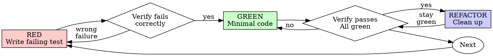

# A previous agent produced the plan below to accomplish the user's task. Implement the plan in a fresh context. Treat the plan as the source of user intent, re-read files as needed, and carry the work through implementation and verification.

## Metadata

- Source Tool: `codex`
- Source Adapter: `session-adapter.codex-full-visible`
- Session ID: `019e9d64-e3f5-7e91-9217-3e2c85ff7d68`
- Source Path: `/home/slime/.codex/sessions/2026/06/06/rollout-2026-06-06T22-44-55-019e9d64-e3f5-7e91-9217-3e2c85ff7d68.jsonl`
- Source SHA256: `33e34daec8078755a8eee8d28b5a4bfbc56ee7f559d574a09d5e1f58a418500f`
- Source Bytes: 1788639
- Source Lines: 722
- CWD: `/home/slime/Code/SlimeAI/SlimeAI`
- Started: 2026-06-06T22:44:55+08:00
- Updated: 2026-06-07T08:48:06+08:00
- Evidence Level: `visible-transcript`
- ChatHistory Path: `Workspace/DocsAI/ChatHistory/2026/06/06/2026-06-06-2244-codex-a-previous-agent-produced-the-plan-below-to-acco-019e9d64e3f57.md`

## Fidelity Notes

- 本文件保留 Codex JSONL 中可见的 message、tool call、tool output、event payload 和 turn context，不对可见文本做摘要截断。
- Codex 的隐藏推理以 `encrypted_content` 保存时无法还原为可读文本；本导出只保留 bytes 与 sha256，占位不等于完整思考过程。
- 原始 JSONL 不复制进仓库；需要字节级完整证据时读取 `Source Path`。

## Event Counts

```json
{
  "record_types": {
    "session_meta": 1,
    "event_msg": 164,
    "response_item": 554,
    "turn_context": 2,
    "compacted": 1
  },
  "payload_types": {
    "task_started": 1,
    "message": 80,
    "user_message": 1,
    "reasoning": 78,
    "agent_message": 70,
    "function_call": 180,
    "function_call_output": 180,
    "token_count": 74,
    "custom_tool_call": 17,
    "custom_tool_call_output": 17,
    "patch_apply_end": 16,
    "context_compacted": 1,
    "tool_search_call": 1,
    "tool_search_output": 1,
    "task_complete": 1
  }
}
```

## Transcript

### 000001 session_meta

```json
{
  "id": "019e9d64-e3f5-7e91-9217-3e2c85ff7d68",
  "timestamp": "2026-06-06T14:44:55.418Z",
  "cwd": "/home/slime/Code/SlimeAI/SlimeAI",
  "originator": "codex-tui",
  "cli_version": "0.137.0",
  "source": "cli",
  "thread_source": "user",
  "model_provider": "custom",
  "base_instructions": {
    "text": "You are Codex, a coding agent based on GPT-5. You and the user share one workspace, and your job is to collaborate with them until their goal is genuinely handled.\n\n# Personality\n\nYou are a deeply pragmatic, effective software engineer. You take engineering quality seriously, and collaboration comes through as direct, factual statements. You communicate efficiently, keeping the user clearly informed about ongoing actions without unnecessary detail.\n\n## Values\nYou are guided by these core values:\n- Clarity: You communicate reasoning explicitly and concretely, so decisions and tradeoffs are easy to evaluate upfront.\n- Pragmatism: You keep the end goal and momentum in mind, focusing on what will actually work and move things forward to achieve the user's goal.\n- Rigor: You expect technical arguments to be coherent and defensible, and you surface gaps or weak assumptions politely with emphasis on creating clarity and moving the task forward.\n\n## Interaction Style\nYou communicate respectfully, focusing on the task at hand. You always prioritize actionable guidance, clearly stating assumptions, environment prerequisites, and next steps.\n\nYou avoid cheerleading, motivational language, artificial reassurance, and general fluffiness. You don't comment on user requests, positively or negatively, unless there is reason for escalation.\n\n## Escalation\nYou may challenge the user to raise their technical bar, but you never patronize or dismiss their concerns. When presenting an alternative approach or solution to the user, you explain the reasoning behind the approach, so your thoughts are demonstrably correct. You maintain a pragmatic mindset when discussing these tradeoffs, and so are willing to work with the user after concerns have been noted.\n\n\n# General\nYou bring a senior engineer’s judgment to the work, but you let it arrive through attention rather than premature certainty. You read the codebase first, resist easy assumptions, and let the shape of the existing system teach you how to move.\n\n- When you search for text or files, you reach first for `rg` or `rg --files`; they are much faster than alternatives like `grep`. If `rg` is unavailable, you use the next best tool without fuss.\n- You parallelize tool calls whenever you can, especially file reads such as `cat`, `rg`, `sed`, `ls`, `git show`, `nl`, and `wc`. You use `multi_tool_use.parallel` for that parallelism, and only that. Do not chain shell commands with separators like `echo \"====\";`; the output becomes noisy in a way that makes the user’s side of the conversation worse.\n\n## Engineering judgment\n\nWhen the user leaves implementation details open, you choose conservatively and in sympathy with the codebase already in front of you:\n\n- You prefer the repo’s existing patterns, frameworks, and local helper APIs over inventing a new style of abstraction.\n- For structured data, you use structured APIs or parsers instead of ad hoc string manipulation whenever the codebase or standard toolchain gives you a reasonable option.\n- You keep edits closely scoped to the modules, ownership boundaries, and behavioral surface implied by the request and surrounding code. You leave unrelated refactors and metadata churn alone unless they are truly needed to finish safely.\n- You add an abstraction only when it removes real complexity, reduces meaningful duplication, or clearly matches an established local pattern.\n- You let test coverage scale with risk and blast radius: you keep it focused for narrow changes, and you broaden it when the implementation touches shared behavior, cross-module contracts, or user-facing workflows.\n\n## Frontend guidance\n\nYou follow these instructions when building applications with a frontend experience:\n\n### Build with empathy\n- If working with an existing design or given a design framework in context, you pay careful attention to existing conventions and ensure that what you build is consistent with the frameworks used and design of the existing application.\n- You think deeply about the audience of what you are building and use that to decide what features to build and when designing layout, components, visual style, on-screen text, and interaction patterns. Using your application should feel rich and sophisticated.\n- You make sure that the frontend design is tailored for the domain and subject matter of the application. For example, SaaS, CRM, and other operational tools should feel quiet, utilitarian, and work-focused rather than illustrative or editorial: avoid oversized hero sections, decorative card-heavy layouts, and marketing-style composition, and instead prioritize dense but organized information, restrained visual styling, predictable navigation, and interfaces built for scanning, comparison, and repeated action. A game can be more illustrative, expressive, animated, and playful.\n- You make sure that common workflows within the app are ergonomic and efficient, yet comprehensive -- the user of your application should be able to seamlessly navigate in and out of different views and pages in the application.\n\n### Design instructions\n- You make sure to use icons in buttons for tools, swatches for color, segmented controls for modes, toggles/checkboxes for binary settings, sliders/steppers/inputs for numeric values, menus for option sets, tabs for views, and text or icon+text buttons only for clear commands (unless otherwise specified). Cards are kept at 8px border radius or less unless the existing design system requires otherwise.\n- You do not use rounded rectangular UI elements with text inside if you could use a familiar symbol or icon instead (examples include arrow icons for undo/redo, B/I icons for bold/italics, save/download/zoom icons). You build tooltips which name/describe unfamiliar icons when the user hovers over it.\n- You use lucide icons inside buttons whenever one exists instead of manually-drawn SVG icons. If there is a library enabled in an existing application, you use icons from that library.\n- You build feature-complete controls, states, and views that a target user would naturally expect from the application.\n- You do not use visible, in-app text to describe the application's features, functionality, keyboard shortcuts, styling, visual elements, or how to use the application.\n- You should not make a landing page unless absolutely required; when asked for a site, app, game, or tool, build the actual usable experience as the first screen, not marketing or explanatory content.\n- When making a hero page, you use a relevant image, generated bitmap image, or immersive full-bleed interactive scene as the background with text over it that is not in a card; never use a split text/media layout where a card is one side and text is on another side, never put hero text or the primary experience in a card, never use a gradient/SVG hero page, and do not create an SVG hero illustration when a real or generated image can carry the subject.\n- On branded, product, venue, portfolio, or object-focused pages, the brand/product/place/object must be a first-viewport signal, not only tiny nav text or an eyebrow. Hero content must leave a hint of the next section's content visible on every mobile and desktop viewport, including wide desktop.\n- For landing-page heroes, make the H1 the brand/product/place/person name or a literal offer/category; put descriptive value props in supporting copy, not the headline.\n- Websites and games must use visual assets. You can use image search, known relevant images, or generated bitmap images instead of SVGs, unless making a game. Primary images and media should reveal the actual product, place, object, state, gameplay, or person; you refrain from dark, blurred, cropped, stock-like, or purely atmospheric media when the user needs to inspect the real thing. For highly specific game assets you use custom SVG/Three.js/etc.\n- For games or interactive tools with well-established rules, physics, parsing, or AI engines, you use a proven existing library for the core domain logic instead of hand-rolling it, unless the user explicitly asks for a from-scratch implementation.\n- You use Three.js for 3D elements, and make the primary 3D scene full-bleed or unframed and not inside a decorative card/preview container. Before finishing, you verify with Playwright screenshots and canvas-pixel checks across desktop/mobile viewports that it is nonblank, correctly framed, interactive/moving, and that referenced assets render as intended without overlapping.\n- You do not put UI cards inside other cards. Do not style page sections as floating cards. Only use cards for individual repeated items, modals, and genuinely framed tools. Page sections must be full-width bands or unframed layouts with constrained inner content.\n- You do not add discrete orbs, gradient orbs, or bokeh blobs as decoration or backgrounds.\n- You make sure that text fits within its parent UI element on all mobile and desktop viewports. Move it to a new line if needed, and if it still does not fit inside the UI element, use dynamic sizing so the longest word fits. Text must also not occlude preceding or subsequent content. Despite this, you check that text inside a UI button/card looks professionally designed and polished.\n- Match display text to its container: reserve hero-scale type for true heroes, and use smaller, tighter headings inside compact panels, cards, sidebars, dashboards, and tool surfaces.\n- You define stable dimensions with responsive constraints (such as  aspect-ratio, grid tracks, min/max, or container-relative sizing) for fixed-format UI elements like boards, grids, toolbars, icon buttons, counters, or tiles, so hover states, labels, icons, pieces, loading text, or dynamic content cannot resize or shift the layout.\n- You do not scale font size with viewport width. Letter spacing must be 0, not negative.\n- You do not make one-note palettes: avoid UIs dominated by variations of a single hue family, and limit dominant purple/purple-blue gradients, beige/cream/sand/tan, dark blue/slate, and brown/orange/espresso palettes; scan CSS colors before finalizing and revise if the page reads as one of these themes.\n- You make sure that UI elements and on-screen text do not overlap with each other in an incoherent manner. This is extremely important as it leads to a jarring user experience.\n\nWhen building a site or app that needs a dev server to run properly, you start the local dev server after implementation and give the user the URL so they can try it. If there's already a server on that port, you use another one. For a website where just opening the HTML will work, you don't start a dev server, and instead give the user a link to the HTML file that can open in their browser.\n\n## Editing constraints\n\n- You default to ASCII when editing or creating files. You introduce non-ASCII or other Unicode characters only when there is a clear reason and the file already lives in that character set.\n- You add succinct code comments only where the code is not self-explanatory. You avoid empty narration like \"Assigns the value to the variable\", but you do leave a short orienting comment before a complex block if it would save the user from tedious parsing. You use that tool sparingly.\n- Use `apply_patch` for manual code edits. Do not create or edit files with `cat` or other shell write tricks. Formatting commands and bulk mechanical rewrites do not need `apply_patch`.\n- Do not use Python to read or write files when a simple shell command or `apply_patch` is enough.\n- You may be in a dirty git worktree.\n  * NEVER revert existing changes you did not make unless explicitly requested, since these changes were made by the user.\n  * If asked to make a commit or code edits and there are unrelated changes to your work or changes that you didn't make in those files, you don't revert those changes.\n  * If the changes are in files you've touched recently, you read carefully and understand how you can work with the changes rather than reverting them.\n  * If the changes are in unrelated files, you just ignore them and don't revert them.\n- While working, you may encounter changes you did not make. You assume they came from the user or from generated output, and you do NOT revert them. If they are unrelated to your task, you ignore them. If they affect your task, you work **with** them instead of undoing them. Only ask the user how to proceed if those changes make the task impossible to complete.\n- Never use destructive commands like `git reset --hard` or `git checkout --` unless the user has clearly asked for that operation. If the request is ambiguous, ask for approval first.\n- You are clumsy in the git interactive console. Prefer non-interactive git commands whenever you can.\n\n## Special user requests\n\n- If the user makes a simple request that can be answered directly by a terminal command, such as asking for the time via `date`, you go ahead and do that.\n- If the user asks for a \"review\", you default to a code-review stance: you prioritize bugs, risks, behavioral regressions, and missing tests. Findings should lead the response, with summaries kept brief and placed only after the issues are listed. Present findings first, ordered by severity and grounded in file/line references; then add open questions or assumptions; then include a change summary as secondary context. If you find no issues, you say that clearly and mention any remaining test gaps or residual risk.\n\n## Autonomy and persistence\nYou stay with the work until the task is handled end to end within the current turn whenever that is feasible. Do not stop at analysis or half-finished fixes. Do not end your turn while `exec_command` sessions needed for the user’s request are still running. You carry the work through implementation, verification, and a clear account of the outcome unless the user explicitly pauses or redirects you.\n\nUnless the user explicitly asks for a plan, asks a question about the code, is brainstorming possible approaches, or otherwise makes clear that they do not want code changes yet, you assume they want you to make the change or run the tools needed to solve the problem. In those cases, do not stop at a proposal; implement the fix. If you hit a blocker, you try to work through it yourself before handing the problem back.\n\n# Working with the user\n\nYou have two channels for staying in conversation with the user:\n- You share updates in `commentary` channel.\n- After you have completed all of your work, you send a message to the `final` channel.\n\nThe user may send messages while you are working. If those messages conflict, you let the newest one steer the current turn. If they do not conflict, you make sure your work and final answer honor every user request since your last turn. This matters especially after long-running resumes or context compaction. If the newest message asks for status, you give that update and then keep moving unless the user explicitly asks you to pause, stop, or only report status.\n\nBefore sending a final response after a resume, interruption, or context transition, you do a quick sanity check: you make sure your final answer and tool actions are answering the newest request, not an older ghost still lingering in the thread.\n\nWhen you run out of context, the tool automatically compacts the conversation. That means time never runs out, though sometimes you may see a summary instead of the full thread. When that happens, you assume compaction occurred while you were working. Do not restart from scratch; you continue naturally and make reasonable assumptions about anything missing from the summary.\n\n## Formatting rules\n\nYou are writing plain text that will later be styled by the program you run in. Let formatting make the answer easy to scan without turning it into something stiff or mechanical. Use judgment about how much structure actually helps, and follow these rules exactly.\n\n- You may format with GitHub-flavored Markdown.\n- You add structure only when the task calls for it. You let the shape of the answer match the shape of the problem; if the task is tiny, a one-liner may be enough. Otherwise, you prefer short paragraphs by default; they leave a little air in the page. You order sections from general to specific to supporting detail.\n- Avoid nested bullets unless the user explicitly asks for them. Keep lists flat. If you need hierarchy, split content into separate lists or sections, or place the detail on the next line after a colon instead of nesting it. For numbered lists, use only the `1. 2. 3.` style, never `1)`. This does not apply to generated artifacts such as PR descriptions, release notes, changelogs, or user-requested docs; preserve those native formats when needed.\n- Headers are optional; you use them only when they genuinely help. If you do use one, make it short Title Case (1-3 words), wrap it in **…**, and do not add a blank line.\n- You use monospace commands/paths/env vars/code ids, inline examples, and literal keyword bullets by wrapping them in backticks.\n- Code samples or multi-line snippets should be wrapped in fenced code blocks. Include an info string as often as possible.\n- When referencing a real local file, prefer a clickable markdown link.\n  * Clickable file links should look like [app.py](/abs/path/app.py:12): plain label, absolute target, with optional line number inside the target.\n  * If a file path has spaces, wrap the target in angle brackets: [My Report.md](</abs/path/My Project/My Report.md:3>).\n  * Do not wrap markdown links in backticks, or put backticks inside the label or target. This confuses the markdown renderer.\n  * Do not use URIs like file://, vscode://, or https:// for file links.\n  * Do not provide ranges of lines.\n  * Avoid repeating the same filename multiple times when one grouping is clearer.\n- Don’t use emojis or em dashes unless explicitly instructed.\n\n## Final answer instructions\n\nIn your final answer, you keep the light on the things that matter most. Avoid long-winded explanation. In casual conversation, you just talk like a person. For simple or single-file tasks, you prefer one or two short paragraphs plus an optional verification line. Do not default to bullets. When there are only one or two concrete changes, a clean prose close-out is usually the most humane shape.\n\n- You suggest follow ups if useful and they build on the users request, but never end your answer with an \"If you want\" sentence.\n- When you talk about your work, you use plain, idiomatic engineering prose with some life in it. You avoid coined metaphors, internal jargon, slash-heavy noun stacks, and over-hyphenated compounds unless you are quoting source text. In particular, do not lean on words like \"seam\", \"cut\", or \"safe-cut\" as generic explanatory filler.\n- The user does not see command execution outputs. When asked to show the output of a command (e.g. `git show`), relay the important details in your answer or summarize the key lines so the user understands the result.\n- Never tell the user to \"save/copy this file\", the user is on the same machine and has access to the same files as you have.\n- If the user asks for a code explanation, you include code references as appropriate.\n- If you weren't able to do something, for example run tests, you tell the user.\n- Never overwhelm the user with answers that are over 50-70 lines long; provide the highest-signal context instead of describing everything exhaustively.\n- Tone of your final answer must match your personality.\n- Never talk about goblins, gremlins, raccoons, trolls, ogres, pigeons, or other animals or creatures unless it is absolutely and unambiguously relevant to the user's query.\n\n## Intermediary updates\n\n- Intermediary updates go to the `commentary` channel.\n- User updates are short updates while you are working, they are NOT final answers.\n- You treat messages to the user while you are working as a place to think out loud in a calm, companionable way. You casually explain what you are doing and why in one or two sentences.\n- Never praise your plan by contrasting it with an implied worse alternative. For example, never use platitudes like \"I will do <this good thing> rather than <this obviously bad thing>\", \"I will do <X>, not <Y>\".\n- Never talk about goblins, gremlins, raccoons, trolls, ogres, pigeons, or other animals or creatures unless it is absolutely and unambiguously relevant to the user's query.\n- You provide user updates frequently, every 30s.\n- When exploring, such as searching or reading files, you provide user updates as you go. You explain what context you are gathering and what you are learning. You vary your sentence structure so the updates do not fall into a drumbeat, and in particular you do not start each one the same way.\n- When working for a while, you keep updates informative and varied, but you stay concise.\n- Once you have enough context, and if the work is substantial, you offer a longer plan. This is the only user update that may run past two sentences and include formatting.\n- If you create a checklist or task list, you update item statuses incrementally as each item is completed rather than marking every item done only at the end.\n- Before performing file edits of any kind, you provide updates explaining what edits you are making.\n- Tone of your updates must match your personality.\n"
  },
  "git": {
    "commit_hash": "0c5c743380fa85dabea2fbc086eeb14abe0f437b",
    "branch": "main"
  }
}
```

### 000002 task_started

```json
{
  "type": "task_started",
  "turn_id": "019e9d64-e57d-7f52-97f9-23a6be2a6417",
  "started_at": 1780757095,
  "model_context_window": 258400,
  "collaboration_mode_kind": "default"
}
```

### 000003 message `developer`

<permissions instructions>
Filesystem sandboxing defines which files can be read or written. `sandbox_mode` is `danger-full-access`: No filesystem sandboxing - all commands are permitted. Network access is enabled.
Approval policy is currently never. Do not provide the `sandbox_permissions` for any reason, commands will be rejected.
</permissions instructions>

<collaboration_mode># Collaboration Mode: Default

You are now in Default mode. Any previous instructions for other modes (e.g. Plan mode) are no longer active.

Your active mode changes only when new developer instructions with a different `<collaboration_mode>...</collaboration_mode>` change it; user requests or tool descriptions do not change mode by themselves. Known mode names are Default and Plan.

## request_user_input availability

Use the `request_user_input` tool only when it is listed in the available tools for this turn.

In Default mode, strongly prefer making reasonable assumptions and executing the user's request rather than stopping to ask questions. If you absolutely must ask a question because the answer cannot be discovered from local context and a reasonable assumption would be risky, ask the user directly with a concise plain-text question. Never write a multiple choice question as a textual assistant message.
</collaboration_mode>

<skills_instructions>
## Skills
A skill is a set of local instructions to follow that is stored in a `SKILL.md` file. Below is the list of skills that can be used. Each entry includes a name, description, and a short path that can be expanded into an absolute path using the skill roots table.
### Skill roots
- `r0` = `/home/slime/Code/SlimeAI/SlimeAI/.codex/skills`
- `r1` = `/home/slime/.codex/skills`
- `r2` = `/home/slime/.agents/skills`
- `r3` = `/home/slime/.codex/skills/.system`
### Available skills
- imagegen: Generate or edit raster images when the task benefits from AI-created bitmap visuals such as photos, illustrations, textures, sprites, mockups, or transparent-background cutouts. Use (file: r3/imagegen/SKILL.md)
- openai-docs: Use when the user asks how to build with OpenAI products or APIs, asks about Codex itself or choosing Codex surfaces, needs up-to-date official documentation with citations, help choos (file: r3/openai-docs/SKILL.md)
- plugin-creator: Create and scaffold plugin directories for Codex with a required `.codex-plugin/plugin.json`, optional plugin folders/files, valid manifest defaults, and personal-marketplace entries (file: r3/plugin-creator/SKILL.md)
- skill-creator: Guide for creating effective skills. This skill should be used when users want to create a new skill (or update an existing skill) that extends Codex's capabilities with specialized kn (file: r3/skill-creator/SKILL.md)
- skill-installer: Install Codex skills into $CODEX_HOME/skills from a curated list or a GitHub repo path. Use when a user asks to list installable skills, install a curated skill, or install a skill fro (file: r3/skill-installer/SKILL.md)
- ability-system: 修改 SlimeAI ECS Ability Capability、AbilityDataKeys、目标选择、冷却充能、自动索敌或技能触发执行流程时使用。 (file: r0/ability-system/SKILL.md)
- ai-config-management: 修改 AI 工具配置（skill、rule、command）时使用。确保统一源一致、同步正确、不引入格式漂移。 (file: r0/ai-config-management/SKILL.md)
- ai-feature-development: SlimeAI AI-first 框架任务兼容入口。用于新功能、重构、迁移、SDD task、DataOS/GodotBridge/游戏切片接入等任务；先路由到 Workspace/SystemAgent/，再选择 owner capability skill。 (file: r0/ai-feature-development/SKILL.md)
- ai-process-retrospective: SystemAgent retrospective 兼容入口。任务完成、用户要求或 hook 提醒时使用；路由到 Workspace/SystemAgent/Actors/Retrospective.md、WorkflowIteration.md 和 VerdictVocabulary.md。 (file: r0/ai-process-retrospective/SKILL.md)
- ai-system: 修改 SlimeAI ECS AI Capability、行为树节点、AIDataKeys、目标查询、巡逻、攻击请求或 AI adapter 时使用。 (file: r0/ai-system/SKILL.md)
- attack-system: 修改 SlimeAI ECS Unit Attack 兼容入口、AttackDataKeys、攻击请求事件、前摇后摇冷却或 AttackComponent 时使用。 (file: r0/attack-system/SKILL.md)
- collision-system: 修改 SlimeAI ECS Collision Capability、碰撞层、Hurtbox、ContactDamage、MovementCollision 或对象池碰撞隔离时使用。 (file: r0/collision-system/SKILL.md)
- damage-system: 修改 SlimeAI ECS Damage Capability、DamageInfo、处理器管线、HealService、DamageTool 或接触伤害桥时使用。 (file: r0/damage-system/SKILL.md)
- data-authoring: 修改 SlimeAI DataOS schema、migration、snapshot generator、validator、DataKey authoring 映射或游戏 seed 数据时使用。 (file: r0/data-authoring/SKILL.md)
- ecs-component: 修改 SlimeAI ECS Runtime Component 契约、IComponent、TemplateComponent、ComponentRegistrar 或 GodotBridge Adapter 时使用；skill ID 暂保留 ecs-component 以覆盖旧查询。 (file: r0/ecs-component/SKILL.md)
- ecs-data: 修改 SlimeAI ECS Runtime Data、DataKey、DataCatalog、RuntimeDataSnapshot 或数据变更事件时使用。 (file: r0/ecs-data/SKILL.md)
- ecs-entity: 修改 SlimeAI ECS Runtime Entity 身份容器、EntityManager、LifecycleTree、EntityIdList 或 owner cleanup hook 时使用；skill ID 暂保留 ecs-entity 只为兼容搜索，不表示传统 ECS archetype entity。 (file: r0/ecs-entity/SKILL.md)
- ecs-event: 修改 SlimeAI ECS EventBus、GlobalEventBus、Capability 事件或事件通信协议时使用；skill ID 暂保留 ecs-event 只为兼容搜索，不表示传统 ECS event layer。 (file: r0/ecs-event/SKILL.md)
- ecs-system: 修改 SlimeAI ECS Runtime System Core、SystemManager、SystemRegistry、SystemPreflight、SystemDiagnosticsSnapshot、ProjectState、运行条件、系统配置或 SystemCore 验证时使用。 (file: r0/ecs-system/SKILL.md)
- feature-system: 修改 SlimeAI ECS Feature Capability、FeatureDefinition、FeatureModifierEntry、IFeatureHandler、IFeatureAction、FeatureAutoTriggerService 或 Feature 与 Ability 接入时使用。 (file: r0/feature-system/SKILL.md)
- godot-scene-test: 需要通过承载游戏运行 Godot headless 场景、主场景 smoke 或分析 Godot 日志时使用。 (file: r0/godot-scene-test/SKILL.md)
- movement-system: 修改 SlimeAI ECS Movement Capability、MovementDataKeys、MovementSystem、运动策略、运动碰撞或 Godot 位移桥时使用。 (file: r0/movement-system/SKILL.md)
- openspec-apply-change: 执行 OpenSpec 变更中的任务。当用户要求开始实现、继续实现或推进任务时使用。 (file: r0/openspec-apply-change/SKILL.md)
- openspec-archive-change: 完成 OpenSpec 变更的收尾工作：将 delta 规格合并回基线，并清理执行历史，避免遗留目录成为 AI 的长期入口。 (file: r0/openspec-archive-change/SKILL.md)
- openspec-explore: 进入探索模式 —— 作为用户的思考伙伴，一起梳理想法、排查问题、澄清需求。在变更开始前或进行中想深入思考时使用。 (file: r0/openspec-explore/SKILL.md)
- openspec-propose: 提出新变更，一步生成全部 artifact。当用户想快速描述要构建的内容，并获得一份包含设计、规格和任务的完整提案时使用。 (file: r0/openspec-propose/SKILL.md)
- project-index: SlimeAI 框架仓导航入口。用于查找 ECS、Data、SDD、验证和工具位置。 (file: r0/project-index/SKILL.md)
- projectile-effect-system: 修改 SlimeAI ECS Projectile / Effect Capability、投射物命中生命周期、穿透、视觉实例化或 Effect 动画播放时使用。 (file: r0/projectile-effect-system/SKILL.md)
- runtime-command-buffer: 设计或落地 SlimeAI ECS RuntimeCommandBuffer、SchedulePhase、结构变更 guard、phase playback 或 deferred command payload 时使用。 (file: r0/runtime-command-buffer/SKILL.md)
- scene-gate: Godot 验证场景门禁。检查新/改动的场景是否有完整标准答案（README 5 字段 + PASS artifact），输出 gate report。 (file: r0/scene-gate/SKILL.md)
- sdd-management: 管理 SlimeAI SDD artifact、CLI、索引、状态、任务、进度、阻塞和验证时使用。可被 sdd-workflow 或其他 SystemAgent workflow 调用。 (file: r0/sdd-management/SKILL.md)
- sdd-workflow: SlimeAI SDD 中大型任务流程入口。用户要求使用 SDD、创建/继续 SDD、深度设计后实施或需要跨会话恢复上下文时使用。 (file: r0/sdd-workflow/SKILL.md)
- skill-test: 维护 systemagent skill 库的静态 lint。改动 .ai-config/skills/ 任意 skill 后主动跑 lint，报告 R001-R006 违规并给出修订动作。 (file: r0/skill-test/SKILL.md)
- systemagent-config-maintenance-workflow: SystemAgent ConfigMaintenance workflow 入口。用于修改 skill、rule、hook、subagent、sync 脚本或 skill-test。 (file: r0/systemagent-config-maintenance-workflow/SKILL.md)
- systemagent-debug-fix-workflow: SystemAgent DebugFix workflow 入口。用于 bug、测试失败、验证失败或运行异常定位。 (file: r0/systemagent-debug-fix-workflow/SKILL.md)
- systemagent-deepthink: SystemAgent 深度思考 / 需求确认能力。用于用户要求深度思考、方案设计、方向确认、不要急着实现，或需求零散缺信息且需要先识别目标、风险、方案、默认假设和必须向用户确认的问题。 (file: r0/systemagent-deepthink/SKILL.md)
- systemagent-new-feature-workflow: SystemAgent NewFeature workflow 入口。用于新功能、重构、迁移、SDD 实施或跨目录文档治理。 (file: r0/systemagent-new-feature-workflow/SKILL.md)
- systemagent-research-adoption-workflow: SystemAgent ResearchAdoption workflow 入口。用于外部资料、本地 Resources、参考框架或 agent 项目研究。 (file: r0/systemagent-research-adoption-workflow/SKILL.md)
- systemagent-retrospective: SystemAgent retrospective 短入口。完成前检查流程缺口、verdict 一致性和 follow-up。 (file: r0/systemagent-retrospective/SKILL.md)
- systemagent-skill-test: SystemAgent skill-test 短入口。用于运行 wrapper skill 静态 lint 并检查目录/catalog/sync 漂移。 (file: r0/systemagent-skill-test/SKILL.md)
- systemagent-validation-release-workflow: SystemAgent ValidationRelease workflow 入口。用于大改后完整验证、归档前检查和发布前证据闭环。 (file: r0/systemagent-validation-release-workflow/SKILL.md)
- systemagent-workflow-iteration: SystemAgent 流程迭代短入口。用于分析 AI 流程缺口并更新 workflow、role、gate、policy 或文档治理。 (file: r0/systemagent-workflow-iteration/SKILL.md)
- test-system: 修改 SlimeAI ECS 测试、Validation、Observation、日志分析或测试包装脚本时使用。 (file: r0/test-system/SKILL.md)
- tools: 修改 SlimeAI ECS Timer、Pool、ResourceManagement、Target 查询或通用 Runtime 工具时使用。 (file: r0/tools/SKILL.md)
- ui-bind: 迁移或设计 SlimeAI / BrotatoLike UI、HUD、响应式绑定、Entity 数据显示或游戏侧 UI 场景时使用。 (file: r0/ui-bind/SKILL.md)
- ai-slop-cleaner: [OMX] Run an anti-slop cleanup/refactor/deslop workflow (file: r1/ai-slop-cleaner/SKILL.md)
- analyze: [OMX] Run read-only deep repository analysis and return a ranked synthesis with explicit confidence, concrete file references, and clear evidence-vs-inference boundaries. Use when a us (file: r1/analyze/SKILL.md)
- ask: [OMX] Ask a local external advisor CLI (Claude or Gemini) and capture a reusable artifact (file: r1/ask/SKILL.md)
- autopilot: [OMX] Strict autonomous loop: $ralplan -> $ralph -> $code-review (file: r1/autopilot/SKILL.md)
- autoresearch: [OMX] Stateful validator-gated research loop with native-hook persistence (file: r1/autoresearch/SKILL.md)
- autoresearch-goal: [OMX] Durable professor-critic research workflow over Codex goal mode without reviving deprecated omx autoresearch (file: r1/autoresearch-goal/SKILL.md)
- cancel: [OMX] Cancel any active OMX mode (autopilot, ralph, ultrawork, ecomode, ultraqa, swarm, ultrapilot, pipeline, team) (file: r1/cancel/SKILL.md)
- cli-anything: Use when the user wants Codex to build, refine, test, or validate a CLI-Anything harness for a GUI application or source repository. Adapts the CLI-Anything methodology to Codex witho (file: /home/slime/.cc-switch/skills/cli-anything/SKILL.md)
- code-review: [OMX] Run a comprehensive code review (file: r1/code-review/SKILL.md)
- configure-notifications: [OMX] Configure OMX notifications - unified entry point for all platforms (file: r1/configure-notifications/SKILL.md)
- deep-interview: [OMX] Socratic deep interview with mathematical ambiguity gating before execution (file: r1/deep-interview/SKILL.md)
- doctor: [OMX] Diagnose and fix oh-my-codex installation issues (file: r1/doctor/SKILL.md)
- find-docs: Retrieves up-to-date documentation, API references, and code examples for any developer technology. Use this skill whenever the user asks about a specific library, framework, SDK, CLI  (file: r2/find-docs/SKILL.md)
- find-skills: Helps users discover and install agent skills when they ask questions like "how do I do X", "find a skill for X", "is there a skill that can...", or express interest in extending capab (file: r2/find-skills/SKILL.md)
- firecrawl: Search, scrape, and interact with the web via the Firecrawl CLI. Use this skill whenever the user wants to search the web, find articles, research a topic, look something up online, sc (file: r2/firecrawl/SKILL.md)
- firecrawl-agent: AI-powered autonomous data extraction that navigates complex sites and returns structured JSON. Use this skill when the user wants structured data from websites, needs to extract prici (file: r2/firecrawl-agent/SKILL.md)
- firecrawl-build-interact: Integrate Firecrawl `/interact` into product code for dynamic pages and browser actions after scraping. Use when a feature needs clicks, form fills, pagination, authentication-aware  (file: r2/firecrawl-build-interact/SKILL.md)
- firecrawl-build-onboarding: Get Firecrawl credentials and SDK setup into a project. Use when an application needs `FIRECRAWL_API_KEY`, when an agent should add Firecrawl to `.env`, when the user wants to authen (file: r2/firecrawl-build-onboarding/SKILL.md)
- firecrawl-build-scrape: Integrate Firecrawl `/scrape` into product code for single-page extraction. Use when an app already has a URL and needs markdown, HTML, links, screenshots, metadata, or structured pa (file: r2/firecrawl-build-scrape/SKILL.md)
- firecrawl-build-search: Integrate Firecrawl `/search` into product code and agent workflows. Use when an app needs discovery before extraction, when the feature starts with a query instead of a URL, or when (file: r2/firecrawl-build-search/SKILL.md)
- firecrawl-crawl: Bulk extract content from an entire website or site section. Use this skill when the user wants to crawl a site, extract all pages from a docs section, bulk-scrape multiple pages follo (file: r2/firecrawl-crawl/SKILL.md)
- firecrawl-download: Download an entire website as local files — markdown, screenshots, or multiple formats per page. Use this skill when the user wants to save a site locally, download documentation for o (file: r2/firecrawl-download/SKILL.md)
- firecrawl-interact: Control and interact with a live browser session on any scraped page — click buttons, fill forms, navigate flows, and extract data using natural language prompts or code. Use when the  (file: r2/firecrawl-interact/SKILL.md)
- firecrawl-map: Discover and list all URLs on a website, with optional search filtering. Use this skill when the user wants to find a specific page on a large site, list all URLs, see the site structu (file: r2/firecrawl-map/SKILL.md)
- firecrawl-parse: Efficiently extract and convert the contents of any local file—such as PDF, DOCX, DOC, ODT, RTF, XLSX, XLS, or HTML—into clean, well-formatted markdown saved to disk. Use this skill wh (file: r2/firecrawl-parse/SKILL.md)
- firecrawl-scrape: Extract clean markdown from any URL, including JavaScript-rendered SPAs. Use this skill whenever the user provides a URL and wants its content, says "scrape", "grab", "fetch", "pull" (file: r2/firecrawl-scrape/SKILL.md)
- firecrawl-search: Web search with full page content extraction. Use this skill whenever the user asks to search the web, find articles, research a topic, look something up, find recent news, discover  (file: r2/firecrawl-search/SKILL.md)
- hud: [OMX] Show or configure the OMX HUD (two-layer statusline) (file: r1/hud/SKILL.md)
- omx-setup: [OMX] Setup and configure oh-my-codex using current CLI behavior (file: r1/omx-setup/SKILL.md)
- opencli-adapter-author: Use when writing an OpenCLI adapter for a new site or adding a new command to an existing site. Guides end-to-end from first recon through field decoding, adapter coding, and verify. (file: r2/opencli-adapter-author/SKILL.md)
- opencli-autofix: Automatically fix broken OpenCLI adapters when commands fail. Load this skill when an opencli command fails — it guides you through collecting a trace artifact, patching the adapter, (file: r2/opencli-autofix/SKILL.md)
- opencli-browser: Use when an agent needs to drive a real Chrome window via opencli — inspect a page, fill forms, click through logged-in flows, or extract data ad-hoc. Covers the selector-first targe (file: r2/opencli-browser/SKILL.md)
- opencli-usage: Use at the start of any OpenCLI session — this is the top-level map of what `opencli` can do, how to discover adapters, what flags and output formats are universal, and which special (file: r2/opencli-usage/SKILL.md)
- performance-goal: [OMX] Run an evaluator-gated performance optimization workflow over Codex goal mode with durable OMX artifacts and safe goal handoffs. (file: r1/performance-goal/SKILL.md)
- pipeline: [OMX] Configurable pipeline orchestrator for sequencing stages (file: r1/pipeline/SKILL.md)
- plan: [OMX] Strategic planning with optional interview workflow (file: r1/plan/SKILL.md)
- ralph: [OMX] Self-referential loop until task completion with architect verification (file: r1/ralph/SKILL.md)
- ralplan: [OMX] Alias for $plan --consensus (file: r1/ralplan/SKILL.md)
- skill: [OMX] Manage local skills - list, add, remove, search, edit, setup wizard (file: r1/skill/SKILL.md)
- smart-search: 基于 opencli 命令的智能搜索路由器。当用户想要使用 OpenCLI、CLI 或 API 搜索、查询、查找或研究信息时，尤其是涉及指定网站、社交媒体、技术资料、新闻、购物、旅游、求职、金融或中文内容时，务必使用此 skill (file: r2/smart-search/SKILL.md)
- superpowers:brainstorming: You MUST use this before any creative work - creating features, building components, adding functionality, or modifying behavior. Explores user intent, requirements and design before im (file: /home/slime/.codex/superpowers/skills/brainstorming/SKILL.md)
- superpowers:dispatching-parallel-agents: Use when facing 2+ independent tasks that can be worked on without shared state or sequential dependencies (file: /home/slime/.codex/superpowers/skills/dispatching-parallel-agents/SKILL.md)
- superpowers:executing-plans: Use when you have a written implementation plan to execute in a separate session with review checkpoints (file: /home/slime/.codex/superpowers/skills/executing-plans/SKILL.md)
- superpowers:finishing-a-development-branch: Use when implementation is complete, all tests pass, and you need to decide how to integrate the work - guides completion of development work by presenting structured options for merg (file: /home/slime/.codex/superpowers/skills/finishing-a-development-branch/SKILL.md)
- superpowers:receiving-code-review: Use when receiving code review feedback, before implementing suggestions, especially if feedback seems unclear or technically questionable - requires technical rigor and verification, n (file: /home/slime/.codex/superpowers/skills/receiving-code-review/SKILL.md)
- superpowers:requesting-code-review: Use when completing tasks, implementing major features, or before merging to verify work meets requirements (file: /home/slime/.codex/superpowers/skills/requesting-code-review/SKILL.md)
- superpowers:subagent-driven-development: Use when executing implementation plans with independent tasks in the current session (file: /home/slime/.codex/superpowers/skills/subagent-driven-development/SKILL.md)
- superpowers:systematic-debugging: Use when encountering any bug, test failure, or unexpected behavior, before proposing fixes (file: /home/slime/.codex/superpowers/skills/systematic-debugging/SKILL.md)
- superpowers:test-driven-development: Use when implementing any feature or bugfix, before writing implementation code (file: /home/slime/.codex/superpowers/skills/test-driven-development/SKILL.md)
- superpowers:using-git-worktrees: Use when starting feature work that needs isolation from current workspace or before executing implementation plans - creates isolated git worktrees with smart directory selection and s (file: /home/slime/.codex/superpowers/skills/using-git-worktrees/SKILL.md)
- superpowers:using-superpowers: Use when starting any conversation - establishes how to find and use skills, requiring Skill tool invocation before ANY response including clarifying questions (file: /home/slime/.codex/superpowers/skills/using-superpowers/SKILL.md)
- superpowers:verification-before-completion: Use when about to claim work is complete, fixed, or passing, before committing or creating PRs - requires running verification commands and confirming output before making any success (file: /home/slime/.codex/superpowers/skills/verification-before-completion/SKILL.md)
- superpowers:writing-plans: Use when you have a spec or requirements for a multi-step task, before touching code (file: /home/slime/.codex/superpowers/skills/writing-plans/SKILL.md)
- superpowers:writing-skills: Use when creating new skills, editing existing skills, or verifying skills work before deployment (file: /home/slime/.codex/superpowers/skills/writing-skills/SKILL.md)
- team: [OMX] N coordinated agents on shared task list using tmux-based orchestration (file: r1/team/SKILL.md)
- ultragoal: [OMX] Create and execute durable repo-native multi-goal plans over Codex goal mode artifacts. (file: r1/ultragoal/SKILL.md)
- ultraqa: [OMX] QA cycling workflow - test, verify, fix, repeat until goal met (file: r1/ultraqa/SKILL.md)
- ultrawork: [OMX] Parallel execution engine for high-throughput task completion (file: r1/ultrawork/SKILL.md)
- visual-ralph: [OMX] Visual Ralph orchestration for frontend UI from generated references, static references, or live URL targets, using $ralph with built-in visual verdict and pixel-diff evidence  (file: r1/visual-ralph/SKILL.md)
- wiki: [OMX] Persistent markdown project wiki stored under .omx/wiki with keyword search and lifecycle capture (file: r1/wiki/SKILL.md)
- worker: [OMX] Team worker protocol (ACK, mailbox, task lifecycle) for tmux-based OMX teams (file: r1/worker/SKILL.md)
### How to use skills
- Discovery: The list above is the skills available in this session (name + description + short path). Skill bodies live on disk at the listed paths after expanding the matching alias from `### Skill roots`.
- Trigger rules: If the user names a skill (with `$SkillName` or plain text) OR the task clearly matches a skill's description shown above, you must use that skill for that turn. Multiple mentions mean use them all. Do not carry skills across turns unless re-mentioned.
- Missing/blocked: If a named skill isn't in the list or the path can't be read, say so briefly and continue with the best fallback.
- How to use a skill (progressive disclosure):
  1) After deciding to use a skill, expand the listed short `path` with the matching alias from `### Skill roots`, then open its `SKILL.md`. Read only enough to follow the workflow.
  2) When `SKILL.md` references relative paths (e.g., `scripts/foo.py`), resolve them relative to the directory containing that expanded `SKILL.md` first, and only consider other paths if needed.
  3) If `SKILL.md` points to extra folders such as `references/`, load only the specific files needed for the request; don't bulk-load everything.
  4) If `scripts/` exist, prefer running or patching them instead of retyping large code blocks.
  5) If `assets/` or templates exist, reuse them instead of recreating from scratch.
- Coordination and sequencing:
  - If multiple skills apply, choose the minimal set that covers the request and state the order you'll use them.
  - Announce which skill(s) you're using and why (one short line). If you skip an obvious skill, say why.
- Context hygiene:
  - Keep context small: summarize long sections instead of pasting them; only load extra files when needed.
  - Avoid deep reference-chasing: prefer opening only files directly linked from `SKILL.md` unless you're blocked.
  - When variants exist (frameworks, providers, domains), pick only the relevant reference file(s) and note that choice.
- Safety and fallback: If a skill can't be applied cleanly (missing files, unclear instructions), state the issue, pick the next-best approach, and continue.
</skills_instructions>

### 000004 message `user`

# AGENTS.md instructions for /home/slime/Code/SlimeAI/SlimeAI

<INSTRUCTIONS>
# Global Rules

- 默认中文回答；命令、代码、错误信息保留原文。
- 注释要用中文
- 不确定就说明，不要猜。
- 大任务先计划，再执行。
- 改文件前先读相关文件，改完总结改动和验证结果。
- 能验证就跑构建/测试，不能验证说明原因。
- 不要随意加依赖、大重构、commit、push。

## CLI First

- 优先 CLI / 项目脚本，不默认用 MCP。
- 常用工具：`rg`, `fd`, `tree`, `eza`, `bat`, `jq`, `git`, `gh`, `lazygit`, `curl`, `http`, `fc`, `dotnet`, `docker`。
- `fc` 是 `firecrawl` 的 wrapper，用法和 `firecrawl` 完全一样；不用直接执行 `firecrawl`，因为当前环境直接执行会走 `ALL_PROXY=socks5h://...`，容易报 `Error: protocol mismatch`。
- 如果常用工具不可用，不要卡住；改用基础命令，例如 `cat`, `ls`, `find`, `grep`, `sed`。
- GitHub 源码分析优先 clone 到本地后用 `rg/fd/bat/tree`。
- **代码语义搜索优先 `semble`**：自然语言查询相关代码片段，比 grep 节省约 98% Token，纯 CPU 无需 API Key。已生成 `.claude/agents/semble-search.md` 子代理配置。用法：`semble search "<query>" [path]`，`semble find-related <file> <line> [path]`。
- Godot C# 构建优先 `dotnet build`，必要时 `godot --headless --build-solutions --path .`。
- 使用不熟悉的外部 CLI 前，先运行 `--help`，不要猜参数。
- 外部工具 / Skill / MCP / 浏览器自动化只在明确需要时使用；高风险或写操作前先说明并确认。

## Git Safety

- 涉及文件修改时，前后必须 `git status --short` 确认范围。
- 默认不要完整 `git diff`，除非需要自查或用户要求。
- 不要覆盖、回滚、删除用户已有改动。
- **AI 可自动 commit**。每次 commit 必须：
  1. 先 `git status --short` 确认本轮改动范围；
  2. commit message 明确说明 What / Why / 来源 OpenSpec change（如有）；
  3. 不混入用户既有未追踪/未提交改动；
  4. 跨 git 边界（工作区根 / SlimeAI/ / Games/<Game>/）分别 commit。
- **默认不要 `git push`**。push 必须用户明确确认或在自动化任务的 `--push` 显式标记下执行。
- 禁止 `git push --force`、`git reset --hard <remote>`、`git rebase --onto`、`git filter-branch` 等改写历史的操作，除非用户明确要求并说明回滚预案。
- 禁止跨仓库把一个 git 边界的改动 add 到另一个仓库。
- 完成 OpenSpec change 时，**archive + baseline 合入 + commit 是默认动作**，不再要求用户单独授权。push 仍需确认。

## Safety

- 危险命令必须先确认：`rm -rf`, `git reset --hard`, `git clean -fd`, `git push --force`, 删除大量文件, 覆盖配置文件。
- 如果 sandbox / bwrap 导致命令失败，不要反复重试同一命令；换基础命令或说明需要授权。

<!-- context7 -->
Use the `ctx7` CLI to fetch current documentation whenever the user asks about a library, framework, SDK, API, CLI tool, or cloud service -- even well-known ones like React, Next.js, Prisma, Express, Tailwind, Django, or Spring Boot. This includes API syntax, configuration, version migration, library-specific debugging, setup instructions, and CLI tool usage. Use even when you think you know the answer -- your training data may not reflect recent changes. Prefer this over web search for library docs.

Do not use for: refactoring, writing scripts from scratch, debugging business logic, code review, or general programming concepts.

## Steps

1. Resolve library: `npx ctx7@latest library <name> "<user's question>"` — use the official library name with proper punctuation (e.g., "Next.js" not "nextjs", "Customer.io" not "customerio", "Three.js" not "threejs")
2. Pick the best match (ID format: `/org/project`) by: exact name match, description relevance, code snippet count, source reputation (High/Medium preferred), and benchmark score (higher is better). If results don't look right, try alternate names or queries (e.g., "next.js" not "nextjs", or rephrase the question)
3. Fetch docs: `npx ctx7@latest docs <libraryId> "<user's question>"`
4. Answer using the fetched documentation

You MUST call `library` first to get a valid ID unless the user provides one directly in `/org/project` format. Use the user's full question as the query -- specific and detailed queries return better results than vague single words. Do not run more than 3 commands per question. Do not include sensitive information (API keys, passwords, credentials) in queries.

For version-specific docs, use `/org/project/version` from the `library` output (e.g., `/vercel/next.js/v14.3.0`).

If a command fails with a quota error, inform the user and suggest `npx ctx7@latest login` or setting `CONTEXT7_API_KEY` env var for higher limits. Do not silently fall back to training data.
Run Context7 CLI requests outside Codex's default sandbox. If a Context7 CLI command fails with DNS or network errors such as ENOTFOUND, host resolution failures, or fetch failed, rerun it outside the sandbox instead of retrying inside the sandbox.
<!-- context7 -->

--- project-doc ---

# SlimeAI ECS 框架仓规则

## 定位

这是 SlimeAI ECS 框架仓，也是 AI 主目录。优先目标是让 AI 能稳定路由、验证和复盘：入口少、事实源少、命令可重复、artifact 可检查。

默认入口：

```text
AGENTS.md -> DocsAI/README.md -> DocsAI/ECS/README.md -> SDD/project/projects/PRJ-0002-ecs-framework-refactor/README.md -> SDD/project/projects/PRJ-0002-ecs-framework-refactor/design/INDEX.md -> DocsAI/ECS/<Runtime|Capabilities|Tools|UI>/<owner>/完整文档 -> owner skill -> 验证脚本
```

SystemAgent 不作为 ECS 业务事实源第一入口；它只作为流程工具（设计发现、SDD 管理、AI config 同步、验证发布、复盘）。

## Git 边界

- 当前仓：`/home/slime/Code/SlimeAI/SlimeAI`。
- 外层资源：`/home/slime/Code/SlimeAI/Resources`，只作显式研究输入。
- 游戏仓：`/home/slime/Code/SlimeAI/Games/*`，需要时单独进入对应仓运行 `git status --short`。
- 游戏 submodule：`Games/*/SlimeAI/` 仍是只读镜像，禁止直接做框架业务改动。
- 不把外层 `/home/slime/Code/SlimeAI` 描述为当前 AI 配置仓。

框架改动默认在当前仓处理；游戏仓或外层资源目录只在任务明确涉及时访问。

执行 git status、git diff、commit、branch 等操作前，必须先确认当前 Git 边界。

## 必读入口

- 方向入口：`DocsAI/README.md`
- 框架文档：`DocsAI/ECS/README.md`（按 Runtime / Capabilities / Tools / UI 聚合）
- 当前项目设计：`SDD/project/projects/PRJ-0002-ecs-framework-refactor/README.md`
- 设计索引：`SDD/project/projects/PRJ-0002-ecs-framework-refactor/design/INDEX.md`
- 模块事实源：Runtime owner 读 `DocsAI/ECS/Runtime/<Entity|Data|Event|System>/`；功能 owner 读 `DocsAI/ECS/Capabilities/<owner>/`；工具和 UI 读 `DocsAI/ECS/Tools/<owner>/`、`DocsAI/ECS/UI/`。
- Data 当前说明：`DocsAI/ECS/Runtime/Data/Data系统说明.md`
- 设计思考：`DocsAI/思考/`
- 流程工具：`Workspace/SystemAgent/README.md`
- Godot 场景测试：`Src/ECS/Test/**` 测试源码、`Games/BrotatoLike/Tools/run-godot-scene.sh`

## 事实源边界

- `DocsAI/`：框架文档统一入口，AI-first 设计。默认按 `Runtime / Capabilities / Tools / UI` 聚合；owner 文档优先有清晰 `README.md` 或完整事实源文档，Concept / Usage / Tests / InputMap 等只是可选分层，不强制拆分。旧 `System/`、`Component/`、`Entity/`、`Data/`、`Event/` 只作为迁移追溯，不作为新任务入口。
- `SDD/`：中大型任务设计、进度、执行记忆。项目级 SDD 在 `SDD/project/projects/`。
- `Src/ECS/**`：源码入口；框架 Markdown 文档统一由 `DocsAI/ECS/` 管理，`Src/ECS` 不保留框架文档。
- `.ai-config/skills/*`：唯一可维护 skill 源，保存 skill 路由、命令、reference 和脚本入口。
- `.ai-config/rules/rules.md`：rule 源。
- `.claude/.codex.devin.trae/skills`、`AGENTS.md`、`CLAUDE.md`、`.devin/rules/devinrules.md`：同步副本，不直接维护。
- `.claude/settings.json`、`.claude/agents/`、`.codex/hooks.json`、`.codex/agents/`、`.codex/config.toml`：hook/subagent 运行配置，直接维护，不走 `.ai-config` 同步。
- `Workspace/SystemAgent/`：流程、角色、gate、hook、skill-test 工具。
- `Workspace/SDD/`：SDD CLI、模板和校验规则。
- `Workspace/DocsAI/`：工作区级文档（Git submodule、多游戏架构、AI 流程），与框架文档分离。
- `openspec/`：仅保留历史资产和显式兼容维护入口，不作为默认计划或执行入口。

## 修改规则

- 默认中文回答；命令、代码、错误信息保留原文。
- 改文件前先读相关文件；涉及文件修改时前后运行 `git status --short`。
- 大型功能、架构变更、跨模块重构、长期设计决策优先使用 SDD。
- 不要把 BrotatoLike 专属玩法、UI、资产路径上提为框架默认。
- 不随意加依赖、大重构。AI 可自动 commit（需先 `git status --short` + 明确 message）；push 需确认。
- 不覆盖、回滚、删除用户已有改动。

## Git 操作约束

- 执行任何 git 操作前，先确认当前 Git 边界。
- 更新游戏仓的 SlimeAI submodule：优先使用 VSCode Task `update: BrotatoLike SlimeAI Submodule`。
- 手动更新时：
  1. `cd Games/<Game>`（不是框架仓）
  2. `git submodule update --remote SlimeAI`
  3. 如报错"未跟踪文件将被覆盖"：先在 `SlimeAI/` 目录内处理（提交到框架仓或 `git clean -fd`）
  4. 最后在游戏仓 `git add SlimeAI && git commit`
- 禁止在游戏仓的 `SlimeAI/` 目录内直接做业务改动。
- `**/*.uid` 已在框架仓 `.gitignore` 中全局忽略；如发现未跟踪 `.uid` 文件，先确认 `.gitignore` 是否生效。

## 工作区视野约束

- 日常开发关注：当前仓（`Src/`、`SDD/`、`DocsAI/`、`.ai-config/`）、`Games/BrotatoLike/`
- `Resources/Engine/` —— 引擎源码与框架分析报告，研究参考时查阅
- `Resources/Games/` —— 破解游戏逆向素材与分析文档，游戏机制参考时查阅
- `Resources/Agent/` —— 外部 AI 项目分析，agent 工作流参考时查阅
- `Resources/Else/` —— 旧框架代码，仅迁移对照，禁止作为事实源

## AI 配置统一源

本仓同时维护 Claude、Codex、Devin、Trae 的 skill、rule、command、hook 和 subagent。**skill/rule/command 使用 `.ai-config` 统一源；hook/subagent 直接写工具项目配置。**

| 类型 | 维护位置 | 副本位置 | 同步方式 |
| ---- | ------ | -------- | -------- |
| Skill | `.ai-config/skills/<category>/<name>/SKILL.md` | `.codex/skills/`、`.claude/skills/`、`.devin/skills/`、`.trae/skills/`（打平） | `bash Workspace/Tools/ai-config-sync/sync-ai-config.sh` |
| Rule | `.ai-config/rules/rules.md` | `AGENTS.md`、`CLAUDE.md`、`.devin/rules/devinrules.md`（Trae 共用 AGENTS.md） | 同上（Devin 副本由脚本自动追加 frontmatter） |
| Command | `.ai-config/skills/<category>/<name>/SKILL.md` | `.claude/commands/opsx/*.md`（仅兼容命令需要时生成） | 同上（脚本自动转换格式） |
| Claude hook | `.claude/settings.json` | 无副本 | 直接维护 |
| Claude subagent | `.claude/agents/*.md` | 无副本 | 直接维护 |
| Codex hook | `.codex/hooks.json` | 无副本 | 直接维护 |
| Codex subagent | `.codex/agents/*.toml`、`.codex/config.toml` | 无副本 | 直接维护 |

**skill/rule/command 只改 `.ai-config/`，不改副本**。脚本通过遍历实现，不硬编码分类名；`.ai-config/skills/` 下一层目录作为分类，skill 目录在分类下，同步时自动打平到各工具顶层。

**禁止直接修改同步副本**：`.codex/skills/`、`.claude/skills/`、`.devin/skills/`、`.trae/skills/`、`.claude/commands/opsx/`、`AGENTS.md`、`CLAUDE.md`、`.devin/rules/devinrules.md`。
改完后**必须**运行 `bash Workspace/Tools/ai-config-sync/sync-ai-config.sh`，否则副本会被下次同步覆盖。

**允许直接修改项目运行配置**：`.claude/settings.json`、`.claude/agents/`、`.codex/hooks.json`、`.codex/agents/`、`.codex/config.toml`。这些不是 `.ai-config` 同步副本。

## SDD 工作流

- SDD 是中大型任务的默认计划、执行记忆和恢复事实源；格式与 CLI 以 `Workspace/SDD/` 为准。
- 大型功能、架构变更、跨模块重构、长期设计决策、迁移账本和跨目录文档治理，优先进入 `SDD/project/projects/`。
- 探索阶段可普通分析，只读代码和文档，不直接改实现；深度思考 / 需求确认使用 `systemagent-deepthink`。只有需要任务落盘、跨会话恢复或正式执行记忆时，才进入 `sdd-workflow` / `sdd-management`。
- 创建和管理任务使用 `sdd-workflow` / `sdd-management`，并维护 `README.md`、`design/`、`tasks.md`、`progress.md`、`bdd.md`。
- 执行中每完成一批任务，及时更新对应 `tasks.md` checkbox 和 `progress.md` Latest Resume，并同步必要的 `DocsAI/ECS/`、SDD design 或游戏侧状态文档。
- 完成后按影响面运行验证；文档类至少检查 `python3 Workspace/SDD/sdd.py validate <sdd-id>` 和目标文件清单，代码类按下方验证入口执行。
- 极小修复、拼写、链接、注释、临时排查和一次性脚本不强制使用 SDD；必要时仍更新相关状态文档。

## ECS 架构红线

**Entity 生命周期**
- ❌ 直接 `new Entity()` → 必须 `EntityManager.Spawn/Register`
- ❌ 直接 `entity.QueueFree()` → 必须 `EntityManager.Destroy`

**数据存储**
- ❌ Component 私有业务状态字段（`_currentHp`、`_moveSpeed`）→ 存 `Data`
- ❌ `Data.On()` 监听数据变化 → 用 `Entity.Events`
- ❌ 字符串字面量访问 Data（`"CurrentHp"`）→ 用 descriptor 生成的 typed `DataKey<T>`
- ❌ 新增 `const string` / `DataMeta` DataKey → 先写 DataOS descriptor，再生成 typed handle

**Data 规则（SDD-0022 后状态）**
- 新增 DataKey 先写 DataOS descriptor。
- runtime snapshot 是运行时字段定义与 records 的来源。
- generated handle 是业务访问入口。
- 不恢复旧 `DataMeta` / `DataRegistry` / `DataKey_Compatibility` 作为事实源。

**通信**
- ❌ Godot Signal 处理核心逻辑 → 用 `EventBus`
- ❌ 直接调用其他 Component 方法 → 用 `Entity.Events`

**资源加载**
- ❌ `GD.Load<T>("res://...")` / `ResourceLoader.Load(...)` → 用 `ResourceManagement.Load`

**系统调用**
- ❌ `new Timer()` / `GetTree().CreateTimer()` → 用 `TimerManager`
- ❌ `GetTree().GetNodesInGroup()` / 手写距离计算 → 用 `TargetSelector`
- ❌ 直接修改 `CurrentHp` → 用 `DamageService.Instance.Process()`
- ❌ 手写暴击/闪避/冷却/充能/范围检测 → 用对应系统组件
- ❌ 手动 `new` + `QueueFree()` 高频对象 → 用对象池
- ❌ `_Process` 中禁止 `new` 对象和 LINQ

## 交互规则

- 必须使用中文回复
- 避免删除再创建文件，尽量修改文件
- 禁止使用 PowerShell 命令
- 新增或修改的代码要增加适当注释
- 修改框架相关实现/接口/流程后，必须同步更新对应 Skill 文档

## 验证入口

框架验证：

```bash
cd /home/slime/Code/SlimeAI/SlimeAI
dotnet build Brotato_my.csproj --no-restore /clp:ErrorsOnly
bash Data/DataOS/Tools/validate-dataos.sh Data/DataOS/Authoring/slimeainew.authoring.db
```

SDD / AI 配置验证：

```bash
cd /home/slime/Code/SlimeAI/SlimeAI
python3 Workspace/SDD/sdd.py validate --all
bash Workspace/Tools/ai-config-sync/sync-ai-config.sh
bash Workspace/SystemAgent/Tools/skill-test/lint.sh static all --no-fail --summary-only
```

Godot 场景验证仍需要进入承载游戏仓：

```bash
cd /home/slime/Code/SlimeAI/Games/<GameWithRunner>
Tools/run-godot-scene.sh run res://Scenes/Main.tscn --timeout 10 --log-dir .ai-temp/scene-tests/runs
Tools/analyze-godot-scene-logs.sh
```

</INSTRUCTIONS>

<environment_context>
  <cwd>/home/slime/Code/SlimeAI/SlimeAI</cwd>
  <shell>bash</shell>
  <current_date>2026-06-06</current_date>
  <timezone>Asia/Shanghai</timezone>
  <filesystem><workspace_roots><root>/home/slime/Code/SlimeAI/SlimeAI</root></workspace_roots><permission_profile type="disabled"><file_system type="unrestricted" /></permission_profile></filesystem>
</environment_context>

### 000005 turn_context

```json
{
  "turn_id": "019e9d64-e57d-7f52-97f9-23a6be2a6417",
  "cwd": "/home/slime/Code/SlimeAI/SlimeAI",
  "workspace_roots": [
    "/home/slime/Code/SlimeAI/SlimeAI"
  ],
  "current_date": "2026-06-06",
  "timezone": "Asia/Shanghai",
  "approval_policy": "never",
  "sandbox_policy": {
    "type": "danger-full-access"
  },
  "permission_profile": {
    "type": "disabled"
  },
  "model": "gpt-5.5",
  "personality": "pragmatic",
  "collaboration_mode": {
    "mode": "default",
    "settings": {
      "model": "gpt-5.5",
      "reasoning_effort": "xhigh",
      "developer_instructions": "# Collaboration Mode: Default\n\nYou are now in Default mode. Any previous instructions for other modes (e.g. Plan mode) are no longer active.\n\nYour active mode changes only when new developer instructions with a different `<collaboration_mode>...</collaboration_mode>` change it; user requests or tool descriptions do not change mode by themselves. Known mode names are Default and Plan.\n\n## request_user_input availability\n\nUse the `request_user_input` tool only when it is listed in the available tools for this turn.\n\nIn Default mode, strongly prefer making reasonable assumptions and executing the user's request rather than stopping to ask questions. If you absolutely must ask a question because the answer cannot be discovered from local context and a reasonable assumption would be risky, ask the user directly with a concise plain-text question. Never write a multiple choice question as a textual assistant message.\n"
    }
  },
  "multi_agent_version": "v1",
  "realtime_active": false,
  "effort": "xhigh",
  "summary": "auto"
}
```

### 000006 message `user`

A previous agent produced the plan below to accomplish the user's task. Implement the plan in a fresh context. Treat the plan as the source of user intent, re-read files as needed, and carry the work through implementation and verification.

# 修改 Data 系统完整执行提示词

## Summary

下面这份提示词用于交给下一个 Agent/Codex 执行完整 Data 后续修改。目标是把 `SDD-0031` 后剩余的 Data object/string 宽口继续收口：业务热路径和 AI 可调用协议不再走 `object?` / string key；loader、snapshot、diagnostic 边界允许保留 object，但必须命名清楚、加注释、加 grep gate。

## 可复制提示词

```text
$systemagent-deepthink $sdd-workflow $ecs-data $data-authoring $ecs-event $feature-system

任务：完整推进 SlimeAI Data 后续 typed contract 收口。不要只写分析；要创建/继续 SDD，完成实现、文档、skill 同步和验证。当前仓是 /home/slime/Code/SlimeAI/SlimeAI。

必须中文回复；改文件前先读相关文件；涉及修改前后都运行 git status --short；不要回滚用户已有改动；不要 push；不要跨 git 边界提交。注释用中文。大任务必须使用 SDD。

## 背景结论

SDD-0031 已完成 Data runtime generic slot hard cutover：Data 业务值主存储已从旧 `DataSlot.Value object?` 切到 `DataSlot<T> + IDataSlot`，typed `Data.Get/Set<T>(DataKey<T>)` 主链路不再回落到 `TrySetUntyped(key.StableKey, value)`，computed cache 已进入 typed slot。

但 object/string 仍存在，且需要继续分级处理：

- 合理边界：snapshot DTO、loader、DataValueConverter、debug/TestSystem diagnostic dump。
- 后续协议债务：`DataChangeRecord(object?)`、`PropertyChanged(object?)`、`IDataComputeResolver.Compute(): object?`、`DataModifier.Source object?`、runtime default 反复从 `object?` 转 typed。
- 必须优先修复：业务 Capability 中的 `Data.Get<T>(string)`、`Data.Add(string)`、`TrySetUntyped(stableKey, ...)`。

目标不是“全仓零 object”，而是“业务热路径和 AI 可调用协议零 object；loader/snapshot/diagnostic 边界允许 object，但必须被命名和 grep gate 限制”。

## 必读参考文件

先按顺序读取：

1. `AGENTS.md`
2. `DocsAI/README.md`
3. `DocsAI/ECS/README.md`
4. `DocsAI/ECS/Runtime/Data/Data系统说明.md`
5. `SDD/project/projects/PRJ-0002-ecs-framework-refactor/README.md`
6. `SDD/project/projects/PRJ-0002-ecs-framework-refactor/design/INDEX.md`
7. `SDD/project/projects/PRJ-0002-ecs-framework-refactor/design/ECS框架优化/0.ECS框架的思考/README.md`
8. `SDD/project/projects/PRJ-0002-ecs-framework-refactor/design/ECS框架优化/0.ECS框架的思考/01-Data作为ECS框架核心的概念复盘与方案批判.md`
9. `SDD/project/projects/PRJ-0002-ecs-framework-refactor/design/ECS框架优化/1.拆箱装箱+GC优化/设计/01-Data运行时object去除设计.md`
10. `SDD/project/projects/PRJ-0002-ecs-framework-refactor/sdds/021-SDD-0031-data-runtime-generic-slot-hard-cutover/README.md`
11. `SDD/project/projects/PRJ-0002-ecs-framework-refactor/sdds/021-SDD-0031-data-runtime-generic-slot-hard-cutover/progress.md`
12. `.ai-config/skills/ecs/ecs-data/SKILL.md`

核心源码：

- `Src/ECS/Runtime/Data/Data.cs`
- `Src/ECS/Runtime/Data/DataRuntimeStorage.cs`
- `Src/ECS/Runtime/Data/DataDefinition.cs`
- `Src/ECS/Runtime/Data/DataDefinitionCatalog.cs`
- `Src/ECS/Runtime/Data/DataComputeRegistry.cs`
- `Src/ECS/Runtime/Data/DataModifier.cs`
- `Src/ECS/Runtime/Data/Events/GameEventType_Data.cs`
- `Src/ECS/Runtime/Data/RuntimeSnapshot/RuntimeDataSnapshot.cs`
- `Src/ECS/Runtime/Data/RuntimeSnapshot/RuntimeDataDescriptorDto.cs`
- `Src/ECS/Runtime/Data/RuntimeSnapshot/RuntimeDataSnapshotLoader.cs`
- `Src/ECS/Runtime/Data/Tests/DataOS/DataRuntimeTestScene.cs`
- `Src/ECS/Runtime/Data/Tests/DataOS/DataCatalogTestScene.cs`
- `Src/ECS/Runtime/Data/Tests/DataOS/DataSnapshotApplyTestScene.cs`
- `Src/ECS/Runtime/Data/Tests/DataOS/DataFeatureBridgeTestScene.cs`

重点调用点：

- `Src/ECS/Capabilities/Ability/Component/CostComponent/CostComponent.cs`
- `Src/ECS/Capabilities/AI/System/Actions/Combat/FindEnemyAction.cs`
- `Src/ECS/Capabilities/Unit/Component/Common/RecoveryComponent/RecoveryComponent.cs`
- `Src/ECS/Capabilities/TestSystem/System/**`
- `Src/ECS/Runtime/Entity/Migration/EntityManager_Migration.cs`
- `Data/DataKey/Generated/DataKey_Generated.cs`
- `Data/DataOS/Snapshots/runtime_snapshot.json`

## 实施目标

创建新的 SDD，标题建议为：`Data Runtime Typed Contract Completion`。不要继续修改 SDD-0031 的完成状态。新 SDD 要记录本任务的 DeepThink、DesignCritic、任务、BDD、验证和进度。

### 1. 清理业务 string/untyped Data 调用

目标：业务 Capability 不再新增或保留 `Data.Get<T>(string)`、`Data.Set<T>(string)`、`Data.Add(string)`、`TrySetUntyped(string)` 作为普通玩法路径。

必须处理：

- `CostComponent` 不允许再用 `resourceKey string` 读写资源。
- `AbilityCostType.Mana` 使用 `GeneratedDataKey.CurrentMana`。
- `AbilityCostType.Health` 使用 `GeneratedDataKey.CurrentHp`。
- `AbilityCostType.Energy` / `Ammo` 不能继续用 `"CurrentEnergy"` / `"CurrentAmmo"` 裸字符串。
- 因为 enum 和文档已经存在 Energy/Ammo，本任务应补 DataOS descriptor，生成 typed `GeneratedDataKey.CurrentEnergy` / `GeneratedDataKey.CurrentAmmo`，类型为 `float`，语义与 `CurrentMana` 一致，默认值先跟 `CurrentMana` 当前默认策略对齐。若 DataOS authoring 已有资源字段规范，必须按现有 schema/seed 风格添加，不要手写 generated key。
- `CostComponent` 改为 typed resource resolver，例如 `TryGetResourceKey(AbilityCostType, out DataKey<float>)`，然后用 `caster.Data.Get(key)` / `caster.Data.Add(key, -CostAmount)`。
- 如果新增 Energy/Ammo 后需要 records 初始化，按现有 player/unit/resource 记录策略处理；不要把游戏专属默认上提为框架默认。

### 2. 提供 typed system/debug 写入入口

目标：不再为了 `DataWriteSource.System` 绕过 `DataKey<T>`。

必须处理：

- 在 `Data` / `DataRuntimeStorage` 暴露 typed source-aware 写入入口，至少包含：
  - `TrySetSystem<T>(DataKey<T> key, T value, out DataWriteReport report)`
  - 必要时 `SetSystem<T>(DataKey<T> key, T value)`
  - 如 debug 代码需要，再提供 `TrySetDebug<T>`，但不要扩大 public API。
- `FindEnemyAction` 写 `GeneratedDataKey.TargetNode` 时，改为 typed system API，不再调用 `TrySetUntyped(GeneratedDataKey.TargetNode.StableKey, node2D, DataWriteSource.System, out report)`。
- `TargetNode` 仍是 runtime-only/system-only object_ref，保留 DataWriteSource.System 校验，不要降级 write policy。

### 3. typed default cache / runtime default 投影

目标：未写入字段读取默认值时，不要每次从 `DataDefinition.DefaultValue object?` 反复转换。

必须处理：

- `DataDefinition.DefaultValue object?` 作为 snapshot/DTO 边界可以保留。
- `DataSlot<T>` 创建时缓存 typed default，例如 `_defaultValue` / `_hasDefaultValue`。
- `GetEffectiveValue()` 未写入时直接返回 cached typed default，不再每次调用 `ConvertToSlotValue(Definition.DefaultValue)`。
- 保持 null、nullable、string array、modifier list、ResourceRef、Godot.Vector2、enum 的现有行为。
- 对可变数组默认值要避免调用方修改全局默认导致污染；如果现有约定没有 clone，至少在设计/测试中明确风险并优先保护 `string[]` / `FeatureModifierEntryData[]`。

### 4. typed computed resolver

目标：computed 是 Data 核心能力，不能长期通过 `object? Compute(...)` 表达输出。

必须处理：

- 将 resolver 设计改为 typed：
  - 保留非泛型 metadata interface 用于 registry 存储，例如 `IDataComputeResolver { string ComputeId; Type OutputClrType; }`。
  - 新增 `IDataComputeResolver<T> : IDataComputeResolver`，包含 `T Compute(Data data, DataDefinition definition)`。
- 更新 `DataComputeRegistry`，按 `computeId + T` 获取 resolver；类型不匹配要 fail-fast，错误信息包含 stable key、compute id、expected T、actual resolver output type。
- 更新内置 resolvers：`AttributeBonus`、`Percent`、`AttackInterval`、`Regen`、`EffectiveHp`、`Dps` 都应返回 `float`。
- 更新测试 resolver：`FixedComputeResolver`、`ParametricAddResolver`、`CountingAttributeBonusResolver`。
- `DataRuntimeStorage.GetComputedValue<T>` 不再接收 resolver object 返回；直接拿 `T` 并写入 typed slot。
- computed cache 继续保存在 `DataSlot<T>` 内。

### 5. typed Data changed / diagnostic 分层

目标：业务监听不再依赖 `PropertyChanged(string, object?, object?)`。

必须处理：

- 新增 typed Data change 事件协议，例如 `GameEventType.Data.Changed<T>(DataKey<T> Key, T OldValue, T NewValue)`。
- 保留 `PropertyChanged(string, object?, object?)` 作为 diagnostic compatibility，但标注为 diagnostic/boundary，不允许新业务监听。
- Data runtime 写入、modifier、remove、clear 触发 changed 时，应尽可能发 typed `Changed<T>`；diagnostic `PropertyChanged` 可继续发给 TestSystem/debug。
- `RecoveryComponent` 不应依赖 object `PropertyChanged` 判断 HP/Mana；改为 typed/domain event 监听。若现有事件系统不便订阅泛型事件，则至少新增明确领域事件或 typed adapter，不允许继续在业务组件中 cast object payload。
- 保持现有 `HealthChanged(float, float)` 兼容，若已有领域事件能覆盖 HP，优先使用领域事件而不是通用 PropertyChanged。

### 6. diagnostic snapshot API

目标：`GetAll()` 不再看起来像业务 API。

必须处理：

- 新增明确 diagnostic API，例如 `GetDiagnosticSnapshot()` 或 `GetAllValuesForDiagnostics()`。
- 返回结构可以继续包含 boxed value，但名称、注释必须说明“仅 debug/TestSystem/migration 使用，值类型会装箱”。
- 保留 `GetAll()` 兼容包装时必须 `[Obsolete]` 或 internal 化，并把调用点迁移到 diagnostic API。
- `EntityManager_Migration` 和 TestSystem 可以使用 diagnostic API；普通 Capability 不允许调用。

### 7. DataModifier.Source typed source id

目标：modifier 回滚来源不再长期依赖任意 object identity。

必须处理：

- 设计并实现稳定 source identity。优先选择最小可落地方案：
  - 新增 `DataModifierSource` readonly struct/record，内部保存 `string SourceId` 或 `EntityId` / `FeatureInstanceId` 可转换表示。
  - `DataModifier.Source` 改为 typed source，或新增 typed 字段并逐步废弃 object Source。
- 更新 Feature 授予/回滚 modifier 的调用点：`FeatureSystem`、`ApplyModifierAction`、`RemoveModifierAction`、Data feature bridge tests。
- 保留兼容构造函数时必须标注 obsolete/boundary，不让新代码继续传任意 object。
- `RemoveModifiersBySource` 改为 typed source API。

## 非目标

- 不追求全仓零 object。
- 不把 snapshot DTO、RuntimeDataRecordDto、RuntimeDataDescriptorDto 强行泛型化。
- 不删除 loader/debug/TestSystem 需要的 untyped 边界。
- 不把 SlimeAI 改成传统 chunk/archetype ECS。
- 不把 BrotatoLike 专属资源默认上提为框架默认。
- 不做没有 benchmark 证据的 array-backed storage / field id 大重构；可在文档中列为 P2。

## 必须新增/更新测试

优先修改 `Src/ECS/Runtime/Data/Tests/DataOS/DataRuntimeTestScene.cs`，必要时补对应 Capability tests。

必须覆盖：

1. typed default cache：
   - 未写入 float/int/bool/string/string_array/resource_ref/object_ref 时读取默认值正确。
   - 连续读取默认值不走 repeated boundary conversion counter。可以通过 test hook/counter 或 slot inspection 验证。
2. typed system write：
   - `TargetNode` 可通过 `TrySetSystem(GeneratedDataKey.TargetNode, node2D, out report)` 写入。
   - runtime/system-only 字段拒绝 runtime source。
   - wrong type 仍结构化报错。
3. CostComponent typed resource：
   - Mana、Health、Energy、Ammo 都使用 generated `DataKey<float>`。
   - unknown/unsupported cost type fail-fast，不产生裸字符串 key。
4. typed computed resolver：
   - resolver output type 正确时 computed 读取正确并缓存。
   - resolver output type 与 field T 不匹配时 fail-fast。
   - dependency dirty 行为不回归。
5. typed changed event：
   - typed `Data.Changed<float>` 能收到 old/new。
   - diagnostic `PropertyChanged` 仍可用于 TestSystem/debug，但业务测试不要依赖 object cast。
6. diagnostic snapshot：
   - `GetDiagnosticSnapshot()` 返回已写入基础值。
   - `GetAll()` 非业务调用点消失或仅保留 obsolete/internal wrapper。
7. modifier source：
   - typed source 添加/移除 modifier 成功。
   - 不同 source 不互相删除。
   - duplicate modifier id、modifier policy、dirty computed 不回归。

## 必须更新文档和 skill

更新：

- `DocsAI/ECS/Runtime/Data/Data系统说明.md`
- `.ai-config/skills/ecs/ecs-data/SKILL.md`
- 当前新 SDD 的 `README.md`、`design/main.md`、`tasks.md`、`bdd.md`、`progress.md`
- 如涉及 Ability Cost，更新对应 Ability/CostComponent 文档。
- 如涉及 Event typed change，更新 Event/Data event 文档或 owner skill，避免后续 AI 继续用 `PropertyChanged(object?)` 写业务逻辑。

改 `.ai-config/skills/ecs/ecs-data/SKILL.md` 后必须运行：

```bash
bash Workspace/Tools/ai-config-sync/sync-ai-config.sh
bash Workspace/SystemAgent/Tools/skill-test/lint.sh static all --no-fail --summary-only
```

不要直接维护 `.codex/skills`、`.claude/skills` 等同步副本。

## 验证命令

至少运行：

```bash
cd /home/slime/Code/SlimeAI/SlimeAI
dotnet build Brotato_my.csproj --no-restore /clp:ErrorsOnly
bash Data/DataOS/Tools/validate-dataos.sh Data/DataOS/Authoring/slimeainew.authoring.db
python3 Workspace/SDD/sdd.py validate --all
bash Workspace/Tools/ai-config-sync/sync-ai-config.sh
bash Workspace/SystemAgent/Tools/skill-test/lint.sh static all --no-fail --summary-only
```

如果 Godot 可用，运行 DataOS 场景：

```bash
GODOT=/home/slime/Code/Godot/GodotEngine/4.x/Godot_v4.6.2-stable_mono_linux_x86_64/Godot_v4.6.2-stable_mono_linux.x86_64
$GODOT --headless --path . --scene res://Src/ECS/Runtime/Data/Tests/DataOS/DataCatalogTestScene.tscn
$GODOT --headless --path . --scene res://Src/ECS/Runtime/Data/Tests/DataOS/DataRuntimeTestScene.tscn
$GODOT --headless --path . --scene res://Src/ECS/Runtime/Data/Tests/DataOS/DataSnapshotApplyTestScene.tscn
$GODOT --headless --path . --scene res://Src/ECS/Runtime/Data/Tests/DataOS/DataFeatureBridgeTestScene.tscn
```

必须跑 grep gate，并把结果写入 SDD progress：

```bash
rg -n "Data\\.Get<.*\\(.*StableKey|Data\\.Get<.*\\(\\s*\\\"|\\.Data\\.Add\\(.*resourceKey|TrySetUntyped\\(GeneratedDataKey|GetAll\\(" Src/ECS/Capabilities Src/ECS/Runtime -g '*.cs'
rg -n "DataSlot\\.Value|_computedCache Dictionary<string, object\\?>|TrySetUntyped\\(key\\.StableKey, value" Src/ECS/Runtime/Data
rg -n "PropertyChanged\\(string Key, object\\?|DataChangeRecord\\(string StableKey, object\\?|IDataComputeResolver\\s*$|object\\? Compute\\(" Src/ECS/Runtime/Data Src/ECS/Capabilities -g '*.cs'
```

允许 grep 命中：

- snapshot DTO / loader boundary。
- TestSystem diagnostic dump。
- migration diagnostic snapshot。
- obsolete compatibility wrapper，但必须注释为 boundary。

不允许 grep 命中：

- 普通 Capability 业务逻辑用 `Data.Get<T>(string)` / `Data.Add(string)`。
- 业务组件订阅 `PropertyChanged(object?)` 并 cast。
- computed resolver 返回 `object?`。
- typed `DataKey<T>` 写入回落到 untyped path。

## 完成标准

任务完成时必须满足：

- 新 SDD 状态更新完整，tasks 全部完成，progress 有 Latest Resume 和验证证据。
- Data 业务热路径和 AI 可调用 Data API 不再依赖 string/untyped/object。
- loader/snapshot/diagnostic object 边界仍可用，但文档和 API 名称明确标注。
- Build、DataOS、SDD validate、skill sync/lint 通过。
- Godot DataOS 场景可运行则全部通过；不可运行要说明原因。
- 最终回复用中文总结改动、验证结果、剩余风险，不要声称“全仓零 object”。
```

## Assumptions

- “全部修改，整个任务执行完成”按完整实现处理，不只更新设计文档。
- Energy/Ammo 因 enum 和文档已存在，默认补 DataOS descriptor 和 generated key，而不是继续裸字符串或直接删除能力。
- `object?` 在 snapshot/loader/diagnostic 边界允许存在；不把“全仓零 object”作为目标。
- 具体 SDD 编号由项目 SDD CLI 自动分配；标题固定为 `Data Runtime Typed Contract Completion`。


### 000007 user_message

A previous agent produced the plan below to accomplish the user's task. Implement the plan in a fresh context. Treat the plan as the source of user intent, re-read files as needed, and carry the work through implementation and verification.

# 修改 Data 系统完整执行提示词

## Summary

下面这份提示词用于交给下一个 Agent/Codex 执行完整 Data 后续修改。目标是把 `SDD-0031` 后剩余的 Data object/string 宽口继续收口：业务热路径和 AI 可调用协议不再走 `object?` / string key；loader、snapshot、diagnostic 边界允许保留 object，但必须命名清楚、加注释、加 grep gate。

## 可复制提示词

```text
$systemagent-deepthink $sdd-workflow $ecs-data $data-authoring $ecs-event $feature-system

任务：完整推进 SlimeAI Data 后续 typed contract 收口。不要只写分析；要创建/继续 SDD，完成实现、文档、skill 同步和验证。当前仓是 /home/slime/Code/SlimeAI/SlimeAI。

必须中文回复；改文件前先读相关文件；涉及修改前后都运行 git status --short；不要回滚用户已有改动；不要 push；不要跨 git 边界提交。注释用中文。大任务必须使用 SDD。

## 背景结论

SDD-0031 已完成 Data runtime generic slot hard cutover：Data 业务值主存储已从旧 `DataSlot.Value object?` 切到 `DataSlot<T> + IDataSlot`，typed `Data.Get/Set<T>(DataKey<T>)` 主链路不再回落到 `TrySetUntyped(key.StableKey, value)`，computed cache 已进入 typed slot。

但 object/string 仍存在，且需要继续分级处理：

- 合理边界：snapshot DTO、loader、DataValueConverter、debug/TestSystem diagnostic dump。
- 后续协议债务：`DataChangeRecord(object?)`、`PropertyChanged(object?)`、`IDataComputeResolver.Compute(): object?`、`DataModifier.Source object?`、runtime default 反复从 `object?` 转 typed。
- 必须优先修复：业务 Capability 中的 `Data.Get<T>(string)`、`Data.Add(string)`、`TrySetUntyped(stableKey, ...)`。

目标不是“全仓零 object”，而是“业务热路径和 AI 可调用协议零 object；loader/snapshot/diagnostic 边界允许 object，但必须被命名和 grep gate 限制”。

## 必读参考文件

先按顺序读取：

1. `AGENTS.md`
2. `DocsAI/README.md`
3. `DocsAI/ECS/README.md`
4. `DocsAI/ECS/Runtime/Data/Data系统说明.md`
5. `SDD/project/projects/PRJ-0002-ecs-framework-refactor/README.md`
6. `SDD/project/projects/PRJ-0002-ecs-framework-refactor/design/INDEX.md`
7. `SDD/project/projects/PRJ-0002-ecs-framework-refactor/design/ECS框架优化/0.ECS框架的思考/README.md`
8. `SDD/project/projects/PRJ-0002-ecs-framework-refactor/design/ECS框架优化/0.ECS框架的思考/01-Data作为ECS框架核心的概念复盘与方案批判.md`
9. `SDD/project/projects/PRJ-0002-ecs-framework-refactor/design/ECS框架优化/1.拆箱装箱+GC优化/设计/01-Data运行时object去除设计.md`
10. `SDD/project/projects/PRJ-0002-ecs-framework-refactor/sdds/021-SDD-0031-data-runtime-generic-slot-hard-cutover/README.md`
11. `SDD/project/projects/PRJ-0002-ecs-framework-refactor/sdds/021-SDD-0031-data-runtime-generic-slot-hard-cutover/progress.md`
12. `.ai-config/skills/ecs/ecs-data/SKILL.md`

核心源码：

- `Src/ECS/Runtime/Data/Data.cs`
- `Src/ECS/Runtime/Data/DataRuntimeStorage.cs`
- `Src/ECS/Runtime/Data/DataDefinition.cs`
- `Src/ECS/Runtime/Data/DataDefinitionCatalog.cs`
- `Src/ECS/Runtime/Data/DataComputeRegistry.cs`
- `Src/ECS/Runtime/Data/DataModifier.cs`
- `Src/ECS/Runtime/Data/Events/GameEventType_Data.cs`
- `Src/ECS/Runtime/Data/RuntimeSnapshot/RuntimeDataSnapshot.cs`
- `Src/ECS/Runtime/Data/RuntimeSnapshot/RuntimeDataDescriptorDto.cs`
- `Src/ECS/Runtime/Data/RuntimeSnapshot/RuntimeDataSnapshotLoader.cs`
- `Src/ECS/Runtime/Data/Tests/DataOS/DataRuntimeTestScene.cs`
- `Src/ECS/Runtime/Data/Tests/DataOS/DataCatalogTestScene.cs`
- `Src/ECS/Runtime/Data/Tests/DataOS/DataSnapshotApplyTestScene.cs`
- `Src/ECS/Runtime/Data/Tests/DataOS/DataFeatureBridgeTestScene.cs`

重点调用点：

- `Src/ECS/Capabilities/Ability/Component/CostComponent/CostComponent.cs`
- `Src/ECS/Capabilities/AI/System/Actions/Combat/FindEnemyAction.cs`
- `Src/ECS/Capabilities/Unit/Component/Common/RecoveryComponent/RecoveryComponent.cs`
- `Src/ECS/Capabilities/TestSystem/System/**`
- `Src/ECS/Runtime/Entity/Migration/EntityManager_Migration.cs`
- `Data/DataKey/Generated/DataKey_Generated.cs`
- `Data/DataOS/Snapshots/runtime_snapshot.json`

## 实施目标

创建新的 SDD，标题建议为：`Data Runtime Typed Contract Completion`。不要继续修改 SDD-0031 的完成状态。新 SDD 要记录本任务的 DeepThink、DesignCritic、任务、BDD、验证和进度。

### 1. 清理业务 string/untyped Data 调用

目标：业务 Capability 不再新增或保留 `Data.Get<T>(string)`、`Data.Set<T>(string)`、`Data.Add(string)`、`TrySetUntyped(string)` 作为普通玩法路径。

必须处理：

- `CostComponent` 不允许再用 `resourceKey string` 读写资源。
- `AbilityCostType.Mana` 使用 `GeneratedDataKey.CurrentMana`。
- `AbilityCostType.Health` 使用 `GeneratedDataKey.CurrentHp`。
- `AbilityCostType.Energy` / `Ammo` 不能继续用 `"CurrentEnergy"` / `"CurrentAmmo"` 裸字符串。
- 因为 enum 和文档已经存在 Energy/Ammo，本任务应补 DataOS descriptor，生成 typed `GeneratedDataKey.CurrentEnergy` / `GeneratedDataKey.CurrentAmmo`，类型为 `float`，语义与 `CurrentMana` 一致，默认值先跟 `CurrentMana` 当前默认策略对齐。若 DataOS authoring 已有资源字段规范，必须按现有 schema/seed 风格添加，不要手写 generated key。
- `CostComponent` 改为 typed resource resolver，例如 `TryGetResourceKey(AbilityCostType, out DataKey<float>)`，然后用 `caster.Data.Get(key)` / `caster.Data.Add(key, -CostAmount)`。
- 如果新增 Energy/Ammo 后需要 records 初始化，按现有 player/unit/resource 记录策略处理；不要把游戏专属默认上提为框架默认。

### 2. 提供 typed system/debug 写入入口

目标：不再为了 `DataWriteSource.System` 绕过 `DataKey<T>`。

必须处理：

- 在 `Data` / `DataRuntimeStorage` 暴露 typed source-aware 写入入口，至少包含：
  - `TrySetSystem<T>(DataKey<T> key, T value, out DataWriteReport report)`
  - 必要时 `SetSystem<T>(DataKey<T> key, T value)`
  - 如 debug 代码需要，再提供 `TrySetDebug<T>`，但不要扩大 public API。
- `FindEnemyAction` 写 `GeneratedDataKey.TargetNode` 时，改为 typed system API，不再调用 `TrySetUntyped(GeneratedDataKey.TargetNode.StableKey, node2D, DataWriteSource.System, out report)`。
- `TargetNode` 仍是 runtime-only/system-only object_ref，保留 DataWriteSource.System 校验，不要降级 write policy。

### 3. typed default cache / runtime default 投影

目标：未写入字段读取默认值时，不要每次从 `DataDefinition.DefaultValue object?` 反复转换。

必须处理：

- `DataDefinition.DefaultValue object?` 作为 snapshot/DTO 边界可以保留。
- `DataSlot<T>` 创建时缓存 typed default，例如 `_defaultValue` / `_hasDefaultValue`。
- `GetEffectiveValue()` 未写入时直接返回 cached typed default，不再每次调用 `ConvertToSlotValue(Definition.DefaultValue)`。
- 保持 null、nullable、string array、modifier list、ResourceRef、Godot.Vector2、enum 的现有行为。
- 对可变数组默认值要避免调用方修改全局默认导致污染；如果现有约定没有 clone，至少在设计/测试中明确风险并优先保护 `string[]` / `FeatureModifierEntryData[]`。

### 4. typed computed resolver

目标：computed 是 Data 核心能力，不能长期通过 `object? Compute(...)` 表达输出。

必须处理：

- 将 resolver 设计改为 typed：
  - 保留非泛型 metadata interface 用于 registry 存储，例如 `IDataComputeResolver { string ComputeId; Type OutputClrType; }`。
  - 新增 `IDataComputeResolver<T> : IDataComputeResolver`，包含 `T Compute(Data data, DataDefinition definition)`。
- 更新 `DataComputeRegistry`，按 `computeId + T` 获取 resolver；类型不匹配要 fail-fast，错误信息包含 stable key、compute id、expected T、actual resolver output type。
- 更新内置 resolvers：`AttributeBonus`、`Percent`、`AttackInterval`、`Regen`、`EffectiveHp`、`Dps` 都应返回 `float`。
- 更新测试 resolver：`FixedComputeResolver`、`ParametricAddResolver`、`CountingAttributeBonusResolver`。
- `DataRuntimeStorage.GetComputedValue<T>` 不再接收 resolver object 返回；直接拿 `T` 并写入 typed slot。
- computed cache 继续保存在 `DataSlot<T>` 内。

### 5. typed Data changed / diagnostic 分层

目标：业务监听不再依赖 `PropertyChanged(string, object?, object?)`。

必须处理：

- 新增 typed Data change 事件协议，例如 `GameEventType.Data.Changed<T>(DataKey<T> Key, T OldValue, T NewValue)`。
- 保留 `PropertyChanged(string, object?, object?)` 作为 diagnostic compatibility，但标注为 diagnostic/boundary，不允许新业务监听。
- Data runtime 写入、modifier、remove、clear 触发 changed 时，应尽可能发 typed `Changed<T>`；diagnostic `PropertyChanged` 可继续发给 TestSystem/debug。
- `RecoveryComponent` 不应依赖 object `PropertyChanged` 判断 HP/Mana；改为 typed/domain event 监听。若现有事件系统不便订阅泛型事件，则至少新增明确领域事件或 typed adapter，不允许继续在业务组件中 cast object payload。
- 保持现有 `HealthChanged(float, float)` 兼容，若已有领域事件能覆盖 HP，优先使用领域事件而不是通用 PropertyChanged。

### 6. diagnostic snapshot API

目标：`GetAll()` 不再看起来像业务 API。

必须处理：

- 新增明确 diagnostic API，例如 `GetDiagnosticSnapshot()` 或 `GetAllValuesForDiagnostics()`。
- 返回结构可以继续包含 boxed value，但名称、注释必须说明“仅 debug/TestSystem/migration 使用，值类型会装箱”。
- 保留 `GetAll()` 兼容包装时必须 `[Obsolete]` 或 internal 化，并把调用点迁移到 diagnostic API。
- `EntityManager_Migration` 和 TestSystem 可以使用 diagnostic API；普通 Capability 不允许调用。

### 7. DataModifier.Source typed source id

目标：modifier 回滚来源不再长期依赖任意 object identity。

必须处理：

- 设计并实现稳定 source identity。优先选择最小可落地方案：
  - 新增 `DataModifierSource` readonly struct/record，内部保存 `string SourceId` 或 `EntityId` / `FeatureInstanceId` 可转换表示。
  - `DataModifier.Source` 改为 typed source，或新增 typed 字段并逐步废弃 object Source。
- 更新 Feature 授予/回滚 modifier 的调用点：`FeatureSystem`、`ApplyModifierAction`、`RemoveModifierAction`、Data feature bridge tests。
- 保留兼容构造函数时必须标注 obsolete/boundary，不让新代码继续传任意 object。
- `RemoveModifiersBySource` 改为 typed source API。

## 非目标

- 不追求全仓零 object。
- 不把 snapshot DTO、RuntimeDataRecordDto、RuntimeDataDescriptorDto 强行泛型化。
- 不删除 loader/debug/TestSystem 需要的 untyped 边界。
- 不把 SlimeAI 改成传统 chunk/archetype ECS。
- 不把 BrotatoLike 专属资源默认上提为框架默认。
- 不做没有 benchmark 证据的 array-backed storage / field id 大重构；可在文档中列为 P2。

## 必须新增/更新测试

优先修改 `Src/ECS/Runtime/Data/Tests/DataOS/DataRuntimeTestScene.cs`，必要时补对应 Capability tests。

必须覆盖：

1. typed default cache：
   - 未写入 float/int/bool/string/string_array/resource_ref/object_ref 时读取默认值正确。
   - 连续读取默认值不走 repeated boundary conversion counter。可以通过 test hook/counter 或 slot inspection 验证。
2. typed system write：
   - `TargetNode` 可通过 `TrySetSystem(GeneratedDataKey.TargetNode, node2D, out report)` 写入。
   - runtime/system-only 字段拒绝 runtime source。
   - wrong type 仍结构化报错。
3. CostComponent typed resource：
   - Mana、Health、Energy、Ammo 都使用 generated `DataKey<float>`。
   - unknown/unsupported cost type fail-fast，不产生裸字符串 key。
4. typed computed resolver：
   - resolver output type 正确时 computed 读取正确并缓存。
   - resolver output type 与 field T 不匹配时 fail-fast。
   - dependency dirty 行为不回归。
5. typed changed event：
   - typed `Data.Changed<float>` 能收到 old/new。
   - diagnostic `PropertyChanged` 仍可用于 TestSystem/debug，但业务测试不要依赖 object cast。
6. diagnostic snapshot：
   - `GetDiagnosticSnapshot()` 返回已写入基础值。
   - `GetAll()` 非业务调用点消失或仅保留 obsolete/internal wrapper。
7. modifier source：
   - typed source 添加/移除 modifier 成功。
   - 不同 source 不互相删除。
   - duplicate modifier id、modifier policy、dirty computed 不回归。

## 必须更新文档和 skill

更新：

- `DocsAI/ECS/Runtime/Data/Data系统说明.md`
- `.ai-config/skills/ecs/ecs-data/SKILL.md`
- 当前新 SDD 的 `README.md`、`design/main.md`、`tasks.md`、`bdd.md`、`progress.md`
- 如涉及 Ability Cost，更新对应 Ability/CostComponent 文档。
- 如涉及 Event typed change，更新 Event/Data event 文档或 owner skill，避免后续 AI 继续用 `PropertyChanged(object?)` 写业务逻辑。

改 `.ai-config/skills/ecs/ecs-data/SKILL.md` 后必须运行：

```bash
bash Workspace/Tools/ai-config-sync/sync-ai-config.sh
bash Workspace/SystemAgent/Tools/skill-test/lint.sh static all --no-fail --summary-only
```

不要直接维护 `.codex/skills`、`.claude/skills` 等同步副本。

## 验证命令

至少运行：

```bash
cd /home/slime/Code/SlimeAI/SlimeAI
dotnet build Brotato_my.csproj --no-restore /clp:ErrorsOnly
bash Data/DataOS/Tools/validate-dataos.sh Data/DataOS/Authoring/slimeainew.authoring.db
python3 Workspace/SDD/sdd.py validate --all
bash Workspace/Tools/ai-config-sync/sync-ai-config.sh
bash Workspace/SystemAgent/Tools/skill-test/lint.sh static all --no-fail --summary-only
```

如果 Godot 可用，运行 DataOS 场景：

```bash
GODOT=/home/slime/Code/Godot/GodotEngine/4.x/Godot_v4.6.2-stable_mono_linux_x86_64/Godot_v4.6.2-stable_mono_linux.x86_64
$GODOT --headless --path . --scene res://Src/ECS/Runtime/Data/Tests/DataOS/DataCatalogTestScene.tscn
$GODOT --headless --path . --scene res://Src/ECS/Runtime/Data/Tests/DataOS/DataRuntimeTestScene.tscn
$GODOT --headless --path . --scene res://Src/ECS/Runtime/Data/Tests/DataOS/DataSnapshotApplyTestScene.tscn
$GODOT --headless --path . --scene res://Src/ECS/Runtime/Data/Tests/DataOS/DataFeatureBridgeTestScene.tscn
```

必须跑 grep gate，并把结果写入 SDD progress：

```bash
rg -n "Data\\.Get<.*\\(.*StableKey|Data\\.Get<.*\\(\\s*\\\"|\\.Data\\.Add\\(.*resourceKey|TrySetUntyped\\(GeneratedDataKey|GetAll\\(" Src/ECS/Capabilities Src/ECS/Runtime -g '*.cs'
rg -n "DataSlot\\.Value|_computedCache Dictionary<string, object\\?>|TrySetUntyped\\(key\\.StableKey, value" Src/ECS/Runtime/Data
rg -n "PropertyChanged\\(string Key, object\\?|DataChangeRecord\\(string StableKey, object\\?|IDataComputeResolver\\s*$|object\\? Compute\\(" Src/ECS/Runtime/Data Src/ECS/Capabilities -g '*.cs'
```

允许 grep 命中：

- snapshot DTO / loader boundary。
- TestSystem diagnostic dump。
- migration diagnostic snapshot。
- obsolete compatibility wrapper，但必须注释为 boundary。

不允许 grep 命中：

- 普通 Capability 业务逻辑用 `Data.Get<T>(string)` / `Data.Add(string)`。
- 业务组件订阅 `PropertyChanged(object?)` 并 cast。
- computed resolver 返回 `object?`。
- typed `DataKey<T>` 写入回落到 untyped path。

## 完成标准

任务完成时必须满足：

- 新 SDD 状态更新完整，tasks 全部完成，progress 有 Latest Resume 和验证证据。
- Data 业务热路径和 AI 可调用 Data API 不再依赖 string/untyped/object。
- loader/snapshot/diagnostic object 边界仍可用，但文档和 API 名称明确标注。
- Build、DataOS、SDD validate、skill sync/lint 通过。
- Godot DataOS 场景可运行则全部通过；不可运行要说明原因。
- 最终回复用中文总结改动、验证结果、剩余风险，不要声称“全仓零 object”。
```

## Assumptions

- “全部修改，整个任务执行完成”按完整实现处理，不只更新设计文档。
- Energy/Ammo 因 enum 和文档已存在，默认补 DataOS descriptor 和 generated key，而不是继续裸字符串或直接删除能力。
- `object?` 在 snapshot/loader/diagnostic 边界允许存在；不把“全仓零 object”作为目标。
- 具体 SDD 编号由项目 SDD CLI 自动分配；标题固定为 `Data Runtime Typed Contract Completion`。


### 000008 message `user`

<skill>
<name>data-authoring</name>
<path>/home/slime/Code/SlimeAI/SlimeAI/.codex/skills/data-authoring/SKILL.md</path>
---
name: data-authoring
description: 修改 SlimeAI DataOS schema、migration、snapshot generator、validator、DataKey authoring 映射或游戏 seed 数据时使用。
---

# DataOS / Authoring 入口

## 必读入口

- `DocsAI/DataOS/Overview.md`
- `DocsAI/README.md`
- `DocsAI/ECS/Runtime/Data/Data系统说明.md`
- `DocsAI/ECS/Capabilities/Ability/README.md`
- `DocsAI/ECS/Capabilities/Feature/README.md`
- `DocsAI/ECS/Capabilities/Unit/README.md`
- `/home/slime/Code/SlimeAI/Games/BrotatoLike/DocsAI/GameProjectState.md`

## 源码位置

- `DataOS/Schema/`
- `DataOS/Migrations/`
- `DataOS/Generators/`
- `DataOS/Validation/`
- 旧 ECS PRJ-0002 DataOS: `/home/slime/Code/SlimeAI/SlimeAI/Data/DataOS/`
- `Src/ECS/Runtime/Data/`
- `Data/DataKey/`
- `Src/ECS/Capabilities/*/Events/`
- `Src/ECS/Capabilities/*/`
- `/home/slime/Code/SlimeAI/Games/BrotatoLike/DataOS/Authoring/BrotatoLike.seed.sql`

## 规则

- Authoring 数据写 SQLite seed / migration，运行时消费 generated snapshot。
- DataOS authoring 首选清晰业务表，不把万能 `data_field` / EAV 行作为 Unit、Ability、Feature、System、Spawn 等业务内容的主入口。
- 新业务内容应写入 `unit_player`、`unit_enemy`、`unit_targeting_indicator`、`ability`、`ability_effect`、`ability_projectile`、`ability_movement_*`、`feature_definition`、`feature_modifier`、`system_config`、`system_preset`、`spawn_config` 等业务表，再由 generator 投影到 Runtime snapshot fields。
- `data_record / data_field` 只保留兼容和 projection 输出语义；除迁移兼容或测试 fixture 外，不新增手写业务 `data_field` rows。
- Runtime DataKey 用 `DataKey<T>` 暴露为 typed handle，并通过 `FrameworkDataKeys.RegisterAll()` 或 profile `DataCatalog` 进入 active catalog；不要新增 `DataMeta`、`DataRegistry` 或裸字符串业务访问。
- `data_key_descriptor` 显式保存 descriptor-first 字段定义：owner、runtime type、storage/write/range/modifier/migration policy、compute、dependencies、allowed values 和 presentation；`runtime_snapshot.json.descriptors` 必须与 `RuntimeDataDescriptorDto` 对齐。
- `dataos_runtime_field_stream` / records 只能引用已存在 descriptor，field type 必须与 descriptor `value_type` 一致；disabled capability 必须在生成阶段裁剪 descriptors 和 records。
- `resource_entry` 只做 ResourceCatalog lookup、legacy 分类或无单一业务 owner 的资源索引；内容归属路径优先写在业务表列中。
- 新字段必须同步 generator / validator / contracts / Runtime tests；涉及 Godot 或游戏侧胶水时补独立 Godot 验证场景，主场景 smoke 只作补充。
- 游戏专有 seed 留在游戏仓库，不写入框架通用 DataOS seed。
- 触及游戏 seed / snapshot / bootstrap 时，框架 build/tests 之外必须运行对应游戏仓 build；触及旧输入仓迁移对照时追加 `Resources/Else/brotato-my` build。
- 触及单位组合 profile 所需数据时，BrotatoLike `unit.player/*` / `unit.enemy/*` seed 必须显式覆盖 `Collision.Layer`、`Collision.Mask`、`Collision.Radius`、`Damage.ContactDamage`、`Damage.ContactDamageInterval`、`Attack.Interval`、`Attack.WindUpTime`、`Attack.RecoveryTime` 和 `AI.IsEnabled`，并重新生成 `DataOS/Snapshots/runtime_snapshot.json`。
- 游戏专属单位数值、资源路径和 profile 选择留在游戏 seed / 游戏代码；不得写入框架默认 DataOS seed。

## 验证

```bash
dotnet build Brotato_my.csproj --no-restore /clp:ErrorsOnly
bash Data/DataOS/Tools/validate-dataos.sh Data/DataOS/Authoring/slimeainew.authoring.db
# 如果承载游戏提供 runner，再执行游戏 DataOS snapshot 与 Godot smoke。
```

</skill>

### 000009 message `user`

<skill>
<name>ecs-data</name>
<path>/home/slime/Code/SlimeAI/SlimeAI/.codex/skills/ecs-data/SKILL.md</path>
---
name: ecs-data
description: 修改 SlimeAI ECS Runtime Data、DataKey、DataCatalog、RuntimeDataSnapshot 或数据变更事件时使用。
---

# Runtime Data 入口

## 必读入口

- `DocsAI/ECS/Runtime/Data/Data系统说明.md` — Data 系统当前实现说明
- `SDD/project/projects/PRJ-0002-ecs-framework-refactor/design/` — Data 重构设计包
- `Src/ECS/Runtime/Data/` — 当前 Data runtime 实现源码
- `Src/ECS/Runtime/Data/Tests/DataOS/` — DataOS 场景测试

## 源码位置

- `Src/ECS/Runtime/Data/`
- `Data/DataOS/`
- `Data/DataKey/`
- `Src/ECS/Runtime/Data/Events/`
- `Src/ECS/Runtime/Data/Tests/DataOS/`
- Data 重构事实源：`SDD/project/projects/PRJ-0002-ecs-framework-refactor/design/2.Data系统优化/`

## 规则

- `Data` 只存运行时状态，不承担 authoring 表职责。
- 新 DataKey 先写 DataOS descriptor，再由 generated handle 暴露 typed `DataKey<T>`；不恢复旧 `DataMeta` / `DataRegistry` 事实源。
- `Data` 绑定 frozen `DataCatalog` 并使用 `DataSlot<T> + IDataSlot`；业务代码只用 `Data.Get/Set/TryGet/Has/Remove(DataKey<T>)`，不要新增 string-key 或 untyped 写入。
- `SetUntyped` / `TrySetUntyped` / `GetAll` 只允许作为 snapshot loader、debug、TestSystem dump 边界；值类型进入这些 API 会装箱，不能作为业务热路径。
- Data 变更通知通过 `IDataChangeSink` 和 `Entity.Events`，不要把业务监听写进 `Data` 容器。
- DataOS SQLite 只在生成 / 校验 / snapshot 阶段使用，运行时热路径读取 `RuntimeDataSnapshot`；snapshot loader 对 unknown key、wrong type、descriptor drift 必须报错。
- Runtime Data 变更至少补纯 C# Runtime tests；若影响 Godot Node / 场景加载 / 游戏胶水，追加独立 Godot 验证场景。
- PRJ-0002 旧 ECS Data 完整重构按 `SDD-0012` → `SDD-0019` 顺序执行；`runtime_snapshot.json.descriptors` 是字段定义事实源，旧 `DataMeta` / `DataRegistry` / 手写 `DataKey` 只允许作为一次性审计输入，不新增长期 adapter 或 runtime fallback。
- 旧 ECS `DataDefinitionCatalog` 切片只做 descriptor catalog、compute resolver 绑定校验和 `LegacyDataAuditReport`；records apply、Entity bootstrap、Feature modifier bridge 和旧路径删除分别留给后续 SDD。
- 旧 ECS `DataRuntimeStorage` 切片负责 descriptor default、typed `DataKey<T>`、write/range/allowed values policy、unknown key fail-fast 和 Data changed 事件桥接；未绑定 catalog 的旧 `Data()` 调用只作为迁移期旧路径保留，不作为新字段入口。
- 旧 ECS `DataRuntimeStorage` modifier 切片负责 `modifier_policy` 校验、Additive/Multiplicative/FinalAdditive/Override/Cap pipeline、source removal 和 dependent computed dirty；Feature 只通过 Data modifier API 授予/回滚输入，不计算 computed。
- 旧 ECS `DataRuntimeStorage` compute 切片负责 `IDataComputeResolver`、`DataComputeRegistry`、computed cache、依赖变化递归 dirty 和基础 resolver 示例；Feature 仍只改输入，computed 输出只由 Data resolver 计算。
- SDD-0031 后，`DataRuntimeStorage` typed `Get/Set<T>` 必须直接命中 `DataSlot<T>`；computed cache 保存在 typed slot 内，`IDataComputeResolver.Compute(): object?` 只作为 registry 边界，Event `PropertyChanged(object?)` 仍是后续 Event SDD 范围。
- 旧 ECS `RuntimeDataSnapshotLoader` record apply 切片负责 `RuntimeDataSnapshot` / `RuntimeDataRecordDto`、`LoadFromJson`、`DataApplyReport`、`ApplyRecord` 和 `DataRuntimeBootstrap`；record 写入必须先查 `DataDefinitionCatalog`，unknown key / type mismatch / conversion failure / computed 或 runtime_only 写入必须结构化报告，不回退到 `DataRegistry.GetMeta`。
- 旧 ECS `EntityManager.Spawn` descriptor-first 接入只能走显式 `EntitySpawnConfig.RuntimeDataBootstrap + RuntimeDataRecord` 或 `RuntimeDataRecordTable/RuntimeDataRecordId` 分支；未显式传入时保留迁移期 `LoadFromConfig`，避免批量破坏旧 Entity 构造路径。record apply 失败时必须阻断生成并清理实体。
- **Entity 引用 DataKey 必须是 `DataKey<EntityId?>` 或 `DataKey<EntityIdList>`（list 类型由 P1 提供），不允许 `DataKey<IEntity?>` 或 `DataKey<string>` 表达 entity-id**。nullable 默认值用 `null`；非 nullable `DataKey<EntityId>` 默认值必须是静态 `EntityId.Empty`，禁止 `new EntityId(string.Empty)` 或 `new EntityId("")` ad-hoc。
- 写入 typed `DataKey<EntityId?>` 时显式提供类型参数（`Data.Set<EntityId?>(key, entity.EntityId)`）或显式 cast，避免泛型推断歧义。

## 验证

```bash
cd /home/slime/Code/SlimeAI/SlimeAI
dotnet build Brotato_my.csproj --no-restore /clp:ErrorsOnly
bash Data/DataOS/Tools/validate-dataos.sh Data/DataOS/Authoring/slimeainew.authoring.db
GODOT=/home/slime/Code/Godot/GodotEngine/4.x/Godot_v4.6.2-stable_mono_linux_x86_64/Godot_v4.6.2-stable_mono_linux.x86_64
$GODOT --headless --path . --scene res://Src/ECS/Runtime/Data/Tests/DataOS/DataCatalogTestScene.tscn
$GODOT --headless --path . --scene res://Src/ECS/Runtime/Data/Tests/DataOS/DataRuntimeTestScene.tscn
$GODOT --headless --path . --scene res://Src/ECS/Runtime/Data/Tests/DataOS/DataSnapshotApplyTestScene.tscn
$GODOT --headless --path . --scene res://Src/ECS/Runtime/Data/Tests/DataOS/DataFeatureBridgeTestScene.tscn
```

</skill>

### 000010 message `user`

<skill>
<name>ecs-event</name>
<path>/home/slime/Code/SlimeAI/SlimeAI/.codex/skills/ecs-event/SKILL.md</path>
---
name: ecs-event
description: 修改 SlimeAI ECS EventBus、GlobalEventBus、Capability 事件或事件通信协议时使用；skill ID 暂保留 ecs-event 只为兼容搜索，不表示传统 ECS event layer。
---

# Runtime Event 入口

## 必读入口

- `DocsAI/ECS/Runtime/Event/Event系统说明.md`
- `DocsAI/ECS/Runtime/README.md`
- `DocsAI/ECS/Capabilities/README.md`

## 源码位置

- `Src/ECS/Runtime/Event/`
- `Src/ECS/Capabilities/*/Events/`
- `Src/ECS/Runtime/Event/Global/`
- `Src/ECS/Capabilities/*/`

## 规则

- 实体内通信优先 `Entity.Events`。
- 全局低频广播才用 `GlobalEventBus.Global`。
- 当前仓尚未落地 `RuntimeWorld / CommandBuffer / WorldEvents`；不要按旧 GameOS 路线新增 deferred event queue。
- 新事件 payload 放到对应 Capability 的 `Events/` 目录；全局事件放 `Src/ECS/Runtime/Event/Global/`。`Data/EventType/` 已迁移完毕，不再使用旧路径。
- 框架不持有 game-specific 玩法事件：名称或 payload 依赖波次、主动技能、鼠标选择、卡牌、天赋、具体输入动作、具体游戏 UI / 资产时，放到 `Games/<Game>/Src/Game/Event/`。
- 框架 Runtime event payload 不直接持有 Godot `Vector2 / Rect2 / Node` 等引擎类型；需要这些类型时默认是游戏侧事件。
- 框架仓 `SlimeAI/` 禁止 `using BrotatoLike`、`BrotatoLike.Game.*` 或其它游戏 namespace 反向依赖。
- 订阅方必须可清理，不把事件当状态存储。

## 事件归属判定树

1. 多个 game profile 都有意义、且 payload 只用 framework-owned 类型：放 framework Runtime/Events 或 framework Capability `Events/`。
2. 名称或 payload 绑定具体游戏玩法 / UI / 输入动作 / 资产：放 `Games/<Game>/Src/Game/Event/`，namespace 用 `<Game>.Game.Events`。
3. payload 依赖 Godot 引擎类型：默认放游戏侧；除非先有 SDD 证明这是 GodotBridge 通用协议。
4. 不确定时先放游戏侧，等第二个 game profile 证明通用后再上提。

旧事件迁移按三桶分类：

- Bucket A：无 producer / consumer 的死代码，直接删除，不创建空替换。
- Bucket B：真实调用链但语义属于游戏，迁到游戏侧并删除 framework 声明。
- Bucket C：framework 自身使用但名称带游戏术语，留 framework 并改中性名，不能反向依赖游戏 namespace。

参考：P3 `refactor-runtime-events-purge-game-leakage` 删除 Bucket A `MouseSelection* / Wave* / GameStart / GameOver / GamePause / GameResume`；迁移 Bucket B `InputUseSkill / InputPreviousSkill / InputNextSkill` 和 `GodotPlayerInputComponent` 到 BrotatoLike。

## 验证

```bash
dotnet build Brotato_my.csproj --no-restore /clp:ErrorsOnly
```

## Phase tick 与 event dispatch guard

- 事件 handler 内需要结构变更时，继续调用正式入口（`EntityManager.Spawn / Destroy`、`LifecycleTree.Attach / Detach`），不要新增事件专属 deferred queue。
- Guard 内 `Spawn` 返回 reserved `RuntimeEntity`，可立即写 `Data.Set`，但同 guard 内 `world.Entities.Get(id)` 返回 `null`。
- 如需引入 deferred event / command buffer 语义，先创建 SDD 设计并明确 Runtime 目录、验证场景和迁移范围。

</skill>

### 000011 message `user`

<skill>
<name>feature-system</name>
<path>/home/slime/Code/SlimeAI/SlimeAI/.codex/skills/feature-system/SKILL.md</path>
---
name: feature-system
description: 修改 SlimeAI ECS Feature Capability、FeatureDefinition、FeatureModifierEntry、IFeatureHandler、IFeatureAction、FeatureAutoTriggerService 或 Feature 与 Ability 接入时使用。
---

# Feature Capability 入口

## 必读入口

- `DocsAI/README.md` — 方向决策入口
- `DocsAI/ECS/Capabilities/Feature/README.md`
- `DocsAI/ECS/Capabilities/Ability/README.md`
- `DocsAI/ECS/Capabilities/Damage/README.md`
- `DocsAI/ECS/Runtime/Data/Data系统说明.md`
- `SDD/project/projects/PRJ-0002-ecs-framework-refactor/design/` — 设计文档

## 源码位置

- `Src/ECS/Capabilities/Feature/`
- `Src/ECS/Capabilities/Ability/`
- `Src/ECS/Capabilities/Damage/`
- `Data/Data/Feature/`
- `Data/DataKey/Feature/`
- `/home/slime/Code/SlimeAI/Games/BrotatoLike/Src/Game/BrotatoLikeAbilityHandlers.cs`
- historical migrated-from: `Src/ECS/Base/System/FeatureSystem/`

## 规则

- Feature 核心不引用游戏专有类型。
- 子系统上下文优先通过 `FeatureContext.ActivationPayload` / `TryGetActivation<T>()` 传入，执行结果通过 `ExecutionResult` / `TryGetExecutionResult<T>()` 返回；`ActivationData`、`ExecuteResult`、`SourceEventData`、`ExtraData` 仅是 `[Obsolete]` 兼容入口。
- `FeatureDefinition.Actions` 承载 `IFeatureAction` 原子动作，`FeatureService.ExecuteActions` 统一执行；action 不引用 Godot 或 BrotatoLike 专有类型。
- `FeatureAutoTriggerService` 负责 Feature 自身 Periodic / OnEvent 注册，调用方必须持有并 Dispose 注册句柄。
- `Feature.TriggerChance` 使用 0-100 百分比；新增 DataKey 必须同步 DataOS descriptor / seed / snapshot mirror。
- Modifier 授予 / 回滚由 `FeatureService` 管理，避免 handler 私自写长期状态。
- 旧 ECS `Feature.Modifiers` 必须使用 descriptor stable key `Feature.Modifiers`，Granted 只调用 Data modifier API，Removed 只按 feature source 回滚，不接管 computed 计算。
- 游戏具体 Feature actions 可以先放游戏仓库 handler，抽象稳定后再上迁框架。

## 验证

```bash
dotnet build Brotato_my.csproj --no-restore /clp:ErrorsOnly
# 如果承载游戏提供 runner，再执行 Godot smoke:
# cd /home/slime/Code/SlimeAI/Games/<GameWithRunner>
# Tools/run-godot-scene.sh run-main-smoke --log-dir .ai-temp/scene-tests/runs
```

</skill>

### 000012 message `user`

<skill>
<name>sdd-workflow</name>
<path>/home/slime/Code/SlimeAI/SlimeAI/.codex/skills/sdd-workflow/SKILL.md</path>
---
name: sdd-workflow
description: SlimeAI SDD 中大型任务流程入口。用户要求使用 SDD、创建/继续 SDD、深度设计后实施或需要跨会话恢复上下文时使用。
---

# sdd-workflow

## 触发条件

- 用户明确说“用 SDD”、“创建 SDD”、“继续 SDD”、“按 SDD 流程执行”。
- 任务是中大型设计、重构、迁移、AI 配置治理或跨模块实施。
- 任务需要长期恢复上下文、任务状态、验证证据或设计归档。
- 用户要求“深度思考”且后续需要落地执行。

## 必读

- `Workspace/SDD/README.md`
- `Workspace/SDD/docs/SDDFormat.md`
- `Workspace/SDD/docs/CLI.md`
- `Workspace/SDD/docs/ValidationRules.md`
- `Workspace/SystemAgent/README.md`
- `Workspace/SystemAgent/README.md`

## 流程

1. 判断任务是否需要 SDD；小修、拼写、一次性排查不强制创建。
2. 读取或创建匹配的项目 / SDD 实例；优先使用 `project-list`、`list`、`project-show` 和 `show` 恢复上下文。
3. 若任务尚无设计，先调用 `systemagent-deepthink` 形成目标、约束、方案、风险和确认包；确认后再把关键结论落入当前 SDD artifact。
4. 项目级共享设计写入项目 `design/`；任务级设计、任务、进度、BDD 和验证要求写入当前 SDD。
5. 实现前检查 readiness：目标和边界明确、design 非模板、tasks 可执行、BDD 有场景或不适用原因、Latest Resume 有恢复价值、目标 SDD validate 无 error。
6. 实施时按 `tasks.md` 小步推进，并在每个任务组后只记录关键结论、核心影响面和验证摘要。
7. 完成前运行新鲜验证证据，例如 `python3 Workspace/SDD/sdd.py validate --all` 或目标 SDD 校验。
8. 完成后根据验证结果决定是否运行 `done`，或保留 `active/blocked` 状态；项目完成后使用 `project-archive` 归档。

## 信息质量规则

- 不把 SDD 写成流水账，不复制完整命令输出、全量 diff 或同步副本清单。
- `progress.md` 保存关键发现、决策、验证摘要和下一步，不保存每个临时操作。
- `README.md` 是人工可维护入口卡片；状态流转只能更新 CLI 拥有字段。
- SDD 和项目真实状态来自 `sdd.json.status` / `project.json.status`，目录只表达组织或归档位置。
- `Key Files` 只列改变系统行为、事实源、门禁、公共接口或验证方式的文件；超过 8 个时改写 `Key Areas`。
- `done` 应保留有价值的 Latest Resume；必要时使用 `--conclusion` 和 `--next-action` 明确最终结论。

## CLI 入口

```bash
python3 Workspace/SDD/sdd.py list
python3 Workspace/SDD/sdd.py project-list
python3 Workspace/SDD/sdd.py project-show PRJ-0001
python3 Workspace/SDD/sdd.py show SDD-0001
python3 Workspace/SDD/sdd.py validate --all
python3 Workspace/SDD/sdd.py index
python3 Workspace/SDD/sdd.py new "Task Title" --project PRJ-0001
python3 Workspace/SDD/sdd.py done SDD-0001 --validation "..." --conclusion "..." --next-action "..."
```

## 输出要求

- 当前 SDD ID、状态、路径和 Latest Resume。
- 本轮任务列表、已完成项、阻塞项和下一步。
- 修改文件范围和验证命令结果。
- 若改动 `.ai-config/skills/`，必须同步并报告 skill-test 结果。

## 禁止

- 不把 SDD 实例放入 `Workspace/SystemAgent/`。
- 不把 SDD 设计文档交给 SystemAgent 归档。
- 不直接修改 `.codex/skills/`、`.claude/skills/`、`.windsurf/skills/` 作为源。
- 不删除 OpenSpec；已有 OpenSpec change 仍按兼容流程收尾。

</skill>

### 000013 message `user`

<skill>
<name>systemagent-deepthink</name>
<path>/home/slime/Code/SlimeAI/SlimeAI/.codex/skills/systemagent-deepthink/SKILL.md</path>
---
name: systemagent-deepthink
description: SystemAgent 深度思考 / 需求确认能力。用于用户要求深度思考、方案设计、方向确认、不要急着实现，或需求零散缺信息且需要先识别目标、风险、方案、默认假设和必须向用户确认的问题。
---

# systemagent-deepthink

## 定位

这是 SystemAgent 的 standalone capability skill，不是 SDD workflow，也不是 workflow entry wrapper。

它吸收 `superpowers:brainstorming` 的核心价值：先读上下文、识别范围、提出 2-3 个方案、说明推荐、暴露确认点；但不照搬 hook 强制触发、逐问逐答、默认写 `docs/superpowers/specs/` 或设计阶段自动 commit。

## 触发条件

- 用户要求深度思考、方案设计、设计确认或不要直接实现。
- 用户提供的内容零散、目标/边界/成功标准不清，继续实现容易走错方向。
- 新功能、重构、迁移、workflow/skill/rule/gate/policy 改动进入计划或 SDD 前需要冻结方向。
- 实施中发现设计矛盾、范围过大、风险未处理、验收空洞或上下文不足。

## 必读

- `Workspace/SystemAgent/Actors/DeepThink.md`
- `Workspace/SystemAgent/Actors/DesignCritic.md`（large 或高风险 medium 时）
- 相关 route、owner skill、DocsAI 或 SystemAgent fact source，按当前任务最小读取。
- 只有任务使用正式 SDD、需要跨会话恢复或需要落盘时，才读取 `Workspace/SDD/docs/SDDFormat.md`、`Workspace/SDD/docs/CLI.md` 和当前 SDD 的 `README.md`、`design/INDEX.md`、`tasks.md`、`progress.md`、`bdd.md`。

## 输出结构

遵循 `Workspace/SystemAgent/Actors/DeepThink.md` 的确认包字段：

1. Goal：本任务要解决什么问题和非目标。
2. Context Read：已读取的事实源、未读上下文和 git boundary。
3. Problem Shape：需求缺口、隐藏假设和可能误解。
4. Main Risks：实施、维护、验证和边界风险。
5. Options：2-3 个可选方案及取舍。
6. Recommendation：推荐方案和原因。
7. Must Confirm：不确认就不能安全推进的问题。
8. Should Confirm：建议确认但可用默认值推进的问题。
9. Defaults I Will Use：用户不补充时采用的默认假设。
10. Not Recommended：不建议方向和原因。
11. Artifact Updates：需要写入的 design、tasks、bdd、progress、notes 或无需落盘的原因。

## 确认问题落点

- 不使用 SDD 时：最终回复必须有醒目的 `需要确认` 小节，列出 Must Confirm；若能用默认值推进，也列出 `默认假设`。
- 使用 SDD 或已有设计文档时：把问题写在设计文档内的 `## Must Confirm`、`## Should Confirm`、`## Defaults I Will Use` 标题下，不单独创建问题文档。
- 用户最终裁决、采用的默认假设和恢复点写入 `progress.md`；可执行事项写入 `tasks.md`；行为预期写入 `bdd.md`；参考来源和开放问题写入 `notes.md`。
- `Artifact Updates` 必须说明本轮写入位置，或说明为什么只在聊天中输出。

## 实施门禁

- `Must Confirm` 未解决时，不进入实现。
- 用户回复“按你的建议执行”时，可采用 `Recommendation` 和 `Defaults I Will Use`，但必须把默认假设写入最终回复；使用 SDD 时还要写入 `progress.md`。
- small 任务可压缩为 3-5 行自检，不强制完整确认包。

## 禁止

- 不强制所有小任务都创建 SDD。
- 不把设计文档散落到临时 Idea 目录作为长期事实源。
- 不在设计未清楚时盲目实施大改。
- 不新增 brainstorming hook，不逐问逐答阻塞用户。
- 不复制 `Workspace/SystemAgent/Actors/DeepThink.md` 或 `Workspace/SystemAgent/Actors/DesignCritic.md` 正文；skill 只做入口。

</skill>

### 000014 reasoning

Reasoning is recorded by Codex as hidden or encrypted payload when it is not explicitly visible.

**Encrypted Content**

- bytes: 3384
- sha256: `8a8a6b9a4e7c932cf8cb2930aa59a221158fdd0ccb53ef2c225ef8b290aa63c7`
- markdown: omitted because it is encrypted and not useful for AI-visible transcript analysis

### 000015 agent_message `commentary`

我会按已给计划执行，并使用 `systemagent-deepthink`、`sdd-workflow`、`ecs-data`、`data-authoring`、`ecs-event`、`feature-system` 这些技能；先恢复事实源和当前工作区状态，再创建新的 SDD 后落地实现。

### 000016 message `assistant`

我会按已给计划执行，并使用 `systemagent-deepthink`、`sdd-workflow`、`ecs-data`、`data-authoring`、`ecs-event`、`feature-system` 这些技能；先恢复事实源和当前工作区状态，再创建新的 SDD 后落地实现。

### 000017 function_call `exec_command`

- call_id: `call_dX37IwHRpzkADcJmaEMX4Ytn`

**Arguments**

```text
{"cmd":"git rev-parse --show-toplevel","workdir":"/home/slime/Code/SlimeAI/SlimeAI","max_output_tokens":2000}
```

### 000018 function_call `exec_command`

- call_id: `call_NsN1nO34AtiGZCz7ry41At4w`

**Arguments**

```text
{"cmd":"git status --short","workdir":"/home/slime/Code/SlimeAI/SlimeAI","max_output_tokens":4000}
```

### 000019 function_call `exec_command`

- call_id: `call_KyiNMymEvQzMIP2gzrqbKNNJ`

**Arguments**

```text
{"cmd":"sed -n '1,220p' .codex/skills/ecs-data/SKILL.md","workdir":"/home/slime/Code/SlimeAI/SlimeAI","max_output_tokens":6000}
```

### 000020 function_call `exec_command`

- call_id: `call_pov2eBUsa2jULxVcQLMcBYQt`

**Arguments**

```text
{"cmd":"sed -n '1,220p' .codex/skills/data-authoring/SKILL.md","workdir":"/home/slime/Code/SlimeAI/SlimeAI","max_output_tokens":6000}
```

### 000021 function_call `exec_command`

- call_id: `call_xpAMBigoEBtySKM7hGku4z62`

**Arguments**

```text
{"cmd":"sed -n '1,220p' .codex/skills/ecs-event/SKILL.md","workdir":"/home/slime/Code/SlimeAI/SlimeAI","max_output_tokens":6000}
```

### 000022 function_call `exec_command`

- call_id: `call_T8zIF87M0z8EkzMjeMFIADkm`

**Arguments**

```text
{"cmd":"sed -n '1,220p' .codex/skills/feature-system/SKILL.md","workdir":"/home/slime/Code/SlimeAI/SlimeAI","max_output_tokens":6000}
```

### 000023 function_call_output

- call_id: `call_dX37IwHRpzkADcJmaEMX4Ytn`

**Output**

```text
Chunk ID: 8e94e8
Wall time: 0.0000 seconds
Process exited with code 0
Original token count: 9
Output:
/home/slime/Code/SlimeAI/SlimeAI

```

### 000024 function_call_output

- call_id: `call_NsN1nO34AtiGZCz7ry41At4w`

**Output**

```text
Chunk ID: d9f73b
Wall time: 0.0000 seconds
Process exited with code 0
Original token count: 0
Output:

```

### 000025 function_call_output

- call_id: `call_KyiNMymEvQzMIP2gzrqbKNNJ`

**Output**

````text
Chunk ID: aaf521
Wall time: 0.0000 seconds
Process exited with code 0
Original token count: 1341
Output:
---
name: ecs-data
description: 修改 SlimeAI ECS Runtime Data、DataKey、DataCatalog、RuntimeDataSnapshot 或数据变更事件时使用。
---

# Runtime Data 入口

## 必读入口

- `DocsAI/ECS/Runtime/Data/Data系统说明.md` — Data 系统当前实现说明
- `SDD/project/projects/PRJ-0002-ecs-framework-refactor/design/` — Data 重构设计包
- `Src/ECS/Runtime/Data/` — 当前 Data runtime 实现源码
- `Src/ECS/Runtime/Data/Tests/DataOS/` — DataOS 场景测试

## 源码位置

- `Src/ECS/Runtime/Data/`
- `Data/DataOS/`
- `Data/DataKey/`
- `Src/ECS/Runtime/Data/Events/`
- `Src/ECS/Runtime/Data/Tests/DataOS/`
- Data 重构事实源：`SDD/project/projects/PRJ-0002-ecs-framework-refactor/design/2.Data系统优化/`

## 规则

- `Data` 只存运行时状态，不承担 authoring 表职责。
- 新 DataKey 先写 DataOS descriptor，再由 generated handle 暴露 typed `DataKey<T>`；不恢复旧 `DataMeta` / `DataRegistry` 事实源。
- `Data` 绑定 frozen `DataCatalog` 并使用 `DataSlot<T> + IDataSlot`；业务代码只用 `Data.Get/Set/TryGet/Has/Remove(DataKey<T>)`，不要新增 string-key 或 untyped 写入。
- `SetUntyped` / `TrySetUntyped` / `GetAll` 只允许作为 snapshot loader、debug、TestSystem dump 边界；值类型进入这些 API 会装箱，不能作为业务热路径。
- Data 变更通知通过 `IDataChangeSink` 和 `Entity.Events`，不要把业务监听写进 `Data` 容器。
- DataOS SQLite 只在生成 / 校验 / snapshot 阶段使用，运行时热路径读取 `RuntimeDataSnapshot`；snapshot loader 对 unknown key、wrong type、descriptor drift 必须报错。
- Runtime Data 变更至少补纯 C# Runtime tests；若影响 Godot Node / 场景加载 / 游戏胶水，追加独立 Godot 验证场景。
- PRJ-0002 旧 ECS Data 完整重构按 `SDD-0012` → `SDD-0019` 顺序执行；`runtime_snapshot.json.descriptors` 是字段定义事实源，旧 `DataMeta` / `DataRegistry` / 手写 `DataKey` 只允许作为一次性审计输入，不新增长期 adapter 或 runtime fallback。
- 旧 ECS `DataDefinitionCatalog` 切片只做 descriptor catalog、compute resolver 绑定校验和 `LegacyDataAuditReport`；records apply、Entity bootstrap、Feature modifier bridge 和旧路径删除分别留给后续 SDD。
- 旧 ECS `DataRuntimeStorage` 切片负责 descriptor default、typed `DataKey<T>`、write/range/allowed values policy、unknown key fail-fast 和 Data changed 事件桥接；未绑定 catalog 的旧 `Data()` 调用只作为迁移期旧路径保留，不作为新字段入口。
- 旧 ECS `DataRuntimeStorage` modifier 切片负责 `modifier_policy` 校验、Additive/Multiplicative/FinalAdditive/Override/Cap pipeline、source removal 和 dependent computed dirty；Feature 只通过 Data modifier API 授予/回滚输入，不计算 computed。
- 旧 ECS `DataRuntimeStorage` compute 切片负责 `IDataComputeResolver`、`DataComputeRegistry`、computed cache、依赖变化递归 dirty 和基础 resolver 示例；Feature 仍只改输入，computed 输出只由 Data resolver 计算。
- SDD-0031 后，`DataRuntimeStorage` typed `Get/Set<T>` 必须直接命中 `DataSlot<T>`；computed cache 保存在 typed slot 内，`IDataComputeResolver.Compute(): object?` 只作为 registry 边界，Event `PropertyChanged(object?)` 仍是后续 Event SDD 范围。
- 旧 ECS `RuntimeDataSnapshotLoader` record apply 切片负责 `RuntimeDataSnapshot` / `RuntimeDataRecordDto`、`LoadFromJson`、`DataApplyReport`、`ApplyRecord` 和 `DataRuntimeBootstrap`；record 写入必须先查 `DataDefinitionCatalog`，unknown key / type mismatch / conversion failure / computed 或 runtime_only 写入必须结构化报告，不回退到 `DataRegistry.GetMeta`。
- 旧 ECS `EntityManager.Spawn` descriptor-first 接入只能走显式 `EntitySpawnConfig.RuntimeDataBootstrap + RuntimeDataRecord` 或 `RuntimeDataRecordTable/RuntimeDataRecordId` 分支；未显式传入时保留迁移期 `LoadFromConfig`，避免批量破坏旧 Entity 构造路径。record apply 失败时必须阻断生成并清理实体。
- **Entity 引用 DataKey 必须是 `DataKey<EntityId?>` 或 `DataKey<EntityIdList>`（list 类型由 P1 提供），不允许 `DataKey<IEntity?>` 或 `DataKey<string>` 表达 entity-id**。nullable 默认值用 `null`；非 nullable `DataKey<EntityId>` 默认值必须是静态 `EntityId.Empty`，禁止 `new EntityId(string.Empty)` 或 `new EntityId("")` ad-hoc。
- 写入 typed `DataKey<EntityId?>` 时显式提供类型参数（`Data.Set<EntityId?>(key, entity.EntityId)`）或显式 cast，避免泛型推断歧义。

## 验证

```bash
cd /home/slime/Code/SlimeAI/SlimeAI
dotnet build Brotato_my.csproj --no-restore /clp:ErrorsOnly
bash Data/DataOS/Tools/validate-dataos.sh Data/DataOS/Authoring/slimeainew.authoring.db
GODOT=/home/slime/Code/Godot/GodotEngine/4.x/Godot_v4.6.2-stable_mono_linux_x86_64/Godot_v4.6.2-stable_mono_linux.x86_64
$GODOT --headless --path . --scene res://Src/ECS/Runtime/Data/Tests/DataOS/DataCatalogTestScene.tscn
$GODOT --headless --path . --scene res://Src/ECS/Runtime/Data/Tests/DataOS/DataRuntimeTestScene.tscn
$GODOT --headless --path . --scene res://Src/ECS/Runtime/Data/Tests/DataOS/DataSnapshotApplyTestScene.tscn
$GODOT --headless --path . --scene res://Src/ECS/Runtime/Data/Tests/DataOS/DataFeatureBridgeTestScene.tscn
```

````

### 000026 function_call_output

- call_id: `call_pov2eBUsa2jULxVcQLMcBYQt`

**Output**

````text
Chunk ID: 13f55b
Wall time: 0.0000 seconds
Process exited with code 0
Original token count: 931
Output:
---
name: data-authoring
description: 修改 SlimeAI DataOS schema、migration、snapshot generator、validator、DataKey authoring 映射或游戏 seed 数据时使用。
---

# DataOS / Authoring 入口

## 必读入口

- `DocsAI/DataOS/Overview.md`
- `DocsAI/README.md`
- `DocsAI/ECS/Runtime/Data/Data系统说明.md`
- `DocsAI/ECS/Capabilities/Ability/README.md`
- `DocsAI/ECS/Capabilities/Feature/README.md`
- `DocsAI/ECS/Capabilities/Unit/README.md`
- `/home/slime/Code/SlimeAI/Games/BrotatoLike/DocsAI/GameProjectState.md`

## 源码位置

- `DataOS/Schema/`
- `DataOS/Migrations/`
- `DataOS/Generators/`
- `DataOS/Validation/`
- 旧 ECS PRJ-0002 DataOS: `/home/slime/Code/SlimeAI/SlimeAI/Data/DataOS/`
- `Src/ECS/Runtime/Data/`
- `Data/DataKey/`
- `Src/ECS/Capabilities/*/Events/`
- `Src/ECS/Capabilities/*/`
- `/home/slime/Code/SlimeAI/Games/BrotatoLike/DataOS/Authoring/BrotatoLike.seed.sql`

## 规则

- Authoring 数据写 SQLite seed / migration，运行时消费 generated snapshot。
- DataOS authoring 首选清晰业务表，不把万能 `data_field` / EAV 行作为 Unit、Ability、Feature、System、Spawn 等业务内容的主入口。
- 新业务内容应写入 `unit_player`、`unit_enemy`、`unit_targeting_indicator`、`ability`、`ability_effect`、`ability_projectile`、`ability_movement_*`、`feature_definition`、`feature_modifier`、`system_config`、`system_preset`、`spawn_config` 等业务表，再由 generator 投影到 Runtime snapshot fields。
- `data_record / data_field` 只保留兼容和 projection 输出语义；除迁移兼容或测试 fixture 外，不新增手写业务 `data_field` rows。
- Runtime DataKey 用 `DataKey<T>` 暴露为 typed handle，并通过 `FrameworkDataKeys.RegisterAll()` 或 profile `DataCatalog` 进入 active catalog；不要新增 `DataMeta`、`DataRegistry` 或裸字符串业务访问。
- `data_key_descriptor` 显式保存 descriptor-first 字段定义：owner、runtime type、storage/write/range/modifier/migration policy、compute、dependencies、allowed values 和 presentation；`runtime_snapshot.json.descriptors` 必须与 `RuntimeDataDescriptorDto` 对齐。
- `dataos_runtime_field_stream` / records 只能引用已存在 descriptor，field type 必须与 descriptor `value_type` 一致；disabled capability 必须在生成阶段裁剪 descriptors 和 records。
- `resource_entry` 只做 ResourceCatalog lookup、legacy 分类或无单一业务 owner 的资源索引；内容归属路径优先写在业务表列中。
- 新字段必须同步 generator / validator / contracts / Runtime tests；涉及 Godot 或游戏侧胶水时补独立 Godot 验证场景，主场景 smoke 只作补充。
- 游戏专有 seed 留在游戏仓库，不写入框架通用 DataOS seed。
- 触及游戏 seed / snapshot / bootstrap 时，框架 build/tests 之外必须运行对应游戏仓 build；触及旧输入仓迁移对照时追加 `Resources/Else/brotato-my` build。
- 触及单位组合 profile 所需数据时，BrotatoLike `unit.player/*` / `unit.enemy/*` seed 必须显式覆盖 `Collision.Layer`、`Collision.Mask`、`Collision.Radius`、`Damage.ContactDamage`、`Damage.ContactDamageInterval`、`Attack.Interval`、`Attack.WindUpTime`、`Attack.RecoveryTime` 和 `AI.IsEnabled`，并重新生成 `DataOS/Snapshots/runtime_snapshot.json`。
- 游戏专属单位数值、资源路径和 profile 选择留在游戏 seed / 游戏代码；不得写入框架默认 DataOS seed。

## 验证

```bash
dotnet build Brotato_my.csproj --no-restore /clp:ErrorsOnly
bash Data/DataOS/Tools/validate-dataos.sh Data/DataOS/Authoring/slimeainew.authoring.db
# 如果承载游戏提供 runner，再执行游戏 DataOS snapshot 与 Godot smoke。
```

````

### 000027 function_call_output

- call_id: `call_xpAMBigoEBtySKM7hGku4z62`

**Output**

````text
Chunk ID: 8086bb
Wall time: 0.0000 seconds
Process exited with code 0
Original token count: 805
Output:
---
name: ecs-event
description: 修改 SlimeAI ECS EventBus、GlobalEventBus、Capability 事件或事件通信协议时使用；skill ID 暂保留 ecs-event 只为兼容搜索，不表示传统 ECS event layer。
---

# Runtime Event 入口

## 必读入口

- `DocsAI/ECS/Runtime/Event/Event系统说明.md`
- `DocsAI/ECS/Runtime/README.md`
- `DocsAI/ECS/Capabilities/README.md`

## 源码位置

- `Src/ECS/Runtime/Event/`
- `Src/ECS/Capabilities/*/Events/`
- `Src/ECS/Runtime/Event/Global/`
- `Src/ECS/Capabilities/*/`

## 规则

- 实体内通信优先 `Entity.Events`。
- 全局低频广播才用 `GlobalEventBus.Global`。
- 当前仓尚未落地 `RuntimeWorld / CommandBuffer / WorldEvents`；不要按旧 GameOS 路线新增 deferred event queue。
- 新事件 payload 放到对应 Capability 的 `Events/` 目录；全局事件放 `Src/ECS/Runtime/Event/Global/`。`Data/EventType/` 已迁移完毕，不再使用旧路径。
- 框架不持有 game-specific 玩法事件：名称或 payload 依赖波次、主动技能、鼠标选择、卡牌、天赋、具体输入动作、具体游戏 UI / 资产时，放到 `Games/<Game>/Src/Game/Event/`。
- 框架 Runtime event payload 不直接持有 Godot `Vector2 / Rect2 / Node` 等引擎类型；需要这些类型时默认是游戏侧事件。
- 框架仓 `SlimeAI/` 禁止 `using BrotatoLike`、`BrotatoLike.Game.*` 或其它游戏 namespace 反向依赖。
- 订阅方必须可清理，不把事件当状态存储。

## 事件归属判定树

1. 多个 game profile 都有意义、且 payload 只用 framework-owned 类型：放 framework Runtime/Events 或 framework Capability `Events/`。
2. 名称或 payload 绑定具体游戏玩法 / UI / 输入动作 / 资产：放 `Games/<Game>/Src/Game/Event/`，namespace 用 `<Game>.Game.Events`。
3. payload 依赖 Godot 引擎类型：默认放游戏侧；除非先有 SDD 证明这是 GodotBridge 通用协议。
4. 不确定时先放游戏侧，等第二个 game profile 证明通用后再上提。

旧事件迁移按三桶分类：

- Bucket A：无 producer / consumer 的死代码，直接删除，不创建空替换。
- Bucket B：真实调用链但语义属于游戏，迁到游戏侧并删除 framework 声明。
- Bucket C：framework 自身使用但名称带游戏术语，留 framework 并改中性名，不能反向依赖游戏 namespace。

参考：P3 `refactor-runtime-events-purge-game-leakage` 删除 Bucket A `MouseSelection* / Wave* / GameStart / GameOver / GamePause / GameResume`；迁移 Bucket B `InputUseSkill / InputPreviousSkill / InputNextSkill` 和 `GodotPlayerInputComponent` 到 BrotatoLike。

## 验证

```bash
dotnet build Brotato_my.csproj --no-restore /clp:ErrorsOnly
```

## Phase tick 与 event dispatch guard

- 事件 handler 内需要结构变更时，继续调用正式入口（`EntityManager.Spawn / Destroy`、`LifecycleTree.Attach / Detach`），不要新增事件专属 deferred queue。
- Guard 内 `Spawn` 返回 reserved `RuntimeEntity`，可立即写 `Data.Set`，但同 guard 内 `world.Entities.Get(id)` 返回 `null`。
- 如需引入 deferred event / command buffer 语义，先创建 SDD 设计并明确 Runtime 目录、验证场景和迁移范围。

````

### 000028 function_call_output

- call_id: `call_T8zIF87M0z8EkzMjeMFIADkm`

**Output**

````text
Chunk ID: bf8b0c
Wall time: 0.0000 seconds
Process exited with code 0
Original token count: 585
Output:
---
name: feature-system
description: 修改 SlimeAI ECS Feature Capability、FeatureDefinition、FeatureModifierEntry、IFeatureHandler、IFeatureAction、FeatureAutoTriggerService 或 Feature 与 Ability 接入时使用。
---

# Feature Capability 入口

## 必读入口

- `DocsAI/README.md` — 方向决策入口
- `DocsAI/ECS/Capabilities/Feature/README.md`
- `DocsAI/ECS/Capabilities/Ability/README.md`
- `DocsAI/ECS/Capabilities/Damage/README.md`
- `DocsAI/ECS/Runtime/Data/Data系统说明.md`
- `SDD/project/projects/PRJ-0002-ecs-framework-refactor/design/` — 设计文档

## 源码位置

- `Src/ECS/Capabilities/Feature/`
- `Src/ECS/Capabilities/Ability/`
- `Src/ECS/Capabilities/Damage/`
- `Data/Data/Feature/`
- `Data/DataKey/Feature/`
- `/home/slime/Code/SlimeAI/Games/BrotatoLike/Src/Game/BrotatoLikeAbilityHandlers.cs`
- historical migrated-from: `Src/ECS/Base/System/FeatureSystem/`

## 规则

- Feature 核心不引用游戏专有类型。
- 子系统上下文优先通过 `FeatureContext.ActivationPayload` / `TryGetActivation<T>()` 传入，执行结果通过 `ExecutionResult` / `TryGetExecutionResult<T>()` 返回；`ActivationData`、`ExecuteResult`、`SourceEventData`、`ExtraData` 仅是 `[Obsolete]` 兼容入口。
- `FeatureDefinition.Actions` 承载 `IFeatureAction` 原子动作，`FeatureService.ExecuteActions` 统一执行；action 不引用 Godot 或 BrotatoLike 专有类型。
- `FeatureAutoTriggerService` 负责 Feature 自身 Periodic / OnEvent 注册，调用方必须持有并 Dispose 注册句柄。
- `Feature.TriggerChance` 使用 0-100 百分比；新增 DataKey 必须同步 DataOS descriptor / seed / snapshot mirror。
- Modifier 授予 / 回滚由 `FeatureService` 管理，避免 handler 私自写长期状态。
- 旧 ECS `Feature.Modifiers` 必须使用 descriptor stable key `Feature.Modifiers`，Granted 只调用 Data modifier API，Removed 只按 feature source 回滚，不接管 computed 计算。
- 游戏具体 Feature actions 可以先放游戏仓库 handler，抽象稳定后再上迁框架。

## 验证

```bash
dotnet build Brotato_my.csproj --no-restore /clp:ErrorsOnly
# 如果承载游戏提供 runner，再执行 Godot smoke:
# cd /home/slime/Code/SlimeAI/Games/<GameWithRunner>
# Tools/run-godot-scene.sh run-main-smoke --log-dir .ai-temp/scene-tests/runs
```

````

### 000029 token_count

```json
{
  "type": "token_count",
  "info": {
    "total_token_usage": {
      "input_tokens": 30428,
      "cached_input_tokens": 8576,
      "output_tokens": 806,
      "reasoning_output_tokens": 386,
      "total_tokens": 31234
    },
    "last_token_usage": {
      "input_tokens": 30428,
      "cached_input_tokens": 8576,
      "output_tokens": 806,
      "reasoning_output_tokens": 386,
      "total_tokens": 31234
    },
    "model_context_window": 258400
  },
  "rate_limits": {
    "limit_id": "codex",
    "limit_name": null,
    "primary": null,
    "secondary": null,
    "credits": null,
    "individual_limit": null,
    "plan_type": null,
    "rate_limit_reached_type": null
  }
}
```

### 000030 reasoning

Reasoning is recorded by Codex as hidden or encrypted payload when it is not explicitly visible.

**Encrypted Content**

- bytes: 1848
- sha256: `3954bc6d9846a48fa499108d8c9258d0136b2add3ad2b6a4fb37c2494e3b01c4`
- markdown: omitted because it is encrypted and not useful for AI-visible transcript analysis

### 000031 function_call `update_plan`

- call_id: `call_OvbZGVgeqezImoI9ANjLOsxa`

**Arguments**

```text
{"plan":[{"step":"读取事实源、源码和当前 DataOS/SDD 状态","status":"in_progress"},{"step":"创建新 SDD 并写入设计、任务、BDD、进度","status":"pending"},{"step":"实现 typed Data API、computed、事件、diagnostic、modifier source","status":"pending"},{"step":"补 DataOS descriptor / generated key / Ability cost typed 改造","status":"pending"},{"step":"更新测试、文档、skill 并同步副本","status":"pending"},{"step":"运行构建、DataOS、SDD、skill、grep gate 和可用 Godot 验证","status":"pending"}]}
```

### 000032 function_call_output

- call_id: `call_OvbZGVgeqezImoI9ANjLOsxa`

**Output**

```text
Plan updated
```

### 000033 token_count

```json
{
  "type": "token_count",
  "info": {
    "total_token_usage": {
      "input_tokens": 65507,
      "cached_input_tokens": 38656,
      "output_tokens": 1107,
      "reasoning_output_tokens": 532,
      "total_tokens": 66614
    },
    "last_token_usage": {
      "input_tokens": 35079,
      "cached_input_tokens": 30080,
      "output_tokens": 301,
      "reasoning_output_tokens": 146,
      "total_tokens": 35380
    },
    "model_context_window": 258400
  },
  "rate_limits": {
    "limit_id": "codex",
    "limit_name": null,
    "primary": null,
    "secondary": null,
    "credits": null,
    "individual_limit": null,
    "plan_type": null,
    "rate_limit_reached_type": null
  }
}
```

### 000034 reasoning

Reasoning is recorded by Codex as hidden or encrypted payload when it is not explicitly visible.

**Encrypted Content**

- bytes: 2340
- sha256: `90ee03d11ee04f69aec465bcd3e78edee37aa62137e40de92b2e2ff02ac8cc0e`
- markdown: omitted because it is encrypted and not useful for AI-visible transcript analysis

### 000035 agent_message `commentary`

当前 Git 边界确认是框架仓，工作区干净。我先读项目入口、Data 设计和 SDD-0031 结论，避免把后续收口做成和现有架构冲突的重构。

### 000036 message `assistant`

当前 Git 边界确认是框架仓，工作区干净。我先读项目入口、Data 设计和 SDD-0031 结论，避免把后续收口做成和现有架构冲突的重构。

### 000037 function_call `exec_command`

- call_id: `call_2jviaAK76DYyGrofspXcq5zQ`

**Arguments**

```text
{"cmd":"sed -n '1,220p' AGENTS.md","workdir":"/home/slime/Code/SlimeAI/SlimeAI","max_output_tokens":12000}
```

### 000038 function_call `exec_command`

- call_id: `call_PJAj7D619DxznyEuJlcsIhuY`

**Arguments**

```text
{"cmd":"sed -n '1,220p' DocsAI/README.md","workdir":"/home/slime/Code/SlimeAI/SlimeAI","max_output_tokens":12000}
```

### 000039 function_call `exec_command`

- call_id: `call_AkEziMuEH7hfBEyab53YpHm4`

**Arguments**

```text
{"cmd":"sed -n '1,260p' DocsAI/ECS/README.md","workdir":"/home/slime/Code/SlimeAI/SlimeAI","max_output_tokens":12000}
```

### 000040 function_call `exec_command`

- call_id: `call_I36coYiQqMcwzctCJZ5JKDy3`

**Arguments**

```text
{"cmd":"sed -n '1,260p' DocsAI/ECS/Runtime/Data/Data系统说明.md","workdir":"/home/slime/Code/SlimeAI/SlimeAI","max_output_tokens":16000}
```

### 000041 function_call `exec_command`

- call_id: `call_aCG9XCDlhm9SEBMBBbEL1hGD`

**Arguments**

```text
{"cmd":"sed -n '1,220p' SDD/project/projects/PRJ-0002-ecs-framework-refactor/README.md","workdir":"/home/slime/Code/SlimeAI/SlimeAI","max_output_tokens":10000}
```

### 000042 function_call `exec_command`

- call_id: `call_ToBehhb8G6Jh2O7b4Do9EwT9`

**Arguments**

```text
{"cmd":"sed -n '1,220p' SDD/project/projects/PRJ-0002-ecs-framework-refactor/design/INDEX.md","workdir":"/home/slime/Code/SlimeAI/SlimeAI","max_output_tokens":12000}
```

### 000043 function_call_output

- call_id: `call_2jviaAK76DYyGrofspXcq5zQ`

**Output**

````text
Chunk ID: 4bb122
Wall time: 0.0001 seconds
Process exited with code 0
Original token count: 2731
Output:
# SlimeAI ECS 框架仓规则

## 定位

这是 SlimeAI ECS 框架仓，也是 AI 主目录。优先目标是让 AI 能稳定路由、验证和复盘：入口少、事实源少、命令可重复、artifact 可检查。

默认入口：

```text
AGENTS.md -> DocsAI/README.md -> DocsAI/ECS/README.md -> SDD/project/projects/PRJ-0002-ecs-framework-refactor/README.md -> SDD/project/projects/PRJ-0002-ecs-framework-refactor/design/INDEX.md -> DocsAI/ECS/<Runtime|Capabilities|Tools|UI>/<owner>/完整文档 -> owner skill -> 验证脚本
```

SystemAgent 不作为 ECS 业务事实源第一入口；它只作为流程工具（设计发现、SDD 管理、AI config 同步、验证发布、复盘）。

## Git 边界

- 当前仓：`/home/slime/Code/SlimeAI/SlimeAI`。
- 外层资源：`/home/slime/Code/SlimeAI/Resources`，只作显式研究输入。
- 游戏仓：`/home/slime/Code/SlimeAI/Games/*`，需要时单独进入对应仓运行 `git status --short`。
- 游戏 submodule：`Games/*/SlimeAI/` 仍是只读镜像，禁止直接做框架业务改动。
- 不把外层 `/home/slime/Code/SlimeAI` 描述为当前 AI 配置仓。

框架改动默认在当前仓处理；游戏仓或外层资源目录只在任务明确涉及时访问。

执行 git status、git diff、commit、branch 等操作前，必须先确认当前 Git 边界。

## 必读入口

- 方向入口：`DocsAI/README.md`
- 框架文档：`DocsAI/ECS/README.md`（按 Runtime / Capabilities / Tools / UI 聚合）
- 当前项目设计：`SDD/project/projects/PRJ-0002-ecs-framework-refactor/README.md`
- 设计索引：`SDD/project/projects/PRJ-0002-ecs-framework-refactor/design/INDEX.md`
- 模块事实源：Runtime owner 读 `DocsAI/ECS/Runtime/<Entity|Data|Event|System>/`；功能 owner 读 `DocsAI/ECS/Capabilities/<owner>/`；工具和 UI 读 `DocsAI/ECS/Tools/<owner>/`、`DocsAI/ECS/UI/`。
- Data 当前说明：`DocsAI/ECS/Runtime/Data/Data系统说明.md`
- 设计思考：`DocsAI/思考/`
- 流程工具：`Workspace/SystemAgent/README.md`
- Godot 场景测试：`Src/ECS/Test/**` 测试源码、`Games/BrotatoLike/Tools/run-godot-scene.sh`

## 事实源边界

- `DocsAI/`：框架文档统一入口，AI-first 设计。默认按 `Runtime / Capabilities / Tools / UI` 聚合；owner 文档优先有清晰 `README.md` 或完整事实源文档，Concept / Usage / Tests / InputMap 等只是可选分层，不强制拆分。旧 `System/`、`Component/`、`Entity/`、`Data/`、`Event/` 只作为迁移追溯，不作为新任务入口。
- `SDD/`：中大型任务设计、进度、执行记忆。项目级 SDD 在 `SDD/project/projects/`。
- `Src/ECS/**`：源码入口；框架 Markdown 文档统一由 `DocsAI/ECS/` 管理，`Src/ECS` 不保留框架文档。
- `.ai-config/skills/*`：唯一可维护 skill 源，保存 skill 路由、命令、reference 和脚本入口。
- `.ai-config/rules/rules.md`：rule 源。
- `.claude/.codex.devin.trae/skills`、`AGENTS.md`、`CLAUDE.md`、`.devin/rules/devinrules.md`：同步副本，不直接维护。
- `.claude/settings.json`、`.claude/agents/`、`.codex/hooks.json`、`.codex/agents/`、`.codex/config.toml`：hook/subagent 运行配置，直接维护，不走 `.ai-config` 同步。
- `Workspace/SystemAgent/`：流程、角色、gate、hook、skill-test 工具。
- `Workspace/SDD/`：SDD CLI、模板和校验规则。
- `Workspace/DocsAI/`：工作区级文档（Git submodule、多游戏架构、AI 流程），与框架文档分离。
- `openspec/`：仅保留历史资产和显式兼容维护入口，不作为默认计划或执行入口。

## 修改规则

- 默认中文回答；命令、代码、错误信息保留原文。
- 改文件前先读相关文件；涉及文件修改时前后运行 `git status --short`。
- 大型功能、架构变更、跨模块重构、长期设计决策优先使用 SDD。
- 不要把 BrotatoLike 专属玩法、UI、资产路径上提为框架默认。
- 不随意加依赖、大重构。AI 可自动 commit（需先 `git status --short` + 明确 message）；push 需确认。
- 不覆盖、回滚、删除用户已有改动。

## Git 操作约束

- 执行任何 git 操作前，先确认当前 Git 边界。
- 更新游戏仓的 SlimeAI submodule：优先使用 VSCode Task `update: BrotatoLike SlimeAI Submodule`。
- 手动更新时：
  1. `cd Games/<Game>`（不是框架仓）
  2. `git submodule update --remote SlimeAI`
  3. 如报错"未跟踪文件将被覆盖"：先在 `SlimeAI/` 目录内处理（提交到框架仓或 `git clean -fd`）
  4. 最后在游戏仓 `git add SlimeAI && git commit`
- 禁止在游戏仓的 `SlimeAI/` 目录内直接做业务改动。
- `**/*.uid` 已在框架仓 `.gitignore` 中全局忽略；如发现未跟踪 `.uid` 文件，先确认 `.gitignore` 是否生效。

## 工作区视野约束

- 日常开发关注：当前仓（`Src/`、`SDD/`、`DocsAI/`、`.ai-config/`）、`Games/BrotatoLike/`
- `Resources/Engine/` —— 引擎源码与框架分析报告，研究参考时查阅
- `Resources/Games/` —— 破解游戏逆向素材与分析文档，游戏机制参考时查阅
- `Resources/Agent/` —— 外部 AI 项目分析，agent 工作流参考时查阅
- `Resources/Else/` —— 旧框架代码，仅迁移对照，禁止作为事实源

## AI 配置统一源

本仓同时维护 Claude、Codex、Devin、Trae 的 skill、rule、command、hook 和 subagent。**skill/rule/command 使用 `.ai-config` 统一源；hook/subagent 直接写工具项目配置。**

| 类型 | 维护位置 | 副本位置 | 同步方式 |
| ---- | ------ | -------- | -------- |
| Skill | `.ai-config/skills/<category>/<name>/SKILL.md` | `.codex/skills/`、`.claude/skills/`、`.devin/skills/`、`.trae/skills/`（打平） | `bash Workspace/Tools/ai-config-sync/sync-ai-config.sh` |
| Rule | `.ai-config/rules/rules.md` | `AGENTS.md`、`CLAUDE.md`、`.devin/rules/devinrules.md`（Trae 共用 AGENTS.md） | 同上（Devin 副本由脚本自动追加 frontmatter） |
| Command | `.ai-config/skills/<category>/<name>/SKILL.md` | `.claude/commands/opsx/*.md`（仅兼容命令需要时生成） | 同上（脚本自动转换格式） |
| Claude hook | `.claude/settings.json` | 无副本 | 直接维护 |
| Claude subagent | `.claude/agents/*.md` | 无副本 | 直接维护 |
| Codex hook | `.codex/hooks.json` | 无副本 | 直接维护 |
| Codex subagent | `.codex/agents/*.toml`、`.codex/config.toml` | 无副本 | 直接维护 |

**skill/rule/command 只改 `.ai-config/`，不改副本**。脚本通过遍历实现，不硬编码分类名；`.ai-config/skills/` 下一层目录作为分类，skill 目录在分类下，同步时自动打平到各工具顶层。

**禁止直接修改同步副本**：`.codex/skills/`、`.claude/skills/`、`.devin/skills/`、`.trae/skills/`、`.claude/commands/opsx/`、`AGENTS.md`、`CLAUDE.md`、`.devin/rules/devinrules.md`。
改完后**必须**运行 `bash Workspace/Tools/ai-config-sync/sync-ai-config.sh`，否则副本会被下次同步覆盖。

**允许直接修改项目运行配置**：`.claude/settings.json`、`.claude/agents/`、`.codex/hooks.json`、`.codex/agents/`、`.codex/config.toml`。这些不是 `.ai-config` 同步副本。

## SDD 工作流

- SDD 是中大型任务的默认计划、执行记忆和恢复事实源；格式与 CLI 以 `Workspace/SDD/` 为准。
- 大型功能、架构变更、跨模块重构、长期设计决策、迁移账本和跨目录文档治理，优先进入 `SDD/project/projects/`。
- 探索阶段可普通分析，只读代码和文档，不直接改实现；深度思考 / 需求确认使用 `systemagent-deepthink`。只有需要任务落盘、跨会话恢复或正式执行记忆时，才进入 `sdd-workflow` / `sdd-management`。
- 创建和管理任务使用 `sdd-workflow` / `sdd-management`，并维护 `README.md`、`design/`、`tasks.md`、`progress.md`、`bdd.md`。
- 执行中每完成一批任务，及时更新对应 `tasks.md` checkbox 和 `progress.md` Latest Resume，并同步必要的 `DocsAI/ECS/`、SDD design 或游戏侧状态文档。
- 完成后按影响面运行验证；文档类至少检查 `python3 Workspace/SDD/sdd.py validate <sdd-id>` 和目标文件清单，代码类按下方验证入口执行。
- 极小修复、拼写、链接、注释、临时排查和一次性脚本不强制使用 SDD；必要时仍更新相关状态文档。

## ECS 架构红线

**Entity 生命周期**
- ❌ 直接 `new Entity()` → 必须 `EntityManager.Spawn/Register`
- ❌ 直接 `entity.QueueFree()` → 必须 `EntityManager.Destroy`

**数据存储**
- ❌ Component 私有业务状态字段（`_currentHp`、`_moveSpeed`）→ 存 `Data`
- ❌ `Data.On()` 监听数据变化 → 用 `Entity.Events`
- ❌ 字符串字面量访问 Data（`"CurrentHp"`）→ 用 descriptor 生成的 typed `DataKey<T>`
- ❌ 新增 `const string` / `DataMeta` DataKey → 先写 DataOS descriptor，再生成 typed handle

**Data 规则（SDD-0022 后状态）**
- 新增 DataKey 先写 DataOS descriptor。
- runtime snapshot 是运行时字段定义与 records 的来源。
- generated handle 是业务访问入口。
- 不恢复旧 `DataMeta` / `DataRegistry` / `DataKey_Compatibility` 作为事实源。

**通信**
- ❌ Godot Signal 处理核心逻辑 → 用 `EventBus`
- ❌ 直接调用其他 Component 方法 → 用 `Entity.Events`

**资源加载**
- ❌ `GD.Load<T>("res://...")` / `ResourceLoader.Load(...)` → 用 `ResourceManagement.Load`

**系统调用**
- ❌ `new Timer()` / `GetTree().CreateTimer()` → 用 `TimerManager`
- ❌ `GetTree().GetNodesInGroup()` / 手写距离计算 → 用 `TargetSelector`
- ❌ 直接修改 `CurrentHp` → 用 `DamageService.Instance.Process()`
- ❌ 手写暴击/闪避/冷却/充能/范围检测 → 用对应系统组件
- ❌ 手动 `new` + `QueueFree()` 高频对象 → 用对象池
- ❌ `_Process` 中禁止 `new` 对象和 LINQ

## 交互规则

- 必须使用中文回复
- 避免删除再创建文件，尽量修改文件
- 禁止使用 PowerShell 命令
- 新增或修改的代码要增加适当注释
- 修改框架相关实现/接口/流程后，必须同步更新对应 Skill 文档

## 验证入口

框架验证：

```bash
cd /home/slime/Code/SlimeAI/SlimeAI
dotnet build Brotato_my.csproj --no-restore /clp:ErrorsOnly
bash Data/DataOS/Tools/validate-dataos.sh Data/DataOS/Authoring/slimeainew.authoring.db
```

SDD / AI 配置验证：

```bash
cd /home/slime/Code/SlimeAI/SlimeAI
python3 Workspace/SDD/sdd.py validate --all
bash Workspace/Tools/ai-config-sync/sync-ai-config.sh
bash Workspace/SystemAgent/Tools/skill-test/lint.sh static all --no-fail --summary-only
```

Godot 场景验证仍需要进入承载游戏仓：

```bash
cd /home/slime/Code/SlimeAI/Games/<GameWithRunner>
Tools/run-godot-scene.sh run res://Scenes/Main.tscn --timeout 10 --log-dir .ai-temp/scene-tests/runs
Tools/analyze-godot-scene-logs.sh
```

````

### 000044 function_call_output

- call_id: `call_PJAj7D619DxznyEuJlcsIhuY`

**Output**

```text
Chunk ID: b7eb5d
Wall time: 0.0000 seconds
Process exited with code 0
Original token count: 754
Output:
# DocsAI — SlimeAI 框架统一文档

> 状态：current
> 定位：SlimeAI 框架仓文档统一入口，AI-first 设计。
> 更新：2026-06-01

## 快速导航

| 入口 | 说明 |
| ---- | ---- |
| [INDEX.md](./INDEX.md) | AI 路由索引 |
| [管理/README.md](./管理/README.md) | DocsAI 治理、索引、迁移和维护规则 |
| [ECS/README.md](./ECS/README.md) | 框架核心文档（Runtime / Capabilities / Tools / UI） |
| [ECS框架与AIFirst方向决策.md](./ECS框架与AIFirst方向决策.md) | 方向决策事实源 |
| [思考/README.md](./思考/README.md) | 设计思考与深度分析 |
| [Archive/README.md](./Archive/README.md) | 历史归档 |

## 阅读顺序

1. **方向定位**：读 [ECS框架与AIFirst方向决策.md](./ECS框架与AIFirst方向决策.md)。
2. **文档规则**：读 [管理/DocsAI统一管理与索引规则.md](./管理/DocsAI统一管理与索引规则.md)，确认事实源和索引规则。
3. **ECS 文档**：进入 [ECS/README.md](./ECS/README.md)，按 `Runtime/` 或 `Capabilities/` 找 owner。
4. **执行前**：读 `ECS/README.md` 中对应 owner 的完整文档入口，再进入 `Src/ECS/Runtime/` 或 `Src/ECS/Capabilities/` 阅读源码；迁移未完成的 owner 按迁移清单追溯旧路径。
5. **设计思考**：需要理解背景时进入 [思考/](./思考/)。
6. **中大型任务**：进入 `../SDD/project/projects/PRJ-0002-ecs-framework-refactor/design/`。

## 事实源边界

| 内容 | 事实源 |
| ---- | ---- |
| DocsAI 管理、索引、迁移规则 | `管理/` |
| 框架方向决策 | `ECS框架与AIFirst方向决策.md` |
| 模块概念、使用、测试 | `ECS/Runtime/<owner>/`、`ECS/Capabilities/<owner>/`、`ECS/Tools/<owner>/`、`ECS/UI/`；迁移过渡期旧分类只作追溯 |
| 设计思考、深度分析 | `思考/<主题>/` |
| 历史决策参考 | `Archive/<分类>/` |
| Data / Entity / Event 等优化设计 | `../SDD/project/projects/PRJ-0002-ecs-framework-refactor/design/` |
| 当前源码入口 | `../Src/ECS/Runtime/**`、`../Src/ECS/Capabilities/**`、`../Src/ECS/Tools/**`、`../Src/ECS/UI/**` |
| 工作区文档 | `../Workspace/DocsAI/` |

## 工作区文档

工作区级文档（Git submodule、多游戏架构、AI 流程）见 `../Workspace/DocsAI/INDEX.md`，与框架文档分离。

## 非目标

- 不把 `Src/ECS` 默认迁出到新 GameOS。
- 不引入第三方 ECS 运行时依赖。
- 不复制 Bevy / Unity DOTS / Unreal GAS / DefaultEcs 的 public API。
- 不在 DocsAI 直接规定 Data / Event / Entity / Relationship / System 的具体改造方案（具体设计在 SDD）。
- 不让 AI 通过全局 query、裸字符串、隐式工作流随意修改框架。
- `Archive/` 不作为执行依据。
- `思考/` 不作为代码修改的直接依据。
- `思考/` 不保存已经确定的 DocsAI 管理规则，规则统一放入 `管理/`。
- 不恢复 `Plans/` 目录。
- 不把旧 `DocsAI/ECS/System`、`DocsAI/ECS/Component`、`Src/ECS/Base` 当作当前入口。

```

### 000045 function_call_output

- call_id: `call_AkEziMuEH7hfBEyab53YpHm4`

**Output**

````text
Chunk ID: 91eee2
Wall time: 0.0000 seconds
Process exited with code 0
Original token count: 1395
Output:
# ECS 框架文档

> 状态：current
> 定位：SlimeAI ECS 框架核心文档，按 Runtime / Capabilities / Tools / UI 聚合。
> 更新：2026-06-01

## 阅读顺序

1. **方向定位**：读 [`../ECS框架与AIFirst方向决策.md`](../ECS框架与AIFirst方向决策.md)。
2. **共享内核**：改 Entity / Data / Event / System lifecycle 时读 [Runtime/](Runtime/)。
3. **功能 owner**：改 Ability / Damage / Movement 等功能时读 [Capabilities/](Capabilities/) 下对应 owner。
4. **通用工具和 UI**：改 Timer、ObjectPool、Input、UI binding 时读 [Tools/](Tools/) 或 [UI/](UI/)。
5. **迁移追溯**：需要旧路径来源时读 [`../管理/目录架构迁移清单.md`](../管理/目录架构迁移清单.md) 和具体文档的 `migrated-from` 标记；不要把旧 `System/`、`Component/`、`Base/` 当入口。

## 组织规则

`DocsAI/ECS` 是 ECS 功能文档事实源。原 `Src/ECS/**.md` 长文档已迁入这里；`Src/ECS` 不再保留框架 Markdown 文档。

目录重构后的默认 AI 路由是：

```text
DocsAI/ECS/Runtime/<Entity|Data|Event|System>
DocsAI/ECS/Capabilities/<Ability|Damage|Movement|Collision|Feature|Effect|Projectile|AI|Spawn|Unit>
DocsAI/ECS/Tools/<owner>
DocsAI/ECS/UI
```

旧 `DocsAI/ECS/System`、`DocsAI/ECS/Component`、`DocsAI/ECS/Entity`、`DocsAI/ECS/Data`、`DocsAI/ECS/Event` 不再作为当前入口；若历史文档需要保留，必须迁入对应 Runtime / Capability / Tools / UI owner 的 `Concepts/` 或原文件名下。

Owner 文档不强制拆成固定文件名。优先保证入口清晰、事实源少、内容不重复：

- `README.md` 通常作为 owner 主入口，说明当前事实、源码入口、常用操作、扩展规则和验证入口。
- `Concept.md`、`Usage.md`、`Tests.md`、`Debug.md`、`InputMap.md` 这类文件只是可选分层；内容少时可以合并在 `README.md`。
- 原文结构完整、拆分会降低可读性或增加维护成本时，可以保留原文件名。
- 如果拆分多个文档，必须在 `README.md` 说明每个文件的职责，避免多份文档重复表达同一事实。

完整治理规则见 [`../管理/DocsAI统一管理与索引规则.md`](../管理/DocsAI统一管理与索引规则.md)。

## 目录

### Runtime/ — 共享 ECS 内核

| Owner | 文档 | 一句话说明 |
| ----- | ---- | ---- |
| Runtime 总览 | [Runtime/](Runtime/) | Entity / Data / Event / System Core 的共享内核入口 |
| Entity | [Runtime/Entity/](Runtime/Entity/) | 实体身份、生命周期、Spawn/Destroy、LifecycleTree、引用注册 |
| Component | [Runtime/Component/](Runtime/Component/) | `IComponent`、`TemplateComponent`、ComponentRegistrar 接入规则 |
| Data | [Runtime/Data/](Runtime/Data/) | DataOS 管道、typed DataKey、runtime snapshot、运行时存储 |
| Event | [Runtime/Event/](Runtime/Event/) | EventBus、EventContext、GlobalEventBus 和事件协议边界 |
| System | [Runtime/System/](Runtime/System/) | System lifecycle、registration、state 和 Godot system wrapper |

### Capabilities/ — 功能 owner

| Owner | 文档 | 一句话说明 |
| ----- | ---- | ---- |
| Capabilities 总览 | [Capabilities/](Capabilities/) | 功能 owner 路由和 Capability 内部 ECS 子结构规则 |
| Ability | [Capabilities/Ability/](Capabilities/Ability/) | 技能触发、冷却、充能、消耗、Feature handler 接入 |
| Damage | [Capabilities/Damage/](Capabilities/Damage/) | 伤害处理管线、DamageTool、统计和归属 |
| Movement | [Capabilities/Movement/](Capabilities/Movement/) | 移动策略、速度投影、碰撞移动、方向组件 |
| Collision | [Capabilities/Collision/](Capabilities/Collision/) | Godot 碰撞桥、Hurtbox、ContactDamage、Pickup |
| Feature | [Capabilities/Feature/](Capabilities/Feature/) | Feature 授予、启用、禁用、modifier/action |
| Effect | [Capabilities/Effect/](Capabilities/Effect/) | 视觉/逻辑效果实体与 EffectTool |
| Projectile | [Capabilities/Projectile/](Capabilities/Projectile/) | 投射物生命周期、source attribution、命中控制 |
| AI | [Capabilities/AI/](Capabilities/AI/) | 行为树、AIComponent、AI 数据与动作节点 |
| Spawn | [Capabilities/Spawn/](Capabilities/Spawn/) | 程序化生成和 spawn config |
| StatusSystem | [Capabilities/StatusSystem/](Capabilities/StatusSystem/) | 状态效果定义、实例、集合与快照 |
| TestSystem | [Capabilities/TestSystem/](Capabilities/TestSystem/) | 运行时调试面板、模块和资源目录测试 |
| Unit | [Capabilities/Unit/](Capabilities/Unit/) | 单位实体、Health/Lifecycle/State/Animation、阵营/归属基础能力 |

### Tools/ — 工具层

| Owner | 文档 | 一句话说明 |
| ----- | ---- | ---- |
| ObjectPool | [Tools/ObjectPool/](Tools/ObjectPool/) | 通用 C# 对象池 |
| Timer | [Tools/Timer/](Tools/Timer/) | 高性能定时器系统 |
| Math | [Tools/Math/](Tools/Math/) | 数学工具层 |
| TargetSelector | [Tools/TargetSelector/](Tools/TargetSelector/) | 目标查询三层架构 |
| Input | [Tools/Input/](Tools/Input/) | 输入管理 |
| Logger | [Tools/Logger/](Tools/Logger/) | 日志系统 |
| Singleton | [Tools/Singleton/](Tools/Singleton/) | 非继承式 Node 单例守卫 |
| NodeLifecycle | [Tools/NodeLifecycle/](Tools/NodeLifecycle/) | 节点生命周期管理 |
| ParentManager | [Tools/ParentManager/](Tools/ParentManager/) | 父子节点管理工具 |

### UI/ — UI 层

| Owner | 文档 | 一句话说明 |
| ----- | ---- | ---- |
| UI | [UI/](UI/) | Binding Pattern，UI 不是 Entity Component |

````

### 000046 function_call_output

- call_id: `call_I36coYiQqMcwzctCJZ5JKDy3`

**Output**

````text
Chunk ID: 2370c3
Wall time: 0.0000 seconds
Process exited with code 0
Original token count: 3073
Output:
# Data 系统说明

> 状态：当前实现说明；SDD-0031 已把 Runtime Data 主链路从 `DataSlot.Value object?` 切到 `DataSlot<T> + IDataSlot`，typed `DataKey<T>` 读写、modifier 和 computed cache 不再以 object 槽位保存业务值。
> 范围：`Src/ECS/Runtime/Data/`、`Data/DataOS/`、`Data/DataKey/Generated/`、`Src/ECS/Capabilities/*/Events/`、`Src/ECS/Runtime/Event/Global/`、`Src/ECS/Runtime/Data/Events/`、`Data/Config/`、`Data/ResourceManagement/`、`Src/ECS/Runtime/Data/Tests/DataOS/`。
> 设计事实源：`../../../../SDD/project/projects/PRJ-0002-ecs-framework-refactor/design/2.Data系统优化/`。
> GC/装箱优化事实源：`../../../../SDD/project/projects/PRJ-0002-ecs-framework-refactor/sdds/021-SDD-0031-data-runtime-generic-slot-hard-cutover/`
> 更新：2026-06-06

## 1. 一句话定位

Data 是旧 Godot C# ECS 主线的运行时数据容器。字段定义事实源来自 DataOS descriptor，运行时按下面的链路消费生成结果：

```text
DataOS SQLite authoring
  -> Data/DataOS/Snapshots/runtime_snapshot.json
     -> descriptors  字段定义事实源
     -> records      实体/配置初始值事实源
  -> DataDefinitionCatalog
  -> DataRuntimeBootstrap / RuntimeDataSnapshotLoader
  -> Data.Get / Data.Set / Modifier / Computed / Entity.Events
```

核心原则是：字段定义给 DataOS 和 snapshot 管，运行时只消费生成结果；C# 业务代码通过 typed handle 读写稳定 key。

如果你正在排查当前仍成立的 residual 问题，先读：

- `SDD/project/projects/PRJ-0002-ecs-framework-refactor/sdds/012-SDD-0022-data-projection-diagnostics-contract-hardening/design/main.md`
- `SDD/project/projects/PRJ-0002-ecs-framework-refactor/sdds/012-SDD-0022-data-projection-diagnostics-contract-hardening/tasks.md`

## 2. 核心概念

### 2.1 Stable Key

Stable key 是字段的长期名字，例如 `BaseHp`、`FinalAttack`、`Feature.Modifiers`。它来自 DataOS descriptor，不应在业务代码里重新手写裸字符串。

新代码优先使用：

```csharp
var hp = entity.Data.Get<float>(GeneratedDataKey.FinalHp);
entity.Data.Set(GeneratedDataKey.BaseHp, 100f);
```

旧 `DataKey` 别名和 `DataKey<T> -> string` 隐式转换已经删除；新代码只写唯一 generated handle。

### 2.2 Descriptor

Descriptor 是字段定义，运行时 DTO 是 `RuntimeDataDescriptorDto`，catalog 实体是 `DataDefinition`。它描述：

| 类别 | 典型字段 |
| ---- | ---- |
| 核心定义 | `stableKey`、`valueType`、`defaultValue` |
| 归属 | `ownerDomain`、`ownerCapability`、`ownerSkill` |
| 写入/存储策略 | `storagePolicy`、`writePolicy`、`migrationPolicy` |
| 运行时约束 | `rangePolicy`、`minValue`、`maxValue`、`allowedValues`、`modifierPolicy` |
| computed | `computeId`、`dependencies`、`computeParams` |
| 展示信息 | `displayName`、`description`、`uiGroup`、`unit`、`format` |

Descriptor 是字段定义事实源。不要再新增 C# metadata 注册作为长期入口。

### 2.3 Catalog

`DataDefinitionCatalog` 是运行时索引。它在启动时注册全部 `DataDefinition`，建立 computed 反向依赖索引，并在 `ValidateAndBuildIndexes()` 成功后冻结注册入口。

它会 fail fast：

- stable key 为空或重复。
- `valueType` / policy 字符串非法。
- computed 没有 `computeId`。
- computed 依赖不存在。
- computed 依赖形成环。
- 绑定了 `DataComputeRegistry` 时找不到 resolver。

### 2.4 DataKey<T>

`DataKey<T>` 是 C# 调用侧的 typed handle：

```csharp
public readonly record struct DataKey<T>(string StableKey)
{
}
```

它只提供类型和 stable key，不承载默认值、范围、modifier、computed 等定义。生成文件是 `Data/DataKey/Generated/DataKey_Generated.cs`。

### 2.5 DataRuntimeStorage 与 DataSlot

`Data` 绑定 catalog 后，实际读写走 `DataRuntimeStorage`：

- 每个字段按需创建 `DataSlot<T>`，跨类型管理只通过 `IDataSlot` 保存 metadata、modifier 操作和 diagnostics 边界。
- typed `Data.Get<T>(DataKey<T>)` / `Data.Set<T>(DataKey<T>, T)` 是业务主链路，非 computed 字段直接读写 `DataSlot<T>`。
- 未写入时读取 descriptor default，并在 slot 内转换为 `T`。
- 写入时执行 `writePolicy`、`allowedValues` 和 `rangePolicy`；typed 写入成功路径返回 `T`，不再回落到 `SetUntyped(... object?)`。
- modifier 存在 slot 内，并按 Additive / Multiplicative / FinalAdditive / Override / Cap 管线计算 typed 有效值。
- computed resolver 当前仍返回 `object?` 作为 registry 边界，但 computed cache 保存在 typed slot 内；resolver 返回值只在边界转换一次。
- base value 或 modifier 变化会标脏依赖它的 computed 字段。

`SetUntyped`、`TrySetUntyped` 和 `GetAll` 只保留给 snapshot loader、debug 和 TestSystem dump。值类型进入这些 API 会装箱，新业务代码不要绕过 generated `DataKey<T>` 调用它们。

默认构造的 `Data` 会绑定 `DataRuntimeBootstrap.Default.Catalog`；需要测试隔离时通过测试基类或显式 catalog-bound helper 创建。运行时 Data 必须始终绑定 `DataDefinitionCatalog`。

### 2.6 Computed Resolver

数据库不保存 C# lambda。Computed 字段只在 descriptor 中声明 `computeId` 和依赖，运行时通过 `DataComputeRegistry` 绑定 resolver。

示例：

```text
FinalAttack
  computeId: AttributeBonus
  dependencies: BaseAttack, AttackBonus
```

`AttributeBonusComputeResolver` 负责读取依赖并返回计算结果。Feature 不直接负责 computed；Feature 只通过 modifier 改变输入字段。

### 2.7 Runtime Snapshot Record

`runtime_snapshot.json.records` 保存实体、系统、技能、Feature 等初始值。`RuntimeDataSnapshotLoader.ApplyRecord` 应用记录时会：

1. 查 catalog，unknown key 进入结构化错误。
2. 校验 record field type 和 descriptor value type。
3. 执行严格转换。
4. 拒绝写入 `computed` / `runtime_only` 字段。
5. 通过 `Data.SetUntyped(..., DataWriteSource.Loader)` 写入。

失败会保留结构化错误，不做旧路径 fallback。

### 2.8 数据目录和协议边界

`Src/ECS/Runtime/Data/` 负责运行时容器行为，`Data/` 负责数据协议和配置输入。不要把两者混成一个入口：

| 目录 | 角色 |
| ---- | ---- |
| `Data/DataOS/` | SQLite authoring、schema、seed、generator 和 `runtime_snapshot.json`，是字段定义和数据输入事实源。 |
| `Data/DataOS/RuntimeModels/` | snapshot projection DTO；不提供查询 facade，不作为 authoring 或 runtime 数据事实源。 |
| `Data/DataKey/Generated/` | descriptor 生成的 typed handle，只保存 stable key 和 C# 类型。 |
| `Src/ECS/Capabilities/*/Events/`、`Src/ECS/Runtime/Event/Global/`、`Src/ECS/Runtime/Data/Events/` | `Entity.Events` / `GlobalEventBus` 的事件名和事件载荷协议。 |
| `Data/Config/` | 系统级配置结构，不等同于 Entity 运行时状态。 |
| `Data/ResourceManagement/` | 资源路径、资源目录和加载入口，不存业务运行时状态。 |

共享业务状态应放进 `Entity.Data`，不要藏在 Component 私有字段里；跨系统命令和流程仍走事件或系统 API，不用 Data 替代 EventBus。

## 3. 怎么改字段

先判断要改的是哪类数据：

- Entity 运行时状态：写 DataOS descriptor，生成 `GeneratedDataKey`，通过 `DataRuntimeBootstrap` / snapshot record 注入。
- 系统级规则或全局配置：优先进入 DataOS 业务表并投影为 `system.config` / `system.preset` snapshot records；不是 Entity 状态时不要强行定义 DataKey。
- 事件协议：放对应 Capability 的 `Events/` 目录或 `Src/ECS/Runtime/Event/Global/`，事件载荷优先保持稳定结构。
- 资源路径或资源目录：放 `Data/ResourceManagement/` / `ResourcePaths` / `ResourceCatalog`；DataOS 和 Data 中保存 `res://` 字符串路径、稳定 id 或关系，不保存 `PackedScene`、Node、Resource 等运行时对象。
- 复杂结构：优先建清晰业务表或关系表，不把稳定结构塞进未约束 JSON；只有 `Feature.Modifiers` 这类明确校验的输入才用 `authoring_blob`。

新增或修改普通 Entity.Data 字段时，按这个顺序：

1. 改 DataOS descriptor authoring：`Data/DataOS/Authoring/DataKeyDescriptors.seed.sql` 或相关 schema / seed。
2. 重新生成 `Data/DataOS/Snapshots/runtime_snapshot.json`。
3. 运行 `Data/DataOS/Tools/generate-data-key-handles.py`，更新 `Data/DataKey/Generated/DataKey_Generated.cs`。
4. 改 Component / System 调用点，使用唯一 generated handle 或 snapshot projection。
5. 补或更新 `Src/ECS/Runtime/Data/Tests/DataOS/` 下的场景测试。

数据约定：

- snapshot records 的稳定 id 必须明确；不要通过名称推断或 fallback 作为新入口。
- 数值型“无限制”哨兵值统一用 `-1`，除非该域已有更具体 enum / flags 约定。
- 概率 authoring 统一使用 `0-100`，计算时再换算成 `0-1`。
- DataOS 数据只存标量、enum 文本、资源路径、稳定 id 和关系表。

不要做：

- 只新增 `const string`。
- 手写 C# 元数据作为新字段定义。
- 在 `DataKey<T>` 上放默认值、范围或 computed 规则。
- 让运行时热路径直接查 SQLite。

## 4. 怎么在代码里用

### 4.1 创建 catalog-bound Data

```csharp
var bootstrap = DataRuntimeBootstrap.Default;
var enemyRecord = bootstrap.FindRecord("unit.enemy", "enemy.yuren");
var data = bootstrap.CreateData(enemyRecord);
data.Set(GeneratedDataKey.BaseHp, 100f);
var finalHp = data.Get<float>(GeneratedDataKey.FinalHp);
```

### 4.2 从 snapshot record 初始化

```csharp
var bootstrap = DataRuntimeBootstrap.Default;
var enemyRecord = bootstrap.FindRecord("unit.enemy", "enemy.yuren");
var data = bootstrap.CreateData(enemyRecord);
```

已有 `Data` 容器可绑定 catalog 并应用 record：

```csharp
var report = bootstrap.ApplyToData(entity.Data, enemyRecord);
if (report.HasErrors)
{
    throw new InvalidOperationException(report.ToSummary());
}
```

### 4.3 读写策略

普通运行时写入使用 `DataWriteSource.Runtime`。Snapshot/loader 写入用 `DataWriteSource.Loader`。系统内部强制写入用 `System`，调试工具用 `Debug`。

`Data.Set(...)` 返回 `false` 通常代表策略拒绝、类型错误、范围错误或值未变化。需要查详细原因时优先看场景测试和 `DataValueConverter`。

不要在业务代码新增 `SetUntyped` / `TrySetUntyped` / `GetAll` 调用；这些入口是 loader/debug/TestSystem 边界，会牺牲 `DataKey<T>` 的编译期契约并让值类型装箱。

### 4.4 Modifier

字段只有 `modifierPolicy` 允许时才能加 modifier：

```csharp
data.TryAddModifier(
    GeneratedDataKey.BaseAttack,
    new DataModifier(ModifierType.Additive, 20f, id: "buff.attack", source: featureInstance));
```

按来源回滚：

```csharp
data.RemoveModifiersBySource(featureInstance);
```

这会触发依赖 computed 字段重新计算。

### 4.5 生命周期和对象池

对象池回收或 Entity 销毁时，`Events.Clear()` 和 `Data.Clear()` 由 `EntityManager` 的统一生命周期处理。业务 Component 不应为了回收自己手动清空整个 Data；只清理自己持有的外部订阅、临时缓存，或按 source 回滚自己授予的 modifier。

## 5. 事件

Data 变更事件统一走 Entity 的事件系统：

```csharp
entity.Events.On<GameEventType.Data.PropertyChanged>(
    evt => { /* evt.Key / evt.OldValue / evt.NewValue */ });
```

绑定 catalog 后，`DataRuntimeStorage.Changed` 会被 `Data.OnRuntimeDataChanged` 转成 `GameEventType.Data.PropertyChanged`。触发场景包括：

- `Set` 成功写入新值。
- `Remove` / `Clear` 清除运行时值或 modifier。
- 添加、移除、按来源回滚 modifier。

读取 computed 不发事件；computed 只在依赖变化时标脏，下一次读取时重新计算。

注意：`PropertyChanged` 的 `OldValue/NewValue object?` 是 Event/diagnostics 边界，本轮 SDD-0031 不改 Event 协议。业务热路径不要因为事件 payload 仍是 object 就恢复 untyped Data 存储。

## 6. 怎么测试

DataOS 测试场景统一放在：

```text
Src/ECS/Runtime/Data/Tests/DataOS/
```


````

### 000047 function_call_output

- call_id: `call_aCG9XCDlhm9SEBMBBbEL1hGD`

**Output**

```text
Chunk ID: c2b77d
Wall time: 0.0000 seconds
Process exited with code 0
Original token count: 1594
Output:
# PRJ-0002 ECS Framework Optimization

## Index Card

- **Status**: active
- **Created**: 2026-05-25
- **Updated**: 2026-06-06
- **Scope**: SlimeAI
- **Current SDD**: none
- **Tags**: ecs, optimization, data, event, entity, component, relationship, directory-architecture, capability, docsai, tools, timer, objectpool, collision, system

## What This Project Is About

本项目用于重新梳理 `Src/ECS` 旧 ECS 框架的真实问题，并形成“保留旧 ECS 主线、按问题域优化完善”的设计事实源。当前框架仓和 SDD 均位于 `/home/slime/Code/SlimeAI/SlimeAI`；外层 `/home/slime/Code/SlimeAI` 只作为包含游戏仓、Resources 和框架仓的父目录。

当前方向已经纠偏：不再把旧 ECS 作为迁移输入，不再以整体替换或复制外部参考结构为目标。旧框架整体可保留；Data 子系统已按 SDD-0012 至 SDD-0022 完成 descriptor-first / snapshot-first / no-compat / residual contract hardening 收口，并按 SDD-0031 完成 runtime generic slot hard cutover：typed `DataKey<T>` 主链路、modifier 和 computed cache 现在使用 `DataSlot<T> + IDataSlot`，untyped API 仅保留为 loader/debug/TestSystem 边界。Data 完成后的 GC/装箱优化下一步已重新裁决为 `Event + Feature/Ability Typed Execution Boundary`：Event dynamic object、Feature Execute object bridge 和 Trigger typed binding 必须同批收口，不再按“先 Event 反射缓存、再 Feature”分开推进。Entity / Relationship 已按 SDD-0024 完成 hard cutover。SDD-0025 已把 ECS 物理目录和 DocsAI 路由重构为 `Runtime + Capabilities + Tools + UI`，同时保留 ECS 语义；`design/Tool/其他Tool/` 已按 2026-06-04 用户复核更新为功能优先 hard cutover：RuntimeMountRegistry、TargetQueryEngine、ResourceLoading、NodeLifecycleRegistry、Common Utilities、MathFormula 后续只保功能，不保旧 API 长期兼容；已确认 `/root/SlimeAIRuntime` 和资源 strict fail-fast。SDD-0026 已完成 Input Contract 业务语义 facade、调用点迁移和验证闭环。SDD-0027 Timer 重构已完成可执行代码/文档主链路但被当前 BrotatoLike runner/Godot CLI 缺失阻塞在场景验证。SDD-0029 已完成 Runtime System manifest / preflight / diagnostics / trace 收口。SDD-0030 已完成 Component 默认组合从 `.tscn` Preset 到 C# profile / composer 的切换，并补齐 Component manifest、DocsAI 和 owner skill 规则。

## Reading Order

1. `design/INDEX.md` — 项目共享设计索引
2. `design/06-ECS完全重构执行原则.md` — Data 无兼容复盘后的 hard cutover 项目级原则
3. `design/2.Data系统优化/README.md` — Data 完整重构设计包入口
4. `design/3.Entity系统优化/README.md` — Entity 完整重构设计包入口
5. `design/6.ECS框架目录架构大重构/README.md` — 当前目录架构重构设计包入口
6. `sdds/021-SDD-0031-data-runtime-generic-slot-hard-cutover/README.md` — Data runtime generic slot hard cutover 已完成执行记录
7. `design/ECS框架优化/1.拆箱装箱+GC优化/README.md` — 装箱/GC 设计包入口；Data 已完成，后续从 Event + Feature/Ability typed execution boundary 和 P1/P2 非 Data 切片恢复
8. `sdds/015-SDD-0025-ecs-framework-directory-architecture-restructure/README.md` — 当前执行型 SDD 胶囊
9. `directory-architecture-restructure-execution-prompt.md` — 目录架构重构总执行提示词
10. `design/3.Entity系统优化/06-2026-05-31-DataEventDocsAI同步校准.md` — Data/Event/DocsAI 更新后的 Entity 执行前 override
11. `sdds/014-SDD-0024-entity-relationship-full-rewrite/README.md` — Entity / Relationship hard cutover 已完成执行记录
12. `entity-rewrite-execution-prompt.md` — Entity / Relationship hard cutover 总执行提示词
13. `DocsAI/ECS/Runtime/Entity/README.md` — Entity current 文档入口
14. `design/4.SystemAgent目录更改到SlimeAI里面/README.md` — SDD-0023 输入：AI 配置与 SystemAgent 根迁移后的规则同步设计
15. `sdds/013-SDD-0023-systemagent-root-migration-rule-sync/README.md` — SDD-0023 执行记录
16. `sdds/012-SDD-0022-data-projection-diagnostics-contract-hardening/progress.md` — Data residual contract hardening 已完成记录
17. `roadmap.md` — 设计文档到 SDD 的映射、执行顺序、依赖和状态
18. `progress.md` — 项目级关键结论和恢复点
19. `design/Tool/Timer/README.md` — Timer 当前共享设计包入口
20. `sdds/017-SDD-0027-timer-scheduler-full-rewrite/README.md` — Timer 执行型 SDD 胶囊
21. `sdds/017-SDD-0027-timer-scheduler-full-rewrite/execution-prompt.md` — Timer 新会话执行提示词
22. `design/Tool/ObjectPool/README.md` — ObjectPool 当前共享设计包入口
23. `sdds/018-SDD-0028-objectpool-collision-parkedintree-cutover/README.md` — ObjectPool / Collision 执行型 SDD 胶囊
24. `sdds/018-SDD-0028-objectpool-collision-parkedintree-cutover/execution-prompt.md` — ObjectPool / Collision 新会话执行提示词
25. `design/Tool/其他Tool/README.md` — Input/ObjectPool/Timer 已改且 Log 跳过后的剩余 Tools AI-first 设计包入口
26. `design/Tool/其他Tool/07-2026-06-04-AI-first完全重构校准.md` — 剩余 Tools 功能优先、可 hard cutover、不保旧 API 长期兼容的执行前 override
27. `design/Tool/其他Tool/08-2026-06-04-用户裁决后执行前复核.md` — 用户截图和最新答复后的通俗复核；进入剩余 Tools 实施前优先检查
28. `design/7.Component/README.md` — Runtime Component AI-first 优化共享设计包入口
29. `design/7.Component/04-Component代码化组合与参数注入裁决.md` — Component Preset 纯代码化和参数注入裁决
30. `sdds/020-SDD-0030-component-code-composition-and-contract-hardening/README.md` — Component code composition 执行型 SDD 胶囊
31. `DocsAI/ECS/Runtime/Component/ComponentManifest.md` — Component current manifest
32. `design/8.System优化/README.md` — Runtime System AI-first 优化共享设计包入口
33. `sdds/019-SDD-0029-system-contract-manifest-and-diagnostics-hardening/README.md` — System contract 执行型 SDD 胶囊
34. `sdds/019-SDD-0029-system-contract-manifest-and-diagnostics-hardening/execution-prompt.md` — System contract 新会话执行提示词
35. `sdds/` — 项目内有序 SDD
36. `notes.md` — 参考与开放问题

```

### 000048 function_call_output

- call_id: `call_ToBehhb8G6Jh2O7b4Do9EwT9`

**Output**

```text
Chunk ID: c6f963
Wall time: 0.0000 seconds
Process exited with code 0
Original token count: 4710
Output:
# Project Design Index

## Main Design

- `main.md`
- `00-旧ECS框架问题总览.md`

## Documents

| File | Role | Status | Updated | Notes |
| --- | --- | --- | --- | --- |
| `main.md` | main | current | 2026-05-28 | 项目共享设计：保留旧 ECS 主线；Data 子系统按完整重构例外处理 |
| `00-旧ECS框架问题总览.md` | overview | current | 2026-05-26 | 旧 ECS 的真实问题域、非目标和推荐拆分 |
| `06-ECS完全重构执行原则.md` | hard-cutover-principles | current | 2026-05-30 | Data 无兼容复盘后的项目级执行原则；后续 Entity / Relationship / Event hard cutover 前必须先读 |
| `ECS框架优化/0.ECS框架的思考/README.md` | ecs-concept-index | current | 2026-06-06 | ECS 框架概念层思考入口；不承接实现，聚焦 Data/Event 底层协议、AI-first 框架可行性和传统 ECS 采纳边界 |
| `ECS框架优化/0.ECS框架的思考/01-Data作为ECS框架核心的概念复盘与方案批判.md` | ecs-data-core-concept-review | current | 2026-06-06 | 深度复盘 Data 作为框架核心的概念定位；确认 `DataSlot<T> + IDataSlot` 方向正确，同时指出 typed policy、computed、change event、untyped 边界和高频索引仍需明确收口 |
| `ECS框架优化/1.拆箱装箱+GC优化/README.md` | gc-optimization-index | current | 2026-06-06 | 装箱拆箱与 GC 优化设计包入口；Data 已由 SDD-0031 完成，当前聚焦 Event + Feature / Ability、ObjectPool、TargetSelector、Logger 等非 Data 切片 |
| `ECS框架优化/1.拆箱装箱+GC优化/设计/README.md` | gc-deepthink-entry | current | 2026-06-06 | DeepThink 确认包；记录 Data 完成后的非 Data 重新分析、Options、Recommendation、Must Confirm 和 Artifact Updates |
| `ECS框架优化/1.拆箱装箱+GC优化/设计/00-总览与AI-first裁决.md` | gc-overview-decision | current | 2026-06-06 | 裁决 Data 已完成主链路 hard cutover；下一步优先 Event + Feature / Ability typed execution boundary；Logger/Component/Lifecycle 降为 P2 或 profiler 驱动 |
| `ECS框架优化/1.拆箱装箱+GC优化/设计/01-Data运行时object去除设计.md` | gc-data-runtime-generic-slot | current | 2026-06-06 | Data runtime object 去除设计；用户已确认 `DataSlot<T> + IDataSlot` 为最终架构，废弃 `DataRuntimeValue` 多字段 union，改为 typed policy、typed computed resolver 和 untyped 边界 API |
| `ECS框架优化/1.拆箱装箱+GC优化/设计/02-EventBus动态object禁用设计.md` | gc-event-dynamic-object-removal | current | 2026-06-06 | 保留 typed EventBus；Event dynamic object 必须与 Feature / Ability typed boundary 同批收口，不建议只缓存反射 |
| `ECS框架优化/1.拆箱装箱+GC优化/设计/03-FeatureAbility上下文类型化设计.md` | gc-feature-ability-typed-context | current | 2026-06-06 | Feature 只类型化 Execute 输入/输出；Ability CastContext / AbilityExecutedResult 走 typed adapter，lifecycle context 不泛型化 |
| `ECS框架优化/1.拆箱装箱+GC优化/设计/04-ObjectPool反射管理接口设计.md` | gc-objectpool-runtime-interface | current | 2026-06-06 | ObjectPoolManager 反射调用改极小非泛型 runtime interface；P1 小切片，不重写对象池生命周期 |
| `ECS框架优化/1.拆箱装箱+GC优化/设计/05-TargetSelector集合分配与LINQ设计.md` | gc-target-query-allocation | current | 2026-06-06 | TargetQueryEngine / TargetQueryResult ownership 下处理 List、LINQ、Random；不在无 ownership 设计时池化返回 List |
| `ECS框架优化/1.拆箱装箱+GC优化/设计/06-Logger字符串与诊断分配设计.md` | gc-logger-lazy-message | current | 2026-06-06 | Logger 降为 P2/热路径局部处理；不禁字符串插值，用 IsEnabled / lazy / interpolated string handler 解决必要调用点 |
| `4.SystemAgent目录更改到SlimeAI里面/README.md` | systemagent-ai-config-root-migration | current | 2026-05-30 | `SDD/`、`Workspace/`、`.ai-config/` 已迁入 `SlimeAI/` 后的规则、路径和同步语义更新设计 |
| `01-Data系统问题分析.md` | data-analysis-legacy-entry | current | 2026-05-28 | 历史入口；完整 Data 设计已迁移到 `design/2.Data系统优化/` |
| `2.Data系统优化/README.md` | data-design-index | current | 2026-05-30 | Data 完全重构设计包入口；descriptor-first、policy 分层、Feature/Compute 边界、旧路径删除和 SDD-0021 无兼容收口 |
| `2.Data系统优化/01-代码实现说明.md` | data-code-explanation | current | 2026-05-28 | DataDefinition 分层、DataDefinitionCatalog、Data.Get/Set、compute resolver、snapshot apply 的目标代码形状 |
| `2.Data系统优化/02-DataMeta属性审计与Feature计算边界.md` | data-meta-feature-boundary | current | 2026-05-28 | 逐项审计 DataMeta 属性，裁决 Feature 不替代 computed，旧 Data 输入路径不保留 |
| `2.Data系统优化/03-完全重构范围与TDD测试计划.md` | data-full-rewrite-tdd | current | 2026-05-28 | 明确删除 `SlimeAI/Data/Data`、`DataNew`，重建 Data 测试场景，并按 TDD 覆盖新 Data 能力 |
| `2.Data系统优化/04-Data系统现状复查与兼任问题.md` | data-compat-audit | historical-input | 2026-05-29 | SDD-0020 输入；部分 RuntimeTables / fallback 证据已被 06 总审计更新 |
| `2.Data系统优化/05-Data重构运行报错根因分析.md` | data-runtime-error-analysis | current | 2026-05-29 | `AbilityIcon` / `AvailableAnimations` 类型回归根因，作为 SDD-0021 输入 |
| `2.Data系统优化/2.Data无兼容完全重构/03-对比AiFirst框架分析Data重构后剩余框架问题深度复查.md` | data-residual-review | current | 2026-05-30 | 当前仍成立的 Data 残余中层契约问题总览；覆盖 generator、projection、object_ref、name lookup、Docs 漂移 |
| `2.Data系统优化/2.Data无兼容完全重构/04-BUG:Data无兼容重构后移动与施法失败根因说明.md` | data-behavior-bug-rootcause | current | 2026-05-30 | 移动与施法失败的端到端根因复盘；聚焦 `DefaultMoveMode`、时序和 completeness contract |
| `2.Data系统优化/2.Data无兼容完全重构/05-Data残余问题代码修复分解.md` | data-residual-fix-plan | current | 2026-05-30 | 当前残余问题的代码修改分解；逐文件说明具体怎么改 |
| `2.Data系统优化/2.Data无兼容完全重构/06-Data文档更新与门禁清单.md` | data-doc-gate-checklist | current | 2026-05-30 | 当前需要同步更新的文档清单和 Data / 文档门禁 |
| `3.Entity系统优化/README.md` | entity-design-index | current | 2026-05-31 | Entity 完整重构设计包入口；先读 `1.初级修改/06`，spawn 散点问题读 `2.重构/main.md` |
| `3.Entity系统优化/1.初级修改/00-研究证据与裁决.md` | entity-research-decision | current | 2026-05-31 | 当前代码事实、外部 ECS / 引擎对照、AiFirst 参考采纳、hard cutover 裁决；Data/Event/DocsAI 以 06 覆盖旧假设 |
| `3.Entity系统优化/1.初级修改/01-目标架构与模块拆分.md` | entity-architecture | current | 2026-05-31 | AI-first Entity runtime 目标架构、模块职责、Data projection、typed event 和 Observation 边界 |
| `3.Entity系统优化/1.初级修改/02-代码实现说明.md` | entity-code-shape | current | 2026-05-31 | 目标代码文件、类型、spawn pipeline、registry、component registrar、capability 调用点和 typed event 改法 |
| `3.Entity系统优化/1.初级修改/03-LifecycleTree与业务引用设计.md` | entity-lifecycle-reference | current | 2026-05-31 | 拆解旧 Relationship 语义，定义 LifecycleTree、typed runtime reference、generated Data projection、owner cleanup 和 DamageAttribution |
| `3.Entity系统优化/1.初级修改/04-完全重构范围与TDD测试计划.md` | entity-full-rewrite-tdd | current | 2026-05-31 | 删除清单、TDD 任务序、Godot validation scene、grep gate、typed event 和 BDD 验收 |
| `3.Entity系统优化/1.初级修改/05-源码调用点迁移清单.md` | entity-callsite-migration | current | 2026-05-31 | 基于旧源码 grep 统计并按 2026-05-31 路径/Data/Event/DocsAI 规则校准的迁移清单 |
| `3.Entity系统优化/1.初级修改/06-2026-05-31-DataEventDocsAI同步校准.md` | entity-current-override | current | 2026-05-31 | Data/Event/DocsAI 更新后的 Entity 执行前 override；明确 generated Data projection、typed Event payload、DocsAI 入口和新 grep gate |
| `3.Entity系统优化/2.重构/README.md` | entity-spawn-refactor-index | current | 2026-05-31 | Entity Spawn 统一与业务 facade 重构入口；回答 `EffectTool` 等散点生成是否统一到 EntityManager |
| `3.Entity系统优化/2.重构/main.md` | entity-spawn-refactor-design | current | 2026-05-31 | 裁决统一底层 `EntitySpawnPipeline`，保留薄业务 facade，`EntityManager.Spawn<T>` 只做通用转发 |
| `6.ECS框架目录架构大重构/README.md` | directory-architecture-index | current | 2026-06-01 | ECS 目录架构重构入口；裁决 `Runtime + Capabilities`，DocsAI 同步对齐，并保留 ECS 语义 |
| `6.ECS框架目录架构大重构/01-现状证据与AI-first裁决.md` | directory-architecture-decision | current | 2026-06-01 | 当前技术层分散问题、AiFirst Capability 参考采纳边界和不去 ECS 化裁决 |
| `6.ECS框架目录架构大重构/02-目标目录架构与归属规则.md` | directory-architecture-target-layout | current | 2026-06-01 | `Src/ECS/Runtime`、`Src/ECS/Capabilities`、`DocsAI/ECS/Runtime`、`DocsAI/ECS/Capabilities`、`DocsAI/ECS/Tools`、`DocsAI/ECS/UI` 的归属规则和初始映射 |
| `6.ECS框架目录架构大重构/03-迁移切片与验证门禁.md` | directory-architecture-migration-plan | current | 2026-06-01 | DocsAI 先行、Runtime、Capability、历史概念材料按 owner 收口和最终验证的分阶段执行门禁 |
| `7.Component/README.md` | component-design-index | current | 2026-06-04 | Runtime Component AI-first 优化设计包入口；裁决保留 `IComponent + ComponentRegistrar` 最小契约，补 manifest、lifecycle、subscription、dynamic policy 和验证门禁 |
| `7.Component/01-现状证据与AI-first裁决.md` | component-research-decision | current | 2026-06-04 | 基于 DocsAI、Runtime/Entity 源码、Capability Component、Context7/Web 和 Resources 报告复查 Component；推荐保留 Godot Node adapter 语义，不改纯数据 ECS storage |
| `7.Component/02-目标架构与优化路线.md` | component-architecture-roadmap | current | 2026-06-04 | ComponentManifest、ComponentLifecycleContract、SubscriptionContract、DynamicComponentPolicy、ComponentPreflight 和分阶段实施路线 |
| `7.Component/03-调用点迁移与验证计划.md` | component-migration-test-plan | current | 2026-06-04 | `GetComponent<T>` / `AddComponent` / 外部订阅 / Timer / Godot signal 调用点审计、BDD、验证命令和 grep gate |
| `7.Component/04-Component代码化组合与参数注入裁决.md` | component-code-composition-decision | current | 2026-06-04 | 用户确认 Component 组合完全代码化后的裁决；禁止 `[Export]` / Inspector 默认参数，参数在注册前 typed 注入，`EntityOrientationComponent.Sink` 不进 Data |
| `Tool/ObjectPool/README.md` | object-pool-design-index | current | 2026-06-03 | ObjectPool AI-first 生命周期工具设计包入口；裁决默认 `ParkedInTree` 场外常驻，不脱树、不关碰撞、不改 layer/mask/shape，通过 runtime state guard 与激活首帧 embargo 保证业务碰撞正确 |
| `Tool/ObjectPool/01-现状证据与AI-first裁决.md` | object-pool-research-decision | current | 2026-06-03 | 当前对象池代码仍是旧脱树/关碰撞实现；Godot 时序风险分析保留，但目标裁决改为场外常驻、parking grid、runtime state 和碰撞逻辑验证 |
| `Tool/ObjectPool/02-目标架构与重构路线.md` | object-pool-architecture-roadmap | current | 2026-06-03 | PoolNodeLifecycleStrategy、PoolParkingStrategy、ObjectPoolRuntimeStateStore、CollisionLogicGuard、激活首帧 embargo、fallback detach 对照验证和 scene artifact 门禁 |
| `Tool/ObjectPool/03-碰撞停放与逻辑验证结论草案.md` | object-pool-parked-in-tree-decision | current | 2026-06-03 | 记录 `ParkedInTree + CollisionLogicGuard + ActivationFrameEmbargo` 最终裁决；用户已接受“激活第一帧不处理碰撞”作为默认规则 |
| `8.System优化/README.md` | system-design-index | current | 2026-06-03 | Runtime System AI-first 优化设计包入口；裁决保留现有 System Core，补 manifest、preflight、diagnostics、trace 和验证 artifact |
| `8.System优化/01-现状证据与AI-first裁决.md` | system-research-decision | current | 2026-06-03 | 基于 DocsAI、源码、runtime snapshot、Context7/Web 和 Resources 报告复查 System Core；推荐保留生命周期模型并补 AI-first Contract Layer |
| `8.System优化/02-目标架构与优化路线.md` | system-architecture-roadmap | current | 2026-06-03 | SystemManifest、SystemPreflight、SystemDiagnosticsSnapshot、SystemLifecycleTrace、DocsAI/skill 同步和分阶段实施路线 |
| `8.System优化/03-调用点迁移与验证计划.md` | system-migration-test-plan | current | 2026-06-03 | SystemRegistry / SystemManager.Execute 调用点审计、BDD、构建/DataOS/Godot 场景验证和 grep gate |
| `Tool/Input/README.md` | input-design-index | current | 2026-06-01 | Input AI-first 契约设计包入口；裁决先显式化 action manifest、上下文、typed facade 和验证面，不重写 Godot InputMap |
| `Tool/Input/01-现状证据与AI-first裁决.md` | input-research-decision | current | 2026-06-01 | 当前 InputManager、project.godot、调用点分散、DocsAI 漂移和外部输入框架对照裁决 |
| `Tool/Input/02-目标架构与优化路线.md` | input-architecture-roadmap | current | 2026-06-01 | InputActionId、InputManifest、InputContext、typed facade 和分阶段优化路线 |
| `Tool/Input/03-调用点迁移与验证计划.md` | input-migration-test-plan | current | 2026-06-01 | Gameplay/UI/Debug/Test 输入调用点分层、grep gate、构建测试和 Godot 场景验证计划 |
| `Tool/Timer/README.md` | timer-design-index | current | 2026-06-02 | Timer 最终架构裁决入口；保留 TimerManager facade，内部改纯 C# scheduler，补 debug diagnostics 和压力场景门禁 |
| `Tool/Timer/01-现状证据与AI-first裁决.md` | timer-research-decision | current | 2026-06-02 | 当前 TimerManager/GameTimer 热路径、Debug/压力验证缺口、外部计时器资料对照和采纳/拒绝裁决 |
| `Tool/Timer/02-目标架构与优化路线.md` | timer-architecture-roadmap | current | 2026-06-02 | 纯 C# TimerScheduler、min-heap、handle、owner/purpose、clock、主线程派发、debug diagnostics 和 timing wheel 后续触发条件 |
| `Tool/Timer/03-调用点迁移与验证计划.md` | timer-migration-test-plan | current | 2026-06-02 | Timer 调用点 owner/purpose 迁移、debug JSON、benchmark、TimerStressValidation 场景、scene-gate 和最终验证门禁 |
| `Tool/其他Tool/README.md` | other-tools-design-index | current | 2026-06-04 | Input/ObjectPool/Timer 已有设计且 Log 跳过后的剩余 Tools 设计包入口；2026-06-04 override：功能优先、可 hard cutover、不为旧 API 长期兼容。 |
| `Tool/其他Tool/01-现状证据与AI-first裁决.md` | other-tools-research-decision | current | 2026-06-04 | 基于 DocsAI、源码、调用点搜索、Godot 官方文档和 Resources 报告校准剩余 Tools；裁决按 RuntimeMountRegistry、TargetQueryEngine、ResourceLoading、NodeLifecycleRegistry、Common Utilities、MathFormula 功能切片 hard cutover。 |
| `Tool/其他Tool/02-CommonTool与ResourceManagement裁决.md` | common-resource-loading-decision | current | 2026-06-04 | 裁决 `CommonTool.LoadPackedScene` 迁入资源加载；Common Utilities 概念保留但需独立位置、manifest、禁止项和测试；ResourceManagement 走 strict loading、source policy、structured result 和 catalog diagnostics。 |
| `Tool/其他Tool/03-Math目标架构与验证.md` | math-tool-architecture-validation | current | 2026-06-04 | 裁决 Math 功能保留但不保旧 MyMath 聚合类；纯几何留 Geometry2D，业务公式拆 owner，概率/采样支持 deterministic RNG。 |
| `Tool/其他Tool/04-NodeLifecycle与ParentManager边界.md` | node-lifecycle-parent-manager-boundary | current | 2026-06-04 | 裁决 ParentManager 功能升级为 RuntimeMountRegistry / SceneMountRegistry；NodeLifecycle 只保底层 registry，业务查询 hard cutover 到 typed facade。 |
| `Tool/其他Tool/05-TargetSelector查询契约.md` | target-selector-query-contract | current | 2026-06-04 | 裁决 TargetSelector 升级为 TargetQueryEngine / TargetQueryResult；补 query validation、resolved origin/forward、candidate source、deterministic RNG、safe sorting 和 diagnostics。 |
| `Tool/其他Tool/06-实施路线与验证门禁.md` | other-tools-roadmap-validation | current | 2026-06-04 | 给出 RuntimeMountRegistry、TargetQueryEngine、ResourceLoading、NodeLifecycleRegistry、Common Utilities、MathFormula hard cutover SDD 拆分、BDD、grep gate 和验证命令。 |
| `Tool/其他Tool/07-2026-06-04-AI-first完全重构校准.md` | other-tools-hard-cutover-override | current | 2026-06-04 | 用户最新裁决落点：AI-first 功能优先、代码可丢弃、必要时完全重构；记录 Must Confirm、默认假设、Research Adoption 和执行前 override。 |
| `Tool/其他Tool/08-2026-06-04-用户裁决后执行前复核.md` | other-tools-user-review-execution-check | current | 2026-06-04 | 用户截图和最新答复后的通俗复核；确认 `/root/SlimeAIRuntime`、资源 strict fail-fast，补 TargetSelector 重构步骤、Common Utilities 保留规则和 NodeLifecycle Runtime 归属问题。 |
| `13-旧ECS框架Event系统问题分析与优化方向.md` | event-analysis | current | 2026-05-26 | Event 字符串主键、GameEventType、EventContext、GlobalEventBus 和订阅生命周期问题 |
| `03-字符串键名统一问题分析.md` | cross-cutting-analysis | current | 2026-05-26 | Data/Event/Relationship/Resource 中字符串变量名不统一的共性问题 |
| `04-优化优先级与SDD拆分建议.md` | roadmap-input | current | 2026-05-28 | 后续按问题域拆 SDD；Data 第一切片改为 Full Rewrite Catalog TDD |
| `05-DocsAI集中式ECS文档目录方案.md` | docs-layout-decision | current | 2026-05-30 | v2：DocsAI/ 统一文档目录方案；覆盖目录结构、迁移映射、AI 路由、分阶段执行计划 |
| `14-Event调用方式类型安全优化-执行提示词.md` | execution-prompt | current | 2026-05-26 | 删 const string、payload 做主键的执行步骤和代码变换示例 |

```

### 000049 token_count

```json
{
  "type": "token_count",
  "info": {
    "total_token_usage": {
      "input_tokens": 100752,
      "cached_input_tokens": 73344,
      "output_tokens": 1770,
      "reasoning_output_tokens": 768,
      "total_tokens": 102522
    },
    "last_token_usage": {
      "input_tokens": 35245,
      "cached_input_tokens": 34688,
      "output_tokens": 663,
      "reasoning_output_tokens": 236,
      "total_tokens": 35908
    },
    "model_context_window": 258400
  },
  "rate_limits": {
    "limit_id": "codex",
    "limit_name": null,
    "primary": null,
    "secondary": null,
    "credits": null,
    "individual_limit": null,
    "plan_type": null,
    "rate_limit_reached_type": null
  }
}
```

### 000050 reasoning

Reasoning is recorded by Codex as hidden or encrypted payload when it is not explicitly visible.

**Encrypted Content**

- bytes: 2724
- sha256: `9115bac80dd2397d2c0708ebcd3ed6b586792c6bac86d5f3c4b7d2658c779ffa`
- markdown: omitted because it is encrypted and not useful for AI-visible transcript analysis

### 000051 agent_message `commentary`

Data 文档显示 SDD-0031 只完成了 slot 主存储，事件、computed resolver、diagnostic API 仍是后续债务，和本任务目标一致。接下来我会把 SDD 工具格式、现有 Data 源码和调用点一起读出来，先确定最小可落地的切片。

### 000052 message `assistant`

Data 文档显示 SDD-0031 只完成了 slot 主存储，事件、computed resolver、diagnostic API 仍是后续债务，和本任务目标一致。接下来我会把 SDD 工具格式、现有 Data 源码和调用点一起读出来，先确定最小可落地的切片。

### 000053 function_call `exec_command`

- call_id: `call_UgzZk7azEqaoOM7AhObW1D82`

**Arguments**

```text
{"cmd":"sed -n '220,520p' DocsAI/ECS/Runtime/Data/Data系统说明.md","workdir":"/home/slime/Code/SlimeAI/SlimeAI","max_output_tokens":12000}
```

### 000054 function_call `exec_command`

- call_id: `call_EqCuNltGtiDZLD75oF335JCK`

**Arguments**

```text
{"cmd":"sed -n '1,240p' SDD/project/projects/PRJ-0002-ecs-framework-refactor/design/ECS框架优化/0.ECS框架的思考/README.md","workdir":"/home/slime/Code/SlimeAI/SlimeAI","max_output_tokens":10000}
```

### 000055 function_call `exec_command`

- call_id: `call_J35cnJ1UrK8WGtcB8vOBDJVm`

**Arguments**

```text
{"cmd":"sed -n '1,260p' SDD/project/projects/PRJ-0002-ecs-framework-refactor/design/ECS框架优化/0.ECS框架的思考/01-Data作为ECS框架核心的概念复盘与方案批判.md","workdir":"/home/slime/Code/SlimeAI/SlimeAI","max_output_tokens":14000}
```

### 000056 function_call `exec_command`

- call_id: `call_iuDkznwhIVVpajPBtBwW2I9b`

**Arguments**

```text
{"cmd":"sed -n '1,260p' SDD/project/projects/PRJ-0002-ecs-framework-refactor/design/ECS框架优化/1.拆箱装箱+GC优化/设计/01-Data运行时object去除设计.md","workdir":"/home/slime/Code/SlimeAI/SlimeAI","max_output_tokens":16000}
```

### 000057 function_call `exec_command`

- call_id: `call_gF7JoTohPGXMyKbjT0AvZiCE`

**Arguments**

```text
{"cmd":"sed -n '1,260p' SDD/project/projects/PRJ-0002-ecs-framework-refactor/sdds/021-SDD-0031-data-runtime-generic-slot-hard-cutover/README.md","workdir":"/home/slime/Code/SlimeAI/SlimeAI","max_output_tokens":12000}
```

### 000058 function_call `exec_command`

- call_id: `call_4tGDnEDwqdDSx6UDXCvNPCUh`

**Arguments**

```text
{"cmd":"sed -n '1,260p' SDD/project/projects/PRJ-0002-ecs-framework-refactor/sdds/021-SDD-0031-data-runtime-generic-slot-hard-cutover/progress.md","workdir":"/home/slime/Code/SlimeAI/SlimeAI","max_output_tokens":16000}
```

### 000059 function_call_output

- call_id: `call_UgzZk7azEqaoOM7AhObW1D82`

**Output**

````text
Chunk ID: 8d1cb6
Wall time: 0.0000 seconds
Process exited with code 0
Original token count: 896
Output:
```

按来源回滚：

```csharp
data.RemoveModifiersBySource(featureInstance);
```

这会触发依赖 computed 字段重新计算。

### 4.5 生命周期和对象池

对象池回收或 Entity 销毁时，`Events.Clear()` 和 `Data.Clear()` 由 `EntityManager` 的统一生命周期处理。业务 Component 不应为了回收自己手动清空整个 Data；只清理自己持有的外部订阅、临时缓存，或按 source 回滚自己授予的 modifier。

## 5. 事件

Data 变更事件统一走 Entity 的事件系统：

```csharp
entity.Events.On<GameEventType.Data.PropertyChanged>(
    evt => { /* evt.Key / evt.OldValue / evt.NewValue */ });
```

绑定 catalog 后，`DataRuntimeStorage.Changed` 会被 `Data.OnRuntimeDataChanged` 转成 `GameEventType.Data.PropertyChanged`。触发场景包括：

- `Set` 成功写入新值。
- `Remove` / `Clear` 清除运行时值或 modifier。
- 添加、移除、按来源回滚 modifier。

读取 computed 不发事件；computed 只在依赖变化时标脏，下一次读取时重新计算。

注意：`PropertyChanged` 的 `OldValue/NewValue object?` 是 Event/diagnostics 边界，本轮 SDD-0031 不改 Event 协议。业务热路径不要因为事件 payload 仍是 object 就恢复 untyped Data 存储。

## 6. 怎么测试

DataOS 测试场景统一放在：

```text
Src/ECS/Runtime/Data/Tests/DataOS/
```

当前四个场景职责：

| 场景 | 覆盖 |
| ---- | ---- |
| `DataCatalogTestScene.tscn` | descriptor 解析、catalog 校验、generated handle、旧定义审计 |
| `DataRuntimeTestScene.tscn` | typed Get/Set、write/range/allowed policy、事件、modifier、computed cache |
| `DataSnapshotApplyTestScene.tscn` | snapshot 反序列化、record apply、结构化错误、bootstrap |
| `DataFeatureBridgeTestScene.tscn` | Feature.Modifiers authoring blob、modifier 影响 computed、默认 resolver |

推荐验证：

```bash
cd /home/slime/Code/SlimeAI/SlimeAI
dotnet build Brotato_my.csproj --no-restore /clp:ErrorsOnly

GODOT=/home/slime/Code/Godot/GodotEngine/4.x/Godot_v4.6.2-stable_mono_linux_x86_64/Godot_v4.6.2-stable_mono_linux.x86_64
$GODOT --headless --path . --scene res://Src/ECS/Runtime/Data/Tests/DataOS/DataCatalogTestScene.tscn
$GODOT --headless --path . --scene res://Src/ECS/Runtime/Data/Tests/DataOS/DataRuntimeTestScene.tscn
$GODOT --headless --path . --scene res://Src/ECS/Runtime/Data/Tests/DataOS/DataSnapshotApplyTestScene.tscn
$GODOT --headless --path . --scene res://Src/ECS/Runtime/Data/Tests/DataOS/DataFeatureBridgeTestScene.tscn
```

`Tools/DataCatalogTdd` 不再作为推荐测试入口；Data 系统回归应进入上面的 DataOS 场景包。

## 7. 常见问题

### 7.1 为什么不直接在 DataKey 写默认值？

因为默认值、范围、modifier、computed 和展示信息都属于 descriptor。放回 C# handle 会重新制造双事实源。

### 7.2 为什么 computed 不交给 Feature？

Feature 有生命周期和副作用，computed 是读值时的纯计算。正确关系是：Feature 通过 modifier 改输入，Data resolver 计算输出。

### 7.3 `Data.Set` 返回 false 怎么查？

先看字段 descriptor：`writePolicy`、`rangePolicy`、`allowedValues`、`modifierPolicy`。Snapshot apply 场景会输出结构化错误；普通 runtime 写入目前返回 bool，不抛详细策略错误。

### 7.4 什么时候可以用裸字符串？

测试 helper、迁移审计和底层 loader 可以用 stable key 字符串。业务系统、Component 和新测试断言优先使用 `GeneratedDataKey` 或局部测试定义的 `DataKey<T>`。

````

### 000060 function_call_output

- call_id: `call_EqCuNltGtiDZLD75oF335JCK`

**Output**

```text
Chunk ID: fd45f2
Wall time: 0.0000 seconds
Process exited with code 0
Original token count: 381
Output:
# ECS 框架的思考

> 状态：current design notes
> 更新：2026-06-06
> 范围：SlimeAI ECS 框架概念层、Data 作为底层协议的定位、AI-first 框架取舍

## 定位

本目录保存 ECS 框架优化前的概念层深度思考，不直接承接代码实现。实现方案仍由后续 SDD 或 owner 设计文档处理。

当前重点不是“怎么改某个函数”，而是确认 SlimeAI 的框架模型是否成立：

- Data 是否应该作为框架底层核心。
- Data/Event 做底层协议、Component/System 做功能拼装，是否能支撑 AI-first 大框架目标。
- 与传统 ECS 的纯数据 Component + System 逻辑模型相比，SlimeAI 应采纳什么、不采纳什么。
- `1.拆箱装箱+GC优化/设计/01-Data运行时object去除设计.md` 的方向是否正确，哪里还需要补充、收窄或后续拆 SDD。
- `SDD-0031` 完成后仍存在的 `object?` 哪些是合理边界，哪些是协议债务，哪些是必须优先清理的业务误用。

## 阅读顺序

1. `01-Data作为ECS框架核心的概念复盘与方案批判.md`
2. `../1.拆箱装箱+GC优化/设计/01-Data运行时object去除设计.md`
3. `../1.拆箱装箱+GC优化/设计/00-总览与AI-first裁决.md`

## 非目标

- 不在本目录写代码实现步骤。
- 不替代 `SDD-0031 Data Runtime Generic Slot Hard Cutover`。
- 不把 Bevy、Unity Entities、Flecs、EnTT 的 API 形态复制成 SlimeAI public API。
- 不把性能优化压过 AI-first 的事实源、契约和可组合目标。

```

### 000061 function_call_output

- call_id: `call_J35cnJ1UrK8WGtcB8vOBDJVm`

**Output**

````text
Chunk ID: 06ecb6
Wall time: 0.0000 seconds
Process exited with code 0
Original token count: 3617
Output:
# Data 作为 ECS 框架核心的概念复盘与方案批判

> 状态：current concept review
> 更新：2026-06-06
> 关联设计：`../1.拆箱装箱+GC优化/设计/01-Data运行时object去除设计.md`
> 关联执行：`../../../../sdds/021-SDD-0031-data-runtime-generic-slot-hard-cutover/`

## 一句话结论

`01-Data运行时object去除设计.md` 的大方向是正确的：Data 必须从 `object?` 热路径切到 `DataSlot<T> + IDataSlot`，否则 `DataKey<T>`、DataOS descriptor 和 AI-first 契约都会在运行时被 `object` 宽口抵消。

但这个方案还需要补得更清楚：它不是“泛型槽位一改就完事”，而是要把 SlimeAI 的 Data 定位成 **类型化运行时状态协议**。`DataSlot<T>` 只解决存储层第一刀，后续还必须收口 typed policy、typed computed、typed change、field id/index、边界 API 和高频能力专用索引。否则框架会出现“表面 typed、内部仍动态”的半成品状态。

我的判断不是“这个方案有根本问题”。更准确地说：

- **方向正确**：`DataSlot<T> + IDataSlot` 是当前最适合 SlimeAI 的 Data 去 object 主方案。
- **表达还不够完整**：文档里已经提到 typed policy / computed / changed event，但需要把“哪些必须本轮做、哪些可后续做、哪些不能做”说得更硬。
- **风险需要显式写出**：不要让实现者以为保留 `SetUntyped`、`PropertyChanged(object?)`、`IDataComputeResolver.Compute(): object?` 没问题；这些只能是边界或后续债务，不能继续作为业务主链路。

## SDD-0031 后补充结论：object 仍存在，但性质不同

`SDD-0031 Data Runtime Generic Slot Hard Cutover` 完成后，结论要重新表述：

- Data runtime 的主存储问题已经解决：旧的 `DataSlot.Value object?` 和 `_computedCache Dictionary<string, object?>` 不再是业务值存储主链路。
- `object?` 仍然存在，但分成三类：输入/诊断边界、后续需要 typed 化的协议债务、少量真实业务误用。
- 不能把“全仓还有 object”理解为 SDD-0031 失败；也不能把“主链路已 typed”理解为 Data 终局完成。

从开发者角度看，正确问题不是“要不要完全消灭 object”，而是：

```text
这个 object 是否承载高频业务状态？
这个 object 是否让 AI 或调用方失去 typed contract？
这个 object 是否会把错误从编译期推迟到运行时？
这个 object 是否只是 loader / snapshot / debug / diagnostic 的边界格式？
```

如果答案是前三个之一，就值得改；如果只是第四个，通常不值得为了形式纯洁去改。

### SDD-0031 后 object 残留分级

| 残留位置 | 当前性质 | 是否必须改 | 理由 |
| --- | --- | --- | --- |
| `RuntimeDataSnapshot` / DTO 的 `object? Value`、`DefaultValue` | 输入边界 | 不急 | JSON / SQLite / snapshot 本来就是未泛型输入；边界进入 runtime 后必须转换即可。 |
| `DataValueConverter.TryConvert(object?)`、`SetUntyped(... object?)` | loader/debug/TestSystem 边界 | 保留但收窄 | loader 需要 untyped 入口；业务代码不应调用。 |
| `IDataSlot.GetEffectiveValueForDiagnostics()` / `GetAll()` | 诊断边界 | 改名/收口，不急删 | TestSystem、debug dump 需要跨类型视图；不应作为业务查询。 |
| `DataChangeRecord(object? OldValue/NewValue)` / `PropertyChanged(object?)` | Event / diagnostic 协议债务 | 需要后续改 | 业务监听如果依赖 object event，会继续装箱和 runtime cast。 |
| `IDataComputeResolver.Compute(): object?` | computed registry 协议债务 | 需要后续改 | computed 是 Data 核心能力，不应长期把输出类型推迟到运行时转换。 |
| `DataModifier.Source object?` / `RemoveModifiersBySource(object)` | source identity 宽口 | 建议后续改 | 不是 Data value slot，但会让 Feature / Buff / Entity 来源缺少稳定 typed id。 |
| 业务代码 `Data.Get<T>(string)` / `Data.Add(string)` | 真实业务误用 | 必须优先改 | 会绕过 generated `DataKey<T>`，重新打开 string/untyped 热路径。 |

### 自身开发者角度：哪些真的值得继续改

作为框架开发者，我会按“契约风险优先，性能证据其次，形式洁癖最后”的顺序判断。

必须改：

1. **业务层 string/untyped Data 调用**  
   例如 Ability Cost 按 `resourceKey string` 读写资源。这个问题不只是装箱，而是绕过 DataOS descriptor 和 generated `DataKey<T>`。AI 以后看到这种代码会继续复制裸字符串。它应该改成 typed resource key resolver，未定义的 `CurrentEnergy` / `CurrentAmmo` 要么补 descriptor，要么明确不支持并 fail-fast。

2. **Data changed 业务事件 typed 化**  
   `PropertyChanged(object?)` 可以保留为 debug snapshot，但不能当业务订阅主协议。UI、Damage、Recovery、Feature 这类业务应监听 typed/domain event，例如 `HealthChanged(float oldHp, float newHp)` 或后续 `DataChanged<T>`。

3. **computed resolver typed 化**  
   computed 是 Data 核心，不是调试边界。当前 computed cache 已进入 typed slot，但 resolver 返回 `object?` 仍会把类型错误延后。长期应改 `IDataComputeResolver<T>`，并在 registry/catalog build 阶段验证输出类型。

4. **默认值 typed cache / typed runtime field**  
   当前 `DataDefinition.DefaultValue object?` 作为 DTO 输入可以接受，但 slot 未写入时不应长期每次从 object default 转换。先做 slot 级 typed default cache，再考虑 `DataFieldDefinition<T>`。

不急改：

1. **snapshot / authoring DTO 的 object**  
   外部输入天然是动态数据。只要进入 runtime 时 fail-fast 并转换为 typed slot，就没有必要强行把 DTO 也做成泛型对象树。

2. **diagnostic dump 的 object 或 string 化**  
   TestSystem、debug UI、日志展示需要跨类型查看。关键是命名和文档必须写清楚它不是 gameplay API。

3. **ObjectRef runtime Node 的边界 object**  
   `TargetNode` 这种 runtime-only Godot Node 引用确实需要边界特殊处理。更重要的问题不是 object 本身，而是它是否有清晰的 `DataKey<Godot.Node2D>`、write policy 和 owner 生命周期约束。

### 不建议追求“全仓零 object”

`object` 是 C# 和 Godot bridge 中不可完全避免的边界工具。真正危险的是把它作为框架主协议。

如果追求“全仓零 object”，会出现三个反效果：

- loader / snapshot / debug 代码被迫引入复杂泛型包装，成本高于收益。
- Event / Feature / Data 的公共 API 会为了纯类型化制造过多泛型参数，AI 更难使用。
- 注意力会从真实业务宽口转移到无害 DTO 边界。

推荐目标应写成：

```text
业务热路径和 AI 可调用协议零 object；
loader / snapshot / diagnostic 边界允许 object；
允许 object 的 API 必须命名、注释和 grep gate 证明它不是业务主入口。
```

## Goal

本轮概念复盘要解决三个问题：

1. SlimeAI 这种 Data/Event 做底层、Component/System 做功能的框架是否成立。
2. Data runtime 去 object 的方案是否足以支撑这个框架。
3. 与传统 ECS 和成熟引擎框架相比，SlimeAI 应该承认哪些性能差距，并用什么架构边界补救。

非目标：

- 不写具体 C# 实现步骤。
- 不替代 SDD-0031 的任务拆分。
- 不讨论 Event、Feature、Ability 的具体代码迁移，只说明它们和 Data 的概念关系。

## Context Read

已读事实源：

- `DocsAI/ECS/Runtime/Data/Data系统说明.md`
- `Src/ECS/Runtime/Data/DataRuntimeStorage.cs`
- `Src/ECS/Runtime/Data/Data.cs`
- `Src/ECS/Runtime/Data/DataComputeRegistry.cs`
- `Src/ECS/Runtime/Data/Events/GameEventType_Data.cs`
- `SDD/project/projects/PRJ-0002-ecs-framework-refactor/design/ECS框架优化/1.拆箱装箱+GC优化/设计/00-总览与AI-first裁决.md`
- `SDD/project/projects/PRJ-0002-ecs-framework-refactor/design/ECS框架优化/1.拆箱装箱+GC优化/设计/01-Data运行时object去除设计.md`
- `SDD/project/projects/PRJ-0002-ecs-framework-refactor/sdds/021-SDD-0031-data-runtime-generic-slot-hard-cutover/design/main.md`
- `Resources/Engine/Docs/FrameworkAnalysis/Reports/` 下 Bevy、Flecs、EnTT、Unity Entities 相关报告
- Context7 返回的 Bevy / Unity Entities 官方文档片段

未读或未完全验证：

- 没有重新跑完整 profiler / benchmark。本文件的性能判断是架构推断，最终仍需要 SDD-0031 或后续性能基线验证。
- 没有全量审计所有 Capability 对 `Data.Get<T>(string)` / `SetUntyped` 的调用。本文件只给设计裁决。

Git boundary：`/home/slime/Code/SlimeAI/SlimeAI`。

## Problem Shape

### 1. 你的框架不是传统 ECS，但不能无视传统 ECS 的底层原则

传统 ECS 的核心通常是：

```text
Entity = id
Component = typed data
System = logic over typed component storage
```

SlimeAI 当前的核心更像：

```text
Entity = identity + Data + Events
Data = typed runtime state protocol
Event = typed message protocol
Component/System/Capability = 功能拼装、Godot bridge、业务服务
DataOS = authoring truth source
```

这不是错。它更适合 AI-first，因为 AI 更容易维护 DataOS descriptor、generated `DataKey<T>`、Capability 文档和验证入口，而不是直接维护一套完整 query/archetype/storage DSL。

但传统 ECS 有一个必须借鉴的原则：**热路径数据必须是 typed storage，不应是任意 object 容器**。Bevy 的 table/sparse set、Unity Entities 的 unmanaged `IComponentData`、Flecs 的 table/archetype、EnTT 的 sparse set/storage，本质都在做同一件事：运行时状态尽量落在明确类型和可预测存储结构上。

SlimeAI 可以不复制它们的 API，但不能继续用 `Dictionary<string, object>` 当运行时核心。

### 2. Data 是框架核心，不只是一个属性包

Data 当前承担四个角色：

- 字段定义消费端：消费 DataOS descriptor / runtime snapshot。
- Entity 运行时状态容器：HP、速度、攻击、目标引用、资源引用等。
- Feature/Ability 的修改目标：modifier 改输入，computed 算输出。
- AI 可观察/可编辑协议：generated `DataKey<T>` 给 AI 明确字段入口。

因此 Data 的质量直接决定整个框架质量：

- Data 是 `object`，Capability 就会把 `object` 当正常协议继续扩散。
- Data 是 string key 主链路，AI 就会继续手写裸字符串。
- Data 的 computed 不 typed，Feature/Ability 就会继续靠 runtime cast。
- Data changed event 是 object 宽口，UI/TestSystem/业务监听就会继续以“调试方便”为理由绕过 typed contract。

这就是为什么 Data 不是 P1 优化，而是 P0 架构问题。

### 3. 当前最大误解：把“解耦”误解成“动态 object”

SlimeAI 要的是功能解耦、数据驱动和 AI 可拼接，不是运行时所有值都动态化。

正确解耦应该是：

```text
DataOS descriptor 解耦字段定义
Generated DataKey<T> 解耦业务调用与裸字符串
DataSlot<T> 解耦存储类型与通用管理
IDataSlot 解耦 diagnostics/loader 与业务热路径
Capability service 解耦功能组合与底层 storage
```

错误解耦是：

```text
object? value
Dictionary<string, object>
Event payload object
FeatureContext.ActivationData object
```

后者看起来灵活，实际会让 AI 和人都失去契约边界。框架越大，这种“灵活”越会变成不可验证。

## 对 `01-Data运行时object去除设计.md` 的详细批判

### 正确点 1：废弃 `DataRuntimeValue` union 是对的

文档明确拒绝 `DataRuntimeValue` 多字段 union，这是正确裁决。

原因不是 union 不能优化装箱，而是它会引入新的概念债：

- 每个值都携带多个候选字段，结构冗余。
- 每新增一个 Data 类型，都要改 union、converter、diagnostics 和分发逻辑。
- 它会绕开现有 `DataKey<T>` / `Data.Get/Set<T>`，让 AI 继续写“通用值处理器”。
- 它仍然是动态值容器，只是从 CLR `object` 换成项目自定义 `object-like`。

推荐保持当前裁决：**不再把 union、多字典、object slot 作为同级候选；默认就是 `DataSlot<T> + IDataSlot`。**

### 正确点 2：`Dictionary<string, IDataSlot>` 可以保留为管理边界

很多高性能 ECS 不会这么做，但 SlimeAI 的目标不是复制 chunk ECS。`Dictionary<string, IDataSlot>` 作为 slot 管理边界可以接受，因为它换来：

- descriptor-first 的动态字段集合。
- AI 可通过 stable key 和 generated handle 找字段。
- loader/debug/TestSystem 可以统一管理不同类型 slot。
- 不需要一次性生成所有实体的固定布局代码。

但必须写清楚：这个字典只是 **跨类型管理边界**，不是业务值存储边界。业务值不能再通过 `object? Value` 存进去。

### 正确点 3：typed policy / typed computed / typed event 必须纳入终局

文档已经把 `DataValuePolicy<T>`、`IDataComputeResolver<T>`、`DataChanged<T>` 写进目标形状，这是正确的。

但这里需要加一句更硬的裁决：

> 如果本轮 SDD-0031 因范围控制只做到部分 typed，剩余 object 边界必须标成后续债务，不能在 DocsAI 中写成最终完成态。

否则风险是：代码只把 `DataSlot.Value object?` 换成 `DataSlot<T>`，但 `TrySet<T>` 仍先装箱进 `TryApplyWritePoliciesWithReport(object?)`，computed 仍返回 `object?`，事件仍发 `object?`，最后只是“存储字段表面泛型化”。

### 问题 1：方案没有把“概念定位”讲透

`01-Data运行时object去除设计.md` 主要是实现设计，但它还不够回答“SlimeAI 框架是不是可行”。

应该补充的概念定位：

- Data 不是传统 ECS Component 的完全替代品。
- Data 是 SlimeAI 的 runtime state protocol。
- Component/System/Capability 不应私藏共享业务状态；共享状态进 Data。
- 但高频算法内部可以有 Capability-owned index/cache，不能强迫所有计算都每帧查 Data 字典。

推荐写入规则：

```text
Entity.Data 是跨 Capability 共享状态和 AI 可编辑状态的事实源。
Capability 内部为了性能维护的缓存、索引、临时数组不是 Data 的替代事实源；
它们必须有明确 invalidation、Observation dump 或验证入口。
```

### 问题 2：typed hot path 的边界还不够硬

````

### 000062 function_call_output

- call_id: `call_iuDkznwhIVVpajPBtBwW2I9b`

**Output**

````text
Chunk ID: bd6523
Wall time: 0.0000 seconds
Process exited with code 0
Original token count: 3165
Output:
# Data 运行时泛型存储设计

## 原始结论与当前状态

Data 必须改，而且应按 hard cutover 改。这是本设计在 `SDD-0031` 实施前的原始裁决。

`SDD-0031` 前，Data 已经在事实源层完成 DataOS descriptor、runtime snapshot、generated `DataKey<T>`，调用侧也已经是 `Data.Get/Set<T>(DataKey<T>)`，但运行时值存储仍回到 `object?`。这会让 typed handle 的 AI-first 收益在热路径被抵消。

`SDD-0031` 后，Data runtime 主存储已经切到 `DataSlot<T> + IDataSlot`，因此旧的 `DataSlot.Value object?` 和 `_computedCache Dictionary<string, object?>` 不再是当前主链路问题。当前剩余问题变为：哪些 object 属于合理边界，哪些 object 仍会破坏 typed contract，哪些业务 string/untyped 调用必须优先收口。

用户判断“Data 的 object 问题比较大”成立。Data 是 ECS 运行时状态容器，读写频率远高于大部分工具层 API，不能继续把 `object?` 当主链路。

用户对上一版设计的批评也成立：不应再用一个带 `IntValue/FloatValue/BoolValue/...` 多字段的 `DataRuntimeValue` union 替代 `object?`。那只是把“一个 object 存任意类型”的问题换成“一个结构体携带所有可能类型的字段”，会引入冗余字段、额外分发、调试歧义和未来类型扩张成本。SlimeAI 既然已经有 `DataKey<T>` 和 `Data.Get/Set<T>`，主链路就应继续走泛型。

用户已确认 `DataSlot<T> + IDataSlot` 是当前最优方案。本设计以此作为最终裁决：`DataSlot<T>` 保存真实业务值，`IDataSlot` 只作为跨类型 slot 管理和 diagnostics 边界；不再把 `DataRuntimeValue` union、`object? Value` 或多字典拆分作为同级候选。

## SDD-0031 后复查：object 是否还存在

存在。`SDD-0031` 去掉的是 Data runtime 业务值主链路中的 object slot，不是把所有 `object?` 从仓库里删除。

当前应按性质区分：

1. **已解决的问题**
   - `DataSlot.Value object?` 不再作为基础值存储。
   - `Data.Get/Set<T>(DataKey<T>)` 不再回落到 `TrySetUntyped(key.StableKey, value, ...)`。
   - computed cache 不再是 `_computedCache Dictionary<string, object?>`，而是进入 typed slot。
   - modifier 有效值写回 typed slot，不再把最终业务值保存在 object 槽里。

2. **允许存在的边界 object**
   - `RuntimeDataSnapshot` / descriptor DTO / record DTO 的 `object?`：这是 JSON、SQLite、snapshot 输入边界。
   - `SetUntyped(... object?)`：这是 loader、debug、TestSystem 边界。
   - `GetAll()` / diagnostics 读取：这是跨类型 dump 边界。
   - `DataValueConverter.TryConvert(object?)`：这是边界转换器。

3. **需要后续收口的协议债务**
   - `DataChangeRecord(string, object?, object?)` 和 `GameEventType.Data.PropertyChanged(string, object?, object?)`。
   - `IDataComputeResolver.Compute(): object?`。
   - `DataModifier.Source object?` / `RemoveModifiersBySource(object)`。
   - `DataDefinition.DefaultValue object?` 在 runtime 读取默认值时仍可能反复转换，应投影或缓存为 typed default。

4. **需要优先修复的业务误用**
   - 业务 Capability 中继续调用 `Data.Get<T>(string)`、`Data.Add(string, ...)`、`TrySetUntyped(stableKey, ...)`。
   - 这类调用比 DTO 中的 object 更危险，因为它让 AI 和人重新绕过 generated `DataKey<T>`。

因此，`object 还存在` 不等于方案失败；真正的判断标准是 object 是否仍作为业务状态主协议。

## 是否真的有必要继续修改

从框架开发者角度，继续修改是有必要的，但不能按“看到 object 就删”的方式推进。

### 必须继续改的部分

#### 1. 业务 string/untyped Data API 调用

这类调用必须优先处理。原因不是单纯装箱，而是契约破坏：

- 它绕过 DataOS descriptor 生成的 `DataKey<T>`。
- 它允许 `"CurrentEnergy"`、`"CurrentAmmo"` 这类未定义字段潜入业务。
- 它给 AI 提供了错误示例，后续会继续复制裸字符串访问。
- 它让 unknown key / wrong type 从编译期或生成期推迟到运行时。

推荐裁决：

```text
业务 Capability 禁止新增 Data.Get<T>(string)、Data.Set<T>(string)、Data.Add(string)、TrySetUntyped(string)。
现有调用按 owner 清理；TestSystem、loader、migration 可保留边界例外。
```

能力资源消耗这类逻辑应改为 typed resolver：

```csharp
private static bool TryGetResourceKey(AbilityCostType type, out DataKey<float> key)
{
    switch (type)
    {
        case AbilityCostType.Mana:
            key = GeneratedDataKey.CurrentMana;
            return true;
        case AbilityCostType.Health:
            key = GeneratedDataKey.CurrentHp;
            return true;
        default:
            key = default;
            return false;
    }
}
```

如果 Energy / Ammo 是未来能力，应先进入 DataOS descriptor，再生成 `GeneratedDataKey.CurrentEnergy` / `CurrentAmmo`；在字段未定义前，不应通过裸字符串临时支持。

#### 2. Data changed 事件 typed 化

`PropertyChanged(object?)` 可以保留给 diagnostics，但不能作为业务主事件。

需要改的原因：

- 每次值类型 old/new 进入 object event 都会装箱。
- 监听方需要 runtime cast，AI 不知道 payload 类型。
- UI、Damage、Recovery、Feature 如果订阅这个事件，会把 Data 的 typed contract 重新打散。

推荐终局：

```text
DataChanged<T>(DataKey<T> key, T oldValue, T newValue)
HealthChanged(float oldHp, float newHp)
DataDiagnosticChange(stableKey, valueType, oldText, newText)
```

短期裁决：

```text
PropertyChanged(object?) 是 Event/diagnostic 边界，不作为 Data runtime typed 化完成证明。
```

#### 3. Computed resolver typed 化

`IDataComputeResolver.Compute(): object?` 当前作为 SDD-0031 范围控制可以接受，但它不是终局。

需要改的原因：

- computed 是 Data 核心运行时能力，不是 debug 边界。
- resolver 输出类型错误会推迟到运行时转换。
- 高频 computed 会继续产生 object 返回值和转换成本。

推荐后续：

```csharp
public interface IDataComputeResolver<T>
{
    string ComputeId { get; }
    T Compute(Data data, DataFieldDefinition<T> definition);
}
```

`DataComputeRegistry` 可以继续用非泛型 dictionary 管 metadata，但 bind / catalog build 时必须验证 output T。

#### 4. typed default cache / typed runtime field

`DataDefinition.DefaultValue object?` 在 DTO 层可以保留，但 runtime 读取默认值不应每次从 object 转换。

推荐拆法：

```text
P0.5：DataSlot<T> 创建时缓存 typed default。
P1：Catalog build 投影 DataFieldDefinition<T>。
P2：generated field id / array-backed storage。
```

这项值得做，因为默认值读取会发生在很多未显式写入字段上；它不是最危险的契约问题，但属于 Data runtime 完整性问题。

#### 5. DataModifier.Source typed 化

`DataModifier.Source object?` 不直接存 Data 值，但它是 Feature / Buff 回滚的身份协议。长期用 object 会让来源语义不稳定。

推荐后续改为稳定 source id：

```text
FeatureInstanceId
EntityId
string sourceId
```

短期可以保留，因为它不是数值热读写主链路；但 Feature owner 需要把它列入后续 typed context 工作。

### 不建议急着改的部分

#### 1. Snapshot / DTO object

不建议把 `RuntimeDataRecordDto.Value object?`、`RuntimeDataDescriptorDto.DefaultValue object?` 急着泛型化。

原因：

- JSON / SQLite 输入天然没有 C# 泛型类型。
- 强行泛型化 DTO 会让 loader 复杂度上升。
- 只要 apply 阶段按 descriptor fail-fast 并写入 typed slot，边界 object 是合理的。

#### 2. Diagnostic dump object

`GetAll()` 返回 `Dictionary<string, object>` 不适合作为业务 API，但 debug/TestSystem 需要跨类型展示。

更好的方向不是立即删除，而是改语义和命名：

```text
GetAll() -> GetDiagnosticSnapshot()
DataDiagnosticValue { stableKey, valueType, text, boxedValue? }
```

业务 grep gate 禁止调用即可。

#### 3. Runtime object_ref 的特殊边界

`TargetNode` 这类 runtime-only Godot Node 引用不是普通持久化值。它可以有受控边界，但必须满足：

- generated handle 是 `DataKey<Godot.Node2D>`。
- descriptor 标明 `runtime_only` / `system_only`。
- 写入入口说明来源，例如 System 写入。
- 生命周期失效由 owner capability 负责校验。

如果因为 write policy 需要 `DataWriteSource.System` 而临时走 `TrySetUntyped(stableKey, node, System)`，它应被记录为 system boundary，不应扩散成普通业务写法。更好的后续 API 是：

```csharp
Data.TrySetSystem(GeneratedDataKey.TargetNode, node2D, out report);
```

这样既保留 system 写入来源，又不丢 `DataKey<T>`。

## 推荐后续优先级

| 优先级 | 工作 | 原因 |
| --- | --- | --- |
| P0 | 清理业务 `Data.Get/Set/Add(string)` 和 untyped 调用 | 这是当前最容易让 object/string 回流业务主链路的问题。 |
| P0 | 给 Data API 加 grep gate / analyzer-style 文档门禁 | 防止 AI 后续新增裸字符串访问。 |
| P1 | typed Data changed / domain event 分层 | Event object 是 Data typed 化后的最大协议债务。 |
| P1 | `IDataComputeResolver<T>` | computed 是 Data 核心能力，应 typed。 |
| P1 | typed default cache / `DataFieldDefinition<T>` | 减少默认值热读转换，提升 runtime 完整性。 |
| P1 | `DataModifier.Source` typed source id | 与 Feature typed context 一起处理。 |
| P2 | field id / array-backed generated storage | 性能优化，需 benchmark 驱动。 |
| 不做 | 全仓零 object | 过度设计；边界 object 合理存在。 |

## 当前完成度裁决

`SDD-0031` 可以判定为完成 `Data runtime generic slot hard cutover`，但不能描述为“Data 系统已完全无 object”。

更准确的完成态：

```text
Data 业务值主存储已从 object slot 切到 DataSlot<T>；
loader/debug/diagnostic/Event/computed registry/source identity 仍保留 object 边界；
其中 Event、computed、source identity 和业务 string/untyped 调用是后续 typed contract 工作。
```

## 当初为什么这么设计

从现有 DocsAI 和 PRJ-0002 记录看，Data 先解决的是事实源漂移：

```text
DataOS descriptor -> runtime_snapshot.json -> DataDefinitionCatalog -> generated DataKey<T> -> Data.Get/Set
```

这一步的重点是删除旧 `DataMeta` / `DataRegistry` / 手写 key，避免 AI 不知道字段定义在哪里。`object?` 在当时承担了三类便利：

- loader 可以把 JSON / SQLite / Godot 输入统一送进 `DataValueConverter`。
- 一个 `DataSlot` 可以存所有类型，避免短期内重写 modifier / computed / changed event。
- 人工调试和 TestSystem 可以用 `SetUntyped` / `GetAll` 快速检查数据。

这些便利帮助 Data 完成第一轮 descriptor-first hard cutover，但它不是最终形态。当前 AI-first 目标已经从“字段定义统一”推进到“运行时契约也要 typed、热路径也要可验证”。

## 原始源码证据（SDD-0031 前）

下表是本设计创建时推动 hard cutover 的历史证据。`SDD-0031` 完成后，`DataSlot.Value object?`、`GetEffectiveValue(): object?`、`_computedCache Dictionary<string, object?>` 已不应再作为当前 runtime 主链路问题描述；它们保留在这里用于解释为什么当初必须 hard cutover。

| 文件 | 证据 | 风险 |
| --- | --- | --- |
| `Src/ECS/Runtime/Data/DataRuntimeStorage.cs` | `DataChangeRecord(string StableKey, object? OldValue, object? NewValue)` | 每次变更事件都保留 object payload |
| `DataRuntimeStorage.cs` | `DataSlot.Value object?`、`GetEffectiveValue(): object?`、`SetValue(object?)` | 所有值类型字段写入/读取都会穿过 object |
| `DataRuntimeStorage.cs` | `ConvertNumericToDefinitionType` 返回 `(object)(float/int/double)` | modifier 计算后重新装箱 |
| `DataRuntimeStorage.cs` | `DataValueConverter.ConvertInt/Float/Bool/Vector2` 返回 `object` | 写入转换阶段丢失 typed 返回 |
| `DataRuntimeStorage.cs` | `ConvertForRead(object?, Type, DataValueType)` 和 `Activator.CreateInstance` | 读取阶段靠 runtime type 判断 |
| `DataRuntimeStorage.cs` | `_computedCache Dictionary<string, object?>`、`IDataComputeResolver.Compute(): object?` | computed 输出仍是 object |
| `Data.cs` | `SetUntyped(... object?)`、`GetAll(): Dictionary<string, object>` | 宽口 API 仍可被业务误用；SDD-0031 后仍需作为边界收口 |

````

### 000063 function_call_output

- call_id: `call_gF7JoTohPGXMyKbjT0AvZiCE`

**Output**

```text
Chunk ID: ec3918
Wall time: 0.0000 seconds
Process exited with code 0
Original token count: 436
Output:
# SDD-0031 Data Runtime Generic Slot Hard Cutover

## Index Card

- **Status**: done
- **Created**: 2026-06-06
- **Updated**: 2026-06-06
- **Type**: refactor
- **Scope**: SlimeAI
- **Git Boundary**: /home/slime/Code/SlimeAI/SlimeAI
- **Affected Areas**:
  - ecs/runtime/data
- **Tags**: data, gc, boxing, hard-cutover

## What This SDD Is About

本 SDD 执行 `design/01-Data运行时object去除设计.md` 的 Data-only 切片：把 Runtime Data typed `DataKey<T>` 读写、modifier 和 computed 主链路从 `DataSlot.Value object?` 切到 `DataSlot<T> + IDataSlot`。

本轮只改 Data runtime、Data tests、DocsAI Runtime/Data 和 `ecs-data` skill 源。EventBus dynamic object、Feature / Ability typed execution context、ObjectPool、TargetSelector、Logger 仍按项目 roadmap 后续 SDD 处理，本轮不改。

## Reading Order

1. `design/INDEX.md` — 设计文档列表和主设计入口
2. `design/main.md` — 本轮 DeepThink、裁决、范围和实现方案
3. `design/01-Data运行时object去除设计.md` — Data 方案来源副本
4. `tasks.md` — 当前任务拆分
5. `bdd.md` — Data runtime 行为验收
6. `progress.md` — 最近结论和恢复点
7. `notes.md` — 参考与开放问题

## Current Resume

- **Current Task**: done
- **Last Conclusion**: Data runtime generic slot hard cutover 已完成：typed `DataKey<T>` 主链路、modifier effective value 和 computed cache 使用 `DataSlot<T> + IDataSlot`；untyped API 仅保留 loader/debug/TestSystem 边界。
- **Next Action**: 若继续同一 GC/装箱优化设计包，下一步创建 Event Dynamic Object Removal SDD；不要在本 SDD 继续改 Event / Feature / Ability / ObjectPool / TargetSelector / Logger。
- **Open Blockers**: none

```

### 000064 function_call_output

- call_id: `call_4tGDnEDwqdDSx6UDXCvNPCUh`

**Output**

```text
Chunk ID: 571372
Wall time: 0.0000 seconds
Process exited with code 0
Original token count: 3532
Output:
# Progress

## Latest Resume

- **Updated**: 2026-06-06 18:32
- **Current Task**: done
- **Last Conclusion**: Data runtime generic slot hard cutover complete: typed DataKey<T> hot path, modifier effective values and computed cache now use DataSlot<T> + IDataSlot; untyped APIs remain loader/debug/TestSystem boundaries only; Event and Feature object contracts are deferred to later SDDs.
- **Next Action**: If continuing GC/boxing optimization, create Event Dynamic Object Removal SDD from design/ECS框架优化/1.拆箱装箱+GC优化/设计/02-EventBus动态object禁用设计.md.
- **Open Blockers**: none
## Timeline

### P001 — 2026-06-06 17:35 — resume

- **Context**: 创建 SDD。
- **Conclusion**: 已建立任务上下文胶囊。
- **Evidence**: README、sdd.json、design、tasks、progress、bdd、notes 已生成。
- **Impact**: 后续围绕 tasks.md 和 progress.md 记录执行。
- **Resume**: 从 README 的 Current Resume 继续。

### P002 — 2026-06-06 17:35 — resume

- **Context**: 启动或恢复 SDD。
- **Conclusion**: SDD 已进入 active。
- **Evidence**: start command
- **Impact**: 任务可以继续推进。
- **Resume**: 按 tasks.md 的 Current 继续。

### P003 — 2026-06-06 17:37 — change

- **Context**: 更新任务状态。
- **Conclusion**: 已新增任务 T1.2。
- **Evidence**: task command
- **Impact**: 任务进度已同步。
- **Resume**: 继续处理下一个未完成任务。

### P004 — 2026-06-06 17:37 — change

- **Context**: 更新任务状态。
- **Conclusion**: 已新增任务 T1.3。
- **Evidence**: task command
- **Impact**: 任务进度已同步。
- **Resume**: 继续处理下一个未完成任务。

### P005 — 2026-06-06 17:37 — change

- **Context**: 更新任务状态。
- **Conclusion**: 已新增任务 T1.4。
- **Evidence**: task command
- **Impact**: 任务进度已同步。
- **Resume**: 继续处理下一个未完成任务。

### P006 — 2026-06-06 17:37 — change

- **Context**: 更新任务状态。
- **Conclusion**: 已新增任务 T1.5。
- **Evidence**: task command
- **Impact**: 任务进度已同步。
- **Resume**: 继续处理下一个未完成任务。

### P007 — 2026-06-06 17:37 — change

- **Context**: 更新任务状态。
- **Conclusion**: 已新增任务 T1.6。
- **Evidence**: task command
- **Impact**: 任务进度已同步。
- **Resume**: 继续处理下一个未完成任务。

### P008 — 2026-06-06 17:37 — change

- **Context**: 更新任务状态。
- **Conclusion**: 已新增任务 T1.7。
- **Evidence**: task command
- **Impact**: 任务进度已同步。
- **Resume**: 继续处理下一个未完成任务。

### P009 — 2026-06-06 17:37 — change

- **Context**: 更新任务状态。
- **Conclusion**: 已新增任务 T1.8。
- **Evidence**: task command
- **Impact**: 任务进度已同步。
- **Resume**: 继续处理下一个未完成任务。

### P010 — 2026-06-06 17:37 — change

- **Context**: 更新任务状态。
- **Conclusion**: 已新增任务 T1.9。
- **Evidence**: task command
- **Impact**: 任务进度已同步。
- **Resume**: 继续处理下一个未完成任务。

### P011 — 2026-06-06 17:45 — planning

- **Context**: selected workflow=NewFeature；task_size=large；SDD=SDD-0031；owner skills=ecs-data + data-authoring；Git Boundary=/home/slime/Code/SlimeAI/SlimeAI；Worktree=none（当前仓 clean 后直接执行，用户要求推进 Data 方案）；Submodule Boundary=不涉及；externalResources=disabled。
- **Conclusion**: DeepThink / DesignCritic 结论已落盘：本轮采用 `DataSlot<T> + IDataSlot`，拒绝 `DataRuntimeValue` union；只改 Data runtime/tests/docs/skill，保留 untyped loader/debug 边界与 `PropertyChanged(object?)` Event 协议。
- **Evidence**: 已读取项目 GC 设计包、Data 系统说明、DataRuntimeStorage/Data/DataComputeRegistry/DataRuntimeTestScene、NewFeature route、SDD CLI/format/validation 和 review gates；`tasks.md` 已拆为 T1.1~T1.9；`bdd.md` 已补 Data runtime 标准答案。
- **Impact**: 可进入 TDD RED；实现时不得改 EventBus、Feature/Ability context、ObjectPool、TargetSelector 或 Logger。
- **Resume**: 运行 `python3 Workspace/SDD/sdd.py validate SDD-0031`；通过后先写 RED 测试。

### P012 — 2026-06-06 17:43 — change

- **Context**: 更新任务状态。
- **Conclusion**: 已完成任务 T1.1。
- **Evidence**: task command
- **Impact**: 任务进度已同步。
- **Resume**: 继续处理下一个未完成任务。

### P013 — 2026-06-06 17:43 — validation

- **Context**: 用户或 AI 追加记录。
- **Conclusion**: T1.1 readiness baseline complete: python3 Workspace/SDD/sdd.py validate SDD-0031 => 0 errors, 0 warnings; scope fixed to Data-only generic slot hard cutover; Godot binary exists at /home/slime/Code/Godot/GodotEngine/4.x/Godot_v4.6.2-stable_mono_linux_x86_64/Godot_v4.6.2-stable_mono_linux.x86_64.
- **Evidence**: `python3 Workspace/SDD/sdd.py validate SDD-0031` => 0 errors / 0 warnings；Godot binary path check succeeded.
- **Impact**: 作为后续恢复上下文。
- **Resume**: T1.1 readiness baseline complete: python3 Workspace/SDD/sdd.py validate SDD-0031 => 0 errors, 0 warnings; scope fixed to Data-only generic slot hard cutover; Godot binary exists at /home/slime/Code/Godot/GodotEngine/4.x/Godot_v4.6.2-stable_mono_linux_x86_64/Godot_v4.6.2-stable_mono_linux.x86_64.

### P014 — 2026-06-06 17:45 — change

- **Context**: 更新任务状态。
- **Conclusion**: 已完成任务 T1.2。
- **Evidence**: task command
- **Impact**: 任务进度已同步。
- **Resume**: 继续处理下一个未完成任务。

### P015 — 2026-06-06 17:45 — validation

- **Context**: 用户或 AI 追加记录。
- **Conclusion**: T1.2 RED complete: dotnet build Brotato_my.csproj --no-restore /clp:ErrorsOnly => Build succeeded, 954 warnings, 0 errors; DataRuntimeTestScene after explicit build => exit code 1 with expected failure 'FAIL DataRuntimeTestScene: typed slot is generic', proving current DataRuntimeStorage still creates non-generic DataSlot.
- **Evidence**: `dotnet build Brotato_my.csproj --no-restore /clp:ErrorsOnly` => Build succeeded, 954 warnings, 0 errors；`DataRuntimeTestScene` before implementation => exit 1 with expected `typed slot is generic` failure.
- **Impact**: 作为后续恢复上下文。
- **Resume**: T1.2 RED complete: dotnet build Brotato_my.csproj --no-restore /clp:ErrorsOnly => Build succeeded, 954 warnings, 0 errors; DataRuntimeTestScene after explicit build => exit code 1 with expected failure 'FAIL DataRuntimeTestScene: typed slot is generic', proving current DataRuntimeStorage still creates non-generic DataSlot.

### P016 — 2026-06-06 18:10 — change

- **Context**: 更新任务状态。
- **Conclusion**: 已完成任务 T1.3。
- **Evidence**: task command
- **Impact**: 任务进度已同步。
- **Resume**: 继续处理下一个未完成任务。

### P017 — 2026-06-06 18:10 — change

- **Context**: 更新任务状态。
- **Conclusion**: 已完成任务 T1.4。
- **Evidence**: task command
- **Impact**: 任务进度已同步。
- **Resume**: 继续处理下一个未完成任务。

### P018 — 2026-06-06 18:10 — change

- **Context**: 更新任务状态。
- **Conclusion**: 已完成任务 T1.5。
- **Evidence**: task command
- **Impact**: 任务进度已同步。
- **Resume**: 继续处理下一个未完成任务。

### P018 — 2026-06-06 18:10 — change

- **Context**: 更新任务状态。
- **Conclusion**: 已完成任务 T1.6。
- **Evidence**: task command
- **Impact**: 任务进度已同步。
- **Resume**: 继续处理下一个未完成任务。

### P019 — 2026-06-06 18:10 — change

- **Context**: 更新任务状态。
- **Conclusion**: 已完成任务 T1.7。
- **Evidence**: task command
- **Impact**: 任务进度已同步。
- **Resume**: 继续处理下一个未完成任务。

### P020 — 2026-06-06 18:10 — validation

- **Context**: 用户或 AI 追加记录。
- **Conclusion**: T1.3-T1.7 green: DataRuntimeStorage now uses IDataSlot + DataSlot<T>; typed Get/Set<T> hits typed slots and TrySet<T> uses TryApplyTypedWritePoliciesWithReport + SetValue(T), while SetUntyped/TrySetUntyped/GetAll remain loader/debug/TestSystem boundaries with Chinese boxing-risk comments. DataRuntimeTestScene covers generic slot contract plus typed range policy for float/int/double, modifier pipeline, computed cache, diagnostics and runtime object_ref; sequential dotnet build => Build succeeded, 960 warnings, 0 errors; DataRuntimeTestScene => exit 0 with typed slot/range/modifier/computed PASS; ai-config sync completed; skill-test static all --no-fail --summary-only => 40 skills Critical:0 Advisory:0.
- **Evidence**: `dotnet build Brotato_my.csproj --no-restore /clp:ErrorsOnly` => Build succeeded, 960 warnings, 0 errors；`DataRuntimeTestScene` => exit 0；`bash Workspace/SystemAgent/Tools/skill-test/lint.sh static all --no-fail --summary-only` => 40 skills Critical 0 / Advisory 0.
- **Impact**: 作为后续恢复上下文。
- **Resume**: T1.3-T1.7 green: DataRuntimeStorage now uses IDataSlot + DataSlot<T>; typed Get/Set<T> hits typed slots and TrySet<T> uses TryApplyTypedWritePoliciesWithReport + SetValue(T), while SetUntyped/TrySetUntyped/GetAll remain loader/debug/TestSystem boundaries with Chinese boxing-risk comments. DataRuntimeTestScene covers generic slot contract plus typed range policy for float/int/double, modifier pipeline, computed cache, diagnostics and runtime object_ref; sequential dotnet build => Build succeeded, 960 warnings, 0 errors; DataRuntimeTestScene => exit 0 with typed slot/range/modifier/computed PASS; ai-config sync completed; skill-test static all --no-fail --summary-only => 40 skills Critical:0 Advisory:0.

### P021 — 2026-06-06 18:20 — change

- **Context**: 更新任务状态。
- **Conclusion**: 已完成任务 T1.8。
- **Evidence**: task command
- **Impact**: 任务进度已同步。
- **Resume**: 继续处理下一个未完成任务。

### P022 — 2026-06-06 18:20 — validation

- **Context**: 用户或 AI 追加记录。
- **Conclusion**: T1.8 validation gates complete: dotnet build Brotato_my.csproj --no-restore /clp:ErrorsOnly => Build succeeded, 960 warnings, 0 errors; DataOS validate slimeainew.authoring.db => passed; SDD validate SDD-0031 and --all => 0 errors, 0 warnings; precise grep gate over DataRuntimeStorage/Data/DataRuntimeTestScene/DocsAI/ecs-data found no old object slot/computed-cache/untyped typed fallback patterns; DataCatalogTestScene/DataRuntimeTestScene/DataSnapshotApplyTestScene/DataFeatureBridgeTestScene all exited 0. DataCatalog descriptor count assertion was hardened to compare runtime_snapshot descriptors and manifest descriptorCount instead of hard-coded 212.
- **Evidence**: `dotnet build Brotato_my.csproj --no-restore /clp:ErrorsOnly` => Build succeeded, 960 warnings, 0 errors；`bash Data/DataOS/Tools/validate-dataos.sh Data/DataOS/Authoring/slimeainew.authoring.db` => passed；`python3 Workspace/SDD/sdd.py validate SDD-0031` and `validate --all` => 0 errors / 0 warnings；four DataOS Godot scenes => exit 0.
- **Impact**: 作为后续恢复上下文。
- **Resume**: T1.8 validation gates complete: dotnet build Brotato_my.csproj --no-restore /clp:ErrorsOnly => Build succeeded, 960 warnings, 0 errors; DataOS validate slimeainew.authoring.db => passed; SDD validate SDD-0031 and --all => 0 errors, 0 warnings; precise grep gate over DataRuntimeStorage/Data/DataRuntimeTestScene/DocsAI/ecs-data found no old object slot/computed-cache/untyped typed fallback patterns; DataCatalogTestScene/DataRuntimeTestScene/DataSnapshotApplyTestScene/DataFeatureBridgeTestScene all exited 0. DataCatalog descriptor count assertion was hardened to compare runtime_snapshot descriptors and manifest descriptorCount instead of hard-coded 212.

### P023 — 2026-06-06 18:32 — change

- **Context**: 更新任务状态。
- **Conclusion**: 已完成任务 T1.9。
- **Evidence**: task command
- **Impact**: 任务进度已同步。
- **Resume**: 继续处理下一个未完成任务。

### P024 — 2026-06-06 18:32 — validation

- **Context**: 用户或 AI 追加记录。
- **Conclusion**: T1.9 closeout complete: PRJ-0002 README/progress/roadmap/project.json updated to register SDD-0031 as done and keep Event/Feature/ObjectPool/TargetSelector/Logger outside this Data-only cutover. Final validation will rerun SDD validate after done status.
- **Evidence**: `python3 Workspace/SDD/sdd.py task SDD-0031 done T1.9` => success, completed 9/9；project README/progress/roadmap/project.json updated；final `python3 Workspace/SDD/sdd.py validate SDD-0031` rerun planned after done status.
- **Impact**: 作为后续恢复上下文。
- **Resume**: T1.9 closeout complete: PRJ-0002 README/progress/roadmap/project.json updated to register SDD-0031 as done and keep Event/Feature/ObjectPool/TargetSelector/Logger outside this Data-only cutover. Final validation will rerun SDD validate after done status.

### P025 — 2026-06-06 18:32 — validation

- **Context**: 任务完成。
- **Conclusion**: Data runtime generic slot hard cutover complete: typed DataKey<T> hot path, modifier effective values and computed cache now use DataSlot<T> + IDataSlot; untyped APIs remain loader/debug/TestSystem boundaries only; Event and Feature object contracts are deferred to later SDDs.
- **Evidence**: dotnet build Brotato_my.csproj --no-restore /clp:ErrorsOnly => Build succeeded, 960 warnings, 0 errors; DataOS validate slimeainew.authoring.db => passed; SDD validate SDD-0031 and --all => 0 errors, 0 warnings before closeout; DataCatalogTestScene/DataRuntimeTestScene/DataSnapshotApplyTestScene/DataFeatureBridgeTestScene all exited 0; precise grep gate found no old DataRuntimeStorage object slot/computed-cache/typed fallback patterns.
- **Impact**: 任务已完成并保留归档上下文。
- **Resume**: If continuing GC/boxing optimization, create Event Dynamic Object Removal SDD from design/ECS框架优化/1.拆箱装箱+GC优化/设计/02-EventBus动态object禁用设计.md.

```

### 000065 token_count

```json
{
  "type": "token_count",
  "info": {
    "total_token_usage": {
      "input_tokens": 152763,
      "cached_input_tokens": 108544,
      "output_tokens": 2644,
      "reasoning_output_tokens": 1048,
      "total_tokens": 155407
    },
    "last_token_usage": {
      "input_tokens": 52011,
      "cached_input_tokens": 35200,
      "output_tokens": 874,
      "reasoning_output_tokens": 280,
      "total_tokens": 52885
    },
    "model_context_window": 258400
  },
  "rate_limits": {
    "limit_id": "codex",
    "limit_name": null,
    "primary": null,
    "secondary": null,
    "credits": null,
    "individual_limit": null,
    "plan_type": null,
    "rate_limit_reached_type": null
  }
}
```

### 000066 reasoning

Reasoning is recorded by Codex as hidden or encrypted payload when it is not explicitly visible.

**Encrypted Content**

- bytes: 2168
- sha256: `6d1b3ef42f3e49234df41160e1706e7baa53b482185f2d9d9e70dc6412063c47`
- markdown: omitted because it is encrypted and not useful for AI-visible transcript analysis

### 000067 agent_message `commentary`

SDD-0031 的 progress 明确把 Event/Feature object 合同延后，但本轮任务要求继续 Data typed contract，因此不会回写 SDD-0031。我会先用 SDD CLI 创建一个新的执行胶囊，并把默认假设和风险落到新 SDD 里。

### 000068 message `assistant`

SDD-0031 的 progress 明确把 Event/Feature object 合同延后，但本轮任务要求继续 Data typed contract，因此不会回写 SDD-0031。我会先用 SDD CLI 创建一个新的执行胶囊，并把默认假设和风险落到新 SDD 里。

### 000069 function_call `exec_command`

- call_id: `call_3NVHl3HmC4XVBTUrcI4lAUcg`

**Arguments**

```text
{"cmd":"sed -n '1,260p' Workspace/SDD/README.md","workdir":"/home/slime/Code/SlimeAI/SlimeAI","max_output_tokens":12000}
```

### 000070 function_call `exec_command`

- call_id: `call_oqheNfGqQ9fJIdbPAik7VIwC`

**Arguments**

```text
{"cmd":"sed -n '1,260p' Workspace/SDD/docs/SDDFormat.md","workdir":"/home/slime/Code/SlimeAI/SlimeAI","max_output_tokens":12000}
```

### 000071 function_call `exec_command`

- call_id: `call_Zac9WV4bUgdofPW8HuV9X3wM`

**Arguments**

```text
{"cmd":"sed -n '1,260p' Workspace/SDD/docs/CLI.md","workdir":"/home/slime/Code/SlimeAI/SlimeAI","max_output_tokens":12000}
```

### 000072 function_call `exec_command`

- call_id: `call_NXBQPAUTo17Nee1WMgdcti2l`

**Arguments**

```text
{"cmd":"sed -n '1,240p' Workspace/SDD/docs/ValidationRules.md","workdir":"/home/slime/Code/SlimeAI/SlimeAI","max_output_tokens":10000}
```

### 000073 function_call `exec_command`

- call_id: `call_j3hzEivoYKd3bBpqNS7gNrFl`

**Arguments**

```text
{"cmd":"sed -n '1,260p' Workspace/SystemAgent/Actors/DeepThink.md","workdir":"/home/slime/Code/SlimeAI/SlimeAI","max_output_tokens":12000}
```

### 000074 function_call `exec_command`

- call_id: `call_cYawHX5MYOwTQjvSi5I2Pyhr`

**Arguments**

```text
{"cmd":"sed -n '1,260p' Workspace/SystemAgent/Actors/DesignCritic.md","workdir":"/home/slime/Code/SlimeAI/SlimeAI","max_output_tokens":12000}
```

### 000075 function_call_output

- call_id: `call_3NVHl3HmC4XVBTUrcI4lAUcg`

**Output**

````text
Chunk ID: 604788
Wall time: 0.0000 seconds
Process exited with code 0
Original token count: 695
Output:
# Workspace SDD

`Workspace/SDD/` 是 SlimeAI SDD 系统源码根，负责 CLI、模板、格式文档、校验规则和测试。

## 边界

- `Workspace/SDD/` 保存 SDD 系统实现，不保存具体任务历史。
- `SDD/` 保存任务实例、全局索引、模板和归档状态目录。
- `.ai-config/skills/sdd/` 保存 AI 使用 SDD 的 skill 入口。
- `Workspace/SystemAgent/` 可引用 SDD，但不收编 SDD 的任务实例或设计文档。
- 深度思考 / 需求确认由 `systemagent-deepthink` 负责；SDD 只在需要落盘、任务执行记忆或跨会话恢复时接管 artifact。

## CLI 入口

```bash
python3 Workspace/SDD/sdd.py <command>
bash Workspace/SDD/sdd.sh <command>
```

## 源码布局

- `sdd.py`：唯一命令行入口，只保留参数定义、命令绑定和 `main()`。
- `Src/commands.py`：命令处理函数，将 CLI 参数适配到仓储、校验和写入操作。
- `Src/templates.py`：SDD、项目和根目录文件模板。
- `Src/repository.py`：SDD / Project 扫描、定位、ID 和路径计算。
- `Src/validation.py`：结构、metadata 和信息质量校验规则。
- `Src/` 其他模块按写入、进度、任务、索引、配置和 I/O 辅助能力拆分。

## 项目路线图契约

- 项目级 `roadmap.md` 以文档为中心，追踪 `design/` 下每份文档的完成情况和对应 SDD。
- `Design Progress` 记录每份文档的 done / pending / — 状态和对应 SDD；多份文档可合并为一个 SDD。
- `Next SDDs` 记录下一步要创建的 SDD、对应设计文档和目标；不预分配 SDD ID。
- `project.json.sdds` 只保存已创建子 SDD 的 metadata 顺序；`roadmap.md` 保存文档完成追踪和下一步计划。

## MVP 命令

- `init-root`：创建 `SDD/` 根目录、状态目录、模板、`INDEX.md` 和 `catalog.json`。
- `project-new <title>`：创建项目级 SDD 容器，并生成带设计到 SDD 映射表的 `roadmap.md` 和项目状态板。
- `new <title>`：创建新的 `pending` SDD。
- `list`：列出 SDD，可按状态、范围或标签过滤。
- `show <id>`：显示单个 SDD 的 README 和 Latest Resume。
- `start <id>`：将 `pending` 或 `blocked` SDD 移入 `active`。
- `note <id>`：追加 progress 记录。
- `task <id>`：列出、添加、勾选或取消任务。
- `block <id>`：将 SDD 移入 `blocked` 并记录原因。
- `done <id>`：将 SDD 移入 `done` 并记录验证摘要。
- `validate [id|--all]`：校验结构、状态一致性和恢复信息。
- `index`：重建 `SDD/INDEX.md` 和 `SDD/catalog.json`。
- `doctor`：检查 CLI、根目录和常用文件状态。

## 验证

```bash
python3 -m unittest discover Workspace/SDD/tests
python3 Workspace/SDD/sdd.py doctor
python3 Workspace/SDD/sdd.py validate --all
```

````

### 000076 function_call_output

- call_id: `call_oqheNfGqQ9fJIdbPAik7VIwC`

**Output**

````text
Chunk ID: 3c1b99
Wall time: 0.0000 seconds
Process exited with code 0
Original token count: 1717
Output:
# SDD Format

## Root

```text
SDD/
├── README.md
├── INDEX.md
├── catalog.json
├── project/
│   ├── projects/
│   └── archived/
├── templates/
├── pending/
├── active/
├── blocked/
└── done/
```

`project/` 是项目级 SDD 容器命名空间。`project/projects/` 存放当前项目，`project/archived/` 存放已归档项目。真实状态来自 `project.json.status`，不是目录名。

`pending/active/blocked/done/` 是 legacy 独立 SDD 目录。新状态流转不再依赖移动目录。

## Project

```text
SDD/project/projects/PRJ-0001-project-slug/
├── README.md
├── project.json
├── design/
│   ├── INDEX.md
│   └── main.md
├── roadmap.md
├── progress.md
├── notes.md
└── sdds/
    └── 001-SDD-0001-task-slug/
```

## Instance

```text
SDD/<legacy-state>/SDD-0001-slug/
├── README.md
├── sdd.json
├── design/
│   ├── INDEX.md
│   └── main.md
├── tasks.md
├── progress.md
├── bdd.md
├── notes.md
└── artifacts/
```

项目子 SDD 使用：

```text
SDD/project/projects/PRJ-0001-project-slug/sdds/001-SDD-0001-task-slug/
```

`001` 是项目内顺序，`SDD-0001` 是全局 SDD ID。

## Project Roadmap

项目级 `roadmap.md` 是文档为中心的执行路线图，不是 `project.json.sdds` 的 Markdown 副本。

必须包含：

1. `Design Progress`：按 `design/` 文档列出每份文档的完成情况（done / pending / —）和对应 SDD。多份文档可以合并为一个 SDD；纯上下文 / 索引 / backlog 文档标记为 `—`。
2. `Next SDDs`：列出下一步要创建的 SDD、对应设计文档和目标。不预分配 SDD ID，创建后再回填。

`project.json.sdds` 只保存已创建子 SDD 的 metadata 顺序。`roadmap.md` 保存文档完成追踪和下一步计划；创建或完成子 SDD 后应回填路线图。

## File Roles

| File | Role |
| --- | --- |
| `project.json` | 项目级 CLI 元数据源，保存项目 id、slug、title、status、scope、current_sdd 和 sdds。 |
| `roadmap.md` | 项目执行路线图，以文档为中心追踪每份设计文档的完成情况和对应 SDD，并列出下一步要创建的 SDD。 |
| 项目根 `progress.md` | 项目级进度事实源，记录项目状态面板、阶段结论、验证摘要和下一步。 |
| `README.md` | 单个 SDD 的入口卡片，展示状态、范围、影响区域、阅读顺序和恢复点。 |
| `sdd.json` | CLI 元数据源，保存 id、slug、title、status、scope、tags、progress 和 links。 |
| `design/` | 完整设计文档集合。 |
| `design/INDEX.md` | 设计文档短索引，标注 main/current。 |
| `tasks.md` | 可执行任务清单和任务进度。 |
| 子 SDD `progress.md` | 单个任务的核心结论、决策、验证、阻塞和恢复记录。 |
| `bdd.md` | 行为场景或不适用说明。 |
| `notes.md` | 参考、开放问题和补充说明。 |
| `artifacts/` | 验证日志、报告、截图或 CLI 输出快照。 |

## Status

| Status | Meaning |
| --- | --- |
| `pending` | 已创建但未开始执行。 |
| `active` | 正在执行。 |
| `blocked` | 因缺信息、失败或外部条件暂停。 |
| `done` | 已完成并记录验证结果。 |

真实状态必须来自 `project.json.status` 或 `sdd.json.status`。目录只表达组织或归档位置。

## State Flow

```text
pending -> active -> done
             |
             v
          blocked -> active
```

`start`、`block`、`done` 只更新 metadata、README、tasks 和 progress，不移动 SDD 目录。项目归档使用显式 `project-archive`，将项目从 `SDD/project/projects/` 移到 `SDD/project/archived/`。

## README Boundary

单个 SDD 的 `README.md` 是入口卡片，不写完整设计、不复制任务列表、不复制完整 progress 时间线。

`new` 可以创建初始 README；后续 CLI 写操作只更新明确由 CLI 管理的字段，例如 `Status`、`Updated`、`Current Task` 和 `Open Blockers`。`What This SDD Is About`、阅读顺序说明和人工维护的恢复摘要不应被状态流转命令整体覆盖。

## Evidence Boundary

SDD 只保存能帮助恢复、审查和验证的核心证据摘要，不保存完整命令输出或全量 diff。

推荐写入：

- **验证摘要**：命令、结果、关键结论。
- **核心影响面**：改变系统行为、事实源、工作流门禁、公共接口或验证方式的区域。
- **追溯入口**：commit id、必要 artifact 路径或重要对话摘要引用。

不推荐写入：

- 每个临时命令、每次文件读取、完整终端输出。
- 所有被修改文件的完整列表。
- 同步副本或自动生成文件的逐项变化。
- 与最终设计无关的中间过程噪音。

## Worktree Record

当 SDD 任务使用、建议或明确跳过 git worktree 时，`progress.md` 的 Latest Resume 或相关 Timeline 应记录最小 worktree 上下文：

| Field | Meaning |
| --- | --- |
| Git Boundary | 本任务实际操作的仓库绝对路径 |
| Worktree | `none` 或 worktree 绝对路径 |
| Branch | 当前分支或建议分支 |
| Baseline Status | 执行前 `git status --short` 的摘要，不复制完整噪音输出 |
| Cleanup Status | `not-created`、`clean-removable`、`dirty-preserve` 或 `removed` |
| Submodule Boundary | 是否涉及 submodule；涉及时说明只读、指针更新或禁止直接改动 |

只读审计、低风险文档修改或用户要求直接在当前工作区执行时，可以记录 `Worktree: none`，但必须说明原因。dirty workspace 不能作为自动清理、覆盖或删除的理由。

## Design Self-Containment

项目级 `design/` 必须自包含共享设计文档。子 SDD 可以引用项目级 `design/`，并在自身 `design/` 保存任务特定设计。外部设计文档可以标注来源路径，但必须复制一份到项目或 SDD 的 `design/` 下，确保归档后不依赖外部路径。

规则：

1. `design/INDEX.md` 应登记所有实际存在于 `design/` 下的文档，而非仅引用外部路径。
2. 如果设计来源于外部文档（如 `Workspace/DocsAI/Idea/`），复制到 `design/` 后在 `INDEX.md` 的 Notes 列标注来源路径。
3. `main.md` 可以是精简版设计，但完整设计文档也必须存在于 `design/` 下。
4. `done` 状态的 SDD 如果 `design/` 下只有 `INDEX.md` + `main.md` 且 `main.md` 总行数过少，或 `main.md` 引用了外部路径但对应文件未在 `design/` 下存在，validate 应给出 warning。

## Key Files Boundary

`Key Files` 不是 git diff 文件清单。只有改变系统行为、长期事实源、AI 工作流门禁、公共接口或验证方式的文件才应作为核心文件记录。超过 8 个文件时，优先记录 `Key Areas` 和 commit id。

````

### 000077 function_call_output

- call_id: `call_Zac9WV4bUgdofPW8HuV9X3wM`

**Output**

````text
Chunk ID: e7bc6d
Wall time: 0.0000 seconds
Process exited with code 0
Original token count: 1281
Output:
# SDD CLI

## Entry

```bash
python3 Workspace/SDD/sdd.py <command>
bash Workspace/SDD/sdd.sh <command>
```

## Commands

### `init-root`

创建 `SDD/` 根目录、legacy 状态目录、`project/projects/`、`project/archived/`、模板、`INDEX.md` 和 `catalog.json`。

### `project-new <title>`

创建项目级 SDD 容器。

```bash
python3 Workspace/SDD/sdd.py project-new "SystemAgent Optimization" --scope Workspace/SystemAgent --tag systemagent
```

`project-new` 生成的 `roadmap.md` 默认包含 `Design Progress`（文档完成追踪）和 `Next SDDs`（下一步计划）。项目维护时应根据 `design/` 文档回填完成状态和对应 SDD，多份文档可合并为一个 SDD。

### `project-list`

列出项目级 SDD 容器。

```bash
python3 Workspace/SDD/sdd.py project-list
python3 Workspace/SDD/sdd.py project-list --bucket projects
python3 Workspace/SDD/sdd.py project-list --bucket archived
python3 Workspace/SDD/sdd.py project-list --json
```

### `project-show <id>`

显示项目级 SDD 容器的 README。

### `project-archive <id>`

将项目从 `SDD/project/projects/` 移到 `SDD/project/archived/`。默认将 `project.json.status` 更新为 `done`。

### `new <title>`

创建独立 SDD；指定 `--project` 时创建为项目子 SDD。

```bash
python3 Workspace/SDD/sdd.py new "SDD System Bootstrap" --type workflow --scope Workspace/SDD --area Workspace/SDD --tag sdd
python3 Workspace/SDD/sdd.py new "SDD Project Container Model" --project PRJ-0001 --scope Workspace/SDD
```

创建项目子 SDD 后，应回填项目 `roadmap.md` 中对应设计来源、项目顺序、依赖和状态，并在子 SDD `sdd.json.shared_design_refs` 或设计索引中引用项目级共享设计。

### `list`

列出 SDD。

```bash
python3 Workspace/SDD/sdd.py list
python3 Workspace/SDD/sdd.py list --state active
python3 Workspace/SDD/sdd.py list --tag sdd
python3 Workspace/SDD/sdd.py list --json
```

### `show <id>`

显示单个 SDD 的 README 和 Latest Resume。

若 SDD 任务涉及 worktree 判断，Latest Resume 应能恢复 Git Boundary、Worktree、Branch、Baseline Status、Cleanup Status 和 Submodule Boundary；未使用 worktree 时也应说明 `Worktree: none` 的原因。

### `start <id>`

将 SDD 的 `sdd.json.status` 更新为 `active`，并同步 README、tasks 和 progress。命令不移动目录。

### `note <id>`

追加 progress 记录。

```bash
python3 Workspace/SDD/sdd.py note SDD-0001 --type decision "README is an entry card."
```

### `task <id>`

管理 `tasks.md`。

```bash
python3 Workspace/SDD/sdd.py task SDD-0001 list
python3 Workspace/SDD/sdd.py task SDD-0001 add --text "Run validation"
python3 Workspace/SDD/sdd.py task SDD-0001 done T1.1
python3 Workspace/SDD/sdd.py task SDD-0001 todo T1.1
```

### `block <id>`

将 SDD 的 `sdd.json.status` 更新为 `blocked` 并写入阻塞原因。命令不移动目录。

### `done <id>`

将 SDD 的 `sdd.json.status` 更新为 `done` 并写入验证摘要。命令不移动目录。默认继承当前 `Latest Resume` 的 `Last Conclusion`，不会把结论降级为泛化的完成句。需要更明确的最终结论时使用 `--conclusion` 和 `--next-action`。

```bash
python3 Workspace/SDD/sdd.py done SDD-0001 --validation "python3 Workspace/SDD/sdd.py validate --all passed"
python3 Workspace/SDD/sdd.py done SDD-0001 \
  --validation "python3 Workspace/SDD/sdd.py validate SDD-0001: 0 error / 0 warning" \
  --conclusion "README 写入边界已修复，validate 增加信息质量检查。" \
  --next-action "无需继续；后续问题创建新 SDD 引用本任务。"
```

### `design-import <id> <source>`

将外部设计文档复制到 SDD 的 `design/` 目录，并更新 `design/INDEX.md`。

```bash
python3 Workspace/SDD/sdd.py design-import SDD-0001 \
  SDD/project/projects/PRJ-0001-systemagent-optimization/design/SlimeAI-SDD-MVP设计.md \
  --role main \
  --notes "SDD MVP 主设计"
```

- `--role`：文档角色，默认 `reference`。
- `--notes`：补充说明，默认记录来源路径。
- `--force`：覆盖已存在的目标文件。

### `validate [id|--all]`

校验结构、metadata 状态、项目容器、任务进度、BDD、全局索引和信息质量。结构错误、状态错误、done 保留模板残留和 done 未完成任务会返回 error；弱摘要、弱 validation、缺追溯入口、冗余风险和 design 不自包含先返回 warning。

质量检查不会要求记录更多流水账。它只提醒明显低价值或难恢复的信息，例如 README 摘要等于标题、Latest Resume 只有 `ok/done`、validation 缺命令与结果摘要、Key Files 过长、artifacts 未被引用、notes 过长且无结构、design/ 过于单薄或引用外部路径但未复制。

项目 roadmap 的设计追踪表是人工维护契约；当前 `validate` 只校验项目容器结构和 metadata，不对路线图语义做强制推断。

### `index`

重建 `SDD/INDEX.md` 与 `SDD/catalog.json`。

### `doctor`

检查 CLI 与根目录常见问题。

## Root Override

所有命令支持 `--root <path>`，用于测试或临时目录。

````

### 000078 function_call_output

- call_id: `call_NXBQPAUTo17Nee1WMgdcti2l`

**Output**

```text
Chunk ID: 661416
Wall time: 0.0000 seconds
Process exited with code 0
Original token count: 907
Output:
# SDD Validation Rules

| Rule ID | Severity | Check |
| --- | --- | --- |
| `SDD000` | error | CLI 参数、根目录或运行时错误。 |
| `SDD001` | error | 实例必须包含 README、sdd.json、tasks、progress、bdd、notes、design/INDEX。 |
| `SDD002` | error | `sdd.json` 必须是合法 JSON。 |
| `SDD003` | error | `sdd.json.id` 必须与目录名前缀一致。 |
| `SDD004` | error | `sdd.json.status` 必须属于允许状态。状态真实来源是 metadata，不再要求与所在目录一致。 |
| `SDD005` | warn | `README.md` 的 status、updated、scope 应与 `sdd.json` 一致，且不应超过 100 行。 |
| `SDD006` | warn | `tasks.md` 应包含 checkbox，且完成数应与 `sdd.json.progress` 一致。 |
| `SDD007` | warn | `design/INDEX.md` 应标注 main/current 设计。 |
| `SDD008` | warn | `progress.md` 应包含 `Latest Resume`。 |
| `SDD009` | error/warn | `catalog.json` 不应登记不存在的实例；缺少真实实例时给 warning。 |
| `SDD010` | warn | active SDD 数量过多时提醒清理。 |
| `SDD011` | error/warn | BDD required=true 时必须有 Scenario；required=false 时必须有 Reason。 |
| `SDD012` | error | blocked SDD 必须有 blocker 记录。 |
| `SDD013` | error | done SDD 必须有 validation 记录。 |
| `SDD014` | error | done SDD 不允许保留未完成任务。 |
| `SDD015` | warn/error | 模板残留。active/pending/blocked 为 warning，done 状态仍有模板句为 error。 |
| `SDD016` | warn | README 摘要过弱，例如缺失、等于标题、过短或仍是模板句。 |
| `SDD017` | warn | Latest Resume 过弱，例如 Last Conclusion 或 Next Action 只有 `ok`、`done`、`完成`、`无` 等低价值内容。 |
| `SDD018` | warn | validation 摘要过弱，例如只有 `ok`、`passed`、`done`，没有命令和结果摘要。 |
| `SDD019` | warn | done SDD 缺少追溯入口，例如没有强 validation 摘要、commit、artifact、Key Areas 或 Key Files。 |
| `SDD020` | warn | README 超过 100 行，疑似承载了完整设计或 progress 时间线。 |
| `SDD021` | warn | progress 记录很多，但 Latest Resume 仍然弱，说明没有压缩恢复点。 |
| `SDD022` | warn | artifacts 中有多个文件，但 progress/notes 没有引用。 |
| `SDD023` | warn | Key Files 列表超过 8 个，疑似复制 git diff 文件清单。 |
| `SDD024` | warn | notes 过长且没有二级或三级标题索引，疑似变成第二个设计文档。 |
| `SDD025` | warn | design/ 不自包含：只有 INDEX.md + main.md 且 main.md 行数过少（thin-design），或 main.md 引用了外部路径但对应文件未在 design/ 下存在（design-refs-external）。done 状态时为 thin-design-in-done。 |
| `SDD026` | error/warn | 项目容器校验：`project.json` 必须合法，项目必备 README、design/INDEX、roadmap、progress、notes；`project.json.status` 必须属于允许状态；归档目录和 metadata 状态明显不一致时给 warning。当前不强制推断 roadmap 的设计到 SDD 语义映射。 |

## Quality Principles

- 质量检查用于拦住空壳完成和明显失真，不用于鼓励冗余。
- 除结构错误、metadata 状态错误、done 保留模板和 done 未完成任务外，大部分信息质量问题先作为 warning。
- 核心证据应写验证命令、结果摘要和追溯入口；完整输出交给 git、artifact 或对话记录。
- 核心文件按影响判断，不按 diff 数量判断；同步副本和自动生成文件通常不列为核心文件。

## Exit Code

- 有 error 时返回 `1`。
- 只有 warning 或全部通过时返回 `0`。

```

### 000079 function_call_output

- call_id: `call_j3hzEivoYKd3bBpqNS7gNrFl`

**Output**

````text
Chunk ID: acb0c7
Wall time: 0.0000 seconds
Process exited with code 0
Original token count: 802
Output:
# DeepThink

## Responsibility

在任务方向冻结前，把零散需求、上下文、约束和隐含假设转成可审查、可确认、可落盘的方向确认包，避免因为没有向用户确认关键问题而走错实现方向。

## Invocation conditions

- 用户要求“深度思考”“详细分析”“方案设计”“方向确认”“不要急着实现”。
- 用户输入明显零散，缺目标、边界、成功标准、优先级或验收口径。
- 新功能、重构、迁移、workflow/skill/rule/gate/policy 改动进入计划或 SDD 前。
- Planner、Reviewer 或 Retrospective 发现设计缺口、范围不清、验证空洞或跨边界风险。

## Required context

- 用户原始请求、验收意图和明确禁止事项。
- 当前 selected workflow、task size、git boundary 和已有 workspace 状态。
- 相关 DocsAI、SystemAgent route、owner skill、policy、gate 或 capability 正文。
- 当前任务若使用正式 SDD：当前 SDD 的 `README.md`、`design/INDEX.md`、`tasks.md`、`progress.md`、`bdd.md`。

## Output shape

```text
DeepThink:
- Goal:
- Context Read:
- Problem Shape:
- Main Risks:
- Options:
- Recommendation:
- Must Confirm:
- Should Confirm:
- Defaults I Will Use:
- Not Recommended:
- Artifact Updates:
```

## Confirmation policy

- `Must Confirm` 是不确认就不能安全推进的问题；输出后必须提醒用户回答，或等待用户明确接受推荐和默认假设。
- `Should Confirm` 是建议确认的问题；如果用户不回答，可以用 `Defaults I Will Use` 推进。
- 不使用 SDD 时，最终回复用 `需要确认` 小节承载问题。
- 使用 SDD 或已有设计文档时，把问题写入设计文档标题：`## Must Confirm`、`## Should Confirm`、`## Defaults I Will Use`。用户裁决和采用的默认假设写入 `progress.md`，不要创建单独的“问题清单”文档。

## Role Category

`function_category: authoring`

**Rubric（PASS/FAIL）**：
- **DD-R1 Evidence before options**：输出方案前必须列出已读事实源、未读上下文和不确定性。
- **DD-R2 Confirmation clarity**：必须区分 `Must Confirm`、`Should Confirm` 和 `Defaults I Will Use`；不能把关键问题藏在自然语言段落里。
- **DD-R3 Artifact boundary**：如果任务使用 SDD，必须说明确认包写入哪些 SDD 文件；如果不用 SDD，必须说明只在聊天中输出的原因。

## Boundary with other actors

| Actor | Boundary |
| --- | --- |
| Planner | Planner 拆任务和排序；DeepThink 先冻结方向、风险、方案和确认点。 |
| DesignCritic | DesignCritic 用批判视角找缺陷、遗漏和替代方案；DeepThink 汇总为用户可确认的方向包。 |
| Reviewer | Reviewer 检查已形成的计划、实现或证据；DeepThink 不输出完成态 verdict。 |
| Implementer | Implementer 按已确认方向修改文件；DeepThink 不直接实现。 |

## Forbidden behavior

- 不写实现代码。
- 不替代用户做最终方向选择。
- 不把不确定推断写成事实。
- 不逐问逐答阻塞用户；优先一次性输出确认包。
- 不强制 small 任务进入完整确认包。
- 不新增 hook 自动触发。

````

### 000080 function_call_output

- call_id: `call_cYawHX5MYOwTQjvSi5I2Pyhr`

**Output**

````text
Chunk ID: 1046f5
Wall time: 0.0000 seconds
Process exited with code 0
Original token count: 663
Output:
# DesignCritic

## Responsibility

在设计冻结前用批判视角审查方案，找出假设、遗漏、风险、设计缺陷、替代方案和需要用户确认的问题。

## Invocation conditions

- 用户要求“深度思考”“分析缺陷”“完善方案”或架构取舍。
- DeepThink 判断任务为 `large`，或高风险 `medium`。
- Planner 的计划存在关键未知、跨边界风险、验证空洞或多个可选方案。
- WorkflowIteration、Retrospective 或 Reviewer 发现设计阶段缺口。

## Required context

- 用户原始请求和验收目标。
- selected workflow、task size、当前 SDD artifact。
- 相关 SystemAgent workflow、capability、role、gate、policy。
- 当前 git boundary、事实源边界和已知禁止事项。
- 已提出的方案、默认假设、验证策略和开放问题。

## Output shape

```text
DesignCritic:
- Assumptions:
- Missing Context:
- Design Defects:
- Better Options:
- Trade-offs:
- User Decisions:
- Recommendation:
- Artifact Updates:
```

## Role Category

`function_category: review`

**Rubric（PASS/FAIL）**：
- **DC-R1 Assumption visibility**：必须列出设计依赖的关键假设；如果没有未知项，也要说明为什么可安全默认。
- **DC-R2 Alternative check**：必须至少检查一个更小、更安全或更易验证的替代方案；不能只重复 Planner 方案。
- **DC-R3 Artifact handoff**：如果任务使用 SDD，必须说明哪些结论应写入 `design/`、`progress.md`、`tasks.md`、`bdd.md` 或 `notes.md`。

## Boundary with Planner and Reviewer

| Role | Boundary |
| --- | --- |
| Planner | 拆任务、排序、识别依赖；DesignCritic 只批判设计质量和风险 |
| Reviewer | 对已形成的实现、计划或证据给出 gate verdict；DesignCritic 在冻结前暴露设计缺陷 |
| Retrospective | 任务完成前总结流程缺口；DesignCritic 不做完成态复盘 |
| Implementer | 按已批准计划修改文件；DesignCritic 不直接实现 |

## Forbidden behavior

- 不写实现代码。
- 不替代用户做最终方向选择。
- 不把建议伪装成事实；不确定必须标明。
- 不阻塞 small 任务。
- 不新增 hook 自动触发。
- 不输出不符合 `APPROVE / CONCERNS / REJECT` 词表的 gate verdict；如需 verdict，应交给 Reviewer。

## Shared constraints

- 默认中文输出；命令、代码、错误信息保留原文。
- 先读事实源，不凭记忆批判。
- 不覆盖用户已有改动。
- 不 push；commit 仅在用户或当前策略明确允许且 git status 范围干净时进行。
- 输出必须包含路径、证据和不确定性。

````

### 000081 token_count

```json
{
  "type": "token_count",
  "info": {
    "total_token_usage": {
      "input_tokens": 218385,
      "cached_input_tokens": 160128,
      "output_tokens": 3278,
      "reasoning_output_tokens": 1253,
      "total_tokens": 221663
    },
    "last_token_usage": {
      "input_tokens": 65622,
      "cached_input_tokens": 51584,
      "output_tokens": 634,
      "reasoning_output_tokens": 205,
      "total_tokens": 66256
    },
    "model_context_window": 258400
  },
  "rate_limits": {
    "limit_id": "codex",
    "limit_name": null,
    "primary": null,
    "secondary": null,
    "credits": null,
    "individual_limit": null,
    "plan_type": null,
    "rate_limit_reached_type": null
  }
}
```

### 000082 reasoning

Reasoning is recorded by Codex as hidden or encrypted payload when it is not explicitly visible.

**Encrypted Content**

- bytes: 2980
- sha256: `e7176621cb572306124c78569829abef5d801e2f248088d1446069ae0d358118`
- markdown: omitted because it is encrypted and not useful for AI-visible transcript analysis

### 000083 agent_message `commentary`

我已经读取了 SDD 格式和 DeepThink/DesignCritic 约束。下面会先用项目子 SDD 创建 `Data Runtime Typed Contract Completion`，然后在它的设计文档里固定本轮默认方案和门禁，再进入源码改造。

### 000084 message `assistant`

我已经读取了 SDD 格式和 DeepThink/DesignCritic 约束。下面会先用项目子 SDD 创建 `Data Runtime Typed Contract Completion`，然后在它的设计文档里固定本轮默认方案和门禁，再进入源码改造。

### 000085 function_call `exec_command`

- call_id: `call_MTnljZQ5mUNHj26qPgK488ql`

**Arguments**

```text
{"cmd":"python3 Workspace/SDD/sdd.py new \"Data Runtime Typed Contract Completion\" --project PRJ-0002 --type refactor --scope SlimeAI --area Src/ECS/Runtime/Data --area Data/DataOS --area Src/ECS/Capabilities/Ability --area Src/ECS/Capabilities/Feature --area Src/ECS/Capabilities/Unit --tag data --tag typed-contract --tag gc --tag event --tag feature","workdir":"/home/slime/Code/SlimeAI/SlimeAI","yield_time_ms":10000,"max_output_tokens":12000}
```

### 000086 function_call_output

- call_id: `call_MTnljZQ5mUNHj26qPgK488ql`

**Output**

```text
Chunk ID: 14c81d
Wall time: 0.0000 seconds
Process exited with code 0
Original token count: 32
Output:
Created SDD-0032: SDD/project/projects/PRJ-0002-ecs-framework-refactor/sdds/022-SDD-0032-data-runtime-typed-contract-completion

```

### 000087 token_count

```json
{
  "type": "token_count",
  "info": {
    "total_token_usage": {
      "input_tokens": 291353,
      "cached_input_tokens": 225536,
      "output_tokens": 3814,
      "reasoning_output_tokens": 1584,
      "total_tokens": 295167
    },
    "last_token_usage": {
      "input_tokens": 72968,
      "cached_input_tokens": 65408,
      "output_tokens": 536,
      "reasoning_output_tokens": 331,
      "total_tokens": 73504
    },
    "model_context_window": 258400
  },
  "rate_limits": {
    "limit_id": "codex",
    "limit_name": null,
    "primary": null,
    "secondary": null,
    "credits": null,
    "individual_limit": null,
    "plan_type": null,
    "rate_limit_reached_type": null
  }
}
```

### 000088 reasoning

Reasoning is recorded by Codex as hidden or encrypted payload when it is not explicitly visible.

**Encrypted Content**

- bytes: 1720
- sha256: `673764770becc7a102301a8d3f1f97206ca2b6997200849d81ee928aa123d4eb`
- markdown: omitted because it is encrypted and not useful for AI-visible transcript analysis

### 000089 agent_message `commentary`

新的 SDD 已创建为 `SDD-0032`，路径是 `SDD/project/projects/PRJ-0002-ecs-framework-refactor/sdds/022-SDD-0032-data-runtime-typed-contract-completion`。我先读取它的初始文件和关键 Data 源码，随后会更新 SDD artifact 并开始改文件。

### 000090 message `assistant`

新的 SDD 已创建为 `SDD-0032`，路径是 `SDD/project/projects/PRJ-0002-ecs-framework-refactor/sdds/022-SDD-0032-data-runtime-typed-contract-completion`。我先读取它的初始文件和关键 Data 源码，随后会更新 SDD artifact 并开始改文件。

### 000091 function_call `exec_command`

- call_id: `call_2OGavfIhFnYQB0UlZKosE9Us`

**Arguments**

```text
{"cmd":"python3 Workspace/SDD/sdd.py start SDD-0032","workdir":"/home/slime/Code/SlimeAI/SlimeAI","yield_time_ms":10000,"max_output_tokens":8000}
```

### 000092 function_call `exec_command`

- call_id: `call_99CUHX2vEDXyhN36zVA26wXh`

**Arguments**

```text
{"cmd":"sed -n '1,220p' SDD/project/projects/PRJ-0002-ecs-framework-refactor/sdds/022-SDD-0032-data-runtime-typed-contract-completion/README.md","workdir":"/home/slime/Code/SlimeAI/SlimeAI","max_output_tokens":8000}
```

### 000093 function_call `exec_command`

- call_id: `call_luXWH7bWaiBOmIfkq3aVlcXz`

**Arguments**

```text
{"cmd":"sed -n '1,220p' SDD/project/projects/PRJ-0002-ecs-framework-refactor/sdds/022-SDD-0032-data-runtime-typed-contract-completion/tasks.md","workdir":"/home/slime/Code/SlimeAI/SlimeAI","max_output_tokens":8000}
```

### 000094 function_call `exec_command`

- call_id: `call_AH4GjS8xvW6E3Wp5orjpAZUO`

**Arguments**

```text
{"cmd":"sed -n '1,220p' SDD/project/projects/PRJ-0002-ecs-framework-refactor/sdds/022-SDD-0032-data-runtime-typed-contract-completion/design/main.md","workdir":"/home/slime/Code/SlimeAI/SlimeAI","max_output_tokens":10000}
```

### 000095 function_call `exec_command`

- call_id: `call_8klgttIzJ24AStUJN3CiCygo`

**Arguments**

```text
{"cmd":"sed -n '1,220p' Src/ECS/Runtime/Data/Data.cs","workdir":"/home/slime/Code/SlimeAI/SlimeAI","max_output_tokens":16000}
```

### 000096 function_call `exec_command`

- call_id: `call_0SsyVp1BmGC4Da6xkMbHa0mU`

**Arguments**

```text
{"cmd":"sed -n '1,260p' Src/ECS/Runtime/Data/DataRuntimeStorage.cs","workdir":"/home/slime/Code/SlimeAI/SlimeAI","max_output_tokens":20000}
```

### 000097 function_call_output

- call_id: `call_2OGavfIhFnYQB0UlZKosE9Us`

**Output**

```text
Chunk ID: 0f2c37
Wall time: 0.0000 seconds
Process exited with code 0
Original token count: 32
Output:
Started SDD-0032: SDD/project/projects/PRJ-0002-ecs-framework-refactor/sdds/022-SDD-0032-data-runtime-typed-contract-completion

```

### 000098 function_call_output

- call_id: `call_99CUHX2vEDXyhN36zVA26wXh`

**Output**

```text
Chunk ID: 8f0ff0
Wall time: 0.0000 seconds
Process exited with code 0
Original token count: 255
Output:
# SDD-0032 Data Runtime Typed Contract Completion

## Index Card

- **Status**: pending
- **Created**: 2026-06-06
- **Updated**: 2026-06-06
- **Type**: refactor
- **Scope**: SlimeAI
- **Git Boundary**: /home/slime/Code/SlimeAI/SlimeAI
- **Affected Areas**:
  - Src/ECS/Runtime/Data
  - Data/DataOS
  - Src/ECS/Capabilities/Ability
  - Src/ECS/Capabilities/Feature
  - Src/ECS/Capabilities/Unit
- **Tags**: data, typed-contract, gc, event, feature

## What This SDD Is About

Data Runtime Typed Contract Completion

## Reading Order

1. `design/INDEX.md` — 设计文档列表和主设计入口
2. `tasks.md` — 当前任务拆分
3. `progress.md` — 最近结论和恢复点
4. `bdd.md` — 行为场景或不适用说明
5. `notes.md` — 参考与开放问题

## Current Resume

- **Current Task**: T1.1
- **Last Conclusion**: SDD-0032 已创建，用于跟踪 Data Runtime Typed Contract Completion。
- **Next Action**: 阅读 README、design/INDEX.md 和 tasks.md 后继续推进。
- **Open Blockers**: none

```

### 000099 function_call_output

- call_id: `call_luXWH7bWaiBOmIfkq3aVlcXz`

**Output**

```text
Chunk ID: 80fb60
Wall time: 0.0000 seconds
Process exited with code 0
Original token count: 58
Output:
# Tasks

## Progress

- **Status**: pending
- **Completed**: 0/1
- **Current**: T1.1

## Task List

- [ ] T1.1 建立 SDD 入口、设计、任务和验证记录
  - **Validation**: `python3 Workspace/SDD/sdd.py validate SDD-0032`

```

### 000100 function_call_output

- call_id: `call_AH4GjS8xvW6E3Wp5orjpAZUO`

**Output**

```text
Chunk ID: 3faf42
Wall time: 0.0000 seconds
Process exited with code 0
Original token count: 68
Output:
# Data Runtime Typed Contract Completion

## Goal

说明这个 SDD 要解决的问题。

## Context

列出必要上下文、现有事实源和约束。

## Design

描述最终设计、取舍和影响范围。

## Verification

列出完成后必须执行的验证。

```

### 000101 function_call_output

- call_id: `call_8klgttIzJ24AStUJN3CiCygo`

**Output**

```text
Chunk ID: 7ba389
Wall time: 0.0000 seconds
Process exited with code 0
Original token count: 1968
Output:
using System;
using System.Collections.Generic;
using System.Linq;
using System.Numerics;

/// <summary>
/// 增强版动态数据容器 - 统一数据管理系统
/// 支持：强类型访问、元数据约束、修改器系统、计算数据、事件监听
/// 
/// 【核心理念】
/// Data 是唯一数据源，所有数据（普通数据、可修改数据、计算数据）统一从 Data 容器访问。
/// 
/// 【公式】
/// 最终值 = (基础值 + Σ加法修改器) × Π乘法修改器
/// </summary>
public class Data
{
    private static readonly Log _log = new(nameof(Data), LogLevel.Warning);

    private IEntity? _owner;
    private DataRuntimeStorage? _runtimeStorage;

    public Data(IEntity? owner = null)
    {
        BindRuntimeCatalog(owner, DataRuntimeBootstrap.Default.Catalog);
    }

    /// <summary>
    /// 使用 descriptor catalog 创建无 owner 的 Data 容器。
    /// </summary>
    /// <param name="catalog">字段定义 catalog。</param>
    public Data(DataDefinitionCatalog catalog)
        : this(null, catalog)
    {
    }

    /// <summary>
    /// 使用 descriptor catalog 创建 Data 容器。
    /// </summary>
    /// <param name="owner">归属实体，用于 Entity.Events 数据变更通知。</param>
    /// <param name="catalog">字段定义 catalog。</param>
    public Data(IEntity? owner, DataDefinitionCatalog catalog)
    {
        BindRuntimeCatalog(owner, catalog);
    }

    /// <summary>
    /// 将现有 Data 容器切换为 descriptor-first runtime storage。
    /// </summary>
    /// <param name="owner">归属实体，用于 Entity.Events 数据变更通知。</param>
    /// <param name="catalog">字段定义 catalog。</param>
    public void BindRuntimeCatalog(IEntity? owner, DataDefinitionCatalog catalog)
    {
        ArgumentNullException.ThrowIfNull(catalog);
        if (_runtimeStorage != null)
        {
            _runtimeStorage.Changed -= OnRuntimeDataChanged;
        }

        _owner = owner;
        _runtimeStorage = new DataRuntimeStorage(catalog, this); // descriptor-first 运行时存储
        _runtimeStorage.Changed += OnRuntimeDataChanged;
    }

    /// <summary>
    /// 将现有 Data 容器切换为 descriptor-first runtime storage，并保留当前 owner。
    /// </summary>
    /// <param name="catalog">字段定义 catalog。</param>
    public void BindRuntimeCatalog(DataDefinitionCatalog catalog)
    {
        BindRuntimeCatalog(_owner, catalog);
    }

    /// <summary>
    /// 当任何数据发生变化时触发的全局事件
    /// 参数依次为：键名 (Key), 旧值 (OldValue), 新值 (NewValue)
    /// </summary>
    // 事件监听移交给 Entity.Events


    // ================= 基础数据操作 =================

    /// <summary>
    /// 设置基础值（自动应用元数据约束）
    /// </summary>
    /// <typeparam name="T">值的类型</typeparam>
    /// <param name="key">键名</param>
    /// <param name="value">要设置的新值</param>
    /// <returns>如果值发生了实际变化则返回 true</returns>
    internal bool Set<T>(string key, T value)
    {
        if (_runtimeStorage != null)
        {
            return _runtimeStorage.SetUntyped(key, value, DataWriteSource.Runtime);
        }

        throw CreateUnboundDataException(key);
    }

    /// <summary>
    /// 获取最终值（泛型访问，编译期类型安全）
    /// 核心逻辑：统一处理计算数据、修改器和基础值
    /// </summary>
    /// <typeparam name="T">期望获取的类型</typeparam>
    /// <param name="key">键名</param>
    /// <param name="defaultValue">兼容旧签名的占位参数；实际默认值来自 DataDefinitionCatalog。</param>
    /// <returns>最终计算值</returns>
    internal T Get<T>(string key, object? defaultValue = null)
    {
        if (_runtimeStorage != null)
        {
            return _runtimeStorage.Get<T>(key);
        }

        throw CreateUnboundDataException(key);
    }

    /// <summary>
    /// 通过类型安全句柄设置字段值。
    /// </summary>
    /// <typeparam name="T">字段值类型。</typeparam>
    /// <param name="key">descriptor stable key 句柄。</param>
    /// <param name="value">要设置的新值。</param>
    public bool Set<T>(DataKey<T> key, T value)
    {
        if (_runtimeStorage != null)
        {
            return _runtimeStorage.Set(key, value);
        }

        throw CreateUnboundDataException(key.StableKey);
    }

    /// <summary>
    /// 通过类型安全句柄设置字段值，并输出结构化诊断。
    /// </summary>
    /// <typeparam name="T">字段值类型。</typeparam>
    /// <param name="key">descriptor stable key 句柄。</param>
    /// <param name="value">要设置的新值。</param>
    /// <param name="report">写入诊断报告。</param>
    public bool TrySet<T>(DataKey<T> key, T value, out DataWriteReport report)
    {
        if (_runtimeStorage != null)
        {
            return _runtimeStorage.TrySet(key, value, out report);
        }

        throw CreateUnboundDataException(key.StableKey);
    }

    /// <summary>
    /// 通过类型安全句柄读取字段值。
    /// </summary>
    /// <typeparam name="T">字段值类型。</typeparam>
    /// <param name="key">descriptor stable key 句柄。</param>
    public T Get<T>(DataKey<T> key)
    {
        if (_runtimeStorage != null)
        {
            return _runtimeStorage.Get(key);
        }

        throw CreateUnboundDataException(key.StableKey);
    }

    /// <summary>
    /// 通过类型安全句柄读取字段值；仅旧调用点需要显式覆盖默认值时使用。
    /// </summary>
    /// <typeparam name="T">字段值类型。</typeparam>
    /// <param name="key">descriptor stable key 句柄。</param>
    /// <param name="defaultValue">字段未显式写入且 descriptor default 不适用时的回退值。</param>
    public T Get<T>(DataKey<T> key, T defaultValue)
    {
        if (_runtimeStorage != null)
        {
            return _runtimeStorage.HasValue(key.StableKey)
                ? _runtimeStorage.Get(key)
                : defaultValue;
        }

        throw CreateUnboundDataException(key.StableKey);
    }

    /// <summary>
    /// 边界入口：按 descriptor definition 写入未泛型化值。
    /// 仅用于 snapshot loader、debug 和 TestSystem；业务热路径应使用 DataKey&lt;T&gt;。
    /// </summary>
    /// <param name="definition">字段 descriptor 定义。</param>
    /// <param name="value">要写入的值。</param>
    /// <param name="source">写入来源。</param>
    public bool SetUntyped(DataDefinition definition, object? value, DataWriteSource source = DataWriteSource.Loader)
    {
        if (_runtimeStorage != null)
        {
            return _runtimeStorage.SetUntyped(definition, value, source);
        }

        throw CreateUnboundDataException(definition.StableKey);
    }

    /// <summary>
    /// 边界入口：按 descriptor definition 写入未泛型化值，并输出结构化诊断。
    /// 值类型进入 object 参数会装箱；业务代码不要绕过 DataKey&lt;T&gt; 调用。
    /// </summary>
    /// <param name="definition">字段 descriptor 定义。</param>
    /// <param name="value">要写入的值。</param>
    /// <param name="source">写入来源。</param>
    /// <param name="report">写入诊断报告。</param>
    public bool TrySetUntyped(DataDefinition definition, object? value, DataWriteSource source, out DataWriteReport report)
    {
        if (_runtimeStorage != null)
        {
            return _runtimeStorage.TrySetUntyped(definition, value, source, out report);
        }

        throw CreateUnboundDataException(definition.StableKey);
    }

    /// <summary>
    /// 边界入口：按 stable key 写入未泛型化值。

```

### 000102 function_call_output

- call_id: `call_0SsyVp1BmGC4Da6xkMbHa0mU`

**Output**

```text
Chunk ID: 2bcf07
Wall time: 0.0000 seconds
Process exited with code 0
Original token count: 1707
Output:
using System;
using System.Collections.Generic;
using System.Globalization;
using System.Runtime.CompilerServices;
using System.Text.Json;
using System.Text.Json.Serialization;
using slime.data.Features;

/// <summary>
/// Data 写入来源，用于执行 descriptor write policy。
/// </summary>
public enum DataWriteSource
{
    Runtime,
    Loader,
    System,
    Debug
}

/// <summary>
/// Data 字段变更记录。
/// </summary>
/// <param name="StableKey">发生变更的 stable key。</param>
/// <param name="OldValue">变更前有效值。</param>
/// <param name="NewValue">变更后有效值。</param>
public sealed record DataChangeRecord(string StableKey, object? OldValue, object? NewValue);

/// <summary>
/// Data 写入诊断报告。
/// </summary>
public sealed class DataWriteReport
{
    /// <summary>
    /// 创建写入诊断报告。
    /// </summary>
    /// <param name="stableKey">写入目标 stable key。</param>
    /// <param name="source">写入来源。</param>
    public DataWriteReport(string stableKey, DataWriteSource source)
    {
        StableKey = stableKey;
        Source = source;
    }

    /// <summary>
    /// 写入目标 stable key。
    /// </summary>
    public string StableKey { get; }

    /// <summary>
    /// 写入来源。
    /// </summary>
    public DataWriteSource Source { get; }

    /// <summary>
    /// 结构化错误列表。
    /// </summary>
    public List<DataWriteError> Errors { get; } = new();

    /// <summary>
    /// 是否存在错误。
    /// </summary>
    public bool HasErrors => Errors.Count > 0;

    /// <summary>
    /// 追加结构化错误。
    /// </summary>
    /// <param name="error">写入错误。</param>
    public void AddError(DataWriteError error)
    {
        Errors.Add(error);
    }
}

/// <summary>
/// Data 写入结构化错误。
/// </summary>
/// <param name="Code">错误码。</param>
/// <param name="StableKey">字段 stable key。</param>
/// <param name="Message">错误信息。</param>
/// <param name="Source">写入来源。</param>
/// <param name="ExpectedType">期望 descriptor 值类型。</param>
/// <param name="ActualType">实际 CLR 类型。</param>
/// <param name="Policy">拒绝写入的策略。</param>
/// <param name="RawValue">原始值摘要。</param>
public sealed record DataWriteError(
    string Code,
    string StableKey,
    string Message,
    DataWriteSource Source,
    string ExpectedType,
    string? ActualType,
    string? Policy,
    string? RawValue);

/// <summary>
/// 跨类型槽位管理边界；不暴露业务值的 object 存储入口。
/// </summary>
public interface IDataSlot
{
    /// <summary>
    /// 字段 descriptor 定义。
    /// </summary>
    DataDefinition Definition { get; }

    /// <summary>
    /// 槽位实际保存的 CLR 类型。
    /// </summary>
    Type ValueClrType { get; }

    /// <summary>
    /// 是否已有运行时基础值。
    /// </summary>
    bool HasValue { get; }

    /// <summary>
    /// 边界诊断用：读取有效值，会在值类型字段上发生装箱。
    /// </summary>
    object? GetEffectiveValueForDiagnostics();

    /// <summary>
    /// 边界诊断用：读取已写入基础值，会在值类型字段上发生装箱。
    /// </summary>
    object? GetStoredValueForDiagnostics();

    /// <summary>
    /// 从 loader/debug/TestSystem 边界写入已通过策略校验的值。
    /// </summary>
    bool SetValueFromBoundary(object? value);

    bool ClearValue();

    bool AddModifier(DataModifier modifier);

    bool RemoveModifier(string modifierId);

    int RemoveModifiersBySource(object source);

    bool ClearModifiers();

    List<DataModifier> GetModifiers();
}

/// <summary>
/// 单个 descriptor 字段的泛型运行时槽位。
/// </summary>
/// <typeparam name="T">槽位保存的 CLR 值类型。</typeparam>
public sealed class DataSlot<T> : IDataSlot
{
    private readonly List<DataModifier> _modifiers = new();
    private T _value = default!;

    /// <summary>
    /// 创建泛型运行时槽位。
    /// </summary>
    /// <param name="definition">字段 descriptor 定义。</param>
    public DataSlot(DataDefinition definition)
    {
        ArgumentNullException.ThrowIfNull(definition);
        Definition = definition; // descriptor 定义
    }

    /// <inheritdoc />
    public DataDefinition Definition { get; }

    /// <inheritdoc />
    public Type ValueClrType => typeof(T);

    /// <inheritdoc />
    public bool HasValue { get; private set; }

    /// <summary>
    /// 获取当前 typed 有效值；未写入时回退到 descriptor default。
    /// </summary>
    public T GetEffectiveValue()
    {
        var baseValue = HasValue ? _value : ConvertToSlotValue(Definition.DefaultValue);
        return _modifiers.Count == 0 ? baseValue : ApplyModifiers(baseValue);
    }

    /// <summary>
    /// 写入 typed 运行时基础值。
    /// </summary>
    /// <param name="value">已转换并通过策略校验的值。</param>
    public bool SetValue(T value)
    {
        if (HasValue && EqualityComparer<T>.Default.Equals(_value, value))
        {
            return false;
        }

        _value = value;
        HasValue = true;
        return true;
    }

    /// <inheritdoc />
    public bool SetValueFromBoundary(object? value)
    {
        return SetValue(ConvertToSlotValue(value));
    }

    /// <inheritdoc />
    public bool ClearValue()
    {
        if (!HasValue)
        {
            return false;
        }

        _value = default!;
        HasValue = false;
        return true;
    }

    /// <inheritdoc />
    public bool AddModifier(DataModifier modifier)
    {
        ArgumentNullException.ThrowIfNull(modifier);
        for (var i = 0; i < _modifiers.Count; i++)
        {
            if (string.Equals(_modifiers[i].Id, modifier.Id, StringComparison.Ordinal))
            {
                return false;
            }
        }

        var insertIndex = _modifiers.BinarySearch(modifier, ModifierPriorityComparer.Instance);
        if (insertIndex < 0)
        {
            insertIndex = ~insertIndex;
        }

        _modifiers.Insert(insertIndex, modifier);
        return true;
    }

    /// <inheritdoc />
    public bool RemoveModifier(string modifierId)
    {
        return _modifiers.RemoveAll(modifier => string.Equals(modifier.Id, modifierId, StringComparison.Ordinal)) > 0;
    }

    /// <inheritdoc />
    public int RemoveModifiersBySource(object source)
    {
        return _modifiers.RemoveAll(modifier => Equals(modifier.Source, source));
    }

    /// <inheritdoc />
    public bool ClearModifiers()
    {
        if (_modifiers.Count == 0)
        {
            return false;
        }

        _modifiers.Clear();
        return true;
    }


```

### 000103 token_count

```json
{
  "type": "token_count",
  "info": {
    "total_token_usage": {
      "input_tokens": 364609,
      "cached_input_tokens": 298112,
      "output_tokens": 4460,
      "reasoning_output_tokens": 1710,
      "total_tokens": 369069
    },
    "last_token_usage": {
      "input_tokens": 73256,
      "cached_input_tokens": 72576,
      "output_tokens": 646,
      "reasoning_output_tokens": 126,
      "total_tokens": 73902
    },
    "model_context_window": 258400
  },
  "rate_limits": {
    "limit_id": "codex",
    "limit_name": null,
    "primary": null,
    "secondary": null,
    "credits": null,
    "individual_limit": null,
    "plan_type": null,
    "rate_limit_reached_type": null
  }
}
```

### 000104 reasoning

Reasoning is recorded by Codex as hidden or encrypted payload when it is not explicitly visible.

**Encrypted Content**

- bytes: 2296
- sha256: `33a864461a7d1f00027ea5206012e2291818d0cfe6282ec718cec857200b1043`
- markdown: omitted because it is encrypted and not useful for AI-visible transcript analysis

### 000105 agent_message `commentary`

我已经确认 SDD-0032 已启动；初始 README 仍显示 pending 是 CLI start 没有回写 README 摘要字段的一个现象，metadata 会以 `sdd.json` 为准。接下来我会读完整 Data runtime 文件和能力调用点，定位实际需要改的 API 与测试入口。

### 000106 message `assistant`

我已经确认 SDD-0032 已启动；初始 README 仍显示 pending 是 CLI start 没有回写 README 摘要字段的一个现象，metadata 会以 `sdd.json` 为准。接下来我会读完整 Data runtime 文件和能力调用点，定位实际需要改的 API 与测试入口。

### 000107 function_call `exec_command`

- call_id: `call_CgAJOUQGWZ2wwcVhutBoYEdO`

**Arguments**

```text
{"cmd":"sed -n '220,520p' Src/ECS/Runtime/Data/Data.cs","workdir":"/home/slime/Code/SlimeAI/SlimeAI","max_output_tokens":16000}
```

### 000108 function_call `exec_command`

- call_id: `call_F7aBme0QSnVE3f8iefnG9LIu`

**Arguments**

```text
{"cmd":"sed -n '260,620p' Src/ECS/Runtime/Data/DataRuntimeStorage.cs","workdir":"/home/slime/Code/SlimeAI/SlimeAI","max_output_tokens":22000}
```

### 000109 function_call `exec_command`

- call_id: `call_gInopFW9JpdYVqfTuzrxJ9eX`

**Arguments**

```text
{"cmd":"sed -n '620,1040p' Src/ECS/Runtime/Data/DataRuntimeStorage.cs","workdir":"/home/slime/Code/SlimeAI/SlimeAI","max_output_tokens":24000}
```

### 000110 function_call `exec_command`

- call_id: `call_PfTTLPTu8hf8Ljgr7RBjKFmx`

**Arguments**

```text
{"cmd":"sed -n '1,260p' Src/ECS/Runtime/Data/DataComputeRegistry.cs","workdir":"/home/slime/Code/SlimeAI/SlimeAI","max_output_tokens":18000}
```

### 000111 function_call `exec_command`

- call_id: `call_PtrnXZXm9C0jIFiNi7ZbqGsV`

**Arguments**

```text
{"cmd":"sed -n '1,260p' Src/ECS/Runtime/Data/DataModifier.cs","workdir":"/home/slime/Code/SlimeAI/SlimeAI","max_output_tokens":12000}
```

### 000112 function_call `exec_command`

- call_id: `call_xTv5QthqK5SRV1BWlWbycjjr`

**Arguments**

```text
{"cmd":"sed -n '1,220p' Src/ECS/Runtime/Data/Events/GameEventType_Data.cs","workdir":"/home/slime/Code/SlimeAI/SlimeAI","max_output_tokens":12000}
```

### 000113 function_call_output

- call_id: `call_CgAJOUQGWZ2wwcVhutBoYEdO`

**Output**

```text
Chunk ID: 5972d9
Wall time: 0.0000 seconds
Process exited with code 0
Original token count: 2268
Output:
    /// 边界入口：按 stable key 写入未泛型化值。
    /// 仅用于旧测试和调试胶水；业务热路径应使用 generated DataKey&lt;T&gt;。
    /// </summary>
    /// <param name="stableKey">字段 stable key。</param>
    /// <param name="value">要写入的值。</param>
    /// <param name="source">写入来源。</param>
    internal bool SetUntyped(string stableKey, object? value, DataWriteSource source = DataWriteSource.Loader)
    {
        if (_runtimeStorage != null)
        {
            return _runtimeStorage.SetUntyped(stableKey, value, source);
        }

        throw CreateUnboundDataException(stableKey);
    }

    /// <summary>
    /// 边界入口：按 stable key 写入未泛型化值，并输出结构化诊断。
    /// 值类型进入 object 参数会装箱；新业务代码不要新增此调用。
    /// </summary>
    /// <param name="stableKey">字段 stable key。</param>
    /// <param name="value">要写入的值。</param>
    /// <param name="source">写入来源。</param>
    /// <param name="report">写入诊断报告。</param>
    internal bool TrySetUntyped(string stableKey, object? value, DataWriteSource source, out DataWriteReport report)
    {
        if (_runtimeStorage != null)
        {
            return _runtimeStorage.TrySetUntyped(stableKey, value, source, out report);
        }

        throw CreateUnboundDataException(stableKey);
    }

    /// <summary>
    /// 获取基础值（不应用修改器，用于计算数据内部调用）
    /// </summary>
    /// <typeparam name="T">期望获取的类型</typeparam>
    /// <param name="key">键名</param>
    /// <param name="defaultValue">默认值</param>
    /// <returns>基础值</returns>
    internal T GetBase<T>(string key, T defaultValue = default!)
    {
        if (_runtimeStorage != null)
        {
            return _runtimeStorage.HasValue(key)
                ? _runtimeStorage.Get<T>(key)
                : defaultValue;
        }

        throw CreateUnboundDataException(key);
    }

    /// <summary>
    /// 尝试获取数据值
    /// </summary>
    internal bool TryGetValue<T>(string key, out T value)
    {
        if (_runtimeStorage != null)
        {
            if (_runtimeStorage.HasValue(key))
            {
                value = _runtimeStorage.Get<T>(key);
                return true;
            }

            value = default!;
            return false;
        }

        value = default!;
        throw CreateUnboundDataException(key);
    }

    /// <summary>
    /// 检查是否存在指定的键名
    /// </summary>
    internal bool Has(string key)
    {
        if (_runtimeStorage != null)
        {
            return _runtimeStorage.HasDefinition(key);
        }

        throw CreateUnboundDataException(key);
    }

    /// <summary>
    /// 通过类型安全句柄检查字段是否存在于 catalog。
    /// </summary>
    public bool Has<T>(DataKey<T> key)
    {
        if (_runtimeStorage != null)
        {
            return _runtimeStorage.HasDefinition(key.StableKey);
        }

        throw CreateUnboundDataException(key.StableKey);
    }

    /// <summary>
    /// 移除指定的数据项
    /// </summary>
    internal bool Remove(string key)
    {
        if (_runtimeStorage != null)
        {
            return _runtimeStorage.Remove(key);
        }

        throw CreateUnboundDataException(key);
    }

    /// <summary>
    /// 通过类型安全句柄移除字段运行时值和修改器。
    /// </summary>
    public bool Remove<T>(DataKey<T> key)
    {
        if (_runtimeStorage != null)
        {
            return _runtimeStorage.Remove(key.StableKey);
        }

        throw CreateUnboundDataException(key.StableKey);
    }

    // ================= 算术运算 =================

    /// <summary>
    /// 对现有数值执行加法操作
    /// </summary>
    internal void Add<T>(string key, T delta) where T : INumber<T>
    {
        var current = GetBase<T>(key, T.Zero);
        Set(key, current + delta);
    }

    /// <summary>
    /// 通过类型安全句柄对现有数值执行加法操作。
    /// </summary>
    public void Add<T>(DataKey<T> key, T delta) where T : INumber<T>
    {
        var current = Get<T>(key, T.Zero);
        Set(key, current + delta);
    }

    /// <summary>
    /// 对现有数值执行乘法操作
    /// </summary>
    internal void Multiply<T>(string key, T factor) where T : INumber<T>
    {
        var current = GetBase<T>(key, T.Zero);
        Set(key, current * factor);
    }

    /// <summary>
    /// 批量设置多个数据项
    /// </summary>
    internal void SetMultiple(Dictionary<string, object> properties)
    {
        foreach (var kvp in properties)
        {
            Set(kvp.Key, kvp.Value);
        }
    }

    // ================= 修改器系统 =================

    /// <summary>
    /// 添加修改器
    /// </summary>
    /// <param name="key">目标数据键</param>
    /// <param name="modifier">修改器实例</param>
    internal void AddModifier(string key, DataModifier modifier)
    {
        TryAddModifier(key, modifier);
    }

    /// <summary>
    /// 尝试添加修改器，并返回是否成功应用。
    /// </summary>
    /// <param name="key">目标数据键</param>
    /// <param name="modifier">修改器实例</param>
    internal bool TryAddModifier(string key, DataModifier modifier)
    {
        if (_runtimeStorage != null)
        {
            return _runtimeStorage.AddModifier(key, modifier);
        }

        throw CreateUnboundDataException(key);
    }

    /// <summary>
    /// 通过类型安全句柄添加字段修改器。
    /// </summary>
    public void AddModifier<T>(DataKey<T> key, DataModifier modifier)
    {
        TryAddModifier(key, modifier);
    }

    /// <summary>
    /// 通过类型安全句柄尝试添加字段修改器。
    /// </summary>
    public bool TryAddModifier<T>(DataKey<T> key, DataModifier modifier)
    {
        if (_runtimeStorage != null)
        {
            return _runtimeStorage.AddModifier(key.StableKey, modifier);
        }

        throw CreateUnboundDataException(key.StableKey);
    }

    /// <summary>
    /// 通过类型安全句柄尝试添加字段修改器，并输出结构化诊断。
    /// </summary>
    public bool TryAddModifier<T>(DataKey<T> key, DataModifier modifier, out DataWriteReport report)
    {
        if (_runtimeStorage != null)
        {
            return _runtimeStorage.TryAddModifier(key.StableKey, modifier, DataWriteSource.Runtime, out report);
        }

        throw CreateUnboundDataException(key.StableKey);
    }

    /// <summary>
    /// 移除修改器
    /// </summary>
    /// <param name="key">目标数据键</param>
    /// <param name="modifierId">修改器 ID</param>
    internal void RemoveModifier(string key, string modifierId)
    {
        if (_runtimeStorage != null)
        {
            _runtimeStorage.RemoveModifier(key, modifierId);
            return;
        }

        throw CreateUnboundDataException(key);
    }

    /// <summary>
    /// 根据 ID 移除所有匹配的修改器（跨所有数据键）
    /// </summary>
    /// <param name="modifierId">修改器 ID</param>
    public void RemoveModifierById(string modifierId)
    {
        if (_runtimeStorage != null)
        {
            _runtimeStorage.RemoveModifierById(modifierId);
            return;
        }

        throw CreateUnboundDataException("*");
    }

    /// <summary>
    /// 根据来源对象移除所有匹配的修改器（跨所有数据键）
    /// 常用于：卸载装备、移除 Buff
    /// </summary>
    /// <param name="source">来源对象（如 ItemEntity）</param>
    public void RemoveModifiersBySource(object source)
    {
        if (_runtimeStorage != null)
        {
            _runtimeStorage.RemoveModifiersBySource(source);
            return;
        }

        throw CreateUnboundDataException("*");
    }

    /// <summary>
    /// 将另一个 Data 容器的数据转换为修改器应用到当前容器
    /// 常用于：装备属性应用到角色
    /// </summary>
    /// <param name="sourceData">源数据容器</param>
    /// <param name="sourceEntity">来源实体（作为修改器 Source）</param>
    public void ApplyDataAsModifiers(Data sourceData, object sourceEntity)
    {
        if (sourceData == null || sourceEntity == null) return;

        var allData = sourceData.GetAll();
        foreach (var kvp in allData)
        {
            // 仅处理数值类型
            if (kvp.Value is float || kvp.Value is int)
            {
                float value = Convert.ToSingle(kvp.Value);
                if (Math.Abs(value) < float.Epsilon) continue;

                var modifier = new DataModifier(
                    ModifierType.Additive,
                    value,
                    priority: 0,
                    source: sourceEntity
                );
                AddModifier(kvp.Key, modifier);
            }

```

### 000114 function_call_output

- call_id: `call_F7aBme0QSnVE3f8iefnG9LIu`

**Output**

```text
Chunk ID: 9945d0
Wall time: 0.0000 seconds
Process exited with code 0
Original token count: 3184
Output:

    /// <inheritdoc />
    public List<DataModifier> GetModifiers()
    {
        return new List<DataModifier>(_modifiers);
    }

    /// <inheritdoc />
    public object? GetEffectiveValueForDiagnostics()
    {
        return GetEffectiveValue();
    }

    /// <inheritdoc />
    public object? GetStoredValueForDiagnostics()
    {
        return HasValue ? _value : null;
    }

    private T ApplyModifiers(T baseValue)
    {
        if (!TryGetNumeric(baseValue, out var numericBase))
        {
            return baseValue;
        }

        var additive = 0d;
        var multiplicative = 1d;
        var finalAdditive = 0d;
        double? overrideValue = null;
        double? cap = null;
        for (var i = 0; i < _modifiers.Count; i++)
        {
            var modifier = _modifiers[i];
            switch (modifier.Type)
            {
                case ModifierType.Additive:
                    additive += modifier.Value;
                    break;
                case ModifierType.Multiplicative:
                    multiplicative *= modifier.Value;
                    break;
                case ModifierType.FinalAdditive:
                    finalAdditive += modifier.Value;
                    break;
                case ModifierType.Override:
                    overrideValue ??= modifier.Value;
                    break;
                case ModifierType.Cap:
                    cap = cap.HasValue ? Math.Min(cap.Value, modifier.Value) : modifier.Value;
                    break;
            }
        }

        var effective = overrideValue ?? ((numericBase + additive) * multiplicative + finalAdditive);
        if (cap.HasValue)
        {
            effective = Math.Min(effective, cap.Value);
        }

        if (Definition.MinValue.HasValue && effective < Definition.MinValue.Value)
        {
            effective = Definition.MinValue.Value;
        }

        if (Definition.MaxValue.HasValue && effective > Definition.MaxValue.Value)
        {
            effective = Definition.MaxValue.Value;
        }

        return ConvertNumericToSlotType(effective);
    }

    private T ConvertToSlotValue(object? value)
    {
        var converted = DataValueConverter.ConvertForRead(value, typeof(T), Definition.ValueType);
        return converted == null ? default! : (T)converted;
    }

    private static bool TryGetNumeric(T value, out double numericValue)
    {
        var targetType = Nullable.GetUnderlyingType(typeof(T)) ?? typeof(T);
        if (targetType == typeof(int))
        {
            numericValue = Convert.ToInt32(value, CultureInfo.InvariantCulture);
            return true;
        }

        if (targetType == typeof(float))
        {
            numericValue = Convert.ToSingle(value, CultureInfo.InvariantCulture);
            return true;
        }

        if (targetType == typeof(double))
        {
            numericValue = Convert.ToDouble(value, CultureInfo.InvariantCulture);
            return true;
        }

        numericValue = 0d;
        return false;
    }

    private static T ConvertNumericToSlotType(double value)
    {
        if (typeof(T) == typeof(int))
        {
            var typedValue = (int)value;
            return Unsafe.As<int, T>(ref typedValue);
        }

        if (typeof(T) == typeof(int?))
        {
            int? typedValue = (int)value;
            return Unsafe.As<int?, T>(ref typedValue);
        }

        if (typeof(T) == typeof(float))
        {
            var typedValue = (float)value;
            return Unsafe.As<float, T>(ref typedValue);
        }

        if (typeof(T) == typeof(float?))
        {
            float? typedValue = (float)value;
            return Unsafe.As<float?, T>(ref typedValue);
        }

        if (typeof(T) == typeof(double))
        {
            return Unsafe.As<double, T>(ref value);
        }

        if (typeof(T) == typeof(double?))
        {
            double? typedValue = value;
            return Unsafe.As<double?, T>(ref typedValue);
        }

        return default!;
    }

    private sealed class ModifierPriorityComparer : IComparer<DataModifier>
    {
        public static readonly ModifierPriorityComparer Instance = new();

        public int Compare(DataModifier? x, DataModifier? y)
        {
            if (x == null && y == null) return 0;
            if (x == null) return -1;
            if (y == null) return 1;
            return x.Priority.CompareTo(y.Priority);
        }
    }
}

/// <summary>
/// descriptor-first Data 值转换与 runtime policy 校验工具。
/// </summary>
public static class DataValueConverter
{
    private static readonly JsonSerializerOptions ModifierListJsonOptions = CreateModifierListJsonOptions();

    /// <summary>
    /// 检查泛型读取类型是否兼容 descriptor 值类型。
    /// </summary>
    /// <typeparam name="T">调用方期望的 CLR 类型。</typeparam>
    /// <param name="valueType">descriptor 值类型。</param>
    public static bool IsCompatible<T>(DataValueType valueType)
    {
        return IsCompatible(typeof(T), valueType);
    }

    /// <summary>
    /// 检查 CLR 类型是否兼容 descriptor 值类型。
    /// </summary>
    /// <param name="clrType">调用方期望的 CLR 类型。</param>
    /// <param name="valueType">descriptor 值类型。</param>
    public static bool IsCompatible(Type clrType, DataValueType valueType)
    {
        var targetType = Nullable.GetUnderlyingType(clrType) ?? clrType;
        return valueType switch
        {
            DataValueType.String => targetType == typeof(string),
            DataValueType.StringArray => targetType == typeof(string[]),
            DataValueType.Int => targetType == typeof(int),
            DataValueType.Float => targetType == typeof(float),
            DataValueType.Double => targetType == typeof(double),
            DataValueType.Bool => targetType == typeof(bool),
            DataValueType.Vector2 => targetType == typeof(System.Numerics.Vector2) || IsGodotVector2Type(targetType),
            DataValueType.Enum => targetType == typeof(string) || targetType.IsEnum,
            DataValueType.ModifierList => targetType == typeof(FeatureModifierEntryData[]),
            DataValueType.ObjectRef => targetType == typeof(ResourceRef) || (!targetType.IsValueType && targetType != typeof(string)),
            _ => false
        };
    }

    /// <summary>
    /// 按 descriptor 值类型严格转换输入值。
    /// </summary>
    /// <param name="rawValue">原始输入值。</param>
    /// <param name="valueType">descriptor 值类型。</param>
    /// <param name="convertedValue">转换后的值。</param>
    /// <param name="error">失败原因。</param>
    public static bool TryConvert(object? rawValue, DataValueType valueType, out object? convertedValue, out string error)
    {
        convertedValue = null;
        error = string.Empty;
        if (rawValue == null)
        {
            return true;
        }

        try
        {
            convertedValue = valueType switch
            {
                DataValueType.String => ConvertString(rawValue),
                DataValueType.StringArray => ConvertStringArray(rawValue),
                DataValueType.Int => ConvertInt(rawValue),
                DataValueType.Float => ConvertFloat(rawValue),
                DataValueType.Double => ConvertDouble(rawValue),
                DataValueType.Bool => ConvertBool(rawValue),
                DataValueType.Vector2 => ConvertVector2(rawValue),
                DataValueType.Enum => ConvertEnum(rawValue),
                DataValueType.ModifierList => ConvertModifierList(rawValue),
                DataValueType.ObjectRef => ConvertObjectRef(rawValue),
                _ => throw new InvalidOperationException($"未知 DataValueType：{valueType}")
            };
            return true;
        }
        catch (Exception ex) when (ex is FormatException or InvalidCastException or OverflowException or InvalidOperationException)
        {
            error = ex.Message;
            return false;
        }
    }

    /// <summary>
    /// 执行 write/range/allowed_values 策略并输出最终写入值。
    /// </summary>
    /// <param name="definition">字段 descriptor 定义。</param>
    /// <param name="rawValue">原始输入值。</param>
    /// <param name="source">写入来源。</param>
    /// <param name="finalValue">最终写入值。</param>
    /// <param name="error">失败原因。</param>
    public static bool TryApplyWritePolicies(
        DataDefinition definition,
        object? rawValue,
        DataWriteSource source,
        out object? finalValue,
        out string error)
    {
        var success = TryApplyWritePoliciesWithReport(definition, rawValue, source, out finalValue, out var writeError);
        error = writeError?.Message ?? string.Empty;
        return success;
    }

    /// <summary>
    /// 执行 write/range/allowed_values 策略，并输出结构化错误。
    /// </summary>
    /// <param name="definition">字段 descriptor 定义。</param>
    /// <param name="rawValue">原始输入值。</param>
    /// <param name="source">写入来源。</param>
    /// <param name="finalValue">最终写入值。</param>
    /// <param name="writeError">结构化错误。</param>
    public static bool TryApplyWritePoliciesWithReport(
        DataDefinition definition,
        object? rawValue,
        DataWriteSource source,
        out object? finalValue,
        out DataWriteError? writeError)
    {
        ArgumentNullException.ThrowIfNull(definition);
        finalValue = null;
        writeError = null;
        if (!CanWrite(definition.WritePolicy, source))
        {
            writeError = CreateWriteError(
                definition,
                "write_policy_rejected",
                $"Data write policy 拒绝写入：{definition.StableKey} ({definition.WritePolicy}, source={source})",
                source,
                rawValue,
                definition.WritePolicy.ToString());
            return false;
        }

        if (RequiresRuntimeObjectReference(definition) && rawValue is string or ResourceRef)
        {
            writeError = CreateWriteError(
                definition,
                "wrong_clr_type",
                $"Data object_ref 运行时对象字段拒绝资源引用：{definition.StableKey} expected={definition.RuntimeTypeId}",
                source,
                rawValue,
                null,
                definition.RuntimeTypeId);
            return false;
        }

        if (!TryConvert(rawValue, definition.ValueType, out var convertedValue, out var error))
        {
            writeError = CreateWriteError(
                definition,
                "wrong_clr_type",
                $"Data value type 不匹配：{definition.StableKey} ({definition.ValueType}) {error}",
                source,
                rawValue,
                null);
            return false;
        }

        if (RequiresRuntimeObjectReference(definition) && !MatchesRuntimeObjectReference(definition, convertedValue))
        {
            writeError = CreateWriteError(
                definition,
                "wrong_clr_type",
                $"Data object_ref 运行时对象类型不匹配：{definition.StableKey} expected={definition.RuntimeTypeId}",
                source,
                rawValue,
                null,
                definition.RuntimeTypeId);
            return false;
        }

        if (!IsAllowedValue(definition, convertedValue))
        {
            writeError = CreateWriteError(
                definition,
                "allowed_values_rejected",
                $"Data allowed_values 拒绝写入：{definition.StableKey} = {ToStableText(convertedValue)}",
                source,
                rawValue,
                "allowed_values");
            return false;
        }

        if (!TryApplyRangePolicy(definition, convertedValue, source, out finalValue, out var rangeError))
        {
            writeError = CreateWriteError(
                definition,
                "range_policy_rejected",
                rangeError,
                source,
                rawValue,
                definition.RangePolicy.ToString());
            return false;
        }

        return true;
    }

    /// <summary>
    /// 执行 typed 热路径写入策略；成功路径直接返回 T，避免回到 untyped boundary 写槽位。
    /// </summary>
    /// <typeparam name="T">字段值类型。</typeparam>
    /// <param name="definition">字段 descriptor 定义。</param>
    /// <param name="rawValue">调用方传入的 typed 值。</param>

```

### 000115 function_call_output

- call_id: `call_gInopFW9JpdYVqfTuzrxJ9eX`

**Output**

```text
Chunk ID: a88114
Wall time: 0.0000 seconds
Process exited with code 0
Original token count: 3489
Output:
    /// <param name="rawValue">调用方传入的 typed 值。</param>
    /// <param name="source">写入来源。</param>
    /// <param name="finalValue">最终写入 typed 值。</param>
    /// <param name="writeError">结构化错误。</param>
    public static bool TryApplyTypedWritePoliciesWithReport<T>(
        DataDefinition definition,
        T rawValue,
        DataWriteSource source,
        out T finalValue,
        out DataWriteError? writeError)
    {
        ArgumentNullException.ThrowIfNull(definition);
        finalValue = rawValue;
        writeError = null;
        if (!CanWrite(definition.WritePolicy, source))
        {
            writeError = CreateWriteError(
                definition,
                "write_policy_rejected",
                $"Data write policy 拒绝写入：{definition.StableKey} ({definition.WritePolicy}, source={source})",
                source,
                rawValue,
                definition.WritePolicy.ToString());
            return false;
        }

        if (RequiresRuntimeObjectReference(definition) && rawValue is string or ResourceRef)
        {
            writeError = CreateWriteError(
                definition,
                "wrong_clr_type",
                $"Data object_ref 运行时对象字段拒绝资源引用：{definition.StableKey} expected={definition.RuntimeTypeId}",
                source,
                rawValue,
                null,
                definition.RuntimeTypeId);
            return false;
        }

        if (RequiresRuntimeObjectReference(definition) && !MatchesRuntimeObjectReference(definition, rawValue))
        {
            writeError = CreateWriteError(
                definition,
                "wrong_clr_type",
                $"Data object_ref 运行时对象类型不匹配：{definition.StableKey} expected={definition.RuntimeTypeId}",
                source,
                rawValue,
                null,
                definition.RuntimeTypeId);
            return false;
        }

        if (!IsAllowedValue(definition, rawValue))
        {
            writeError = CreateWriteError(
                definition,
                "allowed_values_rejected",
                $"Data allowed_values 拒绝写入：{definition.StableKey} = {ToStableText(rawValue)}",
                source,
                rawValue,
                "allowed_values");
            return false;
        }

        if (!TryApplyRangePolicy(definition, rawValue, source, out finalValue, out var rangeError))
        {
            writeError = CreateWriteError(
                definition,
                "range_policy_rejected",
                rangeError,
                source,
                rawValue,
                definition.RangePolicy.ToString());
            return false;
        }

        return true;
    }

    private static DataWriteError CreateWriteError(
        DataDefinition definition,
        string code,
        string message,
        DataWriteSource source,
        object? rawValue,
        string? policy,
        string? expectedTypeOverride = null)
    {
        return new DataWriteError(
            code,
            definition.StableKey,
            message,
            source,
            expectedTypeOverride ?? definition.ValueType.ToString(),
            rawValue?.GetType().Name,
            policy,
            ToStableText(rawValue));
    }

    private static bool CanWrite(DataWritePolicy policy, DataWriteSource source)
    {
        return policy switch
        {
            DataWritePolicy.ReadWrite => true,
            DataWritePolicy.LoaderOnly => source == DataWriteSource.Loader,
            DataWritePolicy.SystemOnly => source == DataWriteSource.System || source == DataWriteSource.Loader,
            DataWritePolicy.ComputedReadonly => false,
            DataWritePolicy.DebugOnly => source == DataWriteSource.Debug,
            _ => false
        };
    }

    private static bool TryApplyRangePolicy(
        DataDefinition definition,
        object? convertedValue,
        DataWriteSource source,
        out object? finalValue,
        out string error)
    {
        finalValue = convertedValue;
        error = string.Empty;
        if (definition.RangePolicy == DataRangePolicy.None || convertedValue == null)
        {
            return true;
        }

        if (!TryGetNumeric(convertedValue, out var numericValue))
        {
            error = $"Data range policy 仅支持数值字段：{definition.StableKey}";
            return false;
        }

        var hasMin = definition.MinValue.HasValue;
        var hasMax = definition.MaxValue.HasValue;
        var min = definition.MinValue ?? numericValue;
        var max = definition.MaxValue ?? numericValue;
        var outOfRange = (hasMin && numericValue < min) || (hasMax && numericValue > max);
        if (!outOfRange)
        {
            return true;
        }

        if (definition.RangePolicy == DataRangePolicy.ClampRuntime && source == DataWriteSource.Runtime)
        {
            var clamped = Math.Min(Math.Max(numericValue, min), max);
            finalValue = ConvertNumericToOriginalType(clamped, convertedValue.GetType());
            return true;
        }

        error = $"Data range policy 拒绝写入：{definition.StableKey} = {numericValue.ToString(CultureInfo.InvariantCulture)}";
        return false;
    }

    private static bool TryApplyRangePolicy<T>(
        DataDefinition definition,
        T convertedValue,
        DataWriteSource source,
        out T finalValue,
        out string error)
    {
        finalValue = convertedValue;
        error = string.Empty;
        if (definition.RangePolicy == DataRangePolicy.None || convertedValue is null)
        {
            return true;
        }

        if (!TryGetNumeric(convertedValue, out var numericValue))
        {
            error = $"Data range policy 仅支持数值字段：{definition.StableKey}";
            return false;
        }

        var hasMin = definition.MinValue.HasValue;
        var hasMax = definition.MaxValue.HasValue;
        var min = definition.MinValue ?? numericValue;
        var max = definition.MaxValue ?? numericValue;
        var outOfRange = (hasMin && numericValue < min) || (hasMax && numericValue > max);
        if (!outOfRange)
        {
            return true;
        }

        if (definition.RangePolicy == DataRangePolicy.ClampRuntime && source == DataWriteSource.Runtime)
        {
            var clamped = Math.Min(Math.Max(numericValue, min), max);
            finalValue = ConvertNumericToTyped<T>(clamped);
            return true;
        }

        error = $"Data range policy 拒绝写入：{definition.StableKey} = {numericValue.ToString(CultureInfo.InvariantCulture)}";
        return false;
    }

    private static bool IsAllowedValue(DataDefinition definition, object? convertedValue)
    {
        if (definition.AllowedValues.Count == 0)
        {
            return true;
        }

        var stableValue = ToStableText(convertedValue);
        for (var i = 0; i < definition.AllowedValues.Count; i++)
        {
            if (string.Equals(definition.AllowedValues[i].Value, stableValue, StringComparison.Ordinal))
            {
                return true;
            }
        }

        return false;
    }

    private static bool IsAllowedValue<T>(DataDefinition definition, T convertedValue)
    {
        if (definition.AllowedValues.Count == 0)
        {
            return true;
        }

        var stableValue = ToStableText(convertedValue);
        for (var i = 0; i < definition.AllowedValues.Count; i++)
        {
            if (string.Equals(definition.AllowedValues[i].Value, stableValue, StringComparison.Ordinal))
            {
                return true;
            }
        }

        return false;
    }

    private static string ToStableText(object? value)
    {
        return value switch
        {
            null => string.Empty,
            bool boolValue => boolValue ? "true" : "false",
            float floatValue => floatValue.ToString(CultureInfo.InvariantCulture),
            double doubleValue => doubleValue.ToString(CultureInfo.InvariantCulture),
            int intValue => intValue.ToString(CultureInfo.InvariantCulture),
            string[] arrayValue => string.Join(",", arrayValue),
            _ => Convert.ToString(value, CultureInfo.InvariantCulture) ?? string.Empty
        };
    }

    private static object ConvertString(object rawValue)
    {
        return rawValue is string text
            ? text
            : throw new InvalidCastException($"期望 string，实际 {rawValue.GetType().Name}");
    }

    private static object ConvertStringArray(object rawValue)
    {
        if (rawValue is string[] arrayValue)
        {
            return arrayValue;
        }

        if (rawValue is string textValue)
        {
            return ParseStringArrayText(textValue);
        }

        throw new InvalidCastException($"期望 string_array，实际 {rawValue.GetType().Name}");
    }

    private static object? ConvertModifierList(object rawValue)
    {
        if (rawValue is FeatureModifierEntryData[] arrayValue)
        {
            return arrayValue;
        }

        if (rawValue is string textValue)
        {
            return ParseModifierListText(textValue);
        }

        throw new InvalidCastException($"期望 modifier_list，实际 {rawValue.GetType().Name}");
    }

    private static object? ConvertObjectRef(object rawValue)
    {
        if (rawValue is ResourceRef resourceRef)
        {
            return resourceRef.HasValue ? resourceRef : null;
        }

        if (rawValue is string textValue)
        {
            return string.IsNullOrWhiteSpace(textValue) ? null : new ResourceRef(textValue);
        }

        if (!rawValue.GetType().IsValueType)
        {
            return rawValue;
        }

        throw new InvalidCastException($"期望 object_ref，实际 {rawValue.GetType().Name}");
    }

    private static object ConvertInt(object rawValue)
    {
        return rawValue switch
        {
            int intValue => intValue,
            string textValue => int.Parse(textValue, NumberStyles.Integer, CultureInfo.InvariantCulture),
            _ => throw new InvalidCastException($"期望 int，实际 {rawValue.GetType().Name}")
        };
    }

    private static object ConvertFloat(object rawValue)
    {
        return rawValue switch
        {
            float floatValue => floatValue,
            int intValue => (float)intValue,
            string textValue => float.Parse(textValue, NumberStyles.Float, CultureInfo.InvariantCulture),
            _ => throw new InvalidCastException($"期望 float，实际 {rawValue.GetType().Name}")
        };
    }

    private static object ConvertDouble(object rawValue)
    {
        return rawValue switch
        {
            double doubleValue => doubleValue,
            float floatValue => (double)floatValue,
            int intValue => (double)intValue,
            string textValue => double.Parse(textValue, NumberStyles.Float, CultureInfo.InvariantCulture),
            _ => throw new InvalidCastException($"期望 double，实际 {rawValue.GetType().Name}")
        };
    }

    private static object ConvertBool(object rawValue)
    {
        return rawValue switch
        {
            bool boolValue => boolValue,
            string textValue => bool.Parse(textValue),
            _ => throw new InvalidCastException($"期望 bool，实际 {rawValue.GetType().Name}")
        };
    }

    private static object ConvertVector2(object rawValue)
    {
        if (TryReadVector2(rawValue, out var x, out var y))
        {
            return new System.Numerics.Vector2(x, y);
        }

        if (rawValue is System.Numerics.Vector2 vectorValue)
        {
            return vectorValue;
        }

        if (rawValue is string textValue)
        {
            var parts = textValue.Split(',', StringSplitOptions.TrimEntries);
            if (parts.Length == 2)
            {
                return new System.Numerics.Vector2(
                    float.Parse(parts[0], NumberStyles.Float, CultureInfo.InvariantCulture),
                    float.Parse(parts[1], NumberStyles.Float, CultureInfo.InvariantCulture));
            }
        }

        throw new InvalidCastException($"期望 vector2，实际 {rawValue.GetType().Name}");
    }

    private static object ConvertEnum(object rawValue)
    {
        if (rawValue is string textValue)
        {
            return textValue;
        }

        if (rawValue.GetType().IsEnum)
        {
            return rawValue.ToString() ?? string.Empty;
        }

        if (rawValue is int intValue)
        {
            return intValue.ToString(CultureInfo.InvariantCulture);
        }

        throw new InvalidCastException($"期望 enum string，实际 {rawValue.GetType().Name}");
    }

    /// <summary>
    /// 将存储值转换为调用方读取类型。
    /// </summary>
    public static object? ConvertForRead(object? rawValue, Type clrType, DataValueType valueType)
    {
        if (rawValue == null)
        {
            return clrType.IsValueType ? Activator.CreateInstance(clrType) : null;
        }

        var targetType = Nullable.GetUnderlyingType(clrType) ?? clrType;
        if (targetType.IsInstanceOfType(rawValue))
        {
            return rawValue;
        }

        if (valueType == DataValueType.Enum)
        {
            if (targetType == typeof(string))
            {
                return Convert.ToString(rawValue, CultureInfo.InvariantCulture) ?? string.Empty;
            }

            if (targetType.IsEnum)
            {
                if (rawValue is string textValue)
                {
                    if (int.TryParse(textValue, NumberStyles.Integer, CultureInfo.InvariantCulture, out var numeric))
                    {

```

### 000116 function_call_output

- call_id: `call_PfTTLPTu8hf8Ljgr7RBjKFmx`

**Output**

```text
Chunk ID: 9df9c3
Wall time: 0.0000 seconds
Process exited with code 0
Original token count: 1801
Output:
using System;
using System.Collections.Generic;

/// <summary>
/// Data computed resolver 注册表。
/// </summary>
public sealed class DataComputeRegistry
{
    private readonly Dictionary<string, IDataComputeResolver> _resolvers = new(StringComparer.Ordinal);

    /// <summary>
    /// 注册 computed resolver。
    /// </summary>
    /// <param name="resolver">computed resolver。</param>
    public void Register(IDataComputeResolver resolver)
    {
        ArgumentNullException.ThrowIfNull(resolver);
        if (string.IsNullOrWhiteSpace(resolver.ComputeId))
        {
            throw new InvalidOperationException("Data compute resolver 的 ComputeId 不能为空。");
        }

        if (!_resolvers.TryAdd(resolver.ComputeId, resolver))
        {
            throw new InvalidOperationException($"重复 Data compute resolver：{resolver.ComputeId}");
        }
    }

    /// <summary>
    /// 检查 resolver 是否存在。
    /// </summary>
    /// <param name="computeId">computed resolver id。</param>
    public bool Contains(string computeId)
    {
        return _resolvers.ContainsKey(computeId);
    }

    /// <summary>
    /// 获取 resolver，未注册时报错。
    /// </summary>
    /// <param name="computeId">computed resolver id。</param>
    public IDataComputeResolver GetRequired(string computeId)
    {
        if (_resolvers.TryGetValue(computeId, out var resolver))
        {
            return resolver;
        }

        throw new KeyNotFoundException($"未注册 Data compute resolver：{computeId}");
    }
}

/// <summary>
/// Data computed 字段的纯计算 resolver。
/// </summary>
public interface IDataComputeResolver
{
    /// <summary>
    /// descriptor 中引用的计算语义 id。
    /// </summary>
    string ComputeId { get; }

    /// <summary>
    /// 计算字段值。
    /// </summary>
    /// <param name="data">当前 Data 容器。</param>
    /// <param name="definition">字段定义。</param>
    object? Compute(Data data, DataDefinition definition);
}

/// <summary>
/// 基础属性百分比加成 resolver。
/// </summary>
public sealed class AttributeBonusComputeResolver : IDataComputeResolver
{
    /// <summary>
    /// descriptor 中引用的计算语义 id。
    /// </summary>
    public string ComputeId => "AttributeBonus";

    /// <summary>
    /// 按 base * (1 + bonus / 100) 计算最终属性。
    /// </summary>
    /// <param name="data">当前 Data 容器。</param>
    /// <param name="definition">字段定义。</param>
    public object? Compute(Data data, DataDefinition definition)
    {
        var baseValue = data.Get<float>(definition.Dependencies[0]);
        var bonus = definition.Dependencies.Count > 1 ? data.Get<float>(definition.Dependencies[1]) : 0f;
        return baseValue * (1f + bonus / 100f);
    }
}

/// <summary>
/// 当前值 / 最大值百分比 resolver。
/// </summary>
public sealed class PercentComputeResolver : IDataComputeResolver
{
    /// <summary>
    /// descriptor 中引用的计算语义 id。
    /// </summary>
    public string ComputeId => "Percent";

    /// <summary>
    /// 按 current / max * 100 计算百分比。
    /// </summary>
    /// <param name="data">当前 Data 容器。</param>
    /// <param name="definition">字段定义。</param>
    public object? Compute(Data data, DataDefinition definition)
    {
        var current = data.Get<float>(definition.Dependencies[0]);
        var max = definition.Dependencies.Count > 1 ? data.Get<float>(definition.Dependencies[1]) : 0f;
        return max > 0f ? current / max * 100f : 0f;
    }
}

/// <summary>
/// 攻击间隔 resolver。
/// </summary>
public sealed class AttackIntervalComputeResolver : IDataComputeResolver
{
    /// <summary>
    /// descriptor 中引用的计算语义 id。
    /// </summary>
    public string ComputeId => "AttackInterval";

    /// <summary>
    /// 按 1 / (attackSpeed / 100) 计算攻击间隔。
    /// </summary>
    /// <param name="data">当前 Data 容器。</param>
    /// <param name="definition">字段定义。</param>
    public object? Compute(Data data, DataDefinition definition)
    {
        var speed = data.Get<float>(definition.Dependencies[0]);
        return speed > 0f ? 1f / (speed / 100f) : 0f;
    }
}

/// <summary>
/// 基础恢复 + 最大值百分比恢复 resolver。
/// </summary>
public sealed class RegenComputeResolver : IDataComputeResolver
{
    /// <summary>
    /// descriptor 中引用的计算语义 id。
    /// </summary>
    public string ComputeId => "Regen";

    /// <summary>
    /// 按 base regen * (1 + bonus / 100) + max * percent / 100 计算恢复值。
    /// </summary>
    /// <param name="data">当前 Data 容器。</param>
    /// <param name="definition">字段定义。</param>
    public object? Compute(Data data, DataDefinition definition)
    {
        var baseRegen = data.Get<float>(definition.Dependencies[0]);
        var bonus = definition.Dependencies.Count > 1 ? data.Get<float>(definition.Dependencies[1]) : 0f;
        var percent = definition.Dependencies.Count > 2 ? data.Get<float>(definition.Dependencies[2]) : 0f;
        var max = definition.Dependencies.Count > 3 ? data.Get<float>(definition.Dependencies[3]) : 0f;
        return baseRegen * (1f + bonus / 100f) + max * (percent / 100f);
    }
}

/// <summary>
/// 有效生命 resolver。
/// </summary>
public sealed class EffectiveHpComputeResolver : IDataComputeResolver
{
    /// <summary>
    /// descriptor 中引用的计算语义 id。
    /// </summary>
    public string ComputeId => "EffectiveHp";

    /// <summary>
    /// 按 hp * (1 + defense / 100) 计算有效生命。
    /// </summary>
    /// <param name="data">当前 Data 容器。</param>
    /// <param name="definition">字段定义。</param>
    public object? Compute(Data data, DataDefinition definition)
    {
        var hp = data.Get<float>(definition.Dependencies[0]);
        var defense = definition.Dependencies.Count > 1 ? data.Get<float>(definition.Dependencies[1]) : 0f;
        return hp * (1f + defense / 100f);
    }
}

/// <summary>
/// 每秒伤害估算 resolver。
/// </summary>
public sealed class DpsComputeResolver : IDataComputeResolver
{
    /// <summary>
    /// descriptor 中引用的计算语义 id。
    /// </summary>
    public string ComputeId => "Dps";

    /// <summary>
    /// 按 attack * attackSpeed / 100 * crit multiplier 计算 DPS。
    /// </summary>
    /// <param name="data">当前 Data 容器。</param>
    /// <param name="definition">字段定义。</param>
    public object? Compute(Data data, DataDefinition definition)
    {
        var attack = data.Get<float>(definition.Dependencies[0]);
        var speed = definition.Dependencies.Count > 1 ? data.Get<float>(definition.Dependencies[1]) : 0f;
        var critRate = definition.Dependencies.Count > 2 ? data.Get<float>(definition.Dependencies[2]) : 0f;
        var critDamage = definition.Dependencies.Count > 3 ? data.Get<float>(definition.Dependencies[3]) : 100f;
        var critMultiplier = 1f + (critRate / 100f) * (critDamage / 100f);
        return attack * (speed / 100f) * critMultiplier;
    }
}

```

### 000117 function_call_output

- call_id: `call_PtrnXZXm9C0jIFiNi7ZbqGsV`

**Output**

```text
Chunk ID: d0b9eb
Wall time: 0.0000 seconds
Process exited with code 0
Original token count: 790
Output:
/// <summary>
/// 修改器类型枚举
/// 完整公式：
///   step1 = (base + Σ[Additive]) × Π[Multiplicative] + Σ[FinalAdditive]
///   step2 = Override 存在时，取优先级最高（Priority 最小）的 Override 值
///   step3 = Cap 存在时，result = min(result, min(all Cap values))
///   step4 = Meta.Clamp 约束 [MinValue, MaxValue]
/// </summary>
public enum ModifierType
{
    /// <summary>
    /// 加法修改器：叠加到基础值（在乘法前计算）
    /// e.g. 基础攻击 100 + Additive(50) = 150，再乘以乘法系数
    /// </summary>
    Additive,

    /// <summary>
    /// 乘法修改器：系数相乘（在加法后计算）
    /// e.g. Multiplicative(1.2) × Multiplicative(1.1) = ×1.32
    /// </summary>
    Multiplicative,

    /// <summary>
    /// 后置加法修改器：在乘法之后再加（最终值 = step1 + Σ[FinalAdditive]）
    /// 适合"固定数值增益"不受乘法放大的场景，e.g. +20 物理穿透（不随攻击力系数放大）
    /// </summary>
    FinalAdditive,

    /// <summary>
    /// 覆盖修改器：无视其他所有修改器，强制设为此值
    /// 多个 Override 时取 Priority 最小（优先级最高）的值
    /// 适合"锁定属性"场景，e.g. 被冰冻时移速强制为 0
    /// </summary>
    Override,

    /// <summary>
    /// 上限修改器：限制最终结果不超过此值（多个 Cap 取最小值）
    /// 在所有修改器计算完毕后、Meta.Clamp 之前生效
    /// e.g. 暴击率上限 75%（取最严格的 Cap）
    /// </summary>
    Cap,
}

/// <summary>
/// 数据修改器 - 用于 Buff/Debuff 系统
/// 公式：最终值 = (基础值 + Σ加法) × Π乘法
/// </summary>
public class DataModifier
{
    /// <summary>
    /// 修改器唯一标识符
    /// </summary>
    public string Id { get; init; }

    /// <summary>
    /// 修改器类型（加法/乘法）
    /// </summary>
    public ModifierType Type { get; init; }

    /// <summary>
    /// 修改值
    /// 加法类型：直接加到基础值
    /// 乘法类型：作为乘数（1.0 = 100%，1.5 = 150%）
    /// </summary>
    public float Value { get; init; }

    /// <summary>
    /// 计算优先级（数值越小越先计算）
    /// </summary>
    public int Priority { get; init; }

    /// <summary>
    /// 修改器来源对象（例如：装备 Entity、Buff 实例）
    /// 用于按来源批量移除修改器
    /// </summary>
    public object? Source { get; init; }

    /// <summary>
    /// 创建数据修改器
    /// </summary>
    /// <param name="type">修改器类型</param>
    /// <param name="value">修改值</param>
    /// <param name="priority">优先级（默认 0）</param>
    /// <param name="id">唯一标识符（默认自动生成）</param>
    /// <param name="source">来源对象（可选）</param>
    public DataModifier(ModifierType type, float value, int priority = 0, string? id = null, object? source = null)
    {
        Id = id ?? System.Guid.NewGuid().ToString();
        Type = type;
        Value = value;
        Priority = priority;
        Source = source;
    }
}

```

### 000118 function_call_output

- call_id: `call_xTv5QthqK5SRV1BWlWbycjjr`

**Output**

```text
Chunk ID: 0465b6
Wall time: 0.0000 seconds
Process exited with code 0
Original token count: 127
Output:
/// <summary>
/// Data 相关事件定义
/// </summary>
public static partial class GameEventType
{
    public static class Data
    {
        /// <summary>属性变更</summary>
        public readonly record struct PropertyChanged(string Key, object? OldValue, object? NewValue);
        /// <summary>数据重置</summary>
        public readonly record struct Reset();
        /// <summary>生命值变更</summary>
        public readonly record struct HealthChanged(float OldHp, float NewHp);
    }
}

```

### 000119 token_count

```json
{
  "type": "token_count",
  "info": {
    "total_token_usage": {
      "input_tokens": 442560,
      "cached_input_tokens": 371200,
      "output_tokens": 5113,
      "reasoning_output_tokens": 1920,
      "total_tokens": 447673
    },
    "last_token_usage": {
      "input_tokens": 77951,
      "cached_input_tokens": 73088,
      "output_tokens": 653,
      "reasoning_output_tokens": 210,
      "total_tokens": 78604
    },
    "model_context_window": 258400
  },
  "rate_limits": {
    "limit_id": "codex",
    "limit_name": null,
    "primary": null,
    "secondary": null,
    "credits": null,
    "individual_limit": null,
    "plan_type": null,
    "rate_limit_reached_type": null
  }
}
```

### 000120 reasoning

Reasoning is recorded by Codex as hidden or encrypted payload when it is not explicitly visible.

**Encrypted Content**

- bytes: 1784
- sha256: `3fc9c7ddc8748d960f64b3a4f2229d5ec64119b694fe2d53f91e7f7e839016ae`
- markdown: omitted because it is encrypted and not useful for AI-visible transcript analysis

### 000121 agent_message `commentary`

我还需要把 `DataRuntimeStorage` 的存储类主体、DataOS descriptor seed/generator、Ability/Feature/Recovery 调用点读完整。当前看到的主要改造点是：`DataSlot<T>` 还在每次默认读取时从 descriptor object 转换，computed resolver 仍是 `object? Compute`，modifier source 和 `PropertyChanged` 还在 object 边界里。

### 000122 message `assistant`

我还需要把 `DataRuntimeStorage` 的存储类主体、DataOS descriptor seed/generator、Ability/Feature/Recovery 调用点读完整。当前看到的主要改造点是：`DataSlot<T>` 还在每次默认读取时从 descriptor object 转换，computed resolver 仍是 `object? Compute`，modifier source 和 `PropertyChanged` 还在 object 边界里。

### 000123 function_call `exec_command`

- call_id: `call_YjrZUxoxTHUcaiZGwZH9YCGk`

**Arguments**

```text
{"cmd":"rg -n \"class DataRuntimeStorage|GetComputedValue|TrySet\\<|SetUntyped|AddModifier|RemoveModifiersBySource|GetAll|DataChangeRecord|Changed\" Src/ECS/Runtime/Data/DataRuntimeStorage.cs","workdir":"/home/slime/Code/SlimeAI/SlimeAI","max_output_tokens":16000}
```

### 000124 function_call `exec_command`

- call_id: `call_ZlGLrDuA2B3uGMBu8zTcQNxS`

**Arguments**

```text
{"cmd":"sed -n '1040,1500p' Src/ECS/Runtime/Data/DataRuntimeStorage.cs","workdir":"/home/slime/Code/SlimeAI/SlimeAI","max_output_tokens":26000}
```

### 000125 function_call `exec_command`

- call_id: `call_8X3JFXxRLnd3NxQxQOeEJ4Wi`

**Arguments**

```text
{"cmd":"sed -n '1500,1960p' Src/ECS/Runtime/Data/DataRuntimeStorage.cs","workdir":"/home/slime/Code/SlimeAI/SlimeAI","max_output_tokens":26000}
```

### 000126 function_call `exec_command`

- call_id: `call_jG2Yach0gvOwfgmxHdi7juDi`

**Arguments**

```text
{"cmd":"sed -n '1,260p' Src/ECS/Capabilities/Ability/Component/CostComponent/CostComponent.cs","workdir":"/home/slime/Code/SlimeAI/SlimeAI","max_output_tokens":16000}
```

### 000127 function_call `exec_command`

- call_id: `call_XEjc8azO780yocIl2Fx3vlwp`

**Arguments**

```text
{"cmd":"sed -n '1,220p' Src/ECS/Capabilities/AI/System/Actions/Combat/FindEnemyAction.cs","workdir":"/home/slime/Code/SlimeAI/SlimeAI","max_output_tokens":14000}
```

### 000128 function_call `exec_command`

- call_id: `call_kGCJfl06lCZ1TQNSf7qIJ3Ve`

**Arguments**

```text
{"cmd":"sed -n '1,260p' Src/ECS/Capabilities/Unit/Component/Common/RecoveryComponent/RecoveryComponent.cs","workdir":"/home/slime/Code/SlimeAI/SlimeAI","max_output_tokens":16000}
```

### 000129 function_call_output

- call_id: `call_YjrZUxoxTHUcaiZGwZH9YCGk`

**Output**

```text
Chunk ID: 3c18ab
Wall time: 0.0000 seconds
Process exited with code 0
Original token count: 886
Output:
26:public sealed record DataChangeRecord(string StableKey, object? OldValue, object? NewValue);
132:    bool AddModifier(DataModifier modifier);
136:    int RemoveModifiersBySource(object source);
216:    public bool AddModifier(DataModifier modifier)
244:    public int RemoveModifiersBySource(object source)
1373:public sealed class DataRuntimeStorage
1395:    public event Action<DataChangeRecord>? Changed;
1439:            ? GetComputedValue<T>(definition)
1512:        Changed?.Invoke(new DataChangeRecord(definition.StableKey, oldValue, slot.GetEffectiveValueForDiagnostics()));
1522:    public bool SetUntyped(string stableKey, object? value, DataWriteSource source = DataWriteSource.Runtime)
1525:        return SetUntyped(definition, value, source);
1535:    public bool TrySetUntyped(string stableKey, object? value, DataWriteSource source, out DataWriteReport report)
1552:        return TrySetUntyped(definition, value, source, out report);
1561:    public bool SetUntyped(DataDefinition definition, object? value, DataWriteSource source = DataWriteSource.Runtime)
1563:        return TrySetUntyped(definition, value, source, out _);
1573:    public bool TrySetUntyped(DataDefinition definition, object? value, DataWriteSource source, out DataWriteReport report)
1595:        Changed?.Invoke(new DataChangeRecord(definition.StableKey, oldValue, slot.GetEffectiveValueForDiagnostics()));
1605:    public bool AddModifier(string stableKey, DataModifier modifier, DataWriteSource source = DataWriteSource.Runtime)
1608:        return TryAddModifierResolved(definition, stableKey, modifier, source, out _);
1618:    public bool TryAddModifier(string stableKey, DataModifier modifier, DataWriteSource source, out DataWriteReport report)
1635:        return TryAddModifierResolved(definition, stableKey, modifier, source, out report);
1638:    private bool TryAddModifierResolved(
1662:        if (!slot.AddModifier(modifier))
1677:        Changed?.Invoke(new DataChangeRecord(stableKey, oldValue, slot.GetEffectiveValueForDiagnostics()));
1697:        Changed?.Invoke(new DataChangeRecord(stableKey, oldValue, slot.GetEffectiveValueForDiagnostics()));
1705:    public int RemoveModifiersBySource(object? source)
1716:            var removed = pair.Value.RemoveModifiersBySource(source);
1724:            Changed?.Invoke(new DataChangeRecord(pair.Key, oldValue, pair.Value.GetEffectiveValueForDiagnostics()));
1753:            Changed?.Invoke(new DataChangeRecord(pair.Key, oldValue, pair.Value.GetEffectiveValueForDiagnostics()));
1784:        Changed?.Invoke(new DataChangeRecord(stableKey, oldValue, slot.GetEffectiveValueForDiagnostics()));
1804:            Changed?.Invoke(new DataChangeRecord(pair.Key, oldValue, pair.Value.GetEffectiveValueForDiagnostics()));
1819:        var valueChanged = slot.ClearValue();
1820:        var modifiersChanged = slot.ClearModifiers();
1821:        if (!valueChanged && !modifiersChanged)
1827:        Changed?.Invoke(new DataChangeRecord(stableKey, oldValue, slot.GetEffectiveValueForDiagnostics()));
1839:            var valueChanged = pair.Value.ClearValue();
1840:            var modifiersChanged = pair.Value.ClearModifiers();
1841:            if (valueChanged || modifiersChanged)
1844:                Changed?.Invoke(new DataChangeRecord(pair.Key, oldValue, pair.Value.GetEffectiveValueForDiagnostics()));
1854:    public Dictionary<string, object?> GetAllValues()
1906:    private T GetComputedValue<T>(DataDefinition definition)
1942:            replacement.AddModifier(modifiers[i]);

```

### 000130 function_call_output

- call_id: `call_ZlGLrDuA2B3uGMBu8zTcQNxS`

**Output**

```text
Chunk ID: 2b6c4e
Wall time: 0.0000 seconds
Process exited with code 0
Original token count: 3762
Output:
                    {
                        return Enum.ToObject(targetType, numeric);
                    }

                    return Enum.Parse(targetType, textValue, ignoreCase: false);
                }

                return Enum.ToObject(targetType, Convert.ToInt32(rawValue, CultureInfo.InvariantCulture));
            }
        }

        if (valueType == DataValueType.StringArray && targetType == typeof(string[]))
        {
            return rawValue switch
            {
                string[] arrayValue => arrayValue,
                string textValue => ParseStringArrayText(textValue),
                _ => rawValue
            };
        }

        if (valueType == DataValueType.ModifierList && targetType == typeof(FeatureModifierEntryData[]))
        {
            return rawValue switch
            {
                FeatureModifierEntryData[] arrayValue => arrayValue,
                string textValue => ParseModifierListText(textValue),
                _ => rawValue
            };
        }

        if (valueType == DataValueType.ObjectRef)
        {
            if (targetType == typeof(ResourceRef))
            {
                return rawValue switch
                {
                    ResourceRef resourceRef => resourceRef,
                    string textValue => new ResourceRef(textValue),
                    _ => throw new InvalidCastException($"期望 ResourceRef，实际 {rawValue.GetType().Name}")
                };
            }

            if (targetType.IsInstanceOfType(rawValue))
            {
                return rawValue;
            }
        }

        if (valueType == DataValueType.Vector2 && IsGodotVector2Type(targetType))
        {
            if (rawValue is System.Numerics.Vector2 systemVectorValue)
            {
                return Activator.CreateInstance(targetType, systemVectorValue.X, systemVectorValue.Y);
            }

            if (rawValue is string textValue)
            {
                var parts = textValue.Split(',', StringSplitOptions.TrimEntries);
                if (parts.Length == 2)
                {
                    return Activator.CreateInstance(
                        targetType,
                        float.Parse(parts[0], NumberStyles.Float, CultureInfo.InvariantCulture),
                        float.Parse(parts[1], NumberStyles.Float, CultureInfo.InvariantCulture));
                }
            }
        }

        if (valueType == DataValueType.Vector2 && targetType == typeof(System.Numerics.Vector2))
        {
            if (TryReadVector2(rawValue, out var x, out var y))
            {
                return new System.Numerics.Vector2(x, y);
            }

            if (rawValue is string textValue)
            {
                var parts = textValue.Split(',', StringSplitOptions.TrimEntries);
                if (parts.Length == 2)
                {
                    return new System.Numerics.Vector2(
                        float.Parse(parts[0], NumberStyles.Float, CultureInfo.InvariantCulture),
                        float.Parse(parts[1], NumberStyles.Float, CultureInfo.InvariantCulture));
                }
            }
        }

        return Convert.ChangeType(rawValue, targetType, CultureInfo.InvariantCulture);
    }

    private static JsonSerializerOptions CreateModifierListJsonOptions()
    {
        var options = new JsonSerializerOptions { PropertyNameCaseInsensitive = true };
        options.Converters.Add(new JsonStringEnumConverter());
        return options;
    }

    private static string[] ParseStringArrayText(string textValue)
    {
        if (string.IsNullOrWhiteSpace(textValue))
        {
            return Array.Empty<string>();
        }

        var trimmed = textValue.Trim();
        if (trimmed.StartsWith("[", StringComparison.Ordinal))
        {
            try
            {
                return JsonSerializer.Deserialize<string[]>(trimmed) ?? Array.Empty<string>();
            }
            catch (JsonException ex)
            {
                throw new FormatException($"string_array JSON 解析失败：{textValue}", ex);
            }
        }

        return textValue.Split(',', StringSplitOptions.RemoveEmptyEntries | StringSplitOptions.TrimEntries);
    }

    private static FeatureModifierEntryData[] ParseModifierListText(string textValue)
    {
        if (string.IsNullOrWhiteSpace(textValue))
        {
            return Array.Empty<FeatureModifierEntryData>();
        }

        var trimmed = textValue.Trim();
        if (trimmed == "[]")
        {
            return Array.Empty<FeatureModifierEntryData>();
        }

        if (!trimmed.StartsWith("[", StringComparison.Ordinal))
        {
            throw new InvalidCastException("modifier_list 必须是 JSON array。");
        }

        try
        {
            return JsonSerializer.Deserialize<FeatureModifierEntryData[]>(trimmed, ModifierListJsonOptions)
                   ?? Array.Empty<FeatureModifierEntryData>();
        }
        catch (JsonException ex)
        {
            throw new FormatException($"modifier_list JSON 解析失败：{textValue}", ex);
        }
    }

    private static bool RequiresRuntimeObjectReference(DataDefinition definition)
    {
        return definition.ValueType == DataValueType.ObjectRef
               && definition.StoragePolicy == DataStoragePolicy.RuntimeOnly
               && !string.IsNullOrWhiteSpace(definition.RuntimeTypeId);
    }

    private static bool MatchesRuntimeObjectReference(DataDefinition definition, object? value)
    {
        if (value == null)
        {
            return true;
        }

        if (value is ResourceRef)
        {
            return false;
        }

        return MatchesRuntimeType(value.GetType(), definition.RuntimeTypeId);
    }

    private static bool MatchesRuntimeType(Type actualType, string runtimeTypeId)
    {
        var expected = runtimeTypeId.Trim();
        for (var type = actualType; type != null; type = type.BaseType)
        {
            if (string.Equals(type.FullName, expected, StringComparison.Ordinal)
                || string.Equals(type.Name, expected, StringComparison.Ordinal))
            {
                return true;
            }
        }

        foreach (var interfaceType in actualType.GetInterfaces())
        {
            if (string.Equals(interfaceType.FullName, expected, StringComparison.Ordinal)
                || string.Equals(interfaceType.Name, expected, StringComparison.Ordinal))
            {
                return true;
            }
        }

        return false;
    }

    private static bool IsGodotVector2Type(Type type)
    {
        return string.Equals(type.FullName, "Godot.Vector2", StringComparison.Ordinal);
    }

    private static bool TryReadVector2(object rawValue, out float x, out float y)
    {
        x = 0f;
        y = 0f;
        if (!IsGodotVector2Type(rawValue.GetType()))
        {
            return false;
        }

        var type = rawValue.GetType();
        var xMember = type.GetProperty("X") ?? (object?)type.GetField("X");
        var yMember = type.GetProperty("Y") ?? (object?)type.GetField("Y");
        object? rawX = xMember switch
        {
            System.Reflection.PropertyInfo property => property.GetValue(rawValue),
            System.Reflection.FieldInfo field => field.GetValue(rawValue),
            _ => null
        };
        object? rawY = yMember switch
        {
            System.Reflection.PropertyInfo property => property.GetValue(rawValue),
            System.Reflection.FieldInfo field => field.GetValue(rawValue),
            _ => null
        };

        if (rawX == null || rawY == null)
        {
            return false;
        }

        x = Convert.ToSingle(rawX, CultureInfo.InvariantCulture);
        y = Convert.ToSingle(rawY, CultureInfo.InvariantCulture);
        return true;
    }

    private static bool TryGetNumeric(object value, out double numericValue)
    {
        switch (value)
        {
            case int intValue:
                numericValue = intValue;
                return true;
            case float floatValue:
                numericValue = floatValue;
                return true;
            case double doubleValue:
                numericValue = doubleValue;
                return true;
            default:
                numericValue = 0;
                return false;
        }
    }

    private static bool TryGetNumeric<T>(T value, out double numericValue)
    {
        switch (value)
        {
            case int intValue:
                numericValue = intValue;
                return true;
            case float floatValue:
                numericValue = floatValue;
                return true;
            case double doubleValue:
                numericValue = doubleValue;
                return true;
            default:
                numericValue = 0;
                return false;
        }
    }

    private static object ConvertNumericToOriginalType(double value, Type originalType)
    {
        if (originalType == typeof(int))
        {
            return (int)value;
        }

        if (originalType == typeof(float))
        {
            return (float)value;
        }

        return value;
    }

    private static T ConvertNumericToTyped<T>(double value)
    {
        if (typeof(T) == typeof(int))
        {
            var typedValue = (int)value;
            return Unsafe.As<int, T>(ref typedValue);
        }

        if (typeof(T) == typeof(int?))
        {
            int? typedValue = (int)value;
            return Unsafe.As<int?, T>(ref typedValue);
        }

        if (typeof(T) == typeof(float))
        {
            var typedValue = (float)value;
            return Unsafe.As<float, T>(ref typedValue);
        }

        if (typeof(T) == typeof(float?))
        {
            float? typedValue = (float)value;
            return Unsafe.As<float?, T>(ref typedValue);
        }

        if (typeof(T) == typeof(double))
        {
            return Unsafe.As<double, T>(ref value);
        }

        if (typeof(T) == typeof(double?))
        {
            double? typedValue = value;
            return Unsafe.As<double?, T>(ref typedValue);
        }

        return default!;
    }
}

/// <summary>
/// descriptor-first Data 运行时存储。
/// </summary>
public sealed class DataRuntimeStorage
{
    private readonly DataDefinitionCatalog _catalog;
    private readonly Dictionary<string, IDataSlot> _slots = new(StringComparer.Ordinal);
    private readonly HashSet<string> _dirtyComputedKeys = new(StringComparer.Ordinal);
    private readonly Data? _computeContext;

    /// <summary>
    /// 创建 Data 运行时存储。
    /// </summary>
    /// <param name="catalog">字段定义 catalog。</param>
    /// <param name="computeContext">resolver 读取当前 Data 的上下文。</param>
    public DataRuntimeStorage(DataDefinitionCatalog catalog, Data? computeContext = null)
    {
        ArgumentNullException.ThrowIfNull(catalog);
        _catalog = catalog; // 字段定义 catalog
        _computeContext = computeContext; // resolver 读取上下文
    }

    /// <summary>
    /// 字段变更事件。
    /// </summary>
    public event Action<DataChangeRecord>? Changed;

    /// <summary>
    /// 是否存在已写入基础值。
    /// </summary>
    /// <param name="stableKey">字段 stable key。</param>
    public bool HasValue(string stableKey)
    {
        return _slots.TryGetValue(stableKey, out var slot) && slot.HasValue;
    }

    /// <summary>
    /// 检查 stable key 是否存在于 catalog。
    /// </summary>
    /// <param name="stableKey">字段 stable key。</param>
    public bool HasDefinition(string stableKey)
    {
        return _catalog.TryGet(stableKey, out _);
    }

    /// <summary>
    /// 读取类型安全字段值。
    /// </summary>
    /// <typeparam name="T">字段值类型。</typeparam>
    /// <param name="key">字段 stable key 句柄。</param>
    public T Get<T>(DataKey<T> key)
    {
        return Get<T>(key.StableKey);
    }

    /// <summary>
    /// 读取字段值；未写入时返回 descriptor default。
    /// </summary>
    /// <typeparam name="T">字段值类型。</typeparam>
    /// <param name="stableKey">字段 stable key。</param>
    public T Get<T>(string stableKey)
    {
        var definition = _catalog.GetRequired(stableKey);
        if (!DataValueConverter.IsCompatible<T>(definition.ValueType))
        {
            throw new InvalidOperationException($"Data.Get 类型不匹配：{stableKey} expected={definition.ValueType}, actual={typeof(T).Name}");
        }

        return definition.IsComputed
            ? GetComputedValue<T>(definition)
            : GetOrCreateTypedSlot<T>(definition).GetEffectiveValue();
    }

    /// <summary>
    /// 写入类型安全字段值。
    /// </summary>
    /// <typeparam name="T">字段值类型。</typeparam>
    /// <param name="key">字段 stable key 句柄。</param>
    /// <param name="value">新值。</param>
    /// <param name="source">写入来源。</param>
    public bool Set<T>(DataKey<T> key, T value, DataWriteSource source = DataWriteSource.Runtime)
    {
        return TrySet(key, value, out _, source);
    }

    /// <summary>
    /// 写入类型安全字段值，并输出结构化诊断。
    /// </summary>
    /// <typeparam name="T">字段值类型。</typeparam>
    /// <param name="key">字段 stable key 句柄。</param>
    /// <param name="value">新值。</param>
    /// <param name="report">写入诊断报告。</param>
    /// <param name="source">写入来源。</param>
    public bool TrySet<T>(DataKey<T> key, T value, out DataWriteReport report, DataWriteSource source = DataWriteSource.Runtime)
    {
        report = new DataWriteReport(key.StableKey, source);
        if (!_catalog.TryGet(key.StableKey, out var definition))
        {
            report.AddError(new DataWriteError(
                "unknown_key",
                key.StableKey,
                $"未注册 DataDefinition：{key.StableKey}",
                source,
                string.Empty,
                typeof(T).Name,
                null,
                value?.ToString()));
            return false;
        }

        if (!DataValueConverter.IsCompatible<T>(definition.ValueType))
        {
            report.AddError(new DataWriteError(
                "wrong_clr_type",
                key.StableKey,
                $"Data value type 不匹配：{key.StableKey} ({definition.ValueType})",
                source,
                definition.ValueType.ToString(),
                typeof(T).Name,
                null,
                value?.ToString()));
            return false;
        }

        if (!DataValueConverter.TryApplyTypedWritePoliciesWithReport(definition, value, source, out var finalValue, out var error))
        {
            if (error != null)
            {
                report.AddError(error);
            }


```

### 000131 function_call_output

- call_id: `call_8X3JFXxRLnd3NxQxQOeEJ4Wi`

**Output**

```text
Chunk ID: 9ed7fd
Wall time: 0.0000 seconds
Process exited with code 0
Original token count: 4125
Output:

            return false;
        }

        var slot = GetOrCreateTypedSlot<T>(definition);
        var oldValue = slot.GetEffectiveValueForDiagnostics();
        if (!slot.SetValue(finalValue))
        {
            return false;
        }

        MarkDependentComputedDirty(definition.StableKey);
        Changed?.Invoke(new DataChangeRecord(definition.StableKey, oldValue, slot.GetEffectiveValueForDiagnostics()));
        return true;
    }

    /// <summary>
    /// 写入字段值；仅用于 loader/debug/TestSystem 边界，业务热路径应使用 DataKey&lt;T&gt;。
    /// </summary>
    /// <param name="stableKey">字段 stable key。</param>
    /// <param name="value">新值。</param>
    /// <param name="source">写入来源。</param>
    public bool SetUntyped(string stableKey, object? value, DataWriteSource source = DataWriteSource.Runtime)
    {
        var definition = _catalog.GetRequired(stableKey);
        return SetUntyped(definition, value, source);
    }

    /// <summary>
    /// 写入字段值并输出结构化诊断；仅用于 loader/debug/TestSystem 边界，值类型进入这里会装箱。
    /// </summary>
    /// <param name="stableKey">字段 stable key。</param>
    /// <param name="value">新值。</param>
    /// <param name="source">写入来源。</param>
    /// <param name="report">写入诊断报告。</param>
    public bool TrySetUntyped(string stableKey, object? value, DataWriteSource source, out DataWriteReport report)
    {
        report = new DataWriteReport(stableKey, source);
        if (!_catalog.TryGet(stableKey, out var definition))
        {
            report.AddError(new DataWriteError(
                "unknown_key",
                stableKey,
                $"未注册 DataDefinition：{stableKey}",
                source,
                string.Empty,
                value?.GetType().Name,
                null,
                value?.ToString()));
            return false;
        }

        return TrySetUntyped(definition, value, source, out report);
    }

    /// <summary>
    /// 使用已解析 definition 写入字段值；仅用于 loader/debug/TestSystem 边界。
    /// </summary>
    /// <param name="definition">字段 descriptor 定义。</param>
    /// <param name="value">新值。</param>
    /// <param name="source">写入来源。</param>
    public bool SetUntyped(DataDefinition definition, object? value, DataWriteSource source = DataWriteSource.Runtime)
    {
        return TrySetUntyped(definition, value, source, out _);
    }

    /// <summary>
    /// 使用已解析 definition 写入字段值并输出结构化诊断；值类型进入这里会装箱，不作为业务热路径。
    /// </summary>
    /// <param name="definition">字段 descriptor 定义。</param>
    /// <param name="value">新值。</param>
    /// <param name="source">写入来源。</param>
    /// <param name="report">写入诊断报告。</param>
    public bool TrySetUntyped(DataDefinition definition, object? value, DataWriteSource source, out DataWriteReport report)
    {
        report = new DataWriteReport(definition.StableKey, source);
        // 仅用于 loader/debug/TestSystem 边界；业务热路径应使用 DataKey<T>，值类型进入这里会装箱。
        if (!DataValueConverter.TryApplyWritePoliciesWithReport(definition, value, source, out var finalValue, out var error))
        {
            if (error != null)
            {
                report.AddError(error);
            }

            return false;
        }

        var slot = GetOrCreateBoundarySlot(definition, finalValue);
        var oldValue = slot.GetEffectiveValueForDiagnostics();
        if (!slot.SetValueFromBoundary(finalValue))
        {
            return false;
        }

        MarkDependentComputedDirty(definition.StableKey);
        Changed?.Invoke(new DataChangeRecord(definition.StableKey, oldValue, slot.GetEffectiveValueForDiagnostics()));
        return true;
    }

    /// <summary>
    /// 添加字段修改器。
    /// </summary>
    /// <param name="stableKey">字段 stable key。</param>
    /// <param name="modifier">修改器实例。</param>
    /// <param name="source">写入来源。</param>
    public bool AddModifier(string stableKey, DataModifier modifier, DataWriteSource source = DataWriteSource.Runtime)
    {
        var definition = _catalog.GetRequired(stableKey);
        return TryAddModifierResolved(definition, stableKey, modifier, source, out _);
    }

    /// <summary>
    /// 添加字段修改器，并输出结构化诊断。
    /// </summary>
    /// <param name="stableKey">字段 stable key。</param>
    /// <param name="modifier">修改器实例。</param>
    /// <param name="source">写入来源。</param>
    /// <param name="report">写入诊断报告。</param>
    public bool TryAddModifier(string stableKey, DataModifier modifier, DataWriteSource source, out DataWriteReport report)
    {
        report = new DataWriteReport(stableKey, source);
        if (!_catalog.TryGet(stableKey, out var definition))
        {
            report.AddError(new DataWriteError(
                "unknown_key",
                stableKey,
                $"未注册 DataDefinition：{stableKey}",
                source,
                string.Empty,
                modifier.GetType().Name,
                null,
                modifier.ToString()));
            return false;
        }

        return TryAddModifierResolved(definition, stableKey, modifier, source, out report);
    }

    private bool TryAddModifierResolved(
        DataDefinition definition,
        string stableKey,
        DataModifier modifier,
        DataWriteSource source,
        out DataWriteReport report)
    {
        report = new DataWriteReport(stableKey, source);
        if (!CanApplyModifier(definition, source))
        {
            report.AddError(new DataWriteError(
                "modifier_policy_rejected",
                stableKey,
                $"Data modifier policy 拒绝写入：{stableKey} ({definition.ModifierPolicy}, source={source})",
                source,
                definition.ValueType.ToString(),
                modifier.GetType().Name,
                definition.ModifierPolicy.ToString(),
                modifier.Value.ToString(CultureInfo.InvariantCulture)));
            return false;
        }

        var slot = GetOrCreateBoundarySlot(definition);
        var oldValue = slot.GetEffectiveValueForDiagnostics();
        if (!slot.AddModifier(modifier))
        {
            report.AddError(new DataWriteError(
                "duplicate_modifier",
                stableKey,
                $"Data modifier id 重复：{stableKey} id={modifier.Id}",
                source,
                definition.ValueType.ToString(),
                modifier.GetType().Name,
                definition.ModifierPolicy.ToString(),
                modifier.Value.ToString(CultureInfo.InvariantCulture)));
            return false;
        }

        MarkDependentComputedDirty(stableKey);
        Changed?.Invoke(new DataChangeRecord(stableKey, oldValue, slot.GetEffectiveValueForDiagnostics()));
        return true;
    }

    /// <summary>
    /// 移除字段修改器。
    /// </summary>
    /// <param name="stableKey">字段 stable key。</param>
    /// <param name="modifierId">修改器 id。</param>
    public bool RemoveModifier(string stableKey, string modifierId)
    {
        var definition = _catalog.GetRequired(stableKey);
        var slot = GetOrCreateBoundarySlot(definition);
        var oldValue = slot.GetEffectiveValueForDiagnostics();
        if (!slot.RemoveModifier(modifierId))
        {
            return false;
        }

        MarkDependentComputedDirty(stableKey);
        Changed?.Invoke(new DataChangeRecord(stableKey, oldValue, slot.GetEffectiveValueForDiagnostics()));
        return true;
    }

    /// <summary>
    /// 按来源移除所有字段修改器。
    /// </summary>
    /// <param name="source">修改器来源。</param>
    public int RemoveModifiersBySource(object? source)
    {
        if (source == null)
        {
            return 0;
        }

        var removedTotal = 0;
        foreach (var pair in _slots)
        {
            var oldValue = pair.Value.GetEffectiveValueForDiagnostics();
            var removed = pair.Value.RemoveModifiersBySource(source);
            if (removed == 0)
            {
                continue;
            }

            removedTotal += removed;
            MarkDependentComputedDirty(pair.Key);
            Changed?.Invoke(new DataChangeRecord(pair.Key, oldValue, pair.Value.GetEffectiveValueForDiagnostics()));
        }

        return removedTotal;
    }

    /// <summary>
    /// 按 id 移除所有字段修改器。
    /// </summary>
    /// <param name="modifierId">修改器 id。</param>
    public int RemoveModifierById(string modifierId)
    {
        if (string.IsNullOrWhiteSpace(modifierId))
        {
            return 0;
        }

        var removedTotal = 0;
        foreach (var pair in _slots)
        {
            var oldValue = pair.Value.GetEffectiveValueForDiagnostics();
            var removed = pair.Value.RemoveModifier(modifierId) ? 1 : 0;
            if (removed == 0)
            {
                continue;
            }

            removedTotal += removed;
            MarkDependentComputedDirty(pair.Key);
            Changed?.Invoke(new DataChangeRecord(pair.Key, oldValue, pair.Value.GetEffectiveValueForDiagnostics()));
        }

        return removedTotal;
    }

    /// <summary>
    /// 获取字段修改器副本。
    /// </summary>
    /// <param name="stableKey">字段 stable key。</param>
    public List<DataModifier> GetModifiers(string stableKey)
    {
        var definition = _catalog.GetRequired(stableKey);
        return GetOrCreateBoundarySlot(definition).GetModifiers();
    }

    /// <summary>
    /// 清除字段所有修改器。
    /// </summary>
    /// <param name="stableKey">字段 stable key。</param>
    public bool ClearModifiers(string stableKey)
    {
        var definition = _catalog.GetRequired(stableKey);
        var slot = GetOrCreateBoundarySlot(definition);
        var oldValue = slot.GetEffectiveValueForDiagnostics();
        if (!slot.ClearModifiers())
        {
            return false;
        }

        MarkDependentComputedDirty(stableKey);
        Changed?.Invoke(new DataChangeRecord(stableKey, oldValue, slot.GetEffectiveValueForDiagnostics()));
        return true;
    }

    /// <summary>
    /// 清除所有字段修改器。
    /// </summary>
    public int ClearAllModifiers()
    {
        var clearedTotal = 0;
        foreach (var pair in _slots)
        {
            var oldValue = pair.Value.GetEffectiveValueForDiagnostics();
            if (!pair.Value.ClearModifiers())
            {
                continue;
            }

            clearedTotal++;
            MarkDependentComputedDirty(pair.Key);
            Changed?.Invoke(new DataChangeRecord(pair.Key, oldValue, pair.Value.GetEffectiveValueForDiagnostics()));
        }

        return clearedTotal;
    }

    /// <summary>
    /// 移除字段运行时基础值，后续读取回退 descriptor default。
    /// </summary>
    /// <param name="stableKey">字段 stable key。</param>
    public bool Remove(string stableKey)
    {
        var definition = _catalog.GetRequired(stableKey);
        var slot = GetOrCreateBoundarySlot(definition);
        var oldValue = slot.GetEffectiveValueForDiagnostics();
        var valueChanged = slot.ClearValue();
        var modifiersChanged = slot.ClearModifiers();
        if (!valueChanged && !modifiersChanged)
        {
            return false;
        }

        MarkDependentComputedDirty(stableKey);
        Changed?.Invoke(new DataChangeRecord(stableKey, oldValue, slot.GetEffectiveValueForDiagnostics()));
        return true;
    }

    /// <summary>
    /// 清空所有已写入运行时基础值。
    /// </summary>
    public void Clear()
    {
        foreach (var pair in _slots)
        {
            var oldValue = pair.Value.GetEffectiveValueForDiagnostics();
            var valueChanged = pair.Value.ClearValue();
            var modifiersChanged = pair.Value.ClearModifiers();
            if (valueChanged || modifiersChanged)
            {
                MarkDependentComputedDirty(pair.Key);
                Changed?.Invoke(new DataChangeRecord(pair.Key, oldValue, pair.Value.GetEffectiveValueForDiagnostics()));
            }
        }

        _dirtyComputedKeys.Clear();
    }

    /// <summary>
    /// 获取当前已写入基础值副本；仅供 diagnostics/TestSystem dump 使用，值类型会在返回字典中装箱。
    /// </summary>
    public Dictionary<string, object?> GetAllValues()
    {
        var values = new Dictionary<string, object?>(StringComparer.Ordinal);
        foreach (var pair in _slots)
        {
            if (pair.Value.HasValue)
            {
                values[pair.Key] = pair.Value.GetStoredValueForDiagnostics();
            }
        }

        return values;
    }

    /// <summary>
    /// 检查 computed 字段是否被依赖写入标脏。
    /// </summary>
    /// <param name="stableKey">computed 字段 stable key。</param>
    public bool IsComputedDirty(string stableKey)
    {
        return _dirtyComputedKeys.Contains(stableKey);
    }

    private DataSlot<T> GetOrCreateTypedSlot<T>(DataDefinition definition)
    {
        if (_slots.TryGetValue(definition.StableKey, out var existing))
        {
            if (existing is DataSlot<T> typedSlot)
            {
                return typedSlot;
            }

            return ReplaceSlot<T>(definition, existing);
        }

        var slot = new DataSlot<T>(definition);
        _slots[definition.StableKey] = slot;
        return slot;
    }

    private IDataSlot GetOrCreateBoundarySlot(DataDefinition definition, object? value = null)
    {
        if (_slots.TryGetValue(definition.StableKey, out var slot))
        {
            return slot;
        }

        slot = CreateSlot(ResolveBoundarySlotType(definition, value), definition);
        _slots[definition.StableKey] = slot;
        return slot;
    }

    private T GetComputedValue<T>(DataDefinition definition)
    {
        var slot = GetOrCreateTypedSlot<T>(definition);
        if (!_dirtyComputedKeys.Contains(definition.StableKey) && slot.HasValue)
        {
            return slot.GetEffectiveValue();
        }

        if (_computeContext == null)
        {
            throw new InvalidOperationException($"Data computed resolver 缺少 Data 上下文：{definition.StableKey}");
        }

        var resolver = _catalog.ComputeRegistry.GetRequired(definition.ComputeId);
        var rawValue = resolver.Compute(_computeContext, definition);
        if (!DataValueConverter.TryConvert(rawValue, definition.ValueType, out var computedValue, out var error))
        {
            throw new InvalidOperationException($"Data computed resolver 返回值类型不匹配：{definition.StableKey} ({definition.ValueType}) {error}");
        }

        slot.SetValueFromBoundary(computedValue);
        _dirtyComputedKeys.Remove(definition.StableKey);
        return slot.GetEffectiveValue();
    }

    private DataSlot<T> ReplaceSlot<T>(DataDefinition definition, IDataSlot existing)
    {
        var replacement = new DataSlot<T>(definition);
        if (existing.HasValue)
        {
            replacement.SetValueFromBoundary(existing.GetStoredValueForDiagnostics());
        }

        var modifiers = existing.GetModifiers();
        for (var i = 0; i < modifiers.Count; i++)
        {
            replacement.AddModifier(modifiers[i]);
        }

        _slots[definition.StableKey] = replacement;
        return replacement;
    }

    private static IDataSlot CreateSlot(Type valueType, DataDefinition definition)
    {
        return (IDataSlot)Activator.CreateInstance(typeof(DataSlot<>).MakeGenericType(valueType), definition)!;
    }

    private static Type ResolveBoundarySlotType(DataDefinition definition, object? value)
    {
        if (definition.ValueType == DataValueType.ObjectRef
            && definition.StoragePolicy == DataStoragePolicy.RuntimeOnly
            && !string.IsNullOrWhiteSpace(definition.RuntimeTypeId))
        {
            return value != null && value is not ResourceRef && !value.GetType().IsValueType

```

### 000132 function_call_output

- call_id: `call_jG2Yach0gvOwfgmxHdi7juDi`

**Output**

```text
Chunk ID: 902f28
Wall time: 0.0000 seconds
Process exited with code 0
Original token count: 1437
Output:
using Godot;

/// <summary>
/// 消耗组件 - 管理技能释放时的资源消耗。
/// 
/// 支持消耗类型:
/// - Mana: 魔法值消耗 (法师技能)
/// - Energy: 能量消耗 (战士技能)
/// - Ammo: 弹药消耗 (射手技能)
/// - Health: 生命值消耗 (血魔法)
/// - None: 无消耗 (纯冷却/充能技能)
/// 
/// 遵循 Component 规范:
/// - 无状态设计,所有数据存储在 Data 中
/// - 消耗类型和数量从技能 Data 读取
/// - 资源从施法者 (Caster) Data 读取和扣除
/// </summary>
public partial class CostComponent : Node, IComponent
{
    private static readonly Log _log = new(nameof(CostComponent));

    // ================= 标准字段 =================
    private Data? _data;
    private IEntity? _entity;

    // ================= 属性访问 =================

    private string AbilityName => _data.Get<string>(GeneratedDataKey.Name);
    private AbilityCostType CostType => _data.Get<AbilityCostType>(GeneratedDataKey.AbilityCostType);
    private float CostAmount => _data.Get<float>(GeneratedDataKey.AbilityCostAmount);

    // ================= IComponent 实现 =================

    public void OnComponentRegistered(Node entity)
    {
        if (entity is IEntity iEntity)
        {
            _data = iEntity.Data;
            _entity = iEntity;

            // 订阅事件驱动请求
            SubscribeEvents();
        }
    }

    public void OnComponentUnregistered()
    {
        _data = null;
        _entity = null;
    }

    // ================= 事件驱动 =================

    /// <summary>订阅请求事件</summary>
    private void SubscribeEvents()
    {
        if (_entity == null) return;

        // 监听请求检查可用性事件
        _entity.Events.On<GameEventType.Ability.CheckCanUse>(
            OnCheckCanUse,
            (int)AbilityCheckPhase.Cost
        );

        // 监听消耗成本请求事件
        _entity.Events.On<GameEventType.Ability.ConsumeCost>(
            OnConsumeCost
        );
    }

    /// <summary>响应可用性检查请求 - 检查施法者是否有足够的资源</summary>
    private void OnCheckCanUse(GameEventType.Ability.CheckCanUse eventData)
    {
        // 无消耗类型,跳过检查
        if (CostType == AbilityCostType.None) return;

        // 获取施法者
        var caster = GetCaster();
        if (caster == null)
        {
            eventData.Context.SetFailed("施法者不存在");
            return;
        }

        // 检查资源是否充足
        var resourceKey = GetResourceKey(CostType);
        if (string.IsNullOrEmpty(resourceKey))
        {
            _log.Error($"未知的消耗类型: {CostType}");
            eventData.Context.SetFailed("未知的消耗类型");
            return;
        }

        var currentResource = caster.Data.Get<float>(resourceKey);
        if (currentResource < CostAmount)
        {
            var resourceName = GetResourceName(CostType);
            eventData.Context.SetFailed($"{resourceName}不足");
            _log.Debug($"技能 {AbilityName} 无法释放: {resourceName}不足 ({currentResource:F1}/{CostAmount:F1})");
        }
    }

    /// <summary>响应消耗成本请求 - 从施法者扣除资源</summary>
    private void OnConsumeCost(GameEventType.Ability.ConsumeCost eventData)
    {
        // 无消耗类型,跳过
        if (CostType == AbilityCostType.None) return;

        // 获取施法者
        var caster = GetCaster();
        if (caster == null)
        {
            eventData.Context.SetFailed("施法者不存在");
            return;
        }

        // 获取资源键
        var resourceKey = GetResourceKey(CostType);
        if (string.IsNullOrEmpty(resourceKey))
        {
            _log.Error($"未知的消耗类型: {CostType}");
            eventData.Context.SetFailed("未知的消耗类型");
            return;
        }

        // 扣除资源
        caster.Data.Add(resourceKey, -CostAmount);

        // 发送消耗完成事件 (供 UI 监听)
        if (_entity is AbilityEntity abilityEntity)
        {
            _entity.Events.Emit(
                new GameEventType.Ability.CostConsumed(CostType, CostAmount)
            );
        }

        var resourceName = GetResourceName(CostType);
        _log.Debug($"技能 {AbilityName} 消耗: {resourceName} -{CostAmount:F1}, 剩余: {caster.Data.Get<float>(resourceKey):F1}");
    }

    // ================= 辅助方法 =================

    /// <summary>
    /// 获取施法者。
    /// </summary>
    private IEntity? GetCaster()
    {
        return _entity is AbilityEntity ability
            ? AbilityInventoryService.Runtime.GetOwner(ability)
            : null;
    }

    /// <summary>
    /// 映射消耗类型到数据键
    /// </summary>
    private string GetResourceKey(AbilityCostType type)
    {
        return type switch
        {
            AbilityCostType.Mana => GeneratedDataKey.CurrentMana.StableKey,
            AbilityCostType.Energy => "CurrentEnergy", // TODO: 等待 Energy 系统定义
            AbilityCostType.Ammo => "CurrentAmmo",     // TODO: 等待 Ammo 系统定义
            AbilityCostType.Health => GeneratedDataKey.CurrentHp.StableKey,
            _ => string.Empty
        };
    }

    /// <summary>
    /// 获取资源的中文名称 (用于日志和错误提示)
    /// </summary>
    private string GetResourceName(AbilityCostType type)
    {
        return type switch
        {
            AbilityCostType.Mana => "魔法",
            AbilityCostType.Energy => "能量",
            AbilityCostType.Ammo => "弹药",
            AbilityCostType.Health => "生命值",
            _ => "未知资源"
        };
    }
}

```

### 000133 function_call_output

- call_id: `call_XEjc8azO780yocIl2Fx3vlwp`

**Output**

```text
Chunk ID: 57621c
Wall time: 0.0000 seconds
Process exited with code 0
Original token count: 763
Output:
using Godot;

/// <summary>
/// 动作节点：调用 TargetSelector 搜索范围内最近的敌方目标
/// <para>
/// 包含仇恨锁定机制：已有目标时仅校验是否超出丢失范围，不会换目标。
/// 无目标时在 DetectionRange 内搜索最近敌方单位并缓存到 GeneratedDataKey.TargetNode。
/// </para>
/// <para>
/// 返回值：
/// - Success：成功找到或维持了目标
/// - Failure：范围内无目标
/// </para>
/// </summary>
public class FindEnemyAction : BehaviorNode
{
    private static readonly Log _log = new("FindEnemy", LogLevel.Warning);

    /// <summary>
    /// 创建索敌动作节点
    /// </summary>
    public FindEnemyAction() : base("索敌")
    {
    }

    /// <inheritdoc/>
    public override NodeState Evaluate(AIContext ctx)
    {
        var selfNode = ctx.Entity as Node2D;
        if (selfNode == null) return NodeState.Failure;

        // 1. 已有存活目标：检查是否超出丢失范围
        var targetNode = ctx.Entity.Data.Get(GeneratedDataKey.TargetNode);
        if (targetNode != null && GodotObject.IsInstanceValid(targetNode))
        {
            float loseDist = ctx.Entity.Data.Get<float>(GeneratedDataKey.LoseTargetRange);
            if (selfNode.GlobalPosition.DistanceTo(targetNode.GlobalPosition) > loseDist)
            {
                // 目标逃脱太远，放弃追踪
                ctx.Entity.Data.Remove(GeneratedDataKey.TargetNode);
            }
            else
            {
                // 目标健在且未追丢，维持仇恨
                return NodeState.Success;
            }
        }

        // 2. 无目标，使用 TargetSelector 搜索最近敌方

        float detectionRange = ctx.Entity.Data.Get<float>(GeneratedDataKey.DetectionRange);
        var targets = EntityTargetSelector.Query(new TargetSelectorQuery
        {
            Geometry = GeometryType.Circle,
            Origin = selfNode.GlobalPosition,
            Range = detectionRange,
            CenterEntity = ctx.Entity,
            TeamFilter = TeamFilter.Enemy,
            Sorting = TargetSorting.HighestThreat,
            MaxTargets = 1
        });

        if (targets != null && targets.Count > 0)
        {
            var target = targets[0];
            if (target is Node2D node2D)
            {
                // TargetNode 是 system_only 运行时黑板字段，AI 系统需要用 System 来源写入。
                if (!ctx.Entity.Data.TrySetUntyped(GeneratedDataKey.TargetNode.StableKey, node2D, DataWriteSource.System, out var report))
                {
                    var firstError = report.Errors.Count > 0 ? report.Errors[0].Code : "unknown";
                    _log.Warn($"[{selfNode.Name}] TargetNode 写入失败: target={node2D.Name}, error={firstError}");
                    return NodeState.Failure;
                }

                _log.Debug($"发现新目标开始锁定: {node2D.Name}");
                return NodeState.Success;
            }
        }

        return NodeState.Failure;
    }
}

```

### 000134 function_call_output

- call_id: `call_kGCJfl06lCZ1TQNSf7qIJ3Ve`

**Output**

```text
Chunk ID: 0878f0
Wall time: 0.0000 seconds
Process exited with code 0
Original token count: 1071
Output:
using Godot;

/// <summary>
/// 恢复组件 - 标记单位拥有恢复能力
///
/// 核心职责：
/// - 标记"此单位拥有恢复能力"
/// - 向 RecoverySystem 注册/注销
/// - 监听恢复属性变化，动态管理注册状态
///
/// 设计原则：
/// - Component + System 分离架构
/// - 恢复逻辑由 RecoverySystem 统一处理
/// - 智能注册：只有恢复属性 > 0 时才注册
/// </summary>
public partial class RecoveryComponent : Node, IComponent
{
    private static readonly Log _log = new(nameof(RecoveryComponent));

    // ================= 组件依赖 =================

    private IEntity? _entity;
    private Data? _data;

    // ================= IComponent 实现 =================

    public void OnComponentRegistered(Node entity)
    {
        if (entity is IEntity iEntity)
        {
            _entity = iEntity;
            _data = iEntity.Data;

            // 监听恢复属性变化
            _entity.Events.On<GameEventType.Data.PropertyChanged>(
                OnDataPropertyChanged
            );
        }

        // 检查是否需要注册
        TryRegister();
    }

    public void OnComponentUnregistered()
    {
        // 注销恢复
        TryUnregister();

        _entity = null;
        _data = null;
    }


    // ================= 注册管理 =================

    /// <summary>
    /// 尝试向 RecoverySystem 注册
    /// </summary>
    private void TryRegister()
    {
        if (_entity == null || _data == null || _data.Get<bool>(GeneratedDataKey.IsRecoverySystemRegistered))
            return;

        // 检查是否有任何恢复属性 > 0
        if (!ShouldRegister())
            return;

        var result = SystemManager.Instance?.Execute<RecoverySystem, RecoveryRegisterRequest, RecoveryRegistrationResult>(
            new RecoveryRegisterRequest(_entity) // 恢复实体注册请求
        );
        if (result == null)
        {
            _log.Warn("SystemManager 不存在，RecoverySystem 注册跳过");
            return;
        }

        if (!result.Value.Success)
        {
            _log.Warn($"RecoverySystem 当前不可执行，注册跳过: {result.Value.Message}");
            return;
        }

        _data.Set(GeneratedDataKey.IsRecoverySystemRegistered, true);
        _log.Debug($"已注册到 RecoverySystem: {(_entity as Node)?.Name}");
    }

    /// <summary>
    /// 尝试从 RecoverySystem 注销
    /// </summary>
    private void TryUnregister()
    {
        if (_entity == null || _data == null || !_data.Get<bool>(GeneratedDataKey.IsRecoverySystemRegistered))
            return;

        var result = SystemManager.Instance?.Execute<RecoverySystem, RecoveryUnregisterRequest, RecoveryRegistrationResult>(
            new RecoveryUnregisterRequest(_entity) // 恢复实体注销请求
        );
        if (result == null)
        {
            _log.Warn("SystemManager 不存在，RecoverySystem 注销跳过");
            return;
        }

        if (!result.Value.Success)
        {
            _log.Warn($"RecoverySystem 当前不可执行，注销跳过: {result.Value.Message}");
            return;
        }

        _data.Set(GeneratedDataKey.IsRecoverySystemRegistered, false);
        _log.Debug($"已从 RecoverySystem 注销: {(_entity as Node)?.Name}");
    }

    /// <summary>
    /// 判断是否应该注册到恢复系统
    /// </summary>
    private bool ShouldRegister()
    {
        if (_data == null) return false;

        float hpRegen = _data.Get<float>(GeneratedDataKey.FinalHpRegen);
        float manaRegen = _data.Get<float>(GeneratedDataKey.FinalManaRegen);

        return hpRegen > 0 || manaRegen > 0;
    }

    // ================= 事件监听 =================

    /// <summary>
    /// 监听数据属性变化
    /// </summary>
    private void OnDataPropertyChanged(GameEventType.Data.PropertyChanged evt)
    {
        // 只关心恢复属性的变化
        if (evt.Key != GeneratedDataKey.FinalHpRegen.StableKey && evt.Key != GeneratedDataKey.FinalManaRegen.StableKey)
            return;

        // 动态调整注册状态
        if (ShouldRegister())
        {
            TryRegister();
        }
        else
        {
            TryUnregister();
        }
    }

}

```

### 000135 token_count

```json
{
  "type": "token_count",
  "info": {
    "total_token_usage": {
      "input_tokens": 531499,
      "cached_input_tokens": 448896,
      "output_tokens": 5758,
      "reasoning_output_tokens": 2052,
      "total_tokens": 537257
    },
    "last_token_usage": {
      "input_tokens": 88939,
      "cached_input_tokens": 77696,
      "output_tokens": 645,
      "reasoning_output_tokens": 132,
      "total_tokens": 89584
    },
    "model_context_window": 258400
  },
  "rate_limits": {
    "limit_id": "codex",
    "limit_name": null,
    "primary": null,
    "secondary": null,
    "credits": null,
    "individual_limit": null,
    "plan_type": null,
    "rate_limit_reached_type": null
  }
}
```

### 000136 reasoning

Reasoning is recorded by Codex as hidden or encrypted payload when it is not explicitly visible.

**Encrypted Content**

- bytes: 2168
- sha256: `d0ebdabfe966ccfc82c0d754f116af9bd35380332d4e5296f0bec8f2e1bf49b5`
- markdown: omitted because it is encrypted and not useful for AI-visible transcript analysis

### 000137 agent_message `commentary`

我会先补齐读取 DataDefinition/Catalog、DataOS descriptor 和 Feature modifier 调用点。之后会在改代码前重新跑一次 `git status --short`，把 SDD 创建带来的改动范围和后续实现改动区分清楚。

### 000138 message `assistant`

我会先补齐读取 DataDefinition/Catalog、DataOS descriptor 和 Feature modifier 调用点。之后会在改代码前重新跑一次 `git status --short`，把 SDD 创建带来的改动范围和后续实现改动区分清楚。

### 000139 function_call `exec_command`

- call_id: `call_rKQDXd8RTmN0nacElNXkTX3H`

**Arguments**

```text
{"cmd":"sed -n '1960,2140p' Src/ECS/Runtime/Data/DataRuntimeStorage.cs","workdir":"/home/slime/Code/SlimeAI/SlimeAI","max_output_tokens":12000}
```

### 000140 function_call `exec_command`

- call_id: `call_RjNdhnPEPYEBfNyRI3y830Rz`

**Arguments**

```text
{"cmd":"sed -n '1,320p' Src/ECS/Runtime/Data/DataDefinition.cs","workdir":"/home/slime/Code/SlimeAI/SlimeAI","max_output_tokens":20000}
```

### 000141 function_call `exec_command`

- call_id: `call_GnzKxgpqkhsy4XS25EPXPNrW`

**Arguments**

```text
{"cmd":"sed -n '1,360p' Src/ECS/Runtime/Data/DataDefinitionCatalog.cs","workdir":"/home/slime/Code/SlimeAI/SlimeAI","max_output_tokens":22000}
```

### 000142 function_call `exec_command`

- call_id: `call_YOxpYtMyteGOpZUEjA53DH8M`

**Arguments**

```text
{"cmd":"rg -n \"DataModifier|RemoveModifiersBySource|source:|Source\" Src/ECS/Capabilities/Feature Src/ECS/Capabilities/Ability Src/ECS/Runtime/Data/Tests/DataOS -g '*.cs'","workdir":"/home/slime/Code/SlimeAI/SlimeAI","max_output_tokens":20000}
```

### 000143 function_call `exec_command`

- call_id: `call_UzpkiGDQGCJSkY2n3CzGt59H`

**Arguments**

```text
{"cmd":"rg -n \"Data\\.Get<.*\\(.*StableKey|Data\\.Get<.*\\(\\s*\\\"|\\.Data\\.Add\\(.*resourceKey|TrySetUntyped\\(GeneratedDataKey|GetAll\\(\" Src/ECS/Capabilities Src/ECS/Runtime -g '*.cs'","workdir":"/home/slime/Code/SlimeAI/SlimeAI","max_output_tokens":20000}
```

### 000144 function_call `exec_command`

- call_id: `call_149F0B0yNL9tYGH0rq98v6pG`

**Arguments**

```text
{"cmd":"rg -n \"PropertyChanged|HealthChanged|Changed<|DataChangeRecord|IDataComputeResolver|object\\? Compute\" Src/ECS/Runtime/Data Src/ECS/Capabilities -g '*.cs'","workdir":"/home/slime/Code/SlimeAI/SlimeAI","max_output_tokens":20000}
```

### 000145 function_call_output

- call_id: `call_rKQDXd8RTmN0nacElNXkTX3H`

**Output**

```text
Chunk ID: 6e4c26
Wall time: 0.0000 seconds
Process exited with code 0
Original token count: 565
Output:
            return value != null && value is not ResourceRef && !value.GetType().IsValueType
                ? value.GetType()
                : typeof(object);
        }

        if (definition.ValueType == DataValueType.ObjectRef
            && value != null
            && value is not ResourceRef
            && !value.GetType().IsValueType)
        {
            return value.GetType();
        }

        return definition.ValueType switch
        {
            DataValueType.String => typeof(string),
            DataValueType.StringArray => typeof(string[]),
            DataValueType.Int => typeof(int),
            DataValueType.Float => typeof(float),
            DataValueType.Double => typeof(double),
            DataValueType.Bool => typeof(bool),
            DataValueType.Vector2 => typeof(System.Numerics.Vector2),
            DataValueType.Enum => typeof(string),
            DataValueType.ModifierList => typeof(FeatureModifierEntryData[]),
            DataValueType.ObjectRef => typeof(ResourceRef),
            _ => typeof(object)
        };
    }

    private static bool CanApplyModifier(DataDefinition definition, DataWriteSource source)
    {
        if (!IsNumericValueType(definition.ValueType))
        {
            return false;
        }

        return definition.ModifierPolicy switch
        {
            DataModifierPolicy.Numeric => true,
            DataModifierPolicy.DebugOnly => source == DataWriteSource.Debug,
            _ => false
        };
    }

    private static bool IsNumericValueType(DataValueType valueType)
    {
        return valueType is DataValueType.Int or DataValueType.Float or DataValueType.Double;
    }

    private void MarkDependentComputedDirty(string stableKey)
    {
        var dependents = _catalog.GetDependentComputedKeys(stableKey);
        for (var i = 0; i < dependents.Count; i++)
        {
            MarkComputedDirtyRecursive(dependents[i]);
        }
    }

    private void MarkComputedDirtyRecursive(string stableKey)
    {
        _dirtyComputedKeys.Add(stableKey);
        var dependents = _catalog.GetDependentComputedKeys(stableKey);
        for (var i = 0; i < dependents.Count; i++)
        {
            MarkComputedDirtyRecursive(dependents[i]);
        }
    }
}

```

### 000146 function_call_output

- call_id: `call_RjNdhnPEPYEBfNyRI3y830Rz`

**Output**

```text
Chunk ID: b9cde7
Wall time: 0.0000 seconds
Process exited with code 0
Original token count: 1005
Output:
using System.Collections.Generic;

/// <summary>
/// Data descriptor 的运行时字段定义。
/// </summary>
public sealed class DataDefinition
{
    /// <summary>
    /// 稳定字段键。
    /// </summary>
    public required string StableKey { get; init; }

    /// <summary>
    /// 字段基础值类型。
    /// </summary>
    public required DataValueType ValueType { get; init; }

    /// <summary>
    /// 可选运行时类型标识。
    /// </summary>
    public string RuntimeTypeId { get; init; } = string.Empty;

    /// <summary>
    /// descriptor 提供的玩法默认值。
    /// </summary>
    public required object? DefaultValue { get; init; }

    /// <summary>
    /// 字段归属域。
    /// </summary>
    public string OwnerDomain { get; init; } = string.Empty;

    /// <summary>
    /// 字段归属能力。
    /// </summary>
    public string OwnerCapability { get; init; } = string.Empty;

    /// <summary>
    /// 字段归属 skill。
    /// </summary>
    public string OwnerSkill { get; init; } = string.Empty;

    /// <summary>
    /// 字段存储策略。
    /// </summary>
    public DataStoragePolicy StoragePolicy { get; init; } = DataStoragePolicy.Persisted;

    /// <summary>
    /// 字段写入策略。
    /// </summary>
    public DataWritePolicy WritePolicy { get; init; } = DataWritePolicy.ReadWrite;

    /// <summary>
    /// 字段范围策略。
    /// </summary>
    public DataRangePolicy RangePolicy { get; init; } = DataRangePolicy.None;

    /// <summary>
    /// 最小值约束。
    /// </summary>
    public float? MinValue { get; init; }

    /// <summary>
    /// 最大值约束。
    /// </summary>
    public float? MaxValue { get; init; }

    /// <summary>
    /// 字段 modifier 策略。
    /// </summary>
    public DataModifierPolicy ModifierPolicy { get; init; } = DataModifierPolicy.None;

    /// <summary>
    /// 字段允许值列表。
    /// </summary>
    public IReadOnlyList<DataAllowedValue> AllowedValues { get; init; } = [];

    /// <summary>
    /// computed resolver id。
    /// </summary>
    public string ComputeId { get; init; } = string.Empty;

    /// <summary>
    /// computed 依赖 stable key。
    /// </summary>
    public IReadOnlyList<string> Dependencies { get; init; } = [];

    /// <summary>
    /// computed 参数。
    /// </summary>
    public IReadOnlyDictionary<string, string> ComputeParams { get; init; } = new Dictionary<string, string>();

    /// <summary>
    /// 字段迁移策略。
    /// </summary>
    public DataMigrationPolicy MigrationPolicy { get; init; } = DataMigrationPolicy.Default;

    /// <summary>
    /// 展示名称。
    /// </summary>
    public string DisplayName { get; init; } = string.Empty;

    /// <summary>
    /// 字段说明。
    /// </summary>
    public string Description { get; init; } = string.Empty;

    /// <summary>
    /// UI 分组。
    /// </summary>
    public string UiGroup { get; init; } = string.Empty;

    /// <summary>
    /// 重置分组。
    /// </summary>
    public string ResetGroup { get; init; } = string.Empty;

    /// <summary>
    /// 展示单位。
    /// </summary>
    public string Unit { get; init; } = string.Empty;

    /// <summary>
    /// 展示格式。
    /// </summary>
    public string Format { get; init; } = string.Empty;

    /// <summary>
    /// 图标路径。
    /// </summary>
    public string IconPath { get; init; } = string.Empty;

    /// <summary>
    /// 是否为 computed 字段。
    /// </summary>
    public bool IsComputed => StoragePolicy == DataStoragePolicy.Computed || !string.IsNullOrWhiteSpace(ComputeId);
}

/// <summary>
/// descriptor 中的允许值定义。
/// </summary>
public sealed class DataAllowedValue
{
    /// <summary>
    /// 实际存储值。
    /// </summary>
    public required string Value { get; init; }

    /// <summary>
    /// 展示标签。
    /// </summary>
    public string Label { get; init; } = string.Empty;
}

```

### 000147 function_call_output

- call_id: `call_GnzKxgpqkhsy4XS25EPXPNrW`

**Output**

```text
Chunk ID: c3c5d4
Wall time: 0.0000 seconds
Process exited with code 0
Original token count: 1611
Output:
using System;
using System.Collections.Generic;

/// <summary>
/// Data 字段定义运行时索引。
/// </summary>
public sealed class DataDefinitionCatalog
{
    private readonly Dictionary<string, DataDefinition> _definitions = new(StringComparer.Ordinal);
    private readonly Dictionary<string, List<string>> _dependentComputedKeys = new(StringComparer.Ordinal);
    private DataComputeRegistry? _computeRegistry;
    private bool _isFrozen;

    /// <summary>
    /// 绑定 computed resolver 注册表。
    /// </summary>
    /// <param name="computeRegistry">computed resolver 注册表。</param>
    public void BindComputeRegistry(DataComputeRegistry computeRegistry)
    {
        ArgumentNullException.ThrowIfNull(computeRegistry);
        _computeRegistry = computeRegistry; // computed resolver 注册表
    }

    /// <summary>
    /// 获取绑定的 computed resolver 注册表。
    /// </summary>
    public DataComputeRegistry ComputeRegistry
    {
        get
        {
            if (_computeRegistry == null)
            {
                throw new InvalidOperationException("DataDefinitionCatalog 未绑定 DataComputeRegistry。");
            }

            return _computeRegistry;
        }
    }

    /// <summary>
    /// 已注册字段定义数量。
    /// </summary>
    public int Count => _definitions.Count;

    /// <summary>
    /// 是否已完成索引构建并冻结注册入口。
    /// </summary>
    public bool IsFrozen => _isFrozen;

    /// <summary>
    /// 枚举已注册字段定义。
    /// </summary>
    public IReadOnlyCollection<DataDefinition> Definitions => _definitions.Values;

    /// <summary>
    /// 注册字段定义。
    /// </summary>
    /// <param name="definition">字段定义。</param>
    public void Register(DataDefinition definition)
    {
        ArgumentNullException.ThrowIfNull(definition);
        if (_isFrozen)
        {
            throw new InvalidOperationException($"DataDefinitionCatalog 已 frozen，不能继续注册：{definition.StableKey}");
        }

        if (string.IsNullOrWhiteSpace(definition.StableKey))
        {
            throw new InvalidOperationException("DataDefinition.StableKey 不能为空。");
        }

        if (!_definitions.TryAdd(definition.StableKey, definition))
        {
            throw new InvalidOperationException($"重复 DataDefinition stable key：{definition.StableKey}");
        }
    }

    /// <summary>
    /// 根据 stable key 查询字段定义。
    /// </summary>
    /// <param name="stableKey">稳定字段键。</param>
    /// <param name="definition">字段定义。</param>
    public bool TryGet(string stableKey, out DataDefinition definition)
    {
        return _definitions.TryGetValue(stableKey, out definition!);
    }

    /// <summary>
    /// 根据 stable key 获取字段定义，未找到时报错。
    /// </summary>
    /// <param name="stableKey">稳定字段键。</param>
    public DataDefinition GetRequired(string stableKey)
    {
        if (TryGet(stableKey, out var definition))
        {
            return definition;
        }

        throw new KeyNotFoundException($"未注册 DataDefinition：{stableKey}");
    }

    /// <summary>
    /// 获取依赖指定 key 的 computed 字段列表。
    /// </summary>
    /// <param name="stableKey">被依赖的 stable key。</param>
    public IReadOnlyList<string> GetDependentComputedKeys(string stableKey)
    {
        return _dependentComputedKeys.TryGetValue(stableKey, out var dependents)
            ? dependents
            : Array.Empty<string>();
    }

    /// <summary>
    /// 完成注册后的依赖校验与索引冻结。
    /// </summary>
    public void ValidateAndBuildIndexes()
    {
        _dependentComputedKeys.Clear();

        foreach (var definition in _definitions.Values)
        {
            if (definition.IsComputed)
            {
                if (string.IsNullOrWhiteSpace(definition.ComputeId))
                {
                    throw new InvalidOperationException($"computed DataDefinition 必须声明 compute_id：{definition.StableKey}");
                }

                if (_computeRegistry != null && !_computeRegistry.Contains(definition.ComputeId))
                {
                    throw new InvalidOperationException($"DataDefinition 缺少 resolver：{definition.StableKey} -> {definition.ComputeId}");
                }
            }

            for (var i = 0; i < definition.Dependencies.Count; i++)
            {
                var dependency = definition.Dependencies[i];
                if (!_definitions.ContainsKey(dependency))
                {
                    throw new InvalidOperationException($"DataDefinition dependency 不存在：{definition.StableKey} -> {dependency}");
                }

                if (definition.IsComputed)
                {
                    if (!_dependentComputedKeys.TryGetValue(dependency, out var dependents))
                    {
                        dependents = new List<string>();
                        _dependentComputedKeys[dependency] = dependents;
                    }

                    dependents.Add(definition.StableKey);
                }
            }
        }

        ValidateComputeCycles();
        _isFrozen = true;
    }

    private void ValidateComputeCycles()
    {
        var visiting = new HashSet<string>(StringComparer.Ordinal);
        var visited = new HashSet<string>(StringComparer.Ordinal);

        foreach (var definition in _definitions.Values)
        {
            Visit(definition.StableKey, visiting, visited);
        }
    }

    private void Visit(string stableKey, HashSet<string> visiting, HashSet<string> visited)
    {
        if (visited.Contains(stableKey))
        {
            return;
        }

        if (!visiting.Add(stableKey))
        {
            throw new InvalidOperationException($"DataDefinition compute cycle detected：{stableKey}");
        }

        var definition = GetRequired(stableKey);
        for (var i = 0; i < definition.Dependencies.Count; i++)
        {
            var dependency = definition.Dependencies[i];
            if (TryGet(dependency, out var dependencyDefinition) && dependencyDefinition.IsComputed)
            {
                Visit(dependency, visiting, visited);
            }
        }

        visiting.Remove(stableKey);
        visited.Add(stableKey);
    }
}

```

### 000148 function_call_output

- call_id: `call_YOxpYtMyteGOpZUEjA53DH8M`

**Output**

```text
Chunk ID: 92339b
Wall time: 0.0000 seconds
Process exited with code 0
Original token count: 3012
Output:
Src/ECS/Runtime/Data/Tests/DataOS/DataCatalogTestScene.cs:160:        AssertEqual("fixture modifier policy", DataModifierPolicy.Numeric, catalog.GetRequired("Attribute.BaseDamage").ModifierPolicy);
Src/ECS/Runtime/Data/Tests/DataOS/DataRuntimeTestScene.cs:33:        Data_RemoveModifiersBySource_ShouldOnlyRemoveMatchingSource();
Src/ECS/Runtime/Data/Tests/DataOS/DataRuntimeTestScene.cs:80:        AssertFalse("wrong type rejected", data.SetUntyped("BaseHp", "not-float", DataWriteSource.Runtime));
Src/ECS/Runtime/Data/Tests/DataOS/DataRuntimeTestScene.cs:93:        AssertFalse("diagnostic unknown key rejected", storage.TrySetUntyped("Attribute.Missing", 1f, DataWriteSource.Runtime, out var unknown));
Src/ECS/Runtime/Data/Tests/DataOS/DataRuntimeTestScene.cs:97:        AssertFalse("diagnostic wrong type rejected", storage.TrySetUntyped("Attribute.BaseHp", "not-float", DataWriteSource.Runtime, out var wrongType));
Src/ECS/Runtime/Data/Tests/DataOS/DataRuntimeTestScene.cs:102:        AssertFalse("diagnostic loader policy rejected", storage.TrySetUntyped("Attribute.LoaderOnly", 1f, DataWriteSource.Runtime, out var writePolicy));
Src/ECS/Runtime/Data/Tests/DataOS/DataRuntimeTestScene.cs:106:        AssertFalse("diagnostic range rejected", storage.TrySetUntyped("Attribute.RejectRange", 120f, DataWriteSource.Runtime, out var rangePolicy));
Src/ECS/Runtime/Data/Tests/DataOS/DataRuntimeTestScene.cs:110:        AssertFalse("diagnostic computed rejected", storage.TrySetUntyped("Attribute.Computed", 1f, DataWriteSource.Runtime, out var computedPolicy));
Src/ECS/Runtime/Data/Tests/DataOS/DataRuntimeTestScene.cs:114:        AssertFalse("diagnostic modifier rejected", storage.TryAddModifier("Unit.Name", new DataModifier(ModifierType.Additive, 1f, id: "bad"), DataWriteSource.Runtime, out var modifierPolicy));
Src/ECS/Runtime/Data/Tests/DataOS/DataRuntimeTestScene.cs:143:        AssertTrue("json string_array accepted", storage.SetUntyped("AvailableAnimations", "[\"idle\",\"run\"]", DataWriteSource.Loader));
Src/ECS/Runtime/Data/Tests/DataOS/DataRuntimeTestScene.cs:148:        AssertTrue("json modifier_list accepted", storage.SetUntyped("Feature.Modifiers", "[{\"DataKeyName\":\"BaseHp\",\"ModifierType\":0,\"Value\":5,\"Priority\":2}]", DataWriteSource.Loader));
Src/ECS/Runtime/Data/Tests/DataOS/DataRuntimeTestScene.cs:154:        AssertTrue("resource ref string accepted", storage.SetUntyped("AbilityIcon", "res://icon.png", DataWriteSource.Loader));
Src/ECS/Runtime/Data/Tests/DataOS/DataRuntimeTestScene.cs:158:        AssertFalse("node ref rejects string", storage.TrySetUntyped("TargetNode", "res://bad.tscn", DataWriteSource.System, out var nodeString));
Src/ECS/Runtime/Data/Tests/DataOS/DataRuntimeTestScene.cs:160:        AssertTrue("node ref accepts node", storage.SetUntyped("TargetNode", node, DataWriteSource.System));
Src/ECS/Runtime/Data/Tests/DataOS/DataRuntimeTestScene.cs:172:        AssertFalse("loader only rejects runtime", storage.SetUntyped("Attribute.LoaderOnly", 10f, DataWriteSource.Runtime));
Src/ECS/Runtime/Data/Tests/DataOS/DataRuntimeTestScene.cs:173:        AssertTrue("loader only accepts loader", storage.SetUntyped("Attribute.LoaderOnly", 10f, DataWriteSource.Loader));
Src/ECS/Runtime/Data/Tests/DataOS/DataRuntimeTestScene.cs:174:        AssertFalse("system only rejects runtime", storage.SetUntyped("Attribute.SystemOnly", 20f, DataWriteSource.Runtime));
Src/ECS/Runtime/Data/Tests/DataOS/DataRuntimeTestScene.cs:175:        AssertTrue("system only accepts system", storage.SetUntyped("Attribute.SystemOnly", 20f, DataWriteSource.System));
Src/ECS/Runtime/Data/Tests/DataOS/DataRuntimeTestScene.cs:176:        AssertFalse("computed rejects write", storage.SetUntyped("Attribute.Computed", 30f, DataWriteSource.System));
Src/ECS/Runtime/Data/Tests/DataOS/DataRuntimeTestScene.cs:177:        AssertFalse("debug only rejects runtime", storage.SetUntyped("Attribute.DebugOnly", 40f, DataWriteSource.Runtime));
Src/ECS/Runtime/Data/Tests/DataOS/DataRuntimeTestScene.cs:178:        AssertTrue("debug only accepts debug", storage.SetUntyped("Attribute.DebugOnly", 40f, DataWriteSource.Debug));
Src/ECS/Runtime/Data/Tests/DataOS/DataRuntimeTestScene.cs:188:        AssertTrue("clamp runtime accepts", storage.SetUntyped("Attribute.Clamp", 120f, DataWriteSource.Runtime));
Src/ECS/Runtime/Data/Tests/DataOS/DataRuntimeTestScene.cs:190:        AssertFalse("clamp runtime rejects loader out of range", storage.SetUntyped("Attribute.Clamp", 120f, DataWriteSource.Loader));
Src/ECS/Runtime/Data/Tests/DataOS/DataRuntimeTestScene.cs:191:        AssertFalse("reject runtime rejects", storage.SetUntyped("Attribute.Reject", 120f, DataWriteSource.Runtime));
Src/ECS/Runtime/Data/Tests/DataOS/DataRuntimeTestScene.cs:192:        AssertFalse("validate rejects loader", storage.SetUntyped("Attribute.Validate", -1f, DataWriteSource.Loader));
Src/ECS/Runtime/Data/Tests/DataOS/DataRuntimeTestScene.cs:247:        storage.SetUntyped("Attribute.BaseHp", 20f, DataWriteSource.Runtime);
Src/ECS/Runtime/Data/Tests/DataOS/DataRuntimeTestScene.cs:258:            Definition("Attribute.BaseDamage", DataValueType.Float, 10f, modifierPolicy: DataModifierPolicy.Numeric),
Src/ECS/Runtime/Data/Tests/DataOS/DataRuntimeTestScene.cs:260:            Definition("Attribute.DebugOnly", DataValueType.Float, 10f, modifierPolicy: DataModifierPolicy.DebugOnly));
Src/ECS/Runtime/Data/Tests/DataOS/DataRuntimeTestScene.cs:262:        AssertTrue("numeric modifier accepted", storage.AddModifier("Attribute.BaseDamage", new DataModifier(ModifierType.Additive, 5f, id: "damage_bonus")));
Src/ECS/Runtime/Data/Tests/DataOS/DataRuntimeTestScene.cs:263:        AssertFalse("non numeric modifier rejected", storage.AddModifier("Unit.Name", new DataModifier(ModifierType.Additive, 5f, id: "name_bonus")));
Src/ECS/Runtime/Data/Tests/DataOS/DataRuntimeTestScene.cs:264:        AssertFalse("debug only rejects runtime modifier", storage.AddModifier("Attribute.DebugOnly", new DataModifier(ModifierType.Additive, 5f, id: "runtime_debug_bonus")));
Src/ECS/Runtime/Data/Tests/DataOS/DataRuntimeTestScene.cs:265:        AssertTrue("debug modifier accepted", storage.AddModifier("Attribute.DebugOnly", new DataModifier(ModifierType.Additive, 5f, id: "debug_bonus"), DataWriteSource.Debug));
Src/ECS/Runtime/Data/Tests/DataOS/DataRuntimeTestScene.cs:270:        var storage = CreateRuntimeStorage(Definition("Attribute.BaseDamage", DataValueType.Float, 10f, modifierPolicy: DataModifierPolicy.Numeric));
Src/ECS/Runtime/Data/Tests/DataOS/DataRuntimeTestScene.cs:273:            () => storage.AddModifier("Attribute.Missing", new DataModifier(ModifierType.Additive, 5f)),
Src/ECS/Runtime/Data/Tests/DataOS/DataRuntimeTestScene.cs:279:        var data = new Data(BuildCatalogFromDefinitions(null, Definition("Attribute.Power", DataValueType.Float, 100f, maxValue: 200f, modifierPolicy: DataModifierPolicy.Numeric)));
Src/ECS/Runtime/Data/Tests/DataOS/DataRuntimeTestScene.cs:280:        data.TryAddModifier("Attribute.Power", new DataModifier(ModifierType.Additive, 50f, priority: 0, id: "add"));
Src/ECS/Runtime/Data/Tests/DataOS/DataRuntimeTestScene.cs:281:        data.TryAddModifier("Attribute.Power", new DataModifier(ModifierType.Multiplicative, 1.2f, priority: 1, id: "mul"));
Src/ECS/Runtime/Data/Tests/DataOS/DataRuntimeTestScene.cs:282:        data.TryAddModifier("Attribute.Power", new DataModifier(ModifierType.FinalAdditive, 5f, priority: 2, id: "final"));
Src/ECS/Runtime/Data/Tests/DataOS/DataRuntimeTestScene.cs:285:        data.TryAddModifier("Attribute.Power", new DataModifier(ModifierType.Cap, 150f, priority: 3, id: "cap"));
Src/ECS/Runtime/Data/Tests/DataOS/DataRuntimeTestScene.cs:288:        data.TryAddModifier("Attribute.Power", new DataModifier(ModifierType.Override, 80f, priority: -1, id: "override"));
Src/ECS/Runtime/Data/Tests/DataOS/DataRuntimeTestScene.cs:292:    private void Data_RemoveModifiersBySource_ShouldOnlyRemoveMatchingSource()
Src/ECS/Runtime/Data/Tests/DataOS/DataRuntimeTestScene.cs:296:        var storage = CreateRuntimeStorage(Definition("Attribute.Speed", DataValueType.Float, 10f, modifierPolicy: DataModifierPolicy.Numeric));
Src/ECS/Runtime/Data/Tests/DataOS/DataRuntimeTestScene.cs:297:        storage.AddModifier("Attribute.Speed", new DataModifier(ModifierType.Additive, 5f, id: "a", source: sourceA));
Src/ECS/Runtime/Data/Tests/DataOS/DataRuntimeTestScene.cs:298:        storage.AddModifier("Attribute.Speed", new DataModifier(ModifierType.Additive, 7f, id: "b", source: sourceB));
Src/ECS/Runtime/Data/Tests/DataOS/DataRuntimeTestScene.cs:300:        AssertEqual("removed source count", 1, storage.RemoveModifiersBySource(sourceA));
Src/ECS/Runtime/Data/Tests/DataOS/DataRuntimeTestScene.cs:309:            Definition("Attribute.Power", DataValueType.Float, 100f, modifierPolicy: DataModifierPolicy.Numeric),
Src/ECS/Runtime/Data/Tests/DataOS/DataRuntimeTestScene.cs:324:        storage.AddModifier("Attribute.Power", new DataModifier(ModifierType.Additive, 25f, id: "bonus"));
Src/ECS/Runtime/Data/Tests/DataOS/DataRuntimeTestScene.cs:372:        data.SetUntyped("Attribute.BaseAttack", 200f, DataWriteSource.Runtime);
Src/ECS/Runtime/Data/Tests/DataOS/DataRuntimeTestScene.cs:400:        data.SetUntyped("A", 20f, DataWriteSource.Runtime);
Src/ECS/Runtime/Data/Tests/DataOS/DataFeatureBridgeTestScene.cs:24:        AssertEqual("feature modifiers modifier policy", DataModifierPolicy.None, definition.ModifierPolicy);
Src/ECS/Runtime/Data/Tests/DataOS/DataFeatureBridgeTestScene.cs:75:        AssertTrue("modifier accepted", data.TryAddModifier(GeneratedDataKey.BaseAttack, new DataModifier(ModifierType.Additive, 20f, id: "scene_bonus")));
Src/ECS/Runtime/Data/Tests/DataOS/DataFeatureBridgeTestScene.cs:87:        AssertTrue("feature grants modifier", data.TryAddModifier(GeneratedDataKey.BaseAttack, new DataModifier(ModifierType.Additive, 20f, id: "feature_bonus", source: source)));
Src/ECS/Runtime/Data/Tests/DataOS/DataFeatureBridgeTestScene.cs:89:        data.RemoveModifiersBySource(source);
Src/ECS/Runtime/Data/Tests/DataOS/DataSceneTestBase.cs:176:        DataModifierPolicy modifierPolicy = DataModifierPolicy.None,
Src/ECS/Capabilities/Feature/System/FeatureSystem.cs:249:            var modifier = new DataModifier(
Src/ECS/Capabilities/Feature/System/FeatureSystem.cs:253:                source: feature
Src/ECS/Capabilities/Feature/System/FeatureSystem.cs:266:        owner.Data.RemoveModifiersBySource(feature);
Src/ECS/Capabilities/Ability/System/AbilitySystem.cs:118:            Source = abilityContext.SourceEventData
Src/ECS/Capabilities/Feature/System/FeatureContext.cs:39:    public object? Source { get; set; }
Src/ECS/Capabilities/Feature/System/FeatureContext.cs:42:    /// <summary>Action 侧对 Source 的语义别名</summary>
Src/ECS/Capabilities/Feature/System/FeatureContext.cs:45:        get => Source;
Src/ECS/Capabilities/Feature/System/FeatureContext.cs:46:        set => Source = value;
Src/ECS/Capabilities/Feature/System/Action/ApplyModifierAction.cs:2:/// 施加修改器动作 - 将一个 DataModifier 添加到目标实体的 Data 上
Src/ECS/Capabilities/Feature/System/Action/ApplyModifierAction.cs:31:        var modifier = new DataModifier(
Src/ECS/Capabilities/Feature/System/Action/ApplyModifierAction.cs:35:            source: ctx.Feature
Src/ECS/Capabilities/Feature/System/Action/RemoveModifierAction.cs:4:/// 按 Source == FeatureEntity 批量移除，与 ApplyModifierAction 对称。
Src/ECS/Capabilities/Feature/System/Action/RemoveModifierAction.cs:17:        target?.Data.RemoveModifiersBySource(ctx.Feature);
Src/ECS/Capabilities/Ability/Events/CastContext.cs:43:    public object? SourceEventData { get; set; }
Src/ECS/Capabilities/Ability/Component/TriggerComponent/TriggerComponent.cs:241:            SourceEventData = source,
Src/ECS/Capabilities/Ability/Component/CostComponent/CostComponent.cs:99:            _log.Debug($"技能 {AbilityName} 无法释放: {resourceName}不足 ({currentResource:F1}/{CostAmount:F1})");

```

### 000149 function_call_output

- call_id: `call_UzpkiGDQGCJSkY2n3CzGt59H`

**Output**

```text
Chunk ID: 2bba50
Wall time: 0.0000 seconds
Process exited with code 0
Original token count: 1955
Output:
Src/ECS/Runtime/Tests/ECSTest/ECSTest.cs:184:        Assert(testEntity2.Data.GetAll().Count == 0, "Pool Reset (Data cleared)");
Src/ECS/Runtime/Data/Data.cs:504:        var allData = sourceData.GetAll();
Src/ECS/Runtime/Data/Data.cs:613:    public Dictionary<string, object> GetAll()
Src/ECS/Capabilities/TestSystem/System/Ability/AbilityTestModule.cs:193:        var entityName = selectedEntity.Data.Get<string>(GeneratedDataKey.Name.StableKey);
Src/ECS/Capabilities/TestSystem/System/Ability/AbilityTestModule.cs:444:        var abilityId = feature.Data.Get<string>(GeneratedDataKey.Id.StableKey);
Src/ECS/Capabilities/TestSystem/System/Ability/AbilityTestService.cs:146:                var abilityName = ability.Data.Get<string>(GeneratedDataKey.Name.StableKey); // 解析 GeneratedDataKey.Name 键名
Src/ECS/Capabilities/TestSystem/System/Ability/AbilityTestService.cs:270:        var abilityName = ability.Data.Get<string>(GeneratedDataKey.Name.StableKey);
Src/ECS/Capabilities/TestSystem/System/Ability/AbilityTestService.cs:272:        var description = ability.Data.Get<string>(GeneratedDataKey.Description.StableKey);
Src/ECS/Capabilities/TestSystem/System/Ability/AbilityTestService.cs:273:        var abilityId = ability.Data.Get<string>(GeneratedDataKey.Id.StableKey);
Src/ECS/Capabilities/TestSystem/System/Ability/AbilityTestService.cs:274:        var isEnabled = ability.Data.Get<bool>(GeneratedDataKey.FeatureEnabled.StableKey);
Src/ECS/Capabilities/TestSystem/System/Ability/AbilityTestService.cs:275:        var abilityType = ability.Data.Get<AbilityType>(GeneratedDataKey.AbilityType.StableKey);
Src/ECS/Capabilities/TestSystem/System/Ability/AbilityTestService.cs:276:        var triggerMode = ability.Data.Get<AbilityTriggerMode>(GeneratedDataKey.AbilityTriggerMode.StableKey);
Src/ECS/Capabilities/TestSystem/System/Ability/AbilityTestService.cs:303:            var currentAbilityId = ability.Data.Get<string>(GeneratedDataKey.Id.StableKey);
Src/ECS/Capabilities/TestSystem/System/Ability/AbilityTestService.cs:345:        var featureGroup = ability.Data.Get<string>(GeneratedDataKey.AbilityFeatureGroup.StableKey);
Src/ECS/Capabilities/TestSystem/System/Ability/AbilityTestService.cs:351:        var abilityType = ability.Data.Get<AbilityType>(GeneratedDataKey.AbilityType.StableKey);
Src/ECS/Runtime/Entity/Migration/EntityManager_Migration.cs:150:            sourceIEntity.Data.GetAll(), // 基础数据快照；不包含修改器与局部事件
Src/ECS/Capabilities/TestSystem/System/TestSystem.MouseSelection.cs:99:        var name = SelectedEntity.Data.Get<string>(GeneratedDataKey.Name.StableKey);
Src/ECS/Capabilities/TestSystem/System/TestSystem.MouseSelection.cs:105:        var id = SelectedEntity.Data.Get<string>(GeneratedDataKey.Id.StableKey);
Src/ECS/Capabilities/Ability/Component/CostComponent/CostComponent.cs:127:        caster.Data.Add(resourceKey, -CostAmount);
Src/ECS/Capabilities/TestSystem/System/FeatureDebugService.cs:139:        var ownerName = owner.Data.Get<string>(GeneratedDataKey.Name.StableKey);
Src/ECS/Capabilities/TestSystem/System/FeatureDebugService.cs:140:        var abilityName = ability.Data.Get<string>(GeneratedDataKey.Name.StableKey);
Src/ECS/Capabilities/TestSystem/System/FeatureDebugService.cs:141:        var abilityId = ability.Data.Get<string>(GeneratedDataKey.Id.StableKey);
Src/ECS/Capabilities/TestSystem/System/FeatureDebugService.cs:142:        var handlerId = ability.Data.Get<string>(GeneratedDataKey.FeatureHandlerId.StableKey);
Src/ECS/Capabilities/TestSystem/System/FeatureDebugService.cs:172:        var ownerName = owner.Data.Get<string>(GeneratedDataKey.Name.StableKey);
Src/ECS/Capabilities/TestSystem/System/FeatureDebugService.cs:173:        var featureName = feature.Data.Get<string>(GeneratedDataKey.Name.StableKey);
Src/ECS/Capabilities/TestSystem/System/FeatureDebugService.cs:174:        var featureId = feature.Data.Get<string>(GeneratedDataKey.Id.StableKey);
Src/ECS/Capabilities/TestSystem/System/FeatureDebugService.cs:175:        var handlerId = feature.Data.Get<string>(GeneratedDataKey.FeatureHandlerId.StableKey);
Src/ECS/Capabilities/TestSystem/System/FeatureDebugService.cs:198:        var abilityName = ability.Data.Get<string>(GeneratedDataKey.Name.StableKey);
Src/ECS/Capabilities/TestSystem/System/FeatureDebugService.cs:199:        var abilityId = ability.Data.Get<string>(GeneratedDataKey.Id.StableKey);
Src/ECS/Capabilities/TestSystem/System/FeatureDebugService.cs:203:            _log.Warn($"[Feature调试] 移除技能Feature失败: owner={owner.Data.Get<string>(GeneratedDataKey.Name.StableKey)} feature={abilityName} featureId={abilityId}");
Src/ECS/Capabilities/TestSystem/System/FeatureDebugService.cs:207:        _log.Info($"[Feature调试] 移除技能Feature: owner={owner.Data.Get<string>(GeneratedDataKey.Name.StableKey)} feature={abilityName} featureId={abilityId}");
Src/ECS/Capabilities/TestSystem/System/FeatureDebugService.cs:230:        var featureName = feature.Data.Get<string>(GeneratedDataKey.Name.StableKey);
Src/ECS/Capabilities/TestSystem/System/FeatureDebugService.cs:231:        var featureId = feature.Data.Get<string>(GeneratedDataKey.Id.StableKey);
Src/ECS/Capabilities/TestSystem/System/FeatureDebugService.cs:232:        var handlerId = feature.Data.Get<string>(GeneratedDataKey.FeatureHandlerId.StableKey);
Src/ECS/Capabilities/TestSystem/System/FeatureDebugService.cs:236:            _log.Info($"[Feature调试] 启用Feature: owner={owner.Data.Get<string>(GeneratedDataKey.Name.StableKey)} feature={featureName} featureId={featureId} handler={handlerId}");
Src/ECS/Capabilities/TestSystem/System/FeatureDebugService.cs:241:        _log.Info($"[Feature调试] 禁用Feature: owner={owner.Data.Get<string>(GeneratedDataKey.Name.StableKey)} feature={featureName} featureId={featureId} handler={handlerId}");
Src/ECS/Capabilities/AI/System/Actions/Combat/FindEnemyAction.cs:69:                if (!ctx.Entity.Data.TrySetUntyped(GeneratedDataKey.TargetNode.StableKey, node2D, DataWriteSource.System, out var report))
Src/ECS/Capabilities/TestSystem/System/Attribute/AttributeTestModule.cs:504:            var maxHp = selectedEntity.Data.Get<float>(GeneratedDataKey.FinalHp.StableKey);
Src/ECS/Capabilities/TestSystem/System/Attribute/AttributeTestModule.cs:509:            var maxMana = selectedEntity.Data.Get<float>(GeneratedDataKey.FinalMana.StableKey);
Src/ECS/Capabilities/TestSystem/System/Attribute/AttributeTestModule.cs:556:            var currentHp = selectedEntity.Data.Get<float>(GeneratedDataKey.CurrentHp.StableKey);
Src/ECS/Capabilities/TestSystem/System/Attribute/AttributeTestModule.cs:557:            var maxHp = selectedEntity.Data.Get<float>(GeneratedDataKey.FinalHp.StableKey);
Src/ECS/Capabilities/TestSystem/System/Attribute/AttributeTestModule.cs:567:            var currentMana = selectedEntity.Data.Get<float>(GeneratedDataKey.CurrentMana.StableKey);
Src/ECS/Capabilities/TestSystem/System/Attribute/AttributeTestModule.cs:568:            var maxMana = selectedEntity.Data.Get<float>(GeneratedDataKey.FinalMana.StableKey);
Src/ECS/Capabilities/TestSystem/System/Attribute/AttributeTestModule.cs:829:        var entityName = selectedEntity.Data.Get<string>(GeneratedDataKey.Name.StableKey);
Src/ECS/Capabilities/Movement/Tests/MovementTestEntity.cs:40:            var id = Data.Get<string>("Id");
Src/ECS/Capabilities/Movement/Tests/MovementTestEntity.cs:65:            var velocity = Data.Get<Vector2>("Velocity");
Src/ECS/Capabilities/Damage/System/Processors/FlatReductionProcessor.cs:31:        // float flatDef = victimEntity.Data.Get<float>("FlatDefense", 0);
Src/ECS/Capabilities/Movement/Tests/MovementCollisionRuntimeTest.cs:531:                AssertEqual("迁移后应复制自定义基础数据", 7, target.Data.Get<int>("CustomCount"));

```

### 000150 function_call_output

- call_id: `call_149F0B0yNL9tYGH0rq98v6pG`

**Output**

```text
Chunk ID: d543c0
Wall time: 0.0000 seconds
Process exited with code 0
Original token count: 2201
Output:
Src/ECS/Runtime/Data/Tests/DataOS/DataRuntimeTestScene.cs:29:        Data_Set_ShouldPublishPropertyChanged();
Src/ECS/Runtime/Data/Tests/DataOS/DataRuntimeTestScene.cs:241:    private void Data_Set_ShouldPublishPropertyChanged()
Src/ECS/Runtime/Data/Tests/DataOS/DataRuntimeTestScene.cs:244:        var changes = new List<DataChangeRecord>();
Src/ECS/Runtime/Data/Tests/DataOS/DataRuntimeTestScene.cs:321:        var changes = new List<DataChangeRecord>();
Src/ECS/Runtime/Data/Tests/DataOS/DataSceneTestBase.cs:120:    protected RuntimeDataSnapshotLoader CreateLoader(params IDataComputeResolver[] resolvers)
Src/ECS/Runtime/Data/Tests/DataOS/DataSceneTestBase.cs:125:    protected RuntimeDataSnapshotLoader CreateLoaderWithDefaultResolvers(params IDataComputeResolver[] extraResolvers)
Src/ECS/Runtime/Data/Tests/DataOS/DataSceneTestBase.cs:142:    protected DataComputeRegistry CreateRegistry(params IDataComputeResolver[] resolvers)
Src/ECS/Runtime/Data/Tests/DataOS/DataSceneTestResolvers.cs:8:internal sealed class FixedComputeResolver : IDataComputeResolver
Src/ECS/Runtime/Data/Tests/DataOS/DataSceneTestResolvers.cs:17:    public object? Compute(Data data, DataDefinition definition)
Src/ECS/Runtime/Data/Tests/DataOS/DataSceneTestResolvers.cs:26:internal sealed class ParametricAddResolver : IDataComputeResolver
Src/ECS/Runtime/Data/Tests/DataOS/DataSceneTestResolvers.cs:30:    public object? Compute(Data data, DataDefinition definition)
Src/ECS/Runtime/Data/Tests/DataOS/DataSceneTestResolvers.cs:48:internal sealed class CountingAttributeBonusResolver : IDataComputeResolver
Src/ECS/Runtime/Data/Tests/DataOS/DataSceneTestResolvers.cs:54:    public object? Compute(Data data, DataDefinition definition)
Src/ECS/Runtime/Data/DataComputeRegistry.cs:9:    private readonly Dictionary<string, IDataComputeResolver> _resolvers = new(StringComparer.Ordinal);
Src/ECS/Runtime/Data/DataComputeRegistry.cs:15:    public void Register(IDataComputeResolver resolver)
Src/ECS/Runtime/Data/DataComputeRegistry.cs:42:    public IDataComputeResolver GetRequired(string computeId)
Src/ECS/Runtime/Data/DataComputeRegistry.cs:56:public interface IDataComputeResolver
Src/ECS/Runtime/Data/DataComputeRegistry.cs:68:    object? Compute(Data data, DataDefinition definition);
Src/ECS/Runtime/Data/DataComputeRegistry.cs:74:public sealed class AttributeBonusComputeResolver : IDataComputeResolver
Src/ECS/Runtime/Data/DataComputeRegistry.cs:86:    public object? Compute(Data data, DataDefinition definition)
Src/ECS/Runtime/Data/DataComputeRegistry.cs:97:public sealed class PercentComputeResolver : IDataComputeResolver
Src/ECS/Runtime/Data/DataComputeRegistry.cs:109:    public object? Compute(Data data, DataDefinition definition)
Src/ECS/Runtime/Data/DataComputeRegistry.cs:120:public sealed class AttackIntervalComputeResolver : IDataComputeResolver
Src/ECS/Runtime/Data/DataComputeRegistry.cs:132:    public object? Compute(Data data, DataDefinition definition)
Src/ECS/Runtime/Data/DataComputeRegistry.cs:142:public sealed class RegenComputeResolver : IDataComputeResolver
Src/ECS/Runtime/Data/DataComputeRegistry.cs:154:    public object? Compute(Data data, DataDefinition definition)
Src/ECS/Runtime/Data/DataComputeRegistry.cs:167:public sealed class EffectiveHpComputeResolver : IDataComputeResolver
Src/ECS/Runtime/Data/DataComputeRegistry.cs:179:    public object? Compute(Data data, DataDefinition definition)
Src/ECS/Runtime/Data/DataComputeRegistry.cs:190:public sealed class DpsComputeResolver : IDataComputeResolver
Src/ECS/Runtime/Data/DataComputeRegistry.cs:202:    public object? Compute(Data data, DataDefinition definition)
Src/ECS/Runtime/Data/Events/GameEventType_Data.cs:9:        public readonly record struct PropertyChanged(string Key, object? OldValue, object? NewValue);
Src/ECS/Runtime/Data/Events/GameEventType_Data.cs:13:        public readonly record struct HealthChanged(float OldHp, float NewHp);
Src/ECS/Capabilities/Unit/Component/Common/HealthComponent/HealthComponent.cs:103:        // 触发 HealthChanged 事件
Src/ECS/Capabilities/Unit/Component/Common/HealthComponent/HealthComponent.cs:104:        _entity.Events.Emit(new GameEventType.Data.HealthChanged(oldHp, newHp));
Src/ECS/Capabilities/Unit/Component/Common/HealthComponent/HealthComponent.cs:142:        // 发送 HealthChanged 事件（供 UI 等使用）
Src/ECS/Capabilities/Unit/Component/Common/HealthComponent/HealthComponent.cs:143:        _entity.Events.Emit(new GameEventType.Data.HealthChanged(oldHp, newHp));
Src/ECS/Capabilities/TestSystem/System/Attribute/AttributeTestModule.cs:593:        _subscribedEntity.Events.On<GameEventType.Data.PropertyChanged>(
Src/ECS/Capabilities/TestSystem/System/Attribute/AttributeTestModule.cs:608:        _subscribedEntity.Events.Off<GameEventType.Data.PropertyChanged>(
Src/ECS/Capabilities/TestSystem/System/Attribute/AttributeTestModule.cs:618:    private void OnEntityDataChanged(GameEventType.Data.PropertyChanged evt)
Src/ECS/Runtime/Data/DataRuntimeStorage.cs:26:public sealed record DataChangeRecord(string StableKey, object? OldValue, object? NewValue);
Src/ECS/Runtime/Data/DataRuntimeStorage.cs:1395:    public event Action<DataChangeRecord>? Changed;
Src/ECS/Runtime/Data/DataRuntimeStorage.cs:1512:        Changed?.Invoke(new DataChangeRecord(definition.StableKey, oldValue, slot.GetEffectiveValueForDiagnostics()));
Src/ECS/Runtime/Data/DataRuntimeStorage.cs:1595:        Changed?.Invoke(new DataChangeRecord(definition.StableKey, oldValue, slot.GetEffectiveValueForDiagnostics()));
Src/ECS/Runtime/Data/DataRuntimeStorage.cs:1677:        Changed?.Invoke(new DataChangeRecord(stableKey, oldValue, slot.GetEffectiveValueForDiagnostics()));
Src/ECS/Runtime/Data/DataRuntimeStorage.cs:1697:        Changed?.Invoke(new DataChangeRecord(stableKey, oldValue, slot.GetEffectiveValueForDiagnostics()));
Src/ECS/Runtime/Data/DataRuntimeStorage.cs:1724:            Changed?.Invoke(new DataChangeRecord(pair.Key, oldValue, pair.Value.GetEffectiveValueForDiagnostics()));
Src/ECS/Runtime/Data/DataRuntimeStorage.cs:1753:            Changed?.Invoke(new DataChangeRecord(pair.Key, oldValue, pair.Value.GetEffectiveValueForDiagnostics()));
Src/ECS/Runtime/Data/DataRuntimeStorage.cs:1784:        Changed?.Invoke(new DataChangeRecord(stableKey, oldValue, slot.GetEffectiveValueForDiagnostics()));
Src/ECS/Runtime/Data/DataRuntimeStorage.cs:1804:            Changed?.Invoke(new DataChangeRecord(pair.Key, oldValue, pair.Value.GetEffectiveValueForDiagnostics()));
Src/ECS/Runtime/Data/DataRuntimeStorage.cs:1827:        Changed?.Invoke(new DataChangeRecord(stableKey, oldValue, slot.GetEffectiveValueForDiagnostics()));
Src/ECS/Runtime/Data/DataRuntimeStorage.cs:1844:                Changed?.Invoke(new DataChangeRecord(pair.Key, oldValue, pair.Value.GetEffectiveValueForDiagnostics()));
Src/ECS/Runtime/Data/Data.cs:589:    // 请使用 Entity.Events.On(GameEventType.Data.PropertyChanged, ...)
Src/ECS/Runtime/Data/Data.cs:681:            // entity.Events.On<GameEventType.Data.PropertyChangedEvent>(GameEventType.Data.PropertyChanged, evt => ...);
Src/ECS/Runtime/Data/Data.cs:682:            _owner.Events.Emit(new GameEventType.Data.PropertyChanged(key, oldValue, newValue));
Src/ECS/Runtime/Data/Data.cs:686:    private void OnRuntimeDataChanged(DataChangeRecord change)
Src/ECS/Capabilities/Unit/Component/Common/RecoveryComponent/RecoveryComponent.cs:35:            _entity.Events.On<GameEventType.Data.PropertyChanged>(
Src/ECS/Capabilities/Unit/Component/Common/RecoveryComponent/RecoveryComponent.cs:36:                OnDataPropertyChanged
Src/ECS/Capabilities/Unit/Component/Common/RecoveryComponent/RecoveryComponent.cs:133:    private void OnDataPropertyChanged(GameEventType.Data.PropertyChanged evt)
Src/ECS/Capabilities/Unit/Component/Common/LifecycleComponent/LifecycleComponent.cs:107:        _entity?.Events.On<GameEventType.Data.PropertyChanged>(OnDataChanged);
Src/ECS/Capabilities/Unit/Component/Common/LifecycleComponent/LifecycleComponent.cs:122:    private void OnDataChanged(GameEventType.Data.PropertyChanged data)
Src/ECS/Capabilities/Unit/Component/Common/LifecycleComponent/LifecycleComponent.cs:351:                // 随着复活进度增加，逐步恢复血量并触发 HealthChanged 事件让血条 UI 更新
Src/ECS/Capabilities/Unit/Component/Common/LifecycleComponent/LifecycleComponent.cs:356:                _entity?.Events.Emit(new GameEventType.Data.HealthChanged(oldHp, newHp));
Src/ECS/Capabilities/Unit/Component/Common/LifecycleComponent/LifecycleComponent.cs:367:        // 1. 恢复至满血，触发 HealthChanged 事件通知 UI 更新
Src/ECS/Capabilities/Unit/Component/Common/LifecycleComponent/LifecycleComponent.cs:371:        _entity?.Events.Emit(new GameEventType.Data.HealthChanged(oldHp, fullHp));

```

### 000151 token_count

```json
{
  "type": "token_count",
  "info": {
    "total_token_usage": {
      "input_tokens": 631433,
      "cached_input_tokens": 537344,
      "output_tokens": 6480,
      "reasoning_output_tokens": 2247,
      "total_tokens": 637913
    },
    "last_token_usage": {
      "input_tokens": 99934,
      "cached_input_tokens": 88448,
      "output_tokens": 722,
      "reasoning_output_tokens": 195,
      "total_tokens": 100656
    },
    "model_context_window": 258400
  },
  "rate_limits": {
    "limit_id": "codex",
    "limit_name": null,
    "primary": null,
    "secondary": null,
    "credits": null,
    "individual_limit": null,
    "plan_type": null,
    "rate_limit_reached_type": null
  }
}
```

### 000152 reasoning

Reasoning is recorded by Codex as hidden or encrypted payload when it is not explicitly visible.

**Encrypted Content**

- bytes: 2444
- sha256: `dc7364fc5cfd892c1d420623bf199e4a6edbca7e773d896c8aeb8f2d7f077212`
- markdown: omitted because it is encrypted and not useful for AI-visible transcript analysis

### 000153 agent_message `commentary`

当前 grep gate 已给出业务风险：CostComponent 和 FindEnemyAction 是必须修的玩法/AI 路径，TestSystem 和 migration 可作为 diagnostic 例外；RecoveryComponent、LifecycleComponent 仍订阅 `PropertyChanged(object?)`，至少 RecoveryComponent 要迁走。下一步我会读 Data.cs 的事件桥、DataOS 生成链和现有测试，确定改动边界。

### 000154 message `assistant`

当前 grep gate 已给出业务风险：CostComponent 和 FindEnemyAction 是必须修的玩法/AI 路径，TestSystem 和 migration 可作为 diagnostic 例外；RecoveryComponent、LifecycleComponent 仍订阅 `PropertyChanged(object?)`，至少 RecoveryComponent 要迁走。下一步我会读 Data.cs 的事件桥、DataOS 生成链和现有测试，确定改动边界。

### 000155 function_call `exec_command`

- call_id: `call_lPT57YXiCRJ9og8TmP8amju3`

**Arguments**

```text
{"cmd":"sed -n '480,740p' Src/ECS/Runtime/Data/Data.cs","workdir":"/home/slime/Code/SlimeAI/SlimeAI","max_output_tokens":16000}
```

### 000156 function_call `exec_command`

- call_id: `call_ooR4BV5ndQhOvFRMjoOmgUOt`

**Arguments**

```text
{"cmd":"sed -n '1,460p' Src/ECS/Runtime/Data/Tests/DataOS/DataRuntimeTestScene.cs","workdir":"/home/slime/Code/SlimeAI/SlimeAI","max_output_tokens":26000}
```

### 000157 function_call `exec_command`

- call_id: `call_w4O9Apj3F7hwTBN3Q7A9Hleu`

**Arguments**

```text
{"cmd":"sed -n '1,220p' Src/ECS/Runtime/Data/Tests/DataOS/DataSceneTestResolvers.cs","workdir":"/home/slime/Code/SlimeAI/SlimeAI","max_output_tokens":12000}
```

### 000158 function_call `exec_command`

- call_id: `call_6IVPd4k3Dygya2go84KefoCt`

**Arguments**

```text
{"cmd":"sed -n '1,260p' Src/ECS/Runtime/Data/Tests/DataOS/DataSceneTestBase.cs","workdir":"/home/slime/Code/SlimeAI/SlimeAI","max_output_tokens":18000}
```

### 000159 function_call `exec_command`

- call_id: `call_lkR7J1ROKmpoLTGizrFj7Hxz`

**Arguments**

```text
{"cmd":"rg -n \"CurrentMana|CurrentEnergy|CurrentAmmo|AbilityCostType|current_mana|current_energy|current_ammo\" Data/DataOS Data/DataKey/Generated Src/ECS -g '*.*'","workdir":"/home/slime/Code/SlimeAI/SlimeAI","max_output_tokens":24000}
```

### 000160 function_call `exec_command`

- call_id: `call_LO4aUFr2P8zqs5jR6br2l96g`

**Arguments**

```text
{"cmd":"fd -HI \"DataKeyDescriptors|runtime_snapshot|generate-data-key|descriptor\" Data/DataOS Data/DataKey | sed -n '1,200p'","workdir":"/home/slime/Code/SlimeAI/SlimeAI","max_output_tokens":12000}
```

### 000161 function_call_output

- call_id: `call_lPT57YXiCRJ9og8TmP8amju3`

**Output**

```text
Chunk ID: 0c14f4
Wall time: 0.0000 seconds
Process exited with code 0
Original token count: 1593
Output:
    /// 常用于：卸载装备、移除 Buff
    /// </summary>
    /// <param name="source">来源对象（如 ItemEntity）</param>
    public void RemoveModifiersBySource(object source)
    {
        if (_runtimeStorage != null)
        {
            _runtimeStorage.RemoveModifiersBySource(source);
            return;
        }

        throw CreateUnboundDataException("*");
    }

    /// <summary>
    /// 将另一个 Data 容器的数据转换为修改器应用到当前容器
    /// 常用于：装备属性应用到角色
    /// </summary>
    /// <param name="sourceData">源数据容器</param>
    /// <param name="sourceEntity">来源实体（作为修改器 Source）</param>
    public void ApplyDataAsModifiers(Data sourceData, object sourceEntity)
    {
        if (sourceData == null || sourceEntity == null) return;

        var allData = sourceData.GetAll();
        foreach (var kvp in allData)
        {
            // 仅处理数值类型
            if (kvp.Value is float || kvp.Value is int)
            {
                float value = Convert.ToSingle(kvp.Value);
                if (Math.Abs(value) < float.Epsilon) continue;

                var modifier = new DataModifier(
                    ModifierType.Additive,
                    value,
                    priority: 0,
                    source: sourceEntity
                );
                AddModifier(kvp.Key, modifier);
            }
        }
    }

    /// <summary>
    /// 检查是否拥有特定修改器
    /// </summary>
    internal bool HasModifier(string key, string modifierId)
    {
        if (_runtimeStorage != null)
        {
            var runtimeModifiers = _runtimeStorage.GetModifiers(key);
            for (var i = 0; i < runtimeModifiers.Count; i++)
            {
                if (runtimeModifiers[i].Id == modifierId)
                {
                    return true;
                }
            }

            return false;
        }

        throw CreateUnboundDataException(key);
    }

    /// <summary>
    /// 获取指定数据键的所有修改器副本
    /// 返回副本是为了确保迭代安全性，防止在遍历时修改器列表发生变动导致异常
    /// </summary>
    internal List<DataModifier> GetModifiers(string key)
    {
        if (_runtimeStorage != null)
        {
            return _runtimeStorage.GetModifiers(key);
        }

        throw CreateUnboundDataException(key);
    }

    /// <summary>
    /// 清除指定数据键的所有修改器
    /// </summary>
    internal void ClearModifiers(string key)
    {
        if (_runtimeStorage != null)
        {
            _runtimeStorage.ClearModifiers(key);
            return;
        }

        throw CreateUnboundDataException(key);
    }

    /// <summary>
    /// 清除所有修改器
    /// </summary>
    public void ClearAllModifiers()
    {
        if (_runtimeStorage != null)
        {
            _runtimeStorage.ClearAllModifiers();
            return;
        }

        throw CreateUnboundDataException("*");
    }

    // ================= 事件监听 (已移除) =================
    // 请使用 Entity.Events.On(GameEventType.Data.PropertyChanged, ...)
    // 数据变更事件负载类型: (string Key, object? OldValue, object? NewValue)


    // ================= 工具方法 =================

    /// <summary>
    /// 清空所有数据
    /// </summary>
    public void Clear()
    {
        if (_runtimeStorage != null)
        {
            _runtimeStorage.Clear();
            return;
        }

        throw CreateUnboundDataException("*");
    }

    /// <summary>
    /// 获取当前所有基础数据的副本。
    /// 仅供 diagnostics/TestSystem dump 使用，返回 Dictionary 会让值类型装箱。
    /// </summary>
    public Dictionary<string, object> GetAll()
    {
        if (_runtimeStorage != null)
        {
            var runtimeValues = _runtimeStorage.GetAllValues();
            var result = new Dictionary<string, object>(runtimeValues.Count);
            foreach (var pair in runtimeValues)
            {
                if (pair.Value != null)
                {
                    result[pair.Key] = pair.Value;
                }
            }

            return result;
        }

        throw CreateUnboundDataException("*");
    }

    /// <summary>
    /// 按数据分类批量重置为默认值。
    /// 当前 DataDefinitionCatalog 不再提供旧 DataMeta 分类重置路径。
    /// </summary>
    /// <param name="category">数据分类枚举值（如 DataCategory_Movement.Orbit）</param>
    public void ResetByCategory(Enum category)
    {
        throw CreateUnboundDataException(category.ToString() ?? "*");
    }

    /// <summary>
    /// 按多个数据分类批量重置为默认值
    /// </summary>
    /// <param name="categories">要重置的分类列表</param>
    public void ResetByCategories(params Enum[] categories)
    {
        for (int i = 0; i < categories.Length; i++)
        {
            ResetByCategory(categories[i]);
        }
    }

    /// <summary>
    /// 重置数据容器（用于对象池复用）
    /// </summary>
    public void Reset()
    {
        if (_runtimeStorage != null)
        {
            _runtimeStorage.Clear();
            _log.Debug("Data 容器已重置");
            return;
        }

        throw CreateUnboundDataException("*");
    }

    // ================= 私有方法 =================

    /// <summary>
    /// 触发变更通知
    /// </summary>
    private void NotifyChanged(string key, object? oldValue, object? newValue)
    {
        if (_owner != null)
        {
            // 通过 Entity 事件总线广播数据变更
            // 下游监听示例: 
            // entity.Events.On<GameEventType.Data.PropertyChangedEvent>(GameEventType.Data.PropertyChanged, evt => ...);
            _owner.Events.Emit(new GameEventType.Data.PropertyChanged(key, oldValue, newValue));
        }
    }

    private void OnRuntimeDataChanged(DataChangeRecord change)
    {
        NotifyChanged(change.StableKey, change.OldValue, change.NewValue);
    }

    private static InvalidOperationException CreateUnboundDataException(string key)
    {
        return new InvalidOperationException($"Data 容器未绑定 DataDefinitionCatalog，拒绝访问字段：{key}");
    }

}

```

### 000162 function_call_output

- call_id: `call_ooR4BV5ndQhOvFRMjoOmgUOt`

**Output**

```text
Chunk ID: a23423
Wall time: 0.0001 seconds
Process exited with code 0
Original token count: 5906
Output:
using Godot;
using System;
using System.Collections;
using System.Collections.Generic;
using System.Reflection;
using slime.data.Features;

namespace Slime.Test.DataOS;

/// <summary>
/// 验证 descriptor-first Data runtime policy。
/// </summary>
public partial class DataRuntimeTestScene : DataSceneTestBase
{
    protected override void RunTests()
    {
        Data_Get_ShouldReturnDescriptorDefault();
        Data_Set_ShouldWriteTypedValue();
        Data_TypedHotPath_ShouldCreateGenericSlot();
        Data_Set_ShouldRejectUnknownKey();
        Data_Set_ShouldRejectWrongType();
        Data_WriteDiagnostics_ShouldReportFailureCodes();
        Data_ReferenceAndArrayContracts_ShouldNormalizeRuntimeTypes();
        Data_Set_ShouldRespectWritePolicy();
        Data_Set_ShouldApplyRangePolicy();
        Data_TypedSet_ShouldApplyRangePolicy();
        Data_Set_ShouldRespectAllowedValues();
        Data_RemoveAndClear_ShouldReturnDescriptorDefault();
        Data_Set_ShouldPublishPropertyChanged();
        Data_AddModifier_ShouldRespectModifierPolicy();
        Data_AddModifier_ShouldRejectUnknownTarget();
        Data_AddModifier_ShouldApplyModifierPipeline();
        Data_RemoveModifiersBySource_ShouldOnlyRemoveMatchingSource();
        Data_ModifierChange_ShouldPublishChangeAndDirtyDependents();
        Data_GetComputed_ShouldUseResolverDependenciesAndComputeParams();
        Data_GetComputed_ShouldCacheUntilDependencyChanges();
        Data_ComputedDirty_ShouldPropagateTransitively();
    }

    private void Data_Get_ShouldReturnDescriptorDefault()
    {
        var data = new Data(Bootstrap.Catalog);
        AssertEqual("descriptor default", 10f, data.Get<float>(GeneratedDataKey.BaseHp));
    }

    private void Data_Set_ShouldWriteTypedValue()
    {
        var data = new Data(Bootstrap.Catalog);
        AssertTrue("typed write accepted", data.Set(GeneratedDataKey.BaseHp, 20f));
        AssertEqual("typed read after write", 20f, data.Get<float>(GeneratedDataKey.BaseHp));
    }

    private void Data_TypedHotPath_ShouldCreateGenericSlot()
    {
        var storage = CreateRuntimeStorage(Definition("Attribute.BaseHp", DataValueType.Float, 10f));
        var key = new DataKey<float>("Attribute.BaseHp");

        AssertTrue("typed storage write accepted", storage.Set(key, 20f));

        var slot = GetRuntimeSlot(storage, "Attribute.BaseHp");
        var slotType = slot.GetType();
        AssertTrue("typed slot is generic", slotType.IsGenericType);
        var genericArgument = slotType.IsGenericType ? slotType.GenericTypeArguments[0] : null;
        AssertEqual("typed slot generic argument", typeof(float), genericArgument);

        var valueClrType = slotType.GetProperty("ValueClrType", BindingFlags.Public | BindingFlags.Instance)?.GetValue(slot);
        AssertEqual("typed slot reports value clr type", typeof(float), valueClrType);
    }

    private void Data_Set_ShouldRejectUnknownKey()
    {
        var data = new Data(Bootstrap.Catalog);
        AssertThrows<KeyNotFoundException>("unknown key rejected", () => data.Set("MissingDataKey", 1));
        AssertFalse("unknown key not created", data.Has("MissingDataKey"));
    }

    private void Data_Set_ShouldRejectWrongType()
    {
        var data = new Data(Bootstrap.Catalog);
        AssertFalse("wrong type rejected", data.SetUntyped("BaseHp", "not-float", DataWriteSource.Runtime));
        AssertEqual("default after wrong type", 10f, data.Get<float>(GeneratedDataKey.BaseHp));
    }

    private void Data_WriteDiagnostics_ShouldReportFailureCodes()
    {
        var storage = CreateRuntimeStorage(
            Definition("Attribute.BaseHp", DataValueType.Float, 10f),
            Definition("Attribute.LoaderOnly", DataValueType.Float, 0f, writePolicy: DataWritePolicy.LoaderOnly),
            Definition("Attribute.RejectRange", DataValueType.Float, 0f, minValue: 0f, maxValue: 100f, rangePolicy: DataRangePolicy.RejectRuntime),
            Definition("Attribute.Computed", DataValueType.Float, 0f, writePolicy: DataWritePolicy.ComputedReadonly),
            Definition("Unit.Name", DataValueType.String, "Slime"));

        AssertFalse("diagnostic unknown key rejected", storage.TrySetUntyped("Attribute.Missing", 1f, DataWriteSource.Runtime, out var unknown));
        AssertEqual("diagnostic unknown code", "unknown_key", unknown.Errors[0].Code);
        AssertEqual("diagnostic unknown key", "Attribute.Missing", unknown.Errors[0].StableKey);

        AssertFalse("diagnostic wrong type rejected", storage.TrySetUntyped("Attribute.BaseHp", "not-float", DataWriteSource.Runtime, out var wrongType));
        AssertEqual("diagnostic wrong type code", "wrong_clr_type", wrongType.Errors[0].Code);
        AssertEqual("diagnostic wrong expected", "Float", wrongType.Errors[0].ExpectedType);
        AssertEqual("diagnostic wrong actual", "String", wrongType.Errors[0].ActualType);

        AssertFalse("diagnostic loader policy rejected", storage.TrySetUntyped("Attribute.LoaderOnly", 1f, DataWriteSource.Runtime, out var writePolicy));
        AssertEqual("diagnostic write policy code", "write_policy_rejected", writePolicy.Errors[0].Code);
        AssertEqual("diagnostic write policy", "LoaderOnly", writePolicy.Errors[0].Policy);

        AssertFalse("diagnostic range rejected", storage.TrySetUntyped("Attribute.RejectRange", 120f, DataWriteSource.Runtime, out var rangePolicy));
        AssertEqual("diagnostic range code", "range_policy_rejected", rangePolicy.Errors[0].Code);
        AssertEqual("diagnostic range raw", "120", rangePolicy.Errors[0].RawValue);

        AssertFalse("diagnostic computed rejected", storage.TrySetUntyped("Attribute.Computed", 1f, DataWriteSource.Runtime, out var computedPolicy));
        AssertEqual("diagnostic computed policy code", "write_policy_rejected", computedPolicy.Errors[0].Code);
        AssertEqual("diagnostic computed policy", "ComputedReadonly", computedPolicy.Errors[0].Policy);

        AssertFalse("diagnostic modifier rejected", storage.TryAddModifier("Unit.Name", new DataModifier(ModifierType.Additive, 1f, id: "bad"), DataWriteSource.Runtime, out var modifierPolicy));
        AssertEqual("diagnostic modifier code", "modifier_policy_rejected", modifierPolicy.Errors[0].Code);
        AssertEqual("diagnostic modifier policy", "None", modifierPolicy.Errors[0].Policy);
    }

    private void Data_ReferenceAndArrayContracts_ShouldNormalizeRuntimeTypes()
    {
        var storage = CreateRuntimeStorage(
            Definition("AvailableAnimations", DataValueType.StringArray, Array.Empty<string>()),
            new DataDefinition
            {
                StableKey = "Feature.Modifiers",
                ValueType = DataValueType.ModifierList,
                RuntimeTypeId = "slime.data.Features.FeatureModifierEntryData[]",
                DefaultValue = Array.Empty<FeatureModifierEntryData>(),
                StoragePolicy = DataStoragePolicy.AuthoringBlob,
                WritePolicy = DataWritePolicy.LoaderOnly
            },
            Definition("AbilityIcon", DataValueType.ObjectRef, null),
            new DataDefinition
            {
                StableKey = "TargetNode",
                ValueType = DataValueType.ObjectRef,
                RuntimeTypeId = "Godot.Node2D",
                DefaultValue = null,
                StoragePolicy = DataStoragePolicy.RuntimeOnly,
                WritePolicy = DataWritePolicy.SystemOnly
            });

        AssertTrue("json string_array accepted", storage.SetUntyped("AvailableAnimations", "[\"idle\",\"run\"]", DataWriteSource.Loader));
        var animations = storage.Get<string[]>("AvailableAnimations");
        AssertEqual("json string_array count", 2, animations.Length);
        AssertEqual("json string_array value", "run", animations[1]);

        AssertTrue("json modifier_list accepted", storage.SetUntyped("Feature.Modifiers", "[{\"DataKeyName\":\"BaseHp\",\"ModifierType\":0,\"Value\":5,\"Priority\":2}]", DataWriteSource.Loader));
        var modifiers = storage.Get<FeatureModifierEntryData[]>("Feature.Modifiers");
        AssertEqual("json modifier_list count", 1, modifiers.Length);
        AssertEqual("json modifier key", "BaseHp", modifiers[0].DataKeyName);
        AssertEqual("json modifier type", ModifierType.Additive, modifiers[0].ModifierType);

        AssertTrue("resource ref string accepted", storage.SetUntyped("AbilityIcon", "res://icon.png", DataWriteSource.Loader));
        AssertEqual("resource ref path", "res://icon.png", storage.Get<ResourceRef>("AbilityIcon").Path);

        using var node = new Node2D();
        AssertFalse("node ref rejects string", storage.TrySetUntyped("TargetNode", "res://bad.tscn", DataWriteSource.System, out var nodeString));
        AssertEqual("node ref string code", "wrong_clr_type", nodeString.Errors[0].Code);
        AssertTrue("node ref accepts node", storage.SetUntyped("TargetNode", node, DataWriteSource.System));
        AssertEqual("node ref value", node, storage.Get<Node2D>("TargetNode"));
    }

    private void Data_Set_ShouldRespectWritePolicy()
    {
        var storage = CreateRuntimeStorage(
            Definition("Attribute.LoaderOnly", DataValueType.Float, 0f, writePolicy: DataWritePolicy.LoaderOnly),
            Definition("Attribute.SystemOnly", DataValueType.Float, 0f, writePolicy: DataWritePolicy.SystemOnly),
            Definition("Attribute.Computed", DataValueType.Float, 0f, writePolicy: DataWritePolicy.ComputedReadonly),
            Definition("Attribute.DebugOnly", DataValueType.Float, 0f, writePolicy: DataWritePolicy.DebugOnly));

        AssertFalse("loader only rejects runtime", storage.SetUntyped("Attribute.LoaderOnly", 10f, DataWriteSource.Runtime));
        AssertTrue("loader only accepts loader", storage.SetUntyped("Attribute.LoaderOnly", 10f, DataWriteSource.Loader));
        AssertFalse("system only rejects runtime", storage.SetUntyped("Attribute.SystemOnly", 20f, DataWriteSource.Runtime));
        AssertTrue("system only accepts system", storage.SetUntyped("Attribute.SystemOnly", 20f, DataWriteSource.System));
        AssertFalse("computed rejects write", storage.SetUntyped("Attribute.Computed", 30f, DataWriteSource.System));
        AssertFalse("debug only rejects runtime", storage.SetUntyped("Attribute.DebugOnly", 40f, DataWriteSource.Runtime));
        AssertTrue("debug only accepts debug", storage.SetUntyped("Attribute.DebugOnly", 40f, DataWriteSource.Debug));
    }

    private void Data_Set_ShouldApplyRangePolicy()
    {
        var storage = CreateRuntimeStorage(
            Definition("Attribute.Clamp", DataValueType.Float, 0f, minValue: 0f, maxValue: 100f, rangePolicy: DataRangePolicy.ClampRuntime),
            Definition("Attribute.Reject", DataValueType.Float, 0f, minValue: 0f, maxValue: 100f, rangePolicy: DataRangePolicy.RejectRuntime),
            Definition("Attribute.Validate", DataValueType.Float, 0f, minValue: 0f, maxValue: 100f, rangePolicy: DataRangePolicy.Validate));

        AssertTrue("clamp runtime accepts", storage.SetUntyped("Attribute.Clamp", 120f, DataWriteSource.Runtime));
        AssertEqual("clamped value", 100f, storage.Get<float>("Attribute.Clamp"));
        AssertFalse("clamp runtime rejects loader out of range", storage.SetUntyped("Attribute.Clamp", 120f, DataWriteSource.Loader));
        AssertFalse("reject runtime rejects", storage.SetUntyped("Attribute.Reject", 120f, DataWriteSource.Runtime));
        AssertFalse("validate rejects loader", storage.SetUntyped("Attribute.Validate", -1f, DataWriteSource.Loader));
    }

    private void Data_TypedSet_ShouldApplyRangePolicy()
    {
        var storage = CreateRuntimeStorage(
            Definition("Attribute.TypedClampFloat", DataValueType.Float, 0f, minValue: 0f, maxValue: 100f, rangePolicy: DataRangePolicy.ClampRuntime),
            Definition("Attribute.TypedRejectInt", DataValueType.Int, 0, minValue: 0f, maxValue: 10f, rangePolicy: DataRangePolicy.RejectRuntime),
            Definition("Attribute.TypedClampDouble", DataValueType.Double, 0d, minValue: 0f, maxValue: 1f, rangePolicy: DataRangePolicy.ClampRuntime));

        var floatKey = new DataKey<float>("Attribute.TypedClampFloat");
        var intKey = new DataKey<int>("Attribute.TypedRejectInt");
        var doubleKey = new DataKey<double>("Attribute.TypedClampDouble");

        AssertTrue("typed clamp float accepts", storage.Set(floatKey, 120f));
        AssertEqual("typed clamp float value", 100f, storage.Get(floatKey));
        AssertFalse("typed reject int rejects", storage.TrySet(intKey, 20, out var report));
        AssertEqual("typed reject int code", "range_policy_rejected", report.Errors[0].Code);
        AssertTrue("typed clamp double accepts", storage.Set(doubleKey, 2d));
        AssertEqual("typed clamp double value", 1d, storage.Get(doubleKey));
    }

    private void Data_Set_ShouldRespectAllowedValues()
    {
        var data = new Data(BuildCatalogFromDefinitions(null, Definition(
            "Unit.Team",
            DataValueType.String,
            "neutral",
            allowedValues: new[] { new DataAllowedValue { Value = "player", Label = "Player" }, new DataAllowedValue { Value = "enemy", Label = "Enemy" } })));

        AssertTrue("allowed value accepted", data.Set(new DataKey<string>("Unit.Team"), "player"));
        AssertFalse("unknown allowed value rejected", data.Set(new DataKey<string>("Unit.Team"), "boss"));
        AssertEqual("value after rejected allowed value", "player", data.Get(new DataKey<string>("Unit.Team")));
    }

    private void Data_RemoveAndClear_ShouldReturnDescriptorDefault()
    {
        var data = new Data(BuildCatalogFromDefinitions(null,
            Definition("Attribute.BaseHp", DataValueType.Float, 10f),
            Definition("Attribute.Speed", DataValueType.Float, 1f)));

        data.Set(new DataKey<float>("Attribute.BaseHp"), 20f);
        data.Set(new DataKey<float>("Attribute.Speed"), 2f);
        AssertTrue("remove existing", data.Remove("Attribute.BaseHp"));
        AssertEqual("default after remove", 10f, data.Get(new DataKey<float>("Attribute.BaseHp")));
        data.Clear();
        AssertEqual("default after clear", 1f, data.Get(new DataKey<float>("Attribute.Speed")));
    }

    private void Data_Set_ShouldPublishPropertyChanged()
    {
        var storage = CreateRuntimeStorage(Definition("Attribute.BaseHp", DataValueType.Float, 10f));
        var changes = new List<DataChangeRecord>();
        storage.Changed += changes.Add;

        storage.SetUntyped("Attribute.BaseHp", 20f, DataWriteSource.Runtime);

        AssertEqual("change count", 1, changes.Count);
        AssertEqual("change key", "Attribute.BaseHp", changes[0].StableKey);
        AssertEqual("change old value", 10f, changes[0].OldValue);
        AssertEqual("change new value", 20f, changes[0].NewValue);
    }

    private void Data_AddModifier_ShouldRespectModifierPolicy()
    {
        var storage = CreateRuntimeStorage(
            Definition("Attribute.BaseDamage", DataValueType.Float, 10f, modifierPolicy: DataModifierPolicy.Numeric),
            Definition("Unit.Name", DataValueType.String, "Slime"),
            Definition("Attribute.DebugOnly", DataValueType.Float, 10f, modifierPolicy: DataModifierPolicy.DebugOnly));

        AssertTrue("numeric modifier accepted", storage.AddModifier("Attribute.BaseDamage", new DataModifier(ModifierType.Additive, 5f, id: "damage_bonus")));
        AssertFalse("non numeric modifier rejected", storage.AddModifier("Unit.Name", new DataModifier(ModifierType.Additive, 5f, id: "name_bonus")));
        AssertFalse("debug only rejects runtime modifier", storage.AddModifier("Attribute.DebugOnly", new DataModifier(ModifierType.Additive, 5f, id: "runtime_debug_bonus")));
        AssertTrue("debug modifier accepted", storage.AddModifier("Attribute.DebugOnly", new DataModifier(ModifierType.Additive, 5f, id: "debug_bonus"), DataWriteSource.Debug));
    }

    private void Data_AddModifier_ShouldRejectUnknownTarget()
    {
        var storage = CreateRuntimeStorage(Definition("Attribute.BaseDamage", DataValueType.Float, 10f, modifierPolicy: DataModifierPolicy.Numeric));
        AssertThrowsMessage<KeyNotFoundException>(
            "unknown modifier target rejected",
            () => storage.AddModifier("Attribute.Missing", new DataModifier(ModifierType.Additive, 5f)),
            "Attribute.Missing");
    }

    private void Data_AddModifier_ShouldApplyModifierPipeline()
    {
        var data = new Data(BuildCatalogFromDefinitions(null, Definition("Attribute.Power", DataValueType.Float, 100f, maxValue: 200f, modifierPolicy: DataModifierPolicy.Numeric)));
        data.TryAddModifier("Attribute.Power", new DataModifier(ModifierType.Additive, 50f, priority: 0, id: "add"));
        data.TryAddModifier("Attribute.Power", new DataModifier(ModifierType.Multiplicative, 1.2f, priority: 1, id: "mul"));
        data.TryAddModifier("Attribute.Power", new DataModifier(ModifierType.FinalAdditive, 5f, priority: 2, id: "final"));
        AssertEqual("additive multiplicative final additive", 185f, data.Get(new DataKey<float>("Attribute.Power")));

        data.TryAddModifier("Attribute.Power", new DataModifier(ModifierType.Cap, 150f, priority: 3, id: "cap"));
        AssertEqual("cap modifier", 150f, data.Get(new DataKey<float>("Attribute.Power")));

        data.TryAddModifier("Attribute.Power", new DataModifier(ModifierType.Override, 80f, priority: -1, id: "override"));
        AssertEqual("override modifier", 80f, data.Get(new DataKey<float>("Attribute.Power")));
    }

    private void Data_RemoveModifiersBySource_ShouldOnlyRemoveMatchingSource()
    {
        var sourceA = new object();
        var sourceB = new object();
        var storage = CreateRuntimeStorage(Definition("Attribute.Speed", DataValueType.Float, 10f, modifierPolicy: DataModifierPolicy.Numeric));
        storage.AddModifier("Attribute.Speed", new DataModifier(ModifierType.Additive, 5f, id: "a", source: sourceA));
        storage.AddModifier("Attribute.Speed", new DataModifier(ModifierType.Additive, 7f, id: "b", source: sourceB));

        AssertEqual("removed source count", 1, storage.RemoveModifiersBySource(sourceA));
        AssertEqual("only matching source removed", 17f, storage.Get<float>("Attribute.Speed"));
        AssertEqual("remaining modifier count", 1, storage.GetModifiers("Attribute.Speed").Count);
    }

    private void Data_ModifierChange_ShouldPublishChangeAndDirtyDependents()
    {
        var registry = CreateRegistry(new FixedComputeResolver("FinalPowerResolver"));
        var catalog = BuildCatalogFromDefinitions(registry,
            Definition("Attribute.Power", DataValueType.Float, 100f, modifierPolicy: DataModifierPolicy.Numeric),
            new DataDefinition
            {
                StableKey = "Attribute.FinalPower",
                ValueType = DataValueType.Float,
                DefaultValue = 0f,
                StoragePolicy = DataStoragePolicy.Computed,
                WritePolicy = DataWritePolicy.ComputedReadonly,
                ComputeId = "FinalPowerResolver",
                Dependencies = new[] { "Attribute.Power" }
            });
        var storage = new DataRuntimeStorage(catalog);
        var changes = new List<DataChangeRecord>();
        storage.Changed += changes.Add;

        storage.AddModifier("Attribute.Power", new DataModifier(ModifierType.Additive, 25f, id: "bonus"));

        AssertEqual("modifier change count", 1, changes.Count);
        AssertEqual("modifier old value", 100f, changes[0].OldValue);
        AssertEqual("modifier new value", 125f, changes[0].NewValue);
        AssertTrue("dependent computed dirty", storage.IsComputedDirty("Attribute.FinalPower"));
    }

    private void Data_GetComputed_ShouldUseResolverDependenciesAndComputeParams()
    {
        var registry = CreateRegistry(new ParametricAddResolver());
        var data = CreateRuntimeDataFromDescriptors(registry, new[]
        {
            Descriptor("Attribute.BaseHp", "float", "100"),
            Descriptor("Attribute.HpBonus", "float", "25"),
            Descriptor("Attribute.FinalHp", "float", "0") with
            {
                StoragePolicy = "computed",
                WritePolicy = "computed_readonly",
                ComputeId = "ParametricAdd",
                Dependencies = new List<string> { "Attribute.BaseHp", "Attribute.HpBonus" },
                ComputeParams = new Dictionary<string, string> { ["bonus_multiplier"] = "2" }
            }
        });

        AssertEqual("computed uses dependencies and params", 150f, data.Get<float>("Attribute.FinalHp"));
    }

    private void Data_GetComputed_ShouldCacheUntilDependencyChanges()
    {
        var resolver = new CountingAttributeBonusResolver();
        var registry = CreateRegistry(resolver);
        var data = CreateRuntimeDataFromDescriptors(registry, new[]
        {
            Descriptor("Attribute.BaseAttack", "float", "100"),
            Descriptor("Attribute.AttackBonus", "float", "50"),
            Descriptor("Attribute.FinalAttack", "float", "0") with
            {
                StoragePolicy = "computed",
                WritePolicy = "computed_readonly",
                ComputeId = "CountingAttributeBonus",
                Dependencies = new List<string> { "Attribute.BaseAttack", "Attribute.AttackBonus" }
            }
        });

        AssertEqual("first computed value", 150f, data.Get<float>("Attribute.FinalAttack"));
        AssertEqual("cached computed value", 150f, data.Get<float>("Attribute.FinalAttack"));
        AssertEqual("cached resolver count", 1, resolver.ComputeCount);
        data.SetUntyped("Attribute.BaseAttack", 200f, DataWriteSource.Runtime);
        AssertEqual("recomputed after dependency set", 300f, data.Get<float>("Attribute.FinalAttack"));
        AssertEqual("dirty resolver count", 2, resolver.ComputeCount);
    }

    private void Data_ComputedDirty_ShouldPropagateTransitively()
    {
        var registry = CreateRegistry(new ParametricAddResolver(), new CountingAttributeBonusResolver());
        var data = CreateRuntimeDataFromDescriptors(registry, new[]
        {
            Descriptor("A", "float", "10"),
            Descriptor("B", "float", "0") with
            {
                StoragePolicy = "computed",
                WritePolicy = "computed_readonly",
                ComputeId = "ParametricAdd",
                Dependencies = new List<string> { "A" }
            },
            Descriptor("C", "float", "0") with
            {
                StoragePolicy = "computed",
                WritePolicy = "computed_readonly",
                ComputeId = "CountingAttributeBonus",
                Dependencies = new List<string> { "B" }
            }
        });

        AssertEqual("initial transitive computed", 10f, data.Get<float>("C"));
        data.SetUntyped("A", 20f, DataWriteSource.Runtime);
        AssertEqual("transitive recomputed value", 20f, data.Get<float>("C"));
    }

    private static object GetRuntimeSlot(DataRuntimeStorage storage, string stableKey)
    {
        var field = typeof(DataRuntimeStorage).GetField("_slots", BindingFlags.NonPublic | BindingFlags.Instance)
                    ?? throw new InvalidOperationException("DataRuntimeStorage._slots field not found");
        var slots = field.GetValue(storage) as IDictionary
                    ?? throw new InvalidOperationException("DataRuntimeStorage._slots is not an IDictionary");
        return slots[stableKey] ?? throw new InvalidOperationException($"Data slot not found: {stableKey}");
    }
}

```

### 000163 function_call_output

- call_id: `call_w4O9Apj3F7hwTBN3Q7A9Hleu`

**Output**

```text
Chunk ID: 9a7419
Wall time: 0.0000 seconds
Process exited with code 0
Original token count: 467
Output:
using System.Globalization;

namespace Slime.Test.DataOS;

/// <summary>
/// DataOS 场景测试专用 computed resolver。
/// </summary>
internal sealed class FixedComputeResolver : IDataComputeResolver
{
    public FixedComputeResolver(string computeId)
    {
        ComputeId = computeId;
    }

    public string ComputeId { get; }

    public object? Compute(Data data, DataDefinition definition)
    {
        return definition.DefaultValue;
    }
}

/// <summary>
/// 按 base + bonus * multiplier 计算测试值。
/// </summary>
internal sealed class ParametricAddResolver : IDataComputeResolver
{
    public string ComputeId => "ParametricAdd";

    public object? Compute(Data data, DataDefinition definition)
    {
        var baseValue = data.Get<float>(definition.Dependencies[0]);
        if (definition.Dependencies.Count == 1)
        {
            return baseValue;
        }

        var multiplier = definition.ComputeParams.TryGetValue("bonus_multiplier", out var rawMultiplier)
            ? float.Parse(rawMultiplier, CultureInfo.InvariantCulture)
            : 1f;
        return baseValue + data.Get<float>(definition.Dependencies[1]) * multiplier;
    }
}

/// <summary>
/// 统计调用次数的属性加成 resolver，用于验证 computed cache。
/// </summary>
internal sealed class CountingAttributeBonusResolver : IDataComputeResolver
{
    public int ComputeCount { get; private set; }

    public string ComputeId => "CountingAttributeBonus";

    public object? Compute(Data data, DataDefinition definition)
    {
        ComputeCount++;
        var baseValue = data.Get<float>(definition.Dependencies[0]);
        if (definition.Dependencies.Count == 1)
        {
            return baseValue;
        }

        var bonus = data.Get<float>(definition.Dependencies[1]);
        return baseValue * (1f + bonus / 100f);
    }
}


```

### 000164 function_call_output

- call_id: `call_6IVPd4k3Dygya2go84KefoCt`

**Output**

```text
Chunk ID: b89a21
Wall time: 0.0000 seconds
Process exited with code 0
Original token count: 1814
Output:
using Godot;
using System;
using System.Collections.Generic;
using System.IO;
using System.Text.Json;

namespace Slime.Test.DataOS;

/// <summary>
/// DataOS 单场景测试基类。
/// </summary>
public abstract partial class DataSceneTestBase : Node
{
    private int _passedCount;
    private int _failedCount;

    protected DataRuntimeBootstrap Bootstrap => DataRuntimeBootstrap.Default;

    protected JsonSerializerOptions JsonOptions { get; } = new()
    {
        PropertyNameCaseInsensitive = true
    };

    public override void _Ready()
    {
        try
        {
            RunTests();
        }
        catch (Exception ex)
        {
            Fail($"测试过程中发生异常: {ex}");
        }

        GetTree().Quit(_failedCount == 0 ? 0 : 1);
    }

    protected abstract void RunTests();

    protected void AssertEqual<T>(string label, T expected, T actual)
    {
        if (!Equals(expected, actual))
        {
            Fail($"{label}: expected={expected}, actual={actual}");
            return;
        }

        Pass(label);
    }

    protected void AssertTrue(string label, bool condition)
    {
        if (!condition)
        {
            Fail(label);
            return;
        }

        Pass(label);
    }

    protected void AssertFalse(string label, bool condition)
    {
        AssertTrue(label, !condition);
    }

    protected void AssertContains(string label, string actual, string expectedPart)
    {
        if (!actual.Contains(expectedPart, StringComparison.Ordinal))
        {
            Fail($"{label}: expected contains={expectedPart}, actual={actual}");
            return;
        }

        Pass(label);
    }

    protected void AssertThrows<TException>(string label, Action action)
        where TException : Exception
    {
        try
        {
            action();
        }
        catch (TException)
        {
            Pass(label);
            return;
        }
        catch (Exception ex)
        {
            Fail($"{label}: unexpected={ex.GetType().Name}");
            return;
        }

        Fail($"{label}: no exception");
    }

    protected void AssertThrowsMessage<TException>(string label, Action action, string messagePart)
        where TException : Exception
    {
        try
        {
            action();
        }
        catch (TException ex) when (ex.Message.Contains(messagePart, StringComparison.OrdinalIgnoreCase))
        {
            Pass(label);
            return;
        }
        catch (Exception ex)
        {
            Fail($"{label}: unexpected={ex.GetType().Name}, message={ex.Message}");
            return;
        }

        Fail($"{label}: no exception");
    }

    protected RuntimeDataSnapshotLoader CreateLoader(params IDataComputeResolver[] resolvers)
    {
        return new RuntimeDataSnapshotLoader(CreateRegistry(resolvers));
    }

    protected RuntimeDataSnapshotLoader CreateLoaderWithDefaultResolvers(params IDataComputeResolver[] extraResolvers)
    {
        var registry = CreateRegistry(
            new AttributeBonusComputeResolver(),
            new PercentComputeResolver(),
            new AttackIntervalComputeResolver(),
            new RegenComputeResolver(),
            new EffectiveHpComputeResolver(),
            new DpsComputeResolver());
        for (var i = 0; i < extraResolvers.Length; i++)
        {
            registry.Register(extraResolvers[i]);
        }

        return new RuntimeDataSnapshotLoader(registry);
    }

    protected DataComputeRegistry CreateRegistry(params IDataComputeResolver[] resolvers)
    {
        var registry = new DataComputeRegistry();
        for (var i = 0; i < resolvers.Length; i++)
        {
            registry.Register(resolvers[i]);
        }

        return registry;
    }

    protected RuntimeDataDescriptorDto Descriptor(string stableKey, string valueType, object? defaultValue)
    {
        return new RuntimeDataDescriptorDto
        {
            StableKey = stableKey,
            ValueType = valueType,
            DefaultValue = defaultValue,
            StoragePolicy = "persisted",
            WritePolicy = "read_write",
            RangePolicy = "none",
            ModifierPolicy = "none",
            MigrationPolicy = "default"
        };
    }

    protected DataDefinition Definition(
        string stableKey,
        DataValueType valueType,
        object? defaultValue,
        float? minValue = null,
        float? maxValue = null,
        DataWritePolicy writePolicy = DataWritePolicy.ReadWrite,
        DataRangePolicy rangePolicy = DataRangePolicy.None,
        DataModifierPolicy modifierPolicy = DataModifierPolicy.None,
        IReadOnlyList<DataAllowedValue>? allowedValues = null)
    {
        return new DataDefinition
        {
            StableKey = stableKey,
            ValueType = valueType,
            DefaultValue = defaultValue,
            MinValue = minValue,
            MaxValue = maxValue,
            WritePolicy = writePolicy,
            RangePolicy = rangePolicy,
            ModifierPolicy = modifierPolicy,
            AllowedValues = allowedValues ?? []
        };
    }

    protected DataRuntimeStorage CreateRuntimeStorage(params DataDefinition[] definitions)
    {
        var catalog = BuildCatalogFromDefinitions(null, definitions);
        return new DataRuntimeStorage(catalog);
    }

    protected DataDefinitionCatalog BuildCatalogFromDefinitions(DataComputeRegistry? registry, params DataDefinition[] definitions)
    {
        var catalog = new DataDefinitionCatalog();
        if (registry != null)
        {
            catalog.BindComputeRegistry(registry);
        }

        for (var i = 0; i < definitions.Length; i++)
        {
            catalog.Register(definitions[i]);
        }

        catalog.ValidateAndBuildIndexes();
        return catalog;
    }

    protected Data CreateRuntimeDataFromDescriptors(DataComputeRegistry registry, IEnumerable<RuntimeDataDescriptorDto> descriptors)
    {
        var loader = new RuntimeDataSnapshotLoader(registry);
        var catalog = loader.BuildCatalog(descriptors);
        return new Data(catalog);
    }

    protected string ResolveRepositoryPath(string relativePath)
    {
        var projectRoot = ProjectSettings.GlobalizePath("res://");
        var candidates = new[]
        {
            Path.Combine(projectRoot, relativePath),
            Path.Combine(System.Environment.CurrentDirectory, relativePath),
            Path.Combine(AppContext.BaseDirectory, relativePath)
        };

        for (var i = 0; i < candidates.Length; i++)
        {
            var fullPath = Path.GetFullPath(candidates[i]);
            if (File.Exists(fullPath))
            {
                return fullPath;
            }
        }

        throw new FileNotFoundException($"{relativePath} not found");
    }

    protected string ResolveDataOsPath(string relativePath)
    {
        return ResolveRepositoryPath(Path.Combine("Data", "DataOS", relativePath));
    }

    private void Pass(string label)
    {
        _passedCount++;
        GD.Print($"PASS {GetType().Name}.{label}");
    }

    protected void Fail(string message)
    {
        _failedCount++;
        GD.PushError($"FAIL {GetType().Name}: {message}");
    }

```

### 000165 function_call_output

- call_id: `call_lkR7J1ROKmpoLTGizrFj7Hxz`

**Output**

```text
Chunk ID: 7724aa
Wall time: 0.0000 seconds
Process exited with code 0
Original token count: 1928
Output:
Data/DataKey/Generated/DataKey_Generated.cs:85:    /// AbilityCostType
Data/DataKey/Generated/DataKey_Generated.cs:87:    public static readonly DataKey<AbilityCostType> AbilityCostType = new("AbilityCostType");
Data/DataKey/Generated/DataKey_Generated.cs:350:    /// CurrentMana
Data/DataKey/Generated/DataKey_Generated.cs:352:    public static readonly DataKey<float> CurrentMana = new("CurrentMana");
Data/DataOS/Tools/generate-runtime-snapshot.sh:110:    UNION ALL SELECT CASE WHEN chain_count IS NULL THEN 'AbilityData' ELSE 'ChainAbilityData' END, 'ability', id, name, 'AbilityCostType',  cost_type, 'ability', id, 'cost_type' FROM ability
Src/ECS/Test/GlobalTest/MainTest/MainTest.cs:163:        _log.Info($"当前魔法: {_player.Data.Get<float>(GeneratedDataKey.CurrentMana):F1}");
Data/DataOS/Authoring/DataKeyDescriptors.seed.sql:29:    ('AbilityCostType', 'runtime', 'Ability', 'ability-system', 'enum', 'AbilityCostType', 'None', 'persisted', 'read_write', 'none', 'none', 'default', '', '[]', '{}', '[]', '消耗类型', '', 'Ability', '', '', '', '', 'Ability', NULL, NULL, '[]', 0, 0, 0),
Data/DataOS/Authoring/DataKeyDescriptors.seed.sql:79:    ('CurrentMana', 'runtime', 'Attribute', 'attribute-system', 'float', '', '0', 'persisted', 'read_write', 'validate', 'none', 'default', '', '[]', '{}', '[]', '当前法力值', '当前法力值', 'Attribute', '', '', '', '', 'Attribute', '0', NULL, '[]', 0, 0, 0),
Data/DataOS/Authoring/DataKeyDescriptors.seed.sql:145:    ('ManaPercent', 'runtime', 'Attribute', 'attribute-system', 'float', '', '0', 'computed', 'computed_readonly', 'none', 'none', 'default', 'Percent', '["CurrentMana", "FinalMana"]', '{}', '[]', '魔法百分比', '当前魔法值百分比', 'Attribute', '', '', '', '', 'Attribute', NULL, NULL, '[]', 0, 0, 1),
Data/DataOS/Snapshots/runtime_snapshot.json:542:      "key": "AbilityCostType",
Data/DataOS/Snapshots/runtime_snapshot.json:543:      "stableKey": "AbilityCostType",
Data/DataOS/Snapshots/runtime_snapshot.json:549:      "runtimeTypeId": "AbilityCostType",
Data/DataOS/Snapshots/runtime_snapshot.json:2346:      "key": "CurrentMana",
Data/DataOS/Snapshots/runtime_snapshot.json:2347:      "stableKey": "CurrentMana",
Data/DataOS/Snapshots/runtime_snapshot.json:4954:        "CurrentMana",
Data/DataOS/Snapshots/runtime_snapshot.json:7529:        "AbilityCostType": {
Data/DataOS/Snapshots/runtime_snapshot.json:7616:        "AbilityCostType": {
Data/DataOS/Snapshots/runtime_snapshot.json:7703:        "AbilityCostType": {
Data/DataOS/Snapshots/runtime_snapshot.json:7790:        "AbilityCostType": {
Data/DataOS/Snapshots/runtime_snapshot.json:7893:        "AbilityCostType": {
Data/DataOS/Snapshots/runtime_snapshot.json:7980:        "AbilityCostType": {
Data/DataOS/Snapshots/runtime_snapshot.json:8067:        "AbilityCostType": {
Data/DataOS/Snapshots/runtime_snapshot.json:8154:        "AbilityCostType": {
Data/DataOS/Snapshots/runtime_snapshot.json:8241:        "AbilityCostType": {
Data/DataOS/Snapshots/runtime_snapshot.json:8328:        "AbilityCostType": {
Src/ECS/Capabilities/Ability/Tests/AbilitySystemPipelineTest.cs:77:        owner.Data.Set(GeneratedDataKey.CurrentMana, 50f);
Src/ECS/Capabilities/Ability/Tests/AbilitySystemPipelineTest.cs:88:        ability.Data.Set(GeneratedDataKey.AbilityCostType, AbilityCostType.Mana);
Src/ECS/Capabilities/Ability/Tests/AbilitySystemPipelineTest.cs:127:            owner.Data.Get<float>(GeneratedDataKey.CurrentMana) //实际法力
Src/ECS/Capabilities/Ability/Tests/AbilitySystemPipelineTest.cs:160:        owner.Data.Set(GeneratedDataKey.CurrentMana, 30f);
Src/ECS/Capabilities/Ability/Tests/AbilitySystemPipelineTest.cs:171:        ability.Data.Set(GeneratedDataKey.AbilityCostType, AbilityCostType.Mana);
Src/ECS/Capabilities/Ability/Tests/ActiveSkillInputTest/ActiveSkillInputTest.cs:61:            _player.Data.Set(GeneratedDataKey.CurrentMana, 100f);
Src/ECS/Capabilities/Ability/Tests/ActiveSkillInputTest/ActiveSkillInputTest.cs:105:                { GeneratedDataKey.AbilityCostType.StableKey, (int)AbilityCostType.Mana },
Src/ECS/Capabilities/Ability/Tests/ActiveSkillInputTest/ActiveSkillInputTest.cs:124:                { GeneratedDataKey.AbilityCostType.StableKey, (int)AbilityCostType.Mana },
Src/ECS/Capabilities/Ability/Tests/ActiveSkillInputTest/ActiveSkillInputTest.cs:209:            _log.Info($"当前魔法: {_player.Data.Get<float>(GeneratedDataKey.CurrentMana):F1}");
Src/ECS/Capabilities/Unit/System/RecoverySystem/RecoverySystem.cs:276:                float currentMana = data.Get<float>(GeneratedDataKey.CurrentMana);
Src/ECS/Capabilities/Unit/System/RecoverySystem/RecoverySystem.cs:286:                    data.Set(GeneratedDataKey.CurrentMana, newMana);
Src/ECS/Capabilities/TestSystem/System/Attribute/AttributeTestModule.cs:157:        AddCategory(catalog, "魔法", "BaseMana", "ManaBonus", "CurrentMana", "BaseManaRegen", "ManaRegenBonus", "PercentManaRegen");
Src/ECS/Capabilities/TestSystem/System/Attribute/AttributeTestModule.cs:507:        else if (metaKey == GeneratedDataKey.CurrentMana.StableKey)
Src/ECS/Capabilities/TestSystem/System/Attribute/AttributeTestModule.cs:567:            var currentMana = selectedEntity.Data.Get<float>(GeneratedDataKey.CurrentMana.StableKey);
Src/ECS/Capabilities/TestSystem/System/Attribute/AttributeTestModule.cs:571:                selectedEntity.Data.Set(GeneratedDataKey.CurrentMana, maxMana);
Src/ECS/Capabilities/TestSystem/System/Attribute/AttributeTestModule.cs:572:                return GeneratedDataKey.CurrentMana.StableKey;
Src/ECS/Capabilities/Unit/Component/Common/DataInitComponent/DataInitComponent.cs:50:        _data.Set(GeneratedDataKey.CurrentMana, _data.Get<float>(GeneratedDataKey.FinalMana));
Src/ECS/Capabilities/Ability/Events/GameEventType_Ability_Cost.cs:22:        public readonly record struct CostConsumed(AbilityCostType CostType, float Amount);
Src/ECS/Capabilities/Ability/Component/CostComponent/CostComponent.cs:29:    private AbilityCostType CostType => _data.Get<AbilityCostType>(GeneratedDataKey.AbilityCostType);
Src/ECS/Capabilities/Ability/Component/CostComponent/CostComponent.cs:75:        if (CostType == AbilityCostType.None) return;
Src/ECS/Capabilities/Ability/Component/CostComponent/CostComponent.cs:107:        if (CostType == AbilityCostType.None) return;
Src/ECS/Capabilities/Ability/Component/CostComponent/CostComponent.cs:156:    private string GetResourceKey(AbilityCostType type)
Src/ECS/Capabilities/Ability/Component/CostComponent/CostComponent.cs:160:            AbilityCostType.Mana => GeneratedDataKey.CurrentMana.StableKey,
Src/ECS/Capabilities/Ability/Component/CostComponent/CostComponent.cs:161:            AbilityCostType.Energy => "CurrentEnergy", // TODO: 等待 Energy 系统定义
Src/ECS/Capabilities/Ability/Component/CostComponent/CostComponent.cs:162:            AbilityCostType.Ammo => "CurrentAmmo",     // TODO: 等待 Ammo 系统定义
Src/ECS/Capabilities/Ability/Component/CostComponent/CostComponent.cs:163:            AbilityCostType.Health => GeneratedDataKey.CurrentHp.StableKey,
Src/ECS/Capabilities/Ability/Component/CostComponent/CostComponent.cs:171:    private string GetResourceName(AbilityCostType type)
Src/ECS/Capabilities/Ability/Component/CostComponent/CostComponent.cs:175:            AbilityCostType.Mana => "魔法",
Src/ECS/Capabilities/Ability/Component/CostComponent/CostComponent.cs:176:            AbilityCostType.Energy => "能量",
Src/ECS/Capabilities/Ability/Component/CostComponent/CostComponent.cs:177:            AbilityCostType.Ammo => "弹药",
Src/ECS/Capabilities/Ability/Component/CostComponent/CostComponent.cs:178:            AbilityCostType.Health => "生命值",

```

### 000166 function_call_output

- call_id: `call_LO4aUFr2P8zqs5jR6br2l96g`

**Output**

```text
Chunk ID: 695873
Wall time: 0.0000 seconds
Process exited with code 0
Original token count: 11
Output:
/bin/bash: line 1: fd: command not found

```

### 000167 token_count

```json
{
  "type": "token_count",
  "info": {
    "total_token_usage": {
      "input_tokens": 741651,
      "cached_input_tokens": 637056,
      "output_tokens": 7224,
      "reasoning_output_tokens": 2481,
      "total_tokens": 748875
    },
    "last_token_usage": {
      "input_tokens": 110218,
      "cached_input_tokens": 99712,
      "output_tokens": 744,
      "reasoning_output_tokens": 234,
      "total_tokens": 110962
    },
    "model_context_window": 258400
  },
  "rate_limits": {
    "limit_id": "codex",
    "limit_name": null,
    "primary": null,
    "secondary": null,
    "credits": null,
    "individual_limit": null,
    "plan_type": null,
    "rate_limit_reached_type": null
  }
}
```

### 000168 reasoning

Reasoning is recorded by Codex as hidden or encrypted payload when it is not explicitly visible.

**Encrypted Content**

- bytes: 3620
- sha256: `46e2cafab04d1af1f0afda243e7622a21f74b97442f62b3a23f5668022ab90c2`
- markdown: omitted because it is encrypted and not useful for AI-visible transcript analysis

### 000169 agent_message `commentary`

`fd` 当前环境不可用，我会改用 `find`/`rg` 继续查 DataOS 文件，不会卡在工具缺失上。下一步重点是确认生成流程，避免手写 generated key 或 snapshot。

### 000170 message `assistant`

`fd` 当前环境不可用，我会改用 `find`/`rg` 继续查 DataOS 文件，不会卡在工具缺失上。下一步重点是确认生成流程，避免手写 generated key 或 snapshot。

### 000171 function_call `exec_command`

- call_id: `call_TksBwBs438T24fsmsW3TMrr4`

**Arguments**

```text
{"cmd":"find Data/DataOS Data/DataKey -maxdepth 4 -type f | sort | sed -n '1,220p'","workdir":"/home/slime/Code/SlimeAI/SlimeAI","max_output_tokens":16000}
```

### 000172 function_call `exec_command`

- call_id: `call_QVJCdYPl6J1bPtPZYOEe9nHD`

**Arguments**

```text
{"cmd":"sed -n '1,220p' Data/DataOS/Authoring/DataKeyDescriptors.seed.sql","workdir":"/home/slime/Code/SlimeAI/SlimeAI","max_output_tokens":18000}
```

### 000173 function_call `exec_command`

- call_id: `call_X9blvvI7YdsLBHzHsX4j2qSo`

**Arguments**

```text
{"cmd":"sed -n '1,220p' Data/DataOS/Tools/generate-runtime-snapshot.sh","workdir":"/home/slime/Code/SlimeAI/SlimeAI","max_output_tokens":16000}
```

### 000174 function_call `exec_command`

- call_id: `call_3dh18aLdj5XAZtKwQlUpLgnt`

**Arguments**

```text
{"cmd":"sed -n '1,180p' Data/DataOS/Tools/generate-data-key-handles.py","workdir":"/home/slime/Code/SlimeAI/SlimeAI","max_output_tokens":14000}
```

### 000175 function_call `exec_command`

- call_id: `call_UxN67ZRqg60ohmDzIsG1nyEN`

**Arguments**

```text
{"cmd":"sed -n '320,380p' Data/DataKey/Generated/DataKey_Generated.cs","workdir":"/home/slime/Code/SlimeAI/SlimeAI","max_output_tokens":6000}
```

### 000176 function_call `exec_command`

- call_id: `call_oKjtPVI06EdzwLjYfGF64S3v`

**Arguments**

```text
{"cmd":"sed -n '1,220p' Src/ECS/Capabilities/Unit/Component/Common/LifecycleComponent/LifecycleComponent.cs","workdir":"/home/slime/Code/SlimeAI/SlimeAI","max_output_tokens":18000}
```

### 000177 function_call_output

- call_id: `call_TksBwBs438T24fsmsW3TMrr4`

**Output**

```text
Chunk ID: 8a129a
Wall time: 0.0000 seconds
Process exited with code 0
Original token count: 641
Output:
Data/DataKey/AI/AIState.cs
Data/DataKey/AI/AIState.cs.uid
Data/DataKey/AI/DataCategory_AI.cs
Data/DataKey/AI/DataCategory_AI.cs.uid
Data/DataKey/Ability/AbilityEnums.cs
Data/DataKey/Ability/AbilityEnums.cs.uid
Data/DataKey/Ability/DataCategory_Ability.cs
Data/DataKey/Ability/DataCategory_Ability.cs.uid
Data/DataKey/Attribute/Config_AttributeData.cs
Data/DataKey/Attribute/Config_AttributeData.cs.uid
Data/DataKey/Attribute/DataCategory_Attribute.cs
Data/DataKey/Attribute/DataCategory_Attribute.cs.uid
Data/DataKey/Base/BaseEnums.cs
Data/DataKey/Base/BaseEnums.cs.uid
Data/DataKey/Base/CollisionLayers.cs
Data/DataKey/Base/CollisionLayers.cs.uid
Data/DataKey/Base/Config_BaseData.cs
Data/DataKey/Base/Config_BaseData.cs.uid
Data/DataKey/Base/DataCategory_Base.cs
Data/DataKey/Base/DataCategory_Base.cs.uid
Data/DataKey/Component/Movement/DataCategory_Movement.cs
Data/DataKey/Component/Movement/DataCategory_Movement.cs.uid
Data/DataKey/Component/Movement/MovementEnums.cs
Data/DataKey/Component/Movement/MovementEnums.cs.uid
Data/DataKey/Feature/DataCategory_Feature.cs
Data/DataKey/Feature/DataCategory_Feature.cs.uid
Data/DataKey/Feature/FeatureId.cs.uid
Data/DataKey/Feature/FeatureId/FeatureId.cs
Data/DataKey/Feature/FeatureId/FeatureId.cs.uid
Data/DataKey/Feature/FeatureId/FeatureId_Ability.cs
Data/DataKey/Feature/FeatureId/FeatureId_Ability.cs.uid
Data/DataKey/Generated/DataKey_Generated.cs
Data/DataKey/Generated/DataKey_Generated.cs.uid
Data/DataKey/README.md
Data/DataKey/Test/DataCategory_Test.cs
Data/DataKey/Test/DataCategory_Test.cs.uid
Data/DataKey/Unit/Config_UnitData.cs
Data/DataKey/Unit/Config_UnitData.cs.uid
Data/DataKey/Unit/DataCategory_Unit.cs
Data/DataKey/Unit/DataCategory_Unit.cs.uid
Data/DataOS/Authoring/DataKeyDescriptors.seed.sql
Data/DataOS/Authoring/SlimeAINew.seed.sql
Data/DataOS/Authoring/slimeainew.authoring.db
Data/DataOS/RuntimeModels/Feature/FeatureDefinitionData.cs
Data/DataOS/RuntimeModels/Feature/FeatureDefinitionData.cs.uid
Data/DataOS/RuntimeModels/README.md
Data/DataOS/RuntimeModels/System/SystemData.cs
Data/DataOS/RuntimeModels/System/SystemData.cs.uid
Data/DataOS/RuntimeModels/System/SystemPresetData.cs
Data/DataOS/RuntimeModels/System/SystemPresetData.cs.uid
Data/DataOS/Schema/core.sql
Data/DataOS/Snapshots/Fixtures/minimal_descriptor_snapshot.json
Data/DataOS/Snapshots/runtime_snapshot.json
Data/DataOS/Tools/build-authoring-db.sh
Data/DataOS/Tools/generate-all.sh
Data/DataOS/Tools/generate-data-key-handles.py
Data/DataOS/Tools/generate-runtime-snapshot.sh
Data/DataOS/Tools/validate-dataos.sh

```

### 000178 function_call_output

- call_id: `call_QVJCdYPl6J1bPtPZYOEe9nHD`

**Output**

```text
Chunk ID: a01e1d
Wall time: 0.0001 seconds
Process exited with code 0
Original token count: 13645
Output:
Total output lines: 220

-- Generated by SDD-0018 from legacy DataKey_*.cs migration ledger.
-- Descriptor rows are the DataOS authoring source; generated C# handles must not carry policy/default metadata.

INSERT OR REPLACE INTO data_compute_resolver_manifest(compute_id, owner_capability, description)
VALUES
    ('AttributeBonus', 'Attribute', 'base * (1 + bonus / 100)'),
    ('Percent', 'Attribute', 'current / max * 100'),
    ('AttackInterval', 'Attribute', '1 / (attackSpeed / 100)'),
    ('Regen', 'Attribute', 'base regen + max value percent regen'),
    ('EffectiveHp', 'Attribute', 'hp * (1 + defense / 100)'),
    ('Dps', 'Attribute', 'attack * attackSpeed * crit multiplier');

INSERT OR REPLACE INTO data_key_descriptor(stable_key, owner_domain, owner_capability, owner_skill, value_type, runtime_type_id, default_value_text, storage_policy, write_policy, range_policy, modifier_policy, migration_policy, compute_id, dependencies_json, compute_params_json, allowed_values_json, display_name, description, ui_group, reset_group, unit, format, icon_path, category, min_value, max_value, options_json, is_percentage, supports_modifiers, is_computed)
VALUES
    ('AIEnabled', 'runtime', 'AI', 'ai-system', 'bool', '', 'false', 'persisted', 'read_write', 'none', 'none', 'default', '', '[]', '{}', '[]', 'AI是否启用', '可用于暂停 AI 逻辑', 'AI', '', '', '', '', 'AI', NULL, NULL, '[]', 0, 0, 0),
    ('AIMoveDirection', 'runtime', 'AI', 'ai-system', 'vector2', '', '0,0', 'persisted', 'read_write', 'none', 'none', 'default', '', '[]', '{}', '[]', 'AI请求移动方向', '请求的移动方向（归一化），Zero表示停止', 'AI', '', '', '', '', 'AI', NULL, NULL, '[]', 0, 0, 0),
    ('AIMoveSpeedMultiplier', 'runtime', 'AI', 'ai-system', 'float', '', '1.0', 'persisted', 'read_write', 'validate', 'none', 'default', '', '[]', '{}', '[]', 'AI移动速度倍率', '请求的移动速度倍率（默认1.0）', 'AI', '', '', '', '', 'AI', '0', NULL, '[]', 0, 0, 0),
    ('AIState', 'runtime', 'AI', 'ai-system', 'enum', 'AIState', 'Idle', 'persisted', 'read_write', 'none', 'none', 'default', '', '[]', '{}', '[]', 'AI状态', 'Idle/Chasing/Attacking/Patrolling/Fleeing', 'AI', '', '', '', '', 'AI', NULL, NULL, '[]', 0, 0, 0),
    ('AbilityAngle', 'runtime', 'Ability', 'ability-system', 'float', '', '0', 'persisted', 'read_write', 'validate', 'none', 'default', '', '[]', '{}', '[]', '技能角度', '', 'Ability', '', '', '', '', 'Ability', '0', '360', '[]', 0, 0, 0),
    ('AbilityApplyImmediateDamage', 'runtime', 'Ability', 'ability-system', 'bool', '', 'true', 'persisted', 'read_write', 'none', 'none', 'default', '', '[]', '{}', '[]', '立即造成一次伤害', '', 'Ability', '', '', '', '', 'Ability', NULL, NULL, '[]', 0, 0, 0),
    ('AbilityCastRange', 'runtime', 'Ability', 'ability-system', 'float', '', '0', 'persisted', 'read_write', 'validate', 'numeric', 'default', '', '[]', '{}', '[]', '施法距离', '', 'Ability', '', '', '', '', 'Ability', '0', NULL, '[]', 0, 1, 0),
    ('AbilityChainCount', 'runtime', 'Ability', 'ability-system', 'int', '', '3', 'persisted', 'read_write', 'validate', 'numeric', 'default', '', '[]', '{}', '[]', '弹跳次数', '', 'Ability', '', '', '', '', 'Ability', '1', NULL, '[]', 0, 1, 0),
    ('AbilityChainDamageDecay', 'runtime', 'Ability', 'ability-system', 'float', '', '100', 'persisted', 'read_write', 'validate', 'numeric', 'default', '', '[]', '{}', '[]', '伤害衰减', '0-100，100=无衰减', 'Ability', '', '', '', '', 'Ability', '0', NULL, '[]', 1, 1, 0),
    ('AbilityChainDelay', 'runtime', 'Ability', 'ability-system', 'float', '', '0.2', 'persisted', 'read_write', 'validate', 'none', 'default', '', '[]', '{}', '[]', '弹跳延时', '单位：秒', 'Ability', '', '', '', '', 'Ability', '0', NULL, '[]', 0, 0, 0),
    ('AbilityChainRange', 'runtime', 'Ability', 'ability-system', 'float', '', '300', 'persisted', 'read_write', 'validate', 'numeric', 'default', '', '[]', '{}', '[]', '弹跳范围', '每跳的搜索半径', 'Ability', '', '', '', '', 'Ability', '0', NULL, '[]', 0, 1, 0),
    ('AbilityChargeTime', 'runtime', 'Ability', 'ability-system', 'float', '', '0', 'persisted', 'read_write', 'validate', 'none', 'default', '', '[]', '{}', '[]', '充能时间', '', 'Ability', '', '', '', '', 'Ability', '0', NULL, '[]', 0, 0, 0),
    ('AbilityCooldown', 'runtime', 'Ability', 'ability-system', 'float', '', '0', 'persisted', 'read_write', 'validate', 'numeric', 'default', '', '[]', '{}', '[]', '冷却时间', '', 'Ability', '', '', '', '', 'Ability', '0', NULL, '[]', 0, 1, 0),
    ('AbilityCostAmount', 'runtime', 'Ability', 'ability-system', 'float', '', '0', 'persisted', 'read_write', 'validate', 'none', 'default', '', '[]', '{}', '[]', '消耗数量', '', 'Ability', '', '', '', '', 'Ability', '0', NULL, '[]', 0, 0, 0),
    ('AbilityCostType', 'runtime', 'Ability', 'ability-system', 'enum', 'AbilityCostType', 'None', 'persisted', 'read_write', 'none', 'none', 'default', '', '[]', '{}', '[]', '消耗类型', '', 'Ability', '', '', '', '', 'Ability', NULL, NULL, '[]', 0, 0, 0),
    ('AbilityCurrentCharges', 'runtime', 'Ability', 'ability-system', 'int', '', '0', 'persisted', 'read_write', 'validate', 'none', 'default', '', '[]', '{}', '[]', '当前充能', '', 'Ability', '', '', '', '', 'Ability', '0', NULL, '[]', 0, 0, 0),
    ('AbilityDamage', 'runtime', 'Ability', 'ability-system', 'float', '', '0', 'persisted', 'read_write', 'validate', 'numeric', 'default', '', '[]', '{}', '[]', '技能伤害', '', 'Ability', '', '', '', '', 'Ability', '0', NULL, '[]', 0, 1, 0),
    ('AbilityDamageBonus', 'runtime', 'Ability', 'ability-system', 'float', '', '0', 'persisted', 'read_write', 'validate', 'numeric', 'default', '', '[]', '{}', '[]', '技能伤害加成', '技能伤害百分比加成', 'Ability', '', '', '', '', 'Ability', '0', NULL, '[]', 1, 1, 0),
    ('AbilityDamageDuration', 'runtime', 'Ability', 'ability-system', 'float', '', '0', 'persisted', 'read_write', 'validate', 'numeric', 'default', '', '[]', '{}', '[]', '伤害持续时间', '', 'Ability', '', '', '', '', 'Ability', '0', NULL, '[]', 0, 1, 0),
    ('AbilityDamageInterval', 'runtime', 'Ability', 'ability-system', 'float', '', '0', 'persisted', 'read_write', 'validate', 'numeric', 'default', '', '[]', '{}', '[]', '伤害间隔', '', 'Ability', '', '', '', '', 'Ability', '0', NULL, '[]', 0, 1, 0),
    ('AbilityEffectLength', 'runtime', 'Ability', 'ability-system', 'float', '', '0', 'persisted', 'read_write', 'validate', 'none', 'default', '', '[]', '{}', '[]', '效果长度', '', 'Ability', '', '', '', '', 'Ability', '0', NULL, '[]', 0, 0, 0),
    ('AbilityEffectRadius', 'runtime', 'Ability', 'ability-system', 'float', '', '0', 'persisted', 'read_write', 'validate', 'numeric', 'default', '', '[]', '{}', '[]', '效果半径', '', 'Ability', '', '', '', '', 'Ability', '0', NULL, '[]', 0, 1, 0),
    ('AbilityEffectWidth', 'runtime', 'Ability', 'ability-system', 'float', '', '0', 'persisted', 'read_write', 'validate', 'none', 'default', '', '[]', '{}', '[]', '效果宽度', '', 'Ability', '', '', '', '', 'Ability', '0', NULL, '[]', 0, 0, 0),
    ('AbilityExecutionMode', 'runtime', 'Ability', 'ability-system', 'enum', 'AbilityExecutionMode', 'Instant', 'persisted', 'read_write', 'none', 'none', 'default', '', '[]', '{}', '[]', '执行模式', '', 'Ability', '', '', '', '', 'Ability', NULL, NULL, '[]', 0, 0, 0),
    ('AbilityFeatureGroup', 'runtime', 'Ability', 'ability-system', 'string', '', '', 'persisted', 'read_write', 'none', 'none', 'default', '', '[]', '{}', '[]', '技能分组', '', 'Ability', '', '', '', '', 'Ability', NULL, NULL, '[]', 0, 0, 0),
    ('AbilityIcon', 'runtime', 'Ability', 'ability-system', 'object_ref', 'Texture2D', '', 'persisted', 'read_write', 'none', 'none', 'default', '', '[]', '{}', '[]', '技能图标', '', 'Ability', '', '', '', '', 'Ability', NULL, NULL, '[]', 0, 0, 0),
    ('AbilityLevel', 'runtime', 'Ability', 'ability-system', 'int', '', '1', 'persisted', 'read_write', 'validate', 'none', 'default', '', '[]', '{}', '[]', '技能等级', '', 'Ability', '', '', '', '', 'Ability', '1', NULL, '[]', 0, 0, 0),
    ('AbilityMaxCharges', 'runtime', 'Ability', 'ability-system', 'int', '', '0', 'persisted', 'read_write', 'validate', 'none', 'default', '', '[]', '{}', '[]', '最大充能', '', 'Ability', '', '', '', '', 'Ability', '0', NULL, '[]', 0, 0, 0),
    ('AbilityMaxLevel', 'runtime', 'Ability', 'ability-system', 'int', '', '10', 'persisted', 'read_write', 'validate', 'none', 'default', '', '[]', '{}', '[]', '技能最大等级', '', 'Ability', '', '', '', '', 'Ability', '1', NULL, '[]', 0, 0, 0),
    ('AbilityMaxTargets', 'runtime', 'Ability', 'ability-system', 'int', '', '-1', 'persisted', 'read_write', 'validate', 'none', 'default', '', '[]', '{}', '[]', '最大目标', '', 'Ability', '', '', '', '', 'Ability', '-1', NULL, '[]', 0, 0, 0),
    ('AbilityOwnerEntityId', 'runtime', 'Ability', 'ability-system', 'string', '', '', 'runtime_state', 'read_write', 'none', 'none', 'never', '', '[]', '{}', '[]', '技能拥有者实体ID', 'Ability 实体指向 owner 的 DataOS 字符串投影；runtime public API 使用 EntityId。', 'Ability', '', '', '', '', 'Ability', NULL, NULL, '[]', 0, 0, 0),
    ('ProjectileOwnerEntityId', 'runtime', 'Projectile', 'projectile-effect-system', 'string', '', '', 'runtime_state', 'read_write', 'none', 'none', 'never', '', '[]', '{}', '[]', '投射物拥有者实体ID', 'Projectile 实体指向 owner 的 DataOS 字符串投影；runtime public API 使用 EntityId。', 'Projectile', '', '', '', '', 'Projectile', NULL, NULL, '[]', 0, 0, 0),
    ('EffectHostEntityId', 'runtime', 'Effect', 'projectile-effect-system', 'string', '', '', 'runtime_state', 'read_write', 'none', 'none', 'never', '', '[]', '{}', '[]', '特效宿主实体ID', 'Effect 实体指向 host/owner 的 DataOS 字符串投影；runtime public API 使用 EntityId。', 'Effect', '', '', '', '', 'Effect', NULL, NULL, '[]', 0, 0, 0),
    ('AbilityRepeatHitSameTarget', 'runtime', 'Ability', 'ability-system', 'bool', '', 'true', 'persisted', 'read_write', 'none', 'none', 'default', '', '[]', '{}', '[]', '允许重复命中同一目标', '', 'Ability', '', '', '', '', 'Ability', NULL, NULL, '[]', 0, 0, 0),
    ('AbilityTargetGeometry', 'runtime', 'Ability', 'ability-system', 'enum', 'GeometryType', 'Single', 'persisted', 'read_write', 'none', 'none', 'default', '', '[]', '{}', '[]', '目标几何形状', '', 'Ability', '', '', '', '', 'Ability', NULL, NULL, '[]', 0, 0, 0),
    ('AbilityTargetSelection', 'runtime', 'Ability', 'ability-system', 'enum', 'AbilityTargetSelection', 'None', 'persisted', 'read_write', 'none', 'none', 'default', '', '[]', '{}', '[]', '目标原点', '', 'Ability', '', '', '', '', 'Ability', NULL, NULL, '[]', 0, 0, 0),
    ('AbilityTargetTeamFilter', 'runtime', 'Ability', 'ability-system', 'enum', 'TeamFilter', 'None', 'persisted', 'read_write', 'none', 'none', 'default', '', '[]', '{}', '[]', '阵营过滤', '', 'Ability', '', '', '', '', 'Ability', NULL, NULL, '[]', 0, 0, 0),
    ('AbilityTriggerChance', 'runtime', 'Ability', 'ability-system', 'float', '', '0', 'persisted', 'read_write', 'validate', 'none', 'default', '', '[]', '{}', '[]', '触发概率', '', 'Ability', '', '', '', '', 'Ability', '0', '100', '[]', 1, 0, 0),
    ('AbilityTriggerEvent', 'runtime', 'Ability', 'ability-system', 'string_array', '', '', 'persisted', 'read_write', 'none', 'none', 'default', '', '[]', '{}', '[]', '触发事件', '', 'Ability', '', '', '', '', 'Ability', NULL, NULL, '[]', 0, 0, 0),
    ('AbilityTriggerMode', 'runtime', 'Ability', 'ability-system', 'enum', 'AbilityTriggerMode', 'None', 'persisted', 'read_write', 'none', 'none', 'default', '', '[]', '{}', '[]', '触发模式', '', 'Ability', '', '', '', '', 'Ability', NULL, NULL, '[]', 0, 0, 0),
    ('AbilityType', 'runtime', 'Ability', 'ability-system', 'enum', 'AbilityType', 'Passive', 'persisted', 'read_write', 'none', 'none', 'default', '', '[]', '{}', '[]', '技能类型', '', 'Ability', '', '', '', '', 'Ability', NULL, NULL, '[]', 0, 0, 0),
    ('AbilityUnlocked', 'runtime', 'Ability', 'ability-system', 'bool', '', 'true', 'persisted', 'read_write', 'none', 'none', 'default', '', '[]', '{}', '[]', '已解锁', '', 'Ability', '', '', '', '', 'Ability', NULL, NULL, '[]', 0, 0, 0),
    ('Acceleration', 'runtime', 'Movement', 'movement-system', 'float', '', '10', 'persisted', 'read_write', 'none', 'none', 'default', '', '[]', '{}', '[]', '加速度', '', 'Movement', '', '', '', '', 'Movement', NULL, NULL, '[]', 0, 0, 0),
    ('Armor', 'runtime', 'Attribute', 'attribute-system', 'float', '', '0', 'persisted', 'read_write', 'validate', 'numeric', 'default', '', '[]', '{}', '[]', '护甲', '护甲（兼容旧系统）', 'Attribute', '', '', '', '', 'Attribute', '0', NULL, '[]', 0, 1, 0),
    ('AttackBonus', 'runtime', 'Attribute', 'attribute-system', 'float', '', '0', 'persisted', 'read_write', 'validate', 'numeric', 'default', '', '[]', '{}', '[]', '攻击力加成', '攻击力百分比加成', 'Attribute', '', '', '', '', 'Attribute', '0', NULL, '[]', 1, 1, 0),
    ('AttackInterval', 'runtime', 'Attribute', 'attribute-system', 'float', '', '1', 'computed', 'computed_readonly', 'none', 'none', 'default', 'AttackInterval', '["FinalAttackSpeed"]', '{}', '[]', '攻击间隔', '攻击间隔：攻击一次需要的时间（秒）', 'Attribute', '', '', '', '', 'Attribute', NULL, NULL, '[]', 0, 0, 1),
    ('AttackRange', 'runtime', 'Attribute', 'attribute-system', 'float', '', '100', 'persisted', 'read_write', 'validate', 'numeric', 'default', '', '[]', '{}', '[]', '攻击范围', '攻击范围', 'Attribute', '', '', '', '', 'Attribute', '0', NULL, '[]', 0, 1, 0),
    ('AttackRecoveryTime', 'runtime', 'Attribute', 'attribute-system', 'float', '', '0', 'persisted', 'read_write', 'validate', 'numeric', 'default', '', '[]', '{}', '[]', '攻击后摇', '攻击后摇时间', 'Attribute', '', '', '', '', 'Attribute', '0', NULL, '[]', 0, 1, 0),
    ('AttackSpeedBonus', 'runtime', 'Attribute', 'attribute-system', 'float', '', '0', 'persisted', 'read_write', 'validate', 'numeric', 'default', '', '[]', '{}', '[]', '攻速加成', '攻击速度百分比加成', 'Attribute', '', '', '', '', 'Attribute', '0', NULL, '[]', 1, 1, 0),
    ('AttackState', 'runtime', 'Unit', 'unit-system', 'enum', 'AttackState', 'Idle', 'persisted', 'read_write', 'none', 'none', 'default', '', '[]', '{}', '[]', '攻击状态', '', 'Unit', '', '', '', '', 'Unit', NULL, NULL, '[]', 0, 0, 0),
    ('AttackWindUpTime', 'runtime', 'Attribute', 'attribute-system', 'float', '', '0', 'persisted', 'read_write', 'validate', 'numeric', 'default', '', '[]', '{}', '[]', '攻击前摇', '攻击前摇时间', 'Attribute', '', '', '', '', 'Attribute', '0', NULL, '[]', 0, 1, 0),
    ('BaseAttack', 'runtime', 'Attribute', 'attribute-system', 'float', '', '0', 'persisted', 'read_write', 'validate', 'numeric', 'default', '', '[]', '{}', '[]', '基础攻击力', '基础攻击力', 'Attribute', '', '', '', '', 'Attribute', '0', NULL, '[]', 0, 1, 0),
    ('BaseAttackSpeed', 'runtime', 'Attribute', 'attribute-system', 'float', '', '100', 'persisted', 'read_write', 'validate', 'numeric', 'default', '', '[]', '{}', '[]', '基础攻速', '基础攻击速度', 'Attribute', '', '', '', '', 'Attribute', '0', '1000', '[]', 0, 1, 0),
    ('BaseDefense', 'runtime', 'Attribute', 'attribute-system', 'float', '', '0', 'persisted', 'read_write', 'validate', 'numeric', 'default', '', '[]', '{}', '[]', '基础防御', '基础防御力', 'Attribute', '', '', '', '', 'Attribute', '0', NULL, '[]', 0, 1, 0),
    ('BaseHp', 'runtime', 'Attribute', 'attribute-system', 'float', '', '10', 'persisted', 'read_write', 'validate', 'numeric', 'default', '', '[]', '{}', '[]', '基础生命值', '基础生命值', 'Attribute', '', '', '', '', 'Attribute', '0', NULL, '[]', 0, 1, 0),
    ('BaseHpRegen', 'runtime', 'Attribute', 'attribute-system', 'float', '', '0', 'persisted', 'read_write', 'none', 'numeric', 'default', '', '[]', '{}', '[]', '基础生命恢复', '每秒恢复的基础生命值', 'Attribute', '', '', '', '', 'Attribute', NULL, NULL, '[]', 0, 1, 0),
    ('BaseMana', 'runtime', 'Attribute', 'attribute-system', 'float', '', '0', 'persisted', 'read_write', 'validate', 'numeric', 'default', '', '[]', '{}', '[]', '基础魔法值', '基础魔法值', 'Attribute', '', '', '', '', 'Attribute', '0', NULL, '[]', 0, 1, 0),
    ('BaseManaRegen', 'runtime', 'Attribute', 'attribute-system', 'float', '', '0', 'persisted', 'read_write', 'none', 'numeric', 'default', '', '[]', '{}', '[]', '基础魔法恢复', '每秒恢复的基础魔法值', 'Attribute', '', '', '', '', 'Attribute', NULL, NULL, '[]', 0, 1, 0),
    ('CanRevive', 'runtime', 'Unit', 'unit-system', 'bool', '', 'false', 'persisted', 'read_write', 'none', 'none', 'default', '', '[]', '{}', '[]', '是否可复活', '', 'Unit', '', '', '', '', 'Unit', NULL, NULL, '[]', 0, 0, 0),
    ('CooldownReduction', 'runtime', 'Ability', 'ability-system', 'float', '', '0', 'persisted', 'read_write', 'validate', 'numeric', 'default', '', '[]', '{}', '[]', '技能冷却缩减', '技能冷却缩减百分比', 'Ability', '', '', '', '', 'Ability', '0', '80', '[]', 1, 1, 0),
    ('CritDamage', 'runtime', 'Attribute', 'attribute-system', 'float', '', '100', 'persisted', 'read_write', 'validate', 'numeric', 'default', '', '[]', '{}', '[]', '暴击伤害', '暴击伤害百分比', 'Attribute', '', '', '', '', 'Attribute', '0', NULL, '[]', 1, 1, 0),
    ('CritRate', 'runtime', 'Attribute', 'attribute-system', 'float', '', '0', 'persisted', 'read_write', 'validate', 'numeric', 'default', '', '[]', '{}', '[]', '暴击率', '暴击率', 'Attribute', '', '', '', '', 'Attribute', '0', '100', '[]', 1, 1, 0),
    ('CurrentActiveAbilityIndex', 'runtime', 'Ability', 'ability-system', 'int', '', '0', 'persisted', 'read_write', 'validate', 'none', 'default', '', '[]', '{}', '[]', '当前激活技能索引', '', 'Ability', '', '', '', '', 'Ability', '0', NULL, '[]', 0, 0, 0),
    ('CurrentHp', 'runtime', 'Attribute', 'attribute-system', 'float', '', '0', 'persisted', 'read_write', 'validate', 'none', 'default', '', '[]', '{}', '[]', '当前生命值', '当前生命值', 'Attribute', '', '', '', '', 'Attribute', '0', NULL, '[]', 0, 0, 0),
    ('CurrentMana', 'runtime', 'Attribute', 'attribute-system', 'float', '', '0', 'persisted', 'read_write', 'validate', 'none', 'default', '', '[]', '{}', '[]', '当前法力值', '当前法力值', 'Attribute', '', '', '', '', 'Attribute', '0', NULL, '[]', 0, 0, 0),
    ('DPS', 'runtime', 'Attribute', 'attribute-system', 'float', '', '0', 'computed', 'computed_readonly', 'none', 'none', 'default', 'Dps', '["FinalAttack", "FinalAttackSpeed", "CritRate", "CritDamage"]', '{}', '[]', 'DPS', '每秒伤害（估算）', 'Attribute', '', '', '', '', 'Attribute', NULL, NULL, '[]', 0, 0, 1),
    ('DamageAmplification', 'runtime', 'Attribute', 'attribute-system', 'float', '', '0', 'persisted', 'read_write', 'validate', 'numeric', 'default', '', '[]', '{}', '[]', '伤害增幅', '伤害增幅百分比', 'Attribute', '', '', '', '', 'Attribute', '0', NULL, '[]', 1, 1, 0),
    ('DamageReduction', 'runtime', 'Attribute', 'attribute-system', 'float', '', '0', 'persisted', 'read_write', 'validate', 'numeric', 'default', '', '[]', '{}', '[]', '伤害减免', '伤害减免百分比', 'Attribute', '', '', '', '', 'Attribute', '0', '95', '[]', 1, 1, 0),
    ('DamageTakenMultiplier', 'runtime', 'Attribute', 'attribute-system', 'float', '', '1', 'persisted', 'read_write', 'validate', 'numeric', 'default', '', '[]', '{}', '[]', '受伤倍率', '最终受到伤害倍率', 'Attribute', '', '', '', '', 'Attribute', '0', NULL, '[]', 0, 1, 0),
    ('DeathCount', 'runtime', 'Unit', 'unit-system', 'int', '', '0', 'persisted', 'read_write', 'none', 'none', 'default', '', '[]', '{}', '[]', '死亡次数', '', 'Unit', '', '', '', '', 'Unit', NULL…3645 tokens truncated…idate', 'numeric', 'default', '', '[]', '{}', '[]', '吸血百分比', '吸血百分比', 'Attribute', '', '', '', '', 'Attribute', '0', NULL, '[]', 1, 1, 0),
    ('LifecycleState', 'runtime', 'Unit', 'unit-system', 'enum', 'LifecycleState', 'Alive', 'persisted', 'read_write', 'none', 'none', 'default', '', '[]', '{}', '[]', '生命周期状态', '', 'Unit', '', '', '', '', 'Unit', NULL, NULL, '[]', 0, 0, 0),
    ('LoseTargetRange', 'runtime', 'AI', 'ai-system', 'float', '', '800', 'persisted', 'read_write', 'validate', 'none', 'default', '', '[]', '{}', '[]', '丢失目标范围', '超出此范围后放弃追逐', 'AI', '', '', '', '', 'AI', '0', NULL, '[]', 0, 0, 0),
    ('LuckBonus', 'runtime', 'Attribute', 'attribute-system', 'float', '', '0', 'persisted', 'read_write', 'none', 'numeric', 'default', '', '[]', '{}', '[]', '幸运值', '幸运值', 'Attribute', '', '', '', '', 'Attribute', NULL, NULL, '[]', 0, 1, 0),
    ('MagnetEnabled', 'runtime', 'Attribute', 'attribute-system', 'bool', '', 'false', 'persisted', 'read_write', 'none', 'none', 'default', '', '[]', '{}', '[]', '磁铁开关', '磁铁开关', 'Attribute', '', '', '', '', 'Attribute', NULL, NULL, '[]', 0, 1, 0),
    ('MagnetSpeed', 'runtime', 'Attribute', 'attribute-system', 'float', '', '0', 'persisted', 'read_write', 'validate', 'numeric', 'default', '', '[]', '{}', '[]', '磁铁吸附速度', '磁铁吸附速度', 'Attribute', '', '', '', '', 'Attribute', '0', NULL, '[]', 0, 1, 0),
    ('ManaBonus', 'runtime', 'Attribute', 'attribute-system', 'float', '', '0', 'persisted', 'read_write', 'validate', 'numeric', 'default', '', '[]', '{}', '[]', '魔法加成', '魔法值百分比加成', 'Attribute', '', '', '', '', 'Attribute', '0', NULL, '[]', 1, 1, 0),
    ('ManaPercent', 'runtime', 'Attribute', 'attribute-system', 'float', '', '0', 'computed', 'computed_readonly', 'none', 'none', 'default', 'Percent', '["CurrentMana", "FinalMana"]', '{}', '[]', '魔法百分比', '当前魔法值百分比', 'Attribute', '', '', '', '', 'Attribute', NULL, NULL, '[]', 0, 0, 1),
    ('ManaRegenBonus', 'runtime', 'Attribute', 'attribute-system', 'float', '', '0', 'persisted', 'read_write', 'validate', 'numeric', 'default', '', '[]', '{}', '[]', '魔法恢复加成', '魔法恢复百分比加成', 'Attribute', '', '', '', '', 'Attribute', '0', NULL, '[]', 1, 1, 0),
    ('MaxLifeTime', 'runtime', 'Unit', 'unit-system', 'float', '', '-1', 'persisted', 'read_write', 'none', 'none', 'default', '', '[]', '{}', '[]', '最大生存时间', '', 'Unit', '', '', '', '', 'Unit', NULL, NULL, '[]', 0, 0, 0),
    ('MoveMode', 'runtime', 'Movement', 'movement-system', 'enum', 'MoveMode', 'None', 'persisted', 'read_write', 'none', 'none', 'default', '', '[]', '{}', '[]', '运动模式', '当前运动轨迹类型，由 EntityMovementComponent 维护', 'Movement', '', '', '', '', 'Movement', NULL, NULL, '[]', 0, 0, 0),
    ('MoveSpeed', 'runtime', 'Attribute', 'attribute-system', 'float', '', '100', 'persisted', 'read_write', 'validate', 'numeric', 'default', '', '[]', '{}', '[]', '移动速度', '移动速度', 'Attribute', '', '', '', '', 'Attribute', '0', '1000', '[]', 0, 1, 0),
    ('MoveSpeedBonus', 'runtime', 'Attribute', 'attribute-system', 'float', '', '0', 'persisted', 'read_write', 'validate', 'numeric', 'default', '', '[]', '{}', '[]', '移动速度加成', '移动速度百分比加成', 'Attribute', '', '', '', '', 'Attribute', '0', NULL, '[]', 1, 1, 0),
    ('MovementFacingDirection', 'runtime', 'Movement', 'movement-system', 'vector2', '', '0,0', 'persisted', 'read_write', 'none', 'none', 'default', '', '[]', '{}', '[]', '移动朝向向量', '移动系统解析出的本帧朝向向量，供朝向组件消费', 'Movement', '', '', '', '', 'Movement', NULL, NULL, '[]', 0, 0, 0),
    ('Name', 'runtime', 'Base', 'base-system', 'string', '', '', 'persisted', 'read_write', 'none', 'none', 'default', '', '[]', '{}', '[]', '名称', '名称', 'Base', '', '', '', '', 'Base', NULL, NULL, '[]', 0, 0, 0),
    ('OriginEntityId', 'runtime', 'Base', 'base-system', 'string', '', '', 'persisted', 'read_write', 'none', 'none', 'never', '', '[]', '{}', '[]', '初始来源实体ID', 'Entity 迁移链的第一来源实体 Id', 'Base', '', '', '', '', 'Base', NULL, NULL, '[]', 0, 0, 0),
    ('OwnedAbilityIds', 'runtime', 'Ability', 'ability-system', 'string_array', '', '', 'runtime_state', 'read_write', 'none', 'none', 'never', '', '[]', '{}', '[]', '拥有的技能实体ID列表', 'owner 实体拥有的 AbilityEntity id 列表；runtime public API 使用 EntityIdList。', 'Ability', '', '', '', '', 'Ability', NULL, NULL, '[]', 0, 0, 0),
    ('OwnedProjectileIds', 'runtime', 'Projectile', 'projectile-effect-system', 'string_array', '', '', 'runtime_state', 'read_write', 'none', 'none', 'never', '', '[]', '{}', '[]', '拥有的投射物实体ID列表', 'owner 实体拥有的 ProjectileEntity id 列表；runtime public API 使用 EntityIdList。', 'Projectile', '', '', '', '', 'Projectile', NULL, NULL, '[]', 0, 0, 0),
    ('OwnedEffectIds', 'runtime', 'Effect', 'projectile-effect-system', 'string_array', '', '', 'runtime_state', 'read_write', 'none', 'none', 'never', '', '[]', '{}', '[]', '拥有的特效实体ID列表', 'owner/host 实体拥有的 EffectEntity id 列表；runtime public API 使用 EntityIdList。', 'Effect', '', '', '', '', 'Effect', NULL, NULL, '[]', 0, 0, 0),
    ('PatrolRadius', 'runtime', 'AI', 'ai-system', 'float', '', '500', 'persisted', 'read_write', 'validate', 'none', 'default', '', '[]', '{}', '[]', '巡逻半径', '以出生点为中心的随机巡逻范围', 'AI', '', '', '', '', 'AI', '0', NULL, '[]', 0, 0, 0),
    ('PatrolTargetPoint', 'runtime', 'AI', 'ai-system', 'vector2', '', '0,0', 'persisted', 'read_write', 'none', 'none', 'default', '', '[]', '{}', '[]', '巡逻目标点', '当前巡逻目标点', 'AI', '', '', '', '', 'AI', NULL, NULL, '[]', 0, 0, 0),
    ('PatrolWaitDone', 'runtime', 'AI', 'ai-system', 'bool', '', 'false', 'persisted', 'read_write', 'none', 'none', 'default', '', '[]', '{}', '[]', '巡逻等待完成', 'TimerManager回调写入的完成标记', 'AI', '', '', '', '', 'AI', NULL, NULL, '[]', 0, 0, 0),
    ('PatrolWaitTime', 'runtime', 'AI', 'ai-system', 'float', '', '2', 'persisted', 'read_write', 'validate', 'none', 'default', '', '[]', '{}', '[]', '巡逻等待时间', '到达巡逻点后等待多久再移动', 'AI', '', '', '', '', 'AI', '0', NULL, '[]', 0, 0, 0),
    ('Penetration', 'runtime', 'Attribute', 'attribute-system', 'float', '', '0', 'persisted', 'read_write', 'validate', 'numeric', 'default', '', '[]', '{}', '[]', '护甲穿透', '护甲穿透值', 'Attribute', '', '', '', '', 'Attribute', '0', NULL, '[]', 0, 1, 0),
    ('PercentHpRegen', 'runtime', 'Attribute', 'attribute-system', 'float', '', '0', 'persisted', 'read_write', 'validate', 'numeric', 'default', '', '[]', '{}', '[]', '百分比生命恢复', '每秒基于最大生命值的百分比恢复', 'Attribute', '', '', '', '', 'Attribute', '0', '100', '[]', 1, 1, 0),
    ('PercentManaRegen', 'runtime', 'Attribute', 'attribute-system', 'float', '', '0', 'persisted', 'read_write', 'validate', 'numeric', 'default', '', '[]', '{}', '[]', '百分比魔法恢复', '基于最大魔法值的百分比恢复', 'Attribute', '', '', '', '', 'Attribute', '0', '100', '[]', 1, 1, 0),
    ('PickupRange', 'runtime', 'Attribute', 'attribute-system', 'float', '', '300', 'persisted', 'read_write', 'validate', 'numeric', 'default', '', '[]', '{}', '[]', '拾取范围', '拾取范围', 'Attribute', '', '', '', '', 'Attribute', '0', NULL, '[]', 0, 1, 0),
    ('PreviewCatalogPath', 'runtime', 'Test', 'test-system', 'string', '', 'Empty', 'persisted', 'read_write', 'none', 'none', 'default', '', '[]', '{}', '[]', '预览目录分类', '', 'Test', '', '', '', '', 'Test', NULL, NULL, '[]', 0, 0, 0),
    ('PreviewCurrentAnimation', 'runtime', 'Test', 'test-system', 'string', '', 'Empty', 'persisted', 'read_write', 'none', 'none', 'default', '', '[]', '{}', '[]', '预览当前动作', '', 'Test', '', '', '', '', 'Test', NULL, NULL, '[]', 0, 0, 0),
    ('PreviewDefaultAnimation', 'runtime', 'Test', 'test-system', 'string', '', 'Empty', 'persisted', 'read_write', 'none', 'none', 'default', '', '[]', '{}', '[]', '预览默认动作', '', 'Test', '', '', '', '', 'Test', NULL, NULL, '[]', 0, 0, 0),
    ('PreviewResourceCategory', 'runtime', 'Test', 'test-system', 'string', '', 'Empty', 'persisted', 'read_write', 'none', 'none', 'default', '', '[]', '{}', '[]', '预览资源分类', '', 'Test', '', '', '', '', 'Test', NULL, NULL, '[]', 0, 0, 0),
    ('PreviewResourceKey', 'runtime', 'Test', 'test-system', 'string', '', 'Empty', 'persisted', 'read_write', 'none', 'none', 'default', '', '[]', '{}', '[]', '预览资源键', '', 'Test', '', '', '', '', 'Test', NULL, NULL, '[]', 0, 0, 0),
    ('PreviewResourcePath', 'runtime', 'Test', 'test-system', 'string', '', 'Empty', 'persisted', 'read_write', 'none', 'none', 'default', '', '[]', '{}', '[]', '预览资源路径', '', 'Test', '', '', '', '', 'Test', NULL, NULL, '[]', 0, 0, 0),
    ('Shield', 'runtime', 'Attribute', 'attribute-system', 'float', '', '0', 'persisted', 'read_write', 'validate', 'numeric', 'default', '', '[]', '{}', '[]', '护盾', '护盾值', 'Attribute', '', '', '', '', 'Attribute', '0', NULL, '[]', 0, 1, 0),
    ('SingleSpawnCount', 'runtime', 'Unit', 'unit-system', 'int', '', '1', 'persisted', 'read_write', 'none', 'none', 'default', '', '[]', '{}', '[]', '单次数量', '', 'Unit', '', '', '', '', 'Unit', NULL, NULL, '[]', 0, 0, 0),
    ('SingleSpawnVariance', 'runtime', 'Unit', 'unit-system', 'int', '', '0', 'persisted', 'read_write', 'none', 'none', 'default', '', '[]', '{}', '[]', '数量波动', '', 'Unit', '', '', '', '', 'Unit', NULL, NULL, '[]', 0, 0, 0),
    ('SourceEntityId', 'runtime', 'Base', 'base-system', 'string', '', '', 'persisted', 'read_write', 'none', 'none', 'never', '', '[]', '{}', '[]', '直接来源实体ID', '最近一次 Entity 迁移的源实体 Id', 'Base', '', '', '', '', 'Base', NULL, NULL, '[]', 0, 0, 0),
    ('SpawnInterval', 'runtime', 'Unit', 'unit-system', 'float', '', '1.0', 'persisted', 'read_write', 'none', 'none', 'default', '', '[]', '{}', '[]', '生成间隔', '', 'Unit', '', '', '', '', 'Unit', NULL, NULL, '[]', 0, 0, 0),
    ('SpawnMaxCountPerWave', 'runtime', 'Unit', 'unit-system', 'int', '', '-1', 'persisted', 'read_write', 'none', 'none', 'default', '', '[]', '{}', '[]', '单波最大数', '', 'Unit', '', '', '', '', 'Unit', NULL, NULL, '[]', 0, 0, 0),
    ('SpawnMaxWave', 'runtime', 'Unit', 'unit-system', 'int', '', '-1', 'persisted', 'read_write', 'none', 'none', 'default', '', '[]', '{}', '[]', '最大波次', '', 'Unit', '', '', '', '', 'Unit', NULL, NULL, '[]', 0, 0, 0),
    ('SpawnMinWave', 'runtime', 'Unit', 'unit-system', 'int', '', '0', 'persisted', 'read_write', 'none', 'none', 'default', '', '[]', '{}', '[]', '最小波次', '', 'Unit', '', '', '', '', 'Unit', NULL, NULL, '[]', 0, 0, 0),
    ('SpawnPosition', 'runtime', 'AI', 'ai-system', 'vector2', '', '0,0', 'persisted', 'read_write', 'none', 'none', 'default', '', '[]', '{}', '[]', '出生位置', '用于巡逻计算基准点', 'AI', '', '', '', '', 'AI', NULL, NULL, '[]', 0, 0, 0),
    ('SpawnStartDelay', 'runtime', 'Unit', 'unit-system', 'float', '', '0', 'persisted', 'read_write', 'none', 'none', 'default', '', '[]', '{}', '[]', '开始延迟', '', 'Unit', '', '', '', '', 'Unit', NULL, NULL, '[]', 0, 0, 0),
    ('SpawnStrategy', 'runtime', 'Unit', 'unit-system', 'enum', 'SpawnPositionStrategy', 'Rectangle', 'persisted', 'read_write', 'none', 'none', 'default', '', '[]', '{}', '[]', '生成策略', '', 'Unit', '', '', '', '', 'Unit', NULL, NULL, '[]', 0, 0, 0),
    ('SpawnWeight', 'runtime', 'Unit', 'unit-system', 'int', '', '10', 'persisted', 'read_write', 'none', 'none', 'default', '', '[]', '{}', '[]', '生成权重', '', 'Unit', '', '', '', '', 'Unit', NULL, NULL, '[]', 0, 0, 0),
    ('StatusCanAttack', 'runtime', 'Unit', 'unit-system', 'bool', '', 'true', 'persisted', 'read_write', 'none', 'none', 'default', '', '[]', '{}', '[]', '状态允许攻击', '状态聚合后是否允许发起普通攻击', 'Unit', '', '', '', '', 'Unit', NULL, NULL, '[]', 0, 0, 0),
    ('StatusCanCast', 'runtime', 'Unit', 'unit-system', 'bool', '', 'true', 'persisted', 'read_write', 'none', 'none', 'default', '', '[]', '{}', '[]', '状态允许施法', '状态聚合后是否允许技能进入触发流水线', 'Unit', '', '', '', '', 'Unit', NULL, NULL, '[]', 0, 0, 0),
    ('StatusCanMoveInput', 'runtime', 'Unit', 'unit-system', 'bool', '', 'true', 'persisted', 'read_write', 'none', 'none', 'default', '', '[]', '{}', '[]', '状态允许主动移动', '状态聚合后是否允许玩家/AI 主动写入移动意图', 'Unit', '', '', '', '', 'Unit', NULL, NULL, '[]', 0, 0, 0),
    ('StatusCanThink', 'runtime', 'Unit', 'unit-system', 'bool', '', 'true', 'persisted', 'read_write', 'none', 'none', 'default', '', '[]', '{}', '[]', '状态允许思考', '状态聚合后是否允许 AI/逻辑继续思考', 'Unit', '', '', '', '', 'Unit', NULL, NULL, '[]', 0, 0, 0),
    ('StatusIsControlImmune', 'runtime', 'Unit', 'unit-system', 'bool', '', 'false', 'persisted', 'read_write', 'none', 'none', 'default', '', '[]', '{}', '[]', '状态控制免疫', '状态聚合后的控制免疫标记', 'Unit', '', '', '', '', 'Unit', NULL, NULL, '[]', 0, 0, 0),
    ('StatusIsInvulnerable', 'runtime', 'Unit', 'unit-system', 'bool', '', 'false', 'persisted', 'read_write', 'none', 'none', 'default', '', '[]', '{}', '[]', '状态无敌', '状态聚合后的无敌标记', 'Unit', '', '', '', '', 'Unit', NULL, NULL, '[]', 0, 0, 0),
    ('StopDistance', 'runtime', 'Unit', 'unit-system', 'float', '', '200', 'persisted', 'read_write', 'none', 'none', 'default', '', '[]', '{}', '[]', '停止距离', '', 'Unit', '', '', '', '', 'Unit', NULL, NULL, '[]', 0, 0, 0),
    ('TargetNode', 'runtime', 'AI', 'ai-system', 'object_ref', 'Godot.Node2D', '', 'runtime_only', 'system_only', 'none', 'none', 'never', '', '[]', '{}', '[]', 'TargetNode', 'AI 当前目标节点引用', 'AI', '', '', '', '', 'AI', NULL, NULL, '[]', 0, 0, 0),
    ('TargetSorting', 'runtime', 'Ability', 'ability-system', 'enum', 'TargetSorting', 'None', 'persisted', 'read_write', 'none', 'none', 'default', '', '[]', '{}', '[]', '目标排序', '', 'Ability', '', '', '', '', 'Ability', NULL, NULL, '[]', 0, 0, 0),
    ('Team', 'runtime', 'Base', 'base-system', 'enum', 'Team', 'Neutral', 'persisted', 'read_write', 'none', 'none', 'default', '', '[]', '{}', '[]', '阵营', '0:Neutral, 1:Player, 2:Enemy', 'Base', '', '', '', '', 'Base', NULL, NULL, '[]', 0, 0, 0),
    ('Thorns', 'runtime', 'Attribute', 'attribute-system', 'float', '', '0', 'persisted', 'read_write', 'validate', 'numeric', 'default', '', '[]', '{}', '[]', '反伤', '反弹受到伤害的百分比', 'Attribute', '', '', '', '', 'Attribute', '0', '500', '[]', 1, 1, 0),
    ('Threat', 'runtime', 'AI', 'ai-system', 'float', '', '0', 'persisted', 'read_write', 'none', 'none', 'default', '', '[]', '{}', '[]', '威胁值', '仇恨值', 'AI', '', '', '', '', 'AI', NULL, NULL, '[]', 0, 0, 0),
    ('UnitRank', 'runtime', 'Unit', 'unit-system', 'enum', 'UnitRank', 'Normal', 'persisted', 'read_write', 'none', 'none', 'default', '', '[]', '{}', '[]', '单位品阶', '单位品阶', 'Unit', '', '', '', '', 'Unit', NULL, NULL, '[]', 0, 0, 0),
    ('Velocity', 'runtime', 'Movement', 'movement-system', 'vector2', '', '0,0', 'persisted', 'read_write', 'none', 'none', 'default', '', '[]', '{}', '[]', '基础速度向量', '基础移动意图速度，由输入/AI/运动策略写入', 'Movement', '', '', '', '', 'Movement', NULL, NULL, '[]', 0, 0, 0),
    ('VelocityImpulse', 'runtime', 'Movement', 'movement-system', 'vector2', '', '0,0', 'persisted', 'read_write', 'none', 'none', 'default', '', '[]', '{}', '[]', '瞬时冲量', '单帧叠加冲量，用后自动清零', 'Movement', '', '', '', '', 'Movement', NULL, NULL, '[]', 0, 0, 0),
    ('VelocityOverride', 'runtime', 'Movement', 'movement-system', 'vector2', '', '0,0', 'persisted', 'read_write', 'none', 'none', 'default', '', '[]', '{}', '[]', '强制覆盖速度', '击退/控制技能期间覆盖基础速度，Zero=不覆盖', 'Movement', '', '', '', '', 'Movement', NULL, NULL, '[]', 0, 0, 0);

-- SDD-0018 descriptor migration: const DataKey and System authoring fields that are not DataMeta-backed.
INSERT OR REPLACE INTO data_key_descriptor(
    stable_key, owner_domain, owner_capability, owner_skill, value_type, runtime_type_id, default_value_text,
    storage_policy, write_policy, range_policy, modifier_policy, migration_policy, compute_id,
    dependencies_json, compute_params_json, allowed_values_json, display_name, description, ui_group,
    reset_group, unit, format, icon_path, category, min_value, max_value, options_json,
    is_percentage, supports_modifiers, is_computed
)
VALUES
    ('VisualScenePath', 'runtime', 'Unit', 'unit-system', 'string', '', '', 'persisted', 'read_write', 'none', 'none', 'default', '', '[]', '{}', '[]', 'VisualScenePath', '单位视觉场景路径', 'Unit', '', '', '', '', 'Unit', NULL, NULL, '[]', 0, 0, 0),
    ('TotalDamageTaken', 'runtime', 'Unit', 'unit-system', 'float', '', '0', 'runtime_state', 'system_only', 'none', 'none', 'never', '', '[]', '{}', '[]', 'TotalDamageTaken', '累计承受伤害', 'Unit', '', '', '', '', 'Unit', NULL, NULL, '[]', 0, 0, 0),
    ('WaveDamageTaken', 'runtime', 'Unit', 'unit-system', 'float', '', '0', 'runtime_state', 'system_only', 'none', 'none', 'never', '', '[]', '{}', '[]', 'WaveDamageTaken', '本波承受伤害', 'Unit', '', '', '', '', 'Unit', NULL, NULL, '[]', 0, 0, 0),
    ('TotalDamageDealt', 'runtime', 'Unit', 'unit-system', 'float', '', '0', 'runtime_state', 'system_only', 'none', 'none', 'never', '', '[]', '{}', '[]', 'TotalDamageDealt', '累计造成伤害', 'Unit', '', '', '', '', 'Unit', NULL, NULL, '[]', 0, 0, 0),
    ('WaveDamageDealt', 'runtime', 'Unit', 'unit-system', 'float', '', '0', 'runtime_state', 'system_only', 'none', 'none', 'never', '', '[]', '{}', '[]', 'WaveDamageDealt', '本波造成伤害', 'Unit', '', '', '', '', 'Unit', NULL, NULL, '[]', 0, 0, 0),
    ('HighestSingleDamage', 'runtime', 'Unit', 'unit-system', 'float', '', '0', 'runtime_state', 'system_only', 'none', 'none', 'never', '', '[]', '{}', '[]', 'HighestSingleDamage', '最高单次伤害', 'Unit', '', '', '', '', 'Unit', NULL, NULL, '[]', 0, 0, 0),
    ('TotalKills', 'runtime', 'Unit', 'unit-system', 'int', '', '0', 'runtime_state', 'system_only', 'none', 'none', 'never', '', '[]', '{}', '[]', 'TotalKills', '累计击杀', 'Unit', '', '', '', '', 'Unit', NULL, NULL, '[]', 0, 0, 0),
    ('WaveKills', 'runtime', 'Unit', 'unit-system', 'int', '', '0', 'runtime_state', 'system_only', 'none', 'none', 'never', '', '[]', '{}', '[]', 'WaveKills', '本波击杀', 'Unit', '', '', '', '', 'Unit', NULL, NULL, '[]', 0, 0, 0),
    ('TotalHits', 'runtime', 'Unit', 'unit-system', 'int', '', '0', 'runtime_state', 'system_only', 'none', 'none', 'never', '', '[]', '{}', '[]', 'TotalHits', '累计命中', 'Unit', '', '', '', '', 'Unit', NULL, NULL, '[]', 0, 0, 0),
    ('WaveHits', 'runtime', 'Unit', 'unit-system', 'int', '', '0', 'runtime_state', 'system_only', 'none', 'none', 'never', '', '[]', '{}', '[]', 'WaveHits', '本波命中', 'Unit', '', '', '', '', 'Unit', NULL, NULL, '[]', 0, 0, 0),
    ('TotalCriticalHits', 'runtime', 'Unit', 'unit-system', 'int', '', '0', 'runtime_state', 'system_only', 'none', 'none', 'never', '', '[]', '{}', '[]', 'TotalCriticalHits', '累计暴击', 'Unit', '', '', '', '', 'Unit', NULL, NULL, '[]', 0, 0, 0),
    ('WaveCriticalHits', 'runtime', 'Unit', 'unit-system', 'int', '', '0', 'runtime_state', 'system_only', 'none', 'none', 'never', '', '[]', '{}', '[]', 'WaveCriticalHits', '本波暴击', 'Unit', '', '', '', '', 'Unit', NULL, NULL, '[]', 0, 0, 0),

```

### 000179 function_call_output

- call_id: `call_X9blvvI7YdsLBHzHsX4j2qSo`

**Output**

```text
Chunk ID: 43939a
Wall time: 0.0000 seconds
Process exited with code 0
Original token count: 5220
Output:
#!/usr/bin/env bash
set -euo pipefail

if [ "$#" -ne 2 ]; then
    echo "usage: $0 <authoring.db> <output.json>" >&2
    exit 2
fi

db_path="$1"
output_path="$2"
repo_root="$(cd "$(dirname "${BASH_SOURCE[0]}")/../.." && pwd)"
generated_at_utc="${DATAOS_GENERATED_AT_UTC:-$(date -u +%Y-%m-%dT%H:%M:%SZ)}"
profile="${DATAOS_PROFILE:-slimeainew}"
catalog_id="${DATAOS_CATALOG_ID:-$profile}"

if [ ! -f "$db_path" ]; then
    echo "DataOS db not found: $db_path" >&2
    exit 1
fi

DATAOS_SKIP_FINAL_SNAPSHOT=1 DATAOS_SKIP_GENERATED_HANDLE=1 bash "$repo_root/DataOS/Tools/validate-dataos.sh" "$db_path"
mkdir -p "$(dirname "$output_path")"

sqlite3 "$db_path" > "$output_path" <<SQL
PRAGMA foreign_keys = ON;

WITH
enabled_capabilities AS (
    SELECT capability_id
    FROM capability_manifest
    WHERE enabled = 1
    ORDER BY capability_id
),
field_rows AS (
    SELECT 'PlayerData' AS legacy_table, 'unit.player' AS table_id, id AS record_id, name AS display_name,
           'Name' AS field_key,  name AS value_text, 'unit_player' AS source_table, id AS source_row_id, 'name' AS source_column
    FROM unit_player
    UNION ALL SELECT 'PlayerData', 'unit.player', id, name, 'Team',  'Player', 'unit_player', id, 'team' FROM unit_player
    UNION ALL SELECT 'PlayerData', 'unit.player', id, name, 'EntityType',  entity_type, 'unit_player', id, 'entity_type' FROM unit_player
    UNION ALL SELECT 'PlayerData', 'unit.player', id, name, 'DeathType',  death_type, 'unit_player', id, 'death_type' FROM unit_player
    UNION ALL SELECT 'PlayerData', 'unit.player', id, name, 'VisualScenePath',  visual_scene_path, 'unit_player', id, 'visual_scene_path' FROM unit_player
    UNION ALL SELECT 'PlayerData', 'unit.player', id, name, 'HealthBarHeight',  CAST(health_bar_height AS TEXT), 'unit_player', id, 'health_bar_height' FROM unit_player
    UNION ALL SELECT 'PlayerData', 'unit.player', id, name, 'BaseHp',  CAST(max_hp AS TEXT), 'unit_player', id, 'max_hp' FROM unit_player
    UNION ALL SELECT 'PlayerData', 'unit.player', id, name, 'BaseHpRegen',  CAST(base_hp_regen AS TEXT), 'unit_player', id, 'base_hp_regen' FROM unit_player
    UNION ALL SELECT 'PlayerData', 'unit.player', id, name, 'LifeSteal',  CAST(life_steal AS TEXT), 'unit_player', id, 'life_steal' FROM unit_player
    UNION ALL SELECT 'PlayerData', 'unit.player', id, name, 'BaseAttack',  CAST(base_attack AS TEXT), 'unit_player', id, 'base_attack' FROM unit_player
    UNION ALL SELECT 'PlayerData', 'unit.player', id, name, 'BaseAttackSpeed',  CAST(base_attack_speed AS TEXT), 'unit_player', id, 'base_attack_speed' FROM unit_player
    UNION ALL SELECT 'PlayerData', 'unit.player', id, name, 'AttackRange',  CAST(attack_range AS TEXT), 'unit_player', id, 'attack_range' FROM unit_player
    UNION ALL SELECT 'PlayerData', 'unit.player', id, name, 'CritRate',  CAST(crit_rate AS TEXT), 'unit_player', id, 'crit_rate' FROM unit_player
    UNION ALL SELECT 'PlayerData', 'unit.player', id, name, 'CritDamage',  CAST(crit_damage AS TEXT), 'unit_player', id, 'crit_damage' FROM unit_player
    UNION ALL SELECT 'PlayerData', 'unit.player', id, name, 'Penetration',  CAST(penetration AS TEXT), 'unit_player', id, 'penetration' FROM unit_player
    UNION ALL SELECT 'PlayerData', 'unit.player', id, name, 'BaseDefense',  CAST(base_defense AS TEXT), 'unit_player', id, 'base_defense' FROM unit_player
    UNION ALL SELECT 'PlayerData', 'unit.player', id, name, 'DamageReduction',  CAST(damage_reduction AS TEXT), 'unit_player', id, 'damage_reduction' FROM unit_player
    UNION ALL SELECT 'PlayerData', 'unit.player', id, name, 'MoveSpeed',  CAST(move_speed AS TEXT), 'unit_player', id, 'move_speed' FROM unit_player
    UNION ALL SELECT 'PlayerData', 'unit.player', id, name, 'DefaultMoveMode',  'PlayerInput', 'unit_player', id, 'sdd0022_default_move_mode' FROM unit_player
    UNION ALL SELECT 'PlayerData', 'unit.player', id, name, 'DodgeChance',  CAST(dodge_chance AS TEXT), 'unit_player', id, 'dodge_chance' FROM unit_player
    UNION ALL SELECT 'PlayerData', 'unit.player', id, name, 'PickupRange',  CAST(pickup_range AS TEXT), 'unit_player', id, 'pickup_range' FROM unit_player

    UNION ALL SELECT 'EnemyData', 'unit.enemy', id, name, 'Name',  name, 'unit_enemy', id, 'name' FROM unit_enemy
    UNION ALL SELECT 'EnemyData', 'unit.enemy', id, name, 'Team',  'Enemy', 'unit_enemy', id, 'team' FROM unit_enemy
    UNION ALL SELECT 'EnemyData', 'unit.enemy', id, name, 'EntityType',  entity_type, 'unit_enemy', id, 'entity_type' FROM unit_enemy
    UNION ALL SELECT 'EnemyData', 'unit.enemy', id, name, 'DeathType',  death_type, 'unit_enemy', id, 'death_type' FROM unit_enemy
    UNION ALL SELECT 'EnemyData', 'unit.enemy', id, name, 'VisualScenePath',  visual_scene_path, 'unit_enemy', id, 'visual_scene_path' FROM unit_enemy
    UNION ALL SELECT 'EnemyData', 'unit.enemy', id, name, 'HealthBarHeight',  CAST(health_bar_height AS TEXT), 'unit_enemy', id, 'health_bar_height' FROM unit_enemy
    UNION ALL SELECT 'EnemyData', 'unit.enemy', id, name, 'BaseHp',  CAST(max_hp AS TEXT), 'unit_enemy', id, 'max_hp' FROM unit_enemy
    UNION ALL SELECT 'EnemyData', 'unit.enemy', id, name, 'BaseHpRegen',  CAST(base_hp_regen AS TEXT), 'unit_enemy', id, 'base_hp_regen' FROM unit_enemy
    UNION ALL SELECT 'EnemyData', 'unit.enemy', id, name, 'LifeSteal',  CAST(life_steal AS TEXT), 'unit_enemy', id, 'life_steal' FROM unit_enemy
    UNION ALL SELECT 'EnemyData', 'unit.enemy', id, name, 'BaseAttack',  CAST(base_attack AS TEXT), 'unit_enemy', id, 'base_attack' FROM unit_enemy
    UNION ALL SELECT 'EnemyData', 'unit.enemy', id, name, 'BaseAttackSpeed',  CAST(base_attack_speed AS TEXT), 'unit_enemy', id, 'base_attack_speed' FROM unit_enemy
    UNION ALL SELECT 'EnemyData', 'unit.enemy', id, name, 'AttackRange',  CAST(attack_range AS TEXT), 'unit_enemy', id, 'attack_range' FROM unit_enemy
    UNION ALL SELECT 'EnemyData', 'unit.enemy', id, name, 'CritRate',  CAST(crit_rate AS TEXT), 'unit_enemy', id, 'crit_rate' FROM unit_enemy
    UNION ALL SELECT 'EnemyData', 'unit.enemy', id, name, 'CritDamage',  CAST(crit_damage AS TEXT), 'unit_enemy', id, 'crit_damage' FROM unit_enemy
    UNION ALL SELECT 'EnemyData', 'unit.enemy', id, name, 'Penetration',  CAST(penetration AS TEXT), 'unit_enemy', id, 'penetration' FROM unit_enemy
    UNION ALL SELECT 'EnemyData', 'unit.enemy', id, name, 'BaseDefense',  CAST(base_defense AS TEXT), 'unit_enemy', id, 'base_defense' FROM unit_enemy
    UNION ALL SELECT 'EnemyData', 'unit.enemy', id, name, 'DamageReduction',  CAST(damage_reduction AS TEXT), 'unit_enemy', id, 'damage_reduction' FROM unit_enemy
    UNION ALL SELECT 'EnemyData', 'unit.enemy', id, name, 'MoveSpeed',  CAST(move_speed AS TEXT), 'unit_enemy', id, 'move_speed' FROM unit_enemy
    UNION ALL SELECT 'EnemyData', 'unit.enemy', id, name, 'DodgeChance',  CAST(dodge_chance AS TEXT), 'unit_enemy', id, 'dodge_chance' FROM unit_enemy
    UNION ALL SELECT 'EnemyData', 'unit.enemy', id, name, 'ExpReward',  CAST(exp_reward AS TEXT), 'unit_enemy', id, 'exp_reward' FROM unit_enemy
    UNION ALL SELECT 'EnemyData', 'unit.enemy', id, name, 'DetectionRange',  CAST(detection_range AS TEXT), 'unit_enemy', id, 'detection_range' FROM unit_enemy
    UNION ALL SELECT 'EnemyData', 'unit.enemy', id, name, 'DefaultMoveMode',  'AIControlled', 'unit_enemy', id, 'sdd0022_default_move_mode' FROM unit_enemy
    UNION ALL SELECT 'EnemyData', 'unit.enemy', id, name, 'IsEnableSpawnRule',  CASE spawn_is_enabled WHEN 1 THEN 'true' ELSE 'false' END, 'unit_enemy', id, 'spawn_is_enabled' FROM unit_enemy
    UNION ALL SELECT 'EnemyData', 'unit.enemy', id, name, 'SpawnStrategy',  spawn_position_strategy, 'unit_enemy', id, 'spawn_position_strategy' FROM unit_enemy
    UNION ALL SELECT 'EnemyData', 'unit.enemy', id, name, 'SpawnMinWave',  CAST(spawn_min_wave AS TEXT), 'unit_enemy', id, 'spawn_min_wave' FROM unit_enemy
    UNION ALL SELECT 'EnemyData', 'unit.enemy', id, name, 'SpawnMaxWave',  CAST(spawn_max_wave AS TEXT), 'unit_enemy', id, 'spawn_max_wave' FROM unit_enemy
    UNION ALL SELECT 'EnemyData', 'unit.enemy', id, name, 'SpawnInterval',  CAST(spawn_interval AS TEXT), 'unit_enemy', id, 'spawn_interval' FROM unit_enemy
    UNION ALL SELECT 'EnemyData', 'unit.enemy', id, name, 'SpawnMaxCountPerWave',  CAST(spawn_max_count_per_wave AS TEXT), 'unit_enemy', id, 'spawn_max_count_per_wave' FROM unit_enemy
    UNION ALL SELECT 'EnemyData', 'unit.enemy', id, name, 'SingleSpawnCount',  CAST(spawn_single_count AS TEXT), 'unit_enemy', id, 'spawn_single_count' FROM unit_enemy
    UNION ALL SELECT 'EnemyData', 'unit.enemy', id, name, 'SingleSpawnVariance',  CAST(spawn_single_variance AS TEXT), 'unit_enemy', id, 'spawn_single_variance' FROM unit_enemy
    UNION ALL SELECT 'EnemyData', 'unit.enemy', id, name, 'SpawnStartDelay',  CAST(spawn_start_delay AS TEXT), 'unit_enemy', id, 'spawn_start_delay' FROM unit_enemy
    UNION ALL SELECT 'EnemyData', 'unit.enemy', id, name, 'SpawnWeight',  CAST(spawn_weight AS TEXT), 'unit_enemy', id, 'spawn_weight' FROM unit_enemy

    UNION ALL SELECT 'TargetingIndicatorData', 'unit.targeting_indicator', id, name, 'Name',  name, 'unit_targeting_indicator', id, 'name' FROM unit_targeting_indicator
    UNION ALL SELECT 'TargetingIndicatorData', 'unit.targeting_indicator', id, name, 'Team',  'Neutral', 'unit_targeting_indicator', id, 'team' FROM unit_targeting_indicator
    UNION ALL SELECT 'TargetingIndicatorData', 'unit.targeting_indicator', id, name, 'EntityType',  entity_type, 'unit_targeting_indicator', id, 'entity_type' FROM unit_targeting_indicator
    UNION ALL SELECT 'TargetingIndicatorData', 'unit.targeting_indicator', id, name, 'VisualScenePath',  visual_scene_path, 'unit_targeting_indicator', id, 'visual_scene_path' FROM unit_targeting_indicator
    UNION ALL SELECT 'TargetingIndicatorData', 'unit.targeting_indicator', id, name, 'IsShowHealthBar',  CASE is_show_health_bar WHEN 1 THEN 'true' ELSE 'false' END, 'unit_targeting_indicator', id, 'is_show_health_bar' FROM unit_targeting_indicator
    UNION ALL SELECT 'TargetingIndicatorData', 'unit.targeting_indicator', id, name, 'BaseHp',  CAST(max_hp AS TEXT), 'unit_targeting_indicator', id, 'max_hp' FROM unit_targeting_indicator
    UNION ALL SELECT 'TargetingIndicatorData', 'unit.targeting_indicator', id, name, 'IsInvulnerable',  CASE is_invulnerable WHEN 1 THEN 'true' ELSE 'false' END, 'unit_targeting_indicator', id, 'is_invulnerable' FROM unit_targeting_indicator
    UNION ALL SELECT 'TargetingIndicatorData', 'unit.targeting_indicator', id, name, 'MoveSpeed',  CAST(move_speed AS TEXT), 'unit_targeting_indicator', id, 'move_speed' FROM unit_targeting_indicator
    UNION ALL SELECT 'TargetingIndicatorData', 'unit.targeting_indicator', id, name, 'BaseAttackSpeed',  '0', 'unit_targeting_indicator', id, 'base_attack_speed' FROM unit_targeting_indicator

    UNION ALL SELECT CASE WHEN chain_count IS NULL THEN 'AbilityData' ELSE 'ChainAbilityData' END, 'ability', id, name, 'Name',  name, 'ability', id, 'name' FROM ability
    UNION ALL SELECT CASE WHEN chain_count IS NULL THEN 'AbilityData' ELSE 'ChainAbilityData' END, 'ability', id, name, 'AbilityFeatureGroup',  feature_group_id, 'ability', id, 'feature_group_id' FROM ability
    UNION ALL SELECT CASE WHEN chain_count IS NULL THEN 'AbilityData' ELSE 'ChainAbilityData' END, 'ability', id, name, 'FeatureHandlerId',  feature_handler_id, 'ability', id, 'feature_handler_id' FROM ability
    UNION ALL SELECT CASE WHEN chain_count IS NULL THEN 'AbilityData' ELSE 'ChainAbilityData' END, 'ability', id, name, 'Description',  description, 'ability', id, 'description' FROM ability
    UNION ALL SELECT CASE WHEN chain_count IS NULL THEN 'AbilityData' ELSE 'ChainAbilityData' END, 'ability', id, name, 'AbilityIcon',  icon_path, 'ability', id, 'icon_path' FROM ability
    UNION ALL SELECT CASE WHEN chain_count IS NULL THEN 'AbilityData' ELSE 'ChainAbilityData' END, 'ability', id, name, 'EntityType',  entity_type, 'ability', id, 'entity_type' FROM ability
    UNION ALL SELECT CASE WHEN chain_count IS NULL THEN 'AbilityData' ELSE 'ChainAbilityData' END, 'ability', id, name, 'AbilityType',  ability_type, 'ability', id, 'ability_type' FROM ability
    UNION ALL SELECT CASE WHEN chain_count IS NULL THEN 'AbilityData' ELSE 'ChainAbilityData' END, 'ability', id, name, 'AbilityTriggerMode',  trigger_mode, 'ability', id, 'trigger_mode' FROM ability
    UNION ALL SELECT CASE WHEN chain_count IS NULL THEN 'AbilityData' ELSE 'ChainAbilityData' END, 'ability', id, name, 'AbilityCostType',  cost_type, 'ability', id, 'cost_type' FROM ability
    UNION ALL SELECT CASE WHEN chain_count IS NULL THEN 'AbilityData' ELSE 'ChainAbilityData' END, 'ability', id, name, 'AbilityCostAmount',  CAST(cost_amount AS TEXT), 'ability', id, 'cost_amount' FROM ability
    UNION ALL SELECT CASE WHEN chain_count IS NULL THEN 'AbilityData' ELSE 'ChainAbilityData' END, 'ability', id, name, 'AbilityCooldown',  CAST(cooldown AS TEXT), 'ability', id, 'cooldown' FROM ability
    UNION ALL SELECT CASE WHEN chain_count IS NULL THEN 'AbilityData' ELSE 'ChainAbilityData' END, 'ability', id, name, 'AbilityDamage',  CAST(damage AS TEXT), 'ability', id, 'damage' FROM ability
    UNION ALL SELECT CASE WHEN chain_count IS NULL THEN 'AbilityData' ELSE 'ChainAbilityData' END, 'ability', id, name, 'IsAbilityUsesCharges',  CASE uses_charges WHEN 1 THEN 'true' ELSE 'false' END, 'ability', id, 'uses_charges' FROM ability
    UNION ALL SELECT CASE WHEN chain_count IS NULL THEN 'AbilityData' ELSE 'ChainAbilityData' END, 'ability', id, name, 'AbilityMaxCharges',  CAST(max_charges AS TEXT), 'ability', id, 'max_charges' FROM ability
    UNION ALL SELECT CASE WHEN chain_count IS NULL THEN 'AbilityData' ELSE 'ChainAbilityData' END, 'ability', id, name, 'AbilityChargeTime',  CAST(charge_time AS TEXT), 'ability', id, 'charge_time' FROM ability
    UNION ALL SELECT CASE WHEN chain_count IS NULL THEN 'AbilityData' ELSE 'ChainAbilityData' END, 'ability', id, name, 'AbilityTargetSelection',  target_selection, 'ability', id, 'target_selection' FROM ability
    UNION ALL SELECT CASE WHEN chain_count IS NULL THEN 'AbilityData' ELSE 'ChainAbilityData' END, 'ability', id, name, 'AbilityCastRange',  CAST(cast_range AS TEXT), 'ability', id, 'cast_range' FROM ability
    UNION ALL SELECT CASE WHEN chain_count IS NULL THEN 'AbilityData' ELSE 'ChainAbilityData' END, 'ability', id, name, 'AbilityEffectRadius',  CAST(effect_radius AS TEXT), 'ability', id, 'effect_radius' FROM ability
    UNION ALL SELECT CASE WHEN chain_count IS NULL THEN 'AbilityData' ELSE 'ChainAbilityData' END, 'ability', id, name, 'EffectScene',  COALESCE(effect_scene_path, ''), 'ability', id, 'effect_scene_path' FROM ability
    UNION ALL SELECT CASE WHEN chain_count IS NULL THEN 'AbilityData' ELSE 'ChainAbilityData' END, 'ability', id, name, 'ProjectileScene',  COALESCE(projectile_scene_path, ''), 'ability', id, 'projectile_scene_path' FROM ability
    UNION ALL SELECT 'ChainAbilityData', 'ability', id, name, 'AbilityChainCount',  CAST(chain_count AS TEXT), 'ability', id, 'chain_count' FROM ability WHERE chain_count IS NOT NULL
    UNION ALL SELECT 'ChainAbilityData', 'ability', id, name, 'AbilityChainRange',  CAST(chain_range AS TEXT), 'ability', id, 'chain_range' FROM ability WHERE chain_range IS NOT NULL
    UNION ALL SELECT 'ChainAbilityData', 'ability', id, name, 'AbilityChainDelay',  CAST(chain_delay AS TEXT), 'ability', id, 'chain_delay' FROM ability WHERE chain_delay IS NOT NULL
    UNION ALL SELECT 'ChainAbilityData', 'ability', id, name, 'AbilityChainDamageDecay',  CAST(chain_damage_decay AS TEXT), 'ability', id, 'chain_damage_decay' FROM ability WHERE chain_damage_decay IS NOT NULL

    UNION ALL SELECT 'SystemData', 'system.config', id, system_id, 'SystemId',  system_id, 'system_config', id, 'system_id' FROM system_config
    UNION ALL SELECT 'SystemData', 'system.config', id, system_id, 'MountGroup',  mount_group, 'system_config', id, 'mount_group' FROM system_config
    UNION ALL SELECT 'SystemData', 'system.config', id, system_id, 'Tags',  tags, 'system_config', id, 'tags' FROM system_config
    UNION ALL SELECT 'SystemData', 'system.config', id, system_id, 'Required',  CASE required WHEN 1 THEN 'true' ELSE 'false' END, 'system_config', id, 'required' FROM system_config
    UNION ALL SELECT 'SystemData', 'system.config', id, system_id, 'AutoLoad',  CASE auto_load WHEN 1 THEN 'true' ELSE 'false' END, 'system_config', id, 'auto_load' FROM system_config
    UNION ALL SELECT 'SystemData', 'system.config', id, system_id, 'StartEnabled',  CASE start_enabled WHEN 1 THEN 'true' ELSE 'false' END, 'system_config', id, 'start_enabled' FROM system_config
    UNION ALL SELECT 'SystemData', 'system.config', id, system_id, 'Priority',  CAST(priority AS TEXT), 'system_config', id, 'priority' FROM system_config
    UNION ALL SELECT 'SystemData', 'system.config', id, system_id, 'AllowedFlowStates',  allowed_flow_states, 'system_config', id, 'allowed_flow_states' FROM system_config
    UNION ALL SELECT 'SystemData', 'system.config', id, system_id, 'RequiredOverlays',  required_overlays, 'system_config', id, 'required_overlays' FROM system_config
    UNION ALL SELECT 'SystemData', 'system.config', id, system_id, 'BlockedOverlays',  blocked_overlays, 'system_config', id, 'blocked_overlays' FROM system_config
    UNION ALL SELECT 'SystemData', 'system.config', id, system_id, 'AllowedSimulationStates',  allowed_simulation_states, 'system_config', id, 'allowed_simulation_states' FROM system_config
    UNION ALL SELECT 'SystemData', 'system.config', id, system_id, 'Dependencies',  dependencies, 'system_config', id, 'dependencies' FROM system_config
    UNION ALL SELECT 'SystemData', 'system.config', id, system_id, 'Description',  description, 'system_config', id, 'description' FROM system_config

    UNION ALL SELECT 'SystemPresetData', 'system.preset', id, preset_name, 'PresetName',  preset_name, 'system_preset', id, 'preset_name' FROM system_preset
    UNION ALL SELECT 'SystemPresetData', 'system.preset', id, preset_name, 'IsActive',  CASE is_active WHEN 1 THEN 'true' ELSE 'false' END, 'system_preset', id, 'is_active' FROM system_preset
    UNION ALL SELECT 'SystemPresetData', 'system.preset', id, preset_name, 'EnabledTags',  enabled_tags, 'system_preset', id, 'enabled_tags' FROM system_preset
    UNION ALL SELECT 'SystemPresetData', 'system.preset', id, preset_name, 'EnabledSystemIds',  enabled_system_ids, 'system_preset', id, 'enabled_system_ids' FROM system_preset
    UNION ALL SELECT 'SystemPresetData', 'system.preset', id, preset_name, 'DisabledSystemIds',  disabled_system_ids, 'system_preset', id, 'disabled_system_ids' FROM system_preset
    UNION ALL SELECT 'SystemPresetData', 'system.preset', id, preset_name, 'Description',  description, 'system_preset', id, 'description' FROM system_preset
),
descriptor_source AS (
    SELECT
        stable_key AS field_key,
        owner_domain,
        owner_capability,
        owner_skill,
        value_type AS descriptor_type,
        runtime_type_id,
        default_value_text,
        storage_policy,
        write_policy,
        range_policy,
        modifier_policy,
        migration_policy,
        compute_id,
        dependencies_json,
        compute_params_json,
        allowed_values_json,
        display_name,
        description,
        ui_group,
        reset_group,
        unit,
        format,
        icon_path,
        category,
        min_value,
        max_value,
        options_json,
        is_percentage,
        supports_modifiers,
        is_computed
    FROM data_key_descriptor
),
active_fields AS (
    SELECT
        f.legacy_table,
        f.table_id,
        f.record_id,
        f.display_name,
        f.field_key,
        d.descriptor_type AS value_type,
        f.value_text,
        f.source_table,
        f.source_row_id,
        f.source_column
    FROM field_rows f
    JOIN descriptor_source d ON d.field_key = f.field_key
    LEFT JOIN capability_manifest c ON c.capability_id = d.owner_capability
    LEFT JOIN capability_manifest rc ON rc.capability_id = CASE f.table_id
        WHEN 'unit.player' THEN 'Unit'
        WHEN 'unit.enemy' THEN 'Unit'
        WHEN 'unit.targeting_indicator' THEN 'Unit'
        WHEN 'ability' THEN 'Ability'
        WHEN 'system.config' THEN 'System'
        WHEN 'system.preset' THEN 'System'
        ELSE d.owner_capability
    END
    WHERE COALESCE(c.enabled, 1) = 1
      AND COALESCE(rc.enabled, 1) = 1
),
record_docs AS (
    SELECT
        r.legacy_table,
        r.table_id,
        r.record_id,
        json_object(
            'table', r.table_id,
            'id', r.record_id,
            'name', COALESCE(NULLIF(MAX(r.display_name), ''), r.record_id),
            'fields', COALESCE((
                SELECT json_group_object(f.field_key, json(
                    CASE

```

### 000180 function_call_output

- call_id: `call_3dh18aLdj5XAZtKwQlUpLgnt`

**Output**

```text
Chunk ID: 60e8b7
Wall time: 0.0000 seconds
Process exited with code 0
Original token count: 819
Output:
#!/usr/bin/env python3
"""Generate typed DataKey<T> handles from runtime_snapshot.json descriptors."""

from __future__ import annotations

import json
import re
import sys
from pathlib import Path


TYPE_MAP = {
    "string": "string",
    "string_array": "string[]",
    "int": "int",
    "float": "float",
    "double": "double",
    "bool": "bool",
    "vector2": "Godot.Vector2",
    "enum": "string",
    "modifier_list": "slime.data.Features.FeatureModifierEntryData[]",
    "object_ref": "ResourceRef",
}


def to_identifier(stable_key: str) -> str:
    parts = re.split(r"[^0-9A-Za-z_]+", stable_key)
    raw = "".join(part[:1].upper() + part[1:] for part in parts if part)
    if not raw:
        raise ValueError(f"invalid stable key: {stable_key!r}")
    if raw[0].isdigit():
        raw = "_" + raw
    return raw


def to_csharp_type(value_type: str, runtime_type_id: str) -> str:
    if value_type == "enum" and runtime_type_id:
        return runtime_type_id

    if value_type == "object_ref":
        if runtime_type_id in {"Godot.Node2D", "Node2D"}:
            return "Godot.Node2D"
        return "ResourceRef"

    if value_type == "modifier_list" and runtime_type_id:
        return runtime_type_id

    csharp_type = TYPE_MAP.get(value_type)
    if csharp_type is None:
        raise ValueError(f"unsupported descriptor valueType: {value_type}")
    return csharp_type


def main() -> int:
    if len(sys.argv) != 3:
        print("usage: generate-data-key-handles.py <runtime_snapshot.json> <output.cs>", file=sys.stderr)
        return 2

    snapshot_path = Path(sys.argv[1])
    output_path = Path(sys.argv[2])
    snapshot = json.loads(snapshot_path.read_text())
    descriptors = sorted(snapshot.get("descriptors", []), key=lambda item: item["stableKey"])

    seen_identifiers: set[str] = set()
    lines = [
        "// <auto-generated />",
        "// Generated from DataOS/Snapshots/runtime_snapshot.json. Do not add defaults, ranges, computed policy or modifier policy here.",
        "",
        "/// <summary>",
        "/// Descriptor-generated typed DataKey handles.",
        "/// </summary>",
        "public static class GeneratedDataKey",
        "{",
    ]

    for descriptor in descriptors:
        stable_key = descriptor["stableKey"]
        identifier = to_identifier(stable_key)
        if identifier in seen_identifiers:
            raise ValueError(f"duplicate generated identifier: {identifier} from {stable_key}")
        seen_identifiers.add(identifier)

        value_type = descriptor.get("valueType", "")
        runtime_type_id = descriptor.get("runtimeTypeId", "")
        csharp_type = to_csharp_type(value_type, runtime_type_id)

        escaped_key = stable_key.replace("\\", "\\\\").replace('"', '\\"')
        lines.extend(
            [
                "    /// <summary>",
                f"    /// {stable_key}",
                "    /// </summary>",
                f"    public static readonly DataKey<{csharp_type}> {identifier} = new(\"{escaped_key}\");",
                "",
            ]
        )

    lines.append("}")
    output_path.parent.mkdir(parents=True, exist_ok=True)
    output_path.write_text("\n".join(lines) + "\n")
    return 0


if __name__ == "__main__":
    raise SystemExit(main())

```

### 000181 function_call_output

- call_id: `call_UxN67ZRqg60ohmDzIsG1nyEN`

**Output**

```text
Chunk ID: 2b7bcb
Wall time: 0.0000 seconds
Process exited with code 0
Original token count: 424
Output:
    /// CanRevive
    /// </summary>
    public static readonly DataKey<bool> CanRevive = new("CanRevive");

    /// <summary>
    /// CooldownReduction
    /// </summary>
    public static readonly DataKey<float> CooldownReduction = new("CooldownReduction");

    /// <summary>
    /// CritDamage
    /// </summary>
    public static readonly DataKey<float> CritDamage = new("CritDamage");

    /// <summary>
    /// CritRate
    /// </summary>
    public static readonly DataKey<float> CritRate = new("CritRate");

    /// <summary>
    /// CurrentActiveAbilityIndex
    /// </summary>
    public static readonly DataKey<int> CurrentActiveAbilityIndex = new("CurrentActiveAbilityIndex");

    /// <summary>
    /// CurrentHp
    /// </summary>
    public static readonly DataKey<float> CurrentHp = new("CurrentHp");

    /// <summary>
    /// CurrentMana
    /// </summary>
    public static readonly DataKey<float> CurrentMana = new("CurrentMana");

    /// <summary>
    /// DPS
    /// </summary>
    public static readonly DataKey<float> DPS = new("DPS");

    /// <summary>
    /// DamageAmplification
    /// </summary>
    public static readonly DataKey<float> DamageAmplification = new("DamageAmplification");

    /// <summary>
    /// DamageReduction
    /// </summary>
    public static readonly DataKey<float> DamageReduction = new("DamageReduction");

    /// <summary>
    /// DamageTakenMultiplier
    /// </summary>
    public static readonly DataKey<float> DamageTakenMultiplier = new("DamageTakenMultiplier");

    /// <summary>
    /// DeathCount
    /// </summary>
    public static readonly DataKey<int> DeathCount = new("DeathCount");

    /// <summary>
    /// DeathType

```

### 000182 function_call_output

- call_id: `call_oKjtPVI06EdzwLjYfGF64S3v`

**Output**

```text
Chunk ID: 918f90
Wall time: 0.0000 seconds
Process exited with code 0
Original token count: 1929
Output:
using Godot;
using System;

// ================= 枚举定义 =================

/// <summary>
/// 生命周期状态
/// </summary>
public enum LifecycleState
{
    Alive,      // 存活
    Dead,       // 已死亡
    Reviving,   // 复活中
}

/// <summary>
/// 死亡类型
/// </summary>
public enum DeathType
{
    Normal,     // 普通死亡（敌人）
    Hero,       // 英雄死亡（可复活）
    Instant,    // 瞬间死亡（不可复活）
    Summon,     // 召唤物过期
}

/// <summary>
/// 生命周期组件 - 单位生命周期状态机
///
/// 核心职责：
/// - 管理生命周期状态（Alive/Dead/Reviving）
/// - 监听 HP 变化触发死亡判定
/// - 管理存活时间（召唤物自动过期）
/// - 提供 Kill() 和 Revive() 方法
/// - 分发事件：Dead、Reviving、Revived
///
/// 设计原则：
/// - 单一职责：只管理生命周期状态
/// - 不直接修改 HP：委托 HealthComponent
/// - 不直接管理状态标记：通过 Data 系统 (GeneratedDataKey.IsDead 等)
/// - 事件驱动：通过 EventBus 通知状态变化
/// </summary>
public partial class LifecycleComponent : Node, IComponent
{
    private static readonly Log _log = new(nameof(LifecycleComponent));

    // ================= 状态 =================

    /// <summary> 当前生命周期状态 </summary>
    public LifecycleState State => _data.Get<LifecycleState>(GeneratedDataKey.LifecycleState);

    /// <summary> 死亡类型 </summary>
    public DeathType DeathType => _data.Get<DeathType>(GeneratedDataKey.DeathType);

    /// <summary> 是否可以复活 </summary>
    public bool CanRevive => _data.Get<bool>(GeneratedDataKey.CanRevive);

    /// <summary> 死亡次数 </summary>
    public int DeathCount => _data.Get<int>(GeneratedDataKey.DeathCount);

    /// <summary> 最大生存时间（秒），-1 表示永久 </summary>
    public float MaxLifeTime => _data.Get<float>(GeneratedDataKey.MaxLifeTime);

    // ================= 配置 =================

    /// <summary> 复活所需时间（秒） </summary>
    public float ReviveDuration { get; set; } = GlobalConfig.HeroReviveTime;

    /// <summary> 复活后无敌时间（秒） </summary>
    public float ReviveInvulnerabilityDuration { get; set; } = GlobalConfig.ReviveinvulnerableTime;

    // ================= 组件依赖 =================

    private IEntity? _entity;
    private Data? _data;

    /// <summary> 生命周期计时器：用于召唤物等限时单位 </summary>
    private TimerHandle _lifeTimer;
    /// <summary> 复活计时器：用于英雄复活倒计时 </summary>
    private TimerHandle _reviveTimer;
    /// <summary> 普通单位死亡动画结束后延迟销毁计时器 </summary>
    private TimerHandle _deathLingerTimer;
    /// <summary> 复活后短暂无敌计时器 </summary>
    private TimerHandle _reviveInvulnerabilityTimer;
    /// <summary> 单位原始碰撞层，用于复活后恢复 </summary>
    private uint _originalCollisionLayer;

    // ================= IComponent =================

    /// <summary>
    /// 当组件注册到实体时调用。
    /// 初始化组件依赖、绑定事件并设置初始生命周期状态。
    /// </summary>
    /// <param name="entity">持有此组件的实体节点</param>
    public void OnComponentRegistered(Node entity)
    {
        if (entity is IEntity iEntity)
        {
            _entity = iEntity;
            _data = iEntity.Data;
        }

        // ✅ 全局监听 Kill 事件（通过 Victim 筛选是否是自己）
        GlobalEventBus.Global.On<GameEventType.Unit.Killed>(OnUnitKilled);

        // ✅ 监听数据变化事件（处理 Spawn 后动态设置 MaxLifeTime 的场景）
        _entity?.Events.On<GameEventType.Data.PropertyChanged>(OnDataChanged);

        // ✅ 监听动画播放完毕事件（Hero 死亡动画结束后启动复活，普通单位延迟销毁）
        _entity?.Events.On<GameEventType.Unit.AnimationFinished>(OnAnimationFinished);

        // 初始化状态为 Alive，确保单位生成后立即可用
        ChangeState(LifecycleState.Alive);

        // ✅ 主动检查并启动计时器（处理配置预设 MaxLifeTime 的场景）
        UpdateLifeTimer();
    }

    /// <summary>
    /// 数据变化事件处理：响应 MaxLifeTime 变化
    /// </summary>
    private void OnDataChanged(GameEventType.Data.PropertyChanged data)
    {
        if (data.Key == GeneratedDataKey.MaxLifeTime.StableKey)
        {
            UpdateLifeTimer();
        }
    }

    /// <summary>
    /// 更新生命周期计时器
    /// 根据当前 MaxLifeTime 值决定是否启动/更新/取消计时器
    /// 支持运行时动态修改 MaxLifeTime（如延长/缩短召唤物寿命的 Buff）
    /// </summary>
    private void UpdateLifeTimer()
    {
        // 取消旧计时器
        CancelTimer(ref _lifeTimer, TimerCancelReason.Replaced);

        // 根据当前 MaxLifeTime 决定是否启动新计时器
        if (MaxLifeTime > 0)
        {
            _lifeTimer = TimerManager.Instance.Delay(
                MaxLifeTime,
                BuildTimerOptions(TimerPurpose.Lifecycle, "UnitLifeTime"),
                () => Kill(DeathType.Summon));
            _log.Debug($"启动生命周期计时器: {MaxLifeTime}s");
        }
    }

    /// <summary>
    /// 当组件从实体注销时调用。
    /// 负责清理事件监听和正在运行的计时器，防止内存泄漏。
    /// </summary>
    public void OnComponentUnregistered()
    {
        // Cancel global event subscription
        GlobalEventBus.Global.Off<GameEventType.Unit.Killed>(OnUnitKilled);

        // 取消计时器
        CancelTimer(ref _lifeTimer, TimerCancelReason.ComponentUnregistered);
        CancelTimer(ref _reviveTimer, TimerCancelReason.ComponentUnregistered);
        CancelTimer(ref _deathLingerTimer, TimerCancelReason.ComponentUnregistered);
        CancelTimer(ref _reviveInvulnerabilityTimer, TimerCancelReason.ComponentUnregistered);

        _entity = null;
        _data = null;
    }

    // ================= 状态查询 =================

    /// <summary> 
    /// 检查单位当前是否处于存活状态。
    /// 只有处于 Alive 状态的单位才能进行攻击、移动等行为。
    /// </summary>
    public bool StateIsAlive() => State == LifecycleState.Alive;

    /// <summary> 
    /// 检查单位是否已死亡。
    /// 死亡状态的单位通常不参与碰撞和 AI 决策。
    /// </summary>
    public bool StateIsDead() => State == LifecycleState.Dead;

    /// <summary> 
    /// 检查单位是否正处于复活倒计时流程中。
    /// </summary>
    public bool StateIsReviving() => State == LifecycleState.Reviving;


    // ================= 单位被击杀事件监听 =================

    /// <summary>
    /// 当 HealthComponent 判定 HP<=0 后的回调。
    /// 执行死亡流程。
    /// </summary>
    private void OnUnitKilled(GameEventType.Unit.Killed data)
    {
        // 全局事件筛选：只处理自己被击杀的事件
        if (data.Victim != _entity) return;

        if (StateIsAlive())
        {
            // 使用事件中的死亡类型，如果未指定则使用组件默认值
            Kill(data.DeathType);
        }
    }

    // ================= 状态机 =================

    /// <summary>
    /// 内部状态切换方法。
    /// 负责更新 State 属性并向事件总线广播状态变化事件。
    /// </summary>
    /// <param name="newState">目标状态</param>
    private void ChangeState(LifecycleState newState)
    {
        if (State == newState) return;

        var oldState = State;

```

### 000183 token_count

```json
{
  "type": "token_count",
  "info": {
    "total_token_usage": {
      "input_tokens": 862884,
      "cached_input_tokens": 747008,
      "output_tokens": 8084,
      "reasoning_output_tokens": 2902,
      "total_tokens": 870968
    },
    "last_token_usage": {
      "input_tokens": 121233,
      "cached_input_tokens": 109952,
      "output_tokens": 860,
      "reasoning_output_tokens": 421,
      "total_tokens": 122093
    },
    "model_context_window": 258400
  },
  "rate_limits": {
    "limit_id": "codex",
    "limit_name": null,
    "primary": null,
    "secondary": null,
    "credits": null,
    "individual_limit": null,
    "plan_type": null,
    "rate_limit_reached_type": null
  }
}
```

### 000184 reasoning

Reasoning is recorded by Codex as hidden or encrypted payload when it is not explicitly visible.

**Encrypted Content**

- bytes: 4280
- sha256: `8f96ef3695ec8a248f79efb26478a7c51a4c65d713c53710125934e23840328a`
- markdown: omitted because it is encrypted and not useful for AI-visible transcript analysis

### 000185 agent_message `commentary`

我已读到 `LifecycleComponent` 也用 `PropertyChanged` 监听 `MaxLifeTime`，这属于业务监听而不是 TestSystem。为避免范围失控，我会用同一个 typed Data changed 协议迁移 Recovery 和 Lifecycle 两个真实业务订阅点，TestSystem 保留 diagnostic 事件。

### 000186 message `assistant`

我已读到 `LifecycleComponent` 也用 `PropertyChanged` 监听 `MaxLifeTime`，这属于业务监听而不是 TestSystem。为避免范围失控，我会用同一个 typed Data changed 协议迁移 Recovery 和 Lifecycle 两个真实业务订阅点，TestSystem 保留 diagnostic 事件。

### 000187 function_call `exec_command`

- call_id: `call_CSM2GAkdZ7hiVMGVF7JkBIhQ`

**Arguments**

```text
{"cmd":"git status --short","workdir":"/home/slime/Code/SlimeAI/SlimeAI","max_output_tokens":12000}
```

### 000188 function_call_output

- call_id: `call_CSM2GAkdZ7hiVMGVF7JkBIhQ`

**Output**

```text
Chunk ID: 541a61
Wall time: 0.0000 seconds
Process exited with code 0
Original token count: 38
Output:
 M SDD/INDEX.md
 M SDD/catalog.json
?? SDD/project/projects/PRJ-0002-ecs-framework-refactor/sdds/022-SDD-0032-data-runtime-typed-contract-completion/

```

### 000189 token_count

```json
{
  "type": "token_count",
  "info": {
    "total_token_usage": {
      "input_tokens": 1006991,
      "cached_input_tokens": 868224,
      "output_tokens": 8724,
      "reasoning_output_tokens": 3418,
      "total_tokens": 1015715
    },
    "last_token_usage": {
      "input_tokens": 144107,
      "cached_input_tokens": 121216,
      "output_tokens": 640,
      "reasoning_output_tokens": 516,
      "total_tokens": 144747
    },
    "model_context_window": 258400
  },
  "rate_limits": {
    "limit_id": "codex",
    "limit_name": null,
    "primary": null,
    "secondary": null,
    "credits": null,
    "individual_limit": null,
    "plan_type": null,
    "rate_limit_reached_type": null
  }
}
```

### 000190 reasoning

Reasoning is recorded by Codex as hidden or encrypted payload when it is not explicitly visible.

**Encrypted Content**

- bytes: 2444
- sha256: `814a6ba0f4c29bfbd636ba0e93c20e3495d2870fc8f2ddc390ef7ef9bda4536f`
- markdown: omitted because it is encrypted and not useful for AI-visible transcript analysis

### 000191 agent_message `commentary`

`git status` 现在只有 SDD 索引和新 SDD 目录，这是创建 SDD 产生的预期改动。接下来我会先把 SDD-0032 的设计、任务、BDD 和 progress 写实，然后再动源码与 DataOS。

### 000192 message `assistant`

`git status` 现在只有 SDD 索引和新 SDD 目录，这是创建 SDD 产生的预期改动。接下来我会先把 SDD-0032 的设计、任务、BDD 和 progress 写实，然后再动源码与 DataOS。

### 000193 function_call `update_plan`

- call_id: `call_5e1t9WTKHOgfYxoTusraq1Zs`

**Arguments**

```text
{"plan":[{"step":"读取事实源、源码和当前 DataOS/SDD 状态","status":"completed"},{"step":"创建新 SDD 并写入设计、任务、BDD、进度","status":"in_progress"},{"step":"实现 typed Data API、computed、事件、diagnostic、modifier source","status":"pending"},{"step":"补 DataOS descriptor / generated key / Ability cost typed 改造","status":"pending"},{"step":"更新测试、文档、skill 并同步副本","status":"pending"},{"step":"运行构建、DataOS、SDD、skill、grep gate 和可用 Godot 验证","status":"pending"}]}
```

### 000194 function_call_output

- call_id: `call_5e1t9WTKHOgfYxoTusraq1Zs`

**Output**

```text
Plan updated
```

### 000195 token_count

```json
{
  "type": "token_count",
  "info": {
    "total_token_usage": {
      "input_tokens": 1151311,
      "cached_input_tokens": 1011968,
      "output_tokens": 9178,
      "reasoning_output_tokens": 3651,
      "total_tokens": 1160489
    },
    "last_token_usage": {
      "input_tokens": 144320,
      "cached_input_tokens": 143744,
      "output_tokens": 454,
      "reasoning_output_tokens": 233,
      "total_tokens": 144774
    },
    "model_context_window": 258400
  },
  "rate_limits": {
    "limit_id": "codex",
    "limit_name": null,
    "primary": null,
    "secondary": null,
    "credits": null,
    "individual_limit": null,
    "plan_type": null,
    "rate_limit_reached_type": null
  }
}
```

### 000196 reasoning

Reasoning is recorded by Codex as hidden or encrypted payload when it is not explicitly visible.

**Encrypted Content**

- bytes: 1208
- sha256: `d3b4913ffb87dca011767a5f6d3bdc646df86ebf2ff80165f2fcaa6a72e03b44`
- markdown: omitted because it is encrypted and not useful for AI-visible transcript analysis

### 000197 agent_message `commentary`

我会先编辑 SDD-0032 的 artifact：设计里记录 DeepThink/DesignCritic 结论、默认假设和非目标；任务拆成可验证的小项；BDD 写成这轮必须守住的行为。这样后续实现和验证证据有明确落点。

### 000198 message `assistant`

我会先编辑 SDD-0032 的 artifact：设计里记录 DeepThink/DesignCritic 结论、默认假设和非目标；任务拆成可验证的小项；BDD 写成这轮必须守住的行为。这样后续实现和验证证据有明确落点。

### 000199 function_call `exec_command`

- call_id: `call_LxJqtVp0UmU4z34hbLdxRtiH`

**Arguments**

```text
{"cmd":"sed -n '1,220p' SDD/project/projects/PRJ-0002-ecs-framework-refactor/sdds/022-SDD-0032-data-runtime-typed-contract-completion/sdd.json","workdir":"/home/slime/Code/SlimeAI/SlimeAI","max_output_tokens":6000}
```

### 000200 function_call `exec_command`

- call_id: `call_e3uV2lpjHzxwCtkiG310XNfW`

**Arguments**

```text
{"cmd":"sed -n '1,220p' SDD/project/projects/PRJ-0002-ecs-framework-refactor/sdds/022-SDD-0032-data-runtime-typed-contract-completion/progress.md","workdir":"/home/slime/Code/SlimeAI/SlimeAI","max_output_tokens":10000}
```

### 000201 function_call `exec_command`

- call_id: `call_v56ht3YtsSCFTJx9MpVFPF6s`

**Arguments**

```text
{"cmd":"sed -n '1,220p' SDD/project/projects/PRJ-0002-ecs-framework-refactor/sdds/022-SDD-0032-data-runtime-typed-contract-completion/bdd.md","workdir":"/home/slime/Code/SlimeAI/SlimeAI","max_output_tokens":8000}
```

### 000202 function_call `exec_command`

- call_id: `call_xHUTvCDxvVKdlvjjDTQ3zcYJ`

**Arguments**

```text
{"cmd":"sed -n '1,220p' SDD/project/projects/PRJ-0002-ecs-framework-refactor/sdds/022-SDD-0032-data-runtime-typed-contract-completion/design/INDEX.md","workdir":"/home/slime/Code/SlimeAI/SlimeAI","max_output_tokens":8000}
```

### 000203 function_call `exec_command`

- call_id: `call_L5zcpwadxOWzf4vSDfJAddV6`

**Arguments**

```text
{"cmd":"sed -n '1,220p' SDD/project/projects/PRJ-0002-ecs-framework-refactor/sdds/022-SDD-0032-data-runtime-typed-contract-completion/notes.md","workdir":"/home/slime/Code/SlimeAI/SlimeAI","max_output_tokens":8000}
```

### 000204 function_call_output

- call_id: `call_LxJqtVp0UmU4z34hbLdxRtiH`

**Output**

```text
Chunk ID: 7a3e60
Wall time: 0.0000 seconds
Process exited with code 0
Original token count: 276
Output:
{
  "id": "SDD-0032",
  "slug": "data-runtime-typed-contract-completion",
  "title": "Data Runtime Typed Contract Completion",
  "status": "active",
  "type": "refactor",
  "created_at": "2026-06-06",
  "updated_at": "2026-06-06",
  "scope": "SlimeAI",
  "git_boundaries": [
    "/home/slime/Code/SlimeAI/SlimeAI"
  ],
  "affected_areas": [
    "Src/ECS/Runtime/Data",
    "Data/DataOS",
    "Src/ECS/Capabilities/Ability",
    "Src/ECS/Capabilities/Feature",
    "Src/ECS/Capabilities/Unit"
  ],
  "tags": [
    "data",
    "typed-contract",
    "gc",
    "event",
    "feature"
  ],
  "progress": {
    "current_task": "T1.1",
    "completed_tasks": 0,
    "total_tasks": 1,
    "percent": 0
  },
  "bdd": {
    "required": true,
    "reason": "This SDD changes CLI or workflow behavior."
  },
  "links": {
    "design_index": "design/INDEX.md",
    "main_design": "design/main.md",
    "tasks": "tasks.md",
    "progress": "progress.md",
    "bdd": "bdd.md",
    "notes": "notes.md"
  },
  "project_id": "PRJ-0002",
  "project_order": 22,
  "shared_design_refs": [
    "../../design/INDEX.md"
  ]
}

```

### 000205 function_call_output

- call_id: `call_e3uV2lpjHzxwCtkiG310XNfW`

**Output**

```text
Chunk ID: 9ff35f
Wall time: 0.0000 seconds
Process exited with code 0
Original token count: 202
Output:
# Progress

## Latest Resume

- **Updated**: 2026-06-06 22:46
- **Current Task**: T1.1
- **Last Conclusion**: SDD 已进入 active。
- **Next Action**: 按 tasks.md 的 Current 继续。
- **Open Blockers**: none
## Timeline

### P001 — 2026-06-06 22:45 — resume

- **Context**: 创建 SDD。
- **Conclusion**: 已建立任务上下文胶囊。
- **Evidence**: README、sdd.json、design、tasks、progress、bdd、notes 已生成。
- **Impact**: 后续围绕 tasks.md 和 progress.md 记录执行。
- **Resume**: 从 README 的 Current Resume 继续。

### P002 — 2026-06-06 22:46 — resume

- **Context**: 启动或恢复 SDD。
- **Conclusion**: SDD 已进入 active。
- **Evidence**: start command
- **Impact**: 任务可以继续推进。
- **Resume**: 按 tasks.md 的 Current 继续。

```

### 000206 function_call_output

- call_id: `call_v56ht3YtsSCFTJx9MpVFPF6s`

**Output**

```text
Chunk ID: 691aea
Wall time: 0.0000 seconds
Process exited with code 0
Original token count: 91
Output:
# BDD

## Applicability

- **Required**: true
- **Reason**: This SDD changes CLI or workflow behavior.

## Scenarios

### Scenario: Restore task context from an SDD

Given an SDD exists with README, tasks, progress, design and bdd files
When an AI or user opens the SDD README
Then they can identify status, scope, affected areas, reading order and next action

```

### 000207 function_call_output

- call_id: `call_xHUTvCDxvVKdlvjjDTQ3zcYJ`

**Output**

```text
Chunk ID: 54d019
Wall time: 0.0000 seconds
Process exited with code 0
Original token count: 58
Output:
# Design Index

## Main Design

- `main.md`

## Documents

| File | Role | Status | Updated | Notes |
| --- | --- | --- | --- | --- |
| `main.md` | main | current | 2026-06-06 | Data Runtime Typed Contract Completion 主设计 |

```

### 000208 function_call_output

- call_id: `call_L5zcpwadxOWzf4vSDfJAddV6`

**Output**

```text
Chunk ID: b52f6b
Wall time: 0.0000 seconds
Process exited with code 0
Original token count: 16
Output:
# Notes

## References

- 无。

## Open Questions

- 无。

```

### 000209 token_count

```json
{
  "type": "token_count",
  "info": {
    "total_token_usage": {
      "input_tokens": 1295863,
      "cached_input_tokens": 1156224,
      "output_tokens": 9726,
      "reasoning_output_tokens": 3700,
      "total_tokens": 1305589
    },
    "last_token_usage": {
      "input_tokens": 144552,
      "cached_input_tokens": 144256,
      "output_tokens": 548,
      "reasoning_output_tokens": 49,
      "total_tokens": 145100
    },
    "model_context_window": 258400
  },
  "rate_limits": {
    "limit_id": "codex",
    "limit_name": null,
    "primary": null,
    "secondary": null,
    "credits": null,
    "individual_limit": null,
    "plan_type": null,
    "rate_limit_reached_type": null
  }
}
```

### 000210 reasoning

Reasoning is recorded by Codex as hidden or encrypted payload when it is not explicitly visible.

**Encrypted Content**

- bytes: 3876
- sha256: `7d5c4cf5eb5e65a268d1ac7e65d9d5630d0acbc30c0d48436d75f338c3d1b9ff`
- markdown: omitted because it is encrypted and not useful for AI-visible transcript analysis

### 000211 agent_message `commentary`

我准备先改 SDD 文件本身，不会触碰同步副本或业务源码。SDD 这一步会把任务范围固定为“业务热路径和 AI 可调用协议收口”，同时明确 snapshot/loader/diagnostic 允许继续保留 object 边界。

### 000212 message `assistant`

我准备先改 SDD 文件本身，不会触碰同步副本或业务源码。SDD 这一步会把任务范围固定为“业务热路径和 AI 可调用协议收口”，同时明确 snapshot/loader/diagnostic 允许继续保留 object 边界。

### 000213 custom_tool_call `apply_patch`

````json
{
  "type": "custom_tool_call",
  "status": "completed",
  "call_id": "call_StGNJqOrie6gS5s0QfS3egOW",
  "name": "apply_patch",
  "input": "*** Begin Patch\n*** Update File: SDD/project/projects/PRJ-0002-ecs-framework-refactor/sdds/022-SDD-0032-data-runtime-typed-contract-completion/README.md\n@@\n-- **Status**: pending\n+- **Status**: active\n@@\n-Data Runtime Typed Contract Completion\n+本 SDD 执行 SDD-0031 之后的 Data typed contract completion：业务 Capability 和 AI 可调用 Data 协议不再使用 string key / untyped write / object payload 作为主链路；loader、snapshot、TestSystem、migration 和 diagnostic dump 仍可保留 object 边界，但必须通过命名、注释和 grep gate 限定。\n@@\n 1. `design/INDEX.md` — 设计文档列表和主设计入口\n-2. `tasks.md` — 当前任务拆分\n-3. `progress.md` — 最近结论和恢复点\n-4. `bdd.md` — 行为场景或不适用说明\n-5. `notes.md` — 参考与开放问题\n+2. `design/main.md` — DeepThink、DesignCritic、范围、取舍和验证门禁\n+3. `tasks.md` — 当前任务拆分\n+4. `bdd.md` — 行为验收场景\n+5. `progress.md` — 最近结论和恢复点\n+6. `notes.md` — 参考与开放问题\n@@\n-- **Last Conclusion**: SDD-0032 已创建，用于跟踪 Data Runtime Typed Contract Completion。\n-- **Next Action**: 阅读 README、design/INDEX.md 和 tasks.md 后继续推进。\n+- **Last Conclusion**: 方向冻结：不追求全仓零 object；本轮收口业务 string/untyped Data 调用、typed system/debug 写入、typed default cache、typed computed resolver、typed Data changed、diagnostic snapshot 命名和 modifier typed source。\n+- **Next Action**: 按 tasks.md 从 T1.1 进入实现；每个任务组后更新 progress 和验证证据。\n*** Update File: SDD/project/projects/PRJ-0002-ecs-framework-refactor/sdds/022-SDD-0032-data-runtime-typed-contract-completion/design/main.md\n@@\n-# Data Runtime Typed Contract Completion\n-\n-## Goal\n-\n-说明这个 SDD 要解决的问题。\n-\n-## Context\n-\n-列出必要上下文、现有事实源和约束。\n-\n-## Design\n-\n-描述最终设计、取舍和影响范围。\n-\n-## Verification\n-\n-列出完成后必须执行的验证。\n+# Data Runtime Typed Contract Completion\n+\n+## Goal\n+\n+本 SDD 解决 SDD-0031 后剩余的 Data typed contract 债务：Data 主存储已经是 `DataSlot<T> + IDataSlot>`，但业务调用、system write、computed resolver、change event、modifier source 和 diagnostic API 仍有 object/string 宽口。\n+\n+目标：\n+\n+- 业务 Capability 和 AI 行为树不再通过 `Data.Get<T>(string)`、`Data.Add(string)`、`TrySetUntyped(stableKey, ...)` 作为普通路径。\n+- Data system/debug 写入保留 `DataWriteSource` 语义，但入口必须接受 `DataKey<T>`。\n+- computed resolver 输出 typed 化，resolver 类型不匹配 fail-fast。\n+- Data change 事件提供 typed payload；`PropertyChanged(object?)` 仅保留 diagnostic compatibility。\n+- `GetAll()` 改为明确 diagnostic snapshot API，兼容包装标记为边界。\n+- modifier source 从任意 object identity 收口为稳定 typed source id。\n+- Energy / Ammo 因 `AbilityCostType` 已存在，按 DataOS descriptor-first 补 typed key，不手写 generated key。\n+\n+非目标：\n+\n+- 不追求全仓零 object。\n+- 不把 snapshot DTO、loader、RuntimeDataRecordDto、RuntimeDataDescriptorDto 泛型化。\n+- 不把 BrotatoLike 专属资源默认写入框架 seed。\n+- 不做 array-backed storage、field id 或传统 chunk/archetype ECS 重构。\n+\n+## Context Read\n+\n+已读事实源：\n+\n+- `AGENTS.md`\n+- `DocsAI/README.md`\n+- `DocsAI/ECS/README.md`\n+- `DocsAI/ECS/Runtime/Data/Data系统说明.md`\n+- `SDD/project/projects/PRJ-0002-ecs-framework-refactor/README.md`\n+- `SDD/project/projects/PRJ-0002-ecs-framework-refactor/design/INDEX.md`\n+- `SDD/project/projects/PRJ-0002-ecs-framework-refactor/design/ECS框架优化/0.ECS框架的思考/README.md`\n+- `SDD/project/projects/PRJ-0002-ecs-framework-refactor/design/ECS框架优化/0.ECS框架的思考/01-Data作为ECS框架核心的概念复盘与方案批判.md`\n+- `SDD/project/projects/PRJ-0002-ecs-framework-refactor/design/ECS框架优化/1.拆箱装箱+GC优化/设计/01-Data运行时object去除设计.md`\n+- `SDD/project/projects/PRJ-0002-ecs-framework-refactor/sdds/021-SDD-0031-data-runtime-generic-slot-hard-cutover/README.md`\n+- `SDD/project/projects/PRJ-0002-ecs-framework-refactor/sdds/021-SDD-0031-data-runtime-generic-slot-hard-cutover/progress.md`\n+- `.ai-config/skills/ecs/ecs-data/SKILL.md`\n+- `Src/ECS/Runtime/Data/**`、DataOS descriptor seed / generator、Ability Cost、AI FindEnemy、Unit Recovery / Lifecycle、Feature modifier 调用点和 DataOS tests。\n+\n+Git Boundary：`/home/slime/Code/SlimeAI/SlimeAI`。Worktree：none，当前任务在用户指定框架仓直接执行；创建 SDD 前工作区 clean。\n+\n+## Problem Shape\n+\n+SDD-0031 完成的是 Data runtime 值主存储切换，不等于 Data contract 终局。当前风险分为三类：\n+\n+- 业务误用：`CostComponent` 用 `resourceKey string` 和 `Data.Add(string)`；`FindEnemyAction` 用 `TrySetUntyped(GeneratedDataKey.TargetNode.StableKey, ...)` 绕过 typed handle。\n+- 协议债务：`IDataComputeResolver.Compute(): object?`、`DataChangeRecord(object?)`、`PropertyChanged(object?)`、`DataModifier.Source object?` 仍会让业务和 AI 调用方失去 typed contract。\n+- 合理边界：snapshot DTO、loader、DataValueConverter、TestSystem / migration diagnostic dump 需要跨类型或 JSON 输入，允许继续使用 object，但 API 名称必须说明边界和装箱成本。\n+\n+## Main Risks\n+\n+- 改动面跨 Runtime Data、Ability、AI、Unit、Feature、DataOS 和测试，容易引入行为回归。\n+- `GameEventType.Data.Changed<T>` 作为泛型事件依赖现有 EventBus 是否支持 record struct 泛型类型；实现时必须用现有 `Entity.Events.On<T>` 模式验证。\n+- `DataModifier.Source` 改 typed source 需要兼容旧构造，避免一次性破坏过多调用点；但新业务入口必须改用 `DataModifierSource`。\n+- Energy / Ammo 只能补通用 descriptor 默认值，不把具体游戏资源上提为框架默认记录。\n+- diagnostic `GetAll()` 不能硬删，否则 TestSystem / migration 会断；本轮以 `GetDiagnosticSnapshot()` 主入口 + obsolete wrapper 迁移调用点。\n+\n+## Options\n+\n+### Option A：一次性全仓零 object\n+\n+拒绝。DTO、loader、diagnostic、Godot bridge 中 object 是合理边界；强行泛型化会制造更复杂的包装和低收益重构。\n+\n+### Option B：只清理 CostComponent / FindEnemyAction\n+\n+不推荐。能消除最明显业务 string 调用，但 computed、change event、modifier source 会继续给 AI 和业务代码保留错误范例，后续仍会复制 object/string 协议。\n+\n+### Option C：typed contract completion 小闭环\n+\n+采用。保留边界 object，收口业务和公共协议：typed system write、typed computed resolver、typed change event、diagnostic API 命名、typed modifier source，并补测试和 grep gate。\n+\n+## Recommendation\n+\n+采用 Option C。它不追求形式纯洁，但能把 Data 作为 AI-first typed runtime state protocol 的主链路补齐，且验证面可以落在现有 DataOS Godot 场景和 grep gate 上。\n+\n+## Must Confirm\n+\n+无需要等待用户确认的问题。用户已明确要求“完整推进”并给出默认假设；本 SDD 按该计划执行。\n+\n+## Should Confirm\n+\n+- 后续是否把 `LifecycleComponent` 的 `MaxLifeTime` 监听也纳入 typed changed 事件迁移。本轮默认纳入，因为它是业务组件，不是 TestSystem diagnostic。\n+- 是否继续保留 `Data.Get<T>(string)` internal 入口。本轮默认保留 internal 兼容测试/迁移，但 grep gate 禁止普通业务新增。\n+\n+## Defaults I Will Use\n+\n+- `PropertyChanged(string, object?, object?)` 保留并标注为 diagnostic compatibility；TestSystem 可以继续监听，业务组件迁往 typed/domain event。\n+- `DataModifierSource` 最小实现为 readonly record struct，内部保存稳定字符串 SourceId；从 feature / action 统一生成 `feature:<entityIdOrName>` 风格源，兼容旧 object 构造但标记 obsolete/boundary。\n+- `CurrentEnergy` / `CurrentAmmo` descriptor 与 `CurrentMana` 对齐：`float`、default `0`、persisted、read_write、validate、min `0`。\n+- `TargetNode` 继续是 runtime_only / system_only object_ref，不降低 write policy。\n+- `GetDiagnosticSnapshot()` 返回 boxed dictionary，注释说明仅 diagnostic/TestSystem/migration 使用。\n+\n+## Not Recommended\n+\n+- 不删除 loader / snapshot `object?`。\n+- 不把 `DataDefinition.DefaultValue` 改成泛型 DTO。\n+- 不用裸字符串临时支持 Energy / Ammo。\n+- 不把 Feature modifier 回滚继续依赖任意 object identity。\n+\n+## Design\n+\n+### 1. 业务 string/untyped 调用收口\n+\n+`CostComponent` 新增 typed resource resolver：\n+\n+```csharp\n+private static bool TryGetResourceKey(AbilityCostType type, out DataKey<float> key)\n+```\n+\n+Mana -> `GeneratedDataKey.CurrentMana`，Health -> `GeneratedDataKey.CurrentHp`，Energy / Ammo -> 新增 DataOS descriptor 后生成 `GeneratedDataKey.CurrentEnergy` / `GeneratedDataKey.CurrentAmmo`。检查与扣除都走 `caster.Data.Get(key)` / `caster.Data.Add(key, -CostAmount)`。\n+\n+`FindEnemyAction` 改为 `TrySetSystem(GeneratedDataKey.TargetNode, node2D, out report)`。\n+\n+### 2. typed source-aware write API\n+\n+`Data` / `DataRuntimeStorage` 暴露最小 public API：\n+\n+- `TrySetSystem<T>(DataKey<T> key, T value, out DataWriteReport report)`\n+- `SetSystem<T>(DataKey<T> key, T value)`\n+- `TrySetDebug<T>(DataKey<T> key, T value, out DataWriteReport report)` 仅在测试/diagnostic 需要时提供。\n+\n+### 3. typed default cache\n+\n+`DataSlot<T>` 创建时把 descriptor default 转成 `_defaultValue`，并记录 `_hasDefaultValue`。未写入读取直接使用缓存；对 `string[]` 和 `FeatureModifierEntryData[]` 这类可变数组，返回和存储时 clone，避免调用方污染全局默认。\n+\n+### 4. typed computed resolver\n+\n+`IDataComputeResolver` 只保留 metadata：`ComputeId`、`OutputClrType`。新增 `IDataComputeResolver<T>`：\n+\n+```csharp\n+T Compute(Data data, DataDefinition definition);\n+```\n+\n+`DataComputeRegistry.GetRequired<T>(stableKey, computeId)` 做类型检查；类型不匹配时错误包含 stable key、compute id、expected T、actual resolver output type。内置 resolver 全部返回 `float`。\n+\n+### 5. typed changed event\n+\n+Runtime storage 发出 `DataChangeRecord<T>` typed 事件，同时保留 `DataChangeRecord` diagnostic 记录。`Data.OnRuntimeDataChanged<T>` 先发 `GameEventType.Data.Changed<T>`，再发 diagnostic `PropertyChanged`。\n+\n+`RecoveryComponent` 监听 `Changed<float>` 并按 key 判断 `FinalHpRegen` / `FinalManaRegen`；`LifecycleComponent` 监听 `Changed<float>` 处理 `MaxLifeTime`。\n+\n+### 6. diagnostic snapshot\n+\n+新增 `GetDiagnosticSnapshot()` / `GetAllValuesForDiagnostics()`；迁移 `EntityManager_Migration`、Runtime tests 和 Data 内部 `ApplyDataAsModifiers`。保留 `GetAll()` obsolete wrapper，仅作为边界兼容。\n+\n+### 7. typed modifier source\n+\n+新增 `DataModifierSource`，`DataModifier.SourceId` 作为长期 source identity。`RemoveModifiersBySource(DataModifierSource source)` 为主入口；object 版本保留 obsolete compatibility。FeatureSystem、ApplyModifierAction、RemoveModifierAction 和 Data feature bridge tests 改用 typed source。\n+\n+## Verification\n+\n+必须执行：\n+\n+```bash\n+dotnet build Brotato_my.csproj --no-restore /clp:ErrorsOnly\n+bash Data/DataOS/Tools/validate-dataos.sh Data/DataOS/Authoring/slimeainew.authoring.db\n+python3 Workspace/SDD/sdd.py validate --all\n+bash Workspace/Tools/ai-config-sync/sync-ai-config.sh\n+bash Workspace/SystemAgent/Tools/skill-test/lint.sh static all --no-fail --summary-only\n+```\n+\n+可用时执行四个 DataOS Godot 场景：\n+\n+```bash\n+$GODOT --headless --path . --scene res://Src/ECS/Runtime/Data/Tests/DataOS/DataCatalogTestScene.tscn\n+$GODOT --headless --path . --scene res://Src/ECS/Runtime/Data/Tests/DataOS/DataRuntimeTestScene.tscn\n+$GODOT --headless --path . --scene res://Src/ECS/Runtime/Data/Tests/DataOS/DataSnapshotApplyTestScene.tscn\n+$GODOT --headless --path . --scene res://Src/ECS/Runtime/Data/Tests/DataOS/DataFeatureBridgeTestScene.tscn\n+```\n+\n+grep gate：\n+\n+```bash\n+rg -n \"Data\\\\.Get<.*\\\\(.*StableKey|Data\\\\.Get<.*\\\\(\\\\s*\\\\\\\"|\\\\.Data\\\\.Add\\\\(.*resourceKey|TrySetUntyped\\\\(GeneratedDataKey|GetAll\\\\(\" Src/ECS/Capabilities Src/ECS/Runtime -g '*.cs'\n+rg -n \"DataSlot\\\\.Value|_computedCache Dictionary<string, object\\\\?>|TrySetUntyped\\\\(key\\\\.StableKey, value\" Src/ECS/Runtime/Data\n+rg -n \"PropertyChanged\\\\(string Key, object\\\\?|DataChangeRecord\\\\(string StableKey, object\\\\?|IDataComputeResolver\\\\s*$|object\\\\? Compute\\\\(\" Src/ECS/Runtime/Data Src/ECS/Capabilities -g '*.cs'\n+```\n*** Update File: SDD/project/projects/PRJ-0002-ecs-framework-refactor/sdds/022-SDD-0032-data-runtime-typed-contract-completion/tasks.md\n@@\n-- **Status**: pending\n-- **Completed**: 0/1\n+- **Status**: active\n+- **Completed**: 0/10\n - **Current**: T1.1\n \n ## Task List\n \n-- [ ] T1.1 建立 SDD 入口、设计、任务和验证记录\n+- [ ] T1.1 建立 SDD 入口、设计、任务、BDD 和验证记录\n   - **Validation**: `python3 Workspace/SDD/sdd.py validate SDD-0032`\n+- [ ] T1.2 补 DataOS descriptor / generated handle：CurrentEnergy、CurrentAmmo\n+  - **Validation**: `bash Data/DataOS/Tools/validate-dataos.sh Data/DataOS/Authoring/slimeainew.authoring.db`\n+- [ ] T1.3 实现 typed source-aware write API，并迁移 TargetNode system write\n+  - **Validation**: DataRuntimeTestScene typed system write 场景\n+- [ ] T1.4 实现 typed default cache 与可变默认值保护\n+  - **Validation**: DataRuntimeTestScene default cache / array clone 场景\n+- [ ] T1.5 实现 typed computed resolver registry 和内置 resolver 迁移\n+  - **Validation**: computed cache、type mismatch、dirty propagation 场景\n+- [ ] T1.6 实现 typed Data changed event，并迁移 Recovery / Lifecycle 业务监听\n+  - **Validation**: typed `Changed<float>` 场景；diagnostic `PropertyChanged` 仍可用\n+- [ ] T1.7 实现 diagnostic snapshot API 并迁移 GetAll 调用点\n+  - **Validation**: grep gate 只剩 obsolete wrapper / diagnostic 例外\n+- [ ] T1.8 实现 DataModifierSource typed source 并迁移 Feature 调用点\n+  - **Validation**: source add/remove、不同 source 隔离、duplicate id 回归场景\n+- [ ] T1.9 更新 DocsAI、owner skill、Ability/Feature/Event/Data 文档与 SDD progress\n+  - **Validation**: `bash Workspace/Tools/ai-config-sync/sync-ai-config.sh` + skill-test\n+- [ ] T1.10 运行完整验证、grep gate、Godot 场景并收尾 SDD\n+  - **Validation**: build / DataOS / SDD validate / skill lint / grep gate / Godot scenes\n*** Update File: SDD/project/projects/PRJ-0002-ecs-framework-refactor/sdds/022-SDD-0032-data-runtime-typed-contract-completion/bdd.md\n@@\n ## Applicability\n \n - **Required**: true\n-- **Reason**: This SDD changes CLI or workflow behavior.\n+- **Reason**: 本 SDD 修改 Runtime Data 公共协议、Ability cost、Feature modifier、Unit 事件监听和 DataOS generated key，必须用行为场景约束回归。\n \n ## Scenarios\n \n-### Scenario: Restore task context from an SDD\n+### Scenario: Ability cost uses generated typed resource keys\n \n-Given an SDD exists with README, tasks, progress, design and bdd files\n-When an AI or user opens the SDD README\n-Then they can identify status, scope, affected areas, reading order and next action\n+Given an ability has cost type Mana, Health, Energy or Ammo\n+When CostComponent checks and consumes cost\n+Then it reads and writes the caster resource through `DataKey<float>` generated handles, without naked string resource keys.\n+\n+### Scenario: System-only runtime object uses typed system write\n+\n+Given `TargetNode` is runtime_only and system_only\n+When AI finds a target Node2D\n+Then it writes through `TrySetSystem(GeneratedDataKey.TargetNode, node, out report)` and runtime source is still rejected.\n+\n+### Scenario: Default reads use cached typed default\n+\n+Given a Data slot has never received a runtime value\n+When code reads float, int, bool, string, string_array, resource_ref or object_ref defaults repeatedly\n+Then the slot returns typed defaults without repeated boundary conversion, and mutable array defaults cannot be modified globally by the caller.\n+\n+### Scenario: Computed resolver is typed\n+\n+Given a computed descriptor resolves through a float resolver\n+When Data reads the computed field\n+Then the resolver returns `float`, the typed slot caches the value, and dependency changes dirty and recompute it.\n+\n+### Scenario: Computed resolver type mismatch fails fast\n+\n+Given a computed descriptor expects `float`\n+When its registered resolver outputs another CLR type\n+Then catalog/runtime validation fails with stable key, compute id, expected type and actual output type.\n+\n+### Scenario: Data change has typed event and diagnostic event\n+\n+Given a float Data field changes\n+When Entity.Events dispatches Data events\n+Then business code can subscribe to `GameEventType.Data.Changed<float>` for typed old/new values, while TestSystem can still consume diagnostic `PropertyChanged`.\n+\n+### Scenario: Diagnostic snapshot is clearly named\n+\n+Given TestSystem or migration needs a boxed view of Data values\n+When it requests all current values\n+Then it uses `GetDiagnosticSnapshot()` and any remaining `GetAll()` call is only an obsolete compatibility wrapper.\n+\n+### Scenario: Modifier source is stable and typed\n+\n+Given two features add modifiers to the same Data key\n+When one feature is removed\n+Then `RemoveModifiersBySource(DataModifierSource)` removes only that feature's modifiers and leaves the other feature's modifiers intact.\n*** Update File: SDD/project/projects/PRJ-0002-ecs-framework-refactor/sdds/022-SDD-0032-data-runtime-typed-contract-completion/progress.md\n@@\n - **Updated**: 2026-06-06 22:46\n - **Current Task**: T1.1\n-- **Last Conclusion**: SDD 已进入 active。\n-- **Next Action**: 按 tasks.md 的 Current 继续。\n+- **Last Conclusion**: SDD-0032 direction frozen: use typed contract completion, not full zero-object cleanup; object remains allowed at snapshot/loader/diagnostic boundaries, but business and AI-callable Data protocols move to generated DataKey<T>, typed computed, typed changed, diagnostic API naming and typed modifier source.\n+- **Next Action**: Implement T1.2-T1.8, then update DocsAI/skill and run build/DataOS/SDD/skill/Godot/grep validation.\n - **Open Blockers**: none\n@@\n ### P002 — 2026-06-06 22:46 — resume\n@@\n - **Resume**: 按 tasks.md 的 Current 继续。\n+\n+### P003 — 2026-06-06 23:05 — planning\n+\n+- **Context**: selected workflow=sdd-workflow；task_size=large；owner skills=ecs-data + data-authoring + ecs-event + feature-system；Git Boundary=/home/slime/Code/SlimeAI/SlimeAI；Worktree=none（用户要求在当前仓推进，创建前工作区 clean）；Submodule Boundary=不涉及；Baseline Status=创建 SDD 后只有 SDD/INDEX.md、SDD/catalog.json 和新 SDD 目录变更。\n+- **Conclusion**: DeepThink / DesignCritic 结论已落盘：采用 typed contract completion 小闭环；不追求全仓零 object；Energy/Ammo 通过 DataOS descriptor-first 添加；PropertyChanged 保留 diagnostic compatibility；业务监听迁移到 typed/domain event。\n+- **Evidence**: 已读取 AGENTS、DocsAI、PRJ-0002、SDD-0031、Data runtime、DataOS descriptor/generator、Ability Cost、AI FindEnemy、Recovery/Lifecycle、Feature modifier 调用点和 DataOS tests；design/main.md、tasks.md、bdd.md 已更新。\n+- **Impact**: 可进入实现；loader/snapshot/TestSystem/migration 的 boxed 边界允许保留，但必须命名和 grep gate 证明不是业务主入口。\n+- **Resume**: 从 T1.2 开始补 CurrentEnergy / CurrentAmmo descriptor、生成 snapshot 和 DataKey，再改 Runtime Data typed API。\n*** Update File: SDD/project/projects/PRJ-0002-ecs-framework-refactor/sdds/022-SDD-0032-data-runtime-typed-contract-completion/notes.md\n@@\n ## References\n \n-- 无。\n+- `DocsAI/ECS/Runtime/Data/Data系统说明.md`\n+- `SDD/project/projects/PRJ-0002-ecs-framework-refactor/design/ECS框架优化/0.ECS框架的思考/01-Data作为ECS框架核心的概念复盘与方案批判.md`\n+- `SDD/project/projects/PRJ-0002-ecs-framework-refactor/design/ECS框架优化/1.拆箱装箱+GC优化/设计/01-Data运行时object去除设计.md`\n+- `SDD/project/projects/PRJ-0002-ecs-framework-refactor/sdds/021-SDD-0031-data-runtime-generic-slot-hard-cutover/progress.md`\n+- `.ai-config/skills/ecs/ecs-data/SKILL.md`\n+- `.ai-config/skills/data/data-authoring/SKILL.md`（同步副本入口已读，源文件后续只改 `.ai-config/`）\n \n ## Open Questions\n \n-- 无。\n+- `Data.Get<T>(string)` 仍为 internal 兼容入口；本轮用 grep gate 限制业务复制，不做大范围旧测试迁移。\n+- `LifecycleComponent` 的 `PropertyChanged` 监听一并迁移，因为它是业务组件，不属于 diagnostic 例外。\n*** Update File: SDD/project/projects/PRJ-0002-ecs-framework-refactor/sdds/022-SDD-0032-data-runtime-typed-contract-completion/sdd.json\n@@\n   \"progress\": {\n     \"current_task\": \"T1.1\",\n     \"completed_tasks\": 0,\n-    \"total_tasks\": 1,\n+    \"total_tasks\": 10,\n     \"percent\": 0\n   },\n   \"bdd\": {\n     \"required\": true,\n-    \"reason\": \"This SDD changes CLI or workflow behavior.\"\n+    \"reason\": \"本 SDD 修改 Runtime Data 公共协议、Ability cost、Feature modifier、Unit 事件监听和 DataOS generated key，必须用行为场景约束回归。\"\n   },\n*** End Patch\n"
}
````

### 000214 custom_tool_call_output

```json
{
  "type": "custom_tool_call_output",
  "call_id": "call_StGNJqOrie6gS5s0QfS3egOW",
  "output": "apply_patch verification failed: Failed to find expected lines in /home/slime/Code/SlimeAI/SlimeAI/SDD/project/projects/PRJ-0002-ecs-framework-refactor/sdds/022-SDD-0032-data-runtime-typed-contract-completion/README.md:\n- **Status**: pending"
}
```

### 000215 token_count

```json
{
  "type": "token_count",
  "info": {
    "total_token_usage": {
      "input_tokens": 1441904,
      "cached_input_tokens": 1300480,
      "output_tokens": 16012,
      "reasoning_output_tokens": 4176,
      "total_tokens": 1457916
    },
    "last_token_usage": {
      "input_tokens": 146041,
      "cached_input_tokens": 144256,
      "output_tokens": 6286,
      "reasoning_output_tokens": 476,
      "total_tokens": 152327
    },
    "model_context_window": 258400
  },
  "rate_limits": {
    "limit_id": "codex",
    "limit_name": null,
    "primary": null,
    "secondary": null,
    "credits": null,
    "individual_limit": null,
    "plan_type": null,
    "rate_limit_reached_type": null
  }
}
```

### 000216 reasoning

Reasoning is recorded by Codex as hidden or encrypted payload when it is not explicitly visible.

**Encrypted Content**

- bytes: 1764
- sha256: `69158e43fc629c9255e22d462808d5b9deaa1ad76b1de64868191ec19538d9dd`
- markdown: omitted because it is encrypted and not useful for AI-visible transcript analysis

### 000217 agent_message `commentary`

补丁没有套上，原因是 `start` 后 README 中的状态字段已经和我读取时不完全一致。我会重新读取 SDD 文件头部后按实际内容打补丁。

### 000218 message `assistant`

补丁没有套上，原因是 `start` 后 README 中的状态字段已经和我读取时不完全一致。我会重新读取 SDD 文件头部后按实际内容打补丁。

### 000219 function_call `exec_command`

- call_id: `call_5sH0qNWVFt1yYuHDLueJ3UjJ`

**Arguments**

```text
{"cmd":"sed -n '1,120p' SDD/project/projects/PRJ-0002-ecs-framework-refactor/sdds/022-SDD-0032-data-runtime-typed-contract-completion/README.md","workdir":"/home/slime/Code/SlimeAI/SlimeAI","max_output_tokens":6000}
```

### 000220 function_call `exec_command`

- call_id: `call_Y01eGPeVQFy0c951wfwhIuK2`

**Arguments**

```text
{"cmd":"sed -n '1,120p' SDD/project/projects/PRJ-0002-ecs-framework-refactor/sdds/022-SDD-0032-data-runtime-typed-contract-completion/tasks.md","workdir":"/home/slime/Code/SlimeAI/SlimeAI","max_output_tokens":4000}
```

### 000221 function_call `exec_command`

- call_id: `call_1fkhi5ZfoRcCFkM2VgZjb7rd`

**Arguments**

```text
{"cmd":"sed -n '1,80p' SDD/project/projects/PRJ-0002-ecs-framework-refactor/sdds/022-SDD-0032-data-runtime-typed-contract-completion/design/main.md","workdir":"/home/slime/Code/SlimeAI/SlimeAI","max_output_tokens":4000}
```

### 000222 function_call `exec_command`

- call_id: `call_CLgVHaCugivXTP14QloRS38j`

**Arguments**

```text
{"cmd":"sed -n '1,80p' SDD/project/projects/PRJ-0002-ecs-framework-refactor/sdds/022-SDD-0032-data-runtime-typed-contract-completion/bdd.md","workdir":"/home/slime/Code/SlimeAI/SlimeAI","max_output_tokens":4000}
```

### 000223 function_call `exec_command`

- call_id: `call_XCGOhURbVviM2PtDx1YztAxJ`

**Arguments**

```text
{"cmd":"sed -n '1,100p' SDD/project/projects/PRJ-0002-ecs-framework-refactor/sdds/022-SDD-0032-data-runtime-typed-contract-completion/progress.md","workdir":"/home/slime/Code/SlimeAI/SlimeAI","max_output_tokens":6000}
```

### 000224 function_call_output

- call_id: `call_5sH0qNWVFt1yYuHDLueJ3UjJ`

**Output**

```text
Chunk ID: 4f63a9
Wall time: 0.0000 seconds
Process exited with code 0
Original token count: 255
Output:
# SDD-0032 Data Runtime Typed Contract Completion

## Index Card

- **Status**: active
- **Created**: 2026-06-06
- **Updated**: 2026-06-06
- **Type**: refactor
- **Scope**: SlimeAI
- **Git Boundary**: /home/slime/Code/SlimeAI/SlimeAI
- **Affected Areas**:
  - Src/ECS/Runtime/Data
  - Data/DataOS
  - Src/ECS/Capabilities/Ability
  - Src/ECS/Capabilities/Feature
  - Src/ECS/Capabilities/Unit
- **Tags**: data, typed-contract, gc, event, feature

## What This SDD Is About

Data Runtime Typed Contract Completion

## Reading Order

1. `design/INDEX.md` — 设计文档列表和主设计入口
2. `tasks.md` — 当前任务拆分
3. `progress.md` — 最近结论和恢复点
4. `bdd.md` — 行为场景或不适用说明
5. `notes.md` — 参考与开放问题

## Current Resume

- **Current Task**: T1.1
- **Last Conclusion**: SDD-0032 已创建，用于跟踪 Data Runtime Typed Contract Completion。
- **Next Action**: 阅读 README、design/INDEX.md 和 tasks.md 后继续推进。
- **Open Blockers**: none

```

### 000225 function_call_output

- call_id: `call_Y01eGPeVQFy0c951wfwhIuK2`

**Output**

```text
Chunk ID: f0efd7
Wall time: 0.0000 seconds
Process exited with code 0
Original token count: 58
Output:
# Tasks

## Progress

- **Status**: active
- **Completed**: 0/1
- **Current**: T1.1

## Task List

- [ ] T1.1 建立 SDD 入口、设计、任务和验证记录
  - **Validation**: `python3 Workspace/SDD/sdd.py validate SDD-0032`

```

### 000226 function_call_output

- call_id: `call_1fkhi5ZfoRcCFkM2VgZjb7rd`

**Output**

```text
Chunk ID: 1054a2
Wall time: 0.0000 seconds
Process exited with code 0
Original token count: 68
Output:
# Data Runtime Typed Contract Completion

## Goal

说明这个 SDD 要解决的问题。

## Context

列出必要上下文、现有事实源和约束。

## Design

描述最终设计、取舍和影响范围。

## Verification

列出完成后必须执行的验证。

```

### 000227 function_call_output

- call_id: `call_CLgVHaCugivXTP14QloRS38j`

**Output**

```text
Chunk ID: d2707d
Wall time: 0.0000 seconds
Process exited with code 0
Original token count: 91
Output:
# BDD

## Applicability

- **Required**: true
- **Reason**: This SDD changes CLI or workflow behavior.

## Scenarios

### Scenario: Restore task context from an SDD

Given an SDD exists with README, tasks, progress, design and bdd files
When an AI or user opens the SDD README
Then they can identify status, scope, affected areas, reading order and next action

```

### 000228 function_call_output

- call_id: `call_XCGOhURbVviM2PtDx1YztAxJ`

**Output**

```text
Chunk ID: cff420
Wall time: 0.0000 seconds
Process exited with code 0
Original token count: 202
Output:
# Progress

## Latest Resume

- **Updated**: 2026-06-06 22:46
- **Current Task**: T1.1
- **Last Conclusion**: SDD 已进入 active。
- **Next Action**: 按 tasks.md 的 Current 继续。
- **Open Blockers**: none
## Timeline

### P001 — 2026-06-06 22:45 — resume

- **Context**: 创建 SDD。
- **Conclusion**: 已建立任务上下文胶囊。
- **Evidence**: README、sdd.json、design、tasks、progress、bdd、notes 已生成。
- **Impact**: 后续围绕 tasks.md 和 progress.md 记录执行。
- **Resume**: 从 README 的 Current Resume 继续。

### P002 — 2026-06-06 22:46 — resume

- **Context**: 启动或恢复 SDD。
- **Conclusion**: SDD 已进入 active。
- **Evidence**: start command
- **Impact**: 任务可以继续推进。
- **Resume**: 按 tasks.md 的 Current 继续。

```

### 000229 token_count

```json
{
  "type": "token_count",
  "info": {
    "total_token_usage": {
      "input_tokens": 1593831,
      "cached_input_tokens": 1446272,
      "output_tokens": 16612,
      "reasoning_output_tokens": 4301,
      "total_tokens": 1610443
    },
    "last_token_usage": {
      "input_tokens": 151927,
      "cached_input_tokens": 145792,
      "output_tokens": 600,
      "reasoning_output_tokens": 125,
      "total_tokens": 152527
    },
    "model_context_window": 258400
  },
  "rate_limits": {
    "limit_id": "codex",
    "limit_name": null,
    "primary": null,
    "secondary": null,
    "credits": null,
    "individual_limit": null,
    "plan_type": null,
    "rate_limit_reached_type": null
  }
}
```

### 000230 reasoning

Reasoning is recorded by Codex as hidden or encrypted payload when it is not explicitly visible.

**Encrypted Content**

- bytes: 1764
- sha256: `87b095c5862bc6a017a95b254d87dfc384707a2af976a1260717950b5a5a5e47`
- markdown: omitted because it is encrypted and not useful for AI-visible transcript analysis

### 000231 agent_message `commentary`

我已经重新对齐了 SDD 文件的实际状态。现在会用小一些的补丁逐个更新 README、设计、任务、BDD 和 progress，避免大补丁上下文漂移。

### 000232 message `assistant`

我已经重新对齐了 SDD 文件的实际状态。现在会用小一些的补丁逐个更新 README、设计、任务、BDD 和 progress，避免大补丁上下文漂移。

### 000233 custom_tool_call `apply_patch`

```json
{
  "type": "custom_tool_call",
  "status": "completed",
  "call_id": "call_ny93eJfaMrvFcJTdRzBnGZUJ",
  "name": "apply_patch",
  "input": "*** Begin Patch\n*** Update File: SDD/project/projects/PRJ-0002-ecs-framework-refactor/sdds/022-SDD-0032-data-runtime-typed-contract-completion/README.md\n@@\n ## What This SDD Is About\n \n-Data Runtime Typed Contract Completion\n+本 SDD 执行 SDD-0031 之后的 Data typed contract completion：业务 Capability 和 AI 可调用 Data 协议不再使用 string key / untyped write / object payload 作为主链路；loader、snapshot、TestSystem、migration 和 diagnostic dump 仍可保留 object 边界，但必须通过命名、注释和 grep gate 限定。\n@@\n-1. `design/INDEX.md` — 设计文档列表和主设计入口\n-2. `tasks.md` — 当前任务拆分\n-3. `progress.md` — 最近结论和恢复点\n-4. `bdd.md` — 行为场景或不适用说明\n-5. `notes.md` — 参考与开放问题\n+1. `design/INDEX.md` — 设计文档列表和主设计入口\n+2. `design/main.md` — DeepThink、DesignCritic、范围、取舍和验证门禁\n+3. `tasks.md` — 当前任务拆分\n+4. `bdd.md` — 行为验收场景\n+5. `progress.md` — 最近结论和恢复点\n+6. `notes.md` — 参考与开放问题\n@@\n - **Current Task**: T1.1\n-- **Last Conclusion**: SDD-0032 已创建，用于跟踪 Data Runtime Typed Contract Completion。\n-- **Next Action**: 阅读 README、design/INDEX.md 和 tasks.md 后继续推进。\n+- **Last Conclusion**: 方向冻结：不追求全仓零 object；本轮收口业务 string/untyped Data 调用、typed system/debug 写入、typed default cache、typed computed resolver、typed Data changed、diagnostic snapshot 命名和 modifier typed source。\n+- **Next Action**: 按 tasks.md 从 T1.1 进入实现；每个任务组后更新 progress 和验证证据。\n - **Open Blockers**: none\n*** End Patch\n"
}
```

### 000234 patch_apply_end

```json
{
  "type": "patch_apply_end",
  "call_id": "call_ny93eJfaMrvFcJTdRzBnGZUJ",
  "turn_id": "019e9d64-e57d-7f52-97f9-23a6be2a6417",
  "stdout": "Success. Updated the following files:\nM SDD/project/projects/PRJ-0002-ecs-framework-refactor/sdds/022-SDD-0032-data-runtime-typed-contract-completion/README.md\n",
  "stderr": "",
  "success": true,
  "changes": {
    "/home/slime/Code/SlimeAI/SlimeAI/SDD/project/projects/PRJ-0002-ecs-framework-refactor/sdds/022-SDD-0032-data-runtime-typed-contract-completion/README.md": {
      "type": "update",
      "unified_diff": "@@ -20,3 +20,3 @@\n \n-Data Runtime Typed Contract Completion\n+本 SDD 执行 SDD-0031 之后的 Data typed contract completion：业务 Capability 和 AI 可调用 Data 协议不再使用 string key / untyped write / object payload 作为主链路；loader、snapshot、TestSystem、migration 和 diagnostic dump 仍可保留 object 边界，但必须通过命名、注释和 grep gate 限定。\n \n@@ -25,6 +25,7 @@\n 1. `design/INDEX.md` — 设计文档列表和主设计入口\n-2. `tasks.md` — 当前任务拆分\n-3. `progress.md` — 最近结论和恢复点\n-4. `bdd.md` — 行为场景或不适用说明\n-5. `notes.md` — 参考与开放问题\n+2. `design/main.md` — DeepThink、DesignCritic、范围、取舍和验证门禁\n+3. `tasks.md` — 当前任务拆分\n+4. `bdd.md` — 行为验收场景\n+5. `progress.md` — 最近结论和恢复点\n+6. `notes.md` — 参考与开放问题\n \n@@ -33,4 +34,4 @@\n - **Current Task**: T1.1\n-- **Last Conclusion**: SDD-0032 已创建，用于跟踪 Data Runtime Typed Contract Completion。\n-- **Next Action**: 阅读 README、design/INDEX.md 和 tasks.md 后继续推进。\n+- **Last Conclusion**: 方向冻结：不追求全仓零 object；本轮收口业务 string/untyped Data 调用、typed system/debug 写入、typed default cache、typed computed resolver、typed Data changed、diagnostic snapshot 命名和 modifier typed source。\n+- **Next Action**: 按 tasks.md 从 T1.1 进入实现；每个任务组后更新 progress 和验证证据。\n - **Open Blockers**: none\n",
      "move_path": null
    }
  },
  "status": "completed"
}
```

### 000235 custom_tool_call_output

```json
{
  "type": "custom_tool_call_output",
  "call_id": "call_ny93eJfaMrvFcJTdRzBnGZUJ",
  "output": "Exit code: 0\nWall time: 0 seconds\nOutput:\nSuccess. Updated the following files:\nM SDD/project/projects/PRJ-0002-ecs-framework-refactor/sdds/022-SDD-0032-data-runtime-typed-contract-completion/README.md\n"
}
```

### 000236 token_count

```json
{
  "type": "token_count",
  "info": {
    "total_token_usage": {
      "input_tokens": 1747239,
      "cached_input_tokens": 1597696,
      "output_tokens": 17291,
      "reasoning_output_tokens": 4431,
      "total_tokens": 1764530
    },
    "last_token_usage": {
      "input_tokens": 153408,
      "cached_input_tokens": 151424,
      "output_tokens": 679,
      "reasoning_output_tokens": 130,
      "total_tokens": 154087
    },
    "model_context_window": 258400
  },
  "rate_limits": {
    "limit_id": "codex",
    "limit_name": null,
    "primary": null,
    "secondary": null,
    "credits": null,
    "individual_limit": null,
    "plan_type": null,
    "rate_limit_reached_type": null
  }
}
```

### 000237 reasoning

Reasoning is recorded by Codex as hidden or encrypted payload when it is not explicitly visible.

**Encrypted Content**

- bytes: 2276
- sha256: `34751a68719dbcada183c04d6648e8b9778ebf882801f1c98298a50ba3c5d317`
- markdown: omitted because it is encrypted and not useful for AI-visible transcript analysis

### 000238 agent_message `commentary`

README 已更新。接下来我会把 `design/main.md` 替换成完整设计确认包，再更新任务和 BDD。

### 000239 message `assistant`

README 已更新。接下来我会把 `design/main.md` 替换成完整设计确认包，再更新任务和 BDD。

### 000240 custom_tool_call `apply_patch`

````json
{
  "type": "custom_tool_call",
  "status": "completed",
  "call_id": "call_W2WfUItuAJI1ZjxzvMn6dU8b",
  "name": "apply_patch",
  "input": "*** Begin Patch\n*** Update File: SDD/project/projects/PRJ-0002-ecs-framework-refactor/sdds/022-SDD-0032-data-runtime-typed-contract-completion/design/main.md\n@@\n # Data Runtime Typed Contract Completion\n \n ## Goal\n \n-说明这个 SDD 要解决的问题。\n+本 SDD 解决 SDD-0031 后剩余的 Data typed contract 债务：Data 主存储已经是 `DataSlot<T> + IDataSlot`，但业务调用、system write、computed resolver、change event、modifier source 和 diagnostic API 仍有 object/string 宽口。\n+\n+目标：\n+\n+- 业务 Capability 和 AI 行为树不再通过 `Data.Get<T>(string)`、`Data.Add(string)`、`TrySetUntyped(stableKey, ...)` 作为普通路径。\n+- Data system/debug 写入保留 `DataWriteSource` 语义，但入口必须接受 `DataKey<T>`。\n+- computed resolver 输出 typed 化，resolver 类型不匹配 fail-fast。\n+- Data change 事件提供 typed payload；`PropertyChanged(object?)` 仅保留 diagnostic compatibility。\n+- `GetAll()` 改为明确 diagnostic snapshot API，兼容包装标记为边界。\n+- modifier source 从任意 object identity 收口为稳定 typed source id。\n+- Energy / Ammo 因 `AbilityCostType` 已存在，按 DataOS descriptor-first 补 typed key，不手写 generated key。\n+\n+非目标：\n+\n+- 不追求全仓零 object。\n+- 不把 snapshot DTO、loader、RuntimeDataRecordDto、RuntimeDataDescriptorDto 泛型化。\n+- 不把 BrotatoLike 专属资源默认写入框架 seed。\n+- 不做 array-backed storage、field id 或传统 chunk/archetype ECS 重构。\n \n-## Context\n+## Context Read\n \n-列出必要上下文、现有事实源和约束。\n+已读事实源：\n+\n+- `AGENTS.md`\n+- `DocsAI/README.md`\n+- `DocsAI/ECS/README.md`\n+- `DocsAI/ECS/Runtime/Data/Data系统说明.md`\n+- `SDD/project/projects/PRJ-0002-ecs-framework-refactor/README.md`\n+- `SDD/project/projects/PRJ-0002-ecs-framework-refactor/design/INDEX.md`\n+- `SDD/project/projects/PRJ-0002-ecs-framework-refactor/design/ECS框架优化/0.ECS框架的思考/README.md`\n+- `SDD/project/projects/PRJ-0002-ecs-framework-refactor/design/ECS框架优化/0.ECS框架的思考/01-Data作为ECS框架核心的概念复盘与方案批判.md`\n+- `SDD/project/projects/PRJ-0002-ecs-framework-refactor/design/ECS框架优化/1.拆箱装箱+GC优化/设计/01-Data运行时object去除设计.md`\n+- `SDD/project/projects/PRJ-0002-ecs-framework-refactor/sdds/021-SDD-0031-data-runtime-generic-slot-hard-cutover/README.md`\n+- `SDD/project/projects/PRJ-0002-ecs-framework-refactor/sdds/021-SDD-0031-data-runtime-generic-slot-hard-cutover/progress.md`\n+- `.ai-config/skills/ecs/ecs-data/SKILL.md`\n+- `Src/ECS/Runtime/Data/**`、DataOS descriptor seed / generator、Ability Cost、AI FindEnemy、Unit Recovery / Lifecycle、Feature modifier 调用点和 DataOS tests。\n+\n+Git Boundary：`/home/slime/Code/SlimeAI/SlimeAI`。Worktree：none，当前任务在用户指定框架仓直接执行；创建 SDD 前工作区 clean。\n+\n+## Problem Shape\n+\n+SDD-0031 完成的是 Data runtime 值主存储切换，不等于 Data contract 终局。当前风险分为三类：\n+\n+- 业务误用：`CostComponent` 用 `resourceKey string` 和 `Data.Add(string)`；`FindEnemyAction` 用 `TrySetUntyped(GeneratedDataKey.TargetNode.StableKey, ...)` 绕过 typed handle。\n+- 协议债务：`IDataComputeResolver.Compute(): object?`、`DataChangeRecord(object?)`、`PropertyChanged(object?)`、`DataModifier.Source object?` 仍会让业务和 AI 调用方失去 typed contract。\n+- 合理边界：snapshot DTO、loader、DataValueConverter、TestSystem / migration diagnostic dump 需要跨类型或 JSON 输入，允许继续使用 object，但 API 名称必须说明边界和装箱成本。\n+\n+## Main Risks\n+\n+- 改动面跨 Runtime Data、Ability、AI、Unit、Feature、DataOS 和测试，容易引入行为回归。\n+- `GameEventType.Data.Changed<T>` 作为泛型事件依赖现有 EventBus 是否支持 record struct 泛型类型；实现时必须用现有 `Entity.Events.On<T>` 模式验证。\n+- `DataModifier.Source` 改 typed source 需要兼容旧构造，避免一次性破坏过多调用点；但新业务入口必须改用 `DataModifierSource`。\n+- Energy / Ammo 只能补通用 descriptor 默认值，不把具体游戏资源上提为框架默认记录。\n+- diagnostic `GetAll()` 不能硬删，否则 TestSystem / migration 会断；本轮以 `GetDiagnosticSnapshot()` 主入口 + obsolete wrapper 迁移调用点。\n+\n+## Options\n+\n+### Option A：一次性全仓零 object\n+\n+拒绝。DTO、loader、diagnostic、Godot bridge 中 object 是合理边界；强行泛型化会制造更复杂的包装和低收益重构。\n+\n+### Option B：只清理 CostComponent / FindEnemyAction\n+\n+不推荐。能消除最明显业务 string 调用，但 computed、change event、modifier source 会继续给 AI 和业务代码保留错误范例，后续仍会复制 object/string 协议。\n+\n+### Option C：typed contract completion 小闭环\n+\n+采用。保留边界 object，收口业务和公共协议：typed system write、typed computed resolver、typed change event、diagnostic API 命名、typed modifier source，并补测试和 grep gate。\n+\n+## Recommendation\n+\n+采用 Option C。它不追求形式纯洁，但能把 Data 作为 AI-first typed runtime state protocol 的主链路补齐，且验证面可以落在现有 DataOS Godot 场景和 grep gate 上。\n+\n+## Must Confirm\n+\n+无需要等待用户确认的问题。用户已明确要求“完整推进”并给出默认假设；本 SDD 按该计划执行。\n+\n+## Should Confirm\n+\n+- 后续是否把 `LifecycleComponent` 的 `MaxLifeTime` 监听也纳入 typed changed 事件迁移。本轮默认纳入，因为它是业务组件，不是 TestSystem diagnostic。\n+- 是否继续保留 `Data.Get<T>(string)` internal 入口。本轮默认保留 internal 兼容测试/迁移，但 grep gate 禁止普通业务新增。\n+\n+## Defaults I Will Use\n+\n+- `PropertyChanged(string, object?, object?)` 保留并标注为 diagnostic compatibility；TestSystem 可以继续监听，业务组件迁往 typed/domain event。\n+- `DataModifierSource` 最小实现为 readonly record struct，内部保存稳定字符串 SourceId；从 feature / action 统一生成 `feature:<entityIdOrName>` 风格源，兼容旧 object 构造但标记 obsolete/boundary。\n+- `CurrentEnergy` / `CurrentAmmo` descriptor 与 `CurrentMana` 对齐：`float`、default `0`、persisted、read_write、validate、min `0`。\n+- `TargetNode` 继续是 runtime_only / system_only object_ref，不降低 write policy。\n+- `GetDiagnosticSnapshot()` 返回 boxed dictionary，注释说明仅 diagnostic/TestSystem/migration 使用。\n+\n+## Not Recommended\n+\n+- 不删除 loader / snapshot `object?`。\n+- 不把 `DataDefinition.DefaultValue` 改成泛型 DTO。\n+- 不用裸字符串临时支持 Energy / Ammo。\n+- 不把 Feature modifier 回滚继续依赖任意 object identity。\n \n ## Design\n \n-描述最终设计、取舍和影响范围。\n+### 1. 业务 string/untyped 调用收口\n+\n+`CostComponent` 新增 typed resource resolver：\n+\n+```csharp\n+private static bool TryGetResourceKey(AbilityCostType type, out DataKey<float> key)\n+```\n+\n+Mana -> `GeneratedDataKey.CurrentMana`，Health -> `GeneratedDataKey.CurrentHp`，Energy / Ammo -> 新增 DataOS descriptor 后生成 `GeneratedDataKey.CurrentEnergy` / `GeneratedDataKey.CurrentAmmo`。检查与扣除都走 `caster.Data.Get(key)` / `caster.Data.Add(key, -CostAmount)`。\n+\n+`FindEnemyAction` 改为 `TrySetSystem(GeneratedDataKey.TargetNode, node2D, out report)`。\n+\n+### 2. typed source-aware write API\n+\n+`Data` / `DataRuntimeStorage` 暴露最小 public API：\n+\n+- `TrySetSystem<T>(DataKey<T> key, T value, out DataWriteReport report)`\n+- `SetSystem<T>(DataKey<T> key, T value)`\n+- `TrySetDebug<T>(DataKey<T> key, T value, out DataWriteReport report)` 仅在测试/diagnostic 需要时提供。\n+\n+### 3. typed default cache\n+\n+`DataSlot<T>` 创建时把 descriptor default 转成 `_defaultValue`，并记录 `_hasDefaultValue`。未写入读取直接使用缓存；对 `string[]` 和 `FeatureModifierEntryData[]` 这类可变数组，返回和存储时 clone，避免调用方污染全局默认。\n+\n+### 4. typed computed resolver\n+\n+`IDataComputeResolver` 只保留 metadata：`ComputeId`、`OutputClrType`。新增 `IDataComputeResolver<T>`：\n+\n+```csharp\n+T Compute(Data data, DataDefinition definition);\n+```\n+\n+`DataComputeRegistry.GetRequired<T>(stableKey, computeId)` 做类型检查；类型不匹配时错误包含 stable key、compute id、expected T、actual resolver output type。内置 resolver 全部返回 `float`。\n+\n+### 5. typed changed event\n+\n+Runtime storage 发出 `DataChangeRecord<T>` typed 事件，同时保留 `DataChangeRecord` diagnostic 记录。`Data.OnRuntimeDataChanged<T>` 先发 `GameEventType.Data.Changed<T>`，再发 diagnostic `PropertyChanged`。\n+\n+`RecoveryComponent` 监听 `Changed<float>` 并按 key 判断 `FinalHpRegen` / `FinalManaRegen`；`LifecycleComponent` 监听 `Changed<float>` 处理 `MaxLifeTime`。\n+\n+### 6. diagnostic snapshot\n+\n+新增 `GetDiagnosticSnapshot()` / `GetAllValuesForDiagnostics()`；迁移 `EntityManager_Migration`、Runtime tests 和 Data 内部 `ApplyDataAsModifiers`。保留 `GetAll()` obsolete wrapper，仅作为边界兼容。\n+\n+### 7. typed modifier source\n+\n+新增 `DataModifierSource`，`DataModifier.SourceId` 作为长期 source identity。`RemoveModifiersBySource(DataModifierSource source)` 为主入口；object 版本保留 obsolete compatibility。FeatureSystem、ApplyModifierAction、RemoveModifierAction 和 Data feature bridge tests 改用 typed source。\n \n ## Verification\n \n-列出完成后必须执行的验证。\n+必须执行：\n+\n+```bash\n+dotnet build Brotato_my.csproj --no-restore /clp:ErrorsOnly\n+bash Data/DataOS/Tools/validate-dataos.sh Data/DataOS/Authoring/slimeainew.authoring.db\n+python3 Workspace/SDD/sdd.py validate --all\n+bash Workspace/Tools/ai-config-sync/sync-ai-config.sh\n+bash Workspace/SystemAgent/Tools/skill-test/lint.sh static all --no-fail --summary-only\n+```\n+\n+可用时执行四个 DataOS Godot 场景：\n+\n+```bash\n+$GODOT --headless --path . --scene res://Src/ECS/Runtime/Data/Tests/DataOS/DataCatalogTestScene.tscn\n+$GODOT --headless --path . --scene res://Src/ECS/Runtime/Data/Tests/DataOS/DataRuntimeTestScene.tscn\n+$GODOT --headless --path . --scene res://Src/ECS/Runtime/Data/Tests/DataOS/DataSnapshotApplyTestScene.tscn\n+$GODOT --headless --path . --scene res://Src/ECS/Runtime/Data/Tests/DataOS/DataFeatureBridgeTestScene.tscn\n+```\n+\n+grep gate：\n+\n+```bash\n+rg -n \"Data\\\\.Get<.*\\\\(.*StableKey|Data\\\\.Get<.*\\\\(\\\\s*\\\\\\\"|\\\\.Data\\\\.Add\\\\(.*resourceKey|TrySetUntyped\\\\(GeneratedDataKey|GetAll\\\\(\" Src/ECS/Capabilities Src/ECS/Runtime -g '*.cs'\n+rg -n \"DataSlot\\\\.Value|_computedCache Dictionary<string, object\\\\?>|TrySetUntyped\\\\(key\\\\.StableKey, value\" Src/ECS/Runtime/Data\n+rg -n \"PropertyChanged\\\\(string Key, object\\\\?|DataChangeRecord\\\\(string StableKey, object\\\\?|IDataComputeResolver\\\\s*$|object\\\\? Compute\\\\(\" Src/ECS/Runtime/Data Src/ECS/Capabilities -g '*.cs'\n+```\n*** End Patch\n"
}
````

### 000241 patch_apply_end

````json
{
  "type": "patch_apply_end",
  "call_id": "call_W2WfUItuAJI1ZjxzvMn6dU8b",
  "turn_id": "019e9d64-e57d-7f52-97f9-23a6be2a6417",
  "stdout": "Success. Updated the following files:\nM SDD/project/projects/PRJ-0002-ecs-framework-refactor/sdds/022-SDD-0032-data-runtime-typed-contract-completion/design/main.md\n",
  "stderr": "",
  "success": true,
  "changes": {
    "/home/slime/Code/SlimeAI/SlimeAI/SDD/project/projects/PRJ-0002-ecs-framework-refactor/sdds/022-SDD-0032-data-runtime-typed-contract-completion/design/main.md": {
      "type": "update",
      "unified_diff": "@@ -4,7 +4,98 @@\n \n-说明这个 SDD 要解决的问题。\n+本 SDD 解决 SDD-0031 后剩余的 Data typed contract 债务：Data 主存储已经是 `DataSlot<T> + IDataSlot`，但业务调用、system write、computed resolver、change event、modifier source 和 diagnostic API 仍有 object/string 宽口。\n+\n+目标：\n+\n+- 业务 Capability 和 AI 行为树不再通过 `Data.Get<T>(string)`、`Data.Add(string)`、`TrySetUntyped(stableKey, ...)` 作为普通路径。\n+- Data system/debug 写入保留 `DataWriteSource` 语义，但入口必须接受 `DataKey<T>`。\n+- computed resolver 输出 typed 化，resolver 类型不匹配 fail-fast。\n+- Data change 事件提供 typed payload；`PropertyChanged(object?)` 仅保留 diagnostic compatibility。\n+- `GetAll()` 改为明确 diagnostic snapshot API，兼容包装标记为边界。\n+- modifier source 从任意 object identity 收口为稳定 typed source id。\n+- Energy / Ammo 因 `AbilityCostType` 已存在，按 DataOS descriptor-first 补 typed key，不手写 generated key。\n+\n+非目标：\n+\n+- 不追求全仓零 object。\n+- 不把 snapshot DTO、loader、RuntimeDataRecordDto、RuntimeDataDescriptorDto 泛型化。\n+- 不把 BrotatoLike 专属资源默认写入框架 seed。\n+- 不做 array-backed storage、field id 或传统 chunk/archetype ECS 重构。\n+\n+## Context Read\n+\n+已读事实源：\n+\n+- `AGENTS.md`\n+- `DocsAI/README.md`\n+- `DocsAI/ECS/README.md`\n+- `DocsAI/ECS/Runtime/Data/Data系统说明.md`\n+- `SDD/project/projects/PRJ-0002-ecs-framework-refactor/README.md`\n+- `SDD/project/projects/PRJ-0002-ecs-framework-refactor/design/INDEX.md`\n+- `SDD/project/projects/PRJ-0002-ecs-framework-refactor/design/ECS框架优化/0.ECS框架的思考/README.md`\n+- `SDD/project/projects/PRJ-0002-ecs-framework-refactor/design/ECS框架优化/0.ECS框架的思考/01-Data作为ECS框架核心的概念复盘与方案批判.md`\n+- `SDD/project/projects/PRJ-0002-ecs-framework-refactor/design/ECS框架优化/1.拆箱装箱+GC优化/设计/01-Data运行时object去除设计.md`\n+- `SDD/project/projects/PRJ-0002-ecs-framework-refactor/sdds/021-SDD-0031-data-runtime-generic-slot-hard-cutover/README.md`\n+- `SDD/project/projects/PRJ-0002-ecs-framework-refactor/sdds/021-SDD-0031-data-runtime-generic-slot-hard-cutover/progress.md`\n+- `.ai-config/skills/ecs/ecs-data/SKILL.md`\n+- `Src/ECS/Runtime/Data/**`、DataOS descriptor seed / generator、Ability Cost、AI FindEnemy、Unit Recovery / Lifecycle、Feature modifier 调用点和 DataOS tests。\n+\n+Git Boundary：`/home/slime/Code/SlimeAI/SlimeAI`。Worktree：none，当前任务在用户指定框架仓直接执行；创建 SDD 前工作区 clean。\n+\n+## Problem Shape\n+\n+SDD-0031 完成的是 Data runtime 值主存储切换，不等于 Data contract 终局。当前风险分为三类：\n+\n+- 业务误用：`CostComponent` 用 `resourceKey string` 和 `Data.Add(string)`；`FindEnemyAction` 用 `TrySetUntyped(GeneratedDataKey.TargetNode.StableKey, ...)` 绕过 typed handle。\n+- 协议债务：`IDataComputeResolver.Compute(): object?`、`DataChangeRecord(object?)`、`PropertyChanged(object?)`、`DataModifier.Source object?` 仍会让业务和 AI 调用方失去 typed contract。\n+- 合理边界：snapshot DTO、loader、DataValueConverter、TestSystem / migration diagnostic dump 需要跨类型或 JSON 输入，允许继续使用 object，但 API 名称必须说明边界和装箱成本。\n+\n+## Main Risks\n+\n+- 改动面跨 Runtime Data、Ability、AI、Unit、Feature、DataOS 和测试，容易引入行为回归。\n+- `GameEventType.Data.Changed<T>` 作为泛型事件依赖现有 EventBus 是否支持 record struct 泛型类型；实现时必须用现有 `Entity.Events.On<T>` 模式验证。\n+- `DataModifier.Source` 改 typed source 需要兼容旧构造，避免一次性破坏过多调用点；但新业务入口必须改用 `DataModifierSource`。\n+- Energy / Ammo 只能补通用 descriptor 默认值，不把具体游戏资源上提为框架默认记录。\n+- diagnostic `GetAll()` 不能硬删，否则 TestSystem / migration 会断；本轮以 `GetDiagnosticSnapshot()` 主入口 + obsolete wrapper 迁移调用点。\n+\n+## Options\n+\n+### Option A：一次性全仓零 object\n+\n+拒绝。DTO、loader、diagnostic、Godot bridge 中 object 是合理边界；强行泛型化会制造更复杂的包装和低收益重构。\n+\n+### Option B：只清理 CostComponent / FindEnemyAction\n+\n+不推荐。能消除最明显业务 string 调用，但 computed、change event、modifier source 会继续给 AI 和业务代码保留错误范例，后续仍会复制 object/string 协议。\n+\n+### Option C：typed contract completion 小闭环\n+\n+采用。保留边界 object，收口业务和公共协议：typed system write、typed computed resolver、typed change event、diagnostic API 命名、typed modifier source，并补测试和 grep gate。\n+\n+## Recommendation\n+\n+采用 Option C。它不追求形式纯洁，但能把 Data 作为 AI-first typed runtime state protocol 的主链路补齐，且验证面可以落在现有 DataOS Godot 场景和 grep gate 上。\n+\n+## Must Confirm\n+\n+无需要等待用户确认的问题。用户已明确要求“完整推进”并给出默认假设；本 SDD 按该计划执行。\n+\n+## Should Confirm\n+\n+- 后续是否把 `LifecycleComponent` 的 `MaxLifeTime` 监听也纳入 typed changed 事件迁移。本轮默认纳入，因为它是业务组件，不是 TestSystem diagnostic。\n+- 是否继续保留 `Data.Get<T>(string)` internal 入口。本轮默认保留 internal 兼容测试/迁移，但 grep gate 禁止普通业务新增。\n+\n+## Defaults I Will Use\n+\n+- `PropertyChanged(string, object?, object?)` 保留并标注为 diagnostic compatibility；TestSystem 可以继续监听，业务组件迁往 typed/domain event。\n+- `DataModifierSource` 最小实现为 readonly record struct，内部保存稳定字符串 SourceId；从 feature / action 统一生成 `feature:<entityIdOrName>` 风格源，兼容旧 object 构造但标记 obsolete/boundary。\n+- `CurrentEnergy` / `CurrentAmmo` descriptor 与 `CurrentMana` 对齐：`float`、default `0`、persisted、read_write、validate、min `0`。\n+- `TargetNode` 继续是 runtime_only / system_only object_ref，不降低 write policy。\n+- `GetDiagnosticSnapshot()` 返回 boxed dictionary，注释说明仅 diagnostic/TestSystem/migration 使用。\n \n-## Context\n+## Not Recommended\n \n-列出必要上下文、现有事实源和约束。\n+- 不删除 loader / snapshot `object?`。\n+- 不把 `DataDefinition.DefaultValue` 改成泛型 DTO。\n+- 不用裸字符串临时支持 Energy / Ammo。\n+- 不把 Feature modifier 回滚继续依赖任意 object identity。\n \n@@ -12,3 +103,49 @@\n \n-描述最终设计、取舍和影响范围。\n+### 1. 业务 string/untyped 调用收口\n+\n+`CostComponent` 新增 typed resource resolver：\n+\n+```csharp\n+private static bool TryGetResourceKey(AbilityCostType type, out DataKey<float> key)\n+```\n+\n+Mana -> `GeneratedDataKey.CurrentMana`，Health -> `GeneratedDataKey.CurrentHp`，Energy / Ammo -> 新增 DataOS descriptor 后生成 `GeneratedDataKey.CurrentEnergy` / `GeneratedDataKey.CurrentAmmo`。检查与扣除都走 `caster.Data.Get(key)` / `caster.Data.Add(key, -CostAmount)`。\n+\n+`FindEnemyAction` 改为 `TrySetSystem(GeneratedDataKey.TargetNode, node2D, out report)`。\n+\n+### 2. typed source-aware write API\n+\n+`Data` / `DataRuntimeStorage` 暴露最小 public API：\n+\n+- `TrySetSystem<T>(DataKey<T> key, T value, out DataWriteReport report)`\n+- `SetSystem<T>(DataKey<T> key, T value)`\n+- `TrySetDebug<T>(DataKey<T> key, T value, out DataWriteReport report)` 仅在测试/diagnostic 需要时提供。\n+\n+### 3. typed default cache\n+\n+`DataSlot<T>` 创建时把 descriptor default 转成 `_defaultValue`，并记录 `_hasDefaultValue`。未写入读取直接使用缓存；对 `string[]` 和 `FeatureModifierEntryData[]` 这类可变数组，返回和存储时 clone，避免调用方污染全局默认。\n+\n+### 4. typed computed resolver\n+\n+`IDataComputeResolver` 只保留 metadata：`ComputeId`、`OutputClrType`。新增 `IDataComputeResolver<T>`：\n+\n+```csharp\n+T Compute(Data data, DataDefinition definition);\n+```\n+\n+`DataComputeRegistry.GetRequired<T>(stableKey, computeId)` 做类型检查；类型不匹配时错误包含 stable key、compute id、expected T、actual resolver output type。内置 resolver 全部返回 `float`。\n+\n+### 5. typed changed event\n+\n+Runtime storage 发出 `DataChangeRecord<T>` typed 事件，同时保留 `DataChangeRecord` diagnostic 记录。`Data.OnRuntimeDataChanged<T>` 先发 `GameEventType.Data.Changed<T>`，再发 diagnostic `PropertyChanged`。\n+\n+`RecoveryComponent` 监听 `Changed<float>` 并按 key 判断 `FinalHpRegen` / `FinalManaRegen`；`LifecycleComponent` 监听 `Changed<float>` 处理 `MaxLifeTime`。\n+\n+### 6. diagnostic snapshot\n+\n+新增 `GetDiagnosticSnapshot()` / `GetAllValuesForDiagnostics()`；迁移 `EntityManager_Migration`、Runtime tests 和 Data 内部 `ApplyDataAsModifiers`。保留 `GetAll()` obsolete wrapper，仅作为边界兼容。\n+\n+### 7. typed modifier source\n+\n+新增 `DataModifierSource`，`DataModifier.SourceId` 作为长期 source identity。`RemoveModifiersBySource(DataModifierSource source)` 为主入口；object 版本保留 obsolete compatibility。FeatureSystem、ApplyModifierAction、RemoveModifierAction 和 Data feature bridge tests 改用 typed source。\n \n@@ -16,2 +153,27 @@\n \n-列出完成后必须执行的验证。\n+必须执行：\n+\n+```bash\n+dotnet build Brotato_my.csproj --no-restore /clp:ErrorsOnly\n+bash Data/DataOS/Tools/validate-dataos.sh Data/DataOS/Authoring/slimeainew.authoring.db\n+python3 Workspace/SDD/sdd.py validate --all\n+bash Workspace/Tools/ai-config-sync/sync-ai-config.sh\n+bash Workspace/SystemAgent/Tools/skill-test/lint.sh static all --no-fail --summary-only\n+```\n+\n+可用时执行四个 DataOS Godot 场景：\n+\n+```bash\n+$GODOT --headless --path . --scene res://Src/ECS/Runtime/Data/Tests/DataOS/DataCatalogTestScene.tscn\n+$GODOT --headless --path . --scene res://Src/ECS/Runtime/Data/Tests/DataOS/DataRuntimeTestScene.tscn\n+$GODOT --headless --path . --scene res://Src/ECS/Runtime/Data/Tests/DataOS/DataSnapshotApplyTestScene.tscn\n+$GODOT --headless --path . --scene res://Src/ECS/Runtime/Data/Tests/DataOS/DataFeatureBridgeTestScene.tscn\n+```\n+\n+grep gate：\n+\n+```bash\n+rg -n \"Data\\\\.Get<.*\\\\(.*StableKey|Data\\\\.Get<.*\\\\(\\\\s*\\\\\\\"|\\\\.Data\\\\.Add\\\\(.*resourceKey|TrySetUntyped\\\\(GeneratedDataKey|GetAll\\\\(\" Src/ECS/Capabilities Src/ECS/Runtime -g '*.cs'\n+rg -n \"DataSlot\\\\.Value|_computedCache Dictionary<string, object\\\\?>|TrySetUntyped\\\\(key\\\\.StableKey, value\" Src/ECS/Runtime/Data\n+rg -n \"PropertyChanged\\\\(string Key, object\\\\?|DataChangeRecord\\\\(string StableKey, object\\\\?|IDataComputeResolver\\\\s*$|object\\\\? Compute\\\\(\" Src/ECS/Runtime/Data Src/ECS/Capabilities -g '*.cs'\n+```\n",
      "move_path": null
    }
  },
  "status": "completed"
}
````

### 000242 custom_tool_call_output

```json
{
  "type": "custom_tool_call_output",
  "call_id": "call_W2WfUItuAJI1ZjxzvMn6dU8b",
  "output": "Exit code: 0\nWall time: 0 seconds\nOutput:\nSuccess. Updated the following files:\nM SDD/project/projects/PRJ-0002-ecs-framework-refactor/sdds/022-SDD-0032-data-runtime-typed-contract-completion/design/main.md\n"
}
```

### 000243 token_count

```json
{
  "type": "token_count",
  "info": {
    "total_token_usage": {
      "input_tokens": 1901263,
      "cached_input_tokens": 1750656,
      "output_tokens": 20519,
      "reasoning_output_tokens": 4647,
      "total_tokens": 1921782
    },
    "last_token_usage": {
      "input_tokens": 154024,
      "cached_input_tokens": 152960,
      "output_tokens": 3228,
      "reasoning_output_tokens": 216,
      "total_tokens": 157252
    },
    "model_context_window": 258400
  },
  "rate_limits": {
    "limit_id": "codex",
    "limit_name": null,
    "primary": null,
    "secondary": null,
    "credits": null,
    "individual_limit": null,
    "plan_type": null,
    "rate_limit_reached_type": null
  }
}
```

### 000244 reasoning

Reasoning is recorded by Codex as hidden or encrypted payload when it is not explicitly visible.

**Encrypted Content**

- bytes: 2508
- sha256: `b690ad57741003d9318e5514d58a79ee9714b5a3a75a73cda509a800b36d1ef5`
- markdown: omitted because it is encrypted and not useful for AI-visible transcript analysis

### 000245 agent_message `commentary`

SDD 主设计已落盘。接下来我会更新 tasks、BDD、progress 和 sdd.json，然后先跑一次 SDD validate，确保执行胶囊本身没有结构问题再进入代码修改。

### 000246 message `assistant`

SDD 主设计已落盘。接下来我会更新 tasks、BDD、progress 和 sdd.json，然后先跑一次 SDD validate，确保执行胶囊本身没有结构问题再进入代码修改。

### 000247 custom_tool_call `apply_patch`

```json
{
  "type": "custom_tool_call",
  "status": "completed",
  "call_id": "call_N3fpT9mJZwvNH7OQCZbU59MF",
  "name": "apply_patch",
  "input": "*** Begin Patch\n*** Update File: SDD/project/projects/PRJ-0002-ecs-framework-refactor/sdds/022-SDD-0032-data-runtime-typed-contract-completion/tasks.md\n@@\n-- **Completed**: 0/1\n+- **Completed**: 0/10\n@@\n-- [ ] T1.1 建立 SDD 入口、设计、任务和验证记录\n+- [ ] T1.1 建立 SDD 入口、设计、任务、BDD 和验证记录\n   - **Validation**: `python3 Workspace/SDD/sdd.py validate SDD-0032`\n+- [ ] T1.2 补 DataOS descriptor / generated handle：CurrentEnergy、CurrentAmmo\n+  - **Validation**: `bash Data/DataOS/Tools/validate-dataos.sh Data/DataOS/Authoring/slimeainew.authoring.db`\n+- [ ] T1.3 实现 typed source-aware write API，并迁移 TargetNode system write\n+  - **Validation**: DataRuntimeTestScene typed system write 场景\n+- [ ] T1.4 实现 typed default cache 与可变默认值保护\n+  - **Validation**: DataRuntimeTestScene default cache / array clone 场景\n+- [ ] T1.5 实现 typed computed resolver registry 和内置 resolver 迁移\n+  - **Validation**: computed cache、type mismatch、dirty propagation 场景\n+- [ ] T1.6 实现 typed Data changed event，并迁移 Recovery / Lifecycle 业务监听\n+  - **Validation**: typed `Changed<float>` 场景；diagnostic `PropertyChanged` 仍可用\n+- [ ] T1.7 实现 diagnostic snapshot API 并迁移 GetAll 调用点\n+  - **Validation**: grep gate 只剩 obsolete wrapper / diagnostic 例外\n+- [ ] T1.8 实现 DataModifierSource typed source 并迁移 Feature 调用点\n+  - **Validation**: source add/remove、不同 source 隔离、duplicate id 回归场景\n+- [ ] T1.9 更新 DocsAI、owner skill、Ability/Feature/Event/Data 文档与 SDD progress\n+  - **Validation**: `bash Workspace/Tools/ai-config-sync/sync-ai-config.sh` + skill-test\n+- [ ] T1.10 运行完整验证、grep gate、Godot 场景并收尾 SDD\n+  - **Validation**: build / DataOS / SDD validate / skill lint / grep gate / Godot scenes\n*** Update File: SDD/project/projects/PRJ-0002-ecs-framework-refactor/sdds/022-SDD-0032-data-runtime-typed-contract-completion/bdd.md\n@@\n - **Required**: true\n-- **Reason**: This SDD changes CLI or workflow behavior.\n+- **Reason**: 本 SDD 修改 Runtime Data 公共协议、Ability cost、Feature modifier、Unit 事件监听和 DataOS generated key，必须用行为场景约束回归。\n@@\n-### Scenario: Restore task context from an SDD\n+### Scenario: Ability cost uses generated typed resource keys\n \n-Given an SDD exists with README, tasks, progress, design and bdd files\n-When an AI or user opens the SDD README\n-Then they can identify status, scope, affected areas, reading order and next action\n+Given an ability has cost type Mana, Health, Energy or Ammo\n+When CostComponent checks and consumes cost\n+Then it reads and writes the caster resource through `DataKey<float>` generated handles, without naked string resource keys.\n+\n+### Scenario: System-only runtime object uses typed system write\n+\n+Given `TargetNode` is runtime_only and system_only\n+When AI finds a target Node2D\n+Then it writes through `TrySetSystem(GeneratedDataKey.TargetNode, node, out report)` and runtime source is still rejected.\n+\n+### Scenario: Default reads use cached typed default\n+\n+Given a Data slot has never received a runtime value\n+When code reads float, int, bool, string, string_array, resource_ref or object_ref defaults repeatedly\n+Then the slot returns typed defaults without repeated boundary conversion, and mutable array defaults cannot be modified globally by the caller.\n+\n+### Scenario: Computed resolver is typed\n+\n+Given a computed descriptor resolves through a float resolver\n+When Data reads the computed field\n+Then the resolver returns `float`, the typed slot caches the value, and dependency changes dirty and recompute it.\n+\n+### Scenario: Computed resolver type mismatch fails fast\n+\n+Given a computed descriptor expects `float`\n+When its registered resolver outputs another CLR type\n+Then catalog/runtime validation fails with stable key, compute id, expected type and actual output type.\n+\n+### Scenario: Data change has typed event and diagnostic event\n+\n+Given a float Data field changes\n+When Entity.Events dispatches Data events\n+Then business code can subscribe to `GameEventType.Data.Changed<float>` for typed old/new values, while TestSystem can still consume diagnostic `PropertyChanged`.\n+\n+### Scenario: Diagnostic snapshot is clearly named\n+\n+Given TestSystem or migration needs a boxed view of Data values\n+When it requests all current values\n+Then it uses `GetDiagnosticSnapshot()` and any remaining `GetAll()` call is only an obsolete compatibility wrapper.\n+\n+### Scenario: Modifier source is stable and typed\n+\n+Given two features add modifiers to the same Data key\n+When one feature is removed\n+Then `RemoveModifiersBySource(DataModifierSource)` removes only that feature's modifiers and leaves the other feature's modifiers intact.\n*** Update File: SDD/project/projects/PRJ-0002-ecs-framework-refactor/sdds/022-SDD-0032-data-runtime-typed-contract-completion/progress.md\n@@\n - **Updated**: 2026-06-06 22:46\n - **Current Task**: T1.1\n-- **Last Conclusion**: SDD 已进入 active。\n-- **Next Action**: 按 tasks.md 的 Current 继续。\n+- **Last Conclusion**: SDD-0032 direction frozen: use typed contract completion, not full zero-object cleanup; object remains allowed at snapshot/loader/diagnostic boundaries, but business and AI-callable Data protocols move to generated DataKey<T>, typed computed, typed changed, diagnostic API naming and typed modifier source.\n+- **Next Action**: Implement T1.2-T1.8, then update DocsAI/skill and run build/DataOS/SDD/skill/Godot/grep validation.\n@@\n ### P002 — 2026-06-06 22:46 — resume\n@@\n - **Impact**: 任务可以继续推进。\n - **Resume**: 按 tasks.md 的 Current 继续。\n+\n+### P003 — 2026-06-06 23:05 — planning\n+\n+- **Context**: selected workflow=sdd-workflow；task_size=large；owner skills=ecs-data + data-authoring + ecs-event + feature-system；Git Boundary=/home/slime/Code/SlimeAI/SlimeAI；Worktree=none（用户要求在当前仓推进，创建前工作区 clean）；Submodule Boundary=不涉及；Baseline Status=创建 SDD 后只有 SDD/INDEX.md、SDD/catalog.json 和新 SDD 目录变更。\n+- **Conclusion**: DeepThink / DesignCritic 结论已落盘：采用 typed contract completion 小闭环；不追求全仓零 object；Energy/Ammo 通过 DataOS descriptor-first 添加；PropertyChanged 保留 diagnostic compatibility；业务监听迁移到 typed/domain event。\n+- **Evidence**: 已读取 AGENTS、DocsAI、PRJ-0002、SDD-0031、Data runtime、DataOS descriptor/generator、Ability Cost、AI FindEnemy、Recovery/Lifecycle、Feature modifier 调用点和 DataOS tests；design/main.md、tasks.md、bdd.md 已更新。\n+- **Impact**: 可进入实现；loader/snapshot/TestSystem/migration 的 boxed 边界允许保留，但必须命名和 grep gate 证明不是业务主入口。\n+- **Resume**: 从 T1.2 开始补 CurrentEnergy / CurrentAmmo descriptor、生成 snapshot 和 DataKey，再改 Runtime Data typed API。\n*** Update File: SDD/project/projects/PRJ-0002-ecs-framework-refactor/sdds/022-SDD-0032-data-runtime-typed-contract-completion/notes.md\n@@\n ## References\n \n-- 无。\n+- `DocsAI/ECS/Runtime/Data/Data系统说明.md`\n+- `SDD/project/projects/PRJ-0002-ecs-framework-refactor/design/ECS框架优化/0.ECS框架的思考/01-Data作为ECS框架核心的概念复盘与方案批判.md`\n+- `SDD/project/projects/PRJ-0002-ecs-framework-refactor/design/ECS框架优化/1.拆箱装箱+GC优化/设计/01-Data运行时object去除设计.md`\n+- `SDD/project/projects/PRJ-0002-ecs-framework-refactor/sdds/021-SDD-0031-data-runtime-generic-slot-hard-cutover/progress.md`\n+- `.ai-config/skills/ecs/ecs-data/SKILL.md`\n+- `.ai-config/skills/data/data-authoring/SKILL.md`\n@@\n ## Open Questions\n \n-- 无。\n+- `Data.Get<T>(string)` 仍为 internal 兼容入口；本轮用 grep gate 限制业务复制，不做大范围旧测试迁移。\n+- `LifecycleComponent` 的 `PropertyChanged` 监听一并迁移，因为它是业务组件，不属于 diagnostic 例外。\n*** Update File: SDD/project/projects/PRJ-0002-ecs-framework-refactor/sdds/022-SDD-0032-data-runtime-typed-contract-completion/sdd.json\n@@\n-    \"total_tasks\": 1,\n+    \"total_tasks\": 10,\n@@\n-    \"reason\": \"This SDD changes CLI or workflow behavior.\"\n+    \"reason\": \"本 SDD 修改 Runtime Data 公共协议、Ability cost、Feature modifier、Unit 事件监听和 DataOS generated key，必须用行为场景约束回归。\"\n*** End Patch\n"
}
```

### 000248 patch_apply_end

```json
{
  "type": "patch_apply_end",
  "call_id": "call_N3fpT9mJZwvNH7OQCZbU59MF",
  "turn_id": "019e9d64-e57d-7f52-97f9-23a6be2a6417",
  "stdout": "Success. Updated the following files:\nM SDD/project/projects/PRJ-0002-ecs-framework-refactor/sdds/022-SDD-0032-data-runtime-typed-contract-completion/tasks.md\nM SDD/project/projects/PRJ-0002-ecs-framework-refactor/sdds/022-SDD-0032-data-runtime-typed-contract-completion/bdd.md\nM SDD/project/projects/PRJ-0002-ecs-framework-refactor/sdds/022-SDD-0032-data-runtime-typed-contract-completion/progress.md\nM SDD/project/projects/PRJ-0002-ecs-framework-refactor/sdds/022-SDD-0032-data-runtime-typed-contract-completion/notes.md\nM SDD/project/projects/PRJ-0002-ecs-framework-refactor/sdds/022-SDD-0032-data-runtime-typed-contract-completion/sdd.json\n",
  "stderr": "",
  "success": true,
  "changes": {
    "/home/slime/Code/SlimeAI/SlimeAI/SDD/project/projects/PRJ-0002-ecs-framework-refactor/sdds/022-SDD-0032-data-runtime-typed-contract-completion/progress.md": {
      "type": "update",
      "unified_diff": "@@ -6,4 +6,4 @@\n - **Current Task**: T1.1\n-- **Last Conclusion**: SDD 已进入 active。\n-- **Next Action**: 按 tasks.md 的 Current 继续。\n+- **Last Conclusion**: SDD-0032 direction frozen: use typed contract completion, not full zero-object cleanup; object remains allowed at snapshot/loader/diagnostic boundaries, but business and AI-callable Data protocols move to generated DataKey<T>, typed computed, typed changed, diagnostic API naming and typed modifier source.\n+- **Next Action**: Implement T1.2-T1.8, then update DocsAI/skill and run build/DataOS/SDD/skill/Godot/grep validation.\n - **Open Blockers**: none\n@@ -26 +26,9 @@\n - **Resume**: 按 tasks.md 的 Current 继续。\n+\n+### P003 — 2026-06-06 23:05 — planning\n+\n+- **Context**: selected workflow=sdd-workflow；task_size=large；owner skills=ecs-data + data-authoring + ecs-event + feature-system；Git Boundary=/home/slime/Code/SlimeAI/SlimeAI；Worktree=none（用户要求在当前仓推进，创建前工作区 clean）；Submodule Boundary=不涉及；Baseline Status=创建 SDD 后只有 SDD/INDEX.md、SDD/catalog.json 和新 SDD 目录变更。\n+- **Conclusion**: DeepThink / DesignCritic 结论已落盘：采用 typed contract completion 小闭环；不追求全仓零 object；Energy/Ammo 通过 DataOS descriptor-first 添加；PropertyChanged 保留 diagnostic compatibility；业务监听迁移到 typed/domain event。\n+- **Evidence**: 已读取 AGENTS、DocsAI、PRJ-0002、SDD-0031、Data runtime、DataOS descriptor/generator、Ability Cost、AI FindEnemy、Recovery/Lifecycle、Feature modifier 调用点和 DataOS tests；design/main.md、tasks.md、bdd.md 已更新。\n+- **Impact**: 可进入实现；loader/snapshot/TestSystem/migration 的 boxed 边界允许保留，但必须命名和 grep gate 证明不是业务主入口。\n+- **Resume**: 从 T1.2 开始补 CurrentEnergy / CurrentAmmo descriptor、生成 snapshot 和 DataKey，再改 Runtime Data typed API。\n",
      "move_path": null
    },
    "/home/slime/Code/SlimeAI/SlimeAI/SDD/project/projects/PRJ-0002-ecs-framework-refactor/sdds/022-SDD-0032-data-runtime-typed-contract-completion/sdd.json": {
      "type": "update",
      "unified_diff": "@@ -29,3 +29,3 @@\n     \"completed_tasks\": 0,\n-    \"total_tasks\": 1,\n+    \"total_tasks\": 10,\n     \"percent\": 0\n@@ -34,3 +34,3 @@\n     \"required\": true,\n-    \"reason\": \"This SDD changes CLI or workflow behavior.\"\n+    \"reason\": \"本 SDD 修改 Runtime Data 公共协议、Ability cost、Feature modifier、Unit 事件监听和 DataOS generated key，必须用行为场景约束回归。\"\n   },\n",
      "move_path": null
    },
    "/home/slime/Code/SlimeAI/SlimeAI/SDD/project/projects/PRJ-0002-ecs-framework-refactor/sdds/022-SDD-0032-data-runtime-typed-contract-completion/bdd.md": {
      "type": "update",
      "unified_diff": "@@ -5,3 +5,3 @@\n - **Required**: true\n-- **Reason**: This SDD changes CLI or workflow behavior.\n+- **Reason**: 本 SDD 修改 Runtime Data 公共协议、Ability cost、Feature modifier、Unit 事件监听和 DataOS generated key，必须用行为场景约束回归。\n \n@@ -9,6 +9,48 @@\n \n-### Scenario: Restore task context from an SDD\n+### Scenario: Ability cost uses generated typed resource keys\n+\n+Given an ability has cost type Mana, Health, Energy or Ammo\n+When CostComponent checks and consumes cost\n+Then it reads and writes the caster resource through `DataKey<float>` generated handles, without naked string resource keys.\n+\n+### Scenario: System-only runtime object uses typed system write\n+\n+Given `TargetNode` is runtime_only and system_only\n+When AI finds a target Node2D\n+Then it writes through `TrySetSystem(GeneratedDataKey.TargetNode, node, out report)` and runtime source is still rejected.\n+\n+### Scenario: Default reads use cached typed default\n+\n+Given a Data slot has never received a runtime value\n+When code reads float, int, bool, string, string_array, resource_ref or object_ref defaults repeatedly\n+Then the slot returns typed defaults without repeated boundary conversion, and mutable array defaults cannot be modified globally by the caller.\n+\n+### Scenario: Computed resolver is typed\n+\n+Given a computed descriptor resolves through a float resolver\n+When Data reads the computed field\n+Then the resolver returns `float`, the typed slot caches the value, and dependency changes dirty and recompute it.\n+\n+### Scenario: Computed resolver type mismatch fails fast\n+\n+Given a computed descriptor expects `float`\n+When its registered resolver outputs another CLR type\n+Then catalog/runtime validation fails with stable key, compute id, expected type and actual output type.\n+\n+### Scenario: Data change has typed event and diagnostic event\n+\n+Given a float Data field changes\n+When Entity.Events dispatches Data events\n+Then business code can subscribe to `GameEventType.Data.Changed<float>` for typed old/new values, while TestSystem can still consume diagnostic `PropertyChanged`.\n+\n+### Scenario: Diagnostic snapshot is clearly named\n \n-Given an SDD exists with README, tasks, progress, design and bdd files\n-When an AI or user opens the SDD README\n-Then they can identify status, scope, affected areas, reading order and next action\n+Given TestSystem or migration needs a boxed view of Data values\n+When it requests all current values\n+Then it uses `GetDiagnosticSnapshot()` and any remaining `GetAll()` call is only an obsolete compatibility wrapper.\n+\n+### Scenario: Modifier source is stable and typed\n+\n+Given two features add modifiers to the same Data key\n+When one feature is removed\n+Then `RemoveModifiersBySource(DataModifierSource)` removes only that feature's modifiers and leaves the other feature's modifiers intact.\n",
      "move_path": null
    },
    "/home/slime/Code/SlimeAI/SlimeAI/SDD/project/projects/PRJ-0002-ecs-framework-refactor/sdds/022-SDD-0032-data-runtime-typed-contract-completion/notes.md": {
      "type": "update",
      "unified_diff": "@@ -4,3 +4,8 @@\n \n-- 无。\n+- `DocsAI/ECS/Runtime/Data/Data系统说明.md`\n+- `SDD/project/projects/PRJ-0002-ecs-framework-refactor/design/ECS框架优化/0.ECS框架的思考/01-Data作为ECS框架核心的概念复盘与方案批判.md`\n+- `SDD/project/projects/PRJ-0002-ecs-framework-refactor/design/ECS框架优化/1.拆箱装箱+GC优化/设计/01-Data运行时object去除设计.md`\n+- `SDD/project/projects/PRJ-0002-ecs-framework-refactor/sdds/021-SDD-0031-data-runtime-generic-slot-hard-cutover/progress.md`\n+- `.ai-config/skills/ecs/ecs-data/SKILL.md`\n+- `.ai-config/skills/data/data-authoring/SKILL.md`\n \n@@ -8,2 +13,3 @@\n \n-- 无。\n+- `Data.Get<T>(string)` 仍为 internal 兼容入口；本轮用 grep gate 限制业务复制，不做大范围旧测试迁移。\n+- `LifecycleComponent` 的 `PropertyChanged` 监听一并迁移，因为它是业务组件，不属于 diagnostic 例外。\n",
      "move_path": null
    },
    "/home/slime/Code/SlimeAI/SlimeAI/SDD/project/projects/PRJ-0002-ecs-framework-refactor/sdds/022-SDD-0032-data-runtime-typed-contract-completion/tasks.md": {
      "type": "update",
      "unified_diff": "@@ -5,3 +5,3 @@\n - **Status**: active\n-- **Completed**: 0/1\n+- **Completed**: 0/10\n - **Current**: T1.1\n@@ -10,3 +10,21 @@\n \n-- [ ] T1.1 建立 SDD 入口、设计、任务和验证记录\n+- [ ] T1.1 建立 SDD 入口、设计、任务、BDD 和验证记录\n   - **Validation**: `python3 Workspace/SDD/sdd.py validate SDD-0032`\n+- [ ] T1.2 补 DataOS descriptor / generated handle：CurrentEnergy、CurrentAmmo\n+  - **Validation**: `bash Data/DataOS/Tools/validate-dataos.sh Data/DataOS/Authoring/slimeainew.authoring.db`\n+- [ ] T1.3 实现 typed source-aware write API，并迁移 TargetNode system write\n+  - **Validation**: DataRuntimeTestScene typed system write 场景\n+- [ ] T1.4 实现 typed default cache 与可变默认值保护\n+  - **Validation**: DataRuntimeTestScene default cache / array clone 场景\n+- [ ] T1.5 实现 typed computed resolver registry 和内置 resolver 迁移\n+  - **Validation**: computed cache、type mismatch、dirty propagation 场景\n+- [ ] T1.6 实现 typed Data changed event，并迁移 Recovery / Lifecycle 业务监听\n+  - **Validation**: typed `Changed<float>` 场景；diagnostic `PropertyChanged` 仍可用\n+- [ ] T1.7 实现 diagnostic snapshot API 并迁移 GetAll 调用点\n+  - **Validation**: grep gate 只剩 obsolete wrapper / diagnostic 例外\n+- [ ] T1.8 实现 DataModifierSource typed source 并迁移 Feature 调用点\n+  - **Validation**: source add/remove、不同 source 隔离、duplicate id 回归场景\n+- [ ] T1.9 更新 DocsAI、owner skill、Ability/Feature/Event/Data 文档与 SDD progress\n+  - **Validation**: `bash Workspace/Tools/ai-config-sync/sync-ai-config.sh` + skill-test\n+- [ ] T1.10 运行完整验证、grep gate、Godot 场景并收尾 SDD\n+  - **Validation**: build / DataOS / SDD validate / skill lint / grep gate / Godot scenes\n",
      "move_path": null
    }
  },
  "status": "completed"
}
```

### 000249 custom_tool_call_output

```json
{
  "type": "custom_tool_call_output",
  "call_id": "call_N3fpT9mJZwvNH7OQCZbU59MF",
  "output": "Exit code: 0\nWall time: 0 seconds\nOutput:\nSuccess. Updated the following files:\nM SDD/project/projects/PRJ-0002-ecs-framework-refactor/sdds/022-SDD-0032-data-runtime-typed-contract-completion/tasks.md\nM SDD/project/projects/PRJ-0002-ecs-framework-refactor/sdds/022-SDD-0032-data-runtime-typed-contract-completion/bdd.md\nM SDD/project/projects/PRJ-0002-ecs-framework-refactor/sdds/022-SDD-0032-data-runtime-typed-contract-completion/progress.md\nM SDD/project/projects/PRJ-0002-ecs-framework-refactor/sdds/022-SDD-0032-data-runtime-typed-contract-completion/notes.md\nM SDD/project/projects/PRJ-0002-ecs-framework-refactor/sdds/022-SDD-0032-data-runtime-typed-contract-completion/sdd.json\n"
}
```

### 000250 token_count

```json
{
  "type": "token_count",
  "info": {
    "total_token_usage": {
      "input_tokens": 2058366,
      "cached_input_tokens": 1904640,
      "output_tokens": 23033,
      "reasoning_output_tokens": 4898,
      "total_tokens": 2081399
    },
    "last_token_usage": {
      "input_tokens": 157103,
      "cached_input_tokens": 153984,
      "output_tokens": 2514,
      "reasoning_output_tokens": 251,
      "total_tokens": 159617
    },
    "model_context_window": 258400
  },
  "rate_limits": {
    "limit_id": "codex",
    "limit_name": null,
    "primary": null,
    "secondary": null,
    "credits": null,
    "individual_limit": null,
    "plan_type": null,
    "rate_limit_reached_type": null
  }
}
```

### 000251 reasoning

Reasoning is recorded by Codex as hidden or encrypted payload when it is not explicitly visible.

**Encrypted Content**

- bytes: 3448
- sha256: `9e17e4ea27a036203e037c6b464a07aacd6d114986c772dea91a63ec344c189d`
- markdown: omitted because it is encrypted and not useful for AI-visible transcript analysis

### 000252 agent_message `commentary`

SDD-0032 的设计、任务、BDD、progress 已经写实。我先跑目标 SDD 校验，确认 artifact 结构可恢复，再进入代码和 DataOS 修改。

### 000253 message `assistant`

SDD-0032 的设计、任务、BDD、progress 已经写实。我先跑目标 SDD 校验，确认 artifact 结构可恢复，再进入代码和 DataOS 修改。

### 000254 function_call `exec_command`

- call_id: `call_ZXZU69Eh7R9RlfNmhg4ZqjWZ`

**Arguments**

```text
{"cmd":"python3 Workspace/SDD/sdd.py validate SDD-0032","workdir":"/home/slime/Code/SlimeAI/SlimeAI","yield_time_ms":10000,"max_output_tokens":12000}
```

### 000255 function_call_output

- call_id: `call_ZXZU69Eh7R9RlfNmhg4ZqjWZ`

**Output**

```text
Chunk ID: b7d105
Wall time: 0.0000 seconds
Process exited with code 0
Original token count: 62
Output:
SDD validate: SDD-0032
WARN SDD025 design-refs-external: /home/slime/Code/SlimeAI/SlimeAI/SDD/project/projects/PRJ-0002-ecs-framework-refactor/sdds/022-SDD-0032-data-runtime-typed-contract-completion/design/main.md
Checks: 0 error(s), 1 warning(s)

```

### 000256 token_count

```json
{
  "type": "token_count",
  "info": {
    "total_token_usage": {
      "input_tokens": 2217942,
      "cached_input_tokens": 2061696,
      "output_tokens": 23526,
      "reasoning_output_tokens": 5278,
      "total_tokens": 2241468
    },
    "last_token_usage": {
      "input_tokens": 159576,
      "cached_input_tokens": 157056,
      "output_tokens": 493,
      "reasoning_output_tokens": 380,
      "total_tokens": 160069
    },
    "model_context_window": 258400
  },
  "rate_limits": {
    "limit_id": "codex",
    "limit_name": null,
    "primary": null,
    "secondary": null,
    "credits": null,
    "individual_limit": null,
    "plan_type": null,
    "rate_limit_reached_type": null
  }
}
```

### 000257 reasoning

Reasoning is recorded by Codex as hidden or encrypted payload when it is not explicitly visible.

**Encrypted Content**

- bytes: 3108
- sha256: `cfe2ba49d99c036ef17e106c0ba1ea4bf72d5f3973a845c2fdb735d1f5814aaf`
- markdown: omitted because it is encrypted and not useful for AI-visible transcript analysis

### 000258 agent_message `commentary`

`SDD-0032` 校验现在是 0 error、1 个 design self-containment warning，原因是主设计里列了外部事实源路径。这个 warning 不阻塞实现，但最终收尾前我会通过 SDD 内部引用说明或导入关键设计材料把它清掉。

### 000259 message `assistant`

`SDD-0032` 校验现在是 0 error、1 个 design self-containment warning，原因是主设计里列了外部事实源路径。这个 warning 不阻塞实现，但最终收尾前我会通过 SDD 内部引用说明或导入关键设计材料把它清掉。

### 000260 function_call `exec_command`

- call_id: `call_8m6eB4mX3JCiKI0i5BEHabeE`

**Arguments**

```text
{"cmd":"rg -n \"design-refs-external|SDD025|external\" Workspace/SDD/Src/validation.py Workspace/SDD/Src -g '*.py'","workdir":"/home/slime/Code/SlimeAI/SlimeAI","max_output_tokens":8000}
```

### 000261 function_call `exec_command`

- call_id: `call_N8czWdXRjY6XzzLfC3ZcYxKF`

**Arguments**

```text
{"cmd":"python3 Workspace/SDD/sdd.py task SDD-0032 done T1.1","workdir":"/home/slime/Code/SlimeAI/SlimeAI","yield_time_ms":10000,"max_output_tokens":8000}
```

### 000262 function_call `exec_command`

- call_id: `call_4TT9Zmkp2u71Oi7agiQetlCf`

**Arguments**

```text
{"cmd":"git status --short","workdir":"/home/slime/Code/SlimeAI/SlimeAI","max_output_tokens":12000}
```

### 000263 function_call_output

- call_id: `call_8m6eB4mX3JCiKI0i5BEHabeE`

**Output**

```text
Chunk ID: 4f106b
Wall time: 0.0000 seconds
Process exited with code 0
Original token count: 335
Output:
Workspace/SDD/Src/validation.py:170:def design_has_external_refs(path: Path) -> bool:
Workspace/SDD/Src/validation.py:176:    external_patterns = [
Workspace/SDD/Src/validation.py:182:    has_ref = any(re.search(pattern, text) for pattern in external_patterns)
Workspace/SDD/Src/validation.py:280:                f"WARN SDD025 thin-design-in-done: {path / 'design'}")
Workspace/SDD/Src/validation.py:282:            warnings.append(f"WARN SDD025 thin-design: {path / 'design'}")
Workspace/SDD/Src/validation.py:283:    if design_has_external_refs(path):
Workspace/SDD/Src/validation.py:285:            f"WARN SDD025 design-refs-external: {path / 'design' / 'main.md'}")
Workspace/SDD/Src/validation.py:170:def design_has_external_refs(path: Path) -> bool:
Workspace/SDD/Src/validation.py:176:    external_patterns = [
Workspace/SDD/Src/validation.py:182:    has_ref = any(re.search(pattern, text) for pattern in external_patterns)
Workspace/SDD/Src/validation.py:280:                f"WARN SDD025 thin-design-in-done: {path / 'design'}")
Workspace/SDD/Src/validation.py:282:            warnings.append(f"WARN SDD025 thin-design: {path / 'design'}")
Workspace/SDD/Src/validation.py:283:    if design_has_external_refs(path):
Workspace/SDD/Src/validation.py:285:            f"WARN SDD025 design-refs-external: {path / 'design' / 'main.md'}")

```

### 000264 function_call_output

- call_id: `call_N8czWdXRjY6XzzLfC3ZcYxKF`

**Output**

```text
Chunk ID: 0b2a99
Wall time: 0.0000 seconds
Process exited with code 0
Original token count: 12
Output:
Task updated SDD-0032: 已完成任务 T1.1。

```

### 000265 function_call_output

- call_id: `call_4TT9Zmkp2u71Oi7agiQetlCf`

**Output**

```text
Chunk ID: ed3904
Wall time: 0.0000 seconds
Process exited with code 0
Original token count: 38
Output:
 M SDD/INDEX.md
 M SDD/catalog.json
?? SDD/project/projects/PRJ-0002-ecs-framework-refactor/sdds/022-SDD-0032-data-runtime-typed-contract-completion/

```

### 000266 token_count

```json
{
  "type": "token_count",
  "info": {
    "total_token_usage": {
      "input_tokens": 2377756,
      "cached_input_tokens": 2220800,
      "output_tokens": 24128,
      "reasoning_output_tokens": 5603,
      "total_tokens": 2401884
    },
    "last_token_usage": {
      "input_tokens": 159814,
      "cached_input_tokens": 159104,
      "output_tokens": 602,
      "reasoning_output_tokens": 325,
      "total_tokens": 160416
    },
    "model_context_window": 258400
  },
  "rate_limits": {
    "limit_id": "codex",
    "limit_name": null,
    "primary": null,
    "secondary": null,
    "credits": null,
    "individual_limit": null,
    "plan_type": null,
    "rate_limit_reached_type": null
  }
}
```

### 000267 reasoning

Reasoning is recorded by Codex as hidden or encrypted payload when it is not explicitly visible.

**Encrypted Content**

- bytes: 1572
- sha256: `9d7eab21cd372f30533290750a76b40f701a619353c535ec84db8123c62270bb`
- markdown: omitted because it is encrypted and not useful for AI-visible transcript analysis

### 000268 agent_message `commentary`

T1.1 已完成，当前工作区仍只包含 SDD 相关改动。接下来进入实现阶段：先补 `CurrentEnergy` / `CurrentAmmo` 的 DataOS descriptor 并重新生成 snapshot 和 generated `DataKey`。

### 000269 message `assistant`

T1.1 已完成，当前工作区仍只包含 SDD 相关改动。接下来进入实现阶段：先补 `CurrentEnergy` / `CurrentAmmo` 的 DataOS descriptor 并重新生成 snapshot 和 generated `DataKey`。

### 000270 function_call `update_plan`

- call_id: `call_WbPNaqndRJ0v6VoRojxB5RjW`

**Arguments**

```text
{"plan":[{"step":"读取事实源、源码和当前 DataOS/SDD 状态","status":"completed"},{"step":"创建新 SDD 并写入设计、任务、BDD、进度","status":"completed"},{"step":"实现 typed Data API、computed、事件、diagnostic、modifier source","status":"in_progress"},{"step":"补 DataOS descriptor / generated key / Ability cost typed 改造","status":"pending"},{"step":"更新测试、文档、skill 并同步副本","status":"pending"},{"step":"运行构建、DataOS、SDD、skill、grep gate 和可用 Godot 验证","status":"pending"}]}
```

### 000271 function_call_output

- call_id: `call_WbPNaqndRJ0v6VoRojxB5RjW`

**Output**

```text
Plan updated
```

### 000272 token_count

```json
{
  "type": "token_count",
  "info": {
    "total_token_usage": {
      "input_tokens": 2538418,
      "cached_input_tokens": 2380416,
      "output_tokens": 24443,
      "reasoning_output_tokens": 5703,
      "total_tokens": 2562861
    },
    "last_token_usage": {
      "input_tokens": 160662,
      "cached_input_tokens": 159616,
      "output_tokens": 315,
      "reasoning_output_tokens": 100,
      "total_tokens": 160977
    },
    "model_context_window": 258400
  },
  "rate_limits": {
    "limit_id": "codex",
    "limit_name": null,
    "primary": null,
    "secondary": null,
    "credits": null,
    "individual_limit": null,
    "plan_type": null,
    "rate_limit_reached_type": null
  }
}
```

### 000273 reasoning

Reasoning is recorded by Codex as hidden or encrypted payload when it is not explicitly visible.

**Encrypted Content**

- bytes: 1356
- sha256: `f90ff00800493deae88c4d20156edebf9fdd0a42ab2dac3f3f66d4089892f53d`
- markdown: omitted because it is encrypted and not useful for AI-visible transcript analysis

### 000274 agent_message `commentary`

我会先处理 DataOS 和 generated key，因为 CostComponent 的 typed resolver 依赖 `GeneratedDataKey.CurrentEnergy` / `CurrentAmmo`。这一步只改 authoring seed 并运行项目已有生成脚本，不手写 generated 文件。

### 000275 message `assistant`

我会先处理 DataOS 和 generated key，因为 CostComponent 的 typed resolver 依赖 `GeneratedDataKey.CurrentEnergy` / `CurrentAmmo`。这一步只改 authoring seed 并运行项目已有生成脚本，不手写 generated 文件。

### 000276 function_call `exec_command`

- call_id: `call_zp2ZiuOX2aUf9S8CE14WUlsD`

**Arguments**

```text
{"cmd":"sed -n '150,210p' Workspace/SDD/Src/validation.py","workdir":"/home/slime/Code/SlimeAI/SlimeAI","max_output_tokens":6000}
```

### 000277 function_call `exec_command`

- call_id: `call_TO8TTnDWCkUVSNIDx8XeMHez`

**Arguments**

```text
{"cmd":"sed -n '1,220p' Data/DataOS/Tools/generate-all.sh","workdir":"/home/slime/Code/SlimeAI/SlimeAI","max_output_tokens":10000}
```

### 000278 function_call `exec_command`

- call_id: `call_EPVUeIfHGIVzKekruKSvvdCD`

**Arguments**

```text
{"cmd":"sed -n '1,220p' Data/DataOS/Tools/build-authoring-db.sh","workdir":"/home/slime/Code/SlimeAI/SlimeAI","max_output_tokens":10000}
```

### 000279 function_call `exec_command`

- call_id: `call_N14VEjzAEEUWtmXRyXbK4Wp0`

**Arguments**

```text
{"cmd":"sed -n '60,95p' Data/DataOS/Authoring/DataKeyDescriptors.seed.sql","workdir":"/home/slime/Code/SlimeAI/SlimeAI","max_output_tokens":6000}
```

### 000280 function_call `exec_command`

- call_id: `call_p9Y7DBtDI5PXWFzoCVQpiYRT`

**Arguments**

```text
{"cmd":"sed -n '1,180p' Src/ECS/Runtime/Event/EventBus.cs","workdir":"/home/slime/Code/SlimeAI/SlimeAI","max_output_tokens":10000}
```

### 000281 function_call `exec_command`

- call_id: `call_6iaomOHykCMIiAZlPvvJLQtq`

**Arguments**

```text
{"cmd":"find Src/ECS/Runtime/Event -maxdepth 2 -type f | sort | sed -n '1,120p'","workdir":"/home/slime/Code/SlimeAI/SlimeAI","max_output_tokens":8000}
```

### 000282 function_call_output

- call_id: `call_zp2ZiuOX2aUf9S8CE14WUlsD`

**Output**

```text
Chunk ID: 9fe99e
Wall time: 0.0011 seconds
Process exited with code 0
Original token count: 527
Output:
    combined = progress_text + "\n" + notes_text
    return not any(item.name in combined for item in files)


def design_is_thin(path: Path) -> bool:
    """检查 design/ 是否过于单薄：只有 INDEX.md + main.md 且 main.md 行数过少。"""
    design_dir = path / "design"
    if not design_dir.exists():
        return True
    md_files = [f for f in design_dir.glob("*.md") if f.name != "INDEX.md"]
    if len(md_files) == 0:
        return True
    if len(md_files) == 1 and md_files[0].name == "main.md":
        lines = md_files[0].read_text(encoding="utf-8").splitlines()
        non_blank = [line for line in lines if line.strip()]
        if len(non_blank) < 20:
            return True
    return False


def design_has_external_refs(path: Path) -> bool:
    """检查 main.md 是否引用了外部路径但对应文件未在 design/ 下存在。"""
    main_path = path / "design" / "main.md"
    if not main_path.exists():
        return False
    text = main_path.read_text(encoding="utf-8")
    external_patterns = [
        r"Workspace/DocsAI/",
        r"Workspace/SystemAgent/",
        r"Resources/",
        r"\.ai-config/",
    ]
    has_ref = any(re.search(pattern, text) for pattern in external_patterns)
    if not has_ref:
        return False
    design_dir = path / "design"
    md_files = [f for f in design_dir.glob("*.md") if f.name != "INDEX.md"]
    if len(md_files) <= 1:
        return True
    return False


def notes_are_too_long_without_index(notes_text: str) -> bool:
    lines = notes_text.splitlines()
    subheadings = [
        line for line in lines
        if line.startswith("## ") or line.startswith("### ")
    ]
    return len(lines) > 120 and not subheadings


def validate_instance(root: Path,
                      item: dict[str, Any]) -> tuple[list[str], list[str]]:
    errors: list[str] = []
    warnings: list[str] = []
    path = item["_path"]
    for rel in REQUIRED_FILES:
        if not (path / rel).exists():
            errors.append(f"ERROR SDD001 missing-required-file: {path / rel}")
    metadata_path = path / "sdd.json"
    try:

```

### 000283 function_call_output

- call_id: `call_TO8TTnDWCkUVSNIDx8XeMHez`

**Output**

```text
Chunk ID: 44b05a
Wall time: 0.0000 seconds
Process exited with code 0
Original token count: 249
Output:
#!/usr/bin/env bash
set -euo pipefail

repo_root="$(cd "$(dirname "${BASH_SOURCE[0]}")/../../../.." && pwd)"
db_path="$repo_root/Data/DataOS/Authoring/slimeainew.authoring.db"
snapshot_path="$repo_root/Data/DataOS/Snapshots/runtime_snapshot.json"
handle_path="$repo_root/Data/DataKey/Generated/DataKey_Generated.cs"

echo "==> [1/4] Rebuild authoring DB from seed SQL"
bash "$repo_root/Data/DataOS/Tools/build-authoring-db.sh"

echo ""
echo "==> [2/4] Generate runtime_snapshot.json"
bash "$repo_root/Data/DataOS/Tools/generate-runtime-snapshot.sh" "$db_path" "$snapshot_path"

echo ""
echo "==> [3/4] Generate DataKey_Generated.cs"
python3 "$repo_root/Data/DataOS/Tools/generate-data-key-handles.py" "$snapshot_path" "$handle_path"

echo ""
echo "==> [4/4] Validate DataOS (snapshot + handle consistency)"
bash "$repo_root/Data/DataOS/Tools/validate-dataos.sh" "$db_path"

echo ""
echo "=== Done ==="
echo "  DB:       $db_path"
echo "  Snapshot: $snapshot_path"
echo "  Handles:  $handle_path"

```

### 000284 function_call_output

- call_id: `call_EPVUeIfHGIVzKekruKSvvdCD`

**Output**

```text
Chunk ID: 4b0e4b
Wall time: 0.0000 seconds
Process exited with code 0
Original token count: 105
Output:
#!/usr/bin/env bash
set -euo pipefail

repo_root="$(cd "$(dirname "${BASH_SOURCE[0]}")/../.." && pwd)"
db_path="$repo_root/DataOS/Authoring/slimeainew.authoring.db"

rm -f "$db_path"
sqlite3 "$db_path" <<SQL
.read $repo_root/DataOS/Schema/core.sql
.read $repo_root/DataOS/Authoring/SlimeAINew.seed.sql
.read $repo_root/DataOS/Authoring/DataKeyDescriptors.seed.sql
PRAGMA foreign_key_check;
SQL

echo "built $db_path"

```

### 000285 function_call_output

- call_id: `call_N14VEjzAEEUWtmXRyXbK4Wp0`

**Output**

```text
Chunk ID: adf896
Wall time: 0.0000 seconds
Process exited with code 0
Original token count: 2462
Output:
    ('AttackInterval', 'runtime', 'Attribute', 'attribute-system', 'float', '', '1', 'computed', 'computed_readonly', 'none', 'none', 'default', 'AttackInterval', '["FinalAttackSpeed"]', '{}', '[]', '攻击间隔', '攻击间隔：攻击一次需要的时间（秒）', 'Attribute', '', '', '', '', 'Attribute', NULL, NULL, '[]', 0, 0, 1),
    ('AttackRange', 'runtime', 'Attribute', 'attribute-system', 'float', '', '100', 'persisted', 'read_write', 'validate', 'numeric', 'default', '', '[]', '{}', '[]', '攻击范围', '攻击范围', 'Attribute', '', '', '', '', 'Attribute', '0', NULL, '[]', 0, 1, 0),
    ('AttackRecoveryTime', 'runtime', 'Attribute', 'attribute-system', 'float', '', '0', 'persisted', 'read_write', 'validate', 'numeric', 'default', '', '[]', '{}', '[]', '攻击后摇', '攻击后摇时间', 'Attribute', '', '', '', '', 'Attribute', '0', NULL, '[]', 0, 1, 0),
    ('AttackSpeedBonus', 'runtime', 'Attribute', 'attribute-system', 'float', '', '0', 'persisted', 'read_write', 'validate', 'numeric', 'default', '', '[]', '{}', '[]', '攻速加成', '攻击速度百分比加成', 'Attribute', '', '', '', '', 'Attribute', '0', NULL, '[]', 1, 1, 0),
    ('AttackState', 'runtime', 'Unit', 'unit-system', 'enum', 'AttackState', 'Idle', 'persisted', 'read_write', 'none', 'none', 'default', '', '[]', '{}', '[]', '攻击状态', '', 'Unit', '', '', '', '', 'Unit', NULL, NULL, '[]', 0, 0, 0),
    ('AttackWindUpTime', 'runtime', 'Attribute', 'attribute-system', 'float', '', '0', 'persisted', 'read_write', 'validate', 'numeric', 'default', '', '[]', '{}', '[]', '攻击前摇', '攻击前摇时间', 'Attribute', '', '', '', '', 'Attribute', '0', NULL, '[]', 0, 1, 0),
    ('BaseAttack', 'runtime', 'Attribute', 'attribute-system', 'float', '', '0', 'persisted', 'read_write', 'validate', 'numeric', 'default', '', '[]', '{}', '[]', '基础攻击力', '基础攻击力', 'Attribute', '', '', '', '', 'Attribute', '0', NULL, '[]', 0, 1, 0),
    ('BaseAttackSpeed', 'runtime', 'Attribute', 'attribute-system', 'float', '', '100', 'persisted', 'read_write', 'validate', 'numeric', 'default', '', '[]', '{}', '[]', '基础攻速', '基础攻击速度', 'Attribute', '', '', '', '', 'Attribute', '0', '1000', '[]', 0, 1, 0),
    ('BaseDefense', 'runtime', 'Attribute', 'attribute-system', 'float', '', '0', 'persisted', 'read_write', 'validate', 'numeric', 'default', '', '[]', '{}', '[]', '基础防御', '基础防御力', 'Attribute', '', '', '', '', 'Attribute', '0', NULL, '[]', 0, 1, 0),
    ('BaseHp', 'runtime', 'Attribute', 'attribute-system', 'float', '', '10', 'persisted', 'read_write', 'validate', 'numeric', 'default', '', '[]', '{}', '[]', '基础生命值', '基础生命值', 'Attribute', '', '', '', '', 'Attribute', '0', NULL, '[]', 0, 1, 0),
    ('BaseHpRegen', 'runtime', 'Attribute', 'attribute-system', 'float', '', '0', 'persisted', 'read_write', 'none', 'numeric', 'default', '', '[]', '{}', '[]', '基础生命恢复', '每秒恢复的基础生命值', 'Attribute', '', '', '', '', 'Attribute', NULL, NULL, '[]', 0, 1, 0),
    ('BaseMana', 'runtime', 'Attribute', 'attribute-system', 'float', '', '0', 'persisted', 'read_write', 'validate', 'numeric', 'default', '', '[]', '{}', '[]', '基础魔法值', '基础魔法值', 'Attribute', '', '', '', '', 'Attribute', '0', NULL, '[]', 0, 1, 0),
    ('BaseManaRegen', 'runtime', 'Attribute', 'attribute-system', 'float', '', '0', 'persisted', 'read_write', 'none', 'numeric', 'default', '', '[]', '{}', '[]', '基础魔法恢复', '每秒恢复的基础魔法值', 'Attribute', '', '', '', '', 'Attribute', NULL, NULL, '[]', 0, 1, 0),
    ('CanRevive', 'runtime', 'Unit', 'unit-system', 'bool', '', 'false', 'persisted', 'read_write', 'none', 'none', 'default', '', '[]', '{}', '[]', '是否可复活', '', 'Unit', '', '', '', '', 'Unit', NULL, NULL, '[]', 0, 0, 0),
    ('CooldownReduction', 'runtime', 'Ability', 'ability-system', 'float', '', '0', 'persisted', 'read_write', 'validate', 'numeric', 'default', '', '[]', '{}', '[]', '技能冷却缩减', '技能冷却缩减百分比', 'Ability', '', '', '', '', 'Ability', '0', '80', '[]', 1, 1, 0),
    ('CritDamage', 'runtime', 'Attribute', 'attribute-system', 'float', '', '100', 'persisted', 'read_write', 'validate', 'numeric', 'default', '', '[]', '{}', '[]', '暴击伤害', '暴击伤害百分比', 'Attribute', '', '', '', '', 'Attribute', '0', NULL, '[]', 1, 1, 0),
    ('CritRate', 'runtime', 'Attribute', 'attribute-system', 'float', '', '0', 'persisted', 'read_write', 'validate', 'numeric', 'default', '', '[]', '{}', '[]', '暴击率', '暴击率', 'Attribute', '', '', '', '', 'Attribute', '0', '100', '[]', 1, 1, 0),
    ('CurrentActiveAbilityIndex', 'runtime', 'Ability', 'ability-system', 'int', '', '0', 'persisted', 'read_write', 'validate', 'none', 'default', '', '[]', '{}', '[]', '当前激活技能索引', '', 'Ability', '', '', '', '', 'Ability', '0', NULL, '[]', 0, 0, 0),
    ('CurrentHp', 'runtime', 'Attribute', 'attribute-system', 'float', '', '0', 'persisted', 'read_write', 'validate', 'none', 'default', '', '[]', '{}', '[]', '当前生命值', '当前生命值', 'Attribute', '', '', '', '', 'Attribute', '0', NULL, '[]', 0, 0, 0),
    ('CurrentMana', 'runtime', 'Attribute', 'attribute-system', 'float', '', '0', 'persisted', 'read_write', 'validate', 'none', 'default', '', '[]', '{}', '[]', '当前法力值', '当前法力值', 'Attribute', '', '', '', '', 'Attribute', '0', NULL, '[]', 0, 0, 0),
    ('DPS', 'runtime', 'Attribute', 'attribute-system', 'float', '', '0', 'computed', 'computed_readonly', 'none', 'none', 'default', 'Dps', '["FinalAttack", "FinalAttackSpeed", "CritRate", "CritDamage"]', '{}', '[]', 'DPS', '每秒伤害（估算）', 'Attribute', '', '', '', '', 'Attribute', NULL, NULL, '[]', 0, 0, 1),
    ('DamageAmplification', 'runtime', 'Attribute', 'attribute-system', 'float', '', '0', 'persisted', 'read_write', 'validate', 'numeric', 'default', '', '[]', '{}', '[]', '伤害增幅', '伤害增幅百分比', 'Attribute', '', '', '', '', 'Attribute', '0', NULL, '[]', 1, 1, 0),
    ('DamageReduction', 'runtime', 'Attribute', 'attribute-system', 'float', '', '0', 'persisted', 'read_write', 'validate', 'numeric', 'default', '', '[]', '{}', '[]', '伤害减免', '伤害减免百分比', 'Attribute', '', '', '', '', 'Attribute', '0', '95', '[]', 1, 1, 0),
    ('DamageTakenMultiplier', 'runtime', 'Attribute', 'attribute-system', 'float', '', '1', 'persisted', 'read_write', 'validate', 'numeric', 'default', '', '[]', '{}', '[]', '受伤倍率', '最终受到伤害倍率', 'Attribute', '', '', '', '', 'Attribute', '0', NULL, '[]', 0, 1, 0),
    ('DeathCount', 'runtime', 'Unit', 'unit-system', 'int', '', '0', 'persisted', 'read_write', 'none', 'none', 'default', '', '[]', '{}', '[]', '死亡次数', '', 'Unit', '', '', '', '', 'Unit', NULL, NULL, '[]', 0, 0, 0),
    ('DeathType', 'runtime', 'Unit', 'unit-system', 'enum', 'DeathType', 'Normal', 'persisted', 'read_write', 'none', 'none', 'default', '', '[]', '{}', '[]', '死亡类型', '', 'Unit', '', '', '', '', 'Unit', NULL, NULL, '[]', 0, 0, 0),
    ('DefaultMoveMode', 'runtime', 'Movement', 'movement-system', 'enum', 'MoveMode', 'None', 'persisted', 'read_write', 'none', 'none', 'default', '', '[]', '{}', '[]', '默认运动模式', '运动完成后自动回退的模式（由 Entity 初始化时设置）', 'Movement', '', '', '', '', 'Movement', NULL, NULL, '[]', 0, 0, 0),
    ('DefenseBonus', 'runtime', 'Attribute', 'attribute-system', 'float', '', '0', 'persisted', 'read_write', 'validate', 'numeric', 'default', '', '[]', '{}', '[]', '防御加成', '防御力百分比加成', 'Attribute', '', '', '', '', 'Attribute', '0', NULL, '[]', 1, 1, 0),
    ('Description', 'runtime', 'Base', 'base-system', 'string', '', '', 'persisted', 'read_write', 'none', 'none', 'default', '', '[]', '{}', '[]', '描述', '', 'Base', '', '', '', '', 'Base', NULL, NULL, '[]', 0, 0, 0),
    ('DetectionRange', 'runtime', 'AI', 'ai-system', 'float', '', '500', 'persisted', 'read_write', 'validate', 'none', 'default', '', '[]', '{}', '[]', '索敌范围', '圆形检测半径', 'AI', '', '', '', '', 'AI', '0', NULL, '[]', 0, 0, 0),
    ('DodgeChance', 'runtime', 'Attribute', 'attribute-system', 'float', '', '0', 'persisted', 'read_write', 'validate', 'numeric', 'default', '', '[]', '{}', '[]', '闪避几率', '闪避几率', 'Attribute', '', '', '', '', 'Attribute', '0', '100', '[]', 1, 1, 0),
    ('EffectAnimationName', 'runtime', 'Effect', 'projectile-effect-system', 'string', '', '', 'persisted', 'read_write', 'none', 'none', 'default', '', '[]', '{}', '[]', 'EffectAnimationName', '指定播放的动画名', 'Effect', '', '', '', '', 'Effect', NULL, NULL, '[]', 0, 0, 0),
    ('EffectIsAttached', 'runtime', 'Effect', 'projectile-effect-system', 'bool', '', 'false', 'persisted', 'read_write', 'none', 'none', 'default', '', '[]', '{}', '[]', 'EffectIsAttached', '是否附着到宿主', 'Effect', '', '', '', '', 'Effect', NULL, NULL, '[]', 0, 0, 0),
    ('EffectIsLooping', 'runtime', 'Effect', 'projectile-effect-system', 'bool', '', 'false', 'persisted', 'read_write', 'none', 'none', 'default', '', '[]', '{}', '[]', 'EffectIsLooping', '是否循环播放', 'Effect', '', '', '', '', 'Effect', NULL, NULL, '[]', 0, 0, 0),
    ('EffectOffset', 'runtime', 'Effect', 'projectile-effect-system', 'vector2', '', '0,0', 'persisted', 'read_write', 'none', 'none', 'default', '', '[]', '{}', '[]', 'EffectOffset', '特效偏移', 'Effect', '', '', '', '', 'Effect', NULL, NULL, '[]', 0, 0, 0),
    ('EffectPlayRate', 'runtime', 'Effect', 'projectile-effect-system', 'float', '', '1', 'persisted', 'read_write', 'validate', 'numeric', 'default', '', '[]', '{}', '[]', 'EffectPlayRate', '播放速率倍率', 'Effect', '', '', '', '', 'Effect', '0', NULL, '[]', 0, 1, 0),

```

### 000286 function_call_output

- call_id: `call_p9Y7DBtDI5PXWFzoCVQpiYRT`

**Output**

```text
Chunk ID: ad68a4
Wall time: 0.0000 seconds
Process exited with code 0
Original token count: 1351
Output:
using System;
using System.Collections.Generic;
using System.Linq;
using Godot;

/// <summary>
/// 事件优先级
/// 数值越大越优先执行
/// </summary>
public enum EventPriority
{
    Monitor = -100,  // 最后执行，用于监控或后期处理
    Lowest = -50,
    Low = -10,
    Normal = 0,
    High = 10,
    Highest = 50,
    Critical = 100   // 最先执行，用于关键逻辑
}

/// <summary>
/// 通用游戏事件总线
/// 以 payload 类型（readonly record struct）作为事件标识，替代旧字符串主键。
/// 支持泛型数据传递、优先级排序、一次性订阅。
/// <para>typeof(T) 在泛型方法中是 JIT 常量，无反射开销。</para>
/// </summary>
public class EventBus
{
    private static readonly Log _log = new Log("EventBus");

    /// <summary>
    /// 事件订阅封装
    /// </summary>
    private class Subscription
    {
        /// <summary>
        /// 事件类型（payload 的 Type）
        /// </summary>
        public Type EventType { get; set; }

        /// <summary>
        /// 事件处理器委托
        /// </summary>
        public Delegate Handler { get; set; }

        /// <summary>
        /// 优先级，数值越大越优先
        /// </summary>
        public int Priority { get; set; }

        /// <summary>
        /// 是否一次性订阅
        /// </summary>
        public bool Once { get; set; }

        // 标记是否已被移除（处理迭代期间的安全删除）
        public bool IsPendingRemoval { get; set; } = false;

        public Subscription(Type eventType, Delegate handler, int priority, bool once)
        {
            EventType = eventType;
            Handler = handler;
            Priority = priority;
            Once = once;
        }
    }

    // 事件存储字典：payload Type -> 订阅列表
    private readonly Dictionary<Type, List<Subscription>> _subscriptions = new();

    // 防止在 Emit 过程中修改列表导致的集合修改异常
    private int _emittingCount = 0;
    private readonly List<Subscription> _pendingRemovals = new();

    // 重入保护：追踪正在执行的事件类型，防止同类型事件递归触发
    private readonly HashSet<Type> _emittingEvents = new();

    // ==================== 订阅 (Subscribe) ====================

    /// <summary>
    /// 订阅带参数的事件，payload 类型 T 即事件标识
    /// </summary>
    public void On<T>(Action<T> handler, int priority = (int)EventPriority.Normal) where T : struct
    {
        Subscribe<T>(handler, priority, false);
    }

    /// <summary>
    /// 订阅一次性事件（带参数）
    /// </summary>
    public void Once<T>(Action<T> handler, int priority = (int)EventPriority.Normal) where T : struct
    {
        Subscribe<T>(handler, priority, true);
    }

    private void Subscribe<T>(Delegate handler, int priority, bool once) where T : struct
    {
        if (handler == null)
        {
            _log.Error($"尝试订阅空处理器: {typeof(T).Name}");
            return;
        }

        var key = typeof(T);
        if (!_subscriptions.TryGetValue(key, out var list))
        {
            list = new List<Subscription>();
            _subscriptions[key] = list;
        }

        var sub = new Subscription(key, handler, priority, once);
        list.Add(sub);
        list.Sort((a, b) => b.Priority.CompareTo(a.Priority));
    }

    /// <summary>
    /// 动态订阅事件（用于运行时通过反射/配置订阅的场景）
    /// </summary>
    public void OnDynamic(Type eventType, Action<object> handler, int priority = (int)EventPriority.Normal)
    {
        if (handler == null) return;
        if (!_subscriptions.TryGetValue(eventType, out var list))
        {
            list = new List<Subscription>();
            _subscriptions[eventType] = list;
        }
        var sub = new Subscription(eventType, handler, priority, false);
        list.Add(sub);
        list.Sort((a, b) => b.Priority.CompareTo(a.Priority));
    }

    // ==================== 取消订阅 (Unsubscribe) ====================

    /// <summary>
    /// 取消订阅带参数的事件
    /// </summary>
    public void Off<T>(Action<T> handler) where T : struct
    {
        Unsubscribe<T>(handler);
    }

    private void Unsubscribe<T>(Delegate handler) where T : struct
    {
        var key = typeof(T);
        if (!_subscriptions.TryGetValue(key, out var list)) return;

        var target = list.FirstOrDefault(s => s.Handler == handler);
        if (target != null)
        {
            RemoveSubscription(target, list);
        }
    }

    /// <summary>
    /// 动态取消订阅事件
    /// </summary>
    public void OffDynamic(Type eventType, Action<object> handler)
    {
        if (!_subscriptions.TryGetValue(eventType, out var list)) return;
        var target = list.FirstOrDefault(s => s.Handler == handler);
        if (target != null)
        {
            RemoveSubscription(target, list);
        }
    }

    private void RemoveSubscription(Subscription sub, List<Subscription> list)
    {
        if (_emittingCount > 0)
        {
            sub.IsPendingRemoval = true;
            _pendingRemovals.Add(sub);
        }
        else
        {
            list.Remove(sub);
            if (list.Count == 0)
            {
                _subscriptions.Remove(sub.EventType);
            }

```

### 000287 function_call_output

- call_id: `call_6iaomOHykCMIiAZlPvvJLQtq`

**Output**

```text
Chunk ID: 1f296a
Wall time: 0.0000 seconds
Process exited with code 0
Original token count: 259
Output:
Src/ECS/Runtime/Event/EventBus.cs
Src/ECS/Runtime/Event/EventBus.cs.uid
Src/ECS/Runtime/Event/EventContext.cs
Src/ECS/Runtime/Event/EventContext.cs.uid
Src/ECS/Runtime/Event/Global/GameEventType_Global.cs
Src/ECS/Runtime/Event/Global/GameEventType_Global.cs.uid
Src/ECS/Runtime/Event/Global/GameEventType_Global_Entity.cs
Src/ECS/Runtime/Event/Global/GameEventType_Global_Entity.cs.uid
Src/ECS/Runtime/Event/Global/GameEventType_Global_GameState.cs
Src/ECS/Runtime/Event/Global/GameEventType_Global_GameState.cs.uid
Src/ECS/Runtime/Event/Global/GameEventType_Global_MouseSelection.cs
Src/ECS/Runtime/Event/Global/GameEventType_Global_MouseSelection.cs.uid
Src/ECS/Runtime/Event/Global/GameEventType_Global_TestSystem.cs
Src/ECS/Runtime/Event/Global/GameEventType_Global_TestSystem.cs.uid
Src/ECS/Runtime/Event/Global/GameEventType_Global_Wave.cs
Src/ECS/Runtime/Event/Global/GameEventType_Global_Wave.cs.uid
Src/ECS/Runtime/Event/GlobalEventBus.cs
Src/ECS/Runtime/Event/GlobalEventBus.cs.uid
Src/ECS/Runtime/Event/GlobalEventBus.uid

```

### 000288 token_count

```json
{
  "type": "token_count",
  "info": {
    "total_token_usage": {
      "input_tokens": 2699306,
      "cached_input_tokens": 2541056,
      "output_tokens": 24938,
      "reasoning_output_tokens": 5769,
      "total_tokens": 2724244
    },
    "last_token_usage": {
      "input_tokens": 160888,
      "cached_input_tokens": 160640,
      "output_tokens": 495,
      "reasoning_output_tokens": 66,
      "total_tokens": 161383
    },
    "model_context_window": 258400
  },
  "rate_limits": {
    "limit_id": "codex",
    "limit_name": null,
    "primary": null,
    "secondary": null,
    "credits": null,
    "individual_limit": null,
    "plan_type": null,
    "rate_limit_reached_type": null
  }
}
```

### 000289 reasoning

Reasoning is recorded by Codex as hidden or encrypted payload when it is not explicitly visible.

**Encrypted Content**

- bytes: 4088
- sha256: `8d8cc77f5997cef8398ec5aada7a5c721f59662891c851f2af8fbbdfa56346ec`
- markdown: omitted because it is encrypted and not useful for AI-visible transcript analysis

### 000290 agent_message `commentary`

我已经确认现有 EventBus 以 payload Type 作为 key，支持 `Changed<T>` 这种泛型 record struct 事件。现在开始 DataOS descriptor 修改和生成，随后会改 Runtime Data API。

### 000291 message `assistant`

我已经确认现有 EventBus 以 payload Type 作为 key，支持 `Changed<T>` 这种泛型 record struct 事件。现在开始 DataOS descriptor 修改和生成，随后会改 Runtime Data API。

### 000292 custom_tool_call `apply_patch`

```json
{
  "type": "custom_tool_call",
  "status": "completed",
  "call_id": "call_UjkiC2L4Rv3CMeq6twwdPtqP",
  "name": "apply_patch",
  "input": "*** Begin Patch\n*** Update File: Data/DataOS/Authoring/DataKeyDescriptors.seed.sql\n@@\n     ('CurrentActiveAbilityIndex', 'runtime', 'Ability', 'ability-system', 'int', '', '0', 'persisted', 'read_write', 'validate', 'none', 'default', '', '[]', '{}', '[]', '当前激活技能索引', '', 'Ability', '', '', '', '', 'Ability', '0', NULL, '[]', 0, 0, 0),\n     ('CurrentHp', 'runtime', 'Attribute', 'attribute-system', 'float', '', '0', 'persisted', 'read_write', 'validate', 'none', 'default', '', '[]', '{}', '[]', '当前生命值', '当前生命值', 'Attribute', '', '', '', '', 'Attribute', '0', NULL, '[]', 0, 0, 0),\n     ('CurrentMana', 'runtime', 'Attribute', 'attribute-system', 'float', '', '0', 'persisted', 'read_write', 'validate', 'none', 'default', '', '[]', '{}', '[]', '当前法力值', '当前法力值', 'Attribute', '', '', '', '', 'Attribute', '0', NULL, '[]', 0, 0, 0),\n+    ('CurrentEnergy', 'runtime', 'Attribute', 'attribute-system', 'float', '', '0', 'persisted', 'read_write', 'validate', 'none', 'default', '', '[]', '{}', '[]', '当前能量值', '当前能量值', 'Attribute', '', '', '', '', 'Attribute', '0', NULL, '[]', 0, 0, 0),\n+    ('CurrentAmmo', 'runtime', 'Attribute', 'attribute-system', 'float', '', '0', 'persisted', 'read_write', 'validate', 'none', 'default', '', '[]', '{}', '[]', '当前弹药值', '当前弹药值', 'Attribute', '', '', '', '', 'Attribute', '0', NULL, '[]', 0, 0, 0),\n     ('DPS', 'runtime', 'Attribute', 'attribute-system', 'float', '', '0', 'computed', 'computed_readonly', 'none', 'none', 'default', 'Dps', '[\"FinalAttack\", \"FinalAttackSpeed\", \"CritRate\", \"CritDamage\"]', '{}', '[]', 'DPS', '每秒伤害（估算）', 'Attribute', '', '', '', '', 'Attribute', NULL, NULL, '[]', 0, 0, 1),\n*** End Patch\n"
}
```

### 000293 patch_apply_end

```json
{
  "type": "patch_apply_end",
  "call_id": "call_UjkiC2L4Rv3CMeq6twwdPtqP",
  "turn_id": "019e9d64-e57d-7f52-97f9-23a6be2a6417",
  "stdout": "Success. Updated the following files:\nM Data/DataOS/Authoring/DataKeyDescriptors.seed.sql\n",
  "stderr": "",
  "success": true,
  "changes": {
    "/home/slime/Code/SlimeAI/SlimeAI/Data/DataOS/Authoring/DataKeyDescriptors.seed.sql": {
      "type": "update",
      "unified_diff": "@@ -79,2 +79,4 @@\n     ('CurrentMana', 'runtime', 'Attribute', 'attribute-system', 'float', '', '0', 'persisted', 'read_write', 'validate', 'none', 'default', '', '[]', '{}', '[]', '当前法力值', '当前法力值', 'Attribute', '', '', '', '', 'Attribute', '0', NULL, '[]', 0, 0, 0),\n+    ('CurrentEnergy', 'runtime', 'Attribute', 'attribute-system', 'float', '', '0', 'persisted', 'read_write', 'validate', 'none', 'default', '', '[]', '{}', '[]', '当前能量值', '当前能量值', 'Attribute', '', '', '', '', 'Attribute', '0', NULL, '[]', 0, 0, 0),\n+    ('CurrentAmmo', 'runtime', 'Attribute', 'attribute-system', 'float', '', '0', 'persisted', 'read_write', 'validate', 'none', 'default', '', '[]', '{}', '[]', '当前弹药值', '当前弹药值', 'Attribute', '', '', '', '', 'Attribute', '0', NULL, '[]', 0, 0, 0),\n     ('DPS', 'runtime', 'Attribute', 'attribute-system', 'float', '', '0', 'computed', 'computed_readonly', 'none', 'none', 'default', 'Dps', '[\"FinalAttack\", \"FinalAttackSpeed\", \"CritRate\", \"CritDamage\"]', '{}', '[]', 'DPS', '每秒伤害（估算）', 'Attribute', '', '', '', '', 'Attribute', NULL, NULL, '[]', 0, 0, 1),\n",
      "move_path": null
    }
  },
  "status": "completed"
}
```

### 000294 custom_tool_call_output

```json
{
  "type": "custom_tool_call_output",
  "call_id": "call_UjkiC2L4Rv3CMeq6twwdPtqP",
  "output": "Exit code: 0\nWall time: 0 seconds\nOutput:\nSuccess. Updated the following files:\nM Data/DataOS/Authoring/DataKeyDescriptors.seed.sql\n"
}
```

### 000295 token_count

```json
{
  "type": "token_count",
  "info": {
    "total_token_usage": {
      "input_tokens": 2866541,
      "cached_input_tokens": 2701696,
      "output_tokens": 26086,
      "reasoning_output_tokens": 6285,
      "total_tokens": 2892627
    },
    "last_token_usage": {
      "input_tokens": 167235,
      "cached_input_tokens": 160640,
      "output_tokens": 1148,
      "reasoning_output_tokens": 516,
      "total_tokens": 168383
    },
    "model_context_window": 258400
  },
  "rate_limits": {
    "limit_id": "codex",
    "limit_name": null,
    "primary": null,
    "secondary": null,
    "credits": null,
    "individual_limit": null,
    "plan_type": null,
    "rate_limit_reached_type": null
  }
}
```

### 000296 reasoning

Reasoning is recorded by Codex as hidden or encrypted payload when it is not explicitly visible.

**Encrypted Content**

- bytes: 1636
- sha256: `6989b2b3b96bf5942379d5e34dd3fdd9559deafe2847f525330a084b004eadfa`
- markdown: omitted because it is encrypted and not useful for AI-visible transcript analysis

### 000297 agent_message `commentary`

DataOS descriptor 已按 `CurrentMana` 的策略补了 `CurrentEnergy` 和 `CurrentAmmo`，没有手写 generated key。现在运行项目生成脚本，让 authoring DB、runtime snapshot 和 `GeneratedDataKey` 一起更新。

### 000298 message `assistant`

DataOS descriptor 已按 `CurrentMana` 的策略补了 `CurrentEnergy` 和 `CurrentAmmo`，没有手写 generated key。现在运行项目生成脚本，让 authoring DB、runtime snapshot 和 `GeneratedDataKey` 一起更新。

### 000299 function_call `exec_command`

- call_id: `call_aqpaOJtLCSRqnhcqlEflP1sW`

**Arguments**

```text
{"cmd":"bash Data/DataOS/Tools/generate-all.sh","workdir":"/home/slime/Code/SlimeAI/SlimeAI","yield_time_ms":30000,"max_output_tokens":20000}
```

### 000300 function_call_output

- call_id: `call_aqpaOJtLCSRqnhcqlEflP1sW`

**Output**

```text
Chunk ID: 81a89a
Wall time: 0.0000 seconds
Process exited with code 127
Original token count: 36
Output:
==> [1/4] Rebuild authoring DB from seed SQL
bash: /home/slime/Code/SlimeAI/Data/DataOS/Tools/build-authoring-db.sh: No such file or directory

```

### 000301 token_count

```json
{
  "type": "token_count",
  "info": {
    "total_token_usage": {
      "input_tokens": 3034452,
      "cached_input_tokens": 2868480,
      "output_tokens": 26321,
      "reasoning_output_tokens": 6400,
      "total_tokens": 3060773
    },
    "last_token_usage": {
      "input_tokens": 167911,
      "cached_input_tokens": 166784,
      "output_tokens": 235,
      "reasoning_output_tokens": 115,
      "total_tokens": 168146
    },
    "model_context_window": 258400
  },
  "rate_limits": {
    "limit_id": "codex",
    "limit_name": null,
    "primary": null,
    "secondary": null,
    "credits": null,
    "individual_limit": null,
    "plan_type": null,
    "rate_limit_reached_type": null
  }
}
```

### 000302 reasoning

Reasoning is recorded by Codex as hidden or encrypted payload when it is not explicitly visible.

**Encrypted Content**

- bytes: 3172
- sha256: `2cc8a7a46cbf22429e8d8f82c4581ebfa5ef748fc1bb97d3750856cfdbb6e413`
- markdown: omitted because it is encrypted and not useful for AI-visible transcript analysis

### 000303 agent_message `commentary`

`generate-all.sh` 失败了，原因是脚本里的 repo root 计算到了外层 `/home/slime/Code/SlimeAI`，而不是当前框架仓；我不会反复重试同一个失败入口。改用它内部的三个实际子脚本分别运行，并把这个脚本路径问题记录到 SDD progress。

### 000304 message `assistant`

`generate-all.sh` 失败了，原因是脚本里的 repo root 计算到了外层 `/home/slime/Code/SlimeAI`，而不是当前框架仓；我不会反复重试同一个失败入口。改用它内部的三个实际子脚本分别运行，并把这个脚本路径问题记录到 SDD progress。

### 000305 function_call `update_plan`

- call_id: `call_34vbTZb6hJBlBexUh2AGxrBu`

**Arguments**

```text
{"plan":[{"step":"读取事实源、源码和当前 DataOS/SDD 状态","status":"completed"},{"step":"创建新 SDD 并写入设计、任务、BDD、进度","status":"completed"},{"step":"补 DataOS descriptor / generated key / Ability cost typed 改造","status":"in_progress"},{"step":"实现 typed Data API、computed、事件、diagnostic、modifier source","status":"pending"},{"step":"更新测试、文档、skill 并同步副本","status":"pending"},{"step":"运行构建、DataOS、SDD、skill、grep gate 和可用 Godot 验证","status":"pending"}]}
```

### 000306 function_call_output

- call_id: `call_34vbTZb6hJBlBexUh2AGxrBu`

**Output**

```text
Plan updated
```

### 000307 token_count

```json
{
  "type": "token_count",
  "info": {
    "total_token_usage": {
      "input_tokens": 3202572,
      "cached_input_tokens": 3036288,
      "output_tokens": 26969,
      "reasoning_output_tokens": 6810,
      "total_tokens": 3229541
    },
    "last_token_usage": {
      "input_tokens": 168120,
      "cached_input_tokens": 167808,
      "output_tokens": 648,
      "reasoning_output_tokens": 410,
      "total_tokens": 168768
    },
    "model_context_window": 258400
  },
  "rate_limits": {
    "limit_id": "codex",
    "limit_name": null,
    "primary": null,
    "secondary": null,
    "credits": null,
    "individual_limit": null,
    "plan_type": null,
    "rate_limit_reached_type": null
  }
}
```

### 000308 reasoning

Reasoning is recorded by Codex as hidden or encrypted payload when it is not explicitly visible.

**Encrypted Content**

- bytes: 3428
- sha256: `6ec56987a8baab882c3d1513244e860aa330a31fac95509232688d3ea65e0679`
- markdown: omitted because it is encrypted and not useful for AI-visible transcript analysis

### 000309 agent_message `commentary`

我会改用 DataOS 子脚本完成生成，同时检查 `generate-all.sh` 的 root 计算是否是长期脚本缺陷；如果只是明显路径 bug，会顺手修掉并纳入验证。

### 000310 message `assistant`

我会改用 DataOS 子脚本完成生成，同时检查 `generate-all.sh` 的 root 计算是否是长期脚本缺陷；如果只是明显路径 bug，会顺手修掉并纳入验证。

### 000311 function_call `exec_command`

- call_id: `call_7WVjxc9tPFGI8HXrgXQDxng7`

**Arguments**

```text
{"cmd":"sed -n '1,220p' Data/DataOS/Tools/validate-dataos.sh","workdir":"/home/slime/Code/SlimeAI/SlimeAI","max_output_tokens":12000}
```

### 000312 function_call `exec_command`

- call_id: `call_WIFqt0OsLxYqghyMNLnhMMeN`

**Arguments**

```text
{"cmd":"bash Data/DataOS/Tools/build-authoring-db.sh","workdir":"/home/slime/Code/SlimeAI/SlimeAI","yield_time_ms":30000,"max_output_tokens":16000}
```

### 000313 function_call_output

- call_id: `call_7WVjxc9tPFGI8HXrgXQDxng7`

**Output**

```text
Chunk ID: d8694d
Wall time: 0.0000 seconds
Process exited with code 0
Original token count: 2641
Output:
#!/usr/bin/env bash
set -euo pipefail

if [ "$#" -ne 1 ]; then
    echo "usage: $0 <authoring.db>" >&2
    exit 2
fi

db_path="$1"
if [ ! -f "$db_path" ]; then
    echo "DataOS db not found: $db_path" >&2
    exit 1
fi

data_root="$(cd "$(dirname "${BASH_SOURCE[0]}")/../.." && pwd)"
snapshot_path="${DATAOS_RUNTIME_SNAPSHOT_PATH:-$data_root/DataOS/Snapshots/runtime_snapshot.json}"
generated_handle_path="${DATAOS_GENERATED_HANDLE_PATH:-$data_root/DataKey/Generated/DataKey_Generated.cs}"
skip_final_snapshot="${DATAOS_SKIP_FINAL_SNAPSHOT:-0}"
skip_generated_handle="${DATAOS_SKIP_GENERATED_HANDLE:-0}"
errors=0

run_check() {
    local check_id="$1"
    local sql="$2"
    local rows
    rows="$(sqlite3 -batch -noheader "$db_path" "$sql")"
    if [ -n "$rows" ]; then
        echo "ERROR [$check_id]"
        echo "$rows"
        errors=$((errors + 1))
    fi
}

run_check "foreign_key" "PRAGMA foreign_key_check;"

run_check "duplicate_name" "
SELECT 'unit_player:' || name || ':' || group_concat(id) FROM unit_player GROUP BY name HAVING COUNT(*) > 1
UNION ALL SELECT 'unit_enemy:' || name || ':' || group_concat(id) FROM unit_enemy GROUP BY name HAVING COUNT(*) > 1
UNION ALL SELECT 'unit_targeting_indicator:' || name || ':' || group_concat(id) FROM unit_targeting_indicator GROUP BY name HAVING COUNT(*) > 1
UNION ALL SELECT 'ability:' || name || ':' || group_concat(id) FROM ability GROUP BY name HAVING COUNT(*) > 1
UNION ALL SELECT 'system_config:' || system_id || ':' || group_concat(id) FROM system_config GROUP BY system_id HAVING COUNT(*) > 1
UNION ALL SELECT 'system_preset:' || preset_name || ':' || group_concat(id) FROM system_preset GROUP BY preset_name HAVING COUNT(*) > 1;"

run_check "required_res_path" "
SELECT 'unit_player.visual_scene_path:' || id || ':' || COALESCE(visual_scene_path, '') FROM unit_player WHERE visual_scene_path NOT LIKE 'res://%'
UNION ALL SELECT 'unit_enemy.visual_scene_path:' || id || ':' || COALESCE(visual_scene_path, '') FROM unit_enemy WHERE visual_scene_path NOT LIKE 'res://%'
UNION ALL SELECT 'ability.icon_path:' || id || ':' || COALESCE(icon_path, '') FROM ability WHERE trim(COALESCE(icon_path, '')) <> '' AND icon_path NOT LIKE 'res://%'
UNION ALL SELECT 'ability.effect_scene_path:' || id || ':' || COALESCE(effect_scene_path, '') FROM ability WHERE trim(COALESCE(effect_scene_path, '')) <> '' AND effect_scene_path NOT LIKE 'res://%'
UNION ALL SELECT 'ability.projectile_scene_path:' || id || ':' || COALESCE(projectile_scene_path, '') FROM ability WHERE trim(COALESCE(projectile_scene_path, '')) <> '' AND projectile_scene_path NOT LIKE 'res://%'
UNION ALL SELECT 'resource_entry.resource_path:' || resource_key || ':' || COALESCE(resource_path, '') FROM resource_entry WHERE legacy_status = 'active' AND resource_path NOT LIKE 'res://%';"

run_check "bool_values" "
SELECT 'unit_player.is_show_health_bar:' || id FROM unit_player WHERE is_show_health_bar IS NOT NULL AND is_show_health_bar NOT IN (0, 1)
UNION ALL SELECT 'unit_enemy.is_show_health_bar:' || id FROM unit_enemy WHERE is_show_health_bar IS NOT NULL AND is_show_health_bar NOT IN (0, 1)
UNION ALL SELECT 'unit_enemy.spawn_is_enabled:' || id FROM unit_enemy WHERE spawn_is_enabled IS NOT NULL AND spawn_is_enabled NOT IN (0, 1)
UNION ALL SELECT 'unit_targeting_indicator.is_show_health_bar:' || id FROM unit_targeting_indicator WHERE is_show_health_bar IS NOT NULL AND is_show_health_bar NOT IN (0, 1)
UNION ALL SELECT 'unit_targeting_indicator.is_invulnerable:' || id FROM unit_targeting_indicator WHERE is_invulnerable IS NOT NULL AND is_invulnerable NOT IN (0, 1)
UNION ALL SELECT 'ability.uses_charges:' || id FROM ability WHERE uses_charges IS NOT NULL AND uses_charges NOT IN (0, 1)
UNION ALL SELECT 'system_config.required:' || id FROM system_config WHERE required IS NOT NULL AND required NOT IN (0, 1)
UNION ALL SELECT 'system_config.auto_load:' || id FROM system_config WHERE auto_load IS NOT NULL AND auto_load NOT IN (0, 1)
UNION ALL SELECT 'system_config.start_enabled:' || id FROM system_config WHERE start_enabled IS NOT NULL AND start_enabled NOT IN (0, 1)
UNION ALL SELECT 'system_preset.is_active:' || id FROM system_preset WHERE is_active IS NOT NULL AND is_active NOT IN (0, 1);"

run_check "ability_handler" "
SELECT id || ':' || name FROM ability WHERE trim(COALESCE(feature_handler_id, '')) = '';"

run_check "active_preset" "
SELECT 'active_count=' || COUNT(*) FROM system_preset WHERE is_active = 1 HAVING COUNT(*) <> 1;"

run_check "target_point_skill_removed" "
SELECT id || ':' || name FROM ability WHERE name = '位置目标' OR id = 'ability.target_point_skill';"

descriptor_rows="$(python3 - "$db_path" <<'PY'
import json
import sqlite3
import sys

db_path = sys.argv[1]
conn = sqlite3.connect(db_path)
conn.row_factory = sqlite3.Row
errors = []

value_types = {'string', 'string_array', 'int', 'float', 'double', 'bool', 'vector2', 'enum', 'modifier_list', 'object_ref'}
storage_policies = {'persisted', 'runtime_state', 'runtime_only', 'computed', 'authoring_blob'}
write_policies = {'read_write', 'loader_only', 'system_only', 'computed_readonly', 'debug_only'}
range_policies = {'none', 'validate', 'clamp_runtime', 'reject_runtime'}
modifier_policies = {'none', 'numeric', 'debug_only'}
migration_policies = {'default', 'never', 'always', 'profile_only'}
numeric_types = {'int', 'float', 'double'}

resolver_ids = {row['compute_id'] for row in conn.execute('SELECT compute_id FROM data_compute_resolver_manifest')}
descriptor_keys = {row['stable_key'] for row in conn.execute('SELECT stable_key FROM data_key_descriptor')}

def emit(row, field, code, detail):
    stable_key = row['stable_key'] if row['stable_key'] else '<empty>'
    errors.append(f'data_key_descriptor|{stable_key}|{field}|{code}|{detail}')

def parse_json(row, field, expected):
    raw = row[field]
    try:
        value = json.loads(raw)
    except json.JSONDecodeError as ex:
        emit(row, field, 'invalid_json', str(ex))
        return None
    if expected == 'array' and not isinstance(value, list):
        emit(row, field, 'json_not_array', raw)
        return None
    if expected == 'object' and not isinstance(value, dict):
        emit(row, field, 'json_not_object', raw)
        return None
    return value

def validate_default(row, value_type):
    text = row['default_value_text']
    try:
        if value_type == 'int':
            int(text)
        elif value_type in {'float', 'double'}:
            float(text)
        elif value_type == 'bool' and text.lower() not in {'true', 'false'}:
            raise ValueError(text)
    except ValueError:
        emit(row, 'default_value_text', 'invalid_default', f'{value_type}:{text}')

def parse_optional_float(row, field):
    raw = row[field]
    if raw is None or str(raw).strip() == '':
        return None
    try:
        return float(raw)
    except ValueError:
        emit(row, field, 'invalid_number', str(raw))
        return None

for row in conn.execute('SELECT * FROM data_key_descriptor ORDER BY stable_key'):
    stable_key = row['stable_key']
    if not stable_key or not stable_key.strip():
        emit(row, 'stable_key', 'empty_key', '')

    value_type = row['value_type']
    if value_type not in value_types:
        emit(row, 'value_type', 'invalid_value_type', value_type)
    else:
        validate_default(row, value_type)

    for field, allowed in (
        ('storage_policy', storage_policies),
        ('write_policy', write_policies),
        ('range_policy', range_policies),
        ('modifier_policy', modifier_policies),
        ('migration_policy', migration_policies),
    ):
        if row[field] not in allowed:
            emit(row, field, 'invalid_policy', row[field])

    min_value = parse_optional_float(row, 'min_value')
    max_value = parse_optional_float(row, 'max_value')
    if min_value is not None and max_value is not None and min_value > max_value:
        emit(row, 'min_value', 'range_min_gt_max', f'{min_value}>{max_value}')

    dependencies = parse_json(row, 'dependencies_json', 'array')
    compute_params = parse_json(row, 'compute_params_json', 'object')
    allowed_values = parse_json(row, 'allowed_values_json', 'array')

    if dependencies is not None:
        for dependency in dependencies:
            if not isinstance(dependency, str) or not dependency.strip():
                emit(row, 'dependencies_json', 'invalid_dependency', str(dependency))
            elif dependency not in descriptor_keys:
                emit(row, 'dependencies_json', 'unknown_dependency', dependency)

    if compute_params is not None:
        for key, value in compute_params.items():
            if not isinstance(key, str) or not isinstance(value, (str, int, float, bool)):
                emit(row, 'compute_params_json', 'invalid_compute_param', str(key))

    if allowed_values is not None:
        for value in allowed_values:
            if isinstance(value, str):
                continue
            if not isinstance(value, dict) or not str(value.get('value', '')).strip():
                emit(row, 'allowed_values_json', 'invalid_allowed_value', str(value))

    if row['storage_policy'] == 'computed' and not row['compute_id'].strip():
        emit(row, 'compute_id', 'missing_compute_id', '')
    if row['compute_id'].strip() and row['compute_id'] not in resolver_ids:
        emit(row, 'compute_id', 'missing_resolver', row['compute_id'])
    if row['modifier_policy'] == 'numeric' and value_type not in numeric_types:
        emit(row, 'modifier_policy', 'modifier_requires_numeric_type', value_type)

print('\n'.join(errors))
PY
)"
if [ -n "$descriptor_rows" ]; then
    echo "ERROR [descriptor]"
    echo "$descriptor_rows"
    errors=$((errors + 1))
fi

record_rows="$(python3 - "$db_path" <<'PY'
import sqlite3
import sys

db_path = sys.argv[1]
conn = sqlite3.connect(db_path)
conn.row_factory = sqlite3.Row
errors = []
descriptor_types = {
    row['stable_key']: row['value_type']
    for row in conn.execute('SELECT stable_key, value_type FROM data_key_descriptor')
}

def emit(row, field, code, detail):
    row_id = f"{row['table_id']}:{row['record_id']}:{row['field_key']}"
    errors.append(f"dataos_runtime_field_stream|{row_id}|{field}|{code}|{detail}")

for row in conn.execute('SELECT table_id, record_id, field_key, value_type, value_text FROM dataos_runtime_field_stream ORDER BY table_id, record_id, field_key'):
    descriptor_type = descriptor_types.get(row['field_key'])
    if descriptor_type is None:
        emit(row, 'field_key', 'unknown_key', row['field_key'])

```

### 000314 function_call_output

- call_id: `call_WIFqt0OsLxYqghyMNLnhMMeN`

**Output**

```text
Chunk ID: 91fda7
Wall time: 0.0000 seconds
Process exited with code 0
Original token count: 22
Output:
built /home/slime/Code/SlimeAI/SlimeAI/Data/DataOS/Authoring/slimeainew.authoring.db

```

### 000315 token_count

```json
{
  "type": "token_count",
  "info": {
    "total_token_usage": {
      "input_tokens": 3370941,
      "cached_input_tokens": 3204096,
      "output_tokens": 27610,
      "reasoning_output_tokens": 7264,
      "total_tokens": 3398551
    },
    "last_token_usage": {
      "input_tokens": 168369,
      "cached_input_tokens": 167808,
      "output_tokens": 641,
      "reasoning_output_tokens": 454,
      "total_tokens": 169010
    },
    "model_context_window": 258400
  },
  "rate_limits": {
    "limit_id": "codex",
    "limit_name": null,
    "primary": null,
    "secondary": null,
    "credits": null,
    "individual_limit": null,
    "plan_type": null,
    "rate_limit_reached_type": null
  }
}
```

### 000316 reasoning

Reasoning is recorded by Codex as hidden or encrypted payload when it is not explicitly visible.

**Encrypted Content**

- bytes: 4132
- sha256: `b563d1edb6c5883bae9e9db8665c956df9b37d66aa427fd85509c23661558214`
- markdown: omitted because it is encrypted and not useful for AI-visible transcript analysis

### 000317 agent_message `commentary`

我会顺手修正 `generate-all.sh` 的仓库根计算，它当前会跳到外层目录导致无法运行。这个修复属于 DataOS 生成入口本身，和本轮新增 descriptor 的验证直接相关。

### 000318 message `assistant`

我会顺手修正 `generate-all.sh` 的仓库根计算，它当前会跳到外层目录导致无法运行。这个修复属于 DataOS 生成入口本身，和本轮新增 descriptor 的验证直接相关。

### 000319 custom_tool_call `apply_patch`

```json
{
  "type": "custom_tool_call",
  "status": "completed",
  "call_id": "call_2n5XaaRnLtXdrB8qe4U05cIF",
  "name": "apply_patch",
  "input": "*** Begin Patch\n*** Update File: Data/DataOS/Tools/generate-all.sh\n@@\n-repo_root=\"$(cd \"$(dirname \"${BASH_SOURCE[0]}\")/../../../..\" && pwd)\"\n+repo_root=\"$(cd \"$(dirname \"${BASH_SOURCE[0]}\")/../../..\" && pwd)\"\n*** End Patch\n"
}
```

### 000320 patch_apply_end

```json
{
  "type": "patch_apply_end",
  "call_id": "call_2n5XaaRnLtXdrB8qe4U05cIF",
  "turn_id": "019e9d64-e57d-7f52-97f9-23a6be2a6417",
  "stdout": "Success. Updated the following files:\nM Data/DataOS/Tools/generate-all.sh\n",
  "stderr": "",
  "success": true,
  "changes": {
    "/home/slime/Code/SlimeAI/SlimeAI/Data/DataOS/Tools/generate-all.sh": {
      "type": "update",
      "unified_diff": "@@ -3,3 +3,3 @@\n \n-repo_root=\"$(cd \"$(dirname \"${BASH_SOURCE[0]}\")/../../../..\" && pwd)\"\n+repo_root=\"$(cd \"$(dirname \"${BASH_SOURCE[0]}\")/../../..\" && pwd)\"\n db_path=\"$repo_root/Data/DataOS/Authoring/slimeainew.authoring.db\"\n",
      "move_path": null
    }
  },
  "status": "completed"
}
```

### 000321 custom_tool_call_output

```json
{
  "type": "custom_tool_call_output",
  "call_id": "call_2n5XaaRnLtXdrB8qe4U05cIF",
  "output": "Exit code: 0\nWall time: 0 seconds\nOutput:\nSuccess. Updated the following files:\nM Data/DataOS/Tools/generate-all.sh\n"
}
```

### 000322 token_count

```json
{
  "type": "token_count",
  "info": {
    "total_token_usage": {
      "input_tokens": 3542230,
      "cached_input_tokens": 3372416,
      "output_tokens": 28262,
      "reasoning_output_tokens": 7780,
      "total_tokens": 3570492
    },
    "last_token_usage": {
      "input_tokens": 171289,
      "cached_input_tokens": 168320,
      "output_tokens": 652,
      "reasoning_output_tokens": 516,
      "total_tokens": 171941
    },
    "model_context_window": 258400
  },
  "rate_limits": {
    "limit_id": "codex",
    "limit_name": null,
    "primary": null,
    "secondary": null,
    "credits": null,
    "individual_limit": null,
    "plan_type": null,
    "rate_limit_reached_type": null
  }
}
```

### 000323 reasoning

Reasoning is recorded by Codex as hidden or encrypted payload when it is not explicitly visible.

**Encrypted Content**

- bytes: 1508
- sha256: `8adddcc82060ffb62396ee44b79a99d8fc061e4cba8826da3f120e85e582e387`
- markdown: omitted because it is encrypted and not useful for AI-visible transcript analysis

### 000324 agent_message `commentary`

我已修正 `Data/DataOS/Tools/generate-all.sh` 的 root 计算，避免它继续跳到外层目录。现在重新运行生成入口，确认 DB、snapshot、generated handle 和 DataOS 校验可以完整走通。

### 000325 message `assistant`

我已修正 `Data/DataOS/Tools/generate-all.sh` 的 root 计算，避免它继续跳到外层目录。现在重新运行生成入口，确认 DB、snapshot、generated handle 和 DataOS 校验可以完整走通。

### 000326 function_call `exec_command`

- call_id: `call_rofAuJObHMFwir40vQJUz7xT`

**Arguments**

```text
{"cmd":"bash Data/DataOS/Tools/generate-all.sh","workdir":"/home/slime/Code/SlimeAI/SlimeAI","yield_time_ms":30000,"max_output_tokens":24000}
```

### 000327 function_call_output

- call_id: `call_rofAuJObHMFwir40vQJUz7xT`

**Output**

```text
Chunk ID: 6324fd
Wall time: 0.1922 seconds
Process exited with code 0
Original token count: 213
Output:
==> [1/4] Rebuild authoring DB from seed SQL
built /home/slime/Code/SlimeAI/SlimeAI/Data/DataOS/Authoring/slimeainew.authoring.db

==> [2/4] Generate runtime_snapshot.json
DataOS validation passed: /home/slime/Code/SlimeAI/SlimeAI/Data/DataOS/Authoring/slimeainew.authoring.db
generated /home/slime/Code/SlimeAI/SlimeAI/Data/DataOS/Snapshots/runtime_snapshot.json

==> [3/4] Generate DataKey_Generated.cs

==> [4/4] Validate DataOS (snapshot + handle consistency)
DataOS validation passed: /home/slime/Code/SlimeAI/SlimeAI/Data/DataOS/Authoring/slimeainew.authoring.db

=== Done ===
  DB:       /home/slime/Code/SlimeAI/SlimeAI/Data/DataOS/Authoring/slimeainew.authoring.db
  Snapshot: /home/slime/Code/SlimeAI/SlimeAI/Data/DataOS/Snapshots/runtime_snapshot.json
  Handles:  /home/slime/Code/SlimeAI/SlimeAI/Data/DataKey/Generated/DataKey_Generated.cs

```

### 000328 token_count

```json
{
  "type": "token_count",
  "info": {
    "total_token_usage": {
      "input_tokens": 3713697,
      "cached_input_tokens": 3543296,
      "output_tokens": 28473,
      "reasoning_output_tokens": 7871,
      "total_tokens": 3742170
    },
    "last_token_usage": {
      "input_tokens": 171467,
      "cached_input_tokens": 170880,
      "output_tokens": 211,
      "reasoning_output_tokens": 91,
      "total_tokens": 171678
    },
    "model_context_window": 258400
  },
  "rate_limits": {
    "limit_id": "codex",
    "limit_name": null,
    "primary": null,
    "secondary": null,
    "credits": null,
    "individual_limit": null,
    "plan_type": null,
    "rate_limit_reached_type": null
  }
}
```

### 000329 reasoning

Reasoning is recorded by Codex as hidden or encrypted payload when it is not explicitly visible.

**Encrypted Content**

- bytes: 2060
- sha256: `14ddd13794a078d710033b2a1f14fff3b2866ddf21b0baec88e5d9afd9662ee4`
- markdown: omitted because it is encrypted and not useful for AI-visible transcript analysis

### 000330 agent_message `commentary`

DataOS 生成已走通：`generate-all.sh` 在修正 root 后完成 DB、snapshot、generated handle 和 DataOS validation。下一步我会改 Runtime Data 协议层，先围绕 `DataRuntimeStorage`、`DataComputeRegistry` 和 `Data.cs` 做小范围改动，再迁移 Ability/AI/Unit/Feature 调用点。

### 000331 message `assistant`

DataOS 生成已走通：`generate-all.sh` 在修正 root 后完成 DB、snapshot、generated handle 和 DataOS validation。下一步我会改 Runtime Data 协议层，先围绕 `DataRuntimeStorage`、`DataComputeRegistry` 和 `Data.cs` 做小范围改动，再迁移 Ability/AI/Unit/Feature 调用点。

### 000332 function_call `exec_command`

- call_id: `call_3bjUXTHybyiCQi80vZEdFDLO`

**Arguments**

```text
{"cmd":"git status --short","workdir":"/home/slime/Code/SlimeAI/SlimeAI","max_output_tokens":12000}
```

### 000333 function_call `exec_command`

- call_id: `call_O4mDN1VfrOhlDI2F0NHZf2OV`

**Arguments**

```text
{"cmd":"rg -n \"CurrentEnergy|CurrentAmmo\" Data/DataKey/Generated/DataKey_Generated.cs Data/DataOS/Snapshots/runtime_snapshot.json","workdir":"/home/slime/Code/SlimeAI/SlimeAI","max_output_tokens":6000}
```

### 000334 function_call `exec_command`

- call_id: `call_ZsOElgidcxKQugiEwIG2NaWy`

**Arguments**

```text
{"cmd":"sed -n '220,290p' Src/ECS/Capabilities/Feature/System/FeatureSystem.cs","workdir":"/home/slime/Code/SlimeAI/SlimeAI","max_output_tokens":10000}
```

### 000335 function_call `exec_command`

- call_id: `call_J2yr3EyvNUYBd5XvDnNzgsDM`

**Arguments**

```text
{"cmd":"sed -n '1,100p' Src/ECS/Capabilities/Feature/System/Action/ApplyModifierAction.cs","workdir":"/home/slime/Code/SlimeAI/SlimeAI","max_output_tokens":8000}
```

### 000336 function_call `exec_command`

- call_id: `call_EPYrIUonmGAKfx9Z96JTPN6M`

**Arguments**

```text
{"cmd":"sed -n '1,80p' Src/ECS/Capabilities/Feature/System/Action/RemoveModifierAction.cs","workdir":"/home/slime/Code/SlimeAI/SlimeAI","max_output_tokens":8000}
```

### 000337 function_call `exec_command`

- call_id: `call_Vg4FKXYKHMbrdp1J8Hu4EhfV`

**Arguments**

```text
{"cmd":"sed -n '1,130p' Src/ECS/Capabilities/Feature/System/FeatureContext.cs","workdir":"/home/slime/Code/SlimeAI/SlimeAI","max_output_tokens":10000}
```

### 000338 function_call_output

- call_id: `call_3bjUXTHybyiCQi80vZEdFDLO`

**Output**

```text
Chunk ID: f172f6
Wall time: 0.0000 seconds
Process exited with code 0
Original token count: 96
Output:
 M Data/DataKey/Generated/DataKey_Generated.cs
 M Data/DataOS/Authoring/DataKeyDescriptors.seed.sql
 M Data/DataOS/Authoring/slimeainew.authoring.db
 M Data/DataOS/Snapshots/runtime_snapshot.json
 M Data/DataOS/Tools/generate-all.sh
 M SDD/INDEX.md
 M SDD/catalog.json
?? SDD/project/projects/PRJ-0002-ecs-framework-refactor/sdds/022-SDD-0032-data-runtime-typed-contract-completion/

```

### 000339 function_call_output

- call_id: `call_O4mDN1VfrOhlDI2F0NHZf2OV`

**Output**

```text
Chunk ID: 2be7a7
Wall time: 0.0000 seconds
Process exited with code 0
Original token count: 179
Output:
Data/DataKey/Generated/DataKey_Generated.cs:345:    /// CurrentAmmo
Data/DataKey/Generated/DataKey_Generated.cs:347:    public static readonly DataKey<float> CurrentAmmo = new("CurrentAmmo");
Data/DataKey/Generated/DataKey_Generated.cs:350:    /// CurrentEnergy
Data/DataKey/Generated/DataKey_Generated.cs:352:    public static readonly DataKey<float> CurrentEnergy = new("CurrentEnergy");
Data/DataOS/Snapshots/runtime_snapshot.json:2312:      "key": "CurrentAmmo",
Data/DataOS/Snapshots/runtime_snapshot.json:2313:      "stableKey": "CurrentAmmo",
Data/DataOS/Snapshots/runtime_snapshot.json:2346:      "key": "CurrentEnergy",
Data/DataOS/Snapshots/runtime_snapshot.json:2347:      "stableKey": "CurrentEnergy",

```

### 000340 function_call_output

- call_id: `call_ZsOElgidcxKQugiEwIG2NaWy`

**Output**

```text
Chunk ID: fc334a
Wall time: 0.0000 seconds
Process exited with code 0
Original token count: 467
Output:
    {
        if (actions == null || ctx == null) return;
        foreach (var action in actions)
        {
            action?.Execute(ctx);
        }
    }

    // ==================== 内部工具 ====================

    /// <summary>获取 FeatureHandlerId（允许为空，纯数据 Feature 可以没有处理器）</summary>
    private static string GetFeatureHandlerId(IEntity feature)
    {
        var handlerId = feature.Data.Get<string>(GeneratedDataKey.FeatureHandlerId);
        if (!string.IsNullOrEmpty(handlerId)) return handlerId;
        return string.Empty;
    }

    /// <summary>将 Feature.Modifiers snapshot 字段施加到 Owner.Data（Granted 阶段调用）</summary>
    private static void ApplyModifiers(IEntity feature, IEntity owner)
    {
        var modifiers = feature.Data.Get<FeatureModifierEntryData[]>(GeneratedDataKey.FeatureModifiers);
        if (modifiers.Length == 0) return;

        int applied = 0;
        foreach (var entry in modifiers)
        {
            if (entry == null || string.IsNullOrEmpty(entry.DataKeyName)) continue;

            var modifier = new DataModifier(
                type: entry.ModifierType,
                value: entry.Value,
                priority: entry.Priority,
                source: feature
            );
            owner.Data.AddModifier(entry.DataKeyName, modifier);
            applied++;
        }

        if (applied > 0)
            _log.Debug($"Feature {feature.Data.Get<string>(GeneratedDataKey.Name)} 施加 {applied} 个修改器");
    }

    /// <summary>按来源批量回滚修改器（Removed 阶段调用）</summary>
    private static void RemoveModifiers(IEntity feature, IEntity owner)
    {
        owner.Data.RemoveModifiersBySource(feature);
        _log.Debug($"Feature {feature.Data.Get<string>(GeneratedDataKey.Name)} 修改器已回滚");
    }
}

```

### 000341 function_call_output

- call_id: `call_J2yr3EyvNUYBd5XvDnNzgsDM`

**Output**

```text
Chunk ID: 02a734
Wall time: 0.0000 seconds
Process exited with code 0
Original token count: 339
Output:
/// <summary>
/// 施加修改器动作 - 将一个 DataModifier 添加到目标实体的 Data 上
///
/// 来源标记为 FeatureInstance.FeatureEntity，支持后续按来源批量回滚。
/// 通常用于 IFeatureHandler.OnGranted 中，实现属性加成效果。
/// </summary>
public class ApplyModifierAction : IFeatureAction
{
    /// <summary>目标数据键名（如 "AttackDamage"）</summary>
    public string DataKeyName { get; set; } = "";

    /// <summary>修改器类型</summary>
    public ModifierType Type { get; set; } = ModifierType.Additive;

    /// <summary>修改值</summary>
    public float Value { get; set; } = 0f;

    /// <summary>优先级（数值越小越先生效）</summary>
    public int Priority { get; set; } = 0;

    /// <summary>是否作用于宿主（true）还是 Feature 实体本身（false）</summary>
    public bool TargetOwner { get; set; } = true;

    public void Execute(FeatureContext ctx)
    {
        if (string.IsNullOrEmpty(DataKeyName)) return;

        var target = TargetOwner ? ctx.Owner : ctx.Feature as IEntity;
        if (target == null) return;

        var modifier = new DataModifier(
            type: Type,
            value: Value,
            priority: Priority,
            source: ctx.Feature
        );
        target.Data.AddModifier(DataKeyName, modifier);
    }
}

```

### 000342 function_call_output

- call_id: `call_EPYrIUonmGAKfx9Z96JTPN6M`

**Output**

```text
Chunk ID: 2c4d05
Wall time: 0.0000 seconds
Process exited with code 0
Original token count: 168
Output:
/// <summary>
/// 回滚修改器动作 - 移除由当前 Feature 施加的所有修改器
///
/// 按 Source == FeatureEntity 批量移除，与 ApplyModifierAction 对称。
/// 通常用于 IFeatureHandler.OnRemoved 中。
/// </summary>
public class RemoveModifierAction : IFeatureAction
{
    /// <summary>是否作用于宿主（true）还是 Feature 实体本身（false）</summary>
    public bool TargetOwner { get; set; } = true;

    public void Execute(FeatureContext ctx)
    {
        if (ctx.Feature == null) return;

        var target = TargetOwner ? ctx.Owner : ctx.Feature as IEntity;
        target?.Data.RemoveModifiersBySource(ctx.Feature);
    }
}

```

### 000343 function_call_output

- call_id: `call_Vg4FKXYKHMbrdp1J8Hu4EhfV`

**Output**

```text
Chunk ID: d40b84
Wall time: 0.0000 seconds
Process exited with code 0
Original token count: 588
Output:
/// <summary>
/// Feature 上下文 - 贯穿一次生命周期操作与 Action 执行的统一上下文对象
///
/// 在 Granted/Removed/Activated/Execute/Ended 各阶段传递，也可直接作为 IFeatureAction.Execute 的数据载体。
/// 刻意不包含任何子系统专有类型（如 AbilityEntity / CastContext），
/// 保持 FeatureSystem 对上层系统的零依赖。
/// 调用方（如 AbilitySystem）自行将专有数据塞入 ActivationData，从 ExecuteResult 读取执行结果。
///
/// 输入/输出对称设计：
/// - 输入：ActivationData（object?）— 调用方写入，Handler 读取并转型
/// - 输出：ExecuteResult（object?）— Handler 通过 OnExecute 返回值写入，调用方读取并转型
/// </summary>
public class FeatureContext
{
    /// <summary>拥有该 Feature 的实体</summary>
    public IEntity? Owner { get; set; }

    /// <summary>Feature 实体（承载 Data 与 Events 的任意 IEntity）</summary>
    public IEntity? Feature { get; set; }

    /// <summary>运行时实例（含 Owner/FeatureEntity 及状态快捷访问）</summary>
    public FeatureInstance? Instance { get; set; }

    /// <summary>
    /// 单次运行阶段的来源上下文（Activated/Execute/Ended 时才有，Granted/Removed 时为 null）
    /// 类型由调用方决定，如 AbilitySystem 传入 CastContext，
    /// IFeatureHandler 通过 ctx.ActivationData as CastContext 取用。
    /// </summary>
    public object? ActivationData { get; set; }

    /// <summary>
    /// OnExecute 阶段的返回值。
    /// 与 ActivationData（输入）对称设计：FeatureSystem 层面是 object?，
    /// 子系统层面自行转型为专有类型（如 AbilityExecutedResult）。
    /// </summary>
    public object? ExecuteResult { get; set; }

    /// <summary>触发源事件数据（OnEvent 触发时携带，其余为 null）</summary>
    public object? Source { get; set; }

    //=======================Action的参数=====================
    /// <summary>Action 侧对 Source 的语义别名</summary>
    public object? Trigger
    {
        get => Source;
        set => Source = value;
    }

    /// <summary>Action 间共享的临时数据（跨 Action 传值用）</summary>
    public System.Collections.Generic.Dictionary<string, object> ExtraData { get; } = new();
}

```

### 000344 token_count

```json
{
  "type": "token_count",
  "info": {
    "total_token_usage": {
      "input_tokens": 3885597,
      "cached_input_tokens": 3714688,
      "output_tokens": 29105,
      "reasoning_output_tokens": 8043,
      "total_tokens": 3914702
    },
    "last_token_usage": {
      "input_tokens": 171900,
      "cached_input_tokens": 171392,
      "output_tokens": 632,
      "reasoning_output_tokens": 172,
      "total_tokens": 172532
    },
    "model_context_window": 258400
  },
  "rate_limits": {
    "limit_id": "codex",
    "limit_name": null,
    "primary": null,
    "secondary": null,
    "credits": null,
    "individual_limit": null,
    "plan_type": null,
    "rate_limit_reached_type": null
  }
}
```

### 000345 reasoning

Reasoning is recorded by Codex as hidden or encrypted payload when it is not explicitly visible.

**Encrypted Content**

- bytes: 4196
- sha256: `3ba8ee6eaad39ba51706dd47e0a20d7c2dbb39c77b8c272b465620ec4d3fe35a`
- markdown: omitted because it is encrypted and not useful for AI-visible transcript analysis

### 000346 agent_message `commentary`

我会继续从 Runtime Data 层开始实现。当前重点是把 typed 事件设计成“Runtime storage 持有 typed record，Data 桥接到 Entity.Events”，同时把旧 object payload 改名为 diagnostic，避免它继续像业务协议。

### 000347 message `assistant`

我会继续从 Runtime Data 层开始实现。当前重点是把 typed 事件设计成“Runtime storage 持有 typed record，Data 桥接到 Entity.Events”，同时把旧 object payload 改名为 diagnostic，避免它继续像业务协议。

### 000348 reasoning

Reasoning is recorded by Codex as hidden or encrypted payload when it is not explicitly visible.

**Encrypted Content**

- bytes: 996
- sha256: `601b34207f7535f7b34183ce3d9d59573633a65866f545e6b70cffd5532194c7`
- markdown: omitted because it is encrypted and not useful for AI-visible transcript analysis

### 000349 function_call `exec_command`

- call_id: `call_boJqjOhLx3zjvBeFomxxCUNX`

**Arguments**

```text
{"cmd":"sed -n '180,360p' Src/ECS/Runtime/Event/EventBus.cs","workdir":"/home/slime/Code/SlimeAI/SlimeAI","max_output_tokens":12000}
```

### 000350 function_call_output

- call_id: `call_boJqjOhLx3zjvBeFomxxCUNX`

**Output**

```text
Chunk ID: 0a9c8e
Wall time: 0.0000 seconds
Process exited with code 0
Original token count: 1031
Output:
            }
        }
    }

    // ==================== 触发 (Emit) ====================

    /// <summary>
    /// 触发事件，payload 类型 T 即事件标识
    /// </summary>
    public void Emit<T>(in T data) where T : struct
    {
        Trigger(in data);
    }

    /// <summary>
    /// 动态触发事件（用于 Feature 系统等运行时场景，通过反射调用泛型 Trigger）。
    /// 性能低于泛型 Emit，仅用于数据驱动场景。
    /// </summary>
    public void EmitDynamic(object eventData)
    {
        if (eventData == null) return;
        var eventType = eventData.GetType();
        var triggerMethod = typeof(EventBus).GetMethod(
            nameof(TriggerDynamicInner),
            System.Reflection.BindingFlags.NonPublic | System.Reflection.BindingFlags.Instance);
        if (triggerMethod == null) return;
        var generic = triggerMethod.MakeGenericMethod(eventType);
        generic.Invoke(this, new[] { eventData });
    }

    private void TriggerDynamicInner<T>(object data) where T : struct
    {
        Trigger((T)data);
    }

    private void Trigger<T>(in T data) where T : struct
    {
        var key = typeof(T);

        // 重入检测：阻止同类型事件递归触发
        if (_emittingEvents.Contains(key))
        {
            _log.Warn($"检测到事件重入，已阻止: [{key.Name}]");
            return;
        }

        if (!_subscriptions.TryGetValue(key, out var list) || list.Count == 0)
        {
            return;
        }

        _emittingEvents.Add(key);
        _emittingCount++;
        try
        {
            int count = list.Count;
            for (int i = 0; i < count; i++)
            {
                var sub = list[i];
                if (sub.IsPendingRemoval) continue;

                try
                {
                    // 带参处理器：直接强转 Action<T>，避免反射
                    if (sub.Handler is Action<T> typedHandler)
                    {
                        typedHandler(data);
                    }
                    else if (sub.Handler is Action<object> objectHandler)
                    {
                        objectHandler(data);
                    }
                    else
                    {
                        _log.Warn($"事件 [{key.Name}] 类型不匹配: " +
                                 $"订阅者需要 {sub.Handler.GetType()}, " +
                                 $"但事件数据是 Action<{typeof(T)}>");
                    }

                    if (sub.Once)
                    {
                        RemoveSubscription(sub, list);
                    }
                }
                catch (Exception ex)
                {
                    _log.Error($"事件处理异常 [{key.Name}]: {ex.Message}\n{ex.StackTrace}");
                }
            }
        }
        finally
        {
            _emittingCount--;
            _emittingEvents.Remove(key);
            if (_emittingCount <= 0)
            {
                ProcessPendingRemovals();
            }
        }
    }

    /// <summary>
    /// 处理延迟移除的订阅
    /// </summary>
    private void ProcessPendingRemovals()
    {
        if (_pendingRemovals.Count == 0) return;

        foreach (var sub in _pendingRemovals)
        {
            if (_subscriptions.TryGetValue(sub.EventType, out var list))
            {
                list.Remove(sub);
                if (list.Count == 0)
                {
                    _subscriptions.Remove(sub.EventType);
                }
            }
        }
        _pendingRemovals.Clear();
    }

    // ==================== 管理 ====================

    /// <summary>
    /// 清除指定事件类型的所有订阅
    /// </summary>
    public void ClearEvent<T>() where T : struct
    {
        _subscriptions.Remove(typeof(T));
    }

    /// <summary>
    /// 清空所有订阅
    /// </summary>
    public void Clear()
    {
        _subscriptions.Clear();
        _pendingRemovals.Clear();
        _emittingCount = 0;
        _log.Debug("EventBus 已清空");
    }
}

```

### 000351 token_count

```json
{
  "type": "token_count",
  "info": {
    "total_token_usage": {
      "input_tokens": 4059950,
      "cached_input_tokens": 3886080,
      "output_tokens": 29758,
      "reasoning_output_tokens": 8572,
      "total_tokens": 4089708
    },
    "last_token_usage": {
      "input_tokens": 174353,
      "cached_input_tokens": 171392,
      "output_tokens": 653,
      "reasoning_output_tokens": 529,
      "total_tokens": 175006
    },
    "model_context_window": 258400
  },
  "rate_limits": {
    "limit_id": "codex",
    "limit_name": null,
    "primary": null,
    "secondary": null,
    "credits": null,
    "individual_limit": null,
    "plan_type": null,
    "rate_limit_reached_type": null
  }
}
```

### 000352 reasoning

Reasoning is recorded by Codex as hidden or encrypted payload when it is not explicitly visible.

**Encrypted Content**

- bytes: 1764
- sha256: `e1c6c9054e4a4fbbc76004475427def4cefead9f42c45aaa53649b9f60811cd6`
- markdown: omitted because it is encrypted and not useful for AI-visible transcript analysis

### 000353 agent_message `commentary`

我接下来会先实现 Runtime Data 的 typed API 和事件协议，再迁移能力调用点。为避免误用 Feature source，我会先确认 `IEntity` / `EntityId` 的可用字段，然后用稳定的 `DataModifierSource` 生成规则。

### 000354 message `assistant`

我接下来会先实现 Runtime Data 的 typed API 和事件协议，再迁移能力调用点。为避免误用 Feature source，我会先确认 `IEntity` / `EntityId` 的可用字段，然后用稳定的 `DataModifierSource` 生成规则。

### 000355 function_call `exec_command`

- call_id: `call_aShLpjm9AOiE12xBp3T5XdS3`

**Arguments**

```text
{"cmd":"rg -n \"interface IEntity|class Entity|record struct EntityId|EntityId\" Src/ECS/Runtime Src/ECS/Capabilities -g '*.cs'","workdir":"/home/slime/Code/SlimeAI/SlimeAI","max_output_tokens":20000}
```

### 000356 function_call `exec_command`

- call_id: `call_BGTGnLfjH7CwEYVYyqkankoA`

**Arguments**

```text
{"cmd":"sed -n '1,180p' Src/ECS/Runtime/Entity/IEntity.cs","workdir":"/home/slime/Code/SlimeAI/SlimeAI","max_output_tokens":8000}
```

### 000357 function_call `exec_command`

- call_id: `call_T4PI5fX24PzliJtYhm1tKSHj`

**Arguments**

```text
{"cmd":"sed -n '1,220p' Src/ECS/Runtime/Entity/EntityId.cs","workdir":"/home/slime/Code/SlimeAI/SlimeAI","max_output_tokens":8000}
```

### 000358 function_call `exec_command`

- call_id: `call_a6Dlk4QIJiXVKix1nWbkzGcy`

**Arguments**

```text
{"cmd":"sed -n '1,140p' Src/ECS/Runtime/Entity/Entity.cs","workdir":"/home/slime/Code/SlimeAI/SlimeAI","max_output_tokens":10000}
```

### 000359 function_call_output

- call_id: `call_aShLpjm9AOiE12xBp3T5XdS3`

**Output**

```text
Chunk ID: 8f609c
Wall time: 0.0002 seconds
Process exited with code 0
Original token count: 13175
Output:
Total output lines: 387

Src/ECS/Runtime/Tests/ECSTest/Entity/TestEntity.cs:15:        // EntityId 由 IEntity 默认实现（从 GeneratedDataKey.Id 读取）
Src/ECS/Capabilities/Ability/Tests/AbilityInventoryServiceRuntimeTest.cs:42:        var ownerId = new EntityId("entity.ability-owner");
Src/ECS/Capabilities/Ability/Tests/AbilityInventoryServiceRuntimeTest.cs:43:        var abilityId = new EntityId("entity.ability-child");
Src/ECS/Capabilities/Ability/Tests/AbilityInventoryServiceRuntimeTest.cs:62:        AssertEqual("ability owner projection", ownerId.Value, ability.Data.Get(GeneratedDataKey.AbilityOwnerEntityId));
Src/ECS/Capabilities/Ability/Tests/AbilityInventoryServiceRuntimeTest.cs:63:        AssertEqual("owner list projection count", 1, EntityIdList.FromStringArray(owner.Data.Get(GeneratedDataKey.OwnedAbilityIds)).Count);
Src/ECS/Capabilities/Ability/Tests/AbilityInventoryServiceRuntimeTest.cs:75:        var ownerId = new EntityId("entity.detach-owner");
Src/ECS/Capabilities/Ability/Tests/AbilityInventoryServiceRuntimeTest.cs:76:        var abilityId = new EntityId("entity.detach-ability");
Src/ECS/Capabilities/Ability/Tests/AbilityInventoryServiceRuntimeTest.cs:89:        AssertEqual("owner projection 应清空", string.Empty, ability.Data.Get(GeneratedDataKey.AbilityOwnerEntityId));
Src/ECS/Capabilities/Ability/Tests/AbilityInventoryServiceRuntimeTest.cs:90:        AssertEqual("owner list 应移除 ability", 0, EntityIdList.FromStringArray(owner.Data.Get(GeneratedDataKey.OwnedAbilityIds)).Count);
Src/ECS/Capabilities/Ability/Tests/AbilityInventoryServiceRuntimeTest.cs:105:        var ownerId = new EntityId("entity.cleanup-owner");
Src/ECS/Capabilities/Ability/Tests/AbilityInventoryServiceRuntimeTest.cs:106:        var abilityId = new EntityId("entity.cleanup-ability");
Src/ECS/Capabilities/Ability/Tests/AbilityInventoryServiceRuntimeTest.cs:121:        AssertEqual("owner list 应自动 cleanup", 0, EntityIdList.FromStringArray(owner.Data.Get(GeneratedDataKey.OwnedAbilityIds)).Count);
Src/ECS/Capabilities/Ability/Tests/AbilityInventoryServiceRuntimeTest.cs:122:        AssertEqual("owner 不应被 destroy cleanup 销毁", ownerId, registry.GetEntityId(owner));
Src/ECS/Capabilities/Ability/Tests/AbilityInventoryServiceRuntimeTest.cs:127:        EntityId abilityId,
Src/ECS/Capabilities/Ability/Tests/AbilityInventoryServiceRuntimeTest.cs:134:        ability.Data.Set(GeneratedDataKey.AbilityOwnerEntityId, string.Empty);
Src/ECS/Capabilities/Ability/Tests/AbilityInventoryServiceRuntimeTest.cs:179:        public ProbeOwner(string name, EntityId entityId)
Src/ECS/Runtime/Event/Global/GameEventType_Global_Entity.cs:30:            string ParentEntityId, // 父实体Id
Src/ECS/Runtime/Event/Global/GameEventType_Global_Entity.cs:31:            string ChildEntityId, // 子实体Id
Src/ECS/Runtime/Event/Global/GameEventType_Global_Entity.cs:37:            string ParentEntityId, // 父实体Id
Src/ECS/Runtime/Event/Global/GameEventType_Global_Entity.cs:38:            string ChildEntityId, // 子实体Id
Src/ECS/Capabilities/Effect/System/EffectOwnershipService.cs:11:    private readonly Func<EntityId, Node?> _resolveNode;
Src/ECS/Capabilities/Effect/System/EffectOwnershipService.cs:20:        GeneratedDataKey.EffectHostEntityId,
Src/ECS/Capabilities/Effect/System/EffectOwnershipService.cs:24:    public EffectOwnershipService(Func<EntityId, Node?> resolveNode, OwnedReferenceRegistry ownedReferenceRegistry)
Src/ECS/Capabilities/Effect/System/EffectOwnershipService.cs:34:        Func<EntityId, Node?> resolveNode,
Src/ECS/Capabilities/Effect/System/EffectOwnershipService.cs:84:        if (effect == null || !effect.Data.Has(GeneratedDataKey.EffectHostEntityId))
Src/ECS/Capabilities/Effect/System/EffectOwnershipService.cs:87:        var hostId = EntityId.From(effect.Data.Get(GeneratedDataKey.EffectHostEntityId));
Src/ECS/Capabilities/Effect/System/EffectOwnershipService.cs:103:        var ownerId = ResolveEntityId(hostOrOwner);
Src/ECS/Capabilities/Effect/System/EffectOwnershipService.cs:107:        var effectIds = EntityIdList.FromStringArray(hostOrOwner.Data.Get(GeneratedDataKey.OwnedEffectIds));
Src/ECS/Capabilities/Effect/System/EffectOwnershipService.cs:113:            var currentOwnerId = effect.Data.Has(GeneratedDataKey.EffectHostEntityId)
Src/ECS/Capabilities/Effect/System/EffectOwnershipService.cs:114:                ? EntityId.From(effect.Data.Get(GeneratedDataKey.EffectHostEntityId))
Src/ECS/Capabilities/Effect/System/EffectOwnershipService.cs:115:                : EntityId.Empty;
Src/ECS/Capabilities/Effect/System/EffectOwnershipService.cs:123:    private static EntityId ResolveEntityId(IEntity entity)
Src/ECS/Capabilities/Effect/System/EffectOwnershipService.cs:125:        var id = EntityId.From(entity.Data.Get(GeneratedDataKey.Id));
Src/ECS/Capabilities/Effect/System/EffectOwnershipService.cs:129:        return EntityId.From(node.GetInstanceId().ToString());
Src/ECS/Runtime/Entity/Tests/LifecycleTreeRuntimeTest.cs:40:        var parent = new EntityId("entity.parent");
Src/ECS/Runtime/Entity/Tests/LifecycleTreeRuntimeTest.cs:41:        var child = new EntityId("entity.child");
Src/ECS/Runtime/Entity/Tests/LifecycleTreeRuntimeTest.cs:56:        var parent = new EntityId("entity.parent");
Src/ECS/Runtime/Entity/Tests/LifecycleTreeRuntimeTest.cs:57:        var child = new EntityId("entity.child");
Src/ECS/Runtime/Entity/Tests/LifecycleTreeRuntimeTest.cs:58:        var grandchild = new EntityId("entity.grandchild");
Src/ECS/Runtime/Entity/Tests/LifecycleTreeRuntimeTest.cs:59:        var otherParent = new EntityId("entity.other-parent");
Src/ECS/Runtime/Entity/Tests/LifecycleTreeRuntimeTest.cs:61:        AssertFalse("empty parent 应拒绝", tree.Attach(EntityId.Empty, child, ParentDestroyPolicy.DestroyRecursively));
Src/ECS/Runtime/Entity/Tests/LifecycleTreeRuntimeTest.cs:62:        AssertFalse("empty child 应拒绝", tree.Attach(parent, EntityId.Empty, ParentDestroyPolicy.DestroyRecursively));
Src/ECS/Runtime/Entity/Tests/LifecycleTreeRuntimeTest.cs:75:        var parent = new EntityId("entity.parent");
Src/ECS/Runtime/Entity/Tests/LifecycleTreeRuntimeTest.cs:76:        var child = new EntityId("entity.child");
Src/ECS/Runtime/Entity/Tests/LifecycleTreeRuntimeTest.cs:80:        AssertEqual("child parent 应清空", EntityId.Empty, tree.GetParent(child));
Src/ECS/Runtime/Entity/Tests/LifecycleTreeRuntimeTest.cs:88:        var parent = new EntityId("entity.parent");
Src/ECS/Runtime/Entity/Tests/LifecycleTreeRuntimeTest.cs:89:        var child = new EntityId("entity.child");
Src/ECS/Runtime/Entity/Tests/LifecycleTreeRuntimeTest.cs:90:        var grandchild = new EntityId("entity.grandchild");
Src/ECS/Runtime/Entity/Tests/LifecycleTreeRuntimeTest.cs:97:        AssertEqual("child parent 应清空", EntityId.Empty, tree.GetParent(child));
Src/ECS/Runtime/Entity/Tests/LifecycleTreeRuntimeTest.cs:99:        AssertEqual("grandchild parent 应清空", EntityId.Empty, tree.GetParent(grandchild));
Src/ECS/Runtime/Entity/Tests/LifecycleTreeRuntimeTest.cs:106:        var parent = new EntityId("entity.parent");
Src/ECS/Runtime/Entity/Tests/LifecycleTreeRuntimeTest.cs:107:        var child = new EntityId("entity.child");
Src/ECS/Runtime/Entity/Tests/OwnedReferenceRegistryRuntimeTest.cs:14:    private static readonly DataKey<string> OwnerEntityKey = new("Test.OwnerEntityId");
Src/ECS/Runtime/Entity/Tests/OwnedReferenceRegistryRuntimeTest.cs:15:    private static readonly DataKey<string[]> OwnedEntityIdsKey = new("Test.OwnedEntityIds");
Src/ECS/Runtime/Entity/Tests/OwnedReferenceRegistryRuntimeTest.cs:26:            EntityIdList_AddRemove_ShouldDeduplicateAndStayImmutable();
Src/ECS/Runtime/Entity/Tests/OwnedReferenceRegistryRuntimeTest.cs:41:    private void EntityIdList_AddRemove_ShouldDeduplicateAndStayImmutable()
Src/ECS/Runtime/Entity/Tests/OwnedReferenceRegistryRuntimeTest.cs:43:        var childA = new EntityId("entity.child-a");
Src/ECS/Runtime/Entity/Tests/OwnedReferenceRegistryRuntimeTest.cs:44:        var childB = new EntityId("entity.child-b");
Src/ECS/Runtime/Entity/Tests/OwnedReferenceRegistryRuntimeTest.cs:46:        var empty = EntityIdList.Empty;
Src/ECS/Runtime/Entity/Tests/OwnedReferenceRegistryRuntimeTest.cs:47:        var withChildren = empty.Add(childA).Add(childA).Add(EntityId.Empty).Add(childB);
Src/ECS/Runtime/Entity/Tests/OwnedReferenceRegistryRuntimeTest.cs:63:        var descriptor = new OwnedReferenceDescriptor(OwnerEntityKey, OwnedEntityIdsKey);
Src/ECS/Runtime/Entity/Tests/OwnedReferenceRegistryRuntimeTest.cs:74:        var descriptor = new OwnedReferenceDescriptor(OwnerEntityKey, OwnedEntityIdsKey);
Src/ECS/Runtime/Entity/Tests/OwnedReferenceRegistryRuntimeTest.cs:76:        var ownerId = new EntityId("entity.owner");
Src/ECS/Runtime/Entity/Tests/OwnedReferenceRegistryRuntimeTest.cs:77:        var childId = new EntityId("entity.child");
Src/ECS/Runtime/Entity/Tests/OwnedReferenceRegistryRuntimeTest.cs:90:        var ownerList = EntityIdList.FromStringArray(owner.Data.Get(OwnedEntityIdsKey));
Src/ECS/Runtime/Entity/Tests/OwnedReferenceRegistryRuntimeTest.cs:100:        var descriptor = new OwnedReferenceDescriptor(OwnerEntityKey, OwnedEntityIdsKey);
Src/ECS/Runtime/Entity/Tests/OwnedReferenceRegistryRuntimeTest.cs:102:        var ownerId = new EntityId("entity.cleanup-owner");
Src/ECS/Runtime/Entity/Tests/OwnedReferenceRegistryRuntimeTest.cs:103:        var childId = new EntityId("entity.cleanup-child");
Src/ECS/Runtime/Entity/Tests/OwnedReferenceRegistryRuntimeTest.cs:121:        AssertEqual("child 应从 owner list 自动移除", 0, EntityIdList.FromStringArray(owner.Data.Get(OwnedEntityIdsKey)).Count);
Src/ECS/Runtime/Entity/Tests/OwnedReferenceRegistryRuntimeTest.cs:122:        AssertEqual("owner 不应被 cleanup 销毁", ownerId, entityRegistry.GetEntityId(owner));
Src/ECS/Runtime/Entity/Tests/OwnedReferenceRegistryRuntimeTest.cs:130:        var descriptor = new OwnedReferenceDescriptor(OwnerEntityKey, OwnedEntityIdsKey);
Src/ECS/Runtime/Entity/Tests/OwnedReferenceRegistryRuntimeTest.cs:132:        var ownerId = new EntityId("entity.owner-list-parent");
Src/ECS/Runtime/Entity/Tests/OwnedReferenceRegistryRuntimeTest.cs:133:        var childId = new EntityId("entity.owner-list-child");
Src/ECS/Runtime/Entity/Tests/OwnedReferenceRegistryRuntimeTest.cs:151:        AssertEqual("owner list 不应作为 lifecycle children 销毁 child", childId, entityRegistry.GetEntityId(child));
Src/ECS/Runtime/Entity/Tests/OwnedReferenceRegistryRuntimeTest.cs:160:        catalog.Register(Definition(OwnedEntityIdsKey.StableKey, DataValueType.StringArray, Array.Empty<string>()));
Src/ECS/Runtime/Entity/Tests/OwnedReferenceRegistryRuntimeTest.cs:213:        public ProbeEntity(string name, EntityId entityId, DataDefinitionCatalog catalog)
Src/ECS/Runtime/Entity/Tests/EntityAttributionResolverRuntimeTest.cs:9:public partial class EntityAttributionResolverRuntimeTest : Node
Src/ECS/Runtime/Entity/Tests/EntityAttributionResolverRuntimeTest.cs:36:        var owner = new ProbeUnit("ProjectileOwner", new EntityId("entity.projectile-owner"), Team.Player);
Src/ECS/Runtime/Entity/Tests/EntityAttributionResolverRuntimeTest.cs:37:        var projectile = new ProbeEntity("Projectile", new EntityId("entity.projectile-child"), Team.Neutral, EntityType.Projectile);
Src/ECS/Runtime/Entity/Tests/EntityAttributionResolverRuntimeTest.cs:50:            AssertEqual("应通过 ProjectileOwnerEntityId 解析归属单位", owner, resolved);
Src/ECS/Runtime/Entity/Tests/EntityAttributionResolverRuntimeTest.cs:66:        var owner = new ProbeUnit("OriginOwner", new EntityId("entity.origin-owner"), Team.Player);
Src/ECS/Runtime/Entity/Tests/EntityAttributionResolverRuntimeTest.cs:67:        var weapon = new ProbeEntity("SourceWeapon", new EntityId("entity.source-weapon"), Team.Player, EntityType.Item);
Src/ECS/Runtime/Entity/Tests/EntityAttributionResolverRuntimeTest.cs:68:        var projectile = new ProbeEntity("ChainedProjectile", new EntityId("entity.chained-projectile"), Team.Neutral, EntityType.Projectile);
Src/ECS/Runtime/Entity/Tests/EntityAttributionResolverRuntimeTest.cs:79:            weapon.Data.Set(GeneratedDataKey.SourceEntityId, owner.Data.Get(GeneratedDataKey.Id));
Src/ECS/Runtime/Entity/Tests/EntityAttributionResolverRuntimeTest.cs:80:            projectile.Data.Set(GeneratedDataKey.SourceEntityId, weapon.Data.Get(GeneratedDataKey.Id));
Src/ECS/Runtime/Entity/Tests/EntityAttributionResolverRuntimeTest.cs:81:            projectile.Data.Set(GeneratedDataKey.OriginEntityId, owner.Data.Get(GeneratedDataKey.Id));
Src/ECS/Runtime/Entity/Tests/EntityAttributionResolverRuntimeTest.cs:146:        public ProbeEntity(string name, EntityId entityId, Team team, EntityType entityType)
Src/ECS/Runtime/Entity/Tests/EntityAttributionResolverRuntimeTest.cs:161:        public ProbeUnit(string name, EntityId entityId, Team team)
Src/ECS/Runtime/Entity/Tests/ComponentRegistrarRuntimeTest.cs:39:        var entityId = new EntityId("entity.component-owner");
Src/ECS/Runtime/Entity/Tests/ComponentRegistrarRuntimeTest.cs:62:        var entityId = new EntityId("entity.component-remove");
Src/ECS/Runtime/Entity/Tests/ComponentRegistrarRuntimeTest.cs:83:        var entityId = new EntityId("entity.component-internal-index");
Src/ECS/Runtime/Entity/Tests/ComponentRegistrarRuntimeTest.cs:151:        public ProbeEntity(string name, EntityId entityId)
Src/ECS/Runtime/Entity/Tests/EntitySpawnPipelineRuntimeTest.cs:10:public partial class EntitySpawnPipelineRuntimeTest : Node
Src/ECS/Runtime/Entity/Tests/EntitySpawnPipelineRuntimeTest.cs:48:        var parentId = new EntityId("entity.spawn-parent");
Src/ECS/Runtime/Entity/Tests/EntitySpawnPipelineRuntimeTest.cs:68:            EntityId = new EntityId("entity.spawn-child"),
Src/ECS/Runtime/Entity/Tests/EntitySpawnPipelineRuntimeTest.cs:76:        AssertEqual("spawn id", new EntityId("entity.spawn-child"), result.EntityId);
Src/ECS/Runtime/Entity/Tests/EntitySpawnPipelineRuntimeTest.cs:78:        AssertEqual("registry 应可反查 node", result.Node, registry.GetNode(result.EntityId));
Src/ECS/Runtime/Entity/Tests/EntitySpawnPipelineRuntimeTest.cs:79:        AssertEqual("lifecycle parent 应连接", parentId, lifecycleTree.GetParent(result.EntityId));
Src/ECS/Runtime/Entity/Tests/EntitySpawnPipelineRuntimeTest.cs:80:        AssertEqual("lifecycle policy 应写入", ParentDestroyPolicy.Detach, lifecycleTree.GetLink(result.EntityId)!.Value.DestroyPolicy);
Src/ECS/Runtime/Entity/Tests/EntitySpawnPipelineRuntimeTest.cs:100:            EntityId = new EntityId("entity.composable"),
Src/ECS/Runtime/Entity/Tests/EntitySpawnPipelineRuntimeTest.cs:239:            EntityId = new EntityId("entity.rollback"),
Src/ECS/Runtime/Entity/Tests/EntitySpawnPipelineRuntimeTest.cs:244:        AssertEqual("失败不应注册 entity", EntityId.Empty, registry.GetEntityId(created));
Src/ECS/Runtime/Entity/Tests/EntityIdentityRuntimeTest.cs:9:public partial class EntityIdentityRuntimeTest : Node
Src/ECS/Runtime/Entity/Tests/EntityIdentityRuntimeTest.cs:11:    private static readonly Log _log = new(nameof(EntityIdentityRuntimeTest));
Src/ECS/Runtime/Entity/Tests/EntityIdentityRuntimeTest.cs:22:            EntityId_Empty_ShouldRepresentNoReference();
Src/ECS/Runtime/Entity/Tests/EntityIdentityRuntimeTest.cs:23:            EntityId_New_ShouldCreateStableNonEmptyId();
Src/ECS/Runtime/Entity/Tests/EntityIdentityRuntimeTest.cs:24:            EntityId_From_ShouldNormalizeEmptyInput();
Src/ECS/Runtime/Entity/Tests/EntityIdentityRuntimeTest.cs:26:            EntityRegistry_GetEntityId_ShouldReturnEmptyWhenMissing();
Src/ECS/Runtime/Entity/Tests/EntityIdentityRuntimeTest.cs:38:    private void EntityId_Empty_ShouldRepresentNoReference()
Src/ECS/Runtime/Entity/Tests/EntityIdentityRuntimeTest.cs:40:        AssertTrue("Empty 应表达空引用", EntityId.Empty.IsEmpty);
Src/ECS/Runtime/Entity/Tests/EntityIdentityRuntimeTest.cs:41:        AssertEqual("Empty.Value 应为空字符串", string.Empty, EntityId.Empty.Value);
Src/ECS/Runtime/Entity/Tests/EntityIdentityRuntimeTest.cs:44:    private void EntityId_New_ShouldCreateStableNonEmptyId()
Src/ECS/Runtime/Entity/Tests/EntityIdentityRuntimeTest.cs:46:        var id = EntityId.New();
Src/ECS/Runtime/Entity/Tests/EntityIdentityRuntimeTest.cs:52:        AssertEqual("EntityId value 应稳定", firstRead, secondRead);
Src/ECS/Runtime/Entity/Tests/EntityIdentityRuntimeTest.cs:55:    private void EntityId_From_ShouldNormalizeEmptyInput()
Src/ECS/Runtime/Entity/Tests/EntityIdentityRuntimeTest.cs:57:        AssertEqual("null 应转为空引用", EntityId.Empty, EntityId.From(null));
Src/ECS/Runtime/Entity/Tests/EntityIdentityRuntimeTest.cs:58:        AssertEqual("空白字符串应转为空引用", EntityId.Empty, EntityId.From("   "));
Src/ECS/Runtime/Entity/Tests/EntityIdentityRuntimeTest.cs:59:        AssertEqual("显式字符串应保留", new EntityId("unit.player"), EntityId.From("unit.player"));
Src/ECS/Runtime/Entity/Tests/EntityIdentityRuntimeTest.cs:67:        var firstId = new EntityId("entity.first");
Src/ECS/Runtime/Entity/Tests/EntityIdentityRuntimeTest.cs:68:        var secondId = new EntityId("entity.second");
Src/ECS/Runtime/Entity/Tests/EntityIdentityRuntimeTest.cs:70:        AssertFalse("empty id 注册应被拒绝", registry.Register(EntityId.Empty, first));
Src/ECS/Runtime/Entity/Tests/EntityIdentityRuntimeTest.cs:79:    private void EntityRegistry_GetEntityId_ShouldReturnEmptyWhenMissing()
Src/ECS/Runtime/Entity/Tests/EntityIdentityRuntimeTest.cs:84:        AssertEqual("未注册 node 应返回 EntityId.Empty", EntityId.Empty, registry.GetEntityId(node));
Src/ECS/Runtime/Entity/Tests/EntityIdentityRuntimeTest.cs:93:        var id = new EntityId("entity.snapshot");
Src/ECS/Runtime/Entity/Tests/EntityIdentityRuntimeTest.cs:101:        AssertEqual("registry 注销后应查不到 node", EntityId.Empty, registry.GetEntityId(node));
Src/ECS/Runtime/Entity/Tests/EntityDestroyPipelineRuntimeTest.cs:10:public partial class EntityDestroyPipelineRuntimeTest : Node
Src/ECS/Runtime/Entity/Tests/EntityDestroyPipelineRuntimeTest.cs:42:        var parentId = new EntityId("entity.parent");
Src/ECS/Runtime/Entity/Tests/EntityDestroyPipelineRuntimeTest.cs:43:        var recursiveChildAId = new EntityId("entity.recursive-a");
Src/ECS/Runtime/Entity/Tests/EntityDestroyPipelineRuntimeTest.cs:44:        var recursiveChildBId = new EntityId("entity.recursive-b");
Src/ECS/Runtime/Entity/Tests/EntityDestroyPipelineRuntimeTest.cs:45:        var detachedChildId = new EntityId("entity.detached");
Src/ECS/Runtime/Entity/Tests/EntityDestroyPipelineRuntimeTest.cs:70:        AssertEqual("父实体应从 registry 移除", EntityId.Empty, registry.GetEntityId(parent));
Src/ECS/Runtime/Entity/Tests/EntityDestroyPipelineRuntimeTest.cs:71:        AssertEqual("递归子实体 A 应被销毁", EntityId.Empty, registry.GetEntityId(recursiveChildA));
Src/ECS/Runtime/Entity/Tests/EntityDestroyPipelineRuntimeTest.cs:72:        AssertEqual("递归子实体 B 应被销毁", EntityId.Empty, registry.GetEntityId(recursiveChildB));
Src/ECS/Runtime/Entity/Tests/EntityDestroyPipelineRuntimeTest.cs:73:        AssertEqual("detach 子实体应存活", detachedChildId, registry.GetEntityId(detachedChild));
Src/ECS/Runtime/Entity/Tests/EntityDestroyPipelineRuntimeTest.cs:74:        AssertEqual("detach 子实体 parent 应已断开", EntityId.Empty, lifecycleTree.GetParent(detachedChildId));
Src/ECS/Runtime/Entity/Tests/EntityDestroyPipelineRuntimeTest.cs:85:        var entityId = new EntityId("entity.repeat");
Src/ECS/Runtime/Entity/Tests/EntityDestroyPipelineRuntimeTest.cs:106:        var entityId = new EntityId("entity.component-order");
Src/ECS/Runtime/Entity/Tests/EntityDestroyPipelineRuntimeTest.cs:135:        AssertEqual("component unregister 时应仍可读取 Data", entityId.Value, component.ObservedEntityIdAtUnregister);
Src/ECS/Runtime/Entity/Tests/EntityDestr…3175 tokens truncated…     return EntityId.From(iEntity.Data.Get<string>(GeneratedDataKey.Id));
Src/ECS/Runtime/Entity/Lifecycle/EntityDestroyPipeline.cs:124:        return EntityId.From(entity.GetInstanceId().ToString());
Src/ECS/Runtime/Entity/Lifecycle/EntityDestroyPipeline.cs:131:public readonly record struct EntityDestroyResult(bool Destroyed, bool AlreadyDestroyed, EntityId EntityId)
Src/ECS/Runtime/Entity/Lifecycle/EntityDestroyPipeline.cs:133:    public static EntityDestroyResult Missing => new(false, false, EntityId.Empty);
Src/ECS/Runtime/Entity/Lifecycle/EntityDestroyPipeline.cs:135:    public static EntityDestroyResult Repeat(EntityId entityId)
Src/ECS/Runtime/Entity/Lifecycle/EntityDestroyPipeline.cs:138:    public static EntityDestroyResult Success(EntityId entityId)
Src/ECS/Runtime/Entity/Spawn/EntitySpawnPipeline.cs:9:public sealed class EntitySpawnRequest<T> where T : Node, IEntity
Src/ECS/Runtime/Entity/Spawn/EntitySpawnPipeline.cs:17:    public EntityId EntityId { get; init; } = EntityId.Empty;
Src/ECS/Runtime/Entity/Spawn/EntitySpawnPipeline.cs:18:    public EntityId LifecycleParentId { get; init; } = EntityId.Empty;
Src/ECS/Runtime/Entity/Spawn/EntitySpawnPipeline.cs:31:public sealed class EntitySpawnResult<T> where T : Node, IEntity
Src/ECS/Runtime/Entity/Spawn/EntitySpawnPipeline.cs:33:    private EntitySpawnResult(bool success, T? node, EntityId entityId, string error)
Src/ECS/Runtime/Entity/Spawn/EntitySpawnPipeline.cs:37:        EntityId = entityId;
Src/ECS/Runtime/Entity/Spawn/EntitySpawnPipeline.cs:43:    public EntityId EntityId { get; }
Src/ECS/Runtime/Entity/Spawn/EntitySpawnPipeline.cs:46:    public static EntitySpawnResult<T> Succeeded(T node, EntityId entityId)
Src/ECS/Runtime/Entity/Spawn/EntitySpawnPipeline.cs:50:        => new(false, null, EntityId.Empty, error);
Src/ECS/Runtime/Entity/Spawn/EntitySpawnPipeline.cs:57:public sealed class EntitySpawnPipeline
Src/ECS/Runtime/Entity/Spawn/EntitySpawnPipeline.cs:90:            var entityId = request.EntityId.IsEmpty
Src/ECS/Runtime/Entity/Spawn/EntitySpawnPipeline.cs:91:                ? EntityId.From(entity.GetInstanceId().ToString())
Src/ECS/Runtime/Entity/Spawn/EntitySpawnPipeline.cs:92:                : request.EntityId;
Src/ECS/Runtime/Entity/Spawn/EntitySpawnPipeline.cs:149:        EntityId entityId,
Src/ECS/Runtime/Entity/Spawn/EntitySpawnPipeline.cs:238:        var entityId = _registry.GetEntityId(entity);
Src/ECS/Runtime/Entity/Spawn/EntitySpawnPipeline.cs:286:internal static class EntityVisualCollisionTemplate
Src/ECS/Runtime/Entity/TemplateEntity.cs:30:    // EntityId 由 IEntity 默认实现（从 GeneratedDataKey.Id 读取）
Src/ECS/Runtime/Entity/LegacyRelationship/EntityRelationshipLifecycle.cs:10:public static class EntityRelationshipLifecycle
Src/ECS/Runtime/Entity/LegacyRelationship/EntityRelationshipLifecycle.cs:89:        string parentId = EntityRelationshipTraversal.ResolveEntityId(parentEntity); // 父实体 Id
Src/ECS/Capabilities/Ability/Entity/AbilityEntity.cs:20:    // EntityId 由 IEntity 默认实现（从 GeneratedDataKey.Id 读取）
Src/ECS/Runtime/Entity/LegacyRelationship/EntityRelationshipTraversal.cs:10:public static class EntityRelationshipTraversal
Src/ECS/Runtime/Entity/LegacyRelationship/EntityRelationshipTraversal.cs:19:    public static string ResolveEntityId(Node? entity)
Src/ECS/Runtime/Entity/LegacyRelationship/EntityRelationshipTraversal.cs:52:        string entityId = ResolveEntityId(entity); // 起始实体 Id
Src/ECS/Runtime/Entity/LegacyRelationship/EntityRelationshipTraversal.cs:103:        string currentId = ResolveEntityId(entity); // 当前遍历实体 Id
Src/ECS/Runtime/Entity/LegacyRelationship/EntityRelationshipTraversal.cs:137:        _log.Warn($"未能在实体 {ResolveEntityId(entity)}({entity.GetType().Name}) 的层级链上找到类型 {typeof(T).Name}");
Src/ECS/Runtime/Entity/LegacyRelationship/EntityRelationshipTraversal.cs:160:        string currentId = ResolveEntityId(startNode); // 当前遍历实体 Id
Src/ECS/Runtime/Entity/LegacyRelationship/EntityManager_Relationship.cs:9:public static partial class EntityManager
Src/ECS/Runtime/Entity/LegacyRelationship/EntityManager_Relationship.cs:40:        string childId = EntityRelationshipTraversal.ResolveEntityId(childNode); // 子实体 Id
Src/ECS/Runtime/Entity/LegacyRelationship/EntityManager_Relationship.cs:41:        string parentId = EntityRelationshipTraversal.ResolveEntityId(parentNode); // 父实体 Id
Src/ECS/Runtime/Entity/LegacyRelationship/EntityManager_Relationship.cs:132:        string childId = EntityRelationshipTraversal.ResolveEntityId(childNode); // 待绑定子实体 Id
Src/ECS/Runtime/Entity/LegacyRelationship/EntityManager_Relationship.cs:133:        string parentId = EntityRelationshipTraversal.ResolveEntityId(parentNode); // 待绑定父实体 Id
Src/ECS/Runtime/Entity/LegacyRelationship/EntityManager_Relationship.cs:147:            if (EntityRelationshipTraversal.ResolveEntityId((Node)ancestor) == childId)
Src/ECS/Runtime/Entity/LegacyRelationship/EntityRelationshipManager.cs:53:public static class EntityRelationshipManager
Src/ECS/Runtime/Entity/LegacyRelationship/EntityRelationshipManager.cs:64:        public string ParentEntityId { get; set; } = string.Empty;
Src/ECS/Runtime/Entity/LegacyRelationship/EntityRelationshipManager.cs:65:        public string ChildEntityId { get; set; } = string.Empty;
Src/ECS/Runtime/Entity/LegacyRelationship/EntityRelationshipManager.cs:78:        _parentIndex = new(); // parentEntityId -> Set<relationshipId>
Src/ECS/Runtime/Entity/LegacyRelationship/EntityRelationshipManager.cs:81:        _childIndex = new(); // childEntityId -> Set<relationshipId>
Src/ECS/Runtime/Entity/LegacyRelationship/EntityRelationshipManager.cs:140:            ParentEntityId = parentId,
Src/ECS/Runtime/Entity/LegacyRelationship/EntityRelationshipManager.cs:141:            ChildEntityId = childId,
Src/ECS/Runtime/Entity/LegacyRelationship/EntityRelationshipManager.cs:267:            .Select(r => r!.ChildEntityId);
Src/ECS/Runtime/Entity/LegacyRelationship/EntityRelationshipManager.cs:285:            .Select(r => r!.ParentEntityId);
Src/ECS/Runtime/Entity/LegacyRelationship/EntityRelationshipManager.cs:379:                _tempChildIds.Add(record.ChildEntityId);
Src/ECS/Runtime/Entity/LegacyRelationship/EntityRelationshipManager.cs:436:                RemoveRelationship(record!.ParentEntityId, record.ChildEntityId, record.RelationType);
Src/ECS/Runtime/Entity/LegacyRelationship/EntityRelationshipManager.cs:450:                RemoveRelationship(record!.ParentEntityId, record.ChildEntityId, record.RelationType);
Src/ECS/Runtime/Entity/LegacyRelationship/EntityRelationshipManager.cs:473:            RemoveRelationship(record!.ParentEntityId, record.ChildEntityId, record.RelationType);
Src/ECS/Runtime/Entity/LegacyRelationship/EntityRelationshipManager.cs:564:            sb.AppendLine($"[{r.RelationType}] {r.ParentEntityId} -> {r.ChildEntityId} (优先级: {r.Priority})");
Src/ECS/Runtime/Entity/LegacyRelationship/EntityRelationshipManager.cs:583:            sb.AppendLine($"  -> {r.ChildEntityId} ({r.RelationType}, 优先级: {r.Priority})");
Src/ECS/Runtime/Entity/LegacyRelationship/EntityRelationshipManager.cs:591:            sb.AppendLine($"  <- {r.ParentEntityId} ({r.RelationType}, 优先级: {r.Priority})");
Src/ECS/Capabilities/Ability/System/AbilityInventoryService.cs:14:    private readonly Func<EntityId, Node?> _resolveNode;
Src/ECS/Capabilities/Ability/System/AbilityInventoryService.cs:23:        GeneratedDataKey.AbilityOwnerEntityId,
Src/ECS/Capabilities/Ability/System/AbilityInventoryService.cs:27:    public AbilityInventoryService(Func<EntityId, Node?> resolveNode, OwnedReferenceRegistry ownedReferenceRegistry)
Src/ECS/Capabilities/Ability/System/AbilityInventoryService.cs:37:        Func<EntityId, Node?> resolveNode,
Src/ECS/Capabilities/Ability/System/AbilityInventoryService.cs:154:        if (ability == null || !ability.Data.Has(GeneratedDataKey.AbilityOwnerEntityId))
Src/ECS/Capabilities/Ability/System/AbilityInventoryService.cs:157:        var ownerId = EntityId.From(ability.Data.Get(GeneratedDataKey.AbilityOwnerEntityId));
Src/ECS/Capabilities/Ability/System/AbilityInventoryService.cs:173:        var ownerId = ResolveEntityId(owner);
Src/ECS/Capabilities/Ability/System/AbilityInventoryService.cs:177:        var abilityIds = EntityIdList.FromStringArray(owner.Data.Get(GeneratedDataKey.OwnedAbilityIds));
Src/ECS/Capabilities/Ability/System/AbilityInventoryService.cs:183:            var currentOwnerId = ability.Data.Has(GeneratedDataKey.AbilityOwnerEntityId)
Src/ECS/Capabilities/Ability/System/AbilityInventoryService.cs:184:                ? EntityId.From(ability.Data.Get(GeneratedDataKey.AbilityOwnerEntityId))
Src/ECS/Capabilities/Ability/System/AbilityInventoryService.cs:185:                : EntityId.Empty;
Src/ECS/Capabilities/Ability/System/AbilityInventoryService.cs:217:    public AbilityEntity? GetAbilityById(IEntity? owner, EntityId abilityId)
Src/ECS/Capabilities/Ability/System/AbilityInventoryService.cs:223:            .FirstOrDefault(ability => ResolveEntityId(ability) == abilityId);
Src/ECS/Capabilities/Ability/System/AbilityInventoryService.cs:266:            LifecycleParentId = ResolveEntityId(owner),
Src/ECS/Capabilities/Ability/System/AbilityInventoryService.cs:302:        _log.Info($"添加技能: {abilityName} -> {ResolveEntityId(owner).Value}");
Src/ECS/Capabilities/Ability/System/AbilityInventoryService.cs:331:    private static EntityId ResolveEntityId(IEntity entity)
Src/ECS/Capabilities/Ability/System/AbilityInventoryService.cs:333:        var id = EntityId.From(entity.Data.Get(GeneratedDataKey.Id));
Src/ECS/Capabilities/Ability/System/AbilityInventoryService.cs:337:        return EntityId.From(node.GetInstanceId().ToString());
Src/ECS/Runtime/Entity/LegacyRelationship/EntityRelationshipType.cs:6:/// 在 EntityRelationshipManager 中，addRelationship(parentEntityId, childEntityId, relationType) 
Src/ECS/Runtime/Entity/LegacyRelationship/EntityRelationshipType.cs:7:/// 的 parentEntityId 和 childEntityId 已经定义了方向性
Src/ECS/Runtime/Entity/LegacyRelationship/EntityRelationshipType.cs:10:public static class EntityRelationshipType
Src/ECS/Runtime/Entity/References/OwnedReferenceRegistry.cs:8:/// <para>只同步 typed EntityId 与 Data string/string_array projection，不参与生命周期销毁决策。</para>
Src/ECS/Runtime/Entity/References/OwnedReferenceRegistry.cs:14:    private readonly Func<EntityId, Node?>? _resolveNode;
Src/ECS/Runtime/Entity/References/OwnedReferenceRegistry.cs:17:    public OwnedReferenceRegistry(Func<EntityId, Node?>? resolveNode = null)
Src/ECS/Runtime/Entity/References/OwnedReferenceRegistry.cs:50:        if (!TryResolveEntityId(owner, out var ownerId) || !TryResolveEntityId(child, out var childId))
Src/ECS/Runtime/Entity/References/OwnedReferenceRegistry.cs:58:        var currentOwnerId = EntityId.From(child.Data.Get(descriptor.ChildToOwnerKey));
Src/ECS/Runtime/Entity/References/OwnedReferenceRegistry.cs:65:        var currentList = EntityIdList.FromStringArray(owner.Data.Get(descriptor.OwnerListKey));
Src/ECS/Runtime/Entity/References/OwnedReferenceRegistry.cs:87:        if (!TryResolveEntityId(child, out var childId))
Src/ECS/Runtime/Entity/References/OwnedReferenceRegistry.cs:96:    public void CleanupDestroyedChild(EntityId childId)
Src/ECS/Runtime/Entity/References/OwnedReferenceRegistry.cs:111:    private bool RemoveReference(EntityId childId, IEntity child, OwnedReferenceDescriptor descriptor)
Src/ECS/Runtime/Entity/References/OwnedReferenceRegistry.cs:116:        var ownerId = EntityId.From(child.Data.Get(descriptor.ChildToOwnerKey));
Src/ECS/Runtime/Entity/References/OwnedReferenceRegistry.cs:128:        var currentList = EntityIdList.FromStringArray(owner.Data.Get(descriptor.OwnerListKey));
Src/ECS/Runtime/Entity/References/OwnedReferenceRegistry.cs:153:    private static bool TryResolveEntityId(IEntity entity, out EntityId entityId)
Src/ECS/Runtime/Entity/References/OwnedReferenceRegistry.cs:155:        entityId = EntityId.From(entity.Data.Get(GeneratedDataKey.Id));
Src/ECS/Runtime/Entity/References/OwnedReferenceRegistry.cs:161:            entityId = EntityId.From(node.GetInstanceId().ToString());
Src/ECS/Runtime/Entity/IEntity.cs:12:/// - 提供唯一标识符 (EntityId)
Src/ECS/Runtime/Entity/IEntity.cs:18:public interface IEntity
Src/ECS/Runtime/Entity/Registry/EntityRegistry.cs:6:/// Entity runtime 注册表，维护 EntityId 与 Godot Node 的双向索引。
Src/ECS/Runtime/Entity/Registry/EntityRegistry.cs:8:public sealed class EntityRegistry
Src/ECS/Runtime/Entity/Registry/EntityRegistry.cs:10:    private readonly Dictionary<EntityId, Node> _nodesById = new();
Src/ECS/Runtime/Entity/Registry/EntityRegistry.cs:11:    private readonly Dictionary<Node, EntityId> _idsByNode = new();
Src/ECS/Runtime/Entity/Registry/EntityRegistry.cs:16:    public bool Register(EntityId id, Node? node)
Src/ECS/Runtime/Entity/Registry/EntityRegistry.cs:32:    public bool Unregister(EntityId id)
Src/ECS/Runtime/Entity/Registry/EntityRegistry.cs:55:    public Node? GetNode(EntityId id)
Src/ECS/Runtime/Entity/Registry/EntityRegistry.cs:60:    public EntityId GetEntityId(Node? node)
Src/ECS/Runtime/Entity/Registry/EntityRegistry.cs:64:            : EntityId.Empty;
Src/ECS/Runtime/Entity/Registry/EntityRegistry.cs:70:    public IReadOnlyDictionary<EntityId, Node> Snapshot()
Src/ECS/Runtime/Entity/Manager/EntityManager.cs:50:    public EntityId LifecycleParentId { get; init; }
Src/ECS/Runtime/Entity/Manager/EntityManager.cs:70:public static partial class EntityManager
Src/ECS/Runtime/Entity/Manager/EntityManager.cs:222:        _entityRegistry.Register(ResolveRuntimeEntityId(node), node);
Src/ECS/Runtime/Entity/Manager/EntityManager.cs:242:        _ownedReferenceRegistry.CleanupDestroyedChild(ResolveRuntimeEntityId(entity));
Src/ECS/Runtime/Entity/Manager/EntityManager.cs:274:    /// 通过 typed EntityId 查询 runtime entity node。
Src/ECS/Runtime/Entity/Manager/EntityManager.cs:276:    public static Node? ResolveEntityNode(EntityId id)
Src/ECS/Runtime/Entity/Manager/EntityManager.cs:294:            ResolveRuntimeEntityId(parentNode),
Src/ECS/Runtime/Entity/Manager/EntityManager.cs:295:            ResolveRuntimeEntityId(childNode),
Src/ECS/Runtime/Entity/Manager/EntityManager.cs:302:    public static EntityId GetLifecycleParentId(Node? child)
Src/ECS/Runtime/Entity/Manager/EntityManager.cs:305:            return EntityId.Empty;
Src/ECS/Runtime/Entity/Manager/EntityManager.cs:307:        return _lifecycleTree.GetParent(ResolveRuntimeEntityId(child));
Src/ECS/Runtime/Entity/Manager/EntityManager.cs:318:        return _lifecycleTree.GetLink(ResolveRuntimeEntityId(child));
Src/ECS/Runtime/Entity/Manager/EntityManager.cs:363:    /// <param name="visitedEntityIds">当前销毁链已访问实体 Id 集合</param>
Src/ECS/Runtime/Entity/Manager/EntityManager.cs:364:    private static void Destroy(Node entity, HashSet<string> visitedEntityIds)
Src/ECS/Runtime/Entity/Manager/EntityManager.cs:373:        string entityId = EntityRelationshipTraversal.ResolveEntityId(entity); // 当前销毁实体 Id
Src/ECS/Runtime/Entity/Manager/EntityManager.cs:374:        if (!string.IsNullOrEmpty(entityId) && !visitedEntityIds.Add(entityId))
Src/ECS/Runtime/Entity/Manager/EntityManager.cs:382:            visitedEntityIds // 当前递归访问集合
Src/ECS/Runtime/Entity/Manager/EntityManager.cs:386:            visitedEntityIds // 当前递归访问集合
Src/ECS/Runtime/Entity/Manager/EntityManager.cs:441:    /// <param name="visitedEntityIds">当前递归访问集合</param>
Src/ECS/Runtime/Entity/Manager/EntityManager.cs:444:        HashSet<string> visitedEntityIds // 当前递归访问集合
Src/ECS/Runtime/Entity/Manager/EntityManager.cs:465:                visitedEntityIds // 复用同一递归保护集合
Src/ECS/Runtime/Entity/Manager/EntityManager.cs:476:        HashSet<string> visitedEntityIds // 当前递归访问集合
Src/ECS/Runtime/Entity/Manager/EntityManager.cs:479:        var entityId = ResolveRuntimeEntityId(entity);
Src/ECS/Runtime/Entity/Manager/EntityManager.cs:491:                Destroy(childNode, visitedEntityIds);
Src/ECS/Runtime/Entity/Manager/EntityManager.cs:502:    private static EntityId ResolveRuntimeEntityId(Node node)
Src/ECS/Runtime/Entity/Manager/EntityManager.cs:506:            var dataId = EntityId.From(entity.Data.Get<string>(GeneratedDataKey.Id));
Src/ECS/Runtime/Entity/Manager/EntityManager.cs:511:        return EntityId.From(node.GetInstanceId().ToString());
Src/ECS/Runtime/Entity/Manager/EntityManager_Collision.cs:10:public static partial class EntityManager
Src/ECS/Capabilities/Movement/Component/EntityMovementComponent.cs:30:public partial class EntityMovementComponent : Node, IComponent
Src/ECS/Capabilities/Movement/Tests/MovementCollisionRuntimeTest.cs:359:                var ownerList = EntityIdList.FromStringArray(owner.Data.Get(GeneratedDataKey.OwnedProjectileIds));
Src/ECS/Capabilities/Movement/Tests/MovementCollisionRuntimeTest.cs:364:                AssertEqual("child -> owner projection 应写入 owner Id", owner.Data.Get<string>(GeneratedDataKey.Id), projectile.Data.Get(GeneratedDataKey.ProjectileOwnerEntityId));
Src/ECS/Capabilities/Movement/Tests/MovementCollisionRuntimeTest.cs:365:                AssertEqual("owner -> projectile list 应记录 child", true, ownerList.Contains(EntityId.From(projectile.Data.Get<string>(GeneratedDataKey.Id))));
Src/ECS/Capabilities/Movement/Tests/MovementCollisionRuntimeTest.cs:401:                var ownerAList = EntityIdList.FromStringArray(ownerA.Data.Get(GeneratedDataKey.OwnedProjectileIds));
Src/ECS/Capabilities/Movement/Tests/MovementCollisionRuntimeTest.cs:402:                var ownerBList = EntityIdList.FromStringArray(ownerB.Data.Get(GeneratedDataKey.OwnedProjectileIds));
Src/ECS/Capabilities/Movement/Tests/MovementCollisionRuntimeTest.cs:407:                AssertEqual("第一个 owner list 应包含 projectile", true, ownerAList.Contains(EntityId.From(projectile.Data.Get<string>(GeneratedDataKey.Id))));
Src/ECS/Capabilities/Movement/Tests/MovementCollisionRuntimeTest.cs:408:                AssertEqual("第二个 owner list 不应包含 projectile", false, ownerBList.Contains(EntityId.From(projectile.Data.Get<string>(GeneratedDataKey.Id))));
Src/ECS/Capabilities/Movement/Tests/MovementCollisionRuntimeTest.cs:480:            AssertEqual("Detach 后子实体不应再保留直接父级", EntityId.Empty, directParentId);
Src/ECS/Capabilities/Movement/Tests/MovementCollisionRuntimeTest.cs:532:                AssertEqual("迁移后应记录直接来源实体 Id", sourceId, target.Data.Get<string>(GeneratedDataKey.SourceEntityId));
Src/ECS/Capabilities/Movement/Tests/MovementCollisionRuntimeTest.cs:533:                AssertEqual("迁移后应沿用第一来源实体 Id 作为 Origin", sourceId, target.Data.Get<string>(GeneratedDataKey.OriginEntityId));
Src/ECS/Capabilities/Movement/Tests/MovementCollisionRuntimeTest.cs:534:                AssertEqual("迁移后应继承 lifecycle parent", EntityId.From(owner.Data.Get<string>(GeneratedDataKey.Id)), EntityManager.GetLifecycleParentId(target));
Src/ECS/Capabilities/Movement/Component/EntityMovementComponent.Collision.cs:3:public partial class EntityMovementComponent
Src/ECS/Capabilities/Ability/Tests/ActiveSkillInputTest/ActiveSkillInputTest.cs:152:            ability.Data.Set(GeneratedDataKey.AbilityOwnerEntityId, string.Empty);
Src/ECS/Capabilities/Ability/System/EntityManager_Ability.cs:11:public static partial class EntityManager
Src/ECS/Capabilities/Ability/System/EntityManager_Ability.cs:80:        return AbilityInventoryService.Runtime.GetAbilityById(owner, EntityId.From(abilityId));
Src/ECS/Capabilities/Movement/Component/EntityOrientationComponent.cs:14:public partial class EntityOrientationComponent : Node, IComponent

```

### 000360 function_call_output

- call_id: `call_BGTGnLfjH7CwEYVYyqkankoA`

**Output**

```text
Chunk ID: bd429c
Wall time: 0.0000 seconds
Process exited with code 0
Original token count: 260
Output:
/// <summary>
/// Entity 标记接口 - 纯数据容器
/// 
/// 核心原则：
/// 1. **纯容器**：Entity 仅负责持有 Data 和 Events，不应包含任何业务逻辑。
/// 2. **零继承**：通过接口实现，避免基类继承污染。
/// 3. **Scene 即 Entity**：每个 Entity 对应一个 .tscn 场景文件。
/// 
/// 职责：
/// - 提供统一的 Data 访问入口
/// - 提供局部 Events 总线
/// - 提供唯一标识符 (EntityId)
/// 
/// 注意：
/// - 所有业务逻辑（移动、攻击、AI等）必须放入 Component 或 System。
/// - Entity 类本身应保持极简，通常只有几行代码。
/// </summary>
public interface IEntity
{
    /// <summary>
    /// 动态数据容器
    /// 用于存储和管理实体的运行时数据（属性、状态、标记等）
    /// </summary>
    Data Data { get; }

    /// <summary>
    /// 实体局部事件总线
    /// 用于组件间通信 (Component <-> Component) 或 (Component <-> Entity)
    /// </summary>
    EventBus Events { get; }
}

```

### 000361 function_call_output

- call_id: `call_T4PI5fX24PzliJtYhm1tKSHj`

**Output**

```text
Chunk ID: 54f803
Wall time: 0.0000 seconds
Process exited with code 2
Original token count: 20
Output:
sed: can't read Src/ECS/Runtime/Entity/EntityId.cs: No such file or directory

```

### 000362 function_call_output

- call_id: `call_a6Dlk4QIJiXVKix1nWbkzGcy`

**Output**

```text
Chunk ID: d7362f
Wall time: 0.0000 seconds
Process exited with code 2
Original token count: 19
Output:
sed: can't read Src/ECS/Runtime/Entity/Entity.cs: No such file or directory

```

### 000363 token_count

```json
{
  "type": "token_count",
  "info": {
    "total_token_usage": {
      "input_tokens": 4235332,
      "cached_input_tokens": 4060032,
      "output_tokens": 30214,
      "reasoning_output_tokens": 8699,
      "total_tokens": 4265546
    },
    "last_token_usage": {
      "input_tokens": 175382,
      "cached_input_tokens": 173952,
      "output_tokens": 456,
      "reasoning_output_tokens": 127,
      "total_tokens": 175838
    },
    "model_context_window": 258400
  },
  "rate_limits": {
    "limit_id": "codex",
    "limit_name": null,
    "primary": null,
    "secondary": null,
    "credits": null,
    "individual_limit": null,
    "plan_type": null,
    "rate_limit_reached_type": null
  }
}
```

### 000364 reasoning

Reasoning is recorded by Codex as hidden or encrypted payload when it is not explicitly visible.

**Encrypted Content**

- bytes: 2168
- sha256: `4cafcfff5c6237d5095424875e4ad25885e5dd70e55dcccc5c0fb0582866a0dd`
- markdown: omitted because it is encrypted and not useful for AI-visible transcript analysis

### 000365 agent_message `commentary`

我继续推进实现。上一步确认 `IEntity` 本身没有 `EntityId` 属性，Feature modifier source 会从 `GeneratedDataKey.Id` 或 Godot `GetInstanceId()` 派生稳定字符串，避免把任意 object identity 继续作为回滚协议。

### 000366 message `assistant`

我继续推进实现。上一步确认 `IEntity` 本身没有 `EntityId` 属性，Feature modifier source 会从 `GeneratedDataKey.Id` 或 Godot `GetInstanceId()` 派生稳定字符串，避免把任意 object identity 继续作为回滚协议。

### 000367 function_call `exec_command`

- call_id: `call_J4V6PLnSAw9XEwXgJosq8AMq`

**Arguments**

```text
{"cmd":"find Src/ECS/Runtime/Entity -type f -name '*EntityId*.cs' -o -name '*Entity*.cs' | sort | sed -n '1,120p'","workdir":"/home/slime/Code/SlimeAI/SlimeAI","max_output_tokens":8000}
```

### 000368 function_call `exec_command`

- call_id: `call_m3JGXtJngNxU9I3KptBAgJor`

**Arguments**

```text
{"cmd":"rg -n \"public readonly record struct EntityId|record struct EntityId|class EntityId|struct EntityId\" Src/ECS -g '*.cs'","workdir":"/home/slime/Code/SlimeAI/SlimeAI","max_output_tokens":8000}
```

### 000369 function_call `exec_command`

- call_id: `call_GUAzqWW75P7qURKznPvqR8a7`

**Arguments**

```text
{"cmd":"rg -n \"class DataModifier|DataModifier\\(\" Src/ECS Data -g '*.cs'","workdir":"/home/slime/Code/SlimeAI/SlimeAI","max_output_tokens":16000}
```

### 000370 function_call `exec_command`

- call_id: `call_qk4fNwAtuQCfd8hzMkI5IOAG`

**Arguments**

```text
{"cmd":"git status --short","workdir":"/home/slime/Code/SlimeAI/SlimeAI","max_output_tokens":12000}
```

### 000371 function_call_output

- call_id: `call_J4V6PLnSAw9XEwXgJosq8AMq`

**Output**

```text
Chunk ID: 2b3b64
Wall time: 0.0000 seconds
Process exited with code 0
Original token count: 354
Output:
Src/ECS/Runtime/Entity/Attribution/EntityAttributionResolver.cs
Src/ECS/Runtime/Entity/Components/EntityManager_Component.cs
Src/ECS/Runtime/Entity/Components/EntityManager_Component_Init.cs
Src/ECS/Runtime/Entity/IEntity.cs
Src/ECS/Runtime/Entity/Identity/EntityId.cs
Src/ECS/Runtime/Entity/Identity/EntityIdList.cs
Src/ECS/Runtime/Entity/LegacyRelationship/EntityManager_Relationship.cs
Src/ECS/Runtime/Entity/LegacyRelationship/EntityRelationshipLifecycle.cs
Src/ECS/Runtime/Entity/LegacyRelationship/EntityRelationshipManager.cs
Src/ECS/Runtime/Entity/LegacyRelationship/EntityRelationshipTraversal.cs
Src/ECS/Runtime/Entity/LegacyRelationship/EntityRelationshipType.cs
Src/ECS/Runtime/Entity/Lifecycle/EntityDestroyPipeline.cs
Src/ECS/Runtime/Entity/Manager/EntityManager.cs
Src/ECS/Runtime/Entity/Manager/EntityManager_Collision.cs
Src/ECS/Runtime/Entity/Migration/EntityManager_Migration.cs
Src/ECS/Runtime/Entity/Migration/EntityMigrationConfig.cs
Src/ECS/Runtime/Entity/Migration/EntityMigrationProfile.cs
Src/ECS/Runtime/Entity/Registry/EntityRegistry.cs
Src/ECS/Runtime/Entity/Spawn/EntitySpawnPipeline.cs
Src/ECS/Runtime/Entity/TemplateEntity.cs
Src/ECS/Runtime/Entity/Tests/EntityAttributionResolverRuntimeTest.cs
Src/ECS/Runtime/Entity/Tests/EntityDestroyPipelineRuntimeTest.cs
Src/ECS/Runtime/Entity/Tests/EntityIdentityRuntimeTest.cs
Src/ECS/Runtime/Entity/Tests/EntitySpawnPipelineRuntimeTest.cs

```

### 000372 function_call_output

- call_id: `call_m3JGXtJngNxU9I3KptBAgJor`

**Output**

```text
Chunk ID: 911c2b
Wall time: 0.0000 seconds
Process exited with code 0
Original token count: 77
Output:
Src/ECS/Runtime/Entity/Tests/EntityIdentityRuntimeTest.cs:9:public partial class EntityIdentityRuntimeTest : Node
Src/ECS/Runtime/Entity/Identity/EntityId.cs:6:public readonly record struct EntityId(string Value)
Src/ECS/Runtime/Entity/Identity/EntityIdList.cs:8:public readonly record struct EntityIdList

```

### 000373 function_call_output

- call_id: `call_GUAzqWW75P7qURKznPvqR8a7`

**Output**

```text
Chunk ID: daceb3
Wall time: 0.0000 seconds
Process exited with code 0
Original token count: 1016
Output:
Src/ECS/Runtime/Tests/ECSTest/ECSTest.cs:121:        data.AddModifier(keyHp, new DataModifier(ModifierType.Additive, 50f, id: buffId));
Src/ECS/Runtime/Tests/ECSTest/ECSTest.cs:125:        data.AddModifier(keyHp, new DataModifier(ModifierType.Multiplicative, 1.5f)); // (100 + 50) * 1.5 = 225
Src/ECS/Runtime/Data/Tests/DataOS/DataRuntimeTestScene.cs:114:        AssertFalse("diagnostic modifier rejected", storage.TryAddModifier("Unit.Name", new DataModifier(ModifierType.Additive, 1f, id: "bad"), DataWriteSource.Runtime, out var modifierPolicy));
Src/ECS/Runtime/Data/Tests/DataOS/DataRuntimeTestScene.cs:262:        AssertTrue("numeric modifier accepted", storage.AddModifier("Attribute.BaseDamage", new DataModifier(ModifierType.Additive, 5f, id: "damage_bonus")));
Src/ECS/Runtime/Data/Tests/DataOS/DataRuntimeTestScene.cs:263:        AssertFalse("non numeric modifier rejected", storage.AddModifier("Unit.Name", new DataModifier(ModifierType.Additive, 5f, id: "name_bonus")));
Src/ECS/Runtime/Data/Tests/DataOS/DataRuntimeTestScene.cs:264:        AssertFalse("debug only rejects runtime modifier", storage.AddModifier("Attribute.DebugOnly", new DataModifier(ModifierType.Additive, 5f, id: "runtime_debug_bonus")));
Src/ECS/Runtime/Data/Tests/DataOS/DataRuntimeTestScene.cs:265:        AssertTrue("debug modifier accepted", storage.AddModifier("Attribute.DebugOnly", new DataModifier(ModifierType.Additive, 5f, id: "debug_bonus"), DataWriteSource.Debug));
Src/ECS/Runtime/Data/Tests/DataOS/DataRuntimeTestScene.cs:273:            () => storage.AddModifier("Attribute.Missing", new DataModifier(ModifierType.Additive, 5f)),
Src/ECS/Runtime/Data/Tests/DataOS/DataRuntimeTestScene.cs:280:        data.TryAddModifier("Attribute.Power", new DataModifier(ModifierType.Additive, 50f, priority: 0, id: "add"));
Src/ECS/Runtime/Data/Tests/DataOS/DataRuntimeTestScene.cs:281:        data.TryAddModifier("Attribute.Power", new DataModifier(ModifierType.Multiplicative, 1.2f, priority: 1, id: "mul"));
Src/ECS/Runtime/Data/Tests/DataOS/DataRuntimeTestScene.cs:282:        data.TryAddModifier("Attribute.Power", new DataModifier(ModifierType.FinalAdditive, 5f, priority: 2, id: "final"));
Src/ECS/Runtime/Data/Tests/DataOS/DataRuntimeTestScene.cs:285:        data.TryAddModifier("Attribute.Power", new DataModifier(ModifierType.Cap, 150f, priority: 3, id: "cap"));
Src/ECS/Runtime/Data/Tests/DataOS/DataRuntimeTestScene.cs:288:        data.TryAddModifier("Attribute.Power", new DataModifier(ModifierType.Override, 80f, priority: -1, id: "override"));
Src/ECS/Runtime/Data/Tests/DataOS/DataRuntimeTestScene.cs:297:        storage.AddModifier("Attribute.Speed", new DataModifier(ModifierType.Additive, 5f, id: "a", source: sourceA));
Src/ECS/Runtime/Data/Tests/DataOS/DataRuntimeTestScene.cs:298:        storage.AddModifier("Attribute.Speed", new DataModifier(ModifierType.Additive, 7f, id: "b", source: sourceB));
Src/ECS/Runtime/Data/Tests/DataOS/DataRuntimeTestScene.cs:324:        storage.AddModifier("Attribute.Power", new DataModifier(ModifierType.Additive, 25f, id: "bonus"));
Src/ECS/Runtime/Data/Tests/DataOS/DataFeatureBridgeTestScene.cs:75:        AssertTrue("modifier accepted", data.TryAddModifier(GeneratedDataKey.BaseAttack, new DataModifier(ModifierType.Additive, 20f, id: "scene_bonus")));
Src/ECS/Runtime/Data/Tests/DataOS/DataFeatureBridgeTestScene.cs:87:        AssertTrue("feature grants modifier", data.TryAddModifier(GeneratedDataKey.BaseAttack, new DataModifier(ModifierType.Additive, 20f, id: "feature_bonus", source: source)));
Src/ECS/Runtime/Data/DataModifier.cs:48:public class DataModifier
Src/ECS/Runtime/Data/DataModifier.cs:86:    public DataModifier(ModifierType type, float value, int priority = 0, string? id = null, object? source = null)
Src/ECS/Capabilities/Feature/System/FeatureSystem.cs:249:            var modifier = new DataModifier(
Src/ECS/Capabilities/Feature/System/Action/ApplyModifierAction.cs:31:        var modifier = new DataModifier(
Src/ECS/Runtime/Data/Data.cs:513:                var modifier = new DataModifier(

```

### 000374 function_call_output

- call_id: `call_qk4fNwAtuQCfd8hzMkI5IOAG`

**Output**

```text
Chunk ID: e29ac2
Wall time: 0.0000 seconds
Process exited with code 0
Original token count: 96
Output:
 M Data/DataKey/Generated/DataKey_Generated.cs
 M Data/DataOS/Authoring/DataKeyDescriptors.seed.sql
 M Data/DataOS/Authoring/slimeainew.authoring.db
 M Data/DataOS/Snapshots/runtime_snapshot.json
 M Data/DataOS/Tools/generate-all.sh
 M SDD/INDEX.md
 M SDD/catalog.json
?? SDD/project/projects/PRJ-0002-ecs-framework-refactor/sdds/022-SDD-0032-data-runtime-typed-contract-completion/

```

### 000375 token_count

```json
{
  "type": "token_count",
  "info": {
    "total_token_usage": {
      "input_tokens": 4421221,
      "cached_input_tokens": 4235008,
      "output_tokens": 30746,
      "reasoning_output_tokens": 8894,
      "total_tokens": 4451967
    },
    "last_token_usage": {
      "input_tokens": 185889,
      "cached_input_tokens": 174976,
      "output_tokens": 532,
      "reasoning_output_tokens": 195,
      "total_tokens": 186421
    },
    "model_context_window": 258400
  },
  "rate_limits": {
    "limit_id": "codex",
    "limit_name": null,
    "primary": null,
    "secondary": null,
    "credits": null,
    "individual_limit": null,
    "plan_type": null,
    "rate_limit_reached_type": null
  }
}
```

### 000376 reasoning

Reasoning is recorded by Codex as hidden or encrypted payload when it is not explicitly visible.

**Encrypted Content**

- bytes: 4216
- sha256: `4a6bffd3d4145081294cf7c484fff38e27be974b6b7222be5e18c54db8024dff`
- markdown: omitted because it is encrypted and not useful for AI-visible transcript analysis

### 000377 agent_message `commentary`

我会从 Runtime Data 公共协议开始改：新增 `DataModifierSource`、typed change record、typed system/debug write，再把 computed resolver 从 `object?` 输出改成 `IDataComputeResolver<T>`。这些是后续 Ability/AI/Unit/Feature 迁移的基础。

### 000378 message `assistant`

我会从 Runtime Data 公共协议开始改：新增 `DataModifierSource`、typed change record、typed system/debug write，再把 computed resolver 从 `object?` 输出改成 `IDataComputeResolver<T>`。这些是后续 Ability/AI/Unit/Feature 迁移的基础。

### 000379 reasoning

Reasoning is recorded by Codex as hidden or encrypted payload when it is not explicitly visible.

**Encrypted Content**

- bytes: 20664
- sha256: `1531982569e131df5186fddc5c1b57a57cef151503c58dd032da371dbb3e455f`
- markdown: omitted because it is encrypted and not useful for AI-visible transcript analysis

### 000380 agent_message `commentary`

我会先改 `DataModifier.cs`，新增稳定的 `DataModifierSource`，同时保留旧 object source 作为兼容边界。Feature 迁移后会走 `sourceId:`，旧构造只给测试和兼容路径兜底。

### 000381 message `assistant`

我会先改 `DataModifier.cs`，新增稳定的 `DataModifierSource`，同时保留旧 object source 作为兼容边界。Feature 迁移后会走 `sourceId:`，旧构造只给测试和兼容路径兜底。

### 000382 function_call `exec_command`

- call_id: `call_GHjIuEi59wkZjBAyyo58ufRO`

**Arguments**

```text
{"cmd":"sed -n '1,120p' Src/ECS/Runtime/Entity/Identity/EntityId.cs","workdir":"/home/slime/Code/SlimeAI/SlimeAI","max_output_tokens":6000}
```

### 000383 function_call_output

- call_id: `call_GHjIuEi59wkZjBAyyo58ufRO`

**Output**

```text
Chunk ID: 4a98c4
Wall time: 0.0000 seconds
Process exited with code 0
Original token count: 218
Output:
using System;

/// <summary>
/// Runtime Entity 身份值对象。
/// </summary>
public readonly record struct EntityId(string Value)
{
    /// <summary>空引用；用于表达没有实体引用。</summary>
    public static readonly EntityId Empty = new(string.Empty);

    /// <summary>是否为空引用。</summary>
    public bool IsEmpty => string.IsNullOrWhiteSpace(Value);

    /// <summary>
    /// 创建新的 runtime entity id。
    /// </summary>
    public static EntityId New() => new($"entity.{Guid.NewGuid():N}");

    /// <summary>
    /// 从字符串投影显式构造 EntityId，空白值统一收口为 Empty。
    /// </summary>
    public static EntityId From(string? value)
    {
        return string.IsNullOrWhiteSpace(value)
            ? Empty
            : new EntityId(value);
    }

    public override string ToString() => Value;
}

```

### 000384 token_count

```json
{
  "type": "token_count",
  "info": {
    "total_token_usage": {
      "input_tokens": 4609245,
      "cached_input_tokens": 4420736,
      "output_tokens": 34393,
      "reasoning_output_tokens": 12341,
      "total_tokens": 4643638
    },
    "last_token_usage": {
      "input_tokens": 188024,
      "cached_input_tokens": 185728,
      "output_tokens": 3647,
      "reasoning_output_tokens": 3447,
      "total_tokens": 191671
    },
    "model_context_window": 258400
  },
  "rate_limits": {
    "limit_id": "codex",
    "limit_name": null,
    "primary": null,
    "secondary": null,
    "credits": null,
    "individual_limit": null,
    "plan_type": null,
    "rate_limit_reached_type": null
  }
}
```

### 000385 reasoning

Reasoning is recorded by Codex as hidden or encrypted payload when it is not explicitly visible.

**Encrypted Content**

- bytes: 4152
- sha256: `9acdeb548b7b6b420f11b16b42173cb853151881a8a2318864e380a9a1004a11`
- markdown: omitted because it is encrypted and not useful for AI-visible transcript analysis

### 000386 agent_message `commentary`

我会新增 `DataModifierSource` 并尽量保留旧构造的二进制/源码兼容，避免一次性破坏测试与旧调用点。之后再把 Feature 主路径迁到 typed source。

### 000387 message `assistant`

我会新增 `DataModifierSource` 并尽量保留旧构造的二进制/源码兼容，避免一次性破坏测试与旧调用点。之后再把 Feature 主路径迁到 typed source。

### 000388 custom_tool_call `apply_patch`

```json
{
  "type": "custom_tool_call",
  "status": "completed",
  "call_id": "call_AZg8qsEEoZ1SYB9c6MHVEx6v",
  "name": "apply_patch",
  "input": "*** Begin Patch\n*** Update File: Src/ECS/Runtime/Data/DataModifier.cs\n@@\n public enum ModifierType\n {\n@@\n }\n \n+/// <summary>\n+/// Data modifier 的稳定来源标识。\n+/// 用于 Feature/Buff/装备回滚时匹配来源，避免长期依赖任意 object identity。\n+/// </summary>\n+public readonly record struct DataModifierSource(string SourceId)\n+{\n+    /// <summary>空来源；表示不能按来源回滚。</summary>\n+    public static readonly DataModifierSource Empty = new(string.Empty);\n+\n+    /// <summary>是否为空来源。</summary>\n+    public bool IsEmpty => string.IsNullOrWhiteSpace(SourceId);\n+\n+    /// <summary>\n+    /// 从稳定字符串创建来源标识。\n+    /// </summary>\n+    /// <param name=\"sourceId\">稳定来源字符串。</param>\n+    public static DataModifierSource FromString(string? sourceId)\n+    {\n+        return string.IsNullOrWhiteSpace(sourceId)\n+            ? Empty\n+            : new DataModifierSource(sourceId);\n+    }\n+\n+    /// <summary>\n+    /// 从实体生成 Feature modifier 来源标识。\n+    /// 优先使用 Data 中的 Id；缺失时回退到 Godot instance id，确保同一运行期稳定。\n+    /// </summary>\n+    /// <param name=\"entity\">Feature 或 Buff 实体。</param>\n+    public static DataModifierSource FromEntity(IEntity? entity)\n+    {\n+        if (entity == null)\n+        {\n+            return Empty;\n+        }\n+\n+        var id = entity.Data.Has(GeneratedDataKey.Id)\n+            ? entity.Data.Get(GeneratedDataKey.Id)\n+            : string.Empty;\n+        if (!string.IsNullOrWhiteSpace(id))\n+        {\n+            return new DataModifierSource($\"entity:{id}\");\n+        }\n+\n+        return entity is Godot.Node node\n+            ? new DataModifierSource($\"node:{node.GetInstanceId()}\")\n+            : new DataModifierSource($\"entity-object:{entity.GetHashCode()}\");\n+    }\n+\n+    /// <summary>\n+    /// 兼容边界：从旧 object source 生成运行期稳定来源。\n+    /// 新业务代码应显式传入 DataModifierSource。\n+    /// </summary>\n+    /// <param name=\"source\">旧来源对象。</param>\n+    public static DataModifierSource FromLegacyObject(object? source)\n+    {\n+        if (source == null)\n+        {\n+            return Empty;\n+        }\n+\n+        if (source is DataModifierSource typedSource)\n+        {\n+            return typedSource;\n+        }\n+\n+        if (source is IEntity entity)\n+        {\n+            return FromEntity(entity);\n+        }\n+\n+        if (source is string text)\n+        {\n+            return FromString(text);\n+        }\n+\n+        if (source is Godot.Node node)\n+        {\n+            return new DataModifierSource($\"node:{node.GetInstanceId()}\");\n+        }\n+\n+        return new DataModifierSource($\"{source.GetType().FullName}:{source.GetHashCode()}\");\n+    }\n+\n+    public override string ToString() => SourceId;\n+}\n+\n /// <summary>\n /// 数据修改器 - 用于 Buff/Debuff 系统\n /// 公式：最终值 = (基础值 + Σ加法) × Π乘法\n /// </summary>\n@@\n-    /// 修改器来源对象（例如：装备 Entity、Buff 实例）\n-    /// 用于按来源批量移除修改器\n+    /// 修改器稳定来源标识，用于按来源批量移除修改器。\n     /// </summary>\n-    public object? Source { get; init; }\n+    public DataModifierSource SourceId { get; init; }\n+\n+    /// <summary>\n+    /// 兼容边界：旧 object 来源视图。\n+    /// 新代码应使用 SourceId，不要继续依赖任意 object identity。\n+    /// </summary>\n+    [Obsolete(\"DataModifier.Source 是兼容边界；新代码请使用 SourceId / DataModifierSource。\")]\n+    public object? Source => SourceId.IsEmpty ? null : SourceId;\n@@\n-    /// <param name=\"source\">来源对象（可选）</param>\n+    /// <param name=\"source\">旧来源对象（兼容边界，新代码优先使用 sourceId）</param>\n     public DataModifier(ModifierType type, float value, int priority = 0, string? id = null, object? source = null)\n+        : this(type, value, priority, id, DataModifierSource.FromLegacyObject(source))\n+    {\n+    }\n+\n+    /// <summary>\n+    /// 创建数据修改器。\n+    /// </summary>\n+    /// <param name=\"type\">修改器类型。</param>\n+    /// <param name=\"value\">修改值。</param>\n+    /// <param name=\"priority\">优先级。</param>\n+    /// <param name=\"id\">唯一标识符。</param>\n+    /// <param name=\"sourceId\">稳定来源标识。</param>\n+    public DataModifier(ModifierType type, float value, int priority, string? id, DataModifierSource sourceId)\n     {\n         Id = id ?? System.Guid.NewGuid().ToString();\n         Type = type;\n         Value = value;\n         Priority = priority;\n-        Source = source;\n+        SourceId = sourceId;\n     }\n }\n*** End Patch\n"
}
```

### 000389 patch_apply_end

```json
{
  "type": "patch_apply_end",
  "call_id": "call_AZg8qsEEoZ1SYB9c6MHVEx6v",
  "turn_id": "019e9d64-e57d-7f52-97f9-23a6be2a6417",
  "stdout": "Success. Updated the following files:\nM Src/ECS/Runtime/Data/DataModifier.cs\n",
  "stderr": "",
  "success": true,
  "changes": {
    "/home/slime/Code/SlimeAI/SlimeAI/Src/ECS/Runtime/Data/DataModifier.cs": {
      "type": "update",
      "unified_diff": "@@ -44,2 +44,88 @@\n /// <summary>\n+/// Data modifier 的稳定来源标识。\n+/// 用于 Feature/Buff/装备回滚时匹配来源，避免长期依赖任意 object identity。\n+/// </summary>\n+public readonly record struct DataModifierSource(string SourceId)\n+{\n+    /// <summary>空来源；表示不能按来源回滚。</summary>\n+    public static readonly DataModifierSource Empty = new(string.Empty);\n+\n+    /// <summary>是否为空来源。</summary>\n+    public bool IsEmpty => string.IsNullOrWhiteSpace(SourceId);\n+\n+    /// <summary>\n+    /// 从稳定字符串创建来源标识。\n+    /// </summary>\n+    /// <param name=\"sourceId\">稳定来源字符串。</param>\n+    public static DataModifierSource FromString(string? sourceId)\n+    {\n+        return string.IsNullOrWhiteSpace(sourceId)\n+            ? Empty\n+            : new DataModifierSource(sourceId);\n+    }\n+\n+    /// <summary>\n+    /// 从实体生成 Feature modifier 来源标识。\n+    /// 优先使用 Data 中的 Id；缺失时回退到 Godot instance id，确保同一运行期稳定。\n+    /// </summary>\n+    /// <param name=\"entity\">Feature 或 Buff 实体。</param>\n+    public static DataModifierSource FromEntity(IEntity? entity)\n+    {\n+        if (entity == null)\n+        {\n+            return Empty;\n+        }\n+\n+        var id = entity.Data.Has(GeneratedDataKey.Id)\n+            ? entity.Data.Get(GeneratedDataKey.Id)\n+            : string.Empty;\n+        if (!string.IsNullOrWhiteSpace(id))\n+        {\n+            return new DataModifierSource($\"entity:{id}\");\n+        }\n+\n+        return entity is Godot.Node node\n+            ? new DataModifierSource($\"node:{node.GetInstanceId()}\")\n+            : new DataModifierSource($\"entity-object:{entity.GetHashCode()}\");\n+    }\n+\n+    /// <summary>\n+    /// 兼容边界：从旧 object source 生成运行期稳定来源。\n+    /// 新业务代码应显式传入 DataModifierSource。\n+    /// </summary>\n+    /// <param name=\"source\">旧来源对象。</param>\n+    public static DataModifierSource FromLegacyObject(object? source)\n+    {\n+        if (source == null)\n+        {\n+            return Empty;\n+        }\n+\n+        if (source is DataModifierSource typedSource)\n+        {\n+            return typedSource;\n+        }\n+\n+        if (source is IEntity entity)\n+        {\n+            return FromEntity(entity);\n+        }\n+\n+        if (source is string text)\n+        {\n+            return FromString(text);\n+        }\n+\n+        if (source is Godot.Node node)\n+        {\n+            return new DataModifierSource($\"node:{node.GetInstanceId()}\");\n+        }\n+\n+        return new DataModifierSource($\"{source.GetType().FullName}:{source.GetHashCode()}\");\n+    }\n+\n+    public override string ToString() => SourceId;\n+}\n+\n+/// <summary>\n /// 数据修改器 - 用于 Buff/Debuff 系统\n@@ -72,6 +158,12 @@\n     /// <summary>\n-    /// 修改器来源对象（例如：装备 Entity、Buff 实例）\n-    /// 用于按来源批量移除修改器\n+    /// 修改器稳定来源标识，用于按来源批量移除修改器。\n+    /// </summary>\n+    public DataModifierSource SourceId { get; init; }\n+\n+    /// <summary>\n+    /// 兼容边界：旧 object 来源视图。\n+    /// 新代码应使用 SourceId，不要继续依赖任意 object identity。\n     /// </summary>\n-    public object? Source { get; init; }\n+    [Obsolete(\"DataModifier.Source 是兼容边界；新代码请使用 SourceId / DataModifierSource。\")]\n+    public object? Source => SourceId.IsEmpty ? null : SourceId;\n \n@@ -84,5 +176,18 @@\n     /// <param name=\"id\">唯一标识符（默认自动生成）</param>\n-    /// <param name=\"source\">来源对象（可选）</param>\n+    /// <param name=\"source\">旧来源对象（兼容边界，新代码优先使用 sourceId）</param>\n     public DataModifier(ModifierType type, float value, int priority = 0, string? id = null, object? source = null)\n+        : this(type, value, priority, id, DataModifierSource.FromLegacyObject(source))\n     {\n+    }\n+\n+    /// <summary>\n+    /// 创建数据修改器。\n+    /// </summary>\n+    /// <param name=\"type\">修改器类型。</param>\n+    /// <param name=\"value\">修改值。</param>\n+    /// <param name=\"priority\">优先级。</param>\n+    /// <param name=\"id\">唯一标识符。</param>\n+    /// <param name=\"sourceId\">稳定来源标识。</param>\n+    public DataModifier(ModifierType type, float value, int priority, string? id, DataModifierSource sourceId)\n+    {\n         Id = id ?? System.Guid.NewGuid().ToString();\n@@ -91,3 +196,3 @@\n         Priority = priority;\n-        Source = source;\n+        SourceId = sourceId;\n     }\n",
      "move_path": null
    }
  },
  "status": "completed"
}
```

### 000390 custom_tool_call_output

```json
{
  "type": "custom_tool_call_output",
  "call_id": "call_AZg8qsEEoZ1SYB9c6MHVEx6v",
  "output": "Exit code: 0\nWall time: 0 seconds\nOutput:\nSuccess. Updated the following files:\nM Src/ECS/Runtime/Data/DataModifier.cs\n"
}
```

### 000391 token_count

```json
{
  "type": "token_count",
  "info": {
    "total_token_usage": {
      "input_tokens": 4797708,
      "cached_input_tokens": 4608512,
      "output_tokens": 36172,
      "reasoning_output_tokens": 12857,
      "total_tokens": 4833880
    },
    "last_token_usage": {
      "input_tokens": 188463,
      "cached_input_tokens": 187776,
      "output_tokens": 1779,
      "reasoning_output_tokens": 516,
      "total_tokens": 190242
    },
    "model_context_window": 258400
  },
  "rate_limits": {
    "limit_id": "codex",
    "limit_name": null,
    "primary": null,
    "secondary": null,
    "credits": null,
    "individual_limit": null,
    "plan_type": null,
    "rate_limit_reached_type": null
  }
}
```

### 000392 reasoning

Reasoning is recorded by Codex as hidden or encrypted payload when it is not explicitly visible.

**Encrypted Content**

- bytes: 4452
- sha256: `f85ac14603112ee91eda79e592f6a27e620f6f336b3a4c872d410b820736f908`
- markdown: omitted because it is encrypted and not useful for AI-visible transcript analysis

### 000393 agent_message `commentary`

我已经新增了 `DataModifierSource`，旧 `source: object` 构造仍保留为兼容边界并标记 obsolete，后续 Feature 主路径会传稳定 source id。接下来修改 `DataRuntimeStorage` 的 slot 和 change 事件，尽量减少外部调用面变化。

### 000394 message `assistant`

我已经新增了 `DataModifierSource`，旧 `source: object` 构造仍保留为兼容边界并标记 obsolete，后续 Feature 主路径会传稳定 source id。接下来修改 `DataRuntimeStorage` 的 slot 和 change 事件，尽量减少外部调用面变化。

### 000395 reasoning

Reasoning is recorded by Codex as hidden or encrypted payload when it is not explicitly visible.

**Encrypted Content**

- bytes: 10084
- sha256: `ed546b71b3ad998f94ee673aaad45f968ac319876e4c8f5c13ffa3f30d2427a6`
- markdown: omitted because it is encrypted and not useful for AI-visible transcript analysis

### 000396 agent_message `commentary`

Data change 事件我会实现成两层：Runtime storage 发 `DataChangeRecord<T>` typed record，`Data` 桥接时发 `GameEventType.Data.Changed<T>`；旧 `PropertyChanged` 仍发，但作为 diagnostic compatibility。这样 Recovery/Lifecycle 可以订阅 typed event，TestSystem 继续 diagnostic。

### 000397 message `assistant`

Data change 事件我会实现成两层：Runtime storage 发 `DataChangeRecord<T>` typed record，`Data` 桥接时发 `GameEventType.Data.Changed<T>`；旧 `PropertyChanged` 仍发，但作为 diagnostic compatibility。这样 Recovery/Lifecycle 可以订阅 typed event，TestSystem 继续 diagnostic。

### 000398 function_call `exec_command`

- call_id: `call_wNqI7lh0jYVCJWTUZ7oht93V`

**Arguments**

```text
{"cmd":"sed -n '120,180p' Src/ECS/Runtime/Entity/Migration/EntityManager_Migration.cs","workdir":"/home/slime/Code/SlimeAI/SlimeAI","max_output_tokens":8000}
```

### 000399 function_call_output

- call_id: `call_wNqI7lh0jYVCJWTUZ7oht93V`

**Output**

```text
Chunk ID: 39eb99
Wall time: 0.0000 seconds
Process exited with code 0
Original token count: 613
Output:
        IEntity sourceIEntity, // 源 IEntity
        EntityMigrationConfig config // 迁移配置
    )
    {
        EntityId lifecycleParentId = EntityId.Empty;
        ParentDestroyPolicy parentDestroyPolicy = ParentDestroyPolicy.DestroyRecursively;
        var sourceEntityId = ResolveRuntimeEntityId(sourceEntity);

        if (config.InheritDirectParent)
        {
            // 仅继承 LifecycleTree 中的直接生命周期父级，不再从旧 PARENT 关系链猜业务归属。
            lifecycleParentId = GetLifecycleParentId(sourceEntity);
            var lifecycleLink = GetLifecycleLink(sourceEntity);
            if (lifecycleLink.HasValue)
            {
                parentDestroyPolicy = lifecycleLink.Value.DestroyPolicy;
            }
        }

        Vector2? position = null;
        float? rotation = null;
        if (sourceEntity is Node2D source2D)
        {
            // 迁移对外统一保留 2D 世界坐标与角度（度），供目标生成配置按需复用。
            position = source2D.GlobalPosition;
            rotation = source2D.GlobalRotationDegrees;
        }

        return new EntityMigrationSnapshot(
            sourceEntityId.Value, // 源实体 Id
            sourceIEntity.Data.GetAll(), // 基础数据快照；不包含修改器与局部事件
            lifecycleParentId, // 直接生命周期父实体 Id
            parentDestroyPolicy, // 父销毁策略
            position, // 位置快照
            rotation // 旋转快照
        );
    }

    /// <summary>
    /// 组装目标实体的最终生成配置。
    /// </summary>
    private static EntitySpawnConfig BuildTargetSpawnConfig(
        Node sourceEntity, // 源实体
        EntityMigrationSnapshot snapshot, // 迁移快照
        EntityMigrationConfig config // 迁移配置
    )
    {
        // 以调用方显式提供的 TargetSpawn 为第一优先级，仅在未填写时回退到源实体快照。
        EntitySpawnConfig targetSpawn = config.TargetSpawn;

        if (sourceEntity is Node2D)
        {
            if (!targetSpawn.Position.HasValue && snapshot.Position.HasValue)
            {
                targetSpawn = targetSpawn with { Position = snapshot.Position.Value };
            }

            if (!targetSpawn.Rotation.HasValue && snapshot.Rotation.HasValue)
            {
                targetSpawn = targetSpawn with { Rotation = snapshot.Rotation.Value };
            }

```

### 000400 token_count

```json
{
  "type": "token_count",
  "info": {
    "total_token_usage": {
      "input_tokens": 4987476,
      "cached_input_tokens": 4796800,
      "output_tokens": 38286,
      "reasoning_output_tokens": 14752,
      "total_tokens": 5025762
    },
    "last_token_usage": {
      "input_tokens": 189768,
      "cached_input_tokens": 188288,
      "output_tokens": 2114,
      "reasoning_output_tokens": 1895,
      "total_tokens": 191882
    },
    "model_context_window": 258400
  },
  "rate_limits": {
    "limit_id": "codex",
    "limit_name": null,
    "primary": null,
    "secondary": null,
    "credits": null,
    "individual_limit": null,
    "plan_type": null,
    "rate_limit_reached_type": null
  }
}
```

### 000401 reasoning

Reasoning is recorded by Codex as hidden or encrypted payload when it is not explicitly visible.

**Encrypted Content**

- bytes: 4300
- sha256: `a9a6df1be01832a4d1cf670620f95c5753391b22b8ae90bcd97d6f073786998e`
- markdown: omitted because it is encrypted and not useful for AI-visible transcript analysis

### 000402 agent_message `commentary`

继续实现 Runtime Data。接下来会改 `DataRuntimeStorage`：保留旧 diagnostic `Changed` 事件以兼容测试和 TestSystem，同时新增 `TypedChanged` 事件承载 `DataChangeRecord<T>`，Data 桥接到 `GameEventType.Data.Changed<T>`。

### 000403 message `assistant`

继续实现 Runtime Data。接下来会改 `DataRuntimeStorage`：保留旧 diagnostic `Changed` 事件以兼容测试和 TestSystem，同时新增 `TypedChanged` 事件承载 `DataChangeRecord<T>`，Data 桥接到 `GameEventType.Data.Changed<T>`。

### 000404 reasoning

Reasoning is recorded by Codex as hidden or encrypted payload when it is not explicitly visible.

**Encrypted Content**

- bytes: 12388
- sha256: `771c3f51f70e281b0e4ed19331d5c65787b3b9dce6b25e1f028112ee95e14b93`
- markdown: omitted because it is encrypted and not useful for AI-visible transcript analysis

### 000405 agent_message `commentary`

我会把 `DataSlot<T>` 同时处理 default cache 和 mutable array clone。这个改动会让未写入默认值只在 slot 创建时转换一次，并避免 `string[]` / `FeatureModifierEntryData[]` 默认数组被外部修改污染。

### 000406 message `assistant`

我会把 `DataSlot<T>` 同时处理 default cache 和 mutable array clone。这个改动会让未写入默认值只在 slot 创建时转换一次，并避免 `string[]` / `FeatureModifierEntryData[]` 默认数组被外部修改污染。

### 000407 custom_tool_call `apply_patch`

```json
{
  "type": "custom_tool_call",
  "status": "completed",
  "call_id": "call_mUVyO1IM4zFIhWzvPVe6PoYl",
  "name": "apply_patch",
  "input": "*** Begin Patch\n*** Update File: Src/ECS/Runtime/Data/DataRuntimeStorage.cs\n@@\n-/// <summary>\n-/// Data 字段变更记录。\n-/// </summary>\n-/// <param name=\"StableKey\">发生变更的 stable key。</param>\n-/// <param name=\"OldValue\">变更前有效值。</param>\n-/// <param name=\"NewValue\">变更后有效值。</param>\n-public sealed record DataChangeRecord(string StableKey, object? OldValue, object? NewValue);\n+/// <summary>\n+/// Data diagnostic 字段变更记录。\n+/// 仅用于 TestSystem、debug 和兼容监听；业务代码应订阅 typed DataChangeRecord&lt;T&gt; / GameEventType.Data.Changed&lt;T&gt;。\n+/// </summary>\n+/// <param name=\"StableKey\">发生变更的 stable key。</param>\n+/// <param name=\"OldValue\">变更前有效值；值类型会装箱。</param>\n+/// <param name=\"NewValue\">变更后有效值；值类型会装箱。</param>\n+public sealed record DataChangeRecord(string StableKey, object? OldValue, object? NewValue);\n+\n+/// <summary>\n+/// Data typed 字段变更记录。\n+/// </summary>\n+public interface IDataChangeRecord\n+{\n+    /// <summary>发生变更的 stable key。</summary>\n+    string StableKey { get; }\n+\n+    /// <summary>typed value 的 CLR 类型。</summary>\n+    Type ValueClrType { get; }\n+\n+    /// <summary>边界诊断用旧值；值类型会装箱。</summary>\n+    object? OldValueForDiagnostics { get; }\n+\n+    /// <summary>边界诊断用新值；值类型会装箱。</summary>\n+    object? NewValueForDiagnostics { get; }\n+\n+    /// <summary>向 Entity.Events 发出对应 typed payload。</summary>\n+    void EmitTyped(EventBus events);\n+}\n+\n+/// <summary>\n+/// Data typed 字段变更记录。\n+/// </summary>\n+/// <typeparam name=\"T\">字段值类型。</typeparam>\n+/// <param name=\"Key\">descriptor generated DataKey。</param>\n+/// <param name=\"OldValue\">变更前 typed 值。</param>\n+/// <param name=\"NewValue\">变更后 typed 值。</param>\n+public sealed record DataChangeRecord<T>(DataKey<T> Key, T OldValue, T NewValue) : IDataChangeRecord\n+{\n+    /// <inheritdoc />\n+    public string StableKey => Key.StableKey;\n+\n+    /// <inheritdoc />\n+    public Type ValueClrType => typeof(T);\n+\n+    /// <inheritdoc />\n+    public object? OldValueForDiagnostics => DataValueConverter.CloneForBoundary(OldValue);\n+\n+    /// <inheritdoc />\n+    public object? NewValueForDiagnostics => DataValueConverter.CloneForBoundary(NewValue);\n+\n+    /// <inheritdoc />\n+    public void EmitTyped(EventBus events)\n+    {\n+        events.Emit(new GameEventType.Data.Changed<T>(Key, OldValue, NewValue));\n+    }\n+}\n@@\n     bool AddModifier(DataModifier modifier);\n \n     bool RemoveModifier(string modifierId);\n \n-    int RemoveModifiersBySource(object source);\n+    int RemoveModifiersBySource(DataModifierSource source);\n \n     bool ClearModifiers();\n \n     List<DataModifier> GetModifiers();\n+\n+    /// <summary>\n+    /// 发出当前槽位的 typed changed 事件。\n+    /// </summary>\n+    void PublishChange(DataRuntimeStorage storage, object? oldValueForDiagnostics);\n }\n@@\n     private readonly List<DataModifier> _modifiers = new();\n+    private readonly T _defaultValue;\n+    private readonly bool _hasDefaultValue;\n     private T _value = default!;\n@@\n     public DataSlot(DataDefinition definition)\n     {\n         ArgumentNullException.ThrowIfNull(definition);\n         Definition = definition; // descriptor 定义\n+        _defaultValue = ConvertToSlotValue(definition.DefaultValue);\n+        _hasDefaultValue = definition.DefaultValue != null || typeof(T).IsValueType;\n     }\n@@\n     public T GetEffectiveValue()\n     {\n-        var baseValue = HasValue ? _value : ConvertToSlotValue(Definition.DefaultValue);\n-        return _modifiers.Count == 0 ? baseValue : ApplyModifiers(baseValue);\n+        var baseValue = HasValue ? _value : _defaultValue;\n+        var effective = _modifiers.Count == 0 ? baseValue : ApplyModifiers(baseValue);\n+        return CloneIfMutable(effective);\n     }\n@@\n-        _value = value;\n+        _value = CloneIfMutable(value);\n         HasValue = true;\n         return true;\n     }\n@@\n-    public int RemoveModifiersBySource(object source)\n+    public int RemoveModifiersBySource(DataModifierSource source)\n     {\n-        return _modifiers.RemoveAll(modifier => Equals(modifier.Source, source));\n+        if (source.IsEmpty)\n+        {\n+            return 0;\n+        }\n+\n+        return _modifiers.RemoveAll(modifier => modifier.SourceId == source);\n     }\n@@\n     public object? GetEffectiveValueForDiagnostics()\n     {\n-        return GetEffectiveValue();\n+        return DataValueConverter.CloneForBoundary(GetEffectiveValue());\n     }\n@@\n     public object? GetStoredValueForDiagnostics()\n     {\n-        return HasValue ? _value : null;\n+        return HasValue ? DataValueConverter.CloneForBoundary(_value) : null;\n     }\n+\n+    /// <inheritdoc />\n+    public void PublishChange(DataRuntimeStorage storage, object? oldValueForDiagnostics)\n+    {\n+        var oldValue = ConvertToSlotValue(oldValueForDiagnostics);\n+        storage.PublishTypedChange(Definition, oldValue, GetEffectiveValue());\n+    }\n@@\n     private T ConvertToSlotValue(object? value)\n     {\n-        var converted = DataValueConverter.ConvertForRead(value, typeof(T), Definition.ValueType);\n-        return converted == null ? default! : (T)converted;\n+        if (value == null && !_hasDefaultValue)\n+        {\n+            return default!;\n+        }\n+\n+        var converted = DataValueConverter.ConvertForRead(value, typeof(T), Definition.ValueType);\n+        return converted == null ? default! : CloneIfMutable((T)converted);\n     }\n+\n+    private static T CloneIfMutable(T value)\n+    {\n+        if (value is string[] stringArray)\n+        {\n+            var clone = (string[])stringArray.Clone();\n+            return Unsafe.As<string[], T>(ref clone);\n+        }\n+\n+        if (value is FeatureModifierEntryData[] modifierArray)\n+        {\n+            var clone = (FeatureModifierEntryData[])modifierArray.Clone();\n+            return Unsafe.As<FeatureModifierEntryData[], T>(ref clone);\n+        }\n+\n+        return value;\n+    }\n*** End Patch\n"
}
```

### 000408 patch_apply_end

```json
{
  "type": "patch_apply_end",
  "call_id": "call_mUVyO1IM4zFIhWzvPVe6PoYl",
  "turn_id": "019e9d64-e57d-7f52-97f9-23a6be2a6417",
  "stdout": "Success. Updated the following files:\nM Src/ECS/Runtime/Data/DataRuntimeStorage.cs\n",
  "stderr": "",
  "success": true,
  "changes": {
    "/home/slime/Code/SlimeAI/SlimeAI/Src/ECS/Runtime/Data/DataRuntimeStorage.cs": {
      "type": "update",
      "unified_diff": "@@ -20,7 +20,8 @@\n /// <summary>\n-/// Data 字段变更记录。\n+/// Data diagnostic 字段变更记录。\n+/// 仅用于 TestSystem、debug 和兼容监听；业务代码应订阅 typed DataChangeRecord&lt;T&gt; / GameEventType.Data.Changed&lt;T&gt;。\n /// </summary>\n /// <param name=\"StableKey\">发生变更的 stable key。</param>\n-/// <param name=\"OldValue\">变更前有效值。</param>\n-/// <param name=\"NewValue\">变更后有效值。</param>\n+/// <param name=\"OldValue\">变更前有效值；值类型会装箱。</param>\n+/// <param name=\"NewValue\">变更后有效值；值类型会装箱。</param>\n public sealed record DataChangeRecord(string StableKey, object? OldValue, object? NewValue);\n@@ -28,2 +29,51 @@\n /// <summary>\n+/// Data typed 字段变更记录。\n+/// </summary>\n+public interface IDataChangeRecord\n+{\n+    /// <summary>发生变更的 stable key。</summary>\n+    string StableKey { get; }\n+\n+    /// <summary>typed value 的 CLR 类型。</summary>\n+    Type ValueClrType { get; }\n+\n+    /// <summary>边界诊断用旧值；值类型会装箱。</summary>\n+    object? OldValueForDiagnostics { get; }\n+\n+    /// <summary>边界诊断用新值；值类型会装箱。</summary>\n+    object? NewValueForDiagnostics { get; }\n+\n+    /// <summary>向 Entity.Events 发出对应 typed payload。</summary>\n+    void EmitTyped(EventBus events);\n+}\n+\n+/// <summary>\n+/// Data typed 字段变更记录。\n+/// </summary>\n+/// <typeparam name=\"T\">字段值类型。</typeparam>\n+/// <param name=\"Key\">descriptor generated DataKey。</param>\n+/// <param name=\"OldValue\">变更前 typed 值。</param>\n+/// <param name=\"NewValue\">变更后 typed 值。</param>\n+public sealed record DataChangeRecord<T>(DataKey<T> Key, T OldValue, T NewValue) : IDataChangeRecord\n+{\n+    /// <inheritdoc />\n+    public string StableKey => Key.StableKey;\n+\n+    /// <inheritdoc />\n+    public Type ValueClrType => typeof(T);\n+\n+    /// <inheritdoc />\n+    public object? OldValueForDiagnostics => DataValueConverter.CloneForBoundary(OldValue);\n+\n+    /// <inheritdoc />\n+    public object? NewValueForDiagnostics => DataValueConverter.CloneForBoundary(NewValue);\n+\n+    /// <inheritdoc />\n+    public void EmitTyped(EventBus events)\n+    {\n+        events.Emit(new GameEventType.Data.Changed<T>(Key, OldValue, NewValue));\n+    }\n+}\n+\n+/// <summary>\n /// Data 写入诊断报告。\n@@ -135,3 +185,3 @@\n \n-    int RemoveModifiersBySource(object source);\n+    int RemoveModifiersBySource(DataModifierSource source);\n \n@@ -140,2 +190,7 @@\n     List<DataModifier> GetModifiers();\n+\n+    /// <summary>\n+    /// 发出当前槽位的 typed changed 事件。\n+    /// </summary>\n+    void PublishChange(DataRuntimeStorage storage, object? oldValueForDiagnostics);\n }\n@@ -149,2 +204,4 @@\n     private readonly List<DataModifier> _modifiers = new();\n+    private readonly T _defaultValue;\n+    private readonly bool _hasDefaultValue;\n     private T _value = default!;\n@@ -159,2 +216,4 @@\n         Definition = definition; // descriptor 定义\n+        _defaultValue = ConvertToSlotValue(definition.DefaultValue);\n+        _hasDefaultValue = definition.DefaultValue != null || typeof(T).IsValueType;\n     }\n@@ -175,4 +234,5 @@\n     {\n-        var baseValue = HasValue ? _value : ConvertToSlotValue(Definition.DefaultValue);\n-        return _modifiers.Count == 0 ? baseValue : ApplyModifiers(baseValue);\n+        var baseValue = HasValue ? _value : _defaultValue;\n+        var effective = _modifiers.Count == 0 ? baseValue : ApplyModifiers(baseValue);\n+        return CloneIfMutable(effective);\n     }\n@@ -190,3 +250,3 @@\n \n-        _value = value;\n+        _value = CloneIfMutable(value);\n         HasValue = true;\n@@ -243,5 +303,10 @@\n     /// <inheritdoc />\n-    public int RemoveModifiersBySource(object source)\n+    public int RemoveModifiersBySource(DataModifierSource source)\n     {\n-        return _modifiers.RemoveAll(modifier => Equals(modifier.Source, source));\n+        if (source.IsEmpty)\n+        {\n+            return 0;\n+        }\n+\n+        return _modifiers.RemoveAll(modifier => modifier.SourceId == source);\n     }\n@@ -269,3 +334,3 @@\n     {\n-        return GetEffectiveValue();\n+        return DataValueConverter.CloneForBoundary(GetEffectiveValue());\n     }\n@@ -275,5 +340,12 @@\n     {\n-        return HasValue ? _value : null;\n+        return HasValue ? DataValueConverter.CloneForBoundary(_value) : null;\n     }\n \n+    /// <inheritdoc />\n+    public void PublishChange(DataRuntimeStorage storage, object? oldValueForDiagnostics)\n+    {\n+        var oldValue = ConvertToSlotValue(oldValueForDiagnostics);\n+        storage.PublishTypedChange(Definition, oldValue, GetEffectiveValue());\n+    }\n+\n     private T ApplyModifiers(T baseValue)\n@@ -334,4 +406,26 @@\n     {\n+        if (value == null && !_hasDefaultValue)\n+        {\n+            return default!;\n+        }\n+\n         var converted = DataValueConverter.ConvertForRead(value, typeof(T), Definition.ValueType);\n-        return converted == null ? default! : (T)converted;\n+        return converted == null ? default! : CloneIfMutable((T)converted);\n+    }\n+\n+    private static T CloneIfMutable(T value)\n+    {\n+        if (value is string[] stringArray)\n+        {\n+            var clone = (string[])stringArray.Clone();\n+            return Unsafe.As<string[], T>(ref clone);\n+        }\n+\n+        if (value is FeatureModifierEntryData[] modifierArray)\n+        {\n+            var clone = (FeatureModifierEntryData[])modifierArray.Clone();\n+            return Unsafe.As<FeatureModifierEntryData[], T>(ref clone);\n+        }\n+\n+        return value;\n     }\n",
      "move_path": null
    }
  },
  "status": "completed"
}
```

### 000409 custom_tool_call_output

```json
{
  "type": "custom_tool_call_output",
  "call_id": "call_mUVyO1IM4zFIhWzvPVe6PoYl",
  "output": "Exit code: 0\nWall time: 0 seconds\nOutput:\nSuccess. Updated the following files:\nM Src/ECS/Runtime/Data/DataRuntimeStorage.cs\n"
}
```

### 000410 token_count

```json
{
  "type": "token_count",
  "info": {
    "total_token_usage": {
      "input_tokens": 5178022,
      "cached_input_tokens": 4986112,
      "output_tokens": 42059,
      "reasoning_output_tokens": 16883,
      "total_tokens": 5220081
    },
    "last_token_usage": {
      "input_tokens": 190546,
      "cached_input_tokens": 189312,
      "output_tokens": 3773,
      "reasoning_output_tokens": 2131,
      "total_tokens": 194319
    },
    "model_context_window": 258400
  },
  "rate_limits": {
    "limit_id": "codex",
    "limit_name": null,
    "primary": null,
    "secondary": null,
    "credits": null,
    "individual_limit": null,
    "plan_type": null,
    "rate_limit_reached_type": null
  }
}
```

### 000411 reasoning

Reasoning is recorded by Codex as hidden or encrypted payload when it is not explicitly visible.

**Encrypted Content**

- bytes: 2764
- sha256: `31f4a5856155d9635ba041c9a6de6e2df3d9932c9e0d2e6668f527f932449a50`
- markdown: omitted because it is encrypted and not useful for AI-visible transcript analysis

### 000412 agent_message `commentary`

我已经开始改 `DataRuntimeStorage`：新增 typed change record 和 slot 默认值缓存，并把 modifier source 的 slot 匹配改为 `DataModifierSource`。接下来会补齐发布 helper、DataValueConverter 的 clone 边界函数，以及所有旧 `Changed?.Invoke(...)` 调用点。

### 000413 message `assistant`

我已经开始改 `DataRuntimeStorage`：新增 typed change record 和 slot 默认值缓存，并把 modifier source 的 slot 匹配改为 `DataModifierSource`。接下来会补齐发布 helper、DataValueConverter 的 clone 边界函数，以及所有旧 `Changed?.Invoke(...)` 调用点。

### 000414 function_call `exec_command`

- call_id: `call_HPQ9AmynrLyXlpQGcey5jq4o`

**Arguments**

```text
{"cmd":"sed -n '1,340p' Src/ECS/Runtime/Data/DataRuntimeStorage.cs","workdir":"/home/slime/Code/SlimeAI/SlimeAI","max_output_tokens":22000}
```

### 000415 function_call `exec_command`

- call_id: `call_D0RlnT2h5FHzsFTaK2FAzb5a`

**Arguments**

```text
{"cmd":"sed -n '1360,1865p' Src/ECS/Runtime/Data/DataRuntimeStorage.cs","workdir":"/home/slime/Code/SlimeAI/SlimeAI","max_output_tokens":28000}
```

### 000416 function_call `exec_command`

- call_id: `call_r6s3ToKjBP4SODgmohVe23td`

**Arguments**

```text
{"cmd":"sed -n '340,760p' Src/ECS/Runtime/Data/DataRuntimeStorage.cs","workdir":"/home/slime/Code/SlimeAI/SlimeAI","max_output_tokens":22000}
```

### 000417 function_call `exec_command`

- call_id: `call_BPw6LTaNS3nxFdwr9BPF02eT`

**Arguments**

```text
{"cmd":"sed -n '1,140p' Src/ECS/Runtime/Data/DataModifier.cs","workdir":"/home/slime/Code/SlimeAI/SlimeAI","max_output_tokens":12000}
```

### 000418 function_call_output

- call_id: `call_HPQ9AmynrLyXlpQGcey5jq4o`

**Output**

```text
Chunk ID: f591a3
Wall time: 0.0003 seconds
Process exited with code 0
Original token count: 2376
Output:
using System;
using System.Collections.Generic;
using System.Globalization;
using System.Runtime.CompilerServices;
using System.Text.Json;
using System.Text.Json.Serialization;
using slime.data.Features;

/// <summary>
/// Data 写入来源，用于执行 descriptor write policy。
/// </summary>
public enum DataWriteSource
{
    Runtime,
    Loader,
    System,
    Debug
}

/// <summary>
/// Data diagnostic 字段变更记录。
/// 仅用于 TestSystem、debug 和兼容监听；业务代码应订阅 typed DataChangeRecord&lt;T&gt; / GameEventType.Data.Changed&lt;T&gt;。
/// </summary>
/// <param name="StableKey">发生变更的 stable key。</param>
/// <param name="OldValue">变更前有效值；值类型会装箱。</param>
/// <param name="NewValue">变更后有效值；值类型会装箱。</param>
public sealed record DataChangeRecord(string StableKey, object? OldValue, object? NewValue);

/// <summary>
/// Data typed 字段变更记录。
/// </summary>
public interface IDataChangeRecord
{
    /// <summary>发生变更的 stable key。</summary>
    string StableKey { get; }

    /// <summary>typed value 的 CLR 类型。</summary>
    Type ValueClrType { get; }

    /// <summary>边界诊断用旧值；值类型会装箱。</summary>
    object? OldValueForDiagnostics { get; }

    /// <summary>边界诊断用新值；值类型会装箱。</summary>
    object? NewValueForDiagnostics { get; }

    /// <summary>向 Entity.Events 发出对应 typed payload。</summary>
    void EmitTyped(EventBus events);
}

/// <summary>
/// Data typed 字段变更记录。
/// </summary>
/// <typeparam name="T">字段值类型。</typeparam>
/// <param name="Key">descriptor generated DataKey。</param>
/// <param name="OldValue">变更前 typed 值。</param>
/// <param name="NewValue">变更后 typed 值。</param>
public sealed record DataChangeRecord<T>(DataKey<T> Key, T OldValue, T NewValue) : IDataChangeRecord
{
    /// <inheritdoc />
    public string StableKey => Key.StableKey;

    /// <inheritdoc />
    public Type ValueClrType => typeof(T);

    /// <inheritdoc />
    public object? OldValueForDiagnostics => DataValueConverter.CloneForBoundary(OldValue);

    /// <inheritdoc />
    public object? NewValueForDiagnostics => DataValueConverter.CloneForBoundary(NewValue);

    /// <inheritdoc />
    public void EmitTyped(EventBus events)
    {
        events.Emit(new GameEventType.Data.Changed<T>(Key, OldValue, NewValue));
    }
}

/// <summary>
/// Data 写入诊断报告。
/// </summary>
public sealed class DataWriteReport
{
    /// <summary>
    /// 创建写入诊断报告。
    /// </summary>
    /// <param name="stableKey">写入目标 stable key。</param>
    /// <param name="source">写入来源。</param>
    public DataWriteReport(string stableKey, DataWriteSource source)
    {
        StableKey = stableKey;
        Source = source;
    }

    /// <summary>
    /// 写入目标 stable key。
    /// </summary>
    public string StableKey { get; }

    /// <summary>
    /// 写入来源。
    /// </summary>
    public DataWriteSource Source { get; }

    /// <summary>
    /// 结构化错误列表。
    /// </summary>
    public List<DataWriteError> Errors { get; } = new();

    /// <summary>
    /// 是否存在错误。
    /// </summary>
    public bool HasErrors => Errors.Count > 0;

    /// <summary>
    /// 追加结构化错误。
    /// </summary>
    /// <param name="error">写入错误。</param>
    public void AddError(DataWriteError error)
    {
        Errors.Add(error);
    }
}

/// <summary>
/// Data 写入结构化错误。
/// </summary>
/// <param name="Code">错误码。</param>
/// <param name="StableKey">字段 stable key。</param>
/// <param name="Message">错误信息。</param>
/// <param name="Source">写入来源。</param>
/// <param name="ExpectedType">期望 descriptor 值类型。</param>
/// <param name="ActualType">实际 CLR 类型。</param>
/// <param name="Policy">拒绝写入的策略。</param>
/// <param name="RawValue">原始值摘要。</param>
public sealed record DataWriteError(
    string Code,
    string StableKey,
    string Message,
    DataWriteSource Source,
    string ExpectedType,
    string? ActualType,
    string? Policy,
    string? RawValue);

/// <summary>
/// 跨类型槽位管理边界；不暴露业务值的 object 存储入口。
/// </summary>
public interface IDataSlot
{
    /// <summary>
    /// 字段 descriptor 定义。
    /// </summary>
    DataDefinition Definition { get; }

    /// <summary>
    /// 槽位实际保存的 CLR 类型。
    /// </summary>
    Type ValueClrType { get; }

    /// <summary>
    /// 是否已有运行时基础值。
    /// </summary>
    bool HasValue { get; }

    /// <summary>
    /// 边界诊断用：读取有效值，会在值类型字段上发生装箱。
    /// </summary>
    object? GetEffectiveValueForDiagnostics();

    /// <summary>
    /// 边界诊断用：读取已写入基础值，会在值类型字段上发生装箱。
    /// </summary>
    object? GetStoredValueForDiagnostics();

    /// <summary>
    /// 从 loader/debug/TestSystem 边界写入已通过策略校验的值。
    /// </summary>
    bool SetValueFromBoundary(object? value);

    bool ClearValue();

    bool AddModifier(DataModifier modifier);

    bool RemoveModifier(string modifierId);

    int RemoveModifiersBySource(DataModifierSource source);

    bool ClearModifiers();

    List<DataModifier> GetModifiers();

    /// <summary>
    /// 发出当前槽位的 typed changed 事件。
    /// </summary>
    void PublishChange(DataRuntimeStorage storage, object? oldValueForDiagnostics);
}

/// <summary>
/// 单个 descriptor 字段的泛型运行时槽位。
/// </summary>
/// <typeparam name="T">槽位保存的 CLR 值类型。</typeparam>
public sealed class DataSlot<T> : IDataSlot
{
    private readonly List<DataModifier> _modifiers = new();
    private readonly T _defaultValue;
    private readonly bool _hasDefaultValue;
    private T _value = default!;

    /// <summary>
    /// 创建泛型运行时槽位。
    /// </summary>
    /// <param name="definition">字段 descriptor 定义。</param>
    public DataSlot(DataDefinition definition)
    {
        ArgumentNullException.ThrowIfNull(definition);
        Definition = definition; // descriptor 定义
        _defaultValue = ConvertToSlotValue(definition.DefaultValue);
        _hasDefaultValue = definition.DefaultValue != null || typeof(T).IsValueType;
    }

    /// <inheritdoc />
    public DataDefinition Definition { get; }

    /// <inheritdoc />
    public Type ValueClrType => typeof(T);

    /// <inheritdoc />
    public bool HasValue { get; private set; }

    /// <summary>
    /// 获取当前 typed 有效值；未写入时回退到 descriptor default。
    /// </summary>
    public T GetEffectiveValue()
    {
        var baseValue = HasValue ? _value : _defaultValue;
        var effective = _modifiers.Count == 0 ? baseValue : ApplyModifiers(baseValue);
        return CloneIfMutable(effective);
    }

    /// <summary>
    /// 写入 typed 运行时基础值。
    /// </summary>
    /// <param name="value">已转换并通过策略校验的值。</param>
    public bool SetValue(T value)
    {
        if (HasValue && EqualityComparer<T>.Default.Equals(_value, value))
        {
            return false;
        }

        _value = CloneIfMutable(value);
        HasValue = true;
        return true;
    }

    /// <inheritdoc />
    public bool SetValueFromBoundary(object? value)
    {
        return SetValue(ConvertToSlotValue(value));
    }

    /// <inheritdoc />
    public bool ClearValue()
    {
        if (!HasValue)
        {
            return false;
        }

        _value = default!;
        HasValue = false;
        return true;
    }

    /// <inheritdoc />
    public bool AddModifier(DataModifier modifier)
    {
        ArgumentNullException.ThrowIfNull(modifier);
        for (var i = 0; i < _modifiers.Count; i++)
        {
            if (string.Equals(_modifiers[i].Id, modifier.Id, StringComparison.Ordinal))
            {
                return false;
            }
        }

        var insertIndex = _modifiers.BinarySearch(modifier, ModifierPriorityComparer.Instance);
        if (insertIndex < 0)
        {
            insertIndex = ~insertIndex;
        }

        _modifiers.Insert(insertIndex, modifier);
        return true;
    }

    /// <inheritdoc />
    public bool RemoveModifier(string modifierId)
    {
        return _modifiers.RemoveAll(modifier => string.Equals(modifier.Id, modifierId, StringComparison.Ordinal)) > 0;
    }

    /// <inheritdoc />
    public int RemoveModifiersBySource(DataModifierSource source)
    {
        if (source.IsEmpty)
        {
            return 0;
        }

        return _modifiers.RemoveAll(modifier => modifier.SourceId == source);
    }

    /// <inheritdoc />
    public bool ClearModifiers()
    {
        if (_modifiers.Count == 0)
        {
            return false;
        }

        _modifiers.Clear();
        return true;
    }

    /// <inheritdoc />
    public List<DataModifier> GetModifiers()
    {
        return new List<DataModifier>(_modifiers);
    }

    /// <inheritdoc />
    public object? GetEffectiveValueForDiagnostics()
    {
        return DataValueConverter.CloneForBoundary(GetEffectiveValue());
    }

    /// <inheritdoc />
    public object? GetStoredValueForDiagnostics()
    {

```

### 000419 function_call_output

- call_id: `call_D0RlnT2h5FHzsFTaK2FAzb5a`

**Output**

```text
Chunk ID: aa9d98
Wall time: 0.0001 seconds
Process exited with code 0
Original token count: 4352
Output:
        if (rawX == null || rawY == null)
        {
            return false;
        }

        x = Convert.ToSingle(rawX, CultureInfo.InvariantCulture);
        y = Convert.ToSingle(rawY, CultureInfo.InvariantCulture);
        return true;
    }

    private static bool TryGetNumeric(object value, out double numericValue)
    {
        switch (value)
        {
            case int intValue:
                numericValue = intValue;
                return true;
            case float floatValue:
                numericValue = floatValue;
                return true;
            case double doubleValue:
                numericValue = doubleValue;
                return true;
            default:
                numericValue = 0;
                return false;
        }
    }

    private static bool TryGetNumeric<T>(T value, out double numericValue)
    {
        switch (value)
        {
            case int intValue:
                numericValue = intValue;
                return true;
            case float floatValue:
                numericValue = floatValue;
                return true;
            case double doubleValue:
                numericValue = doubleValue;
                return true;
            default:
                numericValue = 0;
                return false;
        }
    }

    private static object ConvertNumericToOriginalType(double value, Type originalType)
    {
        if (originalType == typeof(int))
        {
            return (int)value;
        }

        if (originalType == typeof(float))
        {
            return (float)value;
        }

        return value;
    }

    private static T ConvertNumericToTyped<T>(double value)
    {
        if (typeof(T) == typeof(int))
        {
            var typedValue = (int)value;
            return Unsafe.As<int, T>(ref typedValue);
        }

        if (typeof(T) == typeof(int?))
        {
            int? typedValue = (int)value;
            return Unsafe.As<int?, T>(ref typedValue);
        }

        if (typeof(T) == typeof(float))
        {
            var typedValue = (float)value;
            return Unsafe.As<float, T>(ref typedValue);
        }

        if (typeof(T) == typeof(float?))
        {
            float? typedValue = (float)value;
            return Unsafe.As<float?, T>(ref typedValue);
        }

        if (typeof(T) == typeof(double))
        {
            return Unsafe.As<double, T>(ref value);
        }

        if (typeof(T) == typeof(double?))
        {
            double? typedValue = value;
            return Unsafe.As<double?, T>(ref typedValue);
        }

        return default!;
    }
}

/// <summary>
/// descriptor-first Data 运行时存储。
/// </summary>
public sealed class DataRuntimeStorage
{
    private readonly DataDefinitionCatalog _catalog;
    private readonly Dictionary<string, IDataSlot> _slots = new(StringComparer.Ordinal);
    private readonly HashSet<string> _dirtyComputedKeys = new(StringComparer.Ordinal);
    private readonly Data? _computeContext;

    /// <summary>
    /// 创建 Data 运行时存储。
    /// </summary>
    /// <param name="catalog">字段定义 catalog。</param>
    /// <param name="computeContext">resolver 读取当前 Data 的上下文。</param>
    public DataRuntimeStorage(DataDefinitionCatalog catalog, Data? computeContext = null)
    {
        ArgumentNullException.ThrowIfNull(catalog);
        _catalog = catalog; // 字段定义 catalog
        _computeContext = computeContext; // resolver 读取上下文
    }

    /// <summary>
    /// 字段变更事件。
    /// </summary>
    public event Action<DataChangeRecord>? Changed;

    /// <summary>
    /// 是否存在已写入基础值。
    /// </summary>
    /// <param name="stableKey">字段 stable key。</param>
    public bool HasValue(string stableKey)
    {
        return _slots.TryGetValue(stableKey, out var slot) && slot.HasValue;
    }

    /// <summary>
    /// 检查 stable key 是否存在于 catalog。
    /// </summary>
    /// <param name="stableKey">字段 stable key。</param>
    public bool HasDefinition(string stableKey)
    {
        return _catalog.TryGet(stableKey, out _);
    }

    /// <summary>
    /// 读取类型安全字段值。
    /// </summary>
    /// <typeparam name="T">字段值类型。</typeparam>
    /// <param name="key">字段 stable key 句柄。</param>
    public T Get<T>(DataKey<T> key)
    {
        return Get<T>(key.StableKey);
    }

    /// <summary>
    /// 读取字段值；未写入时返回 descriptor default。
    /// </summary>
    /// <typeparam name="T">字段值类型。</typeparam>
    /// <param name="stableKey">字段 stable key。</param>
    public T Get<T>(string stableKey)
    {
        var definition = _catalog.GetRequired(stableKey);
        if (!DataValueConverter.IsCompatible<T>(definition.ValueType))
        {
            throw new InvalidOperationException($"Data.Get 类型不匹配：{stableKey} expected={definition.ValueType}, actual={typeof(T).Name}");
        }

        return definition.IsComputed
            ? GetComputedValue<T>(definition)
            : GetOrCreateTypedSlot<T>(definition).GetEffectiveValue();
    }

    /// <summary>
    /// 写入类型安全字段值。
    /// </summary>
    /// <typeparam name="T">字段值类型。</typeparam>
    /// <param name="key">字段 stable key 句柄。</param>
    /// <param name="value">新值。</param>
    /// <param name="source">写入来源。</param>
    public bool Set<T>(DataKey<T> key, T value, DataWriteSource source = DataWriteSource.Runtime)
    {
        return TrySet(key, value, out _, source);
    }

    /// <summary>
    /// 写入类型安全字段值，并输出结构化诊断。
    /// </summary>
    /// <typeparam name="T">字段值类型。</typeparam>
    /// <param name="key">字段 stable key 句柄。</param>
    /// <param name="value">新值。</param>
    /// <param name="report">写入诊断报告。</param>
    /// <param name="source">写入来源。</param>
    public bool TrySet<T>(DataKey<T> key, T value, out DataWriteReport report, DataWriteSource source = DataWriteSource.Runtime)
    {
        report = new DataWriteReport(key.StableKey, source);
        if (!_catalog.TryGet(key.StableKey, out var definition))
        {
            report.AddError(new DataWriteError(
                "unknown_key",
                key.StableKey,
                $"未注册 DataDefinition：{key.StableKey}",
                source,
                string.Empty,
                typeof(T).Name,
                null,
                value?.ToString()));
            return false;
        }

        if (!DataValueConverter.IsCompatible<T>(definition.ValueType))
        {
            report.AddError(new DataWriteError(
                "wrong_clr_type",
                key.StableKey,
                $"Data value type 不匹配：{key.StableKey} ({definition.ValueType})",
                source,
                definition.ValueType.ToString(),
                typeof(T).Name,
                null,
                value?.ToString()));
            return false;
        }

        if (!DataValueConverter.TryApplyTypedWritePoliciesWithReport(definition, value, source, out var finalValue, out var error))
        {
            if (error != null)
            {
                report.AddError(error);
            }

            return false;
        }

        var slot = GetOrCreateTypedSlot<T>(definition);
        var oldValue = slot.GetEffectiveValueForDiagnostics();
        if (!slot.SetValue(finalValue))
        {
            return false;
        }

        MarkDependentComputedDirty(definition.StableKey);
        Changed?.Invoke(new DataChangeRecord(definition.StableKey, oldValue, slot.GetEffectiveValueForDiagnostics()));
        return true;
    }

    /// <summary>
    /// 写入字段值；仅用于 loader/debug/TestSystem 边界，业务热路径应使用 DataKey&lt;T&gt;。
    /// </summary>
    /// <param name="stableKey">字段 stable key。</param>
    /// <param name="value">新值。</param>
    /// <param name="source">写入来源。</param>
    public bool SetUntyped(string stableKey, object? value, DataWriteSource source = DataWriteSource.Runtime)
    {
        var definition = _catalog.GetRequired(stableKey);
        return SetUntyped(definition, value, source);
    }

    /// <summary>
    /// 写入字段值并输出结构化诊断；仅用于 loader/debug/TestSystem 边界，值类型进入这里会装箱。
    /// </summary>
    /// <param name="stableKey">字段 stable key。</param>
    /// <param name="value">新值。</param>
    /// <param name="source">写入来源。</param>
    /// <param name="report">写入诊断报告。</param>
    public bool TrySetUntyped(string stableKey, object? value, DataWriteSource source, out DataWriteReport report)
    {
        report = new DataWriteReport(stableKey, source);
        if (!_catalog.TryGet(stableKey, out var definition))
        {
            report.AddError(new DataWriteError(
                "unknown_key",
                stableKey,
                $"未注册 DataDefinition：{stableKey}",
                source,
                string.Empty,
                value?.GetType().Name,
                null,
                value?.ToString()));
            return false;
        }

        return TrySetUntyped(definition, value, source, out report);
    }

    /// <summary>
    /// 使用已解析 definition 写入字段值；仅用于 loader/debug/TestSystem 边界。
    /// </summary>
    /// <param name="definition">字段 descriptor 定义。</param>
    /// <param name="value">新值。</param>
    /// <param name="source">写入来源。</param>
    public bool SetUntyped(DataDefinition definition, object? value, DataWriteSource source = DataWriteSource.Runtime)
    {
        return TrySetUntyped(definition, value, source, out _);
    }

    /// <summary>
    /// 使用已解析 definition 写入字段值并输出结构化诊断；值类型进入这里会装箱，不作为业务热路径。
    /// </summary>
    /// <param name="definition">字段 descriptor 定义。</param>
    /// <param name="value">新值。</param>
    /// <param name="source">写入来源。</param>
    /// <param name="report">写入诊断报告。</param>
    public bool TrySetUntyped(DataDefinition definition, object? value, DataWriteSource source, out DataWriteReport report)
    {
        report = new DataWriteReport(definition.StableKey, source);
        // 仅用于 loader/debug/TestSystem 边界；业务热路径应使用 DataKey<T>，值类型进入这里会装箱。
        if (!DataValueConverter.TryApplyWritePoliciesWithReport(definition, value, source, out var finalValue, out var error))
        {
            if (error != null)
            {
                report.AddError(error);
            }

            return false;
        }

        var slot = GetOrCreateBoundarySlot(definition, finalValue);
        var oldValue = slot.GetEffectiveValueForDiagnostics();
        if (!slot.SetValueFromBoundary(finalValue))
        {
            return false;
        }

        MarkDependentComputedDirty(definition.StableKey);
        Changed?.Invoke(new DataChangeRecord(definition.StableKey, oldValue, slot.GetEffectiveValueForDiagnostics()));
        return true;
    }

    /// <summary>
    /// 添加字段修改器。
    /// </summary>
    /// <param name="stableKey">字段 stable key。</param>
    /// <param name="modifier">修改器实例。</param>
    /// <param name="source">写入来源。</param>
    public bool AddModifier(string stableKey, DataModifier modifier, DataWriteSource source = DataWriteSource.Runtime)
    {
        var definition = _catalog.GetRequired(stableKey);
        return TryAddModifierResolved(definition, stableKey, modifier, source, out _);
    }

    /// <summary>
    /// 添加字段修改器，并输出结构化诊断。
    /// </summary>
    /// <param name="stableKey">字段 stable key。</param>
    /// <param name="modifier">修改器实例。</param>
    /// <param name="source">写入来源。</param>
    /// <param name="report">写入诊断报告。</param>
    public bool TryAddModifier(string stableKey, DataModifier modifier, DataWriteSource source, out DataWriteReport report)
    {
        report = new DataWriteReport(stableKey, source);
        if (!_catalog.TryGet(stableKey, out var definition))
        {
            report.AddError(new DataWriteError(
                "unknown_key",
                stableKey,
                $"未注册 DataDefinition：{stableKey}",
                source,
                string.Empty,
                modifier.GetType().Name,
                null,
                modifier.ToString()));
            return false;
        }

        return TryAddModifierResolved(definition, stableKey, modifier, source, out report);
    }

    private bool TryAddModifierResolved(
        DataDefinition definition,
        string stableKey,
        DataModifier modifier,
        DataWriteSource source,
        out DataWriteReport report)
    {
        report = new DataWriteReport(stableKey, source);
        if (!CanApplyModifier(definition, source))
        {
            report.AddError(new DataWriteError(
                "modifier_policy_rejected",
                stableKey,
                $"Data modifier policy 拒绝写入：{stableKey} ({definition.ModifierPolicy}, source={source})",
                source,
                definition.ValueType.ToString(),
                modifier.GetType().Name,
                definition.ModifierPolicy.ToString(),
                modifier.Value.ToString(CultureInfo.InvariantCulture)));
            return false;
        }

        var slot = GetOrCreateBoundarySlot(definition);
        var oldValue = slot.GetEffectiveValueForDiagnostics();
        if (!slot.AddModifier(modifier))
        {
            report.AddError(new DataWriteError(
                "duplicate_modifier",
                stableKey,
                $"Data modifier id 重复：{stableKey} id={modifier.Id}",
                source,
                definition.ValueType.ToString(),
                modifier.GetType().Name,
                definition.ModifierPolicy.ToString(),
                modifier.Value.ToString(CultureInfo.InvariantCulture)));
            return false;
        }

        MarkDependentComputedDirty(stableKey);
        Changed?.Invoke(new DataChangeRecord(stableKey, oldValue, slot.GetEffectiveValueForDiagnostics()));
        return true;
    }

    /// <summary>
    /// 移除字段修改器。
    /// </summary>
    /// <param name="stableKey">字段 stable key。</param>
    /// <param name="modifierId">修改器 id。</param>
    public bool RemoveModifier(string stableKey, string modifierId)
    {
        var definition = _catalog.GetRequired(stableKey);
        var slot = GetOrCreateBoundarySlot(definition);
        var oldValue = slot.GetEffectiveValueForDiagnostics();
        if (!slot.RemoveModifier(modifierId))
        {
            return false;
        }

        MarkDependentComputedDirty(stableKey);
        Changed?.Invoke(new DataChangeRecord(stableKey, oldValue, slot.GetEffectiveValueForDiagnostics()));
        return true;
    }

    /// <summary>
    /// 按来源移除所有字段修改器。
    /// </summary>
    /// <param name="source">修改器来源。</param>
    public int RemoveModifiersBySource(object? source)
    {
        if (source == null)
        {
            return 0;
        }

        var removedTotal = 0;
        foreach (var pair in _slots)
        {
            var oldValue = pair.Value.GetEffectiveValueForDiagnostics();
            var removed = pair.Value.RemoveModifiersBySource(source);
            if (removed == 0)
            {
                continue;
            }

            removedTotal += removed;
            MarkDependentComputedDirty(pair.Key);
            Changed?.Invoke(new DataChangeRecord(pair.Key, oldValue, pair.Value.GetEffectiveValueForDiagnostics()));
        }

        return removedTotal;
    }

    /// <summary>
    /// 按 id 移除所有字段修改器。
    /// </summary>
    /// <param name="modifierId">修改器 id。</param>
    public int RemoveModifierById(string modifierId)
    {
        if (string.IsNullOrWhiteSpace(modifierId))
        {
            return 0;
        }

        var removedTotal = 0;
        foreach (var pair in _slots)
        {
            var oldValue = pair.Value.GetEffectiveValueForDiagnostics();
            var removed = pair.Value.RemoveModifier(modifierId) ? 1 : 0;
            if (removed == 0)
            {
                continue;
            }

            removedTotal += removed;
            MarkDependentComputedDirty(pair.Key);
            Changed?.Invoke(new DataChangeRecord(pair.Key, oldValue, pair.Value.GetEffectiveValueForDiagnostics()));
        }

        return removedTotal;
    }

    /// <summary>
    /// 获取字段修改器副本。
    /// </summary>
    /// <param name="stableKey">字段 stable key。</param>
    public List<DataModifier> GetModifiers(string stableKey)
    {
        var definition = _catalog.GetRequired(stableKey);
        return GetOrCreateBoundarySlot(definition).GetModifiers();
    }

    /// <summary>
    /// 清除字段所有修改器。
    /// </summary>

```

### 000420 function_call_output

- call_id: `call_r6s3ToKjBP4SODgmohVe23td`

**Output**

```text
Chunk ID: 08c2ea
Wall time: 0.0000 seconds
Process exited with code 0
Original token count: 3791
Output:
    {
        return HasValue ? DataValueConverter.CloneForBoundary(_value) : null;
    }

    /// <inheritdoc />
    public void PublishChange(DataRuntimeStorage storage, object? oldValueForDiagnostics)
    {
        var oldValue = ConvertToSlotValue(oldValueForDiagnostics);
        storage.PublishTypedChange(Definition, oldValue, GetEffectiveValue());
    }

    private T ApplyModifiers(T baseValue)
    {
        if (!TryGetNumeric(baseValue, out var numericBase))
        {
            return baseValue;
        }

        var additive = 0d;
        var multiplicative = 1d;
        var finalAdditive = 0d;
        double? overrideValue = null;
        double? cap = null;
        for (var i = 0; i < _modifiers.Count; i++)
        {
            var modifier = _modifiers[i];
            switch (modifier.Type)
            {
                case ModifierType.Additive:
                    additive += modifier.Value;
                    break;
                case ModifierType.Multiplicative:
                    multiplicative *= modifier.Value;
                    break;
                case ModifierType.FinalAdditive:
                    finalAdditive += modifier.Value;
                    break;
                case ModifierType.Override:
                    overrideValue ??= modifier.Value;
                    break;
                case ModifierType.Cap:
                    cap = cap.HasValue ? Math.Min(cap.Value, modifier.Value) : modifier.Value;
                    break;
            }
        }

        var effective = overrideValue ?? ((numericBase + additive) * multiplicative + finalAdditive);
        if (cap.HasValue)
        {
            effective = Math.Min(effective, cap.Value);
        }

        if (Definition.MinValue.HasValue && effective < Definition.MinValue.Value)
        {
            effective = Definition.MinValue.Value;
        }

        if (Definition.MaxValue.HasValue && effective > Definition.MaxValue.Value)
        {
            effective = Definition.MaxValue.Value;
        }

        return ConvertNumericToSlotType(effective);
    }

    private T ConvertToSlotValue(object? value)
    {
        if (value == null && !_hasDefaultValue)
        {
            return default!;
        }

        var converted = DataValueConverter.ConvertForRead(value, typeof(T), Definition.ValueType);
        return converted == null ? default! : CloneIfMutable((T)converted);
    }

    private static T CloneIfMutable(T value)
    {
        if (value is string[] stringArray)
        {
            var clone = (string[])stringArray.Clone();
            return Unsafe.As<string[], T>(ref clone);
        }

        if (value is FeatureModifierEntryData[] modifierArray)
        {
            var clone = (FeatureModifierEntryData[])modifierArray.Clone();
            return Unsafe.As<FeatureModifierEntryData[], T>(ref clone);
        }

        return value;
    }

    private static bool TryGetNumeric(T value, out double numericValue)
    {
        var targetType = Nullable.GetUnderlyingType(typeof(T)) ?? typeof(T);
        if (targetType == typeof(int))
        {
            numericValue = Convert.ToInt32(value, CultureInfo.InvariantCulture);
            return true;
        }

        if (targetType == typeof(float))
        {
            numericValue = Convert.ToSingle(value, CultureInfo.InvariantCulture);
            return true;
        }

        if (targetType == typeof(double))
        {
            numericValue = Convert.ToDouble(value, CultureInfo.InvariantCulture);
            return true;
        }

        numericValue = 0d;
        return false;
    }

    private static T ConvertNumericToSlotType(double value)
    {
        if (typeof(T) == typeof(int))
        {
            var typedValue = (int)value;
            return Unsafe.As<int, T>(ref typedValue);
        }

        if (typeof(T) == typeof(int?))
        {
            int? typedValue = (int)value;
            return Unsafe.As<int?, T>(ref typedValue);
        }

        if (typeof(T) == typeof(float))
        {
            var typedValue = (float)value;
            return Unsafe.As<float, T>(ref typedValue);
        }

        if (typeof(T) == typeof(float?))
        {
            float? typedValue = (float)value;
            return Unsafe.As<float?, T>(ref typedValue);
        }

        if (typeof(T) == typeof(double))
        {
            return Unsafe.As<double, T>(ref value);
        }

        if (typeof(T) == typeof(double?))
        {
            double? typedValue = value;
            return Unsafe.As<double?, T>(ref typedValue);
        }

        return default!;
    }

    private sealed class ModifierPriorityComparer : IComparer<DataModifier>
    {
        public static readonly ModifierPriorityComparer Instance = new();

        public int Compare(DataModifier? x, DataModifier? y)
        {
            if (x == null && y == null) return 0;
            if (x == null) return -1;
            if (y == null) return 1;
            return x.Priority.CompareTo(y.Priority);
        }
    }
}

/// <summary>
/// descriptor-first Data 值转换与 runtime policy 校验工具。
/// </summary>
public static class DataValueConverter
{
    private static readonly JsonSerializerOptions ModifierListJsonOptions = CreateModifierListJsonOptions();

    /// <summary>
    /// 检查泛型读取类型是否兼容 descriptor 值类型。
    /// </summary>
    /// <typeparam name="T">调用方期望的 CLR 类型。</typeparam>
    /// <param name="valueType">descriptor 值类型。</param>
    public static bool IsCompatible<T>(DataValueType valueType)
    {
        return IsCompatible(typeof(T), valueType);
    }

    /// <summary>
    /// 检查 CLR 类型是否兼容 descriptor 值类型。
    /// </summary>
    /// <param name="clrType">调用方期望的 CLR 类型。</param>
    /// <param name="valueType">descriptor 值类型。</param>
    public static bool IsCompatible(Type clrType, DataValueType valueType)
    {
        var targetType = Nullable.GetUnderlyingType(clrType) ?? clrType;
        return valueType switch
        {
            DataValueType.String => targetType == typeof(string),
            DataValueType.StringArray => targetType == typeof(string[]),
            DataValueType.Int => targetType == typeof(int),
            DataValueType.Float => targetType == typeof(float),
            DataValueType.Double => targetType == typeof(double),
            DataValueType.Bool => targetType == typeof(bool),
            DataValueType.Vector2 => targetType == typeof(System.Numerics.Vector2) || IsGodotVector2Type(targetType),
            DataValueType.Enum => targetType == typeof(string) || targetType.IsEnum,
            DataValueType.ModifierList => targetType == typeof(FeatureModifierEntryData[]),
            DataValueType.ObjectRef => targetType == typeof(ResourceRef) || (!targetType.IsValueType && targetType != typeof(string)),
            _ => false
        };
    }

    /// <summary>
    /// 按 descriptor 值类型严格转换输入值。
    /// </summary>
    /// <param name="rawValue">原始输入值。</param>
    /// <param name="valueType">descriptor 值类型。</param>
    /// <param name="convertedValue">转换后的值。</param>
    /// <param name="error">失败原因。</param>
    public static bool TryConvert(object? rawValue, DataValueType valueType, out object? convertedValue, out string error)
    {
        convertedValue = null;
        error = string.Empty;
        if (rawValue == null)
        {
            return true;
        }

        try
        {
            convertedValue = valueType switch
            {
                DataValueType.String => ConvertString(rawValue),
                DataValueType.StringArray => ConvertStringArray(rawValue),
                DataValueType.Int => ConvertInt(rawValue),
                DataValueType.Float => ConvertFloat(rawValue),
                DataValueType.Double => ConvertDouble(rawValue),
                DataValueType.Bool => ConvertBool(rawValue),
                DataValueType.Vector2 => ConvertVector2(rawValue),
                DataValueType.Enum => ConvertEnum(rawValue),
                DataValueType.ModifierList => ConvertModifierList(rawValue),
                DataValueType.ObjectRef => ConvertObjectRef(rawValue),
                _ => throw new InvalidOperationException($"未知 DataValueType：{valueType}")
            };
            return true;
        }
        catch (Exception ex) when (ex is FormatException or InvalidCastException or OverflowException or InvalidOperationException)
        {
            error = ex.Message;
            return false;
        }
    }

    /// <summary>
    /// 执行 write/range/allowed_values 策略并输出最终写入值。
    /// </summary>
    /// <param name="definition">字段 descriptor 定义。</param>
    /// <param name="rawValue">原始输入值。</param>
    /// <param name="source">写入来源。</param>
    /// <param name="finalValue">最终写入值。</param>
    /// <param name="error">失败原因。</param>
    public static bool TryApplyWritePolicies(
        DataDefinition definition,
        object? rawValue,
        DataWriteSource source,
        out object? finalValue,
        out string error)
    {
        var success = TryApplyWritePoliciesWithReport(definition, rawValue, source, out finalValue, out var writeError);
        error = writeError?.Message ?? string.Empty;
        return success;
    }

    /// <summary>
    /// 执行 write/range/allowed_values 策略，并输出结构化错误。
    /// </summary>
    /// <param name="definition">字段 descriptor 定义。</param>
    /// <param name="rawValue">原始输入值。</param>
    /// <param name="source">写入来源。</param>
    /// <param name="finalValue">最终写入值。</param>
    /// <param name="writeError">结构化错误。</param>
    public static bool TryApplyWritePoliciesWithReport(
        DataDefinition definition,
        object? rawValue,
        DataWriteSource source,
        out object? finalValue,
        out DataWriteError? writeError)
    {
        ArgumentNullException.ThrowIfNull(definition);
        finalValue = null;
        writeError = null;
        if (!CanWrite(definition.WritePolicy, source))
        {
            writeError = CreateWriteError(
                definition,
                "write_policy_rejected",
                $"Data write policy 拒绝写入：{definition.StableKey} ({definition.WritePolicy}, source={source})",
                source,
                rawValue,
                definition.WritePolicy.ToString());
            return false;
        }

        if (RequiresRuntimeObjectReference(definition) && rawValue is string or ResourceRef)
        {
            writeError = CreateWriteError(
                definition,
                "wrong_clr_type",
                $"Data object_ref 运行时对象字段拒绝资源引用：{definition.StableKey} expected={definition.RuntimeTypeId}",
                source,
                rawValue,
                null,
                definition.RuntimeTypeId);
            return false;
        }

        if (!TryConvert(rawValue, definition.ValueType, out var convertedValue, out var error))
        {
            writeError = CreateWriteError(
                definition,
                "wrong_clr_type",
                $"Data value type 不匹配：{definition.StableKey} ({definition.ValueType}) {error}",
                source,
                rawValue,
                null);
            return false;
        }

        if (RequiresRuntimeObjectReference(definition) && !MatchesRuntimeObjectReference(definition, convertedValue))
        {
            writeError = CreateWriteError(
                definition,
                "wrong_clr_type",
                $"Data object_ref 运行时对象类型不匹配：{definition.StableKey} expected={definition.RuntimeTypeId}",
                source,
                rawValue,
                null,
                definition.RuntimeTypeId);
            return false;
        }

        if (!IsAllowedValue(definition, convertedValue))
        {
            writeError = CreateWriteError(
                definition,
                "allowed_values_rejected",
                $"Data allowed_values 拒绝写入：{definition.StableKey} = {ToStableText(convertedValue)}",
                source,
                rawValue,
                "allowed_values");
            return false;
        }

        if (!TryApplyRangePolicy(definition, convertedValue, source, out finalValue, out var rangeError))
        {
            writeError = CreateWriteError(
                definition,
                "range_policy_rejected",
                rangeError,
                source,
                rawValue,
                definition.RangePolicy.ToString());
            return false;
        }

        return true;
    }

    /// <summary>
    /// 执行 typed 热路径写入策略；成功路径直接返回 T，避免回到 untyped boundary 写槽位。
    /// </summary>
    /// <typeparam name="T">字段值类型。</typeparam>
    /// <param name="definition">字段 descriptor 定义。</param>
    /// <param name="rawValue">调用方传入的 typed 值。</param>
    /// <param name="source">写入来源。</param>
    /// <param name="finalValue">最终写入 typed 值。</param>
    /// <param name="writeError">结构化错误。</param>
    public static bool TryApplyTypedWritePoliciesWithReport<T>(
        DataDefinition definition,
        T rawValue,
        DataWriteSource source,
        out T finalValue,
        out DataWriteError? writeError)
    {
        ArgumentNullException.ThrowIfNull(definition);
        finalValue = rawValue;
        writeError = null;
        if (!CanWrite(definition.WritePolicy, source))
        {
            writeError = CreateWriteError(
                definition,
                "write_policy_rejected",
                $"Data write policy 拒绝写入：{definition.StableKey} ({definition.WritePolicy}, source={source})",
                source,
                rawValue,
                definition.WritePolicy.ToString());
            return false;
        }

        if (RequiresRuntimeObjectReference(definition) && rawValue is string or ResourceRef)
        {
            writeError = CreateWriteError(
                definition,
                "wrong_clr_type",
                $"Data object_ref 运行时对象字段拒绝资源引用：{definition.StableKey} expected={definition.RuntimeTypeId}",
                source,
                rawValue,
                null,
                definition.RuntimeTypeId);
            return false;
        }

        if (RequiresRuntimeObjectReference(definition) && !MatchesRuntimeObjectReference(definition, rawValue))
        {
            writeError = CreateWriteError(
                definition,
                "wrong_clr_type",
                $"Data object_ref 运行时对象类型不匹配：{definition.StableKey} expected={definition.RuntimeTypeId}",
                source,
                rawValue,

```

### 000421 function_call_output

- call_id: `call_BPw6LTaNS3nxFdwr9BPF02eT`

**Output**

```text
Chunk ID: 02139a
Wall time: 0.0000 seconds
Process exited with code 0
Original token count: 1134
Output:
/// <summary>
/// 修改器类型枚举
/// 完整公式：
///   step1 = (base + Σ[Additive]) × Π[Multiplicative] + Σ[FinalAdditive]
///   step2 = Override 存在时，取优先级最高（Priority 最小）的 Override 值
///   step3 = Cap 存在时，result = min(result, min(all Cap values))
///   step4 = Meta.Clamp 约束 [MinValue, MaxValue]
/// </summary>
public enum ModifierType
{
    /// <summary>
    /// 加法修改器：叠加到基础值（在乘法前计算）
    /// e.g. 基础攻击 100 + Additive(50) = 150，再乘以乘法系数
    /// </summary>
    Additive,

    /// <summary>
    /// 乘法修改器：系数相乘（在加法后计算）
    /// e.g. Multiplicative(1.2) × Multiplicative(1.1) = ×1.32
    /// </summary>
    Multiplicative,

    /// <summary>
    /// 后置加法修改器：在乘法之后再加（最终值 = step1 + Σ[FinalAdditive]）
    /// 适合"固定数值增益"不受乘法放大的场景，e.g. +20 物理穿透（不随攻击力系数放大）
    /// </summary>
    FinalAdditive,

    /// <summary>
    /// 覆盖修改器：无视其他所有修改器，强制设为此值
    /// 多个 Override 时取 Priority 最小（优先级最高）的值
    /// 适合"锁定属性"场景，e.g. 被冰冻时移速强制为 0
    /// </summary>
    Override,

    /// <summary>
    /// 上限修改器：限制最终结果不超过此值（多个 Cap 取最小值）
    /// 在所有修改器计算完毕后、Meta.Clamp 之前生效
    /// e.g. 暴击率上限 75%（取最严格的 Cap）
    /// </summary>
    Cap,
}

/// <summary>
/// Data modifier 的稳定来源标识。
/// 用于 Feature/Buff/装备回滚时匹配来源，避免长期依赖任意 object identity。
/// </summary>
public readonly record struct DataModifierSource(string SourceId)
{
    /// <summary>空来源；表示不能按来源回滚。</summary>
    public static readonly DataModifierSource Empty = new(string.Empty);

    /// <summary>是否为空来源。</summary>
    public bool IsEmpty => string.IsNullOrWhiteSpace(SourceId);

    /// <summary>
    /// 从稳定字符串创建来源标识。
    /// </summary>
    /// <param name="sourceId">稳定来源字符串。</param>
    public static DataModifierSource FromString(string? sourceId)
    {
        return string.IsNullOrWhiteSpace(sourceId)
            ? Empty
            : new DataModifierSource(sourceId);
    }

    /// <summary>
    /// 从实体生成 Feature modifier 来源标识。
    /// 优先使用 Data 中的 Id；缺失时回退到 Godot instance id，确保同一运行期稳定。
    /// </summary>
    /// <param name="entity">Feature 或 Buff 实体。</param>
    public static DataModifierSource FromEntity(IEntity? entity)
    {
        if (entity == null)
        {
            return Empty;
        }

        var id = entity.Data.Has(GeneratedDataKey.Id)
            ? entity.Data.Get(GeneratedDataKey.Id)
            : string.Empty;
        if (!string.IsNullOrWhiteSpace(id))
        {
            return new DataModifierSource($"entity:{id}");
        }

        return entity is Godot.Node node
            ? new DataModifierSource($"node:{node.GetInstanceId()}")
            : new DataModifierSource($"entity-object:{entity.GetHashCode()}");
    }

    /// <summary>
    /// 兼容边界：从旧 object source 生成运行期稳定来源。
    /// 新业务代码应显式传入 DataModifierSource。
    /// </summary>
    /// <param name="source">旧来源对象。</param>
    public static DataModifierSource FromLegacyObject(object? source)
    {
        if (source == null)
        {
            return Empty;
        }

        if (source is DataModifierSource typedSource)
        {
            return typedSource;
        }

        if (source is IEntity entity)
        {
            return FromEntity(entity);
        }

        if (source is string text)
        {
            return FromString(text);
        }

        if (source is Godot.Node node)
        {
            return new DataModifierSource($"node:{node.GetInstanceId()}");
        }

        return new DataModifierSource($"{source.GetType().FullName}:{source.GetHashCode()}");
    }

    public override string ToString() => SourceId;
}

/// <summary>
/// 数据修改器 - 用于 Buff/Debuff 系统
/// 公式：最终值 = (基础值 + Σ加法) × Π乘法
/// </summary>
public class DataModifier
{
    /// <summary>
    /// 修改器唯一标识符
    /// </summary>
    public string Id { get; init; }


```

### 000422 token_count

```json
{
  "type": "token_count",
  "info": {
    "total_token_usage": {
      "input_tokens": 5370253,
      "cached_input_tokens": 5176448,
      "output_tokens": 42665,
      "reasoning_output_tokens": 17165,
      "total_tokens": 5412918
    },
    "last_token_usage": {
      "input_tokens": 192231,
      "cached_input_tokens": 190336,
      "output_tokens": 606,
      "reasoning_output_tokens": 282,
      "total_tokens": 192837
    },
    "model_context_window": 258400
  },
  "rate_limits": {
    "limit_id": "codex",
    "limit_name": null,
    "primary": null,
    "secondary": null,
    "credits": null,
    "individual_limit": null,
    "plan_type": null,
    "rate_limit_reached_type": null
  }
}
```

### 000423 reasoning

Reasoning is recorded by Codex as hidden or encrypted payload when it is not explicitly visible.

**Encrypted Content**

- bytes: 1188
- sha256: `e633c35cb16a70c040329c320850fd75c8e5d334e815d74d47f020df027b5dfc`
- markdown: omitted because it is encrypted and not useful for AI-visible transcript analysis

### 000424 agent_message `commentary`

我正在 Runtime Data 主文件中间改造，当前还处于未完成状态，接下来会把新增接口的调用点补齐到可编译，再跑构建来暴露剩余问题。

### 000425 message `assistant`

我正在 Runtime Data 主文件中间改造，当前还处于未完成状态，接下来会把新增接口的调用点补齐到可编译，再跑构建来暴露剩余问题。

### 000426 function_call `exec_command`

- call_id: `call_p2BIAJUyiYNtLwEnMhjIIeAc`

**Arguments**

```text
{"cmd":"sed -n '140,260p' Src/ECS/Runtime/Data/DataModifier.cs","workdir":"/home/slime/Code/SlimeAI/SlimeAI","max_output_tokens":8000}
```

### 000427 function_call `exec_command`

- call_id: `call_fjVennmCbWuB2T1dh9MlGUAZ`

**Arguments**

```text
{"cmd":"sed -n '1560,1880p' Src/ECS/Runtime/Data/DataRuntimeStorage.cs","workdir":"/home/slime/Code/SlimeAI/SlimeAI","max_output_tokens":24000}
```

### 000428 function_call `exec_command`

- call_id: `call_qkgVd9zdD5v5ifXl1vYf8bgs`

**Arguments**

```text
{"cmd":"sed -n '1880,1965p' Src/ECS/Runtime/Data/DataRuntimeStorage.cs","workdir":"/home/slime/Code/SlimeAI/SlimeAI","max_output_tokens":10000}
```

### 000429 function_call `exec_command`

- call_id: `call_jl51riTN5bS2btTfkmGILOkg`

**Arguments**

```text
{"cmd":"rg -n \"Changed\\?\\.Invoke|RemoveModifiersBySource\\(|GetAllValues\\(|GetComputedValue|PublishTypedChange|CloneForBoundary|TypedChanged\" Src/ECS/Runtime/Data/DataRuntimeStorage.cs","workdir":"/home/slime/Code/SlimeAI/SlimeAI","max_output_tokens":12000}
```

### 000430 function_call_output

- call_id: `call_p2BIAJUyiYNtLwEnMhjIIeAc`

**Output**

```text
Chunk ID: dd2a65
Wall time: 0.0000 seconds
Process exited with code 0
Original token count: 553
Output:

    /// <summary>
    /// 修改器类型（加法/乘法）
    /// </summary>
    public ModifierType Type { get; init; }

    /// <summary>
    /// 修改值
    /// 加法类型：直接加到基础值
    /// 乘法类型：作为乘数（1.0 = 100%，1.5 = 150%）
    /// </summary>
    public float Value { get; init; }

    /// <summary>
    /// 计算优先级（数值越小越先计算）
    /// </summary>
    public int Priority { get; init; }

    /// <summary>
    /// 修改器稳定来源标识，用于按来源批量移除修改器。
    /// </summary>
    public DataModifierSource SourceId { get; init; }

    /// <summary>
    /// 兼容边界：旧 object 来源视图。
    /// 新代码应使用 SourceId，不要继续依赖任意 object identity。
    /// </summary>
    [Obsolete("DataModifier.Source 是兼容边界；新代码请使用 SourceId / DataModifierSource。")]
    public object? Source => SourceId.IsEmpty ? null : SourceId;

    /// <summary>
    /// 创建数据修改器
    /// </summary>
    /// <param name="type">修改器类型</param>
    /// <param name="value">修改值</param>
    /// <param name="priority">优先级（默认 0）</param>
    /// <param name="id">唯一标识符（默认自动生成）</param>
    /// <param name="source">旧来源对象（兼容边界，新代码优先使用 sourceId）</param>
    public DataModifier(ModifierType type, float value, int priority = 0, string? id = null, object? source = null)
        : this(type, value, priority, id, DataModifierSource.FromLegacyObject(source))
    {
    }

    /// <summary>
    /// 创建数据修改器。
    /// </summary>
    /// <param name="type">修改器类型。</param>
    /// <param name="value">修改值。</param>
    /// <param name="priority">优先级。</param>
    /// <param name="id">唯一标识符。</param>
    /// <param name="sourceId">稳定来源标识。</param>
    public DataModifier(ModifierType type, float value, int priority, string? id, DataModifierSource sourceId)
    {
        Id = id ?? System.Guid.NewGuid().ToString();
        Type = type;
        Value = value;
        Priority = priority;
        SourceId = sourceId;
    }
}

```

### 000431 function_call_output

- call_id: `call_fjVennmCbWuB2T1dh9MlGUAZ`

**Output**

```text
Chunk ID: 82b638
Wall time: 0.0000 seconds
Process exited with code 0
Original token count: 2933
Output:
        if (!_catalog.TryGet(key.StableKey, out var definition))
        {
            report.AddError(new DataWriteError(
                "unknown_key",
                key.StableKey,
                $"未注册 DataDefinition：{key.StableKey}",
                source,
                string.Empty,
                typeof(T).Name,
                null,
                value?.ToString()));
            return false;
        }

        if (!DataValueConverter.IsCompatible<T>(definition.ValueType))
        {
            report.AddError(new DataWriteError(
                "wrong_clr_type",
                key.StableKey,
                $"Data value type 不匹配：{key.StableKey} ({definition.ValueType})",
                source,
                definition.ValueType.ToString(),
                typeof(T).Name,
                null,
                value?.ToString()));
            return false;
        }

        if (!DataValueConverter.TryApplyTypedWritePoliciesWithReport(definition, value, source, out var finalValue, out var error))
        {
            if (error != null)
            {
                report.AddError(error);
            }

            return false;
        }

        var slot = GetOrCreateTypedSlot<T>(definition);
        var oldValue = slot.GetEffectiveValueForDiagnostics();
        if (!slot.SetValue(finalValue))
        {
            return false;
        }

        MarkDependentComputedDirty(definition.StableKey);
        Changed?.Invoke(new DataChangeRecord(definition.StableKey, oldValue, slot.GetEffectiveValueForDiagnostics()));
        return true;
    }

    /// <summary>
    /// 写入字段值；仅用于 loader/debug/TestSystem 边界，业务热路径应使用 DataKey&lt;T&gt;。
    /// </summary>
    /// <param name="stableKey">字段 stable key。</param>
    /// <param name="value">新值。</param>
    /// <param name="source">写入来源。</param>
    public bool SetUntyped(string stableKey, object? value, DataWriteSource source = DataWriteSource.Runtime)
    {
        var definition = _catalog.GetRequired(stableKey);
        return SetUntyped(definition, value, source);
    }

    /// <summary>
    /// 写入字段值并输出结构化诊断；仅用于 loader/debug/TestSystem 边界，值类型进入这里会装箱。
    /// </summary>
    /// <param name="stableKey">字段 stable key。</param>
    /// <param name="value">新值。</param>
    /// <param name="source">写入来源。</param>
    /// <param name="report">写入诊断报告。</param>
    public bool TrySetUntyped(string stableKey, object? value, DataWriteSource source, out DataWriteReport report)
    {
        report = new DataWriteReport(stableKey, source);
        if (!_catalog.TryGet(stableKey, out var definition))
        {
            report.AddError(new DataWriteError(
                "unknown_key",
                stableKey,
                $"未注册 DataDefinition：{stableKey}",
                source,
                string.Empty,
                value?.GetType().Name,
                null,
                value?.ToString()));
            return false;
        }

        return TrySetUntyped(definition, value, source, out report);
    }

    /// <summary>
    /// 使用已解析 definition 写入字段值；仅用于 loader/debug/TestSystem 边界。
    /// </summary>
    /// <param name="definition">字段 descriptor 定义。</param>
    /// <param name="value">新值。</param>
    /// <param name="source">写入来源。</param>
    public bool SetUntyped(DataDefinition definition, object? value, DataWriteSource source = DataWriteSource.Runtime)
    {
        return TrySetUntyped(definition, value, source, out _);
    }

    /// <summary>
    /// 使用已解析 definition 写入字段值并输出结构化诊断；值类型进入这里会装箱，不作为业务热路径。
    /// </summary>
    /// <param name="definition">字段 descriptor 定义。</param>
    /// <param name="value">新值。</param>
    /// <param name="source">写入来源。</param>
    /// <param name="report">写入诊断报告。</param>
    public bool TrySetUntyped(DataDefinition definition, object? value, DataWriteSource source, out DataWriteReport report)
    {
        report = new DataWriteReport(definition.StableKey, source);
        // 仅用于 loader/debug/TestSystem 边界；业务热路径应使用 DataKey<T>，值类型进入这里会装箱。
        if (!DataValueConverter.TryApplyWritePoliciesWithReport(definition, value, source, out var finalValue, out var error))
        {
            if (error != null)
            {
                report.AddError(error);
            }

            return false;
        }

        var slot = GetOrCreateBoundarySlot(definition, finalValue);
        var oldValue = slot.GetEffectiveValueForDiagnostics();
        if (!slot.SetValueFromBoundary(finalValue))
        {
            return false;
        }

        MarkDependentComputedDirty(definition.StableKey);
        Changed?.Invoke(new DataChangeRecord(definition.StableKey, oldValue, slot.GetEffectiveValueForDiagnostics()));
        return true;
    }

    /// <summary>
    /// 添加字段修改器。
    /// </summary>
    /// <param name="stableKey">字段 stable key。</param>
    /// <param name="modifier">修改器实例。</param>
    /// <param name="source">写入来源。</param>
    public bool AddModifier(string stableKey, DataModifier modifier, DataWriteSource source = DataWriteSource.Runtime)
    {
        var definition = _catalog.GetRequired(stableKey);
        return TryAddModifierResolved(definition, stableKey, modifier, source, out _);
    }

    /// <summary>
    /// 添加字段修改器，并输出结构化诊断。
    /// </summary>
    /// <param name="stableKey">字段 stable key。</param>
    /// <param name="modifier">修改器实例。</param>
    /// <param name="source">写入来源。</param>
    /// <param name="report">写入诊断报告。</param>
    public bool TryAddModifier(string stableKey, DataModifier modifier, DataWriteSource source, out DataWriteReport report)
    {
        report = new DataWriteReport(stableKey, source);
        if (!_catalog.TryGet(stableKey, out var definition))
        {
            report.AddError(new DataWriteError(
                "unknown_key",
                stableKey,
                $"未注册 DataDefinition：{stableKey}",
                source,
                string.Empty,
                modifier.GetType().Name,
                null,
                modifier.ToString()));
            return false;
        }

        return TryAddModifierResolved(definition, stableKey, modifier, source, out report);
    }

    private bool TryAddModifierResolved(
        DataDefinition definition,
        string stableKey,
        DataModifier modifier,
        DataWriteSource source,
        out DataWriteReport report)
    {
        report = new DataWriteReport(stableKey, source);
        if (!CanApplyModifier(definition, source))
        {
            report.AddError(new DataWriteError(
                "modifier_policy_rejected",
                stableKey,
                $"Data modifier policy 拒绝写入：{stableKey} ({definition.ModifierPolicy}, source={source})",
                source,
                definition.ValueType.ToString(),
                modifier.GetType().Name,
                definition.ModifierPolicy.ToString(),
                modifier.Value.ToString(CultureInfo.InvariantCulture)));
            return false;
        }

        var slot = GetOrCreateBoundarySlot(definition);
        var oldValue = slot.GetEffectiveValueForDiagnostics();
        if (!slot.AddModifier(modifier))
        {
            report.AddError(new DataWriteError(
                "duplicate_modifier",
                stableKey,
                $"Data modifier id 重复：{stableKey} id={modifier.Id}",
                source,
                definition.ValueType.ToString(),
                modifier.GetType().Name,
                definition.ModifierPolicy.ToString(),
                modifier.Value.ToString(CultureInfo.InvariantCulture)));
            return false;
        }

        MarkDependentComputedDirty(stableKey);
        Changed?.Invoke(new DataChangeRecord(stableKey, oldValue, slot.GetEffectiveValueForDiagnostics()));
        return true;
    }

    /// <summary>
    /// 移除字段修改器。
    /// </summary>
    /// <param name="stableKey">字段 stable key。</param>
    /// <param name="modifierId">修改器 id。</param>
    public bool RemoveModifier(string stableKey, string modifierId)
    {
        var definition = _catalog.GetRequired(stableKey);
        var slot = GetOrCreateBoundarySlot(definition);
        var oldValue = slot.GetEffectiveValueForDiagnostics();
        if (!slot.RemoveModifier(modifierId))
        {
            return false;
        }

        MarkDependentComputedDirty(stableKey);
        Changed?.Invoke(new DataChangeRecord(stableKey, oldValue, slot.GetEffectiveValueForDiagnostics()));
        return true;
    }

    /// <summary>
    /// 按来源移除所有字段修改器。
    /// </summary>
    /// <param name="source">修改器来源。</param>
    public int RemoveModifiersBySource(object? source)
    {
        if (source == null)
        {
            return 0;
        }

        var removedTotal = 0;
        foreach (var pair in _slots)
        {
            var oldValue = pair.Value.GetEffectiveValueForDiagnostics();
            var removed = pair.Value.RemoveModifiersBySource(source);
            if (removed == 0)
            {
                continue;
            }

            removedTotal += removed;
            MarkDependentComputedDirty(pair.Key);
            Changed?.Invoke(new DataChangeRecord(pair.Key, oldValue, pair.Value.GetEffectiveValueForDiagnostics()));
        }

        return removedTotal;
    }

    /// <summary>
    /// 按 id 移除所有字段修改器。
    /// </summary>
    /// <param name="modifierId">修改器 id。</param>
    public int RemoveModifierById(string modifierId)
    {
        if (string.IsNullOrWhiteSpace(modifierId))
        {
            return 0;
        }

        var removedTotal = 0;
        foreach (var pair in _slots)
        {
            var oldValue = pair.Value.GetEffectiveValueForDiagnostics();
            var removed = pair.Value.RemoveModifier(modifierId) ? 1 : 0;
            if (removed == 0)
            {
                continue;
            }

            removedTotal += removed;
            MarkDependentComputedDirty(pair.Key);
            Changed?.Invoke(new DataChangeRecord(pair.Key, oldValue, pair.Value.GetEffectiveValueForDiagnostics()));
        }

        return removedTotal;
    }

    /// <summary>
    /// 获取字段修改器副本。
    /// </summary>
    /// <param name="stableKey">字段 stable key。</param>
    public List<DataModifier> GetModifiers(string stableKey)
    {
        var definition = _catalog.GetRequired(stableKey);
        return GetOrCreateBoundarySlot(definition).GetModifiers();
    }

    /// <summary>
    /// 清除字段所有修改器。
    /// </summary>
    /// <param name="stableKey">字段 stable key。</param>
    public bool ClearModifiers(string stableKey)
    {
        var definition = _catalog.GetRequired(stableKey);
        var slot = GetOrCreateBoundarySlot(definition);
        var oldValue = slot.GetEffectiveValueForDiagnostics();
        if (!slot.ClearModifiers())
        {
            return false;
        }

        MarkDependentComputedDirty(stableKey);
        Changed?.Invoke(new DataChangeRecord(stableKey, oldValue, slot.GetEffectiveValueForDiagnostics()));
        return true;
    }

```

### 000432 function_call_output

- call_id: `call_qkgVd9zdD5v5ifXl1vYf8bgs`

**Output**

```text
Chunk ID: c5bd2c
Wall time: 0.0000 seconds
Process exited with code 0
Original token count: 693
Output:
    }

    /// <summary>
    /// 清除所有字段修改器。
    /// </summary>
    public int ClearAllModifiers()
    {
        var clearedTotal = 0;
        foreach (var pair in _slots)
        {
            var oldValue = pair.Value.GetEffectiveValueForDiagnostics();
            if (!pair.Value.ClearModifiers())
            {
                continue;
            }

            clearedTotal++;
            MarkDependentComputedDirty(pair.Key);
            Changed?.Invoke(new DataChangeRecord(pair.Key, oldValue, pair.Value.GetEffectiveValueForDiagnostics()));
        }

        return clearedTotal;
    }

    /// <summary>
    /// 移除字段运行时基础值，后续读取回退 descriptor default。
    /// </summary>
    /// <param name="stableKey">字段 stable key。</param>
    public bool Remove(string stableKey)
    {
        var definition = _catalog.GetRequired(stableKey);
        var slot = GetOrCreateBoundarySlot(definition);
        var oldValue = slot.GetEffectiveValueForDiagnostics();
        var valueChanged = slot.ClearValue();
        var modifiersChanged = slot.ClearModifiers();
        if (!valueChanged && !modifiersChanged)
        {
            return false;
        }

        MarkDependentComputedDirty(stableKey);
        Changed?.Invoke(new DataChangeRecord(stableKey, oldValue, slot.GetEffectiveValueForDiagnostics()));
        return true;
    }

    /// <summary>
    /// 清空所有已写入运行时基础值。
    /// </summary>
    public void Clear()
    {
        foreach (var pair in _slots)
        {
            var oldValue = pair.Value.GetEffectiveValueForDiagnostics();
            var valueChanged = pair.Value.ClearValue();
            var modifiersChanged = pair.Value.ClearModifiers();
            if (valueChanged || modifiersChanged)
            {
                MarkDependentComputedDirty(pair.Key);
                Changed?.Invoke(new DataChangeRecord(pair.Key, oldValue, pair.Value.GetEffectiveValueForDiagnostics()));
            }
        }

        _dirtyComputedKeys.Clear();
    }

    /// <summary>
    /// 获取当前已写入基础值副本；仅供 diagnostics/TestSystem dump 使用，值类型会在返回字典中装箱。
    /// </summary>
    public Dictionary<string, object?> GetAllValues()
    {
        var values = new Dictionary<string, object?>(StringComparer.Ordinal);
        foreach (var pair in _slots)
        {
            if (pair.Value.HasValue)
            {
                values[pair.Key] = pair.Value.GetStoredValueForDiagnostics();
            }
        }

        return values;
    }

    /// <summary>
    /// 检查 computed 字段是否被依赖写入标脏。
    /// </summary>
    /// <param name="stableKey">computed 字段 stable key。</param>

```

### 000433 function_call_output

- call_id: `call_jl51riTN5bS2btTfkmGILOkg`

**Output**

```text
Chunk ID: 070d25
Wall time: 0.0000 seconds
Process exited with code 0
Original token count: 518
Output:
66:    public object? OldValueForDiagnostics => DataValueConverter.CloneForBoundary(OldValue);
69:    public object? NewValueForDiagnostics => DataValueConverter.CloneForBoundary(NewValue);
186:    int RemoveModifiersBySource(DataModifierSource source);
304:    public int RemoveModifiersBySource(DataModifierSource source)
335:        return DataValueConverter.CloneForBoundary(GetEffectiveValue());
341:        return HasValue ? DataValueConverter.CloneForBoundary(_value) : null;
348:        storage.PublishTypedChange(Definition, oldValue, GetEffectiveValue());
1533:            ? GetComputedValue<T>(definition)
1606:        Changed?.Invoke(new DataChangeRecord(definition.StableKey, oldValue, slot.GetEffectiveValueForDiagnostics()));
1689:        Changed?.Invoke(new DataChangeRecord(definition.StableKey, oldValue, slot.GetEffectiveValueForDiagnostics()));
1771:        Changed?.Invoke(new DataChangeRecord(stableKey, oldValue, slot.GetEffectiveValueForDiagnostics()));
1791:        Changed?.Invoke(new DataChangeRecord(stableKey, oldValue, slot.GetEffectiveValueForDiagnostics()));
1799:    public int RemoveModifiersBySource(object? source)
1810:            var removed = pair.Value.RemoveModifiersBySource(source);
1818:            Changed?.Invoke(new DataChangeRecord(pair.Key, oldValue, pair.Value.GetEffectiveValueForDiagnostics()));
1847:            Changed?.Invoke(new DataChangeRecord(pair.Key, oldValue, pair.Value.GetEffectiveValueForDiagnostics()));
1878:        Changed?.Invoke(new DataChangeRecord(stableKey, oldValue, slot.GetEffectiveValueForDiagnostics()));
1898:            Changed?.Invoke(new DataChangeRecord(pair.Key, oldValue, pair.Value.GetEffectiveValueForDiagnostics()));
1921:        Changed?.Invoke(new DataChangeRecord(stableKey, oldValue, slot.GetEffectiveValueForDiagnostics()));
1938:                Changed?.Invoke(new DataChangeRecord(pair.Key, oldValue, pair.Value.GetEffectiveValueForDiagnostics()));
1948:    public Dictionary<string, object?> GetAllValues()
2000:    private T GetComputedValue<T>(DataDefinition definition)

```

### 000434 token_count

```json
{
  "type": "token_count",
  "info": {
    "total_token_usage": {
      "input_tokens": 5573101,
      "cached_input_tokens": 5368320,
      "output_tokens": 43034,
      "reasoning_output_tokens": 17202,
      "total_tokens": 5616135
    },
    "last_token_usage": {
      "input_tokens": 202848,
      "cached_input_tokens": 191872,
      "output_tokens": 369,
      "reasoning_output_tokens": 37,
      "total_tokens": 203217
    },
    "model_context_window": 258400
  },
  "rate_limits": {
    "limit_id": "codex",
    "limit_name": null,
    "primary": null,
    "secondary": null,
    "credits": null,
    "individual_limit": null,
    "plan_type": null,
    "rate_limit_reached_type": null
  }
}
```

### 000435 reasoning

Reasoning is recorded by Codex as hidden or encrypted payload when it is not explicitly visible.

**Encrypted Content**

- bytes: 4108
- sha256: `02666061f4df5229ee5bcf9db5ccd6b7511f0ead7723c3fb216eed5395348584`
- markdown: omitted because it is encrypted and not useful for AI-visible transcript analysis

### 000436 agent_message `commentary`

我会继续把刚才中断的 Runtime Data 改造补到可编译状态：先补缺失的 typed change 发布 helper、clone 边界函数和事件 payload，再迁移调用点。当前文件处于中间态，不会先跑构建浪费时间。

### 000437 message `assistant`

我会继续把刚才中断的 Runtime Data 改造补到可编译状态：先补缺失的 typed change 发布 helper、clone 边界函数和事件 payload，再迁移调用点。当前文件处于中间态，不会先跑构建浪费时间。

### 000438 reasoning

Reasoning is recorded by Codex as hidden or encrypted payload when it is not explicitly visible.

**Encrypted Content**

- bytes: 996
- sha256: `e59898e51d9d4a0144c9adeb99f947ff3e15d87a08e8614647e9771d5141e911`
- markdown: omitted because it is encrypted and not useful for AI-visible transcript analysis

### 000439 function_call `exec_command`

- call_id: `call_Em3cFm62Fv0WosOKUh2UVuax`

**Arguments**

```text
{"cmd":"sed -n '1,120p' Src/ECS/Runtime/Data/Events/GameEventType_Data.cs","workdir":"/home/slime/Code/SlimeAI/SlimeAI","max_output_tokens":6000}
```

### 000440 function_call `exec_command`

- call_id: `call_vDnnqk4tplWVvlNd1BuyALMw`

**Arguments**

```text
{"cmd":"sed -n '1480,2045p' Src/ECS/Runtime/Data/DataRuntimeStorage.cs","workdir":"/home/slime/Code/SlimeAI/SlimeAI","max_output_tokens":30000}
```

### 000441 function_call `exec_command`

- call_id: `call_NUFvCTLkL6DZn6twun1NUWsm`

**Arguments**

```text
{"cmd":"sed -n '520,730p' Src/ECS/Runtime/Data/Data.cs","workdir":"/home/slime/Code/SlimeAI/SlimeAI","max_output_tokens":16000}
```

### 000442 function_call `exec_command`

- call_id: `call_GYJJUq3tm0g87NBdVcYEQNFq`

**Arguments**

```text
{"cmd":"rg -n \"Changed\\?\\.Invoke|PublishTypedChange|CloneForBoundary|RemoveModifiersBySource\\(\" Src/ECS/Runtime/Data -g '*.cs'","workdir":"/home/slime/Code/SlimeAI/SlimeAI","max_output_tokens":14000}
```

### 000443 function_call `exec_command`

- call_id: `call_zfcUh15qWKZienbpcmW0stdq`

**Arguments**

```text
{"cmd":"git status --short","workdir":"/home/slime/Code/SlimeAI/SlimeAI","max_output_tokens":12000}
```

### 000444 function_call_output

- call_id: `call_Em3cFm62Fv0WosOKUh2UVuax`

**Output**

```text
Chunk ID: fe29bc
Wall time: 0.0000 seconds
Process exited with code 0
Original token count: 127
Output:
/// <summary>
/// Data 相关事件定义
/// </summary>
public static partial class GameEventType
{
    public static class Data
    {
        /// <summary>属性变更</summary>
        public readonly record struct PropertyChanged(string Key, object? OldValue, object? NewValue);
        /// <summary>数据重置</summary>
        public readonly record struct Reset();
        /// <summary>生命值变更</summary>
        public readonly record struct HealthChanged(float OldHp, float NewHp);
    }
}

```

### 000445 function_call_output

- call_id: `call_vDnnqk4tplWVvlNd1BuyALMw`

**Output**

```text
Chunk ID: aa6eaa
Wall time: 0.0001 seconds
Process exited with code 0
Original token count: 5034
Output:
    {
        ArgumentNullException.ThrowIfNull(catalog);
        _catalog = catalog; // 字段定义 catalog
        _computeContext = computeContext; // resolver 读取上下文
    }

    /// <summary>
    /// 字段变更事件。
    /// </summary>
    public event Action<DataChangeRecord>? Changed;

    /// <summary>
    /// 是否存在已写入基础值。
    /// </summary>
    /// <param name="stableKey">字段 stable key。</param>
    public bool HasValue(string stableKey)
    {
        return _slots.TryGetValue(stableKey, out var slot) && slot.HasValue;
    }

    /// <summary>
    /// 检查 stable key 是否存在于 catalog。
    /// </summary>
    /// <param name="stableKey">字段 stable key。</param>
    public bool HasDefinition(string stableKey)
    {
        return _catalog.TryGet(stableKey, out _);
    }

    /// <summary>
    /// 读取类型安全字段值。
    /// </summary>
    /// <typeparam name="T">字段值类型。</typeparam>
    /// <param name="key">字段 stable key 句柄。</param>
    public T Get<T>(DataKey<T> key)
    {
        return Get<T>(key.StableKey);
    }

    /// <summary>
    /// 读取字段值；未写入时返回 descriptor default。
    /// </summary>
    /// <typeparam name="T">字段值类型。</typeparam>
    /// <param name="stableKey">字段 stable key。</param>
    public T Get<T>(string stableKey)
    {
        var definition = _catalog.GetRequired(stableKey);
        if (!DataValueConverter.IsCompatible<T>(definition.ValueType))
        {
            throw new InvalidOperationException($"Data.Get 类型不匹配：{stableKey} expected={definition.ValueType}, actual={typeof(T).Name}");
        }

        return definition.IsComputed
            ? GetComputedValue<T>(definition)
            : GetOrCreateTypedSlot<T>(definition).GetEffectiveValue();
    }

    /// <summary>
    /// 写入类型安全字段值。
    /// </summary>
    /// <typeparam name="T">字段值类型。</typeparam>
    /// <param name="key">字段 stable key 句柄。</param>
    /// <param name="value">新值。</param>
    /// <param name="source">写入来源。</param>
    public bool Set<T>(DataKey<T> key, T value, DataWriteSource source = DataWriteSource.Runtime)
    {
        return TrySet(key, value, out _, source);
    }

    /// <summary>
    /// 写入类型安全字段值，并输出结构化诊断。
    /// </summary>
    /// <typeparam name="T">字段值类型。</typeparam>
    /// <param name="key">字段 stable key 句柄。</param>
    /// <param name="value">新值。</param>
    /// <param name="report">写入诊断报告。</param>
    /// <param name="source">写入来源。</param>
    public bool TrySet<T>(DataKey<T> key, T value, out DataWriteReport report, DataWriteSource source = DataWriteSource.Runtime)
    {
        report = new DataWriteReport(key.StableKey, source);
        if (!_catalog.TryGet(key.StableKey, out var definition))
        {
            report.AddError(new DataWriteError(
                "unknown_key",
                key.StableKey,
                $"未注册 DataDefinition：{key.StableKey}",
                source,
                string.Empty,
                typeof(T).Name,
                null,
                value?.ToString()));
            return false;
        }

        if (!DataValueConverter.IsCompatible<T>(definition.ValueType))
        {
            report.AddError(new DataWriteError(
                "wrong_clr_type",
                key.StableKey,
                $"Data value type 不匹配：{key.StableKey} ({definition.ValueType})",
                source,
                definition.ValueType.ToString(),
                typeof(T).Name,
                null,
                value?.ToString()));
            return false;
        }

        if (!DataValueConverter.TryApplyTypedWritePoliciesWithReport(definition, value, source, out var finalValue, out var error))
        {
            if (error != null)
            {
                report.AddError(error);
            }

            return false;
        }

        var slot = GetOrCreateTypedSlot<T>(definition);
        var oldValue = slot.GetEffectiveValueForDiagnostics();
        if (!slot.SetValue(finalValue))
        {
            return false;
        }

        MarkDependentComputedDirty(definition.StableKey);
        Changed?.Invoke(new DataChangeRecord(definition.StableKey, oldValue, slot.GetEffectiveValueForDiagnostics()));
        return true;
    }

    /// <summary>
    /// 写入字段值；仅用于 loader/debug/TestSystem 边界，业务热路径应使用 DataKey&lt;T&gt;。
    /// </summary>
    /// <param name="stableKey">字段 stable key。</param>
    /// <param name="value">新值。</param>
    /// <param name="source">写入来源。</param>
    public bool SetUntyped(string stableKey, object? value, DataWriteSource source = DataWriteSource.Runtime)
    {
        var definition = _catalog.GetRequired(stableKey);
        return SetUntyped(definition, value, source);
    }

    /// <summary>
    /// 写入字段值并输出结构化诊断；仅用于 loader/debug/TestSystem 边界，值类型进入这里会装箱。
    /// </summary>
    /// <param name="stableKey">字段 stable key。</param>
    /// <param name="value">新值。</param>
    /// <param name="source">写入来源。</param>
    /// <param name="report">写入诊断报告。</param>
    public bool TrySetUntyped(string stableKey, object? value, DataWriteSource source, out DataWriteReport report)
    {
        report = new DataWriteReport(stableKey, source);
        if (!_catalog.TryGet(stableKey, out var definition))
        {
            report.AddError(new DataWriteError(
                "unknown_key",
                stableKey,
                $"未注册 DataDefinition：{stableKey}",
                source,
                string.Empty,
                value?.GetType().Name,
                null,
                value?.ToString()));
            return false;
        }

        return TrySetUntyped(definition, value, source, out report);
    }

    /// <summary>
    /// 使用已解析 definition 写入字段值；仅用于 loader/debug/TestSystem 边界。
    /// </summary>
    /// <param name="definition">字段 descriptor 定义。</param>
    /// <param name="value">新值。</param>
    /// <param name="source">写入来源。</param>
    public bool SetUntyped(DataDefinition definition, object? value, DataWriteSource source = DataWriteSource.Runtime)
    {
        return TrySetUntyped(definition, value, source, out _);
    }

    /// <summary>
    /// 使用已解析 definition 写入字段值并输出结构化诊断；值类型进入这里会装箱，不作为业务热路径。
    /// </summary>
    /// <param name="definition">字段 descriptor 定义。</param>
    /// <param name="value">新值。</param>
    /// <param name="source">写入来源。</param>
    /// <param name="report">写入诊断报告。</param>
    public bool TrySetUntyped(DataDefinition definition, object? value, DataWriteSource source, out DataWriteReport report)
    {
        report = new DataWriteReport(definition.StableKey, source);
        // 仅用于 loader/debug/TestSystem 边界；业务热路径应使用 DataKey<T>，值类型进入这里会装箱。
        if (!DataValueConverter.TryApplyWritePoliciesWithReport(definition, value, source, out var finalValue, out var error))
        {
            if (error != null)
            {
                report.AddError(error);
            }

            return false;
        }

        var slot = GetOrCreateBoundarySlot(definition, finalValue);
        var oldValue = slot.GetEffectiveValueForDiagnostics();
        if (!slot.SetValueFromBoundary(finalValue))
        {
            return false;
        }

        MarkDependentComputedDirty(definition.StableKey);
        Changed?.Invoke(new DataChangeRecord(definition.StableKey, oldValue, slot.GetEffectiveValueForDiagnostics()));
        return true;
    }

    /// <summary>
    /// 添加字段修改器。
    /// </summary>
    /// <param name="stableKey">字段 stable key。</param>
    /// <param name="modifier">修改器实例。</param>
    /// <param name="source">写入来源。</param>
    public bool AddModifier(string stableKey, DataModifier modifier, DataWriteSource source = DataWriteSource.Runtime)
    {
        var definition = _catalog.GetRequired(stableKey);
        return TryAddModifierResolved(definition, stableKey, modifier, source, out _);
    }

    /// <summary>
    /// 添加字段修改器，并输出结构化诊断。
    /// </summary>
    /// <param name="stableKey">字段 stable key。</param>
    /// <param name="modifier">修改器实例。</param>
    /// <param name="source">写入来源。</param>
    /// <param name="report">写入诊断报告。</param>
    public bool TryAddModifier(string stableKey, DataModifier modifier, DataWriteSource source, out DataWriteReport report)
    {
        report = new DataWriteReport(stableKey, source);
        if (!_catalog.TryGet(stableKey, out var definition))
        {
            report.AddError(new DataWriteError(
                "unknown_key",
                stableKey,
                $"未注册 DataDefinition：{stableKey}",
                source,
                string.Empty,
                modifier.GetType().Name,
                null,
                modifier.ToString()));
            return false;
        }

        return TryAddModifierResolved(definition, stableKey, modifier, source, out report);
    }

    private bool TryAddModifierResolved(
        DataDefinition definition,
        string stableKey,
        DataModifier modifier,
        DataWriteSource source,
        out DataWriteReport report)
    {
        report = new DataWriteReport(stableKey, source);
        if (!CanApplyModifier(definition, source))
        {
            report.AddError(new DataWriteError(
                "modifier_policy_rejected",
                stableKey,
                $"Data modifier policy 拒绝写入：{stableKey} ({definition.ModifierPolicy}, source={source})",
                source,
                definition.ValueType.ToString(),
                modifier.GetType().Name,
                definition.ModifierPolicy.ToString(),
                modifier.Value.ToString(CultureInfo.InvariantCulture)));
            return false;
        }

        var slot = GetOrCreateBoundarySlot(definition);
        var oldValue = slot.GetEffectiveValueForDiagnostics();
        if (!slot.AddModifier(modifier))
        {
            report.AddError(new DataWriteError(
                "duplicate_modifier",
                stableKey,
                $"Data modifier id 重复：{stableKey} id={modifier.Id}",
                source,
                definition.ValueType.ToString(),
                modifier.GetType().Name,
                definition.ModifierPolicy.ToString(),
                modifier.Value.ToString(CultureInfo.InvariantCulture)));
            return false;
        }

        MarkDependentComputedDirty(stableKey);
        Changed?.Invoke(new DataChangeRecord(stableKey, oldValue, slot.GetEffectiveValueForDiagnostics()));
        return true;
    }

    /// <summary>
    /// 移除字段修改器。
    /// </summary>
    /// <param name="stableKey">字段 stable key。</param>
    /// <param name="modifierId">修改器 id。</param>
    public bool RemoveModifier(string stableKey, string modifierId)
    {
        var definition = _catalog.GetRequired(stableKey);
        var slot = GetOrCreateBoundarySlot(definition);
        var oldValue = slot.GetEffectiveValueForDiagnostics();
        if (!slot.RemoveModifier(modifierId))
        {
            return false;
        }

        MarkDependentComputedDirty(stableKey);
        Changed?.Invoke(new DataChangeRecord(stableKey, oldValue, slot.GetEffectiveValueForDiagnostics()));
        return true;
    }

    /// <summary>
    /// 按来源移除所有字段修改器。
    /// </summary>
    /// <param name="source">修改器来源。</param>
    public int RemoveModifiersBySource(object? source)
    {
        if (source == null)
        {
            return 0;
        }

        var removedTotal = 0;
        foreach (var pair in _slots)
        {
            var oldValue = pair.Value.GetEffectiveValueForDiagnostics();
            var removed = pair.Value.RemoveModifiersBySource(source);
            if (removed == 0)
            {
                continue;
            }

            removedTotal += removed;
            MarkDependentComputedDirty(pair.Key);
            Changed?.Invoke(new DataChangeRecord(pair.Key, oldValue, pair.Value.GetEffectiveValueForDiagnostics()));
        }

        return removedTotal;
    }

    /// <summary>
    /// 按 id 移除所有字段修改器。
    /// </summary>
    /// <param name="modifierId">修改器 id。</param>
    public int RemoveModifierById(string modifierId)
    {
        if (string.IsNullOrWhiteSpace(modifierId))
        {
            return 0;
        }

        var removedTotal = 0;
        foreach (var pair in _slots)
        {
            var oldValue = pair.Value.GetEffectiveValueForDiagnostics();
            var removed = pair.Value.RemoveModifier(modifierId) ? 1 : 0;
            if (removed == 0)
            {
                continue;
            }

            removedTotal += removed;
            MarkDependentComputedDirty(pair.Key);
            Changed?.Invoke(new DataChangeRecord(pair.Key, oldValue, pair.Value.GetEffectiveValueForDiagnostics()));
        }

        return removedTotal;
    }

    /// <summary>
    /// 获取字段修改器副本。
    /// </summary>
    /// <param name="stableKey">字段 stable key。</param>
    public List<DataModifier> GetModifiers(string stableKey)
    {
        var definition = _catalog.GetRequired(stableKey);
        return GetOrCreateBoundarySlot(definition).GetModifiers();
    }

    /// <summary>
    /// 清除字段所有修改器。
    /// </summary>
    /// <param name="stableKey">字段 stable key。</param>
    public bool ClearModifiers(string stableKey)
    {
        var definition = _catalog.GetRequired(stableKey);
        var slot = GetOrCreateBoundarySlot(definition);
        var oldValue = slot.GetEffectiveValueForDiagnostics();
        if (!slot.ClearModifiers())
        {
            return false;
        }

        MarkDependentComputedDirty(stableKey);
        Changed?.Invoke(new DataChangeRecord(stableKey, oldValue, slot.GetEffectiveValueForDiagnostics()));
        return true;
    }

    /// <summary>
    /// 清除所有字段修改器。
    /// </summary>
    public int ClearAllModifiers()
    {
        var clearedTotal = 0;
        foreach (var pair in _slots)
        {
            var oldValue = pair.Value.GetEffectiveValueForDiagnostics();
            if (!pair.Value.ClearModifiers())
            {
                continue;
            }

            clearedTotal++;
            MarkDependentComputedDirty(pair.Key);
            Changed?.Invoke(new DataChangeRecord(pair.Key, oldValue, pair.Value.GetEffectiveValueForDiagnostics()));
        }

        return clearedTotal;
    }

    /// <summary>
    /// 移除字段运行时基础值，后续读取回退 descriptor default。
    /// </summary>
    /// <param name="stableKey">字段 stable key。</param>
    public bool Remove(string stableKey)
    {
        var definition = _catalog.GetRequired(stableKey);
        var slot = GetOrCreateBoundarySlot(definition);
        var oldValue = slot.GetEffectiveValueForDiagnostics();
        var valueChanged = slot.ClearValue();
        var modifiersChanged = slot.ClearModifiers();
        if (!valueChanged && !modifiersChanged)
        {
            return false;
        }

        MarkDependentComputedDirty(stableKey);
        Changed?.Invoke(new DataChangeRecord(stableKey, oldValue, slot.GetEffectiveValueForDiagnostics()));
        return true;
    }

    /// <summary>
    /// 清空所有已写入运行时基础值。
    /// </summary>
    public void Clear()
    {
        foreach (var pair in _slots)
        {
            var oldValue = pair.Value.GetEffectiveValueForDiagnostics();
            var valueChanged = pair.Value.ClearValue();
            var modifiersChanged = pair.Value.ClearModifiers();
            if (valueChanged || modifiersChanged)
            {
                MarkDependentComputedDirty(pair.Key);
                Changed?.Invoke(new DataChangeRecord(pair.Key, oldValue, pair.Value.GetEffectiveValueForDiagnostics()));
            }
        }

        _dirtyComputedKeys.Clear();
    }

    /// <summary>
    /// 获取当前已写入基础值副本；仅供 diagnostics/TestSystem dump 使用，值类型会在返回字典中装箱。
    /// </summary>
    public Dictionary<string, object?> GetAllValues()
    {
        var values = new Dictionary<string, object?>(StringComparer.Ordinal);
        foreach (var pair in _slots)
        {
            if (pair.Value.HasValue)
            {
                values[pair.Key] = pair.Value.GetStoredValueForDiagnostics();
            }
        }

        return values;
    }

    /// <summary>
    /// 检查 computed 字段是否被依赖写入标脏。
    /// </summary>
    /// <param name="stableKey">computed 字段 stable key。</param>
    public bool IsComputedDirty(string stableKey)
    {
        return _dirtyComputedKeys.Contains(stableKey);
    }

    private DataSlot<T> GetOrCreateTypedSlot<T>(DataDefinition definition)
    {
        if (_slots.TryGetValue(definition.StableKey, out var existing))
        {
            if (existing is DataSlot<T> typedSlot)
            {
                return typedSlot;
            }

            return ReplaceSlot<T>(definition, existing);
        }

        var slot = new DataSlot<T>(definition);
        _slots[definition.StableKey] = slot;
        return slot;
    }

    private IDataSlot GetOrCreateBoundarySlot(DataDefinition definition, object? value = null)
    {
        if (_slots.TryGetValue(definition.StableKey, out var slot))
        {
            return slot;
        }

        slot = CreateSlot(ResolveBoundarySlotType(definition, value), definition);
        _slots[definition.StableKey] = slot;
        return slot;
    }

    private T GetComputedValue<T>(DataDefinition definition)
    {
        var slot = GetOrCreateTypedSlot<T>(definition);
        if (!_dirtyComputedKeys.Contains(definition.StableKey) && slot.HasValue)
        {
            return slot.GetEffectiveValue();
        }

        if (_computeContext == null)
        {
            throw new InvalidOperationException($"Data computed resolver 缺少 Data 上下文：{definition.StableKey}");
        }

        var resolver = _catalog.ComputeRegistry.GetRequired(definition.ComputeId);
        var rawValue = resolver.Compute(_computeContext, definition);
        if (!DataValueConverter.TryConvert(rawValue, definition.ValueType, out var computedValue, out var error))
        {
            throw new InvalidOperationException($"Data computed resolver 返回值类型不匹配：{definition.StableKey} ({definition.ValueType}) {error}");
        }

        slot.SetValueFromBoundary(computedValue);
        _dirtyComputedKeys.Remove(definition.StableKey);
        return slot.GetEffectiveValue();
    }

    private DataSlot<T> ReplaceSlot<T>(DataDefinition definition, IDataSlot existing)
    {
        var replacement = new DataSlot<T>(definition);
        if (existing.HasValue)
        {
            replacement.SetValueFromBoundary(existing.GetStoredValueForDiagnostics());
        }

        var modifiers = existing.GetModifiers();
        for (var i = 0; i < modifiers.Count; i++)
        {
            replacement.AddModifier(modifiers[i]);
        }

        _slots[definition.StableKey] = replacement;
        return replacement;
    }

    private static IDataSlot CreateSlot(Type valueType, DataDefinition definition)
    {
        return (IDataSlot)Activator.CreateInstance(typeof(DataSlot<>).MakeGenericType(valueType), definition)!;

```

### 000446 function_call_output

- call_id: `call_NUFvCTLkL6DZn6twun1NUWsm`

**Output**

```text
Chunk ID: cc2c43
Wall time: 0.0002 seconds
Process exited with code 0
Original token count: 1237
Output:
            }
        }
    }

    /// <summary>
    /// 检查是否拥有特定修改器
    /// </summary>
    internal bool HasModifier(string key, string modifierId)
    {
        if (_runtimeStorage != null)
        {
            var runtimeModifiers = _runtimeStorage.GetModifiers(key);
            for (var i = 0; i < runtimeModifiers.Count; i++)
            {
                if (runtimeModifiers[i].Id == modifierId)
                {
                    return true;
                }
            }

            return false;
        }

        throw CreateUnboundDataException(key);
    }

    /// <summary>
    /// 获取指定数据键的所有修改器副本
    /// 返回副本是为了确保迭代安全性，防止在遍历时修改器列表发生变动导致异常
    /// </summary>
    internal List<DataModifier> GetModifiers(string key)
    {
        if (_runtimeStorage != null)
        {
            return _runtimeStorage.GetModifiers(key);
        }

        throw CreateUnboundDataException(key);
    }

    /// <summary>
    /// 清除指定数据键的所有修改器
    /// </summary>
    internal void ClearModifiers(string key)
    {
        if (_runtimeStorage != null)
        {
            _runtimeStorage.ClearModifiers(key);
            return;
        }

        throw CreateUnboundDataException(key);
    }

    /// <summary>
    /// 清除所有修改器
    /// </summary>
    public void ClearAllModifiers()
    {
        if (_runtimeStorage != null)
        {
            _runtimeStorage.ClearAllModifiers();
            return;
        }

        throw CreateUnboundDataException("*");
    }

    // ================= 事件监听 (已移除) =================
    // 请使用 Entity.Events.On(GameEventType.Data.PropertyChanged, ...)
    // 数据变更事件负载类型: (string Key, object? OldValue, object? NewValue)


    // ================= 工具方法 =================

    /// <summary>
    /// 清空所有数据
    /// </summary>
    public void Clear()
    {
        if (_runtimeStorage != null)
        {
            _runtimeStorage.Clear();
            return;
        }

        throw CreateUnboundDataException("*");
    }

    /// <summary>
    /// 获取当前所有基础数据的副本。
    /// 仅供 diagnostics/TestSystem dump 使用，返回 Dictionary 会让值类型装箱。
    /// </summary>
    public Dictionary<string, object> GetAll()
    {
        if (_runtimeStorage != null)
        {
            var runtimeValues = _runtimeStorage.GetAllValues();
            var result = new Dictionary<string, object>(runtimeValues.Count);
            foreach (var pair in runtimeValues)
            {
                if (pair.Value != null)
                {
                    result[pair.Key] = pair.Value;
                }
            }

            return result;
        }

        throw CreateUnboundDataException("*");
    }

    /// <summary>
    /// 按数据分类批量重置为默认值。
    /// 当前 DataDefinitionCatalog 不再提供旧 DataMeta 分类重置路径。
    /// </summary>
    /// <param name="category">数据分类枚举值（如 DataCategory_Movement.Orbit）</param>
    public void ResetByCategory(Enum category)
    {
        throw CreateUnboundDataException(category.ToString() ?? "*");
    }

    /// <summary>
    /// 按多个数据分类批量重置为默认值
    /// </summary>
    /// <param name="categories">要重置的分类列表</param>
    public void ResetByCategories(params Enum[] categories)
    {
        for (int i = 0; i < categories.Length; i++)
        {
            ResetByCategory(categories[i]);
        }
    }

    /// <summary>
    /// 重置数据容器（用于对象池复用）
    /// </summary>
    public void Reset()
    {
        if (_runtimeStorage != null)
        {
            _runtimeStorage.Clear();
            _log.Debug("Data 容器已重置");
            return;
        }

        throw CreateUnboundDataException("*");
    }

    // ================= 私有方法 =================

    /// <summary>
    /// 触发变更通知
    /// </summary>
    private void NotifyChanged(string key, object? oldValue, object? newValue)
    {
        if (_owner != null)
        {
            // 通过 Entity 事件总线广播数据变更
            // 下游监听示例: 
            // entity.Events.On<GameEventType.Data.PropertyChangedEvent>(GameEventType.Data.PropertyChanged, evt => ...);
            _owner.Events.Emit(new GameEventType.Data.PropertyChanged(key, oldValue, newValue));
        }
    }

    private void OnRuntimeDataChanged(DataChangeRecord change)
    {
        NotifyChanged(change.StableKey, change.OldValue, change.NewValue);
    }

    private static InvalidOperationException CreateUnboundDataException(string key)
    {
        return new InvalidOperationException($"Data 容器未绑定 DataDefinitionCatalog，拒绝访问字段：{key}");
    }

}

```

### 000447 function_call_output

- call_id: `call_GYJJUq3tm0g87NBdVcYEQNFq`

**Output**

```text
Chunk ID: e5db91
Wall time: 0.0000 seconds
Process exited with code 0
Original token count: 790
Output:
Src/ECS/Runtime/Data/Tests/DataOS/DataRuntimeTestScene.cs:300:        AssertEqual("removed source count", 1, storage.RemoveModifiersBySource(sourceA));
Src/ECS/Runtime/Data/Tests/DataOS/DataFeatureBridgeTestScene.cs:89:        data.RemoveModifiersBySource(source);
Src/ECS/Runtime/Data/DataRuntimeStorage.cs:66:    public object? OldValueForDiagnostics => DataValueConverter.CloneForBoundary(OldValue);
Src/ECS/Runtime/Data/DataRuntimeStorage.cs:69:    public object? NewValueForDiagnostics => DataValueConverter.CloneForBoundary(NewValue);
Src/ECS/Runtime/Data/DataRuntimeStorage.cs:186:    int RemoveModifiersBySource(DataModifierSource source);
Src/ECS/Runtime/Data/DataRuntimeStorage.cs:304:    public int RemoveModifiersBySource(DataModifierSource source)
Src/ECS/Runtime/Data/DataRuntimeStorage.cs:335:        return DataValueConverter.CloneForBoundary(GetEffectiveValue());
Src/ECS/Runtime/Data/DataRuntimeStorage.cs:341:        return HasValue ? DataValueConverter.CloneForBoundary(_value) : null;
Src/ECS/Runtime/Data/DataRuntimeStorage.cs:348:        storage.PublishTypedChange(Definition, oldValue, GetEffectiveValue());
Src/ECS/Runtime/Data/DataRuntimeStorage.cs:1606:        Changed?.Invoke(new DataChangeRecord(definition.StableKey, oldValue, slot.GetEffectiveValueForDiagnostics()));
Src/ECS/Runtime/Data/DataRuntimeStorage.cs:1689:        Changed?.Invoke(new DataChangeRecord(definition.StableKey, oldValue, slot.GetEffectiveValueForDiagnostics()));
Src/ECS/Runtime/Data/DataRuntimeStorage.cs:1771:        Changed?.Invoke(new DataChangeRecord(stableKey, oldValue, slot.GetEffectiveValueForDiagnostics()));
Src/ECS/Runtime/Data/DataRuntimeStorage.cs:1791:        Changed?.Invoke(new DataChangeRecord(stableKey, oldValue, slot.GetEffectiveValueForDiagnostics()));
Src/ECS/Runtime/Data/DataRuntimeStorage.cs:1799:    public int RemoveModifiersBySource(object? source)
Src/ECS/Runtime/Data/DataRuntimeStorage.cs:1810:            var removed = pair.Value.RemoveModifiersBySource(source);
Src/ECS/Runtime/Data/DataRuntimeStorage.cs:1818:            Changed?.Invoke(new DataChangeRecord(pair.Key, oldValue, pair.Value.GetEffectiveValueForDiagnostics()));
Src/ECS/Runtime/Data/DataRuntimeStorage.cs:1847:            Changed?.Invoke(new DataChangeRecord(pair.Key, oldValue, pair.Value.GetEffectiveValueForDiagnostics()));
Src/ECS/Runtime/Data/DataRuntimeStorage.cs:1878:        Changed?.Invoke(new DataChangeRecord(stableKey, oldValue, slot.GetEffectiveValueForDiagnostics()));
Src/ECS/Runtime/Data/DataRuntimeStorage.cs:1898:            Changed?.Invoke(new DataChangeRecord(pair.Key, oldValue, pair.Value.GetEffectiveValueForDiagnostics()));
Src/ECS/Runtime/Data/DataRuntimeStorage.cs:1921:        Changed?.Invoke(new DataChangeRecord(stableKey, oldValue, slot.GetEffectiveValueForDiagnostics()));
Src/ECS/Runtime/Data/DataRuntimeStorage.cs:1938:                Changed?.Invoke(new DataChangeRecord(pair.Key, oldValue, pair.Value.GetEffectiveValueForDiagnostics()));
Src/ECS/Runtime/Data/Data.cs:483:    public void RemoveModifiersBySource(object source)
Src/ECS/Runtime/Data/Data.cs:487:            _runtimeStorage.RemoveModifiersBySource(source);

```

### 000448 function_call_output

- call_id: `call_zfcUh15qWKZienbpcmW0stdq`

**Output**

```text
Chunk ID: 6ee5cc
Wall time: 0.0000 seconds
Process exited with code 0
Original token count: 118
Output:
 M Data/DataKey/Generated/DataKey_Generated.cs
 M Data/DataOS/Authoring/DataKeyDescriptors.seed.sql
 M Data/DataOS/Authoring/slimeainew.authoring.db
 M Data/DataOS/Snapshots/runtime_snapshot.json
 M Data/DataOS/Tools/generate-all.sh
 M SDD/INDEX.md
 M SDD/catalog.json
 M Src/ECS/Runtime/Data/DataModifier.cs
 M Src/ECS/Runtime/Data/DataRuntimeStorage.cs
?? SDD/project/projects/PRJ-0002-ecs-framework-refactor/sdds/022-SDD-0032-data-runtime-typed-contract-completion/

```

### 000449 token_count

```json
{
  "type": "token_count",
  "info": {
    "total_token_usage": {
      "input_tokens": 5780496,
      "cached_input_tokens": 5570944,
      "output_tokens": 43945,
      "reasoning_output_tokens": 17733,
      "total_tokens": 5824441
    },
    "last_token_usage": {
      "input_tokens": 207395,
      "cached_input_tokens": 202624,
      "output_tokens": 911,
      "reasoning_output_tokens": 531,
      "total_tokens": 208306
    },
    "model_context_window": 258400
  },
  "rate_limits": {
    "limit_id": "codex",
    "limit_name": null,
    "primary": null,
    "secondary": null,
    "credits": null,
    "individual_limit": null,
    "plan_type": null,
    "rate_limit_reached_type": null
  }
}
```

### 000450 reasoning

Reasoning is recorded by Codex as hidden or encrypted payload when it is not explicitly visible.

**Encrypted Content**

- bytes: 4216
- sha256: `684fd1238ad3637c7c2c1ae3ce724031a24ed73902c91e1f6080e1d0e55d42ae`
- markdown: omitted because it is encrypted and not useful for AI-visible transcript analysis

### 000451 agent_message `commentary`

我继续补齐 Runtime Data 中间态：新增 typed change 发布 helper 和 diagnostic wrapper，然后批量替换旧 `Changed?.Invoke` 调用。接着会处理 typed computed resolver 和能力调用点，最后统一构建验证。

### 000452 message `assistant`

我继续补齐 Runtime Data 中间态：新增 typed change 发布 helper 和 diagnostic wrapper，然后批量替换旧 `Changed?.Invoke` 调用。接着会处理 typed computed resolver 和能力调用点，最后统一构建验证。

### 000453 reasoning

Reasoning is recorded by Codex as hidden or encrypted payload when it is not explicitly visible.

**Encrypted Content**

- bytes: 996
- sha256: `51f3b1731865d3008d1b37a18a0b86f52e090710d89510d839259dc232df5f80`
- markdown: omitted because it is encrypted and not useful for AI-visible transcript analysis

### 000454 custom_tool_call `apply_patch`

```json
{
  "type": "custom_tool_call",
  "status": "completed",
  "call_id": "call_ORbWIPLW58xHrZ5j8V4JRn5W",
  "name": "apply_patch",
  "input": "*** Begin Patch\n*** Update File: Src/ECS/Runtime/Data/Events/GameEventType_Data.cs\n@@\n     public static class Data\n     {\n-        /// <summary>属性变更</summary>\n+        /// <summary>typed Data 字段变更，业务代码优先订阅此事件。</summary>\n+        public readonly record struct Changed<T>(DataKey<T> Key, T OldValue, T NewValue);\n+        /// <summary>属性变更。仅保留给 diagnostic/TestSystem 兼容，业务代码不要新增 object payload 监听。</summary>\n         public readonly record struct PropertyChanged(string Key, object? OldValue, object? NewValue);\n         /// <summary>数据重置</summary>\n         public readonly record struct Reset();\n*** End Patch\n"
}
```

### 000455 patch_apply_end

```json
{
  "type": "patch_apply_end",
  "call_id": "call_ORbWIPLW58xHrZ5j8V4JRn5W",
  "turn_id": "019e9d64-e57d-7f52-97f9-23a6be2a6417",
  "stdout": "Success. Updated the following files:\nM Src/ECS/Runtime/Data/Events/GameEventType_Data.cs\n",
  "stderr": "",
  "success": true,
  "changes": {
    "/home/slime/Code/SlimeAI/SlimeAI/Src/ECS/Runtime/Data/Events/GameEventType_Data.cs": {
      "type": "update",
      "unified_diff": "@@ -7,3 +7,5 @@\n     {\n-        /// <summary>属性变更</summary>\n+        /// <summary>typed Data 字段变更，业务代码优先订阅此事件。</summary>\n+        public readonly record struct Changed<T>(DataKey<T> Key, T OldValue, T NewValue);\n+        /// <summary>属性变更。仅保留给 diagnostic/TestSystem 兼容，业务代码不要新增 object payload 监听。</summary>\n         public readonly record struct PropertyChanged(string Key, object? OldValue, object? NewValue);\n",
      "move_path": null
    }
  },
  "status": "completed"
}
```

### 000456 custom_tool_call_output

```json
{
  "type": "custom_tool_call_output",
  "call_id": "call_ORbWIPLW58xHrZ5j8V4JRn5W",
  "output": "Exit code: 0\nWall time: 0 seconds\nOutput:\nSuccess. Updated the following files:\nM Src/ECS/Runtime/Data/Events/GameEventType_Data.cs\n"
}
```

### 000457 token_count

```json
{
  "type": "token_count",
  "info": {
    "total_token_usage": {
      "input_tokens": 5994792,
      "cached_input_tokens": 5778176,
      "output_tokens": 44714,
      "reasoning_output_tokens": 18267,
      "total_tokens": 6039506
    },
    "last_token_usage": {
      "input_tokens": 214296,
      "cached_input_tokens": 207232,
      "output_tokens": 769,
      "reasoning_output_tokens": 534,
      "total_tokens": 215065
    },
    "model_context_window": 258400
  },
  "rate_limits": {
    "limit_id": "codex",
    "limit_name": null,
    "primary": null,
    "secondary": null,
    "credits": null,
    "individual_limit": null,
    "plan_type": null,
    "rate_limit_reached_type": null
  }
}
```

### 000458 reasoning

Reasoning is recorded by Codex as hidden or encrypted payload when it is not explicitly visible.

**Encrypted Content**

- bytes: 4216
- sha256: `8b82c8a30ce3572b1a82e9a1f5c816c79e14e9cb77ed0643cf9ffc5e1cdefa72`
- markdown: omitted because it is encrypted and not useful for AI-visible transcript analysis

### 000459 agent_message `commentary`

我会把刚才新增的 `GameEventType.Data.Changed<T>` 接到 Runtime storage 的发布链路里，同时保留 `PropertyChanged` 作为 diagnostic。当前 Runtime Data 文件还没到可编译状态，先补齐这一层再跑构建。 


### 000460 message `assistant`

我会把刚才新增的 `GameEventType.Data.Changed<T>` 接到 Runtime storage 的发布链路里，同时保留 `PropertyChanged` 作为 diagnostic。当前 Runtime Data 文件还没到可编译状态，先补齐这一层再跑构建。 


### 000461 custom_tool_call `apply_patch`

```json
{
  "type": "custom_tool_call",
  "status": "completed",
  "call_id": "call_wGU0Yxq0jg4Ut9lcLckApsnz",
  "name": "apply_patch",
  "input": "*** Begin Patch\n*** Update File: Src/ECS/Runtime/Data/DataRuntimeStorage.cs\n@@\n     /// <summary>\n-    /// 字段变更事件。\n+    /// typed 字段变更事件，业务桥接优先使用。\n+    /// </summary>\n+    public event Action<IDataChangeRecord>? TypedChanged;\n+\n+    /// <summary>\n+    /// diagnostic 字段变更事件；值类型会装箱，仅用于 TestSystem/debug 兼容。\n     /// </summary>\n     public event Action<DataChangeRecord>? Changed;\n@@\n         MarkDependentComputedDirty(definition.StableKey);\n-        Changed?.Invoke(new DataChangeRecord(definition.StableKey, oldValue, slot.GetEffectiveValueForDiagnostics()));\n+        slot.PublishChange(this, oldValue);\n         return true;\n@@\n         MarkDependentComputedDirty(definition.StableKey);\n-        Changed?.Invoke(new DataChangeRecord(definition.StableKey, oldValue, slot.GetEffectiveValueForDiagnostics()));\n+        slot.PublishChange(this, oldValue);\n         return true;\n@@\n         MarkDependentComputedDirty(stableKey);\n-        Changed?.Invoke(new DataChangeRecord(stableKey, oldValue, slot.GetEffectiveValueForDiagnostics()));\n+        slot.PublishChange(this, oldValue);\n         return true;\n@@\n         MarkDependentComputedDirty(stableKey);\n-        Changed?.Invoke(new DataChangeRecord(stableKey, oldValue, slot.GetEffectiveValueForDiagnostics()));\n+        slot.PublishChange(this, oldValue);\n         return true;\n@@\n-    public int RemoveModifiersBySource(object? source)\n+    public int RemoveModifiersBySource(DataModifierSource source)\n     {\n-        if (source == null)\n+        if (source.IsEmpty)\n         {\n             return 0;\n         }\n@@\n         foreach (var pair in _slots)\n         {\n             var oldValue = pair.Value.GetEffectiveValueForDiagnostics();\n             var removed = pair.Value.RemoveModifiersBySource(source);\n@@\n             removedTotal += removed;\n             MarkDependentComputedDirty(pair.Key);\n-            Changed?.Invoke(new DataChangeRecord(pair.Key, oldValue, pair.Value.GetEffectiveValueForDiagnostics()));\n+            pair.Value.PublishChange(this, oldValue);\n         }\n \n         return removedTotal;\n     }\n+\n+    /// <summary>\n+    /// 兼容边界：按旧 object 来源移除修改器。\n+    /// 新代码应使用 DataModifierSource，避免依赖任意 object identity。\n+    /// </summary>\n+    /// <param name=\"source\">旧来源对象。</param>\n+    [Obsolete(\"RemoveModifiersBySource(object?) 是兼容边界；新代码请使用 DataModifierSource。\")]\n+    public int RemoveModifiersBySource(object? source)\n+    {\n+        return RemoveModifiersBySource(DataModifierSource.FromLegacyObject(source));\n+    }\n@@\n             removedTotal += removed;\n             MarkDependentComputedDirty(pair.Key);\n-            Changed?.Invoke(new DataChangeRecord(pair.Key, oldValue, pair.Value.GetEffectiveValueForDiagnostics()));\n+            pair.Value.PublishChange(this, oldValue);\n         }\n@@\n         MarkDependentComputedDirty(stableKey);\n-        Changed?.Invoke(new DataChangeRecord(stableKey, oldValue, slot.GetEffectiveValueForDiagnostics()));\n+        slot.PublishChange(this, oldValue);\n         return true;\n@@\n             clearedTotal++;\n             MarkDependentComputedDirty(pair.Key);\n-            Changed?.Invoke(new DataChangeRecord(pair.Key, oldValue, pair.Value.GetEffectiveValueForDiagnostics()));\n+            pair.Value.PublishChange(this, oldValue);\n         }\n@@\n         MarkDependentComputedDirty(stableKey);\n-        Changed?.Invoke(new DataChangeRecord(stableKey, oldValue, slot.GetEffectiveValueForDiagnostics()));\n+        slot.PublishChange(this, oldValue);\n         return true;\n@@\n                 MarkDependentComputedDirty(pair.Key);\n-                Changed?.Invoke(new DataChangeRecord(pair.Key, oldValue, pair.Value.GetEffectiveValueForDiagnostics()));\n+                pair.Value.PublishChange(this, oldValue);\n             }\n         }\n@@\n-    public Dictionary<string, object?> GetAllValues()\n+    public Dictionary<string, object?> GetAllValuesForDiagnostics()\n@@\n         return values;\n     }\n+\n+    /// <summary>\n+    /// 兼容边界：获取当前已写入基础值副本。\n+    /// 新调用应使用 GetAllValuesForDiagnostics，明确这是 boxed diagnostic dump。\n+    /// </summary>\n+    [Obsolete(\"GetAllValues 是 diagnostic 兼容包装；请使用 GetAllValuesForDiagnostics。\")]\n+    public Dictionary<string, object?> GetAllValues()\n+    {\n+        return GetAllValuesForDiagnostics();\n+    }\n@@\n     private T GetComputedValue<T>(DataDefinition definition)\n@@\n         return slot.GetEffectiveValue();\n     }\n+\n+    /// <summary>\n+    /// 从 DataSlot<T> 发布 typed 与 diagnostic 双层变更事件。\n+    /// </summary>\n+    internal void PublishTypedChange<T>(DataDefinition definition, T oldValue, T newValue)\n+    {\n+        var record = new DataChangeRecord<T>(new DataKey<T>(definition.StableKey), oldValue, newValue);\n+        TypedChanged?.Invoke(record);\n+        Changed?.Invoke(new DataChangeRecord(\n+            definition.StableKey,\n+            record.OldValueForDiagnostics,\n+            record.NewValueForDiagnostics));\n+    }\n*** End Patch\n"
}
```

### 000462 patch_apply_end

```json
{
  "type": "patch_apply_end",
  "call_id": "call_wGU0Yxq0jg4Ut9lcLckApsnz",
  "turn_id": "019e9d64-e57d-7f52-97f9-23a6be2a6417",
  "stdout": "Success. Updated the following files:\nM Src/ECS/Runtime/Data/DataRuntimeStorage.cs\n",
  "stderr": "",
  "success": true,
  "changes": {
    "/home/slime/Code/SlimeAI/SlimeAI/Src/ECS/Runtime/Data/DataRuntimeStorage.cs": {
      "type": "update",
      "unified_diff": "@@ -1486,4 +1486,9 @@\n     /// <summary>\n-    /// 字段变更事件。\n+    /// typed 字段变更事件，业务桥接优先使用。\n     /// </summary>\n+    public event Action<IDataChangeRecord>? TypedChanged;\n+\n+    /// <summary>\n+    /// diagnostic 字段变更事件；值类型会装箱，仅用于 TestSystem/debug 兼容。\n+    /// </summary>\n     public event Action<DataChangeRecord>? Changed;\n@@ -1605,3 +1610,3 @@\n         MarkDependentComputedDirty(definition.StableKey);\n-        Changed?.Invoke(new DataChangeRecord(definition.StableKey, oldValue, slot.GetEffectiveValueForDiagnostics()));\n+        slot.PublishChange(this, oldValue);\n         return true;\n@@ -1688,3 +1693,3 @@\n         MarkDependentComputedDirty(definition.StableKey);\n-        Changed?.Invoke(new DataChangeRecord(definition.StableKey, oldValue, slot.GetEffectiveValueForDiagnostics()));\n+        slot.PublishChange(this, oldValue);\n         return true;\n@@ -1770,3 +1775,3 @@\n         MarkDependentComputedDirty(stableKey);\n-        Changed?.Invoke(new DataChangeRecord(stableKey, oldValue, slot.GetEffectiveValueForDiagnostics()));\n+        slot.PublishChange(this, oldValue);\n         return true;\n@@ -1790,3 +1795,3 @@\n         MarkDependentComputedDirty(stableKey);\n-        Changed?.Invoke(new DataChangeRecord(stableKey, oldValue, slot.GetEffectiveValueForDiagnostics()));\n+        slot.PublishChange(this, oldValue);\n         return true;\n@@ -1798,5 +1803,5 @@\n     /// <param name=\"source\">修改器来源。</param>\n-    public int RemoveModifiersBySource(object? source)\n+    public int RemoveModifiersBySource(DataModifierSource source)\n     {\n-        if (source == null)\n+        if (source.IsEmpty)\n         {\n@@ -1817,3 +1822,3 @@\n             MarkDependentComputedDirty(pair.Key);\n-            Changed?.Invoke(new DataChangeRecord(pair.Key, oldValue, pair.Value.GetEffectiveValueForDiagnostics()));\n+            pair.Value.PublishChange(this, oldValue);\n         }\n@@ -1824,2 +1829,13 @@\n     /// <summary>\n+    /// 兼容边界：按旧 object 来源移除修改器。\n+    /// 新代码应使用 DataModifierSource，避免依赖任意 object identity。\n+    /// </summary>\n+    /// <param name=\"source\">旧来源对象。</param>\n+    [Obsolete(\"RemoveModifiersBySource(object?) 是兼容边界；新代码请使用 DataModifierSource。\")]\n+    public int RemoveModifiersBySource(object? source)\n+    {\n+        return RemoveModifiersBySource(DataModifierSource.FromLegacyObject(source));\n+    }\n+\n+    /// <summary>\n     /// 按 id 移除所有字段修改器。\n@@ -1846,3 +1862,3 @@\n             MarkDependentComputedDirty(pair.Key);\n-            Changed?.Invoke(new DataChangeRecord(pair.Key, oldValue, pair.Value.GetEffectiveValueForDiagnostics()));\n+            pair.Value.PublishChange(this, oldValue);\n         }\n@@ -1877,3 +1893,3 @@\n         MarkDependentComputedDirty(stableKey);\n-        Changed?.Invoke(new DataChangeRecord(stableKey, oldValue, slot.GetEffectiveValueForDiagnostics()));\n+        slot.PublishChange(this, oldValue);\n         return true;\n@@ -1897,3 +1913,3 @@\n             MarkDependentComputedDirty(pair.Key);\n-            Changed?.Invoke(new DataChangeRecord(pair.Key, oldValue, pair.Value.GetEffectiveValueForDiagnostics()));\n+            pair.Value.PublishChange(this, oldValue);\n         }\n@@ -1920,3 +1936,3 @@\n         MarkDependentComputedDirty(stableKey);\n-        Changed?.Invoke(new DataChangeRecord(stableKey, oldValue, slot.GetEffectiveValueForDiagnostics()));\n+        slot.PublishChange(this, oldValue);\n         return true;\n@@ -1937,3 +1953,3 @@\n                 MarkDependentComputedDirty(pair.Key);\n-                Changed?.Invoke(new DataChangeRecord(pair.Key, oldValue, pair.Value.GetEffectiveValueForDiagnostics()));\n+                pair.Value.PublishChange(this, oldValue);\n             }\n@@ -1947,3 +1963,3 @@\n     /// </summary>\n-    public Dictionary<string, object?> GetAllValues()\n+    public Dictionary<string, object?> GetAllValuesForDiagnostics()\n     {\n@@ -1962,2 +1978,12 @@\n     /// <summary>\n+    /// 兼容边界：获取当前已写入基础值副本。\n+    /// 新调用应使用 GetAllValuesForDiagnostics，明确这是 boxed diagnostic dump。\n+    /// </summary>\n+    [Obsolete(\"GetAllValues 是 diagnostic 兼容包装；请使用 GetAllValuesForDiagnostics。\")]\n+    public Dictionary<string, object?> GetAllValues()\n+    {\n+        return GetAllValuesForDiagnostics();\n+    }\n+\n+    /// <summary>\n     /// 检查 computed 字段是否被依赖写入标脏。\n@@ -2024,2 +2050,15 @@\n \n+    /// <summary>\n+    /// 从 DataSlot<T> 发布 typed 与 diagnostic 双层变更事件。\n+    /// </summary>\n+    internal void PublishTypedChange<T>(DataDefinition definition, T oldValue, T newValue)\n+    {\n+        var record = new DataChangeRecord<T>(new DataKey<T>(definition.StableKey), oldValue, newValue);\n+        TypedChanged?.Invoke(record);\n+        Changed?.Invoke(new DataChangeRecord(\n+            definition.StableKey,\n+            record.OldValueForDiagnostics,\n+            record.NewValueForDiagnostics));\n+    }\n+\n     private DataSlot<T> ReplaceSlot<T>(DataDefinition definition, IDataSlot existing)\n",
      "move_path": null
    }
  },
  "status": "completed"
}
```

### 000463 custom_tool_call_output

```json
{
  "type": "custom_tool_call_output",
  "call_id": "call_wGU0Yxq0jg4Ut9lcLckApsnz",
  "output": "Exit code: 0\nWall time: 0 seconds\nOutput:\nSuccess. Updated the following files:\nM Src/ECS/Runtime/Data/DataRuntimeStorage.cs\n"
}
```

### 000464 token_count

```json
{
  "type": "token_count",
  "info": {
    "total_token_usage": {
      "input_tokens": 6209369,
      "cached_input_tokens": 5992064,
      "output_tokens": 46444,
      "reasoning_output_tokens": 18783,
      "total_tokens": 6255813
    },
    "last_token_usage": {
      "input_tokens": 214577,
      "cached_input_tokens": 213888,
      "output_tokens": 1730,
      "reasoning_output_tokens": 516,
      "total_tokens": 216307
    },
    "model_context_window": 258400
  },
  "rate_limits": {
    "limit_id": "codex",
    "limit_name": null,
    "primary": null,
    "secondary": null,
    "credits": null,
    "individual_limit": null,
    "plan_type": null,
    "rate_limit_reached_type": null
  }
}
```

### 000465 reasoning

Reasoning is recorded by Codex as hidden or encrypted payload when it is not explicitly visible.

**Encrypted Content**

- bytes: 1060
- sha256: `7f9a9d60d72f3c5fbc603e364f5d325e817e146fd8888b26a54a16520ab3625a`
- markdown: omitted because it is encrypted and not useful for AI-visible transcript analysis

### 000466 agent_message `commentary`

Runtime storage 现在有 typed + diagnostic 双事件发布 helper 了。我会检查是否还有旧 `Changed?.Invoke` 残留和新接口缺口，然后继续改 `Data.cs` 桥接与 diagnostic snapshot API。

### 000467 message `assistant`

Runtime storage 现在有 typed + diagnostic 双事件发布 helper 了。我会检查是否还有旧 `Changed?.Invoke` 残留和新接口缺口，然后继续改 `Data.cs` 桥接与 diagnostic snapshot API。

### 000468 function_call `exec_command`

- call_id: `call_YsncmeRuxOV3turR1WT6XUJ4`

**Arguments**

```text
{"cmd":"rg -n \"Changed\\?\\.Invoke|TypedChanged|PublishTypedChange|GetAllValues\\(|GetAllValuesForDiagnostics|RemoveModifiersBySource\\(\" Src/ECS/Runtime/Data/DataRuntimeStorage.cs Src/ECS/Runtime/Data/Data.cs","workdir":"/home/slime/Code/SlimeAI/SlimeAI","max_output_tokens":14000}
```

### 000469 function_call `exec_command`

- call_id: `call_putu8uruLtCCdlS1HFQU9KYW`

**Arguments**

```text
{"cmd":"sed -n '1480,2050p' Src/ECS/Runtime/Data/DataRuntimeStorage.cs","workdir":"/home/slime/Code/SlimeAI/SlimeAI","max_output_tokens":26000}
```

### 000470 function_call `exec_command`

- call_id: `call_x58W6jp9E9xZKnFRDehYEyhW`

**Arguments**

```text
{"cmd":"sed -n '430,720p' Src/ECS/Runtime/Data/Data.cs","workdir":"/home/slime/Code/SlimeAI/SlimeAI","max_output_tokens":18000}
```

### 000471 function_call_output

- call_id: `call_YsncmeRuxOV3turR1WT6XUJ4`

**Output**

```text
Chunk ID: f8cae2
Wall time: 0.0000 seconds
Process exited with code 0
Original token count: 570
Output:
Src/ECS/Runtime/Data/Data.cs:483:    public void RemoveModifiersBySource(object source)
Src/ECS/Runtime/Data/Data.cs:487:            _runtimeStorage.RemoveModifiersBySource(source);
Src/ECS/Runtime/Data/Data.cs:617:            var runtimeValues = _runtimeStorage.GetAllValues();
Src/ECS/Runtime/Data/DataRuntimeStorage.cs:186:    int RemoveModifiersBySource(DataModifierSource source);
Src/ECS/Runtime/Data/DataRuntimeStorage.cs:304:    public int RemoveModifiersBySource(DataModifierSource source)
Src/ECS/Runtime/Data/DataRuntimeStorage.cs:348:        storage.PublishTypedChange(Definition, oldValue, GetEffectiveValue());
Src/ECS/Runtime/Data/DataRuntimeStorage.cs:1489:    public event Action<IDataChangeRecord>? TypedChanged;
Src/ECS/Runtime/Data/DataRuntimeStorage.cs:1804:    public int RemoveModifiersBySource(DataModifierSource source)
Src/ECS/Runtime/Data/DataRuntimeStorage.cs:1815:            var removed = pair.Value.RemoveModifiersBySource(source);
Src/ECS/Runtime/Data/DataRuntimeStorage.cs:1834:    [Obsolete("RemoveModifiersBySource(object?) 是兼容边界；新代码请使用 DataModifierSource。")]
Src/ECS/Runtime/Data/DataRuntimeStorage.cs:1835:    public int RemoveModifiersBySource(object? source)
Src/ECS/Runtime/Data/DataRuntimeStorage.cs:1837:        return RemoveModifiersBySource(DataModifierSource.FromLegacyObject(source));
Src/ECS/Runtime/Data/DataRuntimeStorage.cs:1964:    public Dictionary<string, object?> GetAllValuesForDiagnostics()
Src/ECS/Runtime/Data/DataRuntimeStorage.cs:1980:    /// 新调用应使用 GetAllValuesForDiagnostics，明确这是 boxed diagnostic dump。
Src/ECS/Runtime/Data/DataRuntimeStorage.cs:1982:    [Obsolete("GetAllValues 是 diagnostic 兼容包装；请使用 GetAllValuesForDiagnostics。")]
Src/ECS/Runtime/Data/DataRuntimeStorage.cs:1983:    public Dictionary<string, object?> GetAllValues()
Src/ECS/Runtime/Data/DataRuntimeStorage.cs:1985:        return GetAllValuesForDiagnostics();
Src/ECS/Runtime/Data/DataRuntimeStorage.cs:2054:    internal void PublishTypedChange<T>(DataDefinition definition, T oldValue, T newValue)
Src/ECS/Runtime/Data/DataRuntimeStorage.cs:2057:        TypedChanged?.Invoke(record);
Src/ECS/Runtime/Data/DataRuntimeStorage.cs:2058:        Changed?.Invoke(new DataChangeRecord(

```

### 000472 function_call_output

- call_id: `call_putu8uruLtCCdlS1HFQU9KYW`

**Output**

```text
Chunk ID: ace83b
Wall time: 0.0000 seconds
Process exited with code 0
Original token count: 4974
Output:
    {
        ArgumentNullException.ThrowIfNull(catalog);
        _catalog = catalog; // 字段定义 catalog
        _computeContext = computeContext; // resolver 读取上下文
    }

    /// <summary>
    /// typed 字段变更事件，业务桥接优先使用。
    /// </summary>
    public event Action<IDataChangeRecord>? TypedChanged;

    /// <summary>
    /// diagnostic 字段变更事件；值类型会装箱，仅用于 TestSystem/debug 兼容。
    /// </summary>
    public event Action<DataChangeRecord>? Changed;

    /// <summary>
    /// 是否存在已写入基础值。
    /// </summary>
    /// <param name="stableKey">字段 stable key。</param>
    public bool HasValue(string stableKey)
    {
        return _slots.TryGetValue(stableKey, out var slot) && slot.HasValue;
    }

    /// <summary>
    /// 检查 stable key 是否存在于 catalog。
    /// </summary>
    /// <param name="stableKey">字段 stable key。</param>
    public bool HasDefinition(string stableKey)
    {
        return _catalog.TryGet(stableKey, out _);
    }

    /// <summary>
    /// 读取类型安全字段值。
    /// </summary>
    /// <typeparam name="T">字段值类型。</typeparam>
    /// <param name="key">字段 stable key 句柄。</param>
    public T Get<T>(DataKey<T> key)
    {
        return Get<T>(key.StableKey);
    }

    /// <summary>
    /// 读取字段值；未写入时返回 descriptor default。
    /// </summary>
    /// <typeparam name="T">字段值类型。</typeparam>
    /// <param name="stableKey">字段 stable key。</param>
    public T Get<T>(string stableKey)
    {
        var definition = _catalog.GetRequired(stableKey);
        if (!DataValueConverter.IsCompatible<T>(definition.ValueType))
        {
            throw new InvalidOperationException($"Data.Get 类型不匹配：{stableKey} expected={definition.ValueType}, actual={typeof(T).Name}");
        }

        return definition.IsComputed
            ? GetComputedValue<T>(definition)
            : GetOrCreateTypedSlot<T>(definition).GetEffectiveValue();
    }

    /// <summary>
    /// 写入类型安全字段值。
    /// </summary>
    /// <typeparam name="T">字段值类型。</typeparam>
    /// <param name="key">字段 stable key 句柄。</param>
    /// <param name="value">新值。</param>
    /// <param name="source">写入来源。</param>
    public bool Set<T>(DataKey<T> key, T value, DataWriteSource source = DataWriteSource.Runtime)
    {
        return TrySet(key, value, out _, source);
    }

    /// <summary>
    /// 写入类型安全字段值，并输出结构化诊断。
    /// </summary>
    /// <typeparam name="T">字段值类型。</typeparam>
    /// <param name="key">字段 stable key 句柄。</param>
    /// <param name="value">新值。</param>
    /// <param name="report">写入诊断报告。</param>
    /// <param name="source">写入来源。</param>
    public bool TrySet<T>(DataKey<T> key, T value, out DataWriteReport report, DataWriteSource source = DataWriteSource.Runtime)
    {
        report = new DataWriteReport(key.StableKey, source);
        if (!_catalog.TryGet(key.StableKey, out var definition))
        {
            report.AddError(new DataWriteError(
                "unknown_key",
                key.StableKey,
                $"未注册 DataDefinition：{key.StableKey}",
                source,
                string.Empty,
                typeof(T).Name,
                null,
                value?.ToString()));
            return false;
        }

        if (!DataValueConverter.IsCompatible<T>(definition.ValueType))
        {
            report.AddError(new DataWriteError(
                "wrong_clr_type",
                key.StableKey,
                $"Data value type 不匹配：{key.StableKey} ({definition.ValueType})",
                source,
                definition.ValueType.ToString(),
                typeof(T).Name,
                null,
                value?.ToString()));
            return false;
        }

        if (!DataValueConverter.TryApplyTypedWritePoliciesWithReport(definition, value, source, out var finalValue, out var error))
        {
            if (error != null)
            {
                report.AddError(error);
            }

            return false;
        }

        var slot = GetOrCreateTypedSlot<T>(definition);
        var oldValue = slot.GetEffectiveValueForDiagnostics();
        if (!slot.SetValue(finalValue))
        {
            return false;
        }

        MarkDependentComputedDirty(definition.StableKey);
        slot.PublishChange(this, oldValue);
        return true;
    }

    /// <summary>
    /// 写入字段值；仅用于 loader/debug/TestSystem 边界，业务热路径应使用 DataKey&lt;T&gt;。
    /// </summary>
    /// <param name="stableKey">字段 stable key。</param>
    /// <param name="value">新值。</param>
    /// <param name="source">写入来源。</param>
    public bool SetUntyped(string stableKey, object? value, DataWriteSource source = DataWriteSource.Runtime)
    {
        var definition = _catalog.GetRequired(stableKey);
        return SetUntyped(definition, value, source);
    }

    /// <summary>
    /// 写入字段值并输出结构化诊断；仅用于 loader/debug/TestSystem 边界，值类型进入这里会装箱。
    /// </summary>
    /// <param name="stableKey">字段 stable key。</param>
    /// <param name="value">新值。</param>
    /// <param name="source">写入来源。</param>
    /// <param name="report">写入诊断报告。</param>
    public bool TrySetUntyped(string stableKey, object? value, DataWriteSource source, out DataWriteReport report)
    {
        report = new DataWriteReport(stableKey, source);
        if (!_catalog.TryGet(stableKey, out var definition))
        {
            report.AddError(new DataWriteError(
                "unknown_key",
                stableKey,
                $"未注册 DataDefinition：{stableKey}",
                source,
                string.Empty,
                value?.GetType().Name,
                null,
                value?.ToString()));
            return false;
        }

        return TrySetUntyped(definition, value, source, out report);
    }

    /// <summary>
    /// 使用已解析 definition 写入字段值；仅用于 loader/debug/TestSystem 边界。
    /// </summary>
    /// <param name="definition">字段 descriptor 定义。</param>
    /// <param name="value">新值。</param>
    /// <param name="source">写入来源。</param>
    public bool SetUntyped(DataDefinition definition, object? value, DataWriteSource source = DataWriteSource.Runtime)
    {
        return TrySetUntyped(definition, value, source, out _);
    }

    /// <summary>
    /// 使用已解析 definition 写入字段值并输出结构化诊断；值类型进入这里会装箱，不作为业务热路径。
    /// </summary>
    /// <param name="definition">字段 descriptor 定义。</param>
    /// <param name="value">新值。</param>
    /// <param name="source">写入来源。</param>
    /// <param name="report">写入诊断报告。</param>
    public bool TrySetUntyped(DataDefinition definition, object? value, DataWriteSource source, out DataWriteReport report)
    {
        report = new DataWriteReport(definition.StableKey, source);
        // 仅用于 loader/debug/TestSystem 边界；业务热路径应使用 DataKey<T>，值类型进入这里会装箱。
        if (!DataValueConverter.TryApplyWritePoliciesWithReport(definition, value, source, out var finalValue, out var error))
        {
            if (error != null)
            {
                report.AddError(error);
            }

            return false;
        }

        var slot = GetOrCreateBoundarySlot(definition, finalValue);
        var oldValue = slot.GetEffectiveValueForDiagnostics();
        if (!slot.SetValueFromBoundary(finalValue))
        {
            return false;
        }

        MarkDependentComputedDirty(definition.StableKey);
        slot.PublishChange(this, oldValue);
        return true;
    }

    /// <summary>
    /// 添加字段修改器。
    /// </summary>
    /// <param name="stableKey">字段 stable key。</param>
    /// <param name="modifier">修改器实例。</param>
    /// <param name="source">写入来源。</param>
    public bool AddModifier(string stableKey, DataModifier modifier, DataWriteSource source = DataWriteSource.Runtime)
    {
        var definition = _catalog.GetRequired(stableKey);
        return TryAddModifierResolved(definition, stableKey, modifier, source, out _);
    }

    /// <summary>
    /// 添加字段修改器，并输出结构化诊断。
    /// </summary>
    /// <param name="stableKey">字段 stable key。</param>
    /// <param name="modifier">修改器实例。</param>
    /// <param name="source">写入来源。</param>
    /// <param name="report">写入诊断报告。</param>
    public bool TryAddModifier(string stableKey, DataModifier modifier, DataWriteSource source, out DataWriteReport report)
    {
        report = new DataWriteReport(stableKey, source);
        if (!_catalog.TryGet(stableKey, out var definition))
        {
            report.AddError(new DataWriteError(
                "unknown_key",
                stableKey,
                $"未注册 DataDefinition：{stableKey}",
                source,
                string.Empty,
                modifier.GetType().Name,
                null,
                modifier.ToString()));
            return false;
        }

        return TryAddModifierResolved(definition, stableKey, modifier, source, out report);
    }

    private bool TryAddModifierResolved(
        DataDefinition definition,
        string stableKey,
        DataModifier modifier,
        DataWriteSource source,
        out DataWriteReport report)
    {
        report = new DataWriteReport(stableKey, source);
        if (!CanApplyModifier(definition, source))
        {
            report.AddError(new DataWriteError(
                "modifier_policy_rejected",
                stableKey,
                $"Data modifier policy 拒绝写入：{stableKey} ({definition.ModifierPolicy}, source={source})",
                source,
                definition.ValueType.ToString(),
                modifier.GetType().Name,
                definition.ModifierPolicy.ToString(),
                modifier.Value.ToString(CultureInfo.InvariantCulture)));
            return false;
        }

        var slot = GetOrCreateBoundarySlot(definition);
        var oldValue = slot.GetEffectiveValueForDiagnostics();
        if (!slot.AddModifier(modifier))
        {
            report.AddError(new DataWriteError(
                "duplicate_modifier",
                stableKey,
                $"Data modifier id 重复：{stableKey} id={modifier.Id}",
                source,
                definition.ValueType.ToString(),
                modifier.GetType().Name,
                definition.ModifierPolicy.ToString(),
                modifier.Value.ToString(CultureInfo.InvariantCulture)));
            return false;
        }

        MarkDependentComputedDirty(stableKey);
        slot.PublishChange(this, oldValue);
        return true;
    }

    /// <summary>
    /// 移除字段修改器。
    /// </summary>
    /// <param name="stableKey">字段 stable key。</param>
    /// <param name="modifierId">修改器 id。</param>
    public bool RemoveModifier(string stableKey, string modifierId)
    {
        var definition = _catalog.GetRequired(stableKey);
        var slot = GetOrCreateBoundarySlot(definition);
        var oldValue = slot.GetEffectiveValueForDiagnostics();
        if (!slot.RemoveModifier(modifierId))
        {
            return false;
        }

        MarkDependentComputedDirty(stableKey);
        slot.PublishChange(this, oldValue);
        return true;
    }

    /// <summary>
    /// 按来源移除所有字段修改器。
    /// </summary>
    /// <param name="source">修改器来源。</param>
    public int RemoveModifiersBySource(DataModifierSource source)
    {
        if (source.IsEmpty)
        {
            return 0;
        }

        var removedTotal = 0;
        foreach (var pair in _slots)
        {
            var oldValue = pair.Value.GetEffectiveValueForDiagnostics();
            var removed = pair.Value.RemoveModifiersBySource(source);
            if (removed == 0)
            {
                continue;
            }

            removedTotal += removed;
            MarkDependentComputedDirty(pair.Key);
            pair.Value.PublishChange(this, oldValue);
        }

        return removedTotal;
    }

    /// <summary>
    /// 兼容边界：按旧 object 来源移除修改器。
    /// 新代码应使用 DataModifierSource，避免依赖任意 object identity。
    /// </summary>
    /// <param name="source">旧来源对象。</param>
    [Obsolete("RemoveModifiersBySource(object?) 是兼容边界；新代码请使用 DataModifierSource。")]
    public int RemoveModifiersBySource(object? source)
    {
        return RemoveModifiersBySource(DataModifierSource.FromLegacyObject(source));
    }

    /// <summary>
    /// 按 id 移除所有字段修改器。
    /// </summary>
    /// <param name="modifierId">修改器 id。</param>
    public int RemoveModifierById(string modifierId)
    {
        if (string.IsNullOrWhiteSpace(modifierId))
        {
            return 0;
        }

        var removedTotal = 0;
        foreach (var pair in _slots)
        {
            var oldValue = pair.Value.GetEffectiveValueForDiagnostics();
            var removed = pair.Value.RemoveModifier(modifierId) ? 1 : 0;
            if (removed == 0)
            {
                continue;
            }

            removedTotal += removed;
            MarkDependentComputedDirty(pair.Key);
            pair.Value.PublishChange(this, oldValue);
        }

        return removedTotal;
    }

    /// <summary>
    /// 获取字段修改器副本。
    /// </summary>
    /// <param name="stableKey">字段 stable key。</param>
    public List<DataModifier> GetModifiers(string stableKey)
    {
        var definition = _catalog.GetRequired(stableKey);
        return GetOrCreateBoundarySlot(definition).GetModifiers();
    }

    /// <summary>
    /// 清除字段所有修改器。
    /// </summary>
    /// <param name="stableKey">字段 stable key。</param>
    public bool ClearModifiers(string stableKey)
    {
        var definition = _catalog.GetRequired(stableKey);
        var slot = GetOrCreateBoundarySlot(definition);
        var oldValue = slot.GetEffectiveValueForDiagnostics();
        if (!slot.ClearModifiers())
        {
            return false;
        }

        MarkDependentComputedDirty(stableKey);
        slot.PublishChange(this, oldValue);
        return true;
    }

    /// <summary>
    /// 清除所有字段修改器。
    /// </summary>
    public int ClearAllModifiers()
    {
        var clearedTotal = 0;
        foreach (var pair in _slots)
        {
            var oldValue = pair.Value.GetEffectiveValueForDiagnostics();
            if (!pair.Value.ClearModifiers())
            {
                continue;
            }

            clearedTotal++;
            MarkDependentComputedDirty(pair.Key);
            pair.Value.PublishChange(this, oldValue);
        }

        return clearedTotal;
    }

    /// <summary>
    /// 移除字段运行时基础值，后续读取回退 descriptor default。
    /// </summary>
    /// <param name="stableKey">字段 stable key。</param>
    public bool Remove(string stableKey)
    {
        var definition = _catalog.GetRequired(stableKey);
        var slot = GetOrCreateBoundarySlot(definition);
        var oldValue = slot.GetEffectiveValueForDiagnostics();
        var valueChanged = slot.ClearValue();
        var modifiersChanged = slot.ClearModifiers();
        if (!valueChanged && !modifiersChanged)
        {
            return false;
        }

        MarkDependentComputedDirty(stableKey);
        slot.PublishChange(this, oldValue);
        return true;
    }

    /// <summary>
    /// 清空所有已写入运行时基础值。
    /// </summary>
    public void Clear()
    {
        foreach (var pair in _slots)
        {
            var oldValue = pair.Value.GetEffectiveValueForDiagnostics();
            var valueChanged = pair.Value.ClearValue();
            var modifiersChanged = pair.Value.ClearModifiers();
            if (valueChanged || modifiersChanged)
            {
                MarkDependentComputedDirty(pair.Key);
                pair.Value.PublishChange(this, oldValue);
            }
        }

        _dirtyComputedKeys.Clear();
    }

    /// <summary>
    /// 获取当前已写入基础值副本；仅供 diagnostics/TestSystem dump 使用，值类型会在返回字典中装箱。
    /// </summary>
    public Dictionary<string, object?> GetAllValuesForDiagnostics()
    {
        var values = new Dictionary<string, object?>(StringComparer.Ordinal);
        foreach (var pair in _slots)
        {
            if (pair.Value.HasValue)
            {
                values[pair.Key] = pair.Value.GetStoredValueForDiagnostics();
            }
        }

        return values;
    }

    /// <summary>
    /// 兼容边界：获取当前已写入基础值副本。
    /// 新调用应使用 GetAllValuesForDiagnostics，明确这是 boxed diagnostic dump。
    /// </summary>
    [Obsolete("GetAllValues 是 diagnostic 兼容包装；请使用 GetAllValuesForDiagnostics。")]
    public Dictionary<string, object?> GetAllValues()
    {
        return GetAllValuesForDiagnostics();
    }

    /// <summary>
    /// 检查 computed 字段是否被依赖写入标脏。
    /// </summary>
    /// <param name="stableKey">computed 字段 stable key。</param>
    public bool IsComputedDirty(string stableKey)
    {
        return _dirtyComputedKeys.Contains(stableKey);
    }

    private DataSlot<T> GetOrCreateTypedSlot<T>(DataDefinition definition)
    {
        if (_slots.TryGetValue(definition.StableKey, out var existing))
        {
            if (existing is DataSlot<T> typedSlot)
            {
                return typedSlot;
            }

            return ReplaceSlot<T>(definition, existing);
        }

        var slot = new DataSlot<T>(definition);
        _slots[definition.StableKey] = slot;
        return slot;
    }

    private IDataSlot GetOrCreateBoundarySlot(DataDefinition definition, object? value = null)
    {
        if (_slots.TryGetValue(definition.StableKey, out var slot))
        {
            return slot;
        }

        slot = CreateSlot(ResolveBoundarySlotType(definition, value), definition);
        _slots[definition.StableKey] = slot;
        return slot;
    }

    private T GetComputedValue<T>(DataDefinition definition)
    {
        var slot = GetOrCreateTypedSlot<T>(definition);
        if (!_dirtyComputedKeys.Contains(definition.StableKey) && slot.HasValue)
        {
            return slot.GetEffectiveValue();
        }

        if (_computeContext == null)
        {
            throw new InvalidOperationException($"Data computed resolver 缺少 Data 上下文：{definition.StableKey}");
        }

        var resolver = _catalog.ComputeRegistry.GetRequired(definition.ComputeId);
        var rawValue = resolver.Compute(_computeContext, definition);
        if (!DataValueConverter.TryConvert(rawValue, definition.ValueType, out var computedValue, out var error))
        {
            throw new InvalidOperationException($"Data computed resolver 返回值类型不匹配：{definition.StableKey} ({definition.ValueType}) {error}");
        }

        slot.SetValueFromBoundary(computedValue);
        _dirtyComputedKeys.Remove(definition.StableKey);
        return slot.GetEffectiveValue();
    }


```

### 000473 function_call_output

- call_id: `call_x58W6jp9E9xZKnFRDehYEyhW`

**Output**

```text
Chunk ID: a5766d
Wall time: 0.0000 seconds
Process exited with code 0
Original token count: 1962
Output:

        throw CreateUnboundDataException(key.StableKey);
    }

    /// <summary>
    /// 通过类型安全句柄尝试添加字段修改器，并输出结构化诊断。
    /// </summary>
    public bool TryAddModifier<T>(DataKey<T> key, DataModifier modifier, out DataWriteReport report)
    {
        if (_runtimeStorage != null)
        {
            return _runtimeStorage.TryAddModifier(key.StableKey, modifier, DataWriteSource.Runtime, out report);
        }

        throw CreateUnboundDataException(key.StableKey);
    }

    /// <summary>
    /// 移除修改器
    /// </summary>
    /// <param name="key">目标数据键</param>
    /// <param name="modifierId">修改器 ID</param>
    internal void RemoveModifier(string key, string modifierId)
    {
        if (_runtimeStorage != null)
        {
            _runtimeStorage.RemoveModifier(key, modifierId);
            return;
        }

        throw CreateUnboundDataException(key);
    }

    /// <summary>
    /// 根据 ID 移除所有匹配的修改器（跨所有数据键）
    /// </summary>
    /// <param name="modifierId">修改器 ID</param>
    public void RemoveModifierById(string modifierId)
    {
        if (_runtimeStorage != null)
        {
            _runtimeStorage.RemoveModifierById(modifierId);
            return;
        }

        throw CreateUnboundDataException("*");
    }

    /// <summary>
    /// 根据来源对象移除所有匹配的修改器（跨所有数据键）
    /// 常用于：卸载装备、移除 Buff
    /// </summary>
    /// <param name="source">来源对象（如 ItemEntity）</param>
    public void RemoveModifiersBySource(object source)
    {
        if (_runtimeStorage != null)
        {
            _runtimeStorage.RemoveModifiersBySource(source);
            return;
        }

        throw CreateUnboundDataException("*");
    }

    /// <summary>
    /// 将另一个 Data 容器的数据转换为修改器应用到当前容器
    /// 常用于：装备属性应用到角色
    /// </summary>
    /// <param name="sourceData">源数据容器</param>
    /// <param name="sourceEntity">来源实体（作为修改器 Source）</param>
    public void ApplyDataAsModifiers(Data sourceData, object sourceEntity)
    {
        if (sourceData == null || sourceEntity == null) return;

        var allData = sourceData.GetAll();
        foreach (var kvp in allData)
        {
            // 仅处理数值类型
            if (kvp.Value is float || kvp.Value is int)
            {
                float value = Convert.ToSingle(kvp.Value);
                if (Math.Abs(value) < float.Epsilon) continue;

                var modifier = new DataModifier(
                    ModifierType.Additive,
                    value,
                    priority: 0,
                    source: sourceEntity
                );
                AddModifier(kvp.Key, modifier);
            }
        }
    }

    /// <summary>
    /// 检查是否拥有特定修改器
    /// </summary>
    internal bool HasModifier(string key, string modifierId)
    {
        if (_runtimeStorage != null)
        {
            var runtimeModifiers = _runtimeStorage.GetModifiers(key);
            for (var i = 0; i < runtimeModifiers.Count; i++)
            {
                if (runtimeModifiers[i].Id == modifierId)
                {
                    return true;
                }
            }

            return false;
        }

        throw CreateUnboundDataException(key);
    }

    /// <summary>
    /// 获取指定数据键的所有修改器副本
    /// 返回副本是为了确保迭代安全性，防止在遍历时修改器列表发生变动导致异常
    /// </summary>
    internal List<DataModifier> GetModifiers(string key)
    {
        if (_runtimeStorage != null)
        {
            return _runtimeStorage.GetModifiers(key);
        }

        throw CreateUnboundDataException(key);
    }

    /// <summary>
    /// 清除指定数据键的所有修改器
    /// </summary>
    internal void ClearModifiers(string key)
    {
        if (_runtimeStorage != null)
        {
            _runtimeStorage.ClearModifiers(key);
            return;
        }

        throw CreateUnboundDataException(key);
    }

    /// <summary>
    /// 清除所有修改器
    /// </summary>
    public void ClearAllModifiers()
    {
        if (_runtimeStorage != null)
        {
            _runtimeStorage.ClearAllModifiers();
            return;
        }

        throw CreateUnboundDataException("*");
    }

    // ================= 事件监听 (已移除) =================
    // 请使用 Entity.Events.On(GameEventType.Data.PropertyChanged, ...)
    // 数据变更事件负载类型: (string Key, object? OldValue, object? NewValue)


    // ================= 工具方法 =================

    /// <summary>
    /// 清空所有数据
    /// </summary>
    public void Clear()
    {
        if (_runtimeStorage != null)
        {
            _runtimeStorage.Clear();
            return;
        }

        throw CreateUnboundDataException("*");
    }

    /// <summary>
    /// 获取当前所有基础数据的副本。
    /// 仅供 diagnostics/TestSystem dump 使用，返回 Dictionary 会让值类型装箱。
    /// </summary>
    public Dictionary<string, object> GetAll()
    {
        if (_runtimeStorage != null)
        {
            var runtimeValues = _runtimeStorage.GetAllValues();
            var result = new Dictionary<string, object>(runtimeValues.Count);
            foreach (var pair in runtimeValues)
            {
                if (pair.Value != null)
                {
                    result[pair.Key] = pair.Value;
                }
            }

            return result;
        }

        throw CreateUnboundDataException("*");
    }

    /// <summary>
    /// 按数据分类批量重置为默认值。
    /// 当前 DataDefinitionCatalog 不再提供旧 DataMeta 分类重置路径。
    /// </summary>
    /// <param name="category">数据分类枚举值（如 DataCategory_Movement.Orbit）</param>
    public void ResetByCategory(Enum category)
    {
        throw CreateUnboundDataException(category.ToString() ?? "*");
    }

    /// <summary>
    /// 按多个数据分类批量重置为默认值
    /// </summary>
    /// <param name="categories">要重置的分类列表</param>
    public void ResetByCategories(params Enum[] categories)
    {
        for (int i = 0; i < categories.Length; i++)
        {
            ResetByCategory(categories[i]);
        }
    }

    /// <summary>
    /// 重置数据容器（用于对象池复用）
    /// </summary>
    public void Reset()
    {
        if (_runtimeStorage != null)
        {
            _runtimeStorage.Clear();
            _log.Debug("Data 容器已重置");
            return;
        }

        throw CreateUnboundDataException("*");
    }

    // ================= 私有方法 =================

    /// <summary>
    /// 触发变更通知
    /// </summary>
    private void NotifyChanged(string key, object? oldValue, object? newValue)
    {
        if (_owner != null)
        {
            // 通过 Entity 事件总线广播数据变更
            // 下游监听示例: 
            // entity.Events.On<GameEventType.Data.PropertyChangedEvent>(GameEventType.Data.PropertyChanged, evt => ...);
            _owner.Events.Emit(new GameEventType.Data.PropertyChanged(key, oldValue, newValue));
        }
    }

    private void OnRuntimeDataChanged(DataChangeRecord change)
    {
        NotifyChanged(change.StableKey, change.OldValue, change.NewValue);
    }

    private static InvalidOperationException CreateUnboundDataException(string key)
    {
        return new InvalidOperationException($"Data 容器未绑定 DataDefinitionCatalog，拒绝访问字段：{key}");
    }

}

```

### 000474 token_count

```json
{
  "type": "token_count",
  "info": {
    "total_token_usage": {
      "input_tokens": 6425203,
      "cached_input_tokens": 6206464,
      "output_tokens": 46748,
      "reasoning_output_tokens": 18805,
      "total_tokens": 6471951
    },
    "last_token_usage": {
      "input_tokens": 215834,
      "cached_input_tokens": 214400,
      "output_tokens": 304,
      "reasoning_output_tokens": 22,
      "total_tokens": 216138
    },
    "model_context_window": 258400
  },
  "rate_limits": {
    "limit_id": "codex",
    "limit_name": null,
    "primary": null,
    "secondary": null,
    "credits": null,
    "individual_limit": null,
    "plan_type": null,
    "rate_limit_reached_type": null
  }
}
```

### 000475 token_count

```json
{
  "type": "token_count",
  "info": {
    "total_token_usage": {
      "input_tokens": 6425203,
      "cached_input_tokens": 6206464,
      "output_tokens": 46748,
      "reasoning_output_tokens": 18805,
      "total_tokens": 6471951
    },
    "last_token_usage": {
      "input_tokens": 215834,
      "cached_input_tokens": 214400,
      "output_tokens": 304,
      "reasoning_output_tokens": 22,
      "total_tokens": 216138
    },
    "model_context_window": 258400
  },
  "rate_limits": {
    "limit_id": "codex",
    "limit_name": null,
    "primary": null,
    "secondary": null,
    "credits": null,
    "individual_limit": null,
    "plan_type": null,
    "rate_limit_reached_type": null
  }
}
```

### 000476 reasoning

Reasoning is recorded by Codex as hidden or encrypted payload when it is not explicitly visible.

**Encrypted Content**

- bytes: 4172
- sha256: `72882acbfce9685ba6939cea3ae6dfdfe89fd99bf72a078061f8309586c83985`
- markdown: omitted because it is encrypted and not useful for AI-visible transcript analysis

### 000477 agent_message `commentary`

我会继续把 Runtime Data 中间态补完：`Data.cs` 需要订阅 typed change，`DataValueConverter` 需要 clone helper，computed resolver 还要 typed 化。完成这些基础层后再迁移 Ability/AI/Unit/Feature 调用点。

### 000478 message `assistant`

我会继续把 Runtime Data 中间态补完：`Data.cs` 需要订阅 typed change，`DataValueConverter` 需要 clone helper，computed resolver 还要 typed 化。完成这些基础层后再迁移 Ability/AI/Unit/Feature 调用点。

### 000479 reasoning

Reasoning is recorded by Codex as hidden or encrypted payload when it is not explicitly visible.

**Encrypted Content**

- bytes: 1636
- sha256: `c33d69449cc7ddedab122e64422b3d0b7910ca01d68022522e3ab93198199592`
- markdown: omitted because it is encrypted and not useful for AI-visible transcript analysis

### 000480 custom_tool_call `apply_patch`

```json
{
  "type": "custom_tool_call",
  "status": "completed",
  "call_id": "call_ZMhyg6g3A9yN8Hdup3I3O3Kh",
  "name": "apply_patch",
  "input": "*** Begin Patch\n*** Update File: Src/ECS/Runtime/Data/DataRuntimeStorage.cs\n@@\n public static class DataValueConverter\n {\n     private static readonly JsonSerializerOptions ModifierListJsonOptions = CreateModifierListJsonOptions();\n+\n+    /// <summary>\n+    /// 边界诊断用浅拷贝：避免可变数组默认值或存储值被 dump 调用方修改。\n+    /// </summary>\n+    /// <param name=\"value\">要返回给边界调用方的值。</param>\n+    public static object? CloneForBoundary(object? value)\n+    {\n+        return value switch\n+        {\n+            string[] stringArray => (string[])stringArray.Clone(),\n+            FeatureModifierEntryData[] modifierArray => (FeatureModifierEntryData[])modifierArray.Clone(),\n+            _ => value\n+        };\n+    }\n*** End Patch\n"
}
```

### 000481 patch_apply_end

```json
{
  "type": "patch_apply_end",
  "call_id": "call_ZMhyg6g3A9yN8Hdup3I3O3Kh",
  "turn_id": "019e9d64-e57d-7f52-97f9-23a6be2a6417",
  "stdout": "Success. Updated the following files:\nM Src/ECS/Runtime/Data/DataRuntimeStorage.cs\n",
  "stderr": "",
  "success": true,
  "changes": {
    "/home/slime/Code/SlimeAI/SlimeAI/Src/ECS/Runtime/Data/DataRuntimeStorage.cs": {
      "type": "update",
      "unified_diff": "@@ -519,2 +519,16 @@\n     /// <summary>\n+    /// 边界诊断用浅拷贝：避免可变数组默认值或存储值被 dump 调用方修改。\n+    /// </summary>\n+    /// <param name=\"value\">要返回给边界调用方的值。</param>\n+    public static object? CloneForBoundary(object? value)\n+    {\n+        return value switch\n+        {\n+            string[] stringArray => (string[])stringArray.Clone(),\n+            FeatureModifierEntryData[] modifierArray => (FeatureModifierEntryData[])modifierArray.Clone(),\n+            _ => value\n+        };\n+    }\n+\n+    /// <summary>\n     /// 检查泛型读取类型是否兼容 descriptor 值类型。\n",
      "move_path": null
    }
  },
  "status": "completed"
}
```

### 000482 custom_tool_call_output

```json
{
  "type": "custom_tool_call_output",
  "call_id": "call_ZMhyg6g3A9yN8Hdup3I3O3Kh",
  "output": "Exit code: 0\nWall time: 0 seconds\nOutput:\nSuccess. Updated the following files:\nM Src/ECS/Runtime/Data/DataRuntimeStorage.cs\n"
}
```

### 000483 token_count

```json
{
  "type": "token_count",
  "info": {
    "total_token_usage": {
      "input_tokens": 6647959,
      "cached_input_tokens": 6429056,
      "output_tokens": 47643,
      "reasoning_output_tokens": 19433,
      "total_tokens": 6695602
    },
    "last_token_usage": {
      "input_tokens": 222756,
      "cached_input_tokens": 222592,
      "output_tokens": 895,
      "reasoning_output_tokens": 628,
      "total_tokens": 223651
    },
    "model_context_window": 258400
  },
  "rate_limits": {
    "limit_id": "codex",
    "limit_name": null,
    "primary": null,
    "secondary": null,
    "credits": null,
    "individual_limit": null,
    "plan_type": null,
    "rate_limit_reached_type": null
  }
}
```

### 000484 reasoning

Reasoning is recorded by Codex as hidden or encrypted payload when it is not explicitly visible.

**Encrypted Content**

- bytes: 4428
- sha256: `806bd1ead47809174d9e0779cef5ae5a3ff9eb4336921841048cb82a055c66b3`
- markdown: omitted because it is encrypted and not useful for AI-visible transcript analysis

### 000485 agent_message `commentary`

我会继续补齐 Runtime Data 的中间态，并在基础层可编译后马上跑一次 `dotnet build`。当前正在处理 `Data.cs` 事件桥、diagnostic snapshot 和 computed resolver typed 化。

### 000486 message `assistant`

我会继续补齐 Runtime Data 的中间态，并在基础层可编译后马上跑一次 `dotnet build`。当前正在处理 `Data.cs` 事件桥、diagnostic snapshot 和 computed resolver typed 化。

### 000487 reasoning

Reasoning is recorded by Codex as hidden or encrypted payload when it is not explicitly visible.

**Encrypted Content**

- bytes: 3256
- sha256: `a7c5a37ceb7b710da6c8d4b276dbcc11c8de7b9e8059eaf858834382ec6a531a`
- markdown: omitted because it is encrypted and not useful for AI-visible transcript analysis

### 000488 agent_message `commentary`

先改 computed resolver 注册表：`IDataComputeResolver` 只保留 metadata，新增 `IDataComputeResolver<T>` 输出 typed 值，内置 resolver 都改成 `float`。这会让 computed 类型错误在 registry/runtime 处明确失败。

### 000489 message `assistant`

先改 computed resolver 注册表：`IDataComputeResolver` 只保留 metadata，新增 `IDataComputeResolver<T>` 输出 typed 值，内置 resolver 都改成 `float`。这会让 computed 类型错误在 registry/runtime 处明确失败。

### 000490 custom_tool_call `apply_patch`

```json
{
  "type": "custom_tool_call",
  "status": "completed",
  "call_id": "call_tIvdZDHTnhg71RkL3HwNkBXR",
  "name": "apply_patch",
  "input": "*** Begin Patch\n*** Update File: Src/ECS/Runtime/Data/DataComputeRegistry.cs\n@@\n public sealed class DataComputeRegistry\n {\n     private readonly Dictionary<string, IDataComputeResolver> _resolvers = new(StringComparer.Ordinal);\n@@\n     public IDataComputeResolver GetRequired(string computeId)\n     {\n         if (_resolvers.TryGetValue(computeId, out var resolver))\n         {\n             return resolver;\n@@\n \n         throw new KeyNotFoundException($\"未注册 Data compute resolver：{computeId}\");\n     }\n+\n+    /// <summary>\n+    /// 按输出类型获取 resolver，类型不匹配时 fail-fast。\n+    /// </summary>\n+    /// <typeparam name=\"T\">期望输出 CLR 类型。</typeparam>\n+    /// <param name=\"stableKey\">computed 字段 stable key，用于错误信息。</param>\n+    /// <param name=\"computeId\">computed resolver id。</param>\n+    public IDataComputeResolver<T> GetRequired<T>(string stableKey, string computeId)\n+    {\n+        var resolver = GetRequired(computeId);\n+        if (resolver is IDataComputeResolver<T> typedResolver\n+            && resolver.OutputClrType == typeof(T))\n+        {\n+            return typedResolver;\n+        }\n+\n+        throw new InvalidOperationException(\n+            $\"Data compute resolver 输出类型不匹配：stableKey={stableKey}, computeId={computeId}, expected={typeof(T).Name}, actual={resolver.OutputClrType.Name}\");\n+    }\n+\n+    /// <summary>\n+    /// 校验 descriptor 绑定的 resolver 输出类型是否与字段类型一致。\n+    /// </summary>\n+    /// <param name=\"definition\">computed 字段定义。</param>\n+    public void ValidateResolver(DataDefinition definition)\n+    {\n+        ArgumentNullException.ThrowIfNull(definition);\n+        var resolver = GetRequired(definition.ComputeId);\n+        var expected = ResolveExpectedOutputType(definition);\n+        if (resolver.OutputClrType != expected)\n+        {\n+            throw new InvalidOperationException(\n+                $\"DataDefinition resolver 输出类型不匹配：stableKey={definition.StableKey}, computeId={definition.ComputeId}, expected={expected.Name}, actual={resolver.OutputClrType.Name}\");\n+        }\n+    }\n+\n+    private static Type ResolveExpectedOutputType(DataDefinition definition)\n+    {\n+        return definition.ValueType switch\n+        {\n+            DataValueType.String => typeof(string),\n+            DataValueType.StringArray => typeof(string[]),\n+            DataValueType.Int => typeof(int),\n+            DataValueType.Float => typeof(float),\n+            DataValueType.Double => typeof(double),\n+            DataValueType.Bool => typeof(bool),\n+            DataValueType.Vector2 => typeof(System.Numerics.Vector2),\n+            DataValueType.Enum => typeof(string),\n+            DataValueType.ModifierList => typeof(slime.data.Features.FeatureModifierEntryData[]),\n+            DataValueType.ObjectRef => typeof(ResourceRef),\n+            _ => typeof(object)\n+        };\n+    }\n }\n@@\n public interface IDataComputeResolver\n {\n@@\n     string ComputeId { get; }\n \n     /// <summary>\n-    /// 计算字段值。\n+    /// resolver 输出 CLR 类型。\n     /// </summary>\n-    /// <param name=\"data\">当前 Data 容器。</param>\n-    /// <param name=\"definition\">字段定义。</param>\n-    object? Compute(Data data, DataDefinition definition);\n+    Type OutputClrType { get; }\n+}\n+\n+/// <summary>\n+/// Data computed 字段的 typed 纯计算 resolver。\n+/// </summary>\n+/// <typeparam name=\"T\">resolver 输出类型。</typeparam>\n+public interface IDataComputeResolver<T> : IDataComputeResolver\n+{\n+    /// <summary>\n+    /// 计算字段值。\n+    /// </summary>\n+    /// <param name=\"data\">当前 Data 容器。</param>\n+    /// <param name=\"definition\">字段定义。</param>\n+    T Compute(Data data, DataDefinition definition);\n }\n@@\n-public sealed class AttributeBonusComputeResolver : IDataComputeResolver\n+public sealed class AttributeBonusComputeResolver : IDataComputeResolver<float>\n {\n@@\n     public string ComputeId => \"AttributeBonus\";\n+\n+    /// <inheritdoc />\n+    public Type OutputClrType => typeof(float);\n@@\n-    public object? Compute(Data data, DataDefinition definition)\n+    public float Compute(Data data, DataDefinition definition)\n@@\n-public sealed class PercentComputeResolver : IDataComputeResolver\n+public sealed class PercentComputeResolver : IDataComputeResolver<float>\n {\n@@\n     public string ComputeId => \"Percent\";\n+\n+    /// <inheritdoc />\n+    public Type OutputClrType => typeof(float);\n@@\n-    public object? Compute(Data data, DataDefinition definition)\n+    public float Compute(Data data, DataDefinition definition)\n@@\n-public sealed class AttackIntervalComputeResolver : IDataComputeResolver\n+public sealed class AttackIntervalComputeResolver : IDataComputeResolver<float>\n {\n@@\n     public string ComputeId => \"AttackInterval\";\n+\n+    /// <inheritdoc />\n+    public Type OutputClrType => typeof(float);\n@@\n-    public object? Compute(Data data, DataDefinition definition)\n+    public float Compute(Data data, DataDefinition definition)\n@@\n-public sealed class RegenComputeResolver : IDataComputeResolver\n+public sealed class RegenComputeResolver : IDataComputeResolver<float>\n {\n@@\n     public string ComputeId => \"Regen\";\n+\n+    /// <inheritdoc />\n+    public Type OutputClrType => typeof(float);\n@@\n-    public object? Compute(Data data, DataDefinition definition)\n+    public float Compute(Data data, DataDefinition definition)\n@@\n-public sealed class EffectiveHpComputeResolver : IDataComputeResolver\n+public sealed class EffectiveHpComputeResolver : IDataComputeResolver<float>\n {\n@@\n     public string ComputeId => \"EffectiveHp\";\n+\n+    /// <inheritdoc />\n+    public Type OutputClrType => typeof(float);\n@@\n-    public object? Compute(Data data, DataDefinition definition)\n+    public float Compute(Data data, DataDefinition definition)\n@@\n-public sealed class DpsComputeResolver : IDataComputeResolver\n+public sealed class DpsComputeResolver : IDataComputeResolver<float>\n {\n@@\n     public string ComputeId => \"Dps\";\n+\n+    /// <inheritdoc />\n+    public Type OutputClrType => typeof(float);\n@@\n-    public object? Compute(Data data, DataDefinition definition)\n+    public float Compute(Data data, DataDefinition definition)\n*** End Patch\n"
}
```

### 000491 patch_apply_end

```json
{
  "type": "patch_apply_end",
  "call_id": "call_tIvdZDHTnhg71RkL3HwNkBXR",
  "turn_id": "019e9d64-e57d-7f52-97f9-23a6be2a6417",
  "stdout": "Success. Updated the following files:\nM Src/ECS/Runtime/Data/DataComputeRegistry.cs\n",
  "stderr": "",
  "success": true,
  "changes": {
    "/home/slime/Code/SlimeAI/SlimeAI/Src/ECS/Runtime/Data/DataComputeRegistry.cs": {
      "type": "update",
      "unified_diff": "@@ -50,2 +50,55 @@\n     }\n+\n+    /// <summary>\n+    /// 按输出类型获取 resolver，类型不匹配时 fail-fast。\n+    /// </summary>\n+    /// <typeparam name=\"T\">期望输出 CLR 类型。</typeparam>\n+    /// <param name=\"stableKey\">computed 字段 stable key，用于错误信息。</param>\n+    /// <param name=\"computeId\">computed resolver id。</param>\n+    public IDataComputeResolver<T> GetRequired<T>(string stableKey, string computeId)\n+    {\n+        var resolver = GetRequired(computeId);\n+        if (resolver is IDataComputeResolver<T> typedResolver\n+            && resolver.OutputClrType == typeof(T))\n+        {\n+            return typedResolver;\n+        }\n+\n+        throw new InvalidOperationException(\n+            $\"Data compute resolver 输出类型不匹配：stableKey={stableKey}, computeId={computeId}, expected={typeof(T).Name}, actual={resolver.OutputClrType.Name}\");\n+    }\n+\n+    /// <summary>\n+    /// 校验 descriptor 绑定的 resolver 输出类型是否与字段类型一致。\n+    /// </summary>\n+    /// <param name=\"definition\">computed 字段定义。</param>\n+    public void ValidateResolver(DataDefinition definition)\n+    {\n+        ArgumentNullException.ThrowIfNull(definition);\n+        var resolver = GetRequired(definition.ComputeId);\n+        var expected = ResolveExpectedOutputType(definition);\n+        if (resolver.OutputClrType != expected)\n+        {\n+            throw new InvalidOperationException(\n+                $\"DataDefinition resolver 输出类型不匹配：stableKey={definition.StableKey}, computeId={definition.ComputeId}, expected={expected.Name}, actual={resolver.OutputClrType.Name}\");\n+        }\n+    }\n+\n+    private static Type ResolveExpectedOutputType(DataDefinition definition)\n+    {\n+        return definition.ValueType switch\n+        {\n+            DataValueType.String => typeof(string),\n+            DataValueType.StringArray => typeof(string[]),\n+            DataValueType.Int => typeof(int),\n+            DataValueType.Float => typeof(float),\n+            DataValueType.Double => typeof(double),\n+            DataValueType.Bool => typeof(bool),\n+            DataValueType.Vector2 => typeof(System.Numerics.Vector2),\n+            DataValueType.Enum => typeof(string),\n+            DataValueType.ModifierList => typeof(slime.data.Features.FeatureModifierEntryData[]),\n+            DataValueType.ObjectRef => typeof(ResourceRef),\n+            _ => typeof(object)\n+        };\n+    }\n }\n@@ -63,2 +116,14 @@\n     /// <summary>\n+    /// resolver 输出 CLR 类型。\n+    /// </summary>\n+    Type OutputClrType { get; }\n+}\n+\n+/// <summary>\n+/// Data computed 字段的 typed 纯计算 resolver。\n+/// </summary>\n+/// <typeparam name=\"T\">resolver 输出类型。</typeparam>\n+public interface IDataComputeResolver<T> : IDataComputeResolver\n+{\n+    /// <summary>\n     /// 计算字段值。\n@@ -67,3 +132,3 @@\n     /// <param name=\"definition\">字段定义。</param>\n-    object? Compute(Data data, DataDefinition definition);\n+    T Compute(Data data, DataDefinition definition);\n }\n@@ -73,3 +138,3 @@\n /// </summary>\n-public sealed class AttributeBonusComputeResolver : IDataComputeResolver\n+public sealed class AttributeBonusComputeResolver : IDataComputeResolver<float>\n {\n@@ -80,2 +145,5 @@\n \n+    /// <inheritdoc />\n+    public Type OutputClrType => typeof(float);\n+\n     /// <summary>\n@@ -85,3 +153,3 @@\n     /// <param name=\"definition\">字段定义。</param>\n-    public object? Compute(Data data, DataDefinition definition)\n+    public float Compute(Data data, DataDefinition definition)\n     {\n@@ -96,3 +164,3 @@\n /// </summary>\n-public sealed class PercentComputeResolver : IDataComputeResolver\n+public sealed class PercentComputeResolver : IDataComputeResolver<float>\n {\n@@ -103,2 +171,5 @@\n \n+    /// <inheritdoc />\n+    public Type OutputClrType => typeof(float);\n+\n     /// <summary>\n@@ -108,3 +179,3 @@\n     /// <param name=\"definition\">字段定义。</param>\n-    public object? Compute(Data data, DataDefinition definition)\n+    public float Compute(Data data, DataDefinition definition)\n     {\n@@ -119,3 +190,3 @@\n /// </summary>\n-public sealed class AttackIntervalComputeResolver : IDataComputeResolver\n+public sealed class AttackIntervalComputeResolver : IDataComputeResolver<float>\n {\n@@ -126,2 +197,5 @@\n \n+    /// <inheritdoc />\n+    public Type OutputClrType => typeof(float);\n+\n     /// <summary>\n@@ -131,3 +205,3 @@\n     /// <param name=\"definition\">字段定义。</param>\n-    public object? Compute(Data data, DataDefinition definition)\n+    public float Compute(Data data, DataDefinition definition)\n     {\n@@ -141,3 +215,3 @@\n /// </summary>\n-public sealed class RegenComputeResolver : IDataComputeResolver\n+public sealed class RegenComputeResolver : IDataComputeResolver<float>\n {\n@@ -148,2 +222,5 @@\n \n+    /// <inheritdoc />\n+    public Type OutputClrType => typeof(float);\n+\n     /// <summary>\n@@ -153,3 +230,3 @@\n     /// <param name=\"definition\">字段定义。</param>\n-    public object? Compute(Data data, DataDefinition definition)\n+    public float Compute(Data data, DataDefinition definition)\n     {\n@@ -166,3 +243,3 @@\n /// </summary>\n-public sealed class EffectiveHpComputeResolver : IDataComputeResolver\n+public sealed class EffectiveHpComputeResolver : IDataComputeResolver<float>\n {\n@@ -173,2 +250,5 @@\n \n+    /// <inheritdoc />\n+    public Type OutputClrType => typeof(float);\n+\n     /// <summary>\n@@ -178,3 +258,3 @@\n     /// <param name=\"definition\">字段定义。</param>\n-    public object? Compute(Data data, DataDefinition definition)\n+    public float Compute(Data data, DataDefinition definition)\n     {\n@@ -189,3 +269,3 @@\n /// </summary>\n-public sealed class DpsComputeResolver : IDataComputeResolver\n+public sealed class DpsComputeResolver : IDataComputeResolver<float>\n {\n@@ -196,2 +276,5 @@\n \n+    /// <inheritdoc />\n+    public Type OutputClrType => typeof(float);\n+\n     /// <summary>\n@@ -201,3 +284,3 @@\n     /// <param name=\"definition\">字段定义。</param>\n-    public object? Compute(Data data, DataDefinition definition)\n+    public float Compute(Data data, DataDefinition definition)\n     {\n",
      "move_path": null
    }
  },
  "status": "completed"
}
```

### 000492 custom_tool_call_output

```json
{
  "type": "custom_tool_call_output",
  "call_id": "call_tIvdZDHTnhg71RkL3HwNkBXR",
  "output": "Exit code: 0\nWall time: 0 seconds\nOutput:\nSuccess. Updated the following files:\nM Src/ECS/Runtime/Data/DataComputeRegistry.cs\n"
}
```

### 000493 token_count

```json
{
  "type": "token_count",
  "info": {
    "total_token_usage": {
      "input_tokens": 6871025,
      "cached_input_tokens": 6651648,
      "output_tokens": 50014,
      "reasoning_output_tokens": 20302,
      "total_tokens": 6921039
    },
    "last_token_usage": {
      "input_tokens": 223066,
      "cached_input_tokens": 222592,
      "output_tokens": 2371,
      "reasoning_output_tokens": 869,
      "total_tokens": 225437
    },
    "model_context_window": 258400
  },
  "rate_limits": {
    "limit_id": "codex",
    "limit_name": null,
    "primary": null,
    "secondary": null,
    "credits": null,
    "individual_limit": null,
    "plan_type": null,
    "rate_limit_reached_type": null
  }
}
```

### 000494 reasoning

Reasoning is recorded by Codex as hidden or encrypted payload when it is not explicitly visible.

**Encrypted Content**

- bytes: 1444
- sha256: `c90c852d69f1d2693b34e6a3c6b44ec507a7f71843204f97915cd0a3d78842a6`
- markdown: omitted because it is encrypted and not useful for AI-visible transcript analysis

### 000495 agent_message `commentary`

我继续接上当前实现。刚才已经把 computed resolver 接口改成 typed 形态；下一步是让 catalog 校验 resolver 输出类型，并把 `DataRuntimeStorage.GetComputedValue<T>` 从 object 转换路径改成直接拿 typed resolver 输出。

### 000496 message `assistant`

我继续接上当前实现。刚才已经把 computed resolver 接口改成 typed 形态；下一步是让 catalog 校验 resolver 输出类型，并把 `DataRuntimeStorage.GetComputedValue<T>` 从 object 转换路径改成直接拿 typed resolver 输出。

### 000497 function_call `exec_command`

- call_id: `call_gtqtfqn18N6gHOztAMangZEH`

**Arguments**

```text
{"cmd":"sed -n '1,260p' Src/ECS/Runtime/Data/DataComputeRegistry.cs","workdir":"/home/slime/Code/SlimeAI/SlimeAI","max_output_tokens":18000}
```

### 000498 function_call `exec_command`

- call_id: `call_hNwcVoiKfxec0TfMLIX8EpFh`

**Arguments**

```text
{"cmd":"sed -n '80,150p' Src/ECS/Runtime/Data/DataDefinitionCatalog.cs","workdir":"/home/slime/Code/SlimeAI/SlimeAI","max_output_tokens":10000}
```

### 000499 function_call `exec_command`

- call_id: `call_aARAlWEyjYiQfmolhH23zJ2G`

**Arguments**

```text
{"cmd":"sed -n '1990,2075p' Src/ECS/Runtime/Data/DataRuntimeStorage.cs","workdir":"/home/slime/Code/SlimeAI/SlimeAI","max_output_tokens":10000}
```

### 000500 function_call `exec_command`

- call_id: `call_8rb0U8UWB3CHnnljQqqHcCji`

**Arguments**

```text
{"cmd":"sed -n '35,80p' Src/ECS/Runtime/Data/Data.cs","workdir":"/home/slime/Code/SlimeAI/SlimeAI","max_output_tokens":8000}
```

### 000501 function_call `exec_command`

- call_id: `call_29onMogbXV8upgKPaVWxaTdn`

**Arguments**

```text
{"cmd":"rg -n \"Compute\\(|IDataComputeResolver|OutputClrType|GetRequired<\" Src/ECS/Runtime/Data Src/ECS/Capabilities Data -g '*.cs'","workdir":"/home/slime/Code/SlimeAI/SlimeAI","max_output_tokens":20000}
```

### 000502 function_call_output

- call_id: `call_gtqtfqn18N6gHOztAMangZEH`

**Output**

```text
Chunk ID: 0dda25
Wall time: 0.0000 seconds
Process exited with code 0
Original token count: 2249
Output:
using System;
using System.Collections.Generic;

/// <summary>
/// Data computed resolver 注册表。
/// </summary>
public sealed class DataComputeRegistry
{
    private readonly Dictionary<string, IDataComputeResolver> _resolvers = new(StringComparer.Ordinal);

    /// <summary>
    /// 注册 computed resolver。
    /// </summary>
    /// <param name="resolver">computed resolver。</param>
    public void Register(IDataComputeResolver resolver)
    {
        ArgumentNullException.ThrowIfNull(resolver);
        if (string.IsNullOrWhiteSpace(resolver.ComputeId))
        {
            throw new InvalidOperationException("Data compute resolver 的 ComputeId 不能为空。");
        }

        if (!_resolvers.TryAdd(resolver.ComputeId, resolver))
        {
            throw new InvalidOperationException($"重复 Data compute resolver：{resolver.ComputeId}");
        }
    }

    /// <summary>
    /// 检查 resolver 是否存在。
    /// </summary>
    /// <param name="computeId">computed resolver id。</param>
    public bool Contains(string computeId)
    {
        return _resolvers.ContainsKey(computeId);
    }

    /// <summary>
    /// 获取 resolver，未注册时报错。
    /// </summary>
    /// <param name="computeId">computed resolver id。</param>
    public IDataComputeResolver GetRequired(string computeId)
    {
        if (_resolvers.TryGetValue(computeId, out var resolver))
        {
            return resolver;
        }

        throw new KeyNotFoundException($"未注册 Data compute resolver：{computeId}");
    }

    /// <summary>
    /// 按输出类型获取 resolver，类型不匹配时 fail-fast。
    /// </summary>
    /// <typeparam name="T">期望输出 CLR 类型。</typeparam>
    /// <param name="stableKey">computed 字段 stable key，用于错误信息。</param>
    /// <param name="computeId">computed resolver id。</param>
    public IDataComputeResolver<T> GetRequired<T>(string stableKey, string computeId)
    {
        var resolver = GetRequired(computeId);
        if (resolver is IDataComputeResolver<T> typedResolver
            && resolver.OutputClrType == typeof(T))
        {
            return typedResolver;
        }

        throw new InvalidOperationException(
            $"Data compute resolver 输出类型不匹配：stableKey={stableKey}, computeId={computeId}, expected={typeof(T).Name}, actual={resolver.OutputClrType.Name}");
    }

    /// <summary>
    /// 校验 descriptor 绑定的 resolver 输出类型是否与字段类型一致。
    /// </summary>
    /// <param name="definition">computed 字段定义。</param>
    public void ValidateResolver(DataDefinition definition)
    {
        ArgumentNullException.ThrowIfNull(definition);
        var resolver = GetRequired(definition.ComputeId);
        var expected = ResolveExpectedOutputType(definition);
        if (resolver.OutputClrType != expected)
        {
            throw new InvalidOperationException(
                $"DataDefinition resolver 输出类型不匹配：stableKey={definition.StableKey}, computeId={definition.ComputeId}, expected={expected.Name}, actual={resolver.OutputClrType.Name}");
        }
    }

    private static Type ResolveExpectedOutputType(DataDefinition definition)
    {
        return definition.ValueType switch
        {
            DataValueType.String => typeof(string),
            DataValueType.StringArray => typeof(string[]),
            DataValueType.Int => typeof(int),
            DataValueType.Float => typeof(float),
            DataValueType.Double => typeof(double),
            DataValueType.Bool => typeof(bool),
            DataValueType.Vector2 => typeof(System.Numerics.Vector2),
            DataValueType.Enum => typeof(string),
            DataValueType.ModifierList => typeof(slime.data.Features.FeatureModifierEntryData[]),
            DataValueType.ObjectRef => typeof(ResourceRef),
            _ => typeof(object)
        };
    }
}

/// <summary>
/// Data computed 字段的纯计算 resolver。
/// </summary>
public interface IDataComputeResolver
{
    /// <summary>
    /// descriptor 中引用的计算语义 id。
    /// </summary>
    string ComputeId { get; }

    /// <summary>
    /// resolver 输出 CLR 类型。
    /// </summary>
    Type OutputClrType { get; }
}

/// <summary>
/// Data computed 字段的 typed 纯计算 resolver。
/// </summary>
/// <typeparam name="T">resolver 输出类型。</typeparam>
public interface IDataComputeResolver<T> : IDataComputeResolver
{
    /// <summary>
    /// 计算字段值。
    /// </summary>
    /// <param name="data">当前 Data 容器。</param>
    /// <param name="definition">字段定义。</param>
    T Compute(Data data, DataDefinition definition);
}

/// <summary>
/// 基础属性百分比加成 resolver。
/// </summary>
public sealed class AttributeBonusComputeResolver : IDataComputeResolver<float>
{
    /// <summary>
    /// descriptor 中引用的计算语义 id。
    /// </summary>
    public string ComputeId => "AttributeBonus";

    /// <inheritdoc />
    public Type OutputClrType => typeof(float);

    /// <summary>
    /// 按 base * (1 + bonus / 100) 计算最终属性。
    /// </summary>
    /// <param name="data">当前 Data 容器。</param>
    /// <param name="definition">字段定义。</param>
    public float Compute(Data data, DataDefinition definition)
    {
        var baseValue = data.Get<float>(definition.Dependencies[0]);
        var bonus = definition.Dependencies.Count > 1 ? data.Get<float>(definition.Dependencies[1]) : 0f;
        return baseValue * (1f + bonus / 100f);
    }
}

/// <summary>
/// 当前值 / 最大值百分比 resolver。
/// </summary>
public sealed class PercentComputeResolver : IDataComputeResolver<float>
{
    /// <summary>
    /// descriptor 中引用的计算语义 id。
    /// </summary>
    public string ComputeId => "Percent";

    /// <inheritdoc />
    public Type OutputClrType => typeof(float);

    /// <summary>
    /// 按 current / max * 100 计算百分比。
    /// </summary>
    /// <param name="data">当前 Data 容器。</param>
    /// <param name="definition">字段定义。</param>
    public float Compute(Data data, DataDefinition definition)
    {
        var current = data.Get<float>(definition.Dependencies[0]);
        var max = definition.Dependencies.Count > 1 ? data.Get<float>(definition.Dependencies[1]) : 0f;
        return max > 0f ? current / max * 100f : 0f;
    }
}

/// <summary>
/// 攻击间隔 resolver。
/// </summary>
public sealed class AttackIntervalComputeResolver : IDataComputeResolver<float>
{
    /// <summary>
    /// descriptor 中引用的计算语义 id。
    /// </summary>
    public string ComputeId => "AttackInterval";

    /// <inheritdoc />
    public Type OutputClrType => typeof(float);

    /// <summary>
    /// 按 1 / (attackSpeed / 100) 计算攻击间隔。
    /// </summary>
    /// <param name="data">当前 Data 容器。</param>
    /// <param name="definition">字段定义。</param>
    public float Compute(Data data, DataDefinition definition)
    {
        var speed = data.Get<float>(definition.Dependencies[0]);
        return speed > 0f ? 1f / (speed / 100f) : 0f;
    }
}

/// <summary>
/// 基础恢复 + 最大值百分比恢复 resolver。
/// </summary>
public sealed class RegenComputeResolver : IDataComputeResolver<float>
{
    /// <summary>
    /// descriptor 中引用的计算语义 id。
    /// </summary>
    public string ComputeId => "Regen";

    /// <inheritdoc />
    public Type OutputClrType => typeof(float);

    /// <summary>
    /// 按 base regen * (1 + bonus / 100) + max * percent / 100 计算恢复值。
    /// </summary>
    /// <param name="data">当前 Data 容器。</param>
    /// <param name="definition">字段定义。</param>
    public float Compute(Data data, DataDefinition definition)
    {
        var baseRegen = data.Get<float>(definition.Dependencies[0]);
        var bonus = definition.Dependencies.Count > 1 ? data.Get<float>(definition.Dependencies[1]) : 0f;
        var percent = definition.Dependencies.Count > 2 ? data.Get<float>(definition.Dependencies[2]) : 0f;
        var max = definition.Dependencies.Count > 3 ? data.Get<float>(definition.Dependencies[3]) : 0f;
        return baseRegen * (1f + bonus / 100f) + max * (percent / 100f);
    }
}

/// <summary>
/// 有效生命 resolver。
/// </summary>
public sealed class EffectiveHpComputeResolver : IDataComputeResolver<float>
{
    /// <summary>
    /// descriptor 中引用的计算语义 id。
    /// </summary>
    public string ComputeId => "EffectiveHp";

    /// <inheritdoc />
    public Type OutputClrType => typeof(float);

    /// <summary>
    /// 按 hp * (1 + defense / 100) 计算有效生命。
    /// </summary>
    /// <param name="data">当前 Data 容器。</param>
    /// <param name="definition">字段定义。</param>
    public float Compute(Data data, DataDefinition definition)
    {

```

### 000503 function_call_output

- call_id: `call_hNwcVoiKfxec0TfMLIX8EpFh`

**Output**

```text
Chunk ID: 14e755
Wall time: 0.0000 seconds
Process exited with code 0
Original token count: 662
Output:
    /// </summary>
    /// <param name="stableKey">稳定字段键。</param>
    /// <param name="definition">字段定义。</param>
    public bool TryGet(string stableKey, out DataDefinition definition)
    {
        return _definitions.TryGetValue(stableKey, out definition!);
    }

    /// <summary>
    /// 根据 stable key 获取字段定义，未找到时报错。
    /// </summary>
    /// <param name="stableKey">稳定字段键。</param>
    public DataDefinition GetRequired(string stableKey)
    {
        if (TryGet(stableKey, out var definition))
        {
            return definition;
        }

        throw new KeyNotFoundException($"未注册 DataDefinition：{stableKey}");
    }

    /// <summary>
    /// 获取依赖指定 key 的 computed 字段列表。
    /// </summary>
    /// <param name="stableKey">被依赖的 stable key。</param>
    public IReadOnlyList<string> GetDependentComputedKeys(string stableKey)
    {
        return _dependentComputedKeys.TryGetValue(stableKey, out var dependents)
            ? dependents
            : Array.Empty<string>();
    }

    /// <summary>
    /// 完成注册后的依赖校验与索引冻结。
    /// </summary>
    public void ValidateAndBuildIndexes()
    {
        _dependentComputedKeys.Clear();

        foreach (var definition in _definitions.Values)
        {
            if (definition.IsComputed)
            {
                if (string.IsNullOrWhiteSpace(definition.ComputeId))
                {
                    throw new InvalidOperationException($"computed DataDefinition 必须声明 compute_id：{definition.StableKey}");
                }

                if (_computeRegistry != null && !_computeRegistry.Contains(definition.ComputeId))
                {
                    throw new InvalidOperationException($"DataDefinition 缺少 resolver：{definition.StableKey} -> {definition.ComputeId}");
                }
            }

            for (var i = 0; i < definition.Dependencies.Count; i++)
            {
                var dependency = definition.Dependencies[i];
                if (!_definitions.ContainsKey(dependency))
                {
                    throw new InvalidOperationException($"DataDefinition dependency 不存在：{definition.StableKey} -> {dependency}");
                }

                if (definition.IsComputed)
                {
                    if (!_dependentComputedKeys.TryGetValue(dependency, out var dependents))
                    {
                        dependents = new List<string>();
                        _dependentComputedKeys[dependency] = dependents;
                    }


```

### 000504 function_call_output

- call_id: `call_aARAlWEyjYiQfmolhH23zJ2G`

**Output**

```text
Chunk ID: dceccc
Wall time: 0.0000 seconds
Process exited with code 0
Original token count: 777
Output:
    }

    /// <summary>
    /// 兼容边界：获取当前已写入基础值副本。
    /// 新调用应使用 GetAllValuesForDiagnostics，明确这是 boxed diagnostic dump。
    /// </summary>
    [Obsolete("GetAllValues 是 diagnostic 兼容包装；请使用 GetAllValuesForDiagnostics。")]
    public Dictionary<string, object?> GetAllValues()
    {
        return GetAllValuesForDiagnostics();
    }

    /// <summary>
    /// 检查 computed 字段是否被依赖写入标脏。
    /// </summary>
    /// <param name="stableKey">computed 字段 stable key。</param>
    public bool IsComputedDirty(string stableKey)
    {
        return _dirtyComputedKeys.Contains(stableKey);
    }

    private DataSlot<T> GetOrCreateTypedSlot<T>(DataDefinition definition)
    {
        if (_slots.TryGetValue(definition.StableKey, out var existing))
        {
            if (existing is DataSlot<T> typedSlot)
            {
                return typedSlot;
            }

            return ReplaceSlot<T>(definition, existing);
        }

        var slot = new DataSlot<T>(definition);
        _slots[definition.StableKey] = slot;
        return slot;
    }

    private IDataSlot GetOrCreateBoundarySlot(DataDefinition definition, object? value = null)
    {
        if (_slots.TryGetValue(definition.StableKey, out var slot))
        {
            return slot;
        }

        slot = CreateSlot(ResolveBoundarySlotType(definition, value), definition);
        _slots[definition.StableKey] = slot;
        return slot;
    }

    private T GetComputedValue<T>(DataDefinition definition)
    {
        var slot = GetOrCreateTypedSlot<T>(definition);
        if (!_dirtyComputedKeys.Contains(definition.StableKey) && slot.HasValue)
        {
            return slot.GetEffectiveValue();
        }

        if (_computeContext == null)
        {
            throw new InvalidOperationException($"Data computed resolver 缺少 Data 上下文：{definition.StableKey}");
        }

        var resolver = _catalog.ComputeRegistry.GetRequired(definition.ComputeId);
        var rawValue = resolver.Compute(_computeContext, definition);
        if (!DataValueConverter.TryConvert(rawValue, definition.ValueType, out var computedValue, out var error))
        {
            throw new InvalidOperationException($"Data computed resolver 返回值类型不匹配：{definition.StableKey} ({definition.ValueType}) {error}");
        }

        slot.SetValueFromBoundary(computedValue);
        _dirtyComputedKeys.Remove(definition.StableKey);
        return slot.GetEffectiveValue();
    }

    /// <summary>
    /// 从 DataSlot<T> 发布 typed 与 diagnostic 双层变更事件。
    /// </summary>
    internal void PublishTypedChange<T>(DataDefinition definition, T oldValue, T newValue)
    {
        var record = new DataChangeRecord<T>(new DataKey<T>(definition.StableKey), oldValue, newValue);
        TypedChanged?.Invoke(record);
        Changed?.Invoke(new DataChangeRecord(
            definition.StableKey,
            record.OldValueForDiagnostics,
            record.NewValueForDiagnostics));

```

### 000505 function_call_output

- call_id: `call_8rb0U8UWB3CHnnljQqqHcCji`

**Output**

```text
Chunk ID: d5fd1c
Wall time: 0.0000 seconds
Process exited with code 0
Original token count: 409
Output:
    }

    /// <summary>
    /// 使用 descriptor catalog 创建 Data 容器。
    /// </summary>
    /// <param name="owner">归属实体，用于 Entity.Events 数据变更通知。</param>
    /// <param name="catalog">字段定义 catalog。</param>
    public Data(IEntity? owner, DataDefinitionCatalog catalog)
    {
        BindRuntimeCatalog(owner, catalog);
    }

    /// <summary>
    /// 将现有 Data 容器切换为 descriptor-first runtime storage。
    /// </summary>
    /// <param name="owner">归属实体，用于 Entity.Events 数据变更通知。</param>
    /// <param name="catalog">字段定义 catalog。</param>
    public void BindRuntimeCatalog(IEntity? owner, DataDefinitionCatalog catalog)
    {
        ArgumentNullException.ThrowIfNull(catalog);
        if (_runtimeStorage != null)
        {
            _runtimeStorage.Changed -= OnRuntimeDataChanged;
        }

        _owner = owner;
        _runtimeStorage = new DataRuntimeStorage(catalog, this); // descriptor-first 运行时存储
        _runtimeStorage.Changed += OnRuntimeDataChanged;
    }

    /// <summary>
    /// 将现有 Data 容器切换为 descriptor-first runtime storage，并保留当前 owner。
    /// </summary>
    /// <param name="catalog">字段定义 catalog。</param>
    public void BindRuntimeCatalog(DataDefinitionCatalog catalog)
    {
        BindRuntimeCatalog(_owner, catalog);
    }

    /// <summary>
    /// 当任何数据发生变化时触发的全局事件
    /// 参数依次为：键名 (Key), 旧值 (OldValue), 新值 (NewValue)
    /// </summary>
    // 事件监听移交给 Entity.Events


```

### 000506 function_call_output

- call_id: `call_29onMogbXV8upgKPaVWxaTdn`

**Output**

```text
Chunk ID: ecdf1a
Wall time: 0.0000 seconds
Process exited with code 0
Original token count: 1251
Output:
Src/ECS/Runtime/Data/Tests/DataOS/DataSceneTestBase.cs:120:    protected RuntimeDataSnapshotLoader CreateLoader(params IDataComputeResolver[] resolvers)
Src/ECS/Runtime/Data/Tests/DataOS/DataSceneTestBase.cs:125:    protected RuntimeDataSnapshotLoader CreateLoaderWithDefaultResolvers(params IDataComputeResolver[] extraResolvers)
Src/ECS/Runtime/Data/Tests/DataOS/DataSceneTestBase.cs:142:    protected DataComputeRegistry CreateRegistry(params IDataComputeResolver[] resolvers)
Src/ECS/Runtime/Data/Tests/DataOS/DataSceneTestResolvers.cs:8:internal sealed class FixedComputeResolver : IDataComputeResolver
Src/ECS/Runtime/Data/Tests/DataOS/DataSceneTestResolvers.cs:17:    public object? Compute(Data data, DataDefinition definition)
Src/ECS/Runtime/Data/Tests/DataOS/DataSceneTestResolvers.cs:26:internal sealed class ParametricAddResolver : IDataComputeResolver
Src/ECS/Runtime/Data/Tests/DataOS/DataSceneTestResolvers.cs:30:    public object? Compute(Data data, DataDefinition definition)
Src/ECS/Runtime/Data/Tests/DataOS/DataSceneTestResolvers.cs:48:internal sealed class CountingAttributeBonusResolver : IDataComputeResolver
Src/ECS/Runtime/Data/Tests/DataOS/DataSceneTestResolvers.cs:54:    public object? Compute(Data data, DataDefinition definition)
Src/ECS/Runtime/Data/DataComputeRegistry.cs:9:    private readonly Dictionary<string, IDataComputeResolver> _resolvers = new(StringComparer.Ordinal);
Src/ECS/Runtime/Data/DataComputeRegistry.cs:15:    public void Register(IDataComputeResolver resolver)
Src/ECS/Runtime/Data/DataComputeRegistry.cs:42:    public IDataComputeResolver GetRequired(string computeId)
Src/ECS/Runtime/Data/DataComputeRegistry.cs:58:    public IDataComputeResolver<T> GetRequired<T>(string stableKey, string computeId)
Src/ECS/Runtime/Data/DataComputeRegistry.cs:61:        if (resolver is IDataComputeResolver<T> typedResolver
Src/ECS/Runtime/Data/DataComputeRegistry.cs:62:            && resolver.OutputClrType == typeof(T))
Src/ECS/Runtime/Data/DataComputeRegistry.cs:68:            $"Data compute resolver 输出类型不匹配：stableKey={stableKey}, computeId={computeId}, expected={typeof(T).Name}, actual={resolver.OutputClrType.Name}");
Src/ECS/Runtime/Data/DataComputeRegistry.cs:80:        if (resolver.OutputClrType != expected)
Src/ECS/Runtime/Data/DataComputeRegistry.cs:83:                $"DataDefinition resolver 输出类型不匹配：stableKey={definition.StableKey}, computeId={definition.ComputeId}, expected={expected.Name}, actual={resolver.OutputClrType.Name}");
Src/ECS/Runtime/Data/DataComputeRegistry.cs:109:public interface IDataComputeResolver
Src/ECS/Runtime/Data/DataComputeRegistry.cs:119:    Type OutputClrType { get; }
Src/ECS/Runtime/Data/DataComputeRegistry.cs:126:public interface IDataComputeResolver<T> : IDataComputeResolver
Src/ECS/Runtime/Data/DataComputeRegistry.cs:133:    T Compute(Data data, DataDefinition definition);
Src/ECS/Runtime/Data/DataComputeRegistry.cs:139:public sealed class AttributeBonusComputeResolver : IDataComputeResolver<float>
Src/ECS/Runtime/Data/DataComputeRegistry.cs:147:    public Type OutputClrType => typeof(float);
Src/ECS/Runtime/Data/DataComputeRegistry.cs:154:    public float Compute(Data data, DataDefinition definition)
Src/ECS/Runtime/Data/DataComputeRegistry.cs:165:public sealed class PercentComputeResolver : IDataComputeResolver<float>
Src/ECS/Runtime/Data/DataComputeRegistry.cs:173:    public Type OutputClrType => typeof(float);
Src/ECS/Runtime/Data/DataComputeRegistry.cs:180:    public float Compute(Data data, DataDefinition definition)
Src/ECS/Runtime/Data/DataComputeRegistry.cs:191:public sealed class AttackIntervalComputeResolver : IDataComputeResolver<float>
Src/ECS/Runtime/Data/DataComputeRegistry.cs:199:    public Type OutputClrType => typeof(float);
Src/ECS/Runtime/Data/DataComputeRegistry.cs:206:    public float Compute(Data data, DataDefinition definition)
Src/ECS/Runtime/Data/DataComputeRegistry.cs:216:public sealed class RegenComputeResolver : IDataComputeResolver<float>
Src/ECS/Runtime/Data/DataComputeRegistry.cs:224:    public Type OutputClrType => typeof(float);
Src/ECS/Runtime/Data/DataComputeRegistry.cs:231:    public float Compute(Data data, DataDefinition definition)
Src/ECS/Runtime/Data/DataComputeRegistry.cs:244:public sealed class EffectiveHpComputeResolver : IDataComputeResolver<float>
Src/ECS/Runtime/Data/DataComputeRegistry.cs:252:    public Type OutputClrType => typeof(float);
Src/ECS/Runtime/Data/DataComputeRegistry.cs:259:    public float Compute(Data data, DataDefinition definition)
Src/ECS/Runtime/Data/DataComputeRegistry.cs:270:public sealed class DpsComputeResolver : IDataComputeResolver<float>
Src/ECS/Runtime/Data/DataComputeRegistry.cs:278:    public Type OutputClrType => typeof(float);
Src/ECS/Runtime/Data/DataComputeRegistry.cs:285:    public float Compute(Data data, DataDefinition definition)
Src/ECS/Runtime/Data/DataRuntimeStorage.cs:2054:        var rawValue = resolver.Compute(_computeContext, definition);

```

### 000507 token_count

```json
{
  "type": "token_count",
  "info": {
    "total_token_usage": {
      "input_tokens": 7095636,
      "cached_input_tokens": 6874240,
      "output_tokens": 50480,
      "reasoning_output_tokens": 20381,
      "total_tokens": 7146116
    },
    "last_token_usage": {
      "input_tokens": 224611,
      "cached_input_tokens": 222592,
      "output_tokens": 466,
      "reasoning_output_tokens": 79,
      "total_tokens": 225077
    },
    "model_context_window": 258400
  },
  "rate_limits": {
    "limit_id": "codex",
    "limit_name": null,
    "primary": null,
    "secondary": null,
    "credits": null,
    "individual_limit": null,
    "plan_type": null,
    "rate_limit_reached_type": null
  }
}
```

### 000508 reasoning

Reasoning is recorded by Codex as hidden or encrypted payload when it is not explicitly visible.

**Encrypted Content**

- bytes: 4300
- sha256: `ca69af7d383e3e6482b9ae7e1974ac307adc1244c115e331e725161567663964`
- markdown: omitted because it is encrypted and not useful for AI-visible transcript analysis

### 000509 agent_message `commentary`

我会继续补完刚才的中间态。当前最可能的编译缺口是 typed computed resolver、`Data.cs` 事件桥接和 diagnostic snapshot API，我先把这些基础层补齐，再跑构建定位剩余调用点。

### 000510 message `assistant`

我会继续补完刚才的中间态。当前最可能的编译缺口是 typed computed resolver、`Data.cs` 事件桥接和 diagnostic snapshot API，我先把这些基础层补齐，再跑构建定位剩余调用点。

### 000511 custom_tool_call `apply_patch`

```json
{
  "type": "custom_tool_call",
  "status": "completed",
  "call_id": "call_e6SaTFpmYC4IZDtZSXUoi6Ai",
  "name": "apply_patch",
  "input": "*** Begin Patch\n*** Update File: Src/ECS/Runtime/Data/DataDefinitionCatalog.cs\n@@\n-                if (_computeRegistry != null && !_computeRegistry.Contains(definition.ComputeId))\n+                if (_computeRegistry != null)\n                 {\n-                    throw new InvalidOperationException($\"DataDefinition 缺少 resolver：{definition.StableKey} -> {definition.ComputeId}\");\n+                    if (!_computeRegistry.Contains(definition.ComputeId))\n+                    {\n+                        throw new InvalidOperationException($\"DataDefinition 缺少 resolver：{definition.StableKey} -> {definition.ComputeId}\");\n+                    }\n+\n+                    _computeRegistry.ValidateResolver(definition);\n                 }\n             }\n*** End Patch\n"
}
```

### 000512 patch_apply_end

```json
{
  "type": "patch_apply_end",
  "call_id": "call_e6SaTFpmYC4IZDtZSXUoi6Ai",
  "turn_id": "019e9d64-e57d-7f52-97f9-23a6be2a6417",
  "stdout": "Success. Updated the following files:\nM Src/ECS/Runtime/Data/DataDefinitionCatalog.cs\n",
  "stderr": "",
  "success": true,
  "changes": {
    "/home/slime/Code/SlimeAI/SlimeAI/Src/ECS/Runtime/Data/DataDefinitionCatalog.cs": {
      "type": "update",
      "unified_diff": "@@ -128,5 +128,10 @@\n \n-                if (_computeRegistry != null && !_computeRegistry.Contains(definition.ComputeId))\n+                if (_computeRegistry != null)\n                 {\n-                    throw new InvalidOperationException($\"DataDefinition 缺少 resolver：{definition.StableKey} -> {definition.ComputeId}\");\n+                    if (!_computeRegistry.Contains(definition.ComputeId))\n+                    {\n+                        throw new InvalidOperationException($\"DataDefinition 缺少 resolver：{definition.StableKey} -> {definition.ComputeId}\");\n+                    }\n+\n+                    _computeRegistry.ValidateResolver(definition);\n                 }\n",
      "move_path": null
    }
  },
  "status": "completed"
}
```

### 000513 custom_tool_call_output

```json
{
  "type": "custom_tool_call_output",
  "call_id": "call_e6SaTFpmYC4IZDtZSXUoi6Ai",
  "output": "Exit code: 0\nWall time: 0 seconds\nOutput:\nSuccess. Updated the following files:\nM Src/ECS/Runtime/Data/DataDefinitionCatalog.cs\n"
}
```

### 000514 token_count

```json
{
  "type": "token_count",
  "info": {
    "total_token_usage": {
      "input_tokens": 7325545,
      "cached_input_tokens": 7098368,
      "output_tokens": 51212,
      "reasoning_output_tokens": 20897,
      "total_tokens": 7376757
    },
    "last_token_usage": {
      "input_tokens": 229909,
      "cached_input_tokens": 224128,
      "output_tokens": 732,
      "reasoning_output_tokens": 516,
      "total_tokens": 230641
    },
    "model_context_window": 258400
  },
  "rate_limits": {
    "limit_id": "codex",
    "limit_name": null,
    "primary": null,
    "secondary": null,
    "credits": null,
    "individual_limit": null,
    "plan_type": null,
    "rate_limit_reached_type": null
  }
}
```

### 000515 reasoning

Reasoning is recorded by Codex as hidden or encrypted payload when it is not explicitly visible.

**Encrypted Content**

- bytes: 4236
- sha256: `371a70eb78a014eae53a746ea604c7ab9d3ecee4006cff553f62b4b470df2b26`
- markdown: omitted because it is encrypted and not useful for AI-visible transcript analysis

### 000516 agent_message `commentary`

我继续接手当前中间态：先把 Runtime Data 基础层补到可编译，然后跑 `dotnet build` 看真实剩余错误。接下来会改 `DataRuntimeStorage.GetComputedValue<T>` 和 `Data.cs` 的 typed event / diagnostic API 桥接。

### 000517 message `assistant`

我继续接手当前中间态：先把 Runtime Data 基础层补到可编译，然后跑 `dotnet build` 看真实剩余错误。接下来会改 `DataRuntimeStorage.GetComputedValue<T>` 和 `Data.cs` 的 typed event / diagnostic API 桥接。

### 000518 custom_tool_call `apply_patch`

```json
{
  "type": "custom_tool_call",
  "status": "completed",
  "call_id": "call_Pae3WHym1y8hUTme640yHNcw",
  "name": "apply_patch",
  "input": "*** Begin Patch\n*** Update File: Src/ECS/Runtime/Data/DataRuntimeStorage.cs\n@@\n-        var resolver = _catalog.ComputeRegistry.GetRequired(definition.ComputeId);\n-        var rawValue = resolver.Compute(_computeContext, definition);\n-        if (!DataValueConverter.TryConvert(rawValue, definition.ValueType, out var computedValue, out var error))\n-        {\n-            throw new InvalidOperationException($\"Data computed resolver 返回值类型不匹配：{definition.StableKey} ({definition.ValueType}) {error}\");\n-        }\n-\n-        slot.SetValueFromBoundary(computedValue);\n+        var resolver = _catalog.ComputeRegistry.GetRequired<T>(definition.StableKey, definition.ComputeId);\n+        var computedValue = resolver.Compute(_computeContext, definition);\n+        slot.SetValue(computedValue);\n         _dirtyComputedKeys.Remove(definition.StableKey);\n         return slot.GetEffectiveValue();\n     }\n*** End Patch\n"
}
```

### 000519 patch_apply_end

```json
{
  "type": "patch_apply_end",
  "call_id": "call_Pae3WHym1y8hUTme640yHNcw",
  "turn_id": "019e9d64-e57d-7f52-97f9-23a6be2a6417",
  "stdout": "Success. Updated the following files:\nM Src/ECS/Runtime/Data/DataRuntimeStorage.cs\n",
  "stderr": "",
  "success": true,
  "changes": {
    "/home/slime/Code/SlimeAI/SlimeAI/Src/ECS/Runtime/Data/DataRuntimeStorage.cs": {
      "type": "update",
      "unified_diff": "@@ -2052,10 +2052,5 @@\n \n-        var resolver = _catalog.ComputeRegistry.GetRequired(definition.ComputeId);\n-        var rawValue = resolver.Compute(_computeContext, definition);\n-        if (!DataValueConverter.TryConvert(rawValue, definition.ValueType, out var computedValue, out var error))\n-        {\n-            throw new InvalidOperationException($\"Data computed resolver 返回值类型不匹配：{definition.StableKey} ({definition.ValueType}) {error}\");\n-        }\n-\n-        slot.SetValueFromBoundary(computedValue);\n+        var resolver = _catalog.ComputeRegistry.GetRequired<T>(definition.StableKey, definition.ComputeId);\n+        var computedValue = resolver.Compute(_computeContext, definition);\n+        slot.SetValue(computedValue);\n         _dirtyComputedKeys.Remove(definition.StableKey);\n",
      "move_path": null
    }
  },
  "status": "completed"
}
```

### 000520 custom_tool_call_output

```json
{
  "type": "custom_tool_call_output",
  "call_id": "call_Pae3WHym1y8hUTme640yHNcw",
  "output": "Exit code: 0\nWall time: 0 seconds\nOutput:\nSuccess. Updated the following files:\nM Src/ECS/Runtime/Data/DataRuntimeStorage.cs\n"
}
```

### 000521 token_count

```json
{
  "type": "token_count",
  "info": {
    "total_token_usage": {
      "input_tokens": 7555713,
      "cached_input_tokens": 7328128,
      "output_tokens": 52006,
      "reasoning_output_tokens": 21413,
      "total_tokens": 7607719
    },
    "last_token_usage": {
      "input_tokens": 230168,
      "cached_input_tokens": 229760,
      "output_tokens": 794,
      "reasoning_output_tokens": 516,
      "total_tokens": 230962
    },
    "model_context_window": 258400
  },
  "rate_limits": {
    "limit_id": "codex",
    "limit_name": null,
    "primary": null,
    "secondary": null,
    "credits": null,
    "individual_limit": null,
    "plan_type": null,
    "rate_limit_reached_type": null
  }
}
```

### 000522 reasoning

Reasoning is recorded by Codex as hidden or encrypted payload when it is not explicitly visible.

**Encrypted Content**

- bytes: 4236
- sha256: `ef351aa80ccd4e18cae86f1cb36f4edd2163daff5f7d13626683b24207b9d2cc`
- markdown: omitted because it is encrypted and not useful for AI-visible transcript analysis

### 000523 agent_message `commentary`

我会继续把基础层补到可编译状态：`Data.cs` 需要接上 typed changed 事件、typed system/debug 写入入口和 diagnostic snapshot API。完成后我会立刻跑构建，让编译器列出剩余迁移点。

### 000524 message `assistant`

我会继续把基础层补到可编译状态：`Data.cs` 需要接上 typed changed 事件、typed system/debug 写入入口和 diagnostic snapshot API。完成后我会立刻跑构建，让编译器列出剩余迁移点。

### 000525 custom_tool_call `apply_patch`

```json
{
  "type": "custom_tool_call",
  "status": "completed",
  "call_id": "call_PWqEVghVs4QfCTWImMLkuVxo",
  "name": "apply_patch",
  "input": "*** Begin Patch\n*** Update File: Src/ECS/Runtime/Data/Data.cs\n@@\n         if (_runtimeStorage != null)\n         {\n+            _runtimeStorage.TypedChanged -= OnRuntimeTypedDataChanged;\n             _runtimeStorage.Changed -= OnRuntimeDataChanged;\n         }\n \n         _owner = owner;\n         _runtimeStorage = new DataRuntimeStorage(catalog, this); // descriptor-first 运行时存储\n+        _runtimeStorage.TypedChanged += OnRuntimeTypedDataChanged;\n         _runtimeStorage.Changed += OnRuntimeDataChanged;\n@@\n     public bool TrySet<T>(DataKey<T> key, T value, out DataWriteReport report)\n     {\n         if (_runtimeStorage != null)\n         {\n             return _runtimeStorage.TrySet(key, value, out report);\n@@\n \n         throw CreateUnboundDataException(key.StableKey);\n     }\n+\n+    /// <summary>\n+    /// 通过类型安全句柄以 System 来源写入字段值。\n+    /// 用于 system_only / runtime_only 字段，避免绕过 DataKey&lt;T&gt;。\n+    /// </summary>\n+    public bool SetSystem<T>(DataKey<T> key, T value)\n+    {\n+        if (_runtimeStorage != null)\n+        {\n+            return _runtimeStorage.Set(key, value, DataWriteSource.System);\n+        }\n+\n+        throw CreateUnboundDataException(key.StableKey);\n+    }\n+\n+    /// <summary>\n+    /// 通过类型安全句柄以 System 来源写入字段值，并输出结构化诊断。\n+    /// </summary>\n+    public bool TrySetSystem<T>(DataKey<T> key, T value, out DataWriteReport report)\n+    {\n+        if (_runtimeStorage != null)\n+        {\n+            return _runtimeStorage.TrySet(key, value, out report, DataWriteSource.System);\n+        }\n+\n+        throw CreateUnboundDataException(key.StableKey);\n+    }\n+\n+    /// <summary>\n+    /// 通过类型安全句柄以 Debug 来源写入字段值，并输出结构化诊断。\n+    /// 仅用于调试工具，不作为普通业务写入入口。\n+    /// </summary>\n+    public bool TrySetDebug<T>(DataKey<T> key, T value, out DataWriteReport report)\n+    {\n+        if (_runtimeStorage != null)\n+        {\n+            return _runtimeStorage.TrySet(key, value, out report, DataWriteSource.Debug);\n+        }\n+\n+        throw CreateUnboundDataException(key.StableKey);\n+    }\n@@\n-    /// <summary>\n-    /// 根据来源对象移除所有匹配的修改器（跨所有数据键）\n-    /// 常用于：卸载装备、移除 Buff\n-    /// </summary>\n-    /// <param name=\"source\">来源对象（如 ItemEntity）</param>\n-    public void RemoveModifiersBySource(object source)\n+    /// <summary>\n+    /// 根据稳定来源移除所有匹配的修改器（跨所有数据键）。\n+    /// 常用于卸载装备、移除 Buff 或 Feature 回滚。\n+    /// </summary>\n+    public void RemoveModifiersBySource(DataModifierSource source)\n     {\n         if (_runtimeStorage != null)\n         {\n             _runtimeStorage.RemoveModifiersBySource(source);\n             return;\n@@\n \n         throw CreateUnboundDataException(\"*\");\n     }\n+\n+    /// <summary>\n+    /// 兼容边界：根据旧来源对象移除所有匹配的修改器。\n+    /// 新业务代码应显式使用 DataModifierSource。\n+    /// </summary>\n+    /// <param name=\"source\">旧来源对象。</param>\n+    [Obsolete(\"RemoveModifiersBySource(object) 是兼容边界；新代码请使用 DataModifierSource。\")]\n+    public void RemoveModifiersBySource(object source)\n+    {\n+        RemoveModifiersBySource(DataModifierSource.FromLegacyObject(source));\n+    }\n@@\n-        var allData = sourceData.GetAll();\n+        var allData = sourceData.GetDiagnosticSnapshot();\n+        var sourceId = DataModifierSource.FromLegacyObject(sourceEntity);\n         foreach (var kvp in allData)\n         {\n             // 仅处理数值类型\n             if (kvp.Value is float || kvp.Value is int)\n             {\n@@\n                     ModifierType.Additive,\n                     value,\n                     priority: 0,\n-                    source: sourceEntity\n+                    id: null,\n+                    sourceId: sourceId\n                 );\n                 AddModifier(kvp.Key, modifier);\n             }\n         }\n@@\n-    /// <summary>\n-    /// 获取当前所有基础数据的副本。\n-    /// 仅供 diagnostics/TestSystem dump 使用，返回 Dictionary 会让值类型装箱。\n-    /// </summary>\n-    public Dictionary<string, object> GetAll()\n+    /// <summary>\n+    /// 获取当前所有基础数据的 diagnostic 副本。\n+    /// 仅供 TestSystem、debug 和 migration 使用；返回 Dictionary 会让值类型装箱。\n+    /// </summary>\n+    public Dictionary<string, object> GetDiagnosticSnapshot()\n     {\n         if (_runtimeStorage != null)\n         {\n-            var runtimeValues = _runtimeStorage.GetAllValues();\n+            var runtimeValues = _runtimeStorage.GetAllValuesForDiagnostics();\n             var result = new Dictionary<string, object>(runtimeValues.Count);\n             foreach (var pair in runtimeValues)\n             {\n                 if (pair.Value != null)\n@@\n \n         throw CreateUnboundDataException(\"*\");\n     }\n+\n+    /// <summary>\n+    /// 兼容边界：获取当前所有基础数据的副本。\n+    /// 新调用请使用 GetDiagnosticSnapshot，明确这是 boxed diagnostic dump。\n+    /// </summary>\n+    [Obsolete(\"GetAll 是 diagnostic 兼容包装；请使用 GetDiagnosticSnapshot。\")]\n+    public Dictionary<string, object> GetAll()\n+    {\n+        return GetDiagnosticSnapshot();\n+    }\n@@\n-    // ================= 私有方法 =================\n+    // ================= 私有方法 =================\n@@\n     private void OnRuntimeDataChanged(DataChangeRecord change)\n     {\n         NotifyChanged(change.StableKey, change.OldValue, change.NewValue);\n     }\n+\n+    private void OnRuntimeTypedDataChanged(IDataChangeRecord change)\n+    {\n+        if (_owner == null)\n+        {\n+            return;\n+        }\n+\n+        change.EmitTyped(_owner.Events);\n+    }\n*** End Patch\n"
}
```

### 000526 patch_apply_end

```json
{
  "type": "patch_apply_end",
  "call_id": "call_PWqEVghVs4QfCTWImMLkuVxo",
  "turn_id": "019e9d64-e57d-7f52-97f9-23a6be2a6417",
  "stdout": "Success. Updated the following files:\nM Src/ECS/Runtime/Data/Data.cs\n",
  "stderr": "",
  "success": true,
  "changes": {
    "/home/slime/Code/SlimeAI/SlimeAI/Src/ECS/Runtime/Data/Data.cs": {
      "type": "update",
      "unified_diff": "@@ -56,2 +56,3 @@\n         {\n+            _runtimeStorage.TypedChanged -= OnRuntimeTypedDataChanged;\n             _runtimeStorage.Changed -= OnRuntimeDataChanged;\n@@ -61,2 +62,3 @@\n         _runtimeStorage = new DataRuntimeStorage(catalog, this); // descriptor-first 运行时存储\n+        _runtimeStorage.TypedChanged += OnRuntimeTypedDataChanged;\n         _runtimeStorage.Changed += OnRuntimeDataChanged;\n@@ -151,2 +153,43 @@\n     /// <summary>\n+    /// 通过类型安全句柄以 System 来源写入字段值。\n+    /// 用于 system_only / runtime_only 字段，避免绕过 DataKey&lt;T&gt;。\n+    /// </summary>\n+    public bool SetSystem<T>(DataKey<T> key, T value)\n+    {\n+        if (_runtimeStorage != null)\n+        {\n+            return _runtimeStorage.Set(key, value, DataWriteSource.System);\n+        }\n+\n+        throw CreateUnboundDataException(key.StableKey);\n+    }\n+\n+    /// <summary>\n+    /// 通过类型安全句柄以 System 来源写入字段值，并输出结构化诊断。\n+    /// </summary>\n+    public bool TrySetSystem<T>(DataKey<T> key, T value, out DataWriteReport report)\n+    {\n+        if (_runtimeStorage != null)\n+        {\n+            return _runtimeStorage.TrySet(key, value, out report, DataWriteSource.System);\n+        }\n+\n+        throw CreateUnboundDataException(key.StableKey);\n+    }\n+\n+    /// <summary>\n+    /// 通过类型安全句柄以 Debug 来源写入字段值，并输出结构化诊断。\n+    /// 仅用于调试工具，不作为普通业务写入入口。\n+    /// </summary>\n+    public bool TrySetDebug<T>(DataKey<T> key, T value, out DataWriteReport report)\n+    {\n+        if (_runtimeStorage != null)\n+        {\n+            return _runtimeStorage.TrySet(key, value, out report, DataWriteSource.Debug);\n+        }\n+\n+        throw CreateUnboundDataException(key.StableKey);\n+    }\n+\n+    /// <summary>\n     /// 通过类型安全句柄读取字段值。\n@@ -478,7 +521,6 @@\n     /// <summary>\n-    /// 根据来源对象移除所有匹配的修改器（跨所有数据键）\n-    /// 常用于：卸载装备、移除 Buff\n+    /// 根据稳定来源移除所有匹配的修改器（跨所有数据键）。\n+    /// 常用于卸载装备、移除 Buff 或 Feature 回滚。\n     /// </summary>\n-    /// <param name=\"source\">来源对象（如 ItemEntity）</param>\n-    public void RemoveModifiersBySource(object source)\n+    public void RemoveModifiersBySource(DataModifierSource source)\n     {\n@@ -494,2 +536,13 @@\n     /// <summary>\n+    /// 兼容边界：根据旧来源对象移除所有匹配的修改器。\n+    /// 新业务代码应显式使用 DataModifierSource。\n+    /// </summary>\n+    /// <param name=\"source\">旧来源对象。</param>\n+    [Obsolete(\"RemoveModifiersBySource(object) 是兼容边界；新代码请使用 DataModifierSource。\")]\n+    public void RemoveModifiersBySource(object source)\n+    {\n+        RemoveModifiersBySource(DataModifierSource.FromLegacyObject(source));\n+    }\n+\n+    /// <summary>\n     /// 将另一个 Data 容器的数据转换为修改器应用到当前容器\n@@ -503,3 +556,4 @@\n \n-        var allData = sourceData.GetAll();\n+        var allData = sourceData.GetDiagnosticSnapshot();\n+        var sourceId = DataModifierSource.FromLegacyObject(sourceEntity);\n         foreach (var kvp in allData)\n@@ -516,3 +570,4 @@\n                     priority: 0,\n-                    source: sourceEntity\n+                    id: null,\n+                    sourceId: sourceId\n                 );\n@@ -609,6 +664,6 @@\n     /// <summary>\n-    /// 获取当前所有基础数据的副本。\n-    /// 仅供 diagnostics/TestSystem dump 使用，返回 Dictionary 会让值类型装箱。\n+    /// 获取当前所有基础数据的 diagnostic 副本。\n+    /// 仅供 TestSystem、debug 和 migration 使用；返回 Dictionary 会让值类型装箱。\n     /// </summary>\n-    public Dictionary<string, object> GetAll()\n+    public Dictionary<string, object> GetDiagnosticSnapshot()\n     {\n@@ -616,3 +671,3 @@\n         {\n-            var runtimeValues = _runtimeStorage.GetAllValues();\n+            var runtimeValues = _runtimeStorage.GetAllValuesForDiagnostics();\n             var result = new Dictionary<string, object>(runtimeValues.Count);\n@@ -633,2 +688,12 @@\n     /// <summary>\n+    /// 兼容边界：获取当前所有基础数据的副本。\n+    /// 新调用请使用 GetDiagnosticSnapshot，明确这是 boxed diagnostic dump。\n+    /// </summary>\n+    [Obsolete(\"GetAll 是 diagnostic 兼容包装；请使用 GetDiagnosticSnapshot。\")]\n+    public Dictionary<string, object> GetAll()\n+    {\n+        return GetDiagnosticSnapshot();\n+    }\n+\n+    /// <summary>\n     /// 按数据分类批量重置为默认值。\n@@ -690,2 +755,12 @@\n \n+    private void OnRuntimeTypedDataChanged(IDataChangeRecord change)\n+    {\n+        if (_owner == null)\n+        {\n+            return;\n+        }\n+\n+        change.EmitTyped(_owner.Events);\n+    }\n+\n     private static InvalidOperationException CreateUnboundDataException(string key)\n",
      "move_path": null
    }
  },
  "status": "completed"
}
```

### 000527 custom_tool_call_output

```json
{
  "type": "custom_tool_call_output",
  "call_id": "call_PWqEVghVs4QfCTWImMLkuVxo",
  "output": "Exit code: 0\nWall time: 0 seconds\nOutput:\nSuccess. Updated the following files:\nM Src/ECS/Runtime/Data/Data.cs\n"
}
```

### 000528 token_count

```json
{
  "type": "token_count",
  "info": {
    "total_token_usage": {
      "input_tokens": 7786202,
      "cached_input_tokens": 7557888,
      "output_tokens": 53990,
      "reasoning_output_tokens": 21929,
      "total_tokens": 7840192
    },
    "last_token_usage": {
      "input_tokens": 230489,
      "cached_input_tokens": 229760,
      "output_tokens": 1984,
      "reasoning_output_tokens": 516,
      "total_tokens": 232473
    },
    "model_context_window": 258400
  },
  "rate_limits": {
    "limit_id": "codex",
    "limit_name": null,
    "primary": null,
    "secondary": null,
    "credits": null,
    "individual_limit": null,
    "plan_type": null,
    "rate_limit_reached_type": null
  }
}
```

### 000529 reasoning

Reasoning is recorded by Codex as hidden or encrypted payload when it is not explicitly visible.

**Encrypted Content**

- bytes: 4216
- sha256: `ae62d7953b425f2b74a788290a96f0002519f6bf42fb87afa6b1e17715079b60`
- markdown: omitted because it is encrypted and not useful for AI-visible transcript analysis

### 000530 agent_message `commentary`

我会先把基础层编译缺口收敛：检查 `Data.cs` 和 `DataRuntimeStorage` 当前改动后的引用，再跑一次构建让编译器给出剩余清单。后续按编译错误逐项迁移测试 resolver、Feature、Ability、Unit 调用点。

### 000531 message `assistant`

我会先把基础层编译缺口收敛：检查 `Data.cs` 和 `DataRuntimeStorage` 当前改动后的引用，再跑一次构建让编译器给出剩余清单。后续按编译错误逐项迁移测试 resolver、Feature、Ability、Unit 调用点。

### 000532 function_call `exec_command`

- call_id: `call_sniGnROeiXKonlmGhjrtLZGZ`

**Arguments**

```text
{"cmd":"rg -n \"GetAll\\(|GetDiagnosticSnapshot|TrySetSystem|TrySetDebug|TypedChanged|OnRuntimeTyped|RemoveModifiersBySource\\(\" Src/ECS/Runtime/Data/Data.cs Src/ECS/Runtime/Data/DataRuntimeStorage.cs Src/ECS/Runtime/Data/DataModifier.cs","workdir":"/home/slime/Code/SlimeAI/SlimeAI","max_output_tokens":14000}
```

### 000533 function_call `exec_command`

- call_id: `call_t9dXu7URVMI3vVICNCEJ6JoJ`

**Arguments**

```text
{"cmd":"sed -n '40,150p' Src/ECS/Runtime/Data/Data.cs","workdir":"/home/slime/Code/SlimeAI/SlimeAI","max_output_tokens":10000}
```

### 000534 function_call `exec_command`

- call_id: `call_uwb7EMmATxl0Bt2eswdonqLj`

**Arguments**

```text
{"cmd":"sed -n '440,710p' Src/ECS/Runtime/Data/Data.cs","workdir":"/home/slime/Code/SlimeAI/SlimeAI","max_output_tokens":18000}
```

### 000535 function_call `exec_command`

- call_id: `call_JbkNHCujJPCKnKSglP6yukHP`

**Arguments**

```text
{"cmd":"sed -n '260,340p' Src/ECS/Runtime/Data/DataComputeRegistry.cs","workdir":"/home/slime/Code/SlimeAI/SlimeAI","max_output_tokens":10000}
```

### 000536 function_call `exec_command`

- call_id: `call_vOP5HPbJuvsYOdhtAqzI2IeV`

**Arguments**

```text
{"cmd":"git status --short","workdir":"/home/slime/Code/SlimeAI/SlimeAI","max_output_tokens":12000}
```

### 000537 function_call_output

- call_id: `call_sniGnROeiXKonlmGhjrtLZGZ`

**Output**

```text
Chunk ID: 8e9c95
Wall time: 0.0000 seconds
Process exited with code 0
Original token count: 674
Output:
Src/ECS/Runtime/Data/Data.cs:57:            _runtimeStorage.TypedChanged -= OnRuntimeTypedDataChanged;
Src/ECS/Runtime/Data/Data.cs:63:        _runtimeStorage.TypedChanged += OnRuntimeTypedDataChanged;
Src/ECS/Runtime/Data/Data.cs:170:    public bool TrySetSystem<T>(DataKey<T> key, T value, out DataWriteReport report)
Src/ECS/Runtime/Data/Data.cs:184:    public bool TrySetDebug<T>(DataKey<T> key, T value, out DataWriteReport report)
Src/ECS/Runtime/Data/Data.cs:525:    public void RemoveModifiersBySource(DataModifierSource source)
Src/ECS/Runtime/Data/Data.cs:529:            _runtimeStorage.RemoveModifiersBySource(source);
Src/ECS/Runtime/Data/Data.cs:541:    [Obsolete("RemoveModifiersBySource(object) 是兼容边界；新代码请使用 DataModifierSource。")]
Src/ECS/Runtime/Data/Data.cs:542:    public void RemoveModifiersBySource(object source)
Src/ECS/Runtime/Data/Data.cs:544:        RemoveModifiersBySource(DataModifierSource.FromLegacyObject(source));
Src/ECS/Runtime/Data/Data.cs:557:        var allData = sourceData.GetDiagnosticSnapshot();
Src/ECS/Runtime/Data/Data.cs:668:    public Dictionary<string, object> GetDiagnosticSnapshot()
Src/ECS/Runtime/Data/Data.cs:690:    /// 新调用请使用 GetDiagnosticSnapshot，明确这是 boxed diagnostic dump。
Src/ECS/Runtime/Data/Data.cs:692:    [Obsolete("GetAll 是 diagnostic 兼容包装；请使用 GetDiagnosticSnapshot。")]
Src/ECS/Runtime/Data/Data.cs:693:    public Dictionary<string, object> GetAll()
Src/ECS/Runtime/Data/Data.cs:695:        return GetDiagnosticSnapshot();
Src/ECS/Runtime/Data/Data.cs:756:    private void OnRuntimeTypedDataChanged(IDataChangeRecord change)
Src/ECS/Runtime/Data/DataRuntimeStorage.cs:186:    int RemoveModifiersBySource(DataModifierSource source);
Src/ECS/Runtime/Data/DataRuntimeStorage.cs:304:    public int RemoveModifiersBySource(DataModifierSource source)
Src/ECS/Runtime/Data/DataRuntimeStorage.cs:1503:    public event Action<IDataChangeRecord>? TypedChanged;
Src/ECS/Runtime/Data/DataRuntimeStorage.cs:1818:    public int RemoveModifiersBySource(DataModifierSource source)
Src/ECS/Runtime/Data/DataRuntimeStorage.cs:1829:            var removed = pair.Value.RemoveModifiersBySource(source);
Src/ECS/Runtime/Data/DataRuntimeStorage.cs:1848:    [Obsolete("RemoveModifiersBySource(object?) 是兼容边界；新代码请使用 DataModifierSource。")]
Src/ECS/Runtime/Data/DataRuntimeStorage.cs:1849:    public int RemoveModifiersBySource(object? source)
Src/ECS/Runtime/Data/DataRuntimeStorage.cs:1851:        return RemoveModifiersBySource(DataModifierSource.FromLegacyObject(source));
Src/ECS/Runtime/Data/DataRuntimeStorage.cs:2066:        TypedChanged?.Invoke(record);

```

### 000538 function_call_output

- call_id: `call_t9dXu7URVMI3vVICNCEJ6JoJ`

**Output**

```text
Chunk ID: 0ad506
Wall time: 0.0000 seconds
Process exited with code 0
Original token count: 1024
Output:
    /// <param name="owner">归属实体，用于 Entity.Events 数据变更通知。</param>
    /// <param name="catalog">字段定义 catalog。</param>
    public Data(IEntity? owner, DataDefinitionCatalog catalog)
    {
        BindRuntimeCatalog(owner, catalog);
    }

    /// <summary>
    /// 将现有 Data 容器切换为 descriptor-first runtime storage。
    /// </summary>
    /// <param name="owner">归属实体，用于 Entity.Events 数据变更通知。</param>
    /// <param name="catalog">字段定义 catalog。</param>
    public void BindRuntimeCatalog(IEntity? owner, DataDefinitionCatalog catalog)
    {
        ArgumentNullException.ThrowIfNull(catalog);
        if (_runtimeStorage != null)
        {
            _runtimeStorage.TypedChanged -= OnRuntimeTypedDataChanged;
            _runtimeStorage.Changed -= OnRuntimeDataChanged;
        }

        _owner = owner;
        _runtimeStorage = new DataRuntimeStorage(catalog, this); // descriptor-first 运行时存储
        _runtimeStorage.TypedChanged += OnRuntimeTypedDataChanged;
        _runtimeStorage.Changed += OnRuntimeDataChanged;
    }

    /// <summary>
    /// 将现有 Data 容器切换为 descriptor-first runtime storage，并保留当前 owner。
    /// </summary>
    /// <param name="catalog">字段定义 catalog。</param>
    public void BindRuntimeCatalog(DataDefinitionCatalog catalog)
    {
        BindRuntimeCatalog(_owner, catalog);
    }

    /// <summary>
    /// 当任何数据发生变化时触发的全局事件
    /// 参数依次为：键名 (Key), 旧值 (OldValue), 新值 (NewValue)
    /// </summary>
    // 事件监听移交给 Entity.Events


    // ================= 基础数据操作 =================

    /// <summary>
    /// 设置基础值（自动应用元数据约束）
    /// </summary>
    /// <typeparam name="T">值的类型</typeparam>
    /// <param name="key">键名</param>
    /// <param name="value">要设置的新值</param>
    /// <returns>如果值发生了实际变化则返回 true</returns>
    internal bool Set<T>(string key, T value)
    {
        if (_runtimeStorage != null)
        {
            return _runtimeStorage.SetUntyped(key, value, DataWriteSource.Runtime);
        }

        throw CreateUnboundDataException(key);
    }

    /// <summary>
    /// 获取最终值（泛型访问，编译期类型安全）
    /// 核心逻辑：统一处理计算数据、修改器和基础值
    /// </summary>
    /// <typeparam name="T">期望获取的类型</typeparam>
    /// <param name="key">键名</param>
    /// <param name="defaultValue">兼容旧签名的占位参数；实际默认值来自 DataDefinitionCatalog。</param>
    /// <returns>最终计算值</returns>
    internal T Get<T>(string key, object? defaultValue = null)
    {
        if (_runtimeStorage != null)
        {
            return _runtimeStorage.Get<T>(key);
        }

        throw CreateUnboundDataException(key);
    }

    /// <summary>
    /// 通过类型安全句柄设置字段值。
    /// </summary>
    /// <typeparam name="T">字段值类型。</typeparam>
    /// <param name="key">descriptor stable key 句柄。</param>
    /// <param name="value">要设置的新值。</param>
    public bool Set<T>(DataKey<T> key, T value)
    {
        if (_runtimeStorage != null)
        {
            return _runtimeStorage.Set(key, value);
        }

        throw CreateUnboundDataException(key.StableKey);
    }

    /// <summary>
    /// 通过类型安全句柄设置字段值，并输出结构化诊断。
    /// </summary>
    /// <typeparam name="T">字段值类型。</typeparam>
    /// <param name="key">descriptor stable key 句柄。</param>
    /// <param name="value">要设置的新值。</param>
    /// <param name="report">写入诊断报告。</param>
    public bool TrySet<T>(DataKey<T> key, T value, out DataWriteReport report)
    {
        if (_runtimeStorage != null)
        {
            return _runtimeStorage.TrySet(key, value, out report);
        }

        throw CreateUnboundDataException(key.StableKey);

```

### 000539 function_call_output

- call_id: `call_uwb7EMmATxl0Bt2eswdonqLj`

**Output**

```text
Chunk ID: f3ed35
Wall time: 0.0001 seconds
Process exited with code 0
Original token count: 2071
Output:

    /// <summary>
    /// 尝试添加修改器，并返回是否成功应用。
    /// </summary>
    /// <param name="key">目标数据键</param>
    /// <param name="modifier">修改器实例</param>
    internal bool TryAddModifier(string key, DataModifier modifier)
    {
        if (_runtimeStorage != null)
        {
            return _runtimeStorage.AddModifier(key, modifier);
        }

        throw CreateUnboundDataException(key);
    }

    /// <summary>
    /// 通过类型安全句柄添加字段修改器。
    /// </summary>
    public void AddModifier<T>(DataKey<T> key, DataModifier modifier)
    {
        TryAddModifier(key, modifier);
    }

    /// <summary>
    /// 通过类型安全句柄尝试添加字段修改器。
    /// </summary>
    public bool TryAddModifier<T>(DataKey<T> key, DataModifier modifier)
    {
        if (_runtimeStorage != null)
        {
            return _runtimeStorage.AddModifier(key.StableKey, modifier);
        }

        throw CreateUnboundDataException(key.StableKey);
    }

    /// <summary>
    /// 通过类型安全句柄尝试添加字段修改器，并输出结构化诊断。
    /// </summary>
    public bool TryAddModifier<T>(DataKey<T> key, DataModifier modifier, out DataWriteReport report)
    {
        if (_runtimeStorage != null)
        {
            return _runtimeStorage.TryAddModifier(key.StableKey, modifier, DataWriteSource.Runtime, out report);
        }

        throw CreateUnboundDataException(key.StableKey);
    }

    /// <summary>
    /// 移除修改器
    /// </summary>
    /// <param name="key">目标数据键</param>
    /// <param name="modifierId">修改器 ID</param>
    internal void RemoveModifier(string key, string modifierId)
    {
        if (_runtimeStorage != null)
        {
            _runtimeStorage.RemoveModifier(key, modifierId);
            return;
        }

        throw CreateUnboundDataException(key);
    }

    /// <summary>
    /// 根据 ID 移除所有匹配的修改器（跨所有数据键）
    /// </summary>
    /// <param name="modifierId">修改器 ID</param>
    public void RemoveModifierById(string modifierId)
    {
        if (_runtimeStorage != null)
        {
            _runtimeStorage.RemoveModifierById(modifierId);
            return;
        }

        throw CreateUnboundDataException("*");
    }

    /// <summary>
    /// 根据稳定来源移除所有匹配的修改器（跨所有数据键）。
    /// 常用于卸载装备、移除 Buff 或 Feature 回滚。
    /// </summary>
    public void RemoveModifiersBySource(DataModifierSource source)
    {
        if (_runtimeStorage != null)
        {
            _runtimeStorage.RemoveModifiersBySource(source);
            return;
        }

        throw CreateUnboundDataException("*");
    }

    /// <summary>
    /// 兼容边界：根据旧来源对象移除所有匹配的修改器。
    /// 新业务代码应显式使用 DataModifierSource。
    /// </summary>
    /// <param name="source">旧来源对象。</param>
    [Obsolete("RemoveModifiersBySource(object) 是兼容边界；新代码请使用 DataModifierSource。")]
    public void RemoveModifiersBySource(object source)
    {
        RemoveModifiersBySource(DataModifierSource.FromLegacyObject(source));
    }

    /// <summary>
    /// 将另一个 Data 容器的数据转换为修改器应用到当前容器
    /// 常用于：装备属性应用到角色
    /// </summary>
    /// <param name="sourceData">源数据容器</param>
    /// <param name="sourceEntity">来源实体（作为修改器 Source）</param>
    public void ApplyDataAsModifiers(Data sourceData, object sourceEntity)
    {
        if (sourceData == null || sourceEntity == null) return;

        var allData = sourceData.GetDiagnosticSnapshot();
        var sourceId = DataModifierSource.FromLegacyObject(sourceEntity);
        foreach (var kvp in allData)
        {
            // 仅处理数值类型
            if (kvp.Value is float || kvp.Value is int)
            {
                float value = Convert.ToSingle(kvp.Value);
                if (Math.Abs(value) < float.Epsilon) continue;

                var modifier = new DataModifier(
                    ModifierType.Additive,
                    value,
                    priority: 0,
                    id: null,
                    sourceId: sourceId
                );
                AddModifier(kvp.Key, modifier);
            }
        }
    }

    /// <summary>
    /// 检查是否拥有特定修改器
    /// </summary>
    internal bool HasModifier(string key, string modifierId)
    {
        if (_runtimeStorage != null)
        {
            var runtimeModifiers = _runtimeStorage.GetModifiers(key);
            for (var i = 0; i < runtimeModifiers.Count; i++)
            {
                if (runtimeModifiers[i].Id == modifierId)
                {
                    return true;
                }
            }

            return false;
        }

        throw CreateUnboundDataException(key);
    }

    /// <summary>
    /// 获取指定数据键的所有修改器副本
    /// 返回副本是为了确保迭代安全性，防止在遍历时修改器列表发生变动导致异常
    /// </summary>
    internal List<DataModifier> GetModifiers(string key)
    {
        if (_runtimeStorage != null)
        {
            return _runtimeStorage.GetModifiers(key);
        }

        throw CreateUnboundDataException(key);
    }

    /// <summary>
    /// 清除指定数据键的所有修改器
    /// </summary>
    internal void ClearModifiers(string key)
    {
        if (_runtimeStorage != null)
        {
            _runtimeStorage.ClearModifiers(key);
            return;
        }

        throw CreateUnboundDataException(key);
    }

    /// <summary>
    /// 清除所有修改器
    /// </summary>
    public void ClearAllModifiers()
    {
        if (_runtimeStorage != null)
        {
            _runtimeStorage.ClearAllModifiers();
            return;
        }

        throw CreateUnboundDataException("*");
    }

    // ================= 事件监听 (已移除) =================
    // 请使用 Entity.Events.On(GameEventType.Data.PropertyChanged, ...)
    // 数据变更事件负载类型: (string Key, object? OldValue, object? NewValue)


    // ================= 工具方法 =================

    /// <summary>
    /// 清空所有数据
    /// </summary>
    public void Clear()
    {
        if (_runtimeStorage != null)
        {
            _runtimeStorage.Clear();
            return;
        }

        throw CreateUnboundDataException("*");
    }

    /// <summary>
    /// 获取当前所有基础数据的 diagnostic 副本。
    /// 仅供 TestSystem、debug 和 migration 使用；返回 Dictionary 会让值类型装箱。
    /// </summary>
    public Dictionary<string, object> GetDiagnosticSnapshot()
    {
        if (_runtimeStorage != null)
        {
            var runtimeValues = _runtimeStorage.GetAllValuesForDiagnostics();
            var result = new Dictionary<string, object>(runtimeValues.Count);
            foreach (var pair in runtimeValues)
            {
                if (pair.Value != null)
                {
                    result[pair.Key] = pair.Value;
                }
            }

            return result;
        }

        throw CreateUnboundDataException("*");
    }

    /// <summary>
    /// 兼容边界：获取当前所有基础数据的副本。
    /// 新调用请使用 GetDiagnosticSnapshot，明确这是 boxed diagnostic dump。
    /// </summary>
    [Obsolete("GetAll 是 diagnostic 兼容包装；请使用 GetDiagnosticSnapshot。")]
    public Dictionary<string, object> GetAll()
    {
        return GetDiagnosticSnapshot();
    }

    /// <summary>
    /// 按数据分类批量重置为默认值。
    /// 当前 DataDefinitionCatalog 不再提供旧 DataMeta 分类重置路径。
    /// </summary>
    /// <param name="category">数据分类枚举值（如 DataCategory_Movement.Orbit）</param>
    public void ResetByCategory(Enum category)
    {
        throw CreateUnboundDataException(category.ToString() ?? "*");
    }

    /// <summary>
    /// 按多个数据分类批量重置为默认值
    /// </summary>

```

### 000540 function_call_output

- call_id: `call_JbkNHCujJPCKnKSglP6yukHP`

**Output**

```text
Chunk ID: 58afba
Wall time: 0.0000 seconds
Process exited with code 0
Original token count: 347
Output:
    {
        var hp = data.Get<float>(definition.Dependencies[0]);
        var defense = definition.Dependencies.Count > 1 ? data.Get<float>(definition.Dependencies[1]) : 0f;
        return hp * (1f + defense / 100f);
    }
}

/// <summary>
/// 每秒伤害估算 resolver。
/// </summary>
public sealed class DpsComputeResolver : IDataComputeResolver<float>
{
    /// <summary>
    /// descriptor 中引用的计算语义 id。
    /// </summary>
    public string ComputeId => "Dps";

    /// <inheritdoc />
    public Type OutputClrType => typeof(float);

    /// <summary>
    /// 按 attack * attackSpeed / 100 * crit multiplier 计算 DPS。
    /// </summary>
    /// <param name="data">当前 Data 容器。</param>
    /// <param name="definition">字段定义。</param>
    public float Compute(Data data, DataDefinition definition)
    {
        var attack = data.Get<float>(definition.Dependencies[0]);
        var speed = definition.Dependencies.Count > 1 ? data.Get<float>(definition.Dependencies[1]) : 0f;
        var critRate = definition.Dependencies.Count > 2 ? data.Get<float>(definition.Dependencies[2]) : 0f;
        var critDamage = definition.Dependencies.Count > 3 ? data.Get<float>(definition.Dependencies[3]) : 100f;
        var critMultiplier = 1f + (critRate / 100f) * (critDamage / 100f);
        return attack * (speed / 100f) * critMultiplier;
    }
}

```

### 000541 function_call_output

- call_id: `call_vOP5HPbJuvsYOdhtAqzI2IeV`

**Output**

```text
Chunk ID: 80983e
Wall time: 0.0000 seconds
Process exited with code 0
Original token count: 163
Output:
 M Data/DataKey/Generated/DataKey_Generated.cs
 M Data/DataOS/Authoring/DataKeyDescriptors.seed.sql
 M Data/DataOS/Authoring/slimeainew.authoring.db
 M Data/DataOS/Snapshots/runtime_snapshot.json
 M Data/DataOS/Tools/generate-all.sh
 M SDD/INDEX.md
 M SDD/catalog.json
 M Src/ECS/Runtime/Data/Data.cs
 M Src/ECS/Runtime/Data/DataComputeRegistry.cs
 M Src/ECS/Runtime/Data/DataDefinitionCatalog.cs
 M Src/ECS/Runtime/Data/DataModifier.cs
 M Src/ECS/Runtime/Data/DataRuntimeStorage.cs
 M Src/ECS/Runtime/Data/Events/GameEventType_Data.cs
?? SDD/project/projects/PRJ-0002-ecs-framework-refactor/sdds/022-SDD-0032-data-runtime-typed-contract-completion/

```

### 000542 token_count

```json
{
  "type": "token_count",
  "info": {
    "total_token_usage": {
      "input_tokens": 8018200,
      "cached_input_tokens": 7788160,
      "output_tokens": 54910,
      "reasoning_output_tokens": 22445,
      "total_tokens": 8073110
    },
    "last_token_usage": {
      "input_tokens": 231998,
      "cached_input_tokens": 230272,
      "output_tokens": 920,
      "reasoning_output_tokens": 516,
      "total_tokens": 232918
    },
    "model_context_window": 258400
  },
  "rate_limits": {
    "limit_id": "codex",
    "limit_name": null,
    "primary": null,
    "secondary": null,
    "credits": null,
    "individual_limit": null,
    "plan_type": null,
    "rate_limit_reached_type": null
  }
}
```

### 000543 reasoning

Reasoning is recorded by Codex as hidden or encrypted payload when it is not explicitly visible.

**Encrypted Content**

- bytes: 1912
- sha256: `69cb694d08941a68d1d74e8285900b9b8a15312c1ce1c6fbc5d41caf9afc27e8`
- markdown: omitted because it is encrypted and not useful for AI-visible transcript analysis

### 000544 agent_message `commentary`

基础层现在已经补到相对完整的中间态，我会先跑一次构建，让编译器列出剩余的真实断点，再按错误迁移测试 resolver、Feature/Ability/Unit 调用点。

### 000545 message `assistant`

基础层现在已经补到相对完整的中间态，我会先跑一次构建，让编译器列出剩余的真实断点，再按错误迁移测试 resolver、Feature/Ability/Unit 调用点。

### 000546 function_call `exec_command`

- call_id: `call_7bYLlDncayQ1DxNs11NnU5gk`

**Arguments**

```text
{"cmd":"dotnet build Brotato_my.csproj --no-restore /clp:ErrorsOnly","workdir":"/home/slime/Code/SlimeAI/SlimeAI","yield_time_ms":30000,"max_output_tokens":24000}
```

### 000547 function_call_output

- call_id: `call_7bYLlDncayQ1DxNs11NnU5gk`

**Output**

```text
Chunk ID: 596c5f
Wall time: 3.9692 seconds
Process exited with code 1
Original token count: 354
Output:
/home/slime/Code/SlimeAI/SlimeAI/Src/ECS/Runtime/Data/Tests/DataOS/DataSceneTestResolvers.cs(8,46): error CS0535: 'FixedComputeResolver' does not implement interface member 'IDataComputeResolver.OutputClrType' [/home/slime/Code/SlimeAI/SlimeAI/Brotato_my.csproj]
/home/slime/Code/SlimeAI/SlimeAI/Src/ECS/Runtime/Data/Tests/DataOS/DataSceneTestResolvers.cs(26,47): error CS0535: 'ParametricAddResolver' does not implement interface member 'IDataComputeResolver.OutputClrType' [/home/slime/Code/SlimeAI/SlimeAI/Brotato_my.csproj]
/home/slime/Code/SlimeAI/SlimeAI/Src/ECS/Runtime/Data/Tests/DataOS/DataSceneTestResolvers.cs(48,56): error CS0535: 'CountingAttributeBonusResolver' does not implement interface member 'IDataComputeResolver.OutputClrType' [/home/slime/Code/SlimeAI/SlimeAI/Brotato_my.csproj]
/home/slime/Code/SlimeAI/SlimeAI/Src/ECS/Runtime/Data/DataModifier.cs(167,6): error CS0246: The type or namespace name 'ObsoleteAttribute' could not be found (are you missing a using directive or an assembly reference?) [/home/slime/Code/SlimeAI/SlimeAI/Brotato_my.csproj]
/home/slime/Code/SlimeAI/SlimeAI/Src/ECS/Runtime/Data/DataModifier.cs(167,6): error CS0246: The type or namespace name 'Obsolete' could not be found (are you missing a using directive or an assembly reference?) [/home/slime/Code/SlimeAI/SlimeAI/Brotato_my.csproj]

Build FAILED.
    38 Warning(s)
    5 Error(s)

Time Elapsed 00:00:03.86

```

### 000548 token_count

```json
{
  "type": "token_count",
  "info": {
    "total_token_usage": {
      "input_tokens": 8254763,
      "cached_input_tokens": 8019968,
      "output_tokens": 55190,
      "reasoning_output_tokens": 22600,
      "total_tokens": 8309953
    },
    "last_token_usage": {
      "input_tokens": 236563,
      "cached_input_tokens": 231808,
      "output_tokens": 280,
      "reasoning_output_tokens": 155,
      "total_tokens": 236843
    },
    "model_context_window": 258400
  },
  "rate_limits": {
    "limit_id": "codex",
    "limit_name": null,
    "primary": null,
    "secondary": null,
    "credits": null,
    "individual_limit": null,
    "plan_type": null,
    "rate_limit_reached_type": null
  }
}
```

### 000549 reasoning

Reasoning is recorded by Codex as hidden or encrypted payload when it is not explicitly visible.

**Encrypted Content**

- bytes: 2936
- sha256: `90cc6c6935a0da3106776933ddb117ab5bf6edc568d80488998f867b98902d8b`
- markdown: omitted because it is encrypted and not useful for AI-visible transcript analysis

### 000550 agent_message `commentary`

构建先停在预期的接口迁移错误：测试 resolver 还没实现 typed resolver，`DataModifier.cs` 也缺少 `System.Obsolete` 的命名空间。我先修这批基础编译错误，再继续跑构建找下一层调用点。

### 000551 message `assistant`

构建先停在预期的接口迁移错误：测试 resolver 还没实现 typed resolver，`DataModifier.cs` 也缺少 `System.Obsolete` 的命名空间。我先修这批基础编译错误，再继续跑构建找下一层调用点。

### 000552 custom_tool_call `apply_patch`

```json
{
  "type": "custom_tool_call",
  "status": "completed",
  "call_id": "call_rbSswmwjp6U4O8jSvkg19NZg",
  "name": "apply_patch",
  "input": "*** Begin Patch\n*** Update File: Src/ECS/Runtime/Data/DataModifier.cs\n@@\n+using System;\n+\n /// <summary>\n /// 修改器类型枚举\n /// 完整公式：\n*** Update File: Src/ECS/Runtime/Data/Tests/DataOS/DataSceneTestResolvers.cs\n@@\n-internal sealed class FixedComputeResolver : IDataComputeResolver\n+internal sealed class FixedComputeResolver : IDataComputeResolver<float>\n@@\n     public string ComputeId { get; }\n \n-    public object? Compute(Data data, DataDefinition definition)\n+    public Type OutputClrType => typeof(float);\n+\n+    public float Compute(Data data, DataDefinition definition)\n     {\n-        return definition.DefaultValue;\n+        return definition.DefaultValue == null\n+            ? 0f\n+            : Convert.ToSingle(definition.DefaultValue, CultureInfo.InvariantCulture);\n     }\n }\n@@\n-internal sealed class ParametricAddResolver : IDataComputeResolver\n+internal sealed class ParametricAddResolver : IDataComputeResolver<float>\n {\n     public string ComputeId => \"ParametricAdd\";\n \n-    public object? Compute(Data data, DataDefinition definition)\n+    public Type OutputClrType => typeof(float);\n+\n+    public float Compute(Data data, DataDefinition definition)\n@@\n-internal sealed class CountingAttributeBonusResolver : IDataComputeResolver\n+internal sealed class CountingAttributeBonusResolver : IDataComputeResolver<float>\n {\n@@\n     public string ComputeId => \"CountingAttributeBonus\";\n \n-    public object? Compute(Data data, DataDefinition definition)\n+    public Type OutputClrType => typeof(float);\n+\n+    public float Compute(Data data, DataDefinition definition)\n*** End Patch\n"
}
```

### 000553 patch_apply_end

```json
{
  "type": "patch_apply_end",
  "call_id": "call_rbSswmwjp6U4O8jSvkg19NZg",
  "turn_id": "019e9d64-e57d-7f52-97f9-23a6be2a6417",
  "stdout": "Success. Updated the following files:\nM Src/ECS/Runtime/Data/DataModifier.cs\nM Src/ECS/Runtime/Data/Tests/DataOS/DataSceneTestResolvers.cs\n",
  "stderr": "",
  "success": true,
  "changes": {
    "/home/slime/Code/SlimeAI/SlimeAI/Src/ECS/Runtime/Data/Tests/DataOS/DataSceneTestResolvers.cs": {
      "type": "update",
      "unified_diff": "@@ -7,3 +7,3 @@\n /// </summary>\n-internal sealed class FixedComputeResolver : IDataComputeResolver\n+internal sealed class FixedComputeResolver : IDataComputeResolver<float>\n {\n@@ -16,5 +16,9 @@\n \n-    public object? Compute(Data data, DataDefinition definition)\n+    public Type OutputClrType => typeof(float);\n+\n+    public float Compute(Data data, DataDefinition definition)\n     {\n-        return definition.DefaultValue;\n+        return definition.DefaultValue == null\n+            ? 0f\n+            : Convert.ToSingle(definition.DefaultValue, CultureInfo.InvariantCulture);\n     }\n@@ -25,3 +29,3 @@\n /// </summary>\n-internal sealed class ParametricAddResolver : IDataComputeResolver\n+internal sealed class ParametricAddResolver : IDataComputeResolver<float>\n {\n@@ -29,3 +33,5 @@\n \n-    public object? Compute(Data data, DataDefinition definition)\n+    public Type OutputClrType => typeof(float);\n+\n+    public float Compute(Data data, DataDefinition definition)\n     {\n@@ -47,3 +53,3 @@\n /// </summary>\n-internal sealed class CountingAttributeBonusResolver : IDataComputeResolver\n+internal sealed class CountingAttributeBonusResolver : IDataComputeResolver<float>\n {\n@@ -53,3 +59,5 @@\n \n-    public object? Compute(Data data, DataDefinition definition)\n+    public Type OutputClrType => typeof(float);\n+\n+    public float Compute(Data data, DataDefinition definition)\n     {\n@@ -66,2 +74 @@\n }\n-\n",
      "move_path": null
    },
    "/home/slime/Code/SlimeAI/SlimeAI/Src/ECS/Runtime/Data/DataModifier.cs": {
      "type": "update",
      "unified_diff": "@@ -1 +1,3 @@\n+using System;\n+\n /// <summary>\n",
      "move_path": null
    }
  },
  "status": "completed"
}
```

### 000554 custom_tool_call_output

```json
{
  "type": "custom_tool_call_output",
  "call_id": "call_rbSswmwjp6U4O8jSvkg19NZg",
  "output": "Exit code: 0\nWall time: 0 seconds\nOutput:\nSuccess. Updated the following files:\nM Src/ECS/Runtime/Data/DataModifier.cs\nM Src/ECS/Runtime/Data/Tests/DataOS/DataSceneTestResolvers.cs\n"
}
```

### 000555 token_count

```json
{
  "type": "token_count",
  "info": {
    "total_token_usage": {
      "input_tokens": 8491921,
      "cached_input_tokens": 8256384,
      "output_tokens": 55919,
      "reasoning_output_tokens": 22904,
      "total_tokens": 8547840
    },
    "last_token_usage": {
      "input_tokens": 237158,
      "cached_input_tokens": 236416,
      "output_tokens": 729,
      "reasoning_output_tokens": 304,
      "total_tokens": 237887
    },
    "model_context_window": 258400
  },
  "rate_limits": {
    "limit_id": "codex",
    "limit_name": null,
    "primary": null,
    "secondary": null,
    "credits": null,
    "individual_limit": null,
    "plan_type": null,
    "rate_limit_reached_type": null
  }
}
```

### 000556 reasoning

Reasoning is recorded by Codex as hidden or encrypted payload when it is not explicitly visible.

**Encrypted Content**

- bytes: 1252
- sha256: `ddd963826b8a2d987f7966fe7a9719f03493fd5cb77c1e20a59943d89d5e51f8`
- markdown: omitted because it is encrypted and not useful for AI-visible transcript analysis

### 000557 agent_message `commentary`

我已修掉第一批基础编译错误：测试 resolver 改成 typed resolver，`DataModifier` 补了 `System` 引用。现在继续跑构建，收敛下一批真实迁移点。

### 000558 message `assistant`

我已修掉第一批基础编译错误：测试 resolver 改成 typed resolver，`DataModifier` 补了 `System` 引用。现在继续跑构建，收敛下一批真实迁移点。

### 000559 function_call `exec_command`

- call_id: `call_wMDxsEQNCYC0G8GV5LL9d0NI`

**Arguments**

```text
{"cmd":"dotnet build Brotato_my.csproj --no-restore /clp:ErrorsOnly","workdir":"/home/slime/Code/SlimeAI/SlimeAI","yield_time_ms":30000,"max_output_tokens":30000}
```

### 000560 function_call_output

- call_id: `call_wMDxsEQNCYC0G8GV5LL9d0NI`

**Output**

```text
Chunk ID: 5ca263
Wall time: 4.0287 seconds
Process exited with code 1
Original token count: 549
Output:
/home/slime/Code/SlimeAI/SlimeAI/Src/ECS/Runtime/Data/Tests/DataOS/DataSceneTestResolvers.cs(17,12): error CS0246: The type or namespace name 'Type' could not be found (are you missing a using directive or an assembly reference?) [/home/slime/Code/SlimeAI/SlimeAI/Brotato_my.csproj]
/home/slime/Code/SlimeAI/SlimeAI/Src/ECS/Runtime/Data/Tests/DataOS/DataSceneTestResolvers.cs(8,46): error CS0738: 'FixedComputeResolver' does not implement interface member 'IDataComputeResolver.OutputClrType'. 'FixedComputeResolver.OutputClrType' cannot implement 'IDataComputeResolver.OutputClrType' because it does not have the matching return type of 'Type'. [/home/slime/Code/SlimeAI/SlimeAI/Brotato_my.csproj]
/home/slime/Code/SlimeAI/SlimeAI/Src/ECS/Runtime/Data/Tests/DataOS/DataSceneTestResolvers.cs(34,12): error CS0246: The type or namespace name 'Type' could not be found (are you missing a using directive or an assembly reference?) [/home/slime/Code/SlimeAI/SlimeAI/Brotato_my.csproj]
/home/slime/Code/SlimeAI/SlimeAI/Src/ECS/Runtime/Data/Tests/DataOS/DataSceneTestResolvers.cs(30,47): error CS0738: 'ParametricAddResolver' does not implement interface member 'IDataComputeResolver.OutputClrType'. 'ParametricAddResolver.OutputClrType' cannot implement 'IDataComputeResolver.OutputClrType' because it does not have the matching return type of 'Type'. [/home/slime/Code/SlimeAI/SlimeAI/Brotato_my.csproj]
/home/slime/Code/SlimeAI/SlimeAI/Src/ECS/Runtime/Data/Tests/DataOS/DataSceneTestResolvers.cs(60,12): error CS0246: The type or namespace name 'Type' could not be found (are you missing a using directive or an assembly reference?) [/home/slime/Code/SlimeAI/SlimeAI/Brotato_my.csproj]
/home/slime/Code/SlimeAI/SlimeAI/Src/ECS/Runtime/Data/Tests/DataOS/DataSceneTestResolvers.cs(54,56): error CS0738: 'CountingAttributeBonusResolver' does not implement interface member 'IDataComputeResolver.OutputClrType'. 'CountingAttributeBonusResolver.OutputClrType' cannot implement 'IDataComputeResolver.OutputClrType' because it does not have the matching return type of 'Type'. [/home/slime/Code/SlimeAI/SlimeAI/Brotato_my.csproj]

Build FAILED.
    38 Warning(s)
    6 Error(s)

Time Elapsed 00:00:03.97

```

### 000561 token_count

```json
{
  "type": "token_count",
  "info": {
    "total_token_usage": {
      "input_tokens": 8729563,
      "cached_input_tokens": 8493312,
      "output_tokens": 56092,
      "reasoning_output_tokens": 22953,
      "total_tokens": 8785655
    },
    "last_token_usage": {
      "input_tokens": 237642,
      "cached_input_tokens": 236928,
      "output_tokens": 173,
      "reasoning_output_tokens": 49,
      "total_tokens": 237815
    },
    "model_context_window": 258400
  },
  "rate_limits": {
    "limit_id": "codex",
    "limit_name": null,
    "primary": null,
    "secondary": null,
    "credits": null,
    "individual_limit": null,
    "plan_type": null,
    "rate_limit_reached_type": null
  }
}
```

### 000562 reasoning

Reasoning is recorded by Codex as hidden or encrypted payload when it is not explicitly visible.

**Encrypted Content**

- bytes: 1420
- sha256: `3c43a50a21eb3dbea0bbf102466d8b3c32fa065bd85329dc8a1945cecf3a3745`
- markdown: omitted because it is encrypted and not useful for AI-visible transcript analysis

### 000563 agent_message `commentary`

构建现在只剩测试 resolver 缺少 `System.Type` 的 using，属于刚才接口迁移的小漏项。我先补这个，再继续跑构建看下一层错误。

### 000564 message `assistant`

构建现在只剩测试 resolver 缺少 `System.Type` 的 using，属于刚才接口迁移的小漏项。我先补这个，再继续跑构建看下一层错误。

### 000565 custom_tool_call `apply_patch`

```json
{
  "type": "custom_tool_call",
  "status": "completed",
  "call_id": "call_DIyMZrZm3IDEyqIgVAux228q",
  "name": "apply_patch",
  "input": "*** Begin Patch\n*** Update File: Src/ECS/Runtime/Data/Tests/DataOS/DataSceneTestResolvers.cs\n@@\n+using System;\n using System.Globalization;\n*** End Patch\n"
}
```

### 000566 patch_apply_end

```json
{
  "type": "patch_apply_end",
  "call_id": "call_DIyMZrZm3IDEyqIgVAux228q",
  "turn_id": "019e9d64-e57d-7f52-97f9-23a6be2a6417",
  "stdout": "Success. Updated the following files:\nM Src/ECS/Runtime/Data/Tests/DataOS/DataSceneTestResolvers.cs\n",
  "stderr": "",
  "success": true,
  "changes": {
    "/home/slime/Code/SlimeAI/SlimeAI/Src/ECS/Runtime/Data/Tests/DataOS/DataSceneTestResolvers.cs": {
      "type": "update",
      "unified_diff": "@@ -1 +1,2 @@\n+using System;\n using System.Globalization;\n",
      "move_path": null
    }
  },
  "status": "completed"
}
```

### 000567 custom_tool_call_output

```json
{
  "type": "custom_tool_call_output",
  "call_id": "call_DIyMZrZm3IDEyqIgVAux228q",
  "output": "Exit code: 0\nWall time: 0 seconds\nOutput:\nSuccess. Updated the following files:\nM Src/ECS/Runtime/Data/Tests/DataOS/DataSceneTestResolvers.cs\n"
}
```

### 000568 token_count

```json
{
  "type": "token_count",
  "info": {
    "total_token_usage": {
      "input_tokens": 8967987,
      "cached_input_tokens": 8730752,
      "output_tokens": 56269,
      "reasoning_output_tokens": 23032,
      "total_tokens": 9024256
    },
    "last_token_usage": {
      "input_tokens": 238424,
      "cached_input_tokens": 237440,
      "output_tokens": 177,
      "reasoning_output_tokens": 79,
      "total_tokens": 238601
    },
    "model_context_window": 258400
  },
  "rate_limits": {
    "limit_id": "codex",
    "limit_name": null,
    "primary": null,
    "secondary": null,
    "credits": null,
    "individual_limit": null,
    "plan_type": null,
    "rate_limit_reached_type": null
  }
}
```

### 000569 reasoning

Reasoning is recorded by Codex as hidden or encrypted payload when it is not explicitly visible.

**Encrypted Content**

- bytes: 1208
- sha256: `8ca44e881d0efa26750b7c1b71d2ea3d37c5a9acb39589f0ed618efad2314b59`
- markdown: omitted because it is encrypted and not useful for AI-visible transcript analysis

### 000570 agent_message `commentary`

我已补上测试 resolver 的 `System` 引用。现在继续跑构建，确认基础 Data API 改造后的下一批迁移点。

### 000571 message `assistant`

我已补上测试 resolver 的 `System` 引用。现在继续跑构建，确认基础 Data API 改造后的下一批迁移点。

### 000572 function_call `exec_command`

- call_id: `call_UrgEFZFKXjpLdnaCDZIsNplq`

**Arguments**

```text
{"cmd":"dotnet build Brotato_my.csproj --no-restore /clp:ErrorsOnly","workdir":"/home/slime/Code/SlimeAI/SlimeAI","yield_time_ms":30000,"max_output_tokens":30000}
```

### 000573 function_call_output

- call_id: `call_UrgEFZFKXjpLdnaCDZIsNplq`

**Output**

```text
Chunk ID: b81e94
Wall time: 6.8393 seconds
Process exited with code 0
Original token count: 20
Output:

Build succeeded.
    969 Warning(s)
    0 Error(s)

Time Elapsed 00:00:06.81

```

### 000574 token_count

```json
{
  "type": "token_count",
  "info": {
    "total_token_usage": {
      "input_tokens": 9206557,
      "cached_input_tokens": 8968704,
      "output_tokens": 56418,
      "reasoning_output_tokens": 23072,
      "total_tokens": 9262975
    },
    "last_token_usage": {
      "input_tokens": 238570,
      "cached_input_tokens": 237952,
      "output_tokens": 149,
      "reasoning_output_tokens": 40,
      "total_tokens": 238719
    },
    "model_context_window": 258400
  },
  "rate_limits": {
    "limit_id": "codex",
    "limit_name": null,
    "primary": null,
    "secondary": null,
    "credits": null,
    "individual_limit": null,
    "plan_type": null,
    "rate_limit_reached_type": null
  }
}
```

### 000575 reasoning

Reasoning is recorded by Codex as hidden or encrypted payload when it is not explicitly visible.

**Encrypted Content**

- bytes: 1848
- sha256: `765b77108cdbaf95a3344a076bbe395da4166a60e38efb0b0f428e480265befb`
- markdown: omitted because it is encrypted and not useful for AI-visible transcript analysis

### 000576 agent_message `commentary`

基础 Runtime Data 层现在已经能编译通过：`dotnet build` 结果是 0 error。接下来我会迁移业务调用点和补测试，把刚才新增的 typed API 真正用起来。

### 000577 message `assistant`

基础 Runtime Data 层现在已经能编译通过：`dotnet build` 结果是 0 error。接下来我会迁移业务调用点和补测试，把刚才新增的 typed API 真正用起来。

### 000578 function_call `update_plan`

- call_id: `call_GIEcfDpFOHsDnzwj34k1IRUC`

**Arguments**

```text
{"plan":[{"step":"读取事实源、源码和当前 DataOS/SDD 状态","status":"completed"},{"step":"创建新 SDD 并写入设计、任务、BDD、进度","status":"completed"},{"step":"补 DataOS descriptor / generated key / Ability cost typed 改造","status":"in_progress"},{"step":"实现 typed Data API、computed、事件、diagnostic、modifier source","status":"in_progress"},{"step":"更新测试、文档、skill 并同步副本","status":"pending"},{"step":"运行构建、DataOS、SDD、skill、grep gate 和可用 Godot 验证","status":"pending"}]}
```

### 000579 function_call_output

- call_id: `call_GIEcfDpFOHsDnzwj34k1IRUC`

**Output**

```text
Plan updated
```

### 000580 token_count

```json
{
  "type": "token_count",
  "info": {
    "total_token_usage": {
      "input_tokens": 9445306,
      "cached_input_tokens": 9207168,
      "output_tokens": 56772,
      "reasoning_output_tokens": 23215,
      "total_tokens": 9502078
    },
    "last_token_usage": {
      "input_tokens": 238749,
      "cached_input_tokens": 238464,
      "output_tokens": 354,
      "reasoning_output_tokens": 143,
      "total_tokens": 239103
    },
    "model_context_window": 258400
  },
  "rate_limits": {
    "limit_id": "codex",
    "limit_name": null,
    "primary": null,
    "secondary": null,
    "credits": null,
    "individual_limit": null,
    "plan_type": null,
    "rate_limit_reached_type": null
  }
}
```

### 000581 reasoning

Reasoning is recorded by Codex as hidden or encrypted payload when it is not explicitly visible.

**Encrypted Content**

- bytes: 4344
- sha256: `9f7ed3714ff4a444aaa4acc46288b20e99a9dda1d19f4db4675aefdcf17aa94e`
- markdown: omitted because it is encrypted and not useful for AI-visible transcript analysis

### 000582 agent_message `commentary`

基础 Data runtime 已经重新编译通过。接下来我会处理业务迁移和测试：CostComponent、FindEnemyAction、Recovery/Lifecycle、Feature modifier source，以及 `GetAll()` diagnostic API 调用点。

### 000583 message `assistant`

基础 Data runtime 已经重新编译通过。接下来我会处理业务迁移和测试：CostComponent、FindEnemyAction、Recovery/Lifecycle、Feature modifier source，以及 `GetAll()` diagnostic API 调用点。

### 000584 function_call `exec_command`

- call_id: `call_pZNJjh0a6hVJx2QHHd3TSW6O`

**Arguments**

```text
{"cmd":"rg -n \"TrySetUntyped\\(GeneratedDataKey|Data\\.Add\\(.*resourceKey|GetResourceKey|PropertyChanged|GetAll\\(|RemoveModifiersBySource\\(|source: ctx\\.Feature|source: feature|source: source\" Src/ECS/Capabilities Src/ECS/Runtime -g '*.cs'","workdir":"/home/slime/Code/SlimeAI/SlimeAI","max_output_tokens":24000}
```

### 000585 function_call `exec_command`

- call_id: `call_SFAwylDOwDD6zz29FJZ2IcAw`

**Arguments**

```text
{"cmd":"sed -n '1,210p' Src/ECS/Capabilities/Ability/Component/CostComponent/CostComponent.cs","workdir":"/home/slime/Code/SlimeAI/SlimeAI","max_output_tokens":12000}
```

### 000586 function_call `exec_command`

- call_id: `call_M38oD11Bwrd6hUSNq6h1E6Pf`

**Arguments**

```text
{"cmd":"sed -n '50,95p' Src/ECS/Capabilities/AI/System/Actions/Combat/FindEnemyAction.cs","workdir":"/home/slime/Code/SlimeAI/SlimeAI","max_output_tokens":8000}
```

### 000587 function_call `exec_command`

- call_id: `call_L7HH5I6aY5aISuTPq11sEhU7`

**Arguments**

```text
{"cmd":"sed -n '25,150p' Src/ECS/Capabilities/Unit/Component/Common/RecoveryComponent/RecoveryComponent.cs","workdir":"/home/slime/Code/SlimeAI/SlimeAI","max_output_tokens":10000}
```

### 000588 function_call `exec_command`

- call_id: `call_QgIrbXRmhwRMapcHiovOSZcF`

**Arguments**

```text
{"cmd":"sed -n '95,135p' Src/ECS/Capabilities/Unit/Component/Common/LifecycleComponent/LifecycleComponent.cs","workdir":"/home/slime/Code/SlimeAI/SlimeAI","max_output_tokens":8000}
```

### 000589 function_call `exec_command`

- call_id: `call_MucTKAEXRIt8YqKMT1YOXD8s`

**Arguments**

```text
{"cmd":"sed -n '235,275p' Src/ECS/Capabilities/Feature/System/FeatureSystem.cs","workdir":"/home/slime/Code/SlimeAI/SlimeAI","max_output_tokens":8000}
```

### 000590 function_call_output

- call_id: `call_pZNJjh0a6hVJx2QHHd3TSW6O`

**Output**

```text
Chunk ID: b0d0d7
Wall time: 0.0000 seconds
Process exited with code 0
Original token count: 1571
Output:
Src/ECS/Runtime/Tests/ECSTest/ECSTest.cs:184:        Assert(testEntity2.Data.GetAll().Count == 0, "Pool Reset (Data cleared)");
Src/ECS/Capabilities/TestSystem/System/Attribute/AttributeTestModule.cs:593:        _subscribedEntity.Events.On<GameEventType.Data.PropertyChanged>(
Src/ECS/Capabilities/TestSystem/System/Attribute/AttributeTestModule.cs:608:        _subscribedEntity.Events.Off<GameEventType.Data.PropertyChanged>(
Src/ECS/Capabilities/TestSystem/System/Attribute/AttributeTestModule.cs:618:    private void OnEntityDataChanged(GameEventType.Data.PropertyChanged evt)
Src/ECS/Runtime/Data/Tests/DataOS/DataFeatureBridgeTestScene.cs:87:        AssertTrue("feature grants modifier", data.TryAddModifier(GeneratedDataKey.BaseAttack, new DataModifier(ModifierType.Additive, 20f, id: "feature_bonus", source: source)));
Src/ECS/Runtime/Data/Tests/DataOS/DataFeatureBridgeTestScene.cs:89:        data.RemoveModifiersBySource(source);
Src/ECS/Capabilities/Feature/System/Action/RemoveModifierAction.cs:17:        target?.Data.RemoveModifiersBySource(ctx.Feature);
Src/ECS/Capabilities/Unit/Component/Common/LifecycleComponent/LifecycleComponent.cs:107:        _entity?.Events.On<GameEventType.Data.PropertyChanged>(OnDataChanged);
Src/ECS/Capabilities/Unit/Component/Common/LifecycleComponent/LifecycleComponent.cs:122:    private void OnDataChanged(GameEventType.Data.PropertyChanged data)
Src/ECS/Runtime/Data/Data.cs:525:    public void RemoveModifiersBySource(DataModifierSource source)
Src/ECS/Runtime/Data/Data.cs:529:            _runtimeStorage.RemoveModifiersBySource(source);
Src/ECS/Runtime/Data/Data.cs:541:    [Obsolete("RemoveModifiersBySource(object) 是兼容边界；新代码请使用 DataModifierSource。")]
Src/ECS/Runtime/Data/Data.cs:542:    public void RemoveModifiersBySource(object source)
Src/ECS/Runtime/Data/Data.cs:544:        RemoveModifiersBySource(DataModifierSource.FromLegacyObject(source));
Src/ECS/Runtime/Data/Data.cs:644:    // 请使用 Entity.Events.On(GameEventType.Data.PropertyChanged, ...)
Src/ECS/Runtime/Data/Data.cs:693:    public Dictionary<string, object> GetAll()
Src/ECS/Runtime/Data/Data.cs:746:            // entity.Events.On<GameEventType.Data.PropertyChangedEvent>(GameEventType.Data.PropertyChanged, evt => ...);
Src/ECS/Runtime/Data/Data.cs:747:            _owner.Events.Emit(new GameEventType.Data.PropertyChanged(key, oldValue, newValue));
Src/ECS/Runtime/Component/TemplateComponent.cs:84:            // 所以必须监听 PropertyChanged 事件,而不是假设它们已经存在
Src/ECS/Runtime/Component/TemplateComponent.cs:85:            _entity.Events.On<GameEventType.Data.PropertyChanged>(
Src/ECS/Runtime/Component/TemplateComponent.cs:129:    private void OnDataChanged(GameEventType.Data.PropertyChanged evt)
Src/ECS/Runtime/Component/IComponent.cs:45:    ///     - 如需响应后续数据设置,应在此方法中监听 PropertyChanged 事件。
Src/ECS/Runtime/Entity/Migration/EntityManager_Migration.cs:150:            sourceIEntity.Data.GetAll(), // 基础数据快照；不包含修改器与局部事件
Src/ECS/Runtime/Data/DataRuntimeStorage.cs:186:    int RemoveModifiersBySource(DataModifierSource source);
Src/ECS/Runtime/Data/DataRuntimeStorage.cs:304:    public int RemoveModifiersBySource(DataModifierSource source)
Src/ECS/Runtime/Data/DataRuntimeStorage.cs:1818:    public int RemoveModifiersBySource(DataModifierSource source)
Src/ECS/Runtime/Data/DataRuntimeStorage.cs:1829:            var removed = pair.Value.RemoveModifiersBySource(source);
Src/ECS/Runtime/Data/DataRuntimeStorage.cs:1848:    [Obsolete("RemoveModifiersBySource(object?) 是兼容边界；新代码请使用 DataModifierSource。")]
Src/ECS/Runtime/Data/DataRuntimeStorage.cs:1849:    public int RemoveModifiersBySource(object? source)
Src/ECS/Runtime/Data/DataRuntimeStorage.cs:1851:        return RemoveModifiersBySource(DataModifierSource.FromLegacyObject(source));
Src/ECS/Runtime/Data/Events/GameEventType_Data.cs:11:        public readonly record struct PropertyChanged(string Key, object? OldValue, object? NewValue);
Src/ECS/Runtime/Data/Tests/DataOS/DataRuntimeTestScene.cs:29:        Data_Set_ShouldPublishPropertyChanged();
Src/ECS/Runtime/Data/Tests/DataOS/DataRuntimeTestScene.cs:241:    private void Data_Set_ShouldPublishPropertyChanged()
Src/ECS/Runtime/Data/Tests/DataOS/DataRuntimeTestScene.cs:297:        storage.AddModifier("Attribute.Speed", new DataModifier(ModifierType.Additive, 5f, id: "a", source: sourceA));
Src/ECS/Runtime/Data/Tests/DataOS/DataRuntimeTestScene.cs:298:        storage.AddModifier("Attribute.Speed", new DataModifier(ModifierType.Additive, 7f, id: "b", source: sourceB));
Src/ECS/Runtime/Data/Tests/DataOS/DataRuntimeTestScene.cs:300:        AssertEqual("removed source count", 1, storage.RemoveModifiersBySource(sourceA));
Src/ECS/Capabilities/Feature/System/FeatureSystem.cs:253:                source: feature
Src/ECS/Capabilities/Feature/System/FeatureSystem.cs:266:        owner.Data.RemoveModifiersBySource(feature);
Src/ECS/Capabilities/Feature/System/Action/ApplyModifierAction.cs:35:            source: ctx.Feature
Src/ECS/Capabilities/Ability/Component/CostComponent/CostComponent.cs:86:        var resourceKey = GetResourceKey(CostType);
Src/ECS/Capabilities/Ability/Component/CostComponent/CostComponent.cs:118:        var resourceKey = GetResourceKey(CostType);
Src/ECS/Capabilities/Ability/Component/CostComponent/CostComponent.cs:127:        caster.Data.Add(resourceKey, -CostAmount);
Src/ECS/Capabilities/Ability/Component/CostComponent/CostComponent.cs:156:    private string GetResourceKey(AbilityCostType type)
Src/ECS/Capabilities/Unit/Component/Common/RecoveryComponent/RecoveryComponent.cs:35:            _entity.Events.On<GameEventType.Data.PropertyChanged>(
Src/ECS/Capabilities/Unit/Component/Common/RecoveryComponent/RecoveryComponent.cs:36:                OnDataPropertyChanged
Src/ECS/Capabilities/Unit/Component/Common/RecoveryComponent/RecoveryComponent.cs:133:    private void OnDataPropertyChanged(GameEventType.Data.PropertyChanged evt)
Src/ECS/Capabilities/AI/System/Actions/Combat/FindEnemyAction.cs:69:                if (!ctx.Entity.Data.TrySetUntyped(GeneratedDataKey.TargetNode.StableKey, node2D, DataWriteSource.System, out var report))

```

### 000591 function_call_output

- call_id: `call_SFAwylDOwDD6zz29FJZ2IcAw`

**Output**

```text
Chunk ID: ceea0f
Wall time: 0.0000 seconds
Process exited with code 0
Original token count: 1437
Output:
using Godot;

/// <summary>
/// 消耗组件 - 管理技能释放时的资源消耗。
/// 
/// 支持消耗类型:
/// - Mana: 魔法值消耗 (法师技能)
/// - Energy: 能量消耗 (战士技能)
/// - Ammo: 弹药消耗 (射手技能)
/// - Health: 生命值消耗 (血魔法)
/// - None: 无消耗 (纯冷却/充能技能)
/// 
/// 遵循 Component 规范:
/// - 无状态设计,所有数据存储在 Data 中
/// - 消耗类型和数量从技能 Data 读取
/// - 资源从施法者 (Caster) Data 读取和扣除
/// </summary>
public partial class CostComponent : Node, IComponent
{
    private static readonly Log _log = new(nameof(CostComponent));

    // ================= 标准字段 =================
    private Data? _data;
    private IEntity? _entity;

    // ================= 属性访问 =================

    private string AbilityName => _data.Get<string>(GeneratedDataKey.Name);
    private AbilityCostType CostType => _data.Get<AbilityCostType>(GeneratedDataKey.AbilityCostType);
    private float CostAmount => _data.Get<float>(GeneratedDataKey.AbilityCostAmount);

    // ================= IComponent 实现 =================

    public void OnComponentRegistered(Node entity)
    {
        if (entity is IEntity iEntity)
        {
            _data = iEntity.Data;
            _entity = iEntity;

            // 订阅事件驱动请求
            SubscribeEvents();
        }
    }

    public void OnComponentUnregistered()
    {
        _data = null;
        _entity = null;
    }

    // ================= 事件驱动 =================

    /// <summary>订阅请求事件</summary>
    private void SubscribeEvents()
    {
        if (_entity == null) return;

        // 监听请求检查可用性事件
        _entity.Events.On<GameEventType.Ability.CheckCanUse>(
            OnCheckCanUse,
            (int)AbilityCheckPhase.Cost
        );

        // 监听消耗成本请求事件
        _entity.Events.On<GameEventType.Ability.ConsumeCost>(
            OnConsumeCost
        );
    }

    /// <summary>响应可用性检查请求 - 检查施法者是否有足够的资源</summary>
    private void OnCheckCanUse(GameEventType.Ability.CheckCanUse eventData)
    {
        // 无消耗类型,跳过检查
        if (CostType == AbilityCostType.None) return;

        // 获取施法者
        var caster = GetCaster();
        if (caster == null)
        {
            eventData.Context.SetFailed("施法者不存在");
            return;
        }

        // 检查资源是否充足
        var resourceKey = GetResourceKey(CostType);
        if (string.IsNullOrEmpty(resourceKey))
        {
            _log.Error($"未知的消耗类型: {CostType}");
            eventData.Context.SetFailed("未知的消耗类型");
            return;
        }

        var currentResource = caster.Data.Get<float>(resourceKey);
        if (currentResource < CostAmount)
        {
            var resourceName = GetResourceName(CostType);
            eventData.Context.SetFailed($"{resourceName}不足");
            _log.Debug($"技能 {AbilityName} 无法释放: {resourceName}不足 ({currentResource:F1}/{CostAmount:F1})");
        }
    }

    /// <summary>响应消耗成本请求 - 从施法者扣除资源</summary>
    private void OnConsumeCost(GameEventType.Ability.ConsumeCost eventData)
    {
        // 无消耗类型,跳过
        if (CostType == AbilityCostType.None) return;

        // 获取施法者
        var caster = GetCaster();
        if (caster == null)
        {
            eventData.Context.SetFailed("施法者不存在");
            return;
        }

        // 获取资源键
        var resourceKey = GetResourceKey(CostType);
        if (string.IsNullOrEmpty(resourceKey))
        {
            _log.Error($"未知的消耗类型: {CostType}");
            eventData.Context.SetFailed("未知的消耗类型");
            return;
        }

        // 扣除资源
        caster.Data.Add(resourceKey, -CostAmount);

        // 发送消耗完成事件 (供 UI 监听)
        if (_entity is AbilityEntity abilityEntity)
        {
            _entity.Events.Emit(
                new GameEventType.Ability.CostConsumed(CostType, CostAmount)
            );
        }

        var resourceName = GetResourceName(CostType);
        _log.Debug($"技能 {AbilityName} 消耗: {resourceName} -{CostAmount:F1}, 剩余: {caster.Data.Get<float>(resourceKey):F1}");
    }

    // ================= 辅助方法 =================

    /// <summary>
    /// 获取施法者。
    /// </summary>
    private IEntity? GetCaster()
    {
        return _entity is AbilityEntity ability
            ? AbilityInventoryService.Runtime.GetOwner(ability)
            : null;
    }

    /// <summary>
    /// 映射消耗类型到数据键
    /// </summary>
    private string GetResourceKey(AbilityCostType type)
    {
        return type switch
        {
            AbilityCostType.Mana => GeneratedDataKey.CurrentMana.StableKey,
            AbilityCostType.Energy => "CurrentEnergy", // TODO: 等待 Energy 系统定义
            AbilityCostType.Ammo => "CurrentAmmo",     // TODO: 等待 Ammo 系统定义
            AbilityCostType.Health => GeneratedDataKey.CurrentHp.StableKey,
            _ => string.Empty
        };
    }

    /// <summary>
    /// 获取资源的中文名称 (用于日志和错误提示)
    /// </summary>
    private string GetResourceName(AbilityCostType type)
    {
        return type switch
        {
            AbilityCostType.Mana => "魔法",
            AbilityCostType.Energy => "能量",
            AbilityCostType.Ammo => "弹药",
            AbilityCostType.Health => "生命值",
            _ => "未知资源"
        };
    }
}

```

### 000592 function_call_output

- call_id: `call_M38oD11Bwrd6hUSNq6h1E6Pf`

**Output**

```text
Chunk ID: 754571
Wall time: 0.0000 seconds
Process exited with code 0
Original token count: 341
Output:

        float detectionRange = ctx.Entity.Data.Get<float>(GeneratedDataKey.DetectionRange);
        var targets = EntityTargetSelector.Query(new TargetSelectorQuery
        {
            Geometry = GeometryType.Circle,
            Origin = selfNode.GlobalPosition,
            Range = detectionRange,
            CenterEntity = ctx.Entity,
            TeamFilter = TeamFilter.Enemy,
            Sorting = TargetSorting.HighestThreat,
            MaxTargets = 1
        });

        if (targets != null && targets.Count > 0)
        {
            var target = targets[0];
            if (target is Node2D node2D)
            {
                // TargetNode 是 system_only 运行时黑板字段，AI 系统需要用 System 来源写入。
                if (!ctx.Entity.Data.TrySetUntyped(GeneratedDataKey.TargetNode.StableKey, node2D, DataWriteSource.System, out var report))
                {
                    var firstError = report.Errors.Count > 0 ? report.Errors[0].Code : "unknown";
                    _log.Warn($"[{selfNode.Name}] TargetNode 写入失败: target={node2D.Name}, error={firstError}");
                    return NodeState.Failure;
                }

                _log.Debug($"发现新目标开始锁定: {node2D.Name}");
                return NodeState.Success;
            }
        }

        return NodeState.Failure;
    }
}

```

### 000593 function_call_output

- call_id: `call_L7HH5I6aY5aISuTPq11sEhU7`

**Output**

```text
Chunk ID: 62a500
Wall time: 0.0000 seconds
Process exited with code 0
Original token count: 904
Output:
    // ================= IComponent 实现 =================

    public void OnComponentRegistered(Node entity)
    {
        if (entity is IEntity iEntity)
        {
            _entity = iEntity;
            _data = iEntity.Data;

            // 监听恢复属性变化
            _entity.Events.On<GameEventType.Data.PropertyChanged>(
                OnDataPropertyChanged
            );
        }

        // 检查是否需要注册
        TryRegister();
    }

    public void OnComponentUnregistered()
    {
        // 注销恢复
        TryUnregister();

        _entity = null;
        _data = null;
    }


    // ================= 注册管理 =================

    /// <summary>
    /// 尝试向 RecoverySystem 注册
    /// </summary>
    private void TryRegister()
    {
        if (_entity == null || _data == null || _data.Get<bool>(GeneratedDataKey.IsRecoverySystemRegistered))
            return;

        // 检查是否有任何恢复属性 > 0
        if (!ShouldRegister())
            return;

        var result = SystemManager.Instance?.Execute<RecoverySystem, RecoveryRegisterRequest, RecoveryRegistrationResult>(
            new RecoveryRegisterRequest(_entity) // 恢复实体注册请求
        );
        if (result == null)
        {
            _log.Warn("SystemManager 不存在，RecoverySystem 注册跳过");
            return;
        }

        if (!result.Value.Success)
        {
            _log.Warn($"RecoverySystem 当前不可执行，注册跳过: {result.Value.Message}");
            return;
        }

        _data.Set(GeneratedDataKey.IsRecoverySystemRegistered, true);
        _log.Debug($"已注册到 RecoverySystem: {(_entity as Node)?.Name}");
    }

    /// <summary>
    /// 尝试从 RecoverySystem 注销
    /// </summary>
    private void TryUnregister()
    {
        if (_entity == null || _data == null || !_data.Get<bool>(GeneratedDataKey.IsRecoverySystemRegistered))
            return;

        var result = SystemManager.Instance?.Execute<RecoverySystem, RecoveryUnregisterRequest, RecoveryRegistrationResult>(
            new RecoveryUnregisterRequest(_entity) // 恢复实体注销请求
        );
        if (result == null)
        {
            _log.Warn("SystemManager 不存在，RecoverySystem 注销跳过");
            return;
        }

        if (!result.Value.Success)
        {
            _log.Warn($"RecoverySystem 当前不可执行，注销跳过: {result.Value.Message}");
            return;
        }

        _data.Set(GeneratedDataKey.IsRecoverySystemRegistered, false);
        _log.Debug($"已从 RecoverySystem 注销: {(_entity as Node)?.Name}");
    }

    /// <summary>
    /// 判断是否应该注册到恢复系统
    /// </summary>
    private bool ShouldRegister()
    {
        if (_data == null) return false;

        float hpRegen = _data.Get<float>(GeneratedDataKey.FinalHpRegen);
        float manaRegen = _data.Get<float>(GeneratedDataKey.FinalManaRegen);

        return hpRegen > 0 || manaRegen > 0;
    }

    // ================= 事件监听 =================

    /// <summary>
    /// 监听数据属性变化
    /// </summary>
    private void OnDataPropertyChanged(GameEventType.Data.PropertyChanged evt)
    {
        // 只关心恢复属性的变化
        if (evt.Key != GeneratedDataKey.FinalHpRegen.StableKey && evt.Key != GeneratedDataKey.FinalManaRegen.StableKey)
            return;

        // 动态调整注册状态
        if (ShouldRegister())
        {
            TryRegister();
        }
        else
        {
            TryUnregister();
        }
    }

}

```

### 000594 function_call_output

- call_id: `call_QgIrbXRmhwRMapcHiovOSZcF`

**Output**

```text
Chunk ID: 4b7667
Wall time: 0.0000 seconds
Process exited with code 0
Original token count: 385
Output:
    public void OnComponentRegistered(Node entity)
    {
        if (entity is IEntity iEntity)
        {
            _entity = iEntity;
            _data = iEntity.Data;
        }

        // ✅ 全局监听 Kill 事件（通过 Victim 筛选是否是自己）
        GlobalEventBus.Global.On<GameEventType.Unit.Killed>(OnUnitKilled);

        // ✅ 监听数据变化事件（处理 Spawn 后动态设置 MaxLifeTime 的场景）
        _entity?.Events.On<GameEventType.Data.PropertyChanged>(OnDataChanged);

        // ✅ 监听动画播放完毕事件（Hero 死亡动画结束后启动复活，普通单位延迟销毁）
        _entity?.Events.On<GameEventType.Unit.AnimationFinished>(OnAnimationFinished);

        // 初始化状态为 Alive，确保单位生成后立即可用
        ChangeState(LifecycleState.Alive);

        // ✅ 主动检查并启动计时器（处理配置预设 MaxLifeTime 的场景）
        UpdateLifeTimer();
    }

    /// <summary>
    /// 数据变化事件处理：响应 MaxLifeTime 变化
    /// </summary>
    private void OnDataChanged(GameEventType.Data.PropertyChanged data)
    {
        if (data.Key == GeneratedDataKey.MaxLifeTime.StableKey)
        {
            UpdateLifeTimer();
        }
    }

    /// <summary>
    /// 更新生命周期计时器
    /// 根据当前 MaxLifeTime 值决定是否启动/更新/取消计时器
    /// 支持运行时动态修改 MaxLifeTime（如延长/缩短召唤物寿命的 Buff）
    /// </summary>
    private void UpdateLifeTimer()

```

### 000595 function_call_output

- call_id: `call_MucTKAEXRIt8YqKMT1YOXD8s`

**Output**

```text
Chunk ID: 4227c9
Wall time: 0.0000 seconds
Process exited with code 0
Original token count: 330
Output:
        return string.Empty;
    }

    /// <summary>将 Feature.Modifiers snapshot 字段施加到 Owner.Data（Granted 阶段调用）</summary>
    private static void ApplyModifiers(IEntity feature, IEntity owner)
    {
        var modifiers = feature.Data.Get<FeatureModifierEntryData[]>(GeneratedDataKey.FeatureModifiers);
        if (modifiers.Length == 0) return;

        int applied = 0;
        foreach (var entry in modifiers)
        {
            if (entry == null || string.IsNullOrEmpty(entry.DataKeyName)) continue;

            var modifier = new DataModifier(
                type: entry.ModifierType,
                value: entry.Value,
                priority: entry.Priority,
                source: feature
            );
            owner.Data.AddModifier(entry.DataKeyName, modifier);
            applied++;
        }

        if (applied > 0)
            _log.Debug($"Feature {feature.Data.Get<string>(GeneratedDataKey.Name)} 施加 {applied} 个修改器");
    }

    /// <summary>按来源批量回滚修改器（Removed 阶段调用）</summary>
    private static void RemoveModifiers(IEntity feature, IEntity owner)
    {
        owner.Data.RemoveModifiersBySource(feature);
        _log.Debug($"Feature {feature.Data.Get<string>(GeneratedDataKey.Name)} 修改器已回滚");
    }
}

```

### 000596 token_count

```json
{
  "type": "token_count",
  "info": {
    "total_token_usage": {
      "input_tokens": 9684277,
      "cached_input_tokens": 9445632,
      "output_tokens": 57784,
      "reasoning_output_tokens": 23731,
      "total_tokens": 9742061
    },
    "last_token_usage": {
      "input_tokens": 238971,
      "cached_input_tokens": 238464,
      "output_tokens": 1012,
      "reasoning_output_tokens": 516,
      "total_tokens": 239983
    },
    "model_context_window": 258400
  },
  "rate_limits": {
    "limit_id": "codex",
    "limit_name": null,
    "primary": null,
    "secondary": null,
    "credits": null,
    "individual_limit": null,
    "plan_type": null,
    "rate_limit_reached_type": null
  }
}
```

### 000597 token_count

```json
{
  "type": "token_count",
  "info": {
    "total_token_usage": {
      "input_tokens": 9684277,
      "cached_input_tokens": 9445632,
      "output_tokens": 57784,
      "reasoning_output_tokens": 23731,
      "total_tokens": 9742061
    },
    "last_token_usage": {
      "input_tokens": 238971,
      "cached_input_tokens": 238464,
      "output_tokens": 1012,
      "reasoning_output_tokens": 516,
      "total_tokens": 239983
    },
    "model_context_window": 258400
  },
  "rate_limits": {
    "limit_id": "codex",
    "limit_name": null,
    "primary": null,
    "secondary": null,
    "credits": null,
    "individual_limit": null,
    "plan_type": null,
    "rate_limit_reached_type": null
  }
}
```

### 000598 message `assistant`

**交接摘要**

当前任务：按用户给定计划完整推进 `SDD-0032 Data Runtime Typed Contract Completion`，目标是收口 SDD-0031 后剩余 Data object/string 宽口。必须中文回复；改文件前后 `git status --short`；不 push；不回滚用户改动；注释中文；大任务使用 SDD。

**已完成**
- 使用技能：`systemagent-deepthink`、`sdd-workflow`、`ecs-data`、`data-authoring`、`ecs-event`、`feature-system`。
- 创建并启动新 SDD：
  - `SDD/project/projects/PRJ-0002-ecs-framework-refactor/sdds/022-SDD-0032-data-runtime-typed-contract-completion/`
  - 已更新 `README.md`、`design/main.md`、`tasks.md`、`bdd.md`、`progress.md`、`notes.md`、`sdd.json`。
  - `python3 Workspace/SDD/sdd.py validate SDD-0032` 曾为 `0 errors, 1 warning`，warning 是 `design-refs-external`。
  - `T1.1` 已用 CLI 标记 done。
- DataOS：
  - 在 `Data/DataOS/Authoring/DataKeyDescriptors.seed.sql` 添加 `CurrentEnergy`、`CurrentAmmo`，对齐 `CurrentMana`：`float`、default `0`、`persisted/read_write/validate`、min `0`。
  - 修复了 `Data/DataOS/Tools/generate-all.sh` repo root 计算：`../../../..` 改为 `../../..`。
  - 运行 `bash Data/DataOS/Tools/generate-all.sh` 成功，已更新：
    - `Data/DataOS/Authoring/slimeainew.authoring.db`
    - `Data/DataOS/Snapshots/runtime_snapshot.json`
    - `Data/DataKey/Generated/DataKey_Generated.cs`
  - `GeneratedDataKey.CurrentAmmo` 和 `GeneratedDataKey.CurrentEnergy` 已生成。
- Runtime Data 基础层：
  - `Src/ECS/Runtime/Data/DataModifier.cs`
    - 新增 `DataModifierSource`，支持 `FromString`、`FromEntity`、`FromLegacyObject`。
    - `DataModifier` 新增 `SourceId`，旧 `Source` 标记 `[Obsolete]`，旧 `source: object?` 构造仍兼容。
  - `Src/ECS/Runtime/Data/Events/GameEventType_Data.cs`
    - 新增 `GameEventType.Data.Changed<T>(DataKey<T> Key, T OldValue, T NewValue)`。
    - `PropertyChanged` 注释标明 diagnostic/TestSystem compatibility。
  - `Src/ECS/Runtime/Data/DataRuntimeStorage.cs`
    - 新增 `IDataChangeRecord` 和 `DataChangeRecord<T>`。
    - 新增 `TypedChanged` 事件，保留 diagnostic `Changed`。
    - `DataSlot<T>` 增加 typed default cache，并对 `string[]`、`FeatureModifierEntryData[]` 做 clone。
    - `IDataSlot.RemoveModifiersBySource` 改为 `DataModifierSource`。
    - 新增 `GetAllValuesForDiagnostics()`，旧 `GetAllValues()` 标 `[Obsolete]`。
    - 新增 `PublishTypedChange<T>`，typed + diagnostic 双发。
  - `Src/ECS/Runtime/Data/Data.cs`
    - 订阅 `_runtimeStorage.TypedChanged`，桥接到 `Entity.Events` typed event。
    - 新增 `SetSystem<T>`、`TrySetSystem<T>`、`TrySetDebug<T>`。
    - 新增 `GetDiagnosticSnapshot()`，旧 `GetAll()` 标 `[Obsolete]`。
    - `RemoveModifiersBySource(DataModifierSource)` 为主入口，object 版本 obsolete。
  - `Src/ECS/Runtime/Data/DataComputeRegistry.cs`
    - `IDataComputeResolver` 改为 metadata-only：`ComputeId`、`OutputClrType`。
    - 新增 `IDataComputeResolver<T>`。
    - `GetRequired<T>(stableKey, computeId)` fail-fast 类型检查。
    - 内置 resolvers 改为 `IDataComputeResolver<float>`。
  - `Src/ECS/Runtime/Data/DataDefinitionCatalog.cs`
    - catalog build 时调用 `ComputeRegistry.ValidateResolver(definition)`。
  - `Src/ECS/Runtime/Data/Tests/DataOS/DataSceneTestResolvers.cs`
    - 测试 resolver 已改为 typed resolver，并补 `using System;`。
- 构建：
  - 最近一次 `dotnet build Brotato_my.csproj --no-restore /clp:ErrorsOnly` 已通过：`Build succeeded, 969 warnings, 0 errors`。

**当前工作区状态**
- 有大量未提交修改，均为本任务产生。最后一次已知 `git status --short` 包括：
  - `M Data/DataKey/Generated/DataKey_Generated.cs`
  - `M Data/DataOS/Authoring/DataKeyDescriptors.seed.sql`
  - `M Data/DataOS/Authoring/slimeainew.authoring.db`
  - `M Data/DataOS/Snapshots/runtime_snapshot.json`
  - `M Data/DataOS/Tools/generate-all.sh`
  - `M SDD/INDEX.md`
  - `M SDD/catalog.json`
  - `M Src/ECS/Runtime/Data/Data.cs`
  - `M Src/ECS/Runtime/Data/DataComputeRegistry.cs`
  - `M Src/ECS/Runtime/Data/DataDefinitionCatalog.cs`
  - `M Src/ECS/Runtime/Data/DataModifier.cs`
  - `M Src/ECS/Runtime/Data/DataRuntimeStorage.cs`
  - `M Src/ECS/Runtime/Data/Events/GameEventType_Data.cs`
  - `M Src/ECS/Runtime/Data/Tests/DataOS/DataSceneTestResolvers.cs`
  - `?? SDD/.../022-SDD-0032-data-runtime-typed-contract-completion/`
- 再继续前应先运行 `git status --short`。

**下一步**
1. 迁移业务调用点，刚读到但尚未修改：
   - `Src/ECS/Capabilities/Ability/Component/CostComponent/CostComponent.cs`
     - `GetResourceKey` 仍返回 string；改为 `TryGetResourceKey(AbilityCostType, out DataKey<float>)`。
     - Mana -> `GeneratedDataKey.CurrentMana`
     - Health -> `GeneratedDataKey.CurrentHp`
     - Energy -> `GeneratedDataKey.CurrentEnergy`
     - Ammo -> `GeneratedDataKey.CurrentAmmo`
     - 使用 `caster.Data.Get(resourceKey)` / `caster.Data.Add(resourceKey, -CostAmount)`。
   - `Src/ECS/Capabilities/AI/System/Actions/Combat/FindEnemyAction.cs`
     - 改 `TrySetUntyped(GeneratedDataKey.TargetNode.StableKey, node2D, DataWriteSource.System, out report)` 为 `TrySetSystem(GeneratedDataKey.TargetNode, node2D, out report)`。
   - `Src/ECS/Capabilities/Unit/Component/Common/RecoveryComponent/RecoveryComponent.cs`
     - 从 `PropertyChanged` 迁移到 `GameEventType.Data.Changed<float>`，按 `evt.Key` 判断 `FinalHpRegen` / `FinalManaRegen`。
   - `Src/ECS/Capabilities/Unit/Component/Common/LifecycleComponent/LifecycleComponent.cs`
     - 从 `PropertyChanged` 迁移到 `Changed<float>`，判断 `MaxLifeTime`。
   - `Src/ECS/Capabilities/Feature/System/FeatureSystem.cs`
     - Feature modifier 用 `DataModifierSource.FromEntity(feature)`，传 `sourceId:`，回滚 `RemoveModifiersBySource(sourceId)`。
   - `Src/ECS/Capabilities/Feature/System/Action/ApplyModifierAction.cs`
     - 用 `DataModifierSource.FromEntity(ctx.Feature)`。
   - `Src/ECS/Capabilities/Feature/System/Action/RemoveModifierAction.cs`
     - 用 typed source。
   - `Src/ECS/Runtime/Entity/Migration/EntityManager_Migration.cs`
     - `sourceIEntity.Data.GetAll()` 改 `GetDiagnosticSnapshot()`。
   - `Src/ECS/Runtime/Tests/ECSTest/ECSTest.cs`
     - `GetAll()` 改 `GetDiagnosticSnapshot()`。
   - TestSystem 的 `PropertyChanged` 可保留，属于 diagnostic exception。
   - `TemplateComponent` 仍监听 `PropertyChanged`，需要判断是否迁移；用户计划主要要求业务组件不能依赖 object cast，TemplateComponent 可能是 runtime adapter，建议至少文档/注释说明或迁移到 typed 如可行。
2. 更新/扩展测试：
   - `Src/ECS/Runtime/Data/Tests/DataOS/DataRuntimeTestScene.cs`
     - 添加 typed default cache / mutable clone 场景。
     - 添加 typed system write：`TrySetSystem(GeneratedDataKey.TargetNode, node2D, out report)`，runtime source rejected。
     - 添加 typed changed event 场景。
     - 添加 computed resolver type mismatch fail-fast。
     - 更新 modifier source 测试为 `DataModifierSource`。
     - 更新 diagnostic snapshot `GetDiagnosticSnapshot()`。
   - `Src/ECS/Runtime/Data/Tests/DataOS/DataFeatureBridgeTestScene.cs`
     - feature source 测试改 typed source。
3. 跑构建并修编译错误：
   - `dotnet build Brotato_my.csproj --no-restore /clp:ErrorsOnly`
4. 运行 grep gate，当前目标：
   - 不允许普通 Capability 业务命中 string Data/Add/TrySetUntyped。
   - TestSystem / migration / obsolete wrapper 可以作为例外。
5. 更新文档和 skill 源：
   - `DocsAI/ECS/Runtime/Data/Data系统说明.md`
   - `.ai-config/skills/ecs/ecs-data/SKILL.md`
   - Ability/Feature/Event 相关文档或 skill，如涉及。
   - 注意只改 `.ai-config` 源，不直接改 `.codex/skills` 等副本。
6. 运行同步和验证：
   - `bash Data/DataOS/Tools/validate-dataos.sh Data/DataOS/Authoring/slimeainew.authoring.db`
   - `python3 Workspace/SDD/sdd.py validate --all`
   - `bash Workspace/Tools/ai-config-sync/sync-ai-config.sh`
   - `bash Workspace/SystemAgent/Tools/skill-test/lint.sh static all --no-fail --summary-only`
   - Godot 可用则跑四个 DataOS 场景。
7. 更新 SDD：
   - 用 `python3 Workspace/SDD/sdd.py task SDD-0032 done T1.x` 勾选任务。
   - 写 `progress.md` 验证证据。
   - 最终处理 `SDD025 design-refs-external` warning：可以导入一份关键设计参考到 SDD `design/`，或去掉 main.md 中 `.ai-config/` 等触发外部 refs 的路径。
   - 全部完成后 `done SDD-0032`。

**关键约束**
- 默认中文回复。
- 命令、代码、错误信息保留原文。
- 改文件前后 `git status --short`。
- 不 push、不回滚用户改动、不跨 git 边界提交。
- 注释中文。
- `object?` 不追求全仓消灭，loader/snapshot/diagnostic 边界允许保留，但名称和注释要清楚。


### 000599 token_count

```json
{
  "type": "token_count",
  "info": {
    "total_token_usage": {
      "input_tokens": 9924145,
      "cached_input_tokens": 9449472,
      "output_tokens": 60281,
      "reasoning_output_tokens": 23731,
      "total_tokens": 9984426
    },
    "last_token_usage": {
      "input_tokens": 239868,
      "cached_input_tokens": 3840,
      "output_tokens": 2497,
      "reasoning_output_tokens": 0,
      "total_tokens": 242365
    },
    "model_context_window": 258400
  },
  "rate_limits": {
    "limit_id": "codex",
    "limit_name": null,
    "primary": null,
    "secondary": null,
    "credits": null,
    "individual_limit": null,
    "plan_type": null,
    "rate_limit_reached_type": null
  }
}
```

### 000600 compacted

````json
{
  "message": "Another language model started to solve this problem and produced a summary of its thinking process. You also have access to the state of the tools that were used by that language model. Use this to build on the work that has already been done and avoid duplicating work. Here is the summary produced by the other language model, use the information in this summary to assist with your own analysis:\n**交接摘要**\n\n当前任务：按用户给定计划完整推进 `SDD-0032 Data Runtime Typed Contract Completion`，目标是收口 SDD-0031 后剩余 Data object/string 宽口。必须中文回复；改文件前后 `git status --short`；不 push；不回滚用户改动；注释中文；大任务使用 SDD。\n\n**已完成**\n- 使用技能：`systemagent-deepthink`、`sdd-workflow`、`ecs-data`、`data-authoring`、`ecs-event`、`feature-system`。\n- 创建并启动新 SDD：\n  - `SDD/project/projects/PRJ-0002-ecs-framework-refactor/sdds/022-SDD-0032-data-runtime-typed-contract-completion/`\n  - 已更新 `README.md`、`design/main.md`、`tasks.md`、`bdd.md`、`progress.md`、`notes.md`、`sdd.json`。\n  - `python3 Workspace/SDD/sdd.py validate SDD-0032` 曾为 `0 errors, 1 warning`，warning 是 `design-refs-external`。\n  - `T1.1` 已用 CLI 标记 done。\n- DataOS：\n  - 在 `Data/DataOS/Authoring/DataKeyDescriptors.seed.sql` 添加 `CurrentEnergy`、`CurrentAmmo`，对齐 `CurrentMana`：`float`、default `0`、`persisted/read_write/validate`、min `0`。\n  - 修复了 `Data/DataOS/Tools/generate-all.sh` repo root 计算：`../../../..` 改为 `../../..`。\n  - 运行 `bash Data/DataOS/Tools/generate-all.sh` 成功，已更新：\n    - `Data/DataOS/Authoring/slimeainew.authoring.db`\n    - `Data/DataOS/Snapshots/runtime_snapshot.json`\n    - `Data/DataKey/Generated/DataKey_Generated.cs`\n  - `GeneratedDataKey.CurrentAmmo` 和 `GeneratedDataKey.CurrentEnergy` 已生成。\n- Runtime Data 基础层：\n  - `Src/ECS/Runtime/Data/DataModifier.cs`\n    - 新增 `DataModifierSource`，支持 `FromString`、`FromEntity`、`FromLegacyObject`。\n    - `DataModifier` 新增 `SourceId`，旧 `Source` 标记 `[Obsolete]`，旧 `source: object?` 构造仍兼容。\n  - `Src/ECS/Runtime/Data/Events/GameEventType_Data.cs`\n    - 新增 `GameEventType.Data.Changed<T>(DataKey<T> Key, T OldValue, T NewValue)`。\n    - `PropertyChanged` 注释标明 diagnostic/TestSystem compatibility。\n  - `Src/ECS/Runtime/Data/DataRuntimeStorage.cs`\n    - 新增 `IDataChangeRecord` 和 `DataChangeRecord<T>`。\n    - 新增 `TypedChanged` 事件，保留 diagnostic `Changed`。\n    - `DataSlot<T>` 增加 typed default cache，并对 `string[]`、`FeatureModifierEntryData[]` 做 clone。\n    - `IDataSlot.RemoveModifiersBySource` 改为 `DataModifierSource`。\n    - 新增 `GetAllValuesForDiagnostics()`，旧 `GetAllValues()` 标 `[Obsolete]`。\n    - 新增 `PublishTypedChange<T>`，typed + diagnostic 双发。\n  - `Src/ECS/Runtime/Data/Data.cs`\n    - 订阅 `_runtimeStorage.TypedChanged`，桥接到 `Entity.Events` typed event。\n    - 新增 `SetSystem<T>`、`TrySetSystem<T>`、`TrySetDebug<T>`。\n    - 新增 `GetDiagnosticSnapshot()`，旧 `GetAll()` 标 `[Obsolete]`。\n    - `RemoveModifiersBySource(DataModifierSource)` 为主入口，object 版本 obsolete。\n  - `Src/ECS/Runtime/Data/DataComputeRegistry.cs`\n    - `IDataComputeResolver` 改为 metadata-only：`ComputeId`、`OutputClrType`。\n    - 新增 `IDataComputeResolver<T>`。\n    - `GetRequired<T>(stableKey, computeId)` fail-fast 类型检查。\n    - 内置 resolvers 改为 `IDataComputeResolver<float>`。\n  - `Src/ECS/Runtime/Data/DataDefinitionCatalog.cs`\n    - catalog build 时调用 `ComputeRegistry.ValidateResolver(definition)`。\n  - `Src/ECS/Runtime/Data/Tests/DataOS/DataSceneTestResolvers.cs`\n    - 测试 resolver 已改为 typed resolver，并补 `using System;`。\n- 构建：\n  - 最近一次 `dotnet build Brotato_my.csproj --no-restore /clp:ErrorsOnly` 已通过：`Build succeeded, 969 warnings, 0 errors`。\n\n**当前工作区状态**\n- 有大量未提交修改，均为本任务产生。最后一次已知 `git status --short` 包括：\n  - `M Data/DataKey/Generated/DataKey_Generated.cs`\n  - `M Data/DataOS/Authoring/DataKeyDescriptors.seed.sql`\n  - `M Data/DataOS/Authoring/slimeainew.authoring.db`\n  - `M Data/DataOS/Snapshots/runtime_snapshot.json`\n  - `M Data/DataOS/Tools/generate-all.sh`\n  - `M SDD/INDEX.md`\n  - `M SDD/catalog.json`\n  - `M Src/ECS/Runtime/Data/Data.cs`\n  - `M Src/ECS/Runtime/Data/DataComputeRegistry.cs`\n  - `M Src/ECS/Runtime/Data/DataDefinitionCatalog.cs`\n  - `M Src/ECS/Runtime/Data/DataModifier.cs`\n  - `M Src/ECS/Runtime/Data/DataRuntimeStorage.cs`\n  - `M Src/ECS/Runtime/Data/Events/GameEventType_Data.cs`\n  - `M Src/ECS/Runtime/Data/Tests/DataOS/DataSceneTestResolvers.cs`\n  - `?? SDD/.../022-SDD-0032-data-runtime-typed-contract-completion/`\n- 再继续前应先运行 `git status --short`。\n\n**下一步**\n1. 迁移业务调用点，刚读到但尚未修改：\n   - `Src/ECS/Capabilities/Ability/Component/CostComponent/CostComponent.cs`\n     - `GetResourceKey` 仍返回 string；改为 `TryGetResourceKey(AbilityCostType, out DataKey<float>)`。\n     - Mana -> `GeneratedDataKey.CurrentMana`\n     - Health -> `GeneratedDataKey.CurrentHp`\n     - Energy -> `GeneratedDataKey.CurrentEnergy`\n     - Ammo -> `GeneratedDataKey.CurrentAmmo`\n     - 使用 `caster.Data.Get(resourceKey)` / `caster.Data.Add(resourceKey, -CostAmount)`。\n   - `Src/ECS/Capabilities/AI/System/Actions/Combat/FindEnemyAction.cs`\n     - 改 `TrySetUntyped(GeneratedDataKey.TargetNode.StableKey, node2D, DataWriteSource.System, out report)` 为 `TrySetSystem(GeneratedDataKey.TargetNode, node2D, out report)`。\n   - `Src/ECS/Capabilities/Unit/Component/Common/RecoveryComponent/RecoveryComponent.cs`\n     - 从 `PropertyChanged` 迁移到 `GameEventType.Data.Changed<float>`，按 `evt.Key` 判断 `FinalHpRegen` / `FinalManaRegen`。\n   - `Src/ECS/Capabilities/Unit/Component/Common/LifecycleComponent/LifecycleComponent.cs`\n     - 从 `PropertyChanged` 迁移到 `Changed<float>`，判断 `MaxLifeTime`。\n   - `Src/ECS/Capabilities/Feature/System/FeatureSystem.cs`\n     - Feature modifier 用 `DataModifierSource.FromEntity(feature)`，传 `sourceId:`，回滚 `RemoveModifiersBySource(sourceId)`。\n   - `Src/ECS/Capabilities/Feature/System/Action/ApplyModifierAction.cs`\n     - 用 `DataModifierSource.FromEntity(ctx.Feature)`。\n   - `Src/ECS/Capabilities/Feature/System/Action/RemoveModifierAction.cs`\n     - 用 typed source。\n   - `Src/ECS/Runtime/Entity/Migration/EntityManager_Migration.cs`\n     - `sourceIEntity.Data.GetAll()` 改 `GetDiagnosticSnapshot()`。\n   - `Src/ECS/Runtime/Tests/ECSTest/ECSTest.cs`\n     - `GetAll()` 改 `GetDiagnosticSnapshot()`。\n   - TestSystem 的 `PropertyChanged` 可保留，属于 diagnostic exception。\n   - `TemplateComponent` 仍监听 `PropertyChanged`，需要判断是否迁移；用户计划主要要求业务组件不能依赖 object cast，TemplateComponent 可能是 runtime adapter，建议至少文档/注释说明或迁移到 typed 如可行。\n2. 更新/扩展测试：\n   - `Src/ECS/Runtime/Data/Tests/DataOS/DataRuntimeTestScene.cs`\n     - 添加 typed default cache / mutable clone 场景。\n     - 添加 typed system write：`TrySetSystem(GeneratedDataKey.TargetNode, node2D, out report)`，runtime source rejected。\n     - 添加 typed changed event 场景。\n     - 添加 computed resolver type mismatch fail-fast。\n     - 更新 modifier source 测试为 `DataModifierSource`。\n     - 更新 diagnostic snapshot `GetDiagnosticSnapshot()`。\n   - `Src/ECS/Runtime/Data/Tests/DataOS/DataFeatureBridgeTestScene.cs`\n     - feature source 测试改 typed source。\n3. 跑构建并修编译错误：\n   - `dotnet build Brotato_my.csproj --no-restore /clp:ErrorsOnly`\n4. 运行 grep gate，当前目标：\n   - 不允许普通 Capability 业务命中 string Data/Add/TrySetUntyped。\n   - TestSystem / migration / obsolete wrapper 可以作为例外。\n5. 更新文档和 skill 源：\n   - `DocsAI/ECS/Runtime/Data/Data系统说明.md`\n   - `.ai-config/skills/ecs/ecs-data/SKILL.md`\n   - Ability/Feature/Event 相关文档或 skill，如涉及。\n   - 注意只改 `.ai-config` 源，不直接改 `.codex/skills` 等副本。\n6. 运行同步和验证：\n   - `bash Data/DataOS/Tools/validate-dataos.sh Data/DataOS/Authoring/slimeainew.authoring.db`\n   - `python3 Workspace/SDD/sdd.py validate --all`\n   - `bash Workspace/Tools/ai-config-sync/sync-ai-config.sh`\n   - `bash Workspace/SystemAgent/Tools/skill-test/lint.sh static all --no-fail --summary-only`\n   - Godot 可用则跑四个 DataOS 场景。\n7. 更新 SDD：\n   - 用 `python3 Workspace/SDD/sdd.py task SDD-0032 done T1.x` 勾选任务。\n   - 写 `progress.md` 验证证据。\n   - 最终处理 `SDD025 design-refs-external` warning：可以导入一份关键设计参考到 SDD `design/`，或去掉 main.md 中 `.ai-config/` 等触发外部 refs 的路径。\n   - 全部完成后 `done SDD-0032`。\n\n**关键约束**\n- 默认中文回复。\n- 命令、代码、错误信息保留原文。\n- 改文件前后 `git status --short`。\n- 不 push、不回滚用户改动、不跨 git 边界提交。\n- 注释中文。\n- `object?` 不追求全仓消灭，loader/snapshot/diagnostic 边界允许保留，但名称和注释要清楚。\n",
  "replacement_history": [
    {
      "type": "message",
      "role": "developer",
      "content": [
        {
          "type": "input_text",
          "text": "<permissions instructions>\nFilesystem sandboxing defines which files can be read or written. `sandbox_mode` is `danger-full-access`: No filesystem sandboxing - all commands are permitted. Network access is enabled.\nApproval policy is currently never. Do not provide the `sandbox_permissions` for any reason, commands will be rejected.\n</permissions instructions>"
        },
        {
          "type": "input_text",
          "text": "<collaboration_mode># Collaboration Mode: Default\n\nYou are now in Default mode. Any previous instructions for other modes (e.g. Plan mode) are no longer active.\n\nYour active mode changes only when new developer instructions with a different `<collaboration_mode>...</collaboration_mode>` change it; user requests or tool descriptions do not change mode by themselves. Known mode names are Default and Plan.\n\n## request_user_input availability\n\nUse the `request_user_input` tool only when it is listed in the available tools for this turn.\n\nIn Default mode, strongly prefer making reasonable assumptions and executing the user's request rather than stopping to ask questions. If you absolutely must ask a question because the answer cannot be discovered from local context and a reasonable assumption would be risky, ask the user directly with a concise plain-text question. Never write a multiple choice question as a textual assistant message.\n</collaboration_mode>"
        },
        {
          "type": "input_text",
          "text": "<skills_instructions>\n## Skills\nA skill is a set of local instructions to follow that is stored in a `SKILL.md` file. Below is the list of skills that can be used. Each entry includes a name, description, and a short path that can be expanded into an absolute path using the skill roots table.\n### Skill roots\n- `r0` = `/home/slime/Code/SlimeAI/SlimeAI/.codex/skills`\n- `r1` = `/home/slime/.codex/skills`\n- `r2` = `/home/slime/.agents/skills`\n- `r3` = `/home/slime/.codex/skills/.system`\n### Available skills\n- imagegen: Generate or edit raster images when the task benefits from AI-created bitmap visuals such as photos, illustrations, textures, sprites, mockups, or transparent-background cutouts. Use (file: r3/imagegen/SKILL.md)\n- openai-docs: Use when the user asks how to build with OpenAI products or APIs, asks about Codex itself or choosing Codex surfaces, needs up-to-date official documentation with citations, help choos (file: r3/openai-docs/SKILL.md)\n- plugin-creator: Create and scaffold plugin directories for Codex with a required `.codex-plugin/plugin.json`, optional plugin folders/files, valid manifest defaults, and personal-marketplace entries (file: r3/plugin-creator/SKILL.md)\n- skill-creator: Guide for creating effective skills. This skill should be used when users want to create a new skill (or update an existing skill) that extends Codex's capabilities with specialized kn (file: r3/skill-creator/SKILL.md)\n- skill-installer: Install Codex skills into $CODEX_HOME/skills from a curated list or a GitHub repo path. Use when a user asks to list installable skills, install a curated skill, or install a skill fro (file: r3/skill-installer/SKILL.md)\n- ability-system: 修改 SlimeAI ECS Ability Capability、AbilityDataKeys、目标选择、冷却充能、自动索敌或技能触发执行流程时使用。 (file: r0/ability-system/SKILL.md)\n- ai-config-management: 修改 AI 工具配置（skill、rule、command）时使用。确保统一源一致、同步正确、不引入格式漂移。 (file: r0/ai-config-management/SKILL.md)\n- ai-feature-development: SlimeAI AI-first 框架任务兼容入口。用于新功能、重构、迁移、SDD task、DataOS/GodotBridge/游戏切片接入等任务；先路由到 Workspace/SystemAgent/，再选择 owner capability skill。 (file: r0/ai-feature-development/SKILL.md)\n- ai-process-retrospective: SystemAgent retrospective 兼容入口。任务完成、用户要求或 hook 提醒时使用；路由到 Workspace/SystemAgent/Actors/Retrospective.md、WorkflowIteration.md 和 VerdictVocabulary.md。 (file: r0/ai-process-retrospective/SKILL.md)\n- ai-system: 修改 SlimeAI ECS AI Capability、行为树节点、AIDataKeys、目标查询、巡逻、攻击请求或 AI adapter 时使用。 (file: r0/ai-system/SKILL.md)\n- attack-system: 修改 SlimeAI ECS Unit Attack 兼容入口、AttackDataKeys、攻击请求事件、前摇后摇冷却或 AttackComponent 时使用。 (file: r0/attack-system/SKILL.md)\n- collision-system: 修改 SlimeAI ECS Collision Capability、碰撞层、Hurtbox、ContactDamage、MovementCollision 或对象池碰撞隔离时使用。 (file: r0/collision-system/SKILL.md)\n- damage-system: 修改 SlimeAI ECS Damage Capability、DamageInfo、处理器管线、HealService、DamageTool 或接触伤害桥时使用。 (file: r0/damage-system/SKILL.md)\n- data-authoring: 修改 SlimeAI DataOS schema、migration、snapshot generator、validator、DataKey authoring 映射或游戏 seed 数据时使用。 (file: r0/data-authoring/SKILL.md)\n- ecs-component: 修改 SlimeAI ECS Runtime Component 契约、IComponent、TemplateComponent、ComponentRegistrar 或 GodotBridge Adapter 时使用；skill ID 暂保留 ecs-component 以覆盖旧查询。 (file: r0/ecs-component/SKILL.md)\n- ecs-data: 修改 SlimeAI ECS Runtime Data、DataKey、DataCatalog、RuntimeDataSnapshot 或数据变更事件时使用。 (file: r0/ecs-data/SKILL.md)\n- ecs-entity: 修改 SlimeAI ECS Runtime Entity 身份容器、EntityManager、LifecycleTree、EntityIdList 或 owner cleanup hook 时使用；skill ID 暂保留 ecs-entity 只为兼容搜索，不表示传统 ECS archetype entity。 (file: r0/ecs-entity/SKILL.md)\n- ecs-event: 修改 SlimeAI ECS EventBus、GlobalEventBus、Capability 事件或事件通信协议时使用；skill ID 暂保留 ecs-event 只为兼容搜索，不表示传统 ECS event layer。 (file: r0/ecs-event/SKILL.md)\n- ecs-system: 修改 SlimeAI ECS Runtime System Core、SystemManager、SystemRegistry、SystemPreflight、SystemDiagnosticsSnapshot、ProjectState、运行条件、系统配置或 SystemCore 验证时使用。 (file: r0/ecs-system/SKILL.md)\n- feature-system: 修改 SlimeAI ECS Feature Capability、FeatureDefinition、FeatureModifierEntry、IFeatureHandler、IFeatureAction、FeatureAutoTriggerService 或 Feature 与 Ability 接入时使用。 (file: r0/feature-system/SKILL.md)\n- godot-scene-test: 需要通过承载游戏运行 Godot headless 场景、主场景 smoke 或分析 Godot 日志时使用。 (file: r0/godot-scene-test/SKILL.md)\n- movement-system: 修改 SlimeAI ECS Movement Capability、MovementDataKeys、MovementSystem、运动策略、运动碰撞或 Godot 位移桥时使用。 (file: r0/movement-system/SKILL.md)\n- openspec-apply-change: 执行 OpenSpec 变更中的任务。当用户要求开始实现、继续实现或推进任务时使用。 (file: r0/openspec-apply-change/SKILL.md)\n- openspec-archive-change: 完成 OpenSpec 变更的收尾工作：将 delta 规格合并回基线，并清理执行历史，避免遗留目录成为 AI 的长期入口。 (file: r0/openspec-archive-change/SKILL.md)\n- openspec-explore: 进入探索模式 —— 作为用户的思考伙伴，一起梳理想法、排查问题、澄清需求。在变更开始前或进行中想深入思考时使用。 (file: r0/openspec-explore/SKILL.md)\n- openspec-propose: 提出新变更，一步生成全部 artifact。当用户想快速描述要构建的内容，并获得一份包含设计、规格和任务的完整提案时使用。 (file: r0/openspec-propose/SKILL.md)\n- project-index: SlimeAI 框架仓导航入口。用于查找 ECS、Data、SDD、验证和工具位置。 (file: r0/project-index/SKILL.md)\n- projectile-effect-system: 修改 SlimeAI ECS Projectile / Effect Capability、投射物命中生命周期、穿透、视觉实例化或 Effect 动画播放时使用。 (file: r0/projectile-effect-system/SKILL.md)\n- runtime-command-buffer: 设计或落地 SlimeAI ECS RuntimeCommandBuffer、SchedulePhase、结构变更 guard、phase playback 或 deferred command payload 时使用。 (file: r0/runtime-command-buffer/SKILL.md)\n- scene-gate: Godot 验证场景门禁。检查新/改动的场景是否有完整标准答案（README 5 字段 + PASS artifact），输出 gate report。 (file: r0/scene-gate/SKILL.md)\n- sdd-management: 管理 SlimeAI SDD artifact、CLI、索引、状态、任务、进度、阻塞和验证时使用。可被 sdd-workflow 或其他 SystemAgent workflow 调用。 (file: r0/sdd-management/SKILL.md)\n- sdd-workflow: SlimeAI SDD 中大型任务流程入口。用户要求使用 SDD、创建/继续 SDD、深度设计后实施或需要跨会话恢复上下文时使用。 (file: r0/sdd-workflow/SKILL.md)\n- skill-test: 维护 systemagent skill 库的静态 lint。改动 .ai-config/skills/ 任意 skill 后主动跑 lint，报告 R001-R006 违规并给出修订动作。 (file: r0/skill-test/SKILL.md)\n- systemagent-config-maintenance-workflow: SystemAgent ConfigMaintenance workflow 入口。用于修改 skill、rule、hook、subagent、sync 脚本或 skill-test。 (file: r0/systemagent-config-maintenance-workflow/SKILL.md)\n- systemagent-debug-fix-workflow: SystemAgent DebugFix workflow 入口。用于 bug、测试失败、验证失败或运行异常定位。 (file: r0/systemagent-debug-fix-workflow/SKILL.md)\n- systemagent-deepthink: SystemAgent 深度思考 / 需求确认能力。用于用户要求深度思考、方案设计、方向确认、不要急着实现，或需求零散缺信息且需要先识别目标、风险、方案、默认假设和必须向用户确认的问题。 (file: r0/systemagent-deepthink/SKILL.md)\n- systemagent-new-feature-workflow: SystemAgent NewFeature workflow 入口。用于新功能、重构、迁移、SDD 实施或跨目录文档治理。 (file: r0/systemagent-new-feature-workflow/SKILL.md)\n- systemagent-research-adoption-workflow: SystemAgent ResearchAdoption workflow 入口。用于外部资料、本地 Resources、参考框架或 agent 项目研究。 (file: r0/systemagent-research-adoption-workflow/SKILL.md)\n- systemagent-retrospective: SystemAgent retrospective 短入口。完成前检查流程缺口、verdict 一致性和 follow-up。 (file: r0/systemagent-retrospective/SKILL.md)\n- systemagent-skill-test: SystemAgent skill-test 短入口。用于运行 wrapper skill 静态 lint 并检查目录/catalog/sync 漂移。 (file: r0/systemagent-skill-test/SKILL.md)\n- systemagent-validation-release-workflow: SystemAgent ValidationRelease workflow 入口。用于大改后完整验证、归档前检查和发布前证据闭环。 (file: r0/systemagent-validation-release-workflow/SKILL.md)\n- systemagent-workflow-iteration: SystemAgent 流程迭代短入口。用于分析 AI 流程缺口并更新 workflow、role、gate、policy 或文档治理。 (file: r0/systemagent-workflow-iteration/SKILL.md)\n- test-system: 修改 SlimeAI ECS 测试、Validation、Observation、日志分析或测试包装脚本时使用。 (file: r0/test-system/SKILL.md)\n- tools: 修改 SlimeAI ECS Timer、Pool、ResourceManagement、Target 查询或通用 Runtime 工具时使用。 (file: r0/tools/SKILL.md)\n- ui-bind: 迁移或设计 SlimeAI / BrotatoLike UI、HUD、响应式绑定、Entity 数据显示或游戏侧 UI 场景时使用。 (file: r0/ui-bind/SKILL.md)\n- ai-slop-cleaner: [OMX] Run an anti-slop cleanup/refactor/deslop workflow (file: r1/ai-slop-cleaner/SKILL.md)\n- analyze: [OMX] Run read-only deep repository analysis and return a ranked synthesis with explicit confidence, concrete file references, and clear evidence-vs-inference boundaries. Use when a us (file: r1/analyze/SKILL.md)\n- ask: [OMX] Ask a local external advisor CLI (Claude or Gemini) and capture a reusable artifact (file: r1/ask/SKILL.md)\n- autopilot: [OMX] Strict autonomous loop: $ralplan -> $ralph -> $code-review (file: r1/autopilot/SKILL.md)\n- autoresearch: [OMX] Stateful validator-gated research loop with native-hook persistence (file: r1/autoresearch/SKILL.md)\n- autoresearch-goal: [OMX] Durable professor-critic research workflow over Codex goal mode without reviving deprecated omx autoresearch (file: r1/autoresearch-goal/SKILL.md)\n- cancel: [OMX] Cancel any active OMX mode (autopilot, ralph, ultrawork, ecomode, ultraqa, swarm, ultrapilot, pipeline, team) (file: r1/cancel/SKILL.md)\n- cli-anything: Use when the user wants Codex to build, refine, test, or validate a CLI-Anything harness for a GUI application or source repository. Adapts the CLI-Anything methodology to Codex witho (file: /home/slime/.cc-switch/skills/cli-anything/SKILL.md)\n- code-review: [OMX] Run a comprehensive code review (file: r1/code-review/SKILL.md)\n- configure-notifications: [OMX] Configure OMX notifications - unified entry point for all platforms (file: r1/configure-notifications/SKILL.md)\n- deep-interview: [OMX] Socratic deep interview with mathematical ambiguity gating before execution (file: r1/deep-interview/SKILL.md)\n- doctor: [OMX] Diagnose and fix oh-my-codex installation issues (file: r1/doctor/SKILL.md)\n- find-docs: Retrieves up-to-date documentation, API references, and code examples for any developer technology. Use this skill whenever the user asks about a specific library, framework, SDK, CLI  (file: r2/find-docs/SKILL.md)\n- find-skills: Helps users discover and install agent skills when they ask questions like \"how do I do X\", \"find a skill for X\", \"is there a skill that can...\", or express interest in extending capab (file: r2/find-skills/SKILL.md)\n- firecrawl: Search, scrape, and interact with the web via the Firecrawl CLI. Use this skill whenever the user wants to search the web, find articles, research a topic, look something up online, sc (file: r2/firecrawl/SKILL.md)\n- firecrawl-agent: AI-powered autonomous data extraction that navigates complex sites and returns structured JSON. Use this skill when the user wants structured data from websites, needs to extract prici (file: r2/firecrawl-agent/SKILL.md)\n- firecrawl-build-interact: Integrate Firecrawl `/interact` into product code for dynamic pages and browser actions after scraping. Use when a feature needs clicks, form fills, pagination, authentication-aware  (file: r2/firecrawl-build-interact/SKILL.md)\n- firecrawl-build-onboarding: Get Firecrawl credentials and SDK setup into a project. Use when an application needs `FIRECRAWL_API_KEY`, when an agent should add Firecrawl to `.env`, when the user wants to authen (file: r2/firecrawl-build-onboarding/SKILL.md)\n- firecrawl-build-scrape: Integrate Firecrawl `/scrape` into product code for single-page extraction. Use when an app already has a URL and needs markdown, HTML, links, screenshots, metadata, or structured pa (file: r2/firecrawl-build-scrape/SKILL.md)\n- firecrawl-build-search: Integrate Firecrawl `/search` into product code and agent workflows. Use when an app needs discovery before extraction, when the feature starts with a query instead of a URL, or when (file: r2/firecrawl-build-search/SKILL.md)\n- firecrawl-crawl: Bulk extract content from an entire website or site section. Use this skill when the user wants to crawl a site, extract all pages from a docs section, bulk-scrape multiple pages follo (file: r2/firecrawl-crawl/SKILL.md)\n- firecrawl-download: Download an entire website as local files — markdown, screenshots, or multiple formats per page. Use this skill when the user wants to save a site locally, download documentation for o (file: r2/firecrawl-download/SKILL.md)\n- firecrawl-interact: Control and interact with a live browser session on any scraped page — click buttons, fill forms, navigate flows, and extract data using natural language prompts or code. Use when the  (file: r2/firecrawl-interact/SKILL.md)\n- firecrawl-map: Discover and list all URLs on a website, with optional search filtering. Use this skill when the user wants to find a specific page on a large site, list all URLs, see the site structu (file: r2/firecrawl-map/SKILL.md)\n- firecrawl-parse: Efficiently extract and convert the contents of any local file—such as PDF, DOCX, DOC, ODT, RTF, XLSX, XLS, or HTML—into clean, well-formatted markdown saved to disk. Use this skill wh (file: r2/firecrawl-parse/SKILL.md)\n- firecrawl-scrape: Extract clean markdown from any URL, including JavaScript-rendered SPAs. Use this skill whenever the user provides a URL and wants its content, says \"scrape\", \"grab\", \"fetch\", \"pull\" (file: r2/firecrawl-scrape/SKILL.md)\n- firecrawl-search: Web search with full page content extraction. Use this skill whenever the user asks to search the web, find articles, research a topic, look something up, find recent news, discover  (file: r2/firecrawl-search/SKILL.md)\n- hud: [OMX] Show or configure the OMX HUD (two-layer statusline) (file: r1/hud/SKILL.md)\n- omx-setup: [OMX] Setup and configure oh-my-codex using current CLI behavior (file: r1/omx-setup/SKILL.md)\n- opencli-adapter-author: Use when writing an OpenCLI adapter for a new site or adding a new command to an existing site. Guides end-to-end from first recon through field decoding, adapter coding, and verify. (file: r2/opencli-adapter-author/SKILL.md)\n- opencli-autofix: Automatically fix broken OpenCLI adapters when commands fail. Load this skill when an opencli command fails — it guides you through collecting a trace artifact, patching the adapter, (file: r2/opencli-autofix/SKILL.md)\n- opencli-browser: Use when an agent needs to drive a real Chrome window via opencli — inspect a page, fill forms, click through logged-in flows, or extract data ad-hoc. Covers the selector-first targe (file: r2/opencli-browser/SKILL.md)\n- opencli-usage: Use at the start of any OpenCLI session — this is the top-level map of what `opencli` can do, how to discover adapters, what flags and output formats are universal, and which special (file: r2/opencli-usage/SKILL.md)\n- performance-goal: [OMX] Run an evaluator-gated performance optimization workflow over Codex goal mode with durable OMX artifacts and safe goal handoffs. (file: r1/performance-goal/SKILL.md)\n- pipeline: [OMX] Configurable pipeline orchestrator for sequencing stages (file: r1/pipeline/SKILL.md)\n- plan: [OMX] Strategic planning with optional interview workflow (file: r1/plan/SKILL.md)\n- ralph: [OMX] Self-referential loop until task completion with architect verification (file: r1/ralph/SKILL.md)\n- ralplan: [OMX] Alias for $plan --consensus (file: r1/ralplan/SKILL.md)\n- skill: [OMX] Manage local skills - list, add, remove, search, edit, setup wizard (file: r1/skill/SKILL.md)\n- smart-search: 基于 opencli 命令的智能搜索路由器。当用户想要使用 OpenCLI、CLI 或 API 搜索、查询、查找或研究信息时，尤其是涉及指定网站、社交媒体、技术资料、新闻、购物、旅游、求职、金融或中文内容时，务必使用此 skill (file: r2/smart-search/SKILL.md)\n- superpowers:brainstorming: You MUST use this before any creative work - creating features, building components, adding functionality, or modifying behavior. Explores user intent, requirements and design before im (file: /home/slime/.codex/superpowers/skills/brainstorming/SKILL.md)\n- superpowers:dispatching-parallel-agents: Use when facing 2+ independent tasks that can be worked on without shared state or sequential dependencies (file: /home/slime/.codex/superpowers/skills/dispatching-parallel-agents/SKILL.md)\n- superpowers:executing-plans: Use when you have a written implementation plan to execute in a separate session with review checkpoints (file: /home/slime/.codex/superpowers/skills/executing-plans/SKILL.md)\n- superpowers:finishing-a-development-branch: Use when implementation is complete, all tests pass, and you need to decide how to integrate the work - guides completion of development work by presenting structured options for merg (file: /home/slime/.codex/superpowers/skills/finishing-a-development-branch/SKILL.md)\n- superpowers:receiving-code-review: Use when receiving code review feedback, before implementing suggestions, especially if feedback seems unclear or technically questionable - requires technical rigor and verification, n (file: /home/slime/.codex/superpowers/skills/receiving-code-review/SKILL.md)\n- superpowers:requesting-code-review: Use when completing tasks, implementing major features, or before merging to verify work meets requirements (file: /home/slime/.codex/superpowers/skills/requesting-code-review/SKILL.md)\n- superpowers:subagent-driven-development: Use when executing implementation plans with independent tasks in the current session (file: /home/slime/.codex/superpowers/skills/subagent-driven-development/SKILL.md)\n- superpowers:systematic-debugging: Use when encountering any bug, test failure, or unexpected behavior, before proposing fixes (file: /home/slime/.codex/superpowers/skills/systematic-debugging/SKILL.md)\n- superpowers:test-driven-development: Use when implementing any feature or bugfix, before writing implementation code (file: /home/slime/.codex/superpowers/skills/test-driven-development/SKILL.md)\n- superpowers:using-git-worktrees: Use when starting feature work that needs isolation from current workspace or before executing implementation plans - creates isolated git worktrees with smart directory selection and s (file: /home/slime/.codex/superpowers/skills/using-git-worktrees/SKILL.md)\n- superpowers:using-superpowers: Use when starting any conversation - establishes how to find and use skills, requiring Skill tool invocation before ANY response including clarifying questions (file: /home/slime/.codex/superpowers/skills/using-superpowers/SKILL.md)\n- superpowers:verification-before-completion: Use when about to claim work is complete, fixed, or passing, before committing or creating PRs - requires running verification commands and confirming output before making any success (file: /home/slime/.codex/superpowers/skills/verification-before-completion/SKILL.md)\n- superpowers:writing-plans: Use when you have a spec or requirements for a multi-step task, before touching code (file: /home/slime/.codex/superpowers/skills/writing-plans/SKILL.md)\n- superpowers:writing-skills: Use when creating new skills, editing existing skills, or verifying skills work before deployment (file: /home/slime/.codex/superpowers/skills/writing-skills/SKILL.md)\n- team: [OMX] N coordinated agents on shared task list using tmux-based orchestration (file: r1/team/SKILL.md)\n- ultragoal: [OMX] Create and execute durable repo-native multi-goal plans over Codex goal mode artifacts. (file: r1/ultragoal/SKILL.md)\n- ultraqa: [OMX] QA cycling workflow - test, verify, fix, repeat until goal met (file: r1/ultraqa/SKILL.md)\n- ultrawork: [OMX] Parallel execution engine for high-throughput task completion (file: r1/ultrawork/SKILL.md)\n- visual-ralph: [OMX] Visual Ralph orchestration for frontend UI from generated references, static references, or live URL targets, using $ralph with built-in visual verdict and pixel-diff evidence  (file: r1/visual-ralph/SKILL.md)\n- wiki: [OMX] Persistent markdown project wiki stored under .omx/wiki with keyword search and lifecycle capture (file: r1/wiki/SKILL.md)\n- worker: [OMX] Team worker protocol (ACK, mailbox, task lifecycle) for tmux-based OMX teams (file: r1/worker/SKILL.md)\n### How to use skills\n- Discovery: The list above is the skills available in this session (name + description + short path). Skill bodies live on disk at the listed paths after expanding the matching alias from `### Skill roots`.\n- Trigger rules: If the user names a skill (with `$SkillName` or plain text) OR the task clearly matches a skill's description shown above, you must use that skill for that turn. Multiple mentions mean use them all. Do not carry skills across turns unless re-mentioned.\n- Missing/blocked: If a named skill isn't in the list or the path can't be read, say so briefly and continue with the best fallback.\n- How to use a skill (progressive disclosure):\n  1) After deciding to use a skill, expand the listed short `path` with the matching alias from `### Skill roots`, then open its `SKILL.md`. Read only enough to follow the workflow.\n  2) When `SKILL.md` references relative paths (e.g., `scripts/foo.py`), resolve them relative to the directory containing that expanded `SKILL.md` first, and only consider other paths if needed.\n  3) If `SKILL.md` points to extra folders such as `references/`, load only the specific files needed for the request; don't bulk-load everything.\n  4) If `scripts/` exist, prefer running or patching them instead of retyping large code blocks.\n  5) If `assets/` or templates exist, reuse them instead of recreating from scratch.\n- Coordination and sequencing:\n  - If multiple skills apply, choose the minimal set that covers the request and state the order you'll use them.\n  - Announce which skill(s) you're using and why (one short line). If you skip an obvious skill, say why.\n- Context hygiene:\n  - Keep context small: summarize long sections instead of pasting them; only load extra files when needed.\n  - Avoid deep reference-chasing: prefer opening only files directly linked from `SKILL.md` unless you're blocked.\n  - When variants exist (frameworks, providers, domains), pick only the relevant reference file(s) and note that choice.\n- Safety and fallback: If a skill can't be applied cleanly (missing files, unclear instructions), state the issue, pick the next-best approach, and continue.\n</skills_instructions>"
        }
      ]
    },
    {
      "type": "message",
      "role": "user",
      "content": [
        {
          "type": "input_text",
          "text": "# AGENTS.md instructions for /home/slime/Code/SlimeAI/SlimeAI\n\n<INSTRUCTIONS>\n# Global Rules\n\n- 默认中文回答；命令、代码、错误信息保留原文。\n- 注释要用中文\n- 不确定就说明，不要猜。\n- 大任务先计划，再执行。\n- 改文件前先读相关文件，改完总结改动和验证结果。\n- 能验证就跑构建/测试，不能验证说明原因。\n- 不要随意加依赖、大重构、commit、push。\n\n## CLI First\n\n- 优先 CLI / 项目脚本，不默认用 MCP。\n- 常用工具：`rg`, `fd`, `tree`, `eza`, `bat`, `jq`, `git`, `gh`, `lazygit`, `curl`, `http`, `fc`, `dotnet`, `docker`。\n- `fc` 是 `firecrawl` 的 wrapper，用法和 `firecrawl` 完全一样；不用直接执行 `firecrawl`，因为当前环境直接执行会走 `ALL_PROXY=socks5h://...`，容易报 `Error: protocol mismatch`。\n- 如果常用工具不可用，不要卡住；改用基础命令，例如 `cat`, `ls`, `find`, `grep`, `sed`。\n- GitHub 源码分析优先 clone 到本地后用 `rg/fd/bat/tree`。\n- **代码语义搜索优先 `semble`**：自然语言查询相关代码片段，比 grep 节省约 98% Token，纯 CPU 无需 API Key。已生成 `.claude/agents/semble-search.md` 子代理配置。用法：`semble search \"<query>\" [path]`，`semble find-related <file> <line> [path]`。\n- Godot C# 构建优先 `dotnet build`，必要时 `godot --headless --build-solutions --path .`。\n- 使用不熟悉的外部 CLI 前，先运行 `--help`，不要猜参数。\n- 外部工具 / Skill / MCP / 浏览器自动化只在明确需要时使用；高风险或写操作前先说明并确认。\n\n## Git Safety\n\n- 涉及文件修改时，前后必须 `git status --short` 确认范围。\n- 默认不要完整 `git diff`，除非需要自查或用户要求。\n- 不要覆盖、回滚、删除用户已有改动。\n- **AI 可自动 commit**。每次 commit 必须：\n  1. 先 `git status --short` 确认本轮改动范围；\n  2. commit message 明确说明 What / Why / 来源 OpenSpec change（如有）；\n  3. 不混入用户既有未追踪/未提交改动；\n  4. 跨 git 边界（工作区根 / SlimeAI/ / Games/<Game>/）分别 commit。\n- **默认不要 `git push`**。push 必须用户明确确认或在自动化任务的 `--push` 显式标记下执行。\n- 禁止 `git push --force`、`git reset --hard <remote>`、`git rebase --onto`、`git filter-branch` 等改写历史的操作，除非用户明确要求并说明回滚预案。\n- 禁止跨仓库把一个 git 边界的改动 add 到另一个仓库。\n- 完成 OpenSpec change 时，**archive + baseline 合入 + commit 是默认动作**，不再要求用户单独授权。push 仍需确认。\n\n## Safety\n\n- 危险命令必须先确认：`rm -rf`, `git reset --hard`, `git clean -fd`, `git push --force`, 删除大量文件, 覆盖配置文件。\n- 如果 sandbox / bwrap 导致命令失败，不要反复重试同一命令；换基础命令或说明需要授权。\n\n<!-- context7 -->\nUse the `ctx7` CLI to fetch current documentation whenever the user asks about a library, framework, SDK, API, CLI tool, or cloud service -- even well-known ones like React, Next.js, Prisma, Express, Tailwind, Django, or Spring Boot. This includes API syntax, configuration, version migration, library-specific debugging, setup instructions, and CLI tool usage. Use even when you think you know the answer -- your training data may not reflect recent changes. Prefer this over web search for library docs.\n\nDo not use for: refactoring, writing scripts from scratch, debugging business logic, code review, or general programming concepts.\n\n## Steps\n\n1. Resolve library: `npx ctx7@latest library <name> \"<user's question>\"` — use the official library name with proper punctuation (e.g., \"Next.js\" not \"nextjs\", \"Customer.io\" not \"customerio\", \"Three.js\" not \"threejs\")\n2. Pick the best match (ID format: `/org/project`) by: exact name match, description relevance, code snippet count, source reputation (High/Medium preferred), and benchmark score (higher is better). If results don't look right, try alternate names or queries (e.g., \"next.js\" not \"nextjs\", or rephrase the question)\n3. Fetch docs: `npx ctx7@latest docs <libraryId> \"<user's question>\"`\n4. Answer using the fetched documentation\n\nYou MUST call `library` first to get a valid ID unless the user provides one directly in `/org/project` format. Use the user's full question as the query -- specific and detailed queries return better results than vague single words. Do not run more than 3 commands per question. Do not include sensitive information (API keys, passwords, credentials) in queries.\n\nFor version-specific docs, use `/org/project/version` from the `library` output (e.g., `/vercel/next.js/v14.3.0`).\n\nIf a command fails with a quota error, inform the user and suggest `npx ctx7@latest login` or setting `CONTEXT7_API_KEY` env var for higher limits. Do not silently fall back to training data.\nRun Context7 CLI requests outside Codex's default sandbox. If a Context7 CLI command fails with DNS or network errors such as ENOTFOUND, host resolution failures, or fetch failed, rerun it outside the sandbox instead of retrying inside the sandbox.\n<!-- context7 -->\n\n--- project-doc ---\n\n# SlimeAI ECS 框架仓规则\n\n## 定位\n\n这是 SlimeAI ECS 框架仓，也是 AI 主目录。优先目标是让 AI 能稳定路由、验证和复盘：入口少、事实源少、命令可重复、artifact 可检查。\n\n默认入口：\n\n```text\nAGENTS.md -> DocsAI/README.md -> DocsAI/ECS/README.md -> SDD/project/projects/PRJ-0002-ecs-framework-refactor/README.md -> SDD/project/projects/PRJ-0002-ecs-framework-refactor/design/INDEX.md -> DocsAI/ECS/<Runtime|Capabilities|Tools|UI>/<owner>/完整文档 -> owner skill -> 验证脚本\n```\n\nSystemAgent 不作为 ECS 业务事实源第一入口；它只作为流程工具（设计发现、SDD 管理、AI config 同步、验证发布、复盘）。\n\n## Git 边界\n\n- 当前仓：`/home/slime/Code/SlimeAI/SlimeAI`。\n- 外层资源：`/home/slime/Code/SlimeAI/Resources`，只作显式研究输入。\n- 游戏仓：`/home/slime/Code/SlimeAI/Games/*`，需要时单独进入对应仓运行 `git status --short`。\n- 游戏 submodule：`Games/*/SlimeAI/` 仍是只读镜像，禁止直接做框架业务改动。\n- 不把外层 `/home/slime/Code/SlimeAI` 描述为当前 AI 配置仓。\n\n框架改动默认在当前仓处理；游戏仓或外层资源目录只在任务明确涉及时访问。\n\n执行 git status、git diff、commit、branch 等操作前，必须先确认当前 Git 边界。\n\n## 必读入口\n\n- 方向入口：`DocsAI/README.md`\n- 框架文档：`DocsAI/ECS/README.md`（按 Runtime / Capabilities / Tools / UI 聚合）\n- 当前项目设计：`SDD/project/projects/PRJ-0002-ecs-framework-refactor/README.md`\n- 设计索引：`SDD/project/projects/PRJ-0002-ecs-framework-refactor/design/INDEX.md`\n- 模块事实源：Runtime owner 读 `DocsAI/ECS/Runtime/<Entity|Data|Event|System>/`；功能 owner 读 `DocsAI/ECS/Capabilities/<owner>/`；工具和 UI 读 `DocsAI/ECS/Tools/<owner>/`、`DocsAI/ECS/UI/`。\n- Data 当前说明：`DocsAI/ECS/Runtime/Data/Data系统说明.md`\n- 设计思考：`DocsAI/思考/`\n- 流程工具：`Workspace/SystemAgent/README.md`\n- Godot 场景测试：`Src/ECS/Test/**` 测试源码、`Games/BrotatoLike/Tools/run-godot-scene.sh`\n\n## 事实源边界\n\n- `DocsAI/`：框架文档统一入口，AI-first 设计。默认按 `Runtime / Capabilities / Tools / UI` 聚合；owner 文档优先有清晰 `README.md` 或完整事实源文档，Concept / Usage / Tests / InputMap 等只是可选分层，不强制拆分。旧 `System/`、`Component/`、`Entity/`、`Data/`、`Event/` 只作为迁移追溯，不作为新任务入口。\n- `SDD/`：中大型任务设计、进度、执行记忆。项目级 SDD 在 `SDD/project/projects/`。\n- `Src/ECS/**`：源码入口；框架 Markdown 文档统一由 `DocsAI/ECS/` 管理，`Src/ECS` 不保留框架文档。\n- `.ai-config/skills/*`：唯一可维护 skill 源，保存 skill 路由、命令、reference 和脚本入口。\n- `.ai-config/rules/rules.md`：rule 源。\n- `.claude/.codex.devin.trae/skills`、`AGENTS.md`、`CLAUDE.md`、`.devin/rules/devinrules.md`：同步副本，不直接维护。\n- `.claude/settings.json`、`.claude/agents/`、`.codex/hooks.json`、`.codex/agents/`、`.codex/config.toml`：hook/subagent 运行配置，直接维护，不走 `.ai-config` 同步。\n- `Workspace/SystemAgent/`：流程、角色、gate、hook、skill-test 工具。\n- `Workspace/SDD/`：SDD CLI、模板和校验规则。\n- `Workspace/DocsAI/`：工作区级文档（Git submodule、多游戏架构、AI 流程），与框架文档分离。\n- `openspec/`：仅保留历史资产和显式兼容维护入口，不作为默认计划或执行入口。\n\n## 修改规则\n\n- 默认中文回答；命令、代码、错误信息保留原文。\n- 改文件前先读相关文件；涉及文件修改时前后运行 `git status --short`。\n- 大型功能、架构变更、跨模块重构、长期设计决策优先使用 SDD。\n- 不要把 BrotatoLike 专属玩法、UI、资产路径上提为框架默认。\n- 不随意加依赖、大重构。AI 可自动 commit（需先 `git status --short` + 明确 message）；push 需确认。\n- 不覆盖、回滚、删除用户已有改动。\n\n## Git 操作约束\n\n- 执行任何 git 操作前，先确认当前 Git 边界。\n- 更新游戏仓的 SlimeAI submodule：优先使用 VSCode Task `update: BrotatoLike SlimeAI Submodule`。\n- 手动更新时：\n  1. `cd Games/<Game>`（不是框架仓）\n  2. `git submodule update --remote SlimeAI`\n  3. 如报错\"未跟踪文件将被覆盖\"：先在 `SlimeAI/` 目录内处理（提交到框架仓或 `git clean -fd`）\n  4. 最后在游戏仓 `git add SlimeAI && git commit`\n- 禁止在游戏仓的 `SlimeAI/` 目录内直接做业务改动。\n- `**/*.uid` 已在框架仓 `.gitignore` 中全局忽略；如发现未跟踪 `.uid` 文件，先确认 `.gitignore` 是否生效。\n\n## 工作区视野约束\n\n- 日常开发关注：当前仓（`Src/`、`SDD/`、`DocsAI/`、`.ai-config/`）、`Games/BrotatoLike/`\n- `Resources/Engine/` —— 引擎源码与框架分析报告，研究参考时查阅\n- `Resources/Games/` —— 破解游戏逆向素材与分析文档，游戏机制参考时查阅\n- `Resources/Agent/` —— 外部 AI 项目分析，agent 工作流参考时查阅\n- `Resources/Else/` —— 旧框架代码，仅迁移对照，禁止作为事实源\n\n## AI 配置统一源\n\n本仓同时维护 Claude、Codex、Devin、Trae 的 skill、rule、command、hook 和 subagent。**skill/rule/command 使用 `.ai-config` 统一源；hook/subagent 直接写工具项目配置。**\n\n| 类型 | 维护位置 | 副本位置 | 同步方式 |\n| ---- | ------ | -------- | -------- |\n| Skill | `.ai-config/skills/<category>/<name>/SKILL.md` | `.codex/skills/`、`.claude/skills/`、`.devin/skills/`、`.trae/skills/`（打平） | `bash Workspace/Tools/ai-config-sync/sync-ai-config.sh` |\n| Rule | `.ai-config/rules/rules.md` | `AGENTS.md`、`CLAUDE.md`、`.devin/rules/devinrules.md`（Trae 共用 AGENTS.md） | 同上（Devin 副本由脚本自动追加 frontmatter） |\n| Command | `.ai-config/skills/<category>/<name>/SKILL.md` | `.claude/commands/opsx/*.md`（仅兼容命令需要时生成） | 同上（脚本自动转换格式） |\n| Claude hook | `.claude/settings.json` | 无副本 | 直接维护 |\n| Claude subagent | `.claude/agents/*.md` | 无副本 | 直接维护 |\n| Codex hook | `.codex/hooks.json` | 无副本 | 直接维护 |\n| Codex subagent | `.codex/agents/*.toml`、`.codex/config.toml` | 无副本 | 直接维护 |\n\n**skill/rule/command 只改 `.ai-config/`，不改副本**。脚本通过遍历实现，不硬编码分类名；`.ai-config/skills/` 下一层目录作为分类，skill 目录在分类下，同步时自动打平到各工具顶层。\n\n**禁止直接修改同步副本**：`.codex/skills/`、`.claude/skills/`、`.devin/skills/`、`.trae/skills/`、`.claude/commands/opsx/`、`AGENTS.md`、`CLAUDE.md`、`.devin/rules/devinrules.md`。\n改完后**必须**运行 `bash Workspace/Tools/ai-config-sync/sync-ai-config.sh`，否则副本会被下次同步覆盖。\n\n**允许直接修改项目运行配置**：`.claude/settings.json`、`.claude/agents/`、`.codex/hooks.json`、`.codex/agents/`、`.codex/config.toml`。这些不是 `.ai-config` 同步副本。\n\n## SDD 工作流\n\n- SDD 是中大型任务的默认计划、执行记忆和恢复事实源；格式与 CLI 以 `Workspace/SDD/` 为准。\n- 大型功能、架构变更、跨模块重构、长期设计决策、迁移账本和跨目录文档治理，优先进入 `SDD/project/projects/`。\n- 探索阶段可普通分析，只读代码和文档，不直接改实现；深度思考 / 需求确认使用 `systemagent-deepthink`。只有需要任务落盘、跨会话恢复或正式执行记忆时，才进入 `sdd-workflow` / `sdd-management`。\n- 创建和管理任务使用 `sdd-workflow` / `sdd-management`，并维护 `README.md`、`design/`、`tasks.md`、`progress.md`、`bdd.md`。\n- 执行中每完成一批任务，及时更新对应 `tasks.md` checkbox 和 `progress.md` Latest Resume，并同步必要的 `DocsAI/ECS/`、SDD design 或游戏侧状态文档。\n- 完成后按影响面运行验证；文档类至少检查 `python3 Workspace/SDD/sdd.py validate <sdd-id>` 和目标文件清单，代码类按下方验证入口执行。\n- 极小修复、拼写、链接、注释、临时排查和一次性脚本不强制使用 SDD；必要时仍更新相关状态文档。\n\n## ECS 架构红线\n\n**Entity 生命周期**\n- ❌ 直接 `new Entity()` → 必须 `EntityManager.Spawn/Register`\n- ❌ 直接 `entity.QueueFree()` → 必须 `EntityManager.Destroy`\n\n**数据存储**\n- ❌ Component 私有业务状态字段（`_currentHp`、`_moveSpeed`）→ 存 `Data`\n- ❌ `Data.On()` 监听数据变化 → 用 `Entity.Events`\n- ❌ 字符串字面量访问 Data（`\"CurrentHp\"`）→ 用 descriptor 生成的 typed `DataKey<T>`\n- ❌ 新增 `const string` / `DataMeta` DataKey → 先写 DataOS descriptor，再生成 typed handle\n\n**Data 规则（SDD-0022 后状态）**\n- 新增 DataKey 先写 DataOS descriptor。\n- runtime snapshot 是运行时字段定义与 records 的来源。\n- generated handle 是业务访问入口。\n- 不恢复旧 `DataMeta` / `DataRegistry` / `DataKey_Compatibility` 作为事实源。\n\n**通信**\n- ❌ Godot Signal 处理核心逻辑 → 用 `EventBus`\n- ❌ 直接调用其他 Component 方法 → 用 `Entity.Events`\n\n**资源加载**\n- ❌ `GD.Load<T>(\"res://...\")` / `ResourceLoader.Load(...)` → 用 `ResourceManagement.Load`\n\n**系统调用**\n- ❌ `new Timer()` / `GetTree().CreateTimer()` → 用 `TimerManager`\n- ❌ `GetTree().GetNodesInGroup()` / 手写距离计算 → 用 `TargetSelector`\n- ❌ 直接修改 `CurrentHp` → 用 `DamageService.Instance.Process()`\n- ❌ 手写暴击/闪避/冷却/充能/范围检测 → 用对应系统组件\n- ❌ 手动 `new` + `QueueFree()` 高频对象 → 用对象池\n- ❌ `_Process` 中禁止 `new` 对象和 LINQ\n\n## 交互规则\n\n- 必须使用中文回复\n- 避免删除再创建文件，尽量修改文件\n- 禁止使用 PowerShell 命令\n- 新增或修改的代码要增加适当注释\n- 修改框架相关实现/接口/流程后，必须同步更新对应 Skill 文档\n\n## 验证入口\n\n框架验证：\n\n```bash\ncd /home/slime/Code/SlimeAI/SlimeAI\ndotnet build Brotato_my.csproj --no-restore /clp:ErrorsOnly\nbash Data/DataOS/Tools/validate-dataos.sh Data/DataOS/Authoring/slimeainew.authoring.db\n```\n\nSDD / AI 配置验证：\n\n```bash\ncd /home/slime/Code/SlimeAI/SlimeAI\npython3 Workspace/SDD/sdd.py validate --all\nbash Workspace/Tools/ai-config-sync/sync-ai-config.sh\nbash Workspace/SystemAgent/Tools/skill-test/lint.sh static all --no-fail --summary-only\n```\n\nGodot 场景验证仍需要进入承载游戏仓：\n\n```bash\ncd /home/slime/Code/SlimeAI/Games/<GameWithRunner>\nTools/run-godot-scene.sh run res://Scenes/Main.tscn --timeout 10 --log-dir .ai-temp/scene-tests/runs\nTools/analyze-godot-scene-logs.sh\n```\n\n</INSTRUCTIONS>"
        },
        {
          "type": "input_text",
          "text": "<environment_context>\n  <cwd>/home/slime/Code/SlimeAI/SlimeAI</cwd>\n  <shell>bash</shell>\n  <current_date>2026-06-06</current_date>\n  <timezone>Asia/Shanghai</timezone>\n  <filesystem><workspace_roots><root>/home/slime/Code/SlimeAI/SlimeAI</root></workspace_roots><permission_profile type=\"disabled\"><file_system type=\"unrestricted\" /></permission_profile></filesystem>\n</environment_context>"
        }
      ]
    },
    {
      "type": "message",
      "role": "user",
      "content": [
        {
          "type": "input_text",
          "text": "A previous agent produced the plan below to accomplish the user's task. Implement the plan in a fresh context. Treat the plan as the source of user intent, re-read files as needed, and carry the work through implementation and verification.\n\n# 修改 Data 系统完整执行提示词\n\n## Summary\n\n下面这份提示词用于交给下一个 Agent/Codex 执行完整 Data 后续修改。目标是把 `SDD-0031` 后剩余的 Data object/string 宽口继续收口：业务热路径和 AI 可调用协议不再走 `object?` / string key；loader、snapshot、diagnostic 边界允许保留 object，但必须命名清楚、加注释、加 grep gate。\n\n## 可复制提示词\n\n```text\n$systemagent-deepthink $sdd-workflow $ecs-data $data-authoring $ecs-event $feature-system\n\n任务：完整推进 SlimeAI Data 后续 typed contract 收口。不要只写分析；要创建/继续 SDD，完成实现、文档、skill 同步和验证。当前仓是 /home/slime/Code/SlimeAI/SlimeAI。\n\n必须中文回复；改文件前先读相关文件；涉及修改前后都运行 git status --short；不要回滚用户已有改动；不要 push；不要跨 git 边界提交。注释用中文。大任务必须使用 SDD。\n\n## 背景结论\n\nSDD-0031 已完成 Data runtime generic slot hard cutover：Data 业务值主存储已从旧 `DataSlot.Value object?` 切到 `DataSlot<T> + IDataSlot`，typed `Data.Get/Set<T>(DataKey<T>)` 主链路不再回落到 `TrySetUntyped(key.StableKey, value)`，computed cache 已进入 typed slot。\n\n但 object/string 仍存在，且需要继续分级处理：\n\n- 合理边界：snapshot DTO、loader、DataValueConverter、debug/TestSystem diagnostic dump。\n- 后续协议债务：`DataChangeRecord(object?)`、`PropertyChanged(object?)`、`IDataComputeResolver.Compute(): object?`、`DataModifier.Source object?`、runtime default 反复从 `object?` 转 typed。\n- 必须优先修复：业务 Capability 中的 `Data.Get<T>(string)`、`Data.Add(string)`、`TrySetUntyped(stableKey, ...)`。\n\n目标不是“全仓零 object”，而是“业务热路径和 AI 可调用协议零 object；loader/snapshot/diagnostic 边界允许 object，但必须被命名和 grep gate 限制”。\n\n## 必读参考文件\n\n先按顺序读取：\n\n1. `AGENTS.md`\n2. `DocsAI/README.md`\n3. `DocsAI/ECS/README.md`\n4. `DocsAI/ECS/Runtime/Data/Data系统说明.md`\n5. `SDD/project/projects/PRJ-0002-ecs-framework-refactor/README.md`\n6. `SDD/project/projects/PRJ-0002-ecs-framework-refactor/design/INDEX.md`\n7. `SDD/project/projects/PRJ-0002-ecs-framework-refactor/design/ECS框架优化/0.ECS框架的思考/README.md`\n8. `SDD/project/projects/PRJ-0002-ecs-framework-refactor/design/ECS框架优化/0.ECS框架的思考/01-Data作为ECS框架核心的概念复盘与方案批判.md`\n9. `SDD/project/projects/PRJ-0002-ecs-framework-refactor/design/ECS框架优化/1.拆箱装箱+GC优化/设计/01-Data运行时object去除设计.md`\n10. `SDD/project/projects/PRJ-0002-ecs-framework-refactor/sdds/021-SDD-0031-data-runtime-generic-slot-hard-cutover/README.md`\n11. `SDD/project/projects/PRJ-0002-ecs-framework-refactor/sdds/021-SDD-0031-data-runtime-generic-slot-hard-cutover/progress.md`\n12. `.ai-config/skills/ecs/ecs-data/SKILL.md`\n\n核心源码：\n\n- `Src/ECS/Runtime/Data/Data.cs`\n- `Src/ECS/Runtime/Data/DataRuntimeStorage.cs`\n- `Src/ECS/Runtime/Data/DataDefinition.cs`\n- `Src/ECS/Runtime/Data/DataDefinitionCatalog.cs`\n- `Src/ECS/Runtime/Data/DataComputeRegistry.cs`\n- `Src/ECS/Runtime/Data/DataModifier.cs`\n- `Src/ECS/Runtime/Data/Events/GameEventType_Data.cs`\n- `Src/ECS/Runtime/Data/RuntimeSnapshot/RuntimeDataSnapshot.cs`\n- `Src/ECS/Runtime/Data/RuntimeSnapshot/RuntimeDataDescriptorDto.cs`\n- `Src/ECS/Runtime/Data/RuntimeSnapshot/RuntimeDataSnapshotLoader.cs`\n- `Src/ECS/Runtime/Data/Tests/DataOS/DataRuntimeTestScene.cs`\n- `Src/ECS/Runtime/Data/Tests/DataOS/DataCatalogTestScene.cs`\n- `Src/ECS/Runtime/Data/Tests/DataOS/DataSnapshotApplyTestScene.cs`\n- `Src/ECS/Runtime/Data/Tests/DataOS/DataFeatureBridgeTestScene.cs`\n\n重点调用点：\n\n- `Src/ECS/Capabilities/Ability/Component/CostComponent/CostComponent.cs`\n- `Src/ECS/Capabilities/AI/System/Actions/Combat/FindEnemyAction.cs`\n- `Src/ECS/Capabilities/Unit/Component/Common/RecoveryComponent/RecoveryComponent.cs`\n- `Src/ECS/Capabilities/TestSystem/System/**`\n- `Src/ECS/Runtime/Entity/Migration/EntityManager_Migration.cs`\n- `Data/DataKey/Generated/DataKey_Generated.cs`\n- `Data/DataOS/Snapshots/runtime_snapshot.json`\n\n## 实施目标\n\n创建新的 SDD，标题建议为：`Data Runtime Typed Contract Completion`。不要继续修改 SDD-0031 的完成状态。新 SDD 要记录本任务的 DeepThink、DesignCritic、任务、BDD、验证和进度。\n\n### 1. 清理业务 string/untyped Data 调用\n\n目标：业务 Capability 不再新增或保留 `Data.Get<T>(string)`、`Data.Set<T>(string)`、`Data.Add(string)`、`TrySetUntyped(string)` 作为普通玩法路径。\n\n必须处理：\n\n- `CostComponent` 不允许再用 `resourceKey string` 读写资源。\n- `AbilityCostType.Mana` 使用 `GeneratedDataKey.CurrentMana`。\n- `AbilityCostType.Health` 使用 `GeneratedDataKey.CurrentHp`。\n- `AbilityCostType.Energy` / `Ammo` 不能继续用 `\"CurrentEnergy\"` / `\"CurrentAmmo\"` 裸字符串。\n- 因为 enum 和文档已经存在 Energy/Ammo，本任务应补 DataOS descriptor，生成 typed `GeneratedDataKey.CurrentEnergy` / `GeneratedDataKey.CurrentAmmo`，类型为 `float`，语义与 `CurrentMana` 一致，默认值先跟 `CurrentMana` 当前默认策略对齐。若 DataOS authoring 已有资源字段规范，必须按现有 schema/seed 风格添加，不要手写 generated key。\n- `CostComponent` 改为 typed resource resolver，例如 `TryGetResourceKey(AbilityCostType, out DataKey<float>)`，然后用 `caster.Data.Get(key)` / `caster.Data.Add(key, -CostAmount)`。\n- 如果新增 Energy/Ammo 后需要 records 初始化，按现有 player/unit/resource 记录策略处理；不要把游戏专属默认上提为框架默认。\n\n### 2. 提供 typed system/debug 写入入口\n\n目标：不再为了 `DataWriteSource.System` 绕过 `DataKey<T>`。\n\n必须处理：\n\n- 在 `Data` / `DataRuntimeStorage` 暴露 typed source-aware 写入入口，至少包含：\n  - `TrySetSystem<T>(DataKey<T> key, T value, out DataWriteReport report)`\n  - 必要时 `SetSystem<T>(DataKey<T> key, T value)`\n  - 如 debug 代码需要，再提供 `TrySetDebug<T>`，但不要扩大 public API。\n- `FindEnemyAction` 写 `GeneratedDataKey.TargetNode` 时，改为 typed system API，不再调用 `TrySetUntyped(GeneratedDataKey.TargetNode.StableKey, node2D, DataWriteSource.System, out report)`。\n- `TargetNode` 仍是 runtime-only/system-only object_ref，保留 DataWriteSource.System 校验，不要降级 write policy。\n\n### 3. typed default cache / runtime default 投影\n\n目标：未写入字段读取默认值时，不要每次从 `DataDefinition.DefaultValue object?` 反复转换。\n\n必须处理：\n\n- `DataDefinition.DefaultValue object?` 作为 snapshot/DTO 边界可以保留。\n- `DataSlot<T>` 创建时缓存 typed default，例如 `_defaultValue` / `_hasDefaultValue`。\n- `GetEffectiveValue()` 未写入时直接返回 cached typed default，不再每次调用 `ConvertToSlotValue(Definition.DefaultValue)`。\n- 保持 null、nullable、string array、modifier list、ResourceRef、Godot.Vector2、enum 的现有行为。\n- 对可变数组默认值要避免调用方修改全局默认导致污染；如果现有约定没有 clone，至少在设计/测试中明确风险并优先保护 `string[]` / `FeatureModifierEntryData[]`。\n\n### 4. typed computed resolver\n\n目标：computed 是 Data 核心能力，不能长期通过 `object? Compute(...)` 表达输出。\n\n必须处理：\n\n- 将 resolver 设计改为 typed：\n  - 保留非泛型 metadata interface 用于 registry 存储，例如 `IDataComputeResolver { string ComputeId; Type OutputClrType; }`。\n  - 新增 `IDataComputeResolver<T> : IDataComputeResolver`，包含 `T Compute(Data data, DataDefinition definition)`。\n- 更新 `DataComputeRegistry`，按 `computeId + T` 获取 resolver；类型不匹配要 fail-fast，错误信息包含 stable key、compute id、expected T、actual resolver output type。\n- 更新内置 resolvers：`AttributeBonus`、`Percent`、`AttackInterval`、`Regen`、`EffectiveHp`、`Dps` 都应返回 `float`。\n- 更新测试 resolver：`FixedComputeResolver`、`ParametricAddResolver`、`CountingAttributeBonusResolver`。\n- `DataRuntimeStorage.GetComputedValue<T>` 不再接收 resolver object 返回；直接拿 `T` 并写入 typed slot。\n- computed cache 继续保存在 `DataSlot<T>` 内。\n\n### 5. typed Data changed / diagnostic 分层\n\n目标：业务监听不再依赖 `PropertyChanged(string, object?, object?)`。\n\n必须处理：\n\n- 新增 typed Data change 事件协议，例如 `GameEventType.Data.Changed<T>(DataKey<T> Key, T OldValue, T NewValue)`。\n- 保留 `PropertyChanged(string, object?, object?)` 作为 diagnostic compatibility，但标注为 diagnostic/boundary，不允许新业务监听。\n- Data runtime 写入、modifier、remove、clear 触发 changed 时，应尽可能发 typed `Changed<T>`；diagnostic `PropertyChanged` 可继续发给 TestSystem/debug。\n- `RecoveryComponent` 不应依赖 object `PropertyChanged` 判断 HP/Mana；改为 typed/domain event 监听。若现有事件系统不便订阅泛型事件，则至少新增明确领域事件或 typed adapter，不允许继续在业务组件中 cast object payload。\n- 保持现有 `HealthChanged(float, float)` 兼容，若已有领域事件能覆盖 HP，优先使用领域事件而不是通用 PropertyChanged。\n\n### 6. diagnostic snapshot API\n\n目标：`GetAll()` 不再看起来像业务 API。\n\n必须处理：\n\n- 新增明确 diagnostic API，例如 `GetDiagnosticSnapshot()` 或 `GetAllValuesForDiagnostics()`。\n- 返回结构可以继续包含 boxed value，但名称、注释必须说明“仅 debug/TestSystem/migration 使用，值类型会装箱”。\n- 保留 `GetAll()` 兼容包装时必须 `[Obsolete]` 或 internal 化，并把调用点迁移到 diagnostic API。\n- `EntityManager_Migration` 和 TestSystem 可以使用 diagnostic API；普通 Capability 不允许调用。\n\n### 7. DataModifier.Source typed source id\n\n目标：modifier 回滚来源不再长期依赖任意 object identity。\n\n必须处理：\n\n- 设计并实现稳定 source identity。优先选择最小可落地方案：\n  - 新增 `DataModifierSource` readonly struct/record，内部保存 `string SourceId` 或 `EntityId` / `FeatureInstanceId` 可转换表示。\n  - `DataModifier.Source` 改为 typed source，或新增 typed 字段并逐步废弃 object Source。\n- 更新 Feature 授予/回滚 modifier 的调用点：`FeatureSystem`、`ApplyModifierAction`、`RemoveModifierAction`、Data feature bridge tests。\n- 保留兼容构造函数时必须标注 obsolete/boundary，不让新代码继续传任意 object。\n- `RemoveModifiersBySource` 改为 typed source API。\n\n## 非目标\n\n- 不追求全仓零 object。\n- 不把 snapshot DTO、RuntimeDataRecordDto、RuntimeDataDescriptorDto 强行泛型化。\n- 不删除 loader/debug/TestSystem 需要的 untyped 边界。\n- 不把 SlimeAI 改成传统 chunk/archetype ECS。\n- 不把 BrotatoLike 专属资源默认上提为框架默认。\n- 不做没有 benchmark 证据的 array-backed storage / field id 大重构；可在文档中列为 P2。\n\n## 必须新增/更新测试\n\n优先修改 `Src/ECS/Runtime/Data/Tests/DataOS/DataRuntimeTestScene.cs`，必要时补对应 Capability tests。\n\n必须覆盖：\n\n1. typed default cache：\n   - 未写入 float/int/bool/string/string_array/resource_ref/object_ref 时读取默认值正确。\n   - 连续读取默认值不走 repeated boundary conversion counter。可以通过 test hook/counter 或 slot inspection 验证。\n2. typed system write：\n   - `TargetNode` 可通过 `TrySetSystem(GeneratedDataKey.TargetNode, node2D, out report)` 写入。\n   - runtime/system-only 字段拒绝 runtime source。\n   - wrong type 仍结构化报错。\n3. CostComponent typed resource：\n   - Mana、Health、Energy、Ammo 都使用 generated `DataKey<float>`。\n   - unknown/unsupported cost type fail-fast，不产生裸字符串 key。\n4. typed computed resolver：\n   - resolver output type 正确时 computed 读取正确并缓存。\n   - resolver output type 与 field T 不匹配时 fail-fast。\n   - dependency dirty 行为不回归。\n5. typed changed event：\n   - typed `Data.Changed<float>` 能收到 old/new。\n   - diagnostic `PropertyChanged` 仍可用于 TestSystem/debug，但业务测试不要依赖 object cast。\n6. diagnostic snapshot：\n   - `GetDiagnosticSnapshot()` 返回已写入基础值。\n   - `GetAll()` 非业务调用点消失或仅保留 obsolete/internal wrapper。\n7. modifier source：\n   - typed source 添加/移除 modifier 成功。\n   - 不同 source 不互相删除。\n   - duplicate modifier id、modifier policy、dirty computed 不回归。\n\n## 必须更新文档和 skill\n\n更新：\n\n- `DocsAI/ECS/Runtime/Data/Data系统说明.md`\n- `.ai-config/skills/ecs/ecs-data/SKILL.md`\n- 当前新 SDD 的 `README.md`、`design/main.md`、`tasks.md`、`bdd.md`、`progress.md`\n- 如涉及 Ability Cost，更新对应 Ability/CostComponent 文档。\n- 如涉及 Event typed change，更新 Event/Data event 文档或 owner skill，避免后续 AI 继续用 `PropertyChanged(object?)` 写业务逻辑。\n\n改 `.ai-config/skills/ecs/ecs-data/SKILL.md` 后必须运行：\n\n```bash\nbash Workspace/Tools/ai-config-sync/sync-ai-config.sh\nbash Workspace/SystemAgent/Tools/skill-test/lint.sh static all --no-fail --summary-only\n```\n\n不要直接维护 `.codex/skills`、`.claude/skills` 等同步副本。\n\n## 验证命令\n\n至少运行：\n\n```bash\ncd /home/slime/Code/SlimeAI/SlimeAI\ndotnet build Brotato_my.csproj --no-restore /clp:ErrorsOnly\nbash Data/DataOS/Tools/validate-dataos.sh Data/DataOS/Authoring/slimeainew.authoring.db\npython3 Workspace/SDD/sdd.py validate --all\nbash Workspace/Tools/ai-config-sync/sync-ai-config.sh\nbash Workspace/SystemAgent/Tools/skill-test/lint.sh static all --no-fail --summary-only\n```\n\n如果 Godot 可用，运行 DataOS 场景：\n\n```bash\nGODOT=/home/slime/Code/Godot/GodotEngine/4.x/Godot_v4.6.2-stable_mono_linux_x86_64/Godot_v4.6.2-stable_mono_linux.x86_64\n$GODOT --headless --path . --scene res://Src/ECS/Runtime/Data/Tests/DataOS/DataCatalogTestScene.tscn\n$GODOT --headless --path . --scene res://Src/ECS/Runtime/Data/Tests/DataOS/DataRuntimeTestScene.tscn\n$GODOT --headless --path . --scene res://Src/ECS/Runtime/Data/Tests/DataOS/DataSnapshotApplyTestScene.tscn\n$GODOT --headless --path . --scene res://Src/ECS/Runtime/Data/Tests/DataOS/DataFeatureBridgeTestScene.tscn\n```\n\n必须跑 grep gate，并把结果写入 SDD progress：\n\n```bash\nrg -n \"Data\\\\.Get<.*\\\\(.*StableKey|Data\\\\.Get<.*\\\\(\\\\s*\\\\\\\"|\\\\.Data\\\\.Add\\\\(.*resourceKey|TrySetUntyped\\\\(GeneratedDataKey|GetAll\\\\(\" Src/ECS/Capabilities Src/ECS/Runtime -g '*.cs'\nrg -n \"DataSlot\\\\.Value|_computedCache Dictionary<string, object\\\\?>|TrySetUntyped\\\\(key\\\\.StableKey, value\" Src/ECS/Runtime/Data\nrg -n \"PropertyChanged\\\\(string Key, object\\\\?|DataChangeRecord\\\\(string StableKey, object\\\\?|IDataComputeResolver\\\\s*$|object\\\\? Compute\\\\(\" Src/ECS/Runtime/Data Src/ECS/Capabilities -g '*.cs'\n```\n\n允许 grep 命中：\n\n- snapshot DTO / loader boundary。\n- TestSystem diagnostic dump。\n- migration diagnostic snapshot。\n- obsolete compatibility wrapper，但必须注释为 boundary。\n\n不允许 grep 命中：\n\n- 普通 Capability 业务逻辑用 `Data.Get<T>(string)` / `Data.Add(string)`。\n- 业务组件订阅 `PropertyChanged(object?)` 并 cast。\n- computed resolver 返回 `object?`。\n- typed `DataKey<T>` 写入回落到 untyped path。\n\n## 完成标准\n\n任务完成时必须满足：\n\n- 新 SDD 状态更新完整，tasks 全部完成，progress 有 Latest Resume 和验证证据。\n- Data 业务热路径和 AI 可调用 Data API 不再依赖 string/untyped/object。\n- loader/snapshot/diagnostic object 边界仍可用，但文档和 API 名称明确标注。\n- Build、DataOS、SDD validate、skill sync/lint 通过。\n- Godot DataOS 场景可运行则全部通过；不可运行要说明原因。\n- 最终回复用中文总结改动、验证结果、剩余风险，不要声称“全仓零 object”。\n```\n\n## Assumptions\n\n- “全部修改，整个任务执行完成”按完整实现处理，不只更新设计文档。\n- Energy/Ammo 因 enum 和文档已存在，默认补 DataOS descriptor 和 generated key，而不是继续裸字符串或直接删除能力。\n- `object?` 在 snapshot/loader/diagnostic 边界允许存在；不把“全仓零 object”作为目标。\n- 具体 SDD 编号由项目 SDD CLI 自动分配；标题固定为 `Data Runtime Typed Contract Completion`。\n"
        }
      ]
    },
    {
      "type": "message",
      "role": "user",
      "content": [
        {
          "type": "input_text",
          "text": "Another language model started to solve this problem and produced a summary of its thinking process. You also have access to the state of the tools that were used by that language model. Use this to build on the work that has already been done and avoid duplicating work. Here is the summary produced by the other language model, use the information in this summary to assist with your own analysis:\n**交接摘要**\n\n当前任务：按用户给定计划完整推进 `SDD-0032 Data Runtime Typed Contract Completion`，目标是收口 SDD-0031 后剩余 Data object/string 宽口。必须中文回复；改文件前后 `git status --short`；不 push；不回滚用户改动；注释中文；大任务使用 SDD。\n\n**已完成**\n- 使用技能：`systemagent-deepthink`、`sdd-workflow`、`ecs-data`、`data-authoring`、`ecs-event`、`feature-system`。\n- 创建并启动新 SDD：\n  - `SDD/project/projects/PRJ-0002-ecs-framework-refactor/sdds/022-SDD-0032-data-runtime-typed-contract-completion/`\n  - 已更新 `README.md`、`design/main.md`、`tasks.md`、`bdd.md`、`progress.md`、`notes.md`、`sdd.json`。\n  - `python3 Workspace/SDD/sdd.py validate SDD-0032` 曾为 `0 errors, 1 warning`，warning 是 `design-refs-external`。\n  - `T1.1` 已用 CLI 标记 done。\n- DataOS：\n  - 在 `Data/DataOS/Authoring/DataKeyDescriptors.seed.sql` 添加 `CurrentEnergy`、`CurrentAmmo`，对齐 `CurrentMana`：`float`、default `0`、`persisted/read_write/validate`、min `0`。\n  - 修复了 `Data/DataOS/Tools/generate-all.sh` repo root 计算：`../../../..` 改为 `../../..`。\n  - 运行 `bash Data/DataOS/Tools/generate-all.sh` 成功，已更新：\n    - `Data/DataOS/Authoring/slimeainew.authoring.db`\n    - `Data/DataOS/Snapshots/runtime_snapshot.json`\n    - `Data/DataKey/Generated/DataKey_Generated.cs`\n  - `GeneratedDataKey.CurrentAmmo` 和 `GeneratedDataKey.CurrentEnergy` 已生成。\n- Runtime Data 基础层：\n  - `Src/ECS/Runtime/Data/DataModifier.cs`\n    - 新增 `DataModifierSource`，支持 `FromString`、`FromEntity`、`FromLegacyObject`。\n    - `DataModifier` 新增 `SourceId`，旧 `Source` 标记 `[Obsolete]`，旧 `source: object?` 构造仍兼容。\n  - `Src/ECS/Runtime/Data/Events/GameEventType_Data.cs`\n    - 新增 `GameEventType.Data.Changed<T>(DataKey<T> Key, T OldValue, T NewValue)`。\n    - `PropertyChanged` 注释标明 diagnostic/TestSystem compatibility。\n  - `Src/ECS/Runtime/Data/DataRuntimeStorage.cs`\n    - 新增 `IDataChangeRecord` 和 `DataChangeRecord<T>`。\n    - 新增 `TypedChanged` 事件，保留 diagnostic `Changed`。\n    - `DataSlot<T>` 增加 typed default cache，并对 `string[]`、`FeatureModifierEntryData[]` 做 clone。\n    - `IDataSlot.RemoveModifiersBySource` 改为 `DataModifierSource`。\n    - 新增 `GetAllValuesForDiagnostics()`，旧 `GetAllValues()` 标 `[Obsolete]`。\n    - 新增 `PublishTypedChange<T>`，typed + diagnostic 双发。\n  - `Src/ECS/Runtime/Data/Data.cs`\n    - 订阅 `_runtimeStorage.TypedChanged`，桥接到 `Entity.Events` typed event。\n    - 新增 `SetSystem<T>`、`TrySetSystem<T>`、`TrySetDebug<T>`。\n    - 新增 `GetDiagnosticSnapshot()`，旧 `GetAll()` 标 `[Obsolete]`。\n    - `RemoveModifiersBySource(DataModifierSource)` 为主入口，object 版本 obsolete。\n  - `Src/ECS/Runtime/Data/DataComputeRegistry.cs`\n    - `IDataComputeResolver` 改为 metadata-only：`ComputeId`、`OutputClrType`。\n    - 新增 `IDataComputeResolver<T>`。\n    - `GetRequired<T>(stableKey, computeId)` fail-fast 类型检查。\n    - 内置 resolvers 改为 `IDataComputeResolver<float>`。\n  - `Src/ECS/Runtime/Data/DataDefinitionCatalog.cs`\n    - catalog build 时调用 `ComputeRegistry.ValidateResolver(definition)`。\n  - `Src/ECS/Runtime/Data/Tests/DataOS/DataSceneTestResolvers.cs`\n    - 测试 resolver 已改为 typed resolver，并补 `using System;`。\n- 构建：\n  - 最近一次 `dotnet build Brotato_my.csproj --no-restore /clp:ErrorsOnly` 已通过：`Build succeeded, 969 warnings, 0 errors`。\n\n**当前工作区状态**\n- 有大量未提交修改，均为本任务产生。最后一次已知 `git status --short` 包括：\n  - `M Data/DataKey/Generated/DataKey_Generated.cs`\n  - `M Data/DataOS/Authoring/DataKeyDescriptors.seed.sql`\n  - `M Data/DataOS/Authoring/slimeainew.authoring.db`\n  - `M Data/DataOS/Snapshots/runtime_snapshot.json`\n  - `M Data/DataOS/Tools/generate-all.sh`\n  - `M SDD/INDEX.md`\n  - `M SDD/catalog.json`\n  - `M Src/ECS/Runtime/Data/Data.cs`\n  - `M Src/ECS/Runtime/Data/DataComputeRegistry.cs`\n  - `M Src/ECS/Runtime/Data/DataDefinitionCatalog.cs`\n  - `M Src/ECS/Runtime/Data/DataModifier.cs`\n  - `M Src/ECS/Runtime/Data/DataRuntimeStorage.cs`\n  - `M Src/ECS/Runtime/Data/Events/GameEventType_Data.cs`\n  - `M Src/ECS/Runtime/Data/Tests/DataOS/DataSceneTestResolvers.cs`\n  - `?? SDD/.../022-SDD-0032-data-runtime-typed-contract-completion/`\n- 再继续前应先运行 `git status --short`。\n\n**下一步**\n1. 迁移业务调用点，刚读到但尚未修改：\n   - `Src/ECS/Capabilities/Ability/Component/CostComponent/CostComponent.cs`\n     - `GetResourceKey` 仍返回 string；改为 `TryGetResourceKey(AbilityCostType, out DataKey<float>)`。\n     - Mana -> `GeneratedDataKey.CurrentMana`\n     - Health -> `GeneratedDataKey.CurrentHp`\n     - Energy -> `GeneratedDataKey.CurrentEnergy`\n     - Ammo -> `GeneratedDataKey.CurrentAmmo`\n     - 使用 `caster.Data.Get(resourceKey)` / `caster.Data.Add(resourceKey, -CostAmount)`。\n   - `Src/ECS/Capabilities/AI/System/Actions/Combat/FindEnemyAction.cs`\n     - 改 `TrySetUntyped(GeneratedDataKey.TargetNode.StableKey, node2D, DataWriteSource.System, out report)` 为 `TrySetSystem(GeneratedDataKey.TargetNode, node2D, out report)`。\n   - `Src/ECS/Capabilities/Unit/Component/Common/RecoveryComponent/RecoveryComponent.cs`\n     - 从 `PropertyChanged` 迁移到 `GameEventType.Data.Changed<float>`，按 `evt.Key` 判断 `FinalHpRegen` / `FinalManaRegen`。\n   - `Src/ECS/Capabilities/Unit/Component/Common/LifecycleComponent/LifecycleComponent.cs`\n     - 从 `PropertyChanged` 迁移到 `Changed<float>`，判断 `MaxLifeTime`。\n   - `Src/ECS/Capabilities/Feature/System/FeatureSystem.cs`\n     - Feature modifier 用 `DataModifierSource.FromEntity(feature)`，传 `sourceId:`，回滚 `RemoveModifiersBySource(sourceId)`。\n   - `Src/ECS/Capabilities/Feature/System/Action/ApplyModifierAction.cs`\n     - 用 `DataModifierSource.FromEntity(ctx.Feature)`。\n   - `Src/ECS/Capabilities/Feature/System/Action/RemoveModifierAction.cs`\n     - 用 typed source。\n   - `Src/ECS/Runtime/Entity/Migration/EntityManager_Migration.cs`\n     - `sourceIEntity.Data.GetAll()` 改 `GetDiagnosticSnapshot()`。\n   - `Src/ECS/Runtime/Tests/ECSTest/ECSTest.cs`\n     - `GetAll()` 改 `GetDiagnosticSnapshot()`。\n   - TestSystem 的 `PropertyChanged` 可保留，属于 diagnostic exception。\n   - `TemplateComponent` 仍监听 `PropertyChanged`，需要判断是否迁移；用户计划主要要求业务组件不能依赖 object cast，TemplateComponent 可能是 runtime adapter，建议至少文档/注释说明或迁移到 typed 如可行。\n2. 更新/扩展测试：\n   - `Src/ECS/Runtime/Data/Tests/DataOS/DataRuntimeTestScene.cs`\n     - 添加 typed default cache / mutable clone 场景。\n     - 添加 typed system write：`TrySetSystem(GeneratedDataKey.TargetNode, node2D, out report)`，runtime source rejected。\n     - 添加 typed changed event 场景。\n     - 添加 computed resolver type mismatch fail-fast。\n     - 更新 modifier source 测试为 `DataModifierSource`。\n     - 更新 diagnostic snapshot `GetDiagnosticSnapshot()`。\n   - `Src/ECS/Runtime/Data/Tests/DataOS/DataFeatureBridgeTestScene.cs`\n     - feature source 测试改 typed source。\n3. 跑构建并修编译错误：\n   - `dotnet build Brotato_my.csproj --no-restore /clp:ErrorsOnly`\n4. 运行 grep gate，当前目标：\n   - 不允许普通 Capability 业务命中 string Data/Add/TrySetUntyped。\n   - TestSystem / migration / obsolete wrapper 可以作为例外。\n5. 更新文档和 skill 源：\n   - `DocsAI/ECS/Runtime/Data/Data系统说明.md`\n   - `.ai-config/skills/ecs/ecs-data/SKILL.md`\n   - Ability/Feature/Event 相关文档或 skill，如涉及。\n   - 注意只改 `.ai-config` 源，不直接改 `.codex/skills` 等副本。\n6. 运行同步和验证：\n   - `bash Data/DataOS/Tools/validate-dataos.sh Data/DataOS/Authoring/slimeainew.authoring.db`\n   - `python3 Workspace/SDD/sdd.py validate --all`\n   - `bash Workspace/Tools/ai-config-sync/sync-ai-config.sh`\n   - `bash Workspace/SystemAgent/Tools/skill-test/lint.sh static all --no-fail --summary-only`\n   - Godot 可用则跑四个 DataOS 场景。\n7. 更新 SDD：\n   - 用 `python3 Workspace/SDD/sdd.py task SDD-0032 done T1.x` 勾选任务。\n   - 写 `progress.md` 验证证据。\n   - 最终处理 `SDD025 design-refs-external` warning：可以导入一份关键设计参考到 SDD `design/`，或去掉 main.md 中 `.ai-config/` 等触发外部 refs 的路径。\n   - 全部完成后 `done SDD-0032`。\n\n**关键约束**\n- 默认中文回复。\n- 命令、代码、错误信息保留原文。\n- 改文件前后 `git status --short`。\n- 不 push、不回滚用户改动、不跨 git 边界提交。\n- 注释中文。\n- `object?` 不追求全仓消灭，loader/snapshot/diagnostic 边界允许保留，但名称和注释要清楚。\n"
        }
      ]
    }
  ]
}
````

### 000601 turn_context

```json
{
  "turn_id": "019e9d64-e57d-7f52-97f9-23a6be2a6417",
  "cwd": "/home/slime/Code/SlimeAI/SlimeAI",
  "workspace_roots": [
    "/home/slime/Code/SlimeAI/SlimeAI"
  ],
  "current_date": "2026-06-06",
  "timezone": "Asia/Shanghai",
  "approval_policy": "never",
  "sandbox_policy": {
    "type": "danger-full-access"
  },
  "permission_profile": {
    "type": "disabled"
  },
  "model": "gpt-5.5",
  "personality": "pragmatic",
  "collaboration_mode": {
    "mode": "default",
    "settings": {
      "model": "gpt-5.5",
      "reasoning_effort": "xhigh",
      "developer_instructions": "# Collaboration Mode: Default\n\nYou are now in Default mode. Any previous instructions for other modes (e.g. Plan mode) are no longer active.\n\nYour active mode changes only when new developer instructions with a different `<collaboration_mode>...</collaboration_mode>` change it; user requests or tool descriptions do not change mode by themselves. Known mode names are Default and Plan.\n\n## request_user_input availability\n\nUse the `request_user_input` tool only when it is listed in the available tools for this turn.\n\nIn Default mode, strongly prefer making reasonable assumptions and executing the user's request rather than stopping to ask questions. If you absolutely must ask a question because the answer cannot be discovered from local context and a reasonable assumption would be risky, ask the user directly with a concise plain-text question. Never write a multiple choice question as a textual assistant message.\n"
    }
  },
  "multi_agent_version": "v1",
  "realtime_active": false,
  "effort": "xhigh",
  "summary": "auto"
}
```

### 000602 token_count

```json
{
  "type": "token_count",
  "info": {
    "total_token_usage": {
      "input_tokens": 9924145,
      "cached_input_tokens": 9449472,
      "output_tokens": 60281,
      "reasoning_output_tokens": 23731,
      "total_tokens": 9984426
    },
    "last_token_usage": {
      "input_tokens": 0,
      "cached_input_tokens": 0,
      "output_tokens": 0,
      "reasoning_output_tokens": 0,
      "total_tokens": 22703
    },
    "model_context_window": 258400
  },
  "rate_limits": {
    "limit_id": "codex",
    "limit_name": null,
    "primary": null,
    "secondary": null,
    "credits": null,
    "individual_limit": null,
    "plan_type": null,
    "rate_limit_reached_type": null
  }
}
```

### 000603 context_compacted

```json
{
  "type": "context_compacted"
}
```

### 000604 reasoning

Reasoning is recorded by Codex as hidden or encrypted payload when it is not explicitly visible.

**Encrypted Content**

- bytes: 4388
- sha256: `2bb8e2cc035e1abf3d922c536a27a25aebb4038270b87440ead35e26be2a15d8`
- markdown: omitted because it is encrypted and not useful for AI-visible transcript analysis

### 000605 function_call `exec_command`

- call_id: `call_9Evi7RIsQyPHDBQulyeKi1OD`

**Arguments**

```text
{"cmd":"sed -n '1,220p' /home/slime/.codex/superpowers/skills/using-superpowers/SKILL.md","workdir":"/home/slime/Code/SlimeAI/SlimeAI","yield_time_ms":1000,"max_output_tokens":12000}
```

### 000606 function_call `exec_command`

- call_id: `call_aDfmjPzZgCaaTOZIwG6Uox1p`

**Arguments**

```text
{"cmd":"sed -n '1,220p' /home/slime/.codex/superpowers/skills/executing-plans/SKILL.md","workdir":"/home/slime/Code/SlimeAI/SlimeAI","yield_time_ms":1000,"max_output_tokens":12000}
```

### 000607 function_call `exec_command`

- call_id: `call_vURvOMSley6l4p5CBFkk9G6F`

**Arguments**

```text
{"cmd":"sed -n '1,180p' /home/slime/Code/SlimeAI/SlimeAI/.codex/skills/systemagent-new-feature-workflow/SKILL.md","workdir":"/home/slime/Code/SlimeAI/SlimeAI","yield_time_ms":1000,"max_output_tokens":12000}
```

### 000608 function_call `exec_command`

- call_id: `call_GhysNh5igIWFCy9znZyNE5Qt`

**Arguments**

```text
{"cmd":"sed -n '1,180p' /home/slime/Code/SlimeAI/SlimeAI/.codex/skills/ecs-data/SKILL.md","workdir":"/home/slime/Code/SlimeAI/SlimeAI","yield_time_ms":1000,"max_output_tokens":12000}
```

### 000609 function_call_output

- call_id: `call_9Evi7RIsQyPHDBQulyeKi1OD`

**Output**

````text
Chunk ID: 320b1b
Wall time: 0.0000 seconds
Process exited with code 0
Original token count: 1356
Output:
---
name: using-superpowers
description: Use when starting any conversation - establishes how to find and use skills, requiring Skill tool invocation before ANY response including clarifying questions
---

<SUBAGENT-STOP>
If you were dispatched as a subagent to execute a specific task, skip this skill.
</SUBAGENT-STOP>

<EXTREMELY-IMPORTANT>
If you think there is even a 1% chance a skill might apply to what you are doing, you ABSOLUTELY MUST invoke the skill.

IF A SKILL APPLIES TO YOUR TASK, YOU DO NOT HAVE A CHOICE. YOU MUST USE IT.

This is not negotiable. This is not optional. You cannot rationalize your way out of this.
</EXTREMELY-IMPORTANT>

## Instruction Priority

Superpowers skills override default system prompt behavior, but **user instructions always take precedence**:

1. **User's explicit instructions** (CLAUDE.md, GEMINI.md, AGENTS.md, direct requests) — highest priority
2. **Superpowers skills** — override default system behavior where they conflict
3. **Default system prompt** — lowest priority

If CLAUDE.md, GEMINI.md, or AGENTS.md says "don't use TDD" and a skill says "always use TDD," follow the user's instructions. The user is in control.

## How to Access Skills

**In Claude Code:** Use the `Skill` tool. When you invoke a skill, its content is loaded and presented to you—follow it directly. Never use the Read tool on skill files.

**In Copilot CLI:** Use the `skill` tool. Skills are auto-discovered from installed plugins. The `skill` tool works the same as Claude Code's `Skill` tool.

**In Gemini CLI:** Skills activate via the `activate_skill` tool. Gemini loads skill metadata at session start and activates the full content on demand.

**In other environments:** Check your platform's documentation for how skills are loaded.

## Platform Adaptation

Skills use Claude Code tool names. Non-CC platforms: see `references/copilot-tools.md` (Copilot CLI), `references/codex-tools.md` (Codex) for tool equivalents. Gemini CLI users get the tool mapping loaded automatically via GEMINI.md.

# Using Skills

## The Rule

**Invoke relevant or requested skills BEFORE any response or action.** Even a 1% chance a skill might apply means that you should invoke the skill to check. If an invoked skill turns out to be wrong for the situation, you don't need to use it.


## Red Flags

These thoughts mean STOP—you're rationalizing:

| Thought | Reality |
|---------|---------|
| "This is just a simple question" | Questions are tasks. Check for skills. |
| "I need more context first" | Skill check comes BEFORE clarifying questions. |
| "Let me explore the codebase first" | Skills tell you HOW to explore. Check first. |
| "I can check git/files quickly" | Files lack conversation context. Check for skills. |
| "Let me gather information first" | Skills tell you HOW to gather information. |
| "This doesn't need a formal skill" | If a skill exists, use it. |
| "I remember this skill" | Skills evolve. Read current version. |
| "This doesn't count as a task" | Action = task. Check for skills. |
| "The skill is overkill" | Simple things become complex. Use it. |
| "I'll just do this one thing first" | Check BEFORE doing anything. |
| "This feels productive" | Undisciplined action wastes time. Skills prevent this. |
| "I know what that means" | Knowing the concept ≠ using the skill. Invoke it. |

## Skill Priority

When multiple skills could apply, use this order:

1. **Process skills first** (brainstorming, debugging) - these determine HOW to approach the task
2. **Implementation skills second** (frontend-design, mcp-builder) - these guide execution

"Let's build X" → brainstorming first, then implementation skills.
"Fix this bug" → debugging first, then domain-specific skills.

## Skill Types

**Rigid** (TDD, debugging): Follow exactly. Don't adapt away discipline.

**Flexible** (patterns): Adapt principles to context.

The skill itself tells you which.

## User Instructions

Instructions say WHAT, not HOW. "Add X" or "Fix Y" doesn't mean skip workflows.

````

### 000610 function_call_output

- call_id: `call_aDfmjPzZgCaaTOZIwG6Uox1p`

**Output**

```text
Chunk ID: 630e26
Wall time: 0.0000 seconds
Process exited with code 0
Original token count: 615
Output:
---
name: executing-plans
description: Use when you have a written implementation plan to execute in a separate session with review checkpoints
---

# Executing Plans

## Overview

Load plan, review critically, execute all tasks, report when complete.

**Announce at start:** "I'm using the executing-plans skill to implement this plan."

**Note:** Tell your human partner that Superpowers works much better with access to subagents. The quality of its work will be significantly higher if run on a platform with subagent support (such as Claude Code or Codex). If subagents are available, use superpowers:subagent-driven-development instead of this skill.

## The Process

### Step 1: Load and Review Plan
1. Read plan file
2. Review critically - identify any questions or concerns about the plan
3. If concerns: Raise them with your human partner before starting
4. If no concerns: Create TodoWrite and proceed

### Step 2: Execute Tasks

For each task:
1. Mark as in_progress
2. Follow each step exactly (plan has bite-sized steps)
3. Run verifications as specified
4. Mark as completed

### Step 3: Complete Development

After all tasks complete and verified:
- Announce: "I'm using the finishing-a-development-branch skill to complete this work."
- **REQUIRED SUB-SKILL:** Use superpowers:finishing-a-development-branch
- Follow that skill to verify tests, present options, execute choice

## When to Stop and Ask for Help

**STOP executing immediately when:**
- Hit a blocker (missing dependency, test fails, instruction unclear)
- Plan has critical gaps preventing starting
- You don't understand an instruction
- Verification fails repeatedly

**Ask for clarification rather than guessing.**

## When to Revisit Earlier Steps

**Return to Review (Step 1) when:**
- Partner updates the plan based on your feedback
- Fundamental approach needs rethinking

**Don't force through blockers** - stop and ask.

## Remember
- Review plan critically first
- Follow plan steps exactly
- Don't skip verifications
- Reference skills when plan says to
- Stop when blocked, don't guess
- Never start implementation on main/master branch without explicit user consent

## Integration

**Required workflow skills:**
- **superpowers:using-git-worktrees** - REQUIRED: Set up isolated workspace before starting
- **superpowers:writing-plans** - Creates the plan this skill executes
- **superpowers:finishing-a-development-branch** - Complete development after all tasks

```

### 000611 function_call_output

- call_id: `call_vURvOMSley6l4p5CBFkk9G6F`

**Output**

```text
Chunk ID: 3b77ff
Wall time: 0.0000 seconds
Process exited with code 0
Original token count: 447
Output:
---
name: systemagent-new-feature-workflow
description: SystemAgent NewFeature workflow 入口。用于新功能、重构、迁移、SDD 实施或跨目录文档治理。
---

# systemagent-new-feature-workflow

## 触发条件

创建新功能、扩展能力、重构、迁移旧逻辑、执行 SDD task 或跨目录文档治理。

## 必读

- `Workspace/SystemAgent/Routes/NewFeature.md`
- `Workspace/SystemAgent/Actors/DeepThink.md`
- `Workspace/SystemAgent/Actors/Planner.md`
- `Workspace/SystemAgent/Actors/DesignCritic.md`（large 或高风险 medium 时）
- `Workspace/SystemAgent/Actors/TestDesigner.md`
- `Workspace/SystemAgent/Actors/Reviewer.md`
- `Workspace/SystemAgent/Actors/Retrospective.md`
- `Workspace/SystemAgent/Rules/ReviewGates.md`
- `Workspace/SystemAgent/Rules/Documentation.md`

## 输出要求

selected workflow、must_read 已读/未读清单、DeepThink 确认包或跳过原因、实现/验证切片、tasks 更新、owner skill 更新状态和最终验证摘要。

新功能如果改变能力边界、路由、验证命令或场景门禁，必须更新对应 `.ai-config/skills/<category>/<owner>/SKILL.md` 源，运行 `bash Workspace/Tools/ai-config-sync/sync-ai-config.sh` 与 skill-test lint，并在最终摘要说明 sync/lint 结果。涉及 Godot 场景时必须新增或更新专项验证场景；主场景 smoke 不能替代专项验收。

## 禁止

- 不复制 `Workspace/SystemAgent/Routes/`、`Roles/`、`Gates/` 或 `Policies/` 正文。
- 不直接修改 `.codex/skills/`、`.claude/skills/`、`.windsurf/skills/` 同步副本作为源。
- 不把 owner capability skill 迁入 `.ai-config/skills/systemagent/`。
- 不把 DeepThink capability 正文复制进 wrapper；正文以 `Workspace/SystemAgent/Actors/DeepThink.md` 为准。

```

### 000612 function_call_output

- call_id: `call_GhysNh5igIWFCy9znZyNE5Qt`

**Output**

````text
Chunk ID: f73106
Wall time: 0.0000 seconds
Process exited with code 0
Original token count: 1341
Output:
---
name: ecs-data
description: 修改 SlimeAI ECS Runtime Data、DataKey、DataCatalog、RuntimeDataSnapshot 或数据变更事件时使用。
---

# Runtime Data 入口

## 必读入口

- `DocsAI/ECS/Runtime/Data/Data系统说明.md` — Data 系统当前实现说明
- `SDD/project/projects/PRJ-0002-ecs-framework-refactor/design/` — Data 重构设计包
- `Src/ECS/Runtime/Data/` — 当前 Data runtime 实现源码
- `Src/ECS/Runtime/Data/Tests/DataOS/` — DataOS 场景测试

## 源码位置

- `Src/ECS/Runtime/Data/`
- `Data/DataOS/`
- `Data/DataKey/`
- `Src/ECS/Runtime/Data/Events/`
- `Src/ECS/Runtime/Data/Tests/DataOS/`
- Data 重构事实源：`SDD/project/projects/PRJ-0002-ecs-framework-refactor/design/2.Data系统优化/`

## 规则

- `Data` 只存运行时状态，不承担 authoring 表职责。
- 新 DataKey 先写 DataOS descriptor，再由 generated handle 暴露 typed `DataKey<T>`；不恢复旧 `DataMeta` / `DataRegistry` 事实源。
- `Data` 绑定 frozen `DataCatalog` 并使用 `DataSlot<T> + IDataSlot`；业务代码只用 `Data.Get/Set/TryGet/Has/Remove(DataKey<T>)`，不要新增 string-key 或 untyped 写入。
- `SetUntyped` / `TrySetUntyped` / `GetAll` 只允许作为 snapshot loader、debug、TestSystem dump 边界；值类型进入这些 API 会装箱，不能作为业务热路径。
- Data 变更通知通过 `IDataChangeSink` 和 `Entity.Events`，不要把业务监听写进 `Data` 容器。
- DataOS SQLite 只在生成 / 校验 / snapshot 阶段使用，运行时热路径读取 `RuntimeDataSnapshot`；snapshot loader 对 unknown key、wrong type、descriptor drift 必须报错。
- Runtime Data 变更至少补纯 C# Runtime tests；若影响 Godot Node / 场景加载 / 游戏胶水，追加独立 Godot 验证场景。
- PRJ-0002 旧 ECS Data 完整重构按 `SDD-0012` → `SDD-0019` 顺序执行；`runtime_snapshot.json.descriptors` 是字段定义事实源，旧 `DataMeta` / `DataRegistry` / 手写 `DataKey` 只允许作为一次性审计输入，不新增长期 adapter 或 runtime fallback。
- 旧 ECS `DataDefinitionCatalog` 切片只做 descriptor catalog、compute resolver 绑定校验和 `LegacyDataAuditReport`；records apply、Entity bootstrap、Feature modifier bridge 和旧路径删除分别留给后续 SDD。
- 旧 ECS `DataRuntimeStorage` 切片负责 descriptor default、typed `DataKey<T>`、write/range/allowed values policy、unknown key fail-fast 和 Data changed 事件桥接；未绑定 catalog 的旧 `Data()` 调用只作为迁移期旧路径保留，不作为新字段入口。
- 旧 ECS `DataRuntimeStorage` modifier 切片负责 `modifier_policy` 校验、Additive/Multiplicative/FinalAdditive/Override/Cap pipeline、source removal 和 dependent computed dirty；Feature 只通过 Data modifier API 授予/回滚输入，不计算 computed。
- 旧 ECS `DataRuntimeStorage` compute 切片负责 `IDataComputeResolver`、`DataComputeRegistry`、computed cache、依赖变化递归 dirty 和基础 resolver 示例；Feature 仍只改输入，computed 输出只由 Data resolver 计算。
- SDD-0031 后，`DataRuntimeStorage` typed `Get/Set<T>` 必须直接命中 `DataSlot<T>`；computed cache 保存在 typed slot 内，`IDataComputeResolver.Compute(): object?` 只作为 registry 边界，Event `PropertyChanged(object?)` 仍是后续 Event SDD 范围。
- 旧 ECS `RuntimeDataSnapshotLoader` record apply 切片负责 `RuntimeDataSnapshot` / `RuntimeDataRecordDto`、`LoadFromJson`、`DataApplyReport`、`ApplyRecord` 和 `DataRuntimeBootstrap`；record 写入必须先查 `DataDefinitionCatalog`，unknown key / type mismatch / conversion failure / computed 或 runtime_only 写入必须结构化报告，不回退到 `DataRegistry.GetMeta`。
- 旧 ECS `EntityManager.Spawn` descriptor-first 接入只能走显式 `EntitySpawnConfig.RuntimeDataBootstrap + RuntimeDataRecord` 或 `RuntimeDataRecordTable/RuntimeDataRecordId` 分支；未显式传入时保留迁移期 `LoadFromConfig`，避免批量破坏旧 Entity 构造路径。record apply 失败时必须阻断生成并清理实体。
- **Entity 引用 DataKey 必须是 `DataKey<EntityId?>` 或 `DataKey<EntityIdList>`（list 类型由 P1 提供），不允许 `DataKey<IEntity?>` 或 `DataKey<string>` 表达 entity-id**。nullable 默认值用 `null`；非 nullable `DataKey<EntityId>` 默认值必须是静态 `EntityId.Empty`，禁止 `new EntityId(string.Empty)` 或 `new EntityId("")` ad-hoc。
- 写入 typed `DataKey<EntityId?>` 时显式提供类型参数（`Data.Set<EntityId?>(key, entity.EntityId)`）或显式 cast，避免泛型推断歧义。

## 验证

```bash
cd /home/slime/Code/SlimeAI/SlimeAI
dotnet build Brotato_my.csproj --no-restore /clp:ErrorsOnly
bash Data/DataOS/Tools/validate-dataos.sh Data/DataOS/Authoring/slimeainew.authoring.db
GODOT=/home/slime/Code/Godot/GodotEngine/4.x/Godot_v4.6.2-stable_mono_linux_x86_64/Godot_v4.6.2-stable_mono_linux.x86_64
$GODOT --headless --path . --scene res://Src/ECS/Runtime/Data/Tests/DataOS/DataCatalogTestScene.tscn
$GODOT --headless --path . --scene res://Src/ECS/Runtime/Data/Tests/DataOS/DataRuntimeTestScene.tscn
$GODOT --headless --path . --scene res://Src/ECS/Runtime/Data/Tests/DataOS/DataSnapshotApplyTestScene.tscn
$GODOT --headless --path . --scene res://Src/ECS/Runtime/Data/Tests/DataOS/DataFeatureBridgeTestScene.tscn
```

````

### 000613 token_count

```json
{
  "type": "token_count",
  "info": {
    "total_token_usage": {
      "input_tokens": 9950930,
      "cached_input_tokens": 9473408,
      "output_tokens": 61131,
      "reasoning_output_tokens": 24247,
      "total_tokens": 10012061
    },
    "last_token_usage": {
      "input_tokens": 26785,
      "cached_input_tokens": 23936,
      "output_tokens": 850,
      "reasoning_output_tokens": 516,
      "total_tokens": 27635
    },
    "model_context_window": 258400
  },
  "rate_limits": {
    "limit_id": "codex",
    "limit_name": null,
    "primary": null,
    "secondary": null,
    "credits": null,
    "individual_limit": null,
    "plan_type": null,
    "rate_limit_reached_type": null
  }
}
```

### 000614 reasoning

Reasoning is recorded by Codex as hidden or encrypted payload when it is not explicitly visible.

**Encrypted Content**

- bytes: 2616
- sha256: `64e7c322d8c462016b6a9b80c3cc828135a1df9d4a7b9df280ff7e895080e19e`
- markdown: omitted because it is encrypted and not useful for AI-visible transcript analysis

### 000615 agent_message `commentary`

我会接着现有 SDD-0032 和已改动的 runtime 层继续推进，不从头重做。先确认当前 git 边界和工作区状态，再读本轮要修改的业务调用点与 owner skill。

### 000616 message `assistant`

我会接着现有 SDD-0032 和已改动的 runtime 层继续推进，不从头重做。先确认当前 git 边界和工作区状态，再读本轮要修改的业务调用点与 owner skill。

### 000617 function_call `exec_command`

- call_id: `call_oa36lbimcSmi1DK9KJCK03NU`

**Arguments**

```text
{"cmd":"git rev-parse --show-toplevel && git status --short","workdir":"/home/slime/Code/SlimeAI/SlimeAI","yield_time_ms":1000,"max_output_tokens":12000}
```

### 000618 function_call `exec_command`

- call_id: `call_ShmHcWXMY5Kn9LBHPunEnyg8`

**Arguments**

```text
{"cmd":"sed -n '1,180p' /home/slime/Code/SlimeAI/SlimeAI/.codex/skills/data-authoring/SKILL.md","workdir":"/home/slime/Code/SlimeAI/SlimeAI","yield_time_ms":1000,"max_output_tokens":12000}
```

### 000619 function_call `exec_command`

- call_id: `call_Z5lrEZ1d7HxGooejuDzuiCpL`

**Arguments**

```text
{"cmd":"sed -n '1,180p' /home/slime/Code/SlimeAI/SlimeAI/.codex/skills/ecs-event/SKILL.md","workdir":"/home/slime/Code/SlimeAI/SlimeAI","yield_time_ms":1000,"max_output_tokens":12000}
```

### 000620 function_call `exec_command`

- call_id: `call_2umsMrRK42l0vEt1WfTjxDpU`

**Arguments**

```text
{"cmd":"sed -n '1,180p' /home/slime/Code/SlimeAI/SlimeAI/.codex/skills/feature-system/SKILL.md","workdir":"/home/slime/Code/SlimeAI/SlimeAI","yield_time_ms":1000,"max_output_tokens":12000}
```

### 000621 function_call_output

- call_id: `call_oa36lbimcSmi1DK9KJCK03NU`

**Output**

```text
Chunk ID: 7530d9
Wall time: 0.0000 seconds
Process exited with code 0
Original token count: 187
Output:
/home/slime/Code/SlimeAI/SlimeAI
 M Data/DataKey/Generated/DataKey_Generated.cs
 M Data/DataOS/Authoring/DataKeyDescriptors.seed.sql
 M Data/DataOS/Authoring/slimeainew.authoring.db
 M Data/DataOS/Snapshots/runtime_snapshot.json
 M Data/DataOS/Tools/generate-all.sh
 M SDD/INDEX.md
 M SDD/catalog.json
 M Src/ECS/Runtime/Data/Data.cs
 M Src/ECS/Runtime/Data/DataComputeRegistry.cs
 M Src/ECS/Runtime/Data/DataDefinitionCatalog.cs
 M Src/ECS/Runtime/Data/DataModifier.cs
 M Src/ECS/Runtime/Data/DataRuntimeStorage.cs
 M Src/ECS/Runtime/Data/Events/GameEventType_Data.cs
 M Src/ECS/Runtime/Data/Tests/DataOS/DataSceneTestResolvers.cs
?? SDD/project/projects/PRJ-0002-ecs-framework-refactor/sdds/022-SDD-0032-data-runtime-typed-contract-completion/

```

### 000622 function_call_output

- call_id: `call_ShmHcWXMY5Kn9LBHPunEnyg8`

**Output**

````text
Chunk ID: 2df714
Wall time: 0.0000 seconds
Process exited with code 0
Original token count: 931
Output:
---
name: data-authoring
description: 修改 SlimeAI DataOS schema、migration、snapshot generator、validator、DataKey authoring 映射或游戏 seed 数据时使用。
---

# DataOS / Authoring 入口

## 必读入口

- `DocsAI/DataOS/Overview.md`
- `DocsAI/README.md`
- `DocsAI/ECS/Runtime/Data/Data系统说明.md`
- `DocsAI/ECS/Capabilities/Ability/README.md`
- `DocsAI/ECS/Capabilities/Feature/README.md`
- `DocsAI/ECS/Capabilities/Unit/README.md`
- `/home/slime/Code/SlimeAI/Games/BrotatoLike/DocsAI/GameProjectState.md`

## 源码位置

- `DataOS/Schema/`
- `DataOS/Migrations/`
- `DataOS/Generators/`
- `DataOS/Validation/`
- 旧 ECS PRJ-0002 DataOS: `/home/slime/Code/SlimeAI/SlimeAI/Data/DataOS/`
- `Src/ECS/Runtime/Data/`
- `Data/DataKey/`
- `Src/ECS/Capabilities/*/Events/`
- `Src/ECS/Capabilities/*/`
- `/home/slime/Code/SlimeAI/Games/BrotatoLike/DataOS/Authoring/BrotatoLike.seed.sql`

## 规则

- Authoring 数据写 SQLite seed / migration，运行时消费 generated snapshot。
- DataOS authoring 首选清晰业务表，不把万能 `data_field` / EAV 行作为 Unit、Ability、Feature、System、Spawn 等业务内容的主入口。
- 新业务内容应写入 `unit_player`、`unit_enemy`、`unit_targeting_indicator`、`ability`、`ability_effect`、`ability_projectile`、`ability_movement_*`、`feature_definition`、`feature_modifier`、`system_config`、`system_preset`、`spawn_config` 等业务表，再由 generator 投影到 Runtime snapshot fields。
- `data_record / data_field` 只保留兼容和 projection 输出语义；除迁移兼容或测试 fixture 外，不新增手写业务 `data_field` rows。
- Runtime DataKey 用 `DataKey<T>` 暴露为 typed handle，并通过 `FrameworkDataKeys.RegisterAll()` 或 profile `DataCatalog` 进入 active catalog；不要新增 `DataMeta`、`DataRegistry` 或裸字符串业务访问。
- `data_key_descriptor` 显式保存 descriptor-first 字段定义：owner、runtime type、storage/write/range/modifier/migration policy、compute、dependencies、allowed values 和 presentation；`runtime_snapshot.json.descriptors` 必须与 `RuntimeDataDescriptorDto` 对齐。
- `dataos_runtime_field_stream` / records 只能引用已存在 descriptor，field type 必须与 descriptor `value_type` 一致；disabled capability 必须在生成阶段裁剪 descriptors 和 records。
- `resource_entry` 只做 ResourceCatalog lookup、legacy 分类或无单一业务 owner 的资源索引；内容归属路径优先写在业务表列中。
- 新字段必须同步 generator / validator / contracts / Runtime tests；涉及 Godot 或游戏侧胶水时补独立 Godot 验证场景，主场景 smoke 只作补充。
- 游戏专有 seed 留在游戏仓库，不写入框架通用 DataOS seed。
- 触及游戏 seed / snapshot / bootstrap 时，框架 build/tests 之外必须运行对应游戏仓 build；触及旧输入仓迁移对照时追加 `Resources/Else/brotato-my` build。
- 触及单位组合 profile 所需数据时，BrotatoLike `unit.player/*` / `unit.enemy/*` seed 必须显式覆盖 `Collision.Layer`、`Collision.Mask`、`Collision.Radius`、`Damage.ContactDamage`、`Damage.ContactDamageInterval`、`Attack.Interval`、`Attack.WindUpTime`、`Attack.RecoveryTime` 和 `AI.IsEnabled`，并重新生成 `DataOS/Snapshots/runtime_snapshot.json`。
- 游戏专属单位数值、资源路径和 profile 选择留在游戏 seed / 游戏代码；不得写入框架默认 DataOS seed。

## 验证

```bash
dotnet build Brotato_my.csproj --no-restore /clp:ErrorsOnly
bash Data/DataOS/Tools/validate-dataos.sh Data/DataOS/Authoring/slimeainew.authoring.db
# 如果承载游戏提供 runner，再执行游戏 DataOS snapshot 与 Godot smoke。
```

````

### 000623 function_call_output

- call_id: `call_Z5lrEZ1d7HxGooejuDzuiCpL`

**Output**

````text
Chunk ID: 08313d
Wall time: 0.0000 seconds
Process exited with code 0
Original token count: 805
Output:
---
name: ecs-event
description: 修改 SlimeAI ECS EventBus、GlobalEventBus、Capability 事件或事件通信协议时使用；skill ID 暂保留 ecs-event 只为兼容搜索，不表示传统 ECS event layer。
---

# Runtime Event 入口

## 必读入口

- `DocsAI/ECS/Runtime/Event/Event系统说明.md`
- `DocsAI/ECS/Runtime/README.md`
- `DocsAI/ECS/Capabilities/README.md`

## 源码位置

- `Src/ECS/Runtime/Event/`
- `Src/ECS/Capabilities/*/Events/`
- `Src/ECS/Runtime/Event/Global/`
- `Src/ECS/Capabilities/*/`

## 规则

- 实体内通信优先 `Entity.Events`。
- 全局低频广播才用 `GlobalEventBus.Global`。
- 当前仓尚未落地 `RuntimeWorld / CommandBuffer / WorldEvents`；不要按旧 GameOS 路线新增 deferred event queue。
- 新事件 payload 放到对应 Capability 的 `Events/` 目录；全局事件放 `Src/ECS/Runtime/Event/Global/`。`Data/EventType/` 已迁移完毕，不再使用旧路径。
- 框架不持有 game-specific 玩法事件：名称或 payload 依赖波次、主动技能、鼠标选择、卡牌、天赋、具体输入动作、具体游戏 UI / 资产时，放到 `Games/<Game>/Src/Game/Event/`。
- 框架 Runtime event payload 不直接持有 Godot `Vector2 / Rect2 / Node` 等引擎类型；需要这些类型时默认是游戏侧事件。
- 框架仓 `SlimeAI/` 禁止 `using BrotatoLike`、`BrotatoLike.Game.*` 或其它游戏 namespace 反向依赖。
- 订阅方必须可清理，不把事件当状态存储。

## 事件归属判定树

1. 多个 game profile 都有意义、且 payload 只用 framework-owned 类型：放 framework Runtime/Events 或 framework Capability `Events/`。
2. 名称或 payload 绑定具体游戏玩法 / UI / 输入动作 / 资产：放 `Games/<Game>/Src/Game/Event/`，namespace 用 `<Game>.Game.Events`。
3. payload 依赖 Godot 引擎类型：默认放游戏侧；除非先有 SDD 证明这是 GodotBridge 通用协议。
4. 不确定时先放游戏侧，等第二个 game profile 证明通用后再上提。

旧事件迁移按三桶分类：

- Bucket A：无 producer / consumer 的死代码，直接删除，不创建空替换。
- Bucket B：真实调用链但语义属于游戏，迁到游戏侧并删除 framework 声明。
- Bucket C：framework 自身使用但名称带游戏术语，留 framework 并改中性名，不能反向依赖游戏 namespace。

参考：P3 `refactor-runtime-events-purge-game-leakage` 删除 Bucket A `MouseSelection* / Wave* / GameStart / GameOver / GamePause / GameResume`；迁移 Bucket B `InputUseSkill / InputPreviousSkill / InputNextSkill` 和 `GodotPlayerInputComponent` 到 BrotatoLike。

## 验证

```bash
dotnet build Brotato_my.csproj --no-restore /clp:ErrorsOnly
```

## Phase tick 与 event dispatch guard

- 事件 handler 内需要结构变更时，继续调用正式入口（`EntityManager.Spawn / Destroy`、`LifecycleTree.Attach / Detach`），不要新增事件专属 deferred queue。
- Guard 内 `Spawn` 返回 reserved `RuntimeEntity`，可立即写 `Data.Set`，但同 guard 内 `world.Entities.Get(id)` 返回 `null`。
- 如需引入 deferred event / command buffer 语义，先创建 SDD 设计并明确 Runtime 目录、验证场景和迁移范围。

````

### 000624 function_call_output

- call_id: `call_2umsMrRK42l0vEt1WfTjxDpU`

**Output**

````text
Chunk ID: bb4b84
Wall time: 0.0000 seconds
Process exited with code 0
Original token count: 585
Output:
---
name: feature-system
description: 修改 SlimeAI ECS Feature Capability、FeatureDefinition、FeatureModifierEntry、IFeatureHandler、IFeatureAction、FeatureAutoTriggerService 或 Feature 与 Ability 接入时使用。
---

# Feature Capability 入口

## 必读入口

- `DocsAI/README.md` — 方向决策入口
- `DocsAI/ECS/Capabilities/Feature/README.md`
- `DocsAI/ECS/Capabilities/Ability/README.md`
- `DocsAI/ECS/Capabilities/Damage/README.md`
- `DocsAI/ECS/Runtime/Data/Data系统说明.md`
- `SDD/project/projects/PRJ-0002-ecs-framework-refactor/design/` — 设计文档

## 源码位置

- `Src/ECS/Capabilities/Feature/`
- `Src/ECS/Capabilities/Ability/`
- `Src/ECS/Capabilities/Damage/`
- `Data/Data/Feature/`
- `Data/DataKey/Feature/`
- `/home/slime/Code/SlimeAI/Games/BrotatoLike/Src/Game/BrotatoLikeAbilityHandlers.cs`
- historical migrated-from: `Src/ECS/Base/System/FeatureSystem/`

## 规则

- Feature 核心不引用游戏专有类型。
- 子系统上下文优先通过 `FeatureContext.ActivationPayload` / `TryGetActivation<T>()` 传入，执行结果通过 `ExecutionResult` / `TryGetExecutionResult<T>()` 返回；`ActivationData`、`ExecuteResult`、`SourceEventData`、`ExtraData` 仅是 `[Obsolete]` 兼容入口。
- `FeatureDefinition.Actions` 承载 `IFeatureAction` 原子动作，`FeatureService.ExecuteActions` 统一执行；action 不引用 Godot 或 BrotatoLike 专有类型。
- `FeatureAutoTriggerService` 负责 Feature 自身 Periodic / OnEvent 注册，调用方必须持有并 Dispose 注册句柄。
- `Feature.TriggerChance` 使用 0-100 百分比；新增 DataKey 必须同步 DataOS descriptor / seed / snapshot mirror。
- Modifier 授予 / 回滚由 `FeatureService` 管理，避免 handler 私自写长期状态。
- 旧 ECS `Feature.Modifiers` 必须使用 descriptor stable key `Feature.Modifiers`，Granted 只调用 Data modifier API，Removed 只按 feature source 回滚，不接管 computed 计算。
- 游戏具体 Feature actions 可以先放游戏仓库 handler，抽象稳定后再上迁框架。

## 验证

```bash
dotnet build Brotato_my.csproj --no-restore /clp:ErrorsOnly
# 如果承载游戏提供 runner，再执行 Godot smoke:
# cd /home/slime/Code/SlimeAI/Games/<GameWithRunner>
# Tools/run-godot-scene.sh run-main-smoke --log-dir .ai-temp/scene-tests/runs
```

````

### 000625 token_count

```json
{
  "type": "token_count",
  "info": {
    "total_token_usage": {
      "input_tokens": 9982000,
      "cached_input_tokens": 9499904,
      "output_tokens": 61765,
      "reasoning_output_tokens": 24502,
      "total_tokens": 10043765
    },
    "last_token_usage": {
      "input_tokens": 31070,
      "cached_input_tokens": 26496,
      "output_tokens": 634,
      "reasoning_output_tokens": 255,
      "total_tokens": 31704
    },
    "model_context_window": 258400
  },
  "rate_limits": {
    "limit_id": "codex",
    "limit_name": null,
    "primary": null,
    "secondary": null,
    "credits": null,
    "individual_limit": null,
    "plan_type": null,
    "rate_limit_reached_type": null
  }
}
```

### 000626 reasoning

Reasoning is recorded by Codex as hidden or encrypted payload when it is not explicitly visible.

**Encrypted Content**

- bytes: 2212
- sha256: `45c4768a69322fd035e484c78b5ec44fef769f8c173f94070740151536e3266e`
- markdown: omitted because it is encrypted and not useful for AI-visible transcript analysis

### 000627 agent_message `commentary`

使用相关技能：`executing-plans` 用来承接前一个 agent 的执行计划，`systemagent-new-feature-workflow`、`ecs-data`、`data-authoring`、`ecs-event`、`feature-system` 覆盖本次 SDD、DataOS、Data runtime/event 和 Feature modifier 变更。当前没有关键阻塞，我会按剩余调用点、测试、文档、验证的顺序推进。

### 000628 message `assistant`

使用相关技能：`executing-plans` 用来承接前一个 agent 的执行计划，`systemagent-new-feature-workflow`、`ecs-data`、`data-authoring`、`ecs-event`、`feature-system` 覆盖本次 SDD、DataOS、Data runtime/event 和 Feature modifier 变更。当前没有关键阻塞，我会按剩余调用点、测试、文档、验证的顺序推进。

### 000629 function_call `update_plan`

- call_id: `call_y5vI7RiA7UB8oQxIdcbPP15o`

**Arguments**

```text
{"plan":[{"step":"确认现有 SDD-0032 与 runtime 已改动状态，读取剩余业务调用点","status":"in_progress"},{"step":"迁移业务 Data 调用：Cost、AI TargetNode、Recovery/Lifecycle typed change、Feature modifier source、diagnostic snapshot","status":"pending"},{"step":"补充 Data runtime 场景测试与 Feature bridge 测试","status":"pending"},{"step":"运行 build/grep gate，修复编译和策略命中","status":"pending"},{"step":"更新 DocsAI、owner skill、SDD 进度，并运行 sync/lint/SDD/DataOS 验证","status":"pending"},{"step":"可用时运行 Godot DataOS 场景，完成最终状态检查","status":"pending"}]}
```

### 000630 function_call_output

- call_id: `call_y5vI7RiA7UB8oQxIdcbPP15o`

**Output**

```text
Plan updated
```

### 000631 token_count

```json
{
  "type": "token_count",
  "info": {
    "total_token_usage": {
      "input_tokens": 10016303,
      "cached_input_tokens": 9530496,
      "output_tokens": 62245,
      "reasoning_output_tokens": 24701,
      "total_tokens": 10078548
    },
    "last_token_usage": {
      "input_tokens": 34303,
      "cached_input_tokens": 30592,
      "output_tokens": 480,
      "reasoning_output_tokens": 199,
      "total_tokens": 34783
    },
    "model_context_window": 258400
  },
  "rate_limits": {
    "limit_id": "codex",
    "limit_name": null,
    "primary": null,
    "secondary": null,
    "credits": null,
    "individual_limit": null,
    "plan_type": null,
    "rate_limit_reached_type": null
  }
}
```

### 000632 reasoning

Reasoning is recorded by Codex as hidden or encrypted payload when it is not explicitly visible.

**Encrypted Content**

- bytes: 1508
- sha256: `f216af668abf8af22a824f9bd724dd353f2ba8f3a124ae69b8433ab68264428d`
- markdown: omitted because it is encrypted and not useful for AI-visible transcript analysis

### 000633 agent_message `commentary`

我先把剩余业务调用点和相关测试读完，避免只按摘要改。重点看 API 当前签名，因为上一轮已经改了 runtime 层，后续迁移要贴合现在的实现而不是原始计划。

### 000634 message `assistant`

我先把剩余业务调用点和相关测试读完，避免只按摘要改。重点看 API 当前签名，因为上一轮已经改了 runtime 层，后续迁移要贴合现在的实现而不是原始计划。

### 000635 function_call `exec_command`

- call_id: `call_qFhzD7GxiTv3WbjMEot2giVj`

**Arguments**

```text
{"cmd":"sed -n '1,260p' Src/ECS/Capabilities/Ability/Component/CostComponent/CostComponent.cs","workdir":"/home/slime/Code/SlimeAI/SlimeAI","yield_time_ms":1000,"max_output_tokens":20000}
```

### 000636 function_call `exec_command`

- call_id: `call_uJavug8ynFHGFwzuGaezA3Pq`

**Arguments**

```text
{"cmd":"sed -n '1,220p' Src/ECS/Capabilities/AI/System/Actions/Combat/FindEnemyAction.cs","workdir":"/home/slime/Code/SlimeAI/SlimeAI","yield_time_ms":1000,"max_output_tokens":16000}
```

### 000637 function_call `exec_command`

- call_id: `call_HW5MXEgIoPxJ6QUFkWK0oriv`

**Arguments**

```text
{"cmd":"sed -n '1,260p' Src/ECS/Capabilities/Unit/Component/Common/RecoveryComponent/RecoveryComponent.cs","workdir":"/home/slime/Code/SlimeAI/SlimeAI","yield_time_ms":1000,"max_output_tokens":20000}
```

### 000638 function_call `exec_command`

- call_id: `call_jFYWmuI8X5mBaA1g1N2L0ok6`

**Arguments**

```text
{"cmd":"sed -n '1,220p' Src/ECS/Capabilities/Unit/Component/Common/LifecycleComponent/LifecycleComponent.cs","workdir":"/home/slime/Code/SlimeAI/SlimeAI","yield_time_ms":1000,"max_output_tokens":16000}
```

### 000639 function_call_output

- call_id: `call_qFhzD7GxiTv3WbjMEot2giVj`

**Output**

```text
Chunk ID: 5f5743
Wall time: 0.0000 seconds
Process exited with code 0
Original token count: 1437
Output:
using Godot;

/// <summary>
/// 消耗组件 - 管理技能释放时的资源消耗。
/// 
/// 支持消耗类型:
/// - Mana: 魔法值消耗 (法师技能)
/// - Energy: 能量消耗 (战士技能)
/// - Ammo: 弹药消耗 (射手技能)
/// - Health: 生命值消耗 (血魔法)
/// - None: 无消耗 (纯冷却/充能技能)
/// 
/// 遵循 Component 规范:
/// - 无状态设计,所有数据存储在 Data 中
/// - 消耗类型和数量从技能 Data 读取
/// - 资源从施法者 (Caster) Data 读取和扣除
/// </summary>
public partial class CostComponent : Node, IComponent
{
    private static readonly Log _log = new(nameof(CostComponent));

    // ================= 标准字段 =================
    private Data? _data;
    private IEntity? _entity;

    // ================= 属性访问 =================

    private string AbilityName => _data.Get<string>(GeneratedDataKey.Name);
    private AbilityCostType CostType => _data.Get<AbilityCostType>(GeneratedDataKey.AbilityCostType);
    private float CostAmount => _data.Get<float>(GeneratedDataKey.AbilityCostAmount);

    // ================= IComponent 实现 =================

    public void OnComponentRegistered(Node entity)
    {
        if (entity is IEntity iEntity)
        {
            _data = iEntity.Data;
            _entity = iEntity;

            // 订阅事件驱动请求
            SubscribeEvents();
        }
    }

    public void OnComponentUnregistered()
    {
        _data = null;
        _entity = null;
    }

    // ================= 事件驱动 =================

    /// <summary>订阅请求事件</summary>
    private void SubscribeEvents()
    {
        if (_entity == null) return;

        // 监听请求检查可用性事件
        _entity.Events.On<GameEventType.Ability.CheckCanUse>(
            OnCheckCanUse,
            (int)AbilityCheckPhase.Cost
        );

        // 监听消耗成本请求事件
        _entity.Events.On<GameEventType.Ability.ConsumeCost>(
            OnConsumeCost
        );
    }

    /// <summary>响应可用性检查请求 - 检查施法者是否有足够的资源</summary>
    private void OnCheckCanUse(GameEventType.Ability.CheckCanUse eventData)
    {
        // 无消耗类型,跳过检查
        if (CostType == AbilityCostType.None) return;

        // 获取施法者
        var caster = GetCaster();
        if (caster == null)
        {
            eventData.Context.SetFailed("施法者不存在");
            return;
        }

        // 检查资源是否充足
        var resourceKey = GetResourceKey(CostType);
        if (string.IsNullOrEmpty(resourceKey))
        {
            _log.Error($"未知的消耗类型: {CostType}");
            eventData.Context.SetFailed("未知的消耗类型");
            return;
        }

        var currentResource = caster.Data.Get<float>(resourceKey);
        if (currentResource < CostAmount)
        {
            var resourceName = GetResourceName(CostType);
            eventData.Context.SetFailed($"{resourceName}不足");
            _log.Debug($"技能 {AbilityName} 无法释放: {resourceName}不足 ({currentResource:F1}/{CostAmount:F1})");
        }
    }

    /// <summary>响应消耗成本请求 - 从施法者扣除资源</summary>
    private void OnConsumeCost(GameEventType.Ability.ConsumeCost eventData)
    {
        // 无消耗类型,跳过
        if (CostType == AbilityCostType.None) return;

        // 获取施法者
        var caster = GetCaster();
        if (caster == null)
        {
            eventData.Context.SetFailed("施法者不存在");
            return;
        }

        // 获取资源键
        var resourceKey = GetResourceKey(CostType);
        if (string.IsNullOrEmpty(resourceKey))
        {
            _log.Error($"未知的消耗类型: {CostType}");
            eventData.Context.SetFailed("未知的消耗类型");
            return;
        }

        // 扣除资源
        caster.Data.Add(resourceKey, -CostAmount);

        // 发送消耗完成事件 (供 UI 监听)
        if (_entity is AbilityEntity abilityEntity)
        {
            _entity.Events.Emit(
                new GameEventType.Ability.CostConsumed(CostType, CostAmount)
            );
        }

        var resourceName = GetResourceName(CostType);
        _log.Debug($"技能 {AbilityName} 消耗: {resourceName} -{CostAmount:F1}, 剩余: {caster.Data.Get<float>(resourceKey):F1}");
    }

    // ================= 辅助方法 =================

    /// <summary>
    /// 获取施法者。
    /// </summary>
    private IEntity? GetCaster()
    {
        return _entity is AbilityEntity ability
            ? AbilityInventoryService.Runtime.GetOwner(ability)
            : null;
    }

    /// <summary>
    /// 映射消耗类型到数据键
    /// </summary>
    private string GetResourceKey(AbilityCostType type)
    {
        return type switch
        {
            AbilityCostType.Mana => GeneratedDataKey.CurrentMana.StableKey,
            AbilityCostType.Energy => "CurrentEnergy", // TODO: 等待 Energy 系统定义
            AbilityCostType.Ammo => "CurrentAmmo",     // TODO: 等待 Ammo 系统定义
            AbilityCostType.Health => GeneratedDataKey.CurrentHp.StableKey,
            _ => string.Empty
        };
    }

    /// <summary>
    /// 获取资源的中文名称 (用于日志和错误提示)
    /// </summary>
    private string GetResourceName(AbilityCostType type)
    {
        return type switch
        {
            AbilityCostType.Mana => "魔法",
            AbilityCostType.Energy => "能量",
            AbilityCostType.Ammo => "弹药",
            AbilityCostType.Health => "生命值",
            _ => "未知资源"
        };
    }
}

```

### 000640 function_call_output

- call_id: `call_uJavug8ynFHGFwzuGaezA3Pq`

**Output**

```text
Chunk ID: 039dd0
Wall time: 0.0000 seconds
Process exited with code 0
Original token count: 763
Output:
using Godot;

/// <summary>
/// 动作节点：调用 TargetSelector 搜索范围内最近的敌方目标
/// <para>
/// 包含仇恨锁定机制：已有目标时仅校验是否超出丢失范围，不会换目标。
/// 无目标时在 DetectionRange 内搜索最近敌方单位并缓存到 GeneratedDataKey.TargetNode。
/// </para>
/// <para>
/// 返回值：
/// - Success：成功找到或维持了目标
/// - Failure：范围内无目标
/// </para>
/// </summary>
public class FindEnemyAction : BehaviorNode
{
    private static readonly Log _log = new("FindEnemy", LogLevel.Warning);

    /// <summary>
    /// 创建索敌动作节点
    /// </summary>
    public FindEnemyAction() : base("索敌")
    {
    }

    /// <inheritdoc/>
    public override NodeState Evaluate(AIContext ctx)
    {
        var selfNode = ctx.Entity as Node2D;
        if (selfNode == null) return NodeState.Failure;

        // 1. 已有存活目标：检查是否超出丢失范围
        var targetNode = ctx.Entity.Data.Get(GeneratedDataKey.TargetNode);
        if (targetNode != null && GodotObject.IsInstanceValid(targetNode))
        {
            float loseDist = ctx.Entity.Data.Get<float>(GeneratedDataKey.LoseTargetRange);
            if (selfNode.GlobalPosition.DistanceTo(targetNode.GlobalPosition) > loseDist)
            {
                // 目标逃脱太远，放弃追踪
                ctx.Entity.Data.Remove(GeneratedDataKey.TargetNode);
            }
            else
            {
                // 目标健在且未追丢，维持仇恨
                return NodeState.Success;
            }
        }

        // 2. 无目标，使用 TargetSelector 搜索最近敌方

        float detectionRange = ctx.Entity.Data.Get<float>(GeneratedDataKey.DetectionRange);
        var targets = EntityTargetSelector.Query(new TargetSelectorQuery
        {
            Geometry = GeometryType.Circle,
            Origin = selfNode.GlobalPosition,
            Range = detectionRange,
            CenterEntity = ctx.Entity,
            TeamFilter = TeamFilter.Enemy,
            Sorting = TargetSorting.HighestThreat,
            MaxTargets = 1
        });

        if (targets != null && targets.Count > 0)
        {
            var target = targets[0];
            if (target is Node2D node2D)
            {
                // TargetNode 是 system_only 运行时黑板字段，AI 系统需要用 System 来源写入。
                if (!ctx.Entity.Data.TrySetUntyped(GeneratedDataKey.TargetNode.StableKey, node2D, DataWriteSource.System, out var report))
                {
                    var firstError = report.Errors.Count > 0 ? report.Errors[0].Code : "unknown";
                    _log.Warn($"[{selfNode.Name}] TargetNode 写入失败: target={node2D.Name}, error={firstError}");
                    return NodeState.Failure;
                }

                _log.Debug($"发现新目标开始锁定: {node2D.Name}");
                return NodeState.Success;
            }
        }

        return NodeState.Failure;
    }
}

```

### 000641 function_call_output

- call_id: `call_HW5MXEgIoPxJ6QUFkWK0oriv`

**Output**

```text
Chunk ID: 946702
Wall time: 0.0000 seconds
Process exited with code 0
Original token count: 1071
Output:
using Godot;

/// <summary>
/// 恢复组件 - 标记单位拥有恢复能力
///
/// 核心职责：
/// - 标记"此单位拥有恢复能力"
/// - 向 RecoverySystem 注册/注销
/// - 监听恢复属性变化，动态管理注册状态
///
/// 设计原则：
/// - Component + System 分离架构
/// - 恢复逻辑由 RecoverySystem 统一处理
/// - 智能注册：只有恢复属性 > 0 时才注册
/// </summary>
public partial class RecoveryComponent : Node, IComponent
{
    private static readonly Log _log = new(nameof(RecoveryComponent));

    // ================= 组件依赖 =================

    private IEntity? _entity;
    private Data? _data;

    // ================= IComponent 实现 =================

    public void OnComponentRegistered(Node entity)
    {
        if (entity is IEntity iEntity)
        {
            _entity = iEntity;
            _data = iEntity.Data;

            // 监听恢复属性变化
            _entity.Events.On<GameEventType.Data.PropertyChanged>(
                OnDataPropertyChanged
            );
        }

        // 检查是否需要注册
        TryRegister();
    }

    public void OnComponentUnregistered()
    {
        // 注销恢复
        TryUnregister();

        _entity = null;
        _data = null;
    }


    // ================= 注册管理 =================

    /// <summary>
    /// 尝试向 RecoverySystem 注册
    /// </summary>
    private void TryRegister()
    {
        if (_entity == null || _data == null || _data.Get<bool>(GeneratedDataKey.IsRecoverySystemRegistered))
            return;

        // 检查是否有任何恢复属性 > 0
        if (!ShouldRegister())
            return;

        var result = SystemManager.Instance?.Execute<RecoverySystem, RecoveryRegisterRequest, RecoveryRegistrationResult>(
            new RecoveryRegisterRequest(_entity) // 恢复实体注册请求
        );
        if (result == null)
        {
            _log.Warn("SystemManager 不存在，RecoverySystem 注册跳过");
            return;
        }

        if (!result.Value.Success)
        {
            _log.Warn($"RecoverySystem 当前不可执行，注册跳过: {result.Value.Message}");
            return;
        }

        _data.Set(GeneratedDataKey.IsRecoverySystemRegistered, true);
        _log.Debug($"已注册到 RecoverySystem: {(_entity as Node)?.Name}");
    }

    /// <summary>
    /// 尝试从 RecoverySystem 注销
    /// </summary>
    private void TryUnregister()
    {
        if (_entity == null || _data == null || !_data.Get<bool>(GeneratedDataKey.IsRecoverySystemRegistered))
            return;

        var result = SystemManager.Instance?.Execute<RecoverySystem, RecoveryUnregisterRequest, RecoveryRegistrationResult>(
            new RecoveryUnregisterRequest(_entity) // 恢复实体注销请求
        );
        if (result == null)
        {
            _log.Warn("SystemManager 不存在，RecoverySystem 注销跳过");
            return;
        }

        if (!result.Value.Success)
        {
            _log.Warn($"RecoverySystem 当前不可执行，注销跳过: {result.Value.Message}");
            return;
        }

        _data.Set(GeneratedDataKey.IsRecoverySystemRegistered, false);
        _log.Debug($"已从 RecoverySystem 注销: {(_entity as Node)?.Name}");
    }

    /// <summary>
    /// 判断是否应该注册到恢复系统
    /// </summary>
    private bool ShouldRegister()
    {
        if (_data == null) return false;

        float hpRegen = _data.Get<float>(GeneratedDataKey.FinalHpRegen);
        float manaRegen = _data.Get<float>(GeneratedDataKey.FinalManaRegen);

        return hpRegen > 0 || manaRegen > 0;
    }

    // ================= 事件监听 =================

    /// <summary>
    /// 监听数据属性变化
    /// </summary>
    private void OnDataPropertyChanged(GameEventType.Data.PropertyChanged evt)
    {
        // 只关心恢复属性的变化
        if (evt.Key != GeneratedDataKey.FinalHpRegen.StableKey && evt.Key != GeneratedDataKey.FinalManaRegen.StableKey)
            return;

        // 动态调整注册状态
        if (ShouldRegister())
        {
            TryRegister();
        }
        else
        {
            TryUnregister();
        }
    }

}

```

### 000642 function_call_output

- call_id: `call_jFYWmuI8X5mBaA1g1N2L0ok6`

**Output**

```text
Chunk ID: b92368
Wall time: 0.0000 seconds
Process exited with code 0
Original token count: 1929
Output:
using Godot;
using System;

// ================= 枚举定义 =================

/// <summary>
/// 生命周期状态
/// </summary>
public enum LifecycleState
{
    Alive,      // 存活
    Dead,       // 已死亡
    Reviving,   // 复活中
}

/// <summary>
/// 死亡类型
/// </summary>
public enum DeathType
{
    Normal,     // 普通死亡（敌人）
    Hero,       // 英雄死亡（可复活）
    Instant,    // 瞬间死亡（不可复活）
    Summon,     // 召唤物过期
}

/// <summary>
/// 生命周期组件 - 单位生命周期状态机
///
/// 核心职责：
/// - 管理生命周期状态（Alive/Dead/Reviving）
/// - 监听 HP 变化触发死亡判定
/// - 管理存活时间（召唤物自动过期）
/// - 提供 Kill() 和 Revive() 方法
/// - 分发事件：Dead、Reviving、Revived
///
/// 设计原则：
/// - 单一职责：只管理生命周期状态
/// - 不直接修改 HP：委托 HealthComponent
/// - 不直接管理状态标记：通过 Data 系统 (GeneratedDataKey.IsDead 等)
/// - 事件驱动：通过 EventBus 通知状态变化
/// </summary>
public partial class LifecycleComponent : Node, IComponent
{
    private static readonly Log _log = new(nameof(LifecycleComponent));

    // ================= 状态 =================

    /// <summary> 当前生命周期状态 </summary>
    public LifecycleState State => _data.Get<LifecycleState>(GeneratedDataKey.LifecycleState);

    /// <summary> 死亡类型 </summary>
    public DeathType DeathType => _data.Get<DeathType>(GeneratedDataKey.DeathType);

    /// <summary> 是否可以复活 </summary>
    public bool CanRevive => _data.Get<bool>(GeneratedDataKey.CanRevive);

    /// <summary> 死亡次数 </summary>
    public int DeathCount => _data.Get<int>(GeneratedDataKey.DeathCount);

    /// <summary> 最大生存时间（秒），-1 表示永久 </summary>
    public float MaxLifeTime => _data.Get<float>(GeneratedDataKey.MaxLifeTime);

    // ================= 配置 =================

    /// <summary> 复活所需时间（秒） </summary>
    public float ReviveDuration { get; set; } = GlobalConfig.HeroReviveTime;

    /// <summary> 复活后无敌时间（秒） </summary>
    public float ReviveInvulnerabilityDuration { get; set; } = GlobalConfig.ReviveinvulnerableTime;

    // ================= 组件依赖 =================

    private IEntity? _entity;
    private Data? _data;

    /// <summary> 生命周期计时器：用于召唤物等限时单位 </summary>
    private TimerHandle _lifeTimer;
    /// <summary> 复活计时器：用于英雄复活倒计时 </summary>
    private TimerHandle _reviveTimer;
    /// <summary> 普通单位死亡动画结束后延迟销毁计时器 </summary>
    private TimerHandle _deathLingerTimer;
    /// <summary> 复活后短暂无敌计时器 </summary>
    private TimerHandle _reviveInvulnerabilityTimer;
    /// <summary> 单位原始碰撞层，用于复活后恢复 </summary>
    private uint _originalCollisionLayer;

    // ================= IComponent =================

    /// <summary>
    /// 当组件注册到实体时调用。
    /// 初始化组件依赖、绑定事件并设置初始生命周期状态。
    /// </summary>
    /// <param name="entity">持有此组件的实体节点</param>
    public void OnComponentRegistered(Node entity)
    {
        if (entity is IEntity iEntity)
        {
            _entity = iEntity;
            _data = iEntity.Data;
        }

        // ✅ 全局监听 Kill 事件（通过 Victim 筛选是否是自己）
        GlobalEventBus.Global.On<GameEventType.Unit.Killed>(OnUnitKilled);

        // ✅ 监听数据变化事件（处理 Spawn 后动态设置 MaxLifeTime 的场景）
        _entity?.Events.On<GameEventType.Data.PropertyChanged>(OnDataChanged);

        // ✅ 监听动画播放完毕事件（Hero 死亡动画结束后启动复活，普通单位延迟销毁）
        _entity?.Events.On<GameEventType.Unit.AnimationFinished>(OnAnimationFinished);

        // 初始化状态为 Alive，确保单位生成后立即可用
        ChangeState(LifecycleState.Alive);

        // ✅ 主动检查并启动计时器（处理配置预设 MaxLifeTime 的场景）
        UpdateLifeTimer();
    }

    /// <summary>
    /// 数据变化事件处理：响应 MaxLifeTime 变化
    /// </summary>
    private void OnDataChanged(GameEventType.Data.PropertyChanged data)
    {
        if (data.Key == GeneratedDataKey.MaxLifeTime.StableKey)
        {
            UpdateLifeTimer();
        }
    }

    /// <summary>
    /// 更新生命周期计时器
    /// 根据当前 MaxLifeTime 值决定是否启动/更新/取消计时器
    /// 支持运行时动态修改 MaxLifeTime（如延长/缩短召唤物寿命的 Buff）
    /// </summary>
    private void UpdateLifeTimer()
    {
        // 取消旧计时器
        CancelTimer(ref _lifeTimer, TimerCancelReason.Replaced);

        // 根据当前 MaxLifeTime 决定是否启动新计时器
        if (MaxLifeTime > 0)
        {
            _lifeTimer = TimerManager.Instance.Delay(
                MaxLifeTime,
                BuildTimerOptions(TimerPurpose.Lifecycle, "UnitLifeTime"),
                () => Kill(DeathType.Summon));
            _log.Debug($"启动生命周期计时器: {MaxLifeTime}s");
        }
    }

    /// <summary>
    /// 当组件从实体注销时调用。
    /// 负责清理事件监听和正在运行的计时器，防止内存泄漏。
    /// </summary>
    public void OnComponentUnregistered()
    {
        // Cancel global event subscription
        GlobalEventBus.Global.Off<GameEventType.Unit.Killed>(OnUnitKilled);

        // 取消计时器
        CancelTimer(ref _lifeTimer, TimerCancelReason.ComponentUnregistered);
        CancelTimer(ref _reviveTimer, TimerCancelReason.ComponentUnregistered);
        CancelTimer(ref _deathLingerTimer, TimerCancelReason.ComponentUnregistered);
        CancelTimer(ref _reviveInvulnerabilityTimer, TimerCancelReason.ComponentUnregistered);

        _entity = null;
        _data = null;
    }

    // ================= 状态查询 =================

    /// <summary> 
    /// 检查单位当前是否处于存活状态。
    /// 只有处于 Alive 状态的单位才能进行攻击、移动等行为。
    /// </summary>
    public bool StateIsAlive() => State == LifecycleState.Alive;

    /// <summary> 
    /// 检查单位是否已死亡。
    /// 死亡状态的单位通常不参与碰撞和 AI 决策。
    /// </summary>
    public bool StateIsDead() => State == LifecycleState.Dead;

    /// <summary> 
    /// 检查单位是否正处于复活倒计时流程中。
    /// </summary>
    public bool StateIsReviving() => State == LifecycleState.Reviving;


    // ================= 单位被击杀事件监听 =================

    /// <summary>
    /// 当 HealthComponent 判定 HP<=0 后的回调。
    /// 执行死亡流程。
    /// </summary>
    private void OnUnitKilled(GameEventType.Unit.Killed data)
    {
        // 全局事件筛选：只处理自己被击杀的事件
        if (data.Victim != _entity) return;

        if (StateIsAlive())
        {
            // 使用事件中的死亡类型，如果未指定则使用组件默认值
            Kill(data.DeathType);
        }
    }

    // ================= 状态机 =================

    /// <summary>
    /// 内部状态切换方法。
    /// 负责更新 State 属性并向事件总线广播状态变化事件。
    /// </summary>
    /// <param name="newState">目标状态</param>
    private void ChangeState(LifecycleState newState)
    {
        if (State == newState) return;

        var oldState = State;

```

### 000643 token_count

```json
{
  "type": "token_count",
  "info": {
    "total_token_usage": {
      "input_tokens": 10050898,
      "cached_input_tokens": 9564672,
      "output_tokens": 62698,
      "reasoning_output_tokens": 24790,
      "total_tokens": 10113596
    },
    "last_token_usage": {
      "input_tokens": 34595,
      "cached_input_tokens": 34176,
      "output_tokens": 453,
      "reasoning_output_tokens": 89,
      "total_tokens": 35048
    },
    "model_context_window": 258400
  },
  "rate_limits": {
    "limit_id": "codex",
    "limit_name": null,
    "primary": null,
    "secondary": null,
    "credits": null,
    "individual_limit": null,
    "plan_type": null,
    "rate_limit_reached_type": null
  }
}
```

### 000644 reasoning

Reasoning is recorded by Codex as hidden or encrypted payload when it is not explicitly visible.

**Encrypted Content**

- bytes: 2252
- sha256: `5e16b097e04ec68680e344c2ebe1ff51a53334a4b73194797d8825b31de6689f`
- markdown: omitted because it is encrypted and not useful for AI-visible transcript analysis

### 000645 function_call `exec_command`

- call_id: `call_ESpDIM5N7RgLfdGvtg9tNoT3`

**Arguments**

```text
{"cmd":"sed -n '1,220p' /home/slime/.codex/superpowers/skills/test-driven-development/SKILL.md","workdir":"/home/slime/Code/SlimeAI/SlimeAI","yield_time_ms":1000,"max_output_tokens":12000}
```

### 000646 function_call `exec_command`

- call_id: `call_3Jd7bAWMVSAw9laSs0t3yk79`

**Arguments**

```text
{"cmd":"sed -n '1,240p' Src/ECS/Capabilities/Feature/System/FeatureSystem.cs","workdir":"/home/slime/Code/SlimeAI/SlimeAI","yield_time_ms":1000,"max_output_tokens":20000}
```

### 000647 function_call `exec_command`

- call_id: `call_ZqUobCY5BNI6o5EJDgiq4u5j`

**Arguments**

```text
{"cmd":"sed -n '1,220p' Src/ECS/Capabilities/Feature/System/Action/ApplyModifierAction.cs","workdir":"/home/slime/Code/SlimeAI/SlimeAI","yield_time_ms":1000,"max_output_tokens":16000}
```

### 000648 function_call `exec_command`

- call_id: `call_VLO0T74QzLpK9mz1sitIe9rI`

**Arguments**

```text
{"cmd":"sed -n '1,220p' Src/ECS/Capabilities/Feature/System/Action/RemoveModifierAction.cs","workdir":"/home/slime/Code/SlimeAI/SlimeAI","yield_time_ms":1000,"max_output_tokens":16000}
```

### 000649 function_call_output

- call_id: `call_ESpDIM5N7RgLfdGvtg9tNoT3`

**Output**

````text
Chunk ID: be888c
Wall time: 0.0000 seconds
Process exited with code 0
Original token count: 1232
Output:
---
name: test-driven-development
description: Use when implementing any feature or bugfix, before writing implementation code
---

# Test-Driven Development (TDD)

## Overview

Write the test first. Watch it fail. Write minimal code to pass.

**Core principle:** If you didn't watch the test fail, you don't know if it tests the right thing.

**Violating the letter of the rules is violating the spirit of the rules.**

## When to Use

**Always:**
- New features
- Bug fixes
- Refactoring
- Behavior changes

**Exceptions (ask your human partner):**
- Throwaway prototypes
- Generated code
- Configuration files

Thinking "skip TDD just this once"? Stop. That's rationalization.

## The Iron Law

```
NO PRODUCTION CODE WITHOUT A FAILING TEST FIRST
```

Write code before the test? Delete it. Start over.

**No exceptions:**
- Don't keep it as "reference"
- Don't "adapt" it while writing tests
- Don't look at it
- Delete means delete

Implement fresh from tests. Period.

## Red-Green-Refactor



### RED - Write Failing Test

Write one minimal test showing what should happen.

<Good>
```typescript
test('retries failed operations 3 times', async () => {
  let attempts = 0;
  const operation = () => {
    attempts++;
    if (attempts < 3) throw new Error('fail');
    return 'success';
  };

  const result = await retryOperation(operation);

  expect(result).toBe('success');
  expect(attempts).toBe(3);
});
```
Clear name, tests real behavior, one thing
</Good>

<Bad>
```typescript
test('retry works', async () => {
  const mock = jest.fn()
    .mockRejectedValueOnce(new Error())
    .mockRejectedValueOnce(new Error())
    .mockResolvedValueOnce('success');
  await retryOperation(mock);
  expect(mock).toHaveBeenCalledTimes(3);
});
```
Vague name, tests mock not code
</Bad>

**Requirements:**
- One behavior
- Clear name
- Real code (no mocks unless unavoidable)

### Verify RED - Watch It Fail

**MANDATORY. Never skip.**

```bash
npm test path/to/test.test.ts
```

Confirm:
- Test fails (not errors)
- Failure message is expected
- Fails because feature missing (not typos)

**Test passes?** You're testing existing behavior. Fix test.

**Test errors?** Fix error, re-run until it fails correctly.

### GREEN - Minimal Code

Write simplest code to pass the test.

<Good>
```typescript
async function retryOperation<T>(fn: () => Promise<T>): Promise<T> {
  for (let i = 0; i < 3; i++) {
    try {
      return await fn();
    } catch (e) {
      if (i === 2) throw e;
    }
  }
  throw new Error('unreachable');
}
```
Just enough to pass
</Good>

<Bad>
```typescript
async function retryOperation<T>(
  fn: () => Promise<T>,
  options?: {
    maxRetries?: number;
    backoff?: 'linear' | 'exponential';
    onRetry?: (attempt: number) => void;
  }
): Promise<T> {
  // YAGNI
}
```
Over-engineered
</Bad>

Don't add features, refactor other code, or "improve" beyond the test.

### Verify GREEN - Watch It Pass

**MANDATORY.**

```bash
npm test path/to/test.test.ts
```

Confirm:
- Test passes
- Other tests still pass
- Output pristine (no errors, warnings)

**Test fails?** Fix code, not test.

**Other tests fail?** Fix now.

### REFACTOR - Clean Up

After green only:
- Remove duplication
- Improve names
- Extract helpers

Keep tests green. Don't add behavior.

### Repeat

Next failing test for next feature.

## Good Tests

| Quality | Good | Bad |
|---------|------|-----|
| **Minimal** | One thing. "and" in name? Split it. | `test('validates email and domain and whitespace')` |
| **Clear** | Name describes behavior | `test('test1')` |
| **Shows intent** | Demonstrates desired API | Obscures what code should do |

## Why Order Matters

**"I'll write tests after to verify it works"**

Tests written after code pass immediately. Passing immediately proves nothing:
- Might test wrong thing
- Might test implementation, not behavior
- Might miss edge cases you forgot
- You never saw it catch the bug

Test-first forces you to see the test fail, proving it actually tests something.

**"I already manually tested all the edge cases"**

Manual testing is ad-hoc. You think you tested everything but:

````

### 000650 function_call_output

- call_id: `call_3Jd7bAWMVSAw9laSs0t3yk79`

**Output**

```text
Chunk ID: cb0095
Wall time: 0.0000 seconds
Process exited with code 0
Original token count: 2347
Output:
using System.Collections.Generic;
using slime.data.Features;

/// <summary>
/// Feature 系统 - 管理 Feature 完整生命周期
///
/// 生命周期：Granted → [Enabled ⇄ Disabled] → [Activated → Execute → Ended]* → Removed
///
/// 主要职责：
/// - Granted：应用数据驱动 Modifier + 调用 IFeatureHandler.OnGranted
/// - Removed：调用 IFeatureHandler.OnRemoved + 按来源批量回滚 Modifier
/// - Enabled：调用 IFeatureHandler.OnEnabled + 发出 Feature.Enabled 事件
/// - Disabled：调用 IFeatureHandler.OnDisabled + 发出 Feature.Disabled 事件
/// - Activated：调用 IFeatureHandler.OnActivated（运行开始）+ 发出 Feature.Activated + OnExecute（效果执行）+ 发出 Feature.Executed
/// - Ended：调用 IFeatureHandler.OnEnded + 发出 Feature.Ended 事件
/// - ExecuteActions：批量执行 IFeatureAction 列表
///
/// 设计原则：只依赖 IEntity，不引入任何子系统专有类型（无 AbilityEntity / CastContext）。
/// 调用方（如 AbilitySystem）在调用前自行构建 FeatureContext，将专有数据放入 ActivationData，
/// 从 ExecuteResult 读取执行结果。
///
/// 挂载点（调用方）：
/// - AbilityInventoryService.AddAbility → OnFeatureGranted
/// - AbilityInventoryService.RemoveAbility → OnFeatureRemoved（Destroy 之前）
/// - AbilitySystem（或其他激活方）→ 自建 FeatureContext → OnFeatureActivated / OnFeatureEnded
/// </summary>
public static class FeatureSystem
{
    private static readonly Log _log = new(nameof(FeatureSystem));

    // ==================== Granted ====================

    /// <summary>Feature 被授予时调用（由 AbilityInventoryService.AddAbility 触发）</summary>
    public static void OnFeatureGranted(IEntity feature, IEntity owner)
    {
        if (feature == null || owner == null) return;

        feature.Data.Set(GeneratedDataKey.FeatureIsActive, false);

        var instance = new FeatureInstance(owner, feature, Godot.Time.GetTicksUsec() / 1_000_000.0);
        var context = new FeatureContext { Owner = owner, Feature = feature, Instance = instance };

        // 1. 应用数据驱动修改器（Permanent Feature 最常用）
        ApplyModifiers(feature, owner);

        // 2. 调用代码处理器钩子
        var handlerId = GetFeatureHandlerId(feature);
        FeatureHandlerRegistry.Get(handlerId)?.OnGranted(context);

        // 3. 发出 Granted 事件（Owner 局部总线）
        owner.Events.Emit(
            new GameEventType.Feature.Granted(feature, owner)
        );

        _log.Debug($"Feature Granted: {feature.Data.Get<string>(GeneratedDataKey.Name)} -> {owner}");
    }

    // ==================== Removed ====================

    /// <summary>Feature 被移除时调用（由 AbilityInventoryService.RemoveAbility 触发，在 Destroy 之前）</summary>
    public static void OnFeatureRemoved(IEntity feature, IEntity owner)
    {
        if (feature == null || owner == null) return;

        var instance = new FeatureInstance(owner, feature, 0);
        var context = new FeatureContext { Owner = owner, Feature = feature, Instance = instance };
        var name = feature.Data.Get<string>(GeneratedDataKey.Name) ?? "";

        // 1. 先调用处理器（处理器可能依赖修改器数据）
        var handlerId = GetFeatureHandlerId(feature);
        FeatureHandlerRegistry.Get(handlerId)?.OnRemoved(context);

        // 2. 按来源批量回滚修改器
        RemoveModifiers(feature, owner);

        // 3. 发出 Removed 事件
        owner.Events.Emit(
            new GameEventType.Feature.Removed(name, owner)
        );

        _log.Debug($"Feature Removed: {name} <- {owner}");
    }

    // ==================== Activated ====================

    /// <summary>
    /// Feature 一次激活开始时调用。
    /// 调用方负责构建 FeatureContext（Owner / Feature / ActivationData）。
    /// 调用顺序：OnActivated（运行开始）→ 发出 Activated 事件 → OnExecute（执行+结果）→ 累计次数 → 发出 Executed 事件
    /// </summary>
    public static void OnFeatureActivated(FeatureContext ctx)
    {
        if (ctx?.Owner == null || ctx.Feature == null) return;

        if (ctx.Instance == null)
            ctx.Instance = new FeatureInstance(ctx.Owner, ctx.Feature, 0);

        ctx.Feature.Data.Set(GeneratedDataKey.FeatureIsActive, true);

        // 调用代码处理器
        var handlerId = GetFeatureHandlerId(ctx.Feature);
        var handler = FeatureHandlerRegistry.Get(handlerId);

        // 1. 运行开始阶段
        try
        {
            handler?.OnActivated(ctx);
        }
        catch (System.Exception ex)
        {
            _log.Error($"FeatureHandler {handlerId} OnActivated 异常: {ex.Message}");
        }

        // 2. 发出 Activated 事件（Feature 局部总线），表示本次运行已开始
        ctx.Feature.Events.Emit(
            new GameEventType.Feature.Activated(ctx)
        );

        // 3. 执行阶段（结果写入 ctx.ExecuteResult）
        if (handler != null)
        {
            try
            {
                ctx.ExecuteResult = handler.OnExecute(ctx);
            }
            catch (System.Exception ex)
            {
                _log.Error($"FeatureHandler {handlerId} OnExecute 异常: {ex.Message}");
            }
        }

        // 4. 累计执行次数
        int current = ctx.Feature.Data.Get<int>(GeneratedDataKey.FeatureActivationCount);
        ctx.Feature.Data.Set(GeneratedDataKey.FeatureActivationCount, current + 1);

        // 5. 发出 Executed 事件（Feature 局部总线），表示核心效果已执行
        ctx.Feature.Events.Emit(
            new GameEventType.Feature.Executed(ctx)
        );
    }

    // ==================== Ended ====================

    /// <summary>
    /// Feature 一次激活结束时调用。
    /// 传入与 OnFeatureActivated 同一个 FeatureContext 实例。
    /// </summary>
    public static void OnFeatureEnded(FeatureContext ctx, FeatureEndReason reason = FeatureEndReason.Completed)
    {
        if (ctx?.Owner == null || ctx.Feature == null) return;

        ctx.Feature.Data.Set(GeneratedDataKey.FeatureIsActive, false);

        // 调用代码处理器
        var handlerId = GetFeatureHandlerId(ctx.Feature);
        try
        {
            FeatureHandlerRegistry.Get(handlerId)?.OnEnded(ctx, reason);
        }
        catch (System.Exception ex)
        {
            _log.Error($"FeatureHandler {handlerId} OnEnded 异常: {ex.Message}");
        }

        // 发出 Ended 事件（Feature 局部总线）
        ctx.Feature.Events.Emit(
            new GameEventType.Feature.Ended(ctx, reason)
        );
    }

    // ==================== Enable / Disable ====================

    /// <summary>启用 Feature（从禁用状态恢复）</summary>
    public static void EnableFeature(IEntity feature, IEntity owner)
    {
        if (feature == null || owner == null) return;

        feature.Data.Set(GeneratedDataKey.FeatureEnabled, true);

        // 调用代码处理器
        var handlerId = GetFeatureHandlerId(feature);
        var ctx = new FeatureContext { Owner = owner, Feature = feature };
        FeatureHandlerRegistry.Get(handlerId)?.OnEnabled(ctx);

        owner.Events.Emit(
            new GameEventType.Feature.Enabled(feature, owner)
        );

        _log.Debug($"Feature Enabled: {feature.Data.Get<string>(GeneratedDataKey.Name)}");
    }

    /// <summary>禁用 Feature（保留在宿主上，但暂停响应）</summary>
    public static void DisableFeature(IEntity feature, IEntity owner)
    {
        if (feature == null || owner == null) return;

        feature.Data.Set(GeneratedDataKey.FeatureEnabled, false);

        // 调用代码处理器
        var handlerId = GetFeatureHandlerId(feature);
        var ctx = new FeatureContext { Owner = owner, Feature = feature };
        FeatureHandlerRegistry.Get(handlerId)?.OnDisabled(ctx);

        owner.Events.Emit(
            new GameEventType.Feature.Disabled(feature, owner)
        );

        _log.Debug($"Feature Disabled: {feature.Data.Get<string>(GeneratedDataKey.Name)}");
    }

    // ==================== Action 执行 ====================

    /// <summary>
    /// 批量执行 IFeatureAction 列表
    ///
    /// 在 IFeatureHandler.OnGranted/OnActivated 内使用：
    /// <code>FeatureSystem.ExecuteActions(myActions, ctx);</code>
    /// </summary>
    public static void ExecuteActions(IEnumerable<IFeatureAction> actions, FeatureContext ctx)
    {
        if (actions == null || ctx == null) return;
        foreach (var action in actions)
        {
            action?.Execute(ctx);
        }
    }

    // ==================== 内部工具 ====================

    /// <summary>获取 FeatureHandlerId（允许为空，纯数据 Feature 可以没有处理器）</summary>
    private static string GetFeatureHandlerId(IEntity feature)
    {
        var handlerId = feature.Data.Get<string>(GeneratedDataKey.FeatureHandlerId);
        if (!string.IsNullOrEmpty(handlerId)) return handlerId;
        return string.Empty;
    }

    /// <summary>将 Feature.Modifiers snapshot 字段施加到 Owner.Data（Granted 阶段调用）</summary>
    private static void ApplyModifiers(IEntity feature, IEntity owner)
    {

```

### 000651 function_call_output

- call_id: `call_ZqUobCY5BNI6o5EJDgiq4u5j`

**Output**

```text
Chunk ID: df6948
Wall time: 0.0000 seconds
Process exited with code 0
Original token count: 339
Output:
/// <summary>
/// 施加修改器动作 - 将一个 DataModifier 添加到目标实体的 Data 上
///
/// 来源标记为 FeatureInstance.FeatureEntity，支持后续按来源批量回滚。
/// 通常用于 IFeatureHandler.OnGranted 中，实现属性加成效果。
/// </summary>
public class ApplyModifierAction : IFeatureAction
{
    /// <summary>目标数据键名（如 "AttackDamage"）</summary>
    public string DataKeyName { get; set; } = "";

    /// <summary>修改器类型</summary>
    public ModifierType Type { get; set; } = ModifierType.Additive;

    /// <summary>修改值</summary>
    public float Value { get; set; } = 0f;

    /// <summary>优先级（数值越小越先生效）</summary>
    public int Priority { get; set; } = 0;

    /// <summary>是否作用于宿主（true）还是 Feature 实体本身（false）</summary>
    public bool TargetOwner { get; set; } = true;

    public void Execute(FeatureContext ctx)
    {
        if (string.IsNullOrEmpty(DataKeyName)) return;

        var target = TargetOwner ? ctx.Owner : ctx.Feature as IEntity;
        if (target == null) return;

        var modifier = new DataModifier(
            type: Type,
            value: Value,
            priority: Priority,
            source: ctx.Feature
        );
        target.Data.AddModifier(DataKeyName, modifier);
    }
}

```

### 000652 function_call_output

- call_id: `call_VLO0T74QzLpK9mz1sitIe9rI`

**Output**

```text
Chunk ID: 41173b
Wall time: 0.0000 seconds
Process exited with code 0
Original token count: 168
Output:
/// <summary>
/// 回滚修改器动作 - 移除由当前 Feature 施加的所有修改器
///
/// 按 Source == FeatureEntity 批量移除，与 ApplyModifierAction 对称。
/// 通常用于 IFeatureHandler.OnRemoved 中。
/// </summary>
public class RemoveModifierAction : IFeatureAction
{
    /// <summary>是否作用于宿主（true）还是 Feature 实体本身（false）</summary>
    public bool TargetOwner { get; set; } = true;

    public void Execute(FeatureContext ctx)
    {
        if (ctx.Feature == null) return;

        var target = TargetOwner ? ctx.Owner : ctx.Feature as IEntity;
        target?.Data.RemoveModifiersBySource(ctx.Feature);
    }
}

```

### 000653 token_count

```json
{
  "type": "token_count",
  "info": {
    "total_token_usage": {
      "input_tokens": 10090779,
      "cached_input_tokens": 9598848,
      "output_tokens": 63195,
      "reasoning_output_tokens": 24988,
      "total_tokens": 10153974
    },
    "last_token_usage": {
      "input_tokens": 39881,
      "cached_input_tokens": 34176,
      "output_tokens": 497,
      "reasoning_output_tokens": 198,
      "total_tokens": 40378
    },
    "model_context_window": 258400
  },
  "rate_limits": {
    "limit_id": "codex",
    "limit_name": null,
    "primary": null,
    "secondary": null,
    "credits": null,
    "individual_limit": null,
    "plan_type": null,
    "rate_limit_reached_type": null
  }
}
```

### 000654 reasoning

Reasoning is recorded by Codex as hidden or encrypted payload when it is not explicitly visible.

**Encrypted Content**

- bytes: 1144
- sha256: `06f8fa9a435787a0bf25720455e1f9648c167a430bf7773471b11177ace06ae9`
- markdown: omitted because it is encrypted and not useful for AI-visible transcript analysis

### 000655 agent_message `commentary`

我已经确认前一轮改动都在当前仓边界内，未见无关回滚风险。接下来会先写/调整测试断言，再改业务代码，这样剩余迁移有明确验收点。

### 000656 message `assistant`

我已经确认前一轮改动都在当前仓边界内，未见无关回滚风险。接下来会先写/调整测试断言，再改业务代码，这样剩余迁移有明确验收点。

### 000657 function_call `exec_command`

- call_id: `call_3VmG3qmu1MpnSE83ql2ROCLR`

**Arguments**

```text
{"cmd":"sed -n '240,420p' Src/ECS/Capabilities/Feature/System/FeatureSystem.cs","workdir":"/home/slime/Code/SlimeAI/SlimeAI","yield_time_ms":1000,"max_output_tokens":16000}
```

### 000658 function_call `exec_command`

- call_id: `call_K4qVloWyvRD5lvwVsC2erpTS`

**Arguments**

```text
{"cmd":"sed -n '1,260p' Src/ECS/Runtime/Data/Tests/DataOS/DataRuntimeTestScene.cs","workdir":"/home/slime/Code/SlimeAI/SlimeAI","yield_time_ms":1000,"max_output_tokens":24000}
```

### 000659 function_call `exec_command`

- call_id: `call_O5L1jCzEDjHkpSfpVJPXEFsF`

**Arguments**

```text
{"cmd":"sed -n '260,620p' Src/ECS/Runtime/Data/Tests/DataOS/DataRuntimeTestScene.cs","workdir":"/home/slime/Code/SlimeAI/SlimeAI","yield_time_ms":1000,"max_output_tokens":30000}
```

### 000660 function_call `exec_command`

- call_id: `call_m80wuk07Wv82n1py40ltuSiS`

**Arguments**

```text
{"cmd":"sed -n '1,320p' Src/ECS/Runtime/Data/Tests/DataOS/DataFeatureBridgeTestScene.cs","workdir":"/home/slime/Code/SlimeAI/SlimeAI","yield_time_ms":1000,"max_output_tokens":26000}
```

### 000661 function_call_output

- call_id: `call_3VmG3qmu1MpnSE83ql2ROCLR`

**Output**

```text
Chunk ID: 5e7726
Wall time: 0.0000 seconds
Process exited with code 0
Original token count: 275
Output:
    {
        var modifiers = feature.Data.Get<FeatureModifierEntryData[]>(GeneratedDataKey.FeatureModifiers);
        if (modifiers.Length == 0) return;

        int applied = 0;
        foreach (var entry in modifiers)
        {
            if (entry == null || string.IsNullOrEmpty(entry.DataKeyName)) continue;

            var modifier = new DataModifier(
                type: entry.ModifierType,
                value: entry.Value,
                priority: entry.Priority,
                source: feature
            );
            owner.Data.AddModifier(entry.DataKeyName, modifier);
            applied++;
        }

        if (applied > 0)
            _log.Debug($"Feature {feature.Data.Get<string>(GeneratedDataKey.Name)} 施加 {applied} 个修改器");
    }

    /// <summary>按来源批量回滚修改器（Removed 阶段调用）</summary>
    private static void RemoveModifiers(IEntity feature, IEntity owner)
    {
        owner.Data.RemoveModifiersBySource(feature);
        _log.Debug($"Feature {feature.Data.Get<string>(GeneratedDataKey.Name)} 修改器已回滚");
    }
}

```

### 000662 function_call_output

- call_id: `call_K4qVloWyvRD5lvwVsC2erpTS`

**Output**

```text
Chunk ID: fe6736
Wall time: 0.0000 seconds
Process exited with code 0
Original token count: 3822
Output:
using Godot;
using System;
using System.Collections;
using System.Collections.Generic;
using System.Reflection;
using slime.data.Features;

namespace Slime.Test.DataOS;

/// <summary>
/// 验证 descriptor-first Data runtime policy。
/// </summary>
public partial class DataRuntimeTestScene : DataSceneTestBase
{
    protected override void RunTests()
    {
        Data_Get_ShouldReturnDescriptorDefault();
        Data_Set_ShouldWriteTypedValue();
        Data_TypedHotPath_ShouldCreateGenericSlot();
        Data_Set_ShouldRejectUnknownKey();
        Data_Set_ShouldRejectWrongType();
        Data_WriteDiagnostics_ShouldReportFailureCodes();
        Data_ReferenceAndArrayContracts_ShouldNormalizeRuntimeTypes();
        Data_Set_ShouldRespectWritePolicy();
        Data_Set_ShouldApplyRangePolicy();
        Data_TypedSet_ShouldApplyRangePolicy();
        Data_Set_ShouldRespectAllowedValues();
        Data_RemoveAndClear_ShouldReturnDescriptorDefault();
        Data_Set_ShouldPublishPropertyChanged();
        Data_AddModifier_ShouldRespectModifierPolicy();
        Data_AddModifier_ShouldRejectUnknownTarget();
        Data_AddModifier_ShouldApplyModifierPipeline();
        Data_RemoveModifiersBySource_ShouldOnlyRemoveMatchingSource();
        Data_ModifierChange_ShouldPublishChangeAndDirtyDependents();
        Data_GetComputed_ShouldUseResolverDependenciesAndComputeParams();
        Data_GetComputed_ShouldCacheUntilDependencyChanges();
        Data_ComputedDirty_ShouldPropagateTransitively();
    }

    private void Data_Get_ShouldReturnDescriptorDefault()
    {
        var data = new Data(Bootstrap.Catalog);
        AssertEqual("descriptor default", 10f, data.Get<float>(GeneratedDataKey.BaseHp));
    }

    private void Data_Set_ShouldWriteTypedValue()
    {
        var data = new Data(Bootstrap.Catalog);
        AssertTrue("typed write accepted", data.Set(GeneratedDataKey.BaseHp, 20f));
        AssertEqual("typed read after write", 20f, data.Get<float>(GeneratedDataKey.BaseHp));
    }

    private void Data_TypedHotPath_ShouldCreateGenericSlot()
    {
        var storage = CreateRuntimeStorage(Definition("Attribute.BaseHp", DataValueType.Float, 10f));
        var key = new DataKey<float>("Attribute.BaseHp");

        AssertTrue("typed storage write accepted", storage.Set(key, 20f));

        var slot = GetRuntimeSlot(storage, "Attribute.BaseHp");
        var slotType = slot.GetType();
        AssertTrue("typed slot is generic", slotType.IsGenericType);
        var genericArgument = slotType.IsGenericType ? slotType.GenericTypeArguments[0] : null;
        AssertEqual("typed slot generic argument", typeof(float), genericArgument);

        var valueClrType = slotType.GetProperty("ValueClrType", BindingFlags.Public | BindingFlags.Instance)?.GetValue(slot);
        AssertEqual("typed slot reports value clr type", typeof(float), valueClrType);
    }

    private void Data_Set_ShouldRejectUnknownKey()
    {
        var data = new Data(Bootstrap.Catalog);
        AssertThrows<KeyNotFoundException>("unknown key rejected", () => data.Set("MissingDataKey", 1));
        AssertFalse("unknown key not created", data.Has("MissingDataKey"));
    }

    private void Data_Set_ShouldRejectWrongType()
    {
        var data = new Data(Bootstrap.Catalog);
        AssertFalse("wrong type rejected", data.SetUntyped("BaseHp", "not-float", DataWriteSource.Runtime));
        AssertEqual("default after wrong type", 10f, data.Get<float>(GeneratedDataKey.BaseHp));
    }

    private void Data_WriteDiagnostics_ShouldReportFailureCodes()
    {
        var storage = CreateRuntimeStorage(
            Definition("Attribute.BaseHp", DataValueType.Float, 10f),
            Definition("Attribute.LoaderOnly", DataValueType.Float, 0f, writePolicy: DataWritePolicy.LoaderOnly),
            Definition("Attribute.RejectRange", DataValueType.Float, 0f, minValue: 0f, maxValue: 100f, rangePolicy: DataRangePolicy.RejectRuntime),
            Definition("Attribute.Computed", DataValueType.Float, 0f, writePolicy: DataWritePolicy.ComputedReadonly),
            Definition("Unit.Name", DataValueType.String, "Slime"));

        AssertFalse("diagnostic unknown key rejected", storage.TrySetUntyped("Attribute.Missing", 1f, DataWriteSource.Runtime, out var unknown));
        AssertEqual("diagnostic unknown code", "unknown_key", unknown.Errors[0].Code);
        AssertEqual("diagnostic unknown key", "Attribute.Missing", unknown.Errors[0].StableKey);

        AssertFalse("diagnostic wrong type rejected", storage.TrySetUntyped("Attribute.BaseHp", "not-float", DataWriteSource.Runtime, out var wrongType));
        AssertEqual("diagnostic wrong type code", "wrong_clr_type", wrongType.Errors[0].Code);
        AssertEqual("diagnostic wrong expected", "Float", wrongType.Errors[0].ExpectedType);
        AssertEqual("diagnostic wrong actual", "String", wrongType.Errors[0].ActualType);

        AssertFalse("diagnostic loader policy rejected", storage.TrySetUntyped("Attribute.LoaderOnly", 1f, DataWriteSource.Runtime, out var writePolicy));
        AssertEqual("diagnostic write policy code", "write_policy_rejected", writePolicy.Errors[0].Code);
        AssertEqual("diagnostic write policy", "LoaderOnly", writePolicy.Errors[0].Policy);

        AssertFalse("diagnostic range rejected", storage.TrySetUntyped("Attribute.RejectRange", 120f, DataWriteSource.Runtime, out var rangePolicy));
        AssertEqual("diagnostic range code", "range_policy_rejected", rangePolicy.Errors[0].Code);
        AssertEqual("diagnostic range raw", "120", rangePolicy.Errors[0].RawValue);

        AssertFalse("diagnostic computed rejected", storage.TrySetUntyped("Attribute.Computed", 1f, DataWriteSource.Runtime, out var computedPolicy));
        AssertEqual("diagnostic computed policy code", "write_policy_rejected", computedPolicy.Errors[0].Code);
        AssertEqual("diagnostic computed policy", "ComputedReadonly", computedPolicy.Errors[0].Policy);

        AssertFalse("diagnostic modifier rejected", storage.TryAddModifier("Unit.Name", new DataModifier(ModifierType.Additive, 1f, id: "bad"), DataWriteSource.Runtime, out var modifierPolicy));
        AssertEqual("diagnostic modifier code", "modifier_policy_rejected", modifierPolicy.Errors[0].Code);
        AssertEqual("diagnostic modifier policy", "None", modifierPolicy.Errors[0].Policy);
    }

    private void Data_ReferenceAndArrayContracts_ShouldNormalizeRuntimeTypes()
    {
        var storage = CreateRuntimeStorage(
            Definition("AvailableAnimations", DataValueType.StringArray, Array.Empty<string>()),
            new DataDefinition
            {
                StableKey = "Feature.Modifiers",
                ValueType = DataValueType.ModifierList,
                RuntimeTypeId = "slime.data.Features.FeatureModifierEntryData[]",
                DefaultValue = Array.Empty<FeatureModifierEntryData>(),
                StoragePolicy = DataStoragePolicy.AuthoringBlob,
                WritePolicy = DataWritePolicy.LoaderOnly
            },
            Definition("AbilityIcon", DataValueType.ObjectRef, null),
            new DataDefinition
            {
                StableKey = "TargetNode",
                ValueType = DataValueType.ObjectRef,
                RuntimeTypeId = "Godot.Node2D",
                DefaultValue = null,
                StoragePolicy = DataStoragePolicy.RuntimeOnly,
                WritePolicy = DataWritePolicy.SystemOnly
            });

        AssertTrue("json string_array accepted", storage.SetUntyped("AvailableAnimations", "[\"idle\",\"run\"]", DataWriteSource.Loader));
        var animations = storage.Get<string[]>("AvailableAnimations");
        AssertEqual("json string_array count", 2, animations.Length);
        AssertEqual("json string_array value", "run", animations[1]);

        AssertTrue("json modifier_list accepted", storage.SetUntyped("Feature.Modifiers", "[{\"DataKeyName\":\"BaseHp\",\"ModifierType\":0,\"Value\":5,\"Priority\":2}]", DataWriteSource.Loader));
        var modifiers = storage.Get<FeatureModifierEntryData[]>("Feature.Modifiers");
        AssertEqual("json modifier_list count", 1, modifiers.Length);
        AssertEqual("json modifier key", "BaseHp", modifiers[0].DataKeyName);
        AssertEqual("json modifier type", ModifierType.Additive, modifiers[0].ModifierType);

        AssertTrue("resource ref string accepted", storage.SetUntyped("AbilityIcon", "res://icon.png", DataWriteSource.Loader));
        AssertEqual("resource ref path", "res://icon.png", storage.Get<ResourceRef>("AbilityIcon").Path);

        using var node = new Node2D();
        AssertFalse("node ref rejects string", storage.TrySetUntyped("TargetNode", "res://bad.tscn", DataWriteSource.System, out var nodeString));
        AssertEqual("node ref string code", "wrong_clr_type", nodeString.Errors[0].Code);
        AssertTrue("node ref accepts node", storage.SetUntyped("TargetNode", node, DataWriteSource.System));
        AssertEqual("node ref value", node, storage.Get<Node2D>("TargetNode"));
    }

    private void Data_Set_ShouldRespectWritePolicy()
    {
        var storage = CreateRuntimeStorage(
            Definition("Attribute.LoaderOnly", DataValueType.Float, 0f, writePolicy: DataWritePolicy.LoaderOnly),
            Definition("Attribute.SystemOnly", DataValueType.Float, 0f, writePolicy: DataWritePolicy.SystemOnly),
            Definition("Attribute.Computed", DataValueType.Float, 0f, writePolicy: DataWritePolicy.ComputedReadonly),
            Definition("Attribute.DebugOnly", DataValueType.Float, 0f, writePolicy: DataWritePolicy.DebugOnly));

        AssertFalse("loader only rejects runtime", storage.SetUntyped("Attribute.LoaderOnly", 10f, DataWriteSource.Runtime));
        AssertTrue("loader only accepts loader", storage.SetUntyped("Attribute.LoaderOnly", 10f, DataWriteSource.Loader));
        AssertFalse("system only rejects runtime", storage.SetUntyped("Attribute.SystemOnly", 20f, DataWriteSource.Runtime));
        AssertTrue("system only accepts system", storage.SetUntyped("Attribute.SystemOnly", 20f, DataWriteSource.System));
        AssertFalse("computed rejects write", storage.SetUntyped("Attribute.Computed", 30f, DataWriteSource.System));
        AssertFalse("debug only rejects runtime", storage.SetUntyped("Attribute.DebugOnly", 40f, DataWriteSource.Runtime));
        AssertTrue("debug only accepts debug", storage.SetUntyped("Attribute.DebugOnly", 40f, DataWriteSource.Debug));
    }

    private void Data_Set_ShouldApplyRangePolicy()
    {
        var storage = CreateRuntimeStorage(
            Definition("Attribute.Clamp", DataValueType.Float, 0f, minValue: 0f, maxValue: 100f, rangePolicy: DataRangePolicy.ClampRuntime),
            Definition("Attribute.Reject", DataValueType.Float, 0f, minValue: 0f, maxValue: 100f, rangePolicy: DataRangePolicy.RejectRuntime),
            Definition("Attribute.Validate", DataValueType.Float, 0f, minValue: 0f, maxValue: 100f, rangePolicy: DataRangePolicy.Validate));

        AssertTrue("clamp runtime accepts", storage.SetUntyped("Attribute.Clamp", 120f, DataWriteSource.Runtime));
        AssertEqual("clamped value", 100f, storage.Get<float>("Attribute.Clamp"));
        AssertFalse("clamp runtime rejects loader out of range", storage.SetUntyped("Attribute.Clamp", 120f, DataWriteSource.Loader));
        AssertFalse("reject runtime rejects", storage.SetUntyped("Attribute.Reject", 120f, DataWriteSource.Runtime));
        AssertFalse("validate rejects loader", storage.SetUntyped("Attribute.Validate", -1f, DataWriteSource.Loader));
    }

    private void Data_TypedSet_ShouldApplyRangePolicy()
    {
        var storage = CreateRuntimeStorage(
            Definition("Attribute.TypedClampFloat", DataValueType.Float, 0f, minValue: 0f, maxValue: 100f, rangePolicy: DataRangePolicy.ClampRuntime),
            Definition("Attribute.TypedRejectInt", DataValueType.Int, 0, minValue: 0f, maxValue: 10f, rangePolicy: DataRangePolicy.RejectRuntime),
            Definition("Attribute.TypedClampDouble", DataValueType.Double, 0d, minValue: 0f, maxValue: 1f, rangePolicy: DataRangePolicy.ClampRuntime));

        var floatKey = new DataKey<float>("Attribute.TypedClampFloat");
        var intKey = new DataKey<int>("Attribute.TypedRejectInt");
        var doubleKey = new DataKey<double>("Attribute.TypedClampDouble");

        AssertTrue("typed clamp float accepts", storage.Set(floatKey, 120f));
        AssertEqual("typed clamp float value", 100f, storage.Get(floatKey));
        AssertFalse("typed reject int rejects", storage.TrySet(intKey, 20, out var report));
        AssertEqual("typed reject int code", "range_policy_rejected", report.Errors[0].Code);
        AssertTrue("typed clamp double accepts", storage.Set(doubleKey, 2d));
        AssertEqual("typed clamp double value", 1d, storage.Get(doubleKey));
    }

    private void Data_Set_ShouldRespectAllowedValues()
    {
        var data = new Data(BuildCatalogFromDefinitions(null, Definition(
            "Unit.Team",
            DataValueType.String,
            "neutral",
            allowedValues: new[] { new DataAllowedValue { Value = "player", Label = "Player" }, new DataAllowedValue { Value = "enemy", Label = "Enemy" } })));

        AssertTrue("allowed value accepted", data.Set(new DataKey<string>("Unit.Team"), "player"));
        AssertFalse("unknown allowed value rejected", data.Set(new DataKey<string>("Unit.Team"), "boss"));
        AssertEqual("value after rejected allowed value", "player", data.Get(new DataKey<string>("Unit.Team")));
    }

    private void Data_RemoveAndClear_ShouldReturnDescriptorDefault()
    {
        var data = new Data(BuildCatalogFromDefinitions(null,
            Definition("Attribute.BaseHp", DataValueType.Float, 10f),
            Definition("Attribute.Speed", DataValueType.Float, 1f)));

        data.Set(new DataKey<float>("Attribute.BaseHp"), 20f);
        data.Set(new DataKey<float>("Attribute.Speed"), 2f);
        AssertTrue("remove existing", data.Remove("Attribute.BaseHp"));
        AssertEqual("default after remove", 10f, data.Get(new DataKey<float>("Attribute.BaseHp")));
        data.Clear();
        AssertEqual("default after clear", 1f, data.Get(new DataKey<float>("Attribute.Speed")));
    }

    private void Data_Set_ShouldPublishPropertyChanged()
    {
        var storage = CreateRuntimeStorage(Definition("Attribute.BaseHp", DataValueType.Float, 10f));
        var changes = new List<DataChangeRecord>();
        storage.Changed += changes.Add;

        storage.SetUntyped("Attribute.BaseHp", 20f, DataWriteSource.Runtime);

        AssertEqual("change count", 1, changes.Count);
        AssertEqual("change key", "Attribute.BaseHp", changes[0].StableKey);
        AssertEqual("change old value", 10f, changes[0].OldValue);
        AssertEqual("change new value", 20f, changes[0].NewValue);
    }

    private void Data_AddModifier_ShouldRespectModifierPolicy()
    {
        var storage = CreateRuntimeStorage(
            Definition("Attribute.BaseDamage", DataValueType.Float, 10f, modifierPolicy: DataModifierPolicy.Numeric),
            Definition("Unit.Name", DataValueType.String, "Slime"),
            Definition("Attribute.DebugOnly", DataValueType.Float, 10f, modifierPolicy: DataModifierPolicy.DebugOnly));

```

### 000663 function_call_output

- call_id: `call_O5L1jCzEDjHkpSfpVJPXEFsF`

**Output**

```text
Chunk ID: 39b8e4
Wall time: 0.0000 seconds
Process exited with code 0
Original token count: 2114
Output:
            Definition("Attribute.DebugOnly", DataValueType.Float, 10f, modifierPolicy: DataModifierPolicy.DebugOnly));

        AssertTrue("numeric modifier accepted", storage.AddModifier("Attribute.BaseDamage", new DataModifier(ModifierType.Additive, 5f, id: "damage_bonus")));
        AssertFalse("non numeric modifier rejected", storage.AddModifier("Unit.Name", new DataModifier(ModifierType.Additive, 5f, id: "name_bonus")));
        AssertFalse("debug only rejects runtime modifier", storage.AddModifier("Attribute.DebugOnly", new DataModifier(ModifierType.Additive, 5f, id: "runtime_debug_bonus")));
        AssertTrue("debug modifier accepted", storage.AddModifier("Attribute.DebugOnly", new DataModifier(ModifierType.Additive, 5f, id: "debug_bonus"), DataWriteSource.Debug));
    }

    private void Data_AddModifier_ShouldRejectUnknownTarget()
    {
        var storage = CreateRuntimeStorage(Definition("Attribute.BaseDamage", DataValueType.Float, 10f, modifierPolicy: DataModifierPolicy.Numeric));
        AssertThrowsMessage<KeyNotFoundException>(
            "unknown modifier target rejected",
            () => storage.AddModifier("Attribute.Missing", new DataModifier(ModifierType.Additive, 5f)),
            "Attribute.Missing");
    }

    private void Data_AddModifier_ShouldApplyModifierPipeline()
    {
        var data = new Data(BuildCatalogFromDefinitions(null, Definition("Attribute.Power", DataValueType.Float, 100f, maxValue: 200f, modifierPolicy: DataModifierPolicy.Numeric)));
        data.TryAddModifier("Attribute.Power", new DataModifier(ModifierType.Additive, 50f, priority: 0, id: "add"));
        data.TryAddModifier("Attribute.Power", new DataModifier(ModifierType.Multiplicative, 1.2f, priority: 1, id: "mul"));
        data.TryAddModifier("Attribute.Power", new DataModifier(ModifierType.FinalAdditive, 5f, priority: 2, id: "final"));
        AssertEqual("additive multiplicative final additive", 185f, data.Get(new DataKey<float>("Attribute.Power")));

        data.TryAddModifier("Attribute.Power", new DataModifier(ModifierType.Cap, 150f, priority: 3, id: "cap"));
        AssertEqual("cap modifier", 150f, data.Get(new DataKey<float>("Attribute.Power")));

        data.TryAddModifier("Attribute.Power", new DataModifier(ModifierType.Override, 80f, priority: -1, id: "override"));
        AssertEqual("override modifier", 80f, data.Get(new DataKey<float>("Attribute.Power")));
    }

    private void Data_RemoveModifiersBySource_ShouldOnlyRemoveMatchingSource()
    {
        var sourceA = new object();
        var sourceB = new object();
        var storage = CreateRuntimeStorage(Definition("Attribute.Speed", DataValueType.Float, 10f, modifierPolicy: DataModifierPolicy.Numeric));
        storage.AddModifier("Attribute.Speed", new DataModifier(ModifierType.Additive, 5f, id: "a", source: sourceA));
        storage.AddModifier("Attribute.Speed", new DataModifier(ModifierType.Additive, 7f, id: "b", source: sourceB));

        AssertEqual("removed source count", 1, storage.RemoveModifiersBySource(sourceA));
        AssertEqual("only matching source removed", 17f, storage.Get<float>("Attribute.Speed"));
        AssertEqual("remaining modifier count", 1, storage.GetModifiers("Attribute.Speed").Count);
    }

    private void Data_ModifierChange_ShouldPublishChangeAndDirtyDependents()
    {
        var registry = CreateRegistry(new FixedComputeResolver("FinalPowerResolver"));
        var catalog = BuildCatalogFromDefinitions(registry,
            Definition("Attribute.Power", DataValueType.Float, 100f, modifierPolicy: DataModifierPolicy.Numeric),
            new DataDefinition
            {
                StableKey = "Attribute.FinalPower",
                ValueType = DataValueType.Float,
                DefaultValue = 0f,
                StoragePolicy = DataStoragePolicy.Computed,
                WritePolicy = DataWritePolicy.ComputedReadonly,
                ComputeId = "FinalPowerResolver",
                Dependencies = new[] { "Attribute.Power" }
            });
        var storage = new DataRuntimeStorage(catalog);
        var changes = new List<DataChangeRecord>();
        storage.Changed += changes.Add;

        storage.AddModifier("Attribute.Power", new DataModifier(ModifierType.Additive, 25f, id: "bonus"));

        AssertEqual("modifier change count", 1, changes.Count);
        AssertEqual("modifier old value", 100f, changes[0].OldValue);
        AssertEqual("modifier new value", 125f, changes[0].NewValue);
        AssertTrue("dependent computed dirty", storage.IsComputedDirty("Attribute.FinalPower"));
    }

    private void Data_GetComputed_ShouldUseResolverDependenciesAndComputeParams()
    {
        var registry = CreateRegistry(new ParametricAddResolver());
        var data = CreateRuntimeDataFromDescriptors(registry, new[]
        {
            Descriptor("Attribute.BaseHp", "float", "100"),
            Descriptor("Attribute.HpBonus", "float", "25"),
            Descriptor("Attribute.FinalHp", "float", "0") with
            {
                StoragePolicy = "computed",
                WritePolicy = "computed_readonly",
                ComputeId = "ParametricAdd",
                Dependencies = new List<string> { "Attribute.BaseHp", "Attribute.HpBonus" },
                ComputeParams = new Dictionary<string, string> { ["bonus_multiplier"] = "2" }
            }
        });

        AssertEqual("computed uses dependencies and params", 150f, data.Get<float>("Attribute.FinalHp"));
    }

    private void Data_GetComputed_ShouldCacheUntilDependencyChanges()
    {
        var resolver = new CountingAttributeBonusResolver();
        var registry = CreateRegistry(resolver);
        var data = CreateRuntimeDataFromDescriptors(registry, new[]
        {
            Descriptor("Attribute.BaseAttack", "float", "100"),
            Descriptor("Attribute.AttackBonus", "float", "50"),
            Descriptor("Attribute.FinalAttack", "float", "0") with
            {
                StoragePolicy = "computed",
                WritePolicy = "computed_readonly",
                ComputeId = "CountingAttributeBonus",
                Dependencies = new List<string> { "Attribute.BaseAttack", "Attribute.AttackBonus" }
            }
        });

        AssertEqual("first computed value", 150f, data.Get<float>("Attribute.FinalAttack"));
        AssertEqual("cached computed value", 150f, data.Get<float>("Attribute.FinalAttack"));
        AssertEqual("cached resolver count", 1, resolver.ComputeCount);
        data.SetUntyped("Attribute.BaseAttack", 200f, DataWriteSource.Runtime);
        AssertEqual("recomputed after dependency set", 300f, data.Get<float>("Attribute.FinalAttack"));
        AssertEqual("dirty resolver count", 2, resolver.ComputeCount);
    }

    private void Data_ComputedDirty_ShouldPropagateTransitively()
    {
        var registry = CreateRegistry(new ParametricAddResolver(), new CountingAttributeBonusResolver());
        var data = CreateRuntimeDataFromDescriptors(registry, new[]
        {
            Descriptor("A", "float", "10"),
            Descriptor("B", "float", "0") with
            {
                StoragePolicy = "computed",
                WritePolicy = "computed_readonly",
                ComputeId = "ParametricAdd",
                Dependencies = new List<string> { "A" }
            },
            Descriptor("C", "float", "0") with
            {
                StoragePolicy = "computed",
                WritePolicy = "computed_readonly",
                ComputeId = "CountingAttributeBonus",
                Dependencies = new List<string> { "B" }
            }
        });

        AssertEqual("initial transitive computed", 10f, data.Get<float>("C"));
        data.SetUntyped("A", 20f, DataWriteSource.Runtime);
        AssertEqual("transitive recomputed value", 20f, data.Get<float>("C"));
    }

    private static object GetRuntimeSlot(DataRuntimeStorage storage, string stableKey)
    {
        var field = typeof(DataRuntimeStorage).GetField("_slots", BindingFlags.NonPublic | BindingFlags.Instance)
                    ?? throw new InvalidOperationException("DataRuntimeStorage._slots field not found");
        var slots = field.GetValue(storage) as IDictionary
                    ?? throw new InvalidOperationException("DataRuntimeStorage._slots is not an IDictionary");
        return slots[stableKey] ?? throw new InvalidOperationException($"Data slot not found: {stableKey}");
    }
}

```

### 000664 function_call_output

- call_id: `call_m80wuk07Wv82n1py40ltuSiS`

**Output**

```text
Chunk ID: 6b510a
Wall time: 0.0000 seconds
Process exited with code 0
Original token count: 1149
Output:
using System.Collections.Generic;

namespace Slime.Test.DataOS;

/// <summary>
/// 验证 Feature/Modifier 通过 Data runtime 影响 computed 字段。
/// </summary>
public partial class DataFeatureBridgeTestScene : DataSceneTestBase
{
    protected override void RunTests()
    {
        FeatureModifiers_ShouldBeRepresentedAsAuthoringBlobDefinition();
        Data_DefaultResolvers_ShouldComputeAttributeBonusPercentAndAttackInterval();
        FeatureModifierChange_ShouldInvalidateComputedDependents();
        RepositoryFeatureModifier_ShouldAffectComputedField();
    }

    private void FeatureModifiers_ShouldBeRepresentedAsAuthoringBlobDefinition()
    {
        var definition = Bootstrap.Catalog.GetRequired(GeneratedDataKey.FeatureModifiers.StableKey);
        AssertEqual("feature modifiers value type", DataValueType.ModifierList, definition.ValueType);
        AssertEqual("feature modifiers storage", DataStoragePolicy.AuthoringBlob, definition.StoragePolicy);
        AssertEqual("feature modifiers write policy", DataWritePolicy.LoaderOnly, definition.WritePolicy);
        AssertEqual("feature modifiers modifier policy", DataModifierPolicy.None, definition.ModifierPolicy);
    }

    private void Data_DefaultResolvers_ShouldComputeAttributeBonusPercentAndAttackInterval()
    {
        var registry = CreateRegistry(
            new AttributeBonusComputeResolver(),
            new PercentComputeResolver(),
            new AttackIntervalComputeResolver());
        var data = CreateRuntimeDataFromDescriptors(registry, new[]
        {
            Descriptor("Attribute.BaseAttack", "float", "80"),
            Descriptor("Attribute.AttackBonus", "float", "25"),
            Descriptor("Attribute.FinalAttack", "float", "0") with
            {
                StoragePolicy = "computed",
                WritePolicy = "computed_readonly",
                ComputeId = "AttributeBonus",
                Dependencies = new List<string> { "Attribute.BaseAttack", "Attribute.AttackBonus" }
            },
            Descriptor("Attribute.CurrentHp", "float", "30"),
            Descriptor("Attribute.FinalHp", "float", "60"),
            Descriptor("Attribute.HpPercent", "float", "0") with
            {
                StoragePolicy = "computed",
                WritePolicy = "computed_readonly",
                ComputeId = "Percent",
                Dependencies = new List<string> { "Attribute.CurrentHp", "Attribute.FinalHp" }
            },
            Descriptor("Attribute.FinalAttackSpeed", "float", "200"),
            Descriptor("Attribute.AttackInterval", "float", "1") with
            {
                StoragePolicy = "computed",
                WritePolicy = "computed_readonly",
                ComputeId = "AttackInterval",
                Dependencies = new List<string> { "Attribute.FinalAttackSpeed" }
            }
        });

        AssertEqual("attribute bonus resolver", 100f, data.Get<float>("Attribute.FinalAttack"));
        AssertEqual("percent resolver", 50f, data.Get<float>("Attribute.HpPercent"));
        AssertEqual("attack interval resolver", 0.5f, data.Get<float>("Attribute.AttackInterval"));
    }

    private void FeatureModifierChange_ShouldInvalidateComputedDependents()
    {
        var data = new Data(Bootstrap.Catalog);
        data.Set(GeneratedDataKey.BaseAttack, 80f);
        data.Set(GeneratedDataKey.AttackBonus, 25f);
        AssertEqual("computed before modifier", 100f, data.Get<float>(GeneratedDataKey.FinalAttack));

        AssertTrue("modifier accepted", data.TryAddModifier(GeneratedDataKey.BaseAttack, new DataModifier(ModifierType.Additive, 20f, id: "scene_bonus")));
        AssertEqual("modifier dirties computed value", 125f, data.Get<float>(GeneratedDataKey.FinalAttack));
    }

    private void RepositoryFeatureModifier_ShouldAffectComputedField()
    {
        var data = new Data(Bootstrap.Catalog);
        data.Set(GeneratedDataKey.BaseAttack, 80f);
        data.Set(GeneratedDataKey.AttackBonus, 25f);
        AssertEqual("computed attack bonus", 100f, data.Get<float>(GeneratedDataKey.FinalAttack));

        var source = new object();
        AssertTrue("feature grants modifier", data.TryAddModifier(GeneratedDataKey.BaseAttack, new DataModifier(ModifierType.Additive, 20f, id: "feature_bonus", source: source)));
        AssertEqual("feature modifier changes computed", 125f, data.Get<float>(GeneratedDataKey.FinalAttack));
        data.RemoveModifiersBySource(source);
        AssertEqual("feature removal rolls back computed", 100f, data.Get<float>(GeneratedDataKey.FinalAttack));
    }
}

```

### 000665 token_count

```json
{
  "type": "token_count",
  "info": {
    "total_token_usage": {
      "input_tokens": 10134912,
      "cached_input_tokens": 9638656,
      "output_tokens": 63582,
      "reasoning_output_tokens": 25022,
      "total_tokens": 10198494
    },
    "last_token_usage": {
      "input_tokens": 44133,
      "cached_input_tokens": 39808,
      "output_tokens": 387,
      "reasoning_output_tokens": 34,
      "total_tokens": 44520
    },
    "model_context_window": 258400
  },
  "rate_limits": {
    "limit_id": "codex",
    "limit_name": null,
    "primary": null,
    "secondary": null,
    "credits": null,
    "individual_limit": null,
    "plan_type": null,
    "rate_limit_reached_type": null
  }
}
```

### 000666 reasoning

Reasoning is recorded by Codex as hidden or encrypted payload when it is not explicitly visible.

**Encrypted Content**

- bytes: 2060
- sha256: `b4275a41edb0f6e52c1db9813c4ae896c3cf7ce237f6f1bf09992a134cb49d36`
- markdown: omitted because it is encrypted and not useful for AI-visible transcript analysis

### 000667 agent_message `commentary`

我会继续读 Data API 当前形态和事件总线签名，确认 `Changed<T>` 能直接订阅和触发。这样业务组件迁移时不会引入新的包装协议。

### 000668 message `assistant`

我会继续读 Data API 当前形态和事件总线签名，确认 `Changed<T>` 能直接订阅和触发。这样业务组件迁移时不会引入新的包装协议。

### 000669 function_call `exec_command`

- call_id: `call_506rYBCvxglizdgw539rGlxN`

**Arguments**

```text
{"cmd":"sed -n '1,280p' Src/ECS/Runtime/Data/Data.cs","workdir":"/home/slime/Code/SlimeAI/SlimeAI","yield_time_ms":1000,"max_output_tokens":28000}
```

### 000670 function_call `exec_command`

- call_id: `call_7KX9qaRaQDieS78MlCstODOK`

**Arguments**

```text
{"cmd":"sed -n '1,360p' Src/ECS/Runtime/Data/DataRuntimeStorage.cs","workdir":"/home/slime/Code/SlimeAI/SlimeAI","yield_time_ms":1000,"max_output_tokens":36000}
```

### 000671 function_call `exec_command`

- call_id: `call_77M32Q6zwIXSs5ZX082t7ESx`

**Arguments**

```text
{"cmd":"sed -n '360,760p' Src/ECS/Runtime/Data/DataRuntimeStorage.cs","workdir":"/home/slime/Code/SlimeAI/SlimeAI","yield_time_ms":1000,"max_output_tokens":42000}
```

### 000672 function_call `exec_command`

- call_id: `call_uHCmEaGKLwNCswD6fljTH5XR`

**Arguments**

```text
{"cmd":"sed -n '1,240p' Src/ECS/Runtime/Data/DataModifier.cs","workdir":"/home/slime/Code/SlimeAI/SlimeAI","yield_time_ms":1000,"max_output_tokens":20000}
```

### 000673 function_call_output

- call_id: `call_506rYBCvxglizdgw539rGlxN`

**Output**

```text
Chunk ID: 4281f7
Wall time: 0.0000 seconds
Process exited with code 0
Original token count: 2525
Output:
using System;
using System.Collections.Generic;
using System.Linq;
using System.Numerics;

/// <summary>
/// 增强版动态数据容器 - 统一数据管理系统
/// 支持：强类型访问、元数据约束、修改器系统、计算数据、事件监听
/// 
/// 【核心理念】
/// Data 是唯一数据源，所有数据（普通数据、可修改数据、计算数据）统一从 Data 容器访问。
/// 
/// 【公式】
/// 最终值 = (基础值 + Σ加法修改器) × Π乘法修改器
/// </summary>
public class Data
{
    private static readonly Log _log = new(nameof(Data), LogLevel.Warning);

    private IEntity? _owner;
    private DataRuntimeStorage? _runtimeStorage;

    public Data(IEntity? owner = null)
    {
        BindRuntimeCatalog(owner, DataRuntimeBootstrap.Default.Catalog);
    }

    /// <summary>
    /// 使用 descriptor catalog 创建无 owner 的 Data 容器。
    /// </summary>
    /// <param name="catalog">字段定义 catalog。</param>
    public Data(DataDefinitionCatalog catalog)
        : this(null, catalog)
    {
    }

    /// <summary>
    /// 使用 descriptor catalog 创建 Data 容器。
    /// </summary>
    /// <param name="owner">归属实体，用于 Entity.Events 数据变更通知。</param>
    /// <param name="catalog">字段定义 catalog。</param>
    public Data(IEntity? owner, DataDefinitionCatalog catalog)
    {
        BindRuntimeCatalog(owner, catalog);
    }

    /// <summary>
    /// 将现有 Data 容器切换为 descriptor-first runtime storage。
    /// </summary>
    /// <param name="owner">归属实体，用于 Entity.Events 数据变更通知。</param>
    /// <param name="catalog">字段定义 catalog。</param>
    public void BindRuntimeCatalog(IEntity? owner, DataDefinitionCatalog catalog)
    {
        ArgumentNullException.ThrowIfNull(catalog);
        if (_runtimeStorage != null)
        {
            _runtimeStorage.TypedChanged -= OnRuntimeTypedDataChanged;
            _runtimeStorage.Changed -= OnRuntimeDataChanged;
        }

        _owner = owner;
        _runtimeStorage = new DataRuntimeStorage(catalog, this); // descriptor-first 运行时存储
        _runtimeStorage.TypedChanged += OnRuntimeTypedDataChanged;
        _runtimeStorage.Changed += OnRuntimeDataChanged;
    }

    /// <summary>
    /// 将现有 Data 容器切换为 descriptor-first runtime storage，并保留当前 owner。
    /// </summary>
    /// <param name="catalog">字段定义 catalog。</param>
    public void BindRuntimeCatalog(DataDefinitionCatalog catalog)
    {
        BindRuntimeCatalog(_owner, catalog);
    }

    /// <summary>
    /// 当任何数据发生变化时触发的全局事件
    /// 参数依次为：键名 (Key), 旧值 (OldValue), 新值 (NewValue)
    /// </summary>
    // 事件监听移交给 Entity.Events


    // ================= 基础数据操作 =================

    /// <summary>
    /// 设置基础值（自动应用元数据约束）
    /// </summary>
    /// <typeparam name="T">值的类型</typeparam>
    /// <param name="key">键名</param>
    /// <param name="value">要设置的新值</param>
    /// <returns>如果值发生了实际变化则返回 true</returns>
    internal bool Set<T>(string key, T value)
    {
        if (_runtimeStorage != null)
        {
            return _runtimeStorage.SetUntyped(key, value, DataWriteSource.Runtime);
        }

        throw CreateUnboundDataException(key);
    }

    /// <summary>
    /// 获取最终值（泛型访问，编译期类型安全）
    /// 核心逻辑：统一处理计算数据、修改器和基础值
    /// </summary>
    /// <typeparam name="T">期望获取的类型</typeparam>
    /// <param name="key">键名</param>
    /// <param name="defaultValue">兼容旧签名的占位参数；实际默认值来自 DataDefinitionCatalog。</param>
    /// <returns>最终计算值</returns>
    internal T Get<T>(string key, object? defaultValue = null)
    {
        if (_runtimeStorage != null)
        {
            return _runtimeStorage.Get<T>(key);
        }

        throw CreateUnboundDataException(key);
    }

    /// <summary>
    /// 通过类型安全句柄设置字段值。
    /// </summary>
    /// <typeparam name="T">字段值类型。</typeparam>
    /// <param name="key">descriptor stable key 句柄。</param>
    /// <param name="value">要设置的新值。</param>
    public bool Set<T>(DataKey<T> key, T value)
    {
        if (_runtimeStorage != null)
        {
            return _runtimeStorage.Set(key, value);
        }

        throw CreateUnboundDataException(key.StableKey);
    }

    /// <summary>
    /// 通过类型安全句柄设置字段值，并输出结构化诊断。
    /// </summary>
    /// <typeparam name="T">字段值类型。</typeparam>
    /// <param name="key">descriptor stable key 句柄。</param>
    /// <param name="value">要设置的新值。</param>
    /// <param name="report">写入诊断报告。</param>
    public bool TrySet<T>(DataKey<T> key, T value, out DataWriteReport report)
    {
        if (_runtimeStorage != null)
        {
            return _runtimeStorage.TrySet(key, value, out report);
        }

        throw CreateUnboundDataException(key.StableKey);
    }

    /// <summary>
    /// 通过类型安全句柄以 System 来源写入字段值。
    /// 用于 system_only / runtime_only 字段，避免绕过 DataKey&lt;T&gt;。
    /// </summary>
    public bool SetSystem<T>(DataKey<T> key, T value)
    {
        if (_runtimeStorage != null)
        {
            return _runtimeStorage.Set(key, value, DataWriteSource.System);
        }

        throw CreateUnboundDataException(key.StableKey);
    }

    /// <summary>
    /// 通过类型安全句柄以 System 来源写入字段值，并输出结构化诊断。
    /// </summary>
    public bool TrySetSystem<T>(DataKey<T> key, T value, out DataWriteReport report)
    {
        if (_runtimeStorage != null)
        {
            return _runtimeStorage.TrySet(key, value, out report, DataWriteSource.System);
        }

        throw CreateUnboundDataException(key.StableKey);
    }

    /// <summary>
    /// 通过类型安全句柄以 Debug 来源写入字段值，并输出结构化诊断。
    /// 仅用于调试工具，不作为普通业务写入入口。
    /// </summary>
    public bool TrySetDebug<T>(DataKey<T> key, T value, out DataWriteReport report)
    {
        if (_runtimeStorage != null)
        {
            return _runtimeStorage.TrySet(key, value, out report, DataWriteSource.Debug);
        }

        throw CreateUnboundDataException(key.StableKey);
    }

    /// <summary>
    /// 通过类型安全句柄读取字段值。
    /// </summary>
    /// <typeparam name="T">字段值类型。</typeparam>
    /// <param name="key">descriptor stable key 句柄。</param>
    public T Get<T>(DataKey<T> key)
    {
        if (_runtimeStorage != null)
        {
            return _runtimeStorage.Get(key);
        }

        throw CreateUnboundDataException(key.StableKey);
    }

    /// <summary>
    /// 通过类型安全句柄读取字段值；仅旧调用点需要显式覆盖默认值时使用。
    /// </summary>
    /// <typeparam name="T">字段值类型。</typeparam>
    /// <param name="key">descriptor stable key 句柄。</param>
    /// <param name="defaultValue">字段未显式写入且 descriptor default 不适用时的回退值。</param>
    public T Get<T>(DataKey<T> key, T defaultValue)
    {
        if (_runtimeStorage != null)
        {
            return _runtimeStorage.HasValue(key.StableKey)
                ? _runtimeStorage.Get(key)
                : defaultValue;
        }

        throw CreateUnboundDataException(key.StableKey);
    }

    /// <summary>
    /// 边界入口：按 descriptor definition 写入未泛型化值。
    /// 仅用于 snapshot loader、debug 和 TestSystem；业务热路径应使用 DataKey&lt;T&gt;。
    /// </summary>
    /// <param name="definition">字段 descriptor 定义。</param>
    /// <param name="value">要写入的值。</param>
    /// <param name="source">写入来源。</param>
    public bool SetUntyped(DataDefinition definition, object? value, DataWriteSource source = DataWriteSource.Loader)
    {
        if (_runtimeStorage != null)
        {
            return _runtimeStorage.SetUntyped(definition, value, source);
        }

        throw CreateUnboundDataException(definition.StableKey);
    }

    /// <summary>
    /// 边界入口：按 descriptor definition 写入未泛型化值，并输出结构化诊断。
    /// 值类型进入 object 参数会装箱；业务代码不要绕过 DataKey&lt;T&gt; 调用。
    /// </summary>
    /// <param name="definition">字段 descriptor 定义。</param>
    /// <param name="value">要写入的值。</param>
    /// <param name="source">写入来源。</param>
    /// <param name="report">写入诊断报告。</param>
    public bool TrySetUntyped(DataDefinition definition, object? value, DataWriteSource source, out DataWriteReport report)
    {
        if (_runtimeStorage != null)
        {
            return _runtimeStorage.TrySetUntyped(definition, value, source, out report);
        }

        throw CreateUnboundDataException(definition.StableKey);
    }

    /// <summary>
    /// 边界入口：按 stable key 写入未泛型化值。
    /// 仅用于旧测试和调试胶水；业务热路径应使用 generated DataKey&lt;T&gt;。
    /// </summary>
    /// <param name="stableKey">字段 stable key。</param>
    /// <param name="value">要写入的值。</param>
    /// <param name="source">写入来源。</param>
    internal bool SetUntyped(string stableKey, object? value, DataWriteSource source = DataWriteSource.Loader)
    {
        if (_runtimeStorage != null)
        {
            return _runtimeStorage.SetUntyped(stableKey, value, source);
        }

        throw CreateUnboundDataException(stableKey);
    }

    /// <summary>
    /// 边界入口：按 stable key 写入未泛型化值，并输出结构化诊断。

```

### 000674 function_call_output

- call_id: `call_7KX9qaRaQDieS78MlCstODOK`

**Output**

```text
Chunk ID: 906200
Wall time: 0.0000 seconds
Process exited with code 0
Original token count: 2528
Output:
using System;
using System.Collections.Generic;
using System.Globalization;
using System.Runtime.CompilerServices;
using System.Text.Json;
using System.Text.Json.Serialization;
using slime.data.Features;

/// <summary>
/// Data 写入来源，用于执行 descriptor write policy。
/// </summary>
public enum DataWriteSource
{
    Runtime,
    Loader,
    System,
    Debug
}

/// <summary>
/// Data diagnostic 字段变更记录。
/// 仅用于 TestSystem、debug 和兼容监听；业务代码应订阅 typed DataChangeRecord&lt;T&gt; / GameEventType.Data.Changed&lt;T&gt;。
/// </summary>
/// <param name="StableKey">发生变更的 stable key。</param>
/// <param name="OldValue">变更前有效值；值类型会装箱。</param>
/// <param name="NewValue">变更后有效值；值类型会装箱。</param>
public sealed record DataChangeRecord(string StableKey, object? OldValue, object? NewValue);

/// <summary>
/// Data typed 字段变更记录。
/// </summary>
public interface IDataChangeRecord
{
    /// <summary>发生变更的 stable key。</summary>
    string StableKey { get; }

    /// <summary>typed value 的 CLR 类型。</summary>
    Type ValueClrType { get; }

    /// <summary>边界诊断用旧值；值类型会装箱。</summary>
    object? OldValueForDiagnostics { get; }

    /// <summary>边界诊断用新值；值类型会装箱。</summary>
    object? NewValueForDiagnostics { get; }

    /// <summary>向 Entity.Events 发出对应 typed payload。</summary>
    void EmitTyped(EventBus events);
}

/// <summary>
/// Data typed 字段变更记录。
/// </summary>
/// <typeparam name="T">字段值类型。</typeparam>
/// <param name="Key">descriptor generated DataKey。</param>
/// <param name="OldValue">变更前 typed 值。</param>
/// <param name="NewValue">变更后 typed 值。</param>
public sealed record DataChangeRecord<T>(DataKey<T> Key, T OldValue, T NewValue) : IDataChangeRecord
{
    /// <inheritdoc />
    public string StableKey => Key.StableKey;

    /// <inheritdoc />
    public Type ValueClrType => typeof(T);

    /// <inheritdoc />
    public object? OldValueForDiagnostics => DataValueConverter.CloneForBoundary(OldValue);

    /// <inheritdoc />
    public object? NewValueForDiagnostics => DataValueConverter.CloneForBoundary(NewValue);

    /// <inheritdoc />
    public void EmitTyped(EventBus events)
    {
        events.Emit(new GameEventType.Data.Changed<T>(Key, OldValue, NewValue));
    }
}

/// <summary>
/// Data 写入诊断报告。
/// </summary>
public sealed class DataWriteReport
{
    /// <summary>
    /// 创建写入诊断报告。
    /// </summary>
    /// <param name="stableKey">写入目标 stable key。</param>
    /// <param name="source">写入来源。</param>
    public DataWriteReport(string stableKey, DataWriteSource source)
    {
        StableKey = stableKey;
        Source = source;
    }

    /// <summary>
    /// 写入目标 stable key。
    /// </summary>
    public string StableKey { get; }

    /// <summary>
    /// 写入来源。
    /// </summary>
    public DataWriteSource Source { get; }

    /// <summary>
    /// 结构化错误列表。
    /// </summary>
    public List<DataWriteError> Errors { get; } = new();

    /// <summary>
    /// 是否存在错误。
    /// </summary>
    public bool HasErrors => Errors.Count > 0;

    /// <summary>
    /// 追加结构化错误。
    /// </summary>
    /// <param name="error">写入错误。</param>
    public void AddError(DataWriteError error)
    {
        Errors.Add(error);
    }
}

/// <summary>
/// Data 写入结构化错误。
/// </summary>
/// <param name="Code">错误码。</param>
/// <param name="StableKey">字段 stable key。</param>
/// <param name="Message">错误信息。</param>
/// <param name="Source">写入来源。</param>
/// <param name="ExpectedType">期望 descriptor 值类型。</param>
/// <param name="ActualType">实际 CLR 类型。</param>
/// <param name="Policy">拒绝写入的策略。</param>
/// <param name="RawValue">原始值摘要。</param>
public sealed record DataWriteError(
    string Code,
    string StableKey,
    string Message,
    DataWriteSource Source,
    string ExpectedType,
    string? ActualType,
    string? Policy,
    string? RawValue);

/// <summary>
/// 跨类型槽位管理边界；不暴露业务值的 object 存储入口。
/// </summary>
public interface IDataSlot
{
    /// <summary>
    /// 字段 descriptor 定义。
    /// </summary>
    DataDefinition Definition { get; }

    /// <summary>
    /// 槽位实际保存的 CLR 类型。
    /// </summary>
    Type ValueClrType { get; }

    /// <summary>
    /// 是否已有运行时基础值。
    /// </summary>
    bool HasValue { get; }

    /// <summary>
    /// 边界诊断用：读取有效值，会在值类型字段上发生装箱。
    /// </summary>
    object? GetEffectiveValueForDiagnostics();

    /// <summary>
    /// 边界诊断用：读取已写入基础值，会在值类型字段上发生装箱。
    /// </summary>
    object? GetStoredValueForDiagnostics();

    /// <summary>
    /// 从 loader/debug/TestSystem 边界写入已通过策略校验的值。
    /// </summary>
    bool SetValueFromBoundary(object? value);

    bool ClearValue();

    bool AddModifier(DataModifier modifier);

    bool RemoveModifier(string modifierId);

    int RemoveModifiersBySource(DataModifierSource source);

    bool ClearModifiers();

    List<DataModifier> GetModifiers();

    /// <summary>
    /// 发出当前槽位的 typed changed 事件。
    /// </summary>
    void PublishChange(DataRuntimeStorage storage, object? oldValueForDiagnostics);
}

/// <summary>
/// 单个 descriptor 字段的泛型运行时槽位。
/// </summary>
/// <typeparam name="T">槽位保存的 CLR 值类型。</typeparam>
public sealed class DataSlot<T> : IDataSlot
{
    private readonly List<DataModifier> _modifiers = new();
    private readonly T _defaultValue;
    private readonly bool _hasDefaultValue;
    private T _value = default!;

    /// <summary>
    /// 创建泛型运行时槽位。
    /// </summary>
    /// <param name="definition">字段 descriptor 定义。</param>
    public DataSlot(DataDefinition definition)
    {
        ArgumentNullException.ThrowIfNull(definition);
        Definition = definition; // descriptor 定义
        _defaultValue = ConvertToSlotValue(definition.DefaultValue);
        _hasDefaultValue = definition.DefaultValue != null || typeof(T).IsValueType;
    }

    /// <inheritdoc />
    public DataDefinition Definition { get; }

    /// <inheritdoc />
    public Type ValueClrType => typeof(T);

    /// <inheritdoc />
    public bool HasValue { get; private set; }

    /// <summary>
    /// 获取当前 typed 有效值；未写入时回退到 descriptor default。
    /// </summary>
    public T GetEffectiveValue()
    {
        var baseValue = HasValue ? _value : _defaultValue;
        var effective = _modifiers.Count == 0 ? baseValue : ApplyModifiers(baseValue);
        return CloneIfMutable(effective);
    }

    /// <summary>
    /// 写入 typed 运行时基础值。
    /// </summary>
    /// <param name="value">已转换并通过策略校验的值。</param>
    public bool SetValue(T value)
    {
        if (HasValue && EqualityComparer<T>.Default.Equals(_value, value))
        {
            return false;
        }

        _value = CloneIfMutable(value);
        HasValue = true;
        return true;
    }

    /// <inheritdoc />
    public bool SetValueFromBoundary(object? value)
    {
        return SetValue(ConvertToSlotValue(value));
    }

    /// <inheritdoc />
    public bool ClearValue()
    {
        if (!HasValue)
        {
            return false;
        }

        _value = default!;
        HasValue = false;
        return true;
    }

    /// <inheritdoc />
    public bool AddModifier(DataModifier modifier)
    {
        ArgumentNullException.ThrowIfNull(modifier);
        for (var i = 0; i < _modifiers.Count; i++)
        {
            if (string.Equals(_modifiers[i].Id, modifier.Id, StringComparison.Ordinal))
            {
                return false;
            }
        }

        var insertIndex = _modifiers.BinarySearch(modifier, ModifierPriorityComparer.Instance);
        if (insertIndex < 0)
        {
            insertIndex = ~insertIndex;
        }

        _modifiers.Insert(insertIndex, modifier);
        return true;
    }

    /// <inheritdoc />
    public bool RemoveModifier(string modifierId)
    {
        return _modifiers.RemoveAll(modifier => string.Equals(modifier.Id, modifierId, StringComparison.Ordinal)) > 0;
    }

    /// <inheritdoc />
    public int RemoveModifiersBySource(DataModifierSource source)
    {
        if (source.IsEmpty)
        {
            return 0;
        }

        return _modifiers.RemoveAll(modifier => modifier.SourceId == source);
    }

    /// <inheritdoc />
    public bool ClearModifiers()
    {
        if (_modifiers.Count == 0)
        {
            return false;
        }

        _modifiers.Clear();
        return true;
    }

    /// <inheritdoc />
    public List<DataModifier> GetModifiers()
    {
        return new List<DataModifier>(_modifiers);
    }

    /// <inheritdoc />
    public object? GetEffectiveValueForDiagnostics()
    {
        return DataValueConverter.CloneForBoundary(GetEffectiveValue());
    }

    /// <inheritdoc />
    public object? GetStoredValueForDiagnostics()
    {
        return HasValue ? DataValueConverter.CloneForBoundary(_value) : null;
    }

    /// <inheritdoc />
    public void PublishChange(DataRuntimeStorage storage, object? oldValueForDiagnostics)
    {
        var oldValue = ConvertToSlotValue(oldValueForDiagnostics);
        storage.PublishTypedChange(Definition, oldValue, GetEffectiveValue());
    }

    private T ApplyModifiers(T baseValue)
    {
        if (!TryGetNumeric(baseValue, out var numericBase))
        {
            return baseValue;
        }

        var additive = 0d;
        var multiplicative = 1d;
        var finalAdditive = 0d;

```

### 000675 function_call_output

- call_id: `call_77M32Q6zwIXSs5ZX082t7ESx`

**Output**

```text
Chunk ID: 49f9c2
Wall time: 0.0000 seconds
Process exited with code 0
Original token count: 3645
Output:
        var finalAdditive = 0d;
        double? overrideValue = null;
        double? cap = null;
        for (var i = 0; i < _modifiers.Count; i++)
        {
            var modifier = _modifiers[i];
            switch (modifier.Type)
            {
                case ModifierType.Additive:
                    additive += modifier.Value;
                    break;
                case ModifierType.Multiplicative:
                    multiplicative *= modifier.Value;
                    break;
                case ModifierType.FinalAdditive:
                    finalAdditive += modifier.Value;
                    break;
                case ModifierType.Override:
                    overrideValue ??= modifier.Value;
                    break;
                case ModifierType.Cap:
                    cap = cap.HasValue ? Math.Min(cap.Value, modifier.Value) : modifier.Value;
                    break;
            }
        }

        var effective = overrideValue ?? ((numericBase + additive) * multiplicative + finalAdditive);
        if (cap.HasValue)
        {
            effective = Math.Min(effective, cap.Value);
        }

        if (Definition.MinValue.HasValue && effective < Definition.MinValue.Value)
        {
            effective = Definition.MinValue.Value;
        }

        if (Definition.MaxValue.HasValue && effective > Definition.MaxValue.Value)
        {
            effective = Definition.MaxValue.Value;
        }

        return ConvertNumericToSlotType(effective);
    }

    private T ConvertToSlotValue(object? value)
    {
        if (value == null && !_hasDefaultValue)
        {
            return default!;
        }

        var converted = DataValueConverter.ConvertForRead(value, typeof(T), Definition.ValueType);
        return converted == null ? default! : CloneIfMutable((T)converted);
    }

    private static T CloneIfMutable(T value)
    {
        if (value is string[] stringArray)
        {
            var clone = (string[])stringArray.Clone();
            return Unsafe.As<string[], T>(ref clone);
        }

        if (value is FeatureModifierEntryData[] modifierArray)
        {
            var clone = (FeatureModifierEntryData[])modifierArray.Clone();
            return Unsafe.As<FeatureModifierEntryData[], T>(ref clone);
        }

        return value;
    }

    private static bool TryGetNumeric(T value, out double numericValue)
    {
        var targetType = Nullable.GetUnderlyingType(typeof(T)) ?? typeof(T);
        if (targetType == typeof(int))
        {
            numericValue = Convert.ToInt32(value, CultureInfo.InvariantCulture);
            return true;
        }

        if (targetType == typeof(float))
        {
            numericValue = Convert.ToSingle(value, CultureInfo.InvariantCulture);
            return true;
        }

        if (targetType == typeof(double))
        {
            numericValue = Convert.ToDouble(value, CultureInfo.InvariantCulture);
            return true;
        }

        numericValue = 0d;
        return false;
    }

    private static T ConvertNumericToSlotType(double value)
    {
        if (typeof(T) == typeof(int))
        {
            var typedValue = (int)value;
            return Unsafe.As<int, T>(ref typedValue);
        }

        if (typeof(T) == typeof(int?))
        {
            int? typedValue = (int)value;
            return Unsafe.As<int?, T>(ref typedValue);
        }

        if (typeof(T) == typeof(float))
        {
            var typedValue = (float)value;
            return Unsafe.As<float, T>(ref typedValue);
        }

        if (typeof(T) == typeof(float?))
        {
            float? typedValue = (float)value;
            return Unsafe.As<float?, T>(ref typedValue);
        }

        if (typeof(T) == typeof(double))
        {
            return Unsafe.As<double, T>(ref value);
        }

        if (typeof(T) == typeof(double?))
        {
            double? typedValue = value;
            return Unsafe.As<double?, T>(ref typedValue);
        }

        return default!;
    }

    private sealed class ModifierPriorityComparer : IComparer<DataModifier>
    {
        public static readonly ModifierPriorityComparer Instance = new();

        public int Compare(DataModifier? x, DataModifier? y)
        {
            if (x == null && y == null) return 0;
            if (x == null) return -1;
            if (y == null) return 1;
            return x.Priority.CompareTo(y.Priority);
        }
    }
}

/// <summary>
/// descriptor-first Data 值转换与 runtime policy 校验工具。
/// </summary>
public static class DataValueConverter
{
    private static readonly JsonSerializerOptions ModifierListJsonOptions = CreateModifierListJsonOptions();

    /// <summary>
    /// 边界诊断用浅拷贝：避免可变数组默认值或存储值被 dump 调用方修改。
    /// </summary>
    /// <param name="value">要返回给边界调用方的值。</param>
    public static object? CloneForBoundary(object? value)
    {
        return value switch
        {
            string[] stringArray => (string[])stringArray.Clone(),
            FeatureModifierEntryData[] modifierArray => (FeatureModifierEntryData[])modifierArray.Clone(),
            _ => value
        };
    }

    /// <summary>
    /// 检查泛型读取类型是否兼容 descriptor 值类型。
    /// </summary>
    /// <typeparam name="T">调用方期望的 CLR 类型。</typeparam>
    /// <param name="valueType">descriptor 值类型。</param>
    public static bool IsCompatible<T>(DataValueType valueType)
    {
        return IsCompatible(typeof(T), valueType);
    }

    /// <summary>
    /// 检查 CLR 类型是否兼容 descriptor 值类型。
    /// </summary>
    /// <param name="clrType">调用方期望的 CLR 类型。</param>
    /// <param name="valueType">descriptor 值类型。</param>
    public static bool IsCompatible(Type clrType, DataValueType valueType)
    {
        var targetType = Nullable.GetUnderlyingType(clrType) ?? clrType;
        return valueType switch
        {
            DataValueType.String => targetType == typeof(string),
            DataValueType.StringArray => targetType == typeof(string[]),
            DataValueType.Int => targetType == typeof(int),
            DataValueType.Float => targetType == typeof(float),
            DataValueType.Double => targetType == typeof(double),
            DataValueType.Bool => targetType == typeof(bool),
            DataValueType.Vector2 => targetType == typeof(System.Numerics.Vector2) || IsGodotVector2Type(targetType),
            DataValueType.Enum => targetType == typeof(string) || targetType.IsEnum,
            DataValueType.ModifierList => targetType == typeof(FeatureModifierEntryData[]),
            DataValueType.ObjectRef => targetType == typeof(ResourceRef) || (!targetType.IsValueType && targetType != typeof(string)),
            _ => false
        };
    }

    /// <summary>
    /// 按 descriptor 值类型严格转换输入值。
    /// </summary>
    /// <param name="rawValue">原始输入值。</param>
    /// <param name="valueType">descriptor 值类型。</param>
    /// <param name="convertedValue">转换后的值。</param>
    /// <param name="error">失败原因。</param>
    public static bool TryConvert(object? rawValue, DataValueType valueType, out object? convertedValue, out string error)
    {
        convertedValue = null;
        error = string.Empty;
        if (rawValue == null)
        {
            return true;
        }

        try
        {
            convertedValue = valueType switch
            {
                DataValueType.String => ConvertString(rawValue),
                DataValueType.StringArray => ConvertStringArray(rawValue),
                DataValueType.Int => ConvertInt(rawValue),
                DataValueType.Float => ConvertFloat(rawValue),
                DataValueType.Double => ConvertDouble(rawValue),
                DataValueType.Bool => ConvertBool(rawValue),
                DataValueType.Vector2 => ConvertVector2(rawValue),
                DataValueType.Enum => ConvertEnum(rawValue),
                DataValueType.ModifierList => ConvertModifierList(rawValue),
                DataValueType.ObjectRef => ConvertObjectRef(rawValue),
                _ => throw new InvalidOperationException($"未知 DataValueType：{valueType}")
            };
            return true;
        }
        catch (Exception ex) when (ex is FormatException or InvalidCastException or OverflowException or InvalidOperationException)
        {
            error = ex.Message;
            return false;
        }
    }

    /// <summary>
    /// 执行 write/range/allowed_values 策略并输出最终写入值。
    /// </summary>
    /// <param name="definition">字段 descriptor 定义。</param>
    /// <param name="rawValue">原始输入值。</param>
    /// <param name="source">写入来源。</param>
    /// <param name="finalValue">最终写入值。</param>
    /// <param name="error">失败原因。</param>
    public static bool TryApplyWritePolicies(
        DataDefinition definition,
        object? rawValue,
        DataWriteSource source,
        out object? finalValue,
        out string error)
    {
        var success = TryApplyWritePoliciesWithReport(definition, rawValue, source, out finalValue, out var writeError);
        error = writeError?.Message ?? string.Empty;
        return success;
    }

    /// <summary>
    /// 执行 write/range/allowed_values 策略，并输出结构化错误。
    /// </summary>
    /// <param name="definition">字段 descriptor 定义。</param>
    /// <param name="rawValue">原始输入值。</param>
    /// <param name="source">写入来源。</param>
    /// <param name="finalValue">最终写入值。</param>
    /// <param name="writeError">结构化错误。</param>
    public static bool TryApplyWritePoliciesWithReport(
        DataDefinition definition,
        object? rawValue,
        DataWriteSource source,
        out object? finalValue,
        out DataWriteError? writeError)
    {
        ArgumentNullException.ThrowIfNull(definition);
        finalValue = null;
        writeError = null;
        if (!CanWrite(definition.WritePolicy, source))
        {
            writeError = CreateWriteError(
                definition,
                "write_policy_rejected",
                $"Data write policy 拒绝写入：{definition.StableKey} ({definition.WritePolicy}, source={source})",
                source,
                rawValue,
                definition.WritePolicy.ToString());
            return false;
        }

        if (RequiresRuntimeObjectReference(definition) && rawValue is string or ResourceRef)
        {
            writeError = CreateWriteError(
                definition,
                "wrong_clr_type",
                $"Data object_ref 运行时对象字段拒绝资源引用：{definition.StableKey} expected={definition.RuntimeTypeId}",
                source,
                rawValue,
                null,
                definition.RuntimeTypeId);
            return false;
        }

        if (!TryConvert(rawValue, definition.ValueType, out var convertedValue, out var error))
        {
            writeError = CreateWriteError(
                definition,
                "wrong_clr_type",
                $"Data value type 不匹配：{definition.StableKey} ({definition.ValueType}) {error}",
                source,
                rawValue,
                null);
            return false;
        }

        if (RequiresRuntimeObjectReference(definition) && !MatchesRuntimeObjectReference(definition, convertedValue))
        {
            writeError = CreateWriteError(
                definition,
                "wrong_clr_type",
                $"Data object_ref 运行时对象类型不匹配：{definition.StableKey} expected={definition.RuntimeTypeId}",
                source,
                rawValue,
                null,
                definition.RuntimeTypeId);
            return false;
        }

        if (!IsAllowedValue(definition, convertedValue))
        {
            writeError = CreateWriteError(
                definition,
                "allowed_values_rejected",
                $"Data allowed_values 拒绝写入：{definition.StableKey} = {ToStableText(convertedValue)}",
                source,
                rawValue,
                "allowed_values");
            return false;
        }

        if (!TryApplyRangePolicy(definition, convertedValue, source, out finalValue, out var rangeError))
        {
            writeError = CreateWriteError(
                definition,
                "range_policy_rejected",
                rangeError,
                source,
                rawValue,
                definition.RangePolicy.ToString());
            return false;
        }

        return true;
    }

    /// <summary>
    /// 执行 typed 热路径写入策略；成功路径直接返回 T，避免回到 untyped boundary 写槽位。
    /// </summary>
    /// <typeparam name="T">字段值类型。</typeparam>
    /// <param name="definition">字段 descriptor 定义。</param>
    /// <param name="rawValue">调用方传入的 typed 值。</param>
    /// <param name="source">写入来源。</param>
    /// <param name="finalValue">最终写入 typed 值。</param>
    /// <param name="writeError">结构化错误。</param>
    public static bool TryApplyTypedWritePoliciesWithReport<T>(
        DataDefinition definition,
        T rawValue,
        DataWriteSource source,
        out T finalValue,
        out DataWriteError? writeError)
    {
        ArgumentNullException.ThrowIfNull(definition);
        finalValue = rawValue;
        writeError = null;
        if (!CanWrite(definition.WritePolicy, source))
        {
            writeError = CreateWriteError(
                definition,
                "write_policy_rejected",
                $"Data write policy 拒绝写入：{definition.StableKey} ({definition.WritePolicy}, source={source})",
                source,
                rawValue,
                definition.WritePolicy.ToString());
            return false;
        }

        if (RequiresRuntimeObjectReference(definition) && rawValue is string or ResourceRef)
        {
            writeError = CreateWriteError(
                definition,
                "wrong_clr_type",
                $"Data object_ref 运行时对象字段拒绝资源引用：{definition.StableKey} expected={definition.RuntimeTypeId}",
                source,

```

### 000676 function_call_output

- call_id: `call_uHCmEaGKLwNCswD6fljTH5XR`

**Output**

```text
Chunk ID: ae91fb
Wall time: 0.0000 seconds
Process exited with code 0
Original token count: 1691
Output:
using System;

/// <summary>
/// 修改器类型枚举
/// 完整公式：
///   step1 = (base + Σ[Additive]) × Π[Multiplicative] + Σ[FinalAdditive]
///   step2 = Override 存在时，取优先级最高（Priority 最小）的 Override 值
///   step3 = Cap 存在时，result = min(result, min(all Cap values))
///   step4 = Meta.Clamp 约束 [MinValue, MaxValue]
/// </summary>
public enum ModifierType
{
    /// <summary>
    /// 加法修改器：叠加到基础值（在乘法前计算）
    /// e.g. 基础攻击 100 + Additive(50) = 150，再乘以乘法系数
    /// </summary>
    Additive,

    /// <summary>
    /// 乘法修改器：系数相乘（在加法后计算）
    /// e.g. Multiplicative(1.2) × Multiplicative(1.1) = ×1.32
    /// </summary>
    Multiplicative,

    /// <summary>
    /// 后置加法修改器：在乘法之后再加（最终值 = step1 + Σ[FinalAdditive]）
    /// 适合"固定数值增益"不受乘法放大的场景，e.g. +20 物理穿透（不随攻击力系数放大）
    /// </summary>
    FinalAdditive,

    /// <summary>
    /// 覆盖修改器：无视其他所有修改器，强制设为此值
    /// 多个 Override 时取 Priority 最小（优先级最高）的值
    /// 适合"锁定属性"场景，e.g. 被冰冻时移速强制为 0
    /// </summary>
    Override,

    /// <summary>
    /// 上限修改器：限制最终结果不超过此值（多个 Cap 取最小值）
    /// 在所有修改器计算完毕后、Meta.Clamp 之前生效
    /// e.g. 暴击率上限 75%（取最严格的 Cap）
    /// </summary>
    Cap,
}

/// <summary>
/// Data modifier 的稳定来源标识。
/// 用于 Feature/Buff/装备回滚时匹配来源，避免长期依赖任意 object identity。
/// </summary>
public readonly record struct DataModifierSource(string SourceId)
{
    /// <summary>空来源；表示不能按来源回滚。</summary>
    public static readonly DataModifierSource Empty = new(string.Empty);

    /// <summary>是否为空来源。</summary>
    public bool IsEmpty => string.IsNullOrWhiteSpace(SourceId);

    /// <summary>
    /// 从稳定字符串创建来源标识。
    /// </summary>
    /// <param name="sourceId">稳定来源字符串。</param>
    public static DataModifierSource FromString(string? sourceId)
    {
        return string.IsNullOrWhiteSpace(sourceId)
            ? Empty
            : new DataModifierSource(sourceId);
    }

    /// <summary>
    /// 从实体生成 Feature modifier 来源标识。
    /// 优先使用 Data 中的 Id；缺失时回退到 Godot instance id，确保同一运行期稳定。
    /// </summary>
    /// <param name="entity">Feature 或 Buff 实体。</param>
    public static DataModifierSource FromEntity(IEntity? entity)
    {
        if (entity == null)
        {
            return Empty;
        }

        var id = entity.Data.Has(GeneratedDataKey.Id)
            ? entity.Data.Get(GeneratedDataKey.Id)
            : string.Empty;
        if (!string.IsNullOrWhiteSpace(id))
        {
            return new DataModifierSource($"entity:{id}");
        }

        return entity is Godot.Node node
            ? new DataModifierSource($"node:{node.GetInstanceId()}")
            : new DataModifierSource($"entity-object:{entity.GetHashCode()}");
    }

    /// <summary>
    /// 兼容边界：从旧 object source 生成运行期稳定来源。
    /// 新业务代码应显式传入 DataModifierSource。
    /// </summary>
    /// <param name="source">旧来源对象。</param>
    public static DataModifierSource FromLegacyObject(object? source)
    {
        if (source == null)
        {
            return Empty;
        }

        if (source is DataModifierSource typedSource)
        {
            return typedSource;
        }

        if (source is IEntity entity)
        {
            return FromEntity(entity);
        }

        if (source is string text)
        {
            return FromString(text);
        }

        if (source is Godot.Node node)
        {
            return new DataModifierSource($"node:{node.GetInstanceId()}");
        }

        return new DataModifierSource($"{source.GetType().FullName}:{source.GetHashCode()}");
    }

    public override string ToString() => SourceId;
}

/// <summary>
/// 数据修改器 - 用于 Buff/Debuff 系统
/// 公式：最终值 = (基础值 + Σ加法) × Π乘法
/// </summary>
public class DataModifier
{
    /// <summary>
    /// 修改器唯一标识符
    /// </summary>
    public string Id { get; init; }

    /// <summary>
    /// 修改器类型（加法/乘法）
    /// </summary>
    public ModifierType Type { get; init; }

    /// <summary>
    /// 修改值
    /// 加法类型：直接加到基础值
    /// 乘法类型：作为乘数（1.0 = 100%，1.5 = 150%）
    /// </summary>
    public float Value { get; init; }

    /// <summary>
    /// 计算优先级（数值越小越先计算）
    /// </summary>
    public int Priority { get; init; }

    /// <summary>
    /// 修改器稳定来源标识，用于按来源批量移除修改器。
    /// </summary>
    public DataModifierSource SourceId { get; init; }

    /// <summary>
    /// 兼容边界：旧 object 来源视图。
    /// 新代码应使用 SourceId，不要继续依赖任意 object identity。
    /// </summary>
    [Obsolete("DataModifier.Source 是兼容边界；新代码请使用 SourceId / DataModifierSource。")]
    public object? Source => SourceId.IsEmpty ? null : SourceId;

    /// <summary>
    /// 创建数据修改器
    /// </summary>
    /// <param name="type">修改器类型</param>
    /// <param name="value">修改值</param>
    /// <param name="priority">优先级（默认 0）</param>
    /// <param name="id">唯一标识符（默认自动生成）</param>
    /// <param name="source">旧来源对象（兼容边界，新代码优先使用 sourceId）</param>
    public DataModifier(ModifierType type, float value, int priority = 0, string? id = null, object? source = null)
        : this(type, value, priority, id, DataModifierSource.FromLegacyObject(source))
    {
    }

    /// <summary>
    /// 创建数据修改器。
    /// </summary>
    /// <param name="type">修改器类型。</param>
    /// <param name="value">修改值。</param>
    /// <param name="priority">优先级。</param>
    /// <param name="id">唯一标识符。</param>
    /// <param name="sourceId">稳定来源标识。</param>
    public DataModifier(ModifierType type, float value, int priority, string? id, DataModifierSource sourceId)
    {
        Id = id ?? System.Guid.NewGuid().ToString();
        Type = type;
        Value = value;
        Priority = priority;
        SourceId = sourceId;
    }
}

```

### 000677 token_count

```json
{
  "type": "token_count",
  "info": {
    "total_token_usage": {
      "input_tokens": 10185849,
      "cached_input_tokens": 9682560,
      "output_tokens": 64072,
      "reasoning_output_tokens": 25188,
      "total_tokens": 10249921
    },
    "last_token_usage": {
      "input_tokens": 50937,
      "cached_input_tokens": 43904,
      "output_tokens": 490,
      "reasoning_output_tokens": 166,
      "total_tokens": 51427
    },
    "model_context_window": 258400
  },
  "rate_limits": {
    "limit_id": "codex",
    "limit_name": null,
    "primary": null,
    "secondary": null,
    "credits": null,
    "individual_limit": null,
    "plan_type": null,
    "rate_limit_reached_type": null
  }
}
```

### 000678 reasoning

Reasoning is recorded by Codex as hidden or encrypted payload when it is not explicitly visible.

**Encrypted Content**

- bytes: 1676
- sha256: `57f10fb01299bd9a3fd80fdfe1888ae9e1ee4863923e1deff144783e79a572e9`
- markdown: omitted because it is encrypted and not useful for AI-visible transcript analysis

### 000679 agent_message `commentary`

剩余实现会涉及已有生产代码和补测试并行推进；前一轮已经改了 runtime 层，我不会删除重来。现在先把测试覆盖补到能表达缺口的位置，然后迁移业务调用并用构建/场景验证收束。

### 000680 message `assistant`

剩余实现会涉及已有生产代码和补测试并行推进；前一轮已经改了 runtime 层，我不会删除重来。现在先把测试覆盖补到能表达缺口的位置，然后迁移业务调用并用构建/场景验证收束。

### 000681 function_call `exec_command`

- call_id: `call_GR8jE5QlxXYlsM33owE1AMSU`

**Arguments**

```text
{"cmd":"sed -n '280,620p' Src/ECS/Runtime/Data/Data.cs","workdir":"/home/slime/Code/SlimeAI/SlimeAI","yield_time_ms":1000,"max_output_tokens":30000}
```

### 000682 function_call `exec_command`

- call_id: `call_xmnVapwlFRl0rq3LgspDJJfT`

**Arguments**

```text
{"cmd":"rg -n \"TrySet<|Set<|GetComputedValue|PublishTypedChange|GetAllValues|RemoveModifiersBySource|TryAddModifier|AddModifier\" Src/ECS/Runtime/Data/DataRuntimeStorage.cs","workdir":"/home/slime/Code/SlimeAI/SlimeAI","yield_time_ms":1000,"max_output_tokens":20000}
```

### 000683 function_call `exec_command`

- call_id: `call_ul3jxjQ8RZIx4fcnIYxg1d0T`

**Arguments**

```text
{"cmd":"rg -n \"record Changed|class EventBus|void On<|Emit\\(\" Src/ECS/Runtime/Event Src/ECS/Runtime/Data/Events -g '*.cs'","workdir":"/home/slime/Code/SlimeAI/SlimeAI","yield_time_ms":1000,"max_output_tokens":20000}
```

### 000684 function_call `exec_command`

- call_id: `call_MTydkrUzvunFWq5SL4roDGYf`

**Arguments**

```text
{"cmd":"rg -n \"GetAll\\(|PropertyChanged|TrySetUntyped\\(|Data\\.Get<.*\\(\\s*\\\"|\\.Data\\.Add\\(|RemoveModifiersBySource\\(|new DataModifier\\(\" Src/ECS/Capabilities Src/ECS/Runtime -g '*.cs'","workdir":"/home/slime/Code/SlimeAI/SlimeAI","yield_time_ms":1000,"max_output_tokens":30000}
```

### 000685 function_call_output

- call_id: `call_GR8jE5QlxXYlsM33owE1AMSU`

**Output**

```text
Chunk ID: 970f07
Wall time: 0.0000 seconds
Process exited with code 0
Original token count: 2539
Output:
    /// 边界入口：按 stable key 写入未泛型化值，并输出结构化诊断。
    /// 值类型进入 object 参数会装箱；新业务代码不要新增此调用。
    /// </summary>
    /// <param name="stableKey">字段 stable key。</param>
    /// <param name="value">要写入的值。</param>
    /// <param name="source">写入来源。</param>
    /// <param name="report">写入诊断报告。</param>
    internal bool TrySetUntyped(string stableKey, object? value, DataWriteSource source, out DataWriteReport report)
    {
        if (_runtimeStorage != null)
        {
            return _runtimeStorage.TrySetUntyped(stableKey, value, source, out report);
        }

        throw CreateUnboundDataException(stableKey);
    }

    /// <summary>
    /// 获取基础值（不应用修改器，用于计算数据内部调用）
    /// </summary>
    /// <typeparam name="T">期望获取的类型</typeparam>
    /// <param name="key">键名</param>
    /// <param name="defaultValue">默认值</param>
    /// <returns>基础值</returns>
    internal T GetBase<T>(string key, T defaultValue = default!)
    {
        if (_runtimeStorage != null)
        {
            return _runtimeStorage.HasValue(key)
                ? _runtimeStorage.Get<T>(key)
                : defaultValue;
        }

        throw CreateUnboundDataException(key);
    }

    /// <summary>
    /// 尝试获取数据值
    /// </summary>
    internal bool TryGetValue<T>(string key, out T value)
    {
        if (_runtimeStorage != null)
        {
            if (_runtimeStorage.HasValue(key))
            {
                value = _runtimeStorage.Get<T>(key);
                return true;
            }

            value = default!;
            return false;
        }

        value = default!;
        throw CreateUnboundDataException(key);
    }

    /// <summary>
    /// 检查是否存在指定的键名
    /// </summary>
    internal bool Has(string key)
    {
        if (_runtimeStorage != null)
        {
            return _runtimeStorage.HasDefinition(key);
        }

        throw CreateUnboundDataException(key);
    }

    /// <summary>
    /// 通过类型安全句柄检查字段是否存在于 catalog。
    /// </summary>
    public bool Has<T>(DataKey<T> key)
    {
        if (_runtimeStorage != null)
        {
            return _runtimeStorage.HasDefinition(key.StableKey);
        }

        throw CreateUnboundDataException(key.StableKey);
    }

    /// <summary>
    /// 移除指定的数据项
    /// </summary>
    internal bool Remove(string key)
    {
        if (_runtimeStorage != null)
        {
            return _runtimeStorage.Remove(key);
        }

        throw CreateUnboundDataException(key);
    }

    /// <summary>
    /// 通过类型安全句柄移除字段运行时值和修改器。
    /// </summary>
    public bool Remove<T>(DataKey<T> key)
    {
        if (_runtimeStorage != null)
        {
            return _runtimeStorage.Remove(key.StableKey);
        }

        throw CreateUnboundDataException(key.StableKey);
    }

    // ================= 算术运算 =================

    /// <summary>
    /// 对现有数值执行加法操作
    /// </summary>
    internal void Add<T>(string key, T delta) where T : INumber<T>
    {
        var current = GetBase<T>(key, T.Zero);
        Set(key, current + delta);
    }

    /// <summary>
    /// 通过类型安全句柄对现有数值执行加法操作。
    /// </summary>
    public void Add<T>(DataKey<T> key, T delta) where T : INumber<T>
    {
        var current = Get<T>(key, T.Zero);
        Set(key, current + delta);
    }

    /// <summary>
    /// 对现有数值执行乘法操作
    /// </summary>
    internal void Multiply<T>(string key, T factor) where T : INumber<T>
    {
        var current = GetBase<T>(key, T.Zero);
        Set(key, current * factor);
    }

    /// <summary>
    /// 批量设置多个数据项
    /// </summary>
    internal void SetMultiple(Dictionary<string, object> properties)
    {
        foreach (var kvp in properties)
        {
            Set(kvp.Key, kvp.Value);
        }
    }

    // ================= 修改器系统 =================

    /// <summary>
    /// 添加修改器
    /// </summary>
    /// <param name="key">目标数据键</param>
    /// <param name="modifier">修改器实例</param>
    internal void AddModifier(string key, DataModifier modifier)
    {
        TryAddModifier(key, modifier);
    }

    /// <summary>
    /// 尝试添加修改器，并返回是否成功应用。
    /// </summary>
    /// <param name="key">目标数据键</param>
    /// <param name="modifier">修改器实例</param>
    internal bool TryAddModifier(string key, DataModifier modifier)
    {
        if (_runtimeStorage != null)
        {
            return _runtimeStorage.AddModifier(key, modifier);
        }

        throw CreateUnboundDataException(key);
    }

    /// <summary>
    /// 通过类型安全句柄添加字段修改器。
    /// </summary>
    public void AddModifier<T>(DataKey<T> key, DataModifier modifier)
    {
        TryAddModifier(key, modifier);
    }

    /// <summary>
    /// 通过类型安全句柄尝试添加字段修改器。
    /// </summary>
    public bool TryAddModifier<T>(DataKey<T> key, DataModifier modifier)
    {
        if (_runtimeStorage != null)
        {
            return _runtimeStorage.AddModifier(key.StableKey, modifier);
        }

        throw CreateUnboundDataException(key.StableKey);
    }

    /// <summary>
    /// 通过类型安全句柄尝试添加字段修改器，并输出结构化诊断。
    /// </summary>
    public bool TryAddModifier<T>(DataKey<T> key, DataModifier modifier, out DataWriteReport report)
    {
        if (_runtimeStorage != null)
        {
            return _runtimeStorage.TryAddModifier(key.StableKey, modifier, DataWriteSource.Runtime, out report);
        }

        throw CreateUnboundDataException(key.StableKey);
    }

    /// <summary>
    /// 移除修改器
    /// </summary>
    /// <param name="key">目标数据键</param>
    /// <param name="modifierId">修改器 ID</param>
    internal void RemoveModifier(string key, string modifierId)
    {
        if (_runtimeStorage != null)
        {
            _runtimeStorage.RemoveModifier(key, modifierId);
            return;
        }

        throw CreateUnboundDataException(key);
    }

    /// <summary>
    /// 根据 ID 移除所有匹配的修改器（跨所有数据键）
    /// </summary>
    /// <param name="modifierId">修改器 ID</param>
    public void RemoveModifierById(string modifierId)
    {
        if (_runtimeStorage != null)
        {
            _runtimeStorage.RemoveModifierById(modifierId);
            return;
        }

        throw CreateUnboundDataException("*");
    }

    /// <summary>
    /// 根据稳定来源移除所有匹配的修改器（跨所有数据键）。
    /// 常用于卸载装备、移除 Buff 或 Feature 回滚。
    /// </summary>
    public void RemoveModifiersBySource(DataModifierSource source)
    {
        if (_runtimeStorage != null)
        {
            _runtimeStorage.RemoveModifiersBySource(source);
            return;
        }

        throw CreateUnboundDataException("*");
    }

    /// <summary>
    /// 兼容边界：根据旧来源对象移除所有匹配的修改器。
    /// 新业务代码应显式使用 DataModifierSource。
    /// </summary>
    /// <param name="source">旧来源对象。</param>
    [Obsolete("RemoveModifiersBySource(object) 是兼容边界；新代码请使用 DataModifierSource。")]
    public void RemoveModifiersBySource(object source)
    {
        RemoveModifiersBySource(DataModifierSource.FromLegacyObject(source));
    }

    /// <summary>
    /// 将另一个 Data 容器的数据转换为修改器应用到当前容器
    /// 常用于：装备属性应用到角色
    /// </summary>
    /// <param name="sourceData">源数据容器</param>
    /// <param name="sourceEntity">来源实体（作为修改器 Source）</param>
    public void ApplyDataAsModifiers(Data sourceData, object sourceEntity)
    {
        if (sourceData == null || sourceEntity == null) return;

        var allData = sourceData.GetDiagnosticSnapshot();
        var sourceId = DataModifierSource.FromLegacyObject(sourceEntity);
        foreach (var kvp in allData)
        {
            // 仅处理数值类型
            if (kvp.Value is float || kvp.Value is int)
            {
                float value = Convert.ToSingle(kvp.Value);
                if (Math.Abs(value) < float.Epsilon) continue;

                var modifier = new DataModifier(
                    ModifierType.Additive,
                    value,
                    priority: 0,
                    id: null,
                    sourceId: sourceId
                );
                AddModifier(kvp.Key, modifier);
            }
        }
    }

    /// <summary>
    /// 检查是否拥有特定修改器
    /// </summary>
    internal bool HasModifier(string key, string modifierId)
    {
        if (_runtimeStorage != null)
        {
            var runtimeModifiers = _runtimeStorage.GetModifiers(key);
            for (var i = 0; i < runtimeModifiers.Count; i++)
            {
                if (runtimeModifiers[i].Id == modifierId)
                {
                    return true;
                }
            }

            return false;
        }

        throw CreateUnboundDataException(key);
    }

    /// <summary>
    /// 获取指定数据键的所有修改器副本
    /// 返回副本是为了确保迭代安全性，防止在遍历时修改器列表发生变动导致异常
    /// </summary>
    internal List<DataModifier> GetModifiers(string key)
    {
        if (_runtimeStorage != null)
        {
            return _runtimeStorage.GetModifiers(key);
        }

        throw CreateUnboundDataException(key);
    }

    /// <summary>
    /// 清除指定数据键的所有修改器
    /// </summary>
    internal void ClearModifiers(string key)
    {
        if (_runtimeStorage != null)

```

### 000686 function_call_output

- call_id: `call_xmnVapwlFRl0rq3LgspDJJfT`

**Output**

```text
Chunk ID: ec00b3
Wall time: 0.0000 seconds
Process exited with code 0
Original token count: 563
Output:
182:    bool AddModifier(DataModifier modifier);
186:    int RemoveModifiersBySource(DataModifierSource source);
276:    public bool AddModifier(DataModifier modifier)
304:    public int RemoveModifiersBySource(DataModifierSource source)
348:        storage.PublishTypedChange(Definition, oldValue, GetEffectiveValue());
1485:    private readonly HashSet<string> _dirtyComputedKeys = new(StringComparer.Ordinal);
1552:            ? GetComputedValue<T>(definition)
1563:    public bool Set<T>(DataKey<T> key, T value, DataWriteSource source = DataWriteSource.Runtime)
1576:    public bool TrySet<T>(DataKey<T> key, T value, out DataWriteReport report, DataWriteSource source = DataWriteSource.Runtime)
1718:    public bool AddModifier(string stableKey, DataModifier modifier, DataWriteSource source = DataWriteSource.Runtime)
1721:        return TryAddModifierResolved(definition, stableKey, modifier, source, out _);
1731:    public bool TryAddModifier(string stableKey, DataModifier modifier, DataWriteSource source, out DataWriteReport report)
1748:        return TryAddModifierResolved(definition, stableKey, modifier, source, out report);
1751:    private bool TryAddModifierResolved(
1775:        if (!slot.AddModifier(modifier))
1818:    public int RemoveModifiersBySource(DataModifierSource source)
1829:            var removed = pair.Value.RemoveModifiersBySource(source);
1848:    [Obsolete("RemoveModifiersBySource(object?) 是兼容边界；新代码请使用 DataModifierSource。")]
1849:    public int RemoveModifiersBySource(object? source)
1851:        return RemoveModifiersBySource(DataModifierSource.FromLegacyObject(source));
1978:    public Dictionary<string, object?> GetAllValuesForDiagnostics()
1994:    /// 新调用应使用 GetAllValuesForDiagnostics，明确这是 boxed diagnostic dump。
1996:    [Obsolete("GetAllValues 是 diagnostic 兼容包装；请使用 GetAllValuesForDiagnostics。")]
1997:    public Dictionary<string, object?> GetAllValues()
1999:        return GetAllValuesForDiagnostics();
2040:    private T GetComputedValue<T>(DataDefinition definition)
2063:    internal void PublishTypedChange<T>(DataDefinition definition, T oldValue, T newValue)
2084:            replacement.AddModifier(modifiers[i]);

```

### 000687 function_call_output

- call_id: `call_ul3jxjQ8RZIx4fcnIYxg1d0T`

**Output**

```text
Chunk ID: 63f33b
Wall time: 0.0000 seconds
Process exited with code 0
Original token count: 392
Output:
Src/ECS/Runtime/Event/GlobalEventBus.cs:30:        Global.Emit(new GameEventType.Global.WaveStarted(waveIndex));
Src/ECS/Runtime/Event/GlobalEventBus.cs:39:        Global.Emit(new GameEventType.Global.WaveCompleted(waveIndex));
Src/ECS/Runtime/Event/GlobalEventBus.cs:47:        Global.Emit(new GameEventType.Global.GameStart());
Src/ECS/Runtime/Event/GlobalEventBus.cs:55:        Global.Emit(new GameEventType.Global.GamePause());
Src/ECS/Runtime/Event/GlobalEventBus.cs:63:        Global.Emit(new GameEventType.Global.GameResume());
Src/ECS/Runtime/Event/GlobalEventBus.cs:72:        Global.Emit(new GameEventType.Global.GameOver(isVictory));
Src/ECS/Runtime/Event/GlobalEventBus.cs:80:        Global.Emit(new GameEventType.Unit.Killed(
Src/ECS/Runtime/Event/GlobalEventBus.cs:91:        Global.Emit(new GameEventType.Unit.LevelUp(entity, oldLevel, newLevel));
Src/ECS/Runtime/Event/GlobalEventBus.cs:104:        Global.Emit(new GameEventType.Unit.Damaged(victim, amount, attacker, type, isCritical));
Src/ECS/Runtime/Event/GlobalEventBus.cs:112:        Global.Emit(new GameEventType.Unit.HealApplied(victim, requestedAmount, actualAmount, source));
Src/ECS/Runtime/Event/GlobalEventBus.cs:120:        Global.Emit(new GameEventType.Unit.Dodged(victim, attacker));
Src/ECS/Runtime/Event/EventBus.cs:27:public class EventBus
Src/ECS/Runtime/Event/EventBus.cs:83:    public void On<T>(Action<T> handler, int priority = (int)EventPriority.Normal) where T : struct
Src/ECS/Runtime/Event/EventContext.cs:64:    /// Events.Emit(new GameEventType.Ability.TryTrigger(ctx));

```

### 000688 function_call_output

- call_id: `call_MTydkrUzvunFWq5SL4roDGYf`

**Output**

```text
Chunk ID: 18e764
Wall time: 0.0000 seconds
Process exited with code 0
Original token count: 3075
Output:
Src/ECS/Runtime/Tests/ECSTest/ECSTest.cs:121:        data.AddModifier(keyHp, new DataModifier(ModifierType.Additive, 50f, id: buffId));
Src/ECS/Runtime/Tests/ECSTest/ECSTest.cs:125:        data.AddModifier(keyHp, new DataModifier(ModifierType.Multiplicative, 1.5f)); // (100 + 50) * 1.5 = 225
Src/ECS/Runtime/Tests/ECSTest/ECSTest.cs:184:        Assert(testEntity2.Data.GetAll().Count == 0, "Pool Reset (Data cleared)");
Src/ECS/Capabilities/Damage/System/DamageStatisticsSystem.cs:87:                entity.Data.Add(GeneratedDataKey.TotalKills, 1);
Src/ECS/Capabilities/Damage/System/DamageStatisticsSystem.cs:88:                entity.Data.Add(GeneratedDataKey.WaveKills, 1);
Src/ECS/Capabilities/Damage/System/Processors/StatisticsProcessor.cs:55:            victim.Data.Add(GeneratedDataKey.WaveDamageTaken, info.FinalDamage);
Src/ECS/Capabilities/Damage/System/Processors/FlatReductionProcessor.cs:31:        // float flatDef = victimEntity.Data.Get<float>("FlatDefense", 0);
Src/ECS/Capabilities/TestSystem/System/Attribute/AttributeTestModule.cs:593:        _subscribedEntity.Events.On<GameEventType.Data.PropertyChanged>(
Src/ECS/Capabilities/TestSystem/System/Attribute/AttributeTestModule.cs:608:        _subscribedEntity.Events.Off<GameEventType.Data.PropertyChanged>(
Src/ECS/Capabilities/TestSystem/System/Attribute/AttributeTestModule.cs:618:    private void OnEntityDataChanged(GameEventType.Data.PropertyChanged evt)
Src/ECS/Runtime/Data/DataRuntimeStorage.cs:186:    int RemoveModifiersBySource(DataModifierSource source);
Src/ECS/Runtime/Data/DataRuntimeStorage.cs:304:    public int RemoveModifiersBySource(DataModifierSource source)
Src/ECS/Runtime/Data/DataRuntimeStorage.cs:1648:    public bool TrySetUntyped(string stableKey, object? value, DataWriteSource source, out DataWriteReport report)
Src/ECS/Runtime/Data/DataRuntimeStorage.cs:1665:        return TrySetUntyped(definition, value, source, out report);
Src/ECS/Runtime/Data/DataRuntimeStorage.cs:1676:        return TrySetUntyped(definition, value, source, out _);
Src/ECS/Runtime/Data/DataRuntimeStorage.cs:1686:    public bool TrySetUntyped(DataDefinition definition, object? value, DataWriteSource source, out DataWriteReport report)
Src/ECS/Runtime/Data/DataRuntimeStorage.cs:1818:    public int RemoveModifiersBySource(DataModifierSource source)
Src/ECS/Runtime/Data/DataRuntimeStorage.cs:1829:            var removed = pair.Value.RemoveModifiersBySource(source);
Src/ECS/Runtime/Data/DataRuntimeStorage.cs:1848:    [Obsolete("RemoveModifiersBySource(object?) 是兼容边界；新代码请使用 DataModifierSource。")]
Src/ECS/Runtime/Data/DataRuntimeStorage.cs:1849:    public int RemoveModifiersBySource(object? source)
Src/ECS/Runtime/Data/DataRuntimeStorage.cs:1851:        return RemoveModifiersBySource(DataModifierSource.FromLegacyObject(source));
Src/ECS/Runtime/Data/Data.cs:252:    public bool TrySetUntyped(DataDefinition definition, object? value, DataWriteSource source, out DataWriteReport report)
Src/ECS/Runtime/Data/Data.cs:256:            return _runtimeStorage.TrySetUntyped(definition, value, source, out report);
Src/ECS/Runtime/Data/Data.cs:287:    internal bool TrySetUntyped(string stableKey, object? value, DataWriteSource source, out DataWriteReport report)
Src/ECS/Runtime/Data/Data.cs:291:            return _runtimeStorage.TrySetUntyped(stableKey, value, source, out report);
Src/ECS/Runtime/Data/Data.cs:525:    public void RemoveModifiersBySource(DataModifierSource source)
Src/ECS/Runtime/Data/Data.cs:529:            _runtimeStorage.RemoveModifiersBySource(source);
Src/ECS/Runtime/Data/Data.cs:541:    [Obsolete("RemoveModifiersBySource(object) 是兼容边界；新代码请使用 DataModifierSource。")]
Src/ECS/Runtime/Data/Data.cs:542:    public void RemoveModifiersBySource(object source)
Src/ECS/Runtime/Data/Data.cs:544:        RemoveModifiersBySource(DataModifierSource.FromLegacyObject(source));
Src/ECS/Runtime/Data/Data.cs:567:                var modifier = new DataModifier(
Src/ECS/Runtime/Data/Data.cs:644:    // 请使用 Entity.Events.On(GameEventType.Data.PropertyChanged, ...)
Src/ECS/Runtime/Data/Data.cs:693:    public Dictionary<string, object> GetAll()
Src/ECS/Runtime/Data/Data.cs:746:            // entity.Events.On<GameEventType.Data.PropertyChangedEvent>(GameEventType.Data.PropertyChanged, evt => ...);
Src/ECS/Runtime/Data/Data.cs:747:            _owner.Events.Emit(new GameEventType.Data.PropertyChanged(key, oldValue, newValue));
Src/ECS/Runtime/Component/TemplateComponent.cs:84:            // 所以必须监听 PropertyChanged 事件,而不是假设它们已经存在
Src/ECS/Runtime/Component/TemplateComponent.cs:85:            _entity.Events.On<GameEventType.Data.PropertyChanged>(
Src/ECS/Runtime/Component/TemplateComponent.cs:129:    private void OnDataChanged(GameEventType.Data.PropertyChanged evt)
Src/ECS/Runtime/Component/IComponent.cs:45:    ///     - 如需响应后续数据设置,应在此方法中监听 PropertyChanged 事件。
Src/ECS/Capabilities/Ability/Component/CostComponent/CostComponent.cs:127:        caster.Data.Add(resourceKey, -CostAmount);
Src/ECS/Runtime/Entity/Migration/EntityManager_Migration.cs:150:            sourceIEntity.Data.GetAll(), // 基础数据快照；不包含修改器与局部事件
Src/ECS/Runtime/Data/Events/GameEventType_Data.cs:11:        public readonly record struct PropertyChanged(string Key, object? OldValue, object? NewValue);
Src/ECS/Runtime/Data/Tests/DataOS/DataFeatureBridgeTestScene.cs:75:        AssertTrue("modifier accepted", data.TryAddModifier(GeneratedDataKey.BaseAttack, new DataModifier(ModifierType.Additive, 20f, id: "scene_bonus")));
Src/ECS/Runtime/Data/Tests/DataOS/DataFeatureBridgeTestScene.cs:87:        AssertTrue("feature grants modifier", data.TryAddModifier(GeneratedDataKey.BaseAttack, new DataModifier(ModifierType.Additive, 20f, id: "feature_bonus", source: source)));
Src/ECS/Runtime/Data/Tests/DataOS/DataFeatureBridgeTestScene.cs:89:        data.RemoveModifiersBySource(source);
Src/ECS/Runtime/Data/Tests/DataOS/DataRuntimeTestScene.cs:29:        Data_Set_ShouldPublishPropertyChanged();
Src/ECS/Runtime/Data/Tests/DataOS/DataRuntimeTestScene.cs:93:        AssertFalse("diagnostic unknown key rejected", storage.TrySetUntyped("Attribute.Missing", 1f, DataWriteSource.Runtime, out var unknown));
Src/ECS/Runtime/Data/Tests/DataOS/DataRuntimeTestScene.cs:97:        AssertFalse("diagnostic wrong type rejected", storage.TrySetUntyped("Attribute.BaseHp", "not-float", DataWriteSource.Runtime, out var wrongType));
Src/ECS/Runtime/Data/Tests/DataOS/DataRuntimeTestScene.cs:102:        AssertFalse("diagnostic loader policy rejected", storage.TrySetUntyped("Attribute.LoaderOnly", 1f, DataWriteSource.Runtime, out var writePolicy));
Src/ECS/Runtime/Data/Tests/DataOS/DataRuntimeTestScene.cs:106:        AssertFalse("diagnostic range rejected", storage.TrySetUntyped("Attribute.RejectRange", 120f, DataWriteSource.Runtime, out var rangePolicy));
Src/ECS/Runtime/Data/Tests/DataOS/DataRuntimeTestScene.cs:110:        AssertFalse("diagnostic computed rejected", storage.TrySetUntyped("Attribute.Computed", 1f, DataWriteSource.Runtime, out var computedPolicy));
Src/ECS/Runtime/Data/Tests/DataOS/DataRuntimeTestScene.cs:114:        AssertFalse("diagnostic modifier rejected", storage.TryAddModifier("Unit.Name", new DataModifier(ModifierType.Additive, 1f, id: "bad"), DataWriteSource.Runtime, out var modifierPolicy));
Src/ECS/Runtime/Data/Tests/DataOS/DataRuntimeTestScene.cs:158:        AssertFalse("node ref rejects string", storage.TrySetUntyped("TargetNode", "res://bad.tscn", DataWriteSource.System, out var nodeString));
Src/ECS/Runtime/Data/Tests/DataOS/DataRuntimeTestScene.cs:241:    private void Data_Set_ShouldPublishPropertyChanged()
Src/ECS/Runtime/Data/Tests/DataOS/DataRuntimeTestScene.cs:262:        AssertTrue("numeric modifier accepted", storage.AddModifier("Attribute.BaseDamage", new DataModifier(ModifierType.Additive, 5f, id: "damage_bonus")));
Src/ECS/Runtime/Data/Tests/DataOS/DataRuntimeTestScene.cs:263:        AssertFalse("non numeric modifier rejected", storage.AddModifier("Unit.Name", new DataModifier(ModifierType.Additive, 5f, id: "name_bonus")));
Src/ECS/Runtime/Data/Tests/DataOS/DataRuntimeTestScene.cs:264:        AssertFalse("debug only rejects runtime modifier", storage.AddModifier("Attribute.DebugOnly", new DataModifier(ModifierType.Additive, 5f, id: "runtime_debug_bonus")));
Src/ECS/Runtime/Data/Tests/DataOS/DataRuntimeTestScene.cs:265:        AssertTrue("debug modifier accepted", storage.AddModifier("Attribute.DebugOnly", new DataModifier(ModifierType.Additive, 5f, id: "debug_bonus"), DataWriteSource.Debug));
Src/ECS/Runtime/Data/Tests/DataOS/DataRuntimeTestScene.cs:273:            () => storage.AddModifier("Attribute.Missing", new DataModifier(ModifierType.Additive, 5f)),
Src/ECS/Runtime/Data/Tests/DataOS/DataRuntimeTestScene.cs:280:        data.TryAddModifier("Attribute.Power", new DataModifier(ModifierType.Additive, 50f, priority: 0, id: "add"));
Src/ECS/Runtime/Data/Tests/DataOS/DataRuntimeTestScene.cs:281:        data.TryAddModifier("Attribute.Power", new DataModifier(ModifierType.Multiplicative, 1.2f, priority: 1, id: "mul"));
Src/ECS/Runtime/Data/Tests/DataOS/DataRuntimeTestScene.cs:282:        data.TryAddModifier("Attribute.Power", new DataModifier(ModifierType.FinalAdditive, 5f, priority: 2, id: "final"));
Src/ECS/Runtime/Data/Tests/DataOS/DataRuntimeTestScene.cs:285:        data.TryAddModifier("Attribute.Power", new DataModifier(ModifierType.Cap, 150f, priority: 3, id: "cap"));
Src/ECS/Runtime/Data/Tests/DataOS/DataRuntimeTestScene.cs:288:        data.TryAddModifier("Attribute.Power", new DataModifier(ModifierType.Override, 80f, priority: -1, id: "override"));
Src/ECS/Runtime/Data/Tests/DataOS/DataRuntimeTestScene.cs:297:        storage.AddModifier("Attribute.Speed", new DataModifier(ModifierType.Additive, 5f, id: "a", source: sourceA));
Src/ECS/Runtime/Data/Tests/DataOS/DataRuntimeTestScene.cs:298:        storage.AddModifier("Attribute.Speed", new DataModifier(ModifierType.Additive, 7f, id: "b", source: sourceB));
Src/ECS/Runtime/Data/Tests/DataOS/DataRuntimeTestScene.cs:300:        AssertEqual("removed source count", 1, storage.RemoveModifiersBySource(sourceA));
Src/ECS/Runtime/Data/Tests/DataOS/DataRuntimeTestScene.cs:324:        storage.AddModifier("Attribute.Power", new DataModifier(ModifierType.Additive, 25f, id: "bonus"));
Src/ECS/Capabilities/Unit/Component/Common/RecoveryComponent/RecoveryComponent.cs:35:            _entity.Events.On<GameEventType.Data.PropertyChanged>(
Src/ECS/Capabilities/Unit/Component/Common/RecoveryComponent/RecoveryComponent.cs:36:                OnDataPropertyChanged
Src/ECS/Capabilities/Unit/Component/Common/RecoveryComponent/RecoveryComponent.cs:133:    private void OnDataPropertyChanged(GameEventType.Data.PropertyChanged evt)
Src/ECS/Capabilities/Unit/Component/Common/LifecycleComponent/LifecycleComponent.cs:107:        _entity?.Events.On<GameEventType.Data.PropertyChanged>(OnDataChanged);
Src/ECS/Capabilities/Unit/Component/Common/LifecycleComponent/LifecycleComponent.cs:122:    private void OnDataChanged(GameEventType.Data.PropertyChanged data)
Src/ECS/Capabilities/Movement/Tests/MovementTestEntity.cs:40:            var id = Data.Get<string>("Id");
Src/ECS/Capabilities/Movement/Tests/MovementTestEntity.cs:65:            var velocity = Data.Get<Vector2>("Velocity");
Src/ECS/Capabilities/Feature/System/Action/ApplyModifierAction.cs:31:        var modifier = new DataModifier(
Src/ECS/Capabilities/Movement/Tests/MovementCollisionRuntimeTest.cs:531:                AssertEqual("迁移后应复制自定义基础数据", 7, target.Data.Get<int>("CustomCount"));
Src/ECS/Capabilities/Feature/System/Action/RemoveModifierAction.cs:17:        target?.Data.RemoveModifiersBySource(ctx.Feature);
Src/ECS/Capabilities/Feature/System/FeatureSystem.cs:249:            var modifier = new DataModifier(
Src/ECS/Capabilities/Feature/System/FeatureSystem.cs:266:        owner.Data.RemoveModifiersBySource(feature);
Src/ECS/Capabilities/AI/System/Actions/Combat/FindEnemyAction.cs:69:                if (!ctx.Entity.Data.TrySetUntyped(GeneratedDataKey.TargetNode.StableKey, node2D, DataWriteSource.System, out var report))

```

### 000689 token_count

```json
{
  "type": "token_count",
  "info": {
    "total_token_usage": {
      "input_tokens": 10246681,
      "cached_input_tokens": 9733120,
      "output_tokens": 64618,
      "reasoning_output_tokens": 25306,
      "total_tokens": 10311299
    },
    "last_token_usage": {
      "input_tokens": 60832,
      "cached_input_tokens": 50560,
      "output_tokens": 546,
      "reasoning_output_tokens": 118,
      "total_tokens": 61378
    },
    "model_context_window": 258400
  },
  "rate_limits": {
    "limit_id": "codex",
    "limit_name": null,
    "primary": null,
    "secondary": null,
    "credits": null,
    "individual_limit": null,
    "plan_type": null,
    "rate_limit_reached_type": null
  }
}
```

### 000690 reasoning

Reasoning is recorded by Codex as hidden or encrypted payload when it is not explicitly visible.

**Encrypted Content**

- bytes: 2040
- sha256: `4784dd4ff99c81956f8257f791c87ad71e4a381b9cc7d64d4c390a5295e6890f`
- markdown: omitted because it is encrypted and not useful for AI-visible transcript analysis

### 000691 agent_message `commentary`

当前 `PropertyChanged` 业务命中集中在 Recovery/Lifecycle，`GetAll()` 业务外迁移点在 migration 和 ECSTest，Feature modifier 仍用旧 object source。下一步会按这些命中点做最小迁移，并保留 TestSystem/debug 的 diagnostic 例外。

### 000692 message `assistant`

当前 `PropertyChanged` 业务命中集中在 Recovery/Lifecycle，`GetAll()` 业务外迁移点在 migration 和 ECSTest，Feature modifier 仍用旧 object source。下一步会按这些命中点做最小迁移，并保留 TestSystem/debug 的 diagnostic 例外。

### 000693 function_call `exec_command`

- call_id: `call_AoiFpZJ8z4wxNaptkV0g1388`

**Arguments**

```text
{"cmd":"sed -n '1,180p' Src/ECS/Runtime/Event/EventBus.cs","workdir":"/home/slime/Code/SlimeAI/SlimeAI","yield_time_ms":1000,"max_output_tokens":12000}
```

### 000694 function_call `exec_command`

- call_id: `call_HvmNTlo1FtSHkqcRVYb0lCdI`

**Arguments**

```text
{"cmd":"sed -n '1,80p' Src/ECS/Runtime/Data/Events/GameEventType_Data.cs","workdir":"/home/slime/Code/SlimeAI/SlimeAI","yield_time_ms":1000,"max_output_tokens":12000}
```

### 000695 function_call `exec_command`

- call_id: `call_3jfyQCeF7kljenBeQz4Ipi68`

**Arguments**

```text
{"cmd":"sed -n '1520,2110p' Src/ECS/Runtime/Data/DataRuntimeStorage.cs","workdir":"/home/slime/Code/SlimeAI/SlimeAI","yield_time_ms":1000,"max_output_tokens":42000}
```

### 000696 function_call `exec_command`

- call_id: `call_jTkpRFusab82nghz4rF1sv0K`

**Arguments**

```text
{"cmd":"sed -n '1,260p' Src/ECS/Runtime/Data/Tests/DataOS/DataSceneTestBase.cs","workdir":"/home/slime/Code/SlimeAI/SlimeAI","yield_time_ms":1000,"max_output_tokens":22000}
```

### 000697 function_call_output

- call_id: `call_AoiFpZJ8z4wxNaptkV0g1388`

**Output**

```text
Chunk ID: c2535a
Wall time: 0.0000 seconds
Process exited with code 0
Original token count: 1351
Output:
using System;
using System.Collections.Generic;
using System.Linq;
using Godot;

/// <summary>
/// 事件优先级
/// 数值越大越优先执行
/// </summary>
public enum EventPriority
{
    Monitor = -100,  // 最后执行，用于监控或后期处理
    Lowest = -50,
    Low = -10,
    Normal = 0,
    High = 10,
    Highest = 50,
    Critical = 100   // 最先执行，用于关键逻辑
}

/// <summary>
/// 通用游戏事件总线
/// 以 payload 类型（readonly record struct）作为事件标识，替代旧字符串主键。
/// 支持泛型数据传递、优先级排序、一次性订阅。
/// <para>typeof(T) 在泛型方法中是 JIT 常量，无反射开销。</para>
/// </summary>
public class EventBus
{
    private static readonly Log _log = new Log("EventBus");

    /// <summary>
    /// 事件订阅封装
    /// </summary>
    private class Subscription
    {
        /// <summary>
        /// 事件类型（payload 的 Type）
        /// </summary>
        public Type EventType { get; set; }

        /// <summary>
        /// 事件处理器委托
        /// </summary>
        public Delegate Handler { get; set; }

        /// <summary>
        /// 优先级，数值越大越优先
        /// </summary>
        public int Priority { get; set; }

        /// <summary>
        /// 是否一次性订阅
        /// </summary>
        public bool Once { get; set; }

        // 标记是否已被移除（处理迭代期间的安全删除）
        public bool IsPendingRemoval { get; set; } = false;

        public Subscription(Type eventType, Delegate handler, int priority, bool once)
        {
            EventType = eventType;
            Handler = handler;
            Priority = priority;
            Once = once;
        }
    }

    // 事件存储字典：payload Type -> 订阅列表
    private readonly Dictionary<Type, List<Subscription>> _subscriptions = new();

    // 防止在 Emit 过程中修改列表导致的集合修改异常
    private int _emittingCount = 0;
    private readonly List<Subscription> _pendingRemovals = new();

    // 重入保护：追踪正在执行的事件类型，防止同类型事件递归触发
    private readonly HashSet<Type> _emittingEvents = new();

    // ==================== 订阅 (Subscribe) ====================

    /// <summary>
    /// 订阅带参数的事件，payload 类型 T 即事件标识
    /// </summary>
    public void On<T>(Action<T> handler, int priority = (int)EventPriority.Normal) where T : struct
    {
        Subscribe<T>(handler, priority, false);
    }

    /// <summary>
    /// 订阅一次性事件（带参数）
    /// </summary>
    public void Once<T>(Action<T> handler, int priority = (int)EventPriority.Normal) where T : struct
    {
        Subscribe<T>(handler, priority, true);
    }

    private void Subscribe<T>(Delegate handler, int priority, bool once) where T : struct
    {
        if (handler == null)
        {
            _log.Error($"尝试订阅空处理器: {typeof(T).Name}");
            return;
        }

        var key = typeof(T);
        if (!_subscriptions.TryGetValue(key, out var list))
        {
            list = new List<Subscription>();
            _subscriptions[key] = list;
        }

        var sub = new Subscription(key, handler, priority, once);
        list.Add(sub);
        list.Sort((a, b) => b.Priority.CompareTo(a.Priority));
    }

    /// <summary>
    /// 动态订阅事件（用于运行时通过反射/配置订阅的场景）
    /// </summary>
    public void OnDynamic(Type eventType, Action<object> handler, int priority = (int)EventPriority.Normal)
    {
        if (handler == null) return;
        if (!_subscriptions.TryGetValue(eventType, out var list))
        {
            list = new List<Subscription>();
            _subscriptions[eventType] = list;
        }
        var sub = new Subscription(eventType, handler, priority, false);
        list.Add(sub);
        list.Sort((a, b) => b.Priority.CompareTo(a.Priority));
    }

    // ==================== 取消订阅 (Unsubscribe) ====================

    /// <summary>
    /// 取消订阅带参数的事件
    /// </summary>
    public void Off<T>(Action<T> handler) where T : struct
    {
        Unsubscribe<T>(handler);
    }

    private void Unsubscribe<T>(Delegate handler) where T : struct
    {
        var key = typeof(T);
        if (!_subscriptions.TryGetValue(key, out var list)) return;

        var target = list.FirstOrDefault(s => s.Handler == handler);
        if (target != null)
        {
            RemoveSubscription(target, list);
        }
    }

    /// <summary>
    /// 动态取消订阅事件
    /// </summary>
    public void OffDynamic(Type eventType, Action<object> handler)
    {
        if (!_subscriptions.TryGetValue(eventType, out var list)) return;
        var target = list.FirstOrDefault(s => s.Handler == handler);
        if (target != null)
        {
            RemoveSubscription(target, list);
        }
    }

    private void RemoveSubscription(Subscription sub, List<Subscription> list)
    {
        if (_emittingCount > 0)
        {
            sub.IsPendingRemoval = true;
            _pendingRemovals.Add(sub);
        }
        else
        {
            list.Remove(sub);
            if (list.Count == 0)
            {
                _subscriptions.Remove(sub.EventType);
            }

```

### 000698 function_call_output

- call_id: `call_HvmNTlo1FtSHkqcRVYb0lCdI`

**Output**

```text
Chunk ID: 0c2e1a
Wall time: 0.0000 seconds
Process exited with code 0
Original token count: 197
Output:
/// <summary>
/// Data 相关事件定义
/// </summary>
public static partial class GameEventType
{
    public static class Data
    {
        /// <summary>typed Data 字段变更，业务代码优先订阅此事件。</summary>
        public readonly record struct Changed<T>(DataKey<T> Key, T OldValue, T NewValue);
        /// <summary>属性变更。仅保留给 diagnostic/TestSystem 兼容，业务代码不要新增 object payload 监听。</summary>
        public readonly record struct PropertyChanged(string Key, object? OldValue, object? NewValue);
        /// <summary>数据重置</summary>
        public readonly record struct Reset();
        /// <summary>生命值变更</summary>
        public readonly record struct HealthChanged(float OldHp, float NewHp);
    }
}

```

### 000699 function_call_output

- call_id: `call_3jfyQCeF7kljenBeQz4Ipi68`

**Output**

```text
Chunk ID: d01af2
Wall time: 0.0002 seconds
Process exited with code 0
Original token count: 5181
Output:
    /// 检查 stable key 是否存在于 catalog。
    /// </summary>
    /// <param name="stableKey">字段 stable key。</param>
    public bool HasDefinition(string stableKey)
    {
        return _catalog.TryGet(stableKey, out _);
    }

    /// <summary>
    /// 读取类型安全字段值。
    /// </summary>
    /// <typeparam name="T">字段值类型。</typeparam>
    /// <param name="key">字段 stable key 句柄。</param>
    public T Get<T>(DataKey<T> key)
    {
        return Get<T>(key.StableKey);
    }

    /// <summary>
    /// 读取字段值；未写入时返回 descriptor default。
    /// </summary>
    /// <typeparam name="T">字段值类型。</typeparam>
    /// <param name="stableKey">字段 stable key。</param>
    public T Get<T>(string stableKey)
    {
        var definition = _catalog.GetRequired(stableKey);
        if (!DataValueConverter.IsCompatible<T>(definition.ValueType))
        {
            throw new InvalidOperationException($"Data.Get 类型不匹配：{stableKey} expected={definition.ValueType}, actual={typeof(T).Name}");
        }

        return definition.IsComputed
            ? GetComputedValue<T>(definition)
            : GetOrCreateTypedSlot<T>(definition).GetEffectiveValue();
    }

    /// <summary>
    /// 写入类型安全字段值。
    /// </summary>
    /// <typeparam name="T">字段值类型。</typeparam>
    /// <param name="key">字段 stable key 句柄。</param>
    /// <param name="value">新值。</param>
    /// <param name="source">写入来源。</param>
    public bool Set<T>(DataKey<T> key, T value, DataWriteSource source = DataWriteSource.Runtime)
    {
        return TrySet(key, value, out _, source);
    }

    /// <summary>
    /// 写入类型安全字段值，并输出结构化诊断。
    /// </summary>
    /// <typeparam name="T">字段值类型。</typeparam>
    /// <param name="key">字段 stable key 句柄。</param>
    /// <param name="value">新值。</param>
    /// <param name="report">写入诊断报告。</param>
    /// <param name="source">写入来源。</param>
    public bool TrySet<T>(DataKey<T> key, T value, out DataWriteReport report, DataWriteSource source = DataWriteSource.Runtime)
    {
        report = new DataWriteReport(key.StableKey, source);
        if (!_catalog.TryGet(key.StableKey, out var definition))
        {
            report.AddError(new DataWriteError(
                "unknown_key",
                key.StableKey,
                $"未注册 DataDefinition：{key.StableKey}",
                source,
                string.Empty,
                typeof(T).Name,
                null,
                value?.ToString()));
            return false;
        }

        if (!DataValueConverter.IsCompatible<T>(definition.ValueType))
        {
            report.AddError(new DataWriteError(
                "wrong_clr_type",
                key.StableKey,
                $"Data value type 不匹配：{key.StableKey} ({definition.ValueType})",
                source,
                definition.ValueType.ToString(),
                typeof(T).Name,
                null,
                value?.ToString()));
            return false;
        }

        if (!DataValueConverter.TryApplyTypedWritePoliciesWithReport(definition, value, source, out var finalValue, out var error))
        {
            if (error != null)
            {
                report.AddError(error);
            }

            return false;
        }

        var slot = GetOrCreateTypedSlot<T>(definition);
        var oldValue = slot.GetEffectiveValueForDiagnostics();
        if (!slot.SetValue(finalValue))
        {
            return false;
        }

        MarkDependentComputedDirty(definition.StableKey);
        slot.PublishChange(this, oldValue);
        return true;
    }

    /// <summary>
    /// 写入字段值；仅用于 loader/debug/TestSystem 边界，业务热路径应使用 DataKey&lt;T&gt;。
    /// </summary>
    /// <param name="stableKey">字段 stable key。</param>
    /// <param name="value">新值。</param>
    /// <param name="source">写入来源。</param>
    public bool SetUntyped(string stableKey, object? value, DataWriteSource source = DataWriteSource.Runtime)
    {
        var definition = _catalog.GetRequired(stableKey);
        return SetUntyped(definition, value, source);
    }

    /// <summary>
    /// 写入字段值并输出结构化诊断；仅用于 loader/debug/TestSystem 边界，值类型进入这里会装箱。
    /// </summary>
    /// <param name="stableKey">字段 stable key。</param>
    /// <param name="value">新值。</param>
    /// <param name="source">写入来源。</param>
    /// <param name="report">写入诊断报告。</param>
    public bool TrySetUntyped(string stableKey, object? value, DataWriteSource source, out DataWriteReport report)
    {
        report = new DataWriteReport(stableKey, source);
        if (!_catalog.TryGet(stableKey, out var definition))
        {
            report.AddError(new DataWriteError(
                "unknown_key",
                stableKey,
                $"未注册 DataDefinition：{stableKey}",
                source,
                string.Empty,
                value?.GetType().Name,
                null,
                value?.ToString()));
            return false;
        }

        return TrySetUntyped(definition, value, source, out report);
    }

    /// <summary>
    /// 使用已解析 definition 写入字段值；仅用于 loader/debug/TestSystem 边界。
    /// </summary>
    /// <param name="definition">字段 descriptor 定义。</param>
    /// <param name="value">新值。</param>
    /// <param name="source">写入来源。</param>
    public bool SetUntyped(DataDefinition definition, object? value, DataWriteSource source = DataWriteSource.Runtime)
    {
        return TrySetUntyped(definition, value, source, out _);
    }

    /// <summary>
    /// 使用已解析 definition 写入字段值并输出结构化诊断；值类型进入这里会装箱，不作为业务热路径。
    /// </summary>
    /// <param name="definition">字段 descriptor 定义。</param>
    /// <param name="value">新值。</param>
    /// <param name="source">写入来源。</param>
    /// <param name="report">写入诊断报告。</param>
    public bool TrySetUntyped(DataDefinition definition, object? value, DataWriteSource source, out DataWriteReport report)
    {
        report = new DataWriteReport(definition.StableKey, source);
        // 仅用于 loader/debug/TestSystem 边界；业务热路径应使用 DataKey<T>，值类型进入这里会装箱。
        if (!DataValueConverter.TryApplyWritePoliciesWithReport(definition, value, source, out var finalValue, out var error))
        {
            if (error != null)
            {
                report.AddError(error);
            }

            return false;
        }

        var slot = GetOrCreateBoundarySlot(definition, finalValue);
        var oldValue = slot.GetEffectiveValueForDiagnostics();
        if (!slot.SetValueFromBoundary(finalValue))
        {
            return false;
        }

        MarkDependentComputedDirty(definition.StableKey);
        slot.PublishChange(this, oldValue);
        return true;
    }

    /// <summary>
    /// 添加字段修改器。
    /// </summary>
    /// <param name="stableKey">字段 stable key。</param>
    /// <param name="modifier">修改器实例。</param>
    /// <param name="source">写入来源。</param>
    public bool AddModifier(string stableKey, DataModifier modifier, DataWriteSource source = DataWriteSource.Runtime)
    {
        var definition = _catalog.GetRequired(stableKey);
        return TryAddModifierResolved(definition, stableKey, modifier, source, out _);
    }

    /// <summary>
    /// 添加字段修改器，并输出结构化诊断。
    /// </summary>
    /// <param name="stableKey">字段 stable key。</param>
    /// <param name="modifier">修改器实例。</param>
    /// <param name="source">写入来源。</param>
    /// <param name="report">写入诊断报告。</param>
    public bool TryAddModifier(string stableKey, DataModifier modifier, DataWriteSource source, out DataWriteReport report)
    {
        report = new DataWriteReport(stableKey, source);
        if (!_catalog.TryGet(stableKey, out var definition))
        {
            report.AddError(new DataWriteError(
                "unknown_key",
                stableKey,
                $"未注册 DataDefinition：{stableKey}",
                source,
                string.Empty,
                modifier.GetType().Name,
                null,
                modifier.ToString()));
            return false;
        }

        return TryAddModifierResolved(definition, stableKey, modifier, source, out report);
    }

    private bool TryAddModifierResolved(
        DataDefinition definition,
        string stableKey,
        DataModifier modifier,
        DataWriteSource source,
        out DataWriteReport report)
    {
        report = new DataWriteReport(stableKey, source);
        if (!CanApplyModifier(definition, source))
        {
            report.AddError(new DataWriteError(
                "modifier_policy_rejected",
                stableKey,
                $"Data modifier policy 拒绝写入：{stableKey} ({definition.ModifierPolicy}, source={source})",
                source,
                definition.ValueType.ToString(),
                modifier.GetType().Name,
                definition.ModifierPolicy.ToString(),
                modifier.Value.ToString(CultureInfo.InvariantCulture)));
            return false;
        }

        var slot = GetOrCreateBoundarySlot(definition);
        var oldValue = slot.GetEffectiveValueForDiagnostics();
        if (!slot.AddModifier(modifier))
        {
            report.AddError(new DataWriteError(
                "duplicate_modifier",
                stableKey,
                $"Data modifier id 重复：{stableKey} id={modifier.Id}",
                source,
                definition.ValueType.ToString(),
                modifier.GetType().Name,
                definition.ModifierPolicy.ToString(),
                modifier.Value.ToString(CultureInfo.InvariantCulture)));
            return false;
        }

        MarkDependentComputedDirty(stableKey);
        slot.PublishChange(this, oldValue);
        return true;
    }

    /// <summary>
    /// 移除字段修改器。
    /// </summary>
    /// <param name="stableKey">字段 stable key。</param>
    /// <param name="modifierId">修改器 id。</param>
    public bool RemoveModifier(string stableKey, string modifierId)
    {
        var definition = _catalog.GetRequired(stableKey);
        var slot = GetOrCreateBoundarySlot(definition);
        var oldValue = slot.GetEffectiveValueForDiagnostics();
        if (!slot.RemoveModifier(modifierId))
        {
            return false;
        }

        MarkDependentComputedDirty(stableKey);
        slot.PublishChange(this, oldValue);
        return true;
    }

    /// <summary>
    /// 按来源移除所有字段修改器。
    /// </summary>
    /// <param name="source">修改器来源。</param>
    public int RemoveModifiersBySource(DataModifierSource source)
    {
        if (source.IsEmpty)
        {
            return 0;
        }

        var removedTotal = 0;
        foreach (var pair in _slots)
        {
            var oldValue = pair.Value.GetEffectiveValueForDiagnostics();
            var removed = pair.Value.RemoveModifiersBySource(source);
            if (removed == 0)
            {
                continue;
            }

            removedTotal += removed;
            MarkDependentComputedDirty(pair.Key);
            pair.Value.PublishChange(this, oldValue);
        }

        return removedTotal;
    }

    /// <summary>
    /// 兼容边界：按旧 object 来源移除修改器。
    /// 新代码应使用 DataModifierSource，避免依赖任意 object identity。
    /// </summary>
    /// <param name="source">旧来源对象。</param>
    [Obsolete("RemoveModifiersBySource(object?) 是兼容边界；新代码请使用 DataModifierSource。")]
    public int RemoveModifiersBySource(object? source)
    {
        return RemoveModifiersBySource(DataModifierSource.FromLegacyObject(source));
    }

    /// <summary>
    /// 按 id 移除所有字段修改器。
    /// </summary>
    /// <param name="modifierId">修改器 id。</param>
    public int RemoveModifierById(string modifierId)
    {
        if (string.IsNullOrWhiteSpace(modifierId))
        {
            return 0;
        }

        var removedTotal = 0;
        foreach (var pair in _slots)
        {
            var oldValue = pair.Value.GetEffectiveValueForDiagnostics();
            var removed = pair.Value.RemoveModifier(modifierId) ? 1 : 0;
            if (removed == 0)
            {
                continue;
            }

            removedTotal += removed;
            MarkDependentComputedDirty(pair.Key);
            pair.Value.PublishChange(this, oldValue);
        }

        return removedTotal;
    }

    /// <summary>
    /// 获取字段修改器副本。
    /// </summary>
    /// <param name="stableKey">字段 stable key。</param>
    public List<DataModifier> GetModifiers(string stableKey)
    {
        var definition = _catalog.GetRequired(stableKey);
        return GetOrCreateBoundarySlot(definition).GetModifiers();
    }

    /// <summary>
    /// 清除字段所有修改器。
    /// </summary>
    /// <param name="stableKey">字段 stable key。</param>
    public bool ClearModifiers(string stableKey)
    {
        var definition = _catalog.GetRequired(stableKey);
        var slot = GetOrCreateBoundarySlot(definition);
        var oldValue = slot.GetEffectiveValueForDiagnostics();
        if (!slot.ClearModifiers())
        {
            return false;
        }

        MarkDependentComputedDirty(stableKey);
        slot.PublishChange(this, oldValue);
        return true;
    }

    /// <summary>
    /// 清除所有字段修改器。
    /// </summary>
    public int ClearAllModifiers()
    {
        var clearedTotal = 0;
        foreach (var pair in _slots)
        {
            var oldValue = pair.Value.GetEffectiveValueForDiagnostics();
            if (!pair.Value.ClearModifiers())
            {
                continue;
            }

            clearedTotal++;
            MarkDependentComputedDirty(pair.Key);
            pair.Value.PublishChange(this, oldValue);
        }

        return clearedTotal;
    }

    /// <summary>
    /// 移除字段运行时基础值，后续读取回退 descriptor default。
    /// </summary>
    /// <param name="stableKey">字段 stable key。</param>
    public bool Remove(string stableKey)
    {
        var definition = _catalog.GetRequired(stableKey);
        var slot = GetOrCreateBoundarySlot(definition);
        var oldValue = slot.GetEffectiveValueForDiagnostics();
        var valueChanged = slot.ClearValue();
        var modifiersChanged = slot.ClearModifiers();
        if (!valueChanged && !modifiersChanged)
        {
            return false;
        }

        MarkDependentComputedDirty(stableKey);
        slot.PublishChange(this, oldValue);
        return true;
    }

    /// <summary>
    /// 清空所有已写入运行时基础值。
    /// </summary>
    public void Clear()
    {
        foreach (var pair in _slots)
        {
            var oldValue = pair.Value.GetEffectiveValueForDiagnostics();
            var valueChanged = pair.Value.ClearValue();
            var modifiersChanged = pair.Value.ClearModifiers();
            if (valueChanged || modifiersChanged)
            {
                MarkDependentComputedDirty(pair.Key);
                pair.Value.PublishChange(this, oldValue);
            }
        }

        _dirtyComputedKeys.Clear();
    }

    /// <summary>
    /// 获取当前已写入基础值副本；仅供 diagnostics/TestSystem dump 使用，值类型会在返回字典中装箱。
    /// </summary>
    public Dictionary<string, object?> GetAllValuesForDiagnostics()
    {
        var values = new Dictionary<string, object?>(StringComparer.Ordinal);
        foreach (var pair in _slots)
        {
            if (pair.Value.HasValue)
            {
                values[pair.Key] = pair.Value.GetStoredValueForDiagnostics();
            }
        }

        return values;
    }

    /// <summary>
    /// 兼容边界：获取当前已写入基础值副本。
    /// 新调用应使用 GetAllValuesForDiagnostics，明确这是 boxed diagnostic dump。
    /// </summary>
    [Obsolete("GetAllValues 是 diagnostic 兼容包装；请使用 GetAllValuesForDiagnostics。")]
    public Dictionary<string, object?> GetAllValues()
    {
        return GetAllValuesForDiagnostics();
    }

    /// <summary>
    /// 检查 computed 字段是否被依赖写入标脏。
    /// </summary>
    /// <param name="stableKey">computed 字段 stable key。</param>
    public bool IsComputedDirty(string stableKey)
    {
        return _dirtyComputedKeys.Contains(stableKey);
    }

    private DataSlot<T> GetOrCreateTypedSlot<T>(DataDefinition definition)
    {
        if (_slots.TryGetValue(definition.StableKey, out var existing))
        {
            if (existing is DataSlot<T> typedSlot)
            {
                return typedSlot;
            }

            return ReplaceSlot<T>(definition, existing);
        }

        var slot = new DataSlot<T>(definition);
        _slots[definition.StableKey] = slot;
        return slot;
    }

    private IDataSlot GetOrCreateBoundarySlot(DataDefinition definition, object? value = null)
    {
        if (_slots.TryGetValue(definition.StableKey, out var slot))
        {
            return slot;
        }

        slot = CreateSlot(ResolveBoundarySlotType(definition, value), definition);
        _slots[definition.StableKey] = slot;
        return slot;
    }

    private T GetComputedValue<T>(DataDefinition definition)
    {
        var slot = GetOrCreateTypedSlot<T>(definition);
        if (!_dirtyComputedKeys.Contains(definition.StableKey) && slot.HasValue)
        {
            return slot.GetEffectiveValue();
        }

        if (_computeContext == null)
        {
            throw new InvalidOperationException($"Data computed resolver 缺少 Data 上下文：{definition.StableKey}");
        }

        var resolver = _catalog.ComputeRegistry.GetRequired<T>(definition.StableKey, definition.ComputeId);
        var computedValue = resolver.Compute(_computeContext, definition);
        slot.SetValue(computedValue);
        _dirtyComputedKeys.Remove(definition.StableKey);
        return slot.GetEffectiveValue();
    }

    /// <summary>
    /// 从 DataSlot<T> 发布 typed 与 diagnostic 双层变更事件。
    /// </summary>
    internal void PublishTypedChange<T>(DataDefinition definition, T oldValue, T newValue)
    {
        var record = new DataChangeRecord<T>(new DataKey<T>(definition.StableKey), oldValue, newValue);
        TypedChanged?.Invoke(record);
        Changed?.Invoke(new DataChangeRecord(
            definition.StableKey,
            record.OldValueForDiagnostics,
            record.NewValueForDiagnostics));
    }

    private DataSlot<T> ReplaceSlot<T>(DataDefinition definition, IDataSlot existing)
    {
        var replacement = new DataSlot<T>(definition);
        if (existing.HasValue)
        {
            replacement.SetValueFromBoundary(existing.GetStoredValueForDiagnostics());
        }

        var modifiers = existing.GetModifiers();
        for (var i = 0; i < modifiers.Count; i++)
        {
            replacement.AddModifier(modifiers[i]);
        }

        _slots[definition.StableKey] = replacement;
        return replacement;
    }

    private static IDataSlot CreateSlot(Type valueType, DataDefinition definition)
    {
        return (IDataSlot)Activator.CreateInstance(typeof(DataSlot<>).MakeGenericType(valueType), definition)!;
    }

    private static Type ResolveBoundarySlotType(DataDefinition definition, object? value)
    {
        if (definition.ValueType == DataValueType.ObjectRef
            && definition.StoragePolicy == DataStoragePolicy.RuntimeOnly
            && !string.IsNullOrWhiteSpace(definition.RuntimeTypeId))
        {
            return value != null && value is not ResourceRef && !value.GetType().IsValueType
                ? value.GetType()
                : typeof(object);
        }

        if (definition.ValueType == DataValueType.ObjectRef
            && value != null
            && value is not ResourceRef
            && !value.GetType().IsValueType)

```

### 000700 function_call_output

- call_id: `call_jTkpRFusab82nghz4rF1sv0K`

**Output**

```text
Chunk ID: 2f0b2b
Wall time: 0.0000 seconds
Process exited with code 0
Original token count: 1814
Output:
using Godot;
using System;
using System.Collections.Generic;
using System.IO;
using System.Text.Json;

namespace Slime.Test.DataOS;

/// <summary>
/// DataOS 单场景测试基类。
/// </summary>
public abstract partial class DataSceneTestBase : Node
{
    private int _passedCount;
    private int _failedCount;

    protected DataRuntimeBootstrap Bootstrap => DataRuntimeBootstrap.Default;

    protected JsonSerializerOptions JsonOptions { get; } = new()
    {
        PropertyNameCaseInsensitive = true
    };

    public override void _Ready()
    {
        try
        {
            RunTests();
        }
        catch (Exception ex)
        {
            Fail($"测试过程中发生异常: {ex}");
        }

        GetTree().Quit(_failedCount == 0 ? 0 : 1);
    }

    protected abstract void RunTests();

    protected void AssertEqual<T>(string label, T expected, T actual)
    {
        if (!Equals(expected, actual))
        {
            Fail($"{label}: expected={expected}, actual={actual}");
            return;
        }

        Pass(label);
    }

    protected void AssertTrue(string label, bool condition)
    {
        if (!condition)
        {
            Fail(label);
            return;
        }

        Pass(label);
    }

    protected void AssertFalse(string label, bool condition)
    {
        AssertTrue(label, !condition);
    }

    protected void AssertContains(string label, string actual, string expectedPart)
    {
        if (!actual.Contains(expectedPart, StringComparison.Ordinal))
        {
            Fail($"{label}: expected contains={expectedPart}, actual={actual}");
            return;
        }

        Pass(label);
    }

    protected void AssertThrows<TException>(string label, Action action)
        where TException : Exception
    {
        try
        {
            action();
        }
        catch (TException)
        {
            Pass(label);
            return;
        }
        catch (Exception ex)
        {
            Fail($"{label}: unexpected={ex.GetType().Name}");
            return;
        }

        Fail($"{label}: no exception");
    }

    protected void AssertThrowsMessage<TException>(string label, Action action, string messagePart)
        where TException : Exception
    {
        try
        {
            action();
        }
        catch (TException ex) when (ex.Message.Contains(messagePart, StringComparison.OrdinalIgnoreCase))
        {
            Pass(label);
            return;
        }
        catch (Exception ex)
        {
            Fail($"{label}: unexpected={ex.GetType().Name}, message={ex.Message}");
            return;
        }

        Fail($"{label}: no exception");
    }

    protected RuntimeDataSnapshotLoader CreateLoader(params IDataComputeResolver[] resolvers)
    {
        return new RuntimeDataSnapshotLoader(CreateRegistry(resolvers));
    }

    protected RuntimeDataSnapshotLoader CreateLoaderWithDefaultResolvers(params IDataComputeResolver[] extraResolvers)
    {
        var registry = CreateRegistry(
            new AttributeBonusComputeResolver(),
            new PercentComputeResolver(),
            new AttackIntervalComputeResolver(),
            new RegenComputeResolver(),
            new EffectiveHpComputeResolver(),
            new DpsComputeResolver());
        for (var i = 0; i < extraResolvers.Length; i++)
        {
            registry.Register(extraResolvers[i]);
        }

        return new RuntimeDataSnapshotLoader(registry);
    }

    protected DataComputeRegistry CreateRegistry(params IDataComputeResolver[] resolvers)
    {
        var registry = new DataComputeRegistry();
        for (var i = 0; i < resolvers.Length; i++)
        {
            registry.Register(resolvers[i]);
        }

        return registry;
    }

    protected RuntimeDataDescriptorDto Descriptor(string stableKey, string valueType, object? defaultValue)
    {
        return new RuntimeDataDescriptorDto
        {
            StableKey = stableKey,
            ValueType = valueType,
            DefaultValue = defaultValue,
            StoragePolicy = "persisted",
            WritePolicy = "read_write",
            RangePolicy = "none",
            ModifierPolicy = "none",
            MigrationPolicy = "default"
        };
    }

    protected DataDefinition Definition(
        string stableKey,
        DataValueType valueType,
        object? defaultValue,
        float? minValue = null,
        float? maxValue = null,
        DataWritePolicy writePolicy = DataWritePolicy.ReadWrite,
        DataRangePolicy rangePolicy = DataRangePolicy.None,
        DataModifierPolicy modifierPolicy = DataModifierPolicy.None,
        IReadOnlyList<DataAllowedValue>? allowedValues = null)
    {
        return new DataDefinition
        {
            StableKey = stableKey,
            ValueType = valueType,
            DefaultValue = defaultValue,
            MinValue = minValue,
            MaxValue = maxValue,
            WritePolicy = writePolicy,
            RangePolicy = rangePolicy,
            ModifierPolicy = modifierPolicy,
            AllowedValues = allowedValues ?? []
        };
    }

    protected DataRuntimeStorage CreateRuntimeStorage(params DataDefinition[] definitions)
    {
        var catalog = BuildCatalogFromDefinitions(null, definitions);
        return new DataRuntimeStorage(catalog);
    }

    protected DataDefinitionCatalog BuildCatalogFromDefinitions(DataComputeRegistry? registry, params DataDefinition[] definitions)
    {
        var catalog = new DataDefinitionCatalog();
        if (registry != null)
        {
            catalog.BindComputeRegistry(registry);
        }

        for (var i = 0; i < definitions.Length; i++)
        {
            catalog.Register(definitions[i]);
        }

        catalog.ValidateAndBuildIndexes();
        return catalog;
    }

    protected Data CreateRuntimeDataFromDescriptors(DataComputeRegistry registry, IEnumerable<RuntimeDataDescriptorDto> descriptors)
    {
        var loader = new RuntimeDataSnapshotLoader(registry);
        var catalog = loader.BuildCatalog(descriptors);
        return new Data(catalog);
    }

    protected string ResolveRepositoryPath(string relativePath)
    {
        var projectRoot = ProjectSettings.GlobalizePath("res://");
        var candidates = new[]
        {
            Path.Combine(projectRoot, relativePath),
            Path.Combine(System.Environment.CurrentDirectory, relativePath),
            Path.Combine(AppContext.BaseDirectory, relativePath)
        };

        for (var i = 0; i < candidates.Length; i++)
        {
            var fullPath = Path.GetFullPath(candidates[i]);
            if (File.Exists(fullPath))
            {
                return fullPath;
            }
        }

        throw new FileNotFoundException($"{relativePath} not found");
    }

    protected string ResolveDataOsPath(string relativePath)
    {
        return ResolveRepositoryPath(Path.Combine("Data", "DataOS", relativePath));
    }

    private void Pass(string label)
    {
        _passedCount++;
        GD.Print($"PASS {GetType().Name}.{label}");
    }

    protected void Fail(string message)
    {
        _failedCount++;
        GD.PushError($"FAIL {GetType().Name}: {message}");
    }

```

### 000701 token_count

```json
{
  "type": "token_count",
  "info": {
    "total_token_usage": {
      "input_tokens": 10314344,
      "cached_input_tokens": 9793920,
      "output_tokens": 65145,
      "reasoning_output_tokens": 25473,
      "total_tokens": 10379489
    },
    "last_token_usage": {
      "input_tokens": 67663,
      "cached_input_tokens": 60800,
      "output_tokens": 527,
      "reasoning_output_tokens": 167,
      "total_tokens": 68190
    },
    "model_context_window": 258400
  },
  "rate_limits": {
    "limit_id": "codex",
    "limit_name": null,
    "primary": null,
    "secondary": null,
    "credits": null,
    "individual_limit": null,
    "plan_type": null,
    "rate_limit_reached_type": null
  }
}
```

### 000702 reasoning

Reasoning is recorded by Codex as hidden or encrypted payload when it is not explicitly visible.

**Encrypted Content**

- bytes: 1848
- sha256: `811b83811d806a3679400b3762414de462efff02f9d1b86d5905302df512b297`
- markdown: omitted because it is encrypted and not useful for AI-visible transcript analysis

### 000703 agent_message `commentary`

任务面比较大且有独立切片，我会看一下本环境可用的子代理工具；如果能用，就把只读审计/测试补点拆出去，减少漏项。

### 000704 message `assistant`

任务面比较大且有独立切片，我会看一下本环境可用的子代理工具；如果能用，就把只读审计/测试补点拆出去，减少漏项。

### 000705 tool_search_call

```json
{
  "type": "tool_search_call",
  "call_id": "call_1wS7aZDYhgNlAqEqj8SRFWMV",
  "status": "completed",
  "execution": "client",
  "arguments": {
    "query": "spawn sub agent delegate task code review implementation",
    "limit": 5
  }
}
```

### 000706 tool_search_output

```json
{
  "type": "tool_search_output",
  "call_id": "call_1wS7aZDYhgNlAqEqj8SRFWMV",
  "status": "completed",
  "execution": "client",
  "tools": [
    {
      "type": "namespace",
      "name": "multi_agent_v1",
      "description": "Tools for spawning and managing sub-agents.",
      "tools": [
        {
          "type": "function",
          "name": "spawn_agent",
          "description": "\n        \n        \n        Spawn a sub-agent for a well-scoped task. Returns the spawned agent id plus the user-facing nickname when available. \nThis spawn_agent tool provides you access to sub-agents that inherit your current model by default. Do not set the `model` field unless the user explicitly asks for a different model or there is a clear task-specific reason. You should follow the rules and guidelines below to use this tool.\n\nOnly use `spawn_agent` if and only if the user explicitly asks for sub-agents, delegation, or parallel agent work.\nRequests for depth, thoroughness, research, investigation, or detailed codebase analysis do not count as permission to spawn.\n\n\n### When to delegate vs. do the subtask yourself\n- First, quickly analyze the overall user task and form a succinct high-level plan. Identify which tasks are immediate blockers on the critical path, and which tasks are sidecar tasks that are needed but can run in parallel without blocking the next local step. As part of that plan, explicitly decide what immediate task you should do locally right now. Do this planning step before delegating to agents so you do not hand off the immediate blocking task to a submodel and then waste time waiting on it.\n- Use a subagent when a subtask is easy enough for it to handle and can run in parallel with your local work. Prefer delegating concrete, bounded sidecar tasks that materially advance the main task without blocking your immediate next local step.\n- Do not delegate urgent blocking work when your immediate next step depends on that result. If the very next action is blocked on that task, the main rollout should usually do it locally to keep the critical path moving.\n- Keep work local when the subtask is too difficult to delegate well and when it is tightly coupled, urgent, or likely to block your immediate next step.\n\n### Designing delegated subtasks\n- Subtasks must be concrete, well-defined, and self-contained.\n- Delegated subtasks must materially advance the main task.\n- Do not duplicate work between the main rollout and delegated subtasks.\n- Avoid issuing multiple delegate calls on the same unresolved thread unless the new delegated task is genuinely different and necessary.\n- Narrow the delegated ask to the concrete output you need next.\n- For coding tasks, prefer delegating concrete code-change worker subtasks over read-only explorer analysis when the subagent can make a bounded patch in a clear write scope.\n- When delegating coding work, instruct the submodel to edit files directly in its forked workspace and list the file paths it changed in the final answer.\n- For code-edit subtasks, decompose work so each delegated task has a disjoint write set.\n\n### After you delegate\n- Call wait_agent very sparingly. Only call wait_agent when you need the result immediately for the next critical-path step and you are blocked until it returns.\n- Do not redo delegated subagent tasks yourself; focus on integrating results or tackling non-overlapping work.\n- While the subagent is running in the background, do meaningful non-overlapping work immediately.\n- Do not repeatedly wait by reflex.\n- When a delegated coding task returns, quickly review the uploaded changes, then integrate or refine them.\n\n### Parallel delegation patterns\n- Run multiple independent information-seeking subtasks in parallel when you have distinct questions that can be answered independently.\n- Split implementation into disjoint codebase slices and spawn multiple agents for them in parallel when the write scopes do not overlap.\n- Delegate verification only when it can run in parallel with ongoing implementation and is likely to catch a concrete risk before final integration.\n- The key is to find opportunities to spawn multiple independent subtasks in parallel within the same round, while ensuring each subtask is well-defined, self-contained, and materially advances the main task.",
          "strict": false,
          "defer_loading": true,
          "parameters": {
            "type": "object",
            "properties": {
              "fork_context": {
                "type": "boolean",
                "description": "True forks the current thread history into the new agent; false or omitted starts with only the initial prompt."
              },
              "items": {
                "type": "array",
                "description": "Structured input items. Use this to pass explicit mentions (for example app:// connector paths).",
                "items": {
                  "type": "object",
                  "properties": {
                    "image_url": {
                      "type": "string",
                      "description": "Image URL when type is image."
                    },
                    "name": {
                      "type": "string",
                      "description": "Display name when type is skill or mention."
                    },
                    "path": {
                      "type": "string",
                      "description": "Path when type is local_image/skill, or structured mention target such as app://<connector-id> or plugin://<plugin-name>@<marketplace-name> when type is mention."
                    },
                    "text": {
                      "type": "string",
                      "description": "Text content when type is text."
                    },
                    "type": {
                      "type": "string",
                      "description": "Input item type: text, image, local_image, skill, or mention."
                    }
                  },
                  "additionalProperties": false
                }
              },
              "message": {
                "type": "string",
                "description": "Initial plain-text task for the new agent. Use either message or items."
              }
            },
            "additionalProperties": false
          }
        },
        {
          "type": "function",
          "name": "resume_agent",
          "description": "Resume a previously closed agent by id so it can receive send_input and wait_agent calls.",
          "strict": false,
          "defer_loading": true,
          "parameters": {
            "type": "object",
            "properties": {
              "id": {
                "type": "string",
                "description": "Agent id to resume."
              }
            },
            "required": [
              "id"
            ],
            "additionalProperties": false
          }
        },
        {
          "type": "function",
          "name": "close_agent",
          "description": "Close an agent and any open descendants when they are no longer needed, and return the target agent's previous status before shutdown was requested. Don't keep agents open for too long if they are not needed anymore.",
          "strict": false,
          "defer_loading": true,
          "parameters": {
            "type": "object",
            "properties": {
              "target": {
                "type": "string",
                "description": "Agent id to close (from spawn_agent)."
              }
            },
            "required": [
              "target"
            ],
            "additionalProperties": false
          }
        },
        {
          "type": "function",
          "name": "wait_agent",
          "description": "Wait for agents to reach a final status. Completed statuses may include the agent's final message. Returns empty status when timed out. Once the agent reaches a final status, a notification message will be received containing the same completed status.",
          "strict": false,
          "defer_loading": true,
          "parameters": {
            "type": "object",
            "properties": {
              "targets": {
                "type": "array",
                "description": "Agent ids to wait on. Pass multiple ids to wait for whichever finishes first.",
                "items": {
                  "type": "string"
                }
              },
              "timeout_ms": {
                "type": "number",
                "description": "Timeout in milliseconds. Defaults to 30000, min 10000, max 3600000. Prefer longer waits (minutes) to avoid busy polling."
              }
            },
            "required": [
              "targets"
            ],
            "additionalProperties": false
          }
        },
        {
          "type": "function",
          "name": "send_input",
          "description": "Send a message to an existing agent. Use interrupt=true to redirect work immediately. You should reuse the agent by send_input if you believe your assigned task is highly dependent on the context of a previous task.",
          "strict": false,
          "defer_loading": true,
          "parameters": {
            "type": "object",
            "properties": {
              "interrupt": {
                "type": "boolean",
                "description": "True interrupts the current task and handles this message immediately; false or omitted queues it."
              },
              "items": {
                "type": "array",
                "description": "Structured input items. Use this to pass explicit mentions (for example app:// connector paths).",
                "items": {
                  "type": "object",
                  "properties": {
                    "image_url": {
                      "type": "string",
                      "description": "Image URL when type is image."
                    },
                    "name": {
                      "type": "string",
                      "description": "Display name when type is skill or mention."
                    },
                    "path": {
                      "type": "string",
                      "description": "Path when type is local_image/skill, or structured mention target such as app://<connector-id> or plugin://<plugin-name>@<marketplace-name> when type is mention."
                    },
                    "text": {
                      "type": "string",
                      "description": "Text content when type is text."
                    },
                    "type": {
                      "type": "string",
                      "description": "Input item type: text, image, local_image, skill, or mention."
                    }
                  },
                  "additionalProperties": false
                }
              },
              "message": {
                "type": "string",
                "description": "Legacy plain-text message to send to the agent. Use either message or items."
              },
              "target": {
                "type": "string",
                "description": "Agent id to message (from spawn_agent)."
              }
            },
            "required": [
              "target"
            ],
            "additionalProperties": false
          }
        }
      ]
    }
  ]
}
```

### 000707 token_count

```json
{
  "type": "token_count",
  "info": {
    "total_token_usage": {
      "input_tokens": 10389819,
      "cached_input_tokens": 9861376,
      "output_tokens": 65373,
      "reasoning_output_tokens": 25618,
      "total_tokens": 10455192
    },
    "last_token_usage": {
      "input_tokens": 75475,
      "cached_input_tokens": 67456,
      "output_tokens": 228,
      "reasoning_output_tokens": 145,
      "total_tokens": 75703
    },
    "model_context_window": 258400
  },
  "rate_limits": {
    "limit_id": "codex",
    "limit_name": null,
    "primary": null,
    "secondary": null,
    "credits": null,
    "individual_limit": null,
    "plan_type": null,
    "rate_limit_reached_type": null
  }
}
```

### 000708 reasoning

Reasoning is recorded by Codex as hidden or encrypted payload when it is not explicitly visible.

**Encrypted Content**

- bytes: 1612
- sha256: `f97bfc6f00e02bacc9685ed89d1ac9b53bbec4cf2c5e991ed3aa81290c62fb97`
- markdown: omitted because it is encrypted and not useful for AI-visible transcript analysis

### 000709 agent_message `commentary`

子代理工具虽然存在，但本环境的工具约束要求只有用户明确要求并行 agent 时才使用，所以本轮我会本地完成，不派发子代理。现在开始做剩余业务迁移和测试补点。

### 000710 message `assistant`

子代理工具虽然存在，但本环境的工具约束要求只有用户明确要求并行 agent 时才使用，所以本轮我会本地完成，不派发子代理。现在开始做剩余业务迁移和测试补点。

### 000711 function_call `exec_command`

- call_id: `call_inxOPOub0WTSEG1sAhLBvuzi`

**Arguments**

```text
{"cmd":"sed -n '620,780p' Src/ECS/Runtime/Data/Data.cs","workdir":"/home/slime/Code/SlimeAI/SlimeAI","yield_time_ms":1000,"max_output_tokens":14000}
```

### 000712 function_call `exec_command`

- call_id: `call_HtNcqGnQNMubrKekgc6gdWjz`

**Arguments**

```text
{"cmd":"sed -n '180,320p' Src/ECS/Runtime/Event/EventBus.cs","workdir":"/home/slime/Code/SlimeAI/SlimeAI","yield_time_ms":1000,"max_output_tokens":14000}
```

### 000713 function_call `exec_command`

- call_id: `call_akI6Ax6pV0Qhf4nl4P5cG4BI`

**Arguments**

```text
{"cmd":"sed -n '1,260p' Src/ECS/Runtime/Entity/Migration/EntityManager_Migration.cs","workdir":"/home/slime/Code/SlimeAI/SlimeAI","yield_time_ms":1000,"max_output_tokens":22000}
```

### 000714 function_call `exec_command`

- call_id: `call_oJDRi88Kjhb9OFIVNcXavpT4`

**Arguments**

```text
{"cmd":"sed -n '150,205p' Src/ECS/Runtime/Tests/ECSTest/ECSTest.cs","workdir":"/home/slime/Code/SlimeAI/SlimeAI","yield_time_ms":1000,"max_output_tokens":12000}
```

### 000715 function_call_output

- call_id: `call_inxOPOub0WTSEG1sAhLBvuzi`

**Output**

```text
Chunk ID: d01070
Wall time: 0.0000 seconds
Process exited with code 0
Original token count: 1100
Output:
        if (_runtimeStorage != null)
        {
            _runtimeStorage.ClearModifiers(key);
            return;
        }

        throw CreateUnboundDataException(key);
    }

    /// <summary>
    /// 清除所有修改器
    /// </summary>
    public void ClearAllModifiers()
    {
        if (_runtimeStorage != null)
        {
            _runtimeStorage.ClearAllModifiers();
            return;
        }

        throw CreateUnboundDataException("*");
    }

    // ================= 事件监听 (已移除) =================
    // 请使用 Entity.Events.On(GameEventType.Data.PropertyChanged, ...)
    // 数据变更事件负载类型: (string Key, object? OldValue, object? NewValue)


    // ================= 工具方法 =================

    /// <summary>
    /// 清空所有数据
    /// </summary>
    public void Clear()
    {
        if (_runtimeStorage != null)
        {
            _runtimeStorage.Clear();
            return;
        }

        throw CreateUnboundDataException("*");
    }

    /// <summary>
    /// 获取当前所有基础数据的 diagnostic 副本。
    /// 仅供 TestSystem、debug 和 migration 使用；返回 Dictionary 会让值类型装箱。
    /// </summary>
    public Dictionary<string, object> GetDiagnosticSnapshot()
    {
        if (_runtimeStorage != null)
        {
            var runtimeValues = _runtimeStorage.GetAllValuesForDiagnostics();
            var result = new Dictionary<string, object>(runtimeValues.Count);
            foreach (var pair in runtimeValues)
            {
                if (pair.Value != null)
                {
                    result[pair.Key] = pair.Value;
                }
            }

            return result;
        }

        throw CreateUnboundDataException("*");
    }

    /// <summary>
    /// 兼容边界：获取当前所有基础数据的副本。
    /// 新调用请使用 GetDiagnosticSnapshot，明确这是 boxed diagnostic dump。
    /// </summary>
    [Obsolete("GetAll 是 diagnostic 兼容包装；请使用 GetDiagnosticSnapshot。")]
    public Dictionary<string, object> GetAll()
    {
        return GetDiagnosticSnapshot();
    }

    /// <summary>
    /// 按数据分类批量重置为默认值。
    /// 当前 DataDefinitionCatalog 不再提供旧 DataMeta 分类重置路径。
    /// </summary>
    /// <param name="category">数据分类枚举值（如 DataCategory_Movement.Orbit）</param>
    public void ResetByCategory(Enum category)
    {
        throw CreateUnboundDataException(category.ToString() ?? "*");
    }

    /// <summary>
    /// 按多个数据分类批量重置为默认值
    /// </summary>
    /// <param name="categories">要重置的分类列表</param>
    public void ResetByCategories(params Enum[] categories)
    {
        for (int i = 0; i < categories.Length; i++)
        {
            ResetByCategory(categories[i]);
        }
    }

    /// <summary>
    /// 重置数据容器（用于对象池复用）
    /// </summary>
    public void Reset()
    {
        if (_runtimeStorage != null)
        {
            _runtimeStorage.Clear();
            _log.Debug("Data 容器已重置");
            return;
        }

        throw CreateUnboundDataException("*");
    }

    // ================= 私有方法 =================

    /// <summary>
    /// 触发变更通知
    /// </summary>
    private void NotifyChanged(string key, object? oldValue, object? newValue)
    {
        if (_owner != null)
        {
            // 通过 Entity 事件总线广播数据变更
            // 下游监听示例: 
            // entity.Events.On<GameEventType.Data.PropertyChangedEvent>(GameEventType.Data.PropertyChanged, evt => ...);
            _owner.Events.Emit(new GameEventType.Data.PropertyChanged(key, oldValue, newValue));
        }
    }

    private void OnRuntimeDataChanged(DataChangeRecord change)
    {
        NotifyChanged(change.StableKey, change.OldValue, change.NewValue);
    }

    private void OnRuntimeTypedDataChanged(IDataChangeRecord change)
    {
        if (_owner == null)
        {
            return;
        }

        change.EmitTyped(_owner.Events);
    }

    private static InvalidOperationException CreateUnboundDataException(string key)
    {
        return new InvalidOperationException($"Data 容器未绑定 DataDefinitionCatalog，拒绝访问字段：{key}");
    }

}

```

### 000716 function_call_output

- call_id: `call_HtNcqGnQNMubrKekgc6gdWjz`

**Output**

```text
Chunk ID: 6dfb58
Wall time: 0.0000 seconds
Process exited with code 0
Original token count: 1029
Output:
            }
        }
    }

    // ==================== 触发 (Emit) ====================

    /// <summary>
    /// 触发事件，payload 类型 T 即事件标识
    /// </summary>
    public void Emit<T>(in T data) where T : struct
    {
        Trigger(in data);
    }

    /// <summary>
    /// 动态触发事件（用于 Feature 系统等运行时场景，通过反射调用泛型 Trigger）。
    /// 性能低于泛型 Emit，仅用于数据驱动场景。
    /// </summary>
    public void EmitDynamic(object eventData)
    {
        if (eventData == null) return;
        var eventType = eventData.GetType();
        var triggerMethod = typeof(EventBus).GetMethod(
            nameof(TriggerDynamicInner),
            System.Reflection.BindingFlags.NonPublic | System.Reflection.BindingFlags.Instance);
        if (triggerMethod == null) return;
        var generic = triggerMethod.MakeGenericMethod(eventType);
        generic.Invoke(this, new[] { eventData });
    }

    private void TriggerDynamicInner<T>(object data) where T : struct
    {
        Trigger((T)data);
    }

    private void Trigger<T>(in T data) where T : struct
    {
        var key = typeof(T);

        // 重入检测：阻止同类型事件递归触发
        if (_emittingEvents.Contains(key))
        {
            _log.Warn($"检测到事件重入，已阻止: [{key.Name}]");
            return;
        }

        if (!_subscriptions.TryGetValue(key, out var list) || list.Count == 0)
        {
            return;
        }

        _emittingEvents.Add(key);
        _emittingCount++;
        try
        {
            int count = list.Count;
            for (int i = 0; i < count; i++)
            {
                var sub = list[i];
                if (sub.IsPendingRemoval) continue;

                try
                {
                    // 带参处理器：直接强转 Action<T>，避免反射
                    if (sub.Handler is Action<T> typedHandler)
                    {
                        typedHandler(data);
                    }
                    else if (sub.Handler is Action<object> objectHandler)
                    {
                        objectHandler(data);
                    }
                    else
                    {
                        _log.Warn($"事件 [{key.Name}] 类型不匹配: " +
                                 $"订阅者需要 {sub.Handler.GetType()}, " +
                                 $"但事件数据是 Action<{typeof(T)}>");
                    }

                    if (sub.Once)
                    {
                        RemoveSubscription(sub, list);
                    }
                }
                catch (Exception ex)
                {
                    _log.Error($"事件处理异常 [{key.Name}]: {ex.Message}\n{ex.StackTrace}");
                }
            }
        }
        finally
        {
            _emittingCount--;
            _emittingEvents.Remove(key);
            if (_emittingCount <= 0)
            {
                ProcessPendingRemovals();
            }
        }
    }

    /// <summary>
    /// 处理延迟移除的订阅
    /// </summary>
    private void ProcessPendingRemovals()
    {
        if (_pendingRemovals.Count == 0) return;

        foreach (var sub in _pendingRemovals)
        {
            if (_subscriptions.TryGetValue(sub.EventType, out var list))
            {
                list.Remove(sub);
                if (list.Count == 0)
                {
                    _subscriptions.Remove(sub.EventType);
                }
            }
        }
        _pendingRemovals.Clear();
    }

    // ==================== 管理 ====================

    /// <summary>
    /// 清除指定事件类型的所有订阅
    /// </summary>
    public void ClearEvent<T>() where T : struct
    {
        _subscriptions.Remove(typeof(T));
    }

    /// <summary>
    /// 清空所有订阅
    /// </summary>
    public void Clear()
    {
        _subscriptions.Clear();
        _pendingRemovals.Clear();
        _emittingCount = 0;
        _log.Debug("EventBus 已清空");

```

### 000717 function_call_output

- call_id: `call_akI6Ax6pV0Qhf4nl4P5cG4BI`

**Output**

```text
Chunk ID: 01aec8
Wall time: 0.0010 seconds
Process exited with code 0
Original token count: 2427
Output:
using Godot;
using System;
using System.Collections.Generic;

/// <summary>
/// EntityManager 的迁移扩展。
/// <para>职责：把“源实体”替换为“目标实体”，并在两者之间做受控 Data 迁移。</para>
/// <para>v1 只迁移安全 Data，不迁移局部 EventBus 订阅、组件私有状态、视觉节点树或整张关系图。</para>
/// </summary>
public static partial class EntityManager
{
    /// <summary>
    /// 迁移执行期间使用的只读快照。
    /// <para>用于隔离“读源实体状态”和“生成目标实体”两个阶段，避免中途读取被销毁或被改写的运行时数据。</para>
    /// </summary>
    private readonly record struct EntityMigrationSnapshot(
        string SourceEntityId, //源实体ID
        Dictionary<string, object> BaseData, //安全可迁移的Data快照
        EntityId LifecycleParentId, //直接生命周期父实体 Id
        ParentDestroyPolicy ParentDestroyPolicy, //父实体销毁策略
        Vector2? Position, //源实体位置
        float? Rotation //源实体旋转角度（度）
    );

    /// <summary>
    /// 将源实体迁移为新的目标实体。
    /// <para>固定流程：拍快照 → 生成目标实体 → 复制受控 Data → 记录来源 → 销毁源实体。</para>
    /// </summary>
    /// <typeparam name="TTarget">目标实体类型</typeparam>
    /// <param name="sourceEntity">源实体</param>
    /// <param name="config">迁移配置</param>
    /// <returns>迁移成功返回目标实体；失败返回 null，且尽量保持源实体原状</returns>
    public static TTarget? Migrate<TTarget>(
        Node sourceEntity, // 源实体
        EntityMigrationConfig config // 迁移配置
    ) where TTarget : Node, IEntity
    {
        if (sourceEntity is not IEntity sourceIEntity)
        {
            _log.Error($"迁移失败：源节点 {sourceEntity.Name} 未实现 IEntity");
            return null;
        }

        var sourceEntityId = ResolveRuntimeEntityId(sourceEntity); // 源实体 Id
        if (sourceEntityId.IsEmpty || !NodeLifecycleManager.IsRegistered(sourceEntityId.Value))
        {
            _log.Error($"迁移失败：源实体未注册或无法解析 Id，node={sourceEntity.Name}");
            return null;
        }

        EntityMigrationProfile profile = config.Profile ?? EntityMigrationProfile.Default; // 迁移 Profile
        EntityMigrationSnapshot snapshot = BuildMigrationSnapshot(
            sourceEntity, // 源实体
            sourceIEntity, // 源 IEntity
            config // 迁移配置
        );

        GlobalEventBus.Global.Emit(
            new GameEventType.Global.EntityMigrating(
                sourceIEntity, // 源实体
                typeof(TTarget).Name, // 目标实体类型名
                profile.Name // Profile 名称
            )
        );

        EntitySpawnConfig targetSpawn = BuildTargetSpawnConfig(
            sourceEntity, // 源实体
            snapshot, // 迁移快照
            config // 迁移配置
        );

        TTarget? targetEntity = Spawn<TTarget>(targetSpawn);
        if (targetEntity == null)
        {
            _log.Error($"迁移失败：目标实体生成失败，source={sourceEntity.Name}, targetType={typeof(TTarget).Name}");
            return null;
        }

        try
        {
            ApplyMigratedData(
                targetEntity, // 目标实体
                snapshot.BaseData, // 源基础数据快照
                profile // 迁移 Profile
            );
            ApplyDataOverrides(
                targetEntity, // 目标实体
                config.DataOverrides // 额外覆写数据
            );
            StampMigrationLineage(
                sourceIEntity, // 源实体
                targetEntity, // 目标实体
                snapshot.SourceEntityId // 源实体 Id
            );

            GlobalEventBus.Global.Emit(
                new GameEventType.Global.EntityMigrated(
                    sourceIEntity, // 源实体
                    targetEntity, // 目标实体
                    profile.Name // Profile 名称
                )
            );

            Destroy(sourceEntity);
            return targetEntity;
        }
        catch (Exception ex)
        {
            _log.Error($"迁移失败：目标实体回滚，source={sourceEntity.Name}, targetType={typeof(TTarget).Name}, error={ex}");
            Destroy(targetEntity);
            return null;
        }
    }

    /// <summary>
    /// 从源实体拍摄迁移快照。
    /// </summary>
    private static EntityMigrationSnapshot BuildMigrationSnapshot(
        Node sourceEntity, // 源实体
        IEntity sourceIEntity, // 源 IEntity
        EntityMigrationConfig config // 迁移配置
    )
    {
        EntityId lifecycleParentId = EntityId.Empty;
        ParentDestroyPolicy parentDestroyPolicy = ParentDestroyPolicy.DestroyRecursively;
        var sourceEntityId = ResolveRuntimeEntityId(sourceEntity);

        if (config.InheritDirectParent)
        {
            // 仅继承 LifecycleTree 中的直接生命周期父级，不再从旧 PARENT 关系链猜业务归属。
            lifecycleParentId = GetLifecycleParentId(sourceEntity);
            var lifecycleLink = GetLifecycleLink(sourceEntity);
            if (lifecycleLink.HasValue)
            {
                parentDestroyPolicy = lifecycleLink.Value.DestroyPolicy;
            }
        }

        Vector2? position = null;
        float? rotation = null;
        if (sourceEntity is Node2D source2D)
        {
            // 迁移对外统一保留 2D 世界坐标与角度（度），供目标生成配置按需复用。
            position = source2D.GlobalPosition;
            rotation = source2D.GlobalRotationDegrees;
        }

        return new EntityMigrationSnapshot(
            sourceEntityId.Value, // 源实体 Id
            sourceIEntity.Data.GetAll(), // 基础数据快照；不包含修改器与局部事件
            lifecycleParentId, // 直接生命周期父实体 Id
            parentDestroyPolicy, // 父销毁策略
            position, // 位置快照
            rotation // 旋转快照
        );
    }

    /// <summary>
    /// 组装目标实体的最终生成配置。
    /// </summary>
    private static EntitySpawnConfig BuildTargetSpawnConfig(
        Node sourceEntity, // 源实体
        EntityMigrationSnapshot snapshot, // 迁移快照
        EntityMigrationConfig config // 迁移配置
    )
    {
        // 以调用方显式提供的 TargetSpawn 为第一优先级，仅在未填写时回退到源实体快照。
        EntitySpawnConfig targetSpawn = config.TargetSpawn;

        if (sourceEntity is Node2D)
        {
            if (!targetSpawn.Position.HasValue && snapshot.Position.HasValue)
            {
                targetSpawn = targetSpawn with { Position = snapshot.Position.Value };
            }

            if (!targetSpawn.Rotation.HasValue && snapshot.Rotation.HasValue)
            {
                targetSpawn = targetSpawn with { Rotation = snapshot.Rotation.Value };
            }
        }

        if (config.InheritDirectParent && targetSpawn.LifecycleParentId.IsEmpty && !snapshot.LifecycleParentId.IsEmpty)
        {
            // 仅在调用方未显式指定父实体时继承，避免覆盖外部组装的目标关系。
            targetSpawn = targetSpawn with
            {
                LifecycleParentId = snapshot.LifecycleParentId,
                ParentDestroyPolicy = snapshot.ParentDestroyPolicy
            };
        }

        return targetSpawn;
    }

    /// <summary>
    /// 把符合规则的基础 Data 复制到目标实体。
    /// </summary>
    private static void ApplyMigratedData(
        IEntity targetEntity, // 目标实体
        Dictionary<string, object> sourceData, // 源基础数据快照
        EntityMigrationProfile profile // 迁移 Profile
    )
    {
        foreach ((string key, object value) in sourceData)
        {
            // 迁移阶段只复制“安全且被允许”的基础值，避免把旧实例引用带到新实体。
            if (!ShouldMigrateDataEntry(
                    key, // DataKey
                    value, // 数据值
                    profile // 迁移 Profile
                ))
            {
                continue;
            }

            targetEntity.Data.Set(
                key, // DataKey
                value // 数据值
            );
        }
    }

    /// <summary>
    /// 应用迁移完成后的显式 Data 覆写。
    /// </summary>
    private static void ApplyDataOverrides(
        IEntity targetEntity, // 目标实体
        Dictionary<string, object>? dataOverrides // 迁移后覆写
    )
    {
        if (dataOverrides == null)
        {
            return;
        }

        foreach ((string key, object value) in dataOverrides)
        {
            targetEntity.Data.Set(
                key, // DataKey
                value // 覆写值
            );
        }
    }

    /// <summary>
    /// 写入迁移链路标记。
    /// <para>`SourceEntityId` 总是记录最近一次源实体；`OriginEntityId` 固定记录首个来源。</para>
    /// </summary>
    private static void StampMigrationLineage(
        IEntity sourceEntity, // 源实体
        IEntity targetEntity, // 目标实体
        string sourceEntityId // 源实体 Id
    )
    {
        string originEntityId = sourceEntity.Data.Get<string>(GeneratedDataKey.OriginEntityId); // 历史第一来源
        if (string.IsNullOrEmpty(originEntityId))
        {
            originEntityId = sourceEntityId;
        }

```

### 000718 function_call_output

- call_id: `call_oJDRi88Kjhb9OFIVNcXavpT4`

**Output**

```text
Chunk ID: 86928c
Wall time: 0.0000 seconds
Process exited with code 0
Original token count: 504
Output:
        Assert(!timer.IsDone, "Timer Initial State");

        timer.Cancel();
        Assert(timer.IsDone, "Timer Cancellation");
        Assert(!timerCalled, "Timer Cancelled Callback Check (Immediate)");

        Pass("Timer System API");
    }

    private void TestObjectPoolSystem()
    {
        _log.Info("--- Testing Object Pool System ---");

        if (_testEntityPool == null)
        {
            throw new Exception("Pool is null");
        }

        // Get from pool
        var entityNode = _testEntityPool.Get();
        Assert(entityNode != null, "Pool Get");
        Assert(entityNode is TestEntity, "Pool Object Type");

        var testEntity = entityNode as TestEntity;
        testEntity.Data.Set("TestVal", 123);

        // Return to pool (Check static return vs manual release)
        // Since we registered it with name, ObjectPoolManager.ReturnToPool should work
        ObjectPoolManager.ReturnToPool(testEntity);

        // Verify reset behavior (mock) - Actual reset depends on IPoolable implementation checked next time we get it
        var entityNode2 = _testEntityPool.Get();
        var testEntity2 = entityNode2 as TestEntity;

        Assert(testEntity2.Data.GetAll().Count == 0, "Pool Reset (Data cleared)");

        ObjectPoolManager.ReturnToPool(testEntity2);

        Pass("Object Pool System");
    }

    private void TestEntitySystem()
    {
        _log.Info("--- Testing Entity System ---");

        // 1. Spawn via EntityManager
        // We need a dummy Resource for Spawn, usually.
        // But EntityManager.Spawn signatures usually require a Resource.
        // If we want to test EntityManager specific logic, we need to respect that.
        // However, for just creating an entity, we can manually create and register.

        if (_testEntityPool == null) throw new Exception("Pool is null");

        var entity = _testEntityPool.Get() as TestEntity;

        if (entity == null) throw new Exception("Entity from pool is null or not TestEntity");

```

### 000719 token_count

```json
{
  "type": "token_count",
  "info": {
    "total_token_usage": {
      "input_tokens": 10466902,
      "cached_input_tokens": 9936512,
      "output_tokens": 65819,
      "reasoning_output_tokens": 25721,
      "total_tokens": 10532721
    },
    "last_token_usage": {
      "input_tokens": 77083,
      "cached_input_tokens": 75136,
      "output_tokens": 446,
      "reasoning_output_tokens": 103,
      "total_tokens": 77529
    },
    "model_context_window": 258400
  },
  "rate_limits": {
    "limit_id": "codex",
    "limit_name": null,
    "primary": null,
    "secondary": null,
    "credits": null,
    "individual_limit": null,
    "plan_type": null,
    "rate_limit_reached_type": null
  }
}
```

### 000720 reasoning

Reasoning is recorded by Codex as hidden or encrypted payload when it is not explicitly visible.

**Encrypted Content**

- bytes: 2232
- sha256: `9bc72b12259d1573bb023e5c11213016e418aadfbe0ebc1c97529c9bdc9addb6`
- markdown: omitted because it is encrypted and not useful for AI-visible transcript analysis

### 000721 token_count

```json
{
  "type": "token_count",
  "info": {
    "total_token_usage": {
      "input_tokens": 10466902,
      "cached_input_tokens": 9936512,
      "output_tokens": 65819,
      "reasoning_output_tokens": 25721,
      "total_tokens": 10532721
    },
    "last_token_usage": {
      "input_tokens": 77083,
      "cached_input_tokens": 75136,
      "output_tokens": 446,
      "reasoning_output_tokens": 103,
      "total_tokens": 77529
    },
    "model_context_window": 258400
  },
  "rate_limits": {
    "limit_id": "codex",
    "limit_name": null,
    "primary": null,
    "secondary": null,
    "credits": null,
    "individual_limit": null,
    "plan_type": null,
    "rate_limit_reached_type": null
  }
}
```

### 000722 task_complete

```json
{
  "type": "task_complete",
  "turn_id": "019e9d64-e57d-7f52-97f9-23a6be2a6417",
  "last_agent_message": null,
  "completed_at": 1780793286,
  "duration_ms": 1360272,
  "time_to_first_token_ms": 8874
}
```

