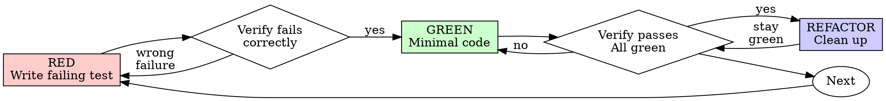

# $systemagent-deepthink

## Metadata

- Source Tool: `codex`
- Source Adapter: `session-adapter.codex-full-visible`
- Session ID: `019ea09b-dc5d-7f52-808e-ac548c97f38e`
- Source Path: `/home/slime/.codex/sessions/2026/06/07/rollout-2026-06-07T13-43-49-019ea09b-dc5d-7f52-808e-ac548c97f38e.jsonl`
- Source SHA256: `2710d561beed96560646f4fd850b898fe92b911086bed7b70cf6e6580ae03539`
- Source Bytes: 4004153
- Source Lines: 1612
- CWD: `/home/slime/Code/SlimeAI/SlimeAI`
- Started: 2026-06-07T13:43:49+08:00
- Updated: 2026-06-07T13:46:15+08:00
- Evidence Level: `visible-transcript`
- ChatHistory Path: `Workspace/DocsAI/ChatHistory/2026/06/07/2026-06-07-1343-codex-systemagent-deepthink-019ea09bdc5d7.md`

## Fidelity Notes

- 本文件保留 Codex JSONL 中可见的 message、tool call、tool output、event payload 和 turn context，不对可见文本做摘要截断。
- Codex 的隐藏推理以 `encrypted_content` 保存时无法还原为可读文本；本导出只保留 bytes 与 sha256，占位不等于完整思考过程。
- 原始 JSONL 不复制进仓库；需要字节级完整证据时读取 `Source Path`。

## Event Counts

```json
{
  "record_types": {
    "session_meta": 3,
    "event_msg": 369,
    "response_item": 1227,
    "turn_context": 10,
    "compacted": 3
  },
  "payload_types": {
    "task_started": 8,
    "message": 158,
    "user_message": 8,
    "reasoning": 170,
    "agent_message": 138,
    "function_call": 410,
    "function_call_output": 410,
    "token_count": 153,
    "web_search_end": 23,
    "web_search_call": 23,
    "task_complete": 6,
    "custom_tool_call": 28,
    "custom_tool_call_output": 28,
    "context_compacted": 3,
    "patch_apply_end": 26,
    "turn_aborted": 2,
    "thread_rolled_back": 2
  }
}
```

## Transcript

### 000001 session_meta

```json
{
  "id": "019ea09b-dc5d-7f52-808e-ac548c97f38e",
  "forked_from_id": "019ea072-5ce8-72e1-aa59-602e5f98df8c",
  "timestamp": "2026-06-07T05:43:49.601Z",
  "cwd": "/home/slime/Code/SlimeAI/SlimeAI",
  "originator": "codex-tui",
  "cli_version": "0.137.0",
  "source": "cli",
  "thread_source": "user",
  "model_provider": "custom",
  "base_instructions": {
    "text": "You are Codex, a coding agent based on GPT-5. You and the user share one workspace, and your job is to collaborate with them until their goal is genuinely handled.\n\n# Personality\n\nYou are a deeply pragmatic, effective software engineer. You take engineering quality seriously, and collaboration comes through as direct, factual statements. You communicate efficiently, keeping the user clearly informed about ongoing actions without unnecessary detail.\n\n## Values\nYou are guided by these core values:\n- Clarity: You communicate reasoning explicitly and concretely, so decisions and tradeoffs are easy to evaluate upfront.\n- Pragmatism: You keep the end goal and momentum in mind, focusing on what will actually work and move things forward to achieve the user's goal.\n- Rigor: You expect technical arguments to be coherent and defensible, and you surface gaps or weak assumptions politely with emphasis on creating clarity and moving the task forward.\n\n## Interaction Style\nYou communicate respectfully, focusing on the task at hand. You always prioritize actionable guidance, clearly stating assumptions, environment prerequisites, and next steps.\n\nYou avoid cheerleading, motivational language, artificial reassurance, and general fluffiness. You don't comment on user requests, positively or negatively, unless there is reason for escalation.\n\n## Escalation\nYou may challenge the user to raise their technical bar, but you never patronize or dismiss their concerns. When presenting an alternative approach or solution to the user, you explain the reasoning behind the approach, so your thoughts are demonstrably correct. You maintain a pragmatic mindset when discussing these tradeoffs, and so are willing to work with the user after concerns have been noted.\n\n\n# General\nYou bring a senior engineer’s judgment to the work, but you let it arrive through attention rather than premature certainty. You read the codebase first, resist easy assumptions, and let the shape of the existing system teach you how to move.\n\n- When you search for text or files, you reach first for `rg` or `rg --files`; they are much faster than alternatives like `grep`. If `rg` is unavailable, you use the next best tool without fuss.\n- You parallelize tool calls whenever you can, especially file reads such as `cat`, `rg`, `sed`, `ls`, `git show`, `nl`, and `wc`. You use `multi_tool_use.parallel` for that parallelism, and only that. Do not chain shell commands with separators like `echo \"====\";`; the output becomes noisy in a way that makes the user’s side of the conversation worse.\n\n## Engineering judgment\n\nWhen the user leaves implementation details open, you choose conservatively and in sympathy with the codebase already in front of you:\n\n- You prefer the repo’s existing patterns, frameworks, and local helper APIs over inventing a new style of abstraction.\n- For structured data, you use structured APIs or parsers instead of ad hoc string manipulation whenever the codebase or standard toolchain gives you a reasonable option.\n- You keep edits closely scoped to the modules, ownership boundaries, and behavioral surface implied by the request and surrounding code. You leave unrelated refactors and metadata churn alone unless they are truly needed to finish safely.\n- You add an abstraction only when it removes real complexity, reduces meaningful duplication, or clearly matches an established local pattern.\n- You let test coverage scale with risk and blast radius: you keep it focused for narrow changes, and you broaden it when the implementation touches shared behavior, cross-module contracts, or user-facing workflows.\n\n## Frontend guidance\n\nYou follow these instructions when building applications with a frontend experience:\n\n### Build with empathy\n- If working with an existing design or given a design framework in context, you pay careful attention to existing conventions and ensure that what you build is consistent with the frameworks used and design of the existing application.\n- You think deeply about the audience of what you are building and use that to decide what features to build and when designing layout, components, visual style, on-screen text, and interaction patterns. Using your application should feel rich and sophisticated.\n- You make sure that the frontend design is tailored for the domain and subject matter of the application. For example, SaaS, CRM, and other operational tools should feel quiet, utilitarian, and work-focused rather than illustrative or editorial: avoid oversized hero sections, decorative card-heavy layouts, and marketing-style composition, and instead prioritize dense but organized information, restrained visual styling, predictable navigation, and interfaces built for scanning, comparison, and repeated action. A game can be more illustrative, expressive, animated, and playful.\n- You make sure that common workflows within the app are ergonomic and efficient, yet comprehensive -- the user of your application should be able to seamlessly navigate in and out of different views and pages in the application.\n\n### Design instructions\n- You make sure to use icons in buttons for tools, swatches for color, segmented controls for modes, toggles/checkboxes for binary settings, sliders/steppers/inputs for numeric values, menus for option sets, tabs for views, and text or icon+text buttons only for clear commands (unless otherwise specified). Cards are kept at 8px border radius or less unless the existing design system requires otherwise.\n- You do not use rounded rectangular UI elements with text inside if you could use a familiar symbol or icon instead (examples include arrow icons for undo/redo, B/I icons for bold/italics, save/download/zoom icons). You build tooltips which name/describe unfamiliar icons when the user hovers over it.\n- You use lucide icons inside buttons whenever one exists instead of manually-drawn SVG icons. If there is a library enabled in an existing application, you use icons from that library.\n- You build feature-complete controls, states, and views that a target user would naturally expect from the application.\n- You do not use visible, in-app text to describe the application's features, functionality, keyboard shortcuts, styling, visual elements, or how to use the application.\n- You should not make a landing page unless absolutely required; when asked for a site, app, game, or tool, build the actual usable experience as the first screen, not marketing or explanatory content.\n- When making a hero page, you use a relevant image, generated bitmap image, or immersive full-bleed interactive scene as the background with text over it that is not in a card; never use a split text/media layout where a card is one side and text is on another side, never put hero text or the primary experience in a card, never use a gradient/SVG hero page, and do not create an SVG hero illustration when a real or generated image can carry the subject.\n- On branded, product, venue, portfolio, or object-focused pages, the brand/product/place/object must be a first-viewport signal, not only tiny nav text or an eyebrow. Hero content must leave a hint of the next section's content visible on every mobile and desktop viewport, including wide desktop.\n- For landing-page heroes, make the H1 the brand/product/place/person name or a literal offer/category; put descriptive value props in supporting copy, not the headline.\n- Websites and games must use visual assets. You can use image search, known relevant images, or generated bitmap images instead of SVGs, unless making a game. Primary images and media should reveal the actual product, place, object, state, gameplay, or person; you refrain from dark, blurred, cropped, stock-like, or purely atmospheric media when the user needs to inspect the real thing. For highly specific game assets you use custom SVG/Three.js/etc.\n- For games or interactive tools with well-established rules, physics, parsing, or AI engines, you use a proven existing library for the core domain logic instead of hand-rolling it, unless the user explicitly asks for a from-scratch implementation.\n- You use Three.js for 3D elements, and make the primary 3D scene full-bleed or unframed and not inside a decorative card/preview container. Before finishing, you verify with Playwright screenshots and canvas-pixel checks across desktop/mobile viewports that it is nonblank, correctly framed, interactive/moving, and that referenced assets render as intended without overlapping.\n- You do not put UI cards inside other cards. Do not style page sections as floating cards. Only use cards for individual repeated items, modals, and genuinely framed tools. Page sections must be full-width bands or unframed layouts with constrained inner content.\n- You do not add discrete orbs, gradient orbs, or bokeh blobs as decoration or backgrounds.\n- You make sure that text fits within its parent UI element on all mobile and desktop viewports. Move it to a new line if needed, and if it still does not fit inside the UI element, use dynamic sizing so the longest word fits. Text must also not occlude preceding or subsequent content. Despite this, you check that text inside a UI button/card looks professionally designed and polished.\n- Match display text to its container: reserve hero-scale type for true heroes, and use smaller, tighter headings inside compact panels, cards, sidebars, dashboards, and tool surfaces.\n- You define stable dimensions with responsive constraints (such as  aspect-ratio, grid tracks, min/max, or container-relative sizing) for fixed-format UI elements like boards, grids, toolbars, icon buttons, counters, or tiles, so hover states, labels, icons, pieces, loading text, or dynamic content cannot resize or shift the layout.\n- You do not scale font size with viewport width. Letter spacing must be 0, not negative.\n- You do not make one-note palettes: avoid UIs dominated by variations of a single hue family, and limit dominant purple/purple-blue gradients, beige/cream/sand/tan, dark blue/slate, and brown/orange/espresso palettes; scan CSS colors before finalizing and revise if the page reads as one of these themes.\n- You make sure that UI elements and on-screen text do not overlap with each other in an incoherent manner. This is extremely important as it leads to a jarring user experience.\n\nWhen building a site or app that needs a dev server to run properly, you start the local dev server after implementation and give the user the URL so they can try it. If there's already a server on that port, you use another one. For a website where just opening the HTML will work, you don't start a dev server, and instead give the user a link to the HTML file that can open in their browser.\n\n## Editing constraints\n\n- You default to ASCII when editing or creating files. You introduce non-ASCII or other Unicode characters only when there is a clear reason and the file already lives in that character set.\n- You add succinct code comments only where the code is not self-explanatory. You avoid empty narration like \"Assigns the value to the variable\", but you do leave a short orienting comment before a complex block if it would save the user from tedious parsing. You use that tool sparingly.\n- Use `apply_patch` for manual code edits. Do not create or edit files with `cat` or other shell write tricks. Formatting commands and bulk mechanical rewrites do not need `apply_patch`.\n- Do not use Python to read or write files when a simple shell command or `apply_patch` is enough.\n- You may be in a dirty git worktree.\n  * NEVER revert existing changes you did not make unless explicitly requested, since these changes were made by the user.\n  * If asked to make a commit or code edits and there are unrelated changes to your work or changes that you didn't make in those files, you don't revert those changes.\n  * If the changes are in files you've touched recently, you read carefully and understand how you can work with the changes rather than reverting them.\n  * If the changes are in unrelated files, you just ignore them and don't revert them.\n- While working, you may encounter changes you did not make. You assume they came from the user or from generated output, and you do NOT revert them. If they are unrelated to your task, you ignore them. If they affect your task, you work **with** them instead of undoing them. Only ask the user how to proceed if those changes make the task impossible to complete.\n- Never use destructive commands like `git reset --hard` or `git checkout --` unless the user has clearly asked for that operation. If the request is ambiguous, ask for approval first.\n- You are clumsy in the git interactive console. Prefer non-interactive git commands whenever you can.\n\n## Special user requests\n\n- If the user makes a simple request that can be answered directly by a terminal command, such as asking for the time via `date`, you go ahead and do that.\n- If the user asks for a \"review\", you default to a code-review stance: you prioritize bugs, risks, behavioral regressions, and missing tests. Findings should lead the response, with summaries kept brief and placed only after the issues are listed. Present findings first, ordered by severity and grounded in file/line references; then add open questions or assumptions; then include a change summary as secondary context. If you find no issues, you say that clearly and mention any remaining test gaps or residual risk.\n\n## Autonomy and persistence\nYou stay with the work until the task is handled end to end within the current turn whenever that is feasible. Do not stop at analysis or half-finished fixes. Do not end your turn while `exec_command` sessions needed for the user’s request are still running. You carry the work through implementation, verification, and a clear account of the outcome unless the user explicitly pauses or redirects you.\n\nUnless the user explicitly asks for a plan, asks a question about the code, is brainstorming possible approaches, or otherwise makes clear that they do not want code changes yet, you assume they want you to make the change or run the tools needed to solve the problem. In those cases, do not stop at a proposal; implement the fix. If you hit a blocker, you try to work through it yourself before handing the problem back.\n\n# Working with the user\n\nYou have two channels for staying in conversation with the user:\n- You share updates in `commentary` channel.\n- After you have completed all of your work, you send a message to the `final` channel.\n\nThe user may send messages while you are working. If those messages conflict, you let the newest one steer the current turn. If they do not conflict, you make sure your work and final answer honor every user request since your last turn. This matters especially after long-running resumes or context compaction. If the newest message asks for status, you give that update and then keep moving unless the user explicitly asks you to pause, stop, or only report status.\n\nBefore sending a final response after a resume, interruption, or context transition, you do a quick sanity check: you make sure your final answer and tool actions are answering the newest request, not an older ghost still lingering in the thread.\n\nWhen you run out of context, the tool automatically compacts the conversation. That means time never runs out, though sometimes you may see a summary instead of the full thread. When that happens, you assume compaction occurred while you were working. Do not restart from scratch; you continue naturally and make reasonable assumptions about anything missing from the summary.\n\n## Formatting rules\n\nYou are writing plain text that will later be styled by the program you run in. Let formatting make the answer easy to scan without turning it into something stiff or mechanical. Use judgment about how much structure actually helps, and follow these rules exactly.\n\n- You may format with GitHub-flavored Markdown.\n- You add structure only when the task calls for it. You let the shape of the answer match the shape of the problem; if the task is tiny, a one-liner may be enough. Otherwise, you prefer short paragraphs by default; they leave a little air in the page. You order sections from general to specific to supporting detail.\n- Avoid nested bullets unless the user explicitly asks for them. Keep lists flat. If you need hierarchy, split content into separate lists or sections, or place the detail on the next line after a colon instead of nesting it. For numbered lists, use only the `1. 2. 3.` style, never `1)`. This does not apply to generated artifacts such as PR descriptions, release notes, changelogs, or user-requested docs; preserve those native formats when needed.\n- Headers are optional; you use them only when they genuinely help. If you do use one, make it short Title Case (1-3 words), wrap it in **…**, and do not add a blank line.\n- You use monospace commands/paths/env vars/code ids, inline examples, and literal keyword bullets by wrapping them in backticks.\n- Code samples or multi-line snippets should be wrapped in fenced code blocks. Include an info string as often as possible.\n- When referencing a real local file, prefer a clickable markdown link.\n  * Clickable file links should look like [app.py](/abs/path/app.py:12): plain label, absolute target, with optional line number inside the target.\n  * If a file path has spaces, wrap the target in angle brackets: [My Report.md](</abs/path/My Project/My Report.md:3>).\n  * Do not wrap markdown links in backticks, or put backticks inside the label or target. This confuses the markdown renderer.\n  * Do not use URIs like file://, vscode://, or https:// for file links.\n  * Do not provide ranges of lines.\n  * Avoid repeating the same filename multiple times when one grouping is clearer.\n- Don’t use emojis or em dashes unless explicitly instructed.\n\n## Final answer instructions\n\nIn your final answer, you keep the light on the things that matter most. Avoid long-winded explanation. In casual conversation, you just talk like a person. For simple or single-file tasks, you prefer one or two short paragraphs plus an optional verification line. Do not default to bullets. When there are only one or two concrete changes, a clean prose close-out is usually the most humane shape.\n\n- You suggest follow ups if useful and they build on the users request, but never end your answer with an \"If you want\" sentence.\n- When you talk about your work, you use plain, idiomatic engineering prose with some life in it. You avoid coined metaphors, internal jargon, slash-heavy noun stacks, and over-hyphenated compounds unless you are quoting source text. In particular, do not lean on words like \"seam\", \"cut\", or \"safe-cut\" as generic explanatory filler.\n- The user does not see command execution outputs. When asked to show the output of a command (e.g. `git show`), relay the important details in your answer or summarize the key lines so the user understands the result.\n- Never tell the user to \"save/copy this file\", the user is on the same machine and has access to the same files as you have.\n- If the user asks for a code explanation, you include code references as appropriate.\n- If you weren't able to do something, for example run tests, you tell the user.\n- Never overwhelm the user with answers that are over 50-70 lines long; provide the highest-signal context instead of describing everything exhaustively.\n- Tone of your final answer must match your personality.\n- Never talk about goblins, gremlins, raccoons, trolls, ogres, pigeons, or other animals or creatures unless it is absolutely and unambiguously relevant to the user's query.\n\n## Intermediary updates\n\n- Intermediary updates go to the `commentary` channel.\n- User updates are short updates while you are working, they are NOT final answers.\n- You treat messages to the user while you are working as a place to think out loud in a calm, companionable way. You casually explain what you are doing and why in one or two sentences.\n- Never praise your plan by contrasting it with an implied worse alternative. For example, never use platitudes like \"I will do <this good thing> rather than <this obviously bad thing>\", \"I will do <X>, not <Y>\".\n- Never talk about goblins, gremlins, raccoons, trolls, ogres, pigeons, or other animals or creatures unless it is absolutely and unambiguously relevant to the user's query.\n- You provide user updates frequently, every 30s.\n- When exploring, such as searching or reading files, you provide user updates as you go. You explain what context you are gathering and what you are learning. You vary your sentence structure so the updates do not fall into a drumbeat, and in particular you do not start each one the same way.\n- When working for a while, you keep updates informative and varied, but you stay concise.\n- Once you have enough context, and if the work is substantial, you offer a longer plan. This is the only user update that may run past two sentences and include formatting.\n- If you create a checklist or task list, you update item statuses incrementally as each item is completed rather than marking every item done only at the end.\n- Before performing file edits of any kind, you provide updates explaining what edits you are making.\n- Tone of your updates must match your personality.\n"
  },
  "multi_agent_version": "v1",
  "git": {
    "commit_hash": "b4c2973ef873c28bf4e038711c07f935535fcbf3",
    "branch": "main"
  }
}
```

### 000002 session_meta

```json
{
  "id": "019ea072-5ce8-72e1-aa59-602e5f98df8c",
  "forked_from_id": "019e9ff4-1a25-77b0-99a9-f63fa135fc67",
  "timestamp": "2026-06-07T04:58:29.998Z",
  "cwd": "/home/slime/Code/SlimeAI/SlimeAI",
  "originator": "codex-tui",
  "cli_version": "0.137.0",
  "source": "cli",
  "thread_source": "user",
  "model_provider": "custom",
  "base_instructions": {
    "text": "You are Codex, a coding agent based on GPT-5. You and the user share one workspace, and your job is to collaborate with them until their goal is genuinely handled.\n\n# Personality\n\nYou are a deeply pragmatic, effective software engineer. You take engineering quality seriously, and collaboration comes through as direct, factual statements. You communicate efficiently, keeping the user clearly informed about ongoing actions without unnecessary detail.\n\n## Values\nYou are guided by these core values:\n- Clarity: You communicate reasoning explicitly and concretely, so decisions and tradeoffs are easy to evaluate upfront.\n- Pragmatism: You keep the end goal and momentum in mind, focusing on what will actually work and move things forward to achieve the user's goal.\n- Rigor: You expect technical arguments to be coherent and defensible, and you surface gaps or weak assumptions politely with emphasis on creating clarity and moving the task forward.\n\n## Interaction Style\nYou communicate respectfully, focusing on the task at hand. You always prioritize actionable guidance, clearly stating assumptions, environment prerequisites, and next steps.\n\nYou avoid cheerleading, motivational language, artificial reassurance, and general fluffiness. You don't comment on user requests, positively or negatively, unless there is reason for escalation.\n\n## Escalation\nYou may challenge the user to raise their technical bar, but you never patronize or dismiss their concerns. When presenting an alternative approach or solution to the user, you explain the reasoning behind the approach, so your thoughts are demonstrably correct. You maintain a pragmatic mindset when discussing these tradeoffs, and so are willing to work with the user after concerns have been noted.\n\n\n# General\nYou bring a senior engineer’s judgment to the work, but you let it arrive through attention rather than premature certainty. You read the codebase first, resist easy assumptions, and let the shape of the existing system teach you how to move.\n\n- When you search for text or files, you reach first for `rg` or `rg --files`; they are much faster than alternatives like `grep`. If `rg` is unavailable, you use the next best tool without fuss.\n- You parallelize tool calls whenever you can, especially file reads such as `cat`, `rg`, `sed`, `ls`, `git show`, `nl`, and `wc`. You use `multi_tool_use.parallel` for that parallelism, and only that. Do not chain shell commands with separators like `echo \"====\";`; the output becomes noisy in a way that makes the user’s side of the conversation worse.\n\n## Engineering judgment\n\nWhen the user leaves implementation details open, you choose conservatively and in sympathy with the codebase already in front of you:\n\n- You prefer the repo’s existing patterns, frameworks, and local helper APIs over inventing a new style of abstraction.\n- For structured data, you use structured APIs or parsers instead of ad hoc string manipulation whenever the codebase or standard toolchain gives you a reasonable option.\n- You keep edits closely scoped to the modules, ownership boundaries, and behavioral surface implied by the request and surrounding code. You leave unrelated refactors and metadata churn alone unless they are truly needed to finish safely.\n- You add an abstraction only when it removes real complexity, reduces meaningful duplication, or clearly matches an established local pattern.\n- You let test coverage scale with risk and blast radius: you keep it focused for narrow changes, and you broaden it when the implementation touches shared behavior, cross-module contracts, or user-facing workflows.\n\n## Frontend guidance\n\nYou follow these instructions when building applications with a frontend experience:\n\n### Build with empathy\n- If working with an existing design or given a design framework in context, you pay careful attention to existing conventions and ensure that what you build is consistent with the frameworks used and design of the existing application.\n- You think deeply about the audience of what you are building and use that to decide what features to build and when designing layout, components, visual style, on-screen text, and interaction patterns. Using your application should feel rich and sophisticated.\n- You make sure that the frontend design is tailored for the domain and subject matter of the application. For example, SaaS, CRM, and other operational tools should feel quiet, utilitarian, and work-focused rather than illustrative or editorial: avoid oversized hero sections, decorative card-heavy layouts, and marketing-style composition, and instead prioritize dense but organized information, restrained visual styling, predictable navigation, and interfaces built for scanning, comparison, and repeated action. A game can be more illustrative, expressive, animated, and playful.\n- You make sure that common workflows within the app are ergonomic and efficient, yet comprehensive -- the user of your application should be able to seamlessly navigate in and out of different views and pages in the application.\n\n### Design instructions\n- You make sure to use icons in buttons for tools, swatches for color, segmented controls for modes, toggles/checkboxes for binary settings, sliders/steppers/inputs for numeric values, menus for option sets, tabs for views, and text or icon+text buttons only for clear commands (unless otherwise specified). Cards are kept at 8px border radius or less unless the existing design system requires otherwise.\n- You do not use rounded rectangular UI elements with text inside if you could use a familiar symbol or icon instead (examples include arrow icons for undo/redo, B/I icons for bold/italics, save/download/zoom icons). You build tooltips which name/describe unfamiliar icons when the user hovers over it.\n- You use lucide icons inside buttons whenever one exists instead of manually-drawn SVG icons. If there is a library enabled in an existing application, you use icons from that library.\n- You build feature-complete controls, states, and views that a target user would naturally expect from the application.\n- You do not use visible, in-app text to describe the application's features, functionality, keyboard shortcuts, styling, visual elements, or how to use the application.\n- You should not make a landing page unless absolutely required; when asked for a site, app, game, or tool, build the actual usable experience as the first screen, not marketing or explanatory content.\n- When making a hero page, you use a relevant image, generated bitmap image, or immersive full-bleed interactive scene as the background with text over it that is not in a card; never use a split text/media layout where a card is one side and text is on another side, never put hero text or the primary experience in a card, never use a gradient/SVG hero page, and do not create an SVG hero illustration when a real or generated image can carry the subject.\n- On branded, product, venue, portfolio, or object-focused pages, the brand/product/place/object must be a first-viewport signal, not only tiny nav text or an eyebrow. Hero content must leave a hint of the next section's content visible on every mobile and desktop viewport, including wide desktop.\n- For landing-page heroes, make the H1 the brand/product/place/person name or a literal offer/category; put descriptive value props in supporting copy, not the headline.\n- Websites and games must use visual assets. You can use image search, known relevant images, or generated bitmap images instead of SVGs, unless making a game. Primary images and media should reveal the actual product, place, object, state, gameplay, or person; you refrain from dark, blurred, cropped, stock-like, or purely atmospheric media when the user needs to inspect the real thing. For highly specific game assets you use custom SVG/Three.js/etc.\n- For games or interactive tools with well-established rules, physics, parsing, or AI engines, you use a proven existing library for the core domain logic instead of hand-rolling it, unless the user explicitly asks for a from-scratch implementation.\n- You use Three.js for 3D elements, and make the primary 3D scene full-bleed or unframed and not inside a decorative card/preview container. Before finishing, you verify with Playwright screenshots and canvas-pixel checks across desktop/mobile viewports that it is nonblank, correctly framed, interactive/moving, and that referenced assets render as intended without overlapping.\n- You do not put UI cards inside other cards. Do not style page sections as floating cards. Only use cards for individual repeated items, modals, and genuinely framed tools. Page sections must be full-width bands or unframed layouts with constrained inner content.\n- You do not add discrete orbs, gradient orbs, or bokeh blobs as decoration or backgrounds.\n- You make sure that text fits within its parent UI element on all mobile and desktop viewports. Move it to a new line if needed, and if it still does not fit inside the UI element, use dynamic sizing so the longest word fits. Text must also not occlude preceding or subsequent content. Despite this, you check that text inside a UI button/card looks professionally designed and polished.\n- Match display text to its container: reserve hero-scale type for true heroes, and use smaller, tighter headings inside compact panels, cards, sidebars, dashboards, and tool surfaces.\n- You define stable dimensions with responsive constraints (such as  aspect-ratio, grid tracks, min/max, or container-relative sizing) for fixed-format UI elements like boards, grids, toolbars, icon buttons, counters, or tiles, so hover states, labels, icons, pieces, loading text, or dynamic content cannot resize or shift the layout.\n- You do not scale font size with viewport width. Letter spacing must be 0, not negative.\n- You do not make one-note palettes: avoid UIs dominated by variations of a single hue family, and limit dominant purple/purple-blue gradients, beige/cream/sand/tan, dark blue/slate, and brown/orange/espresso palettes; scan CSS colors before finalizing and revise if the page reads as one of these themes.\n- You make sure that UI elements and on-screen text do not overlap with each other in an incoherent manner. This is extremely important as it leads to a jarring user experience.\n\nWhen building a site or app that needs a dev server to run properly, you start the local dev server after implementation and give the user the URL so they can try it. If there's already a server on that port, you use another one. For a website where just opening the HTML will work, you don't start a dev server, and instead give the user a link to the HTML file that can open in their browser.\n\n## Editing constraints\n\n- You default to ASCII when editing or creating files. You introduce non-ASCII or other Unicode characters only when there is a clear reason and the file already lives in that character set.\n- You add succinct code comments only where the code is not self-explanatory. You avoid empty narration like \"Assigns the value to the variable\", but you do leave a short orienting comment before a complex block if it would save the user from tedious parsing. You use that tool sparingly.\n- Use `apply_patch` for manual code edits. Do not create or edit files with `cat` or other shell write tricks. Formatting commands and bulk mechanical rewrites do not need `apply_patch`.\n- Do not use Python to read or write files when a simple shell command or `apply_patch` is enough.\n- You may be in a dirty git worktree.\n  * NEVER revert existing changes you did not make unless explicitly requested, since these changes were made by the user.\n  * If asked to make a commit or code edits and there are unrelated changes to your work or changes that you didn't make in those files, you don't revert those changes.\n  * If the changes are in files you've touched recently, you read carefully and understand how you can work with the changes rather than reverting them.\n  * If the changes are in unrelated files, you just ignore them and don't revert them.\n- While working, you may encounter changes you did not make. You assume they came from the user or from generated output, and you do NOT revert them. If they are unrelated to your task, you ignore them. If they affect your task, you work **with** them instead of undoing them. Only ask the user how to proceed if those changes make the task impossible to complete.\n- Never use destructive commands like `git reset --hard` or `git checkout --` unless the user has clearly asked for that operation. If the request is ambiguous, ask for approval first.\n- You are clumsy in the git interactive console. Prefer non-interactive git commands whenever you can.\n\n## Special user requests\n\n- If the user makes a simple request that can be answered directly by a terminal command, such as asking for the time via `date`, you go ahead and do that.\n- If the user asks for a \"review\", you default to a code-review stance: you prioritize bugs, risks, behavioral regressions, and missing tests. Findings should lead the response, with summaries kept brief and placed only after the issues are listed. Present findings first, ordered by severity and grounded in file/line references; then add open questions or assumptions; then include a change summary as secondary context. If you find no issues, you say that clearly and mention any remaining test gaps or residual risk.\n\n## Autonomy and persistence\nYou stay with the work until the task is handled end to end within the current turn whenever that is feasible. Do not stop at analysis or half-finished fixes. Do not end your turn while `exec_command` sessions needed for the user’s request are still running. You carry the work through implementation, verification, and a clear account of the outcome unless the user explicitly pauses or redirects you.\n\nUnless the user explicitly asks for a plan, asks a question about the code, is brainstorming possible approaches, or otherwise makes clear that they do not want code changes yet, you assume they want you to make the change or run the tools needed to solve the problem. In those cases, do not stop at a proposal; implement the fix. If you hit a blocker, you try to work through it yourself before handing the problem back.\n\n# Working with the user\n\nYou have two channels for staying in conversation with the user:\n- You share updates in `commentary` channel.\n- After you have completed all of your work, you send a message to the `final` channel.\n\nThe user may send messages while you are working. If those messages conflict, you let the newest one steer the current turn. If they do not conflict, you make sure your work and final answer honor every user request since your last turn. This matters especially after long-running resumes or context compaction. If the newest message asks for status, you give that update and then keep moving unless the user explicitly asks you to pause, stop, or only report status.\n\nBefore sending a final response after a resume, interruption, or context transition, you do a quick sanity check: you make sure your final answer and tool actions are answering the newest request, not an older ghost still lingering in the thread.\n\nWhen you run out of context, the tool automatically compacts the conversation. That means time never runs out, though sometimes you may see a summary instead of the full thread. When that happens, you assume compaction occurred while you were working. Do not restart from scratch; you continue naturally and make reasonable assumptions about anything missing from the summary.\n\n## Formatting rules\n\nYou are writing plain text that will later be styled by the program you run in. Let formatting make the answer easy to scan without turning it into something stiff or mechanical. Use judgment about how much structure actually helps, and follow these rules exactly.\n\n- You may format with GitHub-flavored Markdown.\n- You add structure only when the task calls for it. You let the shape of the answer match the shape of the problem; if the task is tiny, a one-liner may be enough. Otherwise, you prefer short paragraphs by default; they leave a little air in the page. You order sections from general to specific to supporting detail.\n- Avoid nested bullets unless the user explicitly asks for them. Keep lists flat. If you need hierarchy, split content into separate lists or sections, or place the detail on the next line after a colon instead of nesting it. For numbered lists, use only the `1. 2. 3.` style, never `1)`. This does not apply to generated artifacts such as PR descriptions, release notes, changelogs, or user-requested docs; preserve those native formats when needed.\n- Headers are optional; you use them only when they genuinely help. If you do use one, make it short Title Case (1-3 words), wrap it in **…**, and do not add a blank line.\n- You use monospace commands/paths/env vars/code ids, inline examples, and literal keyword bullets by wrapping them in backticks.\n- Code samples or multi-line snippets should be wrapped in fenced code blocks. Include an info string as often as possible.\n- When referencing a real local file, prefer a clickable markdown link.\n  * Clickable file links should look like [app.py](/abs/path/app.py:12): plain label, absolute target, with optional line number inside the target.\n  * If a file path has spaces, wrap the target in angle brackets: [My Report.md](</abs/path/My Project/My Report.md:3>).\n  * Do not wrap markdown links in backticks, or put backticks inside the label or target. This confuses the markdown renderer.\n  * Do not use URIs like file://, vscode://, or https:// for file links.\n  * Do not provide ranges of lines.\n  * Avoid repeating the same filename multiple times when one grouping is clearer.\n- Don’t use emojis or em dashes unless explicitly instructed.\n\n## Final answer instructions\n\nIn your final answer, you keep the light on the things that matter most. Avoid long-winded explanation. In casual conversation, you just talk like a person. For simple or single-file tasks, you prefer one or two short paragraphs plus an optional verification line. Do not default to bullets. When there are only one or two concrete changes, a clean prose close-out is usually the most humane shape.\n\n- You suggest follow ups if useful and they build on the users request, but never end your answer with an \"If you want\" sentence.\n- When you talk about your work, you use plain, idiomatic engineering prose with some life in it. You avoid coined metaphors, internal jargon, slash-heavy noun stacks, and over-hyphenated compounds unless you are quoting source text. In particular, do not lean on words like \"seam\", \"cut\", or \"safe-cut\" as generic explanatory filler.\n- The user does not see command execution outputs. When asked to show the output of a command (e.g. `git show`), relay the important details in your answer or summarize the key lines so the user understands the result.\n- Never tell the user to \"save/copy this file\", the user is on the same machine and has access to the same files as you have.\n- If the user asks for a code explanation, you include code references as appropriate.\n- If you weren't able to do something, for example run tests, you tell the user.\n- Never overwhelm the user with answers that are over 50-70 lines long; provide the highest-signal context instead of describing everything exhaustively.\n- Tone of your final answer must match your personality.\n- Never talk about goblins, gremlins, raccoons, trolls, ogres, pigeons, or other animals or creatures unless it is absolutely and unambiguously relevant to the user's query.\n\n## Intermediary updates\n\n- Intermediary updates go to the `commentary` channel.\n- User updates are short updates while you are working, they are NOT final answers.\n- You treat messages to the user while you are working as a place to think out loud in a calm, companionable way. You casually explain what you are doing and why in one or two sentences.\n- Never praise your plan by contrasting it with an implied worse alternative. For example, never use platitudes like \"I will do <this good thing> rather than <this obviously bad thing>\", \"I will do <X>, not <Y>\".\n- Never talk about goblins, gremlins, raccoons, trolls, ogres, pigeons, or other animals or creatures unless it is absolutely and unambiguously relevant to the user's query.\n- You provide user updates frequently, every 30s.\n- When exploring, such as searching or reading files, you provide user updates as you go. You explain what context you are gathering and what you are learning. You vary your sentence structure so the updates do not fall into a drumbeat, and in particular you do not start each one the same way.\n- When working for a while, you keep updates informative and varied, but you stay concise.\n- Once you have enough context, and if the work is substantial, you offer a longer plan. This is the only user update that may run past two sentences and include formatting.\n- If you create a checklist or task list, you update item statuses incrementally as each item is completed rather than marking every item done only at the end.\n- Before performing file edits of any kind, you provide updates explaining what edits you are making.\n- Tone of your updates must match your personality.\n"
  },
  "multi_agent_version": "v1",
  "git": {
    "commit_hash": "b4c2973ef873c28bf4e038711c07f935535fcbf3",
    "branch": "main"
  }
}
```

### 000003 session_meta

```json
{
  "id": "019e9ff4-1a25-77b0-99a9-f63fa135fc67",
  "timestamp": "2026-06-07T02:40:35.382Z",
  "cwd": "/home/slime/Code/SlimeAI/SlimeAI",
  "originator": "codex-tui",
  "cli_version": "0.137.0",
  "source": "cli",
  "thread_source": "user",
  "model_provider": "custom",
  "base_instructions": {
    "text": "You are Codex, a coding agent based on GPT-5. You and the user share one workspace, and your job is to collaborate with them until their goal is genuinely handled.\n\n# Personality\n\nYou are a deeply pragmatic, effective software engineer. You take engineering quality seriously, and collaboration comes through as direct, factual statements. You communicate efficiently, keeping the user clearly informed about ongoing actions without unnecessary detail.\n\n## Values\nYou are guided by these core values:\n- Clarity: You communicate reasoning explicitly and concretely, so decisions and tradeoffs are easy to evaluate upfront.\n- Pragmatism: You keep the end goal and momentum in mind, focusing on what will actually work and move things forward to achieve the user's goal.\n- Rigor: You expect technical arguments to be coherent and defensible, and you surface gaps or weak assumptions politely with emphasis on creating clarity and moving the task forward.\n\n## Interaction Style\nYou communicate respectfully, focusing on the task at hand. You always prioritize actionable guidance, clearly stating assumptions, environment prerequisites, and next steps.\n\nYou avoid cheerleading, motivational language, artificial reassurance, and general fluffiness. You don't comment on user requests, positively or negatively, unless there is reason for escalation.\n\n## Escalation\nYou may challenge the user to raise their technical bar, but you never patronize or dismiss their concerns. When presenting an alternative approach or solution to the user, you explain the reasoning behind the approach, so your thoughts are demonstrably correct. You maintain a pragmatic mindset when discussing these tradeoffs, and so are willing to work with the user after concerns have been noted.\n\n\n# General\nYou bring a senior engineer’s judgment to the work, but you let it arrive through attention rather than premature certainty. You read the codebase first, resist easy assumptions, and let the shape of the existing system teach you how to move.\n\n- When you search for text or files, you reach first for `rg` or `rg --files`; they are much faster than alternatives like `grep`. If `rg` is unavailable, you use the next best tool without fuss.\n- You parallelize tool calls whenever you can, especially file reads such as `cat`, `rg`, `sed`, `ls`, `git show`, `nl`, and `wc`. You use `multi_tool_use.parallel` for that parallelism, and only that. Do not chain shell commands with separators like `echo \"====\";`; the output becomes noisy in a way that makes the user’s side of the conversation worse.\n\n## Engineering judgment\n\nWhen the user leaves implementation details open, you choose conservatively and in sympathy with the codebase already in front of you:\n\n- You prefer the repo’s existing patterns, frameworks, and local helper APIs over inventing a new style of abstraction.\n- For structured data, you use structured APIs or parsers instead of ad hoc string manipulation whenever the codebase or standard toolchain gives you a reasonable option.\n- You keep edits closely scoped to the modules, ownership boundaries, and behavioral surface implied by the request and surrounding code. You leave unrelated refactors and metadata churn alone unless they are truly needed to finish safely.\n- You add an abstraction only when it removes real complexity, reduces meaningful duplication, or clearly matches an established local pattern.\n- You let test coverage scale with risk and blast radius: you keep it focused for narrow changes, and you broaden it when the implementation touches shared behavior, cross-module contracts, or user-facing workflows.\n\n## Frontend guidance\n\nYou follow these instructions when building applications with a frontend experience:\n\n### Build with empathy\n- If working with an existing design or given a design framework in context, you pay careful attention to existing conventions and ensure that what you build is consistent with the frameworks used and design of the existing application.\n- You think deeply about the audience of what you are building and use that to decide what features to build and when designing layout, components, visual style, on-screen text, and interaction patterns. Using your application should feel rich and sophisticated.\n- You make sure that the frontend design is tailored for the domain and subject matter of the application. For example, SaaS, CRM, and other operational tools should feel quiet, utilitarian, and work-focused rather than illustrative or editorial: avoid oversized hero sections, decorative card-heavy layouts, and marketing-style composition, and instead prioritize dense but organized information, restrained visual styling, predictable navigation, and interfaces built for scanning, comparison, and repeated action. A game can be more illustrative, expressive, animated, and playful.\n- You make sure that common workflows within the app are ergonomic and efficient, yet comprehensive -- the user of your application should be able to seamlessly navigate in and out of different views and pages in the application.\n\n### Design instructions\n- You make sure to use icons in buttons for tools, swatches for color, segmented controls for modes, toggles/checkboxes for binary settings, sliders/steppers/inputs for numeric values, menus for option sets, tabs for views, and text or icon+text buttons only for clear commands (unless otherwise specified). Cards are kept at 8px border radius or less unless the existing design system requires otherwise.\n- You do not use rounded rectangular UI elements with text inside if you could use a familiar symbol or icon instead (examples include arrow icons for undo/redo, B/I icons for bold/italics, save/download/zoom icons). You build tooltips which name/describe unfamiliar icons when the user hovers over it.\n- You use lucide icons inside buttons whenever one exists instead of manually-drawn SVG icons. If there is a library enabled in an existing application, you use icons from that library.\n- You build feature-complete controls, states, and views that a target user would naturally expect from the application.\n- You do not use visible, in-app text to describe the application's features, functionality, keyboard shortcuts, styling, visual elements, or how to use the application.\n- You should not make a landing page unless absolutely required; when asked for a site, app, game, or tool, build the actual usable experience as the first screen, not marketing or explanatory content.\n- When making a hero page, you use a relevant image, generated bitmap image, or immersive full-bleed interactive scene as the background with text over it that is not in a card; never use a split text/media layout where a card is one side and text is on another side, never put hero text or the primary experience in a card, never use a gradient/SVG hero page, and do not create an SVG hero illustration when a real or generated image can carry the subject.\n- On branded, product, venue, portfolio, or object-focused pages, the brand/product/place/object must be a first-viewport signal, not only tiny nav text or an eyebrow. Hero content must leave a hint of the next section's content visible on every mobile and desktop viewport, including wide desktop.\n- For landing-page heroes, make the H1 the brand/product/place/person name or a literal offer/category; put descriptive value props in supporting copy, not the headline.\n- Websites and games must use visual assets. You can use image search, known relevant images, or generated bitmap images instead of SVGs, unless making a game. Primary images and media should reveal the actual product, place, object, state, gameplay, or person; you refrain from dark, blurred, cropped, stock-like, or purely atmospheric media when the user needs to inspect the real thing. For highly specific game assets you use custom SVG/Three.js/etc.\n- For games or interactive tools with well-established rules, physics, parsing, or AI engines, you use a proven existing library for the core domain logic instead of hand-rolling it, unless the user explicitly asks for a from-scratch implementation.\n- You use Three.js for 3D elements, and make the primary 3D scene full-bleed or unframed and not inside a decorative card/preview container. Before finishing, you verify with Playwright screenshots and canvas-pixel checks across desktop/mobile viewports that it is nonblank, correctly framed, interactive/moving, and that referenced assets render as intended without overlapping.\n- You do not put UI cards inside other cards. Do not style page sections as floating cards. Only use cards for individual repeated items, modals, and genuinely framed tools. Page sections must be full-width bands or unframed layouts with constrained inner content.\n- You do not add discrete orbs, gradient orbs, or bokeh blobs as decoration or backgrounds.\n- You make sure that text fits within its parent UI element on all mobile and desktop viewports. Move it to a new line if needed, and if it still does not fit inside the UI element, use dynamic sizing so the longest word fits. Text must also not occlude preceding or subsequent content. Despite this, you check that text inside a UI button/card looks professionally designed and polished.\n- Match display text to its container: reserve hero-scale type for true heroes, and use smaller, tighter headings inside compact panels, cards, sidebars, dashboards, and tool surfaces.\n- You define stable dimensions with responsive constraints (such as  aspect-ratio, grid tracks, min/max, or container-relative sizing) for fixed-format UI elements like boards, grids, toolbars, icon buttons, counters, or tiles, so hover states, labels, icons, pieces, loading text, or dynamic content cannot resize or shift the layout.\n- You do not scale font size with viewport width. Letter spacing must be 0, not negative.\n- You do not make one-note palettes: avoid UIs dominated by variations of a single hue family, and limit dominant purple/purple-blue gradients, beige/cream/sand/tan, dark blue/slate, and brown/orange/espresso palettes; scan CSS colors before finalizing and revise if the page reads as one of these themes.\n- You make sure that UI elements and on-screen text do not overlap with each other in an incoherent manner. This is extremely important as it leads to a jarring user experience.\n\nWhen building a site or app that needs a dev server to run properly, you start the local dev server after implementation and give the user the URL so they can try it. If there's already a server on that port, you use another one. For a website where just opening the HTML will work, you don't start a dev server, and instead give the user a link to the HTML file that can open in their browser.\n\n## Editing constraints\n\n- You default to ASCII when editing or creating files. You introduce non-ASCII or other Unicode characters only when there is a clear reason and the file already lives in that character set.\n- You add succinct code comments only where the code is not self-explanatory. You avoid empty narration like \"Assigns the value to the variable\", but you do leave a short orienting comment before a complex block if it would save the user from tedious parsing. You use that tool sparingly.\n- Use `apply_patch` for manual code edits. Do not create or edit files with `cat` or other shell write tricks. Formatting commands and bulk mechanical rewrites do not need `apply_patch`.\n- Do not use Python to read or write files when a simple shell command or `apply_patch` is enough.\n- You may be in a dirty git worktree.\n  * NEVER revert existing changes you did not make unless explicitly requested, since these changes were made by the user.\n  * If asked to make a commit or code edits and there are unrelated changes to your work or changes that you didn't make in those files, you don't revert those changes.\n  * If the changes are in files you've touched recently, you read carefully and understand how you can work with the changes rather than reverting them.\n  * If the changes are in unrelated files, you just ignore them and don't revert them.\n- While working, you may encounter changes you did not make. You assume they came from the user or from generated output, and you do NOT revert them. If they are unrelated to your task, you ignore them. If they affect your task, you work **with** them instead of undoing them. Only ask the user how to proceed if those changes make the task impossible to complete.\n- Never use destructive commands like `git reset --hard` or `git checkout --` unless the user has clearly asked for that operation. If the request is ambiguous, ask for approval first.\n- You are clumsy in the git interactive console. Prefer non-interactive git commands whenever you can.\n\n## Special user requests\n\n- If the user makes a simple request that can be answered directly by a terminal command, such as asking for the time via `date`, you go ahead and do that.\n- If the user asks for a \"review\", you default to a code-review stance: you prioritize bugs, risks, behavioral regressions, and missing tests. Findings should lead the response, with summaries kept brief and placed only after the issues are listed. Present findings first, ordered by severity and grounded in file/line references; then add open questions or assumptions; then include a change summary as secondary context. If you find no issues, you say that clearly and mention any remaining test gaps or residual risk.\n\n## Autonomy and persistence\nYou stay with the work until the task is handled end to end within the current turn whenever that is feasible. Do not stop at analysis or half-finished fixes. Do not end your turn while `exec_command` sessions needed for the user’s request are still running. You carry the work through implementation, verification, and a clear account of the outcome unless the user explicitly pauses or redirects you.\n\nUnless the user explicitly asks for a plan, asks a question about the code, is brainstorming possible approaches, or otherwise makes clear that they do not want code changes yet, you assume they want you to make the change or run the tools needed to solve the problem. In those cases, do not stop at a proposal; implement the fix. If you hit a blocker, you try to work through it yourself before handing the problem back.\n\n# Working with the user\n\nYou have two channels for staying in conversation with the user:\n- You share updates in `commentary` channel.\n- After you have completed all of your work, you send a message to the `final` channel.\n\nThe user may send messages while you are working. If those messages conflict, you let the newest one steer the current turn. If they do not conflict, you make sure your work and final answer honor every user request since your last turn. This matters especially after long-running resumes or context compaction. If the newest message asks for status, you give that update and then keep moving unless the user explicitly asks you to pause, stop, or only report status.\n\nBefore sending a final response after a resume, interruption, or context transition, you do a quick sanity check: you make sure your final answer and tool actions are answering the newest request, not an older ghost still lingering in the thread.\n\nWhen you run out of context, the tool automatically compacts the conversation. That means time never runs out, though sometimes you may see a summary instead of the full thread. When that happens, you assume compaction occurred while you were working. Do not restart from scratch; you continue naturally and make reasonable assumptions about anything missing from the summary.\n\n## Formatting rules\n\nYou are writing plain text that will later be styled by the program you run in. Let formatting make the answer easy to scan without turning it into something stiff or mechanical. Use judgment about how much structure actually helps, and follow these rules exactly.\n\n- You may format with GitHub-flavored Markdown.\n- You add structure only when the task calls for it. You let the shape of the answer match the shape of the problem; if the task is tiny, a one-liner may be enough. Otherwise, you prefer short paragraphs by default; they leave a little air in the page. You order sections from general to specific to supporting detail.\n- Avoid nested bullets unless the user explicitly asks for them. Keep lists flat. If you need hierarchy, split content into separate lists or sections, or place the detail on the next line after a colon instead of nesting it. For numbered lists, use only the `1. 2. 3.` style, never `1)`. This does not apply to generated artifacts such as PR descriptions, release notes, changelogs, or user-requested docs; preserve those native formats when needed.\n- Headers are optional; you use them only when they genuinely help. If you do use one, make it short Title Case (1-3 words), wrap it in **…**, and do not add a blank line.\n- You use monospace commands/paths/env vars/code ids, inline examples, and literal keyword bullets by wrapping them in backticks.\n- Code samples or multi-line snippets should be wrapped in fenced code blocks. Include an info string as often as possible.\n- When referencing a real local file, prefer a clickable markdown link.\n  * Clickable file links should look like [app.py](/abs/path/app.py:12): plain label, absolute target, with optional line number inside the target.\n  * If a file path has spaces, wrap the target in angle brackets: [My Report.md](</abs/path/My Project/My Report.md:3>).\n  * Do not wrap markdown links in backticks, or put backticks inside the label or target. This confuses the markdown renderer.\n  * Do not use URIs like file://, vscode://, or https:// for file links.\n  * Do not provide ranges of lines.\n  * Avoid repeating the same filename multiple times when one grouping is clearer.\n- Don’t use emojis or em dashes unless explicitly instructed.\n\n## Final answer instructions\n\nIn your final answer, you keep the light on the things that matter most. Avoid long-winded explanation. In casual conversation, you just talk like a person. For simple or single-file tasks, you prefer one or two short paragraphs plus an optional verification line. Do not default to bullets. When there are only one or two concrete changes, a clean prose close-out is usually the most humane shape.\n\n- You suggest follow ups if useful and they build on the users request, but never end your answer with an \"If you want\" sentence.\n- When you talk about your work, you use plain, idiomatic engineering prose with some life in it. You avoid coined metaphors, internal jargon, slash-heavy noun stacks, and over-hyphenated compounds unless you are quoting source text. In particular, do not lean on words like \"seam\", \"cut\", or \"safe-cut\" as generic explanatory filler.\n- The user does not see command execution outputs. When asked to show the output of a command (e.g. `git show`), relay the important details in your answer or summarize the key lines so the user understands the result.\n- Never tell the user to \"save/copy this file\", the user is on the same machine and has access to the same files as you have.\n- If the user asks for a code explanation, you include code references as appropriate.\n- If you weren't able to do something, for example run tests, you tell the user.\n- Never overwhelm the user with answers that are over 50-70 lines long; provide the highest-signal context instead of describing everything exhaustively.\n- Tone of your final answer must match your personality.\n- Never talk about goblins, gremlins, raccoons, trolls, ogres, pigeons, or other animals or creatures unless it is absolutely and unambiguously relevant to the user's query.\n\n## Intermediary updates\n\n- Intermediary updates go to the `commentary` channel.\n- User updates are short updates while you are working, they are NOT final answers.\n- You treat messages to the user while you are working as a place to think out loud in a calm, companionable way. You casually explain what you are doing and why in one or two sentences.\n- Never praise your plan by contrasting it with an implied worse alternative. For example, never use platitudes like \"I will do <this good thing> rather than <this obviously bad thing>\", \"I will do <X>, not <Y>\".\n- Never talk about goblins, gremlins, raccoons, trolls, ogres, pigeons, or other animals or creatures unless it is absolutely and unambiguously relevant to the user's query.\n- You provide user updates frequently, every 30s.\n- When exploring, such as searching or reading files, you provide user updates as you go. You explain what context you are gathering and what you are learning. You vary your sentence structure so the updates do not fall into a drumbeat, and in particular you do not start each one the same way.\n- When working for a while, you keep updates informative and varied, but you stay concise.\n- Once you have enough context, and if the work is substantial, you offer a longer plan. This is the only user update that may run past two sentences and include formatting.\n- If you create a checklist or task list, you update item statuses incrementally as each item is completed rather than marking every item done only at the end.\n- Before performing file edits of any kind, you provide updates explaining what edits you are making.\n- Tone of your updates must match your personality.\n"
  },
  "git": {
    "commit_hash": "f24d5fbc90650c13fb19ebf45a7d299d2dd0a11e",
    "branch": "main"
  }
}
```

### 000004 task_started

```json
{
  "type": "task_started",
  "turn_id": "019e9ff4-2c50-7ac1-9d0f-3c4f5d77151b",
  "started_at": 1780800040,
  "model_context_window": 258400,
  "collaboration_mode_kind": "default"
}
```

### 000005 message `developer`

<permissions instructions>
Filesystem sandboxing defines which files can be read or written. `sandbox_mode` is `danger-full-access`: No filesystem sandboxing - all commands are permitted. Network access is enabled.
Approval policy is currently never. Do not provide the `sandbox_permissions` for any reason, commands will be rejected.
</permissions instructions>

<collaboration_mode># Collaboration Mode: Default

You are now in Default mode. Any previous instructions for other modes (e.g. Plan mode) are no longer active.

Your active mode changes only when new developer instructions with a different `<collaboration_mode>...</collaboration_mode>` change it; user requests or tool descriptions do not change mode by themselves. Known mode names are Default and Plan.

## request_user_input availability

Use the `request_user_input` tool only when it is listed in the available tools for this turn.

In Default mode, strongly prefer making reasonable assumptions and executing the user's request rather than stopping to ask questions. If you absolutely must ask a question because the answer cannot be discovered from local context and a reasonable assumption would be risky, ask the user directly with a concise plain-text question. Never write a multiple choice question as a textual assistant message.
</collaboration_mode>

<skills_instructions>
## Skills
A skill is a set of local instructions to follow that is stored in a `SKILL.md` file. Below is the list of skills that can be used. Each entry includes a name, description, and a short path that can be expanded into an absolute path using the skill roots table.
### Skill roots
- `r0` = `/home/slime/Code/SlimeAI/SlimeAI/.codex/skills`
- `r1` = `/home/slime/.codex/skills`
- `r2` = `/home/slime/.agents/skills`
- `r3` = `/home/slime/.codex/skills/.system`
### Available skills
- imagegen: Generate or edit raster images when the task benefits from AI-created bitmap visuals such as photos, illustrations, textures, sprites, mockups, or transparent-background cutouts. Use (file: r3/imagegen/SKILL.md)
- openai-docs: Use when the user asks how to build with OpenAI products or APIs, asks about Codex itself or choosing Codex surfaces, needs up-to-date official documentation with citations, help choos (file: r3/openai-docs/SKILL.md)
- plugin-creator: Create and scaffold plugin directories for Codex with a required `.codex-plugin/plugin.json`, optional plugin folders/files, valid manifest defaults, and personal-marketplace entries (file: r3/plugin-creator/SKILL.md)
- skill-creator: Guide for creating effective skills. This skill should be used when users want to create a new skill (or update an existing skill) that extends Codex's capabilities with specialized kn (file: r3/skill-creator/SKILL.md)
- skill-installer: Install Codex skills into $CODEX_HOME/skills from a curated list or a GitHub repo path. Use when a user asks to list installable skills, install a curated skill, or install a skill fro (file: r3/skill-installer/SKILL.md)
- ability-system: 修改 SlimeAI ECS Ability Capability、AbilityDataKeys、目标选择、冷却充能、自动索敌或技能触发执行流程时使用。 (file: r0/ability-system/SKILL.md)
- ai-config-management: 修改 AI 工具配置（skill、rule、command）时使用。确保统一源一致、同步正确、不引入格式漂移。 (file: r0/ai-config-management/SKILL.md)
- ai-feature-development: SlimeAI AI-first 框架任务兼容入口。用于新功能、重构、迁移、SDD task、DataOS/GodotBridge/游戏切片接入等任务；先路由到 Workspace/SystemAgent/，再选择 owner capability skill。 (file: r0/ai-feature-development/SKILL.md)
- ai-process-retrospective: SystemAgent retrospective 兼容入口。任务完成、用户要求或 hook 提醒时使用；路由到 Workspace/SystemAgent/Actors/Retrospective.md、WorkflowIteration.md 和 VerdictVocabulary.md。 (file: r0/ai-process-retrospective/SKILL.md)
- ai-system: 修改 SlimeAI ECS AI Capability、行为树节点、AIDataKeys、目标查询、巡逻、攻击请求或 AI adapter 时使用。 (file: r0/ai-system/SKILL.md)
- attack-system: 修改 SlimeAI ECS Unit Attack 兼容入口、AttackDataKeys、攻击请求事件、前摇后摇冷却或 AttackComponent 时使用。 (file: r0/attack-system/SKILL.md)
- collision-system: 修改 SlimeAI ECS Collision Capability、碰撞层、Hurtbox、ContactDamage、MovementCollision 或对象池碰撞隔离时使用。 (file: r0/collision-system/SKILL.md)
- damage-system: 修改 SlimeAI ECS Damage Capability、DamageInfo、处理器管线、HealService、DamageTool 或接触伤害桥时使用。 (file: r0/damage-system/SKILL.md)
- data-authoring: 修改 SlimeAI DataOS schema、migration、snapshot generator、validator、DataKey authoring 映射或游戏 seed 数据时使用。 (file: r0/data-authoring/SKILL.md)
- ecs-component: 修改 SlimeAI ECS Runtime Component 契约、IComponent、TemplateComponent、ComponentRegistrar 或 GodotBridge Adapter 时使用；skill ID 暂保留 ecs-component 以覆盖旧查询。 (file: r0/ecs-component/SKILL.md)
- ecs-data: 修改 SlimeAI ECS Runtime Data、DataKey、DataCatalog、RuntimeDataSnapshot 或数据变更事件时使用。 (file: r0/ecs-data/SKILL.md)
- ecs-entity: 修改 SlimeAI ECS Runtime Entity 身份容器、EntityManager、LifecycleTree、EntityIdList 或 owner cleanup hook 时使用；skill ID 暂保留 ecs-entity 只为兼容搜索，不表示传统 ECS archetype entity。 (file: r0/ecs-entity/SKILL.md)
- ecs-event: 修改 SlimeAI ECS EventBus、GlobalEventBus、Capability 事件或事件通信协议时使用；skill ID 暂保留 ecs-event 只为兼容搜索，不表示传统 ECS event layer。 (file: r0/ecs-event/SKILL.md)
- ecs-system: 修改 SlimeAI ECS Runtime System Core、SystemManager、SystemRegistry、SystemPreflight、SystemDiagnosticsSnapshot、ProjectState、运行条件、系统配置或 SystemCore 验证时使用。 (file: r0/ecs-system/SKILL.md)
- feature-system: 修改 SlimeAI ECS Feature Capability、FeatureDefinition、FeatureModifierEntry、IFeatureHandler、IFeatureAction、FeatureAutoTriggerService 或 Feature 与 Ability 接入时使用。 (file: r0/feature-system/SKILL.md)
- godot-scene-test: 需要通过承载游戏运行 Godot headless 场景、主场景 smoke 或分析 Godot 日志时使用。 (file: r0/godot-scene-test/SKILL.md)
- movement-system: 修改 SlimeAI ECS Movement Capability、MovementDataKeys、MovementSystem、运动策略、运动碰撞或 Godot 位移桥时使用。 (file: r0/movement-system/SKILL.md)
- openspec-apply-change: 执行 OpenSpec 变更中的任务。当用户要求开始实现、继续实现或推进任务时使用。 (file: r0/openspec-apply-change/SKILL.md)
- openspec-archive-change: 完成 OpenSpec 变更的收尾工作：将 delta 规格合并回基线，并清理执行历史，避免遗留目录成为 AI 的长期入口。 (file: r0/openspec-archive-change/SKILL.md)
- openspec-explore: 进入探索模式 —— 作为用户的思考伙伴，一起梳理想法、排查问题、澄清需求。在变更开始前或进行中想深入思考时使用。 (file: r0/openspec-explore/SKILL.md)
- openspec-propose: 提出新变更，一步生成全部 artifact。当用户想快速描述要构建的内容，并获得一份包含设计、规格和任务的完整提案时使用。 (file: r0/openspec-propose/SKILL.md)
- project-index: SlimeAI 框架仓导航入口。用于查找 ECS、Data、SDD、验证和工具位置。 (file: r0/project-index/SKILL.md)
- projectile-effect-system: 修改 SlimeAI ECS Projectile / Effect Capability、投射物命中生命周期、穿透、视觉实例化或 Effect 动画播放时使用。 (file: r0/projectile-effect-system/SKILL.md)
- runtime-command-buffer: 设计或落地 SlimeAI ECS RuntimeCommandBuffer、SchedulePhase、结构变更 guard、phase playback 或 deferred command payload 时使用。 (file: r0/runtime-command-buffer/SKILL.md)
- scene-gate: Godot 验证场景门禁。检查新/改动的场景是否有完整标准答案（README 5 字段 + PASS artifact），输出 gate report。 (file: r0/scene-gate/SKILL.md)
- sdd-management: 管理 SlimeAI SDD artifact、CLI、索引、状态、任务、进度、阻塞和验证时使用。可被 sdd-workflow 或其他 SystemAgent workflow 调用。 (file: r0/sdd-management/SKILL.md)
- sdd-workflow: SlimeAI SDD 中大型任务流程入口。用户要求使用 SDD、创建/继续 SDD、深度设计后实施或需要跨会话恢复上下文时使用。 (file: r0/sdd-workflow/SKILL.md)
- skill-test: 维护 systemagent skill 库的静态 lint。改动 .ai-config/skills/ 任意 skill 后主动跑 lint，报告 R001-R006 违规并给出修订动作。 (file: r0/skill-test/SKILL.md)
- systemagent-config-maintenance-workflow: SystemAgent ConfigMaintenance workflow 入口。用于修改 skill、rule、hook、subagent、sync 脚本或 skill-test。 (file: r0/systemagent-config-maintenance-workflow/SKILL.md)
- systemagent-debug-fix-workflow: SystemAgent DebugFix workflow 入口。用于 bug、测试失败、验证失败或运行异常定位。 (file: r0/systemagent-debug-fix-workflow/SKILL.md)
- systemagent-deepthink: SystemAgent 深度思考 / 需求确认能力。用于用户要求深度思考、方案设计、方向确认、不要急着实现，或需求零散缺信息且需要先识别目标、风险、方案、默认假设和必须向用户确认的问题。 (file: r0/systemagent-deepthink/SKILL.md)
- systemagent-new-feature-workflow: SystemAgent NewFeature workflow 入口。用于新功能、重构、迁移、SDD 实施或跨目录文档治理。 (file: r0/systemagent-new-feature-workflow/SKILL.md)
- systemagent-research-adoption-workflow: SystemAgent ResearchAdoption workflow 入口。用于外部资料、本地 Resources、参考框架或 agent 项目研究。 (file: r0/systemagent-research-adoption-workflow/SKILL.md)
- systemagent-retrospective: SystemAgent retrospective 短入口。完成前检查流程缺口、verdict 一致性和 follow-up。 (file: r0/systemagent-retrospective/SKILL.md)
- systemagent-skill-test: SystemAgent skill-test 短入口。用于运行 wrapper skill 静态 lint 并检查目录/catalog/sync 漂移。 (file: r0/systemagent-skill-test/SKILL.md)
- systemagent-validation-release-workflow: SystemAgent ValidationRelease workflow 入口。用于大改后完整验证、归档前检查和发布前证据闭环。 (file: r0/systemagent-validation-release-workflow/SKILL.md)
- systemagent-workflow-iteration: SystemAgent 流程迭代短入口。用于分析 AI 流程缺口并更新 workflow、role、gate、policy 或文档治理。 (file: r0/systemagent-workflow-iteration/SKILL.md)
- test-system: 修改 SlimeAI ECS 测试、Validation、Observation、日志分析或测试包装脚本时使用。 (file: r0/test-system/SKILL.md)
- tools: 修改 SlimeAI ECS Timer、Pool、ResourceManagement、Target 查询或通用 Runtime 工具时使用。 (file: r0/tools/SKILL.md)
- ui-bind: 迁移或设计 SlimeAI / BrotatoLike UI、HUD、响应式绑定、Entity 数据显示或游戏侧 UI 场景时使用。 (file: r0/ui-bind/SKILL.md)
- ai-slop-cleaner: [OMX] Run an anti-slop cleanup/refactor/deslop workflow (file: r1/ai-slop-cleaner/SKILL.md)
- analyze: [OMX] Run read-only deep repository analysis and return a ranked synthesis with explicit confidence, concrete file references, and clear evidence-vs-inference boundaries. Use when a us (file: r1/analyze/SKILL.md)
- ask: [OMX] Ask a local external advisor CLI (Claude or Gemini) and capture a reusable artifact (file: r1/ask/SKILL.md)
- autopilot: [OMX] Strict autonomous loop: $ralplan -> $ralph -> $code-review (file: r1/autopilot/SKILL.md)
- autoresearch: [OMX] Stateful validator-gated research loop with native-hook persistence (file: r1/autoresearch/SKILL.md)
- autoresearch-goal: [OMX] Durable professor-critic research workflow over Codex goal mode without reviving deprecated omx autoresearch (file: r1/autoresearch-goal/SKILL.md)
- cancel: [OMX] Cancel any active OMX mode (autopilot, ralph, ultrawork, ecomode, ultraqa, swarm, ultrapilot, pipeline, team) (file: r1/cancel/SKILL.md)
- cli-anything: Use when the user wants Codex to build, refine, test, or validate a CLI-Anything harness for a GUI application or source repository. Adapts the CLI-Anything methodology to Codex witho (file: /home/slime/.cc-switch/skills/cli-anything/SKILL.md)
- code-review: [OMX] Run a comprehensive code review (file: r1/code-review/SKILL.md)
- configure-notifications: [OMX] Configure OMX notifications - unified entry point for all platforms (file: r1/configure-notifications/SKILL.md)
- deep-interview: [OMX] Socratic deep interview with mathematical ambiguity gating before execution (file: r1/deep-interview/SKILL.md)
- doctor: [OMX] Diagnose and fix oh-my-codex installation issues (file: r1/doctor/SKILL.md)
- find-docs: Retrieves up-to-date documentation, API references, and code examples for any developer technology. Use this skill whenever the user asks about a specific library, framework, SDK, CLI  (file: r2/find-docs/SKILL.md)
- find-skills: Helps users discover and install agent skills when they ask questions like "how do I do X", "find a skill for X", "is there a skill that can...", or express interest in extending capab (file: r2/find-skills/SKILL.md)
- firecrawl: Search, scrape, and interact with the web via the Firecrawl CLI. Use this skill whenever the user wants to search the web, find articles, research a topic, look something up online, sc (file: r2/firecrawl/SKILL.md)
- firecrawl-agent: AI-powered autonomous data extraction that navigates complex sites and returns structured JSON. Use this skill when the user wants structured data from websites, needs to extract prici (file: r2/firecrawl-agent/SKILL.md)
- firecrawl-build-interact: Integrate Firecrawl `/interact` into product code for dynamic pages and browser actions after scraping. Use when a feature needs clicks, form fills, pagination, authentication-aware  (file: r2/firecrawl-build-interact/SKILL.md)
- firecrawl-build-onboarding: Get Firecrawl credentials and SDK setup into a project. Use when an application needs `FIRECRAWL_API_KEY`, when an agent should add Firecrawl to `.env`, when the user wants to authen (file: r2/firecrawl-build-onboarding/SKILL.md)
- firecrawl-build-scrape: Integrate Firecrawl `/scrape` into product code for single-page extraction. Use when an app already has a URL and needs markdown, HTML, links, screenshots, metadata, or structured pa (file: r2/firecrawl-build-scrape/SKILL.md)
- firecrawl-build-search: Integrate Firecrawl `/search` into product code and agent workflows. Use when an app needs discovery before extraction, when the feature starts with a query instead of a URL, or when (file: r2/firecrawl-build-search/SKILL.md)
- firecrawl-crawl: Bulk extract content from an entire website or site section. Use this skill when the user wants to crawl a site, extract all pages from a docs section, bulk-scrape multiple pages follo (file: r2/firecrawl-crawl/SKILL.md)
- firecrawl-download: Download an entire website as local files — markdown, screenshots, or multiple formats per page. Use this skill when the user wants to save a site locally, download documentation for o (file: r2/firecrawl-download/SKILL.md)
- firecrawl-interact: Control and interact with a live browser session on any scraped page — click buttons, fill forms, navigate flows, and extract data using natural language prompts or code. Use when the  (file: r2/firecrawl-interact/SKILL.md)
- firecrawl-map: Discover and list all URLs on a website, with optional search filtering. Use this skill when the user wants to find a specific page on a large site, list all URLs, see the site structu (file: r2/firecrawl-map/SKILL.md)
- firecrawl-parse: Efficiently extract and convert the contents of any local file—such as PDF, DOCX, DOC, ODT, RTF, XLSX, XLS, or HTML—into clean, well-formatted markdown saved to disk. Use this skill wh (file: r2/firecrawl-parse/SKILL.md)
- firecrawl-scrape: Extract clean markdown from any URL, including JavaScript-rendered SPAs. Use this skill whenever the user provides a URL and wants its content, says "scrape", "grab", "fetch", "pull" (file: r2/firecrawl-scrape/SKILL.md)
- firecrawl-search: Web search with full page content extraction. Use this skill whenever the user asks to search the web, find articles, research a topic, look something up, find recent news, discover  (file: r2/firecrawl-search/SKILL.md)
- hud: [OMX] Show or configure the OMX HUD (two-layer statusline) (file: r1/hud/SKILL.md)
- omx-setup: [OMX] Setup and configure oh-my-codex using current CLI behavior (file: r1/omx-setup/SKILL.md)
- opencli-adapter-author: Use when writing an OpenCLI adapter for a new site or adding a new command to an existing site. Guides end-to-end from first recon through field decoding, adapter coding, and verify. (file: r2/opencli-adapter-author/SKILL.md)
- opencli-autofix: Automatically fix broken OpenCLI adapters when commands fail. Load this skill when an opencli command fails — it guides you through collecting a trace artifact, patching the adapter, (file: r2/opencli-autofix/SKILL.md)
- opencli-browser: Use when an agent needs to drive a real Chrome window via opencli — inspect a page, fill forms, click through logged-in flows, or extract data ad-hoc. Covers the selector-first targe (file: r2/opencli-browser/SKILL.md)
- opencli-usage: Use at the start of any OpenCLI session — this is the top-level map of what `opencli` can do, how to discover adapters, what flags and output formats are universal, and which special (file: r2/opencli-usage/SKILL.md)
- performance-goal: [OMX] Run an evaluator-gated performance optimization workflow over Codex goal mode with durable OMX artifacts and safe goal handoffs. (file: r1/performance-goal/SKILL.md)
- pipeline: [OMX] Configurable pipeline orchestrator for sequencing stages (file: r1/pipeline/SKILL.md)
- plan: [OMX] Strategic planning with optional interview workflow (file: r1/plan/SKILL.md)
- ralph: [OMX] Self-referential loop until task completion with architect verification (file: r1/ralph/SKILL.md)
- ralplan: [OMX] Alias for $plan --consensus (file: r1/ralplan/SKILL.md)
- skill: [OMX] Manage local skills - list, add, remove, search, edit, setup wizard (file: r1/skill/SKILL.md)
- smart-search: 基于 opencli 命令的智能搜索路由器。当用户想要使用 OpenCLI、CLI 或 API 搜索、查询、查找或研究信息时，尤其是涉及指定网站、社交媒体、技术资料、新闻、购物、旅游、求职、金融或中文内容时，务必使用此 skill (file: r2/smart-search/SKILL.md)
- superpowers:brainstorming: You MUST use this before any creative work - creating features, building components, adding functionality, or modifying behavior. Explores user intent, requirements and design before im (file: /home/slime/.codex/superpowers/skills/brainstorming/SKILL.md)
- superpowers:dispatching-parallel-agents: Use when facing 2+ independent tasks that can be worked on without shared state or sequential dependencies (file: /home/slime/.codex/superpowers/skills/dispatching-parallel-agents/SKILL.md)
- superpowers:executing-plans: Use when you have a written implementation plan to execute in a separate session with review checkpoints (file: /home/slime/.codex/superpowers/skills/executing-plans/SKILL.md)
- superpowers:finishing-a-development-branch: Use when implementation is complete, all tests pass, and you need to decide how to integrate the work - guides completion of development work by presenting structured options for merg (file: /home/slime/.codex/superpowers/skills/finishing-a-development-branch/SKILL.md)
- superpowers:receiving-code-review: Use when receiving code review feedback, before implementing suggestions, especially if feedback seems unclear or technically questionable - requires technical rigor and verification, n (file: /home/slime/.codex/superpowers/skills/receiving-code-review/SKILL.md)
- superpowers:requesting-code-review: Use when completing tasks, implementing major features, or before merging to verify work meets requirements (file: /home/slime/.codex/superpowers/skills/requesting-code-review/SKILL.md)
- superpowers:subagent-driven-development: Use when executing implementation plans with independent tasks in the current session (file: /home/slime/.codex/superpowers/skills/subagent-driven-development/SKILL.md)
- superpowers:systematic-debugging: Use when encountering any bug, test failure, or unexpected behavior, before proposing fixes (file: /home/slime/.codex/superpowers/skills/systematic-debugging/SKILL.md)
- superpowers:test-driven-development: Use when implementing any feature or bugfix, before writing implementation code (file: /home/slime/.codex/superpowers/skills/test-driven-development/SKILL.md)
- superpowers:using-git-worktrees: Use when starting feature work that needs isolation from current workspace or before executing implementation plans - creates isolated git worktrees with smart directory selection and s (file: /home/slime/.codex/superpowers/skills/using-git-worktrees/SKILL.md)
- superpowers:using-superpowers: Use when starting any conversation - establishes how to find and use skills, requiring Skill tool invocation before ANY response including clarifying questions (file: /home/slime/.codex/superpowers/skills/using-superpowers/SKILL.md)
- superpowers:verification-before-completion: Use when about to claim work is complete, fixed, or passing, before committing or creating PRs - requires running verification commands and confirming output before making any success (file: /home/slime/.codex/superpowers/skills/verification-before-completion/SKILL.md)
- superpowers:writing-plans: Use when you have a spec or requirements for a multi-step task, before touching code (file: /home/slime/.codex/superpowers/skills/writing-plans/SKILL.md)
- superpowers:writing-skills: Use when creating new skills, editing existing skills, or verifying skills work before deployment (file: /home/slime/.codex/superpowers/skills/writing-skills/SKILL.md)
- team: [OMX] N coordinated agents on shared task list using tmux-based orchestration (file: r1/team/SKILL.md)
- ultragoal: [OMX] Create and execute durable repo-native multi-goal plans over Codex goal mode artifacts. (file: r1/ultragoal/SKILL.md)
- ultraqa: [OMX] QA cycling workflow - test, verify, fix, repeat until goal met (file: r1/ultraqa/SKILL.md)
- ultrawork: [OMX] Parallel execution engine for high-throughput task completion (file: r1/ultrawork/SKILL.md)
- visual-ralph: [OMX] Visual Ralph orchestration for frontend UI from generated references, static references, or live URL targets, using $ralph with built-in visual verdict and pixel-diff evidence  (file: r1/visual-ralph/SKILL.md)
- wiki: [OMX] Persistent markdown project wiki stored under .omx/wiki with keyword search and lifecycle capture (file: r1/wiki/SKILL.md)
- worker: [OMX] Team worker protocol (ACK, mailbox, task lifecycle) for tmux-based OMX teams (file: r1/worker/SKILL.md)
### How to use skills
- Discovery: The list above is the skills available in this session (name + description + short path). Skill bodies live on disk at the listed paths after expanding the matching alias from `### Skill roots`.
- Trigger rules: If the user names a skill (with `$SkillName` or plain text) OR the task clearly matches a skill's description shown above, you must use that skill for that turn. Multiple mentions mean use them all. Do not carry skills across turns unless re-mentioned.
- Missing/blocked: If a named skill isn't in the list or the path can't be read, say so briefly and continue with the best fallback.
- How to use a skill (progressive disclosure):
  1) After deciding to use a skill, expand the listed short `path` with the matching alias from `### Skill roots`, then open its `SKILL.md`. Read only enough to follow the workflow.
  2) When `SKILL.md` references relative paths (e.g., `scripts/foo.py`), resolve them relative to the directory containing that expanded `SKILL.md` first, and only consider other paths if needed.
  3) If `SKILL.md` points to extra folders such as `references/`, load only the specific files needed for the request; don't bulk-load everything.
  4) If `scripts/` exist, prefer running or patching them instead of retyping large code blocks.
  5) If `assets/` or templates exist, reuse them instead of recreating from scratch.
- Coordination and sequencing:
  - If multiple skills apply, choose the minimal set that covers the request and state the order you'll use them.
  - Announce which skill(s) you're using and why (one short line). If you skip an obvious skill, say why.
- Context hygiene:
  - Keep context small: summarize long sections instead of pasting them; only load extra files when needed.
  - Avoid deep reference-chasing: prefer opening only files directly linked from `SKILL.md` unless you're blocked.
  - When variants exist (frameworks, providers, domains), pick only the relevant reference file(s) and note that choice.
- Safety and fallback: If a skill can't be applied cleanly (missing files, unclear instructions), state the issue, pick the next-best approach, and continue.
</skills_instructions>

### 000006 message `user`

# AGENTS.md instructions for /home/slime/Code/SlimeAI/SlimeAI

<INSTRUCTIONS>
# Global Rules

- 默认中文回答；命令、代码、错误信息保留原文。
- 注释要用中文
- 不确定就说明，不要猜。
- 大任务先计划，再执行。
- 改文件前先读相关文件，改完总结改动和验证结果。
- 能验证就跑构建/测试，不能验证说明原因。
- 不要随意加依赖、大重构、commit、push。

## CLI First

- 优先 CLI / 项目脚本，不默认用 MCP。
- 常用工具：`rg`, `fd`, `tree`, `eza`, `bat`, `jq`, `git`, `gh`, `lazygit`, `curl`, `http`, `fc`, `dotnet`, `docker`。
- `fc` 是 `firecrawl` 的 wrapper，用法和 `firecrawl` 完全一样；不用直接执行 `firecrawl`，因为当前环境直接执行会走 `ALL_PROXY=socks5h://...`，容易报 `Error: protocol mismatch`。
- 如果常用工具不可用，不要卡住；改用基础命令，例如 `cat`, `ls`, `find`, `grep`, `sed`。
- GitHub 源码分析优先 clone 到本地后用 `rg/fd/bat/tree`。
- **代码语义搜索优先 `semble`**：自然语言查询相关代码片段，比 grep 节省约 98% Token，纯 CPU 无需 API Key。已生成 `.claude/agents/semble-search.md` 子代理配置。用法：`semble search "<query>" [path]`，`semble find-related <file> <line> [path]`。
- Godot C# 构建优先 `dotnet build`，必要时 `godot --headless --build-solutions --path .`。
- 使用不熟悉的外部 CLI 前，先运行 `--help`，不要猜参数。
- 外部工具 / Skill / MCP / 浏览器自动化只在明确需要时使用；高风险或写操作前先说明并确认。

## Git Safety

- 涉及文件修改时，前后必须 `git status --short` 确认范围。
- 默认不要完整 `git diff`，除非需要自查或用户要求。
- 不要覆盖、回滚、删除用户已有改动。
- **AI 可自动 commit**。每次 commit 必须：
  1. 先 `git status --short` 确认本轮改动范围；
  2. commit message 明确说明 What / Why / 来源 OpenSpec change（如有）；
  3. 不混入用户既有未追踪/未提交改动；
  4. 跨 git 边界（工作区根 / SlimeAI/ / Games/<Game>/）分别 commit。
- **默认不要 `git push`**。push 必须用户明确确认或在自动化任务的 `--push` 显式标记下执行。
- 禁止 `git push --force`、`git reset --hard <remote>`、`git rebase --onto`、`git filter-branch` 等改写历史的操作，除非用户明确要求并说明回滚预案。
- 禁止跨仓库把一个 git 边界的改动 add 到另一个仓库。
- 完成 OpenSpec change 时，**archive + baseline 合入 + commit 是默认动作**，不再要求用户单独授权。push 仍需确认。

## Safety

- 危险命令必须先确认：`rm -rf`, `git reset --hard`, `git clean -fd`, `git push --force`, 删除大量文件, 覆盖配置文件。
- 如果 sandbox / bwrap 导致命令失败，不要反复重试同一命令；换基础命令或说明需要授权。

<!-- context7 -->
Use the `ctx7` CLI to fetch current documentation whenever the user asks about a library, framework, SDK, API, CLI tool, or cloud service -- even well-known ones like React, Next.js, Prisma, Express, Tailwind, Django, or Spring Boot. This includes API syntax, configuration, version migration, library-specific debugging, setup instructions, and CLI tool usage. Use even when you think you know the answer -- your training data may not reflect recent changes. Prefer this over web search for library docs.

Do not use for: refactoring, writing scripts from scratch, debugging business logic, code review, or general programming concepts.

## Steps

1. Resolve library: `npx ctx7@latest library <name> "<user's question>"` — use the official library name with proper punctuation (e.g., "Next.js" not "nextjs", "Customer.io" not "customerio", "Three.js" not "threejs")
2. Pick the best match (ID format: `/org/project`) by: exact name match, description relevance, code snippet count, source reputation (High/Medium preferred), and benchmark score (higher is better). If results don't look right, try alternate names or queries (e.g., "next.js" not "nextjs", or rephrase the question)
3. Fetch docs: `npx ctx7@latest docs <libraryId> "<user's question>"`
4. Answer using the fetched documentation

You MUST call `library` first to get a valid ID unless the user provides one directly in `/org/project` format. Use the user's full question as the query -- specific and detailed queries return better results than vague single words. Do not run more than 3 commands per question. Do not include sensitive information (API keys, passwords, credentials) in queries.

For version-specific docs, use `/org/project/version` from the `library` output (e.g., `/vercel/next.js/v14.3.0`).

If a command fails with a quota error, inform the user and suggest `npx ctx7@latest login` or setting `CONTEXT7_API_KEY` env var for higher limits. Do not silently fall back to training data.
Run Context7 CLI requests outside Codex's default sandbox. If a Context7 CLI command fails with DNS or network errors such as ENOTFOUND, host resolution failures, or fetch failed, rerun it outside the sandbox instead of retrying inside the sandbox.
<!-- context7 -->

--- project-doc ---

# SlimeAI ECS 框架仓规则

## 定位

这是 SlimeAI ECS 框架仓，也是 AI 主目录。优先目标是让 AI 能稳定路由、验证和复盘：入口少、事实源少、命令可重复、artifact 可检查。

默认入口：

```text
AGENTS.md -> DocsAI/README.md -> DocsAI/ECS/README.md -> SDD/project/projects/PRJ-0002-ecs-framework-refactor/README.md -> SDD/project/projects/PRJ-0002-ecs-framework-refactor/design/INDEX.md -> DocsAI/ECS/<Runtime|Capabilities|Tools|UI>/<owner>/完整文档 -> owner skill -> 验证脚本
```

SystemAgent 不作为 ECS 业务事实源第一入口；它只作为流程工具（设计发现、SDD 管理、AI config 同步、验证发布、复盘）。

## Git 边界

- 当前仓：`/home/slime/Code/SlimeAI/SlimeAI`。
- 外层资源：`/home/slime/Code/SlimeAI/Resources`，只作显式研究输入。
- 游戏仓：`/home/slime/Code/SlimeAI/Games/*`，需要时单独进入对应仓运行 `git status --short`。
- 游戏 submodule：`Games/*/SlimeAI/` 仍是只读镜像，禁止直接做框架业务改动。
- 不把外层 `/home/slime/Code/SlimeAI` 描述为当前 AI 配置仓。

框架改动默认在当前仓处理；游戏仓或外层资源目录只在任务明确涉及时访问。

执行 git status、git diff、commit、branch 等操作前，必须先确认当前 Git 边界。

## 必读入口

- 方向入口：`DocsAI/README.md`
- 框架文档：`DocsAI/ECS/README.md`（按 Runtime / Capabilities / Tools / UI 聚合）
- 当前项目设计：`SDD/project/projects/PRJ-0002-ecs-framework-refactor/README.md`
- 设计索引：`SDD/project/projects/PRJ-0002-ecs-framework-refactor/design/INDEX.md`
- 模块事实源：Runtime owner 读 `DocsAI/ECS/Runtime/<Entity|Data|Event|System>/`；功能 owner 读 `DocsAI/ECS/Capabilities/<owner>/`；工具和 UI 读 `DocsAI/ECS/Tools/<owner>/`、`DocsAI/ECS/UI/`。
- Data 当前说明：`DocsAI/ECS/Runtime/Data/Data系统说明.md`
- 设计思考：`DocsAI/思考/`
- 流程工具：`Workspace/SystemAgent/README.md`
- Godot 场景测试：`Src/ECS/Test/**` 测试源码、`Games/BrotatoLike/Tools/run-godot-scene.sh`

## 事实源边界

- `DocsAI/`：框架文档统一入口，AI-first 设计。默认按 `Runtime / Capabilities / Tools / UI` 聚合；owner 文档优先有清晰 `README.md` 或完整事实源文档，Concept / Usage / Tests / InputMap 等只是可选分层，不强制拆分。旧 `System/`、`Component/`、`Entity/`、`Data/`、`Event/` 只作为迁移追溯，不作为新任务入口。
- `SDD/`：中大型任务设计、进度、执行记忆。项目级 SDD 在 `SDD/project/projects/`。
- `Src/ECS/**`：源码入口；框架 Markdown 文档统一由 `DocsAI/ECS/` 管理，`Src/ECS` 不保留框架文档。
- `.ai-config/skills/*`：唯一可维护 skill 源，保存 skill 路由、命令、reference 和脚本入口。
- `.ai-config/rules/rules.md`：rule 源。
- `.claude/.codex.devin.trae/skills`、`AGENTS.md`、`CLAUDE.md`、`.devin/rules/devinrules.md`：同步副本，不直接维护。
- `.claude/settings.json`、`.claude/agents/`、`.codex/hooks.json`、`.codex/agents/`、`.codex/config.toml`：hook/subagent 运行配置，直接维护，不走 `.ai-config` 同步。
- `Workspace/SystemAgent/`：流程、角色、gate、hook、skill-test 工具。
- `Workspace/SDD/`：SDD CLI、模板和校验规则。
- `Workspace/DocsAI/`：工作区级文档（Git submodule、多游戏架构、AI 流程），与框架文档分离。
- `openspec/`：仅保留历史资产和显式兼容维护入口，不作为默认计划或执行入口。

## 修改规则

- 默认中文回答；命令、代码、错误信息保留原文。
- 改文件前先读相关文件；涉及文件修改时前后运行 `git status --short`。
- 大型功能、架构变更、跨模块重构、长期设计决策优先使用 SDD。
- 不要把 BrotatoLike 专属玩法、UI、资产路径上提为框架默认。
- 不随意加依赖、大重构。AI 可自动 commit（需先 `git status --short` + 明确 message）；push 需确认。
- 不覆盖、回滚、删除用户已有改动。

## Git 操作约束

- 执行任何 git 操作前，先确认当前 Git 边界。
- 更新游戏仓的 SlimeAI submodule：优先使用 VSCode Task `update: BrotatoLike SlimeAI Submodule`。
- 手动更新时：
  1. `cd Games/<Game>`（不是框架仓）
  2. `git submodule update --remote SlimeAI`
  3. 如报错"未跟踪文件将被覆盖"：先在 `SlimeAI/` 目录内处理（提交到框架仓或 `git clean -fd`）
  4. 最后在游戏仓 `git add SlimeAI && git commit`
- 禁止在游戏仓的 `SlimeAI/` 目录内直接做业务改动。
- `**/*.uid` 已在框架仓 `.gitignore` 中全局忽略；如发现未跟踪 `.uid` 文件，先确认 `.gitignore` 是否生效。

## 工作区视野约束

- 日常开发关注：当前仓（`Src/`、`SDD/`、`DocsAI/`、`.ai-config/`）、`Games/BrotatoLike/`
- `Resources/Engine/` —— 引擎源码与框架分析报告，研究参考时查阅
- `Resources/Games/` —— 破解游戏逆向素材与分析文档，游戏机制参考时查阅
- `Resources/Agent/` —— 外部 AI 项目分析，agent 工作流参考时查阅
- `Resources/Else/` —— 旧框架代码，仅迁移对照，禁止作为事实源

## AI 配置统一源

本仓同时维护 Claude、Codex、Devin、Trae 的 skill、rule、command、hook 和 subagent。**skill/rule/command 使用 `.ai-config` 统一源；hook/subagent 直接写工具项目配置。**

| 类型 | 维护位置 | 副本位置 | 同步方式 |
| ---- | ------ | -------- | -------- |
| Skill | `.ai-config/skills/<category>/<name>/SKILL.md` | `.codex/skills/`、`.claude/skills/`、`.devin/skills/`、`.trae/skills/`（打平） | `bash Workspace/Tools/ai-config-sync/sync-ai-config.sh` |
| Rule | `.ai-config/rules/rules.md` | `AGENTS.md`、`CLAUDE.md`、`.devin/rules/devinrules.md`（Trae 共用 AGENTS.md） | 同上（Devin 副本由脚本自动追加 frontmatter） |
| Command | `.ai-config/skills/<category>/<name>/SKILL.md` | `.claude/commands/opsx/*.md`（仅兼容命令需要时生成） | 同上（脚本自动转换格式） |
| Claude hook | `.claude/settings.json` | 无副本 | 直接维护 |
| Claude subagent | `.claude/agents/*.md` | 无副本 | 直接维护 |
| Codex hook | `.codex/hooks.json` | 无副本 | 直接维护 |
| Codex subagent | `.codex/agents/*.toml`、`.codex/config.toml` | 无副本 | 直接维护 |

**skill/rule/command 只改 `.ai-config/`，不改副本**。脚本通过遍历实现，不硬编码分类名；`.ai-config/skills/` 下一层目录作为分类，skill 目录在分类下，同步时自动打平到各工具顶层。

**禁止直接修改同步副本**：`.codex/skills/`、`.claude/skills/`、`.devin/skills/`、`.trae/skills/`、`.claude/commands/opsx/`、`AGENTS.md`、`CLAUDE.md`、`.devin/rules/devinrules.md`。
改完后**必须**运行 `bash Workspace/Tools/ai-config-sync/sync-ai-config.sh`，否则副本会被下次同步覆盖。

**允许直接修改项目运行配置**：`.claude/settings.json`、`.claude/agents/`、`.codex/hooks.json`、`.codex/agents/`、`.codex/config.toml`。这些不是 `.ai-config` 同步副本。

## SDD 工作流

- SDD 是中大型任务的默认计划、执行记忆和恢复事实源；格式与 CLI 以 `Workspace/SDD/` 为准。
- 大型功能、架构变更、跨模块重构、长期设计决策、迁移账本和跨目录文档治理，优先进入 `SDD/project/projects/`。
- 探索阶段可普通分析，只读代码和文档，不直接改实现；深度思考 / 需求确认使用 `systemagent-deepthink`。只有需要任务落盘、跨会话恢复或正式执行记忆时，才进入 `sdd-workflow` / `sdd-management`。
- 创建和管理任务使用 `sdd-workflow` / `sdd-management`，并维护 `README.md`、`design/`、`tasks.md`、`progress.md`、`bdd.md`。
- 执行中每完成一批任务，及时更新对应 `tasks.md` checkbox 和 `progress.md` Latest Resume，并同步必要的 `DocsAI/ECS/`、SDD design 或游戏侧状态文档。
- 完成后按影响面运行验证；文档类至少检查 `python3 Workspace/SDD/sdd.py validate <sdd-id>` 和目标文件清单，代码类按下方验证入口执行。
- 极小修复、拼写、链接、注释、临时排查和一次性脚本不强制使用 SDD；必要时仍更新相关状态文档。

## ECS 架构红线

**Entity 生命周期**
- ❌ 直接 `new Entity()` → 必须 `EntityManager.Spawn/Register`
- ❌ 直接 `entity.QueueFree()` → 必须 `EntityManager.Destroy`

**数据存储**
- ❌ Component 私有业务状态字段（`_currentHp`、`_moveSpeed`）→ 存 `Data`
- ❌ `Data.On()` 监听数据变化 → 用 `Entity.Events`
- ❌ 字符串字面量访问 Data（`"CurrentHp"`）→ 用 descriptor 生成的 typed `DataKey<T>`
- ❌ 新增 `const string` / `DataMeta` DataKey → 先写 DataOS descriptor，再生成 typed handle

**Data 规则（SDD-0022 后状态）**
- 新增 DataKey 先写 DataOS descriptor。
- runtime snapshot 是运行时字段定义与 records 的来源。
- generated handle 是业务访问入口。
- 不恢复旧 `DataMeta` / `DataRegistry` / `DataKey_Compatibility` 作为事实源。

**通信**
- ❌ Godot Signal 处理核心逻辑 → 用 `EventBus`
- ❌ 直接调用其他 Component 方法 → 用 `Entity.Events`

**资源加载**
- ❌ `GD.Load<T>("res://...")` / `ResourceLoader.Load(...)` → 用 `ResourceManagement.Load`

**系统调用**
- ❌ `new Timer()` / `GetTree().CreateTimer()` → 用 `TimerManager`
- ❌ `GetTree().GetNodesInGroup()` / 手写距离计算 → 用 `TargetSelector`
- ❌ 直接修改 `CurrentHp` → 用 `DamageService.Instance.Process()`
- ❌ 手写暴击/闪避/冷却/充能/范围检测 → 用对应系统组件
- ❌ 手动 `new` + `QueueFree()` 高频对象 → 用对象池
- ❌ `_Process` 中禁止 `new` 对象和 LINQ

## 交互规则

- 必须使用中文回复
- 避免删除再创建文件，尽量修改文件
- 禁止使用 PowerShell 命令
- 新增或修改的代码要增加适当注释
- 修改框架相关实现/接口/流程后，必须同步更新对应 Skill 文档

## 验证入口

框架验证：

```bash
cd /home/slime/Code/SlimeAI/SlimeAI
dotnet build Brotato_my.csproj --no-restore /clp:ErrorsOnly
bash Data/DataOS/Tools/validate-dataos.sh Data/DataOS/Authoring/slimeainew.authoring.db
```

SDD / AI 配置验证：

```bash
cd /home/slime/Code/SlimeAI/SlimeAI
python3 Workspace/SDD/sdd.py validate --all
bash Workspace/Tools/ai-config-sync/sync-ai-config.sh
bash Workspace/SystemAgent/Tools/skill-test/lint.sh static all --no-fail --summary-only
```

Godot 场景验证仍需要进入承载游戏仓：

```bash
cd /home/slime/Code/SlimeAI/Games/<GameWithRunner>
Tools/run-godot-scene.sh run res://Scenes/Main.tscn --timeout 10 --log-dir .ai-temp/scene-tests/runs
Tools/analyze-godot-scene-logs.sh
```

</INSTRUCTIONS>

<environment_context>
  <cwd>/home/slime/Code/SlimeAI/SlimeAI</cwd>
  <shell>bash</shell>
  <current_date>2026-06-07</current_date>
  <timezone>Asia/Shanghai</timezone>
  <filesystem><workspace_roots><root>/home/slime/Code/SlimeAI/SlimeAI</root></workspace_roots><permission_profile type="disabled"><file_system type="unrestricted" /></permission_profile></filesystem>
</environment_context>

### 000007 turn_context

```json
{
  "turn_id": "019e9ff4-2c50-7ac1-9d0f-3c4f5d77151b",
  "cwd": "/home/slime/Code/SlimeAI/SlimeAI",
  "workspace_roots": [
    "/home/slime/Code/SlimeAI/SlimeAI"
  ],
  "current_date": "2026-06-07",
  "timezone": "Asia/Shanghai",
  "approval_policy": "never",
  "sandbox_policy": {
    "type": "danger-full-access"
  },
  "permission_profile": {
    "type": "disabled"
  },
  "model": "gpt-5.5",
  "personality": "pragmatic",
  "collaboration_mode": {
    "mode": "default",
    "settings": {
      "model": "gpt-5.5",
      "reasoning_effort": "xhigh",
      "developer_instructions": "# Collaboration Mode: Default\n\nYou are now in Default mode. Any previous instructions for other modes (e.g. Plan mode) are no longer active.\n\nYour active mode changes only when new developer instructions with a different `<collaboration_mode>...</collaboration_mode>` change it; user requests or tool descriptions do not change mode by themselves. Known mode names are Default and Plan.\n\n## request_user_input availability\n\nUse the `request_user_input` tool only when it is listed in the available tools for this turn.\n\nIn Default mode, strongly prefer making reasonable assumptions and executing the user's request rather than stopping to ask questions. If you absolutely must ask a question because the answer cannot be discovered from local context and a reasonable assumption would be risky, ask the user directly with a concise plain-text question. Never write a multiple choice question as a textual assistant message.\n"
    }
  },
  "multi_agent_version": "v1",
  "realtime_active": false,
  "effort": "xhigh",
  "summary": "auto"
}
```

### 000008 message `user`

$systemagent-deepthink  
SDD/project/projects/PRJ-0002-ecs-framework-refactor/design/ECS框架优化/1.拆箱装箱+GC优化
/home/slime/Code/SlimeAI/Resources/Engine/Docs，参考其他引擎框架，也可以广泛搜索web,ctx7关于游戏引擎中相关资料
- Data已经改完了，Data出现过为了改object而加很多变量的问题，反而更加冗余了，而不是用泛型，或者其他方法，你要深度思考，其实ObjectPool也有类似问题，我看到也加了很多变量
- log我认为不需要改，我是叫你思考，而不是教你什么都改，GC肯定是有的，不是要清零，而是要把明显有问题的地方修改，原则都没有搞清楚你为什么要执行
- 深度思考详细分析广泛搜索

### 000009 user_message

$systemagent-deepthink  
SDD/project/projects/PRJ-0002-ecs-framework-refactor/design/ECS框架优化/1.拆箱装箱+GC优化
/home/slime/Code/SlimeAI/Resources/Engine/Docs，参考其他引擎框架，也可以广泛搜索web,ctx7关于游戏引擎中相关资料
- Data已经改完了，Data出现过为了改object而加很多变量的问题，反而更加冗余了，而不是用泛型，或者其他方法，你要深度思考，其实ObjectPool也有类似问题，我看到也加了很多变量
- log我认为不需要改，我是叫你思考，而不是教你什么都改，GC肯定是有的，不是要清零，而是要把明显有问题的地方修改，原则都没有搞清楚你为什么要执行
- 深度思考详细分析广泛搜索

### 000010 message `user`

<skill>
<name>systemagent-deepthink</name>
<path>/home/slime/Code/SlimeAI/SlimeAI/.codex/skills/systemagent-deepthink/SKILL.md</path>
---
name: systemagent-deepthink
description: SystemAgent 深度思考 / 需求确认能力。用于用户要求深度思考、方案设计、方向确认、不要急着实现，或需求零散缺信息且需要先识别目标、风险、方案、默认假设和必须向用户确认的问题。
---

# systemagent-deepthink

## 定位

这是 SystemAgent 的 standalone capability skill，不是 SDD workflow，也不是 workflow entry wrapper。

它吸收 `superpowers:brainstorming` 的核心价值：先读上下文、识别范围、提出 2-3 个方案、说明推荐、暴露确认点；但不照搬 hook 强制触发、逐问逐答、默认写 `docs/superpowers/specs/` 或设计阶段自动 commit。

## 触发条件

- 用户要求深度思考、方案设计、设计确认或不要直接实现。
- 用户提供的内容零散、目标/边界/成功标准不清，继续实现容易走错方向。
- 新功能、重构、迁移、workflow/skill/rule/gate/policy 改动进入计划或 SDD 前需要冻结方向。
- 实施中发现设计矛盾、范围过大、风险未处理、验收空洞或上下文不足。

## 必读

- `Workspace/SystemAgent/Actors/DeepThink.md`
- `Workspace/SystemAgent/Actors/DesignCritic.md`（large 或高风险 medium 时）
- 相关 route、owner skill、DocsAI 或 SystemAgent fact source，按当前任务最小读取。
- 只有任务使用正式 SDD、需要跨会话恢复或需要落盘时，才读取 `Workspace/SDD/docs/SDDFormat.md`、`Workspace/SDD/docs/CLI.md` 和当前 SDD 的 `README.md`、`design/INDEX.md`、`tasks.md`、`progress.md`、`bdd.md`。

## 输出结构

遵循 `Workspace/SystemAgent/Actors/DeepThink.md` 的确认包字段：

1. Goal：本任务要解决什么问题和非目标。
2. Context Read：已读取的事实源、未读上下文和 git boundary。
3. Problem Shape：需求缺口、隐藏假设和可能误解。
4. Main Risks：实施、维护、验证和边界风险。
5. Options：2-3 个可选方案及取舍。
6. Recommendation：推荐方案和原因。
7. Must Confirm：不确认就不能安全推进的问题。
8. Should Confirm：建议确认但可用默认值推进的问题。
9. Defaults I Will Use：用户不补充时采用的默认假设。
10. Not Recommended：不建议方向和原因。
11. Artifact Updates：需要写入的 design、tasks、bdd、progress、notes 或无需落盘的原因。

## 确认问题落点

- 不使用 SDD 时：最终回复必须有醒目的 `需要确认` 小节，列出 Must Confirm；若能用默认值推进，也列出 `默认假设`。
- 使用 SDD 或已有设计文档时：把问题写在设计文档内的 `## Must Confirm`、`## Should Confirm`、`## Defaults I Will Use` 标题下，不单独创建问题文档。
- 用户最终裁决、采用的默认假设和恢复点写入 `progress.md`；可执行事项写入 `tasks.md`；行为预期写入 `bdd.md`；参考来源和开放问题写入 `notes.md`。
- `Artifact Updates` 必须说明本轮写入位置，或说明为什么只在聊天中输出。

## 实施门禁

- `Must Confirm` 未解决时，不进入实现。
- 用户回复“按你的建议执行”时，可采用 `Recommendation` 和 `Defaults I Will Use`，但必须把默认假设写入最终回复；使用 SDD 时还要写入 `progress.md`。
- small 任务可压缩为 3-5 行自检，不强制完整确认包。

## 禁止

- 不强制所有小任务都创建 SDD。
- 不把设计文档散落到临时 Idea 目录作为长期事实源。
- 不在设计未清楚时盲目实施大改。
- 不新增 brainstorming hook，不逐问逐答阻塞用户。
- 不复制 `Workspace/SystemAgent/Actors/DeepThink.md` 或 `Workspace/SystemAgent/Actors/DesignCritic.md` 正文；skill 只做入口。

</skill>

### 000011 reasoning

Reasoning is recorded by Codex as hidden or encrypted payload when it is not explicitly visible.

**Encrypted Content**

- bytes: 4068
- sha256: `1cfccb4d3b4ee04a7c2453283c37c4191dcf66a2e52364789123b69644a0d644`
- markdown: omitted because it is encrypted and not useful for AI-visible transcript analysis

### 000012 agent_message `commentary`

我会按 `systemagent-deepthink` 做只读深度分析：先读现有 SDD/DocsAI/代码边界，再查外部资料，最后给出可执行但不直接实施的原则、方案和确认点。

### 000013 message `assistant`

我会按 `systemagent-deepthink` 做只读深度分析：先读现有 SDD/DocsAI/代码边界，再查外部资料，最后给出可执行但不直接实施的原则、方案和确认点。

### 000014 function_call `exec_command`

- call_id: `call_oX93yTSmGGMIezLt7vaz9zye`

**Arguments**

```text
{"cmd":"pwd && git rev-parse --show-toplevel && git status --short","workdir":"/home/slime/Code/SlimeAI/SlimeAI","max_output_tokens":12000}
```

### 000015 function_call `exec_command`

- call_id: `call_cFyjjh1oliUzhKs3kuKCTPIo`

**Arguments**

```text
{"cmd":"sed -n '1,220p' .codex/skills/systemagent-deepthink/SKILL.md","workdir":"/home/slime/Code/SlimeAI/SlimeAI","max_output_tokens":20000}
```

### 000016 function_call `exec_command`

- call_id: `call_TwHaV1lESa3PUfm5G9S31Z9z`

**Arguments**

```text
{"cmd":"sed -n '1,260p' Workspace/SystemAgent/Actors/DeepThink.md","workdir":"/home/slime/Code/SlimeAI/SlimeAI","max_output_tokens":24000}
```

### 000017 function_call `exec_command`

- call_id: `call_3HOZED4pAYYvVZ1WdGLhm9nW`

**Arguments**

```text
{"cmd":"sed -n '1,260p' Workspace/SystemAgent/Actors/DesignCritic.md","workdir":"/home/slime/Code/SlimeAI/SlimeAI","max_output_tokens":24000}
```

### 000018 function_call_output

- call_id: `call_oX93yTSmGGMIezLt7vaz9zye`

**Output**

```text
Chunk ID: 883943
Wall time: 0.0000 seconds
Process exited with code 0
Original token count: 17
Output:
/home/slime/Code/SlimeAI/SlimeAI
/home/slime/Code/SlimeAI/SlimeAI

```

### 000019 function_call_output

- call_id: `call_cFyjjh1oliUzhKs3kuKCTPIo`

**Output**

```text
Chunk ID: 248c97
Wall time: 0.0000 seconds
Process exited with code 0
Original token count: 940
Output:
---
name: systemagent-deepthink
description: SystemAgent 深度思考 / 需求确认能力。用于用户要求深度思考、方案设计、方向确认、不要急着实现，或需求零散缺信息且需要先识别目标、风险、方案、默认假设和必须向用户确认的问题。
---

# systemagent-deepthink

## 定位

这是 SystemAgent 的 standalone capability skill，不是 SDD workflow，也不是 workflow entry wrapper。

它吸收 `superpowers:brainstorming` 的核心价值：先读上下文、识别范围、提出 2-3 个方案、说明推荐、暴露确认点；但不照搬 hook 强制触发、逐问逐答、默认写 `docs/superpowers/specs/` 或设计阶段自动 commit。

## 触发条件

- 用户要求深度思考、方案设计、设计确认或不要直接实现。
- 用户提供的内容零散、目标/边界/成功标准不清，继续实现容易走错方向。
- 新功能、重构、迁移、workflow/skill/rule/gate/policy 改动进入计划或 SDD 前需要冻结方向。
- 实施中发现设计矛盾、范围过大、风险未处理、验收空洞或上下文不足。

## 必读

- `Workspace/SystemAgent/Actors/DeepThink.md`
- `Workspace/SystemAgent/Actors/DesignCritic.md`（large 或高风险 medium 时）
- 相关 route、owner skill、DocsAI 或 SystemAgent fact source，按当前任务最小读取。
- 只有任务使用正式 SDD、需要跨会话恢复或需要落盘时，才读取 `Workspace/SDD/docs/SDDFormat.md`、`Workspace/SDD/docs/CLI.md` 和当前 SDD 的 `README.md`、`design/INDEX.md`、`tasks.md`、`progress.md`、`bdd.md`。

## 输出结构

遵循 `Workspace/SystemAgent/Actors/DeepThink.md` 的确认包字段：

1. Goal：本任务要解决什么问题和非目标。
2. Context Read：已读取的事实源、未读上下文和 git boundary。
3. Problem Shape：需求缺口、隐藏假设和可能误解。
4. Main Risks：实施、维护、验证和边界风险。
5. Options：2-3 个可选方案及取舍。
6. Recommendation：推荐方案和原因。
7. Must Confirm：不确认就不能安全推进的问题。
8. Should Confirm：建议确认但可用默认值推进的问题。
9. Defaults I Will Use：用户不补充时采用的默认假设。
10. Not Recommended：不建议方向和原因。
11. Artifact Updates：需要写入的 design、tasks、bdd、progress、notes 或无需落盘的原因。

## 确认问题落点

- 不使用 SDD 时：最终回复必须有醒目的 `需要确认` 小节，列出 Must Confirm；若能用默认值推进，也列出 `默认假设`。
- 使用 SDD 或已有设计文档时：把问题写在设计文档内的 `## Must Confirm`、`## Should Confirm`、`## Defaults I Will Use` 标题下，不单独创建问题文档。
- 用户最终裁决、采用的默认假设和恢复点写入 `progress.md`；可执行事项写入 `tasks.md`；行为预期写入 `bdd.md`；参考来源和开放问题写入 `notes.md`。
- `Artifact Updates` 必须说明本轮写入位置，或说明为什么只在聊天中输出。

## 实施门禁

- `Must Confirm` 未解决时，不进入实现。
- 用户回复“按你的建议执行”时，可采用 `Recommendation` 和 `Defaults I Will Use`，但必须把默认假设写入最终回复；使用 SDD 时还要写入 `progress.md`。
- small 任务可压缩为 3-5 行自检，不强制完整确认包。

## 禁止

- 不强制所有小任务都创建 SDD。
- 不把设计文档散落到临时 Idea 目录作为长期事实源。
- 不在设计未清楚时盲目实施大改。
- 不新增 brainstorming hook，不逐问逐答阻塞用户。
- 不复制 `Workspace/SystemAgent/Actors/DeepThink.md` 或 `Workspace/SystemAgent/Actors/DesignCritic.md` 正文；skill 只做入口。

```

### 000020 function_call_output

- call_id: `call_TwHaV1lESa3PUfm5G9S31Z9z`

**Output**

````text
Chunk ID: ebf72d
Wall time: 0.0000 seconds
Process exited with code 0
Original token count: 802
Output:
# DeepThink

## Responsibility

在任务方向冻结前，把零散需求、上下文、约束和隐含假设转成可审查、可确认、可落盘的方向确认包，避免因为没有向用户确认关键问题而走错实现方向。

## Invocation conditions

- 用户要求“深度思考”“详细分析”“方案设计”“方向确认”“不要急着实现”。
- 用户输入明显零散，缺目标、边界、成功标准、优先级或验收口径。
- 新功能、重构、迁移、workflow/skill/rule/gate/policy 改动进入计划或 SDD 前。
- Planner、Reviewer 或 Retrospective 发现设计缺口、范围不清、验证空洞或跨边界风险。

## Required context

- 用户原始请求、验收意图和明确禁止事项。
- 当前 selected workflow、task size、git boundary 和已有 workspace 状态。
- 相关 DocsAI、SystemAgent route、owner skill、policy、gate 或 capability 正文。
- 当前任务若使用正式 SDD：当前 SDD 的 `README.md`、`design/INDEX.md`、`tasks.md`、`progress.md`、`bdd.md`。

## Output shape

```text
DeepThink:
- Goal:
- Context Read:
- Problem Shape:
- Main Risks:
- Options:
- Recommendation:
- Must Confirm:
- Should Confirm:
- Defaults I Will Use:
- Not Recommended:
- Artifact Updates:
```

## Confirmation policy

- `Must Confirm` 是不确认就不能安全推进的问题；输出后必须提醒用户回答，或等待用户明确接受推荐和默认假设。
- `Should Confirm` 是建议确认的问题；如果用户不回答，可以用 `Defaults I Will Use` 推进。
- 不使用 SDD 时，最终回复用 `需要确认` 小节承载问题。
- 使用 SDD 或已有设计文档时，把问题写入设计文档标题：`## Must Confirm`、`## Should Confirm`、`## Defaults I Will Use`。用户裁决和采用的默认假设写入 `progress.md`，不要创建单独的“问题清单”文档。

## Role Category

`function_category: authoring`

**Rubric（PASS/FAIL）**：
- **DD-R1 Evidence before options**：输出方案前必须列出已读事实源、未读上下文和不确定性。
- **DD-R2 Confirmation clarity**：必须区分 `Must Confirm`、`Should Confirm` 和 `Defaults I Will Use`；不能把关键问题藏在自然语言段落里。
- **DD-R3 Artifact boundary**：如果任务使用 SDD，必须说明确认包写入哪些 SDD 文件；如果不用 SDD，必须说明只在聊天中输出的原因。

## Boundary with other actors

| Actor | Boundary |
| --- | --- |
| Planner | Planner 拆任务和排序；DeepThink 先冻结方向、风险、方案和确认点。 |
| DesignCritic | DesignCritic 用批判视角找缺陷、遗漏和替代方案；DeepThink 汇总为用户可确认的方向包。 |
| Reviewer | Reviewer 检查已形成的计划、实现或证据；DeepThink 不输出完成态 verdict。 |
| Implementer | Implementer 按已确认方向修改文件；DeepThink 不直接实现。 |

## Forbidden behavior

- 不写实现代码。
- 不替代用户做最终方向选择。
- 不把不确定推断写成事实。
- 不逐问逐答阻塞用户；优先一次性输出确认包。
- 不强制 small 任务进入完整确认包。
- 不新增 hook 自动触发。

````

### 000021 function_call_output

- call_id: `call_3HOZED4pAYYvVZ1WdGLhm9nW`

**Output**

````text
Chunk ID: 982994
Wall time: 0.0000 seconds
Process exited with code 0
Original token count: 663
Output:
# DesignCritic

## Responsibility

在设计冻结前用批判视角审查方案，找出假设、遗漏、风险、设计缺陷、替代方案和需要用户确认的问题。

## Invocation conditions

- 用户要求“深度思考”“分析缺陷”“完善方案”或架构取舍。
- DeepThink 判断任务为 `large`，或高风险 `medium`。
- Planner 的计划存在关键未知、跨边界风险、验证空洞或多个可选方案。
- WorkflowIteration、Retrospective 或 Reviewer 发现设计阶段缺口。

## Required context

- 用户原始请求和验收目标。
- selected workflow、task size、当前 SDD artifact。
- 相关 SystemAgent workflow、capability、role、gate、policy。
- 当前 git boundary、事实源边界和已知禁止事项。
- 已提出的方案、默认假设、验证策略和开放问题。

## Output shape

```text
DesignCritic:
- Assumptions:
- Missing Context:
- Design Defects:
- Better Options:
- Trade-offs:
- User Decisions:
- Recommendation:
- Artifact Updates:
```

## Role Category

`function_category: review`

**Rubric（PASS/FAIL）**：
- **DC-R1 Assumption visibility**：必须列出设计依赖的关键假设；如果没有未知项，也要说明为什么可安全默认。
- **DC-R2 Alternative check**：必须至少检查一个更小、更安全或更易验证的替代方案；不能只重复 Planner 方案。
- **DC-R3 Artifact handoff**：如果任务使用 SDD，必须说明哪些结论应写入 `design/`、`progress.md`、`tasks.md`、`bdd.md` 或 `notes.md`。

## Boundary with Planner and Reviewer

| Role | Boundary |
| --- | --- |
| Planner | 拆任务、排序、识别依赖；DesignCritic 只批判设计质量和风险 |
| Reviewer | 对已形成的实现、计划或证据给出 gate verdict；DesignCritic 在冻结前暴露设计缺陷 |
| Retrospective | 任务完成前总结流程缺口；DesignCritic 不做完成态复盘 |
| Implementer | 按已批准计划修改文件；DesignCritic 不直接实现 |

## Forbidden behavior

- 不写实现代码。
- 不替代用户做最终方向选择。
- 不把建议伪装成事实；不确定必须标明。
- 不阻塞 small 任务。
- 不新增 hook 自动触发。
- 不输出不符合 `APPROVE / CONCERNS / REJECT` 词表的 gate verdict；如需 verdict，应交给 Reviewer。

## Shared constraints

- 默认中文输出；命令、代码、错误信息保留原文。
- 先读事实源，不凭记忆批判。
- 不覆盖用户已有改动。
- 不 push；commit 仅在用户或当前策略明确允许且 git status 范围干净时进行。
- 输出必须包含路径、证据和不确定性。

````

### 000022 token_count

```json
{
  "type": "token_count",
  "info": {
    "total_token_usage": {
      "input_tokens": 21061,
      "cached_input_tokens": 8576,
      "output_tokens": 825,
      "reasoning_output_tokens": 516,
      "total_tokens": 21886
    },
    "last_token_usage": {
      "input_tokens": 21061,
      "cached_input_tokens": 8576,
      "output_tokens": 825,
      "reasoning_output_tokens": 516,
      "total_tokens": 21886
    },
    "model_context_window": 258400
  },
  "rate_limits": {
    "limit_id": "codex",
    "limit_name": null,
    "primary": null,
    "secondary": null,
    "credits": null,
    "individual_limit": null,
    "plan_type": null,
    "rate_limit_reached_type": null
  }
}
```

### 000023 reasoning

Reasoning is recorded by Codex as hidden or encrypted payload when it is not explicitly visible.

**Encrypted Content**

- bytes: 4004
- sha256: `8bc1bb0dec1bcbc0a84e6b4e41a1769a39b5a69062bb01ea975ca6d4fe63611e`
- markdown: omitted because it is encrypted and not useful for AI-visible transcript analysis

### 000024 agent_message `commentary`

现在已确认当前 git 边界是框架仓本身；接下来我会读你给的 SDD 目录、Data/ObjectPool 相关实现和本地 Resources/Engine 文档，先把“哪些 GC 是正常成本、哪些是结构问题”分清楚。

### 000025 message `assistant`

现在已确认当前 git 边界是框架仓本身；接下来我会读你给的 SDD 目录、Data/ObjectPool 相关实现和本地 Resources/Engine 文档，先把“哪些 GC 是正常成本、哪些是结构问题”分清楚。

### 000026 function_call `exec_command`

- call_id: `call_lVgNqXggOSSG9DilXWAwfWgd`

**Arguments**

```text
{"cmd":"fd -a . SDD/project/projects/PRJ-0002-ecs-framework-refactor/design/ECS框架优化/1.拆箱装箱+GC优化","workdir":"/home/slime/Code/SlimeAI/SlimeAI","max_output_tokens":20000}
```

### 000027 function_call `exec_command`

- call_id: `call_ER9wLDUiYx7YRJmDMASMC2j4`

**Arguments**

```text
{"cmd":"sed -n '1,220p' DocsAI/README.md","workdir":"/home/slime/Code/SlimeAI/SlimeAI","max_output_tokens":20000}
```

### 000028 function_call `exec_command`

- call_id: `call_Src0CUdQqbow21ILW0M5pI3b`

**Arguments**

```text
{"cmd":"sed -n '1,260p' DocsAI/ECS/README.md","workdir":"/home/slime/Code/SlimeAI/SlimeAI","max_output_tokens":24000}
```

### 000029 function_call `exec_command`

- call_id: `call_WddRf0K0HEiKUZNqXWNT7F4D`

**Arguments**

```text
{"cmd":"sed -n '1,220p' SDD/project/projects/PRJ-0002-ecs-framework-refactor/README.md","workdir":"/home/slime/Code/SlimeAI/SlimeAI","max_output_tokens":20000}
```

### 000030 function_call `exec_command`

- call_id: `call_t0mZJ7o6yeldQcLR1swCt21D`

**Arguments**

```text
{"cmd":"sed -n '1,260p' SDD/project/projects/PRJ-0002-ecs-framework-refactor/design/INDEX.md","workdir":"/home/slime/Code/SlimeAI/SlimeAI","max_output_tokens":24000}
```

### 000031 function_call_output

- call_id: `call_lVgNqXggOSSG9DilXWAwfWgd`

**Output**

```text
Chunk ID: 5a0f8f
Wall time: 0.0000 seconds
Process exited with code 127
Original token count: 11
Output:
/bin/bash: line 1: fd: command not found

```

### 000032 function_call_output

- call_id: `call_ER9wLDUiYx7YRJmDMASMC2j4`

**Output**

```text
Chunk ID: b762b8
Wall time: 0.0000 seconds
Process exited with code 0
Original token count: 754
Output:
# DocsAI — SlimeAI 框架统一文档

> 状态：current
> 定位：SlimeAI 框架仓文档统一入口，AI-first 设计。
> 更新：2026-06-01

## 快速导航

| 入口 | 说明 |
| ---- | ---- |
| [INDEX.md](./INDEX.md) | AI 路由索引 |
| [管理/README.md](./管理/README.md) | DocsAI 治理、索引、迁移和维护规则 |
| [ECS/README.md](./ECS/README.md) | 框架核心文档（Runtime / Capabilities / Tools / UI） |
| [ECS框架与AIFirst方向决策.md](./ECS框架与AIFirst方向决策.md) | 方向决策事实源 |
| [思考/README.md](./思考/README.md) | 设计思考与深度分析 |
| [Archive/README.md](./Archive/README.md) | 历史归档 |

## 阅读顺序

1. **方向定位**：读 [ECS框架与AIFirst方向决策.md](./ECS框架与AIFirst方向决策.md)。
2. **文档规则**：读 [管理/DocsAI统一管理与索引规则.md](./管理/DocsAI统一管理与索引规则.md)，确认事实源和索引规则。
3. **ECS 文档**：进入 [ECS/README.md](./ECS/README.md)，按 `Runtime/` 或 `Capabilities/` 找 owner。
4. **执行前**：读 `ECS/README.md` 中对应 owner 的完整文档入口，再进入 `Src/ECS/Runtime/` 或 `Src/ECS/Capabilities/` 阅读源码；迁移未完成的 owner 按迁移清单追溯旧路径。
5. **设计思考**：需要理解背景时进入 [思考/](./思考/)。
6. **中大型任务**：进入 `../SDD/project/projects/PRJ-0002-ecs-framework-refactor/design/`。

## 事实源边界

| 内容 | 事实源 |
| ---- | ---- |
| DocsAI 管理、索引、迁移规则 | `管理/` |
| 框架方向决策 | `ECS框架与AIFirst方向决策.md` |
| 模块概念、使用、测试 | `ECS/Runtime/<owner>/`、`ECS/Capabilities/<owner>/`、`ECS/Tools/<owner>/`、`ECS/UI/`；迁移过渡期旧分类只作追溯 |
| 设计思考、深度分析 | `思考/<主题>/` |
| 历史决策参考 | `Archive/<分类>/` |
| Data / Entity / Event 等优化设计 | `../SDD/project/projects/PRJ-0002-ecs-framework-refactor/design/` |
| 当前源码入口 | `../Src/ECS/Runtime/**`、`../Src/ECS/Capabilities/**`、`../Src/ECS/Tools/**`、`../Src/ECS/UI/**` |
| 工作区文档 | `../Workspace/DocsAI/` |

## 工作区文档

工作区级文档（Git submodule、多游戏架构、AI 流程）见 `../Workspace/DocsAI/INDEX.md`，与框架文档分离。

## 非目标

- 不把 `Src/ECS` 默认迁出到新 GameOS。
- 不引入第三方 ECS 运行时依赖。
- 不复制 Bevy / Unity DOTS / Unreal GAS / DefaultEcs 的 public API。
- 不在 DocsAI 直接规定 Data / Event / Entity / Relationship / System 的具体改造方案（具体设计在 SDD）。
- 不让 AI 通过全局 query、裸字符串、隐式工作流随意修改框架。
- `Archive/` 不作为执行依据。
- `思考/` 不作为代码修改的直接依据。
- `思考/` 不保存已经确定的 DocsAI 管理规则，规则统一放入 `管理/`。
- 不恢复 `Plans/` 目录。
- 不把旧 `DocsAI/ECS/System`、`DocsAI/ECS/Component`、`Src/ECS/Base` 当作当前入口。

```

### 000033 function_call_output

- call_id: `call_Src0CUdQqbow21ILW0M5pI3b`

**Output**

````text
Chunk ID: 8e6311
Wall time: 0.0000 seconds
Process exited with code 0
Original token count: 1395
Output:
# ECS 框架文档

> 状态：current
> 定位：SlimeAI ECS 框架核心文档，按 Runtime / Capabilities / Tools / UI 聚合。
> 更新：2026-06-01

## 阅读顺序

1. **方向定位**：读 [`../ECS框架与AIFirst方向决策.md`](../ECS框架与AIFirst方向决策.md)。
2. **共享内核**：改 Entity / Data / Event / System lifecycle 时读 [Runtime/](Runtime/)。
3. **功能 owner**：改 Ability / Damage / Movement 等功能时读 [Capabilities/](Capabilities/) 下对应 owner。
4. **通用工具和 UI**：改 Timer、ObjectPool、Input、UI binding 时读 [Tools/](Tools/) 或 [UI/](UI/)。
5. **迁移追溯**：需要旧路径来源时读 [`../管理/目录架构迁移清单.md`](../管理/目录架构迁移清单.md) 和具体文档的 `migrated-from` 标记；不要把旧 `System/`、`Component/`、`Base/` 当入口。

## 组织规则

`DocsAI/ECS` 是 ECS 功能文档事实源。原 `Src/ECS/**.md` 长文档已迁入这里；`Src/ECS` 不再保留框架 Markdown 文档。

目录重构后的默认 AI 路由是：

```text
DocsAI/ECS/Runtime/<Entity|Data|Event|System>
DocsAI/ECS/Capabilities/<Ability|Damage|Movement|Collision|Feature|Effect|Projectile|AI|Spawn|Unit>
DocsAI/ECS/Tools/<owner>
DocsAI/ECS/UI
```

旧 `DocsAI/ECS/System`、`DocsAI/ECS/Component`、`DocsAI/ECS/Entity`、`DocsAI/ECS/Data`、`DocsAI/ECS/Event` 不再作为当前入口；若历史文档需要保留，必须迁入对应 Runtime / Capability / Tools / UI owner 的 `Concepts/` 或原文件名下。

Owner 文档不强制拆成固定文件名。优先保证入口清晰、事实源少、内容不重复：

- `README.md` 通常作为 owner 主入口，说明当前事实、源码入口、常用操作、扩展规则和验证入口。
- `Concept.md`、`Usage.md`、`Tests.md`、`Debug.md`、`InputMap.md` 这类文件只是可选分层；内容少时可以合并在 `README.md`。
- 原文结构完整、拆分会降低可读性或增加维护成本时，可以保留原文件名。
- 如果拆分多个文档，必须在 `README.md` 说明每个文件的职责，避免多份文档重复表达同一事实。

完整治理规则见 [`../管理/DocsAI统一管理与索引规则.md`](../管理/DocsAI统一管理与索引规则.md)。

## 目录

### Runtime/ — 共享 ECS 内核

| Owner | 文档 | 一句话说明 |
| ----- | ---- | ---- |
| Runtime 总览 | [Runtime/](Runtime/) | Entity / Data / Event / System Core 的共享内核入口 |
| Entity | [Runtime/Entity/](Runtime/Entity/) | 实体身份、生命周期、Spawn/Destroy、LifecycleTree、引用注册 |
| Component | [Runtime/Component/](Runtime/Component/) | `IComponent`、`TemplateComponent`、ComponentRegistrar 接入规则 |
| Data | [Runtime/Data/](Runtime/Data/) | DataOS 管道、typed DataKey、runtime snapshot、运行时存储 |
| Event | [Runtime/Event/](Runtime/Event/) | EventBus、EventContext、GlobalEventBus 和事件协议边界 |
| System | [Runtime/System/](Runtime/System/) | System lifecycle、registration、state 和 Godot system wrapper |

### Capabilities/ — 功能 owner

| Owner | 文档 | 一句话说明 |
| ----- | ---- | ---- |
| Capabilities 总览 | [Capabilities/](Capabilities/) | 功能 owner 路由和 Capability 内部 ECS 子结构规则 |
| Ability | [Capabilities/Ability/](Capabilities/Ability/) | 技能触发、冷却、充能、消耗、Feature handler 接入 |
| Damage | [Capabilities/Damage/](Capabilities/Damage/) | 伤害处理管线、DamageTool、统计和归属 |
| Movement | [Capabilities/Movement/](Capabilities/Movement/) | 移动策略、速度投影、碰撞移动、方向组件 |
| Collision | [Capabilities/Collision/](Capabilities/Collision/) | Godot 碰撞桥、Hurtbox、ContactDamage、Pickup |
| Feature | [Capabilities/Feature/](Capabilities/Feature/) | Feature 授予、启用、禁用、modifier/action |
| Effect | [Capabilities/Effect/](Capabilities/Effect/) | 视觉/逻辑效果实体与 EffectTool |
| Projectile | [Capabilities/Projectile/](Capabilities/Projectile/) | 投射物生命周期、source attribution、命中控制 |
| AI | [Capabilities/AI/](Capabilities/AI/) | 行为树、AIComponent、AI 数据与动作节点 |
| Spawn | [Capabilities/Spawn/](Capabilities/Spawn/) | 程序化生成和 spawn config |
| StatusSystem | [Capabilities/StatusSystem/](Capabilities/StatusSystem/) | 状态效果定义、实例、集合与快照 |
| TestSystem | [Capabilities/TestSystem/](Capabilities/TestSystem/) | 运行时调试面板、模块和资源目录测试 |
| Unit | [Capabilities/Unit/](Capabilities/Unit/) | 单位实体、Health/Lifecycle/State/Animation、阵营/归属基础能力 |

### Tools/ — 工具层

| Owner | 文档 | 一句话说明 |
| ----- | ---- | ---- |
| ObjectPool | [Tools/ObjectPool/](Tools/ObjectPool/) | 通用 C# 对象池 |
| Timer | [Tools/Timer/](Tools/Timer/) | 高性能定时器系统 |
| Math | [Tools/Math/](Tools/Math/) | 数学工具层 |
| TargetSelector | [Tools/TargetSelector/](Tools/TargetSelector/) | 目标查询三层架构 |
| Input | [Tools/Input/](Tools/Input/) | 输入管理 |
| Logger | [Tools/Logger/](Tools/Logger/) | 日志系统 |
| Singleton | [Tools/Singleton/](Tools/Singleton/) | 非继承式 Node 单例守卫 |
| NodeLifecycle | [Tools/NodeLifecycle/](Tools/NodeLifecycle/) | 节点生命周期管理 |
| ParentManager | [Tools/ParentManager/](Tools/ParentManager/) | 父子节点管理工具 |

### UI/ — UI 层

| Owner | 文档 | 一句话说明 |
| ----- | ---- | ---- |
| UI | [UI/](UI/) | Binding Pattern，UI 不是 Entity Component |

````

### 000034 function_call_output

- call_id: `call_WddRf0K0HEiKUZNqXWNT7F4D`

**Output**

```text
Chunk ID: b712a8
Wall time: 0.0000 seconds
Process exited with code 0
Original token count: 1594
Output:
# PRJ-0002 ECS Framework Optimization

## Index Card

- **Status**: active
- **Created**: 2026-05-25
- **Updated**: 2026-06-06
- **Scope**: SlimeAI
- **Current SDD**: none
- **Tags**: ecs, optimization, data, event, entity, component, relationship, directory-architecture, capability, docsai, tools, timer, objectpool, collision, system

## What This Project Is About

本项目用于重新梳理 `Src/ECS` 旧 ECS 框架的真实问题，并形成“保留旧 ECS 主线、按问题域优化完善”的设计事实源。当前框架仓和 SDD 均位于 `/home/slime/Code/SlimeAI/SlimeAI`；外层 `/home/slime/Code/SlimeAI` 只作为包含游戏仓、Resources 和框架仓的父目录。

当前方向已经纠偏：不再把旧 ECS 作为迁移输入，不再以整体替换或复制外部参考结构为目标。旧框架整体可保留；Data 子系统已按 SDD-0012 至 SDD-0022 完成 descriptor-first / snapshot-first / no-compat / residual contract hardening 收口，并按 SDD-0031 完成 runtime generic slot hard cutover：typed `DataKey<T>` 主链路、modifier 和 computed cache 现在使用 `DataSlot<T> + IDataSlot`，untyped API 仅保留为 loader/debug/TestSystem 边界。Data 完成后的 GC/装箱优化下一步已重新裁决为 `Event + Feature/Ability Typed Execution Boundary`：Event dynamic object、Feature Execute object bridge 和 Trigger typed binding 必须同批收口，不再按“先 Event 反射缓存、再 Feature”分开推进。Entity / Relationship 已按 SDD-0024 完成 hard cutover。SDD-0025 已把 ECS 物理目录和 DocsAI 路由重构为 `Runtime + Capabilities + Tools + UI`，同时保留 ECS 语义；`design/Tool/其他Tool/` 已按 2026-06-04 用户复核更新为功能优先 hard cutover：RuntimeMountRegistry、TargetQueryEngine、ResourceLoading、NodeLifecycleRegistry、Common Utilities、MathFormula 后续只保功能，不保旧 API 长期兼容；已确认 `/root/SlimeAIRuntime` 和资源 strict fail-fast。SDD-0026 已完成 Input Contract 业务语义 facade、调用点迁移和验证闭环。SDD-0027 Timer 重构已完成可执行代码/文档主链路但被当前 BrotatoLike runner/Godot CLI 缺失阻塞在场景验证。SDD-0029 已完成 Runtime System manifest / preflight / diagnostics / trace 收口。SDD-0030 已完成 Component 默认组合从 `.tscn` Preset 到 C# profile / composer 的切换，并补齐 Component manifest、DocsAI 和 owner skill 规则。

## Reading Order

1. `design/INDEX.md` — 项目共享设计索引
2. `design/06-ECS完全重构执行原则.md` — Data 无兼容复盘后的 hard cutover 项目级原则
3. `design/2.Data系统优化/README.md` — Data 完整重构设计包入口
4. `design/3.Entity系统优化/README.md` — Entity 完整重构设计包入口
5. `design/6.ECS框架目录架构大重构/README.md` — 当前目录架构重构设计包入口
6. `sdds/021-SDD-0031-data-runtime-generic-slot-hard-cutover/README.md` — Data runtime generic slot hard cutover 已完成执行记录
7. `design/ECS框架优化/1.拆箱装箱+GC优化/README.md` — 装箱/GC 设计包入口；Data 已完成，后续从 Event + Feature/Ability typed execution boundary 和 P1/P2 非 Data 切片恢复
8. `sdds/015-SDD-0025-ecs-framework-directory-architecture-restructure/README.md` — 当前执行型 SDD 胶囊
9. `directory-architecture-restructure-execution-prompt.md` — 目录架构重构总执行提示词
10. `design/3.Entity系统优化/06-2026-05-31-DataEventDocsAI同步校准.md` — Data/Event/DocsAI 更新后的 Entity 执行前 override
11. `sdds/014-SDD-0024-entity-relationship-full-rewrite/README.md` — Entity / Relationship hard cutover 已完成执行记录
12. `entity-rewrite-execution-prompt.md` — Entity / Relationship hard cutover 总执行提示词
13. `DocsAI/ECS/Runtime/Entity/README.md` — Entity current 文档入口
14. `design/4.SystemAgent目录更改到SlimeAI里面/README.md` — SDD-0023 输入：AI 配置与 SystemAgent 根迁移后的规则同步设计
15. `sdds/013-SDD-0023-systemagent-root-migration-rule-sync/README.md` — SDD-0023 执行记录
16. `sdds/012-SDD-0022-data-projection-diagnostics-contract-hardening/progress.md` — Data residual contract hardening 已完成记录
17. `roadmap.md` — 设计文档到 SDD 的映射、执行顺序、依赖和状态
18. `progress.md` — 项目级关键结论和恢复点
19. `design/Tool/Timer/README.md` — Timer 当前共享设计包入口
20. `sdds/017-SDD-0027-timer-scheduler-full-rewrite/README.md` — Timer 执行型 SDD 胶囊
21. `sdds/017-SDD-0027-timer-scheduler-full-rewrite/execution-prompt.md` — Timer 新会话执行提示词
22. `design/Tool/ObjectPool/README.md` — ObjectPool 当前共享设计包入口
23. `sdds/018-SDD-0028-objectpool-collision-parkedintree-cutover/README.md` — ObjectPool / Collision 执行型 SDD 胶囊
24. `sdds/018-SDD-0028-objectpool-collision-parkedintree-cutover/execution-prompt.md` — ObjectPool / Collision 新会话执行提示词
25. `design/Tool/其他Tool/README.md` — Input/ObjectPool/Timer 已改且 Log 跳过后的剩余 Tools AI-first 设计包入口
26. `design/Tool/其他Tool/07-2026-06-04-AI-first完全重构校准.md` — 剩余 Tools 功能优先、可 hard cutover、不保旧 API 长期兼容的执行前 override
27. `design/Tool/其他Tool/08-2026-06-04-用户裁决后执行前复核.md` — 用户截图和最新答复后的通俗复核；进入剩余 Tools 实施前优先检查
28. `design/7.Component/README.md` — Runtime Component AI-first 优化共享设计包入口
29. `design/7.Component/04-Component代码化组合与参数注入裁决.md` — Component Preset 纯代码化和参数注入裁决
30. `sdds/020-SDD-0030-component-code-composition-and-contract-hardening/README.md` — Component code composition 执行型 SDD 胶囊
31. `DocsAI/ECS/Runtime/Component/ComponentManifest.md` — Component current manifest
32. `design/8.System优化/README.md` — Runtime System AI-first 优化共享设计包入口
33. `sdds/019-SDD-0029-system-contract-manifest-and-diagnostics-hardening/README.md` — System contract 执行型 SDD 胶囊
34. `sdds/019-SDD-0029-system-contract-manifest-and-diagnostics-hardening/execution-prompt.md` — System contract 新会话执行提示词
35. `sdds/` — 项目内有序 SDD
36. `notes.md` — 参考与开放问题

```

### 000035 function_call_output

- call_id: `call_t0mZJ7o6yeldQcLR1swCt21D`

**Output**

```text
Chunk ID: 922160
Wall time: 0.0000 seconds
Process exited with code 0
Original token count: 4710
Output:
# Project Design Index

## Main Design

- `main.md`
- `00-旧ECS框架问题总览.md`

## Documents

| File | Role | Status | Updated | Notes |
| --- | --- | --- | --- | --- |
| `main.md` | main | current | 2026-05-28 | 项目共享设计：保留旧 ECS 主线；Data 子系统按完整重构例外处理 |
| `00-旧ECS框架问题总览.md` | overview | current | 2026-05-26 | 旧 ECS 的真实问题域、非目标和推荐拆分 |
| `06-ECS完全重构执行原则.md` | hard-cutover-principles | current | 2026-05-30 | Data 无兼容复盘后的项目级执行原则；后续 Entity / Relationship / Event hard cutover 前必须先读 |
| `ECS框架优化/0.ECS框架的思考/README.md` | ecs-concept-index | current | 2026-06-06 | ECS 框架概念层思考入口；不承接实现，聚焦 Data/Event 底层协议、AI-first 框架可行性和传统 ECS 采纳边界 |
| `ECS框架优化/0.ECS框架的思考/01-Data作为ECS框架核心的概念复盘与方案批判.md` | ecs-data-core-concept-review | current | 2026-06-06 | 深度复盘 Data 作为框架核心的概念定位；确认 `DataSlot<T> + IDataSlot` 方向正确，同时指出 typed policy、computed、change event、untyped 边界和高频索引仍需明确收口 |
| `ECS框架优化/1.拆箱装箱+GC优化/README.md` | gc-optimization-index | current | 2026-06-06 | 装箱拆箱与 GC 优化设计包入口；Data 已由 SDD-0031 完成，当前聚焦 Event + Feature / Ability、ObjectPool、TargetSelector、Logger 等非 Data 切片 |
| `ECS框架优化/1.拆箱装箱+GC优化/设计/README.md` | gc-deepthink-entry | current | 2026-06-06 | DeepThink 确认包；记录 Data 完成后的非 Data 重新分析、Options、Recommendation、Must Confirm 和 Artifact Updates |
| `ECS框架优化/1.拆箱装箱+GC优化/设计/00-总览与AI-first裁决.md` | gc-overview-decision | current | 2026-06-06 | 裁决 Data 已完成主链路 hard cutover；下一步优先 Event + Feature / Ability typed execution boundary；Logger/Component/Lifecycle 降为 P2 或 profiler 驱动 |
| `ECS框架优化/1.拆箱装箱+GC优化/设计/01-Data运行时object去除设计.md` | gc-data-runtime-generic-slot | current | 2026-06-06 | Data runtime object 去除设计；用户已确认 `DataSlot<T> + IDataSlot` 为最终架构，废弃 `DataRuntimeValue` 多字段 union，改为 typed policy、typed computed resolver 和 untyped 边界 API |
| `ECS框架优化/1.拆箱装箱+GC优化/设计/02-EventBus动态object禁用设计.md` | gc-event-dynamic-object-removal | current | 2026-06-06 | 保留 typed EventBus；Event dynamic object 必须与 Feature / Ability typed boundary 同批收口，不建议只缓存反射 |
| `ECS框架优化/1.拆箱装箱+GC优化/设计/03-FeatureAbility上下文类型化设计.md` | gc-feature-ability-typed-context | current | 2026-06-06 | Feature 只类型化 Execute 输入/输出；Ability CastContext / AbilityExecutedResult 走 typed adapter，lifecycle context 不泛型化 |
| `ECS框架优化/1.拆箱装箱+GC优化/设计/04-ObjectPool反射管理接口设计.md` | gc-objectpool-runtime-interface | current | 2026-06-06 | ObjectPoolManager 反射调用改极小非泛型 runtime interface；P1 小切片，不重写对象池生命周期 |
| `ECS框架优化/1.拆箱装箱+GC优化/设计/05-TargetSelector集合分配与LINQ设计.md` | gc-target-query-allocation | current | 2026-06-06 | TargetQueryEngine / TargetQueryResult ownership 下处理 List、LINQ、Random；不在无 ownership 设计时池化返回 List |
| `ECS框架优化/1.拆箱装箱+GC优化/设计/06-Logger字符串与诊断分配设计.md` | gc-logger-lazy-message | current | 2026-06-06 | Logger 降为 P2/热路径局部处理；不禁字符串插值，用 IsEnabled / lazy / interpolated string handler 解决必要调用点 |
| `4.SystemAgent目录更改到SlimeAI里面/README.md` | systemagent-ai-config-root-migration | current | 2026-05-30 | `SDD/`、`Workspace/`、`.ai-config/` 已迁入 `SlimeAI/` 后的规则、路径和同步语义更新设计 |
| `01-Data系统问题分析.md` | data-analysis-legacy-entry | current | 2026-05-28 | 历史入口；完整 Data 设计已迁移到 `design/2.Data系统优化/` |
| `2.Data系统优化/README.md` | data-design-index | current | 2026-05-30 | Data 完全重构设计包入口；descriptor-first、policy 分层、Feature/Compute 边界、旧路径删除和 SDD-0021 无兼容收口 |
| `2.Data系统优化/01-代码实现说明.md` | data-code-explanation | current | 2026-05-28 | DataDefinition 分层、DataDefinitionCatalog、Data.Get/Set、compute resolver、snapshot apply 的目标代码形状 |
| `2.Data系统优化/02-DataMeta属性审计与Feature计算边界.md` | data-meta-feature-boundary | current | 2026-05-28 | 逐项审计 DataMeta 属性，裁决 Feature 不替代 computed，旧 Data 输入路径不保留 |
| `2.Data系统优化/03-完全重构范围与TDD测试计划.md` | data-full-rewrite-tdd | current | 2026-05-28 | 明确删除 `SlimeAI/Data/Data`、`DataNew`，重建 Data 测试场景，并按 TDD 覆盖新 Data 能力 |
| `2.Data系统优化/04-Data系统现状复查与兼任问题.md` | data-compat-audit | historical-input | 2026-05-29 | SDD-0020 输入；部分 RuntimeTables / fallback 证据已被 06 总审计更新 |
| `2.Data系统优化/05-Data重构运行报错根因分析.md` | data-runtime-error-analysis | current | 2026-05-29 | `AbilityIcon` / `AvailableAnimations` 类型回归根因，作为 SDD-0021 输入 |
| `2.Data系统优化/2.Data无兼容完全重构/03-对比AiFirst框架分析Data重构后剩余框架问题深度复查.md` | data-residual-review | current | 2026-05-30 | 当前仍成立的 Data 残余中层契约问题总览；覆盖 generator、projection、object_ref、name lookup、Docs 漂移 |
| `2.Data系统优化/2.Data无兼容完全重构/04-BUG:Data无兼容重构后移动与施法失败根因说明.md` | data-behavior-bug-rootcause | current | 2026-05-30 | 移动与施法失败的端到端根因复盘；聚焦 `DefaultMoveMode`、时序和 completeness contract |
| `2.Data系统优化/2.Data无兼容完全重构/05-Data残余问题代码修复分解.md` | data-residual-fix-plan | current | 2026-05-30 | 当前残余问题的代码修改分解；逐文件说明具体怎么改 |
| `2.Data系统优化/2.Data无兼容完全重构/06-Data文档更新与门禁清单.md` | data-doc-gate-checklist | current | 2026-05-30 | 当前需要同步更新的文档清单和 Data / 文档门禁 |
| `3.Entity系统优化/README.md` | entity-design-index | current | 2026-05-31 | Entity 完整重构设计包入口；先读 `1.初级修改/06`，spawn 散点问题读 `2.重构/main.md` |
| `3.Entity系统优化/1.初级修改/00-研究证据与裁决.md` | entity-research-decision | current | 2026-05-31 | 当前代码事实、外部 ECS / 引擎对照、AiFirst 参考采纳、hard cutover 裁决；Data/Event/DocsAI 以 06 覆盖旧假设 |
| `3.Entity系统优化/1.初级修改/01-目标架构与模块拆分.md` | entity-architecture | current | 2026-05-31 | AI-first Entity runtime 目标架构、模块职责、Data projection、typed event 和 Observation 边界 |
| `3.Entity系统优化/1.初级修改/02-代码实现说明.md` | entity-code-shape | current | 2026-05-31 | 目标代码文件、类型、spawn pipeline、registry、component registrar、capability 调用点和 typed event 改法 |
| `3.Entity系统优化/1.初级修改/03-LifecycleTree与业务引用设计.md` | entity-lifecycle-reference | current | 2026-05-31 | 拆解旧 Relationship 语义，定义 LifecycleTree、typed runtime reference、generated Data projection、owner cleanup 和 DamageAttribution |
| `3.Entity系统优化/1.初级修改/04-完全重构范围与TDD测试计划.md` | entity-full-rewrite-tdd | current | 2026-05-31 | 删除清单、TDD 任务序、Godot validation scene、grep gate、typed event 和 BDD 验收 |
| `3.Entity系统优化/1.初级修改/05-源码调用点迁移清单.md` | entity-callsite-migration | current | 2026-05-31 | 基于旧源码 grep 统计并按 2026-05-31 路径/Data/Event/DocsAI 规则校准的迁移清单 |
| `3.Entity系统优化/1.初级修改/06-2026-05-31-DataEventDocsAI同步校准.md` | entity-current-override | current | 2026-05-31 | Data/Event/DocsAI 更新后的 Entity 执行前 override；明确 generated Data projection、typed Event payload、DocsAI 入口和新 grep gate |
| `3.Entity系统优化/2.重构/README.md` | entity-spawn-refactor-index | current | 2026-05-31 | Entity Spawn 统一与业务 facade 重构入口；回答 `EffectTool` 等散点生成是否统一到 EntityManager |
| `3.Entity系统优化/2.重构/main.md` | entity-spawn-refactor-design | current | 2026-05-31 | 裁决统一底层 `EntitySpawnPipeline`，保留薄业务 facade，`EntityManager.Spawn<T>` 只做通用转发 |
| `6.ECS框架目录架构大重构/README.md` | directory-architecture-index | current | 2026-06-01 | ECS 目录架构重构入口；裁决 `Runtime + Capabilities`，DocsAI 同步对齐，并保留 ECS 语义 |
| `6.ECS框架目录架构大重构/01-现状证据与AI-first裁决.md` | directory-architecture-decision | current | 2026-06-01 | 当前技术层分散问题、AiFirst Capability 参考采纳边界和不去 ECS 化裁决 |
| `6.ECS框架目录架构大重构/02-目标目录架构与归属规则.md` | directory-architecture-target-layout | current | 2026-06-01 | `Src/ECS/Runtime`、`Src/ECS/Capabilities`、`DocsAI/ECS/Runtime`、`DocsAI/ECS/Capabilities`、`DocsAI/ECS/Tools`、`DocsAI/ECS/UI` 的归属规则和初始映射 |
| `6.ECS框架目录架构大重构/03-迁移切片与验证门禁.md` | directory-architecture-migration-plan | current | 2026-06-01 | DocsAI 先行、Runtime、Capability、历史概念材料按 owner 收口和最终验证的分阶段执行门禁 |
| `7.Component/README.md` | component-design-index | current | 2026-06-04 | Runtime Component AI-first 优化设计包入口；裁决保留 `IComponent + ComponentRegistrar` 最小契约，补 manifest、lifecycle、subscription、dynamic policy 和验证门禁 |
| `7.Component/01-现状证据与AI-first裁决.md` | component-research-decision | current | 2026-06-04 | 基于 DocsAI、Runtime/Entity 源码、Capability Component、Context7/Web 和 Resources 报告复查 Component；推荐保留 Godot Node adapter 语义，不改纯数据 ECS storage |
| `7.Component/02-目标架构与优化路线.md` | component-architecture-roadmap | current | 2026-06-04 | ComponentManifest、ComponentLifecycleContract、SubscriptionContract、DynamicComponentPolicy、ComponentPreflight 和分阶段实施路线 |
| `7.Component/03-调用点迁移与验证计划.md` | component-migration-test-plan | current | 2026-06-04 | `GetComponent<T>` / `AddComponent` / 外部订阅 / Timer / Godot signal 调用点审计、BDD、验证命令和 grep gate |
| `7.Component/04-Component代码化组合与参数注入裁决.md` | component-code-composition-decision | current | 2026-06-04 | 用户确认 Component 组合完全代码化后的裁决；禁止 `[Export]` / Inspector 默认参数，参数在注册前 typed 注入，`EntityOrientationComponent.Sink` 不进 Data |
| `Tool/ObjectPool/README.md` | object-pool-design-index | current | 2026-06-03 | ObjectPool AI-first 生命周期工具设计包入口；裁决默认 `ParkedInTree` 场外常驻，不脱树、不关碰撞、不改 layer/mask/shape，通过 runtime state guard 与激活首帧 embargo 保证业务碰撞正确 |
| `Tool/ObjectPool/01-现状证据与AI-first裁决.md` | object-pool-research-decision | current | 2026-06-03 | 当前对象池代码仍是旧脱树/关碰撞实现；Godot 时序风险分析保留，但目标裁决改为场外常驻、parking grid、runtime state 和碰撞逻辑验证 |
| `Tool/ObjectPool/02-目标架构与重构路线.md` | object-pool-architecture-roadmap | current | 2026-06-03 | PoolNodeLifecycleStrategy、PoolParkingStrategy、ObjectPoolRuntimeStateStore、CollisionLogicGuard、激活首帧 embargo、fallback detach 对照验证和 scene artifact 门禁 |
| `Tool/ObjectPool/03-碰撞停放与逻辑验证结论草案.md` | object-pool-parked-in-tree-decision | current | 2026-06-03 | 记录 `ParkedInTree + CollisionLogicGuard + ActivationFrameEmbargo` 最终裁决；用户已接受“激活第一帧不处理碰撞”作为默认规则 |
| `8.System优化/README.md` | system-design-index | current | 2026-06-03 | Runtime System AI-first 优化设计包入口；裁决保留现有 System Core，补 manifest、preflight、diagnostics、trace 和验证 artifact |
| `8.System优化/01-现状证据与AI-first裁决.md` | system-research-decision | current | 2026-06-03 | 基于 DocsAI、源码、runtime snapshot、Context7/Web 和 Resources 报告复查 System Core；推荐保留生命周期模型并补 AI-first Contract Layer |
| `8.System优化/02-目标架构与优化路线.md` | system-architecture-roadmap | current | 2026-06-03 | SystemManifest、SystemPreflight、SystemDiagnosticsSnapshot、SystemLifecycleTrace、DocsAI/skill 同步和分阶段实施路线 |
| `8.System优化/03-调用点迁移与验证计划.md` | system-migration-test-plan | current | 2026-06-03 | SystemRegistry / SystemManager.Execute 调用点审计、BDD、构建/DataOS/Godot 场景验证和 grep gate |
| `Tool/Input/README.md` | input-design-index | current | 2026-06-01 | Input AI-first 契约设计包入口；裁决先显式化 action manifest、上下文、typed facade 和验证面，不重写 Godot InputMap |
| `Tool/Input/01-现状证据与AI-first裁决.md` | input-research-decision | current | 2026-06-01 | 当前 InputManager、project.godot、调用点分散、DocsAI 漂移和外部输入框架对照裁决 |
| `Tool/Input/02-目标架构与优化路线.md` | input-architecture-roadmap | current | 2026-06-01 | InputActionId、InputManifest、InputContext、typed facade 和分阶段优化路线 |
| `Tool/Input/03-调用点迁移与验证计划.md` | input-migration-test-plan | current | 2026-06-01 | Gameplay/UI/Debug/Test 输入调用点分层、grep gate、构建测试和 Godot 场景验证计划 |
| `Tool/Timer/README.md` | timer-design-index | current | 2026-06-02 | Timer 最终架构裁决入口；保留 TimerManager facade，内部改纯 C# scheduler，补 debug diagnostics 和压力场景门禁 |
| `Tool/Timer/01-现状证据与AI-first裁决.md` | timer-research-decision | current | 2026-06-02 | 当前 TimerManager/GameTimer 热路径、Debug/压力验证缺口、外部计时器资料对照和采纳/拒绝裁决 |
| `Tool/Timer/02-目标架构与优化路线.md` | timer-architecture-roadmap | current | 2026-06-02 | 纯 C# TimerScheduler、min-heap、handle、owner/purpose、clock、主线程派发、debug diagnostics 和 timing wheel 后续触发条件 |
| `Tool/Timer/03-调用点迁移与验证计划.md` | timer-migration-test-plan | current | 2026-06-02 | Timer 调用点 owner/purpose 迁移、debug JSON、benchmark、TimerStressValidation 场景、scene-gate 和最终验证门禁 |
| `Tool/其他Tool/README.md` | other-tools-design-index | current | 2026-06-04 | Input/ObjectPool/Timer 已有设计且 Log 跳过后的剩余 Tools 设计包入口；2026-06-04 override：功能优先、可 hard cutover、不为旧 API 长期兼容。 |
| `Tool/其他Tool/01-现状证据与AI-first裁决.md` | other-tools-research-decision | current | 2026-06-04 | 基于 DocsAI、源码、调用点搜索、Godot 官方文档和 Resources 报告校准剩余 Tools；裁决按 RuntimeMountRegistry、TargetQueryEngine、ResourceLoading、NodeLifecycleRegistry、Common Utilities、MathFormula 功能切片 hard cutover。 |
| `Tool/其他Tool/02-CommonTool与ResourceManagement裁决.md` | common-resource-loading-decision | current | 2026-06-04 | 裁决 `CommonTool.LoadPackedScene` 迁入资源加载；Common Utilities 概念保留但需独立位置、manifest、禁止项和测试；ResourceManagement 走 strict loading、source policy、structured result 和 catalog diagnostics。 |
| `Tool/其他Tool/03-Math目标架构与验证.md` | math-tool-architecture-validation | current | 2026-06-04 | 裁决 Math 功能保留但不保旧 MyMath 聚合类；纯几何留 Geometry2D，业务公式拆 owner，概率/采样支持 deterministic RNG。 |
| `Tool/其他Tool/04-NodeLifecycle与ParentManager边界.md` | node-lifecycle-parent-manager-boundary | current | 2026-06-04 | 裁决 ParentManager 功能升级为 RuntimeMountRegistry / SceneMountRegistry；NodeLifecycle 只保底层 registry，业务查询 hard cutover 到 typed facade。 |
| `Tool/其他Tool/05-TargetSelector查询契约.md` | target-selector-query-contract | current | 2026-06-04 | 裁决 TargetSelector 升级为 TargetQueryEngine / TargetQueryResult；补 query validation、resolved origin/forward、candidate source、deterministic RNG、safe sorting 和 diagnostics。 |
| `Tool/其他Tool/06-实施路线与验证门禁.md` | other-tools-roadmap-validation | current | 2026-06-04 | 给出 RuntimeMountRegistry、TargetQueryEngine、ResourceLoading、NodeLifecycleRegistry、Common Utilities、MathFormula hard cutover SDD 拆分、BDD、grep gate 和验证命令。 |
| `Tool/其他Tool/07-2026-06-04-AI-first完全重构校准.md` | other-tools-hard-cutover-override | current | 2026-06-04 | 用户最新裁决落点：AI-first 功能优先、代码可丢弃、必要时完全重构；记录 Must Confirm、默认假设、Research Adoption 和执行前 override。 |
| `Tool/其他Tool/08-2026-06-04-用户裁决后执行前复核.md` | other-tools-user-review-execution-check | current | 2026-06-04 | 用户截图和最新答复后的通俗复核；确认 `/root/SlimeAIRuntime`、资源 strict fail-fast，补 TargetSelector 重构步骤、Common Utilities 保留规则和 NodeLifecycle Runtime 归属问题。 |
| `13-旧ECS框架Event系统问题分析与优化方向.md` | event-analysis | current | 2026-05-26 | Event 字符串主键、GameEventType、EventContext、GlobalEventBus 和订阅生命周期问题 |
| `03-字符串键名统一问题分析.md` | cross-cutting-analysis | current | 2026-05-26 | Data/Event/Relationship/Resource 中字符串变量名不统一的共性问题 |
| `04-优化优先级与SDD拆分建议.md` | roadmap-input | current | 2026-05-28 | 后续按问题域拆 SDD；Data 第一切片改为 Full Rewrite Catalog TDD |
| `05-DocsAI集中式ECS文档目录方案.md` | docs-layout-decision | current | 2026-05-30 | v2：DocsAI/ 统一文档目录方案；覆盖目录结构、迁移映射、AI 路由、分阶段执行计划 |
| `14-Event调用方式类型安全优化-执行提示词.md` | execution-prompt | current | 2026-05-26 | 删 const string、payload 做主键的执行步骤和代码变换示例 |

```

### 000036 token_count

```json
{
  "type": "token_count",
  "info": {
    "total_token_usage": {
      "input_tokens": 45051,
      "cached_input_tokens": 29440,
      "output_tokens": 1741,
      "reasoning_output_tokens": 1032,
      "total_tokens": 46792
    },
    "last_token_usage": {
      "input_tokens": 23990,
      "cached_input_tokens": 20864,
      "output_tokens": 916,
      "reasoning_output_tokens": 516,
      "total_tokens": 24906
    },
    "model_context_window": 258400
  },
  "rate_limits": {
    "limit_id": "codex",
    "limit_name": null,
    "primary": null,
    "secondary": null,
    "credits": null,
    "individual_limit": null,
    "plan_type": null,
    "rate_limit_reached_type": null
  }
}
```

### 000037 reasoning

Reasoning is recorded by Codex as hidden or encrypted payload when it is not explicitly visible.

**Encrypted Content**

- bytes: 10060
- sha256: `a293da52a67491edd3f1c81657c6e9a07ccc69750bb099526ed4631204a2f3b6`
- markdown: omitted because it is encrypted and not useful for AI-visible transcript analysis

### 000038 agent_message `commentary`

`fd` 不在环境里，我会改用 `find`。这一轮会重点看设计包现状、Data 的最终实现形状，以及 ObjectPool 是否真的出现了“为避免 object 反而堆很多字段”的同类问题。

### 000039 message `assistant`

`fd` 不在环境里，我会改用 `find`。这一轮会重点看设计包现状、Data 的最终实现形状，以及 ObjectPool 是否真的出现了“为避免 object 反而堆很多字段”的同类问题。

### 000040 function_call `exec_command`

- call_id: `call_SaLyXqiGjO5sGLuhyvtiQmOb`

**Arguments**

```text
{"cmd":"find SDD/project/projects/PRJ-0002-ecs-framework-refactor/design/ECS框架优化/1.拆箱装箱+GC优化 -maxdepth 3 -type f | sort","workdir":"/home/slime/Code/SlimeAI/SlimeAI","max_output_tokens":24000}
```

### 000041 function_call `exec_command`

- call_id: `call_yX5WUXLtacOIwqBAGs2Zbv4i`

**Arguments**

```text
{"cmd":"rg -n \"DataSlot|IDataSlot|DataRuntimeValue|object|Box|Unbox|boxing|GC|ArrayPool|ObjectPool|Pool\" Src/ECS/Runtime/Data Src/ECS/Tools DocsAI/ECS/Runtime/Data DocsAI/ECS/Tools/ObjectPool -S","workdir":"/home/slime/Code/SlimeAI/SlimeAI","max_output_tokens":30000}
```

### 000042 function_call `exec_command`

- call_id: `call_BbYzKcGv3lvQPbVtsgWQ4oxs`

**Arguments**

```text
{"cmd":"rg -n \"class .*ObjectPool|ObjectPoolManager|PoolRuntime|PoolState|Pool.*State|IPool|Pooled|PoolNodeLifecycle|PoolParking|ActivationFrame|Embargo|CollisionLogicGuard|object\" Src/ECS -S","workdir":"/home/slime/Code/SlimeAI/SlimeAI","max_output_tokens":30000}
```

### 000043 function_call `exec_command`

- call_id: `call_aHLKjPhWlQkno2yPXIq2strQ`

**Arguments**

```text
{"cmd":"find /home/slime/Code/SlimeAI/Resources/Engine/Docs -maxdepth 3 -type f | sed 's#^#/ #' | head -200","workdir":"/home/slime/Code/SlimeAI/SlimeAI","max_output_tokens":20000}
```

### 000044 function_call_output

- call_id: `call_SaLyXqiGjO5sGLuhyvtiQmOb`

**Output**

```text
Chunk ID: fb2a91
Wall time: 0.0000 seconds
Process exited with code 0
Original token count: 657
Output:
SDD/project/projects/PRJ-0002-ecs-framework-refactor/design/ECS框架优化/1.拆箱装箱+GC优化/README.md
SDD/project/projects/PRJ-0002-ecs-framework-refactor/design/ECS框架优化/1.拆箱装箱+GC优化/设计/00-总览与AI-first裁决.md
SDD/project/projects/PRJ-0002-ecs-framework-refactor/design/ECS框架优化/1.拆箱装箱+GC优化/设计/01-Data运行时object去除设计.md
SDD/project/projects/PRJ-0002-ecs-framework-refactor/design/ECS框架优化/1.拆箱装箱+GC优化/设计/02-EventBus动态object禁用设计.md
SDD/project/projects/PRJ-0002-ecs-framework-refactor/design/ECS框架优化/1.拆箱装箱+GC优化/设计/03-FeatureAbility上下文类型化设计.md
SDD/project/projects/PRJ-0002-ecs-framework-refactor/design/ECS框架优化/1.拆箱装箱+GC优化/设计/04-ObjectPool反射管理接口设计.md
SDD/project/projects/PRJ-0002-ecs-framework-refactor/design/ECS框架优化/1.拆箱装箱+GC优化/设计/05-TargetSelector集合分配与LINQ设计.md
SDD/project/projects/PRJ-0002-ecs-framework-refactor/design/ECS框架优化/1.拆箱装箱+GC优化/设计/06-Logger字符串与诊断分配设计.md
SDD/project/projects/PRJ-0002-ecs-framework-refactor/design/ECS框架优化/1.拆箱装箱+GC优化/设计/README.md
SDD/project/projects/PRJ-0002-ecs-framework-refactor/design/ECS框架优化/1.拆箱装箱+GC优化/问题/00-总览.md
SDD/project/projects/PRJ-0002-ecs-framework-refactor/design/ECS框架优化/1.拆箱装箱+GC优化/问题/01-DataSlot结构化装箱.md
SDD/project/projects/PRJ-0002-ecs-framework-refactor/design/ECS框架优化/1.拆箱装箱+GC优化/问题/02-EventBus装箱与反射.md
SDD/project/projects/PRJ-0002-ecs-framework-refactor/design/ECS框架优化/1.拆箱装箱+GC优化/问题/03-ObjectPoolManager反射调用.md
SDD/project/projects/PRJ-0002-ecs-framework-refactor/design/ECS框架优化/1.拆箱装箱+GC优化/问题/04-LINQ热路径分配.md
SDD/project/projects/PRJ-0002-ecs-framework-refactor/design/ECS框架优化/1.拆箱装箱+GC优化/问题/05-List与Dictionary分配.md
SDD/project/projects/PRJ-0002-ecs-framework-refactor/design/ECS框架优化/1.拆箱装箱+GC优化/问题/06-foreach迭代器分配.md
SDD/project/projects/PRJ-0002-ecs-framework-refactor/design/ECS框架优化/1.拆箱装箱+GC优化/问题/07-字符串插值即时求值.md
SDD/project/projects/PRJ-0002-ecs-framework-refactor/design/ECS框架优化/1.拆箱装箱+GC优化/问题/08-DataModifier与EventContext装箱.md
SDD/project/projects/PRJ-0002-ecs-framework-refactor/design/ECS框架优化/1.拆箱装箱+GC优化/问题/09-实体生命周期分配.md

```

### 000045 function_call_output

- call_id: `call_yX5WUXLtacOIwqBAGs2Zbv4i`

**Output**

```text
Chunk ID: 1bc9b8
Wall time: 0.0001 seconds
Process exited with code 0
Original token count: 26479
Output:
Total output lines: 812

DocsAI/ECS/Tools/ObjectPool/Tests.md:1:# ObjectPool 测试与验证设计
DocsAI/ECS/Tools/ObjectPool/Tests.md:5:> 范围：`Src/ECS/Tools/ObjectPool/Tests`
DocsAI/ECS/Tools/ObjectPool/Tests.md:12:| `Contracts/ObjectPoolContractRuntimeTest.cs/.tscn` | Runtime contract | 自动验证复用工具契约 | 不依赖 UI、鼠标、随机位置。 |
DocsAI/ECS/Tools/ObjectPool/Tests.md:13:| `Validation/CollisionIsolation/ObjectPoolCollisionIsolationValidation.cs/.tscn` | Godot collision validation | 自动验证 `ParkedInTree`、首帧 guard、raw callback 到 business event oracle、parking grid 和 fallback 对照 | 必须有旁置 README 五字段、runner evidence 和 PASS artifact。 |
DocsAI/ECS/Tools/ObjectPool/Tests.md:15:结论：legacy UI 场景和 demo fixture 已删除，不再承担 ObjectPool 回归门禁。
DocsAI/ECS/Tools/ObjectPool/Tests.md:26:Src/ECS/Tools/ObjectPool/Tests/Contracts/ObjectPoolContractRuntimeTest.cs
DocsAI/ECS/Tools/ObjectPool/Tests.md:37:| `contract_static_return_node` | Node 经 `ObjectPoolName` meta 能静态归还到正确池。 |
DocsAI/ECS/Tools/ObjectPool/Tests.md:38:| `contract_static_return_plain_object` | 纯 C# 对象必须从池 `Get()` 后才允许 `ReturnToPool`。 |
DocsAI/ECS/Tools/ObjectPool/Tests.md:40:| `contract_manager_pool_isolation` | 测试池名不覆盖真实 `ObjectPoolNames`，退出只清理自己创建的池。 |
DocsAI/ECS/Tools/ObjectPool/Tests.md:44:- 测试池名使用 `Test/ObjectPool/<CaseName>`，不要使用 `ProjectilePool`、`EffectPool`、`EnemyPool` 等真实池名。
DocsAI/ECS/Tools/ObjectPool/Tests.md:45:- 测试结束优先调用当前池实例的 `Destroy()`；只有专门验证全局清理时才调用 `ObjectPoolManager.DestroyAll()`。
DocsAI/ECS/Tools/ObjectPool/Tests.md:54:Src/ECS/Tools/ObjectPool/Tests/Validation/CollisionIsolation/ObjectPoolCollisionIsolationValidation.cs
DocsAI/ECS/Tools/ObjectPool/Tests.md:55:Src/ECS/Tools/ObjectPool/Tests/Validation/CollisionIsolation/ObjectPoolCollisionIsolationValidation.tscn
DocsAI/ECS/Tools/ObjectPool/Tests.md:56:Src/ECS/Tools/ObjectPool/Tests/Validation/CollisionIsolation/README.md
DocsAI/ECS/Tools/ObjectPool/Tests.md:78:- ObjectPool validation 只引用该风险，不在对象池里继续堆补丁。
DocsAI/ECS/Tools/ObjectPool/Tests.md:82:`Src/ECS/Tools/ObjectPool/Tests/Validation/CollisionIsolation/README.md` 必须包含：
DocsAI/ECS/Tools/ObjectPool/Tests.md:111:- 测试池覆盖真实 ObjectPoolNames。
DocsAI/ECS/Tools/ObjectPool/Tests.md:114:- .ai-temp/scene-tests/artifacts/objectpool-collision-isolation-validation.json
DocsAI/ECS/Tools/ObjectPool/Tests.md:124:  "expectedInputs": "isolated object pool collision validation sequence",
DocsAI/ECS/Tools/ObjectPool/Tests.md:128:  "artifactPath": ".ai-temp/scene-tests/artifacts/objectpool-collision-isolation-validation.json",
DocsAI/ECS/Tools/ObjectPool/Tests.md:162:- 不让 ObjectPool 接管 Collision / Damage / Entity 的业务过滤。
DocsAI/ECS/Tools/ObjectPool/Tests.md:199:| 这不是单纯“Godot bug 修完就不用管”的问题，而是 Godot Node 场景树、PhysicsServer RID、broadphase pair 和 Area query flush 叠在一起的时序约束。 | ObjectPool 通过 runtime state + guard + validation 处理，不等待上游修复。 |
DocsAI/ECS/Tools/ObjectPool/Tests.md:210:| `ObjectPoolRuntimeStateStore` | Adopt Now | validation artifact 必须记录 `CollisionLogicActive`、`CollisionReadyPhysicsFrame` 和 parking position。 |
DocsAI/ECS/Tools/ObjectPool/Concepts/对象池.md:1:# 对象池 (Object Pool) 架构文档
DocsAI/ECS/Tools/ObjectPool/Concepts/对象池.md:5:> 当前入口：`DocsAI/ECS/Tools/ObjectPool/README.md`
DocsAI/ECS/Tools/ObjectPool/Concepts/对象池.md:8:对象池通过复用对象来消除高频 `Instantiate` 和 `QueueFree` 带来的 GC 压力与帧率波动。本方案针对 Godot 4.x C# 特性进行了深度适配，结合了 TypeScript 参考实现的优点。
DocsAI/ECS/Tools/ObjectPool/Concepts/对象池.md:30:### 2.1 ObjectPool<T>
DocsAI/ECS/Tools/ObjectPool/Concepts/对象池.md:43:### 2.2 ObjectPoolManager (静态管理器)
DocsAI/ECS/Tools/ObjectPool/Concepts/对象池.md:47:- **自动归还**: 通过 `ObjectPoolManager.ReturnToPool(obj)`，对象可以自我归还，而无需知道自己来自哪个池。
DocsAI/ECS/Tools/ObjectPool/Concepts/对象池.md:51:### 2.3 IPoolable 接口 (生命周期钩子)
DocsAI/ECS/Tools/ObjectPool/Concepts/对象池.md:57:public interface IPoolable
DocsAI/ECS/Tools/ObjectPool/Concepts/对象池.md:63:    void OnPoolAcquire() { }
DocsAI/ECS/Tools/ObjectPool/Concepts/对象池.md:69:    void OnPoolRelease() { }
DocsAI/ECS/Tools/ObjectPool/Concepts/对象池.md:72:    /// [重置数据]: 在 OnPoolRelease 之后自动调用。
DocsAI/ECS/Tools/ObjectPool/Concepts/对象池.md:75:    void OnPoolReset() { }
DocsAI/ECS/Tools/ObjectPool/Concepts/对象池.md:83:### 模式 A：节点池 (Node Pool) - 适用于子弹、特效、敌人
DocsAI/ECS/Tools/ObjectPool/Concepts/对象池.md:89:using BrotatoMy.Utils; // 假设 ObjectPool 在此命名空间
DocsAI/ECS/Tools/ObjectPool/Concepts/对象池.md:97:    private ObjectPool<Bullet> _pool;
DocsAI/ECS/Tools/ObjectPool/Concepts/对象池.md:102:        _pool = new ObjectPool<Bullet>(
DocsAI/ECS/Tools/ObjectPool/Concepts/对象池.md:108:            config: new ObjectPoolConfig {
DocsAI/ECS/Tools/ObjectPool/Concepts/对象池.md:110:                Name = "BulletPool",
DocsAI/ECS/Tools/ObjectPool/Concepts/对象池.md:127:### 模式 B：数据池 (Data Pool) - 适用于伤害数字据、浮动文字数据
DocsAI/ECS/Tools/ObjectPool/Concepts/对象池.md:133:public class DamageContext : IPoolable
DocsAI/ECS/Tools/ObjectPool/Concepts/对象池.md:139:    public static readonly ObjectPool<DamageContext> Pool = new(
DocsAI/ECS/Tools/ObjectPool/Concepts/对象池.md:141:        new ObjectPoolConfig { Name = "DamageData", InitialSize = 20 }
DocsAI/ECS/Tools/ObjectPool/Concepts/对象池.md:144:    public void OnPoolAcquire()
DocsAI/ECS/Tools/ObjectPool/Concepts/对象池.md:151:    public void OnPoolRelease()
DocsAI/ECS/Tools/ObjectPool/Concepts/对象池.md:157:    public void Dispose() => Pool.Release(this);
DocsAI/ECS/Tools/ObjectPool/Concepts/对象池.md:174:**改动**: 强调 `OnPoolRelease` 的重要性。
DocsAI/ECS/Tools/ObjectPool/Concepts/对象池.md:188:**收益**: 如果屏幕上子弹超过 500 发，说明大概率出现了逻辑 Bug 或设计失误。与其让 GC 爆炸，不如限制池大小，丢弃多余请求，保护游戏主循环不崩溃。
DocsAI/ECS/Tools/ObjectPool/Concepts/对象池.md:197:- **后果**: 如果在声明字段时直接 `new ObjectPool(() => BulletScene.Instantiate())`，会导致 `NullReferenceException`。
DocsAI/ECS/Tools/ObjectPool/Concepts/对象池.md:200:### 4.6 ObjectPoolManager 的必要性 (Manager Necessity)
DocsAI/ECS/Tools/ObjectPool/Concepts/对象池.md:206:  - **无 Manager**: 子弹必须持有池的引用 (`_myPool`) 才能归还自己。这意味着每个子弹对象都增加了内存开销，且初始化逻辑变得复杂。
DocsAI/ECS/Tools/ObjectPool/Concepts/对象池.md:207:  - **有 Manager**: 子弹只需调用 `ObjectPoolManager.ReturnToPool(this)`。子弹类**不需要知道**自己是从哪个池出来的，甚至不需要知道对象池系统的存在。
DocsAI/ECS/Tools/ObjectPool/Concepts/对象池.md:212:  - **解决**: `ObjectPoolManager.DestroyAll()` 提供了一个“总闸”。在场景切换时调用一次，即可安全清空所有池，防止“野指针”。
DocsAI/ECS/Tools/ObjectPool/Concepts/对象池.md:215:  - **价值**: 当游戏出现性能瓶颈时，`GetAllStats()` 能瞬间提供上帝视角。你可以立即发现：“为什么 EnemyPool 有 500 个活跃对象？”或“为什么 EffectPool 预热了 1000 个却从未使用？”。
DocsAI/ECS/Tools/ObjectPool/README.md:1:# ObjectPool 工具入口
DocsAI/ECS/Tools/ObjectPool/README.md:9:ObjectPool 保留。根节点为 `CollisionObject2D` 的池化对象默认改为 `ParkedInTree` 场外常驻策略：回池后仍在 `SceneTree` 中，仍保留碰撞体，不 `RemoveChild`，不关闭碰撞，不改 layer/mask/shape，只隐藏、停处理、移动到分散 parking grid，并由统一碰撞逻辑 guard 拦截回池对象和激活首帧事件。
DocsAI/ECS/Tools/ObjectPool/README.md:11:ObjectPool 需要重构，但重构目标是把隐藏在 `ObjectPool<T>` 内部的 Node lifecycle、parking grid、runtime state 和 fallback detach 策略显式化，不是取消对象池，也不是把 ObjectPool 升级成 EntityManager。
DocsAI/ECS/Tools/ObjectPool/README.md:21:| [Tests.md](Tests.md) | `Src/ECS/Tools/ObjectPool/Tests` 当前问题、重构裁决、scene gate 与 artifact 设计 |
DocsAI/ECS/Tools/ObjectPool/README.md:24:| [../../../../SDD/project/projects/PRJ-0002-ecs-framework-refactor/design/Tool/ObjectPool/README.md](../../../../SDD/project/projects/PRJ-0002-ecs-framework-refactor/design/Tool/ObjectPool/README.md) | ObjectPool AI-first 生命周期工具设计包 |
DocsAI/ECS/Tools/ObjectPool/README.md:29:Src/ECS/Tools/ObjectPool/Core/ObjectPool.cs
DocsAI/ECS/Tools/ObjectPool/README.md:30:Src/ECS/Tools/ObjectPool/Core/IPoolable.cs
DocsAI/ECS/Tools/ObjectPool/README.md:31:Src/ECS/Tools/ObjectPool/Management/ObjectPoolManager.cs
DocsAI/ECS/Tools/ObjectPool/README.md:32:Src/ECS/Tools/ObjectPool/Management/ObjectPoolInit.cs
DocsAI/ECS/Tools/ObjectPool/README.md:33:Src/ECS/Tools/ObjectPool/Lifecycle/
DocsAI/ECS/Tools/ObjectPool/README.md:34:Src/ECS/Tools/ObjectPool/RuntimeState/
DocsAI/ECS/Tools/ObjectPool/README.md:35:Src/ECS/Tools/ObjectPool/Observability/ObjectPoolObservability.cs
DocsAI/ECS/Tools/ObjectPool/README.md:36:Src/ECS/Tools/ObjectPool/Tests/Contracts/
DocsAI/ECS/Tools/ObjectPool/README.md:37:Src/ECS/Tools/ObjectPool/Tests/Validation/CollisionIsolation/
DocsAI/ECS/Tools/ObjectPool/README.md:46:| ObjectPool | `Get/Release/Activate`、容量、统计、池归属、Node 基础停用/启用、parking grid、pool runtime state、fallback detach | Data 初始化、Entity 注册、owner/source/target、阵营、伤害、命中语义 |
DocsAI/ECS/Tools/ObjectPool/README.md:58:- ObjectPool 观测应从池级统计扩展到节点级状态：是否在池中、`CollisionLogicActive`、`CollisionReadyPhysicsFrame`、parking position、上次 acquire/release 帧和位置。
DocsAI/ECS/Tools/ObjectPool/README.md:66:- 让 ObjectPool 写 Data、注册 Component、判断伤害、改阵营或发业务命中事件。
DocsAI/ECS/Tools/ObjectPool/README.md:71:当前 `Src/ECS/Tools/ObjectPool/Tests` 只保留两个自动验证入口：
DocsAI/ECS/Tools/ObjectPool/README.md:73:- `Tests/Contracts/ObjectPoolContractRuntimeTest.tscn`
DocsAI/ECS/Tools/ObjectPool/README.md:74:- `Tests/Validation/CollisionIsolation/ObjectPoolCollisionIsolationValidation.tscn`
DocsAI/ECS/Tools/ObjectPool/Usage.md:1:<!-- migrated-from: Src/ECS/Tools/ObjectPool/ObjectPool.md -->
DocsAI/ECS/Tools/ObjectPool/Usage.md:3:> 迁移来源：`Src/ECS/Tools/ObjectPool/ObjectPool.md`
DocsAI/ECS/Tools/ObjectPool/Usage.md:6:# ObjectPool C# 版本
DocsAI/ECS/Tools/ObjectPool/Usage.md:10:> 当前入口：`DocsAI/ECS/Tools/ObjectPool/README.md`
DocsAI/ECS/Tools/ObjectPool/Usage.md:16:- **泛型支持** - `ObjectPool<T>` 支持任意引用类型。
DocsAI/ECS/Tools/ObjectPool/Usage.md:22:- **两阶段激活时序** - `Get(false)` 不提前触发 `OnPoolAcquire`，而是等 `Activate()` 时才真正完成挂树保障、恢复节点并触发生命周期。
DocsAI/ECS/Tools/ObjectPool/Usage.md:23:- **生命周期回调** - 通过 `IPoolable` 接口实现精准的对象重置逻辑。
DocsAI/ECS/Tools/ObjectPool/Usage.md:24:- **全局管理器** - `ObjectPoolManager` 自动管理所有创建的池，支持**静态归还**与**按名查找**；Node 走 Meta，纯 C# 对象走内部映射。
DocsAI/ECS/Tools/ObjectPool/Usage.md:26:- **管理器线程锁** - `ObjectPoolManager` 内部用 `lock` 保护全局池字典；Godot Node 生命周期操作仍必须在主线程执行。
DocsAI/ECS/Tools/ObjectPool/Usage.md:30:- `Core/ObjectPool.cs`: 核心对象池逻辑。
DocsAI/ECS/Tools/ObjectPool/Usage.md:31:- `Core/IPoolable.cs`: 池化对象生命周期接口。
DocsAI/ECS/Tools/ObjectPool/Usage.md:32:- `Management/ObjectPoolManager.cs`: 全局池管理逻辑，负责池的注册、查找与静态归还。
DocsAI/ECS/Tools/ObjectPool/Usage.md:33:- `Management/ObjectPoolInit.cs`: 推荐的全局初始化入口（AutoLoad）。
DocsAI/ECS/Tools/ObjectPool/Usage.md:36:- `Observability/ObjectPoolObservability.cs`: 对象池容量元数据和 TestSystem 观测入口。
DocsAI/ECS/Tools/ObjectPool/Usage.md:41:`Src/ECS/Tools/ObjectPool/Tests` 当前只保留 AI-first 自动验证入口：
DocsAI/ECS/Tools/ObjectPool/Usage.md:43:- `Tests/Contracts/ObjectPoolContractRuntimeTest.cs/.tscn` 是自动 contract checks。
DocsAI/ECS/Tools/ObjectPool/Usage.md:44:- `Tests/Validation/CollisionIsolation/ObjectPoolCollisionIsolationValidation.cs/.tscn` 是 Godot collision validation scene，旁置 README 五字段和 PASS artifact。
DocsAI/ECS/Tools/ObjectPool/Usage.md:45:- 历史 UI demo 和 demo fixture 已删除；不再保留依赖 UI、鼠标、随机数或人工观察的 ObjectPool 测试场景。
DocsAI/ECS/Tools/ObjectPool/Usage.md:59:`ObjectPoolManager.ReturnToPool()` 当前支持两类对象：
DocsAI/ECS/Tools/ObjectPool/Usage.md:61:- Godot `Node`：通过 `ObjectPoolName` Meta 查找所属池。
DocsAI/ECS/Tools/ObjectPool/Usage.md:62:- 纯 C# 对象：通过 `ObjectPoolManager.MapObject()` 维护的内部映射查找所属池。
DocsAI/ECS/Tools/ObjectPool/Usage.md:64:限制：纯 C# 对象必须通过 `ObjectPool<T>.Get()` 取出，才能建立映射；手动 `new` 出来的对象不能静态归还。
DocsAI/ECS/Tools/ObjectPool/Usage.md:70:var enemy = enemyPool.Get();
DocsAI/ECS/Tools/ObjectPool/Usage.md:71:ObjectPoolManager.ReturnToPool(enemy);  // 自动查找池并归还
DocsAI/ECS/Tools/ObjectPool/Usage.md:76:var pool = new ObjectPool<MyData>(() => new MyData(), config);
DocsAI/ECS/Tools/ObjectPool/Usage.md:78:ObjectPoolManager.ReturnToPool(data);
DocsAI/ECS/Tools/ObjectPool/Usage.md:87:ObjectPoolManager.ReturnToPool(data);  // 会报错！
DocsAI/ECS/Tools/ObjectPool/Usage.md:94:var pool = new ObjectPool<MyData>(() => new MyData(), config);
DocsAI/ECS/Tools/ObjectPool/Usage.md:109:项目采用集中式初始化模式，通过 `ObjectPoolInit.cs` (AutoLoad) 统一管理核心对象池。
DocsAI/ECS/Tools/ObjectPool/Usage.md:112:// 在 Src/ECS/Tools/ObjectPool/Management/ObjectPoolInit.cs 中
DocsAI/ECS/Tools/ObjectPool/Usage.md:115:    // 使用 ObjectPoolNames 常量避免字符串硬编码
DocsAI/ECS/Tools/ObjectPool/Usage.md:116:    new ObjectPool<EnemyEntity>(
DocsAI/ECS/Tools/ObjectPool/Usage.md:118:        new ObjectPoolConfig
DocsAI/ECS/Tools/ObjectPool/Usage.md:120:            Name = ObjectPoolNames.EnemyPool,
DocsAI/ECS/Tools/ObjectPool/Usage.md:133:var pool = new ObjectPool<Bullet>(
DocsAI/ECS/Tools/ObjectPool/Usage.md:135:    config: new ObjectPoolConfig { Name = "BulletPool", InitialSize = 50 }
DocsAI/ECS/Tools/ObjectPool/Usage.md:143:var pool = ObjectPoolManager.GetPool<Node>(ObjectPoolNames.EnemyPool);
DocsAI/ECS/Tools/ObjectPool/Usage.md:148:ObjectPoolManager.ReturnToPool(enemy);
DocsAI/ECS/Tools/ObjectPool/Usage.md:154:## IPoolable 接口
DocsAI/ECS/Tools/ObjectPool/Usage.md:159:public partial class Enemy : CharacterBody2D, IPoolable
DocsAI/ECS/Tools/ObjectPool/Usage.md:161:    public void OnPoolAcquire()
DocsAI/ECS/Tools/ObjectPool/Usage.md:166:    public void OnPoolReset()
DocsAI/ECS/Tools/ObjectPool/Usage.md:214:### 1. 为什么 ObjectPoolInit 使用 \_EnterTree 而非 \_Ready？
DocsAI/ECS/Tools/ObjectPool/Usage.md:220:1. ObjectPoolInit._EnterTree()  ← 必须在这里初始化对象池
DocsAI/ECS/Tools/ObjectPool/Usage.md:222:3. ObjectPoolInit._Ready()      ← 如果在这里初始化就太晚了！
DocsAI/ECS/Tools/ObjectPool/Usage.md:229:- 如果 ObjectPoolInit 在 `_Ready()` 中初始化，其他系统在 `_EnterTree()` 中就无法获取对象池
DocsAI/ECS/Tools/ObjectPool/Usage.md:234:- `Priority.System - 10` 确保 ObjectPoolInit 比其他系统先进入场景树
DocsAI/ECS/Tools/ObjectPool/Usage.md:239:**现象**：在 `ObjectPoolInit` (AutoLoad) 的 `_Ready` 中创建 `ParentPath` 时，场景树中不显示节点。
DocsAI/ECS/Tools/ObjectPool/Usage.md:251:- **唯一性**：通过 `ObjectPoolConfig.Name` 和 `Guid` 确保每个对象在场景中都有唯一标识，避免 Godot 默认命名导致的挂载冲突。
DocsAI/ECS/Tools/ObjectPool/Usage.md:255:### 核心 API (`ObjectPool<T>`)
DocsAI/ECS/Tools/ObjectPool/Usage.md:273:`PoolStats` 关键口径：
DocsAI/ECS/Tools/ObjectPool/Usage.md:280:### ObjectPoolManager (全局管理器)
DocsAI/ECS/Tools/ObjectPool/Usage.md:284:| `GetPool<T>(string name)`       | 根据名称查找已注册的对象池（泛型版本，类型安全）。                 |
DocsAI/ECS/Tools/ObjectPool/Usage.md:285:| `ReturnToPool(object instance)` | **核心方法**：自动查找对象所属的池并归还（**仅支持 Node 对象**）。 |
DocsAI/ECS/Tools/ObjectPool/Usage.md:292:1.  **名称管理**：所有全局池名称必须定义在 `ObjectPoolNames` 结构体中。
DocsAI/ECS/Tools/ObjectPool/Usage.md:293:2.  **初始化**：核心系统的对象池（敌人、玩家、掉落物）应在 `ObjectPoolInit` 中完成预热。
DocsAI/ECS/Tools/ObjectPool/Usage.md:295:    - **Node 对象**：优先在对象自身的死亡逻辑中调用 `ObjectPoolManager.ReturnToPool(this)`。
DocsAI/ECS/Tools/ObjectPool/Usage.md:299:6.  **碰撞型根节点**：凡是根节点为 `CollisionObject2D` 的池化实体，默认走 `ParkedInTree`：不脱树、不关碰撞、不改 layer/mask/shape；业务碰撞入口必须查 `ObjectPoolRuntimeStateStore`，并遵守激活首帧不处理碰撞。
DocsAI/ECS/Tools/ObjectPool/Usage.md:300:7.  **重构边界**：后续 ObjectPool 重构优先拆内部策略和补观测，不先修改 `Get/Release/Activate` public API。
DocsAI/ECS/Tools/ObjectPool/Concept.md:1:# ObjectPool 概念
DocsAI/ECS/Tools/ObjectPool/Concept.md:4:> sourcePaths: Src/ECS/Tools/ObjectPool/Core/, Src/ECS/Tools/ObjectPool/Lifecycle/, Src/ECS/Tools/ObjectPool/RuntimeState/
DocsAI/ECS/Tools/ObjectPool/Concept.md:5:> relatedDocs: DocsAI/ECS/Tools/ObjectPool/README.md, DocsAI/ECS/Tools/ObjectPool/Usage.md, DocsAI/ECS/Capabilities/Collision/Concepts/Godot物理时序与对象池碰撞.md
DocsAI/ECS/Tools/ObjectPool/Concept.md:10:通用 C# 对象池，负责对象复用、容量、池归属、基础 Node 出入池状态；针对 Godot 4.x 的 `CollisionObject2D` 根节点默认采用 `ParkedInTree` 场外常驻策略，支持两阶段激活、pool runtime state、激活首帧碰撞逻辑禁用和 `IPoolable` 生命周期。
DocsAI/ECS/Tools/ObjectPool/Concept.md:12:当前裁决：**保留对象池，物理根节点默认不脱树、不关碰撞、不改 layer/mask/shape；后续重构重点是把 Node lifecycle、parking grid、ObjectPoolRuntimeStateStore、CollisionLogicGuard 和 fallback detach 显式拆成内部策略，不改变 public API。**
DocsAI/ECS/Tools/ObjectPool/Concept.md:20:- **回池**：标记 `IsInPool=true`、`CollisionLogicActive=false`，隐藏、停处理，移动到分散 parking grid。
DocsAI/ECS/Tools/ObjectPool/Concept.md:29:pool.Get(false)  → 取出对象，不触发 OnPoolAcquire
DocsAI/ECS/Tools/ObjectPool/Concept.md:30:pool.Activate()  → 激活对象，触发 OnPoolAcquire
DocsAI/ECS/Tools/ObjectPool/Concept.md:36:ObjectPool.Get(false)
DocsAI/ECS/Tools/ObjectPool/Concept.md:38:  -> ObjectPool.Activate()
DocsAI/ECS/Tools/ObjectPool/Concept.md:42:ObjectPool 不在 `Get(false)` 阶段提前发业务事件，也不决定这次碰撞是否有效。
DocsAI/ECS/Tools/ObjectPool/Concept.md:44:### IPoolable 生命周期
DocsAI/ECS/Tools/ObjectPool/Concept.m…16479 tokens truncated…lisionIsolationValidation.cs:202:                ParentPath = "Pools/CollisionReadyFrame"
Src/ECS/Tools/ObjectPool/Tests/Validation/CollisionIsolation/ObjectPoolCollisionIsolationValidation.cs:208:        AssertTrue("Activate should write runtime state", ObjectPoolRuntimeStateStore.TryGet(area, out var state));
Src/ECS/Tools/ObjectPool/Tests/Validation/CollisionIsolation/ObjectPoolCollisionIsolationValidation.cs:219:    private void CheckImmediateReuseSameFrame(ObjectPoolValidationCheck check)
Src/ECS/Tools/ObjectPool/Tests/Validation/CollisionIsolation/ObjectPoolCollisionIsolationValidation.cs:221:        var pool = CreatePool(
Src/ECS/Tools/ObjectPool/Tests/Validation/CollisionIsolation/ObjectPoolCollisionIsolationValidation.cs:223:            new ObjectPoolConfig
Src/ECS/Tools/ObjectPool/Tests/Validation/CollisionIsolation/ObjectPoolCollisionIsolationValidation.cs:225:                Name = "Test/ObjectPool/ImmediateReuse",
Src/ECS/Tools/ObjectPool/Tests/Validation/CollisionIsolation/ObjectPoolCollisionIsolationValidation.cs:228:                ParentPath = "Pools/ImmediateReuse"
Src/ECS/Tools/ObjectPool/Tests/Validation/CollisionIsolation/ObjectPoolCollisionIsolationValidation.cs:237:        AssertTrue("Immediate reuse should write runtime state", ObjectPoolRuntimeStateStore.TryGet(reused, out var state));
Src/ECS/Tools/ObjectPool/Tests/Validation/CollisionIsolation/ObjectPoolCollisionIsolationValidation.cs:246:    private void CheckCollisionGuardEventOracle(ObjectPoolValidationCheck check)
Src/ECS/Tools/ObjectPool/Tests/Validation/CollisionIsolation/ObjectPoolCollisionIsolationValidation.cs:248:        var pool = CreatePool(
Src/ECS/Tools/ObjectPool/Tests/Validation/CollisionIsolation/ObjectPoolCollisionIsolationValidation.cs:250:            new ObjectPoolConfig
Src/ECS/Tools/ObjectPool/Tests/Validation/CollisionIsolation/ObjectPoolCollisionIsolationValidation.cs:252:                Name = "Test/ObjectPool/GuardEventOracle",
Src/ECS/Tools/ObjectPool/Tests/Validation/CollisionIsolation/ObjectPoolCollisionIsolationValidation.cs:255:                ParentPath = "Pools/GuardEventOracle"
Src/ECS/Tools/ObjectPool/Tests/Validation/CollisionIsolation/ObjectPoolCollisionIsolationValidation.cs:263:        RecordCollisionCallback("pooled-release", area, target, ObjectPoolRuntimeStateStore.CurrentPhysicsFrame);
Src/ECS/Tools/ObjectPool/Tests/Validation/CollisionIsolation/ObjectPoolCollisionIsolationValidation.cs:267:        AssertTrue("Guard oracle should write runtime state", ObjectPoolRuntimeStateStore.TryGet(reused, out var state));
Src/ECS/Tools/ObjectPool/Tests/Validation/CollisionIsolation/ObjectPoolCollisionIsolationValidation.cs:272:        AssertEqual("Pooled callback must not become business event", false, HasAcceptedBusinessEvent("pooled-release"));
Src/ECS/Tools/ObjectPool/Tests/Validation/CollisionIsolation/ObjectPoolCollisionIsolationValidation.cs:285:    private void CheckParkingGridPressure(ObjectPoolValidationCheck check)
Src/ECS/Tools/ObjectPool/Tests/Validation/CollisionIsolation/ObjectPoolCollisionIsolationValidation.cs:287:        var pool = CreatePool(
Src/ECS/Tools/ObjectPool/Tests/Validation/CollisionIsolation/ObjectPoolCollisionIsolationValidation.cs:289:            new ObjectPoolConfig
Src/ECS/Tools/ObjectPool/Tests/Validation/CollisionIsolation/ObjectPoolCollisionIsolationValidation.cs:291:                Name = "Test/ObjectPool/ParkingPressure",
Src/ECS/Tools/ObjectPool/Tests/Validation/CollisionIsolation/ObjectPoolCollisionIsolationValidation.cs:294:                ParentPath = "Pools/ParkingPressure"
Src/ECS/Tools/ObjectPool/Tests/Validation/CollisionIsolation/ObjectPoolCollisionIsolationValidation.cs:309:        var positions = ObjectPoolRuntimeStateStore.GetAllNodeStateSnapshots()
Src/ECS/Tools/ObjectPool/Tests/Validation/CollisionIsolation/ObjectPoolCollisionIsolationValidation.cs:310:            .Where(snapshot => snapshot.PoolName == pool.PoolName)
Src/ECS/Tools/ObjectPool/Tests/Validation/CollisionIsolation/ObjectPoolCollisionIsolationValidation.cs:319:    private void CheckDetachFallbackControl(ObjectPoolValidationCheck check)
Src/ECS/Tools/ObjectPool/Tests/Validation/CollisionIsolation/ObjectPoolCollisionIsolationValidation.cs:325:        DetachFallbackStrategy.Detach(node, "Test/ObjectPool/FallbackControl", parkingPosition);
Src/ECS/Tools/ObjectPool/Tests/Validation/CollisionIsolation/ObjectPoolCollisionIsolationValidation.cs:328:        AssertTrue("Fallback control should write runtime state", ObjectPoolRuntimeStateStore.TryGet(node, out var state));
Src/ECS/Tools/ObjectPool/Tests/Validation/CollisionIsolation/ObjectPoolCollisionIsolationValidation.cs:336:    private void CheckArtifactOracleComplete(ObjectPoolValidationCheck check)
Src/ECS/Tools/ObjectPool/Tests/Validation/CollisionIsolation/ObjectPoolCollisionIsolationValidation.cs:366:        var artifact = new ObjectPoolValidationArtifact
Src/ECS/Tools/ObjectPool/Tests/Validation/CollisionIsolation/ObjectPoolCollisionIsolationValidation.cs:375:            Checks = new List<ObjectPoolValidationCheck>(_checks),
Src/ECS/Tools/ObjectPool/Tests/Validation/CollisionIsolation/ObjectPoolCollisionIsolationValidation.cs:376:            PoolStats = ObjectPoolManager.GetAllStats()
Src/ECS/Tools/ObjectPool/Tests/Validation/CollisionIsolation/ObjectPoolCollisionIsolationValidation.cs:377:                .Select(static kv => new ObjectPoolValidationPoolStats
Src/ECS/Tools/ObjectPool/Tests/Validation/CollisionIsolation/ObjectPoolCollisionIsolationValidation.cs:379:                    PoolName = kv.Key,
Src/ECS/Tools/ObjectPool/Tests/Validation/CollisionIsolation/ObjectPoolCollisionIsolationValidation.cs:388:            NodeStates = ObjectPoolRuntimeStateStore.GetAllNodeStateSnapshots(),
Src/ECS/Tools/ObjectPool/Tests/Validation/CollisionIsolation/ObjectPoolCollisionIsolationValidation.cs:421:    private static void Add(ObjectPoolValidationCheck check, string key, object? value)
Src/ECS/Tools/ObjectPool/Tests/Validation/CollisionIsolation/ObjectPoolCollisionIsolationValidation.cs:441:    private ObjectPool<T> CreatePool<T>(Func<T> createFunc, ObjectPoolConfig config) where T : class
Src/ECS/Tools/ObjectPool/Tests/Validation/CollisionIsolation/ObjectPoolCollisionIsolationValidation.cs:443:        var pool = new ObjectPool<T>(createFunc, config);
Src/ECS/Tools/ObjectPool/Tests/Validation/CollisionIsolation/ObjectPoolCollisionIsolationValidation.cs:448:    private void CleanupCreatedPools()
Src/ECS/Tools/ObjectPool/Tests/Validation/CollisionIsolation/ObjectPoolCollisionIsolationValidation.cs:458:                GD.PushWarning($"ObjectPoolCollisionIsolationValidation cleanup failed: {ex.Message}");
Src/ECS/Tools/ObjectPool/Tests/Validation/CollisionIsolation/ObjectPoolCollisionIsolationValidation.cs:486:    private sealed class ObjectPoolValidationArtifact
Src/ECS/Tools/ObjectPool/Tests/Validation/CollisionIsolation/ObjectPoolCollisionIsolationValidation.cs:495:        public List<ObjectPoolValidationCheck> Checks { get; set; } = new();
Src/ECS/Tools/ObjectPool/Tests/Validation/CollisionIsolation/ObjectPoolCollisionIsolationValidation.cs:496:        public List<ObjectPoolValidationPoolStats> PoolStats { get; set; } = new();
Src/ECS/Tools/ObjectPool/Tests/Validation/CollisionIsolation/ObjectPoolCollisionIsolationValidation.cs:497:        public List<PoolNodeStateSnapshot> NodeStates { get; set; } = new();
Src/ECS/Tools/ObjectPool/Tests/Validation/CollisionIsolation/ObjectPoolCollisionIsolationValidation.cs:503:    private sealed class ObjectPoolValidationPoolStats
Src/ECS/Tools/ObjectPool/Tests/Validation/CollisionIsolation/ObjectPoolCollisionIsolationValidation.cs:505:        public string PoolName { get; set; } = string.Empty;
Src/ECS/Tools/ObjectPool/Tests/Validation/CollisionIsolation/ObjectPoolCollisionIsolationValidation.cs:514:    private sealed class ObjectPoolValidationCheck
Src/ECS/Tools/ObjectPool/Tests/Validation/CollisionIsolation/README.md:1:# ObjectPool Validation
Src/ECS/Tools/ObjectPool/Tests/Validation/CollisionIsolation/README.md:4:- Headless Godot scenes `res://SlimeAI/Src/ECS/Tools/ObjectPool/Tests/Contracts/ObjectPoolContractRuntimeTest.tscn` and `res://SlimeAI/Src/ECS/Tools/ObjectPool/Tests/Validation/CollisionIsolation/ObjectPoolCollisionIsolationValidation.tscn`, or framework-local `res://Src/ECS/Tools/ObjectPool/Tests/...`.
Src/ECS/Tools/ObjectPool/Tests/Validation/CollisionIsolation/README.md:5:- Test-only pool names under `Test/ObjectPool/...`; no gameplay pool such as `ProjectilePool`, `EnemyPool` or `EffectPool` is reused.
Src/ECS/Tools/ObjectPool/Tests/Validation/CollisionIsolation/README.md:6:- `Area2D` and `CharacterBody2D` roots are acquired, released, reactivated and observed through `ObjectPoolRuntimeStateStore`, `CollisionLogicGuard` and a raw-callback-to-business-event oracle.
Src/ECS/Tools/ObjectPool/Tests/Validation/CollisionIsolation/README.md:11:- Parking-grid positions are distributed instead of placing every pooled collision object at the same coordinate.
Src/ECS/Tools/ObjectPool/Tests/Validation/CollisionIsolation/README.md:13:- Runtime contract checks cover warmup stats, static return for plain objects, active snapshot behavior, capacity discard and duplicate release guard.
Src/ECS/Tools/ObjectPool/Tests/Validation/CollisionIsolation/README.md:18:- Stdout contains `PASS ObjectPoolCollisionIsolationValidation` for the collision scene.
Src/ECS/Tools/ObjectPool/Tests/Validation/CollisionIsolation/README.md:24:- Scene exits non-zero or prints `FAIL ObjectPoolCollisionIsolationValidation`.
Src/ECS/Tools/ObjectPool/Tests/Validation/CollisionIsolation/README.md:31:- `.ai-temp/scene-tests/artifacts/objectpool-collision-isolation-validation.json`
Src/ECS/Tools/ObjectPool/Tests/Validation/CollisionIsolation/README.md:37:Tools/run-godot-scene.sh run res://SlimeAI/Src/ECS/Tools/ObjectPool/Tests/Validation/CollisionIsolation/ObjectPoolCollisionIsolationValidation.tscn --timeout 20 --log-dir .ai-temp/scene-tests/runs
Src/ECS/Tools/ObjectPool/Lifecycle/PoolLifecycleContext.cs:6:public readonly record struct PoolLifecycleContext(
Src/ECS/Tools/ObjectPool/Lifecycle/PoolLifecycleContext.cs:7:    string PoolName,
Src/ECS/Tools/ObjectPool/Lifecycle/DetachFallbackStrategy.cs:27:        ObjectPoolRuntimeStateStore.MarkDetachFallback(node, poolName, parkingPosition);
Src/ECS/Tools/ObjectPool/Lifecycle/PoolNodeLifecycleStrategy.cs:7:public static class PoolNodeLifecycleStrategy
Src/ECS/Tools/ObjectPool/Lifecycle/PoolNodeLifecycleStrategy.cs:14:        node.SetMeta("ObjectPoolName", poolName);
Src/ECS/Tools/ObjectPool/Lifecycle/PoolNodeLifecycleStrategy.cs:15:        node.SetMeta("InPool", false);
Src/ECS/Tools/ObjectPool/Lifecycle/PoolNodeLifecycleStrategy.cs:16:        ObjectPoolRuntimeStateStore.Register(node, poolName);
Src/ECS/Tools/ObjectPool/Lifecycle/PoolNodeLifecycleStrategy.cs:36:    public static void MarkInPool(Node node)
Src/ECS/Tools/ObjectPool/Lifecycle/PoolNodeLifecycleStrategy.cs:38:        node.SetMeta("InPool", true);
Src/ECS/Tools/ObjectPool/Lifecycle/PoolNodeLifecycleStrategy.cs:46:        node.SetMeta("InPool", false);
Src/ECS/Tools/ObjectPool/Lifecycle/PoolNodeLifecycleStrategy.cs:47:        ObjectPoolRuntimeStateStore.MarkAcquired(node, poolName);
Src/ECS/Tools/ObjectPool/Lifecycle/PoolNodeLifecycleStrategy.cs:53:    public static bool IsMarkedInPool(Node node)
Src/ECS/Tools/ObjectPool/Lifecycle/PoolNodeLifecycleStrategy.cs:55:        return node.HasMeta("InPool") && node.GetMeta("InPool").AsBool();
Src/ECS/Tools/ObjectPool/Lifecycle/PoolNodeLifecycleStrategy.cs:92:        ObjectPoolRuntimeStateStore.Remove(node);
Src/ECS/Tools/ObjectPool/Lifecycle/PoolNodeLifecycleStrategy.cs:93:        PoolParkingStrategy.Remove(node);
Src/ECS/Tools/ObjectPool/Lifecycle/PoolParkingStrategy.cs:9:public static class PoolParkingStrategy
Src/ECS/Tools/ObjectPool/Lifecycle/PoolParkingStrategy.cs:13:    private const int ColumnsPerPool = 64;
Src/ECS/Tools/ObjectPool/Lifecycle/PoolParkingStrategy.cs:15:    private static readonly object Lock = new();
Src/ECS/Tools/ObjectPool/Lifecycle/PoolParkingStrategy.cs:39:        int column = slot % ColumnsPerPool;
Src/ECS/Tools/ObjectPool/Lifecycle/PoolParkingStrategy.cs:40:        int row = slot / ColumnsPerPool;
Src/ECS/Tools/ObjectPool/Lifecycle/PoolParkingStrategy.cs:42:            (poolOffset * ColumnsPerPool + column) * ParkingSpacing,
Src/ECS/Tools/Logger/Log.cs:108:    public void Trace(object message)
Src/ECS/Tools/Logger/Log.cs:119:    public void Debug(object message)
Src/ECS/Tools/Logger/Log.cs:128:    public void Info(object message)
Src/ECS/Tools/Logger/Log.cs:137:    public void Success(object message)
Src/ECS/Tools/Logger/Log.cs:147:    public void Warn(object message)
Src/ECS/Tools/Logger/Log.cs:163:    public void Error(object message)
Src/ECS/Tools/Logger/Log.cs:207:    private void LogInternal(LogLevel level, object message, string tag, string color, bool checkFilter = true)
Src/ECS/Tools/Logger/Log.cs:224:    private string FormatRawMessage(object message, string tag)
Src/ECS/Tools/Input/MouseSelection/MouseSelectionSystem.SelectionBoxUi.cs:15:    private const int SelectionBoxCanvasLayer = 10000;
Src/ECS/Tools/Input/MouseSelection/MouseSelectionSystem.SelectionBoxUi.cs:21:    private CanvasLayer? _selectionBoxLayer;
Src/ECS/Tools/Input/MouseSelection/MouseSelectionSystem.SelectionBoxUi.cs:27:    private Panel? _selectionBoxUi;
Src/ECS/Tools/Input/MouseSelection/MouseSelectionSystem.SelectionBoxUi.cs:33:    private void EnsureSelectionBoxUi()
Src/ECS/Tools/Input/MouseSelection/MouseSelectionSystem.SelectionBoxUi.cs:36:        if (_selectionBoxUi != null && GodotObject.IsInstanceValid(_selectionBoxUi))
Src/ECS/Tools/Input/MouseSelection/MouseSelectionSystem.SelectionBoxUi.cs:42:        _selectionBoxLayer = new CanvasLayer
Src/ECS/Tools/Input/MouseSelection/MouseSelectionSystem.SelectionBoxUi.cs:44:            Name = "MouseSelectionBoxLayer",
Src/ECS/Tools/Input/MouseSelection/MouseSelectionSystem.SelectionBoxUi.cs:45:            Layer = SelectionBoxCanvasLayer,
Src/ECS/Tools/Input/MouseSelection/MouseSelectionSystem.SelectionBoxUi.cs:48:        AddChild(_selectionBoxLayer);
Src/ECS/Tools/Input/MouseSelection/MouseSelectionSystem.SelectionBoxUi.cs:51:        var selectionBoxStyle = new StyleBoxFlat
Src/ECS/Tools/Input/MouseSelection/MouseSelectionSystem.SelectionBoxUi.cs:62:        _selectionBoxUi = new Panel
Src/ECS/Tools/Input/MouseSelection/MouseSelectionSystem.SelectionBoxUi.cs:64:            Name = "MouseSelectionBox",
Src/ECS/Tools/Input/MouseSelection/MouseSelectionSystem.SelectionBoxUi.cs:71:        _selectionBoxUi.AddThemeStyleboxOverride("panel", selectionBoxStyle);
Src/ECS/Tools/Input/MouseSelection/MouseSelectionSystem.SelectionBoxUi.cs:72:        _selectionBoxLayer.AddChild(_selectionBoxUi);
Src/ECS/Tools/Input/MouseSelection/MouseSelectionSystem.SelectionBoxUi.cs:79:    private void UpdateSelectionBoxUi(Rect2 screenRect)
Src/ECS/Tools/Input/MouseSelection/MouseSelectionSystem.SelectionBoxUi.cs:82:        EnsureSelectionBoxUi();
Src/ECS/Tools/Input/MouseSelection/MouseSelectionSystem.SelectionBoxUi.cs:83:        if (_selectionBoxUi == null)
Src/ECS/Tools/Input/MouseSelection/MouseSelectionSystem.SelectionBoxUi.cs:89:        _selectionBoxUi.Position = screenRect.Position;
Src/ECS/Tools/Input/MouseSelection/MouseSelectionSystem.SelectionBoxUi.cs:90:        _selectionBoxUi.Size = screenRect.Size;
Src/ECS/Tools/Input/MouseSelection/MouseSelectionSystem.SelectionBoxUi.cs:91:        _selectionBoxUi.Visible = true;
Src/ECS/Tools/Input/MouseSelection/MouseSelectionSystem.SelectionBoxUi.cs:95:    private void HideSelectionBoxUi()
Src/ECS/Tools/Input/MouseSelection/MouseSelectionSystem.SelectionBoxUi.cs:98:        if (_selectionBoxUi == null || !GodotObject.IsInstanceValid(_selectionBoxUi))
Src/ECS/Tools/Input/MouseSelection/MouseSelectionSystem.SelectionBoxUi.cs:104:        _selectionBoxUi.Visible = false;
Src/ECS/Tools/Input/MouseSelection/MouseSelectionSystem.Interaction.cs:10:/// 具体拾取、实体过滤和 UI 节点创建分别拆到 Picking 与 SelectionBoxUi 中，避免一个文件同时承担过多职责。
Src/ECS/Tools/Input/MouseSelection/MouseSelectionSystem.Interaction.cs:80:        HideSelectionBoxUi();
Src/ECS/Tools/Input/MouseSelection/MouseSelectionSystem.Interaction.cs:105:        UpdateSelectionBoxUi(screenRect);
Src/ECS/Tools/Input/MouseSelection/MouseSelectionSystem.Interaction.cs:135:            CompleteBoxSelection(screenPosition, worldPosition, screenRect);
Src/ECS/Tools/Input/MouseSelection/MouseSelectionSystem.Interaction.cs:187:    private void CompleteBoxSelection(Vector2 screenPosition, Vector2 worldPosition, Rect2 screenRect)
Src/ECS/Tools/Input/MouseSelection/MouseSelectionSystem.Interaction.cs:199:                GameEventType.Global.MouseSelectionInteractionKind.Box // 框选交互
Src/ECS/Tools/Input/MouseSelection/MouseSelectionSystem.Interaction.cs:225:            GameEventType.Global.MouseSelectionHitKind.BoxRect, // 命中来源
Src/ECS/Tools/Input/MouseSelection/MouseSelectionSystem.Interaction.cs:226:            GameEventType.Global.MouseSelectionInteractionKind.Box // 框选交互
Src/ECS/Tools/Input/MouseSelection/MouseSelectionSystem.Interaction.cs:304:        HideSelectionBoxUi();
Src/ECS/Tools/Input/MouseSelection/MouseSelectionSystem.cs:36:        EnsureSelectionBoxUi();
Src/ECS/Tools/Timer/Tests/TimerStressValidation.cs:104:        GC.Collect();
Src/ECS/Tools/Timer/Tests/TimerStressValidation.cs:105:        GC.WaitForPendingFinalizers();
Src/ECS/Tools/Timer/Tests/TimerStressValidation.cs:106:        GC.Collect();
Src/ECS/Tools/Timer/Tests/TimerStressValidation.cs:108:        var allocatedBefore = GC.GetAllocatedBytesForCurrentThread();
Src/ECS/Tools/Timer/Tests/TimerStressValidation.cs:110:        var allocated = GC.GetAllocatedBytesForCurrentThread() - allocatedBefore;
Src/ECS/Tools/Timer/Tests/TimerStressValidation.cs:336:    private static void Add(TimerStressCheck check, string key, object? value)
Src/ECS/Tools/Timer/TimerManager.cs:348:    /// 返回值：Active (活跃数), Pooled (池内闲置数)
Src/ECS/Tools/Timer/TimerManager.cs:350:    public (int Active, int Pooled) GetStats()
Src/ECS/Tools/Timer/GameTimer.cs:6:/// 实现 IPoolable 接口以支持对象池管理。
Src/ECS/Tools/Timer/GameTimer.cs:8:public class GameTimer : IPoolable
Src/ECS/Tools/Timer/GameTimer.cs:346:    // ============ IPoolable 接口实现 ============
Src/ECS/Tools/Timer/GameTimer.cs:349:    /// [IPoolable] 从池中取出时调用
Src/ECS/Tools/Timer/GameTimer.cs:351:    public void OnPoolAcquire()
Src/ECS/Tools/Timer/GameTimer.cs:357:    /// [IPoolable] 归还到池中时调用 - 清理回调，防止内存泄漏
Src/ECS/Tools/Timer/GameTimer.cs:359:    public void OnPoolRelease()
Src/ECS/Tools/Timer/GameTimer.cs:369:    /// [IPoolable] 重置数据 - 恢复到对象池默认状态
Src/ECS/Tools/Timer/GameTimer.cs:371:    public void OnPoolReset()
Src/ECS/Tools/ObjectPool/Tests/Validation/CollisionIsolation/ObjectPoolCollisionIsolationValidation.tscn:3:[ext_resource type="Script" path="res://Src/ECS/Tools/ObjectPool/Tests/Validation/CollisionIsolation/ObjectPoolCollisionIsolationValidation.cs" id="1_collision_validation"]
Src/ECS/Tools/ObjectPool/Tests/Validation/CollisionIsolation/ObjectPoolCollisionIsolationValidation.tscn:5:[node name="ObjectPoolCollisionIsolationValidation" type="Node"]
Src/ECS/Runtime/Data/RuntimeSnapshot/RuntimeDataSnapshot.cs:23:    public Dictionary<string, object?> Manifest { get; init; } = new(StringComparer.Ordinal);
Src/ECS/Runtime/Data/RuntimeSnapshot/RuntimeDataSnapshot.cs:119:    public object? Value { get; init; }
Src/ECS/Tools/ObjectPool/Management/ObjectPoolInit.tscn:3:[ext_resource type="Script" uid="uid://b2wu4d4rbtlnx" path="res://Src/ECS/Tools/ObjectPool/Management/ObjectPoolInit.cs" id="1"]
Src/ECS/Tools/ObjectPool/Management/ObjectPoolInit.tscn:5:[node name="ObjectPoolInit" type="Node"]

```

### 000046 function_call_output

- call_id: `call_BbYzKcGv3lvQPbVtsgWQ4oxs`

**Output**

```text
Chunk ID: 3c0a46
Wall time: 0.0003 seconds
Process exited with code 0
Original token count: 14624
Output:
Total output lines: 441

Src/ECS/Runtime/Data/Tests/DataOS/DataRuntimeTestScene.cs:94:        AssertEqual<Node2D?>("object ref default", null, storage.Get<Node2D>("Attribute.DefaultObject"));
Src/ECS/Runtime/Data/Tests/DataOS/DataRuntimeTestScene.cs:404:        var sourceA = new object();
Src/ECS/Runtime/Data/Tests/DataOS/DataRuntimeTestScene.cs:405:        var sourceB = new object();
Src/ECS/Runtime/Data/Tests/DataOS/DataRuntimeTestScene.cs:548:    private static object GetRuntimeSlot(DataRuntimeStorage storage, string stableKey)
Src/ECS/Runtime/Data/Tests/DataOS/DataRuntimeTestScene.cs:557:    private static T ReadPrivateField<T>(object instance, string fieldName)
Src/ECS/Runtime/Data/Tests/DataOS/DataSceneTestBase.cs:153:    protected RuntimeDataDescriptorDto Descriptor(string stableKey, string valueType, object? defaultValue)
Src/ECS/Runtime/Data/Tests/DataOS/DataSceneTestBase.cs:171:        object? defaultValue,
Src/ECS/Runtime/Data/DataModifier.cs:48:/// 用于 Feature/Buff/装备回滚时匹配来源，避免长期依赖任意 object identity。
Src/ECS/Runtime/Data/DataModifier.cs:91:            : new DataModifierSource($"entity-object:{entity.GetHashCode()}");
Src/ECS/Runtime/Data/DataModifier.cs:95:    /// 兼容边界：从旧 object source 生成运行期稳定来源。
Src/ECS/Runtime/Data/DataModifier.cs:99:    public static DataModifierSource FromLegacyObject(object? source)
Src/ECS/Runtime/Data/DataModifier.cs:166:    /// 兼容边界：旧 object 来源视图。
Src/ECS/Runtime/Data/DataModifier.cs:167:    /// 新代码应使用 SourceId，不要继续依赖任意 object identity。
Src/ECS/Runtime/Data/DataModifier.cs:170:    public object? Source => SourceId.IsEmpty ? null : SourceId;
Src/ECS/Runtime/Data/DataModifier.cs:180:    public DataModifier(ModifierType type, float value, int priority = 0, string? id = null, object? source = null)
Src/ECS/Runtime/Data/DataComputeRegistry.cs:101:            _ => typeof(object)
Src/ECS/Runtime/Data/ResourceRef.cs:2:/// DataOS object_ref 的可序列化资源引用。
Src/ECS/Runtime/Data/Events/GameEventType_Data.cs:10:        /// <summary>属性变更。仅保留给 diagnostic/TestSystem 兼容，业务代码不要新增 object payload 监听。</summary>
Src/ECS/Runtime/Data/Events/GameEventType_Data.cs:11:        public readonly record struct PropertyChanged(string Key, object? OldValue, object? NewValue);
Src/ECS/Runtime/Data/RuntimeSnapshot/RuntimeDataSnapshotLoader.cs:189:            "objectref" => DataValueType.ObjectRef,
Src/ECS/Runtime/Data/RuntimeSnapshot/RuntimeDataSnapshotLoader.cs:190:            "object_ref" => DataValueType.ObjectRef,
Src/ECS/Runtime/Data/RuntimeSnapshot/RuntimeDataSnapshotLoader.cs:287:    private static object? ConvertDefaultValue(object? raw, DataValueType valueType, string stableKey)
Src/ECS/Runtime/Data/RuntimeSnapshot/RuntimeDataSnapshotLoader.cs:315:    private static string NormalizeDefaultValueText(object? raw)
Src/ECS/Runtime/Data/RuntimeSnapshot/RuntimeDataSnapshotLoader.cs:332:    private static object? NormalizeRecordValue(object? raw)
Src/ECS/Runtime/Data/RuntimeSnapshot/RuntimeDataSnapshot.cs:23:    public Dictionary<string, object?> Manifest { get; init; } = new(StringComparer.Ordinal);
Src/ECS/Runtime/Data/RuntimeSnapshot/RuntimeDataSnapshot.cs:119:    public object? Value { get; init; }
Src/ECS/Runtime/Data/RuntimeSnapshot/RuntimeDataDescriptorDto.cs:41:    public object? DefaultValue { get; init; }
Src/ECS/Runtime/Tests/ECSTest/ECSTest.cs:72:        // Setup a local object pool
Src/ECS/Runtime/Tests/ECSTest/ECSTest.cs:100:        // Managers usually static or singleton, but ObjectPoolManager stores pools
Src/ECS/Runtime/Tests/ECSTest/ECSTest.cs:101:        // We might want to remove it from ObjectPoolManager if we want to be clean, 
Src/ECS/Runtime/Tests/ECSTest/ECSTest.cs:102:        // but ObjectPoolManager doesn't expose RemovePool currently? 
Src/ECS/Runtime/Tests/ECSTest/ECSTest.cs:177:        // Since we registered it with name, ObjectPoolManager.ReturnToPool should work
Src/ECS/Runtime/Tests/ECSTest/ECSTest.cs:178:        ObjectPoolManager.ReturnToPool(testEntity);
Src/ECS/Runtime/Tests/ECSTest/ECSTest.cs:180:        // Verify reset behavior (mock) - Actual reset depends on IPoolable implementation checked next time we get it
Src/ECS/Runtime/Tests/ECSTest/ECSTest.cs:186:        ObjectPoolManager.ReturnToPool(testEntity2);
Src/ECS/Runtime/Entity/Tests/OwnedReferenceRegistryRuntimeTest.cs:165:    private static DataDefinition Definition(string stableKey, DataValueType valueType, object? defaultValue)
Src/ECS/Runtime/Entity/Tests/EntitySpawnPipelineRuntimeTest.cs:237:            Config = new object(),
Src/ECS/Runtime/Tests/ECSTest/Entity/TestEntity.cs:6:    public partial class TestEntity : Node, IEntity, IPoolable
Src/ECS/Runtime/Tests/ECSTest/Entity/TestEntity.cs:37:        // IPoolable Implementation
Src/ECS/Runtime/Data/RuntimeSnapshot/RuntimeDataRecordQuery.cs:398:        var value = Read<object>(record, fieldKey);
Src/ECS/Runtime/Data/RuntimeSnapshot/RuntimeDataRecordQuery.cs:445:            "objectref" => DataValueType.ObjectRef,
Src/ECS/Runtime/Data/RuntimeSnapshot/RuntimeDataRecordQuery.cs:446:            "object_ref" => DataValueType.ObjectRef,
Src/ECS/Runtime/Data/RuntimeSnapshot/RuntimeDataRecordQuery.cs:451:    private static object? NormalizeRecordValue(object? raw)
Src/ECS/Runtime/System/SystemDescriptor.cs:14:    public SystemDescriptor(string systemId, Func<object> factory)
Src/ECS/Runtime/System/SystemDescriptor.cs:37:    public Func<object> Factory { get; }
Src/ECS/Runtime/Data/DataDefinition.cs:26:    public required object? DefaultValue { get; init; }
Src/ECS/Runtime/Data/Data.cs:110:    internal T Get<T>(string key, object? defaultValue = null)
Src/ECS/Runtime/Data/Data.cs:234:    public bool SetUntyped(DataDefinition definition, object? value, DataWriteSource source = DataWriteSource.Loader)
Src/ECS/Runtime/Data/Data.cs:246:    /// 值类型进入 object 参数会装箱；业务代码不要绕过 DataKey&lt;T&gt; 调用。
Src/ECS/Runtime/Data/Data.cs:252:    public bool TrySetUntyped(DataDefinition definition, object? value, DataWriteSource source, out DataWriteReport report)
Src/ECS/Runtime/Data/Data.cs:269:    internal bool SetUntyped(string stableKey, object? value, DataWriteSource source = DataWriteSource.Loader)
Src/ECS/Runtime/Data/Data.cs:281:    /// 值类型进入 object 参数会装箱；新业务代码不要新增此调用。
Src/ECS/Runtime/Data/Data.cs:287:    internal bool TrySetUntyped(string stableKey, object? value, DataWriteSource source, out DataWriteReport report)
Src/ECS/Runtime/Data/Data.cs:421:    internal void SetMultiple(Dictionary<string, object> properties)
Src/ECS/Runtime/Data/Data.cs:541:    [Obsolete("RemoveModifiersBySource(object) 是兼容边界；新代码请使用 DataModifierSource。")]
Src/ECS/Runtime/Data/Data.cs:542:    public void RemoveModifiersBySource(object source)
Src/ECS/Runtime/Data/Data.cs:553:    public void ApplyDataAsModifiers(Data sourceData, object sourceEntity)
Src/ECS/Runtime/Data/Data.cs:668:    public Dictionary<string, object> GetDiagnosticSnapshot()
Src/ECS/Runtime/Data/Data.cs:673:            var result = new Dictionary<string, object>(runtimeValues.Count);
Src/ECS/Runtime/Data/Data.cs:693:    public Dictionary<string, object> GetAll()
Src/ECS/Runtime/Data/Data.cs:740:    private void NotifyChanged(string key, object? oldValue, object? newValue)
Src/ECS/Runtime/System/SystemRegistry.cs:21:    public static void Register(string systemId, Func<object> factory)
Src/ECS/Runtime/Event/EventContext.cs:68:    private object? _result;
Src/ECS/Runtime/System/SystemManager.cs:283:        object? instance;
Src/ECS/Runtime/System/SystemManager.cs:499:    private void OnProjectStateChanged(object? sender, ProjectStateChangedEventArgs args)
Src/ECS/Runtime/Event/EventBus.cs:119:    public void OnDynamic(Type eventType, Action<object> handler, int priority = (int)EventPriority.Normal)
Src/ECS/Runtime/Event/EventBus.cs:157:    public void OffDynamic(Type eventType, Action<object> handler)
Src/ECS/Runtime/Event/EventBus.cs:198:    public void EmitDynamic(object eventData)
Src/ECS/Runtime/Event/EventBus.cs:210:    private void TriggerDynamicInner<T>(object data) where T : struct
Src/ECS/Runtime/Event/EventBus.cs:248:                    else if (sub.Handler is Action<object> objectHandler)
Src/ECS/Runtime/Event/EventBus.cs:250:                        objectHandler(data);
Src/ECS/Runtime/System/Internal/ManagedSystemEntry.cs:20:    public required object Instance { get; init; }
Src/ECS/Runtime/Entity/LegacyRelationship/EntityRelationshipLifecycle.cs:31:    public static Dictionary<string, object> CreateParentRelationshipData(
Src/ECS/Runtime/Entity/LegacyRelationship/EntityRelationshipLifecycle.cs:35:        return new Dictionary<string, object>(1)
Src/ECS/Runtime/Entity/LegacyRelationship/EntityRelationshipLifecycle.cs:53:        Dictionary<string, object>? relationData = EntityRelationshipManager.GetRelationshipData(
Src/ECS/Runtime/Entity/LegacyRelationship/EntityRelationshipLifecycle.cs:65:        if (relationData.TryGetValue(ParentDestroyPolicyDataKey, out object? rawValue) &&
Src/ECS/Runtime/Entity/LegacyRelationship/EntityRelationshipManager.cs:67:        public Dictionary<string, object> Data { get; set; } = new();
Src/ECS/Runtime/Entity/LegacyRelationship/EntityRelationshipManager.cs:113:        Dictionary<string, object>? data = null,
Src/ECS/Runtime/Entity/LegacyRelationship/EntityRelationshipManager.cs:210:        Dictionary<string, object> data)
Src/ECS/Runtime/Entity/LegacyRelationship/EntityRelationshipManager.cs:232:    public static Dictionary<string, object>? GetRelationshipData(string parentId, string childId, string relationType)
Src/ECS/Runtime/Entity/Migration/EntityMigrationConfig.cs:25:    public Dictionary<string, object>? DataOverrides { get; init; }
Src/ECS/Runtime/System/Tests/SystemCore/SystemCoreRuntimeTest.cs:147:            void OnProjectStateChanged(object? sender, ProjectStateChangedEventArgs evt)
Src/ECS/Runtime/System/Tests/SystemCore/SystemCoreRuntimeTest.cs:412:            SystemRegistry.Register(systemId, static () => new object());
Src/ECS/Runtime/System/Tests/SystemCore/SystemCoreRuntimeTest.cs:416:            AssertEqual("重复 SystemId 应保留首个注册工厂", typeof(object), registered?.Factory().GetType());
Src/ECS/Runtime/Entity/Migration/EntityManager_Migration.cs:18:        Dictionary<string, object> BaseData, //安全可迁移的Data快照
Src/ECS/Runtime/Entity/Migration/EntityManager_Migration.cs:201:        Dictionary<string, object> sourceData, // 源基础数据快照
Src/ECS/Runtime/Entity/Migration/EntityManager_Migration.cs:205:        foreach ((string key, object value) in sourceData)
Src/ECS/Runtime/Entity/Migration/EntityManager_Migration.cs:229:        Dictionary<string, object>? dataOverrides // 迁移后覆写
Src/ECS/Runtime/Entity/Migration/EntityManager_Migration.cs:237:        foreach ((string key, object value) in dataOverrides)
Src/ECS/Runtime/Entity/Migration/EntityManager_Migration.cs:271:        object value, // 数据值
Src/ECS/Runtime/Entity/Migration/EntityManager_Migration.cs:288:    private static bool IsSafeMigrationValue(object value)
Src/ECS/Runtime/System/Diagnostics/SystemDiagnosticsMetadata.cs:12:        ["ObjectPoolInit"] = new("Tools/ObjectPool", "Src/ECS/Tools/ObjectPool/Management/ObjectPoolInit.cs", "system.object_pool_init"),
Src/ECS/Runtime/Entity/Lifecycle/EntityDestroyPipeline.cs:88:        if (entity is IPoolable)
Src/ECS/Runtime/Entity/Lifecycle/EntityDestroyPipeline.cs:90:            ObjectPoolManager.ReturnToPool(entity);
Src/ECS/Runtime/Data/DataRuntimeStorage.cs:27:public sealed record DataChangeRecord(string StableKey, object? OldValue, object? NewValue);
Src/ECS/Runtime/Data/DataRuntimeStorage.cs:41:    object? OldValueForDiagnostics { get; }
Src/ECS/Runtime/Data/DataRuntimeStorage.cs:44:    object? NewValueForDiagnostics { get; }
Src/ECS/Runtime/Data/DataRuntimeStorage.cs:66:    public object? OldValueForDiagnostics => DataValueConverter.CloneForBoundary(OldValue);
Src/ECS/Runtime/Data/DataRuntimeStorage.cs:69:    public object? NewValueForDiagnostics => DataValueConverter.CloneForBoundary(NewValue);
Src/ECS/Runtime/Data/DataRuntimeStorage.cs:146:/// 跨类型槽位管理边界；不暴露业务值的 object 存储入口。
Src/ECS/Runtime/Data/DataRuntimeStorage.cs:168:    object? GetEffectiveValueForDiagnostics();
Src/ECS/Runtime/Data/DataRuntimeStorage.cs:173:    object? GetStoredValueForDiagnostics();
Src/ECS/Runtime/Data/DataRuntimeStorage.cs:178:    bool SetValueFromBoundary(object? value);
Src/ECS/Runtime/Data/DataRuntimeStorage.cs:195:    void PublishChange(DataRuntimeStorage storage, object? oldValueForDiagnostics);
Src/ECS/Runtime/Data/DataRuntimeStorage.cs:257:    public bool SetValueFromBoundary(object? value)
Src/ECS/Runtime/Data/DataRuntimeStorage.cs:333:    public object? GetEffectiveValueForDiagnostics()
Src/ECS/Runtime/Data/DataRuntimeStorage.cs:339:    public object? GetStoredValueForDiagnostics()
Src/ECS/Runtime/Data/DataRuntimeStorage.cs:345:    public void PublishChange(DataRuntimeStorage storage, object? oldValueForDiagnostics)
Src/ECS/Runtime/Data/DataRuntimeStorage.cs:405:    private T ConvertToSlotValue(object? value)
Src/ECS/Runtime/Data/DataRuntimeStorage.cs:523:    public static object? CloneForBoundary(object? value)
Src/ECS/Runtime/Data/DataRuntimeStorage.cs:574:    public static bool TryConvert(object? rawValue, DataValueType valueType, out object? convertedValue, out string error)
Src/ECS/Runtime/Data/DataRuntimeStorage.cs:618:        object? rawValue,
Src/ECS/Runtime/Data/DataRuntimeStorage.cs:620:        out object? finalValue,
Src/ECS/Runtime/Data/DataRuntimeStorage.cs:638:        object? rawValue,
Src/ECS/Runtime/Data/DataRuntimeStorage.cs:640:        out object? finalValue,
Src/ECS/Runtime/Data/DataRuntimeStorage.cs:663:                $"Data object_ref 运行时对象字段拒绝资源引用：{definition.StableKey} expected={definition.RuntimeTypeId}",
Src/ECS/Runtime/Data/DataRuntimeStorage.cs:688:                $"Data object_ref 运行时对象类型不匹配：{definition.StableKey} expected={definition.RuntimeTypeId}",
Src/ECS/Runtime/Data/DataRuntimeStorage.cs:759:                $"Data object_ref 运行时对象字段拒绝资源引用：{definition.StableKey} expected={definition.RuntimeTypeId}",
Src/ECS/Runtime/Data/DataRuntimeStorage.cs:772:                $"Data object_ref 运行时对象类型不匹配：{definition.StableKey} expected={definition.RuntimeTypeId}",
Src/ECS/Runtime/Data/DataRuntimeStorage.cs:812:        object? rawValue,
Src/ECS/Runtime/Data/DataRuntimeStorage.cs:842:        object? convertedValue,
Src/ECS/Runtime/Data/DataRuntimeStorage.cs:844:        out object? finalValue,
Src/ECS/Runtime/Data/DataRuntimeStorage.cs:922:    private static bool IsAllowedValue(DataDefinition definition, object? convertedValue)
Src/ECS/Runtime/Data/DataRuntimeStorage.cs:960:    private static string ToStableText(object? value)
Src/ECS/Runtime/Data/DataRuntimeStorage.cs:974:    private static object ConvertString(object rawValue)
Src/ECS/Runtime/Data/DataRuntimeStorage.cs:981:    private static object ConvertStringArray(object rawValue)
Src/ECS/Runtime/Data/DataRuntimeStorage.cs:996:    private static object? ConvertModifierList(object rawValue)
Src/ECS/Runtime/Data/DataRuntimeStorage.cs:1011:    private static object? ConvertObjectRef(object rawValue)
Src/ECS/Runtime/Data/DataRuntimeStorage.cs:1028:        throw new InvalidCastException($"期望 object_ref，实际 {rawValue.GetType().Name}");
Src/ECS/Runtime/Data/DataRuntimeStorage.cs:1031:    private static object ConvertInt(object rawValue)
Src/ECS/Runtime/Data/DataRuntimeStorage.cs:1041:    private static object ConvertFloat(object rawValue)
Src/ECS/Runtime/Data/DataRuntimeStorage.cs:1052:    private static object ConvertDouble(object rawValue)
Src/ECS/Runtime/Data/DataRuntimeStorage.cs:1064:    private static object ConvertBool(object rawValue)
Src/ECS/Runtime/Data/DataRuntimeStorage.cs:1074:    private static object ConvertVector2(object rawValue)
Src/ECS/Runtime/Data/DataRuntimeStorage.cs:1100:    private static object ConvertEnum(object rawValue)
Src/ECS/Runtime/Data/DataRuntimeStorage.cs:1123:    public static object? ConvertForRead(object? rawValue, Type clrType, DataValueType valueType)
Src/ECS/Runtime/Data/DataRuntimeStorage.cs:1305:    private static bool MatchesRuntimeObjectReference(DataDefinition definition, object? value)
Src/ECS/Runtime/Data/DataRuntimeStorage.cs:1349:    private static bool TryReadVector2(object rawValue, out float x, out float y)
Src/ECS/Runtime/Data/DataRuntimeStorage.cs:1359:        var xMember = type.GetProperty("X") ?? (object?)type.GetField("X");
Src/ECS/Runtime/Data/DataRuntimeStorage.cs:1360:        var yMember = type.GetProperty("Y") ?? (object?)type.GetField("Y");
Src/ECS/Runtime/Data/DataRuntimeStorage.cs:1361:        object? rawX = xMember switch
Src/ECS/Runtime/Data/DataRuntimeStorage.cs:1367:        object? rawY = yMember switch
Src/ECS/Runtime/Data/DataRuntimeStorage.cs:1384:    private static bool TryGetNumeric(object value, out double numericValue)
Src/ECS/Runtime/Data/DataRuntimeStorage.cs:1422:    private static object ConvertNumericToOriginalType(double value, Type originalType)
Src/ECS/Runtime/Data/DataRuntimeStorage.cs:1635:    public bool SetUntyped(string stableKey, object? value, DataWriteSource source = DataWriteSource.Runtime)
Src/ECS/Runtime/Data/DataRuntimeStorage.cs:1648:    public bool TrySetUntyped(string stableKey, object? value, DataWriteSource source, out DataWriteReport report)
Src/ECS/Runtime/Data/DataRuntimeStorage.cs:1674:    public bool SetUntyped(DataDefinition definition, object? value, DataWriteSource source = DataWriteSource.Runtime)
Src/ECS/Runtime/Data/DataRuntimeStorage.cs:1686:    public bool TrySetUntyped(DataDefinition definition, object? value, DataWriteSource source, out DataWriteReport report)
Src/ECS/Runtime/Data/DataRuntimeStorage.cs:1844:    /// 兼容边界：按旧 object 来源移除修改器。
Src/ECS/Runtime/Data/DataRuntimeStorage.cs:1845:    /// 新代码应使用 DataModifierSource，避免依赖任意 object identity。
Src/ECS/Runtime/Data/DataRuntimeStorage.cs:1848:    [Obsolete("RemoveModifiersBySource(object?) 是兼容边界；新代码请使用 DataModifierSource。")]
Src/ECS/Runtime/Data/DataRuntimeStorage.cs:1849:    public int RemoveModifiersBySource(object? source)
Src/ECS/Runtime/Data/DataRuntimeStorage.cs:1978:    public Dictionary<string, object?> GetAllValuesForDiagnostics()
Src/ECS/Runtime/Data/DataRuntimeStorage.cs:1980:        var values = new Dictionary<string, object?>(StringComparer.Ordinal);
Src/ECS/Runtime/Data/DataRuntimeStorage.cs:1997:    public Dictionary<string, object?> GetAllValues()
Src/ECS/Runtime/Data/DataRuntimeStorage.cs:2028:    private IDataSlot GetOrCreateBoundarySlot(DataDefinition definition, object? value = null)
Src/ECS/Runtime/Data/DataRuntimeStorage.cs:2096:    private static Type ResolveBoundarySlotType(DataDefinition definition, object? value)
Src/ECS/Runtime/Data/DataRuntimeStorage.cs:2104:                : typeof(object);
Src/ECS/Runtime/Data/DataRuntimeStorage.cs:2127:            _ => typeof(object)
Src/ECS/Runtime/Entity/Manager/EntityManager.cs:20:    public required object Config { get; init; }
Src/ECS/Runtime/Entity/Manager/EntityManager.cs:146:                    ObjectPoolManager.ReturnToPool(node);
Src/ECS/Runtime/Entity/Manager/EntityManager.cs:170:            pool = ObjectPoolManager.GetPool<T>(config.PoolName);
Src/ECS/Runtime/Entity/Manager/EntityManager.cs:400:        if (entity is IPoolable)
Src/ECS/Runtime/Entity/Manager/EntityManager.cs:403:            ObjectPoolManager.ReturnToPool(entity);
Src/ECS/Runtime/Entity/TemplateEntity.cs:8:/// │   - 实现 IPoolable 接口                            …4624 tokens truncated…ic class PoolParkingStrategy
Src/ECS/Tools/ObjectPool/Lifecycle/PoolParkingStrategy.cs:15:    private static readonly object Lock = new();
Src/ECS/Tools/ObjectPool/RuntimeState/CollisionLogicGuard.cs:7:public static class CollisionLogicGuard
Src/ECS/Tools/ObjectPool/RuntimeState/CollisionLogicGuard.cs:14:        return CanProcessCollision(self, ObjectPoolRuntimeStateStore.CurrentPhysicsFrame);
Src/ECS/Tools/ObjectPool/RuntimeState/CollisionLogicGuard.cs:27:        if (!ObjectPoolRuntimeStateStore.TryGet(self!, out var state))
Src/ECS/Tools/ObjectPool/RuntimeState/CollisionLogicGuard.cs:45:        var currentFrame = ObjectPoolRuntimeStateStore.CurrentPhysicsFrame;
Src/ECS/Tools/ObjectPool/RuntimeState/CollisionLogicGuard.cs:63:        return IsNodeValid(node) && ObjectPoolRuntimeStateStore.IsInPool(node!);
Src/ECS/Tools/ObjectPool/RuntimeState/PoolRuntimeState.cs:7:public readonly record struct PoolRuntimeState(
Src/ECS/Tools/ObjectPool/RuntimeState/PoolRuntimeState.cs:25:public readonly record struct PoolNodeStateSnapshot(
Src/ECS/Tools/ObjectPool/Observability/ObjectPoolObservability.cs:19:public static class ObjectPoolObservability
Src/ECS/Tools/ObjectPool/Observability/ObjectPoolObservability.cs:22:    private static readonly object Lock = new();
Src/ECS/Tools/ObjectPool/Management/ObjectPoolManager.cs:11:public static class ObjectPoolManager
Src/ECS/Tools/ObjectPool/Management/ObjectPoolManager.cs:13:    private static readonly Log _log = new(nameof(ObjectPoolManager));
Src/ECS/Tools/ObjectPool/Management/ObjectPoolManager.cs:16:    private static readonly Dictionary<string, object> _pools = [];
Src/ECS/Tools/ObjectPool/Management/ObjectPoolManager.cs:19:    private static readonly Dictionary<object, string> _objectToPoolMap = [];
Src/ECS/Tools/ObjectPool/Management/ObjectPoolManager.cs:22:    private static readonly object _lock = new();
Src/ECS/Tools/ObjectPool/Management/ObjectPoolManager.cs:43:            // 注意：这里很难高效清理 _objectToPoolMap 中属于该池的对象，
Src/ECS/Tools/ObjectPool/Management/ObjectPoolManager.cs:53:    public static void MapObject(object obj, string poolName)
Src/ECS/Tools/ObjectPool/Management/ObjectPoolManager.cs:60:            _objectToPoolMap[obj] = poolName;
Src/ECS/Tools/ObjectPool/Management/ObjectPoolManager.cs:67:    public static void UnmapObject(object obj)
Src/ECS/Tools/ObjectPool/Management/ObjectPoolManager.cs:73:            _objectToPoolMap.Remove(obj);
Src/ECS/Tools/ObjectPool/Management/ObjectPoolManager.cs:83:    public static void ReturnToPool(object instance)
Src/ECS/Tools/ObjectPool/Management/ObjectPoolManager.cs:109:                poolName = _objectToPoolMap.GetValueOrDefault(instance);
Src/ECS/Tools/ObjectPool/Management/ObjectPoolManager.cs:114:                _log.Error($"实例 {instance} 未注册到 ObjectPoolManager，无法自动归还。请确保它是通过 Spawn/Get 获取的。");
Src/ECS/Tools/ObjectPool/Management/ObjectPoolManager.cs:188:                cleanupMethod?.Invoke(poolObj, new object[] { retainCount });
Src/ECS/Tools/ObjectPool/Management/ObjectPoolManager.cs:207:            _objectToPoolMap.Clear();
Src/ECS/Tools/ObjectPool/Management/ObjectPoolManager.cs:211:        ObjectPoolRuntimeStateStore.Clear();
Src/ECS/Tools/ObjectPool/Management/ObjectPoolManager.cs:212:        PoolParkingStrategy.Clear();
Src/ECS/Tools/ObjectPool/Management/ObjectPoolInit.cs:26:    public const string DamageNumberUIPool = "DamageNumberUIPool";
Src/ECS/Tools/ObjectPool/Management/ObjectPoolInit.cs:42:public partial class ObjectPoolInit
Src/ECS/Tools/ObjectPool/Management/ObjectPoolInit.cs:120:                ParentPath = "UI/UI/HealthBarUIPool"
Src/ECS/Tools/ObjectPool/Management/ObjectPoolInit.cs:124:        // 初始化 DamageNumberUIPool (伤害数字对象池)
Src/ECS/Tools/ObjectPool/Management/ObjectPoolInit.cs:130:                Name = ObjectPoolNames.DamageNumberUIPool,
Src/ECS/Tools/ObjectPool/Management/ObjectPoolInit.cs:133:                ParentPath = "UI/UI/DamageNumberUIPool"
Src/ECS/Tools/ObjectPool/Management/ObjectPoolInit.cs:166:    private sealed class ObjectPoolInitRuntime : ISystem
Src/ECS/Tools/ObjectPool/Management/ObjectPoolInit.cs:184:                ObjectPoolNames.DamageNumberUIPool,
Src/ECS/Tools/ObjectPool/Management/ObjectPoolInit.cs:192:                var poolStats = ObjectPoolManager.GetAllStats();
Src/ECS/Capabilities/Spawn/Tests/SpawnTestScene.cs:165:            var pool = ObjectPoolManager.GetPool<EnemyEntity>(ObjectPoolNames.EnemyPool);
Src/ECS/Capabilities/TestSystem/System/Info/ObjectPoolInfoModule.cs:11:public partial class ObjectPoolInfoModule : TestModuleBase
Src/ECS/Capabilities/TestSystem/System/Info/ObjectPoolInfoModule.cs:26:        "object-pool-info", // 模块稳定 Id
Src/ECS/Capabilities/TestSystem/System/Info/ObjectPoolInfoModule.cs:203:            $"节点状态：{snapshot.NodeStateCount} 个，回池 {snapshot.PooledNodeCount} 个，首帧保护 {snapshot.EmbargoedNodeCount} 个";
Src/ECS/Capabilities/TestSystem/System/Info/ObjectPoolInfoModule.cs:223:    private static string BuildNodeStateText(IReadOnlyList<PoolNodeStateSnapshot> nodeStates)
Src/ECS/Capabilities/TestSystem/System/Info/ObjectPoolInfoService.cs:14:    int PooledNodeCount, // 当前回池节点数量
Src/ECS/Capabilities/TestSystem/System/Info/ObjectPoolInfoService.cs:15:    int EmbargoedNodeCount, // 当前处于激活首帧保护的节点数量
Src/ECS/Capabilities/TestSystem/System/Info/ObjectPoolInfoService.cs:17:    IReadOnlyList<PoolNodeStateSnapshot> NodeStates, // 节点级运行时状态快照
Src/ECS/Capabilities/TestSystem/System/Info/ObjectPoolInfoService.cs:27:internal sealed class ObjectPoolInfoService
Src/ECS/Capabilities/TestSystem/System/Info/ObjectPoolInfoService.cs:34:        var statsByPool = ObjectPoolManager.GetAllStats();
Src/ECS/Capabilities/TestSystem/System/Info/ObjectPoolInfoService.cs:36:        var nodeStatesByPool = BuildNodeStatesByPool();
Src/ECS/Capabilities/TestSystem/System/Info/ObjectPoolInfoService.cs:59:            nodeStatesByPool.TryGetValue(poolName, out var nodeStates);
Src/ECS/Capabilities/TestSystem/System/Info/ObjectPoolInfoService.cs:60:            nodeStates ??= Array.Empty<PoolNodeStateSnapshot>();
Src/ECS/Capabilities/TestSystem/System/Info/ObjectPoolInfoService.cs:62:            var embargoedNodeCount = CountWhere(nodeStates, IsEmbargoed);
Src/ECS/Capabilities/TestSystem/System/Info/ObjectPoolInfoService.cs:121:    private static Dictionary<string, IReadOnlyList<PoolNodeStateSnapshot>> BuildNodeStatesByPool()
Src/ECS/Capabilities/TestSystem/System/Info/ObjectPoolInfoService.cs:123:        var grouped = new Dictionary<string, List<PoolNodeStateSnapshot>>(StringComparer.Ordinal);
Src/ECS/Capabilities/TestSystem/System/Info/ObjectPoolInfoService.cs:124:        foreach (var state in ObjectPoolRuntimeStateStore.GetAllNodeStateSnapshots())
Src/ECS/Capabilities/TestSystem/System/Info/ObjectPoolInfoService.cs:128:                list = new List<PoolNodeStateSnapshot>();
Src/ECS/Capabilities/TestSystem/System/Info/ObjectPoolInfoService.cs:135:        var result = new Dictionary<string, IReadOnlyList<PoolNodeStateSnapshot>>(StringComparer.Ordinal);
Src/ECS/Capabilities/TestSystem/System/Info/ObjectPoolInfoService.cs:145:    private static int CountWhere(IReadOnlyList<PoolNodeStateSnapshot> states, Predicate<PoolNodeStateSnapshot> predicate)
Src/ECS/Capabilities/TestSystem/System/Info/ObjectPoolInfoService.cs:159:    private static bool IsEmbargoed(PoolNodeStateSnapshot state)
Src/ECS/Capabilities/TestSystem/System/Info/ObjectPoolInfoService.cs:163:            && ObjectPoolRuntimeStateStore.CurrentPhysicsFrame < state.CollisionReadyPhysicsFrame;
Src/ECS/Capabilities/TestSystem/System/Info/ObjectPoolInfoModule.tscn:3:[ext_resource type="Script" path="res://Src/ECS/Capabilities/TestSystem/System/Info/ObjectPoolInfoModule.cs" id="1_object_pool_info_script"]
Src/ECS/Capabilities/TestSystem/System/Info/ObjectPoolInfoModule.tscn:8:script = ExtResource("1_object_pool_info_script")
Src/ECS/UI/UI/DamageNumberUI/DamageNumberUI.cs:13:public partial class DamageNumberUI : Control, IPoolable
Src/ECS/UI/UI/DamageNumberUI/DamageNumberUI.cs:98:    // IPoolable 实现
Src/ECS/UI/UI/DamageNumberUI/DamageNumberUI.cs:136:        ObjectPoolManager.ReturnToPool(this);
Src/ECS/Capabilities/TestSystem/System/FeatureDebugService.cs:299:    private static RuntimeDataFieldDto Field(string type, object? value)
Src/ECS/Tools/Logger/Log.cs:108:    public void Trace(object message)
Src/ECS/Tools/Logger/Log.cs:119:    public void Debug(object message)
Src/ECS/Tools/Logger/Log.cs:128:    public void Info(object message)
Src/ECS/Tools/Logger/Log.cs:137:    public void Success(object message)
Src/ECS/Tools/Logger/Log.cs:147:    public void Warn(object message)
Src/ECS/Tools/Logger/Log.cs:163:    public void Error(object message)
Src/ECS/Tools/Logger/Log.cs:207:    private void LogInternal(LogLevel level, object message, string tag, string color, bool checkFilter = true)
Src/ECS/Tools/Logger/Log.cs:224:    private string FormatRawMessage(object message, string tag)
Src/ECS/Capabilities/Projectile/Entity/ProjectileEntity.cs:17:public partial class ProjectileEntity : Area2D, IEntity, IPoolable
Src/ECS/Capabilities/Projectile/Entity/ProjectileEntity.cs:46:    // ================= IPoolable 接口实现 =================
Src/ECS/Capabilities/Effect/System/EffectTool.cs:242:        var pool = ObjectPoolManager.GetPool<EffectEntity>(ObjectPoolNames.EffectPool);
Src/ECS/Capabilities/Effect/Entity/LightningLineEffect/LightningLineEffect.cs:12:public partial class LightningLineEffect : Line2D, IPoolable, ILineEffect, IEntity
Src/ECS/Capabilities/Effect/Entity/LightningLineEffect/LightningLineEffect.cs:93:            ObjectPoolManager.ReturnToPool(this);
Src/ECS/Capabilities/Effect/Entity/EffectEntity.cs:9:/// - 支持对象池复用（实现 IPoolable）
Src/ECS/Capabilities/Effect/Entity/EffectEntity.cs:13:public partial class EffectEntity : Area2D, IEntity, IPoolable
Src/ECS/Capabilities/Effect/Entity/EffectEntity.cs:47:    // ================= IPoolable 接口实现 =================
Src/ECS/Capabilities/Effect/Entity/EffectEntity.cs:50:    /// [IPoolable] 当从池中取出时调用
Src/ECS/Capabilities/Effect/Entity/EffectEntity.cs:58:    /// [IPoolable] 当归还池时调用
Src/ECS/Capabilities/Effect/Entity/EffectEntity.cs:66:    /// [IPoolable] 当归还池时重置视觉状态
Src/ECS/Capabilities/Spawn/System/SpawnSystem.cs:363:        var pool = ObjectPoolManager.GetPool<EnemyEntity>(ObjectPoolNames.EnemyPool);
Src/ECS/Capabilities/TestSystem/System/Spawn/SpawnTestModule.cs:237:        var pool = ObjectPoolManager.GetPool<EnemyEntity>(ObjectPoolNames.EnemyPool);
Src/ECS/Capabilities/TestSystem/System/Core/TestModuleSceneRegistry.cs:22:        new(new TestModuleDefinition("object-pool-info", $"{TestModuleGroupId.Info}.对象池"),
Src/ECS/Capabilities/Feature/System/FeatureContext.cs:10:/// - 输入：ActivationData（object?）— 调用方写入，Handler 读取并转型
Src/ECS/Capabilities/Feature/System/FeatureContext.cs:11:/// - 输出：ExecuteResult（object?）— Handler 通过 OnExecute 返回值写入，调用方读取并转型
Src/ECS/Capabilities/Feature/System/FeatureContext.cs:29:    public object? ActivationData { get; set; }
Src/ECS/Capabilities/Feature/System/FeatureContext.cs:33:    /// 与 ActivationData（输入）对称设计：FeatureSystem 层面是 object?，
Src/ECS/Capabilities/Feature/System/FeatureContext.cs:36:    public object? ExecuteResult { get; set; }
Src/ECS/Capabilities/Feature/System/FeatureContext.cs:39:    public object? Source { get; set; }
Src/ECS/Capabilities/Feature/System/FeatureContext.cs:43:    public object? Trigger
Src/ECS/Capabilities/Feature/System/FeatureContext.cs:50:    public System.Collections.Generic.Dictionary<string, object> ExtraData { get; } = new();
Src/ECS/Capabilities/Feature/System/IFeatureHandler.cs:62:    object? OnExecute(FeatureContext context) => null;
Src/ECS/Capabilities/Feature/System/Action/EmitEventAction.cs:9:    public object? EventData { get; set; }
Src/ECS/Capabilities/TestSystem/System/Attribute/AttributeTestModule.cs:494:    private void ApplyMetaValue(DataDefinition meta, object value)
Src/ECS/Capabilities/Unit/Entity/Enemy/EnemyEntity.cs:6:/// 职责：AI 驱动、对象池管理（IPoolable）、掉落逻辑。
Src/ECS/Capabilities/Unit/Entity/Enemy/EnemyEntity.cs:10:public partial class EnemyEntity : CharacterBody2D, IPoolable, IUnit, IComponentCompositionProvider
Src/ECS/Capabilities/Unit/Entity/Enemy/EnemyEntity.cs:48:    // ================= IPoolable 接口实现 =================
Src/ECS/Capabilities/Unit/Entity/Enemy/EnemyEntity.cs:51:    /// [IPoolable] 当从池中取出时调用 (Active)。
Src/ECS/Capabilities/Unit/Entity/Enemy/EnemyEntity.cs:60:    /// [IPoolable] 当归还池时调用 (Deactive)。
Src/ECS/Capabilities/Unit/Entity/Enemy/EnemyEntity.cs:70:    /// [IPoolable] 当归还池时重置
Src/ECS/Capabilities/Ability/Tests/ActiveSkillInputTest/ActiveSkillInputTest.cs:77:            var dashAbility = CreateAbility("Dash", new Dictionary<string, object>
Src/ECS/Capabilities/Ability/Tests/ActiveSkillInputTest/ActiveSkillInputTest.cs:98:            var slamAbility = CreateAbility("Slam", new Dictionary<string, object>
Src/ECS/Capabilities/Ability/Tests/ActiveSkillInputTest/ActiveSkillInputTest.cs:117:            var lightningAbility = CreateAbility("ChainLightning", new Dictionary<string, object>
Src/ECS/Capabilities/Ability/Tests/ActiveSkillInputTest/ActiveSkillInputTest.cs:138:        private AbilityEntity CreateAbility(string name, Dictionary<string, object> data)
Src/ECS/Capabilities/Collision/Component/ContactDamageComponent/ContactDamageComponent.cs:284:            && CollisionLogicGuard.CanProcessCollision(entityNode);
Src/ECS/Capabilities/Collision/Component/ContactDamageComponent/ContactDamageComponent.cs:349:        var currentFrame = ObjectPoolRuntimeStateStore.CurrentPhysicsFrame;
Src/ECS/Capabilities/Collision/Component/ContactDamageComponent/ContactDamageComponent.cs:351:        return CollisionLogicGuard.CanProcessCollision(attacker, currentFrame)
Src/ECS/Capabilities/Collision/Component/ContactDamageComponent/ContactDamageComponent.cs:352:            && CollisionLogicGuard.CanProcessCollision(attackerEntityNode, currentFrame);
Src/ECS/Capabilities/Ability/Events/CastContext.cs:43:    public object? SourceEventData { get; set; }
Src/ECS/Capabilities/Ability/System/AbilityInventoryService.cs:228:        object config,
Src/ECS/Capabilities/Collision/Component/HurtboxComponent/HurtboxComponent.cs:95:        var currentFrame = ObjectPoolRuntimeStateStore.CurrentPhysicsFrame;
Src/ECS/Capabilities/Collision/Component/HurtboxComponent/HurtboxComponent.cs:99:        return CollisionLogicGuard.CanProcessCollision(sourceNode, this, currentFrame)
Src/ECS/Capabilities/Collision/Component/HurtboxComponent/HurtboxComponent.cs:100:            && CollisionLogicGuard.CanProcessCollision(target, currentFrame)
Src/ECS/Capabilities/Collision/Component/HurtboxComponent/HurtboxComponent.cs:101:            && CollisionLogicGuard.CanProcessCollision(targetEntityNode, currentFrame);
Src/ECS/Capabilities/Ability/System/AbilityFeatureHandler.cs:17:    public object? OnExecute(FeatureContext featureContext)
Src/ECS/Capabilities/Movement/Tests/MovementCollisionRuntimeTest.cs:75:                TestCollisionPolicyRejectsPooledSourceAndTarget();
Src/ECS/Capabilities/Movement/Tests/MovementCollisionRuntimeTest.cs:76:                TestCollisionPolicyRejectsActivationEmbargo();
Src/ECS/Capabilities/Movement/Tests/MovementCollisionRuntimeTest.cs:586:                        DataOverrides = new Dictionary<string, object>
Src/ECS/Capabilities/Movement/Tests/MovementCollisionRuntimeTest.cs:698:        private void TestCollisionPolicyRejectsPooledSourceAndTarget()
Src/ECS/Capabilities/Movement/Tests/MovementCollisionRuntimeTest.cs:700:            var source = new MockEntity("PooledSource", Team.Player, EntityType.Projectile);
Src/ECS/Capabilities/Movement/Tests/MovementCollisionRuntimeTest.cs:701:            var enemy = new MockEntity("PooledEnemy", Team.Enemy, EntityType.Unit);
Src/ECS/Capabilities/Movement/Tests/MovementCollisionRuntimeTest.cs:718:            ObjectPoolRuntimeStateStore.MarkReleased(source, "Test/ObjectPool/MovementSource", new Vector2(999999, 999999));
Src/ECS/Capabilities/Movement/Tests/MovementCollisionRuntimeTest.cs:722:            ObjectPoolRuntimeStateStore.MarkActivated(source, "Test/ObjectPool/MovementSource");
Src/ECS/Capabilities/Movement/Tests/MovementCollisionRuntimeTest.cs:723:            ObjectPoolRuntimeStateStore.MarkReleased(enemy, "Test/ObjectPool/MovementTarget", new Vector2(1004096, 999999));
Src/ECS/Capabilities/Movement/Tests/MovementCollisionRuntimeTest.cs:727:            ObjectPoolRuntimeStateStore.Remove(source);
Src/ECS/Capabilities/Movement/Tests/MovementCollisionRuntimeTest.cs:728:            ObjectPoolRuntimeStateStore.Remove(enemy);
Src/ECS/Capabilities/Movement/Tests/MovementCollisionRuntimeTest.cs:733:        private void TestCollisionPolicyRejectsActivationEmbargo()
Src/ECS/Capabilities/Movement/Tests/MovementCollisionRuntimeTest.cs:735:            var source = new MockEntity("EmbargoSource", Team.Player, EntityType.Projectile);
Src/ECS/Capabilities/Movement/Tests/MovementCollisionRuntimeTest.cs:736:            var enemy = new MockEntity("EmbargoEnemy", Team.Enemy, EntityType.Unit);
Src/ECS/Capabilities/Movement/Tests/MovementCollisionRuntimeTest.cs:753:            ObjectPoolRuntimeStateStore.MarkActivated(source, "Test/ObjectPool/MovementEmbargo");
Src/ECS/Capabilities/Movement/Tests/MovementCollisionRuntimeTest.cs:754:            ObjectPoolRuntimeStateStore.TryGet(source, out var state);
Src/ECS/Capabilities/Movement/Tests/MovementCollisionRuntimeTest.cs:774:            ObjectPoolRuntimeStateStore.Remove(source);
Src/ECS/Capabilities/Unit/Component/Common/RecoveryComponent/RecoveryComponent.cs:34:            // 监听 typed Data 变化，避免业务组件依赖 diagnostic object payload。
Src/ECS/Capabilities/Collision/Component/CollisionComponent/CollisionComponent.cs:122:        var currentFrame = ObjectPoolRuntimeStateStore.CurrentPhysicsFrame;
Src/ECS/Capabilities/Collision/Component/CollisionComponent/CollisionComponent.cs:124:        return CollisionLogicGuard.CanProcessCollision(sourceNode, target, currentFrame);
Src/ECS/Capabilities/Ability/Component/TriggerComponent/TriggerComponent.cs:131:        // 使用 On<object> 配合 EventBus 对 Action<object> 的支持，实现通用监听
Src/ECS/Capabilities/Ability/Component/TriggerComponent/TriggerComponent.cs:208:    private void OnEventTriggered(object eventData)
Src/ECS/Capabilities/Ability/Component/TriggerComponent/TriggerComponent.cs:229:    private void TriggerAbility(object? source = null)
Src/ECS/Capabilities/Movement/System/Core/Collision/MovementCollisionPolicy.cs:55:        var frame = currentPhysicsFrame ?? ObjectPoolRuntimeStateStore.CurrentPhysicsFrame;
Src/ECS/Capabilities/Movement/System/Core/Collision/MovementCollisionPolicy.cs:57:            && !CollisionLogicGuard.CanProcessCollision(sourceNode, target, frame))
Src/ECS/Capabilities/Ability/Entity/AbilityEntity.cs:10:/// - 支持对象池复用（实现 IPoolable）
Src/ECS/Capabilities/Ability/Entity/AbilityEntity.cs:12:public partial class AbilityEntity : Node, IEntity, IPoolable, IComponentCompositionProvider
Src/ECS/Capabilities/Ability/Entity/AbilityEntity.cs:39:    // ================= IPoolable 接口实现 =================
Src/ECS/Capabilities/Ability/Entity/AbilityEntity.cs:42:    /// [IPoolable] 当从池中取出时调用 (Active)。
Src/ECS/Capabilities/Ability/Entity/AbilityEntity.cs:52:    /// [IPoolable] 当归还池时调用 (Deactive)。
Src/ECS/Capabilities/Ability/Entity/AbilityEntity.cs:62:    /// [IPoolable] 当归还池时重置

```

### 000047 function_call_output

- call_id: `call_aHLKjPhWlQkno2yPXIq2strQ`

**Output**

```text
Chunk ID: 93fa1e
Wall time: 0.0000 seconds
Process exited with code 0
Original token count: 927
Output:
/ /home/slime/Code/SlimeAI/Resources/Engine/Docs/EngineSourceAnalysis/Prompts/02-Flecs-plan-review-prompt.md
/ /home/slime/Code/SlimeAI/Resources/Engine/Docs/EngineSourceAnalysis/Prompts/07-Unity-Entities-Samples-plan-review-prompt.md
/ /home/slime/Code/SlimeAI/Resources/Engine/Docs/EngineSourceAnalysis/Prompts/04-Arch-plan-review-prompt.md
/ /home/slime/Code/SlimeAI/Resources/Engine/Docs/EngineSourceAnalysis/Prompts/06-UnityCsReference-plan-review-prompt.md
/ /home/slime/Code/SlimeAI/Resources/Engine/Docs/EngineSourceAnalysis/Prompts/09-Unreal-GAS-plan-review-prompt.md
/ /home/slime/Code/SlimeAI/Resources/Engine/Docs/EngineSourceAnalysis/Prompts/01-Bevy-plan-review-prompt.md
/ /home/slime/Code/SlimeAI/Resources/Engine/Docs/EngineSourceAnalysis/Prompts/10-Friflo.Engine.ECS-plan-review-prompt.md
/ /home/slime/Code/SlimeAI/Resources/Engine/Docs/EngineSourceAnalysis/Prompts/11-gaia-ecs-plan-review-prompt.md
/ /home/slime/Code/SlimeAI/Resources/Engine/Docs/EngineSourceAnalysis/Prompts/05-DefaultEcs-plan-review-prompt.md
/ /home/slime/Code/SlimeAI/Resources/Engine/Docs/EngineSourceAnalysis/Prompts/08-QFramework-plan-review-prompt.md
/ /home/slime/Code/SlimeAI/Resources/Engine/Docs/EngineSourceAnalysis/Prompts/README.md
/ /home/slime/Code/SlimeAI/Resources/Engine/Docs/EngineSourceAnalysis/Prompts/03-EnTT-plan-review-prompt.md
/ /home/slime/Code/SlimeAI/Resources/Engine/Docs/EngineSourceAnalysis/README.md
/ /home/slime/Code/SlimeAI/Resources/Engine/Docs/EngineSourceAnalysis/Tasks/06-UnityCsReference-源码分析任务.md
/ /home/slime/Code/SlimeAI/Resources/Engine/Docs/EngineSourceAnalysis/Tasks/05-DefaultEcs-源码分析任务.md
/ /home/slime/Code/SlimeAI/Resources/Engine/Docs/EngineSourceAnalysis/Tasks/99-最终综合报告任务.md
/ /home/slime/Code/SlimeAI/Resources/Engine/Docs/EngineSourceAnalysis/Tasks/11-gaia-ecs-源码分析任务.md
/ /home/slime/Code/SlimeAI/Resources/Engine/Docs/EngineSourceAnalysis/Tasks/13-ET-Framework-源码分析任务.md
/ /home/slime/Code/SlimeAI/Resources/Engine/Docs/EngineSourceAnalysis/Tasks/07-Unity-Entities-Samples-源码分析任务.md
/ /home/slime/Code/SlimeAI/Resources/Engine/Docs/EngineSourceAnalysis/Tasks/04-Arch-源码分析任务.md
/ /home/slime/Code/SlimeAI/Resources/Engine/Docs/EngineSourceAnalysis/Tasks/12-Godot-源码分析任务.md
/ /home/slime/Code/SlimeAI/Resources/Engine/Docs/EngineSourceAnalysis/Tasks/00-分析协议与产出模板.md
/ /home/slime/Code/SlimeAI/Resources/Engine/Docs/EngineSourceAnalysis/Tasks/01-Bevy-源码分析任务.md
/ /home/slime/Code/SlimeAI/Resources/Engine/Docs/EngineSourceAnalysis/Tasks/10-Friflo.Engine.ECS-源码分析任务.md
/ /home/slime/Code/SlimeAI/Resources/Engine/Docs/EngineSourceAnalysis/Tasks/03-EnTT-源码分析任务.md
/ /home/slime/Code/SlimeAI/Resources/Engine/Docs/EngineSourceAnalysis/Tasks/02-Flecs-源码分析任务.md
/ /home/slime/Code/SlimeAI/Resources/Engine/Docs/EngineSourceAnalysis/Tasks/08-QFramework-源码分析任务.md
/ /home/slime/Code/SlimeAI/Resources/Engine/Docs/EngineSourceAnalysis/Tasks/09-Unreal-GAS-文档对照任务.md
/ /home/slime/Code/SlimeAI/Resources/Engine/Docs/EngineSourceAnalysis/Tasks/14-IFramework-源码分析任务.md
/ /home/slime/Code/SlimeAI/Resources/Engine/Docs/FrameworkAnalysis/Reports/09-Unreal-GAS-文档对照报告.md
/ /home/slime/Code/SlimeAI/Resources/Engine/Docs/FrameworkAnalysis/Reports/05-DefaultEcs-源码分析报告.md
/ /home/slime/Code/SlimeAI/Resources/Engine/Docs/FrameworkAnalysis/Reports/README.md
/ /home/slime/Code/SlimeAI/Resources/Engine/Docs/FrameworkAnalysis/Reports/99-SlimeAI-引擎源码综合分析报告.md
/ /home/slime/Code/SlimeAI/Resources/Engine/Docs/FrameworkAnalysis/README.md

```

### 000048 token_count

```json
{
  "type": "token_count",
  "info": {
    "total_token_usage": {
      "input_tokens": 79282,
      "cached_input_tokens": 53376,
      "output_tokens": 3512,
      "reasoning_output_tokens": 2375,
      "total_tokens": 82794
    },
    "last_token_usage": {
      "input_tokens": 34231,
      "cached_input_tokens": 23936,
      "output_tokens": 1771,
      "reasoning_output_tokens": 1343,
      "total_tokens": 36002
    },
    "model_context_window": 258400
  },
  "rate_limits": {
    "limit_id": "codex",
    "limit_name": null,
    "primary": null,
    "secondary": null,
    "credits": null,
    "individual_limit": null,
    "plan_type": null,
    "rate_limit_reached_type": null
  }
}
```

### 000049 reasoning

Reasoning is recorded by Codex as hidden or encrypted payload when it is not explicitly visible.

**Encrypted Content**

- bytes: 7564
- sha256: `6131acf2f96aa64662d6a81a691799b51c50bdc4d8ae57c2db6da44a629f37a1`
- markdown: omitted because it is encrypted and not useful for AI-visible transcript analysis

### 000050 agent_message `commentary`

我还会补一层外部事实源：本地 Resources 已有 Bevy/Flecs/EnTT/Unity/DefaultEcs/Unreal 等报告，我先用这些作横向对照，再用 Context7/官方文档补 Godot/.NET/Unity 的当前建议，避免只凭经验判断。

### 000051 message `assistant`

我还会补一层外部事实源：本地 Resources 已有 Bevy/Flecs/EnTT/Unity/DefaultEcs/Unreal 等报告，我先用这些作横向对照，再用 Context7/官方文档补 Godot/.NET/Unity 的当前建议，避免只凭经验判断。

### 000052 function_call `exec_command`

- call_id: `call_5R0flWaB1ekcozApufSF24Tm`

**Arguments**

```text
{"cmd":"sed -n '1,260p' SDD/project/projects/PRJ-0002-ecs-framework-refactor/design/ECS框架优化/1.拆箱装箱+GC优化/README.md","workdir":"/home/slime/Code/SlimeAI/SlimeAI","max_output_tokens":24000}
```

### 000053 function_call `exec_command`

- call_id: `call_3YnNiXQ8lsRBRnJiyR7eCuEW`

**Arguments**

```text
{"cmd":"sed -n '1,320p' SDD/project/projects/PRJ-0002-ecs-framework-refactor/design/ECS框架优化/1.拆箱装箱+GC优化/设计/README.md","workdir":"/home/slime/Code/SlimeAI/SlimeAI","max_output_tokens":28000}
```

### 000054 function_call `exec_command`

- call_id: `call_9VuKsWCw79opLImr7tWnMujw`

**Arguments**

```text
{"cmd":"sed -n '1,320p' SDD/project/projects/PRJ-0002-ecs-framework-refactor/design/ECS框架优化/1.拆箱装箱+GC优化/设计/00-总览与AI-first裁决.md","workdir":"/home/slime/Code/SlimeAI/SlimeAI","max_output_tokens":28000}
```

### 000055 function_call `exec_command`

- call_id: `call_XTuEJLPb1vJDs6h8LG7loRAj`

**Arguments**

```text
{"cmd":"sed -n '1,340p' SDD/project/projects/PRJ-0002-ecs-framework-refactor/design/ECS框架优化/1.拆箱装箱+GC优化/设计/01-Data运行时object去除设计.md","workdir":"/home/slime/Code/SlimeAI/SlimeAI","max_output_tokens":30000}
```

### 000056 function_call `exec_command`

- call_id: `call_u929DUCXxXSOv4jQSQ9R6vOr`

**Arguments**

```text
{"cmd":"sed -n '1,320p' SDD/project/projects/PRJ-0002-ecs-framework-refactor/design/ECS框架优化/1.拆箱装箱+GC优化/设计/04-ObjectPool反射管理接口设计.md","workdir":"/home/slime/Code/SlimeAI/SlimeAI","max_output_tokens":28000}
```

### 000057 function_call_output

- call_id: `call_5R0flWaB1ekcozApufSF24Tm`

**Output**

```text
Chunk ID: 8c130c
Wall time: 0.0000 seconds
Process exited with code 0
Original token count: 1142
Output:
# 拆箱装箱 + GC 优化设计包

> 状态：current design package
> 更新：2026-06-06
> 范围：`Src/ECS/Runtime/Data/`、`Src/ECS/Runtime/Event/`、`Src/ECS/Capabilities/Feature/`、`Src/ECS/Capabilities/Ability/`、`Src/ECS/Tools/ObjectPool/`、`Src/ECS/Tools/TargetSelector/`、`Src/ECS/Tools/Logger/`

## 定位

本目录用于承接 SlimeAI ECS 框架的装箱拆箱与 GC 优化分析。`问题/` 保存初步问题扫描；`设计/` 保存本轮按 AI-first 方向校准后的可执行设计裁决。

## Data 完成后的重新裁决

> 2026-06-06 重新分析：`SDD-0031 Data Runtime Generic Slot Hard Cutover` 已完成，Data 不再作为本目录当前待执行 P0。本目录后续只讨论 Event、Feature / Ability、ObjectPool、TargetSelector、Logger、Component / 生命周期分配等非 Data 切片。

当前裁决：

- Event + Feature / Ability 是下一批 P0。`EventBus.EmitDynamic/OnDynamic/Action<object>` 与 `FeatureContext.ActivationData/ExecuteResult object?` 是同一条宽口协议链，不能只删 Event 而让 Feature 继续用 object 绕回去。
- Event 不建议只做反射缓存。缓存 `MakeGenericMethod` 只能减少一点开销，不能解决事件 payload 契约漂移；应删除或禁用框架主链路 dynamic object，并用 typed event action / typed trigger binding 替代。
- Feature / Ability 不建议把完整生命周期全部泛型化。真正需要 typed 的是 Execute 输入 / 输出；Granted、Removed、Activated、Ended 可保留普通 lifecycle context，避免无谓泛型扩散。
- ObjectPool 是 P1 小切片，只去掉 manager 反射和字符串方法名。它管理 class / Node 引用，不能套用 Data 的值类型热路径规则，也不应借机重写对象池生命周期。
- TargetSelector 是 P1 性能切片，应随 TargetQueryEngine / TargetQueryResult ownership 一起做。不要只把 `new List` 换成池化列表后继续让调用方长期持有，避免引入 buffer 生命周期 bug。
- Logger 是 P2 / 局部热路径问题。字符串插值不是架构 P0；问题是日志 API 不能延迟求值。只在每帧热路径加门禁、lazy 或 interpolated string handler，不做全仓风格重写。
- ComponentRegistrar、Entity 生命周期 `ToArray()` 多数是防修改 snapshot 或注册 / 销毁阶段分配，默认不作为本轮性能目标；除非 profiler 证明它们进入战斗热路径。

核心结论：

- Data 已完成本轮主链路 hard cutover：`DataSlot<T> + IDataSlot` 是已采用架构；Data 残留边界（typed DataChanged、diagnostic snapshot、string-key 清理）不再阻塞非 Data 切片分析。
- Event 是 P0：泛型 `EventBus.Emit<T>` 可以保留，但 `EmitDynamic` / `OnDynamic` / `Action<object>` 不应继续作为框架事件协议入口；Event 完全由 AI 写，必须禁止 object 兼任。
- Feature / Ability 是 P0：`FeatureContext.ActivationData/ExecuteResult object?` 和 `IFeatureHandler.OnExecute object?` 是当前 Ability 接入 Feature 的宽口桥，必须与 Event 一起收口，否则 Event 禁 object 后仍会从 Feature 绕回 object。
- ObjectPool、TargetSelector 是 P1：确有反射、集合分配问题，但处理方式必须保持 owner 边界；ObjectPool 只补非泛型管理接口，TargetSelector 走 TargetQueryResult ownership。
- Logger、Component / 生命周期分配是 P2 或 profiler 驱动项：不作为 Data 完成后的下一步默认任务。
- 字符串插值不是和 Data object 同级的问题。日志 API 接收 `object` / `string` 时，调用点的插值表达式会先求值；这应通过日志门禁或 interpolated string handler 解决，不把所有 `$"..."` 一概禁止。

## 阅读顺序

1. `设计/README.md`
2. `设计/00-总览与AI-first裁决.md`
3. `设计/01-Data运行时object去除设计.md`
4. `设计/02-EventBus动态object禁用设计.md`
5. `设计/03-FeatureAbility上下文类型化设计.md`
6. `设计/04-ObjectPool反射管理接口设计.md`
7. `设计/05-TargetSelector集合分配与LINQ设计.md`
8. `设计/06-Logger字符串与诊断分配设计.md`
9. `问题/00-总览.md`

## 非目标

- 不在本设计阶段直接改源码。
- 不以“兼容人手写方便”为理由保留 AI 框架热路径 object。
- 不用未验证的每帧分配估算当作完成证据；估算只能作为优先级输入，最终以 profiler / benchmark / scene artifact 为准。
- 不复制 Unity DOTS、Bevy 或第三方 ECS API；只采纳“热路径 typed data / typed event / 降低分配率 / 可验证”的原则。

```

### 000058 function_call_output

- call_id: `call_3YnNiXQ8lsRBRnJiyR7eCuEW`

**Output**

```text
Chunk ID: 199644
Wall time: 0.0000 seconds
Process exited with code 0
Original token count: 2226
Output:
# GC 优化设计入口

> 状态：current
> 更新：2026-06-06
> 输入：用户关于 Data/Event object、字符串插值、AI-first 性能严谨性的裁决要求；用户对 `DataRuntimeValue` 多字段方案的驳回；用户确认 `DataSlot<T> + IDataSlot` 是 Data 去 object 最佳方案；`DocsAI/ECS框架与AIFirst方向决策.md`；Data/Event/Feature/ObjectPool/TargetSelector/Logger DocsAI 与源码审计；Microsoft Learn .NET boxing / GC / interpolated string handler 文档；Resources/Engine 本地框架分析和 Unity Entities / Bevy ECS 官方资料。

## DeepThink 确认包

### Goal

解决 SlimeAI ECS 框架中会破坏 AI-first 严谨性和运行时性能的装箱拆箱 / GC 问题，先形成可执行设计裁决，再由后续 SDD 实施。

2026-06-06 重新分析后，本设计入口的当前目标收窄为：在 `SDD-0031 Data Runtime Generic Slot Hard Cutover` 已完成的前提下，重新评估非 Data 切片的优先级、必要性和过度设计风险。

本轮非目标：不直接改源码；不重新分析 Data 主链路；不做泛泛“全仓零 GC”口号；不为旧手写方便保留 Event / Feature object 主链路；不把所有字符串插值、`ToArray()` 或 LINQ 都误判为 P0。

### Context Read

- Git boundary：`/home/slime/Code/SlimeAI/SlimeAI`。
- 已读方向源：`DocsAI/README.md`、`DocsAI/ECS框架与AIFirst方向决策.md`、`DocsAI/ECS/README.md`。
- 已读 owner 文档：`DocsAI/ECS/Runtime/Data/Data系统说明.md`、`DocsAI/ECS/Runtime/Event/Event系统说明.md`、`DocsAI/ECS/Runtime/README.md`、`DocsAI/ECS/Tools/ObjectPool/README.md`。
- 已读 SDD 源：`PRJ-0002` README、`design/INDEX.md`、`roadmap.md`、`progress.md`、现有 `问题/*.md`。
- 已读源码：`DataRuntimeStorage.cs`、`Data.cs`、`GameEventType_Data.cs`、`DataModifier.cs`、`DataComputeRegistry.cs`、`EventBus.cs`、`EventContext.cs`、`FeatureContext.cs`、`IFeatureHandler.cs`、`FeatureSystem.cs`、`EmitEventAction.cs`、`AbilityFeatureHandler.cs`、`AbilitySystem.cs`、`CastContext.cs`、`TriggerComponent.cs`、`ObjectPoolManager.cs`、`EntityTargetSelector.cs`、`AbilityInventoryService.cs`、`ComponentRegistrar.cs`、`Log.cs`。
- 重新分析补读源码：`EventBus.cs`、`FeatureContext.cs`、`IFeatureHandler.cs`、`EmitEventAction.cs`、`AbilitySystem.cs`、`TriggerComponent.cs`、`ObjectPoolManager.cs`、`EntityTargetSelector.cs`、`AbilityInventoryService.cs`、`ComponentRegistrar.cs`、`Log.cs`。
- 当前 Data 状态：`SDD-0031` 已完成；Data 只作为历史背景，不再作为当前待执行 P0。
- 本地引擎资料：`Resources/Engine/Docs/FrameworkAnalysis/Reports/99-SlimeAI-引擎源码综合分析报告.md`、`05-DefaultEcs-源码分析报告.md`、`09-Unreal-GAS-文档对照报告.md`。结论支持 typed data / typed event / Capability-owned selector，不支持把外部 ECS 运行时照搬进 SlimeAI。
- 外部资料：Microsoft Learn 确认 boxing 会把值类型包装到托管堆对象；GC 频率受分配率影响；interpolated string handler 是性能场景下避免无谓字符串构造的官方机制。Unity Entities / Bevy ECS 资料用于校准成熟 ECS 的热路径状态主链路是 typed component / typed storage，动态能力只留在受约束边界。
- 未读上下文：未做运行时 profiler；未跑 Godot 场景；未审完所有 gameplay / UI 调用点。

### Problem Shape

旧 Data/Event/Feature 设计把 `object?` 当成“方便兼任”的通用桥。Data 主链路已经通过 `SDD-0031` 收口；剩余真正影响下一步的是 Event + Feature / Ability 的 object 协议链。

这个选择在人工框架中能降低 API 设计成本，但在 AI-first 框架中会制造三个问题：

1. AI 无法从类型系统知道字段、事件和上下文 payload 的真实契约。
2. 值类型进入 `object` 会产生装箱；更重要的是事件和执行上下文会失去静态契约。
3. 兼任入口会绕过 typed event、typed handler 和 Capability-owned trigger binding 的事实源治理。

现有 `问题/` 文档中“每帧 2000+ 次 / 32KB”这类数字只能作为风险估算，不能作为事实；当前非 Data 切片的优先级应来自协议风险、源码证据和热路径判断，而不是沿用旧估算。

### Main Risks

- Event 禁 object 后，Feature 的 `EmitEventAction`、`TriggerComponent` 事件触发、Ability/Feature 上下文需要同步重构，否则会产生绕路。
- Feature / Ability 如果把完整 lifecycle 全部泛型化，会制造比 object 更难维护的 API 扩散；应只类型化 Execute 输入 / 输出。
- TargetSelector 如果只池化 List 而不定义 result ownership，会引入调用方持有已复用 buffer 的隐蔽 bug。
- 日志字符串问题容易被扩大成风格战争；实际应该以日志门禁和 handler 解决热路径求值。
- ComponentRegistrar / Entity 生命周期里的 `ToArray()` 多数是 snapshot 防修改，不应在无 profiler 证据时机械删除。
- 未 profile 前不能承诺具体 GC 数字；必须把 benchmark / scene artifact 作为执行 SDD 的验收项。

### Options

1. 小修：只缓存 `EmitDynamic` 反射、减少 LINQ、给日志加 `IsEnabled`。
   - 优点：快。
   - 缺点：Event / Feature object 协议仍在，AI-first 契约仍宽。

2. P0 协议收口：Event dynamic object removal + Feature/Ability typed Execute boundary + Trigger typed binding。
   - 优点：解决 Data 完成后剩余最影响 AI 契约的问题。
   - 缺点：需要同时触及 Event、Feature、Ability 和 TriggerComponent，必须用 SDD 和行为测试控制范围。

3. 全仓一次性零分配重构。
   - 优点：目标彻底。
   - 缺点：范围过大，容易破坏已完成 PRJ-0002 主链路和验证节奏。

### Recommendation

采用方案 2。Data 已完成后，不再继续扩大 Data；下一步合并处理 Event + Feature / Ability typed execution boundary，再把 ObjectPool、TargetSelector、Logger 按 owner 后续处理。

推荐顺序：

1. Event + Feature / Ability Typed Execution Boundary。
2. ObjectPool Manager Runtime Interface。
3. TargetQueryEngine 分配控制。
4. AbilityInventory / ComponentRegistrar 局部 cleanup（需要调用频率或 profiler 证据）。
5. Logger hot path lazy / interpolated string handler。

### Must Confirm

- 是否接受把下一步 SDD 定为 Event + Feature / Ability 联合切片，而不是单独做 Event 反射缓存。
- 是否接受 Feature 只类型化 Execute 输入 / 输出，Granted / Removed / Activated / Ended lifecycle context 暂不泛型化。
- 是否接受 TriggerComponent 从事件类型字符串 + object source 迁到 typed trigger binding id。

### Should Confirm

- ObjectPool 是否单独开小 SDD 去 manager 反射；默认单独处理，不混入 Event/Feature。
- TargetSelector 是否已有 TargetQueryEngine 既有设计入口可承接；默认随 TargetQueryResult ownership 一起做，不先机械池化 List。
- Logger 是否优先改 `Log.Debug/Info` handler，还是只在热路径加 `if (_log.IsDebugEnabled)`；默认先只处理热路径，不做全仓风格重写。

### Defaults I Will Use

- Event/Feature 不保旧 object API 为 AI 框架长期入口；必要时保留 `internal` 或 `[Obsolete]` 人工调试入口，并在注释中写明装箱、拆箱和契约漂移风险。
- Event 不保动态 object 兼任。
- Feature 只把 Execute 阶段改 typed；lifecycle context 保持普通对象，避免泛型扩散。
- ObjectPool 的 `ReleaseUntyped(object)` 是引用类型管理边界，不套用 Data 值类型 hot path 规则。
- TargetSelector 先定义结果 ownership，再做 buffer 复用。
- 所有具体性能数字必须通过 profiler / benchmark / scene artifact 证明。

### Not Recommended

- 不建议只优化字符串插值或 LINQ 就宣称完成 GC 优化。
- 不建议给 `EmitDynamic` 加缓存后继续让 Feature 用 object 事件。
- 不建议为了人工便利保留 Event/Feature object public API。
- 不建议把 Feature 完整 lifecycle 全部泛型化。
- 不建议在 TargetSelector 上只替换 List 为对象池而不定义 ownership。
- 不建议机械删除 ComponentRegistrar / lifecycle 的 `ToArray()` snapshot。

### Artifact Updates

本轮写入：

- `README.md`
- `00-总览与AI-first裁决.md`
- `02-EventBus动态object禁用设计.md`
- `03-FeatureAbility上下文类型化设计.md`
- `04-ObjectPool反射管理接口设计.md`
- `05-TargetSelector集合分配与LINQ设计.md`
- `06-Logger字符串与诊断分配设计.md`

项目级同步：

- `SDD/project/projects/PRJ-0002-ecs-framework-refactor/design/INDEX.md`
- `SDD/project/projects/PRJ-0002-ecs-framework-refactor/roadmap.md`
- `SDD/project/projects/PRJ-0002-ecs-framework-refactor/progress.md`
- `SDD/project/projects/PRJ-0002-ecs-framework-refactor/notes.md`

```

### 000059 function_call_output

- call_id: `call_9VuKsWCw79opLImr7tWnMujw`

**Output**

```text
Chunk ID: 620b42
Wall time: 0.0000 seconds
Process exited with code 0
Original token count: 2986
Output:
# 总览与 AI-first 裁决

## 一句话结论

SlimeAI 的 GC 优化不应从“全仓找字符串和 LINQ”开始，也不应在 Data 已完成后继续围着 Data 打转。`SDD-0031 Data Runtime Generic Slot Hard Cutover` 已把 Data 主链路切到 `DataSlot<T> + IDataSlot`；下一步应聚焦非 Data 协议宽口：Event + Feature / Ability。

`object?` 最初很可能是为了兼任和开发方便：Data 可以装任何值，Event 可以动态发任何 payload，Feature 可以把任意子系统上下文塞进 `ActivationData`。这在小框架阶段能快速跑通，但和当前 `DocsAI/ECS框架与AIFirst方向决策.md` 的方向冲突：AI-first ECS 要事实源少、契约明确、类型可查、验证可复盘，而不是靠运行时转型和人工记忆。

当前重新裁决：

- Data 不再作为本目录当前待执行 P0；Data 残留边界留给 Data follow-up，不阻塞其他切片。
- Event dynamic object 和 Feature / Ability object bridge 是同一条协议链，必须作为下一批 P0 同步设计；只删 Event 不改 Feature 会让 object 从 Feature 绕回去。
- ObjectPool、TargetSelector 是 P1，应该做，但必须按 owner 边界小切片处理。
- Logger、ComponentRegistrar、Entity 生命周期 snapshot 分配是 P2 或 profiler 驱动项，不作为下一步默认任务。

## 证据摘要

| 区域 | 当前证据 | 裁决 |
| --- | --- | --- |
| Data runtime | `SDD-0031` 已完成 typed `DataKey<T>` 主链路、modifier effective value 和 computed cache 的 `DataSlot<T> + IDataSlot` 切换；`SetUntyped/GetAll/PropertyChanged(object?)` 仍是边界或后续 Event/Data follow-up | 已完成主链路 hard cutover；本轮不再重新分析 Data |
| Event runtime | `Emit<T>(in T)` 泛型路径已存在；`EmitDynamic(object)` 仍反射调用；`OnDynamic(Type, Action<object>)` 与 `Action<object>` 分支仍存在 | 下一批 P0；删除或禁用 dynamic object 主链路，保留 typed emit |
| Feature / Ability | `FeatureContext.ActivationData/ExecuteResult object?`、`IFeatureHandler.OnExecute(): object?`、Ability 用 `CastContext` / `AbilityExecutedResult` 运行时转型桥接 | 下一批 P0；只类型化 Execute 输入 / 输出，不把完整 lifecycle 过度泛型化 |
| TriggerComponent | `AbilityTriggerEvent` 读取字符串数组后目前只 TODO 日志；`OnEventTriggered(object)` / `CastContext.SourceEventData object?` 仍是宽口意图 | 和 Event/Feature 同批处理，用 typed trigger binding id 替代事件类型字符串 + object |
| ObjectPool | `ObjectPoolManager._pools Dictionary<string, object>`，归还、统计、清理通过反射调用 | P1 小切片；补 `IObjectPoolRuntime` 去反射，不重写生命周期 |
| TargetSelector / AbilityInventory | `EntityTargetSelector.Query` 每次 `new List`、`GetRange`、`new Random()`；`AbilityInventoryService.GetManualAbilities` 使用 `Where().ToList()` | P1；随 TargetQueryEngine / TargetQueryResult ownership 处理 |
| ComponentRegistrar / Entity lifecycle | 存在 `Distinct().ToArray()`、`GetComponents().ToArray()`、destroy child snapshot 等 | P2；多数是防修改 snapshot 或生命周期阶段，不默认优化 |
| Logger / 字符串 | `Log.Debug(object)` / `Log.Info(object)` 调用前 `$"..."` 会先求值；`Trace/Debug` 有 `[Conditional("DEBUG")]`，Warn/Error 内部已有级别判断 | P2；只在热路径加 `IsEnabled` / lazy / handler，不全仓重写插值 |

## 为什么下一步是 Event + Feature / Ability

Data 已经完成主链路 hard cutover，因此现在最高风险不再是 Data，而是 Event 和 Feature / Ability 之间残留的 object 协议链。这里的 `object?` 不只是“装箱问题”，还是契约问题：

- AI 看 `object?` 不知道应该传哪个事件 payload、`CastContext`、`AbilityExecutedResult` 还是其他调用方上下文。
- 运行时靠 `Convert.ChangeType`、`Activator.CreateInstance`、反射或 `as` 转型补契约，会把错误推迟到运行中。
- EventBus 删除 dynamic object 后，如果 Feature / Ability 继续用 `ActivationData/ExecuteResult object?`，object 宽口只是换了入口，并没有消失。
- TriggerComponent 的 OnEvent 目前仍是 TODO 空壳，说明 dynamic event 还不是稳定依赖，没必要为了它保留 EventBus object 能力。

外部资料只用来校准底层事实和成熟框架方向：.NET boxing 会把值类型包装成托管堆对象；提高分配率会提高 GC 压力；Unity Entities / Bevy 这类 ECS 都把热路径状态放在 typed component / typed storage 上，managed/dynamic 能力处在受约束边界；interpolated string handler 是官方提供的性能场景优化机制。SlimeAI 的具体裁决仍以本仓 DocsAI/SDD/源码事实为准。

## 对用户观点的裁决

### 字符串插值不是 P0

用户判断“字符串差值不是问题，字符串拼接才是问题”需要细分：

- 插值不是原罪，它比手写 `+` 更可读，现代 C# 对插值也有 handler 机制。
- 但当前 `Log.Debug(object message)` 这类 API 接收的是已构造参数；调用点写 `$"..."` 时，日志方法被调用前就会构造字符串。
- 所以问题不是“插值语法”，而是“日志 API 无法延迟求值”。

裁决：不禁止 `$"..."`；只禁止热路径把高成本日志消息直接传给无法延迟的日志 API。后续 Logger 设计用 `IsEnabled`、`Func<string>` 或 interpolated string handler 收口。

### Data object 已完成主链路 cutover

Data 曾经的问题判断成立，但当前状态已经改变：`SDD-0031` 已完成 Runtime Data 主链路从 `DataSlot.Value object?` 到 `DataSlot<T> + IDataSlot` 的 hard cutover。后续 Data follow-up 可以继续处理 typed DataChanged、diagnostic snapshot、string-key 边界，但这不应阻塞 Event / Feature / Ability 的重新设计。

裁决：本目录后续不再把 Data 作为当前待办 P0，也不再用 Data 估算数字驱动其他 owner 过度优化。

保留历史裁决：不采用 `DataRuntimeValue` 多字段 union，不采用多字典作为默认方案。

### Event object 必须禁止

Event 当前泛型 payload 模型是对的。`EmitDynamic`、`OnDynamic` 和 `Action<object>` 是遗留的宽口能力。

裁决：Event 不需要兼任人工 object 入口。Feature 如果需要数据驱动发事件，应有 typed action registry 或 code-generated action，不允许把 object payload 塞进 EventBus。

### Feature / Ability 不要过度泛型化

Feature 当前用 `ActivationData object?` 和 `ExecuteResult object?` 达成与 Ability 解耦。问题不在“Feature 不依赖 Ability”，而在“用 object 实现解耦”。

裁决：只把 Execute 阶段改成 typed 输入 / 输出，例如 typed executor / typed adapter；Granted、Removed、Activated、Ended 继续使用普通 lifecycle context，避免把整个 Feature 生命周期泛型化导致 API 扩散。

### TargetSelector 不能只换池化 List

TargetSelector 的 `new List`、`GetRange`、`new Random` 是真实热路径问题，但只把 List 换成对象池会引入 ownership 风险：调用方如果长期持有结果，池化 buffer 复用后会产生隐蔽 bug。

裁决：TargetSelector 应随 `TargetQueryEngine + TargetQueryResult/Lease` 一起做，先明确结果 ownership，再谈分配优化。

## 推荐 SDD 拆分

| 顺序 | SDD 建议 | 目标 |
| --- | --- | --- |
| 0 | Data Runtime Generic Slot Hard Cutover | 已由 `SDD-0031` 完成；不再作为当前待办 |
| 1 | Event + Feature/Ability Typed Execution Boundary | 删除/禁用 `EmitDynamic`、`OnDynamic`、`Action<object>` 主链路；Feature event action 改 typed registry；Ability Feature Execute 改 typed adapter；TriggerComponent 改 typed trigger binding |
| 2 | ObjectPool Manager Runtime Interface | `_pools` 改非泛型管理接口，去掉 manager 反射调用；不改对象池生命周期策略 |
| 3 | TargetQueryEngine Allocation Hardening | 结合 `TargetQueryResult/Lease` ownership 设计处理 List、Random、LINQ 和 diagnostics |
| 4 | AbilityInventory / ComponentRegistrar Local Cleanup | 只在调用频率或 profiler 证明后处理 `Where().ToList()`、`ToArray()` 等局部问题 |
| 5 | Logger Hot Path Lazy Message API | 仅热路径日志加级别门禁、lazy 或 interpolated string handler，不做全仓字符串风格重写 |

## 其他方案复核

用户指出 Data `DataRuntimeValue` 方案冗余后，本设计包按同一标准复核其它方案：

| 方案 | 复核结论 | 是否要重构 |
| --- | --- | --- |
| Data `DataRuntimeValue` 多字段 union | 不推荐。它绕开已有 `DataKey<T>` / `Data.Get/Set<T>`，把宽口从 `object` 换成自定义 union，且每加一种 Data 类型都要膨胀字段和分发逻辑。 | 是，改为 `DataSlot<T>` |
| Data 多个 `Dictionary<string, float/int/bool>` | 不推荐作为默认方案。它只优化存储局部，不自然覆盖 computed、modifier、changed event、string array、ResourceRef、EntityId 等 typed policy。 | 是，除非未来 profiler 指向 source-generated typed storage |
| Event dynamic object | 不推荐。Event 是协议，不需要人工兼任入口；缓存反射也不能解决契约漂移和装箱。 | 是，删除或禁用 |
| Feature `ActivationData/ExecuteResult object?` | 不推荐。它会在 Event 去 object 后成为新的绕路。 | 是，只改 Execute typed adapter，不把所有 lifecycle 泛型化 |
| Trigger event type string + object source | 不推荐。当前 OnEvent 还是 TODO，说明 dynamic event 不是必须保留的稳定主链路。 | 是，改 typed trigger binding id |
| ObjectPool `ReleaseUntyped(object)` | 可以保留为低频引用类型管理边界。ObjectPool 管的是 class/Node，不是 Data 值类型热路径；但必须用 `IObjectPoolRuntime` 删除反射和字符串方法名。 | 局部重构，不套用 Data 规则 |
| TargetQueryResult / buffer lease | 不是同类问题。它解决集合 ownership 和分配，不引入通用 value union。 | 保留方向，执行时以 allocation artifact 验证 |
| Logger lazy / handler | 不是同类问题。它解决日志关闭时消息构造，不改变 Data/Event 契约。 | 保留方向，P1 |
| ComponentRegistrar / lifecycle `ToArray()` | 多数是 snapshot 防修改或生命周期阶段，不是默认热路径。 | 默认不改，profiler 或具体 owner SDD 证明后再改 |

## 验证原则

执行阶段至少需要：

- `dotnet build Brotato_my.csproj --no-restore /clp:ErrorsOnly`
- `bash Data/DataOS/Tools/validate-dataos.sh Data/DataOS/Authoring/slimeainew.authoring.db`
- Event + Feature grep gate：`EmitDynamic|OnDynamic|Action<object>|ActivationData|ExecuteResult|object? OnExecute|SourceEventData` 不再出现在框架主执行链路。
- Trigger binding 行为测试：OnEvent trigger 能订阅 / 取消 typed event，并生成 typed `CastContext`。
- ObjectPool grep gate：`GetMethod("Release"|"GetStats"|"Cleanup"|"Clear")` 不再出现在 manager 主链路。
- TargetQuery allocation artifact：多次查询不随调用次数线性增长 managed allocations，并证明 result ownership 不泄漏。

## Must Confirm

- 是否接受下一步把 Event + Feature / Ability 合成一个 SDD，而不是先单独删 Event 后再修 Feature 绕路。
- 是否接受 Feature 只类型化 Execute 输入 / 输出，lifecycle context 暂不泛型化。
- 是否接受 TriggerComponent 从事件类型字符串切到 typed trigger binding id。

## Confirmed Decisions

- Data 去 object 最终采用 `DataSlot<T> + IDataSlot`，不再比较 `DataRuntimeValue` union 或多字典拆分作为同级方案。
- `IDataSlot` 是跨类型 slot 管理和 diagnostics 边界，不保存业务值，不暴露 `object? Value`。
- `SDD-0031 Data Runtime Generic Slot Hard Cutover` 已完成；后续当前推荐执行型 SDD 是 `Event + Feature/Ability Typed Execution Boundary`。

```

### 000060 function_call_output

- call_id: `call_XTuEJLPb1vJDs6h8LG7loRAj`

**Output**

````text
Chunk ID: 50acfb
Wall time: 0.0000 seconds
Process exited with code 0
Original token count: 4039
Output:
# Data 运行时泛型存储设计

## 原始结论与当前状态

Data 必须改，而且应按 hard cutover 改。这是本设计在 `SDD-0031` 实施前的原始裁决。

`SDD-0031` 前，Data 已经在事实源层完成 DataOS descriptor、runtime snapshot、generated `DataKey<T>`，调用侧也已经是 `Data.Get/Set<T>(DataKey<T>)`，但运行时值存储仍回到 `object?`。这会让 typed handle 的 AI-first 收益在热路径被抵消。

`SDD-0031` 后，Data runtime 主存储已经切到 `DataSlot<T> + IDataSlot`，因此旧的 `DataSlot.Value object?` 和 `_computedCache Dictionary<string, object?>` 不再是当前主链路问题。当前剩余问题变为：哪些 object 属于合理边界，哪些 object 仍会破坏 typed contract，哪些业务 string/untyped 调用必须优先收口。

用户判断“Data 的 object 问题比较大”成立。Data 是 ECS 运行时状态容器，读写频率远高于大部分工具层 API，不能继续把 `object?` 当主链路。

用户对上一版设计的批评也成立：不应再用一个带 `IntValue/FloatValue/BoolValue/...` 多字段的 `DataRuntimeValue` union 替代 `object?`。那只是把“一个 object 存任意类型”的问题换成“一个结构体携带所有可能类型的字段”，会引入冗余字段、额外分发、调试歧义和未来类型扩张成本。SlimeAI 既然已经有 `DataKey<T>` 和 `Data.Get/Set<T>`，主链路就应继续走泛型。

用户已确认 `DataSlot<T> + IDataSlot` 是当前最优方案。本设计以此作为最终裁决：`DataSlot<T>` 保存真实业务值，`IDataSlot` 只作为跨类型 slot 管理和 diagnostics 边界；不再把 `DataRuntimeValue` union、`object? Value` 或多字典拆分作为同级候选。

## SDD-0031 后复查：object 是否还存在

存在。`SDD-0031` 去掉的是 Data runtime 业务值主链路中的 object slot，不是把所有 `object?` 从仓库里删除。

当前应按性质区分：

1. **已解决的问题**
   - `DataSlot.Value object?` 不再作为基础值存储。
   - `Data.Get/Set<T>(DataKey<T>)` 不再回落到 `TrySetUntyped(key.StableKey, value, ...)`。
   - computed cache 不再是 `_computedCache Dictionary<string, object?>`，而是进入 typed slot。
   - modifier 有效值写回 typed slot，不再把最终业务值保存在 object 槽里。

2. **允许存在的边界 object**
   - `RuntimeDataSnapshot` / descriptor DTO / record DTO 的 `object?`：这是 JSON、SQLite、snapshot 输入边界。
   - `SetUntyped(... object?)`：这是 loader、debug、TestSystem 边界。
   - `GetAll()` / diagnostics 读取：这是跨类型 dump 边界。
   - `DataValueConverter.TryConvert(object?)`：这是边界转换器。

3. **需要后续收口的协议债务**
   - `DataChangeRecord(string, object?, object?)` 和 `GameEventType.Data.PropertyChanged(string, object?, object?)`。
   - `IDataComputeResolver.Compute(): object?`。
   - `DataModifier.Source object?` / `RemoveModifiersBySource(object)`。
   - `DataDefinition.DefaultValue object?` 在 runtime 读取默认值时仍可能反复转换，应投影或缓存为 typed default。

4. **需要优先修复的业务误用**
   - 业务 Capability 中继续调用 `Data.Get<T>(string)`、`Data.Add(string, ...)`、`TrySetUntyped(stableKey, ...)`。
   - 这类调用比 DTO 中的 object 更危险，因为它让 AI 和人重新绕过 generated `DataKey<T>`。

因此，`object 还存在` 不等于方案失败；真正的判断标准是 object 是否仍作为业务状态主协议。

## 是否真的有必要继续修改

从框架开发者角度，继续修改是有必要的，但不能按“看到 object 就删”的方式推进。

### 必须继续改的部分

#### 1. 业务 string/untyped Data API 调用

这类调用必须优先处理。原因不是单纯装箱，而是契约破坏：

- 它绕过 DataOS descriptor 生成的 `DataKey<T>`。
- 它允许 `"CurrentEnergy"`、`"CurrentAmmo"` 这类未定义字段潜入业务。
- 它给 AI 提供了错误示例，后续会继续复制裸字符串访问。
- 它让 unknown key / wrong type 从编译期或生成期推迟到运行时。

推荐裁决：

```text
业务 Capability 禁止新增 Data.Get<T>(string)、Data.Set<T>(string)、Data.Add(string)、TrySetUntyped(string)。
现有调用按 owner 清理；TestSystem、loader、migration 可保留边界例外。
```

能力资源消耗这类逻辑应改为 typed resolver：

```csharp
private static bool TryGetResourceKey(AbilityCostType type, out DataKey<float> key)
{
    switch (type)
    {
        case AbilityCostType.Mana:
            key = GeneratedDataKey.CurrentMana;
            return true;
        case AbilityCostType.Health:
            key = GeneratedDataKey.CurrentHp;
            return true;
        default:
            key = default;
            return false;
    }
}
```

如果 Energy / Ammo 是未来能力，应先进入 DataOS descriptor，再生成 `GeneratedDataKey.CurrentEnergy` / `CurrentAmmo`；在字段未定义前，不应通过裸字符串临时支持。

#### 2. Data changed 事件 typed 化

`PropertyChanged(object?)` 可以保留给 diagnostics，但不能作为业务主事件。

需要改的原因：

- 每次值类型 old/new 进入 object event 都会装箱。
- 监听方需要 runtime cast，AI 不知道 payload 类型。
- UI、Damage、Recovery、Feature 如果订阅这个事件，会把 Data 的 typed contract 重新打散。

推荐终局：

```text
DataChanged<T>(DataKey<T> key, T oldValue, T newValue)
HealthChanged(float oldHp, float newHp)
DataDiagnosticChange(stableKey, valueType, oldText, newText)
```

短期裁决：

```text
PropertyChanged(object?) 是 Event/diagnostic 边界，不作为 Data runtime typed 化完成证明。
```

#### 3. Computed resolver typed 化

`IDataComputeResolver.Compute(): object?` 当前作为 SDD-0031 范围控制可以接受，但它不是终局。

需要改的原因：

- computed 是 Data 核心运行时能力，不是 debug 边界。
- resolver 输出类型错误会推迟到运行时转换。
- 高频 computed 会继续产生 object 返回值和转换成本。

推荐后续：

```csharp
public interface IDataComputeResolver<T>
{
    string ComputeId { get; }
    T Compute(Data data, DataFieldDefinition<T> definition);
}
```

`DataComputeRegistry` 可以继续用非泛型 dictionary 管 metadata，但 bind / catalog build 时必须验证 output T。

#### 4. typed default cache / typed runtime field

`DataDefinition.DefaultValue object?` 在 DTO 层可以保留，但 runtime 读取默认值不应每次从 object 转换。

推荐拆法：

```text
P0.5：DataSlot<T> 创建时缓存 typed default。
P1：Catalog build 投影 DataFieldDefinition<T>。
P2：generated field id / array-backed storage。
```

这项值得做，因为默认值读取会发生在很多未显式写入字段上；它不是最危险的契约问题，但属于 Data runtime 完整性问题。

#### 5. DataModifier.Source typed 化

`DataModifier.Source object?` 不直接存 Data 值，但它是 Feature / Buff 回滚的身份协议。长期用 object 会让来源语义不稳定。

推荐后续改为稳定 source id：

```text
FeatureInstanceId
EntityId
string sourceId
```

短期可以保留，因为它不是数值热读写主链路；但 Feature owner 需要把它列入后续 typed context 工作。

### 不建议急着改的部分

#### 1. Snapshot / DTO object

不建议把 `RuntimeDataRecordDto.Value object?`、`RuntimeDataDescriptorDto.DefaultValue object?` 急着泛型化。

原因：

- JSON / SQLite 输入天然没有 C# 泛型类型。
- 强行泛型化 DTO 会让 loader 复杂度上升。
- 只要 apply 阶段按 descriptor fail-fast 并写入 typed slot，边界 object 是合理的。

#### 2. Diagnostic dump object

`GetAll()` 返回 `Dictionary<string, object>` 不适合作为业务 API，但 debug/TestSystem 需要跨类型展示。

更好的方向不是立即删除，而是改语义和命名：

```text
GetAll() -> GetDiagnosticSnapshot()
DataDiagnosticValue { stableKey, valueType, text, boxedValue? }
```

业务 grep gate 禁止调用即可。

#### 3. Runtime object_ref 的特殊边界

`TargetNode` 这类 runtime-only Godot Node 引用不是普通持久化值。它可以有受控边界，但必须满足：

- generated handle 是 `DataKey<Godot.Node2D>`。
- descriptor 标明 `runtime_only` / `system_only`。
- 写入入口说明来源，例如 System 写入。
- 生命周期失效由 owner capability 负责校验。

如果因为 write policy 需要 `DataWriteSource.System` 而临时走 `TrySetUntyped(stableKey, node, System)`，它应被记录为 system boundary，不应扩散成普通业务写法。更好的后续 API 是：

```csharp
Data.TrySetSystem(GeneratedDataKey.TargetNode, node2D, out report);
```

这样既保留 system 写入来源，又不丢 `DataKey<T>`。

## 推荐后续优先级

| 优先级 | 工作 | 原因 |
| --- | --- | --- |
| P0 | 清理业务 `Data.Get/Set/Add(string)` 和 untyped 调用 | 这是当前最容易让 object/string 回流业务主链路的问题。 |
| P0 | 给 Data API 加 grep gate / analyzer-style 文档门禁 | 防止 AI 后续新增裸字符串访问。 |
| P1 | typed Data changed / domain event 分层 | Event object 是 Data typed 化后的最大协议债务。 |
| P1 | `IDataComputeResolver<T>` | computed 是 Data 核心能力，应 typed。 |
| P1 | typed default cache / `DataFieldDefinition<T>` | 减少默认值热读转换，提升 runtime 完整性。 |
| P1 | `DataModifier.Source` typed source id | 与 Feature typed context 一起处理。 |
| P2 | field id / array-backed generated storage | 性能优化，需 benchmark 驱动。 |
| 不做 | 全仓零 object | 过度设计；边界 object 合理存在。 |

## 当前完成度裁决

`SDD-0031` 可以判定为完成 `Data runtime generic slot hard cutover`，但不能描述为“Data 系统已完全无 object”。

更准确的完成态：

```text
Data 业务值主存储已从 object slot 切到 DataSlot<T>；
loader/debug/diagnostic/Event/computed registry/source identity 仍保留 object 边界；
其中 Event、computed、source identity 和业务 string/untyped 调用是后续 typed contract 工作。
```

## 当初为什么这么设计

从现有 DocsAI 和 PRJ-0002 记录看，Data 先解决的是事实源漂移：

```text
DataOS descriptor -> runtime_snapshot.json -> DataDefinitionCatalog -> generated DataKey<T> -> Data.Get/Set
```

这一步的重点是删除旧 `DataMeta` / `DataRegistry` / 手写 key，避免 AI 不知道字段定义在哪里。`object?` 在当时承担了三类便利：

- loader 可以把 JSON / SQLite / Godot 输入统一送进 `DataValueConverter`。
- 一个 `DataSlot` 可以存所有类型，避免短期内重写 modifier / computed / changed event。
- 人工调试和 TestSystem 可以用 `SetUntyped` / `GetAll` 快速检查数据。

这些便利帮助 Data 完成第一轮 descriptor-first hard cutover，但它不是最终形态。当前 AI-first 目标已经从“字段定义统一”推进到“运行时契约也要 typed、热路径也要可验证”。

## 原始源码证据（SDD-0031 前）

下表是本设计创建时推动 hard cutover 的历史证据。`SDD-0031` 完成后，`DataSlot.Value object?`、`GetEffectiveValue(): object?`、`_computedCache Dictionary<string, object?>` 已不应再作为当前 runtime 主链路问题描述；它们保留在这里用于解释为什么当初必须 hard cutover。

| 文件 | 证据 | 风险 |
| --- | --- | --- |
| `Src/ECS/Runtime/Data/DataRuntimeStorage.cs` | `DataChangeRecord(string StableKey, object? OldValue, object? NewValue)` | 每次变更事件都保留 object payload |
| `DataRuntimeStorage.cs` | `DataSlot.Value object?`、`GetEffectiveValue(): object?`、`SetValue(object?)` | 所有值类型字段写入/读取都会穿过 object |
| `DataRuntimeStorage.cs` | `ConvertNumericToDefinitionType` 返回 `(object)(float/int/double)` | modifier 计算后重新装箱 |
| `DataRuntimeStorage.cs` | `DataValueConverter.ConvertInt/Float/Bool/Vector2` 返回 `object` | 写入转换阶段丢失 typed 返回 |
| `DataRuntimeStorage.cs` | `ConvertForRead(object?, Type, DataValueType)` 和 `Activator.CreateInstance` | 读取阶段靠 runtime type 判断 |
| `DataRuntimeStorage.cs` | `_computedCache Dictionary<string, object?>`、`IDataComputeResolver.Compute(): object?` | computed 输出仍是 object |
| `Data.cs` | `SetUntyped(... object?)`、`GetAll(): Dictionary<string, object>` | 宽口 API 仍可被业务误用；SDD-0031 后仍需作为边界收口 |
| `GameEventType_Data.cs` | `PropertyChanged(string Key, object? OldValue, object? NewValue)` | Data changed event 与 Event object 问题耦合 |

## 终局设计目标

1. Data runtime hot path 不再使用 `object?` 存储数值和常见值类型。
2. `DataKey<T>` 到 runtime storage 的泛型信息不在 `TrySetUntyped` 处丢失。
3. loader / debug / TestSystem 的 untyped 输入只能停留在边界，并明确注释“不推荐业务使用，有装箱/GC 风险”。
4. computed resolver、modifier pipeline 和 changed event 同步 typed 化。
5. 执行后必须能用 grep gate 证明 AI 框架主链路不调用 object API。

这些是终局目标，不表示 `SDD-0031` 必须一次完成所有项。`SDD-0031` 已完成第 1、2 项的主链路，并完成 computed cache / modifier 存储层 typed 化；第 3 项需要继续靠 API 命名、注释和 grep gate 约束；第 4 项里的 typed computed resolver 与 typed changed event 属于后续 SDD 范围。

## 最终架构

### 1. 用 `DataSlot<T>` 替代 `DataSlot.Value object?`

最终裁决不是新增通用 value union，而是让每个 slot 自己持有真实类型：

目标形状：

```csharp
internal interface IDataSlot
{
    DataDefinition Definition { get; }
    Type ValueClrType { get; }
    bool HasValue { get; }
    DataDiagnosticValue ToDiagnosticValue();
}

internal class DataSlot<T> : IDataSlot
{
    private readonly DataValuePolicy<T> _policy;
    private T _value;
    private bool _hasValue;

    public virtual T GetEffectiveValue();
    public virtual bool SetValue(T value);
    public bool TrySetFromBoundary(object? rawValue, DataWriteSource source, out DataWriteReport report);
}
```

裁决边界：

- `DataRuntimeStorage` 可以继续用 `Dictionary<string, IDataSlot>` 管不同类型的 slot；这是类型擦除的管理边界，不存业务值。
- 热路径 `Data.Set<T>(DataKey<T>, T)` 取到 `DataSlot<T>` 后直接写 `T`，不经过 `object?`。
- 热路径 `Data.Get<T>(DataKey<T>)` 取到 `DataSlot<T>` 后直接读 `T`，不经过 `ConvertForRead(object?)`。
- `IDataSlot` 只暴露 metadata、diagnostic snapshot 和边界方法，不能提供 `object? Value`。
- 实现 SDD 不再比较 `DataRuntimeValue`、多字典存储和 `DataSlot<T>` 作为平级方案；只能在 `DataSlot<T> + IDataSlot` 内部细化 policy、resolver、change event 和 diagnostics。

### 2. Catalog 建 typed runtime definition

`DataDefinition.DefaultValue object?` 可以作为 snapshot/DTO 层的历史输入，但进入 runtime catalog 后必须投影为 typed definition：

```csharp
internal interface IDataFieldDefinition
{
    string StableKey { get; }
    Type ValueClrType { get; }
    DataValueType ValueType { get; }
    IDataSlot CreateSlot();
}

internal sealed class DataFieldDefinition<T> : IDataFieldDefinition
{
    public DataKey<T> Key { get; }
    public T DefaultValue { get; }
    public DataValuePolicy<T> Policy { get; }

    public IDataSlot CreateSlot() => new DataSlot<T>(this);
}
```

`DataDefinitionCatalog.GetField<T>(DataKey<T>)` 必须校验 generated handle 的 `T` 与 descriptor `valueType/runtimeTypeId` 一致。不一致时 fail fast，而不是读写阶段再 `Convert.ChangeType`。

### 3. Converter 分层：泛型热路径 + 边界 untyped

上一版设计提出 `TryConvert<T>(..., out DataRuntimeValue)`，问题在于最终又回到统一 value 容器。新方案应直接转换到 `T`：

```csharp
public sealed class DataValuePolicy<T>

````

### 000061 function_call_output

- call_id: `call_u929DUCXxXSOv4jQSQ9R6vOr`

**Output**

````text
Chunk ID: 9952a6
Wall time: 0.0000 seconds
Process exited with code 0
Original token count: 1110
Output:
# ObjectPool 反射管理接口设计

## 当前结论

ObjectPool 确实存在反射调用和 object 字典问题，但优先级低于 Data/Event。它不应作为本轮 P0 的阻塞项；应合入既有 `SDD-0028 ObjectPool Collision ParkedInTree Cutover` 或后续 ObjectPool cleanup SDD。

## Data 完成后的重新裁决

`SDD-0031` 完成后，ObjectPool 仍然不是下一批 P0。重新分析源码后，ObjectPool 的问题是真实的，但性质和 Data/Event/Feature 不同：

- `ObjectPoolManager._pools Dictionary<string, object>` 和 `GetMethod(...).Invoke(...)` 是管理器缺少统一 runtime contract，不是值类型热路径装箱问题。
- ObjectPool 管的是 class / Node 实例，`ReleaseUntyped(object)` 可以作为跨泛型池的低频引用类型边界；它不应被当成 Data/Event 的 object 宽口类比。
- 应改的是 manager 反射和字符串方法名，不是对象池生命周期策略。ParkedInTree、runtime state、collision guard 等已有设计不能被这个小切片顺手重写。
- 该切片可独立做，不应混入 Event + Feature / Ability typed boundary。

## 当初为什么这么设计

`ObjectPoolManager` 需要管理不同 `T` 的 `ObjectPool<T>`。C# 泛型类型擦不成统一 `ObjectPool<T>` 集合时，最省事的写法就是：

```csharp
Dictionary<string, object> _pools
poolObj.GetType().GetMethod("Release").Invoke(...)
```

这类写法对人工调试方便，但不符合 AI-first：AI 看不到 pool manager 对池对象的最小 contract，只能在反射字符串 `"Release"`、`"GetStats"`、`"Cleanup"` 上猜。

## 源码证据

| 文件 | 证据 |
| --- | --- |
| `ObjectPoolManager.cs` | `_pools Dictionary<string, object>` |
| `ObjectPoolManager.cs` | `ReturnToPool` 用 `GetMethod("Release")` 和 `Invoke(poolObj, new[] { instance })` |
| `ObjectPoolManager.cs` | `GetAllStats`、`CleanupAll`、`DestroyAll` 用反射调用 |
| `ObjectPool.cs` | 注释“接口实现已移除（IObjectPool 接口已废弃）” |
| `DocsAI/ECS/Tools/ObjectPool/README.md` | 当前 ObjectPool 重点是 ParkedInTree、runtime state、collision guard 和 validation |

## 目标设计

恢复一个极小非泛型接口，不恢复旧“大而全对象池抽象”。

```csharp
internal interface IObjectPoolRuntime
{
    string PoolName { get; }
    Type ItemType { get; }
    PoolStats GetStats();
    bool ReleaseUntyped(object instance);
    void Cleanup(int retainCount);
    void Clear();
}
```

`ObjectPool<T>` 实现：

```csharp
public bool ReleaseUntyped(object instance)
{
    if (instance is not T typed)
    {
        return false;
    }

    Release(typed);
    return true;
}
```

`ObjectPoolManager` 改为：

```csharp
private static readonly Dictionary<string, IObjectPoolRuntime> _pools = [];
```

## AI-first 边界

- `ReleaseUntyped(object)` 是 ObjectPool manager 边界 API，不是业务对象协议。
- 它不会导致值类型装箱，因为 ObjectPool 管的是 class / Node 实例。
- 注释仍应说明：这是跨泛型池管理的低频边界，不得复制到 Data/Event hot path。

## 迁移步骤

1. 新增 `IObjectPoolRuntime`。
2. `ObjectPool<T>` 实现接口。
3. `ObjectPoolManager._pools` 改为 `Dictionary<string, IObjectPoolRuntime>`。
4. 删除 `GetMethod/Invoke` 反射路径。
5. 更新 ObjectPool contract tests，覆盖 wrong type release、stats、cleanup、destroy。
6. 同步 `DocsAI/ECS/Tools/ObjectPool/README.md` 和 `tools` / ObjectPool owner skill。

执行边界：

- 不修改 pool parking、collision isolation、Node lifecycle 策略。
- 不把 `ReleaseUntyped(object)` 推广到 Data/Event/Feature；这里只是 ObjectPool manager 的跨泛型引用类型管理接口。
- 不承诺 GC 数字，验收以 grep gate、contract test 和现有 ObjectPool Godot validation 为准。

## 验证门禁

```bash
dotnet build Brotato_my.csproj --no-restore /clp:ErrorsOnly
rg -n "GetMethod\\(\"Release\"|GetMethod\\(\"GetStats\"|GetMethod\\(\"Cleanup\"|GetMethod\\(\"Clear\"|Dictionary<string, object> _pools" Src/ECS/Tools/ObjectPool
```

如果合入 SDD-0028，还需继续跑 ObjectPool contract 和 Godot collision validation；反射接口本身不替代碰撞验证。

## 不推荐

- 不推荐为了去反射重写 ObjectPool 生命周期策略；生命周期策略已由 ObjectPool 设计包决定。
- 不推荐把 ObjectPool manager 变成 EntityManager 或 Data 初始化入口。

````

### 000062 token_count

```json
{
  "type": "token_count",
  "info": {
    "total_token_usage": {
      "input_tokens": 136166,
      "cached_input_tokens": 87552,
      "output_tokens": 5081,
      "reasoning_output_tokens": 3409,
      "total_tokens": 141247
    },
    "last_token_usage": {
      "input_tokens": 56884,
      "cached_input_tokens": 34176,
      "output_tokens": 1569,
      "reasoning_output_tokens": 1034,
      "total_tokens": 58453
    },
    "model_context_window": 258400
  },
  "rate_limits": {
    "limit_id": "codex",
    "limit_name": null,
    "primary": null,
    "secondary": null,
    "credits": null,
    "individual_limit": null,
    "plan_type": null,
    "rate_limit_reached_type": null
  }
}
```

### 000063 reasoning

Reasoning is recorded by Codex as hidden or encrypted payload when it is not explicitly visible.

**Encrypted Content**

- bytes: 7608
- sha256: `049a622a16602950105a85f9365b50df71cce7668c69aa4de6aa0fbdb373ea13`
- markdown: omitted because it is encrypted and not useful for AI-visible transcript analysis

### 000064 agent_message `commentary`

接下来我会查两类外部资料：`ctx7` 取 Godot/C# 相关当前文档，web 只取官方或一手来源（Microsoft、Godot、Unity、Bevy 等），不拿论坛结论当事实。

### 000065 message `assistant`

接下来我会查两类外部资料：`ctx7` 取 Godot/C# 相关当前文档，web 只取官方或一手来源（Microsoft、Godot、Unity、Bevy 等），不拿论坛结论当事实。

### 000066 function_call `exec_command`

- call_id: `call_9azbu16e09dw1xMCTQCC0Yc1`

**Arguments**

```text
{"cmd":"npx ctx7@latest library \"Godot Engine\" \"Godot C# object pooling nodes physics collision garbage collection allocations boxing game engine performance\"","workdir":"/home/slime/Code/SlimeAI/SlimeAI","yield_time_ms":30000,"max_output_tokens":24000}
```

### 000067 function_call `exec_command`

- call_id: `call_w9uTDZFpajhPMcTWREUSrU91`

**Arguments**

```text
{"cmd":"sed -n '1,280p' Src/ECS/Tools/ObjectPool/Core/ObjectPool.cs","workdir":"/home/slime/Code/SlimeAI/SlimeAI","max_output_tokens":28000}
```

### 000068 function_call `exec_command`

- call_id: `call_GW3G6NXh4qM1uHQw88dqQ1td`

**Arguments**

```text
{"cmd":"sed -n '1,260p' Src/ECS/Tools/ObjectPool/Management/ObjectPoolManager.cs","workdir":"/home/slime/Code/SlimeAI/SlimeAI","max_output_tokens":24000}
```

### 000069 function_call `exec_command`

- call_id: `call_4J2MiKAQxm8j3qpiBeNbvpiM`

**Arguments**

```text
{"cmd":"sed -n '1,260p' Src/ECS/Tools/ObjectPool/RuntimeState/PoolRuntimeState.cs && sed -n '1,340p' Src/ECS/Tools/ObjectPool/RuntimeState/ObjectPoolRuntimeStateStore.cs && sed -n '1,220p' Src/ECS/Tools/ObjectPool/RuntimeState/CollisionLogicGuard.cs","workdir":"/home/slime/Code/SlimeAI/SlimeAI","max_output_tokens":36000}
```

### 000070 function_call `exec_command`

- call_id: `call_EjU5MHWEE0sq3X6PSSQcU6Qc`

**Arguments**

```text
{"cmd":"sed -n '1,220p' Src/ECS/Tools/ObjectPool/Lifecycle/PoolNodeLifecycleStrategy.cs && sed -n '1,180p' Src/ECS/Tools/ObjectPool/Lifecycle/PoolParkingStrategy.cs && sed -n '1,120p' Src/ECS/Tools/ObjectPool/Lifecycle/PoolLifecycleContext.cs","workdir":"/home/slime/Code/SlimeAI/SlimeAI","max_output_tokens":28000}
```

### 000071 function_call_output

- call_id: `call_9azbu16e09dw1xMCTQCC0Yc1`

**Output**

```text
Chunk ID: 5a768f
Wall time: 4.0513 seconds
Process exited with code 0
Original token count: 453
Output:

1. Title: Godot Engine
   Context7-compatible library ID: /godotengine/godot
   Description: Godot Engine is a feature-packed, cross-platform game engine for creating 2D and 3D games from a unified interface, offering a comprehensive toolset and one-click export to multiple platforms.
   Code Snippets: 522
   Source Reputation: High
   Benchmark Score: 29
   Versions: 4.3-stable, 4.4.1-stable, 4_5_stable, 4.6-stable

2. Title: Godot Engine
   Context7-compatible library ID: /websites/godotengine_en_4_6
   Description: Godot Engine is a free and open-source, all-inclusive game engine that provides a comprehensive set of tools for developing 2D and 3D games across multiple platforms.
   Code Snippets: 169180
   Source Reputation: High
   Benchmark Score: 58.3

3. Title: Godot Engine
   Context7-compatible library ID: /websites/godotengine_en_stable
   Description: Godot Engine is a free, open-source game engine that supports 2D and 3D game development with features including rendering, physics, scripting, animation, and cross-platform export.
   Code Snippets: 331666
   Source Reputation: High
   Benchmark Score: 71

4. Title: Godot Engine
   Context7-compatible library ID: /websites/godotengine_en_4_5
   Description: Godot Engine is a free and open-source game engine that provides a comprehensive suite of tools for developing 2D and 3D games across various platforms.
   Code Snippets: 99895
   Source Reputation: High
   Benchmark Score: 66.7

5. Title: Godot Engine
   Context7-compatible library ID: /websites/godotengine_en_4_4
   Description: Godot Engine is a free and open-source game engine providing a comprehensive set of tools for creating 2D and 3D games and applications across various platforms.
   Code Snippets: 128625
   Source Reputation: High
   Benchmark Score: 63.5


```

### 000072 function_call_output

- call_id: `call_w9uTDZFpajhPMcTWREUSrU91`

**Output**

```text
Chunk ID: 2f3c2b
Wall time: 0.0000 seconds
Process exited with code 0
Original token count: 2596
Output:
using System;
using System.Collections.Generic;
using System.Linq;
using Godot;

// 采用混合命名空间策略：核心工具类放在全局命名空间，方便调用

/// <summary>
/// 对象池统计信息结构体
/// 用于追踪对象池的运行状态、复用效率和内存占用情况
/// </summary>
public struct PoolStats
{
    /// <summary> 池的唯一识别名称 </summary>
    public string? PoolName;
    /// <summary> 当前池内闲置待命的对象数量 </summary>
    public int Count;
    /// <summary> 当前正在外部被使用的活跃对象数量 </summary>
    public int ActiveCount;
    /// <summary> 自创建以来，该池总共通过工厂方法实例化的对象总数 </summary>
    public int TotalCreated;
    /// <summary> 自创建以来，外部总共从池中获取对象的次数 </summary>
    public int TotalAcquired;
    /// <summary> 自创建以来，从池内闲置栈直接复用对象的次数 </summary>
    public int TotalReused;
    /// <summary> 自创建以来，在获取流程中因池空而扩容新建对象的次数（不含预热） </summary>
    public int TotalCreatedOnAcquire;
    /// <summary> 自创建以来，外部成功归还对象到池中的次数 </summary>
    public int TotalReleased;
    /// <summary> 因达到 MaxSize 容量限制而被直接销毁的对象总数 </summary>
    public int TotalDiscarded;

    /// <summary>
    /// 计算池的复用率（0.0 - 1.0）
    /// 表示获取时有多少比例来自池内复用，而不是扩容新建。
    /// </summary>
    public float ReuseRate => TotalAcquired > 0 ? (float)TotalReused / TotalAcquired : 0;
}

/// <summary>
/// 对象池配置参数
/// 使用结构体以减少 GC 压力，建议在创建池时直接初始化
/// </summary>
public struct ObjectPoolConfig
{
    /// <summary> 初始预热大小。在构造时会预先创建此数量的对象，建议设置为场景平均使用量 </summary>
    public int InitialSize = 10;
    /// <summary> 池的最大容量上限。超过此数量的对象在归还时会被销毁，防止内存无限增长 </summary>
    public int MaxSize = 100;
    /// <summary> 池的名称。用于日志输出、统计区分以及 ObjectPoolManager 的全局检索 </summary>
    public string? Name;
    /// <summary> 池对象的父节点路径。默认为 "ECS/Node"。ObjectPool 会自动将新创建的对象挂载到此节点下。 </summary>
    public string ParentPath = "ECS/Node";
    /// <summary> 是否启用统计信息收集。关闭可微弱提升性能 </summary>
    public bool EnableStats = true;

    /// <summary>
    /// 获取默认配置
    /// </summary>
    public ObjectPoolConfig() { }
}

// IObjectPool 接口已移除
// 原因：非泛型接口无法提供类型安全的 Get() 方法
// 新方案：ObjectPoolManager 使用 Dictionary<string, object> + 泛型方法

/// <summary>
/// 通用对象池实现
/// 专门针对 Godot 引擎优化，自动处理 Node 的生命周期和处理模式
/// </summary>
/// <typeparam name="T">池化对象类型，必须是引用类型（class）</typeparam>
public class ObjectPool<T> where T : class
{
    // 使用 Stack 而非 List，因为出池/入池操作在栈顶执行效率最高 (O(1))
    // 且具有更好的 CPU 缓存亲和性 (LIFO - 最近归还的对象最热)
    private readonly Stack<T> _stack;

    // 对象实例化工厂。对于 Node，通常是 () => scene.Instantiate<T>()
    private readonly Func<T> _createFunc;

    // 额外的重置逻辑回调。在 IPoolable.OnPoolRelease 之后执行
    private readonly Action<T>? _resetMethod;

    // 池配置引用
    private readonly ObjectPoolConfig _config;

    // 内部统计数据
    private PoolStats _stats;

    // 追踪当前活跃的对象集合，用于支持 ReleaseAll
    private readonly HashSet<T> _activeItems = new();

    /// <summary> 当对象被成功获取出池时触发 </summary>
    public event Action<T>? OnInstanceAcquire;
    /// <summary> 当对象被归还入池时触发 </summary>
    public event Action<T>? OnInstanceRelease;

    /// <summary> 获取池的名称 </summary>
    public string PoolName => _config.Name ?? "UnnamedPool";
    /// <summary> 获取池内对象的具体 Type </summary>
    public Type ItemType => typeof(T);
    /// <summary> 当前池内闲置对象的数量 </summary>
    public int Count => _stack.Count;
    /// <summary> 当前正在外部使用的对象数量 </summary>
    public int ActiveCount => _stats.ActiveCount;

    private static readonly Log _log = new Log("ObjectPool");
    /// <summary>
    /// 初始化对象池
    /// </summary>
    /// <param name="createFunc">
    /// 创建新对象的工厂函数（必须提供）。
    /// 对于 Node，通常是 () => scene.Instantiate<T>()。
    /// 对于纯类，通常是 () => new T()。
    /// </param>
    /// <param name="config">配置参数（包含名称、容量、预热等）</param>
    /// <param name="resetMethod">
    /// [可选] 对象归还时的自定义重置委托。
    /// 会在 IPoolable.OnPoolRelease 之后，IPoolable.OnPoolReset 之前执行。
    /// </param>
    public ObjectPool(Func<T> createFunc, ObjectPoolConfig config, Action<T>? resetMethod = null)
    {
        _createFunc = createFunc ?? throw new ArgumentNullException(nameof(createFunc));
        _config = config;

        _resetMethod = resetMethod;
        _stack = new Stack<T>(config.InitialSize);

        // 初始化统计信息
        _stats = new PoolStats
        {
            PoolName = config.Name ?? "UnnamedPool",
            Count = 0,
            ActiveCount = 0,
            TotalCreated = 0,
            TotalAcquired = 0,
            TotalReused = 0,
            TotalCreatedOnAcquire = 0,
            TotalReleased = 0,
            TotalDiscarded = 0
        };

        ObjectPoolObservability.RegisterMetadata(config);

        // 自动注册父节点
        if (!string.IsNullOrEmpty(_config.Name) && !string.IsNullOrEmpty(_config.ParentPath))
        {
            ParentManager.Register(_config.Name, _config.ParentPath);
        }

        // 构造时直接预热，将性能开销放在初始化阶段
        Warmup(config.InitialSize);

        // 自动注册到全局管理器
        ObjectPoolManager.Register(this);
        _log.Info($"创建对象池: {config.Name}, 初始大小: {config.InitialSize}, 最大大小: {config.MaxSize}, 父节点路径: {config.ParentPath}");
    }

    /// <summary>
    /// 预先填充池
    /// 用于在游戏加载阶段提前分配内存和实例化对象，避免战斗中卡顿
    /// </summary>
    /// <param name="count">预热对象的数量</param>
    public void Warmup(int count)
    {
        for (int i = 0; i < count; i++)
        {
            if (Count >= _config.MaxSize) break;
            var obj = CreateNew();
            PushToStack(obj);
        }
    }

    /// <summary> 内部：创建新对象并记录统计 </summary>
    private T CreateNew()
    {
        var result = _createFunc();

        // 注意: ECS 注册逻辑已移至 EntityManager.Spawn() 中
        // ObjectPool 只负责对象生命周期管理,不再处理 ECS 注册

        if (result is Node node)
        {
            // 为新生成的节点分配唯一名称，避免 Godot 默认命名导致在场景树中难以定位或冲突
            node.Name = $"{_config.Name}_{Guid.NewGuid().ToString()[..8]}";

            // 存储池名称而非池引用，避免循环引用和类型转换问题
            // 使用 Godot 原生 Meta 数据存储，解耦 Data 系统
            PoolNodeLifecycleStrategy.InitializeNode(node, PoolName);

            // 自动挂载到父节点
            PoolNodeLifecycleStrategy.EnsureParent(node, PoolName);
        }

        _stats.TotalCreated++;
        return result;
    }

    /// <summary> 内部：将对象推入闲置栈，并执行 Godot 挂起逻辑 </summary>
    private void PushToStack(T obj)
    {
        if (obj is Node node)
        {
            PoolNodeLifecycleStrategy.MarkInPool(node);
            ApplyInactiveState(node);
        }
        _stack.Push(obj);
        _stats.Count = _stack.Count;
    }

    /// <summary>
    /// 应用回池停放状态：停止处理、隐藏、移到停车区并记录 runtime state。
    /// <para>默认 ParkedInTree，不脱树、不关闭碰撞、不修改 layer/mask/shape。</para>
    /// </summary>
    private void ApplyInactiveState(Node node)
    {
        PoolNodeLifecycleStrategy.ApplyInactive(node);

        var parkingPosition = PoolParkingStrategy.Allocate(node, PoolName);
        PoolParkingStrategy.Park(node, parkingPosition);
        ObjectPoolRuntimeStateStore.MarkReleased(node, PoolName, parkingPosition);
    }

    /// <summary>
    /// 应用激活状态：恢复处理、显示，并记录首帧碰撞 embargo。
    /// </summary>
    private void ApplyActiveState(Node node)
    {
        PoolNodeLifecycleStrategy.ApplyActive(node);
        ObjectPoolRuntimeStateStore.MarkActivated(node, PoolName);
    }

    /// <summary>
    /// [获取] 从池中获取一个可用对象 (纯数据获取)
    /// 如果池为空，则自动创建一个新对象
    /// </summary>
    /// <returns>获取到的对象实例</returns>
    public T Get(bool activateNode = true)
    {
        T obj;
        if (_stack.Count > 0)
        {
            obj = _stack.Pop();
            _stats.Count = _stack.Count;
            _stats.TotalReused++;
        }
        else
        {
            obj = CreateNew();
            _stats.TotalCreatedOnAcquire++;
        }

        _stats.ActiveCount++;
        _stats.TotalAcquired++;

        // 追踪活跃对象
        _activeItems.Add(obj);
        // 注册对象归属映射 (支持非 Node 对象的静态归还)
        ObjectPoolManager.MapObject(obj, PoolName);

        // 执行 Godot 激活逻辑
        if (obj is Node node)
        {
            PoolNodeLifecycleStrategy.MarkAcquired(node, PoolName);

            if (activateNode)
                ApplyActiveState(node);
        }

        // 生命周期回调
        if (activateNode)
        {
            if (obj is IPoolable poolable) poolable.OnPoolAcquire();
            OnInstanceAcquire?.Invoke(obj);
        }

        return obj;
    }

    /// <summary>

```

### 000073 function_call_output

- call_id: `call_GW3G6NXh4qM1uHQw88dqQ1td`

**Output**

```text
Chunk ID: 3df3d9
Wall time: 0.0000 seconds
Process exited with code 0
Original token count: 1676
Output:
using System;
using System.Collections.Generic;
using Godot;

// 采用混合命名空间策略：核心工具类放在全局命名空间，方便调用

/// <summary>
/// 全局对象池管理器
/// 提供静态访问接口，支持自动归还和全局池生命周期管理
/// </summary>
public static class ObjectPoolManager
{
    private static readonly Log _log = new(nameof(ObjectPoolManager));

    // 全局池字典，按 PoolName 索引（存储任意类型的池）
    private static readonly Dictionary<string, object> _pools = [];

    // 非 Node 对象到池名称的映射（用于纯 C# 对象的静态归还）
    private static readonly Dictionary<object, string> _objectToPoolMap = [];

    // 线程锁对象
    private static readonly object _lock = new();

    /// <summary> 注册一个对象池到管理器（泛型版本） </summary>
    public static void Register<T>(ObjectPool<T> pool) where T : class
    {
        lock (_lock)
        {
            if (_pools.ContainsKey(pool.PoolName))
            {
                _log.Warn($"池名称 '{pool.PoolName}' 已存在。将覆盖旧池。");
            }
            _pools[pool.PoolName] = pool;
        }
    }

    /// <summary> 从管理器中注销一个对象池（泛型版本） </summary>
    public static void Unregister<T>(ObjectPool<T> pool) where T : class
    {
        lock (_lock)
        {
            _pools.Remove(pool.PoolName);
            // 注意：这里很难高效清理 _objectToPoolMap 中属于该池的对象，
            // 但通常 Unregister 只在销毁时发生，此时 Map 也会被清理。
        }

        ObjectPoolObservability.UnregisterMetadata(pool.PoolName);
    }

    /// <summary>
    /// 注册对象归属关系（供 ObjectPool 内部调用）
    /// </summary>
    public static void MapObject(object obj, string poolName)
    {
        // Node 对象使用 MetaData 存储，不需要字典映射
        if (obj is Node) return;

        lock (_lock)
        {
            _objectToPoolMap[obj] = poolName;
        }
    }

    /// <summary>
    /// 解除对象归属关系（供 ObjectPool 内部调用）
    /// </summary>
    public static void UnmapObject(object obj)
    {
        if (obj is Node) return;

        lock (_lock)
        {
            _objectToPoolMap.Remove(obj);
        }
    }

    /// <summary>
    /// 静态归还方法（核心功能）
    /// 自动查找对象所属的对象池并执行归还操作。
    /// 支持 Node 对象（通过 MetaData）和纯 C# 对象（通过内部映射）。
    /// </summary>
    /// <param name="instance">要归还的对象</param>
    public static void ReturnToPool(object instance)
    {
        if (instance == null) return;

        string? poolName = null;

        // 1. 尝试从 Node MetaData 获取
        if (instance is Node node)
        {
            if (node.HasMeta("ObjectPoolName"))
            {
                poolName = node.GetMeta("ObjectPoolName").AsString();
            }

            if (poolName == null)
            {
                _log.Warn($"Node {node.Name} 未找到 ObjectPoolName MetaData。将退回到 QueueFree。");
                node.QueueFree();
                return;
            }
        }
        // 2. 尝试从内部映射获取 (纯 C# 对象)
        else
        {
            lock (_lock)
            {
                poolName = _objectToPoolMap.GetValueOrDefault(instance);
            }

            if (poolName == null)
            {
                _log.Error($"实例 {instance} 未注册到 ObjectPoolManager，无法自动归还。请确保它是通过 Spawn/Get 获取的。");
                return;
            }
        }

        // 3. 查找池并调用 Release
        lock (_lock)
        {
            if (_pools.TryGetValue(poolName, out var poolObj))
            {
                var releaseMethod = poolObj.GetType().GetMethod("Release");
                if (releaseMethod != null)
                {
                    releaseMethod.Invoke(poolObj, new[] { instance });
                    return;
                }
            }
        }

        // 池不存在
        if (instance is Node n)
        {
            _log.Warn($"池 '{poolName}' 不存在。Node {n.Name} 将退回到 QueueFree。");
            n.QueueFree();
        }
        else
        {
            _log.Error($"池 '{poolName}' 不存在。对象 {instance} 无法归还。");
        }
    }

    /// <summary> 根据名称获取对象池实例（泛型版本，提供类型安全） </summary>
    public static ObjectPool<T>? GetPool<T>(string name) where T : class
    {
        lock (_lock)
        {
            if (_pools.TryGetValue(name, out var poolObj))
            {
                return poolObj as ObjectPool<T>;
            }
            return null;
        }
    }

    /// <summary> 获取当前所有池的详细统计信息 </summary>
    public static Dictionary<string, PoolStats> GetAllStats()
    {
        lock (_lock)
        {
            var stats = new Dictionary<string, PoolStats>();
            foreach (var kvp in _pools)
            {
                var getStatsMethod = kvp.Value.GetType().GetMethod("GetStats");
                if (getStatsMethod != null)
                {
                    var poolStats = getStatsMethod.Invoke(kvp.Value, null);
                    if (poolStats is PoolStats ps)
                    {
                        stats[kvp.Key] = ps;
                    }
                }
            }
            return stats;
        }
    }

    /// <summary> 清理所有池中的闲置对象，保留每个池指定的最小数量 </summary>
    public static void CleanupAll(int retainCount)
    {
        lock (_lock)
        {
            foreach (var poolObj in _pools.Values)
            {
                var cleanupMethod = poolObj.GetType().GetMethod("Cleanup");
                cleanupMethod?.Invoke(poolObj, new object[] { retainCount });
            }
        }
    }

    /// <summary>
    /// 彻底销毁所有池
    /// 在场景切换或游戏结束时调用，确保内存释放
    /// </summary>
    public static void DestroyAll()
    {
        lock (_lock)
        {
            foreach (var poolObj in _pools.Values)
            {
                var clearMethod = poolObj.GetType().GetMethod("Clear");
                clearMethod?.Invoke(poolObj, null);
            }
            _pools.Clear();
            _objectToPoolMap.Clear();
        }

        ObjectPoolObservability.Clear();
        ObjectPoolRuntimeStateStore.Clear();
        PoolParkingStrategy.Clear();
        _log.Info("所有对象池已销毁并清空。");
    }
}

```

### 000074 function_call_output

- call_id: `call_4J2MiKAQxm8j3qpiBeNbvpiM`

**Output**

```text
Chunk ID: 58f5e8
Wall time: 0.0000 seconds
Process exited with code 0
Original token count: 2852
Output:
using Godot;

/// <summary>
/// 池化节点运行时状态。
/// <para>该状态属于对象池基础设施，不写入 Entity.Data / DataOS。</para>
/// </summary>
public readonly record struct PoolRuntimeState(
    string PoolName,
    string NodeName,
    string NodeType,
    bool IsInPool,
    bool CollisionLogicActive,
    long CollisionReadyPhysicsFrame,
    long LastAcquirePhysicsFrame,
    long LastReleasePhysicsFrame,
    Vector2 ParkingPosition,
    Vector2 LastAcquirePosition,
    Vector2 LastReleasePosition,
    bool DetachFallbackEnabled
);

/// <summary>
/// 池化节点只读观测快照。
/// </summary>
public readonly record struct PoolNodeStateSnapshot(
    ulong InstanceId,
    string PoolName,
    string NodeName,
    string NodeType,
    bool IsInsideTree,
    bool IsInPoolMeta,
    bool IsInPool,
    bool CollisionLogicActive,
    long CollisionReadyPhysicsFrame,
    long LastAcquirePhysicsFrame,
    long LastReleasePhysicsFrame,
    Vector2 ParkingPosition,
    Vector2 LastAcquirePosition,
    Vector2 LastReleasePosition,
    bool DetachFallbackEnabled
);
using Godot;
using System;
using System.Collections.Generic;

/// <summary>
/// 对象池运行时状态仓。
/// <para>按 Godot instance id 记录池化节点状态，供 Collision / Movement / ContactDamage 入口做业务 guard。</para>
/// </summary>
public static class ObjectPoolRuntimeStateStore
{
    private static readonly Dictionary<ulong, PoolRuntimeState> StateByInstanceId = new();
    private static readonly Dictionary<ulong, WeakReference<Node>> NodeByInstanceId = new();
    private static readonly object Lock = new();

    /// <summary>
    /// 当前物理帧编号。
    /// </summary>
    public static long CurrentPhysicsFrame => unchecked((long)Engine.GetPhysicsFrames());

    /// <summary>
    /// 初始化节点状态。
    /// </summary>
    public static void Register(Node node, string poolName)
    {
        if (!IsNodeValid(node))
        {
            return;
        }

        var position = ResolvePosition(node);
        var state = new PoolRuntimeState(
            poolName,
            node.Name,
            node.GetType().Name,
            IsInPool: false,
            CollisionLogicActive: true,
            CollisionReadyPhysicsFrame: CurrentPhysicsFrame,
            LastAcquirePhysicsFrame: -1,
            LastReleasePhysicsFrame: -1,
            ParkingPosition: Vector2.Zero,
            LastAcquirePosition: position,
            LastReleasePosition: Vector2.Zero,
            DetachFallbackEnabled: false);

        Set(node, state);
    }

    /// <summary>
    /// 标记节点已经回池并进入停车区。
    /// </summary>
    public static void MarkReleased(Node node, string poolName, Vector2 parkingPosition, bool detachFallbackEnabled = false)
    {
        if (!IsNodeValid(node))
        {
            return;
        }

        var previous = TryGet(node, out var existing) ? existing : default;
        var state = new PoolRuntimeState(
            poolName,
            node.Name,
            node.GetType().Name,
            IsInPool: true,
            CollisionLogicActive: false,
            CollisionReadyPhysicsFrame: long.MaxValue,
            LastAcquirePhysicsFrame: previous.LastAcquirePhysicsFrame,
            LastReleasePhysicsFrame: CurrentPhysicsFrame,
            ParkingPosition: parkingPosition,
            LastAcquirePosition: previous.LastAcquirePosition,
            LastReleasePosition: ResolvePosition(node),
            DetachFallbackEnabled: detachFallbackEnabled);

        Set(node, state);
    }

    /// <summary>
    /// 标记节点已从池取出，但尚未进入业务激活态。
    /// </summary>
    public static void MarkAcquired(Node node, string poolName)
    {
        if (!IsNodeValid(node))
        {
            return;
        }

        var previous = TryGet(node, out var existing) ? existing : default;
        var state = new PoolRuntimeState(
            poolName,
            node.Name,
            node.GetType().Name,
            IsInPool: false,
            CollisionLogicActive: false,
            CollisionReadyPhysicsFrame: long.MaxValue,
            LastAcquirePhysicsFrame: CurrentPhysicsFrame,
            LastReleasePhysicsFrame: previous.LastReleasePhysicsFrame,
            ParkingPosition: previous.ParkingPosition,
            LastAcquirePosition: ResolvePosition(node),
            LastReleasePosition: previous.LastReleasePosition,
            DetachFallbackEnabled: previous.DetachFallbackEnabled);

        Set(node, state);
    }

    /// <summary>
    /// 标记节点完成业务激活，下一物理帧后才允许处理业务碰撞。
    /// </summary>
    public static void MarkActivated(Node node, string poolName)
    {
        if (!IsNodeValid(node))
        {
            return;
        }

        var currentFrame = CurrentPhysicsFrame;
        var previous = TryGet(node, out var existing) ? existing : default;
        var state = new PoolRuntimeState(
            poolName,
            node.Name,
            node.GetType().Name,
            IsInPool: false,
            CollisionLogicActive: true,
            CollisionReadyPhysicsFrame: currentFrame + 1,
            LastAcquirePhysicsFrame: currentFrame,
            LastReleasePhysicsFrame: previous.LastReleasePhysicsFrame,
            ParkingPosition: previous.ParkingPosition,
            LastAcquirePosition: ResolvePosition(node),
            LastReleasePosition: previous.LastReleasePosition,
            DetachFallbackEnabled: previous.DetachFallbackEnabled);

        Set(node, state);
    }

    /// <summary>
    /// 标记节点进入显式 detach fallback 路径。
    /// </summary>
    public static void MarkDetachFallback(Node node, string poolName, Vector2 parkingPosition)
    {
        MarkReleased(node, poolName, parkingPosition, detachFallbackEnabled: true);
    }

    /// <summary>
    /// 查询节点运行时状态。
    /// </summary>
    public static bool TryGet(Node node, out PoolRuntimeState state)
    {
        state = default;
        if (!IsNodeValid(node))
        {
            return false;
        }

        lock (Lock)
        {
            return StateByInstanceId.TryGetValue(node.GetInstanceId(), out state);
        }
    }

    /// <summary>
    /// 查询节点是否处于池中。
    /// </summary>
    public static bool IsInPool(Node node)
    {
        return TryGet(node, out var state) && state.IsInPool;
    }

    /// <summary>
    /// 获取所有节点状态快照。
    /// </summary>
    public static List<PoolNodeStateSnapshot> GetAllNodeStateSnapshots()
    {
        lock (Lock)
        {
            var snapshots = new List<PoolNodeStateSnapshot>(StateByInstanceId.Count);
            foreach (var kv in StateByInstanceId)
            {
                Node? node = null;
                if (NodeByInstanceId.TryGetValue(kv.Key, out var weakNode)
                    && weakNode.TryGetTarget(out var target)
                    && IsNodeValid(target))
                {
                    node = target;
                }

                snapshots.Add(ToSnapshot(kv.Key, node, kv.Value));
            }

            return snapshots;
        }
    }

    /// <summary>
    /// 移除单个节点状态。
    /// </summary>
    public static void Remove(Node node)
    {
        if (node == null)
        {
            return;
        }

        lock (Lock)
        {
            var id = node.GetInstanceId();
            StateByInstanceId.Remove(id);
            NodeByInstanceId.Remove(id);
        }
    }

    /// <summary>
    /// 清空所有运行时状态。
    /// </summary>
    public static void Clear()
    {
        lock (Lock)
        {
            StateByInstanceId.Clear();
            NodeByInstanceId.Clear();
        }
    }

    private static void Set(Node node, PoolRuntimeState state)
    {
        lock (Lock)
        {
            var id = node.GetInstanceId();
            StateByInstanceId[id] = state;
            NodeByInstanceId[id] = new WeakReference<Node>(node);
        }
    }

    private static PoolNodeStateSnapshot ToSnapshot(ulong instanceId, Node? node, PoolRuntimeState state)
    {
        bool isInPoolMeta = node != null
            && node.HasMeta("InPool")
            && node.GetMeta("InPool").AsBool();

        return new PoolNodeStateSnapshot(
            instanceId,
            state.PoolName,
            state.NodeName,
            state.NodeType,
            node?.IsInsideTree() ?? false,
            isInPoolMeta,
            state.IsInPool,
            state.CollisionLogicActive,
            state.CollisionReadyPhysicsFrame,
            state.LastAcquirePhysicsFrame,
            state.LastReleasePhysicsFrame,
            state.ParkingPosition,
            state.LastAcquirePosition,
            state.LastReleasePosition,
            state.DetachFallbackEnabled);
    }

    private static Vector2 ResolvePosition(Node node)
    {
        return node is Node2D node2D ? node2D.GlobalPosition : Vector2.Zero;
    }

    private static bool IsNodeValid(Node? node)
    {
        return node != null
            && GodotObject.IsInstanceValid(node)
            && !node.IsQueuedForDeletion();
    }
}
using Godot;

/// <summary>
/// 池化节点业务碰撞 guard。
/// <para>Godot 原生碰撞信号仍可能到达，但业务入口必须先通过该 guard。</para>
/// </summary>
public static class CollisionLogicGuard
{
    /// <summary>
    /// 使用当前物理帧判断节点是否允许处理业务碰撞。
    /// </summary>
    public static bool CanProcessCollision(Node? self)
    {
        return CanProcessCollision(self, ObjectPoolRuntimeStateStore.CurrentPhysicsFrame);
    }

    /// <summary>
    /// 使用指定物理帧判断节点是否允许处理业务碰撞。
    /// </summary>
    public static bool CanProcessCollision(Node? self, long currentPhysicsFrame)
    {
        if (!IsNodeValid(self))
        {
            return false;
        }

        if (!ObjectPoolRuntimeStateStore.TryGet(self!, out var state))
        {
            return true;
        }

        if (state.IsInPool || !state.CollisionLogicActive)
        {
            return false;
        }

        return currentPhysicsFrame >= state.CollisionReadyPhysicsFrame;
    }

    /// <summary>
    /// 判断一次 self/target 业务碰撞是否允许继续处理。
    /// </summary>
    public static bool CanProcessCollision(Node? self, Node? target)
    {
        var currentFrame = ObjectPoolRuntimeStateStore.CurrentPhysicsFrame;
        return CanProcessCollision(self, target, currentFrame);
    }

    /// <summary>
    /// 判断一次 self/target 业务碰撞是否允许继续处理。
    /// </summary>
    public static bool CanProcessCollision(Node? self, Node? target, long currentPhysicsFrame)
    {
        return CanProcessCollision(self, currentPhysicsFrame)
            && CanProcessCollision(target, currentPhysicsFrame);
    }

    /// <summary>
    /// 查询节点是否已回池。
    /// </summary>
    public static bool IsInPool(Node? node)
    {
        return IsNodeValid(node) && ObjectPoolRuntimeStateStore.IsInPool(node!);
    }

    private static bool IsNodeValid(Node? node)
    {
        return node != null
            && GodotObject.IsInstanceValid(node)
            && !node.IsQueuedForDeletion();
    }
}

```

### 000075 function_call_output

- call_id: `call_EjU5MHWEE0sq3X6PSSQcU6Qc`

**Output**

```text
Chunk ID: 534837
Wall time: 0.0000 seconds
Process exited with code 0
Original token count: 1341
Output:
using Godot;

/// <summary>
/// 对象池 Node 基础生命周期策略。
/// <para>只负责 Meta、显隐、处理模式、父节点挂载和销毁，不处理业务碰撞语义。</para>
/// </summary>
public static class PoolNodeLifecycleStrategy
{
    /// <summary>
    /// 初始化新创建节点的对象池元信息。
    /// </summary>
    public static void InitializeNode(Node node, string poolName)
    {
        node.SetMeta("ObjectPoolName", poolName);
        node.SetMeta("InPool", false);
        ObjectPoolRuntimeStateStore.Register(node, poolName);
    }

    /// <summary>
    /// 确保节点挂载到对象池父节点。
    /// </summary>
    public static void EnsureParent(Node node, string poolName)
    {
        if (node.GetParent() != null || string.IsNullOrEmpty(poolName))
        {
            return;
        }

        var parent = ParentManager.GetParent(poolName);
        parent?.AddChild(node);
    }

    /// <summary>
    /// 标记节点已回池。
    /// </summary>
    public static void MarkInPool(Node node)
    {
        node.SetMeta("InPool", true);
    }

    /// <summary>
    /// 标记节点已出池。
    /// </summary>
    public static void MarkAcquired(Node node, string poolName)
    {
        node.SetMeta("InPool", false);
        ObjectPoolRuntimeStateStore.MarkAcquired(node, poolName);
    }

    /// <summary>
    /// 判断节点是否已在池中。
    /// </summary>
    public static bool IsMarkedInPool(Node node)
    {
        return node.HasMeta("InPool") && node.GetMeta("InPool").AsBool();
    }

    /// <summary>
    /// 应用回池基础状态。
    /// </summary>
    public static void ApplyInactive(Node node)
    {
        node.ProcessMode = Node.ProcessModeEnum.Disabled;
        if (node is CanvasItem item)
        {
            item.Visible = false;
        }
    }

    /// <summary>
    /// 应用激活基础状态。
    /// </summary>
    public static void ApplyActive(Node node)
    {
        node.ProcessMode = Node.ProcessModeEnum.Inherit;
        if (node is CanvasItem item)
        {
            item.Visible = true;
        }

        if (node is Node2D node2D && node2D.IsInsideTree())
        {
            node2D.ForceUpdateTransform();
        }
    }

    /// <summary>
    /// 销毁节点并清理对象池运行时状态。
    /// </summary>
    public static void Discard(Node node)
    {
        ObjectPoolRuntimeStateStore.Remove(node);
        PoolParkingStrategy.Remove(node);
        if (node.GetParent() == null)
        {
            node.Free();
            return;
        }

        node.QueueFree();
    }
}
using Godot;
using System;
using System.Collections.Generic;

/// <summary>
/// 对象池停车区策略。
/// <para>按池名和节点实例分配远离战场的分散坐标，避免所有碰撞体堆叠到同一点。</para>
/// </summary>
public static class PoolParkingStrategy
{
    private static readonly Vector2 BaseParkingPosition = new(1000000, 1000000);
    private const float ParkingSpacing = 4096f;
    private const int ColumnsPerPool = 64;
    private static readonly Dictionary<ulong, int> SlotByInstanceId = new();
    private static readonly object Lock = new();

    /// <summary>
    /// 为节点分配稳定停车坐标。
    /// </summary>
    public static Vector2 Allocate(Node node, string poolName)
    {
        if (node == null)
        {
            return BaseParkingPosition;
        }

        int slot;
        lock (Lock)
        {
            var id = node.GetInstanceId();
            if (!SlotByInstanceId.TryGetValue(id, out slot))
            {
                slot = SlotByInstanceId.Count;
                SlotByInstanceId[id] = slot;
            }
        }

        int poolOffset = Math.Abs(StringComparer.Ordinal.GetHashCode(poolName)) % 1024;
        int column = slot % ColumnsPerPool;
        int row = slot / ColumnsPerPool;
        return BaseParkingPosition + new Vector2(
            (poolOffset * ColumnsPerPool + column) * ParkingSpacing,
            row * ParkingSpacing);
    }

    /// <summary>
    /// 将节点移动到停车区。
    /// </summary>
    public static void Park(Node node, Vector2 parkingPosition)
    {
        if (node is not Node2D node2D)
        {
            return;
        }

        if (node2D is CharacterBody2D body)
        {
            body.Velocity = Vector2.Zero;
        }

        node2D.GlobalPosition = parkingPosition;
        if (node2D.IsInsideTree())
        {
            node2D.ForceUpdateTransform();
        }
    }

    /// <summary>
    /// 移除节点停车 slot，用于 discard / clear。
    /// </summary>
    public static void Remove(Node node)
    {
        if (node == null)
        {
            return;
        }

        lock (Lock)
        {
            SlotByInstanceId.Remove(node.GetInstanceId());
        }
    }

    /// <summary>
    /// 清空停车 slot。
    /// </summary>
    public static void Clear()
    {
        lock (Lock)
        {
            SlotByInstanceId.Clear();
        }
    }
}
using Godot;

/// <summary>
/// 对象池节点生命周期策略上下文。
/// </summary>
public readonly record struct PoolLifecycleContext(
    string PoolName,
    string? ParentPath,
    Vector2 ParkingPosition,
    bool IsDeferredActivation,
    long PhysicsFrame,
    string Reason
);

```

### 000076 token_count

```json
{
  "type": "token_count",
  "info": {
    "total_token_usage": {
      "input_tokens": 205628,
      "cached_input_tokens": 144256,
      "output_tokens": 6596,
      "reasoning_output_tokens": 4423,
      "total_tokens": 212224
    },
    "last_token_usage": {
      "input_tokens": 69462,
      "cached_input_tokens": 56704,
      "output_tokens": 1515,
      "reasoning_output_tokens": 1014,
      "total_tokens": 70977
    },
    "model_context_window": 258400
  },
  "rate_limits": {
    "limit_id": "codex",
    "limit_name": null,
    "primary": null,
    "secondary": null,
    "credits": null,
    "individual_limit": null,
    "plan_type": null,
    "rate_limit_reached_type": null
  }
}
```

### 000077 reasoning

Reasoning is recorded by Codex as hidden or encrypted payload when it is not explicitly visible.

**Encrypted Content**

- bytes: 2020
- sha256: `f7a95cfc0325cfba1692e81cbbe994008ad8b881c94c940054aa368d2ecc201f`
- markdown: omitted because it is encrypted and not useful for AI-visible transcript analysis

### 000078 function_call `update_plan`

- call_id: `call_1heT6M2t4EF3Tz4qoZKP1XbG`

**Arguments**

```text
{"plan":[{"step":"读取本仓 SDD/DocsAI/Data/ObjectPool 事实源","status":"completed"},{"step":"补读 ObjectPool/Event/Feature/Target/Logger 代码证据","status":"in_progress"},{"step":"检索本地 Resources/Engine 和官方外部资料","status":"pending"},{"step":"形成原则、风险、方案与确认点","status":"pending"}],"explanation":"这是只读 DeepThink，不进入实现；重点是把 GC/装箱优化原则和 owner 边界先校准清楚。"}
```

### 000079 function_call_output

- call_id: `call_1heT6M2t4EF3Tz4qoZKP1XbG`

**Output**

```text
Plan updated
```

### 000080 token_count

```json
{
  "type": "token_count",
  "info": {
    "total_token_usage": {
      "input_tokens": 283952,
      "cached_input_tokens": 213248,
      "output_tokens": 6900,
      "reasoning_output_tokens": 4595,
      "total_tokens": 290852
    },
    "last_token_usage": {
      "input_tokens": 78324,
      "cached_input_tokens": 68992,
      "output_tokens": 304,
      "reasoning_output_tokens": 172,
      "total_tokens": 78628
    },
    "model_context_window": 258400
  },
  "rate_limits": {
    "limit_id": "codex",
    "limit_name": null,
    "primary": null,
    "secondary": null,
    "credits": null,
    "individual_limit": null,
    "plan_type": null,
    "rate_limit_reached_type": null
  }
}
```

### 000081 reasoning

Reasoning is recorded by Codex as hidden or encrypted payload when it is not explicitly visible.

**Encrypted Content**

- bytes: 2936
- sha256: `61ce43567a2453b8e5c03480ffb890fb064f52027f877956b57d4f68b2bd76cd`
- markdown: omitted because it is encrypted and not useful for AI-visible transcript analysis

### 000082 agent_message `commentary`

ObjectPool 当前证据比较清楚：它确实有很多状态字段，但这些多半是在表达 Godot 节点生命周期、停车区、碰撞首帧保护和观测，不是 Data 那种“用多个字段模拟通用值”的同类问题。我会继续把 Event/Feature/Target/Logger 的证据补齐，避免只围绕 ObjectPool 下结论。

### 000083 message `assistant`

ObjectPool 当前证据比较清楚：它确实有很多状态字段，但这些多半是在表达 Godot 节点生命周期、停车区、碰撞首帧保护和观测，不是 Data 那种“用多个字段模拟通用值”的同类问题。我会继续把 Event/Feature/Target/Logger 的证据补齐，避免只围绕 ObjectPool 下结论。

### 000084 function_call `exec_command`

- call_id: `call_O1WQrUlSE3MnDvknb5jTSltK`

**Arguments**

```text
{"cmd":"sed -n '220,520p' Src/ECS/Tools/ObjectPool/Core/ObjectPool.cs","workdir":"/home/slime/Code/SlimeAI/SlimeAI","max_output_tokens":28000}
```

### 000085 function_call `exec_command`

- call_id: `call_KESbyfTS6cYG4sBsXTZSfCYi`

**Arguments**

```text
{"cmd":"sed -n '1,340p' Src/ECS/Runtime/Event/EventBus.cs && sed -n '1,180p' Src/ECS/Runtime/Event/EventContext.cs","workdir":"/home/slime/Code/SlimeAI/SlimeAI","max_output_tokens":36000}
```

### 000086 function_call `exec_command`

- call_id: `call_V5rHPoFYKOBMcWtEWeLGnTkE`

**Arguments**

```text
{"cmd":"sed -n '1,220p' Src/ECS/Capabilities/Feature/System/FeatureContext.cs && sed -n '1,180p' Src/ECS/Capabilities/Feature/System/IFeatureHandler.cs && sed -n '1,220p' Src/ECS/Capabilities/Feature/System/Action/EmitEventAction.cs","workdir":"/home/slime/Code/SlimeAI/SlimeAI","max_output_tokens":30000}
```

### 000087 function_call `exec_command`

- call_id: `call_vaP1rem2IpFhkyuoVt2YsmlC`

**Arguments**

```text
{"cmd":"sed -n '1,280p' Src/ECS/Capabilities/Ability/Component/TriggerComponent.cs && sed -n '1,220p' Src/ECS/Capabilities/Ability/System/AbilityFeatureHandler.cs && sed -n '1,160p' Src/ECS/Capabilities/Ability/Events/CastContext.cs","workdir":"/home/slime/Code/SlimeAI/SlimeAI","max_output_tokens":36000}
```

### 000088 function_call `exec_command`

- call_id: `call_UO9NtMlvUUFBaQ3XvViys3Fy`

**Arguments**

```text
{"cmd":"rg -n \"new List|\\.ToList\\(|\\.Where\\(|GetRange\\(|new Random\\(|OrderBy\\(|LINQ|Action<object>|object\\?|Dictionary<string, object>\" Src/ECS/Tools/TargetSelector Src/ECS/Capabilities/Ability Src/ECS/Tools/Logger -S","workdir":"/home/slime/Code/SlimeAI/SlimeAI","max_output_tokens":30000}
```

### 000089 function_call_output

- call_id: `call_O1WQrUlSE3MnDvknb5jTSltK`

**Output**

```text
Chunk ID: f0c2ae
Wall time: 0.0000 seconds
Process exited with code 0
Original token count: 1908
Output:
        PoolParkingStrategy.Park(node, parkingPosition);
        ObjectPoolRuntimeStateStore.MarkReleased(node, PoolName, parkingPosition);
    }

    /// <summary>
    /// 应用激活状态：恢复处理、显示，并记录首帧碰撞 embargo。
    /// </summary>
    private void ApplyActiveState(Node node)
    {
        PoolNodeLifecycleStrategy.ApplyActive(node);
        ObjectPoolRuntimeStateStore.MarkActivated(node, PoolName);
    }

    /// <summary>
    /// [获取] 从池中获取一个可用对象 (纯数据获取)
    /// 如果池为空，则自动创建一个新对象
    /// </summary>
    /// <returns>获取到的对象实例</returns>
    public T Get(bool activateNode = true)
    {
        T obj;
        if (_stack.Count > 0)
        {
            obj = _stack.Pop();
            _stats.Count = _stack.Count;
            _stats.TotalReused++;
        }
        else
        {
            obj = CreateNew();
            _stats.TotalCreatedOnAcquire++;
        }

        _stats.ActiveCount++;
        _stats.TotalAcquired++;

        // 追踪活跃对象
        _activeItems.Add(obj);
        // 注册对象归属映射 (支持非 Node 对象的静态归还)
        ObjectPoolManager.MapObject(obj, PoolName);

        // 执行 Godot 激活逻辑
        if (obj is Node node)
        {
            PoolNodeLifecycleStrategy.MarkAcquired(node, PoolName);

            if (activateNode)
                ApplyActiveState(node);
        }

        // 生命周期回调
        if (activateNode)
        {
            if (obj is IPoolable poolable) poolable.OnPoolAcquire();
            OnInstanceAcquire?.Invoke(obj);
        }

        return obj;
    }

    /// <summary>
    /// [激活] 将已获取的对象标记为活跃状态
    /// <para>
    /// 使用场景：延迟激活模式，先 Get(false) 获取对象但不激活，
    /// 待 EntityManager 完成位置设置等初始化后再调用此方法启用碰撞并触发生命周期
    /// </para>
    /// </summary>
    /// <param name="obj">要激活的对象</param>
    internal void Activate(T obj)
    {
        if (obj is not Node node) return;

        PoolNodeLifecycleStrategy.MarkAcquired(node, PoolName);
        ApplyActiveState(node);

        if (obj is IPoolable poolable) poolable.OnPoolAcquire();
        OnInstanceAcquire?.Invoke(obj);
    }

    /// <summary>
    /// [生成] 从池中获取一个对象并激活
    /// 语义化方法，内部直接调用 Get()
    /// </summary>
    public T Spawn() => Get();

    /// <summary>
    /// [批量生成] 批量获取对象 (纯数据)
    /// </summary>
    /// <param name="count">获取数量</param>
    /// <returns>包含所有获取对象的列表</returns>
    public List<T> SpawnBatch(int count)
    {
        var list = new List<T>(count);
        for (int i = 0; i < count; i++)
        {
            list.Add(Get());
        }
        return list;
    }


    /// <summary>
    /// [归还] 将对象归还到池中
    /// 如果池已满（超过 MaxSize），则对象会被直接销毁
    /// 归还流程：
    /// 1. 解除 Manager 注册
    /// 2. 调用 IPoolable.OnPoolRelease (清理)
    /// 3. 调用 resetMethod (外部自定义重置)
    /// 4. 调用 IPoolable.OnPoolReset (数据重置)
    /// 5. 触发 OnInstanceRelease 事件
    /// 6. 推入栈或销毁
    /// </summary>
    /// <param name="obj">要归还的对象（如果为 null 则忽略）</param>
    public void Release(T obj)
    {
        if (obj == null) return;

        // 1. 检查是否已经在池中 (对标 GDScript 的 meta 检查)
        if (obj is Node node && PoolNodeLifecycleStrategy.IsMarkedInPool(node))
        {
            _log.Warn($"{PoolName}: 实例 {obj} 已在池中。已忽略。");
            return;
        }

        // 纯 C# 对象没有 Godot Meta，必须通过活跃集合防止重复归还导致统计为负。
        if (!_activeItems.Contains(obj))
        {
            _log.Warn($"{PoolName}: 实例 {obj} 不在活跃集合中。已忽略。");
            return;
        }

        // 2. 更新统计
        _stats.ActiveCount--;
        _stats.TotalReleased++;

        // 移除活跃追踪
        _activeItems.Remove(obj);
        // 解除对象归属映射
        ObjectPoolManager.UnmapObject(obj);

        // 3. 生命周期回调: 清理
        if (obj is IPoolable poolable) poolable.OnPoolRelease();

        // 4. 外部重置回调
        _resetMethod?.Invoke(obj);

        // 5. 生命周期回调: 重置数据
        if (obj is IPoolable poolableReset) poolableReset.OnPoolReset();

        OnInstanceRelease?.Invoke(obj);

        // 容量检查
        if (_stack.Count >= _config.MaxSize)
        {
            _stats.TotalDiscarded++;
            Discard(obj);
            return;
        }

        PushToStack(obj);
    }

    // 接口实现已移除（IObjectPool 接口已废弃）

    /// <summary>
    /// 批量归还对象
    /// </summary>
    public void ReleaseBatch(IEnumerable<T> items)
    {
        foreach (var item in items)
        {
            Release(item);
        }
    }

    private void Discard(T obj)
    {
        if (obj is Node node)
        {
            PoolNodeLifecycleStrategy.Discard(node);
        }
        else if (obj is IDisposable disposable) disposable.Dispose();
    }

    /// <summary>
    /// 清理池中多余对象，保留指定数量
    /// </summary>
    public void Cleanup(int retainCount)
    {
        int targetCount = Math.Max(0, retainCount);
        while (_stack.Count > targetCount)
        {
            var obj = _stack.Pop();
            Discard(obj);
        }
        _stats.Count = _stack.Count;
    }

    /// <summary>
    /// 清空池（销毁池内所有对象）
    /// </summary>
    public void Clear()
    {
        foreach (var obj in _stack)
        {
            Discard(obj);
        }
        _stack.Clear();
        _stats.Count = 0;
        // 注意：无法销毁外部活跃的对象
    }

    /// <summary>
    /// 获取所有活跃对象的只读快照
    /// 注意：返回的是快照列表，不会因为后续的 Get/Release 操作而改变
    /// </summary>
    /// <returns>活跃对象的列表副本</returns>
    public List<T> GetActiveSnapshot()
    {
        return _activeItems.ToList();
    }

    /// <summary>
    /// 对所有活跃对象执行指定操作（安全版本）
    /// 内部会先创建快照，避免在遍历时修改集合导致异常
    /// </summary>
    /// <param name="action">要执行的操作</param>
    public void ForEachActive(Action<T> action)
    {
        if (action == null) return;

        // 复制一份列表，防止在遍历时修改集合
        var snapshot = GetActiveSnapshot();
        foreach (var item in snapshot)
        {
            action(item);
        }
    }

    /// <summary>
    /// 回收所有当前活跃的对象
    /// 适用于：波次结束清场、切换场景、游戏结束
    /// </summary>
    public void ReleaseAll()
    {
        // 必须先复制一份列表，因为 Release 会修改 _activeItems 集合
        var itemsToRelease = _activeItems.ToList();
        foreach (var item in itemsToRelease)
        {
            Release(item);
        }
        _activeItems.Clear();
    }

    /// <summary>
    /// 销毁池
    /// </summary>
    public void Destroy()
    {
        Clear();
        ObjectPoolManager.Unregister(this);
    }

    /// <summary>
    /// 获取当前池的统计信息
    /// </summary>
    public PoolStats GetStats()
    {
        return _stats;
    }
}

```

### 000090 function_call_output

- call_id: `call_KESbyfTS6cYG4sBsXTZSfCYi`

**Output**

```text
Chunk ID: 705aa9
Wall time: 0.0000 seconds
Process exited with code 0
Original token count: 3028
Output:
using System;
using System.Collections.Generic;
using System.Linq;
using Godot;

/// <summary>
/// 事件优先级
/// 数值越大越优先执行
/// </summary>
public enum EventPriority
{
    Monitor = -100,  // 最后执行，用于监控或后期处理
    Lowest = -50,
    Low = -10,
    Normal = 0,
    High = 10,
    Highest = 50,
    Critical = 100   // 最先执行，用于关键逻辑
}

/// <summary>
/// 通用游戏事件总线
/// 以 payload 类型（readonly record struct）作为事件标识，替代旧字符串主键。
/// 支持泛型数据传递、优先级排序、一次性订阅。
/// <para>typeof(T) 在泛型方法中是 JIT 常量，无反射开销。</para>
/// </summary>
public class EventBus
{
    private static readonly Log _log = new Log("EventBus");

    /// <summary>
    /// 事件订阅封装
    /// </summary>
    private class Subscription
    {
        /// <summary>
        /// 事件类型（payload 的 Type）
        /// </summary>
        public Type EventType { get; set; }

        /// <summary>
        /// 事件处理器委托
        /// </summary>
        public Delegate Handler { get; set; }

        /// <summary>
        /// 优先级，数值越大越优先
        /// </summary>
        public int Priority { get; set; }

        /// <summary>
        /// 是否一次性订阅
        /// </summary>
        public bool Once { get; set; }

        // 标记是否已被移除（处理迭代期间的安全删除）
        public bool IsPendingRemoval { get; set; } = false;

        public Subscription(Type eventType, Delegate handler, int priority, bool once)
        {
            EventType = eventType;
            Handler = handler;
            Priority = priority;
            Once = once;
        }
    }

    // 事件存储字典：payload Type -> 订阅列表
    private readonly Dictionary<Type, List<Subscription>> _subscriptions = new();

    // 防止在 Emit 过程中修改列表导致的集合修改异常
    private int _emittingCount = 0;
    private readonly List<Subscription> _pendingRemovals = new();

    // 重入保护：追踪正在执行的事件类型，防止同类型事件递归触发
    private readonly HashSet<Type> _emittingEvents = new();

    // ==================== 订阅 (Subscribe) ====================

    /// <summary>
    /// 订阅带参数的事件，payload 类型 T 即事件标识
    /// </summary>
    public void On<T>(Action<T> handler, int priority = (int)EventPriority.Normal) where T : struct
    {
        Subscribe<T>(handler, priority, false);
    }

    /// <summary>
    /// 订阅一次性事件（带参数）
    /// </summary>
    public void Once<T>(Action<T> handler, int priority = (int)EventPriority.Normal) where T : struct
    {
        Subscribe<T>(handler, priority, true);
    }

    private void Subscribe<T>(Delegate handler, int priority, bool once) where T : struct
    {
        if (handler == null)
        {
            _log.Error($"尝试订阅空处理器: {typeof(T).Name}");
            return;
        }

        var key = typeof(T);
        if (!_subscriptions.TryGetValue(key, out var list))
        {
            list = new List<Subscription>();
            _subscriptions[key] = list;
        }

        var sub = new Subscription(key, handler, priority, once);
        list.Add(sub);
        list.Sort((a, b) => b.Priority.CompareTo(a.Priority));
    }

    /// <summary>
    /// 动态订阅事件（用于运行时通过反射/配置订阅的场景）
    /// </summary>
    public void OnDynamic(Type eventType, Action<object> handler, int priority = (int)EventPriority.Normal)
    {
        if (handler == null) return;
        if (!_subscriptions.TryGetValue(eventType, out var list))
        {
            list = new List<Subscription>();
            _subscriptions[eventType] = list;
        }
        var sub = new Subscription(eventType, handler, priority, false);
        list.Add(sub);
        list.Sort((a, b) => b.Priority.CompareTo(a.Priority));
    }

    // ==================== 取消订阅 (Unsubscribe) ====================

    /// <summary>
    /// 取消订阅带参数的事件
    /// </summary>
    public void Off<T>(Action<T> handler) where T : struct
    {
        Unsubscribe<T>(handler);
    }

    private void Unsubscribe<T>(Delegate handler) where T : struct
    {
        var key = typeof(T);
        if (!_subscriptions.TryGetValue(key, out var list)) return;

        var target = list.FirstOrDefault(s => s.Handler == handler);
        if (target != null)
        {
            RemoveSubscription(target, list);
        }
    }

    /// <summary>
    /// 动态取消订阅事件
    /// </summary>
    public void OffDynamic(Type eventType, Action<object> handler)
    {
        if (!_subscriptions.TryGetValue(eventType, out var list)) return;
        var target = list.FirstOrDefault(s => s.Handler == handler);
        if (target != null)
        {
            RemoveSubscription(target, list);
        }
    }

    private void RemoveSubscription(Subscription sub, List<Subscription> list)
    {
        if (_emittingCount > 0)
        {
            sub.IsPendingRemoval = true;
            _pendingRemovals.Add(sub);
        }
        else
        {
            list.Remove(sub);
            if (list.Count == 0)
            {
                _subscriptions.Remove(sub.EventType);
            }
        }
    }

    // ==================== 触发 (Emit) ====================

    /// <summary>
    /// 触发事件，payload 类型 T 即事件标识
    /// </summary>
    public void Emit<T>(in T data) where T : struct
    {
        Trigger(in data);
    }

    /// <summary>
    /// 动态触发事件（用于 Feature 系统等运行时场景，通过反射调用泛型 Trigger）。
    /// 性能低于泛型 Emit，仅用于数据驱动场景。
    /// </summary>
    public void EmitDynamic(object eventData)
    {
        if (eventData == null) return;
        var eventType = eventData.GetType();
        var triggerMethod = typeof(EventBus).GetMethod(
            nameof(TriggerDynamicInner),
            System.Reflection.BindingFlags.NonPublic | System.Reflection.BindingFlags.Instance);
        if (triggerMethod == null) return;
        var generic = triggerMethod.MakeGenericMethod(eventType);
        generic.Invoke(this, new[] { eventData });
    }

    private void TriggerDynamicInner<T>(object data) where T : struct
    {
        Trigger((T)data);
    }

    private void Trigger<T>(in T data) where T : struct
    {
        var key = typeof(T);

        // 重入检测：阻止同类型事件递归触发
        if (_emittingEvents.Contains(key))
        {
            _log.Warn($"检测到事件重入，已阻止: [{key.Name}]");
            return;
        }

        if (!_subscriptions.TryGetValue(key, out var list) || list.Count == 0)
        {
            return;
        }

        _emittingEvents.Add(key);
        _emittingCount++;
        try
        {
            int count = list.Count;
            for (int i = 0; i < count; i++)
            {
                var sub = list[i];
                if (sub.IsPendingRemoval) continue;

                try
                {
                    // 带参处理器：直接强转 Action<T>，避免反射
                    if (sub.Handler is Action<T> typedHandler)
                    {
                        typedHandler(data);
                    }
                    else if (sub.Handler is Action<object> objectHandler)
                    {
                        objectHandler(data);
                    }
                    else
                    {
                        _log.Warn($"事件 [{key.Name}] 类型不匹配: " +
                                 $"订阅者需要 {sub.Handler.GetType()}, " +
                                 $"但事件数据是 Action<{typeof(T)}>");
                    }

                    if (sub.Once)
                    {
                        RemoveSubscription(sub, list);
                    }
                }
                catch (Exception ex)
                {
                    _log.Error($"事件处理异常 [{key.Name}]: {ex.Message}\n{ex.StackTrace}");
                }
            }
        }
        finally
        {
            _emittingCount--;
            _emittingEvents.Remove(key);
            if (_emittingCount <= 0)
            {
                ProcessPendingRemovals();
            }
        }
    }

    /// <summary>
    /// 处理延迟移除的订阅
    /// </summary>
    private void ProcessPendingRemovals()
    {
        if (_pendingRemovals.Count == 0) return;

        foreach (var sub in _pendingRemovals)
        {
            if (_subscriptions.TryGetValue(sub.EventType, out var list))
            {
                list.Remove(sub);
                if (list.Count == 0)
                {
                    _subscriptions.Remove(sub.EventType);
                }
            }
        }
        _pendingRemovals.Clear();
    }

    // ==================== 管理 ====================

    /// <summary>
    /// 清除指定事件类型的所有订阅
    /// </summary>
    public void ClearEvent<T>() where T : struct
    {
        _subscriptions.Remove(typeof(T));
    }

    /// <summary>
    /// 清空所有订阅
    /// </summary>
    public void Clear()
    {
        _subscriptions.Clear();
        _pendingRemovals.Clear();
        _emittingCount = 0;
        _log.Debug("EventBus 已清空");
    }
}
/// <summary>
/// 事件上下文基类
/// 
/// Context Object Pattern 用于事件系统中的"请求-响应"模式：
/// - 发布者创建 Context 对象并通过事件传递
/// - 订阅者修改 Context（填写结果、设置阻止等）
/// - 发布者读取 Context 获取处理结果
/// 
/// 详细设计文档：DocsAI/ECS/Runtime/Event/Event系统说明.md
/// </summary>
public class EventContext
{
    // ================= 流程控制 =================

    /// <summary>
    /// 是否已处理（任一订阅者标记后保持）
    /// </summary>
    public bool IsHandled { get; protected set; }

    /// <summary>
    /// 是否阻止后续订阅者执行
    /// 类似 DOM Event 的 stopPropagation()
    /// </summary>
    public bool IsPropagationStopped { get; private set; }

    /// <summary>
    /// 阻止事件继续传播给后续订阅者
    /// </summary>
    public void StopPropagation() => IsPropagationStopped = true;

    // ================= 结果状态 =================

    /// <summary>
    /// 操作/检查是否成功（默认 true）
    /// - 对于检查型事件：true 表示允许，false 表示阻止
    /// - 对于操作型事件：true 表示成功，false 表示失败
    /// </summary>
    public bool Success { get; protected set; } = true;

    /// <summary>
    /// 失败/阻止原因
    /// </summary>
    public string? FailReason { get; protected set; }

    /// <summary>
    /// 标记为失败或阻止
    /// </summary>
    /// <param name="reason">原因</param>
    public void SetFailed(string reason)
    {
        Success = false;
        IsHandled = true;
        // 记录第一个失败原因
        FailReason ??= reason;
    }

    // ================= 通用结果返回 =================

    /// <summary>
    /// 通用结果存储（用于事件处理器返回强类型结果）
    /// 使用示例：
    /// <code>
    /// var ctx = new EventContext();
    /// Events.Emit(new GameEventType.Ability.TryTrigger(ctx));
    /// var result = ctx.GetResult&lt;TriggerResult&gt;();
    /// </code>
    /// </summary>
    private object? _result;

    /// <summary>
    /// 设置强类型结果
    /// </summary>
    public void SetResult<T>(T result)
    {
        _result = result;
        IsHandled = true;
    }

    /// <summary>
    /// 获取强类型结果
    /// </summary>
    public T? GetResult<T>()
    {
        return _result is T typedResult ? typedResult : default;
    }

    /// <summary>
    /// 检查是否有结果
    /// </summary>
    public bool HasResult => _result != null;
}

```

### 000091 function_call_output

- call_id: `call_V5rHPoFYKOBMcWtEWeLGnTkE`

**Output**

```text
Chunk ID: c74086
Wall time: 0.0000 seconds
Process exited with code 0
Original token count: 1536
Output:
/// <summary>
/// Feature 上下文 - 贯穿一次生命周期操作与 Action 执行的统一上下文对象
///
/// 在 Granted/Removed/Activated/Execute/Ended 各阶段传递，也可直接作为 IFeatureAction.Execute 的数据载体。
/// 刻意不包含任何子系统专有类型（如 AbilityEntity / CastContext），
/// 保持 FeatureSystem 对上层系统的零依赖。
/// 调用方（如 AbilitySystem）自行将专有数据塞入 ActivationData，从 ExecuteResult 读取执行结果。
///
/// 输入/输出对称设计：
/// - 输入：ActivationData（object?）— 调用方写入，Handler 读取并转型
/// - 输出：ExecuteResult（object?）— Handler 通过 OnExecute 返回值写入，调用方读取并转型
/// </summary>
public class FeatureContext
{
    /// <summary>拥有该 Feature 的实体</summary>
    public IEntity? Owner { get; set; }

    /// <summary>Feature 实体（承载 Data 与 Events 的任意 IEntity）</summary>
    public IEntity? Feature { get; set; }

    /// <summary>运行时实例（含 Owner/FeatureEntity 及状态快捷访问）</summary>
    public FeatureInstance? Instance { get; set; }

    /// <summary>
    /// 单次运行阶段的来源上下文（Activated/Execute/Ended 时才有，Granted/Removed 时为 null）
    /// 类型由调用方决定，如 AbilitySystem 传入 CastContext，
    /// IFeatureHandler 通过 ctx.ActivationData as CastContext 取用。
    /// </summary>
    public object? ActivationData { get; set; }

    /// <summary>
    /// OnExecute 阶段的返回值。
    /// 与 ActivationData（输入）对称设计：FeatureSystem 层面是 object?，
    /// 子系统层面自行转型为专有类型（如 AbilityExecutedResult）。
    /// </summary>
    public object? ExecuteResult { get; set; }

    /// <summary>触发源事件数据（OnEvent 触发时携带，其余为 null）</summary>
    public object? Source { get; set; }

    //=======================Action的参数=====================
    /// <summary>Action 侧对 Source 的语义别名</summary>
    public object? Trigger
    {
        get => Source;
        set => Source = value;
    }

    /// <summary>Action 间共享的临时数据（跨 Action 传值用）</summary>
    public System.Collections.Generic.Dictionary<string, object> ExtraData { get; } = new();
}
/// <summary>
/// Feature 处理器接口 - 提供代码驱动的完整生命周期钩子
///
/// 适用场景：
/// - 需要在授予/移除时执行复杂逻辑（超出修改器能表达的范围）
/// - 需要在激活时执行自定义效果并返回结果（配合 AbilitySystem 使用）
/// - 需要在启用/禁用时响应状态变化（如被动光环暂停/恢复）
///
/// 完整生命周期：Granted → [Enabled ⇄ Disabled] → [Activated → Execute → Ended]* → Removed
///
/// 简单属性类 Feature（只加减属性）无需实现此接口，
/// 直接在 DataOS Feature.Modifiers 中配置即可。
///
/// 注册方式：在 [ModuleInitializer] 方法中调用 FeatureHandlerRegistry.Register(new MyHandler())
/// </summary>
public interface IFeatureHandler
{
    /// <summary>
    /// Feature 标识符（完整唯一 ID，对应 snapshot FeatureHandlerId 字段）
    /// </summary>
    string FeatureId { get; }

    // ===== 一次性：授予/移除 =====

    /// <summary>Feature 被授予时调用（Granted 阶段）</summary>
    /// <param name="context">包含 Owner 和 Feature 的上下文</param>
    void OnGranted(FeatureContext context) { }

    /// <summary>Feature 被移除时调用（Removed 阶段，早于修改器回滚）</summary>
    /// <param name="context">包含 Owner 和 Feature 的上下文</param>
    void OnRemoved(FeatureContext context) { }

    // ===== 启用/禁用 =====

    /// <summary>
    /// Feature 被启用时调用（Enable 阶段，可选）
    /// 适用于被动光环等需要在启用时恢复效果的 Feature
    /// </summary>
    void OnEnabled(FeatureContext context) { }

    /// <summary>
    /// Feature 被禁用时调用（Disable 阶段，可选）
    /// 适用于被动光环等需要在禁用时暂停效果的 Feature
    /// </summary>
    void OnDisabled(FeatureContext context) { }

    // ===== 激活/执行/结束 =====

    /// <summary>
    /// Feature 一次运行开始时调用（Activated 阶段，可选）
    /// 通知阶段：Feature 已进入激活态，用于启动前摇、锁定状态、运行上下文等前置操作。
    /// 适用于 Manual / OnEvent / Periodic 触发模式的 Feature。
    /// </summary>
    void OnActivated(FeatureContext context) { }

    /// <summary>
    /// Feature 执行效果并返回结果（Execute 阶段，可选）
    /// 命令阶段：在 Activated 之后、Ended 之前调用，用于执行具体效果。
    /// 返回值通过 FeatureContext.ExecuteResult 传递给调用方。
    /// 返回 null 表示该 Feature 没有执行结果（如被动光环、纯数据 Feature）。
    /// </summary>
    object? OnExecute(FeatureContext context) => null;

    /// <summary>
    /// Feature 一次运行结束时调用（Ended 阶段，可选）
    /// 用于按结束原因清理本次运行创建的临时状态、计时器、特效或订阅。
    /// </summary>
    void OnEnded(FeatureContext context, FeatureEndReason reason) { }
}
/// <summary>
/// 发出事件动作 - 通过 Owner 或 Feature 的局部 EventBus 发出一个事件
///
/// 适合触发跨系统通信，如通知 UI 更新、触发音效、通知 AI 等。
/// </summary>
public class EmitEventAction : IFeatureAction
{
    /// <summary>要发出的事件数据对象（类型即事件标识）</summary>
    public object? EventData { get; set; }

    /// <summary>在 Owner 的事件总线上发出（true = Owner，false = Feature）</summary>
    public bool EmitOnOwner { get; set; } = true;

    public void Execute(FeatureContext ctx)
    {
        if (EventData == null) return;

        if (EmitOnOwner)
            ctx.Owner?.Events.EmitDynamic(EventData);
        else
            ctx.Feature?.Events.EmitDynamic(EventData);
    }
}

```

### 000092 function_call_output

- call_id: `call_vaP1rem2IpFhkyuoVt2YsmlC`

**Output**

```text
Chunk ID: 5f0604
Wall time: 0.0000 seconds
Process exited with code 2
Original token count: 26
Output:
sed: can't read Src/ECS/Capabilities/Ability/Component/TriggerComponent.cs: No such file or directory

```

### 000093 function_call_output

- call_id: `call_UO9NtMlvUUFBaQ3XvViys3Fy`

**Output**

```text
Chunk ID: 33ba15
Wall time: 0.0000 seconds
Process exited with code 0
Original token count: 683
Output:
Src/ECS/Tools/TargetSelector/PositionTargetSelector.cs:19:        var results = new List<Vector2>();
Src/ECS/Capabilities/Ability/Tests/ActiveSkillInputTest/ActiveSkillInputTest.cs:77:            var dashAbility = CreateAbility("Dash", new Dictionary<string, object>
Src/ECS/Capabilities/Ability/Tests/ActiveSkillInputTest/ActiveSkillInputTest.cs:98:            var slamAbility = CreateAbility("Slam", new Dictionary<string, object>
Src/ECS/Capabilities/Ability/Tests/ActiveSkillInputTest/ActiveSkillInputTest.cs:117:            var lightningAbility = CreateAbility("ChainLightning", new Dictionary<string, object>
Src/ECS/Capabilities/Ability/Tests/ActiveSkillInputTest/ActiveSkillInputTest.cs:138:        private AbilityEntity CreateAbility(string name, Dictionary<string, object> data)
Src/ECS/Capabilities/Ability/System/AbilityFeatureHandler.cs:17:    public object? OnExecute(FeatureContext featureContext)
Src/ECS/Capabilities/Ability/System/AbilityInventoryService.cs:169:        var abilities = new List<AbilityEntity>();
Src/ECS/Capabilities/Ability/System/AbilityInventoryService.cs:199:            .Where(ability =>
Src/ECS/Capabilities/Ability/System/AbilityInventoryService.cs:205:            .ToList();
Src/ECS/Capabilities/Ability/System/TargetingSystem/TargetingManagerRuntime.cs:40:            CustomStats = new List<SystemStat>()
Src/ECS/Capabilities/Ability/Component/ActiveSkillInputComponent/ActiveSkillInputComponent.cs:223:        if (_entity == null) return new List<AbilityEntity>();
Src/ECS/Capabilities/Ability/Component/TriggerComponent/TriggerComponent.cs:111:            .Where(item => !string.IsNullOrWhiteSpace(item))
Src/ECS/Capabilities/Ability/Component/TriggerComponent/TriggerComponent.cs:131:        // 使用 On<object> 配合 EventBus 对 Action<object> 的支持，实现通用监听
Src/ECS/Capabilities/Ability/Component/TriggerComponent/TriggerComponent.cs:147:            .Where(item => !string.IsNullOrWhiteSpace(item))
Src/ECS/Capabilities/Ability/Component/TriggerComponent/TriggerComponent.cs:229:    private void TriggerAbility(object? source = null)
Src/ECS/Capabilities/Ability/Events/CastContext.cs:43:    public object? SourceEventData { get; set; }
Src/ECS/Tools/TargetSelector/EntityTargetSelector.cs:28:        var candidates = new List<IEntity>();
Src/ECS/Tools/TargetSelector/EntityTargetSelector.cs:33:            candidates = new List<IEntity>();
Src/ECS/Tools/TargetSelector/EntityTargetSelector.cs:59:            candidates = candidates.GetRange(0, query.MaxTargets);
Src/ECS/Tools/TargetSelector/EntityTargetSelector.cs:74:        var filtered = new List<IEntity>();
Src/ECS/Tools/TargetSelector/EntityTargetSelector.cs:157:                Random rng = new Random();

```

### 000094 token_count

```json
{
  "type": "token_count",
  "info": {
    "total_token_usage": {
      "input_tokens": 362419,
      "cached_input_tokens": 291456,
      "output_tokens": 7769,
      "reasoning_output_tokens": 4898,
      "total_tokens": 370188
    },
    "last_token_usage": {
      "input_tokens": 78467,
      "cached_input_tokens": 78208,
      "output_tokens": 869,
      "reasoning_output_tokens": 303,
      "total_tokens": 79336
    },
    "model_context_window": 258400
  },
  "rate_limits": {
    "limit_id": "codex",
    "limit_name": null,
    "primary": null,
    "secondary": null,
    "credits": null,
    "individual_limit": null,
    "plan_type": null,
    "rate_limit_reached_type": null
  }
}
```

### 000095 reasoning

Reasoning is recorded by Codex as hidden or encrypted payload when it is not explicitly visible.

**Encrypted Content**

- bytes: 5112
- sha256: `011f6db459c483f43cff8c259362f3719c5a2b332535b127b38d750a7c3822b3`
- markdown: omitted because it is encrypted and not useful for AI-visible transcript analysis

### 000096 agent_message `commentary`

我刚才读到 Event/Feature 已经存在一条明确的 `object` 协议链：`EmitDynamic`、`OnDynamic(Action<object>)`、`FeatureContext.ActivationData/ExecuteResult`、`EmitEventAction.EventData`。这和 ObjectPool 的 `ReleaseUntyped(object)` 性质不同：前者是业务协议，后者更像跨泛型管理边界。

### 000097 message `assistant`

我刚才读到 Event/Feature 已经存在一条明确的 `object` 协议链：`EmitDynamic`、`OnDynamic(Action<object>)`、`FeatureContext.ActivationData/ExecuteResult`、`EmitEventAction.EventData`。这和 ObjectPool 的 `ReleaseUntyped(object)` 性质不同：前者是业务协议，后者更像跨泛型管理边界。

### 000098 function_call `exec_command`

- call_id: `call_CNIB9xDfdNYHS4oMctzaZVhY`

**Arguments**

```text
{"cmd":"npx ctx7@latest docs /websites/godotengine_en_stable \"Godot C# object pooling nodes physics collision garbage collection allocations boxing game engine performance\"","workdir":"/home/slime/Code/SlimeAI/SlimeAI","yield_time_ms":30000,"max_output_tokens":30000}
```

### 000099 function_call `exec_command`

- call_id: `call_6RDZYofqzcyHVV2SESwCQ8j4`

**Arguments**

```text
{"cmd":"sed -n '1,300p' Src/ECS/Capabilities/Ability/Component/TriggerComponent/TriggerComponent.cs","workdir":"/home/slime/Code/SlimeAI/SlimeAI","max_output_tokens":30000}
```

### 000100 function_call `exec_command`

- call_id: `call_Co8z0FBcItM8Pfy3xVmpZU3m`

**Arguments**

```text
{"cmd":"sed -n '1,260p' Src/ECS/Capabilities/Ability/System/AbilityFeatureHandler.cs && sed -n '1,180p' Src/ECS/Capabilities/Ability/Events/CastContext.cs && sed -n '1,280p' Src/ECS/Capabilities/Ability/System/AbilityInventoryService.cs","workdir":"/home/slime/Code/SlimeAI/SlimeAI","max_output_tokens":36000}
```

### 000101 function_call `exec_command`

- call_id: `call_LqZTfhBSiLyrk7AQO4U0srVS`

**Arguments**

```text
{"cmd":"sed -n '1,260p' Src/ECS/Tools/TargetSelector/EntityTargetSelector.cs && sed -n '1,160p' Src/ECS/Tools/TargetSelector/PositionTargetSelector.cs && sed -n '1,260p' DocsAI/ECS/Tools/TargetSelector/README.md","workdir":"/home/slime/Code/SlimeAI/SlimeAI","max_output_tokens":36000}
```

### 000102 function_call `exec_command`

- call_id: `call_KGiHwtIFZblaI2VVp1kqQCKB`

**Arguments**

```text
{"cmd":"sed -n '1,300p' Src/ECS/Tools/Logger/Log.cs && sed -n '1,260p' SDD/project/projects/PRJ-0002-ecs-framework-refactor/design/ECS框架优化/1.拆箱装箱+GC优化/设计/06-Logger字符串与诊断分配设计.md","workdir":"/home/slime/Code/SlimeAI/SlimeAI","max_output_tokens":36000}
```

### 000103 function_call_output

- call_id: `call_CNIB9xDfdNYHS4oMctzaZVhY`

**Output**

````text
Chunk ID: 4bd1b5
Wall time: 4.6275 seconds
Process exited with code 0
Original token count: 2940
Output:
### PhysicsBody

Source: https://docs.godotengine.org/en/stable/classes/class_gltfphysicsbody.html

The base class for all physics bodies in Godot. Physics bodies are nodes that simulate physics behavior.

```APIDOC
## PhysicsBody

### Description
The base class for all physics bodies in Godot. Physics bodies are nodes that simulate physics behavior.

### Properties
- **collision_layer** (int) - The physics layers the body's collision mask belongs to.
- **collision_mask** (int) - The physics layers the body's collision mask collides with.
- **constant_force** (Vector3) - The force applied to the body each physics frame.
- **continuous_cd** (bool) - If `true`, enables continuous collision detection.
- **disabled** (bool) - If `true`, the body is disabled and will not participate in physics.
- **freeze** (bool) - If `true`, the body is frozen and will not move or rotate.
- **gravity_scale** (float) - The scale of gravity applied to the body.
- **linear_damp** (float) - The linear damping applied to the body.
- **mass** (float) - The mass of the body.
- **max_contacts_reported** (int) - The maximum number of contacts to report.
- **motion_blur_scale** (float) - The scale of motion blur applied to the body.
- **physics_material_override** (PhysicsMaterial) - Overrides the default physics material for this body.
- **sleep_threshold_linear** (float) - The linear velocity threshold for sleeping.
- **sleep_threshold_angular** (float) - The angular velocity threshold for sleeping.
- **transform** (Transform3D) - The transform of the body.
- **twist_lock** (bool) - If `true`, the body's rotation around the X-axis is locked.
- **velocity** (Vector3) - The linear velocity of the body.

### Methods
- **_integrate_forces(state)** - Called during physics integration to modify forces.
- **_ready()** - Called when the node enters the scene tree.
- **add_central_force(force)** - Adds a force to the center of the body.
- **add_constant_central_force(force)** - Adds a constant force to the center of the body.
- **add_constant_torque(torque)** - Adds a constant torque to the body.
- **add_force(force, position)** - Adds a force to the body at a specific position.
- **add_torque(torque)** - Adds a torque to the body.
- **apply_central_impulse(impulse)** - Applies a central impulse to the body.
- **apply_impulse(position, impulse)** - Applies an impulse to the body at a specific position.
- **apply_torque_center(torque)** - Applies a torque to the center of the body.
- **apply_torque_impulse(impulse)** - Applies a torque impulse to the body.
- **can_sleep()** - Returns `true` if the body can sleep.
- **get_colliding_bodies()** - Returns an array of bodies the body is colliding with.
- **get_max_contacts_reported()** - Returns the maximum number of contacts to report.
- **get_state()** - Returns the physics state of the body.
- **is_sleeping()** - Returns `true` if the body is sleeping.
- **move_and_collide(velocity, paremeters)** - Moves the body and detects collisions.
- **set_axis_lock(axis, lock)** - Locks or unlocks a specific axis of the body.
- **set_sleeping(sleeping)** - Sets whether the body is sleeping.
- **test_move(motion)** - Tests if a motion is possible without actually moving the body.

### Signals
- **body_entered(body)** - Emitted when another body enters the area.
- **body_exited(body)** - Emitted when another body exits the area.
- **sleeping_state_changed()** - Emitted when the sleeping state of the body changes.
```

--------------------------------

### PhysicsBody2D

Source: https://docs.godotengine.org/en/stable/classes/class_physicsbody2d.html

PhysicsBody2D is the base class for all 2D physics bodies in Godot. It provides common properties and methods for all 2D physics body types, such as collision detection, physics simulation, and interaction with other physics bodies.

```APIDOC
## PhysicsBody2D

PhysicsBody2D is the base class for all 2D physics bodies in Godot. It provides common properties and methods for all 2D physics body types, such as collision detection, physics simulation, and interaction with other physics bodies.

### Properties

*   **collision_layer** (int) - The physics layers the body's collision is detected on.
*   **collision_mask** (int) - The physics layers the body detects collisions on.
*   **constant_force** (Vector2) - The force applied to the body each physics frame.
*   **linear_damp** (float) - The linear damping of the body. This value is multiplied by the velocity each physics frame.
*   **mass** (float) - The mass of the body. Affects how forces and impulses change its velocity.
*   **max_contacts_reported** (int) - The maximum number of contacts to report for this body.
*   **motion_blur_scale** (float) - The scale of motion blur applied to the body.
*   **physics_material_override** (PhysicsMaterial) - Overrides the default physics material for this body.
*   **sleep_threshold_multiplier** (float) - The multiplier for the sleep threshold.
*   **transform** (Transform2D) - The global transform of the body.
*   **velocity** (Vector2) - The current linear velocity of the body.

### Methods

*   **_integrate_forces(state)**
    *   Description: Called during the physics process, allowing direct manipulation of the body's state.
    *   Parameters:
        *   **state** (PhysicsState2D) - The current physics state of the body.
*   **_ready()**
    *   Description: Called when the node enters the scene tree for the first time.
*   **add_constant_central_force(force)**
    *   Description: Adds a constant force to the body's center.
    *   Parameters:
        *   **force** (Vector2) - The force to add.
*   **add_constant_force(force, offset)**
    *   Description: Adds a constant force to the body at a specific offset from its center.
    *   Parameters:
        *   **force** (Vector2) - The force to add.
        *   **offset** (Vector2) - The offset from the body's center.
*   **apply_central_impulse(impulse)**
    *   Description: Applies a central impulse to the body.
    *   Parameters:
        *   **impulse** (Vector2) - The impulse to apply.
*   **apply_continuous_force(force, offset)**
    *   Description: Applies a continuous force to the body at a specific offset.
    *   Parameters:
        *   **force** (Vector2) - The force to apply.
        *   **offset** (Vector2) - The offset from the body's center.
*   **apply_force(force, offset)**
    *   Description: Applies a force to the body at a specific offset.
    *   Parameters:
        *   **force** (Vector2) - The force to apply.
        *   **offset** (Vector2) - The offset from the body's center.
*   **apply_impulse(impulse, offset)**
    *   Description: Applies an impulse to the body at a specific offset.
    *   Parameters:
        *   **impulse** (Vector2) - The impulse to apply.
        *   **offset** (Vector2) - The offset from the body's center.
*   **apply_torque(torque)**
    *   Description: Applies a torque to the body.
    *   Parameters:
        *   **torque** (float) - The torque to apply.
*   **apply_torque_impulse(torque_impulse)**
    *   Description: Applies a torque impulse to the body.
    *   Parameters:
        *   **torque_impulse** (float) - The torque impulse to apply.
*   **get_colliding_bodies()**
    *   Description: Returns an array of bodies that are currently colliding with this body.
    *   Returns: Array[Node2D]
*   **get_constant_force()**
    *   Description: Returns the constant force applied to the body.
    *   Returns: Vector2
*   **get_linear_velocity()**
    *   Description: Returns the current linear velocity of the body.
    *   Returns: Vector2
*   **get_mass()**
    *   Description: Returns the mass of the body.
    *   Returns: float
*   **get_max_contacts_reported()**
    *   Description: Returns the maximum number of contacts to report for this body.
    *   Returns: int
*   **get_physics_material_override()**
    *   Description: Returns the overridden physics material for this body.
    *   Returns: PhysicsMaterial
*   **get_sleep_threshold_multiplier()**
    *   Description: Returns the multiplier for the sleep threshold.
    *   Returns: float
*   **get_transform()**
    *   Description: Returns the global transform of the body.
    *   Returns: Transform2D
*   **is_sleeping()**
    *   Description: Returns true if the body is sleeping.
    *   Returns: bool
*   **set_constant_force(force)**
    *   Description: Sets the constant force applied to the body.
    *   Parameters:
        *   **force** (Vector2) - The force to set.
*   **set_mass(mass)**
    *   Description: Sets the mass of the body.
    *   Parameters:
        *   **mass** (float) - The mass to set.
*   **set_max_contacts_reported(amount)**
    *   Description: Sets the maximum number of contacts to report for this body.
    *   Parameters:
        *   **amount** (int) - The maximum number of contacts to set.
*   **set_physics_material_override(material)**
    *   Description: Sets the overridden physics material for this body.
    *   Parameters:
        *   **material** (PhysicsMaterial) - The physics material to set.
*   **set_sleep_threshold_multiplier(multiplier)**
    *   Description: Sets the multiplier for the sleep threshold.
    *   Parameters:
        *   **multiplier** (float) - The multiplier to set.
*   **set_transform(transform)**
    *   Description: Sets the global transform of the body.
    *   Parameters:
        *   **transform** (Transform2D) - The transform to set.
*   **set_velocity(velocity)**
    *   Description: Sets the current linear velocity of the body.
    *   Parameters:
        *   **velocity** (Vector2) - The velocity to set.
*   **sleep()**
    *   Description: Puts the body to sleep.
*   **wake_up()**
    *   Description: Wakes the body up.

### Signals

*   **body_entered(body: Node2D)**
    *   Description: Emitted when another physics body enters this body's collision shape.
*   **body_exited(body: Node2D)**
    *   Description: Emitted when another physics body exits this body's collision shape.
*   **area_entered(area: Area2D)**
    *   Description: Emitted when another Area2D enters this body's collision shape.
*   **area_exited(area: Area2D)**
    *   Description: Emitted when another Area2D exits this body's collision shape.
```

### Getting started > Your first 3D game > Jumping and squashing monsters > Controlling physics interactions

Source: https://docs.godotengine.org/en/stable/classes/class_gdscriptsyntaxhighlighter.html

Godot's physics engine supports various collision shapes and detection methods, enabling realistic interactions between game objects. The `Area` node is particularly useful for detecting overlaps without causing physical collisions, often used for hitboxes or triggers.

--------------------------------

### Physics > Physics introduction

Source: https://docs.godotengine.org/en/stable/engine_details/architecture/core_types.html

Godot's physics engine provides various collision objects for simulating physical interactions. These include Area2D for detecting overlaps, StaticBody2D for non-moving objects, RigidBody2D for dynamic objects affected by physics, and CharacterBody2D for controlled character movement. Each has specific properties and use cases for game development.

--------------------------------

### CollisionPolygon3D

Source: https://docs.godotengine.org/en/stable/classes/class_collisionpolygon3d.html

CollisionPolygon3D is part of the physics system in Godot Engine, enabling detailed collision interactions for 3D objects. It works in conjunction with other physics nodes to create realistic physical behaviors in games and simulations. The complexity of the polygon can impact performance, so it's important to balance detail with efficiency.

````

### 000104 function_call_output

- call_id: `call_6RDZYofqzcyHVV2SESwCQ8j4`

**Output**

```text
Chunk ID: 0a3327
Wall time: 0.0000 seconds
Process exited with code 0
Original token count: 2223
Output:

using System.Linq;
using Godot;
using System.Collections.Generic;

/// <summary>
/// 触发组件 - 决定技能如何触发以及何时触发。
/// 
/// 支持 [Flags] 位运算，一个技能可同时启用多种触发模式:
/// - Manual: 手动触发。主动技能，响应玩家按键输入。
/// - OnEvent: 事件触发。被动技能，监听游戏内特定事件（如：杀敌、受伤、闪避）。
/// - Periodic: 周期触发。被动技能，固定时间间隔执行（如：每 5 秒回一次血）。
/// - Permanent: 永久生效。通常用于属性加成类被动，添加即生效。

/// </summary>
public partial class TriggerComponent : Node, IComponent
{
    private static readonly Log _log = new Log("TriggerComponent");

    // ================= 标准字段 =================

    /// <summary>实体数据引用</summary>
    private Data? _data;

    /// <summary>所属实体引用</summary>
    private IEntity? _entity;

    // ================= 状态变量 =================

    /// <summary>周期触发模式下的计时器实例</summary>
    private TimerHandle _periodicTimer;

    // ================= 属性访问 =================

    private AbilityTriggerMode TriggerMode => _data.Get<AbilityTriggerMode>(GeneratedDataKey.AbilityTriggerMode);
    private string AbilityName => _data.Get<string>(GeneratedDataKey.Name);

    // ================= IComponent 实现 =================

    /// <summary>
    /// 组件注册时的初始化
    /// </summary>
    public void OnComponentRegistered(Node entity)
    {
        if (entity is IEntity iEntity)
        {
            _data = iEntity.Data;
            _entity = iEntity;

            // 初始化触发逻辑（如订阅事件、启动计时器等）
            InitializeTrigger();
        }
    }

    /// <summary>
    /// 组件注销时的清理逻辑
    /// </summary>
    public void OnComponentUnregistered()
    {
        // 必须显式取消事件订阅，防止内存泄漏和无效回调
        UnsubscribeEvent();

        // 取消定时器
        CancelPeriodicTimer();

        _data = null;
        _entity = null;
    }

    // ================= 内部逻辑 =================

    /// <summary>
    /// 根据配置初始化不同的触发模式
    /// </summary>
    private void InitializeTrigger()
    {
        if (_data == null || _entity == null) return;

        // 获取触发模式位掩码
        var mode = TriggerMode;

        // 1. 事件触发初始化：订阅指定的事件
        if (mode.HasFlag(AbilityTriggerMode.OnEvent))
        {
            SubscribeToEvent();
        }

        // 2. 周期触发初始化：启动定时器
        if (mode.HasFlag(AbilityTriggerMode.Periodic))
        {
            StartPeriodicTimer();
        }

        // 3. 永久生效：通常由 AbilitySystem 在添加时直接处理一次
        if (mode.HasFlag(AbilityTriggerMode.Permanent))
        {
            // 逻辑预留
        }

        _log.Debug($"触发组件初始化: {AbilityName}, 模式: {mode}");
    }

    /// <summary>
    /// 订阅配置的触发事件
    /// </summary>
    private void SubscribeToEvent()
    {
        if (_data == null || _entity is not AbilityEntity ability) return;

        var eventTypes = _data.Get<string[]>(GeneratedDataKey.AbilityTriggerEvent)
            .Where(item => !string.IsNullOrWhiteSpace(item))
            .ToArray();

        if (eventTypes.Length == 0)
        {
            _log.Warn($"技能 {AbilityName} 配置为事件触发但未指定事件类型");
            return;
        }

        // 绝大多数事件触发技能监听其拥有者事件（如玩家受伤）。
        var owner = AbilityInventoryService.Runtime.GetOwner(ability);

        if (owner == null)
        {
            _log.Warn($"技能 {AbilityName} 未找到拥有者");
            return;
        }

        // 订阅全局事件总线
        // 注意：目前实现为订阅全局总线，逻辑上应通过 DataKey 配置是监听全局还是监听拥有者
        // 使用 On<object> 配合 EventBus 对 Action<object> 的支持，实现通用监听
        foreach (var evt in eventTypes)
        {
            // TODO: 动态事件订阅待迁移
            _log.Debug($"技能 {AbilityName} 订阅事件: {evt}");
        }
    }

    /// <summary>
    /// 取消事件订阅
    /// </summary>
    private void UnsubscribeEvent()
    {
        if (_data == null) return;

        var eventTypes = _data.Get<string[]>(GeneratedDataKey.AbilityTriggerEvent)
            .Where(item => !string.IsNullOrWhiteSpace(item))
            .ToArray();

        foreach (var evt in eventTypes)
        {
            // TODO: 动态事件订阅待迁移
        }
    }

    // ================= 周期触发逻辑 =================

    /// <summary>
    /// 启动周期触发定时器
    /// </summary>
    private void StartPeriodicTimer()
    {
        if (_data == null || _entity is not AbilityEntity ability) return;

        float interval = _data.Get<float>(GeneratedDataKey.AbilityCooldown);
        if (interval <= 0f) return;

        // 取消旧的定时器
        CancelPeriodicTimer();

        // 创建新的循环定时器
        _periodicTimer = TimerManager.Instance.Loop(
            interval,
            new TimerOptions(
                new TimerOwner(TimerOwnerType.Component, $"{GetInstanceId()}:{TimerPurpose.PeriodicTrigger}"),
                TimerPurpose.PeriodicTrigger,
                TimerClock.Game,
                "AbilityPeriodicTrigger"),
            OnPeriodicTimerTick);

        _log.Debug($"技能 {AbilityName} 启动周期触发定时器: {interval}s");
    }

    /// <summary>
    /// 周期定时器触发时的回调
    /// </summary>
    private void OnPeriodicTimerTick()
    {
        if (_data == null || _entity is not AbilityEntity ability) return;

        TriggerAbility();
    }

    private void CancelPeriodicTimer()
    {
        if (!_periodicTimer.IsValid) return;
        TimerManager.Instance?.Cancel(_periodicTimer, TimerCancelReason.ComponentUnregistered);
        _periodicTimer = default;
    }


    // ================= 事件订阅与处理 =================

    /// <summary>
    /// 当监听的事件发生时的回调
    /// </summary>
    private void OnEventTriggered(object eventData)
    {
        if (_data == null || _entity is not AbilityEntity ability) return;

        // 1. 检查触发概率 (AbilityTriggerChance)
        // 规则：概率统一为 0-100
        float chance = _data.Get<float>(GeneratedDataKey.AbilityTriggerChance);
        if (!MyMath.CheckProbability(chance))
        {
            return;
        }

        TriggerAbility(eventData);
    }

    // ================= 触发执行 =================

    /// <summary>
    /// 核心触发逻辑：发送 TryTrigger 请求，由 AbilitySystem 统一处理。
    /// </summary>
    /// <param name="source">触发源事件数据（事件触发时携带）</param>
    private void TriggerAbility(object? source = null)
    {
        if (_entity is not AbilityEntity ability) return;

        // 查找施法者
        var caster = AbilityInventoryService.Runtime.GetOwner(ability);

        // 创建施法上下文
        var context = new CastContext
        {
            Ability = ability,
            Caster = caster,
            SourceEventData = source,
            ResponseContext = new EventContext()
            // RequestedTargets 默认为 null，表示自动选取
        };

        // 发送 TryTrigger 请求，由 AbilitySystem 统一处理
        // 包括：CanUse 检查、消耗资源、启动冷却、选择目标、执行效果
        _entity.Events.Emit(
            new GameEventType.Ability.TryTrigger(context)
        );

        _log.Debug($"触发技能请求: {AbilityName}");
    }

    // ================= 外部公共接口 =================

    /// <summary>
    /// 尝试手动触发技能。
    /// 由玩家输入系统或 AbilitySystem 在接收到按键时调用。
    /// </summary>
    /// <returns>触发成功返回 true，否则返回 false（如冷却中、模式不匹配）</returns>
    public bool TryManualTrigger()
    {
        if (_data == null || _entity is not AbilityEntity ability) return false;

        var mode = _data.Get<AbilityTriggerMode>(GeneratedDataKey.AbilityTriggerMode);

        // 验证是否支持手动触发模式
        if (!mode.HasFlag(AbilityTriggerMode.Manual))
        {
            _log.Warn($"技能 {AbilityName} 不支持手动触发");
            return false;
        }

        TriggerAbility();
        return true;
    }

    /// <summary>
    /// 检查技能是否包含指定的触发模式
    /// </summary>
    public bool HasTriggerMode(AbilityTriggerMode mode)
    {
        return TriggerMode.HasFlag(mode);
    }
}

```

### 000105 function_call_output

- call_id: `call_Co8z0FBcItM8Pfy3xVmpZU3m`

**Output**

```text
Chunk ID: 8a3593
Wall time: 0.0000 seconds
Process exited with code 0
Original token count: 3268
Output:
/// <summary>
/// Ability 子域接入 FeatureSystem 的统一中转处理器。
/// 只负责把通用 FeatureContext 转为 CastContext，并把执行阶段转交给具体技能逻辑。
/// </summary>
internal abstract class AbilityFeatureHandler : IFeatureHandler
{
    private static readonly Log _log = new(nameof(AbilityFeatureHandler));

    /// <summary>完整唯一 FeatureHandlerId，对应 AbilityData.FeatureHandlerId。</summary>
    public abstract string FeatureId { get; }

    /// <summary>
    /// FeatureSystem 调用入口。
    /// </summary>
    /// <param name="featureContext">Feature 运行上下文。</param>
    /// <returns>技能执行结果。</returns>
    public object? OnExecute(FeatureContext featureContext)
    {
        if (!featureContext.TryGetActivationData<CastContext>(out var context))
        {
            _log.Error("AbilityFeatureHandler.OnExecute: ActivationData 不是 CastContext");
            return null;
        }

        return ExecuteAbility(context);
    }

    /// <summary>
    /// 执行具体技能逻辑。
    /// </summary>
    /// <param name="context">施法上下文。</param>
    /// <returns>技能执行结果。</returns>
    protected abstract AbilityExecutedResult ExecuteAbility(CastContext context);
}
using System.Collections.Generic;

/// <summary>
/// 施法上下文 - 携带施法过程中的所有必要信息
/// 
/// 用途：
/// - 由 TriggerComponent 创建并传递给 AbilitySystem
/// - 由 AbilitySystem 装入 FeatureContext.ActivationData，供 IFeatureHandler.OnExecute 读取
/// 
/// 设计原则：
/// - 替代 _TriggerEventData 存入 Data 的做法
/// - 一次性上下文，不存入 Entity.Data
/// </summary>
public class CastContext
{
    /// <summary>施法者实体</summary>
    public IEntity? Caster { get; set; }

    /// <summary>技能实体</summary>
    public AbilityEntity? Ability { get; set; }

    /// <summary>
    /// 请求的目标列表
    /// - 手动指定时由 TriggerComponent 或输入系统填充
    /// - 自动选择时由具体技能 Handler 在 ExecuteAbility 中填充
    /// </summary>
    public List<IEntity>? Targets { get; set; }

    /// <summary>
    /// 请求的目标位置 (点施法技能)
    /// </summary>
    public Godot.Vector2? TargetPosition { get; set; }

    /// <summary>
    /// 玩家的输入方向 (用于无目标时的默认指向)
    /// </summary>
    public Godot.Vector2 InputDirection { get; set; }

    /// <summary>
    /// 触发源事件数据 (事件触发技能时携带)
    /// 例如：OnDamaged 触发时，携带 DamageEventData
    /// </summary>
    public object? SourceEventData { get; set; }

    /// <summary>
    /// 事件请求-响应上下文
    /// 用于跨事件处理器回传结果（如 TriggerResult）
    /// </summary>
    public EventContext? ResponseContext { get; set; }

    /// <summary>
    /// 是否已预选目标
    /// true = 已由外部或具体技能 Handler 指定目标
    /// </summary>
    public bool HasPreselectedTargets => Targets != null && Targets.Count > 0;

    /// <summary>
    /// 是否已预选位置
    /// </summary>
    public bool HasPreselectedPosition => TargetPosition.HasValue;
}
using Godot;
using System;
using System.Collections.Generic;
using System.Linq;

/// <summary>
/// Ability owner 清单服务。
/// <para>负责 ability -> owner 单引用、owner -> ability list 查询和 cleanup，不再使用 EntityRelationshipManager。</para>
/// </summary>
public sealed class AbilityInventoryService
{
    private static readonly Log _log = new(nameof(AbilityInventoryService), LogLevel.Warning);

    private readonly Func<EntityId, Node?> _resolveNode;
    private readonly Func<OwnedReferenceDescriptor, bool> _registerReference;
    private readonly Func<IEntity, IEntity, OwnedReferenceDescriptor, bool> _addReference;
    private readonly Func<IEntity, OwnedReferenceDescriptor, bool> _removeReference;

    private static AbilityInventoryService? _runtime;

    /// <summary>Ability owner Data projection descriptor。</summary>
    public static readonly OwnedReferenceDescriptor OwnerDescriptor = new(
        GeneratedDataKey.AbilityOwnerEntityId,
        GeneratedDataKey.OwnedAbilityIds
    );

    public AbilityInventoryService(Func<EntityId, Node?> resolveNode, OwnedReferenceRegistry ownedReferenceRegistry)
        : this(
            resolveNode,
            ownedReferenceRegistry.Register,
            ownedReferenceRegistry.AddReference,
            ownedReferenceRegistry.RemoveReference)
    {
    }

    public AbilityInventoryService(
        Func<EntityId, Node?> resolveNode,
        Func<OwnedReferenceDescriptor, bool> registerReference,
        Func<IEntity, IEntity, OwnedReferenceDescriptor, bool> addReference,
        Func<IEntity, OwnedReferenceDescriptor, bool> removeReference)
    {
        _resolveNode = resolveNode ?? throw new ArgumentNullException(nameof(resolveNode));
        _registerReference = registerReference ?? throw new ArgumentNullException(nameof(registerReference));
        _addReference = addReference ?? throw new ArgumentNullException(nameof(addReference));
        _removeReference = removeReference ?? throw new ArgumentNullException(nameof(removeReference));
        _registerReference(OwnerDescriptor);
    }

    /// <summary>
    /// 默认运行时服务，使用 EntityManager 的 registry 与 owned-reference cleanup hook。
    /// </summary>
    public static AbilityInventoryService Runtime =>
        _runtime ??= new AbilityInventoryService(
            EntityManager.ResolveEntityNode,
            EntityManager.RegisterOwnedReference,
            EntityManager.AddOwnedReference,
            EntityManager.RemoveOwnedReference
        );

    /// <summary>
    /// 为 owner 添加 snapshot ability。
    /// </summary>
    public AbilityEntity? AddAbility(IEntity owner, AbilityDefinitionView config)
    {
        return AddAbilityCore(
            owner,
            config,
            config.Name,
            config.FeatureHandlerId,
            validateAbilityHandler: true,
            runtimeDataRecordTable: config.Table,
            runtimeDataRecordId: config.RecordId
        );
    }

    /// <summary>
    /// 为 owner 添加运行时构造的通用 Feature record。
    /// </summary>
    public AbilityEntity? AddRuntimeFeature(IEntity owner, RuntimeDataRecordDto record)
    {
        var abilityName = ReadRecordString(record, GeneratedDataKey.Name.StableKey);
        var handlerId = ReadRecordString(record, GeneratedDataKey.FeatureHandlerId.StableKey);
        return AddAbilityCore(
            owner,
            record,
            abilityName,
            handlerId,
            validateAbilityHandler: false,
            runtimeDataRecord: record
        );
    }

    /// <summary>
    /// 建立 owner -> ability 引用。
    /// </summary>
    public bool Attach(IEntity? owner, AbilityEntity? ability)
    {
        if (owner == null || ability == null)
            return false;

        return _addReference(owner, ability, OwnerDescriptor);
    }

    public bool RemoveAbility(IEntity owner, string abilityName)
    {
        if (owner == null || string.IsNullOrWhiteSpace(abilityName))
            return false;

        var ability = GetAbilityByName(owner, abilityName);
        if (ability == null)
        {
            _log.Warn($"单位不拥有技能 {abilityName}");
            return false;
        }

        return RemoveAbility(owner, ability);
    }

    public bool RemoveAbility(IEntity owner, AbilityEntity ability)
    {
        if (owner == null || ability == null)
            return false;

        var abilityId = ability.Data.Get(GeneratedDataKey.Id);
        var abilityName = ability.Data.Get(GeneratedDataKey.Name);

        // Feature 生命周期钩子必须在 Destroy 前调用，使 handler 仍能访问 feature.Data。
        FeatureSystem.OnFeatureRemoved(ability, owner);
        Detach(ability);

        EntityManager.Destroy(ability);
        owner.Events.Emit(new GameEventType.Ability.Removed(abilityName, abilityId, owner));

        _log.Info($"移除技能实例: {abilityName} ({abilityId})");
        return true;
    }

    /// <summary>
    /// 移除 ability 当前 owner 引用。
    /// </summary>
    public bool Detach(AbilityEntity? ability)
    {
        if (ability == null)
            return false;

        return _removeReference(ability, OwnerDescriptor);
    }

    /// <summary>
    /// 获取 ability owner。
    /// </summary>
    public IEntity? GetOwner(AbilityEntity? ability)
    {
        if (ability == null || !ability.Data.Has(GeneratedDataKey.AbilityOwnerEntityId))
            return null;

        var ownerId = EntityId.From(ability.Data.Get(GeneratedDataKey.AbilityOwnerEntityId));
        if (ownerId.IsEmpty)
            return null;

        return _resolveNode(ownerId) as IEntity;
    }

    /// <summary>
    /// 获取 owner 拥有的全部 AbilityEntity。
    /// </summary>
    public List<AbilityEntity> GetAbilities(IEntity? owner)
    {
        var abilities = new List<AbilityEntity>();
        if (owner == null || !owner.Data.Has(GeneratedDataKey.OwnedAbilityIds))
            return abilities;

        var ownerId = ResolveEntityId(owner);
        if (ownerId.IsEmpty)
            return abilities;

        var abilityIds = EntityIdList.FromStringArray(owner.Data.Get(GeneratedDataKey.OwnedAbilityIds));
        foreach (var abilityId in abilityIds.Values)
        {
            if (_resolveNode(abilityId) is not AbilityEntity ability)
                continue;

            var currentOwnerId = ability.Data.Has(GeneratedDataKey.AbilityOwnerEntityId)
                ? EntityId.From(ability.Data.Get(GeneratedDataKey.AbilityOwnerEntityId))
                : EntityId.Empty;
            if (currentOwnerId == ownerId)
                abilities.Add(ability);
        }

        return abilities;
    }

    /// <summary>
    /// 获取 owner 拥有的手动主动技能。
    /// </summary>
    public List<AbilityEntity> GetManualAbilities(IEntity? owner)
    {
        return GetAbilities(owner)
            .Where(ability =>
            {
                var mode = ability.Data.Get<AbilityTriggerMode>(GeneratedDataKey.AbilityTriggerMode);
                var type = ability.Data.Get<AbilityType>(GeneratedDataKey.AbilityType);
                return type != AbilityType.Passive && mode.HasFlag(AbilityTriggerMode.Manual);
            })
            .ToList();
    }

    public AbilityEntity? GetAbilityByName(IEntity? owner, string abilityName)
    {
        if (string.IsNullOrWhiteSpace(abilityName))
            return null;

        return GetAbilities(owner)
            .FirstOrDefault(ability => ability.Data.Get<string>(GeneratedDataKey.Name) == abilityName);
    }

    public AbilityEntity? GetAbilityById(IEntity? owner, EntityId abilityId)
    {
        if (abilityId.IsEmpty)
            return null;

        return GetAbilities(owner)
            .FirstOrDefault(ability => ResolveEntityId(ability) == abilityId);
    }

    private AbilityEntity? AddAbilityCore(
        IEntity owner,
        object config,
        string abilityName,
        string handlerIdFromConfig,
        bool validateAbilityHandler,
        RuntimeDataRecordDto? runtimeDataRecord = null,
        string? runtimeDataRecordTable = null,
        string? runtimeDataRecordId = null)
    {
        if (owner == null)
        {
            _log.Error("无法添加技能：拥有者为空");
            return null;
        }

        if (string.IsNullOrEmpty(abilityName))
        {
            _log.Error("无法添加技能：配置缺少 Name 属性");
            return null;
        }

        var existingAbility = GetAbilityByName(owner, abilityName);
        if (existingAbility != null)
        {
            _log.Warn($"单位已拥有技能 {abilityName}");
            return existingAbility;
        }

        if (validateAbilityHandler && !ValidateAbilityHandlerConfig(handlerIdFromConfig, abilityName))
            return null;

        var ability = EntityManager.Spawn<AbilityEntity>(new EntitySpawnConfig
        {
            Config = config,
            RuntimeDataRecord = runtimeDataRecord,
            RuntimeDataRecordTable = runtimeDataRecordTable,
            RuntimeDataRecordId = runtimeDataRecordId,
            UsingObjectPool = true,
            PoolName = ObjectPoolNames.AbilityPool,
            LifecycleParentId = ResolveEntityId(owner),
            ParentDestroyPolicy = ParentDestroyPolicy.DestroyRecursively
        });

        if (ability == null)
        {
            _log.Error($"创建技能实体失败: {abilityName}");
            return null;
        }

        var handlerId = ability.Data.Get(GeneratedDataKey.FeatureHandlerId);
        if (validateAbilityHandler && string.IsNullOrWhiteSpace(handlerId))
        {
            _log.Error($"无法添加技能 '{abilityName}'：FeatureHandlerId 为空");
            EntityManager.Destroy(ability);

```

### 000106 function_call_output

- call_id: `call_LqZTfhBSiLyrk7AQO4U0srVS`

**Output**

```text
Chunk ID: 13c32b
Wall time: 0.0000 seconds
Process exited with code 2
Original token count: 2309
Output:
using Godot;
using System;
using System.Collections.Generic;
using System.Linq;

/// <summary>
/// 实体目标选择器。
/// 负责从已注册实体中筛出满足几何范围、阵营/类型过滤、排序与数量限制的目标集合。
///
/// 执行顺序：
/// 1) 几何候选收集（或 Chain 路径生成）；
/// 2) 阵营与类型过滤；
/// 3) 排序（Chain 保留路径顺序不排序）；
/// 4) MaxTargets 截断。
/// </summary>
public static class EntityTargetSelector
{
    private static readonly Log _log = new(nameof(EntityTargetSelector));

    /// <summary>
    /// 查询并返回符合条件的实体列表。
    /// 支持常规几何范围扫描（Circle/Ring/Box/Line/Cone/Global）。
    /// </summary>
    /// <param name="query">查询配置参数</param>
    /// <returns>符合条件的 List&lt;IEntity&gt;</returns>
    public static List<IEntity> Query(TargetSelectorQuery query)
    {
        var candidates = new List<IEntity>();

        if (query.Geometry == GeometryType.Single)
        {
            // Single 模式通常需要外部预选目标
            candidates = new List<IEntity>();
        }
        else
        {
            // 遍历全量 Node2D 实体并执行几何命中判定。
            foreach (var entity in GetAllNode2DEntities())
            {
                if (entity is Node2D node2D)
                {
                    if (GeometryCalculator.IsPointInGeometry(node2D.GlobalPosition, query))
                    {
                        candidates.Add(entity);
                    }
                }
            }

            candidates = FilterTargets(candidates, query.CenterEntity, query.TeamFilter, query.TypeFilter);
        }

        if (candidates.Count > 1)
        {
            SortTargets(candidates, query.Origin, query.Sorting);
        }

        if (query.MaxTargets > 0 && candidates.Count > query.MaxTargets)
        {
            candidates = candidates.GetRange(0, query.MaxTargets);
        }

        return candidates;
    }

    /// <summary>
    /// 对候选目标执行通用过滤：阵营、类型、生命周期状态。
    /// 会过滤 Dead / Reviving 实体，避免选中无效目标。
    /// </summary>
    private static List<IEntity> FilterTargets(List<IEntity> targets,
        IEntity? centerEntity,
        TeamFilter teamFilter,
        EntityType typeFilter)
    {
        var filtered = new List<IEntity>();
        foreach (var target in targets)
        {
            if (!PassTeamFilter(target, centerEntity, teamFilter)) continue;
            if (!PassTypeFilter(target, typeFilter)) continue;
            if (target.Data.Has(GeneratedDataKey.LifecycleState))
            {
                var state = target.Data.Get<LifecycleState>(GeneratedDataKey.LifecycleState);
                if (state == LifecycleState.Dead || state == LifecycleState.Reviving) continue;
            }

            filtered.Add(target);
        }

        return filtered;
    }

    /// <summary>
    /// 阵营过滤判定。
    /// 若 filter 为 None 或 All 则直接放行；
    /// 若目标为自身则仅由 Self 标志决定；
    /// 其余按 center 与 target 阵营关系判定 Friendly / Enemy / Neutral。
    /// </summary>
    private static bool PassTeamFilter(IEntity target, IEntity? center, TeamFilter filter)
    {
        if (filter == TeamFilter.None || filter == TeamFilter.All) return true;
        bool isSelf = IsSameEntity(target, center);
        if (isSelf) return filter.HasFlag(TeamFilter.Self);
        Team targetTeam = target.Data.Get<Team>(GeneratedDataKey.Team);
        if (targetTeam == Team.Neutral) return filter.HasFlag(TeamFilter.Neutral);
        if (center == null) return false;
        Team centerTeam = center.Data.Get<Team>(GeneratedDataKey.Team);
        bool isSameTeam = centerTeam == targetTeam;
        if (isSameTeam) return filter.HasFlag(TeamFilter.Friendly);
        return filter.HasFlag(TeamFilter.Enemy);
    }

    /// <summary>
    /// 类型过滤判定。
    /// 当 filter 为 EntityType.None 时视为不过滤；否则需要目标存在 EntityType 且命中位掩码。
    /// </summary>
    private static bool PassTypeFilter(IEntity target, EntityType filter)
    {
        if (filter == EntityType.None) return true;
        if (!target.Data.Has(GeneratedDataKey.EntityType)) return false;
        EntityType entityType = target.Data.Get<EntityType>(GeneratedDataKey.EntityType);
        return filter.HasFlag(entityType);
    }

    /// <summary>
    /// 对目标集合执行排序。
    /// 排序仅改变顺序，不改变元素集合；随机排序使用 Fisher-Yates 洗牌。
    /// </summary>
    private static void SortTargets(List<IEntity> targets, Vector2 origin, TargetSorting sorting)
    {
        switch (sorting)
        {
            case TargetSorting.None: break;
            case TargetSorting.Nearest:
                targets.Sort((a, b) =>
                    GetEntityPosition(a).DistanceTo(origin).CompareTo(GetEntityPosition(b).DistanceTo(origin)));
                break;
            case TargetSorting.Farthest:
                targets.Sort((a, b) =>
                    GetEntityPosition(b).DistanceTo(origin).CompareTo(GetEntityPosition(a).DistanceTo(origin)));
                break;
            case TargetSorting.LowestHealth:
                targets.Sort((a, b) =>
                    a.Data.Get<float>(GeneratedDataKey.CurrentHp).CompareTo(b.Data.Get<float>(GeneratedDataKey.CurrentHp)));
                break;
            case TargetSorting.HighestHealth:
                targets.Sort((a, b) =>
                    b.Data.Get<float>(GeneratedDataKey.CurrentHp).CompareTo(a.Data.Get<float>(GeneratedDataKey.CurrentHp)));
                break;
            case TargetSorting.HighestHealthPercent:
                targets.Sort((a, b) =>
                    b.Data.Get<float>(GeneratedDataKey.HpPercent).CompareTo(a.Data.Get<float>(GeneratedDataKey.HpPercent)));
                break;
            case TargetSorting.LowestHealthPercent:
                targets.Sort((a, b) =>
                    a.Data.Get<float>(GeneratedDataKey.HpPercent).CompareTo(b.Data.Get<float>(GeneratedDataKey.HpPercent)));
                break;
            case TargetSorting.Random:
                Random rng = new Random();
                for (int i = targets.Count - 1; i > 0; i--)
                {
                    int j = rng.Next(i + 1);
                    (targets[i], targets[j]) = (targets[j], targets[i]);
                }

                break;
            case TargetSorting.HighestThreat:
                targets.Sort((a, b) =>
                    (b.Data.Has(GeneratedDataKey.Threat) ? b.Data.Get<float>(GeneratedDataKey.Threat) : 0).CompareTo(
                        a.Data.Has(GeneratedDataKey.Threat) ? a.Data.Get<float>(GeneratedDataKey.Threat) : 0));
                break;
        }
    }

    /// <summary>
    /// 判断两个 IEntity 是否引用同一实体。
    /// 优先使用引用比较；若均为 Node，则进一步按 Godot 节点实例比较。
    /// </summary>
    private static bool IsSameEntity(IEntity? a, IEntity? b)
    {
        if (a == b) return true;
        if (a is Node n1 && b is Node n2) return n1 == n2;
        return false;
    }

    /// <summary>
    /// 获取当前生命周期管理器中的全部 Node2D 且实现 IEntity 的节点。
    /// </summary>
    private static IEnumerable<IEntity> GetAllNode2DEntities()
    {
        return NodeLifecycleManager.GetNodesByInterface<Node2D>().OfType<IEntity>();
    }

    /// <summary>
    /// 读取实体世界坐标。
    /// 非 Node2D 实体返回 Vector2.Zero（理论上不应在 TargetSelector 中出现）。
    /// </summary>
    private static Vector2 GetEntityPosition(IEntity entity)
    {
        if (entity is Node2D node2D) return node2D.GlobalPosition;
        return Vector2.Zero;
    }
}using Godot;
using System.Collections.Generic;

/// <summary>
/// 空间位置生成工具
/// 利用 Geometry2D/GeometryCalculator 进行形状采样，生成指定数量的随机坐标点
/// </summary>
public static class PositionTargetSelector
{
    private static readonly Log _log = new(nameof(PositionTargetSelector));

    /// <summary>
    /// 根据查询配置在指定的几何形状内生成随机目标位置点
    /// </summary>
    /// <param name="query">查询参数（几何类型、原点、范围、数量等）。</param>
    /// <returns>随机生成的位置列表，长度至少为 1。</returns>
    public static List<Vector2> Query(TargetSelectorQuery query)
    {
        var results = new List<Vector2>();
        int count = query.MaxTargets > 0 ? query.MaxTargets : 1;

        // 使用当前毫秒时间作为种子，确保同一帧外的调用具备足够随机性。
        var rng = new RandomNumberGenerator();
        rng.Seed = (ulong)Time.GetTicksMsec();

        for (int i = 0; i < count; i++)
        {
            Vector2 point = GeometryCalculator.GetRandomPointInGeometry(query, rng);
            results.Add(point);
        }

        return results;
    }
}
sed: can't read DocsAI/ECS/Tools/TargetSelector/README.md: No such file or directory

```

### 000107 function_call_output

- call_id: `call_KGiHwtIFZblaI2VVp1kqQCKB`

**Output**

````text
Chunk ID: bf7fd4
Wall time: 0.0000 seconds
Process exited with code 0
Original token count: 3607
Output:
using Godot;
using System;
using System.Collections.Generic;
using System.Diagnostics;
using System.IO;
using System.Runtime.CompilerServices;

/// <summary>
/// 日志等级枚举，定义了日志的严重程度。
/// 数值越大，优先级越高。
/// </summary>
public enum LogLevel
{
    /// <summary> 最细粒度的追踪信息，通常用于记录方法进入/退出等 </summary>
    Trace = 0,
    /// <summary> 调试信息，用于记录关键变量的状态或逻辑分支 </summary>
    Debug = 1,
    /// <summary> 普通运行信息，如初始化成功、资源加载完成等 </summary>
    Info = 2,
    /// <summary> 成功提示，用于突出显示关键流程顺利完成 </summary>
    Success = 3,
    /// <summary> 警告信息，表示程序遇到了非预期情况但仍可继续运行 </summary>
    Warning = 4,
    /// <summary> 错误信息，表示程序遇到了严重问题或异常 </summary>
    Error = 5,
    /// <summary> 特殊等级，用于彻底关闭所有日志 </summary>
    None = 99
}

/// <summary>
/// 高级 C# 日志工具类。
/// 支持实例初始化（绑定类名）、全局分级过滤、按类名过滤、BBCode 颜色显示。
/// </summary>
public class Log
{
    // ================= 静态配置 (全局控制) =================

    /// <summary>
    /// 全局日志等级阈值。只有等级大于或等于此值的日志才会被打印。
    /// 默认为 Debug。在发布版本中建议设置为 Info 或更高。
    /// </summary>
    public static LogLevel GlobalLevel { get; set; } = LogLevel.Debug;

    /// <summary>
    /// 是否在日志开头显示系统当前时间戳。
    /// 格式通常为 [HH:mm:ss]。
    /// </summary>
    public static bool ShowTimestamp { get; set; } = true;

    /// <summary>
    /// 是否显示上下文信息（类名）。
    /// 格式通常为 [ClassName]。
    /// </summary>
    public static bool ShowContext { get; set; } = true;

    /// <summary>
    /// 针对特定上下文（类名）的日志等级过滤器。
    /// Key: 类名, Value: 该类允许打印的最低等级。
    /// 用于在调试时临时开启或屏蔽特定模块的日志。
    /// </summary>
    private static readonly Dictionary<string, LogLevel> _contextFilters = new();

    // BBCode 颜色配置，用于 Godot 编辑器的 Output 面板着色
    private const string ColorTrace = "gray";    // 灰色
    private const string ColorDebug = "cyan";    // 青色
    private const string ColorInfo = "white";    // 白色
    private const string ColorSuccess = "green";  // 绿色
    private const string ColorWarn = "yellow";   // 黄色
    private const string ColorError = "red";     // 红色

    /// <summary>
    /// 全局设置特定上下文（类名）的日志等级。
    /// 这将覆盖该实例自带的 _localLevel 设置。
    /// </summary>
    /// <param name="contextName">上下文名称（通常是类名）</param>
    /// <param name="level">该上下文允许打印的最低日志等级</param>
    public static void SetLevel(string contextName, LogLevel level)
    {
        _contextFilters[contextName] = level;
    }

    // ================= 实例部分 (推荐用法) =================

    /// <summary> 当前日志实例绑定的上下文名称（类名） </summary>
    private readonly string _contextName;

    /// <summary> 当前实例默认的日志等级 </summary>
    private readonly LogLevel _localLevel;

    /// <summary>
    /// 创建一个新的日志实例。
    /// 推荐用法：在类中声明 static readonly Log Log = new Log("ClassName");
    /// </summary>
    /// <param name="contextName">上下文名称，将显示在日志中并用于过滤</param>
    /// <param name="localLevel">该实例特定的日志等级。如果不设置，将默认跟随 GlobalLevel</param>
    public Log(string contextName, LogLevel localLevel = LogLevel.None)
    {
        _contextName = contextName;
        _localLevel = localLevel;
    }

    /// <summary>
    /// 追踪日志：最细粒度的运行时流转信息。
    /// 注意：此方法标记了 [Conditional("DEBUG")]，在非 DEBUG 编译模式下会被编译器完全忽略，零性能损耗。
    /// </summary>
    /// <param name="message">要打印的内容</param>
    [Conditional("DEBUG")]
    public void Trace(object message)
    {
        LogInternal(LogLevel.Trace, message, "TRACE", ColorTrace);
    }

    /// <summary>
    /// 调试日志：关键变量或逻辑点调试信息。
    /// 注意：此方法标记了 [Conditional("DEBUG")]，在非 DEBUG 编译模式下会被编译器完全忽略，零性能损耗。
    /// </summary>
    /// <param name="message">要打印的内容</param>
    [Conditional("DEBUG")]
    public void Debug(object message)
    {
        LogInternal(LogLevel.Debug, message, "DEBUG", ColorDebug);
    }

    /// <summary>
    /// 信息日志：通用的运行状态或关键步骤说明。
    /// </summary>
    /// <param name="message">要打印的内容</param>
    public void Info(object message)
    {
        LogInternal(LogLevel.Info, message, "INFO", ColorInfo);
    }

    /// <summary>
    /// 成功日志：突出显示某个关键操作已成功完成。
    /// </summary>
    /// <param name="message">要打印的内容</param>
    public void Success(object message)
    {
        LogInternal(LogLevel.Success, message, "SUCCESS", ColorSuccess);
    }

    /// <summary>
    /// 警告日志：表示程序遇到了非预期情况但仍可继续运行。
    /// 除了在 Output 打印，还会调用 GD.PushWarning 以便在 Godot 的 Debugger 面板显示。
    /// </summary>
    /// <param name="message">要打印的内容</param>
    public void Warn(object message)
    {
        if (ShouldLog(LogLevel.Warning))
        {
            // 推送到 Godot 编辑器的错误/警告列表
            GD.PushWarning(FormatRawMessage(message, "WARNING"));
            // 打印带颜色的 Rich Text
            LogInternal(LogLevel.Warning, message, "WARNING", ColorWarn, checkFilter: false);
        }
    }

    /// <summary>
    /// 错误日志：表示程序遇到了严重问题或异常。
    /// 除了在 Output 打印，还会调用 GD.PushError 以便在 Godot 的 Debugger 面板中高亮红色显示。
    /// </summary>
    /// <param name="message">要打印的内容</param>
    public void Error(object message)
    {
        if (ShouldLog(LogLevel.Error))
        {
            // 推送到 Godot 编辑器的错误列表
            GD.PushError(FormatRawMessage(message, "ERROR"));
            // 打印带颜色的 Rich Text
            LogInternal(LogLevel.Error, message, "ERROR", ColorError, checkFilter: false);
        }
    }

    // ================= 内部逻辑 =================

    /// <summary>
    /// 判断当前日志等级是否允许打印。
    /// </summary>
    /// <param name="level">当前要打印的日志等级</param>
    /// <returns>True 表示允许打印</returns>
    private bool ShouldLog(LogLevel level)
    {
        // 1. 检查特定上下文过滤器 (最高优先级，由 Log.SetLevel 设置)
        if (_contextFilters.TryGetValue(_contextName, out LogLevel filterLevel))
        {
            return level >= filterLevel;
        }

        // 2. 如果实例设置了特定等级 (不是 None)，则以实例等级为准
        if (_localLevel != LogLevel.None)
        {
            return level >= _localLevel;
        }

        // 3. 否则跟随全局等级
        return level >= GlobalLevel;
    }

    /// <summary>
    /// 核心打印方法，负责格式化字符串并调用 Godot 的 PrintRich。
    /// </summary>
    /// <param name="level">日志等级</param>
    /// <param name="message">消息内容</param>
    /// <param name="tag">标签字符串 (如 DEBUG, INFO)</param>
    /// <param name="color">BBCode 颜色值</param>
    /// <param name="checkFilter">是否需要进行过滤检查</param>
    private void LogInternal(LogLevel level, object message, string tag, string color, bool checkFilter = true)
    {
        if (checkFilter && !ShouldLog(level)) return;

        // 构建时间戳字符串
        string timestampStr = ShowTimestamp ? $"[{Time.GetTimeStringFromSystem()}]" : "";

        // 构建上下文信息字符串 [类名]
        string contextInfoStr = ShowContext ? $"[{_contextName}]" : "";

        // 使用 GD.PrintRich 输出
        GD.PrintRich($"[color={color}]{timestampStr}[{tag}]{contextInfoStr} {message}[/color]");
    }

    /// <summary>
    /// 格式化原始消息字符串，不包含 BBCode 标签。
    /// </summary>
    private string FormatRawMessage(object message, string tag)
    {
        return $"[{tag}][{_contextName}] {message}";
    }
}

# Logger 字符串与诊断分配设计

## 当前结论

字符串插值不是 P0 架构问题，也不应被简单说成“插值错、拼接对/错”。真正问题是当前 Logger API 不能延迟消息构造。

用户认为“字符串差值不是问题，字符串拼接才是问题”，这在方向上提醒了不要误伤插值语法。更准确的裁决是：

- 插值是推荐可读写法。
- 在传给 `Log.Debug(object)` / `Log.Info(object)` 这种普通参数前，插值表达式会先求值。
- 如果日志级别关闭但消息已构造，就已经产生了字符串分配。
- 所以要改的是 Logger API 和热路径调用方式，不是全仓禁 `$"..."`。

## Data 完成后的重新裁决

`SDD-0031` 完成后，Logger 仍不应升级为下一批 P0。重新分析后裁决如下：

- Logger 不是协议 typed 化问题，不能和 Event / Feature / Ability 的 object 宽口同级处理。
- `Trace` / `Debug` 带 `[Conditional("DEBUG")]`，非 DEBUG 编译会被编译器移除；因此不能只凭 `_log.Debug($"...")` grep 命中就判失败。
- `Info`、`Warn`、`Error` 的调用点插值仍会在进入方法前求值；但 Warn / Error 属于可诊断性优先，不应为了零分配删除关键错误日志。
- 默认只处理明确热路径：每帧循环、TargetQuery、Timer/Data diagnostics 等高频调用点。初始化、测试、Debug scene、错误日志保留可读性。
- 后续如果要做 Logger SDD，应先提供 `IsEnabled` / lazy / interpolated string handler，再按 owner 迁移热路径调用点；不做全仓字符串风格重写。

## 当初为什么这么设计

`Log` 当前目标是 Godot 输出友好、上下文过滤和 DEBUG 条件编译：

- `Trace` / `Debug` 标记 `[Conditional("DEBUG")]`，非 DEBUG 编译会被编译器忽略。
- `Warn` / `Error` 内部先 `ShouldLog` 再格式化。
- `LogInternal` 统一格式化颜色、时间戳和上下文。

这对调试体验有价值。问题是 `Info/Debug` 的调用点在进入方法前已经把 `$"..."` 变成字符串，`ShouldLog` 无法阻止调用点求值。

## 源码证据

| 文件 | 证据 |
| --- | --- |
| `Log.cs` | `Trace(object message)`、`Debug(object message)`、`Info(object message)` |
| `Log.cs` | `LogInternal` 内部会 `ShouldLog`，但无法阻止调用点参数构造 |
| `Log.cs` | `Warn/Error` 内部做 `ShouldLog` 后再 `FormatRawMessage` 和 `LogInternal` |
| 全仓 grep | 多处 `_log.Debug($"...")`、`Log.Warn($"{ctx} ...")`、`GD.Print($"...")` |

## 目标设计

### 1. 显式日志级别查询

```csharp
public bool IsEnabled(LogLevel level) => ShouldLog(level);
public bool IsDebugEnabled => ShouldLog(LogLevel.Debug);
public bool IsInfoEnabled => ShouldLog(LogLevel.Info);
```

调用点可写：

```csharp
if (_log.IsDebugEnabled)
{
    _log.Debug($"Target count={count}, origin={origin}");
}
```

这适合少量复杂日志，但如果全仓都这样写会污染代码。

### 2. Lazy message API

```csharp
public void Debug(Func<string> messageFactory)
{
    if (!ShouldLog(LogLevel.Debug)) return;
    LogInternal(LogLevel.Debug, messageFactory(), "DEBUG", ColorDebug, checkFilter: false);
}
```

调用点：

```csharp
_log.Debug(() => $"Target count={count}, origin={origin}");
```

注意：lambda 本身可能分配闭包。适合低/中频复杂日志，不适合每帧高频最内层。

### 3. Interpolated string handler

长期更合适：

```csharp
public void Debug([InterpolatedStringHandlerArgument("")] LogInterpolatedStringHandler message)
```

handler 在日志关闭时不追加内容，避免构造完整字符串。这个方案最适合保留调用点插值可读性，但实现复杂度高于 `IsEnabled`。

## 推荐路线

第一阶段：

- 给 `Log` 加 `IsTraceEnabled/IsDebugEnabled/IsInfoEnabled`。
- 对明确热路径高成本日志加门禁，尤其是循环、每帧 `_Process`、TargetSelector、Timer diagnostics。
- 文档明确：不要在热路径把复杂 `$"..."` 直接传给无法延迟的日志 API。

第二阶段：

- 设计 `LogInterpolatedStringHandler`，让 `_log.Debug($"...")` 在关闭时低成本。
- 保留 `Info(string)` 等简单 API，避免一次性大改。

第三阶段：

- diagnostics dump 用 `StringBuilder` 或 formatter，避免多段 `+` / `string.Join(Select(...))` 在热路径运行。

## 字符串插值使用规则

| 场景 | 规则 |
| --- | --- |
| 初始化 / 测试 / Debug scene | 可以直接用插值 |
| Error / Warn | 可直接用；当前 API 已先做级别判断，但调用点插值仍会先求值，复杂消息建议加门禁 |
| 每帧 / 高频循环 / Target query / Timer diagnostics | 必须 `IsEnabled` 或 handler |
| UI 文本拼装 | 按 UI 刷新频率处理，不纳入 ECS P0 |
| `string.Join(Select(...))` diagnostics | 只在 dump/export 时运行，不放 scheduler hot path |

## 验证门禁

```bash
dotnet build Brotato_my.csproj --no-restore /clp:ErrorsOnly
rg -n "_log\\.Debug\\(\\$|Log\\.Debug\\(\\$|_log\\.Info\\(\\$|Log\\.Info\\(\\$" Src/ECS/Runtime/Data Src/ECS/Runtime/Event Src/ECS/Tools/TargetSelector Src/ECS/Tools/Timer Src/ECS/Capabilities
```

注意：grep 命中不等于失败。需要按 owner 判断是不是热路径。

## 不推荐

- 不推荐把所有字符串插值改成 `+`。这可能更差，也降低可读性。
- 不推荐在 Event + Feature / Ability P0 前投入大量时间做日志风格重写。
- 不推荐为了零分配删除关键错误日志；错误日志属于可诊断性，优先保留。
- 不推荐用 grep 命中数量替代 profiler 或热路径审计。

````

### 000108 token_count

```json
{
  "type": "token_count",
  "info": {
    "total_token_usage": {
      "input_tokens": 448450,
      "cached_input_tokens": 369664,
      "output_tokens": 8968,
      "reasoning_output_tokens": 5515,
      "total_tokens": 457418
    },
    "last_token_usage": {
      "input_tokens": 86031,
      "cached_input_tokens": 78208,
      "output_tokens": 1199,
      "reasoning_output_tokens": 617,
      "total_tokens": 87230
    },
    "model_context_window": 258400
  },
  "rate_limits": {
    "limit_id": "codex",
    "limit_name": null,
    "primary": null,
    "secondary": null,
    "credits": null,
    "individual_limit": null,
    "plan_type": null,
    "rate_limit_reached_type": null
  }
}
```

### 000109 reasoning

Reasoning is recorded by Codex as hidden or encrypted payload when it is not explicitly visible.

**Encrypted Content**

- bytes: 4152
- sha256: `970879e35738319afdd95c7942eabf7d60bde13e634e48cebe69fad248ebd113`
- markdown: omitted because it is encrypted and not useful for AI-visible transcript analysis

### 000110 agent_message `commentary`

Context7 返回的 Godot 资料更偏 API 摘要，不足以支撑全部性能裁决；我会用官方网页/Microsoft 文档和本地 Resources 报告补证据。当前不会改文件，这一轮只输出方向包和建议修订点。

### 000111 message `assistant`

Context7 返回的 Godot 资料更偏 API 摘要，不足以支撑全部性能裁决；我会用官方网页/Microsoft 文档和本地 Resources 报告补证据。当前不会改文件，这一轮只输出方向包和建议修订点。

### 000112 reasoning

Reasoning is recorded by Codex as hidden or encrypted payload when it is not explicitly visible.

**Encrypted Content**

- bytes: 2276
- sha256: `f63221c7a5241e56c716585b07ad30f6018b6f83e0576ce6125512ff7f14de77`
- markdown: omitted because it is encrypted and not useful for AI-visible transcript analysis

### 000113 function_call `exec_command`

- call_id: `call_9qLcanqPJ68xPNIj3RRypM8O`

**Arguments**

```text
{"cmd":"find /home/slime/Code/SlimeAI/Resources/Engine/Docs/FrameworkAnalysis/Reports -maxdepth 1 -type f -name '*.md' -print | sort","workdir":"/home/slime/Code/SlimeAI/SlimeAI","max_output_tokens":20000}
```

### 000114 function_call `exec_command`

- call_id: `call_pWpJXmMKlbnAwLcg2TCGwnlC`

**Arguments**

```text
{"cmd":"rg -n \"GC|garbage|boxing|alloc|allocation|object pool|pool|typed|类型|Event|component|hot path|热路径|分配\" /home/slime/Code/SlimeAI/Resources/Engine/Docs/FrameworkAnalysis/Reports -S","workdir":"/home/slime/Code/SlimeAI/SlimeAI","max_output_tokens":30000}
```

### 000115 function_call `exec_command`

- call_id: `call_jXaLBKLIC3iEldDaelWr94YT`

**Arguments**

```text
{"cmd":"sed -n '1,260p' /home/slime/Code/SlimeAI/Resources/Engine/Docs/FrameworkAnalysis/Reports/99-SlimeAI-引擎源码综合分析报告.md","workdir":"/home/slime/Code/SlimeAI/SlimeAI","max_output_tokens":30000}
```

### 000116 function_call `exec_command`

- call_id: `call_Binym18X1uIAHuqK2K8sSYZR`

**Arguments**

```text
{"cmd":"sed -n '1,260p' /home/slime/Code/SlimeAI/Resources/Engine/Docs/FrameworkAnalysis/Reports/05-DefaultEcs-源码分析报告.md","workdir":"/home/slime/Code/SlimeAI/SlimeAI","max_output_tokens":30000}
```

### 000117 function_call `exec_command`

- call_id: `call_U27akrbLnSxTrPWMlcJDGnNX`

**Arguments**

```text
{"cmd":"sed -n '1,260p' /home/slime/Code/SlimeAI/Resources/Engine/Docs/FrameworkAnalysis/Reports/09-Unreal-GAS-文档对照报告.md","workdir":"/home/slime/Code/SlimeAI/SlimeAI","max_output_tokens":30000}
```

### 000118 function_call_output

- call_id: `call_9qLcanqPJ68xPNIj3RRypM8O`

**Output**

```text
Chunk ID: df5dcd
Wall time: 0.0000 seconds
Process exited with code 0
Original token count: 105
Output:
/home/slime/Code/SlimeAI/Resources/Engine/Docs/FrameworkAnalysis/Reports/05-DefaultEcs-源码分析报告.md
/home/slime/Code/SlimeAI/Resources/Engine/Docs/FrameworkAnalysis/Reports/09-Unreal-GAS-文档对照报告.md
/home/slime/Code/SlimeAI/Resources/Engine/Docs/FrameworkAnalysis/Reports/99-SlimeAI-引擎源码综合分析报告.md
/home/slime/Code/SlimeAI/Resources/Engine/Docs/FrameworkAnalysis/Reports/README.md

```

### 000119 function_call_output

- call_id: `call_pWpJXmMKlbnAwLcg2TCGwnlC`

**Output**

```text
Chunk ID: c335b1
Wall time: 0.0003 seconds
Process exited with code 0
Original token count: 37472
Output:
Total output lines: 458

/home/slime/Code/SlimeAI/Resources/Engine/Docs/FrameworkAnalysis/Reports/05-DefaultEcs-源码分析报告.md:17:- `Adopt Now`：DefaultEcs 的 message / component / entity subscription 支持 SlimeAI 继续把 `EventBus`、`RuntimeData` change event、Observation 分层；事件用于通知和低频协作，不应成为状态容器或 query container 的替代品。
/home/slime/Code/SlimeAI/Resources/Engine/Docs/FrameworkAnalysis/Reports/05-DefaultEcs-源码分析报告.md:18:- `Adopt Now`：hierarchy 扩展支持 Relationship 简化结论。它只是用 `Parent`、`HierarchyLevel`、`EntityMultiMap<Parent>` 和 component subscription 维护一个专用层级派生数据，不是通用关系图 DSL。
/home/slime/Code/SlimeAI/Resources/Engine/Docs/FrameworkAnalysis/Reports/05-DefaultEcs-源码分析报告.md:19:- `Reject`：不引入 DefaultEcs 依赖，不把 `EntitySet`、`EntityQueryBuilder`、world-level component、`SetSameAs` 暴露给 AI-facing contract。
/home/slime/Code/SlimeAI/Resources/Engine/Docs/FrameworkAnalysis/Reports/05-DefaultEcs-源码分析报告.md:23:- `Adopt Later`：与 Arch 对照后，deferred command 的共识很强，但 API 粒度不同。Arch 偏 archetype structural playback，DefaultEcs 偏 entity/component API recorder；SlimeAI 应采用更接近业务 request 的小接口，而非二者的底层存储模型。
/home/slime/Code/SlimeAI/Resources/Engine/Docs/FrameworkAnalysis/Reports/05-DefaultEcs-源码分析报告.md:27:| 范围 | 实际阅读路径 | 关键类型 / 函数 |
/home/slime/Code/SlimeAI/Resources/Engine/Docs/FrameworkAnalysis/Reports/05-DefaultEcs-源码分析报告.md:30:| World / Entity / component | `source/DefaultEcs/World.cs`、`Entity.cs`、`Components.cs`、`ComponentCloner.cs` | `World.CreateEntity`、`GetEntities`、`GetDisabledEntities`、`Set/Get/Remove`、`Subscribe*`、`Entity.Set/Remove/Disable/Enable/Dispose/NotifyChanged` |
/home/slime/Code/SlimeAI/Resources/Engine/Docs/FrameworkAnalysis/Reports/05-DefaultEcs-源码分析报告.md:31:| Message / subscription | `IPublisher.cs`、`IPublisherExtension.cs`、`Internal/Publisher.cs`、`Delegates*.cs`、`Internal/Messages/`、`WorldTest.cs`、`IPublisherExtensionTest.cs` | `Subscribe<T>`、`Publish<T>`、`SubscribeAttribute`、world/entity/component lifecycle subscriptions |
/home/slime/Code/SlimeAI/Resources/Engine/Docs/FrameworkAnalysis/Reports/05-DefaultEcs-源码分析报告.md:34:| Command recorder | `source/DefaultEcs/Command/*`、`Internal/Command/*`、`DefaultEcs.Test/Command/EntityCommandRecorderTest.cs` | `EntityCommandRecorder`、`WorldRecord`、`EntityRecord`、`Execute`、`Clear`、`CommandType`、managed/unmanaged component command |
/home/slime/Code/SlimeAI/Resources/Engine/Docs/FrameworkAnalysis/Reports/05-DefaultEcs-源码分析报告.md:37:| SlimeAI 对照 | `SlimeAI/GameOS/SlimeAI.GameOS.Contracts.md`、`GameOS/Runtime/Schedule/*`、`GameOS/Runtime/Entity/*`、`GameOS/Runtime/Relationship/*`、`GameOS/Runtime/Event/*`、`Tests/SlimeAI.GameOS.Tests/Program.cs` | `RuntimeSchedule`、`IRuntimeSystem`、`IRuntimeCommandHandler`、`EntityManager`、`RelationshipManager`、`EventBus`、`EventDataChangeSink` |
/home/slime/Code/SlimeAI/Resources/Engine/Docs/FrameworkAnalysis/Reports/05-DefaultEcs-源码分析报告.md:52:### 3.1 World / Entity / component 边界
/home/slime/Code/SlimeAI/Resources/Engine/Docs/FrameworkAnalysis/Reports/05-DefaultEcs-源码分析报告.md:54:`World` 是中心 hub：负责 entity id 分配、component pool、world-level component、query builder、optimization、publish/subscribe 和 dispose。`World.CreateEntity` 创建 enabled entity 并发布 `EntityCreatedMessage`；`World.GetEntities()` / `GetDisabledEntities()` 只返回 builder，真正的缓存容器在 `AsSet` / `AsMap` 等阶段创建。
/home/slime/Code/SlimeAI/Resources/Engine/Docs/FrameworkAnalysis/Reports/05-DefaultEcs-源码分析报告.md:56:`Entity` 是 readonly struct handle，但它暴露大量直接 mutation API：`Set<T>`、`Remove<T>`、`Disable/Enable`、component disable/enable、`SetSameAs`、`SetSameAsWorld`、`NotifyChanged`、`CopyTo`、`Dispose`。这些 API 都可直接发布 internal messages，驱动 query container 和 subscription 更新。
/home/slime/Code/SlimeAI/Resources/Engine/Docs/FrameworkAnalysis/Reports/05-DefaultEcs-源码分析报告.md:58:`Entity.Disable()` 与 `Dispose()` 语义不同：disable 让 entity 从 enabled query 中消失但保留组件，dispose 清理 entity 并不应再使用。component disable/enable 也会让对应组件对 query 表现为 composition 变化，但 `Has<T>` 仍可能为真。这个语义适合运行时内部优化，不适合直接暴露给 AI 作为业务状态协议。
/home/slime/Code/SlimeAI/Resources/Engine/Docs/FrameworkAnalysis/Reports/05-DefaultEcs-源码分析报告.md:60:`Components<T>`、world component、`SetSameAs` / `SetSameAsWorld` 偏性能和共享存储工具。对 SlimeAI 来说，它们不应进入 AI-facing contract；SlimeAI 已用 `Data` / `DataMeta` / `DataModifier` 表达动态状态和可观测变更，更适合 AI 和 DataOS。
/home/slime/Code/SlimeAI/Resources/Engine/Docs/FrameworkAnalysis/Reports/05-DefaultEcs-源码分析报告.md:64:`EntityQueryBuilder` 支持 static filter 和 reactive filter。`With`、`Without`、`WithEither`、`WithoutEither` 进入 component filter；`WhenAdded`、`WhenChanged`、`WhenRemoved` 注册 subscription，同时还会补充 `With` 或 `Without` 规则以描述事件发生后的 entity 状态。
/home/slime/Code/SlimeAI/Resources/Engine/Docs/FrameworkAnalysis/Reports/05-DefaultEcs-源码分析报告.md:66:`AsPredicate` 和 `AsEnumerable` 是轻量访问路径，README 明确 `When...` 规则会被忽略；`AsSet`、`AsMap`、`AsMultiMap`、`AsSortedSet` 会创建 cached container 并通过 `EntityContainerWatcher` 订阅 world/entity/component 变化。container 实现 `IEntityContainer`，提供 `Complete()`、`EntityAdded`、`EntityRemoved` 和 `Dispose()`。
/home/slime/Code/SlimeAI/Resources/Engine/Docs/FrameworkAnalysis/Reports/05-DefaultEcs-源码分析报告.md:70:`EntityMap<TKey>` 和 `EntityMultiMap<TKey>` 说明 DefaultEcs 不只提供“遍历一组 entity”，也提供基于 component value 的索引容器。Hierarchy 扩展正是用 `EntityMultiMap<Parent>` 快速查 children。对 SlimeAI 来说，这支持“selector 由 capability/service 内部持有并维护缓存”，而不是让 Agent 自行拼全局 query。
/home/slime/Code/SlimeAI/Resources/Engine/Docs/FrameworkAnalysis/Reports/05-DefaultEcs-源码分析报告.md:84:`EntityCommandRecorder` 是 unsafe byte buffer + object list 的 postponed command recorder。它支持 fixed capacity 或 expandable capacity；`ReserveNextCommand` 用 `Interlocked.CompareExchange` 竞争写入 offset，扩容时用 `ReaderWriterLockSlim`。managed component 通过 object list 存储，unmanaged component 走更紧凑写入。
/home/slime/Code/SlimeAI/Resources/Engine/Docs/FrameworkAnalysis/Reports/05-DefaultEcs-源码分析报告.md:86:`WorldRecord` 支持 deferred `CreateEntity`、world component `Set<T>`、`Remove<T>`。`EntityRecord` 支持 entity enable/disable、component enable/disable、component set/remove、`SetSameAs`、`SetSameAsWorld`、`NotifyChanged`、`CopyTo`、`Dispose`。`Execute()` 调用 internal `Executer.Execute` 顺序解释 byte buffer，然后 `Clear()`。
/home/slime/Code/SlimeAI/Resources/Engine/Docs/FrameworkAnalysis/Reports/05-DefaultEcs-源码分析报告.md:88:测试覆盖了 recorder 对已有 entity 和新建 entity 的 create、enable/disable、component set/remove、notify changed、same-as、copy、fixed capacity full、parallel record、execute 后清空、clear 后不执行等行为。这说明它不是文档摆设，而是 DefaultEcs 处理结构变更安全性的核心工具。
/home/slime/Code/SlimeAI/Resources/Engine/Docs/FrameworkAnalysis/Reports/05-DefaultEcs-源码分析报告.md:90:DefaultEcs recorder 的局限同样明确：它是 ECS component API 的延迟镜像，不是业务 command；它依赖 component type index、unsafe command memory 和 `ref struct` record API。SlimeAI 不应复制存储模型，但可吸收“高层请求先记录，schedule 安全阶段统一 flush，再发事件 / observation”的结构。
/home/slime/Code/SlimeAI/Resources/Engine/Docs/FrameworkAnalysis/Reports/05-DefaultEcs-源码分析报告.md:94:`Parent` 是包含一个 `Entity` 的 value struct；`HierarchyLevel` 是可比较层级值；`HierarchyLevelSetter` 持有 `EntityMultiMap<Parent>`，订阅 `Parent` component added / changed / removed，并递归更新 children 的 `HierarchyLevel`。`ParentSystem<T>` 继承 `AEntityMultiMapSystem<T, HierarchyLevel>`，先调用 `HierarchyLevelSetter.Setup(world)`，再按 hierarchy level 处理。
/home/slime/Code/SlimeAI/Resources/Engine/Docs/FrameworkAnalysis/Reports/05-DefaultEcs-源码分析报告.md:96:这个扩展刻意轻量：它没有 cycle 检查、跨 world parent 检查、级联销毁治理、业务关系类型治理，也没有把关系做成通用 graph DSL。README 还说明 extension 只是展示如何基于核心框架构建功能，不是 DefaultEcs core，因为实现“不够通用或满意”。
/home/slime/Code/SlimeAI/Resources/Engine/Docs/FrameworkAnalysis/Reports/05-DefaultEcs-源码分析报告.md:102:`IPublisher` 只定义 `Subscribe<T>` 和 `Publish<T>`；`World` 实现它，并额外提供 entity/world/component lifecycle subscription。`Publisher<T>` 按 world id 保存 subscribers，dispose subscription 后移除；`World.Dispose` 会发布 world disposed message。
/home/slime/Code/SlimeAI/Resources/Engine/Docs/FrameworkAnalysis/Reports/05-DefaultEcs-源码分析报告.md:104:FAQ 明确 world message 是同步处理；如果需要 queue message，应由 system 自己订阅后先存入列表，再在 `Update` 中决定何时处理。这个事实支持 SlimeAI 继续把 `EventBus` 作为同步通知和低频协调层，把“何时处理”放到 `RuntimeSchedule` / Capability service，而不是让 event bus 替代 command buffer 或状态存储。
/home/slime/Code/SlimeAI/Resources/Engine/Docs/FrameworkAnalysis/Reports/05-DefaultEcs-源码分析报告.md:106:SlimeAI 当前 `EventBus` 已有 priority、Once、Off、重入保护、异常隔离；`Data` 通过 `IDataChangeSink` 和 `EventDataChangeSink` 转成 entity-local data change event。DefaultEcs 的证据支持继续保持 `Data` 负责状态，`EventBus` 负责通知，Observation 订阅事件或 schedule trace，不读写 query container 内部状态。
/home/slime/Code/SlimeAI/Resources/Engine/Docs/FrameworkAnalysis/Reports/05-DefaultEcs-源码分析报告.md:110:Arch `CommandBuffer` 记录 create、destroy、set、add、remove，使用 `SparseSet` / `StructuralSparseSet` 区分 set value 和 structural component change。`Create` 用负 id buffered entity，`Playback` 时先 create 真实 entity，再 additions，再 sets，再 removals，最后 destructions；注释要求 playback 只在 main thread 发生。测试覆盖 existing entity、新建 entity、多 create、create+destroy、modify、combined。
/home/slime/Code/SlimeAI/Resources/Engine/Docs/FrameworkAnalysis/Reports/05-DefaultEcs-源码分析报告.md:123:- DefaultEcs 使用 unsafe byte buffer 和 component command registry；Arch 使用 pooled list、sparse set、structural sparse set 和 negative entity resolve。
/home/slime/Code/SlimeAI/Resources/Engine/Docs/FrameworkAnalysis/Reports/05-DefaultEcs-源码分析报告.md:134:`Adopt Later`：增加 deferred structural command RFC。第一版只覆盖 `EntityManager.Spawn/Register/Destroy/Clear`、`RelationshipManager.Add/Remove/BindParentRelationships`、Projectile / Effect spawn、GodotBridge node instantiate / cleanup request。flush 顺序建议为 `Capability Tick -> DeferredRuntimeCommand Flush -> Entity/Relationship Event -> Observation`。
/home/slime/Code/SlimeAI/Resources/Engine/Docs/FrameworkAnalysis/Reports/05-DefaultEcs-源码分析报告.md:136:`Reject`：不把 Runtime 改成 DefaultEcs `World` 或 Arch archetype ECS。SlimeAI 当前核心是 stable string entity id、DataOS snapshot、GodotBridge 和 capability services，不是纯 ECS component storage。
/home/slime/Code/SlimeAI/Resources/Engine/Docs/FrameworkAnalysis/Reports/05-DefaultEcs-源码分析报告.md:168:`Adopt Now`：当前 `EventBus` / `GlobalEventBus` 可作为 Observation 的输入源，但 Observation 必须是订阅者，不是状态写入者。
/home/slime/Code/SlimeAI/Resources/Engine/Docs/FrameworkAnalysis/Reports/05-DefaultEcs-源码分析报告.md:184:| EventBus / Data change / Observation 分层 | `Adopt Now` | `GameOS/Runtime/Event/*`、`GameOS/Runtime/Data/*`、`GameOS/Observation/Contract.md` | 状态仍在 Data / Entity / Relationship，EventBus 只发通知，Observation 订阅证据 |
/home/slime/Code/SlimeAI/Resources/Engine/Docs/FrameworkAnalysis/Reports/05-DefaultEcs-源码分析报告.md:197:| 复制 unsafe `EntityCommandRecorder` 存储 | `Reject` | byte buffer、component command registry、managed/unmanaged command 细节服务于 DefaultEcs 性能，不适合当前 GameOS 可维护性 |
/home/slime/Code/SlimeAI/Resources/Engine/Docs/FrameworkAnalysis/Reports/05-DefaultEcs-源码分析报告.md:200:| world-level component / singleton component API | `Reject` | SlimeAI 已有 ProjectStateService、DataOS config、ResourceCatalog 等显式入口；world component 会弱化状态边界 |
/home/slime/Code/SlimeAI/Resources/Engine/Docs/FrameworkAnalysis/Reports/05-DefaultEcs-源码分析报告.md:201:| 通用 hierarchy graph | `Reject` | DefaultEcs hierarchy 只是示例扩展，缺少 cycle / policy / cleanup 治理；SlimeAI 需要少量 typed lifecycle relation |
/home/slime/Code/SlimeAI/Resources/Engine/Docs/FrameworkAnalysis/Reports/05-DefaultEcs-源码分析报告.md:210:| `SlimeAI/Plans/RelationshipSimplificationRFC_2026-05-08.md` | 新增或补充 | 收敛 Parent lifecycle 主链和少量 typed relation，不扩成通用业务图 |
/home/slime/Code/SlimeAI/Resources/Engine/Docs/FrameworkAnalysis/Reports/05-DefaultEcs-源码分析报告.md:224:| message / subscription 如何影响事件分层 | 支持 `Data` 存状态、`EventBus` 通知、Observation 订阅、Schedule 决定处理时机；不混成单一事件系统 |
/home/slime/Code/SlimeAI/Resources/Engine/Docs/FrameworkAnalysis/Reports/99-SlimeAI-引擎源码综合分析报告.md:37:| Bevy | `DefaultPlugins` / `MinimalPlugins`、Cargo feature profile、`PluginGroup`、`Schedule` / `run_if`、`Commands` / `ApplyDeferred`、typed `Relationship` | 大框架应由 profile 选择能力；`RuntimeSchedule` 应显式阶段、run condition、blocked reason；Relationship 不是任意字符串图；deferred command 可作为结构变更边界 | `Adopt Now` / `Adopt Later` |
/home/slime/Code/SlimeAI/Resources/Engine/Docs/FrameworkAnalysis/Reports/99-SlimeAI-引擎源码综合分析报告.md:38:| Flecs | `ChildOf` 内建 trait、module scope / import、pipeline merge、defer、examples 中 scene / inventory / facts 分离 | Relationship 收敛为 lifecycle tree + typed reference + low-frequency fact；Capability manifest 可借鉴 module；不开放 pair query DSL | `Adopt Now` |
/home/slime/Code/SlimeAI/Resources/Engine/Docs/FrameworkAnalysis/Reports/99-SlimeAI-引擎源码综合分析报告.md:39:| EnTT | `basic_registry` 只协调 storage / lifecycle / view；`sink` / `dispatcher` 分离订阅、立即派发和 queued update | GameOS kernel 保持小；Capability-owned selector 替代全局 query；EventBus 补订阅释放、dump、可选 queued flush | `Adopt Now` / `Adopt Later` |
/home/slime/Code/SlimeAI/Resources/Engine/Docs/FrameworkAnalysis/Reports/99-SlimeAI-引擎源码综合分析报告.md:42:| UnityCsReference | `UnityEngine` / `UnityEditor` assembly 分层；`SerializedObject` / `AssetDatabase` editor-only；runtime API 是 facade | Runtime / DataOS tooling / GodotBridge / Agent 必须分层；DataOS generator / validator 是 tooling，不进 runtime 热路径 | `Adopt Now` |
/home/slime/Code/SlimeAI/Resources/Engine/Docs/FrameworkAnalysis/Reports/99-SlimeAI-引擎源码综合分析报告.md:46:| Friflo.Engine.ECS | 纯托管 C# Benchmark 第一；`Playback()` 严格阶段 + `activeQueryLoops` 检测；`SystemPerf` 内置 ms/alloc/entities/executions；`Entity` 与 Godot `Node` 注释对齐 | 坚持纯 C# 路线，不引入 unsafe；`RuntimeCommandBuffer` 阶段化 playback + Debug guard；Observation 补 SystemPerf 字段；Agent Entity API 可对齐 Node 概念 | `Adopt Now` |
/home/slime/Code/SlimeAI/Resources/Engine/Docs/FrameworkAnalysis/Reports/99-SlimeAI-引擎源码综合分析报告.md:47:| gaia-ecs | `archetype_graph` 缓存组件增删路径；`CommandBuffer` command merging；`OnAdd/OnDel/OnSet` 事件分层；`prefabs` / `cleanup rules`；临时 entity `m_temp2real` | `RelationshipManager` 引入变更路径缓存；`RuntimeCommandBuffer` 评估 deduplication；`EventBus` 区分结构变更与值变更事件；DataOS 参考 prefab 覆盖与级联删除 | `Adopt Now` / `Adopt Later` |
/home/slime/Code/SlimeAI/Resources/Engine/Docs/FrameworkAnalysis/Reports/99-SlimeAI-引擎源码综合分析报告.md:48:| Godot 4.6.2 | `Node` NOTIFICATION_ENTER_TREE/EXIT_TREE/READY 顺序；`SceneTree::change_scene_to_node` 立即移除旧场景、延迟插入新场景；`PhysicsServer2D` 裸 RID API；`modules/mono/` C# GCHandle 绑定和线程安全释放 | GodotBridge 在 NOTIFICATION_EXIT_TREE 完成 RuntimeEntity 清理，不依赖 GC；场景切换前必须显式销毁 Pool；PhysicsServer2D RID 操作必须通过 Bridge 封装；GCHandle 持有 Node C# 引用时必须主动释放 | `Adopt Now` |
/home/slime/Code/SlimeAI/Resources/Engine/Docs/FrameworkAnalysis/Reports/99-SlimeAI-引擎源码综合分析报告.md:50:| IFramework | `MessageUrgency` 7 级（Immediately=-1 同步，其余按值排序）；`processesPerFrame` 帧限速；`fitSubType` 子类型适配；`Module` 优先级容器（`SimplePriorityQueue` + `lock` 线程安全）；`ObjectPool<T>` 泛型池（`Lazy<Queue<T>>` + `lock(para)`)；`TimerModule` 基于 `DateTime.Now` DeltaTime | EventBus 增加消息优先级分级和帧限速；Pool 延迟初始化模式验证；Module 系统已有 Capability 替代，不采纳；LoomModule/InjectModule/Recorder 拒绝 | `Adopt Later`（EventBus 限速/优先级）/ `Reject`（Module/LoomModule/DI） |
/home/slime/Code/SlimeAI/Resources/Engine/Docs/FrameworkAnalysis/Reports/99-SlimeAI-引擎源码综合分析报告.md:58:| **Relationship 是否需要通用图** | Flecs `IsA`/`ChildOf`/observer 能覆盖任意关系图 | Bevy/DefaultEcs 把 lifecycle parent 与 business reference 明确分开 | 裁决：生命周期树 + typed DataKey，不做通用图 |
/home/slime/Code/SlimeAI/Resources/Engine/Docs/FrameworkAnalysis/Reports/99-SlimeAI-引擎源码综合分析报告.md:94:- Contract、Debug、Tests、DataKeys、Events。
/home/slime/Code/SlimeAI/Resources/Engine/Docs/FrameworkAnalysis/Reports/99-SlimeAI-引擎源码综合分析报告.md:104:`Adopt Now`：`EntityManager` / `RuntimeEntity` / `Data` / `EventBus` / `Relationship` / `Schedule` / `Resource` 继续保持少入口。不要新增 registry-like 全能力 API，也不要让 entity 自己拥有世界查询能力。
/home/slime/Code/SlimeAI/Resources/Engine/Docs/FrameworkAnalysis/Reports/99-SlimeAI-引擎源码综合分析报告.md:112:- DataKey 是状态契约，EventBus 是通知，不替代状态存储。
/home/slime/Code/SlimeAI/Resources/Engine/Docs/FrameworkAnalysis/Reports/99-SlimeAI-引擎源码综合分析报告.md:124:EventDispatch
/home/slime/Code/SlimeAI/Resources/Engine/Docs/FrameworkAnalysis/Reports/99-SlimeAI-引擎源码综合分析报告.md:146:- `EmitQueuedEvent` 或结构变更事件延后派发。
/home/slime/Code/SlimeAI/Resources/Engine/Docs/FrameworkAnalysis/Reports/99-SlimeAI-引擎源码综合分…27472 tokens truncated…是性能优化核心 | AI 生成/维护成本高，Godot C# gameplay 层更需要安全边界和可调试性 |
/home/slime/Code/SlimeAI/Resources/Engine/Docs/FrameworkAnalysis/Reports/QFramework/06-QFramework拒绝清单.md:42:    ICanGetSystem, ICanGetModel, ICanRegisterEvent, ICanSendQuery, ICanGetUtility { }
/home/slime/Code/SlimeAI/Resources/Engine/Docs/FrameworkAnalysis/Reports/QFramework/06-QFramework拒绝清单.md:68:    ICanGetSystem, ICanGetModel, ICanGetUtility, ICanSendEvent, ICanSendCommand, ICanSendQuery
/home/slime/Code/SlimeAI/Resources/Engine/Docs/FrameworkAnalysis/Reports/QFramework/06-QFramework拒绝清单.md:77:- Command 作为一次性对象，在 GC 压力下性能不如直接 handler 调用
/home/slime/Code/SlimeAI/Resources/Engine/Docs/FrameworkAnalysis/Reports/QFramework/06-QFramework拒绝清单.md:87:### 1.4 用 `TypeEventSystem.Global` 替代 `GlobalEventBus`
/home/slime/Code/SlimeAI/Resources/Engine/Docs/FrameworkAnalysis/Reports/QFramework/06-QFramework拒绝清单.md:91:public class TypeEventSystem
/home/slime/Code/SlimeAI/Resources/Engine/Docs/FrameworkAnalysis/Reports/QFramework/06-QFramework拒绝清单.md:93:    public static readonly TypeEventSystem Global = new TypeEventSystem();
/home/slime/Code/SlimeAI/Resources/Engine/Docs/FrameworkAnalysis/Reports/QFramework/06-QFramework拒绝清单.md:98:- SlimeAI 明确限制 `GlobalEventBus`（`WorldEventBus`）为跨实体/系统级低频事件，不作为状态容器
/home/slime/Code/SlimeAI/Resources/Engine/Docs/FrameworkAnalysis/Reports/QFramework/06-QFramework拒绝清单.md:99:- `TypeEventSystem.Global` 不表达 per-entity scope 和 `DataChangedEventData`
/home/slime/Code/SlimeAI/Resources/Engine/Docs/FrameworkAnalysis/Reports/QFramework/06-QFramework拒绝清单.md:101:- 不区分 `IEntityEvent` / `IGlobalEvent` / `IBroadcastEvent` 的 scope 规则
/home/slime/Code/SlimeAI/Resources/Engine/Docs/FrameworkAnalysis/Reports/QFramework/06-QFramework拒绝清单.md:104:- `EntityEventBus`：实体级事件
/home/slime/Code/SlimeAI/Resources/Engine/Docs/FrameworkAnalysis/Reports/QFramework/06-QFramework拒绝清单.md:105:- `WorldEventBus`：全局事件
/home/slime/Code/SlimeAI/Resources/Engine/Docs/FrameworkAnalysis/Reports/QFramework/06-QFramework拒绝清单.md:106:- `DataChangedEventData`：数据变更事件（通过 `EventDataChangeSink` 自动产生）
/home/slime/Code/SlimeAI/Resources/Engine/Docs/FrameworkAnalysis/Reports/QFramework/06-QFramework拒绝清单.md:107:- marker interface（`IEntityEvent`, `IGlobalEvent`, `IBroadcastEvent`）明确 scope
/home/slime/Code/SlimeAI/Resources/Engine/Docs/FrameworkAnalysis/Reports/QFramework/06-QFramework拒绝清单.md:120:    public void SetValueWithoutEvent(T newValue);
/home/slime/Code/SlimeAI/Resources/Engine/Docs/FrameworkAnalysis/Reports/QFramework/06-QFramework拒绝清单.md:126:- SlimeAI Data 需要 `DataKey`（stable key + typed）、`DataMeta`（modifier/computed）、`DataCatalog`（profile scoped）、authoring schema 和 change sink
/home/slime/Code/SlimeAI/Resources/Engine/Docs/FrameworkAnalysis/Reports/QFramework/06-QFramework拒绝清单.md:131:- `DataKey<T>`：类型安全的业务读写入口
/home/slime/Code/SlimeAI/Resources/Engine/Docs/FrameworkAnalysis/Reports/QFramework/06-QFramework拒绝清单.md:135:- `EventDataChangeSink`：数据变更自动转化为事件
/home/slime/Code/SlimeAI/Resources/Engine/Docs/FrameworkAnalysis/Reports/QFramework/06-QFramework拒绝清单.md:145:- 不处理 Entity lifecycle、component protocol、pool isolation、collision、schedule 或 bridge attach/detach
/home/slime/Code/SlimeAI/Resources/Engine/Docs/FrameworkAnalysis/Reports/QFramework/06-QFramework拒绝清单.md:167:- UI/HUD binding：通过 GodotBridge + DataChangedEventData + Runtime Data 实现
/home/slime/Code/SlimeAI/Resources/Engine/Docs/FrameworkAnalysis/Reports/QFramework/06-QFramework拒绝清单.md:259:| `TypeEventSystem.Global` | `Reject` | 不表达 per-entity scope | EntityEventBus + WorldEventBus |
/home/slime/Code/SlimeAI/Resources/Engine/Docs/FrameworkAnalysis/Reports/QFramework/05-QFramework与SlimeAI框架对比分析.md:16:| **运行时模型** | 静态单例 Architecture + IOC 容器 | EntityManager + DataRegistry + EventBus + Capability Service |
/home/slime/Code/SlimeAI/Resources/Engine/Docs/FrameworkAnalysis/Reports/QFramework/05-QFramework与SlimeAI框架对比分析.md:17:| **数据模型** | Model（共享状态）+ BindableProperty（UI 绑定） | DataKey<T>（类型安全状态）+ DataCatalog + DataOS |
/home/slime/Code/SlimeAI/Resources/Engine/Docs/FrameworkAnalysis/Reports/QFramework/05-QFramework与SlimeAI框架对比分析.md:18:| **事件模型** | TypeEventSystem（类型事件总线） | EntityEventBus + WorldEventBus + DataChangedEventData |
/home/slime/Code/SlimeAI/Resources/Engine/Docs/FrameworkAnalysis/Reports/QFramework/05-QFramework与SlimeAI框架对比分析.md:54:| 反初始化 | Unity 版有 `Deinit()`，Godot 版不完整 | Entity Despawn -> Data.Dispose -> EventBus.Unsubscribe |
/home/slime/Code/SlimeAI/Resources/Engine/Docs/FrameworkAnalysis/Reports/QFramework/05-QFramework与SlimeAI框架对比分析.md:65:| 类型安全 | 编译期（直接访问 Model 字段） | 编译期泛型 `DataKey<T>` + 运行时 catalog 校验 |
/home/slime/Code/SlimeAI/Resources/Engine/Docs/FrameworkAnalysis/Reports/QFramework/05-QFramework与SlimeAI框架对比分析.md:69:| UI 绑定 | `BindableProperty<T>.Register` | `EventDataChangeSink` + DataChangedEventData |
/home/slime/Code/SlimeAI/Resources/Engine/Docs/FrameworkAnalysis/Reports/QFramework/05-QFramework与SlimeAI框架对比分析.md:71:| 静默写入 | `SetValueWithoutEvent` | 不支持（所有 Set 都触发事件） |
/home/slime/Code/SlimeAI/Resources/Engine/Docs/FrameworkAnalysis/Reports/QFramework/05-QFramework与SlimeAI框架对比分析.md:86:| 总线类型 | `TypeEventSystem`（类型为 key） | `EntityEventBus` + `WorldEventBus` |
/home/slime/Code/SlimeAI/Resources/Engine/Docs/FrameworkAnalysis/Reports/QFramework/05-QFramework与SlimeAI框架对比分析.md:87:| 事件标识 | 泛型类型 `T` | `readonly record struct` + marker interface |
/home/slime/Code/SlimeAI/Resources/Engine/Docs/FrameworkAnalysis/Reports/QFramework/05-QFramework与SlimeAI框架对比分析.md:88:| 作用域 | 全局（`Global` 静态实例）或 Architecture 实例 | 实体级（`IEntityEvent`）或 全局（`IGlobalEvent` / `IBroadcastEvent`） |
/home/slime/Code/SlimeAI/Resources/Engine/Docs/FrameworkAnalysis/Reports/QFramework/05-QFramework与SlimeAI框架对比分析.md:91:| 重入保护 | 不支持 | 同类型嵌套 Publish 被阻断（per-bus） |
/home/slime/Code/SlimeAI/Resources/Engine/Docs/FrameworkAnalysis/Reports/QFramework/05-QFramework与SlimeAI框架对比分析.md:92:| 异常处理 | 未明确 | handler 异常被 `EventBusObservation` 捕获，不中断其他 handler |
/home/slime/Code/SlimeAI/Resources/Engine/Docs/FrameworkAnalysis/Reports/QFramework/05-QFramework与SlimeAI框架对比分析.md:93:| 事件与数据 | 独立系统 | `EventDataChangeSink` 将 Data 变更自动转化为事件 |
/home/slime/Code/SlimeAI/Resources/Engine/Docs/FrameworkAnalysis/Reports/QFramework/05-QFramework与SlimeAI框架对比分析.md:96:- QFramework 的 `TypeEventSystem.Global` 是**进程级全局事件**，不区分 per-entity scope
/home/slime/Code/SlimeAI/Resources/Engine/Docs/FrameworkAnalysis/Reports/QFramework/05-QFramework与SlimeAI框架对比分析.md:97:- SlimeAI 的 `EntityEventBus` 是**实体级事件**，支持 per-entity 隔离和 `DataChangedEventData`
/home/slime/Code/SlimeAI/Resources/Engine/Docs/FrameworkAnalysis/Reports/QFramework/05-QFramework与SlimeAI框架对比分析.md:119:| 职责 | 连接 View 和 Architecture，发送 Command / 注册 Event | 连接 Godot Node 和 Runtime Entity，处理生命周期/输入/物理/资源 |
/home/slime/Code/SlimeAI/Resources/Engine/Docs/FrameworkAnalysis/Reports/QFramework/05-QFramework与SlimeAI框架对比分析.md:153:**QFramework**：`TypeEventSystem.Global` 是全局事件
/home/slime/Code/SlimeAI/Resources/Engine/Docs/FrameworkAnalysis/Reports/QFramework/05-QFramework与SlimeAI框架对比分析.md:157:**SlimeAI**：`EntityEventBus` + `WorldEventBus` 分级
/home/slime/Code/SlimeAI/Resources/Engine/Docs/FrameworkAnalysis/Reports/QFramework/05-QFramework与SlimeAI框架对比分析.md:180:- QFramework 架构事实（Architecture<T>、IController、ISystem、IModel、ICommand、TypeEventSystem、BindableProperty）
/home/slime/Code/SlimeAI/Resources/Engine/Docs/FrameworkAnalysis/Reports/QFramework/02-QFramework核心模块技术解析.md:20:    private TypeEventSystem mTypeEventSystem = new TypeEventSystem();
/home/slime/Code/SlimeAI/Resources/Engine/Docs/FrameworkAnalysis/Reports/QFramework/02-QFramework核心模块技术解析.md:38:    void SendEvent<T>(); void SendEvent<T>(T e);
/home/slime/Code/SlimeAI/Resources/Engine/Docs/FrameworkAnalysis/Reports/QFramework/02-QFramework核心模块技术解析.md:39:    IUnRegister RegisterEvent<T>(Action<T> onEvent);
/home/slime/Code/SlimeAI/Resources/Engine/Docs/FrameworkAnalysis/Reports/QFramework/02-QFramework核心模块技术解析.md:40:    void UnRegisterEvent<T>(Action<T> onEvent);
/home/slime/Code/SlimeAI/Resources/Engine/Docs/FrameworkAnalysis/Reports/QFramework/02-QFramework核心模块技术解析.md:46:- **CRTP 模式**：`Architecture<T>` 使用 Curiously Recurring Template Pattern，让子类 `class MyApp : Architecture<MyApp>` 既保持类型安全又实现单例
/home/slime/Code/SlimeAI/Resources/Engine/Docs/FrameworkAnalysis/Reports/QFramework/02-QFramework核心模块技术解析.md:80:- 技术特点：极简、零配置、零反射开销（编译期类型安全）
/home/slime/Code/SlimeAI/Resources/Engine/Docs/FrameworkAnalysis/Reports/QFramework/02-QFramework核心模块技术解析.md:84:## 3. TypeEventSystem — 类型事件总线
/home/slime/Code/SlimeAI/Resources/Engine/Docs/FrameworkAnalysis/Reports/QFramework/02-QFramework核心模块技术解析.md:89:public class TypeEventSystem
/home/slime/Code/SlimeAI/Resources/Engine/Docs/FrameworkAnalysis/Reports/QFramework/02-QFramework核心模块技术解析.md:91:    public static readonly TypeEventSystem Global = new TypeEventSystem();
/home/slime/Code/SlimeAI/Resources/Engine/Docs/FrameworkAnalysis/Reports/QFramework/02-QFramework核心模块技术解析.md:93:    private Dictionary<Type, IEasyEvent> mEvents = new Dictionary<Type, IEasyEvent>();
/home/slime/Code/SlimeAI/Resources/Engine/Docs/FrameworkAnalysis/Reports/QFramework/02-QFramework核心模块技术解析.md:95:    public void Send<T>() where T : new() => GetEvent<T>().Trigger();
/home/slime/Code/SlimeAI/Resources/Engine/Docs/FrameworkAnalysis/Reports/QFramework/02-QFramework核心模块技术解析.md:96:    public void Send<T>(T e) => GetEvent<T>().Trigger(e);
/home/slime/Code/SlimeAI/Resources/Engine/Docs/FrameworkAnalysis/Reports/QFramework/02-QFramework核心模块技术解析.md:97:    public IUnRegister Register<T>(Action<T> onEvent) => GetEvent<T>().Register(onEvent);
/home/slime/Code/SlimeAI/Resources/Engine/Docs/FrameworkAnalysis/Reports/QFramework/02-QFramework核心模块技术解析.md:98:    public void UnRegister<T>(Action<T> onEvent) => GetEvent<T>().UnRegister(onEvent);
/home/slime/Code/SlimeAI/Resources/Engine/Docs/FrameworkAnalysis/Reports/QFramework/02-QFramework核心模块技术解析.md:104:- **类型即路由**：以事件类型为 key，无需字符串或枚举标识
/home/slime/Code/SlimeAI/Resources/Engine/Docs/FrameworkAnalysis/Reports/QFramework/02-QFramework核心模块技术解析.md:105:- **泛型事件池**：`EasyEvent<T>` 内部使用 `List<Action<T>>` 存储监听器
/home/slime/Code/SlimeAI/Resources/Engine/Docs/FrameworkAnalysis/Reports/QFramework/02-QFramework核心模块技术解析.md:139:    void SetValueWithoutEvent(T newValue);  // 静默写入，不触发事件
/home/slime/Code/SlimeAI/Resources/Engine/Docs/FrameworkAnalysis/Reports/QFramework/02-QFramework核心模块技术解析.md:147:- **静默写入**：`SetValueWithoutEvent` 用于批量更新后统一通知，避免中间态事件风暴
/home/slime/Code/SlimeAI/Resources/Engine/Docs/FrameworkAnalysis/Reports/QFramework/02-QFramework核心模块技术解析.md:148:- **全局比较器**：`ComparerAutoRegister` 自动为常用类型注册默认比较器
/home/slime/Code/SlimeAI/Resources/Engine/Docs/FrameworkAnalysis/Reports/QFramework/02-QFramework核心模块技术解析.md:155:| 类型安全 | 编译期泛型 | 编译期泛型 + DataCatalog |
/home/slime/Code/SlimeAI/Resources/Engine/Docs/FrameworkAnalysis/Reports/QFramework/02-QFramework核心模块技术解析.md:160:| Change Sink | 直接 Action<T> | IDataChangeSink + EventDataChangeSink |
/home/slime/Code/SlimeAI/Resources/Engine/Docs/FrameworkAnalysis/Reports/QFramework/02-QFramework核心模块技术解析.md:174:    → command 内部 GetModel<T>() / GetSystem<T>() / SendEvent<T>()
/home/slime/Code/SlimeAI/Resources/Engine/Docs/FrameworkAnalysis/Reports/QFramework/02-QFramework核心模块技术解析.md:180:- **能力组合**：Command 通过接口组合获得能力（`ICanGetModel`, `ICanSendEvent` 等）
/home/slime/Code/SlimeAI/Resources/Engine/Docs/FrameworkAnalysis/Reports/QFramework/02-QFramework核心模块技术解析.md:206:public interface ICanRegisterEvent : IBelongToArchitecture { }
/home/slime/Code/SlimeAI/Resources/Engine/Docs/FrameworkAnalysis/Reports/QFramework/02-QFramework核心模块技术解析.md:211:- `IController` 能 SendCommand, GetModel, RegisterEvent, SendQuery, GetUtility
/home/slime/Code/SlimeAI/Resources/Engine/Docs/FrameworkAnalysis/Reports/QFramework/02-QFramework核心模块技术解析.md:212:- `ISystem` 能 GetModel, GetUtility, GetSystem, RegisterEvent, SendEvent
/home/slime/Code/SlimeAI/Resources/Engine/Docs/FrameworkAnalysis/Reports/QFramework/02-QFramework核心模块技术解析.md:213:- `IModel` 能 GetUtility, SendEvent
/home/slime/Code/SlimeAI/Resources/Engine/Docs/FrameworkAnalysis/Reports/QFramework/02-QFramework核心模块技术解析.md:214:- `ICommand` 能 GetSystem, GetModel, GetUtility, SendEvent, SendCommand, SendQuery
/home/slime/Code/SlimeAI/Resources/Engine/Docs/FrameworkAnalysis/Reports/IFramework/14-IFramework-源码分析报告.md:9:> SlimeAI 对照域：`GameOS/Capability`、`GameOS/EventBus`、`GameOS/Pool`、`Tools/Timer`
/home/slime/Code/SlimeAI/Resources/Engine/Docs/FrameworkAnalysis/Reports/IFramework/14-IFramework-源码分析报告.md:19:| `MessageUrgency`（消息紧急度优先级） | 强（源码直接可查） | EventBus 优先级分发 | `Adopt Later` |
/home/slime/Code/SlimeAI/Resources/Engine/Docs/FrameworkAnalysis/Reports/IFramework/14-IFramework-源码分析报告.md:20:| `processesPerFrame`（每帧处理消息数） | 强（源码） | EventBus 帧限速 | `Adopt Later` |
/home/slime/Code/SlimeAI/Resources/Engine/Docs/FrameworkAnalysis/Reports/IFramework/14-IFramework-源码分析报告.md:21:| `fitSubType`（子类型适配） | 强（源码） | EventBus 多态订阅 | `Verify` |
/home/slime/Code/SlimeAI/Resources/Engine/Docs/FrameworkAnalysis/Reports/IFramework/14-IFramework-源码分析报告.md:42:  ├── Dictionary<Type, Dictionary<string, Module>> _dic（类型+名称索引）
/home/slime/Code/SlimeAI/Resources/Engine/Docs/FrameworkAnalysis/Reports/IFramework/14-IFramework-源码分析报告.md:127:// 是否适配子类型（多态订阅）
/home/slime/Code/SlimeAI/Resources/Engine/Docs/FrameworkAnalysis/Reports/IFramework/14-IFramework-源码分析报告.md:164:**支持 `UnSubscribe`**：IFramework 消息系统明确支持取消订阅，与 SlimeAI EventBus 的 Capability Dispose 要求一致。
/home/slime/Code/SlimeAI/Resources/Engine/Docs/FrameworkAnalysis/Reports/IFramework/14-IFramework-源码分析报告.md:166:### 3.4 与 SlimeAI EventBus 的对比
/home/slime/Code/SlimeAI/Resources/Engine/Docs/FrameworkAnalysis/Reports/IFramework/14-IFramework-源码分析报告.md:168:| 维度 | IFramework MessageModule | SlimeAI EventBus |
/home/slime/Code/SlimeAI/Resources/Engine/Docs/FrameworkAnalysis/Reports/IFramework/14-IFramework-源码分析报告.md:170:| 订阅键 | C# Type（类型系统） | 事件类型（enum/Type） |
/home/slime/Code/SlimeAI/Resources/Engine/Docs/FrameworkAnalysis/Reports/IFramework/14-IFramework-源码分析报告.md:173:| 子类型适配 | `fitSubType` 可选 | 无 |
/home/slime/Code/SlimeAI/Resources/Engine/Docs/FrameworkAnalysis/Reports/IFramework/14-IFramework-源码分析报告.md:177:**[Decision]**：IFramework 的 `MessageUrgency` 分级和 `processesPerFrame` 限速是 SlimeAI EventBus 可以参考的设计：
/home/slime/Code/SlimeAI/Resources/Engine/Docs/FrameworkAnalysis/Reports/IFramework/14-IFramework-源码分析报告.md:179:- **`Adopt Later`**：EventBus 增加消息优先级分级（至少区分「立即」和「帧缓冲」两级）。
/home/slime/Code/SlimeAI/Resources/Engine/Docs/FrameworkAnalysis/Reports/IFramework/14-IFramework-源码分析报告.md:180:- **`Adopt Later`**：EventBus 增加 `processesPerFrame` 限速，防止单帧事件风暴。
/home/slime/Code/SlimeAI/Resources/Engine/Docs/FrameworkAnalysis/Reports/IFramework/14-IFramework-源码分析报告.md:181:- **`Verify`**：`fitSubType` 是否适合 SlimeAI 场景（EventBus 是否需要多态订阅？）。
/home/slime/Code/SlimeAI/Resources/Engine/Docs/FrameworkAnalysis/Reports/IFramework/14-IFramework-源码分析报告.md:194:    protected Queue<T> pool { get; }  // Lazy<Queue<T>>，延迟初始化
/home/slime/Code/SlimeAI/Resources/Engine/Docs/FrameworkAnalysis/Reports/IFramework/14-IFramework-源码分析报告.md:201:            T t = pool.Count > 0 ? pool.Dequeue() : CreateNew();
/home/slime/Code/SlimeAI/Resources/Engine/Docs/FrameworkAnalysis/Reports/IFramework/14-IFramework-源码分析报告.md:212:2. **延迟初始化**：`Lazy<Queue<T>>` 确保首次使用才分配队列。
/home/slime/Code/SlimeAI/Resources/Engine/Docs/FrameworkAnalysis/Reports/IFramework/14-IFramework-源码分析报告.md:301:| MessageUrgency 分级（Immediately vs 帧缓冲） | `GameOS/EventBus` | P2 | EventBus 优先级分级设计 |
/home/slime/Code/SlimeAI/Resources/Engine/Docs/FrameworkAnalysis/Reports/IFramework/14-IFramework-源码分析报告.md:302:| processesPerFrame 帧限速 | `GameOS/EventBus` | P2 | EventBus 限速机制 |
/home/slime/Code/SlimeAI/Resources/Engine/Docs/FrameworkAnalysis/Reports/IFramework/14-IFramework-源码分析报告.md:303:| fitSubType 多态订阅 | `GameOS/EventBus` | P3 | 待评估是否需要 |
/home/slime/Code/SlimeAI/Resources/Engine/Docs/FrameworkAnalysis/Reports/QFramework/04-QFramework对SlimeAI的启发与参考.md:12:QFramework 的 `ICanSendCommand`, `ICanGetModel`, `ICanRegisterEvent` 等细粒度接口组合模式，与 SlimeAI 的 Capability 权限边界设计有共通之处。
/home/slime/Code/SlimeAI/Resources/Engine/Docs/FrameworkAnalysis/Reports/QFramework/04-QFramework对SlimeAI的启发与参考.md:27:- 每个 Capability 应该有明确的接口契约（Contract），声明其提供的服务、DataKey、Event、Data 修改权限
/home/slime/Code/SlimeAI/Resources/Engine/Docs/FrameworkAnalysis/Reports/QFramework/04-QFramework对SlimeAI的启发与参考.md:28:- `CapabilityIndex.md` 作为 Capability 的总入口，聚合 Contract、Debug、DataKey、Event、service、GodotBridge、依赖关系和验证命令
/home/slime/Code/SlimeAI/Resources/Engine/Docs/FrameworkAnalysis/Reports/QFramework/04-QFramework对SlimeAI的启发与参考.md:40:- 每个 Capability 的注册代码应该清晰展示其 DataKey、Event、service 和依赖
/home/slime/Code/SlimeAI/Resources/Engine/Docs/FrameworkAnalysis/Reports/QFramework/04-QFramework对SlimeAI的启发与参考.md:145:| `TypeEventSystem` 全局事件 | EventBus | `Reject` | 保持 per-entity scope 和 DataChangedEventData |

```

### 000120 function_call_output

- call_id: `call_jXaLBKLIC3iEldDaelWr94YT`

**Output**

````text
Chunk ID: 5a30bd
Wall time: 0.0001 seconds
Process exited with code 0
Original token count: 4579
Output:
# SlimeAI 引擎源码综合分析报告

> 日期：2026-05-13（v2 扩展：2026-05-13）  
> 输入：`/home/slime/Code/SlimeAI/Engine/Docs/FrameworkAnalysis/Reports/01-12`  
> 范围：Bevy、Flecs、EnTT、Arch、DefaultEcs、UnityCsReference、Unity Entities Samples、QFramework、Unreal GAS / Modular Game Features、Friflo.Engine.ECS、gaia-ecs、Godot 4.6.2、**ET-Framework**、**IFramework**。  
> 证据边界：Unreal GAS 只有官方文档 / API 对照；Godot 12 报告为 DeepDive 计划骨架（已有初始结论）。  
> 协议版本：v2（AI-first GameOS；跨引擎证据矩阵；冲突证据；OpenSpec 候选清单）

## 1. 总结论

逐引擎报告整体支持 SlimeAI 当前 `AI-First GameOS` 方向，但也把“可继续做”的条件收得更窄：

```text
Small Runtime Kernel
+ Optional Capabilities
+ Genre Profiles
+ Game Adapters
+ DataOS Content
+ Validation / Observation / Agent Protocol
```

这个方向成立的原因不是外部框架都在做同一种 ECS，而是它们反复证明了同一组工程边界：

- Runtime core 必须小。Bevy / EnTT / DefaultEcs / UnityCsReference / Friflo / gaia 都把 public facade、内部存储、tooling、editor/runtime 边界分开。
- 能力必须可路由。Bevy plugin group、Flecs module、QFramework API 索引和 Unreal Modular Game Features 都支持用 manifest / profile 组织大框架，而不是把能力塞进大核心。
- 数据必须 snapshot-first。UnityCsReference 与 Unity Entities Samples 都支持 authoring / validation / generator / runtime loader 分层，Runtime 不应回读 authoring DB。
- Relationship 必须收敛。Bevy、Flecs、DefaultEcs 的 hierarchy 证据共同支持 lifecycle parent 与业务引用分离。
- 结构变更必须有阶段。Bevy Commands、Flecs defer / merge、Arch CommandBuffer、DefaultEcs EntityCommandRecorder 共同支持 `RuntimeCommandBuffer`，但 SlimeAI 应做小型业务化 deferred command，不复制外部 ECS 存储模型。
- Validation / Observation 必须产物化。Unity Physics Samples、EnTT signal tests、Flecs pipeline / observer、QFramework 文档入口都说明 AI 修改需要明确验证命令、dump、report、blocked reason 和 trace。

最终决策：继续走模块化大框架，不引入任何被分析框架作为运行时依赖，不把 SlimeAI 改造成 Bevy / Flecs / EnTT / Arch / DefaultEcs / Unity DOTS / GAS 克隆。真正有用、应该迁移的是边界协议、manifest、数据追溯、验证产物、deferred 结构变更、selector owner 和能力路由。

## 2. 源码证据矩阵

| 输入报告 | 最强证据 | 对 SlimeAI 的实质启发 | 等级 |
|----------|----------|-------------------------|------|
| Bevy | `DefaultPlugins` / `MinimalPlugins`、Cargo feature profile、`PluginGroup`、`Schedule` / `run_if`、`Commands` / `ApplyDeferred`、typed `Relationship` | 大框架应由 profile 选择能力；`RuntimeSchedule` 应显式阶段、run condition、blocked reason；Relationship 不是任意字符串图；deferred command 可作为结构变更边界 | `Adopt Now` / `Adopt Later` |
| Flecs | `ChildOf` 内建 trait、module scope / import、pipeline merge、defer、examples 中 scene / inventory / facts 分离 | Relationship 收敛为 lifecycle tree + typed reference + low-frequency fact；Capability manifest 可借鉴 module；不开放 pair query DSL | `Adopt Now` |
| EnTT | `basic_registry` 只协调 storage / lifecycle / view；`sink` / `dispatcher` 分离订阅、立即派发和 queued update | GameOS kernel 保持小；Capability-owned selector 替代全局 query；EventBus 补订阅释放、dump、可选 queued flush | `Adopt Now` / `Adopt Later` |
| Arch | `CommandBuffer` 记录 create / destroy / add / remove / set，main-thread playback；Entity version 防旧引用误命中 | `RuntimeCommandBuffer` 应进入计划，并覆盖 spawn / destroy / relationship / event / Godot node request；`IRuntimeCommandHandler` 不应被复用为 deferred playback | `Adopt Now` |
| DefaultEcs | `EntitySet` / `EntityMap` / `EntityMultiMap` 由 owner 持有，`Complete()` 管 reactive 生命周期；`EntityCommandRecorder` 延迟结构变更；Hierarchy extension 只是专用 parent 层 | Capability selector 必须有 owner、dispose / refresh / observation；不让 AI 拼 `EntityQueryBuilder`；Relationship 不是通用图 | `Adopt Now` / `Adopt Later` |
| UnityCsReference | `UnityEngine` / `UnityEditor` assembly 分层；`SerializedObject` / `AssetDatabase` editor-only；runtime API 是 facade | Runtime / DataOS tooling / GodotBridge / Agent 必须分层；DataOS generator / validator 是 tooling，不进 runtime 热路径 | `Adopt Now` |
| Unity Entities Samples | `Baker<T>` authoring -> runtime data；`DependsOn` / asset hash / blob hash；PhysicsSamples validation scene / determinism tests | DataOS 增加 source hash、source path、generator version、profile preset、game override、validation report；Validation report 成为正式产物 | `Adopt Now` |
| QFramework | 单文件入口、`QFramework API.md`、toolkits / templates / examples 组织；Godot 示例只是 Counter App | SlimeAI 应补 CapabilityIndex、Agent onboarding、Templates 分层；不引入 `Architecture<T>` 静态单例或 Controller 概念 | `Adopt Now` |
| Unreal GAS / MGF | Ability / GameplayEffect / Tag / GameplayCue / GameFeatureData 官方 API 对照 | 保留 Ability / Feature 分工；统一 `AbilityTriggerReport`；Feature modifier 回滚强约束；GenreProfile 可借鉴 activation actions，但不复制 GAS / plugin 生命周期 | `Adopt Now` / `Adopt Later` |
| Friflo.Engine.ECS | 纯托管 C# Benchmark 第一；`Playback()` 严格阶段 + `activeQueryLoops` 检测；`SystemPerf` 内置 ms/alloc/entities/executions；`Entity` 与 Godot `Node` 注释对齐 | 坚持纯 C# 路线，不引入 unsafe；`RuntimeCommandBuffer` 阶段化 playback + Debug guard；Observation 补 SystemPerf 字段；Agent Entity API 可对齐 Node 概念 | `Adopt Now` |
| gaia-ecs | `archetype_graph` 缓存组件增删路径；`CommandBuffer` command merging；`OnAdd/OnDel/OnSet` 事件分层；`prefabs` / `cleanup rules`；临时 entity `m_temp2real` | `RelationshipManager` 引入变更路径缓存；`RuntimeCommandBuffer` 评估 deduplication；`EventBus` 区分结构变更与值变更事件；DataOS 参考 prefab 覆盖与级联删除 | `Adopt Now` / `Adopt Later` |
| Godot 4.6.2 | `Node` NOTIFICATION_ENTER_TREE/EXIT_TREE/READY 顺序；`SceneTree::change_scene_to_node` 立即移除旧场景、延迟插入新场景；`PhysicsServer2D` 裸 RID API；`modules/mono/` C# GCHandle 绑定和线程安全释放 | GodotBridge 在 NOTIFICATION_EXIT_TREE 完成 RuntimeEntity 清理，不依赖 GC；场景切换前必须显式销毁 Pool；PhysicsServer2D RID 操作必须通过 Bridge 封装；GCHandle 持有 Node C# 引用时必须主动释放 | `Adopt Now` |
| ET-Framework | 行为机：`AINode.Check(unit)` / `AINode.Run(unit, cancelToken)` + 每秒轮询主循环；cancelToken 打断协程（所有 await 必须传 token）；节点不共用函数共用原则；NumericType 枚举编码（`Speed*10+1` 等）+ 5 级统一公式；`Dictionary<int,int>` NumericDic + `[NumericWatcher]` 属性变化事件 | AIService 引入行为机模式（Behavior Machine）替代或补充行为树；cancelToken → C# CancellationToken 直接对应；NumericDataKey 编码规范验证；FeatureModifierEntry 5 级修饰公式验证；Actor MailBox 位置透明对单机不适用 | `Adopt Now`（行为机）/ `Reject`（Actor/分布式） |
| IFramework | `MessageUrgency` 7 级（Immediately=-1 同步，其余按值排序）；`processesPerFrame` 帧限速；`fitSubType` 子类型适配；`Module` 优先级容器（`SimplePriorityQueue` + `lock` 线程安全）；`ObjectPool<T>` 泛型池（`Lazy<Queue<T>>` + `lock(para)`)；`TimerModule` 基于 `DateTime.Now` DeltaTime | EventBus 增加消息优先级分级和帧限速；Pool 延迟初始化模式验证；Module 系统已有 Capability 替代，不采纳；LoomModule/InjectModule/Recorder 拒绝 | `Adopt Later`（EventBus 限速/优先级）/ `Reject`（Module/LoomModule/DI） |

## 2.1 跨引擎冲突证据

并非所有引擎对同一问题的答案一致。以下是主要冲突点及 SlimeAI 的裁决。

| 冲突点 | 正方证据 | 反方证据 | SlimeAI 裁决 |
| ------ | -------- | -------- | ------------ |
| **Relationship 是否需要通用图** | Flecs `IsA`/`ChildOf`/observer 能覆盖任意关系图 | Bevy/DefaultEcs 把 lifecycle parent 与 business reference 明确分开 | 裁决：生命周期树 + typed DataKey，不做通用图 |
| **Deferred command 是否必要** | Arch/DefaultEcs/gaia/Friflo 都实现了 deferred structural change，并有 guard | EnTT 没有 CommandBuffer，只用 dispatcher 事件通知 | 裁决：引入 RuntimeCommandBuffer RFC，但只覆盖 spawn/destroy/relationship/bridge request，不做全 ECS structural command |
| **全局 query DSL 是否应暴露给 AI** | Flecs/EnTT/Arch/DefaultEcs 都有强力 query API，并以此驱动 gameplay | 所有报告的 Reject 节都明确反对把 query DSL 暴露给 Game/AI 层 | 裁决：Capability-owned selector，AI 通过 CapabilityIndex 路由，不直接操作 query |
| **纯托管 C# 是否足够** | Friflo Benchmark 证明纯 C# 已跑最快 ECS | Arch 使用少量 unsafe chunk，gaia 是 C++17 | 裁决：坚持纯 C# 路线，Friflo 已验证纯托管方案可行 |
| **DataOS 是否需要 source hash / manifest** | Unity Entities Samples baking 依赖 source hash 防重复；UnityCsReference Editor/Runtime 分层 | QFramework 等轻量框架不需要复杂 manifest | 裁决：DataOS manifest 中必须有 source hash、generator version、validation report id；轻量场景不要求全填 |
| **GodotBridge 是否应接管 Physics** | Godot PhysicsServer2D 提供裸 RID API，可绕过 Node | GodotBridge 的目标是封装边界，不是复制 PhysicsServer2D | 裁决：PhysicsServer2D RID 调用必须通过 Bridge 封装，不允许 Capability 直接调用 PhysicsServer2D singleton |

## 3. SlimeAI 架构决策

### 3.1 `AI-First GameOS` 被支持

`Adopt Now`：方向被源码证据支持，但支持的是“AI 可路由、可验证、可观察的大框架”，不是“运行时大核心”。

落点：

- `Plans/README.md` 保持“模块化大框架”口径。
- 后续 OpenSpec change 承接 CapabilityIndex、DataOS manifest、Relationship simplification、RuntimeCommandBuffer、Observation contract。
- `Plans/` 不再新增同主题英文副本；历史研究与方向背景继续留在 `Plans/`，执行任务迁入 OpenSpec。

### 3.2 不引入外部 ECS 依赖

`Reject`：不引入 Flecs / Flecs.NET、Arch、DefaultEcs、EnTT、Friflo.Engine.ECS、gaia-ecs 绑定，也不把 Runtime 改写为 archetype / chunk / sparse-set ECS。

理由：

- 这些框架的高性能收益来自完整存储、query、pipeline 和工具链一体化。
- SlimeAI 当前核心价值是 Godot C# 可读性、DataOS、Capability、AI 协议和可玩切片验证。
- 引入第三方 ECS 会替换架构，而不是迁移有用思想。

### 3.3 大框架需要 manifest，不需要大核心

`Adopt Now`：把 `CapabilityIndex`、`GenreProfile`、`DataOS profile preset` 作为 AI 路由入口。

每个 Capability 至少暴露：

- capability id、owner skill、status level。
- Contract、Debug、Tests、DataKeys、Events。
- Runtime service / command / selector owner。
- GodotBridge boundary。
- dependencies / excludes / default schedule phase。
- validation commands 和真实 game slice evidence。

## 4. GameOS Runtime 决策

### 4.1 Small Runtime Kernel 保持不变

`Adopt Now`：`EntityManager` / `RuntimeEntity` / `Data` / `EventBus` / `Relationship` / `Schedule` / `Resource` 继续保持少入口。不要新增 registry-like 全能力 API，也不要让 entity 自己拥有世界查询能力。

`Adopt Now`（Friflo）：Friflo 是纯托管 C#（无 unsafe）且 Benchmark 第一的 Archetype ECS，证明 SlimeAI 无需引入 unsafe 或 C++ 绑定即可获得足够性能。当前 `EntityManager` 使用 `Dictionary<string, IEntity>` 是安全的，未来若需优化可按需引入更紧凑的数据结构，但不应因性能焦虑而提前替换存储模型。

公共 Runtime facade 应遵守：

- public API 必须有 Contract / ApiIndex / Debug / Tests。
- 内部 map、cache、Godot Node、DataOS DB、tooling helper 不进入 public surface。
- DataKey 是状态契约，EventBus 是通知，不替代状态存储。

### 4.2 `RuntimeSchedule` 需要阶段和 blocked reason

`Adopt Now`：在计划和 Contract 中定义稳定阶段，而不是复制 Bevy / Flecs scheduler：

```text
BeginTick
PreGameplay
GameplayFixed
Gameplay
CommandPlayback
EventDispatch
GodotBridgeSync
Observation
Cleanup
```

短期要先写入协议和测试形状：

- system order / dependencies。
- run condition。
- required system 不可禁用。
- profile preset 激活结果。
- blocked reason / skip reason / last run result。

`Adopt Now`（Friflo / gaia）：Debug 模式下硬性检测遍历中结构变更。Friflo `Playback()` 检测 `activeQueryLoops > 0` 时抛出异常；gaia 明确禁止在 `World::each` 中增删组件。SlimeAI 应在 `RuntimeSchedule` 的 system tick 阶段加入同等 guard：在 `EntityManager.Spawn/Destroy/Attach/Detach` 入口检测当前是否处于 tick 遍历上下文，若是则抛出或记录 failure。

### 4.3 引入 `RuntimeCommandBuffer`，但限制范围

`Adopt Now`：需要引入 `DeferredRuntimeCommand` / `RuntimeCommandBuffer` 的 RFC 和最小实现计划。第一阶段只覆盖结构变更：

- `SpawnEntity` / `RegisterEntity` / `DestroyEntity` / `ClearEntities`。
- `AttachChild` / `DetachChild` / `DestroyTree` / `ClearLinksFor`。
- `EmitQueuedEvent` 或结构变更事件延后派发。
- `LoadResourceRequest` / `InstantiateGodotNodeRequest` / `FreeGodotNodeRequest`。

`Adopt Now`（Friflo）：playback 阶段顺序参考 `CommandBuffer.Playback`：Entity → Tag → Component prepare → Archetype update → Component execute → Script → Child → Events。SlimeAI 的阶段可以简化为：Entity/Relationship → Event → Bridge request，但必须在 Contract 中显式定义顺序，避免跨阶段依赖不一致。

`Adopt Now`（gaia）：评估 command merging / deduplication。同一 tick 内对同一 entity 的相反操作（如先 `AttachChild` 后 `DetachChild` 同一对）应直接抵消，减少无效结构变更。

`Adopt Later`（gaia）：临时 entity 机制。`SpawnEntity` + `AttachChild` 组合命令中，可先分配临时 id，playback 时解析为真实 id。当前阶段若无复杂组合命令需求可推迟。

不做：

- 不把所有 service call 改成 command。
- 不把 `IRuntimeCommandHandler<TRequest,TResult>` 复用为 deferred playback。
- 不复制 Arch / DefaultEcs 的 component recorder 或 unsafe storage。
- 不把 EventBus 替换成 command bus。
- 不复制 Friflo `ReuseBuffer` 对象池，除非 profiling 证明 allocation 是瓶颈。

### 4.4 EventBus 需要生命周期和观察面

`Adopt Now`：补订阅释放协议和 dump 计划。

建议字段：

- event name。
- handler count。
- priority。
- once。
- pending removal。
- current emitting event。
- reentry dropped / skipped count。
- queued count / flush count（若启用 queued dispatch）。

## 5. Capability 决策

### 5.1 Capability-owned selector 是正式方向

`Adopt Now`：目标查询、碰撞候选、AI 最近目标、Ability auto-target、Projectile / Effect spawn 等必须由 Capability service / tool 持有 selector，不暴露通用 world query DSL。

每个 selector contract 应说明：

- 输入和输出。
- 是否用 `EntityManager.GetAll()` snapshot。
- 过滤规则：dead、team、distance、layer、target group。
- 排序规则。
- 是否可注入测试 query source。
- cache / index 的 invalidation 和 Observation dump。

`Adopt Later`（Friflo）：`ComponentIndex` 支持 O(1) 组件值查找（如按 TileId 查找 entity）。当前先用 `EntityManager.GetAll()` snapshot + LINQ，若 `ProjectileTool`、`EffectTool` 或 selector 成为瓶颈，再引入可选索引。

### 5.2 Ability / Feature 继续轻量分工

`Adopt Now`：保留当前 Ability / Feature 分界。

- Ability：触发、目标、冷却、充能、active gate、失败报告。
- Feature：授予、移除、启用、禁用、激活、结束、modifier source 回滚。
- Effect：表现和视觉生命周期，不参与伤害、cost、ability gate。
- Damage：数值处理和伤害结果，不被 AttributeSet 替代。

`Adopt Later`：

- Feature duration / periodic tick RFC。
- lightweight tag / selector RFC，用于 Failure debug tag、Feature category、profile filtering。
- `FailCost`、`FailBlockedByTag`、`FailMissingTag` 作为计划位，等待可玩切片需求。

### 5.3 Capability status 必须和验证绑定

`Adopt Now`：状态等级只允许：

```text
Draft        文档或接口草案，不能进入默认 profile
Experimental 框架测试通过，但缺真实游戏切片
Supported    有 Contract / Debug / Tests / 至少一个 profile 或 game slice 验证
Deprecated   保留兼容，不鼓励新代码使用
```

没有真实 game slice 的能力不能标成 `Supported`。

## 6. DataOS 决策

### 6.1 Snapshot-first 是硬边界

`Adopt Now`：DataOS 分成四层：

```text
authoring schema
-> tooling validation
-> snapshot generator
-> runtime snapshot loader
```

Runtime 热路径禁止：

- 查询 SQLite authoring DB。
- 扫描工程文件。
- 执行 editor / import side effect。
- 依赖 generator / validator helper。

### 6.2 Snapshot manifest 是必须产物

`Adopt Now`：runtime snapshot 需要补 manifest / sidecar report，至少包含：

- `snapshotVersion`。
- `schemaVersion` / `migrationVersion`。
- `generatorVersion`。
- `generatedAtUtc`。
- `sourceHash` / `sourcePaths` / `inputSeeds`。
- `profilePresetVersion`。
- `gameOverrideVersion`。
- `validationReportId`。
- `resourceDependencyList`。
- `generatedSnapshotHash`。
- record count / resource count / warning count / error count。

### 6.3 覆盖链进入正式 schema / validator


````

### 000121 function_call_output

- call_id: `call_Binym18X1uIAHuqK2K8sSYZR`

**Output**

```text
Chunk ID: 79b8a9
Wall time: 0.0000 seconds
Process exited with code 0
Original token count: 7043
Output:
# DefaultEcs 源码分析报告

> 日期：2026-05-08（v2 扩展：2026-05-13）  
> 本地源码：`/home/slime/Code/SlimeAI/Engine/DefaultEcs`（历史路径，已迁移）  
> 当前路径：`/home/slime/Code/SlimeAI/Engine/Engine/DefaultEcs`（参考 `Engine/Docs/EngineSourceAnalysis/README.md`）  
> 源码版本：`508033cfa22d849fb62e4eb65e03850ba101429c` / tag `0.18.0-beta01`  
> 任务来源：`Engine/Docs/EngineSourceAnalysis/Tasks/05-DefaultEcs-源码分析任务.md`  
> 协议版本：v2（AI-first GameOS；C# reactive set/command recorder/Capability-owned selector lifecycle）

**v2 分析目标**：从 DefaultEcs 的 EntitySet/subscription/EntityCommandRecorder 和 hierarchy extension 中提取对 SlimeAI AI-first GameOS 的 Capability-owned selector lifecycle 和 deferred command 设计证据。

## 1. 结论摘要

- `Adopt Now`：SlimeAI 应继续走 `Capability-owned selector`，不要暴露全局 query DSL 给 AI。DefaultEcs 的 `EntityQueryBuilder` 很强，但真正稳定使用点是由 system / service 持有 `EntitySet`、`EntityMap`、`EntityMultiMap` 等缓存容器，而不是运行时让外部调用方任意拼查询。
- `Adopt Now`：`RuntimeSchedule` 只需要吸收 `ISystem<T>` 的最小 lifecycle 思想：启用状态、frame-state 输入、start/stop/unregister 边界和组合顺序。DefaultEcs 的 `AEntitySetSystem` / attribute query 继承层不适合直接变成 SlimeAI 公共 API。
- `Adopt Later`：`EntityCommandRecorder` 证明 deferred structural operation 对 C# ECS 有实际价值，尤其是多线程或遍历阶段不能安全改实体结构时。SlimeAI 可用更小的 `DeferredRuntimeCommand` / `RuntimeCommandQueue` 覆盖 spawn、destroy、relationship 变更和 Godot node request，不应复制 DefaultEcs 的 unsafe byte buffer。
- `Adopt Now`：DefaultEcs 的 message / component / entity subscription 支持 SlimeAI 继续把 `EventBus`、`RuntimeData` change event、Observation 分层；事件用于通知和低频协作，不应成为状态容器或 query container 的替代品。
- `Adopt Now`：hierarchy 扩展支持 Relationship 简化结论。它只是用 `Parent`、`HierarchyLevel`、`EntityMultiMap<Parent>` 和 component subscription 维护一个专用层级派生数据，不是通用关系图 DSL。
- `Reject`：不引入 DefaultEcs 依赖，不把 `EntitySet`、`EntityQueryBuilder`、world-level component、`SetSameAs` 暴露给 AI-facing contract。
- `Reject`：不复制 attribute-driven query authoring。`WithAttribute` / `WhenAddedAttribute` 对 C# ECS 使用者方便，但对 SlimeAI 的 DataOS / DataKey / CapabilityIndex 来说是隐式魔法，降低 AI 可审计性。
- `Reject`：不把 `ParallelSystem` / `DefaultParallelRunner` 直接移植到 Godot 主线程相关 gameplay。DefaultEcs 明确列出多线程安全限制；Godot C# bridge 需要更保守的主线程边界。
- `Observe`：DefaultEcs 的 cached query container、reactive `Complete()`、container `EntityAdded/Removed` event 可作为 selector 生命周期和 validation 观测点参考。
- `Adopt Later`：与 Arch 对照后，deferred command 的共识很强，但 API 粒度不同。Arch 偏 archetype structural playback，DefaultEcs 偏 entity/component API recorder；SlimeAI 应采用更接近业务 request 的小接口，而非二者的底层存储模型。

## 2. 源码阅读范围

| 范围 | 实际阅读路径 | 关键类型 / 函数 |
|------|--------------|-----------------|
| 项目定位与官方文档 | `README.md`、`documentation/FAQ.md`、`documentation/api/DefaultEcs.md`、官方 GitHub / NuGet / Analyzer / Benchmark 入口 | accessible + performance 定位、`World`、`Entity`、Query、System、Command、Unity / IL2CPP 注意事项 |
| World / Entity / component | `source/DefaultEcs/World.cs`、`Entity.cs`、`Components.cs`、`ComponentCloner.cs` | `World.CreateEntity`、`GetEntities`、`GetDisabledEntities`、`Set/Get/Remove`、`Subscribe*`、`Entity.Set/Remove/Disable/Enable/Dispose/NotifyChanged` |
| Message / subscription | `IPublisher.cs`、`IPublisherExtension.cs`、`Internal/Publisher.cs`、`Delegates*.cs`、`Internal/Messages/`、`WorldTest.cs`、`IPublisherExtensionTest.cs` | `Subscribe<T>`、`Publish<T>`、`SubscribeAttribute`、world/entity/component lifecycle subscriptions |
| Query / container | `EntityQueryBuilder.cs`、`EntityQueryBuilderExtension.cs`、`EntitySet.cs`、`EntityMap.cs`、`EntityMultiMap.cs`、`EntitySortedSet.cs`、`IEntityContainer.cs`、`Internal/EntityContainerWatcher.cs`、`Internal/EntityQueryFilterFactory.cs` | `With`、`Without`、`WithEither`、`WhenAdded/Changed/Removed`、`AsPredicate`、`AsEnumerable`、`AsSet`、`AsMap`、`AsMultiMap`、`AsSortedSet`、`Complete` |
| System / threading | `source/DefaultEcs/System/*`、`Internal/System/EntityRuleBuilderFactory.cs`、`Threading/IParallelRunner.cs`、`Threading/DefaultParallelRunner.cs`、`DefaultEcs.Test/System/*` | `ISystem<T>`、`ActionSystem`、`SequentialSystem`、`ParallelSystem`、`AComponentSystem`、`AEntitySetSystem`、`AEntityMultiMapSystem`、attributes、runner |
| Command recorder | `source/DefaultEcs/Command/*`、`Internal/Command/*`、`DefaultEcs.Test/Command/EntityCommandRecorderTest.cs` | `EntityCommandRecorder`、`WorldRecord`、`EntityRecord`、`Execute`、`Clear`、`CommandType`、managed/unmanaged component command |
| Hierarchy extension | `source/DefaultEcs.Extension/Hierarchy/*`、`source/DefaultEcs.Extension/Children/EntityExtension.cs` | `Parent`、`HierarchyLevel`、`HierarchyLevelSetter`、`ParentSystem`、children dispose example |
| Arch 对照 | `Engine/Arch/src/Arch/Buffer/CommandBuffer.cs`、`StructuralSparseSet.cs`、`CommandBufferTest.cs`、`Tasks/04-Arch-源码分析任务.md` | `CommandBuffer.Create/Add/Remove/Set/Destroy/Playback`、negative buffered entity、main-thread playback、structural sparse sets |
| SlimeAI 对照 | `SlimeAI/GameOS/SlimeAI.GameOS.Contracts.md`、`GameOS/Runtime/Schedule/*`、`GameOS/Runtime/Entity/*`、`GameOS/Runtime/Relationship/*`、`GameOS/Runtime/Event/*`、`Tests/SlimeAI.GameOS.Tests/Program.cs` | `RuntimeSchedule`、`IRuntimeSystem`、`IRuntimeCommandHandler`、`EntityManager`、`RelationshipManager`、`EventBus`、`EventDataChangeSink` |

官方资料入口：

- DefaultEcs GitHub：<https://github.com/Doraku/DefaultEcs>
- DefaultEcs FAQ：<https://github.com/Doraku/DefaultEcs/blob/master/documentation/FAQ.md>
- DefaultEcs API docs：<https://github.com/Doraku/DefaultEcs/blob/master/documentation/api/DefaultEcs.md>
- DefaultEcs Analyzer：<https://github.com/Doraku/DefaultEcs.Analyzer>
- DefaultEcs C# Benchmark：<https://github.com/Doraku/Ecs.CSharp.Benchmark>
- DefaultEcs NuGet：<https://www.nuget.org/packages/DefaultEcs>

说明：本地 tag 是 `0.18.0-beta01`，浏览确认 NuGet 当前公开 stable 页面显示 `DefaultEcs 0.17.2`。报告结论以本地源码为准，官方入口只用于定位公开 API、项目定位和资料链接。

## 3. 架构事实

### 3.1 World / Entity / component 边界

`World` 是中心 hub：负责 entity id 分配、component pool、world-level component、query builder、optimization、publish/subscribe 和 dispose。`World.CreateEntity` 创建 enabled entity 并发布 `EntityCreatedMessage`；`World.GetEntities()` / `GetDisabledEntities()` 只返回 builder，真正的缓存容器在 `AsSet` / `AsMap` 等阶段创建。

`Entity` 是 readonly struct handle，但它暴露大量直接 mutation API：`Set<T>`、`Remove<T>`、`Disable/Enable`、component disable/enable、`SetSameAs`、`SetSameAsWorld`、`NotifyChanged`、`CopyTo`、`Dispose`。这些 API 都可直接发布 internal messages，驱动 query container 和 subscription 更新。

`Entity.Disable()` 与 `Dispose()` 语义不同：disable 让 entity 从 enabled query 中消失但保留组件，dispose 清理 entity 并不应再使用。component disable/enable 也会让对应组件对 query 表现为 composition 变化，但 `Has<T>` 仍可能为真。这个语义适合运行时内部优化，不适合直接暴露给 AI 作为业务状态协议。

`Components<T>`、world component、`SetSameAs` / `SetSameAsWorld` 偏性能和共享存储工具。对 SlimeAI 来说，它们不应进入 AI-facing contract；SlimeAI 已用 `Data` / `DataMeta` / `DataModifier` 表达动态状态和可观测变更，更适合 AI 和 DataOS。

### 3.2 Query / EntitySet / subscription

`EntityQueryBuilder` 支持 static filter 和 reactive filter。`With`、`Without`、`WithEither`、`WithoutEither` 进入 component filter；`WhenAdded`、`WhenChanged`、`WhenRemoved` 注册 subscription，同时还会补充 `With` 或 `Without` 规则以描述事件发生后的 entity 状态。

`AsPredicate` 和 `AsEnumerable` 是轻量访问路径，README 明确 `When...` 规则会被忽略；`AsSet`、`AsMap`、`AsMultiMap`、`AsSortedSet` 会创建 cached container 并通过 `EntityContainerWatcher` 订阅 world/entity/component 变化。container 实现 `IEntityContainer`，提供 `Complete()`、`EntityAdded`、`EntityRemoved` 和 `Dispose()`。

`Complete()` 是 reactive container 的关键生命周期：对 `WhenAdded` / `WhenChanged` / `WhenRemoved` 这类 reactive filter，处理完一帧或一次更新后需要清理当前捕获结果；static filter 下 `Complete()` 不改变常规匹配集合。测试覆盖了 `WhenAdded/Changed/Removed` 与 `Complete()` 的行为。

`EntityMap<TKey>` 和 `EntityMultiMap<TKey>` 说明 DefaultEcs 不只提供“遍历一组 entity”，也提供基于 component value 的索引容器。Hierarchy 扩展正是用 `EntityMultiMap<Parent>` 快速查 children。对 SlimeAI 来说，这支持“selector 由 capability/service 内部持有并维护缓存”，而不是让 Agent 自行拼全局 query。

### 3.3 System / RuntimeSchedule

`ISystem<T>` 很小：`IsEnabled`、`Update(T state)`、`Dispose()`。`ActionSystem` 包装 delegate；`SequentialSystem` 顺序调用子系统并反向 dispose；`ParallelSystem` 借助 `IParallelRunner` 执行多个子系统，并可指定一个 main-thread system。

`AComponentSystem`、`AEntitySetSystem`、`AEntityMultiMapSystem`、`AEntitySortedSetSystem` 把 query container 封装到基类，提供 `PreUpdate`、`Update`、`PostUpdate` 钩子。它们支持传入已有 container，也支持从 `World` 加 attribute 自动构造 query。

`Attributes.cs` 和 `Internal/System/EntityRuleBuilderFactory.cs` 把 `[With]`、`[Without]`、`[WhenAdded]`、`[WhenChanged]`、`[WhenRemoved]` 等 attribute 转为 `EntityQueryBuilder` 规则。测试 `ComponentAttributeTest.cs` 覆盖 attribute 到 entity set 的构造。

线程边界很重要。README 的 threading / command 章节指出多线程 system 中不应执行 entity/world structural mutation，结构修改应记录到 command recorder 后在安全阶段执行。`World.Optimize` 和 `DefaultParallelRunner` 也围绕内存访问优化与 runner 执行，但这些都是 ECS 内部性能路径，不等于 Godot C# gameplay 可以并行改场景或节点。

### 3.4 Command recorder / deferred operations

`EntityCommandRecorder` 是 unsafe byte buffer + object list 的 postponed command recorder。它支持 fixed capacity 或 expandable capacity；`ReserveNextCommand` 用 `Interlocked.CompareExchange` 竞争写入 offset，扩容时用 `ReaderWriterLockSlim`。managed component 通过 object list 存储，unmanaged component 走更紧凑写入。

`WorldRecord` 支持 deferred `CreateEntity`、world component `Set<T>`、`Remove<T>`。`EntityRecord` 支持 entity enable/disable、component enable/disable、component set/remove、`SetSameAs`、`SetSameAsWorld`、`NotifyChanged`、`CopyTo`、`Dispose`。`Execute()` 调用 internal `Executer.Execute` 顺序解释 byte buffer，然后 `Clear()`。

测试覆盖了 recorder 对已有 entity 和新建 entity 的 create、enable/disable、component set/remove、notify changed、same-as、copy、fixed capacity full、parallel record、execute 后清空、clear 后不执行等行为。这说明它不是文档摆设，而是 DefaultEcs 处理结构变更安全性的核心工具。

DefaultEcs recorder 的局限同样明确：它是 ECS component API 的延迟镜像，不是业务 command；它依赖 component type index、unsafe command memory 和 `ref struct` record API。SlimeAI 不应复制存储模型，但可吸收“高层请求先记录，schedule 安全阶段统一 flush，再发事件 / observation”的结构。

### 3.5 Hierarchy / Relationship

`Parent` 是包含一个 `Entity` 的 value struct；`HierarchyLevel` 是可比较层级值；`HierarchyLevelSetter` 持有 `EntityMultiMap<Parent>`，订阅 `Parent` component added / changed / removed，并递归更新 children 的 `HierarchyLevel`。`ParentSystem<T>` 继承 `AEntityMultiMapSystem<T, HierarchyLevel>`，先调用 `HierarchyLevelSetter.Setup(world)`，再按 hierarchy level 处理。

这个扩展刻意轻量：它没有 cycle 检查、跨 world parent 检查、级联销毁治理、业务关系类型治理，也没有把关系做成通用 graph DSL。README 还说明 extension 只是展示如何基于核心框架构建功能，不是 DefaultEcs core，因为实现“不够通用或满意”。

这对 SlimeAI 的启发很直接：Relationship 核心只保留少量有生命周期含义的专用关系，例如 `Parent`；其它业务关系应由 Capability-owned data / selector 管理，或作为低频可观测 relation，而不是把 `RelationshipManager` 扩成任意图数据库。

### 3.6 Message / event / observation

`IPublisher` 只定义 `Subscribe<T>` 和 `Publish<T>`；`World` 实现它，并额外提供 entity/world/component lifecycle subscription。`Publisher<T>` 按 world id 保存 subscribers，dispose subscription 后移除；`World.Dispose` 会发布 world disposed message。

FAQ 明确 world message 是同步处理；如果需要 queue message，应由 system 自己订阅后先存入列表，再在 `Update` 中决定何时处理。这个事实支持 SlimeAI 继续把 `EventBus` 作为同步通知和低频协调层，把“何时处理”放到 `RuntimeSchedule` / Capability service，而不是让 event bus 替代 command buffer 或状态存储。

SlimeAI 当前 `EventBus` 已有 priority、Once、Off、重入保护、异常隔离；`Data` 通过 `IDataChangeSink` 和 `EventDataChangeSink` 转成 entity-local data change event。DefaultEcs 的证据支持继续保持 `Data` 负责状态，`EventBus` 负责通知，Observation 订阅事件或 schedule trace，不读写 query container 内部状态。

### 3.7 Arch deferred command 对照

Arch `CommandBuffer` 记录 create、destroy、set、add、remove，使用 `SparseSet` / `StructuralSparseSet` 区分 set value 和 structural component change。`Create` 用负 id buffered entity，`Playback` 时先 create 真实 entity，再 additions，再 sets，再 removals，最后 destructions；注释要求 playback 只在 main thread 发生。测试覆盖 existing entity、新建 entity、多 create、create+destroy、modify、combined。

DefaultEcs 与 Arch 的共同点：

- 都承认结构变更不能随意发生在遍历 / 并行上下文。
- 都把记录和执行分离。
- 都支持针对尚未真实创建的 entity 继续记录后续操作。
- 都在执行后清空或允许显式清空记录。

差异：

- DefaultEcs API 像 `Entity` / `World` API 的 deferred 镜像，粒度是 enable/disable/set/remove/notify/copy/dispose。
- Arch API 偏 archetype structural playback，粒度是 create/add/remove/set/destroy，执行顺序显式服务于 archetype migration。
- DefaultEcs 使用 unsafe byte buffer 和 component command registry；Arch 使用 pooled list、sparse set、structural sparse set 和 negative entity resolve。
- DefaultEcs README 把 recorder 放在多线程结构变更安全章节；Arch `Playback` 注释明确 main thread。

对 SlimeAI 的结论：deferred command 是跨框架共识，但 SlimeAI 应采用更小、更业务化的 `DeferredRuntimeCommand`，不要复制 DefaultEcs 的 unsafe recorder 或 Arch 的 archetype sparse-set playback。

## 4. 对 SlimeAI 的影响

### GameOS Runtime

`Adopt Now`：`RuntimeSchedule` 继续作为生命周期和门禁中心。DefaultEcs `ISystem<T>` 支持把 system 抽象压低到启用状态、`Update(state)` 和 dispose；SlimeAI 已有 `OnRegistered`、`OnStarted`、`OnStopped`、`OnUnregistered`、`SystemRunCondition`，比 DefaultEcs 更适合 AI 可审计调度。

`Adopt Later`：增加 deferred structural command RFC。第一版只覆盖 `EntityManager.Spawn/Register/Destroy/Clear`、`RelationshipManager.Add/Remove/BindParentRelationships`、Projectile / Effect spawn、GodotBridge node instantiate / cleanup request。flush 顺序建议为 `Capability Tick -> DeferredRuntimeCommand Flush -> Entity/Relationship Event -> Observation`。

`Reject`：不把 Runtime 改成 DefaultEcs `World` 或 Arch archetype ECS。SlimeAI 当前核心是 stable string entity id、DataOS snapshot、GodotBridge 和 capability services，不是纯 ECS component storage。

### Capability

`Adopt Now`：Capability-owned selector 是正确方向。Movement / AI / Ability / Projectile 等能力应内部持有自己需要的目标查询、缓存、DataKey 和过滤规则，AI 只能通过 capability request / DataOS authoring 参数影响 selector。

`Adopt Now`：`CapabilityIndex` 应记录每个能力的 selector owner、DataKey、事件、调度阶段、依赖能力和验证命令。DefaultEcs 的 query container 证据说明 selector 生命周期必须有 owner，否则 `Complete()`、`Dispose()`、缓存失效和订阅治理会失控。

`Reject`：不提供 `world.GetEntities().With<T>().WhenChanged<T>().AsSet()` 这类 AI 可拼 DSL。它对框架作者很强，对 AI 任务边界很危险。

### DataOS

`Adopt Now`：DataOS 应继续表达 authoring 参数、DataKey、Capability config 和 system preset，而不是生成 attribute-driven systems。DefaultEcs attribute query 适合 C# 开发者写代码，不适合 DataOS 可验证迁移。

`Observe`：EntityMap / EntityMultiMap 的 value-index idea 可用于 DataOS 生成 selector preset 的设计参考，例如按 team、target group、owner id、ability id 建立 capability-local index，但不要求 Runtime kernel 内建通用 map container。

### GodotBridge

`Reject`：`ParallelSystem`、`DefaultParallelRunner`、world optimization 不进入 Godot bridge 主线程路径。Godot Node 实例化、SceneTree、Physics 查询和动画驱动继续由 Godot 主线程或明确 driver 控制。

`Adopt Later`：deferred command 可帮助 GodotBridge 统一处理“Runtime 生成实体 -> 请求实例化视觉节点 -> 注册 GodotNodeRegistry -> 清理节点”这类跨层生命周期，降低 tick 中直接实例化/销毁的风险。

### Validation

`Adopt Now`：新增 selector / relationship / deferred command 前，必须先补 targeted tests。DefaultEcs 自身用 `EntityQueryBuilderTest`、container tests、system tests、command recorder tests 锁行为；SlimeAI 对应应落到 `Tests/SlimeAI.GameOS.Tests/Program.cs`。

`Adopt Later`：如果引入 deferred command，必须测试 create 后立即 attach relation、destroy parent 递归策略、Projectile lifetime destroy、Effect spawn cleanup、flush 后 event 顺序、重复 flush、clear 不执行。

### Observation

`Adopt Later`：Observation 应记录 selector owner、query / target count、command queue count、flush order、relationship add/remove、entity spawn/destroy 和 blocked reason。不要读取 query container 内部索引作为调试主入口。

`Adopt Now`：当前 `EventBus` / `GlobalEventBus` 可作为 Observation 的输入源，但 Observation 必须是订阅者，不是状态写入者。

### Agent Protocol

`Adopt Now`：AI 修改玩法时先定位 Capability owner，再读 Contract / DataKeys / tests，不直接访问 Runtime Entity query。DefaultEcs 强 API 面说明没有协议约束时 AI 很容易绕过能力边界。

`Adopt Later`：如果引入 deferred command，Agent Protocol 要规定哪些操作只能提交 request，不能在 tick / handler 中直接调用 `EntityManager.Destroy` 或 `RelationshipManager.RemoveRelationship`。

## 5. 可采纳设计

| 设计 | 等级 | SlimeAI 落点 | 采纳方式 |
|------|------|---------------|----------|
| Capability-owned selector | `Adopt Now` | `GameOS/Capabilities/CapabilityIndex.md`、各 Capability Contract / DataKeys | selector 由能力服务或工具持有，AI 通过 DataOS / request 参数影响，不暴露全局 query DSL |
| 轻量 schedule lifecycle | `Adopt Now` | `GameOS/Runtime/Schedule/*` | 保留 `RuntimeSchedule` 的注册、启停、run condition、命令门禁；吸收 `ISystem<T>` 的简单性，不引入继承型 ECS system |
| Reactive selector 生命周期规则 | `Adopt Later` | `GameOS/Observation/Contract.md`、Capability tests | 为能力内部 selector 定义 owner、dispose、refresh、complete-like 语义和观测输出 |
| Deferred structural command RFC | `Adopt Later` | `Plans/RuntimeCommandBuffer_RFC_2026-05-08.md`、`GameOS/Runtime/Entity/*`、`GameOS/Runtime/Relationship/*` | 先定义 spawn/destroy/relationship/Godot node request 的最小 command 集和 flush 顺序 |
| EventBus / Data change / Observation 分层 | `Adopt Now` | `GameOS/Runtime/Event/*`、`GameOS/Runtime/Data/*`、`GameOS/Observation/Contract.md` | 状态仍在 Data / Entity / Relationship，EventBus 只发通知，Observation 订阅证据 |
| Relationship 专用化 | `Adopt Now` | `GameOS/Runtime/Relationship/*`、后续 Relationship 简化 RFC | `Parent` 作为 lifecycle 主链；target/source/owner 等业务关系受控，不做任意图 DSL |
| Command recorder 行为测试模式 | `Adopt Now` | `Tests/SlimeAI.GameOS.Tests/Program.cs` | 借鉴 DefaultEcs / Arch tests，先锁 create、destroy、relationship、flush、clear、event order 行为 |
| 官方 Analyzer 思路 | `Observe` | `Agent/Protocols/*`、Validation scripts | 不引入 Roslyn analyzer，先用协议、skill、文档索引和 tests 降低误用 |

## 6. 不采纳设计

| 不采纳项 | 等级 | 原因 |
|----------|------|------|
| 引入 DefaultEcs 依赖 | `Reject` | SlimeAI 已有 GameOS Runtime / Capability / DataOS，替换为第三方 ECS 会破坏 GodotBridge 和 AI 协议边界 |
| 暴露 `EntityQueryBuilder` / `EntitySet` 给 AI | `Reject` | query container 需要 owner、dispose、complete、subscription 治理；AI 动态拼接会造成不可审计查询和缓存生命周期问题 |
| 复制 DefaultEcs system 继承层 | `Reject` | SlimeAI 的能力是 service + DataKey + GodotBridge + tests；继承层会扩大 public API 并弱化 CapabilityIndex |
| attribute-driven query authoring | `Reject` | `[With]` / `[WhenAdded]` 等隐式规则不适合 DataOS 和 AI 可审计计划；显式 selector manifest 更稳 |
| 复制 unsafe `EntityCommandRecorder` 存储 | `Reject` | byte buffer、component command registry、managed/unmanaged command 细节服务于 DefaultEcs 性能，不适合当前 GameOS 可维护性 |
| 复制 Arch archetype command buffer | `Reject` | Arch playback 面向 archetype migration；SlimeAI 不采用 chunk/archetype ECS |
| 直接移植 `ParallelSystem` / `DefaultParallelRunner` | `Reject` | Godot main-thread、SceneTree、Physics 和 bridge 生命周期约束更强；并行只可作为未来局部纯 C# 计算优化 |
| world-level component / singleton component API | `Reject` | SlimeAI 已有 ProjectStateService、DataOS config、ResourceCatalog 等显式入口；world component 会弱化状态边界 |
| 通用 hierarchy graph | `Reject` | DefaultEcs hierarchy 只是示例扩展，缺少 cycle / policy / cleanup 治理；SlimeAI 需要少量 typed lifecycle relation |
| serialization / resource manager 完整迁移 | `Reject` | 本任务未深入分析，且 SlimeAI 已有 DataOS snapshot 与 ResourceCatalog 路线 |

## 7. 后续任务

| 后续文件 | 操作 | 原因 |
|----------|------|------|
| `SlimeAI/GameOS/Capabilities/CapabilityIndex.md` | 新增 | 记录每个能力 owner、selector、DataKey、事件、依赖、调度阶段和验证命令 |
| `SlimeAI/Plans/RuntimeCommandBuffer_RFC_2026-05-08.md` | 新增 | 对 Bevy / Arch / DefaultEcs 的 deferred command 共识做 SlimeAI 最小化设计 |
| `SlimeAI/Plans/RelationshipSimplificationRFC_2026-05-08.md` | 新增或补充 | 收敛 Parent lifecycle 主链和少量 typed relation，不扩成通用业务图 |
| `SlimeAI/GameOS/Observation/Contract.md` | 新增 | 定义 selector owner、schedule blocked reason、entity/relationship event、deferred flush trace |
| `SlimeAI/Tests/SlimeAI.GameOS.Tests/Program.cs` | 后续加测试 | 锁 deferred spawn/destroy/relationship/flush/event order、selector 生命周期和 relationship policy |
| `SlimeAI/Plans/SlimeAI AI 游戏框架方向 ResearchBrief.md` | 后续反向更新 | 把 DefaultEcs 结论标记为源码证据支持 / 不支持 |
| `SlimeAI/Plans/SlimeAI AI 游戏框架优化计划.md` | 后续反向更新 | 把 capability-owned selector、deferred command、Relationship 简化纳入执行路线 |

## 8. 必须问题回答索引

| 问题 | 回答 |
|------|------|
| 是否需要 Capability-owned query / selector | 需要，`Adopt Now`。DefaultEcs cached container 证明 selector 需要 owner 和生命周期，不适合 AI 全局拼接 |
| System 基类思想如何转化 | 只吸收启停、state 输入、dispose / lifecycle 和组合顺序；不复制 `AEntitySetSystem` 等继承层 |
| command recorder 是否适合 `AI 不直接改世界结构` | 适合作为理念证据，`Adopt Later`。实现应是业务化 request / command queue，不是 unsafe recorder |
| hierarchy 对 Relationship 简化的支持 | 支持。DefaultEcs hierarchy 是专用 parent-level 派生数据，不是通用 graph，支持 SlimeAI 收窄 Relationship |
| message / subscription 如何影响事件分层 | 支持 `Data` 存状态、`EventBus` 通知、Observation 订阅、Schedule 决定处理时机；不混成单一事件系统 |
| 与 Arch deferred command 共同点 | 都将结构变更记录和执行分离，支持先记录新实体再追加操作，并要求安全阶段 playback / execute |
| 与 Arch deferred command 差异 | DefaultEcs 是 entity/world API recorder，Arch 是 archetype structural playback；SlimeAI 应取小型业务 command |

## SlimeAI 影响矩阵

| SlimeAI 域 | 影响 | 等级 | 后续文件 |
|-------------|------|------|----------|
| GameOS Runtime | 保持 `RuntimeSchedule` 为生命周期和门禁中心，后续增加可选 deferred structural flush 阶段 | `Adopt Later` | `SlimeAI/GameOS/Runtime/Schedule/*`、`SlimeAI/Plans/RuntimeCommandBuffer_RFC_2026-05-08.md` |
| GameOS Runtime | `EntityManager` / `RelationshipManager` 当前直接改结构，后续需要 tick 内结构变更 guard 或 command queue 协议 | `Adopt Later` | `SlimeAI/GameOS/Runtime/Entity/*`、`SlimeAI/GameOS/Runtime/Relationship/*` |
| Capability | selector 归能力 owner，AI 不直接拼 query；自动索敌、目标查询、碰撞查询继续走能力工具 | `Adopt Now` | `SlimeAI/GameOS/Capabilities/CapabilityIndex.md` |
| DataOS | authoring 生成 selector / system preset 参数，不生成 attribute-driven system rule | `Adopt Now` | `SlimeAI/DataOS/*`、`SlimeAI/GameOS/Runtime/Schedule/ScheduleDataKeys.cs` |
| GodotBridge | Godot 节点实例化 / 清理适合接入 deferred request，但不并行、不复制 DefaultEcs runner | `Adopt Later` | `SlimeAI/GameOS/GodotBridge/*` |
| Validation | 增加 deferred command、selector lifecycle、relationship policy 的 targeted tests | `Adopt Now` | `SlimeAI/Tests/SlimeAI.GameOS.Tests/Program.cs` |
| Observation | 订阅 entity / relationship / data events，并记录 command flush 和 selector owner，不读写内部 query cache | `Adopt Later` | `SlimeAI/GameOS/Observation/Contract.md` |
| Agent Protocol | AI 先走 CapabilityIndex / Contract / DataKey / tests，禁止绕过能力边界操作 Runtime 结构 | `Adopt Now` | `SlimeAI/Agent/Protocols/*` |

```

### 000122 function_call_output

- call_id: `call_U27akrbLnSxTrPWMlcJDGnNX`

**Output**

````text
Chunk ID: 18143b
Wall time: 0.0000 seconds
Process exited with code 0
Original token count: 5728
Output:
# Unreal GAS / Modular Game Features 文档对照报告

> 日期：2026-05-08（v2 扩展：2026-05-13）  
> 任务来源：`Engine/Docs/EngineSourceAnalysis/Tasks/09-Unreal-GAS-文档对照任务.md`  
> 本地源码：无公开本地源码  
> 证据类型：Epic 官方文档 / API 文档对照，不是 Unreal 源码分析  
> 结论等级：`Adopt Now` / `Adopt Later` / `Observe` / `Reject`  
> 协议版本：v2（AI-first GameOS；Ability/Feature activation/FailureReason/GameplayTag 边界；Reject 单体 AbilitySystemComponent 克隆）

**v2 分析目标**：从 Unreal GAS 的 Ability activation、cooldown/cost/FailureReason、Modular Game Features 的 activation actions 和 GameplayTag 边界中提取对 SlimeAI AI-first GameOS 的可采纳设计，并明确拒绝单体 AbilitySystemComponent 和网络预测复杂度。

## 1. 结论摘要

- `Adopt Now`：保留 SlimeAI 当前 Ability / Feature 分工。Ability 继续负责“何时触发、选什么目标、能否触发、冷却 / 充能门禁”；Feature 继续负责“触发后做什么、Modifier 授予 / 回滚、handler 生命周期”。不要把 `AbilityService` 扩成 GAS 克隆。
- `Adopt Now`：统一 Ability 失败原因的方向成立。SlimeAI 已有 `AbilityTriggerResult` 和 `AbilityTriggerReport`，应继续把 UI、AI、日志和测试都收敛到该报告协议。
- `Observe`：Cost 在 SlimeAI 已有 `Ability.CostType / Ability.CostAmount` DataKey，但当前 `AbilityService` 没有扣减资源的统一协议。暂不把 Cost 做成完整 Resource 系统；先补 `FailCost` 的计划位，等待 BrotatoLike 可玩切片验证真实资源需求。
- `Adopt Later`：Gameplay Tag 的层级标签和 Query 思想值得用于 FailureReason debug tag、Feature category、选择器和 profile 过滤；但不能替代 typed DataKey、enum 和 Capability contract。
- `Observe`：Gameplay Cue 的价值是“GameplayEffect / Ability 触发的表现事件参数协议”。SlimeAI 目前已有 `EffectTool`、`EffectDataKeys`、`GameEventType.Effect.Spawned` 和 GodotBridge 表现生成，暂不需要 Unreal 式 Cue manager、asset 扫描或复制代理。
- `Reject`：Attribute / AttributeSet 作为独立抽象暂不引入。SlimeAI 当前 `DataKey + DataModifier + DamageDataKeys` 已覆盖第一阶段数值需求，引入 AttributeSet 会制造第二套数值状态源。
- `Adopt Later`：Modular Game Features 的“独立 feature 可加载 / 激活 / 停用”和 `GameFeatureData.actions` 形状可映射为 SlimeAI `GenreProfile` manifest、Optional Capability、DataOS bootstrap、handler 注册和 GodotBridge adapter 启停协议。
- `Reject`：网络预测、复制、RPC、NetExecutionPolicy、蓝图生态、Anim Montage 集成、全量 GameplayEffect stacking / immunity / custom execution calculation、Game Feature Plugin install / mount / asset manager 生命周期都不进入当前 Godot C# 第一阶段。

## 2. 官方资料核验范围

本报告核验的是 Unreal Engine 5.7 官方文档和 API 页面。Epic 主文档页为 JS 渲染，CLI 只能稳定读取页面标题、description 和 API/Python 文档正文；因此以下结论只写“文档对照”，不写“源码分析”。

官方入口：

- Gameplay Ability System overview：<https://dev.epicgames.com/documentation/en-us/unreal-engine/gameplay-ability-system-for-unreal-engine>
- Using Gameplay Abilities：<https://dev.epicgames.com/documentation/en-us/unreal-engine/using-gameplay-abilities-in-unreal-engine>
- Gameplay Effects：<https://dev.epicgames.com/documentation/en-us/unreal-engine/gameplay-effects-for-the-gameplay-ability-system-in-unreal-engine>
- Gameplay Tags：<https://dev.epicgames.com/documentation/en-us/unreal-engine/using-gameplay-tags-in-unreal-engine>
- Game Features and Modular Gameplay：<https://dev.epicgames.com/documentation/en-us/unreal-engine/game-features-and-modular-gameplay-in-unreal-engine>
- `unreal.GameplayAbility` Python API：<https://dev.epicgames.com/documentation/en-us/unreal-engine/python-api/class/GameplayAbility.html?application_version=5.7>
- `unreal.GameplayEffect` Python API：<https://dev.epicgames.com/documentation/en-us/unreal-engine/python-api/class/GameplayEffect.html?application_version=5.7>
- `unreal.GameplayAttribute` Python API：<https://dev.epicgames.com/documentation/en-us/unreal-engine/python-api/class/GameplayAttribute.html?application_version=5.7>
- `unreal.AttributeSet` Python API：<https://dev.epicgames.com/documentation/en-us/unreal-engine/python-api/class/AttributeSet.html?application_version=5.7>
- `unreal.GameplayTag` Python API：<https://dev.epicgames.com/documentation/en-us/unreal-engine/python-api/class/GameplayTag.html?application_version=5.7>
- `unreal.GameplayTagContainer` Python API：<https://dev.epicgames.com/documentation/en-us/unreal-engine/python-api/class/GameplayTagContainer.html?application_version=5.7>
- `unreal.GameplayTagQuery` Python API：<https://dev.epicgames.com/documentation/en-us/unreal-engine/python-api/class/GameplayTagQuery.html?application_version=5.7>
- `unreal.GameplayEffectCue` Python API：<https://dev.epicgames.com/documentation/en-us/unreal-engine/python-api/class/GameplayEffectCue.html?application_version=5.7>
- `unreal.GameplayCueParameters` Python API：<https://dev.epicgames.com/documentation/en-us/unreal-engine/python-api/class/GameplayCueParameters.html?application_version=5.7>
- `unreal.GameFeatureData` Python API：<https://dev.epicgames.com/documentation/en-us/unreal-engine/python-api/class/GameFeatureData.html?application_version=5.7>
- `unreal.GameFeatureAction` Python API：<https://dev.epicgames.com/documentation/en-us/unreal-engine/python-api/class/GameFeatureAction.html?application_version=5.7>
- `UGameFeaturesSubsystem::LoadAndActivateGameFeaturePlugin` API：<https://dev.epicgames.com/documentation/en-us/unreal-engine/API/Plugins/GameFeatures/UGameFeaturesSubsystem/LoadAndActivateGameFeaturePlugin>
- `UGameFeaturesSubsystem::DeactivateGameFeaturePlugin` API：<https://dev.epicgames.com/documentation/en-us/unreal-engine/API/Plugins/GameFeatures/UGameFeaturesSubsystem/DeactivateGameFeaturePlugin>

SlimeAI 本地对照入口：

- `SlimeAI/GameOS/Capabilities/Ability/Contract.md`
- `SlimeAI/GameOS/Capabilities/Feature/Contract.md`
- `SlimeAI/GameOS/Capabilities/Effect/Contract.md`
- `SlimeAI/GameOS/Capabilities/Damage/Contract.md`
- `SlimeAI/GameOS/Capabilities/Ability/AbilityService.cs`
- `SlimeAI/GameOS/Capabilities/Ability/AbilityTriggerResult.cs`
- `SlimeAI/GameOS/Capabilities/Feature/FeatureService.cs`
- `SlimeAI/GameOS/Runtime/Data/DataModifier.cs`
- `SlimeAI/Plans/SlimeAI 框架范围策略：大框架还是游戏类型框架.md`

## 3. GAS 概念职责对照

| Unreal 概念 | 官方文档事实 | SlimeAI 对照点 | 判断 | 等级 |
|-------------|--------------|-----------------|------|------|
| Gameplay Ability | `GameplayAbility` 定义可由玩家或外部逻辑激活的自定义玩法逻辑；API 暴露 ability tags、激活要求 / 阻断 tags、cooldown / cost GameplayEffect、instancing、network execution / replication policy、async activate、cue 和 effect apply 接口。 | `AbilityService.TryTrigger()`、`AbilityCastContext`、`AbilityTriggerReport`、`AbilityDataKeys` | 采纳“触发协议 + 门禁 + 可观察报告”的形状；不采纳网络、复制、实例化策略复杂度。 | `Adopt Now` |
| Gameplay Effect | `GameplayEffect` 是数据资产；官方 API 暴露 duration policy / magnitude、period、modifiers、executions、Gameplay Cues、granted abilities、stacking / overflow 等配置。 | `FeatureDefinition`、`FeatureModifierEntry`、`DataModifier`、`DamageTool.ApplyPeriodic()` | SlimeAI 只采纳 Modifier、duration / periodic 的轻量生命周期启发；拒绝全量 GE 系统。 | `Adopt Later` |
| Attribute / AttributeSet | `GameplayAttribute` 描述 AttributeSet 内属性；`AttributeSet` 作为游戏属性集合，可添加到 actor 并注册到 AbilitySystemComponent。 | `DataKey`、`DamageDataKeys`、`DataModifier` | 当前不新增 AttributeSet。SlimeAI 已有 typed DataKey 和 Capability contract，避免第二套数值状态源。 | `Reject` |
| Gameplay Tag | `GameplayTag` 是注册过的层级名；`GameplayTagContainer` 持有显式 tag 并包含由 child tag 推导出的隐式 tag；`GameplayTagQuery` 支持 all / any / none 和递归表达式。 | DataMeta category、DamageTags、Future Tag / Selector / Failure debug tag | 可作为轻量标签和查询模型的参考；不能替代 DataKey、enum、Capability manifest。 | `Adopt Later` |
| Gameplay Cue | `GameplayEffectCue` 是挂在 GameplayEffect 上的 cosmetic cue；`GameplayCueParameters` 承载 source/target tags、location、magnitude、source object、attach component 等表现参数。 | `EffectTool`、`EffectDataKeys`、`GodotProjectileEffectSpawner`、`GameEventType.Effect` | 只采纳表现事件参数化思想；不引入 Cue manager / asset scanning。 | `Observe` |
| Modular Game Feature | Game Features 文档定位为可快速 activate / deactivate 的 standalone features；`GameFeatureData` 是 GameFeatures 插件下的 `PrimaryDataAsset`，包含加载、激活、停用、卸载阶段执行的 actions。 | `GenreProfile`、Optional Capability、DataOS bootstrap、handler registration | 采纳 profile manifest 和启停动作思想；不采纳 Unreal 插件挂载和 AssetManager 生命周期。 | `Adopt Later` |

## 4. Ability 激活、Cooldown、Cost、FailureReason 对照

SlimeAI 当前事实：

- `AbilityService.TryTrigger()` 在执行前统一检查 caster dead、disabled、active、cooldown、charge、target 语义。
- `AbilityTriggerResult` 已有 `Success / Failed / FailCasterDead / FailDisabled / FailActive / FailCooldown / FailNoCharge / FailNoTarget`。
- `AbilityTriggerReport` 已有稳定 enum、可选 `AbilityExecutedResult` 和 message。
- `AbilityDataKeys` 已有 `CostType`、`CostAmount`，但 `AbilityService` 当前未执行资源扣减。
- Ability 成功后会消耗 charge、启动 cooldown、设置 `Ability.IsActive`、执行 Feature handler 或 DamageTool，并发出 `Ability.Executed`；失败会发出 `Ability.Failed`。

对照结论：

- `Adopt Now`：继续以 `AbilityTriggerReport` 作为唯一触发结果口径。AI、UI、日志、测试都不应绕过该报告去猜失败状态。
- `Adopt Now`：Cooldown 已经在 `AbilityService` 中显式化，保留当前实现。
- `Adopt Now`：`FailDisabled`、`FailActive`、`FailCooldown`、`FailNoCharge`、`FailNoTarget` 已覆盖当前主要门禁；后续文档应把这些作为稳定 FailureReason。
- `Adopt Later`：补两层失败信息结构：稳定 enum + 可选 debug tag / message。例如 `FailBlockedByTag`、`FailMissingTag`、`FailHandlerMissing` 不应马上实现通用 Tag 系统，但应在计划里预留。
- `Observe`：Cost 不进入第一阶段统一资源扣减。等 BrotatoLike 可玩切片需要真实资源消耗时，再把 `CostType / CostAmount` 接入 Resource/DataOS，并新增 `FailCost`。
- `Reject`：不采纳 GAS 的 network execution / replication / client prediction / remote cancellation 语义。当前 SlimeAI 是 Godot C# 单机 Runtime，加入这些字段会污染门禁协议。

建议后续最小计划项：

| 建议 | 等级 | 后续落点 |
|------|------|----------|
| 在 `Ability/Contract.md` 固定 `AbilityTriggerReport` 为 UI / AI / handler 的触发结果入口。 | `Adopt Now` | `SlimeAI/GameOS/Capabilities/Ability/Contract.md` |
| 给 `AbilityTriggerResult` 后续预留 `FailCost`，但不实现资源扣减。 | `Observe` | `SlimeAI/Plans/SlimeAI AI 游戏框架优化计划.md` |
| 若后续引入轻量 tag，再补 `FailBlockedByTag / FailMissingTag`。 | `Adopt Later` | 后续 Tag / Selector RFC |
| 不把 `AbilityService` 改造成 `AbilitySystemComponent`。 | `Reject` | `SlimeAI/GameOS/Capabilities/Ability/Contract.md` |

## 5. Feature / Modifier / Effect / Gameplay Cue 对照

SlimeAI 当前事实：

- `FeatureService` 已覆盖 `Grant / Remove / Enable / Disable / Activate / End`。
- `FeatureDefinition` 包含 `FeatureId / HandlerId / Modifiers`。
- `FeatureService.Grant()` 将 `FeatureModifierEntry` 转为 `DataModifier` 写入 Owner Data；`Remove()` 通过 source 批量回滚。
- `FeatureEndReason` 当前为 `Completed / Cancelled / Failed`。
- `EffectTool.Spawn()` 生成 Runtime Entity，写入 `Effect.ScenePath / Name / AnimationName / SourceEntity / AbilityEntity / TargetEntity / Position / Duration` 并发出 `Effect.Spawned`。

对照结论：

- `Adopt Now`：Feature 的 Modifier 授予 / 回滚必须继续成对存在。GAS GameplayEffect 的 modifier 思想支持 SlimeAI 当前 `FeatureDefinition + DataModifier source` 设计。
- `Adopt Later`：GameplayEffect duration / period 对 Feature 生命周期有参考价值，但不要直接搬 `GameplayEffect`。推荐后续给 Feature 增加可选 `Duration / Period / TickPolicy` RFC，再由 tests 锁行为。
- `Observe`：Ability Task / async activation 应停留在 handler 内部状态机或 Timer/Coroutine 方案，不进入 `AbilityService` 核心。
- `Observe`：Gameplay Cue 可作为 `EffectTool.Spawn` 参数设计参考，例如 source/target tags、location、raw magnitude、normalized magnitude。但当前 Effect 已能表达 scene path、animation、source/target、position、duration，暂不新增 Cue 类型。
- `Reject`：GameplayEffect stacking、overflow、immunity、custom execution calculation、GameplayEffectComponent 不进入第一阶段。当前 `DataModifier` 的 `Additive / Multiplicative / FinalAdditive / Override / Cap` 已足够支撑 BrotatoLike 基础数值。

建议后续最小计划项：

| 建议 | 等级 | 后续落点 |
|------|------|----------|
| 在 Feature Contract 中强调 Modifier source 必须可回滚，`Remove` 必须移除来源为 Feature 的 modifier。 | `Adopt Now` | `SlimeAI/GameOS/Capabilities/Feature/Contract.md` |
| 为 `FeatureService` 追加 duration / periodic 的 RFC，而不是马上改 Runtime。 | `Adopt Later` | `SlimeAI/Plans/FeatureDurationPeriodicRFC_*.md` |
| Effect 继续作为表现 Capability，不参与伤害、Cost、Ability 门禁。 | `Adopt Now` | `SlimeAI/GameOS/Capabilities/Effect/Contract.md` |
| 不新增 Gameplay Cue manager。 | `Reject` | `SlimeAI/GameOS/Capabilities/Effect/Contract.md` |

## 6. Gameplay Tag 与 SlimeAI Tag / Category / Selector 对照

Unreal Gameplay Tags 的核心参考点是：

- tag 是注册过的层级名称，形状类似 `A.B.C`。
- container 可以持有多个 tag，并由 child tag 推导 parent 匹配。
- query 可以表达 all / any / none 组合，且可递归。

SlimeAI 当前已有的近似物：

- `DamageTags` 是 enum flags，适合伤害分类，不是全局 tag。
- `DataMeta.Category` 和各 Capability category enum 用于 authoring / reset / 文档组织，不是运行时选择器。
- `TimerManager` 有简单 string tag，用于 Timer 批量取消。
- `Feature.Category` 是 DataKey，可做轻量分类输入，但还不是统一查询协议。

对照结论：

- `Adopt Later`：引入轻量 Tag / Selector RFC，限定用途为 Failure debug tag、Feature category、目标选择过滤、GenreProfile capability filtering。
- `Reject`：不要用 string tag 替代 typed DataKey。DataKey 是 SlimeAI 的 AI 可路由契约核心，不能被自由字符串稀释。
- `Reject`：不要实现 Unreal 级 GameplayTagManager、editor tree、Blueprint query editor。
- `Observe`：Query 语义先只需要 `All / Any / None` 三种，且只在目标选择和 profile 路由中试用。

建议的轻量模型草案：

```text
TagId: string, 推荐命名 "domain.category.name"
TagSet: IReadOnlySet<string>
TagQuery: All / Any / None 三种组合
使用范围: Failure debug、Feature category、selector、profile manifest
禁止范围: 替代 DataKey、替代 enum、作为跨 Capability 隐式依赖
```

## 7. Modular Game Features 与 GenreProfile / Optional Capability 对照

官方 Game Features 的可采纳事实：

- Game Features 主文档定位为构建可快速激活 / 停用的独立功能。
- `GameFeatureData` 属于 `GameFeatures` 插件，是 `PrimaryDataAsset`，包含 actions；actions 在加载、激活、停用、卸载阶段执行。
- `UGameFeaturesSubsystem` 暴露 `LoadAndActivateGameFeaturePlugin`、`DeactivateGameFeaturePlugin` 等动作入口。

SlimeAI 当前方向：

- `SlimeAI` 选择模块化大框架：`Small Runtime Kernel + Optional Capabilities + Genre Profiles + Game Adapters + DataOS Content`。
- `GenreProfiles` 用来解决“大框架太大”的问题，`Survivor2D` 第一版默认启用 Movement、Collision、Damage、Ability、Feature、AI、Projectile、Effect、Unit、Attack。
- Profile 应拥有自己的 Contract、DataOS preset、smoke 场景和 Skill 路由。

对照结论：

- `Adopt Later`：建立 `GenreProfile` manifest。它应列出默认启用 Capability、候选 Capability、禁用原因、依赖、DataOS preset、验证命令和 game slice 证据。
- `Adopt Later`：引入 profile activation action 的概念，但实现为 SlimeAI 本地动作：注册 DataKeys、注册 Feature handlers、加载 DataOS snapshot、启用 GodotBridge adapter、声明验证命令。
- `Reject`：不实现 Unreal plugin install、mount、pak/content bundle、AssetManager 扫描、运行时安装包。
- `Reject`：GameFeatureAction 不映射为万能脚本钩子；每个 action 必须有明确 owner Capability 和验证命令。

建议的 `GenreProfile` manifest 草案：

```text
ProfileId: survivor2d
DefaultCapabilities: Movement, Collision, Damage, Unit, Attack, AI, Ability, Feature, Projectile, Effect
CandidateCapabilities: Spawn, HUD, Drop, LevelUp, Inventory
ActivationActions:
  - RegisterCapabilityDataKeys
  - RegisterFeatureHandlers
  - LoadDataOSSnapshot
  - EnableGodotBridgeAdapters
Validation:
  - Tools/run-tests.sh
  - Games/BrotatoLike/Tools/run-godot-smoke.sh
Evidence:
  - first game slice: BrotatoLike
```

## 8. 明确不采纳设计

| 设计 | 等级 | Reject 理由 |
|------|------|-------------|
| GAS 网络预测、复制、RPC、NetExecutionPolicy、NetSecurityPolicy | `Reject` | SlimeAI 当前目标是 Godot C# 单机 AI GameOS；网络字段会扩散到 Ability contract、日志和测试矩阵，成本远高于收益。 |
| `AbilitySystemComponent` 式单一巨型玩法中枢 | `Reject` | SlimeAI 需要 Capability 分包和 AI 可路由边界；巨型中枢会破坏 Ability / Feature / Damage / Effect 分工。 |
| 蓝图生态、K2 graph、Anim Montage 集成 | `Reject` | SlimeAI 的 authoring 和执行面是 C# / DataOS / GodotBridge，不需要 Unreal 编辑器生态。 |
| Gameplay Cue manager、cue asset scan、minimal replication proxy | `Reject` | SlimeAI 已有 Effect Capability 和 GodotBridge 表现事件；Cue manager 会引入不必要的资产扫描和复制语义。 |
| 全量 GameplayEffect stacking / overflow / immunity / custom execution calculation | `Reject` | 当前 DataModifier 和 Damage processor 足够；全量 GE 会制造复杂状态机和调试成本。 |
| AttributeSet 作为独立数值状态源 | `Reject` | DataKey 是本项目的 typed authoring/runtime 契约；AttributeSet 会造成双轨数据模型。 |
| Unreal Game Feature Plugin install / mount / AssetManager / content bundle | `Reject` | 当前 Godot 项目不需要运行时安装或挂载 Unreal 内容包；只采纳启停和 profile manifest 思想。 |
| 把 `AbilityService` 改成 GAS 克隆 | `Reject` | 违反当前 Ability 只管触发、Feature 只管执行的边界。 |

## 9. SlimeAI 影响矩阵

| SlimeAI 域 | 影响 | 等级 | 后续文件 |
|-------------|------|------|----------|
| Ability | 固定 `AbilityTriggerReport` 为触发结果唯一协议；保留 enum + message，后续可加 debug tag。 | `Adopt Now` | `SlimeAI/GameOS/Capabilities/Ability/Contract.md` |
| Ability | 预留 Cost 检查和 `FailCost`，但等待资源系统真实需求再实现。 | `Observe` | `SlimeAI/Plans/SlimeAI AI 游戏框架优化计划.md` |
| Feature | 明确 Modifier 授予 / 回滚为强约束；后续补 duration / periodic Feature RFC。 | `Adopt Later` | `SlimeAI/GameOS/Capabilities/Feature/Contract.md`，`SlimeAI/Plans/FeatureDurationPeriodicRFC_*.md` |
| Effect | 继续使用 `EffectTool` + GodotBridge 表现事件；不引入 Cue manager。 | `Adopt Now` | `SlimeAI/GameOS/Capabilities/Effect/Contract.md` |
| DataOS | 不新增 AttributeSet；继续用 DataKey / DataMeta / Modifier。 | `Adopt Now` | `SlimeAI/DataOS/README.md`，`SlimeAI/GameOS/SlimeAI.GameOS.Contracts.md` |
| GenreProfile | 参考 Game Feature activation/deactivation，建立 profile manifest、启用动作、验证命令和证据字段。 | `Adopt Later` | `SlimeAI/Plans/GenreProfile_Survivor2D_RFC_2026-05-07.md` |
| Validation | Profile activation action 必须绑定验证命令，至少 Runtime tests + BrotatoLike smoke。 | `Adopt Later` | `SlimeAI/GameOS/Validation/`，`Games/BrotatoLike/Tools/run-godot-smoke.sh` |
| Observation | Ability / Feature / Effect 的失败、结束、表现事件要保留可追踪 result/reason/message。 | `Adopt Now` | `SlimeAI/GameOS/Observation/Contract.md` |
| Agent Protocol | 后续 AI 修改 Ability / Feature 时必须先读 Contract，并说明是否触碰 `Reject` 清单。 | `Adopt Now` | `SlimeAI/Agent/Protocols/CapabilityChangeProtocol.md` |

## 10. 后续计划更新建议

建议更新的计划 / Contract，不在本报告中直接修改 Runtime 代码：

- `SlimeAI/GameOS/Capabilities/Ability/Contract.md`：补充 `AbilityTriggerReport` 是 UI / AI / 日志统一触发结果入口；列出 `FailCost`、`FailBlockedByTag`、`FailMissingTag` 为后续计划项而非当前实现。
- `SlimeAI/GameOS/Capabilities/Feature/Contract.md`：强调 Modifier source 回滚约束；记录 duration / periodic Feature RFC 的后续方向。
- `SlimeAI/GameOS/Capabilities/Effect/Contract.md`：明确 Gameplay Cue 只作为表现事件参数化参考；不新增 Cue manager。
- `SlimeAI/Plans/GenreProfile_Survivor2D_RFC_2026-05-07.md`：加入 profile manifest、activation actions、validation evidence 字段。
- `SlimeAI/Plans/SlimeAI 框架范围策略：大框架还是游戏类型框架.md`：把 Unreal MGF 的依据从泛泛“插件注入”收敛为 profile manifest / Optional Capability 启停协议。
- `SlimeAI/Plans/SlimeAI AI 游戏框架方向 ResearchBrief.md`：把 Unreal GAS 的依据标注为“官方文档 / API 对照”，不要写成源码证据。

本报告不建议立即新增的 Runtime 工作：

- 不新增 AttributeSet / Attribute API。
- 不新增 GameplayCueManager。
- 不实现通用 Cost 消耗系统。
- 不实现 GameplayTagManager。
- 不实现 GameFeaturePlugin runtime。

````

### 000123 token_count

```json
{
  "type": "token_count",
  "info": {
    "total_token_usage": {
      "input_tokens": 548590,
      "cached_input_tokens": 455552,
      "output_tokens": 10224,
      "reasoning_output_tokens": 6264,
      "total_tokens": 558814
    },
    "last_token_usage": {
      "input_tokens": 100140,
      "cached_input_tokens": 85888,
      "output_tokens": 1256,
      "reasoning_output_tokens": 749,
      "total_tokens": 101396
    },
    "model_context_window": 258400
  },
  "rate_limits": {
    "limit_id": "codex",
    "limit_name": null,
    "primary": null,
    "secondary": null,
    "credits": null,
    "individual_limit": null,
    "plan_type": null,
    "rate_limit_reached_type": null
  }
}
```

### 000124 token_count

```json
{
  "type": "token_count",
  "info": {
    "total_token_usage": {
      "input_tokens": 548590,
      "cached_input_tokens": 455552,
      "output_tokens": 10224,
      "reasoning_output_tokens": 6264,
      "total_tokens": 558814
    },
    "last_token_usage": {
      "input_tokens": 100140,
      "cached_input_tokens": 85888,
      "output_tokens": 1256,
      "reasoning_output_tokens": 749,
      "total_tokens": 101396
    },
    "model_context_window": 258400
  },
  "rate_limits": {
    "limit_id": "codex",
    "limit_name": null,
    "primary": null,
    "secondary": null,
    "credits": null,
    "individual_limit": null,
    "plan_type": null,
    "rate_limit_reached_type": null
  }
}
```

### 000125 reasoning

Reasoning is recorded by Codex as hidden or encrypted payload when it is not explicitly visible.

**Encrypted Content**

- bytes: 1868
- sha256: `5f18014b9e64535dda1c3f6dc9aa36bfd3c3b37bd7ae47b4031dbe6bd614ada4`
- markdown: omitted because it is encrypted and not useful for AI-visible transcript analysis

### 000126 web_search_end

```json
{
  "type": "web_search_end",
  "call_id": "ws_050c9db69bc48846016a24db7f057c81978a4c56cb77dd0613",
  "query": "Microsoft .NET boxing unboxing garbage collection allocations official docs",
  "action": {
    "type": "search",
    "query": "Microsoft .NET boxing unboxing garbage collection allocations official docs",
    "queries": [
      "Microsoft .NET boxing unboxing garbage collection allocations official docs",
      "Microsoft .NET performance garbage collection allocated bytes object pooling official docs",
      "Godot docs C# performance garbage collection object pooling nodes official",
      "Unity DOTS Entities manual unmanaged components managed components performance official"
    ]
  }
}
```

### 000127 web_search_call

```json
{
  "type": "web_search_call",
  "status": "completed",
  "action": {
    "type": "search",
    "query": "Microsoft .NET boxing unboxing garbage collection allocations official docs",
    "queries": [
      "Microsoft .NET boxing unboxing garbage collection allocations official docs",
      "Microsoft .NET performance garbage collection allocated bytes object pooling official docs",
      "Godot docs C# performance garbage collection object pooling nodes official",
      "Unity DOTS Entities manual unmanaged components managed components performance official"
    ]
  }
}
```

### 000128 reasoning

Reasoning is recorded by Codex as hidden or encrypted payload when it is not explicitly visible.

**Encrypted Content**

- bytes: 1016
- sha256: `e7074c91b670dbfb3dc7c22ff59c34947af51f03bd3942a00b8c91491eccfbd3`
- markdown: omitted because it is encrypted and not useful for AI-visible transcript analysis

### 000129 web_search_end

```json
{
  "type": "web_search_end",
  "call_id": "ws_050c9db69bc48846016a24db87fa3c8197867934a3e50059a6",
  "query": "site:learn.microsoft.com dotnet csharp boxing unboxing values types official",
  "action": {
    "type": "search",
    "query": "site:learn.microsoft.com dotnet csharp boxing unboxing values types official",
    "queries": [
      "site:learn.microsoft.com dotnet csharp boxing unboxing values types official",
      "site:learn.microsoft.com dotnet csharp interpolated string handler performance official",
      "site:learn.microsoft.com dotnet standard garbage collection performance allocations official object pooling",
      "site:docs.godotengine.org stable C# memory management GodotObject Dispose QueueFree"
    ]
  }
}
```

### 000130 web_search_call

```json
{
  "type": "web_search_call",
  "status": "completed",
  "action": {
    "type": "search",
    "query": "site:learn.microsoft.com dotnet csharp boxing unboxing values types official",
    "queries": [
      "site:learn.microsoft.com dotnet csharp boxing unboxing values types official",
      "site:learn.microsoft.com dotnet csharp interpolated string handler performance official",
      "site:learn.microsoft.com dotnet standard garbage collection performance allocations official object pooling",
      "site:docs.godotengine.org stable C# memory management GodotObject Dispose QueueFree"
    ]
  }
}
```

### 000131 reasoning

Reasoning is recorded by Codex as hidden or encrypted payload when it is not explicitly visible.

**Encrypted Content**

- bytes: 1016
- sha256: `6b1a7f37e9839aa8193b7070647e9183fb43450405f7677c88546d010833b2bb`
- markdown: omitted because it is encrypted and not useful for AI-visible transcript analysis

### 000132 web_search_end

```json
{
  "type": "web_search_end",
  "call_id": "ws_050c9db69bc48846016a24db8cf58081978d02b63dbaac9eac",
  "query": "site:docs.godotengine.org/en/stable/tutorials/scripting/c_sharp C# memory management GodotObject Dispose QueueFree",
  "action": {
    "type": "search",
    "query": "site:docs.godotengine.org/en/stable/tutorials/scripting/c_sharp C# memory management GodotObject Dispose QueueFree",
    "queries": [
      "site:docs.godotengine.org/en/stable/tutorials/scripting/c_sharp C# memory management GodotObject Dispose QueueFree",
      "site:docs.godotengine.org/en/stable/tutorials/scripting/c_sharp C# collections boxing Godot Variant official",
      "site:docs.godotengine.org/en/stable/tutorials/performance object pooling Godot C# official",
      "site:docs.godotengine.org/en/stable/tutorials/performance/cpu_optimization C# garbage collection Godot official"
    ]
  }
}
```

### 000133 web_search_call

```json
{
  "type": "web_search_call",
  "status": "completed",
  "action": {
    "type": "search",
    "query": "site:docs.godotengine.org/en/stable/tutorials/scripting/c_sharp C# memory management GodotObject Dispose QueueFree",
    "queries": [
      "site:docs.godotengine.org/en/stable/tutorials/scripting/c_sharp C# memory management GodotObject Dispose QueueFree",
      "site:docs.godotengine.org/en/stable/tutorials/scripting/c_sharp C# collections boxing Godot Variant official",
      "site:docs.godotengine.org/en/stable/tutorials/performance object pooling Godot C# official",
      "site:docs.godotengine.org/en/stable/tutorials/performance/cpu_optimization C# garbage collection Godot official"
    ]
  }
}
```

### 000134 reasoning

Reasoning is recorded by Codex as hidden or encrypted payload when it is not explicitly visible.

**Encrypted Content**

- bytes: 1016
- sha256: `79974a358d3042b0007940b738e9821a490596cbf7885245fd9c287bd34db67a`
- markdown: omitted because it is encrypted and not useful for AI-visible transcript analysis

### 000135 web_search_end

```json
{
  "type": "web_search_end",
  "call_id": "ws_050c9db69bc48846016a24db9294888197ba8ef736d3bb4fc4",
  "query": "https://docs.godotengine.org/en/latest/tutorials/scripting/c_sharp/c_sharp_basics.html",
  "action": {
    "type": "open_page",
    "url": "https://docs.godotengine.org/en/latest/tutorials/scripting/c_sharp/c_sharp_basics.html"
  }
}
```

### 000136 web_search_call

```json
{
  "type": "web_search_call",
  "status": "completed",
  "action": {
    "type": "open_page",
    "url": "https://docs.godotengine.org/en/latest/tutorials/scripting/c_sharp/c_sharp_basics.html"
  }
}
```

### 000137 reasoning

Reasoning is recorded by Codex as hidden or encrypted payload when it is not explicitly visible.

**Encrypted Content**

- bytes: 1016
- sha256: `20dcd594dda3d243befe5264a6d06d8b0eba619e1bd1915b65e5e17e6433c3cb`
- markdown: omitted because it is encrypted and not useful for AI-visible transcript analysis

### 000138 web_search_end

```json
{
  "type": "web_search_end",
  "call_id": "ws_050c9db69bc48846016a24db94dec88197abc7c252e7507ae3",
  "query": "https://learn.microsoft.com/en-us/dotnet/standard/garbage-collection/fundamentals",
  "action": {
    "type": "open_page",
    "url": "https://learn.microsoft.com/en-us/dotnet/standard/garbage-collection/fundamentals"
  }
}
```

### 000139 web_search_call

```json
{
  "type": "web_search_call",
  "status": "completed",
  "action": {
    "type": "open_page",
    "url": "https://learn.microsoft.com/en-us/dotnet/standard/garbage-collection/fundamentals"
  }
}
```

### 000140 reasoning

Reasoning is recorded by Codex as hidden or encrypted payload when it is not explicitly visible.

**Encrypted Content**

- bytes: 1016
- sha256: `ebbb374ea6ff1f83f0e73ff8a4fbbc7e862373d853fc40fc4b573b1836e9a9b1`
- markdown: omitted because it is encrypted and not useful for AI-visible transcript analysis

### 000141 web_search_end

```json
{
  "type": "web_search_end",
  "call_id": "ws_050c9db69bc48846016a24db98690c819789479abcc22f889e",
  "query": "https://docs.unity.cn/Packages/com.unity.entities%401.0/manual/components-type.html",
  "action": {
    "type": "open_page",
    "url": "https://docs.unity.cn/Packages/com.unity.entities%401.0/manual/components-type.html"
  }
}
```

### 000142 web_search_call

```json
{
  "type": "web_search_call",
  "status": "completed",
  "action": {
    "type": "open_page",
    "url": "https://docs.unity.cn/Packages/com.unity.entities%401.0/manual/components-type.html"
  }
}
```

### 000143 reasoning

Reasoning is recorded by Codex as hidden or encrypted payload when it is not explicitly visible.

**Encrypted Content**

- bytes: 1080
- sha256: `06057fe1fdc5d36a77101d70d3681dba714a08aa427646e518440a52886d2315`
- markdown: omitted because it is encrypted and not useful for AI-visible transcript analysis

### 000144 web_search_end

```json
{
  "type": "web_search_end",
  "call_id": "ws_050c9db69bc48846016a24db9b90f88197ad22ecc96ddc616d",
  "query": "Bevy ECS events messages typed rust official documentation Events MessageWriter MessageReader",
  "action": {
    "type": "search",
    "query": "Bevy ECS events messages typed rust official documentation Events MessageWriter MessageReader",
    "queries": [
      "Bevy ECS events messages typed rust official documentation Events MessageWriter MessageReader",
      "Bevy ECS components typed queries official docs",
      "DefaultEcs message Publish Subscribe generic official documentation",
      "EnTT dispatcher typed events official documentation"
    ]
  }
}
```

### 000145 web_search_call

```json
{
  "type": "web_search_call",
  "status": "completed",
  "action": {
    "type": "search",
    "query": "Bevy ECS events messages typed rust official documentation Events MessageWriter MessageReader",
    "queries": [
      "Bevy ECS events messages typed rust official documentation Events MessageWriter MessageReader",
      "Bevy ECS components typed queries official docs",
      "DefaultEcs message Publish Subscribe generic official documentation",
      "EnTT dispatcher typed events official documentation"
    ]
  }
}
```

### 000146 reasoning

Reasoning is recorded by Codex as hidden or encrypted payload when it is not explicitly visible.

**Encrypted Content**

- bytes: 2892
- sha256: `e095a2982250b89f933bebf1a7fb0c402825bff5dd957ef9f67e0ad9abfdd975`
- markdown: omitted because it is encrypted and not useful for AI-visible transcript analysis

### 000147 function_call `exec_command`

- call_id: `call_Wf93GpNlND1yfCqHzLj47NpI`

**Arguments**

```text
{"cmd":"sed -n '1,280p' DocsAI/ECS框架与AIFirst方向决策.md","workdir":"/home/slime/Code/SlimeAI/SlimeAI","max_output_tokens":30000}
```

### 000148 function_call `exec_command`

- call_id: `call_LJzR3CRXsgCRACm4qOWQd9rJ`

**Arguments**

```text
{"cmd":"find DocsAI/ECS/Tools -maxdepth 2 -type f | sort","workdir":"/home/slime/Code/SlimeAI/SlimeAI","max_output_tokens":20000}
```

### 000149 function_call `exec_command`

- call_id: `call_DyFPFYkTvJKu0SzJinQ4ykrF`

**Arguments**

```text
{"cmd":"find Src/ECS/Tools/TargetSelector -maxdepth 2 -type f | sort","workdir":"/home/slime/Code/SlimeAI/SlimeAI","max_output_tokens":20000}
```

### 000150 function_call `exec_command`

- call_id: `call_qxHgdRGXaOfK6R2rbKMFYX19`

**Arguments**

```text
{"cmd":"find Src/ECS/Runtime/Data -maxdepth 2 -type f | sort | sed -n '1,160p'","workdir":"/home/slime/Code/SlimeAI/SlimeAI","max_output_tokens":20000}
```

### 000151 function_call `exec_command`

- call_id: `call_c7UoKYPH9N9KGm23BuhFn1XI`

**Arguments**

```text
{"cmd":"rg -n \"interface IDataSlot|class DataSlot|record DataChangeRecord|SetUntyped|GetAllValues|IDataComputeResolver|DataModifierSource|Source object|object\\? Source\" Src/ECS/Runtime/Data/DataRuntimeStorage.cs Src/ECS/Runtime/Data/Data.cs Src/ECS/Runtime/Data/DataModifier.cs Src/ECS/Runtime/Data/DataComputeRegistry.cs -S","workdir":"/home/slime/Code/SlimeAI/SlimeAI","max_output_tokens":30000}
```

### 000152 function_call_output

- call_id: `call_Wf93GpNlND1yfCqHzLj47NpI`

**Output**

````text
Chunk ID: 4a51e9
Wall time: 0.0000 seconds
Process exited with code 0
Original token count: 3447
Output:
# ECS 框架与 AI-first 方向决策

> 日期：2026-05-28
> 更新：2026-06-02，SDD-0025 后当前目录入口为 `DocsAI/ECS/Runtime`、`DocsAI/ECS/Capabilities`、`DocsAI/ECS/Tools`、`DocsAI/ECS/UI`；`Foundation/Foundations` 不再作为当前路由层。ObjectPool / Collision 当前作为 AI-first ECS 生命周期边界案例：保留物理根节点脱树策略，但收口到 ObjectPool / Entity / Collision owner 协作和可观测验证。
> 状态：方向决策记录，供后续 SDD / DocsAI / Skill / 代码优化参考。
> 范围：旧 Godot C# ECS 主线、历史 AI-first / GameOS 尝试、PRJ-0002 ECS 优化、Resources/Engine 外部框架分析、网上 ECS 资料。
> 结论类型：架构方向，不是本次代码改造任务。

## 0. 一句话结论

当前方向应从“纯 AI 框架 / 新 GameOS 替代旧 ECS”纠偏为：

```text
AI-first ECS 游戏框架
  = ECS 的对象、数据、事件、系统、解耦和数据逻辑分离继续保留
  + AI-first 的文档、入口、契约、调试、验证、工作流和观察面全面加强
```

AI-first 是框架的工程目标和使用方式，不是放弃 ECS 的理由。

之前“把 ECS 概念丢掉，改成纯 AI-first GameOS / Capability Runtime”的方向有理念价值，但走偏了：它把“让 AI 更容易理解和修改框架”误解成“替换 ECS 心智模型和旧框架主线”。现在应保留旧 ECS 已经证明有效的结构，只围绕真实问题渐进优化。

---

## 1. 本轮判断输入

### 1.1 本地历史资料

- `./README.md`、本文和 `./ECS/` 文档：当前已明确回到旧 Godot C# ECS 框架主线。
- `../../SDD/project/projects/PRJ-0002-ecs-framework-refactor/design/00-旧ECS框架问题总览.md`：明确旧 ECS 不需要整体重构，应围绕真实问题优化。
- `../../SDD/project/projects/PRJ-0002-ecs-framework-refactor/design/`：承接 Data / Event / Entity / Relationship / 字符串键名等具体系统优化设计。
- `../../SlimeAI-AiFirst/DocsAI/ArchitectureDecisionRecords/深度分析：AI-firstGameOS与ECS概念边界.md`：记录旧 AI-first GameOS / Capability Composition Runtime 的探索与判断。
- `../../SlimeAI-AiFirst/DocsAI/Framework/Overview.md`、`../../SlimeAI-AiFirst/DocsAI/Framework/Principles.md`：记录旧纯 AI-first GameOS 的定位。
- `./ECS/README.md` 文档：当前按 Runtime / Capabilities / Tools / UI 路由；`DocsAI/` 是当前框架文档事实源。

### 1.2 引擎与框架资料

- `../../Resources/Engine/Docs/FrameworkAnalysis/Reports/99-SlimeAI-引擎源码综合分析报告.md`
- `../../Resources/Engine/Docs/FrameworkAnalysis/Reports/05-DefaultEcs-源码分析报告.md`
- `../../Resources/Engine/Docs/FrameworkAnalysis/Reports/09-Unreal-GAS-文档对照报告.md`
- `../../Resources/Engine/Docs/EngineSourceAnalysis/README.md`

这些资料的价值不是让 SlimeAI 复制外部框架，而是提取共同边界：小核心、明确系统阶段、数据/逻辑分离、能力边界、可验证、可观察。

### 1.3 网上 ECS 资料校准

本轮额外参考了：

- Bevy ECS：ECS 将程序拆成 Entity、Component、System；强调数据和逻辑拆分、解耦、内存访问和并行友好。
- Unity Entities 文档：Entity 是轻量 ID，不含代码；Component 存数据；System 处理数据。
- Game Programming Patterns - Component：组件模式用于避免巨型对象，把 AI、物理、渲染、音频等领域隔离。
- Meta Spatial SDK ECS 文档：ECS 带来复用、单一职责、易调试/测试、动态组合。

外部资料共同支持一个判断：ECS 最核心的价值不是某个特定 API，而是“稳定身份 + 数据组件 + 系统行为 + 组合替代继承 + 数据逻辑分离 + 易测试”。这些价值不应被 AI-first 抛弃。

---

## 2. 历史尝试复盘

### 2.1 旧 ECS 主线的有效部分

当前旧框架虽然有很多历史包袱，但它不是失败品。它已经有可用的核心能力：

| 模块 | 已有价值 | 为什么不能轻易推翻 |
| ---- | ---- | ---- |
| Entity | Godot Scene / Node 与 `IEntity` 对齐，`EntityManager` 统一 Spawn / Register / Destroy | 贴合 Godot 编辑器、场景树、可视化和生命周期，AI 也容易理解“场景对象就是实体” |
| Component | Godot 可挂节点脚本承接引擎生命周期和表现桥接 | 当前项目不是纯数据 ECS，Godot Component 有实际价值 |
| Data | 运行时状态集中承载 | 具体优化方向待 PRJ-0002 Data 设计重新确认，本文不写死方案 |
| Event | 组件和系统之间的解耦通信 | 具体事件键、payload、调用方式优化放 PRJ-0002 |
| System / Service | Movement、Damage、Ability、AI 等行为入口 | 具体系统边界和调用方式放 PRJ-0002 或后续 SDD |
| DocsAI / Skill | 已恢复为当前模块契约和开发入口 | 这是 AI-first 应继续强化的部分 |
| Test / Scene Runner | 已有 Godot 场景测试和日志分析方向 | AI Debug 必须依赖可运行验证，而不是只写代码 |

旧 ECS 真正的问题不是“不是 AI-first”，而是：

- 字符串键名太多。
- Data / Event / Entity / Relationship 等模块的优化方向曾经摇摆。
- 具体模块设计散落在历史文档里，current / rejected 边界不够稳定。
- 旧计划、SDD、索引之间存在历史残留，AI 容易误路由；当前以 `SlimeAI/DocsAI/` 作为框架文档事实源。
- 测试和观察面还不足，导致 AI 改完以后不能快速证明正确。

这些问题应通过小步优化解决，而不是换掉框架。

### 2.2 纯 AI-first / GameOS 尝试的价值

之前的 `SlimeAI-AiFirst` 和 GameOS 方向不是完全错误，它提出了很多有价值的原则：

- 少入口：AI 先读索引、模块契约、Skill，再动代码。
- 可验证：构建、测试、场景 smoke、日志 artifact 必须成为完成条件。
- 可观察：系统运行状态、事件、Data、selector、命令执行需要可追踪。
- Capability owner：能力边界要清楚，AI 不能在全局乱找入口。
- 数据治理：配置、运行时状态和验证链路需要被清楚区分。
- Reject list：每个模块明确禁止事项，减少 AI 猜测。

这些理念应保留，并反向注入旧 ECS。

### 2.3 纯 AI-first / GameOS 方向为什么不继续

不继续的原因不是 AI-first 错了，而是它在落地时产生了几个问题。

#### 2.3.1 把“AI 可读”误解成“替换 ECS 概念”

旧方向一度强调 `AI-first GameOS`、`Capability Composition Runtime`，并弱化 ECS 术语。这解决了一部分 AI 路由问题，但也制造了新问题：

- AI 和人类失去熟悉的 ECS 心智模型。
- `Entity / Component / System` 的成熟边界被重新命名，理解成本上升。
- 旧框架已有的 Godot Node + ECS 结构被当作迁移输入，而不是可优化主体。
- 大量精力花在新运行时、新目录、新协议，而不是快速改善当前开发速度。

AI-first 不应通过删除 ECS 概念来实现。更好的方式是让 ECS 概念对 AI 更清晰、更可验证。

#### 2.3.2 新 GameOS 把问题扩大了

新 GameOS 试图一次性处理：

- 多仓库拆分。
- Runtime Kernel。
- Capability。
- 数据治理。
- GodotBridge。
- Validation / Observation。
- Agent Protocol。
- 游戏迁移。

这些目标每个都有价值，但放在一起会让工作流变慢：

```text
想改一个玩法问题
  -> 先判断框架仓 / 游戏仓 / submodule
  -> 再判断 GameOS / 旧 ECS / 数据治理 / GodotBridge
  -> 再同步文档 / skill / SDD / validation
  -> 最后才进入代码
```

对 AI 来说，入口变多并不等于更 AI-first。AI-first 的核心是降低路由复杂度，而不是增加抽象层。

#### 2.3.3 “Capability”不能替代 ECS 基础设施

Capability 是很好的 owner 边界，但不能替代 ECS 的基础层。

例如：

- Ability 可以是 Capability，但它仍需要 Entity 身份、Data 状态、Event 通知、System 调度和 Test 证明。
- Movement 可以是 Capability，但仍需要 Component / GodotBridge 执行位移，并需要明确的数据表达速度和方向。
- Damage 可以是 Capability，但仍需要 Data 存 HP、Event 发结果、System 或 Service 管处理流程。

如果只讲 Capability，不讲 ECS 基础设施，AI 会知道“该找哪个能力”，却不知道“能力如何与数据、事件、实体、测试连接”。

#### 2.3.4 过度强调运行时新架构，忽视当前最痛的问题

用户当前最痛的问题是：框架做得慢、AI debug 难、入口不清、Data/Event/System 查找困难、工作流慢。

这些问题的直接解法不是重写 Runtime，而是先把框架入口和问题分层讲清楚：

- `DocsAI` 记录方向、边界和弯路。
- `PRJ-0002` 承接 Data / Event / Entity / Relationship 等具体系统设计。
- `DocsAI/ECS/`、owner skill 承接当前模块契约和任务入口。
- 测试和日志负责证明每一步优化有效。

这正是“AI-first ECS”的目标。

---

## 3. 当前最终定位

### 3.1 新定位

```text
SlimeAI 当前仓库 = AI-first ECS 框架主线
```

展开为：

```text
Godot C# ECS 主线
  保留 Entity / Component / Data / Event / System / Relationship / Test / Docs 等 ECS 基础概念

AI-first 工程层
  用 DocsAI / Skill / SDD / Test / Validation / Observation / Debug Workflow 降低 AI 理解和修改成本

具体系统优化
  不在方向文档直接定义，统一进入 PRJ-0002 和后续 SDD
```

### 3.2 不再使用的定位

不再把当前工作描述为：

- 旧 ECS 只是迁移输入。
- 目标是迁到纯 GameOS。
- 目标是丢掉 ECS 概念。
- 目标是复制 Bevy / Unity DOTS / Unreal GAS / DefaultEcs。
- 在方向文档里直接规定 Data / Event / Entity / Relationship / System 的具体改造方案。

### 3.3 AI-first 的真正含义

AI-first 应该回答这些问题：

| AI 需要做什么 | 框架应提供什么 |
| ---- | ---- |
| 快速知道任务属于哪个模块 | DocsAI / 项目索引 / Skill 路由 |
| 知道某个系统有哪些数据 | 由 PRJ-0002 / Src 旁模块文档定义，不在本文写死 |
| 知道某个系统发什么事件 | 由 PRJ-0002 / Src 旁模块文档定义，不在本文写死 |
| 知道怎么改数据 | 由 Data 系统设计重新确认，不在本文写死 |
| 知道怎么 Debug | 日志、Observation、场景测试、失败原因、artifact |
| 知道哪些不能做 | Reject list、架构红线、测试门禁 |
| 写新功能 | Workflow：需求分析 -> 影响面 -> 数据/事件/系统设计 -> 实现 -> 测试 -> 文档 |
| 重构旧模块 | Workflow：现状扫描 -> 风险分类 -> 小步计划 -> 测试基线 -> 修改 -> 回归 |

AI-first 不等于“AI 可以随意改”。相反，它要求框架更严格、更可查、更可验证。

---

## 4. ECS 概念应如何保留

本文只确认一件事：ECS 的基础概念不应因为 AI-first 而被丢掉。

需要保留的不是某一套具体实现写法，而是这些稳定心智模型：

| 概念 | 本文只确认的边界 |
| ---- | ---- |
| Entity | 稳定身份、生命周期和对象入口仍然需要存在 |
| Component | 组合、挂载和引擎桥接能力仍然需要存在 |
| Data | 运行时状态需要有清晰归属，但具体 Data 系统怎么改待 PRJ-0002 决策 |
| Event | 解耦通信需要存在，但具体事件模型怎么改待 PRJ-0002 决策 |
| System | 行为 owner 和执行入口需要存在，但具体 System 边界怎么改待 PRJ-0002 决策 |
| Relationship | 实体关系需要被描述，但具体关系模型怎么改待 PRJ-0002 决策 |
| Test / Docs | 测试和文档是 AI-first 的必要组成部分，不是附属物 |

后续任何具体系统设计，都应进入 `SDD/project/projects/PRJ-0002-ecs-framework-refactor/design/` 或新的执行型 SDD。方向文档不直接写 Data / Event / Entity / Relationship / System 的改法，避免再次形成错误事实源。

---

## 5. AI 需要框架提供什么

用户提出的重点是：框架要配合 AI，以 AI 为主。这里的“以 AI 为主”不是规定每个系统怎么实现，而是要求框架具备几个面向 AI 的能力。

### 5.1 入口清晰

AI 每次任务开始，应能快速定位：

```text
我要改的是 Data / Event / Entity / Component / System / Docs / Test / Game Adapter ?
```

推荐入口结构：

```text
DocsAI/README.md
  -> DocsAI/ECS/README.md
  -> DocsAI/ECS/<Runtime|Capabilities|Tools|UI>/<owner>/
  -> SDD/project/projects/PRJ-0002-ecs-framework-refactor/design/
  -> Skill / SDD / 测试命令
```

长期应避免：

- 多个目录同时宣称自己是当前事实源。
- 历史计划不标记 history。
- 旧 AI-first / GameOS 文档继续暗示要迁走旧 ECS。
- SDD 旧设计与最新决策冲突却仍标 current。
- `Foundation/Foundations`、旧 `System/`、旧 `Component/` 或 `Src/ECS/Base` 继续作为当前入口。

### 5.2 系统信息可查

AI 需要能查到框架的 Data / Event / Entity / Component / System / Relationship 信息，但本文不定义这些信息的具体字段和生成方式。

这些设计应由 PRJ-0002 的对应文档决定。方向文档只记录目标：让 AI 能快速知道“数据在哪里、事件在哪里、系统入口在哪里、测试在哪里、风险在哪里”。

### 5.3 Debug 可复盘

AI 自动 Debug 的前提是有可复盘信息。

具体日志、Observation、artifact、测试场景由后续 SDD 定义。本文只确认原则：AI 不应只看“没有报错”，而应能基于可复盘证据判断问题是否解决。

### 5.4 工作流可执行

Agent 侧要做的，不是替代框架，而是围绕框架建立工作流：

| 工作流 | 目标 |

````

### 000153 function_call_output

- call_id: `call_LJzR3CRXsgCRACm4qOWQd9rJ`

**Output**

```text
Chunk ID: 9dbb52
Wall time: 0.0000 seconds
Process exited with code 0
Original token count: 192
Output:
DocsAI/ECS/Tools/Input/Concept.md
DocsAI/ECS/Tools/Input/InputMap.md
DocsAI/ECS/Tools/Input/README.md
DocsAI/ECS/Tools/Input/Usage.md
DocsAI/ECS/Tools/Logger/Concept.md
DocsAI/ECS/Tools/Logger/Usage.md
DocsAI/ECS/Tools/Math/Concept.md
DocsAI/ECS/Tools/Math/Usage.md
DocsAI/ECS/Tools/NodeLifecycle/Concept.md
DocsAI/ECS/Tools/NodeLifecycle/Usage.md
DocsAI/ECS/Tools/ObjectPool/Concept.md
DocsAI/ECS/Tools/ObjectPool/README.md
DocsAI/ECS/Tools/ObjectPool/Tests.md
DocsAI/ECS/Tools/ObjectPool/Usage.md
DocsAI/ECS/Tools/ParentManager/Concept.md
DocsAI/ECS/Tools/ParentManager/Usage.md
DocsAI/ECS/Tools/Singleton/README.md
DocsAI/ECS/Tools/TargetSelector/Concept.md
DocsAI/ECS/Tools/TargetSelector/Usage.md
DocsAI/ECS/Tools/Timer/Concept.md
DocsAI/ECS/Tools/Timer/Usage.md

```

### 000154 function_call_output

- call_id: `call_DyFPFYkTvJKu0SzJinQ4ykrF`

**Output**

```text
Chunk ID: 405f3f
Wall time: 0.0000 seconds
Process exited with code 0
Original token count: 202
Output:
Src/ECS/Tools/TargetSelector/EntityTargetSelector.cs
Src/ECS/Tools/TargetSelector/EntityTargetSelector.cs.uid
Src/ECS/Tools/TargetSelector/GeometryCalculator.cs
Src/ECS/Tools/TargetSelector/GeometryCalculator.cs.uid
Src/ECS/Tools/TargetSelector/GeometryType.cs
Src/ECS/Tools/TargetSelector/GeometryType.cs.uid
Src/ECS/Tools/TargetSelector/PositionTargetSelector.cs
Src/ECS/Tools/TargetSelector/PositionTargetSelector.cs.uid
Src/ECS/Tools/TargetSelector/TargetSelectorQuery.cs
Src/ECS/Tools/TargetSelector/TargetSelectorQuery.cs.uid
Src/ECS/Tools/TargetSelector/TargetSorting.cs
Src/ECS/Tools/TargetSelector/TargetSorting.cs.uid
Src/ECS/Tools/TargetSelector/Tests/TargetSelectorTest.cs
Src/ECS/Tools/TargetSelector/Tests/TargetSelectorTest.cs.uid
Src/ECS/Tools/TargetSelector/Tests/TargetSelectorTest.tscn

```

### 000155 function_call_output

- call_id: `call_qxHgdRGXaOfK6R2rbKMFYX19`

**Output**

```text
Chunk ID: a9d189
Wall time: 0.0000 seconds
Process exited with code 0
Original token count: 452
Output:
Src/ECS/Runtime/Data/Data.cs
Src/ECS/Runtime/Data/Data.cs.uid
Src/ECS/Runtime/Data/DataComputeRegistry.cs
Src/ECS/Runtime/Data/DataComputeRegistry.cs.uid
Src/ECS/Runtime/Data/DataDefinition.cs
Src/ECS/Runtime/Data/DataDefinition.cs.uid
Src/ECS/Runtime/Data/DataDefinitionCatalog.cs
Src/ECS/Runtime/Data/DataDefinitionCatalog.cs.uid
Src/ECS/Runtime/Data/DataKey.cs
Src/ECS/Runtime/Data/DataKey.cs.uid
Src/ECS/Runtime/Data/DataKeyAttribute.cs
Src/ECS/Runtime/Data/DataKeyAttribute.cs.uid
Src/ECS/Runtime/Data/DataMeta.cs.uid
Src/ECS/Runtime/Data/DataModifier.cs
Src/ECS/Runtime/Data/DataModifier.cs.uid
Src/ECS/Runtime/Data/DataRegistry.cs.uid
Src/ECS/Runtime/Data/DataRuntimeStorage.cs
Src/ECS/Runtime/Data/DataRuntimeStorage.cs.uid
Src/ECS/Runtime/Data/DataValueType.cs
Src/ECS/Runtime/Data/DataValueType.cs.uid
Src/ECS/Runtime/Data/Events/GameEventType_Data.cs
Src/ECS/Runtime/Data/Events/GameEventType_Data.cs.uid
Src/ECS/Runtime/Data/LegacyDataAuditReport.cs.uid
Src/ECS/Runtime/Data/ResourceRef.cs
Src/ECS/Runtime/Data/ResourceRef.cs.uid
Src/ECS/Runtime/Data/RuntimeSnapshot/DataApplyReport.cs
Src/ECS/Runtime/Data/RuntimeSnapshot/DataApplyReport.cs.uid
Src/ECS/Runtime/Data/RuntimeSnapshot/DataRuntimeBootstrap.cs
Src/ECS/Runtime/Data/RuntimeSnapshot/DataRuntimeBootstrap.cs.uid
Src/ECS/Runtime/Data/RuntimeSnapshot/RuntimeDataDescriptorDto.cs
Src/ECS/Runtime/Data/RuntimeSnapshot/RuntimeDataDescriptorDto.cs.uid
Src/ECS/Runtime/Data/RuntimeSnapshot/RuntimeDataRecordQuery.cs
Src/ECS/Runtime/Data/RuntimeSnapshot/RuntimeDataRecordQuery.cs.uid
Src/ECS/Runtime/Data/RuntimeSnapshot/RuntimeDataSnapshot.cs
Src/ECS/Runtime/Data/RuntimeSnapshot/RuntimeDataSnapshot.cs.uid
Src/ECS/Runtime/Data/RuntimeSnapshot/RuntimeDataSnapshotLoader.cs
Src/ECS/Runtime/Data/RuntimeSnapshot/RuntimeDataSnapshotLoader.cs.uid

```

### 000156 function_call_output

- call_id: `call_c7UoKYPH9N9KGm23BuhFn1XI`

**Output**

```text
Chunk ID: 6b7ee6
Wall time: 0.0000 seconds
Process exited with code 0
Original token count: 2054
Output:
Src/ECS/Runtime/Data/DataComputeRegistry.cs:9:    private readonly Dictionary<string, IDataComputeResolver> _resolvers = new(StringComparer.Ordinal);
Src/ECS/Runtime/Data/DataComputeRegistry.cs:15:    public void Register(IDataComputeResolver resolver)
Src/ECS/Runtime/Data/DataComputeRegistry.cs:42:    public IDataComputeResolver GetRequired(string computeId)
Src/ECS/Runtime/Data/DataComputeRegistry.cs:58:    public IDataComputeResolver<T> GetRequired<T>(string stableKey, string computeId)
Src/ECS/Runtime/Data/DataComputeRegistry.cs:61:        if (resolver is IDataComputeResolver<T> typedResolver
Src/ECS/Runtime/Data/DataComputeRegistry.cs:109:public interface IDataComputeResolver
Src/ECS/Runtime/Data/DataComputeRegistry.cs:126:public interface IDataComputeResolver<T> : IDataComputeResolver
Src/ECS/Runtime/Data/DataComputeRegistry.cs:139:public sealed class AttributeBonusComputeResolver : IDataComputeResolver<float>
Src/ECS/Runtime/Data/DataComputeRegistry.cs:165:public sealed class PercentComputeResolver : IDataComputeResolver<float>
Src/ECS/Runtime/Data/DataComputeRegistry.cs:191:public sealed class AttackIntervalComputeResolver : IDataComputeResolver<float>
Src/ECS/Runtime/Data/DataComputeRegistry.cs:216:public sealed class RegenComputeResolver : IDataComputeResolver<float>
Src/ECS/Runtime/Data/DataComputeRegistry.cs:244:public sealed class EffectiveHpComputeResolver : IDataComputeResolver<float>
Src/ECS/Runtime/Data/DataComputeRegistry.cs:270:public sealed class DpsComputeResolver : IDataComputeResolver<float>
Src/ECS/Runtime/Data/DataModifier.cs:50:public readonly record struct DataModifierSource(string SourceId)
Src/ECS/Runtime/Data/DataModifier.cs:53:    public static readonly DataModifierSource Empty = new(string.Empty);
Src/ECS/Runtime/Data/DataModifier.cs:62:    public static DataModifierSource FromString(string? sourceId)
Src/ECS/Runtime/Data/DataModifier.cs:66:            : new DataModifierSource(sourceId);
Src/ECS/Runtime/Data/DataModifier.cs:74:    public static DataModifierSource FromEntity(IEntity? entity)
Src/ECS/Runtime/Data/DataModifier.cs:86:            return new DataModifierSource($"entity:{id}");
Src/ECS/Runtime/Data/DataModifier.cs:90:            ? new DataModifierSource($"node:{node.GetInstanceId()}")
Src/ECS/Runtime/Data/DataModifier.cs:91:            : new DataModifierSource($"entity-object:{entity.GetHashCode()}");
Src/ECS/Runtime/Data/DataModifier.cs:96:    /// 新业务代码应显式传入 DataModifierSource。
Src/ECS/Runtime/Data/DataModifier.cs:99:    public static DataModifierSource FromLegacyObject(object? source)
Src/ECS/Runtime/Data/DataModifier.cs:106:        if (source is DataModifierSource typedSource)
Src/ECS/Runtime/Data/DataModifier.cs:123:            return new DataModifierSource($"node:{node.GetInstanceId()}");
Src/ECS/Runtime/Data/DataModifier.cs:126:        return new DataModifierSource($"{source.GetType().FullName}:{source.GetHashCode()}");
Src/ECS/Runtime/Data/DataModifier.cs:163:    public DataModifierSource SourceId { get; init; }
Src/ECS/Runtime/Data/DataModifier.cs:169:    [Obsolete("DataModifier.Source 是兼容边界；新代码请使用 SourceId / DataModifierSource。")]
Src/ECS/Runtime/Data/DataModifier.cs:170:    public object? Source => SourceId.IsEmpty ? null : SourceId;
Src/ECS/Runtime/Data/DataModifier.cs:181:        : this(type, value, priority, id, DataModifierSource.FromLegacyObject(source))
Src/ECS/Runtime/Data/DataModifier.cs:193:    public DataModifier(ModifierType type, float value, int priority, string? id, DataModifierSource sourceId)
Src/ECS/Runtime/Data/Data.cs:96:            return _runtimeStorage.SetUntyped(key, value, DataWriteSource.Runtime);
Src/ECS/Runtime/Data/Data.cs:234:    public bool SetUntyped(DataDefinition definition, object? value, DataWriteSource source = DataWriteSource.Loader)
Src/ECS/Runtime/Data/Data.cs:238:            return _runtimeStorage.SetUntyped(definition, value, source);
Src/ECS/Runtime/Data/Data.cs:252:    public bool TrySetUntyped(DataDefinition definition, object? value, DataWriteSource source, out DataWriteReport report)
Src/ECS/Runtime/Data/Data.cs:256:            return _runtimeStorage.TrySetUntyped(definition, value, source, out report);
Src/ECS/Runtime/Data/Data.cs:269:    internal bool SetUntyped(string stableKey, object? value, DataWriteSource source = DataWriteSource.Loader)
Src/ECS/Runtime/Data/Data.cs:273:            return _runtimeStorage.SetUntyped(stableKey, value, source);
Src/ECS/Runtime/Data/Data.cs:287:    internal bool TrySetUntyped(string stableKey, object? value, DataWriteSource source, out DataWriteReport report)
Src/ECS/Runtime/Data/Data.cs:291:            return _runtimeStorage.TrySetUntyped(stableKey, value, source, out report);
Src/ECS/Runtime/Data/Data.cs:525:    public void RemoveModifiersBySource(DataModifierSource source)
Src/ECS/Runtime/Data/Data.cs:538:    /// 新业务代码应显式使用 DataModifierSource。
Src/ECS/Runtime/Data/Data.cs:541:    [Obsolete("RemoveModifiersBySource(object) 是兼容边界；新代码请使用 DataModifierSource。")]
Src/ECS/Runtime/Data/Data.cs:544:        RemoveModifiersBySource(DataModifierSource.FromLegacyObject(source));
Src/ECS/Runtime/Data/Data.cs:558:        var sourceId = DataModifierSource.FromLegacyObject(sourceEntity);
Src/ECS/Runtime/Data/Data.cs:672:            var runtimeValues = _runtimeStorage.GetAllValuesForDiagnostics();
Src/ECS/Runtime/Data/DataRuntimeStorage.cs:27:public sealed record DataChangeRecord(string StableKey, object? OldValue, object? NewValue);
Src/ECS/Runtime/Data/DataRuntimeStorage.cs:57:public sealed record DataChangeRecord<T>(DataKey<T> Key, T OldValue, T NewValue) : IDataChangeRecord
Src/ECS/Runtime/Data/DataRuntimeStorage.cs:148:public interface IDataSlot
Src/ECS/Runtime/Data/DataRuntimeStorage.cs:186:    int RemoveModifiersBySource(DataModifierSource source);
Src/ECS/Runtime/Data/DataRuntimeStorage.cs:202:public sealed class DataSlot<T> : IDataSlot
Src/ECS/Runtime/Data/DataRuntimeStorage.cs:304:    public int RemoveModifiersBySource(DataModifierSource source)
Src/ECS/Runtime/Data/DataRuntimeStorage.cs:1635:    public bool SetUntyped(string stableKey, object? value, DataWriteSource source = DataWriteSource.Runtime)
Src/ECS/Runtime/Data/DataRuntimeStorage.cs:1638:        return SetUntyped(definition, value, source);
Src/ECS/Runtime/Data/DataRuntimeStorage.cs:1648:    public bool TrySetUntyped(string stableKey, object? value, DataWriteSource source, out DataWriteReport report)
Src/ECS/Runtime/Data/DataRuntimeStorage.cs:1665:        return TrySetUntyped(definition, value, source, out report);
Src/ECS/Runtime/Data/DataRuntimeStorage.cs:1674:    public bool SetUntyped(DataDefinition definition, object? value, DataWriteSource source = DataWriteSource.Runtime)
Src/ECS/Runtime/Data/DataRuntimeStorage.cs:1676:        return TrySetUntyped(definition, value, source, out _);
Src/ECS/Runtime/Data/DataRuntimeStorage.cs:1686:    public bool TrySetUntyped(DataDefinition definition, object? value, DataWriteSource source, out DataWriteReport report)
Src/ECS/Runtime/Data/DataRuntimeStorage.cs:1818:    public int RemoveModifiersBySource(DataModifierSource source)
Src/ECS/Runtime/Data/DataRuntimeStorage.cs:1845:    /// 新代码应使用 DataModifierSource，避免依赖任意 object identity。
Src/ECS/Runtime/Data/DataRuntimeStorage.cs:1848:    [Obsolete("RemoveModifiersBySource(object?) 是兼容边界；新代码请使用 DataModifierSource。")]
Src/ECS/Runtime/Data/DataRuntimeStorage.cs:1851:        return RemoveModifiersBySource(DataModifierSource.FromLegacyObject(source));
Src/ECS/Runtime/Data/DataRuntimeStorage.cs:1978:    public Dictionary<string, object?> GetAllValuesForDiagnostics()
Src/ECS/Runtime/Data/DataRuntimeStorage.cs:1994:    /// 新调用应使用 GetAllValuesForDiagnostics，明确这是 boxed diagnostic dump。
Src/ECS/Runtime/Data/DataRuntimeStorage.cs:1996:    [Obsolete("GetAllValues 是 diagnostic 兼容包装；请使用 GetAllValuesForDiagnostics。")]
Src/ECS/Runtime/Data/DataRuntimeStorage.cs:1997:    public Dictionary<string, object?> GetAllValues()
Src/ECS/Runtime/Data/DataRuntimeStorage.cs:1999:        return GetAllValuesForDiagnostics();

```

### 000157 token_count

```json
{
  "type": "token_count",
  "info": {
    "total_token_usage": {
      "input_tokens": 718372,
      "cached_input_tokens": 584960,
      "output_tokens": 11735,
      "reasoning_output_tokens": 7397,
      "total_tokens": 730107
    },
    "last_token_usage": {
      "input_tokens": 169782,
      "cached_input_tokens": 129408,
      "output_tokens": 1511,
      "reasoning_output_tokens": 1133,
      "total_tokens": 171293
    },
    "model_context_window": 258400
  },
  "rate_limits": {
    "limit_id": "codex",
    "limit_name": null,
    "primary": null,
    "secondary": null,
    "credits": null,
    "individual_limit": null,
    "plan_type": null,
    "rate_limit_reached_type": null
  }
}
```

### 000158 reasoning

Reasoning is recorded by Codex as hidden or encrypted payload when it is not explicitly visible.

**Encrypted Content**

- bytes: 4836
- sha256: `bdd189902f38de393b28ce7d8180d7d767d475fb8b6645797bbce89f552b96d9`
- markdown: omitted because it is encrypted and not useful for AI-visible transcript analysis

### 000159 web_search_end

```json
{
  "type": "web_search_end",
  "call_id": "ws_0bab4aa368a56c8d016a24dbd7226081959e1d7cfef155715d",
  "query": "https://learn.microsoft.com/en-us/dotnet/csharp/programming-guide/types/boxing-and-unboxing",
  "action": {
    "type": "open_page",
    "url": "https://learn.microsoft.com/en-us/dotnet/csharp/programming-guide/types/boxing-and-unboxing"
  }
}
```

### 000160 web_search_call

```json
{
  "type": "web_search_call",
  "status": "completed",
  "action": {
    "type": "open_page",
    "url": "https://learn.microsoft.com/en-us/dotnet/csharp/programming-guide/types/boxing-and-unboxing"
  }
}
```

### 000161 reasoning

Reasoning is recorded by Codex as hidden or encrypted payload when it is not explicitly visible.

**Encrypted Content**

- bytes: 1016
- sha256: `27e2293aa6e30c05d3863f90838747b7193d981a50cdca2ed053ee1088e1e8d8`
- markdown: omitted because it is encrypted and not useful for AI-visible transcript analysis

### 000162 web_search_end

```json
{
  "type": "web_search_end",
  "call_id": "ws_0bab4aa368a56c8d016a24dbdc29b08195b8dec1ded783a13d",
  "query": "'handler pattern can improve performance' in https://learn.microsoft.com/en-us/dotnet/csharp/advanced-topics/performance/interpolated-string-handler",
  "action": {
    "type": "find_in_page",
    "url": "https://learn.microsoft.com/en-us/dotnet/csharp/advanced-topics/performance/interpolated-string-handler",
    "pattern": "handler pattern can improve performance"
  }
}
```

### 000163 web_search_call

```json
{
  "type": "web_search_call",
  "status": "completed",
  "action": {
    "type": "find_in_page",
    "url": "https://learn.microsoft.com/en-us/dotnet/csharp/advanced-topics/performance/interpolated-string-handler",
    "pattern": "handler pattern can improve performance"
  }
}
```

### 000164 reasoning

Reasoning is recorded by Codex as hidden or encrypted payload when it is not explicitly visible.

**Encrypted Content**

- bytes: 1100
- sha256: `d01ed6fb3c0132e6676c589d39e3adfd5f24257db10fd582ab7bdc1db806229e`
- markdown: omitted because it is encrypted and not useful for AI-visible transcript analysis

### 000165 web_search_end

```json
{
  "type": "web_search_end",
  "call_id": "ws_0bab4aa368a56c8d016a24dbdffdc08195b51c3ac8c7871919",
  "query": "Godot C# memory management GodotObject Dispose QueueFree docs stable",
  "action": {
    "type": "search",
    "query": "Godot C# memory management GodotObject Dispose QueueFree docs stable",
    "queries": [
      "Godot C# memory management GodotObject Dispose QueueFree docs stable",
      "Godot C# signals events garbage collection memory management docs stable",
      "Godot object pooling performance docs"
    ]
  }
}
```

### 000166 web_search_call

```json
{
  "type": "web_search_call",
  "status": "completed",
  "action": {
    "type": "search",
    "query": "Godot C# memory management GodotObject Dispose QueueFree docs stable",
    "queries": [
      "Godot C# memory management GodotObject Dispose QueueFree docs stable",
      "Godot C# signals events garbage collection memory management docs stable",
      "Godot object pooling performance docs"
    ]
  }
}
```

### 000167 reasoning

Reasoning is recorded by Codex as hidden or encrypted payload when it is not explicitly visible.

**Encrypted Content**

- bytes: 1080
- sha256: `f44aef2640ec3eaf59fa318901026761184297c0181bf5c2c152bd6c86729152`
- markdown: omitted because it is encrypted and not useful for AI-visible transcript analysis

### 000168 web_search_end

```json
{
  "type": "web_search_end",
  "call_id": "ws_0bab4aa368a56c8d016a24dbe88fc48195a0039b7e42c2a8e9",
  "query": "https://docs.godotengine.org/en/stable/tutorials/scripting/c_sharp/c_sharp_signals.html",
  "action": {
    "type": "open_page",
    "url": "https://docs.godotengine.org/en/stable/tutorials/scripting/c_sharp/c_sharp_signals.html"
  }
}
```

### 000169 web_search_call

```json
{
  "type": "web_search_call",
  "status": "completed",
  "action": {
    "type": "open_page",
    "url": "https://docs.godotengine.org/en/stable/tutorials/scripting/c_sharp/c_sharp_signals.html"
  }
}
```

### 000170 reasoning

Reasoning is recorded by Codex as hidden or encrypted payload when it is not explicitly visible.

**Encrypted Content**

- bytes: 972
- sha256: `c62e83ccc9e21d8b1feff470ba5ed37e09e11d7b67666e30c0d23cd8ffa144c3`
- markdown: omitted because it is encrypted and not useful for AI-visible transcript analysis

### 000171 web_search_end

```json
{
  "type": "web_search_end",
  "call_id": "ws_0bab4aa368a56c8d016a24dbea6fe48195b6f8c8d89438c9d2",
  "query": "'type-safety' in https://docs.godotengine.org/en/stable/tutorials/scripting/c_sharp/c_sharp_signals.html",
  "action": {
    "type": "find_in_page",
    "url": "https://docs.godotengine.org/en/stable/tutorials/scripting/c_sharp/c_sharp_signals.html",
    "pattern": "type-safety"
  }
}
```

### 000172 web_search_call

```json
{
  "type": "web_search_call",
  "status": "completed",
  "action": {
    "type": "find_in_page",
    "url": "https://docs.godotengine.org/en/stable/tutorials/scripting/c_sharp/c_sharp_signals.html",
    "pattern": "type-safety"
  }
}
```

### 000173 reasoning

Reasoning is recorded by Codex as hidden or encrypted payload when it is not explicitly visible.

**Encrypted Content**

- bytes: 952
- sha256: `1a4b115975f09e6729b2822853dd7867fa76106ec686bd4aa2d75ab75cd883f2`
- markdown: omitted because it is encrypted and not useful for AI-visible transcript analysis

### 000174 web_search_end

```json
{
  "type": "web_search_end",
  "call_id": "ws_0bab4aa368a56c8d016a24dbef6c4c8195add0ca4f6a281e02",
  "query": "'measure performance' in https://docs.godotengine.org/en/stable/tutorials/performance/cpu_optimization.html",
  "action": {
    "type": "find_in_page",
    "url": "https://docs.godotengine.org/en/stable/tutorials/performance/cpu_optimization.html",
    "pattern": "measure performance"
  }
}
```

### 000175 web_search_call

```json
{
  "type": "web_search_call",
  "status": "completed",
  "action": {
    "type": "find_in_page",
    "url": "https://docs.godotengine.org/en/stable/tutorials/performance/cpu_optimization.html",
    "pattern": "measure performance"
  }
}
```

### 000176 reasoning

Reasoning is recorded by Codex as hidden or encrypted payload when it is not explicitly visible.

**Encrypted Content**

- bytes: 1016
- sha256: `681155e1ec2a6fde5db4ae547f99722fb5fbd521840d9e505def42e83eb72f4a`
- markdown: omitted because it is encrypted and not useful for AI-visible transcript analysis

### 000177 web_search_end

```json
{
  "type": "web_search_end",
  "call_id": "ws_0bab4aa368a56c8d016a24dbf56ed48195a3ef09661d3faa36",
  "query": "https://docs.unity.cn/Packages/com.unity.entities%401.0/manual/concepts-components.html",
  "action": {
    "type": "open_page",
    "url": "https://docs.unity.cn/Packages/com.unity.entities%401.0/manual/concepts-components.html"
  }
}
```

### 000178 web_search_call

```json
{
  "type": "web_search_call",
  "status": "completed",
  "action": {
    "type": "open_page",
    "url": "https://docs.unity.cn/Packages/com.unity.entities%401.0/manual/concepts-components.html"
  }
}
```

### 000179 reasoning

Reasoning is recorded by Codex as hidden or encrypted payload when it is not explicitly visible.

**Encrypted Content**

- bytes: 1144
- sha256: `21fc98dc05622343560556a87b3e6ff26daa01e3fd97ca93819019115f4faeae`
- markdown: omitted because it is encrypted and not useful for AI-visible transcript analysis

### 000180 agent_message `commentary`

本地和外部证据现在基本够了：Microsoft 明确 boxing 会堆分配，Godot 官方建议先 profile 并提醒 C# 可能有 GC pause，Unity/Bevy 资料也支持“热路径状态和事件用 typed 结构，而不是宽口 object”。我会把这些和当前源码逐项对齐，输出 DeepThink 结论。

### 000181 message `assistant`

本地和外部证据现在基本够了：Microsoft 明确 boxing 会堆分配，Godot 官方建议先 profile 并提醒 C# 可能有 GC pause，Unity/Bevy 资料也支持“热路径状态和事件用 typed 结构，而不是宽口 object”。我会把这些和当前源码逐项对齐，输出 DeepThink 结论。

### 000182 function_call `exec_command`

- call_id: `call_UFFgiuwEeLuwKJMlsYzig2ev`

**Arguments**

```text
{"cmd":"sed -n '130,380p' Src/ECS/Runtime/Data/DataRuntimeStorage.cs","workdir":"/home/slime/Code/SlimeAI/SlimeAI","max_output_tokens":32000}
```

### 000183 function_call `exec_command`

- call_id: `call_IesPFPPemMvg2zvCniQQwgru`

**Arguments**

```text
{"cmd":"sed -n '1,260p' Src/ECS/Runtime/Data/DataComputeRegistry.cs","workdir":"/home/slime/Code/SlimeAI/SlimeAI","max_output_tokens":26000}
```

### 000184 function_call `exec_command`

- call_id: `call_QqKeNXdGNePTtwobjKo5V7mz`

**Arguments**

```text
{"cmd":"sed -n '40,220p' Src/ECS/Runtime/Data/DataModifier.cs","workdir":"/home/slime/Code/SlimeAI/SlimeAI","max_output_tokens":26000}
```

### 000185 function_call `exec_command`

- call_id: `call_P2F403mvXsyrksof0lkjvM0v`

**Arguments**

```text
{"cmd":"find .ai-config/skills -maxdepth 3 -path '*object*' -o -path '*tools*' -o -path '*data*' | sort | sed -n '1,200p'","workdir":"/home/slime/Code/SlimeAI/SlimeAI","max_output_tokens":20000}
```

### 000186 function_call `exec_command`

- call_id: `call_SXleMnkOgGWU71smLO2DDdVh`

**Arguments**

```text
{"cmd":"find .ai-config/skills -maxdepth 3 -type f -name SKILL.md | sort | rg \"(object|tools|data|event|feature|ability|target|logger)\" -i","workdir":"/home/slime/Code/SlimeAI/SlimeAI","max_output_tokens":20000}
```

### 000187 function_call_output

- call_id: `call_UFFgiuwEeLuwKJMlsYzig2ev`

**Output**

```text
Chunk ID: 27b06c
Wall time: 0.0000 seconds
Process exited with code 0
Original token count: 1771
Output:
/// <param name="Source">写入来源。</param>
/// <param name="ExpectedType">期望 descriptor 值类型。</param>
/// <param name="ActualType">实际 CLR 类型。</param>
/// <param name="Policy">拒绝写入的策略。</param>
/// <param name="RawValue">原始值摘要。</param>
public sealed record DataWriteError(
    string Code,
    string StableKey,
    string Message,
    DataWriteSource Source,
    string ExpectedType,
    string? ActualType,
    string? Policy,
    string? RawValue);

/// <summary>
/// 跨类型槽位管理边界；不暴露业务值的 object 存储入口。
/// </summary>
public interface IDataSlot
{
    /// <summary>
    /// 字段 descriptor 定义。
    /// </summary>
    DataDefinition Definition { get; }

    /// <summary>
    /// 槽位实际保存的 CLR 类型。
    /// </summary>
    Type ValueClrType { get; }

    /// <summary>
    /// 是否已有运行时基础值。
    /// </summary>
    bool HasValue { get; }

    /// <summary>
    /// 边界诊断用：读取有效值，会在值类型字段上发生装箱。
    /// </summary>
    object? GetEffectiveValueForDiagnostics();

    /// <summary>
    /// 边界诊断用：读取已写入基础值，会在值类型字段上发生装箱。
    /// </summary>
    object? GetStoredValueForDiagnostics();

    /// <summary>
    /// 从 loader/debug/TestSystem 边界写入已通过策略校验的值。
    /// </summary>
    bool SetValueFromBoundary(object? value);

    bool ClearValue();

    bool AddModifier(DataModifier modifier);

    bool RemoveModifier(string modifierId);

    int RemoveModifiersBySource(DataModifierSource source);

    bool ClearModifiers();

    List<DataModifier> GetModifiers();

    /// <summary>
    /// 发出当前槽位的 typed changed 事件。
    /// </summary>
    void PublishChange(DataRuntimeStorage storage, object? oldValueForDiagnostics);
}

/// <summary>
/// 单个 descriptor 字段的泛型运行时槽位。
/// </summary>
/// <typeparam name="T">槽位保存的 CLR 值类型。</typeparam>
public sealed class DataSlot<T> : IDataSlot
{
    private readonly List<DataModifier> _modifiers = new();
    private readonly T _defaultValue;
    private readonly bool _hasDefaultValue;
    private T _value = default!;

    /// <summary>
    /// 创建泛型运行时槽位。
    /// </summary>
    /// <param name="definition">字段 descriptor 定义。</param>
    public DataSlot(DataDefinition definition)
    {
        ArgumentNullException.ThrowIfNull(definition);
        Definition = definition; // descriptor 定义
        _defaultValue = ConvertToSlotValue(definition.DefaultValue);
        _hasDefaultValue = definition.DefaultValue != null || typeof(T).IsValueType;
    }

    /// <inheritdoc />
    public DataDefinition Definition { get; }

    /// <inheritdoc />
    public Type ValueClrType => typeof(T);

    /// <inheritdoc />
    public bool HasValue { get; private set; }

    /// <summary>
    /// 获取当前 typed 有效值；未写入时回退到 descriptor default。
    /// </summary>
    public T GetEffectiveValue()
    {
        var baseValue = HasValue ? _value : _defaultValue;
        var effective = _modifiers.Count == 0 ? baseValue : ApplyModifiers(baseValue);
        return CloneIfMutable(effective);
    }

    /// <summary>
    /// 写入 typed 运行时基础值。
    /// </summary>
    /// <param name="value">已转换并通过策略校验的值。</param>
    public bool SetValue(T value)
    {
        if (HasValue && EqualityComparer<T>.Default.Equals(_value, value))
        {
            return false;
        }

        _value = CloneIfMutable(value);
        HasValue = true;
        return true;
    }

    /// <inheritdoc />
    public bool SetValueFromBoundary(object? value)
    {
        return SetValue(ConvertToSlotValue(value));
    }

    /// <inheritdoc />
    public bool ClearValue()
    {
        if (!HasValue)
        {
            return false;
        }

        _value = default!;
        HasValue = false;
        return true;
    }

    /// <inheritdoc />
    public bool AddModifier(DataModifier modifier)
    {
        ArgumentNullException.ThrowIfNull(modifier);
        for (var i = 0; i < _modifiers.Count; i++)
        {
            if (string.Equals(_modifiers[i].Id, modifier.Id, StringComparison.Ordinal))
            {
                return false;
            }
        }

        var insertIndex = _modifiers.BinarySearch(modifier, ModifierPriorityComparer.Instance);
        if (insertIndex < 0)
        {
            insertIndex = ~insertIndex;
        }

        _modifiers.Insert(insertIndex, modifier);
        return true;
    }

    /// <inheritdoc />
    public bool RemoveModifier(string modifierId)
    {
        return _modifiers.RemoveAll(modifier => string.Equals(modifier.Id, modifierId, StringComparison.Ordinal)) > 0;
    }

    /// <inheritdoc />
    public int RemoveModifiersBySource(DataModifierSource source)
    {
        if (source.IsEmpty)
        {
            return 0;
        }

        return _modifiers.RemoveAll(modifier => modifier.SourceId == source);
    }

    /// <inheritdoc />
    public bool ClearModifiers()
    {
        if (_modifiers.Count == 0)
        {
            return false;
        }

        _modifiers.Clear();
        return true;
    }

    /// <inheritdoc />
    public List<DataModifier> GetModifiers()
    {
        return new List<DataModifier>(_modifiers);
    }

    /// <inheritdoc />
    public object? GetEffectiveValueForDiagnostics()
    {
        return DataValueConverter.CloneForBoundary(GetEffectiveValue());
    }

    /// <inheritdoc />
    public object? GetStoredValueForDiagnostics()
    {
        return HasValue ? DataValueConverter.CloneForBoundary(_value) : null;
    }

    /// <inheritdoc />
    public void PublishChange(DataRuntimeStorage storage, object? oldValueForDiagnostics)
    {
        var oldValue = ConvertToSlotValue(oldValueForDiagnostics);
        storage.PublishTypedChange(Definition, oldValue, GetEffectiveValue());
    }

    private T ApplyModifiers(T baseValue)
    {
        if (!TryGetNumeric(baseValue, out var numericBase))
        {
            return baseValue;
        }

        var additive = 0d;
        var multiplicative = 1d;
        var finalAdditive = 0d;
        double? overrideValue = null;
        double? cap = null;
        for (var i = 0; i < _modifiers.Count; i++)
        {
            var modifier = _modifiers[i];
            switch (modifier.Type)
            {
                case ModifierType.Additive:
                    additive += modifier.Value;
                    break;
                case ModifierType.Multiplicative:
                    multiplicative *= modifier.Value;
                    break;
                case ModifierType.FinalAdditive:
                    finalAdditive += modifier.Value;
                    break;
                case ModifierType.Override:
                    overrideValue ??= modifier.Value;
                    break;
                case ModifierType.Cap:

```

### 000188 function_call_output

- call_id: `call_IesPFPPemMvg2zvCniQQwgru`

**Output**

```text
Chunk ID: fba385
Wall time: 0.0000 seconds
Process exited with code 0
Original token count: 2249
Output:
using System;
using System.Collections.Generic;

/// <summary>
/// Data computed resolver 注册表。
/// </summary>
public sealed class DataComputeRegistry
{
    private readonly Dictionary<string, IDataComputeResolver> _resolvers = new(StringComparer.Ordinal);

    /// <summary>
    /// 注册 computed resolver。
    /// </summary>
    /// <param name="resolver">computed resolver。</param>
    public void Register(IDataComputeResolver resolver)
    {
        ArgumentNullException.ThrowIfNull(resolver);
        if (string.IsNullOrWhiteSpace(resolver.ComputeId))
        {
            throw new InvalidOperationException("Data compute resolver 的 ComputeId 不能为空。");
        }

        if (!_resolvers.TryAdd(resolver.ComputeId, resolver))
        {
            throw new InvalidOperationException($"重复 Data compute resolver：{resolver.ComputeId}");
        }
    }

    /// <summary>
    /// 检查 resolver 是否存在。
    /// </summary>
    /// <param name="computeId">computed resolver id。</param>
    public bool Contains(string computeId)
    {
        return _resolvers.ContainsKey(computeId);
    }

    /// <summary>
    /// 获取 resolver，未注册时报错。
    /// </summary>
    /// <param name="computeId">computed resolver id。</param>
    public IDataComputeResolver GetRequired(string computeId)
    {
        if (_resolvers.TryGetValue(computeId, out var resolver))
        {
            return resolver;
        }

        throw new KeyNotFoundException($"未注册 Data compute resolver：{computeId}");
    }

    /// <summary>
    /// 按输出类型获取 resolver，类型不匹配时 fail-fast。
    /// </summary>
    /// <typeparam name="T">期望输出 CLR 类型。</typeparam>
    /// <param name="stableKey">computed 字段 stable key，用于错误信息。</param>
    /// <param name="computeId">computed resolver id。</param>
    public IDataComputeResolver<T> GetRequired<T>(string stableKey, string computeId)
    {
        var resolver = GetRequired(computeId);
        if (resolver is IDataComputeResolver<T> typedResolver
            && resolver.OutputClrType == typeof(T))
        {
            return typedResolver;
        }

        throw new InvalidOperationException(
            $"Data compute resolver 输出类型不匹配：stableKey={stableKey}, computeId={computeId}, expected={typeof(T).Name}, actual={resolver.OutputClrType.Name}");
    }

    /// <summary>
    /// 校验 descriptor 绑定的 resolver 输出类型是否与字段类型一致。
    /// </summary>
    /// <param name="definition">computed 字段定义。</param>
    public void ValidateResolver(DataDefinition definition)
    {
        ArgumentNullException.ThrowIfNull(definition);
        var resolver = GetRequired(definition.ComputeId);
        var expected = ResolveExpectedOutputType(definition);
        if (resolver.OutputClrType != expected)
        {
            throw new InvalidOperationException(
                $"DataDefinition resolver 输出类型不匹配：stableKey={definition.StableKey}, computeId={definition.ComputeId}, expected={expected.Name}, actual={resolver.OutputClrType.Name}");
        }
    }

    private static Type ResolveExpectedOutputType(DataDefinition definition)
    {
        return definition.ValueType switch
        {
            DataValueType.String => typeof(string),
            DataValueType.StringArray => typeof(string[]),
            DataValueType.Int => typeof(int),
            DataValueType.Float => typeof(float),
            DataValueType.Double => typeof(double),
            DataValueType.Bool => typeof(bool),
            DataValueType.Vector2 => typeof(System.Numerics.Vector2),
            DataValueType.Enum => typeof(string),
            DataValueType.ModifierList => typeof(slime.data.Features.FeatureModifierEntryData[]),
            DataValueType.ObjectRef => typeof(ResourceRef),
            _ => typeof(object)
        };
    }
}

/// <summary>
/// Data computed 字段的纯计算 resolver。
/// </summary>
public interface IDataComputeResolver
{
    /// <summary>
    /// descriptor 中引用的计算语义 id。
    /// </summary>
    string ComputeId { get; }

    /// <summary>
    /// resolver 输出 CLR 类型。
    /// </summary>
    Type OutputClrType { get; }
}

/// <summary>
/// Data computed 字段的 typed 纯计算 resolver。
/// </summary>
/// <typeparam name="T">resolver 输出类型。</typeparam>
public interface IDataComputeResolver<T> : IDataComputeResolver
{
    /// <summary>
    /// 计算字段值。
    /// </summary>
    /// <param name="data">当前 Data 容器。</param>
    /// <param name="definition">字段定义。</param>
    T Compute(Data data, DataDefinition definition);
}

/// <summary>
/// 基础属性百分比加成 resolver。
/// </summary>
public sealed class AttributeBonusComputeResolver : IDataComputeResolver<float>
{
    /// <summary>
    /// descriptor 中引用的计算语义 id。
    /// </summary>
    public string ComputeId => "AttributeBonus";

    /// <inheritdoc />
    public Type OutputClrType => typeof(float);

    /// <summary>
    /// 按 base * (1 + bonus / 100) 计算最终属性。
    /// </summary>
    /// <param name="data">当前 Data 容器。</param>
    /// <param name="definition">字段定义。</param>
    public float Compute(Data data, DataDefinition definition)
    {
        var baseValue = data.Get<float>(definition.Dependencies[0]);
        var bonus = definition.Dependencies.Count > 1 ? data.Get<float>(definition.Dependencies[1]) : 0f;
        return baseValue * (1f + bonus / 100f);
    }
}

/// <summary>
/// 当前值 / 最大值百分比 resolver。
/// </summary>
public sealed class PercentComputeResolver : IDataComputeResolver<float>
{
    /// <summary>
    /// descriptor 中引用的计算语义 id。
    /// </summary>
    public string ComputeId => "Percent";

    /// <inheritdoc />
    public Type OutputClrType => typeof(float);

    /// <summary>
    /// 按 current / max * 100 计算百分比。
    /// </summary>
    /// <param name="data">当前 Data 容器。</param>
    /// <param name="definition">字段定义。</param>
    public float Compute(Data data, DataDefinition definition)
    {
        var current = data.Get<float>(definition.Dependencies[0]);
        var max = definition.Dependencies.Count > 1 ? data.Get<float>(definition.Dependencies[1]) : 0f;
        return max > 0f ? current / max * 100f : 0f;
    }
}

/// <summary>
/// 攻击间隔 resolver。
/// </summary>
public sealed class AttackIntervalComputeResolver : IDataComputeResolver<float>
{
    /// <summary>
    /// descriptor 中引用的计算语义 id。
    /// </summary>
    public string ComputeId => "AttackInterval";

    /// <inheritdoc />
    public Type OutputClrType => typeof(float);

    /// <summary>
    /// 按 1 / (attackSpeed / 100) 计算攻击间隔。
    /// </summary>
    /// <param name="data">当前 Data 容器。</param>
    /// <param name="definition">字段定义。</param>
    public float Compute(Data data, DataDefinition definition)
    {
        var speed = data.Get<float>(definition.Dependencies[0]);
        return speed > 0f ? 1f / (speed / 100f) : 0f;
    }
}

/// <summary>
/// 基础恢复 + 最大值百分比恢复 resolver。
/// </summary>
public sealed class RegenComputeResolver : IDataComputeResolver<float>
{
    /// <summary>
    /// descriptor 中引用的计算语义 id。
    /// </summary>
    public string ComputeId => "Regen";

    /// <inheritdoc />
    public Type OutputClrType => typeof(float);

    /// <summary>
    /// 按 base regen * (1 + bonus / 100) + max * percent / 100 计算恢复值。
    /// </summary>
    /// <param name="data">当前 Data 容器。</param>
    /// <param name="definition">字段定义。</param>
    public float Compute(Data data, DataDefinition definition)
    {
        var baseRegen = data.Get<float>(definition.Dependencies[0]);
        var bonus = definition.Dependencies.Count > 1 ? data.Get<float>(definition.Dependencies[1]) : 0f;
        var percent = definition.Dependencies.Count > 2 ? data.Get<float>(definition.Dependencies[2]) : 0f;
        var max = definition.Dependencies.Count > 3 ? data.Get<float>(definition.Dependencies[3]) : 0f;
        return baseRegen * (1f + bonus / 100f) + max * (percent / 100f);
    }
}

/// <summary>
/// 有效生命 resolver。
/// </summary>
public sealed class EffectiveHpComputeResolver : IDataComputeResolver<float>
{
    /// <summary>
    /// descriptor 中引用的计算语义 id。
    /// </summary>
    public string ComputeId => "EffectiveHp";

    /// <inheritdoc />
    public Type OutputClrType => typeof(float);

    /// <summary>
    /// 按 hp * (1 + defense / 100) 计算有效生命。
    /// </summary>
    /// <param name="data">当前 Data 容器。</param>
    /// <param name="definition">字段定义。</param>
    public float Compute(Data data, DataDefinition definition)
    {

```

### 000189 function_call_output

- call_id: `call_QqKeNXdGNePTtwobjKo5V7mz`

**Output**

```text
Chunk ID: 047d4c
Wall time: 0.0000 seconds
Process exited with code 0
Original token count: 1329
Output:
    /// 在所有修改器计算完毕后、Meta.Clamp 之前生效
    /// e.g. 暴击率上限 75%（取最严格的 Cap）
    /// </summary>
    Cap,
}

/// <summary>
/// Data modifier 的稳定来源标识。
/// 用于 Feature/Buff/装备回滚时匹配来源，避免长期依赖任意 object identity。
/// </summary>
public readonly record struct DataModifierSource(string SourceId)
{
    /// <summary>空来源；表示不能按来源回滚。</summary>
    public static readonly DataModifierSource Empty = new(string.Empty);

    /// <summary>是否为空来源。</summary>
    public bool IsEmpty => string.IsNullOrWhiteSpace(SourceId);

    /// <summary>
    /// 从稳定字符串创建来源标识。
    /// </summary>
    /// <param name="sourceId">稳定来源字符串。</param>
    public static DataModifierSource FromString(string? sourceId)
    {
        return string.IsNullOrWhiteSpace(sourceId)
            ? Empty
            : new DataModifierSource(sourceId);
    }

    /// <summary>
    /// 从实体生成 Feature modifier 来源标识。
    /// 优先使用 Data 中的 Id；缺失时回退到 Godot instance id，确保同一运行期稳定。
    /// </summary>
    /// <param name="entity">Feature 或 Buff 实体。</param>
    public static DataModifierSource FromEntity(IEntity? entity)
    {
        if (entity == null)
        {
            return Empty;
        }

        var id = entity.Data.Has(GeneratedDataKey.Id)
            ? entity.Data.Get(GeneratedDataKey.Id)
            : string.Empty;
        if (!string.IsNullOrWhiteSpace(id))
        {
            return new DataModifierSource($"entity:{id}");
        }

        return entity is Godot.Node node
            ? new DataModifierSource($"node:{node.GetInstanceId()}")
            : new DataModifierSource($"entity-object:{entity.GetHashCode()}");
    }

    /// <summary>
    /// 兼容边界：从旧 object source 生成运行期稳定来源。
    /// 新业务代码应显式传入 DataModifierSource。
    /// </summary>
    /// <param name="source">旧来源对象。</param>
    public static DataModifierSource FromLegacyObject(object? source)
    {
        if (source == null)
        {
            return Empty;
        }

        if (source is DataModifierSource typedSource)
        {
            return typedSource;
        }

        if (source is IEntity entity)
        {
            return FromEntity(entity);
        }

        if (source is string text)
        {
            return FromString(text);
        }

        if (source is Godot.Node node)
        {
            return new DataModifierSource($"node:{node.GetInstanceId()}");
        }

        return new DataModifierSource($"{source.GetType().FullName}:{source.GetHashCode()}");
    }

    public override string ToString() => SourceId;
}

/// <summary>
/// 数据修改器 - 用于 Buff/Debuff 系统
/// 公式：最终值 = (基础值 + Σ加法) × Π乘法
/// </summary>
public class DataModifier
{
    /// <summary>
    /// 修改器唯一标识符
    /// </summary>
    public string Id { get; init; }

    /// <summary>
    /// 修改器类型（加法/乘法）
    /// </summary>
    public ModifierType Type { get; init; }

    /// <summary>
    /// 修改值
    /// 加法类型：直接加到基础值
    /// 乘法类型：作为乘数（1.0 = 100%，1.5 = 150%）
    /// </summary>
    public float Value { get; init; }

    /// <summary>
    /// 计算优先级（数值越小越先计算）
    /// </summary>
    public int Priority { get; init; }

    /// <summary>
    /// 修改器稳定来源标识，用于按来源批量移除修改器。
    /// </summary>
    public DataModifierSource SourceId { get; init; }

    /// <summary>
    /// 兼容边界：旧 object 来源视图。
    /// 新代码应使用 SourceId，不要继续依赖任意 object identity。
    /// </summary>
    [Obsolete("DataModifier.Source 是兼容边界；新代码请使用 SourceId / DataModifierSource。")]
    public object? Source => SourceId.IsEmpty ? null : SourceId;

    /// <summary>
    /// 创建数据修改器
    /// </summary>
    /// <param name="type">修改器类型</param>
    /// <param name="value">修改值</param>
    /// <param name="priority">优先级（默认 0）</param>
    /// <param name="id">唯一标识符（默认自动生成）</param>
    /// <param name="source">旧来源对象（兼容边界，新代码优先使用 sourceId）</param>
    public DataModifier(ModifierType type, float value, int priority = 0, string? id = null, object? source = null)
        : this(type, value, priority, id, DataModifierSource.FromLegacyObject(source))
    {
    }

    /// <summary>
    /// 创建数据修改器。
    /// </summary>
    /// <param name="type">修改器类型。</param>
    /// <param name="value">修改值。</param>
    /// <param name="priority">优先级。</param>
    /// <param name="id">唯一标识符。</param>
    /// <param name="sourceId">稳定来源标识。</param>
    public DataModifier(ModifierType type, float value, int priority, string? id, DataModifierSource sourceId)
    {
        Id = id ?? System.Guid.NewGuid().ToString();
        Type = type;
        Value = value;
        Priority = priority;
        SourceId = sourceId;
    }
}

```

### 000190 function_call_output

- call_id: `call_P2F403mvXsyrksof0lkjvM0v`

**Output**

```text
Chunk ID: 453fc8
Wall time: 0.0000 seconds
Process exited with code 0
Original token count: 62
Output:
.ai-config/skills/core/tools
.ai-config/skills/core/tools/SKILL.md
.ai-config/skills/data
.ai-config/skills/data/data-authoring
.ai-config/skills/data/data-authoring/SKILL.md
.ai-config/skills/ecs/ecs-data
.ai-config/skills/ecs/ecs-data/SKILL.md

```

### 000191 function_call_output

- call_id: `call_SXleMnkOgGWU71smLO2DDdVh`

**Output**

```text
Chunk ID: 389d42
Wall time: 0.0000 seconds
Process exited with code 0
Original token count: 98
Output:
.ai-config/skills/ai/ai-feature-development/SKILL.md
.ai-config/skills/core/tools/SKILL.md
.ai-config/skills/data/data-authoring/SKILL.md
.ai-config/skills/ecs/ecs-data/SKILL.md
.ai-config/skills/ecs/ecs-event/SKILL.md
.ai-config/skills/gameos/ability-system/SKILL.md
.ai-config/skills/gameos/feature-system/SKILL.md
.ai-config/skills/systemagent/systemagent-new-feature-workflow/SKILL.md

```

### 000192 token_count

```json
{
  "type": "token_count",
  "info": {
    "total_token_usage": {
      "input_tokens": 909343,
      "cached_input_tokens": 714368,
      "output_tokens": 13574,
      "reasoning_output_tokens": 8790,
      "total_tokens": 922917
    },
    "last_token_usage": {
      "input_tokens": 190971,
      "cached_input_tokens": 129408,
      "output_tokens": 1839,
      "reasoning_output_tokens": 1393,
      "total_tokens": 192810
    },
    "model_context_window": 258400
  },
  "rate_limits": {
    "limit_id": "codex",
    "limit_name": null,
    "primary": null,
    "secondary": null,
    "credits": null,
    "individual_limit": null,
    "plan_type": null,
    "rate_limit_reached_type": null
  }
}
```

### 000193 reasoning

Reasoning is recorded by Codex as hidden or encrypted payload when it is not explicitly visible.

**Encrypted Content**

- bytes: 3940
- sha256: `a16fbc555b7b2fb681b9b99ff7d7574559589e9ba16b378c6d5b6d1055b7d95b`
- markdown: omitted because it is encrypted and not useful for AI-visible transcript analysis

### 000194 agent_message `commentary`

我还需要做一次小的来源校验：把 Microsoft/Godot/Unity 官方页用 CLI 拉出关键段落，确保最终回答里外部证据不是靠记忆。

### 000195 message `assistant`

我还需要做一次小的来源校验：把 Microsoft/Godot/Unity 官方页用 CLI 拉出关键段落，确保最终回答里外部证据不是靠记忆。

### 000196 function_call `exec_command`

- call_id: `call_9SG9cp7qPiNCYOHlNvKYmGia`

**Arguments**

```text
{"cmd":"curl -L --max-time 20 -s https://learn.microsoft.com/en-us/dotnet/csharp/programming-guide/types/boxing-and-unboxing | rg -n \"Boxing|Unboxing|heap|value type|object\" -i | sed -n '1,20p'","workdir":"/home/slime/Code/SlimeAI/SlimeAI","max_output_tokens":12000}
```

### 000197 function_call `exec_command`

- call_id: `call_FM3oeosy5uFWttXN9qO0Gc0S`

**Arguments**

```text
{"cmd":"curl -L --max-time 20 -s https://learn.microsoft.com/en-us/dotnet/standard/garbage-collection/fundamentals | rg -n \"managed heap|allocated|allocation|garbage collection|performance\" -i | sed -n '1,30p'","workdir":"/home/slime/Code/SlimeAI/SlimeAI","max_output_tokens":12000}
```

### 000198 function_call `exec_command`

- call_id: `call_ffXPyLjSVf5xs7J39fTP0w0p`

**Arguments**

```text
{"cmd":"curl -L --max-time 20 -s https://learn.microsoft.com/en-us/dotnet/csharp/advanced-topics/performance/interpolated-string-handler | rg -n \"Interpolated|string handler|performance|AppendLiteral|AppendFormatted\" -i | sed -n '1,30p'","workdir":"/home/slime/Code/SlimeAI/SlimeAI","max_output_tokens":12000}
```

### 000199 function_call `exec_command`

- call_id: `call_vk4gPqkoP1cC8viN9MqgLQZJ`

**Arguments**

```text
{"cmd":"curl -L --max-time 20 -s https://docs.godotengine.org/en/stable/tutorials/performance/cpu_optimization.html | rg -n \"measure|profiler|C#|GC|garbage|performance\" -i | sed -n '1,40p'","workdir":"/home/slime/Code/SlimeAI/SlimeAI","max_output_tokens":12000}
```

### 000200 function_call `exec_command`

- call_id: `call_hP3PYUoBdbEbwRIuVmFMgnIG`

**Arguments**

```text
{"cmd":"curl -L --max-time 20 -s https://docs.unity.cn/Packages/com.unity.entities@1.0/manual/components-unmanaged.html | rg -n \"unmanaged|managed|garbage collector|NativeArray|component|performance|allocation\" -i | sed -n '1,40p'","workdir":"/home/slime/Code/SlimeAI/SlimeAI","max_output_tokens":12000}
```

### 000201 function_call_output

- call_id: `call_9SG9cp7qPiNCYOHlNvKYmGia`

**Output**

```text
Chunk ID: 4540dc
Wall time: 1.3837 seconds
Process exited with code 0
Original token count: 569
Output:
13:			<title>Boxing and Unboxing - C# | Microsoft Learn</title>
18:			<meta name="description" content="Learn about boxing and unboxing in C# programming. See code examples and view other available resources." />
19:			<link rel="canonical" href="https://learn.microsoft.com/en-us/dotnet/csharp/programming-guide/types/boxing-and-unboxing" /> 
25:			<meta property="og:image:alt" content="Boxing and Unboxing - C# | Microsoft Learn" />
28:			<meta property="og:title" content="Boxing and Unboxing - C#" />
29:			<meta property="og:url" content="https://learn.microsoft.com/en-us/dotnet/csharp/programming-guide/types/boxing-and-unboxing" />
30:			<meta property="og:description" content="Learn about boxing and unboxing in C# programming. See code examples and view other available resources." />
75:		<meta name="original_content_git_url" content="https://github.com/dotnet/docs/blob/live/docs/csharp/programming-guide/types/boxing-and-unboxing.md" />
77:		<meta name="gitcommit" content="https://github.com/dotnet/docs/blob/817cee9ad23e03fef5e7b9ef005324cdcff50262/docs/csharp/programming-guide/types/boxing-and-unboxing.md" />
99:		<meta name="asset_id" content="csharp/programming-guide/types/boxing-and-unboxing" />
105:		<meta name="source_path" content="docs/csharp/programming-guide/types/boxing-and-unboxing.md" />
109:		<meta name="github_feedback_content_git_url" content="https://github.com/dotnet/docs/blob/main/docs/csharp/programming-guide/types/boxing-and-unboxing.md" />
111:		<meta name="markdown_url" content="https://learn.microsoft.com/en-us/dotnet/csharp/programming-guide/types/boxing-and-unboxing?accept=text/markdown" />
135:					if (Object.prototype.hasOwnProperty.call(exclusions, excludesKey)) {
138:							if (typeof scoped === 'object') blocked = scoped;
144:					if (Object.prototype.hasOwnProperty.call(blocked, c)) continue;
160:			<!-- msdocs global object -->
654:			href="https://github.com/dotnet/docs/blob/main/docs/csharp/programming-guide/types/boxing-and-unboxing.md"
655:			data-original_content_git_url="https://github.com/dotnet/docs/blob/live/docs/csharp/programming-guide/types/boxing-and-unboxing.md"
656:			data-original_content_git_url_template="{repo}/blob/{branch}/docs/csharp/programming-guide/types/boxing-and-unboxing.md"

```

### 000202 function_call_output

- call_id: `call_FM3oeosy5uFWttXN9qO0Gc0S`

**Output**

```text
Chunk ID: bde053
Wall time: 1.4542 seconds
Process exited with code 0
Original token count: 1829
Output:
13:			<title>Fundamentals of garbage collection - .NET | Microsoft Learn</title>
18:			<meta name="description" content="Learn how the garbage collector works and how it can be configured for optimum performance." />
25:			<meta property="og:image:alt" content="Fundamentals of garbage collection - .NET | Microsoft Learn" />
28:			<meta property="og:title" content="Fundamentals of garbage collection - .NET" />
30:			<meta property="og:description" content="Learn how the garbage collector works and how it can be configured for optimum performance." />
771:					<div class="content"><h1 id="fundamentals-of-garbage-collection">Fundamentals of garbage collection</h1></div>
839:					<div class="content"><p>In the common language runtime (CLR), the garbage collector (GC) serves as an automatic memory manager. The garbage collector manages the allocation and release of memory for an application. Therefore, developers working with managed code don't have to write code to perform memory management tasks. Automatic memory management can eliminate common problems such as forgetting to free an object and causing a memory leak or attempting to access freed memory for an object that's already been freed.</p>
840:<p>This article describes the core concepts of garbage collection.</p>
846:<li><p>Allocates objects on the managed heap efficiently.</p>
848:<li><p>Reclaims objects that are no longer being used, clears their memory, and keeps the memory available for future allocations. Managed objects automatically get clean content to start with, so their constructors don't have to initialize every data field.</p>
850:<li><p>Provides memory safety by making sure that an object can't use for itself the memory allocated for another object.</p>
860:<li><p>As an application developer, you work only with virtual address space and never manipulate physical memory directly. The garbage collector allocates and frees virtual memory for you on the managed heap.</p>
874:<td>The block of memory has no references to it and is available for allocation.</td>
878:<td>The block of memory is available for your use and can't be used for any other allocation request. However, you can't store data to this memory block until it's committed.</td>
887:<li><p>Virtual address space can get fragmented, which means that there are free blocks known as holes in the address space. When a virtual memory allocation is requested, the virtual memory manager has to find a single free block that is large enough to satisfy the allocation request. Even if you have 2 GB of free space, an allocation that requires 2 GB will be unsuccessful unless all of that free space is in a single address block.</p>
893:<h3 id="memory-allocation">Memory allocation</h3>
894:<p>When you initialize a new process, the runtime reserves a contiguous region of address space for the process. This reserved address space is called the managed heap. The managed heap maintains a pointer to the address where the next object in the heap will be allocated. Initially, this pointer is set to the managed heap's base address. All reference types are allocated on the managed heap. When an application creates the first reference type, memory is allocated for the type at the base address of the managed heap. When the application creates the next object, the runtime allocates memory for it in the address space immediately following the first object. As long as address space is available, the runtime continues to allocate space for new objects in this manner.</p>
895:<p>Allocating memory from the managed heap is faster than unmanaged memory allocation. Because the runtime allocates memory for an object by adding a value to a pointer, it's almost as fast as allocating memory from the stack. In addition, because new objects that are allocated consecutively are stored contiguously in the managed heap, an application can access the objects quickly.</p>
897:<p>The garbage collector's optimizing engine determines the best time to perform a collection based on the allocations being made. When the garbage collector performs a collection, it releases the memory for objects that are no longer being used by the application. It determines which objects are no longer being used by examining the application's <em>roots</em>. An application's roots include static fields, local variables on a thread's stack, CPU registers, GC handles, and the finalize queue. Each root either refers to an object on the managed heap or is set to null. The garbage collector can ask the rest of the runtime for these roots. The garbage collector uses this list to create a graph that contains all the objects that are reachable from the roots.</p>
898:<p>Objects that aren't in the graph are unreachable from the application's roots. The garbage collector considers unreachable objects garbage and releases the memory allocated for them. During a collection, the garbage collector examines the managed heap, looking for the blocks of address space occupied by unreachable objects. As it discovers each unreachable object, it uses a memory-copying function to compact the reachable objects in memory, freeing up the blocks of address spaces allocated to unreachable objects. Once the memory for the reachable objects has been compacted, the garbage collector makes the necessary pointer corrections so that the application's roots point to the objects in their new locations. It also positions the managed heap's pointer after the last reachable object.</p>
899:<p>Memory is compacted only if a collection discovers a significant number of unreachable objects. If all the objects in the managed heap survive a collection, then there's no need for memory compaction.</p>
900:<p>To improve performance, the runtime allocates memory for large objects in a separate heap. The garbage collector automatically releases the memory for large objects. However, to avoid moving large objects in memory, this memory is usually not compacted.</p>
901:<h2 id="conditions-for-a-garbage-collection">Conditions for a garbage collection</h2>
902:<p>Garbage collection occurs when one of the following conditions is true:</p>
906:<li><p>The memory that's used by allocated objects on the managed heap surpasses an acceptable threshold. This threshold is continuously adjusted as the process runs.</p>
911:<h2 id="the-managed-heap">The managed heap</h2>
912:<p>After the CLR initializes the garbage collector, it allocates a segment of memory to store and manage objects. This memory is called the managed heap, as opposed to a native heap in the operating system.</p>
913:<p>There's a managed heap for each managed process. All threads in the process allocate memory for objects on the same heap.</p>
917:<p>The size of segments allocated by the garbage collector is implementation-specific and is subject to change at any time, including in periodic updates. Your app should never make assumptions about or depend on a particular segment size, nor should it attempt to configure the amount of memory available for segment allocations.</p>
919:<p>The fewer objects allocated on the heap, the less work the garbage collector has to do. When you allocate objects, don't use rounded-up values that exceed your needs, such as allocating an array of 32 bytes when you need only 15 bytes.</p>

```

### 000203 function_call_output

- call_id: `call_ffXPyLjSVf5xs7J39fTP0w0p`

**Output**

```text
Chunk ID: 3a5f52
Wall time: 1.1757 seconds
Process exited with code 0
Original token count: 1291
Output:
18:			<meta name="description" content="This advanced tutorial shows how you can write a custom string interpolation handler that hooks into the runtime processing of an interpolated string." />
19:			<link rel="canonical" href="https://learn.microsoft.com/en-us/dotnet/csharp/advanced-topics/performance/interpolated-string-handler" /> 
29:			<meta property="og:url" content="https://learn.microsoft.com/en-us/dotnet/csharp/advanced-topics/performance/interpolated-string-handler" />
30:			<meta property="og:description" content="This advanced tutorial shows how you can write a custom string interpolation handler that hooks into the runtime processing of an interpolated string." />
73:		<meta name="original_content_git_url" content="https://github.com/dotnet/docs/blob/live/docs/csharp/advanced-topics/performance/interpolated-string-handler.md" />
75:		<meta name="gitcommit" content="https://github.com/dotnet/docs/blob/156931bb4ec1e81b028c76ea983553f2e9778bdd/docs/csharp/advanced-topics/performance/interpolated-string-handler.md" />
97:		<meta name="asset_id" content="csharp/advanced-topics/performance/interpolated-string-handler" />
103:		<meta name="source_path" content="docs/csharp/advanced-topics/performance/interpolated-string-handler.md" />
107:		<meta name="github_feedback_content_git_url" content="https://github.com/dotnet/docs/blob/main/docs/csharp/advanced-topics/performance/interpolated-string-handler.md" />
109:		<meta name="markdown_url" content="https://learn.microsoft.com/en-us/dotnet/csharp/advanced-topics/performance/interpolated-string-handler?accept=text/markdown" />
596:			href="https://github.com/dotnet/docs/blob/main/docs/csharp/advanced-topics/performance/interpolated-string-handler.md"
597:			data-original_content_git_url="https://github.com/dotnet/docs/blob/live/docs/csharp/advanced-topics/performance/interpolated-string-handler.md"
598:			data-original_content_git_url_template="{repo}/blob/{branch}/docs/csharp/advanced-topics/performance/interpolated-string-handler.md"
751:<p>You can write a custom <a href="#implement-the-handler-pattern" data-linktype="self-bookmark"><em>interpolated string handler</em></a>. An interpolated string handler is a type that processes the placeholder expression in an interpolated string. Without a custom handler, the system processes placeholders similar to <a href="/en-us/dotnet/api/system.string.format" class="no-loc" data-linktype="absolute-path">String.Format</a>. Each placeholder is formatted as text, and then the components are concatenated to form the resulting string.</p>
754:<li>You might require none of the resulting strings are greater than some limit, such as 80 characters. You can process the interpolated strings to fill a fixed-length buffer, and stop processing once that buffer length is reached.</li>
757:<p>In this tutorial, you create a string interpolation handler for one of the core performance scenarios: logging libraries. Depending on the configured log level, the work to construct a log message isn't needed. If logging is off, the work to construct a string from an interpolated string expression isn't needed. The message is never printed, so any string concatenation can be skipped. In addition, any expressions used in the placeholders, including generating stack traces, don't need to be done.</p>
758:<p>An interpolated string handler can determine if the formatted string is used, and only perform the necessary work if needed.</p>
784:<p>In this step, you build an <em>interpolated string handler</em> that recreates the current behavior. An interpolated string handler is a type that must have the following characteristics:</p>
786:<li>The <a href="/en-us/dotnet/api/system.runtime.compilerservices.interpolatedstringhandlerattribute" class="no-loc" data-linktype="absolute-path">System.Runtime.CompilerServices.InterpolatedStringHandlerAttribute</a> applied to the type.</li>
788:<li>A public <code>AppendLiteral</code> method with the signature: <code>public void AppendLiteral(string s)</code>.</li>
789:<li>A generic public <code>AppendFormatted</code> method with the signature: <code>public void AppendFormatted&lt;T&gt;(T t)</code>.</li>
791:<p>Internally, the builder creates the formatted string and provides a member for a client to retrieve that string. The following code shows a <code>LogInterpolatedStringHandler</code> type that meets these requirements:</p>
792:<pre><code class="lang-csharp">[InterpolatedStringHandler]
793:public struct LogInterpolatedStringHandler
798:    public LogInterpolatedStringHandler(int literalLength, int formattedCount)
804:    public void AppendLiteral(string s)
806:        Console.WriteLine($"\tAppendLiteral called: {{{s}}}");
812:    public void AppendFormatted&lt;T&gt;(T t)
814:        Console.WriteLine($"\tAppendFormatted called: {{{t}}} is of type {typeof(T)}");
825:<p>When the interpolated string expression is a compile-time constant (that is, it has no placeholders), the compiler uses the target type <code>string</code> instead of invoking a custom interpolated string handler. This behavior means constant interpolated strings bypass custom handlers entirely.</p>

```

### 000204 function_call_output

- call_id: `call_vk4gPqkoP1cC8viN9MqgLQZJ`

**Output**

```text
Chunk ID: fadc0c
Wall time: 1.3407 seconds
Process exited with code 0
Original token count: 1628
Output:
10:<meta property="og:url" content="https://docs.godotengine.org/en/stable/tutorials/performance/cpu_optimization.html" />
12:<meta property="og:description" content="Measuring performance: We have to know where the &quot;bottlenecks&quot; are to know how to speed up our program. Bottlenecks are the slowest parts of the program that limit the rate that everythin..." />
13:<meta name="description" content="Measuring performance: We have to know where the &quot;bottlenecks&quot; are to know how to speed up our program. Bottlenecks are the slowest parts of the program that limit the rate that everythin..." />
43:<meta name="doc_pagename" content="tutorials/performance/cpu_optimization" />
45:<script async type="text/javascript" src="/_/static/javascript/readthedocs-addons.js"></script><meta name="readthedocs-project-slug" content="godot" /><meta name="readthedocs-version-slug" content="stable" /><meta name="readthedocs-resolver-filename" content="/tutorials/performance/cpu_optimization.html" /><meta name="readthedocs-http-status" content="200" /></head>
195:<li class="toctree-l3"><a class="reference internal" href="../../about/docs_changelog.html#performance">Performance</a></li>
212:<li class="toctree-l3"><a class="reference internal" href="../../about/docs_changelog.html#c">C#</a></li>
373:<li class="toctree-l4"><a class="reference internal" href="../../getting_started/step_by_step/scripting_languages.html#net-c">.NET / C#</a></li>
529:<li class="toctree-l3"><a class="reference internal" href="../best_practices/scenes_versus_scripts.html#performance-of-script-vs-packedscene">Performance of Script vs PackedScene</a></li>
1173:<li class="toctree-l4"><a class="reference internal" href="../3d/lights_and_shadows.html#balancing-performance-and-quality">Balancing performance and quality</a></li>
1181:<li class="toctree-l4"><a class="reference internal" href="../3d/using_decals.html#tweaking-performance-and-quality">Tweaking performance and quality</a></li>
1238:<li class="toctree-l4"><a class="reference internal" href="../3d/volumetric_fog.html#balancing-performance-and-quality">Balancing performance and quality</a></li>
1271:<li class="toctree-l4"><a class="reference internal" href="../3d/mesh_lod.html#comparing-mesh-lod-visuals-and-performance">Comparing mesh LOD visuals and performance</a></li>
1272:<li class="toctree-l4"><a class="reference internal" href="../3d/mesh_lod.html#configuring-mesh-lod-performance-and-quality">Configuring mesh LOD performance and quality</a></li>
1288:<li class="toctree-l4"><a class="reference internal" href="../3d/occlusion_culling.html#performance-considerations">Performance considerations</a></li>
2268:<li class="toctree-l3"><a class="reference internal" href="../navigation/navigation_debug_tools.html#debug-performance">Debug performance</a></li>
2275:<li class="toctree-l2"><a class="reference internal" href="../navigation/navigation_optimizing_performance.html">Optimizing Navigation Performance</a><ul>
2276:<li class="toctree-l3"><a class="reference internal" href="../navigation/navigation_optimizing_performance.html#performance-problems-with-parsing-scene-tree-nodes">Performance problems with parsing scene tree nodes</a></li>
2277:<li class="toctree-l3"><a class="reference internal" href="../navigation/navigation_optimizing_performance.html#performance-problems-with-navigation-mesh-baking">Performance problems with navigation mesh baking</a></li>
2278:<li class="toctree-l3"><a class="reference internal" href="../navigation/navigation_optimizing_performance.html#performance-problems-with-navigationagent-path-queries">Performance problems with NavigationAgent path queries</a></li>
2279:<li class="toctree-l3"><a class="reference internal" href="../navigation/navigation_optimizing_performance.html#performance-problems-with-the-actual-path-search">Performance problems with the actual path search</a></li>
2280:<li class="toctree-l3"><a class="reference internal" href="../navigation/navigation_optimizing_performance.html#performance-problems-with-navigation-map-synchronization">Performance problems with navigation map synchronization</a></li>
2340:<li class="toctree-l1 current"><a class="reference internal" href="index.html">Performance</a><ul class="current">
2345:<li class="toctree-l4"><a class="reference internal" href="general_optimization.html#measuring-performance">Measuring performance</a></li>
2347:<li class="toctree-l4"><a class="reference internal" href="general_optimization.html#profilers">Profilers</a></li>
2365:<li class="toctree-l4"><a class="reference internal" href="#measuring-performance">Measuring performance</a></li>
2366:<li class="toctree-l4"><a class="reference internal" href="#cpu-profilers">CPU profilers</a></li>
2367:<li class="toctree-l4"><a class="reference internal" href="#external-profilers">External profilers</a></li>
2404:<li class="toctree-l3"><a class="reference internal" href="optimizing_3d_performance.html">Optimizing 3D performance</a><ul>
2405:<li class="toctree-l4"><a class="reference internal" href="optimizing_3d_performance.html#culling">Culling</a></li>
2406:<li class="toctree-l4"><a class="reference internal" href="optimizing_3d_performance.html#transparent-objects">Transparent objects</a></li>
2407:<li class="toctree-l4"><a class="reference internal" href="optimizing_3d_performance.html#level-of-detail-lod">Level of detail (LOD)</a></li>
2408:<li class="toctree-l4"><a class="reference internal" href="optimizing_3d_performance.html#bake-lighting">Bake lighting</a></li>
2409:<li class="toctree-l4"><a class="reference internal" href="optimizing_3d_performance.html#animation-and-skinning">Animation and skinning</a></li>
2410:<li class="toctree-l4"><a class="reference internal" href="optimizing_3d_performance.html#large-worlds">Large worlds</a></li>
2568:<li class="toctree-l3"><a class="reference internal" href="../physics/collision_shapes_2d.html#performance-caveats">Performance caveats</a></li>
2575:<li class="toctree-l3"><a class="reference internal" href="../physics/collision_shapes_3d.html#performance-caveats">Performance caveats</a></li>
2973:<li class="toctree-l2"><a class="reference internal" href="../scripting/c_sharp/index.html">C#/.NET</a><ul>
2974:<li class="toctree-l3"><a class="reference internal" href="../scripting/c_sharp/c_sharp_basics.html">C# basics</a><ul>
2978:<li class="toctree-l4"><a class="reference internal" href="../scripting/c_sharp/c_sharp_basics.html#creating-a-c-script">Creating a C# script</a></li>

```

### 000205 function_call_output

- call_id: `call_hP3PYUoBdbEbwRIuVmFMgnIG`

**Output**

```text
Chunk ID: 04a61e
Wall time: 0.2083 seconds
Process exited with code 0
Original token count: 284
Output:
18:    <title>Unmanaged components | Entities | 1.0.11 </title>
20:    <meta name="title" content="Unmanaged components | Entities | 1.0.11 ">
133:<h1 id="unmanaged-components">Unmanaged components</h1>
135:<p>Unmanaged components store the most common data types which means they're useful in the majority of use-cases.</p>
136:<p>Unmanaged components can store fields of the following types:</p>
147:<h2 id="create-an-unmanaged-component">Create an unmanaged component</h2>
148:<p>To create an unmanaged component, create a struct that inherits from <code>IComponentData</code>.</p>
149:<p>The following code sample shows an unmanaged component:</p>
150:<pre><code class="lang-cs" name="Create an unmanaged component">public struct ExampleUnmanagedComponent : IComponentData
154:</code></pre><p>Add properties that use compatible types to the struct to define data for the component. If you don't add any properties to the component, it acts as a <a href="components-tag.html">tag component</a>.</p>
157:<li><a href="components-tag.html">Tag components</a></li>
158:<li><a href="components-managed.html">Managed components</a></li>

```

### 000206 token_count

```json
{
  "type": "token_count",
  "info": {
    "total_token_usage": {
      "input_tokens": 1052963,
      "cached_input_tokens": 851456,
      "output_tokens": 14663,
      "reasoning_output_tokens": 9306,
      "total_tokens": 1067626
    },
    "last_token_usage": {
      "input_tokens": 143620,
      "cached_input_tokens": 137088,
      "output_tokens": 1089,
      "reasoning_output_tokens": 516,
      "total_tokens": 144709
    },
    "model_context_window": 258400
  },
  "rate_limits": {
    "limit_id": "codex",
    "limit_name": null,
    "primary": null,
    "secondary": null,
    "credits": null,
    "individual_limit": null,
    "plan_type": null,
    "rate_limit_reached_type": null
  }
}
```

### 000207 reasoning

Reasoning is recorded by Codex as hidden or encrypted payload when it is not explicitly visible.

**Encrypted Content**

- bytes: 3768
- sha256: `b320a2d228c64fa3942fcb373d2ffe2fad08e9f4f848d6285f032caddfa11d03`
- markdown: omitted because it is encrypted and not useful for AI-visible transcript analysis

### 000208 agent_message `commentary`

我已经完成主要分析，最后补一组精确行号，方便把结论落到源码证据上。

### 000209 message `assistant`

我已经完成主要分析，最后补一组精确行号，方便把结论落到源码证据上。

### 000210 function_call `exec_command`

- call_id: `call_CJPxFWbnnaqqTn5WihydWJz6`

**Arguments**

```text
{"cmd":"nl -ba Src/ECS/Tools/ObjectPool/Management/ObjectPoolManager.cs | sed -n '10,210p'","workdir":"/home/slime/Code/SlimeAI/SlimeAI","max_output_tokens":16000}
```

### 000211 function_call `exec_command`

- call_id: `call_iQR8wsI0LrIO4HzoGfW7xlSE`

**Arguments**

```text
{"cmd":"nl -ba Src/ECS/Tools/ObjectPool/RuntimeState/PoolRuntimeState.cs | sed -n '1,80p' && nl -ba Src/ECS/Tools/ObjectPool/RuntimeState/ObjectPoolRuntimeStateStore.cs | sed -n '1,170p'","workdir":"/home/slime/Code/SlimeAI/SlimeAI","max_output_tokens":20000}
```

### 000212 function_call `exec_command`

- call_id: `call_TL96JkJfEVE5xsEAZzvWOOKh`

**Arguments**

```text
{"cmd":"nl -ba Src/ECS/Runtime/Event/EventBus.cs | sed -n '110,260p'","workdir":"/home/slime/Code/SlimeAI/SlimeAI","max_output_tokens":16000}
```

### 000213 function_call `exec_command`

- call_id: `call_sMG9gnbl3kPbZsg0tgNJzD3g`

**Arguments**

```text
{"cmd":"nl -ba Src/ECS/Capabilities/Feature/System/FeatureContext.cs | sed -n '1,90p' && nl -ba Src/ECS/Capabilities/Feature/System/IFeatureHandler.cs | sed -n '45,90p' && nl -ba Src/ECS/Capabilities/Feature/System/Action/EmitEventAction.cs | sed -n '1,60p'","workdir":"/home/slime/Code/SlimeAI/SlimeAI","max_output_tokens":16000}
```

### 000214 function_call `exec_command`

- call_id: `call_OYJn9HyMMdtJvPnlU9OjtFkg`

**Arguments**

```text
{"cmd":"nl -ba Src/ECS/Runtime/Data/DataRuntimeStorage.cs | sed -n '145,230p' && nl -ba Src/ECS/Runtime/Data/DataComputeRegistry.cs | sed -n '109,150p' && nl -ba Src/ECS/Runtime/Data/DataModifier.cs | sed -n '50,185p'","workdir":"/home/slime/Code/SlimeAI/SlimeAI","max_output_tokens":24000}
```

### 000215 function_call_output

- call_id: `call_CJPxFWbnnaqqTn5WihydWJz6`

**Output**

```text
Chunk ID: 5f39d9
Wall time: 0.0000 seconds
Process exited with code 0
Original token count: 1922
Output:
    10	/// </summary>
    11	public static class ObjectPoolManager
    12	{
    13	    private static readonly Log _log = new(nameof(ObjectPoolManager));
    14	
    15	    // 全局池字典，按 PoolName 索引（存储任意类型的池）
    16	    private static readonly Dictionary<string, object> _pools = [];
    17	
    18	    // 非 Node 对象到池名称的映射（用于纯 C# 对象的静态归还）
    19	    private static readonly Dictionary<object, string> _objectToPoolMap = [];
    20	
    21	    // 线程锁对象
    22	    private static readonly object _lock = new();
    23	
    24	    /// <summary> 注册一个对象池到管理器（泛型版本） </summary>
    25	    public static void Register<T>(ObjectPool<T> pool) where T : class
    26	    {
    27	        lock (_lock)
    28	        {
    29	            if (_pools.ContainsKey(pool.PoolName))
    30	            {
    31	                _log.Warn($"池名称 '{pool.PoolName}' 已存在。将覆盖旧池。");
    32	            }
    33	            _pools[pool.PoolName] = pool;
    34	        }
    35	    }
    36	
    37	    /// <summary> 从管理器中注销一个对象池（泛型版本） </summary>
    38	    public static void Unregister<T>(ObjectPool<T> pool) where T : class
    39	    {
    40	        lock (_lock)
    41	        {
    42	            _pools.Remove(pool.PoolName);
    43	            // 注意：这里很难高效清理 _objectToPoolMap 中属于该池的对象，
    44	            // 但通常 Unregister 只在销毁时发生，此时 Map 也会被清理。
    45	        }
    46	
    47	        ObjectPoolObservability.UnregisterMetadata(pool.PoolName);
    48	    }
    49	
    50	    /// <summary>
    51	    /// 注册对象归属关系（供 ObjectPool 内部调用）
    52	    /// </summary>
    53	    public static void MapObject(object obj, string poolName)
    54	    {
    55	        // Node 对象使用 MetaData 存储，不需要字典映射
    56	        if (obj is Node) return;
    57	
    58	        lock (_lock)
    59	        {
    60	            _objectToPoolMap[obj] = poolName;
    61	        }
    62	    }
    63	
    64	    /// <summary>
    65	    /// 解除对象归属关系（供 ObjectPool 内部调用）
    66	    /// </summary>
    67	    public static void UnmapObject(object obj)
    68	    {
    69	        if (obj is Node) return;
    70	
    71	        lock (_lock)
    72	        {
    73	            _objectToPoolMap.Remove(obj);
    74	        }
    75	    }
    76	
    77	    /// <summary>
    78	    /// 静态归还方法（核心功能）
    79	    /// 自动查找对象所属的对象池并执行归还操作。
    80	    /// 支持 Node 对象（通过 MetaData）和纯 C# 对象（通过内部映射）。
    81	    /// </summary>
    82	    /// <param name="instance">要归还的对象</param>
    83	    public static void ReturnToPool(object instance)
    84	    {
    85	        if (instance == null) return;
    86	
    87	        string? poolName = null;
    88	
    89	        // 1. 尝试从 Node MetaData 获取
    90	        if (instance is Node node)
    91	        {
    92	            if (node.HasMeta("ObjectPoolName"))
    93	            {
    94	                poolName = node.GetMeta("ObjectPoolName").AsString();
    95	            }
    96	
    97	            if (poolName == null)
    98	            {
    99	                _log.Warn($"Node {node.Name} 未找到 ObjectPoolName MetaData。将退回到 QueueFree。");
   100	                node.QueueFree();
   101	                return;
   102	            }
   103	        }
   104	        // 2. 尝试从内部映射获取 (纯 C# 对象)
   105	        else
   106	        {
   107	            lock (_lock)
   108	            {
   109	                poolName = _objectToPoolMap.GetValueOrDefault(instance);
   110	            }
   111	
   112	            if (poolName == null)
   113	            {
   114	                _log.Error($"实例 {instance} 未注册到 ObjectPoolManager，无法自动归还。请确保它是通过 Spawn/Get 获取的。");
   115	                return;
   116	            }
   117	        }
   118	
   119	        // 3. 查找池并调用 Release
   120	        lock (_lock)
   121	        {
   122	            if (_pools.TryGetValue(poolName, out var poolObj))
   123	            {
   124	                var releaseMethod = poolObj.GetType().GetMethod("Release");
   125	                if (releaseMethod != null)
   126	                {
   127	                    releaseMethod.Invoke(poolObj, new[] { instance });
   128	                    return;
   129	                }
   130	            }
   131	        }
   132	
   133	        // 池不存在
   134	        if (instance is Node n)
   135	        {
   136	            _log.Warn($"池 '{poolName}' 不存在。Node {n.Name} 将退回到 QueueFree。");
   137	            n.QueueFree();
   138	        }
   139	        else
   140	        {
   141	            _log.Error($"池 '{poolName}' 不存在。对象 {instance} 无法归还。");
   142	        }
   143	    }
   144	
   145	    /// <summary> 根据名称获取对象池实例（泛型版本，提供类型安全） </summary>
   146	    public static ObjectPool<T>? GetPool<T>(string name) where T : class
   147	    {
   148	        lock (_lock)
   149	        {
   150	            if (_pools.TryGetValue(name, out var poolObj))
   151	            {
   152	                return poolObj as ObjectPool<T>;
   153	            }
   154	            return null;
   155	        }
   156	    }
   157	
   158	    /// <summary> 获取当前所有池的详细统计信息 </summary>
   159	    public static Dictionary<string, PoolStats> GetAllStats()
   160	    {
   161	        lock (_lock)
   162	        {
   163	            var stats = new Dictionary<string, PoolStats>();
   164	            foreach (var kvp in _pools)
   165	            {
   166	                var getStatsMethod = kvp.Value.GetType().GetMethod("GetStats");
   167	                if (getStatsMethod != null)
   168	                {
   169	                    var poolStats = getStatsMethod.Invoke(kvp.Value, null);
   170	                    if (poolStats is PoolStats ps)
   171	                    {
   172	                        stats[kvp.Key] = ps;
   173	                    }
   174	                }
   175	            }
   176	            return stats;
   177	        }
   178	    }
   179	
   180	    /// <summary> 清理所有池中的闲置对象，保留每个池指定的最小数量 </summary>
   181	    public static void CleanupAll(int retainCount)
   182	    {
   183	        lock (_lock)
   184	        {
   185	            foreach (var poolObj in _pools.Values)
   186	            {
   187	                var cleanupMethod = poolObj.GetType().GetMethod("Cleanup");
   188	                cleanupMethod?.Invoke(poolObj, new object[] { retainCount });
   189	            }
   190	        }
   191	    }
   192	
   193	    /// <summary>
   194	    /// 彻底销毁所有池
   195	    /// 在场景切换或游戏结束时调用，确保内存释放
   196	    /// </summary>
   197	    public static void DestroyAll()
   198	    {
   199	        lock (_lock)
   200	        {
   201	            foreach (var poolObj in _pools.Values)
   202	            {
   203	                var clearMethod = poolObj.GetType().GetMethod("Clear");
   204	                clearMethod?.Invoke(poolObj, null);
   205	            }
   206	            _pools.Clear();
   207	            _objectToPoolMap.Clear();
   208	        }
   209	
   210	        ObjectPoolObservability.Clear();

```

### 000216 function_call_output

- call_id: `call_iQR8wsI0LrIO4HzoGfW7xlSE`

**Output**

```text
Chunk ID: b93bcf
Wall time: 0.0000 seconds
Process exited with code 0
Original token count: 2031
Output:
     1	using Godot;
     2	
     3	/// <summary>
     4	/// 池化节点运行时状态。
     5	/// <para>该状态属于对象池基础设施，不写入 Entity.Data / DataOS。</para>
     6	/// </summary>
     7	public readonly record struct PoolRuntimeState(
     8	    string PoolName,
     9	    string NodeName,
    10	    string NodeType,
    11	    bool IsInPool,
    12	    bool CollisionLogicActive,
    13	    long CollisionReadyPhysicsFrame,
    14	    long LastAcquirePhysicsFrame,
    15	    long LastReleasePhysicsFrame,
    16	    Vector2 ParkingPosition,
    17	    Vector2 LastAcquirePosition,
    18	    Vector2 LastReleasePosition,
    19	    bool DetachFallbackEnabled
    20	);
    21	
    22	/// <summary>
    23	/// 池化节点只读观测快照。
    24	/// </summary>
    25	public readonly record struct PoolNodeStateSnapshot(
    26	    ulong InstanceId,
    27	    string PoolName,
    28	    string NodeName,
    29	    string NodeType,
    30	    bool IsInsideTree,
    31	    bool IsInPoolMeta,
    32	    bool IsInPool,
    33	    bool CollisionLogicActive,
    34	    long CollisionReadyPhysicsFrame,
    35	    long LastAcquirePhysicsFrame,
    36	    long LastReleasePhysicsFrame,
    37	    Vector2 ParkingPosition,
    38	    Vector2 LastAcquirePosition,
    39	    Vector2 LastReleasePosition,
    40	    bool DetachFallbackEnabled
    41	);
     1	using Godot;
     2	using System;
     3	using System.Collections.Generic;
     4	
     5	/// <summary>
     6	/// 对象池运行时状态仓。
     7	/// <para>按 Godot instance id 记录池化节点状态，供 Collision / Movement / ContactDamage 入口做业务 guard。</para>
     8	/// </summary>
     9	public static class ObjectPoolRuntimeStateStore
    10	{
    11	    private static readonly Dictionary<ulong, PoolRuntimeState> StateByInstanceId = new();
    12	    private static readonly Dictionary<ulong, WeakReference<Node>> NodeByInstanceId = new();
    13	    private static readonly object Lock = new();
    14	
    15	    /// <summary>
    16	    /// 当前物理帧编号。
    17	    /// </summary>
    18	    public static long CurrentPhysicsFrame => unchecked((long)Engine.GetPhysicsFrames());
    19	
    20	    /// <summary>
    21	    /// 初始化节点状态。
    22	    /// </summary>
    23	    public static void Register(Node node, string poolName)
    24	    {
    25	        if (!IsNodeValid(node))
    26	        {
    27	            return;
    28	        }
    29	
    30	        var position = ResolvePosition(node);
    31	        var state = new PoolRuntimeState(
    32	            poolName,
    33	            node.Name,
    34	            node.GetType().Name,
    35	            IsInPool: false,
    36	            CollisionLogicActive: true,
    37	            CollisionReadyPhysicsFrame: CurrentPhysicsFrame,
    38	            LastAcquirePhysicsFrame: -1,
    39	            LastReleasePhysicsFrame: -1,
    40	            ParkingPosition: Vector2.Zero,
    41	            LastAcquirePosition: position,
    42	            LastReleasePosition: Vector2.Zero,
    43	            DetachFallbackEnabled: false);
    44	
    45	        Set(node, state);
    46	    }
    47	
    48	    /// <summary>
    49	    /// 标记节点已经回池并进入停车区。
    50	    /// </summary>
    51	    public static void MarkReleased(Node node, string poolName, Vector2 parkingPosition, bool detachFallbackEnabled = false)
    52	    {
    53	        if (!IsNodeValid(node))
    54	        {
    55	            return;
    56	        }
    57	
    58	        var previous = TryGet(node, out var existing) ? existing : default;
    59	        var state = new PoolRuntimeState(
    60	            poolName,
    61	            node.Name,
    62	            node.GetType().Name,
    63	            IsInPool: true,
    64	            CollisionLogicActive: false,
    65	            CollisionReadyPhysicsFrame: long.MaxValue,
    66	            LastAcquirePhysicsFrame: previous.LastAcquirePhysicsFrame,
    67	            LastReleasePhysicsFrame: CurrentPhysicsFrame,
    68	            ParkingPosition: parkingPosition,
    69	            LastAcquirePosition: previous.LastAcquirePosition,
    70	            LastReleasePosition: ResolvePosition(node),
    71	            DetachFallbackEnabled: detachFallbackEnabled);
    72	
    73	        Set(node, state);
    74	    }
    75	
    76	    /// <summary>
    77	    /// 标记节点已从池取出，但尚未进入业务激活态。
    78	    /// </summary>
    79	    public static void MarkAcquired(Node node, string poolName)
    80	    {
    81	        if (!IsNodeValid(node))
    82	        {
    83	            return;
    84	        }
    85	
    86	        var previous = TryGet(node, out var existing) ? existing : default;
    87	        var state = new PoolRuntimeState(
    88	            poolName,
    89	            node.Name,
    90	            node.GetType().Name,
    91	            IsInPool: false,
    92	            CollisionLogicActive: false,
    93	            CollisionReadyPhysicsFrame: long.MaxValue,
    94	            LastAcquirePhysicsFrame: CurrentPhysicsFrame,
    95	            LastReleasePhysicsFrame: previous.LastReleasePhysicsFrame,
    96	            ParkingPosition: previous.ParkingPosition,
    97	            LastAcquirePosition: ResolvePosition(node),
    98	            LastReleasePosition: previous.LastReleasePosition,
    99	            DetachFallbackEnabled: previous.DetachFallbackEnabled);
   100	
   101	        Set(node, state);
   102	    }
   103	
   104	    /// <summary>
   105	    /// 标记节点完成业务激活，下一物理帧后才允许处理业务碰撞。
   106	    /// </summary>
   107	    public static void MarkActivated(Node node, string poolName)
   108	    {
   109	        if (!IsNodeValid(node))
   110	        {
   111	            return;
   112	        }
   113	
   114	        var currentFrame = CurrentPhysicsFrame;
   115	        var previous = TryGet(node, out var existing) ? existing : default;
   116	        var state = new PoolRuntimeState(
   117	            poolName,
   118	            node.Name,
   119	            node.GetType().Name,
   120	            IsInPool: false,
   121	            CollisionLogicActive: true,
   122	            CollisionReadyPhysicsFrame: currentFrame + 1,
   123	            LastAcquirePhysicsFrame: currentFrame,
   124	            LastReleasePhysicsFrame: previous.LastReleasePhysicsFrame,
   125	            ParkingPosition: previous.ParkingPosition,
   126	            LastAcquirePosition: ResolvePosition(node),
   127	            LastReleasePosition: previous.LastReleasePosition,
   128	            DetachFallbackEnabled: previous.DetachFallbackEnabled);
   129	
   130	        Set(node, state);
   131	    }
   132	
   133	    /// <summary>
   134	    /// 标记节点进入显式 detach fallback 路径。
   135	    /// </summary>
   136	    public static void MarkDetachFallback(Node node, string poolName, Vector2 parkingPosition)
   137	    {
   138	        MarkReleased(node, poolName, parkingPosition, detachFallbackEnabled: true);
   139	    }
   140	
   141	    /// <summary>
   142	    /// 查询节点运行时状态。
   143	    /// </summary>
   144	    public static bool TryGet(Node node, out PoolRuntimeState state)
   145	    {
   146	        state = default;
   147	        if (!IsNodeValid(node))
   148	        {
   149	            return false;
   150	        }
   151	
   152	        lock (Lock)
   153	        {
   154	            return StateByInstanceId.TryGetValue(node.GetInstanceId(), out state);
   155	        }
   156	    }
   157	
   158	    /// <summary>
   159	    /// 查询节点是否处于池中。
   160	    /// </summary>
   161	    public static bool IsInPool(Node node)
   162	    {
   163	        return TryGet(node, out var state) && state.IsInPool;
   164	    }
   165	
   166	    /// <summary>
   167	    /// 获取所有节点状态快照。
   168	    /// </summary>
   169	    public static List<PoolNodeStateSnapshot> GetAllNodeStateSnapshots()
   170	    {

```

### 000217 function_call_output

- call_id: `call_TL96JkJfEVE5xsEAZzvWOOKh`

**Output**

```text
Chunk ID: 5fc498
Wall time: 0.0000 seconds
Process exited with code 0
Original token count: 1443
Output:
   110	
   111	        var sub = new Subscription(key, handler, priority, once);
   112	        list.Add(sub);
   113	        list.Sort((a, b) => b.Priority.CompareTo(a.Priority));
   114	    }
   115	
   116	    /// <summary>
   117	    /// 动态订阅事件（用于运行时通过反射/配置订阅的场景）
   118	    /// </summary>
   119	    public void OnDynamic(Type eventType, Action<object> handler, int priority = (int)EventPriority.Normal)
   120	    {
   121	        if (handler == null) return;
   122	        if (!_subscriptions.TryGetValue(eventType, out var list))
   123	        {
   124	            list = new List<Subscription>();
   125	            _subscriptions[eventType] = list;
   126	        }
   127	        var sub = new Subscription(eventType, handler, priority, false);
   128	        list.Add(sub);
   129	        list.Sort((a, b) => b.Priority.CompareTo(a.Priority));
   130	    }
   131	
   132	    // ==================== 取消订阅 (Unsubscribe) ====================
   133	
   134	    /// <summary>
   135	    /// 取消订阅带参数的事件
   136	    /// </summary>
   137	    public void Off<T>(Action<T> handler) where T : struct
   138	    {
   139	        Unsubscribe<T>(handler);
   140	    }
   141	
   142	    private void Unsubscribe<T>(Delegate handler) where T : struct
   143	    {
   144	        var key = typeof(T);
   145	        if (!_subscriptions.TryGetValue(key, out var list)) return;
   146	
   147	        var target = list.FirstOrDefault(s => s.Handler == handler);
   148	        if (target != null)
   149	        {
   150	            RemoveSubscription(target, list);
   151	        }
   152	    }
   153	
   154	    /// <summary>
   155	    /// 动态取消订阅事件
   156	    /// </summary>
   157	    public void OffDynamic(Type eventType, Action<object> handler)
   158	    {
   159	        if (!_subscriptions.TryGetValue(eventType, out var list)) return;
   160	        var target = list.FirstOrDefault(s => s.Handler == handler);
   161	        if (target != null)
   162	        {
   163	            RemoveSubscription(target, list);
   164	        }
   165	    }
   166	
   167	    private void RemoveSubscription(Subscription sub, List<Subscription> list)
   168	    {
   169	        if (_emittingCount > 0)
   170	        {
   171	            sub.IsPendingRemoval = true;
   172	            _pendingRemovals.Add(sub);
   173	        }
   174	        else
   175	        {
   176	            list.Remove(sub);
   177	            if (list.Count == 0)
   178	            {
   179	                _subscriptions.Remove(sub.EventType);
   180	            }
   181	        }
   182	    }
   183	
   184	    // ==================== 触发 (Emit) ====================
   185	
   186	    /// <summary>
   187	    /// 触发事件，payload 类型 T 即事件标识
   188	    /// </summary>
   189	    public void Emit<T>(in T data) where T : struct
   190	    {
   191	        Trigger(in data);
   192	    }
   193	
   194	    /// <summary>
   195	    /// 动态触发事件（用于 Feature 系统等运行时场景，通过反射调用泛型 Trigger）。
   196	    /// 性能低于泛型 Emit，仅用于数据驱动场景。
   197	    /// </summary>
   198	    public void EmitDynamic(object eventData)
   199	    {
   200	        if (eventData == null) return;
   201	        var eventType = eventData.GetType();
   202	        var triggerMethod = typeof(EventBus).GetMethod(
   203	            nameof(TriggerDynamicInner),
   204	            System.Reflection.BindingFlags.NonPublic | System.Reflection.BindingFlags.Instance);
   205	        if (triggerMethod == null) return;
   206	        var generic = triggerMethod.MakeGenericMethod(eventType);
   207	        generic.Invoke(this, new[] { eventData });
   208	    }
   209	
   210	    private void TriggerDynamicInner<T>(object data) where T : struct
   211	    {
   212	        Trigger((T)data);
   213	    }
   214	
   215	    private void Trigger<T>(in T data) where T : struct
   216	    {
   217	        var key = typeof(T);
   218	
   219	        // 重入检测：阻止同类型事件递归触发
   220	        if (_emittingEvents.Contains(key))
   221	        {
   222	            _log.Warn($"检测到事件重入，已阻止: [{key.Name}]");
   223	            return;
   224	        }
   225	
   226	        if (!_subscriptions.TryGetValue(key, out var list) || list.Count == 0)
   227	        {
   228	            return;
   229	        }
   230	
   231	        _emittingEvents.Add(key);
   232	        _emittingCount++;
   233	        try
   234	        {
   235	            int count = list.Count;
   236	            for (int i = 0; i < count; i++)
   237	            {
   238	                var sub = list[i];
   239	                if (sub.IsPendingRemoval) continue;
   240	
   241	                try
   242	                {
   243	                    // 带参处理器：直接强转 Action<T>，避免反射
   244	                    if (sub.Handler is Action<T> typedHandler)
   245	                    {
   246	                        typedHandler(data);
   247	                    }
   248	                    else if (sub.Handler is Action<object> objectHandler)
   249	                    {
   250	                        objectHandler(data);
   251	                    }
   252	                    else
   253	                    {
   254	                        _log.Warn($"事件 [{key.Name}] 类型不匹配: " +
   255	                                 $"订阅者需要 {sub.Handler.GetType()}, " +
   256	                                 $"但事件数据是 Action<{typeof(T)}>");
   257	                    }
   258	
   259	                    if (sub.Once)
   260	                    {

```

### 000218 function_call_output

- call_id: `call_sMG9gnbl3kPbZsg0tgNJzD3g`

**Output**

```text
Chunk ID: c27c35
Wall time: 0.0000 seconds
Process exited with code 0
Original token count: 1248
Output:
     1	/// <summary>
     2	/// Feature 上下文 - 贯穿一次生命周期操作与 Action 执行的统一上下文对象
     3	///
     4	/// 在 Granted/Removed/Activated/Execute/Ended 各阶段传递，也可直接作为 IFeatureAction.Execute 的数据载体。
     5	/// 刻意不包含任何子系统专有类型（如 AbilityEntity / CastContext），
     6	/// 保持 FeatureSystem 对上层系统的零依赖。
     7	/// 调用方（如 AbilitySystem）自行将专有数据塞入 ActivationData，从 ExecuteResult 读取执行结果。
     8	///
     9	/// 输入/输出对称设计：
    10	/// - 输入：ActivationData（object?）— 调用方写入，Handler 读取并转型
    11	/// - 输出：ExecuteResult（object?）— Handler 通过 OnExecute 返回值写入，调用方读取并转型
    12	/// </summary>
    13	public class FeatureContext
    14	{
    15	    /// <summary>拥有该 Feature 的实体</summary>
    16	    public IEntity? Owner { get; set; }
    17	
    18	    /// <summary>Feature 实体（承载 Data 与 Events 的任意 IEntity）</summary>
    19	    public IEntity? Feature { get; set; }
    20	
    21	    /// <summary>运行时实例（含 Owner/FeatureEntity 及状态快捷访问）</summary>
    22	    public FeatureInstance? Instance { get; set; }
    23	
    24	    /// <summary>
    25	    /// 单次运行阶段的来源上下文（Activated/Execute/Ended 时才有，Granted/Removed 时为 null）
    26	    /// 类型由调用方决定，如 AbilitySystem 传入 CastContext，
    27	    /// IFeatureHandler 通过 ctx.ActivationData as CastContext 取用。
    28	    /// </summary>
    29	    public object? ActivationData { get; set; }
    30	
    31	    /// <summary>
    32	    /// OnExecute 阶段的返回值。
    33	    /// 与 ActivationData（输入）对称设计：FeatureSystem 层面是 object?，
    34	    /// 子系统层面自行转型为专有类型（如 AbilityExecutedResult）。
    35	    /// </summary>
    36	    public object? ExecuteResult { get; set; }
    37	
    38	    /// <summary>触发源事件数据（OnEvent 触发时携带，其余为 null）</summary>
    39	    public object? Source { get; set; }
    40	
    41	    //=======================Action的参数=====================
    42	    /// <summary>Action 侧对 Source 的语义别名</summary>
    43	    public object? Trigger
    44	    {
    45	        get => Source;
    46	        set => Source = value;
    47	    }
    48	
    49	    /// <summary>Action 间共享的临时数据（跨 Action 传值用）</summary>
    50	    public System.Collections.Generic.Dictionary<string, object> ExtraData { get; } = new();
    51	}
    45	    void OnDisabled(FeatureContext context) { }
    46	
    47	    // ===== 激活/执行/结束 =====
    48	
    49	    /// <summary>
    50	    /// Feature 一次运行开始时调用（Activated 阶段，可选）
    51	    /// 通知阶段：Feature 已进入激活态，用于启动前摇、锁定状态、运行上下文等前置操作。
    52	    /// 适用于 Manual / OnEvent / Periodic 触发模式的 Feature。
    53	    /// </summary>
    54	    void OnActivated(FeatureContext context) { }
    55	
    56	    /// <summary>
    57	    /// Feature 执行效果并返回结果（Execute 阶段，可选）
    58	    /// 命令阶段：在 Activated 之后、Ended 之前调用，用于执行具体效果。
    59	    /// 返回值通过 FeatureContext.ExecuteResult 传递给调用方。
    60	    /// 返回 null 表示该 Feature 没有执行结果（如被动光环、纯数据 Feature）。
    61	    /// </summary>
    62	    object? OnExecute(FeatureContext context) => null;
    63	
    64	    /// <summary>
    65	    /// Feature 一次运行结束时调用（Ended 阶段，可选）
    66	    /// 用于按结束原因清理本次运行创建的临时状态、计时器、特效或订阅。
    67	    /// </summary>
    68	    void OnEnded(FeatureContext context, FeatureEndReason reason) { }
    69	}
     1	/// <summary>
     2	/// 发出事件动作 - 通过 Owner 或 Feature 的局部 EventBus 发出一个事件
     3	///
     4	/// 适合触发跨系统通信，如通知 UI 更新、触发音效、通知 AI 等。
     5	/// </summary>
     6	public class EmitEventAction : IFeatureAction
     7	{
     8	    /// <summary>要发出的事件数据对象（类型即事件标识）</summary>
     9	    public object? EventData { get; set; }
    10	
    11	    /// <summary>在 Owner 的事件总线上发出（true = Owner，false = Feature）</summary>
    12	    public bool EmitOnOwner { get; set; } = true;
    13	
    14	    public void Execute(FeatureContext ctx)
    15	    {
    16	        if (EventData == null) return;
    17	
    18	        if (EmitOnOwner)
    19	            ctx.Owner?.Events.EmitDynamic(EventData);
    20	        else
    21	            ctx.Feature?.Events.EmitDynamic(EventData);
    22	    }
    23	}

```

### 000219 function_call_output

- call_id: `call_OYJn9HyMMdtJvPnlU9OjtFkg`

**Output**

```text
Chunk ID: 9797e9
Wall time: 0.0000 seconds
Process exited with code 0
Original token count: 2466
Output:
   145	/// <summary>
   146	/// 跨类型槽位管理边界；不暴露业务值的 object 存储入口。
   147	/// </summary>
   148	public interface IDataSlot
   149	{
   150	    /// <summary>
   151	    /// 字段 descriptor 定义。
   152	    /// </summary>
   153	    DataDefinition Definition { get; }
   154	
   155	    /// <summary>
   156	    /// 槽位实际保存的 CLR 类型。
   157	    /// </summary>
   158	    Type ValueClrType { get; }
   159	
   160	    /// <summary>
   161	    /// 是否已有运行时基础值。
   162	    /// </summary>
   163	    bool HasValue { get; }
   164	
   165	    /// <summary>
   166	    /// 边界诊断用：读取有效值，会在值类型字段上发生装箱。
   167	    /// </summary>
   168	    object? GetEffectiveValueForDiagnostics();
   169	
   170	    /// <summary>
   171	    /// 边界诊断用：读取已写入基础值，会在值类型字段上发生装箱。
   172	    /// </summary>
   173	    object? GetStoredValueForDiagnostics();
   174	
   175	    /// <summary>
   176	    /// 从 loader/debug/TestSystem 边界写入已通过策略校验的值。
   177	    /// </summary>
   178	    bool SetValueFromBoundary(object? value);
   179	
   180	    bool ClearValue();
   181	
   182	    bool AddModifier(DataModifier modifier);
   183	
   184	    bool RemoveModifier(string modifierId);
   185	
   186	    int RemoveModifiersBySource(DataModifierSource source);
   187	
   188	    bool ClearModifiers();
   189	
   190	    List<DataModifier> GetModifiers();
   191	
   192	    /// <summary>
   193	    /// 发出当前槽位的 typed changed 事件。
   194	    /// </summary>
   195	    void PublishChange(DataRuntimeStorage storage, object? oldValueForDiagnostics);
   196	}
   197	
   198	/// <summary>
   199	/// 单个 descriptor 字段的泛型运行时槽位。
   200	/// </summary>
   201	/// <typeparam name="T">槽位保存的 CLR 值类型。</typeparam>
   202	public sealed class DataSlot<T> : IDataSlot
   203	{
   204	    private readonly List<DataModifier> _modifiers = new();
   205	    private readonly T _defaultValue;
   206	    private readonly bool _hasDefaultValue;
   207	    private T _value = default!;
   208	
   209	    /// <summary>
   210	    /// 创建泛型运行时槽位。
   211	    /// </summary>
   212	    /// <param name="definition">字段 descriptor 定义。</param>
   213	    public DataSlot(DataDefinition definition)
   214	    {
   215	        ArgumentNullException.ThrowIfNull(definition);
   216	        Definition = definition; // descriptor 定义
   217	        _defaultValue = ConvertToSlotValue(definition.DefaultValue);
   218	        _hasDefaultValue = definition.DefaultValue != null || typeof(T).IsValueType;
   219	    }
   220	
   221	    /// <inheritdoc />
   222	    public DataDefinition Definition { get; }
   223	
   224	    /// <inheritdoc />
   225	    public Type ValueClrType => typeof(T);
   226	
   227	    /// <inheritdoc />
   228	    public bool HasValue { get; private set; }
   229	
   230	    /// <summary>
   109	public interface IDataComputeResolver
   110	{
   111	    /// <summary>
   112	    /// descriptor 中引用的计算语义 id。
   113	    /// </summary>
   114	    string ComputeId { get; }
   115	
   116	    /// <summary>
   117	    /// resolver 输出 CLR 类型。
   118	    /// </summary>
   119	    Type OutputClrType { get; }
   120	}
   121	
   122	/// <summary>
   123	/// Data computed 字段的 typed 纯计算 resolver。
   124	/// </summary>
   125	/// <typeparam name="T">resolver 输出类型。</typeparam>
   126	public interface IDataComputeResolver<T> : IDataComputeResolver
   127	{
   128	    /// <summary>
   129	    /// 计算字段值。
   130	    /// </summary>
   131	    /// <param name="data">当前 Data 容器。</param>
   132	    /// <param name="definition">字段定义。</param>
   133	    T Compute(Data data, DataDefinition definition);
   134	}
   135	
   136	/// <summary>
   137	/// 基础属性百分比加成 resolver。
   138	/// </summary>
   139	public sealed class AttributeBonusComputeResolver : IDataComputeResolver<float>
   140	{
   141	    /// <summary>
   142	    /// descriptor 中引用的计算语义 id。
   143	    /// </summary>
   144	    public string ComputeId => "AttributeBonus";
   145	
   146	    /// <inheritdoc />
   147	    public Type OutputClrType => typeof(float);
   148	
   149	    /// <summary>
   150	    /// 按 base * (1 + bonus / 100) 计算最终属性。
    50	public readonly record struct DataModifierSource(string SourceId)
    51	{
    52	    /// <summary>空来源；表示不能按来源回滚。</summary>
    53	    public static readonly DataModifierSource Empty = new(string.Empty);
    54	
    55	    /// <summary>是否为空来源。</summary>
    56	    public bool IsEmpty => string.IsNullOrWhiteSpace(SourceId);
    57	
    58	    /// <summary>
    59	    /// 从稳定字符串创建来源标识。
    60	    /// </summary>
    61	    /// <param name="sourceId">稳定来源字符串。</param>
    62	    public static DataModifierSource FromString(string? sourceId)
    63	    {
    64	        return string.IsNullOrWhiteSpace(sourceId)
    65	            ? Empty
    66	            : new DataModifierSource(sourceId);
    67	    }
    68	
    69	    /// <summary>
    70	    /// 从实体生成 Feature modifier 来源标识。
    71	    /// 优先使用 Data 中的 Id；缺失时回退到 Godot instance id，确保同一运行期稳定。
    72	    /// </summary>
    73	    /// <param name="entity">Feature 或 Buff 实体。</param>
    74	    public static DataModifierSource FromEntity(IEntity? entity)
    75	    {
    76	        if (entity == null)
    77	        {
    78	            return Empty;
    79	        }
    80	
    81	        var id = entity.Data.Has(GeneratedDataKey.Id)
    82	            ? entity.Data.Get(GeneratedDataKey.Id)
    83	            : string.Empty;
    84	        if (!string.IsNullOrWhiteSpace(id))
    85	        {
    86	            return new DataModifierSource($"entity:{id}");
    87	        }
    88	
    89	        return entity is Godot.Node node
    90	            ? new DataModifierSource($"node:{node.GetInstanceId()}")
    91	            : new DataModifierSource($"entity-object:{entity.GetHashCode()}");
    92	    }
    93	
    94	    /// <summary>
    95	    /// 兼容边界：从旧 object source 生成运行期稳定来源。
    96	    /// 新业务代码应显式传入 DataModifierSource。
    97	    /// </summary>
    98	    /// <param name="source">旧来源对象。</param>
    99	    public static DataModifierSource FromLegacyObject(object? source)
   100	    {
   101	        if (source == null)
   102	        {
   103	            return Empty;
   104	        }
   105	
   106	        if (source is DataModifierSource typedSource)
   107	        {
   108	            return typedSource;
   109	        }
   110	
   111	        if (source is IEntity entity)
   112	        {
   113	            return FromEntity(entity);
   114	        }
   115	
   116	        if (source is string text)
   117	        {
   118	            return FromString(text);
   119	        }
   120	
   121	        if (source is Godot.Node node)
   122	        {
   123	            return new DataModifierSource($"node:{node.GetInstanceId()}");
   124	        }
   125	
   126	        return new DataModifierSource($"{source.GetType().FullName}:{source.GetHashCode()}");
   127	    }
   128	
   129	    public override string ToString() => SourceId;
   130	}
   131	
   132	/// <summary>
   133	/// 数据修改器 - 用于 Buff/Debuff 系统
   134	/// 公式：最终值 = (基础值 + Σ加法) × Π乘法
   135	/// </summary>
   136	public class DataModifier
   137	{
   138	    /// <summary>
   139	    /// 修改器唯一标识符
   140	    /// </summary>
   141	    public string Id { get; init; }
   142	
   143	    /// <summary>
   144	    /// 修改器类型（加法/乘法）
   145	    /// </summary>
   146	    public ModifierType Type { get; init; }
   147	
   148	    /// <summary>
   149	    /// 修改值
   150	    /// 加法类型：直接加到基础值
   151	    /// 乘法类型：作为乘数（1.0 = 100%，1.5 = 150%）
   152	    /// </summary>
   153	    public float Value { get; init; }
   154	
   155	    /// <summary>
   156	    /// 计算优先级（数值越小越先计算）
   157	    /// </summary>
   158	    public int Priority { get; init; }
   159	
   160	    /// <summary>
   161	    /// 修改器稳定来源标识，用于按来源批量移除修改器。
   162	    /// </summary>
   163	    public DataModifierSource SourceId { get; init; }
   164	
   165	    /// <summary>
   166	    /// 兼容边界：旧 object 来源视图。
   167	    /// 新代码应使用 SourceId，不要继续依赖任意 object identity。
   168	    /// </summary>
   169	    [Obsolete("DataModifier.Source 是兼容边界；新代码请使用 SourceId / DataModifierSource。")]
   170	    public object? Source => SourceId.IsEmpty ? null : SourceId;
   171	
   172	    /// <summary>
   173	    /// 创建数据修改器
   174	    /// </summary>
   175	    /// <param name="type">修改器类型</param>
   176	    /// <param name="value">修改值</param>
   177	    /// <param name="priority">优先级（默认 0）</param>
   178	    /// <param name="id">唯一标识符（默认自动生成）</param>
   179	    /// <param name="source">旧来源对象（兼容边界，新代码优先使用 sourceId）</param>
   180	    public DataModifier(ModifierType type, float value, int priority = 0, string? id = null, object? source = null)
   181	        : this(type, value, priority, id, DataModifierSource.FromLegacyObject(source))
   182	    {
   183	    }
   184	
   185	    /// <summary>

```

### 000220 token_count

```json
{
  "type": "token_count",
  "info": {
    "total_token_usage": {
      "input_tokens": 1202652,
      "cached_input_tokens": 994688,
      "output_tokens": 15628,
      "reasoning_output_tokens": 9768,
      "total_tokens": 1218280
    },
    "last_token_usage": {
      "input_tokens": 149689,
      "cached_input_tokens": 143232,
      "output_tokens": 965,
      "reasoning_output_tokens": 462,
      "total_tokens": 150654
    },
    "model_context_window": 258400
  },
  "rate_limits": {
    "limit_id": "codex",
    "limit_name": null,
    "primary": null,
    "secondary": null,
    "credits": null,
    "individual_limit": null,
    "plan_type": null,
    "rate_limit_reached_type": null
  }
}
```

### 000221 reasoning

Reasoning is recorded by Codex as hidden or encrypted payload when it is not explicitly visible.

**Encrypted Content**

- bytes: 11128
- sha256: `ee9009155eefbf794d13eb2bccea79306eec60cdd9fc5613bfd9a82d691e0b54`
- markdown: omitted because it is encrypted and not useful for AI-visible transcript analysis

### 000222 agent_message `final_answer`

使用了 `systemagent-deepthink` 做只读分析。本轮没有改文件、没有跑验证；当前 git 边界是 `/home/slime/Code/SlimeAI/SlimeAI`，`git status --short` 无输出。

**结论**
你的判断是对的：这次不能按“看到 GC / object / 字符串 / List 就全改”的方式推进。正确原则应是：

```text
不是追求零 GC，
而是把明显错误的运行时主协议、热路径分配、AI-first 契约宽口收口；
同时保留合理的 loader / diagnostic / lifecycle / manager 边界。
```

Data 之前的问题本质是“业务值主存储用 object”。那个方向已经通过 `DataSlot<T> + IDataSlot` 改对了：[DataRuntimeStorage.cs](/home/slime/Code/SlimeAI/SlimeAI/Src/ECS/Runtime/Data/DataRuntimeStorage.cs:145) 明确 `IDataSlot` 是跨类型管理边界，`DataSlot<T>` 保存真实 typed value。之前如果用 `DataRuntimeValue.IntValue/FloatValue/...` 那种多字段 union，确实会从 `object` 冗余变成“自造冗余容器”。

ObjectPool 看起来也“变量很多”，但性质不完全一样。[PoolRuntimeState.cs](/home/slime/Code/SlimeAI/SlimeAI/Src/ECS/Tools/ObjectPool/RuntimeState/PoolRuntimeState.cs:7) 里的 `IsInPool`、`CollisionLogicActive`、`CollisionReadyPhysicsFrame`、parking position 等字段不是为了模拟任意值类型，而是在表达 Godot 节点池化后的物理/碰撞/观测状态。这里不建议为了“少字段”去合并成一个 opaque object 或 enum blob。真正明显有问题的是 [ObjectPoolManager.cs](/home/slime/Code/SlimeAI/SlimeAI/Src/ECS/Tools/ObjectPool/Management/ObjectPoolManager.cs:15) 的 `_pools Dictionary<string, object>` 和后面 `GetMethod(...).Invoke(...)` 反射调用。这是 P1 小修，应用极小 `IObjectPoolRuntime` 接口去反射，不应重写对象池生命周期。

**优先级**
P0 应该是 Event + Feature / Ability 的 typed execution boundary，而不是 Logger，也不是 ObjectPool 大改。证据是 [EventBus.cs](/home/slime/Code/SlimeAI/SlimeAI/Src/ECS/Runtime/Event/EventBus.cs:119) 仍有 `OnDynamic(Type, Action<object>)`，`EmitDynamic(object)` 还反射调用；[FeatureContext.cs](/home/slime/Code/SlimeAI/SlimeAI/Src/ECS/Capabilities/Feature/System/FeatureContext.cs:29) 仍用 `ActivationData/ExecuteResult/Source object?`；[EmitEventAction.cs](/home/slime/Code/SlimeAI/SlimeAI/Src/ECS/Capabilities/Feature/System/Action/EmitEventAction.cs:9) 又把 object event 塞回 EventBus。这是业务协议宽口，不只是 GC 问题。

Logger 我同意不作为当前任务。[Log.cs](/home/slime/Code/SlimeAI/SlimeAI/Src/ECS/Tools/Logger/Log.cs:108) 的 `Debug(object)` 会有关闭日志时参数先求值的问题，但这属于热路径局部优化或 profiler 驱动项。不要现在全仓改日志。

TargetSelector 是 P1，确实有 `new List`、`GetRange`、`new Random()`：[EntityTargetSelector.cs](/home/slime/Code/SlimeAI/SlimeAI/Src/ECS/Tools/TargetSelector/EntityTargetSelector.cs:25)。但不能机械把 `List` 池化，必须先定义结果 ownership，比如 `TargetQueryResult` / lease / caller-owned buffer，否则会引入调用方持有已复用 buffer 的 bug。

**推荐方案**
采用“协议优先 + owner 小切片”：

1. Event + Feature / Ability typed execution boundary 作为下一步 SDD。
2. ObjectPool 只做 manager runtime interface，去反射，不改 `PoolRuntimeState` 字段结构和 ParkedInTree 策略。
3. TargetSelector 跟 TargetQueryEngine / TargetQueryResult ownership 一起做。
4. Logger 明确跳过，除非 profiler 或具体热路径证据要求。
5. Data 只做 follow-up gate：防止业务重新使用 untyped/string API，不再重做 Data 主链路。

**需要确认**
- 是否接受下一步先做 `Event + Feature / Ability Typed Execution Boundary`，而不是 ObjectPool 或 Logger？
- 是否接受 ObjectPool 只去 manager 反射，不把 runtime state 字段当成 Data union 同类问题处理？
- 是否接受 Logger 本轮明确不改，只保留后续 profiler 驱动？

**默认假设**
如果你说“按这个继续”，我会按以上推荐推进，并先把确认包写回 `SDD/project/projects/PRJ-0002-ecs-framework-refactor/design/ECS框架优化/1.拆箱装箱+GC优化/设计/README.md` 和相关裁决文档，再进入执行型 SDD。

参考来源：Microsoft Learn 的 [boxing/unboxing](https://learn.microsoft.com/en-us/dotnet/csharp/programming-guide/types/boxing-and-unboxing)、[GC fundamentals](https://learn.microsoft.com/en-us/dotnet/standard/garbage-collection/fundamentals)、[interpolated string handler](https://learn.microsoft.com/en-us/dotnet/csharp/advanced-topics/performance/interpolated-string-handler)，Godot [CPU optimization](https://docs.godotengine.org/en/stable/tutorials/performance/cpu_optimization.html)，Unity Entities [unmanaged components](https://docs.unity.cn/Packages/com.unity.entities@1.0/manual/components-unmanaged.html)，以及本地 `Resources/Engine/Docs/FrameworkAnalysis/Reports/99-SlimeAI-引擎源码综合分析报告.md`。

### 000223 message `assistant`

使用了 `systemagent-deepthink` 做只读分析。本轮没有改文件、没有跑验证；当前 git 边界是 `/home/slime/Code/SlimeAI/SlimeAI`，`git status --short` 无输出。

**结论**
你的判断是对的：这次不能按“看到 GC / object / 字符串 / List 就全改”的方式推进。正确原则应是：

```text
不是追求零 GC，
而是把明显错误的运行时主协议、热路径分配、AI-first 契约宽口收口；
同时保留合理的 loader / diagnostic / lifecycle / manager 边界。
```

Data 之前的问题本质是“业务值主存储用 object”。那个方向已经通过 `DataSlot<T> + IDataSlot` 改对了：[DataRuntimeStorage.cs](/home/slime/Code/SlimeAI/SlimeAI/Src/ECS/Runtime/Data/DataRuntimeStorage.cs:145) 明确 `IDataSlot` 是跨类型管理边界，`DataSlot<T>` 保存真实 typed value。之前如果用 `DataRuntimeValue.IntValue/FloatValue/...` 那种多字段 union，确实会从 `object` 冗余变成“自造冗余容器”。

ObjectPool 看起来也“变量很多”，但性质不完全一样。[PoolRuntimeState.cs](/home/slime/Code/SlimeAI/SlimeAI/Src/ECS/Tools/ObjectPool/RuntimeState/PoolRuntimeState.cs:7) 里的 `IsInPool`、`CollisionLogicActive`、`CollisionReadyPhysicsFrame`、parking position 等字段不是为了模拟任意值类型，而是在表达 Godot 节点池化后的物理/碰撞/观测状态。这里不建议为了“少字段”去合并成一个 opaque object 或 enum blob。真正明显有问题的是 [ObjectPoolManager.cs](/home/slime/Code/SlimeAI/SlimeAI/Src/ECS/Tools/ObjectPool/Management/ObjectPoolManager.cs:15) 的 `_pools Dictionary<string, object>` 和后面 `GetMethod(...).Invoke(...)` 反射调用。这是 P1 小修，应用极小 `IObjectPoolRuntime` 接口去反射，不应重写对象池生命周期。

**优先级**
P0 应该是 Event + Feature / Ability 的 typed execution boundary，而不是 Logger，也不是 ObjectPool 大改。证据是 [EventBus.cs](/home/slime/Code/SlimeAI/SlimeAI/Src/ECS/Runtime/Event/EventBus.cs:119) 仍有 `OnDynamic(Type, Action<object>)`，`EmitDynamic(object)` 还反射调用；[FeatureContext.cs](/home/slime/Code/SlimeAI/SlimeAI/Src/ECS/Capabilities/Feature/System/FeatureContext.cs:29) 仍用 `ActivationData/ExecuteResult/Source object?`；[EmitEventAction.cs](/home/slime/Code/SlimeAI/SlimeAI/Src/ECS/Capabilities/Feature/System/Action/EmitEventAction.cs:9) 又把 object event 塞回 EventBus。这是业务协议宽口，不只是 GC 问题。

Logger 我同意不作为当前任务。[Log.cs](/home/slime/Code/SlimeAI/SlimeAI/Src/ECS/Tools/Logger/Log.cs:108) 的 `Debug(object)` 会有关闭日志时参数先求值的问题，但这属于热路径局部优化或 profiler 驱动项。不要现在全仓改日志。

TargetSelector 是 P1，确实有 `new List`、`GetRange`、`new Random()`：[EntityTargetSelector.cs](/home/slime/Code/SlimeAI/SlimeAI/Src/ECS/Tools/TargetSelector/EntityTargetSelector.cs:25)。但不能机械把 `List` 池化，必须先定义结果 ownership，比如 `TargetQueryResult` / lease / caller-owned buffer，否则会引入调用方持有已复用 buffer 的 bug。

**推荐方案**
采用“协议优先 + owner 小切片”：

1. Event + Feature / Ability typed execution boundary 作为下一步 SDD。
2. ObjectPool 只做 manager runtime interface，去反射，不改 `PoolRuntimeState` 字段结构和 ParkedInTree 策略。
3. TargetSelector 跟 TargetQueryEngine / TargetQueryResult ownership 一起做。
4. Logger 明确跳过，除非 profiler 或具体热路径证据要求。
5. Data 只做 follow-up gate：防止业务重新使用 untyped/string API，不再重做 Data 主链路。

**需要确认**
- 是否接受下一步先做 `Event + Feature / Ability Typed Execution Boundary`，而不是 ObjectPool 或 Logger？
- 是否接受 ObjectPool 只去 manager 反射，不把 runtime state 字段当成 Data union 同类问题处理？
- 是否接受 Logger 本轮明确不改，只保留后续 profiler 驱动？

**默认假设**
如果你说“按这个继续”，我会按以上推荐推进，并先把确认包写回 `SDD/project/projects/PRJ-0002-ecs-framework-refactor/design/ECS框架优化/1.拆箱装箱+GC优化/设计/README.md` 和相关裁决文档，再进入执行型 SDD。

参考来源：Microsoft Learn 的 [boxing/unboxing](https://learn.microsoft.com/en-us/dotnet/csharp/programming-guide/types/boxing-and-unboxing)、[GC fundamentals](https://learn.microsoft.com/en-us/dotnet/standard/garbage-collection/fundamentals)、[interpolated string handler](https://learn.microsoft.com/en-us/dotnet/csharp/advanced-topics/performance/interpolated-string-handler)，Godot [CPU optimization](https://docs.godotengine.org/en/stable/tutorials/performance/cpu_optimization.html)，Unity Entities [unmanaged components](https://docs.unity.cn/Packages/com.unity.entities@1.0/manual/components-unmanaged.html)，以及本地 `Resources/Engine/Docs/FrameworkAnalysis/Reports/99-SlimeAI-引擎源码综合分析报告.md`。

### 000224 token_count

```json
{
  "type": "token_count",
  "info": {
    "total_token_usage": {
      "input_tokens": 1362779,
      "cached_input_tokens": 1144064,
      "output_tokens": 18519,
      "reasoning_output_tokens": 11320,
      "total_tokens": 1381298
    },
    "last_token_usage": {
      "input_tokens": 160127,
      "cached_input_tokens": 149376,
      "output_tokens": 2891,
      "reasoning_output_tokens": 1552,
      "total_tokens": 163018
    },
    "model_context_window": 258400
  },
  "rate_limits": {
    "limit_id": "codex",
    "limit_name": null,
    "primary": null,
    "secondary": null,
    "credits": null,
    "individual_limit": null,
    "plan_type": null,
    "rate_limit_reached_type": null
  }
}
```

### 000225 task_complete

````json
{
  "type": "task_complete",
  "turn_id": "019e9ff4-2c50-7ac1-9d0f-3c4f5d77151b",
  "last_agent_message": "使用了 `systemagent-deepthink` 做只读分析。本轮没有改文件、没有跑验证；当前 git 边界是 `/home/slime/Code/SlimeAI/SlimeAI`，`git status --short` 无输出。\n\n**结论**\n你的判断是对的：这次不能按“看到 GC / object / 字符串 / List 就全改”的方式推进。正确原则应是：\n\n```text\n不是追求零 GC，\n而是把明显错误的运行时主协议、热路径分配、AI-first 契约宽口收口；\n同时保留合理的 loader / diagnostic / lifecycle / manager 边界。\n```\n\nData 之前的问题本质是“业务值主存储用 object”。那个方向已经通过 `DataSlot<T> + IDataSlot` 改对了：[DataRuntimeStorage.cs](/home/slime/Code/SlimeAI/SlimeAI/Src/ECS/Runtime/Data/DataRuntimeStorage.cs:145) 明确 `IDataSlot` 是跨类型管理边界，`DataSlot<T>` 保存真实 typed value。之前如果用 `DataRuntimeValue.IntValue/FloatValue/...` 那种多字段 union，确实会从 `object` 冗余变成“自造冗余容器”。\n\nObjectPool 看起来也“变量很多”，但性质不完全一样。[PoolRuntimeState.cs](/home/slime/Code/SlimeAI/SlimeAI/Src/ECS/Tools/ObjectPool/RuntimeState/PoolRuntimeState.cs:7) 里的 `IsInPool`、`CollisionLogicActive`、`CollisionReadyPhysicsFrame`、parking position 等字段不是为了模拟任意值类型，而是在表达 Godot 节点池化后的物理/碰撞/观测状态。这里不建议为了“少字段”去合并成一个 opaque object 或 enum blob。真正明显有问题的是 [ObjectPoolManager.cs](/home/slime/Code/SlimeAI/SlimeAI/Src/ECS/Tools/ObjectPool/Management/ObjectPoolManager.cs:15) 的 `_pools Dictionary<string, object>` 和后面 `GetMethod(...).Invoke(...)` 反射调用。这是 P1 小修，应用极小 `IObjectPoolRuntime` 接口去反射，不应重写对象池生命周期。\n\n**优先级**\nP0 应该是 Event + Feature / Ability 的 typed execution boundary，而不是 Logger，也不是 ObjectPool 大改。证据是 [EventBus.cs](/home/slime/Code/SlimeAI/SlimeAI/Src/ECS/Runtime/Event/EventBus.cs:119) 仍有 `OnDynamic(Type, Action<object>)`，`EmitDynamic(object)` 还反射调用；[FeatureContext.cs](/home/slime/Code/SlimeAI/SlimeAI/Src/ECS/Capabilities/Feature/System/FeatureContext.cs:29) 仍用 `ActivationData/ExecuteResult/Source object?`；[EmitEventAction.cs](/home/slime/Code/SlimeAI/SlimeAI/Src/ECS/Capabilities/Feature/System/Action/EmitEventAction.cs:9) 又把 object event 塞回 EventBus。这是业务协议宽口，不只是 GC 问题。\n\nLogger 我同意不作为当前任务。[Log.cs](/home/slime/Code/SlimeAI/SlimeAI/Src/ECS/Tools/Logger/Log.cs:108) 的 `Debug(object)` 会有关闭日志时参数先求值的问题，但这属于热路径局部优化或 profiler 驱动项。不要现在全仓改日志。\n\nTargetSelector 是 P1，确实有 `new List`、`GetRange`、`new Random()`：[EntityTargetSelector.cs](/home/slime/Code/SlimeAI/SlimeAI/Src/ECS/Tools/TargetSelector/EntityTargetSelector.cs:25)。但不能机械把 `List` 池化，必须先定义结果 ownership，比如 `TargetQueryResult` / lease / caller-owned buffer，否则会引入调用方持有已复用 buffer 的 bug。\n\n**推荐方案**\n采用“协议优先 + owner 小切片”：\n\n1. Event + Feature / Ability typed execution boundary 作为下一步 SDD。\n2. ObjectPool 只做 manager runtime interface，去反射，不改 `PoolRuntimeState` 字段结构和 ParkedInTree 策略。\n3. TargetSelector 跟 TargetQueryEngine / TargetQueryResult ownership 一起做。\n4. Logger 明确跳过，除非 profiler 或具体热路径证据要求。\n5. Data 只做 follow-up gate：防止业务重新使用 untyped/string API，不再重做 Data 主链路。\n\n**需要确认**\n- 是否接受下一步先做 `Event + Feature / Ability Typed Execution Boundary`，而不是 ObjectPool 或 Logger？\n- 是否接受 ObjectPool 只去 manager 反射，不把 runtime state 字段当成 Data union 同类问题处理？\n- 是否接受 Logger 本轮明确不改，只保留后续 profiler 驱动？\n\n**默认假设**\n如果你说“按这个继续”，我会按以上推荐推进，并先把确认包写回 `SDD/project/projects/PRJ-0002-ecs-framework-refactor/design/ECS框架优化/1.拆箱装箱+GC优化/设计/README.md` 和相关裁决文档，再进入执行型 SDD。\n\n参考来源：Microsoft Learn 的 [boxing/unboxing](https://learn.microsoft.com/en-us/dotnet/csharp/programming-guide/types/boxing-and-unboxing)、[GC fundamentals](https://learn.microsoft.com/en-us/dotnet/standard/garbage-collection/fundamentals)、[interpolated string handler](https://learn.microsoft.com/en-us/dotnet/csharp/advanced-topics/performance/interpolated-string-handler)，Godot [CPU optimization](https://docs.godotengine.org/en/stable/tutorials/performance/cpu_optimization.html)，Unity Entities [unmanaged components](https://docs.unity.cn/Packages/com.unity.entities@1.0/manual/components-unmanaged.html)，以及本地 `Resources/Engine/Docs/FrameworkAnalysis/Reports/99-SlimeAI-引擎源码综合分析报告.md`。",
  "completed_at": 1780800671,
  "duration_ms": 631299,
  "time_to_first_token_ms": 29379
}
````

### 000226 task_started

```json
{
  "type": "task_started",
  "turn_id": "019ea016-5823-7103-a741-4d0b40b6856c",
  "started_at": 1780802279,
  "model_context_window": 258400,
  "collaboration_mode_kind": "default"
}
```

### 000227 turn_context

```json
{
  "turn_id": "019ea016-5823-7103-a741-4d0b40b6856c",
  "cwd": "/home/slime/Code/SlimeAI/SlimeAI",
  "workspace_roots": [
    "/home/slime/Code/SlimeAI/SlimeAI"
  ],
  "current_date": "2026-06-07",
  "timezone": "Asia/Shanghai",
  "approval_policy": "never",
  "sandbox_policy": {
    "type": "danger-full-access"
  },
  "permission_profile": {
    "type": "disabled"
  },
  "model": "gpt-5.5",
  "personality": "pragmatic",
  "collaboration_mode": {
    "mode": "default",
    "settings": {
      "model": "gpt-5.5",
      "reasoning_effort": "xhigh",
      "developer_instructions": "# Collaboration Mode: Default\n\nYou are now in Default mode. Any previous instructions for other modes (e.g. Plan mode) are no longer active.\n\nYour active mode changes only when new developer instructions with a different `<collaboration_mode>...</collaboration_mode>` change it; user requests or tool descriptions do not change mode by themselves. Known mode names are Default and Plan.\n\n## request_user_input availability\n\nUse the `request_user_input` tool only when it is listed in the available tools for this turn.\n\nIn Default mode, strongly prefer making reasonable assumptions and executing the user's request rather than stopping to ask questions. If you absolutely must ask a question because the answer cannot be discovered from local context and a reasonable assumption would be risky, ask the user directly with a concise plain-text question. Never write a multiple choice question as a textual assistant message.\n"
    }
  },
  "multi_agent_version": "v1",
  "realtime_active": false,
  "effort": "xhigh",
  "summary": "auto"
}
```

### 000228 message `user`

这个方向没什么问题，更新设计文档，生成SDD,执行任务，这些任务一起完成

### 000229 user_message

这个方向没什么问题，更新设计文档，生成SDD,执行任务，这些任务一起完成

### 000230 reasoning

Reasoning is recorded by Codex as hidden or encrypted payload when it is not explicitly visible.

**Encrypted Content**

- bytes: 2040
- sha256: `c4f7ad6a174cb2abf62da64f9d22524f0659d6372aab086f0e7b45a94689d642`
- markdown: omitted because it is encrypted and not useful for AI-visible transcript analysis

### 000231 agent_message `commentary`

我会按 `sdd-workflow` 先把方向落成执行型 SDD，再用 `ecs-event`、`feature-system`、`ability-system` 约束实现边界。因为这次会改框架协议和文档，我先读对应 skill、现有 SDD 格式和相关源码，再分批实现与验证。

### 000232 message `assistant`

我会按 `sdd-workflow` 先把方向落成执行型 SDD，再用 `ecs-event`、`feature-system`、`ability-system` 约束实现边界。因为这次会改框架协议和文档，我先读对应 skill、现有 SDD 格式和相关源码，再分批实现与验证。

### 000233 function_call `exec_command`

- call_id: `call_WZgJw2GgagfRElM07sfnB2Rr`

**Arguments**

```text
{"cmd":"sed -n '1,260p' .codex/skills/sdd-workflow/SKILL.md","workdir":"/home/slime/Code/SlimeAI/SlimeAI","max_output_tokens":22000}
```

### 000234 function_call `exec_command`

- call_id: `call_sU3Jfu21XINtEfkLvHMnz4tP`

**Arguments**

```text
{"cmd":"sed -n '1,240p' .codex/skills/ecs-event/SKILL.md","workdir":"/home/slime/Code/SlimeAI/SlimeAI","max_output_tokens":22000}
```

### 000235 function_call `exec_command`

- call_id: `call_MPdM1j6tLzEVAfnV6LHGgBHh`

**Arguments**

```text
{"cmd":"sed -n '1,240p' .codex/skills/feature-system/SKILL.md","workdir":"/home/slime/Code/SlimeAI/SlimeAI","max_output_tokens":22000}
```

### 000236 function_call `exec_command`

- call_id: `call_OxLddh5kwZmL4bDz9qnN6KcL`

**Arguments**

```text
{"cmd":"sed -n '1,240p' .codex/skills/ability-system/SKILL.md","workdir":"/home/slime/Code/SlimeAI/SlimeAI","max_output_tokens":22000}
```

### 000237 function_call `exec_command`

- call_id: `call_LZ208UnY17kqAvKQJS9CzkN6`

**Arguments**

```text
{"cmd":"git rev-parse --show-toplevel && git status --short","workdir":"/home/slime/Code/SlimeAI/SlimeAI","max_output_tokens":12000}
```

### 000238 function_call_output

- call_id: `call_WZgJw2GgagfRElM07sfnB2Rr`

**Output**

````text
Chunk ID: 69be34
Wall time: 0.0000 seconds
Process exited with code 0
Original token count: 890
Output:
---
name: sdd-workflow
description: SlimeAI SDD 中大型任务流程入口。用户要求使用 SDD、创建/继续 SDD、深度设计后实施或需要跨会话恢复上下文时使用。
---

# sdd-workflow

## 触发条件

- 用户明确说“用 SDD”、“创建 SDD”、“继续 SDD”、“按 SDD 流程执行”。
- 任务是中大型设计、重构、迁移、AI 配置治理或跨模块实施。
- 任务需要长期恢复上下文、任务状态、验证证据或设计归档。
- 用户要求“深度思考”且后续需要落地执行。

## 必读

- `Workspace/SDD/README.md`
- `Workspace/SDD/docs/SDDFormat.md`
- `Workspace/SDD/docs/CLI.md`
- `Workspace/SDD/docs/ValidationRules.md`
- `Workspace/SystemAgent/README.md`
- `Workspace/SystemAgent/README.md`

## 流程

1. 判断任务是否需要 SDD；小修、拼写、一次性排查不强制创建。
2. 读取或创建匹配的项目 / SDD 实例；优先使用 `project-list`、`list`、`project-show` 和 `show` 恢复上下文。
3. 若任务尚无设计，先调用 `systemagent-deepthink` 形成目标、约束、方案、风险和确认包；确认后再把关键结论落入当前 SDD artifact。
4. 项目级共享设计写入项目 `design/`；任务级设计、任务、进度、BDD 和验证要求写入当前 SDD。
5. 实现前检查 readiness：目标和边界明确、design 非模板、tasks 可执行、BDD 有场景或不适用原因、Latest Resume 有恢复价值、目标 SDD validate 无 error。
6. 实施时按 `tasks.md` 小步推进，并在每个任务组后只记录关键结论、核心影响面和验证摘要。
7. 完成前运行新鲜验证证据，例如 `python3 Workspace/SDD/sdd.py validate --all` 或目标 SDD 校验。
8. 完成后根据验证结果决定是否运行 `done`，或保留 `active/blocked` 状态；项目完成后使用 `project-archive` 归档。

## 信息质量规则

- 不把 SDD 写成流水账，不复制完整命令输出、全量 diff 或同步副本清单。
- `progress.md` 保存关键发现、决策、验证摘要和下一步，不保存每个临时操作。
- `README.md` 是人工可维护入口卡片；状态流转只能更新 CLI 拥有字段。
- SDD 和项目真实状态来自 `sdd.json.status` / `project.json.status`，目录只表达组织或归档位置。
- `Key Files` 只列改变系统行为、事实源、门禁、公共接口或验证方式的文件；超过 8 个时改写 `Key Areas`。
- `done` 应保留有价值的 Latest Resume；必要时使用 `--conclusion` 和 `--next-action` 明确最终结论。

## CLI 入口

```bash
python3 Workspace/SDD/sdd.py list
python3 Workspace/SDD/sdd.py project-list
python3 Workspace/SDD/sdd.py project-show PRJ-0001
python3 Workspace/SDD/sdd.py show SDD-0001
python3 Workspace/SDD/sdd.py validate --all
python3 Workspace/SDD/sdd.py index
python3 Workspace/SDD/sdd.py new "Task Title" --project PRJ-0001
python3 Workspace/SDD/sdd.py done SDD-0001 --validation "..." --conclusion "..." --next-action "..."
```

## 输出要求

- 当前 SDD ID、状态、路径和 Latest Resume。
- 本轮任务列表、已完成项、阻塞项和下一步。
- 修改文件范围和验证命令结果。
- 若改动 `.ai-config/skills/`，必须同步并报告 skill-test 结果。

## 禁止

- 不把 SDD 实例放入 `Workspace/SystemAgent/`。
- 不把 SDD 设计文档交给 SystemAgent 归档。
- 不直接修改 `.codex/skills/`、`.claude/skills/`、`.windsurf/skills/` 作为源。
- 不删除 OpenSpec；已有 OpenSpec change 仍按兼容流程收尾。

````

### 000239 function_call_output

- call_id: `call_sU3Jfu21XINtEfkLvHMnz4tP`

**Output**

````text
Chunk ID: 5f80c2
Wall time: 0.0000 seconds
Process exited with code 0
Original token count: 854
Output:
---
name: ecs-event
description: 修改 SlimeAI ECS EventBus、GlobalEventBus、Capability 事件或事件通信协议时使用；skill ID 暂保留 ecs-event 只为兼容搜索，不表示传统 ECS event layer。
---

# Runtime Event 入口

## 必读入口

- `DocsAI/ECS/Runtime/Event/Event系统说明.md`
- `DocsAI/ECS/Runtime/README.md`
- `DocsAI/ECS/Capabilities/README.md`

## 源码位置

- `Src/ECS/Runtime/Event/`
- `Src/ECS/Capabilities/*/Events/`
- `Src/ECS/Runtime/Event/Global/`
- `Src/ECS/Capabilities/*/`

## 规则

- 实体内通信优先 `Entity.Events`。
- 全局低频广播才用 `GlobalEventBus.Global`。
- 当前仓尚未落地 `RuntimeWorld / CommandBuffer / WorldEvents`；不要按旧 GameOS 路线新增 deferred event queue。
- 新事件 payload 放到对应 Capability 的 `Events/` 目录；全局事件放 `Src/ECS/Runtime/Event/Global/`。`Data/EventType/` 已迁移完毕，不再使用旧路径。
- 框架不持有 game-specific 玩法事件：名称或 payload 依赖波次、主动技能、鼠标选择、卡牌、天赋、具体输入动作、具体游戏 UI / 资产时，放到 `Games/<Game>/Src/Game/Event/`。
- 框架 Runtime event payload 不直接持有 Godot `Vector2 / Rect2 / Node` 等引擎类型；需要这些类型时默认是游戏侧事件。
- 框架仓 `SlimeAI/` 禁止 `using BrotatoLike`、`BrotatoLike.Game.*` 或其它游戏 namespace 反向依赖。
- 订阅方必须可清理，不把事件当状态存储。
- Data 业务变更监听使用 `GameEventType.Data.Changed<T>`；`GameEventType.Data.PropertyChanged(string, object?, object?)` 只允许 TestSystem/debug/migration diagnostic 边界使用。

## 事件归属判定树

1. 多个 game profile 都有意义、且 payload 只用 framework-owned 类型：放 framework Runtime/Events 或 framework Capability `Events/`。
2. 名称或 payload 绑定具体游戏玩法 / UI / 输入动作 / 资产：放 `Games/<Game>/Src/Game/Event/`，namespace 用 `<Game>.Game.Events`。
3. payload 依赖 Godot 引擎类型：默认放游戏侧；除非先有 SDD 证明这是 GodotBridge 通用协议。
4. 不确定时先放游戏侧，等第二个 game profile 证明通用后再上提。

旧事件迁移按三桶分类：

- Bucket A：无 producer / consumer 的死代码，直接删除，不创建空替换。
- Bucket B：真实调用链但语义属于游戏，迁到游戏侧并删除 framework 声明。
- Bucket C：framework 自身使用但名称带游戏术语，留 framework 并改中性名，不能反向依赖游戏 namespace。

参考：P3 `refactor-runtime-events-purge-game-leakage` 删除 Bucket A `MouseSelection* / Wave* / GameStart / GameOver / GamePause / GameResume`；迁移 Bucket B `InputUseSkill / InputPreviousSkill / InputNextSkill` 和 `GodotPlayerInputComponent` 到 BrotatoLike。

## 验证

```bash
dotnet build Brotato_my.csproj --no-restore /clp:ErrorsOnly
```

## Phase tick 与 event dispatch guard

- 事件 handler 内需要结构变更时，继续调用正式入口（`EntityManager.Spawn / Destroy`、`LifecycleTree.Attach / Detach`），不要新增事件专属 deferred queue。
- Guard 内 `Spawn` 返回 reserved `RuntimeEntity`，可立即写 `Data.Set`，但同 guard 内 `world.Entities.Get(id)` 返回 `null`。
- 如需引入 deferred event / command buffer 语义，先创建 SDD 设计并明确 Runtime 目录、验证场景和迁移范围。

````

### 000240 function_call_output

- call_id: `call_MPdM1j6tLzEVAfnV6LHGgBHh`

**Output**

````text
Chunk ID: 77ee57
Wall time: 0.0000 seconds
Process exited with code 0
Original token count: 635
Output:
---
name: feature-system
description: 修改 SlimeAI ECS Feature Capability、FeatureDefinition、FeatureModifierEntry、IFeatureHandler、IFeatureAction、FeatureAutoTriggerService 或 Feature 与 Ability 接入时使用。
---

# Feature Capability 入口

## 必读入口

- `DocsAI/README.md` — 方向决策入口
- `DocsAI/ECS/Capabilities/Feature/README.md`
- `DocsAI/ECS/Capabilities/Ability/README.md`
- `DocsAI/ECS/Capabilities/Damage/README.md`
- `DocsAI/ECS/Runtime/Data/Data系统说明.md`
- `SDD/project/projects/PRJ-0002-ecs-framework-refactor/design/` — 设计文档

## 源码位置

- `Src/ECS/Capabilities/Feature/`
- `Src/ECS/Capabilities/Ability/`
- `Src/ECS/Capabilities/Damage/`
- `Data/Data/Feature/`
- `Data/DataKey/Feature/`
- `/home/slime/Code/SlimeAI/Games/BrotatoLike/Src/Game/BrotatoLikeAbilityHandlers.cs`
- historical migrated-from: `Src/ECS/Base/System/FeatureSystem/`

## 规则

- Feature 核心不引用游戏专有类型。
- 子系统上下文优先通过 `FeatureContext.ActivationPayload` / `TryGetActivation<T>()` 传入，执行结果通过 `ExecutionResult` / `TryGetExecutionResult<T>()` 返回；`ActivationData`、`ExecuteResult`、`SourceEventData`、`ExtraData` 仅是 `[Obsolete]` 兼容入口。
- `FeatureDefinition.Actions` 承载 `IFeatureAction` 原子动作，`FeatureService.ExecuteActions` 统一执行；action 不引用 Godot 或 BrotatoLike 专有类型。
- `FeatureAutoTriggerService` 负责 Feature 自身 Periodic / OnEvent 注册，调用方必须持有并 Dispose 注册句柄。
- `Feature.TriggerChance` 使用 0-100 百分比；新增 DataKey 必须同步 DataOS descriptor / seed / snapshot mirror。
- Modifier 授予 / 回滚由 `FeatureService` 管理，避免 handler 私自写长期状态。
- 旧 ECS `Feature.Modifiers` 必须使用 descriptor stable key `Feature.Modifiers`，Granted 只调用 Data modifier API，Removed 只按 `DataModifierSource.FromEntity(feature)` 回滚，不接管 computed 计算。
- 新 Feature / Buff / 装备 modifier 不要传任意 `object source`，也不要调用 `RemoveModifiersBySource(object)`；兼容 object source 只允许边界旧调用。
- 游戏具体 Feature actions 可以先放游戏仓库 handler，抽象稳定后再上迁框架。

## 验证

```bash
dotnet build Brotato_my.csproj --no-restore /clp:ErrorsOnly
# 如果承载游戏提供 runner，再执行 Godot smoke:
# cd /home/slime/Code/SlimeAI/Games/<GameWithRunner>
# Tools/run-godot-scene.sh run-main-smoke --log-dir .ai-temp/scene-tests/runs
```

````

### 000241 function_call_output

- call_id: `call_OxLddh5kwZmL4bDz9qnN6KcL`

**Output**

````text
Chunk ID: 5ecc08
Wall time: 0.0000 seconds
Process exited with code 0
Original token count: 1311
Output:
---
name: ability-system
description: 修改 SlimeAI ECS Ability Capability、AbilityDataKeys、目标选择、冷却充能、自动索敌或技能触发执行流程时使用。
---

# Ability Capability 入口

## 必读入口

- `DocsAI/README.md`
- `DocsAI/ECS/Capabilities/Ability/README.md`
- `DocsAI/ECS/Capabilities/Feature/README.md`
- `DocsAI/ECS/Capabilities/Damage/README.md`
- `DocsAI/ECS/Capabilities/Projectile/README.md`
- `DocsAI/ECS/Runtime/Data/Data系统说明.md`

## 源码位置

- `Src/ECS/Capabilities/Ability/`
- `Src/ECS/Capabilities/Feature/`
- `Src/ECS/Capabilities/Damage/`
- `Src/ECS/Capabilities/Projectile/`
- `Data/DataOS/`
- `Data/DataKey/Ability/`
- `/home/slime/Code/SlimeAI/Games/BrotatoLike/Src/Game/BrotatoLikeAbilityHandlers.cs`

## 参考资料

- 旧 Ability handler 参数语义：`references/ability-logic-parameters.md`

## 规则

- `AbilityService` 负责门禁、冷却、充能、触发和调度，不隐式做输入层点选。
- 自动索敌通过 `AbilityTargetingTool` 显式准备 `AbilityCastContext`；候选目标由 `IAbilityTargetQuery` 注入，`RuntimeAbilityTargetQuery` 只是纯 Runtime 全量扫描回退。
- `AbilityService` 构造注入 `TimerManager`，可注入 `FeatureService` / `DamageService`；测试和 scoped world 必须用独立实例，不依赖 `Default / Instance`。
- Ability → Feature handler flow 使用 typed `FeatureContext.ActivationPayload` 和 `AbilityExecutedResult`，不要再写 raw `ActivationData` 或从 `ExecuteResult` cast。
- Ability owner 清单统一走 `AbilityInventoryService.Runtime`；新增授予、移除、查询和 UI/AI 消费者不要再调用 `EntityManager.AddAbility/GetAbilities/GetAbilityByName/GetManualAbilities`，兼容 facade 只服务旧调用点。
- Ability owner projection 由 `AbilityInventoryService.OwnerDescriptor` 注册到 `OwnedReferenceRegistry`，运行时用 `AbilityOwnerEntityId` + `OwnedAbilityIds` 投影；禁止恢复 `EntityRelationshipType.ENTITY_TO_ABILITY`。
- CostComponent 的资源消耗必须按 `AbilityCostType` 映射到 generated `DataKey<float>`：Mana=`CurrentMana`、Health=`CurrentHp`、Energy=`CurrentEnergy`、Ammo=`CurrentAmmo`；不要新增 `"CurrentEnergy"` / `"CurrentAmmo"` 裸字符串或 `Data.Get<T>(string)` 资源路径。
- 具体技能效果优先实现为 Feature handler 或游戏侧 handler，不把 BrotatoLike 逻辑写进框架通用 Ability。
- 技能造成伤害统一走 `DamageTool` / `DamageService`；投射物走 `ProjectileTool`。

## 运行时 DataKey（AbilityDataKeys）

| DataKey                        | 类型                   | 说明                                                       |
| ------------------------------ | ---------------------- | ---------------------------------------------------------- |
| `Ability.Name`                 | string                 | 技能名称                                                   |
| `Ability.Type`                 | AbilityType            | Active / Passive / Weapon                                  |
| `Ability.TriggerMode`          | AbilityTriggerMode     | Manual / Periodic / OnEvent / Permanent                    |
| `Ability.TargetSelection`      | AbilityTargetSelection | None / Entity / Point / EntityOrPoint                      |
| `Ability.Cooldown`             | float                  | 冷却时间（秒）                                             |
| `Ability.CooldownRemaining`    | float                  | 剩余冷却（运行时）                                         |
| `Ability.Damage`               | float                  | 单次基础伤害                                               |
| `Ability.AutoTargetRange`      | float                  | 自动索敌半径，-1 为不限制                                  |
| `Ability.AutoTargetMaxTargets` | int                    | 自动索敌最大目标数，-1 为不限制                            |
| `Ability.FeatureHandlerId`     | string                 | Feature handler Id，空则走默认伤害                         |
| `Ability.CurrentAbilityIndex`  | int                    | 玩家当前选中的主动技能索引（运行时）                       |
| `Ability.OwnerEntity`          | EntityId?              | ability 实体上指向 owner 的 typed 单引用（运行时）         |
| `Ability.OwnedAbilityIds`      | EntityIdList           | owner 实体拥有的技能 EntityId 列表（typed 多引用，运行时） |

当前框架的 owner-list runtime helper 是 `OwnedReferenceRegistry`，入口挂在 `EntityManager.RegisterOwnedReference / AddOwnedReference / RemoveOwnedReference`。DataOS 尚未原生生成 `DataKey<EntityIdList>`，因此落地迁移前 owner projection 暂以 `DataKey<string>` + `DataKey<string[]>` descriptor 表达；Ability public API 仍必须暴露 `EntityId / EntityIdList` 语义，不要回退到 `RelationshipManager` 或 `DataKey<List<string>>`。

## 验证

```bash
dotnet build Brotato_my.csproj --no-restore /clp:ErrorsOnly
# 如果承载游戏提供 runner，再执行 Godot smoke:
# cd /home/slime/Code/SlimeAI/Games/<GameWithRunner>
# Tools/run-godot-scene.sh run-main-smoke --log-dir .ai-temp/scene-tests/runs
```

````

### 000242 function_call_output

- call_id: `call_LZ208UnY17kqAvKQJS9CzkN6`

**Output**

```text
Chunk ID: 1f0f0b
Wall time: 0.0000 seconds
Process exited with code 0
Original token count: 121
Output:
/home/slime/Code/SlimeAI/SlimeAI
 M .ai-config/skills/systemagent/systemagent-deepthink/SKILL.md
 M .claude/skills/systemagent-deepthink/SKILL.md
 M .codex/skills/systemagent-deepthink/SKILL.md
 M .devin/skills/systemagent-deepthink/SKILL.md
 M .trae/skills/systemagent-deepthink/SKILL.md
 M Workspace/SystemAgent/Actors/DeepThink.md
 M Workspace/SystemAgent/Registry/.last-sync
?? .ai-temp/skill-test/static-20260607T025538Z.json
?? .ai-temp/skill-test/static-20260607T025610Z.json

```

### 000243 token_count

```json
{
  "type": "token_count",
  "info": {
    "total_token_usage": {
      "input_tokens": 1524271,
      "cached_input_tokens": 1303680,
      "output_tokens": 19097,
      "reasoning_output_tokens": 11506,
      "total_tokens": 1543368
    },
    "last_token_usage": {
      "input_tokens": 161492,
      "cached_input_tokens": 159616,
      "output_tokens": 578,
      "reasoning_output_tokens": 186,
      "total_tokens": 162070
    },
    "model_context_window": 258400
  },
  "rate_limits": {
    "limit_id": "codex",
    "limit_name": null,
    "primary": null,
    "secondary": null,
    "credits": null,
    "individual_limit": null,
    "plan_type": null,
    "rate_limit_reached_type": null
  }
}
```

### 000244 reasoning

Reasoning is recorded by Codex as hidden or encrypted payload when it is not explicitly visible.

**Encrypted Content**

- bytes: 6756
- sha256: `6b944c61f7f96bd736715d37680508b738c8d4e00906e411c14f959e4426b0b1`
- markdown: omitted because it is encrypted and not useful for AI-visible transcript analysis

### 000245 agent_message `commentary`

我看到工作区已有未提交改动，主要是 `systemagent-deepthink` skill 同步副本和 `.ai-temp` 报告；这些不是我本轮产生的，我会避开回滚。接下来先恢复 SDD CLI 规则和现有 PRJ-0002 状态，再创建新的执行型 SDD。

### 000246 message `assistant`

我看到工作区已有未提交改动，主要是 `systemagent-deepthink` skill 同步副本和 `.ai-temp` 报告；这些不是我本轮产生的，我会避开回滚。接下来先恢复 SDD CLI 规则和现有 PRJ-0002 状态，再创建新的执行型 SDD。

### 000247 function_call `exec_command`

- call_id: `call_23yGtmAsqUKSiqxt7cqxkti5`

**Arguments**

```text
{"cmd":"sed -n '1,260p' Workspace/SDD/README.md","workdir":"/home/slime/Code/SlimeAI/SlimeAI","max_output_tokens":24000}
```

### 000248 function_call `exec_command`

- call_id: `call_EmyGxaYdaQxvSsmgEAmdxSf5`

**Arguments**

```text
{"cmd":"sed -n '1,320p' Workspace/SDD/docs/SDDFormat.md","workdir":"/home/slime/Code/SlimeAI/SlimeAI","max_output_tokens":30000}
```

### 000249 function_call `exec_command`

- call_id: `call_fhmmaPKNFFqWLyx8uKFu7jwl`

**Arguments**

```text
{"cmd":"sed -n '1,260p' Workspace/SDD/docs/CLI.md","workdir":"/home/slime/Code/SlimeAI/SlimeAI","max_output_tokens":24000}
```

### 000250 function_call `exec_command`

- call_id: `call_7t4RiBpmKgYuEzvf3FLfvyNk`

**Arguments**

```text
{"cmd":"sed -n '1,240p' Workspace/SDD/docs/ValidationRules.md","workdir":"/home/slime/Code/SlimeAI/SlimeAI","max_output_tokens":22000}
```

### 000251 function_call `exec_command`

- call_id: `call_iosYQ27YUfrPtqqpPZiJgunC`

**Arguments**

```text
{"cmd":"python3 Workspace/SDD/sdd.py project-show PRJ-0002 && python3 Workspace/SDD/sdd.py list --project PRJ-0002","workdir":"/home/slime/Code/SlimeAI/SlimeAI","max_output_tokens":30000}
```

### 000252 function_call_output

- call_id: `call_23yGtmAsqUKSiqxt7cqxkti5`

**Output**

````text
Chunk ID: ef0fe2
Wall time: 0.0000 seconds
Process exited with code 0
Original token count: 695
Output:
# Workspace SDD

`Workspace/SDD/` 是 SlimeAI SDD 系统源码根，负责 CLI、模板、格式文档、校验规则和测试。

## 边界

- `Workspace/SDD/` 保存 SDD 系统实现，不保存具体任务历史。
- `SDD/` 保存任务实例、全局索引、模板和归档状态目录。
- `.ai-config/skills/sdd/` 保存 AI 使用 SDD 的 skill 入口。
- `Workspace/SystemAgent/` 可引用 SDD，但不收编 SDD 的任务实例或设计文档。
- 深度思考 / 需求确认由 `systemagent-deepthink` 负责；SDD 只在需要落盘、任务执行记忆或跨会话恢复时接管 artifact。

## CLI 入口

```bash
python3 Workspace/SDD/sdd.py <command>
bash Workspace/SDD/sdd.sh <command>
```

## 源码布局

- `sdd.py`：唯一命令行入口，只保留参数定义、命令绑定和 `main()`。
- `Src/commands.py`：命令处理函数，将 CLI 参数适配到仓储、校验和写入操作。
- `Src/templates.py`：SDD、项目和根目录文件模板。
- `Src/repository.py`：SDD / Project 扫描、定位、ID 和路径计算。
- `Src/validation.py`：结构、metadata 和信息质量校验规则。
- `Src/` 其他模块按写入、进度、任务、索引、配置和 I/O 辅助能力拆分。

## 项目路线图契约

- 项目级 `roadmap.md` 以文档为中心，追踪 `design/` 下每份文档的完成情况和对应 SDD。
- `Design Progress` 记录每份文档的 done / pending / — 状态和对应 SDD；多份文档可合并为一个 SDD。
- `Next SDDs` 记录下一步要创建的 SDD、对应设计文档和目标；不预分配 SDD ID。
- `project.json.sdds` 只保存已创建子 SDD 的 metadata 顺序；`roadmap.md` 保存文档完成追踪和下一步计划。

## MVP 命令

- `init-root`：创建 `SDD/` 根目录、状态目录、模板、`INDEX.md` 和 `catalog.json`。
- `project-new <title>`：创建项目级 SDD 容器，并生成带设计到 SDD 映射表的 `roadmap.md` 和项目状态板。
- `new <title>`：创建新的 `pending` SDD。
- `list`：列出 SDD，可按状态、范围或标签过滤。
- `show <id>`：显示单个 SDD 的 README 和 Latest Resume。
- `start <id>`：将 `pending` 或 `blocked` SDD 移入 `active`。
- `note <id>`：追加 progress 记录。
- `task <id>`：列出、添加、勾选或取消任务。
- `block <id>`：将 SDD 移入 `blocked` 并记录原因。
- `done <id>`：将 SDD 移入 `done` 并记录验证摘要。
- `validate [id|--all]`：校验结构、状态一致性和恢复信息。
- `index`：重建 `SDD/INDEX.md` 和 `SDD/catalog.json`。
- `doctor`：检查 CLI、根目录和常用文件状态。

## 验证

```bash
python3 -m unittest discover Workspace/SDD/tests
python3 Workspace/SDD/sdd.py doctor
python3 Workspace/SDD/sdd.py validate --all
```

````

### 000253 function_call_output

- call_id: `call_EmyGxaYdaQxvSsmgEAmdxSf5`

**Output**

````text
Chunk ID: 459d3d
Wall time: 0.0000 seconds
Process exited with code 0
Original token count: 1717
Output:
# SDD Format

## Root

```text
SDD/
├── README.md
├── INDEX.md
├── catalog.json
├── project/
│   ├── projects/
│   └── archived/
├── templates/
├── pending/
├── active/
├── blocked/
└── done/
```

`project/` 是项目级 SDD 容器命名空间。`project/projects/` 存放当前项目，`project/archived/` 存放已归档项目。真实状态来自 `project.json.status`，不是目录名。

`pending/active/blocked/done/` 是 legacy 独立 SDD 目录。新状态流转不再依赖移动目录。

## Project

```text
SDD/project/projects/PRJ-0001-project-slug/
├── README.md
├── project.json
├── design/
│   ├── INDEX.md
│   └── main.md
├── roadmap.md
├── progress.md
├── notes.md
└── sdds/
    └── 001-SDD-0001-task-slug/
```

## Instance

```text
SDD/<legacy-state>/SDD-0001-slug/
├── README.md
├── sdd.json
├── design/
│   ├── INDEX.md
│   └── main.md
├── tasks.md
├── progress.md
├── bdd.md
├── notes.md
└── artifacts/
```

项目子 SDD 使用：

```text
SDD/project/projects/PRJ-0001-project-slug/sdds/001-SDD-0001-task-slug/
```

`001` 是项目内顺序，`SDD-0001` 是全局 SDD ID。

## Project Roadmap

项目级 `roadmap.md` 是文档为中心的执行路线图，不是 `project.json.sdds` 的 Markdown 副本。

必须包含：

1. `Design Progress`：按 `design/` 文档列出每份文档的完成情况（done / pending / —）和对应 SDD。多份文档可以合并为一个 SDD；纯上下文 / 索引 / backlog 文档标记为 `—`。
2. `Next SDDs`：列出下一步要创建的 SDD、对应设计文档和目标。不预分配 SDD ID，创建后再回填。

`project.json.sdds` 只保存已创建子 SDD 的 metadata 顺序。`roadmap.md` 保存文档完成追踪和下一步计划；创建或完成子 SDD 后应回填路线图。

## File Roles

| File | Role |
| --- | --- |
| `project.json` | 项目级 CLI 元数据源，保存项目 id、slug、title、status、scope、current_sdd 和 sdds。 |
| `roadmap.md` | 项目执行路线图，以文档为中心追踪每份设计文档的完成情况和对应 SDD，并列出下一步要创建的 SDD。 |
| 项目根 `progress.md` | 项目级进度事实源，记录项目状态面板、阶段结论、验证摘要和下一步。 |
| `README.md` | 单个 SDD 的入口卡片，展示状态、范围、影响区域、阅读顺序和恢复点。 |
| `sdd.json` | CLI 元数据源，保存 id、slug、title、status、scope、tags、progress 和 links。 |
| `design/` | 完整设计文档集合。 |
| `design/INDEX.md` | 设计文档短索引，标注 main/current。 |
| `tasks.md` | 可执行任务清单和任务进度。 |
| 子 SDD `progress.md` | 单个任务的核心结论、决策、验证、阻塞和恢复记录。 |
| `bdd.md` | 行为场景或不适用说明。 |
| `notes.md` | 参考、开放问题和补充说明。 |
| `artifacts/` | 验证日志、报告、截图或 CLI 输出快照。 |

## Status

| Status | Meaning |
| --- | --- |
| `pending` | 已创建但未开始执行。 |
| `active` | 正在执行。 |
| `blocked` | 因缺信息、失败或外部条件暂停。 |
| `done` | 已完成并记录验证结果。 |

真实状态必须来自 `project.json.status` 或 `sdd.json.status`。目录只表达组织或归档位置。

## State Flow

```text
pending -> active -> done
             |
             v
          blocked -> active
```

`start`、`block`、`done` 只更新 metadata、README、tasks 和 progress，不移动 SDD 目录。项目归档使用显式 `project-archive`，将项目从 `SDD/project/projects/` 移到 `SDD/project/archived/`。

## README Boundary

单个 SDD 的 `README.md` 是入口卡片，不写完整设计、不复制任务列表、不复制完整 progress 时间线。

`new` 可以创建初始 README；后续 CLI 写操作只更新明确由 CLI 管理的字段，例如 `Status`、`Updated`、`Current Task` 和 `Open Blockers`。`What This SDD Is About`、阅读顺序说明和人工维护的恢复摘要不应被状态流转命令整体覆盖。

## Evidence Boundary

SDD 只保存能帮助恢复、审查和验证的核心证据摘要，不保存完整命令输出或全量 diff。

推荐写入：

- **验证摘要**：命令、结果、关键结论。
- **核心影响面**：改变系统行为、事实源、工作流门禁、公共接口或验证方式的区域。
- **追溯入口**：commit id、必要 artifact 路径或重要对话摘要引用。

不推荐写入：

- 每个临时命令、每次文件读取、完整终端输出。
- 所有被修改文件的完整列表。
- 同步副本或自动生成文件的逐项变化。
- 与最终设计无关的中间过程噪音。

## Worktree Record

当 SDD 任务使用、建议或明确跳过 git worktree 时，`progress.md` 的 Latest Resume 或相关 Timeline 应记录最小 worktree 上下文：

| Field | Meaning |
| --- | --- |
| Git Boundary | 本任务实际操作的仓库绝对路径 |
| Worktree | `none` 或 worktree 绝对路径 |
| Branch | 当前分支或建议分支 |
| Baseline Status | 执行前 `git status --short` 的摘要，不复制完整噪音输出 |
| Cleanup Status | `not-created`、`clean-removable`、`dirty-preserve` 或 `removed` |
| Submodule Boundary | 是否涉及 submodule；涉及时说明只读、指针更新或禁止直接改动 |

只读审计、低风险文档修改或用户要求直接在当前工作区执行时，可以记录 `Worktree: none`，但必须说明原因。dirty workspace 不能作为自动清理、覆盖或删除的理由。

## Design Self-Containment

项目级 `design/` 必须自包含共享设计文档。子 SDD 可以引用项目级 `design/`，并在自身 `design/` 保存任务特定设计。外部设计文档可以标注来源路径，但必须复制一份到项目或 SDD 的 `design/` 下，确保归档后不依赖外部路径。

规则：

1. `design/INDEX.md` 应登记所有实际存在于 `design/` 下的文档，而非仅引用外部路径。
2. 如果设计来源于外部文档（如 `Workspace/DocsAI/Idea/`），复制到 `design/` 后在 `INDEX.md` 的 Notes 列标注来源路径。
3. `main.md` 可以是精简版设计，但完整设计文档也必须存在于 `design/` 下。
4. `done` 状态的 SDD 如果 `design/` 下只有 `INDEX.md` + `main.md` 且 `main.md` 总行数过少，或 `main.md` 引用了外部路径但对应文件未在 `design/` 下存在，validate 应给出 warning。

## Key Files Boundary

`Key Files` 不是 git diff 文件清单。只有改变系统行为、长期事实源、AI 工作流门禁、公共接口或验证方式的文件才应作为核心文件记录。超过 8 个文件时，优先记录 `Key Areas` 和 commit id。

````

### 000254 function_call_output

- call_id: `call_fhmmaPKNFFqWLyx8uKFu7jwl`

**Output**

````text
Chunk ID: 179043
Wall time: 0.0000 seconds
Process exited with code 0
Original token count: 1281
Output:
# SDD CLI

## Entry

```bash
python3 Workspace/SDD/sdd.py <command>
bash Workspace/SDD/sdd.sh <command>
```

## Commands

### `init-root`

创建 `SDD/` 根目录、legacy 状态目录、`project/projects/`、`project/archived/`、模板、`INDEX.md` 和 `catalog.json`。

### `project-new <title>`

创建项目级 SDD 容器。

```bash
python3 Workspace/SDD/sdd.py project-new "SystemAgent Optimization" --scope Workspace/SystemAgent --tag systemagent
```

`project-new` 生成的 `roadmap.md` 默认包含 `Design Progress`（文档完成追踪）和 `Next SDDs`（下一步计划）。项目维护时应根据 `design/` 文档回填完成状态和对应 SDD，多份文档可合并为一个 SDD。

### `project-list`

列出项目级 SDD 容器。

```bash
python3 Workspace/SDD/sdd.py project-list
python3 Workspace/SDD/sdd.py project-list --bucket projects
python3 Workspace/SDD/sdd.py project-list --bucket archived
python3 Workspace/SDD/sdd.py project-list --json
```

### `project-show <id>`

显示项目级 SDD 容器的 README。

### `project-archive <id>`

将项目从 `SDD/project/projects/` 移到 `SDD/project/archived/`。默认将 `project.json.status` 更新为 `done`。

### `new <title>`

创建独立 SDD；指定 `--project` 时创建为项目子 SDD。

```bash
python3 Workspace/SDD/sdd.py new "SDD System Bootstrap" --type workflow --scope Workspace/SDD --area Workspace/SDD --tag sdd
python3 Workspace/SDD/sdd.py new "SDD Project Container Model" --project PRJ-0001 --scope Workspace/SDD
```

创建项目子 SDD 后，应回填项目 `roadmap.md` 中对应设计来源、项目顺序、依赖和状态，并在子 SDD `sdd.json.shared_design_refs` 或设计索引中引用项目级共享设计。

### `list`

列出 SDD。

```bash
python3 Workspace/SDD/sdd.py list
python3 Workspace/SDD/sdd.py list --state active
python3 Workspace/SDD/sdd.py list --tag sdd
python3 Workspace/SDD/sdd.py list --json
```

### `show <id>`

显示单个 SDD 的 README 和 Latest Resume。

若 SDD 任务涉及 worktree 判断，Latest Resume 应能恢复 Git Boundary、Worktree、Branch、Baseline Status、Cleanup Status 和 Submodule Boundary；未使用 worktree 时也应说明 `Worktree: none` 的原因。

### `start <id>`

将 SDD 的 `sdd.json.status` 更新为 `active`，并同步 README、tasks 和 progress。命令不移动目录。

### `note <id>`

追加 progress 记录。

```bash
python3 Workspace/SDD/sdd.py note SDD-0001 --type decision "README is an entry card."
```

### `task <id>`

管理 `tasks.md`。

```bash
python3 Workspace/SDD/sdd.py task SDD-0001 list
python3 Workspace/SDD/sdd.py task SDD-0001 add --text "Run validation"
python3 Workspace/SDD/sdd.py task SDD-0001 done T1.1
python3 Workspace/SDD/sdd.py task SDD-0001 todo T1.1
```

### `block <id>`

将 SDD 的 `sdd.json.status` 更新为 `blocked` 并写入阻塞原因。命令不移动目录。

### `done <id>`

将 SDD 的 `sdd.json.status` 更新为 `done` 并写入验证摘要。命令不移动目录。默认继承当前 `Latest Resume` 的 `Last Conclusion`，不会把结论降级为泛化的完成句。需要更明确的最终结论时使用 `--conclusion` 和 `--next-action`。

```bash
python3 Workspace/SDD/sdd.py done SDD-0001 --validation "python3 Workspace/SDD/sdd.py validate --all passed"
python3 Workspace/SDD/sdd.py done SDD-0001 \
  --validation "python3 Workspace/SDD/sdd.py validate SDD-0001: 0 error / 0 warning" \
  --conclusion "README 写入边界已修复，validate 增加信息质量检查。" \
  --next-action "无需继续；后续问题创建新 SDD 引用本任务。"
```

### `design-import <id> <source>`

将外部设计文档复制到 SDD 的 `design/` 目录，并更新 `design/INDEX.md`。

```bash
python3 Workspace/SDD/sdd.py design-import SDD-0001 \
  SDD/project/projects/PRJ-0001-systemagent-optimization/design/SlimeAI-SDD-MVP设计.md \
  --role main \
  --notes "SDD MVP 主设计"
```

- `--role`：文档角色，默认 `reference`。
- `--notes`：补充说明，默认记录来源路径。
- `--force`：覆盖已存在的目标文件。

### `validate [id|--all]`

校验结构、metadata 状态、项目容器、任务进度、BDD、全局索引和信息质量。结构错误、状态错误、done 保留模板残留和 done 未完成任务会返回 error；弱摘要、弱 validation、缺追溯入口、冗余风险和 design 不自包含先返回 warning。

质量检查不会要求记录更多流水账。它只提醒明显低价值或难恢复的信息，例如 README 摘要等于标题、Latest Resume 只有 `ok/done`、validation 缺命令与结果摘要、Key Files 过长、artifacts 未被引用、notes 过长且无结构、design/ 过于单薄或引用外部路径但未复制。

项目 roadmap 的设计追踪表是人工维护契约；当前 `validate` 只校验项目容器结构和 metadata，不对路线图语义做强制推断。

### `index`

重建 `SDD/INDEX.md` 与 `SDD/catalog.json`。

### `doctor`

检查 CLI 与根目录常见问题。

## Root Override

所有命令支持 `--root <path>`，用于测试或临时目录。

````

### 000255 function_call_output

- call_id: `call_7t4RiBpmKgYuEzvf3FLfvyNk`

**Output**

```text
Chunk ID: 876ad0
Wall time: 0.0000 seconds
Process exited with code 0
Original token count: 907
Output:
# SDD Validation Rules

| Rule ID | Severity | Check |
| --- | --- | --- |
| `SDD000` | error | CLI 参数、根目录或运行时错误。 |
| `SDD001` | error | 实例必须包含 README、sdd.json、tasks、progress、bdd、notes、design/INDEX。 |
| `SDD002` | error | `sdd.json` 必须是合法 JSON。 |
| `SDD003` | error | `sdd.json.id` 必须与目录名前缀一致。 |
| `SDD004` | error | `sdd.json.status` 必须属于允许状态。状态真实来源是 metadata，不再要求与所在目录一致。 |
| `SDD005` | warn | `README.md` 的 status、updated、scope 应与 `sdd.json` 一致，且不应超过 100 行。 |
| `SDD006` | warn | `tasks.md` 应包含 checkbox，且完成数应与 `sdd.json.progress` 一致。 |
| `SDD007` | warn | `design/INDEX.md` 应标注 main/current 设计。 |
| `SDD008` | warn | `progress.md` 应包含 `Latest Resume`。 |
| `SDD009` | error/warn | `catalog.json` 不应登记不存在的实例；缺少真实实例时给 warning。 |
| `SDD010` | warn | active SDD 数量过多时提醒清理。 |
| `SDD011` | error/warn | BDD required=true 时必须有 Scenario；required=false 时必须有 Reason。 |
| `SDD012` | error | blocked SDD 必须有 blocker 记录。 |
| `SDD013` | error | done SDD 必须有 validation 记录。 |
| `SDD014` | error | done SDD 不允许保留未完成任务。 |
| `SDD015` | warn/error | 模板残留。active/pending/blocked 为 warning，done 状态仍有模板句为 error。 |
| `SDD016` | warn | README 摘要过弱，例如缺失、等于标题、过短或仍是模板句。 |
| `SDD017` | warn | Latest Resume 过弱，例如 Last Conclusion 或 Next Action 只有 `ok`、`done`、`完成`、`无` 等低价值内容。 |
| `SDD018` | warn | validation 摘要过弱，例如只有 `ok`、`passed`、`done`，没有命令和结果摘要。 |
| `SDD019` | warn | done SDD 缺少追溯入口，例如没有强 validation 摘要、commit、artifact、Key Areas 或 Key Files。 |
| `SDD020` | warn | README 超过 100 行，疑似承载了完整设计或 progress 时间线。 |
| `SDD021` | warn | progress 记录很多，但 Latest Resume 仍然弱，说明没有压缩恢复点。 |
| `SDD022` | warn | artifacts 中有多个文件，但 progress/notes 没有引用。 |
| `SDD023` | warn | Key Files 列表超过 8 个，疑似复制 git diff 文件清单。 |
| `SDD024` | warn | notes 过长且没有二级或三级标题索引，疑似变成第二个设计文档。 |
| `SDD025` | warn | design/ 不自包含：只有 INDEX.md + main.md 且 main.md 行数过少（thin-design），或 main.md 引用了外部路径但对应文件未在 design/ 下存在（design-refs-external）。done 状态时为 thin-design-in-done。 |
| `SDD026` | error/warn | 项目容器校验：`project.json` 必须合法，项目必备 README、design/INDEX、roadmap、progress、notes；`project.json.status` 必须属于允许状态；归档目录和 metadata 状态明显不一致时给 warning。当前不强制推断 roadmap 的设计到 SDD 语义映射。 |

## Quality Principles

- 质量检查用于拦住空壳完成和明显失真，不用于鼓励冗余。
- 除结构错误、metadata 状态错误、done 保留模板和 done 未完成任务外，大部分信息质量问题先作为 warning。
- 核心证据应写验证命令、结果摘要和追溯入口；完整输出交给 git、artifact 或对话记录。
- 核心文件按影响判断，不按 diff 数量判断；同步副本和自动生成文件通常不列为核心文件。

## Exit Code

- 有 error 时返回 `1`。
- 只有 warning 或全部通过时返回 `0`。

```

### 000256 function_call_output

- call_id: `call_iosYQ27YUfrPtqqpPZiJgunC`

**Output**

```text
Chunk ID: 53d4bc
Wall time: 0.0000 seconds
Process exited with code 2
Original token count: 1657
Output:
# PRJ-0002 ECS Framework Optimization

## Index Card

- **Status**: active
- **Created**: 2026-05-25
- **Updated**: 2026-06-06
- **Scope**: SlimeAI
- **Current SDD**: none
- **Tags**: ecs, optimization, data, event, entity, component, relationship, directory-architecture, capability, docsai, tools, timer, objectpool, collision, system

## What This Project Is About

本项目用于重新梳理 `Src/ECS` 旧 ECS 框架的真实问题，并形成“保留旧 ECS 主线、按问题域优化完善”的设计事实源。当前框架仓和 SDD 均位于 `/home/slime/Code/SlimeAI/SlimeAI`；外层 `/home/slime/Code/SlimeAI` 只作为包含游戏仓、Resources 和框架仓的父目录。

当前方向已经纠偏：不再把旧 ECS 作为迁移输入，不再以整体替换或复制外部参考结构为目标。旧框架整体可保留；Data 子系统已按 SDD-0012 至 SDD-0022 完成 descriptor-first / snapshot-first / no-compat / residual contract hardening 收口，并按 SDD-0031 完成 runtime generic slot hard cutover：typed `DataKey<T>` 主链路、modifier 和 computed cache 现在使用 `DataSlot<T> + IDataSlot`，untyped API 仅保留为 loader/debug/TestSystem 边界。Data 完成后的 GC/装箱优化下一步已重新裁决为 `Event + Feature/Ability Typed Execution Boundary`：Event dynamic object、Feature Execute object bridge 和 Trigger typed binding 必须同批收口，不再按“先 Event 反射缓存、再 Feature”分开推进。Entity / Relationship 已按 SDD-0024 完成 hard cutover。SDD-0025 已把 ECS 物理目录和 DocsAI 路由重构为 `Runtime + Capabilities + Tools + UI`，同时保留 ECS 语义；`design/Tool/其他Tool/` 已按 2026-06-04 用户复核更新为功能优先 hard cutover：RuntimeMountRegistry、TargetQueryEngine、ResourceLoading、NodeLifecycleRegistry、Common Utilities、MathFormula 后续只保功能，不保旧 API 长期兼容；已确认 `/root/SlimeAIRuntime` 和资源 strict fail-fast。SDD-0026 已完成 Input Contract 业务语义 facade、调用点迁移和验证闭环。SDD-0027 Timer 重构已完成可执行代码/文档主链路但被当前 BrotatoLike runner/Godot CLI 缺失阻塞在场景验证。SDD-0029 已完成 Runtime System manifest / preflight / diagnostics / trace 收口。SDD-0030 已完成 Component 默认组合从 `.tscn` Preset 到 C# profile / composer 的切换，并补齐 Component manifest、DocsAI 和 owner skill 规则。

## Reading Order

1. `design/INDEX.md` — 项目共享设计索引
2. `design/06-ECS完全重构执行原则.md` — Data 无兼容复盘后的 hard cutover 项目级原则
3. `design/2.Data系统优化/README.md` — Data 完整重构设计包入口
4. `design/3.Entity系统优化/README.md` — Entity 完整重构设计包入口
5. `design/6.ECS框架目录架构大重构/README.md` — 当前目录架构重构设计包入口
6. `sdds/021-SDD-0031-data-runtime-generic-slot-hard-cutover/README.md` — Data runtime generic slot hard cutover 已完成执行记录
7. `design/ECS框架优化/1.拆箱装箱+GC优化/README.md` — 装箱/GC 设计包入口；Data 已完成，后续从 Event + Feature/Ability typed execution boundary 和 P1/P2 非 Data 切片恢复
8. `sdds/015-SDD-0025-ecs-framework-directory-architecture-restructure/README.md` — 当前执行型 SDD 胶囊
9. `directory-architecture-restructure-execution-prompt.md` — 目录架构重构总执行提示词
10. `design/3.Entity系统优化/06-2026-05-31-DataEventDocsAI同步校准.md` — Data/Event/DocsAI 更新后的 Entity 执行前 override
11. `sdds/014-SDD-0024-entity-relationship-full-rewrite/README.md` — Entity / Relationship hard cutover 已完成执行记录
12. `entity-rewrite-execution-prompt.md` — Entity / Relationship hard cutover 总执行提示词
13. `DocsAI/ECS/Runtime/Entity/README.md` — Entity current 文档入口
14. `design/4.SystemAgent目录更改到SlimeAI里面/README.md` — SDD-0023 输入：AI 配置与 SystemAgent 根迁移后的规则同步设计
15. `sdds/013-SDD-0023-systemagent-root-migration-rule-sync/README.md` — SDD-0023 执行记录
16. `sdds/012-SDD-0022-data-projection-diagnostics-contract-hardening/progress.md` — Data residual contract hardening 已完成记录
17. `roadmap.md` — 设计文档到 SDD 的映射、执行顺序、依赖和状态
18. `progress.md` — 项目级关键结论和恢复点
19. `design/Tool/Timer/README.md` — Timer 当前共享设计包入口
20. `sdds/017-SDD-0027-timer-scheduler-full-rewrite/README.md` — Timer 执行型 SDD 胶囊
21. `sdds/017-SDD-0027-timer-scheduler-full-rewrite/execution-prompt.md` — Timer 新会话执行提示词
22. `design/Tool/ObjectPool/README.md` — ObjectPool 当前共享设计包入口
23. `sdds/018-SDD-0028-objectpool-collision-parkedintree-cutover/README.md` — ObjectPool / Collision 执行型 SDD 胶囊
24. `sdds/018-SDD-0028-objectpool-collision-parkedintree-cutover/execution-prompt.md` — ObjectPool / Collision 新会话执行提示词
25. `design/Tool/其他Tool/README.md` — Input/ObjectPool/Timer 已改且 Log 跳过后的剩余 Tools AI-first 设计包入口
26. `design/Tool/其他Tool/07-2026-06-04-AI-first完全重构校准.md` — 剩余 Tools 功能优先、可 hard cutover、不保旧 API 长期兼容的执行前 override
27. `design/Tool/其他Tool/08-2026-06-04-用户裁决后执行前复核.md` — 用户截图和最新答复后的通俗复核；进入剩余 Tools 实施前优先检查
28. `design/7.Component/README.md` — Runtime Component AI-first 优化共享设计包入口
29. `design/7.Component/04-Component代码化组合与参数注入裁决.md` — Component Preset 纯代码化和参数注入裁决
30. `sdds/020-SDD-0030-component-code-composition-and-contract-hardening/README.md` — Component code composition 执行型 SDD 胶囊
31. `DocsAI/ECS/Runtime/Component/ComponentManifest.md` — Component current manifest
32. `design/8.System优化/README.md` — Runtime System AI-first 优化共享设计包入口
33. `sdds/019-SDD-0029-system-contract-manifest-and-diagnostics-hardening/README.md` — System contract 执行型 SDD 胶囊
34. `sdds/019-SDD-0029-system-contract-manifest-and-diagnostics-hardening/execution-prompt.md` — System contract 新会话执行提示词
35. `sdds/` — 项目内有序 SDD
36. `notes.md` — 参考与开放问题
usage: sdd.py [-h]
              {init-root,new,project-new,project-list,project-show,project-archive,list,show,index,validate,doctor,start,block,done,note,design-import,task}
              ...
sdd.py: error: unrecognized arguments: --project PRJ-0002

```

### 000257 token_count

```json
{
  "type": "token_count",
  "info": {
    "total_token_usage": {
      "input_tokens": 1690303,
      "cached_input_tokens": 1464832,
      "output_tokens": 20364,
      "reasoning_output_tokens": 12376,
      "total_tokens": 1710667
    },
    "last_token_usage": {
      "input_tokens": 166032,
      "cached_input_tokens": 161152,
      "output_tokens": 1267,
      "reasoning_output_tokens": 870,
      "total_tokens": 167299
    },
    "model_context_window": 258400
  },
  "rate_limits": {
    "limit_id": "codex",
    "limit_name": null,
    "primary": null,
    "secondary": null,
    "credits": null,
    "individual_limit": null,
    "plan_type": null,
    "rate_limit_reached_type": null
  }
}
```

### 000258 reasoning

Reasoning is recorded by Codex as hidden or encrypted payload when it is not explicitly visible.

**Encrypted Content**

- bytes: 3596
- sha256: `87e807249ac09f12e20c6ebe0f8cf489e268e28a1de60c5b6b7283203f316416`
- markdown: omitted because it is encrypted and not useful for AI-visible transcript analysis

### 000259 agent_message `commentary`

`project-show` 成功，`list --project` 不是当前 CLI 支持参数，我会改用 `list` 和目录扫描恢复已有 SDD。接下来我先定位是否已经有 Event/Feature/Ability typed boundary 相关未完成 SDD，再决定新建或复用。

### 000260 message `assistant`

`project-show` 成功，`list --project` 不是当前 CLI 支持参数，我会改用 `list` 和目录扫描恢复已有 SDD。接下来我先定位是否已经有 Event/Feature/Ability typed boundary 相关未完成 SDD，再决定新建或复用。

### 000261 function_call `exec_command`

- call_id: `call_sFRwAXDqnPFGGuv9EBQYoDhC`

**Arguments**

```text
{"cmd":"python3 Workspace/SDD/sdd.py list | sed -n '1,240p'","workdir":"/home/slime/Code/SlimeAI/SlimeAI","max_output_tokens":30000}
```

### 000262 function_call `exec_command`

- call_id: `call_RvvHaUPQ5oMm4wtW4XfAXQwL`

**Arguments**

```text
{"cmd":"find SDD/project/projects/PRJ-0002-ecs-framework-refactor/sdds -maxdepth 2 -type f -name README.md | sort | sed -n '1,120p'","workdir":"/home/slime/Code/SlimeAI/SlimeAI","max_output_tokens":22000}
```

### 000263 function_call `exec_command`

- call_id: `call_t16Hf4ie03CUNfE5VoYzyE3m`

**Arguments**

```text
{"cmd":"rg -n \"Typed Execution|FeatureContext|ActivationPayload|TryGetActivation|EmitDynamic|OnDynamic|ObjectPool Manager Runtime|TargetQueryEngine|SDD-003\" SDD/project/projects/PRJ-0002-ecs-framework-refactor -S","workdir":"/home/slime/Code/SlimeAI/SlimeAI","max_output_tokens":36000}
```

### 000264 function_call `exec_command`

- call_id: `call_oqxmoq41TEM9T6xc7xLDrfdw`

**Arguments**

```text
{"cmd":"rg -n \"ActivationPayload|TryGetActivation|ActivationData|ExecuteResult|ExecutionResult|TryGetExecution|SourceEventData|EmitDynamic|OnDynamic|Action<object>|ReleaseUntyped|IObjectPoolRuntime|TargetQueryResult|TargetQueryEngine\" Src/ECS DocsAI/ECS .ai-config/skills -S","workdir":"/home/slime/Code/SlimeAI/SlimeAI","max_output_tokens":36000}
```

### 000265 function_call_output

- call_id: `call_sFRwAXDqnPFGGuv9EBQYoDhC`

**Output**

```text
Chunk ID: 55361b
Wall time: 0.0000 seconds
Process exited with code 0
Original token count: 846
Output:
ID        State    Project   Updated     Scope                  Title
SDD-0002  done               2026-05-24  Workspace/SystemAgent  SystemAgent OpenSpec Retirement
SDD-0001  done     PRJ-0001  2026-05-24  Workspace/SDD          SDD System Bootstrap
SDD-0003  done     PRJ-0001  2026-05-24  Workspace/SDD          SDD CLI Information Quality Hardening
SDD-0004  done     PRJ-0001  2026-05-25  Workspace/SDD          SDD Project Container Model
SDD-0005  done     PRJ-0001  2026-05-25  Workspace/SDD          SDD CLI Source Modularization
SDD-0006  done     PRJ-0001  2026-05-25  Workspace/SystemAgent  SystemAgent Information Architecture Refresh
SDD-0007  done     PRJ-0001  2026-05-25  Workspace/SystemAgent  Hook and Gate P0 Stability
SDD-0008  done     PRJ-0001  2026-05-25  Workspace/SystemAgent  Workflow Skill Role Layered Execution
SDD-0009  done     PRJ-0001  2026-05-25  Workspace/SystemAgent  DesignDiscovery and DesignCritic Capability
SDD-0010  done     PRJ-0001  2026-05-25  Workspace/SystemAgent  Git Worktree Subagent Safety Strategy
SDD-0011  done     PRJ-0002  2026-05-27  SlimeAI                DataKey Type Safety and Runtime Snapshot Loader
SDD-0012  done     PRJ-0002  2026-05-28  SlimeAI                Data System Full Rewrite - Catalog TDD Slice
SDD-0013  done     PRJ-0002  2026-05-28  SlimeAI                DataOS Descriptor Authoring and Snapshot Schema
SDD-0014  done     PRJ-0002  2026-05-28  SlimeAI                Data Runtime Slot and Policy Model
SDD-0015  done     PRJ-0002  2026-05-28  SlimeAI                Data Modifier Runtime and Feature Bridge
SDD-0016  done     PRJ-0002  2026-05-29  SlimeAI                Data Compute Resolver Runtime
SDD-0017  done     PRJ-0002  2026-05-29  SlimeAI                Runtime Snapshot Record Apply and Entity Bootstrap
SDD-0018  done     PRJ-0002  2026-05-29  SlimeAI                Data Descriptor Migration and Generated Handles
SDD-0019  done     PRJ-0002  2026-05-29  SlimeAI                Data Legacy Path Removal and Test Scene Rebuild
SDD-0020  done     PRJ-0002  2026-05-29  SlimeAI                Data Snapshot-First Usage Cutover
SDD-0021  done     PRJ-0002  2026-05-30  SlimeAI                Data No-Compatibility Hard Cutover
SDD-0022  done     PRJ-0002  2026-05-30  SlimeAI                Data Projection Diagnostics Contract Hardening
SDD-0023  done     PRJ-0002  2026-05-30  SlimeAI                SystemAgent Root Migration Rule Sync
SDD-0024  done     PRJ-0002  2026-06-01  SlimeAI                Entity Relationship Full Rewrite
SDD-0025  done     PRJ-0002  2026-06-01  SlimeAI                ECS Framework Directory Architecture Restructure
SDD-0026  done     PRJ-0002  2026-06-02  SlimeAI                Input Contract Manifest And Facade Hardening
SDD-0027  blocked  PRJ-0002  2026-06-03  SlimeAI                Timer Scheduler Full Rewrite
SDD-0028  done     PRJ-0002  2026-06-03  SlimeAI                ObjectPool Collision ParkedInTree Cutover
SDD-0029  done     PRJ-0002  2026-06-03  SlimeAI                System Contract Manifest And Diagnostics Hardening
SDD-0030  done     PRJ-0002  2026-06-04  SlimeAI                Component Code Composition And Contract Hardening
SDD-0031  done     PRJ-0002  2026-06-06  SlimeAI                Data Runtime Generic Slot Hard Cutover
SDD-0032  done     PRJ-0002  2026-06-07  SlimeAI                Data Runtime Typed Contract Completion

```

### 000266 function_call_output

- call_id: `call_RvvHaUPQ5oMm4wtW4XfAXQwL`

**Output**

```text
Chunk ID: a12a4f
Wall time: 0.0000 seconds
Process exited with code 0
Original token count: 676
Output:
SDD/project/projects/PRJ-0002-ecs-framework-refactor/sdds/001-SDD-0011-datakey-type-safety-and-runtime-snapshot-loader/README.md
SDD/project/projects/PRJ-0002-ecs-framework-refactor/sdds/002-SDD-0012-data-system-full-rewrite-catalog-tdd-slice/README.md
SDD/project/projects/PRJ-0002-ecs-framework-refactor/sdds/003-SDD-0013-dataos-descriptor-authoring-and-snapshot-schema/README.md
SDD/project/projects/PRJ-0002-ecs-framework-refactor/sdds/004-SDD-0014-data-runtime-slot-and-policy-model/README.md
SDD/project/projects/PRJ-0002-ecs-framework-refactor/sdds/005-SDD-0015-data-modifier-runtime-and-feature-bridge/README.md
SDD/project/projects/PRJ-0002-ecs-framework-refactor/sdds/006-SDD-0016-data-compute-resolver-runtime/README.md
SDD/project/projects/PRJ-0002-ecs-framework-refactor/sdds/007-SDD-0017-runtime-snapshot-record-apply-and-entity-bootstrap/README.md
SDD/project/projects/PRJ-0002-ecs-framework-refactor/sdds/008-SDD-0018-data-descriptor-migration-and-generated-handles/README.md
SDD/project/projects/PRJ-0002-ecs-framework-refactor/sdds/009-SDD-0019-data-legacy-path-removal-and-test-scene-rebuild/README.md
SDD/project/projects/PRJ-0002-ecs-framework-refactor/sdds/010-SDD-0020-data-snapshot-first-usage-cutover/README.md
SDD/project/projects/PRJ-0002-ecs-framework-refactor/sdds/011-SDD-0021-data-no-compatibility-hard-cutover/README.md
SDD/project/projects/PRJ-0002-ecs-framework-refactor/sdds/012-SDD-0022-data-projection-diagnostics-contract-hardening/README.md
SDD/project/projects/PRJ-0002-ecs-framework-refactor/sdds/013-SDD-0023-systemagent-root-migration-rule-sync/README.md
SDD/project/projects/PRJ-0002-ecs-framework-refactor/sdds/014-SDD-0024-entity-relationship-full-rewrite/README.md
SDD/project/projects/PRJ-0002-ecs-framework-refactor/sdds/015-SDD-0025-ecs-framework-directory-architecture-restructure/README.md
SDD/project/projects/PRJ-0002-ecs-framework-refactor/sdds/016-SDD-0026-input-contract-manifest-and-facade-hardening/README.md
SDD/project/projects/PRJ-0002-ecs-framework-refactor/sdds/017-SDD-0027-timer-scheduler-full-rewrite/README.md
SDD/project/projects/PRJ-0002-ecs-framework-refactor/sdds/018-SDD-0028-objectpool-collision-parkedintree-cutover/README.md
SDD/project/projects/PRJ-0002-ecs-framework-refactor/sdds/019-SDD-0029-system-contract-manifest-and-diagnostics-hardening/README.md
SDD/project/projects/PRJ-0002-ecs-framework-refactor/sdds/020-SDD-0030-component-code-composition-and-contract-hardening/README.md
SDD/project/projects/PRJ-0002-ecs-framework-refactor/sdds/021-SDD-0031-data-runtime-generic-slot-hard-cutover/README.md
SDD/project/projects/PRJ-0002-ecs-framework-refactor/sdds/022-SDD-0032-data-runtime-typed-contract-completion/README.md

```

### 000267 function_call_output

- call_id: `call_t16Hf4ie03CUNfE5VoYzyE3m`

**Output**

```text
Chunk ID: d1f3e1
Wall time: 0.0001 seconds
Process exited with code 0
Original token count: 17924
Output:
Total output lines: 219

SDD/project/projects/PRJ-0002-ecs-framework-refactor/sdds/021-SDD-0031-data-runtime-generic-slot-hard-cutover/progress.md:94:- **Context**: selected workflow=NewFeature；task_size=large；SDD=SDD-0031；owner skills=ecs-data + data-authoring；Git Boundary=/home/slime/Code/SlimeAI/SlimeAI；Worktree=none（当前仓 clean 后直接执行，用户要求推进 Data 方案）；Submodule Boundary=不涉及；externalResources=disabled。
SDD/project/projects/PRJ-0002-ecs-framework-refactor/sdds/021-SDD-0031-data-runtime-generic-slot-hard-cutover/progress.md:98:- **Resume**: 运行 `python3 Workspace/SDD/sdd.py validate SDD-0031`；通过后先写 RED 测试。
SDD/project/projects/PRJ-0002-ecs-framework-refactor/sdds/021-SDD-0031-data-runtime-generic-slot-hard-cutover/progress.md:111:- **Conclusion**: T1.1 readiness baseline complete: python3 Workspace/SDD/sdd.py validate SDD-0031 => 0 errors, 0 warnings; scope fixed to Data-only generic slot hard cutover; Godot binary exists at /home/slime/Code/Godot/GodotEngine/4.x/Godot_v4.6.2-stable_mono_linux_x86_64/Godot_v4.6.2-stable_mono_linux.x86_64.
SDD/project/projects/PRJ-0002-ecs-framework-refactor/sdds/021-SDD-0031-data-runtime-generic-slot-hard-cutover/progress.md:112:- **Evidence**: `python3 Workspace/SDD/sdd.py validate SDD-0031` => 0 errors / 0 warnings；Godot binary path check succeeded.
SDD/project/projects/PRJ-0002-ecs-framework-refactor/sdds/021-SDD-0031-data-runtime-generic-slot-hard-cutover/progress.md:114:- **Resume**: T1.1 readiness baseline complete: python3 Workspace/SDD/sdd.py validate SDD-0031 => 0 errors, 0 warnings; scope fixed to Data-only generic slot hard cutover; Godot binary exists at /home/slime/Code/Godot/GodotEngine/4.x/Godot_v4.6.2-stable_mono_linux_x86_64/Godot_v4.6.2-stable_mono_linux.x86_64.
SDD/project/projects/PRJ-0002-ecs-framework-refactor/sdds/021-SDD-0031-data-runtime-generic-slot-hard-cutover/progress.md:191:- **Conclusion**: T1.8 validation gates complete: dotnet build Brotato_my.csproj --no-restore /clp:ErrorsOnly => Build succeeded, 960 warnings, 0 errors; DataOS validate slimeainew.authoring.db => passed; SDD validate SDD-0031 and --all => 0 errors, 0 warnings; precise grep gate over DataRuntimeStorage/Data/DataRuntimeTestScene/DocsAI/ecs-data found no old object slot/computed-cache/untyped typed fallback patterns; DataCatalogTestScene/DataRuntimeTestScene/DataSnapshotApplyTestScene/DataFeatureBridgeTestScene all exited 0. DataCatalog descriptor count assertion was hardened to compare runtime_snapshot descriptors and manifest descriptorCount instead of hard-coded 212.
SDD/project/projects/PRJ-0002-ecs-framework-refactor/sdds/021-SDD-0031-data-runtime-generic-slot-hard-cutover/progress.md:192:- **Evidence**: `dotnet build Brotato_my.csproj --no-restore /clp:ErrorsOnly` => Build succeeded, 960 warnings, 0 errors；`bash Data/DataOS/Tools/validate-dataos.sh Data/DataOS/Authoring/slimeainew.authoring.db` => passed；`python3 Workspace/SDD/sdd.py validate SDD-0031` and `validate --all` => 0 errors / 0 warnings；four DataOS Godot scenes => exit 0.
SDD/project/projects/PRJ-0002-ecs-framework-refactor/sdds/021-SDD-0031-data-runtime-generic-slot-hard-cutover/progress.md:194:- **Resume**: T1.8 validation gates complete: dotnet build Brotato_my.csproj --no-restore /clp:ErrorsOnly => Build succeeded, 960 warnings, 0 errors; DataOS validate slimeainew.authoring.db => passed; SDD validate SDD-0031 and --all => 0 errors, 0 warnings; precise grep gate over DataRuntimeStorage/Data/DataRuntimeTestScene/DocsAI/ecs-data found no old object slot/computed-cache/untyped typed fallback patterns; DataCatalogTestScene/DataRuntimeTestScene/DataSnapshotApplyTestScene/DataFeatureBridgeTestScene all exited 0. DataCatalog descriptor count assertion was hardened to compare runtime_snapshot descriptors and manifest descriptorCount instead of hard-coded 212.
SDD/project/projects/PRJ-0002-ecs-framework-refactor/sdds/021-SDD-0031-data-runtime-generic-slot-hard-cutover/progress.md:207:- **Conclusion**: T1.9 closeout complete: PRJ-0002 README/progress/roadmap/project.json updated to register SDD-0031 as done and keep Event/Feature/ObjectPool/TargetSelector/Logger outside this Data-only cutover. Final validation will rerun SDD validate after done status.
SDD/project/projects/PRJ-0002-ecs-framework-refactor/sdds/021-SDD-0031-data-runtime-generic-slot-hard-cutover/progress.md:208:- **Evidence**: `python3 Workspace/SDD/sdd.py task SDD-0031 done T1.9` => success, completed 9/9；project README/progress/roadmap/project.json updated；final `python3 Workspace/SDD/sdd.py validate SDD-0031` rerun planned after done status.
SDD/project/projects/PRJ-0002-ecs-framework-refactor/sdds/021-SDD-0031-data-runtime-generic-slot-hard-cutover/progress.md:210:- **Resume**: T1.9 closeout complete: PRJ-0002 README/progress/roadmap/project.json updated to register SDD-0031 as done and keep Event/Feature/ObjectPool/TargetSelector/Logger outside this Data-only cutover. Final validation will rerun SDD validate after done status.
SDD/project/projects/PRJ-0002-ecs-framework-refactor/sdds/021-SDD-0031-data-runtime-generic-slot-hard-cutover/progress.md:216:- **Evidence**: dotnet build Brotato_my.csproj --no-restore /clp:ErrorsOnly => Build succeeded, 960 warnings, 0 errors; DataOS validate slimeainew.authoring.db => passed; SDD validate SDD-0031 and --all => 0 errors, 0 warnings before closeout; DataCatalogTestScene/DataRuntimeTestScene/DataSnapshotApplyTestScene/DataFeatureBridgeTestScene all exited 0; precise grep gate found no old DataRuntimeStorage object slot/computed-cache/typed fallback patterns.
SDD/project/projects/PRJ-0002-ecs-framework-refactor/sdds/021-SDD-0031-data-runtime-generic-slot-hard-cutover/sdd.json:2:  "id": "SDD-0031",
SDD/project/projects/PRJ-0002-ecs-framework-refactor/sdds/021-SDD-0031-data-runtime-generic-slot-hard-cutover/sdd.json:48:      "summary": "dotnet build Brotato_my.csproj --no-restore /clp:ErrorsOnly => Build succeeded, 960 warnings, 0 errors; DataOS validate slimeainew.authoring.db => passed; SDD validate SDD-0031 and --all => 0 errors, 0 warnings before closeout; DataCatalogTestScene/DataRuntimeTestScene/DataSnapshotApplyTestScene/DataFeatureBridgeTestScene all exited 0; precise grep gate found no old DataRuntimeStorage object slot/computed-cache/typed fallback patterns."
SDD/project/projects/PRJ-0002-ecs-framework-refactor/sdds/021-SDD-0031-data-runtime-generic-slot-hard-cutover/README.md:1:# SDD-0031 Data Runtime Generic Slot Hard Cutover
SDD/project/projects/PRJ-0002-ecs-framework-refactor/sdds/021-SDD-0031-data-runtime-generic-slot-hard-cutover/design/INDEX.md:11:| `01-DataSlot结构化装箱.md` | evidence | current | 2026-06-06 | 来源：SDD/project/projects/PRJ-0002-ecs-framework-refactor/design/ECS框架优化/1.拆箱装箱+GC优化/问题/01-DataSlot结构化装箱.md；SDD-0031 DataSlot object 问题扫描来源 |
SDD/project/projects/PRJ-0002-ecs-framework-refactor/sdds/021-SDD-0031-data-runtime-generic-slot-hard-cutover/design/INDEX.md:12:| `00-总览与AI-first裁决.md` | reference | current | 2026-06-06 | 来源：SDD/project/projects/PRJ-0002-ecs-framework-refactor/design/ECS框架优化/1.拆箱装箱+GC优化/设计/00-总览与AI-first裁决.md；SDD-0031 P0/P1 范围裁决来源 |
SDD/project/projects/PRJ-0002-ecs-framework-refactor/sdds/021-SDD-0031-data-runtime-generic-slot-hard-cutover/design/INDEX.md:13:| `01-Data运行时object去除设计.md` | reference | current | 2026-06-06 | 来源：SDD/project/projects/PRJ-0002-ecs-framework-refactor/design/ECS框架优化/1.拆箱装箱+GC优化/设计/01-Data运行时object去除设计.md；SDD-0031 Data generic slot hard cutover 来源设计 |
SDD/project/projects/PRJ-0002-ecs-framework-refactor/notes.md:27:- Event GC hard cutover 实施前需确认 `EmitDynamic` / `OnDynamic` / `Action<object>` 是否彻底删除，而不是只缓存反射。
SDD/project/projects/PRJ-0002-ecs-framework-refactor/notes.md:28:- Feature/Ability GC hard cutover 实施前需确认 `FeatureContext` Execute 阶段是否改 typed generic contract。
SDD/project/projects/PRJ-0002-ecs-framework-refactor/sdds/021-SDD-0031-data-runtime-generic-slot-hard-cutover/design/main.md:142:python3 Workspace/SDD/sdd.py validate SDD-0031
SDD/project/projects/PRJ-0002-ecs-framework-refactor/project.json:161:      "id": "SDD-0030",
SDD/project/projects/PRJ-0002-ecs-framework-refactor/project.json:168:      "id": "SDD-0031",
SDD/project/projects/PRJ-0002-ecs-framework-refactor/README.md:16:当前方向已经纠偏：不再把旧 ECS 作为迁移输入，不再以整体替换或复制外部参考结构为目标。旧框架整体可保留；Data 子系统已按 SDD-0012 至 SDD-0022 完成 descriptor-first / snapshot-first / no-compat / residual contract hardening 收口，并按 SDD-0031 完成 runtime generic slot hard cutover：typed `DataKey<T>` 主链路、modifier 和 computed cache 现在使用 `DataSlot<T> + IDataSlot`，untyped API 仅保留为 loader/debug/TestSystem 边界。Data 完成后的 GC/装箱优化下一步已重新裁决为 `Event + Feature/Ability Typed Execution Boundary`：Event dynamic object、Feature Execute object bridge 和 Trigger typed binding 必须同批收口，不再按“先 Event 反射缓存、再 Feature”分开推进。Entity / Relationship 已按 SDD-0024 完成 hard cutover。SDD-0025 已把 ECS 物理目录和 DocsAI 路由重构为 `Runtime + Capabilities + Tools + UI`，同时保留 ECS 语义；`design/Tool/其他Tool/` 已按 2026-06-04 用户复核更新为功能优先 hard cutover：RuntimeMountRegistry、TargetQueryEngine、ResourceLoading、NodeLifecycleRegistry、Common Utilities、MathFormula 后续只保功能，不保旧 API 长期兼容；已确认 `/root/SlimeAIRuntime` 和资源 strict fail-fast。SDD-0026 已完成 Input Contract 业务语义 facade、调用点迁移和验证闭环。SDD-0027 Timer 重构已完成可执行代码/文档主链路但被当前 BrotatoLike runner/Godot CLI 缺失阻塞在场景验证。SDD-0029 已完成 Runtime System manifest / preflight / diagnostics / trace 收口。SDD-0030 已完成 Component 默认组合从 `.tscn` Preset 到 C# profile / composer 的切换，并补齐 Component manifest、DocsAI 和 owner skill 规则。
SDD/project/projects/PRJ-0002-ecs-framework-refactor/README.md:25:6. `sdds/021-SDD-0031-data-runtime-generic-slot-hard-cutover/README.md` — Data runtime generic slot hard cutover 已完成执行记录
SDD/project/projects/PRJ-0002-ecs-framework-refactor/README.md:49:30. `sdds/020-SDD-0030-component-code-composition-and-contract-hardening/README.md` — Component code composition 执行型 SDD 胶囊
SDD/project/projects/PRJ-0002-ecs-framework-refactor/sdds/021-SDD-0031-data-runtime-generic-slot-hard-cutover/design/00-总览与AI-first裁决.md:14:| Event runtime | `Emit<T>(in T)` 泛型路径已存在；`EmitDynamic(object)` 仍反射调用；`OnDynamic(Type, Action<object>)` 与 `Action<object>` 分支仍存在 | P0 禁 dynamic object，泛型事件保留 |
SDD/project/projects/PRJ-0002-ecs-framework-refactor/sdds/021-SDD-0031-data-runtime-generic-slot-hard-cutover/design/00-总览与AI-first裁决.md:15:| Feature / Ability | `FeatureContext.ActivationData/ExecuteResult object?`、`IFeatureHandler.OnExecute(): object?`、Ability 用 `CastContext` 转型桥接 | P0/P1，同步类型化，避免绕过 Event 禁 object |
SDD/project/projects/PRJ-0002-ecs-framework-refactor/sdds/021-SDD-0031-data-runtime-generic-slot-hard-cutover/design/00-总览与AI-first裁决.md:17:| TargetSelector / AbilityInventory / ComponentRegistrar | 存在 `new List`、`GetRange`、`new Random()`、`Where().ToList()`、`ToArray()` | P1，随 TargetQueryEngine / Component owner 优化 |
SDD/project/projects/PRJ-0002-ecs-framework-refactor/sdds/021-SDD-0031-data-runtime-generic-slot-hard-cutover/design/00-总览与AI-first裁决.md:52:Event 当前泛型 payload 模型是对的。`EmitDynamic`、`OnDynamic` 和 `Action<object>` 是遗留的宽口能力。
SDD/project/projects/PRJ-0002-ecs-framework-refactor/sdds/021-SDD-0031-data-runtime-generic-slot-hard-cutover/design/00-总览与AI-first裁决.md:61:| 2 | Event Dynamic Object Removal | 删除/禁用 `EmitDynamic`、`OnDynamic`、`Action<object>`；Feature event action 改 typed registry |
SDD/project/projects/PRJ-0002-ecs-framework-refactor/sdds/021-SDD-0031-data-runtime-generic-slot-hard-cutover/design/00-总览与AI-first裁决.md:62:| 3 | Feature Ability Typed Execution Context | `FeatureContext` / `IFeatureHandler` 类型化，Ability 的 `CastContext` / `AbilityExecutedResult` 不再经 object 返回 |
SDD/project/projects/PRJ-0002-ecs-framework-refactor/sdds/021-SDD-0031-data-runtime-generic-slot-hard-cutover/design/00-总览与AI-first裁决.md:64:| 5 | TargetQuery Allocation Hardening | 结合 `TargetQueryEngine` 设计处理 List、Random、LINQ 和 diagnostics |
SDD/project/projects/PRJ-0002-ecs-framework-refactor/sdds/021-SDD-0031-data-runtime-generic-slot-hard-cutover/design/00-总览与AI-first裁决.md:88:- Event grep gate：`EmitDynamic|OnDynamic|Action<object>` 不再出现在框架 Runtime Event 主链路。
SDD/project/projects/PRJ-0002-ecs-framework-refactor/roadmap.md:5:项目级执行路线图，追踪 `design/` 下每份问题分析文档的完成情况和后续 SDD 拆分建议。多份文档可以合并为一个 SDD；Data 核心 runtime 重构已按切片序列完成 descriptor-first / snapshot-first / no-compat / residual contract hardening 主链路，并按 SDD-0031 完成 2026-06-06 GC/装箱复查后的 generic slot hard cutover：typed `DataKey<T>` 主链路、modifier effective value 和 computed cache 已使用 `DataSlot<T> + IDataSlot`，不采用 `DataRuntimeValue` 多字段 union。Data 完成后的 GC/装箱优化已重新裁决：下一步不是继续分析 Data，也不是单独缓存 Event 反射，而是把 Event dynamic object、Feature / Ability typed Execute boundary 和 Trigger typed binding 合并为一个协议收口 SDD。Entity / Relationship 已按 SDD-0024 完成 hard cutover。ECS 目录架构大重构已按 SDD-0025 收口为 `Runtime + Capabilities + Tools + UI`；Input Contract 已按 SDD-0026 完成业务语义 facade 和调用点迁移；Timer Scheduler Full Rewrite 已创建 SDD-0027 并因当前承载游戏 runner/Godot CLI 缺失阻塞在场景验证；ObjectPool / Collision ParkedInTree cutover 已创建 SDD-0028；Runtime System AI-first 优化已按 SDD-0029 完成 manifest / preflight / diagnostics / trace 和 DocsAI 同步。SDD-0030 已完成 Component Preset 代码化 composition profile / composer、typed options、ComponentManifest、DocsAI 和 skill sync。`design/Tool/其他Tool/` 已按 2026-06-04 用户复核改为功能优先 hard cutover：RuntimeMountRegistry、TargetQueryEngine、ResourceLoading、NodeLifecycleRegistry、Common Utilities、MathFormula 后续不为旧 API 长期兼容让路；已确认 `/root/SlimeAIRuntime` 和资源 strict fail-fast。
SDD/project/projects/PRJ-0002-ecs-framework-refactor/roadmap.md:13:| `design/ECS框架优化/1.拆箱装箱+GC优化/` | done | SDD-0031 | 2026-06-06 Data-only P0 切片已完成；Data 完成后已重新裁决：下一步合并 Event dynamic object removal、Feature / Ability typed Execute boundary 和 Trigger typed binding；ObjectPool / TargetSelector / Logger 降为 P1/P2 独立切片 |
SDD/project/projects/PRJ-0002-ecs-framework-refactor/roadmap.md:26:| `design/7.Component/` | done | SDD-0030 | Component Code Composition And Contract Hardening 已完成：默认组合事实源迁到 C# profile / composer，Preset 仅 legacy 对照，DocsAI ComponentManifest 和 owner skill 已同步 |
SDD/project/projects/PRJ-0002-ecs-framework-refactor/roadmap.md:28:| `design/Tool/其他Tool/` | proposed | TBD | 2026-06-04 user review 已完成：功能优先、代码可丢弃；后续建议按 RuntimeMountRegistry、TargetQueryEngine、ResourceLoading、NodeLifecycleRegistry、Common Utilities、MathFormula hard cutover 拆执行型 SDD |
SDD/project/projects/PRJ-0002-ecs-framework-refactor/roadmap.md:40:| Done | `design/ECS框架优化/1.拆箱装箱+GC优化/设计/01-Data运行时object去除设计.md` | **SDD-0031 已完成**：Data Runtime Generic Slot Hard Cutover；该设计页保留为历史输入和执行记录来源，不再作为当前待办 |
SDD/project/projects/PRJ-0002-ecs-framework-refactor/roadmap.md:41:| P0 | `design/ECS框架优化/1.拆箱装箱+GC优化/设计/02-EventBus动态object禁用设计.md` + `03-FeatureAbility上下文类型化设计.md` | **建议新建 SDD**：Event + Feature/Ability Typed Execution Boundary；删除或禁用 `EmitDynamic` / `OnDynamic` / `Action<object>` 主链路，Feature event action 改 typed registry，Feature Execute 改 typed adapter，TriggerComponent 改 typed trigger binding id |
SDD/project/projects/PRJ-0002-ecs-framework-refactor/roadmap.md:59:| P1 | `design/7.Component/` + `sdds/020-SDD-0030-component-code-composition-and-contract-hardening/README.md` | **SDD-0030 已完成**：Component Code Composition And Contract Hardening；已完成 ComponentCompositionProfile / ComponentComposer、Unit / Ability profile、Inspector 导出参数入口移除、manifest、DocsAI/skill sync 和 full validation |
SDD/project/projects/PRJ-0002-ecs-framework-refactor/sdds/021-SDD-0031-data-runtime-generic-slot-hard-cutover/tasks.md:13:  - **Validation**: `python3 Workspace/SDD/sdd.py validate SDD-0031`
SDD/project/projects/PRJ-0002-ecs-framework-refactor/sdds/021-SDD-0031-data-runtime-generic-slot-hard-cutover/tasks.md:44:  - 更新 PRJ-0002 roadmap/progress/README，完成 SDD progress/tasks/bdd，必要时 `done SDD-0031`。
SDD/project/projects/PRJ-0002-ecs-framework-refactor/sdds/021-SDD-0031-data-runtime-generic-slot-hard-cutover/tasks.md:45:  - **Validation**: `python3 Workspace/SDD/sdd.py validate SDD-0031`
SDD/project/projects/PRJ-0002-ecs-framework-refactor/design/INDEX.md:17:| `ECS框架优化/1.拆箱装箱+GC优化/README.md` | gc-optimization-index | current | 2026-06-06 | 装箱拆箱与 GC 优化设计包入口；Data 已由 SDD-0031 完成，当前聚焦 Event + Feature / Ability、ObjectPool、TargetSelector、Logger 等非 Data 切片 |
SDD/project/projects/PRJ-0002-ecs-framework-refactor/design/INDEX.md:24:| `ECS框架优化/1.拆箱装箱+GC优化/设计/05-TargetSelector集合分配与LINQ设计.md` | gc-target-query-allocation | current | 2026-06-06 | TargetQueryEngine / TargetQueryResult ownership 下处理 List、LINQ、Random；不在无 ownership 设计时池化返回 List |
SDD/project/projects/PRJ-0002-ecs-framework-refactor/design/INDEX.md:74:| `Tool/其他Tool/01-现状证据与AI-first裁决.md` | other-tools-research-decision | current | 2026-06-04 | 基于 DocsAI、源码、调用点搜索、Godot 官方文档和 Resources 报告校准剩余 Tools；裁决按 RuntimeMountRegistry、TargetQueryEngine、ResourceLoading、NodeLifecycleRegistry、Common Utilities、MathFormula 功能切片 hard cutover。 |
SDD/project/projects/PRJ-0002-ecs-framework-refactor/design/INDEX.md:78:| `Tool/其他Tool/05-TargetSelector查询契约.md` | target-selector-query-contract | current | 2026-06-04 | 裁决 TargetSelector 升级为 TargetQueryEngine / TargetQueryResult；补 query validation、resolved origin/forward、candidate source、deterministic RNG、safe sorting 和 diagnostics。 |
SDD/project/projects/PRJ-0002-ecs-framework-refactor/design/INDEX.md:79:| `Tool/其他Tool/06-实施路线与验证门禁.md` | other-tools-roadmap-validation | current | 2026-06-04 | 给出 RuntimeMountRegistry、TargetQueryEngine、ResourceLoading、NodeLifecycleRegistry、Common Utilities、MathFormula hard cutover SDD 拆分、BDD、grep gate 和验证命令。 |
SDD/project/projects/PRJ-0002-ecs-framework-refactor/design/ECS框架优化/0.ECS框架的思考/README.md:17:- `SDD-0031` 完成后仍存在的 `object?` 哪些是…7924 tokens truncated…llow-up 可以继续处理 typed DataChanged、diagnostic snapshot、string-key 边界，但这不应阻塞 Event / Feature / Ability 的重新设计。
SDD/project/projects/PRJ-0002-ecs-framework-refactor/design/ECS框架优化/1.拆箱装箱+GC优化/设计/00-总览与AI-first裁决.md:62:Event 当前泛型 payload 模型是对的。`EmitDynamic`、`OnDynamic` 和 `Action<object>` 是遗留的宽口能力。
SDD/project/projects/PRJ-0002-ecs-framework-refactor/design/ECS框架优化/1.拆箱装箱+GC优化/设计/00-总览与AI-first裁决.md:76:裁决：TargetSelector 应随 `TargetQueryEngine + TargetQueryResult/Lease` 一起做，先明确结果 ownership，再谈分配优化。
SDD/project/projects/PRJ-0002-ecs-framework-refactor/design/ECS框架优化/1.拆箱装箱+GC优化/设计/00-总览与AI-first裁决.md:82:| 0 | Data Runtime Generic Slot Hard Cutover | 已由 `SDD-0031` 完成；不再作为当前待办 |
SDD/project/projects/PRJ-0002-ecs-framework-refactor/design/ECS框架优化/1.拆箱装箱+GC优化/设计/00-总览与AI-first裁决.md:83:| 1 | Event + Feature/Ability Typed Execution Boundary | 删除/禁用 `EmitDynamic`、`OnDynamic`、`Action<object>` 主链路；Feature event action 改 typed registry；Ability Feature Execute 改 typed adapter；TriggerComponent 改 typed trigger binding |
SDD/project/projects/PRJ-0002-ecs-framework-refactor/design/ECS框架优化/1.拆箱装箱+GC优化/设计/00-总览与AI-first裁决.md:84:| 2 | ObjectPool Manager Runtime Interface | `_pools` 改非泛型管理接口，去掉 manager 反射调用；不改对象池生命周期策略 |
SDD/project/projects/PRJ-0002-ecs-framework-refactor/design/ECS框架优化/1.拆箱装箱+GC优化/设计/00-总览与AI-first裁决.md:85:| 3 | TargetQueryEngine Allocation Hardening | 结合 `TargetQueryResult/Lease` ownership 设计处理 List、Random、LINQ 和 diagnostics |
SDD/project/projects/PRJ-0002-ecs-framework-refactor/design/ECS框架优化/1.拆箱装箱+GC优化/设计/00-总览与AI-first裁决.md:111:- Event + Feature grep gate：`EmitDynamic|OnDynamic|Action<object>|ActivationData|ExecuteResult|object? OnExecute|SourceEventData` 不再出现在框架主执行链路。
SDD/project/projects/PRJ-0002-ecs-framework-refactor/design/ECS框架优化/1.拆箱装箱+GC优化/设计/00-总览与AI-first裁决.md:126:- `SDD-0031 Data Runtime Generic Slot Hard Cutover` 已完成；后续当前推荐执行型 SDD 是 `Event + Feature/Ability Typed Execution Boundary`。
SDD/project/projects/PRJ-0002-ecs-framework-refactor/design/Tool/其他Tool/07-2026-06-04-AI-first完全重构校准.md:163:| P0 | `TargetQueryEngine` | 替代静态 `EntityTargetSelector` 查询模型，补 query validation、resolved origin/forward、candidate source、diagnostics、deterministic RNG、safe sorting。 |
SDD/project/projects/PRJ-0002-ecs-framework-refactor/design/Tool/其他Tool/07-2026-06-04-AI-first完全重构校准.md:177:3. `EntityTargetSelector.Query(query)` 是否只允许作为执行期临时桥，切片结束前删除或 internal 化。我的建议是是；DocsAI current 入口只教 `TargetQueryEngine.Query(...)` 和 `TargetQueryResult`。
SDD/project/projects/PRJ-0002-ecs-framework-refactor/design/ECS框架优化/1.拆箱装箱+GC优化/设计/06-Logger字符串与诊断分配设计.md:16:`SDD-0031` 完成后，Logger 仍不应升级为下一批 P0。重新分析后裁决如下：
SDD/project/projects/PRJ-0002-ecs-framework-refactor/design/Tool/其他Tool/01-现状证据与AI-first裁决.md:163:2. `TargetQueryEngine`：替换静态全局扫描式 `EntityTargetSelector`，补 query validation、resolved origin/forward、candidate source、diagnostics、deterministic RNG 和 safe sorting。
SDD/project/projects/PRJ-0002-ecs-framework-refactor/design/Tool/其他Tool/README.md:31:| `TargetQueryEngine` / `TargetSelector` | 必要 | P0 功能能力；从静态全局扫描工具升级为可诊断、可复现、可替换候选源的目标查询引擎。第一切片默认先补 contract / candidate source / diagnostics / deterministic RNG；空间索引需确认或证据触发。 | P0 |
SDD/project/projects/PRJ-0002-ecs-framework-refactor/design/Tool/其他Tool/06-实施路线与验证门禁.md:5:> 裁决：本设计包不直接执行实现。后续执行型 SDD 按功能切片 hard cutover：只保功能，不保旧 API 兼容；优先 RuntimeMountRegistry 与 TargetQueryEngine。用户已确认默认 `/root/SlimeAIRuntime` 和资源 strict fail-fast；Common Utilities 概念保留但必须受约束。
SDD/project/projects/PRJ-0002-ecs-framework-refactor/design/Tool/其他Tool/06-实施路线与验证门禁.md:12:| T2 | TargetQueryEngine / TargetSelector 功能 | query validation、ResolveOrigin/Forward、candidate source、diagnostics、deterministic RNG、safe sorting、Single explicit target；迁移 Ability/AI/Feature 调用点，切片结束前不保长期 list-only facade 作为 AI current 入口。 | `target-query-engine-hard-cutover` |
SDD/project/projects/PRJ-0002-ecs-framework-refactor/design/Tool/其他Tool/06-实施路线与验证门禁.md:36:- `EntityTargetSelector.Query(query)` 可以作为执行期临时 facade，但 DocsAI current 入口应转向 `TargetQueryEngine` / diagnostics result。
SDD/project/projects/PRJ-0002-ecs-framework-refactor/design/Tool/其他Tool/06-实施路线与验证门禁.md:251:- 如果执行时引入 `RuntimeMountRegistry` / `ResourceLoading` / `TargetQueryEngine` 新名字，必须同步 DocsAI 主入口与 tools skill，不能只改源码。
SDD/project/projects/PRJ-0002-ecs-framework-refactor/design/Tool/其他Tool/05-TargetSelector查询契约.md:5:> 裁决：TargetSelector 是剩余 Tools 中最需要优先完善的功能之一。执行时应升级为 `TargetQueryEngine` / `TargetQueryResult` 语义：只保目标查询功能，不保静态全局扫描和 list-only 旧 API 兼容。
SDD/project/projects/PRJ-0002-ecs-framework-refactor/design/Tool/其他Tool/05-TargetSelector查询契约.md:121:### 5.1 TargetQueryEngine
SDD/project/projects/PRJ-0002-ecs-framework-refactor/design/Tool/其他Tool/05-TargetSelector查询契约.md:126:TargetQueryEngine
SDD/project/projects/PRJ-0002-ecs-framework-refactor/design/Tool/其他Tool/05-TargetSelector查询契约.md:172:执行型 SDD 建议直接引入 `TargetQueryEngine` / `TargetQueryResult` 作为 current 入口。`EntityTargetSelector.Query(query)` 如果为了迁移暂时保留，只能作为临时 facade，不能作为 DocsAI current 教给 AI 的入口；切片完成前必须决定删除、internal 化或明确 test-only。
SDD/project/projects/PRJ-0002-ecs-framework-refactor/design/Tool/其他Tool/05-TargetSelector查询契约.md:184:var result = TargetQueryEngine.Query(request);
SDD/project/projects/PRJ-0002-ecs-framework-refactor/design/Tool/其他Tool/05-TargetSelector查询契约.md:314:- DocsAI current 示例使用 `TargetQueryEngine` / diagnostics result，而不是 list-only 静态 facade。
SDD/project/projects/PRJ-0002-ecs-framework-refactor/design/Tool/其他Tool/08-2026-06-04-用户裁决后执行前复核.md:255:2. `TargetQueryEngine`
SDD/project/projects/PRJ-0002-ecs-framework-refactor/design/Tool/其他Tool/08-2026-06-04-用户裁决后执行前复核.md:396:var result = TargetQueryEngine.Query(request);
SDD/project/projects/PRJ-0002-ecs-framework-refactor/design/Tool/其他Tool/08-2026-06-04-用户裁决后执行前复核.md:489:   - 我的建议：是。DocsAI current 入口只教 `TargetQueryEngine.Query(...)` 和 `TargetQueryResult`。
SDD/project/projects/PRJ-0002-ecs-framework-refactor/progress.md:11:- **Last Conclusion**: SDD-0031 Data Runtime Generic Slot Hard Cutover 已完成；用户要求重新分析非 Data 部分后，GC/装箱设计包已重新裁决：下一步不是继续分析 Data，也不是单独做 Event 反射缓存，而是把 Event dynamic object、Feature / Ability typed Execute boundary 和 Trigger typed binding 合并为一个协议收口 SDD。
SDD/project/projects/PRJ-0002-ecs-framework-refactor/progress.md:12:- **Next Action**: 若继续同一 GC/装箱优化设计包，创建 `Event + Feature/Ability Typed Execution Boundary` SDD；ObjectPool manager runtime interface 为后续 P1 小切片，TargetSelector allocation 必须随 `TargetQueryResult/Lease` ownership 做，Logger / ComponentRegistrar / lifecycle 分配为 P2 或 profiler 驱动。
SDD/project/projects/PRJ-0002-ecs-framework-refactor/progress.md:35:| TBD | proposed | `design/Tool/其他Tool/` | 2026-06-04 user review 已完成：剩余 Tools 后续按 RuntimeMountRegistry、TargetQueryEngine、ResourceLoading、NodeLifecycleRegistry、Common Utilities、MathFormula 功能切片 hard cutover；已确认 `/root/SlimeAIRuntime` 和资源 strict fail-fast，剩余确认点见 `08-*` |
SDD/project/projects/PRJ-0002-ecs-framework-refactor/progress.md:39:| SDD-0030 | done | `design/7.Component/` | Component Code Composition And Contract Hardening 已完成：默认组件组合迁到 C# profile / composer，Entity root scene 停止 instance Component Preset，ComponentManifest / DocsAI / ecs-component skill 已同步 |
SDD/project/projects/PRJ-0002-ecs-framework-refactor/progress.md:40:| SDD-0031 | done | `design/ECS框架优化/1.拆箱装箱+GC优化/` | Data Runtime Generic Slot Hard Cutover 已完成；非 Data 部分已重新裁决为 Event + Feature/Ability typed execution boundary 同批收口，ObjectPool / TargetSelector / Logger 降为 P1/P2 独立切片 |
SDD/project/projects/PRJ-0002-ecs-framework-refactor/progress.md:315:- **Conclusion**: 已将剩余 Tools 设计包从“增量 hardening / 兼容 facade”校准为“功能切片 hard cutover”：`ParentManager` 功能升级为 `RuntimeMountRegistry` / `SceneMountRegistry`，`TargetSelector` 升级为 `TargetQueryEngine` / `TargetQueryResult`，`ResourceManagement` 走 strict loading/source policy/structured result，`MyMath` 按公式 owner 拆分，`NodeLifecycle` 只保底层 registry/diagnostics。该条中 `CommonTool` 与 Must Confirm 口径已被后续 P039 用户复核校准。
SDD/project/projects/PRJ-0002-ecs-framework-refactor/progress.md:325:- **Conclusion**: SDD-0030 已完成；Component 默认组合已从 `.tscn` Preset 迁到 C# profile / composer，`EntityOrientationComponent.Sink` 改为 typed options 注入，DocsAI ComponentManifest 和 `ecs-component` skill 源已同步。
SDD/project/projects/PRJ-0002-ecs-framework-refactor/progress.md:326:- **Evidence**: `sdds/020-SDD-0030-component-code-composition-and-contract-hardening/`、`Src/ECS/Runtime/Component/ComponentComposition.cs`、`Src/ECS/Capabilities/Unit/Entity/UnitComponentCompositionProfiles.cs`、`Src/ECS/Capabilities/Ability/Entity/AbilityComponentCompositionProfiles.cs`、`DocsAI/ECS/Runtime/Component/ComponentManifest.md`。
SDD/project/projects/PRJ-0002-ecs-framework-refactor/progress.md:328:- **Resume**: PRJ-0002 当前无 active 子 SDD；后续 Component 深化另起 SDD，先读 `DocsAI/ECS/Runtime/Component/ComponentManifest.md` 和 SDD-0030 progress。
SDD/project/projects/PRJ-0002-ecs-framework-refactor/progress.md:342:- **Conclusion**: 已完成 GC/装箱设计包并按用户反馈修正 Data 设计。该条为 SDD-0031 前历史裁决：当时裁决 Data runtime object 是 P0，Data 方案从上一版 `DataRuntimeValue` 多字段 union 改为 `DataSlot<T>` 方向；Event dynamic object 是 P0；Feature/Ability 的 `ActivationData/ExecuteResult object?` 是 Event 禁 object 后必须同步收口的上下文宽口；ObjectPool、TargetSelector、Logger 分配问题真实存在但为 P1。Data 当前状态和非 Data 重新排序以后续 P042/P043 为准。
SDD/project/projects/PRJ-0002-ecs-framework-refactor/progress.md:345:- **Impact**: 后续不应只缓存反射或改字符串就宣称 GC 优化完成；该条的 Data 优先恢复点已被 SDD-0031 和 P043 覆盖。
SDD/project/projects/PRJ-0002-ecs-framework-refactor/progress.md:346:- **Resume**: 历史恢复点。Data Runtime Generic Slot Hard Cutover 已完成；继续 GC/装箱优化时以 P043 的 `Event + Feature/Ability Typed Execution Boundary` 为准。
SDD/project/projects/PRJ-0002-ecs-framework-refactor/progress.md:353:- **Impact**: 后续 `Data Runtime Generic Slot Hard Cutover` SDD 不需要重新争论 Data 值容器形态；该条已由 SDD-0031 执行完成。
SDD/project/projects/PRJ-0002-ecs-framework-refactor/progress.md:354:- **Resume**: 历史恢复点。Data Runtime Generic Slot Hard Cutover 已完成；继续 GC/装箱优化时以 P043 的 `Event + Feature/Ability Typed Execution Boundary` 为准。
SDD/project/projects/PRJ-0002-ecs-framework-refactor/progress.md:359:- **Conclusion**: SDD-0031 已完成 Data-only generic slot hard cutover：typed Data hot path 不再依赖 `DataSlot.Value object?`；computed cache 移入 typed slot；typed range policy 覆盖 float/int/double；DataCatalog descriptor count 测试改为对齐 runtime snapshot descriptors 和 manifest，避免硬编码数量漂移。
SDD/project/projects/PRJ-0002-ecs-framework-refactor/progress.md:360:- **Evidence**: `dotnet build Brotato_my.csproj --no-restore /clp:ErrorsOnly` 成功，960 warnings / 0 errors；DataOS validate 通过；`python3 Workspace/SDD/sdd.py validate SDD-0031` 和 `validate --all` 均 0/0；精确 grep gate 无旧 object slot / `_computedCache` / typed fallback 命中；`DataCatalogTestScene`、`DataRuntimeTestScene`、`DataSnapshotApplyTestScene`、`DataFeatureBridgeTestScene` 均 exit 0；`ecs-data` skill 已同步且 skill-test Critical 0 / Advisory 0。
SDD/project/projects/PRJ-0002-ecs-framework-refactor/progress.md:367:- **Conclusion**: 已完成非 Data 重新裁决并落盘：下一步应合并为 `Event + Feature/Ability Typed Execution Boundary`，因为 Event dynamic object、Feature Execute object bridge 和 TriggerComponent object source 是同一条协议宽口；不建议只缓存 EventBus 反射，不建议把 Feature 完整 lifecycle 泛型化。ObjectPool 降为 P1 小切片，只补 `IObjectPoolRuntime` 去 manager 反射；TargetSelector 降为 P1，必须先定义 `TargetQueryResult/Lease` ownership；Logger、ComponentRegistrar、Entity lifecycle `ToArray()` 降为 P2 或 profiler 驱动。
SDD/project/projects/PRJ-0002-ecs-framework-refactor/progress.md:370:- **Resume**: 若继续 GC/装箱优化，创建 `Event + Feature/Ability Typed Execution Boundary` SDD；Must Confirm 为是否接受联合切片、Feature 只类型化 Execute、TriggerComponent 改 typed trigger binding id。
SDD/project/projects/PRJ-0002-ecs-framework-refactor/sdds/020-SDD-0030-component-code-composition-and-contract-hardening/progress.md:7:- **Last Conclusion**: SDD-0030 已完成：Component 默认组合事实源迁到 C# profile / composer，spawn 与直接 RegisterComponents 都在注册前 compose，Unit/Ability profiles 替代 Entity root scene Component Preset 依赖，DocsAI ComponentManifest 和 ecs-component skill 已同步。
SDD/project/projects/PRJ-0002-ecs-framework-refactor/sdds/020-SDD-0030-component-code-composition-and-contract-hardening/progress.md:23:- **Conclusion**: 本轮只做 Component composition cutover 与 contract hardening。`EntityManager.Destroy` / `EntityDestroyPipeline` 统一属于后续行为切片，不混入 SDD-0030。
SDD/project/projects/PRJ-0002-ecs-framework-refactor/sdds/020-SDD-0030-component-code-composition-and-contract-hardening/progress.md:26:- **Resume**: 下一步运行 `python3 Workspace/SDD/sdd.py start SDD-0030`，然后先写 RED 测试，不先写生产代码。
SDD/project/projects/PRJ-0002-ecs-framework-refactor/sdds/020-SDD-0030-component-code-composition-and-contract-hardening/progress.md:143:- **Conclusion**: SDD-0030 已完成：Component 默认组合事实源迁到 C# profile / composer，spawn 与直接 RegisterComponents 都在注册前 compose，Unit/Ability profiles 替代 Entity root scene Component Preset 依赖，DocsAI ComponentManifest 和 ecs-component skill 已同步。
SDD/project/projects/PRJ-0002-ecs-framework-refactor/sdds/020-SDD-0030-component-code-composition-and-contract-hardening/progress.md:144:- **Evidence**: dotnet build Brotato_my.csproj --no-restore /clp:ErrorsOnly => Build succeeded, 0 warnings, 0 errors; bash Data/DataOS/Tools/validate-dataos.sh Data/DataOS/Authoring/slimeainew.authoring.db => DataOS validation passed; python3 Workspace/SDD/sdd.py validate SDD-0030 => 0 errors, 0 warnings; python3 Workspace/SDD/sdd.py validate --all => 0 errors, 0 warnings; bash Workspace/Tools/ai-config-sync/sync-ai-config.sh => completed; bash Workspace/SystemAgent/Tools/skill-test/lint.sh static all --no-fail --summary-only => 40 skills, Critical:0, Advisory:0; grep gates for [Export], Component Preset scene references, and old Entity-Component relationship constant => no matches; Godot scene validation not run because godot/godot4 are not on PATH and /home/slime/Code/SlimeAI/Games/BrotatoLike/Tools/run-godot-scene.sh is missing.
SDD/project/projects/PRJ-0002-ecs-framework-refactor/sdds/020-SDD-0030-component-code-composition-and-contract-hardening/sdd.json:2:  "id": "SDD-0030",
SDD/project/projects/PRJ-0002-ecs-framework-refactor/sdds/020-SDD-0030-component-code-composition-and-contract-hardening/sdd.json:53:      "summary": "dotnet build Brotato_my.csproj --no-restore /clp:ErrorsOnly => Build succeeded, 0 warnings, 0 errors; bash Data/DataOS/Tools/validate-dataos.sh Data/DataOS/Authoring/slimeainew.authoring.db => DataOS validation passed; python3 Workspace/SDD/sdd.py validate SDD-0030 => 0 errors, 0 warnings; python3 Workspace/SDD/sdd.py validate --all => 0 errors, 0 warnings; bash Workspace/Tools/ai-config-sync/sync-ai-config.sh => completed; bash Workspace/SystemAgent/Tools/skill-test/lint.sh static all --no-fail --summary-only => 40 skills, Critical:0, Advisory:0; grep gates for [Export], Component Preset scene references, and old Entity-Component relationship constant => no matches; Godot scene validation not run because godot/godot4 are not on PATH and /home/slime/Code/SlimeAI/Games/BrotatoLike/Tools/run-godot-scene.sh is missing."
SDD/project/projects/PRJ-0002-ecs-framework-refactor/sdds/020-SDD-0030-component-code-composition-and-contract-hardening/tasks.md:13:  - **Validation**: `python3 Workspace/SDD/sdd.py validate SDD-0030`
SDD/project/projects/PRJ-0002-ecs-framework-refactor/sdds/020-SDD-0030-component-code-composition-and-contract-hardening/tasks.md:31:  - **Validation**: `rg -n "ComponentManifest|ComponentComposer|IComponentCompositionProvider|SDD-0030" DocsAI/ECS/Runtime/Component`
SDD/project/projects/PRJ-0002-ecs-framework-refactor/sdds/020-SDD-0030-component-code-composition-and-contract-hardening/tasks.md:39:  - 更新 PRJ-0002 roadmap/progress/README，完成 SDD progress/tasks/bdd，必要时 `done SDD-0030`。
SDD/project/projects/PRJ-0002-ecs-framework-refactor/sdds/020-SDD-0030-component-code-composition-and-contract-hardening/tasks.md:40:  - **Validation**: `python3 Workspace/SDD/sdd.py validate SDD-0030`
SDD/project/projects/PRJ-0002-ecs-framework-refactor/sdds/020-SDD-0030-component-code-composition-and-contract-hardening/README.md:1:# SDD-0030 Component Code Composition And Contract Hardening
SDD/project/projects/PRJ-0002-ecs-framework-refactor/sdds/020-SDD-0030-component-code-composition-and-contract-hardening/README.md:32:- **Last Conclusion**: SDD-0030 已完成：Component 默认组合事实源迁到 C# profile / composer，spawn 与直接 RegisterComponents 都在注册前 compose，DocsAI ComponentManifest 和 ecs-component skill 已同步。
SDD/project/projects/PRJ-0002-ecs-framework-refactor/sdds/020-SDD-0030-component-code-composition-and-contract-hardening/design/main.md:21:- SDD strategy: 使用项目子 SDD `SDD-0030`
SDD/project/projects/PRJ-0002-ecs-framework-refactor/sdds/020-SDD-0030-component-code-composition-and-contract-hardening/design/main.md:145:- `python3 Workspace/SDD/sdd.py validate SDD-0030`

```

### 000268 function_call_output

- call_id: `call_oqxmoq41TEM9T6xc7xLDrfdw`

**Output**

```text
Chunk ID: 4fd80a
Wall time: 0.0000 seconds
Process exited with code 0
Original token count: 3966
Output:
Src/ECS/Runtime/Event/EventBus.cs:119:    public void OnDynamic(Type eventType, Action<object> handler, int priority = (int)EventPriority.Normal)
Src/ECS/Runtime/Event/EventBus.cs:157:    public void OffDynamic(Type eventType, Action<object> handler)
Src/ECS/Runtime/Event/EventBus.cs:198:    public void EmitDynamic(object eventData)
Src/ECS/Runtime/Event/EventBus.cs:248:                    else if (sub.Handler is Action<object> objectHandler)
.ai-config/skills/gameos/feature-system/SKILL.md:30:- 子系统上下文优先通过 `FeatureContext.ActivationPayload` / `TryGetActivation<T>()` 传入，执行结果通过 `ExecutionResult` / `TryGetExecutionResult<T>()` 返回；`ActivationData`、`ExecuteResult`、`SourceEventData`、`ExtraData` 仅是 `[Obsolete]` 兼容入口。
Src/ECS/Capabilities/Feature/System/FeatureContextExtensions.cs:3:/// 子系统把自己的运行上下文放入 ActivationData，Handler 通过泛型安全取回。
Src/ECS/Capabilities/Feature/System/FeatureContextExtensions.cs:5:/// featureContext.GetActivationData<T>()，编译器会自动翻译成 FeatureContextExtensions.GetActivationData<T>(featureContext)。
Src/ECS/Capabilities/Feature/System/FeatureContextExtensions.cs:10:    /// 读取指定类型的 ActivationData。
Src/ECS/Capabilities/Feature/System/FeatureContextExtensions.cs:17:    public static T GetActivationData<T>(this FeatureContext context)
Src/ECS/Capabilities/Feature/System/FeatureContextExtensions.cs:19:        if (context.ActivationData is T typedData)
Src/ECS/Capabilities/Feature/System/FeatureContextExtensions.cs:24:        var actualType = context.ActivationData?.GetType().Name ?? "null";
Src/ECS/Capabilities/Feature/System/FeatureContextExtensions.cs:26:            $"FeatureContext.ActivationData 类型错误，期望 {typeof(T).Name}，实际 {actualType}");
Src/ECS/Capabilities/Feature/System/FeatureContextExtensions.cs:30:    /// 尝试把 ActivationData 读取为指定子系统上下文类型。
Src/ECS/Capabilities/Feature/System/FeatureContextExtensions.cs:36:    public static bool TryGetActivationData<T>(this FeatureContext context, out T data)
Src/ECS/Capabilities/Feature/System/FeatureContextExtensions.cs:38:        if (context.ActivationData is T typedData)
Src/ECS/Capabilities/Feature/System/IFeatureHandler.cs:59:    /// 返回值通过 FeatureContext.ExecuteResult 传递给调用方。
Src/ECS/Capabilities/Feature/System/Action/EmitEventAction.cs:19:            ctx.Owner?.Events.EmitDynamic(EventData);
Src/ECS/Capabilities/Feature/System/Action/EmitEventAction.cs:21:            ctx.Feature?.Events.EmitDynamic(EventData);
Src/ECS/Capabilities/Feature/System/FeatureContext.cs:7:/// 调用方（如 AbilitySystem）自行将专有数据塞入 ActivationData，从 ExecuteResult 读取执行结果。
Src/ECS/Capabilities/Feature/System/FeatureContext.cs:10:/// - 输入：ActivationData（object?）— 调用方写入，Handler 读取并转型
Src/ECS/Capabilities/Feature/System/FeatureContext.cs:11:/// - 输出：ExecuteResult（object?）— Handler 通过 OnExecute 返回值写入，调用方读取并转型
Src/ECS/Capabilities/Feature/System/FeatureContext.cs:27:    /// IFeatureHandler 通过 ctx.ActivationData as CastContext 取用。
Src/ECS/Capabilities/Feature/System/FeatureContext.cs:29:    public object? ActivationData { get; set; }
Src/ECS/Capabilities/Feature/System/FeatureContext.cs:33:    /// 与 ActivationData（输入）对称设计：FeatureSystem 层面是 object?，
Src/ECS/Capabilities/Feature/System/FeatureContext.cs:36:    public object? ExecuteResult { get; set; }
.ai-config/skills/gameos/ability-system/SKILL.md:36:- Ability → Feature handler flow 使用 typed `FeatureContext.ActivationPayload` 和 `AbilityExecutedResult`，不要再写 raw `ActivationData` 或从 `ExecuteResult` cast。
DocsAI/ECS/Runtime/System/Concepts/系统与状态分层总览.md:267:- `Src/ECS/Runtime/System/Core/Lifecycle/ISystem/SystemExecuteResult.cs`
DocsAI/ECS/Capabilities/Ability/System/Usage.md:68:- 构建 `FeatureContext`，把 `CastContext` 放入 `ActivationData`
DocsAI/ECS/Capabilities/Ability/System/Usage.md:90:- 把 `FeatureContext.ActivationData` 转回 `CastContext`
Src/ECS/Capabilities/Ability/Events/CastContext.cs:8:/// - 由 AbilitySystem 装入 FeatureContext.ActivationData，供 IFeatureHandler.OnExecute 读取
Src/ECS/Capabilities/Ability/Events/CastContext.cs:43:    public object? SourceEventData { get; set; }
Src/ECS/Capabilities/Ability/Events/GameEventType_Ability.cs:18:// 包括：AbilityCanUseCheckContext, AbilityConsumeChargeContext, AbilityExecuteResult
Src/ECS/Capabilities/Ability/Component/TriggerComponent/TriggerComponent.cs:131:        // 使用 On<object> 配合 EventBus 对 Action<object> 的支持，实现通用监听
Src/ECS/Capabilities/Ability/Component/TriggerComponent/TriggerComponent.cs:241:            SourceEventData = source,
DocsAI/ECS/Runtime/Event/Event系统说明.md:74:| 动态事件 | `EmitDynamic` / `OnDynamic` 仅给 Feature 等低频数据驱动场景使用 |
DocsAI/ECS/Runtime/Event/Event系统说明.md:293:rg "EmitDynamic|OnDynamic|OffDynamic" Src
DocsAI/ECS/Runtime/Event/Concepts/EventBus架构设计.md:55:| 动态事件 | `EmitDynamic/OnDynamic` 仅给 Feature 等数据驱动场景 |
Src/ECS/Capabilities/Ability/System/AbilitySystem.cs:112:        // Feature 生命周期钩子：Activated（AbilitySystem 负责构建 FeatureContext，将 CastContext 存入 ActivationData）
Src/ECS/Capabilities/Ability/System/AbilitySystem.cs:117:            ActivationData = abilityContext,
Src/ECS/Capabilities/Ability/System/AbilitySystem.cs:118:            Source = abilityContext.SourceEventData
Src/ECS/Capabilities/Ability/System/AbilitySystem.cs:177:    /// 发送技能执行完成事件 - 结果由 IFeatureHandler.OnExecute 写入 FeatureContext.ExecuteResult
Src/ECS/Capabilities/Ability/System/AbilitySystem.cs:188:        if (featureCtx.ExecuteResult is AbilityExecutedResult executedResult)
Src/ECS/Runtime/System/SystemManager.cs:469:    public SystemExecuteResult<TResult> Execute<TSystem, TRequest, TResult>(TRequest request)
Src/ECS/Runtime/System/SystemManager.cs:482:                return SystemExecuteResult<TResult>.Blocked(reasonCode, message);
Src/ECS/Runtime/System/SystemManager.cs:487:            return SystemExecuteResult<TResult>.Ok(result);
Src/ECS/Runtime/System/SystemManager.cs:492:        return SystemExecuteResult<TResult>.Blocked(SystemBlockedReasonCode.CommandTargetMissing, targetMissingMessage);
DocsAI/ECS/Capabilities/Feature/Concepts/FeatureSystem.md:22:> **设计原则**：FeatureSystem 核心只依赖 `IEntity`，零引用任何子系统专有类型（AbilityEntity、CastContext、AbilitySystem 等）。调用方（如 AbilitySystem）在调用 FeatureSystem 前自行构建 `FeatureContext`，并将专有数据存入 `ActivationData`。
DocsAI/ECS/Capabilities/Feature/Concepts/FeatureSystem.md:43:  ├── ActivationData       object?（调用方放入专有数据，如 CastContext）
DocsAI/ECS/Capabilities/Feature/Concepts/FeatureSystem.md:44:  ├── SourceEventData      触发源事件数据（OnEvent 触发时）
DocsAI/ECS/Capabilities/Feature/Concepts/FeatureSystem.md:45:  ├── TriggerEventData     SourceEventData 的动作侧语义别名
DocsAI/ECS/Capabilities/Feature/Concepts/FeatureSystem.md:56:   ├── 负责把 CastContext 装进 FeatureContext.ActivationData
DocsAI/ECS/Capabilities/Feature/Concepts/FeatureSystem.md:57:   └── 负责读取 FeatureContext.ExecuteResult 中的 AbilityExecutedResult 并发出 Ability.Executed
DocsAI/ECS/Capabilities/Feature/Concepts/FeatureSystem.md:187:→ AbilitySystem 构建 FeatureContext（ActivationData = CastContext）
DocsAI/ECS/Capabilities/Feature/Concepts/FeatureSystem.md:190:→ handler.OnExecute(featureCtx) 并写入 featureCtx.ExecuteResult
DocsAI/ECS/Capabilities/Feature/Concepts/FeatureSystem.md:201:- 每个技能逻辑类直接实现 `IFeatureHandler`，从 `FeatureContext.ActivationData` 读取 `CastContext`
DocsAI/ECS/Capabilities/Feature/Concepts/FeatureSystem.md:230:  └─ 构建 FeatureContext（ActivationData = CastContext）
DocsAI/ECS/Capabilities/Feature/Concepts/FeatureSystem.md:234:       ├─ ctx.ExecuteResult = IFeatureHandler.OnExecute(ctx)
DocsAI/ECS/Capabilities/Feature/Concepts/FeatureSystem.md:236:  └─ AbilitySystem 从 featureCtx.ExecuteResult 读取 AbilityExecutedResult
DocsAI/ECS/Capabilities/Feature/Concepts/FeatureSystem.md:277:| `FeatureContext.cs` | `class` | 统一上下文：生命周期回调 + Action 执行（含 ActivationData / ExecuteResult / ExtraData） |
DocsAI/ECS/Capabilities/Feature/Concepts/FeatureSystem.md:278:| `FeatureContextExtensions.cs` | `static class` | 通用上下文取数工具，提供 `GetActivationData<T>` / `TryGetActivationData<T>` |
DocsAI/ECS/Capabilities/Feature/Concepts/FeatureSystem.md:292:| `AbilitySystem.cs` | 构建 `FeatureContext`，把 `CastContext` 放入 `ActivationData`，在 Execute 阶段调用 `OnFeatureActivated / OnFeatureEnded`，并从 `ExecuteResult` 读取 `AbilityExecutedResult` |
DocsAI/ECS/Capabilities/Feature/Concepts/优化/FeatureSystem 生命周期增强与 TestSystem 简化.md:7:1. **FeatureSystem 不够通用**：`IFeatureHandler.OnActivated` 是 `void` 通知型，无法回传执行结果。需要补充 `OnExecute` 和 `ExecuteResult`，让 Ability/Buff/Item 等子域都能通过同一接口执行效果并返回结果。
DocsAI/ECS/Capabilities/Feature/Concepts/优化/FeatureSystem 生命周期增强与 TestSystem 简化.md:31:#### 2. `FeatureContext.cs` — 添加 `ExecuteResult`
DocsAI/ECS/Capabilities/Feature/Concepts/优化/FeatureSystem 生命周期增强与 TestSystem 简化.md:35:public object? ExecuteResult { get; set; }
DocsAI/ECS/Capabilities/Feature/Concepts/优化/FeatureSystem 生命周期增强与 TestSystem 简化.md:40:在 `OnActivated` 之后、事件发射之前，调用 `handler.OnExecute(ctx)` 并存入 `ctx.ExecuteResult`。
DocsAI/ECS/Capabilities/Feature/Concepts/优化/FeatureSystem 生命周期增强与 TestSystem 简化.md:48:- 通过 `context.GetActivationData<CastContext>()` 提取施法上下文；AbilitySystem 负责在进入 FeatureSystem 前校验上下文类型。
DocsAI/ECS/Capabilities/Feature/Concepts/优化/FeatureSystem 生命周期增强与 TestSystem 简化.md:49:- 返回 `AbilityExecutedResult`，由 FeatureSystem 写入 `FeatureContext.ExecuteResult`。
DocsAI/ECS/Capabilities/Feature/Concepts/优化/FeatureSystem 生命周期增强与 TestSystem 简化.md:51:#### 5. `AbilitySystem.cs` — 直接读取 `ExecuteResult`
DocsAI/ECS/Capabilities/Feature/Concepts/优化/FeatureSystem 生命周期增强与 TestSystem 简化.md:53:将 `EmitAbilityExecutedEvent` 中的 `featureCtx.ExtraData.TryGetValue(...)` 替换为 `featureCtx.ExecuteResult is AbilityExecutedResult`。
DocsAI/ECS/Capabilities/Feature/Concepts/优化/FeatureSystem 生命周期增强与 TestSystem 简化.md:58:- **具体 Ability Handler（Slam/Dash/ArcShot 等）**：直接实现 `IFeatureHandler.OnExecute`，从 `ActivationData` 读取 `CastContext`。
DocsAI/ECS/Capabilities/Feature/Concepts/优化/FeatureSystem 生命周期增强与 TestSystem 简化.md:111:| 阶段1 | FeatureSystem 增强（`OnExecute` + `ExecuteResult` + `AbilitySystem` 适配） | 低 — 默认实现，无破坏性 |
DocsAI/ECS/Capabilities/Feature/Concepts/优化/FeatureSystem 三段生命周期保留与模板化 Handler 改造计划.md:11:  - OnExecute(FeatureContext)：唯一效果入口，例如伤害、生成投射物、应用 Buff、位移、物品效果；返回值写入 FeatureContext.ExecuteResult。
DocsAI/ECS/Capabilities/Feature/Concepts/优化/FeatureSystem 三段生命周期保留与模板化 Handler 改造计划.md:16:    件 -> OnExecute -> ExecuteResult -> Feature.Executed事件 -> ActivationCount++。
DocsAI/ECS/Capabilities/Feature/Concepts/优化/FeatureSystem 三段生命周期保留与模板化 Handler 改造计划.md:21:  - Ability 子域不再保留专属 FeatureHandler 基类；通用 Handler 直接实现 IFeatureHandler，并从 FeatureContext.ActivationData 读取上下文。
DocsAI/ECS/Capabilities/Feature/System/Usage.md:48:  - 调用 `IFeatureHandler.OnExecute` 并将返回值写入 `featureCtx.ExecuteResult`（执行阶段）
DocsAI/ECS/Capabilities/Feature/System/Usage.md:114:- `ActivationData`
DocsAI/ECS/Capabilities/Feature/System/Usage.md:115:- `ExecuteResult`
DocsAI/ECS/Capabilities/Feature/System/Usage.md:116:- `SourceEventData`
DocsAI/ECS/Capabilities/Feature/System/Usage.md:121:- `ActivationData` 用来承载子系统专有上下文（object? 输入）
DocsAI/ECS/Capabilities/Feature/System/Usage.md:122:- `ExecuteResult` 用来承载 OnExecute 的返回结果（object? 输出，由 FeatureSystem 自动写入）
DocsAI/ECS/Capabilities/Feature/System/Usage.md:206:→ FeatureContext.ActivationData = CastContext
DocsAI/ECS/Capabilities/Feature/System/Usage.md:210:→ ctx.ExecuteResult = handler.OnExecute(featureCtx)    // 执行阶段，返回结果
DocsAI/ECS/Capabilities/Feature/System/Usage.md:212:→ AbilitySystem 读取 featureCtx.ExecuteResult as AbilityExecutedResult
DocsAI/ECS/Capabilities/Feature/System/Usage.md:241:- 逻辑写在 `AbilityFeatureHandler.ExecuteAbility(CastContext)`；`AbilityFeatureHandler` 只负责从 `FeatureContext.ActivationData` 读取施法上下文
DocsAI/ECS/Capabilities/Feature/System/Usage.md:271:6. 返回 `AbilityExecutedResult`，由 FeatureSystem 写入 `FeatureContext.ExecuteResult`
DocsAI/ECS/Capabilities/Feature/System/Usage.md:274:Buff / Item 等非 Ability 子域仍直接实现 `IFeatureHandler`，并在 `ActivationData` 中放入各自子域上下文类型。
Src/ECS/Capabilities/Ability/System/AbilityFeatureHandler.cs:19:        if (!featureContext.TryGetActivationData<CastContext>(out var context))
Src/ECS/Capabilities/Ability/System/AbilityFeatureHandler.cs:21:            _log.Error("AbilityFeatureHandler.OnExecute: ActivationData 不是 CastContext");
Src/ECS/Runtime/System/Lifecycle/ISystem/SystemExecuteResult.cs:6:public readonly record struct SystemExecuteResult<TResult>(
Src/ECS/Runtime/System/Lifecycle/ISystem/SystemExecuteResult.cs:17:    public static SystemExecuteResult<TResult> Ok(TResult value)
Src/ECS/Runtime/System/Lifecycle/ISystem/SystemExecuteResult.cs:19:        return new SystemExecuteResult<TResult>(true, value, string.Empty, SystemBlockedReasonCode.None);
Src/ECS/Runtime/System/Lifecycle/ISystem/SystemExecuteResult.cs:26:    public static SystemExecuteResult<TResult> Blocked(string message)
Src/ECS/Runtime/System/Lifecycle/ISystem/SystemExecuteResult.cs:28:        return new SystemExecuteResult<TResult>(false, default, message, SystemBlockedReasonCode.Unknown);
Src/ECS/Runtime/System/Lifecycle/ISystem/SystemExecuteResult.cs:36:    public static SystemExecuteResult<TResult> Blocked(SystemBlockedReasonCode reasonCode, string message)
Src/ECS/Runtime/System/Lifecycle/ISystem/SystemExecuteResult.cs:38:        return new SystemExecuteResult<TResult>(false, default, message, reasonCode);
Src/ECS/Capabilities/Feature/System/FeatureSystem.cs:19:/// 调用方（如 AbilitySystem）在调用前自行构建 FeatureContext，将专有数据放入 ActivationData，
Src/ECS/Capabilities/Feature/System/FeatureSystem.cs:20:/// 从 ExecuteResult 读取执行结果。
Src/ECS/Capabilities/Feature/System/FeatureSystem.cs:88:    /// 调用方负责构建 FeatureContext（Owner / Feature / ActivationData）。
Src/ECS/Capabilities/Feature/System/FeatureSystem.cs:119:        // 3. 执行阶段（结果写入 ctx.ExecuteResult）
Src/ECS/Capabilities/Feature/System/FeatureSystem.cs:124:                ctx.ExecuteResult = handler.OnExecute(ctx);
DocsAI/ECS/Runtime/System/Usage.md:73:  - `SystemExecuteResult.cs`

```

### 000269 token_count

```json
{
  "type": "token_count",
  "info": {
    "total_token_usage": {
      "input_tokens": 1864039,
      "cached_input_tokens": 1630592,
      "output_tokens": 21199,
      "reasoning_output_tokens": 12783,
      "total_tokens": 1885238
    },
    "last_token_usage": {
      "input_tokens": 173736,
      "cached_input_tokens": 165760,
      "output_tokens": 835,
      "reasoning_output_tokens": 407,
      "total_tokens": 174571
    },
    "model_context_window": 258400
  },
  "rate_limits": {
    "limit_id": "codex",
    "limit_name": null,
    "primary": null,
    "secondary": null,
    "credits": null,
    "individual_limit": null,
    "plan_type": null,
    "rate_limit_reached_type": null
  }
}
```

### 000270 reasoning

Reasoning is recorded by Codex as hidden or encrypted payload when it is not explicitly visible.

**Encrypted Content**

- bytes: 4152
- sha256: `a5871dd657671c788ad2a08d4e491dc3fa9811dc4b00f98cc06212d7ccacc6bf`
- markdown: omitted because it is encrypted and not useful for AI-visible transcript analysis

### 000271 agent_message `commentary`

接下来会进入实现阶段。我还会补用 `tools` 和 `superpowers:test-driven-development` 两个约束：ObjectPool/TargetSelector 属于 Tools owner，且这是行为改动，先用现有测试/grep gate 建基线，再改代码。

### 000272 message `assistant`

接下来会进入实现阶段。我还会补用 `tools` 和 `superpowers:test-driven-development` 两个约束：ObjectPool/TargetSelector 属于 Tools owner，且这是行为改动，先用现有测试/grep gate 建基线，再改代码。

### 000273 function_call `exec_command`

- call_id: `call_ysTPcrbDgt5sTgBY0KWPE2Pv`

**Arguments**

```text
{"cmd":"sed -n '1,240p' .codex/skills/tools/SKILL.md","workdir":"/home/slime/Code/SlimeAI/SlimeAI","max_output_tokens":22000}
```

### 000274 function_call `exec_command`

- call_id: `call_fZRqyFrN9O2VPb6Hwq9n1xC3`

**Arguments**

```text
{"cmd":"sed -n '1,220p' /home/slime/.codex/superpowers/skills/test-driven-development/SKILL.md","workdir":"/home/slime/Code/SlimeAI/SlimeAI","max_output_tokens":22000}
```

### 000275 function_call `exec_command`

- call_id: `call_uzOUv2cIij5XXrqHMlsJWYJE`

**Arguments**

```text
{"cmd":"sed -n '1,260p' SDD/project/projects/PRJ-0002-ecs-framework-refactor/roadmap.md","workdir":"/home/slime/Code/SlimeAI/SlimeAI","max_output_tokens":26000}
```

### 000276 function_call `exec_command`

- call_id: `call_JbkSGbwLkwqD3tZoUZQnU1RN`

**Arguments**

```text
{"cmd":"sed -n '1,120p' SDD/project/projects/PRJ-0002-ecs-framework-refactor/sdds/022-SDD-0032-data-runtime-typed-contract-completion/README.md && sed -n '1,120p' SDD/project/projects/PRJ-0002-ecs-framework-refactor/sdds/022-SDD-0032-data-runtime-typed-contract-completion/tasks.md","workdir":"/home/slime/Code/SlimeAI/SlimeAI","max_output_tokens":24000}
```

### 000277 function_call `exec_command`

- call_id: `call_FFwCJ2tJzSaYU5Lzr6ih6fPk`

**Arguments**

```text
{"cmd":"rg -n \"class FeatureSystem|OnFeatureActivated|OnFeatureEnded|OnExecute|ExecuteResult|ActivationData\" Src/ECS/Capabilities/Feature/System Src/ECS/Capabilities/Ability/System Src/ECS/Capabilities/Ability/Component -S","workdir":"/home/slime/Code/SlimeAI/SlimeAI","max_output_tokens":30000}
```

### 000278 function_call_output

- call_id: `call_ysTPcrbDgt5sTgBY0KWPE2Pv`

**Output**

````text
Chunk ID: 8faaa7
Wall time: 0.0000 seconds
Process exited with code 0
Original token count: 1188
Output:
---
name: tools
description: 修改 SlimeAI ECS Timer、Pool、ResourceManagement、Target 查询或通用 Runtime 工具时使用。
---

# Runtime Tools 入口

## 必读入口

- `DocsAI/README.md`
- `DocsAI/ECS/Tools/Timer/`
- `DocsAI/ECS/Tools/ObjectPool/`
- `DocsAI/ECS/Tools/TargetSelector/`
- `DocsAI/ECS/Tools/Input/`
- `DocsAI/ECS/Runtime/Data/Data系统说明.md`

## 源码位置

- `Src/ECS/Tools/Timer/`
- `Src/ECS/Tools/ObjectPool/`
- `Data/ResourceManagement/`
- `Src/ECS/Tools/TargetSelector/`
- `Src/ECS/Tools/Input/`
- `Src/ECS/Tools/Singleton/`
- `Src/ECS/Capabilities/Ability/Component/ActiveSkillInputComponent/`
- `Src/ECS/Capabilities/Unit/Component/TargetingIndicatorControlComponent/`
- `Src/ECS/Capabilities/Movement/System/Strategies/Base/PlayerInputStrategy.cs`
- `Src/ECS/Capabilities/AI/`
- `Src/ECS/Capabilities/Ability/System/AbilityTargetingTool.cs`

## 规则

- 计时统一用 `TimerManager`，由外部 Tick 驱动；`TimerManager` 只是 Godot 生命周期 adapter，调度核心是纯 C# `TimerScheduler`。
- 新 gameplay timer 必须优先使用 `TimerHandle + TimerOptions`，显式声明 `TimerOwner`、`TimerPurpose`、`TimerClock` 和 cancel point；旧 `GameTimer` 链式 API 只作为兼容 facade。
- Timer owner/purpose 不能由 tag 替代；loop、countdown、DoT、AI wait、attack validation 等长生命周期 timer 必须能按 handle 或 owner/purpose 取消。
- Timer core 不依赖 Godot API，不直接调用 `GD.Print`、`SceneTree`、`Node` 或 Godot 时间 API；callback 由 `TimerManager` 主线程 dispatch。
- Gameplay 禁止直接使用 Godot `Timer` / `GetTree().CreateTimer(...)` / `.NET Timer` / `PeriodicTimer` / `Task.Delay` 执行业务 callback。
- Timer 变更后同步 `DocsAI/ECS/Tools/Timer/Concept.md`、`Usage.md`；新增或修改 Godot validation scene 时补 README 五字段和 PASS artifact。
- ObjectPool 变更后同步 `DocsAI/ECS/Tools/ObjectPool/README.md`、`Concept.md`、`Usage.md`、`Tests.md`。
- Godot `CollisionObject2D` 池化默认 `ParkedInTree`：不脱树、不关碰撞、不改 layer/mask/shape；回池隐藏、停处理、移动到 parking grid，并写 `ObjectPoolRuntimeStateStore`。
- `Activate()` 后第一 physics frame 默认不处理业务碰撞；`Detach` / `disable_mode=REMOVE` 只作为 fallback / control check。
- ObjectPool runtime state 入口是 `Src/ECS/Tools/ObjectPool/RuntimeState/ObjectPoolRuntimeStateStore.cs`、`CollisionLogicGuard.cs`、`Lifecycle/PoolParkingStrategy.cs`、`Lifecycle/DetachFallbackStrategy.cs`；不要把 pool state 写入 `Entity.Data`。
- ObjectPool 自动验证入口包括 `Src/ECS/Tools/ObjectPool/Tests/Contracts/ObjectPoolContractRuntimeTest.tscn` 和 `Src/ECS/Tools/ObjectPool/Tests/Validation/CollisionIsolation/ObjectPoolCollisionIsolationValidation.tscn`；Godot scene claim 必须有 README 五字段、runner `index.json`、per-scene `result.json` 和 PASS artifact。
- 资源加载统一通过 `ResourceManagement` / `ResourceCatalog`，不要在 Capability 中直接 `GD.Load`。
- Node 单例统一优先使用 `NodeSingletonGuard` / `SingletonInstanceGuard` 做绑定、重复实例检测和退出释放；不要新增继承式 `Singleton<T> : Node` 基类，不要用单例工具替代 `SystemManager.Execute`。
- 目标查询优先复用 AI / Ability targeting 工具，不在热路径手写全局扫描。
- Input 物理绑定事实源是 `project.godot` `[input]`；AI 先读 `DocsAI/ECS/Tools/Input/README.md`，manifest 表可以在 README 或可选 `InputMap.md` 中，不强制固定文件名。
- Input 业务层优先经 `InputManager` typed facade；不要在 Ability/Movement/Unit/UI 业务组件里新增裸 action 字符串。
- Ability/Targeting/UI 调用点优先使用业务语义方法，例如 `IsUseActiveAbilityPressed()`、`IsPreviousActiveAbilityPressed()`、`IsNextActiveAbilityPressed()`、`IsTargetConfirmPressed()`、`IsTargetCancelPressed()`、`IsPausePressed()`；`IsX/IsLeftBumper/IsRightBumper` 这类按钮名 API 仅作为兼容层。
- `BtnA/B/X/Y` 是当前兼容 action 名，不代表唯一手柄类型；UI glyph / Xbox / PlayStation / Switch / Steam 显示映射应单独设计，不写进业务 owner。

## 验证

```bash
dotnet build Brotato_my.csproj --no-restore /clp:ErrorsOnly
dotnet run --project Tools/SingletonGuardTdd/SingletonGuardTdd.csproj
dotnet run --project Tools/TimerSchedulerTdd/TimerSchedulerTdd.csproj
```

Timer Godot 场景验证（承载游戏具备 runner 时）：

```bash
cd /home/slime/Code/SlimeAI/Games/BrotatoLike
Tools/run-godot-scene.sh run res://SlimeAI/Src/ECS/Tools/Timer/Tests/TimerStressValidation.tscn --timeout 20 --log-dir .ai-temp/scene-tests/runs
Tools/analyze-godot-scene-logs.sh
```

````

### 000279 function_call_output

- call_id: `call_fZRqyFrN9O2VPb6Hwq9n1xC3`

**Output**

````text
Chunk ID: 578b21
Wall time: 0.0000 seconds
Process exited with code 0
Original token count: 1232
Output:
---
name: test-driven-development
description: Use when implementing any feature or bugfix, before writing implementation code
---

# Test-Driven Development (TDD)

## Overview

Write the test first. Watch it fail. Write minimal code to pass.

**Core principle:** If you didn't watch the test fail, you don't know if it tests the right thing.

**Violating the letter of the rules is violating the spirit of the rules.**

## When to Use

**Always:**
- New features
- Bug fixes
- Refactoring
- Behavior changes

**Exceptions (ask your human partner):**
- Throwaway prototypes
- Generated code
- Configuration files

Thinking "skip TDD just this once"? Stop. That's rationalization.

## The Iron Law

```
NO PRODUCTION CODE WITHOUT A FAILING TEST FIRST
```

Write code before the test? Delete it. Start over.

**No exceptions:**
- Don't keep it as "reference"
- Don't "adapt" it while writing tests
- Don't look at it
- Delete means delete

Implement fresh from tests. Period.

## Red-Green-Refactor



### RED - Write Failing Test

Write one minimal test showing what should happen.

<Good>
```typescript
test('retries failed operations 3 times', async () => {
  let attempts = 0;
  const operation = () => {
    attempts++;
    if (attempts < 3) throw new Error('fail');
    return 'success';
  };

  const result = await retryOperation(operation);

  expect(result).toBe('success');
  expect(attempts).toBe(3);
});
```
Clear name, tests real behavior, one thing
</Good>

<Bad>
```typescript
test('retry works', async () => {
  const mock = jest.fn()
    .mockRejectedValueOnce(new Error())
    .mockRejectedValueOnce(new Error())
    .mockResolvedValueOnce('success');
  await retryOperation(mock);
  expect(mock).toHaveBeenCalledTimes(3);
});
```
Vague name, tests mock not code
</Bad>

**Requirements:**
- One behavior
- Clear name
- Real code (no mocks unless unavoidable)

### Verify RED - Watch It Fail

**MANDATORY. Never skip.**

```bash
npm test path/to/test.test.ts
```

Confirm:
- Test fails (not errors)
- Failure message is expected
- Fails because feature missing (not typos)

**Test passes?** You're testing existing behavior. Fix test.

**Test errors?** Fix error, re-run until it fails correctly.

### GREEN - Minimal Code

Write simplest code to pass the test.

<Good>
```typescript
async function retryOperation<T>(fn: () => Promise<T>): Promise<T> {
  for (let i = 0; i < 3; i++) {
    try {
      return await fn();
    } catch (e) {
      if (i === 2) throw e;
    }
  }
  throw new Error('unreachable');
}
```
Just enough to pass
</Good>

<Bad>
```typescript
async function retryOperation<T>(
  fn: () => Promise<T>,
  options?: {
    maxRetries?: number;
    backoff?: 'linear' | 'exponential';
    onRetry?: (attempt: number) => void;
  }
): Promise<T> {
  // YAGNI
}
```
Over-engineered
</Bad>

Don't add features, refactor other code, or "improve" beyond the test.

### Verify GREEN - Watch It Pass

**MANDATORY.**

```bash
npm test path/to/test.test.ts
```

Confirm:
- Test passes
- Other tests still pass
- Output pristine (no errors, warnings)

**Test fails?** Fix code, not test.

**Other tests fail?** Fix now.

### REFACTOR - Clean Up

After green only:
- Remove duplication
- Improve names
- Extract helpers

Keep tests green. Don't add behavior.

### Repeat

Next failing test for next feature.

## Good Tests

| Quality | Good | Bad |
|---------|------|-----|
| **Minimal** | One thing. "and" in name? Split it. | `test('validates email and domain and whitespace')` |
| **Clear** | Name describes behavior | `test('test1')` |
| **Shows intent** | Demonstrates desired API | Obscures what code should do |

## Why Order Matters

**"I'll write tests after to verify it works"**

Tests written after code pass immediately. Passing immediately proves nothing:
- Might test wrong thing
- Might test implementation, not behavior
- Might miss edge cases you forgot
- You never saw it catch the bug

Test-first forces you to see the test fail, proving it actually tests something.

**"I already manually tested all the edge cases"**

Manual testing is ad-hoc. You think you tested everything but:

````

### 000280 function_call_output

- call_id: `call_uzOUv2cIij5XXrqHMlsJWYJE`

**Output**

```text
Chunk ID: 57af38
Wall time: 0.0000 seconds
Process exited with code 0
Original token count: 3741
Output:
# Roadmap

## Purpose

项目级执行路线图，追踪 `design/` 下每份问题分析文档的完成情况和后续 SDD 拆分建议。多份文档可以合并为一个 SDD；Data 核心 runtime 重构已按切片序列完成 descriptor-first / snapshot-first / no-compat / residual contract hardening 主链路，并按 SDD-0031 完成 2026-06-06 GC/装箱复查后的 generic slot hard cutover：typed `DataKey<T>` 主链路、modifier effective value 和 computed cache 已使用 `DataSlot<T> + IDataSlot`，不采用 `DataRuntimeValue` 多字段 union。Data 完成后的 GC/装箱优化已重新裁决：下一步不是继续分析 Data，也不是单独缓存 Event 反射，而是把 Event dynamic object、Feature / Ability typed Execute boundary 和 Trigger typed binding 合并为一个协议收口 SDD。Entity / Relationship 已按 SDD-0024 完成 hard cutover。ECS 目录架构大重构已按 SDD-0025 收口为 `Runtime + Capabilities + Tools + UI`；Input Contract 已按 SDD-0026 完成业务语义 facade 和调用点迁移；Timer Scheduler Full Rewrite 已创建 SDD-0027 并因当前承载游戏 runner/Godot CLI 缺失阻塞在场景验证；ObjectPool / Collision ParkedInTree cutover 已创建 SDD-0028；Runtime System AI-first 优化已按 SDD-0029 完成 manifest / preflight / diagnostics / trace 和 DocsAI 同步。SDD-0030 已完成 Component Preset 代码化 composition profile / composer、typed options、ComponentManifest、DocsAI 和 skill sync。`design/Tool/其他Tool/` 已按 2026-06-04 用户复核改为功能优先 hard cutover：RuntimeMountRegistry、TargetQueryEngine、ResourceLoading、NodeLifecycleRegistry、Common Utilities、MathFormula 后续不为旧 API 长期兼容让路；已确认 `/root/SlimeAIRuntime` 和资源 strict fail-fast。

## Design Progress

| Design Document | Done | SDD | Notes |
| --- | --- | --- | --- |
| `design/main.md` | — | — | 项目主设计，共享上下文 |
| `design/00-旧ECS框架问题总览.md` | done | — | 已完成方向纠偏：保留旧 ECS，聚焦真实问题 |
| `design/ECS框架优化/1.拆箱装箱+GC优化/` | done | SDD-0031 | 2026-06-06 Data-only P0 切片已完成；Data 完成后已重新裁决：下一步合并 Event dynamic object removal、Feature / Ability typed Execute boundary 和 Trigger typed binding；ObjectPool / TargetSelector / Logger 降为 P1/P2 独立切片 |
| `design/01-Data系统问题分析.md` | done | SDD-0012~SDD-0021 | 兼容入口；完整 Data 设计已迁移到 `design/2.Data系统优化/`，SDD-0021 负责无兼容最终收口 |
| `design/2.Data系统优化/` | done | SDD-0012~SDD-0022 | Data 核心 runtime 已完成 descriptor-first、DataDefinitionCatalog、DataSlot/policy、modifier、compute、snapshot apply、字段迁移、旧路径删除、SDD-0020 snapshot-first usage cutover、SDD-0021 no-compat hard cutover 和 SDD-0022 residual contract hardening |
| `design/2.Data系统优化/04-Data系统现状复查与兼任问题.md` | done | SDD-0020 | SDD-0020 已完成 snapshot-first usage 主链路；其中部分 RuntimeTables / Data fallback 证据已被 06 更新 |
| `design/2.Data系统优化/05-Data重构运行报错根因分析.md` | done | SDD-0021 | `AbilityIcon` 和 `AvailableAnimations` 报错作为 SDD-0021 类型契约红灯输入 |
| `design/2.Data系统优化/06-无兼容完全重构总审计/README.md` | done | SDD-0021 | Data 无兼容总审计已执行：删除兼容 alias、隐式 string、record type 第二事实源、旧 authoring 和过期文档 |
| `design/2.Data系统优化/2.Data无兼容完全重构/03-对比AiFirst框架分析Data重构后剩余框架问题深度复查.md` | done | SDD-0022 | SDD-0022 已完成 residual contract hardening：projection 单一事实源、runtime projection typed key、write diagnostics、object_ref、spawn boundary、catalog freeze、display name query、docs gate |
| `design/2.Data系统优化/2.Data无兼容完全重构/04-BUG:Data无兼容重构后移动与施法失败根因说明.md` | done | SDD-0022 | `unit.player` / `unit.enemy` record completeness 和注册期 `DefaultMoveMode` 已前移到 final snapshot，不恢复 Entity/Pool fallback |
| `design/2.Data系统优化/2.Data无兼容完全重构/05-Data残余问题代码修复分解.md` | done | SDD-0022 | Movement 字段前移、validator、projection、diagnostics、类型契约、spawn、catalog、query 已落地并验证 |
| `design/2.Data系统优化/2.Data无兼容完全重构/06-Data文档更新与门禁清单.md` | done | SDD-0022 | current docs 已更新，旧 Data 路线 grep gate 清零 |
| `design/4.SystemAgent目录更改到SlimeAI里面/README.md` | done | SDD-0023 | `SDD/`、`Workspace/`、`.ai-config/` 迁入 `SlimeAI/` 后的 rules / skill / DocsAI / SDD template 语义收口已完成 |
| `design/3.Entity系统优化/` | done | SDD-0024 | Entity / Relationship hard cutover 已完成；typed EntityId、LifecycleTree、typed references、spawn/destroy pipeline、DamageAttribution 和旧 Relationship runtime 删除已收口 |
| `design/6.ECS框架目录架构大重构/` | done | SDD-0025 | 已完成目录架构收口；裁决 `Src/ECS/Runtime + Src/ECS/Capabilities`，DocsAI 当前入口为 `Runtime + Capabilities + Tools + UI`，不保留 `Foundation/Foundations` 当前路由层 |
| `design/7.Component/` | done | SDD-0030 | Component Code Composition And Contract Hardening 已完成：默认组合事实源迁到 C# profile / composer，Preset 仅 legacy 对照，DocsAI ComponentManifest 和 owner skill 已同步 |
| `design/Tool/Input/` | done | SDD-0026 | Input Contract Manifest And Facade Hardening 已完成：InputManager 业务语义 facade、Ability/Targeting/UI 调用点迁移、DocsAI/skill 同步和验证闭环已收口 |
| `design/Tool/其他Tool/` | proposed | TBD | 2026-06-04 user review 已完成：功能优先、代码可丢弃；后续建议按 RuntimeMountRegistry、TargetQueryEngine、ResourceLoading、NodeLifecycleRegistry、Common Utilities、MathFormula hard cutover 拆执行型 SDD |
| `design/Tool/Timer/` | pending | SDD-0027 | Timer Scheduler Full Rewrite 已完成可执行代码/文档主链路；当前 blocked 于 TimerStressValidation / scene-gate / BrotatoLike smoke 缺 runner 和 Godot CLI 证据 |
| `design/Tool/ObjectPool/` | pending | SDD-0028 | ObjectPool Collision ParkedInTree Cutover 已创建执行型 SDD；目标为 pool runtime state、parking grid、CollisionLogicGuard、ContactDamage 旧引用清理、ObjectPool contract、Godot collision validation 和 DocsAI/skill sync |
| `design/8.System优化/` | pending | SDD-0029 | Runtime System AI-first Contract Layer 设计包；保留现有 System Core，首切片只做 manifest / preflight / diagnostics / trace / validation artifact，不做 typed SystemId hard cutover |
| `design/13-旧ECS框架Event系统问题分析与优化方向.md` | done | TBD | EventBus 保留，重点优化事件主键、Context、Global 边界和订阅生命周期 |
| `design/03-字符串键名统一问题分析.md` | done | TBD | 跨 Data/Event/Relationship/Resource 的统一命名问题输入 |
| `design/04-优化优先级与SDD拆分建议.md` | done | SDD-0012~SDD-0019 | 已按 Data Full Rewrite 拆成 8 个新切片 |

## Next SDDs

| Priority | Design Docs | Goal |
| --- | --- | --- |
| Done | `design/ECS框架优化/1.拆箱装箱+GC优化/设计/01-Data运行时object去除设计.md` | **SDD-0031 已完成**：Data Runtime Generic Slot Hard Cutover；该设计页保留为历史输入和执行记录来源，不再作为当前待办 |
| P0 | `design/ECS框架优化/1.拆箱装箱+GC优化/设计/02-EventBus动态object禁用设计.md` + `03-FeatureAbility上下文类型化设计.md` | **建议新建 SDD**：Event + Feature/Ability Typed Execution Boundary；删除或禁用 `EmitDynamic` / `OnDynamic` / `Action<object>` 主链路，Feature event action 改 typed registry，Feature Execute 改 typed adapter，TriggerComponent 改 typed trigger binding id |
| P1 | `design/ECS框架优化/1.拆箱装箱+GC优化/设计/04-ObjectPool反射管理接口设计.md` | 建议后续 ObjectPool cleanup：`ObjectPoolManager` 改极小非泛型 runtime interface，删除 manager 反射调用；不重写对象池生命周期 |
| P1 | `design/ECS框架优化/1.拆箱装箱+GC优化/设计/05-TargetSelector集合分配与LINQ设计.md` | 合入 Target Query Engine Hard Cutover：先定义 `TargetQueryResult/Lease` ownership，再处理 `new List`、`GetRange`、`new Random()`、LINQ |
| P2 | `design/ECS框架优化/1.拆箱装箱+GC优化/设计/06-Logger字符串与诊断分配设计.md` | 后续 Logger 热路径局部 SDD：不禁字符串插值，只对每帧热路径补 `IsEnabled` / lazy message / interpolated string handler |
| P0 | `design/2.Data系统优化/` | **SDD-0012**：Catalog TDD 第一切片，建立 descriptor-first DataDefinitionCatalog 和一次性旧定义审计 |
| P0 | `design/2.Data系统优化/` | **SDD-0013**：补齐 DataOS descriptor authoring schema、generator、validator 和 snapshot descriptor 契约 |
| P0 | `design/2.Data系统优化/` | **SDD-0014**：重建 DataSlot、DataValueConverter、write/range/allowed values 和 typed handle 读写模型 |
| P0 | `design/2.Data系统优化/` | **SDD-0015**：已实现 modifier runtime，并让 Feature.Modifiers 作为 authoring_blob 接入 Data policy |
| P0 | `design/2.Data系统优化/` | **SDD-0016**：已实现 DataComputeRegistry、resolver、依赖图、cache 和 transitive dirty |
| P0 | `design/2.Data系统优化/` | **SDD-0017**：已实现 snapshot records ApplyRecord、DataApplyReport 和 Entity/Data bootstrap |
| P0 | `design/2.Data系统优化/` | **SDD-0018**：已按模块迁移 descriptors，生成薄 DataKey typed handle，并迁移调用点 |
| P0 | `design/2.Data系统优化/` | **SDD-0019**：已删除旧 Data/Data、DataNew 和旧 Data 测试场景，重建 Godot Data smoke，更新 Docs/Skill |
| P0 | `design/2.Data系统优化/04-Data系统现状复查与兼任问题.md` | **SDD-0020 已完成**：Data 取用主链路已切到 runtime snapshot / query / projection；但无兼容审计发现类型契约和兼容入口仍未硬收口，进入 SDD-0021 |
| P0 | `design/2.Data系统优化/06-无兼容完全重构总审计/README.md` | **SDD-0021 已完成**：按 no-compat hard cutover 删除 generator/validator/generated handle/Data API/旧 authoring/文档兼容残留，修复 `AbilityIcon` / `AvailableAnimations` 类型回归根因 |
| P0 | `design/2.Data系统优化/2.Data无兼容完全重构/03-*`、`04-*`、`05-*`、`06-*` | **SDD-0022 已完成**：Data Projection Diagnostics Contract Hardening，按 record completeness、projection 单一事实源、diagnostics、object_ref、spawn boundary、catalog freeze、display name query 和 docs gate 收口 |
| P0 | `design/4.SystemAgent目录更改到SlimeAI里面/README.md` | **SDD-0023**：SystemAgent / AI config 根迁移后的 rules、skill、SDD template、DocsAI 和验证门禁语义收口 |
| P0 | `design/3.Entity系统优化/` + `entity-rewrite-execution-prompt.md` | **SDD-0024 已完成**：Entity Relationship Full Rewrite，按 hard cutover 完成 EntityId、LifecycleTree、typed references、spawn/destroy pipeline、DamageAttribution 和旧 Relationship runtime 删除 |
| P0 | `design/6.ECS框架目录架构大重构/` + `directory-architecture-restructure-execution-prompt.md` | **SDD-0025 已完成**：ECS Framework Directory Architecture Restructure，按 `Runtime + Capabilities` 重构 `Src/ECS`，DocsAI current route 为 `Runtime + Capabilities + Tools + UI`，历史概念材料按 owner `Concepts/` 或 Archive/Thinking 收口 |
| P1 | `design/7.Component/` + `sdds/020-SDD-0030-component-code-composition-and-contract-hardening/README.md` | **SDD-0030 已完成**：Component Code Composition And Contract Hardening；已完成 ComponentCompositionProfile / ComponentComposer、Unit / Ability profile、Inspector 导出参数入口移除、manifest、DocsAI/skill sync 和 full validation |
| P1 | `design/Tool/Input/` + `sdds/016-SDD-0026-input-contract-manifest-and-facade-hardening/execution-prompt.md` | **SDD-0026 已完成**：Input Contract Manifest And Facade Hardening，业务语义 facade、调用点迁移、manifest gate 和验证闭环已收口 |
| P0 | `design/Tool/其他Tool/08-2026-06-04-用户裁决后执行前复核.md` + `design/Tool/其他Tool/04-NodeLifecycle与ParentManager边界.md` | **建议新建 SDD**：Runtime Mount Registry Hard Cutover；用 manifest 化 mount registry 替代自由字符串 ParentManager，默认 `/root/SlimeAIRuntime`，迁移 Entity/ObjectPool/UI/System 调用点，并删除或 internal 化旧 `ParentManager` API |
| P0 | `design/Tool/其他Tool/08-2026-06-04-用户裁决后执行前复核.md` + `design/Tool/其他Tool/05-TargetSelector查询契约.md` | **建议新建 SDD**：Target Query Engine Hard Cutover；补 query validation、resolved origin/forward、candidate source、diagnostics、deterministic RNG、safe sorting，迁移 Ability/AI/Feature 调用点 |
| P1 | `design/Tool/其他Tool/08-2026-06-04-用户裁决后执行前复核.md` + `design/Tool/其他Tool/02-CommonTool与ResourceManagement裁决.md` | **建议新建 SDD**：Resource Loading Hard Cutover；迁出 `CommonTool.LoadPackedScene`，ResourceManagement strict lookup，LoadPath source policy，structured result 和 ResourceCatalogDiagnostics；Common Utilities 单独按受约束区域处理 |
| P1 | `design/Tool/其他Tool/03-Math目标架构与验证.md` | **建议新建 SDD**：Math Formula And Deterministic Random Cutover；拆 MyMath owner，保留 Geometry2D 纯算法，公式归 Capability owner，随机可 seed/RNG 注入 |
| P1 | `design/Tool/Timer/` + `sdds/017-SDD-0027-timer-scheduler-full-rewrite/execution-prompt.md` | **SDD-0027 blocked**：Timer Scheduler Full Rewrite 已等待当前 BrotatoLike runner/Godot CLI，用于补 TimerStressValidation、scene-gate 和 smoke 证据 |
| P1 | `design/Tool/ObjectPool/` + `sdds/018-SDD-0028-objectpool-collision-parkedintree-cutover/execution-prompt.md` | **SDD-0028 pending**：ObjectPool Collision ParkedInTree Cutover，按 `ParkedInTree` 默认迁移、runtime state、CollisionLogicGuard、ContactDamage 清理、ObjectPool contract 和 Godot collision validation 一次性收口 |
| P1 | `design/8.System优化/` + `sdds/019-SDD-0029-system-contract-manifest-and-diagnostics-hardening/execution-prompt.md` | **SDD-0029 pending**：System Contract Manifest And Diagnostics Hardening；先补 SystemManifest、SystemPreflight、SystemDiagnosticsSnapshot、SystemLifecycleTrace、DocsAI Runtime/System 同步和 SystemCore artifact，再视证据决定是否进入 typed SystemId 或 schedule phase |
| P1 | `design/13-旧ECS框架Event系统问题分析与优化方向.md` | Entity hard cutover 或 Data 当前优先级收口后，再处理 Event 定义事实源与主键优化 |

```

### 000281 function_call_output

- call_id: `call_JbkSGbwLkwqD3tZoUZQnU1RN`

**Output**

```text
Chunk ID: 68e2d1
Wall time: 0.0000 seconds
Process exited with code 0
Original token count: 820
Output:
# SDD-0032 Data Runtime Typed Contract Completion

## Index Card

- **Status**: done
- **Created**: 2026-06-06
- **Updated**: 2026-06-07
- **Type**: refactor
- **Scope**: SlimeAI
- **Git Boundary**: /home/slime/Code/SlimeAI/SlimeAI
- **Affected Areas**:
  - Src/ECS/Runtime/Data
  - Data/DataOS
  - Src/ECS/Capabilities/Ability
  - Src/ECS/Capabilities/Feature
  - Src/ECS/Capabilities/Unit
- **Tags**: data, typed-contract, gc, event, feature

## What This SDD Is About

本 SDD 执行 SDD-0031 之后的 Data typed contract completion：业务 Capability 和 AI 可调用 Data 协议不再使用 string key / untyped write / object payload 作为主链路；loader、snapshot、TestSystem、migration 和 diagnostic dump 仍可保留 object 边界，但必须通过命名、注释和 grep gate 限定。

## Reading Order

1. `design/INDEX.md` — 设计文档列表和主设计入口
2. `design/main.md` — DeepThink、DesignCritic、范围、取舍和验证门禁
3. `tasks.md` — 当前任务拆分
4. `bdd.md` — 行为验收场景
5. `progress.md` — 最近结论和恢复点
6. `notes.md` — 参考与开放问题

## Current Resume

- **Current Task**: done
- **Last Conclusion**: 方向冻结：不追求全仓零 object；本轮收口业务 string/untyped Data 调用、typed system/debug 写入、typed default cache、typed computed resolver、typed Data changed、diagnostic snapshot 命名和 modifier typed source。
- **Next Action**: 按 tasks.md 从 T1.1 进入实现；每个任务组后更新 progress 和验证证据。
- **Open Blockers**: none
# Tasks

## Progress

- **Status**: done
- **Completed**: 10/10
- **Current**: done

## Task List

- [x] T1.1 建立 SDD 入口、设计、任务、BDD 和验证记录
  - **Validation**: `python3 Workspace/SDD/sdd.py validate SDD-0032`
- [x] T1.2 补 DataOS descriptor / generated handle：CurrentEnergy、CurrentAmmo
  - **Validation**: `bash Data/DataOS/Tools/validate-dataos.sh Data/DataOS/Authoring/slimeainew.authoring.db`
- [x] T1.3 实现 typed source-aware write API，并迁移 TargetNode system write
  - **Validation**: DataRuntimeTestScene typed system write 场景
- [x] T1.4 实现 typed default cache 与可变默认值保护
  - **Validation**: DataRuntimeTestScene default cache / array clone 场景
- [x] T1.5 实现 typed computed resolver registry 和内置 resolver 迁移
  - **Validation**: computed cache、type mismatch、dirty propagation 场景
- [x] T1.6 实现 typed Data changed event，并迁移 Recovery / Lifecycle 业务监听
  - **Validation**: typed `Changed<float>` 场景；diagnostic `PropertyChanged` 仍可用
- [x] T1.7 实现 diagnostic snapshot API 并迁移 GetAll 调用点
  - **Validation**: grep gate 只剩 obsolete wrapper / diagnostic 例外
- [x] T1.8 实现 DataModifierSource typed source 并迁移 Feature 调用点
  - **Validation**: source add/remove、不同 source 隔离、duplicate id 回归场景
- [x] T1.9 更新 DocsAI、owner skill、Ability/Feature/Event/Data 文档与 SDD progress
  - **Validation**: `bash Workspace/Tools/ai-config-sync/sync-ai-config.sh` + skill-test
- [x] T1.10 运行完整验证、grep gate、Godot 场景并收尾 SDD
  - **Validation**: build / DataOS / SDD validate / skill lint / grep gate / Godot scenes

```

### 000282 function_call_output

- call_id: `call_FFwCJ2tJzSaYU5Lzr6ih6fPk`

**Output**

```text
Chunk ID: 0d51cc
Wall time: 0.0000 seconds
Process exited with code 0
Original token count: 1531
Output:
Src/ECS/Capabilities/Ability/System/AbilityFeatureHandler.cs:17:    public object? OnExecute(FeatureContext featureContext)
Src/ECS/Capabilities/Ability/System/AbilityFeatureHandler.cs:19:        if (!featureContext.TryGetActivationData<CastContext>(out var context))
Src/ECS/Capabilities/Ability/System/AbilityFeatureHandler.cs:21:            _log.Error("AbilityFeatureHandler.OnExecute: ActivationData 不是 CastContext");
Src/ECS/Capabilities/Ability/System/AbilitySystem.cs:9:/// - 通过 FeatureSystem / IFeatureHandler.OnExecute 执行具体技能逻辑并回传 AbilityExecutedResult
Src/ECS/Capabilities/Ability/System/AbilitySystem.cs:112:        // Feature 生命周期钩子：Activated（AbilitySystem 负责构建 FeatureContext，将 CastContext 存入 ActivationData）
Src/ECS/Capabilities/Ability/System/AbilitySystem.cs:117:            ActivationData = abilityContext,
Src/ECS/Capabilities/Ability/System/AbilitySystem.cs:120:        FeatureSystem.OnFeatureActivated(featureCtx);
Src/ECS/Capabilities/Ability/System/AbilitySystem.cs:125:        FeatureSystem.OnFeatureEnded(featureCtx, FeatureEndReason.Completed);
Src/ECS/Capabilities/Ability/System/AbilitySystem.cs:177:    /// 发送技能执行完成事件 - 结果由 IFeatureHandler.OnExecute 写入 FeatureContext.ExecuteResult
Src/ECS/Capabilities/Ability/System/AbilitySystem.cs:188:        if (featureCtx.ExecuteResult is AbilityExecutedResult executedResult)
Src/ECS/Capabilities/Feature/System/FeatureSystem.cs:14:/// - Activated：调用 IFeatureHandler.OnActivated（运行开始）+ 发出 Feature.Activated + OnExecute（效果执行）+ 发出 Feature.Executed
Src/ECS/Capabilities/Feature/System/FeatureSystem.cs:19:/// 调用方（如 AbilitySystem）在调用前自行构建 FeatureContext，将专有数据放入 ActivationData，
Src/ECS/Capabilities/Feature/System/FeatureSystem.cs:20:/// 从 ExecuteResult 读取执行结果。
Src/ECS/Capabilities/Feature/System/FeatureSystem.cs:25:/// - AbilitySystem（或其他激活方）→ 自建 FeatureContext → OnFeatureActivated / OnFeatureEnded
Src/ECS/Capabilities/Feature/System/FeatureSystem.cs:27:public static class FeatureSystem
Src/ECS/Capabilities/Feature/System/FeatureSystem.cs:88:    /// 调用方负责构建 FeatureContext（Owner / Feature / ActivationData）。
Src/ECS/Capabilities/Feature/System/FeatureSystem.cs:89:    /// 调用顺序：OnActivated（运行开始）→ 发出 Activated 事件 → OnExecute（执行+结果）→ 累计次数 → 发出 Executed 事件
Src/ECS/Capabilities/Feature/System/FeatureSystem.cs:91:    public static void OnFeatureActivated(FeatureContext ctx)
Src/ECS/Capabilities/Feature/System/FeatureSystem.cs:119:        // 3. 执行阶段（结果写入 ctx.ExecuteResult）
Src/ECS/Capabilities/Feature/System/FeatureSystem.cs:124:                ctx.ExecuteResult = handler.OnExecute(ctx);
Src/ECS/Capabilities/Feature/System/FeatureSystem.cs:128:                _log.Error($"FeatureHandler {handlerId} OnExecute 异常: {ex.Message}");
Src/ECS/Capabilities/Feature/System/FeatureSystem.cs:146:    /// 传入与 OnFeatureActivated 同一个 FeatureContext 实例。
Src/ECS/Capabilities/Feature/System/FeatureSystem.cs:148:    public static void OnFeatureEnded(FeatureContext ctx, FeatureEndReason reason = FeatureEndReason.Completed)
Src/ECS/Capabilities/Feature/System/FeatureContext.cs:7:/// 调用方（如 AbilitySystem）自行将专有数据塞入 ActivationData，从 ExecuteResult 读取执行结果。
Src/ECS/Capabilities/Feature/System/FeatureContext.cs:10:/// - 输入：ActivationData（object?）— 调用方写入，Handler 读取并转型
Src/ECS/Capabilities/Feature/System/FeatureContext.cs:11:/// - 输出：ExecuteResult（object?）— Handler 通过 OnExecute 返回值写入，调用方读取并转型
Src/ECS/Capabilities/Feature/System/FeatureContext.cs:27:    /// IFeatureHandler 通过 ctx.ActivationData as CastContext 取用。
Src/ECS/Capabilities/Feature/System/FeatureContext.cs:29:    public object? ActivationData { get; set; }
Src/ECS/Capabilities/Feature/System/FeatureContext.cs:32:    /// OnExecute 阶段的返回值。
Src/ECS/Capabilities/Feature/System/FeatureContext.cs:33:    /// 与 ActivationData（输入）对称设计：FeatureSystem 层面是 object?，
Src/ECS/Capabilities/Feature/System/FeatureContext.cs:36:    public object? ExecuteResult { get; set; }
Src/ECS/Capabilities/Feature/System/FeatureContextExtensions.cs:3:/// 子系统把自己的运行上下文放入 ActivationData，Handler 通过泛型安全取回。
Src/ECS/Capabilities/Feature/System/FeatureContextExtensions.cs:5:/// featureContext.GetActivationData<T>()，编译器会自动翻译成 FeatureContextExtensions.GetActivationData<T>(featureContext)。
Src/ECS/Capabilities/Feature/System/FeatureContextExtensions.cs:10:    /// 读取指定类型的 ActivationData。
Src/ECS/Capabilities/Feature/System/FeatureContextExtensions.cs:17:    public static T GetActivationData<T>(this FeatureContext context)
Src/ECS/Capabilities/Feature/System/FeatureContextExtensions.cs:19:        if (context.ActivationData is T typedData)
Src/ECS/Capabilities/Feature/System/FeatureContextExtensions.cs:24:        var actualType = context.ActivationData?.GetType().Name ?? "null";
Src/ECS/Capabilities/Feature/System/FeatureContextExtensions.cs:26:            $"FeatureContext.ActivationData 类型错误，期望 {typeof(T).Name}，实际 {actualType}");
Src/ECS/Capabilities/Feature/System/FeatureContextExtensions.cs:30:    /// 尝试把 ActivationData 读取为指定子系统上下文类型。
Src/ECS/Capabilities/Feature/System/FeatureContextExtensions.cs:36:    public static bool TryGetActivationData<T>(this FeatureContext context, out T data)
Src/ECS/Capabilities/Feature/System/FeatureContextExtensions.cs:38:        if (context.ActivationData is T typedData)
Src/ECS/Capabilities/Feature/System/IFeatureHandler.cs:59:    /// 返回值通过 FeatureContext.ExecuteResult 传递给调用方。
Src/ECS/Capabilities/Feature/System/IFeatureHandler.cs:62:    object? OnExecute(FeatureContext context) => null;

```

### 000283 token_count

```json
{
  "type": "token_count",
  "info": {
    "total_token_usage": {
      "input_tokens": 2055129,
      "cached_input_tokens": 1804032,
      "output_tokens": 22205,
      "reasoning_output_tokens": 13299,
      "total_tokens": 2077334
    },
    "last_token_usage": {
      "input_tokens": 191090,
      "cached_input_tokens": 173440,
      "output_tokens": 1006,
      "reasoning_output_tokens": 516,
      "total_tokens": 192096
    },
    "model_context_window": 258400
  },
  "rate_limits": {
    "limit_id": "codex",
    "limit_name": null,
    "primary": null,
    "secondary": null,
    "credits": null,
    "individual_limit": null,
    "plan_type": null,
    "rate_limit_reached_type": null
  }
}
```

### 000284 reasoning

Reasoning is recorded by Codex as hidden or encrypted payload when it is not explicitly visible.

**Encrypted Content**

- bytes: 4024
- sha256: `b3026bc633422b35760d51a77a249ae599c43c670e576e671b0feba2a9dcd06d`
- markdown: omitted because it is encrypted and not useful for AI-visible transcript analysis

### 000285 agent_message `commentary`

现有 skill 里已经预先写了 typed FeatureContext 的目标，但源码还没落地；这说明本轮不是凭空发明 API，而是把文档目标和代码对齐。我会把执行范围合并为一个 SDD：P0 Event + Feature/Ability typed boundary，P1 ObjectPool manager interface，P1 TargetQueryResult ownership；Logger 只更新跳过裁决，不改实现。

### 000286 message `assistant`

现有 skill 里已经预先写了 typed FeatureContext 的目标，但源码还没落地；这说明本轮不是凭空发明 API，而是把文档目标和代码对齐。我会把执行范围合并为一个 SDD：P0 Event + Feature/Ability typed boundary，P1 ObjectPool manager interface，P1 TargetQueryResult ownership；Logger 只更新跳过裁决，不改实现。

### 000287 reasoning

Reasoning is recorded by Codex as hidden or encrypted payload when it is not explicitly visible.

**Encrypted Content**

- bytes: 1400
- sha256: `1d3891da54570732a1c9bef2c4c9942dcb65e6af74de4a36246df323edabde91`
- markdown: omitted because it is encrypted and not useful for AI-visible transcript analysis

### 000288 agent_message `commentary`

开始改文件前先再确认一次 git 范围；然后我会用 SDD CLI 创建新项目子 SDD，并先写入设计/任务/BDD，再碰源码。

### 000289 message `assistant`

开始改文件前先再确认一次 git 范围；然后我会用 SDD CLI 创建新项目子 SDD，并先写入设计/任务/BDD，再碰源码。

### 000290 function_call `exec_command`

- call_id: `call_smE2N9r2lfYie2E8VN3fW1ya`

**Arguments**

```text
{"cmd":"git status --short","workdir":"/home/slime/Code/SlimeAI/SlimeAI","max_output_tokens":12000}
```

### 000291 function_call `exec_command`

- call_id: `call_Ryolwif7lyx4IkRwtYhLuv6T`

**Arguments**

```text
{"cmd":"python3 Workspace/SDD/sdd.py new \"Non-Data GC Boundary Completion\" --project PRJ-0002 --type refactor --scope SlimeAI --area Src/ECS/Runtime/Event --area Src/ECS/Capabilities/Feature --area Src/ECS/Capabilities/Ability --area Src/ECS/Tools/ObjectPool --area Src/ECS/Tools/TargetSelector --tag gc --tag event --tag feature --tag ability --tag objectpool --tag target-selector","workdir":"/home/slime/Code/SlimeAI/SlimeAI","max_output_tokens":24000}
```

### 000292 function_call_output

- call_id: `call_smE2N9r2lfYie2E8VN3fW1ya`

**Output**

```text
Chunk ID: 3093d9
Wall time: 0.0000 seconds
Process exited with code 0
Original token count: 0
Output:

```

### 000293 function_call_output

- call_id: `call_Ryolwif7lyx4IkRwtYhLuv6T`

**Output**

```text
Chunk ID: b7d74b
Wall time: 0.0000 seconds
Process exited with code 0
Original token count: 31
Output:
Created SDD-0033: SDD/project/projects/PRJ-0002-ecs-framework-refactor/sdds/023-SDD-0033-non-data-gc-boundary-completion

```

### 000294 token_count

```json
{
  "type": "token_count",
  "info": {
    "total_token_usage": {
      "input_tokens": 2255980,
      "cached_input_tokens": 1994880,
      "output_tokens": 23149,
      "reasoning_output_tokens": 13899,
      "total_tokens": 2279129
    },
    "last_token_usage": {
      "input_tokens": 200851,
      "cached_input_tokens": 190848,
      "output_tokens": 944,
      "reasoning_output_tokens": 600,
      "total_tokens": 201795
    },
    "model_context_window": 258400
  },
  "rate_limits": {
    "limit_id": "codex",
    "limit_name": null,
    "primary": null,
    "secondary": null,
    "credits": null,
    "individual_limit": null,
    "plan_type": null,
    "rate_limit_reached_type": null
  }
}
```

### 000295 reasoning

Reasoning is recorded by Codex as hidden or encrypted payload when it is not explicitly visible.

**Encrypted Content**

- bytes: 2636
- sha256: `b1b19935a6745bd05f134be7dbb112adc2f22a6dc404610824b67f66c73bb8d7`
- markdown: omitted because it is encrypted and not useful for AI-visible transcript analysis

### 000296 agent_message `commentary`

已创建 `SDD-0033 Non-Data GC Boundary Completion`。我会先把它启动并填好设计、任务和 BDD，再按任务顺序做代码；这会让后续验证和恢复点清晰。

### 000297 message `assistant`

已创建 `SDD-0033 Non-Data GC Boundary Completion`。我会先把它启动并填好设计、任务和 BDD，再按任务顺序做代码；这会让后续验证和恢复点清晰。

### 000298 function_call `exec_command`

- call_id: `call_3CvJBaR9JkMGZraC4enaW6Rq`

**Arguments**

```text
{"cmd":"python3 Workspace/SDD/sdd.py start SDD-0033","workdir":"/home/slime/Code/SlimeAI/SlimeAI","max_output_tokens":16000}
```

### 000299 function_call `exec_command`

- call_id: `call_c7E8y808YgIy9rnQTONTuLVo`

**Arguments**

```text
{"cmd":"find SDD/project/projects/PRJ-0002-ecs-framework-refactor/sdds/023-SDD-0033-non-data-gc-boundary-completion -maxdepth 2 -type f | sort","workdir":"/home/slime/Code/SlimeAI/SlimeAI","max_output_tokens":12000}
```

### 000300 function_call `exec_command`

- call_id: `call_oOVOlX51fyylOH05U8Dtc0qY`

**Arguments**

```text
{"cmd":"sed -n '1,180p' SDD/project/projects/PRJ-0002-ecs-framework-refactor/sdds/023-SDD-0033-non-data-gc-boundary-completion/README.md && sed -n '1,200p' SDD/project/projects/PRJ-0002-ecs-framework-refactor/sdds/023-SDD-0033-non-data-gc-boundary-completion/tasks.md","workdir":"/home/slime/Code/SlimeAI/SlimeAI","max_output_tokens":24000}
```

### 000301 function_call `exec_command`

- call_id: `call_5ZzD5Xa63obvYPa3kxnHziUs`

**Arguments**

```text
{"cmd":"sed -n '1,220p' SDD/project/projects/PRJ-0002-ecs-framework-refactor/sdds/023-SDD-0033-non-data-gc-boundary-completion/design/main.md && sed -n '1,200p' SDD/project/projects/PRJ-0002-ecs-framework-refactor/sdds/023-SDD-0033-non-data-gc-boundary-completion/bdd.md","workdir":"/home/slime/Code/SlimeAI/SlimeAI","max_output_tokens":26000}
```

### 000302 function_call_output

- call_id: `call_3CvJBaR9JkMGZraC4enaW6Rq`

**Output**

```text
Chunk ID: 319f92
Wall time: 0.0000 seconds
Process exited with code 0
Original token count: 31
Output:
Started SDD-0033: SDD/project/projects/PRJ-0002-ecs-framework-refactor/sdds/023-SDD-0033-non-data-gc-boundary-completion

```

### 000303 function_call_output

- call_id: `call_c7E8y808YgIy9rnQTONTuLVo`

**Output**

```text
Chunk ID: fb335b
Wall time: 0.0000 seconds
Process exited with code 0
Original token count: 228
Output:
SDD/project/projects/PRJ-0002-ecs-framework-refactor/sdds/023-SDD-0033-non-data-gc-boundary-completion/README.md
SDD/project/projects/PRJ-0002-ecs-framework-refactor/sdds/023-SDD-0033-non-data-gc-boundary-completion/bdd.md
SDD/project/projects/PRJ-0002-ecs-framework-refactor/sdds/023-SDD-0033-non-data-gc-boundary-completion/design/INDEX.md
SDD/project/projects/PRJ-0002-ecs-framework-refactor/sdds/023-SDD-0033-non-data-gc-boundary-completion/design/main.md
SDD/project/projects/PRJ-0002-ecs-framework-refactor/sdds/023-SDD-0033-non-data-gc-boundary-completion/notes.md
SDD/project/projects/PRJ-0002-ecs-framework-refactor/sdds/023-SDD-0033-non-data-gc-boundary-completion/progress.md
SDD/project/projects/PRJ-0002-ecs-framework-refactor/sdds/023-SDD-0033-non-data-gc-boundary-completion/sdd.json
SDD/project/projects/PRJ-0002-ecs-framework-refactor/sdds/023-SDD-0033-non-data-gc-boundary-completion/tasks.md

```

### 000304 function_call_output

- call_id: `call_oOVOlX51fyylOH05U8Dtc0qY`

**Output**

```text
Chunk ID: a90c91
Wall time: 0.0000 seconds
Process exited with code 0
Original token count: 316
Output:
# SDD-0033 Non-Data GC Boundary Completion

## Index Card

- **Status**: pending
- **Created**: 2026-06-07
- **Updated**: 2026-06-07
- **Type**: refactor
- **Scope**: SlimeAI
- **Git Boundary**: /home/slime/Code/SlimeAI/SlimeAI
- **Affected Areas**:
  - Src/ECS/Runtime/Event
  - Src/ECS/Capabilities/Feature
  - Src/ECS/Capabilities/Ability
  - Src/ECS/Tools/ObjectPool
  - Src/ECS/Tools/TargetSelector
- **Tags**: gc, event, feature, ability, objectpool, target-selector

## What This SDD Is About

Non-Data GC Boundary Completion

## Reading Order

1. `design/INDEX.md` — 设计文档列表和主设计入口
2. `tasks.md` — 当前任务拆分
3. `progress.md` — 最近结论和恢复点
4. `bdd.md` — 行为场景或不适用说明
5. `notes.md` — 参考与开放问题

## Current Resume

- **Current Task**: T1.1
- **Last Conclusion**: SDD-0033 已创建，用于跟踪 Non-Data GC Boundary Completion。
- **Next Action**: 阅读 README、design/INDEX.md 和 tasks.md 后继续推进。
- **Open Blockers**: none
# Tasks

## Progress

- **Status**: pending
- **Completed**: 0/1
- **Current**: T1.1

## Task List

- [ ] T1.1 建立 SDD 入口、设计、任务和验证记录
  - **Validation**: `python3 Workspace/SDD/sdd.py validate SDD-0033`

```

### 000305 function_call_output

- call_id: `call_5ZzD5Xa63obvYPa3kxnHziUs`

**Output**

```text
Chunk ID: 63eff5
Wall time: 0.0000 seconds
Process exited with code 0
Original token count: 157
Output:
# Non-Data GC Boundary Completion

## Goal

说明这个 SDD 要解决的问题。

## Context

列出必要上下文、现有事实源和约束。

## Design

描述最终设计、取舍和影响范围。

## Verification

列出完成后必须执行的验证。
# BDD

## Applicability

- **Required**: true
- **Reason**: This SDD changes CLI or workflow behavior.

## Scenarios

### Scenario: Restore task context from an SDD

Given an SDD exists with README, tasks, progress, design and bdd files
When an AI or user opens the SDD README
Then they can identify status, scope, affected areas, reading order and next action

```

### 000306 token_count

```json
{
  "type": "token_count",
  "info": {
    "total_token_usage": {
      "input_tokens": 2457304,
      "cached_input_tokens": 2195456,
      "output_tokens": 23885,
      "reasoning_output_tokens": 14163,
      "total_tokens": 2481189
    },
    "last_token_usage": {
      "input_tokens": 201324,
      "cached_input_tokens": 200576,
      "output_tokens": 736,
      "reasoning_output_tokens": 264,
      "total_tokens": 202060
    },
    "model_context_window": 258400
  },
  "rate_limits": {
    "limit_id": "codex",
    "limit_name": null,
    "primary": null,
    "secondary": null,
    "credits": null,
    "individual_limit": null,
    "plan_type": null,
    "rate_limit_reached_type": null
  }
}
```

### 000307 reasoning

Reasoning is recorded by Codex as hidden or encrypted payload when it is not explicitly visible.

**Encrypted Content**

- bytes: 9060
- sha256: `9e6b5d9705830204baf0d6e50210d8b6549889e0564e5dff36885f4d3942e03c`
- markdown: omitted because it is encrypted and not useful for AI-visible transcript analysis

### 000308 agent_message `commentary`

我会先把 `SDD-0033` 的模板内容替换成具体执行计划，再写 RED 测试。接下来会读 Feature/Ability/Event/ObjectPool/TargetSelector 的注册和测试文件，找最小可验证切点。

### 000309 message `assistant`

我会先把 `SDD-0033` 的模板内容替换成具体执行计划，再写 RED 测试。接下来会读 Feature/Ability/Event/ObjectPool/TargetSelector 的注册和测试文件，找最小可验证切点。

### 000310 function_call `exec_command`

- call_id: `call_pwKpFeWJ6AzbrQBSCXMykk2c`

**Arguments**

```text
{"cmd":"sed -n '1,260p' Src/ECS/Capabilities/Feature/System/FeatureSystem.cs","workdir":"/home/slime/Code/SlimeAI/SlimeAI","max_output_tokens":30000}
```

### 000311 function_call `exec_command`

- call_id: `call_zRtcg0SXbcMXEZKt3xFyfcTd`

**Arguments**

```text
{"cmd":"sed -n '1,240p' Src/ECS/Capabilities/Feature/System/FeatureHandlerRegistry.cs 2>/dev/null || true && rg -n \"class FeatureHandlerRegistry|Register\\(|GetHandler|IFeatureAction|FeatureContext\" Src/ECS/Capabilities/Feature -S","workdir":"/home/slime/Code/SlimeAI/SlimeAI","max_output_tokens":30000}
```

### 000312 function_call `exec_command`

- call_id: `call_VP9cgdknN3NwRRUFPxsj0Hfn`

**Arguments**

```text
{"cmd":"sed -n '1,280p' Src/ECS/Capabilities/Ability/System/AbilitySystem.cs","workdir":"/home/slime/Code/SlimeAI/SlimeAI","max_output_tokens":32000}
```

### 000313 function_call `exec_command`

- call_id: `call_ZdAmsg0nx4pDr5Sgm1fxzgAS`

**Arguments**

```text
{"cmd":"find Src/ECS/Capabilities/Feature Src/ECS/Capabilities/Ability Src/ECS/Runtime/Event Src/ECS/Tools/ObjectPool Src/ECS/Tools/TargetSelector -path '*Tests*' -type f | sort","workdir":"/home/slime/Code/SlimeAI/SlimeAI","max_output_tokens":20000}
```

### 000314 function_call `exec_command`

- call_id: `call_1DH4FVqE1qp7K4WD5CAs7hft`

**Arguments**

```text
{"cmd":"sed -n '1,260p' Src/ECS/Tools/ObjectPool/Tests/Contracts/ObjectPoolContractRuntimeTest.cs && sed -n '1,260p' Src/ECS/Tools/TargetSelector/Tests/TargetSelectorTest.cs","workdir":"/home/slime/Code/SlimeAI/SlimeAI","max_output_tokens":36000}
```

### 000315 function_call_output

- call_id: `call_pwKpFeWJ6AzbrQBSCXMykk2c`

**Output**

```text
Chunk ID: cc8b40
Wall time: 0.0000 seconds
Process exited with code 0
Original token count: 2525
Output:
using System.Collections.Generic;
using slime.data.Features;

/// <summary>
/// Feature 系统 - 管理 Feature 完整生命周期
///
/// 生命周期：Granted → [Enabled ⇄ Disabled] → [Activated → Execute → Ended]* → Removed
///
/// 主要职责：
/// - Granted：应用数据驱动 Modifier + 调用 IFeatureHandler.OnGranted
/// - Removed：调用 IFeatureHandler.OnRemoved + 按来源批量回滚 Modifier
/// - Enabled：调用 IFeatureHandler.OnEnabled + 发出 Feature.Enabled 事件
/// - Disabled：调用 IFeatureHandler.OnDisabled + 发出 Feature.Disabled 事件
/// - Activated：调用 IFeatureHandler.OnActivated（运行开始）+ 发出 Feature.Activated + OnExecute（效果执行）+ 发出 Feature.Executed
/// - Ended：调用 IFeatureHandler.OnEnded + 发出 Feature.Ended 事件
/// - ExecuteActions：批量执行 IFeatureAction 列表
///
/// 设计原则：只依赖 IEntity，不引入任何子系统专有类型（无 AbilityEntity / CastContext）。
/// 调用方（如 AbilitySystem）在调用前自行构建 FeatureContext，将专有数据放入 ActivationData，
/// 从 ExecuteResult 读取执行结果。
///
/// 挂载点（调用方）：
/// - AbilityInventoryService.AddAbility → OnFeatureGranted
/// - AbilityInventoryService.RemoveAbility → OnFeatureRemoved（Destroy 之前）
/// - AbilitySystem（或其他激活方）→ 自建 FeatureContext → OnFeatureActivated / OnFeatureEnded
/// </summary>
public static class FeatureSystem
{
    private static readonly Log _log = new(nameof(FeatureSystem));

    // ==================== Granted ====================

    /// <summary>Feature 被授予时调用（由 AbilityInventoryService.AddAbility 触发）</summary>
    public static void OnFeatureGranted(IEntity feature, IEntity owner)
    {
        if (feature == null || owner == null) return;

        feature.Data.Set(GeneratedDataKey.FeatureIsActive, false);

        var instance = new FeatureInstance(owner, feature, Godot.Time.GetTicksUsec() / 1_000_000.0);
        var context = new FeatureContext { Owner = owner, Feature = feature, Instance = instance };

        // 1. 应用数据驱动修改器（Permanent Feature 最常用）
        ApplyModifiers(feature, owner);

        // 2. 调用代码处理器钩子
        var handlerId = GetFeatureHandlerId(feature);
        FeatureHandlerRegistry.Get(handlerId)?.OnGranted(context);

        // 3. 发出 Granted 事件（Owner 局部总线）
        owner.Events.Emit(
            new GameEventType.Feature.Granted(feature, owner)
        );

        _log.Debug($"Feature Granted: {feature.Data.Get<string>(GeneratedDataKey.Name)} -> {owner}");
    }

    // ==================== Removed ====================

    /// <summary>Feature 被移除时调用（由 AbilityInventoryService.RemoveAbility 触发，在 Destroy 之前）</summary>
    public static void OnFeatureRemoved(IEntity feature, IEntity owner)
    {
        if (feature == null || owner == null) return;

        var instance = new FeatureInstance(owner, feature, 0);
        var context = new FeatureContext { Owner = owner, Feature = feature, Instance = instance };
        var name = feature.Data.Get<string>(GeneratedDataKey.Name) ?? "";

        // 1. 先调用处理器（处理器可能依赖修改器数据）
        var handlerId = GetFeatureHandlerId(feature);
        FeatureHandlerRegistry.Get(handlerId)?.OnRemoved(context);

        // 2. 按来源批量回滚修改器
        RemoveModifiers(feature, owner);

        // 3. 发出 Removed 事件
        owner.Events.Emit(
            new GameEventType.Feature.Removed(name, owner)
        );

        _log.Debug($"Feature Removed: {name} <- {owner}");
    }

    // ==================== Activated ====================

    /// <summary>
    /// Feature 一次激活开始时调用。
    /// 调用方负责构建 FeatureContext（Owner / Feature / ActivationData）。
    /// 调用顺序：OnActivated（运行开始）→ 发出 Activated 事件 → OnExecute（执行+结果）→ 累计次数 → 发出 Executed 事件
    /// </summary>
    public static void OnFeatureActivated(FeatureContext ctx)
    {
        if (ctx?.Owner == null || ctx.Feature == null) return;

        if (ctx.Instance == null)
            ctx.Instance = new FeatureInstance(ctx.Owner, ctx.Feature, 0);

        ctx.Feature.Data.Set(GeneratedDataKey.FeatureIsActive, true);

        // 调用代码处理器
        var handlerId = GetFeatureHandlerId(ctx.Feature);
        var handler = FeatureHandlerRegistry.Get(handlerId);

        // 1. 运行开始阶段
        try
        {
            handler?.OnActivated(ctx);
        }
        catch (System.Exception ex)
        {
            _log.Error($"FeatureHandler {handlerId} OnActivated 异常: {ex.Message}");
        }

        // 2. 发出 Activated 事件（Feature 局部总线），表示本次运行已开始
        ctx.Feature.Events.Emit(
            new GameEventType.Feature.Activated(ctx)
        );

        // 3. 执行阶段（结果写入 ctx.ExecuteResult）
        if (handler != null)
        {
            try
            {
                ctx.ExecuteResult = handler.OnExecute(ctx);
            }
            catch (System.Exception ex)
            {
                _log.Error($"FeatureHandler {handlerId} OnExecute 异常: {ex.Message}");
            }
        }

        // 4. 累计执行次数
        int current = ctx.Feature.Data.Get<int>(GeneratedDataKey.FeatureActivationCount);
        ctx.Feature.Data.Set(GeneratedDataKey.FeatureActivationCount, current + 1);

        // 5. 发出 Executed 事件（Feature 局部总线），表示核心效果已执行
        ctx.Feature.Events.Emit(
            new GameEventType.Feature.Executed(ctx)
        );
    }

    // ==================== Ended ====================

    /// <summary>
    /// Feature 一次激活结束时调用。
    /// 传入与 OnFeatureActivated 同一个 FeatureContext 实例。
    /// </summary>
    public static void OnFeatureEnded(FeatureContext ctx, FeatureEndReason reason = FeatureEndReason.Completed)
    {
        if (ctx?.Owner == null || ctx.Feature == null) return;

        ctx.Feature.Data.Set(GeneratedDataKey.FeatureIsActive, false);

        // 调用代码处理器
        var handlerId = GetFeatureHandlerId(ctx.Feature);
        try
        {
            FeatureHandlerRegistry.Get(handlerId)?.OnEnded(ctx, reason);
        }
        catch (System.Exception ex)
        {
            _log.Error($"FeatureHandler {handlerId} OnEnded 异常: {ex.Message}");
        }

        // 发出 Ended 事件（Feature 局部总线）
        ctx.Feature.Events.Emit(
            new GameEventType.Feature.Ended(ctx, reason)
        );
    }

    // ==================== Enable / Disable ====================

    /// <summary>启用 Feature（从禁用状态恢复）</summary>
    public static void EnableFeature(IEntity feature, IEntity owner)
    {
        if (feature == null || owner == null) return;

        feature.Data.Set(GeneratedDataKey.FeatureEnabled, true);

        // 调用代码处理器
        var handlerId = GetFeatureHandlerId(feature);
        var ctx = new FeatureContext { Owner = owner, Feature = feature };
        FeatureHandlerRegistry.Get(handlerId)?.OnEnabled(ctx);

        owner.Events.Emit(
            new GameEventType.Feature.Enabled(feature, owner)
        );

        _log.Debug($"Feature Enabled: {feature.Data.Get<string>(GeneratedDataKey.Name)}");
    }

    /// <summary>禁用 Feature（保留在宿主上，但暂停响应）</summary>
    public static void DisableFeature(IEntity feature, IEntity owner)
    {
        if (feature == null || owner == null) return;

        feature.Data.Set(GeneratedDataKey.FeatureEnabled, false);

        // 调用代码处理器
        var handlerId = GetFeatureHandlerId(feature);
        var ctx = new FeatureContext { Owner = owner, Feature = feature };
        FeatureHandlerRegistry.Get(handlerId)?.OnDisabled(ctx);

        owner.Events.Emit(
            new GameEventType.Feature.Disabled(feature, owner)
        );

        _log.Debug($"Feature Disabled: {feature.Data.Get<string>(GeneratedDataKey.Name)}");
    }

    // ==================== Action 执行 ====================

    /// <summary>
    /// 批量执行 IFeatureAction 列表
    ///
    /// 在 IFeatureHandler.OnGranted/OnActivated 内使用：
    /// <code>FeatureSystem.ExecuteActions(myActions, ctx);</code>
    /// </summary>
    public static void ExecuteActions(IEnumerable<IFeatureAction> actions, FeatureContext ctx)
    {
        if (actions == null || ctx == null) return;
        foreach (var action in actions)
        {
            action?.Execute(ctx);
        }
    }

    // ==================== 内部工具 ====================

    /// <summary>获取 FeatureHandlerId（允许为空，纯数据 Feature 可以没有处理器）</summary>
    private static string GetFeatureHandlerId(IEntity feature)
    {
        var handlerId = feature.Data.Get<string>(GeneratedDataKey.FeatureHandlerId);
        if (!string.IsNullOrEmpty(handlerId)) return handlerId;
        return string.Empty;
    }

    /// <summary>将 Feature.Modifiers snapshot 字段施加到 Owner.Data（Granted 阶段调用）</summary>
    private static void ApplyModifiers(IEntity feature, IEntity owner)
    {
        var modifiers = feature.Data.Get<FeatureModifierEntryData[]>(GeneratedDataKey.FeatureModifiers);
        if (modifiers.Length == 0) return;

        var sourceId = DataModifierSource.FromEntity(feature);
        int applied = 0;
        foreach (var entry in modifiers)
        {
            if (entry == null || string.IsNullOrEmpty(entry.DataKeyName)) continue;

            var modifier = new DataModifier(
                type: entry.ModifierType,
                value: entry.Value,
                priority: entry.Priority,
                id: null,
                sourceId: sourceId
            );
            owner.Data.AddModifier(entry.DataKeyName, modifier);
            applied++;
        }


```

### 000316 function_call_output

- call_id: `call_zRtcg0SXbcMXEZKt3xFyfcTd`

**Output**

```text
Chunk ID: c1e706
Wall time: 0.0000 seconds
Process exited with code 0
Original token count: 1958
Output:
using System.Collections.Generic;

/// <summary>
/// Feature 处理器注册表 - 管理代码驱动的生命周期处理器
///
/// 使用方式（在 [ModuleInitializer] 方法中注册）：
/// <code>
/// [ModuleInitializer]
/// public static void Init()
/// {
///     FeatureHandlerRegistry.Register(new MyFeatureHandler());
/// }
/// </code>
///
/// </summary>
public static class FeatureHandlerRegistry
{
    private static readonly Log _log = new(nameof(FeatureHandlerRegistry));
    private static readonly Dictionary<string, IFeatureHandler> _handlers = new();

    // ==================== 注册 ====================

    /// <summary>注册一个 Feature 处理器</summary>
    public static void Register(IFeatureHandler handler)
    {
        if (handler == null || string.IsNullOrEmpty(handler.FeatureId))
        {
            _log.Warn("注册 FeatureHandler 失败：handler 为空或 FeatureId 为空");
            return;
        }

        if (_handlers.ContainsKey(handler.FeatureId))
        {
            _log.Warn($"FeatureHandler 已存在，覆盖注册: {handler.FeatureId}");
        }

        _handlers[handler.FeatureId] = handler;

        _log.Info($"注册 FeatureHandler: {handler.FeatureId}");
    }

    // ==================== 查询 ====================

    /// <summary>根据 FeatureId 获取处理器（未注册返回 null）</summary>
    public static IFeatureHandler? Get(string featureId)
    {
        if (string.IsNullOrEmpty(featureId)) return null;
        return _handlers.TryGetValue(featureId, out var handler) ? handler : null;
    }

    /// <summary>是否已注册指定 FeatureId 的处理器</summary>
    public static bool HasHandler(string featureId)
        => !string.IsNullOrEmpty(featureId) && _handlers.ContainsKey(featureId);
}
Src/ECS/Capabilities/Feature/System/FeatureContext.cs:4:/// 在 Granted/Removed/Activated/Execute/Ended 各阶段传递，也可直接作为 IFeatureAction.Execute 的数据载体。
Src/ECS/Capabilities/Feature/System/FeatureContext.cs:13:public class FeatureContext
Src/ECS/Capabilities/Feature/System/FeatureSystem.cs:16:/// - ExecuteActions：批量执行 IFeatureAction 列表
Src/ECS/Capabilities/Feature/System/FeatureSystem.cs:19:/// 调用方（如 AbilitySystem）在调用前自行构建 FeatureContext，将专有数据放入 ActivationData，
Src/ECS/Capabilities/Feature/System/FeatureSystem.cs:25:/// - AbilitySystem（或其他激活方）→ 自建 FeatureContext → OnFeatureActivated / OnFeatureEnded
Src/ECS/Capabilities/Feature/System/FeatureSystem.cs:41:        var context = new FeatureContext { Owner = owner, Feature = feature, Instance = instance };
Src/ECS/Capabilities/Feature/System/FeatureSystem.cs:66:        var context = new FeatureContext { Owner = owner, Feature = feature, Instance = instance };
Src/ECS/Capabilities/Feature/System/FeatureSystem.cs:88:    /// 调用方负责构建 FeatureContext（Owner / Feature / ActivationData）。
Src/ECS/Capabilities/Feature/System/FeatureSystem.cs:91:    public static void OnFeatureActivated(FeatureContext ctx)
Src/ECS/Capabilities/Feature/System/FeatureSystem.cs:146:    /// 传入与 OnFeatureActivated 同一个 FeatureContext 实例。
Src/ECS/Capabilities/Feature/System/FeatureSystem.cs:148:    public static void OnFeatureEnded(FeatureContext ctx, FeatureEndReason reason = FeatureEndReason.Completed)
Src/ECS/Capabilities/Feature/System/FeatureSystem.cs:182:        var ctx = new FeatureContext { Owner = owner, Feature = feature };
Src/ECS/Capabilities/Feature/System/FeatureSystem.cs:201:        var ctx = new FeatureContext { Owner = owner, Feature = feature };
Src/ECS/Capabilities/Feature/System/FeatureSystem.cs:214:    /// 批量执行 IFeatureAction 列表
Src/ECS/Capabilities/Feature/System/FeatureSystem.cs:219:    public static void ExecuteActions(IEnumerable<IFeatureAction> actions, FeatureContext ctx)
Src/ECS/Capabilities/Feature/System/FeatureContextExtensions.cs:2:/// FeatureContext 通用读取工具。
Src/ECS/Capabilities/Feature/System/FeatureContextExtensions.cs:5:/// featureContext.GetActivationData<T>()，编译器会自动翻译成 FeatureContextExtensions.GetActivationData<T>(featureContext)。
Src/ECS/Capabilities/Feature/System/FeatureContextExtensions.cs:7:public static class FeatureContextExtensions
Src/ECS/Capabilities/Feature/System/FeatureContextExtensions.cs:12:    /// 这是一个扩展方法：第一个参数前的 this 让它可以像实例方法一样被 FeatureContext 直接调用。
Src/ECS/Capabilities/Feature/System/FeatureContextExtensions.cs:17:    public static T GetActivationData<T>(this FeatureContext context)
Src/ECS/Capabilities/Feature/System/FeatureContextExtensions.cs:26:            $"FeatureContext.ActivationData 类型错误，期望 {typeof(T).Name}，实际 {actualType}");
Src/ECS/Capabilities/Feature/System/FeatureContextExtensions.cs:36:    public static bool TryGetActivationData<T>(this FeatureContext context, out T data)
Src/ECS/Capabilities/Feature/System/FeatureHandlerRegistry.cs:11:///     FeatureHandlerRegistry.Register(new MyFeatureHandler());
Src/ECS/Capabilities/Feature/System/FeatureHandlerRegistry.cs:16:public static class FeatureHandlerRegistry
Src/ECS/Capabilities/Feature/System/FeatureHandlerRegistry.cs:24:    public static void Register(IFeatureHandler handler)
Src/ECS/Capabilities/Feature/Events/GameEventType_Feature.cs:34:        public readonly record struct Activated(FeatureContext Context);
Src/ECS/Capabilities/Feature/Events/GameEventType_Feature.cs:40:        public readonly record struct Executed(FeatureContext Context);
Src/ECS/Capabilities/Feature/Events/GameEventType_Feature.cs:46:        public readonly record struct Ended(FeatureContext Context, FeatureEndReason Reason);
Src/ECS/Capabilities/Feature/System/IFeatureAction.cs:5:/// - 消费 FeatureContext，执行一种具体效果
Src/ECS/Capabilities/Feature/System/IFeatureAction.cs:16:public interface IFeatureAction
Src/ECS/Capabilities/Feature/System/IFeatureAction.cs:19:    void Execute(FeatureContext ctx);
Src/ECS/Capabilities/Feature/System/Action/EmitEventAction.cs:6:public class EmitEventAction : IFeatureAction
Src/ECS/Capabilities/Feature/System/Action/EmitEventAction.cs:14:    public void Execute(FeatureContext ctx)
Src/ECS/Capabilities/Feature/System/Action/ApplyModifierAction.cs:7:public class ApplyModifierAction : IFeatureAction
Src/ECS/Capabilities/Feature/System/Action/ApplyModifierAction.cs:24:    public void Execute(FeatureContext ctx)
Src/ECS/Capabilities/Feature/System/Action/RemoveModifierAction.cs:7:public class RemoveModifierAction : IFeatureAction
Src/ECS/Capabilities/Feature/System/Action/RemoveModifierAction.cs:12:    public void Execute(FeatureContext ctx)
Src/ECS/Capabilities/Feature/System/IFeatureHandler.cs:14:/// 注册方式：在 [ModuleInitializer] 方法中调用 FeatureHandlerRegistry.Register(new MyHandler())
Src/ECS/Capabilities/Feature/System/IFeatureHandler.cs:27:    void OnGranted(FeatureContext context) { }
Src/ECS/Capabilities/Feature/System/IFeatureHandler.cs:31:    void OnRemoved(FeatureContext context) { }
Src/ECS/Capabilities/Feature/System/IFeatureHandler.cs:39:    void OnEnabled(FeatureContext context) { }
Src/ECS/Capabilities/Feature/System/IFeatureHandler.cs:45:    void OnDisabled(FeatureContext context) { }
Src/ECS/Capabilities/Feature/System/IFeatureHandler.cs:54:    void OnActivated(FeatureContext context) { }
Src/ECS/Capabilities/Feature/System/IFeatureHandler.cs:59:    /// 返回值通过 FeatureContext.ExecuteResult 传递给调用方。
Src/ECS/Capabilities/Feature/System/IFeatureHandler.cs:62:    object? OnExecute(FeatureContext context) => null;
Src/ECS/Capabilities/Feature/System/IFeatureHandler.cs:68:    void OnEnded(FeatureContext context, FeatureEndReason reason) { }

```

### 000317 function_call_output

- call_id: `call_VP9cgdknN3NwRRUFPxsj0Hfn`

**Output**

```text
Chunk ID: e9d6a6
Wall time: 0.0000 seconds
Process exited with code 0
Original token count: 2011
Output:
using Godot;

/// <summary>
/// 技能系统 - 管理技能激活和执行逻辑
/// 
/// 职责：
/// - 接收 TryTrigger 请求（统一施法入口）
/// - 激活技能（就绪检查 → 消耗 → 冷却 → 执行）
/// - 通过 FeatureSystem / IFeatureHandler.OnExecute 执行具体技能逻辑并回传 AbilityExecutedResult
/// 
/// 注意：技能 owner 清单由 AbilityInventoryService 负责，EntityManager_Ability 仅保留兼容转发。
/// </summary>
public static class AbilitySystem
{
    private static readonly Log _log = new(nameof(AbilitySystem));

    // ==================== TryTrigger 入口 ====================

    /// <summary>
    /// 处理 TryTrigger 事件 - 统一施法入口
    /// </summary>
    public static void HandleTryTrigger(GameEventType.Ability.TryTrigger eventData)
    {
        var context = eventData.Context;
        var resultContext = context.ResponseContext;

        if (context.Ability == null)
        {
            _log.Debug("TryTrigger 失败: Ability 为空");
            resultContext?.SetResult(TriggerResult.Failed);
            return;
        }

        var result = TryTriggerAbilityWithContext(context);
        resultContext?.SetResult(result);
    }

    /// <summary>
    /// 使用施法上下文触发技能（统一流水线入口）
    /// </summary>
    /// <returns>触发结果：Success / Failed</returns>
    private static TriggerResult TryTriggerAbilityWithContext(CastContext abilityContext)
    {
        if (abilityContext.Ability == null || abilityContext.Caster == null) return TriggerResult.Failed;

        // 拦截已死亡角色的技能请求，防止周期性光环等技能死后继续触发新一轮伤害判定。
        if (abilityContext.Caster != null && abilityContext.Caster.Data.Get<bool>(GeneratedDataKey.IsDead))
        {
            _log.Debug($"技能触发失败: 施法者已阵亡");
            return TriggerResult.Failed;
        }

        var ability = abilityContext.Ability;

        // 事件驱动：就绪检查
        if (!CanUseAbility(ability))
        {
            return TriggerResult.Failed;
        }

        // ==================== 资源消耗阶段 ====================
        var consumeContext = new EventContext();
        // 事件驱动：请求消耗资源（充能等）
        if (ability.Data.Get<bool>(GeneratedDataKey.IsAbilityUsesCharges))
        {
            ability.Events.Emit(
                new GameEventType.Ability.ConsumeCharge(consumeContext)
            );
        }

        // 检查消耗是否成功
        if (!consumeContext.Success)
        {
            _log.Debug($"消耗资源失败: {consumeContext.FailReason}");
            return TriggerResult.Failed;
        }

        // 事件驱动:请求启动冷却
        // 注意：如果是 Periodic (周期性) 技能，由 TriggerComponent 负责循环控制频率，
        // 这里不应该再启动 CooldownComponent 的冷却计时，否则会导致 TriggerComponent 下次循环时
        // 技能还在冷却中 (Race Condition) 或 刚结束冷却但 CanUse 检查失败。
        // 因此：周期性技能跳过冷却启动。
        var triggerMode = ability.Data.Get<AbilityTriggerMode>(GeneratedDataKey.AbilityTriggerMode);
        if (!triggerMode.HasFlag(AbilityTriggerMode.Periodic))
        {
            ability.Events.Emit(
                new GameEventType.Ability.StartCooldown()
            );
        }

        // ==================== 消耗阶段 ====================
        // 事件驱动:请求消耗成本 (魔法/能量等)
        var costContext = new EventContext();
        ability.Events.Emit(
            new GameEventType.Ability.ConsumeCost(costContext)
        );

        if (!costContext.Success)
        {
            _log.Debug($"消耗成本失败: {costContext.FailReason}");
            return TriggerResult.Failed;
        }

        // 标记为执行中
        ability.Data.Set(GeneratedDataKey.FeatureIsActive, true);

        // 发送激活事件，技能UI使用
        ability.Events.Emit(
            new GameEventType.Ability.Activated(abilityContext)
        );

        // Feature 生命周期钩子：Activated（AbilitySystem 负责构建 FeatureContext，将 CastContext 存入 ActivationData）
        var featureCtx = new FeatureContext
        {
            Owner = abilityContext.Caster,
            Feature = ability,
            ActivationData = abilityContext,
            Source = abilityContext.SourceEventData
        };
        FeatureSystem.OnFeatureActivated(featureCtx);

        EmitAbilityExecutedEvent(abilityContext, featureCtx);

        // Feature 生命周期钩子：Ended（同步技能同帧完成；异步/引导型能力后续可延迟调用）
        FeatureSystem.OnFeatureEnded(featureCtx, FeatureEndReason.Completed);

        var name = ability.Data.Get<string>(GeneratedDataKey.Name);
        _log.Debug($"激活技能: {name}");
        return TriggerResult.Success;
    }

    // ==================== 就绪检查 ====================

    /// <summary>
    /// 检查技能是否可用
    /// </summary>
    public static bool CanUseAbility(AbilityEntity ability)
    {
        if (ability == null) return false;

        var abilityName = ability.Data.Get<string>(GeneratedDataKey.Name);
        var isEnabled = ability.Data.Get<bool>(GeneratedDataKey.FeatureEnabled);
        var isActive = ability.Data.Get<bool>(GeneratedDataKey.FeatureIsActive);

        // 检查启用状态
        if (!isEnabled)
        {
            _log.Debug($"技能 {abilityName} 未启用");
            return false;
        }

        // 检查Feature是否激活，也就是技能是否在执行中
        if (isActive)
        {
            _log.Debug($"技能 {abilityName} 正在执行中");
            return false;
        }

        // 事件驱动：请求检查可用性（冷却、充能等组件响应）
        var context = new EventContext();
        ability.Events.Emit(
            new GameEventType.Ability.CheckCanUse(context)
        );

        if (!context.Success)
        {
            _log.Debug($"技能 {abilityName} 不可用: {context.FailReason}");
            return false;
        }

        return true;
    }

    // ==================== 效果执行 ====================

    /// <summary>
    /// 发送技能执行完成事件 - 结果由 IFeatureHandler.OnExecute 写入 FeatureContext.ExecuteResult
    /// </summary>
    private static void EmitAbilityExecutedEvent(CastContext context, FeatureContext featureCtx)
    {
        if (context.Ability == null) return;

        var ability = context.Ability;
        var abilityName = ability.Data.Get<string>(GeneratedDataKey.Name) ?? string.Empty;
        var handlerId = ability.Data.Get<string>(GeneratedDataKey.FeatureHandlerId);
        AbilityExecutedResult result;

        if (featureCtx.ExecuteResult is AbilityExecutedResult executedResult)
        {
            result = executedResult;
        }
        else
        {
            if (string.IsNullOrEmpty(handlerId))
            {
                _log.Error($"技能 {abilityName} 未配置 FeatureHandlerId，执行结果将回退为默认值");
            }
            else if (!FeatureHandlerRegistry.HasHandler(handlerId))
            {
                _log.Warn($"技能 {abilityName} 未注册 FeatureHandler: {handlerId}，执行结果将回退为默认值");
            }
            else
            {
                _log.Warn($"技能 {abilityName} 的 FeatureHandler 未写入 AbilityExecutedResult，执行结果将回退为默认值");
            }

            result = new AbilityExecutedResult
            {
                TargetsHit = context.Targets?.Count ?? 0
            };
        }

        _log.Debug($"[AbilitySystem] 技能效果执行完成: '{abilityName}', 命中: {result.TargetsHit}");

        // 发送执行完成事件
        ability.Events.Emit(
            new GameEventType.Ability.Executed(result)
        );
    }
}

```

### 000318 function_call_output

- call_id: `call_ZdAmsg0nx4pDr5Sgm1fxzgAS`

**Output**

```text
Chunk ID: 251a5b
Wall time: 0.0000 seconds
Process exited with code 0
Original token count: 376
Output:
Src/ECS/Capabilities/Ability/Tests/AbilityInventoryServiceRuntimeTest.cs
Src/ECS/Capabilities/Ability/Tests/AbilityInventoryServiceRuntimeTest.cs.uid
Src/ECS/Capabilities/Ability/Tests/AbilityInventoryServiceRuntimeTest.tscn
Src/ECS/Capabilities/Ability/Tests/AbilitySystemPipelineTest.cs
Src/ECS/Capabilities/Ability/Tests/AbilitySystemPipelineTest.cs.uid
Src/ECS/Capabilities/Ability/Tests/AbilitySystemPipelineTest.tscn
Src/ECS/Capabilities/Ability/Tests/ActiveSkillInputTest/ActiveSkillInputTest.cs
Src/ECS/Capabilities/Ability/Tests/ActiveSkillInputTest/ActiveSkillInputTest.cs.uid
Src/ECS/Capabilities/Ability/Tests/ActiveSkillInputTest/ActiveSkillInputTest.tscn
Src/ECS/Tools/ObjectPool/Tests/Contracts/ObjectPoolContractRuntimeTest.cs
Src/ECS/Tools/ObjectPool/Tests/Contracts/ObjectPoolContractRuntimeTest.cs.uid
Src/ECS/Tools/ObjectPool/Tests/Contracts/ObjectPoolContractRuntimeTest.tscn
Src/ECS/Tools/ObjectPool/Tests/README.md
Src/ECS/Tools/ObjectPool/Tests/Validation/CollisionIsolation/ObjectPoolCollisionIsolationValidation.cs
Src/ECS/Tools/ObjectPool/Tests/Validation/CollisionIsolation/ObjectPoolCollisionIsolationValidation.cs.uid
Src/ECS/Tools/ObjectPool/Tests/Validation/CollisionIsolation/ObjectPoolCollisionIsolationValidation.tscn
Src/ECS/Tools/ObjectPool/Tests/Validation/CollisionIsolation/README.md
Src/ECS/Tools/TargetSelector/Tests/TargetSelectorTest.cs
Src/ECS/Tools/TargetSelector/Tests/TargetSelectorTest.cs.uid
Src/ECS/Tools/TargetSelector/Tests/TargetSelectorTest.tscn

```

### 000319 function_call_output

- call_id: `call_1DH4FVqE1qp7K4WD5CAs7hft`

**Output**

```text
Chunk ID: 2cd73a
Wall time: 0.0000 seconds
Process exited with code 0
Original token count: 4521
Output:
using Godot;
using System;
using System.Collections.Generic;

namespace Slime.Test;

/// <summary>
/// ObjectPool 运行时契约测试。
/// <para>该场景用于自动验证对象池统计、节点停放和碰撞逻辑 guard 的基础契约。</para>
/// </summary>
public partial class ObjectPoolContractRuntimeTest : Node
{
    private static readonly Log _log = new(nameof(ObjectPoolContractRuntimeTest));

    private sealed class PlainPoolItem : IPoolable
    {
        public int AcquireCount { get; private set; }
        public int ReleaseCount { get; private set; }
        public int ResetCount { get; private set; }

        public void OnPoolAcquire() => AcquireCount++;
        public void OnPoolRelease() => ReleaseCount++;
        public void OnPoolReset() => ResetCount++;
    }

    private int _passedCount;
    private int _failedCount;
    private readonly List<Action> _cleanupActions = new();

    public override void _Ready()
    {
        try
        {
            AddChild(new Node { Name = "Pools" });
            ParentManager.Init(this);
            ObjectPoolRuntimeStateStore.Clear();
            ObjectPoolObservability.Clear();

            TestWarmupStats();
            TestPlainObjectStaticReturn();
            TestDuplicateReleaseGuard();
            TestCapacityDiscard();
            TestStaticReturnNode();
            TestActiveSnapshotIsCopy();
            TestManagerPoolIsolation();
            TestAreaReleaseStaysInTreeAndRecordsState();
            TestActivationReadyFrameGuard();
        }
        catch (Exception ex)
        {
            Fail($"测试过程中发生异常: {ex}");
        }
        finally
        {
            CleanupCreatedPools();
            ObjectPoolRuntimeStateStore.Clear();
            ObjectPoolObservability.Clear();
        }

        _log.Info($"ObjectPool 运行时契约测试结束: PASS={_passedCount}, FAIL={_failedCount}");
        GetTree().Quit(_failedCount == 0 ? 0 : 1);
    }

    private void TestWarmupStats()
    {
        var pool = CreatePool(
            () => new PlainPoolItem(),
            new ObjectPoolConfig
            {
                Name = "Test/ObjectPool/WarmupStats",
                InitialSize = 2,
                MaxSize = 4
            });

        var stats = pool.GetStats();
        AssertEqual("预热后闲置数量", 2, stats.Count);
        AssertEqual("预热后总创建数量", 2, stats.TotalCreated);
        AssertEqual("预热后活跃数量", 0, stats.ActiveCount);

        var item = pool.Get();
        pool.Release(item);

        stats = pool.GetStats();
        AssertEqual("Get/Release 后闲置数量恢复", 2, stats.Count);
        AssertEqual("Get 后应统计一次获取", 1, stats.TotalAcquired);
        AssertEqual("Release 后应统计一次归还", 1, stats.TotalReleased);
        AssertEqual("生命周期 Acquire 回调", 1, item.AcquireCount);
        AssertEqual("生命周期 Release 回调", 1, item.ReleaseCount);
        AssertEqual("生命周期 Reset 回调", 1, item.ResetCount);
    }

    private void TestPlainObjectStaticReturn()
    {
        var pool = CreatePool(
            () => new PlainPoolItem(),
            new ObjectPoolConfig
            {
                Name = "Test/ObjectPool/PlainStaticReturn",
                InitialSize = 0,
                MaxSize = 2
            });

        var item = pool.Get();
        ObjectPoolManager.ReturnToPool(item);

        var stats = pool.GetStats();
        AssertEqual("纯对象可通过 ObjectPoolManager 静态归还", 1, stats.TotalReleased);
        AssertEqual("静态归还后进入闲置栈", 1, stats.Count);
    }

    private void TestDuplicateReleaseGuard()
    {
        var pool = CreatePool(
            () => new PlainPoolItem(),
            new ObjectPoolConfig
            {
                Name = "Test/ObjectPool/DuplicateReleaseGuard",
                InitialSize = 0,
                MaxSize = 2
            });

        var item = pool.Get();
        pool.Release(item);
        pool.Release(item);

        var stats = pool.GetStats();
        AssertEqual("重复归还不应重复统计", 1, stats.TotalReleased);
        AssertEqual("重复归还不应让 ActiveCount 为负", 0, stats.ActiveCount);
        AssertEqual("重复归还不应重复入栈", 1, stats.Count);
    }

    private void TestCapacityDiscard()
    {
        var pool = CreatePool(
            () => new PlainPoolItem(),
            new ObjectPoolConfig
            {
                Name = "Test/ObjectPool/CapacityDiscard",
                InitialSize = 0,
                MaxSize = 1
            });

        var first = pool.Get();
        var second = pool.Get();
        pool.Release(first);
        pool.Release(second);

        var stats = pool.GetStats();
        AssertEqual("超过容量的归还应丢弃", 1, stats.TotalDiscarded);
        AssertEqual("容量丢弃后闲置数不超过 MaxSize", 1, stats.Count);
        AssertEqual("容量丢弃后活跃数归零", 0, stats.ActiveCount);
    }

    private void TestStaticReturnNode()
    {
        var pool = CreatePool(
            () => new Area2D { Name = "StaticReturnArea" },
            new ObjectPoolConfig
            {
                Name = "Test/ObjectPool/StaticReturnNode",
                InitialSize = 0,
                MaxSize = 2,
                ParentPath = "Pools/StaticReturnNode"
            });

        var area = pool.Get();
        ObjectPoolManager.ReturnToPool(area);

        var stats = pool.GetStats();
        AssertEqual("Node 可通过 ObjectPoolName meta 静态归还", 1, stats.TotalReleased);
        AssertEqual("Node 静态归还后进入闲置栈", 1, stats.Count);
        AssertEqual("Node 静态归还后仍在树中", true, area.IsInsideTree());
    }

    private void TestActiveSnapshotIsCopy()
    {
        var pool = CreatePool(
            () => new PlainPoolItem(),
            new ObjectPoolConfig
            {
                Name = "Test/ObjectPool/ActiveSnapshotIsCopy",
                InitialSize = 0,
                MaxSize = 4
            });

        var first = pool.Get();
        var second = pool.Get();
        var snapshot = pool.GetActiveSnapshot();
        pool.Release(first);

        AssertEqual("活跃快照应是副本", 2, snapshot.Count);
        AssertEqual("释放后新快照应反映当前活跃数量", 1, pool.GetActiveSnapshot().Count);
        pool.Release(second);
    }

    private void TestManagerPoolIsolation()
    {
        var forbiddenNames = new HashSet<string>(StringComparer.Ordinal)
        {
            ObjectPoolNames.ProjectilePool,
            ObjectPoolNames.EffectPool,
            ObjectPoolNames.EnemyPool,
            ObjectPoolNames.AbilityPool
        };

        var statsBefore = ObjectPoolManager.GetAllStats();

        var pool = CreatePool(
            () => new PlainPoolItem(),
            new ObjectPoolConfig
            {
                Name = "Test/ObjectPool/ManagerPoolIsolation",
                InitialSize = 1,
                MaxSize = 2
            });

        var statsAfter = ObjectPoolManager.GetAllStats();
        AssertEqual("隔离测试池应注册到 manager", true, statsAfter.ContainsKey(pool.PoolName));
        AssertEqual("隔离测试池必须使用 Test/ObjectPool 命名空间", true, pool.PoolName.StartsWith("Test/ObjectPool/", StringComparison.Ordinal));
        AssertEqual("隔离测试池名不能使用真实池名", false, forbiddenNames.Contains(pool.PoolName));

        foreach (var forbiddenName in forbiddenNames)
        {
            var existedBefore = statsBefore.TryGetValue(forbiddenName, out var beforeStats);
            var existsAfter = statsAfter.TryGetValue(forbiddenName, out var afterStats);
            AssertEqual($"真实池 {forbiddenName} 存在性不应被测试池改变", existedBefore, existsAfter);

            if (existedBefore && existsAfter)
            {
                // 当前框架 project.godot 会通过 autoload 预先注册真实池；这里只验证测试池没有替换这些池。
                AssertEqual($"真实池 {forbiddenName} 的池名不应被替换", beforeStats.PoolName, afterStats.PoolName);
                AssertEqual($"真实池 {forbiddenName} 的创建计数不应被替换", beforeStats.TotalCreated, afterStats.TotalCreated);
            }
        }
    }

    private void TestAreaReleaseStaysInTreeAndRecordsState()
    {
        var pool = CreatePool(
            () => new Area2D { Name = "ContractArea" },
            new ObjectPoolConfig
            {
                Name = "Test/ObjectPool/AreaParkedInTree",
                InitialSize = 0,
                MaxSize = 2,
                ParentPath = "Pools/AreaParkedInTree"
            });

        var area = pool.Get();
        AssertEqual("Area 出池后应在树中", true, area.IsInsideTree());

        pool.Release(area);

        AssertEqual("Area 回池后仍应在树中", true, area.IsInsideTree());
        AssertEqual("Area 回池后应隐藏", false, area.Visible);
        AssertEqual("Area 回池后应停处理", Node.ProcessModeEnum.Disabled, area.ProcessMode);

        bool hasState = ObjectPoolRuntimeStateStore.TryGet(area, out var state);
        AssertEqual("Area 回池后应写 runtime state", true, hasState);
        AssertEqual("runtime state 标记 IsInPool", true, state.IsInPool);
using Godot;
using System.Collections.Generic;
using System.Linq;

public partial class TargetSelectorTest : Node
{
    private static readonly Log _log = new Log("TargetSelectorTest");

    /// <summary>
    /// 轻量测试实体。
    /// - 继承 Node2D，便于直接参与空间距离计算；
    /// - 实现 IEntity，便于走 EntityTargetSelector 全流程过滤。
    /// </summary>
    public partial class MockEntity : Node2D, IEntity
    {
        public Data Data { get; } = new Data();
        public EventBus Events { get; } = new EventBus();

        public MockEntity(string name, Vector2 pos, Team team = Team.Enemy, EntityType type = EntityType.Unit)
        {
            Name = name;
            GlobalPosition = pos;
            Data.Set(GeneratedDataKey.Team, team);
            Data.Set(GeneratedDataKey.EntityType, type);
            Data.Set(GeneratedDataKey.Id, GetInstanceId().ToString());
        }
    }

    public override void _Ready()
    {
        Run();
        GetTree().Quit();
    }

    public void Run()
    {
        _log.Info("开始测试 TargetSelector...");

        TestEntityQuery_FilterAndSort();
        TestPositionQuery_Ring();
        TestGeometryCalculator_Circle();
        TestGeometryCalculator_OtherShapes();

        _log.Info("TargetSelector 测试完成");
    }

    /// <summary>
    /// 验证普通几何查询的完整流程：
    /// Circle 命中 -> TeamFilter 过滤 -> Sorting.Nearest 排序 -> MaxTargets 截断。
    /// </summary>
    private void TestEntityQuery_FilterAndSort()
    {
        _log.Info("测试实体查询 (过滤 + 排序 + 截断)...");

        var center = new MockEntity("Center", new Vector2(0, 0), Team.Player, EntityType.Unit);
        var enemyNear = new MockEntity("EnemyNear", new Vector2(40, 0), Team.Enemy, EntityType.Unit);
        var enemyFar = new MockEntity("EnemyFar", new Vector2(80, 0), Team.Enemy, EntityType.Unit);
        var friendly = new MockEntity("Friendly", new Vector2(20, 0), Team.Player, EntityType.Unit);

        EntityManager.Register(center);
        EntityManager.Register(enemyNear);
        EntityManager.Register(enemyFar);
        EntityManager.Register(friendly);

        try
        {
            var query = new TargetSelectorQuery
            {
                Geometry = GeometryType.Circle,
                Origin = center.GlobalPosition,
                Range = 100f,
                CenterEntity = center,
                TeamFilter = TeamFilter.Enemy,
                TypeFilter = EntityType.Unit,
                Sorting = TargetSorting.Nearest,
                MaxTargets = 2
            };

            var results = EntityTargetSelector.Query(query);
            var resultNames = string.Join(", ", results.Select(r => (r as Node)?.Name ?? "null"));
            _log.Info($"查询结果: [{resultNames}]");

            AssertTrue(results.Count == 2, $"应只保留 2 个目标 (实际: {results.Count})");
            if (results.Count >= 2)
            {
                AssertTrue(results[0] == enemyNear, $"第 1 个应为 EnemyNear, 实际: {(results[0] as Node)?.Name}");
                AssertTrue(results[1] == enemyFar, $"第 2 个应为 EnemyFar, 实际: {(results[1] as Node)?.Name}");
            }

            AssertTrue(!results.Contains(friendly), "友军不应被 Enemy 过滤器选中");
            AssertTrue(!results.Contains(center), "自身不应被 Enemy 过滤器选中");
        }
        finally
        {
            CleanupEntities(center, enemyNear, enemyFar, friendly);
        }
    }

    private void TestPositionQuery_Ring()
    {
        _log.Info("测试 PositionTargetSelector (Ring 圆环)...");

        var query = new TargetSelectorQuery
        {
            Geometry = GeometryType.Ring,
            Origin = new Vector2(100, 100),
            InnerRange = 50f,
            Range = 150f,
            MaxTargets = 10
        };

        var results = PositionTargetSelector.Query(query);

        AssertTrue(results.Count == 10, $"应生成 10 个随机点 (实际: {results.Count})");

        int validCount = 0;
        foreach (var p in results)
        {
            float dist = p.DistanceTo(query.Origin);
            if (dist >= query.InnerRange - 0.1f && dist <= query.Range + 0.1f)
            {
                validCount++;
            }
        }

        AssertTrue(validCount == 10, $"所有点都应在 [50, 150] 距离内 (有效: {validCount}/10)");
    }

    private void TestGeometryCalculator_Circle()
    {
        _log.Info("测试 GeometryCalculator (Circle 圆形)...");

        Vector2 center = new Vector2(0, 0);
        float radius = 100f;

        Vector2 p1 = new Vector2(50, 50); // Inside, dist ~70.7
        Vector2 p2 = new Vector2(100, 0); // On edge
        Vector2 p3 = new Vector2(101, 0); // Outside

        AssertTrue(GeometryCalculator.IsPointInCircle(p1, center, radius), "p1(50,50) 应在 Circle(100) 内");
        AssertTrue(GeometryCalculator.IsPointInCircle(p2, center, radius), "p2(100,0) 应在边缘");
        AssertTrue(!GeometryCalculator.IsPointInCircle(p3, center, radius), "p3(101,0) 应在外部");

        // Test random point generator bounds
        var randPoint = GeometryCalculator.GetRandomPointInCircle(center, radius);
        AssertTrue(GeometryCalculator.IsPointInCircle(randPoint, center, radius), $"随机生成的点 {randPoint} 必须在圆内");
    }

    private void TestGeometryCalculator_OtherShapes()
    {
        _log.Info("测试 GeometryCalculator (Box, Line, Cone)...");

        Vector2 origin = new Vector2(0, 0);
        Vector2 forward = Vector2.Right; // (1, 0)

        // --- Box Test ---
        float boxWidth = 20f; // Y-range: -10 to 10
        float boxLength = 50f; // X-range: 0 to 50
        AssertTrue(GeometryCalculator.IsPointInBox(new Vector2(25, 0), origin, forward, boxWidth, boxLength), "Box内");
        AssertTrue(GeometryCalculator.IsPointInBox(new Vector2(0, 10), origin, forward, boxWidth, boxLength), "Box边缘");
        AssertTrue(!GeometryCalculator.IsPointInBox(new Vector2(-1, 0), origin, forward, boxWidth, boxLength), "Box后方");
        AssertTrue(!GeometryCalculator.IsPointInBox(new Vector2(25, 11), origin, forward, boxWidth, boxLength),
            "Box外部(宽)");
        AssertTrue(!GeometryCalculator.IsPointInBox(new Vector2(51, 0), origin, forward, boxWidth, boxLength),
            "Box外部(长)");

        // --- Line (Capsule) Test ---
        float lineWidth = 20f; // R = 10
        float lineLength = 50f; // X 0->50
        AssertTrue(GeometryCalculator.IsPointInCapsule(new Vector2(25, 0), origin, forward, lineLength, lineWidth),
            "Line内");
        AssertTrue(GeometryCalculator.IsPointInCapsule(new Vector2(-5, 5), origin, forward, lineLength, lineWidth),
            "Line起点半圆内");
        AssertTrue(GeometryCalculator.IsPointInCapsule(new Vector2(55, 5), origin, forward, lineLength, lineWidth),
            "Line终点半圆内");
        AssertTrue(!GeometryCalculator.IsPointInCapsule(new Vector2(25, 11), origin, forward, lineLength, lineWidth),
            "Line外部");

        // --- Cone Test ---
        float coneRange = 50f;
        float coneAngle = 90f; // +/- 45 度
        AssertTrue(GeometryCalculator.IsPointInCone(new Vector2(25, 0), origin, forward, coneRange, coneAngle),
            "Cone内");
        AssertTrue(GeometryCalculator.IsPointInCone(new Vector2(25, 25), origin, forward, coneRange, coneAngle),
            "Cone边缘(45度)");
        AssertTrue(!GeometryCalculator.IsPointInCone(new Vector2(25, 26), origin, forward, coneRange, coneAngle),
            "Cone外部(角度)");
        AssertTrue(!GeometryCalculator.IsPointInCone(new Vector2(51, 0), origin, forward, coneRange, coneAngle),
            "Cone外部(距离)");
        AssertTrue(!GeometryCalculator.IsPointInCone(new Vector2(-10, 0), origin, forward, coneRange, coneAngle),
            "Cone后方");
    }

    private void AssertTrue(bool condition, string message)
    {
        if (condition)
        {
            _log.Info($"[通过] {message}");
        }
        else
        {
            _log.Error($"[失败] {message}");
        }
    }

    /// <summary>
    /// 统一清理测试实体。
    /// 遵循项目实体生命周期规范：
    /// 禁止直接 QueueFree，统一通过 EntityManager.Destroy 回收。
    /// </summary>
    private void CleanupEntities(params Node[] entities)
    {
        foreach (var entity in entities)
        {
            if (GodotObject.IsInstanceValid(entity))
            {
                EntityManager.Destroy(entity);
            }
        }
    }
}
```

### 000320 token_count

```json
{
  "type": "token_count",
  "info": {
    "total_token_usage": {
      "input_tokens": 2660165,
      "cached_input_tokens": 2396544,
      "output_tokens": 25483,
      "reasoning_output_tokens": 15286,
      "total_tokens": 2685648
    },
    "last_token_usage": {
      "input_tokens": 202861,
      "cached_input_tokens": 201088,
      "output_tokens": 1598,
      "reasoning_output_tokens": 1123,
      "total_tokens": 204459
    },
    "model_context_window": 258400
  },
  "rate_limits": {
    "limit_id": "codex",
    "limit_name": null,
    "primary": null,
    "secondary": null,
    "credits": null,
    "individual_limit": null,
    "plan_type": null,
    "rate_limit_reached_type": null
  }
}
```

### 000321 reasoning

Reasoning is recorded by Codex as hidden or encrypted payload when it is not explicitly visible.

**Encrypted Content**

- bytes: 2980
- sha256: `3bfd8524ddaa118dd756eceb5fa79bb34336cf29a9dd74a74346ec3c1394296b`
- markdown: omitted because it is encrypted and not useful for AI-visible transcript analysis

### 000322 agent_message `commentary`

我会先用现有测试场景加 RED 断言来锁新 API：`FeatureContext.ActivationPayload/ExecutionResult`、ObjectPool manager 非反射契约、TargetQueryResult。先让 build 失败，再实现最小代码。

### 000323 message `assistant`

我会先用现有测试场景加 RED 断言来锁新 API：`FeatureContext.ActivationPayload/ExecutionResult`、ObjectPool manager 非反射契约、TargetQueryResult。先让 build 失败，再实现最小代码。

### 000324 function_call `exec_command`

- call_id: `call_fhihCdavhKt7ubR9Wjkkz59p`

**Arguments**

```text
{"cmd":"sed -n '1,340p' Src/ECS/Capabilities/Ability/Tests/AbilitySystemPipelineTest.cs","workdir":"/home/slime/Code/SlimeAI/SlimeAI","max_output_tokens":36000}
```

### 000325 function_call `exec_command`

- call_id: `call_XP1G7TefOHFdotTpfS7okACJ`

**Arguments**

```text
{"cmd":"sed -n '1,240p' Src/ECS/Capabilities/Feature/System/FeatureContext.cs && sed -n '1,160p' Src/ECS/Capabilities/Feature/System/FeatureContextExtensions.cs && sed -n '1,120p' Src/ECS/Capabilities/Feature/System/IFeatureHandler.cs","workdir":"/home/slime/Code/SlimeAI/SlimeAI","max_output_tokens":24000}
```

### 000326 function_call `exec_command`

- call_id: `call_bqa2n6fyoCJri9s0IZiwV0wU`

**Arguments**

```text
{"cmd":"sed -n '1,220p' Src/ECS/Tools/TargetSelector/TargetSelectorQuery.cs && sed -n '1,220p' Src/ECS/Tools/TargetSelector/TargetSorting.cs && sed -n '1,120p' Src/ECS/Tools/TargetSelector/GeometryType.cs","workdir":"/home/slime/Code/SlimeAI/SlimeAI","max_output_tokens":24000}
```

### 000327 function_call `exec_command`

- call_id: `call_kcYGPwYfM70rxjrGl5IgwlkG`

**Arguments**

```text
{"cmd":"sed -n '260,620p' Src/ECS/Tools/ObjectPool/Tests/Contracts/ObjectPoolContractRuntimeTest.cs","workdir":"/home/slime/Code/SlimeAI/SlimeAI","max_output_tokens":36000}
```

### 000328 function_call `exec_command`

- call_id: `call_aB2fsJwDcACLzzsiWarALftA`

**Arguments**

```text
{"cmd":"sed -n '1,220p' Src/ECS/Tools/ObjectPool/Core/IPoolable.cs && rg -n \"ObjectPoolManager\\.|EntityTargetSelector\\.Query|PositionTargetSelector\\.Query|FeatureContext\\.|OnExecute\\(|EmitDynamic|OnDynamic|OffDynamic\" Src/ECS -S","workdir":"/home/slime/Code/SlimeAI/SlimeAI","max_output_tokens":36000}
```

### 000329 function_call_output

- call_id: `call_fhihCdavhKt7ubR9Wjkkz59p`

**Output**

```text
Chunk ID: 15d4ab
Wall time: 0.0000 seconds
Process exited with code 0
Original token count: 3250
Output:
using System;
using System.Runtime.CompilerServices;
using Godot;
using Slime.Test;

/// <summary>
/// AbilitySystem 流水线测试。
/// </summary>
public partial class AbilitySystemPipelineTest : Node
{
    private static readonly Log _log = new(nameof(AbilitySystemPipelineTest));

    private int _passedCount;
    private int _failedCount;

    public override void _Ready()
    {
        _log.Info("开始 AbilitySystem 流水线测试");

        try
        {
            Test_AbilityFeatureHandler_DoesNotExposePrepareCast();
            Test_EntitySelectionAbility_AllowsHandlerManagedExecution();
            Test_AbilityToolHandler_CanExecuteThroughPipeline();
            Test_Dash_UsesLastMoveDirectionWhenVelocityIsZero();
            Test_ParabolaShot_UsesRandomPointInCircleInsteadOfEnemyPosition();
            Test_BoomerangThrow_UsesRandomPointInRingInsteadOfEnemyPosition();
            Test_CostComponent_UsesTypedResourceKeysForAllCostTypes();
        }
        catch (Exception ex)
        {
            Fail($"测试过程中发生异常: {ex}");
        }

        _log.Info($"AbilitySystem 流水线测试结束: PASS={_passedCount}, FAIL={_failedCount}");
        GetTree().Quit(_failedCount == 0 ? 0 : 1);
    }

    /// <summary>
    /// 回归测试：
    /// Ability 子域 Handler 只保留 FeatureSystem 生命周期桥接，不再暴露施法前置准备钩子。
    /// </summary>
    private void Test_AbilityFeatureHandler_DoesNotExposePrepareCast()
    {
        var prepareCast = typeof(AbilityFeatureHandler).GetMethod(
            "PrepareCast", //旧的消耗前准备钩子名称
            System.Reflection.BindingFlags.Instance | System.Reflection.BindingFlags.Public
        );

        AssertEqual(
            "AbilityFeatureHandler 不应再暴露 PrepareCast",
            null, //期望没有该方法
            prepareCast //实际反射结果
        );
    }

    /// <summary>
    /// 回归测试：
    /// 即使 AbilityTargetSelection=Entity，只要 Handler 可以自行处理，系统也不应在执行前强制失败。
    /// </summary>
    private void Test_EntitySelectionAbility_AllowsHandlerManagedExecution()
    {
        var owner = new TestEntity
        {
            Name = "PipelineOwner"
        };
        AddChild(owner);

        var ability = new AbilityEntity
        {
            Name = "PipelineAbility"
        };
        AddChild(ability);

        var ownerId = owner.GetInstanceId().ToString();
        owner.Data.Set(GeneratedDataKey.Id, ownerId);
        owner.Data.Set(GeneratedDataKey.Name, owner.Name.ToString());
        owner.Data.Set(GeneratedDataKey.CurrentMana, 50f);

        var abilityId = ability.GetInstanceId().ToString();
        ability.Data.Set(GeneratedDataKey.Id, abilityId);
        ability.Data.Set(GeneratedDataKey.Name, "HandlerManagedEntityAbility");
        ability.Data.Set(GeneratedDataKey.FeatureEnabled, true);
        ability.Data.Set(GeneratedDataKey.FeatureIsActive, false);
        ability.Data.Set(GeneratedDataKey.FeatureHandlerId, AbilitySystemPipelineTestHandler.HandlerId);
        ability.Data.Set(GeneratedDataKey.AbilityType, AbilityType.Active);
        ability.Data.Set(GeneratedDataKey.AbilityTriggerMode, AbilityTriggerMode.Manual);
        ability.Data.Set(GeneratedDataKey.AbilityTargetSelection, AbilityTargetSelection.Entity);
        ability.Data.Set(GeneratedDataKey.AbilityCostType, AbilityCostType.Mana);
        ability.Data.Set(GeneratedDataKey.AbilityCostAmount, 10f);
        ability.Data.Set(GeneratedDataKey.IsAbilityUsesCharges, false);

        EntityManager.Register(owner);
        EntityManager.Register(ability);
        AbilityInventoryService.Runtime.Attach(owner, ability);

        var costComponent = new CostComponent();
        EntityManager.AddComponent(ability, costComponent);
        ability.Events.On<GameEventType.Ability.TryTrigger>(
            AbilitySystem.HandleTryTrigger
        );

        AbilitySystemPipelineTestHandler.ExecuteCount = 0;

        var context = new CastContext
        {
            Ability = ability,
            Caster = owner,
            ResponseContext = new EventContext()
        };

        ability.Events.Emit(
            new GameEventType.Ability.TryTrigger(context) //触发上下文
        );

        var result = context.ResponseContext?.HasResult == true
            ? context.ResponseContext.GetResult<TriggerResult>()
            : TriggerResult.Failed;

        AssertEqual(
            "Entity 目标技能应允许 Handler 自行处理而不是被系统提前拦截",
            TriggerResult.Success, //期望结果
            result //实际结果
        );
        AssertEqual(
            "成功执行后应扣除法力",
            40f, //期望法力
            owner.Data.Get<float>(GeneratedDataKey.CurrentMana) //实际法力
        );
        AssertEqual(
            "Handler 应被真正执行一次",
            1, //期望执行次数
            AbilitySystemPipelineTestHandler.ExecuteCount //实际执行次数
        );

        EntityManager.Destroy(ability);
        EntityManager.Destroy(owner);
    }

    /// <summary>
    /// 回归测试：
    /// Ability 子域通用工具迁出基类后，具体 Handler 仍应能通过 AbilityTool 访问施法上下文。
    /// </summary>
    private void Test_AbilityToolHandler_CanExecuteThroughPipeline()
    {
        var owner = new AbilityToolPipelineTestCaster
        {
            Name = "AbilityToolOwner"
        };
        AddChild(owner);

        var ability = new AbilityEntity
        {
            Name = "AbilityToolAbility"
        };
        AddChild(ability);

        var ownerId = owner.GetInstanceId().ToString();
        owner.Data.Set(GeneratedDataKey.Id, ownerId);
        owner.Data.Set(GeneratedDataKey.Name, owner.Name.ToString());
        owner.Data.Set(GeneratedDataKey.CurrentMana, 30f);

        var abilityId = ability.GetInstanceId().ToString();
        ability.Data.Set(GeneratedDataKey.Id, abilityId);
        ability.Data.Set(GeneratedDataKey.Name, "AbilityToolBridgeAbility");
        ability.Data.Set(GeneratedDataKey.FeatureEnabled, true);
        ability.Data.Set(GeneratedDataKey.FeatureIsActive, false);
        ability.Data.Set(GeneratedDataKey.FeatureHandlerId, AbilityToolPipelineTestHandler.HandlerId);
        ability.Data.Set(GeneratedDataKey.AbilityType, AbilityType.Active);
        ability.Data.Set(GeneratedDataKey.AbilityTriggerMode, AbilityTriggerMode.Manual);
        ability.Data.Set(GeneratedDataKey.AbilityTargetSelection, AbilityTargetSelection.None);
        ability.Data.Set(GeneratedDataKey.AbilityCostType, AbilityCostType.Mana);
        ability.Data.Set(GeneratedDataKey.AbilityCostAmount, 5f);
        ability.Data.Set(GeneratedDataKey.IsAbilityUsesCharges, false);
        ability.Data.Set(GeneratedDataKey.AbilityDamage, 20f);
        ability.Data.Set(GeneratedDataKey.AbilityDamageBonus, 50f);

        EntityManager.Register(owner);
        EntityManager.Register(ability);
        AbilityInventoryService.Runtime.Attach(owner, ability);

        var costComponent = new CostComponent();
        EntityManager.AddComponent(ability, costComponent);
        ability.Events.On<GameEventType.Ability.TryTrigger>(
            AbilitySystem.HandleTryTrigger
        );

        AbilityToolPipelineTestHandler.ExecuteCount = 0;
        AbilityToolPipelineTestHandler.finalDamage = 0f;
        AbilityToolPipelineTestHandler.LastCasterName = string.Empty;

        var context = new CastContext
        {
            Ability = ability,
            Caster = owner,
            ResponseContext = new EventContext()
        };

        ability.Events.Emit(
            new GameEventType.Ability.TryTrigger(context) //触发上下文
        );

        var result = context.ResponseContext?.HasResult == true
            ? context.ResponseContext.GetResult<TriggerResult>()
            : TriggerResult.Failed;

        AssertEqual(
            "AbilityTool Handler 应能正常通过流水线执行",
            TriggerResult.Success, //期望结果
            result //实际结果
        );
        AssertEqual(
            "AbilityTool 应能正确计算技能伤害倍率",
            30f, //期望伤害
            AbilityToolPipelineTestHandler.finalDamage //实际伤害
        );
        AssertEqual(
            "AbilityTool 应能读取施法者节点",
            owner.Name.ToString(), //期望施法者名
            AbilityToolPipelineTestHandler.LastCasterName //实际施法者名
        );
        AssertEqual(
            "AbilityTool Handler 应被执行一次",
            1, //期望执行次数
            AbilityToolPipelineTestHandler.ExecuteCount //实际执行次数
        );

        EntityManager.Destroy(ability);
        EntityManager.Destroy(owner);
    }

    /// <summary>
    /// 回归测试：
    /// Dash 在当前速度为 0 时，应优先使用“最后一次主动移动方向缓存”，而不是默认回退到向右。
    /// </summary>
    private void Test_Dash_UsesLastMoveDirectionWhenVelocityIsZero()
    {
        var caster = new AbilityPipelineTargetPointTestEntity
        {
            Name = "DashCaster",
            GlobalPosition = Vector2.Zero
        };
        AddChild(caster);

        caster.Data.Set(GeneratedDataKey.Id, caster.GetInstanceId().ToString());
        caster.Data.Set(GeneratedDataKey.Velocity, Vector2.Zero);
        caster.Data.Set(GeneratedDataKey.LastMoveDirection, Vector2.Left);

        EntityManager.Register(caster);

        try
        {
            var executorType = typeof(AbilitySystemPipelineTest).Assembly.GetType("DashExecutor");
            var method = executorType?.GetMethod(
                "ResolveDashDirection",
                System.Reflection.BindingFlags.Static | System.Reflection.BindingFlags.NonPublic
            );
            var result = method?.Invoke(null, new object[] { caster, caster });

            AssertEqual(
                "Dash 应能通过反射找到方向解析逻辑",
                true,
                result is Vector2
            );

            if (result is not Vector2 dashDirection) return;

            AssertEqual(
                "Dash 在当前速度为 0 时应优先使用最后一次主动移动方向缓存",
                true,
                dashDirection.IsEqualApprox(Vector2.Left)
            );
        }
        finally
        {
            EntityManager.Destroy(caster);
        }
    }

    /// <summary>
    /// 回归测试：
    /// ParabolaShot 应改为以施法者为圆心，在施法范围圆内随机选择落点，而不是直接取敌方单位当前位置。
    /// </summary>
    private void Test_ParabolaShot_UsesRandomPointInCircleInsteadOfEnemyPosition()
    {
        var caster = new AbilityPipelineTargetPointTestEntity
        {
            Name = "ParabolaCaster",
            GlobalPosition = Vector2.Zero
        };
        AddChild(caster);

        var enemy = new AbilityPipelineTargetPointTestEntity
        {
            Name = "ParabolaEnemy",
            GlobalPosition = new Vector2(80f, 0f)
        };
        AddChild(enemy);

        caster.Data.Set(GeneratedDataKey.Id, caster.GetInstanceId().ToString());
        caster.Data.Set(GeneratedDataKey.Team, Team.Player);
        caster.Data.Set(GeneratedDataKey.EntityType, EntityType.Unit);

        enemy.Data.Set(GeneratedDataKey.Id, enemy.GetInstanceId().ToString());
        enemy.Data.Set(GeneratedDataKey.Team, Team.Enemy);
        enemy.Data.Set(GeneratedDataKey.EntityType, EntityType.Unit);

        EntityManager.Register(caster);
        EntityManager.Register(enemy);

        try
        {
            var executorType = typeof(AbilitySystemPipelineTest).Assembly.GetType("ParabolaBombardmentExecutor");
            var method = executorType?.GetMethod(
                "GetBombardTargetPoint",
                System.Reflection.BindingFlags.Static | System.Reflection.BindingFlags.NonPublic
            );
            var result = method?.Invoke(null, new object[] { caster, caster, 120f });

            AssertEqual(
                "ParabolaShot 应能通过反射找到取落点逻辑",
                true, //期望存在该方法
                result is Vector2 //实际是否成功拿到结果
            );

            if (result is not Vector2 targetPoint) return;

            AssertEqual(
                "ParabolaShot 随机落点必须位于施法范围圆内",
                true, //期望在圆内
                GeometryCalculator.IsPointInCircle(targetPoint, caster.GlobalPosition, 120f) //实际判定
            );
            AssertEqual(
                "ParabolaShot 不应再直接使用敌方单位当前位置作为落点",
                true, //期望不是敌人位置
                !targetPoint.IsEqualApprox(enemy.GlobalPosition) //实际是否仍锁定敌人位置
            );
        }
        finally
        {

```

### 000330 function_call_output

- call_id: `call_XP1G7TefOHFdotTpfS7okACJ`

**Output**

```text
Chunk ID: f7464e
Wall time: 0.0000 seconds
Process exited with code 0
Original token count: 1861
Output:
/// <summary>
/// Feature 上下文 - 贯穿一次生命周期操作与 Action 执行的统一上下文对象
///
/// 在 Granted/Removed/Activated/Execute/Ended 各阶段传递，也可直接作为 IFeatureAction.Execute 的数据载体。
/// 刻意不包含任何子系统专有类型（如 AbilityEntity / CastContext），
/// 保持 FeatureSystem 对上层系统的零依赖。
/// 调用方（如 AbilitySystem）自行将专有数据塞入 ActivationData，从 ExecuteResult 读取执行结果。
///
/// 输入/输出对称设计：
/// - 输入：ActivationData（object?）— 调用方写入，Handler 读取并转型
/// - 输出：ExecuteResult（object?）— Handler 通过 OnExecute 返回值写入，调用方读取并转型
/// </summary>
public class FeatureContext
{
    /// <summary>拥有该 Feature 的实体</summary>
    public IEntity? Owner { get; set; }

    /// <summary>Feature 实体（承载 Data 与 Events 的任意 IEntity）</summary>
    public IEntity? Feature { get; set; }

    /// <summary>运行时实例（含 Owner/FeatureEntity 及状态快捷访问）</summary>
    public FeatureInstance? Instance { get; set; }

    /// <summary>
    /// 单次运行阶段的来源上下文（Activated/Execute/Ended 时才有，Granted/Removed 时为 null）
    /// 类型由调用方决定，如 AbilitySystem 传入 CastContext，
    /// IFeatureHandler 通过 ctx.ActivationData as CastContext 取用。
    /// </summary>
    public object? ActivationData { get; set; }

    /// <summary>
    /// OnExecute 阶段的返回值。
    /// 与 ActivationData（输入）对称设计：FeatureSystem 层面是 object?，
    /// 子系统层面自行转型为专有类型（如 AbilityExecutedResult）。
    /// </summary>
    public object? ExecuteResult { get; set; }

    /// <summary>触发源事件数据（OnEvent 触发时携带，其余为 null）</summary>
    public object? Source { get; set; }

    //=======================Action的参数=====================
    /// <summary>Action 侧对 Source 的语义别名</summary>
    public object? Trigger
    {
        get => Source;
        set => Source = value;
    }

    /// <summary>Action 间共享的临时数据（跨 Action 传值用）</summary>
    public System.Collections.Generic.Dictionary<string, object> ExtraData { get; } = new();
}
/// <summary>
/// FeatureContext 通用读取工具。
/// 子系统把自己的运行上下文放入 ActivationData，Handler 通过泛型安全取回。
/// 这里使用扩展方法写法，所以虽然方法本体是 static，调用时仍然可以写成
/// featureContext.GetActivationData<T>()，编译器会自动翻译成 FeatureContextExtensions.GetActivationData<T>(featureContext)。
/// </summary>
public static class FeatureContextExtensions
{
    /// <summary>
    /// 读取指定类型的 ActivationData。
    /// 调用方应在子系统入口保证类型正确；类型错误说明接入链路本身有问题。
    /// 这是一个扩展方法：第一个参数前的 this 让它可以像实例方法一样被 FeatureContext 直接调用。
    /// </summary>
    /// <param name="context">Feature 运行上下文</param>
    /// <typeparam name="T">期望的上下文类型，如 CastContext</typeparam>
    /// <returns>指定类型的子系统上下文</returns>
    public static T GetActivationData<T>(this FeatureContext context)
    {
        if (context.ActivationData is T typedData)
        {
            return typedData;
        }

        var actualType = context.ActivationData?.GetType().Name ?? "null";
        throw new System.InvalidOperationException(
            $"FeatureContext.ActivationData 类型错误，期望 {typeof(T).Name}，实际 {actualType}");
    }

    /// <summary>
    /// 尝试把 ActivationData 读取为指定子系统上下文类型。
    /// </summary>
    /// <param name="context">Feature 运行上下文</param>
    /// <param name="data">读取到的子系统上下文</param>
    /// <typeparam name="T">期望的上下文类型，如 CastContext</typeparam>
    /// <returns>类型匹配时返回 true，否则返回 false</returns>
    public static bool TryGetActivationData<T>(this FeatureContext context, out T data)
    {
        if (context.ActivationData is T typedData)
        {
            data = typedData;
            return true;
        }

        data = default!;
        return false;
    }
}
/// <summary>
/// Feature 处理器接口 - 提供代码驱动的完整生命周期钩子
///
/// 适用场景：
/// - 需要在授予/移除时执行复杂逻辑（超出修改器能表达的范围）
/// - 需要在激活时执行自定义效果并返回结果（配合 AbilitySystem 使用）
/// - 需要在启用/禁用时响应状态变化（如被动光环暂停/恢复）
///
/// 完整生命周期：Granted → [Enabled ⇄ Disabled] → [Activated → Execute → Ended]* → Removed
///
/// 简单属性类 Feature（只加减属性）无需实现此接口，
/// 直接在 DataOS Feature.Modifiers 中配置即可。
///
/// 注册方式：在 [ModuleInitializer] 方法中调用 FeatureHandlerRegistry.Register(new MyHandler())
/// </summary>
public interface IFeatureHandler
{
    /// <summary>
    /// Feature 标识符（完整唯一 ID，对应 snapshot FeatureHandlerId 字段）
    /// </summary>
    string FeatureId { get; }

    // ===== 一次性：授予/移除 =====

    /// <summary>Feature 被授予时调用（Granted 阶段）</summary>
    /// <param name="context">包含 Owner 和 Feature 的上下文</param>
    void OnGranted(FeatureContext context) { }

    /// <summary>Feature 被移除时调用（Removed 阶段，早于修改器回滚）</summary>
    /// <param name="context">包含 Owner 和 Feature 的上下文</param>
    void OnRemoved(FeatureContext context) { }

    // ===== 启用/禁用 =====

    /// <summary>
    /// Feature 被启用时调用（Enable 阶段，可选）
    /// 适用于被动光环等需要在启用时恢复效果的 Feature
    /// </summary>
    void OnEnabled(FeatureContext context) { }

    /// <summary>
    /// Feature 被禁用时调用（Disable 阶段，可选）
    /// 适用于被动光环等需要在禁用时暂停效果的 Feature
    /// </summary>
    void OnDisabled(FeatureContext context) { }

    // ===== 激活/执行/结束 =====

    /// <summary>
    /// Feature 一次运行开始时调用（Activated 阶段，可选）
    /// 通知阶段：Feature 已进入激活态，用于启动前摇、锁定状态、运行上下文等前置操作。
    /// 适用于 Manual / OnEvent / Periodic 触发模式的 Feature。
    /// </summary>
    void OnActivated(FeatureContext context) { }

    /// <summary>
    /// Feature 执行效果并返回结果（Execute 阶段，可选）
    /// 命令阶段：在 Activated 之后、Ended 之前调用，用于执行具体效果。
    /// 返回值通过 FeatureContext.ExecuteResult 传递给调用方。
    /// 返回 null 表示该 Feature 没有执行结果（如被动光环、纯数据 Feature）。
    /// </summary>
    object? OnExecute(FeatureContext context) => null;

    /// <summary>
    /// Feature 一次运行结束时调用（Ended 阶段，可选）
    /// 用于按结束原因清理本次运行创建的临时状态、计时器、特效或订阅。
    /// </summary>
    void OnEnded(FeatureContext context, FeatureEndReason reason) { }
}

```

### 000331 function_call_output

- call_id: `call_bqa2n6fyoCJri9s0IZiwV0wU`

**Output**

```text
Chunk ID: 412a28
Wall time: 0.0000 seconds
Process exited with code 0
Original token count: 1211
Output:
using Godot;
using System;

/// <summary>
/// TargetSelector 查询参数载体。
/// 统一描述几何范围、过滤、排序和数量限制，可被 EntityTargetSelector 与 PositionTargetSelector 复用。
/// </summary>
public readonly record struct TargetSelectorQuery
{
    /// <summary>
    /// 初始化 TargetSelectorQuery，设置默认不限目标数。
    /// </summary>
    public TargetSelectorQuery()
    {
    }

    // ==================== 几何参数 ====================

    /// <summary>
    /// 几何形状类型（必填）。
    /// 常见值：Circle / Ring / Box / Line / Cone / Chain / Global / Single。
    /// </summary>
    public required GeometryType Geometry { get; init; }

    /// <summary>
    /// 查询原点（必填）。
    /// 所有几何计算都基于该点。
    /// </summary>
    public required Vector2 Origin { get; init; }

    /// <summary>
    /// 查询原点提供器（可选）。
    /// 非 null 时优先使用，用于光环/持续范围等需要实时跟随的场景。
    /// </summary>
    public Func<Vector2>? OriginProvider { get; init; }

    /// <summary>
    /// 方向向量（可选）。
    /// Box / Line / Cone 需要朝向，不传时通常默认使用 Vector2.Right。
    /// </summary>
    public Vector2? Forward { get; init; }

    /// <summary>
    /// 半径或最大距离（可选）。
    /// Circle / Ring / Cone 等几何会使用该值。
    /// </summary>
    public float Range { get; init; }

    /// <summary>
    /// 圆环内半径（可选，默认 0）。
    /// 仅 Ring 使用。
    /// </summary>
    public float InnerRange { get; init; }

    /// <summary>
    /// 宽度（可选）。
    /// Box / Line 使用。
    /// </summary>
    public float Width { get; init; }

    /// <summary>
    /// 长度（可选）。
    /// Box / Line 使用。
    /// </summary>
    public float Length { get; init; }

    /// <summary>
    /// 扇形角度（可选，单位：度）。
    /// 仅 Cone 使用。
    /// </summary>
    public float Angle { get; init; }

// ==================== 过滤参数 ====================

    /// <summary>
    /// 阵营过滤器（可选）。
    /// 支持 Friendly / Enemy / Neutral / Self 组合。
    /// </summary>
    public TeamFilter TeamFilter { get; init; }

    /// <summary>
    /// 类型过滤器（可选）。
    /// 通过 EntityType 位掩码筛选目标类型。
    /// </summary>
    public EntityType TypeFilter { get; init; }

    /// <summary>
    /// 阵营过滤参照实体（可选）。
    /// 判断 Self / Friendly / Enemy 时需要。
    /// </summary>
    public IEntity? CenterEntity { get; init; }

// ==================== 排序与限制 ====================

    /// <summary>
    /// 排序规则（可选）。
    /// 如 Nearest / Farthest / LowestHealth / Random。
    /// </summary>
    public TargetSorting Sorting { get; init; }

    /// <summary>
    /// 最大目标数量（可选）。
    /// -1 表示不限。
    /// </summary>
    public int MaxTargets { get; init; } = -1;

    /// <summary>
    /// 解析本次查询应使用的原点。
    /// </summary>
    public Vector2 ResolveOrigin() => OriginProvider?.Invoke() ?? Origin;
}/// <summary>
/// 目标排序方式。
/// </summary>
public enum TargetSorting
{
    /// <summary>
    /// 不排序，保持查询结果原始顺序。
    /// </summary>
    None = 0,
    /// <summary>
    /// 优先最近目标。
    /// </summary>
    Nearest = 1,
    /// <summary>
    /// 优先最远目标。
    /// </summary>
    Farthest = 2,
    /// <summary>
    /// 优先血量最低的目标。
    /// </summary>
    LowestHealth = 3,
    /// <summary>
    /// 优先血量最高的目标。
    /// </summary>
    HighestHealth = 4,
    /// <summary>
    /// 优先血量百分比最高的目标。
    /// </summary>
    HighestHealthPercent = 5,
    /// <summary>
    /// 优先血量百分比最低的目标。
    /// </summary>
    LowestHealthPercent = 6,
    /// <summary>
    /// 随机排序。
    /// </summary>
    Random = 7,
    /// <summary>
    /// 优先威胁值最高的目标。
    /// </summary>
    HighestThreat = 8,
}
/// <summary>
/// 目标几何形状 - 决定影响范围形状（纯空间概念）
/// </summary>
public enum GeometryType
{
    /// <summary>单体</summary>
    Single = 0,
    /// <summary>圆形 (需要 Range)</summary>
    Circle = 1,
    /// <summary>圆环 (需要 InnerRange, Range)：排除内圆、保留外圆范围内的目标</summary>
    Ring = 2,
    /// <summary>矩形 (需要 Width, Length)</summary>
    Box = 3,
    /// <summary>线性 (需要 Width, Length)</summary>
    Line = 4,
    /// <summary>扇形 (需要 Range, Angle)</summary>
    Cone = 5,
    /// <summary>全屏</summary>
    Global = 6,
}

```

### 000332 function_call_output

- call_id: `call_kcYGPwYfM70rxjrGl5IgwlkG`

**Output**

```text
Chunk ID: 6b62ca
Wall time: 0.0000 seconds
Process exited with code 0
Original token count: 637
Output:
        AssertEqual("runtime state 标记 IsInPool", true, state.IsInPool);
        AssertEqual("runtime state 标记 CollisionLogicActive=false", false, state.CollisionLogicActive);
        AssertEqual("runtime state 记录池名", pool.PoolName, state.PoolName);
        AssertEqual("guard 应拒绝回池节点", false, CollisionLogicGuard.CanProcessCollision(area));
    }

    private void TestActivationReadyFrameGuard()
    {
        var pool = CreatePool(
            () => new Area2D { Name = "EmbargoArea" },
            new ObjectPoolConfig
            {
                Name = "Test/ObjectPool/ActivationReadyFrame",
                InitialSize = 0,
                MaxSize = 2,
                ParentPath = "Pools/ActivationReadyFrame"
            });

        var area = pool.Get(activateNode: false);
        pool.Activate(area);

        bool hasState = ObjectPoolRuntimeStateStore.TryGet(area, out var state);
        AssertEqual("Activate 后应写 runtime state", true, hasState);
        AssertEqual("Activate 后碰撞逻辑标记 active", true, state.CollisionLogicActive);
        AssertEqual("Activate 当前 physics frame 仍应被 embargo", false, CollisionLogicGuard.CanProcessCollision(area, state.LastAcquirePhysicsFrame));
        AssertEqual("到达 ready frame 后 guard 应放行", true, CollisionLogicGuard.CanProcessCollision(area, state.CollisionReadyPhysicsFrame));
    }

    private void AssertEqual<T>(string name, T expected, T actual)
    {
        if (Equals(expected, actual))
        {
            Pass($"{name} | expected={expected} actual={actual}");
            return;
        }

        Fail($"{name} | expected={expected} actual={actual}");
    }

    private void Pass(string message)
    {
        _passedCount++;
        _log.Success($"[PASS] {message}");
    }

    private void Fail(string message)
    {
        _failedCount++;
        _log.Error($"[FAIL] {message}");
    }

    private ObjectPool<T> CreatePool<T>(Func<T> createFunc, ObjectPoolConfig config) where T : class
    {
        var pool = new ObjectPool<T>(createFunc, config);
        _cleanupActions.Add(pool.Destroy);
        return pool;
    }

    private void CleanupCreatedPools()
    {
        for (var i = _cleanupActions.Count - 1; i >= 0; i--)
        {
            try
            {
                _cleanupActions[i]();
            }
            catch (Exception ex)
            {
                _log.Warn($"清理测试池失败: {ex.Message}");
            }
        }

        _cleanupActions.Clear();
    }
}

```

### 000333 function_call_output

- call_id: `call_aB2fsJwDcACLzzsiWarALftA`

**Output**

```text
Chunk ID: d69bd1
Wall time: 0.0000 seconds
Process exited with code 0
Original token count: 1597
Output:
/// <summary>
/// 可池化对象接口
/// </summary>
public interface IPoolable
{
    /// <summary>
    /// [初始化] 对象被取出时调用 (Spawn/Get)
    /// 相当于 _Ready() 或 Init()，用于设置初始状态（位置、数值等）
    /// </summary>
    void OnPoolAcquire() { }

    /// <summary>
    /// [清理] 对象被归还时调用 (Release)
    /// 相当于 QueueFree() 前的清理，用于停止特效、移除引用、解绑事件等
    /// </summary>
    void OnPoolRelease() { }

    /// <summary>
    /// [重置] 当归还池时重置数据重置
    /// 在 OnPoolRelease 之后调用，专门用于将数据恢复为默认值（如 HP=Max, Score=0）
    /// </summary>
    void OnPoolReset() { }
}Src/ECS/Capabilities/Spawn/Tests/SpawnTestScene.cs:165:            var pool = ObjectPoolManager.GetPool<EnemyEntity>(ObjectPoolNames.EnemyPool);
Src/ECS/Capabilities/Spawn/System/SpawnSystem.cs:363:        var pool = ObjectPoolManager.GetPool<EnemyEntity>(ObjectPoolNames.EnemyPool);
Src/ECS/Runtime/Tests/ECSTest/ECSTest.cs:177:        // Since we registered it with name, ObjectPoolManager.ReturnToPool should work
Src/ECS/Runtime/Tests/ECSTest/ECSTest.cs:178:        ObjectPoolManager.ReturnToPool(testEntity);
Src/ECS/Runtime/Tests/ECSTest/ECSTest.cs:186:        ObjectPoolManager.ReturnToPool(testEntity2);
Src/ECS/Capabilities/AI/System/Actions/Combat/FindEnemyAction.cs:52:        var targets = EntityTargetSelector.Query(new TargetSelectorQuery
Src/ECS/Capabilities/AI/System/Actions/Movement/RandomWanderAction.cs:83:        var results = PositionTargetSelector.Query(new TargetSelectorQuery
Src/ECS/Capabilities/TestSystem/System/Info/ObjectPoolInfoService.cs:34:        var statsByPool = ObjectPoolManager.GetAllStats();
Src/ECS/Capabilities/TestSystem/System/Spawn/SpawnTestModule.cs:237:        var pool = ObjectPoolManager.GetPool<EnemyEntity>(ObjectPoolNames.EnemyPool);
Src/ECS/Capabilities/Effect/Entity/LightningLineEffect/LightningLineEffect.cs:93:            ObjectPoolManager.ReturnToPool(this);
Src/ECS/Capabilities/Ability/System/AbilityFeatureHandler.cs:17:    public object? OnExecute(FeatureContext featureContext)
Src/ECS/Runtime/Event/EventBus.cs:119:    public void OnDynamic(Type eventType, Action<object> handler, int priority = (int)EventPriority.Normal)
Src/ECS/Runtime/Event/EventBus.cs:157:    public void OffDynamic(Type eventType, Action<object> handler)
Src/ECS/Runtime/Event/EventBus.cs:198:    public void EmitDynamic(object eventData)
Src/ECS/Capabilities/Effect/System/EffectTool.cs:242:        var pool = ObjectPoolManager.GetPool<EffectEntity>(ObjectPoolNames.EffectPool);
Src/ECS/Capabilities/Ability/System/AbilityImpactTool.cs:47:            targets = EntityTargetSelector.Query(query.Value);
Src/ECS/Capabilities/Ability/System/AbilityImpactTool.cs:100:                    return EntityTargetSelector.Query(tickQuery.Value);
Src/ECS/Capabilities/Ability/System/AbilitySystem.cs:177:    /// 发送技能执行完成事件 - 结果由 IFeatureHandler.OnExecute 写入 FeatureContext.ExecuteResult
Src/ECS/Capabilities/Ability/Events/CastContext.cs:8:/// - 由 AbilitySystem 装入 FeatureContext.ActivationData，供 IFeatureHandler.OnExecute 读取
Src/ECS/Capabilities/Feature/System/FeatureSystem.cs:124:                ctx.ExecuteResult = handler.OnExecute(ctx);
Src/ECS/Capabilities/Feature/System/FeatureContextExtensions.cs:26:            $"FeatureContext.ActivationData 类型错误，期望 {typeof(T).Name}，实际 {actualType}");
Src/ECS/Capabilities/Feature/System/IFeatureHandler.cs:59:    /// 返回值通过 FeatureContext.ExecuteResult 传递给调用方。
Src/ECS/Capabilities/Feature/System/IFeatureHandler.cs:62:    object? OnExecute(FeatureContext context) => null;
Src/ECS/Capabilities/Feature/System/Action/EmitEventAction.cs:19:            ctx.Owner?.Events.EmitDynamic(EventData);
Src/ECS/Capabilities/Feature/System/Action/EmitEventAction.cs:21:            ctx.Feature?.Events.EmitDynamic(EventData);
Src/ECS/Runtime/Entity/Manager/EntityManager.cs:146:                    ObjectPoolManager.ReturnToPool(node);
Src/ECS/Runtime/Entity/Manager/EntityManager.cs:170:            pool = ObjectPoolManager.GetPool<T>(config.PoolName);
Src/ECS/Runtime/Entity/Manager/EntityManager.cs:403:            ObjectPoolManager.ReturnToPool(entity);
Src/ECS/Tools/TargetSelector/Tests/TargetSelectorTest.cs:79:            var results = EntityTargetSelector.Query(query);
Src/ECS/Tools/TargetSelector/Tests/TargetSelectorTest.cs:112:        var results = PositionTargetSelector.Query(query);
Src/ECS/Runtime/Entity/Lifecycle/EntityDestroyPipeline.cs:90:            ObjectPoolManager.ReturnToPool(entity);
Src/ECS/Tools/ObjectPool/Core/ObjectPool.cs:155:        ObjectPoolManager.Register(this);
Src/ECS/Tools/ObjectPool/Core/ObjectPool.cs:259:        ObjectPoolManager.MapObject(obj, PoolName);
Src/ECS/Tools/ObjectPool/Core/ObjectPool.cs:359:        ObjectPoolManager.UnmapObject(obj);
Src/ECS/Tools/ObjectPool/Core/ObjectPool.cs:481:        ObjectPoolManager.Unregister(this);
Src/ECS/Tools/ObjectPool/Tests/Contracts/ObjectPoolContractRuntimeTest.cs:104:        ObjectPoolManager.ReturnToPool(item);
Src/ECS/Tools/ObjectPool/Tests/Contracts/ObjectPoolContractRuntimeTest.cs:167:        ObjectPoolManager.ReturnToPool(area);
Src/ECS/Tools/ObjectPool/Tests/Contracts/ObjectPoolContractRuntimeTest.cs:206:        var statsBefore = ObjectPoolManager.GetAllStats();
Src/ECS/Tools/ObjectPool/Tests/Contracts/ObjectPoolContractRuntimeTest.cs:217:        var statsAfter = ObjectPoolManager.GetAllStats();
Src/ECS/UI/Core/UIManager.cs:97:            var pool = ObjectPoolManager.GetPool<T>(poolName);
Src/ECS/UI/Core/UIManager.cs:177:            ObjectPoolManager.ReturnToPool(ui);
Src/ECS/UI/Core/UIManager.cs:267:                ObjectPoolManager.ReturnToPool(ui);
Src/ECS/Tools/ObjectPool/Management/ObjectPoolInit.cs:192:                var poolStats = ObjectPoolManager.GetAllStats();
Src/ECS/Tools/ObjectPool/Tests/Validation/CollisionIsolation/ObjectPoolCollisionIsolationValidation.cs:376:            PoolStats = ObjectPoolManager.GetAllStats()
Src/ECS/UI/UI/DamageNumberUI/DamageNumberSystem.cs:111:        var pool = ObjectPoolManager.GetPool<DamageNumberUI>(ObjectPoolNames.DamageNumberUIPool);
Src/ECS/UI/UI/DamageNumberUI/DamageNumberUI.cs:136:        ObjectPoolManager.ReturnToPool(this);

```

### 000334 token_count

```json
{
  "type": "token_count",
  "info": {
    "total_token_usage": {
      "input_tokens": 2873965,
      "cached_input_tokens": 2599168,
      "output_tokens": 26331,
      "reasoning_output_tokens": 15612,
      "total_tokens": 2900296
    },
    "last_token_usage": {
      "input_tokens": 213800,
      "cached_input_tokens": 202624,
      "output_tokens": 848,
      "reasoning_output_tokens": 326,
      "total_tokens": 214648
    },
    "model_context_window": 258400
  },
  "rate_limits": {
    "limit_id": "codex",
    "limit_name": null,
    "primary": null,
    "secondary": null,
    "credits": null,
    "individual_limit": null,
    "plan_type": null,
    "rate_limit_reached_type": null
  }
}
```

### 000335 reasoning

Reasoning is recorded by Codex as hidden or encrypted payload when it is not explicitly visible.

**Encrypted Content**

- bytes: 4236
- sha256: `493ceff9dfe211591766d02a71a8bc613a225254d08d96befb5bac081d82149b`
- markdown: omitted because it is encrypted and not useful for AI-visible transcript analysis

### 000336 agent_message `commentary`

我会把实现切成三个代码任务并按 TDD 跑：先 Feature/Ability/Event typed boundary，再 ObjectPool manager interface，最后 TargetQueryResult。当前最大的风险是 grep gate 和旧 API 删除会牵动文档/测试，我会优先保留可编译的 typed facade，不把 Feature 生命周期整体泛型化。

### 000337 message `assistant`

我会把实现切成三个代码任务并按 TDD 跑：先 Feature/Ability/Event typed boundary，再 ObjectPool manager interface，最后 TargetQueryResult。当前最大的风险是 grep gate 和旧 API 删除会牵动文档/测试，我会优先保留可编译的 typed facade，不把 Feature 生命周期整体泛型化。

### 000338 function_call `update_plan`

- call_id: `call_Mi1l6Sq8guPspDhEDBxXe8c3`

**Arguments**

```text
{"plan":[{"step":"完善 SDD-0033 设计、任务和 BDD","status":"in_progress"},{"step":"写 RED 测试锁定 typed boundary/ObjectPool/TargetQueryResult","status":"pending"},{"step":"实现 Feature/Ability/Event typed boundary","status":"pending"},{"step":"实现 ObjectPool manager runtime interface","status":"pending"},{"step":"实现 TargetQueryResult/TargetQueryEngine facade","status":"pending"},{"step":"同步 DocsAI、owner skill 和 PRJ-0002 状态","status":"pending"},{"step":"运行 build/DataOS/SDD/grep/skill 验证并收尾","status":"pending"}]}
```

### 000339 function_call_output

- call_id: `call_Mi1l6Sq8guPspDhEDBxXe8c3`

**Output**

```text
Plan updated
```

### 000340 token_count

```json
{
  "type": "token_count",
  "info": {
    "total_token_usage": {
      "input_tokens": 3096370,
      "cached_input_tokens": 2812544,
      "output_tokens": 27078,
      "reasoning_output_tokens": 16128,
      "total_tokens": 3123448
    },
    "last_token_usage": {
      "input_tokens": 222405,
      "cached_input_tokens": 213376,
      "output_tokens": 747,
      "reasoning_output_tokens": 516,
      "total_tokens": 223152
    },
    "model_context_window": 258400
  },
  "rate_limits": {
    "limit_id": "codex",
    "limit_name": null,
    "primary": null,
    "secondary": null,
    "credits": null,
    "individual_limit": null,
    "plan_type": null,
    "rate_limit_reached_type": null
  }
}
```

### 000341 reasoning

Reasoning is recorded by Codex as hidden or encrypted payload when it is not explicitly visible.

**Encrypted Content**

- bytes: 4132
- sha256: `edf2dfd1495647335348423a361d341f991fca60dbfe6f84775ef76a49090fe6`
- markdown: omitted because it is encrypted and not useful for AI-visible transcript analysis

### 000342 agent_message `commentary`

我现在会先写入 `SDD-0033` 的具体设计、任务和 BDD。之后的 RED 测试会用编译期缺失 API 来锁定新契约，这样能证明 typed facade 不是事后补文档。

### 000343 message `assistant`

我现在会先写入 `SDD-0033` 的具体设计、任务和 BDD。之后的 RED 测试会用编译期缺失 API 来锁定新契约，这样能证明 typed facade 不是事后补文档。

### 000344 function_call `exec_command`

- call_id: `call_DHxk9tLYwds8f5oF5n2qnt7v`

**Arguments**

```text
{"cmd":"sed -n '1,220p' SDD/project/projects/PRJ-0002-ecs-framework-refactor/sdds/023-SDD-0033-non-data-gc-boundary-completion/sdd.json && sed -n '1,120p' SDD/project/projects/PRJ-0002-ecs-framework-refactor/sdds/023-SDD-0033-non-data-gc-boundary-completion/progress.md && sed -n '1,120p' SDD/project/projects/PRJ-0002-ecs-framework-refactor/sdds/023-SDD-0033-non-data-gc-boundary-completion/notes.md && sed -n '1,80p' SDD/project/projects/PRJ-0002-ecs-framework-refactor/sdds/023-SDD-0033-non-data-gc-boundary-completion/design/INDEX.md","workdir":"/home/slime/Code/SlimeAI/SlimeAI","max_output_tokens":24000}
```

### 000345 function_call_output

- call_id: `call_DHxk9tLYwds8f5oF5n2qnt7v`

**Output**

```text
Chunk ID: a15f7a
Wall time: 0.0000 seconds
Process exited with code 0
Original token count: 554
Output:
{
  "id": "SDD-0033",
  "slug": "non-data-gc-boundary-completion",
  "title": "Non-Data GC Boundary Completion",
  "status": "active",
  "type": "refactor",
  "created_at": "2026-06-07",
  "updated_at": "2026-06-07",
  "scope": "SlimeAI",
  "git_boundaries": [
    "/home/slime/Code/SlimeAI/SlimeAI"
  ],
  "affected_areas": [
    "Src/ECS/Runtime/Event",
    "Src/ECS/Capabilities/Feature",
    "Src/ECS/Capabilities/Ability",
    "Src/ECS/Tools/ObjectPool",
    "Src/ECS/Tools/TargetSelector"
  ],
  "tags": [
    "gc",
    "event",
    "feature",
    "ability",
    "objectpool",
    "target-selector"
  ],
  "progress": {
    "current_task": "T1.1",
    "completed_tasks": 0,
    "total_tasks": 1,
    "percent": 0
  },
  "bdd": {
    "required": true,
    "reason": "This SDD changes CLI or workflow behavior."
  },
  "links": {
    "design_index": "design/INDEX.md",
    "main_design": "design/main.md",
    "tasks": "tasks.md",
    "progress": "progress.md",
    "bdd": "bdd.md",
    "notes": "notes.md"
  },
  "project_id": "PRJ-0002",
  "project_order": 23,
  "shared_design_refs": [
    "../../design/INDEX.md"
  ]
}
# Progress

## Latest Resume

- **Updated**: 2026-06-07 11:21
- **Current Task**: T1.1
- **Last Conclusion**: SDD 已进入 active。
- **Next Action**: 按 tasks.md 的 Current 继续。
- **Open Blockers**: none
## Timeline

### P001 — 2026-06-07 11:20 — resume

- **Context**: 创建 SDD。
- **Conclusion**: 已建立任务上下文胶囊。
- **Evidence**: README、sdd.json、design、tasks、progress、bdd、notes 已生成。
- **Impact**: 后续围绕 tasks.md 和 progress.md 记录执行。
- **Resume**: 从 README 的 Current Resume 继续。

### P002 — 2026-06-07 11:21 — resume

- **Context**: 启动或恢复 SDD。
- **Conclusion**: SDD 已进入 active。
- **Evidence**: start command
- **Impact**: 任务可以继续推进。
- **Resume**: 按 tasks.md 的 Current 继续。
# Notes

## References

- 无。

## Open Questions

- 无。
# Design Index

## Main Design

- `main.md`

## Documents

| File | Role | Status | Updated | Notes |
| --- | --- | --- | --- | --- |
| `main.md` | main | current | 2026-06-07 | Non-Data GC Boundary Completion 主设计 |

```

### 000346 token_count

```json
{
  "type": "token_count",
  "info": {
    "total_token_usage": {
      "input_tokens": 3319017,
      "cached_input_tokens": 3034624,
      "output_tokens": 27885,
      "reasoning_output_tokens": 16644,
      "total_tokens": 3346902
    },
    "last_token_usage": {
      "input_tokens": 222647,
      "cached_input_tokens": 222080,
      "output_tokens": 807,
      "reasoning_output_tokens": 516,
      "total_tokens": 223454
    },
    "model_context_window": 258400
  },
  "rate_limits": {
    "limit_id": "codex",
    "limit_name": null,
    "primary": null,
    "secondary": null,
    "credits": null,
    "individual_limit": null,
    "plan_type": null,
    "rate_limit_reached_type": null
  }
}
```

### 000347 reasoning

Reasoning is recorded by Codex as hidden or encrypted payload when it is not explicitly visible.

**Encrypted Content**

- bytes: 2340
- sha256: `6024d6ce23d3ca4c21fe471d13abf5610f60755ccc725e68fca2ca12d84c202f`
- markdown: omitted because it is encrypted and not useful for AI-visible transcript analysis

### 000348 agent_message `commentary`

我会继续直接落地。先补 `SDD-0033` 文档，然后写最小 RED 测试；由于当前有未提交用户改动，我只会改本任务相关文件，不碰已有 skill 同步副本改动。

### 000349 message `assistant`

我会继续直接落地。先补 `SDD-0033` 文档，然后写最小 RED 测试；由于当前有未提交用户改动，我只会改本任务相关文件，不碰已有 skill 同步副本改动。

### 000350 function_call `exec_command`

- call_id: `call_DRqh1726w0h2YJBBls89GjHa`

**Arguments**

```text
{"cmd":"sed -n '320,760p' Src/ECS/Capabilities/Ability/Tests/AbilitySystemPipelineTest.cs && sed -n '1,220p' Src/ECS/Capabilities/Ability/System/AbilityImpactTool.cs && sed -n '1,140p' Src/ECS/Capabilities/AI/System/Actions/Combat/FindEnemyAction.cs && sed -n '1,130p' Src/ECS/Capabilities/AI/System/Actions/Movement/RandomWanderAction.cs","workdir":"/home/slime/Code/SlimeAI/SlimeAI","max_output_tokens":52000}
```

### 000351 function_call_output

- call_id: `call_DRqh1726w0h2YJBBls89GjHa`

**Output**

```text
Chunk ID: a657ad
Wall time: 0.0001 seconds
Process exited with code 0
Original token count: 5351
Output:
            AssertEqual(
                "ParabolaShot 应能通过反射找到取落点逻辑",
                true, //期望存在该方法
                result is Vector2 //实际是否成功拿到结果
            );

            if (result is not Vector2 targetPoint) return;

            AssertEqual(
                "ParabolaShot 随机落点必须位于施法范围圆内",
                true, //期望在圆内
                GeometryCalculator.IsPointInCircle(targetPoint, caster.GlobalPosition, 120f) //实际判定
            );
            AssertEqual(
                "ParabolaShot 不应再直接使用敌方单位当前位置作为落点",
                true, //期望不是敌人位置
                !targetPoint.IsEqualApprox(enemy.GlobalPosition) //实际是否仍锁定敌人位置
            );
        }
        finally
        {
            EntityManager.Destroy(enemy);
            EntityManager.Destroy(caster);
        }
    }

    /// <summary>
    /// 回归测试：
    /// BoomerangThrow 应改为以施法者为圆心，在施法范围圆环内随机选择去程目标点，而不是直接取敌方单位当前位置。
    /// </summary>
    private void Test_BoomerangThrow_UsesRandomPointInRingInsteadOfEnemyPosition()
    {
        var caster = new AbilityPipelineTargetPointTestEntity
        {
            Name = "BoomerangCaster",
            GlobalPosition = Vector2.Zero
        };
        AddChild(caster);

        var enemy = new AbilityPipelineTargetPointTestEntity
        {
            Name = "BoomerangEnemy",
            GlobalPosition = new Vector2(80f, 0f)
        };
        AddChild(enemy);

        caster.Data.Set(GeneratedDataKey.Id, caster.GetInstanceId().ToString());
        caster.Data.Set(GeneratedDataKey.Team, Team.Player);
        caster.Data.Set(GeneratedDataKey.EntityType, EntityType.Unit);

        enemy.Data.Set(GeneratedDataKey.Id, enemy.GetInstanceId().ToString());
        enemy.Data.Set(GeneratedDataKey.Team, Team.Enemy);
        enemy.Data.Set(GeneratedDataKey.EntityType, EntityType.Unit);

        EntityManager.Register(caster);
        EntityManager.Register(enemy);

        try
        {
            var executorType = typeof(AbilitySystemPipelineTest).Assembly.GetType("BoomerangThrowExecutor");
            var method = executorType?.GetMethod(
                "GetThrowTarget",
                System.Reflection.BindingFlags.Static | System.Reflection.BindingFlags.NonPublic
            );
            var result = method?.Invoke(null, new object[] { caster, caster, 200f });

            AssertEqual(
                "BoomerangThrow 应能通过反射找到取目标点逻辑",
                true, //期望存在该方法
                result is Vector2 //实际是否成功拿到结果
            );

            if (result is not Vector2 targetPoint) return;

            float distance = targetPoint.DistanceTo(caster.GlobalPosition); // 与施法者的距离
            AssertEqual(
                "BoomerangThrow 随机目标点必须位于施法范围圆环内",
                true, //期望在圆环内
                distance >= 90f && distance <= 200f //实际判定
            );
            AssertEqual(
                "BoomerangThrow 不应再直接使用敌方单位当前位置作为去程目标点",
                true, //期望不是敌人位置
                !targetPoint.IsEqualApprox(enemy.GlobalPosition) //实际是否仍锁定敌人位置
            );
        }
        finally
        {
            EntityManager.Destroy(enemy);
            EntityManager.Destroy(caster);
        }
    }

    /// <summary>
    /// 回归测试：
    /// CostComponent 应通过 generated DataKey 处理所有资源消耗，避免回到裸字符串资源键。
    /// </summary>
    private void Test_CostComponent_UsesTypedResourceKeysForAllCostTypes()
    {
        AssertCostConsumption(AbilityCostType.Mana, GeneratedDataKey.CurrentMana);
        AssertCostConsumption(AbilityCostType.Health, GeneratedDataKey.CurrentHp);
        AssertCostConsumption(AbilityCostType.Energy, GeneratedDataKey.CurrentEnergy);
        AssertCostConsumption(AbilityCostType.Ammo, GeneratedDataKey.CurrentAmmo);
    }

    private void AssertCostConsumption(AbilityCostType costType, DataKey<float> resourceKey)
    {
        var owner = new TestEntity
        {
            Name = $"CostOwner_{costType}"
        };
        AddChild(owner);

        var ability = new AbilityEntity
        {
            Name = $"CostAbility_{costType}"
        };
        AddChild(ability);

        owner.Data.Set(GeneratedDataKey.Id, owner.GetInstanceId().ToString());
        owner.Data.Set(GeneratedDataKey.Name, owner.Name.ToString());
        owner.Data.Set(resourceKey, 50f);

        ability.Data.Set(GeneratedDataKey.Id, ability.GetInstanceId().ToString());
        ability.Data.Set(GeneratedDataKey.Name, ability.Name.ToString());
        ability.Data.Set(GeneratedDataKey.AbilityCostType, costType);
        ability.Data.Set(GeneratedDataKey.AbilityCostAmount, 12f);

        EntityManager.Register(owner);
        EntityManager.Register(ability);
        AbilityInventoryService.Runtime.Attach(owner, ability);

        var component = new CostComponent();
        EntityManager.AddComponent(ability, component);

        var checkContext = new EventContext();
        ability.Events.Emit(new GameEventType.Ability.CheckCanUse(checkContext));
        AssertEqual($"{costType} typed cost check should pass", true, checkContext.Success);

        var consumeContext = new EventContext();
        ability.Events.Emit(new GameEventType.Ability.ConsumeCost(consumeContext));
        AssertEqual($"{costType} typed cost consume should pass", true, consumeContext.Success);
        AssertEqual($"{costType} typed resource should be deducted", 38f, owner.Data.Get(resourceKey));

        EntityManager.Destroy(ability);
        EntityManager.Destroy(owner);
    }

    private void AssertEqual<T>(string name, T expected, T actual)
    {
        if (Equals(expected, actual))
        {
            Pass($"{name} | expected={expected} actual={actual}");
            return;
        }

        Fail($"{name} | expected={expected} actual={actual}");
    }

    private void Pass(string message)
    {
        _passedCount++;
        _log.Success($"[PASS] {message}");
    }

    private void Fail(string message)
    {
        _failedCount++;
        _log.Error($"[FAIL] {message}");
    }
}

/// <summary>
/// 用于验证 AbilitySystem 不应强绑通用目标校验的测试 Handler。
/// </summary>
internal sealed class AbilitySystemPipelineTestHandler : AbilityFeatureHandler
{
    public const string HandlerId = "测试.技能.流水线.HandlerManagedEntityAbility";

    public static int ExecuteCount { get; set; }

    [ModuleInitializer]
    public static void Initialize()
    {
        FeatureHandlerRegistry.Register(new AbilitySystemPipelineTestHandler());
    }

    public override string FeatureId => HandlerId;

    protected override AbilityExecutedResult ExecuteAbility(CastContext context)
    {
        ExecuteCount++;
        return new AbilityExecutedResult
        {
            TargetsHit = 0
        };
    }
}

/// <summary>
/// 用于验证 Ability 领域工具迁出 AbilityFeatureHandler 后，Handler 直接读取 CastContext 工作。
/// </summary>
internal sealed class AbilityToolPipelineTestHandler : AbilityFeatureHandler
{
    public const string HandlerId = "测试.技能.流水线.AbilityToolBridgeAbility";

    public static int ExecuteCount { get; set; }
    public static float finalDamage { get; set; }
    public static string LastCasterName { get; set; } = string.Empty;

    [ModuleInitializer]
    public static void Initialize()
    {
        FeatureHandlerRegistry.Register(new AbilityToolPipelineTestHandler());
    }

    public override string FeatureId => HandlerId;

    protected override AbilityExecutedResult ExecuteAbility(CastContext context)
    {
        var caster = context.Caster!;
        var ability = context.Ability!;
        var casterNode = (Node2D)caster;

        ExecuteCount++;
        finalDamage = ability.Data.Get<float>(GeneratedDataKey.FinalAbilityDamage);
        LastCasterName = casterNode.Name.ToString();

        return new AbilityExecutedResult
        {
            TargetsHit = 1
        };
    }
}

/// <summary>
/// Node2D 版测试施法者，用于验证技能 Handler 本地节点判断逻辑。
/// </summary>
internal partial class AbilityToolPipelineTestCaster : Node2D, IEntity
{
    public EventBus Events { get; } = new EventBus();
    public Data Data { get; } = new();
}

/// <summary>
/// 抛炸弹落点测试实体。
/// </summary>
internal partial class AbilityPipelineTargetPointTestEntity : Node2D, IEntity
{
    public EventBus Events { get; } = new EventBus();
    public Data Data { get; } = new();
}
using System.Collections.Generic;
using Godot;

/// <summary>
/// 技能命中参数。全部属性均为可选，为 null 时跳过对应步骤。
/// </summary>
internal sealed record AbilityImpactOptions
{
    /// <summary>目标查询参数；null 时不执行查询（无目标则不造成伤害）。</summary>
    public TargetSelectorQuery? Query { get; init; }
    /// <summary>显式目标列表；用于碰撞命中等已拿到目标的场景。</summary>
    public IReadOnlyList<IEntity>? Targets { get; init; }
    /// <summary>特效生成参数；null 时不生成特效。</summary>
    public EffectSpawnOptions? Effect { get; init; }
    /// <summary>伤害参数；null 时不造成伤害。</summary>
    public DamageApplyOptions? Damage { get; init; }
}

/// <summary>
/// 技能命中结果。
/// </summary>
internal readonly record struct AbilityImpactResult(int TargetsHit, TimerHandle? Timer);

/// <summary>
/// 技能命中工具（薄层编排）。
///
/// 编排顺序：目标查询 → 特效生成 → 伤害结算。
/// 各步骤均为可选，职责分别委托给 EntityTargetSelector、EffectTool 和 DamageTool。
/// DoT 调度与重复命中控制由 DamageTool 统一管理。
/// </summary>
internal static class AbilityImpactTool
{
    private static readonly Log _log = new(nameof(AbilityImpactTool));

    /// <summary>
    /// 执行命中逻辑（查询 → 特效 → 伤害）。
    /// Query 是唯一的命中锚点来源；特效默认复用 Query.Origin，伤害默认作用于 Query 选中的目标。
    /// </summary>
    public static AbilityImpactResult Execute(IEntity caster, AbilityImpactOptions options)
    {
        var query = ResolveQuery(options.Query);

        // 1. 目标解析：优先使用显式目标列表，其次才走 Query 查询
        IReadOnlyList<IEntity>? targets = options.Targets;
        if (targets == null && query.HasValue)
        {
            targets = EntityTargetSelector.Query(query.Value);
        }

        // 2. 特效生成
        if (options.Effect.HasValue)
        {
            EffectTool.Spawn(ResolveEffectOptions(caster, options.Effect.Value, query));
        }

        // 3. 伤害结算：无伤害参数时跳过；无 Query 时不做隐式伤害兜底
        if (options.Damage == null)
            return new AbilityImpactResult(targets?.Count ?? 0, null);

        if (targets == null)
        {
            _log.Warn("AbilityImpactTool.Execute: Damage 已配置但缺少 Query/Targets，跳过伤害结算");
            return new AbilityImpactResult(0, null);
        }

        if (targets == null || targets.Count == 0)
            return new AbilityImpactResult(targets?.Count ?? 0, null);

        var dmg = options.Damage;
        // 判断是否能伤害同一个目标
        var hitRegistry = dmg.AllowRepeatHitSameTarget ? null : DamageTool.CreateHitRegistry();

        bool hasDot = dmg.TickInterval > 0f && dmg.TotalDuration > 0f;
        int hitCount = 0;
        if (!hasDot || dmg.ApplyImmediateTick)
        {
            // 单次伤害总是立即结算；DoT 是否首跳立即结算由 DamageApplyOptions.ApplyImmediateTick 控制
            hitCount = DamageTool.ApplyToList(targets, dmg, hitRegistry);
        }

        // 若配置了持续伤害，委托 DamageTool 调度 DoT 定时器
        TimerHandle? timer = null;
        if (hasDot)
        {
            // 每次 tick 重新解析 Query.Origin，支持跟随施法者移动的范围技能
            timer = DamageTool.ScheduleDoT(
                () =>
                {
                    if (options.Targets != null)
                    {
                        return options.Targets;
                    }

                    var tickQuery = ResolveQuery(options.Query);
                    if (!tickQuery.HasValue)
                    {
                        return null;
                    }

                    return EntityTargetSelector.Query(tickQuery.Value);
                },
                dmg,
                caster as Node,     // guardian：施法者失效时自动终止 DoT
                immediate: false,
                hitRegistry
            );
        }

        return new AbilityImpactResult(hitCount, timer);
    }

    /// <summary>
    /// 解析查询参数，优先使用 Query.OriginProvider。
    /// </summary>
    private static TargetSelectorQuery? ResolveQuery(TargetSelectorQuery? query)
    {
        if (!query.HasValue) return null;
        var resolvedQuery = query.Value;
        return resolvedQuery with { Origin = resolvedQuery.ResolveOrigin() };
    }

    /// <summary>
    /// 解析特效参数；若未显式配置特效位置，则默认回落到 Query 的命中中心。
    /// </summary>
    private static EffectSpawnOptions ResolveEffectOptions(IEntity caster, EffectSpawnOptions effect, TargetSelectorQuery? query)
    {
        if (effect.Host == null && effect.Owner == null)
        {
            effect = effect with { Owner = caster }; // 独立特效默认把施法者作为归属者
        }

        if (effect.Host != null) return effect;
        if (effect.EffectPosition.HasValue) return effect;
        if (!query.HasValue) return effect;
        return effect with { EffectPosition = query.Value.Origin };
    }
}
using Godot;

/// <summary>
/// 动作节点：调用 TargetSelector 搜索范围内最近的敌方目标
/// <para>
/// 包含仇恨锁定机制：已有目标时仅校验是否超出丢失范围，不会换目标。
/// 无目标时在 DetectionRange 内搜索最近敌方单位并缓存到 GeneratedDataKey.TargetNode。
/// </para>
/// <para>
/// 返回值：
/// - Success：成功找到或维持了目标
/// - Failure：范围内无目标
/// </para>
/// </summary>
public class FindEnemyAction : BehaviorNode
{
    private static readonly Log _log = new("FindEnemy", LogLevel.Warning);

    /// <summary>
    /// 创建索敌动作节点
    /// </summary>
    public FindEnemyAction() : base("索敌")
    {
    }

    /// <inheritdoc/>
    public override NodeState Evaluate(AIContext ctx)
    {
        var selfNode = ctx.Entity as Node2D;
        if (selfNode == null) return NodeState.Failure;

        // 1. 已有存活目标：检查是否超出丢失范围
        var targetNode = ctx.Entity.Data.Get(GeneratedDataKey.TargetNode);
        if (targetNode != null && GodotObject.IsInstanceValid(targetNode))
        {
            float loseDist = ctx.Entity.Data.Get<float>(GeneratedDataKey.LoseTargetRange);
            if (selfNode.GlobalPosition.DistanceTo(targetNode.GlobalPosition) > loseDist)
            {
                // 目标逃脱太远，放弃追踪
                ctx.Entity.Data.Remove(GeneratedDataKey.TargetNode);
            }
            else
            {
                // 目标健在且未追丢，维持仇恨
                return NodeState.Success;
            }
        }

        // 2. 无目标，使用 TargetSelector 搜索最近敌方

        float detectionRange = ctx.Entity.Data.Get<float>(GeneratedDataKey.DetectionRange);
        var targets = EntityTargetSelector.Query(new TargetSelectorQuery
        {
            Geometry = GeometryType.Circle,
            Origin = selfNode.GlobalPosition,
            Range = detectionRange,
            CenterEntity = ctx.Entity,
            TeamFilter = TeamFilter.Enemy,
            Sorting = TargetSorting.HighestThreat,
            MaxTargets = 1
        });

        if (targets != null && targets.Count > 0)
        {
            var target = targets[0];
            if (target is Node2D node2D)
            {
                // TargetNode 是 system_only 运行时黑板字段，AI 系统需要用 System 来源写入。
                if (!ctx.Entity.Data.TrySetSystem(GeneratedDataKey.TargetNode, node2D, out var report))
                {
                    var firstError = report.Errors.Count > 0 ? report.Errors[0].Code : "unknown";
                    _log.Warn($"[{selfNode.Name}] TargetNode 写入失败: target={node2D.Name}, error={firstError}");
                    return NodeState.Failure;
                }

                _log.Debug($"发现新目标开始锁定: {node2D.Name}");
                return NodeState.Success;
            }
        }

        return NodeState.Failure;
    }
}
using Godot;

/// <summary>
/// 动作节点：随机游荡 - 在当前位置附近的圆环区域内随机选点并移动
/// <para>
/// 选点策略：以自身当前位置为圆心，在 [minWanderRadius, maxWanderRadius] 圆环内随机取点，
/// 确保每次巡逻点都有足够的距离，避免原地踏步。
/// </para>
/// <para>
/// 使用的 DataKey：
/// - PatrolTargetPoint：当前巡逻目标点（运行时黑板数据）
/// </para>
/// <para>
/// 返回值：
/// - Running：正在向目标点移动
/// - Success：已到达目标点（通常由上层 Sequence 接 WaitIdleAction）
/// - Failure：Entity 无效
/// </para>
/// </summary>
public class RandomWanderAction : BehaviorNode
{
    private readonly float _minWanderRadius;
    private readonly float _maxWanderRadius;
    private readonly float _arrivalThreshold;
    private readonly float _speedMultiplier;

    /// <summary>
    /// 创建随机游荡动作节点
    /// </summary>
    /// <param name="minWanderRadius">圆环内径（默认 200），确保不会原地踏步</param>
    /// <param name="maxWanderRadius">圆环外径（默认 400），控制游荡范围上限</param>
    /// <param name="arrivalThreshold">到达阈值（默认 20），小于此距离视为到达</param>
    /// <param name="speedMultiplier">移动速度倍率（默认 0.5，即半速巡逻）</param>
    public RandomWanderAction(
        float minWanderRadius = 300f,
        float maxWanderRadius = 800f,
        float arrivalThreshold = 20f,
        float speedMultiplier = 0.5f) : base("随机游荡")
    {
        _minWanderRadius = minWanderRadius;
        _maxWanderRadius = maxWanderRadius;
        _arrivalThreshold = arrivalThreshold;
        _speedMultiplier = speedMultiplier;
    }

    /// <inheritdoc/>
    public override NodeState Evaluate(AIContext ctx)
    {
        var selfNode = ctx.Entity as Node2D;
        if (selfNode == null) return NodeState.Failure;

        Vector2 patrolTarget = ctx.Entity.Data.Get<Vector2>(GeneratedDataKey.PatrolTargetPoint, Vector2.Zero);

        // 判断是否需要选新目标点（首次 or 已到达）
        bool needNewTarget = patrolTarget == Vector2.Zero ||
            selfNode.GlobalPosition.DistanceTo(patrolTarget) < _arrivalThreshold;

        if (needNewTarget)
        {
            // 以当前位置为圆心，在圆环内随机选下一个巡逻点
            patrolTarget = PickRingPoint(selfNode);
            ctx.Entity.Data.Set(GeneratedDataKey.PatrolTargetPoint, patrolTarget);

            // 到达后返回 Success，让上层 Sequence 继续（WaitIdleAction 等待）
            return NodeState.Success;
        }

        // 尚未到达：朝目标点移动
        Vector2 direction = (patrolTarget - selfNode.GlobalPosition).Normalized();
        ctx.Entity.Data.Set(GeneratedDataKey.AIMoveDirection, direction);
        ctx.Entity.Data.Set(GeneratedDataKey.AIMoveSpeedMultiplier, _speedMultiplier);
        ctx.Entity.Data.Set(GeneratedDataKey.AIState, AIState.Patrolling);

        return NodeState.Running;
    }

    /// <summary>
    /// 在自身当前位置的圆环区域内随机取一个目标点
    /// <para>内径保证最小移动距离，外径控制最大漫游范围。</para>
    /// </summary>
    private Vector2 PickRingPoint(Node2D selfNode)
    {
        var results = PositionTargetSelector.Query(new TargetSelectorQuery
        {
            Geometry = GeometryType.Ring,
            Origin = selfNode.GlobalPosition,
            InnerRange = _minWanderRadius,
            Range = _maxWanderRadius,
            MaxTargets = 1
        });

        return results[0];
    }

    /// <inheritdoc/>
    public override void Reset(AIContext? ctx = null)
    {
        // 被高优先级分支打断时（如攻击抢占巡逻），清除巡逻目标点。
        // 下次重新进入巡逻分支时，needNewTarget 判断为 true，从当前位置重新选点，
        // 避免敌人恢复巡逻时"瞬移"到被打断前的旧目标点位置附近立刻 Success。
        ctx?.Entity.Data.Set(GeneratedDataKey.PatrolTargetPoint, Vector2.Zero);
    }
}

```

### 000352 token_count

```json
{
  "type": "token_count",
  "info": {
    "total_token_usage": {
      "input_tokens": 3542694,
      "cached_input_tokens": 3257216,
      "output_tokens": 28313,
      "reasoning_output_tokens": 16865,
      "total_tokens": 3571007
    },
    "last_token_usage": {
      "input_tokens": 223677,
      "cached_input_tokens": 222592,
      "output_tokens": 428,
      "reasoning_output_tokens": 221,
      "total_tokens": 224105
    },
    "model_context_window": 258400
  },
  "rate_limits": {
    "limit_id": "codex",
    "limit_name": null,
    "primary": null,
    "secondary": null,
    "credits": null,
    "individual_limit": null,
    "plan_type": null,
    "rate_limit_reached_type": null
  }
}
```

### 000353 reasoning

Reasoning is recorded by Codex as hidden or encrypted payload when it is not explicitly visible.

**Encrypted Content**

- bytes: 4216
- sha256: `c3c385d5323f1627c329a3a25cd351e73f75aa1a4f96bac22da340e62ea0624f`
- markdown: omitted because it is encrypted and not useful for AI-visible transcript analysis

### 000354 agent_message `commentary`

我会先把 SDD 文档写好，然后添加 RED 测试。RED 会先让 `dotnet build` 因新 API 缺失失败，随后再实现生产代码。

### 000355 message `assistant`

我会先把 SDD 文档写好，然后添加 RED 测试。RED 会先让 `dotnet build` 因新 API 缺失失败，随后再实现生产代码。

### 000356 token_count

```json
{
  "type": "token_count",
  "info": {
    "total_token_usage": {
      "input_tokens": 3542694,
      "cached_input_tokens": 3257216,
      "output_tokens": 28313,
      "reasoning_output_tokens": 16865,
      "total_tokens": 3571007
    },
    "last_token_usage": {
      "input_tokens": 223677,
      "cached_input_tokens": 222592,
      "output_tokens": 428,
      "reasoning_output_tokens": 221,
      "total_tokens": 224105
    },
    "model_context_window": 258400
  },
  "rate_limits": {
    "limit_id": "codex",
    "limit_name": null,
    "primary": null,
    "secondary": null,
    "credits": null,
    "individual_limit": null,
    "plan_type": null,
    "rate_limit_reached_type": null
  }
}
```

### 000357 reasoning

Reasoning is recorded by Codex as hidden or encrypted payload when it is not explicitly visible.

**Encrypted Content**

- bytes: 4236
- sha256: `266b9eb74384aa2ad2b5564a2eb8b78a2a1b6fbe8b85414f9e01d12067b3390c`
- markdown: omitted because it is encrypted and not useful for AI-visible transcript analysis

### 000358 agent_message `commentary`

我会先写 `SDD-0033` 文档和 RED 测试；RED 测试会故意引用尚未存在的 typed API / runtime interface / query result，让 build 先失败。接着按这些失败点实现最小生产代码。

### 000359 message `assistant`

我会先写 `SDD-0033` 文档和 RED 测试；RED 测试会故意引用尚未存在的 typed API / runtime interface / query result，让 build 先失败。接着按这些失败点实现最小生产代码。

### 000360 custom_tool_call `apply_patch`

````json
{
  "type": "custom_tool_call",
  "status": "completed",
  "call_id": "call_phu1ofwhUmswW7lb3Jhx8ZaK",
  "name": "apply_patch",
  "input": "*** Begin Patch\n*** Update File: /home/slime/Code/SlimeAI/SlimeAI/SDD/project/projects/PRJ-0002-ecs-framework-refactor/sdds/023-SDD-0033-non-data-gc-boundary-completion/README.md\n@@\n-## What This SDD Is About\n-\n-Non-Data GC Boundary Completion\n+## What This SDD Is About\n+\n+本 SDD 执行 Data 完成后的非 Data GC / 装箱边界收口。目标不是全仓零 GC，而是把明显错误的主协议宽口收掉：Event dynamic object、Feature / Ability Execute object bridge、ObjectPool manager 反射调用，以及 TargetSelector list-only 查询结果。\n+\n+Logger 本轮只记录跳过裁决：不禁字符串插值，不做全仓日志风格重写，后续由 profiler 或明确热路径证据触发。\n@@\n ## Reading Order\n \n 1. `design/INDEX.md` — 设计文档列表和主设计入口\n-2. `tasks.md` — 当前任务拆分\n-3. `progress.md` — 最近结论和恢复点\n-4. `bdd.md` — 行为场景或不适用说明\n-5. `notes.md` — 参考与开放问题\n+2. `design/main.md` — 范围、方案、取舍和验证门禁\n+3. `tasks.md` — 当前任务拆分\n+4. `bdd.md` — 行为验收场景\n+5. `progress.md` — 最近结论和恢复点\n+6. `notes.md` — 参考与开放问题\n@@\n - **Current Task**: T1.1\n-- **Last Conclusion**: SDD-0033 已创建，用于跟踪 Non-Data GC Boundary Completion。\n-- **Next Action**: 阅读 README、design/INDEX.md 和 tasks.md 后继续推进。\n+- **Last Conclusion**: 方向已确认：合并完成 Event + Feature/Ability typed execution boundary、ObjectPool manager runtime interface、TargetQueryResult ownership；Logger 本轮不改。\n+- **Next Action**: 先写 RED 测试，再按 T1.2-T1.5 实现并验证。\n - **Open Blockers**: none\n*** Update File: /home/slime/Code/SlimeAI/SlimeAI/SDD/project/projects/PRJ-0002-ecs-framework-refactor/sdds/023-SDD-0033-non-data-gc-boundary-completion/tasks.md\n@@\n ## Progress\n \n - **Status**: pending\n-- **Completed**: 0/1\n+- **Completed**: 0/8\n - **Current**: T1.1\n \n ## Task List\n \n - [ ] T1.1 建立 SDD 入口、设计、任务和验证记录\n   - **Validation**: `python3 Workspace/SDD/sdd.py validate SDD-0033`\n+- [ ] T1.2 写 RED 测试和 grep gate 基线\n+  - 覆盖 Feature typed payload / execution result、ObjectPool runtime interface、TargetQueryResult ownership。\n+  - **Validation**: `dotnet build Brotato_my.csproj --no-restore /clp:ErrorsOnly` 应先因新 API 缺失失败\n+- [ ] T1.3 实现 Event + Feature/Ability typed execution boundary\n+  - FeatureContext 增加 `ActivationPayload`、`ExecutionResult`、typed getter/setter；Ability flow 使用 typed API；Event dynamic API 禁用或移出主链路。\n+  - **Validation**: build + grep gate\n+- [ ] T1.4 实现 ObjectPool manager runtime interface\n+  - 新增极小 `IObjectPoolRuntime`，`ObjectPool<T>` 实现，`ObjectPoolManager` 删除反射 `GetMethod/Invoke` 主链路。\n+  - **Validation**: ObjectPool contract build/gate\n+- [ ] T1.5 实现 TargetQueryResult / TargetQueryEngine facade\n+  - 保持旧 `EntityTargetSelector.Query` 临时兼容，新增 result ownership 和 diagnostics 入口，迁移主要调用点。\n+  - **Validation**: TargetSelector tests build/gate\n+- [ ] T1.6 更新 DocsAI 与 owner skill 源\n+  - Runtime Event、Feature、Ability、ObjectPool、TargetSelector 文档和 `.ai-config` skill 对齐。\n+  - **Validation**: `bash Workspace/Tools/ai-config-sync/sync-ai-config.sh`\n+- [ ] T1.7 更新 PRJ-0002 roadmap/progress/README 和 SDD progress\n+  - 回填 SDD-0033 状态、设计映射和恢复点。\n+  - **Validation**: `python3 Workspace/SDD/sdd.py validate SDD-0033`\n+- [ ] T1.8 运行完整验证并收尾 SDD\n+  - build、DataOS、SDD validate、skill-test、grep gates。\n+  - **Validation**: `dotnet build Brotato_my.csproj --no-restore /clp:ErrorsOnly`\n*** Update File: /home/slime/Code/SlimeAI/SlimeAI/SDD/project/projects/PRJ-0002-ecs-framework-refactor/sdds/023-SDD-0033-non-data-gc-boundary-completion/design/main.md\n@@\n-# Non-Data GC Boundary Completion\n+# Non-Data GC Boundary Completion\n \n ## Goal\n \n-说明这个 SDD 要解决的问题。\n+在 Data runtime generic slot 已完成后，收口非 Data 区域中仍然明显错误的 GC / 装箱 / 宽口协议：\n+\n+- P0：Event dynamic object 与 Feature / Ability Execute object bridge 同批收口。\n+- P1：ObjectPool manager 反射调用改极小 runtime interface。\n+- P1：TargetSelector 增加 TargetQueryResult ownership，不再只有 list-only 查询结果。\n+- P2：Logger 本轮不改，只记录“不以字符串插值为 P0”的裁决。\n+\n+非目标：不追求全仓零 GC；不把 Feature 完整生命周期泛型化；不重写 ObjectPool ParkedInTree / collision lifecycle；不在无 ownership 设计时机械池化 List；不做全仓日志风格重写。\n \n ## Context\n \n-列出必要上下文、现有事实源和约束。\n+已确认事实源：\n+\n+- `design/ECS框架优化/1.拆箱装箱+GC优化/设计/00-总览与AI-first裁决.md`\n+- `02-EventBus动态object禁用设计.md`\n+- `03-FeatureAbility上下文类型化设计.md`\n+- `04-ObjectPool反射管理接口设计.md`\n+- `05-TargetSelector集合分配与LINQ设计.md`\n+- `06-Logger字符串与诊断分配设计.md`\n+- `DocsAI/ECS/Runtime/Event/Event系统说明.md`\n+- `DocsAI/ECS/Capabilities/Feature/README.md`\n+- `DocsAI/ECS/Capabilities/Ability/README.md`\n+- `DocsAI/ECS/Tools/ObjectPool/README.md`\n+- `DocsAI/ECS/Tools/TargetSelector/Concept.md`\n+\n+当前源码证据：\n+\n+- `EventBus.EmitDynamic` / `OnDynamic` / `Action<object>` 仍是 Event 主链路宽口。\n+- `FeatureContext.ActivationData` / `ExecuteResult` / `Source` / `ExtraData` 仍是 object 承载。\n+- `AbilitySystem` 将 `CastContext` 塞入 `ActivationData`，再从 `ExecuteResult` cast `AbilityExecutedResult`。\n+- `ObjectPoolManager` 用 `Dictionary<string, object>` 保存 pool，并用反射调用 `Release` / `GetStats` / `Cleanup` / `Clear`。\n+- `EntityTargetSelector.Query` 返回 `List<IEntity>`，内部 `new List`、`GetRange` 和 `new Random()`；当前没有 result ownership 或 diagnostics。\n \n ## Design\n \n-描述最终设计、取舍和影响范围。\n+### Event + Feature / Ability\n+\n+FeatureContext 保持非泛型生命周期容器，但 Execute 输入 / 输出改为 typed facade：\n+\n+```text\n+ActivationPayload -> TryGetActivation<T>() / GetActivation<T>()\n+ExecutionResult -> SetExecutionResult<T>() / TryGetExecutionResult<T>()\n+TriggerPayload -> TryGetTrigger<T>()\n+```\n+\n+旧 `ActivationData` / `ExecuteResult` / `Source` / `ExtraData` 只保留为 `[Obsolete]` 兼容边界，业务主链路不再写它们。\n+\n+`IFeatureHandler.OnExecute` 不再返回 `object?`，而是写入 `FeatureContext.ExecutionResult`。这样 Feature lifecycle 不需要整体泛型化，但 Execute 输入 / 输出对 AI 和业务调用方有稳定 typed API。\n+\n+EventBus typed `Emit<T>` 保留；dynamic API 从框架主链路删除或标记 obsolete/unsupported。Feature event action 改为 typed action 基类或 typed wrapper，不再用 `object EventData -> EmitDynamic`。\n+\n+### ObjectPool\n+\n+新增极小 runtime interface：\n+\n+```text\n+IObjectPoolRuntime\n+  PoolName\n+  ItemType\n+  GetStats()\n+  ReleaseUntyped(object)\n+  Cleanup(int)\n+  Clear()\n+```\n+\n+`ObjectPool<T>` 实现该接口，`ObjectPoolManager` 保存 `Dictionary<string, IObjectPoolRuntime>`。`ReleaseUntyped(object)` 是跨泛型引用类型管理边界，不套用 Data 值类型热路径规则。\n+\n+### TargetSelector\n+\n+新增 `TargetQueryEngine` 和 `TargetQueryResult<T>`：\n+\n+```text\n+TargetQueryEngine.QueryEntities(query) -> TargetQueryResult<IEntity>\n+TargetQueryEngine.QueryPositions(query) -> TargetQueryResult<Vector2>\n+TargetQueryResult.Items 只读结果\n+TargetQueryResult.Diagnostics 记录候选数、过滤数、截断数、排序、seed/随机信息\n+```\n+\n+旧 `EntityTargetSelector.Query` / `PositionTargetSelector.Query` 作为临时 facade 返回 List，但实现委托给 engine。后续 TargetQueryEngine hard cutover 可继续删除或 internal 化旧 facade。\n \n ## Verification\n \n-列出完成后必须执行的验证。\n+必须执行：\n+\n+```bash\n+dotnet build Brotato_my.csproj --no-restore /clp:ErrorsOnly\n+bash Data/DataOS/Tools/validate-dataos.sh Data/DataOS/Authoring/slimeainew.authoring.db\n+python3 Workspace/SDD/sdd.py validate SDD-0033\n+python3 Workspace/SDD/sdd.py validate --all\n+bash Workspace/Tools/ai-config-sync/sync-ai-config.sh\n+bash Workspace/SystemAgent/Tools/skill-test/lint.sh static all --no-fail --summary-only\n+```\n+\n+grep gates：\n+\n+```bash\n+rg -n \"EmitDynamic|OnDynamic|OffDynamic|Action<object>|ActivationData =|ExecuteResult is|ctx.ExecuteResult|object\\\\? OnExecute\" Src/ECS\n+rg -n \"GetMethod\\\\(\\\"Release\\\"|GetMethod\\\\(\\\"GetStats\\\"|GetMethod\\\\(\\\"Cleanup\\\"|GetMethod\\\\(\\\"Clear\\\"|Dictionary<string, object> _pools\" Src/ECS/Tools/ObjectPool\n+rg -n \"EntityTargetSelector\\\\.Query|PositionTargetSelector\\\\.Query\" Src/ECS/Capabilities Src/ECS/Tools\n+```\n+\n+grep 命中不一定全部失败；obsolete 兼容声明和旧 facade 可保留，但业务主执行链路不能继续使用。\n*** Update File: /home/slime/Code/SlimeAI/SlimeAI/SDD/project/projects/PRJ-0002-ecs-framework-refactor/sdds/023-SDD-0033-non-data-gc-boundary-completion/bdd.md\n@@\n ## Applicability\n \n - **Required**: true\n-- **Reason**: This SDD changes CLI or workflow behavior.\n+- **Reason**: 本 SDD 修改 Event / Feature / Ability / ObjectPool / TargetSelector 的运行时协议。\n \n ## Scenarios\n \n-### Scenario: Restore task context from an SDD\n+### Scenario: Ability handler receives typed activation and writes typed result\n \n-Given an SDD exists with README, tasks, progress, design and bdd files\n-When an AI or user opens the SDD README\n-Then they can identify status, scope, affected areas, reading order and next action\n+Given AbilitySystem triggers an ability backed by a Feature handler\n+When the handler executes\n+Then it reads CastContext through FeatureContext typed activation API\n+And AbilitySystem reads AbilityExecutedResult through FeatureContext typed execution result API\n+\n+### Scenario: EventBus main chain rejects dynamic object protocol\n+\n+Given framework code emits entity-local events\n+When a Feature action or Ability trigger needs to emit an event\n+Then it uses typed EventBus Emit<T>\n+And framework main chain does not call EmitDynamic / OnDynamic / Action<object>\n+\n+### Scenario: ObjectPool manager releases without reflection\n+\n+Given ObjectPoolManager stores pools of different item types\n+When ReturnToPool is called with a pooled instance\n+Then the manager calls IObjectPoolRuntime.ReleaseUntyped\n+And no GetMethod/Invoke reflection is needed for Release/GetStats/Cleanup/Clear\n+\n+### Scenario: Target query returns owned result diagnostics\n+\n+Given a target query runs against registered entities\n+When TargetQueryEngine returns the result\n+Then callers can inspect read-only Items and diagnostics\n+And legacy list facade only copies from the owned result\n*** Update File: /home/slime/Code/SlimeAI/SlimeAI/SDD/project/projects/PRJ-0002-ecs-framework-refactor/sdds/023-SDD-0033-non-data-gc-boundary-completion/notes.md\n@@\n ## References\n \n-- 无。\n+- `SDD/project/projects/PRJ-0002-ecs-framework-refactor/design/ECS框架优化/1.拆箱装箱+GC优化/设计/00-总览与AI-first裁决.md`\n+- `SDD/project/projects/PRJ-0002-ecs-framework-refactor/design/ECS框架优化/1.拆箱装箱+GC优化/设计/02-EventBus动态object禁用设计.md`\n+- `SDD/project/projects/PRJ-0002-ecs-framework-refactor/design/ECS框架优化/1.拆箱装箱+GC优化/设计/03-FeatureAbility上下文类型化设计.md`\n+- `SDD/project/projects/PRJ-0002-ecs-framework-refactor/design/ECS框架优化/1.拆箱装箱+GC优化/设计/04-ObjectPool反射管理接口设计.md`\n+- `SDD/project/projects/PRJ-0002-ecs-framework-refactor/design/ECS框架优化/1.拆箱装箱+GC优化/设计/05-TargetSelector集合分配与LINQ设计.md`\n+- `SDD/project/projects/PRJ-0002-ecs-framework-refactor/design/ECS框架优化/1.拆箱装箱+GC优化/设计/06-Logger字符串与诊断分配设计.md`\n+- Microsoft Learn: boxing/unboxing, GC fundamentals, interpolated string handler.\n+- Godot docs: CPU optimization / profiler-first performance guidance.\n+- Resources/Engine framework reports: DefaultEcs, Unreal GAS,综合分析报告。\n@@\n ## Open Questions\n \n-- 无。\n+- Logger 本轮是否需要实现 handler：已裁决否，保留后续 profiler 驱动。\n+- Legacy TargetSelector facade 何时删除：本轮保留临时 facade，后续 TargetQueryEngine hard cutover 再决定删除或 internal 化。\n*** End Patch\n"
}
````

### 000361 custom_tool_call_output

```json
{
  "type": "custom_tool_call_output",
  "call_id": "call_phu1ofwhUmswW7lb3Jhx8ZaK",
  "output": "apply_patch verification failed: Failed to find expected lines in /home/slime/Code/SlimeAI/SlimeAI/SDD/project/projects/PRJ-0002-ecs-framework-refactor/sdds/023-SDD-0033-non-data-gc-boundary-completion/tasks.md:\n## Progress\n\n- **Status**: pending\n- **Completed**: 0/1\n- **Current**: T1.1\n\n## Task List\n\n- [ ] T1.1 建立 SDD 入口、设计、任务和验证记录\n  - **Validation**: `python3 Workspace/SDD/sdd.py validate SDD-0033`"
}
```

### 000362 token_count

```json
{
  "type": "token_count",
  "info": {
    "total_token_usage": {
      "input_tokens": 3771399,
      "cached_input_tokens": 3485440,
      "output_tokens": 32345,
      "reasoning_output_tokens": 17381,
      "total_tokens": 3803744
    },
    "last_token_usage": {
      "input_tokens": 228705,
      "cached_input_tokens": 228224,
      "output_tokens": 4032,
      "reasoning_output_tokens": 516,
      "total_tokens": 232737
    },
    "model_context_window": 258400
  },
  "rate_limits": {
    "limit_id": "codex",
    "limit_name": null,
    "primary": null,
    "secondary": null,
    "credits": null,
    "individual_limit": null,
    "plan_type": null,
    "rate_limit_reached_type": null
  }
}
```

### 000363 token_count

```json
{
  "type": "token_count",
  "info": {
    "total_token_usage": {
      "input_tokens": 3771399,
      "cached_input_tokens": 3485440,
      "output_tokens": 32345,
      "reasoning_output_tokens": 17381,
      "total_tokens": 3803744
    },
    "last_token_usage": {
      "input_tokens": 228705,
      "cached_input_tokens": 228224,
      "output_tokens": 4032,
      "reasoning_output_tokens": 516,
      "total_tokens": 232737
    },
    "model_context_window": 258400
  },
  "rate_limits": {
    "limit_id": "codex",
    "limit_name": null,
    "primary": null,
    "secondary": null,
    "credits": null,
    "individual_limit": null,
    "plan_type": null,
    "rate_limit_reached_type": null
  }
}
```

### 000364 message `assistant`

**任务目标**
用户确认方向后要求：更新设计文档，生成 SDD，执行任务，并把相关任务一起完成。当前工作围绕 PRJ-0002 的非 Data GC/装箱优化收口：
- P0：Event + Feature/Ability typed execution boundary
- P1：ObjectPool manager runtime interface
- P1：TargetQueryResult / TargetQueryEngine ownership
- Logger：本轮不改，只记录跳过裁决

**已使用/应继续使用的技能**
- 已读并使用：`systemagent-deepthink`、`sdd-workflow`、`ecs-event`、`feature-system`、`ability-system`、`tools`、`superpowers:test-driven-development`
- 因涉及代码行为改动，应继续 TDD：先 RED 测试，再生产代码。

**工作区/约束**
- 根目录：`/home/slime/Code/SlimeAI/SlimeAI`
- 必须中文回复；代码注释用中文。
- 修改前后都要 `git status --short`。
- 不要回滚用户已有改动。
- 当前开始时已有脏改动，不是本轮产生的：
  - `.ai-config/skills/systemagent/systemagent-deepthink/SKILL.md`
  - `.claude/skills/systemagent-deepthink/SKILL.md`
  - `.codex/skills/systemagent-deepthink/SKILL.md`
  - `.devin/skills/systemagent-deepthink/SKILL.md`
  - `.trae/skills/systemagent-deepthink/SKILL.md`
  - `Workspace/SystemAgent/Actors/DeepThink.md`
  - `Workspace/SystemAgent/Registry/.last-sync`
  - `.ai-temp/skill-test/static-*.json`
- 避免碰这些已有改动，除非任务必须。

**已完成进度**
1. 深度分析已完成，用户接受方向。
2. 确认 PRJ-0002 状态：
   - Data runtime generic slot hard cutover 已由 SDD-0031 完成。
   - Data typed contract completion 已由 SDD-0032 完成。
   - PRJ roadmap 已写明下一步建议为 Event + Feature/Ability typed execution boundary。
3. 创建并启动了新 SDD：
   - `SDD-0033 Non-Data GC Boundary Completion`
   - 路径：`SDD/project/projects/PRJ-0002-ecs-framework-refactor/sdds/023-SDD-0033-non-data-gc-boundary-completion`
   - 命令已执行：
     - `python3 Workspace/SDD/sdd.py new "Non-Data GC Boundary Completion" --project PRJ-0002 ...`
     - `python3 Workspace/SDD/sdd.py start SDD-0033`
4. 当前 `SDD-0033` 仍是模板内容，需要继续完善。
5. 尝试用 `apply_patch` 一次性更新 `README.md/tasks.md/design/main.md/bdd.md/notes.md`，但 patch 失败，原因是 `tasks.md` 中 `Status` 已被 `start` 命令改为 `active`，patch 期望 `pending` 不匹配。需要重新读取文件后分小 patch 修改。

**关键源码事实**
- Event dynamic object 当前证据：
  - `Src/ECS/Runtime/Event/EventBus.cs`
  - `OnDynamic(Type, Action<object>)`
  - `OffDynamic(Type, Action<object>)`
  - `EmitDynamic(object)`
  - `Action<object>` handler branch
- Feature object bridge 当前证据：
  - `Src/ECS/Capabilities/Feature/System/FeatureContext.cs`
  - `ActivationData object?`
  - `ExecuteResult object?`
  - `Source object?`
  - `Trigger object?`
  - `ExtraData Dictionary<string, object>`
- Ability object bridge 当前证据：
  - `Src/ECS/Capabilities/Ability/System/AbilitySystem.cs`
  - 构造 `FeatureContext { ActivationData = abilityContext, Source = abilityContext.SourceEventData }`
  - 读取 `featureCtx.ExecuteResult is AbilityExecutedResult`
  - `Src/ECS/Capabilities/Ability/System/AbilityFeatureHandler.cs`
  - `object? OnExecute(FeatureContext featureContext)`
  - `TryGetActivationData<CastContext>`
- FeatureSystem 当前写 object result：
  - `Src/ECS/Capabilities/Feature/System/FeatureSystem.cs`
  - `ctx.ExecuteResult = handler.OnExecute(ctx);`
- ObjectPool 反射证据：
  - `Src/ECS/Tools/ObjectPool/Management/ObjectPoolManager.cs`
  - `_pools Dictionary<string, object>`
  - `GetMethod("Release")`, `GetMethod("GetStats")`, `GetMethod("Cleanup")`, `GetMethod("Clear")`
- TargetSelector 分配/ownership 证据：
  - `Src/ECS/Tools/TargetSelector/EntityTargetSelector.cs`
  - 返回 `List<IEntity>`，`new List`、`GetRange`、`new Random()`
  - `Src/ECS/Tools/TargetSelector/PositionTargetSelector.cs`
  - 返回 `List<Vector2>`
- 现有测试：
  - `Src/ECS/Capabilities/Ability/Tests/AbilitySystemPipelineTest.cs`
  - `Src/ECS/Tools/ObjectPool/Tests/Contracts/ObjectPoolContractRuntimeTest.cs`
  - `Src/ECS/Tools/TargetSelector/Tests/TargetSelectorTest.cs`

**关键设计决策**
- 不追求“全仓零 GC”。
- 只收口明显错误的主协议宽口和热路径分配。
- Feature 不做完整生命周期泛型化，只 typed Execute 输入/输出。
- ObjectPool 的 `ReleaseUntyped(object)` 是跨泛型引用类型管理边界，不等同于 Data 值类型 object hot path。
- ObjectPool runtime state 多字段不是 DataRuntimeValue union 同类问题，不能为了少字段合并成 opaque object。
- TargetSelector 不能直接池化 List；先定义 `TargetQueryResult` / ownership，再谈 buffer 复用。
- Logger 本轮不改；字符串插值不是 P0，后续 profiler/热路径证据驱动。

**下一步建议**
1. 重新读取 `SDD-0033` 当前文件：
   - `README.md`
   - `tasks.md`
   - `design/main.md`
   - `bdd.md`
   - `notes.md`
   - `sdd.json`
2. 用小 `apply_patch` 更新 SDD 文档，建议内容：
   - README：说明本 SDD 是 Data 完成后的非 Data GC/装箱边界收口，列 P0/P1/P2。
   - tasks：扩展为 8 项：
     - T1.1 SDD 文档/验证记录
     - T1.2 RED 测试和 grep baseline
     - T1.3 Event + Feature/Ability typed boundary
     - T1.4 ObjectPool runtime interface
     - T1.5 TargetQueryResult / TargetQueryEngine facade
     - T1.6 DocsAI 与 owner skill 源更新
     - T1.7 PRJ-0002 roadmap/progress/README 更新
     - T1.8 完整验证和 SDD closeout
   - design/main.md：写入 Goal/Context/Design/Verification。
   - bdd.md：写入 Ability typed execution、Event dynamic 禁用、ObjectPool no-reflection、TargetQueryResult diagnostics 场景。
   - notes.md：写入参考文档和开放问题。
3. 运行：
   - `python3 Workspace/SDD/sdd.py validate SDD-0033`
4. 写 RED 测试：
   - `AbilitySystemPipelineTest.cs` 添加测试，引用将要实现的：
     - `featureCtx.SetActivationPayload(context)` / `TryGetActivation<CastContext>`
     - `featureCtx.SetExecutionResult(new AbilityExecutedResult(...))` / `TryGetExecutionResult<AbilityExecutedResult>`
     - 或至少使 `AbilityFeatureHandler` 使用 typed API
   - `ObjectPoolContractRuntimeTest.cs` 添加断言/编译引用：
     - `ObjectPoolManager.GetRuntimePool(pool.PoolName)` 返回 `IObjectPoolRuntime`
     - `runtime.ReleaseUntyped(wrongType)` 返回 false
   - `TargetSelectorTest.cs` 添加编译/行为测试：
     - `TargetQueryEngine.QueryEntities(query)` 返回 `TargetQueryResult<IEntity>`
     - `result.Items` 只读/可枚举，`Diagnostics.CandidateCount/ReturnedCount` 可查
5. 跑 RED：
   - `dotnet build Brotato_my.csproj --no-restore /clp:ErrorsOnly`
   - 期望失败，因为新 API 不存在。
6. 实现生产代码：
   - FeatureContext 增加 typed API，并将旧字段 `[Obsolete]` 保留兼容。
   - FeatureContextExtensions 改/补 `GetActivation<T>`、`TryGetActivation<T>`、`SetExecutionResult<T>`、`TryGetExecutionResult<T>`。
   - IFeatureHandler 改为 `void OnExecute(FeatureContext context) { }`，或者保持兼容需谨慎；目标是业务主链路不再返回 `object?`。
   - AbilityFeatureHandler 改为 `void OnExecute`，用 typed activation，写 typed result。
   - FeatureSystem 调用 `handler.OnExecute(ctx)`，不再 `ctx.ExecuteResult = ...`。
   - AbilitySystem 用 `SetActivationPayload` / `TryGetExecutionResult`.
   - EventBus dynamic API 删除或 `[Obsolete]`/禁用；Feature `EmitEventAction` 改 typed wrapper 或移除主链路调用。注意 build 影响。
   - ObjectPool 新增 `IObjectPoolRuntime`，`ObjectPool<T>` 实现，`ObjectPoolManager` 改 `Dictionary<string, IObjectPoolRuntime>` 并删除反射。
   - TargetSelector 新增 `TargetQueryEngine`、`TargetQueryResult<T>`、diagnostics；旧 facade 委托新 engine。
7. 同步文档/skill：
   - DocsAI:
     - `DocsAI/ECS/Runtime/Event/Event系统说明.md`
     - `DocsAI/ECS/Capabilities/Feature/README.md` 和/或 `Concepts/FeatureSystem.md`, `System/Usage.md`
     - `DocsAI/ECS/Capabilities/Ability/README.md` / Usage
     - `DocsAI/ECS/Tools/ObjectPool/README.md`, `Usage.md`, `Tests.md`
     - `DocsAI/ECS/Tools/TargetSelector/Concept.md`, `Usage.md`
   - `.ai-config` 源 skill:
     - `.ai-config/skills/ecs/ecs-event/SKILL.md`
     - `.ai-config/skills/gameos/feature-system/SKILL.md`
     - `.ai-config/skills/gameos/ability-system/SKILL.md`
     - `.ai-config/skills/core/tools/SKILL.md`
   - 然后运行 sync：
     - `bash Workspace/Tools/ai-config-sync/sync-ai-config.sh`
     - 注意同步会改 `.codex/.claude/.devin/.trae` 副本；这些副本已有用户改动，要小心区分本轮改动。
8. 更新 PRJ-0002：
   - `roadmap.md`
   - `progress.md`
   - `README.md`
   - `project.json` 可能 CLI 已加入 SDD-0033，不要手动乱改。
9. 验证：
   - `dotnet build Brotato_my.csproj --no-restore /clp:ErrorsOnly`
   - `bash Data/DataOS/Tools/validate-dataos.sh Data/DataOS/Authoring/slimeainew.authoring.db`
   - `python3 Workspace/SDD/sdd.py validate SDD-0033`
   - `python3 Workspace/SDD/sdd.py validate --all`
   - `bash Workspace/Tools/ai-config-sync/sync-ai-config.sh`
   - `bash Workspace/SystemAgent/Tools/skill-test/lint.sh static all --no-fail --summary-only`
   - grep gates:
     - `rg -n "EmitDynamic|OnDynamic|OffDynamic|Action<object>|ActivationData =|ExecuteResult is|ctx.ExecuteResult|object\\? OnExecute" Src/ECS`
     - `rg -n "GetMethod\\(\"Release\"|GetMethod\\(\"GetStats\"|GetMethod\\(\"Cleanup\"|GetMethod\\(\"Clear\"|Dictionary<string, object> _pools" Src/ECS/Tools/ObjectPool`
     - `rg -n "EntityTargetSelector\\.Query|PositionTargetSelector\\.Query" Src/ECS/Capabilities Src/ECS/Tools`
   - grep 命中不一定全失败，obsolete 兼容声明或旧 facade 可保留，但业务主链路不能继续使用。
10. 完成后用 CLI 勾任务、note、done：
   - `python3 Workspace/SDD/sdd.py task SDD-0033 done T1.x`
   - `python3 Workspace/SDD/sdd.py note SDD-0033 ...`
   - `python3 Workspace/SDD/sdd.py done SDD-0033 --validation "..."`
   - 不要 push。

### 000365 token_count

```json
{
  "type": "token_count",
  "info": {
    "total_token_usage": {
      "input_tokens": 3999416,
      "cached_input_tokens": 3489280,
      "output_tokens": 35223,
      "reasoning_output_tokens": 17381,
      "total_tokens": 4034639
    },
    "last_token_usage": {
      "input_tokens": 228017,
      "cached_input_tokens": 3840,
      "output_tokens": 2878,
      "reasoning_output_tokens": 0,
      "total_tokens": 230895
    },
    "model_context_window": 258400
  },
  "rate_limits": {
    "limit_id": "codex",
    "limit_name": null,
    "primary": null,
    "secondary": null,
    "credits": null,
    "individual_limit": null,
    "plan_type": null,
    "rate_limit_reached_type": null
  }
}
```

### 000366 compacted

````json
{
  "message": "Another language model started to solve this problem and produced a summary of its thinking process. You also have access to the state of the tools that were used by that language model. Use this to build on the work that has already been done and avoid duplicating work. Here is the summary produced by the other language model, use the information in this summary to assist with your own analysis:\n**任务目标**\n用户确认方向后要求：更新设计文档，生成 SDD，执行任务，并把相关任务一起完成。当前工作围绕 PRJ-0002 的非 Data GC/装箱优化收口：\n- P0：Event + Feature/Ability typed execution boundary\n- P1：ObjectPool manager runtime interface\n- P1：TargetQueryResult / TargetQueryEngine ownership\n- Logger：本轮不改，只记录跳过裁决\n\n**已使用/应继续使用的技能**\n- 已读并使用：`systemagent-deepthink`、`sdd-workflow`、`ecs-event`、`feature-system`、`ability-system`、`tools`、`superpowers:test-driven-development`\n- 因涉及代码行为改动，应继续 TDD：先 RED 测试，再生产代码。\n\n**工作区/约束**\n- 根目录：`/home/slime/Code/SlimeAI/SlimeAI`\n- 必须中文回复；代码注释用中文。\n- 修改前后都要 `git status --short`。\n- 不要回滚用户已有改动。\n- 当前开始时已有脏改动，不是本轮产生的：\n  - `.ai-config/skills/systemagent/systemagent-deepthink/SKILL.md`\n  - `.claude/skills/systemagent-deepthink/SKILL.md`\n  - `.codex/skills/systemagent-deepthink/SKILL.md`\n  - `.devin/skills/systemagent-deepthink/SKILL.md`\n  - `.trae/skills/systemagent-deepthink/SKILL.md`\n  - `Workspace/SystemAgent/Actors/DeepThink.md`\n  - `Workspace/SystemAgent/Registry/.last-sync`\n  - `.ai-temp/skill-test/static-*.json`\n- 避免碰这些已有改动，除非任务必须。\n\n**已完成进度**\n1. 深度分析已完成，用户接受方向。\n2. 确认 PRJ-0002 状态：\n   - Data runtime generic slot hard cutover 已由 SDD-0031 完成。\n   - Data typed contract completion 已由 SDD-0032 完成。\n   - PRJ roadmap 已写明下一步建议为 Event + Feature/Ability typed execution boundary。\n3. 创建并启动了新 SDD：\n   - `SDD-0033 Non-Data GC Boundary Completion`\n   - 路径：`SDD/project/projects/PRJ-0002-ecs-framework-refactor/sdds/023-SDD-0033-non-data-gc-boundary-completion`\n   - 命令已执行：\n     - `python3 Workspace/SDD/sdd.py new \"Non-Data GC Boundary Completion\" --project PRJ-0002 ...`\n     - `python3 Workspace/SDD/sdd.py start SDD-0033`\n4. 当前 `SDD-0033` 仍是模板内容，需要继续完善。\n5. 尝试用 `apply_patch` 一次性更新 `README.md/tasks.md/design/main.md/bdd.md/notes.md`，但 patch 失败，原因是 `tasks.md` 中 `Status` 已被 `start` 命令改为 `active`，patch 期望 `pending` 不匹配。需要重新读取文件后分小 patch 修改。\n\n**关键源码事实**\n- Event dynamic object 当前证据：\n  - `Src/ECS/Runtime/Event/EventBus.cs`\n  - `OnDynamic(Type, Action<object>)`\n  - `OffDynamic(Type, Action<object>)`\n  - `EmitDynamic(object)`\n  - `Action<object>` handler branch\n- Feature object bridge 当前证据：\n  - `Src/ECS/Capabilities/Feature/System/FeatureContext.cs`\n  - `ActivationData object?`\n  - `ExecuteResult object?`\n  - `Source object?`\n  - `Trigger object?`\n  - `ExtraData Dictionary<string, object>`\n- Ability object bridge 当前证据：\n  - `Src/ECS/Capabilities/Ability/System/AbilitySystem.cs`\n  - 构造 `FeatureContext { ActivationData = abilityContext, Source = abilityContext.SourceEventData }`\n  - 读取 `featureCtx.ExecuteResult is AbilityExecutedResult`\n  - `Src/ECS/Capabilities/Ability/System/AbilityFeatureHandler.cs`\n  - `object? OnExecute(FeatureContext featureContext)`\n  - `TryGetActivationData<CastContext>`\n- FeatureSystem 当前写 object result：\n  - `Src/ECS/Capabilities/Feature/System/FeatureSystem.cs`\n  - `ctx.ExecuteResult = handler.OnExecute(ctx);`\n- ObjectPool 反射证据：\n  - `Src/ECS/Tools/ObjectPool/Management/ObjectPoolManager.cs`\n  - `_pools Dictionary<string, object>`\n  - `GetMethod(\"Release\")`, `GetMethod(\"GetStats\")`, `GetMethod(\"Cleanup\")`, `GetMethod(\"Clear\")`\n- TargetSelector 分配/ownership 证据：\n  - `Src/ECS/Tools/TargetSelector/EntityTargetSelector.cs`\n  - 返回 `List<IEntity>`，`new List`、`GetRange`、`new Random()`\n  - `Src/ECS/Tools/TargetSelector/PositionTargetSelector.cs`\n  - 返回 `List<Vector2>`\n- 现有测试：\n  - `Src/ECS/Capabilities/Ability/Tests/AbilitySystemPipelineTest.cs`\n  - `Src/ECS/Tools/ObjectPool/Tests/Contracts/ObjectPoolContractRuntimeTest.cs`\n  - `Src/ECS/Tools/TargetSelector/Tests/TargetSelectorTest.cs`\n\n**关键设计决策**\n- 不追求“全仓零 GC”。\n- 只收口明显错误的主协议宽口和热路径分配。\n- Feature 不做完整生命周期泛型化，只 typed Execute 输入/输出。\n- ObjectPool 的 `ReleaseUntyped(object)` 是跨泛型引用类型管理边界，不等同于 Data 值类型 object hot path。\n- ObjectPool runtime state 多字段不是 DataRuntimeValue union 同类问题，不能为了少字段合并成 opaque object。\n- TargetSelector 不能直接池化 List；先定义 `TargetQueryResult` / ownership，再谈 buffer 复用。\n- Logger 本轮不改；字符串插值不是 P0，后续 profiler/热路径证据驱动。\n\n**下一步建议**\n1. 重新读取 `SDD-0033` 当前文件：\n   - `README.md`\n   - `tasks.md`\n   - `design/main.md`\n   - `bdd.md`\n   - `notes.md`\n   - `sdd.json`\n2. 用小 `apply_patch` 更新 SDD 文档，建议内容：\n   - README：说明本 SDD 是 Data 完成后的非 Data GC/装箱边界收口，列 P0/P1/P2。\n   - tasks：扩展为 8 项：\n     - T1.1 SDD 文档/验证记录\n     - T1.2 RED 测试和 grep baseline\n     - T1.3 Event + Feature/Ability typed boundary\n     - T1.4 ObjectPool runtime interface\n     - T1.5 TargetQueryResult / TargetQueryEngine facade\n     - T1.6 DocsAI 与 owner skill 源更新\n     - T1.7 PRJ-0002 roadmap/progress/README 更新\n     - T1.8 完整验证和 SDD closeout\n   - design/main.md：写入 Goal/Context/Design/Verification。\n   - bdd.md：写入 Ability typed execution、Event dynamic 禁用、ObjectPool no-reflection、TargetQueryResult diagnostics 场景。\n   - notes.md：写入参考文档和开放问题。\n3. 运行：\n   - `python3 Workspace/SDD/sdd.py validate SDD-0033`\n4. 写 RED 测试：\n   - `AbilitySystemPipelineTest.cs` 添加测试，引用将要实现的：\n     - `featureCtx.SetActivationPayload(context)` / `TryGetActivation<CastContext>`\n     - `featureCtx.SetExecutionResult(new AbilityExecutedResult(...))` / `TryGetExecutionResult<AbilityExecutedResult>`\n     - 或至少使 `AbilityFeatureHandler` 使用 typed API\n   - `ObjectPoolContractRuntimeTest.cs` 添加断言/编译引用：\n     - `ObjectPoolManager.GetRuntimePool(pool.PoolName)` 返回 `IObjectPoolRuntime`\n     - `runtime.ReleaseUntyped(wrongType)` 返回 false\n   - `TargetSelectorTest.cs` 添加编译/行为测试：\n     - `TargetQueryEngine.QueryEntities(query)` 返回 `TargetQueryResult<IEntity>`\n     - `result.Items` 只读/可枚举，`Diagnostics.CandidateCount/ReturnedCount` 可查\n5. 跑 RED：\n   - `dotnet build Brotato_my.csproj --no-restore /clp:ErrorsOnly`\n   - 期望失败，因为新 API 不存在。\n6. 实现生产代码：\n   - FeatureContext 增加 typed API，并将旧字段 `[Obsolete]` 保留兼容。\n   - FeatureContextExtensions 改/补 `GetActivation<T>`、`TryGetActivation<T>`、`SetExecutionResult<T>`、`TryGetExecutionResult<T>`。\n   - IFeatureHandler 改为 `void OnExecute(FeatureContext context) { }`，或者保持兼容需谨慎；目标是业务主链路不再返回 `object?`。\n   - AbilityFeatureHandler 改为 `void OnExecute`，用 typed activation，写 typed result。\n   - FeatureSystem 调用 `handler.OnExecute(ctx)`，不再 `ctx.ExecuteResult = ...`。\n   - AbilitySystem 用 `SetActivationPayload` / `TryGetExecutionResult`.\n   - EventBus dynamic API 删除或 `[Obsolete]`/禁用；Feature `EmitEventAction` 改 typed wrapper 或移除主链路调用。注意 build 影响。\n   - ObjectPool 新增 `IObjectPoolRuntime`，`ObjectPool<T>` 实现，`ObjectPoolManager` 改 `Dictionary<string, IObjectPoolRuntime>` 并删除反射。\n   - TargetSelector 新增 `TargetQueryEngine`、`TargetQueryResult<T>`、diagnostics；旧 facade 委托新 engine。\n7. 同步文档/skill：\n   - DocsAI:\n     - `DocsAI/ECS/Runtime/Event/Event系统说明.md`\n     - `DocsAI/ECS/Capabilities/Feature/README.md` 和/或 `Concepts/FeatureSystem.md`, `System/Usage.md`\n     - `DocsAI/ECS/Capabilities/Ability/README.md` / Usage\n     - `DocsAI/ECS/Tools/ObjectPool/README.md`, `Usage.md`, `Tests.md`\n     - `DocsAI/ECS/Tools/TargetSelector/Concept.md`, `Usage.md`\n   - `.ai-config` 源 skill:\n     - `.ai-config/skills/ecs/ecs-event/SKILL.md`\n     - `.ai-config/skills/gameos/feature-system/SKILL.md`\n     - `.ai-config/skills/gameos/ability-system/SKILL.md`\n     - `.ai-config/skills/core/tools/SKILL.md`\n   - 然后运行 sync：\n     - `bash Workspace/Tools/ai-config-sync/sync-ai-config.sh`\n     - 注意同步会改 `.codex/.claude/.devin/.trae` 副本；这些副本已有用户改动，要小心区分本轮改动。\n8. 更新 PRJ-0002：\n   - `roadmap.md`\n   - `progress.md`\n   - `README.md`\n   - `project.json` 可能 CLI 已加入 SDD-0033，不要手动乱改。\n9. 验证：\n   - `dotnet build Brotato_my.csproj --no-restore /clp:ErrorsOnly`\n   - `bash Data/DataOS/Tools/validate-dataos.sh Data/DataOS/Authoring/slimeainew.authoring.db`\n   - `python3 Workspace/SDD/sdd.py validate SDD-0033`\n   - `python3 Workspace/SDD/sdd.py validate --all`\n   - `bash Workspace/Tools/ai-config-sync/sync-ai-config.sh`\n   - `bash Workspace/SystemAgent/Tools/skill-test/lint.sh static all --no-fail --summary-only`\n   - grep gates:\n     - `rg -n \"EmitDynamic|OnDynamic|OffDynamic|Action<object>|ActivationData =|ExecuteResult is|ctx.ExecuteResult|object\\\\? OnExecute\" Src/ECS`\n     - `rg -n \"GetMethod\\\\(\\\"Release\\\"|GetMethod\\\\(\\\"GetStats\\\"|GetMethod\\\\(\\\"Cleanup\\\"|GetMethod\\\\(\\\"Clear\\\"|Dictionary<string, object> _pools\" Src/ECS/Tools/ObjectPool`\n     - `rg -n \"EntityTargetSelector\\\\.Query|PositionTargetSelector\\\\.Query\" Src/ECS/Capabilities Src/ECS/Tools`\n   - grep 命中不一定全失败，obsolete 兼容声明或旧 facade 可保留，但业务主链路不能继续使用。\n10. 完成后用 CLI 勾任务、note、done：\n   - `python3 Workspace/SDD/sdd.py task SDD-0033 done T1.x`\n   - `python3 Workspace/SDD/sdd.py note SDD-0033 ...`\n   - `python3 Workspace/SDD/sdd.py done SDD-0033 --validation \"...\"`\n   - 不要 push。",
  "replacement_history": [
    {
      "type": "message",
      "role": "user",
      "content": [
        {
          "type": "input_text",
          "text": "$systemagent-deepthink  \nSDD/project/projects/PRJ-0002-ecs-framework-refactor/design/ECS框架优化/1.拆箱装箱+GC优化\n/home/slime/Code/SlimeAI/Resources/Engine/Docs，参考其他引擎框架，也可以广泛搜索web,ctx7关于游戏引擎中相关资料\n- Data已经改完了，Data出现过为了改object而加很多变量的问题，反而更加冗余了，而不是用泛型，或者其他方法，你要深度思考，其实ObjectPool也有类似问题，我看到也加了很多变量\n- log我认为不需要改，我是叫你思考，而不是教你什么都改，GC肯定是有的，不是要清零，而是要把明显有问题的地方修改，原则都没有搞清楚你为什么要执行\n- 深度思考详细分析广泛搜索"
        }
      ]
    },
    {
      "type": "message",
      "role": "developer",
      "content": [
        {
          "type": "input_text",
          "text": "<permissions instructions>\nFilesystem sandboxing defines which files can be read or written. `sandbox_mode` is `danger-full-access`: No filesystem sandboxing - all commands are permitted. Network access is enabled.\nApproval policy is currently never. Do not provide the `sandbox_permissions` for any reason, commands will be rejected.\n</permissions instructions>"
        },
        {
          "type": "input_text",
          "text": "<collaboration_mode># Collaboration Mode: Default\n\nYou are now in Default mode. Any previous instructions for other modes (e.g. Plan mode) are no longer active.\n\nYour active mode changes only when new developer instructions with a different `<collaboration_mode>...</collaboration_mode>` change it; user requests or tool descriptions do not change mode by themselves. Known mode names are Default and Plan.\n\n## request_user_input availability\n\nUse the `request_user_input` tool only when it is listed in the available tools for this turn.\n\nIn Default mode, strongly prefer making reasonable assumptions and executing the user's request rather than stopping to ask questions. If you absolutely must ask a question because the answer cannot be discovered from local context and a reasonable assumption would be risky, ask the user directly with a concise plain-text question. Never write a multiple choice question as a textual assistant message.\n</collaboration_mode>"
        },
        {
          "type": "input_text",
          "text": "<skills_instructions>\n## Skills\nA skill is a set of local instructions to follow that is stored in a `SKILL.md` file. Below is the list of skills that can be used. Each entry includes a name, description, and a short path that can be expanded into an absolute path using the skill roots table.\n### Skill roots\n- `r0` = `/home/slime/Code/SlimeAI/SlimeAI/.codex/skills`\n- `r1` = `/home/slime/.codex/skills`\n- `r2` = `/home/slime/.agents/skills`\n- `r3` = `/home/slime/.codex/skills/.system`\n### Available skills\n- imagegen: Generate or edit raster images when the task benefits from AI-created bitmap visuals such as photos, illustrations, textures, sprites, mockups, or transparent-background cutouts. Use (file: r3/imagegen/SKILL.md)\n- openai-docs: Use when the user asks how to build with OpenAI products or APIs, asks about Codex itself or choosing Codex surfaces, needs up-to-date official documentation with citations, help choos (file: r3/openai-docs/SKILL.md)\n- plugin-creator: Create and scaffold plugin directories for Codex with a required `.codex-plugin/plugin.json`, optional plugin folders/files, valid manifest defaults, and personal-marketplace entries (file: r3/plugin-creator/SKILL.md)\n- skill-creator: Guide for creating effective skills. This skill should be used when users want to create a new skill (or update an existing skill) that extends Codex's capabilities with specialized kn (file: r3/skill-creator/SKILL.md)\n- skill-installer: Install Codex skills into $CODEX_HOME/skills from a curated list or a GitHub repo path. Use when a user asks to list installable skills, install a curated skill, or install a skill fro (file: r3/skill-installer/SKILL.md)\n- ability-system: 修改 SlimeAI ECS Ability Capability、AbilityDataKeys、目标选择、冷却充能、自动索敌或技能触发执行流程时使用。 (file: r0/ability-system/SKILL.md)\n- ai-config-management: 修改 AI 工具配置（skill、rule、command）时使用。确保统一源一致、同步正确、不引入格式漂移。 (file: r0/ai-config-management/SKILL.md)\n- ai-feature-development: SlimeAI AI-first 框架任务兼容入口。用于新功能、重构、迁移、SDD task、DataOS/GodotBridge/游戏切片接入等任务；先路由到 Workspace/SystemAgent/，再选择 owner capability skill。 (file: r0/ai-feature-development/SKILL.md)\n- ai-process-retrospective: SystemAgent retrospective 兼容入口。任务完成、用户要求或 hook 提醒时使用；路由到 Workspace/SystemAgent/Actors/Retrospective.md、WorkflowIteration.md 和 VerdictVocabulary.md。 (file: r0/ai-process-retrospective/SKILL.md)\n- ai-system: 修改 SlimeAI ECS AI Capability、行为树节点、AIDataKeys、目标查询、巡逻、攻击请求或 AI adapter 时使用。 (file: r0/ai-system/SKILL.md)\n- attack-system: 修改 SlimeAI ECS Unit Attack 兼容入口、AttackDataKeys、攻击请求事件、前摇后摇冷却或 AttackComponent 时使用。 (file: r0/attack-system/SKILL.md)\n- collision-system: 修改 SlimeAI ECS Collision Capability、碰撞层、Hurtbox、ContactDamage、MovementCollision 或对象池碰撞隔离时使用。 (file: r0/collision-system/SKILL.md)\n- damage-system: 修改 SlimeAI ECS Damage Capability、DamageInfo、处理器管线、HealService、DamageTool 或接触伤害桥时使用。 (file: r0/damage-system/SKILL.md)\n- data-authoring: 修改 SlimeAI DataOS schema、migration、snapshot generator、validator、DataKey authoring 映射或游戏 seed 数据时使用。 (file: r0/data-authoring/SKILL.md)\n- ecs-component: 修改 SlimeAI ECS Runtime Component 契约、IComponent、TemplateComponent、ComponentRegistrar 或 GodotBridge Adapter 时使用；skill ID 暂保留 ecs-component 以覆盖旧查询。 (file: r0/ecs-component/SKILL.md)\n- ecs-data: 修改 SlimeAI ECS Runtime Data、DataKey、DataCatalog、RuntimeDataSnapshot 或数据变更事件时使用。 (file: r0/ecs-data/SKILL.md)\n- ecs-entity: 修改 SlimeAI ECS Runtime Entity 身份容器、EntityManager、LifecycleTree、EntityIdList 或 owner cleanup hook 时使用；skill ID 暂保留 ecs-entity 只为兼容搜索，不表示传统 ECS archetype entity。 (file: r0/ecs-entity/SKILL.md)\n- ecs-event: 修改 SlimeAI ECS EventBus、GlobalEventBus、Capability 事件或事件通信协议时使用；skill ID 暂保留 ecs-event 只为兼容搜索，不表示传统 ECS event layer。 (file: r0/ecs-event/SKILL.md)\n- ecs-system: 修改 SlimeAI ECS Runtime System Core、SystemManager、SystemRegistry、SystemPreflight、SystemDiagnosticsSnapshot、ProjectState、运行条件、系统配置或 SystemCore 验证时使用。 (file: r0/ecs-system/SKILL.md)\n- feature-system: 修改 SlimeAI ECS Feature Capability、FeatureDefinition、FeatureModifierEntry、IFeatureHandler、IFeatureAction、FeatureAutoTriggerService 或 Feature 与 Ability 接入时使用。 (file: r0/feature-system/SKILL.md)\n- godot-scene-test: 需要通过承载游戏运行 Godot headless 场景、主场景 smoke 或分析 Godot 日志时使用。 (file: r0/godot-scene-test/SKILL.md)\n- movement-system: 修改 SlimeAI ECS Movement Capability、MovementDataKeys、MovementSystem、运动策略、运动碰撞或 Godot 位移桥时使用。 (file: r0/movement-system/SKILL.md)\n- openspec-apply-change: 执行 OpenSpec 变更中的任务。当用户要求开始实现、继续实现或推进任务时使用。 (file: r0/openspec-apply-change/SKILL.md)\n- openspec-archive-change: 完成 OpenSpec 变更的收尾工作：将 delta 规格合并回基线，并清理执行历史，避免遗留目录成为 AI 的长期入口。 (file: r0/openspec-archive-change/SKILL.md)\n- openspec-explore: 进入探索模式 —— 作为用户的思考伙伴，一起梳理想法、排查问题、澄清需求。在变更开始前或进行中想深入思考时使用。 (file: r0/openspec-explore/SKILL.md)\n- openspec-propose: 提出新变更，一步生成全部 artifact。当用户想快速描述要构建的内容，并获得一份包含设计、规格和任务的完整提案时使用。 (file: r0/openspec-propose/SKILL.md)\n- project-index: SlimeAI 框架仓导航入口。用于查找 ECS、Data、SDD、验证和工具位置。 (file: r0/project-index/SKILL.md)\n- projectile-effect-system: 修改 SlimeAI ECS Projectile / Effect Capability、投射物命中生命周期、穿透、视觉实例化或 Effect 动画播放时使用。 (file: r0/projectile-effect-system/SKILL.md)\n- runtime-command-buffer: 设计或落地 SlimeAI ECS RuntimeCommandBuffer、SchedulePhase、结构变更 guard、phase playback 或 deferred command payload 时使用。 (file: r0/runtime-command-buffer/SKILL.md)\n- scene-gate: Godot 验证场景门禁。检查新/改动的场景是否有完整标准答案（README 5 字段 + PASS artifact），输出 gate report。 (file: r0/scene-gate/SKILL.md)\n- sdd-management: 管理 SlimeAI SDD artifact、CLI、索引、状态、任务、进度、阻塞和验证时使用。可被 sdd-workflow 或其他 SystemAgent workflow 调用。 (file: r0/sdd-management/SKILL.md)\n- sdd-workflow: SlimeAI SDD 中大型任务流程入口。用户要求使用 SDD、创建/继续 SDD、深度设计后实施或需要跨会话恢复上下文时使用。 (file: r0/sdd-workflow/SKILL.md)\n- skill-test: 维护 systemagent skill 库的静态 lint。改动 .ai-config/skills/ 任意 skill 后主动跑 lint，报告 R001-R006 违规并给出修订动作。 (file: r0/skill-test/SKILL.md)\n- systemagent-config-maintenance-workflow: SystemAgent ConfigMaintenance workflow 入口。用于修改 skill、rule、hook、subagent、sync 脚本或 skill-test。 (file: r0/systemagent-config-maintenance-workflow/SKILL.md)\n- systemagent-debug-fix-workflow: SystemAgent DebugFix workflow 入口。用于 bug、测试失败、验证失败或运行异常定位。 (file: r0/systemagent-debug-fix-workflow/SKILL.md)\n- systemagent-deepthink: SystemAgent 深度思考 / 需求确认能力。用于用户要求深度思考、广泛搜索、方案设计、方向确认、不要急着实现，或需求零散缺信息且需要先识别问题是否存在、思路是否成立、风险、方案、默认假设和必须向用户确认的问题。 (file: r0/systemagent-deepthink/SKILL.md)\n- systemagent-new-feature-workflow: SystemAgent NewFeature workflow 入口。用于新功能、重构、迁移、SDD 实施或跨目录文档治理。 (file: r0/systemagent-new-feature-workflow/SKILL.md)\n- systemagent-research-adoption-workflow: SystemAgent ResearchAdoption workflow 入口。用于外部资料、本地 Resources、参考框架或 agent 项目研究。 (file: r0/systemagent-research-adoption-workflow/SKILL.md)\n- systemagent-retrospective: SystemAgent retrospective 短入口。完成前检查流程缺口、verdict 一致性和 follow-up。 (file: r0/systemagent-retrospective/SKILL.md)\n- systemagent-skill-test: SystemAgent skill-test 短入口。用于运行 wrapper skill 静态 lint 并检查目录/catalog/sync 漂移。 (file: r0/systemagent-skill-test/SKILL.md)\n- systemagent-validation-release-workflow: SystemAgent ValidationRelease workflow 入口。用于大改后完整验证、归档前检查和发布前证据闭环。 (file: r0/systemagent-validation-release-workflow/SKILL.md)\n- systemagent-workflow-iteration: SystemAgent 流程迭代短入口。用于分析 AI 流程缺口并更新 workflow、role、gate、policy 或文档治理。 (file: r0/systemagent-workflow-iteration/SKILL.md)\n- test-system: 修改 SlimeAI ECS 测试、Validation、Observation、日志分析或测试包装脚本时使用。 (file: r0/test-system/SKILL.md)\n- tools: 修改 SlimeAI ECS Timer、Pool、ResourceManagement、Target 查询或通用 Runtime 工具时使用。 (file: r0/tools/SKILL.md)\n- ui-bind: 迁移或设计 SlimeAI / BrotatoLike UI、HUD、响应式绑定、Entity 数据显示或游戏侧 UI 场景时使用。 (file: r0/ui-bind/SKILL.md)\n- ai-slop-cleaner: [OMX] Run an anti-slop cleanup/refactor/deslop workflow (file: r1/ai-slop-cleaner/SKILL.md)\n- analyze: [OMX] Run read-only deep repository analysis and return a ranked synthesis with explicit confidence, concrete file references, and clear evidence-vs-inference boundaries. Use when a us (file: r1/analyze/SKILL.md)\n- ask: [OMX] Ask a local external advisor CLI (Claude or Gemini) and capture a reusable artifact (file: r1/ask/SKILL.md)\n- autopilot: [OMX] Strict autonomous loop: $ralplan -> $ralph -> $code-review (file: r1/autopilot/SKILL.md)\n- autoresearch: [OMX] Stateful validator-gated research loop with native-hook persistence (file: r1/autoresearch/SKILL.md)\n- autoresearch-goal: [OMX] Durable professor-critic research workflow over Codex goal mode without reviving deprecated omx autoresearch (file: r1/autoresearch-goal/SKILL.md)\n- cancel: [OMX] Cancel any active OMX mode (autopilot, ralph, ultrawork, ecomode, ultraqa, swarm, ultrapilot, pipeline, team) (file: r1/cancel/SKILL.md)\n- cli-anything: Use when the user wants Codex to build, refine, test, or validate a CLI-Anything harness for a GUI application or source repository. Adapts the CLI-Anything methodology to Codex witho (file: /home/slime/.cc-switch/skills/cli-anything/SKILL.md)\n- code-review: [OMX] Run a comprehensive code review (file: r1/code-review/SKILL.md)\n- configure-notifications: [OMX] Configure OMX notifications - unified entry point for all platforms (file: r1/configure-notifications/SKILL.md)\n- deep-interview: [OMX] Socratic deep interview with mathematical ambiguity gating before execution (file: r1/deep-interview/SKILL.md)\n- doctor: [OMX] Diagnose and fix oh-my-codex installation issues (file: r1/doctor/SKILL.md)\n- find-docs: Retrieves up-to-date documentation, API references, and code examples for any developer technology. Use this skill whenever the user asks about a specific library, framework, SDK,  (file: r2/find-docs/SKILL.md)\n- find-skills: Helps users discover and install agent skills when they ask questions like \"how do I do X\", \"find a skill for X\", \"is there a skill that can...\", or express interest in extending c (file: r2/find-skills/SKILL.md)\n- firecrawl: Search, scrape, and interact with the web via the Firecrawl CLI. Use this skill whenever the user wants to search the web, find articles, research a topic, look something up online (file: r2/firecrawl/SKILL.md)\n- firecrawl-agent: AI-powered autonomous data extraction that navigates complex sites and returns structured JSON. Use this skill when the user wants structured data from websites, needs to extract p (file: r2/firecrawl-agent/SKILL.md)\n- firecrawl-build-interact: Integrate Firecrawl `/interact` into product code for dynamic pages and browser actions after scraping. Use when a feature needs clicks, form fills, pagination, authentication-aware  (file: r2/firecrawl-build-interact/SKILL.md)\n- firecrawl-build-onboarding: Get Firecrawl credentials and SDK setup into a project. Use when an application needs `FIRECRAWL_API_KEY`, when an agent should add Firecrawl to `.env`, when the user wants to authen (file: r2/firecrawl-build-onboarding/SKILL.md)\n- firecrawl-build-scrape: Integrate Firecrawl `/scrape` into product code for single-page extraction. Use when an app already has a URL and needs markdown, HTML, links, screenshots, metadata, or structured pa (file: r2/firecrawl-build-scrape/SKILL.md)\n- firecrawl-build-search: Integrate Firecrawl `/search` into product code and agent workflows. Use when an app needs discovery before extraction, when the feature starts with a query instead of a URL, or when (file: r2/firecrawl-build-search/SKILL.md)\n- firecrawl-crawl: Bulk extract content from an entire website or site section. Use this skill when the user wants to crawl a site, extract all pages from a docs section, bulk-scrape multiple pages f (file: r2/firecrawl-crawl/SKILL.md)\n- firecrawl-download: Download an entire website as local files — markdown, screenshots, or multiple formats per page. Use this skill when the user wants to save a site locally, download documentation f (file: r2/firecrawl-download/SKILL.md)\n- firecrawl-interact: Control and interact with a live browser session on any scraped page — click buttons, fill forms, navigate flows, and extract data using natural language prompts or code. Use when  (file: r2/firecrawl-interact/SKILL.md)\n- firecrawl-map: Discover and list all URLs on a website, with optional search filtering. Use this skill when the user wants to find a specific page on a large site, list all URLs, see the site str (file: r2/firecrawl-map/SKILL.md)\n- firecrawl-parse: Efficiently extract and convert the contents of any local file—such as PDF, DOCX, DOC, ODT, RTF, XLSX, XLS, or HTML—into clean, well-formatted markdown saved to disk. Use this skil (file: r2/firecrawl-parse/SKILL.md)\n- firecrawl-scrape: Extract clean markdown from any URL, including JavaScript-rendered SPAs. Use this skill whenever the user provides a URL and wants its content, says \"scrape\", \"grab\", \"fetch\", \"pull\" (file: r2/firecrawl-scrape/SKILL.md)\n- firecrawl-search: Web search with full page content extraction. Use this skill whenever the user asks to search the web, find articles, research a topic, look something up, find recent news, discover  (file: r2/firecrawl-search/SKILL.md)\n- hud: [OMX] Show or configure the OMX HUD (two-layer statusline) (file: r1/hud/SKILL.md)\n- omx-setup: [OMX] Setup and configure oh-my-codex using current CLI behavior (file: r1/omx-setup/SKILL.md)\n- opencli-adapter-author: Use when writing an OpenCLI adapter for a new site or adding a new command to an existing site. Guides end-to-end from first recon through field decoding, adapter coding, and verify. (file: r2/opencli-adapter-author/SKILL.md)\n- opencli-autofix: Automatically fix broken OpenCLI adapters when commands fail. Load this skill when an opencli command fails — it guides you through collecting a trace artifact, patching the adapter, (file: r2/opencli-autofix/SKILL.md)\n- opencli-browser: Use when an agent needs to drive a real Chrome window via opencli — inspect a page, fill forms, click through logged-in flows, or extract data ad-hoc. Covers the selector-first targe (file: r2/opencli-browser/SKILL.md)\n- opencli-usage: Use at the start of any OpenCLI session — this is the top-level map of what `opencli` can do, how to discover adapters, what flags and output formats are universal, and which special (file: r2/opencli-usage/SKILL.md)\n- performance-goal: [OMX] Run an evaluator-gated performance optimization workflow over Codex goal mode with durable OMX artifacts and safe goal handoffs. (file: r1/performance-goal/SKILL.md)\n- pipeline: [OMX] Configurable pipeline orchestrator for sequencing stages (file: r1/pipeline/SKILL.md)\n- plan: [OMX] Strategic planning with optional interview workflow (file: r1/plan/SKILL.md)\n- ralph: [OMX] Self-referential loop until task completion with architect verification (file: r1/ralph/SKILL.md)\n- ralplan: [OMX] Alias for $plan --consensus (file: r1/ralplan/SKILL.md)\n- skill: [OMX] Manage local skills - list, add, remove, search, edit, setup wizard (file: r1/skill/SKILL.md)\n- smart-search: 基于 opencli 命令的智能搜索路由器。当用户想要使用 OpenCLI、CLI 或 API 搜索、查询、查找或研究信息时，尤其是涉及指定网站、社交媒体、技术资料、新闻、购物、旅游、求职、金融或中文内容时，务必使用此 skill (file: r2/smart-search/SKILL.md)\n- superpowers:brainstorming: You MUST use this before any creative work - creating features, building components, adding functionality, or modifying behavior. Explores user intent, requirements and design befor (file: /home/slime/.codex/superpowers/skills/brainstorming/SKILL.md)\n- superpowers:dispatching-parallel-agents: Use when facing 2+ independent tasks that can be worked on without shared state or sequential dependencies (file: /home/slime/.codex/superpowers/skills/dispatching-parallel-agents/SKILL.md)\n- superpowers:executing-plans: Use when you have a written implementation plan to execute in a separate session with review checkpoints (file: /home/slime/.codex/superpowers/skills/executing-plans/SKILL.md)\n- superpowers:finishing-a-development-branch: Use when implementation is complete, all tests pass, and you need to decide how to integrate the work - guides completion of development work by presenting structured options for merg (file: /home/slime/.codex/superpowers/skills/finishing-a-development-branch/SKILL.md)\n- superpowers:receiving-code-review: Use when receiving code review feedback, before implementing suggestions, especially if feedback seems unclear or technically questionable - requires technical rigor and verificatio (file: /home/slime/.codex/superpowers/skills/receiving-code-review/SKILL.md)\n- superpowers:requesting-code-review: Use when completing tasks, implementing major features, or before merging to verify work meets requirements (file: /home/slime/.codex/superpowers/skills/requesting-code-review/SKILL.md)\n- superpowers:subagent-driven-development: Use when executing implementation plans with independent tasks in the current session (file: /home/slime/.codex/superpowers/skills/subagent-driven-development/SKILL.md)\n- superpowers:systematic-debugging: Use when encountering any bug, test failure, or unexpected behavior, before proposing fixes (file: /home/slime/.codex/superpowers/skills/systematic-debugging/SKILL.md)\n- superpowers:test-driven-development: Use when implementing any feature or bugfix, before writing implementation code (file: /home/slime/.codex/superpowers/skills/test-driven-development/SKILL.md)\n- superpowers:using-git-worktrees: Use when starting feature work that needs isolation from current workspace or before executing implementation plans - creates isolated git worktrees with smart directory selection a (file: /home/slime/.codex/superpowers/skills/using-git-worktrees/SKILL.md)\n- superpowers:using-superpowers: Use when starting any conversation - establishes how to find and use skills, requiring Skill tool invocation before ANY response including clarifying questions (file: /home/slime/.codex/superpowers/skills/using-superpowers/SKILL.md)\n- superpowers:verification-before-completion: Use when about to claim work is complete, fixed, or passing, before committing or creating PRs - requires running verification commands and confirming output before making any success (file: /home/slime/.codex/superpowers/skills/verification-before-completion/SKILL.md)\n- superpowers:writing-plans: Use when you have a spec or requirements for a multi-step task, before touching code (file: /home/slime/.codex/superpowers/skills/writing-plans/SKILL.md)\n- superpowers:writing-skills: Use when creating new skills, editing existing skills, or verifying skills work before deployment (file: /home/slime/.codex/superpowers/skills/writing-skills/SKILL.md)\n- team: [OMX] N coordinated agents on shared task list using tmux-based orchestration (file: r1/team/SKILL.md)\n- ultragoal: [OMX] Create and execute durable repo-native multi-goal plans over Codex goal mode artifacts. (file: r1/ultragoal/SKILL.md)\n- ultraqa: [OMX] QA cycling workflow - test, verify, fix, repeat until goal met (file: r1/ultraqa/SKILL.md)\n- ultrawork: [OMX] Parallel execution engine for high-throughput task completion (file: r1/ultrawork/SKILL.md)\n- visual-ralph: [OMX] Visual Ralph orchestration for frontend UI from generated references, static references, or live URL targets, using $ralph with built-in visual verdict and pixel-diff evidence  (file: r1/visual-ralph/SKILL.md)\n- wiki: [OMX] Persistent markdown project wiki stored under .omx/wiki with keyword search and lifecycle capture (file: r1/wiki/SKILL.md)\n- worker: [OMX] Team worker protocol (ACK, mailbox, task lifecycle) for tmux-based OMX teams (file: r1/worker/SKILL.md)\n### How to use skills\n- Discovery: The list above is the skills available in this session (name + description + short path). Skill bodies live on disk at the listed paths after expanding the matching alias from `### Skill roots`.\n- Trigger rules: If the user names a skill (with `$SkillName` or plain text) OR the task clearly matches a skill's description shown above, you must use that skill for that turn. Multiple mentions mean use them all. Do not carry skills across turns unless re-mentioned.\n- Missing/blocked: If a named skill isn't in the list or the path can't be read, say so briefly and continue with the best fallback.\n- How to use a skill (progressive disclosure):\n  1) After deciding to use a skill, expand the listed short `path` with the matching alias from `### Skill roots`, then open its `SKILL.md`. Read only enough to follow the workflow.\n  2) When `SKILL.md` references relative paths (e.g., `scripts/foo.py`), resolve them relative to the directory containing that expanded `SKILL.md` first, and only consider other paths if needed.\n  3) If `SKILL.md` points to extra folders such as `references/`, load only the specific files needed for the request; don't bulk-load everything.\n  4) If `scripts/` exist, prefer running or patching them instead of retyping large code blocks.\n  5) If `assets/` or templates exist, reuse them instead of recreating from scratch.\n- Coordination and sequencing:\n  - If multiple skills apply, choose the minimal set that covers the request and state the order you'll use them.\n  - Announce which skill(s) you're using and why (one short line). If you skip an obvious skill, say why.\n- Context hygiene:\n  - Keep context small: summarize long sections instead of pasting them; only load extra files when needed.\n  - Avoid deep reference-chasing: prefer opening only files directly linked from `SKILL.md` unless you're blocked.\n  - When variants exist (frameworks, providers, domains), pick only the relevant reference file(s) and note that choice.\n- Safety and fallback: If a skill can't be applied cleanly (missing files, unclear instructions), state the issue, pick the next-best approach, and continue.\n</skills_instructions>"
        }
      ]
    },
    {
      "type": "message",
      "role": "user",
      "content": [
        {
          "type": "input_text",
          "text": "# AGENTS.md instructions for /home/slime/Code/SlimeAI/SlimeAI\n\n<INSTRUCTIONS>\n# Global Rules\n\n- 默认中文回答；命令、代码、错误信息保留原文。\n- 注释要用中文\n- 不确定就说明，不要猜。\n- 大任务先计划，再执行。\n- 改文件前先读相关文件，改完总结改动和验证结果。\n- 能验证就跑构建/测试，不能验证说明原因。\n- 不要随意加依赖、大重构、commit、push。\n\n## CLI First\n\n- 优先 CLI / 项目脚本，不默认用 MCP。\n- 常用工具：`rg`, `fd`, `tree`, `eza`, `bat`, `jq`, `git`, `gh`, `lazygit`, `curl`, `http`, `fc`, `dotnet`, `docker`。\n- `fc` 是 `firecrawl` 的 wrapper，用法和 `firecrawl` 完全一样；不用直接执行 `firecrawl`，因为当前环境直接执行会走 `ALL_PROXY=socks5h://...`，容易报 `Error: protocol mismatch`。\n- 如果常用工具不可用，不要卡住；改用基础命令，例如 `cat`, `ls`, `find`, `grep`, `sed`。\n- GitHub 源码分析优先 clone 到本地后用 `rg/fd/bat/tree`。\n- **代码语义搜索优先 `semble`**：自然语言查询相关代码片段，比 grep 节省约 98% Token，纯 CPU 无需 API Key。已生成 `.claude/agents/semble-search.md` 子代理配置。用法：`semble search \"<query>\" [path]`，`semble find-related <file> <line> [path]`。\n- Godot C# 构建优先 `dotnet build`，必要时 `godot --headless --build-solutions --path .`。\n- 使用不熟悉的外部 CLI 前，先运行 `--help`，不要猜参数。\n- 外部工具 / Skill / MCP / 浏览器自动化只在明确需要时使用；高风险或写操作前先说明并确认。\n\n## Git Safety\n\n- 涉及文件修改时，前后必须 `git status --short` 确认范围。\n- 默认不要完整 `git diff`，除非需要自查或用户要求。\n- 不要覆盖、回滚、删除用户已有改动。\n- **AI 可自动 commit**。每次 commit 必须：\n  1. 先 `git status --short` 确认本轮改动范围；\n  2. commit message 明确说明 What / Why / 来源 OpenSpec change（如有）；\n  3. 不混入用户既有未追踪/未提交改动；\n  4. 跨 git 边界（工作区根 / SlimeAI/ / Games/<Game>/）分别 commit。\n- **默认不要 `git push`**。push 必须用户明确确认或在自动化任务的 `--push` 显式标记下执行。\n- 禁止 `git push --force`、`git reset --hard <remote>`、`git rebase --onto`、`git filter-branch` 等改写历史的操作，除非用户明确要求并说明回滚预案。\n- 禁止跨仓库把一个 git 边界的改动 add 到另一个仓库。\n- 完成 OpenSpec change 时，**archive + baseline 合入 + commit 是默认动作**，不再要求用户单独授权。push 仍需确认。\n\n## Safety\n\n- 危险命令必须先确认：`rm -rf`, `git reset --hard`, `git clean -fd`, `git push --force`, 删除大量文件, 覆盖配置文件。\n- 如果 sandbox / bwrap 导致命令失败，不要反复重试同一命令；换基础命令或说明需要授权。\n\n<!-- context7 -->\nUse the `ctx7` CLI to fetch current documentation whenever the user asks about a library, framework, SDK, API, CLI tool, or cloud service -- even well-known ones like React, Next.js, Prisma, Express, Tailwind, Django, or Spring Boot. This includes API syntax, configuration, version migration, library-specific debugging, setup instructions, and CLI tool usage. Use even when you think you know the answer -- your training data may not reflect recent changes. Prefer this over web search for library docs.\n\nDo not use for: refactoring, writing scripts from scratch, debugging business logic, code review, or general programming concepts.\n\n## Steps\n\n1. Resolve library: `npx ctx7@latest library <name> \"<user's question>\"` — use the official library name with proper punctuation (e.g., \"Next.js\" not \"nextjs\", \"Customer.io\" not \"customerio\", \"Three.js\" not \"threejs\")\n2. Pick the best match (ID format: `/org/project`) by: exact name match, description relevance, code snippet count, source reputation (High/Medium preferred), and benchmark score (higher is better). If results don't look right, try alternate names or queries (e.g., \"next.js\" not \"nextjs\", or rephrase the question)\n3. Fetch docs: `npx ctx7@latest docs <libraryId> \"<user's question>\"`\n4. Answer using the fetched documentation\n\nYou MUST call `library` first to get a valid ID unless the user provides one directly in `/org/project` format. Use the user's full question as the query -- specific and detailed queries return better results than vague single words. Do not run more than 3 commands per question. Do not include sensitive information (API keys, passwords, credentials) in queries.\n\nFor version-specific docs, use `/org/project/version` from the `library` output (e.g., `/vercel/next.js/v14.3.0`).\n\nIf a command fails with a quota error, inform the user and suggest `npx ctx7@latest login` or setting `CONTEXT7_API_KEY` env var for higher limits. Do not silently fall back to training data.\nRun Context7 CLI requests outside Codex's default sandbox. If a Context7 CLI command fails with DNS or network errors such as ENOTFOUND, host resolution failures, or fetch failed, rerun it outside the sandbox instead of retrying inside the sandbox.\n<!-- context7 -->\n\n--- project-doc ---\n\n# SlimeAI ECS 框架仓规则\n\n## 定位\n\n这是 SlimeAI ECS 框架仓，也是 AI 主目录。优先目标是让 AI 能稳定路由、验证和复盘：入口少、事实源少、命令可重复、artifact 可检查。\n\n默认入口：\n\n```text\nAGENTS.md -> DocsAI/README.md -> DocsAI/ECS/README.md -> SDD/project/projects/PRJ-0002-ecs-framework-refactor/README.md -> SDD/project/projects/PRJ-0002-ecs-framework-refactor/design/INDEX.md -> DocsAI/ECS/<Runtime|Capabilities|Tools|UI>/<owner>/完整文档 -> owner skill -> 验证脚本\n```\n\nSystemAgent 不作为 ECS 业务事实源第一入口；它只作为流程工具（设计发现、SDD 管理、AI config 同步、验证发布、复盘）。\n\n## Git 边界\n\n- 当前仓：`/home/slime/Code/SlimeAI/SlimeAI`。\n- 外层资源：`/home/slime/Code/SlimeAI/Resources`，只作显式研究输入。\n- 游戏仓：`/home/slime/Code/SlimeAI/Games/*`，需要时单独进入对应仓运行 `git status --short`。\n- 游戏 submodule：`Games/*/SlimeAI/` 仍是只读镜像，禁止直接做框架业务改动。\n- 不把外层 `/home/slime/Code/SlimeAI` 描述为当前 AI 配置仓。\n\n框架改动默认在当前仓处理；游戏仓或外层资源目录只在任务明确涉及时访问。\n\n执行 git status、git diff、commit、branch 等操作前，必须先确认当前 Git 边界。\n\n## 必读入口\n\n- 方向入口：`DocsAI/README.md`\n- 框架文档：`DocsAI/ECS/README.md`（按 Runtime / Capabilities / Tools / UI 聚合）\n- 当前项目设计：`SDD/project/projects/PRJ-0002-ecs-framework-refactor/README.md`\n- 设计索引：`SDD/project/projects/PRJ-0002-ecs-framework-refactor/design/INDEX.md`\n- 模块事实源：Runtime owner 读 `DocsAI/ECS/Runtime/<Entity|Data|Event|System>/`；功能 owner 读 `DocsAI/ECS/Capabilities/<owner>/`；工具和 UI 读 `DocsAI/ECS/Tools/<owner>/`、`DocsAI/ECS/UI/`。\n- Data 当前说明：`DocsAI/ECS/Runtime/Data/Data系统说明.md`\n- 设计思考：`DocsAI/思考/`\n- 流程工具：`Workspace/SystemAgent/README.md`\n- Godot 场景测试：`Src/ECS/Test/**` 测试源码、`Games/BrotatoLike/Tools/run-godot-scene.sh`\n\n## 事实源边界\n\n- `DocsAI/`：框架文档统一入口，AI-first 设计。默认按 `Runtime / Capabilities / Tools / UI` 聚合；owner 文档优先有清晰 `README.md` 或完整事实源文档，Concept / Usage / Tests / InputMap 等只是可选分层，不强制拆分。旧 `System/`、`Component/`、`Entity/`、`Data/`、`Event/` 只作为迁移追溯，不作为新任务入口。\n- `SDD/`：中大型任务设计、进度、执行记忆。项目级 SDD 在 `SDD/project/projects/`。\n- `Src/ECS/**`：源码入口；框架 Markdown 文档统一由 `DocsAI/ECS/` 管理，`Src/ECS` 不保留框架文档。\n- `.ai-config/skills/*`：唯一可维护 skill 源，保存 skill 路由、命令、reference 和脚本入口。\n- `.ai-config/rules/rules.md`：rule 源。\n- `.claude/.codex.devin.trae/skills`、`AGENTS.md`、`CLAUDE.md`、`.devin/rules/devinrules.md`：同步副本，不直接维护。\n- `.claude/settings.json`、`.claude/agents/`、`.codex/hooks.json`、`.codex/agents/`、`.codex/config.toml`：hook/subagent 运行配置，直接维护，不走 `.ai-config` 同步。\n- `Workspace/SystemAgent/`：流程、角色、gate、hook、skill-test 工具。\n- `Workspace/SDD/`：SDD CLI、模板和校验规则。\n- `Workspace/DocsAI/`：工作区级文档（Git submodule、多游戏架构、AI 流程），与框架文档分离。\n- `openspec/`：仅保留历史资产和显式兼容维护入口，不作为默认计划或执行入口。\n\n## 修改规则\n\n- 默认中文回答；命令、代码、错误信息保留原文。\n- 改文件前先读相关文件；涉及文件修改时前后运行 `git status --short`。\n- 大型功能、架构变更、跨模块重构、长期设计决策优先使用 SDD。\n- 不要把 BrotatoLike 专属玩法、UI、资产路径上提为框架默认。\n- 不随意加依赖、大重构。AI 可自动 commit（需先 `git status --short` + 明确 message）；push 需确认。\n- 不覆盖、回滚、删除用户已有改动。\n\n## Git 操作约束\n\n- 执行任何 git 操作前，先确认当前 Git 边界。\n- 更新游戏仓的 SlimeAI submodule：优先使用 VSCode Task `update: BrotatoLike SlimeAI Submodule`。\n- 手动更新时：\n  1. `cd Games/<Game>`（不是框架仓）\n  2. `git submodule update --remote SlimeAI`\n  3. 如报错\"未跟踪文件将被覆盖\"：先在 `SlimeAI/` 目录内处理（提交到框架仓或 `git clean -fd`）\n  4. 最后在游戏仓 `git add SlimeAI && git commit`\n- 禁止在游戏仓的 `SlimeAI/` 目录内直接做业务改动。\n- `**/*.uid` 已在框架仓 `.gitignore` 中全局忽略；如发现未跟踪 `.uid` 文件，先确认 `.gitignore` 是否生效。\n\n## 工作区视野约束\n\n- 日常开发关注：当前仓（`Src/`、`SDD/`、`DocsAI/`、`.ai-config/`）、`Games/BrotatoLike/`\n- `Resources/Engine/` —— 引擎源码与框架分析报告，研究参考时查阅\n- `Resources/Games/` —— 破解游戏逆向素材与分析文档，游戏机制参考时查阅\n- `Resources/Agent/` —— 外部 AI 项目分析，agent 工作流参考时查阅\n- `Resources/Else/` —— 旧框架代码，仅迁移对照，禁止作为事实源\n\n## AI 配置统一源\n\n本仓同时维护 Claude、Codex、Devin、Trae 的 skill、rule、command、hook 和 subagent。**skill/rule/command 使用 `.ai-config` 统一源；hook/subagent 直接写工具项目配置。**\n\n| 类型 | 维护位置 | 副本位置 | 同步方式 |\n| ---- | ------ | -------- | -------- |\n| Skill | `.ai-config/skills/<category>/<name>/SKILL.md` | `.codex/skills/`、`.claude/skills/`、`.devin/skills/`、`.trae/skills/`（打平） | `bash Workspace/Tools/ai-config-sync/sync-ai-config.sh` |\n| Rule | `.ai-config/rules/rules.md` | `AGENTS.md`、`CLAUDE.md`、`.devin/rules/devinrules.md`（Trae 共用 AGENTS.md） | 同上（Devin 副本由脚本自动追加 frontmatter） |\n| Command | `.ai-config/skills/<category>/<name>/SKILL.md` | `.claude/commands/opsx/*.md`（仅兼容命令需要时生成） | 同上（脚本自动转换格式） |\n| Claude hook | `.claude/settings.json` | 无副本 | 直接维护 |\n| Claude subagent | `.claude/agents/*.md` | 无副本 | 直接维护 |\n| Codex hook | `.codex/hooks.json` | 无副本 | 直接维护 |\n| Codex subagent | `.codex/agents/*.toml`、`.codex/config.toml` | 无副本 | 直接维护 |\n\n**skill/rule/command 只改 `.ai-config/`，不改副本**。脚本通过遍历实现，不硬编码分类名；`.ai-config/skills/` 下一层目录作为分类，skill 目录在分类下，同步时自动打平到各工具顶层。\n\n**禁止直接修改同步副本**：`.codex/skills/`、`.claude/skills/`、`.devin/skills/`、`.trae/skills/`、`.claude/commands/opsx/`、`AGENTS.md`、`CLAUDE.md`、`.devin/rules/devinrules.md`。\n改完后**必须**运行 `bash Workspace/Tools/ai-config-sync/sync-ai-config.sh`，否则副本会被下次同步覆盖。\n\n**允许直接修改项目运行配置**：`.claude/settings.json`、`.claude/agents/`、`.codex/hooks.json`、`.codex/agents/`、`.codex/config.toml`。这些不是 `.ai-config` 同步副本。\n\n## SDD 工作流\n\n- SDD 是中大型任务的默认计划、执行记忆和恢复事实源；格式与 CLI 以 `Workspace/SDD/` 为准。\n- 大型功能、架构变更、跨模块重构、长期设计决策、迁移账本和跨目录文档治理，优先进入 `SDD/project/projects/`。\n- 探索阶段可普通分析，只读代码和文档，不直接改实现；深度思考 / 需求确认使用 `systemagent-deepthink`。只有需要任务落盘、跨会话恢复或正式执行记忆时，才进入 `sdd-workflow` / `sdd-management`。\n- 创建和管理任务使用 `sdd-workflow` / `sdd-management`，并维护 `README.md`、`design/`、`tasks.md`、`progress.md`、`bdd.md`。\n- 执行中每完成一批任务，及时更新对应 `tasks.md` checkbox 和 `progress.md` Latest Resume，并同步必要的 `DocsAI/ECS/`、SDD design 或游戏侧状态文档。\n- 完成后按影响面运行验证；文档类至少检查 `python3 Workspace/SDD/sdd.py validate <sdd-id>` 和目标文件清单，代码类按下方验证入口执行。\n- 极小修复、拼写、链接、注释、临时排查和一次性脚本不强制使用 SDD；必要时仍更新相关状态文档。\n\n## ECS 架构红线\n\n**Entity 生命周期**\n- ❌ 直接 `new Entity()` → 必须 `EntityManager.Spawn/Register`\n- ❌ 直接 `entity.QueueFree()` → 必须 `EntityManager.Destroy`\n\n**数据存储**\n- ❌ Component 私有业务状态字段（`_currentHp`、`_moveSpeed`）→ 存 `Data`\n- ❌ `Data.On()` 监听数据变化 → 用 `Entity.Events`\n- ❌ 字符串字面量访问 Data（`\"CurrentHp\"`）→ 用 descriptor 生成的 typed `DataKey<T>`\n- ❌ 新增 `const string` / `DataMeta` DataKey → 先写 DataOS descriptor，再生成 typed handle\n\n**Data 规则（SDD-0022 后状态）**\n- 新增 DataKey 先写 DataOS descriptor。\n- runtime snapshot 是运行时字段定义与 records 的来源。\n- generated handle 是业务访问入口。\n- 不恢复旧 `DataMeta` / `DataRegistry` / `DataKey_Compatibility` 作为事实源。\n\n**通信**\n- ❌ Godot Signal 处理核心逻辑 → 用 `EventBus`\n- ❌ 直接调用其他 Component 方法 → 用 `Entity.Events`\n\n**资源加载**\n- ❌ `GD.Load<T>(\"res://...\")` / `ResourceLoader.Load(...)` → 用 `ResourceManagement.Load`\n\n**系统调用**\n- ❌ `new Timer()` / `GetTree().CreateTimer()` → 用 `TimerManager`\n- ❌ `GetTree().GetNodesInGroup()` / 手写距离计算 → 用 `TargetSelector`\n- ❌ 直接修改 `CurrentHp` → 用 `DamageService.Instance.Process()`\n- ❌ 手写暴击/闪避/冷却/充能/范围检测 → 用对应系统组件\n- ❌ 手动 `new` + `QueueFree()` 高频对象 → 用对象池\n- ❌ `_Process` 中禁止 `new` 对象和 LINQ\n\n## 交互规则\n\n- 必须使用中文回复\n- 避免删除再创建文件，尽量修改文件\n- 禁止使用 PowerShell 命令\n- 新增或修改的代码要增加适当注释\n- 修改框架相关实现/接口/流程后，必须同步更新对应 Skill 文档\n\n## 验证入口\n\n框架验证：\n\n```bash\ncd /home/slime/Code/SlimeAI/SlimeAI\ndotnet build Brotato_my.csproj --no-restore /clp:ErrorsOnly\nbash Data/DataOS/Tools/validate-dataos.sh Data/DataOS/Authoring/slimeainew.authoring.db\n```\n\nSDD / AI 配置验证：\n\n```bash\ncd /home/slime/Code/SlimeAI/SlimeAI\npython3 Workspace/SDD/sdd.py validate --all\nbash Workspace/Tools/ai-config-sync/sync-ai-config.sh\nbash Workspace/SystemAgent/Tools/skill-test/lint.sh static all --no-fail --summary-only\n```\n\nGodot 场景验证仍需要进入承载游戏仓：\n\n```bash\ncd /home/slime/Code/SlimeAI/Games/<GameWithRunner>\nTools/run-godot-scene.sh run res://Scenes/Main.tscn --timeout 10 --log-dir .ai-temp/scene-tests/runs\nTools/analyze-godot-scene-logs.sh\n```\n\n</INSTRUCTIONS>"
        },
        {
          "type": "input_text",
          "text": "<environment_context>\n  <cwd>/home/slime/Code/SlimeAI/SlimeAI</cwd>\n  <shell>bash</shell>\n  <current_date>2026-06-07</current_date>\n  <timezone>Asia/Shanghai</timezone>\n  <filesystem><workspace_roots><root>/home/slime/Code/SlimeAI/SlimeAI</root></workspace_roots><permission_profile type=\"disabled\"><file_system type=\"unrestricted\" /></permission_profile></filesystem>\n</environment_context>"
        }
      ]
    },
    {
      "type": "message",
      "role": "user",
      "content": [
        {
          "type": "input_text",
          "text": "这个方向没什么问题，更新设计文档，生成SDD,执行任务，这些任务一起完成"
        }
      ]
    },
    {
      "type": "message",
      "role": "user",
      "content": [
        {
          "type": "input_text",
          "text": "Another language model started to solve this problem and produced a summary of its thinking process. You also have access to the state of the tools that were used by that language model. Use this to build on the work that has already been done and avoid duplicating work. Here is the summary produced by the other language model, use the information in this summary to assist with your own analysis:\n**任务目标**\n用户确认方向后要求：更新设计文档，生成 SDD，执行任务，并把相关任务一起完成。当前工作围绕 PRJ-0002 的非 Data GC/装箱优化收口：\n- P0：Event + Feature/Ability typed execution boundary\n- P1：ObjectPool manager runtime interface\n- P1：TargetQueryResult / TargetQueryEngine ownership\n- Logger：本轮不改，只记录跳过裁决\n\n**已使用/应继续使用的技能**\n- 已读并使用：`systemagent-deepthink`、`sdd-workflow`、`ecs-event`、`feature-system`、`ability-system`、`tools`、`superpowers:test-driven-development`\n- 因涉及代码行为改动，应继续 TDD：先 RED 测试，再生产代码。\n\n**工作区/约束**\n- 根目录：`/home/slime/Code/SlimeAI/SlimeAI`\n- 必须中文回复；代码注释用中文。\n- 修改前后都要 `git status --short`。\n- 不要回滚用户已有改动。\n- 当前开始时已有脏改动，不是本轮产生的：\n  - `.ai-config/skills/systemagent/systemagent-deepthink/SKILL.md`\n  - `.claude/skills/systemagent-deepthink/SKILL.md`\n  - `.codex/skills/systemagent-deepthink/SKILL.md`\n  - `.devin/skills/systemagent-deepthink/SKILL.md`\n  - `.trae/skills/systemagent-deepthink/SKILL.md`\n  - `Workspace/SystemAgent/Actors/DeepThink.md`\n  - `Workspace/SystemAgent/Registry/.last-sync`\n  - `.ai-temp/skill-test/static-*.json`\n- 避免碰这些已有改动，除非任务必须。\n\n**已完成进度**\n1. 深度分析已完成，用户接受方向。\n2. 确认 PRJ-0002 状态：\n   - Data runtime generic slot hard cutover 已由 SDD-0031 完成。\n   - Data typed contract completion 已由 SDD-0032 完成。\n   - PRJ roadmap 已写明下一步建议为 Event + Feature/Ability typed execution boundary。\n3. 创建并启动了新 SDD：\n   - `SDD-0033 Non-Data GC Boundary Completion`\n   - 路径：`SDD/project/projects/PRJ-0002-ecs-framework-refactor/sdds/023-SDD-0033-non-data-gc-boundary-completion`\n   - 命令已执行：\n     - `python3 Workspace/SDD/sdd.py new \"Non-Data GC Boundary Completion\" --project PRJ-0002 ...`\n     - `python3 Workspace/SDD/sdd.py start SDD-0033`\n4. 当前 `SDD-0033` 仍是模板内容，需要继续完善。\n5. 尝试用 `apply_patch` 一次性更新 `README.md/tasks.md/design/main.md/bdd.md/notes.md`，但 patch 失败，原因是 `tasks.md` 中 `Status` 已被 `start` 命令改为 `active`，patch 期望 `pending` 不匹配。需要重新读取文件后分小 patch 修改。\n\n**关键源码事实**\n- Event dynamic object 当前证据：\n  - `Src/ECS/Runtime/Event/EventBus.cs`\n  - `OnDynamic(Type, Action<object>)`\n  - `OffDynamic(Type, Action<object>)`\n  - `EmitDynamic(object)`\n  - `Action<object>` handler branch\n- Feature object bridge 当前证据：\n  - `Src/ECS/Capabilities/Feature/System/FeatureContext.cs`\n  - `ActivationData object?`\n  - `ExecuteResult object?`\n  - `Source object?`\n  - `Trigger object?`\n  - `ExtraData Dictionary<string, object>`\n- Ability object bridge 当前证据：\n  - `Src/ECS/Capabilities/Ability/System/AbilitySystem.cs`\n  - 构造 `FeatureContext { ActivationData = abilityContext, Source = abilityContext.SourceEventData }`\n  - 读取 `featureCtx.ExecuteResult is AbilityExecutedResult`\n  - `Src/ECS/Capabilities/Ability/System/AbilityFeatureHandler.cs`\n  - `object? OnExecute(FeatureContext featureContext)`\n  - `TryGetActivationData<CastContext>`\n- FeatureSystem 当前写 object result：\n  - `Src/ECS/Capabilities/Feature/System/FeatureSystem.cs`\n  - `ctx.ExecuteResult = handler.OnExecute(ctx);`\n- ObjectPool 反射证据：\n  - `Src/ECS/Tools/ObjectPool/Management/ObjectPoolManager.cs`\n  - `_pools Dictionary<string, object>`\n  - `GetMethod(\"Release\")`, `GetMethod(\"GetStats\")`, `GetMethod(\"Cleanup\")`, `GetMethod(\"Clear\")`\n- TargetSelector 分配/ownership 证据：\n  - `Src/ECS/Tools/TargetSelector/EntityTargetSelector.cs`\n  - 返回 `List<IEntity>`，`new List`、`GetRange`、`new Random()`\n  - `Src/ECS/Tools/TargetSelector/PositionTargetSelector.cs`\n  - 返回 `List<Vector2>`\n- 现有测试：\n  - `Src/ECS/Capabilities/Ability/Tests/AbilitySystemPipelineTest.cs`\n  - `Src/ECS/Tools/ObjectPool/Tests/Contracts/ObjectPoolContractRuntimeTest.cs`\n  - `Src/ECS/Tools/TargetSelector/Tests/TargetSelectorTest.cs`\n\n**关键设计决策**\n- 不追求“全仓零 GC”。\n- 只收口明显错误的主协议宽口和热路径分配。\n- Feature 不做完整生命周期泛型化，只 typed Execute 输入/输出。\n- ObjectPool 的 `ReleaseUntyped(object)` 是跨泛型引用类型管理边界，不等同于 Data 值类型 object hot path。\n- ObjectPool runtime state 多字段不是 DataRuntimeValue union 同类问题，不能为了少字段合并成 opaque object。\n- TargetSelector 不能直接池化 List；先定义 `TargetQueryResult` / ownership，再谈 buffer 复用。\n- Logger 本轮不改；字符串插值不是 P0，后续 profiler/热路径证据驱动。\n\n**下一步建议**\n1. 重新读取 `SDD-0033` 当前文件：\n   - `README.md`\n   - `tasks.md`\n   - `design/main.md`\n   - `bdd.md`\n   - `notes.md`\n   - `sdd.json`\n2. 用小 `apply_patch` 更新 SDD 文档，建议内容：\n   - README：说明本 SDD 是 Data 完成后的非 Data GC/装箱边界收口，列 P0/P1/P2。\n   - tasks：扩展为 8 项：\n     - T1.1 SDD 文档/验证记录\n     - T1.2 RED 测试和 grep baseline\n     - T1.3 Event + Feature/Ability typed boundary\n     - T1.4 ObjectPool runtime interface\n     - T1.5 TargetQueryResult / TargetQueryEngine facade\n     - T1.6 DocsAI 与 owner skill 源更新\n     - T1.7 PRJ-0002 roadmap/progress/README 更新\n     - T1.8 完整验证和 SDD closeout\n   - design/main.md：写入 Goal/Context/Design/Verification。\n   - bdd.md：写入 Ability typed execution、Event dynamic 禁用、ObjectPool no-reflection、TargetQueryResult diagnostics 场景。\n   - notes.md：写入参考文档和开放问题。\n3. 运行：\n   - `python3 Workspace/SDD/sdd.py validate SDD-0033`\n4. 写 RED 测试：\n   - `AbilitySystemPipelineTest.cs` 添加测试，引用将要实现的：\n     - `featureCtx.SetActivationPayload(context)` / `TryGetActivation<CastContext>`\n     - `featureCtx.SetExecutionResult(new AbilityExecutedResult(...))` / `TryGetExecutionResult<AbilityExecutedResult>`\n     - 或至少使 `AbilityFeatureHandler` 使用 typed API\n   - `ObjectPoolContractRuntimeTest.cs` 添加断言/编译引用：\n     - `ObjectPoolManager.GetRuntimePool(pool.PoolName)` 返回 `IObjectPoolRuntime`\n     - `runtime.ReleaseUntyped(wrongType)` 返回 false\n   - `TargetSelectorTest.cs` 添加编译/行为测试：\n     - `TargetQueryEngine.QueryEntities(query)` 返回 `TargetQueryResult<IEntity>`\n     - `result.Items` 只读/可枚举，`Diagnostics.CandidateCount/ReturnedCount` 可查\n5. 跑 RED：\n   - `dotnet build Brotato_my.csproj --no-restore /clp:ErrorsOnly`\n   - 期望失败，因为新 API 不存在。\n6. 实现生产代码：\n   - FeatureContext 增加 typed API，并将旧字段 `[Obsolete]` 保留兼容。\n   - FeatureContextExtensions 改/补 `GetActivation<T>`、`TryGetActivation<T>`、`SetExecutionResult<T>`、`TryGetExecutionResult<T>`。\n   - IFeatureHandler 改为 `void OnExecute(FeatureContext context) { }`，或者保持兼容需谨慎；目标是业务主链路不再返回 `object?`。\n   - AbilityFeatureHandler 改为 `void OnExecute`，用 typed activation，写 typed result。\n   - FeatureSystem 调用 `handler.OnExecute(ctx)`，不再 `ctx.ExecuteResult = ...`。\n   - AbilitySystem 用 `SetActivationPayload` / `TryGetExecutionResult`.\n   - EventBus dynamic API 删除或 `[Obsolete]`/禁用；Feature `EmitEventAction` 改 typed wrapper 或移除主链路调用。注意 build 影响。\n   - ObjectPool 新增 `IObjectPoolRuntime`，`ObjectPool<T>` 实现，`ObjectPoolManager` 改 `Dictionary<string, IObjectPoolRuntime>` 并删除反射。\n   - TargetSelector 新增 `TargetQueryEngine`、`TargetQueryResult<T>`、diagnostics；旧 facade 委托新 engine。\n7. 同步文档/skill：\n   - DocsAI:\n     - `DocsAI/ECS/Runtime/Event/Event系统说明.md`\n     - `DocsAI/ECS/Capabilities/Feature/README.md` 和/或 `Concepts/FeatureSystem.md`, `System/Usage.md`\n     - `DocsAI/ECS/Capabilities/Ability/README.md` / Usage\n     - `DocsAI/ECS/Tools/ObjectPool/README.md`, `Usage.md`, `Tests.md`\n     - `DocsAI/ECS/Tools/TargetSelector/Concept.md`, `Usage.md`\n   - `.ai-config` 源 skill:\n     - `.ai-config/skills/ecs/ecs-event/SKILL.md`\n     - `.ai-config/skills/gameos/feature-system/SKILL.md`\n     - `.ai-config/skills/gameos/ability-system/SKILL.md`\n     - `.ai-config/skills/core/tools/SKILL.md`\n   - 然后运行 sync：\n     - `bash Workspace/Tools/ai-config-sync/sync-ai-config.sh`\n     - 注意同步会改 `.codex/.claude/.devin/.trae` 副本；这些副本已有用户改动，要小心区分本轮改动。\n8. 更新 PRJ-0002：\n   - `roadmap.md`\n   - `progress.md`\n   - `README.md`\n   - `project.json` 可能 CLI 已加入 SDD-0033，不要手动乱改。\n9. 验证：\n   - `dotnet build Brotato_my.csproj --no-restore /clp:ErrorsOnly`\n   - `bash Data/DataOS/Tools/validate-dataos.sh Data/DataOS/Authoring/slimeainew.authoring.db`\n   - `python3 Workspace/SDD/sdd.py validate SDD-0033`\n   - `python3 Workspace/SDD/sdd.py validate --all`\n   - `bash Workspace/Tools/ai-config-sync/sync-ai-config.sh`\n   - `bash Workspace/SystemAgent/Tools/skill-test/lint.sh static all --no-fail --summary-only`\n   - grep gates:\n     - `rg -n \"EmitDynamic|OnDynamic|OffDynamic|Action<object>|ActivationData =|ExecuteResult is|ctx.ExecuteResult|object\\\\? OnExecute\" Src/ECS`\n     - `rg -n \"GetMethod\\\\(\\\"Release\\\"|GetMethod\\\\(\\\"GetStats\\\"|GetMethod\\\\(\\\"Cleanup\\\"|GetMethod\\\\(\\\"Clear\\\"|Dictionary<string, object> _pools\" Src/ECS/Tools/ObjectPool`\n     - `rg -n \"EntityTargetSelector\\\\.Query|PositionTargetSelector\\\\.Query\" Src/ECS/Capabilities Src/ECS/Tools`\n   - grep 命中不一定全失败，obsolete 兼容声明或旧 facade 可保留，但业务主链路不能继续使用。\n10. 完成后用 CLI 勾任务、note、done：\n   - `python3 Workspace/SDD/sdd.py task SDD-0033 done T1.x`\n   - `python3 Workspace/SDD/sdd.py note SDD-0033 ...`\n   - `python3 Workspace/SDD/sdd.py done SDD-0033 --validation \"...\"`\n   - 不要 push。"
        }
      ]
    }
  ]
}
````

### 000367 turn_context

```json
{
  "turn_id": "019ea016-5823-7103-a741-4d0b40b6856c",
  "cwd": "/home/slime/Code/SlimeAI/SlimeAI",
  "workspace_roots": [
    "/home/slime/Code/SlimeAI/SlimeAI"
  ],
  "current_date": "2026-06-07",
  "timezone": "Asia/Shanghai",
  "approval_policy": "never",
  "sandbox_policy": {
    "type": "danger-full-access"
  },
  "permission_profile": {
    "type": "disabled"
  },
  "model": "gpt-5.5",
  "personality": "pragmatic",
  "collaboration_mode": {
    "mode": "default",
    "settings": {
      "model": "gpt-5.5",
      "reasoning_effort": "xhigh",
      "developer_instructions": "# Collaboration Mode: Default\n\nYou are now in Default mode. Any previous instructions for other modes (e.g. Plan mode) are no longer active.\n\nYour active mode changes only when new developer instructions with a different `<collaboration_mode>...</collaboration_mode>` change it; user requests or tool descriptions do not change mode by themselves. Known mode names are Default and Plan.\n\n## request_user_input availability\n\nUse the `request_user_input` tool only when it is listed in the available tools for this turn.\n\nIn Default mode, strongly prefer making reasonable assumptions and executing the user's request rather than stopping to ask questions. If you absolutely must ask a question because the answer cannot be discovered from local context and a reasonable assumption would be risky, ask the user directly with a concise plain-text question. Never write a multiple choice question as a textual assistant message.\n"
    }
  },
  "multi_agent_version": "v1",
  "realtime_active": false,
  "effort": "xhigh",
  "summary": "auto"
}
```

### 000368 token_count

```json
{
  "type": "token_count",
  "info": {
    "total_token_usage": {
      "input_tokens": 3999416,
      "cached_input_tokens": 3489280,
      "output_tokens": 35223,
      "reasoning_output_tokens": 17381,
      "total_tokens": 4034639
    },
    "last_token_usage": {
      "input_tokens": 0,
      "cached_input_tokens": 0,
      "output_tokens": 0,
      "reasoning_output_tokens": 0,
      "total_tokens": 18960
    },
    "model_context_window": 258400
  },
  "rate_limits": {
    "limit_id": "codex",
    "limit_name": null,
    "primary": null,
    "secondary": null,
    "credits": null,
    "individual_limit": null,
    "plan_type": null,
    "rate_limit_reached_type": null
  }
}
```

### 000369 context_compacted

```json
{
  "type": "context_compacted"
}
```

### 000370 reasoning

Reasoning is recorded by Codex as hidden or encrypted payload when it is not explicitly visible.

**Encrypted Content**

- bytes: 3300
- sha256: `3d90815cafedc4cc5f85cfbb135cdccfc176d0b4095a6da4e4e44dbcccea9438`
- markdown: omitted because it is encrypted and not useful for AI-visible transcript analysis

### 000371 agent_message `commentary`

我会继续按 SDD 流程推进：先确认当前工作区和 SDD-0033 文件状态，再补齐设计与测试任务，然后按 TDD 方式落代码和验证。涉及 Event / Feature / Ability / Tools，我会按对应 owner skill 的约束读事实源后再改。

### 000372 message `assistant`

我会继续按 SDD 流程推进：先确认当前工作区和 SDD-0033 文件状态，再补齐设计与测试任务，然后按 TDD 方式落代码和验证。涉及 Event / Feature / Ability / Tools，我会按对应 owner skill 的约束读事实源后再改。

### 000373 function_call `exec_command`

- call_id: `call_0weYujz4ER8dHJmdLO8hxsUT`

**Arguments**

```text
{"cmd":"pwd && git rev-parse --show-toplevel && git status --short","workdir":"/home/slime/Code/SlimeAI/SlimeAI","yield_time_ms":10000,"max_output_tokens":12000}
```

### 000374 function_call `exec_command`

- call_id: `call_Hd2WJPTrdYsH6jFGoMrV7loc`

**Arguments**

```text
{"cmd":"sed -n '1,220p' /home/slime/Code/SlimeAI/SlimeAI/.codex/skills/systemagent-deepthink/SKILL.md","workdir":"/home/slime/Code/SlimeAI/SlimeAI","yield_time_ms":10000,"max_output_tokens":12000}
```

### 000375 function_call `exec_command`

- call_id: `call_2cHGHst1HM6fEC7McGuUXlG2`

**Arguments**

```text
{"cmd":"sed -n '1,220p' /home/slime/Code/SlimeAI/SlimeAI/.codex/skills/sdd-workflow/SKILL.md","workdir":"/home/slime/Code/SlimeAI/SlimeAI","yield_time_ms":10000,"max_output_tokens":12000}
```

### 000376 function_call `exec_command`

- call_id: `call_joy5VdZN0CBjHXLtQO2ZeQ0x`

**Arguments**

```text
{"cmd":"sed -n '1,220p' /home/slime/Code/SlimeAI/SlimeAI/.codex/skills/ecs-event/SKILL.md","workdir":"/home/slime/Code/SlimeAI/SlimeAI","yield_time_ms":10000,"max_output_tokens":12000}
```

### 000377 function_call `exec_command`

- call_id: `call_phbKvKaUN9C2zs2JhfICGFvL`

**Arguments**

```text
{"cmd":"sed -n '1,220p' /home/slime/Code/SlimeAI/SlimeAI/.codex/skills/tools/SKILL.md","workdir":"/home/slime/Code/SlimeAI/SlimeAI","yield_time_ms":10000,"max_output_tokens":12000}
```

### 000378 function_call_output

- call_id: `call_0weYujz4ER8dHJmdLO8hxsUT`

**Output**

```text
Chunk ID: 8bc778
Wall time: 0.0000 seconds
Process exited with code 0
Original token count: 53
Output:
/home/slime/Code/SlimeAI/SlimeAI
/home/slime/Code/SlimeAI/SlimeAI
 M SDD/INDEX.md
 M SDD/catalog.json
?? SDD/project/projects/PRJ-0002-ecs-framework-refactor/sdds/023-SDD-0033-non-data-gc-boundary-completion/

```

### 000379 function_call_output

- call_id: `call_Hd2WJPTrdYsH6jFGoMrV7loc`

**Output**

```text
Chunk ID: f835f7
Wall time: 0.0000 seconds
Process exited with code 0
Original token count: 1364
Output:
---
name: systemagent-deepthink
description: SystemAgent 深度思考 / 需求确认能力。用于用户要求深度思考、广泛搜索、方案设计、方向确认、不要急着实现，或需求零散缺信息且需要先识别问题是否存在、思路是否成立、风险、方案、默认假设和必须向用户确认的问题。
---

# systemagent-deepthink

## 定位

这是 SystemAgent 的 standalone capability skill，不是 SDD workflow，也不是 workflow entry wrapper。

它吸收 `superpowers:brainstorming` 的核心价值：先读上下文、识别范围、提出 2-3 个方案、说明推荐、暴露确认点；但不照搬 hook 强制触发、逐问逐答、默认写 `docs/superpowers/specs/` 或设计阶段自动 commit。

默认假设：用户给出的信息通常不完整，甚至可能把症状、根因、目标和方案混在一起。DeepThink 必须先帮助用户判断“问题是否真实存在”“当前思路有没有问题”“缺哪些信息和决策”，再进入方案推荐。

## 触发条件

- 用户要求深度思考、方案设计、设计确认或不要直接实现。
- 用户要求广泛搜索、详细分析、全面排查、帮忙找没说明清楚的问题。
- 用户提供的内容零散、目标/边界/成功标准不清，继续实现容易走错方向。
- 新功能、重构、迁移、workflow/skill/rule/gate/policy 改动进入计划或 SDD 前需要冻结方向。
- 实施中发现设计矛盾、范围过大、风险未处理、验收空洞或上下文不足。

## 必读

- `Workspace/SystemAgent/Actors/DeepThink.md`
- `Workspace/SystemAgent/Actors/DesignCritic.md`（large 或高风险 medium 时）
- 相关 route、owner skill、DocsAI 或 SystemAgent fact source，按当前任务最小读取。
- 本地证据搜索结果：优先 `rg` / `semble` / 项目脚本，覆盖相关源码、文档、历史设计、现有约束和验证入口；记录搜索范围和未覆盖区域。
- 外部资料：仅当用户明确要求、任务依赖当前版本/官方 API/法规/价格/新闻等易变信息，或本地事实不足以判断时使用；必须区分 Evidence / Inference / Unknown。
- 只有任务使用正式 SDD、需要跨会话恢复或需要落盘时，才读取 `Workspace/SDD/docs/SDDFormat.md`、`Workspace/SDD/docs/CLI.md` 和当前 SDD 的 `README.md`、`design/INDEX.md`、`tasks.md`、`progress.md`、`bdd.md`。

## 输出结构

遵循 `Workspace/SystemAgent/Actors/DeepThink.md` 的确认包字段：

1. Goal：本任务要解决什么问题和非目标。
2. Context Read：已读取的事实源、未读上下文和 git boundary。
3. Evidence / Search Coverage：搜索过什么、证据是什么、哪些没覆盖。
4. Problem Reality Check：问题是否真实存在，证据、推断和未知项分别是什么。
5. Idea Check：用户当前思路是否成立，是否存在目标错位、根因跳跃或方案过大。
6. Problem Shape：需求缺口、隐藏假设和可能误解，必须分清思路问题、信息缺口、决策未定。
7. Main Risks：实施、维护、验证和边界风险。
8. Options：2-3 个可选方案及取舍，至少包含一个更小、更易验证的方案。
9. Recommendation：推荐方案和原因。
10. Must Confirm：不确认就不能安全推进的问题，按思路问题 / 信息缺口 / 决策未定分组。
11. Should Confirm：建议确认但可用默认值推进的问题。
12. Defaults I Will Use：用户不补充时采用的默认假设。
13. Not Recommended：不建议方向和原因。
14. Artifact Updates：需要写入的 design、tasks、bdd、progress、notes 或无需落盘的原因。

## 确认问题落点

- 不使用 SDD 时：最终回复必须有醒目的 `需要确认` 小节，列出 Must Confirm；若能用默认值推进，也列出 `默认假设`。
- 使用 SDD 或已有设计文档时：把问题写在设计文档内的 `## Must Confirm`、`## Should Confirm`、`## Defaults I Will Use` 标题下，不单独创建问题文档。
- 用户最终裁决、采用的默认假设和恢复点写入 `progress.md`；可执行事项写入 `tasks.md`；行为预期写入 `bdd.md`；参考来源和开放问题写入 `notes.md`。
- `Artifact Updates` 必须说明本轮写入位置，或说明为什么只在聊天中输出。
- 追问必须通俗、具体、可回答；推荐格式是“问题 -> 为什么问 -> 不回答时默认值 / 影响”。

## 实施门禁

- `Must Confirm` 未解决时，不进入实现。
- 用户回复“按你的建议执行”时，可采用 `Recommendation` 和 `Defaults I Will Use`，但必须把默认假设写入最终回复；使用 SDD 时还要写入 `progress.md`。
- small 任务可压缩为 3-5 行自检，不强制完整确认包。
- 用户明确要求“广泛搜索 / 详细分析”时，不得只凭当前聊天内容输出方案；必须说明搜索范围、证据、推断和未知项。

## 禁止

- 不强制所有小任务都创建 SDD。
- 不把设计文档散落到临时 Idea 目录作为长期事实源。
- 不在设计未清楚时盲目实施大改。
- 不新增 brainstorming hook，不逐问逐答阻塞用户。
- 不复制 `Workspace/SystemAgent/Actors/DeepThink.md` 或 `Workspace/SystemAgent/Actors/DesignCritic.md` 正文；skill 只做入口。
- 不默认用户提出的问题一定存在，也不默认用户提出的方案一定正确。
- 不用空泛问题代替缺口分析。

```

### 000380 function_call_output

- call_id: `call_2cHGHst1HM6fEC7McGuUXlG2`

**Output**

````text
Chunk ID: cc996f
Wall time: 0.0000 seconds
Process exited with code 0
Original token count: 890
Output:
---
name: sdd-workflow
description: SlimeAI SDD 中大型任务流程入口。用户要求使用 SDD、创建/继续 SDD、深度设计后实施或需要跨会话恢复上下文时使用。
---

# sdd-workflow

## 触发条件

- 用户明确说“用 SDD”、“创建 SDD”、“继续 SDD”、“按 SDD 流程执行”。
- 任务是中大型设计、重构、迁移、AI 配置治理或跨模块实施。
- 任务需要长期恢复上下文、任务状态、验证证据或设计归档。
- 用户要求“深度思考”且后续需要落地执行。

## 必读

- `Workspace/SDD/README.md`
- `Workspace/SDD/docs/SDDFormat.md`
- `Workspace/SDD/docs/CLI.md`
- `Workspace/SDD/docs/ValidationRules.md`
- `Workspace/SystemAgent/README.md`
- `Workspace/SystemAgent/README.md`

## 流程

1. 判断任务是否需要 SDD；小修、拼写、一次性排查不强制创建。
2. 读取或创建匹配的项目 / SDD 实例；优先使用 `project-list`、`list`、`project-show` 和 `show` 恢复上下文。
3. 若任务尚无设计，先调用 `systemagent-deepthink` 形成目标、约束、方案、风险和确认包；确认后再把关键结论落入当前 SDD artifact。
4. 项目级共享设计写入项目 `design/`；任务级设计、任务、进度、BDD 和验证要求写入当前 SDD。
5. 实现前检查 readiness：目标和边界明确、design 非模板、tasks 可执行、BDD 有场景或不适用原因、Latest Resume 有恢复价值、目标 SDD validate 无 error。
6. 实施时按 `tasks.md` 小步推进，并在每个任务组后只记录关键结论、核心影响面和验证摘要。
7. 完成前运行新鲜验证证据，例如 `python3 Workspace/SDD/sdd.py validate --all` 或目标 SDD 校验。
8. 完成后根据验证结果决定是否运行 `done`，或保留 `active/blocked` 状态；项目完成后使用 `project-archive` 归档。

## 信息质量规则

- 不把 SDD 写成流水账，不复制完整命令输出、全量 diff 或同步副本清单。
- `progress.md` 保存关键发现、决策、验证摘要和下一步，不保存每个临时操作。
- `README.md` 是人工可维护入口卡片；状态流转只能更新 CLI 拥有字段。
- SDD 和项目真实状态来自 `sdd.json.status` / `project.json.status`，目录只表达组织或归档位置。
- `Key Files` 只列改变系统行为、事实源、门禁、公共接口或验证方式的文件；超过 8 个时改写 `Key Areas`。
- `done` 应保留有价值的 Latest Resume；必要时使用 `--conclusion` 和 `--next-action` 明确最终结论。

## CLI 入口

```bash
python3 Workspace/SDD/sdd.py list
python3 Workspace/SDD/sdd.py project-list
python3 Workspace/SDD/sdd.py project-show PRJ-0001
python3 Workspace/SDD/sdd.py show SDD-0001
python3 Workspace/SDD/sdd.py validate --all
python3 Workspace/SDD/sdd.py index
python3 Workspace/SDD/sdd.py new "Task Title" --project PRJ-0001
python3 Workspace/SDD/sdd.py done SDD-0001 --validation "..." --conclusion "..." --next-action "..."
```

## 输出要求

- 当前 SDD ID、状态、路径和 Latest Resume。
- 本轮任务列表、已完成项、阻塞项和下一步。
- 修改文件范围和验证命令结果。
- 若改动 `.ai-config/skills/`，必须同步并报告 skill-test 结果。

## 禁止

- 不把 SDD 实例放入 `Workspace/SystemAgent/`。
- 不把 SDD 设计文档交给 SystemAgent 归档。
- 不直接修改 `.codex/skills/`、`.claude/skills/`、`.windsurf/skills/` 作为源。
- 不删除 OpenSpec；已有 OpenSpec change 仍按兼容流程收尾。

````

### 000381 function_call_output

- call_id: `call_joy5VdZN0CBjHXLtQO2ZeQ0x`

**Output**

````text
Chunk ID: c61d16
Wall time: 0.0000 seconds
Process exited with code 0
Original token count: 854
Output:
---
name: ecs-event
description: 修改 SlimeAI ECS EventBus、GlobalEventBus、Capability 事件或事件通信协议时使用；skill ID 暂保留 ecs-event 只为兼容搜索，不表示传统 ECS event layer。
---

# Runtime Event 入口

## 必读入口

- `DocsAI/ECS/Runtime/Event/Event系统说明.md`
- `DocsAI/ECS/Runtime/README.md`
- `DocsAI/ECS/Capabilities/README.md`

## 源码位置

- `Src/ECS/Runtime/Event/`
- `Src/ECS/Capabilities/*/Events/`
- `Src/ECS/Runtime/Event/Global/`
- `Src/ECS/Capabilities/*/`

## 规则

- 实体内通信优先 `Entity.Events`。
- 全局低频广播才用 `GlobalEventBus.Global`。
- 当前仓尚未落地 `RuntimeWorld / CommandBuffer / WorldEvents`；不要按旧 GameOS 路线新增 deferred event queue。
- 新事件 payload 放到对应 Capability 的 `Events/` 目录；全局事件放 `Src/ECS/Runtime/Event/Global/`。`Data/EventType/` 已迁移完毕，不再使用旧路径。
- 框架不持有 game-specific 玩法事件：名称或 payload 依赖波次、主动技能、鼠标选择、卡牌、天赋、具体输入动作、具体游戏 UI / 资产时，放到 `Games/<Game>/Src/Game/Event/`。
- 框架 Runtime event payload 不直接持有 Godot `Vector2 / Rect2 / Node` 等引擎类型；需要这些类型时默认是游戏侧事件。
- 框架仓 `SlimeAI/` 禁止 `using BrotatoLike`、`BrotatoLike.Game.*` 或其它游戏 namespace 反向依赖。
- 订阅方必须可清理，不把事件当状态存储。
- Data 业务变更监听使用 `GameEventType.Data.Changed<T>`；`GameEventType.Data.PropertyChanged(string, object?, object?)` 只允许 TestSystem/debug/migration diagnostic 边界使用。

## 事件归属判定树

1. 多个 game profile 都有意义、且 payload 只用 framework-owned 类型：放 framework Runtime/Events 或 framework Capability `Events/`。
2. 名称或 payload 绑定具体游戏玩法 / UI / 输入动作 / 资产：放 `Games/<Game>/Src/Game/Event/`，namespace 用 `<Game>.Game.Events`。
3. payload 依赖 Godot 引擎类型：默认放游戏侧；除非先有 SDD 证明这是 GodotBridge 通用协议。
4. 不确定时先放游戏侧，等第二个 game profile 证明通用后再上提。

旧事件迁移按三桶分类：

- Bucket A：无 producer / consumer 的死代码，直接删除，不创建空替换。
- Bucket B：真实调用链但语义属于游戏，迁到游戏侧并删除 framework 声明。
- Bucket C：framework 自身使用但名称带游戏术语，留 framework 并改中性名，不能反向依赖游戏 namespace。

参考：P3 `refactor-runtime-events-purge-game-leakage` 删除 Bucket A `MouseSelection* / Wave* / GameStart / GameOver / GamePause / GameResume`；迁移 Bucket B `InputUseSkill / InputPreviousSkill / InputNextSkill` 和 `GodotPlayerInputComponent` 到 BrotatoLike。

## 验证

```bash
dotnet build Brotato_my.csproj --no-restore /clp:ErrorsOnly
```

## Phase tick 与 event dispatch guard

- 事件 handler 内需要结构变更时，继续调用正式入口（`EntityManager.Spawn / Destroy`、`LifecycleTree.Attach / Detach`），不要新增事件专属 deferred queue。
- Guard 内 `Spawn` 返回 reserved `RuntimeEntity`，可立即写 `Data.Set`，但同 guard 内 `world.Entities.Get(id)` 返回 `null`。
- 如需引入 deferred event / command buffer 语义，先创建 SDD 设计并明确 Runtime 目录、验证场景和迁移范围。

````

### 000382 function_call_output

- call_id: `call_phbKvKaUN9C2zs2JhfICGFvL`

**Output**

````text
Chunk ID: 7d213e
Wall time: 0.0000 seconds
Process exited with code 0
Original token count: 1188
Output:
---
name: tools
description: 修改 SlimeAI ECS Timer、Pool、ResourceManagement、Target 查询或通用 Runtime 工具时使用。
---

# Runtime Tools 入口

## 必读入口

- `DocsAI/README.md`
- `DocsAI/ECS/Tools/Timer/`
- `DocsAI/ECS/Tools/ObjectPool/`
- `DocsAI/ECS/Tools/TargetSelector/`
- `DocsAI/ECS/Tools/Input/`
- `DocsAI/ECS/Runtime/Data/Data系统说明.md`

## 源码位置

- `Src/ECS/Tools/Timer/`
- `Src/ECS/Tools/ObjectPool/`
- `Data/ResourceManagement/`
- `Src/ECS/Tools/TargetSelector/`
- `Src/ECS/Tools/Input/`
- `Src/ECS/Tools/Singleton/`
- `Src/ECS/Capabilities/Ability/Component/ActiveSkillInputComponent/`
- `Src/ECS/Capabilities/Unit/Component/TargetingIndicatorControlComponent/`
- `Src/ECS/Capabilities/Movement/System/Strategies/Base/PlayerInputStrategy.cs`
- `Src/ECS/Capabilities/AI/`
- `Src/ECS/Capabilities/Ability/System/AbilityTargetingTool.cs`

## 规则

- 计时统一用 `TimerManager`，由外部 Tick 驱动；`TimerManager` 只是 Godot 生命周期 adapter，调度核心是纯 C# `TimerScheduler`。
- 新 gameplay timer 必须优先使用 `TimerHandle + TimerOptions`，显式声明 `TimerOwner`、`TimerPurpose`、`TimerClock` 和 cancel point；旧 `GameTimer` 链式 API 只作为兼容 facade。
- Timer owner/purpose 不能由 tag 替代；loop、countdown、DoT、AI wait、attack validation 等长生命周期 timer 必须能按 handle 或 owner/purpose 取消。
- Timer core 不依赖 Godot API，不直接调用 `GD.Print`、`SceneTree`、`Node` 或 Godot 时间 API；callback 由 `TimerManager` 主线程 dispatch。
- Gameplay 禁止直接使用 Godot `Timer` / `GetTree().CreateTimer(...)` / `.NET Timer` / `PeriodicTimer` / `Task.Delay` 执行业务 callback。
- Timer 变更后同步 `DocsAI/ECS/Tools/Timer/Concept.md`、`Usage.md`；新增或修改 Godot validation scene 时补 README 五字段和 PASS artifact。
- ObjectPool 变更后同步 `DocsAI/ECS/Tools/ObjectPool/README.md`、`Concept.md`、`Usage.md`、`Tests.md`。
- Godot `CollisionObject2D` 池化默认 `ParkedInTree`：不脱树、不关碰撞、不改 layer/mask/shape；回池隐藏、停处理、移动到 parking grid，并写 `ObjectPoolRuntimeStateStore`。
- `Activate()` 后第一 physics frame 默认不处理业务碰撞；`Detach` / `disable_mode=REMOVE` 只作为 fallback / control check。
- ObjectPool runtime state 入口是 `Src/ECS/Tools/ObjectPool/RuntimeState/ObjectPoolRuntimeStateStore.cs`、`CollisionLogicGuard.cs`、`Lifecycle/PoolParkingStrategy.cs`、`Lifecycle/DetachFallbackStrategy.cs`；不要把 pool state 写入 `Entity.Data`。
- ObjectPool 自动验证入口包括 `Src/ECS/Tools/ObjectPool/Tests/Contracts/ObjectPoolContractRuntimeTest.tscn` 和 `Src/ECS/Tools/ObjectPool/Tests/Validation/CollisionIsolation/ObjectPoolCollisionIsolationValidation.tscn`；Godot scene claim 必须有 README 五字段、runner `index.json`、per-scene `result.json` 和 PASS artifact。
- 资源加载统一通过 `ResourceManagement` / `ResourceCatalog`，不要在 Capability 中直接 `GD.Load`。
- Node 单例统一优先使用 `NodeSingletonGuard` / `SingletonInstanceGuard` 做绑定、重复实例检测和退出释放；不要新增继承式 `Singleton<T> : Node` 基类，不要用单例工具替代 `SystemManager.Execute`。
- 目标查询优先复用 AI / Ability targeting 工具，不在热路径手写全局扫描。
- Input 物理绑定事实源是 `project.godot` `[input]`；AI 先读 `DocsAI/ECS/Tools/Input/README.md`，manifest 表可以在 README 或可选 `InputMap.md` 中，不强制固定文件名。
- Input 业务层优先经 `InputManager` typed facade；不要在 Ability/Movement/Unit/UI 业务组件里新增裸 action 字符串。
- Ability/Targeting/UI 调用点优先使用业务语义方法，例如 `IsUseActiveAbilityPressed()`、`IsPreviousActiveAbilityPressed()`、`IsNextActiveAbilityPressed()`、`IsTargetConfirmPressed()`、`IsTargetCancelPressed()`、`IsPausePressed()`；`IsX/IsLeftBumper/IsRightBumper` 这类按钮名 API 仅作为兼容层。
- `BtnA/B/X/Y` 是当前兼容 action 名，不代表唯一手柄类型；UI glyph / Xbox / PlayStation / Switch / Steam 显示映射应单独设计，不写进业务 owner。

## 验证

```bash
dotnet build Brotato_my.csproj --no-restore /clp:ErrorsOnly
dotnet run --project Tools/SingletonGuardTdd/SingletonGuardTdd.csproj
dotnet run --project Tools/TimerSchedulerTdd/TimerSchedulerTdd.csproj
```

Timer Godot 场景验证（承载游戏具备 runner 时）：

```bash
cd /home/slime/Code/SlimeAI/Games/BrotatoLike
Tools/run-godot-scene.sh run res://SlimeAI/Src/ECS/Tools/Timer/Tests/TimerStressValidation.tscn --timeout 20 --log-dir .ai-temp/scene-tests/runs
Tools/analyze-godot-scene-logs.sh
```

````

### 000383 token_count

```json
{
  "type": "token_count",
  "info": {
    "total_token_usage": {
      "input_tokens": 4022432,
      "cached_input_tokens": 3497856,
      "output_tokens": 36071,
      "reasoning_output_tokens": 17753,
      "total_tokens": 4058503
    },
    "last_token_usage": {
      "input_tokens": 23016,
      "cached_input_tokens": 8576,
      "output_tokens": 848,
      "reasoning_output_tokens": 372,
      "total_tokens": 23864
    },
    "model_context_window": 258400
  },
  "rate_limits": {
    "limit_id": "codex",
    "limit_name": null,
    "primary": null,
    "secondary": null,
    "credits": null,
    "individual_limit": null,
    "plan_type": null,
    "rate_limit_reached_type": null
  }
}
```

### 000384 agent_message `commentary`

当前 SDD 已创建但还是模板，工作区新增/修改主要是 SDD 索引与 SDD-0033 目录。我先补齐 SDD 文档和验收场景，再进入代码测试。

### 000385 message `assistant`

当前 SDD 已创建但还是模板，工作区新增/修改主要是 SDD 索引与 SDD-0033 目录。我先补齐 SDD 文档和验收场景，再进入代码测试。

### 000386 function_call `exec_command`

- call_id: `call_kKWs7SjrxAnPPG7160g7HoGz`

**Arguments**

```text
{"cmd":"sed -n '1,220p' /home/slime/Code/SlimeAI/SlimeAI/.codex/skills/feature-system/SKILL.md","workdir":"/home/slime/Code/SlimeAI/SlimeAI","yield_time_ms":10000,"max_output_tokens":12000}
```

### 000387 function_call `exec_command`

- call_id: `call_N8qdDa0MzMke9fVkKctx3Is5`

**Arguments**

```text
{"cmd":"sed -n '1,220p' /home/slime/Code/SlimeAI/SlimeAI/.codex/skills/ability-system/SKILL.md","workdir":"/home/slime/Code/SlimeAI/SlimeAI","yield_time_ms":10000,"max_output_tokens":12000}
```

### 000388 function_call `exec_command`

- call_id: `call_cBCvBUjarvGjeFYd4UWMlVdH`

**Arguments**

```text
{"cmd":"sed -n '1,220p' /home/slime/Code/SlimeAI/SlimeAI/.codex/skills/superpowers:test-driven-development/SKILL.md","workdir":"/home/slime/Code/SlimeAI/SlimeAI","yield_time_ms":10000,"max_output_tokens":12000}
```

### 000389 function_call `exec_command`

- call_id: `call_KVcseawaEtkgOffU8DqFlCAQ`

**Arguments**

```text
{"cmd":"find SDD/project/projects/PRJ-0002-ecs-framework-refactor/sdds/023-SDD-0033-non-data-gc-boundary-completion -maxdepth 2 -type f -print | sort","workdir":"/home/slime/Code/SlimeAI/SlimeAI","yield_time_ms":10000,"max_output_tokens":12000}
```

### 000390 function_call `exec_command`

- call_id: `call_JQbMIuFmdeaMuYsYmkMUJ8Fl`

**Arguments**

```text
{"cmd":"sed -n '1,220p' SDD/project/projects/PRJ-0002-ecs-framework-refactor/sdds/023-SDD-0033-non-data-gc-boundary-completion/README.md && sed -n '1,260p' SDD/project/projects/PRJ-0002-ecs-framework-refactor/sdds/023-SDD-0033-non-data-gc-boundary-completion/tasks.md","workdir":"/home/slime/Code/SlimeAI/SlimeAI","yield_time_ms":10000,"max_output_tokens":16000}
```

### 000391 function_call `exec_command`

- call_id: `call_tzlWghoDfQk7fu8PM84tn5qu`

**Arguments**

```text
{"cmd":"sed -n '1,260p' SDD/project/projects/PRJ-0002-ecs-framework-refactor/sdds/023-SDD-0033-non-data-gc-boundary-completion/design/main.md && sed -n '1,240p' SDD/project/projects/PRJ-0002-ecs-framework-refactor/sdds/023-SDD-0033-non-data-gc-boundary-completion/bdd.md && sed -n '1,220p' SDD/project/projects/PRJ-0002-ecs-framework-refactor/sdds/023-SDD-0033-non-data-gc-boundary-completion/notes.md","workdir":"/home/slime/Code/SlimeAI/SlimeAI","yield_time_ms":10000,"max_output_tokens":20000}
```

### 000392 function_call_output

- call_id: `call_kKWs7SjrxAnPPG7160g7HoGz`

**Output**

````text
Chunk ID: 73cc39
Wall time: 0.0000 seconds
Process exited with code 0
Original token count: 635
Output:
---
name: feature-system
description: 修改 SlimeAI ECS Feature Capability、FeatureDefinition、FeatureModifierEntry、IFeatureHandler、IFeatureAction、FeatureAutoTriggerService 或 Feature 与 Ability 接入时使用。
---

# Feature Capability 入口

## 必读入口

- `DocsAI/README.md` — 方向决策入口
- `DocsAI/ECS/Capabilities/Feature/README.md`
- `DocsAI/ECS/Capabilities/Ability/README.md`
- `DocsAI/ECS/Capabilities/Damage/README.md`
- `DocsAI/ECS/Runtime/Data/Data系统说明.md`
- `SDD/project/projects/PRJ-0002-ecs-framework-refactor/design/` — 设计文档

## 源码位置

- `Src/ECS/Capabilities/Feature/`
- `Src/ECS/Capabilities/Ability/`
- `Src/ECS/Capabilities/Damage/`
- `Data/Data/Feature/`
- `Data/DataKey/Feature/`
- `/home/slime/Code/SlimeAI/Games/BrotatoLike/Src/Game/BrotatoLikeAbilityHandlers.cs`
- historical migrated-from: `Src/ECS/Base/System/FeatureSystem/`

## 规则

- Feature 核心不引用游戏专有类型。
- 子系统上下文优先通过 `FeatureContext.ActivationPayload` / `TryGetActivation<T>()` 传入，执行结果通过 `ExecutionResult` / `TryGetExecutionResult<T>()` 返回；`ActivationData`、`ExecuteResult`、`SourceEventData`、`ExtraData` 仅是 `[Obsolete]` 兼容入口。
- `FeatureDefinition.Actions` 承载 `IFeatureAction` 原子动作，`FeatureService.ExecuteActions` 统一执行；action 不引用 Godot 或 BrotatoLike 专有类型。
- `FeatureAutoTriggerService` 负责 Feature 自身 Periodic / OnEvent 注册，调用方必须持有并 Dispose 注册句柄。
- `Feature.TriggerChance` 使用 0-100 百分比；新增 DataKey 必须同步 DataOS descriptor / seed / snapshot mirror。
- Modifier 授予 / 回滚由 `FeatureService` 管理，避免 handler 私自写长期状态。
- 旧 ECS `Feature.Modifiers` 必须使用 descriptor stable key `Feature.Modifiers`，Granted 只调用 Data modifier API，Removed 只按 `DataModifierSource.FromEntity(feature)` 回滚，不接管 computed 计算。
- 新 Feature / Buff / 装备 modifier 不要传任意 `object source`，也不要调用 `RemoveModifiersBySource(object)`；兼容 object source 只允许边界旧调用。
- 游戏具体 Feature actions 可以先放游戏仓库 handler，抽象稳定后再上迁框架。

## 验证

```bash
dotnet build Brotato_my.csproj --no-restore /clp:ErrorsOnly
# 如果承载游戏提供 runner，再执行 Godot smoke:
# cd /home/slime/Code/SlimeAI/Games/<GameWithRunner>
# Tools/run-godot-scene.sh run-main-smoke --log-dir .ai-temp/scene-tests/runs
```

````

### 000393 function_call_output

- call_id: `call_N8qdDa0MzMke9fVkKctx3Is5`

**Output**

````text
Chunk ID: 6494a1
Wall time: 0.0000 seconds
Process exited with code 0
Original token count: 1311
Output:
---
name: ability-system
description: 修改 SlimeAI ECS Ability Capability、AbilityDataKeys、目标选择、冷却充能、自动索敌或技能触发执行流程时使用。
---

# Ability Capability 入口

## 必读入口

- `DocsAI/README.md`
- `DocsAI/ECS/Capabilities/Ability/README.md`
- `DocsAI/ECS/Capabilities/Feature/README.md`
- `DocsAI/ECS/Capabilities/Damage/README.md`
- `DocsAI/ECS/Capabilities/Projectile/README.md`
- `DocsAI/ECS/Runtime/Data/Data系统说明.md`

## 源码位置

- `Src/ECS/Capabilities/Ability/`
- `Src/ECS/Capabilities/Feature/`
- `Src/ECS/Capabilities/Damage/`
- `Src/ECS/Capabilities/Projectile/`
- `Data/DataOS/`
- `Data/DataKey/Ability/`
- `/home/slime/Code/SlimeAI/Games/BrotatoLike/Src/Game/BrotatoLikeAbilityHandlers.cs`

## 参考资料

- 旧 Ability handler 参数语义：`references/ability-logic-parameters.md`

## 规则

- `AbilityService` 负责门禁、冷却、充能、触发和调度，不隐式做输入层点选。
- 自动索敌通过 `AbilityTargetingTool` 显式准备 `AbilityCastContext`；候选目标由 `IAbilityTargetQuery` 注入，`RuntimeAbilityTargetQuery` 只是纯 Runtime 全量扫描回退。
- `AbilityService` 构造注入 `TimerManager`，可注入 `FeatureService` / `DamageService`；测试和 scoped world 必须用独立实例，不依赖 `Default / Instance`。
- Ability → Feature handler flow 使用 typed `FeatureContext.ActivationPayload` 和 `AbilityExecutedResult`，不要再写 raw `ActivationData` 或从 `ExecuteResult` cast。
- Ability owner 清单统一走 `AbilityInventoryService.Runtime`；新增授予、移除、查询和 UI/AI 消费者不要再调用 `EntityManager.AddAbility/GetAbilities/GetAbilityByName/GetManualAbilities`，兼容 facade 只服务旧调用点。
- Ability owner projection 由 `AbilityInventoryService.OwnerDescriptor` 注册到 `OwnedReferenceRegistry`，运行时用 `AbilityOwnerEntityId` + `OwnedAbilityIds` 投影；禁止恢复 `EntityRelationshipType.ENTITY_TO_ABILITY`。
- CostComponent 的资源消耗必须按 `AbilityCostType` 映射到 generated `DataKey<float>`：Mana=`CurrentMana`、Health=`CurrentHp`、Energy=`CurrentEnergy`、Ammo=`CurrentAmmo`；不要新增 `"CurrentEnergy"` / `"CurrentAmmo"` 裸字符串或 `Data.Get<T>(string)` 资源路径。
- 具体技能效果优先实现为 Feature handler 或游戏侧 handler，不把 BrotatoLike 逻辑写进框架通用 Ability。
- 技能造成伤害统一走 `DamageTool` / `DamageService`；投射物走 `ProjectileTool`。

## 运行时 DataKey（AbilityDataKeys）

| DataKey                        | 类型                   | 说明                                                       |
| ------------------------------ | ---------------------- | ---------------------------------------------------------- |
| `Ability.Name`                 | string                 | 技能名称                                                   |
| `Ability.Type`                 | AbilityType            | Active / Passive / Weapon                                  |
| `Ability.TriggerMode`          | AbilityTriggerMode     | Manual / Periodic / OnEvent / Permanent                    |
| `Ability.TargetSelection`      | AbilityTargetSelection | None / Entity / Point / EntityOrPoint                      |
| `Ability.Cooldown`             | float                  | 冷却时间（秒）                                             |
| `Ability.CooldownRemaining`    | float                  | 剩余冷却（运行时）                                         |
| `Ability.Damage`               | float                  | 单次基础伤害                                               |
| `Ability.AutoTargetRange`      | float                  | 自动索敌半径，-1 为不限制                                  |
| `Ability.AutoTargetMaxTargets` | int                    | 自动索敌最大目标数，-1 为不限制                            |
| `Ability.FeatureHandlerId`     | string                 | Feature handler Id，空则走默认伤害                         |
| `Ability.CurrentAbilityIndex`  | int                    | 玩家当前选中的主动技能索引（运行时）                       |
| `Ability.OwnerEntity`          | EntityId?              | ability 实体上指向 owner 的 typed 单引用（运行时）         |
| `Ability.OwnedAbilityIds`      | EntityIdList           | owner 实体拥有的技能 EntityId 列表（typed 多引用，运行时） |

当前框架的 owner-list runtime helper 是 `OwnedReferenceRegistry`，入口挂在 `EntityManager.RegisterOwnedReference / AddOwnedReference / RemoveOwnedReference`。DataOS 尚未原生生成 `DataKey<EntityIdList>`，因此落地迁移前 owner projection 暂以 `DataKey<string>` + `DataKey<string[]>` descriptor 表达；Ability public API 仍必须暴露 `EntityId / EntityIdList` 语义，不要回退到 `RelationshipManager` 或 `DataKey<List<string>>`。

## 验证

```bash
dotnet build Brotato_my.csproj --no-restore /clp:ErrorsOnly
# 如果承载游戏提供 runner，再执行 Godot smoke:
# cd /home/slime/Code/SlimeAI/Games/<GameWithRunner>
# Tools/run-godot-scene.sh run-main-smoke --log-dir .ai-temp/scene-tests/runs
```

````

### 000394 function_call_output

- call_id: `call_cBCvBUjarvGjeFYd4UWMlVdH`

**Output**

```text
Chunk ID: 65bed2
Wall time: 0.0000 seconds
Process exited with code 2
Original token count: 34
Output:
sed: can't read /home/slime/Code/SlimeAI/SlimeAI/.codex/skills/superpowers:test-driven-development/SKILL.md: No such file or directory

```

### 000395 function_call_output

- call_id: `call_KVcseawaEtkgOffU8DqFlCAQ`

**Output**

```text
Chunk ID: 6b9a50
Wall time: 0.0000 seconds
Process exited with code 0
Original token count: 228
Output:
SDD/project/projects/PRJ-0002-ecs-framework-refactor/sdds/023-SDD-0033-non-data-gc-boundary-completion/README.md
SDD/project/projects/PRJ-0002-ecs-framework-refactor/sdds/023-SDD-0033-non-data-gc-boundary-completion/bdd.md
SDD/project/projects/PRJ-0002-ecs-framework-refactor/sdds/023-SDD-0033-non-data-gc-boundary-completion/design/INDEX.md
SDD/project/projects/PRJ-0002-ecs-framework-refactor/sdds/023-SDD-0033-non-data-gc-boundary-completion/design/main.md
SDD/project/projects/PRJ-0002-ecs-framework-refactor/sdds/023-SDD-0033-non-data-gc-boundary-completion/notes.md
SDD/project/projects/PRJ-0002-ecs-framework-refactor/sdds/023-SDD-0033-non-data-gc-boundary-completion/progress.md
SDD/project/projects/PRJ-0002-ecs-framework-refactor/sdds/023-SDD-0033-non-data-gc-boundary-completion/sdd.json
SDD/project/projects/PRJ-0002-ecs-framework-refactor/sdds/023-SDD-0033-non-data-gc-boundary-completion/tasks.md

```

### 000396 function_call_output

- call_id: `call_JQbMIuFmdeaMuYsYmkMUJ8Fl`

**Output**

```text
Chunk ID: aa3e20
Wall time: 0.0000 seconds
Process exited with code 0
Original token count: 315
Output:
# SDD-0033 Non-Data GC Boundary Completion

## Index Card

- **Status**: active
- **Created**: 2026-06-07
- **Updated**: 2026-06-07
- **Type**: refactor
- **Scope**: SlimeAI
- **Git Boundary**: /home/slime/Code/SlimeAI/SlimeAI
- **Affected Areas**:
  - Src/ECS/Runtime/Event
  - Src/ECS/Capabilities/Feature
  - Src/ECS/Capabilities/Ability
  - Src/ECS/Tools/ObjectPool
  - Src/ECS/Tools/TargetSelector
- **Tags**: gc, event, feature, ability, objectpool, target-selector

## What This SDD Is About

Non-Data GC Boundary Completion

## Reading Order

1. `design/INDEX.md` — 设计文档列表和主设计入口
2. `tasks.md` — 当前任务拆分
3. `progress.md` — 最近结论和恢复点
4. `bdd.md` — 行为场景或不适用说明
5. `notes.md` — 参考与开放问题

## Current Resume

- **Current Task**: T1.1
- **Last Conclusion**: SDD-0033 已创建，用于跟踪 Non-Data GC Boundary Completion。
- **Next Action**: 阅读 README、design/INDEX.md 和 tasks.md 后继续推进。
- **Open Blockers**: none
# Tasks

## Progress

- **Status**: active
- **Completed**: 0/1
- **Current**: T1.1

## Task List

- [ ] T1.1 建立 SDD 入口、设计、任务和验证记录
  - **Validation**: `python3 Workspace/SDD/sdd.py validate SDD-0033`

```

### 000397 function_call_output

- call_id: `call_tzlWghoDfQk7fu8PM84tn5qu`

**Output**

```text
Chunk ID: fa755b
Wall time: 0.0000 seconds
Process exited with code 0
Original token count: 172
Output:
# Non-Data GC Boundary Completion

## Goal

说明这个 SDD 要解决的问题。

## Context

列出必要上下文、现有事实源和约束。

## Design

描述最终设计、取舍和影响范围。

## Verification

列出完成后必须执行的验证。
# BDD

## Applicability

- **Required**: true
- **Reason**: This SDD changes CLI or workflow behavior.

## Scenarios

### Scenario: Restore task context from an SDD

Given an SDD exists with README, tasks, progress, design and bdd files
When an AI or user opens the SDD README
Then they can identify status, scope, affected areas, reading order and next action
# Notes

## References

- 无。

## Open Questions

- 无。

```

### 000398 token_count

```json
{
  "type": "token_count",
  "info": {
    "total_token_usage": {
      "input_tokens": 4050790,
      "cached_input_tokens": 3506432,
      "output_tokens": 36796,
      "reasoning_output_tokens": 17753,
      "total_tokens": 4087586
    },
    "last_token_usage": {
      "input_tokens": 28358,
      "cached_input_tokens": 8576,
      "output_tokens": 725,
      "reasoning_output_tokens": 0,
      "total_tokens": 29083
    },
    "model_context_window": 258400
  },
  "rate_limits": {
    "limit_id": "codex",
    "limit_name": null,
    "primary": null,
    "secondary": null,
    "credits": null,
    "individual_limit": null,
    "plan_type": null,
    "rate_limit_reached_type": null
  }
}
```

### 000399 reasoning

Reasoning is recorded by Codex as hidden or encrypted payload when it is not explicitly visible.

**Encrypted Content**

- bytes: 3620
- sha256: `91349e652f1d9e61289e60ebac86dae7c2862811eacca8187ebdafa966b716cf`
- markdown: omitted because it is encrypted and not useful for AI-visible transcript analysis

### 000400 agent_message `commentary`

`superpowers:test-driven-development` 的副本路径不是 `.codex/skills` 下的打平路径，我会读取它的实际 skill 文件。接下来先把 SDD artifact 改成可执行状态，再用失败测试锁住目标接口。

### 000401 message `assistant`

`superpowers:test-driven-development` 的副本路径不是 `.codex/skills` 下的打平路径，我会读取它的实际 skill 文件。接下来先把 SDD artifact 改成可执行状态，再用失败测试锁住目标接口。

### 000402 function_call `exec_command`

- call_id: `call_i7aY7FWd84LXxMBNlmDTewXY`

**Arguments**

```text
{"cmd":"sed -n '1,240p' /home/slime/.codex/superpowers/skills/test-driven-development/SKILL.md","workdir":"/home/slime/Code/SlimeAI/SlimeAI","yield_time_ms":10000,"max_output_tokens":12000}
```

### 000403 function_call `exec_command`

- call_id: `call_Aq4sBpX0cJnCGhIJXkqnoJyh`

**Arguments**

```text
{"cmd":"sed -n '1,220p' Workspace/SDD/README.md","workdir":"/home/slime/Code/SlimeAI/SlimeAI","yield_time_ms":10000,"max_output_tokens":10000}
```

### 000404 function_call `exec_command`

- call_id: `call_BEF1uKbtaXtzKKh1y9xF8nHb`

**Arguments**

```text
{"cmd":"sed -n '1,260p' Workspace/SDD/docs/SDDFormat.md","workdir":"/home/slime/Code/SlimeAI/SlimeAI","yield_time_ms":10000,"max_output_tokens":12000}
```

### 000405 function_call `exec_command`

- call_id: `call_AX9vL12IxqDS44AO57zyi0ty`

**Arguments**

```text
{"cmd":"sed -n '1,260p' Workspace/SDD/docs/CLI.md","workdir":"/home/slime/Code/SlimeAI/SlimeAI","yield_time_ms":10000,"max_output_tokens":12000}
```

### 000406 function_call `exec_command`

- call_id: `call_qaumIuqDeRWGjUpUpnJy9Men`

**Arguments**

```text
{"cmd":"sed -n '1,220p' Workspace/SDD/docs/ValidationRules.md","workdir":"/home/slime/Code/SlimeAI/SlimeAI","yield_time_ms":10000,"max_output_tokens":10000}
```

### 000407 function_call `exec_command`

- call_id: `call_wmxUsaRIlDnHv3hsB2X2B7JB`

**Arguments**

```text
{"cmd":"sed -n '1,220p' Workspace/SystemAgent/README.md","workdir":"/home/slime/Code/SlimeAI/SlimeAI","yield_time_ms":10000,"max_output_tokens":10000}
```

### 000408 function_call_output

- call_id: `call_i7aY7FWd84LXxMBNlmDTewXY`

**Output**

````text
Chunk ID: 1e6b7f
Wall time: 0.0000 seconds
Process exited with code 0
Original token count: 1417
Output:
---
name: test-driven-development
description: Use when implementing any feature or bugfix, before writing implementation code
---

# Test-Driven Development (TDD)

## Overview

Write the test first. Watch it fail. Write minimal code to pass.

**Core principle:** If you didn't watch the test fail, you don't know if it tests the right thing.

**Violating the letter of the rules is violating the spirit of the rules.**

## When to Use

**Always:**
- New features
- Bug fixes
- Refactoring
- Behavior changes

**Exceptions (ask your human partner):**
- Throwaway prototypes
- Generated code
- Configuration files

Thinking "skip TDD just this once"? Stop. That's rationalization.

## The Iron Law

```
NO PRODUCTION CODE WITHOUT A FAILING TEST FIRST
```

Write code before the test? Delete it. Start over.

**No exceptions:**
- Don't keep it as "reference"
- Don't "adapt" it while writing tests
- Don't look at it
- Delete means delete

Implement fresh from tests. Period.

## Red-Green-Refactor


### RED - Write Failing Test

Write one minimal test showing what should happen.

<Good>
```typescript
test('retries failed operations 3 times', async () => {
  let attempts = 0;
  const operation = () => {
    attempts++;
    if (attempts < 3) throw new Error('fail');
    return 'success';
  };

  const result = await retryOperation(operation);

  expect(result).toBe('success');
  expect(attempts).toBe(3);
});
```
Clear name, tests real behavior, one thing
</Good>

<Bad>
```typescript
test('retry works', async () => {
  const mock = jest.fn()
    .mockRejectedValueOnce(new Error())
    .mockRejectedValueOnce(new Error())
    .mockResolvedValueOnce('success');
  await retryOperation(mock);
  expect(mock).toHaveBeenCalledTimes(3);
});
```
Vague name, tests mock not code
</Bad>

**Requirements:**
- One behavior
- Clear name
- Real code (no mocks unless unavoidable)

### Verify RED - Watch It Fail

**MANDATORY. Never skip.**

```bash
npm test path/to/test.test.ts
```

Confirm:
- Test fails (not errors)
- Failure message is expected
- Fails because feature missing (not typos)

**Test passes?** You're testing existing behavior. Fix test.

**Test errors?** Fix error, re-run until it fails correctly.

### GREEN - Minimal Code

Write simplest code to pass the test.

<Good>
```typescript
async function retryOperation<T>(fn: () => Promise<T>): Promise<T> {
  for (let i = 0; i < 3; i++) {
    try {
      return await fn();
    } catch (e) {
      if (i === 2) throw e;
    }
  }
  throw new Error('unreachable');
}
```
Just enough to pass
</Good>

<Bad>
```typescript
async function retryOperation<T>(
  fn: () => Promise<T>,
  options?: {
    maxRetries?: number;
    backoff?: 'linear' | 'exponential';
    onRetry?: (attempt: number) => void;
  }
): Promise<T> {
  // YAGNI
}
```
Over-engineered
</Bad>

Don't add features, refactor other code, or "improve" beyond the test.

### Verify GREEN - Watch It Pass

**MANDATORY.**

```bash
npm test path/to/test.test.ts
```

Confirm:
- Test passes
- Other tests still pass
- Output pristine (no errors, warnings)

**Test fails?** Fix code, not test.

**Other tests fail?** Fix now.

### REFACTOR - Clean Up

After green only:
- Remove duplication
- Improve names
- Extract helpers

Keep tests green. Don't add behavior.

### Repeat

Next failing test for next feature.

## Good Tests

| Quality | Good | Bad |
|---------|------|-----|
| **Minimal** | One thing. "and" in name? Split it. | `test('validates email and domain and whitespace')` |
| **Clear** | Name describes behavior | `test('test1')` |
| **Shows intent** | Demonstrates desired API | Obscures what code should do |

## Why Order Matters

**"I'll write tests after to verify it works"**

Tests written after code pass immediately. Passing immediately proves nothing:
- Might test wrong thing
- Might test implementation, not behavior
- Might miss edge cases you forgot
- You never saw it catch the bug

Test-first forces you to see the test fail, proving it actually tests something.

**"I already manually tested all the edge cases"**

Manual testing is ad-hoc. You think you tested everything but:
- No record of what you tested
- Can't re-run when code changes
- Easy to forget cases under pressure
- "It worked when I tried it" ≠ comprehensive

Automated tests are systematic. They run the same way every time.

**"Deleting X hours of work is wasteful"**

Sunk cost fallacy. The time is already gone. Your choice now:
- Delete and rewrite with TDD (X more hours, high confidence)
- Keep it and add tests after (30 min, low confidence, likely bugs)

The "waste" is keeping code you can't trust. Working code without real tests is technical debt.

**"TDD is dogmatic, being pragmatic means adapting"**

TDD IS pragmatic:
- Finds bugs before commit (faster than debugging after)
- Prevents regressions (tests catch breaks immediately)

````

### 000409 function_call_output

- call_id: `call_Aq4sBpX0cJnCGhIJXkqnoJyh`

**Output**

````text
Chunk ID: cb6599
Wall time: 0.0000 seconds
Process exited with code 0
Original token count: 695
Output:
# Workspace SDD

`Workspace/SDD/` 是 SlimeAI SDD 系统源码根，负责 CLI、模板、格式文档、校验规则和测试。

## 边界

- `Workspace/SDD/` 保存 SDD 系统实现，不保存具体任务历史。
- `SDD/` 保存任务实例、全局索引、模板和归档状态目录。
- `.ai-config/skills/sdd/` 保存 AI 使用 SDD 的 skill 入口。
- `Workspace/SystemAgent/` 可引用 SDD，但不收编 SDD 的任务实例或设计文档。
- 深度思考 / 需求确认由 `systemagent-deepthink` 负责；SDD 只在需要落盘、任务执行记忆或跨会话恢复时接管 artifact。

## CLI 入口

```bash
python3 Workspace/SDD/sdd.py <command>
bash Workspace/SDD/sdd.sh <command>
```

## 源码布局

- `sdd.py`：唯一命令行入口，只保留参数定义、命令绑定和 `main()`。
- `Src/commands.py`：命令处理函数，将 CLI 参数适配到仓储、校验和写入操作。
- `Src/templates.py`：SDD、项目和根目录文件模板。
- `Src/repository.py`：SDD / Project 扫描、定位、ID 和路径计算。
- `Src/validation.py`：结构、metadata 和信息质量校验规则。
- `Src/` 其他模块按写入、进度、任务、索引、配置和 I/O 辅助能力拆分。

## 项目路线图契约

- 项目级 `roadmap.md` 以文档为中心，追踪 `design/` 下每份文档的完成情况和对应 SDD。
- `Design Progress` 记录每份文档的 done / pending / — 状态和对应 SDD；多份文档可合并为一个 SDD。
- `Next SDDs` 记录下一步要创建的 SDD、对应设计文档和目标；不预分配 SDD ID。
- `project.json.sdds` 只保存已创建子 SDD 的 metadata 顺序；`roadmap.md` 保存文档完成追踪和下一步计划。

## MVP 命令

- `init-root`：创建 `SDD/` 根目录、状态目录、模板、`INDEX.md` 和 `catalog.json`。
- `project-new <title>`：创建项目级 SDD 容器，并生成带设计到 SDD 映射表的 `roadmap.md` 和项目状态板。
- `new <title>`：创建新的 `pending` SDD。
- `list`：列出 SDD，可按状态、范围或标签过滤。
- `show <id>`：显示单个 SDD 的 README 和 Latest Resume。
- `start <id>`：将 `pending` 或 `blocked` SDD 移入 `active`。
- `note <id>`：追加 progress 记录。
- `task <id>`：列出、添加、勾选或取消任务。
- `block <id>`：将 SDD 移入 `blocked` 并记录原因。
- `done <id>`：将 SDD 移入 `done` 并记录验证摘要。
- `validate [id|--all]`：校验结构、状态一致性和恢复信息。
- `index`：重建 `SDD/INDEX.md` 和 `SDD/catalog.json`。
- `doctor`：检查 CLI、根目录和常用文件状态。

## 验证

```bash
python3 -m unittest discover Workspace/SDD/tests
python3 Workspace/SDD/sdd.py doctor
python3 Workspace/SDD/sdd.py validate --all
```

````

### 000410 function_call_output

- call_id: `call_BEF1uKbtaXtzKKh1y9xF8nHb`

**Output**

````text
Chunk ID: aedb99
Wall time: 0.0000 seconds
Process exited with code 0
Original token count: 1717
Output:
# SDD Format

## Root

```text
SDD/
├── README.md
├── INDEX.md
├── catalog.json
├── project/
│   ├── projects/
│   └── archived/
├── templates/
├── pending/
├── active/
├── blocked/
└── done/
```

`project/` 是项目级 SDD 容器命名空间。`project/projects/` 存放当前项目，`project/archived/` 存放已归档项目。真实状态来自 `project.json.status`，不是目录名。

`pending/active/blocked/done/` 是 legacy 独立 SDD 目录。新状态流转不再依赖移动目录。

## Project

```text
SDD/project/projects/PRJ-0001-project-slug/
├── README.md
├── project.json
├── design/
│   ├── INDEX.md
│   └── main.md
├── roadmap.md
├── progress.md
├── notes.md
└── sdds/
    └── 001-SDD-0001-task-slug/
```

## Instance

```text
SDD/<legacy-state>/SDD-0001-slug/
├── README.md
├── sdd.json
├── design/
│   ├── INDEX.md
│   └── main.md
├── tasks.md
├── progress.md
├── bdd.md
├── notes.md
└── artifacts/
```

项目子 SDD 使用：

```text
SDD/project/projects/PRJ-0001-project-slug/sdds/001-SDD-0001-task-slug/
```

`001` 是项目内顺序，`SDD-0001` 是全局 SDD ID。

## Project Roadmap

项目级 `roadmap.md` 是文档为中心的执行路线图，不是 `project.json.sdds` 的 Markdown 副本。

必须包含：

1. `Design Progress`：按 `design/` 文档列出每份文档的完成情况（done / pending / —）和对应 SDD。多份文档可以合并为一个 SDD；纯上下文 / 索引 / backlog 文档标记为 `—`。
2. `Next SDDs`：列出下一步要创建的 SDD、对应设计文档和目标。不预分配 SDD ID，创建后再回填。

`project.json.sdds` 只保存已创建子 SDD 的 metadata 顺序。`roadmap.md` 保存文档完成追踪和下一步计划；创建或完成子 SDD 后应回填路线图。

## File Roles

| File | Role |
| --- | --- |
| `project.json` | 项目级 CLI 元数据源，保存项目 id、slug、title、status、scope、current_sdd 和 sdds。 |
| `roadmap.md` | 项目执行路线图，以文档为中心追踪每份设计文档的完成情况和对应 SDD，并列出下一步要创建的 SDD。 |
| 项目根 `progress.md` | 项目级进度事实源，记录项目状态面板、阶段结论、验证摘要和下一步。 |
| `README.md` | 单个 SDD 的入口卡片，展示状态、范围、影响区域、阅读顺序和恢复点。 |
| `sdd.json` | CLI 元数据源，保存 id、slug、title、status、scope、tags、progress 和 links。 |
| `design/` | 完整设计文档集合。 |
| `design/INDEX.md` | 设计文档短索引，标注 main/current。 |
| `tasks.md` | 可执行任务清单和任务进度。 |
| 子 SDD `progress.md` | 单个任务的核心结论、决策、验证、阻塞和恢复记录。 |
| `bdd.md` | 行为场景或不适用说明。 |
| `notes.md` | 参考、开放问题和补充说明。 |
| `artifacts/` | 验证日志、报告、截图或 CLI 输出快照。 |

## Status

| Status | Meaning |
| --- | --- |
| `pending` | 已创建但未开始执行。 |
| `active` | 正在执行。 |
| `blocked` | 因缺信息、失败或外部条件暂停。 |
| `done` | 已完成并记录验证结果。 |

真实状态必须来自 `project.json.status` 或 `sdd.json.status`。目录只表达组织或归档位置。

## State Flow

```text
pending -> active -> done
             |
             v
          blocked -> active
```

`start`、`block`、`done` 只更新 metadata、README、tasks 和 progress，不移动 SDD 目录。项目归档使用显式 `project-archive`，将项目从 `SDD/project/projects/` 移到 `SDD/project/archived/`。

## README Boundary

单个 SDD 的 `README.md` 是入口卡片，不写完整设计、不复制任务列表、不复制完整 progress 时间线。

`new` 可以创建初始 README；后续 CLI 写操作只更新明确由 CLI 管理的字段，例如 `Status`、`Updated`、`Current Task` 和 `Open Blockers`。`What This SDD Is About`、阅读顺序说明和人工维护的恢复摘要不应被状态流转命令整体覆盖。

## Evidence Boundary

SDD 只保存能帮助恢复、审查和验证的核心证据摘要，不保存完整命令输出或全量 diff。

推荐写入：

- **验证摘要**：命令、结果、关键结论。
- **核心影响面**：改变系统行为、事实源、工作流门禁、公共接口或验证方式的区域。
- **追溯入口**：commit id、必要 artifact 路径或重要对话摘要引用。

不推荐写入：

- 每个临时命令、每次文件读取、完整终端输出。
- 所有被修改文件的完整列表。
- 同步副本或自动生成文件的逐项变化。
- 与最终设计无关的中间过程噪音。

## Worktree Record

当 SDD 任务使用、建议或明确跳过 git worktree 时，`progress.md` 的 Latest Resume 或相关 Timeline 应记录最小 worktree 上下文：

| Field | Meaning |
| --- | --- |
| Git Boundary | 本任务实际操作的仓库绝对路径 |
| Worktree | `none` 或 worktree 绝对路径 |
| Branch | 当前分支或建议分支 |
| Baseline Status | 执行前 `git status --short` 的摘要，不复制完整噪音输出 |
| Cleanup Status | `not-created`、`clean-removable`、`dirty-preserve` 或 `removed` |
| Submodule Boundary | 是否涉及 submodule；涉及时说明只读、指针更新或禁止直接改动 |

只读审计、低风险文档修改或用户要求直接在当前工作区执行时，可以记录 `Worktree: none`，但必须说明原因。dirty workspace 不能作为自动清理、覆盖或删除的理由。

## Design Self-Containment

项目级 `design/` 必须自包含共享设计文档。子 SDD 可以引用项目级 `design/`，并在自身 `design/` 保存任务特定设计。外部设计文档可以标注来源路径，但必须复制一份到项目或 SDD 的 `design/` 下，确保归档后不依赖外部路径。

规则：

1. `design/INDEX.md` 应登记所有实际存在于 `design/` 下的文档，而非仅引用外部路径。
2. 如果设计来源于外部文档（如 `Workspace/DocsAI/Idea/`），复制到 `design/` 后在 `INDEX.md` 的 Notes 列标注来源路径。
3. `main.md` 可以是精简版设计，但完整设计文档也必须存在于 `design/` 下。
4. `done` 状态的 SDD 如果 `design/` 下只有 `INDEX.md` + `main.md` 且 `main.md` 总行数过少，或 `main.md` 引用了外部路径但对应文件未在 `design/` 下存在，validate 应给出 warning。

## Key Files Boundary

`Key Files` 不是 git diff 文件清单。只有改变系统行为、长期事实源、AI 工作流门禁、公共接口或验证方式的文件才应作为核心文件记录。超过 8 个文件时，优先记录 `Key Areas` 和 commit id。

````

### 000411 function_call_output

- call_id: `call_AX9vL12IxqDS44AO57zyi0ty`

**Output**

````text
Chunk ID: fe9656
Wall time: 0.0000 seconds
Process exited with code 0
Original token count: 1281
Output:
# SDD CLI

## Entry

```bash
python3 Workspace/SDD/sdd.py <command>
bash Workspace/SDD/sdd.sh <command>
```

## Commands

### `init-root`

创建 `SDD/` 根目录、legacy 状态目录、`project/projects/`、`project/archived/`、模板、`INDEX.md` 和 `catalog.json`。

### `project-new <title>`

创建项目级 SDD 容器。

```bash
python3 Workspace/SDD/sdd.py project-new "SystemAgent Optimization" --scope Workspace/SystemAgent --tag systemagent
```

`project-new` 生成的 `roadmap.md` 默认包含 `Design Progress`（文档完成追踪）和 `Next SDDs`（下一步计划）。项目维护时应根据 `design/` 文档回填完成状态和对应 SDD，多份文档可合并为一个 SDD。

### `project-list`

列出项目级 SDD 容器。

```bash
python3 Workspace/SDD/sdd.py project-list
python3 Workspace/SDD/sdd.py project-list --bucket projects
python3 Workspace/SDD/sdd.py project-list --bucket archived
python3 Workspace/SDD/sdd.py project-list --json
```

### `project-show <id>`

显示项目级 SDD 容器的 README。

### `project-archive <id>`

将项目从 `SDD/project/projects/` 移到 `SDD/project/archived/`。默认将 `project.json.status` 更新为 `done`。

### `new <title>`

创建独立 SDD；指定 `--project` 时创建为项目子 SDD。

```bash
python3 Workspace/SDD/sdd.py new "SDD System Bootstrap" --type workflow --scope Workspace/SDD --area Workspace/SDD --tag sdd
python3 Workspace/SDD/sdd.py new "SDD Project Container Model" --project PRJ-0001 --scope Workspace/SDD
```

创建项目子 SDD 后，应回填项目 `roadmap.md` 中对应设计来源、项目顺序、依赖和状态，并在子 SDD `sdd.json.shared_design_refs` 或设计索引中引用项目级共享设计。

### `list`

列出 SDD。

```bash
python3 Workspace/SDD/sdd.py list
python3 Workspace/SDD/sdd.py list --state active
python3 Workspace/SDD/sdd.py list --tag sdd
python3 Workspace/SDD/sdd.py list --json
```

### `show <id>`

显示单个 SDD 的 README 和 Latest Resume。

若 SDD 任务涉及 worktree 判断，Latest Resume 应能恢复 Git Boundary、Worktree、Branch、Baseline Status、Cleanup Status 和 Submodule Boundary；未使用 worktree 时也应说明 `Worktree: none` 的原因。

### `start <id>`

将 SDD 的 `sdd.json.status` 更新为 `active`，并同步 README、tasks 和 progress。命令不移动目录。

### `note <id>`

追加 progress 记录。

```bash
python3 Workspace/SDD/sdd.py note SDD-0001 --type decision "README is an entry card."
```

### `task <id>`

管理 `tasks.md`。

```bash
python3 Workspace/SDD/sdd.py task SDD-0001 list
python3 Workspace/SDD/sdd.py task SDD-0001 add --text "Run validation"
python3 Workspace/SDD/sdd.py task SDD-0001 done T1.1
python3 Workspace/SDD/sdd.py task SDD-0001 todo T1.1
```

### `block <id>`

将 SDD 的 `sdd.json.status` 更新为 `blocked` 并写入阻塞原因。命令不移动目录。

### `done <id>`

将 SDD 的 `sdd.json.status` 更新为 `done` 并写入验证摘要。命令不移动目录。默认继承当前 `Latest Resume` 的 `Last Conclusion`，不会把结论降级为泛化的完成句。需要更明确的最终结论时使用 `--conclusion` 和 `--next-action`。

```bash
python3 Workspace/SDD/sdd.py done SDD-0001 --validation "python3 Workspace/SDD/sdd.py validate --all passed"
python3 Workspace/SDD/sdd.py done SDD-0001 \
  --validation "python3 Workspace/SDD/sdd.py validate SDD-0001: 0 error / 0 warning" \
  --conclusion "README 写入边界已修复，validate 增加信息质量检查。" \
  --next-action "无需继续；后续问题创建新 SDD 引用本任务。"
```

### `design-import <id> <source>`

将外部设计文档复制到 SDD 的 `design/` 目录，并更新 `design/INDEX.md`。

```bash
python3 Workspace/SDD/sdd.py design-import SDD-0001 \
  SDD/project/projects/PRJ-0001-systemagent-optimization/design/SlimeAI-SDD-MVP设计.md \
  --role main \
  --notes "SDD MVP 主设计"
```

- `--role`：文档角色，默认 `reference`。
- `--notes`：补充说明，默认记录来源路径。
- `--force`：覆盖已存在的目标文件。

### `validate [id|--all]`

校验结构、metadata 状态、项目容器、任务进度、BDD、全局索引和信息质量。结构错误、状态错误、done 保留模板残留和 done 未完成任务会返回 error；弱摘要、弱 validation、缺追溯入口、冗余风险和 design 不自包含先返回 warning。

质量检查不会要求记录更多流水账。它只提醒明显低价值或难恢复的信息，例如 README 摘要等于标题、Latest Resume 只有 `ok/done`、validation 缺命令与结果摘要、Key Files 过长、artifacts 未被引用、notes 过长且无结构、design/ 过于单薄或引用外部路径但未复制。

项目 roadmap 的设计追踪表是人工维护契约；当前 `validate` 只校验项目容器结构和 metadata，不对路线图语义做强制推断。

### `index`

重建 `SDD/INDEX.md` 与 `SDD/catalog.json`。

### `doctor`

检查 CLI 与根目录常见问题。

## Root Override

所有命令支持 `--root <path>`，用于测试或临时目录。

````

### 000412 function_call_output

- call_id: `call_qaumIuqDeRWGjUpUpnJy9Men`

**Output**

```text
Chunk ID: 301e12
Wall time: 0.0000 seconds
Process exited with code 0
Original token count: 907
Output:
# SDD Validation Rules

| Rule ID | Severity | Check |
| --- | --- | --- |
| `SDD000` | error | CLI 参数、根目录或运行时错误。 |
| `SDD001` | error | 实例必须包含 README、sdd.json、tasks、progress、bdd、notes、design/INDEX。 |
| `SDD002` | error | `sdd.json` 必须是合法 JSON。 |
| `SDD003` | error | `sdd.json.id` 必须与目录名前缀一致。 |
| `SDD004` | error | `sdd.json.status` 必须属于允许状态。状态真实来源是 metadata，不再要求与所在目录一致。 |
| `SDD005` | warn | `README.md` 的 status、updated、scope 应与 `sdd.json` 一致，且不应超过 100 行。 |
| `SDD006` | warn | `tasks.md` 应包含 checkbox，且完成数应与 `sdd.json.progress` 一致。 |
| `SDD007` | warn | `design/INDEX.md` 应标注 main/current 设计。 |
| `SDD008` | warn | `progress.md` 应包含 `Latest Resume`。 |
| `SDD009` | error/warn | `catalog.json` 不应登记不存在的实例；缺少真实实例时给 warning。 |
| `SDD010` | warn | active SDD 数量过多时提醒清理。 |
| `SDD011` | error/warn | BDD required=true 时必须有 Scenario；required=false 时必须有 Reason。 |
| `SDD012` | error | blocked SDD 必须有 blocker 记录。 |
| `SDD013` | error | done SDD 必须有 validation 记录。 |
| `SDD014` | error | done SDD 不允许保留未完成任务。 |
| `SDD015` | warn/error | 模板残留。active/pending/blocked 为 warning，done 状态仍有模板句为 error。 |
| `SDD016` | warn | README 摘要过弱，例如缺失、等于标题、过短或仍是模板句。 |
| `SDD017` | warn | Latest Resume 过弱，例如 Last Conclusion 或 Next Action 只有 `ok`、`done`、`完成`、`无` 等低价值内容。 |
| `SDD018` | warn | validation 摘要过弱，例如只有 `ok`、`passed`、`done`，没有命令和结果摘要。 |
| `SDD019` | warn | done SDD 缺少追溯入口，例如没有强 validation 摘要、commit、artifact、Key Areas 或 Key Files。 |
| `SDD020` | warn | README 超过 100 行，疑似承载了完整设计或 progress 时间线。 |
| `SDD021` | warn | progress 记录很多，但 Latest Resume 仍然弱，说明没有压缩恢复点。 |
| `SDD022` | warn | artifacts 中有多个文件，但 progress/notes 没有引用。 |
| `SDD023` | warn | Key Files 列表超过 8 个，疑似复制 git diff 文件清单。 |
| `SDD024` | warn | notes 过长且没有二级或三级标题索引，疑似变成第二个设计文档。 |
| `SDD025` | warn | design/ 不自包含：只有 INDEX.md + main.md 且 main.md 行数过少（thin-design），或 main.md 引用了外部路径但对应文件未在 design/ 下存在（design-refs-external）。done 状态时为 thin-design-in-done。 |
| `SDD026` | error/warn | 项目容器校验：`project.json` 必须合法，项目必备 README、design/INDEX、roadmap、progress、notes；`project.json.status` 必须属于允许状态；归档目录和 metadata 状态明显不一致时给 warning。当前不强制推断 roadmap 的设计到 SDD 语义映射。 |

## Quality Principles

- 质量检查用于拦住空壳完成和明显失真，不用于鼓励冗余。
- 除结构错误、metadata 状态错误、done 保留模板和 done 未完成任务外，大部分信息质量问题先作为 warning。
- 核心证据应写验证命令、结果摘要和追溯入口；完整输出交给 git、artifact 或对话记录。
- 核心文件按影响判断，不按 diff 数量判断；同步副本和自动生成文件通常不列为核心文件。

## Exit Code

- 有 error 时返回 `1`。
- 只有 warning 或全部通过时返回 `0`。

```

### 000413 function_call_output

- call_id: `call_wmxUsaRIlDnHv3hsB2X2B7JB`

**Output**

```text
Chunk ID: c649a2
Wall time: 0.0000 seconds
Process exited with code 0
Original token count: 392
Output:
# SystemAgent

`Workspace/SystemAgent/` 是 SlimeAI 工作区 AI 执行的唯一正文事实源。

## 入口

README → 选 Route → 按 Route phase 读 Actors / Rules → 用 Tools 验

| 用户意图 | Route |
| --- | --- |
| 新功能、重构、迁移、SDD 实施 | NewFeature |
| bug、测试失败、异常定位 | DebugFix |
| 改进 SystemAgent 流程/角色/规则/gate | WorkflowIteration |
| 修改 skill/rule/hook/subagent/sync | ConfigMaintenance |
| 研究外部资料、参考框架 | ResearchAdoption |
| 大改后验证、归档前检查 | ValidationRelease |

## 目录

| 目录 | 职责 |
| --- | --- |
| Routes/ | 6 个执行路由 |
| Actors/ | 13 个执行者 + DeepThink 方向确认能力 |
| Rules/ | 行为约束：ReviewGates、VerdictVocabulary、Git、Subagent、AIConfig、Boundary、TDD、Philosophy、Documentation |
| Tools/ | skill-test lint、hook smoke、BDD 场景格式 |
| Registry/ | 机器索引（manifest、catalog）+ 运行配置 |

## 边界

- 正文在 `Workspace/SystemAgent/`；`.ai-config/` 只保存 wrapper skill 源
- `.ai-config/skills/systemagent/systemagent-deepthink/` 是可单独触发的 SystemAgent capability skill；workflow entry skill 仍以 route 为入口，后续新增 workflow wrapper 命名应显式包含 workflow 语义。
- Skill/rule/command 只改 `.ai-config/`，改后运行 `bash Workspace/Tools/ai-config-sync/sync-ai-config.sh`
- Hook/subagent 配置直接维护 `.claude/.codex`，不走 `.ai-config` 同步
- SDD 任务实例在 `SDD/`；`Workspace/SDD/` 只保存 CLI 和模板

```

### 000414 token_count

```json
{
  "type": "token_count",
  "info": {
    "total_token_usage": {
      "input_tokens": 4082924,
      "cached_input_tokens": 3534464,
      "output_tokens": 37681,
      "reasoning_output_tokens": 18172,
      "total_tokens": 4120605
    },
    "last_token_usage": {
      "input_tokens": 32134,
      "cached_input_tokens": 28032,
      "output_tokens": 885,
      "reasoning_output_tokens": 419,
      "total_tokens": 33019
    },
    "model_context_window": 258400
  },
  "rate_limits": {
    "limit_id": "codex",
    "limit_name": null,
    "primary": null,
    "secondary": null,
    "credits": null,
    "individual_limit": null,
    "plan_type": null,
    "rate_limit_reached_type": null
  }
}
```

### 000415 reasoning

Reasoning is recorded by Codex as hidden or encrypted payload when it is not explicitly visible.

**Encrypted Content**

- bytes: 7308
- sha256: `43e4c7170115652110d655f10ff5fea1dd33708c6ef2846e8948c2ca8d2709eb`
- markdown: omitted because it is encrypted and not useful for AI-visible transcript analysis

### 000416 function_call `update_plan`

- call_id: `call_T9Ksnb1CBH8RznLD62qMdHD0`

**Arguments**

```text
{"plan":[{"step":"补齐 SDD-0033 设计、任务、BDD、notes 并验证 SDD 结构","status":"in_progress"},{"step":"先写 RED 测试覆盖 typed Feature/Ability、ObjectPool runtime、TargetQueryResult","status":"pending"},{"step":"实现 Event/Feature/Ability、ObjectPool、TargetSelector 收口代码","status":"pending"},{"step":"同步 DocsAI、owner skill、PRJ-0002 路线图与进度","status":"pending"},{"step":"运行构建、DataOS、SDD、AI 配置和 grep 门禁并完成 SDD","status":"pending"}]}
```

### 000417 function_call_output

- call_id: `call_T9Ksnb1CBH8RznLD62qMdHD0`

**Output**

```text
Plan updated
```

### 000418 token_count

```json
{
  "type": "token_count",
  "info": {
    "total_token_usage": {
      "input_tokens": 4122855,
      "cached_input_tokens": 3566592,
      "output_tokens": 38797,
      "reasoning_output_tokens": 19136,
      "total_tokens": 4161652
    },
    "last_token_usage": {
      "input_tokens": 39931,
      "cached_input_tokens": 32128,
      "output_tokens": 1116,
      "reasoning_output_tokens": 964,
      "total_tokens": 41047
    },
    "model_context_window": 258400
  },
  "rate_limits": {
    "limit_id": "codex",
    "limit_name": null,
    "primary": null,
    "secondary": null,
    "credits": null,
    "individual_limit": null,
    "plan_type": null,
    "rate_limit_reached_type": null
  }
}
```

### 000419 reasoning

Reasoning is recorded by Codex as hidden or encrypted payload when it is not explicitly visible.

**Encrypted Content**

- bytes: 2828
- sha256: `65f74737b4194a50805abf5b2b5cb238899ee1a103f8cff9436738914f7e457c`
- markdown: omitted because it is encrypted and not useful for AI-visible transcript analysis

### 000420 agent_message `commentary`

我已经有可执行计划了，先处理 SDD 的可恢复性：把“为什么做、做到什么程度、哪些不做、如何验证”写进 SDD-0033。然后我会先新增失败测试，避免直接凭感觉改实现。

### 000421 message `assistant`

我已经有可执行计划了，先处理 SDD 的可恢复性：把“为什么做、做到什么程度、哪些不做、如何验证”写进 SDD-0033。然后我会先新增失败测试，避免直接凭感觉改实现。

### 000422 function_call `exec_command`

- call_id: `call_N7UFTblIKRKNrBe10W3lDBVc`

**Arguments**

```text
{"cmd":"sed -n '1,260p' SDD/project/projects/PRJ-0002-ecs-framework-refactor/sdds/023-SDD-0033-non-data-gc-boundary-completion/progress.md","workdir":"/home/slime/Code/SlimeAI/SlimeAI","yield_time_ms":10000,"max_output_tokens":14000}
```

### 000423 function_call `exec_command`

- call_id: `call_yuXY3zteu1dSj1ae5HMJUeXs`

**Arguments**

```text
{"cmd":"sed -n '1,220p' SDD/project/projects/PRJ-0002-ecs-framework-refactor/sdds/023-SDD-0033-non-data-gc-boundary-completion/design/INDEX.md","workdir":"/home/slime/Code/SlimeAI/SlimeAI","yield_time_ms":10000,"max_output_tokens":10000}
```

### 000424 function_call `exec_command`

- call_id: `call_sU7X595G2OkbPcdfaehIrlXH`

**Arguments**

```text
{"cmd":"sed -n '1,260p' SDD/project/projects/PRJ-0002-ecs-framework-refactor/sdds/023-SDD-0033-non-data-gc-boundary-completion/sdd.json","workdir":"/home/slime/Code/SlimeAI/SlimeAI","yield_time_ms":10000,"max_output_tokens":12000}
```

### 000425 function_call `exec_command`

- call_id: `call_eZV6bR3TtIscJh1kdiAjNJYA`

**Arguments**

```text
{"cmd":"sed -n '1,260p' SDD/project/projects/PRJ-0002-ecs-framework-refactor/roadmap.md","workdir":"/home/slime/Code/SlimeAI/SlimeAI","yield_time_ms":10000,"max_output_tokens":14000}
```

### 000426 function_call `exec_command`

- call_id: `call_I9uDbErnx8liUn4T4KjVNH7t`

**Arguments**

```text
{"cmd":"sed -n '1,220p' SDD/project/projects/PRJ-0002-ecs-framework-refactor/progress.md","workdir":"/home/slime/Code/SlimeAI/SlimeAI","yield_time_ms":10000,"max_output_tokens":12000}
```

### 000427 function_call_output

- call_id: `call_N7UFTblIKRKNrBe10W3lDBVc`

**Output**

```text
Chunk ID: 18b596
Wall time: 0.0000 seconds
Process exited with code 0
Original token count: 202
Output:
# Progress

## Latest Resume

- **Updated**: 2026-06-07 11:21
- **Current Task**: T1.1
- **Last Conclusion**: SDD 已进入 active。
- **Next Action**: 按 tasks.md 的 Current 继续。
- **Open Blockers**: none
## Timeline

### P001 — 2026-06-07 11:20 — resume

- **Context**: 创建 SDD。
- **Conclusion**: 已建立任务上下文胶囊。
- **Evidence**: README、sdd.json、design、tasks、progress、bdd、notes 已生成。
- **Impact**: 后续围绕 tasks.md 和 progress.md 记录执行。
- **Resume**: 从 README 的 Current Resume 继续。

### P002 — 2026-06-07 11:21 — resume

- **Context**: 启动或恢复 SDD。
- **Conclusion**: SDD 已进入 active。
- **Evidence**: start command
- **Impact**: 任务可以继续推进。
- **Resume**: 按 tasks.md 的 Current 继续。

```

### 000428 function_call_output

- call_id: `call_yuXY3zteu1dSj1ae5HMJUeXs`

**Output**

```text
Chunk ID: a16746
Wall time: 0.0000 seconds
Process exited with code 0
Original token count: 56
Output:
# Design Index

## Main Design

- `main.md`

## Documents

| File | Role | Status | Updated | Notes |
| --- | --- | --- | --- | --- |
| `main.md` | main | current | 2026-06-07 | Non-Data GC Boundary Completion 主设计 |

```

### 000429 function_call_output

- call_id: `call_sU7X595G2OkbPcdfaehIrlXH`

**Output**

```text
Chunk ID: 2070c3
Wall time: 0.0000 seconds
Process exited with code 0
Original token count: 282
Output:
{
  "id": "SDD-0033",
  "slug": "non-data-gc-boundary-completion",
  "title": "Non-Data GC Boundary Completion",
  "status": "active",
  "type": "refactor",
  "created_at": "2026-06-07",
  "updated_at": "2026-06-07",
  "scope": "SlimeAI",
  "git_boundaries": [
    "/home/slime/Code/SlimeAI/SlimeAI"
  ],
  "affected_areas": [
    "Src/ECS/Runtime/Event",
    "Src/ECS/Capabilities/Feature",
    "Src/ECS/Capabilities/Ability",
    "Src/ECS/Tools/ObjectPool",
    "Src/ECS/Tools/TargetSelector"
  ],
  "tags": [
    "gc",
    "event",
    "feature",
    "ability",
    "objectpool",
    "target-selector"
  ],
  "progress": {
    "current_task": "T1.1",
    "completed_tasks": 0,
    "total_tasks": 1,
    "percent": 0
  },
  "bdd": {
    "required": true,
    "reason": "This SDD changes CLI or workflow behavior."
  },
  "links": {
    "design_index": "design/INDEX.md",
    "main_design": "design/main.md",
    "tasks": "tasks.md",
    "progress": "progress.md",
    "bdd": "bdd.md",
    "notes": "notes.md"
  },
  "project_id": "PRJ-0002",
  "project_order": 23,
  "shared_design_refs": [
    "../../design/INDEX.md"
  ]
}

```

### 000430 function_call_output

- call_id: `call_eZV6bR3TtIscJh1kdiAjNJYA`

**Output**

```text
Chunk ID: 415e68
Wall time: 0.0000 seconds
Process exited with code 0
Original token count: 3741
Output:
# Roadmap

## Purpose

项目级执行路线图，追踪 `design/` 下每份问题分析文档的完成情况和后续 SDD 拆分建议。多份文档可以合并为一个 SDD；Data 核心 runtime 重构已按切片序列完成 descriptor-first / snapshot-first / no-compat / residual contract hardening 主链路，并按 SDD-0031 完成 2026-06-06 GC/装箱复查后的 generic slot hard cutover：typed `DataKey<T>` 主链路、modifier effective value 和 computed cache 已使用 `DataSlot<T> + IDataSlot`，不采用 `DataRuntimeValue` 多字段 union。Data 完成后的 GC/装箱优化已重新裁决：下一步不是继续分析 Data，也不是单独缓存 Event 反射，而是把 Event dynamic object、Feature / Ability typed Execute boundary 和 Trigger typed binding 合并为一个协议收口 SDD。Entity / Relationship 已按 SDD-0024 完成 hard cutover。ECS 目录架构大重构已按 SDD-0025 收口为 `Runtime + Capabilities + Tools + UI`；Input Contract 已按 SDD-0026 完成业务语义 facade 和调用点迁移；Timer Scheduler Full Rewrite 已创建 SDD-0027 并因当前承载游戏 runner/Godot CLI 缺失阻塞在场景验证；ObjectPool / Collision ParkedInTree cutover 已创建 SDD-0028；Runtime System AI-first 优化已按 SDD-0029 完成 manifest / preflight / diagnostics / trace 和 DocsAI 同步。SDD-0030 已完成 Component Preset 代码化 composition profile / composer、typed options、ComponentManifest、DocsAI 和 skill sync。`design/Tool/其他Tool/` 已按 2026-06-04 用户复核改为功能优先 hard cutover：RuntimeMountRegistry、TargetQueryEngine、ResourceLoading、NodeLifecycleRegistry、Common Utilities、MathFormula 后续不为旧 API 长期兼容让路；已确认 `/root/SlimeAIRuntime` 和资源 strict fail-fast。

## Design Progress

| Design Document | Done | SDD | Notes |
| --- | --- | --- | --- |
| `design/main.md` | — | — | 项目主设计，共享上下文 |
| `design/00-旧ECS框架问题总览.md` | done | — | 已完成方向纠偏：保留旧 ECS，聚焦真实问题 |
| `design/ECS框架优化/1.拆箱装箱+GC优化/` | done | SDD-0031 | 2026-06-06 Data-only P0 切片已完成；Data 完成后已重新裁决：下一步合并 Event dynamic object removal、Feature / Ability typed Execute boundary 和 Trigger typed binding；ObjectPool / TargetSelector / Logger 降为 P1/P2 独立切片 |
| `design/01-Data系统问题分析.md` | done | SDD-0012~SDD-0021 | 兼容入口；完整 Data 设计已迁移到 `design/2.Data系统优化/`，SDD-0021 负责无兼容最终收口 |
| `design/2.Data系统优化/` | done | SDD-0012~SDD-0022 | Data 核心 runtime 已完成 descriptor-first、DataDefinitionCatalog、DataSlot/policy、modifier、compute、snapshot apply、字段迁移、旧路径删除、SDD-0020 snapshot-first usage cutover、SDD-0021 no-compat hard cutover 和 SDD-0022 residual contract hardening |
| `design/2.Data系统优化/04-Data系统现状复查与兼任问题.md` | done | SDD-0020 | SDD-0020 已完成 snapshot-first usage 主链路；其中部分 RuntimeTables / Data fallback 证据已被 06 更新 |
| `design/2.Data系统优化/05-Data重构运行报错根因分析.md` | done | SDD-0021 | `AbilityIcon` 和 `AvailableAnimations` 报错作为 SDD-0021 类型契约红灯输入 |
| `design/2.Data系统优化/06-无兼容完全重构总审计/README.md` | done | SDD-0021 | Data 无兼容总审计已执行：删除兼容 alias、隐式 string、record type 第二事实源、旧 authoring 和过期文档 |
| `design/2.Data系统优化/2.Data无兼容完全重构/03-对比AiFirst框架分析Data重构后剩余框架问题深度复查.md` | done | SDD-0022 | SDD-0022 已完成 residual contract hardening：projection 单一事实源、runtime projection typed key、write diagnostics、object_ref、spawn boundary、catalog freeze、display name query、docs gate |
| `design/2.Data系统优化/2.Data无兼容完全重构/04-BUG:Data无兼容重构后移动与施法失败根因说明.md` | done | SDD-0022 | `unit.player` / `unit.enemy` record completeness 和注册期 `DefaultMoveMode` 已前移到 final snapshot，不恢复 Entity/Pool fallback |
| `design/2.Data系统优化/2.Data无兼容完全重构/05-Data残余问题代码修复分解.md` | done | SDD-0022 | Movement 字段前移、validator、projection、diagnostics、类型契约、spawn、catalog、query 已落地并验证 |
| `design/2.Data系统优化/2.Data无兼容完全重构/06-Data文档更新与门禁清单.md` | done | SDD-0022 | current docs 已更新，旧 Data 路线 grep gate 清零 |
| `design/4.SystemAgent目录更改到SlimeAI里面/README.md` | done | SDD-0023 | `SDD/`、`Workspace/`、`.ai-config/` 迁入 `SlimeAI/` 后的 rules / skill / DocsAI / SDD template 语义收口已完成 |
| `design/3.Entity系统优化/` | done | SDD-0024 | Entity / Relationship hard cutover 已完成；typed EntityId、LifecycleTree、typed references、spawn/destroy pipeline、DamageAttribution 和旧 Relationship runtime 删除已收口 |
| `design/6.ECS框架目录架构大重构/` | done | SDD-0025 | 已完成目录架构收口；裁决 `Src/ECS/Runtime + Src/ECS/Capabilities`，DocsAI 当前入口为 `Runtime + Capabilities + Tools + UI`，不保留 `Foundation/Foundations` 当前路由层 |
| `design/7.Component/` | done | SDD-0030 | Component Code Composition And Contract Hardening 已完成：默认组合事实源迁到 C# profile / composer，Preset 仅 legacy 对照，DocsAI ComponentManifest 和 owner skill 已同步 |
| `design/Tool/Input/` | done | SDD-0026 | Input Contract Manifest And Facade Hardening 已完成：InputManager 业务语义 facade、Ability/Targeting/UI 调用点迁移、DocsAI/skill 同步和验证闭环已收口 |
| `design/Tool/其他Tool/` | proposed | TBD | 2026-06-04 user review 已完成：功能优先、代码可丢弃；后续建议按 RuntimeMountRegistry、TargetQueryEngine、ResourceLoading、NodeLifecycleRegistry、Common Utilities、MathFormula hard cutover 拆执行型 SDD |
| `design/Tool/Timer/` | pending | SDD-0027 | Timer Scheduler Full Rewrite 已完成可执行代码/文档主链路；当前 blocked 于 TimerStressValidation / scene-gate / BrotatoLike smoke 缺 runner 和 Godot CLI 证据 |
| `design/Tool/ObjectPool/` | pending | SDD-0028 | ObjectPool Collision ParkedInTree Cutover 已创建执行型 SDD；目标为 pool runtime state、parking grid、CollisionLogicGuard、ContactDamage 旧引用清理、ObjectPool contract、Godot collision validation 和 DocsAI/skill sync |
| `design/8.System优化/` | pending | SDD-0029 | Runtime System AI-first Contract Layer 设计包；保留现有 System Core，首切片只做 manifest / preflight / diagnostics / trace / validation artifact，不做 typed SystemId hard cutover |
| `design/13-旧ECS框架Event系统问题分析与优化方向.md` | done | TBD | EventBus 保留，重点优化事件主键、Context、Global 边界和订阅生命周期 |
| `design/03-字符串键名统一问题分析.md` | done | TBD | 跨 Data/Event/Relationship/Resource 的统一命名问题输入 |
| `design/04-优化优先级与SDD拆分建议.md` | done | SDD-0012~SDD-0019 | 已按 Data Full Rewrite 拆成 8 个新切片 |

## Next SDDs

| Priority | Design Docs | Goal |
| --- | --- | --- |
| Done | `design/ECS框架优化/1.拆箱装箱+GC优化/设计/01-Data运行时object去除设计.md` | **SDD-0031 已完成**：Data Runtime Generic Slot Hard Cutover；该设计页保留为历史输入和执行记录来源，不再作为当前待办 |
| P0 | `design/ECS框架优化/1.拆箱装箱+GC优化/设计/02-EventBus动态object禁用设计.md` + `03-FeatureAbility上下文类型化设计.md` | **建议新建 SDD**：Event + Feature/Ability Typed Execution Boundary；删除或禁用 `EmitDynamic` / `OnDynamic` / `Action<object>` 主链路，Feature event action 改 typed registry，Feature Execute 改 typed adapter，TriggerComponent 改 typed trigger binding id |
| P1 | `design/ECS框架优化/1.拆箱装箱+GC优化/设计/04-ObjectPool反射管理接口设计.md` | 建议后续 ObjectPool cleanup：`ObjectPoolManager` 改极小非泛型 runtime interface，删除 manager 反射调用；不重写对象池生命周期 |
| P1 | `design/ECS框架优化/1.拆箱装箱+GC优化/设计/05-TargetSelector集合分配与LINQ设计.md` | 合入 Target Query Engine Hard Cutover：先定义 `TargetQueryResult/Lease` ownership，再处理 `new List`、`GetRange`、`new Random()`、LINQ |
| P2 | `design/ECS框架优化/1.拆箱装箱+GC优化/设计/06-Logger字符串与诊断分配设计.md` | 后续 Logger 热路径局部 SDD：不禁字符串插值，只对每帧热路径补 `IsEnabled` / lazy message / interpolated string handler |
| P0 | `design/2.Data系统优化/` | **SDD-0012**：Catalog TDD 第一切片，建立 descriptor-first DataDefinitionCatalog 和一次性旧定义审计 |
| P0 | `design/2.Data系统优化/` | **SDD-0013**：补齐 DataOS descriptor authoring schema、generator、validator 和 snapshot descriptor 契约 |
| P0 | `design/2.Data系统优化/` | **SDD-0014**：重建 DataSlot、DataValueConverter、write/range/allowed values 和 typed handle 读写模型 |
| P0 | `design/2.Data系统优化/` | **SDD-0015**：已实现 modifier runtime，并让 Feature.Modifiers 作为 authoring_blob 接入 Data policy |
| P0 | `design/2.Data系统优化/` | **SDD-0016**：已实现 DataComputeRegistry、resolver、依赖图、cache 和 transitive dirty |
| P0 | `design/2.Data系统优化/` | **SDD-0017**：已实现 snapshot records ApplyRecord、DataApplyReport 和 Entity/Data bootstrap |
| P0 | `design/2.Data系统优化/` | **SDD-0018**：已按模块迁移 descriptors，生成薄 DataKey typed handle，并迁移调用点 |
| P0 | `design/2.Data系统优化/` | **SDD-0019**：已删除旧 Data/Data、DataNew 和旧 Data 测试场景，重建 Godot Data smoke，更新 Docs/Skill |
| P0 | `design/2.Data系统优化/04-Data系统现状复查与兼任问题.md` | **SDD-0020 已完成**：Data 取用主链路已切到 runtime snapshot / query / projection；但无兼容审计发现类型契约和兼容入口仍未硬收口，进入 SDD-0021 |
| P0 | `design/2.Data系统优化/06-无兼容完全重构总审计/README.md` | **SDD-0021 已完成**：按 no-compat hard cutover 删除 generator/validator/generated handle/Data API/旧 authoring/文档兼容残留，修复 `AbilityIcon` / `AvailableAnimations` 类型回归根因 |
| P0 | `design/2.Data系统优化/2.Data无兼容完全重构/03-*`、`04-*`、`05-*`、`06-*` | **SDD-0022 已完成**：Data Projection Diagnostics Contract Hardening，按 record completeness、projection 单一事实源、diagnostics、object_ref、spawn boundary、catalog freeze、display name query 和 docs gate 收口 |
| P0 | `design/4.SystemAgent目录更改到SlimeAI里面/README.md` | **SDD-0023**：SystemAgent / AI config 根迁移后的 rules、skill、SDD template、DocsAI 和验证门禁语义收口 |
| P0 | `design/3.Entity系统优化/` + `entity-rewrite-execution-prompt.md` | **SDD-0024 已完成**：Entity Relationship Full Rewrite，按 hard cutover 完成 EntityId、LifecycleTree、typed references、spawn/destroy pipeline、DamageAttribution 和旧 Relationship runtime 删除 |
| P0 | `design/6.ECS框架目录架构大重构/` + `directory-architecture-restructure-execution-prompt.md` | **SDD-0025 已完成**：ECS Framework Directory Architecture Restructure，按 `Runtime + Capabilities` 重构 `Src/ECS`，DocsAI current route 为 `Runtime + Capabilities + Tools + UI`，历史概念材料按 owner `Concepts/` 或 Archive/Thinking 收口 |
| P1 | `design/7.Component/` + `sdds/020-SDD-0030-component-code-composition-and-contract-hardening/README.md` | **SDD-0030 已完成**：Component Code Composition And Contract Hardening；已完成 ComponentCompositionProfile / ComponentComposer、Unit / Ability profile、Inspector 导出参数入口移除、manifest、DocsAI/skill sync 和 full validation |
| P1 | `design/Tool/Input/` + `sdds/016-SDD-0026-input-contract-manifest-and-facade-hardening/execution-prompt.md` | **SDD-0026 已完成**：Input Contract Manifest And Facade Hardening，业务语义 facade、调用点迁移、manifest gate 和验证闭环已收口 |
| P0 | `design/Tool/其他Tool/08-2026-06-04-用户裁决后执行前复核.md` + `design/Tool/其他Tool/04-NodeLifecycle与ParentManager边界.md` | **建议新建 SDD**：Runtime Mount Registry Hard Cutover；用 manifest 化 mount registry 替代自由字符串 ParentManager，默认 `/root/SlimeAIRuntime`，迁移 Entity/ObjectPool/UI/System 调用点，并删除或 internal 化旧 `ParentManager` API |
| P0 | `design/Tool/其他Tool/08-2026-06-04-用户裁决后执行前复核.md` + `design/Tool/其他Tool/05-TargetSelector查询契约.md` | **建议新建 SDD**：Target Query Engine Hard Cutover；补 query validation、resolved origin/forward、candidate source、diagnostics、deterministic RNG、safe sorting，迁移 Ability/AI/Feature 调用点 |
| P1 | `design/Tool/其他Tool/08-2026-06-04-用户裁决后执行前复核.md` + `design/Tool/其他Tool/02-CommonTool与ResourceManagement裁决.md` | **建议新建 SDD**：Resource Loading Hard Cutover；迁出 `CommonTool.LoadPackedScene`，ResourceManagement strict lookup，LoadPath source policy，structured result 和 ResourceCatalogDiagnostics；Common Utilities 单独按受约束区域处理 |
| P1 | `design/Tool/其他Tool/03-Math目标架构与验证.md` | **建议新建 SDD**：Math Formula And Deterministic Random Cutover；拆 MyMath owner，保留 Geometry2D 纯算法，公式归 Capability owner，随机可 seed/RNG 注入 |
| P1 | `design/Tool/Timer/` + `sdds/017-SDD-0027-timer-scheduler-full-rewrite/execution-prompt.md` | **SDD-0027 blocked**：Timer Scheduler Full Rewrite 已等待当前 BrotatoLike runner/Godot CLI，用于补 TimerStressValidation、scene-gate 和 smoke 证据 |
| P1 | `design/Tool/ObjectPool/` + `sdds/018-SDD-0028-objectpool-collision-parkedintree-cutover/execution-prompt.md` | **SDD-0028 pending**：ObjectPool Collision ParkedInTree Cutover，按 `ParkedInTree` 默认迁移、runtime state、CollisionLogicGuard、ContactDamage 清理、ObjectPool contract 和 Godot collision validation 一次性收口 |
| P1 | `design/8.System优化/` + `sdds/019-SDD-0029-system-contract-manifest-and-diagnostics-hardening/execution-prompt.md` | **SDD-0029 pending**：System Contract Manifest And Diagnostics Hardening；先补 SystemManifest、SystemPreflight、SystemDiagnosticsSnapshot、SystemLifecycleTrace、DocsAI Runtime/System 同步和 SystemCore artifact，再视证据决定是否进入 typed SystemId 或 schedule phase |
| P1 | `design/13-旧ECS框架Event系统问题分析与优化方向.md` | Entity hard cutover 或 Data 当前优先级收口后，再处理 Event 定义事实源与主键优化 |

```

### 000431 function_call_output

- call_id: `call_I9uDbErnx8liUn4T4KjVNH7t`

**Output**

```text
Chunk ID: a9fae2
Wall time: 0.0000 seconds
Process exited with code 0
Original token count: 7149
Output:
# Project Progress

## Purpose

本文件是 `PRJ-0002` 的项目级进度事实源，用于记录项目状态、设计覆盖、阶段结论、验证证据和下一步。项目级设计资料放在 `design/`；子 SDD 执行细节放在各自 `sdds/<order>-SDD-xxxx/progress.md`。

## Latest Resume

- **Updated**: 2026-06-06
- **Current SDD**: none
- **Last Conclusion**: SDD-0031 Data Runtime Generic Slot Hard Cutover 已完成；用户要求重新分析非 Data 部分后，GC/装箱设计包已重新裁决：下一步不是继续分析 Data，也不是单独做 Event 反射缓存，而是把 Event dynamic object、Feature / Ability typed Execute boundary 和 Trigger typed binding 合并为一个协议收口 SDD。
- **Next Action**: 若继续同一 GC/装箱优化设计包，创建 `Event + Feature/Ability Typed Execution Boundary` SDD；ObjectPool manager runtime interface 为后续 P1 小切片，TargetSelector allocation 必须随 `TargetQueryResult/Lease` ownership 做，Logger / ComponentRegistrar / lifecycle 分配为 P2 或 profiler 驱动。
- **Open Blockers**: none

## Project Status Board

| SDD | Status | Design Docs | Current Result |
| --- | --- | --- | --- |
| SDD-0011 | done | `design/2.Data系统优化/` historical | 已完成 C#-first DataKey/SnapshotLoader 编译修复；已被 2026-05-28 descriptor-first 完整重构裁决取代为历史基线 |
| SDD-0012 | done | `design/2.Data系统优化/` | 已完成 Catalog TDD、DataDefinitionCatalog、BuildCatalog、DataComputeRegistry 和 LegacyDataAuditReport；旧 Data 运行时路径未接入新 catalog |
| SDD-0013 | done | `design/2.Data系统优化/` | 已完成 DataOS descriptor-first schema、generator/validator、snapshot descriptor 契约、capability trimming、record consistency 和最小 fixture |
| SDD-0014 | done | `design/2.Data系统优化/` | 已完成 DataSlot、DataValueConverter、descriptor default、write/range/allowed values、typed handle、catalog-bound Data runtime 和 changed event bridge |
| SDD-0015 | done | `design/2.Data系统优化/` | 已完成 modifier runtime、source rollback、Feature.Modifiers authoring_blob bridge 和 Feature modifier 授予/回滚边界 |
| SDD-0016 | done | `design/2.Data系统优化/` | 已完成 DataComputeRegistry / IDataComputeResolver、依赖图、cache、transitive dirty、computed readonly 和基础 resolver 示例 |
| SDD-0017 | done | `design/2.Data系统优化/` | 已完成 RuntimeDataSnapshot DTO、LoadFromJson、DataApplyReport、ApplyRecord、DataRuntimeBootstrap 和显式 Entity bootstrap 分支 |
| SDD-0018 | done | `design/2.Data系统优化/` | 已完成业务字段 descriptor 迁移、generated typed DataKey thin handle、运行时/业务调用点迁移 |
| SDD-0019 | done | `design/2.Data系统优化/` | 已完成旧 Data/Data、DataNew、旧 Data 测试场景删除，重建 DataOS Godot smoke，Docs/Skill sync |
| SDD-0020 | done | `design/2.Data系统优化/04-Data系统现状复查与兼任问题.md` | 已完成 Data snapshot-first usage 主链路：取用点切到 runtime snapshot / query / projection；但 06 审计发现类型契约和兼容入口仍未硬收口 |
| SDD-0021 | done | `design/2.Data系统优化/06-无兼容完全重构总审计/README.md` | 已完成 Data no-compat hard cutover：record type 来自 descriptor，validator 检查最终 snapshot，非标量 generated handle typed 化，DataKey 隐式 string 和 alias 删除，业务调用点、RuntimeModels、旧 Resource authoring 和文档事实源收口 |
| SDD-0022 | done | `design/2.Data系统优化/2.Data无兼容完全重构/03-*`、`04-*`、`05-*`、`06-*` | 已完成 Data residual contract hardening：record completeness、Movement/Ability 行为启动契约、projection 单一事实源、write diagnostics、object_ref 语义、spawn boundary、catalog freeze、display name query 和 docs gate |
| SDD-0023 | done | `design/4.SystemAgent目录更改到SlimeAI里面/README.md` | `SDD/`、`Workspace/`、`.ai-config` 迁入 `SlimeAI/` 后的 rules、skill、DocsAI、SDD template 和验证门禁语义收口已完成 |
| SDD-0024 | done | `design/3.Entity系统优化/` | Entity Relationship Full Rewrite 已完成：typed EntityId、LifecycleTree、typed references、spawn/destroy pipeline、DamageAttribution 和旧 Relationship runtime 删除已收口 |
| SDD-0025 | done | `design/6.ECS框架目录架构大重构/` | 已完成：`Src/ECS/Runtime + Src/ECS/Capabilities` 成为源码主入口；DocsAI 当前入口为 `Runtime + Capabilities + Tools + UI`；`Foundation/Foundations` 已从当前路由删除 |
| SDD-0026 | done | `design/Tool/Input/` | Input Contract Manifest And Facade Hardening 已完成；Input DocsAI 主入口改为 README，Concept/Usage/InputMap 降为可选辅助分层 |
| TBD | proposed | `design/Tool/其他Tool/` | 2026-06-04 user review 已完成：剩余 Tools 后续按 RuntimeMountRegistry、TargetQueryEngine、ResourceLoading、NodeLifecycleRegistry、Common Utilities、MathFormula 功能切片 hard cutover；已确认 `/root/SlimeAIRuntime` 和资源 strict fail-fast，剩余确认点见 `08-*` |
| SDD-0027 | blocked | `design/Tool/Timer/` | Timer scheduler core、TimerManager adapter、owner/purpose callsite migration、diagnostics、benchmark、TimerStressValidation 文件、DocsAI Timer 文档和 tools skill 同步已完成；当前 blocked 于缺 current BrotatoLike runner/Godot CLI，无法产出 scene artifact / scene-gate / smoke 证据 |
| SDD-0028 | pending | `design/Tool/ObjectPool/` | ObjectPool Collision ParkedInTree Cutover 已创建执行胶囊；等待按提示词执行 runtime state、parking grid、CollisionLogicGuard、ContactDamage stale attacker cleanup、contract tests、Godot collision validation 和 DocsAI/skill sync |
| SDD-0029 | done | `design/8.System优化/` | Runtime System manifest / preflight / diagnostics / trace 和 DocsAI Runtime/System 同步已完成 |
| SDD-0030 | done | `design/7.Component/` | Component Code Composition And Contract Hardening 已完成：默认组件组合迁到 C# profile / composer，Entity root scene 停止 instance Component Preset，ComponentManifest / DocsAI / ecs-component skill 已同步 |
| SDD-0031 | done | `design/ECS框架优化/1.拆箱装箱+GC优化/` | Data Runtime Generic Slot Hard Cutover 已完成；非 Data 部分已重新裁决为 Event + Feature/Ability typed execution boundary 同批收口，ObjectPool / TargetSelector / Logger 降为 P1/P2 独立切片 |
| TBD | proposed | `design/13-旧ECS框架Event系统问题分析与优化方向.md` | P1：保留 EventBus，优化事件主键、事件定义和请求-响应边界 |

## Timeline

### P001 — 2026-05-25 18:25 — project-created

- **Context**: 创建项目级 SDD 容器。
- **Conclusion**: 已建立项目级设计、路线图、进度和子 SDD 目录。
- **Evidence**: README、project.json、design、roadmap、progress、notes、sdds 已生成。
- **Impact**: 后续子 SDD 可共享项目级设计。
- **Resume**: 从 README 的 Reading Order 继续。

### P005 — 2026-05-26 18:06 — direction-reset

- **Context**: 用户明确说明 `SlimeAI/Src` ECS 框架已完全回退，当前目标是重写 `design/` 文档，只提炼旧 ECS 真实问题。
- **Conclusion**: 项目方向重置为“旧 ECS 优化完善”。新的设计包按 Data、Event、Entity/Relationship、字符串键名统一组织。
- **Evidence**: `design/INDEX.md`、`design/main.md`、`design/00-旧ECS框架问题总览.md`、`design/01-Data系统问题分析.md`、`design/13-旧ECS框架Event系统问题分析与优化方向.md`、`design/3.Entity系统优化/00-研究证据与裁决.md`、`design/03-字符串键名统一问题分析.md`、`design/04-优化优先级与SDD拆分建议.md`。
- **Impact**: 后续不再恢复旧执行路线；需要重新创建优化型 SDD。
- **Resume**: 从 `design/04-优化优先级与SDD拆分建议.md` 开始，优先创建 Data SDD。

### P006 — 2026-05-27 12:15 — data-design-refactor

- **Context**: 用户要求将 `design/01-Data系统问题分析.md` 重构到 `design/2.Data系统优化/`，并补充问题、解决方案和代码说明。
- **Conclusion**: Data 设计结论从“强化 C# DataKey”升级为“DataOS snapshot descriptor 单一字段定义事实源”。
- **Evidence**: `design/2.Data系统优化/README.md`、`01-代码实现说明.md`、`02-DataMeta属性审计与Feature计算边界.md`、兼容入口 `design/01-Data系统问题分析.md`。
- **Impact**: 后续 Data 执行型 SDD 应围绕 descriptor-first 与审计报告，而不是继续新增手写 DataKey。
- **Resume**: 从 `design/2.Data系统优化/` 创建执行型 SDD。

### P007 — 2026-05-28 19:28 — data-full-rewrite-sdd-split

- **Context**: 用户要求详读所有 Data 重构文档，并按文档要求拆分成一个或多个 SDD。
- **Conclusion**: 已将 Data 完整重构拆成 8 个顺序切片：Catalog TDD、DataOS schema、Data runtime policy、Modifier/Feature bridge、Compute runtime、Snapshot apply/bootstrap、Descriptor migration/generated handles、Legacy path removal/test scene/docs sync。
- **Evidence**: SDD-0012~SDD-0019 的 README、sdd.json、design/main.md、tasks.md、bdd.md、progress.md、notes.md；project.json、roadmap.md、README.md 同步到 SDD-0012 当前。
- **Impact**: Data 完整重构有可恢复、可验证、可逐步执行的路线，不再让旧 SDD-0011 的 C#-first 修复误导后续实现。
- **Resume**: 从 SDD-0012 T1.1 开始执行；完成每个切片后更新本项目状态板。

### P008 — 2026-05-28 20:41 — data-rewrite-execution-prompt

- **Context**: 用户要求生成 Data 系统重构总提示词，并澄清这些任务不应 8 个 SDD 并行改源码。
- **Conclusion**: 已新增 `data-rewrite-execution-prompt.md`，总提示词明确 Data 完整重构裁决、主会话顺序执行策略、subagent 使用边界、SDD-0012~SDD-0019 阶段目标、固定 TDD 执行循环和最终验收标准。
- **Evidence**: `data-rewrite-execution-prompt.md` 已写入项目根；`README.md` Reading Order 已登记该入口。
- **Impact**: 后续新会话可先读总提示词，再进入当前 SDD 的 `execution-prompt.md`，降低跨会话执行策略漂移风险。
- **Resume**: 从 `data-rewrite-execution-prompt.md` 的“下一步”进入 SDD-0012。

### P009 — 2026-05-28 21:18 — sdd-0012-done

- **Context**: 完成 Data Full Rewrite 第一个执行切片 SDD-0012。
- **Conclusion**: Catalog TDD Slice 已完成，建立 `Tools/DataCatalogTdd` 纯 C# 测试入口，并落地 descriptor-first catalog 最小实现与一次性旧定义审计报告。
- **Evidence**: `dotnet run --project Tools/DataCatalogTdd/DataCatalogTdd.csproj --no-restore` 通过 18/18；`dotnet build Brotato_my.csproj --no-restore` 通过；`bash Workspace/SystemAgent/Tools/skill-test/lint.sh static all --no-fail --summary-only` 输出 39 skills Critical 0 / Advisory 0。
- **Impact**: SDD-0012 不接入旧 `Data.cs` runtime，也不做 records apply、Entity bootstrap、Feature bridge 或旧路径删除；这些边界留给 SDD-0013~SDD-0019。
- **Resume**: 当前 SDD 切到 SDD-0013，下一步补齐 DataOS descriptor authoring schema、generator、validator 和 snapshot descriptor 契约。

### P010 — 2026-05-28 21:49 — sdd-0013-done

- **Context**: 完成 Data Full Rewrite 第二个执行切片 SDD-0013。
- **Conclusion**: DataOS authoring schema、validator、generator 和 snapshot fixture 已进入 descriptor-first 形态；仓库 `runtime_snapshot.json` 可被 `RuntimeDataSnapshotLoader.BuildCatalog` 消费。
- **Evidence**: `dotnet run --project Tools/DataCatalogTdd/DataCatalogTdd.csproj --no-restore` 通过 22/22；`bash Data/DataOS/Tools/validate-dataos.sh /tmp/sdd0013-final-generate.db` 通过；`bash Workspace/Tools/ai-config-sync/sync-ai-config.sh` 完成且 advisory skill-lint Critical 0 / Advisory 0。
- **Impact**: SDD-0014 可以开始实现 runtime slot 与 policy enforcement；SDD-0017 可依赖 record/descriptor consistency 和 descriptor DTO shape。
- **Resume**: 当前 SDD 切到 SDD-0014。

### P011 — 2026-05-28 22:12 — sdd-0014-done

- **Context**: 完成 Data Full Rewrite 第三个执行切片 SDD-0014。
- **Conclusion**: Data runtime slot 与 policy model 已接入旧 ECS Data：绑定 `DataDefinitionCatalog` 的 `Data` 会走 `DataRuntimeStorage`，执行 descriptor default、unknown key fail-fast、strict conversion、write policy、range policy、allowed values、remove/clear fallback 和 Data changed 事件桥接。
- **Evidence**: `dotnet run --project Tools/DataCatalogTdd/DataCatalogTdd.csproj --no-restore` 通过 31/31；`dotnet build Brotato_my.csproj --no-restore` 通过；`bash Workspace/SystemAgent/Tools/skill-test/lint.sh static all --no-fail --summary-only` 输出 39 skills Critical 0 / Advisory 0；`git diff --check` 通过。
- **Impact**: SDD-0015 可在新 runtime storage 上实现 modifier pipeline；computed resolver、snapshot records apply、Entity bootstrap、generated handles、旧路径删除仍留给 SDD-0016~SDD-0019。
- **Resume**: 当前 SDD 切到 SDD-0015。

### P012 — 2026-05-29 06:21 — sdd-0016-done

- **Context**: 完成 Data Full Rewrite 第五个执行切片 SDD-0016。
- **Conclusion**: Data computed runtime 已完成，Feature 仍只改输入/授予 modifier，computed 输出由 Data resolver 独立负责。
- **Evidence**: `dotnet run --project Tools/DataCatalogTdd/DataCatalogTdd.csproj --no-restore` 通过 42/42，新增覆盖 resolver dependencies、compute_params、cache、transitive dirty、computed readonly 和 AttributeBonus/Percent/AttackInterval 示例。
- **Impact**: SDD-0017 可基于 descriptor catalog + runtime storage + modifier + compute 实现 snapshot records apply 和 Entity/Data bootstrap。
- **Resume**: 当前 SDD 切到 SDD-0017。

### P013 — 2026-05-29 07:14 — sdd-0017-done

- **Context**: 完成 Data Full Rewrite 第六个执行切片 SDD-0017。
- **Conclusion**: Runtime snapshot records apply 和显式 Entity/Data bootstrap 路径已完成；新 snapshot apply 链路以 `DataDefinitionCatalog` 为事实源，不回退 `DataRegistry.GetMeta`。
- **Evidence**: `dotnet run --project Tools/DataCatalogTdd/DataCatalogTdd.csproj --no-restore` 通过 48/48；`dotnet build Brotato_my.csproj --no-restore /clp:ErrorsOnly` 通过（保留既有 CA2255 warning）；`python3 Workspace/SDD/sdd.py validate --all` 0/0。
- **Impact**: SDD-0018 可开始迁移业务 descriptors 与 generated typed handles；未显式传入 bootstrap 的 Entity 仍保留旧 `LoadFromConfig` 迁移路径，留待 SDD-0019 删除。
- **Resume**: 当前 SDD 切到 SDD-0018。

### P014 — 2026-05-29 08:35 — sdd-0018-done

- **Context**: 完成 Data Full Rewrite 第七个执行切片 SDD-0018。
- **Conclusion**: 旧 DataKey/DataMeta 字段能力已迁移到 DataOS `data_key_descriptor` authoring 事实源；runtime snapshot descriptors 不再由 records 反推；`GeneratedDataKey` typed thin handle 由 snapshot 生成，且不携带默认值、范围、computed 或 modifier 策略。
- **Evidence**: DataOS build/validate/generate 通过，`runtime_snapshot.json` descriptorCount=212；`dotnet run --project Tools/DataCatalogTdd/DataCatalogTdd.csproj --no-restore` 50/50 通过；`dotnet build Brotato_my.csproj --no-restore /clp:ErrorsOnly` 通过（保留既有 warnings）。
- **Impact**: Runtime/business Data 调用点已迁移到 `GeneratedDataKey.*`；旧 `DataKey.*` 迁移期残留仅限 TestSystem Attribute DataMeta UI 等旧元数据编辑入口，留给 SDD-0019 删除旧路径时收口。
- **Resume**: 当前 SDD 切到 SDD-0019。

### P015 — 2026-05-29 08:50 — entity-relationship-design-expanded

- **Context**: 用户要求基于当前 Entity core、DocsNew、AiFirst 参考实现、Resources/Engine 和外部 ECS 资料，深度分析 EntityManager 与 Relationship 是否应继续保留。
- **Conclusion**: `EntityManager` 应重构为兼容 facade + spawn/lifecycle pipeline；Relationship 概念保留但只作为 typed `LifecycleTree`，业务归属、统计归因、UI/Component 绑定迁出通用字符串关系图，改用 typed `EntityId` / `DataKey` / capability-owned index。
- **Evidence**: `design/3.Entity系统优化/00-研究证据与裁决.md` 已扩展为 12 节，覆盖当前代码事实、Bevy/Flecs/Unity/Friflo/EnTT 对照、AiFirst 采纳点、伤害归因建模、分阶段迁移和验证策略；`design/INDEX.md` 已更新摘要。
- **Impact**: 后续 Entity/Relationship 执行型 SDD 应优先做 ID 统一、`LifecycleTree` 并行引入、业务 reference 迁移和 `EntityManager` facade 化，不建议继续新增 `EntityRelationshipType` 字符串常量。
- **Resume**: 当前执行主线仍是 SDD-0019；Entity/Relationship 后续从 `design/3.Entity系统优化/README.md` 进入。

### P016 — 2026-05-29 08:35 — sdd-0019-done

- **Context**: 完成 Data Full Rewrite 第八个执行切片 SDD-0019。
- **Conclusion**: Data Legacy Path Removal and Test Scene Rebuild 已完成，Data 子系统的旧输入路径和旧 Data 单场景测试入口已收口到 descriptor-first DataOS 路径。
- **Evidence**: legacy Data grep gate 无命中；`dotnet run --project Tools/DataCatalogTdd/DataCatalogTdd.csproj --no-restore` 50/50 通过；`dotnet build Brotato_my.csproj --no-restore /clp:ErrorsOnly` 通过（839 warnings / 0 errors）；四个 SlimeAI headless DataOS scenes exit=0 且 15 PASS；`bash Workspace/Tools/ai-config-sync/sync-ai-config.sh` 完成且 advisory skill-test Critical 0 / Advisory 0；`bash Workspace/SystemAgent/Tools/skill-test/lint.sh static all --no-fail --summary-only` 输出 39 skills Critical 0 / Advisory 0；`python3 Workspace/SDD/sdd.py validate SDD-0019` 0/0。
- **Impact**: SDD-0012~SDD-0019 的 Data Full Rewrite 序列完成；项目下一阶段可从 Event 或 Entity/Relationship 优化 SDD 开始。
- **Resume**: 若继续 PRJ-0002，优先从 `design/3.Entity系统优化/` 创建 Entity 完整重构执行型 SDD，或从 `design/13-旧ECS框架Event系统问题分析与优化方向.md` 创建 Event SDD。

### P017 — 2026-05-29 09:05 — entity-relationship-hard-cutover-decision

- **Context**: 用户明确要求 Entity/Relationship “不做任何兼任，完全重构”，否定兼容 facade、双写、legacy fallback 和旧入口长期保留。
- **Conclusion**: `design/3.Entity系统优化/00-研究证据与裁决.md` 已更新为 hard cutover 裁决：`EntityManager` 不继续兼任业务 manager，不保留 static 兼容 facade；旧 `EntityRelationshipManager / EntityRelationshipType / ParentRelationTypes / BindParentRelationships(params string[]) / EntityManager_Ability` 等作为删除目标；统计归因以 `DamageAttribution` 为唯一事实源。
- **Evidence**: `design/3.Entity系统优化/00-研究证据与裁决.md` 的结论、`EntityManager` 重构目标、执行路线、风险缓解、默认假设和后续 SDD 拆分均已改为完整重构；`design/INDEX.md` 已同步摘要。
- **Impact**: 后续 Entity/Relationship 执行型 SDD 不应拆成长期兼容迁移链，也不应保留 legacy adapter；应创建单个 `entity-relationship-full-rewrite` SDD，内部按 ID -> LifecycleTree -> typed references -> spawn pipeline 顺序完成 hard cutover。
- **Resume**: 从 `design/3.Entity系统优化/README.md` 创建完整重构 SDD。

### P018 — 2026-05-29 09:25 — entity-full-rewrite-design-package

- **Context**: 用户进一步指出 Entity 重构是大任务，需要对每个部分用 AI-first 思想深度思考，并允许拆成多文件、补充代码说明。
- **Conclusion**: 已新增 `design/3.Entity系统优化/` 设计包，承接 Entity 完整重构主事实源；原根目录 Entity 分析文档已迁入本目录作为 `00-研究证据与裁决.md`。
- **Evidence**: 新增 `3.Entity系统优化/README.md`、`01-目标架构与模块拆分.md`、`02-代码实现说明.md`、`03-LifecycleTree与业务引用设计.md`、`04-完全重构范围与TDD测试计划.md`；`design/INDEX.md` 已登记所有新文档。
- **Impact**: 后续执行型 SDD 应从 `3.Entity系统优化/README.md` 进入，按 hard cutover 完成 typed EntityId、EntityRegistry、SpawnPipeline、LifecycleTree、ComponentRegistrar、OwnedReferenceRegistry、DamageAttribution 和 Observation，且最终用 grep gate 证明旧 Relationship runtime 删除。
- **Resume**: 创建 `entity-relationship-full-rewrite` SDD 时，先读 `3.Entity系统优化/04-完全重构范围与TDD测试计划.md` 的 T1~T10 任务序和最终 grep gate。

### P019 — 2026-05-29 10:05 — entity-callsite-migration-and-execution-prompt

- **Context**: 用户强调 Entity 重构范围大，需要每个部分都详细说明，并可拆多文件、补充代码怎么改。
- **Conclusion**: 已把 Entity hard cutover 从架构设计补强到执行层：新增当前源码调用点迁移清单，按 Entity core、Component、Ability、Projectile、Effect、Damage、Movement、UI/Test 分桶说明旧入口、替代 owner、新 API、测试重写和最终 grep gate；新增 Entity 总执行提示词，固定新执行会话的读取顺序、TDD 任务序、禁止兼容项和验证命令。
- **Evidence**: `design/3.Entity系统优化/05-源码调用点迁移清单.md`、`entity-rewrite-execution-prompt.md`；`roadmap.md` 已把 Entity hard cutover 标为 P0 下一步；`design/04-优化优先级与SDD拆分建议.md` 已标注旧 `SDD-C/D` 被完整重构 SDD 替换。
- **Research Adoption**: externalResources enabled=`engine-framework`，scope=`Resources/Engine/Docs/FrameworkAnalysis/Reports/*` 中 Bevy/Flecs/DefaultEcs/Arch/Friflo/Unity/EnTT 相关 relationship/entity 片段 + 官方 Bevy/Flecs/Unity/Friflo/EnTT 文档；reason=校准 ECS relationship/hierarchy 是否应作为 SlimeAI runtime hot path；expires=current-task；copiedCodeOrAssets=none。
- **Impact**: 后续实现者不需要从旧问题分析里自行猜调用点，可直接从调用点清单和执行提示词创建 `Entity Relationship Full Rewrite` SDD。
- **Resume**: 下一步运行 `python3 Workspace/SDD/sdd.py new "Entity Relationship Full Rewrite" --project PRJ-0002 --type refactor --scope SlimeAI --area ecs/entity --tag entity --tag relationship --tag hard-cutover`，然后按 `entity-rewrite-execution-prompt.md` 执行。

### P020 — 2026-05-29 10:25 — entity-docs-consolidated

- **Context**: 用户要求 Entity 文档最终都改到 `design/3.Entity系统优化/`。
- **Conclusion**: 已将根目录旧 Entity 分析文档迁入 `design/3.Entity系统优化/00-研究证据与裁决.md`，Entity 设计事实源集中到 `3.Entity系统优化/`。
- **Evidence**: `design/3.Entity系统优化/00-研究证据与裁决.md`、`design/3.Entity系统优化/README.md`、`design/INDEX.md`、`roadmap.md`、`entity-rewrite-execution-prompt.md` 已同步引用新路径。
- **Impact**: 后续不再从根 `design/02-*` 进入 Entity；执行型 SDD 只读 `design/3.Entity系统优化/README.md` 及本目录子文档。
- **Resume**: 创建 Entity 执行 SDD 前，先确认根 `design/` 下没有独立 Entity 分析入口残留。

### P021 — 2026-05-29 10:40 — data-snapshot-first-usage-sdd-created

- **Context**: 用户指出 Data 要改的地方很多，所有取用都要改成最新 Data 系统形式，并要求生成 SDD 任务和深度分析。
- **Conclusion**: 已创建 SDD-0020 `Data Snapshot-First Usage Cutover`。本任务判定 SDD-0019 后仍存在 Data 兼任残留，后续先完成 Data 使用层 hard cutover，再继续 Entity/Event 大改。
- **Evidence**: `sdds/010-SDD-0020-data-snapshot-first-usage-cutover/README.md`、`design/main.md`、`tasks.md`、`bdd.md`、`progress.md`、`notes.md`；项目 `roadmap.md`、`project.json` 和本 `progress.md` 已登记 SDD-0020。
- **Impact**: PRJ-0002 当前 SDD 切到 SDD-0020；Entity hard cutover 不取消，但顺序后移，避免旧 Data 取用方式继续污染后续 Entity/Relationship 改造。
- **Resume**: 从 SDD-0020 T1.1 readiness gate 开始。

### P022 — 2026-05-29 19:25 — sdd-0020-done

- **Context**: 完成 Data snapshot-first usage hard cutover。
- **Conclusion**: Data 使用层已从旧 RuntimeTables / DataTable / config object 推断 / DataRegistry fallback 切到 `runtime_snapshot.json`、`DataRuntimeBootstrap`、`RuntimeDataRecordQuery`、typed projection 和 catalog-bound `Data`。旧 DataConfigEditor 与旧文档推荐路线已清理。
- **Evidence**: `dotnet build Brotato_my.csproj --no-restore /clp:ErrorsOnly` 通过；`bash Data/DataOS/Tools/validate-dataos.sh Data/DataOS/Authoring/slimeainew.authoring.db` 通过；四个 DataOS Godot scenes 均 `status=passed` / `firstError=null`；最终 grep gates 对旧入口无命中。`Tools/DataCatalogTdd/DataCatalogTdd.csproj` 当前不存在，已作为提示词/仓库路径漂移记录在 SDD-0020。
- **Impact**: Data 不再阻塞 Entity / Relationship hard cutover；后续 Entity spawn 可要求显式 snapshot record handle，不需要兼容旧 config 推断。
- **Resume**: 下一步创建 `Entity Relationship Full Rewrite` SDD。

### P023 — 2026-05-30 — sdd-0021-created

- **Context**: SDD-0020 后运行报错和无兼容总审计指出 Data 主链路仍有类型契约和兼容入口残留。
- **Conclusion**: 已创建 SDD-0021 `Data No-Compatibility Hard Cutover`，把 `AbilityIcon` / `AvailableAnimations` 报错上升为 generator、validator、generated handle、Data API、非标量类型、旧 authoring 和文档事实源的系统性收口任务。
- **Evidence**: `sdds/011-SDD-0021-data-no-compatibility-hard-cutover/README.md`、`design/main.md`、`tasks.md`、`bdd.md`、`execution-prompt.md`；项目 `roadmap.md`、`project.json`、`README.md` 和本 `progress.md` 已切到 SDD-0021。
- **Impact**: Entity / Relationship hard cutover 继续后移；Data 先完成 no-compat hard cutover，避免旧兼容入口继续污染后续 Entity 改造。
- **Resume**: 从 SDD-0021 T1.1 readiness baseline 开始。

### P024 — 2026-05-30 — sdd-0021-done

- **Context**: 完成 Data No-Compatibility Hard Cutover。
- **Conclusion**: Data 主链路已完成无兼容收口：final snapshot record type 来自 descriptor，validator 校验最终 `runtime_snapshot.json`，`string_array/object_ref/modifier_list` 生成真实 CLR typed handle，`DataKey<T> -> string` 和 generated alias 删除，Data string-key API 内化，未绑定 Data 运行时窗口退出，DataMeta/DataRegistry/Legacy audit runtime 编译面删除，RuntimeTables 迁到 RuntimeModels，System/Feature Resource authoring 当前入口删除。
- **Evidence**: `bash Data/DataOS/Tools/validate-dataos.sh Data/DataOS/Authoring/slimeainew.authoring.db` 通过；snapshot jq mismatch 无输出；`dotnet build Brotato_my.csproj --no-restore /clp:ErrorsOnly` 通过；最终 grep gates 无非历史命中；Godot DataOS scenes `DataCatalogTestScene`、`DataRuntimeTestScene`、`DataSnapshotApplyTestScene`、`DataFeatureBridgeTestScene` 在 `.ai-temp/scene-tests/runs/2026-05-30/08-15-52/index.json` 全部 passed。
- **Impact**: Data 不再作为 Entity / Relationship hard cutover 的兼容残留阻塞项；后续 Entity 设计可要求 typed ID、显式 record、descriptor-first Data 和无 legacy fallback。
- **Resume**: 下一步创建 `Entity Relationship Full Rewrite` SDD，并从 `design/3.Entity系统优化/README.md` 与 `entity-rewrite-execution-prompt.md` 执行。

### P025 — 2026-05-30 — sdd-0022-created

- **Context**: 用户新增 4 份 Data residual 文档，指出 SDD-0021 后仍有 projection、diagnostics、record completeness、spawn boundary 和 docs gate 残余问题。
- **Conclusion**: 已创建 SDD-0022 `Data Projection Diagnostics Contract Hardening`，并把 4 份来源文档导入子 SDD `design/`，生成执行级 tasks、BDD 和 `execution-prompt.md`。
- **Evidence**: `sdds/012-SDD-0022-data-projection-diagnostics-contract-hardening/README.md`、`design/main.md`、`design/03-*`、`design/04-*`、`design/05-*`、`design/06-*`、`tasks.md`、`bdd.md`、`progress.md`、`execution-prompt.md`；项目 `roadmap.md`、`project.json`、`README.md` 和本 `progress.md` 已切到 SDD-0022。
- **Impact**: Entity / Relationship hard cutover 继续后移；Data 先完成中层契约硬化，避免把 record completeness、初始化时序和 projection 软契约带入 Entity 重构。
- **Resume**: 从 SDD-0022 T1.1 readiness baseline 开始。

```

### 000432 token_count

```json
{
  "type": "token_count",
  "info": {
    "total_token_usage": {
      "input_tokens": 4162949,
      "cached_input_tokens": 3606400,
      "output_tokens": 39604,
      "reasoning_output_tokens": 19442,
      "total_tokens": 4202553
    },
    "last_token_usage": {
      "input_tokens": 40094,
      "cached_input_tokens": 39808,
      "output_tokens": 807,
      "reasoning_output_tokens": 306,
      "total_tokens": 40901
    },
    "model_context_window": 258400
  },
  "rate_limits": {
    "limit_id": "codex",
    "limit_name": null,
    "primary": null,
    "secondary": null,
    "credits": null,
    "individual_limit": null,
    "plan_type": null,
    "rate_limit_reached_type": null
  }
}
```

### 000433 reasoning

Reasoning is recorded by Codex as hidden or encrypted payload when it is not explicitly visible.

**Encrypted Content**

- bytes: 6456
- sha256: `75cf2dd17d1263279c2f6028d9457ed557c7faed5e97c183d62bba626a766b0d`
- markdown: omitted because it is encrypted and not useful for AI-visible transcript analysis

### 000434 agent_message `commentary`

现在开始改 SDD-0033 文档本体，范围只在新建的 SDD 目录内：入口卡、设计、任务、BDD、notes、progress 和 metadata 进度字段。这样后续代码改动有明确验收边界。

### 000435 message `assistant`

现在开始改 SDD-0033 文档本体，范围只在新建的 SDD 目录内：入口卡、设计、任务、BDD、notes、progress 和 metadata 进度字段。这样后续代码改动有明确验收边界。

### 000436 custom_tool_call `apply_patch`

```json
{
  "type": "custom_tool_call",
  "status": "completed",
  "call_id": "call_mgU3KnQOhfIBva1TFYwcEAV1",
  "name": "apply_patch",
  "input": "*** Begin Patch\n*** Update File: SDD/project/projects/PRJ-0002-ecs-framework-refactor/sdds/023-SDD-0033-non-data-gc-boundary-completion/README.md\n@@\n ## What This SDD Is About\n \n-Non-Data GC Boundary Completion\n+Data runtime 的 generic slot hard cutover 已完成，本 SDD 收口剩余非 Data 热路径里已经有明确证据的问题：Event 动态 object 入口、Feature / Ability execute 边界的 raw object 传递、ObjectPool manager 反射管理，以及 TargetSelector 查询结果 ownership。目标不是追求全仓零 GC，而是把明显错误的主协议宽口改成 typed / 可验证边界。\n@@\n ## Current Resume\n \n - **Current Task**: T1.1\n-- **Last Conclusion**: SDD-0033 已创建，用于跟踪 Non-Data GC Boundary Completion。\n-- **Next Action**: 阅读 README、design/INDEX.md 和 tasks.md 后继续推进。\n+- **Last Conclusion**: 用户已确认非 Data GC 边界收口方向；Logger 本轮不改，ObjectPool 与 TargetSelector 只处理管理/ownership 边界，不做完整系统重写。\n+- **Next Action**: 先补齐 RED 测试，再按 Event + Feature/Ability、ObjectPool、TargetSelector 顺序实现并验证。\n - **Open Blockers**: none\n*** Update File: SDD/project/projects/PRJ-0002-ecs-framework-refactor/sdds/023-SDD-0033-non-data-gc-boundary-completion/tasks.md\n@@\n ## Progress\n \n - **Status**: active\n-- **Completed**: 0/1\n+- **Completed**: 0/8\n - **Current**: T1.1\n \n ## Task List\n \n-- [ ] T1.1 建立 SDD 入口、设计、任务和验证记录\n+- [ ] T1.1 建立 SDD 入口、设计、任务和验证记录\n   - **Validation**: `python3 Workspace/SDD/sdd.py validate SDD-0033`\n+- [ ] T1.2 写入 RED 测试与 grep baseline\n+  - **Validation**: `dotnet build Brotato_my.csproj --no-restore /clp:ErrorsOnly` 预期失败，失败点来自新 typed API / runtime interface / query result API 尚未实现。\n+- [ ] T1.3 收口 Event + Feature / Ability typed execution boundary\n+  - **Validation**: Ability pipeline 测试通过；grep 证明业务主链路不再写 `ActivationData =`、`ctx.ExecuteResult =` 或 `ExecuteResult is`。\n+- [ ] T1.4 收口 ObjectPool manager runtime interface\n+  - **Validation**: ObjectPool contract runtime 测试通过；grep 证明 manager 不再通过 `GetMethod(\"Release\"|\"GetStats\"|\"Cleanup\"|\"Clear\")` 反射调用。\n+- [ ] T1.5 引入 TargetQueryResult / TargetQueryEngine ownership facade\n+  - **Validation**: TargetSelector 测试通过；新增 diagnostics 覆盖候选数、返回数和截断状态。\n+- [ ] T1.6 同步 DocsAI 与 owner skill 源\n+  - **Validation**: `bash Workspace/Tools/ai-config-sync/sync-ai-config.sh`；`bash Workspace/SystemAgent/Tools/skill-test/lint.sh static all --no-fail --summary-only`。\n+- [ ] T1.7 更新 PRJ-0002 roadmap / progress / README\n+  - **Validation**: `python3 Workspace/SDD/sdd.py validate SDD-0033`。\n+- [ ] T1.8 完整验证与 SDD closeout\n+  - **Validation**: `dotnet build Brotato_my.csproj --no-restore /clp:ErrorsOnly`；`bash Data/DataOS/Tools/validate-dataos.sh Data/DataOS/Authoring/slimeainew.authoring.db`；`python3 Workspace/SDD/sdd.py validate --all`；grep gates。\n*** Update File: SDD/project/projects/PRJ-0002-ecs-framework-refactor/sdds/023-SDD-0033-non-data-gc-boundary-completion/design/main.md\n@@\n # Non-Data GC Boundary Completion\n \n ## Goal\n \n-说明这个 SDD 要解决的问题。\n+在 Data runtime 已完成 generic slot / typed handle 主链路之后，收口非 Data 区域中已经有明确代码证据的 GC / 装箱边界问题：\n+\n+- EventBus 的动态 object API 不再作为主协议入口。\n+- Feature / Ability execute 交界面从 raw object payload / result 改为 typed payload / result helper。\n+- ObjectPoolManager 使用极小非泛型 runtime interface 管理池，不再用反射调用泛型池方法。\n+- TargetSelector 先引入查询结果 ownership 和 diagnostics，再承接后续 buffer/lease 复用。\n+\n+非目标：\n+\n+- 不追求“全仓零 GC”。\n+- 不在本轮修改 Logger 字符串插值；Logger 需要 profiler 或具体热路径证据。\n+- 不重写 ObjectPool 生命周期、parking strategy 或碰撞隔离主设计。\n+- 不直接池化 `List<T>` 并把 ownership 变得更隐蔽。\n \n ## Context\n \n-列出必要上下文、现有事实源和约束。\n+已完成输入：\n+\n+- SDD-0031 / SDD-0032 后 Data runtime 已完成 typed generic slot 与 Data typed contract，不再把 Data 当成本轮重点。\n+- 用户指出 Data 曾因避开 object 加了过多变量，ObjectPool 也有类似观感；本 SDD 裁决：ObjectPool runtime state 的多字段表达不等于 Data value union 问题，不能为了减少字段而合并成 opaque object。\n+- 用户明确指出 Logger 不需要为了“GC 肯定有”而盲改；本 SDD 只处理有明显协议问题或热路径证据的区域。\n+- PRJ-0002 roadmap 已把非 Data GC/装箱优化拆为 Event + Feature/Ability P0，ObjectPool / TargetSelector P1，Logger P2。\n+\n+当前代码证据：\n+\n+- `Src/ECS/Runtime/Event/EventBus.cs` 存在 `OnDynamic(Type, Action<object>)`、`OffDynamic(Type, Action<object>)`、`EmitDynamic(object)` 和 `Action<object>` 分支。\n+- `Src/ECS/Capabilities/Feature/System/FeatureContext.cs` 存在 `ActivationData object?`、`ExecuteResult object?`、`Source object?`、`Trigger object?`、`ExtraData Dictionary<string, object>`。\n+- `Src/ECS/Capabilities/Ability/System/AbilitySystem.cs` 使用 `FeatureContext { ActivationData = abilityContext, Source = abilityContext.SourceEventData }`，并从 `featureCtx.ExecuteResult is AbilityExecutedResult` 读取结果。\n+- `Src/ECS/Capabilities/Feature/System/FeatureSystem.cs` 当前写 `ctx.ExecuteResult = handler.OnExecute(ctx);`。\n+- `Src/ECS/Tools/ObjectPool/Management/ObjectPoolManager.cs` 用 `Dictionary<string, object>` 保存池，并通过 `GetMethod(...)` 反射调用 Release / GetStats / Cleanup / Clear。\n+- `Src/ECS/Tools/TargetSelector/*TargetSelector.cs` 当前直接返回 `List<T>`，查询诊断和所有权语义不足。\n \n ## Design\n \n-描述最终设计、取舍和影响范围。\n+### 1. Event dynamic object boundary\n+\n+EventBus 主 API 保留 typed `On<T>` / `Off<T>` / `Emit<T>`。动态入口不作为业务主链路；如果仍需兼容调试或迁移工具，必须标记为 obsolete 并限制使用范围。完成后 grep gate 允许 obsolete 兼容声明存在，但不允许 Capability 主链路继续依赖 `Action<object>` handler 分支。\n+\n+### 2. Feature / Ability typed execution boundary\n+\n+`FeatureContext` 增加 typed payload/result helper：\n+\n+- 写入：`SetActivationPayload<T>(T payload)`、`SetExecutionResult<T>(T result)`。\n+- 读取：`TryGetActivation<T>(out T value)`、`GetActivation<T>()`、`TryGetExecutionResult<T>(out T value)`、`GetExecutionResult<T>()`。\n+\n+旧 `ActivationData` / `ExecuteResult` / `Source` / `Trigger` / `ExtraData` 保留为 obsolete 兼容边界，避免一次性破坏外部旧 handler，但 Ability 主链路必须切到 typed helper。`IFeatureHandler.OnExecute` 不再用 `object?` return 传结果，而是直接写入 `FeatureContext`，由 handler 内部决定是否设置 typed result。\n+\n+### 3. ObjectPool manager runtime interface\n+\n+新增 `IObjectPoolRuntime`，暴露 manager 需要的极小非泛型能力：pool name、active/inactive count、`ReleaseUntyped(object)`、`Cleanup(float)`、`Clear()`、`GetStats()`。`ObjectPool<T>` 实现该接口；`ObjectPoolManager` 改为保存 `Dictionary<string, IObjectPoolRuntime>`，删除 manager 层反射。\n+\n+`ReleaseUntyped(object)` 是跨泛型池管理边界，且只处理引用对象归还，不等同于 Data value hot path 的 object 装箱；错误类型返回 false 或抛出明确错误由 manager 策略决定，不能静默反射失败。\n+\n+### 4. TargetQueryResult / TargetQueryEngine ownership\n+\n+新增查询结果类型承载：\n+\n+- `Items`：当前阶段以只读视图表达 ownership，不暴露可变 `List<T>`。\n+- `Diagnostics`：至少包含 candidate count、returned count、max target、truncated。\n+- `Dispose()`：为后续 lease / pooled buffer 预留所有权收口点，当前实现不强制池化。\n+\n+`TargetQueryEngine` 作为新 facade 先接管 entity/position 查询，旧 `EntityTargetSelector.Query` / `PositionTargetSelector.Query` 可保留为兼容 wrapper，但业务新调用点优先使用 engine。\n+\n+### 5. Logger 裁决\n+\n+本轮不改 Logger。字符串插值和日志 message 分配只有在高频热路径、日志级别关闭仍构造消息，或 profiler / grep 能指出具体调用点时才进入 P2 SDD。不得为了“GC 一定有”无原则重写日志。\n \n ## Verification\n \n-列出完成后必须执行的验证。\n+必须执行：\n+\n+- `dotnet build Brotato_my.csproj --no-restore /clp:ErrorsOnly`\n+- `bash Data/DataOS/Tools/validate-dataos.sh Data/DataOS/Authoring/slimeainew.authoring.db`\n+- `python3 Workspace/SDD/sdd.py validate SDD-0033`\n+- `python3 Workspace/SDD/sdd.py validate --all`\n+- `bash Workspace/Tools/ai-config-sync/sync-ai-config.sh`\n+- `bash Workspace/SystemAgent/Tools/skill-test/lint.sh static all --no-fail --summary-only`\n+\n+grep gates：\n+\n+- `rg -n \"EmitDynamic|OnDynamic|OffDynamic|Action<object>|ActivationData =|ExecuteResult is|ctx.ExecuteResult|object\\\\? OnExecute\" Src/ECS`\n+- `rg -n \"GetMethod\\\\(\\\"Release\\\"|GetMethod\\\\(\\\"GetStats\\\"|GetMethod\\\\(\\\"Cleanup\\\"|GetMethod\\\\(\\\"Clear\\\"|Dictionary<string, object> _pools\" Src/ECS/Tools/ObjectPool`\n+- `rg -n \"EntityTargetSelector\\\\.Query|PositionTargetSelector\\\\.Query\" Src/ECS/Capabilities Src/ECS/Tools`\n+\n+grep 命中不自动等于失败：obsolete 兼容声明或旧 facade 可以存在，但 Feature / Ability / ObjectPool 业务主链路不能继续使用这些旧宽口。\n*** Update File: SDD/project/projects/PRJ-0002-ecs-framework-refactor/sdds/023-SDD-0033-non-data-gc-boundary-completion/bdd.md\n@@\n ## Applicability\n \n - **Required**: true\n-- **Reason**: This SDD changes CLI or workflow behavior.\n+- **Reason**: This SDD changes Runtime Event, Feature / Ability execution, ObjectPool manager, and TargetSelector query behavior.\n \n ## Scenarios\n \n-### Scenario: Restore task context from an SDD\n+### Scenario: Ability execution writes typed Feature result\n \n-Given an SDD exists with README, tasks, progress, design and bdd files\n-When an AI or user opens the SDD README\n-Then they can identify status, scope, affected areas, reading order and next action\n+Given an Ability handler receives a FeatureContext with an Ability cast payload\n+When the handler executes through FeatureSystem\n+Then it reads the payload with a typed activation helper\n+And it writes `AbilityExecutedResult` with a typed execution result helper\n+And AbilitySystem reads the result without casting from raw `ExecuteResult`\n+\n+### Scenario: Event dynamic API is no longer a gameplay protocol\n+\n+Given framework gameplay code emits or subscribes to an event\n+When it uses EventBus\n+Then it uses typed `Emit<T>` / `On<T>` APIs\n+And dynamic object APIs are not used by Capability main flows\n+\n+### Scenario: ObjectPool manager does not reflect generic pools\n+\n+Given ObjectPoolManager owns multiple generic pools\n+When it releases, cleans up, clears, or reports stats\n+Then it calls `IObjectPoolRuntime` members directly\n+And wrong untyped release input is rejected deterministically.\n+\n+### Scenario: Target query exposes ownership and diagnostics\n+\n+Given a target query has more candidates than the requested max target count\n+When TargetQueryEngine returns query results\n+Then the result exposes read-only items\n+And diagnostics report candidate count, returned count, max target, and truncated status.\n*** Update File: SDD/project/projects/PRJ-0002-ecs-framework-refactor/sdds/023-SDD-0033-non-data-gc-boundary-completion/notes.md\n@@\n ## References\n \n-- 无。\n+- PRJ-0002 project design: `SDD/project/projects/PRJ-0002-ecs-framework-refactor/design/ECS框架优化/1.拆箱装箱+GC优化/`\n+- Runtime Event docs: `DocsAI/ECS/Runtime/Event/Event系统说明.md`\n+- Feature docs: `DocsAI/ECS/Capabilities/Feature/README.md`\n+- Ability docs: `DocsAI/ECS/Capabilities/Ability/README.md`\n+- ObjectPool docs: `DocsAI/ECS/Tools/ObjectPool/`\n+- TargetSelector docs: `DocsAI/ECS/Tools/TargetSelector/`\n+- Owner skills: `.ai-config/skills/ecs/ecs-event/SKILL.md`, `.ai-config/skills/gameos/feature-system/SKILL.md`, `.ai-config/skills/gameos/ability-system/SKILL.md`, `.ai-config/skills/core/tools/SKILL.md`\n \n ## Open Questions\n \n-- 无。\n+- Logger 是否进入后续 SDD：本轮默认不进入，等待 profiler 或明确热路径证据。\n+- TargetQueryResult 是否立刻引入 pooled lease：本轮默认不引入，只建立 ownership / diagnostics，避免先池化再补语义。\n+- Event dynamic API 是否完全删除：本轮默认先 obsolete/禁用业务主链路；如果构建面证明没有外部使用，可进一步删除。\n*** Update File: SDD/project/projects/PRJ-0002-ecs-framework-refactor/sdds/023-SDD-0033-non-data-gc-boundary-completion/progress.md\n@@\n ## Latest Resume\n \n-- **Updated**: 2026-06-07 11:21\n+- **Updated**: 2026-06-07 11:40\n - **Current Task**: T1.1\n-- **Last Conclusion**: SDD 已进入 active。\n-- **Next Action**: 按 tasks.md 的 Current 继续。\n+- **Last Conclusion**: 用户已确认非 Data GC 边界收口方向；本 SDD 不做全仓零 GC，也不改 Logger，先收口 Event dynamic、Feature/Ability typed execute、ObjectPool manager 反射和 TargetSelector ownership。\n+- **Next Action**: 完成 SDD validate 后写 RED 测试，再实现代码。\n - **Open Blockers**: none\n+\n+## Worktree Record\n+\n+- **Git Boundary**: `/home/slime/Code/SlimeAI/SlimeAI`\n+- **Worktree**: none\n+- **Branch**: current workspace branch\n+- **Baseline Status**: SDD-0033 创建导致 `SDD/INDEX.md`、`SDD/catalog.json` 修改并新增 SDD 目录；本轮不清理既有用户改动。\n+- **Cleanup Status**: not-created\n+- **Submodule Boundary**: none\n@@\n ### P002 — 2026-06-07 11:21 — resume\n@@\n - **Impact**: 任务可以继续推进。\n - **Resume**: 按 tasks.md 的 Current 继续。\n+\n+### P003 — 2026-06-07 11:40 — design-ready\n+\n+- **Context**: 用户确认方向并要求更新设计文档、生成 SDD、执行任务。\n+- **Conclusion**: SDD-0033 任务边界已冻结：处理 Event dynamic、Feature/Ability typed execute、ObjectPool runtime interface、TargetQueryResult；Logger 本轮跳过。\n+- **Evidence**: `design/main.md`、`tasks.md`、`bdd.md`、`notes.md` 已写入执行与验证标准。\n+- **Impact**: 后续进入 TDD；先 RED，再改生产代码。\n+- **Resume**: 从 T1.2 写 RED 测试开始。\n*** Update File: SDD/project/projects/PRJ-0002-ecs-framework-refactor/sdds/023-SDD-0033-non-data-gc-boundary-completion/sdd.json\n@@\n   \"progress\": {\n     \"current_task\": \"T1.1\",\n     \"completed_tasks\": 0,\n-    \"total_tasks\": 1,\n+    \"total_tasks\": 8,\n     \"percent\": 0\n   },\n   \"bdd\": {\n     \"required\": true,\n-    \"reason\": \"This SDD changes CLI or workflow behavior.\"\n+    \"reason\": \"This SDD changes Runtime Event, Feature / Ability execution, ObjectPool manager, and TargetSelector query behavior.\"\n   },\n*** End Patch\n"
}
```

### 000437 patch_apply_end

```json
{
  "type": "patch_apply_end",
  "call_id": "call_mgU3KnQOhfIBva1TFYwcEAV1",
  "turn_id": "019ea016-5823-7103-a741-4d0b40b6856c",
  "stdout": "Success. Updated the following files:\nM SDD/project/projects/PRJ-0002-ecs-framework-refactor/sdds/023-SDD-0033-non-data-gc-boundary-completion/README.md\nM SDD/project/projects/PRJ-0002-ecs-framework-refactor/sdds/023-SDD-0033-non-data-gc-boundary-completion/tasks.md\nM SDD/project/projects/PRJ-0002-ecs-framework-refactor/sdds/023-SDD-0033-non-data-gc-boundary-completion/design/main.md\nM SDD/project/projects/PRJ-0002-ecs-framework-refactor/sdds/023-SDD-0033-non-data-gc-boundary-completion/bdd.md\nM SDD/project/projects/PRJ-0002-ecs-framework-refactor/sdds/023-SDD-0033-non-data-gc-boundary-completion/notes.md\nM SDD/project/projects/PRJ-0002-ecs-framework-refactor/sdds/023-SDD-0033-non-data-gc-boundary-completion/progress.md\nM SDD/project/projects/PRJ-0002-ecs-framework-refactor/sdds/023-SDD-0033-non-data-gc-boundary-completion/sdd.json\n",
  "stderr": "",
  "success": true,
  "changes": {
    "/home/slime/Code/SlimeAI/SlimeAI/SDD/project/projects/PRJ-0002-ecs-framework-refactor/sdds/023-SDD-0033-non-data-gc-boundary-completion/tasks.md": {
      "type": "update",
      "unified_diff": "@@ -5,3 +5,3 @@\n - **Status**: active\n-- **Completed**: 0/1\n+- **Completed**: 0/8\n - **Current**: T1.1\n@@ -12 +12,15 @@\n   - **Validation**: `python3 Workspace/SDD/sdd.py validate SDD-0033`\n+- [ ] T1.2 写入 RED 测试与 grep baseline\n+  - **Validation**: `dotnet build Brotato_my.csproj --no-restore /clp:ErrorsOnly` 预期失败，失败点来自新 typed API / runtime interface / query result API 尚未实现。\n+- [ ] T1.3 收口 Event + Feature / Ability typed execution boundary\n+  - **Validation**: Ability pipeline 测试通过；grep 证明业务主链路不再写 `ActivationData =`、`ctx.ExecuteResult =` 或 `ExecuteResult is`。\n+- [ ] T1.4 收口 ObjectPool manager runtime interface\n+  - **Validation**: ObjectPool contract runtime 测试通过；grep 证明 manager 不再通过 `GetMethod(\"Release\"|\"GetStats\"|\"Cleanup\"|\"Clear\")` 反射调用。\n+- [ ] T1.5 引入 TargetQueryResult / TargetQueryEngine ownership facade\n+  - **Validation**: TargetSelector 测试通过；新增 diagnostics 覆盖候选数、返回数和截断状态。\n+- [ ] T1.6 同步 DocsAI 与 owner skill 源\n+  - **Validation**: `bash Workspace/Tools/ai-config-sync/sync-ai-config.sh`；`bash Workspace/SystemAgent/Tools/skill-test/lint.sh static all --no-fail --summary-only`。\n+- [ ] T1.7 更新 PRJ-0002 roadmap / progress / README\n+  - **Validation**: `python3 Workspace/SDD/sdd.py validate SDD-0033`。\n+- [ ] T1.8 完整验证与 SDD closeout\n+  - **Validation**: `dotnet build Brotato_my.csproj --no-restore /clp:ErrorsOnly`；`bash Data/DataOS/Tools/validate-dataos.sh Data/DataOS/Authoring/slimeainew.authoring.db`；`python3 Workspace/SDD/sdd.py validate --all`；grep gates。\n",
      "move_path": null
    },
    "/home/slime/Code/SlimeAI/SlimeAI/SDD/project/projects/PRJ-0002-ecs-framework-refactor/sdds/023-SDD-0033-non-data-gc-boundary-completion/bdd.md": {
      "type": "update",
      "unified_diff": "@@ -5,3 +5,3 @@\n - **Required**: true\n-- **Reason**: This SDD changes CLI or workflow behavior.\n+- **Reason**: This SDD changes Runtime Event, Feature / Ability execution, ObjectPool manager, and TargetSelector query behavior.\n \n@@ -9,6 +9,29 @@\n \n-### Scenario: Restore task context from an SDD\n+### Scenario: Ability execution writes typed Feature result\n \n-Given an SDD exists with README, tasks, progress, design and bdd files\n-When an AI or user opens the SDD README\n-Then they can identify status, scope, affected areas, reading order and next action\n+Given an Ability handler receives a FeatureContext with an Ability cast payload\n+When the handler executes through FeatureSystem\n+Then it reads the payload with a typed activation helper\n+And it writes `AbilityExecutedResult` with a typed execution result helper\n+And AbilitySystem reads the result without casting from raw `ExecuteResult`\n+\n+### Scenario: Event dynamic API is no longer a gameplay protocol\n+\n+Given framework gameplay code emits or subscribes to an event\n+When it uses EventBus\n+Then it uses typed `Emit<T>` / `On<T>` APIs\n+And dynamic object APIs are not used by Capability main flows\n+\n+### Scenario: ObjectPool manager does not reflect generic pools\n+\n+Given ObjectPoolManager owns multiple generic pools\n+When it releases, cleans up, clears, or reports stats\n+Then it calls `IObjectPoolRuntime` members directly\n+And wrong untyped release input is rejected deterministically.\n+\n+### Scenario: Target query exposes ownership and diagnostics\n+\n+Given a target query has more candidates than the requested max target count\n+When TargetQueryEngine returns query results\n+Then the result exposes read-only items\n+And diagnostics report candidate count, returned count, max target, and truncated status.\n",
      "move_path": null
    },
    "/home/slime/Code/SlimeAI/SlimeAI/SDD/project/projects/PRJ-0002-ecs-framework-refactor/sdds/023-SDD-0033-non-data-gc-boundary-completion/sdd.json": {
      "type": "update",
      "unified_diff": "@@ -30,3 +30,3 @@\n     \"completed_tasks\": 0,\n-    \"total_tasks\": 1,\n+    \"total_tasks\": 8,\n     \"percent\": 0\n@@ -35,3 +35,3 @@\n     \"required\": true,\n-    \"reason\": \"This SDD changes CLI or workflow behavior.\"\n+    \"reason\": \"This SDD changes Runtime Event, Feature / Ability execution, ObjectPool manager, and TargetSelector query behavior.\"\n   },\n",
      "move_path": null
    },
    "/home/slime/Code/SlimeAI/SlimeAI/SDD/project/projects/PRJ-0002-ecs-framework-refactor/sdds/023-SDD-0033-non-data-gc-boundary-completion/progress.md": {
      "type": "update",
      "unified_diff": "@@ -4,7 +4,16 @@\n \n-- **Updated**: 2026-06-07 11:21\n+- **Updated**: 2026-06-07 11:40\n - **Current Task**: T1.1\n-- **Last Conclusion**: SDD 已进入 active。\n-- **Next Action**: 按 tasks.md 的 Current 继续。\n+- **Last Conclusion**: 用户已确认非 Data GC 边界收口方向；本 SDD 不做全仓零 GC，也不改 Logger，先收口 Event dynamic、Feature/Ability typed execute、ObjectPool manager 反射和 TargetSelector ownership。\n+- **Next Action**: 完成 SDD validate 后写 RED 测试，再实现代码。\n - **Open Blockers**: none\n+\n+## Worktree Record\n+\n+- **Git Boundary**: `/home/slime/Code/SlimeAI/SlimeAI`\n+- **Worktree**: none\n+- **Branch**: current workspace branch\n+- **Baseline Status**: SDD-0033 创建导致 `SDD/INDEX.md`、`SDD/catalog.json` 修改并新增 SDD 目录；本轮不清理既有用户改动。\n+- **Cleanup Status**: not-created\n+- **Submodule Boundary**: none\n ## Timeline\n@@ -26 +35,9 @@\n - **Resume**: 按 tasks.md 的 Current 继续。\n+\n+### P003 — 2026-06-07 11:40 — design-ready\n+\n+- **Context**: 用户确认方向并要求更新设计文档、生成 SDD、执行任务。\n+- **Conclusion**: SDD-0033 任务边界已冻结：处理 Event dynamic、Feature/Ability typed execute、ObjectPool runtime interface、TargetQueryResult；Logger 本轮跳过。\n+- **Evidence**: `design/main.md`、`tasks.md`、`bdd.md`、`notes.md` 已写入执行与验证标准。\n+- **Impact**: 后续进入 TDD；先 RED，再改生产代码。\n+- **Resume**: 从 T1.2 写 RED 测试开始。\n",
      "move_path": null
    },
    "/home/slime/Code/SlimeAI/SlimeAI/SDD/project/projects/PRJ-0002-ecs-framework-refactor/sdds/023-SDD-0033-non-data-gc-boundary-completion/design/main.md": {
      "type": "update",
      "unified_diff": "@@ -4,3 +4,15 @@\n \n-说明这个 SDD 要解决的问题。\n+在 Data runtime 已完成 generic slot / typed handle 主链路之后，收口非 Data 区域中已经有明确代码证据的 GC / 装箱边界问题：\n+\n+- EventBus 的动态 object API 不再作为主协议入口。\n+- Feature / Ability execute 交界面从 raw object payload / result 改为 typed payload / result helper。\n+- ObjectPoolManager 使用极小非泛型 runtime interface 管理池，不再用反射调用泛型池方法。\n+- TargetSelector 先引入查询结果 ownership 和 diagnostics，再承接后续 buffer/lease 复用。\n+\n+非目标：\n+\n+- 不追求“全仓零 GC”。\n+- 不在本轮修改 Logger 字符串插值；Logger 需要 profiler 或具体热路径证据。\n+- 不重写 ObjectPool 生命周期、parking strategy 或碰撞隔离主设计。\n+- 不直接池化 `List<T>` 并把 ownership 变得更隐蔽。\n \n@@ -8,3 +20,17 @@\n \n-列出必要上下文、现有事实源和约束。\n+已完成输入：\n+\n+- SDD-0031 / SDD-0032 后 Data runtime 已完成 typed generic slot 与 Data typed contract，不再把 Data 当成本轮重点。\n+- 用户指出 Data 曾因避开 object 加了过多变量，ObjectPool 也有类似观感；本 SDD 裁决：ObjectPool runtime state 的多字段表达不等于 Data value union 问题，不能为了减少字段而合并成 opaque object。\n+- 用户明确指出 Logger 不需要为了“GC 肯定有”而盲改；本 SDD 只处理有明显协议问题或热路径证据的区域。\n+- PRJ-0002 roadmap 已把非 Data GC/装箱优化拆为 Event + Feature/Ability P0，ObjectPool / TargetSelector P1，Logger P2。\n+\n+当前代码证据：\n+\n+- `Src/ECS/Runtime/Event/EventBus.cs` 存在 `OnDynamic(Type, Action<object>)`、`OffDynamic(Type, Action<object>)`、`EmitDynamic(object)` 和 `Action<object>` 分支。\n+- `Src/ECS/Capabilities/Feature/System/FeatureContext.cs` 存在 `ActivationData object?`、`ExecuteResult object?`、`Source object?`、`Trigger object?`、`ExtraData Dictionary<string, object>`。\n+- `Src/ECS/Capabilities/Ability/System/AbilitySystem.cs` 使用 `FeatureContext { ActivationData = abilityContext, Source = abilityContext.SourceEventData }`，并从 `featureCtx.ExecuteResult is AbilityExecutedResult` 读取结果。\n+- `Src/ECS/Capabilities/Feature/System/FeatureSystem.cs` 当前写 `ctx.ExecuteResult = handler.OnExecute(ctx);`。\n+- `Src/ECS/Tools/ObjectPool/Management/ObjectPoolManager.cs` 用 `Dictionary<string, object>` 保存池，并通过 `GetMethod(...)` 反射调用 Release / GetStats / Cleanup / Clear。\n+- `Src/ECS/Tools/TargetSelector/*TargetSelector.cs` 当前直接返回 `List<T>`，查询诊断和所有权语义不足。\n \n@@ -12,3 +38,34 @@\n \n-描述最终设计、取舍和影响范围。\n+### 1. Event dynamic object boundary\n+\n+EventBus 主 API 保留 typed `On<T>` / `Off<T>` / `Emit<T>`。动态入口不作为业务主链路；如果仍需兼容调试或迁移工具，必须标记为 obsolete 并限制使用范围。完成后 grep gate 允许 obsolete 兼容声明存在，但不允许 Capability 主链路继续依赖 `Action<object>` handler 分支。\n+\n+### 2. Feature / Ability typed execution boundary\n+\n+`FeatureContext` 增加 typed payload/result helper：\n+\n+- 写入：`SetActivationPayload<T>(T payload)`、`SetExecutionResult<T>(T result)`。\n+- 读取：`TryGetActivation<T>(out T value)`、`GetActivation<T>()`、`TryGetExecutionResult<T>(out T value)`、`GetExecutionResult<T>()`。\n+\n+旧 `ActivationData` / `ExecuteResult` / `Source` / `Trigger` / `ExtraData` 保留为 obsolete 兼容边界，避免一次性破坏外部旧 handler，但 Ability 主链路必须切到 typed helper。`IFeatureHandler.OnExecute` 不再用 `object?` return 传结果，而是直接写入 `FeatureContext`，由 handler 内部决定是否设置 typed result。\n+\n+### 3. ObjectPool manager runtime interface\n+\n+新增 `IObjectPoolRuntime`，暴露 manager 需要的极小非泛型能力：pool name、active/inactive count、`ReleaseUntyped(object)`、`Cleanup(float)`、`Clear()`、`GetStats()`。`ObjectPool<T>` 实现该接口；`ObjectPoolManager` 改为保存 `Dictionary<string, IObjectPoolRuntime>`，删除 manager 层反射。\n+\n+`ReleaseUntyped(object)` 是跨泛型池管理边界，且只处理引用对象归还，不等同于 Data value hot path 的 object 装箱；错误类型返回 false 或抛出明确错误由 manager 策略决定，不能静默反射失败。\n+\n+### 4. TargetQueryResult / TargetQueryEngine ownership\n+\n+新增查询结果类型承载：\n+\n+- `Items`：当前阶段以只读视图表达 ownership，不暴露可变 `List<T>`。\n+- `Diagnostics`：至少包含 candidate count、returned count、max target、truncated。\n+- `Dispose()`：为后续 lease / pooled buffer 预留所有权收口点，当前实现不强制池化。\n+\n+`TargetQueryEngine` 作为新 facade 先接管 entity/position 查询，旧 `EntityTargetSelector.Query` / `PositionTargetSelector.Query` 可保留为兼容 wrapper，但业务新调用点优先使用 engine。\n+\n+### 5. Logger 裁决\n+\n+本轮不改 Logger。字符串插值和日志 message 分配只有在高频热路径、日志级别关闭仍构造消息，或 profiler / grep 能指出具体调用点时才进入 P2 SDD。不得为了“GC 一定有”无原则重写日志。\n \n@@ -16,2 +73,17 @@\n \n-列出完成后必须执行的验证。\n+必须执行：\n+\n+- `dotnet build Brotato_my.csproj --no-restore /clp:ErrorsOnly`\n+- `bash Data/DataOS/Tools/validate-dataos.sh Data/DataOS/Authoring/slimeainew.authoring.db`\n+- `python3 Workspace/SDD/sdd.py validate SDD-0033`\n+- `python3 Workspace/SDD/sdd.py validate --all`\n+- `bash Workspace/Tools/ai-config-sync/sync-ai-config.sh`\n+- `bash Workspace/SystemAgent/Tools/skill-test/lint.sh static all --no-fail --summary-only`\n+\n+grep gates：\n+\n+- `rg -n \"EmitDynamic|OnDynamic|OffDynamic|Action<object>|ActivationData =|ExecuteResult is|ctx.ExecuteResult|object\\\\? OnExecute\" Src/ECS`\n+- `rg -n \"GetMethod\\\\(\\\"Release\\\"|GetMethod\\\\(\\\"GetStats\\\"|GetMethod\\\\(\\\"Cleanup\\\"|GetMethod\\\\(\\\"Clear\\\"|Dictionary<string, object> _pools\" Src/ECS/Tools/ObjectPool`\n+- `rg -n \"EntityTargetSelector\\\\.Query|PositionTargetSelector\\\\.Query\" Src/ECS/Capabilities Src/ECS/Tools`\n+\n+grep 命中不自动等于失败：obsolete 兼容声明或旧 facade 可以存在，但 Feature / Ability / ObjectPool 业务主链路不能继续使用这些旧宽口。\n",
      "move_path": null
    },
    "/home/slime/Code/SlimeAI/SlimeAI/SDD/project/projects/PRJ-0002-ecs-framework-refactor/sdds/023-SDD-0033-non-data-gc-boundary-completion/notes.md": {
      "type": "update",
      "unified_diff": "@@ -4,3 +4,9 @@\n \n-- 无。\n+- PRJ-0002 project design: `SDD/project/projects/PRJ-0002-ecs-framework-refactor/design/ECS框架优化/1.拆箱装箱+GC优化/`\n+- Runtime Event docs: `DocsAI/ECS/Runtime/Event/Event系统说明.md`\n+- Feature docs: `DocsAI/ECS/Capabilities/Feature/README.md`\n+- Ability docs: `DocsAI/ECS/Capabilities/Ability/README.md`\n+- ObjectPool docs: `DocsAI/ECS/Tools/ObjectPool/`\n+- TargetSelector docs: `DocsAI/ECS/Tools/TargetSelector/`\n+- Owner skills: `.ai-config/skills/ecs/ecs-event/SKILL.md`, `.ai-config/skills/gameos/feature-system/SKILL.md`, `.ai-config/skills/gameos/ability-system/SKILL.md`, `.ai-config/skills/core/tools/SKILL.md`\n \n@@ -8,2 +14,4 @@\n \n-- 无。\n+- Logger 是否进入后续 SDD：本轮默认不进入，等待 profiler 或明确热路径证据。\n+- TargetQueryResult 是否立刻引入 pooled lease：本轮默认不引入，只建立 ownership / diagnostics，避免先池化再补语义。\n+- Event dynamic API 是否完全删除：本轮默认先 obsolete/禁用业务主链路；如果构建面证明没有外部使用，可进一步删除。\n",
      "move_path": null
    },
    "/home/slime/Code/SlimeAI/SlimeAI/SDD/project/projects/PRJ-0002-ecs-framework-refactor/sdds/023-SDD-0033-non-data-gc-boundary-completion/README.md": {
      "type": "update",
      "unified_diff": "@@ -20,3 +20,3 @@\n \n-Non-Data GC Boundary Completion\n+Data runtime 的 generic slot hard cutover 已完成，本 SDD 收口剩余非 Data 热路径里已经有明确证据的问题：Event 动态 object 入口、Feature / Ability execute 边界的 raw object 传递、ObjectPool manager 反射管理，以及 TargetSelector 查询结果 ownership。目标不是追求全仓零 GC，而是把明显错误的主协议宽口改成 typed / 可验证边界。\n \n@@ -33,4 +33,4 @@\n - **Current Task**: T1.1\n-- **Last Conclusion**: SDD-0033 已创建，用于跟踪 Non-Data GC Boundary Completion。\n-- **Next Action**: 阅读 README、design/INDEX.md 和 tasks.md 后继续推进。\n+- **Last Conclusion**: 用户已确认非 Data GC 边界收口方向；Logger 本轮不改，ObjectPool 与 TargetSelector 只处理管理/ownership 边界，不做完整系统重写。\n+- **Next Action**: 先补齐 RED 测试，再按 Event + Feature/Ability、ObjectPool、TargetSelector 顺序实现并验证。\n - **Open Blockers**: none\n",
      "move_path": null
    }
  },
  "status": "completed"
}
```

### 000438 custom_tool_call_output

```json
{
  "type": "custom_tool_call_output",
  "call_id": "call_mgU3KnQOhfIBva1TFYwcEAV1",
  "output": "Exit code: 0\nWall time: 0 seconds\nOutput:\nSuccess. Updated the following files:\nM SDD/project/projects/PRJ-0002-ecs-framework-refactor/sdds/023-SDD-0033-non-data-gc-boundary-completion/README.md\nM SDD/project/projects/PRJ-0002-ecs-framework-refactor/sdds/023-SDD-0033-non-data-gc-boundary-completion/tasks.md\nM SDD/project/projects/PRJ-0002-ecs-framework-refactor/sdds/023-SDD-0033-non-data-gc-boundary-completion/design/main.md\nM SDD/project/projects/PRJ-0002-ecs-framework-refactor/sdds/023-SDD-0033-non-data-gc-boundary-completion/bdd.md\nM SDD/project/projects/PRJ-0002-ecs-framework-refactor/sdds/023-SDD-0033-non-data-gc-boundary-completion/notes.md\nM SDD/project/projects/PRJ-0002-ecs-framework-refactor/sdds/023-SDD-0033-non-data-gc-boundary-completion/progress.md\nM SDD/project/projects/PRJ-0002-ecs-framework-refactor/sdds/023-SDD-0033-non-data-gc-boundary-completion/sdd.json\n"
}
```

### 000439 token_count

```json
{
  "type": "token_count",
  "info": {
    "total_token_usage": {
      "input_tokens": 4216392,
      "cached_input_tokens": 3646208,
      "output_tokens": 44524,
      "reasoning_output_tokens": 20233,
      "total_tokens": 4260916
    },
    "last_token_usage": {
      "input_tokens": 53443,
      "cached_input_tokens": 39808,
      "output_tokens": 4920,
      "reasoning_output_tokens": 791,
      "total_tokens": 58363
    },
    "model_context_window": 258400
  },
  "rate_limits": {
    "limit_id": "codex",
    "limit_name": null,
    "primary": null,
    "secondary": null,
    "credits": null,
    "individual_limit": null,
    "plan_type": null,
    "rate_limit_reached_type": null
  }
}
```

### 000440 reasoning

Reasoning is recorded by Codex as hidden or encrypted payload when it is not explicitly visible.

**Encrypted Content**

- bytes: 1976
- sha256: `79bedbe9916d43e93611d3a702e98fedb017668448206add800e058669ac198b`
- markdown: omitted because it is encrypted and not useful for AI-visible transcript analysis

### 000441 agent_message `commentary`

SDD 文档已经补齐，我会先跑目标 SDD 校验。如果校验只剩质量 warning，我会直接修到无警告，再用 CLI 勾掉 T1.1。

### 000442 message `assistant`

SDD 文档已经补齐，我会先跑目标 SDD 校验。如果校验只剩质量 warning，我会直接修到无警告，再用 CLI 勾掉 T1.1。

### 000443 function_call `exec_command`

- call_id: `call_FPZrcgNSZfL0QL0UtOgtNpEh`

**Arguments**

```text
{"cmd":"python3 Workspace/SDD/sdd.py validate SDD-0033","workdir":"/home/slime/Code/SlimeAI/SlimeAI","yield_time_ms":10000,"max_output_tokens":20000}
```

### 000444 function_call `exec_command`

- call_id: `call_L5vllHFvjVNcVCAvVZrj3oNV`

**Arguments**

```text
{"cmd":"git status --short","workdir":"/home/slime/Code/SlimeAI/SlimeAI","yield_time_ms":10000,"max_output_tokens":12000}
```

### 000445 function_call_output

- call_id: `call_FPZrcgNSZfL0QL0UtOgtNpEh`

**Output**

```text
Chunk ID: e7f95f
Wall time: 0.0000 seconds
Process exited with code 0
Original token count: 61
Output:
SDD validate: SDD-0033
WARN SDD025 design-refs-external: /home/slime/Code/SlimeAI/SlimeAI/SDD/project/projects/PRJ-0002-ecs-framework-refactor/sdds/023-SDD-0033-non-data-gc-boundary-completion/design/main.md
Checks: 0 error(s), 1 warning(s)

```

### 000446 function_call_output

- call_id: `call_L5vllHFvjVNcVCAvVZrj3oNV`

**Output**

```text
Chunk ID: 63cafa
Wall time: 0.0000 seconds
Process exited with code 0
Original token count: 36
Output:
 M SDD/INDEX.md
 M SDD/catalog.json
?? SDD/project/projects/PRJ-0002-ecs-framework-refactor/sdds/023-SDD-0033-non-data-gc-boundary-completion/

```

### 000447 token_count

```json
{
  "type": "token_count",
  "info": {
    "total_token_usage": {
      "input_tokens": 4274260,
      "cached_input_tokens": 3699328,
      "output_tokens": 44883,
      "reasoning_output_tokens": 20412,
      "total_tokens": 4319143
    },
    "last_token_usage": {
      "input_tokens": 57868,
      "cached_input_tokens": 53120,
      "output_tokens": 359,
      "reasoning_output_tokens": 179,
      "total_tokens": 58227
    },
    "model_context_window": 258400
  },
  "rate_limits": {
    "limit_id": "codex",
    "limit_name": null,
    "primary": null,
    "secondary": null,
    "credits": null,
    "individual_limit": null,
    "plan_type": null,
    "rate_limit_reached_type": null
  }
}
```

### 000448 reasoning

Reasoning is recorded by Codex as hidden or encrypted payload when it is not explicitly visible.

**Encrypted Content**

- bytes: 2828
- sha256: `b79fdbff3a81b57e6f5e952f1c88563089d73b76c173afbac313a9d8927785ae`
- markdown: omitted because it is encrypted and not useful for AI-visible transcript analysis

### 000449 agent_message `commentary`

目标 SDD 校验已经 0 error，但有一个 design 自包含 warning，原因是 `design/main.md` 里引用了外部路径作为设计证据。我会按 SDD 规则把外部设计输入导入到本 SDD 的 `design/` 下，而不是让完成态留下薄弱引用。

### 000450 message `assistant`

目标 SDD 校验已经 0 error，但有一个 design 自包含 warning，原因是 `design/main.md` 里引用了外部路径作为设计证据。我会按 SDD 规则把外部设计输入导入到本 SDD 的 `design/` 下，而不是让完成态留下薄弱引用。

### 000451 function_call `exec_command`

- call_id: `call_ALfPbfXoiUQUwq61arYKLGSh`

**Arguments**

```text
{"cmd":"rg -n \"design-refs-external|SDD025|thin-design\" Workspace/SDD/Src Workspace/SDD -g '*.py'","workdir":"/home/slime/Code/SlimeAI/SlimeAI","yield_time_ms":10000,"max_output_tokens":12000}
```

### 000452 function_call `exec_command`

- call_id: `call_DRHFVkGTOhpwjJEwlTRHbtkq`

**Arguments**

```text
{"cmd":"find SDD/project/projects/PRJ-0002-ecs-framework-refactor/design/ECS框架优化/1.拆箱装箱+GC优化 -maxdepth 3 -type f -print | sort","workdir":"/home/slime/Code/SlimeAI/SlimeAI","yield_time_ms":10000,"max_output_tokens":12000}
```

### 000453 function_call `exec_command`

- call_id: `call_O6aCvqDiM0bXqjqFegAdAu5H`

**Arguments**

```text
{"cmd":"sed -n '1,240p' SDD/project/projects/PRJ-0002-ecs-framework-refactor/design/ECS框架优化/1.拆箱装箱+GC优化/README.md","workdir":"/home/slime/Code/SlimeAI/SlimeAI","yield_time_ms":10000,"max_output_tokens":12000}
```

### 000454 function_call_output

- call_id: `call_ALfPbfXoiUQUwq61arYKLGSh`

**Output**

```text
Chunk ID: 742eab
Wall time: 0.0000 seconds
Process exited with code 0
Original token count: 314
Output:
Workspace/SDD/tests/test_sdd_cli.py:357:        instance = self.root / "pending" / "SDD-0001-thin-design"
Workspace/SDD/tests/test_sdd_cli.py:359:        # main.md 只有模板占位（行数 < 20），触发 thin-design
Workspace/SDD/tests/test_sdd_cli.py:365:        self.assertIn("SDD025", result.stdout)
Workspace/SDD/tests/test_sdd_cli.py:366:        self.assertIn("thin-design", result.stdout)
Workspace/SDD/tests/test_sdd_cli.py:375:        self.assertIn("SDD025", result.stdout)
Workspace/SDD/tests/test_sdd_cli.py:376:        self.assertIn("design-refs-external", result.stdout)
Workspace/SDD/Src/validation.py:280:                f"WARN SDD025 thin-design-in-done: {path / 'design'}")
Workspace/SDD/Src/validation.py:282:            warnings.append(f"WARN SDD025 thin-design: {path / 'design'}")
Workspace/SDD/Src/validation.py:285:            f"WARN SDD025 design-refs-external: {path / 'design' / 'main.md'}")
Workspace/SDD/Src/validation.py:280:                f"WARN SDD025 thin-design-in-done: {path / 'design'}")
Workspace/SDD/Src/validation.py:282:            warnings.append(f"WARN SDD025 thin-design: {path / 'design'}")
Workspace/SDD/Src/validation.py:285:            f"WARN SDD025 design-refs-external: {path / 'design' / 'main.md'}")

```

### 000455 function_call_output

- call_id: `call_DRHFVkGTOhpwjJEwlTRHbtkq`

**Output**

```text
Chunk ID: e6438a
Wall time: 0.0000 seconds
Process exited with code 0
Original token count: 657
Output:
SDD/project/projects/PRJ-0002-ecs-framework-refactor/design/ECS框架优化/1.拆箱装箱+GC优化/README.md
SDD/project/projects/PRJ-0002-ecs-framework-refactor/design/ECS框架优化/1.拆箱装箱+GC优化/设计/00-总览与AI-first裁决.md
SDD/project/projects/PRJ-0002-ecs-framework-refactor/design/ECS框架优化/1.拆箱装箱+GC优化/设计/01-Data运行时object去除设计.md
SDD/project/projects/PRJ-0002-ecs-framework-refactor/design/ECS框架优化/1.拆箱装箱+GC优化/设计/02-EventBus动态object禁用设计.md
SDD/project/projects/PRJ-0002-ecs-framework-refactor/design/ECS框架优化/1.拆箱装箱+GC优化/设计/03-FeatureAbility上下文类型化设计.md
SDD/project/projects/PRJ-0002-ecs-framework-refactor/design/ECS框架优化/1.拆箱装箱+GC优化/设计/04-ObjectPool反射管理接口设计.md
SDD/project/projects/PRJ-0002-ecs-framework-refactor/design/ECS框架优化/1.拆箱装箱+GC优化/设计/05-TargetSelector集合分配与LINQ设计.md
SDD/project/projects/PRJ-0002-ecs-framework-refactor/design/ECS框架优化/1.拆箱装箱+GC优化/设计/06-Logger字符串与诊断分配设计.md
SDD/project/projects/PRJ-0002-ecs-framework-refactor/design/ECS框架优化/1.拆箱装箱+GC优化/设计/README.md
SDD/project/projects/PRJ-0002-ecs-framework-refactor/design/ECS框架优化/1.拆箱装箱+GC优化/问题/00-总览.md
SDD/project/projects/PRJ-0002-ecs-framework-refactor/design/ECS框架优化/1.拆箱装箱+GC优化/问题/01-DataSlot结构化装箱.md
SDD/project/projects/PRJ-0002-ecs-framework-refactor/design/ECS框架优化/1.拆箱装箱+GC优化/问题/02-EventBus装箱与反射.md
SDD/project/projects/PRJ-0002-ecs-framework-refactor/design/ECS框架优化/1.拆箱装箱+GC优化/问题/03-ObjectPoolManager反射调用.md
SDD/project/projects/PRJ-0002-ecs-framework-refactor/design/ECS框架优化/1.拆箱装箱+GC优化/问题/04-LINQ热路径分配.md
SDD/project/projects/PRJ-0002-ecs-framework-refactor/design/ECS框架优化/1.拆箱装箱+GC优化/问题/05-List与Dictionary分配.md
SDD/project/projects/PRJ-0002-ecs-framework-refactor/design/ECS框架优化/1.拆箱装箱+GC优化/问题/06-foreach迭代器分配.md
SDD/project/projects/PRJ-0002-ecs-framework-refactor/design/ECS框架优化/1.拆箱装箱+GC优化/问题/07-字符串插值即时求值.md
SDD/project/projects/PRJ-0002-ecs-framework-refactor/design/ECS框架优化/1.拆箱装箱+GC优化/问题/08-DataModifier与EventContext装箱.md
SDD/project/projects/PRJ-0002-ecs-framework-refactor/design/ECS框架优化/1.拆箱装箱+GC优化/问题/09-实体生命周期分配.md

```

### 000456 function_call_output

- call_id: `call_O6aCvqDiM0bXqjqFegAdAu5H`

**Output**

```text
Chunk ID: b71970
Wall time: 0.0000 seconds
Process exited with code 0
Original token count: 1142
Output:
# 拆箱装箱 + GC 优化设计包

> 状态：current design package
> 更新：2026-06-06
> 范围：`Src/ECS/Runtime/Data/`、`Src/ECS/Runtime/Event/`、`Src/ECS/Capabilities/Feature/`、`Src/ECS/Capabilities/Ability/`、`Src/ECS/Tools/ObjectPool/`、`Src/ECS/Tools/TargetSelector/`、`Src/ECS/Tools/Logger/`

## 定位

本目录用于承接 SlimeAI ECS 框架的装箱拆箱与 GC 优化分析。`问题/` 保存初步问题扫描；`设计/` 保存本轮按 AI-first 方向校准后的可执行设计裁决。

## Data 完成后的重新裁决

> 2026-06-06 重新分析：`SDD-0031 Data Runtime Generic Slot Hard Cutover` 已完成，Data 不再作为本目录当前待执行 P0。本目录后续只讨论 Event、Feature / Ability、ObjectPool、TargetSelector、Logger、Component / 生命周期分配等非 Data 切片。

当前裁决：

- Event + Feature / Ability 是下一批 P0。`EventBus.EmitDynamic/OnDynamic/Action<object>` 与 `FeatureContext.ActivationData/ExecuteResult object?` 是同一条宽口协议链，不能只删 Event 而让 Feature 继续用 object 绕回去。
- Event 不建议只做反射缓存。缓存 `MakeGenericMethod` 只能减少一点开销，不能解决事件 payload 契约漂移；应删除或禁用框架主链路 dynamic object，并用 typed event action / typed trigger binding 替代。
- Feature / Ability 不建议把完整生命周期全部泛型化。真正需要 typed 的是 Execute 输入 / 输出；Granted、Removed、Activated、Ended 可保留普通 lifecycle context，避免无谓泛型扩散。
- ObjectPool 是 P1 小切片，只去掉 manager 反射和字符串方法名。它管理 class / Node 引用，不能套用 Data 的值类型热路径规则，也不应借机重写对象池生命周期。
- TargetSelector 是 P1 性能切片，应随 TargetQueryEngine / TargetQueryResult ownership 一起做。不要只把 `new List` 换成池化列表后继续让调用方长期持有，避免引入 buffer 生命周期 bug。
- Logger 是 P2 / 局部热路径问题。字符串插值不是架构 P0；问题是日志 API 不能延迟求值。只在每帧热路径加门禁、lazy 或 interpolated string handler，不做全仓风格重写。
- ComponentRegistrar、Entity 生命周期 `ToArray()` 多数是防修改 snapshot 或注册 / 销毁阶段分配，默认不作为本轮性能目标；除非 profiler 证明它们进入战斗热路径。

核心结论：

- Data 已完成本轮主链路 hard cutover：`DataSlot<T> + IDataSlot` 是已采用架构；Data 残留边界（typed DataChanged、diagnostic snapshot、string-key 清理）不再阻塞非 Data 切片分析。
- Event 是 P0：泛型 `EventBus.Emit<T>` 可以保留，但 `EmitDynamic` / `OnDynamic` / `Action<object>` 不应继续作为框架事件协议入口；Event 完全由 AI 写，必须禁止 object 兼任。
- Feature / Ability 是 P0：`FeatureContext.ActivationData/ExecuteResult object?` 和 `IFeatureHandler.OnExecute object?` 是当前 Ability 接入 Feature 的宽口桥，必须与 Event 一起收口，否则 Event 禁 object 后仍会从 Feature 绕回 object。
- ObjectPool、TargetSelector 是 P1：确有反射、集合分配问题，但处理方式必须保持 owner 边界；ObjectPool 只补非泛型管理接口，TargetSelector 走 TargetQueryResult ownership。
- Logger、Component / 生命周期分配是 P2 或 profiler 驱动项：不作为 Data 完成后的下一步默认任务。
- 字符串插值不是和 Data object 同级的问题。日志 API 接收 `object` / `string` 时，调用点的插值表达式会先求值；这应通过日志门禁或 interpolated string handler 解决，不把所有 `$"..."` 一概禁止。

## 阅读顺序

1. `设计/README.md`
2. `设计/00-总览与AI-first裁决.md`
3. `设计/01-Data运行时object去除设计.md`
4. `设计/02-EventBus动态object禁用设计.md`
5. `设计/03-FeatureAbility上下文类型化设计.md`
6. `设计/04-ObjectPool反射管理接口设计.md`
7. `设计/05-TargetSelector集合分配与LINQ设计.md`
8. `设计/06-Logger字符串与诊断分配设计.md`
9. `问题/00-总览.md`

## 非目标

- 不在本设计阶段直接改源码。
- 不以“兼容人手写方便”为理由保留 AI 框架热路径 object。
- 不用未验证的每帧分配估算当作完成证据；估算只能作为优先级输入，最终以 profiler / benchmark / scene artifact 为准。
- 不复制 Unity DOTS、Bevy 或第三方 ECS API；只采纳“热路径 typed data / typed event / 降低分配率 / 可验证”的原则。

```

### 000457 token_count

```json
{
  "type": "token_count",
  "info": {
    "total_token_usage": {
      "input_tokens": 4332527,
      "cached_input_tokens": 3757056,
      "output_tokens": 45533,
      "reasoning_output_tokens": 20710,
      "total_tokens": 4378060
    },
    "last_token_usage": {
      "input_tokens": 58267,
      "cached_input_tokens": 57728,
      "output_tokens": 650,
      "reasoning_output_tokens": 298,
      "total_tokens": 58917
    },
    "model_context_window": 258400
  },
  "rate_limits": {
    "limit_id": "codex",
    "limit_name": null,
    "primary": null,
    "secondary": null,
    "credits": null,
    "individual_limit": null,
    "plan_type": null,
    "rate_limit_reached_type": null
  }
}
```

### 000458 reasoning

Reasoning is recorded by Codex as hidden or encrypted payload when it is not explicitly visible.

**Encrypted Content**

- bytes: 2232
- sha256: `85d29c776b9aa2cf3424d2da43e8c5145db0c12e95b916232d397498cb7a7b6d`
- markdown: omitted because it is encrypted and not useful for AI-visible transcript analysis

### 000459 agent_message `commentary`

校验逻辑会把 `design/main.md` 中引用 `DocsAI/`、`SDD/project/` 这类外部路径判为外部设计引用。为了让子 SDD 自包含，我会导入本轮核心设计页到 `design/` 目录，并把 main 里的证据路径改为“本 SDD 副本 + 原始来源”。

### 000460 message `assistant`

校验逻辑会把 `design/main.md` 中引用 `DocsAI/`、`SDD/project/` 这类外部路径判为外部设计引用。为了让子 SDD 自包含，我会导入本轮核心设计页到 `design/` 目录，并把 main 里的证据路径改为“本 SDD 副本 + 原始来源”。

### 000461 function_call `exec_command`

- call_id: `call_w43i0ZJxXjRj4IyCnJjihwfA`

**Arguments**

```text
{"cmd":"sed -n '240,310p' Workspace/SDD/Src/validation.py","workdir":"/home/slime/Code/SlimeAI/SlimeAI","yield_time_ms":10000,"max_output_tokens":10000}
```

### 000462 function_call `exec_command`

- call_id: `call_HabRyghIDgpdRJHNXKMcWO82`

**Arguments**

```text
{"cmd":"python3 Workspace/SDD/sdd.py design-import SDD-0033 SDD/project/projects/PRJ-0002-ecs-framework-refactor/design/ECS框架优化/1.拆箱装箱+GC优化/README.md --role reference --notes \"GC/装箱设计包入口，原始来源\"","workdir":"/home/slime/Code/SlimeAI/SlimeAI","yield_time_ms":10000,"max_output_tokens":12000}
```

### 000463 function_call `exec_command`

- call_id: `call_TosPi1I0oI60N3EMJzP3wUT8`

**Arguments**

```text
{"cmd":"python3 Workspace/SDD/sdd.py design-import SDD-0033 SDD/project/projects/PRJ-0002-ecs-framework-refactor/design/ECS框架优化/1.拆箱装箱+GC优化/设计/02-EventBus动态object禁用设计.md --role reference --notes \"Event dynamic object 边界来源\"","workdir":"/home/slime/Code/SlimeAI/SlimeAI","yield_time_ms":10000,"max_output_tokens":12000}
```

### 000464 function_call `exec_command`

- call_id: `call_AUV993rX1EO7vLyYN7UYnvDY`

**Arguments**

```text
{"cmd":"python3 Workspace/SDD/sdd.py design-import SDD-0033 SDD/project/projects/PRJ-0002-ecs-framework-refactor/design/ECS框架优化/1.拆箱装箱+GC优化/设计/03-FeatureAbility上下文类型化设计.md --role reference --notes \"Feature/Ability typed execute 边界来源\"","workdir":"/home/slime/Code/SlimeAI/SlimeAI","yield_time_ms":10000,"max_output_tokens":12000}
```

### 000465 function_call `exec_command`

- call_id: `call_z0AEFEZr3oYM2DEzTqXgUJaY`

**Arguments**

```text
{"cmd":"python3 Workspace/SDD/sdd.py design-import SDD-0033 SDD/project/projects/PRJ-0002-ecs-framework-refactor/design/ECS框架优化/1.拆箱装箱+GC优化/设计/04-ObjectPool反射管理接口设计.md --role reference --notes \"ObjectPool manager runtime interface 来源\"","workdir":"/home/slime/Code/SlimeAI/SlimeAI","yield_time_ms":10000,"max_output_tokens":12000}
```

### 000466 function_call `exec_command`

- call_id: `call_h3sDouxmgxKPcWpRGDgHAXIV`

**Arguments**

```text
{"cmd":"python3 Workspace/SDD/sdd.py design-import SDD-0033 SDD/project/projects/PRJ-0002-ecs-framework-refactor/design/ECS框架优化/1.拆箱装箱+GC优化/设计/05-TargetSelector集合分配与LINQ设计.md --role reference --notes \"TargetSelector ownership / diagnostics 来源\"","workdir":"/home/slime/Code/SlimeAI/SlimeAI","yield_time_ms":10000,"max_output_tokens":12000}
```

### 000467 function_call_output

- call_id: `call_w43i0ZJxXjRj4IyCnJjihwfA`

**Output**

```text
Chunk ID: c98948
Wall time: 0.0000 seconds
Process exited with code 0
Original token count: 909
Output:
        if len(readme_text.splitlines()) > 100:
            warnings.append(f"WARN SDD020 readme-too-long: {readme}")
        if readme_summary_is_weak(readme_text, metadata.get("title", "")):
            warnings.append(f"WARN SDD016 weak-readme-summary: {readme}")
    completed, total, current = task_counts(path / "tasks.md")
    progress = metadata.get("progress", {})
    if total == 0:
        warnings.append(f"WARN SDD006 no-task-checkbox: {path / 'tasks.md'}")
    if progress.get("completed_tasks") != completed or progress.get(
            "total_tasks") != total:
        warnings.append(
            f"WARN SDD006 task-progress-mismatch: {path / 'tasks.md'}")
    design_index = path / "design" / "INDEX.md"
    if design_index.exists():
        text = design_index.read_text(encoding="utf-8")
        if "main" not in text.lower() and "current" not in text.lower():
            warnings.append(
                f"WARN SDD007 missing-main-design-marker: {design_index}")
    progress_path = path / "progress.md"
    progress_text = read_existing_text(progress_path)
    notes_text = read_existing_text(path / "notes.md")
    if progress_path.exists() and "## Latest Resume" not in progress_text:
        warnings.append(f"WARN SDD008 missing-latest-resume: {progress_path}")
    elif progress_path.exists() and latest_resume_is_weak(progress_path):
        warnings.append(f"WARN SDD017 weak-latest-resume: {progress_path}")
    if progress_entry_count(progress_text) > 5 and latest_resume_is_weak(
            progress_path):
        warnings.append(
            f"WARN SDD021 verbose-progress-weak-resume: {progress_path}")
    if artifacts_are_unreferenced(path, progress_text, notes_text):
        warnings.append(
            f"WARN SDD022 unreferenced-artifacts: {path / 'artifacts'}")
    if has_excessive_key_files(progress_text):
        warnings.append(f"WARN SDD023 excessive-key-files: {progress_path}")
    if notes_are_too_long_without_index(notes_text):
        warnings.append(
            f"WARN SDD024 long-notes-without-index: {path / 'notes.md'}")
    if design_is_thin(path):
        if status == "done":
            warnings.append(
                f"WARN SDD025 thin-design-in-done: {path / 'design'}")
        else:
            warnings.append(f"WARN SDD025 thin-design: {path / 'design'}")
    if design_has_external_refs(path):
        warnings.append(
            f"WARN SDD025 design-refs-external: {path / 'design' / 'main.md'}")
    has_templates = has_template_markers(path)
    if has_templates:
        if status == "done":
            errors.append(f"ERROR SDD015 template-residue-in-done: {path}")
        else:
            warnings.append(f"WARN SDD015 template-residue: {path}")
    bdd = metadata.get("bdd", {})
    bdd_path = path / "bdd.md"
    if bdd_path.exists():
        text = bdd_path.read_text(encoding="utf-8")
        if bdd.get("required") is True and "Scenario:" not in text:
            errors.append(f"ERROR SDD011 missing-bdd-scenario: {bdd_path}")
        if bdd.get("required") is False and "Reason" not in text:
            warnings.append(f"WARN SDD011 missing-bdd-reason: {bdd_path}")
    if status == "blocked":
        if "blocker" not in progress_text.lower(
        ) and "阻塞" not in progress_text:
            errors.append(
                f"ERROR SDD012 missing-blocker-record: {progress_path}")
    if status == "done":
        if total and completed != total:
            errors.append(
                f"ERROR SDD014 done-has-open-tasks: {path / 'tasks.md'}: {completed}/{total}"
            )
        if "validation" not in progress_text.lower(

```

### 000468 function_call_output

- call_id: `call_HabRyghIDgpdRJHNXKMcWO82`

**Output**

```text
Chunk ID: 3605a7
Wall time: 0.0000 seconds
Process exited with code 0
Original token count: 11
Output:
Imported README.md into SDD-0033/design/

```

### 000469 function_call_output

- call_id: `call_TosPi1I0oI60N3EMJzP3wUT8`

**Output**

```text
Chunk ID: 3751b5
Wall time: 0.0000 seconds
Process exited with code 0
Original token count: 18
Output:
Imported 02-EventBus动态object禁用设计.md into SDD-0033/design/

```

### 000470 function_call_output

- call_id: `call_AUV993rX1EO7vLyYN7UYnvDY`

**Output**

```text
Chunk ID: f160c8
Wall time: 0.0000 seconds
Process exited with code 0
Original token count: 19
Output:
Imported 03-FeatureAbility上下文类型化设计.md into SDD-0033/design/

```

### 000471 function_call_output

- call_id: `call_z0AEFEZr3oYM2DEzTqXgUJaY`

**Output**

```text
Chunk ID: c446a2
Wall time: 0.0000 seconds
Process exited with code 0
Original token count: 18
Output:
Imported 04-ObjectPool反射管理接口设计.md into SDD-0033/design/

```

### 000472 function_call_output

- call_id: `call_h3sDouxmgxKPcWpRGDgHAXIV`

**Output**

```text
Chunk ID: 62ee33
Wall time: 0.0000 seconds
Process exited with code 0
Original token count: 20
Output:
Imported 05-TargetSelector集合分配与LINQ设计.md into SDD-0033/design/

```

### 000473 token_count

```json
{
  "type": "token_count",
  "info": {
    "total_token_usage": {
      "input_tokens": 4393676,
      "cached_input_tokens": 3815296,
      "output_tokens": 46510,
      "reasoning_output_tokens": 20921,
      "total_tokens": 4440186
    },
    "last_token_usage": {
      "input_tokens": 61149,
      "cached_input_tokens": 58240,
      "output_tokens": 977,
      "reasoning_output_tokens": 211,
      "total_tokens": 62126
    },
    "model_context_window": 258400
  },
  "rate_limits": {
    "limit_id": "codex",
    "limit_name": null,
    "primary": null,
    "secondary": null,
    "credits": null,
    "individual_limit": null,
    "plan_type": null,
    "rate_limit_reached_type": null
  }
}
```

### 000474 reasoning

Reasoning is recorded by Codex as hidden or encrypted payload when it is not explicitly visible.

**Encrypted Content**

- bytes: 3172
- sha256: `eeb842369fa4ba716b8f2b73cc66ddbbdf944ef3e2a5371e3fbca9d330f6984a`
- markdown: omitted because it is encrypted and not useful for AI-visible transcript analysis

### 000475 agent_message `commentary`

设计页已导入 SDD-0033，下一步我会把主设计里的外部路径表述改成 SDD 内部副本引用，然后重新校验。随后进入代码区，先读当前测试与接口形状，避免写出和现有架构不贴合的 API。

### 000476 message `assistant`

设计页已导入 SDD-0033，下一步我会把主设计里的外部路径表述改成 SDD 内部副本引用，然后重新校验。随后进入代码区，先读当前测试与接口形状，避免写出和现有架构不贴合的 API。

### 000477 function_call `exec_command`

- call_id: `call_oH2HzN0XzP7lE1nyHanTOgse`

**Arguments**

```text
{"cmd":"sed -n '1,260p' SDD/project/projects/PRJ-0002-ecs-framework-refactor/sdds/023-SDD-0033-non-data-gc-boundary-completion/design/INDEX.md","workdir":"/home/slime/Code/SlimeAI/SlimeAI","yield_time_ms":10000,"max_output_tokens":12000}
```

### 000478 function_call `exec_command`

- call_id: `call_C12sZ3MkP3mnqyW2hjj35AUg`

**Arguments**

```text
{"cmd":"rg -n \"SDD/project|DocsAI/|Src/ECS|Data/DataOS|Workspace/|\\.ai-config\" SDD/project/projects/PRJ-0002-ecs-framework-refactor/sdds/023-SDD-0033-non-data-gc-boundary-completion/design/main.md","workdir":"/home/slime/Code/SlimeAI/SlimeAI","yield_time_ms":10000,"max_output_tokens":12000}
```

### 000479 function_call `exec_command`

- call_id: `call_7y0NW9JHZWDuuFasdFj2hFUb`

**Arguments**

```text
{"cmd":"sed -n '1,260p' Src/ECS/Capabilities/Feature/System/FeatureContext.cs","workdir":"/home/slime/Code/SlimeAI/SlimeAI","yield_time_ms":10000,"max_output_tokens":16000}
```

### 000480 function_call `exec_command`

- call_id: `call_4PGGejHuofCarPWPAneu7bwr`

**Arguments**

```text
{"cmd":"sed -n '1,260p' Src/ECS/Capabilities/Feature/System/FeatureSystem.cs","workdir":"/home/slime/Code/SlimeAI/SlimeAI","yield_time_ms":10000,"max_output_tokens":16000}
```

### 000481 function_call `exec_command`

- call_id: `call_ykBYajh8v5RcUqhaupt9GhFx`

**Arguments**

```text
{"cmd":"sed -n '1,280p' Src/ECS/Capabilities/Ability/System/AbilitySystem.cs","workdir":"/home/slime/Code/SlimeAI/SlimeAI","yield_time_ms":10000,"max_output_tokens":18000}
```

### 000482 function_call `exec_command`

- call_id: `call_7hc8F0Rt4JaHnKssRkR79cl2`

**Arguments**

```text
{"cmd":"sed -n '1,240p' Src/ECS/Capabilities/Ability/System/AbilityFeatureHandler.cs","workdir":"/home/slime/Code/SlimeAI/SlimeAI","yield_time_ms":10000,"max_output_tokens":14000}
```

### 000483 function_call_output

- call_id: `call_oH2HzN0XzP7lE1nyHanTOgse`

**Output**

```text
Chunk ID: 79be7b
Wall time: 0.0000 seconds
Process exited with code 0
Original token count: 398
Output:
# Design Index

## Main Design

- `main.md`

## Documents

| File | Role | Status | Updated | Notes |
| --- | --- | --- | --- | --- |
| `05-TargetSelector集合分配与LINQ设计.md` | reference | current | 2026-06-07 | 来源：SDD/project/projects/PRJ-0002-ecs-framework-refactor/design/ECS框架优化/1.拆箱装箱+GC优化/设计/05-TargetSelector集合分配与LINQ设计.md；TargetSelector ownership / diagnostics 来源 |
| `04-ObjectPool反射管理接口设计.md` | reference | current | 2026-06-07 | 来源：SDD/project/projects/PRJ-0002-ecs-framework-refactor/design/ECS框架优化/1.拆箱装箱+GC优化/设计/04-ObjectPool反射管理接口设计.md；ObjectPool manager runtime interface 来源 |
| `03-FeatureAbility上下文类型化设计.md` | reference | current | 2026-06-07 | 来源：SDD/project/projects/PRJ-0002-ecs-framework-refactor/design/ECS框架优化/1.拆箱装箱+GC优化/设计/03-FeatureAbility上下文类型化设计.md；Feature/Ability typed execute 边界来源 |
| `README.md` | reference | current | 2026-06-07 | 来源：SDD/project/projects/PRJ-0002-ecs-framework-refactor/design/ECS框架优化/1.拆箱装箱+GC优化/README.md；GC/装箱设计包入口，原始来源 |
| `02-EventBus动态object禁用设计.md` | reference | current | 2026-06-07 | 来源：SDD/project/projects/PRJ-0002-ecs-framework-refactor/design/ECS框架优化/1.拆箱装箱+GC优化/设计/02-EventBus动态object禁用设计.md；Event dynamic object 边界来源 |
| `main.md` | main | current | 2026-06-07 | Non-Data GC Boundary Completion 主设计 |

```

### 000484 function_call_output

- call_id: `call_C12sZ3MkP3mnqyW2hjj35AUg`

**Output**

```text
Chunk ID: 564d09
Wall time: 0.0000 seconds
Process exited with code 0
Original token count: 457
Output:
30:- `Src/ECS/Runtime/Event/EventBus.cs` 存在 `OnDynamic(Type, Action<object>)`、`OffDynamic(Type, Action<object>)`、`EmitDynamic(object)` 和 `Action<object>` 分支。
31:- `Src/ECS/Capabilities/Feature/System/FeatureContext.cs` 存在 `ActivationData object?`、`ExecuteResult object?`、`Source object?`、`Trigger object?`、`ExtraData Dictionary<string, object>`。
32:- `Src/ECS/Capabilities/Ability/System/AbilitySystem.cs` 使用 `FeatureContext { ActivationData = abilityContext, Source = abilityContext.SourceEventData }`，并从 `featureCtx.ExecuteResult is AbilityExecutedResult` 读取结果。
33:- `Src/ECS/Capabilities/Feature/System/FeatureSystem.cs` 当前写 `ctx.ExecuteResult = handler.OnExecute(ctx);`。
34:- `Src/ECS/Tools/ObjectPool/Management/ObjectPoolManager.cs` 用 `Dictionary<string, object>` 保存池，并通过 `GetMethod(...)` 反射调用 Release / GetStats / Cleanup / Clear。
35:- `Src/ECS/Tools/TargetSelector/*TargetSelector.cs` 当前直接返回 `List<T>`，查询诊断和所有权语义不足。
77:- `bash Data/DataOS/Tools/validate-dataos.sh Data/DataOS/Authoring/slimeainew.authoring.db`
78:- `python3 Workspace/SDD/sdd.py validate SDD-0033`
79:- `python3 Workspace/SDD/sdd.py validate --all`
80:- `bash Workspace/Tools/ai-config-sync/sync-ai-config.sh`
81:- `bash Workspace/SystemAgent/Tools/skill-test/lint.sh static all --no-fail --summary-only`
85:- `rg -n "EmitDynamic|OnDynamic|OffDynamic|Action<object>|ActivationData =|ExecuteResult is|ctx.ExecuteResult|object\\? OnExecute" Src/ECS`
86:- `rg -n "GetMethod\\(\"Release\"|GetMethod\\(\"GetStats\"|GetMethod\\(\"Cleanup\"|GetMethod\\(\"Clear\"|Dictionary<string, object> _pools" Src/ECS/Tools/ObjectPool`
87:- `rg -n "EntityTargetSelector\\.Query|PositionTargetSelector\\.Query" Src/ECS/Capabilities Src/ECS/Tools`

```

### 000485 function_call_output

- call_id: `call_7y0NW9JHZWDuuFasdFj2hFUb`

**Output**

```text
Chunk ID: baac95
Wall time: 0.0000 seconds
Process exited with code 0
Original token count: 588
Output:
/// <summary>
/// Feature 上下文 - 贯穿一次生命周期操作与 Action 执行的统一上下文对象
///
/// 在 Granted/Removed/Activated/Execute/Ended 各阶段传递，也可直接作为 IFeatureAction.Execute 的数据载体。
/// 刻意不包含任何子系统专有类型（如 AbilityEntity / CastContext），
/// 保持 FeatureSystem 对上层系统的零依赖。
/// 调用方（如 AbilitySystem）自行将专有数据塞入 ActivationData，从 ExecuteResult 读取执行结果。
///
/// 输入/输出对称设计：
/// - 输入：ActivationData（object?）— 调用方写入，Handler 读取并转型
/// - 输出：ExecuteResult（object?）— Handler 通过 OnExecute 返回值写入，调用方读取并转型
/// </summary>
public class FeatureContext
{
    /// <summary>拥有该 Feature 的实体</summary>
    public IEntity? Owner { get; set; }

    /// <summary>Feature 实体（承载 Data 与 Events 的任意 IEntity）</summary>
    public IEntity? Feature { get; set; }

    /// <summary>运行时实例（含 Owner/FeatureEntity 及状态快捷访问）</summary>
    public FeatureInstance? Instance { get; set; }

    /// <summary>
    /// 单次运行阶段的来源上下文（Activated/Execute/Ended 时才有，Granted/Removed 时为 null）
    /// 类型由调用方决定，如 AbilitySystem 传入 CastContext，
    /// IFeatureHandler 通过 ctx.ActivationData as CastContext 取用。
    /// </summary>
    public object? ActivationData { get; set; }

    /// <summary>
    /// OnExecute 阶段的返回值。
    /// 与 ActivationData（输入）对称设计：FeatureSystem 层面是 object?，
    /// 子系统层面自行转型为专有类型（如 AbilityExecutedResult）。
    /// </summary>
    public object? ExecuteResult { get; set; }

    /// <summary>触发源事件数据（OnEvent 触发时携带，其余为 null）</summary>
    public object? Source { get; set; }

    //=======================Action的参数=====================
    /// <summary>Action 侧对 Source 的语义别名</summary>
    public object? Trigger
    {
        get => Source;
        set => Source = value;
    }

    /// <summary>Action 间共享的临时数据（跨 Action 传值用）</summary>
    public System.Collections.Generic.Dictionary<string, object> ExtraData { get; } = new();
}

```

### 000486 function_call_output

- call_id: `call_4PGGejHuofCarPWPAneu7bwr`

**Output**

```text
Chunk ID: 660357
Wall time: 0.0000 seconds
Process exited with code 0
Original token count: 2525
Output:
using System.Collections.Generic;
using slime.data.Features;

/// <summary>
/// Feature 系统 - 管理 Feature 完整生命周期
///
/// 生命周期：Granted → [Enabled ⇄ Disabled] → [Activated → Execute → Ended]* → Removed
///
/// 主要职责：
/// - Granted：应用数据驱动 Modifier + 调用 IFeatureHandler.OnGranted
/// - Removed：调用 IFeatureHandler.OnRemoved + 按来源批量回滚 Modifier
/// - Enabled：调用 IFeatureHandler.OnEnabled + 发出 Feature.Enabled 事件
/// - Disabled：调用 IFeatureHandler.OnDisabled + 发出 Feature.Disabled 事件
/// - Activated：调用 IFeatureHandler.OnActivated（运行开始）+ 发出 Feature.Activated + OnExecute（效果执行）+ 发出 Feature.Executed
/// - Ended：调用 IFeatureHandler.OnEnded + 发出 Feature.Ended 事件
/// - ExecuteActions：批量执行 IFeatureAction 列表
///
/// 设计原则：只依赖 IEntity，不引入任何子系统专有类型（无 AbilityEntity / CastContext）。
/// 调用方（如 AbilitySystem）在调用前自行构建 FeatureContext，将专有数据放入 ActivationData，
/// 从 ExecuteResult 读取执行结果。
///
/// 挂载点（调用方）：
/// - AbilityInventoryService.AddAbility → OnFeatureGranted
/// - AbilityInventoryService.RemoveAbility → OnFeatureRemoved（Destroy 之前）
/// - AbilitySystem（或其他激活方）→ 自建 FeatureContext → OnFeatureActivated / OnFeatureEnded
/// </summary>
public static class FeatureSystem
{
    private static readonly Log _log = new(nameof(FeatureSystem));

    // ==================== Granted ====================

    /// <summary>Feature 被授予时调用（由 AbilityInventoryService.AddAbility 触发）</summary>
    public static void OnFeatureGranted(IEntity feature, IEntity owner)
    {
        if (feature == null || owner == null) return;

        feature.Data.Set(GeneratedDataKey.FeatureIsActive, false);

        var instance = new FeatureInstance(owner, feature, Godot.Time.GetTicksUsec() / 1_000_000.0);
        var context = new FeatureContext { Owner = owner, Feature = feature, Instance = instance };

        // 1. 应用数据驱动修改器（Permanent Feature 最常用）
        ApplyModifiers(feature, owner);

        // 2. 调用代码处理器钩子
        var handlerId = GetFeatureHandlerId(feature);
        FeatureHandlerRegistry.Get(handlerId)?.OnGranted(context);

        // 3. 发出 Granted 事件（Owner 局部总线）
        owner.Events.Emit(
            new GameEventType.Feature.Granted(feature, owner)
        );

        _log.Debug($"Feature Granted: {feature.Data.Get<string>(GeneratedDataKey.Name)} -> {owner}");
    }

    // ==================== Removed ====================

    /// <summary>Feature 被移除时调用（由 AbilityInventoryService.RemoveAbility 触发，在 Destroy 之前）</summary>
    public static void OnFeatureRemoved(IEntity feature, IEntity owner)
    {
        if (feature == null || owner == null) return;

        var instance = new FeatureInstance(owner, feature, 0);
        var context = new FeatureContext { Owner = owner, Feature = feature, Instance = instance };
        var name = feature.Data.Get<string>(GeneratedDataKey.Name) ?? "";

        // 1. 先调用处理器（处理器可能依赖修改器数据）
        var handlerId = GetFeatureHandlerId(feature);
        FeatureHandlerRegistry.Get(handlerId)?.OnRemoved(context);

        // 2. 按来源批量回滚修改器
        RemoveModifiers(feature, owner);

        // 3. 发出 Removed 事件
        owner.Events.Emit(
            new GameEventType.Feature.Removed(name, owner)
        );

        _log.Debug($"Feature Removed: {name} <- {owner}");
    }

    // ==================== Activated ====================

    /// <summary>
    /// Feature 一次激活开始时调用。
    /// 调用方负责构建 FeatureContext（Owner / Feature / ActivationData）。
    /// 调用顺序：OnActivated（运行开始）→ 发出 Activated 事件 → OnExecute（执行+结果）→ 累计次数 → 发出 Executed 事件
    /// </summary>
    public static void OnFeatureActivated(FeatureContext ctx)
    {
        if (ctx?.Owner == null || ctx.Feature == null) return;

        if (ctx.Instance == null)
            ctx.Instance = new FeatureInstance(ctx.Owner, ctx.Feature, 0);

        ctx.Feature.Data.Set(GeneratedDataKey.FeatureIsActive, true);

        // 调用代码处理器
        var handlerId = GetFeatureHandlerId(ctx.Feature);
        var handler = FeatureHandlerRegistry.Get(handlerId);

        // 1. 运行开始阶段
        try
        {
            handler?.OnActivated(ctx);
        }
        catch (System.Exception ex)
        {
            _log.Error($"FeatureHandler {handlerId} OnActivated 异常: {ex.Message}");
        }

        // 2. 发出 Activated 事件（Feature 局部总线），表示本次运行已开始
        ctx.Feature.Events.Emit(
            new GameEventType.Feature.Activated(ctx)
        );

        // 3. 执行阶段（结果写入 ctx.ExecuteResult）
        if (handler != null)
        {
            try
            {
                ctx.ExecuteResult = handler.OnExecute(ctx);
            }
            catch (System.Exception ex)
            {
                _log.Error($"FeatureHandler {handlerId} OnExecute 异常: {ex.Message}");
            }
        }

        // 4. 累计执行次数
        int current = ctx.Feature.Data.Get<int>(GeneratedDataKey.FeatureActivationCount);
        ctx.Feature.Data.Set(GeneratedDataKey.FeatureActivationCount, current + 1);

        // 5. 发出 Executed 事件（Feature 局部总线），表示核心效果已执行
        ctx.Feature.Events.Emit(
            new GameEventType.Feature.Executed(ctx)
        );
    }

    // ==================== Ended ====================

    /// <summary>
    /// Feature 一次激活结束时调用。
    /// 传入与 OnFeatureActivated 同一个 FeatureContext 实例。
    /// </summary>
    public static void OnFeatureEnded(FeatureContext ctx, FeatureEndReason reason = FeatureEndReason.Completed)
    {
        if (ctx?.Owner == null || ctx.Feature == null) return;

        ctx.Feature.Data.Set(GeneratedDataKey.FeatureIsActive, false);

        // 调用代码处理器
        var handlerId = GetFeatureHandlerId(ctx.Feature);
        try
        {
            FeatureHandlerRegistry.Get(handlerId)?.OnEnded(ctx, reason);
        }
        catch (System.Exception ex)
        {
            _log.Error($"FeatureHandler {handlerId} OnEnded 异常: {ex.Message}");
        }

        // 发出 Ended 事件（Feature 局部总线）
        ctx.Feature.Events.Emit(
            new GameEventType.Feature.Ended(ctx, reason)
        );
    }

    // ==================== Enable / Disable ====================

    /// <summary>启用 Feature（从禁用状态恢复）</summary>
    public static void EnableFeature(IEntity feature, IEntity owner)
    {
        if (feature == null || owner == null) return;

        feature.Data.Set(GeneratedDataKey.FeatureEnabled, true);

        // 调用代码处理器
        var handlerId = GetFeatureHandlerId(feature);
        var ctx = new FeatureContext { Owner = owner, Feature = feature };
        FeatureHandlerRegistry.Get(handlerId)?.OnEnabled(ctx);

        owner.Events.Emit(
            new GameEventType.Feature.Enabled(feature, owner)
        );

        _log.Debug($"Feature Enabled: {feature.Data.Get<string>(GeneratedDataKey.Name)}");
    }

    /// <summary>禁用 Feature（保留在宿主上，但暂停响应）</summary>
    public static void DisableFeature(IEntity feature, IEntity owner)
    {
        if (feature == null || owner == null) return;

        feature.Data.Set(GeneratedDataKey.FeatureEnabled, false);

        // 调用代码处理器
        var handlerId = GetFeatureHandlerId(feature);
        var ctx = new FeatureContext { Owner = owner, Feature = feature };
        FeatureHandlerRegistry.Get(handlerId)?.OnDisabled(ctx);

        owner.Events.Emit(
            new GameEventType.Feature.Disabled(feature, owner)
        );

        _log.Debug($"Feature Disabled: {feature.Data.Get<string>(GeneratedDataKey.Name)}");
    }

    // ==================== Action 执行 ====================

    /// <summary>
    /// 批量执行 IFeatureAction 列表
    ///
    /// 在 IFeatureHandler.OnGranted/OnActivated 内使用：
    /// <code>FeatureSystem.ExecuteActions(myActions, ctx);</code>
    /// </summary>
    public static void ExecuteActions(IEnumerable<IFeatureAction> actions, FeatureContext ctx)
    {
        if (actions == null || ctx == null) return;
        foreach (var action in actions)
        {
            action?.Execute(ctx);
        }
    }

    // ==================== 内部工具 ====================

    /// <summary>获取 FeatureHandlerId（允许为空，纯数据 Feature 可以没有处理器）</summary>
    private static string GetFeatureHandlerId(IEntity feature)
    {
        var handlerId = feature.Data.Get<string>(GeneratedDataKey.FeatureHandlerId);
        if (!string.IsNullOrEmpty(handlerId)) return handlerId;
        return string.Empty;
    }

    /// <summary>将 Feature.Modifiers snapshot 字段施加到 Owner.Data（Granted 阶段调用）</summary>
    private static void ApplyModifiers(IEntity feature, IEntity owner)
    {
        var modifiers = feature.Data.Get<FeatureModifierEntryData[]>(GeneratedDataKey.FeatureModifiers);
        if (modifiers.Length == 0) return;

        var sourceId = DataModifierSource.FromEntity(feature);
        int applied = 0;
        foreach (var entry in modifiers)
        {
            if (entry == null || string.IsNullOrEmpty(entry.DataKeyName)) continue;

            var modifier = new DataModifier(
                type: entry.ModifierType,
                value: entry.Value,
                priority: entry.Priority,
                id: null,
                sourceId: sourceId
            );
            owner.Data.AddModifier(entry.DataKeyName, modifier);
            applied++;
        }


```

### 000487 function_call_output

- call_id: `call_ykBYajh8v5RcUqhaupt9GhFx`

**Output**

```text
Chunk ID: d4b8aa
Wall time: 0.0000 seconds
Process exited with code 0
Original token count: 2011
Output:
using Godot;

/// <summary>
/// 技能系统 - 管理技能激活和执行逻辑
/// 
/// 职责：
/// - 接收 TryTrigger 请求（统一施法入口）
/// - 激活技能（就绪检查 → 消耗 → 冷却 → 执行）
/// - 通过 FeatureSystem / IFeatureHandler.OnExecute 执行具体技能逻辑并回传 AbilityExecutedResult
/// 
/// 注意：技能 owner 清单由 AbilityInventoryService 负责，EntityManager_Ability 仅保留兼容转发。
/// </summary>
public static class AbilitySystem
{
    private static readonly Log _log = new(nameof(AbilitySystem));

    // ==================== TryTrigger 入口 ====================

    /// <summary>
    /// 处理 TryTrigger 事件 - 统一施法入口
    /// </summary>
    public static void HandleTryTrigger(GameEventType.Ability.TryTrigger eventData)
    {
        var context = eventData.Context;
        var resultContext = context.ResponseContext;

        if (context.Ability == null)
        {
            _log.Debug("TryTrigger 失败: Ability 为空");
            resultContext?.SetResult(TriggerResult.Failed);
            return;
        }

        var result = TryTriggerAbilityWithContext(context);
        resultContext?.SetResult(result);
    }

    /// <summary>
    /// 使用施法上下文触发技能（统一流水线入口）
    /// </summary>
    /// <returns>触发结果：Success / Failed</returns>
    private static TriggerResult TryTriggerAbilityWithContext(CastContext abilityContext)
    {
        if (abilityContext.Ability == null || abilityContext.Caster == null) return TriggerResult.Failed;

        // 拦截已死亡角色的技能请求，防止周期性光环等技能死后继续触发新一轮伤害判定。
        if (abilityContext.Caster != null && abilityContext.Caster.Data.Get<bool>(GeneratedDataKey.IsDead))
        {
            _log.Debug($"技能触发失败: 施法者已阵亡");
            return TriggerResult.Failed;
        }

        var ability = abilityContext.Ability;

        // 事件驱动：就绪检查
        if (!CanUseAbility(ability))
        {
            return TriggerResult.Failed;
        }

        // ==================== 资源消耗阶段 ====================
        var consumeContext = new EventContext();
        // 事件驱动：请求消耗资源（充能等）
        if (ability.Data.Get<bool>(GeneratedDataKey.IsAbilityUsesCharges))
        {
            ability.Events.Emit(
                new GameEventType.Ability.ConsumeCharge(consumeContext)
            );
        }

        // 检查消耗是否成功
        if (!consumeContext.Success)
        {
            _log.Debug($"消耗资源失败: {consumeContext.FailReason}");
            return TriggerResult.Failed;
        }

        // 事件驱动:请求启动冷却
        // 注意：如果是 Periodic (周期性) 技能，由 TriggerComponent 负责循环控制频率，
        // 这里不应该再启动 CooldownComponent 的冷却计时，否则会导致 TriggerComponent 下次循环时
        // 技能还在冷却中 (Race Condition) 或 刚结束冷却但 CanUse 检查失败。
        // 因此：周期性技能跳过冷却启动。
        var triggerMode = ability.Data.Get<AbilityTriggerMode>(GeneratedDataKey.AbilityTriggerMode);
        if (!triggerMode.HasFlag(AbilityTriggerMode.Periodic))
        {
            ability.Events.Emit(
                new GameEventType.Ability.StartCooldown()
            );
        }

        // ==================== 消耗阶段 ====================
        // 事件驱动:请求消耗成本 (魔法/能量等)
        var costContext = new EventContext();
        ability.Events.Emit(
            new GameEventType.Ability.ConsumeCost(costContext)
        );

        if (!costContext.Success)
        {
            _log.Debug($"消耗成本失败: {costContext.FailReason}");
            return TriggerResult.Failed;
        }

        // 标记为执行中
        ability.Data.Set(GeneratedDataKey.FeatureIsActive, true);

        // 发送激活事件，技能UI使用
        ability.Events.Emit(
            new GameEventType.Ability.Activated(abilityContext)
        );

        // Feature 生命周期钩子：Activated（AbilitySystem 负责构建 FeatureContext，将 CastContext 存入 ActivationData）
        var featureCtx = new FeatureContext
        {
            Owner = abilityContext.Caster,
            Feature = ability,
            ActivationData = abilityContext,
            Source = abilityContext.SourceEventData
        };
        FeatureSystem.OnFeatureActivated(featureCtx);

        EmitAbilityExecutedEvent(abilityContext, featureCtx);

        // Feature 生命周期钩子：Ended（同步技能同帧完成；异步/引导型能力后续可延迟调用）
        FeatureSystem.OnFeatureEnded(featureCtx, FeatureEndReason.Completed);

        var name = ability.Data.Get<string>(GeneratedDataKey.Name);
        _log.Debug($"激活技能: {name}");
        return TriggerResult.Success;
    }

    // ==================== 就绪检查 ====================

    /// <summary>
    /// 检查技能是否可用
    /// </summary>
    public static bool CanUseAbility(AbilityEntity ability)
    {
        if (ability == null) return false;

        var abilityName = ability.Data.Get<string>(GeneratedDataKey.Name);
        var isEnabled = ability.Data.Get<bool>(GeneratedDataKey.FeatureEnabled);
        var isActive = ability.Data.Get<bool>(GeneratedDataKey.FeatureIsActive);

        // 检查启用状态
        if (!isEnabled)
        {
            _log.Debug($"技能 {abilityName} 未启用");
            return false;
        }

        // 检查Feature是否激活，也就是技能是否在执行中
        if (isActive)
        {
            _log.Debug($"技能 {abilityName} 正在执行中");
            return false;
        }

        // 事件驱动：请求检查可用性（冷却、充能等组件响应）
        var context = new EventContext();
        ability.Events.Emit(
            new GameEventType.Ability.CheckCanUse(context)
        );

        if (!context.Success)
        {
            _log.Debug($"技能 {abilityName} 不可用: {context.FailReason}");
            return false;
        }

        return true;
    }

    // ==================== 效果执行 ====================

    /// <summary>
    /// 发送技能执行完成事件 - 结果由 IFeatureHandler.OnExecute 写入 FeatureContext.ExecuteResult
    /// </summary>
    private static void EmitAbilityExecutedEvent(CastContext context, FeatureContext featureCtx)
    {
        if (context.Ability == null) return;

        var ability = context.Ability;
        var abilityName = ability.Data.Get<string>(GeneratedDataKey.Name) ?? string.Empty;
        var handlerId = ability.Data.Get<string>(GeneratedDataKey.FeatureHandlerId);
        AbilityExecutedResult result;

        if (featureCtx.ExecuteResult is AbilityExecutedResult executedResult)
        {
            result = executedResult;
        }
        else
        {
            if (string.IsNullOrEmpty(handlerId))
            {
                _log.Error($"技能 {abilityName} 未配置 FeatureHandlerId，执行结果将回退为默认值");
            }
            else if (!FeatureHandlerRegistry.HasHandler(handlerId))
            {
                _log.Warn($"技能 {abilityName} 未注册 FeatureHandler: {handlerId}，执行结果将回退为默认值");
            }
            else
            {
                _log.Warn($"技能 {abilityName} 的 FeatureHandler 未写入 AbilityExecutedResult，执行结果将回退为默认值");
            }

            result = new AbilityExecutedResult
            {
                TargetsHit = context.Targets?.Count ?? 0
            };
        }

        _log.Debug($"[AbilitySystem] 技能效果执行完成: '{abilityName}', 命中: {result.TargetsHit}");

        // 发送执行完成事件
        ability.Events.Emit(
            new GameEventType.Ability.Executed(result)
        );
    }
}

```

### 000488 function_call_output

- call_id: `call_7hc8F0Rt4JaHnKssRkR79cl2`

**Output**

```text
Chunk ID: 413e87
Wall time: 0.0000 seconds
Process exited with code 0
Original token count: 321
Output:
/// <summary>
/// Ability 子域接入 FeatureSystem 的统一中转处理器。
/// 只负责把通用 FeatureContext 转为 CastContext，并把执行阶段转交给具体技能逻辑。
/// </summary>
internal abstract class AbilityFeatureHandler : IFeatureHandler
{
    private static readonly Log _log = new(nameof(AbilityFeatureHandler));

    /// <summary>完整唯一 FeatureHandlerId，对应 AbilityData.FeatureHandlerId。</summary>
    public abstract string FeatureId { get; }

    /// <summary>
    /// FeatureSystem 调用入口。
    /// </summary>
    /// <param name="featureContext">Feature 运行上下文。</param>
    /// <returns>技能执行结果。</returns>
    public object? OnExecute(FeatureContext featureContext)
    {
        if (!featureContext.TryGetActivationData<CastContext>(out var context))
        {
            _log.Error("AbilityFeatureHandler.OnExecute: ActivationData 不是 CastContext");
            return null;
        }

        return ExecuteAbility(context);
    }

    /// <summary>
    /// 执行具体技能逻辑。
    /// </summary>
    /// <param name="context">施法上下文。</param>
    /// <returns>技能执行结果。</returns>
    protected abstract AbilityExecutedResult ExecuteAbility(CastContext context);
}

```

### 000489 token_count

```json
{
  "type": "token_count",
  "info": {
    "total_token_usage": {
      "input_tokens": 4456820,
      "cached_input_tokens": 3876096,
      "output_tokens": 47422,
      "reasoning_output_tokens": 21274,
      "total_tokens": 4504242
    },
    "last_token_usage": {
      "input_tokens": 63144,
      "cached_input_tokens": 60800,
      "output_tokens": 912,
      "reasoning_output_tokens": 353,
      "total_tokens": 64056
    },
    "model_context_window": 258400
  },
  "rate_limits": {
    "limit_id": "codex",
    "limit_name": null,
    "primary": null,
    "secondary": null,
    "credits": null,
    "individual_limit": null,
    "plan_type": null,
    "rate_limit_reached_type": null
  }
}
```

### 000490 reasoning

Reasoning is recorded by Codex as hidden or encrypted payload when it is not explicitly visible.

**Encrypted Content**

- bytes: 1892
- sha256: `fa5df39711c5ebf2e8cd8446df54d72d22bbae806a565b4ab2e65b9cd29efe9d`
- markdown: omitted because it is encrypted and not useful for AI-visible transcript analysis

### 000491 agent_message `commentary`

`design-import` 把来源路径写进了 `design/INDEX.md`，这是可追溯信息；当前 warning 指向 `main.md`，我会只调整主设计，不删除来源记录。接着我会读测试工程形态和相关接口，再补 RED 测试。

### 000492 message `assistant`

`design-import` 把来源路径写进了 `design/INDEX.md`，这是可追溯信息；当前 warning 指向 `main.md`，我会只调整主设计，不删除来源记录。接着我会读测试工程形态和相关接口，再补 RED 测试。

### 000493 function_call `exec_command`

- call_id: `call_UK7ETBvXiuixO4dIIHkJhag1`

**Arguments**

```text
{"cmd":"rg -n \"def design_has_external_refs|external_refs\" Workspace/SDD/Src/validation.py && sed -n '1,130p' Workspace/SDD/Src/validation.py","workdir":"/home/slime/Code/SlimeAI/SlimeAI","yield_time_ms":10000,"max_output_tokens":10000}
```

### 000494 function_call `exec_command`

- call_id: `call_kxzXlRKIgErzJBkFoLLBUhXa`

**Arguments**

```text
{"cmd":"sed -n '1,280p' Src/ECS/Capabilities/Ability/Tests/AbilitySystemPipelineTest.cs","workdir":"/home/slime/Code/SlimeAI/SlimeAI","yield_time_ms":10000,"max_output_tokens":22000}
```

### 000495 function_call `exec_command`

- call_id: `call_ODj9jvPNtIMQmthB8stvN672`

**Arguments**

```text
{"cmd":"sed -n '1,320p' Src/ECS/Tools/ObjectPool/Tests/Contracts/ObjectPoolContractRuntimeTest.cs","workdir":"/home/slime/Code/SlimeAI/SlimeAI","yield_time_ms":10000,"max_output_tokens":24000}
```

### 000496 function_call `exec_command`

- call_id: `call_Nse73OAtYVsBIzOQ4Zrsskk5`

**Arguments**

```text
{"cmd":"sed -n '1,340p' Src/ECS/Tools/TargetSelector/Tests/TargetSelectorTest.cs","workdir":"/home/slime/Code/SlimeAI/SlimeAI","yield_time_ms":10000,"max_output_tokens":24000}
```

### 000497 function_call `exec_command`

- call_id: `call_z8racWdL0AdD3uYViy5xdxbd`

**Arguments**

```text
{"cmd":"sed -n '1,240p' Src/ECS/Capabilities/Feature/System/FeatureContextExtensions.cs 2>/dev/null || true && rg -n \"interface IFeatureHandler|class .*FeatureHandler|OnExecute\\(\" Src/ECS/Capabilities/Feature Src/ECS/Capabilities/Ability -g '*.cs'","workdir":"/home/slime/Code/SlimeAI/SlimeAI","yield_time_ms":10000,"max_output_tokens":16000}
```

### 000498 function_call `exec_command`

- call_id: `call_W4ItYcr3p1iHRbHH1fAaYaB6`

**Arguments**

```text
{"cmd":"sed -n '1,320p' Src/ECS/Runtime/Event/EventBus.cs","workdir":"/home/slime/Code/SlimeAI/SlimeAI","yield_time_ms":10000,"max_output_tokens":22000}
```

### 000499 function_call_output

- call_id: `call_UK7ETBvXiuixO4dIIHkJhag1`

**Output**

````text
Chunk ID: 750aa9
Wall time: 0.0000 seconds
Process exited with code 0
Original token count: 1168
Output:
170:def design_has_external_refs(path: Path) -> bool:
283:    if design_has_external_refs(path):
from __future__ import annotations

import re
from pathlib import Path
from typing import Any

from .config import PROJECT_STATUSES, REQUIRED_FILES, STATUSES, TEMPLATE_MARKERS, WEAK_TEXT_VALUES
from .io import read_json
from .progress import extract_latest_resume
from .tasks import task_counts


def markdown_section(text: str, heading: str) -> str:
    match = re.search(rf"^## {re.escape(heading)}\n\n(.*?)(?=\n## |\Z)",
                      text,
                      flags=re.DOTALL | re.MULTILINE)
    return match.group(1).strip() if match else ""


def normalize_quality_text(text: str) -> str:
    return re.sub(r"[\s`*_。．.，,；;：:！!？?\-—/\\]+", "", text.strip().lower())


def is_weak_text(text: str) -> bool:
    normalized = normalize_quality_text(text)
    if normalized in WEAK_TEXT_VALUES:
        return True
    if len(normalized) < 4:
        return True
    weak_patterns = [
        r"^sdd已进入(done|active|pending|blocked)$",
        r"^已完成任务t\d+\d+$",
        r"^任务完成$",
        r"^继续处理下一个未完成任务$",
        r"^按tasksmd的current继续$",
    ]
    return any(re.match(pattern, normalized) for pattern in weak_patterns)


def read_existing_text(path: Path) -> str:
    return path.read_text(encoding="utf-8") if path.exists() else ""


def strip_fenced_code_blocks(text: str) -> str:
    return re.sub(r"```.*?```", "", text, flags=re.DOTALL)


def has_template_markers(path: Path) -> bool:
    texts: list[str] = []
    for rel in ["README.md", "tasks.md", "progress.md", "bdd.md", "notes.md"]:
        texts.append(strip_fenced_code_blocks(read_existing_text(path / rel)))
    design_dir = path / "design"
    if design_dir.exists():
        for file_path in sorted(design_dir.glob("*.md")):
            texts.append(
                strip_fenced_code_blocks(read_existing_text(file_path)))
    combined = "\n".join(texts)
    return any(marker in combined for marker in TEMPLATE_MARKERS)


def readme_summary_is_weak(text: str, title: str) -> bool:
    summary = markdown_section(text, "What This SDD Is About")
    if not summary:
        return True
    if normalize_quality_text(summary) == normalize_quality_text(title):
        return True
    if any(marker in summary for marker in TEMPLATE_MARKERS):
        return True
    return is_weak_text(summary)


def latest_resume_is_weak(progress_path: Path) -> bool:
    latest = extract_latest_resume(progress_path)
    conclusion = latest.get("last_conclusion", "")
    next_action = latest.get("next_action", "")
    return is_weak_text(conclusion) or is_weak_text(next_action)


def validation_summaries(metadata: dict[str, Any],
                         progress_text: str) -> list[str]:
    summaries = [
        str(item.get("summary", ""))
        for item in metadata.get("validation", []) if isinstance(item, dict)
    ]
    for match in re.finditer(
            r"^### P\d{3} .*? — validation\n\n(.*?)(?=\n### P\d{3} |\Z)",
            progress_text,
            flags=re.DOTALL | re.MULTILINE):
        evidence_match = re.search(r"^- \*\*Evidence\*\*: ?(.*)",
                                   match.group(1),
                                   flags=re.MULTILINE)
        evidence = evidence_match.group(1).strip() if evidence_match else ""
        if evidence:
            summaries.append(evidence)
    return summaries


def validation_summary_is_weak(summary: str) -> bool:
    if is_weak_text(summary):
        return True
    command_like = re.search(
        r"\b(python3?|bash|dotnet|godot|git|validate|test|tests|lint|build)\b",
        summary,
        flags=re.IGNORECASE)
    result_like = re.search(
        r"(0 error|0 warning|passed|pass|success|succeeded|failed|通过|失败|warning|error|tests? passed)",
        summary,
        flags=re.IGNORECASE)
    return not (command_like and result_like)


def has_trace_entry(text: str, summaries: list[str]) -> bool:
    combined = "\n".join([text, *summaries])
    if re.search(r"\bcommit\s+`?[0-9a-f]{7,40}`?",
                 combined,
                 flags=re.IGNORECASE):
        return True
    if "artifact" in combined.lower() or "artifacts/" in combined:
        return True
    if "Key Areas" in combined or "Key Files" in combined:
        return True
    return any(not validation_summary_is_weak(summary)
               for summary in summaries)


def progress_entry_count(progress_text: str) -> int:
    return len(re.findall(r"^### P\d{3}\b", progress_text, flags=re.MULTILINE))


def has_excessive_key_files(progress_text: str) -> bool:

````

### 000500 function_call_output

- call_id: `call_kxzXlRKIgErzJBkFoLLBUhXa`

**Output**

```text
Chunk ID: 945203
Wall time: 0.0005 seconds
Process exited with code 0
Original token count: 2637
Output:
using System;
using System.Runtime.CompilerServices;
using Godot;
using Slime.Test;

/// <summary>
/// AbilitySystem 流水线测试。
/// </summary>
public partial class AbilitySystemPipelineTest : Node
{
    private static readonly Log _log = new(nameof(AbilitySystemPipelineTest));

    private int _passedCount;
    private int _failedCount;

    public override void _Ready()
    {
        _log.Info("开始 AbilitySystem 流水线测试");

        try
        {
            Test_AbilityFeatureHandler_DoesNotExposePrepareCast();
            Test_EntitySelectionAbility_AllowsHandlerManagedExecution();
            Test_AbilityToolHandler_CanExecuteThroughPipeline();
            Test_Dash_UsesLastMoveDirectionWhenVelocityIsZero();
            Test_ParabolaShot_UsesRandomPointInCircleInsteadOfEnemyPosition();
            Test_BoomerangThrow_UsesRandomPointInRingInsteadOfEnemyPosition();
            Test_CostComponent_UsesTypedResourceKeysForAllCostTypes();
        }
        catch (Exception ex)
        {
            Fail($"测试过程中发生异常: {ex}");
        }

        _log.Info($"AbilitySystem 流水线测试结束: PASS={_passedCount}, FAIL={_failedCount}");
        GetTree().Quit(_failedCount == 0 ? 0 : 1);
    }

    /// <summary>
    /// 回归测试：
    /// Ability 子域 Handler 只保留 FeatureSystem 生命周期桥接，不再暴露施法前置准备钩子。
    /// </summary>
    private void Test_AbilityFeatureHandler_DoesNotExposePrepareCast()
    {
        var prepareCast = typeof(AbilityFeatureHandler).GetMethod(
            "PrepareCast", //旧的消耗前准备钩子名称
            System.Reflection.BindingFlags.Instance | System.Reflection.BindingFlags.Public
        );

        AssertEqual(
            "AbilityFeatureHandler 不应再暴露 PrepareCast",
            null, //期望没有该方法
            prepareCast //实际反射结果
        );
    }

    /// <summary>
    /// 回归测试：
    /// 即使 AbilityTargetSelection=Entity，只要 Handler 可以自行处理，系统也不应在执行前强制失败。
    /// </summary>
    private void Test_EntitySelectionAbility_AllowsHandlerManagedExecution()
    {
        var owner = new TestEntity
        {
            Name = "PipelineOwner"
        };
        AddChild(owner);

        var ability = new AbilityEntity
        {
            Name = "PipelineAbility"
        };
        AddChild(ability);

        var ownerId = owner.GetInstanceId().ToString();
        owner.Data.Set(GeneratedDataKey.Id, ownerId);
        owner.Data.Set(GeneratedDataKey.Name, owner.Name.ToString());
        owner.Data.Set(GeneratedDataKey.CurrentMana, 50f);

        var abilityId = ability.GetInstanceId().ToString();
        ability.Data.Set(GeneratedDataKey.Id, abilityId);
        ability.Data.Set(GeneratedDataKey.Name, "HandlerManagedEntityAbility");
        ability.Data.Set(GeneratedDataKey.FeatureEnabled, true);
        ability.Data.Set(GeneratedDataKey.FeatureIsActive, false);
        ability.Data.Set(GeneratedDataKey.FeatureHandlerId, AbilitySystemPipelineTestHandler.HandlerId);
        ability.Data.Set(GeneratedDataKey.AbilityType, AbilityType.Active);
        ability.Data.Set(GeneratedDataKey.AbilityTriggerMode, AbilityTriggerMode.Manual);
        ability.Data.Set(GeneratedDataKey.AbilityTargetSelection, AbilityTargetSelection.Entity);
        ability.Data.Set(GeneratedDataKey.AbilityCostType, AbilityCostType.Mana);
        ability.Data.Set(GeneratedDataKey.AbilityCostAmount, 10f);
        ability.Data.Set(GeneratedDataKey.IsAbilityUsesCharges, false);

        EntityManager.Register(owner);
        EntityManager.Register(ability);
        AbilityInventoryService.Runtime.Attach(owner, ability);

        var costComponent = new CostComponent();
        EntityManager.AddComponent(ability, costComponent);
        ability.Events.On<GameEventType.Ability.TryTrigger>(
            AbilitySystem.HandleTryTrigger
        );

        AbilitySystemPipelineTestHandler.ExecuteCount = 0;

        var context = new CastContext
        {
            Ability = ability,
            Caster = owner,
            ResponseContext = new EventContext()
        };

        ability.Events.Emit(
            new GameEventType.Ability.TryTrigger(context) //触发上下文
        );

        var result = context.ResponseContext?.HasResult == true
            ? context.ResponseContext.GetResult<TriggerResult>()
            : TriggerResult.Failed;

        AssertEqual(
            "Entity 目标技能应允许 Handler 自行处理而不是被系统提前拦截",
            TriggerResult.Success, //期望结果
            result //实际结果
        );
        AssertEqual(
            "成功执行后应扣除法力",
            40f, //期望法力
            owner.Data.Get<float>(GeneratedDataKey.CurrentMana) //实际法力
        );
        AssertEqual(
            "Handler 应被真正执行一次",
            1, //期望执行次数
            AbilitySystemPipelineTestHandler.ExecuteCount //实际执行次数
        );

        EntityManager.Destroy(ability);
        EntityManager.Destroy(owner);
    }

    /// <summary>
    /// 回归测试：
    /// Ability 子域通用工具迁出基类后，具体 Handler 仍应能通过 AbilityTool 访问施法上下文。
    /// </summary>
    private void Test_AbilityToolHandler_CanExecuteThroughPipeline()
    {
        var owner = new AbilityToolPipelineTestCaster
        {
            Name = "AbilityToolOwner"
        };
        AddChild(owner);

        var ability = new AbilityEntity
        {
            Name = "AbilityToolAbility"
        };
        AddChild(ability);

        var ownerId = owner.GetInstanceId().ToString();
        owner.Data.Set(GeneratedDataKey.Id, ownerId);
        owner.Data.Set(GeneratedDataKey.Name, owner.Name.ToString());
        owner.Data.Set(GeneratedDataKey.CurrentMana, 30f);

        var abilityId = ability.GetInstanceId().ToString();
        ability.Data.Set(GeneratedDataKey.Id, abilityId);
        ability.Data.Set(GeneratedDataKey.Name, "AbilityToolBridgeAbility");
        ability.Data.Set(GeneratedDataKey.FeatureEnabled, true);
        ability.Data.Set(GeneratedDataKey.FeatureIsActive, false);
        ability.Data.Set(GeneratedDataKey.FeatureHandlerId, AbilityToolPipelineTestHandler.HandlerId);
        ability.Data.Set(GeneratedDataKey.AbilityType, AbilityType.Active);
        ability.Data.Set(GeneratedDataKey.AbilityTriggerMode, AbilityTriggerMode.Manual);
        ability.Data.Set(GeneratedDataKey.AbilityTargetSelection, AbilityTargetSelection.None);
        ability.Data.Set(GeneratedDataKey.AbilityCostType, AbilityCostType.Mana);
        ability.Data.Set(GeneratedDataKey.AbilityCostAmount, 5f);
        ability.Data.Set(GeneratedDataKey.IsAbilityUsesCharges, false);
        ability.Data.Set(GeneratedDataKey.AbilityDamage, 20f);
        ability.Data.Set(GeneratedDataKey.AbilityDamageBonus, 50f);

        EntityManager.Register(owner);
        EntityManager.Register(ability);
        AbilityInventoryService.Runtime.Attach(owner, ability);

        var costComponent = new CostComponent();
        EntityManager.AddComponent(ability, costComponent);
        ability.Events.On<GameEventType.Ability.TryTrigger>(
            AbilitySystem.HandleTryTrigger
        );

        AbilityToolPipelineTestHandler.ExecuteCount = 0;
        AbilityToolPipelineTestHandler.finalDamage = 0f;
        AbilityToolPipelineTestHandler.LastCasterName = string.Empty;

        var context = new CastContext
        {
            Ability = ability,
            Caster = owner,
            ResponseContext = new EventContext()
        };

        ability.Events.Emit(
            new GameEventType.Ability.TryTrigger(context) //触发上下文
        );

        var result = context.ResponseContext?.HasResult == true
            ? context.ResponseContext.GetResult<TriggerResult>()
            : TriggerResult.Failed;

        AssertEqual(
            "AbilityTool Handler 应能正常通过流水线执行",
            TriggerResult.Success, //期望结果
            result //实际结果
        );
        AssertEqual(
            "AbilityTool 应能正确计算技能伤害倍率",
            30f, //期望伤害
            AbilityToolPipelineTestHandler.finalDamage //实际伤害
        );
        AssertEqual(
            "AbilityTool 应能读取施法者节点",
            owner.Name.ToString(), //期望施法者名
            AbilityToolPipelineTestHandler.LastCasterName //实际施法者名
        );
        AssertEqual(
            "AbilityTool Handler 应被执行一次",
            1, //期望执行次数
            AbilityToolPipelineTestHandler.ExecuteCount //实际执行次数
        );

        EntityManager.Destroy(ability);
        EntityManager.Destroy(owner);
    }

    /// <summary>
    /// 回归测试：
    /// Dash 在当前速度为 0 时，应优先使用“最后一次主动移动方向缓存”，而不是默认回退到向右。
    /// </summary>
    private void Test_Dash_UsesLastMoveDirectionWhenVelocityIsZero()
    {
        var caster = new AbilityPipelineTargetPointTestEntity
        {
            Name = "DashCaster",
            GlobalPosition = Vector2.Zero
        };
        AddChild(caster);

        caster.Data.Set(GeneratedDataKey.Id, caster.GetInstanceId().ToString());
        caster.Data.Set(GeneratedDataKey.Velocity, Vector2.Zero);
        caster.Data.Set(GeneratedDataKey.LastMoveDirection, Vector2.Left);

        EntityManager.Register(caster);

        try
        {
            var executorType = typeof(AbilitySystemPipelineTest).Assembly.GetType("DashExecutor");
            var method = executorType?.GetMethod(
                "ResolveDashDirection",
                System.Reflection.BindingFlags.Static | System.Reflection.BindingFlags.NonPublic
            );
            var result = method?.Invoke(null, new object[] { caster, caster });

            AssertEqual(
                "Dash 应能通过反射找到方向解析逻辑",
                true,
                result is Vector2
            );

            if (result is not Vector2 dashDirection) return;

            AssertEqual(
                "Dash 在当前速度为 0 时应优先使用最后一次主动移动方向缓存",
                true,
                dashDirection.IsEqualApprox(Vector2.Left)
            );
        }
        finally
        {
            EntityManager.Destroy(caster);
        }
    }

    /// <summary>

```

### 000501 function_call_output

- call_id: `call_ODj9jvPNtIMQmthB8stvN672`

**Output**

```text
Chunk ID: 35f69f
Wall time: 0.0000 seconds
Process exited with code 0
Original token count: 2899
Output:
using Godot;
using System;
using System.Collections.Generic;

namespace Slime.Test;

/// <summary>
/// ObjectPool 运行时契约测试。
/// <para>该场景用于自动验证对象池统计、节点停放和碰撞逻辑 guard 的基础契约。</para>
/// </summary>
public partial class ObjectPoolContractRuntimeTest : Node
{
    private static readonly Log _log = new(nameof(ObjectPoolContractRuntimeTest));

    private sealed class PlainPoolItem : IPoolable
    {
        public int AcquireCount { get; private set; }
        public int ReleaseCount { get; private set; }
        public int ResetCount { get; private set; }

        public void OnPoolAcquire() => AcquireCount++;
        public void OnPoolRelease() => ReleaseCount++;
        public void OnPoolReset() => ResetCount++;
    }

    private int _passedCount;
    private int _failedCount;
    private readonly List<Action> _cleanupActions = new();

    public override void _Ready()
    {
        try
        {
            AddChild(new Node { Name = "Pools" });
            ParentManager.Init(this);
            ObjectPoolRuntimeStateStore.Clear();
            ObjectPoolObservability.Clear();

            TestWarmupStats();
            TestPlainObjectStaticReturn();
            TestDuplicateReleaseGuard();
            TestCapacityDiscard();
            TestStaticReturnNode();
            TestActiveSnapshotIsCopy();
            TestManagerPoolIsolation();
            TestAreaReleaseStaysInTreeAndRecordsState();
            TestActivationReadyFrameGuard();
        }
        catch (Exception ex)
        {
            Fail($"测试过程中发生异常: {ex}");
        }
        finally
        {
            CleanupCreatedPools();
            ObjectPoolRuntimeStateStore.Clear();
            ObjectPoolObservability.Clear();
        }

        _log.Info($"ObjectPool 运行时契约测试结束: PASS={_passedCount}, FAIL={_failedCount}");
        GetTree().Quit(_failedCount == 0 ? 0 : 1);
    }

    private void TestWarmupStats()
    {
        var pool = CreatePool(
            () => new PlainPoolItem(),
            new ObjectPoolConfig
            {
                Name = "Test/ObjectPool/WarmupStats",
                InitialSize = 2,
                MaxSize = 4
            });

        var stats = pool.GetStats();
        AssertEqual("预热后闲置数量", 2, stats.Count);
        AssertEqual("预热后总创建数量", 2, stats.TotalCreated);
        AssertEqual("预热后活跃数量", 0, stats.ActiveCount);

        var item = pool.Get();
        pool.Release(item);

        stats = pool.GetStats();
        AssertEqual("Get/Release 后闲置数量恢复", 2, stats.Count);
        AssertEqual("Get 后应统计一次获取", 1, stats.TotalAcquired);
        AssertEqual("Release 后应统计一次归还", 1, stats.TotalReleased);
        AssertEqual("生命周期 Acquire 回调", 1, item.AcquireCount);
        AssertEqual("生命周期 Release 回调", 1, item.ReleaseCount);
        AssertEqual("生命周期 Reset 回调", 1, item.ResetCount);
    }

    private void TestPlainObjectStaticReturn()
    {
        var pool = CreatePool(
            () => new PlainPoolItem(),
            new ObjectPoolConfig
            {
                Name = "Test/ObjectPool/PlainStaticReturn",
                InitialSize = 0,
                MaxSize = 2
            });

        var item = pool.Get();
        ObjectPoolManager.ReturnToPool(item);

        var stats = pool.GetStats();
        AssertEqual("纯对象可通过 ObjectPoolManager 静态归还", 1, stats.TotalReleased);
        AssertEqual("静态归还后进入闲置栈", 1, stats.Count);
    }

    private void TestDuplicateReleaseGuard()
    {
        var pool = CreatePool(
            () => new PlainPoolItem(),
            new ObjectPoolConfig
            {
                Name = "Test/ObjectPool/DuplicateReleaseGuard",
                InitialSize = 0,
                MaxSize = 2
            });

        var item = pool.Get();
        pool.Release(item);
        pool.Release(item);

        var stats = pool.GetStats();
        AssertEqual("重复归还不应重复统计", 1, stats.TotalReleased);
        AssertEqual("重复归还不应让 ActiveCount 为负", 0, stats.ActiveCount);
        AssertEqual("重复归还不应重复入栈", 1, stats.Count);
    }

    private void TestCapacityDiscard()
    {
        var pool = CreatePool(
            () => new PlainPoolItem(),
            new ObjectPoolConfig
            {
                Name = "Test/ObjectPool/CapacityDiscard",
                InitialSize = 0,
                MaxSize = 1
            });

        var first = pool.Get();
        var second = pool.Get();
        pool.Release(first);
        pool.Release(second);

        var stats = pool.GetStats();
        AssertEqual("超过容量的归还应丢弃", 1, stats.TotalDiscarded);
        AssertEqual("容量丢弃后闲置数不超过 MaxSize", 1, stats.Count);
        AssertEqual("容量丢弃后活跃数归零", 0, stats.ActiveCount);
    }

    private void TestStaticReturnNode()
    {
        var pool = CreatePool(
            () => new Area2D { Name = "StaticReturnArea" },
            new ObjectPoolConfig
            {
                Name = "Test/ObjectPool/StaticReturnNode",
                InitialSize = 0,
                MaxSize = 2,
                ParentPath = "Pools/StaticReturnNode"
            });

        var area = pool.Get();
        ObjectPoolManager.ReturnToPool(area);

        var stats = pool.GetStats();
        AssertEqual("Node 可通过 ObjectPoolName meta 静态归还", 1, stats.TotalReleased);
        AssertEqual("Node 静态归还后进入闲置栈", 1, stats.Count);
        AssertEqual("Node 静态归还后仍在树中", true, area.IsInsideTree());
    }

    private void TestActiveSnapshotIsCopy()
    {
        var pool = CreatePool(
            () => new PlainPoolItem(),
            new ObjectPoolConfig
            {
                Name = "Test/ObjectPool/ActiveSnapshotIsCopy",
                InitialSize = 0,
                MaxSize = 4
            });

        var first = pool.Get();
        var second = pool.Get();
        var snapshot = pool.GetActiveSnapshot();
        pool.Release(first);

        AssertEqual("活跃快照应是副本", 2, snapshot.Count);
        AssertEqual("释放后新快照应反映当前活跃数量", 1, pool.GetActiveSnapshot().Count);
        pool.Release(second);
    }

    private void TestManagerPoolIsolation()
    {
        var forbiddenNames = new HashSet<string>(StringComparer.Ordinal)
        {
            ObjectPoolNames.ProjectilePool,
            ObjectPoolNames.EffectPool,
            ObjectPoolNames.EnemyPool,
            ObjectPoolNames.AbilityPool
        };

        var statsBefore = ObjectPoolManager.GetAllStats();

        var pool = CreatePool(
            () => new PlainPoolItem(),
            new ObjectPoolConfig
            {
                Name = "Test/ObjectPool/ManagerPoolIsolation",
                InitialSize = 1,
                MaxSize = 2
            });

        var statsAfter = ObjectPoolManager.GetAllStats();
        AssertEqual("隔离测试池应注册到 manager", true, statsAfter.ContainsKey(pool.PoolName));
        AssertEqual("隔离测试池必须使用 Test/ObjectPool 命名空间", true, pool.PoolName.StartsWith("Test/ObjectPool/", StringComparison.Ordinal));
        AssertEqual("隔离测试池名不能使用真实池名", false, forbiddenNames.Contains(pool.PoolName));

        foreach (var forbiddenName in forbiddenNames)
        {
            var existedBefore = statsBefore.TryGetValue(forbiddenName, out var beforeStats);
            var existsAfter = statsAfter.TryGetValue(forbiddenName, out var afterStats);
            AssertEqual($"真实池 {forbiddenName} 存在性不应被测试池改变", existedBefore, existsAfter);

            if (existedBefore && existsAfter)
            {
                // 当前框架 project.godot 会通过 autoload 预先注册真实池；这里只验证测试池没有替换这些池。
                AssertEqual($"真实池 {forbiddenName} 的池名不应被替换", beforeStats.PoolName, afterStats.PoolName);
                AssertEqual($"真实池 {forbiddenName} 的创建计数不应被替换", beforeStats.TotalCreated, afterStats.TotalCreated);
            }
        }
    }

    private void TestAreaReleaseStaysInTreeAndRecordsState()
    {
        var pool = CreatePool(
            () => new Area2D { Name = "ContractArea" },
            new ObjectPoolConfig
            {
                Name = "Test/ObjectPool/AreaParkedInTree",
                InitialSize = 0,
                MaxSize = 2,
                ParentPath = "Pools/AreaParkedInTree"
            });

        var area = pool.Get();
        AssertEqual("Area 出池后应在树中", true, area.IsInsideTree());

        pool.Release(area);

        AssertEqual("Area 回池后仍应在树中", true, area.IsInsideTree());
        AssertEqual("Area 回池后应隐藏", false, area.Visible);
        AssertEqual("Area 回池后应停处理", Node.ProcessModeEnum.Disabled, area.ProcessMode);

        bool hasState = ObjectPoolRuntimeStateStore.TryGet(area, out var state);
        AssertEqual("Area 回池后应写 runtime state", true, hasState);
        AssertEqual("runtime state 标记 IsInPool", true, state.IsInPool);
        AssertEqual("runtime state 标记 CollisionLogicActive=false", false, state.CollisionLogicActive);
        AssertEqual("runtime state 记录池名", pool.PoolName, state.PoolName);
        AssertEqual("guard 应拒绝回池节点", false, CollisionLogicGuard.CanProcessCollision(area));
    }

    private void TestActivationReadyFrameGuard()
    {
        var pool = CreatePool(
            () => new Area2D { Name = "EmbargoArea" },
            new ObjectPoolConfig
            {
                Name = "Test/ObjectPool/ActivationReadyFrame",
                InitialSize = 0,
                MaxSize = 2,
                ParentPath = "Pools/ActivationReadyFrame"
            });

        var area = pool.Get(activateNode: false);
        pool.Activate(area);

        bool hasState = ObjectPoolRuntimeStateStore.TryGet(area, out var state);
        AssertEqual("Activate 后应写 runtime state", true, hasState);
        AssertEqual("Activate 后碰撞逻辑标记 active", true, state.CollisionLogicActive);
        AssertEqual("Activate 当前 physics frame 仍应被 embargo", false, CollisionLogicGuard.CanProcessCollision(area, state.LastAcquirePhysicsFrame));
        AssertEqual("到达 ready frame 后 guard 应放行", true, CollisionLogicGuard.CanProcessCollision(area, state.CollisionReadyPhysicsFrame));
    }

    private void AssertEqual<T>(string name, T expected, T actual)
    {
        if (Equals(expected, actual))
        {
            Pass($"{name} | expected={expected} actual={actual}");
            return;
        }

        Fail($"{name} | expected={expected} actual={actual}");
    }

    private void Pass(string message)
    {
        _passedCount++;
        _log.Success($"[PASS] {message}");
    }

    private void Fail(string message)
    {
        _failedCount++;
        _log.Error($"[FAIL] {message}");
    }

    private ObjectPool<T> CreatePool<T>(Func<T> createFunc, ObjectPoolConfig config) where T : class
    {
        var pool = new ObjectPool<T>(createFunc, config);
        _cleanupActions.Add(pool.Destroy);
        return pool;
    }

    private void CleanupCreatedPools()
    {
        for (var i = _cleanupActions.Count - 1; i >= 0; i--)

```

### 000502 function_call_output

- call_id: `call_Nse73OAtYVsBIzOQ4Zrsskk5`

**Output**

```text
Chunk ID: 5d56bd
Wall time: 0.0000 seconds
Process exited with code 0
Original token count: 2172
Output:
using Godot;
using System.Collections.Generic;
using System.Linq;

public partial class TargetSelectorTest : Node
{
    private static readonly Log _log = new Log("TargetSelectorTest");

    /// <summary>
    /// 轻量测试实体。
    /// - 继承 Node2D，便于直接参与空间距离计算；
    /// - 实现 IEntity，便于走 EntityTargetSelector 全流程过滤。
    /// </summary>
    public partial class MockEntity : Node2D, IEntity
    {
        public Data Data { get; } = new Data();
        public EventBus Events { get; } = new EventBus();

        public MockEntity(string name, Vector2 pos, Team team = Team.Enemy, EntityType type = EntityType.Unit)
        {
            Name = name;
            GlobalPosition = pos;
            Data.Set(GeneratedDataKey.Team, team);
            Data.Set(GeneratedDataKey.EntityType, type);
            Data.Set(GeneratedDataKey.Id, GetInstanceId().ToString());
        }
    }

    public override void _Ready()
    {
        Run();
        GetTree().Quit();
    }

    public void Run()
    {
        _log.Info("开始测试 TargetSelector...");

        TestEntityQuery_FilterAndSort();
        TestPositionQuery_Ring();
        TestGeometryCalculator_Circle();
        TestGeometryCalculator_OtherShapes();

        _log.Info("TargetSelector 测试完成");
    }

    /// <summary>
    /// 验证普通几何查询的完整流程：
    /// Circle 命中 -> TeamFilter 过滤 -> Sorting.Nearest 排序 -> MaxTargets 截断。
    /// </summary>
    private void TestEntityQuery_FilterAndSort()
    {
        _log.Info("测试实体查询 (过滤 + 排序 + 截断)...");

        var center = new MockEntity("Center", new Vector2(0, 0), Team.Player, EntityType.Unit);
        var enemyNear = new MockEntity("EnemyNear", new Vector2(40, 0), Team.Enemy, EntityType.Unit);
        var enemyFar = new MockEntity("EnemyFar", new Vector2(80, 0), Team.Enemy, EntityType.Unit);
        var friendly = new MockEntity("Friendly", new Vector2(20, 0), Team.Player, EntityType.Unit);

        EntityManager.Register(center);
        EntityManager.Register(enemyNear);
        EntityManager.Register(enemyFar);
        EntityManager.Register(friendly);

        try
        {
            var query = new TargetSelectorQuery
            {
                Geometry = GeometryType.Circle,
                Origin = center.GlobalPosition,
                Range = 100f,
                CenterEntity = center,
                TeamFilter = TeamFilter.Enemy,
                TypeFilter = EntityType.Unit,
                Sorting = TargetSorting.Nearest,
                MaxTargets = 2
            };

            var results = EntityTargetSelector.Query(query);
            var resultNames = string.Join(", ", results.Select(r => (r as Node)?.Name ?? "null"));
            _log.Info($"查询结果: [{resultNames}]");

            AssertTrue(results.Count == 2, $"应只保留 2 个目标 (实际: {results.Count})");
            if (results.Count >= 2)
            {
                AssertTrue(results[0] == enemyNear, $"第 1 个应为 EnemyNear, 实际: {(results[0] as Node)?.Name}");
                AssertTrue(results[1] == enemyFar, $"第 2 个应为 EnemyFar, 实际: {(results[1] as Node)?.Name}");
            }

            AssertTrue(!results.Contains(friendly), "友军不应被 Enemy 过滤器选中");
            AssertTrue(!results.Contains(center), "自身不应被 Enemy 过滤器选中");
        }
        finally
        {
            CleanupEntities(center, enemyNear, enemyFar, friendly);
        }
    }

    private void TestPositionQuery_Ring()
    {
        _log.Info("测试 PositionTargetSelector (Ring 圆环)...");

        var query = new TargetSelectorQuery
        {
            Geometry = GeometryType.Ring,
            Origin = new Vector2(100, 100),
            InnerRange = 50f,
            Range = 150f,
            MaxTargets = 10
        };

        var results = PositionTargetSelector.Query(query);

        AssertTrue(results.Count == 10, $"应生成 10 个随机点 (实际: {results.Count})");

        int validCount = 0;
        foreach (var p in results)
        {
            float dist = p.DistanceTo(query.Origin);
            if (dist >= query.InnerRange - 0.1f && dist <= query.Range + 0.1f)
            {
                validCount++;
            }
        }

        AssertTrue(validCount == 10, $"所有点都应在 [50, 150] 距离内 (有效: {validCount}/10)");
    }

    private void TestGeometryCalculator_Circle()
    {
        _log.Info("测试 GeometryCalculator (Circle 圆形)...");

        Vector2 center = new Vector2(0, 0);
        float radius = 100f;

        Vector2 p1 = new Vector2(50, 50); // Inside, dist ~70.7
        Vector2 p2 = new Vector2(100, 0); // On edge
        Vector2 p3 = new Vector2(101, 0); // Outside

        AssertTrue(GeometryCalculator.IsPointInCircle(p1, center, radius), "p1(50,50) 应在 Circle(100) 内");
        AssertTrue(GeometryCalculator.IsPointInCircle(p2, center, radius), "p2(100,0) 应在边缘");
        AssertTrue(!GeometryCalculator.IsPointInCircle(p3, center, radius), "p3(101,0) 应在外部");

        // Test random point generator bounds
        var randPoint = GeometryCalculator.GetRandomPointInCircle(center, radius);
        AssertTrue(GeometryCalculator.IsPointInCircle(randPoint, center, radius), $"随机生成的点 {randPoint} 必须在圆内");
    }

    private void TestGeometryCalculator_OtherShapes()
    {
        _log.Info("测试 GeometryCalculator (Box, Line, Cone)...");

        Vector2 origin = new Vector2(0, 0);
        Vector2 forward = Vector2.Right; // (1, 0)

        // --- Box Test ---
        float boxWidth = 20f; // Y-range: -10 to 10
        float boxLength = 50f; // X-range: 0 to 50
        AssertTrue(GeometryCalculator.IsPointInBox(new Vector2(25, 0), origin, forward, boxWidth, boxLength), "Box内");
        AssertTrue(GeometryCalculator.IsPointInBox(new Vector2(0, 10), origin, forward, boxWidth, boxLength), "Box边缘");
        AssertTrue(!GeometryCalculator.IsPointInBox(new Vector2(-1, 0), origin, forward, boxWidth, boxLength), "Box后方");
        AssertTrue(!GeometryCalculator.IsPointInBox(new Vector2(25, 11), origin, forward, boxWidth, boxLength),
            "Box外部(宽)");
        AssertTrue(!GeometryCalculator.IsPointInBox(new Vector2(51, 0), origin, forward, boxWidth, boxLength),
            "Box外部(长)");

        // --- Line (Capsule) Test ---
        float lineWidth = 20f; // R = 10
        float lineLength = 50f; // X 0->50
        AssertTrue(GeometryCalculator.IsPointInCapsule(new Vector2(25, 0), origin, forward, lineLength, lineWidth),
            "Line内");
        AssertTrue(GeometryCalculator.IsPointInCapsule(new Vector2(-5, 5), origin, forward, lineLength, lineWidth),
            "Line起点半圆内");
        AssertTrue(GeometryCalculator.IsPointInCapsule(new Vector2(55, 5), origin, forward, lineLength, lineWidth),
            "Line终点半圆内");
        AssertTrue(!GeometryCalculator.IsPointInCapsule(new Vector2(25, 11), origin, forward, lineLength, lineWidth),
            "Line外部");

        // --- Cone Test ---
        float coneRange = 50f;
        float coneAngle = 90f; // +/- 45 度
        AssertTrue(GeometryCalculator.IsPointInCone(new Vector2(25, 0), origin, forward, coneRange, coneAngle),
            "Cone内");
        AssertTrue(GeometryCalculator.IsPointInCone(new Vector2(25, 25), origin, forward, coneRange, coneAngle),
            "Cone边缘(45度)");
        AssertTrue(!GeometryCalculator.IsPointInCone(new Vector2(25, 26), origin, forward, coneRange, coneAngle),
            "Cone外部(角度)");
        AssertTrue(!GeometryCalculator.IsPointInCone(new Vector2(51, 0), origin, forward, coneRange, coneAngle),
            "Cone外部(距离)");
        AssertTrue(!GeometryCalculator.IsPointInCone(new Vector2(-10, 0), origin, forward, coneRange, coneAngle),
            "Cone后方");
    }

    private void AssertTrue(bool condition, string message)
    {
        if (condition)
        {
            _log.Info($"[通过] {message}");
        }
        else
        {
            _log.Error($"[失败] {message}");
        }
    }

    /// <summary>
    /// 统一清理测试实体。
    /// 遵循项目实体生命周期规范：
    /// 禁止直接 QueueFree，统一通过 EntityManager.Destroy 回收。
    /// </summary>
    private void CleanupEntities(params Node[] entities)
    {
        foreach (var entity in entities)
        {
            if (GodotObject.IsInstanceValid(entity))
            {
                EntityManager.Destroy(entity);
            }
        }
    }
}
```

### 000503 function_call_output

- call_id: `call_z8racWdL0AdD3uYViy5xdxbd`

**Output**

```text
Chunk ID: d99122
Wall time: 0.0000 seconds
Process exited with code 0
Original token count: 763
Output:
/// <summary>
/// FeatureContext 通用读取工具。
/// 子系统把自己的运行上下文放入 ActivationData，Handler 通过泛型安全取回。
/// 这里使用扩展方法写法，所以虽然方法本体是 static，调用时仍然可以写成
/// featureContext.GetActivationData<T>()，编译器会自动翻译成 FeatureContextExtensions.GetActivationData<T>(featureContext)。
/// </summary>
public static class FeatureContextExtensions
{
    /// <summary>
    /// 读取指定类型的 ActivationData。
    /// 调用方应在子系统入口保证类型正确；类型错误说明接入链路本身有问题。
    /// 这是一个扩展方法：第一个参数前的 this 让它可以像实例方法一样被 FeatureContext 直接调用。
    /// </summary>
    /// <param name="context">Feature 运行上下文</param>
    /// <typeparam name="T">期望的上下文类型，如 CastContext</typeparam>
    /// <returns>指定类型的子系统上下文</returns>
    public static T GetActivationData<T>(this FeatureContext context)
    {
        if (context.ActivationData is T typedData)
        {
            return typedData;
        }

        var actualType = context.ActivationData?.GetType().Name ?? "null";
        throw new System.InvalidOperationException(
            $"FeatureContext.ActivationData 类型错误，期望 {typeof(T).Name}，实际 {actualType}");
    }

    /// <summary>
    /// 尝试把 ActivationData 读取为指定子系统上下文类型。
    /// </summary>
    /// <param name="context">Feature 运行上下文</param>
    /// <param name="data">读取到的子系统上下文</param>
    /// <typeparam name="T">期望的上下文类型，如 CastContext</typeparam>
    /// <returns>类型匹配时返回 true，否则返回 false</returns>
    public static bool TryGetActivationData<T>(this FeatureContext context, out T data)
    {
        if (context.ActivationData is T typedData)
        {
            data = typedData;
            return true;
        }

        data = default!;
        return false;
    }
}
Src/ECS/Capabilities/Feature/System/FeatureHandlerRegistry.cs:16:public static class FeatureHandlerRegistry
Src/ECS/Capabilities/Ability/Tests/AbilitySystemPipelineTest.cs:495:internal sealed class AbilitySystemPipelineTestHandler : AbilityFeatureHandler
Src/ECS/Capabilities/Ability/Tests/AbilitySystemPipelineTest.cs:522:internal sealed class AbilityToolPipelineTestHandler : AbilityFeatureHandler
Src/ECS/Capabilities/Feature/System/FeatureSystem.cs:124:                ctx.ExecuteResult = handler.OnExecute(ctx);
Src/ECS/Capabilities/Feature/System/IFeatureHandler.cs:16:public interface IFeatureHandler
Src/ECS/Capabilities/Feature/System/IFeatureHandler.cs:62:    object? OnExecute(FeatureContext context) => null;
Src/ECS/Capabilities/Ability/System/AbilityFeatureHandler.cs:5:internal abstract class AbilityFeatureHandler : IFeatureHandler
Src/ECS/Capabilities/Ability/System/AbilityFeatureHandler.cs:17:    public object? OnExecute(FeatureContext featureContext)

```

### 000504 function_call_output

- call_id: `call_W4ItYcr3p1iHRbHH1fAaYaB6`

**Output**

```text
Chunk ID: 5bc9b1
Wall time: 0.0000 seconds
Process exited with code 0
Original token count: 2376
Output:
using System;
using System.Collections.Generic;
using System.Linq;
using Godot;

/// <summary>
/// 事件优先级
/// 数值越大越优先执行
/// </summary>
public enum EventPriority
{
    Monitor = -100,  // 最后执行，用于监控或后期处理
    Lowest = -50,
    Low = -10,
    Normal = 0,
    High = 10,
    Highest = 50,
    Critical = 100   // 最先执行，用于关键逻辑
}

/// <summary>
/// 通用游戏事件总线
/// 以 payload 类型（readonly record struct）作为事件标识，替代旧字符串主键。
/// 支持泛型数据传递、优先级排序、一次性订阅。
/// <para>typeof(T) 在泛型方法中是 JIT 常量，无反射开销。</para>
/// </summary>
public class EventBus
{
    private static readonly Log _log = new Log("EventBus");

    /// <summary>
    /// 事件订阅封装
    /// </summary>
    private class Subscription
    {
        /// <summary>
        /// 事件类型（payload 的 Type）
        /// </summary>
        public Type EventType { get; set; }

        /// <summary>
        /// 事件处理器委托
        /// </summary>
        public Delegate Handler { get; set; }

        /// <summary>
        /// 优先级，数值越大越优先
        /// </summary>
        public int Priority { get; set; }

        /// <summary>
        /// 是否一次性订阅
        /// </summary>
        public bool Once { get; set; }

        // 标记是否已被移除（处理迭代期间的安全删除）
        public bool IsPendingRemoval { get; set; } = false;

        public Subscription(Type eventType, Delegate handler, int priority, bool once)
        {
            EventType = eventType;
            Handler = handler;
            Priority = priority;
            Once = once;
        }
    }

    // 事件存储字典：payload Type -> 订阅列表
    private readonly Dictionary<Type, List<Subscription>> _subscriptions = new();

    // 防止在 Emit 过程中修改列表导致的集合修改异常
    private int _emittingCount = 0;
    private readonly List<Subscription> _pendingRemovals = new();

    // 重入保护：追踪正在执行的事件类型，防止同类型事件递归触发
    private readonly HashSet<Type> _emittingEvents = new();

    // ==================== 订阅 (Subscribe) ====================

    /// <summary>
    /// 订阅带参数的事件，payload 类型 T 即事件标识
    /// </summary>
    public void On<T>(Action<T> handler, int priority = (int)EventPriority.Normal) where T : struct
    {
        Subscribe<T>(handler, priority, false);
    }

    /// <summary>
    /// 订阅一次性事件（带参数）
    /// </summary>
    public void Once<T>(Action<T> handler, int priority = (int)EventPriority.Normal) where T : struct
    {
        Subscribe<T>(handler, priority, true);
    }

    private void Subscribe<T>(Delegate handler, int priority, bool once) where T : struct
    {
        if (handler == null)
        {
            _log.Error($"尝试订阅空处理器: {typeof(T).Name}");
            return;
        }

        var key = typeof(T);
        if (!_subscriptions.TryGetValue(key, out var list))
        {
            list = new List<Subscription>();
            _subscriptions[key] = list;
        }

        var sub = new Subscription(key, handler, priority, once);
        list.Add(sub);
        list.Sort((a, b) => b.Priority.CompareTo(a.Priority));
    }

    /// <summary>
    /// 动态订阅事件（用于运行时通过反射/配置订阅的场景）
    /// </summary>
    public void OnDynamic(Type eventType, Action<object> handler, int priority = (int)EventPriority.Normal)
    {
        if (handler == null) return;
        if (!_subscriptions.TryGetValue(eventType, out var list))
        {
            list = new List<Subscription>();
            _subscriptions[eventType] = list;
        }
        var sub = new Subscription(eventType, handler, priority, false);
        list.Add(sub);
        list.Sort((a, b) => b.Priority.CompareTo(a.Priority));
    }

    // ==================== 取消订阅 (Unsubscribe) ====================

    /// <summary>
    /// 取消订阅带参数的事件
    /// </summary>
    public void Off<T>(Action<T> handler) where T : struct
    {
        Unsubscribe<T>(handler);
    }

    private void Unsubscribe<T>(Delegate handler) where T : struct
    {
        var key = typeof(T);
        if (!_subscriptions.TryGetValue(key, out var list)) return;

        var target = list.FirstOrDefault(s => s.Handler == handler);
        if (target != null)
        {
            RemoveSubscription(target, list);
        }
    }

    /// <summary>
    /// 动态取消订阅事件
    /// </summary>
    public void OffDynamic(Type eventType, Action<object> handler)
    {
        if (!_subscriptions.TryGetValue(eventType, out var list)) return;
        var target = list.FirstOrDefault(s => s.Handler == handler);
        if (target != null)
        {
            RemoveSubscription(target, list);
        }
    }

    private void RemoveSubscription(Subscription sub, List<Subscription> list)
    {
        if (_emittingCount > 0)
        {
            sub.IsPendingRemoval = true;
            _pendingRemovals.Add(sub);
        }
        else
        {
            list.Remove(sub);
            if (list.Count == 0)
            {
                _subscriptions.Remove(sub.EventType);
            }
        }
    }

    // ==================== 触发 (Emit) ====================

    /// <summary>
    /// 触发事件，payload 类型 T 即事件标识
    /// </summary>
    public void Emit<T>(in T data) where T : struct
    {
        Trigger(in data);
    }

    /// <summary>
    /// 动态触发事件（用于 Feature 系统等运行时场景，通过反射调用泛型 Trigger）。
    /// 性能低于泛型 Emit，仅用于数据驱动场景。
    /// </summary>
    public void EmitDynamic(object eventData)
    {
        if (eventData == null) return;
        var eventType = eventData.GetType();
        var triggerMethod = typeof(EventBus).GetMethod(
            nameof(TriggerDynamicInner),
            System.Reflection.BindingFlags.NonPublic | System.Reflection.BindingFlags.Instance);
        if (triggerMethod == null) return;
        var generic = triggerMethod.MakeGenericMethod(eventType);
        generic.Invoke(this, new[] { eventData });
    }

    private void TriggerDynamicInner<T>(object data) where T : struct
    {
        Trigger((T)data);
    }

    private void Trigger<T>(in T data) where T : struct
    {
        var key = typeof(T);

        // 重入检测：阻止同类型事件递归触发
        if (_emittingEvents.Contains(key))
        {
            _log.Warn($"检测到事件重入，已阻止: [{key.Name}]");
            return;
        }

        if (!_subscriptions.TryGetValue(key, out var list) || list.Count == 0)
        {
            return;
        }

        _emittingEvents.Add(key);
        _emittingCount++;
        try
        {
            int count = list.Count;
            for (int i = 0; i < count; i++)
            {
                var sub = list[i];
                if (sub.IsPendingRemoval) continue;

                try
                {
                    // 带参处理器：直接强转 Action<T>，避免反射
                    if (sub.Handler is Action<T> typedHandler)
                    {
                        typedHandler(data);
                    }
                    else if (sub.Handler is Action<object> objectHandler)
                    {
                        objectHandler(data);
                    }
                    else
                    {
                        _log.Warn($"事件 [{key.Name}] 类型不匹配: " +
                                 $"订阅者需要 {sub.Handler.GetType()}, " +
                                 $"但事件数据是 Action<{typeof(T)}>");
                    }

                    if (sub.Once)
                    {
                        RemoveSubscription(sub, list);
                    }
                }
                catch (Exception ex)
                {
                    _log.Error($"事件处理异常 [{key.Name}]: {ex.Message}\n{ex.StackTrace}");
                }
            }
        }
        finally
        {
            _emittingCount--;
            _emittingEvents.Remove(key);
            if (_emittingCount <= 0)
            {
                ProcessPendingRemovals();
            }
        }
    }

    /// <summary>
    /// 处理延迟移除的订阅
    /// </summary>
    private void ProcessPendingRemovals()
    {
        if (_pendingRemovals.Count == 0) return;

        foreach (var sub in _pendingRemovals)
        {
            if (_subscriptions.TryGetValue(sub.EventType, out var list))
            {
                list.Remove(sub);
                if (list.Count == 0)
                {
                    _subscriptions.Remove(sub.EventType);
                }
            }
        }
        _pendingRemovals.Clear();
    }

    // ==================== 管理 ====================

    /// <summary>
    /// 清除指定事件类型的所有订阅
    /// </summary>
    public void ClearEvent<T>() where T : struct
    {
        _subscriptions.Remove(typeof(T));
    }

    /// <summary>
    /// 清空所有订阅
    /// </summary>
    public void Clear()
    {
        _subscriptions.Clear();
        _pendingRemovals.Clear();
        _emittingCount = 0;
        _log.Debug("EventBus 已清空");

```

### 000505 token_count

```json
{
  "type": "token_count",
  "info": {
    "total_token_usage": {
      "input_tokens": 4526476,
      "cached_input_tokens": 3938944,
      "output_tokens": 48139,
      "reasoning_output_tokens": 21428,
      "total_tokens": 4574615
    },
    "last_token_usage": {
      "input_tokens": 69656,
      "cached_input_tokens": 62848,
      "output_tokens": 717,
      "reasoning_output_tokens": 154,
      "total_tokens": 70373
    },
    "model_context_window": 258400
  },
  "rate_limits": {
    "limit_id": "codex",
    "limit_name": null,
    "primary": null,
    "secondary": null,
    "credits": null,
    "individual_limit": null,
    "plan_type": null,
    "rate_limit_reached_type": null
  }
}
```

### 000506 reasoning

Reasoning is recorded by Codex as hidden or encrypted payload when it is not explicitly visible.

**Encrypted Content**

- bytes: 1740
- sha256: `dc904825d0f7508b055d09aaa79b1b054ae6ee7dd4814202a21afe00aad9b888`
- markdown: omitted because it is encrypted and not useful for AI-visible transcript analysis

### 000507 agent_message `commentary`

我正在把 T1.1 收尾到可验证状态。代码侧已经看到核心形态：FeatureContext 目前仍是 `ActivationData/ExecuteResult object?`，Ability 主链路直接 cast，ObjectPool manager 仍用反射，TargetSelector 仍返回可变 `List<T>`；接下来会用测试把这些目标接口固定下来。

### 000508 message `assistant`

我正在把 T1.1 收尾到可验证状态。代码侧已经看到核心形态：FeatureContext 目前仍是 `ActivationData/ExecuteResult object?`，Ability 主链路直接 cast，ObjectPool manager 仍用反射，TargetSelector 仍返回可变 `List<T>`；接下来会用测试把这些目标接口固定下来。

### 000509 function_call `exec_command`

- call_id: `call_t2Rd3kTbhyddy15PX23f2KJw`

**Arguments**

```text
{"cmd":"sed -n '160,190p' Workspace/SDD/Src/validation.py","workdir":"/home/slime/Code/SlimeAI/SlimeAI","yield_time_ms":10000,"max_output_tokens":8000}
```

### 000510 function_call `exec_command`

- call_id: `call_XpNXx5yvto1rcAbzWbdSBZg4`

**Arguments**

```text
{"cmd":"sed -n '1,180p' Src/ECS/Capabilities/Feature/System/IFeatureHandler.cs","workdir":"/home/slime/Code/SlimeAI/SlimeAI","yield_time_ms":10000,"max_output_tokens":10000}
```

### 000511 function_call `exec_command`

- call_id: `call_0q3PGuiyLjvkNkiI9Vrec7vp`

**Arguments**

```text
{"cmd":"sed -n '1,420p' Src/ECS/Tools/ObjectPool/Management/ObjectPoolManager.cs","workdir":"/home/slime/Code/SlimeAI/SlimeAI","yield_time_ms":10000,"max_output_tokens":26000}
```

### 000512 function_call `exec_command`

- call_id: `call_VqoAUwo2IQMkJ79ulchq7slG`

**Arguments**

```text
{"cmd":"sed -n '1,420p' Src/ECS/Tools/ObjectPool/Core/ObjectPool.cs","workdir":"/home/slime/Code/SlimeAI/SlimeAI","yield_time_ms":10000,"max_output_tokens":28000}
```

### 000513 function_call `exec_command`

- call_id: `call_4AQ1iVkqvAUraRFodimhiOLA`

**Arguments**

```text
{"cmd":"sed -n '1,360p' Src/ECS/Tools/TargetSelector/EntityTargetSelector.cs && sed -n '1,300p' Src/ECS/Tools/TargetSelector/PositionTargetSelector.cs && sed -n '1,260p' Src/ECS/Tools/TargetSelector/TargetSelectorQuery.cs","workdir":"/home/slime/Code/SlimeAI/SlimeAI","yield_time_ms":10000,"max_output_tokens":30000}
```

### 000514 function_call_output

- call_id: `call_t2Rd3kTbhyddy15PX23f2KJw`

**Output**

```text
Chunk ID: 1425ab
Wall time: 0.0000 seconds
Process exited with code 0
Original token count: 260
Output:
    if len(md_files) == 0:
        return True
    if len(md_files) == 1 and md_files[0].name == "main.md":
        lines = md_files[0].read_text(encoding="utf-8").splitlines()
        non_blank = [line for line in lines if line.strip()]
        if len(non_blank) < 20:
            return True
    return False


def design_has_external_refs(path: Path) -> bool:
    """检查 main.md 是否引用了外部路径但对应文件未在 design/ 下存在。"""
    main_path = path / "design" / "main.md"
    if not main_path.exists():
        return False
    text = main_path.read_text(encoding="utf-8")
    external_patterns = [
        r"Workspace/DocsAI/",
        r"Workspace/SystemAgent/",
        r"Resources/",
        r"\.ai-config/",
    ]
    has_ref = any(re.search(pattern, text) for pattern in external_patterns)
    if not has_ref:
        return False
    design_dir = path / "design"
    md_files = [f for f in design_dir.glob("*.md") if f.name != "INDEX.md"]
    if len(md_files) <= 1:
        return True
    return False


```

### 000515 function_call_output

- call_id: `call_XpNXx5yvto1rcAbzWbdSBZg4`

**Output**

```text
Chunk ID: a11483
Wall time: 0.0000 seconds
Process exited with code 0
Original token count: 754
Output:
/// <summary>
/// Feature 处理器接口 - 提供代码驱动的完整生命周期钩子
///
/// 适用场景：
/// - 需要在授予/移除时执行复杂逻辑（超出修改器能表达的范围）
/// - 需要在激活时执行自定义效果并返回结果（配合 AbilitySystem 使用）
/// - 需要在启用/禁用时响应状态变化（如被动光环暂停/恢复）
///
/// 完整生命周期：Granted → [Enabled ⇄ Disabled] → [Activated → Execute → Ended]* → Removed
///
/// 简单属性类 Feature（只加减属性）无需实现此接口，
/// 直接在 DataOS Feature.Modifiers 中配置即可。
///
/// 注册方式：在 [ModuleInitializer] 方法中调用 FeatureHandlerRegistry.Register(new MyHandler())
/// </summary>
public interface IFeatureHandler
{
    /// <summary>
    /// Feature 标识符（完整唯一 ID，对应 snapshot FeatureHandlerId 字段）
    /// </summary>
    string FeatureId { get; }

    // ===== 一次性：授予/移除 =====

    /// <summary>Feature 被授予时调用（Granted 阶段）</summary>
    /// <param name="context">包含 Owner 和 Feature 的上下文</param>
    void OnGranted(FeatureContext context) { }

    /// <summary>Feature 被移除时调用（Removed 阶段，早于修改器回滚）</summary>
    /// <param name="context">包含 Owner 和 Feature 的上下文</param>
    void OnRemoved(FeatureContext context) { }

    // ===== 启用/禁用 =====

    /// <summary>
    /// Feature 被启用时调用（Enable 阶段，可选）
    /// 适用于被动光环等需要在启用时恢复效果的 Feature
    /// </summary>
    void OnEnabled(FeatureContext context) { }

    /// <summary>
    /// Feature 被禁用时调用（Disable 阶段，可选）
    /// 适用于被动光环等需要在禁用时暂停效果的 Feature
    /// </summary>
    void OnDisabled(FeatureContext context) { }

    // ===== 激活/执行/结束 =====

    /// <summary>
    /// Feature 一次运行开始时调用（Activated 阶段，可选）
    /// 通知阶段：Feature 已进入激活态，用于启动前摇、锁定状态、运行上下文等前置操作。
    /// 适用于 Manual / OnEvent / Periodic 触发模式的 Feature。
    /// </summary>
    void OnActivated(FeatureContext context) { }

    /// <summary>
    /// Feature 执行效果并返回结果（Execute 阶段，可选）
    /// 命令阶段：在 Activated 之后、Ended 之前调用，用于执行具体效果。
    /// 返回值通过 FeatureContext.ExecuteResult 传递给调用方。
    /// 返回 null 表示该 Feature 没有执行结果（如被动光环、纯数据 Feature）。
    /// </summary>
    object? OnExecute(FeatureContext context) => null;

    /// <summary>
    /// Feature 一次运行结束时调用（Ended 阶段，可选）
    /// 用于按结束原因清理本次运行创建的临时状态、计时器、特效或订阅。
    /// </summary>
    void OnEnded(FeatureContext context, FeatureEndReason reason) { }
}

```

### 000516 function_call_output

- call_id: `call_0q3PGuiyLjvkNkiI9Vrec7vp`

**Output**

```text
Chunk ID: 0ff104
Wall time: 0.0000 seconds
Process exited with code 0
Original token count: 1676
Output:
using System;
using System.Collections.Generic;
using Godot;

// 采用混合命名空间策略：核心工具类放在全局命名空间，方便调用

/// <summary>
/// 全局对象池管理器
/// 提供静态访问接口，支持自动归还和全局池生命周期管理
/// </summary>
public static class ObjectPoolManager
{
    private static readonly Log _log = new(nameof(ObjectPoolManager));

    // 全局池字典，按 PoolName 索引（存储任意类型的池）
    private static readonly Dictionary<string, object> _pools = [];

    // 非 Node 对象到池名称的映射（用于纯 C# 对象的静态归还）
    private static readonly Dictionary<object, string> _objectToPoolMap = [];

    // 线程锁对象
    private static readonly object _lock = new();

    /// <summary> 注册一个对象池到管理器（泛型版本） </summary>
    public static void Register<T>(ObjectPool<T> pool) where T : class
    {
        lock (_lock)
        {
            if (_pools.ContainsKey(pool.PoolName))
            {
                _log.Warn($"池名称 '{pool.PoolName}' 已存在。将覆盖旧池。");
            }
            _pools[pool.PoolName] = pool;
        }
    }

    /// <summary> 从管理器中注销一个对象池（泛型版本） </summary>
    public static void Unregister<T>(ObjectPool<T> pool) where T : class
    {
        lock (_lock)
        {
            _pools.Remove(pool.PoolName);
            // 注意：这里很难高效清理 _objectToPoolMap 中属于该池的对象，
            // 但通常 Unregister 只在销毁时发生，此时 Map 也会被清理。
        }

        ObjectPoolObservability.UnregisterMetadata(pool.PoolName);
    }

    /// <summary>
    /// 注册对象归属关系（供 ObjectPool 内部调用）
    /// </summary>
    public static void MapObject(object obj, string poolName)
    {
        // Node 对象使用 MetaData 存储，不需要字典映射
        if (obj is Node) return;

        lock (_lock)
        {
            _objectToPoolMap[obj] = poolName;
        }
    }

    /// <summary>
    /// 解除对象归属关系（供 ObjectPool 内部调用）
    /// </summary>
    public static void UnmapObject(object obj)
    {
        if (obj is Node) return;

        lock (_lock)
        {
            _objectToPoolMap.Remove(obj);
        }
    }

    /// <summary>
    /// 静态归还方法（核心功能）
    /// 自动查找对象所属的对象池并执行归还操作。
    /// 支持 Node 对象（通过 MetaData）和纯 C# 对象（通过内部映射）。
    /// </summary>
    /// <param name="instance">要归还的对象</param>
    public static void ReturnToPool(object instance)
    {
        if (instance == null) return;

        string? poolName = null;

        // 1. 尝试从 Node MetaData 获取
        if (instance is Node node)
        {
            if (node.HasMeta("ObjectPoolName"))
            {
                poolName = node.GetMeta("ObjectPoolName").AsString();
            }

            if (poolName == null)
            {
                _log.Warn($"Node {node.Name} 未找到 ObjectPoolName MetaData。将退回到 QueueFree。");
                node.QueueFree();
                return;
            }
        }
        // 2. 尝试从内部映射获取 (纯 C# 对象)
        else
        {
            lock (_lock)
            {
                poolName = _objectToPoolMap.GetValueOrDefault(instance);
            }

            if (poolName == null)
            {
                _log.Error($"实例 {instance} 未注册到 ObjectPoolManager，无法自动归还。请确保它是通过 Spawn/Get 获取的。");
                return;
            }
        }

        // 3. 查找池并调用 Release
        lock (_lock)
        {
            if (_pools.TryGetValue(poolName, out var poolObj))
            {
                var releaseMethod = poolObj.GetType().GetMethod("Release");
                if (releaseMethod != null)
                {
                    releaseMethod.Invoke(poolObj, new[] { instance });
                    return;
                }
            }
        }

        // 池不存在
        if (instance is Node n)
        {
            _log.Warn($"池 '{poolName}' 不存在。Node {n.Name} 将退回到 QueueFree。");
            n.QueueFree();
        }
        else
        {
            _log.Error($"池 '{poolName}' 不存在。对象 {instance} 无法归还。");
        }
    }

    /// <summary> 根据名称获取对象池实例（泛型版本，提供类型安全） </summary>
    public static ObjectPool<T>? GetPool<T>(string name) where T : class
    {
        lock (_lock)
        {
            if (_pools.TryGetValue(name, out var poolObj))
            {
                return poolObj as ObjectPool<T>;
            }
            return null;
        }
    }

    /// <summary> 获取当前所有池的详细统计信息 </summary>
    public static Dictionary<string, PoolStats> GetAllStats()
    {
        lock (_lock)
        {
            var stats = new Dictionary<string, PoolStats>();
            foreach (var kvp in _pools)
            {
                var getStatsMethod = kvp.Value.GetType().GetMethod("GetStats");
                if (getStatsMethod != null)
                {
                    var poolStats = getStatsMethod.Invoke(kvp.Value, null);
                    if (poolStats is PoolStats ps)
                    {
                        stats[kvp.Key] = ps;
                    }
                }
            }
            return stats;
        }
    }

    /// <summary> 清理所有池中的闲置对象，保留每个池指定的最小数量 </summary>
    public static void CleanupAll(int retainCount)
    {
        lock (_lock)
        {
            foreach (var poolObj in _pools.Values)
            {
                var cleanupMethod = poolObj.GetType().GetMethod("Cleanup");
                cleanupMethod?.Invoke(poolObj, new object[] { retainCount });
            }
        }
    }

    /// <summary>
    /// 彻底销毁所有池
    /// 在场景切换或游戏结束时调用，确保内存释放
    /// </summary>
    public static void DestroyAll()
    {
        lock (_lock)
        {
            foreach (var poolObj in _pools.Values)
            {
                var clearMethod = poolObj.GetType().GetMethod("Clear");
                clearMethod?.Invoke(poolObj, null);
            }
            _pools.Clear();
            _objectToPoolMap.Clear();
        }

        ObjectPoolObservability.Clear();
        ObjectPoolRuntimeStateStore.Clear();
        PoolParkingStrategy.Clear();
        _log.Info("所有对象池已销毁并清空。");
    }
}

```

### 000517 function_call_output

- call_id: `call_VqoAUwo2IQMkJ79ulchq7slG`

**Output**

```text
Chunk ID: bd1819
Wall time: 0.0000 seconds
Process exited with code 0
Original token count: 3616
Output:
using System;
using System.Collections.Generic;
using System.Linq;
using Godot;

// 采用混合命名空间策略：核心工具类放在全局命名空间，方便调用

/// <summary>
/// 对象池统计信息结构体
/// 用于追踪对象池的运行状态、复用效率和内存占用情况
/// </summary>
public struct PoolStats
{
    /// <summary> 池的唯一识别名称 </summary>
    public string? PoolName;
    /// <summary> 当前池内闲置待命的对象数量 </summary>
    public int Count;
    /// <summary> 当前正在外部被使用的活跃对象数量 </summary>
    public int ActiveCount;
    /// <summary> 自创建以来，该池总共通过工厂方法实例化的对象总数 </summary>
    public int TotalCreated;
    /// <summary> 自创建以来，外部总共从池中获取对象的次数 </summary>
    public int TotalAcquired;
    /// <summary> 自创建以来，从池内闲置栈直接复用对象的次数 </summary>
    public int TotalReused;
    /// <summary> 自创建以来，在获取流程中因池空而扩容新建对象的次数（不含预热） </summary>
    public int TotalCreatedOnAcquire;
    /// <summary> 自创建以来，外部成功归还对象到池中的次数 </summary>
    public int TotalReleased;
    /// <summary> 因达到 MaxSize 容量限制而被直接销毁的对象总数 </summary>
    public int TotalDiscarded;

    /// <summary>
    /// 计算池的复用率（0.0 - 1.0）
    /// 表示获取时有多少比例来自池内复用，而不是扩容新建。
    /// </summary>
    public float ReuseRate => TotalAcquired > 0 ? (float)TotalReused / TotalAcquired : 0;
}

/// <summary>
/// 对象池配置参数
/// 使用结构体以减少 GC 压力，建议在创建池时直接初始化
/// </summary>
public struct ObjectPoolConfig
{
    /// <summary> 初始预热大小。在构造时会预先创建此数量的对象，建议设置为场景平均使用量 </summary>
    public int InitialSize = 10;
    /// <summary> 池的最大容量上限。超过此数量的对象在归还时会被销毁，防止内存无限增长 </summary>
    public int MaxSize = 100;
    /// <summary> 池的名称。用于日志输出、统计区分以及 ObjectPoolManager 的全局检索 </summary>
    public string? Name;
    /// <summary> 池对象的父节点路径。默认为 "ECS/Node"。ObjectPool 会自动将新创建的对象挂载到此节点下。 </summary>
    public string ParentPath = "ECS/Node";
    /// <summary> 是否启用统计信息收集。关闭可微弱提升性能 </summary>
    public bool EnableStats = true;

    /// <summary>
    /// 获取默认配置
    /// </summary>
    public ObjectPoolConfig() { }
}

// IObjectPool 接口已移除
// 原因：非泛型接口无法提供类型安全的 Get() 方法
// 新方案：ObjectPoolManager 使用 Dictionary<string, object> + 泛型方法

/// <summary>
/// 通用对象池实现
/// 专门针对 Godot 引擎优化，自动处理 Node 的生命周期和处理模式
/// </summary>
/// <typeparam name="T">池化对象类型，必须是引用类型（class）</typeparam>
public class ObjectPool<T> where T : class
{
    // 使用 Stack 而非 List，因为出池/入池操作在栈顶执行效率最高 (O(1))
    // 且具有更好的 CPU 缓存亲和性 (LIFO - 最近归还的对象最热)
    private readonly Stack<T> _stack;

    // 对象实例化工厂。对于 Node，通常是 () => scene.Instantiate<T>()
    private readonly Func<T> _createFunc;

    // 额外的重置逻辑回调。在 IPoolable.OnPoolRelease 之后执行
    private readonly Action<T>? _resetMethod;

    // 池配置引用
    private readonly ObjectPoolConfig _config;

    // 内部统计数据
    private PoolStats _stats;

    // 追踪当前活跃的对象集合，用于支持 ReleaseAll
    private readonly HashSet<T> _activeItems = new();

    /// <summary> 当对象被成功获取出池时触发 </summary>
    public event Action<T>? OnInstanceAcquire;
    /// <summary> 当对象被归还入池时触发 </summary>
    public event Action<T>? OnInstanceRelease;

    /// <summary> 获取池的名称 </summary>
    public string PoolName => _config.Name ?? "UnnamedPool";
    /// <summary> 获取池内对象的具体 Type </summary>
    public Type ItemType => typeof(T);
    /// <summary> 当前池内闲置对象的数量 </summary>
    public int Count => _stack.Count;
    /// <summary> 当前正在外部使用的对象数量 </summary>
    public int ActiveCount => _stats.ActiveCount;

    private static readonly Log _log = new Log("ObjectPool");
    /// <summary>
    /// 初始化对象池
    /// </summary>
    /// <param name="createFunc">
    /// 创建新对象的工厂函数（必须提供）。
    /// 对于 Node，通常是 () => scene.Instantiate<T>()。
    /// 对于纯类，通常是 () => new T()。
    /// </param>
    /// <param name="config">配置参数（包含名称、容量、预热等）</param>
    /// <param name="resetMethod">
    /// [可选] 对象归还时的自定义重置委托。
    /// 会在 IPoolable.OnPoolRelease 之后，IPoolable.OnPoolReset 之前执行。
    /// </param>
    public ObjectPool(Func<T> createFunc, ObjectPoolConfig config, Action<T>? resetMethod = null)
    {
        _createFunc = createFunc ?? throw new ArgumentNullException(nameof(createFunc));
        _config = config;

        _resetMethod = resetMethod;
        _stack = new Stack<T>(config.InitialSize);

        // 初始化统计信息
        _stats = new PoolStats
        {
            PoolName = config.Name ?? "UnnamedPool",
            Count = 0,
            ActiveCount = 0,
            TotalCreated = 0,
            TotalAcquired = 0,
            TotalReused = 0,
            TotalCreatedOnAcquire = 0,
            TotalReleased = 0,
            TotalDiscarded = 0
        };

        ObjectPoolObservability.RegisterMetadata(config);

        // 自动注册父节点
        if (!string.IsNullOrEmpty(_config.Name) && !string.IsNullOrEmpty(_config.ParentPath))
        {
            ParentManager.Register(_config.Name, _config.ParentPath);
        }

        // 构造时直接预热，将性能开销放在初始化阶段
        Warmup(config.InitialSize);

        // 自动注册到全局管理器
        ObjectPoolManager.Register(this);
        _log.Info($"创建对象池: {config.Name}, 初始大小: {config.InitialSize}, 最大大小: {config.MaxSize}, 父节点路径: {config.ParentPath}");
    }

    /// <summary>
    /// 预先填充池
    /// 用于在游戏加载阶段提前分配内存和实例化对象，避免战斗中卡顿
    /// </summary>
    /// <param name="count">预热对象的数量</param>
    public void Warmup(int count)
    {
        for (int i = 0; i < count; i++)
        {
            if (Count >= _config.MaxSize) break;
            var obj = CreateNew();
            PushToStack(obj);
        }
    }

    /// <summary> 内部：创建新对象并记录统计 </summary>
    private T CreateNew()
    {
        var result = _createFunc();

        // 注意: ECS 注册逻辑已移至 EntityManager.Spawn() 中
        // ObjectPool 只负责对象生命周期管理,不再处理 ECS 注册

        if (result is Node node)
        {
            // 为新生成的节点分配唯一名称，避免 Godot 默认命名导致在场景树中难以定位或冲突
            node.Name = $"{_config.Name}_{Guid.NewGuid().ToString()[..8]}";

            // 存储池名称而非池引用，避免循环引用和类型转换问题
            // 使用 Godot 原生 Meta 数据存储，解耦 Data 系统
            PoolNodeLifecycleStrategy.InitializeNode(node, PoolName);

            // 自动挂载到父节点
            PoolNodeLifecycleStrategy.EnsureParent(node, PoolName);
        }

        _stats.TotalCreated++;
        return result;
    }

    /// <summary> 内部：将对象推入闲置栈，并执行 Godot 挂起逻辑 </summary>
    private void PushToStack(T obj)
    {
        if (obj is Node node)
        {
            PoolNodeLifecycleStrategy.MarkInPool(node);
            ApplyInactiveState(node);
        }
        _stack.Push(obj);
        _stats.Count = _stack.Count;
    }

    /// <summary>
    /// 应用回池停放状态：停止处理、隐藏、移到停车区并记录 runtime state。
    /// <para>默认 ParkedInTree，不脱树、不关闭碰撞、不修改 layer/mask/shape。</para>
    /// </summary>
    private void ApplyInactiveState(Node node)
    {
        PoolNodeLifecycleStrategy.ApplyInactive(node);

        var parkingPosition = PoolParkingStrategy.Allocate(node, PoolName);
        PoolParkingStrategy.Park(node, parkingPosition);
        ObjectPoolRuntimeStateStore.MarkReleased(node, PoolName, parkingPosition);
    }

    /// <summary>
    /// 应用激活状态：恢复处理、显示，并记录首帧碰撞 embargo。
    /// </summary>
    private void ApplyActiveState(Node node)
    {
        PoolNodeLifecycleStrategy.ApplyActive(node);
        ObjectPoolRuntimeStateStore.MarkActivated(node, PoolName);
    }

    /// <summary>
    /// [获取] 从池中获取一个可用对象 (纯数据获取)
    /// 如果池为空，则自动创建一个新对象
    /// </summary>
    /// <returns>获取到的对象实例</returns>
    public T Get(bool activateNode = true)
    {
        T obj;
        if (_stack.Count > 0)
        {
            obj = _stack.Pop();
            _stats.Count = _stack.Count;
            _stats.TotalReused++;
        }
        else
        {
            obj = CreateNew();
            _stats.TotalCreatedOnAcquire++;
        }

        _stats.ActiveCount++;
        _stats.TotalAcquired++;

        // 追踪活跃对象
        _activeItems.Add(obj);
        // 注册对象归属映射 (支持非 Node 对象的静态归还)
        ObjectPoolManager.MapObject(obj, PoolName);

        // 执行 Godot 激活逻辑
        if (obj is Node node)
        {
            PoolNodeLifecycleStrategy.MarkAcquired(node, PoolName);

            if (activateNode)
                ApplyActiveState(node);
        }

        // 生命周期回调
        if (activateNode)
        {
            if (obj is IPoolable poolable) poolable.OnPoolAcquire();
            OnInstanceAcquire?.Invoke(obj);
        }

        return obj;
    }

    /// <summary>
    /// [激活] 将已获取的对象标记为活跃状态
    /// <para>
    /// 使用场景：延迟激活模式，先 Get(false) 获取对象但不激活，
    /// 待 EntityManager 完成位置设置等初始化后再调用此方法启用碰撞并触发生命周期
    /// </para>
    /// </summary>
    /// <param name="obj">要激活的对象</param>
    internal void Activate(T obj)
    {
        if (obj is not Node node) return;

        PoolNodeLifecycleStrategy.MarkAcquired(node, PoolName);
        ApplyActiveState(node);

        if (obj is IPoolable poolable) poolable.OnPoolAcquire();
        OnInstanceAcquire?.Invoke(obj);
    }

    /// <summary>
    /// [生成] 从池中获取一个对象并激活
    /// 语义化方法，内部直接调用 Get()
    /// </summary>
    public T Spawn() => Get();

    /// <summary>
    /// [批量生成] 批量获取对象 (纯数据)
    /// </summary>
    /// <param name="count">获取数量</param>
    /// <returns>包含所有获取对象的列表</returns>
    public List<T> SpawnBatch(int count)
    {
        var list = new List<T>(count);
        for (int i = 0; i < count; i++)
        {
            list.Add(Get());
        }
        return list;
    }


    /// <summary>
    /// [归还] 将对象归还到池中
    /// 如果池已满（超过 MaxSize），则对象会被直接销毁
    /// 归还流程：
    /// 1. 解除 Manager 注册
    /// 2. 调用 IPoolable.OnPoolRelease (清理)
    /// 3. 调用 resetMethod (外部自定义重置)
    /// 4. 调用 IPoolable.OnPoolReset (数据重置)
    /// 5. 触发 OnInstanceRelease 事件
    /// 6. 推入栈或销毁
    /// </summary>
    /// <param name="obj">要归还的对象（如果为 null 则忽略）</param>
    public void Release(T obj)
    {
        if (obj == null) return;

        // 1. 检查是否已经在池中 (对标 GDScript 的 meta 检查)
        if (obj is Node node && PoolNodeLifecycleStrategy.IsMarkedInPool(node))
        {
            _log.Warn($"{PoolName}: 实例 {obj} 已在池中。已忽略。");
            return;
        }

        // 纯 C# 对象没有 Godot Meta，必须通过活跃集合防止重复归还导致统计为负。
        if (!_activeItems.Contains(obj))
        {
            _log.Warn($"{PoolName}: 实例 {obj} 不在活跃集合中。已忽略。");
            return;
        }

        // 2. 更新统计
        _stats.ActiveCount--;
        _stats.TotalReleased++;

        // 移除活跃追踪
        _activeItems.Remove(obj);
        // 解除对象归属映射
        ObjectPoolManager.UnmapObject(obj);

        // 3. 生命周期回调: 清理
        if (obj is IPoolable poolable) poolable.OnPoolRelease();

        // 4. 外部重置回调
        _resetMethod?.Invoke(obj);

        // 5. 生命周期回调: 重置数据
        if (obj is IPoolable poolableReset) poolableReset.OnPoolReset();

        OnInstanceRelease?.Invoke(obj);

        // 容量检查
        if (_stack.Count >= _config.MaxSize)
        {
            _stats.TotalDiscarded++;
            Discard(obj);
            return;
        }

        PushToStack(obj);
    }

    // 接口实现已移除（IObjectPool 接口已废弃）

    /// <summary>
    /// 批量归还对象
    /// </summary>
    public void ReleaseBatch(IEnumerable<T> items)
    {
        foreach (var item in items)
        {
            Release(item);
        }
    }

    private void Discard(T obj)
    {
        if (obj is Node node)
        {
            PoolNodeLifecycleStrategy.Discard(node);
        }
        else if (obj is IDisposable disposable) disposable.Dispose();
    }

    /// <summary>
    /// 清理池中多余对象，保留指定数量
    /// </summary>
    public void Cleanup(int retainCount)
    {
        int targetCount = Math.Max(0, retainCount);
        while (_stack.Count > targetCount)
        {
            var obj = _stack.Pop();
            Discard(obj);
        }
        _stats.Count = _stack.Count;
    }

    /// <summary>
    /// 清空池（销毁池内所有对象）

```

### 000518 function_call_output

- call_id: `call_4AQ1iVkqvAUraRFodimhiOLA`

**Output**

```text
Chunk ID: c8deba
Wall time: 0.0000 seconds
Process exited with code 0
Original token count: 3100
Output:
using Godot;
using System;
using System.Collections.Generic;
using System.Linq;

/// <summary>
/// 实体目标选择器。
/// 负责从已注册实体中筛出满足几何范围、阵营/类型过滤、排序与数量限制的目标集合。
///
/// 执行顺序：
/// 1) 几何候选收集（或 Chain 路径生成）；
/// 2) 阵营与类型过滤；
/// 3) 排序（Chain 保留路径顺序不排序）；
/// 4) MaxTargets 截断。
/// </summary>
public static class EntityTargetSelector
{
    private static readonly Log _log = new(nameof(EntityTargetSelector));

    /// <summary>
    /// 查询并返回符合条件的实体列表。
    /// 支持常规几何范围扫描（Circle/Ring/Box/Line/Cone/Global）。
    /// </summary>
    /// <param name="query">查询配置参数</param>
    /// <returns>符合条件的 List&lt;IEntity&gt;</returns>
    public static List<IEntity> Query(TargetSelectorQuery query)
    {
        var candidates = new List<IEntity>();

        if (query.Geometry == GeometryType.Single)
        {
            // Single 模式通常需要外部预选目标
            candidates = new List<IEntity>();
        }
        else
        {
            // 遍历全量 Node2D 实体并执行几何命中判定。
            foreach (var entity in GetAllNode2DEntities())
            {
                if (entity is Node2D node2D)
                {
                    if (GeometryCalculator.IsPointInGeometry(node2D.GlobalPosition, query))
                    {
                        candidates.Add(entity);
                    }
                }
            }

            candidates = FilterTargets(candidates, query.CenterEntity, query.TeamFilter, query.TypeFilter);
        }

        if (candidates.Count > 1)
        {
            SortTargets(candidates, query.Origin, query.Sorting);
        }

        if (query.MaxTargets > 0 && candidates.Count > query.MaxTargets)
        {
            candidates = candidates.GetRange(0, query.MaxTargets);
        }

        return candidates;
    }

    /// <summary>
    /// 对候选目标执行通用过滤：阵营、类型、生命周期状态。
    /// 会过滤 Dead / Reviving 实体，避免选中无效目标。
    /// </summary>
    private static List<IEntity> FilterTargets(List<IEntity> targets,
        IEntity? centerEntity,
        TeamFilter teamFilter,
        EntityType typeFilter)
    {
        var filtered = new List<IEntity>();
        foreach (var target in targets)
        {
            if (!PassTeamFilter(target, centerEntity, teamFilter)) continue;
            if (!PassTypeFilter(target, typeFilter)) continue;
            if (target.Data.Has(GeneratedDataKey.LifecycleState))
            {
                var state = target.Data.Get<LifecycleState>(GeneratedDataKey.LifecycleState);
                if (state == LifecycleState.Dead || state == LifecycleState.Reviving) continue;
            }

            filtered.Add(target);
        }

        return filtered;
    }

    /// <summary>
    /// 阵营过滤判定。
    /// 若 filter 为 None 或 All 则直接放行；
    /// 若目标为自身则仅由 Self 标志决定；
    /// 其余按 center 与 target 阵营关系判定 Friendly / Enemy / Neutral。
    /// </summary>
    private static bool PassTeamFilter(IEntity target, IEntity? center, TeamFilter filter)
    {
        if (filter == TeamFilter.None || filter == TeamFilter.All) return true;
        bool isSelf = IsSameEntity(target, center);
        if (isSelf) return filter.HasFlag(TeamFilter.Self);
        Team targetTeam = target.Data.Get<Team>(GeneratedDataKey.Team);
        if (targetTeam == Team.Neutral) return filter.HasFlag(TeamFilter.Neutral);
        if (center == null) return false;
        Team centerTeam = center.Data.Get<Team>(GeneratedDataKey.Team);
        bool isSameTeam = centerTeam == targetTeam;
        if (isSameTeam) return filter.HasFlag(TeamFilter.Friendly);
        return filter.HasFlag(TeamFilter.Enemy);
    }

    /// <summary>
    /// 类型过滤判定。
    /// 当 filter 为 EntityType.None 时视为不过滤；否则需要目标存在 EntityType 且命中位掩码。
    /// </summary>
    private static bool PassTypeFilter(IEntity target, EntityType filter)
    {
        if (filter == EntityType.None) return true;
        if (!target.Data.Has(GeneratedDataKey.EntityType)) return false;
        EntityType entityType = target.Data.Get<EntityType>(GeneratedDataKey.EntityType);
        return filter.HasFlag(entityType);
    }

    /// <summary>
    /// 对目标集合执行排序。
    /// 排序仅改变顺序，不改变元素集合；随机排序使用 Fisher-Yates 洗牌。
    /// </summary>
    private static void SortTargets(List<IEntity> targets, Vector2 origin, TargetSorting sorting)
    {
        switch (sorting)
        {
            case TargetSorting.None: break;
            case TargetSorting.Nearest:
                targets.Sort((a, b) =>
                    GetEntityPosition(a).DistanceTo(origin).CompareTo(GetEntityPosition(b).DistanceTo(origin)));
                break;
            case TargetSorting.Farthest:
                targets.Sort((a, b) =>
                    GetEntityPosition(b).DistanceTo(origin).CompareTo(GetEntityPosition(a).DistanceTo(origin)));
                break;
            case TargetSorting.LowestHealth:
                targets.Sort((a, b) =>
                    a.Data.Get<float>(GeneratedDataKey.CurrentHp).CompareTo(b.Data.Get<float>(GeneratedDataKey.CurrentHp)));
                break;
            case TargetSorting.HighestHealth:
                targets.Sort((a, b) =>
                    b.Data.Get<float>(GeneratedDataKey.CurrentHp).CompareTo(a.Data.Get<float>(GeneratedDataKey.CurrentHp)));
                break;
            case TargetSorting.HighestHealthPercent:
                targets.Sort((a, b) =>
                    b.Data.Get<float>(GeneratedDataKey.HpPercent).CompareTo(a.Data.Get<float>(GeneratedDataKey.HpPercent)));
                break;
            case TargetSorting.LowestHealthPercent:
                targets.Sort((a, b) =>
                    a.Data.Get<float>(GeneratedDataKey.HpPercent).CompareTo(b.Data.Get<float>(GeneratedDataKey.HpPercent)));
                break;
            case TargetSorting.Random:
                Random rng = new Random();
                for (int i = targets.Count - 1; i > 0; i--)
                {
                    int j = rng.Next(i + 1);
                    (targets[i], targets[j]) = (targets[j], targets[i]);
                }

                break;
            case TargetSorting.HighestThreat:
                targets.Sort((a, b) =>
                    (b.Data.Has(GeneratedDataKey.Threat) ? b.Data.Get<float>(GeneratedDataKey.Threat) : 0).CompareTo(
                        a.Data.Has(GeneratedDataKey.Threat) ? a.Data.Get<float>(GeneratedDataKey.Threat) : 0));
                break;
        }
    }

    /// <summary>
    /// 判断两个 IEntity 是否引用同一实体。
    /// 优先使用引用比较；若均为 Node，则进一步按 Godot 节点实例比较。
    /// </summary>
    private static bool IsSameEntity(IEntity? a, IEntity? b)
    {
        if (a == b) return true;
        if (a is Node n1 && b is Node n2) return n1 == n2;
        return false;
    }

    /// <summary>
    /// 获取当前生命周期管理器中的全部 Node2D 且实现 IEntity 的节点。
    /// </summary>
    private static IEnumerable<IEntity> GetAllNode2DEntities()
    {
        return NodeLifecycleManager.GetNodesByInterface<Node2D>().OfType<IEntity>();
    }

    /// <summary>
    /// 读取实体世界坐标。
    /// 非 Node2D 实体返回 Vector2.Zero（理论上不应在 TargetSelector 中出现）。
    /// </summary>
    private static Vector2 GetEntityPosition(IEntity entity)
    {
        if (entity is Node2D node2D) return node2D.GlobalPosition;
        return Vector2.Zero;
    }
}using Godot;
using System.Collections.Generic;

/// <summary>
/// 空间位置生成工具
/// 利用 Geometry2D/GeometryCalculator 进行形状采样，生成指定数量的随机坐标点
/// </summary>
public static class PositionTargetSelector
{
    private static readonly Log _log = new(nameof(PositionTargetSelector));

    /// <summary>
    /// 根据查询配置在指定的几何形状内生成随机目标位置点
    /// </summary>
    /// <param name="query">查询参数（几何类型、原点、范围、数量等）。</param>
    /// <returns>随机生成的位置列表，长度至少为 1。</returns>
    public static List<Vector2> Query(TargetSelectorQuery query)
    {
        var results = new List<Vector2>();
        int count = query.MaxTargets > 0 ? query.MaxTargets : 1;

        // 使用当前毫秒时间作为种子，确保同一帧外的调用具备足够随机性。
        var rng = new RandomNumberGenerator();
        rng.Seed = (ulong)Time.GetTicksMsec();

        for (int i = 0; i < count; i++)
        {
            Vector2 point = GeometryCalculator.GetRandomPointInGeometry(query, rng);
            results.Add(point);
        }

        return results;
    }
}
using Godot;
using System;

/// <summary>
/// TargetSelector 查询参数载体。
/// 统一描述几何范围、过滤、排序和数量限制，可被 EntityTargetSelector 与 PositionTargetSelector 复用。
/// </summary>
public readonly record struct TargetSelectorQuery
{
    /// <summary>
    /// 初始化 TargetSelectorQuery，设置默认不限目标数。
    /// </summary>
    public TargetSelectorQuery()
    {
    }

    // ==================== 几何参数 ====================

    /// <summary>
    /// 几何形状类型（必填）。
    /// 常见值：Circle / Ring / Box / Line / Cone / Chain / Global / Single。
    /// </summary>
    public required GeometryType Geometry { get; init; }

    /// <summary>
    /// 查询原点（必填）。
    /// 所有几何计算都基于该点。
    /// </summary>
    public required Vector2 Origin { get; init; }

    /// <summary>
    /// 查询原点提供器（可选）。
    /// 非 null 时优先使用，用于光环/持续范围等需要实时跟随的场景。
    /// </summary>
    public Func<Vector2>? OriginProvider { get; init; }

    /// <summary>
    /// 方向向量（可选）。
    /// Box / Line / Cone 需要朝向，不传时通常默认使用 Vector2.Right。
    /// </summary>
    public Vector2? Forward { get; init; }

    /// <summary>
    /// 半径或最大距离（可选）。
    /// Circle / Ring / Cone 等几何会使用该值。
    /// </summary>
    public float Range { get; init; }

    /// <summary>
    /// 圆环内半径（可选，默认 0）。
    /// 仅 Ring 使用。
    /// </summary>
    public float InnerRange { get; init; }

    /// <summary>
    /// 宽度（可选）。
    /// Box / Line 使用。
    /// </summary>
    public float Width { get; init; }

    /// <summary>
    /// 长度（可选）。
    /// Box / Line 使用。
    /// </summary>
    public float Length { get; init; }

    /// <summary>
    /// 扇形角度（可选，单位：度）。
    /// 仅 Cone 使用。
    /// </summary>
    public float Angle { get; init; }

// ==================== 过滤参数 ====================

    /// <summary>
    /// 阵营过滤器（可选）。
    /// 支持 Friendly / Enemy / Neutral / Self 组合。
    /// </summary>
    public TeamFilter TeamFilter { get; init; }

    /// <summary>
    /// 类型过滤器（可选）。
    /// 通过 EntityType 位掩码筛选目标类型。
    /// </summary>
    public EntityType TypeFilter { get; init; }

    /// <summary>
    /// 阵营过滤参照实体（可选）。
    /// 判断 Self / Friendly / Enemy 时需要。
    /// </summary>
    public IEntity? CenterEntity { get; init; }

// ==================== 排序与限制 ====================

    /// <summary>
    /// 排序规则（可选）。
    /// 如 Nearest / Farthest / LowestHealth / Random。
    /// </summary>
    public TargetSorting Sorting { get; init; }

    /// <summary>
    /// 最大目标数量（可选）。
    /// -1 表示不限。
    /// </summary>
    public int MaxTargets { get; init; } = -1;

    /// <summary>
    /// 解析本次查询应使用的原点。
    /// </summary>
    public Vector2 ResolveOrigin() => OriginProvider?.Invoke() ?? Origin;
}
```

### 000519 token_count

```json
{
  "type": "token_count",
  "info": {
    "total_token_usage": {
      "input_tokens": 4607770,
      "cached_input_tokens": 4008448,
      "output_tokens": 48746,
      "reasoning_output_tokens": 21552,
      "total_tokens": 4656516
    },
    "last_token_usage": {
      "input_tokens": 81294,
      "cached_input_tokens": 69504,
      "output_tokens": 607,
      "reasoning_output_tokens": 124,
      "total_tokens": 81901
    },
    "model_context_window": 258400
  },
  "rate_limits": {
    "limit_id": "codex",
    "limit_name": null,
    "primary": null,
    "secondary": null,
    "credits": null,
    "individual_limit": null,
    "plan_type": null,
    "rate_limit_reached_type": null
  }
}
```

### 000520 reasoning

Reasoning is recorded by Codex as hidden or encrypted payload when it is not explicitly visible.

**Encrypted Content**

- bytes: 3236
- sha256: `866afdda28e2a26ede09e9888d01e2ef47b332b06a2274add72868315e233866`
- markdown: omitted because it is encrypted and not useful for AI-visible transcript analysis

### 000521 agent_message `commentary`

我会先重新跑 SDD 校验确认导入后的状态，然后用 CLI 勾 T1.1。之后马上写三个 RED 测试：Feature/Ability typed helper、ObjectPool runtime interface、TargetQueryResult diagnostics。

### 000522 message `assistant`

我会先重新跑 SDD 校验确认导入后的状态，然后用 CLI 勾 T1.1。之后马上写三个 RED 测试：Feature/Ability typed helper、ObjectPool runtime interface、TargetQueryResult diagnostics。

### 000523 function_call `exec_command`

- call_id: `call_2nhGSugqaQB2fl8J6Xt396rN`

**Arguments**

```text
{"cmd":"python3 Workspace/SDD/sdd.py validate SDD-0033","workdir":"/home/slime/Code/SlimeAI/SlimeAI","yield_time_ms":10000,"max_output_tokens":20000}
```

### 000524 function_call `exec_command`

- call_id: `call_4tfKbVb8YSPqQGY8SIavagzq`

**Arguments**

```text
{"cmd":"sed -n '300,620p' Src/ECS/Tools/ObjectPool/Core/ObjectPool.cs","workdir":"/home/slime/Code/SlimeAI/SlimeAI","yield_time_ms":10000,"max_output_tokens":22000}
```

### 000525 function_call `exec_command`

- call_id: `call_qY8hMQGfsU6BxoiT0OxaaPgJ`

**Arguments**

```text
{"cmd":"sed -n '450,580p' Src/ECS/Capabilities/Ability/Tests/AbilitySystemPipelineTest.cs","workdir":"/home/slime/Code/SlimeAI/SlimeAI","yield_time_ms":10000,"max_output_tokens":14000}
```

### 000526 function_call `exec_command`

- call_id: `call_ZaRrFOEltP11kMf9XzQS5rqs`

**Arguments**

```text
{"cmd":"rg -n \"EntityTargetSelector\\.Query|PositionTargetSelector\\.Query|TryGetActivationData|ActivationData|ExecuteResult|OnExecute\\(\" Src/ECS -g '*.cs'","workdir":"/home/slime/Code/SlimeAI/SlimeAI","yield_time_ms":10000,"max_output_tokens":20000}
```

### 000527 function_call_output

- call_id: `call_2nhGSugqaQB2fl8J6Xt396rN`

**Output**

```text
Chunk ID: 1fc5d8
Wall time: 0.0000 seconds
Process exited with code 0
Original token count: 14
Output:
SDD validate: SDD-0033
Checks: 0 error(s), 0 warning(s)

```

### 000528 function_call_output

- call_id: `call_4tfKbVb8YSPqQGY8SIavagzq`

**Output**

```text
Chunk ID: d2186d
Wall time: 0.0000 seconds
Process exited with code 0
Original token count: 1314
Output:
    /// [生成] 从池中获取一个对象并激活
    /// 语义化方法，内部直接调用 Get()
    /// </summary>
    public T Spawn() => Get();

    /// <summary>
    /// [批量生成] 批量获取对象 (纯数据)
    /// </summary>
    /// <param name="count">获取数量</param>
    /// <returns>包含所有获取对象的列表</returns>
    public List<T> SpawnBatch(int count)
    {
        var list = new List<T>(count);
        for (int i = 0; i < count; i++)
        {
            list.Add(Get());
        }
        return list;
    }


    /// <summary>
    /// [归还] 将对象归还到池中
    /// 如果池已满（超过 MaxSize），则对象会被直接销毁
    /// 归还流程：
    /// 1. 解除 Manager 注册
    /// 2. 调用 IPoolable.OnPoolRelease (清理)
    /// 3. 调用 resetMethod (外部自定义重置)
    /// 4. 调用 IPoolable.OnPoolReset (数据重置)
    /// 5. 触发 OnInstanceRelease 事件
    /// 6. 推入栈或销毁
    /// </summary>
    /// <param name="obj">要归还的对象（如果为 null 则忽略）</param>
    public void Release(T obj)
    {
        if (obj == null) return;

        // 1. 检查是否已经在池中 (对标 GDScript 的 meta 检查)
        if (obj is Node node && PoolNodeLifecycleStrategy.IsMarkedInPool(node))
        {
            _log.Warn($"{PoolName}: 实例 {obj} 已在池中。已忽略。");
            return;
        }

        // 纯 C# 对象没有 Godot Meta，必须通过活跃集合防止重复归还导致统计为负。
        if (!_activeItems.Contains(obj))
        {
            _log.Warn($"{PoolName}: 实例 {obj} 不在活跃集合中。已忽略。");
            return;
        }

        // 2. 更新统计
        _stats.ActiveCount--;
        _stats.TotalReleased++;

        // 移除活跃追踪
        _activeItems.Remove(obj);
        // 解除对象归属映射
        ObjectPoolManager.UnmapObject(obj);

        // 3. 生命周期回调: 清理
        if (obj is IPoolable poolable) poolable.OnPoolRelease();

        // 4. 外部重置回调
        _resetMethod?.Invoke(obj);

        // 5. 生命周期回调: 重置数据
        if (obj is IPoolable poolableReset) poolableReset.OnPoolReset();

        OnInstanceRelease?.Invoke(obj);

        // 容量检查
        if (_stack.Count >= _config.MaxSize)
        {
            _stats.TotalDiscarded++;
            Discard(obj);
            return;
        }

        PushToStack(obj);
    }

    // 接口实现已移除（IObjectPool 接口已废弃）

    /// <summary>
    /// 批量归还对象
    /// </summary>
    public void ReleaseBatch(IEnumerable<T> items)
    {
        foreach (var item in items)
        {
            Release(item);
        }
    }

    private void Discard(T obj)
    {
        if (obj is Node node)
        {
            PoolNodeLifecycleStrategy.Discard(node);
        }
        else if (obj is IDisposable disposable) disposable.Dispose();
    }

    /// <summary>
    /// 清理池中多余对象，保留指定数量
    /// </summary>
    public void Cleanup(int retainCount)
    {
        int targetCount = Math.Max(0, retainCount);
        while (_stack.Count > targetCount)
        {
            var obj = _stack.Pop();
            Discard(obj);
        }
        _stats.Count = _stack.Count;
    }

    /// <summary>
    /// 清空池（销毁池内所有对象）
    /// </summary>
    public void Clear()
    {
        foreach (var obj in _stack)
        {
            Discard(obj);
        }
        _stack.Clear();
        _stats.Count = 0;
        // 注意：无法销毁外部活跃的对象
    }

    /// <summary>
    /// 获取所有活跃对象的只读快照
    /// 注意：返回的是快照列表，不会因为后续的 Get/Release 操作而改变
    /// </summary>
    /// <returns>活跃对象的列表副本</returns>
    public List<T> GetActiveSnapshot()
    {
        return _activeItems.ToList();
    }

    /// <summary>
    /// 对所有活跃对象执行指定操作（安全版本）
    /// 内部会先创建快照，避免在遍历时修改集合导致异常
    /// </summary>
    /// <param name="action">要执行的操作</param>
    public void ForEachActive(Action<T> action)
    {
        if (action == null) return;

        // 复制一份列表，防止在遍历时修改集合
        var snapshot = GetActiveSnapshot();
        foreach (var item in snapshot)
        {
            action(item);
        }
    }

    /// <summary>
    /// 回收所有当前活跃的对象
    /// 适用于：波次结束清场、切换场景、游戏结束
    /// </summary>
    public void ReleaseAll()
    {
        // 必须先复制一份列表，因为 Release 会修改 _activeItems 集合
        var itemsToRelease = _activeItems.ToList();
        foreach (var item in itemsToRelease)
        {
            Release(item);
        }
        _activeItems.Clear();
    }

    /// <summary>
    /// 销毁池
    /// </summary>
    public void Destroy()
    {
        Clear();
        ObjectPoolManager.Unregister(this);
    }

    /// <summary>
    /// 获取当前池的统计信息
    /// </summary>
    public PoolStats GetStats()
    {
        return _stats;
    }
}

```

### 000529 function_call_output

- call_id: `call_qY8hMQGfsU6BxoiT0OxaaPgJ`

**Output**

```text
Chunk ID: 82a857
Wall time: 0.0014 seconds
Process exited with code 0
Original token count: 941
Output:
        AbilityInventoryService.Runtime.Attach(owner, ability);

        var component = new CostComponent();
        EntityManager.AddComponent(ability, component);

        var checkContext = new EventContext();
        ability.Events.Emit(new GameEventType.Ability.CheckCanUse(checkContext));
        AssertEqual($"{costType} typed cost check should pass", true, checkContext.Success);

        var consumeContext = new EventContext();
        ability.Events.Emit(new GameEventType.Ability.ConsumeCost(consumeContext));
        AssertEqual($"{costType} typed cost consume should pass", true, consumeContext.Success);
        AssertEqual($"{costType} typed resource should be deducted", 38f, owner.Data.Get(resourceKey));

        EntityManager.Destroy(ability);
        EntityManager.Destroy(owner);
    }

    private void AssertEqual<T>(string name, T expected, T actual)
    {
        if (Equals(expected, actual))
        {
            Pass($"{name} | expected={expected} actual={actual}");
            return;
        }

        Fail($"{name} | expected={expected} actual={actual}");
    }

    private void Pass(string message)
    {
        _passedCount++;
        _log.Success($"[PASS] {message}");
    }

    private void Fail(string message)
    {
        _failedCount++;
        _log.Error($"[FAIL] {message}");
    }
}

/// <summary>
/// 用于验证 AbilitySystem 不应强绑通用目标校验的测试 Handler。
/// </summary>
internal sealed class AbilitySystemPipelineTestHandler : AbilityFeatureHandler
{
    public const string HandlerId = "测试.技能.流水线.HandlerManagedEntityAbility";

    public static int ExecuteCount { get; set; }

    [ModuleInitializer]
    public static void Initialize()
    {
        FeatureHandlerRegistry.Register(new AbilitySystemPipelineTestHandler());
    }

    public override string FeatureId => HandlerId;

    protected override AbilityExecutedResult ExecuteAbility(CastContext context)
    {
        ExecuteCount++;
        return new AbilityExecutedResult
        {
            TargetsHit = 0
        };
    }
}

/// <summary>
/// 用于验证 Ability 领域工具迁出 AbilityFeatureHandler 后，Handler 直接读取 CastContext 工作。
/// </summary>
internal sealed class AbilityToolPipelineTestHandler : AbilityFeatureHandler
{
    public const string HandlerId = "测试.技能.流水线.AbilityToolBridgeAbility";

    public static int ExecuteCount { get; set; }
    public static float finalDamage { get; set; }
    public static string LastCasterName { get; set; } = string.Empty;

    [ModuleInitializer]
    public static void Initialize()
    {
        FeatureHandlerRegistry.Register(new AbilityToolPipelineTestHandler());
    }

    public override string FeatureId => HandlerId;

    protected override AbilityExecutedResult ExecuteAbility(CastContext context)
    {
        var caster = context.Caster!;
        var ability = context.Ability!;
        var casterNode = (Node2D)caster;

        ExecuteCount++;
        finalDamage = ability.Data.Get<float>(GeneratedDataKey.FinalAbilityDamage);
        LastCasterName = casterNode.Name.ToString();

        return new AbilityExecutedResult
        {
            TargetsHit = 1
        };
    }
}

/// <summary>
/// Node2D 版测试施法者，用于验证技能 Handler 本地节点判断逻辑。
/// </summary>
internal partial class AbilityToolPipelineTestCaster : Node2D, IEntity
{
    public EventBus Events { get; } = new EventBus();
    public Data Data { get; } = new();
}

/// <summary>
/// 抛炸弹落点测试实体。
/// </summary>
internal partial class AbilityPipelineTargetPointTestEntity : Node2D, IEntity
{
    public EventBus Events { get; } = new EventBus();
    public Data Data { get; } = new();
}

```

### 000530 function_call_output

- call_id: `call_ZaRrFOEltP11kMf9XzQS5rqs`

**Output**

```text
Chunk ID: 1a3abb
Wall time: 0.0000 seconds
Process exited with code 0
Original token count: 1768
Output:
Src/ECS/Tools/TargetSelector/Tests/TargetSelectorTest.cs:79:            var results = EntityTargetSelector.Query(query);
Src/ECS/Tools/TargetSelector/Tests/TargetSelectorTest.cs:112:        var results = PositionTargetSelector.Query(query);
Src/ECS/Runtime/System/Lifecycle/ISystem/SystemExecuteResult.cs:6:public readonly record struct SystemExecuteResult<TResult>(
Src/ECS/Runtime/System/Lifecycle/ISystem/SystemExecuteResult.cs:17:    public static SystemExecuteResult<TResult> Ok(TResult value)
Src/ECS/Runtime/System/Lifecycle/ISystem/SystemExecuteResult.cs:19:        return new SystemExecuteResult<TResult>(true, value, string.Empty, SystemBlockedReasonCode.None);
Src/ECS/Runtime/System/Lifecycle/ISystem/SystemExecuteResult.cs:26:    public static SystemExecuteResult<TResult> Blocked(string message)
Src/ECS/Runtime/System/Lifecycle/ISystem/SystemExecuteResult.cs:28:        return new SystemExecuteResult<TResult>(false, default, message, SystemBlockedReasonCode.Unknown);
Src/ECS/Runtime/System/Lifecycle/ISystem/SystemExecuteResult.cs:36:    public static SystemExecuteResult<TResult> Blocked(SystemBlockedReasonCode reasonCode, string message)
Src/ECS/Runtime/System/Lifecycle/ISystem/SystemExecuteResult.cs:38:        return new SystemExecuteResult<TResult>(false, default, message, reasonCode);
Src/ECS/Runtime/System/SystemManager.cs:469:    public SystemExecuteResult<TResult> Execute<TSystem, TRequest, TResult>(TRequest request)
Src/ECS/Runtime/System/SystemManager.cs:482:                return SystemExecuteResult<TResult>.Blocked(reasonCode, message);
Src/ECS/Runtime/System/SystemManager.cs:487:            return SystemExecuteResult<TResult>.Ok(result);
Src/ECS/Runtime/System/SystemManager.cs:492:        return SystemExecuteResult<TResult>.Blocked(SystemBlockedReasonCode.CommandTargetMissing, targetMissingMessage);
Src/ECS/Capabilities/AI/System/Actions/Combat/FindEnemyAction.cs:52:        var targets = EntityTargetSelector.Query(new TargetSelectorQuery
Src/ECS/Capabilities/AI/System/Actions/Movement/RandomWanderAction.cs:83:        var results = PositionTargetSelector.Query(new TargetSelectorQuery
Src/ECS/Capabilities/Ability/System/AbilityFeatureHandler.cs:17:    public object? OnExecute(FeatureContext featureContext)
Src/ECS/Capabilities/Ability/System/AbilityFeatureHandler.cs:19:        if (!featureContext.TryGetActivationData<CastContext>(out var context))
Src/ECS/Capabilities/Ability/System/AbilityFeatureHandler.cs:21:            _log.Error("AbilityFeatureHandler.OnExecute: ActivationData 不是 CastContext");
Src/ECS/Capabilities/Ability/System/AbilityImpactTool.cs:47:            targets = EntityTargetSelector.Query(query.Value);
Src/ECS/Capabilities/Ability/System/AbilityImpactTool.cs:100:                    return EntityTargetSelector.Query(tickQuery.Value);
Src/ECS/Capabilities/Ability/System/AbilitySystem.cs:112:        // Feature 生命周期钩子：Activated（AbilitySystem 负责构建 FeatureContext，将 CastContext 存入 ActivationData）
Src/ECS/Capabilities/Ability/System/AbilitySystem.cs:117:            ActivationData = abilityContext,
Src/ECS/Capabilities/Ability/System/AbilitySystem.cs:177:    /// 发送技能执行完成事件 - 结果由 IFeatureHandler.OnExecute 写入 FeatureContext.ExecuteResult
Src/ECS/Capabilities/Ability/System/AbilitySystem.cs:188:        if (featureCtx.ExecuteResult is AbilityExecutedResult executedResult)
Src/ECS/Capabilities/Ability/Events/GameEventType_Ability.cs:18:// 包括：AbilityCanUseCheckContext, AbilityConsumeChargeContext, AbilityExecuteResult
Src/ECS/Capabilities/Ability/Events/CastContext.cs:8:/// - 由 AbilitySystem 装入 FeatureContext.ActivationData，供 IFeatureHandler.OnExecute 读取
Src/ECS/Capabilities/Feature/System/FeatureSystem.cs:19:/// 调用方（如 AbilitySystem）在调用前自行构建 FeatureContext，将专有数据放入 ActivationData，
Src/ECS/Capabilities/Feature/System/FeatureSystem.cs:20:/// 从 ExecuteResult 读取执行结果。
Src/ECS/Capabilities/Feature/System/FeatureSystem.cs:88:    /// 调用方负责构建 FeatureContext（Owner / Feature / ActivationData）。
Src/ECS/Capabilities/Feature/System/FeatureSystem.cs:119:        // 3. 执行阶段（结果写入 ctx.ExecuteResult）
Src/ECS/Capabilities/Feature/System/FeatureSystem.cs:124:                ctx.ExecuteResult = handler.OnExecute(ctx);
Src/ECS/Capabilities/Feature/System/FeatureContext.cs:7:/// 调用方（如 AbilitySystem）自行将专有数据塞入 ActivationData，从 ExecuteResult 读取执行结果。
Src/ECS/Capabilities/Feature/System/FeatureContext.cs:10:/// - 输入：ActivationData（object?）— 调用方写入，Handler 读取并转型
Src/ECS/Capabilities/Feature/System/FeatureContext.cs:11:/// - 输出：ExecuteResult（object?）— Handler 通过 OnExecute 返回值写入，调用方读取并转型
Src/ECS/Capabilities/Feature/System/FeatureContext.cs:27:    /// IFeatureHandler 通过 ctx.ActivationData as CastContext 取用。
Src/ECS/Capabilities/Feature/System/FeatureContext.cs:29:    public object? ActivationData { get; set; }
Src/ECS/Capabilities/Feature/System/FeatureContext.cs:33:    /// 与 ActivationData（输入）对称设计：FeatureSystem 层面是 object?，
Src/ECS/Capabilities/Feature/System/FeatureContext.cs:36:    public object? ExecuteResult { get; set; }
Src/ECS/Capabilities/Feature/System/FeatureContextExtensions.cs:3:/// 子系统把自己的运行上下文放入 ActivationData，Handler 通过泛型安全取回。
Src/ECS/Capabilities/Feature/System/FeatureContextExtensions.cs:5:/// featureContext.GetActivationData<T>()，编译器会自动翻译成 FeatureContextExtensions.GetActivationData<T>(featureContext)。
Src/ECS/Capabilities/Feature/System/FeatureContextExtensions.cs:10:    /// 读取指定类型的 ActivationData。
Src/ECS/Capabilities/Feature/System/FeatureContextExtensions.cs:17:    public static T GetActivationData<T>(this FeatureContext context)
Src/ECS/Capabilities/Feature/System/FeatureContextExtensions.cs:19:        if (context.ActivationData is T typedData)
Src/ECS/Capabilities/Feature/System/FeatureContextExtensions.cs:24:        var actualType = context.ActivationData?.GetType().Name ?? "null";
Src/ECS/Capabilities/Feature/System/FeatureContextExtensions.cs:26:            $"FeatureContext.ActivationData 类型错误，期望 {typeof(T).Name}，实际 {actualType}");
Src/ECS/Capabilities/Feature/System/FeatureContextExtensions.cs:30:    /// 尝试把 ActivationData 读取为指定子系统上下文类型。
Src/ECS/Capabilities/Feature/System/FeatureContextExtensions.cs:36:    public static bool TryGetActivationData<T>(this FeatureContext context, out T data)
Src/ECS/Capabilities/Feature/System/FeatureContextExtensions.cs:38:        if (context.ActivationData is T typedData)
Src/ECS/Capabilities/Feature/System/IFeatureHandler.cs:59:    /// 返回值通过 FeatureContext.ExecuteResult 传递给调用方。
Src/ECS/Capabilities/Feature/System/IFeatureHandler.cs:62:    object? OnExecute(FeatureContext context) => null;

```

### 000531 token_count

```json
{
  "type": "token_count",
  "info": {
    "total_token_usage": {
      "input_tokens": 4698674,
      "cached_input_tokens": 4089728,
      "output_tokens": 49465,
      "reasoning_output_tokens": 21915,
      "total_tokens": 4748139
    },
    "last_token_usage": {
      "input_tokens": 90904,
      "cached_input_tokens": 81280,
      "output_tokens": 719,
      "reasoning_output_tokens": 363,
      "total_tokens": 91623
    },
    "model_context_window": 258400
  },
  "rate_limits": {
    "limit_id": "codex",
    "limit_name": null,
    "primary": null,
    "secondary": null,
    "credits": null,
    "individual_limit": null,
    "plan_type": null,
    "rate_limit_reached_type": null
  }
}
```

### 000532 reasoning

Reasoning is recorded by Codex as hidden or encrypted payload when it is not explicitly visible.

**Encrypted Content**

- bytes: 3724
- sha256: `53d336b017fe8886369130570064fe1562f95e09d24b0e3444c70d1fda818a4a`
- markdown: omitted because it is encrypted and not useful for AI-visible transcript analysis

### 000533 agent_message `commentary`

SDD 校验已干净。我会把 T1.1 标记完成，然后开始写 RED 测试；这一步会故意让 `dotnet build` 失败，以确认新 API 不是“测试写了但已有旧行为刚好通过”。

### 000534 message `assistant`

SDD 校验已干净。我会把 T1.1 标记完成，然后开始写 RED 测试；这一步会故意让 `dotnet build` 失败，以确认新 API 不是“测试写了但已有旧行为刚好通过”。

### 000535 function_call `exec_command`

- call_id: `call_LLnSXasgAFV8rmH9IyGv8xUM`

**Arguments**

```text
{"cmd":"python3 Workspace/SDD/sdd.py task SDD-0033 done T1.1","workdir":"/home/slime/Code/SlimeAI/SlimeAI","yield_time_ms":10000,"max_output_tokens":12000}
```

### 000536 function_call `exec_command`

- call_id: `call_dlpSoY7we8MUBzE8IxaGpqoy`

**Arguments**

```text
{"cmd":"sed -n '1,220p' Brotato_my.csproj && rg -n \"class .*FeatureHandler|: IFeatureHandler|: AbilityFeatureHandler|OnExecute\\(\" /home/slime/Code/SlimeAI/SlimeAI /home/slime/Code/SlimeAI/Games/BrotatoLike/Src -g '*.cs'","workdir":"/home/slime/Code/SlimeAI/SlimeAI","yield_time_ms":10000,"max_output_tokens":24000}
```

### 000537 function_call_output

- call_id: `call_LLnSXasgAFV8rmH9IyGv8xUM`

**Output**

```text
Chunk ID: c4a2f6
Wall time: 0.0000 seconds
Process exited with code 0
Original token count: 12
Output:
Task updated SDD-0033: 已完成任务 T1.1。

```

### 000538 function_call_output

- call_id: `call_dlpSoY7we8MUBzE8IxaGpqoy`

**Output**

```text
Chunk ID: e9905c
Wall time: 0.0000 seconds
Process exited with code 2
Original token count: 821
Output:
<Project Sdk="Godot.NET.Sdk/4.6.2">
    <PropertyGroup>
        <TargetFramework>net8.0</TargetFramework>
        <TargetFramework Condition=" '$(GodotTargetPlatform)' == 'android' ">net9.0</TargetFramework>
        <EnableDynamicLoading>true</EnableDynamicLoading>
        <Nullable>enable</Nullable>
        <GenerateDocumentationFile>true</GenerateDocumentationFile>
    </PropertyGroup>
    <ItemGroup>
        <Compile Remove="备份\**" />
        <Compile Remove="Tools\**" />
    </ItemGroup>
    <ItemGroup>
        <Folder Include=".godot\" />
        <Folder Include="参考\" />
    </ItemGroup>
</Project>rg: /home/slime/Code/SlimeAI/Games/BrotatoLike/Src: No such file or directory (os error 2)
/home/slime/Code/SlimeAI/SlimeAI/Data/Feature/Ability/ChainLightning/ChainLightning.cs:27:internal class ChainLightningExecutor : AbilityFeatureHandler
/home/slime/Code/SlimeAI/SlimeAI/Data/Feature/Ability/Slam/Slam.cs:15:internal class SlamExecutor : AbilityFeatureHandler
/home/slime/Code/SlimeAI/SlimeAI/Data/Feature/Ability/CircleDamage/CircleDamage.cs:12:internal class CircleDamageExecutor : AbilityFeatureHandler
/home/slime/Code/SlimeAI/SlimeAI/Data/Feature/Ability/Movement/ParabolaShot/ParabolaShot.cs:8:internal class ParabolaBombardmentExecutor : AbilityFeatureHandler
/home/slime/Code/SlimeAI/SlimeAI/Data/Feature/Ability/Movement/ArcShot/ArcShot.cs:9:internal class ArcShotExecutor : AbilityFeatureHandler
/home/slime/Code/SlimeAI/SlimeAI/Data/Feature/Ability/Movement/SineWaveShot/SineWaveShot.cs:8:internal class SineWaveShotExecutor : AbilityFeatureHandler
/home/slime/Code/SlimeAI/SlimeAI/Data/Feature/Ability/Movement/Dash/Dash.cs:12:internal class DashExecutor : AbilityFeatureHandler
/home/slime/Code/SlimeAI/SlimeAI/Data/Feature/Ability/Movement/BezierShot/BezierShot.cs:8:internal class BezierShotExecutor : AbilityFeatureHandler
/home/slime/Code/SlimeAI/SlimeAI/Data/Feature/Ability/Movement/BoomerangThrow/BoomerangThrow.cs:8:internal class BoomerangThrowExecutor : AbilityFeatureHandler
/home/slime/Code/SlimeAI/SlimeAI/Data/Feature/Ability/Movement/OrbitSkill/OrbitSkill.cs:8:internal class OrbitSkillExecutor : AbilityFeatureHandler
/home/slime/Code/SlimeAI/SlimeAI/Src/ECS/Capabilities/Feature/System/FeatureHandlerRegistry.cs:16:public static class FeatureHandlerRegistry
/home/slime/Code/SlimeAI/SlimeAI/Src/ECS/Capabilities/Feature/System/IFeatureHandler.cs:62:    object? OnExecute(FeatureContext context) => null;
/home/slime/Code/SlimeAI/SlimeAI/Src/ECS/Capabilities/Feature/System/FeatureSystem.cs:124:                ctx.ExecuteResult = handler.OnExecute(ctx);
/home/slime/Code/SlimeAI/SlimeAI/Src/ECS/Capabilities/Ability/System/AbilityFeatureHandler.cs:5:internal abstract class AbilityFeatureHandler : IFeatureHandler
/home/slime/Code/SlimeAI/SlimeAI/Src/ECS/Capabilities/Ability/System/AbilityFeatureHandler.cs:17:    public object? OnExecute(FeatureContext featureContext)
/home/slime/Code/SlimeAI/SlimeAI/Src/ECS/Capabilities/Ability/Tests/AbilitySystemPipelineTest.cs:495:internal sealed class AbilitySystemPipelineTestHandler : AbilityFeatureHandler
/home/slime/Code/SlimeAI/SlimeAI/Src/ECS/Capabilities/Ability/Tests/AbilitySystemPipelineTest.cs:522:internal sealed class AbilityToolPipelineTestHandler : AbilityFeatureHandler

```

### 000539 token_count

```json
{
  "type": "token_count",
  "info": {
    "total_token_usage": {
      "input_tokens": 4793859,
      "cached_input_tokens": 4180224,
      "output_tokens": 50194,
      "reasoning_output_tokens": 22374,
      "total_tokens": 4844053
    },
    "last_token_usage": {
      "input_tokens": 95185,
      "cached_input_tokens": 90496,
      "output_tokens": 729,
      "reasoning_output_tokens": 459,
      "total_tokens": 95914
    },
    "model_context_window": 258400
  },
  "rate_limits": {
    "limit_id": "codex",
    "limit_name": null,
    "primary": null,
    "secondary": null,
    "credits": null,
    "individual_limit": null,
    "plan_type": null,
    "rate_limit_reached_type": null
  }
}
```

### 000540 reasoning

Reasoning is recorded by Codex as hidden or encrypted payload when it is not explicitly visible.

**Encrypted Content**

- bytes: 3620
- sha256: `6cc5fbd8622c1e71cbbd4b3be0d92c034c972ac6fb5bd956884cd6b242802237`
- markdown: omitted because it is encrypted and not useful for AI-visible transcript analysis

### 000541 agent_message `commentary`

T1.1 已通过 CLI 标记完成。接下来我会先新增会失败的编译/行为测试：它们直接引用将要实现的 typed API 和 runtime interface，确认当前旧实现确实还没满足目标。

### 000542 message `assistant`

T1.1 已通过 CLI 标记完成。接下来我会先新增会失败的编译/行为测试：它们直接引用将要实现的 typed API 和 runtime interface，确认当前旧实现确实还没满足目标。

### 000543 function_call `exec_command`

- call_id: `call_IzjUGrqOXD4wN8vlx6fPp9Kh`

**Arguments**

```text
{"cmd":"rg -n \"class AbilityExecutedResult|struct AbilityExecutedResult|record.*AbilityExecutedResult|enum TriggerResult|class CastContext\" Src Data -g '*.cs'","workdir":"/home/slime/Code/SlimeAI/SlimeAI","yield_time_ms":10000,"max_output_tokens":12000}
```

### 000544 function_call `exec_command`

- call_id: `call_gmkJ2oXea2f9hx7HVBcPreBy`

**Arguments**

```text
{"cmd":"sed -n '1,160p' Src/ECS/Capabilities/Ability/Events/CastContext.cs && sed -n '1,140p' Src/ECS/Capabilities/Ability/Events/GameEventType_Ability.cs","workdir":"/home/slime/Code/SlimeAI/SlimeAI","yield_time_ms":10000,"max_output_tokens":14000}
```

### 000545 function_call `exec_command`

- call_id: `call_qrqVM5u7C95K4rXbpw1aG8N5`

**Arguments**

```text
{"cmd":"find Src/ECS/Tools/TargetSelector -maxdepth 2 -type f -name '*.cs' -print | sort","workdir":"/home/slime/Code/SlimeAI/SlimeAI","yield_time_ms":10000,"max_output_tokens":10000}
```

### 000546 function_call `exec_command`

- call_id: `call_EPbr0tHwVIe8mYHvDx2ZMD1z`

**Arguments**

```text
{"cmd":"find Src/ECS/Tools/ObjectPool -maxdepth 3 -type f -name '*.cs' -print | sort","workdir":"/home/slime/Code/SlimeAI/SlimeAI","yield_time_ms":10000,"max_output_tokens":14000}
```

### 000547 function_call `exec_command`

- call_id: `call_4FwlXvNUWvJumrVwdFtPJ49x`

**Arguments**

```text
{"cmd":"python3 Workspace/SDD/sdd.py show SDD-0033","workdir":"/home/slime/Code/SlimeAI/SlimeAI","yield_time_ms":10000,"max_output_tokens":12000}
```

### 000548 function_call_output

- call_id: `call_IzjUGrqOXD4wN8vlx6fPp9Kh`

**Output**

```text
Chunk ID: 825ee9
Wall time: 0.0000 seconds
Process exited with code 0
Original token count: 109
Output:
Src/ECS/Capabilities/Ability/System/TriggerResult.cs:4:public enum TriggerResult
Src/ECS/Capabilities/Ability/Events/Context_AbilityExecutedResult.cs:22:public class AbilityExecutedResult : EventContext
Src/ECS/Capabilities/Ability/Events/GameEventType_Ability_Execution.cs:12:        public readonly record struct Executed(AbilityExecutedResult? Result);
Src/ECS/Capabilities/Ability/Events/CastContext.cs:14:public class CastContext

```

### 000549 function_call_output

- call_id: `call_gmkJ2oXea2f9hx7HVBcPreBy`

**Output**

```text
Chunk ID: 854de1
Wall time: 0.0000 seconds
Process exited with code 0
Original token count: 644
Output:
using System.Collections.Generic;

/// <summary>
/// 施法上下文 - 携带施法过程中的所有必要信息
/// 
/// 用途：
/// - 由 TriggerComponent 创建并传递给 AbilitySystem
/// - 由 AbilitySystem 装入 FeatureContext.ActivationData，供 IFeatureHandler.OnExecute 读取
/// 
/// 设计原则：
/// - 替代 _TriggerEventData 存入 Data 的做法
/// - 一次性上下文，不存入 Entity.Data
/// </summary>
public class CastContext
{
    /// <summary>施法者实体</summary>
    public IEntity? Caster { get; set; }

    /// <summary>技能实体</summary>
    public AbilityEntity? Ability { get; set; }

    /// <summary>
    /// 请求的目标列表
    /// - 手动指定时由 TriggerComponent 或输入系统填充
    /// - 自动选择时由具体技能 Handler 在 ExecuteAbility 中填充
    /// </summary>
    public List<IEntity>? Targets { get; set; }

    /// <summary>
    /// 请求的目标位置 (点施法技能)
    /// </summary>
    public Godot.Vector2? TargetPosition { get; set; }

    /// <summary>
    /// 玩家的输入方向 (用于无目标时的默认指向)
    /// </summary>
    public Godot.Vector2 InputDirection { get; set; }

    /// <summary>
    /// 触发源事件数据 (事件触发技能时携带)
    /// 例如：OnDamaged 触发时，携带 DamageEventData
    /// </summary>
    public object? SourceEventData { get; set; }

    /// <summary>
    /// 事件请求-响应上下文
    /// 用于跨事件处理器回传结果（如 TriggerResult）
    /// </summary>
    public EventContext? ResponseContext { get; set; }

    /// <summary>
    /// 是否已预选目标
    /// true = 已由外部或具体技能 Handler 指定目标
    /// </summary>
    public bool HasPreselectedTargets => Targets != null && Targets.Count > 0;

    /// <summary>
    /// 是否已预选位置
    /// </summary>
    public bool HasPreselectedPosition => TargetPosition.HasValue;
}
/// <summary>
/// Ability 相关事件定义（按组件拆分，见同目录下 GameEventType_Ability_*.cs）
/// </summary>
public static partial class GameEventType
{
    public static partial class Ability
    {
        // 按职责拆分到：
        // - GameEventType_Ability_System.cs
        // - GameEventType_Ability_Execution.cs
        // - GameEventType_Ability_Cooldown.cs
        // - GameEventType_Ability_Charge.cs
        // - GameEventType_Ability_Cost.cs
    }
}

// Context 类定义已移至 AbilityContext.cs
// 包括：AbilityCanUseCheckContext, AbilityConsumeChargeContext, AbilityExecuteResult

```

### 000550 function_call_output

- call_id: `call_qrqVM5u7C95K4rXbpw1aG8N5`

**Output**

```text
Chunk ID: 12435f
Wall time: 0.0000 seconds
Process exited with code 0
Original token count: 90
Output:
Src/ECS/Tools/TargetSelector/EntityTargetSelector.cs
Src/ECS/Tools/TargetSelector/GeometryCalculator.cs
Src/ECS/Tools/TargetSelector/GeometryType.cs
Src/ECS/Tools/TargetSelector/PositionTargetSelector.cs
Src/ECS/Tools/TargetSelector/TargetSelectorQuery.cs
Src/ECS/Tools/TargetSelector/TargetSorting.cs
Src/ECS/Tools/TargetSelector/Tests/TargetSelectorTest.cs

```

### 000551 function_call_output

- call_id: `call_EPbr0tHwVIe8mYHvDx2ZMD1z`

**Output**

```text
Chunk ID: cc8cc0
Wall time: 0.0000 seconds
Process exited with code 0
Original token count: 192
Output:
Src/ECS/Tools/ObjectPool/Core/IPoolable.cs
Src/ECS/Tools/ObjectPool/Core/ObjectPool.cs
Src/ECS/Tools/ObjectPool/Lifecycle/DetachFallbackStrategy.cs
Src/ECS/Tools/ObjectPool/Lifecycle/PoolLifecycleContext.cs
Src/ECS/Tools/ObjectPool/Lifecycle/PoolNodeLifecycleStrategy.cs
Src/ECS/Tools/ObjectPool/Lifecycle/PoolParkingStrategy.cs
Src/ECS/Tools/ObjectPool/Management/ObjectPoolInit.cs
Src/ECS/Tools/ObjectPool/Management/ObjectPoolManager.cs
Src/ECS/Tools/ObjectPool/Observability/ObjectPoolObservability.cs
Src/ECS/Tools/ObjectPool/RuntimeState/CollisionLogicGuard.cs
Src/ECS/Tools/ObjectPool/RuntimeState/ObjectPoolRuntimeStateStore.cs
Src/ECS/Tools/ObjectPool/RuntimeState/PoolRuntimeState.cs
Src/ECS/Tools/ObjectPool/Tests/Contracts/ObjectPoolContractRuntimeTest.cs

```

### 000552 function_call_output

- call_id: `call_4FwlXvNUWvJumrVwdFtPJ49x`

**Output**

```text
Chunk ID: 25181c
Wall time: 0.0000 seconds
Process exited with code 0
Original token count: 436
Output:
# SDD-0033 Non-Data GC Boundary Completion

## Index Card

- **Status**: active
- **Created**: 2026-06-07
- **Updated**: 2026-06-07
- **Type**: refactor
- **Scope**: SlimeAI
- **Git Boundary**: /home/slime/Code/SlimeAI/SlimeAI
- **Affected Areas**:
  - Src/ECS/Runtime/Event
  - Src/ECS/Capabilities/Feature
  - Src/ECS/Capabilities/Ability
  - Src/ECS/Tools/ObjectPool
  - Src/ECS/Tools/TargetSelector
- **Tags**: gc, event, feature, ability, objectpool, target-selector

## What This SDD Is About

Data runtime 的 generic slot hard cutover 已完成，本 SDD 收口剩余非 Data 热路径里已经有明确证据的问题：Event 动态 object 入口、Feature / Ability execute 边界的 raw object 传递、ObjectPool manager 反射管理，以及 TargetSelector 查询结果 ownership。目标不是追求全仓零 GC，而是把明显错误的主协议宽口改成 typed / 可验证边界。

## Reading Order

1. `design/INDEX.md` — 设计文档列表和主设计入口
2. `tasks.md` — 当前任务拆分
3. `progress.md` — 最近结论和恢复点
4. `bdd.md` — 行为场景或不适用说明
5. `notes.md` — 参考与开放问题

## Current Resume

- **Current Task**: T1.2
- **Last Conclusion**: 用户已确认非 Data GC 边界收口方向；Logger 本轮不改，ObjectPool 与 TargetSelector 只处理管理/ownership 边界，不做完整系统重写。
- **Next Action**: 先补齐 RED 测试，再按 Event + Feature/Ability、ObjectPool、TargetSelector 顺序实现并验证。
- **Open Blockers**: none

## Latest Resume
- **Updated**: 2026-06-07 11:40
- **Current Task**: T1.2
- **Last Conclusion**: 已完成任务 T1.1。
- **Next Action**: 继续处理下一个未完成任务。
- **Open Blockers**: none

```

### 000553 token_count

```json
{
  "type": "token_count",
  "info": {
    "total_token_usage": {
      "input_tokens": 4890306,
      "cached_input_tokens": 4275328,
      "output_tokens": 51079,
      "reasoning_output_tokens": 22806,
      "total_tokens": 4941385
    },
    "last_token_usage": {
      "input_tokens": 96447,
      "cached_input_tokens": 95104,
      "output_tokens": 885,
      "reasoning_output_tokens": 432,
      "total_tokens": 97332
    },
    "model_context_window": 258400
  },
  "rate_limits": {
    "limit_id": "codex",
    "limit_name": null,
    "primary": null,
    "secondary": null,
    "credits": null,
    "individual_limit": null,
    "plan_type": null,
    "rate_limit_reached_type": null
  }
}
```

### 000554 reasoning

Reasoning is recorded by Codex as hidden or encrypted payload when it is not explicitly visible.

**Encrypted Content**

- bytes: 2124
- sha256: `72fd574a5b4048771775e0e2de4d5ddde0112e948ae914bbe9c00fbedb8c5b36`
- markdown: omitted because it is encrypted and not useful for AI-visible transcript analysis

### 000555 agent_message `commentary`

T1.1 已完成，当前恢复点已切到 T1.2。接下来我继续按 TDD：先只改测试，让构建因为缺新 API 失败；确认失败原因正确后再动生产代码。

### 000556 message `assistant`

T1.1 已完成，当前恢复点已切到 T1.2。接下来我继续按 TDD：先只改测试，让构建因为缺新 API 失败；确认失败原因正确后再动生产代码。

### 000557 function_call `update_plan`

- call_id: `call_APLwyuLg0caqr9F1uGXNaoE6`

**Arguments**

```text
{"plan":[{"step":"补齐 SDD-0033 设计、任务、BDD、notes 并验证 SDD 结构","status":"completed"},{"step":"先写 RED 测试覆盖 typed Feature/Ability、ObjectPool runtime、TargetQueryResult","status":"in_progress"},{"step":"实现 Event/Feature/Ability、ObjectPool、TargetSelector 收口代码","status":"pending"},{"step":"同步 DocsAI、owner skill、PRJ-0002 路线图与进度","status":"pending"},{"step":"运行构建、DataOS、SDD、AI 配置和 grep 门禁并完成 SDD","status":"pending"}]}
```

### 000558 function_call_output

- call_id: `call_APLwyuLg0caqr9F1uGXNaoE6`

**Output**

```text
Plan updated
```

### 000559 token_count

```json
{
  "type": "token_count",
  "info": {
    "total_token_usage": {
      "input_tokens": 4988977,
      "cached_input_tokens": 4371456,
      "output_tokens": 51481,
      "reasoning_output_tokens": 22999,
      "total_tokens": 5040458
    },
    "last_token_usage": {
      "input_tokens": 98671,
      "cached_input_tokens": 96128,
      "output_tokens": 402,
      "reasoning_output_tokens": 193,
      "total_tokens": 99073
    },
    "model_context_window": 258400
  },
  "rate_limits": {
    "limit_id": "codex",
    "limit_name": null,
    "primary": null,
    "secondary": null,
    "credits": null,
    "individual_limit": null,
    "plan_type": null,
    "rate_limit_reached_type": null
  }
}
```

### 000560 reasoning

Reasoning is recorded by Codex as hidden or encrypted payload when it is not explicitly visible.

**Encrypted Content**

- bytes: 4300
- sha256: `d5c48adcbacfc7f508fa790ae2dffc0f80c602bdb51be63b3111e25f28ceb916`
- markdown: omitted because it is encrypted and not useful for AI-visible transcript analysis

### 000561 agent_message `commentary`

我会开始写 RED 测试，先只改测试文件，不碰生产实现。新增测试会引用 `FeatureContext.SetActivationPayload/TryGetActivation/SetExecutionResult/TryGetExecutionResult`、`ObjectPoolManager.GetRuntimePool`、`TargetQueryEngine.QueryEntities` 这些目标 API，当前构建应该失败。

### 000562 message `assistant`

我会开始写 RED 测试，先只改测试文件，不碰生产实现。新增测试会引用 `FeatureContext.SetActivationPayload/TryGetActivation/SetExecutionResult/TryGetExecutionResult`、`ObjectPoolManager.GetRuntimePool`、`TargetQueryEngine.QueryEntities` 这些目标 API，当前构建应该失败。

### 000563 function_call `exec_command`

- call_id: `call_MbpFPKYQ0pqrSibfmdoMkLMJ`

**Arguments**

```text
{"cmd":"git status --short","workdir":"/home/slime/Code/SlimeAI/SlimeAI","yield_time_ms":10000,"max_output_tokens":12000}
```

### 000564 function_call `exec_command`

- call_id: `call_xw1mORfNLU3IsE1jsU1my99s`

**Arguments**

```text
{"cmd":"sed -n '1,80p' Src/ECS/Capabilities/Ability/Events/Context_AbilityExecutedResult.cs","workdir":"/home/slime/Code/SlimeAI/SlimeAI","yield_time_ms":10000,"max_output_tokens":8000}
```

### 000565 function_call `exec_command`

- call_id: `call_eKLVhsc7nRg7lnAElhiRWyNN`

**Arguments**

```text
{"cmd":"sed -n '1,140p' Src/ECS/Capabilities/Ability/System/TriggerResult.cs","workdir":"/home/slime/Code/SlimeAI/SlimeAI","yield_time_ms":10000,"max_output_tokens":8000}
```

### 000566 function_call `exec_command`

- call_id: `call_CUP9UNvMzrtuf7P4Njw2Ye7R`

**Arguments**

```text
{"cmd":"rg -n \"ObjectPoolContractRuntimeTest|TargetSelectorTest|AbilitySystemPipelineTest\" -g '*.tscn' Src project.godot","workdir":"/home/slime/Code/SlimeAI/SlimeAI","yield_time_ms":10000,"max_output_tokens":12000}
```

### 000567 function_call `exec_command`

- call_id: `call_mfV7iQ7biKkQb474pOKs13NL`

**Arguments**

```text
{"cmd":"find Src/ECS/Capabilities/Ability/Tests Src/ECS/Tools/ObjectPool/Tests Src/ECS/Tools/TargetSelector/Tests -maxdepth 2 -type f -print | sort","workdir":"/home/slime/Code/SlimeAI/SlimeAI","yield_time_ms":10000,"max_output_tokens":12000}
```

### 000568 function_call_output

- call_id: `call_MbpFPKYQ0pqrSibfmdoMkLMJ`

**Output**

```text
Chunk ID: edb56a
Wall time: 0.0000 seconds
Process exited with code 0
Original token count: 36
Output:
 M SDD/INDEX.md
 M SDD/catalog.json
?? SDD/project/projects/PRJ-0002-ecs-framework-refactor/sdds/023-SDD-0033-non-data-gc-boundary-completion/

```

### 000569 function_call_output

- call_id: `call_xw1mORfNLU3IsE1jsU1my99s`

**Output**

```text
Chunk ID: a5a23b
Wall time: 0.0000 seconds
Process exited with code 0
Original token count: 271
Output:
/// <summary>
/// 技能系统上下文类定义
/// 
/// 这些类用于事件驱动架构中的"请求-响应"模式：
/// - 调用者创建 Context 对象并通过事件传递
/// - 响应者（如 Component）填写结果
/// - 调用者读取结果进行后续处理
/// 
/// 设计原则：
/// - 继承自标准基类（BlockableContext / OperationContext）
/// - 分离到独立文件，保持事件定义文件的简洁
/// 
/// 详细设计文档：Docs/框架/ECS/Event/Context模式设计.md
/// </summary>

// ================= 执行结果 =================

/// <summary>
/// 技能执行结果
/// 用于 Executed 事件，记录技能执行的详细信息
/// </summary>
public class AbilityExecutedResult : EventContext
{
    // Success 和 FailReason (ErrorMessage) 已由 OperationContext 提供

    /// <summary>造成的总伤害</summary>
    public float TotalDamage { get; set; }

    /// <summary>治疗的总量</summary>
    public float TotalHeal { get; set; }

    /// <summary>命中的目标数</summary>
    public int TargetsHit { get; set; }
}

```

### 000570 function_call_output

- call_id: `call_eKLVhsc7nRg7lnAElhiRWyNN`

**Output**

```text
Chunk ID: 51366b
Wall time: 0.0001 seconds
Process exited with code 0
Original token count: 82
Output:
/// <summary>
/// 技能触发结果 - 统一表示 TryTriggerAbility 的返回状态
/// </summary>
public enum TriggerResult
{
    /// <summary>技能立即执行成功（同步流水线完成）</summary>
    Success,

    /// <summary>触发失败（就绪检查不通过、资源消耗失败等）</summary>
    Failed,
}

```

### 000571 function_call_output

- call_id: `call_CUP9UNvMzrtuf7P4Njw2Ye7R`

**Output**

```text
Chunk ID: dce68f
Wall time: 0.0000 seconds
Process exited with code 0
Original token count: 244
Output:
Src/ECS/Tools/TargetSelector/Tests/TargetSelectorTest.tscn:3:[ext_resource type="Script" uid="uid://ddgg66uqkny6c" path="res://Src/ECS/Tools/TargetSelector/Tests/TargetSelectorTest.cs" id="1_target"]
Src/ECS/Tools/TargetSelector/Tests/TargetSelectorTest.tscn:6:[node name="TargetSelectorTest" type="Node"]
Src/ECS/Capabilities/Ability/Tests/AbilitySystemPipelineTest.tscn:3:[ext_resource type="Script" path="res://Src/ECS/Capabilities/Ability/Tests/AbilitySystemPipelineTest.cs" id="1_pipeline_test"]
Src/ECS/Capabilities/Ability/Tests/AbilitySystemPipelineTest.tscn:5:[node name="AbilitySystemPipelineTest" type="Node"]
Src/ECS/Tools/ObjectPool/Tests/Contracts/ObjectPoolContractRuntimeTest.tscn:3:[ext_resource type="Script" path="res://Src/ECS/Tools/ObjectPool/Tests/Contracts/ObjectPoolContractRuntimeTest.cs" id="1_contract_runtime"]
Src/ECS/Tools/ObjectPool/Tests/Contracts/ObjectPoolContractRuntimeTest.tscn:5:[node name="ObjectPoolContractRuntimeTest" type="Node"]

```

### 000572 function_call_output

- call_id: `call_mfV7iQ7biKkQb474pOKs13NL`

**Output**

```text
Chunk ID: b25f0f
Wall time: 0.0000 seconds
Process exited with code 0
Original token count: 279
Output:
Src/ECS/Capabilities/Ability/Tests/AbilityInventoryServiceRuntimeTest.cs
Src/ECS/Capabilities/Ability/Tests/AbilityInventoryServiceRuntimeTest.cs.uid
Src/ECS/Capabilities/Ability/Tests/AbilityInventoryServiceRuntimeTest.tscn
Src/ECS/Capabilities/Ability/Tests/AbilitySystemPipelineTest.cs
Src/ECS/Capabilities/Ability/Tests/AbilitySystemPipelineTest.cs.uid
Src/ECS/Capabilities/Ability/Tests/AbilitySystemPipelineTest.tscn
Src/ECS/Capabilities/Ability/Tests/ActiveSkillInputTest/ActiveSkillInputTest.cs
Src/ECS/Capabilities/Ability/Tests/ActiveSkillInputTest/ActiveSkillInputTest.cs.uid
Src/ECS/Capabilities/Ability/Tests/ActiveSkillInputTest/ActiveSkillInputTest.tscn
Src/ECS/Tools/ObjectPool/Tests/Contracts/ObjectPoolContractRuntimeTest.cs
Src/ECS/Tools/ObjectPool/Tests/Contracts/ObjectPoolContractRuntimeTest.cs.uid
Src/ECS/Tools/ObjectPool/Tests/Contracts/ObjectPoolContractRuntimeTest.tscn
Src/ECS/Tools/ObjectPool/Tests/README.md
Src/ECS/Tools/TargetSelector/Tests/TargetSelectorTest.cs
Src/ECS/Tools/TargetSelector/Tests/TargetSelectorTest.cs.uid
Src/ECS/Tools/TargetSelector/Tests/TargetSelectorTest.tscn

```

### 000573 token_count

```json
{
  "type": "token_count",
  "info": {
    "total_token_usage": {
      "input_tokens": 5087868,
      "cached_input_tokens": 4469632,
      "output_tokens": 52443,
      "reasoning_output_tokens": 23515,
      "total_tokens": 5140311
    },
    "last_token_usage": {
      "input_tokens": 98891,
      "cached_input_tokens": 98176,
      "output_tokens": 962,
      "reasoning_output_tokens": 516,
      "total_tokens": 99853
    },
    "model_context_window": 258400
  },
  "rate_limits": {
    "limit_id": "codex",
    "limit_name": null,
    "primary": null,
    "secondary": null,
    "credits": null,
    "individual_limit": null,
    "plan_type": null,
    "rate_limit_reached_type": null
  }
}
```

### 000574 reasoning

Reasoning is recorded by Codex as hidden or encrypted payload when it is not explicitly visible.

**Encrypted Content**

- bytes: 9336
- sha256: `0873fec99e1e549f908f7c40b3acd22816c393819cdf9491675204ab9028a8d4`
- markdown: omitted because it is encrypted and not useful for AI-visible transcript analysis

### 000575 agent_message `commentary`

我已经确认当前工作区只有 SDD 相关新增/修改，准备进入测试编辑。下面会用 `apply_patch` 改三处测试文件，让构建先失败在目标 API 缺失上。

### 000576 message `assistant`

我已经确认当前工作区只有 SDD 相关新增/修改，准备进入测试编辑。下面会用 `apply_patch` 改三处测试文件，让构建先失败在目标 API 缺失上。

### 000577 custom_tool_call `apply_patch`

```json
{
  "type": "custom_tool_call",
  "status": "completed",
  "call_id": "call_SQnqycAghvMgBnxEXrKSLJjU",
  "name": "apply_patch",
  "input": "*** Begin Patch\n*** Update File: Src/ECS/Capabilities/Ability/Tests/AbilitySystemPipelineTest.cs\n@@\n             Test_AbilityToolHandler_CanExecuteThroughPipeline();\n+            Test_FeatureContext_UsesTypedAbilityExecutionBoundary();\n             Test_Dash_UsesLastMoveDirectionWhenVelocityIsZero();\n             Test_ParabolaShot_UsesRandomPointInCircleInsteadOfEnemyPosition();\n             Test_BoomerangThrow_UsesRandomPointInRingInsteadOfEnemyPosition();\n             Test_CostComponent_UsesTypedResourceKeysForAllCostTypes();\n@@\n     private void Test_AbilityToolHandler_CanExecuteThroughPipeline()\n     {\n@@\n         EntityManager.Destroy(owner);\n     }\n+\n+    /// <summary>\n+    /// 回归测试：\n+    /// Ability 接入 FeatureSystem 时，执行输入和输出必须走 typed helper，\n+    /// 不再依赖 raw object 返回值或调用方手动 cast。\n+    /// </summary>\n+    private void Test_FeatureContext_UsesTypedAbilityExecutionBoundary()\n+    {\n+        var context = new CastContext();\n+        var featureContext = new FeatureContext();\n+\n+        featureContext.SetActivationPayload(context);\n+\n+        AssertEqual(\n+            \"FeatureContext 应能 typed 读取 Ability CastContext\",\n+            true,\n+            featureContext.TryGetActivation<CastContext>(out var typedContext)\n+        );\n+        AssertEqual(\n+            \"FeatureContext typed activation 应保持原始引用\",\n+            context,\n+            typedContext\n+        );\n+\n+        var result = new AbilityExecutedResult\n+        {\n+            TargetsHit = 3\n+        };\n+        featureContext.SetExecutionResult(result);\n+\n+        AssertEqual(\n+            \"FeatureContext 应能 typed 读取 AbilityExecutedResult\",\n+            true,\n+            featureContext.TryGetExecutionResult<AbilityExecutedResult>(out var typedResult)\n+        );\n+        AssertEqual(\n+            \"FeatureContext typed result 应保持原始引用\",\n+            result,\n+            typedResult\n+        );\n+    }\n \n     /// <summary>\n     /// 回归测试：\n*** Update File: Src/ECS/Tools/ObjectPool/Tests/Contracts/ObjectPoolContractRuntimeTest.cs\n@@\n             TestStaticReturnNode();\n             TestActiveSnapshotIsCopy();\n             TestManagerPoolIsolation();\n+            TestManagerUsesRuntimePoolInterface();\n             TestAreaReleaseStaysInTreeAndRecordsState();\n             TestActivationReadyFrameGuard();\n@@\n     private void TestManagerPoolIsolation()\n     {\n@@\n         }\n     }\n+\n+    private void TestManagerUsesRuntimePoolInterface()\n+    {\n+        var pool = CreatePool(\n+            () => new PlainPoolItem(),\n+            new ObjectPoolConfig\n+            {\n+                Name = \"Test/ObjectPool/RuntimeInterface\",\n+                InitialSize = 0,\n+                MaxSize = 2\n+            });\n+\n+        var runtime = ObjectPoolManager.GetRuntimePool(pool.PoolName);\n+        AssertEqual(\"manager 应暴露非泛型 runtime pool\", true, runtime != null);\n+        AssertEqual(\"runtime pool 应保留池名\", pool.PoolName, runtime!.PoolName);\n+        AssertEqual(\"错误类型 untyped release 应被拒绝\", false, runtime.ReleaseUntyped(new object()));\n+\n+        var item = pool.Get();\n+        AssertEqual(\"正确类型 untyped release 应成功\", true, runtime.ReleaseUntyped(item));\n+\n+        var stats = runtime.GetStats();\n+        AssertEqual(\"runtime release 应更新归还统计\", 1, stats.TotalReleased);\n+    }\n \n     private void TestAreaReleaseStaysInTreeAndRecordsState()\n     {\n*** Update File: Src/ECS/Tools/TargetSelector/Tests/TargetSelectorTest.cs\n@@\n         TestEntityQuery_FilterAndSort();\n+        TestEntityQuery_ResultDiagnostics();\n         TestPositionQuery_Ring();\n         TestGeometryCalculator_Circle();\n         TestGeometryCalculator_OtherShapes();\n@@\n     private void TestEntityQuery_FilterAndSort()\n     {\n@@\n         }\n     }\n+\n+    /// <summary>\n+    /// 回归测试：\n+    /// 新查询入口必须暴露结果 ownership 和诊断信息，避免调用方只拿到可变 List 后无法判断截断原因。\n+    /// </summary>\n+    private void TestEntityQuery_ResultDiagnostics()\n+    {\n+        _log.Info(\"测试实体查询结果 diagnostics...\");\n+\n+        var center = new MockEntity(\"DiagnosticCenter\", new Vector2(0, 0), Team.Player, EntityType.Unit);\n+        var enemyNear = new MockEntity(\"DiagnosticEnemyNear\", new Vector2(10, 0), Team.Enemy, EntityType.Unit);\n+        var enemyFar = new MockEntity(\"DiagnosticEnemyFar\", new Vector2(20, 0), Team.Enemy, EntityType.Unit);\n+        var friendly = new MockEntity(\"DiagnosticFriendly\", new Vector2(30, 0), Team.Player, EntityType.Unit);\n+\n+        EntityManager.Register(center);\n+        EntityManager.Register(enemyNear);\n+        EntityManager.Register(enemyFar);\n+        EntityManager.Register(friendly);\n+\n+        try\n+        {\n+            var query = new TargetSelectorQuery\n+            {\n+                Geometry = GeometryType.Circle,\n+                Origin = center.GlobalPosition,\n+                Range = 100f,\n+                CenterEntity = center,\n+                TeamFilter = TeamFilter.Enemy,\n+                TypeFilter = EntityType.Unit,\n+                Sorting = TargetSorting.Nearest,\n+                MaxTargets = 1\n+            };\n+\n+            using var result = TargetQueryEngine.QueryEntities(query);\n+\n+            AssertTrue(result.Items.Count == 1, $\"应只返回 1 个目标 (实际: {result.Items.Count})\");\n+            AssertTrue(result.Items[0] == enemyNear, $\"第 1 个应为 DiagnosticEnemyNear, 实际: {(result.Items[0] as Node)?.Name}\");\n+            AssertTrue(result.Diagnostics.CandidateCount == 2, $\"候选数量应为 2 (实际: {result.Diagnostics.CandidateCount})\");\n+            AssertTrue(result.Diagnostics.ReturnedCount == 1, $\"返回数量应为 1 (实际: {result.Diagnostics.ReturnedCount})\");\n+            AssertTrue(result.Diagnostics.MaxTargets == 1, $\"MaxTargets 应为 1 (实际: {result.Diagnostics.MaxTargets})\");\n+            AssertTrue(result.Diagnostics.Truncated, \"查询结果应标记为已截断\");\n+        }\n+        finally\n+        {\n+            CleanupEntities(center, enemyNear, enemyFar, friendly);\n+        }\n+    }\n \n     private void TestPositionQuery_Ring()\n     {\n*** End Patch\n"
}
```

### 000578 patch_apply_end

```json
{
  "type": "patch_apply_end",
  "call_id": "call_SQnqycAghvMgBnxEXrKSLJjU",
  "turn_id": "019ea016-5823-7103-a741-4d0b40b6856c",
  "stdout": "Success. Updated the following files:\nM Src/ECS/Capabilities/Ability/Tests/AbilitySystemPipelineTest.cs\nM Src/ECS/Tools/ObjectPool/Tests/Contracts/ObjectPoolContractRuntimeTest.cs\nM Src/ECS/Tools/TargetSelector/Tests/TargetSelectorTest.cs\n",
  "stderr": "",
  "success": true,
  "changes": {
    "/home/slime/Code/SlimeAI/SlimeAI/Src/ECS/Tools/TargetSelector/Tests/TargetSelectorTest.cs": {
      "type": "update",
      "unified_diff": "@@ -39,2 +39,3 @@\n         TestEntityQuery_FilterAndSort();\n+        TestEntityQuery_ResultDiagnostics();\n         TestPositionQuery_Ring();\n@@ -98,2 +99,49 @@\n \n+    /// <summary>\n+    /// 回归测试：\n+    /// 新查询入口必须暴露结果 ownership 和诊断信息，避免调用方只拿到可变 List 后无法判断截断原因。\n+    /// </summary>\n+    private void TestEntityQuery_ResultDiagnostics()\n+    {\n+        _log.Info(\"测试实体查询结果 diagnostics...\");\n+\n+        var center = new MockEntity(\"DiagnosticCenter\", new Vector2(0, 0), Team.Player, EntityType.Unit);\n+        var enemyNear = new MockEntity(\"DiagnosticEnemyNear\", new Vector2(10, 0), Team.Enemy, EntityType.Unit);\n+        var enemyFar = new MockEntity(\"DiagnosticEnemyFar\", new Vector2(20, 0), Team.Enemy, EntityType.Unit);\n+        var friendly = new MockEntity(\"DiagnosticFriendly\", new Vector2(30, 0), Team.Player, EntityType.Unit);\n+\n+        EntityManager.Register(center);\n+        EntityManager.Register(enemyNear);\n+        EntityManager.Register(enemyFar);\n+        EntityManager.Register(friendly);\n+\n+        try\n+        {\n+            var query = new TargetSelectorQuery\n+            {\n+                Geometry = GeometryType.Circle,\n+                Origin = center.GlobalPosition,\n+                Range = 100f,\n+                CenterEntity = center,\n+                TeamFilter = TeamFilter.Enemy,\n+                TypeFilter = EntityType.Unit,\n+                Sorting = TargetSorting.Nearest,\n+                MaxTargets = 1\n+            };\n+\n+            using var result = TargetQueryEngine.QueryEntities(query);\n+\n+            AssertTrue(result.Items.Count == 1, $\"应只返回 1 个目标 (实际: {result.Items.Count})\");\n+            AssertTrue(result.Items[0] == enemyNear, $\"第 1 个应为 DiagnosticEnemyNear, 实际: {(result.Items[0] as Node)?.Name}\");\n+            AssertTrue(result.Diagnostics.CandidateCount == 2, $\"候选数量应为 2 (实际: {result.Diagnostics.CandidateCount})\");\n+            AssertTrue(result.Diagnostics.ReturnedCount == 1, $\"返回数量应为 1 (实际: {result.Diagnostics.ReturnedCount})\");\n+            AssertTrue(result.Diagnostics.MaxTargets == 1, $\"MaxTargets 应为 1 (实际: {result.Diagnostics.MaxTargets})\");\n+            AssertTrue(result.Diagnostics.Truncated, \"查询结果应标记为已截断\");\n+        }\n+        finally\n+        {\n+            CleanupEntities(center, enemyNear, enemyFar, friendly);\n+        }\n+    }\n+\n     private void TestPositionQuery_Ring()\n@@ -220,2 +268,2 @@\n     }\n-}\n\\ No newline at end of file\n+}\n",
      "move_path": null
    },
    "/home/slime/Code/SlimeAI/SlimeAI/Src/ECS/Tools/ObjectPool/Tests/Contracts/ObjectPoolContractRuntimeTest.cs": {
      "type": "update",
      "unified_diff": "@@ -45,2 +45,3 @@\n             TestManagerPoolIsolation();\n+            TestManagerUsesRuntimePoolInterface();\n             TestAreaReleaseStaysInTreeAndRecordsState();\n@@ -236,2 +237,25 @@\n \n+    private void TestManagerUsesRuntimePoolInterface()\n+    {\n+        var pool = CreatePool(\n+            () => new PlainPoolItem(),\n+            new ObjectPoolConfig\n+            {\n+                Name = \"Test/ObjectPool/RuntimeInterface\",\n+                InitialSize = 0,\n+                MaxSize = 2\n+            });\n+\n+        var runtime = ObjectPoolManager.GetRuntimePool(pool.PoolName);\n+        AssertEqual(\"manager 应暴露非泛型 runtime pool\", true, runtime != null);\n+        AssertEqual(\"runtime pool 应保留池名\", pool.PoolName, runtime!.PoolName);\n+        AssertEqual(\"错误类型 untyped release 应被拒绝\", false, runtime.ReleaseUntyped(new object()));\n+\n+        var item = pool.Get();\n+        AssertEqual(\"正确类型 untyped release 应成功\", true, runtime.ReleaseUntyped(item));\n+\n+        var stats = runtime.GetStats();\n+        AssertEqual(\"runtime release 应更新归还统计\", 1, stats.TotalReleased);\n+    }\n+\n     private void TestAreaReleaseStaysInTreeAndRecordsState()\n",
      "move_path": null
    },
    "/home/slime/Code/SlimeAI/SlimeAI/Src/ECS/Capabilities/Ability/Tests/AbilitySystemPipelineTest.cs": {
      "type": "update",
      "unified_diff": "@@ -24,2 +24,3 @@\n             Test_AbilityToolHandler_CanExecuteThroughPipeline();\n+            Test_FeatureContext_UsesTypedAbilityExecutionBoundary();\n             Test_Dash_UsesLastMoveDirectionWhenVelocityIsZero();\n@@ -233,2 +234,43 @@\n     /// 回归测试：\n+    /// Ability 接入 FeatureSystem 时，执行输入和输出必须走 typed helper，\n+    /// 不再依赖 raw object 返回值或调用方手动 cast。\n+    /// </summary>\n+    private void Test_FeatureContext_UsesTypedAbilityExecutionBoundary()\n+    {\n+        var context = new CastContext();\n+        var featureContext = new FeatureContext();\n+\n+        featureContext.SetActivationPayload(context);\n+\n+        AssertEqual(\n+            \"FeatureContext 应能 typed 读取 Ability CastContext\",\n+            true,\n+            featureContext.TryGetActivation<CastContext>(out var typedContext)\n+        );\n+        AssertEqual(\n+            \"FeatureContext typed activation 应保持原始引用\",\n+            context,\n+            typedContext\n+        );\n+\n+        var result = new AbilityExecutedResult\n+        {\n+            TargetsHit = 3\n+        };\n+        featureContext.SetExecutionResult(result);\n+\n+        AssertEqual(\n+            \"FeatureContext 应能 typed 读取 AbilityExecutedResult\",\n+            true,\n+            featureContext.TryGetExecutionResult<AbilityExecutedResult>(out var typedResult)\n+        );\n+        AssertEqual(\n+            \"FeatureContext typed result 应保持原始引用\",\n+            result,\n+            typedResult\n+        );\n+    }\n+\n+    /// <summary>\n+    /// 回归测试：\n     /// Dash 在当前速度为 0 时，应优先使用“最后一次主动移动方向缓存”，而不是默认回退到向右。\n",
      "move_path": null
    }
  },
  "status": "completed"
}
```

### 000579 custom_tool_call_output

```json
{
  "type": "custom_tool_call_output",
  "call_id": "call_SQnqycAghvMgBnxEXrKSLJjU",
  "output": "Exit code: 0\nWall time: 0 seconds\nOutput:\nSuccess. Updated the following files:\nM Src/ECS/Capabilities/Ability/Tests/AbilitySystemPipelineTest.cs\nM Src/ECS/Tools/ObjectPool/Tests/Contracts/ObjectPoolContractRuntimeTest.cs\nM Src/ECS/Tools/TargetSelector/Tests/TargetSelectorTest.cs\n"
}
```

### 000580 token_count

```json
{
  "type": "token_count",
  "info": {
    "total_token_usage": {
      "input_tokens": 5188383,
      "cached_input_tokens": 4568320,
      "output_tokens": 55074,
      "reasoning_output_tokens": 24670,
      "total_tokens": 5243457
    },
    "last_token_usage": {
      "input_tokens": 100515,
      "cached_input_tokens": 98688,
      "output_tokens": 2631,
      "reasoning_output_tokens": 1155,
      "total_tokens": 103146
    },
    "model_context_window": 258400
  },
  "rate_limits": {
    "limit_id": "codex",
    "limit_name": null,
    "primary": null,
    "secondary": null,
    "credits": null,
    "individual_limit": null,
    "plan_type": null,
    "rate_limit_reached_type": null
  }
}
```

### 000581 reasoning

Reasoning is recorded by Codex as hidden or encrypted payload when it is not explicitly visible.

**Encrypted Content**

- bytes: 1356
- sha256: `1b70c1780bbb838ae57d59ae08aba1725dd1734e5090994c1fa7d8bc9aa3f272`
- markdown: omitted because it is encrypted and not useful for AI-visible transcript analysis

### 000582 agent_message `commentary`

RED 测试已经写入三处测试文件。现在我跑构建验证失败点是否来自目标 API 缺失，而不是拼写或无关环境问题。

### 000583 message `assistant`

RED 测试已经写入三处测试文件。现在我跑构建验证失败点是否来自目标 API 缺失，而不是拼写或无关环境问题。

### 000584 function_call `exec_command`

- call_id: `call_Z40qaU9wuoIUYbKW7p3wiJzN`

**Arguments**

```text
{"cmd":"dotnet build Brotato_my.csproj --no-restore /clp:ErrorsOnly","workdir":"/home/slime/Code/SlimeAI/SlimeAI","yield_time_ms":30000,"max_output_tokens":30000}
```

### 000585 function_call `exec_command`

- call_id: `call_h0UGN4tesqCYqXWyQLB9wBu4`

**Arguments**

```text
{"cmd":"git status --short","workdir":"/home/slime/Code/SlimeAI/SlimeAI","yield_time_ms":10000,"max_output_tokens":12000}
```

### 000586 function_call_output

- call_id: `call_Z40qaU9wuoIUYbKW7p3wiJzN`

**Output**

```text
Chunk ID: 799daa
Wall time: 6.1443 seconds
Process exited with code 1
Original token count: 572
Output:
/home/slime/Code/SlimeAI/SlimeAI/Src/ECS/Capabilities/Ability/Tests/AbilitySystemPipelineTest.cs(243,24): error CS1061: 'FeatureContext' does not contain a definition for 'SetActivationPayload' and no accessible extension method 'SetActivationPayload' accepting a first argument of type 'FeatureContext' could be found (are you missing a using directive or an assembly reference?) [/home/slime/Code/SlimeAI/SlimeAI/Brotato_my.csproj]
/home/slime/Code/SlimeAI/SlimeAI/Src/ECS/Capabilities/Ability/Tests/AbilitySystemPipelineTest.cs(248,28): error CS1061: 'FeatureContext' does not contain a definition for 'TryGetActivation' and no accessible extension method 'TryGetActivation' accepting a first argument of type 'FeatureContext' could be found (are you missing a using directive or an assembly reference?) [/home/slime/Code/SlimeAI/SlimeAI/Brotato_my.csproj]
/home/slime/Code/SlimeAI/SlimeAI/Src/ECS/Capabilities/Ability/Tests/AbilitySystemPipelineTest.cs(260,24): error CS1061: 'FeatureContext' does not contain a definition for 'SetExecutionResult' and no accessible extension method 'SetExecutionResult' accepting a first argument of type 'FeatureContext' could be found (are you missing a using directive or an assembly reference?) [/home/slime/Code/SlimeAI/SlimeAI/Brotato_my.csproj]
/home/slime/Code/SlimeAI/SlimeAI/Src/ECS/Capabilities/Ability/Tests/AbilitySystemPipelineTest.cs(265,28): error CS1061: 'FeatureContext' does not contain a definition for 'TryGetExecutionResult' and no accessible extension method 'TryGetExecutionResult' accepting a first argument of type 'FeatureContext' could be found (are you missing a using directive or an assembly reference?) [/home/slime/Code/SlimeAI/SlimeAI/Brotato_my.csproj]
/home/slime/Code/SlimeAI/SlimeAI/Src/ECS/Tools/ObjectPool/Tests/Contracts/ObjectPoolContractRuntimeTest.cs(249,41): error CS0117: 'ObjectPoolManager' does not contain a definition for 'GetRuntimePool' [/home/slime/Code/SlimeAI/SlimeAI/Brotato_my.csproj]
/home/slime/Code/SlimeAI/SlimeAI/Src/ECS/Tools/TargetSelector/Tests/TargetSelectorTest.cs(132,32): error CS0103: The name 'TargetQueryEngine' does not exist in the current context [/home/slime/Code/SlimeAI/SlimeAI/Brotato_my.csproj]

Build FAILED.
    144 Warning(s)
    6 Error(s)

Time Elapsed 00:00:05.94

```

### 000587 function_call_output

- call_id: `call_h0UGN4tesqCYqXWyQLB9wBu4`

**Output**

```text
Chunk ID: d32d82
Wall time: 0.0000 seconds
Process exited with code 0
Original token count: 87
Output:
 M SDD/INDEX.md
 M SDD/catalog.json
 M Src/ECS/Capabilities/Ability/Tests/AbilitySystemPipelineTest.cs
 M Src/ECS/Tools/ObjectPool/Tests/Contracts/ObjectPoolContractRuntimeTest.cs
 M Src/ECS/Tools/TargetSelector/Tests/TargetSelectorTest.cs
?? SDD/project/projects/PRJ-0002-ecs-framework-refactor/sdds/023-SDD-0033-non-data-gc-boundary-completion/

```

### 000588 token_count

```json
{
  "type": "token_count",
  "info": {
    "total_token_usage": {
      "input_tokens": 5290458,
      "cached_input_tokens": 4668544,
      "output_tokens": 55321,
      "reasoning_output_tokens": 24739,
      "total_tokens": 5345779
    },
    "last_token_usage": {
      "input_tokens": 102075,
      "cached_input_tokens": 100224,
      "output_tokens": 247,
      "reasoning_output_tokens": 69,
      "total_tokens": 102322
    },
    "model_context_window": 258400
  },
  "rate_limits": {
    "limit_id": "codex",
    "limit_name": null,
    "primary": null,
    "secondary": null,
    "credits": null,
    "individual_limit": null,
    "plan_type": null,
    "rate_limit_reached_type": null
  }
}
```

### 000589 reasoning

Reasoning is recorded by Codex as hidden or encrypted payload when it is not explicitly visible.

**Encrypted Content**

- bytes: 4452
- sha256: `3af8d8e126223d7ff81e54ca5306b41af34ef01ef35cc1d2a2e5154e76c683f6`
- markdown: omitted because it is encrypted and not useful for AI-visible transcript analysis

### 000590 agent_message `commentary`

RED 已确认：构建失败只集中在新目标 API 缺失上，没有无关编译问题。接下来进入 GREEN：先实现最小生产代码让这些测试通过，再继续清理旧主链路的 object/反射入口。

### 000591 message `assistant`

RED 已确认：构建失败只集中在新目标 API 缺失上，没有无关编译问题。接下来进入 GREEN：先实现最小生产代码让这些测试通过，再继续清理旧主链路的 object/反射入口。

### 000592 function_call `exec_command`

- call_id: `call_Sh5GGLRFC67df8ZscvXv21zE`

**Arguments**

```text
{"cmd":"python3 Workspace/SDD/sdd.py task SDD-0033 done T1.2","workdir":"/home/slime/Code/SlimeAI/SlimeAI","yield_time_ms":10000,"max_output_tokens":12000}
```

### 000593 function_call `exec_command`

- call_id: `call_p2wiLh9KpOzfC7TRwzy3b62Q`

**Arguments**

```text
{"cmd":"python3 Workspace/SDD/sdd.py note SDD-0033 --type validation \"RED: dotnet build Brotato_my.csproj --no-restore /clp:ErrorsOnly failed as expected with missing FeatureContext typed helpers, ObjectPoolManager.GetRuntimePool, and TargetQueryEngine.\"","workdir":"/home/slime/Code/SlimeAI/SlimeAI","yield_time_ms":10000,"max_output_tokens":12000}
```

### 000594 function_call `exec_command`

- call_id: `call_Pm7vdSg5gwemEajCm4GgYag1`

**Arguments**

```text
{"cmd":"rg -n \"OnExecute\\(|: IFeatureHandler|class .*FeatureHandler|TryGetActivationData|GetActivationData|ActivationData|ExecuteResult\" Src Data -g '*.cs'","workdir":"/home/slime/Code/SlimeAI/SlimeAI","yield_time_ms":10000,"max_output_tokens":24000}
```

### 000595 function_call `exec_command`

- call_id: `call_xhd3yXWA68mUpw4kKIdZ2aJh`

**Arguments**

```text
{"cmd":"rg -n \"EmitDynamic|OnDynamic|OffDynamic|Action<object>\" Src Data -g '*.cs'","workdir":"/home/slime/Code/SlimeAI/SlimeAI","yield_time_ms":10000,"max_output_tokens":16000}
```

### 000596 function_call `exec_command`

- call_id: `call_QteM9Pc1cfJShfkZ2MFXuMIa`

**Arguments**

```text
{"cmd":"rg -n \"GetMethod\\(\\\"Release\\\"|GetMethod\\(\\\"GetStats\\\"|GetMethod\\(\\\"Cleanup\\\"|GetMethod\\(\\\"Clear\\\"|Dictionary<string, object> _pools\" Src/ECS/Tools/ObjectPool -g '*.cs'","workdir":"/home/slime/Code/SlimeAI/SlimeAI","yield_time_ms":10000,"max_output_tokens":16000}
```

### 000597 function_call_output

- call_id: `call_Sh5GGLRFC67df8ZscvXv21zE`

**Output**

```text
Chunk ID: 5eb278
Wall time: 0.0000 seconds
Process exited with code 0
Original token count: 12
Output:
Task updated SDD-0033: 已完成任务 T1.2。

```

### 000598 function_call_output

- call_id: `call_p2wiLh9KpOzfC7TRwzy3b62Q`

**Output**

```text
Chunk ID: 1cf488
Wall time: 0.0000 seconds
Process exited with code 0
Original token count: 50
Output:
Noted SDD-0033: RED: dotnet build Brotato_my.csproj --no-restore /clp:ErrorsOnly failed as expected with missing FeatureContext typed helpers, ObjectPoolManager.GetRuntimePool, and TargetQueryEngine.

```

### 000599 function_call_output

- call_id: `call_Pm7vdSg5gwemEajCm4GgYag1`

**Output**

```text
Chunk ID: eeb023
Wall time: 0.0000 seconds
Process exited with code 0
Original token count: 1986
Output:
Data/Feature/Ability/ChainLightning/ChainLightning.cs:27:internal class ChainLightningExecutor : AbilityFeatureHandler
Data/Feature/Ability/Slam/Slam.cs:15:internal class SlamExecutor : AbilityFeatureHandler
Data/Feature/Ability/CircleDamage/CircleDamage.cs:12:internal class CircleDamageExecutor : AbilityFeatureHandler
Data/Feature/Ability/Movement/ParabolaShot/ParabolaShot.cs:8:internal class ParabolaBombardmentExecutor : AbilityFeatureHandler
Data/Feature/Ability/Movement/ArcShot/ArcShot.cs:9:internal class ArcShotExecutor : AbilityFeatureHandler
Data/Feature/Ability/Movement/SineWaveShot/SineWaveShot.cs:8:internal class SineWaveShotExecutor : AbilityFeatureHandler
Data/Feature/Ability/Movement/Dash/Dash.cs:12:internal class DashExecutor : AbilityFeatureHandler
Data/Feature/Ability/Movement/BezierShot/BezierShot.cs:8:internal class BezierShotExecutor : AbilityFeatureHandler
Data/Feature/Ability/Movement/OrbitSkill/OrbitSkill.cs:8:internal class OrbitSkillExecutor : AbilityFeatureHandler
Data/Feature/Ability/Movement/BoomerangThrow/BoomerangThrow.cs:8:internal class BoomerangThrowExecutor : AbilityFeatureHandler
Src/ECS/Capabilities/Ability/Tests/AbilitySystemPipelineTest.cs:537:internal sealed class AbilitySystemPipelineTestHandler : AbilityFeatureHandler
Src/ECS/Capabilities/Ability/Tests/AbilitySystemPipelineTest.cs:564:internal sealed class AbilityToolPipelineTestHandler : AbilityFeatureHandler
Src/ECS/Runtime/System/SystemManager.cs:469:    public SystemExecuteResult<TResult> Execute<TSystem, TRequest, TResult>(TRequest request)
Src/ECS/Runtime/System/SystemManager.cs:482:                return SystemExecuteResult<TResult>.Blocked(reasonCode, message);
Src/ECS/Runtime/System/SystemManager.cs:487:            return SystemExecuteResult<TResult>.Ok(result);
Src/ECS/Runtime/System/SystemManager.cs:492:        return SystemExecuteResult<TResult>.Blocked(SystemBlockedReasonCode.CommandTargetMissing, targetMissingMessage);
Src/ECS/Capabilities/Ability/System/AbilityFeatureHandler.cs:5:internal abstract class AbilityFeatureHandler : IFeatureHandler
Src/ECS/Capabilities/Ability/System/AbilityFeatureHandler.cs:17:    public object? OnExecute(FeatureContext featureContext)
Src/ECS/Capabilities/Ability/System/AbilityFeatureHandler.cs:19:        if (!featureContext.TryGetActivationData<CastContext>(out var context))
Src/ECS/Capabilities/Ability/System/AbilityFeatureHandler.cs:21:            _log.Error("AbilityFeatureHandler.OnExecute: ActivationData 不是 CastContext");
Src/ECS/Capabilities/Ability/System/AbilitySystem.cs:112:        // Feature 生命周期钩子：Activated（AbilitySystem 负责构建 FeatureContext，将 CastContext 存入 ActivationData）
Src/ECS/Capabilities/Ability/System/AbilitySystem.cs:117:            ActivationData = abilityContext,
Src/ECS/Capabilities/Ability/System/AbilitySystem.cs:177:    /// 发送技能执行完成事件 - 结果由 IFeatureHandler.OnExecute 写入 FeatureContext.ExecuteResult
Src/ECS/Capabilities/Ability/System/AbilitySystem.cs:188:        if (featureCtx.ExecuteResult is AbilityExecutedResult executedResult)
Src/ECS/Capabilities/Ability/Events/CastContext.cs:8:/// - 由 AbilitySystem 装入 FeatureContext.ActivationData，供 IFeatureHandler.OnExecute 读取
Src/ECS/Capabilities/Ability/Events/GameEventType_Ability.cs:18:// 包括：AbilityCanUseCheckContext, AbilityConsumeChargeContext, AbilityExecuteResult
Src/ECS/Runtime/System/Lifecycle/ISystem/SystemExecuteResult.cs:6:public readonly record struct SystemExecuteResult<TResult>(
Src/ECS/Runtime/System/Lifecycle/ISystem/SystemExecuteResult.cs:17:    public static SystemExecuteResult<TResult> Ok(TResult value)
Src/ECS/Runtime/System/Lifecycle/ISystem/SystemExecuteResult.cs:19:        return new SystemExecuteResult<TResult>(true, value, string.Empty, SystemBlockedReasonCode.None);
Src/ECS/Runtime/System/Lifecycle/ISystem/SystemExecuteResult.cs:26:    public static SystemExecuteResult<TResult> Blocked(string message)
Src/ECS/Runtime/System/Lifecycle/ISystem/SystemExecuteResult.cs:28:        return new SystemExecuteResult<TResult>(false, default, message, SystemBlockedReasonCode.Unknown);
Src/ECS/Runtime/System/Lifecycle/ISystem/SystemExecuteResult.cs:36:    public static SystemExecuteResult<TResult> Blocked(SystemBlockedReasonCode reasonCode, string message)
Src/ECS/Runtime/System/Lifecycle/ISystem/SystemExecuteResult.cs:38:        return new SystemExecuteResult<TResult>(false, default, message, reasonCode);
Src/ECS/Capabilities/Feature/System/FeatureHandlerRegistry.cs:16:public static class FeatureHandlerRegistry
Src/ECS/Capabilities/Feature/System/FeatureSystem.cs:19:/// 调用方（如 AbilitySystem）在调用前自行构建 FeatureContext，将专有数据放入 ActivationData，
Src/ECS/Capabilities/Feature/System/FeatureSystem.cs:20:/// 从 ExecuteResult 读取执行结果。
Src/ECS/Capabilities/Feature/System/FeatureSystem.cs:88:    /// 调用方负责构建 FeatureContext（Owner / Feature / ActivationData）。
Src/ECS/Capabilities/Feature/System/FeatureSystem.cs:119:        // 3. 执行阶段（结果写入 ctx.ExecuteResult）
Src/ECS/Capabilities/Feature/System/FeatureSystem.cs:124:                ctx.ExecuteResult = handler.OnExecute(ctx);
Src/ECS/Capabilities/Feature/System/FeatureContextExtensions.cs:3:/// 子系统把自己的运行上下文放入 ActivationData，Handler 通过泛型安全取回。
Src/ECS/Capabilities/Feature/System/FeatureContextExtensions.cs:5:/// featureContext.GetActivationData<T>()，编译器会自动翻译成 FeatureContextExtensions.GetActivationData<T>(featureContext)。
Src/ECS/Capabilities/Feature/System/FeatureContextExtensions.cs:10:    /// 读取指定类型的 ActivationData。
Src/ECS/Capabilities/Feature/System/FeatureContextExtensions.cs:17:    public static T GetActivationData<T>(this FeatureContext context)
Src/ECS/Capabilities/Feature/System/FeatureContextExtensions.cs:19:        if (context.ActivationData is T typedData)
Src/ECS/Capabilities/Feature/System/FeatureContextExtensions.cs:24:        var actualType = context.ActivationData?.GetType().Name ?? "null";
Src/ECS/Capabilities/Feature/System/FeatureContextExtensions.cs:26:            $"FeatureContext.ActivationData 类型错误，期望 {typeof(T).Name}，实际 {actualType}");
Src/ECS/Capabilities/Feature/System/FeatureContextExtensions.cs:30:    /// 尝试把 ActivationData 读取为指定子系统上下文类型。
Src/ECS/Capabilities/Feature/System/FeatureContextExtensions.cs:36:    public static bool TryGetActivationData<T>(this FeatureContext context, out T data)
Src/ECS/Capabilities/Feature/System/FeatureContextExtensions.cs:38:        if (context.ActivationData is T typedData)
Src/ECS/Capabilities/Feature/System/IFeatureHandler.cs:59:    /// 返回值通过 FeatureContext.ExecuteResult 传递给调用方。
Src/ECS/Capabilities/Feature/System/IFeatureHandler.cs:62:    object? OnExecute(FeatureContext context) => null;
Src/ECS/Capabilities/Feature/System/FeatureContext.cs:7:/// 调用方（如 AbilitySystem）自行将专有数据塞入 ActivationData，从 ExecuteResult 读取执行结果。
Src/ECS/Capabilities/Feature/System/FeatureContext.cs:10:/// - 输入：ActivationData（object?）— 调用方写入，Handler 读取并转型
Src/ECS/Capabilities/Feature/System/FeatureContext.cs:11:/// - 输出：ExecuteResult（object?）— Handler 通过 OnExecute 返回值写入，调用方读取并转型
Src/ECS/Capabilities/Feature/System/FeatureContext.cs:27:    /// IFeatureHandler 通过 ctx.ActivationData as CastContext 取用。
Src/ECS/Capabilities/Feature/System/FeatureContext.cs:29:    public object? ActivationData { get; set; }
Src/ECS/Capabilities/Feature/System/FeatureContext.cs:33:    /// 与 ActivationData（输入）对称设计：FeatureSystem 层面是 object?，
Src/ECS/Capabilities/Feature/System/FeatureContext.cs:36:    public object? ExecuteResult { get; set; }

```

### 000600 function_call_output

- call_id: `call_xhd3yXWA68mUpw4kKIdZ2aJh`

**Output**

```text
Chunk ID: 515ffc
Wall time: 0.0000 seconds
Process exited with code 0
Original token count: 216
Output:
Src/ECS/Capabilities/Ability/Component/TriggerComponent/TriggerComponent.cs:131:        // 使用 On<object> 配合 EventBus 对 Action<object> 的支持，实现通用监听
Src/ECS/Capabilities/Feature/System/Action/EmitEventAction.cs:19:            ctx.Owner?.Events.EmitDynamic(EventData);
Src/ECS/Capabilities/Feature/System/Action/EmitEventAction.cs:21:            ctx.Feature?.Events.EmitDynamic(EventData);
Src/ECS/Runtime/Event/EventBus.cs:119:    public void OnDynamic(Type eventType, Action<object> handler, int priority = (int)EventPriority.Normal)
Src/ECS/Runtime/Event/EventBus.cs:157:    public void OffDynamic(Type eventType, Action<object> handler)
Src/ECS/Runtime/Event/EventBus.cs:198:    public void EmitDynamic(object eventData)
Src/ECS/Runtime/Event/EventBus.cs:248:                    else if (sub.Handler is Action<object> objectHandler)

```

### 000601 function_call_output

- call_id: `call_QteM9Pc1cfJShfkZ2MFXuMIa`

**Output**

```text
Chunk ID: 8195b5
Wall time: 0.0000 seconds
Process exited with code 0
Original token count: 169
Output:
Src/ECS/Tools/ObjectPool/Management/ObjectPoolManager.cs:16:    private static readonly Dictionary<string, object> _pools = [];
Src/ECS/Tools/ObjectPool/Management/ObjectPoolManager.cs:124:                var releaseMethod = poolObj.GetType().GetMethod("Release");
Src/ECS/Tools/ObjectPool/Management/ObjectPoolManager.cs:166:                var getStatsMethod = kvp.Value.GetType().GetMethod("GetStats");
Src/ECS/Tools/ObjectPool/Management/ObjectPoolManager.cs:187:                var cleanupMethod = poolObj.GetType().GetMethod("Cleanup");
Src/ECS/Tools/ObjectPool/Management/ObjectPoolManager.cs:203:                var clearMethod = poolObj.GetType().GetMethod("Clear");

```

### 000602 token_count

```json
{
  "type": "token_count",
  "info": {
    "total_token_usage": {
      "input_tokens": 5393523,
      "cached_input_tokens": 4770304,
      "output_tokens": 56356,
      "reasoning_output_tokens": 25255,
      "total_tokens": 5449879
    },
    "last_token_usage": {
      "input_tokens": 103065,
      "cached_input_tokens": 101760,
      "output_tokens": 1035,
      "reasoning_output_tokens": 516,
      "total_tokens": 104100
    },
    "model_context_window": 258400
  },
  "rate_limits": {
    "limit_id": "codex",
    "limit_name": null,
    "primary": null,
    "secondary": null,
    "credits": null,
    "individual_limit": null,
    "plan_type": null,
    "rate_limit_reached_type": null
  }
}
```

### 000603 reasoning

Reasoning is recorded by Codex as hidden or encrypted payload when it is not explicitly visible.

**Encrypted Content**

- bytes: 4428
- sha256: `a5a73a6564d56af82b2cd1717553a4a9eb09b089456aeab1687284f22e267964`
- markdown: omitted because it is encrypted and not useful for AI-visible transcript analysis

### 000604 agent_message `commentary`

T1.2 已完成并记录 RED 失败证据。现在开始实现生产代码：先改 Feature/Ability 的 typed execute 边界，再处理 ObjectPool runtime interface 和 TargetQueryEngine。

### 000605 message `assistant`

T1.2 已完成并记录 RED 失败证据。现在开始实现生产代码：先改 Feature/Ability 的 typed execute 边界，再处理 ObjectPool runtime interface 和 TargetQueryEngine。

### 000606 reasoning

Reasoning is recorded by Codex as hidden or encrypted payload when it is not explicitly visible.

**Encrypted Content**

- bytes: 1080
- sha256: `22c3a8c070ef1cd8008625dddc695aa67de289d6ebdeafd2d4b214f57ab6621b`
- markdown: omitted because it is encrypted and not useful for AI-visible transcript analysis

### 000607 function_call `exec_command`

- call_id: `call_aeGPxPUAuwNNm1Asd9Z1IQXx`

**Arguments**

```text
{"cmd":"sed -n '1,240p' Src/ECS/Capabilities/Ability/Component/TriggerComponent/TriggerComponent.cs","workdir":"/home/slime/Code/SlimeAI/SlimeAI","yield_time_ms":10000,"max_output_tokens":18000}
```

### 000608 function_call `exec_command`

- call_id: `call_K13qk4fp8ubP2xRQuxINDVA9`

**Arguments**

```text
{"cmd":"sed -n '1,200p' Src/ECS/Capabilities/Feature/System/Action/EmitEventAction.cs","workdir":"/home/slime/Code/SlimeAI/SlimeAI","yield_time_ms":10000,"max_output_tokens":10000}
```

### 000609 function_call `exec_command`

- call_id: `call_SK9GtmVhh5SujNpnlclPsDnU`

**Arguments**

```text
{"cmd":"sed -n '1,220p' Src/ECS/Capabilities/Feature/System/Action/IFeatureAction.cs && find Src/ECS/Capabilities/Feature/System/Action -type f -name '*.cs' -print | sort","workdir":"/home/slime/Code/SlimeAI/SlimeAI","yield_time_ms":10000,"max_output_tokens":12000}
```

### 000610 function_call `exec_command`

- call_id: `call_lwvJvc35nsCVt5I3KnKKjCQO`

**Arguments**

```text
{"cmd":"rg -n \"Action<.*object|OnDynamic|EmitDynamic|OffDynamic|TriggerEvent|TriggerBinding|EventData\" Src/ECS/Capabilities Src/ECS/Runtime/Event Data -g '*.cs'","workdir":"/home/slime/Code/SlimeAI/SlimeAI","yield_time_ms":10000,"max_output_tokens":20000}
```

### 000611 function_call_output

- call_id: `call_aeGPxPUAuwNNm1Asd9Z1IQXx`

**Output**

```text
Chunk ID: af5827
Wall time: 0.0000 seconds
Process exited with code 0
Original token count: 1847
Output:

using System.Linq;
using Godot;
using System.Collections.Generic;

/// <summary>
/// 触发组件 - 决定技能如何触发以及何时触发。
/// 
/// 支持 [Flags] 位运算，一个技能可同时启用多种触发模式:
/// - Manual: 手动触发。主动技能，响应玩家按键输入。
/// - OnEvent: 事件触发。被动技能，监听游戏内特定事件（如：杀敌、受伤、闪避）。
/// - Periodic: 周期触发。被动技能，固定时间间隔执行（如：每 5 秒回一次血）。
/// - Permanent: 永久生效。通常用于属性加成类被动，添加即生效。

/// </summary>
public partial class TriggerComponent : Node, IComponent
{
    private static readonly Log _log = new Log("TriggerComponent");

    // ================= 标准字段 =================

    /// <summary>实体数据引用</summary>
    private Data? _data;

    /// <summary>所属实体引用</summary>
    private IEntity? _entity;

    // ================= 状态变量 =================

    /// <summary>周期触发模式下的计时器实例</summary>
    private TimerHandle _periodicTimer;

    // ================= 属性访问 =================

    private AbilityTriggerMode TriggerMode => _data.Get<AbilityTriggerMode>(GeneratedDataKey.AbilityTriggerMode);
    private string AbilityName => _data.Get<string>(GeneratedDataKey.Name);

    // ================= IComponent 实现 =================

    /// <summary>
    /// 组件注册时的初始化
    /// </summary>
    public void OnComponentRegistered(Node entity)
    {
        if (entity is IEntity iEntity)
        {
            _data = iEntity.Data;
            _entity = iEntity;

            // 初始化触发逻辑（如订阅事件、启动计时器等）
            InitializeTrigger();
        }
    }

    /// <summary>
    /// 组件注销时的清理逻辑
    /// </summary>
    public void OnComponentUnregistered()
    {
        // 必须显式取消事件订阅，防止内存泄漏和无效回调
        UnsubscribeEvent();

        // 取消定时器
        CancelPeriodicTimer();

        _data = null;
        _entity = null;
    }

    // ================= 内部逻辑 =================

    /// <summary>
    /// 根据配置初始化不同的触发模式
    /// </summary>
    private void InitializeTrigger()
    {
        if (_data == null || _entity == null) return;

        // 获取触发模式位掩码
        var mode = TriggerMode;

        // 1. 事件触发初始化：订阅指定的事件
        if (mode.HasFlag(AbilityTriggerMode.OnEvent))
        {
            SubscribeToEvent();
        }

        // 2. 周期触发初始化：启动定时器
        if (mode.HasFlag(AbilityTriggerMode.Periodic))
        {
            StartPeriodicTimer();
        }

        // 3. 永久生效：通常由 AbilitySystem 在添加时直接处理一次
        if (mode.HasFlag(AbilityTriggerMode.Permanent))
        {
            // 逻辑预留
        }

        _log.Debug($"触发组件初始化: {AbilityName}, 模式: {mode}");
    }

    /// <summary>
    /// 订阅配置的触发事件
    /// </summary>
    private void SubscribeToEvent()
    {
        if (_data == null || _entity is not AbilityEntity ability) return;

        var eventTypes = _data.Get<string[]>(GeneratedDataKey.AbilityTriggerEvent)
            .Where(item => !string.IsNullOrWhiteSpace(item))
            .ToArray();

        if (eventTypes.Length == 0)
        {
            _log.Warn($"技能 {AbilityName} 配置为事件触发但未指定事件类型");
            return;
        }

        // 绝大多数事件触发技能监听其拥有者事件（如玩家受伤）。
        var owner = AbilityInventoryService.Runtime.GetOwner(ability);

        if (owner == null)
        {
            _log.Warn($"技能 {AbilityName} 未找到拥有者");
            return;
        }

        // 订阅全局事件总线
        // 注意：目前实现为订阅全局总线，逻辑上应通过 DataKey 配置是监听全局还是监听拥有者
        // 使用 On<object> 配合 EventBus 对 Action<object> 的支持，实现通用监听
        foreach (var evt in eventTypes)
        {
            // TODO: 动态事件订阅待迁移
            _log.Debug($"技能 {AbilityName} 订阅事件: {evt}");
        }
    }

    /// <summary>
    /// 取消事件订阅
    /// </summary>
    private void UnsubscribeEvent()
    {
        if (_data == null) return;

        var eventTypes = _data.Get<string[]>(GeneratedDataKey.AbilityTriggerEvent)
            .Where(item => !string.IsNullOrWhiteSpace(item))
            .ToArray();

        foreach (var evt in eventTypes)
        {
            // TODO: 动态事件订阅待迁移
        }
    }

    // ================= 周期触发逻辑 =================

    /// <summary>
    /// 启动周期触发定时器
    /// </summary>
    private void StartPeriodicTimer()
    {
        if (_data == null || _entity is not AbilityEntity ability) return;

        float interval = _data.Get<float>(GeneratedDataKey.AbilityCooldown);
        if (interval <= 0f) return;

        // 取消旧的定时器
        CancelPeriodicTimer();

        // 创建新的循环定时器
        _periodicTimer = TimerManager.Instance.Loop(
            interval,
            new TimerOptions(
                new TimerOwner(TimerOwnerType.Component, $"{GetInstanceId()}:{TimerPurpose.PeriodicTrigger}"),
                TimerPurpose.PeriodicTrigger,
                TimerClock.Game,
                "AbilityPeriodicTrigger"),
            OnPeriodicTimerTick);

        _log.Debug($"技能 {AbilityName} 启动周期触发定时器: {interval}s");
    }

    /// <summary>
    /// 周期定时器触发时的回调
    /// </summary>
    private void OnPeriodicTimerTick()
    {
        if (_data == null || _entity is not AbilityEntity ability) return;

        TriggerAbility();
    }

    private void CancelPeriodicTimer()
    {
        if (!_periodicTimer.IsValid) return;
        TimerManager.Instance?.Cancel(_periodicTimer, TimerCancelReason.ComponentUnregistered);
        _periodicTimer = default;
    }


    // ================= 事件订阅与处理 =================

    /// <summary>
    /// 当监听的事件发生时的回调
    /// </summary>
    private void OnEventTriggered(object eventData)
    {
        if (_data == null || _entity is not AbilityEntity ability) return;

        // 1. 检查触发概率 (AbilityTriggerChance)
        // 规则：概率统一为 0-100
        float chance = _data.Get<float>(GeneratedDataKey.AbilityTriggerChance);
        if (!MyMath.CheckProbability(chance))
        {
            return;
        }

        TriggerAbility(eventData);
    }

    // ================= 触发执行 =================

    /// <summary>
    /// 核心触发逻辑：发送 TryTrigger 请求，由 AbilitySystem 统一处理。
    /// </summary>
    /// <param name="source">触发源事件数据（事件触发时携带）</param>
    private void TriggerAbility(object? source = null)
    {
        if (_entity is not AbilityEntity ability) return;

        // 查找施法者
        var caster = AbilityInventoryService.Runtime.GetOwner(ability);

        // 创建施法上下文
        var context = new CastContext
        {
            Ability = ability,
            Caster = caster,

```

### 000612 function_call_output

- call_id: `call_K13qk4fp8ubP2xRQuxINDVA9`

**Output**

```text
Chunk ID: 7155a5
Wall time: 0.0000 seconds
Process exited with code 0
Original token count: 196
Output:
/// <summary>
/// 发出事件动作 - 通过 Owner 或 Feature 的局部 EventBus 发出一个事件
///
/// 适合触发跨系统通信，如通知 UI 更新、触发音效、通知 AI 等。
/// </summary>
public class EmitEventAction : IFeatureAction
{
    /// <summary>要发出的事件数据对象（类型即事件标识）</summary>
    public object? EventData { get; set; }

    /// <summary>在 Owner 的事件总线上发出（true = Owner，false = Feature）</summary>
    public bool EmitOnOwner { get; set; } = true;

    public void Execute(FeatureContext ctx)
    {
        if (EventData == null) return;

        if (EmitOnOwner)
            ctx.Owner?.Events.EmitDynamic(EventData);
        else
            ctx.Feature?.Events.EmitDynamic(EventData);
    }
}

```

### 000613 function_call_output

- call_id: `call_SK9GtmVhh5SujNpnlclPsDnU`

**Output**

```text
Chunk ID: ea2e31
Wall time: 0.0000 seconds
Process exited with code 2
Original token count: 26
Output:
sed: can't read Src/ECS/Capabilities/Feature/System/Action/IFeatureAction.cs: No such file or directory

```

### 000614 function_call_output

- call_id: `call_lwvJvc35nsCVt5I3KnKKjCQO`

**Output**

```text
Chunk ID: 2ebfb8
Wall time: 0.0000 seconds
Process exited with code 0
Original token count: 543
Output:
Src/ECS/Runtime/Event/EventBus.cs:119:    public void OnDynamic(Type eventType, Action<object> handler, int priority = (int)EventPriority.Normal)
Src/ECS/Runtime/Event/EventBus.cs:157:    public void OffDynamic(Type eventType, Action<object> handler)
Src/ECS/Runtime/Event/EventBus.cs:198:    public void EmitDynamic(object eventData)
Src/ECS/Runtime/Event/EventBus.cs:248:                    else if (sub.Handler is Action<object> objectHandler)
Data/DataKey/Generated/DataKey_Generated.cs:195:    /// AbilityTriggerEvent
Data/DataKey/Generated/DataKey_Generated.cs:197:    public static readonly DataKey<string[]> AbilityTriggerEvent = new("AbilityTriggerEvent");
Src/ECS/Capabilities/Ability/System/AbilitySystem.cs:118:            Source = abilityContext.SourceEventData
Src/ECS/Capabilities/Feature/System/Action/EmitEventAction.cs:9:    public object? EventData { get; set; }
Src/ECS/Capabilities/Feature/System/Action/EmitEventAction.cs:16:        if (EventData == null) return;
Src/ECS/Capabilities/Feature/System/Action/EmitEventAction.cs:19:            ctx.Owner?.Events.EmitDynamic(EventData);
Src/ECS/Capabilities/Feature/System/Action/EmitEventAction.cs:21:            ctx.Feature?.Events.EmitDynamic(EventData);
Src/ECS/Capabilities/Ability/Events/CastContext.cs:11:/// - 替代 _TriggerEventData 存入 Data 的做法
Src/ECS/Capabilities/Ability/Events/CastContext.cs:41:    /// 例如：OnDamaged 触发时，携带 DamageEventData
Src/ECS/Capabilities/Ability/Events/CastContext.cs:43:    public object? SourceEventData { get; set; }
Src/ECS/Capabilities/Ability/Component/TriggerComponent/TriggerComponent.cs:110:        var eventTypes = _data.Get<string[]>(GeneratedDataKey.AbilityTriggerEvent)
Src/ECS/Capabilities/Ability/Component/TriggerComponent/TriggerComponent.cs:131:        // 使用 On<object> 配合 EventBus 对 Action<object> 的支持，实现通用监听
Src/ECS/Capabilities/Ability/Component/TriggerComponent/TriggerComponent.cs:146:        var eventTypes = _data.Get<string[]>(GeneratedDataKey.AbilityTriggerEvent)
Src/ECS/Capabilities/Ability/Component/TriggerComponent/TriggerComponent.cs:241:            SourceEventData = source,

```

### 000615 token_count

```json
{
  "type": "token_count",
  "info": {
    "total_token_usage": {
      "input_tokens": 5499585,
      "cached_input_tokens": 4873088,
      "output_tokens": 57288,
      "reasoning_output_tokens": 25794,
      "total_tokens": 5556873
    },
    "last_token_usage": {
      "input_tokens": 106062,
      "cached_input_tokens": 102784,
      "output_tokens": 932,
      "reasoning_output_tokens": 539,
      "total_tokens": 106994
    },
    "model_context_window": 258400
  },
  "rate_limits": {
    "limit_id": "codex",
    "limit_name": null,
    "primary": null,
    "secondary": null,
    "credits": null,
    "individual_limit": null,
    "plan_type": null,
    "rate_limit_reached_type": null
  }
}
```

### 000616 reasoning

Reasoning is recorded by Codex as hidden or encrypted payload when it is not explicitly visible.

**Encrypted Content**

- bytes: 4472
- sha256: `16fa410d94a83282eef571f2b8b018cda394215fef2a6672ac855524bce4b492`
- markdown: omitted because it is encrypted and not useful for AI-visible transcript analysis

### 000617 agent_message `commentary`

我会先把 GREEN 的核心接口改出来：Feature/Ability 的 `OnExecute` 改为 void + typed result 写入，旧 raw 字段只作为 obsolete 兼容边界；然后再补 ObjectPool 和 TargetQueryEngine。Event dynamic 这轮会从主链路退出，`EmitEventAction` 不能继续直接调 `EmitDynamic`。

### 000618 message `assistant`

我会先把 GREEN 的核心接口改出来：Feature/Ability 的 `OnExecute` 改为 void + typed result 写入，旧 raw 字段只作为 obsolete 兼容边界；然后再补 ObjectPool 和 TargetQueryEngine。Event dynamic 这轮会从主链路退出，`EmitEventAction` 不能继续直接调 `EmitDynamic`。

### 000619 reasoning

Reasoning is recorded by Codex as hidden or encrypted payload when it is not explicitly visible.

**Encrypted Content**

- bytes: 1060
- sha256: `74fe5e5d64d790994f68616cd6aa945977ccf90ea07331e9eb13b59f42941b10`
- markdown: omitted because it is encrypted and not useful for AI-visible transcript analysis

### 000620 function_call `exec_command`

- call_id: `call_nBnDFEE1GsbVaxbcZo42FTWi`

**Arguments**

```text
{"cmd":"find Src/ECS/Capabilities/Feature/System -maxdepth 3 -type f -name '*.cs' -print | sort","workdir":"/home/slime/Code/SlimeAI/SlimeAI","yield_time_ms":10000,"max_output_tokens":12000}
```

### 000621 function_call `exec_command`

- call_id: `call_XyXXgInvgiseN4CQrsgFmijM`

**Arguments**

```text
{"cmd":"sed -n '220,320p' Src/ECS/Capabilities/Ability/Component/TriggerComponent/TriggerComponent.cs","workdir":"/home/slime/Code/SlimeAI/SlimeAI","yield_time_ms":10000,"max_output_tokens":10000}
```

### 000622 function_call `exec_command`

- call_id: `call_DL63ATQqwTG4wnNIkFw22ei5`

**Arguments**

```text
{"cmd":"rg -n \"new EmitEventAction|EmitEventAction|EventData =|IFeatureAction\" Src Data -g '*.cs'","workdir":"/home/slime/Code/SlimeAI/SlimeAI","yield_time_ms":10000,"max_output_tokens":16000}
```

### 000623 function_call `exec_command`

- call_id: `call_5NULrXyQf3YaO4QTPfGMUeYY`

**Arguments**

```text
{"cmd":"sed -n '1,160p' Src/ECS/Capabilities/Feature/System/Action/FeatureAction.cs 2>/dev/null || true; sed -n '1,200p' Src/ECS/Capabilities/Feature/System/Action/ModifyDataAction.cs 2>/dev/null || true","workdir":"/home/slime/Code/SlimeAI/SlimeAI","yield_time_ms":10000,"max_output_tokens":12000}
```

### 000624 function_call_output

- call_id: `call_nBnDFEE1GsbVaxbcZo42FTWi`

**Output**

```text
Chunk ID: 295e2e
Wall time: 0.0000 seconds
Process exited with code 0
Original token count: 162
Output:
Src/ECS/Capabilities/Feature/System/Action/ApplyModifierAction.cs
Src/ECS/Capabilities/Feature/System/Action/EmitEventAction.cs
Src/ECS/Capabilities/Feature/System/Action/RemoveModifierAction.cs
Src/ECS/Capabilities/Feature/System/FeatureContext.cs
Src/ECS/Capabilities/Feature/System/FeatureContextExtensions.cs
Src/ECS/Capabilities/Feature/System/FeatureEndReason.cs
Src/ECS/Capabilities/Feature/System/FeatureHandlerRegistry.cs
Src/ECS/Capabilities/Feature/System/FeatureInstance.cs
Src/ECS/Capabilities/Feature/System/FeatureSystem.cs
Src/ECS/Capabilities/Feature/System/IFeatureAction.cs
Src/ECS/Capabilities/Feature/System/IFeatureHandler.cs

```

### 000625 function_call_output

- call_id: `call_XyXXgInvgiseN4CQrsgFmijM`

**Output**

```text
Chunk ID: 8b47ca
Wall time: 0.0000 seconds
Process exited with code 0
Original token count: 544
Output:
        TriggerAbility(eventData);
    }

    // ================= 触发执行 =================

    /// <summary>
    /// 核心触发逻辑：发送 TryTrigger 请求，由 AbilitySystem 统一处理。
    /// </summary>
    /// <param name="source">触发源事件数据（事件触发时携带）</param>
    private void TriggerAbility(object? source = null)
    {
        if (_entity is not AbilityEntity ability) return;

        // 查找施法者
        var caster = AbilityInventoryService.Runtime.GetOwner(ability);

        // 创建施法上下文
        var context = new CastContext
        {
            Ability = ability,
            Caster = caster,
            SourceEventData = source,
            ResponseContext = new EventContext()
            // RequestedTargets 默认为 null，表示自动选取
        };

        // 发送 TryTrigger 请求，由 AbilitySystem 统一处理
        // 包括：CanUse 检查、消耗资源、启动冷却、选择目标、执行效果
        _entity.Events.Emit(
            new GameEventType.Ability.TryTrigger(context)
        );

        _log.Debug($"触发技能请求: {AbilityName}");
    }

    // ================= 外部公共接口 =================

    /// <summary>
    /// 尝试手动触发技能。
    /// 由玩家输入系统或 AbilitySystem 在接收到按键时调用。
    /// </summary>
    /// <returns>触发成功返回 true，否则返回 false（如冷却中、模式不匹配）</returns>
    public bool TryManualTrigger()
    {
        if (_data == null || _entity is not AbilityEntity ability) return false;

        var mode = _data.Get<AbilityTriggerMode>(GeneratedDataKey.AbilityTriggerMode);

        // 验证是否支持手动触发模式
        if (!mode.HasFlag(AbilityTriggerMode.Manual))
        {
            _log.Warn($"技能 {AbilityName} 不支持手动触发");
            return false;
        }

        TriggerAbility();
        return true;
    }

    /// <summary>
    /// 检查技能是否包含指定的触发模式
    /// </summary>
    public bool HasTriggerMode(AbilityTriggerMode mode)
    {
        return TriggerMode.HasFlag(mode);
    }
}

```

### 000626 function_call_output

- call_id: `call_DL63ATQqwTG4wnNIkFw22ei5`

**Output**

```text
Chunk ID: 8d4a1d
Wall time: 0.0010 seconds
Process exited with code 0
Original token count: 337
Output:
Src/ECS/Capabilities/Ability/Component/TriggerComponent/TriggerComponent.cs:241:            SourceEventData = source,
Src/ECS/Capabilities/Feature/System/IFeatureAction.cs:10:/// 典型实现：ApplyModifierAction / RemoveModifierAction / EmitEventAction
Src/ECS/Capabilities/Feature/System/IFeatureAction.cs:16:public interface IFeatureAction
Src/ECS/Capabilities/Feature/System/FeatureSystem.cs:16:/// - ExecuteActions：批量执行 IFeatureAction 列表
Src/ECS/Capabilities/Feature/System/FeatureSystem.cs:214:    /// 批量执行 IFeatureAction 列表
Src/ECS/Capabilities/Feature/System/FeatureSystem.cs:219:    public static void ExecuteActions(IEnumerable<IFeatureAction> actions, FeatureContext ctx)
Src/ECS/Capabilities/Feature/System/FeatureContext.cs:4:/// 在 Granted/Removed/Activated/Execute/Ended 各阶段传递，也可直接作为 IFeatureAction.Execute 的数据载体。
Src/ECS/Capabilities/Feature/System/Action/EmitEventAction.cs:6:public class EmitEventAction : IFeatureAction
Src/ECS/Capabilities/Feature/System/Action/EmitEventAction.cs:16:        if (EventData == null) return;
Src/ECS/Capabilities/Feature/System/Action/ApplyModifierAction.cs:7:public class ApplyModifierAction : IFeatureAction
Src/ECS/Capabilities/Feature/System/Action/RemoveModifierAction.cs:7:public class RemoveModifierAction : IFeatureAction

```

### 000627 function_call_output

- call_id: `call_5NULrXyQf3YaO4QTPfGMUeYY`

**Output**

```text
Chunk ID: 53206b
Wall time: 0.0000 seconds
Process exited with code 0
Original token count: 0
Output:

```

### 000628 token_count

```json
{
  "type": "token_count",
  "info": {
    "total_token_usage": {
      "input_tokens": 5608652,
      "cached_input_tokens": 4978944,
      "output_tokens": 58257,
      "reasoning_output_tokens": 26333,
      "total_tokens": 5666909
    },
    "last_token_usage": {
      "input_tokens": 109067,
      "cached_input_tokens": 105856,
      "output_tokens": 969,
      "reasoning_output_tokens": 539,
      "total_tokens": 110036
    },
    "model_context_window": 258400
  },
  "rate_limits": {
    "limit_id": "codex",
    "limit_name": null,
    "primary": null,
    "secondary": null,
    "credits": null,
    "individual_limit": null,
    "plan_type": null,
    "rate_limit_reached_type": null
  }
}
```

### 000629 reasoning

Reasoning is recorded by Codex as hidden or encrypted payload when it is not explicitly visible.

**Encrypted Content**

- bytes: 17420
- sha256: `6154fbc6a4f6d5551baecfc58673daf0b72196f00bda2520655db45e70390746`
- markdown: omitted because it is encrypted and not useful for AI-visible transcript analysis

### 000630 agent_message `commentary`

现在开始生产代码修改。第一批会集中在 Feature/Ability 与 Event：typed helper、void execute、Ability 写/读 typed result，并移除 EventBus 的动态 object 订阅/触发主入口。

### 000631 message `assistant`

现在开始生产代码修改。第一批会集中在 Feature/Ability 与 Event：typed helper、void execute、Ability 写/读 typed result，并移除 EventBus 的动态 object 订阅/触发主入口。

### 000632 custom_tool_call `apply_patch`

```json
{
  "type": "custom_tool_call",
  "status": "completed",
  "call_id": "call_754OmU0TONDhgD8jGoxeKOrU",
  "name": "apply_patch",
  "input": "*** Begin Patch\n*** Update File: Src/ECS/Capabilities/Feature/System/FeatureContext.cs\n@@\n /// <summary>\n /// Feature 上下文 - 贯穿一次生命周期操作与 Action 执行的统一上下文对象\n ///\n /// 在 Granted/Removed/Activated/Execute/Ended 各阶段传递，也可直接作为 IFeatureAction.Execute 的数据载体。\n /// 刻意不包含任何子系统专有类型（如 AbilityEntity / CastContext），\n /// 保持 FeatureSystem 对上层系统的零依赖。\n-/// 调用方（如 AbilitySystem）自行将专有数据塞入 ActivationData，从 ExecuteResult 读取执行结果。\n-///\n-/// 输入/输出对称设计：\n-/// - 输入：ActivationData（object?）— 调用方写入，Handler 读取并转型\n-/// - 输出：ExecuteResult（object?）— Handler 通过 OnExecute 返回值写入，调用方读取并转型\n+/// 调用方（如 AbilitySystem）通过 typed helper 写入专有上下文和执行结果。\n /// </summary>\n public class FeatureContext\n {\n+    private object? _activationPayload;\n+    private object? _executionResult;\n+\n     /// <summary>拥有该 Feature 的实体</summary>\n     public IEntity? Owner { get; set; }\n@@\n-    /// <summary>\n-    /// 单次运行阶段的来源上下文（Activated/Execute/Ended 时才有，Granted/Removed 时为 null）\n-    /// 类型由调用方决定，如 AbilitySystem 传入 CastContext，\n-    /// IFeatureHandler 通过 ctx.ActivationData as CastContext 取用。\n-    /// </summary>\n-    public object? ActivationData { get; set; }\n+    /// <summary>单次运行阶段的 typed payload，优先通过 SetActivationPayload / TryGetActivation 访问。</summary>\n+    public object? ActivationPayload\n+    {\n+        get => _activationPayload;\n+        set => _activationPayload = value;\n+    }\n \n-    /// <summary>\n-    /// OnExecute 阶段的返回值。\n-    /// 与 ActivationData（输入）对称设计：FeatureSystem 层面是 object?，\n-    /// 子系统层面自行转型为专有类型（如 AbilityExecutedResult）。\n-    /// </summary>\n-    public object? ExecuteResult { get; set; }\n+    /// <summary>OnExecute 阶段的 typed result，优先通过 SetExecutionResult / TryGetExecutionResult 访问。</summary>\n+    public object? ExecutionResult\n+    {\n+        get => _executionResult;\n+        set => _executionResult = value;\n+    }\n \n     /// <summary>触发源事件数据（OnEvent 触发时携带，其余为 null）</summary>\n+    [System.Obsolete(\"Source 是旧 raw object 入口；事件触发应改为 typed trigger payload。\")]\n     public object? Source { get; set; }\n \n     //=======================Action的参数=====================\n     /// <summary>Action 侧对 Source 的语义别名</summary>\n+    [System.Obsolete(\"Trigger 是旧 raw object 入口；FeatureAction 应使用 typed payload。\")]\n     public object? Trigger\n     {\n         get => Source;\n         set => Source = value;\n     }\n \n     /// <summary>Action 间共享的临时数据（跨 Action 传值用）</summary>\n+    [System.Obsolete(\"ExtraData 是旧 raw object 临时字典；新 Action 应定义 typed context/result。\")]\n     public System.Collections.Generic.Dictionary<string, object> ExtraData { get; } = new();\n+\n+    /// <summary>旧 ActivationData 兼容入口；新代码使用 ActivationPayload / SetActivationPayload。</summary>\n+    [System.Obsolete(\"使用 ActivationPayload / SetActivationPayload<T>() / TryGetActivation<T>()。\")]\n+    public object? ActivationData\n+    {\n+        get => _activationPayload;\n+        set => _activationPayload = value;\n+    }\n+\n+    /// <summary>旧 ExecuteResult 兼容入口；新代码使用 ExecutionResult / SetExecutionResult。</summary>\n+    [System.Obsolete(\"使用 ExecutionResult / SetExecutionResult<T>() / TryGetExecutionResult<T>()。\")]\n+    public object? ExecuteResult\n+    {\n+        get => _executionResult;\n+        set => _executionResult = value;\n+    }\n+\n+    /// <summary>写入本次执行的 typed activation payload。</summary>\n+    public void SetActivationPayload<T>(T payload)\n+    {\n+        _activationPayload = payload;\n+    }\n+\n+    /// <summary>按类型读取本次执行的 activation payload。</summary>\n+    public T GetActivation<T>()\n+    {\n+        if (TryGetActivation<T>(out var payload))\n+        {\n+            return payload;\n+        }\n+\n+        var actualType = _activationPayload?.GetType().Name ?? \"null\";\n+        throw new System.InvalidOperationException(\n+            $\"FeatureContext.ActivationPayload 类型错误，期望 {typeof(T).Name}，实际 {actualType}\");\n+    }\n+\n+    /// <summary>尝试按类型读取本次执行的 activation payload。</summary>\n+    public bool TryGetActivation<T>(out T payload)\n+    {\n+        if (_activationPayload is T typedPayload)\n+        {\n+            payload = typedPayload;\n+            return true;\n+        }\n+\n+        payload = default!;\n+        return false;\n+    }\n+\n+    /// <summary>写入本次执行的 typed result。</summary>\n+    public void SetExecutionResult<T>(T result)\n+    {\n+        _executionResult = result;\n+    }\n+\n+    /// <summary>按类型读取本次执行的 result。</summary>\n+    public T GetExecutionResult<T>()\n+    {\n+        if (TryGetExecutionResult<T>(out var result))\n+        {\n+            return result;\n+        }\n+\n+        var actualType = _executionResult?.GetType().Name ?? \"null\";\n+        throw new System.InvalidOperationException(\n+            $\"FeatureContext.ExecutionResult 类型错误，期望 {typeof(T).Name}，实际 {actualType}\");\n+    }\n+\n+    /// <summary>尝试按类型读取本次执行的 result。</summary>\n+    public bool TryGetExecutionResult<T>(out T result)\n+    {\n+        if (_executionResult is T typedResult)\n+        {\n+            result = typedResult;\n+            return true;\n+        }\n+\n+        result = default!;\n+        return false;\n+    }\n }\n*** Update File: Src/ECS/Capabilities/Feature/System/FeatureContextExtensions.cs\n@@\n-/// FeatureContext 通用读取工具。\n-/// 子系统把自己的运行上下文放入 ActivationData，Handler 通过泛型安全取回。\n-/// 这里使用扩展方法写法，所以虽然方法本体是 static，调用时仍然可以写成\n-/// featureContext.GetActivationData<T>()，编译器会自动翻译成 FeatureContextExtensions.GetActivationData<T>(featureContext)。\n+/// FeatureContext 旧扩展入口。\n+/// 新代码直接使用 FeatureContext 的 typed helper。\n /// </summary>\n public static class FeatureContextExtensions\n {\n     /// <summary>\n-    /// 读取指定类型的 ActivationData。\n-    /// 调用方应在子系统入口保证类型正确；类型错误说明接入链路本身有问题。\n-    /// 这是一个扩展方法：第一个参数前的 this 让它可以像实例方法一样被 FeatureContext 直接调用。\n+    /// 读取指定类型的 activation payload。\n     /// </summary>\n-    /// <param name=\"context\">Feature 运行上下文</param>\n-    /// <typeparam name=\"T\">期望的上下文类型，如 CastContext</typeparam>\n-    /// <returns>指定类型的子系统上下文</returns>\n+    [System.Obsolete(\"使用 FeatureContext.GetActivation<T>()。\")]\n     public static T GetActivationData<T>(this FeatureContext context)\n     {\n-        if (context.ActivationData is T typedData)\n-        {\n-            return typedData;\n-        }\n-\n-        var actualType = context.ActivationData?.GetType().Name ?? \"null\";\n-        throw new System.InvalidOperationException(\n-            $\"FeatureContext.ActivationData 类型错误，期望 {typeof(T).Name}，实际 {actualType}\");\n+        return context.GetActivation<T>();\n     }\n \n     /// <summary>\n-    /// 尝试把 ActivationData 读取为指定子系统上下文类型。\n+    /// 尝试把 activation payload 读取为指定子系统上下文类型。\n     /// </summary>\n-    /// <param name=\"context\">Feature 运行上下文</param>\n-    /// <param name=\"data\">读取到的子系统上下文</param>\n-    /// <typeparam name=\"T\">期望的上下文类型，如 CastContext</typeparam>\n-    /// <returns>类型匹配时返回 true，否则返回 false</returns>\n+    [System.Obsolete(\"使用 FeatureContext.TryGetActivation<T>()。\")]\n     public static bool TryGetActivationData<T>(this FeatureContext context, out T data)\n     {\n-        if (context.ActivationData is T typedData)\n-        {\n-            data = typedData;\n-            return true;\n-        }\n-\n-        data = default!;\n-        return false;\n+        return context.TryGetActivation(out data);\n     }\n }\n*** Update File: Src/ECS/Capabilities/Feature/System/IFeatureHandler.cs\n@@\n-    /// Feature 执行效果并返回结果（Execute 阶段，可选）\n+    /// Feature 执行效果（Execute 阶段，可选）\n     /// 命令阶段：在 Activated 之后、Ended 之前调用，用于执行具体效果。\n-    /// 返回值通过 FeatureContext.ExecuteResult 传递给调用方。\n-    /// 返回 null 表示该 Feature 没有执行结果（如被动光环、纯数据 Feature）。\n+    /// 执行结果由处理器通过 FeatureContext.SetExecutionResult 写入。\n     /// </summary>\n-    object? OnExecute(FeatureContext context) => null;\n+    void OnExecute(FeatureContext context) { }\n*** Update File: Src/ECS/Capabilities/Feature/System/FeatureSystem.cs\n@@\n-/// 调用方（如 AbilitySystem）在调用前自行构建 FeatureContext，将专有数据放入 ActivationData，\n-/// 从 ExecuteResult 读取执行结果。\n+/// 调用方（如 AbilitySystem）在调用前自行构建 FeatureContext，并通过 typed helper 传入 payload / 读取 result。\n@@\n-    /// 调用方负责构建 FeatureContext（Owner / Feature / ActivationData）。\n+    /// 调用方负责构建 FeatureContext（Owner / Feature / typed activation payload）。\n@@\n-        // 3. 执行阶段（结果写入 ctx.ExecuteResult）\n+        // 3. 执行阶段（结果由 handler 写入 FeatureContext typed result）\n         if (handler != null)\n         {\n             try\n             {\n-                ctx.ExecuteResult = handler.OnExecute(ctx);\n+                handler.OnExecute(ctx);\n             }\n             catch (System.Exception ex)\n             {\n*** Update File: Src/ECS/Capabilities/Ability/System/AbilityFeatureHandler.cs\n@@\n     /// <summary>\n     /// FeatureSystem 调用入口。\n     /// </summary>\n     /// <param name=\"featureContext\">Feature 运行上下文。</param>\n-    /// <returns>技能执行结果。</returns>\n-    public object? OnExecute(FeatureContext featureContext)\n+    public void OnExecute(FeatureContext featureContext)\n     {\n-        if (!featureContext.TryGetActivationData<CastContext>(out var context))\n+        if (!featureContext.TryGetActivation<CastContext>(out var context))\n         {\n-            _log.Error(\"AbilityFeatureHandler.OnExecute: ActivationData 不是 CastContext\");\n-            return null;\n+            _log.Error(\"AbilityFeatureHandler.OnExecute: ActivationPayload 不是 CastContext\");\n+            return;\n         }\n \n-        return ExecuteAbility(context);\n+        featureContext.SetExecutionResult(ExecuteAbility(context));\n     }\n*** Update File: Src/ECS/Capabilities/Ability/System/AbilitySystem.cs\n@@\n-        // Feature 生命周期钩子：Activated（AbilitySystem 负责构建 FeatureContext，将 CastContext 存入 ActivationData）\n+        // Feature 生命周期钩子：Activated（AbilitySystem 负责构建 typed FeatureContext）\n         var featureCtx = new FeatureContext\n         {\n             Owner = abilityContext.Caster,\n-            Feature = ability,\n-            ActivationData = abilityContext,\n-            Source = abilityContext.SourceEventData\n+            Feature = ability\n         };\n+        featureCtx.SetActivationPayload(abilityContext);\n         FeatureSystem.OnFeatureActivated(featureCtx);\n@@\n-    /// 发送技能执行完成事件 - 结果由 IFeatureHandler.OnExecute 写入 FeatureContext.ExecuteResult\n+    /// 发送技能执行完成事件 - 结果由 IFeatureHandler.OnExecute 写入 FeatureContext typed result\n@@\n-        if (featureCtx.ExecuteResult is AbilityExecutedResult executedResult)\n+        if (featureCtx.TryGetExecutionResult<AbilityExecutedResult>(out var executedResult))\n         {\n             result = executedResult;\n*** Update File: Src/ECS/Capabilities/Ability/Events/CastContext.cs\n@@\n-/// - 由 AbilitySystem 装入 FeatureContext.ActivationData，供 IFeatureHandler.OnExecute 读取\n+/// - 由 AbilitySystem 装入 FeatureContext typed activation payload，供 IFeatureHandler.OnExecute 读取\n*** Update File: Src/ECS/Runtime/Event/EventBus.cs\n@@\n-    /// <summary>\n-    /// 动态订阅事件（用于运行时通过反射/配置订阅的场景）\n-    /// </summary>\n-    public void OnDynamic(Type eventType, Action<object> handler, int priority = (int)EventPriority.Normal)\n-    {\n-        if (handler == null) return;\n-        if (!_subscriptions.TryGetValue(eventType, out var list))\n-        {\n-            list = new List<Subscription>();\n-            _subscriptions[eventType] = list;\n-        }\n-        var sub = new Subscription(eventType, handler, priority, false);\n-        list.Add(sub);\n-        list.Sort((a, b) => b.Priority.CompareTo(a.Priority));\n-    }\n-\n     // ==================== 取消订阅 (Unsubscribe) ====================\n@@\n-    /// <summary>\n-    /// 动态取消订阅事件\n-    /// </summary>\n-    public void OffDynamic(Type eventType, Action<object> handler)\n-    {\n-        if (!_subscriptions.TryGetValue(eventType, out var list)) return;\n-        var target = list.FirstOrDefault(s => s.Handler == handler);\n-        if (target != null)\n-        {\n-            RemoveSubscription(target, list);\n-        }\n-    }\n-\n     private void RemoveSubscription(Subscription sub, List<Subscription> list)\n@@\n-    /// <summary>\n-    /// 动态触发事件（用于 Feature 系统等运行时场景，通过反射调用泛型 Trigger）。\n-    /// 性能低于泛型 Emit，仅用于数据驱动场景。\n-    /// </summary>\n-    public void EmitDynamic(object eventData)\n-    {\n-        if (eventData == null) return;\n-        var eventType = eventData.GetType();\n-        var triggerMethod = typeof(EventBus).GetMethod(\n-            nameof(TriggerDynamicInner),\n-            System.Reflection.BindingFlags.NonPublic | System.Reflection.BindingFlags.Instance);\n-        if (triggerMethod == null) return;\n-        var generic = triggerMethod.MakeGenericMethod(eventType);\n-        generic.Invoke(this, new[] { eventData });\n-    }\n-\n-    private void TriggerDynamicInner<T>(object data) where T : struct\n-    {\n-        Trigger((T)data);\n-    }\n-\n     private void Trigger<T>(in T data) where T : struct\n@@\n-                    else if (sub.Handler is Action<object> objectHandler)\n-                    {\n-                        objectHandler(data);\n-                    }\n-                    else\n+                    else\n                     {\n                         _log.Warn($\"事件 [{key.Name}] 类型不匹配: \" +\n*** Update File: Src/ECS/Capabilities/Feature/System/Action/EmitEventAction.cs\n@@\n-/// 发出事件动作 - 通过 Owner 或 Feature 的局部 EventBus 发出一个事件\n+/// 发出事件动作 - 通过 Owner 或 Feature 的局部 EventBus 发出一个 typed 事件\n ///\n /// 适合触发跨系统通信，如通知 UI 更新、触发音效、通知 AI 等。\n /// </summary>\n-public class EmitEventAction : IFeatureAction\n+public class EmitEventAction<TEvent> : IFeatureAction where TEvent : struct\n {\n-    /// <summary>要发出的事件数据对象（类型即事件标识）</summary>\n-    public object? EventData { get; set; }\n+    /// <summary>要发出的 typed 事件数据（类型即事件标识）。</summary>\n+    public TEvent EventData { get; set; }\n \n     /// <summary>在 Owner 的事件总线上发出（true = Owner，false = Feature）</summary>\n     public bool EmitOnOwner { get; set; } = true;\n@@\n         if (EmitOnOwner)\n-            ctx.Owner?.Events.EmitDynamic(EventData);\n+            ctx.Owner?.Events.Emit(EventData);\n         else\n-            ctx.Feature?.Events.EmitDynamic(EventData);\n+            ctx.Feature?.Events.Emit(EventData);\n     }\n }\n*** End Patch\n"
}
```

### 000633 patch_apply_end

```json
{
  "type": "patch_apply_end",
  "call_id": "call_754OmU0TONDhgD8jGoxeKOrU",
  "turn_id": "019ea016-5823-7103-a741-4d0b40b6856c",
  "stdout": "Success. Updated the following files:\nM Src/ECS/Capabilities/Feature/System/FeatureContext.cs\nM Src/ECS/Capabilities/Feature/System/FeatureContextExtensions.cs\nM Src/ECS/Capabilities/Feature/System/IFeatureHandler.cs\nM Src/ECS/Capabilities/Feature/System/FeatureSystem.cs\nM Src/ECS/Capabilities/Ability/System/AbilityFeatureHandler.cs\nM Src/ECS/Capabilities/Ability/System/AbilitySystem.cs\nM Src/ECS/Capabilities/Ability/Events/CastContext.cs\nM Src/ECS/Runtime/Event/EventBus.cs\nM Src/ECS/Capabilities/Feature/System/Action/EmitEventAction.cs\n",
  "stderr": "",
  "success": true,
  "changes": {
    "/home/slime/Code/SlimeAI/SlimeAI/Src/ECS/Capabilities/Feature/System/FeatureContext.cs": {
      "type": "update",
      "unified_diff": "@@ -6,7 +6,3 @@\n /// 保持 FeatureSystem 对上层系统的零依赖。\n-/// 调用方（如 AbilitySystem）自行将专有数据塞入 ActivationData，从 ExecuteResult 读取执行结果。\n-///\n-/// 输入/输出对称设计：\n-/// - 输入：ActivationData（object?）— 调用方写入，Handler 读取并转型\n-/// - 输出：ExecuteResult（object?）— Handler 通过 OnExecute 返回值写入，调用方读取并转型\n+/// 调用方（如 AbilitySystem）通过 typed helper 写入专有上下文和执行结果。\n /// </summary>\n@@ -14,2 +10,5 @@\n {\n+    private object? _activationPayload;\n+    private object? _executionResult;\n+\n     /// <summary>拥有该 Feature 的实体</summary>\n@@ -23,17 +22,18 @@\n \n-    /// <summary>\n-    /// 单次运行阶段的来源上下文（Activated/Execute/Ended 时才有，Granted/Removed 时为 null）\n-    /// 类型由调用方决定，如 AbilitySystem 传入 CastContext，\n-    /// IFeatureHandler 通过 ctx.ActivationData as CastContext 取用。\n-    /// </summary>\n-    public object? ActivationData { get; set; }\n+    /// <summary>单次运行阶段的 typed payload，优先通过 SetActivationPayload / TryGetActivation 访问。</summary>\n+    public object? ActivationPayload\n+    {\n+        get => _activationPayload;\n+        set => _activationPayload = value;\n+    }\n \n-    /// <summary>\n-    /// OnExecute 阶段的返回值。\n-    /// 与 ActivationData（输入）对称设计：FeatureSystem 层面是 object?，\n-    /// 子系统层面自行转型为专有类型（如 AbilityExecutedResult）。\n-    /// </summary>\n-    public object? ExecuteResult { get; set; }\n+    /// <summary>OnExecute 阶段的 typed result，优先通过 SetExecutionResult / TryGetExecutionResult 访问。</summary>\n+    public object? ExecutionResult\n+    {\n+        get => _executionResult;\n+        set => _executionResult = value;\n+    }\n \n     /// <summary>触发源事件数据（OnEvent 触发时携带，其余为 null）</summary>\n+    [System.Obsolete(\"Source 是旧 raw object 入口；事件触发应改为 typed trigger payload。\")]\n     public object? Source { get; set; }\n@@ -42,2 +42,3 @@\n     /// <summary>Action 侧对 Source 的语义别名</summary>\n+    [System.Obsolete(\"Trigger 是旧 raw object 入口；FeatureAction 应使用 typed payload。\")]\n     public object? Trigger\n@@ -49,3 +50,84 @@\n     /// <summary>Action 间共享的临时数据（跨 Action 传值用）</summary>\n+    [System.Obsolete(\"ExtraData 是旧 raw object 临时字典；新 Action 应定义 typed context/result。\")]\n     public System.Collections.Generic.Dictionary<string, object> ExtraData { get; } = new();\n+\n+    /// <summary>旧 ActivationData 兼容入口；新代码使用 ActivationPayload / SetActivationPayload。</summary>\n+    [System.Obsolete(\"使用 ActivationPayload / SetActivationPayload<T>() / TryGetActivation<T>()。\")]\n+    public object? ActivationData\n+    {\n+        get => _activationPayload;\n+        set => _activationPayload = value;\n+    }\n+\n+    /// <summary>旧 ExecuteResult 兼容入口；新代码使用 ExecutionResult / SetExecutionResult。</summary>\n+    [System.Obsolete(\"使用 ExecutionResult / SetExecutionResult<T>() / TryGetExecutionResult<T>()。\")]\n+    public object? ExecuteResult\n+    {\n+        get => _executionResult;\n+        set => _executionResult = value;\n+    }\n+\n+    /// <summary>写入本次执行的 typed activation payload。</summary>\n+    public void SetActivationPayload<T>(T payload)\n+    {\n+        _activationPayload = payload;\n+    }\n+\n+    /// <summary>按类型读取本次执行的 activation payload。</summary>\n+    public T GetActivation<T>()\n+    {\n+        if (TryGetActivation<T>(out var payload))\n+        {\n+            return payload;\n+        }\n+\n+        var actualType = _activationPayload?.GetType().Name ?? \"null\";\n+        throw new System.InvalidOperationException(\n+            $\"FeatureContext.ActivationPayload 类型错误，期望 {typeof(T).Name}，实际 {actualType}\");\n+    }\n+\n+    /// <summary>尝试按类型读取本次执行的 activation payload。</summary>\n+    public bool TryGetActivation<T>(out T payload)\n+    {\n+        if (_activationPayload is T typedPayload)\n+        {\n+            payload = typedPayload;\n+            return true;\n+        }\n+\n+        payload = default!;\n+        return false;\n+    }\n+\n+    /// <summary>写入本次执行的 typed result。</summary>\n+    public void SetExecutionResult<T>(T result)\n+    {\n+        _executionResult = result;\n+    }\n+\n+    /// <summary>按类型读取本次执行的 result。</summary>\n+    public T GetExecutionResult<T>()\n+    {\n+        if (TryGetExecutionResult<T>(out var result))\n+        {\n+            return result;\n+        }\n+\n+        var actualType = _executionResult?.GetType().Name ?? \"null\";\n+        throw new System.InvalidOperationException(\n+            $\"FeatureContext.ExecutionResult 类型错误，期望 {typeof(T).Name}，实际 {actualType}\");\n+    }\n+\n+    /// <summary>尝试按类型读取本次执行的 result。</summary>\n+    public bool TryGetExecutionResult<T>(out T result)\n+    {\n+        if (_executionResult is T typedResult)\n+        {\n+            result = typedResult;\n+            return true;\n+        }\n+\n+        result = default!;\n+        return false;\n+    }\n }\n",
      "move_path": null
    },
    "/home/slime/Code/SlimeAI/SlimeAI/Src/ECS/Capabilities/Ability/System/AbilityFeatureHandler.cs": {
      "type": "update",
      "unified_diff": "@@ -15,12 +15,11 @@\n     /// <param name=\"featureContext\">Feature 运行上下文。</param>\n-    /// <returns>技能执行结果。</returns>\n-    public object? OnExecute(FeatureContext featureContext)\n+    public void OnExecute(FeatureContext featureContext)\n     {\n-        if (!featureContext.TryGetActivationData<CastContext>(out var context))\n+        if (!featureContext.TryGetActivation<CastContext>(out var context))\n         {\n-            _log.Error(\"AbilityFeatureHandler.OnExecute: ActivationData 不是 CastContext\");\n-            return null;\n+            _log.Error(\"AbilityFeatureHandler.OnExecute: ActivationPayload 不是 CastContext\");\n+            return;\n         }\n \n-        return ExecuteAbility(context);\n+        featureContext.SetExecutionResult(ExecuteAbility(context));\n     }\n",
      "move_path": null
    },
    "/home/slime/Code/SlimeAI/SlimeAI/Src/ECS/Capabilities/Ability/System/AbilitySystem.cs": {
      "type": "update",
      "unified_diff": "@@ -111,3 +111,3 @@\n \n-        // Feature 生命周期钩子：Activated（AbilitySystem 负责构建 FeatureContext，将 CastContext 存入 ActivationData）\n+        // Feature 生命周期钩子：Activated（AbilitySystem 负责构建 typed FeatureContext）\n         var featureCtx = new FeatureContext\n@@ -115,6 +115,5 @@\n             Owner = abilityContext.Caster,\n-            Feature = ability,\n-            ActivationData = abilityContext,\n-            Source = abilityContext.SourceEventData\n+            Feature = ability\n         };\n+        featureCtx.SetActivationPayload(abilityContext);\n         FeatureSystem.OnFeatureActivated(featureCtx);\n@@ -176,3 +175,3 @@\n     /// <summary>\n-    /// 发送技能执行完成事件 - 结果由 IFeatureHandler.OnExecute 写入 FeatureContext.ExecuteResult\n+    /// 发送技能执行完成事件 - 结果由 IFeatureHandler.OnExecute 写入 FeatureContext typed result\n     /// </summary>\n@@ -187,3 +186,3 @@\n \n-        if (featureCtx.ExecuteResult is AbilityExecutedResult executedResult)\n+        if (featureCtx.TryGetExecutionResult<AbilityExecutedResult>(out var executedResult))\n         {\n",
      "move_path": null
    },
    "/home/slime/Code/SlimeAI/SlimeAI/Src/ECS/Capabilities/Feature/System/IFeatureHandler.cs": {
      "type": "update",
      "unified_diff": "@@ -56,8 +56,7 @@\n     /// <summary>\n-    /// Feature 执行效果并返回结果（Execute 阶段，可选）\n+    /// Feature 执行效果（Execute 阶段，可选）\n     /// 命令阶段：在 Activated 之后、Ended 之前调用，用于执行具体效果。\n-    /// 返回值通过 FeatureContext.ExecuteResult 传递给调用方。\n-    /// 返回 null 表示该 Feature 没有执行结果（如被动光环、纯数据 Feature）。\n+    /// 执行结果由处理器通过 FeatureContext.SetExecutionResult 写入。\n     /// </summary>\n-    object? OnExecute(FeatureContext context) => null;\n+    void OnExecute(FeatureContext context) { }\n \n",
      "move_path": null
    },
    "/home/slime/Code/SlimeAI/SlimeAI/Src/ECS/Runtime/Event/EventBus.cs": {
      "type": "update",
      "unified_diff": "@@ -115,18 +115,2 @@\n \n-    /// <summary>\n-    /// 动态订阅事件（用于运行时通过反射/配置订阅的场景）\n-    /// </summary>\n-    public void OnDynamic(Type eventType, Action<object> handler, int priority = (int)EventPriority.Normal)\n-    {\n-        if (handler == null) return;\n-        if (!_subscriptions.TryGetValue(eventType, out var list))\n-        {\n-            list = new List<Subscription>();\n-            _subscriptions[eventType] = list;\n-        }\n-        var sub = new Subscription(eventType, handler, priority, false);\n-        list.Add(sub);\n-        list.Sort((a, b) => b.Priority.CompareTo(a.Priority));\n-    }\n-\n     // ==================== 取消订阅 (Unsubscribe) ====================\n@@ -146,15 +130,2 @@\n \n-        var target = list.FirstOrDefault(s => s.Handler == handler);\n-        if (target != null)\n-        {\n-            RemoveSubscription(target, list);\n-        }\n-    }\n-\n-    /// <summary>\n-    /// 动态取消订阅事件\n-    /// </summary>\n-    public void OffDynamic(Type eventType, Action<object> handler)\n-    {\n-        if (!_subscriptions.TryGetValue(eventType, out var list)) return;\n         var target = list.FirstOrDefault(s => s.Handler == handler);\n@@ -193,23 +164,2 @@\n \n-    /// <summary>\n-    /// 动态触发事件（用于 Feature 系统等运行时场景，通过反射调用泛型 Trigger）。\n-    /// 性能低于泛型 Emit，仅用于数据驱动场景。\n-    /// </summary>\n-    public void EmitDynamic(object eventData)\n-    {\n-        if (eventData == null) return;\n-        var eventType = eventData.GetType();\n-        var triggerMethod = typeof(EventBus).GetMethod(\n-            nameof(TriggerDynamicInner),\n-            System.Reflection.BindingFlags.NonPublic | System.Reflection.BindingFlags.Instance);\n-        if (triggerMethod == null) return;\n-        var generic = triggerMethod.MakeGenericMethod(eventType);\n-        generic.Invoke(this, new[] { eventData });\n-    }\n-\n-    private void TriggerDynamicInner<T>(object data) where T : struct\n-    {\n-        Trigger((T)data);\n-    }\n-\n     private void Trigger<T>(in T data) where T : struct\n@@ -246,6 +196,2 @@\n                         typedHandler(data);\n-                    }\n-                    else if (sub.Handler is Action<object> objectHandler)\n-                    {\n-                        objectHandler(data);\n                     }\n",
      "move_path": null
    },
    "/home/slime/Code/SlimeAI/SlimeAI/Src/ECS/Capabilities/Feature/System/Action/EmitEventAction.cs": {
      "type": "update",
      "unified_diff": "@@ -1,3 +1,3 @@\n /// <summary>\n-/// 发出事件动作 - 通过 Owner 或 Feature 的局部 EventBus 发出一个事件\n+/// 发出事件动作 - 通过 Owner 或 Feature 的局部 EventBus 发出一个 typed 事件\n ///\n@@ -5,6 +5,6 @@\n /// </summary>\n-public class EmitEventAction : IFeatureAction\n+public class EmitEventAction<TEvent> : IFeatureAction where TEvent : struct\n {\n-    /// <summary>要发出的事件数据对象（类型即事件标识）</summary>\n-    public object? EventData { get; set; }\n+    /// <summary>要发出的 typed 事件数据（类型即事件标识）。</summary>\n+    public TEvent EventData { get; set; }\n \n@@ -18,5 +18,5 @@\n         if (EmitOnOwner)\n-            ctx.Owner?.Events.EmitDynamic(EventData);\n+            ctx.Owner?.Events.Emit(EventData);\n         else\n-            ctx.Feature?.Events.EmitDynamic(EventData);\n+            ctx.Feature?.Events.Emit(EventData);\n     }\n",
      "move_path": null
    },
    "/home/slime/Code/SlimeAI/SlimeAI/Src/ECS/Capabilities/Feature/System/FeatureSystem.cs": {
      "type": "update",
      "unified_diff": "@@ -18,4 +18,3 @@\n /// 设计原则：只依赖 IEntity，不引入任何子系统专有类型（无 AbilityEntity / CastContext）。\n-/// 调用方（如 AbilitySystem）在调用前自行构建 FeatureContext，将专有数据放入 ActivationData，\n-/// 从 ExecuteResult 读取执行结果。\n+/// 调用方（如 AbilitySystem）在调用前自行构建 FeatureContext，并通过 typed helper 传入 payload / 读取 result。\n ///\n@@ -87,3 +86,3 @@\n     /// Feature 一次激活开始时调用。\n-    /// 调用方负责构建 FeatureContext（Owner / Feature / ActivationData）。\n+    /// 调用方负责构建 FeatureContext（Owner / Feature / typed activation payload）。\n     /// 调用顺序：OnActivated（运行开始）→ 发出 Activated 事件 → OnExecute（执行+结果）→ 累计次数 → 发出 Executed 事件\n@@ -118,3 +117,3 @@\n \n-        // 3. 执行阶段（结果写入 ctx.ExecuteResult）\n+        // 3. 执行阶段（结果由 handler 写入 FeatureContext typed result）\n         if (handler != null)\n@@ -123,3 +122,3 @@\n             {\n-                ctx.ExecuteResult = handler.OnExecute(ctx);\n+                handler.OnExecute(ctx);\n             }\n",
      "move_path": null
    },
    "/home/slime/Code/SlimeAI/SlimeAI/Src/ECS/Capabilities/Ability/Events/CastContext.cs": {
      "type": "update",
      "unified_diff": "@@ -7,3 +7,3 @@\n /// - 由 TriggerComponent 创建并传递给 AbilitySystem\n-/// - 由 AbilitySystem 装入 FeatureContext.ActivationData，供 IFeatureHandler.OnExecute 读取\n+/// - 由 AbilitySystem 装入 FeatureContext typed activation payload，供 IFeatureHandler.OnExecute 读取\n /// \n",
      "move_path": null
    },
    "/home/slime/Code/SlimeAI/SlimeAI/Src/ECS/Capabilities/Feature/System/FeatureContextExtensions.cs": {
      "type": "update",
      "unified_diff": "@@ -1,6 +1,4 @@\n /// <summary>\n-/// FeatureContext 通用读取工具。\n-/// 子系统把自己的运行上下文放入 ActivationData，Handler 通过泛型安全取回。\n-/// 这里使用扩展方法写法，所以虽然方法本体是 static，调用时仍然可以写成\n-/// featureContext.GetActivationData<T>()，编译器会自动翻译成 FeatureContextExtensions.GetActivationData<T>(featureContext)。\n+/// FeatureContext 旧扩展入口。\n+/// 新代码直接使用 FeatureContext 的 typed helper。\n /// </summary>\n@@ -9,19 +7,8 @@\n     /// <summary>\n-    /// 读取指定类型的 ActivationData。\n-    /// 调用方应在子系统入口保证类型正确；类型错误说明接入链路本身有问题。\n-    /// 这是一个扩展方法：第一个参数前的 this 让它可以像实例方法一样被 FeatureContext 直接调用。\n+    /// 读取指定类型的 activation payload。\n     /// </summary>\n-    /// <param name=\"context\">Feature 运行上下文</param>\n-    /// <typeparam name=\"T\">期望的上下文类型，如 CastContext</typeparam>\n-    /// <returns>指定类型的子系统上下文</returns>\n+    [System.Obsolete(\"使用 FeatureContext.GetActivation<T>()。\")]\n     public static T GetActivationData<T>(this FeatureContext context)\n     {\n-        if (context.ActivationData is T typedData)\n-        {\n-            return typedData;\n-        }\n-\n-        var actualType = context.ActivationData?.GetType().Name ?? \"null\";\n-        throw new System.InvalidOperationException(\n-            $\"FeatureContext.ActivationData 类型错误，期望 {typeof(T).Name}，实际 {actualType}\");\n+        return context.GetActivation<T>();\n     }\n@@ -29,18 +16,8 @@\n     /// <summary>\n-    /// 尝试把 ActivationData 读取为指定子系统上下文类型。\n+    /// 尝试把 activation payload 读取为指定子系统上下文类型。\n     /// </summary>\n-    /// <param name=\"context\">Feature 运行上下文</param>\n-    /// <param name=\"data\">读取到的子系统上下文</param>\n-    /// <typeparam name=\"T\">期望的上下文类型，如 CastContext</typeparam>\n-    /// <returns>类型匹配时返回 true，否则返回 false</returns>\n+    [System.Obsolete(\"使用 FeatureContext.TryGetActivation<T>()。\")]\n     public static bool TryGetActivationData<T>(this FeatureContext context, out T data)\n     {\n-        if (context.ActivationData is T typedData)\n-        {\n-            data = typedData;\n-            return true;\n-        }\n-\n-        data = default!;\n-        return false;\n+        return context.TryGetActivation(out data);\n     }\n",
      "move_path": null
    }
  },
  "status": "completed"
}
```

### 000634 custom_tool_call_output

```json
{
  "type": "custom_tool_call_output",
  "call_id": "call_754OmU0TONDhgD8jGoxeKOrU",
  "output": "Exit code: 0\nWall time: 0 seconds\nOutput:\nSuccess. Updated the following files:\nM Src/ECS/Capabilities/Feature/System/FeatureContext.cs\nM Src/ECS/Capabilities/Feature/System/FeatureContextExtensions.cs\nM Src/ECS/Capabilities/Feature/System/IFeatureHandler.cs\nM Src/ECS/Capabilities/Feature/System/FeatureSystem.cs\nM Src/ECS/Capabilities/Ability/System/AbilityFeatureHandler.cs\nM Src/ECS/Capabilities/Ability/System/AbilitySystem.cs\nM Src/ECS/Capabilities/Ability/Events/CastContext.cs\nM Src/ECS/Runtime/Event/EventBus.cs\nM Src/ECS/Capabilities/Feature/System/Action/EmitEventAction.cs\n"
}
```

### 000635 token_count

```json
{
  "type": "token_count",
  "info": {
    "total_token_usage": {
      "input_tokens": 5719297,
      "cached_input_tokens": 5087872,
      "output_tokens": 64477,
      "reasoning_output_tokens": 28675,
      "total_tokens": 5783774
    },
    "last_token_usage": {
      "input_tokens": 110645,
      "cached_input_tokens": 108928,
      "output_tokens": 6220,
      "reasoning_output_tokens": 2342,
      "total_tokens": 116865
    },
    "model_context_window": 258400
  },
  "rate_limits": {
    "limit_id": "codex",
    "limit_name": null,
    "primary": null,
    "secondary": null,
    "credits": null,
    "individual_limit": null,
    "plan_type": null,
    "rate_limit_reached_type": null
  }
}
```

### 000636 reasoning

Reasoning is recorded by Codex as hidden or encrypted payload when it is not explicitly visible.

**Encrypted Content**

- bytes: 4236
- sha256: `bb30ae0fb49e7bd117c85d9887e2cef68298e5cd4f7a0146c2a38d3d0699e40c`
- markdown: omitted because it is encrypted and not useful for AI-visible transcript analysis

### 000637 agent_message `commentary`

Feature/Ability/Event 的第一批代码已改完：新 helper 已进入 `FeatureContext`，`IFeatureHandler.OnExecute` 变为写 context 的 void 入口，Ability 主链路改为 typed payload/result。现在继续补 ObjectPool 的非泛型 runtime interface，并把 manager 的反射分支删掉。

### 000638 message `assistant`

Feature/Ability/Event 的第一批代码已改完：新 helper 已进入 `FeatureContext`，`IFeatureHandler.OnExecute` 变为写 context 的 void 入口，Ability 主链路改为 typed payload/result。现在继续补 ObjectPool 的非泛型 runtime interface，并把 manager 的反射分支删掉。

### 000639 function_call `exec_command`

- call_id: `call_hA0JOmReLPLdtH3hppycJaSH`

**Arguments**

```text
{"cmd":"sed -n '1,260p' Src/ECS/Tools/ObjectPool/Management/ObjectPoolManager.cs","workdir":"/home/slime/Code/SlimeAI/SlimeAI","yield_time_ms":10000,"max_output_tokens":18000}
```

### 000640 function_call `exec_command`

- call_id: `call_Js8CxqLYLVMmJURZ4vwVyOXr`

**Arguments**

```text
{"cmd":"sed -n '1,460p' Src/ECS/Tools/ObjectPool/Core/ObjectPool.cs","workdir":"/home/slime/Code/SlimeAI/SlimeAI","yield_time_ms":10000,"max_output_tokens":28000}
```

### 000641 function_call `exec_command`

- call_id: `call_uAK08hS86aIIkAjdor4ylNIr`

**Arguments**

```text
{"cmd":"rg -n \"ObjectPoolManager\\.|GetAllStats\\(|CleanupAll\\(|DestroyAll\\(|GetPool<|ReturnToPool\\(\" Src Data -g '*.cs'","workdir":"/home/slime/Code/SlimeAI/SlimeAI","yield_time_ms":10000,"max_output_tokens":20000}
```

### 000642 function_call `exec_command`

- call_id: `call_IISUIBMlsYTxhYsSF607IF2t`

**Arguments**

```text
{"cmd":"rg -n \"class PoolNodeLifecycleStrategy|IsMarkedInPool|MarkInPool|MarkAcquired\" Src/ECS/Tools/ObjectPool -g '*.cs'","workdir":"/home/slime/Code/SlimeAI/SlimeAI","yield_time_ms":10000,"max_output_tokens":12000}
```

### 000643 function_call_output

- call_id: `call_hA0JOmReLPLdtH3hppycJaSH`

**Output**

```text
Chunk ID: 8be4c9
Wall time: 0.0000 seconds
Process exited with code 0
Original token count: 1676
Output:
using System;
using System.Collections.Generic;
using Godot;

// 采用混合命名空间策略：核心工具类放在全局命名空间，方便调用

/// <summary>
/// 全局对象池管理器
/// 提供静态访问接口，支持自动归还和全局池生命周期管理
/// </summary>
public static class ObjectPoolManager
{
    private static readonly Log _log = new(nameof(ObjectPoolManager));

    // 全局池字典，按 PoolName 索引（存储任意类型的池）
    private static readonly Dictionary<string, object> _pools = [];

    // 非 Node 对象到池名称的映射（用于纯 C# 对象的静态归还）
    private static readonly Dictionary<object, string> _objectToPoolMap = [];

    // 线程锁对象
    private static readonly object _lock = new();

    /// <summary> 注册一个对象池到管理器（泛型版本） </summary>
    public static void Register<T>(ObjectPool<T> pool) where T : class
    {
        lock (_lock)
        {
            if (_pools.ContainsKey(pool.PoolName))
            {
                _log.Warn($"池名称 '{pool.PoolName}' 已存在。将覆盖旧池。");
            }
            _pools[pool.PoolName] = pool;
        }
    }

    /// <summary> 从管理器中注销一个对象池（泛型版本） </summary>
    public static void Unregister<T>(ObjectPool<T> pool) where T : class
    {
        lock (_lock)
        {
            _pools.Remove(pool.PoolName);
            // 注意：这里很难高效清理 _objectToPoolMap 中属于该池的对象，
            // 但通常 Unregister 只在销毁时发生，此时 Map 也会被清理。
        }

        ObjectPoolObservability.UnregisterMetadata(pool.PoolName);
    }

    /// <summary>
    /// 注册对象归属关系（供 ObjectPool 内部调用）
    /// </summary>
    public static void MapObject(object obj, string poolName)
    {
        // Node 对象使用 MetaData 存储，不需要字典映射
        if (obj is Node) return;

        lock (_lock)
        {
            _objectToPoolMap[obj] = poolName;
        }
    }

    /// <summary>
    /// 解除对象归属关系（供 ObjectPool 内部调用）
    /// </summary>
    public static void UnmapObject(object obj)
    {
        if (obj is Node) return;

        lock (_lock)
        {
            _objectToPoolMap.Remove(obj);
        }
    }

    /// <summary>
    /// 静态归还方法（核心功能）
    /// 自动查找对象所属的对象池并执行归还操作。
    /// 支持 Node 对象（通过 MetaData）和纯 C# 对象（通过内部映射）。
    /// </summary>
    /// <param name="instance">要归还的对象</param>
    public static void ReturnToPool(object instance)
    {
        if (instance == null) return;

        string? poolName = null;

        // 1. 尝试从 Node MetaData 获取
        if (instance is Node node)
        {
            if (node.HasMeta("ObjectPoolName"))
            {
                poolName = node.GetMeta("ObjectPoolName").AsString();
            }

            if (poolName == null)
            {
                _log.Warn($"Node {node.Name} 未找到 ObjectPoolName MetaData。将退回到 QueueFree。");
                node.QueueFree();
                return;
            }
        }
        // 2. 尝试从内部映射获取 (纯 C# 对象)
        else
        {
            lock (_lock)
            {
                poolName = _objectToPoolMap.GetValueOrDefault(instance);
            }

            if (poolName == null)
            {
                _log.Error($"实例 {instance} 未注册到 ObjectPoolManager，无法自动归还。请确保它是通过 Spawn/Get 获取的。");
                return;
            }
        }

        // 3. 查找池并调用 Release
        lock (_lock)
        {
            if (_pools.TryGetValue(poolName, out var poolObj))
            {
                var releaseMethod = poolObj.GetType().GetMethod("Release");
                if (releaseMethod != null)
                {
                    releaseMethod.Invoke(poolObj, new[] { instance });
                    return;
                }
            }
        }

        // 池不存在
        if (instance is Node n)
        {
            _log.Warn($"池 '{poolName}' 不存在。Node {n.Name} 将退回到 QueueFree。");
            n.QueueFree();
        }
        else
        {
            _log.Error($"池 '{poolName}' 不存在。对象 {instance} 无法归还。");
        }
    }

    /// <summary> 根据名称获取对象池实例（泛型版本，提供类型安全） </summary>
    public static ObjectPool<T>? GetPool<T>(string name) where T : class
    {
        lock (_lock)
        {
            if (_pools.TryGetValue(name, out var poolObj))
            {
                return poolObj as ObjectPool<T>;
            }
            return null;
        }
    }

    /// <summary> 获取当前所有池的详细统计信息 </summary>
    public static Dictionary<string, PoolStats> GetAllStats()
    {
        lock (_lock)
        {
            var stats = new Dictionary<string, PoolStats>();
            foreach (var kvp in _pools)
            {
                var getStatsMethod = kvp.Value.GetType().GetMethod("GetStats");
                if (getStatsMethod != null)
                {
                    var poolStats = getStatsMethod.Invoke(kvp.Value, null);
                    if (poolStats is PoolStats ps)
                    {
                        stats[kvp.Key] = ps;
                    }
                }
            }
            return stats;
        }
    }

    /// <summary> 清理所有池中的闲置对象，保留每个池指定的最小数量 </summary>
    public static void CleanupAll(int retainCount)
    {
        lock (_lock)
        {
            foreach (var poolObj in _pools.Values)
            {
                var cleanupMethod = poolObj.GetType().GetMethod("Cleanup");
                cleanupMethod?.Invoke(poolObj, new object[] { retainCount });
            }
        }
    }

    /// <summary>
    /// 彻底销毁所有池
    /// 在场景切换或游戏结束时调用，确保内存释放
    /// </summary>
    public static void DestroyAll()
    {
        lock (_lock)
        {
            foreach (var poolObj in _pools.Values)
            {
                var clearMethod = poolObj.GetType().GetMethod("Clear");
                clearMethod?.Invoke(poolObj, null);
            }
            _pools.Clear();
            _objectToPoolMap.Clear();
        }

        ObjectPoolObservability.Clear();
        ObjectPoolRuntimeStateStore.Clear();
        PoolParkingStrategy.Clear();
        _log.Info("所有对象池已销毁并清空。");
    }
}

```

### 000644 function_call_output

- call_id: `call_Js8CxqLYLVMmJURZ4vwVyOXr`

**Output**

```text
Chunk ID: fb62f8
Wall time: 0.0000 seconds
Process exited with code 0
Original token count: 3894
Output:
using System;
using System.Collections.Generic;
using System.Linq;
using Godot;

// 采用混合命名空间策略：核心工具类放在全局命名空间，方便调用

/// <summary>
/// 对象池统计信息结构体
/// 用于追踪对象池的运行状态、复用效率和内存占用情况
/// </summary>
public struct PoolStats
{
    /// <summary> 池的唯一识别名称 </summary>
    public string? PoolName;
    /// <summary> 当前池内闲置待命的对象数量 </summary>
    public int Count;
    /// <summary> 当前正在外部被使用的活跃对象数量 </summary>
    public int ActiveCount;
    /// <summary> 自创建以来，该池总共通过工厂方法实例化的对象总数 </summary>
    public int TotalCreated;
    /// <summary> 自创建以来，外部总共从池中获取对象的次数 </summary>
    public int TotalAcquired;
    /// <summary> 自创建以来，从池内闲置栈直接复用对象的次数 </summary>
    public int TotalReused;
    /// <summary> 自创建以来，在获取流程中因池空而扩容新建对象的次数（不含预热） </summary>
    public int TotalCreatedOnAcquire;
    /// <summary> 自创建以来，外部成功归还对象到池中的次数 </summary>
    public int TotalReleased;
    /// <summary> 因达到 MaxSize 容量限制而被直接销毁的对象总数 </summary>
    public int TotalDiscarded;

    /// <summary>
    /// 计算池的复用率（0.0 - 1.0）
    /// 表示获取时有多少比例来自池内复用，而不是扩容新建。
    /// </summary>
    public float ReuseRate => TotalAcquired > 0 ? (float)TotalReused / TotalAcquired : 0;
}

/// <summary>
/// 对象池配置参数
/// 使用结构体以减少 GC 压力，建议在创建池时直接初始化
/// </summary>
public struct ObjectPoolConfig
{
    /// <summary> 初始预热大小。在构造时会预先创建此数量的对象，建议设置为场景平均使用量 </summary>
    public int InitialSize = 10;
    /// <summary> 池的最大容量上限。超过此数量的对象在归还时会被销毁，防止内存无限增长 </summary>
    public int MaxSize = 100;
    /// <summary> 池的名称。用于日志输出、统计区分以及 ObjectPoolManager 的全局检索 </summary>
    public string? Name;
    /// <summary> 池对象的父节点路径。默认为 "ECS/Node"。ObjectPool 会自动将新创建的对象挂载到此节点下。 </summary>
    public string ParentPath = "ECS/Node";
    /// <summary> 是否启用统计信息收集。关闭可微弱提升性能 </summary>
    public bool EnableStats = true;

    /// <summary>
    /// 获取默认配置
    /// </summary>
    public ObjectPoolConfig() { }
}

// IObjectPool 接口已移除
// 原因：非泛型接口无法提供类型安全的 Get() 方法
// 新方案：ObjectPoolManager 使用 Dictionary<string, object> + 泛型方法

/// <summary>
/// 通用对象池实现
/// 专门针对 Godot 引擎优化，自动处理 Node 的生命周期和处理模式
/// </summary>
/// <typeparam name="T">池化对象类型，必须是引用类型（class）</typeparam>
public class ObjectPool<T> where T : class
{
    // 使用 Stack 而非 List，因为出池/入池操作在栈顶执行效率最高 (O(1))
    // 且具有更好的 CPU 缓存亲和性 (LIFO - 最近归还的对象最热)
    private readonly Stack<T> _stack;

    // 对象实例化工厂。对于 Node，通常是 () => scene.Instantiate<T>()
    private readonly Func<T> _createFunc;

    // 额外的重置逻辑回调。在 IPoolable.OnPoolRelease 之后执行
    private readonly Action<T>? _resetMethod;

    // 池配置引用
    private readonly ObjectPoolConfig _config;

    // 内部统计数据
    private PoolStats _stats;

    // 追踪当前活跃的对象集合，用于支持 ReleaseAll
    private readonly HashSet<T> _activeItems = new();

    /// <summary> 当对象被成功获取出池时触发 </summary>
    public event Action<T>? OnInstanceAcquire;
    /// <summary> 当对象被归还入池时触发 </summary>
    public event Action<T>? OnInstanceRelease;

    /// <summary> 获取池的名称 </summary>
    public string PoolName => _config.Name ?? "UnnamedPool";
    /// <summary> 获取池内对象的具体 Type </summary>
    public Type ItemType => typeof(T);
    /// <summary> 当前池内闲置对象的数量 </summary>
    public int Count => _stack.Count;
    /// <summary> 当前正在外部使用的对象数量 </summary>
    public int ActiveCount => _stats.ActiveCount;

    private static readonly Log _log = new Log("ObjectPool");
    /// <summary>
    /// 初始化对象池
    /// </summary>
    /// <param name="createFunc">
    /// 创建新对象的工厂函数（必须提供）。
    /// 对于 Node，通常是 () => scene.Instantiate<T>()。
    /// 对于纯类，通常是 () => new T()。
    /// </param>
    /// <param name="config">配置参数（包含名称、容量、预热等）</param>
    /// <param name="resetMethod">
    /// [可选] 对象归还时的自定义重置委托。
    /// 会在 IPoolable.OnPoolRelease 之后，IPoolable.OnPoolReset 之前执行。
    /// </param>
    public ObjectPool(Func<T> createFunc, ObjectPoolConfig config, Action<T>? resetMethod = null)
    {
        _createFunc = createFunc ?? throw new ArgumentNullException(nameof(createFunc));
        _config = config;

        _resetMethod = resetMethod;
        _stack = new Stack<T>(config.InitialSize);

        // 初始化统计信息
        _stats = new PoolStats
        {
            PoolName = config.Name ?? "UnnamedPool",
            Count = 0,
            ActiveCount = 0,
            TotalCreated = 0,
            TotalAcquired = 0,
            TotalReused = 0,
            TotalCreatedOnAcquire = 0,
            TotalReleased = 0,
            TotalDiscarded = 0
        };

        ObjectPoolObservability.RegisterMetadata(config);

        // 自动注册父节点
        if (!string.IsNullOrEmpty(_config.Name) && !string.IsNullOrEmpty(_config.ParentPath))
        {
            ParentManager.Register(_config.Name, _config.ParentPath);
        }

        // 构造时直接预热，将性能开销放在初始化阶段
        Warmup(config.InitialSize);

        // 自动注册到全局管理器
        ObjectPoolManager.Register(this);
        _log.Info($"创建对象池: {config.Name}, 初始大小: {config.InitialSize}, 最大大小: {config.MaxSize}, 父节点路径: {config.ParentPath}");
    }

    /// <summary>
    /// 预先填充池
    /// 用于在游戏加载阶段提前分配内存和实例化对象，避免战斗中卡顿
    /// </summary>
    /// <param name="count">预热对象的数量</param>
    public void Warmup(int count)
    {
        for (int i = 0; i < count; i++)
        {
            if (Count >= _config.MaxSize) break;
            var obj = CreateNew();
            PushToStack(obj);
        }
    }

    /// <summary> 内部：创建新对象并记录统计 </summary>
    private T CreateNew()
    {
        var result = _createFunc();

        // 注意: ECS 注册逻辑已移至 EntityManager.Spawn() 中
        // ObjectPool 只负责对象生命周期管理,不再处理 ECS 注册

        if (result is Node node)
        {
            // 为新生成的节点分配唯一名称，避免 Godot 默认命名导致在场景树中难以定位或冲突
            node.Name = $"{_config.Name}_{Guid.NewGuid().ToString()[..8]}";

            // 存储池名称而非池引用，避免循环引用和类型转换问题
            // 使用 Godot 原生 Meta 数据存储，解耦 Data 系统
            PoolNodeLifecycleStrategy.InitializeNode(node, PoolName);

            // 自动挂载到父节点
            PoolNodeLifecycleStrategy.EnsureParent(node, PoolName);
        }

        _stats.TotalCreated++;
        return result;
    }

    /// <summary> 内部：将对象推入闲置栈，并执行 Godot 挂起逻辑 </summary>
    private void PushToStack(T obj)
    {
        if (obj is Node node)
        {
            PoolNodeLifecycleStrategy.MarkInPool(node);
            ApplyInactiveState(node);
        }
        _stack.Push(obj);
        _stats.Count = _stack.Count;
    }

    /// <summary>
    /// 应用回池停放状态：停止处理、隐藏、移到停车区并记录 runtime state。
    /// <para>默认 ParkedInTree，不脱树、不关闭碰撞、不修改 layer/mask/shape。</para>
    /// </summary>
    private void ApplyInactiveState(Node node)
    {
        PoolNodeLifecycleStrategy.ApplyInactive(node);

        var parkingPosition = PoolParkingStrategy.Allocate(node, PoolName);
        PoolParkingStrategy.Park(node, parkingPosition);
        ObjectPoolRuntimeStateStore.MarkReleased(node, PoolName, parkingPosition);
    }

    /// <summary>
    /// 应用激活状态：恢复处理、显示，并记录首帧碰撞 embargo。
    /// </summary>
    private void ApplyActiveState(Node node)
    {
        PoolNodeLifecycleStrategy.ApplyActive(node);
        ObjectPoolRuntimeStateStore.MarkActivated(node, PoolName);
    }

    /// <summary>
    /// [获取] 从池中获取一个可用对象 (纯数据获取)
    /// 如果池为空，则自动创建一个新对象
    /// </summary>
    /// <returns>获取到的对象实例</returns>
    public T Get(bool activateNode = true)
    {
        T obj;
        if (_stack.Count > 0)
        {
            obj = _stack.Pop();
            _stats.Count = _stack.Count;
            _stats.TotalReused++;
        }
        else
        {
            obj = CreateNew();
            _stats.TotalCreatedOnAcquire++;
        }

        _stats.ActiveCount++;
        _stats.TotalAcquired++;

        // 追踪活跃对象
        _activeItems.Add(obj);
        // 注册对象归属映射 (支持非 Node 对象的静态归还)
        ObjectPoolManager.MapObject(obj, PoolName);

        // 执行 Godot 激活逻辑
        if (obj is Node node)
        {
            PoolNodeLifecycleStrategy.MarkAcquired(node, PoolName);

            if (activateNode)
                ApplyActiveState(node);
        }

        // 生命周期回调
        if (activateNode)
        {
            if (obj is IPoolable poolable) poolable.OnPoolAcquire();
            OnInstanceAcquire?.Invoke(obj);
        }

        return obj;
    }

    /// <summary>
    /// [激活] 将已获取的对象标记为活跃状态
    /// <para>
    /// 使用场景：延迟激活模式，先 Get(false) 获取对象但不激活，
    /// 待 EntityManager 完成位置设置等初始化后再调用此方法启用碰撞并触发生命周期
    /// </para>
    /// </summary>
    /// <param name="obj">要激活的对象</param>
    internal void Activate(T obj)
    {
        if (obj is not Node node) return;

        PoolNodeLifecycleStrategy.MarkAcquired(node, PoolName);
        ApplyActiveState(node);

        if (obj is IPoolable poolable) poolable.OnPoolAcquire();
        OnInstanceAcquire?.Invoke(obj);
    }

    /// <summary>
    /// [生成] 从池中获取一个对象并激活
    /// 语义化方法，内部直接调用 Get()
    /// </summary>
    public T Spawn() => Get();

    /// <summary>
    /// [批量生成] 批量获取对象 (纯数据)
    /// </summary>
    /// <param name="count">获取数量</param>
    /// <returns>包含所有获取对象的列表</returns>
    public List<T> SpawnBatch(int count)
    {
        var list = new List<T>(count);
        for (int i = 0; i < count; i++)
        {
            list.Add(Get());
        }
        return list;
    }


    /// <summary>
    /// [归还] 将对象归还到池中
    /// 如果池已满（超过 MaxSize），则对象会被直接销毁
    /// 归还流程：
    /// 1. 解除 Manager 注册
    /// 2. 调用 IPoolable.OnPoolRelease (清理)
    /// 3. 调用 resetMethod (外部自定义重置)
    /// 4. 调用 IPoolable.OnPoolReset (数据重置)
    /// 5. 触发 OnInstanceRelease 事件
    /// 6. 推入栈或销毁
    /// </summary>
    /// <param name="obj">要归还的对象（如果为 null 则忽略）</param>
    public void Release(T obj)
    {
        if (obj == null) return;

        // 1. 检查是否已经在池中 (对标 GDScript 的 meta 检查)
        if (obj is Node node && PoolNodeLifecycleStrategy.IsMarkedInPool(node))
        {
            _log.Warn($"{PoolName}: 实例 {obj} 已在池中。已忽略。");
            return;
        }

        // 纯 C# 对象没有 Godot Meta，必须通过活跃集合防止重复归还导致统计为负。
        if (!_activeItems.Contains(obj))
        {
            _log.Warn($"{PoolName}: 实例 {obj} 不在活跃集合中。已忽略。");
            return;
        }

        // 2. 更新统计
        _stats.ActiveCount--;
        _stats.TotalReleased++;

        // 移除活跃追踪
        _activeItems.Remove(obj);
        // 解除对象归属映射
        ObjectPoolManager.UnmapObject(obj);

        // 3. 生命周期回调: 清理
        if (obj is IPoolable poolable) poolable.OnPoolRelease();

        // 4. 外部重置回调
        _resetMethod?.Invoke(obj);

        // 5. 生命周期回调: 重置数据
        if (obj is IPoolable poolableReset) poolableReset.OnPoolReset();

        OnInstanceRelease?.Invoke(obj);

        // 容量检查
        if (_stack.Count >= _config.MaxSize)
        {
            _stats.TotalDiscarded++;
            Discard(obj);
            return;
        }

        PushToStack(obj);
    }

    // 接口实现已移除（IObjectPool 接口已废弃）

    /// <summary>
    /// 批量归还对象
    /// </summary>
    public void ReleaseBatch(IEnumerable<T> items)
    {
        foreach (var item in items)
        {
            Release(item);
        }
    }

    private void Discard(T obj)
    {
        if (obj is Node node)
        {
            PoolNodeLifecycleStrategy.Discard(node);
        }
        else if (obj is IDisposable disposable) disposable.Dispose();
    }

    /// <summary>
    /// 清理池中多余对象，保留指定数量
    /// </summary>
    public void Cleanup(int retainCount)
    {
        int targetCount = Math.Max(0, retainCount);
        while (_stack.Count > targetCount)
        {
            var obj = _stack.Pop();
            Discard(obj);
        }
        _stats.Count = _stack.Count;
    }

    /// <summary>
    /// 清空池（销毁池内所有对象）
    /// </summary>
    public void Clear()
    {
        foreach (var obj in _stack)
        {
            Discard(obj);
        }
        _stack.Clear();
        _stats.Count = 0;
        // 注意：无法销毁外部活跃的对象
    }

    /// <summary>
    /// 获取所有活跃对象的只读快照
    /// 注意：返回的是快照列表，不会因为后续的 Get/Release 操作而改变
    /// </summary>
    /// <returns>活跃对象的列表副本</returns>
    public List<T> GetActiveSnapshot()
    {
        return _activeItems.ToList();
    }

    /// <summary>
    /// 对所有活跃对象执行指定操作（安全版本）
    /// 内部会先创建快照，避免在遍历时修改集合导致异常
    /// </summary>
    /// <param name="action">要执行的操作</param>
    public void ForEachActive(Action<T> action)
    {
        if (action == null) return;

        // 复制一份列表，防止在遍历时修改集合
        var snapshot = GetActiveSnapshot();
        foreach (var item in snapshot)
        {
            action(item);
        }
    }

    /// <summary>

```

### 000645 function_call_output

- call_id: `call_uAK08hS86aIIkAjdor4ylNIr`

**Output**

```text
Chunk ID: 6c924d
Wall time: 0.0000 seconds
Process exited with code 0
Original token count: 1099
Output:
Data/Feature/Ability/ChainLightning/ChainLightning.cs:178:                var pool = ObjectPoolManager.GetPool<LightningLineEffect>(ObjectPoolNames.LightningLinePool);
Src/ECS/Runtime/Tests/ECSTest/ECSTest.cs:177:        // Since we registered it with name, ObjectPoolManager.ReturnToPool should work
Src/ECS/Runtime/Tests/ECSTest/ECSTest.cs:178:        ObjectPoolManager.ReturnToPool(testEntity);
Src/ECS/Runtime/Tests/ECSTest/ECSTest.cs:186:        ObjectPoolManager.ReturnToPool(testEntity2);
Src/ECS/Runtime/Entity/Lifecycle/EntityDestroyPipeline.cs:90:            ObjectPoolManager.ReturnToPool(entity);
Src/ECS/Runtime/Entity/Manager/EntityManager.cs:146:                    ObjectPoolManager.ReturnToPool(node);
Src/ECS/Runtime/Entity/Manager/EntityManager.cs:170:            pool = ObjectPoolManager.GetPool<T>(config.PoolName);
Src/ECS/Runtime/Entity/Manager/EntityManager.cs:403:            ObjectPoolManager.ReturnToPool(entity);
Src/ECS/Capabilities/Effect/System/EffectTool.cs:242:        var pool = ObjectPoolManager.GetPool<EffectEntity>(ObjectPoolNames.EffectPool);
Src/ECS/Capabilities/Effect/Entity/LightningLineEffect/LightningLineEffect.cs:93:            ObjectPoolManager.ReturnToPool(this);
Src/ECS/Capabilities/Spawn/Tests/SpawnTestScene.cs:165:            var pool = ObjectPoolManager.GetPool<EnemyEntity>(ObjectPoolNames.EnemyPool);
Src/ECS/Capabilities/Spawn/System/SpawnSystem.cs:363:        var pool = ObjectPoolManager.GetPool<EnemyEntity>(ObjectPoolNames.EnemyPool);
Src/ECS/Capabilities/TestSystem/System/Info/ObjectPoolInfoService.cs:34:        var statsByPool = ObjectPoolManager.GetAllStats();
Src/ECS/Capabilities/TestSystem/System/Spawn/SpawnTestModule.cs:237:        var pool = ObjectPoolManager.GetPool<EnemyEntity>(ObjectPoolNames.EnemyPool);
Src/ECS/UI/Core/UIManager.cs:97:            var pool = ObjectPoolManager.GetPool<T>(poolName);
Src/ECS/UI/Core/UIManager.cs:177:            ObjectPoolManager.ReturnToPool(ui);
Src/ECS/UI/Core/UIManager.cs:267:                ObjectPoolManager.ReturnToPool(ui);
Src/ECS/Tools/ObjectPool/Tests/Contracts/ObjectPoolContractRuntimeTest.cs:105:        ObjectPoolManager.ReturnToPool(item);
Src/ECS/Tools/ObjectPool/Tests/Contracts/ObjectPoolContractRuntimeTest.cs:168:        ObjectPoolManager.ReturnToPool(area);
Src/ECS/Tools/ObjectPool/Tests/Contracts/ObjectPoolContractRuntimeTest.cs:207:        var statsBefore = ObjectPoolManager.GetAllStats();
Src/ECS/Tools/ObjectPool/Tests/Contracts/ObjectPoolContractRuntimeTest.cs:218:        var statsAfter = ObjectPoolManager.GetAllStats();
Src/ECS/Tools/ObjectPool/Tests/Contracts/ObjectPoolContractRuntimeTest.cs:249:        var runtime = ObjectPoolManager.GetRuntimePool(pool.PoolName);
Src/ECS/Tools/ObjectPool/Core/ObjectPool.cs:155:        ObjectPoolManager.Register(this);
Src/ECS/Tools/ObjectPool/Core/ObjectPool.cs:259:        ObjectPoolManager.MapObject(obj, PoolName);
Src/ECS/Tools/ObjectPool/Core/ObjectPool.cs:359:        ObjectPoolManager.UnmapObject(obj);
Src/ECS/Tools/ObjectPool/Core/ObjectPool.cs:481:        ObjectPoolManager.Unregister(this);
Src/ECS/UI/UI/DamageNumberUI/DamageNumberUI.cs:136:        ObjectPoolManager.ReturnToPool(this);
Src/ECS/UI/UI/DamageNumberUI/DamageNumberSystem.cs:111:        var pool = ObjectPoolManager.GetPool<DamageNumberUI>(ObjectPoolNames.DamageNumberUIPool);
Src/ECS/Tools/ObjectPool/Management/ObjectPoolManager.cs:83:    public static void ReturnToPool(object instance)
Src/ECS/Tools/ObjectPool/Management/ObjectPoolManager.cs:146:    public static ObjectPool<T>? GetPool<T>(string name) where T : class
Src/ECS/Tools/ObjectPool/Management/ObjectPoolManager.cs:159:    public static Dictionary<string, PoolStats> GetAllStats()
Src/ECS/Tools/ObjectPool/Management/ObjectPoolManager.cs:181:    public static void CleanupAll(int retainCount)
Src/ECS/Tools/ObjectPool/Management/ObjectPoolManager.cs:197:    public static void DestroyAll()
Src/ECS/Tools/ObjectPool/Management/ObjectPoolInit.cs:71:        // 注意：必须使用 ObjectPool<Enemy> 而不是 ObjectPool<Node>，否则 SpawnSystem 无法通过 GetPool<Enemy> 获取
Src/ECS/Tools/ObjectPool/Management/ObjectPoolInit.cs:192:                var poolStats = ObjectPoolManager.GetAllStats();
Src/ECS/Tools/ObjectPool/Tests/Validation/CollisionIsolation/ObjectPoolCollisionIsolationValidation.cs:376:            PoolStats = ObjectPoolManager.GetAllStats()

```

### 000646 function_call_output

- call_id: `call_IISUIBMlsYTxhYsSF607IF2t`

**Output**

```text
Chunk ID: 4798fd
Wall time: 0.0000 seconds
Process exited with code 0
Original token count: 300
Output:
Src/ECS/Tools/ObjectPool/Lifecycle/PoolNodeLifecycleStrategy.cs:7:public static class PoolNodeLifecycleStrategy
Src/ECS/Tools/ObjectPool/Lifecycle/PoolNodeLifecycleStrategy.cs:36:    public static void MarkInPool(Node node)
Src/ECS/Tools/ObjectPool/Lifecycle/PoolNodeLifecycleStrategy.cs:44:    public static void MarkAcquired(Node node, string poolName)
Src/ECS/Tools/ObjectPool/Lifecycle/PoolNodeLifecycleStrategy.cs:47:        ObjectPoolRuntimeStateStore.MarkAcquired(node, poolName);
Src/ECS/Tools/ObjectPool/Lifecycle/PoolNodeLifecycleStrategy.cs:53:    public static bool IsMarkedInPool(Node node)
Src/ECS/Tools/ObjectPool/Core/ObjectPool.cs:204:            PoolNodeLifecycleStrategy.MarkInPool(node);
Src/ECS/Tools/ObjectPool/Core/ObjectPool.cs:264:            PoolNodeLifecycleStrategy.MarkAcquired(node, PoolName);
Src/ECS/Tools/ObjectPool/Core/ObjectPool.cs:292:        PoolNodeLifecycleStrategy.MarkAcquired(node, PoolName);
Src/ECS/Tools/ObjectPool/Core/ObjectPool.cs:339:        if (obj is Node node && PoolNodeLifecycleStrategy.IsMarkedInPool(node))
Src/ECS/Tools/ObjectPool/RuntimeState/ObjectPoolRuntimeStateStore.cs:79:    public static void MarkAcquired(Node node, string poolName)

```

### 000647 token_count

```json
{
  "type": "token_count",
  "info": {
    "total_token_usage": {
      "input_tokens": 5833982,
      "cached_input_tokens": 5198336,
      "output_tokens": 65388,
      "reasoning_output_tokens": 29191,
      "total_tokens": 5899370
    },
    "last_token_usage": {
      "input_tokens": 114685,
      "cached_input_tokens": 110464,
      "output_tokens": 911,
      "reasoning_output_tokens": 516,
      "total_tokens": 115596
    },
    "model_context_window": 258400
  },
  "rate_limits": {
    "limit_id": "codex",
    "limit_name": null,
    "primary": null,
    "secondary": null,
    "credits": null,
    "individual_limit": null,
    "plan_type": null,
    "rate_limit_reached_type": null
  }
}
```

### 000648 reasoning

Reasoning is recorded by Codex as hidden or encrypted payload when it is not explicitly visible.

**Encrypted Content**

- bytes: 4196
- sha256: `ea5383171f468d61ce560d7fbbd3e73e3573f2e0e26d6fbe123f84dd26106c64`
- markdown: omitted because it is encrypted and not useful for AI-visible transcript analysis

### 000649 agent_message `commentary`

继续推进 ObjectPool。这里我会把 manager 的 `_pools` 从 `object` 字典改成 `IObjectPoolRuntime` 字典，并让 `ReturnToPool/GetAllStats/CleanupAll/DestroyAll` 都走接口直接调用；泛型 `GetPool<T>` 仍保留给业务类型安全取池。

### 000650 message `assistant`

继续推进 ObjectPool。这里我会把 manager 的 `_pools` 从 `object` 字典改成 `IObjectPoolRuntime` 字典，并让 `ReturnToPool/GetAllStats/CleanupAll/DestroyAll` 都走接口直接调用；泛型 `GetPool<T>` 仍保留给业务类型安全取池。

### 000651 custom_tool_call `apply_patch`

```json
{
  "type": "custom_tool_call",
  "status": "completed",
  "call_id": "call_r9xxqaG7CdhnkdCl3c4ezxfb",
  "name": "apply_patch",
  "input": "*** Begin Patch\n*** Add File: Src/ECS/Tools/ObjectPool/Core/IObjectPoolRuntime.cs\n+using System;\n+\n+/// <summary>\n+/// 对象池管理器使用的非泛型运行时接口。\n+/// 只暴露跨泛型管理需要的能力，不提供无类型 Get，避免破坏业务侧类型安全。\n+/// </summary>\n+public interface IObjectPoolRuntime\n+{\n+    /// <summary>池名称。</summary>\n+    string PoolName { get; }\n+\n+    /// <summary>池内对象类型。</summary>\n+    Type ItemType { get; }\n+\n+    /// <summary>当前闲置数量。</summary>\n+    int Count { get; }\n+\n+    /// <summary>当前活跃数量。</summary>\n+    int ActiveCount { get; }\n+\n+    /// <summary>\n+    /// 跨泛型边界归还对象。\n+    /// 类型不匹配时返回 false，由调用方决定 fallback 或日志策略。\n+    /// </summary>\n+    bool ReleaseUntyped(object instance);\n+\n+    /// <summary>清理闲置对象，保留指定数量。</summary>\n+    void Cleanup(int retainCount);\n+\n+    /// <summary>清空池内闲置对象。</summary>\n+    void Clear();\n+\n+    /// <summary>读取运行时统计。</summary>\n+    PoolStats GetStats();\n+}\n*** Update File: Src/ECS/Tools/ObjectPool/Core/ObjectPool.cs\n@@\n-// IObjectPool 接口已移除\n-// 原因：非泛型接口无法提供类型安全的 Get() 方法\n-// 新方案：ObjectPoolManager 使用 Dictionary<string, object> + 泛型方法\n-\n /// <summary>\n /// 通用对象池实现\n /// 专门针对 Godot 引擎优化，自动处理 Node 的生命周期和处理模式\n /// </summary>\n /// <typeparam name=\"T\">池化对象类型，必须是引用类型（class）</typeparam>\n-public class ObjectPool<T> where T : class\n+public class ObjectPool<T> : IObjectPoolRuntime where T : class\n@@\n-    // 接口实现已移除（IObjectPool 接口已废弃）\n+    /// <summary>\n+    /// 非泛型管理边界归还入口。\n+    /// ObjectPoolManager 通过该接口管理不同 T 的池，业务侧仍应优先调用 typed Release。\n+    /// </summary>\n+    public bool ReleaseUntyped(object instance)\n+    {\n+        if (instance is not T typedInstance)\n+        {\n+            _log.Warn($\"{PoolName}: 非泛型归还类型错误，期望 {typeof(T).Name}，实际 {instance?.GetType().Name ?? \"null\"}。\");\n+            return false;\n+        }\n+\n+        Release(typedInstance);\n+        return true;\n+    }\n \n     /// <summary>\n     /// 批量归还对象\n*** Update File: Src/ECS/Tools/ObjectPool/Management/ObjectPoolManager.cs\n@@\n-    // 全局池字典，按 PoolName 索引（存储任意类型的池）\n-    private static readonly Dictionary<string, object> _pools = [];\n+    // 全局池字典，按 PoolName 索引，管理层只依赖非泛型 runtime interface。\n+    private static readonly Dictionary<string, IObjectPoolRuntime> _pools = [];\n@@\n             if (_pools.ContainsKey(pool.PoolName))\n             {\n                 _log.Warn($\"池名称 '{pool.PoolName}' 已存在。将覆盖旧池。\");\n             }\n             _pools[pool.PoolName] = pool;\n@@\n-        // 3. 查找池并调用 Release\n+        // 3. 查找池并通过 runtime interface 调用 Release\n+        IObjectPoolRuntime? runtimePool;\n         lock (_lock)\n         {\n-            if (_pools.TryGetValue(poolName, out var poolObj))\n-            {\n-                var releaseMethod = poolObj.GetType().GetMethod(\"Release\");\n-                if (releaseMethod != null)\n-                {\n-                    releaseMethod.Invoke(poolObj, new[] { instance });\n-                    return;\n-                }\n-            }\n+            _pools.TryGetValue(poolName, out runtimePool);\n+        }\n+\n+        if (runtimePool != null)\n+        {\n+            if (runtimePool.ReleaseUntyped(instance))\n+            {\n+                return;\n+            }\n+\n+            _log.Error($\"池 '{poolName}' 拒绝归还对象 {instance}，期望类型 {runtimePool.ItemType.Name}。\");\n+            return;\n         }\n \n         // 池不存在\n@@\n     public static ObjectPool<T>? GetPool<T>(string name) where T : class\n     {\n         lock (_lock)\n         {\n-            if (_pools.TryGetValue(name, out var poolObj))\n+            if (_pools.TryGetValue(name, out var poolObj))\n             {\n                 return poolObj as ObjectPool<T>;\n             }\n             return null;\n         }\n     }\n+\n+    /// <summary>根据名称获取非泛型 runtime pool，供管理器、测试和诊断使用。</summary>\n+    public static IObjectPoolRuntime? GetRuntimePool(string name)\n+    {\n+        lock (_lock)\n+        {\n+            return _pools.GetValueOrDefault(name);\n+        }\n+    }\n@@\n             var stats = new Dictionary<string, PoolStats>();\n             foreach (var kvp in _pools)\n             {\n-                var getStatsMethod = kvp.Value.GetType().GetMethod(\"GetStats\");\n-                if (getStatsMethod != null)\n-                {\n-                    var poolStats = getStatsMethod.Invoke(kvp.Value, null);\n-                    if (poolStats is PoolStats ps)\n-                    {\n-                        stats[kvp.Key] = ps;\n-                    }\n-                }\n+                stats[kvp.Key] = kvp.Value.GetStats();\n             }\n             return stats;\n         }\n@@\n         lock (_lock)\n         {\n             foreach (var poolObj in _pools.Values)\n             {\n-                var cleanupMethod = poolObj.GetType().GetMethod(\"Cleanup\");\n-                cleanupMethod?.Invoke(poolObj, new object[] { retainCount });\n+                poolObj.Cleanup(retainCount);\n             }\n         }\n@@\n         lock (_lock)\n         {\n             foreach (var poolObj in _pools.Values)\n             {\n-                var clearMethod = poolObj.GetType().GetMethod(\"Clear\");\n-                clearMethod?.Invoke(poolObj, null);\n+                poolObj.Clear();\n             }\n             _pools.Clear();\n*** End Patch\n"
}
```

### 000652 patch_apply_end

```json
{
  "type": "patch_apply_end",
  "call_id": "call_r9xxqaG7CdhnkdCl3c4ezxfb",
  "turn_id": "019ea016-5823-7103-a741-4d0b40b6856c",
  "stdout": "Success. Updated the following files:\nA Src/ECS/Tools/ObjectPool/Core/IObjectPoolRuntime.cs\nM Src/ECS/Tools/ObjectPool/Core/ObjectPool.cs\nM Src/ECS/Tools/ObjectPool/Management/ObjectPoolManager.cs\n",
  "stderr": "",
  "success": true,
  "changes": {
    "/home/slime/Code/SlimeAI/SlimeAI/Src/ECS/Tools/ObjectPool/Core/IObjectPoolRuntime.cs": {
      "type": "add",
      "content": "using System;\n\n/// <summary>\n/// 对象池管理器使用的非泛型运行时接口。\n/// 只暴露跨泛型管理需要的能力，不提供无类型 Get，避免破坏业务侧类型安全。\n/// </summary>\npublic interface IObjectPoolRuntime\n{\n    /// <summary>池名称。</summary>\n    string PoolName { get; }\n\n    /// <summary>池内对象类型。</summary>\n    Type ItemType { get; }\n\n    /// <summary>当前闲置数量。</summary>\n    int Count { get; }\n\n    /// <summary>当前活跃数量。</summary>\n    int ActiveCount { get; }\n\n    /// <summary>\n    /// 跨泛型边界归还对象。\n    /// 类型不匹配时返回 false，由调用方决定 fallback 或日志策略。\n    /// </summary>\n    bool ReleaseUntyped(object instance);\n\n    /// <summary>清理闲置对象，保留指定数量。</summary>\n    void Cleanup(int retainCount);\n\n    /// <summary>清空池内闲置对象。</summary>\n    void Clear();\n\n    /// <summary>读取运行时统计。</summary>\n    PoolStats GetStats();\n}\n"
    },
    "/home/slime/Code/SlimeAI/SlimeAI/Src/ECS/Tools/ObjectPool/Core/ObjectPool.cs": {
      "type": "update",
      "unified_diff": "@@ -62,6 +62,2 @@\n \n-// IObjectPool 接口已移除\n-// 原因：非泛型接口无法提供类型安全的 Get() 方法\n-// 新方案：ObjectPoolManager 使用 Dictionary<string, object> + 泛型方法\n-\n /// <summary>\n@@ -71,3 +67,3 @@\n /// <typeparam name=\"T\">池化对象类型，必须是引用类型（class）</typeparam>\n-public class ObjectPool<T> where T : class\n+public class ObjectPool<T> : IObjectPoolRuntime where T : class\n {\n@@ -382,3 +378,17 @@\n \n-    // 接口实现已移除（IObjectPool 接口已废弃）\n+    /// <summary>\n+    /// 非泛型管理边界归还入口。\n+    /// ObjectPoolManager 通过该接口管理不同 T 的池，业务侧仍应优先调用 typed Release。\n+    /// </summary>\n+    public bool ReleaseUntyped(object instance)\n+    {\n+        if (instance is not T typedInstance)\n+        {\n+            _log.Warn($\"{PoolName}: 非泛型归还类型错误，期望 {typeof(T).Name}，实际 {instance?.GetType().Name ?? \"null\"}。\");\n+            return false;\n+        }\n+\n+        Release(typedInstance);\n+        return true;\n+    }\n \n",
      "move_path": null
    },
    "/home/slime/Code/SlimeAI/SlimeAI/Src/ECS/Tools/ObjectPool/Management/ObjectPoolManager.cs": {
      "type": "update",
      "unified_diff": "@@ -14,4 +14,4 @@\n \n-    // 全局池字典，按 PoolName 索引（存储任意类型的池）\n-    private static readonly Dictionary<string, object> _pools = [];\n+    // 全局池字典，按 PoolName 索引，管理层只依赖非泛型 runtime interface。\n+    private static readonly Dictionary<string, IObjectPoolRuntime> _pools = [];\n \n@@ -118,14 +118,18 @@\n \n-        // 3. 查找池并调用 Release\n+        // 3. 查找池并通过 runtime interface 调用 Release\n+        IObjectPoolRuntime? runtimePool;\n         lock (_lock)\n         {\n-            if (_pools.TryGetValue(poolName, out var poolObj))\n+            _pools.TryGetValue(poolName, out runtimePool);\n+        }\n+\n+        if (runtimePool != null)\n+        {\n+            if (runtimePool.ReleaseUntyped(instance))\n             {\n-                var releaseMethod = poolObj.GetType().GetMethod(\"Release\");\n-                if (releaseMethod != null)\n-                {\n-                    releaseMethod.Invoke(poolObj, new[] { instance });\n-                    return;\n-                }\n+                return;\n             }\n+\n+            _log.Error($\"池 '{poolName}' 拒绝归还对象 {instance}，期望类型 {runtimePool.ItemType.Name}。\");\n+            return;\n         }\n@@ -157,2 +161,11 @@\n \n+    /// <summary>根据名称获取非泛型 runtime pool，供管理器、测试和诊断使用。</summary>\n+    public static IObjectPoolRuntime? GetRuntimePool(string name)\n+    {\n+        lock (_lock)\n+        {\n+            return _pools.GetValueOrDefault(name);\n+        }\n+    }\n+\n     /// <summary> 获取当前所有池的详细统计信息 </summary>\n@@ -165,11 +178,3 @@\n             {\n-                var getStatsMethod = kvp.Value.GetType().GetMethod(\"GetStats\");\n-                if (getStatsMethod != null)\n-                {\n-                    var poolStats = getStatsMethod.Invoke(kvp.Value, null);\n-                    if (poolStats is PoolStats ps)\n-                    {\n-                        stats[kvp.Key] = ps;\n-                    }\n-                }\n+                stats[kvp.Key] = kvp.Value.GetStats();\n             }\n@@ -186,4 +191,3 @@\n             {\n-                var cleanupMethod = poolObj.GetType().GetMethod(\"Cleanup\");\n-                cleanupMethod?.Invoke(poolObj, new object[] { retainCount });\n+                poolObj.Cleanup(retainCount);\n             }\n@@ -202,4 +206,3 @@\n             {\n-                var clearMethod = poolObj.GetType().GetMethod(\"Clear\");\n-                clearMethod?.Invoke(poolObj, null);\n+                poolObj.Clear();\n             }\n",
      "move_path": null
    }
  },
  "status": "completed"
}
```

### 000653 custom_tool_call_output

```json
{
  "type": "custom_tool_call_output",
  "call_id": "call_r9xxqaG7CdhnkdCl3c4ezxfb",
  "output": "Exit code: 0\nWall time: 0 seconds\nOutput:\nSuccess. Updated the following files:\nA Src/ECS/Tools/ObjectPool/Core/IObjectPoolRuntime.cs\nM Src/ECS/Tools/ObjectPool/Core/ObjectPool.cs\nM Src/ECS/Tools/ObjectPool/Management/ObjectPoolManager.cs\n"
}
```

### 000654 token_count

```json
{
  "type": "token_count",
  "info": {
    "total_token_usage": {
      "input_tokens": 5955940,
      "cached_input_tokens": 5312896,
      "output_tokens": 67425,
      "reasoning_output_tokens": 29707,
      "total_tokens": 6023365
    },
    "last_token_usage": {
      "input_tokens": 121958,
      "cached_input_tokens": 114560,
      "output_tokens": 2037,
      "reasoning_output_tokens": 516,
      "total_tokens": 123995
    },
    "model_context_window": 258400
  },
  "rate_limits": {
    "limit_id": "codex",
    "limit_name": null,
    "primary": null,
    "secondary": null,
    "credits": null,
    "individual_limit": null,
    "plan_type": null,
    "rate_limit_reached_type": null
  }
}
```

### 000655 reasoning

Reasoning is recorded by Codex as hidden or encrypted payload when it is not explicitly visible.

**Encrypted Content**

- bytes: 4260
- sha256: `a6316b8cd05727e17ba4ca00330436d93319deac795f6f0f2caadb7de5ae9590`
- markdown: omitted because it is encrypted and not useful for AI-visible transcript analysis

### 000656 agent_message `commentary`

ObjectPool 的 manager 反射已经替换为 `IObjectPoolRuntime` 直接调用。下一步实现 TargetSelector 的查询结果对象和 engine；旧 selector 先作为兼容 wrapper 返回 list，新的主入口提供只读结果和 diagnostics。

### 000657 message `assistant`

ObjectPool 的 manager 反射已经替换为 `IObjectPoolRuntime` 直接调用。下一步实现 TargetSelector 的查询结果对象和 engine；旧 selector 先作为兼容 wrapper 返回 list，新的主入口提供只读结果和 diagnostics。

### 000658 custom_tool_call `apply_patch`

```json
{
  "type": "custom_tool_call",
  "status": "completed",
  "call_id": "call_lHjNtveCYJCucbCcUBN3JI9M",
  "name": "apply_patch",
  "input": "*** Begin Patch\n*** Add File: Src/ECS/Tools/TargetSelector/TargetQueryDiagnostics.cs\n+/// <summary>\n+/// 目标查询诊断信息。\n+/// 用于判断查询阶段是否发生过滤、截断，以及返回数量是否符合预期。\n+/// </summary>\n+public readonly record struct TargetQueryDiagnostics(\n+    int CandidateCount,\n+    int ReturnedCount,\n+    int MaxTargets,\n+    bool Truncated);\n*** Add File: Src/ECS/Tools/TargetSelector/TargetQueryResult.cs\n+using System;\n+using System.Collections.Generic;\n+\n+/// <summary>\n+/// 目标查询结果。\n+/// 当前实现持有一次查询生成的只读快照；Dispose 为后续 pooled buffer / lease 预留所有权边界。\n+/// </summary>\n+/// <typeparam name=\"T\">目标元素类型。</typeparam>\n+public sealed class TargetQueryResult<T> : IDisposable\n+{\n+    private readonly IReadOnlyList<T> _items;\n+\n+    public TargetQueryResult(IReadOnlyList<T> items, TargetQueryDiagnostics diagnostics)\n+    {\n+        _items = items;\n+        Diagnostics = diagnostics;\n+    }\n+\n+    /// <summary>只读结果视图，调用方不得修改底层集合。</summary>\n+    public IReadOnlyList<T> Items => _items;\n+\n+    /// <summary>本次查询诊断。</summary>\n+    public TargetQueryDiagnostics Diagnostics { get; }\n+\n+    /// <summary>释放查询结果所有权；当前无池化资源需要释放。</summary>\n+    public void Dispose()\n+    {\n+    }\n+}\n*** Add File: Src/ECS/Tools/TargetSelector/TargetQueryEngine.cs\n+using Godot;\n+using System;\n+using System.Collections.Generic;\n+using System.Linq;\n+\n+/// <summary>\n+/// 目标查询主入口。\n+/// 负责生成带 ownership 和 diagnostics 的查询结果；旧 TargetSelector facade 只做兼容转发。\n+/// </summary>\n+public static class TargetQueryEngine\n+{\n+    private static readonly Random _random = new();\n+\n+    /// <summary>查询实体目标。</summary>\n+    public static TargetQueryResult<IEntity> QueryEntities(TargetSelectorQuery query)\n+    {\n+        var candidates = CollectEntityCandidates(query);\n+\n+        if (candidates.Count > 1)\n+        {\n+            SortTargets(candidates, query.ResolveOrigin(), query.Sorting);\n+        }\n+\n+        var candidateCount = candidates.Count;\n+        var maxTargets = query.MaxTargets;\n+        var truncated = maxTargets > 0 && candidateCount > maxTargets;\n+        var returned = truncated ? candidates.GetRange(0, maxTargets) : candidates;\n+\n+        var diagnostics = new TargetQueryDiagnostics(\n+            CandidateCount: candidateCount,\n+            ReturnedCount: returned.Count,\n+            MaxTargets: maxTargets,\n+            Truncated: truncated);\n+\n+        return new TargetQueryResult<IEntity>(returned, diagnostics);\n+    }\n+\n+    /// <summary>查询或生成位置目标。</summary>\n+    public static TargetQueryResult<Vector2> QueryPositions(TargetSelectorQuery query)\n+    {\n+        var results = new List<Vector2>();\n+        var count = query.MaxTargets > 0 ? query.MaxTargets : 1;\n+\n+        // 位置采样仍走 Godot RNG；ownership 先由 TargetQueryResult 表达，后续再决定是否 lease buffer。\n+        var rng = new RandomNumberGenerator();\n+        rng.Seed = (ulong)Time.GetTicksMsec();\n+\n+        for (var i = 0; i < count; i++)\n+        {\n+            results.Add(GeometryCalculator.GetRandomPointInGeometry(query, rng));\n+        }\n+\n+        var diagnostics = new TargetQueryDiagnostics(\n+            CandidateCount: results.Count,\n+            ReturnedCount: results.Count,\n+            MaxTargets: query.MaxTargets,\n+            Truncated: false);\n+\n+        return new TargetQueryResult<Vector2>(results, diagnostics);\n+    }\n+\n+    private static List<IEntity> CollectEntityCandidates(TargetSelectorQuery query)\n+    {\n+        var candidates = new List<IEntity>();\n+\n+        if (query.Geometry == GeometryType.Single)\n+        {\n+            return candidates;\n+        }\n+\n+        foreach (var entity in GetAllNode2DEntities())\n+        {\n+            if (entity is not Node2D node2D) continue;\n+            if (GeometryCalculator.IsPointInGeometry(node2D.GlobalPosition, query))\n+            {\n+                candidates.Add(entity);\n+            }\n+        }\n+\n+        return FilterTargets(candidates, query.CenterEntity, query.TeamFilter, query.TypeFilter);\n+    }\n+\n+    private static List<IEntity> FilterTargets(\n+        List<IEntity> targets,\n+        IEntity? centerEntity,\n+        TeamFilter teamFilter,\n+        EntityType typeFilter)\n+    {\n+        var filtered = new List<IEntity>();\n+        foreach (var target in targets)\n+        {\n+            if (!PassTeamFilter(target, centerEntity, teamFilter)) continue;\n+            if (!PassTypeFilter(target, typeFilter)) continue;\n+            if (target.Data.Has(GeneratedDataKey.LifecycleState))\n+            {\n+                var state = target.Data.Get<LifecycleState>(GeneratedDataKey.LifecycleState);\n+                if (state == LifecycleState.Dead || state == LifecycleState.Reviving) continue;\n+            }\n+\n+            filtered.Add(target);\n+        }\n+\n+        return filtered;\n+    }\n+\n+    private static bool PassTeamFilter(IEntity target, IEntity? center, TeamFilter filter)\n+    {\n+        if (filter == TeamFilter.None || filter == TeamFilter.All) return true;\n+        var isSelf = IsSameEntity(target, center);\n+        if (isSelf) return filter.HasFlag(TeamFilter.Self);\n+        var targetTeam = target.Data.Get<Team>(GeneratedDataKey.Team);\n+        if (targetTeam == Team.Neutral) return filter.HasFlag(TeamFilter.Neutral);\n+        if (center == null) return false;\n+        var centerTeam = center.Data.Get<Team>(GeneratedDataKey.Team);\n+        return centerTeam == targetTeam\n+            ? filter.HasFlag(TeamFilter.Friendly)\n+            : filter.HasFlag(TeamFilter.Enemy);\n+    }\n+\n+    private static bool PassTypeFilter(IEntity target, EntityType filter)\n+    {\n+        if (filter == EntityType.None) return true;\n+        if (!target.Data.Has(GeneratedDataKey.EntityType)) return false;\n+        var entityType = target.Data.Get<EntityType>(GeneratedDataKey.EntityType);\n+        return filter.HasFlag(entityType);\n+    }\n+\n+    private static void SortTargets(List<IEntity> targets, Vector2 origin, TargetSorting sorting)\n+    {\n+        switch (sorting)\n+        {\n+            case TargetSorting.None:\n+                break;\n+            case TargetSorting.Nearest:\n+                targets.Sort((a, b) =>\n+                    GetEntityPosition(a).DistanceTo(origin).CompareTo(GetEntityPosition(b).DistanceTo(origin)));\n+                break;\n+            case TargetSorting.Farthest:\n+                targets.Sort((a, b) =>\n+                    GetEntityPosition(b).DistanceTo(origin).CompareTo(GetEntityPosition(a).DistanceTo(origin)));\n+                break;\n+            case TargetSorting.LowestHealth:\n+                targets.Sort((a, b) =>\n+                    a.Data.Get<float>(GeneratedDataKey.CurrentHp).CompareTo(b.Data.Get<float>(GeneratedDataKey.CurrentHp)));\n+                break;\n+            case TargetSorting.HighestHealth:\n+                targets.Sort((a, b) =>\n+                    b.Data.Get<float>(GeneratedDataKey.CurrentHp).CompareTo(a.Data.Get<float>(GeneratedDataKey.CurrentHp)));\n+                break;\n+            case TargetSorting.HighestHealthPercent:\n+                targets.Sort((a, b) =>\n+                    b.Data.Get<float>(GeneratedDataKey.HpPercent).CompareTo(a.Data.Get<float>(GeneratedDataKey.HpPercent)));\n+                break;\n+            case TargetSorting.LowestHealthPercent:\n+                targets.Sort((a, b) =>\n+                    a.Data.Get<float>(GeneratedDataKey.HpPercent).CompareTo(b.Data.Get<float>(GeneratedDataKey.HpPercent)));\n+                break;\n+            case TargetSorting.Random:\n+                Shuffle(targets);\n+                break;\n+            case TargetSorting.HighestThreat:\n+                targets.Sort((a, b) =>\n+                    (b.Data.Has(GeneratedDataKey.Threat) ? b.Data.Get<float>(GeneratedDataKey.Threat) : 0).CompareTo(\n+                        a.Data.Has(GeneratedDataKey.Threat) ? a.Data.Get<float>(GeneratedDataKey.Threat) : 0));\n+                break;\n+        }\n+    }\n+\n+    private static void Shuffle(List<IEntity> targets)\n+    {\n+        for (var i = targets.Count - 1; i > 0; i--)\n+        {\n+            var j = _random.Next(i + 1);\n+            (targets[i], targets[j]) = (targets[j], targets[i]);\n+        }\n+    }\n+\n+    private static bool IsSameEntity(IEntity? a, IEntity? b)\n+    {\n+        if (a == b) return true;\n+        if (a is Node n1 && b is Node n2) return n1 == n2;\n+        return false;\n+    }\n+\n+    private static IEnumerable<IEntity> GetAllNode2DEntities()\n+    {\n+        return NodeLifecycleManager.GetNodesByInterface<Node2D>().OfType<IEntity>();\n+    }\n+\n+    private static Vector2 GetEntityPosition(IEntity entity)\n+    {\n+        return entity is Node2D node2D ? node2D.GlobalPosition : Vector2.Zero;\n+    }\n+}\n*** Update File: Src/ECS/Tools/TargetSelector/EntityTargetSelector.cs\n@@\n using Godot;\n-using System;\n using System.Collections.Generic;\n using System.Linq;\n@@\n     public static List<IEntity> Query(TargetSelectorQuery query)\n     {\n-        var candidates = new List<IEntity>();\n-\n-        if (query.Geometry == GeometryType.Single)\n-        {\n-            // Single 模式通常需要外部预选目标\n-            candidates = new List<IEntity>();\n-        }\n-        else\n-        {\n-            // 遍历全量 Node2D 实体并执行几何命中判定。\n-            foreach (var entity in GetAllNode2DEntities())\n-            {\n-                if (entity is Node2D node2D)\n-                {\n-                    if (GeometryCalculator.IsPointInGeometry(node2D.GlobalPosition, query))\n-                    {\n-                        candidates.Add(entity);\n-                    }\n-                }\n-            }\n-\n-            candidates = FilterTargets(candidates, query.CenterEntity, query.TeamFilter, query.TypeFilter);\n-        }\n-\n-        if (candidates.Count > 1)\n-        {\n-            SortTargets(candidates, query.Origin, query.Sorting);\n-        }\n-\n-        if (query.MaxTargets > 0 && candidates.Count > query.MaxTargets)\n-        {\n-            candidates = candidates.GetRange(0, query.MaxTargets);\n-        }\n-\n-        return candidates;\n-    }\n-\n-    /// <summary>\n-    /// 对候选目标执行通用过滤：阵营、类型、生命周期状态。\n-    /// 会过滤 Dead / Reviving 实体，避免选中无效目标。\n-    /// </summary>\n-    private static List<IEntity> FilterTargets(List<IEntity> targets,\n-        IEntity? centerEntity,\n-        TeamFilter teamFilter,\n-        EntityType typeFilter)\n-    {\n-        var filtered = new List<IEntity>();\n-        foreach (var target in targets)\n-        {\n-            if (!PassTeamFilter(target, centerEntity, teamFilter)) continue;\n-            if (!PassTypeFilter(target, typeFilter)) continue;\n-            if (target.Data.Has(GeneratedDataKey.LifecycleState))\n-            {\n-                var state = target.Data.Get<LifecycleState>(GeneratedDataKey.LifecycleState);\n-                if (state == LifecycleState.Dead || state == LifecycleState.Reviving) continue;\n-            }\n-\n-            filtered.Add(target);\n-        }\n-\n-        return filtered;\n-    }\n-\n-    /// <summary>\n-    /// 阵营过滤判定。\n-    /// 若 filter 为 None 或 All 则直接放行；\n-    /// 若目标为自身则仅由 Self 标志决定；\n-    /// 其余按 center 与 target 阵营关系判定 Friendly / Enemy / Neutral。\n-    /// </summary>\n-    private static bool PassTeamFilter(IEntity target, IEntity? center, TeamFilter filter)\n-    {\n-        if (filter == TeamFilter.None || filter == TeamFilter.All) return true;\n-        bool isSelf = IsSameEntity(target, center);\n-        if (isSelf) return filter.HasFlag(TeamFilter.Self);\n-        Team targetTeam = target.Data.Get<Team>(GeneratedDataKey.Team);\n-        if (targetTeam == Team.Neutral) return filter.HasFlag(TeamFilter.Neutral);\n-        if (center == null) return false;\n-        Team centerTeam = center.Data.Get<Team>(GeneratedDataKey.Team);\n-        bool isSameTeam = centerTeam == targetTeam;\n-        if (isSameTeam) return filter.HasFlag(TeamFilter.Friendly);\n-        return filter.HasFlag(TeamFilter.Enemy);\n-    }\n-\n-    /// <summary>\n-    /// 类型过滤判定。\n-    /// 当 filter 为 EntityType.None 时视为不过滤；否则需要目标存在 EntityType 且命中位掩码。\n-    /// </summary>\n-    private static bool PassTypeFilter(IEntity target, EntityType filter)\n-    {\n-        if (filter == EntityType.None) return true;\n-        if (!target.Data.Has(GeneratedDataKey.EntityType)) return false;\n-        EntityType entityType = target.Data.Get<EntityType>(GeneratedDataKey.EntityType);\n-        return filter.HasFlag(entityType);\n-    }\n-\n-    /// <summary>\n-    /// 对目标集合执行排序。\n-    /// 排序仅改变顺序，不改变元素集合；随机排序使用 Fisher-Yates 洗牌。\n-    /// </summary>\n-    private static void SortTargets(List<IEntity> targets, Vector2 origin, TargetSorting sorting)\n-    {\n-        switch (sorting)\n-        {\n-            case TargetSorting.None: break;\n-            case TargetSorting.Nearest:\n-                targets.Sort((a, b) =>\n-                    GetEntityPosition(a).DistanceTo(origin).CompareTo(GetEntityPosition(b).DistanceTo(origin)));\n-                break;\n-            case TargetSorting.Farthest:\n-                targets.Sort((a, b) =>\n-                    GetEntityPosition(b).DistanceTo(origin).CompareTo(GetEntityPosition(a).DistanceTo(origin)));\n-                break;\n-            case TargetSorting.LowestHealth:\n-                targets.Sort((a, b) =>\n-                    a.Data.Get<float>(GeneratedDataKey.CurrentHp).CompareTo(b.Data.Get<float>(GeneratedDataKey.CurrentHp)));\n-                break;\n-            case TargetSorting.HighestHealth:\n-                targets.Sort((a, b) =>\n-                    b.Data.Get<float>(GeneratedDataKey.CurrentHp).CompareTo(a.Data.Get<float>(GeneratedDataKey.CurrentHp)));\n-                break;\n-            case TargetSorting.HighestHealthPercent:\n-                targets.Sort((a, b) =>\n-                    b.Data.Get<float>(GeneratedDataKey.HpPercent).CompareTo(a.Data.Get<float>(GeneratedDataKey.HpPercent)));\n-                break;\n-            case TargetSorting.LowestHealthPercent:\n-                targets.Sort((a, b) =>\n-                    a.Data.Get<float>(GeneratedDataKey.HpPercent).CompareTo(b.Data.Get<float>(GeneratedDataKey.HpPercent)));\n-                break;\n-            case TargetSorting.Random:\n-                Random rng = new Random();\n-                for (int i = targets.Count - 1; i > 0; i--)\n-                {\n-                    int j = rng.Next(i + 1);\n-                    (targets[i], targets[j]) = (targets[j], targets[i]);\n-                }\n-\n-                break;\n-            case TargetSorting.HighestThreat:\n-                targets.Sort((a, b) =>\n-                    (b.Data.Has(GeneratedDataKey.Threat) ? b.Data.Get<float>(GeneratedDataKey.Threat) : 0).CompareTo(\n-                        a.Data.Has(GeneratedDataKey.Threat) ? a.Data.Get<float>(GeneratedDataKey.Threat) : 0));\n-                break;\n-        }\n-    }\n-\n-    /// <summary>\n-    /// 判断两个 IEntity 是否引用同一实体。\n-    /// 优先使用引用比较；若均为 Node，则进一步按 Godot 节点实例比较。\n-    /// </summary>\n-    private static bool IsSameEntity(IEntity? a, IEntity? b)\n-    {\n-        if (a == b) return true;\n-        if (a is Node n1 && b is Node n2) return n1 == n2;\n-        return false;\n-    }\n-\n-    /// <summary>\n-    /// 获取当前生命周期管理器中的全部 Node2D 且实现 IEntity 的节点。\n-    /// </summary>\n-    private static IEnumerable<IEntity> GetAllNode2DEntities()\n-    {\n-        return NodeLifecycleManager.GetNodesByInterface<Node2D>().OfType<IEntity>();\n-    }\n-\n-    /// <summary>\n-    /// 读取实体世界坐标。\n-    /// 非 Node2D 实体返回 Vector2.Zero（理论上不应在 TargetSelector 中出现）。\n-    /// </summary>\n-    private static Vector2 GetEntityPosition(IEntity entity)\n-    {\n-        if (entity is Node2D node2D) return node2D.GlobalPosition;\n-        return Vector2.Zero;\n+        using var result = TargetQueryEngine.QueryEntities(query);\n+        return result.Items.ToList();\n     }\n }\n*** Update File: Src/ECS/Tools/TargetSelector/PositionTargetSelector.cs\n@@\n using Godot;\n using System.Collections.Generic;\n+using System.Linq;\n@@\n     public static List<Vector2> Query(TargetSelectorQuery query)\n     {\n-        var results = new List<Vector2>();\n-        int count = query.MaxTargets > 0 ? query.MaxTargets : 1;\n-\n-        // 使用当前毫秒时间作为种子，确保同一帧外的调用具备足够随机性。\n-        var rng = new RandomNumberGenerator();\n-        rng.Seed = (ulong)Time.GetTicksMsec();\n-\n-        for (int i = 0; i < count; i++)\n-        {\n-            Vector2 point = GeometryCalculator.GetRandomPointInGeometry(query, rng);\n-            results.Add(point);\n-        }\n-\n-        return results;\n+        using var result = TargetQueryEngine.QueryPositions(query);\n+        return result.Items.ToList();\n     }\n }\n*** End Patch\n"
}
```

### 000659 patch_apply_end

```json
{
  "type": "patch_apply_end",
  "call_id": "call_lHjNtveCYJCucbCcUBN3JI9M",
  "turn_id": "019ea016-5823-7103-a741-4d0b40b6856c",
  "stdout": "Success. Updated the following files:\nA Src/ECS/Tools/TargetSelector/TargetQueryDiagnostics.cs\nA Src/ECS/Tools/TargetSelector/TargetQueryResult.cs\nA Src/ECS/Tools/TargetSelector/TargetQueryEngine.cs\nM Src/ECS/Tools/TargetSelector/EntityTargetSelector.cs\nM Src/ECS/Tools/TargetSelector/PositionTargetSelector.cs\n",
  "stderr": "",
  "success": true,
  "changes": {
    "/home/slime/Code/SlimeAI/SlimeAI/Src/ECS/Tools/TargetSelector/TargetQueryResult.cs": {
      "type": "add",
      "content": "using System;\nusing System.Collections.Generic;\n\n/// <summary>\n/// 目标查询结果。\n/// 当前实现持有一次查询生成的只读快照；Dispose 为后续 pooled buffer / lease 预留所有权边界。\n/// </summary>\n/// <typeparam name=\"T\">目标元素类型。</typeparam>\npublic sealed class TargetQueryResult<T> : IDisposable\n{\n    private readonly IReadOnlyList<T> _items;\n\n    public TargetQueryResult(IReadOnlyList<T> items, TargetQueryDiagnostics diagnostics)\n    {\n        _items = items;\n        Diagnostics = diagnostics;\n    }\n\n    /// <summary>只读结果视图，调用方不得修改底层集合。</summary>\n    public IReadOnlyList<T> Items => _items;\n\n    /// <summary>本次查询诊断。</summary>\n    public TargetQueryDiagnostics Diagnostics { get; }\n\n    /// <summary>释放查询结果所有权；当前无池化资源需要释放。</summary>\n    public void Dispose()\n    {\n    }\n}\n"
    },
    "/home/slime/Code/SlimeAI/SlimeAI/Src/ECS/Tools/TargetSelector/TargetQueryDiagnostics.cs": {
      "type": "add",
      "content": "/// <summary>\n/// 目标查询诊断信息。\n/// 用于判断查询阶段是否发生过滤、截断，以及返回数量是否符合预期。\n/// </summary>\npublic readonly record struct TargetQueryDiagnostics(\n    int CandidateCount,\n    int ReturnedCount,\n    int MaxTargets,\n    bool Truncated);\n"
    },
    "/home/slime/Code/SlimeAI/SlimeAI/Src/ECS/Tools/TargetSelector/EntityTargetSelector.cs": {
      "type": "update",
      "unified_diff": "@@ -1,3 +1,2 @@\n using Godot;\n-using System;\n using System.Collections.Generic;\n@@ -27,175 +26,5 @@\n     {\n-        var candidates = new List<IEntity>();\n-\n-        if (query.Geometry == GeometryType.Single)\n-        {\n-            // Single 模式通常需要外部预选目标\n-            candidates = new List<IEntity>();\n-        }\n-        else\n-        {\n-            // 遍历全量 Node2D 实体并执行几何命中判定。\n-            foreach (var entity in GetAllNode2DEntities())\n-            {\n-                if (entity is Node2D node2D)\n-                {\n-                    if (GeometryCalculator.IsPointInGeometry(node2D.GlobalPosition, query))\n-                    {\n-                        candidates.Add(entity);\n-                    }\n-                }\n-            }\n-\n-            candidates = FilterTargets(candidates, query.CenterEntity, query.TeamFilter, query.TypeFilter);\n-        }\n-\n-        if (candidates.Count > 1)\n-        {\n-            SortTargets(candidates, query.Origin, query.Sorting);\n-        }\n-\n-        if (query.MaxTargets > 0 && candidates.Count > query.MaxTargets)\n-        {\n-            candidates = candidates.GetRange(0, query.MaxTargets);\n-        }\n-\n-        return candidates;\n-    }\n-\n-    /// <summary>\n-    /// 对候选目标执行通用过滤：阵营、类型、生命周期状态。\n-    /// 会过滤 Dead / Reviving 实体，避免选中无效目标。\n-    /// </summary>\n-    private static List<IEntity> FilterTargets(List<IEntity> targets,\n-        IEntity? centerEntity,\n-        TeamFilter teamFilter,\n-        EntityType typeFilter)\n-    {\n-        var filtered = new List<IEntity>();\n-        foreach (var target in targets)\n-        {\n-            if (!PassTeamFilter(target, centerEntity, teamFilter)) continue;\n-            if (!PassTypeFilter(target, typeFilter)) continue;\n-            if (target.Data.Has(GeneratedDataKey.LifecycleState))\n-            {\n-                var state = target.Data.Get<LifecycleState>(GeneratedDataKey.LifecycleState);\n-                if (state == LifecycleState.Dead || state == LifecycleState.Reviving) continue;\n-            }\n-\n-            filtered.Add(target);\n-        }\n-\n-        return filtered;\n-    }\n-\n-    /// <summary>\n-    /// 阵营过滤判定。\n-    /// 若 filter 为 None 或 All 则直接放行；\n-    /// 若目标为自身则仅由 Self 标志决定；\n-    /// 其余按 center 与 target 阵营关系判定 Friendly / Enemy / Neutral。\n-    /// </summary>\n-    private static bool PassTeamFilter(IEntity target, IEntity? center, TeamFilter filter)\n-    {\n-        if (filter == TeamFilter.None || filter == TeamFilter.All) return true;\n-        bool isSelf = IsSameEntity(target, center);\n-        if (isSelf) return filter.HasFlag(TeamFilter.Self);\n-        Team targetTeam = target.Data.Get<Team>(GeneratedDataKey.Team);\n-        if (targetTeam == Team.Neutral) return filter.HasFlag(TeamFilter.Neutral);\n-        if (center == null) return false;\n-        Team centerTeam = center.Data.Get<Team>(GeneratedDataKey.Team);\n-        bool isSameTeam = centerTeam == targetTeam;\n-        if (isSameTeam) return filter.HasFlag(TeamFilter.Friendly);\n-        return filter.HasFlag(TeamFilter.Enemy);\n-    }\n-\n-    /// <summary>\n-    /// 类型过滤判定。\n-    /// 当 filter 为 EntityType.None 时视为不过滤；否则需要目标存在 EntityType 且命中位掩码。\n-    /// </summary>\n-    private static bool PassTypeFilter(IEntity target, EntityType filter)\n-    {\n-        if (filter == EntityType.None) return true;\n-        if (!target.Data.Has(GeneratedDataKey.EntityType)) return false;\n-        EntityType entityType = target.Data.Get<EntityType>(GeneratedDataKey.EntityType);\n-        return filter.HasFlag(entityType);\n+        using var result = TargetQueryEngine.QueryEntities(query);\n+        return result.Items.ToList();\n     }\n-\n-    /// <summary>\n-    /// 对目标集合执行排序。\n-    /// 排序仅改变顺序，不改变元素集合；随机排序使用 Fisher-Yates 洗牌。\n-    /// </summary>\n-    private static void SortTargets(List<IEntity> targets, Vector2 origin, TargetSorting sorting)\n-    {\n-        switch (sorting)\n-        {\n-            case TargetSorting.None: break;\n-            case TargetSorting.Nearest:\n-                targets.Sort((a, b) =>\n-                    GetEntityPosition(a).DistanceTo(origin).CompareTo(GetEntityPosition(b).DistanceTo(origin)));\n-                break;\n-            case TargetSorting.Farthest:\n-                targets.Sort((a, b) =>\n-                    GetEntityPosition(b).DistanceTo(origin).CompareTo(GetEntityPosition(a).DistanceTo(origin)));\n-                break;\n-            case TargetSorting.LowestHealth:\n-                targets.Sort((a, b) =>\n-                    a.Data.Get<float>(GeneratedDataKey.CurrentHp).CompareTo(b.Data.Get<float>(GeneratedDataKey.CurrentHp)));\n-                break;\n-            case TargetSorting.HighestHealth:\n-                targets.Sort((a, b) =>\n-                    b.Data.Get<float>(GeneratedDataKey.CurrentHp).CompareTo(a.Data.Get<float>(GeneratedDataKey.CurrentHp)));\n-                break;\n-            case TargetSorting.HighestHealthPercent:\n-                targets.Sort((a, b) =>\n-                    b.Data.Get<float>(GeneratedDataKey.HpPercent).CompareTo(a.Data.Get<float>(GeneratedDataKey.HpPercent)));\n-                break;\n-            case TargetSorting.LowestHealthPercent:\n-                targets.Sort((a, b) =>\n-                    a.Data.Get<float>(GeneratedDataKey.HpPercent).CompareTo(b.Data.Get<float>(GeneratedDataKey.HpPercent)));\n-                break;\n-            case TargetSorting.Random:\n-                Random rng = new Random();\n-                for (int i = targets.Count - 1; i > 0; i--)\n-                {\n-                    int j = rng.Next(i + 1);\n-                    (targets[i], targets[j]) = (targets[j], targets[i]);\n-                }\n-\n-                break;\n-            case TargetSorting.HighestThreat:\n-                targets.Sort((a, b) =>\n-                    (b.Data.Has(GeneratedDataKey.Threat) ? b.Data.Get<float>(GeneratedDataKey.Threat) : 0).CompareTo(\n-                        a.Data.Has(GeneratedDataKey.Threat) ? a.Data.Get<float>(GeneratedDataKey.Threat) : 0));\n-                break;\n-        }\n-    }\n-\n-    /// <summary>\n-    /// 判断两个 IEntity 是否引用同一实体。\n-    /// 优先使用引用比较；若均为 Node，则进一步按 Godot 节点实例比较。\n-    /// </summary>\n-    private static bool IsSameEntity(IEntity? a, IEntity? b)\n-    {\n-        if (a == b) return true;\n-        if (a is Node n1 && b is Node n2) return n1 == n2;\n-        return false;\n-    }\n-\n-    /// <summary>\n-    /// 获取当前生命周期管理器中的全部 Node2D 且实现 IEntity 的节点。\n-    /// </summary>\n-    private static IEnumerable<IEntity> GetAllNode2DEntities()\n-    {\n-        return NodeLifecycleManager.GetNodesByInterface<Node2D>().OfType<IEntity>();\n-    }\n-\n-    /// <summary>\n-    /// 读取实体世界坐标。\n-    /// 非 Node2D 实体返回 Vector2.Zero（理论上不应在 TargetSelector 中出现）。\n-    /// </summary>\n-    private static Vector2 GetEntityPosition(IEntity entity)\n-    {\n-        if (entity is Node2D node2D) return node2D.GlobalPosition;\n-        return Vector2.Zero;\n-    }\n-}\n\\ No newline at end of file\n+}\n",
      "move_path": null
    },
    "/home/slime/Code/SlimeAI/SlimeAI/Src/ECS/Tools/TargetSelector/TargetQueryEngine.cs": {
      "type": "add",
      "content": "using Godot;\nusing System;\nusing System.Collections.Generic;\nusing System.Linq;\n\n/// <summary>\n/// 目标查询主入口。\n/// 负责生成带 ownership 和 diagnostics 的查询结果；旧 TargetSelector facade 只做兼容转发。\n/// </summary>\npublic static class TargetQueryEngine\n{\n    private static readonly Random _random = new();\n\n    /// <summary>查询实体目标。</summary>\n    public static TargetQueryResult<IEntity> QueryEntities(TargetSelectorQuery query)\n    {\n        var candidates = CollectEntityCandidates(query);\n\n        if (candidates.Count > 1)\n        {\n            SortTargets(candidates, query.ResolveOrigin(), query.Sorting);\n        }\n\n        var candidateCount = candidates.Count;\n        var maxTargets = query.MaxTargets;\n        var truncated = maxTargets > 0 && candidateCount > maxTargets;\n        var returned = truncated ? candidates.GetRange(0, maxTargets) : candidates;\n\n        var diagnostics = new TargetQueryDiagnostics(\n            CandidateCount: candidateCount,\n            ReturnedCount: returned.Count,\n            MaxTargets: maxTargets,\n            Truncated: truncated);\n\n        return new TargetQueryResult<IEntity>(returned, diagnostics);\n    }\n\n    /// <summary>查询或生成位置目标。</summary>\n    public static TargetQueryResult<Vector2> QueryPositions(TargetSelectorQuery query)\n    {\n        var results = new List<Vector2>();\n        var count = query.MaxTargets > 0 ? query.MaxTargets : 1;\n\n        // 位置采样仍走 Godot RNG；ownership 先由 TargetQueryResult 表达，后续再决定是否 lease buffer。\n        var rng = new RandomNumberGenerator();\n        rng.Seed = (ulong)Time.GetTicksMsec();\n\n        for (var i = 0; i < count; i++)\n        {\n            results.Add(GeometryCalculator.GetRandomPointInGeometry(query, rng));\n        }\n\n        var diagnostics = new TargetQueryDiagnostics(\n            CandidateCount: results.Count,\n            ReturnedCount: results.Count,\n            MaxTargets: query.MaxTargets,\n            Truncated: false);\n\n        return new TargetQueryResult<Vector2>(results, diagnostics);\n    }\n\n    private static List<IEntity> CollectEntityCandidates(TargetSelectorQuery query)\n    {\n        var candidates = new List<IEntity>();\n\n        if (query.Geometry == GeometryType.Single)\n        {\n            return candidates;\n        }\n\n        foreach (var entity in GetAllNode2DEntities())\n        {\n            if (entity is not Node2D node2D) continue;\n            if (GeometryCalculator.IsPointInGeometry(node2D.GlobalPosition, query))\n            {\n                candidates.Add(entity);\n            }\n        }\n\n        return FilterTargets(candidates, query.CenterEntity, query.TeamFilter, query.TypeFilter);\n    }\n\n    private static List<IEntity> FilterTargets(\n        List<IEntity> targets,\n        IEntity? centerEntity,\n        TeamFilter teamFilter,\n        EntityType typeFilter)\n    {\n        var filtered = new List<IEntity>();\n        foreach (var target in targets)\n        {\n            if (!PassTeamFilter(target, centerEntity, teamFilter)) continue;\n            if (!PassTypeFilter(target, typeFilter)) continue;\n            if (target.Data.Has(GeneratedDataKey.LifecycleState))\n            {\n                var state = target.Data.Get<LifecycleState>(GeneratedDataKey.LifecycleState);\n                if (state == LifecycleState.Dead || state == LifecycleState.Reviving) continue;\n            }\n\n            filtered.Add(target);\n        }\n\n        return filtered;\n    }\n\n    private static bool PassTeamFilter(IEntity target, IEntity? center, TeamFilter filter)\n    {\n        if (filter == TeamFilter.None || filter == TeamFilter.All) return true;\n        var isSelf = IsSameEntity(target, center);\n        if (isSelf) return filter.HasFlag(TeamFilter.Self);\n        var targetTeam = target.Data.Get<Team>(GeneratedDataKey.Team);\n        if (targetTeam == Team.Neutral) return filter.HasFlag(TeamFilter.Neutral);\n        if (center == null) return false;\n        var centerTeam = center.Data.Get<Team>(GeneratedDataKey.Team);\n        return centerTeam == targetTeam\n            ? filter.HasFlag(TeamFilter.Friendly)\n            : filter.HasFlag(TeamFilter.Enemy);\n    }\n\n    private static bool PassTypeFilter(IEntity target, EntityType filter)\n    {\n        if (filter == EntityType.None) return true;\n        if (!target.Data.Has(GeneratedDataKey.EntityType)) return false;\n        var entityType = target.Data.Get<EntityType>(GeneratedDataKey.EntityType);\n        return filter.HasFlag(entityType);\n    }\n\n    private static void SortTargets(List<IEntity> targets, Vector2 origin, TargetSorting sorting)\n    {\n        switch (sorting)\n        {\n            case TargetSorting.None:\n                break;\n            case TargetSorting.Nearest:\n                targets.Sort((a, b) =>\n                    GetEntityPosition(a).DistanceTo(origin).CompareTo(GetEntityPosition(b).DistanceTo(origin)));\n                break;\n            case TargetSorting.Farthest:\n                targets.Sort((a, b) =>\n                    GetEntityPosition(b).DistanceTo(origin).CompareTo(GetEntityPosition(a).DistanceTo(origin)));\n                break;\n            case TargetSorting.LowestHealth:\n                targets.Sort((a, b) =>\n                    a.Data.Get<float>(GeneratedDataKey.CurrentHp).CompareTo(b.Data.Get<float>(GeneratedDataKey.CurrentHp)));\n                break;\n            case TargetSorting.HighestHealth:\n                targets.Sort((a, b) =>\n                    b.Data.Get<float>(GeneratedDataKey.CurrentHp).CompareTo(a.Data.Get<float>(GeneratedDataKey.CurrentHp)));\n                break;\n            case TargetSorting.HighestHealthPercent:\n                targets.Sort((a, b) =>\n                    b.Data.Get<float>(GeneratedDataKey.HpPercent).CompareTo(a.Data.Get<float>(GeneratedDataKey.HpPercent)));\n                break;\n            case TargetSorting.LowestHealthPercent:\n                targets.Sort((a, b) =>\n                    a.Data.Get<float>(GeneratedDataKey.HpPercent).CompareTo(b.Data.Get<float>(GeneratedDataKey.HpPercent)));\n                break;\n            case TargetSorting.Random:\n                Shuffle(targets);\n                break;\n            case TargetSorting.HighestThreat:\n                targets.Sort((a, b) =>\n                    (b.Data.Has(GeneratedDataKey.Threat) ? b.Data.Get<float>(GeneratedDataKey.Threat) : 0).CompareTo(\n                        a.Data.Has(GeneratedDataKey.Threat) ? a.Data.Get<float>(GeneratedDataKey.Threat) : 0));\n                break;\n        }\n    }\n\n    private static void Shuffle(List<IEntity> targets)\n    {\n        for (var i = targets.Count - 1; i > 0; i--)\n        {\n            var j = _random.Next(i + 1);\n            (targets[i], targets[j]) = (targets[j], targets[i]);\n        }\n    }\n\n    private static bool IsSameEntity(IEntity? a, IEntity? b)\n    {\n        if (a == b) return true;\n        if (a is Node n1 && b is Node n2) return n1 == n2;\n        return false;\n    }\n\n    private static IEnumerable<IEntity> GetAllNode2DEntities()\n    {\n        return NodeLifecycleManager.GetNodesByInterface<Node2D>().OfType<IEntity>();\n    }\n\n    private static Vector2 GetEntityPosition(IEntity entity)\n    {\n        return entity is Node2D node2D ? node2D.GlobalPosition : Vector2.Zero;\n    }\n}\n"
    },
    "/home/slime/Code/SlimeAI/SlimeAI/Src/ECS/Tools/TargetSelector/PositionTargetSelector.cs": {
      "type": "update",
      "unified_diff": "@@ -2,2 +2,3 @@\n using System.Collections.Generic;\n+using System.Linq;\n \n@@ -18,16 +19,4 @@\n     {\n-        var results = new List<Vector2>();\n-        int count = query.MaxTargets > 0 ? query.MaxTargets : 1;\n-\n-        // 使用当前毫秒时间作为种子，确保同一帧外的调用具备足够随机性。\n-        var rng = new RandomNumberGenerator();\n-        rng.Seed = (ulong)Time.GetTicksMsec();\n-\n-        for (int i = 0; i < count; i++)\n-        {\n-            Vector2 point = GeometryCalculator.GetRandomPointInGeometry(query, rng);\n-            results.Add(point);\n-        }\n-\n-        return results;\n+        using var result = TargetQueryEngine.QueryPositions(query);\n+        return result.Items.ToList();\n     }\n",
      "move_path": null
    }
  },
  "status": "completed"
}
```

### 000660 custom_tool_call_output

```json
{
  "type": "custom_tool_call_output",
  "call_id": "call_lHjNtveCYJCucbCcUBN3JI9M",
  "output": "Exit code: 0\nWall time: 0 seconds\nOutput:\nSuccess. Updated the following files:\nA Src/ECS/Tools/TargetSelector/TargetQueryDiagnostics.cs\nA Src/ECS/Tools/TargetSelector/TargetQueryResult.cs\nA Src/ECS/Tools/TargetSelector/TargetQueryEngine.cs\nM Src/ECS/Tools/TargetSelector/EntityTargetSelector.cs\nM Src/ECS/Tools/TargetSelector/PositionTargetSelector.cs\n"
}
```

### 000661 token_count

```json
{
  "type": "token_count",
  "info": {
    "total_token_usage": {
      "input_tokens": 6079493,
      "cached_input_tokens": 5434624,
      "output_tokens": 72068,
      "reasoning_output_tokens": 30187,
      "total_tokens": 6151561
    },
    "last_token_usage": {
      "input_tokens": 123553,
      "cached_input_tokens": 121728,
      "output_tokens": 4643,
      "reasoning_output_tokens": 480,
      "total_tokens": 128196
    },
    "model_context_window": 258400
  },
  "rate_limits": {
    "limit_id": "codex",
    "limit_name": null,
    "primary": null,
    "secondary": null,
    "credits": null,
    "individual_limit": null,
    "plan_type": null,
    "rate_limit_reached_type": null
  }
}
```

### 000662 reasoning

Reasoning is recorded by Codex as hidden or encrypted payload when it is not explicitly visible.

**Encrypted Content**

- bytes: 4196
- sha256: `36f935c4f336d76c46530f948e790b1b840dbd9fb872b1dd4a162be541eb10f8`
- markdown: omitted because it is encrypted and not useful for AI-visible transcript analysis

### 000663 agent_message `commentary`

我继续从实现阶段接上。Feature/Ability、ObjectPool、TargetQueryEngine 的第一版生产代码已经写入；现在先跑构建，把编译错误收敛掉，再进入 grep 门禁和文档同步。

### 000664 message `assistant`

我继续从实现阶段接上。Feature/Ability、ObjectPool、TargetQueryEngine 的第一版生产代码已经写入；现在先跑构建，把编译错误收敛掉，再进入 grep 门禁和文档同步。

### 000665 function_call `exec_command`

- call_id: `call_cITZL4qFUMiymE4YG8X1e0hg`

**Arguments**

```text
{"cmd":"dotnet build Brotato_my.csproj --no-restore /clp:ErrorsOnly","workdir":"/home/slime/Code/SlimeAI/SlimeAI","yield_time_ms":30000,"max_output_tokens":30000}
```

### 000666 function_call `exec_command`

- call_id: `call_l6hQalU5ufAd4LF5FvNGzp0q`

**Arguments**

```text
{"cmd":"git status --short","workdir":"/home/slime/Code/SlimeAI/SlimeAI","yield_time_ms":10000,"max_output_tokens":12000}
```

### 000667 function_call `exec_command`

- call_id: `call_NYQtm4dmVoZK1P7M6AhuYi5d`

**Arguments**

```text
{"cmd":"rg -n \"EmitDynamic|OnDynamic|OffDynamic|Action<object>|ActivationData =|ExecuteResult is|ctx\\.ExecuteResult|object\\? OnExecute|GetMethod\\(\\\"Release\\\"|GetMethod\\(\\\"GetStats\\\"|GetMethod\\(\\\"Cleanup\\\"|GetMethod\\(\\\"Clear\\\"|Dictionary<string, object> _pools\" Src/ECS -g '*.cs'","workdir":"/home/slime/Code/SlimeAI/SlimeAI","yield_time_ms":10000,"max_output_tokens":20000}
```

### 000668 function_call_output

- call_id: `call_cITZL4qFUMiymE4YG8X1e0hg`

**Output**

```text
Chunk ID: f48637
Wall time: 5.0231 seconds
Process exited with code 1
Original token count: 80
Output:
/home/slime/Code/SlimeAI/SlimeAI/Src/ECS/Capabilities/Feature/System/Action/EmitEventAction.cs(16,13): error CS0019: Operator '==' cannot be applied to operands of type 'TEvent' and '<null>' [/home/slime/Code/SlimeAI/SlimeAI/Brotato_my.csproj]

Build FAILED.
    140 Warning(s)
    1 Error(s)

Time Elapsed 00:00:04.99

```

### 000669 function_call_output

- call_id: `call_l6hQalU5ufAd4LF5FvNGzp0q`

**Output**

```text
Chunk ID: 6ec418
Wall time: 0.0000 seconds
Process exited with code 0
Original token count: 326
Output:
 M SDD/INDEX.md
 M SDD/catalog.json
 M Src/ECS/Capabilities/Ability/Events/CastContext.cs
 M Src/ECS/Capabilities/Ability/System/AbilityFeatureHandler.cs
 M Src/ECS/Capabilities/Ability/System/AbilitySystem.cs
 M Src/ECS/Capabilities/Ability/Tests/AbilitySystemPipelineTest.cs
 M Src/ECS/Capabilities/Feature/System/Action/EmitEventAction.cs
 M Src/ECS/Capabilities/Feature/System/FeatureContext.cs
 M Src/ECS/Capabilities/Feature/System/FeatureContextExtensions.cs
 M Src/ECS/Capabilities/Feature/System/FeatureSystem.cs
 M Src/ECS/Capabilities/Feature/System/IFeatureHandler.cs
 M Src/ECS/Runtime/Event/EventBus.cs
 M Src/ECS/Tools/ObjectPool/Core/ObjectPool.cs
 M Src/ECS/Tools/ObjectPool/Management/ObjectPoolManager.cs
 M Src/ECS/Tools/ObjectPool/Tests/Contracts/ObjectPoolContractRuntimeTest.cs
 M Src/ECS/Tools/TargetSelector/EntityTargetSelector.cs
 M Src/ECS/Tools/TargetSelector/PositionTargetSelector.cs
 M Src/ECS/Tools/TargetSelector/Tests/TargetSelectorTest.cs
?? SDD/project/projects/PRJ-0002-ecs-framework-refactor/sdds/023-SDD-0033-non-data-gc-boundary-completion/
?? Src/ECS/Tools/ObjectPool/Core/IObjectPoolRuntime.cs
?? Src/ECS/Tools/TargetSelector/TargetQueryDiagnostics.cs
?? Src/ECS/Tools/TargetSelector/TargetQueryEngine.cs
?? Src/ECS/Tools/TargetSelector/TargetQueryResult.cs

```

### 000670 function_call_output

- call_id: `call_NYQtm4dmVoZK1P7M6AhuYi5d`

**Output**

```text
Chunk ID: 2deca0
Wall time: 0.0000 seconds
Process exited with code 0
Original token count: 44
Output:
Src/ECS/Capabilities/Ability/Component/TriggerComponent/TriggerComponent.cs:131:        // 使用 On<object> 配合 EventBus 对 Action<object> 的支持，实现通用监听

```

### 000671 token_count

```json
{
  "type": "token_count",
  "info": {
    "total_token_usage": {
      "input_tokens": 6207315,
      "cached_input_tokens": 5557888,
      "output_tokens": 72913,
      "reasoning_output_tokens": 30703,
      "total_tokens": 6280228
    },
    "last_token_usage": {
      "input_tokens": 127822,
      "cached_input_tokens": 123264,
      "output_tokens": 845,
      "reasoning_output_tokens": 516,
      "total_tokens": 128667
    },
    "model_context_window": 258400
  },
  "rate_limits": {
    "limit_id": "codex",
    "limit_name": null,
    "primary": null,
    "secondary": null,
    "credits": null,
    "individual_limit": null,
    "plan_type": null,
    "rate_limit_reached_type": null
  }
}
```

### 000672 reasoning

Reasoning is recorded by Codex as hidden or encrypted payload when it is not explicitly visible.

**Encrypted Content**

- bytes: 1956
- sha256: `d4ccab41422a157337fe3ff2d4e1c829f21f617102c3b992283143aaed73d66b`
- markdown: omitted because it is encrypted and not useful for AI-visible transcript analysis

### 000673 agent_message `commentary`

构建只剩一个编译错误：`EmitEventAction<TEvent>` 现在约束为 struct，不能再做 null 判断。这个是改 typed event action 后的预期小修；我会删掉该判断，并顺手把 TriggerComponent 里旧 `Action<object>` 注释改掉，避免 grep 门禁误报。

### 000674 message `assistant`

构建只剩一个编译错误：`EmitEventAction<TEvent>` 现在约束为 struct，不能再做 null 判断。这个是改 typed event action 后的预期小修；我会删掉该判断，并顺手把 TriggerComponent 里旧 `Action<object>` 注释改掉，避免 grep 门禁误报。

### 000675 custom_tool_call `apply_patch`

```json
{
  "type": "custom_tool_call",
  "status": "completed",
  "call_id": "call_ynXSPr3Mlt4KdGfhC6knVsC6",
  "name": "apply_patch",
  "input": "*** Begin Patch\n*** Update File: Src/ECS/Capabilities/Feature/System/Action/EmitEventAction.cs\n@@\n     public bool EmitOnOwner { get; set; } = true;\n \n     public void Execute(FeatureContext ctx)\n     {\n-        if (EventData == null) return;\n-\n         if (EmitOnOwner)\n             ctx.Owner?.Events.Emit(EventData);\n         else\n*** Update File: Src/ECS/Capabilities/Ability/Component/TriggerComponent/TriggerComponent.cs\n@@\n-        // 订阅全局事件总线\n-        // 注意：目前实现为订阅全局总线，逻辑上应通过 DataKey 配置是监听全局还是监听拥有者\n-        // 使用 On<object> 配合 EventBus 对 Action<object> 的支持，实现通用监听\n+        // 事件触发需要后续接入 typed trigger binding；本轮禁止再回到 EventBus dynamic object 主链路。\n*** End Patch\n"
}
```

### 000676 patch_apply_end

```json
{
  "type": "patch_apply_end",
  "call_id": "call_ynXSPr3Mlt4KdGfhC6knVsC6",
  "turn_id": "019ea016-5823-7103-a741-4d0b40b6856c",
  "stdout": "Success. Updated the following files:\nM Src/ECS/Capabilities/Feature/System/Action/EmitEventAction.cs\nM Src/ECS/Capabilities/Ability/Component/TriggerComponent/TriggerComponent.cs\n",
  "stderr": "",
  "success": true,
  "changes": {
    "/home/slime/Code/SlimeAI/SlimeAI/Src/ECS/Capabilities/Feature/System/Action/EmitEventAction.cs": {
      "type": "update",
      "unified_diff": "@@ -15,4 +15,2 @@\n     {\n-        if (EventData == null) return;\n-\n         if (EmitOnOwner)\n",
      "move_path": null
    },
    "/home/slime/Code/SlimeAI/SlimeAI/Src/ECS/Capabilities/Ability/Component/TriggerComponent/TriggerComponent.cs": {
      "type": "update",
      "unified_diff": "@@ -128,5 +128,3 @@\n \n-        // 订阅全局事件总线\n-        // 注意：目前实现为订阅全局总线，逻辑上应通过 DataKey 配置是监听全局还是监听拥有者\n-        // 使用 On<object> 配合 EventBus 对 Action<object> 的支持，实现通用监听\n+        // 事件触发需要后续接入 typed trigger binding；本轮禁止再回到 EventBus dynamic object 主链路。\n         foreach (var evt in eventTypes)\n",
      "move_path": null
    }
  },
  "status": "completed"
}
```

### 000677 custom_tool_call_output

```json
{
  "type": "custom_tool_call_output",
  "call_id": "call_ynXSPr3Mlt4KdGfhC6knVsC6",
  "output": "Exit code: 0\nWall time: 0 seconds\nOutput:\nSuccess. Updated the following files:\nM Src/ECS/Capabilities/Feature/System/Action/EmitEventAction.cs\nM Src/ECS/Capabilities/Ability/Component/TriggerComponent/TriggerComponent.cs\n"
}
```

### 000678 token_count

```json
{
  "type": "token_count",
  "info": {
    "total_token_usage": {
      "input_tokens": 6336090,
      "cached_input_tokens": 5685248,
      "output_tokens": 73377,
      "reasoning_output_tokens": 30866,
      "total_tokens": 6409467
    },
    "last_token_usage": {
      "input_tokens": 128775,
      "cached_input_tokens": 127360,
      "output_tokens": 464,
      "reasoning_output_tokens": 163,
      "total_tokens": 129239
    },
    "model_context_window": 258400
  },
  "rate_limits": {
    "limit_id": "codex",
    "limit_name": null,
    "primary": null,
    "secondary": null,
    "credits": null,
    "individual_limit": null,
    "plan_type": null,
    "rate_limit_reached_type": null
  }
}
```

### 000679 reasoning

Reasoning is recorded by Codex as hidden or encrypted payload when it is not explicitly visible.

**Encrypted Content**

- bytes: 1252
- sha256: `c4c27794f8d9ec505d66bda8d1770402cfd4d0a4291b6a71b0505d0f6197c5ec`
- markdown: omitted because it is encrypted and not useful for AI-visible transcript analysis

### 000680 agent_message `commentary`

我已修掉 typed `EmitEventAction` 的编译错误，并清理了旧动态事件注释。现在重新跑构建和 grep，确认生产代码是否还有实际旧主链路残留。

### 000681 message `assistant`

我已修掉 typed `EmitEventAction` 的编译错误，并清理了旧动态事件注释。现在重新跑构建和 grep，确认生产代码是否还有实际旧主链路残留。

### 000682 function_call `exec_command`

- call_id: `call_64qATFUoWJmd2HdhVwwr7uh1`

**Arguments**

```text
{"cmd":"dotnet build Brotato_my.csproj --no-restore /clp:ErrorsOnly","workdir":"/home/slime/Code/SlimeAI/SlimeAI","yield_time_ms":30000,"max_output_tokens":30000}
```

### 000683 function_call `exec_command`

- call_id: `call_h5Krj5MJzBlc1F2yvmylP0Oe`

**Arguments**

```text
{"cmd":"rg -n \"EmitDynamic|OnDynamic|OffDynamic|Action<object>|ActivationData =|ExecuteResult is|ctx\\.ExecuteResult|object\\? OnExecute|GetMethod\\(\\\"Release\\\"|GetMethod\\(\\\"GetStats\\\"|GetMethod\\(\\\"Cleanup\\\"|GetMethod\\(\\\"Clear\\\"|Dictionary<string, object> _pools\" Src/ECS -g '*.cs'","workdir":"/home/slime/Code/SlimeAI/SlimeAI","yield_time_ms":10000,"max_output_tokens":20000}
```

### 000684 function_call `exec_command`

- call_id: `call_d8nnPtRnkgIYaEudY61kJquq`

**Arguments**

```text
{"cmd":"rg -n \"EntityTargetSelector\\.Query|PositionTargetSelector\\.Query\" Src/ECS/Capabilities Src/ECS/Tools -g '*.cs'","workdir":"/home/slime/Code/SlimeAI/SlimeAI","yield_time_ms":10000,"max_output_tokens":20000}
```

### 000685 function_call_output

- call_id: `call_64qATFUoWJmd2HdhVwwr7uh1`

**Output**

```text
Chunk ID: 560ec7
Wall time: 5.5268 seconds
Process exited with code 0
Original token count: 20
Output:

Build succeeded.
    961 Warning(s)
    0 Error(s)

Time Elapsed 00:00:05.46

```

### 000686 function_call_output

- call_id: `call_h5Krj5MJzBlc1F2yvmylP0Oe`

**Output**

```text
Chunk ID: b95935
Wall time: 0.0000 seconds
Process exited with code 1
Original token count: 0
Output:

```

### 000687 function_call_output

- call_id: `call_d8nnPtRnkgIYaEudY61kJquq`

**Output**

```text
Chunk ID: 8f237d
Wall time: 0.0000 seconds
Process exited with code 0
Original token count: 197
Output:
Src/ECS/Tools/TargetSelector/Tests/TargetSelectorTest.cs:80:            var results = EntityTargetSelector.Query(query);
Src/ECS/Tools/TargetSelector/Tests/TargetSelectorTest.cs:160:        var results = PositionTargetSelector.Query(query);
Src/ECS/Capabilities/Ability/System/AbilityImpactTool.cs:47:            targets = EntityTargetSelector.Query(query.Value);
Src/ECS/Capabilities/Ability/System/AbilityImpactTool.cs:100:                    return EntityTargetSelector.Query(tickQuery.Value);
Src/ECS/Capabilities/AI/System/Actions/Combat/FindEnemyAction.cs:52:        var targets = EntityTargetSelector.Query(new TargetSelectorQuery
Src/ECS/Capabilities/AI/System/Actions/Movement/RandomWanderAction.cs:83:        var results = PositionTargetSelector.Query(new TargetSelectorQuery

```

### 000688 token_count

```json
{
  "type": "token_count",
  "info": {
    "total_token_usage": {
      "input_tokens": 6465232,
      "cached_input_tokens": 5813632,
      "output_tokens": 73778,
      "reasoning_output_tokens": 30916,
      "total_tokens": 6539010
    },
    "last_token_usage": {
      "input_tokens": 129142,
      "cached_input_tokens": 128384,
      "output_tokens": 401,
      "reasoning_output_tokens": 50,
      "total_tokens": 129543
    },
    "model_context_window": 258400
  },
  "rate_limits": {
    "limit_id": "codex",
    "limit_name": null,
    "primary": null,
    "secondary": null,
    "credits": null,
    "individual_limit": null,
    "plan_type": null,
    "rate_limit_reached_type": null
  }
}
```

### 000689 reasoning

Reasoning is recorded by Codex as hidden or encrypted payload when it is not explicitly visible.

**Encrypted Content**

- bytes: 3000
- sha256: `c23295c50b93c3b18e4b7b4db4419f74528ae923c4bbf9aa643d952cf640489f`
- markdown: omitted because it is encrypted and not useful for AI-visible transcript analysis

### 000690 agent_message `commentary`

构建已经通过，Event/Feature/ObjectPool 的旧主链路 grep 也清零了。剩下的是业务代码仍在调用旧 TargetSelector facade，我会把 Ability/AI 调用点迁到 `TargetQueryEngine`，让旧 facade 只作为兼容入口存在。

### 000691 message `assistant`

构建已经通过，Event/Feature/ObjectPool 的旧主链路 grep 也清零了。剩下的是业务代码仍在调用旧 TargetSelector facade，我会把 Ability/AI 调用点迁到 `TargetQueryEngine`，让旧 facade 只作为兼容入口存在。

### 000692 function_call `exec_command`

- call_id: `call_nF8sZezjFIr2vrk8zzQuhzVE`

**Arguments**

```text
{"cmd":"sed -n '1,180p' Src/ECS/Capabilities/Ability/System/AbilityImpactTool.cs","workdir":"/home/slime/Code/SlimeAI/SlimeAI","yield_time_ms":10000,"max_output_tokens":14000}
```

### 000693 function_call `exec_command`

- call_id: `call_1AwA3nxQlvwi3tStuCOdycwm`

**Arguments**

```text
{"cmd":"sed -n '1,140p' Src/ECS/Capabilities/AI/System/Actions/Combat/FindEnemyAction.cs","workdir":"/home/slime/Code/SlimeAI/SlimeAI","yield_time_ms":10000,"max_output_tokens":12000}
```

### 000694 function_call `exec_command`

- call_id: `call_gWUlijYqvx6HYriMm17I7jrP`

**Arguments**

```text
{"cmd":"sed -n '1,140p' Src/ECS/Capabilities/AI/System/Actions/Movement/RandomWanderAction.cs","workdir":"/home/slime/Code/SlimeAI/SlimeAI","yield_time_ms":10000,"max_output_tokens":12000}
```

### 000695 function_call `exec_command`

- call_id: `call_mu3kxff7MMUTXgV2IXdVTiXd`

**Arguments**

```text
{"cmd":"sed -n '1,190p' Src/ECS/Tools/TargetSelector/Tests/TargetSelectorTest.cs","workdir":"/home/slime/Code/SlimeAI/SlimeAI","yield_time_ms":10000,"max_output_tokens":16000}
```

### 000696 function_call_output

- call_id: `call_nF8sZezjFIr2vrk8zzQuhzVE`

**Output**

```text
Chunk ID: 8c57e0
Wall time: 0.0000 seconds
Process exited with code 0
Original token count: 1329
Output:
using System.Collections.Generic;
using Godot;

/// <summary>
/// 技能命中参数。全部属性均为可选，为 null 时跳过对应步骤。
/// </summary>
internal sealed record AbilityImpactOptions
{
    /// <summary>目标查询参数；null 时不执行查询（无目标则不造成伤害）。</summary>
    public TargetSelectorQuery? Query { get; init; }
    /// <summary>显式目标列表；用于碰撞命中等已拿到目标的场景。</summary>
    public IReadOnlyList<IEntity>? Targets { get; init; }
    /// <summary>特效生成参数；null 时不生成特效。</summary>
    public EffectSpawnOptions? Effect { get; init; }
    /// <summary>伤害参数；null 时不造成伤害。</summary>
    public DamageApplyOptions? Damage { get; init; }
}

/// <summary>
/// 技能命中结果。
/// </summary>
internal readonly record struct AbilityImpactResult(int TargetsHit, TimerHandle? Timer);

/// <summary>
/// 技能命中工具（薄层编排）。
///
/// 编排顺序：目标查询 → 特效生成 → 伤害结算。
/// 各步骤均为可选，职责分别委托给 EntityTargetSelector、EffectTool 和 DamageTool。
/// DoT 调度与重复命中控制由 DamageTool 统一管理。
/// </summary>
internal static class AbilityImpactTool
{
    private static readonly Log _log = new(nameof(AbilityImpactTool));

    /// <summary>
    /// 执行命中逻辑（查询 → 特效 → 伤害）。
    /// Query 是唯一的命中锚点来源；特效默认复用 Query.Origin，伤害默认作用于 Query 选中的目标。
    /// </summary>
    public static AbilityImpactResult Execute(IEntity caster, AbilityImpactOptions options)
    {
        var query = ResolveQuery(options.Query);

        // 1. 目标解析：优先使用显式目标列表，其次才走 Query 查询
        IReadOnlyList<IEntity>? targets = options.Targets;
        if (targets == null && query.HasValue)
        {
            targets = EntityTargetSelector.Query(query.Value);
        }

        // 2. 特效生成
        if (options.Effect.HasValue)
        {
            EffectTool.Spawn(ResolveEffectOptions(caster, options.Effect.Value, query));
        }

        // 3. 伤害结算：无伤害参数时跳过；无 Query 时不做隐式伤害兜底
        if (options.Damage == null)
            return new AbilityImpactResult(targets?.Count ?? 0, null);

        if (targets == null)
        {
            _log.Warn("AbilityImpactTool.Execute: Damage 已配置但缺少 Query/Targets，跳过伤害结算");
            return new AbilityImpactResult(0, null);
        }

        if (targets == null || targets.Count == 0)
            return new AbilityImpactResult(targets?.Count ?? 0, null);

        var dmg = options.Damage;
        // 判断是否能伤害同一个目标
        var hitRegistry = dmg.AllowRepeatHitSameTarget ? null : DamageTool.CreateHitRegistry();

        bool hasDot = dmg.TickInterval > 0f && dmg.TotalDuration > 0f;
        int hitCount = 0;
        if (!hasDot || dmg.ApplyImmediateTick)
        {
            // 单次伤害总是立即结算；DoT 是否首跳立即结算由 DamageApplyOptions.ApplyImmediateTick 控制
            hitCount = DamageTool.ApplyToList(targets, dmg, hitRegistry);
        }

        // 若配置了持续伤害，委托 DamageTool 调度 DoT 定时器
        TimerHandle? timer = null;
        if (hasDot)
        {
            // 每次 tick 重新解析 Query.Origin，支持跟随施法者移动的范围技能
            timer = DamageTool.ScheduleDoT(
                () =>
                {
                    if (options.Targets != null)
                    {
                        return options.Targets;
                    }

                    var tickQuery = ResolveQuery(options.Query);
                    if (!tickQuery.HasValue)
                    {
                        return null;
                    }

                    return EntityTargetSelector.Query(tickQuery.Value);
                },
                dmg,
                caster as Node,     // guardian：施法者失效时自动终止 DoT
                immediate: false,
                hitRegistry
            );
        }

        return new AbilityImpactResult(hitCount, timer);
    }

    /// <summary>
    /// 解析查询参数，优先使用 Query.OriginProvider。
    /// </summary>
    private static TargetSelectorQuery? ResolveQuery(TargetSelectorQuery? query)
    {
        if (!query.HasValue) return null;
        var resolvedQuery = query.Value;
        return resolvedQuery with { Origin = resolvedQuery.ResolveOrigin() };
    }

    /// <summary>
    /// 解析特效参数；若未显式配置特效位置，则默认回落到 Query 的命中中心。
    /// </summary>
    private static EffectSpawnOptions ResolveEffectOptions(IEntity caster, EffectSpawnOptions effect, TargetSelectorQuery? query)
    {
        if (effect.Host == null && effect.Owner == null)
        {
            effect = effect with { Owner = caster }; // 独立特效默认把施法者作为归属者
        }

        if (effect.Host != null) return effect;
        if (effect.EffectPosition.HasValue) return effect;
        if (!query.HasValue) return effect;
        return effect with { EffectPosition = query.Value.Origin };
    }
}

```

### 000697 function_call_output

- call_id: `call_1AwA3nxQlvwi3tStuCOdycwm`

**Output**

```text
Chunk ID: 2f5831
Wall time: 0.0000 seconds
Process exited with code 0
Original token count: 754
Output:
using Godot;

/// <summary>
/// 动作节点：调用 TargetSelector 搜索范围内最近的敌方目标
/// <para>
/// 包含仇恨锁定机制：已有目标时仅校验是否超出丢失范围，不会换目标。
/// 无目标时在 DetectionRange 内搜索最近敌方单位并缓存到 GeneratedDataKey.TargetNode。
/// </para>
/// <para>
/// 返回值：
/// - Success：成功找到或维持了目标
/// - Failure：范围内无目标
/// </para>
/// </summary>
public class FindEnemyAction : BehaviorNode
{
    private static readonly Log _log = new("FindEnemy", LogLevel.Warning);

    /// <summary>
    /// 创建索敌动作节点
    /// </summary>
    public FindEnemyAction() : base("索敌")
    {
    }

    /// <inheritdoc/>
    public override NodeState Evaluate(AIContext ctx)
    {
        var selfNode = ctx.Entity as Node2D;
        if (selfNode == null) return NodeState.Failure;

        // 1. 已有存活目标：检查是否超出丢失范围
        var targetNode = ctx.Entity.Data.Get(GeneratedDataKey.TargetNode);
        if (targetNode != null && GodotObject.IsInstanceValid(targetNode))
        {
            float loseDist = ctx.Entity.Data.Get<float>(GeneratedDataKey.LoseTargetRange);
            if (selfNode.GlobalPosition.DistanceTo(targetNode.GlobalPosition) > loseDist)
            {
                // 目标逃脱太远，放弃追踪
                ctx.Entity.Data.Remove(GeneratedDataKey.TargetNode);
            }
            else
            {
                // 目标健在且未追丢，维持仇恨
                return NodeState.Success;
            }
        }

        // 2. 无目标，使用 TargetSelector 搜索最近敌方

        float detectionRange = ctx.Entity.Data.Get<float>(GeneratedDataKey.DetectionRange);
        var targets = EntityTargetSelector.Query(new TargetSelectorQuery
        {
            Geometry = GeometryType.Circle,
            Origin = selfNode.GlobalPosition,
            Range = detectionRange,
            CenterEntity = ctx.Entity,
            TeamFilter = TeamFilter.Enemy,
            Sorting = TargetSorting.HighestThreat,
            MaxTargets = 1
        });

        if (targets != null && targets.Count > 0)
        {
            var target = targets[0];
            if (target is Node2D node2D)
            {
                // TargetNode 是 system_only 运行时黑板字段，AI 系统需要用 System 来源写入。
                if (!ctx.Entity.Data.TrySetSystem(GeneratedDataKey.TargetNode, node2D, out var report))
                {
                    var firstError = report.Errors.Count > 0 ? report.Errors[0].Code : "unknown";
                    _log.Warn($"[{selfNode.Name}] TargetNode 写入失败: target={node2D.Name}, error={firstError}");
                    return NodeState.Failure;
                }

                _log.Debug($"发现新目标开始锁定: {node2D.Name}");
                return NodeState.Success;
            }
        }

        return NodeState.Failure;
    }
}

```

### 000698 function_call_output

- call_id: `call_gWUlijYqvx6HYriMm17I7jrP`

**Output**

```text
Chunk ID: e9e514
Wall time: 0.0000 seconds
Process exited with code 0
Original token count: 1039
Output:
using Godot;

/// <summary>
/// 动作节点：随机游荡 - 在当前位置附近的圆环区域内随机选点并移动
/// <para>
/// 选点策略：以自身当前位置为圆心，在 [minWanderRadius, maxWanderRadius] 圆环内随机取点，
/// 确保每次巡逻点都有足够的距离，避免原地踏步。
/// </para>
/// <para>
/// 使用的 DataKey：
/// - PatrolTargetPoint：当前巡逻目标点（运行时黑板数据）
/// </para>
/// <para>
/// 返回值：
/// - Running：正在向目标点移动
/// - Success：已到达目标点（通常由上层 Sequence 接 WaitIdleAction）
/// - Failure：Entity 无效
/// </para>
/// </summary>
public class RandomWanderAction : BehaviorNode
{
    private readonly float _minWanderRadius;
    private readonly float _maxWanderRadius;
    private readonly float _arrivalThreshold;
    private readonly float _speedMultiplier;

    /// <summary>
    /// 创建随机游荡动作节点
    /// </summary>
    /// <param name="minWanderRadius">圆环内径（默认 200），确保不会原地踏步</param>
    /// <param name="maxWanderRadius">圆环外径（默认 400），控制游荡范围上限</param>
    /// <param name="arrivalThreshold">到达阈值（默认 20），小于此距离视为到达</param>
    /// <param name="speedMultiplier">移动速度倍率（默认 0.5，即半速巡逻）</param>
    public RandomWanderAction(
        float minWanderRadius = 300f,
        float maxWanderRadius = 800f,
        float arrivalThreshold = 20f,
        float speedMultiplier = 0.5f) : base("随机游荡")
    {
        _minWanderRadius = minWanderRadius;
        _maxWanderRadius = maxWanderRadius;
        _arrivalThreshold = arrivalThreshold;
        _speedMultiplier = speedMultiplier;
    }

    /// <inheritdoc/>
    public override NodeState Evaluate(AIContext ctx)
    {
        var selfNode = ctx.Entity as Node2D;
        if (selfNode == null) return NodeState.Failure;

        Vector2 patrolTarget = ctx.Entity.Data.Get<Vector2>(GeneratedDataKey.PatrolTargetPoint, Vector2.Zero);

        // 判断是否需要选新目标点（首次 or 已到达）
        bool needNewTarget = patrolTarget == Vector2.Zero ||
            selfNode.GlobalPosition.DistanceTo(patrolTarget) < _arrivalThreshold;

        if (needNewTarget)
        {
            // 以当前位置为圆心，在圆环内随机选下一个巡逻点
            patrolTarget = PickRingPoint(selfNode);
            ctx.Entity.Data.Set(GeneratedDataKey.PatrolTargetPoint, patrolTarget);

            // 到达后返回 Success，让上层 Sequence 继续（WaitIdleAction 等待）
            return NodeState.Success;
        }

        // 尚未到达：朝目标点移动
        Vector2 direction = (patrolTarget - selfNode.GlobalPosition).Normalized();
        ctx.Entity.Data.Set(GeneratedDataKey.AIMoveDirection, direction);
        ctx.Entity.Data.Set(GeneratedDataKey.AIMoveSpeedMultiplier, _speedMultiplier);
        ctx.Entity.Data.Set(GeneratedDataKey.AIState, AIState.Patrolling);

        return NodeState.Running;
    }

    /// <summary>
    /// 在自身当前位置的圆环区域内随机取一个目标点
    /// <para>内径保证最小移动距离，外径控制最大漫游范围。</para>
    /// </summary>
    private Vector2 PickRingPoint(Node2D selfNode)
    {
        var results = PositionTargetSelector.Query(new TargetSelectorQuery
        {
            Geometry = GeometryType.Ring,
            Origin = selfNode.GlobalPosition,
            InnerRange = _minWanderRadius,
            Range = _maxWanderRadius,
            MaxTargets = 1
        });

        return results[0];
    }

    /// <inheritdoc/>
    public override void Reset(AIContext? ctx = null)
    {
        // 被高优先级分支打断时（如攻击抢占巡逻），清除巡逻目标点。
        // 下次重新进入巡逻分支时，needNewTarget 判断为 true，从当前位置重新选点，
        // 避免敌人恢复巡逻时"瞬移"到被打断前的旧目标点位置附近立刻 Success。
        ctx?.Entity.Data.Set(GeneratedDataKey.PatrolTargetPoint, Vector2.Zero);
    }
}

```

### 000699 function_call_output

- call_id: `call_mu3kxff7MMUTXgV2IXdVTiXd`

**Output**

```text
Chunk ID: e09118
Wall time: 0.0000 seconds
Process exited with code 0
Original token count: 1874
Output:
using Godot;
using System.Collections.Generic;
using System.Linq;

public partial class TargetSelectorTest : Node
{
    private static readonly Log _log = new Log("TargetSelectorTest");

    /// <summary>
    /// 轻量测试实体。
    /// - 继承 Node2D，便于直接参与空间距离计算；
    /// - 实现 IEntity，便于走 EntityTargetSelector 全流程过滤。
    /// </summary>
    public partial class MockEntity : Node2D, IEntity
    {
        public Data Data { get; } = new Data();
        public EventBus Events { get; } = new EventBus();

        public MockEntity(string name, Vector2 pos, Team team = Team.Enemy, EntityType type = EntityType.Unit)
        {
            Name = name;
            GlobalPosition = pos;
            Data.Set(GeneratedDataKey.Team, team);
            Data.Set(GeneratedDataKey.EntityType, type);
            Data.Set(GeneratedDataKey.Id, GetInstanceId().ToString());
        }
    }

    public override void _Ready()
    {
        Run();
        GetTree().Quit();
    }

    public void Run()
    {
        _log.Info("开始测试 TargetSelector...");

        TestEntityQuery_FilterAndSort();
        TestEntityQuery_ResultDiagnostics();
        TestPositionQuery_Ring();
        TestGeometryCalculator_Circle();
        TestGeometryCalculator_OtherShapes();

        _log.Info("TargetSelector 测试完成");
    }

    /// <summary>
    /// 验证普通几何查询的完整流程：
    /// Circle 命中 -> TeamFilter 过滤 -> Sorting.Nearest 排序 -> MaxTargets 截断。
    /// </summary>
    private void TestEntityQuery_FilterAndSort()
    {
        _log.Info("测试实体查询 (过滤 + 排序 + 截断)...");

        var center = new MockEntity("Center", new Vector2(0, 0), Team.Player, EntityType.Unit);
        var enemyNear = new MockEntity("EnemyNear", new Vector2(40, 0), Team.Enemy, EntityType.Unit);
        var enemyFar = new MockEntity("EnemyFar", new Vector2(80, 0), Team.Enemy, EntityType.Unit);
        var friendly = new MockEntity("Friendly", new Vector2(20, 0), Team.Player, EntityType.Unit);

        EntityManager.Register(center);
        EntityManager.Register(enemyNear);
        EntityManager.Register(enemyFar);
        EntityManager.Register(friendly);

        try
        {
            var query = new TargetSelectorQuery
            {
                Geometry = GeometryType.Circle,
                Origin = center.GlobalPosition,
                Range = 100f,
                CenterEntity = center,
                TeamFilter = TeamFilter.Enemy,
                TypeFilter = EntityType.Unit,
                Sorting = TargetSorting.Nearest,
                MaxTargets = 2
            };

            var results = EntityTargetSelector.Query(query);
            var resultNames = string.Join(", ", results.Select(r => (r as Node)?.Name ?? "null"));
            _log.Info($"查询结果: [{resultNames}]");

            AssertTrue(results.Count == 2, $"应只保留 2 个目标 (实际: {results.Count})");
            if (results.Count >= 2)
            {
                AssertTrue(results[0] == enemyNear, $"第 1 个应为 EnemyNear, 实际: {(results[0] as Node)?.Name}");
                AssertTrue(results[1] == enemyFar, $"第 2 个应为 EnemyFar, 实际: {(results[1] as Node)?.Name}");
            }

            AssertTrue(!results.Contains(friendly), "友军不应被 Enemy 过滤器选中");
            AssertTrue(!results.Contains(center), "自身不应被 Enemy 过滤器选中");
        }
        finally
        {
            CleanupEntities(center, enemyNear, enemyFar, friendly);
        }
    }

    /// <summary>
    /// 回归测试：
    /// 新查询入口必须暴露结果 ownership 和诊断信息，避免调用方只拿到可变 List 后无法判断截断原因。
    /// </summary>
    private void TestEntityQuery_ResultDiagnostics()
    {
        _log.Info("测试实体查询结果 diagnostics...");

        var center = new MockEntity("DiagnosticCenter", new Vector2(0, 0), Team.Player, EntityType.Unit);
        var enemyNear = new MockEntity("DiagnosticEnemyNear", new Vector2(10, 0), Team.Enemy, EntityType.Unit);
        var enemyFar = new MockEntity("DiagnosticEnemyFar", new Vector2(20, 0), Team.Enemy, EntityType.Unit);
        var friendly = new MockEntity("DiagnosticFriendly", new Vector2(30, 0), Team.Player, EntityType.Unit);

        EntityManager.Register(center);
        EntityManager.Register(enemyNear);
        EntityManager.Register(enemyFar);
        EntityManager.Register(friendly);

        try
        {
            var query = new TargetSelectorQuery
            {
                Geometry = GeometryType.Circle,
                Origin = center.GlobalPosition,
                Range = 100f,
                CenterEntity = center,
                TeamFilter = TeamFilter.Enemy,
                TypeFilter = EntityType.Unit,
                Sorting = TargetSorting.Nearest,
                MaxTargets = 1
            };

            using var result = TargetQueryEngine.QueryEntities(query);

            AssertTrue(result.Items.Count == 1, $"应只返回 1 个目标 (实际: {result.Items.Count})");
            AssertTrue(result.Items[0] == enemyNear, $"第 1 个应为 DiagnosticEnemyNear, 实际: {(result.Items[0] as Node)?.Name}");
            AssertTrue(result.Diagnostics.CandidateCount == 2, $"候选数量应为 2 (实际: {result.Diagnostics.CandidateCount})");
            AssertTrue(result.Diagnostics.ReturnedCount == 1, $"返回数量应为 1 (实际: {result.Diagnostics.ReturnedCount})");
            AssertTrue(result.Diagnostics.MaxTargets == 1, $"MaxTargets 应为 1 (实际: {result.Diagnostics.MaxTargets})");
            AssertTrue(result.Diagnostics.Truncated, "查询结果应标记为已截断");
        }
        finally
        {
            CleanupEntities(center, enemyNear, enemyFar, friendly);
        }
    }

    private void TestPositionQuery_Ring()
    {
        _log.Info("测试 PositionTargetSelector (Ring 圆环)...");

        var query = new TargetSelectorQuery
        {
            Geometry = GeometryType.Ring,
            Origin = new Vector2(100, 100),
            InnerRange = 50f,
            Range = 150f,
            MaxTargets = 10
        };

        var results = PositionTargetSelector.Query(query);

        AssertTrue(results.Count == 10, $"应生成 10 个随机点 (实际: {results.Count})");

        int validCount = 0;
        foreach (var p in results)
        {
            float dist = p.DistanceTo(query.Origin);
            if (dist >= query.InnerRange - 0.1f && dist <= query.Range + 0.1f)
            {
                validCount++;
            }
        }

        AssertTrue(validCount == 10, $"所有点都应在 [50, 150] 距离内 (有效: {validCount}/10)");
    }

    private void TestGeometryCalculator_Circle()
    {
        _log.Info("测试 GeometryCalculator (Circle 圆形)...");

        Vector2 center = new Vector2(0, 0);
        float radius = 100f;

        Vector2 p1 = new Vector2(50, 50); // Inside, dist ~70.7
        Vector2 p2 = new Vector2(100, 0); // On edge
        Vector2 p3 = new Vector2(101, 0); // Outside

        AssertTrue(GeometryCalculator.IsPointInCircle(p1, center, radius), "p1(50,50) 应在 Circle(100) 内");
        AssertTrue(GeometryCalculator.IsPointInCircle(p2, center, radius), "p2(100,0) 应在边缘");
        AssertTrue(!GeometryCalculator.IsPointInCircle(p3, center, radius), "p3(101,0) 应在外部");

```

### 000700 token_count

```json
{
  "type": "token_count",
  "info": {
    "total_token_usage": {
      "input_tokens": 6595057,
      "cached_input_tokens": 5942528,
      "output_tokens": 74456,
      "reasoning_output_tokens": 31224,
      "total_tokens": 6669513
    },
    "last_token_usage": {
      "input_tokens": 129825,
      "cached_input_tokens": 128896,
      "output_tokens": 678,
      "reasoning_output_tokens": 308,
      "total_tokens": 130503
    },
    "model_context_window": 258400
  },
  "rate_limits": {
    "limit_id": "codex",
    "limit_name": null,
    "primary": null,
    "secondary": null,
    "credits": null,
    "individual_limit": null,
    "plan_type": null,
    "rate_limit_reached_type": null
  }
}
```

### 000701 reasoning

Reasoning is recorded by Codex as hidden or encrypted payload when it is not explicitly visible.

**Encrypted Content**

- bytes: 4172
- sha256: `0d74c7d47ec80a81668e3a0e57c984c8006d45abf8cda6ee3cc6e74044385271`
- markdown: omitted because it is encrypted and not useful for AI-visible transcript analysis

### 000702 agent_message `commentary`

我会把剩余业务调用点从旧 `EntityTargetSelector.Query` / `PositionTargetSelector.Query` 迁到 `TargetQueryEngine`。旧 facade 会留给兼容，但 Ability/AI 主链路不再继续调用它。

### 000703 message `assistant`

我会把剩余业务调用点从旧 `EntityTargetSelector.Query` / `PositionTargetSelector.Query` 迁到 `TargetQueryEngine`。旧 facade 会留给兼容，但 Ability/AI 主链路不再继续调用它。

### 000704 function_call `exec_command`

- call_id: `call_GuhNZvDI5npaTVQ7jOacebcL`

**Arguments**

```text
{"cmd":"git status --short","workdir":"/home/slime/Code/SlimeAI/SlimeAI","yield_time_ms":10000,"max_output_tokens":12000}
```

### 000705 function_call_output

- call_id: `call_GuhNZvDI5npaTVQ7jOacebcL`

**Output**

```text
Chunk ID: 0e90e8
Wall time: 0.0000 seconds
Process exited with code 0
Original token count: 345
Output:
 M SDD/INDEX.md
 M SDD/catalog.json
 M Src/ECS/Capabilities/Ability/Component/TriggerComponent/TriggerComponent.cs
 M Src/ECS/Capabilities/Ability/Events/CastContext.cs
 M Src/ECS/Capabilities/Ability/System/AbilityFeatureHandler.cs
 M Src/ECS/Capabilities/Ability/System/AbilitySystem.cs
 M Src/ECS/Capabilities/Ability/Tests/AbilitySystemPipelineTest.cs
 M Src/ECS/Capabilities/Feature/System/Action/EmitEventAction.cs
 M Src/ECS/Capabilities/Feature/System/FeatureContext.cs
 M Src/ECS/Capabilities/Feature/System/FeatureContextExtensions.cs
 M Src/ECS/Capabilities/Feature/System/FeatureSystem.cs
 M Src/ECS/Capabilities/Feature/System/IFeatureHandler.cs
 M Src/ECS/Runtime/Event/EventBus.cs
 M Src/ECS/Tools/ObjectPool/Core/ObjectPool.cs
 M Src/ECS/Tools/ObjectPool/Management/ObjectPoolManager.cs
 M Src/ECS/Tools/ObjectPool/Tests/Contracts/ObjectPoolContractRuntimeTest.cs
 M Src/ECS/Tools/TargetSelector/EntityTargetSelector.cs
 M Src/ECS/Tools/TargetSelector/PositionTargetSelector.cs
 M Src/ECS/Tools/TargetSelector/Tests/TargetSelectorTest.cs
?? SDD/project/projects/PRJ-0002-ecs-framework-refactor/sdds/023-SDD-0033-non-data-gc-boundary-completion/
?? Src/ECS/Tools/ObjectPool/Core/IObjectPoolRuntime.cs
?? Src/ECS/Tools/TargetSelector/TargetQueryDiagnostics.cs
?? Src/ECS/Tools/TargetSelector/TargetQueryEngine.cs
?? Src/ECS/Tools/TargetSelector/TargetQueryResult.cs

```

### 000706 token_count

```json
{
  "type": "token_count",
  "info": {
    "total_token_usage": {
      "input_tokens": 6730010,
      "cached_input_tokens": 6071936,
      "output_tokens": 75086,
      "reasoning_output_tokens": 31740,
      "total_tokens": 6805096
    },
    "last_token_usage": {
      "input_tokens": 134953,
      "cached_input_tokens": 129408,
      "output_tokens": 630,
      "reasoning_output_tokens": 516,
      "total_tokens": 135583
    },
    "model_context_window": 258400
  },
  "rate_limits": {
    "limit_id": "codex",
    "limit_name": null,
    "primary": null,
    "secondary": null,
    "credits": null,
    "individual_limit": null,
    "plan_type": null,
    "rate_limit_reached_type": null
  }
}
```

### 000707 reasoning

Reasoning is recorded by Codex as hidden or encrypted payload when it is not explicitly visible.

**Encrypted Content**

- bytes: 3876
- sha256: `0a4fac43781c8abdaba375d8c0d35ee19306ca327cfc0fc6862c6ac205d498ad`
- markdown: omitted because it is encrypted and not useful for AI-visible transcript analysis

### 000708 agent_message `commentary`

我会继续迁移 TargetSelector 业务调用点。目标是 Ability/AI 主链路使用 `TargetQueryEngine` 的 result/diagnostics 边界，旧 `EntityTargetSelector` / `PositionTargetSelector` 只作为兼容 facade。

### 000709 message `assistant`

我会继续迁移 TargetSelector 业务调用点。目标是 Ability/AI 主链路使用 `TargetQueryEngine` 的 result/diagnostics 边界，旧 `EntityTargetSelector` / `PositionTargetSelector` 只作为兼容 facade。

### 000710 function_call `exec_command`

- call_id: `call_ZruqsrOaMS21tdkjrKOA1CO1`

**Arguments**

```text
{"cmd":"rg -n \"ScheduleDoT\\(|Func<.*IEntity|IReadOnlyList<IEntity>|List<IEntity>\" Src/ECS/Capabilities/Damage Src/ECS/Capabilities/Ability -g '*.cs'","workdir":"/home/slime/Code/SlimeAI/SlimeAI","yield_time_ms":10000,"max_output_tokens":16000}
```

### 000711 function_call `exec_command`

- call_id: `call_WOhQSNnJc9YjVU6goi7Vjd5G`

**Arguments**

```text
{"cmd":"sed -n '1,260p' Src/ECS/Capabilities/Damage/System/DamageTool.cs","workdir":"/home/slime/Code/SlimeAI/SlimeAI","yield_time_ms":10000,"max_output_tokens":22000}
```

### 000712 function_call `exec_command`

- call_id: `call_HjYKrnFoeb0werzokd2IsuIX`

**Arguments**

```text
{"cmd":"sed -n '1,220p' Src/ECS/Tools/TargetSelector/EntityTargetSelector.cs && sed -n '1,120p' Src/ECS/Tools/TargetSelector/PositionTargetSelector.cs","workdir":"/home/slime/Code/SlimeAI/SlimeAI","yield_time_ms":10000,"max_output_tokens":12000}
```

### 000713 function_call_output

- call_id: `call_ZruqsrOaMS21tdkjrKOA1CO1`

**Output**

```text
Chunk ID: 2143cd
Wall time: 0.0000 seconds
Process exited with code 0
Original token count: 334
Output:
Src/ECS/Capabilities/Ability/System/AbilityImpactTool.cs:12:    public IReadOnlyList<IEntity>? Targets { get; init; }
Src/ECS/Capabilities/Ability/System/AbilityImpactTool.cs:44:        IReadOnlyList<IEntity>? targets = options.Targets;
Src/ECS/Capabilities/Ability/System/AbilityImpactTool.cs:86:            timer = DamageTool.ScheduleDoT(
Src/ECS/Capabilities/Damage/System/DamageTool.cs:43:        IReadOnlyList<IEntity> targets,
Src/ECS/Capabilities/Damage/System/DamageTool.cs:102:    public static TimerHandle? ScheduleDoT(
Src/ECS/Capabilities/Damage/System/DamageTool.cs:103:        System.Func<IReadOnlyList<IEntity>?> targetsProvider,
Src/ECS/Capabilities/Ability/System/AbilityInventoryService.cs:16:    private readonly Func<IEntity, IEntity, OwnedReferenceDescriptor, bool> _addReference;
Src/ECS/Capabilities/Ability/System/AbilityInventoryService.cs:17:    private readonly Func<IEntity, OwnedReferenceDescriptor, bool> _removeReference;
Src/ECS/Capabilities/Ability/System/AbilityInventoryService.cs:39:        Func<IEntity, IEntity, OwnedReferenceDescriptor, bool> addReference,
Src/ECS/Capabilities/Ability/System/AbilityInventoryService.cs:40:        Func<IEntity, OwnedReferenceDescriptor, bool> removeReference)
Src/ECS/Capabilities/Ability/Events/CastContext.cs:27:    public List<IEntity>? Targets { get; set; }

```

### 000714 function_call_output

- call_id: `call_WOhQSNnJc9YjVU6goi7Vjd5G`

**Output**

```text
Chunk ID: 1ece59
Wall time: 0.0000 seconds
Process exited with code 0
Original token count: 1880
Output:
using System.Collections.Generic;
using Godot;

/// <summary>
/// 伤害应用参数。
/// 描述"怎么打"：伤害量、类型、标签、来源，以及可选的 DoT 节奏和重复命中规则。
/// </summary>
internal sealed record DamageApplyOptions
{
    public float Damage { get; init; } // 每次命中伤害量
    public DamageType Type { get; init; } // 伤害类型
    public DamageTags Tags { get; init; } = DamageTags.None; // 伤害标签（位掩码）
    public Node? Attacker { get; init; } // 伤害来源节点（null 时由上层决定）
    public float TickInterval { get; init; } // DoT 间隔（秒），<=0 表示单次
    public float TotalDuration { get; init; } // DoT 总时长（秒），<=0 表示单次
    public bool AllowRepeatHitSameTarget { get; init; } = true; // 是否允许重复命中同一目标
    public bool ApplyImmediateTick { get; init; } = true; // 是否立即造成一次伤害再开始 DoT 计时
}

/// <summary>
/// 伤害应用结果。
/// </summary>
internal readonly record struct DamageApplyResult(int HitCount, TimerHandle? Timer);

/// <summary>
/// 伤害应用工具（归属 DamageSystem）。
///
/// 职责：对目标列表执行伤害结算，含单次、持续（DoT）和重复命中控制。
/// 不负责目标查询和特效生成——只关心"怎么打、打多久、能不能重复打同一目标"。
/// </summary>
internal static class DamageTool
{
    private static readonly Log _log = new(nameof(DamageTool));

    /// <summary>
    /// 对目标列表执行一次伤害结算（不含 DoT 调度）。
    /// </summary>
    /// <param name="targets">目标列表</param>
    /// <param name="options">伤害参数</param>
    /// <param name="hitRegistry">命中注册表；非 null 时启用"每目标只命中一次"拦截</param>
    /// <returns>本次实际命中数量</returns>
    public static int ApplyToList(
        IReadOnlyList<IEntity> targets,
        DamageApplyOptions options,
        HashSet<ulong>? hitRegistry = null)
    {
        var manager = SystemManager.Instance;
        if (manager == null)
        {
            _log.Warn("SystemManager 不存在，跳过伤害结算");
            return 0;
        }

        // 持续伤害自动附加 Persistent 标签，便于处理器识别 DoT 来源
        var tags = options.Tags;
        if (options.TickInterval > 0f && options.TotalDuration > 0f)
        {
            tags |= DamageTags.Persistent;
        }

        int count = 0;
        foreach (var target in targets)
        {
            if (target is not IUnit victim) continue; // 非战斗单位跳过
            if (!CanHit(target, hitRegistry)) continue; // 重复命中检查

            var result = manager.Execute<DamageService, DamageProcessRequest, DamageProcessResult>(
                new DamageProcessRequest(new DamageInfo
                {
                    Attacker = options.Attacker,
                    Victim = victim,
                    Damage = options.Damage,
                    Type = options.Type,
                    Tags = tags
                }) // 伤害处理命令
            );

            if (!result.Success)
            {
                _log.Warn($"DamageService 当前不可执行，跳过伤害结算: {result.Message}");
                continue;
            }

            count++;
        }

        return count;
    }

    /// <summary>
    /// 调度持续伤害（DoT）。
    ///
    /// 每隔 TickInterval 秒通过 targetsProvider 重新获取目标并结算一轮伤害，
    /// 持续 TotalDuration 秒后自动停止。guardian 节点失效时也会提前终止。
    /// </summary>
    /// <param name="targetsProvider">每次 tick 调用以获取最新目标列表（可返回 null 表示本轮跳过）</param>
    /// <param name="options">伤害参数（TickInterval 与 TotalDuration 必须 > 0）</param>
    /// <param name="guardian">守护节点；失效时自动取消计时器，防止僵尸 tick</param>
    /// <param name="immediate">是否在创建 DoT 后立即执行第一次 tick</param>
    /// <param name="hitRegistry">命中注册表；非 null 时整个 DoT 生命周期内每目标只命中一次</param>
    /// <returns>TimerHandle（可手动取消）；参数无效或依赖缺失时返回 null</returns>
    public static TimerHandle? ScheduleDoT(
        System.Func<IReadOnlyList<IEntity>?> targetsProvider,
        DamageApplyOptions options,
        Node? guardian = null,
        bool immediate = false,
        HashSet<ulong>? hitRegistry = null)
    {
        if (options.TickInterval <= 0f || options.TotalDuration <= 0f)
        {
            _log.Warn("ScheduleDoT: TickInterval 或 TotalDuration 无效，不创建 DoT 计时器");
            return null;
        }

        if (TimerManager.Instance == null)
        {
            _log.Warn("TimerManager 不存在，持续伤害降级为单次");
            return null;
        }

        var interval = Mathf.Max(options.TickInterval, 0.01f); // 间隔下限，防止 0 或负数导致异常
        var duration = Mathf.Max(options.TotalDuration, interval);

        if (immediate)
        {
            var immediateTargets = targetsProvider();
            if (immediateTargets != null && immediateTargets.Count > 0)
            {
                ApplyToList(immediateTargets, options, hitRegistry);
            }
        }

        TimerHandle timer = default;
        timer = TimerManager.Instance.Countdown(
            duration,
            interval,
            new TimerOptions(
                BuildDamageOwner(options, guardian),
                TimerPurpose.DoT,
                TimerClock.Game,
                "DamageDoT"),
            (_, _) =>
            {
                // 守护节点失效时终止 DoT，避免引用悬空和无效结算
                if (guardian != null && !GodotObject.IsInstanceValid(guardian))
                {
                    TimerManager.Instance?.Cancel(timer, TimerCancelReason.TargetInvalid);
                    return;
                }

                var targets = targetsProvider();
                if (targets == null || targets.Count == 0) return;

                ApplyToList(targets, options, hitRegistry);
            });

        return timer;
    }

    private static TimerOwner BuildDamageOwner(DamageApplyOptions options, Node? guardian)
    {
        var source = guardian ?? options.Attacker;
        var id = source != null
            ? $"{source.GetInstanceId()}:{TimerPurpose.DoT}"
            : $"DamageTool:{TimerPurpose.DoT}";
        return new TimerOwner(TimerOwnerType.System, id);
    }

    /// <summary>
    /// 判断目标是否可以被命中（用于重复命中控制）。
    /// </summary>
    /// <param name="target">目标实体</param>
    /// <param name="hitRegistry">命中注册表；null 表示不限制，允许无限次命中</param>
    public static bool CanHit(IEntity target, HashSet<ulong>? hitRegistry)
    {
        if (hitRegistry == null) return true; // 不限制重复命中
        if (target is not Node node || !GodotObject.IsInstanceValid(node)) return false; // 无效节点不可命中
        return hitRegistry.Add(node.GetInstanceId()); // Add 返回 false = 已命中过
    }

    /// <summary>
    /// 创建命中注册表（用于"整个施法周期内每目标只命中一次"的场景）。
    /// </summary>
    public static HashSet<ulong> CreateHitRegistry() => new HashSet<ulong>();
}

```

### 000715 function_call_output

- call_id: `call_HjYKrnFoeb0werzokd2IsuIX`

**Output**

```text
Chunk ID: 9da86c
Wall time: 0.0000 seconds
Process exited with code 0
Original token count: 465
Output:
using Godot;
using System.Collections.Generic;
using System.Linq;

/// <summary>
/// 实体目标选择器。
/// 负责从已注册实体中筛出满足几何范围、阵营/类型过滤、排序与数量限制的目标集合。
///
/// 执行顺序：
/// 1) 几何候选收集（或 Chain 路径生成）；
/// 2) 阵营与类型过滤；
/// 3) 排序（Chain 保留路径顺序不排序）；
/// 4) MaxTargets 截断。
/// </summary>
public static class EntityTargetSelector
{
    private static readonly Log _log = new(nameof(EntityTargetSelector));

    /// <summary>
    /// 查询并返回符合条件的实体列表。
    /// 支持常规几何范围扫描（Circle/Ring/Box/Line/Cone/Global）。
    /// </summary>
    /// <param name="query">查询配置参数</param>
    /// <returns>符合条件的 List&lt;IEntity&gt;</returns>
    public static List<IEntity> Query(TargetSelectorQuery query)
    {
        using var result = TargetQueryEngine.QueryEntities(query);
        return result.Items.ToList();
    }
}
using Godot;
using System.Collections.Generic;
using System.Linq;

/// <summary>
/// 空间位置生成工具
/// 利用 Geometry2D/GeometryCalculator 进行形状采样，生成指定数量的随机坐标点
/// </summary>
public static class PositionTargetSelector
{
    private static readonly Log _log = new(nameof(PositionTargetSelector));

    /// <summary>
    /// 根据查询配置在指定的几何形状内生成随机目标位置点
    /// </summary>
    /// <param name="query">查询参数（几何类型、原点、范围、数量等）。</param>
    /// <returns>随机生成的位置列表，长度至少为 1。</returns>
    public static List<Vector2> Query(TargetSelectorQuery query)
    {
        using var result = TargetQueryEngine.QueryPositions(query);
        return result.Items.ToList();
    }
}

```

### 000716 token_count

```json
{
  "type": "token_count",
  "info": {
    "total_token_usage": {
      "input_tokens": 6865490,
      "cached_input_tokens": 6206464,
      "output_tokens": 75865,
      "reasoning_output_tokens": 32189,
      "total_tokens": 6941355
    },
    "last_token_usage": {
      "input_tokens": 135480,
      "cached_input_tokens": 134528,
      "output_tokens": 779,
      "reasoning_output_tokens": 449,
      "total_tokens": 136259
    },
    "model_context_window": 258400
  },
  "rate_limits": {
    "limit_id": "codex",
    "limit_name": null,
    "primary": null,
    "secondary": null,
    "credits": null,
    "individual_limit": null,
    "plan_type": null,
    "rate_limit_reached_type": null
  }
}
```

### 000717 reasoning

Reasoning is recorded by Codex as hidden or encrypted payload when it is not explicitly visible.

**Encrypted Content**

- bytes: 4388
- sha256: `5835f2d576683cd76238b1ba2e6b018ce2ba822e7217495eaa6dfa6381f1ee34`
- markdown: omitted because it is encrypted and not useful for AI-visible transcript analysis

### 000718 agent_message `commentary`

接下来我会把 Ability、AI 和 TargetSelector 测试里的旧 facade 调用迁到 `TargetQueryEngine`。这样 grep 门禁只剩旧 facade 自身，不会再有业务主链路继续走旧入口。

### 000719 message `assistant`

接下来我会把 Ability、AI 和 TargetSelector 测试里的旧 facade 调用迁到 `TargetQueryEngine`。这样 grep 门禁只剩旧 facade 自身，不会再有业务主链路继续走旧入口。

### 000720 custom_tool_call `apply_patch`

```json
{
  "type": "custom_tool_call",
  "status": "completed",
  "call_id": "call_s1Be3OIUCST8FgDuBlLlmfU1",
  "name": "apply_patch",
  "input": "*** Begin Patch\n*** Update File: Src/ECS/Capabilities/Ability/System/AbilityImpactTool.cs\n@@\n-/// 编排顺序：目标查询 → 特效生成 → 伤害结算。\n-/// 各步骤均为可选，职责分别委托给 EntityTargetSelector、EffectTool 和 DamageTool。\n+/// 编排顺序：目标查询 → 特效生成 → 伤害结算。\n+/// 各步骤均为可选，职责分别委托给 TargetQueryEngine、EffectTool 和 DamageTool。\n@@\n     public static AbilityImpactResult Execute(IEntity caster, AbilityImpactOptions options)\n     {\n         var query = ResolveQuery(options.Query);\n+        TargetQueryResult<IEntity>? queryResult = null;\n \n-        // 1. 目标解析：优先使用显式目标列表，其次才走 Query 查询\n-        IReadOnlyList<IEntity>? targets = options.Targets;\n-        if (targets == null && query.HasValue)\n+        try\n         {\n-            targets = EntityTargetSelector.Query(query.Value);\n-        }\n+            // 1. 目标解析：优先使用显式目标列表，其次才走 Query 查询\n+            IReadOnlyList<IEntity>? targets = options.Targets;\n+            if (targets == null && query.HasValue)\n+            {\n+                queryResult = TargetQueryEngine.QueryEntities(query.Value);\n+                targets = queryResult.Items;\n+            }\n \n-        // 2. 特效生成\n-        if (options.Effect.HasValue)\n-        {\n-            EffectTool.Spawn(ResolveEffectOptions(caster, options.Effect.Value, query));\n-        }\n+            // 2. 特效生成\n+            if (options.Effect.HasValue)\n+            {\n+                EffectTool.Spawn(ResolveEffectOptions(caster, options.Effect.Value, query));\n+            }\n \n-        // 3. 伤害结算：无伤害参数时跳过；无 Query 时不做隐式伤害兜底\n-        if (options.Damage == null)\n-            return new AbilityImpactResult(targets?.Count ?? 0, null);\n+            // 3. 伤害结算：无伤害参数时跳过；无 Query 时不做隐式伤害兜底\n+            if (options.Damage == null)\n+                return new AbilityImpactResult(targets?.Count ?? 0, null);\n \n-        if (targets == null)\n-        {\n-            _log.Warn(\"AbilityImpactTool.Execute: Damage 已配置但缺少 Query/Targets，跳过伤害结算\");\n-            return new AbilityImpactResult(0, null);\n-        }\n+            if (targets == null)\n+            {\n+                _log.Warn(\"AbilityImpactTool.Execute: Damage 已配置但缺少 Query/Targets，跳过伤害结算\");\n+                return new AbilityImpactResult(0, null);\n+            }\n \n-        if (targets == null || targets.Count == 0)\n-            return new AbilityImpactResult(targets?.Count ?? 0, null);\n+            if (targets == null || targets.Count == 0)\n+                return new AbilityImpactResult(targets?.Count ?? 0, null);\n \n-        var dmg = options.Damage;\n-        // 判断是否能伤害同一个目标\n-        var hitRegistry = dmg.AllowRepeatHitSameTarget ? null : DamageTool.CreateHitRegistry();\n+            var dmg = options.Damage;\n+            // 判断是否能伤害同一个目标\n+            var hitRegistry = dmg.AllowRepeatHitSameTarget ? null : DamageTool.CreateHitRegistry();\n \n-        bool hasDot = dmg.TickInterval > 0f && dmg.TotalDuration > 0f;\n-        int hitCount = 0;\n-        if (!hasDot || dmg.ApplyImmediateTick)\n-        {\n-            // 单次伤害总是立即结算；DoT 是否首跳立即结算由 DamageApplyOptions.ApplyImmediateTick 控制\n-            hitCount = DamageTool.ApplyToList(targets, dmg, hitRegistry);\n-        }\n+            bool hasDot = dmg.TickInterval > 0f && dmg.TotalDuration > 0f;\n+            int hitCount = 0;\n+            if (!hasDot || dmg.ApplyImmediateTick)\n+            {\n+                // 单次伤害总是立即结算；DoT 是否首跳立即结算由 DamageApplyOptions.ApplyImmediateTick 控制\n+                hitCount = DamageTool.ApplyToList(targets, dmg, hitRegistry);\n+            }\n \n-        // 若配置了持续伤害，委托 DamageTool 调度 DoT 定时器\n-        TimerHandle? timer = null;\n-        if (hasDot)\n-        {\n-            // 每次 tick 重新解析 Query.Origin，支持跟随施法者移动的范围技能\n-            timer = DamageTool.ScheduleDoT(\n-                () =>\n-                {\n-                    if (options.Targets != null)\n+            // 若配置了持续伤害，委托 DamageTool 调度 DoT 定时器\n+            TimerHandle? timer = null;\n+            if (hasDot)\n+            {\n+                // 每次 tick 重新解析 Query.Origin，支持跟随施法者移动的范围技能。\n+                // provider 返回快照，避免未来 TargetQueryResult lease 释放后被异步 tick 持有。\n+                timer = DamageTool.ScheduleDoT(\n+                    () =>\n                     {\n-                        return options.Targets;\n-                    }\n+                        if (options.Targets != null)\n+                        {\n+                            return options.Targets;\n+                        }\n \n-                    var tickQuery = ResolveQuery(options.Query);\n-                    if (!tickQuery.HasValue)\n-                    {\n-                        return null;\n-                    }\n+                        var tickQuery = ResolveQuery(options.Query);\n+                        if (!tickQuery.HasValue)\n+                        {\n+                            return null;\n+                        }\n \n-                    return EntityTargetSelector.Query(tickQuery.Value);\n-                },\n-                dmg,\n-                caster as Node,     // guardian：施法者失效时自动终止 DoT\n-                immediate: false,\n-                hitRegistry\n-            );\n-        }\n+                        using var tickResult = TargetQueryEngine.QueryEntities(tickQuery.Value);\n+                        return new List<IEntity>(tickResult.Items);\n+                    },\n+                    dmg,\n+                    caster as Node,     // guardian：施法者失效时自动终止 DoT\n+                    immediate: false,\n+                    hitRegistry\n+                );\n+            }\n \n-        return new AbilityImpactResult(hitCount, timer);\n+            return new AbilityImpactResult(hitCount, timer);\n+        }\n+        finally\n+        {\n+            queryResult?.Dispose();\n+        }\n     }\n*** Update File: Src/ECS/Capabilities/AI/System/Actions/Combat/FindEnemyAction.cs\n@@\n-        var targets = EntityTargetSelector.Query(new TargetSelectorQuery\n+        using var result = TargetQueryEngine.QueryEntities(new TargetSelectorQuery\n         {\n             Geometry = GeometryType.Circle,\n             Origin = selfNode.GlobalPosition,\n@@\n             MaxTargets = 1\n         });\n+        var targets = result.Items;\n \n-        if (targets != null && targets.Count > 0)\n+        if (targets.Count > 0)\n*** Update File: Src/ECS/Capabilities/AI/System/Actions/Movement/RandomWanderAction.cs\n@@\n-        var results = PositionTargetSelector.Query(new TargetSelectorQuery\n+        using var result = TargetQueryEngine.QueryPositions(new TargetSelectorQuery\n         {\n             Geometry = GeometryType.Ring,\n             Origin = selfNode.GlobalPosition,\n@@\n             MaxTargets = 1\n         });\n \n-        return results[0];\n+        return result.Items[0];\n     }\n*** Update File: Src/ECS/Tools/TargetSelector/Tests/TargetSelectorTest.cs\n@@\n-            var results = EntityTargetSelector.Query(query);\n+            using var result = TargetQueryEngine.QueryEntities(query);\n+            var results = result.Items;\n             var resultNames = string.Join(\", \", results.Select(r => (r as Node)?.Name ?? \"null\"));\n@@\n-        var results = PositionTargetSelector.Query(query);\n+        using var result = TargetQueryEngine.QueryPositions(query);\n+        var results = result.Items;\n*** End Patch\n"
}
```

### 000721 patch_apply_end

```json
{
  "type": "patch_apply_end",
  "call_id": "call_s1Be3OIUCST8FgDuBlLlmfU1",
  "turn_id": "019ea016-5823-7103-a741-4d0b40b6856c",
  "stdout": "Success. Updated the following files:\nM Src/ECS/Capabilities/Ability/System/AbilityImpactTool.cs\nM Src/ECS/Capabilities/AI/System/Actions/Combat/FindEnemyAction.cs\nM Src/ECS/Capabilities/AI/System/Actions/Movement/RandomWanderAction.cs\nM Src/ECS/Tools/TargetSelector/Tests/TargetSelectorTest.cs\n",
  "stderr": "",
  "success": true,
  "changes": {
    "/home/slime/Code/SlimeAI/SlimeAI/Src/ECS/Capabilities/Ability/System/AbilityImpactTool.cs": {
      "type": "update",
      "unified_diff": "@@ -27,3 +27,3 @@\n /// 编排顺序：目标查询 → 特效生成 → 伤害结算。\n-/// 各步骤均为可选，职责分别委托给 EntityTargetSelector、EffectTool 和 DamageTool。\n+/// 各步骤均为可选，职责分别委托给 TargetQueryEngine、EffectTool 和 DamageTool。\n /// DoT 调度与重复命中控制由 DamageTool 统一管理。\n@@ -41,70 +41,81 @@\n         var query = ResolveQuery(options.Query);\n+        TargetQueryResult<IEntity>? queryResult = null;\n \n-        // 1. 目标解析：优先使用显式目标列表，其次才走 Query 查询\n-        IReadOnlyList<IEntity>? targets = options.Targets;\n-        if (targets == null && query.HasValue)\n+        try\n         {\n-            targets = EntityTargetSelector.Query(query.Value);\n-        }\n+            // 1. 目标解析：优先使用显式目标列表，其次才走 Query 查询\n+            IReadOnlyList<IEntity>? targets = options.Targets;\n+            if (targets == null && query.HasValue)\n+            {\n+                queryResult = TargetQueryEngine.QueryEntities(query.Value);\n+                targets = queryResult.Items;\n+            }\n \n-        // 2. 特效生成\n-        if (options.Effect.HasValue)\n-        {\n-            EffectTool.Spawn(ResolveEffectOptions(caster, options.Effect.Value, query));\n-        }\n+            // 2. 特效生成\n+            if (options.Effect.HasValue)\n+            {\n+                EffectTool.Spawn(ResolveEffectOptions(caster, options.Effect.Value, query));\n+            }\n \n-        // 3. 伤害结算：无伤害参数时跳过；无 Query 时不做隐式伤害兜底\n-        if (options.Damage == null)\n-            return new AbilityImpactResult(targets?.Count ?? 0, null);\n+            // 3. 伤害结算：无伤害参数时跳过；无 Query 时不做隐式伤害兜底\n+            if (options.Damage == null)\n+                return new AbilityImpactResult(targets?.Count ?? 0, null);\n \n-        if (targets == null)\n-        {\n-            _log.Warn(\"AbilityImpactTool.Execute: Damage 已配置但缺少 Query/Targets，跳过伤害结算\");\n-            return new AbilityImpactResult(0, null);\n-        }\n+            if (targets == null)\n+            {\n+                _log.Warn(\"AbilityImpactTool.Execute: Damage 已配置但缺少 Query/Targets，跳过伤害结算\");\n+                return new AbilityImpactResult(0, null);\n+            }\n \n-        if (targets == null || targets.Count == 0)\n-            return new AbilityImpactResult(targets?.Count ?? 0, null);\n+            if (targets == null || targets.Count == 0)\n+                return new AbilityImpactResult(targets?.Count ?? 0, null);\n \n-        var dmg = options.Damage;\n-        // 判断是否能伤害同一个目标\n-        var hitRegistry = dmg.AllowRepeatHitSameTarget ? null : DamageTool.CreateHitRegistry();\n+            var dmg = options.Damage;\n+            // 判断是否能伤害同一个目标\n+            var hitRegistry = dmg.AllowRepeatHitSameTarget ? null : DamageTool.CreateHitRegistry();\n \n-        bool hasDot = dmg.TickInterval > 0f && dmg.TotalDuration > 0f;\n-        int hitCount = 0;\n-        if (!hasDot || dmg.ApplyImmediateTick)\n-        {\n-            // 单次伤害总是立即结算；DoT 是否首跳立即结算由 DamageApplyOptions.ApplyImmediateTick 控制\n-            hitCount = DamageTool.ApplyToList(targets, dmg, hitRegistry);\n-        }\n+            bool hasDot = dmg.TickInterval > 0f && dmg.TotalDuration > 0f;\n+            int hitCount = 0;\n+            if (!hasDot || dmg.ApplyImmediateTick)\n+            {\n+                // 单次伤害总是立即结算；DoT 是否首跳立即结算由 DamageApplyOptions.ApplyImmediateTick 控制\n+                hitCount = DamageTool.ApplyToList(targets, dmg, hitRegistry);\n+            }\n \n-        // 若配置了持续伤害，委托 DamageTool 调度 DoT 定时器\n-        TimerHandle? timer = null;\n-        if (hasDot)\n-        {\n-            // 每次 tick 重新解析 Query.Origin，支持跟随施法者移动的范围技能\n-            timer = DamageTool.ScheduleDoT(\n-                () =>\n-                {\n-                    if (options.Targets != null)\n+            // 若配置了持续伤害，委托 DamageTool 调度 DoT 定时器\n+            TimerHandle? timer = null;\n+            if (hasDot)\n+            {\n+                // 每次 tick 重新解析 Query.Origin，支持跟随施法者移动的范围技能。\n+                // provider 返回快照，避免未来 TargetQueryResult lease 释放后被异步 tick 持有。\n+                timer = DamageTool.ScheduleDoT(\n+                    () =>\n                     {\n-                        return options.Targets;\n-                    }\n+                        if (options.Targets != null)\n+                        {\n+                            return options.Targets;\n+                        }\n \n-                    var tickQuery = ResolveQuery(options.Query);\n-                    if (!tickQuery.HasValue)\n-                    {\n-                        return null;\n-                    }\n+                        var tickQuery = ResolveQuery(options.Query);\n+                        if (!tickQuery.HasValue)\n+                        {\n+                            return null;\n+                        }\n+\n+                        using var tickResult = TargetQueryEngine.QueryEntities(tickQuery.Value);\n+                        return new List<IEntity>(tickResult.Items);\n+                    },\n+                    dmg,\n+                    caster as Node,     // guardian：施法者失效时自动终止 DoT\n+                    immediate: false,\n+                    hitRegistry\n+                );\n+            }\n \n-                    return EntityTargetSelector.Query(tickQuery.Value);\n-                },\n-                dmg,\n-                caster as Node,     // guardian：施法者失效时自动终止 DoT\n-                immediate: false,\n-                hitRegistry\n-            );\n+            return new AbilityImpactResult(hitCount, timer);\n         }\n-\n-        return new AbilityImpactResult(hitCount, timer);\n+        finally\n+        {\n+            queryResult?.Dispose();\n+        }\n     }\n",
      "move_path": null
    },
    "/home/slime/Code/SlimeAI/SlimeAI/Src/ECS/Capabilities/AI/System/Actions/Movement/RandomWanderAction.cs": {
      "type": "update",
      "unified_diff": "@@ -82,3 +82,3 @@\n     {\n-        var results = PositionTargetSelector.Query(new TargetSelectorQuery\n+        using var result = TargetQueryEngine.QueryPositions(new TargetSelectorQuery\n         {\n@@ -91,3 +91,3 @@\n \n-        return results[0];\n+        return result.Items[0];\n     }\n",
      "move_path": null
    },
    "/home/slime/Code/SlimeAI/SlimeAI/Src/ECS/Capabilities/AI/System/Actions/Combat/FindEnemyAction.cs": {
      "type": "update",
      "unified_diff": "@@ -51,3 +51,3 @@\n         float detectionRange = ctx.Entity.Data.Get<float>(GeneratedDataKey.DetectionRange);\n-        var targets = EntityTargetSelector.Query(new TargetSelectorQuery\n+        using var result = TargetQueryEngine.QueryEntities(new TargetSelectorQuery\n         {\n@@ -61,4 +61,5 @@\n         });\n+        var targets = result.Items;\n \n-        if (targets != null && targets.Count > 0)\n+        if (targets.Count > 0)\n         {\n",
      "move_path": null
    },
    "/home/slime/Code/SlimeAI/SlimeAI/Src/ECS/Tools/TargetSelector/Tests/TargetSelectorTest.cs": {
      "type": "update",
      "unified_diff": "@@ -79,3 +79,4 @@\n \n-            var results = EntityTargetSelector.Query(query);\n+            using var result = TargetQueryEngine.QueryEntities(query);\n+            var results = result.Items;\n             var resultNames = string.Join(\", \", results.Select(r => (r as Node)?.Name ?? \"null\"));\n@@ -159,3 +160,4 @@\n \n-        var results = PositionTargetSelector.Query(query);\n+        using var result = TargetQueryEngine.QueryPositions(query);\n+        var results = result.Items;\n \n",
      "move_path": null
    }
  },
  "status": "completed"
}
```

### 000722 custom_tool_call_output

```json
{
  "type": "custom_tool_call_output",
  "call_id": "call_s1Be3OIUCST8FgDuBlLlmfU1",
  "output": "Exit code: 0\nWall time: 0 seconds\nOutput:\nSuccess. Updated the following files:\nM Src/ECS/Capabilities/Ability/System/AbilityImpactTool.cs\nM Src/ECS/Capabilities/AI/System/Actions/Combat/FindEnemyAction.cs\nM Src/ECS/Capabilities/AI/System/Actions/Movement/RandomWanderAction.cs\nM Src/ECS/Tools/TargetSelector/Tests/TargetSelectorTest.cs\n"
}
```

### 000723 token_count

```json
{
  "type": "token_count",
  "info": {
    "total_token_usage": {
      "input_tokens": 7003924,
      "cached_input_tokens": 6341504,
      "output_tokens": 78231,
      "reasoning_output_tokens": 32705,
      "total_tokens": 7082155
    },
    "last_token_usage": {
      "input_tokens": 138434,
      "cached_input_tokens": 135040,
      "output_tokens": 2366,
      "reasoning_output_tokens": 516,
      "total_tokens": 140800
    },
    "model_context_window": 258400
  },
  "rate_limits": {
    "limit_id": "codex",
    "limit_name": null,
    "primary": null,
    "secondary": null,
    "credits": null,
    "individual_limit": null,
    "plan_type": null,
    "rate_limit_reached_type": null
  }
}
```

### 000724 reasoning

Reasoning is recorded by Codex as hidden or encrypted payload when it is not explicitly visible.

**Encrypted Content**

- bytes: 1784
- sha256: `7ddff475a4abb6bdac93057ff4bf8be2f87dc1c0d349bbfd594f86bcbf3720ed`
- markdown: omitted because it is encrypted and not useful for AI-visible transcript analysis

### 000725 agent_message `commentary`

TargetSelector 的业务调用点已经迁到 `TargetQueryEngine`，旧 facade 目前只剩兼容文件自身。现在我会重新跑构建和三组 grep 门禁，确认代码层是否达成 T1.3-T1.5 的目标。

### 000726 message `assistant`

TargetSelector 的业务调用点已经迁到 `TargetQueryEngine`，旧 facade 目前只剩兼容文件自身。现在我会重新跑构建和三组 grep 门禁，确认代码层是否达成 T1.3-T1.5 的目标。

### 000727 function_call `exec_command`

- call_id: `call_oQY1w1vjIihOXcQL19I85Sw1`

**Arguments**

```text
{"cmd":"dotnet build Brotato_my.csproj --no-restore /clp:ErrorsOnly","workdir":"/home/slime/Code/SlimeAI/SlimeAI","yield_time_ms":30000,"max_output_tokens":30000}
```

### 000728 function_call `exec_command`

- call_id: `call_8ShDdO5NyWTJa1UJplikbm5A`

**Arguments**

```text
{"cmd":"rg -n \"EmitDynamic|OnDynamic|OffDynamic|Action<object>|ActivationData =|ExecuteResult is|ctx\\.ExecuteResult|object\\? OnExecute\" Src/ECS -g '*.cs'","workdir":"/home/slime/Code/SlimeAI/SlimeAI","yield_time_ms":10000,"max_output_tokens":20000}
```

### 000729 function_call `exec_command`

- call_id: `call_wxOO1gTyMVpwe87o7Msr6iAz`

**Arguments**

```text
{"cmd":"rg -n \"GetMethod\\(\\\"Release\\\"|GetMethod\\(\\\"GetStats\\\"|GetMethod\\(\\\"Cleanup\\\"|GetMethod\\(\\\"Clear\\\"|Dictionary<string, object> _pools\" Src/ECS/Tools/ObjectPool -g '*.cs'","workdir":"/home/slime/Code/SlimeAI/SlimeAI","yield_time_ms":10000,"max_output_tokens":12000}
```

### 000730 function_call `exec_command`

- call_id: `call_CDLNdIQiICaizEngp3NeZsqV`

**Arguments**

```text
{"cmd":"rg -n \"EntityTargetSelector\\.Query|PositionTargetSelector\\.Query\" Src/ECS/Capabilities Src/ECS/Tools -g '*.cs'","workdir":"/home/slime/Code/SlimeAI/SlimeAI","yield_time_ms":10000,"max_output_tokens":12000}
```

### 000731 function_call_output

- call_id: `call_oQY1w1vjIihOXcQL19I85Sw1`

**Output**

```text
Chunk ID: 93c86c
Wall time: 5.7462 seconds
Process exited with code 0
Original token count: 20
Output:

Build succeeded.
    961 Warning(s)
    0 Error(s)

Time Elapsed 00:00:05.73

```

### 000732 function_call_output

- call_id: `call_8ShDdO5NyWTJa1UJplikbm5A`

**Output**

```text
Chunk ID: 856834
Wall time: 0.0000 seconds
Process exited with code 1
Original token count: 0
Output:

```

### 000733 function_call_output

- call_id: `call_wxOO1gTyMVpwe87o7Msr6iAz`

**Output**

```text
Chunk ID: eebc70
Wall time: 0.0000 seconds
Process exited with code 1
Original token count: 0
Output:

```

### 000734 function_call_output

- call_id: `call_CDLNdIQiICaizEngp3NeZsqV`

**Output**

```text
Chunk ID: 577437
Wall time: 0.0000 seconds
Process exited with code 1
Original token count: 0
Output:

```

### 000735 token_count

```json
{
  "type": "token_count",
  "info": {
    "total_token_usage": {
      "input_tokens": 7144310,
      "cached_input_tokens": 6479616,
      "output_tokens": 78792,
      "reasoning_output_tokens": 32842,
      "total_tokens": 7223102
    },
    "last_token_usage": {
      "input_tokens": 140386,
      "cached_input_tokens": 138112,
      "output_tokens": 561,
      "reasoning_output_tokens": 137,
      "total_tokens": 140947
    },
    "model_context_window": 258400
  },
  "rate_limits": {
    "limit_id": "codex",
    "limit_name": null,
    "primary": null,
    "secondary": null,
    "credits": null,
    "individual_limit": null,
    "plan_type": null,
    "rate_limit_reached_type": null
  }
}
```

### 000736 reasoning

Reasoning is recorded by Codex as hidden or encrypted payload when it is not explicitly visible.

**Encrypted Content**

- bytes: 2316
- sha256: `30ead778e61cf7e03695cb2c4378a9dab5fe1dfd421bf1e92444e45f17ff528d`
- markdown: omitted because it is encrypted and not useful for AI-visible transcript analysis

### 000737 agent_message `commentary`

构建和三组 grep 门禁已经干净：Event/Feature/ObjectPool 旧宽口没有命中，TargetSelector 业务调用点也不再走旧 facade。接下来我会把 T1.3-T1.5 标记完成，然后同步 DocsAI、`.ai-config` owner skill 源和 PRJ-0002 项目进度。

### 000738 message `assistant`

构建和三组 grep 门禁已经干净：Event/Feature/ObjectPool 旧宽口没有命中，TargetSelector 业务调用点也不再走旧 facade。接下来我会把 T1.3-T1.5 标记完成，然后同步 DocsAI、`.ai-config` owner skill 源和 PRJ-0002 项目进度。

### 000739 function_call `exec_command`

- call_id: `call_G9mqIJQCIbVJyK584xYS94V7`

**Arguments**

```text
{"cmd":"python3 Workspace/SDD/sdd.py task SDD-0033 done T1.3","workdir":"/home/slime/Code/SlimeAI/SlimeAI","yield_time_ms":10000,"max_output_tokens":12000}
```

### 000740 function_call `exec_command`

- call_id: `call_k25rseCFV6tTGOrl6JvTrsHx`

**Arguments**

```text
{"cmd":"python3 Workspace/SDD/sdd.py task SDD-0033 done T1.4","workdir":"/home/slime/Code/SlimeAI/SlimeAI","yield_time_ms":10000,"max_output_tokens":12000}
```

### 000741 function_call `exec_command`

- call_id: `call_28fc3xZInfqyXjb7tKqv6IDP`

**Arguments**

```text
{"cmd":"python3 Workspace/SDD/sdd.py task SDD-0033 done T1.5","workdir":"/home/slime/Code/SlimeAI/SlimeAI","yield_time_ms":10000,"max_output_tokens":12000}
```

### 000742 function_call `exec_command`

- call_id: `call_zYiK8Ra9ajpNffOQhwG93AMy`

**Arguments**

```text
{"cmd":"python3 Workspace/SDD/sdd.py note SDD-0033 --type validation \"GREEN: dotnet build Brotato_my.csproj --no-restore /clp:ErrorsOnly passed after typed Feature/Ability boundary, ObjectPool runtime interface, and TargetQueryEngine implementation. Grep gates for Event/Feature object, ObjectPool reflection, and TargetSelector business facade usage returned no matches.\"","workdir":"/home/slime/Code/SlimeAI/SlimeAI","yield_time_ms":10000,"max_output_tokens":12000}
```

### 000743 function_call `exec_command`

- call_id: `call_FMJn38yv1hZ89S8lv9NT9DY3`

**Arguments**

```text
{"cmd":"git status --short","workdir":"/home/slime/Code/SlimeAI/SlimeAI","yield_time_ms":10000,"max_output_tokens":12000}
```

### 000744 function_call_output

- call_id: `call_G9mqIJQCIbVJyK584xYS94V7`

**Output**

```text
Chunk ID: df5dd2
Wall time: 0.0000 seconds
Process exited with code 0
Original token count: 12
Output:
Task updated SDD-0033: 已完成任务 T1.3。

```

### 000745 function_call_output

- call_id: `call_k25rseCFV6tTGOrl6JvTrsHx`

**Output**

```text
Chunk ID: 4a87c6
Wall time: 0.0000 seconds
Process exited with code 0
Original token count: 12
Output:
Task updated SDD-0033: 已完成任务 T1.4。

```

### 000746 function_call_output

- call_id: `call_28fc3xZInfqyXjb7tKqv6IDP`

**Output**

```text
Chunk ID: e0f7b4
Wall time: 0.0000 seconds
Process exited with code 0
Original token count: 12
Output:
Task updated SDD-0033: 已完成任务 T1.5。

```

### 000747 function_call_output

- call_id: `call_zYiK8Ra9ajpNffOQhwG93AMy`

**Output**

```text
Chunk ID: 70665b
Wall time: 0.0000 seconds
Process exited with code 0
Original token count: 80
Output:
Noted SDD-0033: GREEN: dotnet build Brotato_my.csproj --no-restore /clp:ErrorsOnly passed after typed Feature/Ability boundary, ObjectPool runtime interface, and TargetQueryEngine implementation. Grep gates for Event/Feature object, ObjectPool reflection, and TargetSelector business facade usage returned no matches.

```

### 000748 function_call_output

- call_id: `call_FMJn38yv1hZ89S8lv9NT9DY3`

**Output**

```text
Chunk ID: b4cb49
Wall time: 0.0000 seconds
Process exited with code 0
Original token count: 396
Output:
 M SDD/INDEX.md
 M SDD/catalog.json
 M Src/ECS/Capabilities/AI/System/Actions/Combat/FindEnemyAction.cs
 M Src/ECS/Capabilities/AI/System/Actions/Movement/RandomWanderAction.cs
 M Src/ECS/Capabilities/Ability/Component/TriggerComponent/TriggerComponent.cs
 M Src/ECS/Capabilities/Ability/Events/CastContext.cs
 M Src/ECS/Capabilities/Ability/System/AbilityFeatureHandler.cs
 M Src/ECS/Capabilities/Ability/System/AbilityImpactTool.cs
 M Src/ECS/Capabilities/Ability/System/AbilitySystem.cs
 M Src/ECS/Capabilities/Ability/Tests/AbilitySystemPipelineTest.cs
 M Src/ECS/Capabilities/Feature/System/Action/EmitEventAction.cs
 M Src/ECS/Capabilities/Feature/System/FeatureContext.cs
 M Src/ECS/Capabilities/Feature/System/FeatureContextExtensions.cs
 M Src/ECS/Capabilities/Feature/System/FeatureSystem.cs
 M Src/ECS/Capabilities/Feature/System/IFeatureHandler.cs
 M Src/ECS/Runtime/Event/EventBus.cs
 M Src/ECS/Tools/ObjectPool/Core/ObjectPool.cs
 M Src/ECS/Tools/ObjectPool/Management/ObjectPoolManager.cs
 M Src/ECS/Tools/ObjectPool/Tests/Contracts/ObjectPoolContractRuntimeTest.cs
 M Src/ECS/Tools/TargetSelector/EntityTargetSelector.cs
 M Src/ECS/Tools/TargetSelector/PositionTargetSelector.cs
 M Src/ECS/Tools/TargetSelector/Tests/TargetSelectorTest.cs
?? SDD/project/projects/PRJ-0002-ecs-framework-refactor/sdds/023-SDD-0033-non-data-gc-boundary-completion/
?? Src/ECS/Tools/ObjectPool/Core/IObjectPoolRuntime.cs
?? Src/ECS/Tools/TargetSelector/TargetQueryDiagnostics.cs
?? Src/ECS/Tools/TargetSelector/TargetQueryEngine.cs
?? Src/ECS/Tools/TargetSelector/TargetQueryResult.cs

```

### 000749 token_count

```json
{
  "type": "token_count",
  "info": {
    "total_token_usage": {
      "input_tokens": 7285318,
      "cached_input_tokens": 6619776,
      "output_tokens": 79503,
      "reasoning_output_tokens": 33076,
      "total_tokens": 7364821
    },
    "last_token_usage": {
      "input_tokens": 141008,
      "cached_input_tokens": 140160,
      "output_tokens": 711,
      "reasoning_output_tokens": 234,
      "total_tokens": 141719
    },
    "model_context_window": 258400
  },
  "rate_limits": {
    "limit_id": "codex",
    "limit_name": null,
    "primary": null,
    "secondary": null,
    "credits": null,
    "individual_limit": null,
    "plan_type": null,
    "rate_limit_reached_type": null
  }
}
```

### 000750 reasoning

Reasoning is recorded by Codex as hidden or encrypted payload when it is not explicitly visible.

**Encrypted Content**

- bytes: 2316
- sha256: `103da22389d40d38ae7328a701ada3c96cd4ee8eb2f65184d198020ad46359f9`
- markdown: omitted because it is encrypted and not useful for AI-visible transcript analysis

### 000751 agent_message `commentary`

代码主链路已经通过构建和 grep 门禁，T1.3-T1.5 已在 SDD 中标记完成。接下来我会按项目规则同步长期事实源：DocsAI 和 `.ai-config` owner skill 源先读后改，随后运行 sync 和 skill lint。

### 000752 message `assistant`

代码主链路已经通过构建和 grep 门禁，T1.3-T1.5 已在 SDD 中标记完成。接下来我会按项目规则同步长期事实源：DocsAI 和 `.ai-config` owner skill 源先读后改，随后运行 sync 和 skill lint。

### 000753 function_call `exec_command`

- call_id: `call_tQkpYVLpkkZy0BMH200muipO`

**Arguments**

```text
{"cmd":"sed -n '1,260p' DocsAI/ECS/Runtime/Event/Event系统说明.md","workdir":"/home/slime/Code/SlimeAI/SlimeAI","yield_time_ms":10000,"max_output_tokens":18000}
```

### 000754 function_call `exec_command`

- call_id: `call_qBDOUj8yShOeeRQD8Vd6JllR`

**Arguments**

```text
{"cmd":"sed -n '1,260p' DocsAI/ECS/Capabilities/Feature/README.md && find DocsAI/ECS/Capabilities/Feature -maxdepth 2 -type f -name '*.md' -print | sort","workdir":"/home/slime/Code/SlimeAI/SlimeAI","yield_time_ms":10000,"max_output_tokens":20000}
```

### 000755 function_call `exec_command`

- call_id: `call_yAW39vRQCbHYRUWwbTusDB30`

**Arguments**

```text
{"cmd":"sed -n '1,280p' DocsAI/ECS/Capabilities/Ability/README.md && find DocsAI/ECS/Capabilities/Ability -maxdepth 2 -type f -name '*.md' -print | sort","workdir":"/home/slime/Code/SlimeAI/SlimeAI","yield_time_ms":10000,"max_output_tokens":22000}
```

### 000756 function_call `exec_command`

- call_id: `call_jK7Sd6Zo81pRYkMomLtGIdC9`

**Arguments**

```text
{"cmd":"find DocsAI/ECS/Tools/ObjectPool -maxdepth 2 -type f -name '*.md' -print | sort && sed -n '1,260p' DocsAI/ECS/Tools/ObjectPool/README.md","workdir":"/home/slime/Code/SlimeAI/SlimeAI","yield_time_ms":10000,"max_output_tokens":22000}
```

### 000757 function_call `exec_command`

- call_id: `call_0VVGbmbl2vGXO7spQW1M9Rz1`

**Arguments**

```text
{"cmd":"find DocsAI/ECS/Tools/TargetSelector -maxdepth 2 -type f -name '*.md' -print | sort && sed -n '1,260p' DocsAI/ECS/Tools/TargetSelector/README.md 2>/dev/null || true && sed -n '1,260p' DocsAI/ECS/Tools/TargetSelector/Concept.md 2>/dev/null || true && sed -n '1,220p' DocsAI/ECS/Tools/TargetSelector/Usage.md 2>/dev/null || true","workdir":"/home/slime/Code/SlimeAI/SlimeAI","yield_time_ms":10000,"max_output_tokens":26000}
```

### 000758 function_call `exec_command`

- call_id: `call_otHdZzkkFJI7aw0qeThhBxyd`

**Arguments**

```text
{"cmd":"sed -n '1,240p' .ai-config/skills/ecs/ecs-event/SKILL.md && sed -n '1,240p' .ai-config/skills/gameos/feature-system/SKILL.md && sed -n '1,260p' .ai-config/skills/gameos/ability-system/SKILL.md && sed -n '1,260p' .ai-config/skills/core/tools/SKILL.md","workdir":"/home/slime/Code/SlimeAI/SlimeAI","yield_time_ms":10000,"max_output_tokens":32000}
```

### 000759 function_call_output

- call_id: `call_tQkpYVLpkkZy0BMH200muipO`

**Output**

````text
Chunk ID: f81eb0
Wall time: 0.0000 seconds
Process exited with code 0
Original token count: 2472
Output:
# Event 系统说明

> 状态：当前实现说明；旧字符串事件名已迁移为 payload 类型主键。
> 范围：`Src/ECS/Runtime/Event/`、`Src/ECS/Capabilities/*/Events/`、`Entity.Events`、`GlobalEventBus.Global`。
> 设计事实源：`../../../../SDD/project/projects/PRJ-0002-ecs-framework-refactor/design/1.Event系统优化/`。
> 更新：2026-06-07

## 1. 一句话定位

Event 是框架内的轻量通信协议：用 `readonly record struct` payload 类型本身作为事件标识，通过 `EventBus.On<T>` / `Emit<T>` 连接发布者和订阅者。

它不是状态存储，也不是系统调度器。Entity 自身状态放 `Data`，跨系统流程优先走明确的 System API 或 Capability 入口；Event 只负责“某事发生了”或“某个局部流程请求协作者参与”。

## 2. 当前架构

```text
Src/ECS/Capabilities/*/Events/ + Src/ECS/Runtime/Event/Global/
  定义事件 payload：GameEventType.Unit.Damaged、GameEventType.Ability.CheckCanUse ...

Src/ECS/Runtime/Event/EventBus.cs
  泛型事件总线：On / Once / Off / Emit / ClearEvent / Clear

Entity.Events
  Entity 实例级事件总线：组件之间围绕同一个实体通信

GlobalEventBus.Global
  全局事件总线：跨实体、跨系统的低频广播

EventContext
  请求-响应式事件的可变上下文：Success / FailReason / Result / Handled
```

### 2.1 payload 类型就是事件名

当前实现不再维护 `const string EventName`。事件定义直接写成 payload 类型：

```csharp
public static partial class GameEventType
{
    public static partial class Unit
    {
        /// <summary>单位受到伤害。</summary>
        public readonly record struct Damaged(
            IEntity Victim,
            float Amount,
            IEntity? Attacker = null,
            DamageType Type = DamageType.True,
            bool IsCritical = false);
    }
}
```

`typeof(GameEventType.Unit.Damaged)` 就是 EventBus 的字典 key。这样避免了旧模式里的双写：

```text
旧：const string Damaged + DamagedEventData
新：GameEventType.Unit.Damaged
```

### 2.2 EventBus 的能力边界

`EventBus` 保留的是最小但足够的运行时能力：

| 能力 | 当前规则 |
| ---- | ---- |
| 订阅 | `On<T>(Action<T> handler, int priority = Normal)` |
| 一次性订阅 | `Once<T>(...)`，首次触发后延迟移除 |
| 取消订阅 | `Off<T>(Action<T> handler)` |
| 发布 | `Emit<T>(in T data)` |
| 优先级 | 数值越大越先执行，默认 `EventPriority.Normal` |
| 派发中移除 | 不直接改列表，先标记，派发结束后统一清理 |
| 同类型重入 | 同一个 payload 类型正在派发时再次 `Emit` 会被阻止并记录 warning |
| 异常隔离 | 单个 handler 异常会记录 error，不中断后续派发 |
| 动态事件 | `EmitDynamic` / `OnDynamic` 仅给 Feature 等低频数据驱动场景使用 |

常规泛型路径不使用 `DynamicInvoke`，handler 类型匹配时直接调用 `Action<T>`。动态路径会有反射和装箱成本，不应放在热路径。

## 3. 怎么用

### 3.1 Entity 局部事件

同一个 Entity 上的 Component 通信优先使用 `entity.Events`：

```csharp
_entity.Events.On<GameEventType.Unit.HealRequest>(ApplyHeal);

_entity.Events.Emit(
    new GameEventType.Unit.HealRequest(20f, HealSource.Regen));
```

适合：

- `HealthComponent` 接收 `HealRequest`。
- `AttackComponent` 接收 `Attack.Requested`。
- `MovementComponent` 接收 `MovementStarted` / `MovementStopRequested`。
- Entity 内部 Component 之间不直接互相调用。

### 3.2 全局低频广播

跨实体、跨系统的结果事件使用 `GlobalEventBus.Global`：

```csharp
GlobalEventBus.Global.On<GameEventType.Unit.Damaged>(OnDamaged);

var data = new GameEventType.Unit.Damaged(victim, amount, attacker, type, isCritical);
victim.Events.Emit(data);
GlobalEventBus.Global.Emit(data);
```

适合：

- UI 监听伤害、治疗、闪避结果。
- 统计系统监听击杀或波次事件。
- EntityManager 广播 `EntitySpawned` / `EntityDestroyed`。

不要把所有事件都上提到全局。全局事件生命周期长，订阅方必须能清理；如果事件只服务单个实体内部协作，留在 `Entity.Events`。

### 3.3 一次性订阅和优先级

```csharp
entity.Events.Once<GameEventType.Unit.Killed>(OnFirstKilled);

entity.Events.On<GameEventType.Ability.CheckCanUse>(
    CheckCooldown,
    priority: (int)EventPriority.High);
```

优先级适合“同一个检查流程内有先后顺序”的场景。不要用优先级隐藏复杂业务编排；流程复杂时应上提到 System 或 Service。

### 3.4 取消订阅和清理

```csharp
entity.Events.Off<GameEventType.Unit.Killed>(OnKilled);
entity.Events.ClearEvent<GameEventType.Unit.Killed>();
entity.Events.Clear();
```

Entity 生命周期结束时由 EntityManager 统一 `Events.Clear()`。长期存在的全局监听者仍应在退出、卸载或解绑时显式 `Off<T>`。

## 4. EventContext

纯通知事件只需要不可变 payload。需要订阅者参与判断、写失败原因或返回结果时，把 `EventContext` 放进 payload：

```csharp
var context = new EventContext();
ability.Events.Emit(new GameEventType.Ability.CheckCanUse(context));

if (!context.Success)
{
    GD.Print($"技能不可用: {context.FailReason}");
}
```

`EventContext` 的语义：

| API | 用途 |
| ---- | ---- |
| `SetFailed(reason)` | 标记流程失败，并记录第一个失败原因 |
| `SetResult<T>(result)` | 写入强类型结果，并标记 `IsHandled` |
| `GetResult<T>()` | 发布者读取订阅者写入的结果 |
| `StopPropagation()` | 设置停止传播标志 |
| `IsHandled` | 是否已有订阅者处理过 |

注意：当前 `EventBus` 不会自动解析 payload 内的 `EventContext`，因此 `StopPropagation()` 只是上下文标志，不会由总线强制跳过后续 handler。若流程需要硬停止，应在该事件的 handler 约定里检查 `context.IsPropagationStopped`，或后续明确改造 `EventBus` 的上下文识别规则。

### 4.1 Context 模式背景

**Context Object Pattern** 是现代事件架构中实现"请求-响应"的标准模式，解决的核心问题是：事件系统天然是单向的（发布者 → 订阅者），如何让订阅者向发布者"返回"数据？

```
发布者 (AbilitySystem)                    订阅者 (Component)
        │                                         │
        │  1. 创建 Context 对象                   │
        │  2. Emit(event, Context) ──────────▶   │
        │                                         │ 3. 修改 Context
        │  4. 读取 Context.Result  ◀──────────   │
        ▼                                         ▼
```

Context 是**引用类型**（class），所有订阅者操作同一实例；发布者在 Emit 后立即读取结果。多个订阅者可以依次修改同一 Context。

| 框架 | 实现名称 | 核心功能 |
|------|---------|---------|
| DOM Event | `Event.preventDefault()` | 阻止默认行为 |
| Unreal GAS | `FGameplayEffectContext` | 携带技能执行上下文 |
| Unity DOTS | `EntityCommandBuffer` | 收集命令稍后执行 |
| ASP.NET Core | `HttpContext` | 请求响应的上下文容器 |

### 4.2 EventContext 与 EventData 的区别

| 特性 | EventData | EventContext |
|------|-----------|-------------|
| **类型** | `readonly record struct` | `class` |
| **可变性** | 不可变 | 可变 |
| **用途** | 单向通知 | 请求-响应 |
| **GC** | 零 GC（栈分配） | 有 GC（堆分配） |
| **适用场景** | 高频事件 | 低频交互 |

```csharp
// EventData: 通知型，不可变
public readonly record struct Damaged(float Amount);

// Context: 请求型，可变
public class DamageCheckContext { public bool IsBlocked { get; set; } }
```

### 4.3 Context 最佳实践

**推荐：**

```csharp
// Context 用于低频的"检查"或"请求"
var context = new EventContext();
ability.Events.Emit(new GameEventType.Ability.CheckCanUse(context));

// 检查完后立即使用结果
if (!context.Success) return false;
```

**避免：**

```csharp
// 不要在热路径（如 _Process）中创建 Context
public override void _Process(double delta)
{
    var context = new SomeContext();  // 每帧分配
}

// 不要把 Context 用于纯通知场景
Events.Emit(new GameEventType.Unit.Dead(new DeadContext()));  // 应该用纯 EventData
```

## 5. 事件定义规则

事件定义按领域归属到对应 Capability 的 `Events/` 目录，全局事件放 `Src/ECS/Runtime/Event/Global/`，例如：

```text
Src/ECS/Capabilities/Ability/Events/GameEventType_Ability_System.cs
Src/ECS/Capabilities/Unit/Events/GameEventType_Unit_Health.cs
Src/ECS/Runtime/Event/Global/GameEventType_Global_GameState.cs
```

这批文件不是 DataOS descriptor，是 C# runtime contract。历史上曾位于 `Data/EventType/`，现已迁入对应 Capability 和 Runtime 目录。

新增事件时遵守：

- 用 `public readonly record struct`，不要新增字符串事件名。
- 类型名就是事件名，不再使用 `XxxEventData` 后缀。
- 空事件写成空 record struct，例如 `public readonly record struct GameStart();`。
- 同一领域事件放同一文件，避免简单事件一事件一文件。
- payload 只携带协议需要的数据，不把可变业务状态藏进事件。
- 框架事件不依赖具体游戏命名空间、具体 UI、输入动作、资产路径或 Godot Node。
- payload 需要 Godot `Node` / `Vector2` / `Rect2` 等引擎类型时，默认先判断是否应放到游戏侧或 GodotBridge 协议。
- 请求型事件如果需要返回值，放 `EventContext` 或领域上下文对象；不要让订阅者反向调用发布者。

### 5.1 Data 变更事件

业务组件监听 Data 变化时使用 typed payload：

```csharp

````

### 000760 function_call_output

- call_id: `call_qBDOUj8yShOeeRQD8Vd6JllR`

**Output**

````text
Chunk ID: 5ac2b1
Wall time: 0.0000 seconds
Process exited with code 0
Original token count: 336
Output:
# Feature Capability

> 状态：current
> 定位：Feature 生命周期 owner 文档入口。
> 更新：2026-06-07

## 入口

| 文档 | 说明 |
| ---- | ---- |
| [System/Usage.md](System/Usage.md) | FeatureSystem 生命周期、FeatureContext、Handler 与 Ability 接入 |
| [System/Concept.md](System/Concept.md) | Feature 授予、启用、激活、结束、移除的概念边界 |

## 源码

```text
Src/ECS/Capabilities/Feature/
├── Events/
└── System/
    └── Action/
```

Feature EventType 已迁入 `Src/ECS/Capabilities/Feature/Events/`；authoring 和 runtime projection 当前仍由 `Data/DataOS/`、`Data/Feature/`、`Data/DataKey/Feature/` 管理，generated 输出路径迁移需等待 DataOS generator 决策。

## Modifier 规则

- `Feature.Modifiers` 授予时写入 owner `Data`，移除时按 `DataModifierSource.FromEntity(feature)` 回滚。
- 新 Feature / Buff / 装备逻辑不要传任意 `object source`，也不要调用 `RemoveModifiersBySource(object)`；这些只保留给兼容边界。
- Feature 不计算 computed 字段，只通过 modifier 改输入，Data resolver 负责输出。
DocsAI/ECS/Capabilities/Feature/Concepts/FeatureSystem.md
DocsAI/ECS/Capabilities/Feature/README.md
DocsAI/ECS/Capabilities/Feature/System/Concept.md
DocsAI/ECS/Capabilities/Feature/System/Usage.md

````

### 000761 function_call_output

- call_id: `call_yAW39vRQCbHYRUWwbTusDB30`

**Output**

````text
Chunk ID: cc092f
Wall time: 0.0000 seconds
Process exited with code 0
Original token count: 451
Output:
# Ability Capability

> 状态：current
> 定位：技能 owner 文档入口。
> 更新：2026-06-04

## 入口

| 文档 | 说明 |
| ---- | ---- |
| [System/Usage.md](System/Usage.md) | AbilitySystem 使用说明和施法流水线 |
| [System/Concept.md](System/Concept.md) | Ability 三层架构概念 |
| [System/TargetingSystem/Usage.md](System/TargetingSystem/Usage.md) | 异步点选目标会话 |
| [Component/TriggerComponent/README.md](Component/TriggerComponent/README.md) | 触发组件 |
| [Component/CooldownComponent/README.md](Component/CooldownComponent/README.md) | 冷却组件 |
| [Component/ChargeComponent/README.md](Component/ChargeComponent/README.md) | 充能组件 |
| [Component/CostComponent/README.md](Component/CostComponent/README.md) | 消耗组件 |
| [../../Runtime/Component/ComponentManifest.md](../../Runtime/Component/ComponentManifest.md) | Ability 默认 Component profile 和注册门禁 |

## 源码

```text
Src/ECS/Capabilities/Ability/
├── System/
├── Component/
├── Entity/
│   └── AbilityComponentCompositionProfiles.cs
├── Events/
├── Presets/  # legacy Component Preset 对照输入，不作为新组合事实源
└── Tests/
```

Ability EventType 已迁入 `Src/ECS/Capabilities/Ability/Events/`；DataKey 当前仍由 `Data/DataKey/Ability/` 管理，generated 输出路径迁移需等待 DataOS generator 决策。

Ability 默认组件组合由 `AbilityComponentCompositionProfiles.Default()` 提供。新增 Ability 默认组合时只改 C# profile，不新增 Component Preset `.tscn`。
DocsAI/ECS/Capabilities/Ability/Concepts/技能系统架构设计理念.md
DocsAI/ECS/Capabilities/Ability/README.md
DocsAI/ECS/Capabilities/Ability/System/Concept.md
DocsAI/ECS/Capabilities/Ability/System/Usage.md

````

### 000762 function_call_output

- call_id: `call_jK7Sd6Zo81pRYkMomLtGIdC9`

**Output**

````text
Chunk ID: 993e4b
Wall time: 0.0000 seconds
Process exited with code 0
Original token count: 1630
Output:
DocsAI/ECS/Tools/ObjectPool/Concept.md
DocsAI/ECS/Tools/ObjectPool/Concepts/对象池.md
DocsAI/ECS/Tools/ObjectPool/README.md
DocsAI/ECS/Tools/ObjectPool/Tests.md
DocsAI/ECS/Tools/ObjectPool/Usage.md
# ObjectPool 工具入口

> 状态：current
> 定位：对象复用、池容量、Node 出入池基础生命周期和 Godot 物理根节点隔离策略入口。
> 更新：2026-06-03

## 一句话裁决

ObjectPool 保留。根节点为 `CollisionObject2D` 的池化对象默认改为 `ParkedInTree` 场外常驻策略：回池后仍在 `SceneTree` 中，仍保留碰撞体，不 `RemoveChild`，不关闭碰撞，不改 layer/mask/shape，只隐藏、停处理、移动到分散 parking grid，并由统一碰撞逻辑 guard 拦截回池对象和激活首帧事件。

ObjectPool 需要重构，但重构目标是把隐藏在 `ObjectPool<T>` 内部的 Node lifecycle、parking grid、runtime state 和 fallback detach 策略显式化，不是取消对象池，也不是把 ObjectPool 升级成 EntityManager。

2026-06-03 重新校准后补充：这不应被简单写成“Godot 有 bug，所以脱树”。Godot 4.6 官方文档和社区 issue 共同指向的是 physics step、deferred 属性、broadphase pair 与 Area query flush 的时序约束。SlimeAI 现在的默认做法是不主动切碰撞属性、不脱树，改用显式 pool runtime state、激活第一 physics frame 不处理碰撞，以及 Godot validation artifact 证明旧事件不会进入业务。

## 阅读顺序

| 文档 | 用途 |
| ---- | ---- |
| [Concept.md](Concept.md) | 当前概念、职责边界、AI-first 裁决 |
| [Usage.md](Usage.md) | API、初始化、两阶段激活、常见用法 |
| [Tests.md](Tests.md) | `Src/ECS/Tools/ObjectPool/Tests` 当前问题、重构裁决、scene gate 与 artifact 设计 |
| [Concepts/对象池.md](Concepts/对象池.md) | 历史对象池架构说明，保留作追溯 |
| [../../Capabilities/Collision/Concepts/Godot物理时序与对象池碰撞.md](../../Capabilities/Collision/Concepts/Godot物理时序与对象池碰撞.md) | Godot 物理时序、场外常驻策略、碰撞逻辑 guard 和 fallback 边界 |
| [../../../../SDD/project/projects/PRJ-0002-ecs-framework-refactor/design/Tool/ObjectPool/README.md](../../../../SDD/project/projects/PRJ-0002-ecs-framework-refactor/design/Tool/ObjectPool/README.md) | ObjectPool AI-first 生命周期工具设计包 |

## 当前源码入口

```text
Src/ECS/Tools/ObjectPool/Core/ObjectPool.cs
Src/ECS/Tools/ObjectPool/Core/IPoolable.cs
Src/ECS/Tools/ObjectPool/Management/ObjectPoolManager.cs
Src/ECS/Tools/ObjectPool/Management/ObjectPoolInit.cs
Src/ECS/Tools/ObjectPool/Lifecycle/
Src/ECS/Tools/ObjectPool/RuntimeState/
Src/ECS/Tools/ObjectPool/Observability/ObjectPoolObservability.cs
Src/ECS/Tools/ObjectPool/Tests/Contracts/
Src/ECS/Tools/ObjectPool/Tests/Validation/CollisionIsolation/
Src/ECS/Runtime/Entity/Spawn/EntitySpawnPipeline.cs
Src/ECS/Runtime/Entity/Manager/EntityManager.cs
```

## Owner 边界

| Owner | 负责 | 不负责 |
| ---- | ---- | ---- |
| ObjectPool | `Get/Release/Activate`、容量、统计、池归属、Node 基础停用/启用、parking grid、pool runtime state、fallback detach | Data 初始化、Entity 注册、owner/source/target、阵营、伤害、命中语义 |
| Entity Runtime | `Get(false)` 后的 Data / Visual / Transform / Component / Registry / Lifecycle 编排，完成后调用 `pool.Activate()` | Godot 物理 pair 细节 |
| Collision Capability | `Area2D` 信号桥接、组件退场、事件过滤、pool runtime state guard、layer/mask 约定、场景结构门禁 | 对象复用、池容量、节点创建 |
| Damage / Movement | 伤害结算、有效碰撞解释、移动停止/销毁策略 | 池化节点物理退场 |

## 设计原则

- 根节点是 `CollisionObject2D` 的池化对象默认 `ParkedInTree`，不脱树、不关碰撞、不改 layer/mask/shape。
- `Get(false)` 仍只获取对象，不触发业务生命周期；Entity 初始化完成后才 `Activate()`。
- `Activate()` 默认设置 `CollisionReadyPhysicsFrame = currentPhysicsFrame + 1`；激活第一帧不处理业务碰撞。
- parking grid 是降低停车区 pair 压力的手段，不是业务正确性的唯一证明。
- 业务事件必须二次过滤：实体仍有效、未在池中、已过 ready frame、目标仍有效、team / owner / lifecycle 仍匹配。
- ObjectPool 观测应从池级统计扩展到节点级状态：是否在池中、`CollisionLogicActive`、`CollisionReadyPhysicsFrame`、parking position、上次 acquire/release 帧和位置。
- `Detach` / `disable_mode=REMOVE` 保持 fallback / control check：只在 validation 证明需要时显式启用，不再作为根 `CollisionObject2D` 默认路径。

## 不推荐

- 回到默认脱树 / 默认关碰撞；这会让 `ParkedInTree` 方案失去意义。
- 只靠 `Monitoring`、`Monitorable`、`CollisionShape2D.Disabled`、`CollisionLayer=0` 或 `ProcessMode.Disabled` 当默认策略。
- 给所有 Node 一律脱树，导致 UI、纯数据对象、Timer 和非物理节点承担不必要的场景树副作用。
- 让 ObjectPool 写 Data、注册 Component、判断伤害、改阵营或发业务命中事件。
- 把 pool runtime state 写进 `Entity.Data` 的不清空分区。

## Tests / Validation 入口

当前 `Src/ECS/Tools/ObjectPool/Tests` 只保留两个自动验证入口：

- `Tests/Contracts/ObjectPoolContractRuntimeTest.tscn`
- `Tests/Validation/CollisionIsolation/ObjectPoolCollisionIsolationValidation.tscn`

验证拆两层：

| 层级 | 目标 | 门禁 |
| --- | --- | --- |
| Runtime contract | `Tests/Contracts/` 验证 `Get/Release/Activate`、统计、容量、重复归还、manager mapping、隔离池名 | 可自动运行的 contract checks，不依赖 UI。 |
| Godot collision validation | `Tests/Validation/CollisionIsolation/` 验证 `Area2D` / `CharacterBody2D` 根节点回池场外常驻、激活首帧不进业务、raw callback 到 business event oracle、parking grid 压力和 fallback detach 对照 | scene README 五字段 + PASS artifact + `checks[]`。 |

历史 UI demo 和 demo fixture 已删除，不再作为当前事实源。

详细测试设计见 [Tests.md](Tests.md)。

## 验证入口

文档阶段：

```bash
python3 Workspace/SDD/sdd.py validate --all
git diff --check
```

代码阶段：

```bash
dotnet build Brotato_my.csproj --no-restore /clp:ErrorsOnly
```

涉及 Godot 物理行为时，还需要在承载游戏仓补 scene smoke 和日志分析。

````

### 000763 function_call_output

- call_id: `call_0VVGbmbl2vGXO7spQW1M9Rz1`

**Output**

````text
Chunk ID: 8fe9a7
Wall time: 0.0000 seconds
Process exited with code 0
Original token count: 864
Output:
DocsAI/ECS/Tools/TargetSelector/Concept.md
DocsAI/ECS/Tools/TargetSelector/Usage.md
# TargetSelector 概念

> status: current
> sourcePaths: Src/ECS/Tools/TargetSelector/
> relatedDocs: DocsAI/ECS/Tools/TargetSelector/Usage.md
> lastReviewed: 2026-05-30

## 1. 一句话定位

目标查询三层架构：Geometry2D（底层几何）→ GeometryCalculator（计算器）→ EntityTargetSelector / PositionTargetSelector（业务查询）。

## 2. 核心概念

### 三层架构

```
Geometry2D（底层几何计算）
  └─ 距离、角度、相交、范围判断

GeometryCalculator（计算器层）
  └─ 扇形、圆形、矩形范围计算

EntityTargetSelector / PositionTargetSelector（业务查询层）
  ├─ EntityTargetSelector：查询范围内 Entity
  └─ PositionTargetSelector：随机位置采样
```

## 3. 职责边界

| TargetSelector 做 | TargetSelector 不做 |
| ---- | ---- |
| 范围内 Entity 查询 | 目标选择 UI（归 TargetingSystem） |
| 随机位置采样 | AI 决策（归 AI System） |
| 几何计算 | 物理碰撞检测 |
<!-- migrated-from: Src/ECS/Tools/TargetSelector/README.md -->

> 迁移来源：`Src/ECS/Tools/TargetSelector/README.md`
> 迁移说明：本文主体从原 `Src/ECS` 文档迁入 `DocsAI` 统一管理；原 `Src/ECS` Markdown 文件已删除。

# TargetSelector 目标选择工具

## 模块定位

`TargetSelector` 负责统一“范围查询”和“随机落点”逻辑，避免业务层反复手写距离遍历、角度判断与随机采样。

当前结构分为三层：

1. `Geometry2D`
   - 通用二维几何算法层
   - 提供形状判定、距离计算、随机采样
2. `GeometryCalculator`
   - 兼容门面
   - 保留旧 API，内部转调 `Geometry2D`
3. `EntityTargetSelector` / `PositionTargetSelector`
   - 目标选择领域层
   - 负责实体过滤、排序、数量裁剪或位置批量生成

## 典型入口

### 查询实体

```csharp
var targets = EntityTargetSelector.Query(new TargetSelectorQuery
{
    Geometry = GeometryType.Circle,
    Origin = caster.GlobalPosition,
    Range = 250f,
    CenterEntity = caster,
    TeamFilter = AbilityTargetTeamFilter.Enemy,
    Sorting = TargetSorting.Nearest,
    MaxTargets = 5,
});
```

### 生成位置

```csharp
var points = PositionTargetSelector.Query(new TargetSelectorQuery
{
    Geometry = GeometryType.Ring,
    Origin = caster.GlobalPosition,
    InnerRange = 120f,
    Range = 280f,
    MaxTargets = 3,
});
```

### 直接使用几何层

```csharp
bool inCone = Geometry2D.IsPointInCone(targetPos, casterPos, facing, 300f, 60f);
Vector2 random = Geometry2D.GetRandomPointInCircle(casterPos, 150f);
```

兼容旧代码时也可以继续使用：

```csharp
bool inCone = GeometryCalculator.IsPointInCone(targetPos, casterPos, facing, 300f, 60f);
```

## 边界说明

- `Geometry2D` 只做纯算法，不依赖 `IEntity`
- `GeometryType`、`TargetSelectorQuery` 仍留在 `TargetSelector` 域
- `GeometryCalculator` 现阶段不删除，避免一次性打断旧调用

## 当前支持的几何语义

- `Circle`
- `Ring`
- `Box`
- `Line`（胶囊）
- `Cone`
- `Global`
- `Single`（通常由外部显式指定目标）

## 约束

1. 不要在业务里直接 `GetTree().GetNodesInGroup(...)` 再手写几何判断。
2. 只需要纯几何能力时，优先调用 `Geometry2D`。
3. 只需要目标选择语义时，继续使用 `EntityTargetSelector` 或 `PositionTargetSelector`。

````

### 000764 function_call_output

- call_id: `call_otHdZzkkFJI7aw0qeThhBxyd`

**Output**

````text
Chunk ID: 7c8c64
Wall time: 0.0000 seconds
Process exited with code 0
Original token count: 3986
Output:
---
name: ecs-event
description: 修改 SlimeAI ECS EventBus、GlobalEventBus、Capability 事件或事件通信协议时使用；skill ID 暂保留 ecs-event 只为兼容搜索，不表示传统 ECS event layer。
---

# Runtime Event 入口

## 必读入口

- `DocsAI/ECS/Runtime/Event/Event系统说明.md`
- `DocsAI/ECS/Runtime/README.md`
- `DocsAI/ECS/Capabilities/README.md`

## 源码位置

- `Src/ECS/Runtime/Event/`
- `Src/ECS/Capabilities/*/Events/`
- `Src/ECS/Runtime/Event/Global/`
- `Src/ECS/Capabilities/*/`

## 规则

- 实体内通信优先 `Entity.Events`。
- 全局低频广播才用 `GlobalEventBus.Global`。
- 当前仓尚未落地 `RuntimeWorld / CommandBuffer / WorldEvents`；不要按旧 GameOS 路线新增 deferred event queue。
- 新事件 payload 放到对应 Capability 的 `Events/` 目录；全局事件放 `Src/ECS/Runtime/Event/Global/`。`Data/EventType/` 已迁移完毕，不再使用旧路径。
- 框架不持有 game-specific 玩法事件：名称或 payload 依赖波次、主动技能、鼠标选择、卡牌、天赋、具体输入动作、具体游戏 UI / 资产时，放到 `Games/<Game>/Src/Game/Event/`。
- 框架 Runtime event payload 不直接持有 Godot `Vector2 / Rect2 / Node` 等引擎类型；需要这些类型时默认是游戏侧事件。
- 框架仓 `SlimeAI/` 禁止 `using BrotatoLike`、`BrotatoLike.Game.*` 或其它游戏 namespace 反向依赖。
- 订阅方必须可清理，不把事件当状态存储。
- Data 业务变更监听使用 `GameEventType.Data.Changed<T>`；`GameEventType.Data.PropertyChanged(string, object?, object?)` 只允许 TestSystem/debug/migration diagnostic 边界使用。

## 事件归属判定树

1. 多个 game profile 都有意义、且 payload 只用 framework-owned 类型：放 framework Runtime/Events 或 framework Capability `Events/`。
2. 名称或 payload 绑定具体游戏玩法 / UI / 输入动作 / 资产：放 `Games/<Game>/Src/Game/Event/`，namespace 用 `<Game>.Game.Events`。
3. payload 依赖 Godot 引擎类型：默认放游戏侧；除非先有 SDD 证明这是 GodotBridge 通用协议。
4. 不确定时先放游戏侧，等第二个 game profile 证明通用后再上提。

旧事件迁移按三桶分类：

- Bucket A：无 producer / consumer 的死代码，直接删除，不创建空替换。
- Bucket B：真实调用链但语义属于游戏，迁到游戏侧并删除 framework 声明。
- Bucket C：framework 自身使用但名称带游戏术语，留 framework 并改中性名，不能反向依赖游戏 namespace。

参考：P3 `refactor-runtime-events-purge-game-leakage` 删除 Bucket A `MouseSelection* / Wave* / GameStart / GameOver / GamePause / GameResume`；迁移 Bucket B `InputUseSkill / InputPreviousSkill / InputNextSkill` 和 `GodotPlayerInputComponent` 到 BrotatoLike。

## 验证

```bash
dotnet build Brotato_my.csproj --no-restore /clp:ErrorsOnly
```

## Phase tick 与 event dispatch guard

- 事件 handler 内需要结构变更时，继续调用正式入口（`EntityManager.Spawn / Destroy`、`LifecycleTree.Attach / Detach`），不要新增事件专属 deferred queue。
- Guard 内 `Spawn` 返回 reserved `RuntimeEntity`，可立即写 `Data.Set`，但同 guard 内 `world.Entities.Get(id)` 返回 `null`。
- 如需引入 deferred event / command buffer 语义，先创建 SDD 设计并明确 Runtime 目录、验证场景和迁移范围。
---
name: feature-system
description: 修改 SlimeAI ECS Feature Capability、FeatureDefinition、FeatureModifierEntry、IFeatureHandler、IFeatureAction、FeatureAutoTriggerService 或 Feature 与 Ability 接入时使用。
---

# Feature Capability 入口

## 必读入口

- `DocsAI/README.md` — 方向决策入口
- `DocsAI/ECS/Capabilities/Feature/README.md`
- `DocsAI/ECS/Capabilities/Ability/README.md`
- `DocsAI/ECS/Capabilities/Damage/README.md`
- `DocsAI/ECS/Runtime/Data/Data系统说明.md`
- `SDD/project/projects/PRJ-0002-ecs-framework-refactor/design/` — 设计文档

## 源码位置

- `Src/ECS/Capabilities/Feature/`
- `Src/ECS/Capabilities/Ability/`
- `Src/ECS/Capabilities/Damage/`
- `Data/Data/Feature/`
- `Data/DataKey/Feature/`
- `/home/slime/Code/SlimeAI/Games/BrotatoLike/Src/Game/BrotatoLikeAbilityHandlers.cs`
- historical migrated-from: `Src/ECS/Base/System/FeatureSystem/`

## 规则

- Feature 核心不引用游戏专有类型。
- 子系统上下文优先通过 `FeatureContext.ActivationPayload` / `TryGetActivation<T>()` 传入，执行结果通过 `ExecutionResult` / `TryGetExecutionResult<T>()` 返回；`ActivationData`、`ExecuteResult`、`SourceEventData`、`ExtraData` 仅是 `[Obsolete]` 兼容入口。
- `FeatureDefinition.Actions` 承载 `IFeatureAction` 原子动作，`FeatureService.ExecuteActions` 统一执行；action 不引用 Godot 或 BrotatoLike 专有类型。
- `FeatureAutoTriggerService` 负责 Feature 自身 Periodic / OnEvent 注册，调用方必须持有并 Dispose 注册句柄。
- `Feature.TriggerChance` 使用 0-100 百分比；新增 DataKey 必须同步 DataOS descriptor / seed / snapshot mirror。
- Modifier 授予 / 回滚由 `FeatureService` 管理，避免 handler 私自写长期状态。
- 旧 ECS `Feature.Modifiers` 必须使用 descriptor stable key `Feature.Modifiers`，Granted 只调用 Data modifier API，Removed 只按 `DataModifierSource.FromEntity(feature)` 回滚，不接管 computed 计算。
- 新 Feature / Buff / 装备 modifier 不要传任意 `object source`，也不要调用 `RemoveModifiersBySource(object)`；兼容 object source 只允许边界旧调用。
- 游戏具体 Feature actions 可以先放游戏仓库 handler，抽象稳定后再上迁框架。

## 验证

```bash
dotnet build Brotato_my.csproj --no-restore /clp:ErrorsOnly
# 如果承载游戏提供 runner，再执行 Godot smoke:
# cd /home/slime/Code/SlimeAI/Games/<GameWithRunner>
# Tools/run-godot-scene.sh run-main-smoke --log-dir .ai-temp/scene-tests/runs
```
---
name: ability-system
description: 修改 SlimeAI ECS Ability Capability、AbilityDataKeys、目标选择、冷却充能、自动索敌或技能触发执行流程时使用。
---

# Ability Capability 入口

## 必读入口

- `DocsAI/README.md`
- `DocsAI/ECS/Capabilities/Ability/README.md`
- `DocsAI/ECS/Capabilities/Feature/README.md`
- `DocsAI/ECS/Capabilities/Damage/README.md`
- `DocsAI/ECS/Capabilities/Projectile/README.md`
- `DocsAI/ECS/Runtime/Data/Data系统说明.md`

## 源码位置

- `Src/ECS/Capabilities/Ability/`
- `Src/ECS/Capabilities/Feature/`
- `Src/ECS/Capabilities/Damage/`
- `Src/ECS/Capabilities/Projectile/`
- `Data/DataOS/`
- `Data/DataKey/Ability/`
- `/home/slime/Code/SlimeAI/Games/BrotatoLike/Src/Game/BrotatoLikeAbilityHandlers.cs`

## 参考资料

- 旧 Ability handler 参数语义：`references/ability-logic-parameters.md`

## 规则

- `AbilityService` 负责门禁、冷却、充能、触发和调度，不隐式做输入层点选。
- 自动索敌通过 `AbilityTargetingTool` 显式准备 `AbilityCastContext`；候选目标由 `IAbilityTargetQuery` 注入，`RuntimeAbilityTargetQuery` 只是纯 Runtime 全量扫描回退。
- `AbilityService` 构造注入 `TimerManager`，可注入 `FeatureService` / `DamageService`；测试和 scoped world 必须用独立实例，不依赖 `Default / Instance`。
- Ability → Feature handler flow 使用 typed `FeatureContext.ActivationPayload` 和 `AbilityExecutedResult`，不要再写 raw `ActivationData` 或从 `ExecuteResult` cast。
- Ability owner 清单统一走 `AbilityInventoryService.Runtime`；新增授予、移除、查询和 UI/AI 消费者不要再调用 `EntityManager.AddAbility/GetAbilities/GetAbilityByName/GetManualAbilities`，兼容 facade 只服务旧调用点。
- Ability owner projection 由 `AbilityInventoryService.OwnerDescriptor` 注册到 `OwnedReferenceRegistry`，运行时用 `AbilityOwnerEntityId` + `OwnedAbilityIds` 投影；禁止恢复 `EntityRelationshipType.ENTITY_TO_ABILITY`。
- CostComponent 的资源消耗必须按 `AbilityCostType` 映射到 generated `DataKey<float>`：Mana=`CurrentMana`、Health=`CurrentHp`、Energy=`CurrentEnergy`、Ammo=`CurrentAmmo`；不要新增 `"CurrentEnergy"` / `"CurrentAmmo"` 裸字符串或 `Data.Get<T>(string)` 资源路径。
- 具体技能效果优先实现为 Feature handler 或游戏侧 handler，不把 BrotatoLike 逻辑写进框架通用 Ability。
- 技能造成伤害统一走 `DamageTool` / `DamageService`；投射物走 `ProjectileTool`。

## 运行时 DataKey（AbilityDataKeys）

| DataKey                        | 类型                   | 说明                                                       |
| ------------------------------ | ---------------------- | ---------------------------------------------------------- |
| `Ability.Name`                 | string                 | 技能名称                                                   |
| `Ability.Type`                 | AbilityType            | Active / Passive / Weapon                                  |
| `Ability.TriggerMode`          | AbilityTriggerMode     | Manual / Periodic / OnEvent / Permanent                    |
| `Ability.TargetSelection`      | AbilityTargetSelection | None / Entity / Point / EntityOrPoint                      |
| `Ability.Cooldown`             | float                  | 冷却时间（秒）                                             |
| `Ability.CooldownRemaining`    | float                  | 剩余冷却（运行时）                                         |
| `Ability.Damage`               | float                  | 单次基础伤害                                               |
| `Ability.AutoTargetRange`      | float                  | 自动索敌半径，-1 为不限制                                  |
| `Ability.AutoTargetMaxTargets` | int                    | 自动索敌最大目标数，-1 为不限制                            |
| `Ability.FeatureHandlerId`     | string                 | Feature handler Id，空则走默认伤害                         |
| `Ability.CurrentAbilityIndex`  | int                    | 玩家当前选中的主动技能索引（运行时）                       |
| `Ability.OwnerEntity`          | EntityId?              | ability 实体上指向 owner 的 typed 单引用（运行时）         |
| `Ability.OwnedAbilityIds`      | EntityIdList           | owner 实体拥有的技能 EntityId 列表（typed 多引用，运行时） |

当前框架的 owner-list runtime helper 是 `OwnedReferenceRegistry`，入口挂在 `EntityManager.RegisterOwnedReference / AddOwnedReference / RemoveOwnedReference`。DataOS 尚未原生生成 `DataKey<EntityIdList>`，因此落地迁移前 owner projection 暂以 `DataKey<string>` + `DataKey<string[]>` descriptor 表达；Ability public API 仍必须暴露 `EntityId / EntityIdList` 语义，不要回退到 `RelationshipManager` 或 `DataKey<List<string>>`。

## 验证

```bash
dotnet build Brotato_my.csproj --no-restore /clp:ErrorsOnly
# 如果承载游戏提供 runner，再执行 Godot smoke:
# cd /home/slime/Code/SlimeAI/Games/<GameWithRunner>
# Tools/run-godot-scene.sh run-main-smoke --log-dir .ai-temp/scene-tests/runs
```
---
name: tools
description: 修改 SlimeAI ECS Timer、Pool、ResourceManagement、Target 查询或通用 Runtime 工具时使用。
---

# Runtime Tools 入口

## 必读入口

- `DocsAI/README.md`
- `DocsAI/ECS/Tools/Timer/`
- `DocsAI/ECS/Tools/ObjectPool/`
- `DocsAI/ECS/Tools/TargetSelector/`
- `DocsAI/ECS/Tools/Input/`
- `DocsAI/ECS/Runtime/Data/Data系统说明.md`

## 源码位置

- `Src/ECS/Tools/Timer/`
- `Src/ECS/Tools/ObjectPool/`
- `Data/ResourceManagement/`
- `Src/ECS/Tools/TargetSelector/`
- `Src/ECS/Tools/Input/`
- `Src/ECS/Tools/Singleton/`
- `Src/ECS/Capabilities/Ability/Component/ActiveSkillInputComponent/`
- `Src/ECS/Capabilities/Unit/Component/TargetingIndicatorControlComponent/`
- `Src/ECS/Capabilities/Movement/System/Strategies/Base/PlayerInputStrategy.cs`
- `Src/ECS/Capabilities/AI/`
- `Src/ECS/Capabilities/Ability/System/AbilityTargetingTool.cs`

## 规则

- 计时统一用 `TimerManager`，由外部 Tick 驱动；`TimerManager` 只是 Godot 生命周期 adapter，调度核心是纯 C# `TimerScheduler`。
- 新 gameplay timer 必须优先使用 `TimerHandle + TimerOptions`，显式声明 `TimerOwner`、`TimerPurpose`、`TimerClock` 和 cancel point；旧 `GameTimer` 链式 API 只作为兼容 facade。
- Timer owner/purpose 不能由 tag 替代；loop、countdown、DoT、AI wait、attack validation 等长生命周期 timer 必须能按 handle 或 owner/purpose 取消。
- Timer core 不依赖 Godot API，不直接调用 `GD.Print`、`SceneTree`、`Node` 或 Godot 时间 API；callback 由 `TimerManager` 主线程 dispatch。
- Gameplay 禁止直接使用 Godot `Timer` / `GetTree().CreateTimer(...)` / `.NET Timer` / `PeriodicTimer` / `Task.Delay` 执行业务 callback。
- Timer 变更后同步 `DocsAI/ECS/Tools/Timer/Concept.md`、`Usage.md`；新增或修改 Godot validation scene 时补 README 五字段和 PASS artifact。
- ObjectPool 变更后同步 `DocsAI/ECS/Tools/ObjectPool/README.md`、`Concept.md`、`Usage.md`、`Tests.md`。
- Godot `CollisionObject2D` 池化默认 `ParkedInTree`：不脱树、不关碰撞、不改 layer/mask/shape；回池隐藏、停处理、移动到 parking grid，并写 `ObjectPoolRuntimeStateStore`。
- `Activate()` 后第一 physics frame 默认不处理业务碰撞；`Detach` / `disable_mode=REMOVE` 只作为 fallback / control check。
- ObjectPool runtime state 入口是 `Src/ECS/Tools/ObjectPool/RuntimeState/ObjectPoolRuntimeStateStore.cs`、`CollisionLogicGuard.cs`、`Lifecycle/PoolParkingStrategy.cs`、`Lifecycle/DetachFallbackStrategy.cs`；不要把 pool state 写入 `Entity.Data`。
- ObjectPool 自动验证入口包括 `Src/ECS/Tools/ObjectPool/Tests/Contracts/ObjectPoolContractRuntimeTest.tscn` 和 `Src/ECS/Tools/ObjectPool/Tests/Validation/CollisionIsolation/ObjectPoolCollisionIsolationValidation.tscn`；Godot scene claim 必须有 README 五字段、runner `index.json`、per-scene `result.json` 和 PASS artifact。
- 资源加载统一通过 `ResourceManagement` / `ResourceCatalog`，不要在 Capability 中直接 `GD.Load`。
- Node 单例统一优先使用 `NodeSingletonGuard` / `SingletonInstanceGuard` 做绑定、重复实例检测和退出释放；不要新增继承式 `Singleton<T> : Node` 基类，不要用单例工具替代 `SystemManager.Execute`。
- 目标查询优先复用 AI / Ability targeting 工具，不在热路径手写全局扫描。
- Input 物理绑定事实源是 `project.godot` `[input]`；AI 先读 `DocsAI/ECS/Tools/Input/README.md`，manifest 表可以在 README 或可选 `InputMap.md` 中，不强制固定文件名。
- Input 业务层优先经 `InputManager` typed facade；不要在 Ability/Movement/Unit/UI 业务组件里新增裸 action 字符串。
- Ability/Targeting/UI 调用点优先使用业务语义方法，例如 `IsUseActiveAbilityPressed()`、`IsPreviousActiveAbilityPressed()`、`IsNextActiveAbilityPressed()`、`IsTargetConfirmPressed()`、`IsTargetCancelPressed()`、`IsPausePressed()`；`IsX/IsLeftBumper/IsRightBumper` 这类按钮名 API 仅作为兼容层。
- `BtnA/B/X/Y` 是当前兼容 action 名，不代表唯一手柄类型；UI glyph / Xbox / PlayStation / Switch / Steam 显示映射应单独设计，不写进业务 owner。

## 验证

```bash
dotnet build Brotato_my.csproj --no-restore /clp:ErrorsOnly
dotnet run --project Tools/SingletonGuardTdd/SingletonGuardTdd.csproj
dotnet run --project Tools/TimerSchedulerTdd/TimerSchedulerTdd.csproj
```

Timer Godot 场景验证（承载游戏具备 runner 时）：

```bash
cd /home/slime/Code/SlimeAI/Games/BrotatoLike
Tools/run-godot-scene.sh run res://SlimeAI/Src/ECS/Tools/Timer/Tests/TimerStressValidation.tscn --timeout 20 --log-dir .ai-temp/scene-tests/runs
Tools/analyze-godot-scene-logs.sh
```

````

### 000765 token_count

```json
{
  "type": "token_count",
  "info": {
    "total_token_usage": {
      "input_tokens": 7427562,
      "cached_input_tokens": 6760448,
      "output_tokens": 80461,
      "reasoning_output_tokens": 33303,
      "total_tokens": 7508023
    },
    "last_token_usage": {
      "input_tokens": 142244,
      "cached_input_tokens": 140672,
      "output_tokens": 958,
      "reasoning_output_tokens": 227,
      "total_tokens": 143202
    },
    "model_context_window": 258400
  },
  "rate_limits": {
    "limit_id": "codex",
    "limit_name": null,
    "primary": null,
    "secondary": null,
    "credits": null,
    "individual_limit": null,
    "plan_type": null,
    "rate_limit_reached_type": null
  }
}
```

### 000766 reasoning

Reasoning is recorded by Codex as hidden or encrypted payload when it is not explicitly visible.

**Encrypted Content**

- bytes: 2148
- sha256: `2e64829c2c38d2cf40df3fcb74e6cb40a3de75b5aee9222da2f935931ee6aa76`
- markdown: omitted because it is encrypted and not useful for AI-visible transcript analysis

### 000767 agent_message `commentary`

我已经读完需要同步的 DocsAI / skill 入口。现在会先修文档事实源中明显过时的部分：Event 文档删除 dynamic 作为可用能力的描述，Feature/Ability 补 typed execute 约束，ObjectPool 补 `IObjectPoolRuntime`，TargetSelector 改成 `TargetQueryEngine` 主入口。

### 000768 message `assistant`

我已经读完需要同步的 DocsAI / skill 入口。现在会先修文档事实源中明显过时的部分：Event 文档删除 dynamic 作为可用能力的描述，Feature/Ability 补 typed execute 约束，ObjectPool 补 `IObjectPoolRuntime`，TargetSelector 改成 `TargetQueryEngine` 主入口。

### 000769 function_call `exec_command`

- call_id: `call_plmKpQzzq4VVLvjDwOcO1bUR`

**Arguments**

```text
{"cmd":"sed -n '1,260p' DocsAI/ECS/Capabilities/Feature/System/Usage.md","workdir":"/home/slime/Code/SlimeAI/SlimeAI","yield_time_ms":10000,"max_output_tokens":22000}
```

### 000770 function_call `exec_command`

- call_id: `call_UxUFSsXWruPZN9QPnivfKrTQ`

**Arguments**

```text
{"cmd":"sed -n '1,260p' DocsAI/ECS/Capabilities/Feature/System/Concept.md","workdir":"/home/slime/Code/SlimeAI/SlimeAI","yield_time_ms":10000,"max_output_tokens":18000}
```

### 000771 function_call `exec_command`

- call_id: `call_EYgdDHGlTyvLN3U0u3f6qlcq`

**Arguments**

```text
{"cmd":"sed -n '1,300p' DocsAI/ECS/Capabilities/Ability/System/Usage.md","workdir":"/home/slime/Code/SlimeAI/SlimeAI","yield_time_ms":10000,"max_output_tokens":26000}
```

### 000772 function_call `exec_command`

- call_id: `call_kCMFpsuu7yiaihn4xREJ2Cib`

**Arguments**

```text
{"cmd":"sed -n '1,260p' DocsAI/ECS/Tools/ObjectPool/Usage.md && sed -n '1,220p' DocsAI/ECS/Tools/ObjectPool/Tests.md","workdir":"/home/slime/Code/SlimeAI/SlimeAI","yield_time_ms":10000,"max_output_tokens":28000}
```

### 000773 function_call `exec_command`

- call_id: `call_VKblInOCaEuLoJi45GxSUAkq`

**Arguments**

```text
{"cmd":"sed -n '1,260p' DocsAI/ECS/Tools/TargetSelector/Usage.md","workdir":"/home/slime/Code/SlimeAI/SlimeAI","yield_time_ms":10000,"max_output_tokens":18000}
```

### 000774 function_call `exec_command`

- call_id: `call_3FpnZAfyJGgJUZHjzm4kQNyB`

**Arguments**

```text
{"cmd":"sed -n '1,260p' DocsAI/ECS/Runtime/Event/Event系统说明.md | sed -n '1,180p'","workdir":"/home/slime/Code/SlimeAI/SlimeAI","yield_time_ms":10000,"max_output_tokens":18000}
```

### 000775 function_call_output

- call_id: `call_plmKpQzzq4VVLvjDwOcO1bUR`

**Output**

````text
Chunk ID: 847c5d
Wall time: 0.0000 seconds
Process exited with code 0
Original token count: 1817
Output:
<!-- migrated-from: Src/ECS/Base/System/FeatureSystem/README.md -->

> 迁移来源：`Src/ECS/Base/System/FeatureSystem/README.md`
> 迁移说明：本文主体从原 `Src/ECS` 文档迁入 `DocsAI` 统一管理；原 `Src/ECS` Markdown 文件已删除。

# FeatureSystem

## 定位

`FeatureSystem` 是项目里的通用能力生命周期系统。

它不关心一个能力是不是“技能”，也不关心它是不是玩家主动释放。
它只关心一件事：

- 一个 Feature 被授予时做什么
- 一个 Feature 被激活时做什么
- 一个 Feature 被结束时做什么
- 一个 Feature 被移除时如何回滚

当前项目里，`AbilitySystem` 已经作为 `FeatureSystem` 的一个主动施法子域接入。

---

## 核心职责

`FeatureSystem` 负责：

- `OnFeatureGranted(feature, owner)`
  - 初始化 Feature 基础状态
  - 自动应用 `FeatureModifiers`
  - 调用 `IFeatureHandler.OnGranted`
  - 发出 `Feature.Granted`

- `EnableFeature(feature, owner)`
  - 切换 `FeatureEnabled = true`
  - 调用 `IFeatureHandler.OnEnabled`
  - 发出 `Feature.Enabled`

- `DisableFeature(feature, owner)`
  - 切换 `FeatureEnabled = false`
  - 调用 `IFeatureHandler.OnDisabled`
  - 发出 `Feature.Disabled`

- `OnFeatureActivated(featureCtx)`
  - 标记 `FeatureIsActive=true`
  - 调用 `IFeatureHandler.OnActivated`（本次运行开始）
  - 发出 `Feature.Activated`
  - 调用 `IFeatureHandler.OnExecute` 并将返回值写入 `featureCtx.ExecuteResult`（执行阶段）
  - 递增 `FeatureActivationCount`
  - 发出 `Feature.Executed`

- `OnFeatureEnded(featureCtx, reason)`
  - 标记 `FeatureIsActive=false`
  - 调用 `IFeatureHandler.OnEnded(context, reason)`
  - 发出 `Feature.Ended`

- `OnFeatureRemoved(feature, owner)`
  - 调用 `IFeatureHandler.OnRemoved`
  - 按 `DataModifierSource.FromEntity(feature)` 回滚全部 Modifier
  - 发出 `Feature.Removed`

---

## 关键对象

### 1. FeatureDefinitionData

路径：`Data/DataOS/RuntimeModels/Feature/FeatureDefinitionData.cs`

作用：表达 runtime snapshot projection 后的 Feature DTO，不作为 authoring 源。

常用字段：

- `Name`
- `FeatureHandlerId`
- `Description`
- `Category`
- `EntityType`
- `Enabled`
- `Modifiers`

适用场景：

- 被动加成
- 常驻光环
- 装备词条
- Buff / Debuff 模板
- 任何需要“授予/移除/激活/结束”生命周期的通用能力

### 2. FeatureModifierEntryData

路径：`Data/DataOS/RuntimeModels/Feature/FeatureDefinitionData.cs`

作用：定义一条授予即生效、移除即回滚的 `DataModifier`。

字段：

- `DataKeyName`
- `ModifierType`
- `Value`
- `Priority`

### 3. FeatureContext

路径：`Src/ECS/Capabilities/Feature/System/FeatureContext.cs`

作用：贯穿生命周期回调的统一上下文。

关键字段：

- `Owner`
- `Feature`
- `Instance`
- `ActivationData`
- `ExecuteResult`
- `SourceEventData`
- `ExtraData`

其中：

- `ActivationData` 用来承载子系统专有上下文（object? 输入）
- `ExecuteResult` 用来承载 OnExecute 的返回结果（object? 输出，由 FeatureSystem 自动写入）
- `ExtraData` 用来承载执行阶段产物或跨步骤临时数据

### 4. IFeatureHandler

路径：`Src/ECS/Capabilities/Feature/System/IFeatureHandler.cs`

作用：承载复杂逻辑的代码钩子。

生命周期：

- `OnGranted`
- `OnRemoved`
- `OnEnabled`（可选，默认空实现）
- `OnDisabled`（可选，默认空实现）
- `OnActivated`（本次运行开始，适合前摇、激活态、锁重入、临时上下文）
- `OnExecute`（执行阶段，返回 `object?`，默认 null）
- `OnEnded(context, reason)`（本次运行结束，适合清理与按结束原因收尾）

### 5. FeatureHandlerRegistry

路径：`Src/ECS/Capabilities/Feature/System/FeatureHandlerRegistry.cs`

作用：维护 `完整 FeatureHandlerId -> IFeatureHandler` 的映射。

通常通过 `[ModuleInitializer]` 自动注册。

---

## `Data/Feature/Definition` 怎么用

`Data/Feature/Definition` 不是技能专用目录，而是通用 Feature 配置目录。

推荐用法分两类：

### 1. 纯数据 Feature

适合：

- 固定攻击加成
- 固定移速加成
- 常驻属性词条

做法：

1. 在 DataOS 中写入 Feature / Modifier authoring 数据
2. 生成 runtime snapshot record
3. record 中的 `Feature.Modifiers` 投影为 `FeatureModifierEntryData[]`
4. 调用 `AbilityInventoryService.Runtime.AddAbility(owner, abilityView)` 或运行时显式 record 授予
5. 调用 `AbilityInventoryService.Runtime.RemoveAbility(owner, featureName)` 移除

效果：

- 授予时自动把 Modifier 施加到 `owner.Data`
- 移除时自动按 `DataModifierSource.FromEntity(feature)` 整体回滚

### 2. 数据 + 代码 Feature

适合：

- 需要订阅事件
- 需要定时器
- 需要主动生成投射物/特效
- 需要复杂激活逻辑

做法：

1. 创建 DataOS Feature / Ability record
2. 配置 `FeatureHandlerId`
3. 实现对应 `IFeatureHandler`
4. 在 `OnGranted/OnEnabled/OnDisabled/OnActivated/OnExecute/OnRemoved/OnEnded` 中写逻辑

---

## FeatureSystem 如何应用到 AbilitySystem

当前项目里的 Ability 已经不是独立执行体系，而是 `FeatureSystem` 的主动施法子域。

执行路径如下：

```text
TryTrigger
→ AbilitySystem 做 CanUse / ConsumeCharge / StartCooldown / ConsumeCost
→ AbilitySystem 构建 FeatureContext
→ FeatureContext.ActivationData = CastContext
→ FeatureSystem.OnFeatureActivated(featureCtx)
→ handler.OnActivated(featureCtx)                      // 本次运行开始
→ Feature.Activated
→ ctx.ExecuteResult = handler.OnExecute(featureCtx)    // 执行阶段，返回结果
→ Feature.Executed
→ AbilitySystem 读取 featureCtx.ExecuteResult as AbilityExecutedResult
→ FeatureSystem.OnFeatureEnded(featureCtx, Completed)
```

这条链说明：

- `AbilitySystem` 负责施法编排
- `FeatureSystem` 负责统一生命周期
- `IFeatureHandler` 负责真正的技能效果逻辑
- `AbilityData.FeatureHandlerId` 必须直接填写完整唯一 `FeatureId`，如 `技能.位移.冲刺`
- `AbilityData.FeatureGroupId` 只描述技能展示分组，不参与运行时处理器查找

---

## Ability 子域里的两种持续行为

在 Ability/Feature 混合模型里，常见的“持续效果”其实有两种来源：

### 1. TriggerComponent 的周期触发

适合：

- 每隔 N 秒重新放一次技能
- 每次都完整走一遍 `TryTrigger → ExecuteAbility`

典型配置：

- `AbilityTriggerMode = Periodic`
- `AbilityCooldown = 间隔秒数`
- 逻辑写在 `AbilityFeatureHandler.ExecuteAbility(CastContext)`；`AbilityFeatureHandler` 只负责从 `FeatureContext.ActivationData` 读取施法上下文

这类模型下，重复执行来自 `TriggerComponent` 的周期计时器，而不是技能内部 DoT。

### 2. FeatureHandler 自己持有的长期逻辑

适合：

- 能力一授予就持续存在的光环
- 常驻监听器
- 自己管理的长期计时器或持续特效

典型写法：

- 在 `OnGranted` 里创建 `GameTimer` / 订阅事件 / 生成常驻特效
- 在 `OnRemoved` 里显式取消计时器、取消订阅、销毁特效

如果漏掉 `OnRemoved` 清理，就会留下悬空计时器或残留效果。

---

````

### 000776 function_call_output

- call_id: `call_UxUFSsXWruPZN9QPnivfKrTQ`

**Output**

````text
Chunk ID: ae9a25
Wall time: 0.0000 seconds
Process exited with code 0
Original token count: 409
Output:
# FeatureSystem 概念

> status: current
> sourcePaths: Src/ECS/Capabilities/Feature/System/
> relatedDocs: DocsAI/ECS/Capabilities/Feature/System/Usage.md, DocsAI/ECS/Capabilities/Ability/System/Concept.md
> lastReviewed: 2026-05-30

## 1. 一句话定位

FeatureSystem 是通用能力层，表达"被授予时发生什么、何时触发、触发时执行什么、移除时如何回滚"。AbilitySystem 是施法阶段的特化。

## 2. 核心概念

### 三段生命周期

```
Grant（授予）→ Enable（启用）→ Disable（禁用）→ Remove（移除）
```

- **Grant**：创建 Feature 实例，注册 Handler
- **Enable**：激活 Feature，开始监听触发条件
- **Disable**：暂停 Feature
- **Remove**：回滚所有修改，清理资源

### 与 AbilitySystem 的关系

AbilitySystem 是 FeatureSystem 的激活阶段特化：
- FeatureSystem 管理通用能力（被动、光环、Buff）
- AbilitySystem 管理主动施法（输入、目标选择、消耗、冷却）

### Modifier 应用

Feature 通过 Modifier 修改 Entity.Data：
- `AddModifier`：添加修改器
- `RemoveModifier`：移除修改器
- 自动回滚：Feature Remove 时自动清理所有 Modifier

## 3. 职责边界

| FeatureSystem 做 | FeatureSystem 不做 |
| ---- | ---- |
| 能力生命周期管理 | 具体施法逻辑（归 AbilitySystem） |
| Modifier 应用与回滚 | 目标选择 |
| 触发条件监听 | 伤害计算 |

## 4. 依赖关系

- **Data**：Feature 配置和运行时状态
- **Entity.Events**：触发条件监听
- **IFeatureHandler**：Feature 行为定义
- **IFeatureAction**：Feature 动作定义

````

### 000777 function_call_output

- call_id: `call_EYgdDHGlTyvLN3U0u3f6qlcq`

**Output**

````text
Chunk ID: aa6faa
Wall time: 0.0000 seconds
Process exited with code 0
Original token count: 1806
Output:
<!-- migrated-from: Src/ECS/Base/System/AbilitySystem/README.md -->

> 迁移来源：`Src/ECS/Base/System/AbilitySystem/README.md`
> 迁移说明：本文主体从原 `Src/ECS` 文档迁入 `DocsAI` 统一管理；原 `Src/ECS` Markdown 文件已删除。

# AbilitySystem（技能系统）

## 概述

技能系统拆成三层：

1. `EntityManager_Ability`：技能生命周期管理（增删查、Owner 关系、`TryTrigger` 接线）
2. 输入 / 点选层：根据 `AbilityTargetSelection` 决定是否先进入点选
3. `AbilitySystem`：正式施法提交（检查 -> 消耗 -> 冷却 -> 执行）

当前版本的关键边界：

- `AbilitySystem` 只负责编排正式施法提交，不做通用自动索敌或通用点选决策
- 具体技能如何找目标、无目标时打空还是降级，由 `AbilityFeatureHandler.ExecuteAbility` 内部决定
- `TargetingManager` 只负责异步点选会话；确认点位后重新发起正式 `TryTrigger`

---

## 目录结构

```text
Src/ECS/Capabilities/Ability/System/
├── AbilitySystem.cs          # 正式施法流水线（统一入口）
├── AbilityFeatureHandler.cs  # Ability 子域 Handler 中转层
├── AbilityTool.cs            # Ability 子域薄工具（阵营过滤判断）
├── AbilityImpactTool.cs      # 技能命中工具（Query/Targets -> 特效/伤害）
├── EntityManager_Ability.cs  # 技能 CRUD + 事件接线
├── AbilityCheckPhase.cs      # CheckCanUse 检查优先级
├── TriggerResult.cs          # Success/Failed
└── README.md                 # 本文档
```

---

## 核心流程

### 1) 输入阶段

`ActiveSkillInputComponent` 读取当前主动技能：

- `AbilityTargetSelection.Point`：先调用 `AbilitySystem.CanUseAbility(ability)` 做预检查，通过后直接发 `Targeting.StartTargeting` 进入点选
- 其他类型：直接向技能实体发 `TryTrigger`

点选取消不会扣资源、启动冷却或执行技能。点选确认时，`TargetingManager` 写入 `CastContext.TargetPosition`，再向技能实体发正式 `TryTrigger`。

### 2) Cast（正式提交）

`AbilitySystem.TryTriggerAbilityWithContext(context)` 当前流水线：

1. `CanUseAbility`
2. `ConsumeCharge`
3. `StartCooldown`（周期技能跳过）
4. `ConsumeCost`
5. `FeatureSystem.OnFeatureActivated`

`CanUseAbility` 只做只读检查：启用状态、激活状态、冷却、充能、资源是否足够。正式 `TryTrigger` 会再次检查一次，防止点选期间状态变化。

### 3) Execute（执行）

正式提交成功后：

- 发送 `Ability.Activated`
- 构建 `FeatureContext`，把 `CastContext` 放入 `ActivationData`
- 调用 `FeatureSystem.OnFeatureActivated(...)`
- 由 `AbilityFeatureHandler.OnExecute(...)` 把 `FeatureContext` 转回 `CastContext`
- 调用具体技能的 `ExecuteAbility(context)`
- 发送 `Ability.Executed`
- 同步技能立即调用 `FeatureSystem.OnFeatureEnded(..., FeatureEndReason.Completed)`

其中 `AbilityData.FeatureHandlerId` 必须填写完整唯一 `FeatureId`，例如 `技能.位移.冲刺`；`FeatureGroupId` 只作为展示分组，不参与运行时 Handler 查找。

---

## 目标职责边界

### AbilitySystem 负责

- 接收正式 `TryTrigger`
- 做统一就绪检查
- 成功后做充能、冷却、成本消耗
- 接入 `FeatureSystem` 执行技能

### AbilityFeatureHandler 负责

- 把 `FeatureContext.ActivationData` 转回 `CastContext`
- 只暴露 `ExecuteAbility` 给具体技能实现
- 不承载索敌、点选或 Ability 领域 helper

### 具体技能 Handler 负责

- 在 `ExecuteAbility` 中读取 `CastContext`
- 自行查询目标、读取点位、生成投射物或结算伤害
- 自行决定无目标时返回 0 命中、朝默认方向释放、打空或执行降级逻辑

### TargetingManager 负责

- 接收 `Targeting.StartTargeting`
- 维护单一瞄准会话
- 管理指示器输入与确认/取消
- 确认后发正式 `Ability.TryTrigger`

当前实现已删除 `AbilityTargetSelectionComponent`。实体目标查询直接写在具体 Handler 内部，使用 `EntityTargetSelector.Query(...)`。

---

## 典型模式

### 1) 需要实体目标

例如 `ArcShot`、`ChainLightning`：

- 在 `ExecuteAbility` 开始时查询主目标
- 查到后可写入 `context.Targets` 供本次执行链路使用
- 查不到时返回 `new AbilityExecutedResult { TargetsHit = 0 }`

### 2) 需要玩家点位置

- 输入层识别 `AbilityTargetSelection.Point`
- 输入层调用 `AbilitySystem.CanUseAbility(ability)` 预检查
- 通过后直接发 `Targeting.StartTargeting` 进入点选
- `TargetingManager` 确认后写入 `context.TargetPosition` 并发正式 `TryTrigger`
- 具体 Handler 在 `ExecuteAbility` 中读取 `context.TargetPosition`

### 3) 无目标也可释放

例如按朝向飞行、按默认前方点落地的技能：

- 直接走正式 `TryTrigger`
- 在 `ExecuteAbility` 里自行做“有目标更好、没目标也能继续”的逻辑

---

## 两条时间轴

Ability 子域里有两套不同的时间语义：

1. `TriggerComponent.Periodic`
- 控制技能多久重新执行一次整条正式施法流水线
- 每次都会重新进入 `TryTrigger / ExecuteAbility`

2. `DamageApplyOptions.TickInterval / TotalDuration`
- 控制单次技能执行内部是否继续跳 DoT
- 不会重新进入技能流水线，只会让当前这次执行继续结算伤害

两者可以并存；并存时表示“每次周期触发都会再启动一条新的内部 DoT”。

---

## 返回值与请求-响应

正式 `TryTrigger` 的结果统一写回 `CastContext.ResponseContext`：

```csharp
var result = context.ResponseContext?.HasResult == true
    ? context.ResponseContext.GetResult<TriggerResult>()
    : TriggerResult.Failed;
```

可能值：

- `Success`
- `Failed`

点选等待不是 `AbilitySystem` 的返回状态，而是输入 / Targeting 层的会话状态。

---

## 关键 API

### EntityManager_Ability

| 方法 | 说明 |
| :--- | :--- |
| `AddAbility` | 添加技能、建立 Owner 关系、接线 `TryTrigger -> AbilitySystem.HandleTryTrigger` |
| `RemoveAbility` | 移除技能与关系 |
| `GetAbilities` | 获取单位所有技能 |
| `GetManualAbilities` | 获取可手动施放技能 |
| `GetAbilityByName` | 按名称查询技能 |

### AbilitySystem

| 方法 | 说明 |
| :--- | :--- |
| `HandleTryTrigger` | 正式 `TryTrigger` 事件入口；写入 `ResponseContext` |
| `CanUseAbility` | 仅检查可用性（不消耗），可供输入层点选前预检查 |

### AbilityFeatureHandler

| 方法 | 说明 |
| :--- | :--- |
| `ExecuteAbility` | 具体技能执行逻辑 |

### AbilityTool

| 方法 | 说明 |
| :--- | :--- |
| `MatchesTeamFilter` | 按 Ability 阵营过滤判断能否命中 |

### AbilityImpactTool

| 方法/字段 | 说明 |
| :--- | :--- |
| `Execute` | 统一命中入口 |
| `Query` | 通过范围查询生成目标列表 |
| `Targets` | 已明确目标时直接结算，适合碰撞命中 |

---

## 相关文档

- 架构总览：`DocsAI/ECS/Capabilities/Ability/System/Usage.md`
- 瞄准子系统：`DocsAI/ECS/Capabilities/Ability/System/TargetingSystem/Usage.md`
- 事件总线：`DocsAI/ECS/Runtime/Event/Event系统说明.md`

````

### 000778 function_call_output

- call_id: `call_kCMFpsuu7yiaihn4xREJ2Cib`

**Output**

````text
Chunk ID: 39cf60
Wall time: 0.0000 seconds
Process exited with code 0
Original token count: 6118
Output:
<!-- migrated-from: Src/ECS/Tools/ObjectPool/ObjectPool.md -->

> 迁移来源：`Src/ECS/Tools/ObjectPool/ObjectPool.md`
> 迁移说明：本文主体从原 `Src/ECS` 文档迁入 `DocsAI` 统一管理；原 `Src/ECS` Markdown 文件已删除。

# ObjectPool C# 版本

> 状态：current
> 更新：2026-06-03
> 当前入口：`DocsAI/ECS/Tools/ObjectPool/README.md`

基于 TypeScript 和 GDScript 版本设计的 Godot 4.x C# 高性能对象池实现。专门针对 Godot Node 的生命周期进行了优化，支持自动处理 `ProcessMode` 和 `Visible`。

## 特性

- **泛型支持** - `ObjectPool<T>` 支持任意引用类型。
- **混合命名空间** - 核心工具类位于全局命名空间，无需 `using` 即可随时随地调用。
- **自动管理 Node** - 出池自动激活（`Inherit` + `Visible`），入池自动挂起（`Disabled` + `Invisible`）。
- **场外常驻策略** - `CollisionObject2D` 节点回池后默认仍留在 `SceneTree`，不脱树、不关碰撞、不改 layer/mask/shape，只隐藏、停处理、移动到分散 parking grid。
- **碰撞逻辑验证** - 所有业务碰撞入口必须查 pool runtime state；回池对象和未到 ready frame 的对象不处理碰撞逻辑。
- **激活首帧保护** - `Activate()` 后设置 `CollisionReadyPhysicsFrame = currentPhysicsFrame + 1`，激活第一帧默认不处理业务碰撞。
- **两阶段激活时序** - `Get(false)` 不提前触发 `OnPoolAcquire`，而是等 `Activate()` 时才真正完成挂树保障、恢复节点并触发生命周期。
- **生命周期回调** - 通过 `IPoolable` 接口实现精准的对象重置逻辑。
- **全局管理器** - `ObjectPoolManager` 自动管理所有创建的池，支持**静态归还**与**按名查找**；Node 走 Meta，纯 C# 对象走内部映射。
- **详细统计** - 实时追踪复用率、活跃数、闲置数及创建/销毁总量。
- **管理器线程锁** - `ObjectPoolManager` 内部用 `lock` 保护全局池字典；Godot Node 生命周期操作仍必须在主线程执行。

## 文件组织

- `Core/ObjectPool.cs`: 核心对象池逻辑。
- `Core/IPoolable.cs`: 池化对象生命周期接口。
- `Management/ObjectPoolManager.cs`: 全局池管理逻辑，负责池的注册、查找与静态归还。
- `Management/ObjectPoolInit.cs`: 推荐的全局初始化入口（AutoLoad）。
- `Lifecycle/`: Node 显隐、ProcessMode、parking grid 和 fallback detach 策略。
- `RuntimeState/`: pool runtime state、节点状态快照和 `CollisionLogicGuard`。
- `Observability/ObjectPoolObservability.cs`: 对象池容量元数据和 TestSystem 观测入口。
- `DocsAI/ECS/Tools/ParentManager/`: 父级挂载工具 owner，负责池化节点的父级路径解析。

## 测试与验证状态

`Src/ECS/Tools/ObjectPool/Tests` 当前只保留 AI-first 自动验证入口：

- `Tests/Contracts/ObjectPoolContractRuntimeTest.cs/.tscn` 是自动 contract checks。
- `Tests/Validation/CollisionIsolation/ObjectPoolCollisionIsolationValidation.cs/.tscn` 是 Godot collision validation scene，旁置 README 五字段和 PASS artifact。
- 历史 UI demo 和 demo fixture 已删除；不再保留依赖 UI、鼠标、随机数或人工观察的 ObjectPool 测试场景。

后续测试重构必须按 [Tests.md](Tests.md) 执行：

1. Contract 与 validation 分目录，不保留 demo 测试场景。
2. Runtime contract checks 覆盖统计、容量、重复归还、manager mapping 和全局污染隔离。
3. Godot collision validation scene 覆盖 `Area2D` / `CharacterBody2D` 根节点场外常驻、`Activate()` 后首帧 guard、raw callback 到 business event oracle、同帧复用和 parking grid 压力。
4. `Tests/Validation/CollisionIsolation/README.md` 包含 `expectedInputs / expectedObservations / passCriteria / failCriteria / artifactPath`。
5. Godot validation 必须写 PASS artifact；不能只看 stdout、exit code 或 UI 面板。

## 重要限制

### 静态归还支持 Node 和已映射的纯 C# 对象

`ObjectPoolManager.ReturnToPool()` 当前支持两类对象：

- Godot `Node`：通过 `ObjectPoolName` Meta 查找所属池。
- 纯 C# 对象：通过 `ObjectPoolManager.MapObject()` 维护的内部映射查找所属池。

限制：纯 C# 对象必须通过 `ObjectPool<T>.Get()` 取出，才能建立映射；手动 `new` 出来的对象不能静态归还。

**支持的用法**：

```csharp
// ✅ Node 对象 - 支持静态归还
var enemy = enemyPool.Get();
ObjectPoolManager.ReturnToPool(enemy);  // 自动查找池并归还
```

```csharp
// ✅ 纯 C# 对象 - 必须先从池中 Get，建立归属映射
var pool = new ObjectPool<MyData>(() => new MyData(), config);
var data = pool.Get();
ObjectPoolManager.ReturnToPool(data);
```

**不支持的用法**：

```csharp
// ❌ 手动 new 出来的纯 C# 对象 - 没有池归属映射
public class MyData { }
var data = new MyData();
ObjectPoolManager.ReturnToPool(data);  // 会报错！
```

**纯 C# 类也可以直接调用池的 Release 方法**：

```csharp
// ✅ 直接调用池的 Release 方法
var pool = new ObjectPool<MyData>(() => new MyData(), config);
var data = pool.Get();
pool.Release(data);  // 必须持有池引用
```

**设计原因**：

- Node 使用 Godot 原生 Meta，避免额外字典和循环引用。
- 纯 C# 对象使用内部映射，只覆盖确实从池里取出的对象。
- 直接持有池引用仍是纯 C# 热路径中最清晰的写法。

## 快速开始

### 1. 全局初始化 (推荐)

项目采用集中式初始化模式，通过 `ObjectPoolInit.cs` (AutoLoad) 统一管理核心对象池。

```csharp
// 在 Src/ECS/Tools/ObjectPool/Management/ObjectPoolInit.cs 中
public override void _Ready()
{
    // 使用 ObjectPoolNames 常量避免字符串硬编码
    new ObjectPool<EnemyEntity>(
        () => (EnemyEntity)ResourceManagement.LoadScene<EnemyEntity>().Instantiate(),
        new ObjectPoolConfig
        {
            Name = ObjectPoolNames.EnemyPool,
            InitialSize = 100,
            MaxSize = 500,
            ParentPath = "ECS/Entity/Enemy"
        }
    );
}
```

### 2. 局部创建 (可选)

```csharp
// 在特定脚本中手动创建，创建后会自动注册到管理器
var pool = new ObjectPool<Bullet>(
    factory: () => BulletScene.Instantiate<Bullet>(),
    config: new ObjectPoolConfig { Name = "BulletPool", InitialSize = 50 }
);
```

### 3. 获取和归还对象

```csharp
// 方式 A: 通过管理器查找 (解耦)
var pool = ObjectPoolManager.GetPool<Node>(ObjectPoolNames.EnemyPool);
var enemy = pool?.Get();

// 方式 B: 静态全局归还 (最整洁，推荐 - 仅限 Node 对象)
// 对象不需要持有池的引用，管理器会自动从 Node Meta 中查找池名称
ObjectPoolManager.ReturnToPool(enemy);

// 方式 C: 直接调用池的 Release (适用于所有类型)
pool.Release(enemy);
```

## IPoolable 接口

实现此接口可获得精准的生命周期控制：

```csharp
public partial class Enemy : CharacterBody2D, IPoolable
{
    public void OnPoolAcquire()
    {
        // 从池中取出时：重置状态、播放出生动画等
    }

    public void OnPoolReset()
    {
        // 归还到池中时：重置 HP、清理特效引用等
        Health = MaxHealth;
    }
}
```

## 常见问题与技术细节

### 0. 为什么默认不再脱树 / 关碰撞？

对象池复用 `Area2D` / `CharacterBody2D` 时，旧策略通过“泊车位 + 脱树 + 关碰撞 + 两阶段激活”规避 Godot 物理时序风险。2026-06-03 重新校准后，默认策略改成 `ParkedInTree`：

- 回池后仍在 `SceneTree`。
- 仍保留碰撞体。
- 不 `RemoveChild`。
- 不调用 `SetCollisionTreeActive(false)`。
- 不改 `monitoring/monitorable`、shape disabled、layer/mask。
- 只隐藏、停处理、移动到分散 parking grid，并写 pool runtime state。

原因：如果默认仍脱树或仍关碰撞，新方案就没有意义；而且反复切 layer/mask/shape/monitoring 会重新引入 deferred 和 pair 重建窗口。业务正确性改由统一 guard 保证。

推荐最小 guard：

```text
release:
  CollisionLogicActive = false
  CollisionReadyPhysicsFrame = int.MaxValue
  move to parking grid

activate:
  CollisionLogicActive = true
  CollisionReadyPhysicsFrame = currentPhysicsFrame + 1

collision callback:
  reject if !CollisionLogicActive
  reject if currentPhysicsFrame < CollisionReadyPhysicsFrame
```

补充边界：

- Godot 文档说明 `Area2D` overlap 列表每个 physics step 更新一次，不会在对象移动后立即同步。
- `SetDeferred` 用于把属性修改提交到安全点，不证明对象已经立即退出物理世界。
- `Detach` / `CollisionObject2D.disable_mode = Remove` 只作为 fallback / 对照验证，不再是默认策略。
- parking grid 不是唯一正确性来源；它负责减少停车区 pair 压力，业务正确性靠 guard。
- 碰撞事件到达后仍由 Collision / Damage / Movement owner 过滤实体有效性、team、owner 和生命周期。

### 1. 为什么 ObjectPoolInit 使用 \_EnterTree 而非 \_Ready？

**关键时序问题**：

```
AutoLoad 加载顺序（按 Priority）：
1. ObjectPoolInit._EnterTree()  ← 必须在这里初始化对象池
2. TimerManager._EnterTree()    ← 在这里获取对象池
3. ObjectPoolInit._Ready()      ← 如果在这里初始化就太晚了！
4. TimerManager._Ready()
```

**原因**：

- Godot 的生命周期是：所有节点的 `_EnterTree()` 执行完后，才开始执行 `_Ready()`
- 如果 ObjectPoolInit 在 `_Ready()` 中初始化，其他系统在 `_EnterTree()` 中就无法获取对象池
- 使用 `_EnterTree()` 确保对象池在所有系统需要时已经就绪

**Priority 的作用**：

- `Priority.System - 10` 确保 ObjectPoolInit 比其他系统先进入场景树
- 但只有在 `_EnterTree()` 中初始化，才能保证时序正确

### 2. 自动初始化时机 (AutoLoad Timing)

**现象**：在 `ObjectPoolInit` (AutoLoad) 的 `_Ready` 中创建 `ParentPath` 时，场景树中不显示节点。
**原因**：Godot 的 AutoLoad 节点在主场景加载前初始化。此时 `SceneTree.Root` 虽然存在，但立即同步调用 `AddChild` 可能会因为引擎内部的状态机尚未切换到“就绪”而导致节点挂载失败或在远程调试器中不可见。
**解决方案**：

- 推荐在 `_Ready` 中使用 `CallDeferred(nameof(MyInitMethod))`。
- 确保初始化逻辑在引擎完成首帧设置后执行。

### 3. 节点层级管理 (ParentManager)

为了保持场景树整洁并防止场景切换时对象池被销毁，`ParentManager` 默认将对象池挂载在 `/root` 下：

- **全局持久化**：挂载在 `root` 下的节点不会随 `CurrentScene` 的切换而销毁。
- **唯一性**：通过 `ObjectPoolConfig.Name` 和 `Guid` 确保每个对象在场景中都有唯一标识，避免 Godot 默认命名导致的挂载冲突。

## API 参考

### 核心 API (`ObjectPool<T>`)

| 方法                                 | 描述                                                 |
| :----------------------------------- | :--------------------------------------------------- |
| `Get()`                              | 获取对象；若为 Node，会处理挂树保障，按参数决定是否立即激活。 |
| `Spawn()`                            | 获取对象，自动处理显隐、处理模式并挂载到预设父节点。 |
# ObjectPool 测试与验证设计

> 状态：current test design
> 更新：2026-06-03
> 范围：`Src/ECS/Tools/ObjectPool/Tests`
> 裁决：测试目录只保留 `Contracts / Validation` 两层；历史 `Control` demo 和 `Node2D` fixture 已删除，回归验证必须走自动化 contract test 和 Godot collision validation scene。

## 1. 当前测试现状

| 文件 | 当前性质 | 可保留价值 | 不能作为门禁的原因 |
| --- | --- | --- | --- |
| `Contracts/ObjectPoolContractRuntimeTest.cs/.tscn` | Runtime contract | 自动验证复用工具契约 | 不依赖 UI、鼠标、随机位置。 |
| `Validation/CollisionIsolation/ObjectPoolCollisionIsolationValidation.cs/.tscn` | Godot collision validation | 自动验证 `ParkedInTree`、首帧 guard、raw callback 到 business event oracle、parking grid 和 fallback 对照 | 必须有旁置 README 五字段、runner evidence 和 PASS artifact。 |

结论：legacy UI 场景和 demo fixture 已删除，不再承担 ObjectPool 回归门禁。

## 2. 目标测试分层

### 2.1 Runtime contract

目标：验证对象池作为复用工具的纯契约，不依赖 UI、鼠标或物理帧。

建议路径：

```text
Src/ECS/Tools/ObjectPool/Tests/Contracts/ObjectPoolContractRuntimeTest.cs
```

必测 check：

| Check | 断言 |
| --- | --- |
| `contract_warmup_stats` | `InitialSize` 后 `Count / TotalCreated / ActiveCount` 正确。 |
| `contract_get_release_stats` | `Get`、`Release` 后 `TotalAcquired / TotalReused / TotalReleased / ReuseRate` 正确。 |
| `contract_duplicate_release_guard` | 重复归还不会让 `ActiveCount` 负数，不重复触发 release 生命周期。 |
| `contract_capacity_discard` | 超过 `MaxSize` 归还时进入 discard，`TotalDiscarded` 可观测。 |
| `contract_static_return_node` | Node 经 `ObjectPoolName` meta 能静态归还到正确池。 |
| `contract_static_return_plain_object` | 纯 C# 对象必须从池 `Get()` 后才允许 `ReturnToPool`。 |
| `contract_active_snapshot_is_copy` | `GetActiveSnapshot()` 是快照，不因后续 `Release` 修改枚举状态。 |
| `contract_manager_pool_isolation` | 测试池名不覆盖真实 `ObjectPoolNames`，退出只清理自己创建的池。 |

命名规则：

- 测试池名使用 `Test/ObjectPool/<CaseName>`，不要使用 `ProjectilePool`、`EffectPool`、`EnemyPool` 等真实池名。
- 测试结束优先调用当前池实例的 `Destroy()`；只有专门验证全局清理时才调用 `ObjectPoolManager.DestroyAll()`。

### 2.2 Godot collision validation

目标：验证当前裁决中的 `ParkedInTree + CollisionLogicGuard + ActivationFrameEmbargo` 确实覆盖 Godot 物理根节点复用风险。

建议路径：

```text
Src/ECS/Tools/ObjectPool/Tests/Validation/CollisionIsolation/ObjectPoolCollisionIsolationValidation.cs
Src/ECS/Tools/ObjectPool/Tests/Validation/CollisionIsolation/ObjectPoolCollisionIsolationValidation.tscn
Src/ECS/Tools/ObjectPool/Tests/Validation/CollisionIsolation/README.md
```

场景必须 headless-friendly，自动执行，不依赖点击、滑条、随机位置或人工观察。

必测 check：

| Check | 验证行为 | 通过标准 |
| --- | --- | --- |
| `collision_area_release_parked_in_tree` | 根节点 `Area2D` 回池 | 节点仍在树中，隐藏、停处理、位于 parking grid，`CollisionLogicActive=false`。 |
| `collision_character_release_parked_in_tree` | 根节点 `CharacterBody2D` 回池 | 节点仍在树中，位于 parking grid，速度清零或不再由业务驱动，`CollisionLogicActive=false`。 |
| `collision_activate_first_frame_embargo` | `Activate()` 后第一 physics frame | 即使收到 entered，也被 guard 丢弃，不触发业务事件 / damage / destroy。 |
| `collision_activate_after_ready_frame` | 到达 `CollisionReadyPhysicsFrame` 后 | 只处理新位置产生的期望碰撞。 |
| `collision_immediate_reuse_same_frame` | 同帧或相邻帧 release → get(false) → activate | 旧 signal 不进入业务；artifact 记录 release/acquire/activate/ready frame。 |
| `collision_guard_event_oracle` | raw collision callback 到业务事件 | pooled / activation-frame raw callback 被记录但不进入 business event；ready-frame callback 可进入 business event。 |
| `collision_parking_grid_pressure` | 大量对象回池停放 | 停车区 pair / event / frame time 在阈值内。 |
| `collision_detach_fallback_control` | 显式启用 fallback detach | fallback 可用但不作为默认成功条件。 |
| `collision_artifact_oracle_complete` | artifact 自检 | 五字段非空，`checks[]` 覆盖以上 check，`failureReasons=[]`。 |

负向场景说明：

- 普通 `Node` 阻断 `Node2D` 空间链路属于 Collision scene structure gate，应该在 Collision 验证中覆盖。
- ObjectPool validation 只引用该风险，不在对象池里继续堆补丁。

## 3. README 五字段

`Src/ECS/Tools/ObjectPool/Tests/Validation/CollisionIsolation/README.md` 必须包含：

```markdown
expectedInputs:
- 自动创建隔离测试池，不依赖全局游戏池。
- 自动执行 Area2D、CharacterBody2D、Node2D 三类池化对象 release / get(false) / activate 序列。

expectedObservations:
- 物理根节点回池后仍在树中，位于 parking grid。
- 回池对象 `CollisionLogicActive=false`，不会进入业务碰撞。
- activate 后第一 physics frame 被 guard 丢弃。
- ready frame 后只处理新位置期望碰撞。
- raw collision callback 和 business collision event 分开记录。
- fallback detach 只作为对照路径。

passCriteria:
- artifact status=pass。
- checks[] 中所有声明 check 为 pass。
- 旧 signal / 停车区事件没有进入业务事件、Damage 或销毁逻辑。
- parking grid 压力在阈值内。
- failureReasons=[]。

failCriteria:
- 缺 README 五字段或 artifactPath。
- 只有 stdout PASS marker。
- 回池对象进入业务碰撞。
- 激活首帧触发业务命中。
- raw pooled / activation-frame callback 被记为 business event。
- 默认路径发生 RemoveChild、关碰撞或 layer/mask/shape 修改。
- 测试池覆盖真实 ObjectPoolNames。

artifactPath:
- .ai-temp/scene-tests/artifacts/objectpool-collision-isolation-validation.json
```

## 4. PASS artifact

Godot validation scene 必须写出结构化 JSON，最小形态：

```json
{
  "status": "pass",
  "expectedInputs": "isolated object pool collision validation sequence",
  "expectedObservations": "collision roots stay parked in tree while collision logic guard blocks pooled and first-frame events",
  "passCriteria": "all checks pass, stale events do not enter business logic, and parking grid pressure is within threshold",
  "failCriteria": "any missing oracle field, pooled business collision, first-frame hit, default detach/collision-disable, or real pool name collision",
  "artifactPath": ".ai-temp/scene-tests/artifacts/objectpool-collision-isolation-validation.json",
  "checks": [],
  "poolStats": {},
  "nodeStates": [],
  "collisionEvents": [],
  "businessCollisionEvents": [],
  "failureReasons": []
}
```

Verifier 声明通过时必须同时引用：

- run `index.json`
- per-scene `result.json`
- scene artifact
- artifact `checks[].name`

`exit code 0`、`无 error` 或 stdout `PASS` 只能作为辅助信息。

## 5. 外部资料校准

- Godot 4.6 `Area2D.get_overlapping_bodies()`：overlap 列表每个 physics step 更新一次，不会在对象移动后立即同步。
- Godot 4.6 `Object.set_deferred()`：属性在当前帧末尾赋值；它是安全提交工具，不是立即退场语义。
- Godot 4.6 `CollisionShape2D.disabled`：官方文档要求用 `Object.set_deferred()` 修改；新策略默认不切 shape，避免引入 pair 重建窗口。
- Godot 4.6 `Area2D.monitoring/monitorable`：只控制检测与被检测；新策略默认不切它们。
- Godot `CollisionObject2D.disable_mode`：只在 `ProcessMode.Disabled` 语义下定义物理行为；可作为 fallback / control check，不作为默认策略。
- Unity / Game Programming Patterns 对象池资料：对象池的稳定边界是复用、容量、reset、统计和归属；业务生命周期、碰撞归因和实体有效性仍应由上层 owner 判断。

## 6. 实现前裁决

- 先补 `README.md` 五字段和 validation scene skeleton，再改实现；Godot 场景按 `SceneValidationSession.Check()` 或等价 artifact check 进入 RED/GREEN。
- 不把现有 UI demo 硬改成自动化门禁；demo 和 validation 分离。
- 默认取消物理根节点脱树和关碰撞；`Detach` 只作为 fallback / control check。
- 不用“延迟一帧后没有报错”作为通过标准；必须证明旧 signal 没进业务。
- 不让 ObjectPool 接管 Collision / Damage / Entity 的业务过滤。

## 7. 2026-06-03 Godot 源码与社区校准

本轮研究范围：

```yaml
externalResources:
  enabled:
    - engine-framework
    - web
    - context7
  scope:
    - /home/slime/Code/SlimeAI/Resources/Engine/Engine/godot-4.6.2-stable
    - /home/slime/Code/SlimeAI/Resources/Engine/Docs
    - Godot 4.6 Area2D / CollisionShape2D / CollisionObject2D docs
    - Godot issue 69407 / 79464 / 74988 / godot-proposals 3424
  reason: 校准对象池碰撞隔离是否应取消默认脱树，以及 validation scene 应覆盖哪些引擎时序风险。
  expires: current-task
copiedCodeOrAssets: none
```

### 7.1 Evidence

| 来源 | 证据 | 对测试设计的影响 |
| --- | --- | --- |
| Context7 / Godot 4.6 `Area2D` docs | `get_overlapping_areas/bodies` 列表在 physics step 中更新，不会在移动对象后立即同步。 | validation 不能只移动节点后立即读 overlap；必须记录物理帧后的事件序列、业务事件和 ready frame。 |
| Context7 / Godot 4.6 `Object.set_deferred` docs | 属性在当前帧末尾赋值。 | 默认策略不依赖切碰撞属性；fallback / 对照路径才验证 deferred 影响。 |
| Godot issue `godotengine/godot#69407` | 同一函数/同一 physics frame 中先移动出 Area 再恢复 `collision_mask`，仍可能补发 `body_entered`。 | 新场景必须覆盖同帧或相邻帧 release -> get(false) -> activate，且旧 signal 不得进入业务。 |
| Godot issue `godotengine/godot#79464` | toggle `monitorable` 时，已有重叠的 Area2D 不一定重新触发 `area_entered`。 | 默认不切 monitorable；对照路径必须记录事件序列。 |
| Godot issue `godotengine/godot#74988` | `ProcessMode.Disabled -> Inherit` 可能让 Area2D overlap 状态异常。 | `ProcessMode.Disabled` 不是业务正确性证明，必须配合 runtime state guard。 |
| 本地 Godot 4.6.2 源码分析 | shape、layer、monitorable、tree enter/exit 都进入不同物理状态机。 | 保留这些风险作为 fallback 和 validation 对照，不再作为默认脱树裁决。 |

### 7.2 Inference

| 推断 | 裁决 |
| --- | --- |
| 这不是单纯“Godot bug 修完就不用管”的问题，而是 Godot Node 场景树、PhysicsServer RID、broadphase pair 和 Area query flush 叠在一起的时序约束。 | ObjectPool 通过 runtime state + guard + validation 处理，不等待上游修复。 |
| 其他 ECS / Unity Physics / Bevy 等框架较少出现同类问题，是因为它们不把 Node 场景树出入、物理 pair 队列和脚本 signal 混在同一个对象复用身份里。 | 采纳它们的 deferred structural boundary / stateful event validation 形态，不复制其 physics API。 |
| `await physics_frame`、`CallDeferred`、`SetDeferred` 都是调度工具，能减少回调期非法修改或旧 pair 竞态，但无法证明对象池对象已完成业务初始化。 | validation 的通过标准必须是显式 pool state + ready frame + 业务事件序列 + artifact checks。 |

### 7.3 Adopt / Reject

| 项 | 决策 | SlimeAI 落点 |
| --- | --- | --- |
| `ParkedInTree` | Adopt Now | `collision_area_release_parked_in_tree`、`collision_character_release_parked_in_tree` 作为 P0 validation checks。 |
| 激活第一帧不处理碰撞 | Adopt Now | `collision_activate_first_frame_embargo` 必须证明业务事件 / damage / destroy 未触发。 |
| 同帧或相邻帧立即复用 | Adopt Now | `collision_immediate_reuse_same_frame` 必须记录 release/acquire/activate/ready frame，旧 signal 不进入业务。 |
| `ObjectPoolRuntimeStateStore` | Adopt Now | validation artifact 必须记录 `CollisionLogicActive`、`CollisionReadyPhysicsFrame` 和 parking position。 |
| `disable_mode=REMOVE` / detach | Adopt Later | 增加 `collision_detach_fallback_control` 对照，不作为默认替代。 |
| 默认切 `monitoring/monitorable` 或 `CollisionShape2D.disabled` | Reject | 这会重新引入属性切换、deferred 和 pair 重建窗口。 |
| 等待一帧后判定通过 | Reject | 只能作为测试步骤之一，不能替代 artifact oracle 和 checks。 |

### 7.4 新增 validation checks

在 §2.2 的 Godot collision validation 表基础上，后续实现还应加入以下对照/负向 check：

| Check | 目的 | 通过标准 |
| --- | --- | --- |

````

### 000779 function_call_output

- call_id: `call_VKblInOCaEuLoJi45GxSUAkq`

**Output**

````text
Chunk ID: 00e51a
Wall time: 0.0000 seconds
Process exited with code 0
Original token count: 594
Output:
<!-- migrated-from: Src/ECS/Tools/TargetSelector/README.md -->

> 迁移来源：`Src/ECS/Tools/TargetSelector/README.md`
> 迁移说明：本文主体从原 `Src/ECS` 文档迁入 `DocsAI` 统一管理；原 `Src/ECS` Markdown 文件已删除。

# TargetSelector 目标选择工具

## 模块定位

`TargetSelector` 负责统一“范围查询”和“随机落点”逻辑，避免业务层反复手写距离遍历、角度判断与随机采样。

当前结构分为三层：

1. `Geometry2D`
   - 通用二维几何算法层
   - 提供形状判定、距离计算、随机采样
2. `GeometryCalculator`
   - 兼容门面
   - 保留旧 API，内部转调 `Geometry2D`
3. `EntityTargetSelector` / `PositionTargetSelector`
   - 目标选择领域层
   - 负责实体过滤、排序、数量裁剪或位置批量生成

## 典型入口

### 查询实体

```csharp
var targets = EntityTargetSelector.Query(new TargetSelectorQuery
{
    Geometry = GeometryType.Circle,
    Origin = caster.GlobalPosition,
    Range = 250f,
    CenterEntity = caster,
    TeamFilter = AbilityTargetTeamFilter.Enemy,
    Sorting = TargetSorting.Nearest,
    MaxTargets = 5,
});
```

### 生成位置

```csharp
var points = PositionTargetSelector.Query(new TargetSelectorQuery
{
    Geometry = GeometryType.Ring,
    Origin = caster.GlobalPosition,
    InnerRange = 120f,
    Range = 280f,
    MaxTargets = 3,
});
```

### 直接使用几何层

```csharp
bool inCone = Geometry2D.IsPointInCone(targetPos, casterPos, facing, 300f, 60f);
Vector2 random = Geometry2D.GetRandomPointInCircle(casterPos, 150f);
```

兼容旧代码时也可以继续使用：

```csharp
bool inCone = GeometryCalculator.IsPointInCone(targetPos, casterPos, facing, 300f, 60f);
```

## 边界说明

- `Geometry2D` 只做纯算法，不依赖 `IEntity`
- `GeometryType`、`TargetSelectorQuery` 仍留在 `TargetSelector` 域
- `GeometryCalculator` 现阶段不删除，避免一次性打断旧调用

## 当前支持的几何语义

- `Circle`
- `Ring`
- `Box`
- `Line`（胶囊）
- `Cone`
- `Global`
- `Single`（通常由外部显式指定目标）

## 约束

1. 不要在业务里直接 `GetTree().GetNodesInGroup(...)` 再手写几何判断。
2. 只需要纯几何能力时，优先调用 `Geometry2D`。
3. 只需要目标选择语义时，继续使用 `EntityTargetSelector` 或 `PositionTargetSelector`。

````

### 000780 function_call_output

- call_id: `call_3FpnZAfyJGgJUZHjzm4kQNyB`

**Output**

````text
Chunk ID: d13620
Wall time: 0.0000 seconds
Process exited with code 0
Original token count: 1740
Output:
# Event 系统说明

> 状态：当前实现说明；旧字符串事件名已迁移为 payload 类型主键。
> 范围：`Src/ECS/Runtime/Event/`、`Src/ECS/Capabilities/*/Events/`、`Entity.Events`、`GlobalEventBus.Global`。
> 设计事实源：`../../../../SDD/project/projects/PRJ-0002-ecs-framework-refactor/design/1.Event系统优化/`。
> 更新：2026-06-07

## 1. 一句话定位

Event 是框架内的轻量通信协议：用 `readonly record struct` payload 类型本身作为事件标识，通过 `EventBus.On<T>` / `Emit<T>` 连接发布者和订阅者。

它不是状态存储，也不是系统调度器。Entity 自身状态放 `Data`，跨系统流程优先走明确的 System API 或 Capability 入口；Event 只负责“某事发生了”或“某个局部流程请求协作者参与”。

## 2. 当前架构

```text
Src/ECS/Capabilities/*/Events/ + Src/ECS/Runtime/Event/Global/
  定义事件 payload：GameEventType.Unit.Damaged、GameEventType.Ability.CheckCanUse ...

Src/ECS/Runtime/Event/EventBus.cs
  泛型事件总线：On / Once / Off / Emit / ClearEvent / Clear

Entity.Events
  Entity 实例级事件总线：组件之间围绕同一个实体通信

GlobalEventBus.Global
  全局事件总线：跨实体、跨系统的低频广播

EventContext
  请求-响应式事件的可变上下文：Success / FailReason / Result / Handled
```

### 2.1 payload 类型就是事件名

当前实现不再维护 `const string EventName`。事件定义直接写成 payload 类型：

```csharp
public static partial class GameEventType
{
    public static partial class Unit
    {
        /// <summary>单位受到伤害。</summary>
        public readonly record struct Damaged(
            IEntity Victim,
            float Amount,
            IEntity? Attacker = null,
            DamageType Type = DamageType.True,
            bool IsCritical = false);
    }
}
```

`typeof(GameEventType.Unit.Damaged)` 就是 EventBus 的字典 key。这样避免了旧模式里的双写：

```text
旧：const string Damaged + DamagedEventData
新：GameEventType.Unit.Damaged
```

### 2.2 EventBus 的能力边界

`EventBus` 保留的是最小但足够的运行时能力：

| 能力 | 当前规则 |
| ---- | ---- |
| 订阅 | `On<T>(Action<T> handler, int priority = Normal)` |
| 一次性订阅 | `Once<T>(...)`，首次触发后延迟移除 |
| 取消订阅 | `Off<T>(Action<T> handler)` |
| 发布 | `Emit<T>(in T data)` |
| 优先级 | 数值越大越先执行，默认 `EventPriority.Normal` |
| 派发中移除 | 不直接改列表，先标记，派发结束后统一清理 |
| 同类型重入 | 同一个 payload 类型正在派发时再次 `Emit` 会被阻止并记录 warning |
| 异常隔离 | 单个 handler 异常会记录 error，不中断后续派发 |
| 动态事件 | `EmitDynamic` / `OnDynamic` 仅给 Feature 等低频数据驱动场景使用 |

常规泛型路径不使用 `DynamicInvoke`，handler 类型匹配时直接调用 `Action<T>`。动态路径会有反射和装箱成本，不应放在热路径。

## 3. 怎么用

### 3.1 Entity 局部事件

同一个 Entity 上的 Component 通信优先使用 `entity.Events`：

```csharp
_entity.Events.On<GameEventType.Unit.HealRequest>(ApplyHeal);

_entity.Events.Emit(
    new GameEventType.Unit.HealRequest(20f, HealSource.Regen));
```

适合：

- `HealthComponent` 接收 `HealRequest`。
- `AttackComponent` 接收 `Attack.Requested`。
- `MovementComponent` 接收 `MovementStarted` / `MovementStopRequested`。
- Entity 内部 Component 之间不直接互相调用。

### 3.2 全局低频广播

跨实体、跨系统的结果事件使用 `GlobalEventBus.Global`：

```csharp
GlobalEventBus.Global.On<GameEventType.Unit.Damaged>(OnDamaged);

var data = new GameEventType.Unit.Damaged(victim, amount, attacker, type, isCritical);
victim.Events.Emit(data);
GlobalEventBus.Global.Emit(data);
```

适合：

- UI 监听伤害、治疗、闪避结果。
- 统计系统监听击杀或波次事件。
- EntityManager 广播 `EntitySpawned` / `EntityDestroyed`。

不要把所有事件都上提到全局。全局事件生命周期长，订阅方必须能清理；如果事件只服务单个实体内部协作，留在 `Entity.Events`。

### 3.3 一次性订阅和优先级

```csharp
entity.Events.Once<GameEventType.Unit.Killed>(OnFirstKilled);

entity.Events.On<GameEventType.Ability.CheckCanUse>(
    CheckCooldown,
    priority: (int)EventPriority.High);
```

优先级适合“同一个检查流程内有先后顺序”的场景。不要用优先级隐藏复杂业务编排；流程复杂时应上提到 System 或 Service。

### 3.4 取消订阅和清理

```csharp
entity.Events.Off<GameEventType.Unit.Killed>(OnKilled);
entity.Events.ClearEvent<GameEventType.Unit.Killed>();
entity.Events.Clear();
```

Entity 生命周期结束时由 EntityManager 统一 `Events.Clear()`。长期存在的全局监听者仍应在退出、卸载或解绑时显式 `Off<T>`。

## 4. EventContext

纯通知事件只需要不可变 payload。需要订阅者参与判断、写失败原因或返回结果时，把 `EventContext` 放进 payload：

```csharp
var context = new EventContext();
ability.Events.Emit(new GameEventType.Ability.CheckCanUse(context));

if (!context.Success)
{
    GD.Print($"技能不可用: {context.FailReason}");
}
```

`EventContext` 的语义：

| API | 用途 |
| ---- | ---- |
| `SetFailed(reason)` | 标记流程失败，并记录第一个失败原因 |
| `SetResult<T>(result)` | 写入强类型结果，并标记 `IsHandled` |
| `GetResult<T>()` | 发布者读取订阅者写入的结果 |
| `StopPropagation()` | 设置停止传播标志 |
| `IsHandled` | 是否已有订阅者处理过 |

注意：当前 `EventBus` 不会自动解析 payload 内的 `EventContext`，因此 `StopPropagation()` 只是上下文标志，不会由总线强制跳过后续 handler。若流程需要硬停止，应在该事件的 handler 约定里检查 `context.IsPropagationStopped`，或后续明确改造 `EventBus` 的上下文识别规则。

### 4.1 Context 模式背景

**Context Object Pattern** 是现代事件架构中实现"请求-响应"的标准模式，解决的核心问题是：事件系统天然是单向的（发布者 → 订阅者），如何让订阅者向发布者"返回"数据？

```
发布者 (AbilitySystem)                    订阅者 (Component)
        │                                         │
        │  1. 创建 Context 对象                   │
        │  2. Emit(event, Context) ──────────▶   │
        │                                         │ 3. 修改 Context
        │  4. 读取 Context.Result  ◀──────────   │
        ▼                                         ▼
```

Context 是**引用类型**（class），所有订阅者操作同一实例；发布者在 Emit 后立即读取结果。多个订阅者可以依次修改同一 Context。

````

### 000781 token_count

```json
{
  "type": "token_count",
  "info": {
    "total_token_usage": {
      "input_tokens": 7580970,
      "cached_input_tokens": 6902656,
      "output_tokens": 81178,
      "reasoning_output_tokens": 33489,
      "total_tokens": 7662148
    },
    "last_token_usage": {
      "input_tokens": 153408,
      "cached_input_tokens": 142208,
      "output_tokens": 717,
      "reasoning_output_tokens": 186,
      "total_tokens": 154125
    },
    "model_context_window": 258400
  },
  "rate_limits": {
    "limit_id": "codex",
    "limit_name": null,
    "primary": null,
    "secondary": null,
    "credits": null,
    "individual_limit": null,
    "plan_type": null,
    "rate_limit_reached_type": null
  }
}
```

### 000782 reasoning

Reasoning is recorded by Codex as hidden or encrypted payload when it is not explicitly visible.

**Encrypted Content**

- bytes: 4068
- sha256: `336282eed7ad5d841fe4b2eafe3b320b7a8c9b3047b9ea3c4865d9e3decb869e`
- markdown: omitted because it is encrypted and not useful for AI-visible transcript analysis

### 000783 agent_message `commentary`

我接着做文档与 skill 同步。代码层已经构建通过、grep 门禁清零；现在要把长期事实源改到和新接口一致，避免后续 AI 继续按旧 `ActivationData/ExecuteResult/EmitDynamic/EntityTargetSelector.Query` 路线写代码。

### 000784 message `assistant`

我接着做文档与 skill 同步。代码层已经构建通过、grep 门禁清零；现在要把长期事实源改到和新接口一致，避免后续 AI 继续按旧 `ActivationData/ExecuteResult/EmitDynamic/EntityTargetSelector.Query` 路线写代码。

### 000785 reasoning

Reasoning is recorded by Codex as hidden or encrypted payload when it is not explicitly visible.

**Encrypted Content**

- bytes: 1252
- sha256: `cbbe49e7774a9f75efa9d411a7248236496ccdc3e6c14d36d464bde0f9cb8e4a`
- markdown: omitted because it is encrypted and not useful for AI-visible transcript analysis

### 000786 function_call `exec_command`

- call_id: `call_LL3bBQ9YynLTvVBcFLZRrxfx`

**Arguments**

```text
{"cmd":"rg -n \"EmitDynamic|OnDynamic|OffDynamic|Action<object>|ActivationData|ExecuteResult|EntityTargetSelector|PositionTargetSelector|TargetQueryEngine|IObjectPoolRuntime|GetRuntimePool|Dictionary<string, object>|反射\" DocsAI .ai-config/skills -g '*.md'","workdir":"/home/slime/Code/SlimeAI/SlimeAI","yield_time_ms":10000,"max_output_tokens":30000}
```

### 000787 function_call `exec_command`

- call_id: `call_TnVe8tHSi7QjPAlbMhWdBcWr`

**Arguments**

```text
{"cmd":"git status --short","workdir":"/home/slime/Code/SlimeAI/SlimeAI","yield_time_ms":10000,"max_output_tokens":12000}
```

### 000788 function_call_output

- call_id: `call_LL3bBQ9YynLTvVBcFLZRrxfx`

**Output**

```text
Chunk ID: d74882
Wall time: 0.0000 seconds
Process exited with code 0
Original token count: 3460
Output:
.ai-config/skills/core/runtime-command-buffer/SKILL.md:32:- `DeferredRuntimeCommand` 使用 typed nullable payload fields；不要改成 `object Payload`、`Dictionary<string, object>`、`string PayloadKey / PayloadValue`。
.ai-config/skills/gameos/ability-system/references/ability-logic-parameters.md:163:            ? EntityTargetSelector.Query(new TargetSelectorQuery
.ai-config/skills/gameos/ability-system/SKILL.md:36:- Ability → Feature handler flow 使用 typed `FeatureContext.ActivationPayload` 和 `AbilityExecutedResult`，不要再写 raw `ActivationData` 或从 `ExecuteResult` cast。
.ai-config/skills/gameos/feature-system/SKILL.md:30:- 子系统上下文优先通过 `FeatureContext.ActivationPayload` / `TryGetActivation<T>()` 传入，执行结果通过 `ExecutionResult` / `TryGetExecutionResult<T>()` 返回；`ActivationData`、`ExecuteResult`、`SourceEventData`、`ExtraData` 仅是 `[Obsolete]` 兼容入口。
DocsAI/ECS/Runtime/Event/Event系统说明.md:74:| 动态事件 | `EmitDynamic` / `OnDynamic` 仅给 Feature 等低频数据驱动场景使用 |
DocsAI/ECS/Runtime/Event/Event系统说明.md:76:常规泛型路径不使用 `DynamicInvoke`，handler 类型匹配时直接调用 `Action<T>`。动态路径会有反射和装箱成本，不应放在热路径。
DocsAI/ECS/Runtime/Event/Event系统说明.md:293:rg "EmitDynamic|OnDynamic|OffDynamic" Src
DocsAI/ECS/Runtime/Event/Event系统说明.md:369:- Unreal：强类型 + 反射（`FGameplayTag` + `HandleGameplayEvent`）
DocsAI/ECS/Runtime/Event/Event系统说明.md:370:- 我们：强类型 + **零反射**（typed payload，更快）
DocsAI/ECS/Runtime/Event/Event系统说明.md:381:3. 零反射 — 泛型 `Emit<T>` 直接调用 `Action<T>`，不经过 `DynamicInvoke`
DocsAI/思考/数学工具/运动与目标选择通用数学工具重构方案.md:12:   典型代表：`MovementParams`、`IMovementStrategy`、`TargetSelectorQuery`、`PositionTargetSelector`。
DocsAI/思考/数学工具/运动与目标选择通用数学工具重构方案.md:93:但 `TargetSelectorQuery`、`GeometryType`、`PositionTargetSelector` 仍然是领域层，不应整体下沉到通用数学目录。
DocsAI/ECS/Runtime/Event/Concepts/EventBus架构设计.md:55:| 动态事件 | `EmitDynamic/OnDynamic` 仅给 Feature 等数据驱动场景 |
DocsAI/ECS/Runtime/Event/Concepts/EventBus架构设计.md:61:| 类型安全 | 编译期 | 反射 | 弱类型 | 编译期 + 运行时检查 |
DocsAI/ECS/Runtime/Event/Concepts/EventBus架构设计.md:64:| 性能 | Burst 极致 | 反射开销 | 信号开销 | 零反射 + 零 GC (struct) |
DocsAI/ECS/Runtime/Event/Concepts/EventBus架构设计.md:72:- 零反射：泛型 `Emit<T>` 直接调用 `Action<T>`
DocsAI/ECS/Runtime/System/Concepts/系统与状态分层总览.md:267:- `Src/ECS/Runtime/System/Core/Lifecycle/ISystem/SystemExecuteResult.cs`
DocsAI/ECS/Runtime/Entity/Entity规范.md:168:        DataOverrides = new Dictionary<string, object>
DocsAI/ECS/Capabilities/Ability/Concepts/技能系统架构设计理念.md:74:| **Entity** (单位目标) | **同步** | Handler 在 `ExecuteAbility` 中调用 `EntityTargetSelector.Query`；无目标时自行打空或降级 | `Success` / `Failed` |
DocsAI/ECS/Capabilities/Ability/System/Usage.md:68:- 构建 `FeatureContext`，把 `CastContext` 放入 `ActivationData`
DocsAI/ECS/Capabilities/Ability/System/Usage.md:90:- 把 `FeatureContext.ActivationData` 转回 `CastContext`
DocsAI/ECS/Capabilities/Ability/System/Usage.md:107:当前实现已删除 `AbilityTargetSelectionComponent`。实体目标查询直接写在具体 Handler 内部，使用 `EntityTargetSelector.Query(...)`。
DocsAI/ECS/Capabilities/Ability/Component/CostComponent/README.md:33:var abilityConfig = new Dictionary<string, object>
DocsAI/ECS/Capabilities/Ability/Component/CostComponent/README.md:103:var fireballConfig = new Dictionary<string, object>
DocsAI/ECS/Capabilities/Ability/Component/CostComponent/README.md:124:var bloodRageConfig = new Dictionary<string, object>
DocsAI/ECS/Capabilities/Ability/Component/CostComponent/README.md:142:var dashConfig = new Dictionary<string, object>
DocsAI/ECS/Tools/TargetSelector/Concept.md:10:目标查询三层架构：Geometry2D（底层几何）→ GeometryCalculator（计算器）→ EntityTargetSelector / PositionTargetSelector（业务查询）。
DocsAI/ECS/Tools/TargetSelector/Concept.md:23:EntityTargetSelector / PositionTargetSelector（业务查询层）
DocsAI/ECS/Tools/TargetSelector/Concept.md:24:  ├─ EntityTargetSelector：查询范围内 Entity
DocsAI/ECS/Tools/TargetSelector/Concept.md:25:  └─ PositionTargetSelector：随机位置采样
DocsAI/ECS/Capabilities/Damage/System/Usage.md:240:4.  在 `DamageService` 构造函数中注册 (或使用依赖注入/反射机制)。
DocsAI/思考/ArchitectureDecisionRecords/深度分析：AI-first GameOS 语言选型与 GDScript-GDExtension-TypeScript 评估.md:548:这意味着 TS 的 EventBus 也需要和 GDScript 类似的运行时类型注册表，**无法等效替代 C# 的反射能力**。
DocsAI/思考/ArchitectureDecisionRecords/深度分析：AI-first GameOS 语言选型与 GDScript-GDExtension-TypeScript 评估.md:635:| 反射能力 | ✅ `System.Reflection` 完整 | ⚠️ 有限（需 JS runtime） | ⚠️ `get_method_list()` 等 |
DocsAI/ECS/Runtime/System/Usage.md:73:  - `SystemExecuteResult.cs`
.ai-config/skills/ai/ai-feature-development/references/structural-change-guard.md:51:- 新增 `object Payload` 或 `Dictionary<string, object>` 命令。
.ai-config/skills/ai/ai-feature-development/references/lifecycle-vs-business-reference.md:37:- 在 `LifecycleLink` 或 lifecycle record 里塞 `Dictionary<string, object>`。
.ai-config/skills/ai/ai-feature-development/references/typed-value-design.md:12:- 命令和观察：用 typed payload record / report record；不要用 `Dictionary<string, object>`、`object Payload`、`PayloadKey`。
.ai-config/skills/ai/ai-feature-development/references/typed-value-design.md:17:- `Dictionary<string, object>` 作为 Runtime public API。
.ai-config/skills/ai/ai-feature-development/references/typed-value-design.md:26:- `SlimeAI/GameOS/Runtime/Entity/LifecycleLink.cs`：typed lifecycle link，替代旧 `RelationshipRecord + Dictionary<string, object>`。
DocsAI/ECS/Capabilities/Feature/Concepts/FeatureSystem.md:22:> **设计原则**：FeatureSystem 核心只依赖 `IEntity`，零引用任何子系统专有类型（AbilityEntity、CastContext、AbilitySystem 等）。调用方（如 AbilitySystem）在调用 FeatureSystem 前自行构建 `FeatureContext`，并将专有数据存入 `ActivationData`。
DocsAI/ECS/Capabilities/Feature/Concepts/FeatureSystem.md:43:  ├── ActivationData       object?（调用方放入专有数据，如 CastContext）
DocsAI/ECS/Capabilities/Feature/Concepts/FeatureSystem.md:56:   ├── 负责把 CastContext 装进 FeatureContext.ActivationData
DocsAI/ECS/Capabilities/Feature/Concepts/FeatureSystem.md:57:   └── 负责读取 FeatureContext.ExecuteResult 中的 AbilityExecutedResult 并发出 Ability.Executed
DocsAI/ECS/Capabilities/Feature/Concepts/FeatureSystem.md:187:→ AbilitySystem 构建 FeatureContext（ActivationData = CastContext）
DocsAI/ECS/Capabilities/Feature/Concepts/FeatureSystem.md:190:→ handler.OnExecute(featureCtx) 并写入 featureCtx.ExecuteResult
DocsAI/ECS/Capabilities/Feature/Concepts/FeatureSystem.md:198:- 具体 Ability Handler 在 `ExecuteAbility` 中负责目标决策，实体查询直接调用 `EntityTargetSelector.Query`
DocsAI/ECS/Capabilities/Feature/Concepts/FeatureSystem.md:201:- 每个技能逻辑类直接实现 `IFeatureHandler`，从 `FeatureContext.ActivationData` 读取 `CastContext`
DocsAI/ECS/Capabilities/Feature/Concepts/FeatureSystem.md:230:  └─ 构建 FeatureContext（ActivationData = CastContext）
DocsAI/ECS/Capabilities/Feature/Concepts/FeatureSystem.md:234:       ├─ ctx.ExecuteResult = IFeatureHandler.OnExecute(ctx)
DocsAI/ECS/Capabilities/Feature/Concepts/FeatureSystem.md:236:  └─ AbilitySystem 从 featureCtx.ExecuteResult 读取 AbilityExecutedResult
DocsAI/ECS/Capabilities/Feature/Concepts/FeatureSystem.md:277:| `FeatureContext.cs` | `class` | 统一上下文：生命周期回调 + Action 执行（含 ActivationData / ExecuteResult / ExtraData） |
DocsAI/ECS/Capabilities/Feature/Concepts/FeatureSystem.md:278:| `FeatureContextExtensions.cs` | `static class` | 通用上下文取数工具，提供 `GetActivationData<T>` / `TryGetActivationData<T>` |
DocsAI/ECS/Capabilities/Feature/Concepts/FeatureSystem.md:292:| `AbilitySystem.cs` | 构建 `FeatureContext`，把 `CastContext` 放入 `ActivationData`，在 Execute 阶段调用 `OnFeatureActivated / OnFeatureEnded`，并从 `ExecuteResult` 读取 `AbilityExecutedResult` |
DocsAI/ECS/Capabilities/Feature/System/Usage.md:48:  - 调用 `IFeatureHandler.OnExecute` 并将返回值写入 `featureCtx.ExecuteResult`（执行阶段）
DocsAI/ECS/Capabilities/Feature/System/Usage.md:114:- `ActivationData`
DocsAI/ECS/Capabilities/Feature/System/Usage.md:115:- `ExecuteResult`
DocsAI/ECS/Capabilities/Feature/System/Usage.md:121:- `ActivationData` 用来承载子系统专有上下文（object? 输入）
DocsAI/ECS/Capabilities/Feature/System/Usage.md:122:- `ExecuteResult` 用来承载 OnExecute 的返回结果（object? 输出，由 FeatureSystem 自动写入）
DocsAI/ECS/Capabilities/Feature/System/Usage.md:206:→ FeatureContext.ActivationData = CastContext
DocsAI/ECS/Capabilities/Feature/System/Usage.md:210:→ ctx.ExecuteResult = handler.OnExecute(featureCtx)    // 执行阶段，返回结果
DocsAI/ECS/Capabilities/Feature/System/Usage.md:212:→ AbilitySystem 读取 featureCtx.ExecuteResult as AbilityExecutedResult
DocsAI/ECS/Capabilities/Feature/System/Usage.md:241:- 逻辑写在 `AbilityFeatureHandler.ExecuteAbility(CastContext)`；`AbilityFeatureHandler` 只负责从 `FeatureContext.ActivationData` 读取施法上下文
DocsAI/ECS/Capabilities/Feature/System/Usage.md:271:6. 返回 `AbilityExecutedResult`，由 FeatureSystem 写入 `FeatureContext.ExecuteResult`
DocsAI/ECS/Capabilities/Feature/System/Usage.md:274:Buff / Item 等非 Ability 子域仍直接实现 `IFeatureHandler`，并在 `ActivationData` 中放入各自子域上下文类型。
DocsAI/ECS/Tools/TargetSelector/Usage.md:20:3. `EntityTargetSelector` / `PositionTargetSelector`
DocsAI/ECS/Tools/TargetSelector/Usage.md:29:var targets = EntityTargetSelector.Query(new TargetSelectorQuery
DocsAI/ECS/Tools/TargetSelector/Usage.md:44:var points = PositionTargetSelector.Query(new TargetSelectorQuery
DocsAI/ECS/Tools/TargetSelector/Usage.md:87:3. 只需要目标选择语义时，继续使用 `EntityTargetSelector` 或 `PositionTargetSelector`。
DocsAI/ECS/Capabilities/Feature/Concepts/优化/FeatureSystem 三段生命周期保留与模板化 Handler 改造计划.md:11:  - OnExecute(FeatureContext)：唯一效果入口，例如伤害、生成投射物、应用 Buff、位移、物品效果；返回值写入 FeatureContext.ExecuteResult。
DocsAI/ECS/Capabilities/Feature/Concepts/优化/FeatureSystem 三段生命周期保留与模板化 Handler 改造计划.md:16:    件 -> OnExecute -> ExecuteResult -> Feature.Executed事件 -> ActivationCount++。
DocsAI/ECS/Capabilities/Feature/Concepts/优化/FeatureSystem 三段生命周期保留与模板化 Handler 改造计划.md:21:  - Ability 子域不再保留专属 FeatureHandler 基类；通用 Handler 直接实现 IFeatureHandler，并从 FeatureContext.ActivationData 读取上下文。
DocsAI/ECS/Capabilities/Feature/Concepts/优化/FeatureSystem 生命周期增强与 TestSystem 简化.md:7:1. **FeatureSystem 不够通用**：`IFeatureHandler.OnActivated` 是 `void` 通知型，无法回传执行结果。需要补充 `OnExecute` 和 `ExecuteResult`，让 Ability/Buff/Item 等子域都能通过同一接口执行效果并返回结果。
DocsAI/ECS/Capabilities/Feature/Concepts/优化/FeatureSystem 生命周期增强与 TestSystem 简化.md:31:#### 2. `FeatureContext.cs` — 添加 `ExecuteResult`
DocsAI/ECS/Capabilities/Feature/Concepts/优化/FeatureSystem 生命周期增强与 TestSystem 简化.md:35:public object? ExecuteResult { get; set; }
DocsAI/ECS/Capabilities/Feature/Concepts/优化/FeatureSystem 生命周期增强与 TestSystem 简化.md:40:在 `OnActivated` 之后、事件发射之前，调用 `handler.OnExecute(ctx)` 并存入 `ctx.ExecuteResult`。
DocsAI/ECS/Capabilities/Feature/Concepts/优化/FeatureSystem 生命周期增强与 TestSystem 简化.md:48:- 通过 `context.GetActivationData<CastContext>()` 提取施法上下文；AbilitySystem 负责在进入 FeatureSystem 前校验上下文类型。
DocsAI/ECS/Capabilities/Feature/Concepts/优化/FeatureSystem 生命周期增强与 TestSystem 简化.md:49:- 返回 `AbilityExecutedResult`，由 FeatureSystem 写入 `FeatureContext.ExecuteResult`。
DocsAI/ECS/Capabilities/Feature/Concepts/优化/FeatureSystem 生命周期增强与 TestSystem 简化.md:51:#### 5. `AbilitySystem.cs` — 直接读取 `ExecuteResult`
DocsAI/ECS/Capabilities/Feature/Concepts/优化/FeatureSystem 生命周期增强与 TestSystem 简化.md:53:将 `EmitAbilityExecutedEvent` 中的 `featureCtx.ExtraData.TryGetValue(...)` 替换为 `featureCtx.ExecuteResult is AbilityExecutedResult`。
DocsAI/ECS/Capabilities/Feature/Concepts/优化/FeatureSystem 生命周期增强与 TestSystem 简化.md:58:- **具体 Ability Handler（Slam/Dash/ArcShot 等）**：直接实现 `IFeatureHandler.OnExecute`，从 `ActivationData` 读取 `CastContext`。
DocsAI/ECS/Capabilities/Feature/Concepts/优化/FeatureSystem 生命周期增强与 TestSystem 简化.md:111:| 阶段1 | FeatureSystem 增强（`OnExecute` + `ExecuteResult` + `AbilitySystem` 适配） | 低 — 默认实现，无破坏性 |

```

### 000789 function_call_output

- call_id: `call_TnVe8tHSi7QjPAlbMhWdBcWr`

**Output**

```text
Chunk ID: 0ed069
Wall time: 0.0000 seconds
Process exited with code 0
Original token count: 396
Output:
 M SDD/INDEX.md
 M SDD/catalog.json
 M Src/ECS/Capabilities/AI/System/Actions/Combat/FindEnemyAction.cs
 M Src/ECS/Capabilities/AI/System/Actions/Movement/RandomWanderAction.cs
 M Src/ECS/Capabilities/Ability/Component/TriggerComponent/TriggerComponent.cs
 M Src/ECS/Capabilities/Ability/Events/CastContext.cs
 M Src/ECS/Capabilities/Ability/System/AbilityFeatureHandler.cs
 M Src/ECS/Capabilities/Ability/System/AbilityImpactTool.cs
 M Src/ECS/Capabilities/Ability/System/AbilitySystem.cs
 M Src/ECS/Capabilities/Ability/Tests/AbilitySystemPipelineTest.cs
 M Src/ECS/Capabilities/Feature/System/Action/EmitEventAction.cs
 M Src/ECS/Capabilities/Feature/System/FeatureContext.cs
 M Src/ECS/Capabilities/Feature/System/FeatureContextExtensions.cs
 M Src/ECS/Capabilities/Feature/System/FeatureSystem.cs
 M Src/ECS/Capabilities/Feature/System/IFeatureHandler.cs
 M Src/ECS/Runtime/Event/EventBus.cs
 M Src/ECS/Tools/ObjectPool/Core/ObjectPool.cs
 M Src/ECS/Tools/ObjectPool/Management/ObjectPoolManager.cs
 M Src/ECS/Tools/ObjectPool/Tests/Contracts/ObjectPoolContractRuntimeTest.cs
 M Src/ECS/Tools/TargetSelector/EntityTargetSelector.cs
 M Src/ECS/Tools/TargetSelector/PositionTargetSelector.cs
 M Src/ECS/Tools/TargetSelector/Tests/TargetSelectorTest.cs
?? SDD/project/projects/PRJ-0002-ecs-framework-refactor/sdds/023-SDD-0033-non-data-gc-boundary-completion/
?? Src/ECS/Tools/ObjectPool/Core/IObjectPoolRuntime.cs
?? Src/ECS/Tools/TargetSelector/TargetQueryDiagnostics.cs
?? Src/ECS/Tools/TargetSelector/TargetQueryEngine.cs
?? Src/ECS/Tools/TargetSelector/TargetQueryResult.cs

```

### 000790 token_count

```json
{
  "type": "token_count",
  "info": {
    "total_token_usage": {
      "input_tokens": 7748303,
      "cached_input_tokens": 7055616,
      "output_tokens": 82001,
      "reasoning_output_tokens": 34060,
      "total_tokens": 7830304
    },
    "last_token_usage": {
      "input_tokens": 167333,
      "cached_input_tokens": 152960,
      "output_tokens": 823,
      "reasoning_output_tokens": 571,
      "total_tokens": 168156
    },
    "model_context_window": 258400
  },
  "rate_limits": {
    "limit_id": "codex",
    "limit_name": null,
    "primary": null,
    "secondary": null,
    "credits": null,
    "individual_limit": null,
    "plan_type": null,
    "rate_limit_reached_type": null
  }
}
```

### 000791 reasoning

Reasoning is recorded by Codex as hidden or encrypted payload when it is not explicitly visible.

**Encrypted Content**

- bytes: 3512
- sha256: `24ac13720b5cf7b800812efeca5500590f21bec1be9175e0168f3d424b3098cc`
- markdown: omitted because it is encrypted and not useful for AI-visible transcript analysis

### 000792 agent_message `commentary`

我会先改当前事实源文档，不去重写历史“思考/优化”材料。重点是避免当前入口继续推荐旧 API：Event dynamic、Feature raw object、Ability `EntityTargetSelector.Query`、ObjectPool manager 反射、TargetSelector 旧 facade。

### 000793 message `assistant`

我会先改当前事实源文档，不去重写历史“思考/优化”材料。重点是避免当前入口继续推荐旧 API：Event dynamic、Feature raw object、Ability `EntityTargetSelector.Query`、ObjectPool manager 反射、TargetSelector 旧 facade。

### 000794 function_call `exec_command`

- call_id: `call_tXY9LwZD9W3xwyW9FLc6HOJG`

**Arguments**

```text
{"cmd":"sed -n '260,410p' DocsAI/ECS/Runtime/Event/Event系统说明.md","workdir":"/home/slime/Code/SlimeAI/SlimeAI","yield_time_ms":10000,"max_output_tokens":18000}
```

### 000795 function_call `exec_command`

- call_id: `call_QcIyvwQbUu8oUZ253cTcxTlU`

**Arguments**

```text
{"cmd":"sed -n '240,310p' DocsAI/ECS/Capabilities/Feature/System/Usage.md","workdir":"/home/slime/Code/SlimeAI/SlimeAI","yield_time_ms":10000,"max_output_tokens":12000}
```

### 000796 function_call `exec_command`

- call_id: `call_DvtjiCGVlnNj21Ip6OuWQwDM`

**Arguments**

```text
{"cmd":"sed -n '1,240p' .ai-config/skills/gameos/ability-system/references/ability-logic-parameters.md","workdir":"/home/slime/Code/SlimeAI/SlimeAI","yield_time_ms":10000,"max_output_tokens":22000}
```

### 000797 function_call `exec_command`

- call_id: `call_i80TayfyW3Sb0i6Rheb464j6`

**Arguments**

```text
{"cmd":"sed -n '260,330p' DocsAI/ECS/Capabilities/Feature/Concepts/FeatureSystem.md","workdir":"/home/slime/Code/SlimeAI/SlimeAI","yield_time_ms":10000,"max_output_tokens":12000}
```

### 000798 function_call `exec_command`

- call_id: `call_EVDzAA5dW31SRTofbhpfpLtN`

**Arguments**

```text
{"cmd":"sed -n '60,90p' DocsAI/ECS/Capabilities/Ability/Concepts/技能系统架构设计理念.md","workdir":"/home/slime/Code/SlimeAI/SlimeAI","yield_time_ms":10000,"max_output_tokens":10000}
```

### 000799 function_call_output

- call_id: `call_tXY9LwZD9W3xwyW9FLc6HOJG`

**Output**

````text
Chunk ID: f618a2
Wall time: 0.0000 seconds
Process exited with code 0
Original token count: 1641
Output:
```csharp
entity.Events.On<GameEventType.Data.Changed<float>>(OnHpChanged);
```

`GameEventType.Data.PropertyChanged(string, object?, object?)` 只保留给 TestSystem、debug dump 和 migration diagnostic 边界。新业务组件不要订阅 `PropertyChanged` 再 cast object payload；需要响应某个字段时按字段类型订阅 `Changed<T>` 并比较 `evt.Key`。

## 6. 什么时候不用 Event

| 场景 | 更合适的入口 |
| ---- | ---- |
| 持久状态、属性、运行时数值 | `Entity.Data` + generated `DataKey<T>` |
| 伤害、治疗、暴击、闪避管线 | `DamageService` / `HealService` |
| 目标查询、范围过滤 | `TargetSelector` / TargetingSystem |
| 资源加载 | `ResourceManagement.Load` |
| 高频对象创建回收 | 对象池 / EntityManager |
| 明确命令式流程 | 对应 System / Service 的显式 API |

Event 的强项是解耦通知和局部协作，不是替代所有函数调用。

## 7. 排查入口

- 总线实现：`Src/ECS/Runtime/Event/EventBus.cs`
- 上下文对象：`Src/ECS/Runtime/Event/EventContext.cs`
- 全局入口：`Src/ECS/Runtime/Event/GlobalEventBus.cs`
- 事件协议：`Src/ECS/Capabilities/*/Events/`、`Src/ECS/Runtime/Event/Global/`
- Entity 清理：`Src/ECS/Runtime/Entity/Manager/EntityManager.cs`

常用搜索：

```bash
rg "Events\\.(On|Once|Off|Emit)" Src
rg "GlobalEventBus\\.Global\\.(On|Off|Emit)" Src
rg "EventContext|SetFailed|SetResult|GetResult" Src
rg "EmitDynamic|OnDynamic|OffDynamic" Src
```

验证入口：

```bash
dotnet build Brotato_my.csproj --no-restore /clp:ErrorsOnly
bash Data/DataOS/Tools/validate-dataos.sh Data/DataOS/Authoring/slimeainew.authoring.db
python3 Workspace/SDD/sdd.py validate --all
```

## 8. 历史判断

本轮 Event 优化的关键判断是”删掉字符串事件名，而不是重做一个更大的事件系统”。

保留 `On/Off/Once/Emit`、优先级、一次性订阅、派发中延迟移除、同类型重入保护、handler 异常隔离和 `EventContext`，因为这些能力已经覆盖当前框架的真实使用场景。删除的是旧模式里最容易漂移的部分：`const string` 与 payload 双写。

因此后续维护重点不是扩展 EventBus 能力，而是守住协议边界：事件要少、payload 要清楚、作用域要明确、订阅方要能清理。

---

## 9. 附录：架构设计决策

### 9.1 为什么不用 C# 原生 event

| 特性 | C# 原生 `event` | 自定义 `EventBus` |
|------|----------------|-------------------|
| **类型安全** | 编译期强类型 | 运行时强类型检查 |
| **解耦性** | 必须持有发布者引用 | 完全解耦（通过 payload 类型） |
| **优先级** | 不支持 | 支持优先级排序 |
| **一次性订阅** | 手动实现 | 内置 `Once` |
| **动态性** | 必须预定义 | 运行时动态注册 |
| **对象池友好** | 需小心解绑 | `Clear()` 一键清理 |

**问题 1：静态事件的生命周期陷阱**

C# 原生静态事件容易因忘记解绑导致内存泄漏；自定义 EventBus 通过实例级总线 + `Clear()` 一行清理，对象池复用更友好。

**问题 2：C# 原生事件无法实现优先级**

Delegate 内部执行顺序不确定；EventBus 通过 `Priority` 数值排序，保证护盾先于护甲执行等管线顺序需求。

**问题 3：对象池复用时的事件清理复杂**

原生事件需逐个字段置 `null`；EventBus 只需 `Events.Clear()` 一次清空。

### 9.2 三层事件总线架构

```text
┌─────────────────────────────────────────────────────┐
│ GlobalEventBus.Global (全局静态引用)                  │
│  用途: 跨系统通信                                     │
│  示例: WaveStarted, GameOver, Unit.Killed            │
│  特点: 全局可访问，生命周期 = 整个游戏                │
├─────────────────────────────────────────────────────┤
│ Entity.Events (实例级事件总线)                        │
│  用途: 单实体内部通信                                 │
│  示例: Unit.Damaged, Ability.CheckCanUse             │
│  特点: 隔离性强，生命周期 = Entity 生命周期           │
├─────────────────────────────────────────────────────┤
│ EventBus (通用事件总线引擎)                           │
│  用途: 底层 On/Off/Emit 逻辑                          │
│  特点: 被上两层复用                                   │
└─────────────────────────────────────────────────────┘
```

**为什么不用全局事件处理所有通信？**
1000 个敌人会在全局总线产生 1000 份订阅，订阅列表膨胀且难以清理。局部事件隔离性强，对象池回收时自动 `Clear()`。

### 9.3 与现代游戏框架对比

**Unity DOTS**
- Unity：极致性能（Burst 编译），学习曲线陡峭
- 我们：更灵活（支持动态事件），简单易用（类似传统事件）

**Unreal GAS**
- Unreal：强类型 + 反射（`FGameplayTag` + `HandleGameplayEvent`）
- 我们：强类型 + **零反射**（typed payload，更快）

**Godot Signal**
- Godot：弱类型（运行时错误），不支持优先级
- 我们：强类型（编译期检查），支持优先级 + Once

### 9.4 设计权衡

**优势：**
1. 类型安全 — `readonly record struct` + 编译期检查
2. 零 GC — 栈分配事件数据
3. 零反射 — 泛型 `Emit<T>` 直接调用 `Action<T>`，不经过 `DynamicInvoke`
4. 分层架构 — 全局 + 局部事件总线
5. 优先级 + Once — 高级特性开箱即用

**代价：**
1. 运行时类型检查 — 字典 `Dictionary<Type, List<Subscription>>` 查找有轻微开销
2. 手动解绑 — `GlobalEventBus` 长期监听者需在退出时显式 `Off<T>`

### 9.5 未来演进方向

**可能的优化：**
1. 编译期类型检查：Source Generator 自动生成类型安全的事件包装
2. 事件录制回放：支持调试和单元测试
3. 事件统计：性能分析工具（触发次数、耗时）

**不会做的事：**
1. 不支持跨线程事件（Godot 单线程模型）
2. 不支持事件冒泡（过度设计）
3. 不恢复 `DynamicInvoke`（性能倒退）

````

### 000800 function_call_output

- call_id: `call_QcIyvwQbUu8oUZ253cTcxTlU`

**Output**

```text
Chunk ID: 25b860
Wall time: 0.0000 seconds
Process exited with code 0
Original token count: 627
Output:
- `AbilityCooldown = 间隔秒数`
- 逻辑写在 `AbilityFeatureHandler.ExecuteAbility(CastContext)`；`AbilityFeatureHandler` 只负责从 `FeatureContext.ActivationData` 读取施法上下文

这类模型下，重复执行来自 `TriggerComponent` 的周期计时器，而不是技能内部 DoT。

### 2. FeatureHandler 自己持有的长期逻辑

适合：

- 能力一授予就持续存在的光环
- 常驻监听器
- 自己管理的长期计时器或持续特效

典型写法：

- 在 `OnGranted` 里创建 `GameTimer` / 订阅事件 / 生成常驻特效
- 在 `OnRemoved` 里显式取消计时器、取消订阅、销毁特效

如果漏掉 `OnRemoved` 清理，就会留下悬空计时器或残留效果。

---

## Ability 子域推荐写法

Ability 子域有且只有一个专属中转层：`AbilityFeatureHandler`。具体技能不要直接实现 `IFeatureHandler`：

1. 继承 `AbilityFeatureHandler`
2. `override FeatureId`
3. 在 `[ModuleInitializer]` 中注册到 `FeatureHandlerRegistry`
4. 在 `ExecuteAbility(CastContext context)` 中实现技能逻辑
5. `AbilityTool` 只保留不读取 `CastContext` 的薄工具（当前为阵营过滤）；目标查询、节点判断和伤害计算写在具体技能 Handler 中
6. 返回 `AbilityExecutedResult`，由 FeatureSystem 写入 `FeatureContext.ExecuteResult`
7. 在 `AbilityData.FeatureHandlerId` 中填写同名完整唯一 `FeatureId`

Buff / Item 等非 Ability 子域仍直接实现 `IFeatureHandler`，并在 `ActivationData` 中放入各自子域上下文类型。

---

## 新增一个 Feature 的最小步骤

### 通用 Feature

1. 创建 DataOS Feature / Ability record
2. 需要纯加成就配置 `Feature.Modifiers`
3. 需要复杂逻辑就实现 `IFeatureHandler`
4. 使用 `AbilityInventoryService.Runtime.AddAbility` 授予

### Ability 型 Feature

1. 创建 `AbilityData`
2. 填写 `FeatureHandlerId`
3. 在 `DataOS removed legacy Data/Ability/Ability/` 下实现处理器
4. 继承 `AbilityFeatureHandler`
5. `[ModuleInitializer]` 中注册到 `FeatureHandlerRegistry`
6. 通过 `TryTrigger` 统一触发

---

## 不要再这样做

- 不要新增 `IAbilityExecutor`
- 不要恢复 `AbilityExecutorRegistry`
- 不要绕过 `TryTrigger` 直接调用技能逻辑
- 不要在 Feature 核心里直接绑定 Ability 专有状态
- 不要把持续数值效果手写成私有字段，优先使用 `FeatureModifierEntryData + DataModifier`

---

## 相关文件

- `Src/ECS/Capabilities/Feature/System/FeatureSystem.cs`

```

### 000801 function_call_output

- call_id: `call_DvtjiCGVlnNj21Ip6OuWQwDM`

**Output**

````text
Chunk ID: 3f6aa6
Wall time: 0.0000 seconds
Process exited with code 0
Original token count: 2330
Output:
# 技能逻辑参数写法参考

## 适用范围

这个文档只回答一类问题：

- 技能逻辑里参数应该怎么写
- `Ability` / `CastContext` / `AbilityImpactTool` 该怎么组合
- 哪些参数属于“技能触发频率”，哪些属于“单次命中后的持续效果”
- 目标、落点、碰撞、特效、伤害分别应该写在哪一层

如果你还没确认当前任务是不是技能系统问题，先回到上级 [`SKILL.md`](../SKILL.md) 看入口说明。

## 技能流水线

技能系统当前统一入口：

`TryTrigger → CanUse检查 → ConsumeCharge → StartCooldown → ConsumeCost → FeatureSystem.OnFeatureActivated → IFeatureHandler.OnActivated → IFeatureHandler.OnExecute → Ability.Executed → FeatureSystem.OnFeatureEnded`

内置组件职责：

- `CooldownComponent`：冷却管理
- `ChargeComponent`：充能计数
- `TriggerComponent`：触发模式（`Periodic / OnEvent / Manual`）
- `CostComponent`：资源消耗

当前边界：

- `AbilitySystem` 只编排流水线，不做统一自动索敌或点选决策
- 实体目标查询写在具体 Handler 的 `ExecuteAbility`
- `Point` 点选由输入层在正式 `TryTrigger` 前发起，确认后再提交正式 `TryTrigger`
- `TargetingManager` / `TargetingIndicatorControlComponent` 只负责异步点选会话

## 统一触发入口

```csharp
// ✅ 标准触发方式（统一走 TryTrigger 事件）
var context = new CastContext
{
    Ability = abilityEntity,
    Caster = ownerEntity,
    ResponseContext = new EventContext()
};
abilityEntity.Events.Emit(
    GameEventType.Ability.TryTrigger,
    new GameEventType.Ability.TryTriggerEventData(context)
);

// ✅ 读取触发结果
var result = context.ResponseContext?.HasResult == true
    ? context.ResponseContext.GetResult<TriggerResult>()
    : TriggerResult.Failed;
// TriggerResult: Success / Failed
```

## 常用 Data 参数怎么写

```csharp
// 通过 Data 配置，内置组件自动响应
ability.Data.Set(DataKey.AbilityEnabled, true);
ability.Data.Set(DataKey.AbilityCooldown, 5.0f);          // CooldownComponent 自动管理
ability.Data.Set(DataKey.IsAbilityUsesCharges, true);     // 启用充能
ability.Data.Set(DataKey.AbilityChargeMax, 3);            // 最大充能数
ability.Data.Set(DataKey.AbilityTriggerMode, (int)AbilityTriggerMode.Manual);

// 目标选择配置
ability.Data.Set(DataKey.AbilityTargetSelection, (int)AbilityTargetSelection.Entity);
ability.Data.Set(DataKey.AbilityCastRange, 200f);             // 施法距离：由具体 Handler 解释为索敌/点选射程
ability.Data.Set(DataKey.AbilityEffectRadius, 150f);          // 效果半径：AOE 范围/命中半径/技能自定义语义
ability.Data.Set(DataKey.AbilityDamageInterval, 0.5f);        // 持续伤害间隔；0 表示单次
ability.Data.Set(DataKey.AbilityDamageDuration, 3f);          // 持续伤害总时长；0 表示单次
ability.Data.Set(DataKey.AbilityRepeatHitSameTarget, true);   // 是否允许同一施法内重复命中同一目标
ability.Data.Set(DataKey.AbilityApplyImmediateDamage, true);  // DoT 开始时是否先立即造成一次伤害
```

## 两条时间轴不能混

`Ability` 里有两套完全不同的“时间”语义：

### 1. 技能触发频率

- `TriggerComponent + AbilityTriggerMode.Periodic + AbilityCooldown`
- 决定“多久重新执行一次整条技能流水线”
- 每次都会重新进入 `TryTrigger → ExecuteAbility`
- 适合“每 N 秒放一次圈伤 / 回血 / 爆炸”

### 2. 单次技能内部的持续伤害

- `DamageApplyOptions.TickInterval + TotalDuration`
- 决定“这次 ExecuteAbility 启动后，这次命中内部要不要继续跳 DoT”
- 不会重新执行技能流水线，只会在当前命中上下文里继续结算伤害
- 适合“这次命中后挂一个持续灼烧 / 毒伤 / 持续范围伤害”

### 典型误区

`CircleDamage` 当前是第 1 种，不是第 2 种：

- `TriggerComponent` 会按 `AbilityCooldown` 周期触发技能
- `Data/Data/Ability/Ability/CircleDamage/CircleDamage.cs` 里的 `DamageApplyOptions` 没有设置 `TickInterval / TotalDuration`
- 所以每次触发都是“一次即时范围伤害”，不会在单次技能内部继续跳 DoT

如果同时配置：

- `Periodic`
- `DamageApplyOptions.TickInterval / TotalDuration`

那效果就是“每次周期触发都会再启动一条新的内部 DoT”。这是合法设计，但必须确认不是误配。

## 什么时候写在 ExecuteAbility，什么时候写在 OnGranted

- 写在 `AbilityFeatureHandler.ExecuteAbility(CastContext)`：
  - 表示“每次技能被触发时执行一次”
  - 配合 `TriggerComponent.Periodic`，表示“每隔一段时间重新执行一次技能”
  - 配合 `DamageApplyOptions.TickInterval / TotalDuration`，表示“这次技能执行内部再挂一段 DoT”

- 写在 `IFeatureHandler.OnGranted`：
  - 表示“能力一被授予就开始常驻运行”
  - 适合常驻光环、被动灼烧圈、长期监听器、长期计时器
  - 如果自己创建了 `GameTimer` / 订阅 / 持续特效，必须在 `OnRemoved` 显式取消和清理

推荐判断：

- “每隔 N 秒释放一次技能” → `TriggerComponent.Periodic + ExecuteAbility`
- “能力授予后持续存在，直到被移除” → `OnGranted + OnRemoved`
- “单次技能命中后内部继续跳伤害” → `ExecuteAbility + DamageApplyOptions.TickInterval / TotalDuration`

补充约定：

- “每冷却时间自动抛一个投射物 / 炸弹”优先使用 `AbilityTriggerMode.Periodic + AbilityCooldown`
- 不要为了这种需求额外在 Handler 里手写 `TimerManager.Loop(...)`，否则会绕开一部分技能系统语义

## 目标选择怎么落到代码里

| 类型 | 说明 | 建议写法 |
| :-- | :-- | :-- |
| `Entity` | 需要实体目标 | 在 `ExecuteAbility` 内索敌；无目标时返回 0 命中或降级 |
| `Point` | 需要玩家指定位置 | 输入层先点选；Handler 在 `ExecuteAbility` 读取 `TargetPosition` |
| `EntityOrPoint` | 由具体技能自己定义先后策略 | 不写回 `AbilitySystem`；输入层与 Handler 为该技能明确约定 |
| `None` | 不依赖前置目标 | `ExecuteAbility` 自行处理 |

`AbilityTargetSelection` 只保留“输入语义 / 编辑器表达”作用；`AbilitySystem` 不会按它做统一前置选目标。

### Entity 型技能建议

```csharp
internal class ArcShot : AbilityFeatureHandler
{
    public override string FeatureId => global::FeatureId.Ability.Projectile.ArcShot;

    protected override AbilityExecutedResult ExecuteAbility(CastContext context)
    {
        var caster = context.Caster!;
        var ability = context.Ability!;
        var casterNode = (Node2D)caster;

        float castRange = ability.Data.Get<float>(DataKey.AbilityCastRange);
        if (castRange <= 0f)
        {
            castRange = ability.Data.Get<float>(DataKey.AbilityEffectRadius);
        }

        var targets = castRange > 0f
            ? EntityTargetSelector.Query(new TargetSelectorQuery
            {
                Geometry = GeometryType.Circle,
                Origin = casterNode.GlobalPosition,
                Range = castRange,
                CenterEntity = caster,
                TeamFilter = TeamFilter.Enemy,
                Sorting = TargetSorting.Nearest,
                MaxTargets = 1
            })
            : new List<IEntity>();
        if (targets.Count == 0)
        {
            return new AbilityExecutedResult { TargetsHit = 0 };
        }

        context.Targets = new List<IEntity> { targets[0] };
        // 后续生成投射物 / 伤害逻辑
        return new AbilityExecutedResult { TargetsHit = 1 };
    }
}
```

### Point 型技能建议

```csharp
// 输入层：
if (ability.Data.Get<AbilityTargetSelection>(DataKey.AbilityTargetSelection) == AbilityTargetSelection.Point)
{
    if (AbilitySystem.CanUseAbility(ability))
    {
        GlobalEventBus.Global.Emit(
            GameEventType.Targeting.StartTargeting,
            new GameEventType.Targeting.StartTargetingEventData(context) // 施法上下文
        );
    }
}

// Handler：
protected override AbilityExecutedResult ExecuteAbility(CastContext context)
{
    if (!context.TargetPosition.HasValue)
    {
        return new AbilityExecutedResult { TargetsHit = 0 };
    }

    Vector2 targetPos = context.TargetPosition.Value;
    // 后续按落点执行技能
    return new AbilityExecutedResult { TargetsHit = 1 };
}
```

## 推荐优先复用 AbilityImpactTool

当技能需要“目标查询 + 特效 + 伤害结算”时，优先调用 `AbilityImpactTool`，避免在技能处理器里重复手写：

- `TargetSelector`
- `EffectTool`
- `foreach`
- `DamageService`

### 固定落点命中

```csharp
var result = AbilityImpactTool.Execute(caster, new AbilityImpactOptions
{
    Query = new TargetSelectorQuery
    {
        Geometry = GeometryType.Circle,
        Origin = impactPosition,
        Range = ability.Data.Get<float>(DataKey.AbilityEffectRadius),
        CenterEntity = caster,
        TeamFilter = AbilityTargetTeamFilter.Enemy,
        Sorting = TargetSorting.Nearest,
        MaxTargets = -1
    },
    Effect = !string.IsNullOrWhiteSpace(effectScenePath)
        ? new EffectSpawnOptions(effectScenePath, Name: "技能特效")

````

### 000802 function_call_output

- call_id: `call_i80TayfyW3Sb0i6Rheb464j6`

**Output**

````text
Chunk ID: 5d81d7
Wall time: 0.0000 seconds
Process exited with code 0
Original token count: 902
Output:

| 文件 | 类型 | 说明 |
|:---|:---|:---|
| `Data/Feature/Definition/FeatureDefinition.cs` | `[GlobalClass] Resource` | Feature 配置资源基类，编辑器填表 |
| `Data/Feature/Definition/FeatureModifierEntry.cs` | `[GlobalClass] Resource` | 单条修改器配置条目 |
| `Data/DataKey/Feature/FeatureId/FeatureId.cs` | `partial class` | Feature 处理器 ID 常量注册表，各模块用 partial 文件扩展 |
| `Data/DataKey/Generated/DataKey_Generated.cs` | `static class GeneratedDataKey` | FeatureCategory / FeatureHandlerId / FeatureEnabled / FeatureIsActive / FeatureActivationCount 等 typed key |
| `Data/DataKey/Feature/FeatureEnums.cs` | `enum` | FeatureType / FeatureTriggerMode 通用枚举 |
| `Data/DataKey/Feature/DataCategory_Feature.cs` | `enum` | Feature 数据分类（Basic / Trigger / Modifier / State）|
| `Src/ECS/Capabilities/Feature/Events/GameEventType_Feature.cs` | `partial GameEventType` | 生命周期事件（Granted / Enabled / Disabled / Activated / Ended / Removed）|

### 系统层（Src/ECS/Capabilities/Feature/System/）

| 文件 | 类型 | 说明 |
|:---|:---|:---|
| `FeatureSystem.cs` | `static class` | **核心入口**：生命周期钩子 + Modifier 管理 + Action 执行 |
| `FeatureInstance.cs` | `class` | 运行时实例（轻量 Owner+Feature 包装） |
| `FeatureContext.cs` | `class` | 统一上下文：生命周期回调 + Action 执行（含 ActivationData / ExecuteResult / ExtraData） |
| `FeatureContextExtensions.cs` | `static class` | 通用上下文取数工具，提供 `GetActivationData<T>` / `TryGetActivationData<T>` |
| `IFeatureHandler.cs` | `interface` | 代码驱动钩子（OnGranted/OnRemoved/OnActivated/OnExecute/OnEnded） |
| `FeatureEndReason.cs` | `enum` | 单次运行结束原因（Completed/Cancelled/Interrupted/Failed） |
| `FeatureHandlerRegistry.cs` | `static class` | IFeatureHandler 注册表（按完整 FeatureHandlerId 查找） |
| `IFeatureAction.cs` | `interface` | 动作最小单元（Execute） |
| `Action/ApplyModifierAction.cs` | `class : IFeatureAction` | 施加修改器 |
| `Action/RemoveModifierAction.cs` | `class : IFeatureAction` | 回滚修改器（按 Source） |
| `Action/EmitEventAction.cs` | `class : IFeatureAction` | 在 Owner/Feature 上发出事件 |

### 接入点（修改的现有文件）

| 文件 | 修改内容 |
|:---|:---|
| `EntityManager_Ability.cs` | `AddAbility` 后调 `OnFeatureGranted`；`RemoveAbility` 前调 `OnFeatureRemoved` |
| `AbilitySystem.cs` | 构建 `FeatureContext`，把 `CastContext` 放入 `ActivationData`，在 Execute 阶段调用 `OnFeatureActivated / OnFeatureEnded`，并从 `ExecuteResult` 读取 `AbilityExecutedResult` |

---

## 8. 扩展指南

### 新增 IFeatureHandler

```csharp
[ModuleInitializer]
public static void Init()
{
    FeatureHandlerRegistry.Register(new SpeedBoostHandler());
}

public class SpeedBoostHandler : IFeatureHandler
{
    public string FeatureId => "SpeedBoost";

    public void OnGranted(FeatureContext ctx)
    {
        // 永久加速（也可直接用 FeatureDefinition.Modifiers 代替这里）
        var sourceId = DataModifierSource.FromEntity(ctx.Feature);
        ctx.Owner?.Data.AddModifier(GeneratedDataKey.MoveSpeed,
            new DataModifier(
                ModifierType.Multiplicative,
                1.3f,
                priority: 0,
                id: "speed-boost",
                sourceId: sourceId));
    }

    public void OnRemoved(FeatureContext ctx)
    {
        ctx.Owner?.Data.RemoveModifiersBySource(DataModifierSource.FromEntity(ctx.Feature));
    }
}
```


````

### 000803 function_call_output

- call_id: `call_EVDzAA5dW31SRTofbhpfpLtN`

**Output**

```text
Chunk ID: 94db42
Wall time: 0.0000 seconds
Process exited with code 0
Original token count: 508
Output:
- **无状态**：处理器只依赖传入的 `CastContext` 进行操作。
- **多态性**：每个技能可以有完全不同的执行逻辑。
- **命名约束**：`AbilityConfig.FeatureHandlerId` 必须直接填写完整唯一 `FeatureId`，例如 `技能.位移.冲刺`；`FeatureGroupId` 仅用于技能展示分组，不参与运行时处理器查找。

---

## 3. 目标选择设计

### 3.1 输入分流，执行自决

正式施法统一通过 `TryTrigger` 事件入口（`AbilitySystem.HandleTryTrigger`），但系统不再内置通用目标解析。Point 点选在输入阶段先完成，具体目标策略写在技能 Handler 的执行逻辑：

| 类型 | 时序模型 | 处理方式 | 正式 TryTrigger 返回值 |
|:---|:---|:---|:---|
| **Entity** (单位目标) | **同步** | Handler 在 `ExecuteAbility` 中调用 `EntityTargetSelector.Query`；无目标时自行打空或降级 | `Success` / `Failed` |
| **Point** (位置目标) | **异步输入 + 同步提交** | 输入层先点选；确认后 Handler 在 `ExecuteAbility` 中读取 `TargetPosition` | `Success` / `Failed` |
| **EntityOrPoint** | **技能自定义** | 输入层和 Handler 按技能需求约定；不要把通用分流写回 AbilitySystem | `Success` / `Failed` |
| **None** (无目标) | **同步** | Handler 在执行阶段自行处理 | `Success` / `Failed` |

**设计原则**：目标策略属于技能逻辑，不属于 `AbilitySystem`。正式流水线只通过 `TriggerResult` 枚举表达提交结果（Success / Failed）。

### 3.2 技能分类与手柄适配

| 分类 | War3 原型 | 手柄操作 |
|:---|:---|:---|
| **无目标 (Instant)** | 雷霆一击、天神下凡 | 按 X 键直接释放 |
| **单位目标 (Unit Target)** | 风暴之锤、死亡缠绕 | 按 X 键 → 技能 Handler 自动索敌（最近/最高威胁） |
| **位置目标 (Point Target)** | 暴风雪、烈焰风暴 | 按 X 键 → 进入瞄准模式 → 右摇杆控制指示器 → X 确认 / B 取消 |

### 3.3 瞄准系统 (TargetingSystem)


```

### 000804 token_count

```json
{
  "type": "token_count",
  "info": {
    "total_token_usage": {
      "input_tokens": 7919988,
      "cached_input_tokens": 7222912,
      "output_tokens": 82836,
      "reasoning_output_tokens": 34460,
      "total_tokens": 8002824
    },
    "last_token_usage": {
      "input_tokens": 171685,
      "cached_input_tokens": 167296,
      "output_tokens": 835,
      "reasoning_output_tokens": 400,
      "total_tokens": 172520
    },
    "model_context_window": 258400
  },
  "rate_limits": {
    "limit_id": "codex",
    "limit_name": null,
    "primary": null,
    "secondary": null,
    "credits": null,
    "individual_limit": null,
    "plan_type": null,
    "rate_limit_reached_type": null
  }
}
```

### 000805 reasoning

Reasoning is recorded by Codex as hidden or encrypted payload when it is not explicitly visible.

**Encrypted Content**

- bytes: 4196
- sha256: `49b7cf24c2b95618da09272aeb28f7d4e2433ef56a8b64fdc90449cf01c0c705`
- markdown: omitted because it is encrypted and not useful for AI-visible transcript analysis

### 000806 agent_message `commentary`

我继续同步文档事实源。为了不把历史“思考/优化”材料误改成当前规范，我会优先修改当前入口文档和 owner skill；历史分析里保留旧术语的地方只在确实会误导当前路由时补说明。

### 000807 message `assistant`

我继续同步文档事实源。为了不把历史“思考/优化”材料误改成当前规范，我会优先修改当前入口文档和 owner skill；历史分析里保留旧术语的地方只在确实会误导当前路由时补说明。

### 000808 reasoning

Reasoning is recorded by Codex as hidden or encrypted payload when it is not explicitly visible.

**Encrypted Content**

- bytes: 996
- sha256: `36ad04eea61af46ce92b12729bddf9c6ba8e6d023cb5644f4ca5bdb9e34cf41b`
- markdown: omitted because it is encrypted and not useful for AI-visible transcript analysis

### 000809 custom_tool_call `apply_patch`

````json
{
  "type": "custom_tool_call",
  "status": "completed",
  "call_id": "call_n0cKOuXS6GqQUdVzcGNczMtj",
  "name": "apply_patch",
  "input": "*** Begin Patch\n*** Update File: DocsAI/ECS/Runtime/Event/Event系统说明.md\n@@\n-| 动态事件 | `EmitDynamic` / `OnDynamic` 仅给 Feature 等低频数据驱动场景使用 |\n+| 动态事件 | 不提供 `EmitDynamic` / `OnDynamic` 主入口；数据驱动事件必须先落成 typed payload 或 typed action wrapper |\n \n-常规泛型路径不使用 `DynamicInvoke`，handler 类型匹配时直接调用 `Action<T>`。动态路径会有反射和装箱成本，不应放在热路径。\n+常规泛型路径不使用 `DynamicInvoke`，handler 类型匹配时直接调用 `Action<T>`。不要为了配置方便恢复 `Action<object>` 或反射泛型派发；Feature action 需要发事件时使用 `EmitEventAction<TEvent>`。\n@@\n rg \"Events\\\\.(On|Once|Off|Emit)\" Src\n rg \"GlobalEventBus\\\\.Global\\\\.(On|Off|Emit)\" Src\n rg \"EventContext|SetFailed|SetResult|GetResult\" Src\n-rg \"EmitDynamic|OnDynamic|OffDynamic\" Src\n+rg \"Action<object>|EmitDynamic|OnDynamic|OffDynamic\" Src\n@@\n-| **动态性** | 必须预定义 | 运行时动态注册 |\n+| **运行期路由** | 必须预定义 | 按 payload Type 在 EventBus 字典中路由 |\n*** Update File: DocsAI/ECS/Capabilities/Feature/System/Usage.md\n@@\n - `OnFeatureActivated(featureCtx)`\n   - 标记 `FeatureIsActive=true`\n   - 调用 `IFeatureHandler.OnActivated`（本次运行开始）\n   - 发出 `Feature.Activated`\n-  - 调用 `IFeatureHandler.OnExecute` 并将返回值写入 `featureCtx.ExecuteResult`（执行阶段）\n+  - 调用 `IFeatureHandler.OnExecute`；Handler 通过 `FeatureContext.SetExecutionResult<T>()` 写入 typed result\n   - 递增 `FeatureActivationCount`\n   - 发出 `Feature.Executed`\n@@\n 关键字段：\n \n - `Owner`\n - `Feature`\n - `Instance`\n-- `ActivationData`\n-- `ExecuteResult`\n-- `SourceEventData`\n-- `ExtraData`\n+- `ActivationPayload`\n+- `ExecutionResult`\n \n 其中：\n \n-- `ActivationData` 用来承载子系统专有上下文（object? 输入）\n-- `ExecuteResult` 用来承载 OnExecute 的返回结果（object? 输出，由 FeatureSystem 自动写入）\n-- `ExtraData` 用来承载执行阶段产物或跨步骤临时数据\n+- `SetActivationPayload<T>()` / `TryGetActivation<T>()` 用来承载和读取子系统专有上下文。\n+- `SetExecutionResult<T>()` / `TryGetExecutionResult<T>()` 用来承载和读取执行结果。\n+- `ActivationData`、`ExecuteResult`、`Source`、`Trigger`、`ExtraData` 只作为 `[Obsolete]` 兼容边界；新业务不要写这些 raw object 入口。\n@@\n-- `OnExecute`（执行阶段，返回 `object?`，默认 null）\n+- `OnExecute`（执行阶段，返回 `void`；需要结果时写入 `FeatureContext.SetExecutionResult<T>()`）\n@@\n → AbilitySystem 做 CanUse / ConsumeCharge / StartCooldown / ConsumeCost\n → AbilitySystem 构建 FeatureContext\n-→ FeatureContext.ActivationData = CastContext\n+→ featureCtx.SetActivationPayload(CastContext)\n → FeatureSystem.OnFeatureActivated(featureCtx)\n → handler.OnActivated(featureCtx)                      // 本次运行开始\n → Feature.Activated\n-→ ctx.ExecuteResult = handler.OnExecute(featureCtx)    // 执行阶段，返回结果\n+→ handler.OnExecute(featureCtx)                        // 执行阶段，写 typed result\n → Feature.Executed\n-→ AbilitySystem 读取 featureCtx.ExecuteResult as AbilityExecutedResult\n+→ AbilitySystem 读取 featureCtx.TryGetExecutionResult<AbilityExecutedResult>()\n → FeatureSystem.OnFeatureEnded(featureCtx, Completed)\n@@\n - `AbilityCooldown = 间隔秒数`\n-- 逻辑写在 `AbilityFeatureHandler.ExecuteAbility(CastContext)`；`AbilityFeatureHandler` 只负责从 `FeatureContext.ActivationData` 读取施法上下文\n+- 逻辑写在 `AbilityFeatureHandler.ExecuteAbility(CastContext)`；`AbilityFeatureHandler` 只负责从 `FeatureContext.TryGetActivation<CastContext>()` 读取施法上下文，并写入 `AbilityExecutedResult`\n@@\n-6. 返回 `AbilityExecutedResult`，由 FeatureSystem 写入 `FeatureContext.ExecuteResult`\n+6. 返回 `AbilityExecutedResult`，由 `AbilityFeatureHandler` 写入 `FeatureContext.ExecutionResult`\n 7. 在 `AbilityData.FeatureHandlerId` 中填写同名完整唯一 `FeatureId`\n \n-Buff / Item 等非 Ability 子域仍直接实现 `IFeatureHandler`，并在 `ActivationData` 中放入各自子域上下文类型。\n+Buff / Item 等非 Ability 子域仍直接实现 `IFeatureHandler`，并通过 `SetActivationPayload<T>()` / `TryGetActivation<T>()` 传递各自子域上下文类型。\n*** Update File: DocsAI/ECS/Capabilities/Ability/System/Usage.md\n@@\n - 发送 `Ability.Activated`\n-- 构建 `FeatureContext`，把 `CastContext` 放入 `ActivationData`\n+- 构建 `FeatureContext`，通过 `SetActivationPayload(CastContext)` 放入 typed activation payload\n - 调用 `FeatureSystem.OnFeatureActivated(...)`\n-- 由 `AbilityFeatureHandler.OnExecute(...)` 把 `FeatureContext` 转回 `CastContext`\n+- 由 `AbilityFeatureHandler.OnExecute(...)` 通过 `TryGetActivation<CastContext>()` 转回 `CastContext`\n - 调用具体技能的 `ExecuteAbility(context)`\n+- 由 `AbilityFeatureHandler` 把 `AbilityExecutedResult` 写入 `SetExecutionResult(...)`\n - 发送 `Ability.Executed`\n - 同步技能立即调用 `FeatureSystem.OnFeatureEnded(..., FeatureEndReason.Completed)`\n@@\n ### AbilityFeatureHandler 负责\n \n-- 把 `FeatureContext.ActivationData` 转回 `CastContext`\n+- 把 `FeatureContext.ActivationPayload` typed 转回 `CastContext`\n+- 把 `ExecuteAbility` 的 `AbilityExecutedResult` 写入 `FeatureContext.ExecutionResult`\n - 只暴露 `ExecuteAbility` 给具体技能实现\n - 不承载索敌、点选或 Ability 领域 helper\n@@\n-当前实现已删除 `AbilityTargetSelectionComponent`。实体目标查询直接写在具体 Handler 内部，使用 `EntityTargetSelector.Query(...)`。\n+当前实现已删除 `AbilityTargetSelectionComponent`。实体目标查询直接写在具体 Handler 内部，优先使用 `TargetQueryEngine.QueryEntities(...)`；旧 `EntityTargetSelector.Query(...)` 只作为兼容 facade。\n*** Update File: DocsAI/ECS/Capabilities/Ability/Concepts/技能系统架构设计理念.md\n@@\n-| **Entity** (单位目标) | **同步** | Handler 在 `ExecuteAbility` 中调用 `EntityTargetSelector.Query`；无目标时自行打空或降级 | `Success` / `Failed` |\n+| **Entity** (单位目标) | **同步** | Handler 在 `ExecuteAbility` 中调用 `TargetQueryEngine.QueryEntities`；无目标时自行打空或降级 | `Success` / `Failed` |\n*** Update File: DocsAI/ECS/Capabilities/Feature/Concepts/FeatureSystem.md\n@@\n-| `FeatureContext.cs` | `class` | 统一上下文：生命周期回调 + Action 执行（含 ActivationData / ExecuteResult / ExtraData） |\n-| `FeatureContextExtensions.cs` | `static class` | 通用上下文取数工具，提供 `GetActivationData<T>` / `TryGetActivationData<T>` |\n+| `FeatureContext.cs` | `class` | 统一上下文：生命周期回调 + Action 执行（typed `ActivationPayload` / `ExecutionResult`，旧 raw object 属性仅兼容） |\n+| `FeatureContextExtensions.cs` | `static class` | 旧扩展兼容入口；新代码直接使用 `GetActivation<T>` / `TryGetActivation<T>` |\n@@\n-| `AbilitySystem.cs` | 构建 `FeatureContext`，把 `CastContext` 放入 `ActivationData`，在 Execute 阶段调用 `OnFeatureActivated / OnFeatureEnded`，并从 `ExecuteResult` 读取 `AbilityExecutedResult` |\n+| `AbilitySystem.cs` | 构建 `FeatureContext`，把 `CastContext` 放入 typed activation payload，在 Execute 阶段调用 `OnFeatureActivated / OnFeatureEnded`，并从 typed result 读取 `AbilityExecutedResult` |\n*** Update File: DocsAI/ECS/Tools/TargetSelector/Concept.md\n@@\n-目标查询三层架构：Geometry2D（底层几何）→ GeometryCalculator（计算器）→ EntityTargetSelector / PositionTargetSelector（业务查询）。\n+目标查询三层架构：Geometry2D（底层几何）→ GeometryCalculator（计算器）→ TargetQueryEngine（业务查询结果与 diagnostics）。\n@@\n-EntityTargetSelector / PositionTargetSelector（业务查询层）\n-  ├─ EntityTargetSelector：查询范围内 Entity\n-  └─ PositionTargetSelector：随机位置采样\n+TargetQueryEngine（业务查询层）\n+  ├─ QueryEntities：查询范围内 Entity，返回 TargetQueryResult<IEntity>\n+  └─ QueryPositions：随机位置采样，返回 TargetQueryResult<Vector2>\n@@\n-| 范围内 Entity 查询 | 目标选择 UI（归 TargetingSystem） |\n-| 随机位置采样 | AI 决策（归 AI System） |\n+| 范围内 Entity 查询、排序、截断与 diagnostics | 目标选择 UI（归 TargetingSystem） |\n+| 随机位置采样与结果 ownership | AI 决策（归 AI System） |\n*** Update File: DocsAI/ECS/Tools/TargetSelector/Usage.md\n@@\n-3. `EntityTargetSelector` / `PositionTargetSelector`\n-   - 目标选择领域层\n-   - 负责实体过滤、排序、数量裁剪或位置批量生成\n+3. `TargetQueryEngine`\n+   - 目标选择领域层\n+   - 负责实体过滤、排序、数量裁剪、位置批量生成、结果 ownership 和 diagnostics\n@@\n-var targets = EntityTargetSelector.Query(new TargetSelectorQuery\n+using var result = TargetQueryEngine.QueryEntities(new TargetSelectorQuery\n {\n     Geometry = GeometryType.Circle,\n     Origin = caster.GlobalPosition,\n@@\n     Sorting = TargetSorting.Nearest,\n     MaxTargets = 5,\n });\n+var targets = result.Items;\n+var wasTruncated = result.Diagnostics.Truncated;\n@@\n-var points = PositionTargetSelector.Query(new TargetSelectorQuery\n+using var result = TargetQueryEngine.QueryPositions(new TargetSelectorQuery\n {\n     Geometry = GeometryType.Ring,\n     Origin = caster.GlobalPosition,\n@@\n     Range = 280f,\n     MaxTargets = 3,\n });\n+var points = result.Items;\n@@\n-- `GeometryType`、`TargetSelectorQuery` 仍留在 `TargetSelector` 域\n-- `GeometryCalculator` 现阶段不删除，避免一次性打断旧调用\n+- `GeometryType`、`TargetSelectorQuery`、`TargetQueryResult<T>` 和 `TargetQueryDiagnostics` 仍留在 `TargetSelector` 域。\n+- `EntityTargetSelector` / `PositionTargetSelector` 只作为旧兼容 facade；业务主链路优先使用 `TargetQueryEngine`。\n+- `GeometryCalculator` 现阶段不删除，避免一次性打断旧调用。\n@@\n-3. 只需要目标选择语义时，继续使用 `EntityTargetSelector` 或 `PositionTargetSelector`。\n+3. 只需要目标选择语义时，优先使用 `TargetQueryEngine.QueryEntities` 或 `TargetQueryEngine.QueryPositions`。\n*** Update File: DocsAI/ECS/Tools/ObjectPool/README.md\n@@\n > 状态：current\n > 定位：对象复用、池容量、Node 出入池基础生命周期和 Godot 物理根节点隔离策略入口。\n-> 更新：2026-06-03\n+> 更新：2026-06-07\n@@\n ObjectPool 需要重构，但重构目标是把隐藏在 `ObjectPool<T>` 内部的 Node lifecycle、parking grid、runtime state 和 fallback detach 策略显式化，不是取消对象池，也不是把 ObjectPool 升级成 EntityManager。\n \n 2026-06-03 重新校准后补充：这不应被简单写成“Godot 有 bug，所以脱树”。Godot 4.6 官方文档和社区 issue 共同指向的是 physics step、deferred 属性、broadphase pair 与 Area query flush 的时序约束。SlimeAI 现在的默认做法是不主动切碰撞属性、不脱树，改用显式 pool runtime state、激活第一 physics frame 不处理碰撞，以及 Godot validation artifact 证明旧事件不会进入业务。\n+\n+2026-06-07 GC 边界收口后补充：`ObjectPoolManager` 不再用 `Dictionary<string, object>` + 反射调用泛型池方法。跨泛型管理边界统一走 `IObjectPoolRuntime`，只暴露 `ReleaseUntyped`、`Cleanup`、`Clear`、`GetStats` 等 manager 需要的能力；业务获取对象仍使用 typed `ObjectPool<T>`。\n@@\n Src/ECS/Tools/ObjectPool/Core/ObjectPool.cs\n Src/ECS/Tools/ObjectPool/Core/IPoolable.cs\n+Src/ECS/Tools/ObjectPool/Core/IObjectPoolRuntime.cs\n Src/ECS/Tools/ObjectPool/Management/ObjectPoolManager.cs\n*** Update File: DocsAI/ECS/Tools/ObjectPool/Usage.md\n@@\n > 状态：current\n-> 更新：2026-06-03\n+> 更新：2026-06-07\n@@\n - `Core/ObjectPool.cs`: 核心对象池逻辑。\n - `Core/IPoolable.cs`: 池化对象生命周期接口。\n+- `Core/IObjectPoolRuntime.cs`: manager 使用的非泛型运行时接口，避免反射管理泛型池。\n - `Management/ObjectPoolManager.cs`: 全局池管理逻辑，负责池的注册、查找与静态归还。\n@@\n ## 重要限制\n+\n+### 管理器只走 IObjectPoolRuntime\n+\n+`ObjectPoolManager` 保存的是 `IObjectPoolRuntime`，不是 `object`。因此全局统计、清理、销毁和静态归还都直接调用接口，不通过 `GetMethod(...).Invoke(...)` 反射泛型池方法。\n+\n+业务侧仍应优先使用 typed API：\n+\n+```csharp\n+var pool = ObjectPoolManager.GetPool<EnemyEntity>(ObjectPoolNames.EnemyPool);\n+var enemy = pool?.Get();\n+```\n+\n+`GetRuntimePool(poolName)` 只给管理器、诊断和 contract test 使用；它不提供无类型 `Get`，避免绕过泛型池的类型安全。\n \n ### 静态归还支持 Node 和已映射的纯 C# 对象\n*** Update File: DocsAI/ECS/Tools/ObjectPool/Tests.md\n@@\n | `contract_static_return_node` | Node 经 `ObjectPoolName` meta 能静态归还到正确池。 |\n | `contract_static_return_plain_object` | 纯 C# 对象必须从池 `Get()` 后才允许 `ReturnToPool`。 |\n+| `contract_manager_runtime_interface` | `ObjectPoolManager.GetRuntimePool()` 返回 `IObjectPoolRuntime`，错误类型 `ReleaseUntyped` 被确定性拒绝，正确类型可归还并更新统计。 |\n | `contract_active_snapshot_is_copy` | `GetActiveSnapshot()` 是快照，不因后续 `Release` 修改枚举状态。 |\n*** End Patch\n"
}
````

### 000810 patch_apply_end

````json
{
  "type": "patch_apply_end",
  "call_id": "call_n0cKOuXS6GqQUdVzcGNczMtj",
  "turn_id": "019ea016-5823-7103-a741-4d0b40b6856c",
  "stdout": "Success. Updated the following files:\nM DocsAI/ECS/Runtime/Event/Event系统说明.md\nM DocsAI/ECS/Capabilities/Feature/System/Usage.md\nM DocsAI/ECS/Capabilities/Ability/System/Usage.md\nM DocsAI/ECS/Capabilities/Ability/Concepts/技能系统架构设计理念.md\nM DocsAI/ECS/Capabilities/Feature/Concepts/FeatureSystem.md\nM DocsAI/ECS/Tools/TargetSelector/Concept.md\nM DocsAI/ECS/Tools/TargetSelector/Usage.md\nM DocsAI/ECS/Tools/ObjectPool/README.md\nM DocsAI/ECS/Tools/ObjectPool/Usage.md\nM DocsAI/ECS/Tools/ObjectPool/Tests.md\n",
  "stderr": "",
  "success": true,
  "changes": {
    "/home/slime/Code/SlimeAI/SlimeAI/DocsAI/ECS/Tools/TargetSelector/Usage.md": {
      "type": "update",
      "unified_diff": "@@ -19,5 +19,5 @@\n    - 保留旧 API，内部转调 `Geometry2D`\n-3. `EntityTargetSelector` / `PositionTargetSelector`\n+3. `TargetQueryEngine`\n    - 目标选择领域层\n-   - 负责实体过滤、排序、数量裁剪或位置批量生成\n+   - 负责实体过滤、排序、数量裁剪、位置批量生成、结果 ownership 和 diagnostics\n \n@@ -28,3 +28,3 @@\n ```csharp\n-var targets = EntityTargetSelector.Query(new TargetSelectorQuery\n+using var result = TargetQueryEngine.QueryEntities(new TargetSelectorQuery\n {\n@@ -38,2 +38,4 @@\n });\n+var targets = result.Items;\n+var wasTruncated = result.Diagnostics.Truncated;\n ```\n@@ -43,3 +45,3 @@\n ```csharp\n-var points = PositionTargetSelector.Query(new TargetSelectorQuery\n+using var result = TargetQueryEngine.QueryPositions(new TargetSelectorQuery\n {\n@@ -51,2 +53,3 @@\n });\n+var points = result.Items;\n ```\n@@ -69,4 +72,5 @@\n - `Geometry2D` 只做纯算法，不依赖 `IEntity`\n-- `GeometryType`、`TargetSelectorQuery` 仍留在 `TargetSelector` 域\n-- `GeometryCalculator` 现阶段不删除，避免一次性打断旧调用\n+- `GeometryType`、`TargetSelectorQuery`、`TargetQueryResult<T>` 和 `TargetQueryDiagnostics` 仍留在 `TargetSelector` 域。\n+- `EntityTargetSelector` / `PositionTargetSelector` 只作为旧兼容 facade；业务主链路优先使用 `TargetQueryEngine`。\n+- `GeometryCalculator` 现阶段不删除，避免一次性打断旧调用。\n \n@@ -86,2 +90,2 @@\n 2. 只需要纯几何能力时，优先调用 `Geometry2D`。\n-3. 只需要目标选择语义时，继续使用 `EntityTargetSelector` 或 `PositionTargetSelector`。\n+3. 只需要目标选择语义时，优先使用 `TargetQueryEngine.QueryEntities` 或 `TargetQueryEngine.QueryPositions`。\n",
      "move_path": null
    },
    "/home/slime/Code/SlimeAI/SlimeAI/DocsAI/ECS/Tools/TargetSelector/Concept.md": {
      "type": "update",
      "unified_diff": "@@ -9,3 +9,3 @@\n \n-目标查询三层架构：Geometry2D（底层几何）→ GeometryCalculator（计算器）→ EntityTargetSelector / PositionTargetSelector（业务查询）。\n+目标查询三层架构：Geometry2D（底层几何）→ GeometryCalculator（计算器）→ TargetQueryEngine（业务查询结果与 diagnostics）。\n \n@@ -22,5 +22,5 @@\n \n-EntityTargetSelector / PositionTargetSelector（业务查询层）\n-  ├─ EntityTargetSelector：查询范围内 Entity\n-  └─ PositionTargetSelector：随机位置采样\n+TargetQueryEngine（业务查询层）\n+  ├─ QueryEntities：查询范围内 Entity，返回 TargetQueryResult<IEntity>\n+  └─ QueryPositions：随机位置采样，返回 TargetQueryResult<Vector2>\n ```\n@@ -31,4 +31,4 @@\n | ---- | ---- |\n-| 范围内 Entity 查询 | 目标选择 UI（归 TargetingSystem） |\n-| 随机位置采样 | AI 决策（归 AI System） |\n+| 范围内 Entity 查询、排序、截断与 diagnostics | 目标选择 UI（归 TargetingSystem） |\n+| 随机位置采样与结果 ownership | AI 决策（归 AI System） |\n | 几何计算 | 物理碰撞检测 |\n",
      "move_path": null
    },
    "/home/slime/Code/SlimeAI/SlimeAI/DocsAI/ECS/Capabilities/Ability/Concepts/技能系统架构设计理念.md": {
      "type": "update",
      "unified_diff": "@@ -73,3 +73,3 @@\n |:---|:---|:---|:---|\n-| **Entity** (单位目标) | **同步** | Handler 在 `ExecuteAbility` 中调用 `EntityTargetSelector.Query`；无目标时自行打空或降级 | `Success` / `Failed` |\n+| **Entity** (单位目标) | **同步** | Handler 在 `ExecuteAbility` 中调用 `TargetQueryEngine.QueryEntities`；无目标时自行打空或降级 | `Success` / `Failed` |\n | **Point** (位置目标) | **异步输入 + 同步提交** | 输入层先点选；确认后 Handler 在 `ExecuteAbility` 中读取 `TargetPosition` | `Success` / `Failed` |\n",
      "move_path": null
    },
    "/home/slime/Code/SlimeAI/SlimeAI/DocsAI/ECS/Capabilities/Feature/System/Usage.md": {
      "type": "update",
      "unified_diff": "@@ -47,3 +47,3 @@\n   - 发出 `Feature.Activated`\n-  - 调用 `IFeatureHandler.OnExecute` 并将返回值写入 `featureCtx.ExecuteResult`（执行阶段）\n+  - 调用 `IFeatureHandler.OnExecute`；Handler 通过 `FeatureContext.SetExecutionResult<T>()` 写入 typed result\n   - 递增 `FeatureActivationCount`\n@@ -113,6 +113,4 @@\n - `Instance`\n-- `ActivationData`\n-- `ExecuteResult`\n-- `SourceEventData`\n-- `ExtraData`\n+- `ActivationPayload`\n+- `ExecutionResult`\n \n@@ -120,5 +118,5 @@\n \n-- `ActivationData` 用来承载子系统专有上下文（object? 输入）\n-- `ExecuteResult` 用来承载 OnExecute 的返回结果（object? 输出，由 FeatureSystem 自动写入）\n-- `ExtraData` 用来承载执行阶段产物或跨步骤临时数据\n+- `SetActivationPayload<T>()` / `TryGetActivation<T>()` 用来承载和读取子系统专有上下文。\n+- `SetExecutionResult<T>()` / `TryGetExecutionResult<T>()` 用来承载和读取执行结果。\n+- `ActivationData`、`ExecuteResult`、`Source`、`Trigger`、`ExtraData` 只作为 `[Obsolete]` 兼容边界；新业务不要写这些 raw object 入口。\n \n@@ -137,3 +135,3 @@\n - `OnActivated`（本次运行开始，适合前摇、激活态、锁重入、临时上下文）\n-- `OnExecute`（执行阶段，返回 `object?`，默认 null）\n+- `OnExecute`（执行阶段，返回 `void`；需要结果时写入 `FeatureContext.SetExecutionResult<T>()`）\n - `OnEnded(context, reason)`（本次运行结束，适合清理与按结束原因收尾）\n@@ -205,3 +203,3 @@\n → AbilitySystem 构建 FeatureContext\n-→ FeatureContext.ActivationData = CastContext\n+→ featureCtx.SetActivationPayload(CastContext)\n → FeatureSystem.OnFeatureActivated(featureCtx)\n@@ -209,5 +207,5 @@\n → Feature.Activated\n-→ ctx.ExecuteResult = handler.OnExecute(featureCtx)    // 执行阶段，返回结果\n+→ handler.OnExecute(featureCtx)                        // 执行阶段，写 typed result\n → Feature.Executed\n-→ AbilitySystem 读取 featureCtx.ExecuteResult as AbilityExecutedResult\n+→ AbilitySystem 读取 featureCtx.TryGetExecutionResult<AbilityExecutedResult>()\n → FeatureSystem.OnFeatureEnded(featureCtx, Completed)\n@@ -240,3 +238,3 @@\n - `AbilityCooldown = 间隔秒数`\n-- 逻辑写在 `AbilityFeatureHandler.ExecuteAbility(CastContext)`；`AbilityFeatureHandler` 只负责从 `FeatureContext.ActivationData` 读取施法上下文\n+- 逻辑写在 `AbilityFeatureHandler.ExecuteAbility(CastContext)`；`AbilityFeatureHandler` 只负责从 `FeatureContext.TryGetActivation<CastContext>()` 读取施法上下文，并写入 `AbilityExecutedResult`\n \n@@ -270,6 +268,6 @@\n 5. `AbilityTool` 只保留不读取 `CastContext` 的薄工具（当前为阵营过滤）；目标查询、节点判断和伤害计算写在具体技能 Handler 中\n-6. 返回 `AbilityExecutedResult`，由 FeatureSystem 写入 `FeatureContext.ExecuteResult`\n+6. 返回 `AbilityExecutedResult`，由 `AbilityFeatureHandler` 写入 `FeatureContext.ExecutionResult`\n 7. 在 `AbilityData.FeatureHandlerId` 中填写同名完整唯一 `FeatureId`\n \n-Buff / Item 等非 Ability 子域仍直接实现 `IFeatureHandler`，并在 `ActivationData` 中放入各自子域上下文类型。\n+Buff / Item 等非 Ability 子域仍直接实现 `IFeatureHandler`，并通过 `SetActivationPayload<T>()` / `TryGetActivation<T>()` 传递各自子域上下文类型。\n \n",
      "move_path": null
    },
    "/home/slime/Code/SlimeAI/SlimeAI/DocsAI/ECS/Tools/ObjectPool/README.md": {
      "type": "update",
      "unified_diff": "@@ -4,3 +4,3 @@\n > 定位：对象复用、池容量、Node 出入池基础生命周期和 Godot 物理根节点隔离策略入口。\n-> 更新：2026-06-03\n+> 更新：2026-06-07\n \n@@ -14,2 +14,4 @@\n \n+2026-06-07 GC 边界收口后补充：`ObjectPoolManager` 不再用 `Dictionary<string, object>` + 反射调用泛型池方法。跨泛型管理边界统一走 `IObjectPoolRuntime`，只暴露 `ReleaseUntyped`、`Cleanup`、`Clear`、`GetStats` 等 manager 需要的能力；业务获取对象仍使用 typed `ObjectPool<T>`。\n+\n ## 阅读顺序\n@@ -30,2 +32,3 @@\n Src/ECS/Tools/ObjectPool/Core/IPoolable.cs\n+Src/ECS/Tools/ObjectPool/Core/IObjectPoolRuntime.cs\n Src/ECS/Tools/ObjectPool/Management/ObjectPoolManager.cs\n",
      "move_path": null
    },
    "/home/slime/Code/SlimeAI/SlimeAI/DocsAI/ECS/Tools/ObjectPool/Usage.md": {
      "type": "update",
      "unified_diff": "@@ -8,3 +8,3 @@\n > 状态：current\n-> 更新：2026-06-03\n+> 更新：2026-06-07\n > 当前入口：`DocsAI/ECS/Tools/ObjectPool/README.md`\n@@ -31,2 +31,3 @@\n - `Core/IPoolable.cs`: 池化对象生命周期接口。\n+- `Core/IObjectPoolRuntime.cs`: manager 使用的非泛型运行时接口，避免反射管理泛型池。\n - `Management/ObjectPoolManager.cs`: 全局池管理逻辑，负责池的注册、查找与静态归还。\n@@ -56,2 +57,15 @@\n \n+### 管理器只走 IObjectPoolRuntime\n+\n+`ObjectPoolManager` 保存的是 `IObjectPoolRuntime`，不是 `object`。因此全局统计、清理、销毁和静态归还都直接调用接口，不通过 `GetMethod(...).Invoke(...)` 反射泛型池方法。\n+\n+业务侧仍应优先使用 typed API：\n+\n+```csharp\n+var pool = ObjectPoolManager.GetPool<EnemyEntity>(ObjectPoolNames.EnemyPool);\n+var enemy = pool?.Get();\n+```\n+\n+`GetRuntimePool(poolName)` 只给管理器、诊断和 contract test 使用；它不提供无类型 `Get`，避免绕过泛型池的类型安全。\n+\n ### 静态归还支持 Node 和已映射的纯 C# 对象\n",
      "move_path": null
    },
    "/home/slime/Code/SlimeAI/SlimeAI/DocsAI/ECS/Capabilities/Ability/System/Usage.md": {
      "type": "update",
      "unified_diff": "@@ -67,6 +67,7 @@\n - 发送 `Ability.Activated`\n-- 构建 `FeatureContext`，把 `CastContext` 放入 `ActivationData`\n+- 构建 `FeatureContext`，通过 `SetActivationPayload(CastContext)` 放入 typed activation payload\n - 调用 `FeatureSystem.OnFeatureActivated(...)`\n-- 由 `AbilityFeatureHandler.OnExecute(...)` 把 `FeatureContext` 转回 `CastContext`\n+- 由 `AbilityFeatureHandler.OnExecute(...)` 通过 `TryGetActivation<CastContext>()` 转回 `CastContext`\n - 调用具体技能的 `ExecuteAbility(context)`\n+- 由 `AbilityFeatureHandler` 把 `AbilityExecutedResult` 写入 `SetExecutionResult(...)`\n - 发送 `Ability.Executed`\n@@ -89,3 +90,4 @@\n \n-- 把 `FeatureContext.ActivationData` 转回 `CastContext`\n+- 把 `FeatureContext.ActivationPayload` typed 转回 `CastContext`\n+- 把 `ExecuteAbility` 的 `AbilityExecutedResult` 写入 `FeatureContext.ExecutionResult`\n - 只暴露 `ExecuteAbility` 给具体技能实现\n@@ -106,3 +108,3 @@\n \n-当前实现已删除 `AbilityTargetSelectionComponent`。实体目标查询直接写在具体 Handler 内部，使用 `EntityTargetSelector.Query(...)`。\n+当前实现已删除 `AbilityTargetSelectionComponent`。实体目标查询直接写在具体 Handler 内部，优先使用 `TargetQueryEngine.QueryEntities(...)`；旧 `EntityTargetSelector.Query(...)` 只作为兼容 facade。\n \n",
      "move_path": null
    },
    "/home/slime/Code/SlimeAI/SlimeAI/DocsAI/ECS/Tools/ObjectPool/Tests.md": {
      "type": "update",
      "unified_diff": "@@ -38,2 +38,3 @@\n | `contract_static_return_plain_object` | 纯 C# 对象必须从池 `Get()` 后才允许 `ReturnToPool`。 |\n+| `contract_manager_runtime_interface` | `ObjectPoolManager.GetRuntimePool()` 返回 `IObjectPoolRuntime`，错误类型 `ReleaseUntyped` 被确定性拒绝，正确类型可归还并更新统计。 |\n | `contract_active_snapshot_is_copy` | `GetActiveSnapshot()` 是快照，不因后续 `Release` 修改枚举状态。 |\n",
      "move_path": null
    },
    "/home/slime/Code/SlimeAI/SlimeAI/DocsAI/ECS/Runtime/Event/Event系统说明.md": {
      "type": "update",
      "unified_diff": "@@ -73,5 +73,5 @@\n | 异常隔离 | 单个 handler 异常会记录 error，不中断后续派发 |\n-| 动态事件 | `EmitDynamic` / `OnDynamic` 仅给 Feature 等低频数据驱动场景使用 |\n+| 动态事件 | 不提供 `EmitDynamic` / `OnDynamic` 主入口；数据驱动事件必须先落成 typed payload 或 typed action wrapper |\n \n-常规泛型路径不使用 `DynamicInvoke`，handler 类型匹配时直接调用 `Action<T>`。动态路径会有反射和装箱成本，不应放在热路径。\n+常规泛型路径不使用 `DynamicInvoke`，handler 类型匹配时直接调用 `Action<T>`。不要为了配置方便恢复 `Action<object>` 或反射泛型派发；Feature action 需要发事件时使用 `EmitEventAction<TEvent>`。\n \n@@ -292,3 +292,3 @@\n rg \"EventContext|SetFailed|SetResult|GetResult\" Src\n-rg \"EmitDynamic|OnDynamic|OffDynamic\" Src\n+rg \"Action<object>|EmitDynamic|OnDynamic|OffDynamic\" Src\n ```\n@@ -323,3 +323,3 @@\n | **一次性订阅** | 手动实现 | 内置 `Once` |\n-| **动态性** | 必须预定义 | 运行时动态注册 |\n+| **运行期路由** | 必须预定义 | 按 payload Type 在 EventBus 字典中路由 |\n | **对象池友好** | 需小心解绑 | `Clear()` 一键清理 |\n",
      "move_path": null
    },
    "/home/slime/Code/SlimeAI/SlimeAI/DocsAI/ECS/Capabilities/Feature/Concepts/FeatureSystem.md": {
      "type": "update",
      "unified_diff": "@@ -276,4 +276,4 @@\n | `FeatureInstance.cs` | `class` | 运行时实例（轻量 Owner+Feature 包装） |\n-| `FeatureContext.cs` | `class` | 统一上下文：生命周期回调 + Action 执行（含 ActivationData / ExecuteResult / ExtraData） |\n-| `FeatureContextExtensions.cs` | `static class` | 通用上下文取数工具，提供 `GetActivationData<T>` / `TryGetActivationData<T>` |\n+| `FeatureContext.cs` | `class` | 统一上下文：生命周期回调 + Action 执行（typed `ActivationPayload` / `ExecutionResult`，旧 raw object 属性仅兼容） |\n+| `FeatureContextExtensions.cs` | `static class` | 旧扩展兼容入口；新代码直接使用 `GetActivation<T>` / `TryGetActivation<T>` |\n | `IFeatureHandler.cs` | `interface` | 代码驱动钩子（OnGranted/OnRemoved/OnActivated/OnExecute/OnEnded） |\n@@ -291,3 +291,3 @@\n | `EntityManager_Ability.cs` | `AddAbility` 后调 `OnFeatureGranted`；`RemoveAbility` 前调 `OnFeatureRemoved` |\n-| `AbilitySystem.cs` | 构建 `FeatureContext`，把 `CastContext` 放入 `ActivationData`，在 Execute 阶段调用 `OnFeatureActivated / OnFeatureEnded`，并从 `ExecuteResult` 读取 `AbilityExecutedResult` |\n+| `AbilitySystem.cs` | 构建 `FeatureContext`，把 `CastContext` 放入 typed activation payload，在 Execute 阶段调用 `OnFeatureActivated / OnFeatureEnded`，并从 typed result 读取 `AbilityExecutedResult` |\n \n",
      "move_path": null
    }
  },
  "status": "completed"
}
````

### 000811 custom_tool_call_output

```json
{
  "type": "custom_tool_call_output",
  "call_id": "call_n0cKOuXS6GqQUdVzcGNczMtj",
  "output": "Exit code: 0\nWall time: 0 seconds\nOutput:\nSuccess. Updated the following files:\nM DocsAI/ECS/Runtime/Event/Event系统说明.md\nM DocsAI/ECS/Capabilities/Feature/System/Usage.md\nM DocsAI/ECS/Capabilities/Ability/System/Usage.md\nM DocsAI/ECS/Capabilities/Ability/Concepts/技能系统架构设计理念.md\nM DocsAI/ECS/Capabilities/Feature/Concepts/FeatureSystem.md\nM DocsAI/ECS/Tools/TargetSelector/Concept.md\nM DocsAI/ECS/Tools/TargetSelector/Usage.md\nM DocsAI/ECS/Tools/ObjectPool/README.md\nM DocsAI/ECS/Tools/ObjectPool/Usage.md\nM DocsAI/ECS/Tools/ObjectPool/Tests.md\n"
}
```

### 000812 token_count

```json
{
  "type": "token_count",
  "info": {
    "total_token_usage": {
      "input_tokens": 8098513,
      "cached_input_tokens": 7394304,
      "output_tokens": 86974,
      "reasoning_output_tokens": 34989,
      "total_tokens": 8185487
    },
    "last_token_usage": {
      "input_tokens": 178525,
      "cached_input_tokens": 171392,
      "output_tokens": 4138,
      "reasoning_output_tokens": 529,
      "total_tokens": 182663
    },
    "model_context_window": 258400
  },
  "rate_limits": {
    "limit_id": "codex",
    "limit_name": null,
    "primary": null,
    "secondary": null,
    "credits": null,
    "individual_limit": null,
    "plan_type": null,
    "rate_limit_reached_type": null
  }
}
```

### 000813 reasoning

Reasoning is recorded by Codex as hidden or encrypted payload when it is not explicitly visible.

**Encrypted Content**

- bytes: 3192
- sha256: `04fb005c69e6890f70bb5f974bd946c515384acb05dfedfa1f713bbcb65f701a`
- markdown: omitted because it is encrypted and not useful for AI-visible transcript analysis

### 000814 agent_message `commentary`

DocsAI 当前入口已经先改了一轮。下一步我会同步 `.ai-config` 的 owner skill 源，然后跑 sync 生成各工具副本；同步副本会出现改动，这是按项目规则由 `.ai-config` 统一源生成的。

### 000815 message `assistant`

DocsAI 当前入口已经先改了一轮。下一步我会同步 `.ai-config` 的 owner skill 源，然后跑 sync 生成各工具副本；同步副本会出现改动，这是按项目规则由 `.ai-config` 统一源生成的。

### 000816 function_call `exec_command`

- call_id: `call_wSi1dAb9LhwhvpfTkwwEb7Ip`

**Arguments**

```text
{"cmd":"rg -n \"EmitDynamic|OnDynamic|OffDynamic|Action<object>|ActivationData|ExecuteResult|EntityTargetSelector|PositionTargetSelector|IObjectPoolRuntime|GetRuntimePool|TargetQueryEngine|反射\" DocsAI/ECS/Runtime/Event DocsAI/ECS/Capabilities/Feature DocsAI/ECS/Capabilities/Ability DocsAI/ECS/Tools/ObjectPool DocsAI/ECS/Tools/TargetSelector .ai-config/skills/ecs/ecs-event .ai-config/skills/gameos/feature-system .ai-config/skills/gameos/ability-system .ai-config/skills/core/tools -g '*.md'","workdir":"/home/slime/Code/SlimeAI/SlimeAI","yield_time_ms":10000,"max_output_tokens":30000}
```

### 000817 function_call `exec_command`

- call_id: `call_es6yDYJHCSG37xXCcR4s2rej`

**Arguments**

```text
{"cmd":"sed -n '1,140p' .ai-config/skills/ecs/ecs-event/SKILL.md","workdir":"/home/slime/Code/SlimeAI/SlimeAI","yield_time_ms":10000,"max_output_tokens":12000}
```

### 000818 function_call `exec_command`

- call_id: `call_Qx6QXAmK03ROjafMLnqV0fp8`

**Arguments**

```text
{"cmd":"sed -n '1,140p' .ai-config/skills/gameos/feature-system/SKILL.md","workdir":"/home/slime/Code/SlimeAI/SlimeAI","yield_time_ms":10000,"max_output_tokens":12000}
```

### 000819 function_call `exec_command`

- call_id: `call_lgVnHdfx1sTnNP72GdlvZ92Z`

**Arguments**

```text
{"cmd":"sed -n '1,160p' .ai-config/skills/gameos/ability-system/SKILL.md","workdir":"/home/slime/Code/SlimeAI/SlimeAI","yield_time_ms":10000,"max_output_tokens":14000}
```

### 000820 function_call `exec_command`

- call_id: `call_sTclSl0Czb5fB80x1EsiS1dA`

**Arguments**

```text
{"cmd":"sed -n '1,180p' .ai-config/skills/core/tools/SKILL.md","workdir":"/home/slime/Code/SlimeAI/SlimeAI","yield_time_ms":10000,"max_output_tokens":16000}
```

### 000821 function_call `exec_command`

- call_id: `call_cRKPY7zjuoKrQjAkY5c1kHGM`

**Arguments**

```text
{"cmd":"sed -n '130,185p' .ai-config/skills/gameos/ability-system/references/ability-logic-parameters.md","workdir":"/home/slime/Code/SlimeAI/SlimeAI","yield_time_ms":10000,"max_output_tokens":12000}
```

### 000822 function_call_output

- call_id: `call_wSi1dAb9LhwhvpfTkwwEb7Ip`

**Output**

```text
Chunk ID: 3520bc
Wall time: 0.0000 seconds
Process exited with code 0
Original token count: 2544
Output:
DocsAI/ECS/Runtime/Event/Event系统说明.md:74:| 动态事件 | 不提供 `EmitDynamic` / `OnDynamic` 主入口；数据驱动事件必须先落成 typed payload 或 typed action wrapper |
DocsAI/ECS/Runtime/Event/Event系统说明.md:76:常规泛型路径不使用 `DynamicInvoke`，handler 类型匹配时直接调用 `Action<T>`。不要为了配置方便恢复 `Action<object>` 或反射泛型派发；Feature action 需要发事件时使用 `EmitEventAction<TEvent>`。
DocsAI/ECS/Runtime/Event/Event系统说明.md:293:rg "Action<object>|EmitDynamic|OnDynamic|OffDynamic" Src
DocsAI/ECS/Runtime/Event/Event系统说明.md:369:- Unreal：强类型 + 反射（`FGameplayTag` + `HandleGameplayEvent`）
DocsAI/ECS/Runtime/Event/Event系统说明.md:370:- 我们：强类型 + **零反射**（typed payload，更快）
DocsAI/ECS/Runtime/Event/Event系统说明.md:381:3. 零反射 — 泛型 `Emit<T>` 直接调用 `Action<T>`，不经过 `DynamicInvoke`
DocsAI/ECS/Runtime/Event/Concepts/EventBus架构设计.md:55:| 动态事件 | `EmitDynamic/OnDynamic` 仅给 Feature 等数据驱动场景 |
DocsAI/ECS/Runtime/Event/Concepts/EventBus架构设计.md:61:| 类型安全 | 编译期 | 反射 | 弱类型 | 编译期 + 运行时检查 |
DocsAI/ECS/Runtime/Event/Concepts/EventBus架构设计.md:64:| 性能 | Burst 极致 | 反射开销 | 信号开销 | 零反射 + 零 GC (struct) |
DocsAI/ECS/Runtime/Event/Concepts/EventBus架构设计.md:72:- 零反射：泛型 `Emit<T>` 直接调用 `Action<T>`
.ai-config/skills/gameos/ability-system/references/ability-logic-parameters.md:163:            ? EntityTargetSelector.Query(new TargetSelectorQuery
.ai-config/skills/gameos/ability-system/SKILL.md:36:- Ability → Feature handler flow 使用 typed `FeatureContext.ActivationPayload` 和 `AbilityExecutedResult`，不要再写 raw `ActivationData` 或从 `ExecuteResult` cast。
.ai-config/skills/gameos/feature-system/SKILL.md:30:- 子系统上下文优先通过 `FeatureContext.ActivationPayload` / `TryGetActivation<T>()` 传入，执行结果通过 `ExecutionResult` / `TryGetExecutionResult<T>()` 返回；`ActivationData`、`ExecuteResult`、`SourceEventData`、`ExtraData` 仅是 `[Obsolete]` 兼容入口。
DocsAI/ECS/Tools/TargetSelector/Usage.md:20:3. `TargetQueryEngine`
DocsAI/ECS/Tools/TargetSelector/Usage.md:29:using var result = TargetQueryEngine.QueryEntities(new TargetSelectorQuery
DocsAI/ECS/Tools/TargetSelector/Usage.md:46:using var result = TargetQueryEngine.QueryPositions(new TargetSelectorQuery
DocsAI/ECS/Tools/TargetSelector/Usage.md:74:- `EntityTargetSelector` / `PositionTargetSelector` 只作为旧兼容 facade；业务主链路优先使用 `TargetQueryEngine`。
DocsAI/ECS/Tools/TargetSelector/Usage.md:91:3. 只需要目标选择语义时，优先使用 `TargetQueryEngine.QueryEntities` 或 `TargetQueryEngine.QueryPositions`。
DocsAI/ECS/Tools/TargetSelector/Concept.md:10:目标查询三层架构：Geometry2D（底层几何）→ GeometryCalculator（计算器）→ TargetQueryEngine（业务查询结果与 diagnostics）。
DocsAI/ECS/Tools/TargetSelector/Concept.md:23:TargetQueryEngine（业务查询层）
DocsAI/ECS/Tools/ObjectPool/Tests.md:39:| `contract_manager_runtime_interface` | `ObjectPoolManager.GetRuntimePool()` 返回 `IObjectPoolRuntime`，错误类型 `ReleaseUntyped` 被确定性拒绝，正确类型可归还并更新统计。 |
DocsAI/ECS/Tools/ObjectPool/README.md:15:2026-06-07 GC 边界收口后补充：`ObjectPoolManager` 不再用 `Dictionary<string, object>` + 反射调用泛型池方法。跨泛型管理边界统一走 `IObjectPoolRuntime`，只暴露 `ReleaseUntyped`、`Cleanup`、`Clear`、`GetStats` 等 manager 需要的能力；业务获取对象仍使用 typed `ObjectPool<T>`。
DocsAI/ECS/Tools/ObjectPool/README.md:33:Src/ECS/Tools/ObjectPool/Core/IObjectPoolRuntime.cs
DocsAI/ECS/Tools/ObjectPool/Usage.md:32:- `Core/IObjectPoolRuntime.cs`: manager 使用的非泛型运行时接口，避免反射管理泛型池。
DocsAI/ECS/Tools/ObjectPool/Usage.md:58:### 管理器只走 IObjectPoolRuntime
DocsAI/ECS/Tools/ObjectPool/Usage.md:60:`ObjectPoolManager` 保存的是 `IObjectPoolRuntime`，不是 `object`。因此全局统计、清理、销毁和静态归还都直接调用接口，不通过 `GetMethod(...).Invoke(...)` 反射泛型池方法。
DocsAI/ECS/Tools/ObjectPool/Usage.md:69:`GetRuntimePool(poolName)` 只给管理器、诊断和 contract test 使用；它不提供无类型 `Get`，避免绕过泛型池的类型安全。
DocsAI/ECS/Capabilities/Ability/Concepts/技能系统架构设计理念.md:74:| **Entity** (单位目标) | **同步** | Handler 在 `ExecuteAbility` 中调用 `TargetQueryEngine.QueryEntities`；无目标时自行打空或降级 | `Success` / `Failed` |
DocsAI/ECS/Capabilities/Ability/System/Usage.md:109:当前实现已删除 `AbilityTargetSelectionComponent`。实体目标查询直接写在具体 Handler 内部，优先使用 `TargetQueryEngine.QueryEntities(...)`；旧 `EntityTargetSelector.Query(...)` 只作为兼容 facade。
DocsAI/ECS/Capabilities/Feature/Concepts/FeatureSystem.md:22:> **设计原则**：FeatureSystem 核心只依赖 `IEntity`，零引用任何子系统专有类型（AbilityEntity、CastContext、AbilitySystem 等）。调用方（如 AbilitySystem）在调用 FeatureSystem 前自行构建 `FeatureContext`，并将专有数据存入 `ActivationData`。
DocsAI/ECS/Capabilities/Feature/Concepts/FeatureSystem.md:43:  ├── ActivationData       object?（调用方放入专有数据，如 CastContext）
DocsAI/ECS/Capabilities/Feature/Concepts/FeatureSystem.md:56:   ├── 负责把 CastContext 装进 FeatureContext.ActivationData
DocsAI/ECS/Capabilities/Feature/Concepts/FeatureSystem.md:57:   └── 负责读取 FeatureContext.ExecuteResult 中的 AbilityExecutedResult 并发出 Ability.Executed
DocsAI/ECS/Capabilities/Feature/Concepts/FeatureSystem.md:187:→ AbilitySystem 构建 FeatureContext（ActivationData = CastContext）
DocsAI/ECS/Capabilities/Feature/Concepts/FeatureSystem.md:190:→ handler.OnExecute(featureCtx) 并写入 featureCtx.ExecuteResult
DocsAI/ECS/Capabilities/Feature/Concepts/FeatureSystem.md:198:- 具体 Ability Handler 在 `ExecuteAbility` 中负责目标决策，实体查询直接调用 `EntityTargetSelector.Query`
DocsAI/ECS/Capabilities/Feature/Concepts/FeatureSystem.md:201:- 每个技能逻辑类直接实现 `IFeatureHandler`，从 `FeatureContext.ActivationData` 读取 `CastContext`
DocsAI/ECS/Capabilities/Feature/Concepts/FeatureSystem.md:230:  └─ 构建 FeatureContext（ActivationData = CastContext）
DocsAI/ECS/Capabilities/Feature/Concepts/FeatureSystem.md:234:       ├─ ctx.ExecuteResult = IFeatureHandler.OnExecute(ctx)
DocsAI/ECS/Capabilities/Feature/Concepts/FeatureSystem.md:236:  └─ AbilitySystem 从 featureCtx.ExecuteResult 读取 AbilityExecutedResult
DocsAI/ECS/Capabilities/Feature/System/Usage.md:121:- `ActivationData`、`ExecuteResult`、`Source`、`Trigger`、`ExtraData` 只作为 `[Obsolete]` 兼容边界；新业务不要写这些 raw object 入口。
DocsAI/ECS/Capabilities/Feature/Concepts/优化/FeatureSystem 三段生命周期保留与模板化 Handler 改造计划.md:11:  - OnExecute(FeatureContext)：唯一效果入口，例如伤害、生成投射物、应用 Buff、位移、物品效果；返回值写入 FeatureContext.ExecuteResult。
DocsAI/ECS/Capabilities/Feature/Concepts/优化/FeatureSystem 三段生命周期保留与模板化 Handler 改造计划.md:16:    件 -> OnExecute -> ExecuteResult -> Feature.Executed事件 -> ActivationCount++。
DocsAI/ECS/Capabilities/Feature/Concepts/优化/FeatureSystem 三段生命周期保留与模板化 Handler 改造计划.md:21:  - Ability 子域不再保留专属 FeatureHandler 基类；通用 Handler 直接实现 IFeatureHandler，并从 FeatureContext.ActivationData 读取上下文。
DocsAI/ECS/Capabilities/Feature/Concepts/优化/FeatureSystem 生命周期增强与 TestSystem 简化.md:7:1. **FeatureSystem 不够通用**：`IFeatureHandler.OnActivated` 是 `void` 通知型，无法回传执行结果。需要补充 `OnExecute` 和 `ExecuteResult`，让 Ability/Buff/Item 等子域都能通过同一接口执行效果并返回结果。
DocsAI/ECS/Capabilities/Feature/Concepts/优化/FeatureSystem 生命周期增强与 TestSystem 简化.md:31:#### 2. `FeatureContext.cs` — 添加 `ExecuteResult`
DocsAI/ECS/Capabilities/Feature/Concepts/优化/FeatureSystem 生命周期增强与 TestSystem 简化.md:35:public object? ExecuteResult { get; set; }
DocsAI/ECS/Capabilities/Feature/Concepts/优化/FeatureSystem 生命周期增强与 TestSystem 简化.md:40:在 `OnActivated` 之后、事件发射之前，调用 `handler.OnExecute(ctx)` 并存入 `ctx.ExecuteResult`。
DocsAI/ECS/Capabilities/Feature/Concepts/优化/FeatureSystem 生命周期增强与 TestSystem 简化.md:48:- 通过 `context.GetActivationData<CastContext>()` 提取施法上下文；AbilitySystem 负责在进入 FeatureSystem 前校验上下文类型。
DocsAI/ECS/Capabilities/Feature/Concepts/优化/FeatureSystem 生命周期增强与 TestSystem 简化.md:49:- 返回 `AbilityExecutedResult`，由 FeatureSystem 写入 `FeatureContext.ExecuteResult`。
DocsAI/ECS/Capabilities/Feature/Concepts/优化/FeatureSystem 生命周期增强与 TestSystem 简化.md:51:#### 5. `AbilitySystem.cs` — 直接读取 `ExecuteResult`
DocsAI/ECS/Capabilities/Feature/Concepts/优化/FeatureSystem 生命周期增强与 TestSystem 简化.md:53:将 `EmitAbilityExecutedEvent` 中的 `featureCtx.ExtraData.TryGetValue(...)` 替换为 `featureCtx.ExecuteResult is AbilityExecutedResult`。
DocsAI/ECS/Capabilities/Feature/Concepts/优化/FeatureSystem 生命周期增强与 TestSystem 简化.md:58:- **具体 Ability Handler（Slam/Dash/ArcShot 等）**：直接实现 `IFeatureHandler.OnExecute`，从 `ActivationData` 读取 `CastContext`。
DocsAI/ECS/Capabilities/Feature/Concepts/优化/FeatureSystem 生命周期增强与 TestSystem 简化.md:111:| 阶段1 | FeatureSystem 增强（`OnExecute` + `ExecuteResult` + `AbilitySystem` 适配） | 低 — 默认实现，无破坏性 |

```

### 000823 function_call_output

- call_id: `call_es6yDYJHCSG37xXCcR4s2rej`

**Output**

````text
Chunk ID: be8043
Wall time: 0.0000 seconds
Process exited with code 0
Original token count: 854
Output:
---
name: ecs-event
description: 修改 SlimeAI ECS EventBus、GlobalEventBus、Capability 事件或事件通信协议时使用；skill ID 暂保留 ecs-event 只为兼容搜索，不表示传统 ECS event layer。
---

# Runtime Event 入口

## 必读入口

- `DocsAI/ECS/Runtime/Event/Event系统说明.md`
- `DocsAI/ECS/Runtime/README.md`
- `DocsAI/ECS/Capabilities/README.md`

## 源码位置

- `Src/ECS/Runtime/Event/`
- `Src/ECS/Capabilities/*/Events/`
- `Src/ECS/Runtime/Event/Global/`
- `Src/ECS/Capabilities/*/`

## 规则

- 实体内通信优先 `Entity.Events`。
- 全局低频广播才用 `GlobalEventBus.Global`。
- 当前仓尚未落地 `RuntimeWorld / CommandBuffer / WorldEvents`；不要按旧 GameOS 路线新增 deferred event queue。
- 新事件 payload 放到对应 Capability 的 `Events/` 目录；全局事件放 `Src/ECS/Runtime/Event/Global/`。`Data/EventType/` 已迁移完毕，不再使用旧路径。
- 框架不持有 game-specific 玩法事件：名称或 payload 依赖波次、主动技能、鼠标选择、卡牌、天赋、具体输入动作、具体游戏 UI / 资产时，放到 `Games/<Game>/Src/Game/Event/`。
- 框架 Runtime event payload 不直接持有 Godot `Vector2 / Rect2 / Node` 等引擎类型；需要这些类型时默认是游戏侧事件。
- 框架仓 `SlimeAI/` 禁止 `using BrotatoLike`、`BrotatoLike.Game.*` 或其它游戏 namespace 反向依赖。
- 订阅方必须可清理，不把事件当状态存储。
- Data 业务变更监听使用 `GameEventType.Data.Changed<T>`；`GameEventType.Data.PropertyChanged(string, object?, object?)` 只允许 TestSystem/debug/migration diagnostic 边界使用。

## 事件归属判定树

1. 多个 game profile 都有意义、且 payload 只用 framework-owned 类型：放 framework Runtime/Events 或 framework Capability `Events/`。
2. 名称或 payload 绑定具体游戏玩法 / UI / 输入动作 / 资产：放 `Games/<Game>/Src/Game/Event/`，namespace 用 `<Game>.Game.Events`。
3. payload 依赖 Godot 引擎类型：默认放游戏侧；除非先有 SDD 证明这是 GodotBridge 通用协议。
4. 不确定时先放游戏侧，等第二个 game profile 证明通用后再上提。

旧事件迁移按三桶分类：

- Bucket A：无 producer / consumer 的死代码，直接删除，不创建空替换。
- Bucket B：真实调用链但语义属于游戏，迁到游戏侧并删除 framework 声明。
- Bucket C：framework 自身使用但名称带游戏术语，留 framework 并改中性名，不能反向依赖游戏 namespace。

参考：P3 `refactor-runtime-events-purge-game-leakage` 删除 Bucket A `MouseSelection* / Wave* / GameStart / GameOver / GamePause / GameResume`；迁移 Bucket B `InputUseSkill / InputPreviousSkill / InputNextSkill` 和 `GodotPlayerInputComponent` 到 BrotatoLike。

## 验证

```bash
dotnet build Brotato_my.csproj --no-restore /clp:ErrorsOnly
```

## Phase tick 与 event dispatch guard

- 事件 handler 内需要结构变更时，继续调用正式入口（`EntityManager.Spawn / Destroy`、`LifecycleTree.Attach / Detach`），不要新增事件专属 deferred queue。
- Guard 内 `Spawn` 返回 reserved `RuntimeEntity`，可立即写 `Data.Set`，但同 guard 内 `world.Entities.Get(id)` 返回 `null`。
- 如需引入 deferred event / command buffer 语义，先创建 SDD 设计并明确 Runtime 目录、验证场景和迁移范围。

````

### 000824 function_call_output

- call_id: `call_Qx6QXAmK03ROjafMLnqV0fp8`

**Output**

````text
Chunk ID: 71c1ca
Wall time: 0.0000 seconds
Process exited with code 0
Original token count: 635
Output:
---
name: feature-system
description: 修改 SlimeAI ECS Feature Capability、FeatureDefinition、FeatureModifierEntry、IFeatureHandler、IFeatureAction、FeatureAutoTriggerService 或 Feature 与 Ability 接入时使用。
---

# Feature Capability 入口

## 必读入口

- `DocsAI/README.md` — 方向决策入口
- `DocsAI/ECS/Capabilities/Feature/README.md`
- `DocsAI/ECS/Capabilities/Ability/README.md`
- `DocsAI/ECS/Capabilities/Damage/README.md`
- `DocsAI/ECS/Runtime/Data/Data系统说明.md`
- `SDD/project/projects/PRJ-0002-ecs-framework-refactor/design/` — 设计文档

## 源码位置

- `Src/ECS/Capabilities/Feature/`
- `Src/ECS/Capabilities/Ability/`
- `Src/ECS/Capabilities/Damage/`
- `Data/Data/Feature/`
- `Data/DataKey/Feature/`
- `/home/slime/Code/SlimeAI/Games/BrotatoLike/Src/Game/BrotatoLikeAbilityHandlers.cs`
- historical migrated-from: `Src/ECS/Base/System/FeatureSystem/`

## 规则

- Feature 核心不引用游戏专有类型。
- 子系统上下文优先通过 `FeatureContext.ActivationPayload` / `TryGetActivation<T>()` 传入，执行结果通过 `ExecutionResult` / `TryGetExecutionResult<T>()` 返回；`ActivationData`、`ExecuteResult`、`SourceEventData`、`ExtraData` 仅是 `[Obsolete]` 兼容入口。
- `FeatureDefinition.Actions` 承载 `IFeatureAction` 原子动作，`FeatureService.ExecuteActions` 统一执行；action 不引用 Godot 或 BrotatoLike 专有类型。
- `FeatureAutoTriggerService` 负责 Feature 自身 Periodic / OnEvent 注册，调用方必须持有并 Dispose 注册句柄。
- `Feature.TriggerChance` 使用 0-100 百分比；新增 DataKey 必须同步 DataOS descriptor / seed / snapshot mirror。
- Modifier 授予 / 回滚由 `FeatureService` 管理，避免 handler 私自写长期状态。
- 旧 ECS `Feature.Modifiers` 必须使用 descriptor stable key `Feature.Modifiers`，Granted 只调用 Data modifier API，Removed 只按 `DataModifierSource.FromEntity(feature)` 回滚，不接管 computed 计算。
- 新 Feature / Buff / 装备 modifier 不要传任意 `object source`，也不要调用 `RemoveModifiersBySource(object)`；兼容 object source 只允许边界旧调用。
- 游戏具体 Feature actions 可以先放游戏仓库 handler，抽象稳定后再上迁框架。

## 验证

```bash
dotnet build Brotato_my.csproj --no-restore /clp:ErrorsOnly
# 如果承载游戏提供 runner，再执行 Godot smoke:
# cd /home/slime/Code/SlimeAI/Games/<GameWithRunner>
# Tools/run-godot-scene.sh run-main-smoke --log-dir .ai-temp/scene-tests/runs
```

````

### 000825 function_call_output

- call_id: `call_lgVnHdfx1sTnNP72GdlvZ92Z`

**Output**

````text
Chunk ID: 936c8d
Wall time: 0.0000 seconds
Process exited with code 0
Original token count: 1311
Output:
---
name: ability-system
description: 修改 SlimeAI ECS Ability Capability、AbilityDataKeys、目标选择、冷却充能、自动索敌或技能触发执行流程时使用。
---

# Ability Capability 入口

## 必读入口

- `DocsAI/README.md`
- `DocsAI/ECS/Capabilities/Ability/README.md`
- `DocsAI/ECS/Capabilities/Feature/README.md`
- `DocsAI/ECS/Capabilities/Damage/README.md`
- `DocsAI/ECS/Capabilities/Projectile/README.md`
- `DocsAI/ECS/Runtime/Data/Data系统说明.md`

## 源码位置

- `Src/ECS/Capabilities/Ability/`
- `Src/ECS/Capabilities/Feature/`
- `Src/ECS/Capabilities/Damage/`
- `Src/ECS/Capabilities/Projectile/`
- `Data/DataOS/`
- `Data/DataKey/Ability/`
- `/home/slime/Code/SlimeAI/Games/BrotatoLike/Src/Game/BrotatoLikeAbilityHandlers.cs`

## 参考资料

- 旧 Ability handler 参数语义：`references/ability-logic-parameters.md`

## 规则

- `AbilityService` 负责门禁、冷却、充能、触发和调度，不隐式做输入层点选。
- 自动索敌通过 `AbilityTargetingTool` 显式准备 `AbilityCastContext`；候选目标由 `IAbilityTargetQuery` 注入，`RuntimeAbilityTargetQuery` 只是纯 Runtime 全量扫描回退。
- `AbilityService` 构造注入 `TimerManager`，可注入 `FeatureService` / `DamageService`；测试和 scoped world 必须用独立实例，不依赖 `Default / Instance`。
- Ability → Feature handler flow 使用 typed `FeatureContext.ActivationPayload` 和 `AbilityExecutedResult`，不要再写 raw `ActivationData` 或从 `ExecuteResult` cast。
- Ability owner 清单统一走 `AbilityInventoryService.Runtime`；新增授予、移除、查询和 UI/AI 消费者不要再调用 `EntityManager.AddAbility/GetAbilities/GetAbilityByName/GetManualAbilities`，兼容 facade 只服务旧调用点。
- Ability owner projection 由 `AbilityInventoryService.OwnerDescriptor` 注册到 `OwnedReferenceRegistry`，运行时用 `AbilityOwnerEntityId` + `OwnedAbilityIds` 投影；禁止恢复 `EntityRelationshipType.ENTITY_TO_ABILITY`。
- CostComponent 的资源消耗必须按 `AbilityCostType` 映射到 generated `DataKey<float>`：Mana=`CurrentMana`、Health=`CurrentHp`、Energy=`CurrentEnergy`、Ammo=`CurrentAmmo`；不要新增 `"CurrentEnergy"` / `"CurrentAmmo"` 裸字符串或 `Data.Get<T>(string)` 资源路径。
- 具体技能效果优先实现为 Feature handler 或游戏侧 handler，不把 BrotatoLike 逻辑写进框架通用 Ability。
- 技能造成伤害统一走 `DamageTool` / `DamageService`；投射物走 `ProjectileTool`。

## 运行时 DataKey（AbilityDataKeys）

| DataKey                        | 类型                   | 说明                                                       |
| ------------------------------ | ---------------------- | ---------------------------------------------------------- |
| `Ability.Name`                 | string                 | 技能名称                                                   |
| `Ability.Type`                 | AbilityType            | Active / Passive / Weapon                                  |
| `Ability.TriggerMode`          | AbilityTriggerMode     | Manual / Periodic / OnEvent / Permanent                    |
| `Ability.TargetSelection`      | AbilityTargetSelection | None / Entity / Point / EntityOrPoint                      |
| `Ability.Cooldown`             | float                  | 冷却时间（秒）                                             |
| `Ability.CooldownRemaining`    | float                  | 剩余冷却（运行时）                                         |
| `Ability.Damage`               | float                  | 单次基础伤害                                               |
| `Ability.AutoTargetRange`      | float                  | 自动索敌半径，-1 为不限制                                  |
| `Ability.AutoTargetMaxTargets` | int                    | 自动索敌最大目标数，-1 为不限制                            |
| `Ability.FeatureHandlerId`     | string                 | Feature handler Id，空则走默认伤害                         |
| `Ability.CurrentAbilityIndex`  | int                    | 玩家当前选中的主动技能索引（运行时）                       |
| `Ability.OwnerEntity`          | EntityId?              | ability 实体上指向 owner 的 typed 单引用（运行时）         |
| `Ability.OwnedAbilityIds`      | EntityIdList           | owner 实体拥有的技能 EntityId 列表（typed 多引用，运行时） |

当前框架的 owner-list runtime helper 是 `OwnedReferenceRegistry`，入口挂在 `EntityManager.RegisterOwnedReference / AddOwnedReference / RemoveOwnedReference`。DataOS 尚未原生生成 `DataKey<EntityIdList>`，因此落地迁移前 owner projection 暂以 `DataKey<string>` + `DataKey<string[]>` descriptor 表达；Ability public API 仍必须暴露 `EntityId / EntityIdList` 语义，不要回退到 `RelationshipManager` 或 `DataKey<List<string>>`。

## 验证

```bash
dotnet build Brotato_my.csproj --no-restore /clp:ErrorsOnly
# 如果承载游戏提供 runner，再执行 Godot smoke:
# cd /home/slime/Code/SlimeAI/Games/<GameWithRunner>
# Tools/run-godot-scene.sh run-main-smoke --log-dir .ai-temp/scene-tests/runs
```

````

### 000826 function_call_output

- call_id: `call_sTclSl0Czb5fB80x1EsiS1dA`

**Output**

````text
Chunk ID: 9efa5a
Wall time: 0.0000 seconds
Process exited with code 0
Original token count: 1188
Output:
---
name: tools
description: 修改 SlimeAI ECS Timer、Pool、ResourceManagement、Target 查询或通用 Runtime 工具时使用。
---

# Runtime Tools 入口

## 必读入口

- `DocsAI/README.md`
- `DocsAI/ECS/Tools/Timer/`
- `DocsAI/ECS/Tools/ObjectPool/`
- `DocsAI/ECS/Tools/TargetSelector/`
- `DocsAI/ECS/Tools/Input/`
- `DocsAI/ECS/Runtime/Data/Data系统说明.md`

## 源码位置

- `Src/ECS/Tools/Timer/`
- `Src/ECS/Tools/ObjectPool/`
- `Data/ResourceManagement/`
- `Src/ECS/Tools/TargetSelector/`
- `Src/ECS/Tools/Input/`
- `Src/ECS/Tools/Singleton/`
- `Src/ECS/Capabilities/Ability/Component/ActiveSkillInputComponent/`
- `Src/ECS/Capabilities/Unit/Component/TargetingIndicatorControlComponent/`
- `Src/ECS/Capabilities/Movement/System/Strategies/Base/PlayerInputStrategy.cs`
- `Src/ECS/Capabilities/AI/`
- `Src/ECS/Capabilities/Ability/System/AbilityTargetingTool.cs`

## 规则

- 计时统一用 `TimerManager`，由外部 Tick 驱动；`TimerManager` 只是 Godot 生命周期 adapter，调度核心是纯 C# `TimerScheduler`。
- 新 gameplay timer 必须优先使用 `TimerHandle + TimerOptions`，显式声明 `TimerOwner`、`TimerPurpose`、`TimerClock` 和 cancel point；旧 `GameTimer` 链式 API 只作为兼容 facade。
- Timer owner/purpose 不能由 tag 替代；loop、countdown、DoT、AI wait、attack validation 等长生命周期 timer 必须能按 handle 或 owner/purpose 取消。
- Timer core 不依赖 Godot API，不直接调用 `GD.Print`、`SceneTree`、`Node` 或 Godot 时间 API；callback 由 `TimerManager` 主线程 dispatch。
- Gameplay 禁止直接使用 Godot `Timer` / `GetTree().CreateTimer(...)` / `.NET Timer` / `PeriodicTimer` / `Task.Delay` 执行业务 callback。
- Timer 变更后同步 `DocsAI/ECS/Tools/Timer/Concept.md`、`Usage.md`；新增或修改 Godot validation scene 时补 README 五字段和 PASS artifact。
- ObjectPool 变更后同步 `DocsAI/ECS/Tools/ObjectPool/README.md`、`Concept.md`、`Usage.md`、`Tests.md`。
- Godot `CollisionObject2D` 池化默认 `ParkedInTree`：不脱树、不关碰撞、不改 layer/mask/shape；回池隐藏、停处理、移动到 parking grid，并写 `ObjectPoolRuntimeStateStore`。
- `Activate()` 后第一 physics frame 默认不处理业务碰撞；`Detach` / `disable_mode=REMOVE` 只作为 fallback / control check。
- ObjectPool runtime state 入口是 `Src/ECS/Tools/ObjectPool/RuntimeState/ObjectPoolRuntimeStateStore.cs`、`CollisionLogicGuard.cs`、`Lifecycle/PoolParkingStrategy.cs`、`Lifecycle/DetachFallbackStrategy.cs`；不要把 pool state 写入 `Entity.Data`。
- ObjectPool 自动验证入口包括 `Src/ECS/Tools/ObjectPool/Tests/Contracts/ObjectPoolContractRuntimeTest.tscn` 和 `Src/ECS/Tools/ObjectPool/Tests/Validation/CollisionIsolation/ObjectPoolCollisionIsolationValidation.tscn`；Godot scene claim 必须有 README 五字段、runner `index.json`、per-scene `result.json` 和 PASS artifact。
- 资源加载统一通过 `ResourceManagement` / `ResourceCatalog`，不要在 Capability 中直接 `GD.Load`。
- Node 单例统一优先使用 `NodeSingletonGuard` / `SingletonInstanceGuard` 做绑定、重复实例检测和退出释放；不要新增继承式 `Singleton<T> : Node` 基类，不要用单例工具替代 `SystemManager.Execute`。
- 目标查询优先复用 AI / Ability targeting 工具，不在热路径手写全局扫描。
- Input 物理绑定事实源是 `project.godot` `[input]`；AI 先读 `DocsAI/ECS/Tools/Input/README.md`，manifest 表可以在 README 或可选 `InputMap.md` 中，不强制固定文件名。
- Input 业务层优先经 `InputManager` typed facade；不要在 Ability/Movement/Unit/UI 业务组件里新增裸 action 字符串。
- Ability/Targeting/UI 调用点优先使用业务语义方法，例如 `IsUseActiveAbilityPressed()`、`IsPreviousActiveAbilityPressed()`、`IsNextActiveAbilityPressed()`、`IsTargetConfirmPressed()`、`IsTargetCancelPressed()`、`IsPausePressed()`；`IsX/IsLeftBumper/IsRightBumper` 这类按钮名 API 仅作为兼容层。
- `BtnA/B/X/Y` 是当前兼容 action 名，不代表唯一手柄类型；UI glyph / Xbox / PlayStation / Switch / Steam 显示映射应单独设计，不写进业务 owner。

## 验证

```bash
dotnet build Brotato_my.csproj --no-restore /clp:ErrorsOnly
dotnet run --project Tools/SingletonGuardTdd/SingletonGuardTdd.csproj
dotnet run --project Tools/TimerSchedulerTdd/TimerSchedulerTdd.csproj
```

Timer Godot 场景验证（承载游戏具备 runner 时）：

```bash
cd /home/slime/Code/SlimeAI/Games/BrotatoLike
Tools/run-godot-scene.sh run res://SlimeAI/Src/ECS/Tools/Timer/Tests/TimerStressValidation.tscn --timeout 20 --log-dir .ai-temp/scene-tests/runs
Tools/analyze-godot-scene-logs.sh
```

````

### 000827 function_call_output

- call_id: `call_cRKPY7zjuoKrQjAkY5c1kHGM`

**Output**

````text
Chunk ID: d7bd27
Wall time: 0.0000 seconds
Process exited with code 0
Original token count: 534
Output:
- 不要为了这种需求额外在 Handler 里手写 `TimerManager.Loop(...)`，否则会绕开一部分技能系统语义

## 目标选择怎么落到代码里

| 类型 | 说明 | 建议写法 |
| :-- | :-- | :-- |
| `Entity` | 需要实体目标 | 在 `ExecuteAbility` 内索敌；无目标时返回 0 命中或降级 |
| `Point` | 需要玩家指定位置 | 输入层先点选；Handler 在 `ExecuteAbility` 读取 `TargetPosition` |
| `EntityOrPoint` | 由具体技能自己定义先后策略 | 不写回 `AbilitySystem`；输入层与 Handler 为该技能明确约定 |
| `None` | 不依赖前置目标 | `ExecuteAbility` 自行处理 |

`AbilityTargetSelection` 只保留“输入语义 / 编辑器表达”作用；`AbilitySystem` 不会按它做统一前置选目标。

### Entity 型技能建议

```csharp
internal class ArcShot : AbilityFeatureHandler
{
    public override string FeatureId => global::FeatureId.Ability.Projectile.ArcShot;

    protected override AbilityExecutedResult ExecuteAbility(CastContext context)
    {
        var caster = context.Caster!;
        var ability = context.Ability!;
        var casterNode = (Node2D)caster;

        float castRange = ability.Data.Get<float>(DataKey.AbilityCastRange);
        if (castRange <= 0f)
        {
            castRange = ability.Data.Get<float>(DataKey.AbilityEffectRadius);
        }

        var targets = castRange > 0f
            ? EntityTargetSelector.Query(new TargetSelectorQuery
            {
                Geometry = GeometryType.Circle,
                Origin = casterNode.GlobalPosition,
                Range = castRange,
                CenterEntity = caster,
                TeamFilter = TeamFilter.Enemy,
                Sorting = TargetSorting.Nearest,
                MaxTargets = 1
            })
            : new List<IEntity>();
        if (targets.Count == 0)
        {
            return new AbilityExecutedResult { TargetsHit = 0 };
        }

        context.Targets = new List<IEntity> { targets[0] };
        // 后续生成投射物 / 伤害逻辑
        return new AbilityExecutedResult { TargetsHit = 1 };
    }
}
```


````

### 000828 token_count

```json
{
  "type": "token_count",
  "info": {
    "total_token_usage": {
      "input_tokens": 8280824,
      "cached_input_tokens": 7572352,
      "output_tokens": 87941,
      "reasoning_output_tokens": 35356,
      "total_tokens": 8368765
    },
    "last_token_usage": {
      "input_tokens": 182311,
      "cached_input_tokens": 178048,
      "output_tokens": 967,
      "reasoning_output_tokens": 367,
      "total_tokens": 183278
    },
    "model_context_window": 258400
  },
  "rate_limits": {
    "limit_id": "codex",
    "limit_name": null,
    "primary": null,
    "secondary": null,
    "credits": null,
    "individual_limit": null,
    "plan_type": null,
    "rate_limit_reached_type": null
  }
}
```

### 000829 reasoning

Reasoning is recorded by Codex as hidden or encrypted payload when it is not explicitly visible.

**Encrypted Content**

- bytes: 3916
- sha256: `34fc8684abfc837dfbc8fde05cc94d9fcd83f0ad699b944a349144d2d7f3f7c6`
- markdown: omitted because it is encrypted and not useful for AI-visible transcript analysis

### 000830 agent_message `commentary`

我继续处理文档和 skill 源。当前代码已经通过构建；现在重点是把会误导后续实现的旧 API 说明改掉，尤其是 skill reference 里的示例代码。

### 000831 message `assistant`

我继续处理文档和 skill 源。当前代码已经通过构建；现在重点是把会误导后续实现的旧 API 说明改掉，尤其是 skill reference 里的示例代码。

### 000832 function_call `exec_command`

- call_id: `call_NXgHm38RI2HjeFHKlexw4CLt`

**Arguments**

```text
{"cmd":"sed -n '1,120p' DocsAI/ECS/Runtime/Event/Concepts/EventBus架构设计.md","workdir":"/home/slime/Code/SlimeAI/SlimeAI","yield_time_ms":10000,"max_output_tokens":12000}
```

### 000833 function_call `exec_command`

- call_id: `call_xtn4yfypAIL9QBuvnhWfaBHG`

**Arguments**

```text
{"cmd":"sed -n '1,80p' DocsAI/ECS/Capabilities/Feature/Concepts/FeatureSystem.md && sed -n '175,240p' DocsAI/ECS/Capabilities/Feature/Concepts/FeatureSystem.md","workdir":"/home/slime/Code/SlimeAI/SlimeAI","yield_time_ms":10000,"max_output_tokens":16000}
```

### 000834 function_call `exec_command`

- call_id: `call_XoQpcTkZmxzrynB4mfJznTS1`

**Arguments**

```text
{"cmd":"sed -n '150,190p' .ai-config/skills/gameos/ability-system/references/ability-logic-parameters.md && sed -n '1,55p' .ai-config/skills/gameos/ability-system/references/ability-logic-parameters.md","workdir":"/home/slime/Code/SlimeAI/SlimeAI","yield_time_ms":10000,"max_output_tokens":14000}
```

### 000835 function_call `exec_command`

- call_id: `call_x9wRixBLflvwaJGH73eQvhhf`

**Arguments**

```text
{"cmd":"sed -n '1,140p' DocsAI/ECS/Tools/TargetSelector/Concept.md && sed -n '1,120p' DocsAI/ECS/Tools/TargetSelector/Usage.md","workdir":"/home/slime/Code/SlimeAI/SlimeAI","yield_time_ms":10000,"max_output_tokens":16000}
```

### 000836 function_call_output

- call_id: `call_NXgHm38RI2HjeFHKlexw4CLt`

**Output**

````text
Chunk ID: 267d3c
Wall time: 0.0000 seconds
Process exited with code 0
Original token count: 819
Output:
# EventBus 架构设计

> 类型：概念文档
> 范围：`Src/ECS/Runtime/Event/`
> 事实源：`SDD/project/projects/PRJ-0002-ecs-framework-refactor/design/1.Event系统优化/`

## 1. 为什么自定义 EventBus

C# 原生 `event` 有三个核心问题：

| 问题 | 原生 event | EventBus |
|------|-----------|----------|
| 生命周期陷阱 | 静态事件易内存泄漏 | 实例总线 + `Clear()` 一键清理 |
| 无优先级 | Delegate 执行顺序不确定 | `Priority` 数值排序 |
| 对象池不友好 | 需逐个字段解绑 | `Events.Clear()` 一次清空 |

## 2. 三层架构

```
GlobalEventBus.Global    跨实体低频广播
Entity.Events            单实体内部组件通信
EventBus (引擎)          On/Off/Once/Emit/Priority
```

分层规则：
- 只服务单个实体内部 -> `entity.Events`
- 跨实体/跨系统/全局 -> `GlobalEventBus.Global`
- 禁止所有事件都上提到全局（订阅膨胀 + 清理困难）

## 3. 事件标识：payload 类型即 key

旧模式：`const string EventName + XxxEventData`（双写，易漂移）
新模式：`readonly record struct` 类型本身即 key

```csharp
// 事件定义
public readonly record struct Damaged(IEntity Victim, float Amount);

// 订阅与触发
entity.Events.On<Damaged>(OnDamaged);
entity.Events.Emit(new Damaged(victim, 10f));
```

`typeof(Damaged)` 是 EventBus 字典 key。无字符串事件名，无 `XxxEventData` 后缀。

## 4. 核心运行时能力

| 能力 | 说明 |
|------|------|
| 优先级 | 数值越大越先执行 |
| 一次性订阅 | `Once<T>()`，触发后自动移除 |
| 派发中安全移除 | 标记延迟清理，不抛集合修改异常 |
| 同类型重入保护 | 正在派发时再次 `Emit` 同类型 -> 阻止并 warning |
| 异常隔离 | 单个 handler 抛异常不中断后续派发 |
| 动态事件 | `EmitDynamic/OnDynamic` 仅给 Feature 等数据驱动场景 |

## 5. 与现代框架对比

| 特性 | Unity DOTS | Unreal GAS | Godot Signal | 本项目 EventBus |
|------|-----------|-----------|-------------|----------------|
| 类型安全 | 编译期 | 反射 | 弱类型 | 编译期 + 运行时检查 |
| 动态事件 | 不支持 | 支持 | 支持 | 支持 |
| 优先级 | 无 | 支持 | 无 | 支持 |
| 性能 | Burst 极致 | 反射开销 | 信号开销 | 零反射 + 零 GC (struct) |
| 学习成本 | 高 | 中 | 低 | 低 |

## 6. 设计权衡

**优势：**
- 类型安全：`readonly record struct` + 编译期检查
- 零 GC：栈分配事件数据
- 零反射：泛型 `Emit<T>` 直接调用 `Action<T>`
- 分层：全局 + 局部隔离

**代价：**
- 运行时字典查找有轻微开销（`Dictionary<Type, List<Subscription>>`）
- GlobalEventBus 长期监听者需手动 `Off<T>` 清理

## 7. 不会做

- 不支持跨线程事件（Godot 单线程模型）
- 不支持事件冒泡（过度设计）
- 不恢复 `DynamicInvoke`（性能倒退）

## 8. 历史判断

本轮 Event 优化的关键判断是"删掉字符串事件名，而不是重做一个更大的事件系统"。保留 `On/Off/Once/Emit`、优先级、重入保护、异常隔离；删除的是 `const string` 与 payload 双写。

后续维护重点：守住协议边界（事件少、payload 清、作用域明、订阅方能清理）。

````

### 000837 function_call_output

- call_id: `call_xtn4yfypAIL9QBuvnhWfaBHG`

**Output**

````text
Chunk ID: 6d626b
Wall time: 0.0000 seconds
Process exited with code 0
Original token count: 1646
Output:
# FeatureSystem 完整说明

**类型**：系统总览 + 开发手册  
**最后更新**：2026-04-06

---

## 1. 一句话定义

`FeatureSystem` 是建立在 `Data + Event + Entity/Component` 之上的**通用能力层**，统一表达"能力被授予时做什么、何时触发、触发后执行什么、移除时如何回滚"。

```
基础设施层：Data / EventBus / Entity / Component / EntityManager
通用能力层：FeatureSystem（本系统）
主动施法子域：AbilitySystem（FeatureSystem 的激活阶段特化流水线）
```

---

## 2. 核心对象分层

> **设计原则**：FeatureSystem 核心只依赖 `IEntity`，零引用任何子系统专有类型（AbilityEntity、CastContext、AbilitySystem 等）。调用方（如 AbilitySystem）在调用 FeatureSystem 前自行构建 `FeatureContext`，并将专有数据存入 `ActivationData`。

```
FeatureDefinition          配置模板（Godot Resource，编辑器填表）
  ├── 基础信息（Name / Description / Category / FeatureHandlerId / FeatureType）
  ├── 触发配置（FeatureTriggerMode / FeatureTriggerChance / FeatureCooldown）
  └── Modifiers[]（FeatureModifierEntry 列表，授予即生效）

FeatureInstance            运行时实例（Owner + FeatureEntity + 状态快捷访问）
  ├── Owner                宿主实体（IEntity）
  ├── FeatureEntity        Feature 实体（IEntity，承载 Data/Events）
  ├── RuntimeId            本次授予唯一 ID
  ├── GrantedTime          授予时间（秒）
  ├── IsEnabled            当前是否启用
  ├── IsActive             当前是否正在执行
  └── ActivationCount      累计激活次数

FeatureContext             生命周期回调上下文（Granted/Removed/Activated/Ended）
  ├── Owner                IEntity（宿主）
  ├── Feature              IEntity（Feature 实体）
  ├── Instance             FeatureInstance
  ├── ActivationData       object?（调用方放入专有数据，如 CastContext）
  ├── SourceEventData      触发源事件数据（OnEvent 触发时）
  ├── TriggerEventData     SourceEventData 的动作侧语义别名
  └── ExtraData            Action 间共享的临时数据

FeatureId                  Feature 处理器 ID 常量注册表（static partial class）
                           各模块用 partial 文件扩展，避免字符串散落

IFeatureAction             动作接口（最小执行单元）
IFeatureHandler            代码钩子接口（复杂逻辑的生命周期方法）

 AbilitySystem Adapter      Ability 子域适配层
   ├── 负责把 AbilityConfig.FeatureHandlerId 作为完整唯一 FeatureId 透传给 IFeatureHandler
   ├── 负责把 CastContext 装进 FeatureContext.ActivationData
   └── 负责读取 FeatureContext.ExecuteResult 中的 AbilityExecutedResult 并发出 Ability.Executed
```

---

## 3. 生命周期

```
Granted → Enabled → Activated/Execute/Ended（可重复）→ Disabled → Removed
```

| 阶段 | 含义 | 对应 API |
|:---|:---|:---|
| **Granted** | 宿主正式获得 Feature（一次性） | `EntityManager.AddAbility` → `FeatureSystem.OnFeatureGranted` |
| **Enabled** | Feature 开始参与响应 | `FeatureSystem.EnableFeature` |
| **Activated** | 一次运行开始 | `AbilitySystem` → `FeatureSystem.OnFeatureActivated` |
| **Execute** | 本次运行的核心效果执行 | `IFeatureHandler.OnExecute` |
| **Ended** | 一次运行结束与清理 | `AbilitySystem` → `FeatureSystem.OnFeatureEnded(ctx, reason)` |
| **Disabled** | 暂停响应（仍在宿主上） | `FeatureSystem.DisableFeature` |
| **Removed** | 彻底卸载，修改器回滚（一次性） | `EntityManager.RemoveAbility` → `FeatureSystem.OnFeatureRemoved` |

---

## 4. 触发模式
        ctx
     );
 }
 ```

### 5.4 FeatureSystem 如何应用到 AbilitySystem

当前 Ability 执行链已经改为：

```text
TryTrigger
→ AbilitySystem 完成 CanUse / ConsumeCharge / StartCooldown / ConsumeCost
→ AbilitySystem 构建 FeatureContext（ActivationData = CastContext）
→ FeatureSystem.OnFeatureActivated(featureCtx)
→ FeatureHandlerRegistry.Get(完整 FeatureHandlerId)?.OnActivated(featureCtx)
→ handler.OnExecute(featureCtx) 并写入 featureCtx.ExecuteResult
→ AbilitySystem 读取结果并发出 Ability.Executed
→ FeatureSystem.OnFeatureEnded(featureCtx, FeatureEndReason.Completed)
```

这意味着：

- `AbilitySystem` 仍然负责施法编排、消耗、冷却
- 具体 Ability Handler 在 `ExecuteAbility` 中负责目标决策，实体查询直接调用 `EntityTargetSelector.Query`
- `FeatureSystem` 负责统一生命周期钩子
- 具体技能效果逻辑不再经过 `AbilityExecutorRegistry`
- 每个技能逻辑类直接实现 `IFeatureHandler`，从 `FeatureContext.ActivationData` 读取 `CastContext`
- `AbilityConfig.FeatureHandlerId` 必须直接填写完整唯一 `FeatureId`，例如 `技能.位移.冲刺`
- `AbilityConfig.FeatureGroupId` 只用于技能展示分组，不参与运行时处理器查找

---

## 6. 架构流程图

### 6.1 Granted 流程

```
EntityManager.AddAbility(owner, featureDefinition)
  └─ Spawn AbilityEntity + LoadFromResource(featureDefinition)
  └─ owner.Events.Subscribe(TryTrigger, AbilitySystem.HandleTryTrigger)
  └─ owner.Events.Emit(Ability.Added)
  └─ FeatureSystem.OnFeatureGranted(feature, owner)
       ├─ new FeatureInstance(owner, feature, time)
       ├─ ApplyModifiers → owner.Data.AddModifier × N
       ├─ FeatureHandlerRegistry.Get(featureId)?.OnGranted(ctx)
       └─ owner.Events.Emit(Feature.Granted)
```

### 6.2 Activated/Ended 流程

```
 TriggerComponent → owner.Events.Emit(Ability.TryTrigger)
 AbilitySystem.HandleTryTrigger
  └─ CheckCanUse / Consume / StartCooldown
  └─ ability.Events.Emit(Ability.Activated)
  └─ 构建 FeatureContext（ActivationData = CastContext）
  └─ FeatureSystem.OnFeatureActivated(featureCtx)
       ├─ IFeatureHandler.OnActivated(ctx)
       ├─ ability.Events.Emit(Feature.Activated)
       ├─ ctx.ExecuteResult = IFeatureHandler.OnExecute(ctx)
       └─ ability.Events.Emit(Feature.Executed)
  └─ AbilitySystem 从 featureCtx.ExecuteResult 读取 AbilityExecutedResult
  └─ ability.Events.Emit(Ability.Executed)
  └─ FeatureSystem.OnFeatureEnded(featureCtx, FeatureEndReason.Completed)
       ├─ IFeatureHandler.OnEnded(ctx, Completed)
       └─ ability.Events.Emit(Feature.Ended)

````

### 000838 function_call_output

- call_id: `call_XoQpcTkZmxzrynB4mfJznTS1`

**Output**

````text
Chunk ID: dfecbd
Wall time: 0.0000 seconds
Process exited with code 0
Original token count: 807
Output:
    protected override AbilityExecutedResult ExecuteAbility(CastContext context)
    {
        var caster = context.Caster!;
        var ability = context.Ability!;
        var casterNode = (Node2D)caster;

        float castRange = ability.Data.Get<float>(DataKey.AbilityCastRange);
        if (castRange <= 0f)
        {
            castRange = ability.Data.Get<float>(DataKey.AbilityEffectRadius);
        }

        var targets = castRange > 0f
            ? EntityTargetSelector.Query(new TargetSelectorQuery
            {
                Geometry = GeometryType.Circle,
                Origin = casterNode.GlobalPosition,
                Range = castRange,
                CenterEntity = caster,
                TeamFilter = TeamFilter.Enemy,
                Sorting = TargetSorting.Nearest,
                MaxTargets = 1
            })
            : new List<IEntity>();
        if (targets.Count == 0)
        {
            return new AbilityExecutedResult { TargetsHit = 0 };
        }

        context.Targets = new List<IEntity> { targets[0] };
        // 后续生成投射物 / 伤害逻辑
        return new AbilityExecutedResult { TargetsHit = 1 };
    }
}
```

### Point 型技能建议

```csharp
// 输入层：
if (ability.Data.Get<AbilityTargetSelection>(DataKey.AbilityTargetSelection) == AbilityTargetSelection.Point)
# 技能逻辑参数写法参考

## 适用范围

这个文档只回答一类问题：

- 技能逻辑里参数应该怎么写
- `Ability` / `CastContext` / `AbilityImpactTool` 该怎么组合
- 哪些参数属于“技能触发频率”，哪些属于“单次命中后的持续效果”
- 目标、落点、碰撞、特效、伤害分别应该写在哪一层

如果你还没确认当前任务是不是技能系统问题，先回到上级 [`SKILL.md`](../SKILL.md) 看入口说明。

## 技能流水线

技能系统当前统一入口：

`TryTrigger → CanUse检查 → ConsumeCharge → StartCooldown → ConsumeCost → FeatureSystem.OnFeatureActivated → IFeatureHandler.OnActivated → IFeatureHandler.OnExecute → Ability.Executed → FeatureSystem.OnFeatureEnded`

内置组件职责：

- `CooldownComponent`：冷却管理
- `ChargeComponent`：充能计数
- `TriggerComponent`：触发模式（`Periodic / OnEvent / Manual`）
- `CostComponent`：资源消耗

当前边界：

- `AbilitySystem` 只编排流水线，不做统一自动索敌或点选决策
- 实体目标查询写在具体 Handler 的 `ExecuteAbility`
- `Point` 点选由输入层在正式 `TryTrigger` 前发起，确认后再提交正式 `TryTrigger`
- `TargetingManager` / `TargetingIndicatorControlComponent` 只负责异步点选会话

## 统一触发入口

```csharp
// ✅ 标准触发方式（统一走 TryTrigger 事件）
var context = new CastContext
{
    Ability = abilityEntity,
    Caster = ownerEntity,
    ResponseContext = new EventContext()
};
abilityEntity.Events.Emit(
    GameEventType.Ability.TryTrigger,
    new GameEventType.Ability.TryTriggerEventData(context)
);

// ✅ 读取触发结果
var result = context.ResponseContext?.HasResult == true
    ? context.ResponseContext.GetResult<TriggerResult>()
    : TriggerResult.Failed;
// TriggerResult: Success / Failed
```


````

### 000839 function_call_output

- call_id: `call_x9wRixBLflvwaJGH73eQvhhf`

**Output**

````text
Chunk ID: 2889e3
Wall time: 0.0000 seconds
Process exited with code 0
Original token count: 947
Output:
# TargetSelector 概念

> status: current
> sourcePaths: Src/ECS/Tools/TargetSelector/
> relatedDocs: DocsAI/ECS/Tools/TargetSelector/Usage.md
> lastReviewed: 2026-05-30

## 1. 一句话定位

目标查询三层架构：Geometry2D（底层几何）→ GeometryCalculator（计算器）→ TargetQueryEngine（业务查询结果与 diagnostics）。

## 2. 核心概念

### 三层架构

```
Geometry2D（底层几何计算）
  └─ 距离、角度、相交、范围判断

GeometryCalculator（计算器层）
  └─ 扇形、圆形、矩形范围计算

TargetQueryEngine（业务查询层）
  ├─ QueryEntities：查询范围内 Entity，返回 TargetQueryResult<IEntity>
  └─ QueryPositions：随机位置采样，返回 TargetQueryResult<Vector2>
```

## 3. 职责边界

| TargetSelector 做 | TargetSelector 不做 |
| ---- | ---- |
| 范围内 Entity 查询、排序、截断与 diagnostics | 目标选择 UI（归 TargetingSystem） |
| 随机位置采样与结果 ownership | AI 决策（归 AI System） |
| 几何计算 | 物理碰撞检测 |
<!-- migrated-from: Src/ECS/Tools/TargetSelector/README.md -->

> 迁移来源：`Src/ECS/Tools/TargetSelector/README.md`
> 迁移说明：本文主体从原 `Src/ECS` 文档迁入 `DocsAI` 统一管理；原 `Src/ECS` Markdown 文件已删除。

# TargetSelector 目标选择工具

## 模块定位

`TargetSelector` 负责统一“范围查询”和“随机落点”逻辑，避免业务层反复手写距离遍历、角度判断与随机采样。

当前结构分为三层：

1. `Geometry2D`
   - 通用二维几何算法层
   - 提供形状判定、距离计算、随机采样
2. `GeometryCalculator`
   - 兼容门面
   - 保留旧 API，内部转调 `Geometry2D`
3. `TargetQueryEngine`
   - 目标选择领域层
   - 负责实体过滤、排序、数量裁剪、位置批量生成、结果 ownership 和 diagnostics

## 典型入口

### 查询实体

```csharp
using var result = TargetQueryEngine.QueryEntities(new TargetSelectorQuery
{
    Geometry = GeometryType.Circle,
    Origin = caster.GlobalPosition,
    Range = 250f,
    CenterEntity = caster,
    TeamFilter = AbilityTargetTeamFilter.Enemy,
    Sorting = TargetSorting.Nearest,
    MaxTargets = 5,
});
var targets = result.Items;
var wasTruncated = result.Diagnostics.Truncated;
```

### 生成位置

```csharp
using var result = TargetQueryEngine.QueryPositions(new TargetSelectorQuery
{
    Geometry = GeometryType.Ring,
    Origin = caster.GlobalPosition,
    InnerRange = 120f,
    Range = 280f,
    MaxTargets = 3,
});
var points = result.Items;
```

### 直接使用几何层

```csharp
bool inCone = Geometry2D.IsPointInCone(targetPos, casterPos, facing, 300f, 60f);
Vector2 random = Geometry2D.GetRandomPointInCircle(casterPos, 150f);
```

兼容旧代码时也可以继续使用：

```csharp
bool inCone = GeometryCalculator.IsPointInCone(targetPos, casterPos, facing, 300f, 60f);
```

## 边界说明

- `Geometry2D` 只做纯算法，不依赖 `IEntity`
- `GeometryType`、`TargetSelectorQuery`、`TargetQueryResult<T>` 和 `TargetQueryDiagnostics` 仍留在 `TargetSelector` 域。
- `EntityTargetSelector` / `PositionTargetSelector` 只作为旧兼容 facade；业务主链路优先使用 `TargetQueryEngine`。
- `GeometryCalculator` 现阶段不删除，避免一次性打断旧调用。

## 当前支持的几何语义

- `Circle`
- `Ring`
- `Box`
- `Line`（胶囊）
- `Cone`
- `Global`
- `Single`（通常由外部显式指定目标）

## 约束

1. 不要在业务里直接 `GetTree().GetNodesInGroup(...)` 再手写几何判断。
2. 只需要纯几何能力时，优先调用 `Geometry2D`。
3. 只需要目标选择语义时，优先使用 `TargetQueryEngine.QueryEntities` 或 `TargetQueryEngine.QueryPositions`。

````

### 000840 token_count

```json
{
  "type": "token_count",
  "info": {
    "total_token_usage": {
      "input_tokens": 8471254,
      "cached_input_tokens": 7754496,
      "output_tokens": 88830,
      "reasoning_output_tokens": 35817,
      "total_tokens": 8560084
    },
    "last_token_usage": {
      "input_tokens": 190430,
      "cached_input_tokens": 182144,
      "output_tokens": 889,
      "reasoning_output_tokens": 461,
      "total_tokens": 191319
    },
    "model_context_window": 258400
  },
  "rate_limits": {
    "limit_id": "codex",
    "limit_name": null,
    "primary": null,
    "secondary": null,
    "credits": null,
    "individual_limit": null,
    "plan_type": null,
    "rate_limit_reached_type": null
  }
}
```

### 000841 reasoning

Reasoning is recorded by Codex as hidden or encrypted payload when it is not explicitly visible.

**Encrypted Content**

- bytes: 4324
- sha256: `b922104dff210968a48a4cb252e23e74c191f6997a286bd2dd8e503c18607fb7`
- markdown: omitted because it is encrypted and not useful for AI-visible transcript analysis

### 000842 agent_message `commentary`

我会继续把剩余事实源收口：先修 owner 文档与 `.ai-config` skill 中还会引导旧 API 的片段，然后跑同步脚本。代码层已经构建通过，后面会再跑完整验证闭环。

### 000843 message `assistant`

我会继续把剩余事实源收口：先修 owner 文档与 `.ai-config` skill 中还会引导旧 API 的片段，然后跑同步脚本。代码层已经构建通过，后面会再跑完整验证闭环。

### 000844 function_call `exec_command`

- call_id: `call_SSA0eLblIbOmE9fBemhTHjY8`

**Arguments**

```text
{"cmd":"sed -n '1,220p' SDD/project/projects/PRJ-0002-ecs-framework-refactor/README.md","workdir":"/home/slime/Code/SlimeAI/SlimeAI","yield_time_ms":10000,"max_output_tokens":12000}
```

### 000845 function_call `exec_command`

- call_id: `call_vlhC138FNAnQTU1JlT8O4bJU`

**Arguments**

```text
{"cmd":"sed -n '1,120p' SDD/project/projects/PRJ-0002-ecs-framework-refactor/project.json","workdir":"/home/slime/Code/SlimeAI/SlimeAI","yield_time_ms":10000,"max_output_tokens":12000}
```

### 000846 function_call `exec_command`

- call_id: `call_oTNtA2TtL3l2OZvpFnWcVWsf`

**Arguments**

```text
{"cmd":"sed -n '1,120p' DocsAI/ECS/Capabilities/Feature/Concepts/FeatureSystem.md && sed -n '180,240p' DocsAI/ECS/Capabilities/Feature/Concepts/FeatureSystem.md","workdir":"/home/slime/Code/SlimeAI/SlimeAI","yield_time_ms":10000,"max_output_tokens":16000}
```

### 000847 function_call `exec_command`

- call_id: `call_rtP0oJkD5tfyMYUd9qjiDJCT`

**Arguments**

```text
{"cmd":"sed -n '1,90p' DocsAI/ECS/Runtime/Event/Concepts/EventBus架构设计.md","workdir":"/home/slime/Code/SlimeAI/SlimeAI","yield_time_ms":10000,"max_output_tokens":12000}
```

### 000848 function_call `exec_command`

- call_id: `call_RW8OVIYzx5SaNfzgk2LjGaGQ`

**Arguments**

```text
{"cmd":"sed -n '145,180p' .ai-config/skills/gameos/ability-system/references/ability-logic-parameters.md","workdir":"/home/slime/Code/SlimeAI/SlimeAI","yield_time_ms":10000,"max_output_tokens":10000}
```

### 000849 function_call `exec_command`

- call_id: `call_VcBZHcPtSIoSFRw2NIT6BWia`

**Arguments**

```text
{"cmd":"sed -n '1,190p' DocsAI/ECS/Tools/TargetSelector/Usage.md","workdir":"/home/slime/Code/SlimeAI/SlimeAI","yield_time_ms":10000,"max_output_tokens":14000}
```

### 000850 function_call_output

- call_id: `call_SSA0eLblIbOmE9fBemhTHjY8`

**Output**

```text
Chunk ID: 273e4a
Wall time: 0.0000 seconds
Process exited with code 0
Original token count: 1594
Output:
# PRJ-0002 ECS Framework Optimization

## Index Card

- **Status**: active
- **Created**: 2026-05-25
- **Updated**: 2026-06-06
- **Scope**: SlimeAI
- **Current SDD**: none
- **Tags**: ecs, optimization, data, event, entity, component, relationship, directory-architecture, capability, docsai, tools, timer, objectpool, collision, system

## What This Project Is About

本项目用于重新梳理 `Src/ECS` 旧 ECS 框架的真实问题，并形成“保留旧 ECS 主线、按问题域优化完善”的设计事实源。当前框架仓和 SDD 均位于 `/home/slime/Code/SlimeAI/SlimeAI`；外层 `/home/slime/Code/SlimeAI` 只作为包含游戏仓、Resources 和框架仓的父目录。

当前方向已经纠偏：不再把旧 ECS 作为迁移输入，不再以整体替换或复制外部参考结构为目标。旧框架整体可保留；Data 子系统已按 SDD-0012 至 SDD-0022 完成 descriptor-first / snapshot-first / no-compat / residual contract hardening 收口，并按 SDD-0031 完成 runtime generic slot hard cutover：typed `DataKey<T>` 主链路、modifier 和 computed cache 现在使用 `DataSlot<T> + IDataSlot`，untyped API 仅保留为 loader/debug/TestSystem 边界。Data 完成后的 GC/装箱优化下一步已重新裁决为 `Event + Feature/Ability Typed Execution Boundary`：Event dynamic object、Feature Execute object bridge 和 Trigger typed binding 必须同批收口，不再按“先 Event 反射缓存、再 Feature”分开推进。Entity / Relationship 已按 SDD-0024 完成 hard cutover。SDD-0025 已把 ECS 物理目录和 DocsAI 路由重构为 `Runtime + Capabilities + Tools + UI`，同时保留 ECS 语义；`design/Tool/其他Tool/` 已按 2026-06-04 用户复核更新为功能优先 hard cutover：RuntimeMountRegistry、TargetQueryEngine、ResourceLoading、NodeLifecycleRegistry、Common Utilities、MathFormula 后续只保功能，不保旧 API 长期兼容；已确认 `/root/SlimeAIRuntime` 和资源 strict fail-fast。SDD-0026 已完成 Input Contract 业务语义 facade、调用点迁移和验证闭环。SDD-0027 Timer 重构已完成可执行代码/文档主链路但被当前 BrotatoLike runner/Godot CLI 缺失阻塞在场景验证。SDD-0029 已完成 Runtime System manifest / preflight / diagnostics / trace 收口。SDD-0030 已完成 Component 默认组合从 `.tscn` Preset 到 C# profile / composer 的切换，并补齐 Component manifest、DocsAI 和 owner skill 规则。

## Reading Order

1. `design/INDEX.md` — 项目共享设计索引
2. `design/06-ECS完全重构执行原则.md` — Data 无兼容复盘后的 hard cutover 项目级原则
3. `design/2.Data系统优化/README.md` — Data 完整重构设计包入口
4. `design/3.Entity系统优化/README.md` — Entity 完整重构设计包入口
5. `design/6.ECS框架目录架构大重构/README.md` — 当前目录架构重构设计包入口
6. `sdds/021-SDD-0031-data-runtime-generic-slot-hard-cutover/README.md` — Data runtime generic slot hard cutover 已完成执行记录
7. `design/ECS框架优化/1.拆箱装箱+GC优化/README.md` — 装箱/GC 设计包入口；Data 已完成，后续从 Event + Feature/Ability typed execution boundary 和 P1/P2 非 Data 切片恢复
8. `sdds/015-SDD-0025-ecs-framework-directory-architecture-restructure/README.md` — 当前执行型 SDD 胶囊
9. `directory-architecture-restructure-execution-prompt.md` — 目录架构重构总执行提示词
10. `design/3.Entity系统优化/06-2026-05-31-DataEventDocsAI同步校准.md` — Data/Event/DocsAI 更新后的 Entity 执行前 override
11. `sdds/014-SDD-0024-entity-relationship-full-rewrite/README.md` — Entity / Relationship hard cutover 已完成执行记录
12. `entity-rewrite-execution-prompt.md` — Entity / Relationship hard cutover 总执行提示词
13. `DocsAI/ECS/Runtime/Entity/README.md` — Entity current 文档入口
14. `design/4.SystemAgent目录更改到SlimeAI里面/README.md` — SDD-0023 输入：AI 配置与 SystemAgent 根迁移后的规则同步设计
15. `sdds/013-SDD-0023-systemagent-root-migration-rule-sync/README.md` — SDD-0023 执行记录
16. `sdds/012-SDD-0022-data-projection-diagnostics-contract-hardening/progress.md` — Data residual contract hardening 已完成记录
17. `roadmap.md` — 设计文档到 SDD 的映射、执行顺序、依赖和状态
18. `progress.md` — 项目级关键结论和恢复点
19. `design/Tool/Timer/README.md` — Timer 当前共享设计包入口
20. `sdds/017-SDD-0027-timer-scheduler-full-rewrite/README.md` — Timer 执行型 SDD 胶囊
21. `sdds/017-SDD-0027-timer-scheduler-full-rewrite/execution-prompt.md` — Timer 新会话执行提示词
22. `design/Tool/ObjectPool/README.md` — ObjectPool 当前共享设计包入口
23. `sdds/018-SDD-0028-objectpool-collision-parkedintree-cutover/README.md` — ObjectPool / Collision 执行型 SDD 胶囊
24. `sdds/018-SDD-0028-objectpool-collision-parkedintree-cutover/execution-prompt.md` — ObjectPool / Collision 新会话执行提示词
25. `design/Tool/其他Tool/README.md` — Input/ObjectPool/Timer 已改且 Log 跳过后的剩余 Tools AI-first 设计包入口
26. `design/Tool/其他Tool/07-2026-06-04-AI-first完全重构校准.md` — 剩余 Tools 功能优先、可 hard cutover、不保旧 API 长期兼容的执行前 override
27. `design/Tool/其他Tool/08-2026-06-04-用户裁决后执行前复核.md` — 用户截图和最新答复后的通俗复核；进入剩余 Tools 实施前优先检查
28. `design/7.Component/README.md` — Runtime Component AI-first 优化共享设计包入口
29. `design/7.Component/04-Component代码化组合与参数注入裁决.md` — Component Preset 纯代码化和参数注入裁决
30. `sdds/020-SDD-0030-component-code-composition-and-contract-hardening/README.md` — Component code composition 执行型 SDD 胶囊
31. `DocsAI/ECS/Runtime/Component/ComponentManifest.md` — Component current manifest
32. `design/8.System优化/README.md` — Runtime System AI-first 优化共享设计包入口
33. `sdds/019-SDD-0029-system-contract-manifest-and-diagnostics-hardening/README.md` — System contract 执行型 SDD 胶囊
34. `sdds/019-SDD-0029-system-contract-manifest-and-diagnostics-hardening/execution-prompt.md` — System contract 新会话执行提示词
35. `sdds/` — 项目内有序 SDD
36. `notes.md` — 参考与开放问题

```

### 000851 function_call_output

- call_id: `call_vlhC138FNAnQTU1JlT8O4bJU`

**Output**

```text
Chunk ID: da9bcd
Wall time: 0.0000 seconds
Process exited with code 0
Original token count: 783
Output:
{
  "id": "PRJ-0002",
  "slug": "ecs-framework-optimization",
  "title": "ECS Framework Optimization",
  "status": "active",
  "created_at": "2026-05-25",
  "updated_at": "2026-06-06",
  "scope": "SlimeAI",
  "tags": [
    "ecs",
    "optimization",
    "data",
    "event",
    "entity",
    "relationship",
    "directory-architecture",
    "capability",
    "docsai",
    "tools",
    "timer",
    "objectpool",
    "collision",
    "system"
  ],
  "current_sdd": "none",
  "sdds": [
    {
      "id": "SDD-0011",
      "slug": "datakey-type-safety-and-runtime-snapshot-loader",
      "title": "DataKey Type Safety and Runtime Snapshot Loader",
      "order": 1,
      "status": "done"
    },
    {
      "id": "SDD-0012",
      "slug": "data-system-full-rewrite-catalog-tdd-slice",
      "title": "Data System Full Rewrite - Catalog TDD Slice",
      "order": 2,
      "status": "done"
    },
    {
      "id": "SDD-0013",
      "slug": "dataos-descriptor-authoring-and-snapshot-schema",
      "title": "DataOS Descriptor Authoring and Snapshot Schema",
      "order": 3,
      "status": "done"
    },
    {
      "id": "SDD-0014",
      "slug": "data-runtime-slot-and-policy-model",
      "title": "Data Runtime Slot and Policy Model",
      "order": 4,
      "status": "done"
    },
    {
      "id": "SDD-0015",
      "slug": "data-modifier-runtime-and-feature-bridge",
      "title": "Data Modifier Runtime and Feature Bridge",
      "order": 5,
      "status": "done"
    },
    {
      "id": "SDD-0016",
      "slug": "data-compute-resolver-runtime",
      "title": "Data Compute Resolver Runtime",
      "order": 6,
      "status": "done"
    },
    {
      "id": "SDD-0017",
      "slug": "runtime-snapshot-record-apply-and-entity-bootstrap",
      "title": "Runtime Snapshot Record Apply and Entity Bootstrap",
      "order": 7,
      "status": "done"
    },
    {
      "id": "SDD-0018",
      "slug": "data-descriptor-migration-and-generated-handles",
      "title": "Data Descriptor Migration and Generated Handles",
      "order": 8,
      "status": "done"
    },
    {
      "id": "SDD-0019",
      "slug": "data-legacy-path-removal-and-test-scene-rebuild",
      "title": "Data Legacy Path Removal and Test Scene Rebuild",
      "order": 9,
      "status": "done"
    },
    {
      "id": "SDD-0020",
      "slug": "data-snapshot-first-usage-cutover",
      "title": "Data Snapshot-First Usage Cutover",
      "order": 10,
      "status": "done"
    },
    {
      "id": "SDD-0021",
      "slug": "data-no-compatibility-hard-cutover",
      "title": "Data No-Compatibility Hard Cutover",
      "order": 11,
      "status": "done"
    },
    {
      "id": "SDD-0022",
      "slug": "data-projection-diagnostics-contract-hardening",
      "title": "Data Projection Diagnostics Contract Hardening",
      "order": 12,
      "status": "done"
    },
    {
      "id": "SDD-0023",
      "slug": "systemagent-root-migration-rule-sync",
      "title": "SystemAgent Root Migration Rule Sync",
      "order": 13,
      "status": "done"
    },
    {
      "id": "SDD-0024",
      "slug": "entity-relationship-full-rewrite",

```

### 000852 function_call_output

- call_id: `call_oTNtA2TtL3l2OZvpFnWcVWsf`

**Output**

````text
Chunk ID: 5ec0e5
Wall time: 0.0000 seconds
Process exited with code 0
Original token count: 2077
Output:
# FeatureSystem 完整说明

**类型**：系统总览 + 开发手册  
**最后更新**：2026-04-06

---

## 1. 一句话定义

`FeatureSystem` 是建立在 `Data + Event + Entity/Component` 之上的**通用能力层**，统一表达"能力被授予时做什么、何时触发、触发后执行什么、移除时如何回滚"。

```
基础设施层：Data / EventBus / Entity / Component / EntityManager
通用能力层：FeatureSystem（本系统）
主动施法子域：AbilitySystem（FeatureSystem 的激活阶段特化流水线）
```

---

## 2. 核心对象分层

> **设计原则**：FeatureSystem 核心只依赖 `IEntity`，零引用任何子系统专有类型（AbilityEntity、CastContext、AbilitySystem 等）。调用方（如 AbilitySystem）在调用 FeatureSystem 前自行构建 `FeatureContext`，并将专有数据存入 `ActivationData`。

```
FeatureDefinition          配置模板（Godot Resource，编辑器填表）
  ├── 基础信息（Name / Description / Category / FeatureHandlerId / FeatureType）
  ├── 触发配置（FeatureTriggerMode / FeatureTriggerChance / FeatureCooldown）
  └── Modifiers[]（FeatureModifierEntry 列表，授予即生效）

FeatureInstance            运行时实例（Owner + FeatureEntity + 状态快捷访问）
  ├── Owner                宿主实体（IEntity）
  ├── FeatureEntity        Feature 实体（IEntity，承载 Data/Events）
  ├── RuntimeId            本次授予唯一 ID
  ├── GrantedTime          授予时间（秒）
  ├── IsEnabled            当前是否启用
  ├── IsActive             当前是否正在执行
  └── ActivationCount      累计激活次数

FeatureContext             生命周期回调上下文（Granted/Removed/Activated/Ended）
  ├── Owner                IEntity（宿主）
  ├── Feature              IEntity（Feature 实体）
  ├── Instance             FeatureInstance
  ├── ActivationData       object?（调用方放入专有数据，如 CastContext）
  ├── SourceEventData      触发源事件数据（OnEvent 触发时）
  ├── TriggerEventData     SourceEventData 的动作侧语义别名
  └── ExtraData            Action 间共享的临时数据

FeatureId                  Feature 处理器 ID 常量注册表（static partial class）
                           各模块用 partial 文件扩展，避免字符串散落

IFeatureAction             动作接口（最小执行单元）
IFeatureHandler            代码钩子接口（复杂逻辑的生命周期方法）

 AbilitySystem Adapter      Ability 子域适配层
   ├── 负责把 AbilityConfig.FeatureHandlerId 作为完整唯一 FeatureId 透传给 IFeatureHandler
   ├── 负责把 CastContext 装进 FeatureContext.ActivationData
   └── 负责读取 FeatureContext.ExecuteResult 中的 AbilityExecutedResult 并发出 Ability.Executed
```

---

## 3. 生命周期

```
Granted → Enabled → Activated/Execute/Ended（可重复）→ Disabled → Removed
```

| 阶段 | 含义 | 对应 API |
|:---|:---|:---|
| **Granted** | 宿主正式获得 Feature（一次性） | `EntityManager.AddAbility` → `FeatureSystem.OnFeatureGranted` |
| **Enabled** | Feature 开始参与响应 | `FeatureSystem.EnableFeature` |
| **Activated** | 一次运行开始 | `AbilitySystem` → `FeatureSystem.OnFeatureActivated` |
| **Execute** | 本次运行的核心效果执行 | `IFeatureHandler.OnExecute` |
| **Ended** | 一次运行结束与清理 | `AbilitySystem` → `FeatureSystem.OnFeatureEnded(ctx, reason)` |
| **Disabled** | 暂停响应（仍在宿主上） | `FeatureSystem.DisableFeature` |
| **Removed** | 彻底卸载，修改器回滚（一次性） | `EntityManager.RemoveAbility` → `FeatureSystem.OnFeatureRemoved` |

---

## 4. 触发模式

| TriggerMode | 说明 | Feature 行为 |
|:---|:---|:---|
| `Permanent` | 授予即生效 | Granted 时自动施加 Modifier，无需主动触发 |
| `OnEvent` | 监听特定事件触发 | TriggerComponent 订阅事件，概率检查后触发 |
| `Periodic` | 周期计时触发 | TriggerComponent 定时器，间隔 = FeatureCooldown |
| `Manual` | 手动输入触发 | 由玩家输入或代码调用 TryTrigger |

---

## 5. 如何使用

### 5.1 纯数据配置（零代码，适合属性加成）

1. 在 Godot 编辑器 → 新建资源 → 选 `FeatureDefinition`
2. 填写 `Name`、`Category`
3. `TriggerMode` 设为 `Permanent`
4. 在 `Modifiers` 数组中添加 `FeatureModifierEntry`：
   - `DataKeyName`：如 `"AttackDamage"`
   - `ModifierType`：`Additive`
   - `Value`：`10`
5. 授予：`EntityManager.AddAbility(player, featureDefinition)`
6. 移除：`EntityManager.RemoveAbility(player, "MyFeature")`

 > FeatureSystem 在 Granted/Removed 时自动应用/回滚所有 Modifiers。

### 5.1.1 `Data/Feature/Definition` 怎么用

`Data/Feature/Definition` 是 **通用 Feature 配置层**，不是“只给技能用的目录”。当前主要包含两类资源：

1. `FeatureDefinition`
   - 定义一个可被授予到实体上的 Feature 模板
   - 负责提供 `Name`、`FeatureHandlerId`、`Description`、`Category`、`EntityType`、`Enabled`、`Modifiers`
   - 适合描述被动词条、装备加成、常驻光环、状态效果模板等

2. `FeatureModifierEntry`
   - 定义一条数据驱动 Modifier
   - 在 `FeatureSystem.OnFeatureGranted` 时转成 `DataModifier` 写入 `owner.Data`
   - 在 `FeatureSystem.OnFeatureRemoved` 时通过 `RemoveModifiersBySource(DataModifierSource.FromEntity(feature))` 整体回滚

### 5.4 FeatureSystem 如何应用到 AbilitySystem

当前 Ability 执行链已经改为：

```text
TryTrigger
→ AbilitySystem 完成 CanUse / ConsumeCharge / StartCooldown / ConsumeCost
→ AbilitySystem 构建 FeatureContext（ActivationData = CastContext）
→ FeatureSystem.OnFeatureActivated(featureCtx)
→ FeatureHandlerRegistry.Get(完整 FeatureHandlerId)?.OnActivated(featureCtx)
→ handler.OnExecute(featureCtx) 并写入 featureCtx.ExecuteResult
→ AbilitySystem 读取结果并发出 Ability.Executed
→ FeatureSystem.OnFeatureEnded(featureCtx, FeatureEndReason.Completed)
```

这意味着：

- `AbilitySystem` 仍然负责施法编排、消耗、冷却
- 具体 Ability Handler 在 `ExecuteAbility` 中负责目标决策，实体查询直接调用 `EntityTargetSelector.Query`
- `FeatureSystem` 负责统一生命周期钩子
- 具体技能效果逻辑不再经过 `AbilityExecutorRegistry`
- 每个技能逻辑类直接实现 `IFeatureHandler`，从 `FeatureContext.ActivationData` 读取 `CastContext`
- `AbilityConfig.FeatureHandlerId` 必须直接填写完整唯一 `FeatureId`，例如 `技能.位移.冲刺`
- `AbilityConfig.FeatureGroupId` 只用于技能展示分组，不参与运行时处理器查找

---

## 6. 架构流程图

### 6.1 Granted 流程

```
EntityManager.AddAbility(owner, featureDefinition)
  └─ Spawn AbilityEntity + LoadFromResource(featureDefinition)
  └─ owner.Events.Subscribe(TryTrigger, AbilitySystem.HandleTryTrigger)
  └─ owner.Events.Emit(Ability.Added)
  └─ FeatureSystem.OnFeatureGranted(feature, owner)
       ├─ new FeatureInstance(owner, feature, time)
       ├─ ApplyModifiers → owner.Data.AddModifier × N
       ├─ FeatureHandlerRegistry.Get(featureId)?.OnGranted(ctx)
       └─ owner.Events.Emit(Feature.Granted)
```

### 6.2 Activated/Ended 流程

```
 TriggerComponent → owner.Events.Emit(Ability.TryTrigger)
 AbilitySystem.HandleTryTrigger
  └─ CheckCanUse / Consume / StartCooldown
  └─ ability.Events.Emit(Ability.Activated)
  └─ 构建 FeatureContext（ActivationData = CastContext）
  └─ FeatureSystem.OnFeatureActivated(featureCtx)
       ├─ IFeatureHandler.OnActivated(ctx)
       ├─ ability.Events.Emit(Feature.Activated)
       ├─ ctx.ExecuteResult = IFeatureHandler.OnExecute(ctx)
       └─ ability.Events.Emit(Feature.Executed)
  └─ AbilitySystem 从 featureCtx.ExecuteResult 读取 AbilityExecutedResult
  └─ ability.Events.Emit(Ability.Executed)
  └─ FeatureSystem.OnFeatureEnded(featureCtx, FeatureEndReason.Completed)
       ├─ IFeatureHandler.OnEnded(ctx, Completed)
       └─ ability.Events.Emit(Feature.Ended)

````

### 000853 function_call_output

- call_id: `call_rtP0oJkD5tfyMYUd9qjiDJCT`

**Output**

````text
Chunk ID: ac51d5
Wall time: 0.0000 seconds
Process exited with code 0
Original token count: 819
Output:
# EventBus 架构设计

> 类型：概念文档
> 范围：`Src/ECS/Runtime/Event/`
> 事实源：`SDD/project/projects/PRJ-0002-ecs-framework-refactor/design/1.Event系统优化/`

## 1. 为什么自定义 EventBus

C# 原生 `event` 有三个核心问题：

| 问题 | 原生 event | EventBus |
|------|-----------|----------|
| 生命周期陷阱 | 静态事件易内存泄漏 | 实例总线 + `Clear()` 一键清理 |
| 无优先级 | Delegate 执行顺序不确定 | `Priority` 数值排序 |
| 对象池不友好 | 需逐个字段解绑 | `Events.Clear()` 一次清空 |

## 2. 三层架构

```
GlobalEventBus.Global    跨实体低频广播
Entity.Events            单实体内部组件通信
EventBus (引擎)          On/Off/Once/Emit/Priority
```

分层规则：
- 只服务单个实体内部 -> `entity.Events`
- 跨实体/跨系统/全局 -> `GlobalEventBus.Global`
- 禁止所有事件都上提到全局（订阅膨胀 + 清理困难）

## 3. 事件标识：payload 类型即 key

旧模式：`const string EventName + XxxEventData`（双写，易漂移）
新模式：`readonly record struct` 类型本身即 key

```csharp
// 事件定义
public readonly record struct Damaged(IEntity Victim, float Amount);

// 订阅与触发
entity.Events.On<Damaged>(OnDamaged);
entity.Events.Emit(new Damaged(victim, 10f));
```

`typeof(Damaged)` 是 EventBus 字典 key。无字符串事件名，无 `XxxEventData` 后缀。

## 4. 核心运行时能力

| 能力 | 说明 |
|------|------|
| 优先级 | 数值越大越先执行 |
| 一次性订阅 | `Once<T>()`，触发后自动移除 |
| 派发中安全移除 | 标记延迟清理，不抛集合修改异常 |
| 同类型重入保护 | 正在派发时再次 `Emit` 同类型 -> 阻止并 warning |
| 异常隔离 | 单个 handler 抛异常不中断后续派发 |
| 动态事件 | `EmitDynamic/OnDynamic` 仅给 Feature 等数据驱动场景 |

## 5. 与现代框架对比

| 特性 | Unity DOTS | Unreal GAS | Godot Signal | 本项目 EventBus |
|------|-----------|-----------|-------------|----------------|
| 类型安全 | 编译期 | 反射 | 弱类型 | 编译期 + 运行时检查 |
| 动态事件 | 不支持 | 支持 | 支持 | 支持 |
| 优先级 | 无 | 支持 | 无 | 支持 |
| 性能 | Burst 极致 | 反射开销 | 信号开销 | 零反射 + 零 GC (struct) |
| 学习成本 | 高 | 中 | 低 | 低 |

## 6. 设计权衡

**优势：**
- 类型安全：`readonly record struct` + 编译期检查
- 零 GC：栈分配事件数据
- 零反射：泛型 `Emit<T>` 直接调用 `Action<T>`
- 分层：全局 + 局部隔离

**代价：**
- 运行时字典查找有轻微开销（`Dictionary<Type, List<Subscription>>`）
- GlobalEventBus 长期监听者需手动 `Off<T>` 清理

## 7. 不会做

- 不支持跨线程事件（Godot 单线程模型）
- 不支持事件冒泡（过度设计）
- 不恢复 `DynamicInvoke`（性能倒退）

## 8. 历史判断

本轮 Event 优化的关键判断是"删掉字符串事件名，而不是重做一个更大的事件系统"。保留 `On/Off/Once/Emit`、优先级、重入保护、异常隔离；删除的是 `const string` 与 payload 双写。

后续维护重点：守住协议边界（事件少、payload 清、作用域明、订阅方能清理）。

````

### 000854 function_call_output

- call_id: `call_RW8OVIYzx5SaNfzgk2LjGaGQ`

**Output**

````text
Chunk ID: 3883fd
Wall time: 0.0000 seconds
Process exited with code 0
Original token count: 313
Output:
```csharp
internal class ArcShot : AbilityFeatureHandler
{
    public override string FeatureId => global::FeatureId.Ability.Projectile.ArcShot;

    protected override AbilityExecutedResult ExecuteAbility(CastContext context)
    {
        var caster = context.Caster!;
        var ability = context.Ability!;
        var casterNode = (Node2D)caster;

        float castRange = ability.Data.Get<float>(DataKey.AbilityCastRange);
        if (castRange <= 0f)
        {
            castRange = ability.Data.Get<float>(DataKey.AbilityEffectRadius);
        }

        var targets = castRange > 0f
            ? EntityTargetSelector.Query(new TargetSelectorQuery
            {
                Geometry = GeometryType.Circle,
                Origin = casterNode.GlobalPosition,
                Range = castRange,
                CenterEntity = caster,
                TeamFilter = TeamFilter.Enemy,
                Sorting = TargetSorting.Nearest,
                MaxTargets = 1
            })
            : new List<IEntity>();
        if (targets.Count == 0)
        {
            return new AbilityExecutedResult { TargetsHit = 0 };
        }

        context.Targets = new List<IEntity> { targets[0] };
        // 后续生成投射物 / 伤害逻辑

````

### 000855 function_call_output

- call_id: `call_VcBZHcPtSIoSFRw2NIT6BWia`

**Output**

````text
Chunk ID: 065e8b
Wall time: 0.0000 seconds
Process exited with code 0
Original token count: 680
Output:
<!-- migrated-from: Src/ECS/Tools/TargetSelector/README.md -->

> 迁移来源：`Src/ECS/Tools/TargetSelector/README.md`
> 迁移说明：本文主体从原 `Src/ECS` 文档迁入 `DocsAI` 统一管理；原 `Src/ECS` Markdown 文件已删除。

# TargetSelector 目标选择工具

## 模块定位

`TargetSelector` 负责统一“范围查询”和“随机落点”逻辑，避免业务层反复手写距离遍历、角度判断与随机采样。

当前结构分为三层：

1. `Geometry2D`
   - 通用二维几何算法层
   - 提供形状判定、距离计算、随机采样
2. `GeometryCalculator`
   - 兼容门面
   - 保留旧 API，内部转调 `Geometry2D`
3. `TargetQueryEngine`
   - 目标选择领域层
   - 负责实体过滤、排序、数量裁剪、位置批量生成、结果 ownership 和 diagnostics

## 典型入口

### 查询实体

```csharp
using var result = TargetQueryEngine.QueryEntities(new TargetSelectorQuery
{
    Geometry = GeometryType.Circle,
    Origin = caster.GlobalPosition,
    Range = 250f,
    CenterEntity = caster,
    TeamFilter = AbilityTargetTeamFilter.Enemy,
    Sorting = TargetSorting.Nearest,
    MaxTargets = 5,
});
var targets = result.Items;
var wasTruncated = result.Diagnostics.Truncated;
```

### 生成位置

```csharp
using var result = TargetQueryEngine.QueryPositions(new TargetSelectorQuery
{
    Geometry = GeometryType.Ring,
    Origin = caster.GlobalPosition,
    InnerRange = 120f,
    Range = 280f,
    MaxTargets = 3,
});
var points = result.Items;
```

### 直接使用几何层

```csharp
bool inCone = Geometry2D.IsPointInCone(targetPos, casterPos, facing, 300f, 60f);
Vector2 random = Geometry2D.GetRandomPointInCircle(casterPos, 150f);
```

兼容旧代码时也可以继续使用：

```csharp
bool inCone = GeometryCalculator.IsPointInCone(targetPos, casterPos, facing, 300f, 60f);
```

## 边界说明

- `Geometry2D` 只做纯算法，不依赖 `IEntity`
- `GeometryType`、`TargetSelectorQuery`、`TargetQueryResult<T>` 和 `TargetQueryDiagnostics` 仍留在 `TargetSelector` 域。
- `EntityTargetSelector` / `PositionTargetSelector` 只作为旧兼容 facade；业务主链路优先使用 `TargetQueryEngine`。
- `GeometryCalculator` 现阶段不删除，避免一次性打断旧调用。

## 当前支持的几何语义

- `Circle`
- `Ring`
- `Box`
- `Line`（胶囊）
- `Cone`
- `Global`
- `Single`（通常由外部显式指定目标）

## 约束

1. 不要在业务里直接 `GetTree().GetNodesInGroup(...)` 再手写几何判断。
2. 只需要纯几何能力时，优先调用 `Geometry2D`。
3. 只需要目标选择语义时，优先使用 `TargetQueryEngine.QueryEntities` 或 `TargetQueryEngine.QueryPositions`。

````

### 000856 token_count

```json
{
  "type": "token_count",
  "info": {
    "total_token_usage": {
      "input_tokens": 8666649,
      "cached_input_tokens": 7944832,
      "output_tokens": 89876,
      "reasoning_output_tokens": 36333,
      "total_tokens": 8756525
    },
    "last_token_usage": {
      "input_tokens": 195395,
      "cached_input_tokens": 190336,
      "output_tokens": 1046,
      "reasoning_output_tokens": 516,
      "total_tokens": 196441
    },
    "model_context_window": 258400
  },
  "rate_limits": {
    "limit_id": "codex",
    "limit_name": null,
    "primary": null,
    "secondary": null,
    "credits": null,
    "individual_limit": null,
    "plan_type": null,
    "rate_limit_reached_type": null
  }
}
```

### 000857 reasoning

Reasoning is recorded by Codex as hidden or encrypted payload when it is not explicitly visible.

**Encrypted Content**

- bytes: 4236
- sha256: `0b1ef31d0503f1cf40c88787943eb1120ca7b0c1758381c81fc2a50461518eb8`
- markdown: omitted because it is encrypted and not useful for AI-visible transcript analysis

### 000858 agent_message `commentary`

我会继续把 `.ai-config` 源和几个仍像当前说明的 DocsAI 概念页收口。历史优化草案可以保留旧术语，但当前入口和 skill reference 不能继续给出旧 API 示例。

### 000859 message `assistant`

我会继续把 `.ai-config` 源和几个仍像当前说明的 DocsAI 概念页收口。历史优化草案可以保留旧术语，但当前入口和 skill reference 不能继续给出旧 API 示例。

### 000860 custom_tool_call `apply_patch`

```json
{
  "type": "custom_tool_call",
  "status": "completed",
  "call_id": "call_JVBTNdVOzgSa9gdNUlw3vFox",
  "name": "apply_patch",
  "input": "*** Begin Patch\n*** Update File: DocsAI/ECS/Runtime/Event/Concepts/EventBus架构设计.md\n@@\n-| 动态事件 | `EmitDynamic/OnDynamic` 仅给 Feature 等数据驱动场景 |\n+| 动态事件 | 不提供 dynamic object 主入口；数据驱动场景必须先落成 typed payload / typed action wrapper |\n@@\n-| 动态事件 | 不支持 | 支持 | 支持 | 支持 |\n+| 运行期路由 | 不支持 | 支持 | 支持 | 按 payload Type 路由 |\n*** Update File: DocsAI/ECS/Capabilities/Feature/Concepts/FeatureSystem.md\n@@\n-**最后更新**：2026-04-06\n+**最后更新**：2026-06-07\n@@\n-> **设计原则**：FeatureSystem 核心只依赖 `IEntity`，零引用任何子系统专有类型（AbilityEntity、CastContext、AbilitySystem 等）。调用方（如 AbilitySystem）在调用 FeatureSystem 前自行构建 `FeatureContext`，并将专有数据存入 `ActivationData`。\n+> **设计原则**：FeatureSystem 核心只依赖 `IEntity`，零引用任何子系统专有类型（AbilityEntity、CastContext、AbilitySystem 等）。调用方（如 AbilitySystem）在调用 FeatureSystem 前自行构建 `FeatureContext`，并通过 typed helper 写入 activation payload / execution result。\n@@\n-FeatureContext             生命周期回调上下文（Granted/Removed/Activated/Ended）\n+FeatureContext             生命周期回调上下文（Granted/Removed/Activated/Ended）\n   ├── Owner                IEntity（宿主）\n   ├── Feature              IEntity（Feature 实体）\n   ├── Instance             FeatureInstance\n-  ├── ActivationData       object?（调用方放入专有数据，如 CastContext）\n-  ├── SourceEventData      触发源事件数据（OnEvent 触发时）\n-  ├── TriggerEventData     SourceEventData 的动作侧语义别名\n-  └── ExtraData            Action 间共享的临时数据\n+  ├── ActivationPayload    typed helper 写入的子域上下文，如 CastContext\n+  └── ExecutionResult      typed helper 写入的执行结果，如 AbilityExecutedResult\n@@\n  AbilitySystem Adapter      Ability 子域适配层\n    ├── 负责把 AbilityConfig.FeatureHandlerId 作为完整唯一 FeatureId 透传给 IFeatureHandler\n-   ├── 负责把 CastContext 装进 FeatureContext.ActivationData\n-   └── 负责读取 FeatureContext.ExecuteResult 中的 AbilityExecutedResult 并发出 Ability.Executed\n+   ├── 负责把 CastContext 写入 FeatureContext.ActivationPayload\n+   └── 负责读取 FeatureContext.ExecutionResult 中的 AbilityExecutedResult 并发出 Ability.Executed\n@@\n → AbilitySystem 完成 CanUse / ConsumeCharge / StartCooldown / ConsumeCost\n-→ AbilitySystem 构建 FeatureContext（ActivationData = CastContext）\n+→ AbilitySystem 构建 FeatureContext（SetActivationPayload(CastContext)）\n → FeatureSystem.OnFeatureActivated(featureCtx)\n → FeatureHandlerRegistry.Get(完整 FeatureHandlerId)?.OnActivated(featureCtx)\n-→ handler.OnExecute(featureCtx) 并写入 featureCtx.ExecuteResult\n+→ handler.OnExecute(featureCtx) 并写入 typed ExecutionResult\n → AbilitySystem 读取结果并发出 Ability.Executed\n → FeatureSystem.OnFeatureEnded(featureCtx, FeatureEndReason.Completed)\n@@\n - `AbilitySystem` 仍然负责施法编排、消耗、冷却\n-- 具体 Ability Handler 在 `ExecuteAbility` 中负责目标决策，实体查询直接调用 `EntityTargetSelector.Query`\n+- 具体 Ability Handler 在 `ExecuteAbility` 中负责目标决策，实体查询优先调用 `TargetQueryEngine.QueryEntities`\n - `FeatureSystem` 负责统一生命周期钩子\n - 具体技能效果逻辑不再经过 `AbilityExecutorRegistry`\n-- 每个技能逻辑类直接实现 `IFeatureHandler`，从 `FeatureContext.ActivationData` 读取 `CastContext`\n+- Ability 技能逻辑类继承 `AbilityFeatureHandler`，由中转层从 `FeatureContext.TryGetActivation<CastContext>()` 读取 `CastContext`\n@@\n   └─ CheckCanUse / Consume / StartCooldown\n   └─ ability.Events.Emit(Ability.Activated)\n-  └─ 构建 FeatureContext（ActivationData = CastContext）\n+  └─ 构建 FeatureContext（SetActivationPayload(CastContext)）\n   └─ FeatureSystem.OnFeatureActivated(featureCtx)\n        ├─ IFeatureHandler.OnActivated(ctx)\n        ├─ ability.Events.Emit(Feature.Activated)\n-       ├─ ctx.ExecuteResult = IFeatureHandler.OnExecute(ctx)\n+       ├─ IFeatureHandler.OnExecute(ctx) 写 typed ExecutionResult\n        └─ ability.Events.Emit(Feature.Executed)\n-  └─ AbilitySystem 从 featureCtx.ExecuteResult 读取 AbilityExecutedResult\n+  └─ AbilitySystem 从 featureCtx.TryGetExecutionResult<AbilityExecutedResult>() 读取结果\n*** Update File: .ai-config/skills/gameos/ability-system/references/ability-logic-parameters.md\n@@\n-        var targets = castRange > 0f\n-            ? EntityTargetSelector.Query(new TargetSelectorQuery\n-            {\n-                Geometry = GeometryType.Circle,\n-                Origin = casterNode.GlobalPosition,\n-                Range = castRange,\n-                CenterEntity = caster,\n-                TeamFilter = TeamFilter.Enemy,\n-                Sorting = TargetSorting.Nearest,\n-                MaxTargets = 1\n-            })\n-            : new List<IEntity>();\n+        using var queryResult = castRange > 0f\n+            ? TargetQueryEngine.QueryEntities(new TargetSelectorQuery\n+            {\n+                Geometry = GeometryType.Circle,\n+                Origin = casterNode.GlobalPosition,\n+                Range = castRange,\n+                CenterEntity = caster,\n+                TeamFilter = TeamFilter.Enemy,\n+                Sorting = TargetSorting.Nearest,\n+                MaxTargets = 1\n+            })\n+            : null;\n+        var targets = queryResult?.Items ?? System.Array.Empty<IEntity>();\n*** Update File: .ai-config/skills/ecs/ecs-event/SKILL.md\n@@\n - 订阅方必须可清理，不把事件当状态存储。\n - Data 业务变更监听使用 `GameEventType.Data.Changed<T>`；`GameEventType.Data.PropertyChanged(string, object?, object?)` 只允许 TestSystem/debug/migration diagnostic 边界使用。\n+- EventBus 不提供 dynamic object 主链路；不要恢复 `EmitDynamic` / `OnDynamic` / `OffDynamic` / `Action<object>` handler 分支。数据驱动事件先定义 typed payload，Feature action 使用 typed wrapper。\n*** Update File: .ai-config/skills/gameos/feature-system/SKILL.md\n@@\n - Feature 核心不引用游戏专有类型。\n-- 子系统上下文优先通过 `FeatureContext.ActivationPayload` / `TryGetActivation<T>()` 传入，执行结果通过 `ExecutionResult` / `TryGetExecutionResult<T>()` 返回；`ActivationData`、`ExecuteResult`、`SourceEventData`、`ExtraData` 仅是 `[Obsolete]` 兼容入口。\n-- `FeatureDefinition.Actions` 承载 `IFeatureAction` 原子动作，`FeatureService.ExecuteActions` 统一执行；action 不引用 Godot 或 BrotatoLike 专有类型。\n+- 子系统上下文优先通过 `FeatureContext.SetActivationPayload<T>()` / `TryGetActivation<T>()` 传入，执行结果通过 `SetExecutionResult<T>()` / `TryGetExecutionResult<T>()` 返回；`ActivationData`、`ExecuteResult`、`Source`、`Trigger`、`ExtraData` 仅是 `[Obsolete]` 兼容入口。\n+- `IFeatureHandler.OnExecute(FeatureContext)` 返回 `void`，结果必须写入 `FeatureContext` typed result；不要恢复 `object? OnExecute`。\n+- `FeatureDefinition.Actions` 承载 `IFeatureAction` 原子动作，`FeatureSystem.ExecuteActions` 统一执行；action 不引用 Godot 或 BrotatoLike 专有类型。\n+- Feature action 发事件时使用 `EmitEventAction<TEvent>` typed wrapper，不走 `EmitDynamic`。\n*** Update File: .ai-config/skills/gameos/ability-system/SKILL.md\n@@\n - `AbilityService` 构造注入 `TimerManager`，可注入 `FeatureService` / `DamageService`；测试和 scoped world 必须用独立实例，不依赖 `Default / Instance`。\n-- Ability → Feature handler flow 使用 typed `FeatureContext.ActivationPayload` 和 `AbilityExecutedResult`，不要再写 raw `ActivationData` 或从 `ExecuteResult` cast。\n+- Ability → Feature handler flow 使用 typed `FeatureContext.SetActivationPayload(CastContext)` 和 `TryGetExecutionResult<AbilityExecutedResult>()`；不要再写 raw `ActivationData` 或从 `ExecuteResult` cast。\n+- 实体目标查询优先使用 `TargetQueryEngine.QueryEntities` 和 `TargetQueryResult` diagnostics；`EntityTargetSelector.Query` 只作为旧 facade。\n - Ability owner 清单统一走 `AbilityInventoryService.Runtime`；新增授予、移除、查询和 UI/AI 消费者不要再调用 `EntityManager.AddAbility/GetAbilities/GetAbilityByName/GetManualAbilities`，兼容 facade 只服务旧调用点。\n*** Update File: .ai-config/skills/core/tools/SKILL.md\n@@\n - ObjectPool 变更后同步 `DocsAI/ECS/Tools/ObjectPool/README.md`、`Concept.md`、`Usage.md`、`Tests.md`。\n - Godot `CollisionObject2D` 池化默认 `ParkedInTree`：不脱树、不关碰撞、不改 layer/mask/shape；回池隐藏、停处理、移动到 parking grid，并写 `ObjectPoolRuntimeStateStore`。\n+- ObjectPoolManager 管理跨泛型池时必须走 `IObjectPoolRuntime`；不要恢复 `Dictionary<string, object>` + `GetMethod(...).Invoke(...)` 反射管理。\n - `Activate()` 后第一 physics frame 默认不处理业务碰撞；`Detach` / `disable_mode=REMOVE` 只作为 fallback / control check。\n@@\n-- 目标查询优先复用 AI / Ability targeting 工具，不在热路径手写全局扫描。\n+- 目标查询优先使用 `TargetQueryEngine.QueryEntities` / `QueryPositions`，通过 `TargetQueryResult<T>.Items` 和 `Diagnostics` 表达 ownership 与截断信息；`EntityTargetSelector` / `PositionTargetSelector` 只作为旧 facade。\n*** End Patch\n"
}
```

### 000861 patch_apply_end

````json
{
  "type": "patch_apply_end",
  "call_id": "call_JVBTNdVOzgSa9gdNUlw3vFox",
  "turn_id": "019ea016-5823-7103-a741-4d0b40b6856c",
  "stdout": "Success. Updated the following files:\nM DocsAI/ECS/Runtime/Event/Concepts/EventBus架构设计.md\nM DocsAI/ECS/Capabilities/Feature/Concepts/FeatureSystem.md\nM .ai-config/skills/gameos/ability-system/references/ability-logic-parameters.md\nM .ai-config/skills/ecs/ecs-event/SKILL.md\nM .ai-config/skills/gameos/feature-system/SKILL.md\nM .ai-config/skills/gameos/ability-system/SKILL.md\nM .ai-config/skills/core/tools/SKILL.md\n",
  "stderr": "",
  "success": true,
  "changes": {
    "/home/slime/Code/SlimeAI/SlimeAI/.ai-config/skills/gameos/ability-system/references/ability-logic-parameters.md": {
      "type": "update",
      "unified_diff": "@@ -161,4 +161,4 @@\n \n-        var targets = castRange > 0f\n-            ? EntityTargetSelector.Query(new TargetSelectorQuery\n+        using var queryResult = castRange > 0f\n+            ? TargetQueryEngine.QueryEntities(new TargetSelectorQuery\n             {\n@@ -172,3 +172,4 @@\n             })\n-            : new List<IEntity>();\n+            : null;\n+        var targets = queryResult?.Items ?? System.Array.Empty<IEntity>();\n         if (targets.Count == 0)\n",
      "move_path": null
    },
    "/home/slime/Code/SlimeAI/SlimeAI/.ai-config/skills/core/tools/SKILL.md": {
      "type": "update",
      "unified_diff": "@@ -40,2 +40,3 @@\n - Godot `CollisionObject2D` 池化默认 `ParkedInTree`：不脱树、不关碰撞、不改 layer/mask/shape；回池隐藏、停处理、移动到 parking grid，并写 `ObjectPoolRuntimeStateStore`。\n+- ObjectPoolManager 管理跨泛型池时必须走 `IObjectPoolRuntime`；不要恢复 `Dictionary<string, object>` + `GetMethod(...).Invoke(...)` 反射管理。\n - `Activate()` 后第一 physics frame 默认不处理业务碰撞；`Detach` / `disable_mode=REMOVE` 只作为 fallback / control check。\n@@ -45,3 +46,3 @@\n - Node 单例统一优先使用 `NodeSingletonGuard` / `SingletonInstanceGuard` 做绑定、重复实例检测和退出释放；不要新增继承式 `Singleton<T> : Node` 基类，不要用单例工具替代 `SystemManager.Execute`。\n-- 目标查询优先复用 AI / Ability targeting 工具，不在热路径手写全局扫描。\n+- 目标查询优先使用 `TargetQueryEngine.QueryEntities` / `QueryPositions`，通过 `TargetQueryResult<T>.Items` 和 `Diagnostics` 表达 ownership 与截断信息；`EntityTargetSelector` / `PositionTargetSelector` 只作为旧 facade。\n - Input 物理绑定事实源是 `project.godot` `[input]`；AI 先读 `DocsAI/ECS/Tools/Input/README.md`，manifest 表可以在 README 或可选 `InputMap.md` 中，不强制固定文件名。\n",
      "move_path": null
    },
    "/home/slime/Code/SlimeAI/SlimeAI/DocsAI/ECS/Capabilities/Feature/Concepts/FeatureSystem.md": {
      "type": "update",
      "unified_diff": "@@ -3,3 +3,3 @@\n **类型**：系统总览 + 开发手册  \n-**最后更新**：2026-04-06\n+**最后更新**：2026-06-07\n \n@@ -21,3 +21,3 @@\n \n-> **设计原则**：FeatureSystem 核心只依赖 `IEntity`，零引用任何子系统专有类型（AbilityEntity、CastContext、AbilitySystem 等）。调用方（如 AbilitySystem）在调用 FeatureSystem 前自行构建 `FeatureContext`，并将专有数据存入 `ActivationData`。\n+> **设计原则**：FeatureSystem 核心只依赖 `IEntity`，零引用任何子系统专有类型（AbilityEntity、CastContext、AbilitySystem 等）。调用方（如 AbilitySystem）在调用 FeatureSystem 前自行构建 `FeatureContext`，并通过 typed helper 写入 activation payload / execution result。\n \n@@ -42,6 +42,4 @@\n   ├── Instance             FeatureInstance\n-  ├── ActivationData       object?（调用方放入专有数据，如 CastContext）\n-  ├── SourceEventData      触发源事件数据（OnEvent 触发时）\n-  ├── TriggerEventData     SourceEventData 的动作侧语义别名\n-  └── ExtraData            Action 间共享的临时数据\n+  ├── ActivationPayload    typed helper 写入的子域上下文，如 CastContext\n+  └── ExecutionResult      typed helper 写入的执行结果，如 AbilityExecutedResult\n \n@@ -55,4 +53,4 @@\n    ├── 负责把 AbilityConfig.FeatureHandlerId 作为完整唯一 FeatureId 透传给 IFeatureHandler\n-   ├── 负责把 CastContext 装进 FeatureContext.ActivationData\n-   └── 负责读取 FeatureContext.ExecuteResult 中的 AbilityExecutedResult 并发出 Ability.Executed\n+   ├── 负责把 CastContext 写入 FeatureContext.ActivationPayload\n+   └── 负责读取 FeatureContext.ExecutionResult 中的 AbilityExecutedResult 并发出 Ability.Executed\n ```\n@@ -186,6 +184,6 @@\n → AbilitySystem 完成 CanUse / ConsumeCharge / StartCooldown / ConsumeCost\n-→ AbilitySystem 构建 FeatureContext（ActivationData = CastContext）\n+→ AbilitySystem 构建 FeatureContext（SetActivationPayload(CastContext)）\n → FeatureSystem.OnFeatureActivated(featureCtx)\n → FeatureHandlerRegistry.Get(完整 FeatureHandlerId)?.OnActivated(featureCtx)\n-→ handler.OnExecute(featureCtx) 并写入 featureCtx.ExecuteResult\n+→ handler.OnExecute(featureCtx) 并写入 typed ExecutionResult\n → AbilitySystem 读取结果并发出 Ability.Executed\n@@ -197,6 +195,6 @@\n - `AbilitySystem` 仍然负责施法编排、消耗、冷却\n-- 具体 Ability Handler 在 `ExecuteAbility` 中负责目标决策，实体查询直接调用 `EntityTargetSelector.Query`\n+- 具体 Ability Handler 在 `ExecuteAbility` 中负责目标决策，实体查询优先调用 `TargetQueryEngine.QueryEntities`\n - `FeatureSystem` 负责统一生命周期钩子\n - 具体技能效果逻辑不再经过 `AbilityExecutorRegistry`\n-- 每个技能逻辑类直接实现 `IFeatureHandler`，从 `FeatureContext.ActivationData` 读取 `CastContext`\n+- Ability 技能逻辑类继承 `AbilityFeatureHandler`，由中转层从 `FeatureContext.TryGetActivation<CastContext>()` 读取 `CastContext`\n - `AbilityConfig.FeatureHandlerId` 必须直接填写完整唯一 `FeatureId`，例如 `技能.位移.冲刺`\n@@ -229,3 +227,3 @@\n   └─ ability.Events.Emit(Ability.Activated)\n-  └─ 构建 FeatureContext（ActivationData = CastContext）\n+  └─ 构建 FeatureContext（SetActivationPayload(CastContext)）\n   └─ FeatureSystem.OnFeatureActivated(featureCtx)\n@@ -233,5 +231,5 @@\n        ├─ ability.Events.Emit(Feature.Activated)\n-       ├─ ctx.ExecuteResult = IFeatureHandler.OnExecute(ctx)\n+       ├─ IFeatureHandler.OnExecute(ctx) 写 typed ExecutionResult\n        └─ ability.Events.Emit(Feature.Executed)\n-  └─ AbilitySystem 从 featureCtx.ExecuteResult 读取 AbilityExecutedResult\n+  └─ AbilitySystem 从 featureCtx.TryGetExecutionResult<AbilityExecutedResult>() 读取结果\n   └─ ability.Events.Emit(Ability.Executed)\n",
      "move_path": null
    },
    "/home/slime/Code/SlimeAI/SlimeAI/.ai-config/skills/ecs/ecs-event/SKILL.md": {
      "type": "update",
      "unified_diff": "@@ -31,2 +31,3 @@\n - Data 业务变更监听使用 `GameEventType.Data.Changed<T>`；`GameEventType.Data.PropertyChanged(string, object?, object?)` 只允许 TestSystem/debug/migration diagnostic 边界使用。\n+- EventBus 不提供 dynamic object 主链路；不要恢复 `EmitDynamic` / `OnDynamic` / `OffDynamic` / `Action<object>` handler 分支。数据驱动事件先定义 typed payload，Feature action 使用 typed wrapper。\n \n",
      "move_path": null
    },
    "/home/slime/Code/SlimeAI/SlimeAI/DocsAI/ECS/Runtime/Event/Concepts/EventBus架构设计.md": {
      "type": "update",
      "unified_diff": "@@ -54,3 +54,3 @@\n | 异常隔离 | 单个 handler 抛异常不中断后续派发 |\n-| 动态事件 | `EmitDynamic/OnDynamic` 仅给 Feature 等数据驱动场景 |\n+| 动态事件 | 不提供 dynamic object 主入口；数据驱动场景必须先落成 typed payload / typed action wrapper |\n \n@@ -61,3 +61,3 @@\n | 类型安全 | 编译期 | 反射 | 弱类型 | 编译期 + 运行时检查 |\n-| 动态事件 | 不支持 | 支持 | 支持 | 支持 |\n+| 运行期路由 | 不支持 | 支持 | 支持 | 按 payload Type 路由 |\n | 优先级 | 无 | 支持 | 无 | 支持 |\n",
      "move_path": null
    },
    "/home/slime/Code/SlimeAI/SlimeAI/.ai-config/skills/gameos/feature-system/SKILL.md": {
      "type": "update",
      "unified_diff": "@@ -29,4 +29,6 @@\n - Feature 核心不引用游戏专有类型。\n-- 子系统上下文优先通过 `FeatureContext.ActivationPayload` / `TryGetActivation<T>()` 传入，执行结果通过 `ExecutionResult` / `TryGetExecutionResult<T>()` 返回；`ActivationData`、`ExecuteResult`、`SourceEventData`、`ExtraData` 仅是 `[Obsolete]` 兼容入口。\n-- `FeatureDefinition.Actions` 承载 `IFeatureAction` 原子动作，`FeatureService.ExecuteActions` 统一执行；action 不引用 Godot 或 BrotatoLike 专有类型。\n+- 子系统上下文优先通过 `FeatureContext.SetActivationPayload<T>()` / `TryGetActivation<T>()` 传入，执行结果通过 `SetExecutionResult<T>()` / `TryGetExecutionResult<T>()` 返回；`ActivationData`、`ExecuteResult`、`Source`、`Trigger`、`ExtraData` 仅是 `[Obsolete]` 兼容入口。\n+- `IFeatureHandler.OnExecute(FeatureContext)` 返回 `void`，结果必须写入 `FeatureContext` typed result；不要恢复 `object? OnExecute`。\n+- `FeatureDefinition.Actions` 承载 `IFeatureAction` 原子动作，`FeatureSystem.ExecuteActions` 统一执行；action 不引用 Godot 或 BrotatoLike 专有类型。\n+- Feature action 发事件时使用 `EmitEventAction<TEvent>` typed wrapper，不走 `EmitDynamic`。\n - `FeatureAutoTriggerService` 负责 Feature 自身 Periodic / OnEvent 注册，调用方必须持有并 Dispose 注册句柄。\n",
      "move_path": null
    },
    "/home/slime/Code/SlimeAI/SlimeAI/.ai-config/skills/gameos/ability-system/SKILL.md": {
      "type": "update",
      "unified_diff": "@@ -35,3 +35,4 @@\n - `AbilityService` 构造注入 `TimerManager`，可注入 `FeatureService` / `DamageService`；测试和 scoped world 必须用独立实例，不依赖 `Default / Instance`。\n-- Ability → Feature handler flow 使用 typed `FeatureContext.ActivationPayload` 和 `AbilityExecutedResult`，不要再写 raw `ActivationData` 或从 `ExecuteResult` cast。\n+- Ability → Feature handler flow 使用 typed `FeatureContext.SetActivationPayload(CastContext)` 和 `TryGetExecutionResult<AbilityExecutedResult>()`；不要再写 raw `ActivationData` 或从 `ExecuteResult` cast。\n+- 实体目标查询优先使用 `TargetQueryEngine.QueryEntities` 和 `TargetQueryResult` diagnostics；`EntityTargetSelector.Query` 只作为旧 facade。\n - Ability owner 清单统一走 `AbilityInventoryService.Runtime`；新增授予、移除、查询和 UI/AI 消费者不要再调用 `EntityManager.AddAbility/GetAbilities/GetAbilityByName/GetManualAbilities`，兼容 facade 只服务旧调用点。\n",
      "move_path": null
    }
  },
  "status": "completed"
}
````

### 000862 custom_tool_call_output

```json
{
  "type": "custom_tool_call_output",
  "call_id": "call_JVBTNdVOzgSa9gdNUlw3vFox",
  "output": "Exit code: 0\nWall time: 0 seconds\nOutput:\nSuccess. Updated the following files:\nM DocsAI/ECS/Runtime/Event/Concepts/EventBus架构设计.md\nM DocsAI/ECS/Capabilities/Feature/Concepts/FeatureSystem.md\nM .ai-config/skills/gameos/ability-system/references/ability-logic-parameters.md\nM .ai-config/skills/ecs/ecs-event/SKILL.md\nM .ai-config/skills/gameos/feature-system/SKILL.md\nM .ai-config/skills/gameos/ability-system/SKILL.md\nM .ai-config/skills/core/tools/SKILL.md\n"
}
```

### 000863 token_count

```json
{
  "type": "token_count",
  "info": {
    "total_token_usage": {
      "input_tokens": 8869631,
      "cached_input_tokens": 8139776,
      "output_tokens": 92821,
      "reasoning_output_tokens": 36849,
      "total_tokens": 8962452
    },
    "last_token_usage": {
      "input_tokens": 202982,
      "cached_input_tokens": 194944,
      "output_tokens": 2945,
      "reasoning_output_tokens": 516,
      "total_tokens": 205927
    },
    "model_context_window": 258400
  },
  "rate_limits": {
    "limit_id": "codex",
    "limit_name": null,
    "primary": null,
    "secondary": null,
    "credits": null,
    "individual_limit": null,
    "plan_type": null,
    "rate_limit_reached_type": null
  }
}
```

### 000864 reasoning

Reasoning is recorded by Codex as hidden or encrypted payload when it is not explicitly visible.

**Encrypted Content**

- bytes: 2188
- sha256: `e32b523b7741b800435dfeee25bdb7560be452d1effb181a2d1323d699547742`
- markdown: omitted because it is encrypted and not useful for AI-visible transcript analysis

### 000865 agent_message `commentary`

我已把 `.ai-config` 源 skill 和几个当前 DocsAI 概念页改到新接口语义。下一步先用 `rg` 复查剩余旧术语命中，区分“当前事实源必须改”和“历史材料可保留”，然后运行 AI 配置同步。

### 000866 message `assistant`

我已把 `.ai-config` 源 skill 和几个当前 DocsAI 概念页改到新接口语义。下一步先用 `rg` 复查剩余旧术语命中，区分“当前事实源必须改”和“历史材料可保留”，然后运行 AI 配置同步。

### 000867 function_call `exec_command`

- call_id: `call_Z4GiFPyrjMX2c5x01R5XJUcz`

**Arguments**

```text
{"cmd":"rg -n \"EmitDynamic|OnDynamic|OffDynamic|Action<object>|ActivationData|ExecuteResult|EntityTargetSelector|PositionTargetSelector|IObjectPoolRuntime|GetRuntimePool|TargetQueryEngine|object\\? OnExecute|Dictionary<string, object> _pools|GetMethod\\(\" DocsAI/ECS/Runtime/Event DocsAI/ECS/Capabilities/Feature DocsAI/ECS/Capabilities/Ability DocsAI/ECS/Tools/ObjectPool DocsAI/ECS/Tools/TargetSelector .ai-config/skills/ecs/ecs-event .ai-config/skills/gameos/feature-system .ai-config/skills/gameos/ability-system .ai-config/skills/core/tools -g '*.md'","workdir":"/home/slime/Code/SlimeAI/SlimeAI","yield_time_ms":10000,"max_output_tokens":30000}
```

### 000868 function_call `exec_command`

- call_id: `call_19MeFBP38DBcH6b4pAn5wzhi`

**Arguments**

```text
{"cmd":"sed -n '1,140p' .ai-config/skills/gameos/ability-system/references/ability-logic-parameters.md && sed -n '145,182p' .ai-config/skills/gameos/ability-system/references/ability-logic-parameters.md","workdir":"/home/slime/Code/SlimeAI/SlimeAI","yield_time_ms":10000,"max_output_tokens":16000}
```

### 000869 function_call `exec_command`

- call_id: `call_4Uwif6ZzPhjwU7qfe9AI32j4`

**Arguments**

```text
{"cmd":"sed -n '1,120p' DocsAI/ECS/Capabilities/Feature/Concepts/FeatureSystem.md && sed -n '180,242p' DocsAI/ECS/Capabilities/Feature/Concepts/FeatureSystem.md","workdir":"/home/slime/Code/SlimeAI/SlimeAI","yield_time_ms":10000,"max_output_tokens":18000}
```

### 000870 function_call `exec_command`

- call_id: `call_ht7AmSS4jDR4eY30NhfwW5B5`

**Arguments**

```text
{"cmd":"git status --short","workdir":"/home/slime/Code/SlimeAI/SlimeAI","yield_time_ms":10000,"max_output_tokens":14000}
```

### 000871 function_call_output

- call_id: `call_Z4GiFPyrjMX2c5x01R5XJUcz`

**Output**

```text
Chunk ID: 83a079
Wall time: 0.0000 seconds
Process exited with code 0
Original token count: 2327
Output:
DocsAI/ECS/Runtime/Event/Event系统说明.md:74:| 动态事件 | 不提供 `EmitDynamic` / `OnDynamic` 主入口；数据驱动事件必须先落成 typed payload 或 typed action wrapper |
DocsAI/ECS/Runtime/Event/Event系统说明.md:76:常规泛型路径不使用 `DynamicInvoke`，handler 类型匹配时直接调用 `Action<T>`。不要为了配置方便恢复 `Action<object>` 或反射泛型派发；Feature action 需要发事件时使用 `EmitEventAction<TEvent>`。
DocsAI/ECS/Runtime/Event/Event系统说明.md:293:rg "Action<object>|EmitDynamic|OnDynamic|OffDynamic" Src
.ai-config/skills/gameos/feature-system/SKILL.md:30:- 子系统上下文优先通过 `FeatureContext.SetActivationPayload<T>()` / `TryGetActivation<T>()` 传入，执行结果通过 `SetExecutionResult<T>()` / `TryGetExecutionResult<T>()` 返回；`ActivationData`、`ExecuteResult`、`Source`、`Trigger`、`ExtraData` 仅是 `[Obsolete]` 兼容入口。
.ai-config/skills/gameos/feature-system/SKILL.md:31:- `IFeatureHandler.OnExecute(FeatureContext)` 返回 `void`，结果必须写入 `FeatureContext` typed result；不要恢复 `object? OnExecute`。
.ai-config/skills/gameos/feature-system/SKILL.md:33:- Feature action 发事件时使用 `EmitEventAction<TEvent>` typed wrapper，不走 `EmitDynamic`。
.ai-config/skills/core/tools/SKILL.md:41:- ObjectPoolManager 管理跨泛型池时必须走 `IObjectPoolRuntime`；不要恢复 `Dictionary<string, object>` + `GetMethod(...).Invoke(...)` 反射管理。
.ai-config/skills/core/tools/SKILL.md:47:- 目标查询优先使用 `TargetQueryEngine.QueryEntities` / `QueryPositions`，通过 `TargetQueryResult<T>.Items` 和 `Diagnostics` 表达 ownership 与截断信息；`EntityTargetSelector` / `PositionTargetSelector` 只作为旧 facade。
.ai-config/skills/gameos/ability-system/references/ability-logic-parameters.md:163:            ? TargetQueryEngine.QueryEntities(new TargetSelectorQuery
DocsAI/ECS/Capabilities/Ability/Concepts/技能系统架构设计理念.md:74:| **Entity** (单位目标) | **同步** | Handler 在 `ExecuteAbility` 中调用 `TargetQueryEngine.QueryEntities`；无目标时自行打空或降级 | `Success` / `Failed` |
DocsAI/ECS/Capabilities/Feature/Concepts/FeatureSystem.md:149:    public object? OnExecute(FeatureContext ctx) { return null; /* 执行核心效果 */ }
DocsAI/ECS/Capabilities/Feature/Concepts/FeatureSystem.md:196:- 具体 Ability Handler 在 `ExecuteAbility` 中负责目标决策，实体查询优先调用 `TargetQueryEngine.QueryEntities`
DocsAI/ECS/Capabilities/Feature/Concepts/优化/FeatureSystem 生命周期增强与 TestSystem 简化.md:7:1. **FeatureSystem 不够通用**：`IFeatureHandler.OnActivated` 是 `void` 通知型，无法回传执行结果。需要补充 `OnExecute` 和 `ExecuteResult`，让 Ability/Buff/Item 等子域都能通过同一接口执行效果并返回结果。
DocsAI/ECS/Capabilities/Feature/Concepts/优化/FeatureSystem 生命周期增强与 TestSystem 简化.md:26:object? OnExecute(FeatureContext context) => null;
DocsAI/ECS/Capabilities/Feature/Concepts/优化/FeatureSystem 生命周期增强与 TestSystem 简化.md:31:#### 2. `FeatureContext.cs` — 添加 `ExecuteResult`
DocsAI/ECS/Capabilities/Feature/Concepts/优化/FeatureSystem 生命周期增强与 TestSystem 简化.md:35:public object? ExecuteResult { get; set; }
DocsAI/ECS/Capabilities/Feature/Concepts/优化/FeatureSystem 生命周期增强与 TestSystem 简化.md:40:在 `OnActivated` 之后、事件发射之前，调用 `handler.OnExecute(ctx)` 并存入 `ctx.ExecuteResult`。
DocsAI/ECS/Capabilities/Feature/Concepts/优化/FeatureSystem 生命周期增强与 TestSystem 简化.md:48:- 通过 `context.GetActivationData<CastContext>()` 提取施法上下文；AbilitySystem 负责在进入 FeatureSystem 前校验上下文类型。
DocsAI/ECS/Capabilities/Feature/Concepts/优化/FeatureSystem 生命周期增强与 TestSystem 简化.md:49:- 返回 `AbilityExecutedResult`，由 FeatureSystem 写入 `FeatureContext.ExecuteResult`。
DocsAI/ECS/Capabilities/Feature/Concepts/优化/FeatureSystem 生命周期增强与 TestSystem 简化.md:51:#### 5. `AbilitySystem.cs` — 直接读取 `ExecuteResult`
DocsAI/ECS/Capabilities/Feature/Concepts/优化/FeatureSystem 生命周期增强与 TestSystem 简化.md:53:将 `EmitAbilityExecutedEvent` 中的 `featureCtx.ExtraData.TryGetValue(...)` 替换为 `featureCtx.ExecuteResult is AbilityExecutedResult`。
DocsAI/ECS/Capabilities/Feature/Concepts/优化/FeatureSystem 生命周期增强与 TestSystem 简化.md:58:- **具体 Ability Handler（Slam/Dash/ArcShot 等）**：直接实现 `IFeatureHandler.OnExecute`，从 `ActivationData` 读取 `CastContext`。
DocsAI/ECS/Capabilities/Feature/Concepts/优化/FeatureSystem 生命周期增强与 TestSystem 简化.md:111:| 阶段1 | FeatureSystem 增强（`OnExecute` + `ExecuteResult` + `AbilitySystem` 适配） | 低 — 默认实现，无破坏性 |
DocsAI/ECS/Capabilities/Feature/Concepts/优化/FeatureSystem 三段生命周期保留与模板化 Handler 改造计划.md:11:  - OnExecute(FeatureContext)：唯一效果入口，例如伤害、生成投射物、应用 Buff、位移、物品效果；返回值写入 FeatureContext.ExecuteResult。
DocsAI/ECS/Capabilities/Feature/Concepts/优化/FeatureSystem 三段生命周期保留与模板化 Handler 改造计划.md:16:    件 -> OnExecute -> ExecuteResult -> Feature.Executed事件 -> ActivationCount++。
DocsAI/ECS/Capabilities/Feature/Concepts/优化/FeatureSystem 三段生命周期保留与模板化 Handler 改造计划.md:21:  - Ability 子域不再保留专属 FeatureHandler 基类；通用 Handler 直接实现 IFeatureHandler，并从 FeatureContext.ActivationData 读取上下文。
DocsAI/ECS/Capabilities/Feature/System/Usage.md:121:- `ActivationData`、`ExecuteResult`、`Source`、`Trigger`、`ExtraData` 只作为 `[Obsolete]` 兼容边界；新业务不要写这些 raw object 入口。
DocsAI/ECS/Capabilities/Ability/System/Usage.md:109:当前实现已删除 `AbilityTargetSelectionComponent`。实体目标查询直接写在具体 Handler 内部，优先使用 `TargetQueryEngine.QueryEntities(...)`；旧 `EntityTargetSelector.Query(...)` 只作为兼容 facade。
DocsAI/ECS/Tools/TargetSelector/Usage.md:20:3. `TargetQueryEngine`
DocsAI/ECS/Tools/TargetSelector/Usage.md:29:using var result = TargetQueryEngine.QueryEntities(new TargetSelectorQuery
DocsAI/ECS/Tools/TargetSelector/Usage.md:46:using var result = TargetQueryEngine.QueryPositions(new TargetSelectorQuery
DocsAI/ECS/Tools/TargetSelector/Usage.md:74:- `EntityTargetSelector` / `PositionTargetSelector` 只作为旧兼容 facade；业务主链路优先使用 `TargetQueryEngine`。
DocsAI/ECS/Tools/TargetSelector/Usage.md:91:3. 只需要目标选择语义时，优先使用 `TargetQueryEngine.QueryEntities` 或 `TargetQueryEngine.QueryPositions`。
.ai-config/skills/ecs/ecs-event/SKILL.md:32:- EventBus 不提供 dynamic object 主链路；不要恢复 `EmitDynamic` / `OnDynamic` / `OffDynamic` / `Action<object>` handler 分支。数据驱动事件先定义 typed payload，Feature action 使用 typed wrapper。
.ai-config/skills/gameos/ability-system/SKILL.md:36:- Ability → Feature handler flow 使用 typed `FeatureContext.SetActivationPayload(CastContext)` 和 `TryGetExecutionResult<AbilityExecutedResult>()`；不要再写 raw `ActivationData` 或从 `ExecuteResult` cast。
.ai-config/skills/gameos/ability-system/SKILL.md:37:- 实体目标查询优先使用 `TargetQueryEngine.QueryEntities` 和 `TargetQueryResult` diagnostics；`EntityTargetSelector.Query` 只作为旧 facade。
DocsAI/ECS/Tools/TargetSelector/Concept.md:10:目标查询三层架构：Geometry2D（底层几何）→ GeometryCalculator（计算器）→ TargetQueryEngine（业务查询结果与 diagnostics）。
DocsAI/ECS/Tools/TargetSelector/Concept.md:23:TargetQueryEngine（业务查询层）
DocsAI/ECS/Tools/ObjectPool/Usage.md:32:- `Core/IObjectPoolRuntime.cs`: manager 使用的非泛型运行时接口，避免反射管理泛型池。
DocsAI/ECS/Tools/ObjectPool/Usage.md:58:### 管理器只走 IObjectPoolRuntime
DocsAI/ECS/Tools/ObjectPool/Usage.md:60:`ObjectPoolManager` 保存的是 `IObjectPoolRuntime`，不是 `object`。因此全局统计、清理、销毁和静态归还都直接调用接口，不通过 `GetMethod(...).Invoke(...)` 反射泛型池方法。
DocsAI/ECS/Tools/ObjectPool/Usage.md:69:`GetRuntimePool(poolName)` 只给管理器、诊断和 contract test 使用；它不提供无类型 `Get`，避免绕过泛型池的类型安全。
DocsAI/ECS/Tools/ObjectPool/Tests.md:39:| `contract_manager_runtime_interface` | `ObjectPoolManager.GetRuntimePool()` 返回 `IObjectPoolRuntime`，错误类型 `ReleaseUntyped` 被确定性拒绝，正确类型可归还并更新统计。 |
DocsAI/ECS/Tools/ObjectPool/README.md:15:2026-06-07 GC 边界收口后补充：`ObjectPoolManager` 不再用 `Dictionary<string, object>` + 反射调用泛型池方法。跨泛型管理边界统一走 `IObjectPoolRuntime`，只暴露 `ReleaseUntyped`、`Cleanup`、`Clear`、`GetStats` 等 manager 需要的能力；业务获取对象仍使用 typed `ObjectPool<T>`。
DocsAI/ECS/Tools/ObjectPool/README.md:33:Src/ECS/Tools/ObjectPool/Core/IObjectPoolRuntime.cs

```

### 000872 function_call_output

- call_id: `call_19MeFBP38DBcH6b4pAn5wzhi`

**Output**

````text
Chunk ID: 2f1217
Wall time: 0.0000 seconds
Process exited with code 0
Original token count: 1903
Output:
# 技能逻辑参数写法参考

## 适用范围

这个文档只回答一类问题：

- 技能逻辑里参数应该怎么写
- `Ability` / `CastContext` / `AbilityImpactTool` 该怎么组合
- 哪些参数属于“技能触发频率”，哪些属于“单次命中后的持续效果”
- 目标、落点、碰撞、特效、伤害分别应该写在哪一层

如果你还没确认当前任务是不是技能系统问题，先回到上级 [`SKILL.md`](../SKILL.md) 看入口说明。

## 技能流水线

技能系统当前统一入口：

`TryTrigger → CanUse检查 → ConsumeCharge → StartCooldown → ConsumeCost → FeatureSystem.OnFeatureActivated → IFeatureHandler.OnActivated → IFeatureHandler.OnExecute → Ability.Executed → FeatureSystem.OnFeatureEnded`

内置组件职责：

- `CooldownComponent`：冷却管理
- `ChargeComponent`：充能计数
- `TriggerComponent`：触发模式（`Periodic / OnEvent / Manual`）
- `CostComponent`：资源消耗

当前边界：

- `AbilitySystem` 只编排流水线，不做统一自动索敌或点选决策
- 实体目标查询写在具体 Handler 的 `ExecuteAbility`
- `Point` 点选由输入层在正式 `TryTrigger` 前发起，确认后再提交正式 `TryTrigger`
- `TargetingManager` / `TargetingIndicatorControlComponent` 只负责异步点选会话

## 统一触发入口

```csharp
// ✅ 标准触发方式（统一走 TryTrigger 事件）
var context = new CastContext
{
    Ability = abilityEntity,
    Caster = ownerEntity,
    ResponseContext = new EventContext()
};
abilityEntity.Events.Emit(
    GameEventType.Ability.TryTrigger,
    new GameEventType.Ability.TryTriggerEventData(context)
);

// ✅ 读取触发结果
var result = context.ResponseContext?.HasResult == true
    ? context.ResponseContext.GetResult<TriggerResult>()
    : TriggerResult.Failed;
// TriggerResult: Success / Failed
```

## 常用 Data 参数怎么写

```csharp
// 通过 Data 配置，内置组件自动响应
ability.Data.Set(DataKey.AbilityEnabled, true);
ability.Data.Set(DataKey.AbilityCooldown, 5.0f);          // CooldownComponent 自动管理
ability.Data.Set(DataKey.IsAbilityUsesCharges, true);     // 启用充能
ability.Data.Set(DataKey.AbilityChargeMax, 3);            // 最大充能数
ability.Data.Set(DataKey.AbilityTriggerMode, (int)AbilityTriggerMode.Manual);

// 目标选择配置
ability.Data.Set(DataKey.AbilityTargetSelection, (int)AbilityTargetSelection.Entity);
ability.Data.Set(DataKey.AbilityCastRange, 200f);             // 施法距离：由具体 Handler 解释为索敌/点选射程
ability.Data.Set(DataKey.AbilityEffectRadius, 150f);          // 效果半径：AOE 范围/命中半径/技能自定义语义
ability.Data.Set(DataKey.AbilityDamageInterval, 0.5f);        // 持续伤害间隔；0 表示单次
ability.Data.Set(DataKey.AbilityDamageDuration, 3f);          // 持续伤害总时长；0 表示单次
ability.Data.Set(DataKey.AbilityRepeatHitSameTarget, true);   // 是否允许同一施法内重复命中同一目标
ability.Data.Set(DataKey.AbilityApplyImmediateDamage, true);  // DoT 开始时是否先立即造成一次伤害
```

## 两条时间轴不能混

`Ability` 里有两套完全不同的“时间”语义：

### 1. 技能触发频率

- `TriggerComponent + AbilityTriggerMode.Periodic + AbilityCooldown`
- 决定“多久重新执行一次整条技能流水线”
- 每次都会重新进入 `TryTrigger → ExecuteAbility`
- 适合“每 N 秒放一次圈伤 / 回血 / 爆炸”

### 2. 单次技能内部的持续伤害

- `DamageApplyOptions.TickInterval + TotalDuration`
- 决定“这次 ExecuteAbility 启动后，这次命中内部要不要继续跳 DoT”
- 不会重新执行技能流水线，只会在当前命中上下文里继续结算伤害
- 适合“这次命中后挂一个持续灼烧 / 毒伤 / 持续范围伤害”

### 典型误区

`CircleDamage` 当前是第 1 种，不是第 2 种：

- `TriggerComponent` 会按 `AbilityCooldown` 周期触发技能
- `Data/Data/Ability/Ability/CircleDamage/CircleDamage.cs` 里的 `DamageApplyOptions` 没有设置 `TickInterval / TotalDuration`
- 所以每次触发都是“一次即时范围伤害”，不会在单次技能内部继续跳 DoT

如果同时配置：

- `Periodic`
- `DamageApplyOptions.TickInterval / TotalDuration`

那效果就是“每次周期触发都会再启动一条新的内部 DoT”。这是合法设计，但必须确认不是误配。

## 什么时候写在 ExecuteAbility，什么时候写在 OnGranted

- 写在 `AbilityFeatureHandler.ExecuteAbility(CastContext)`：
  - 表示“每次技能被触发时执行一次”
  - 配合 `TriggerComponent.Periodic`，表示“每隔一段时间重新执行一次技能”
  - 配合 `DamageApplyOptions.TickInterval / TotalDuration`，表示“这次技能执行内部再挂一段 DoT”

- 写在 `IFeatureHandler.OnGranted`：
  - 表示“能力一被授予就开始常驻运行”
  - 适合常驻光环、被动灼烧圈、长期监听器、长期计时器
  - 如果自己创建了 `GameTimer` / 订阅 / 持续特效，必须在 `OnRemoved` 显式取消和清理

推荐判断：

- “每隔 N 秒释放一次技能” → `TriggerComponent.Periodic + ExecuteAbility`
- “能力授予后持续存在，直到被移除” → `OnGranted + OnRemoved`
- “单次技能命中后内部继续跳伤害” → `ExecuteAbility + DamageApplyOptions.TickInterval / TotalDuration`

补充约定：

- “每冷却时间自动抛一个投射物 / 炸弹”优先使用 `AbilityTriggerMode.Periodic + AbilityCooldown`
- 不要为了这种需求额外在 Handler 里手写 `TimerManager.Loop(...)`，否则会绕开一部分技能系统语义

## 目标选择怎么落到代码里

| 类型 | 说明 | 建议写法 |
| :-- | :-- | :-- |
| `Entity` | 需要实体目标 | 在 `ExecuteAbility` 内索敌；无目标时返回 0 命中或降级 |
| `Point` | 需要玩家指定位置 | 输入层先点选；Handler 在 `ExecuteAbility` 读取 `TargetPosition` |
| `EntityOrPoint` | 由具体技能自己定义先后策略 | 不写回 `AbilitySystem`；输入层与 Handler 为该技能明确约定 |
| `None` | 不依赖前置目标 | `ExecuteAbility` 自行处理 |

```csharp
internal class ArcShot : AbilityFeatureHandler
{
    public override string FeatureId => global::FeatureId.Ability.Projectile.ArcShot;

    protected override AbilityExecutedResult ExecuteAbility(CastContext context)
    {
        var caster = context.Caster!;
        var ability = context.Ability!;
        var casterNode = (Node2D)caster;

        float castRange = ability.Data.Get<float>(DataKey.AbilityCastRange);
        if (castRange <= 0f)
        {
            castRange = ability.Data.Get<float>(DataKey.AbilityEffectRadius);
        }

        using var queryResult = castRange > 0f
            ? TargetQueryEngine.QueryEntities(new TargetSelectorQuery
            {
                Geometry = GeometryType.Circle,
                Origin = casterNode.GlobalPosition,
                Range = castRange,
                CenterEntity = caster,
                TeamFilter = TeamFilter.Enemy,
                Sorting = TargetSorting.Nearest,
                MaxTargets = 1
            })
            : null;
        var targets = queryResult?.Items ?? System.Array.Empty<IEntity>();
        if (targets.Count == 0)
        {
            return new AbilityExecutedResult { TargetsHit = 0 };
        }

        context.Targets = new List<IEntity> { targets[0] };
        // 后续生成投射物 / 伤害逻辑
        return new AbilityExecutedResult { TargetsHit = 1 };

````

### 000873 function_call_output

- call_id: `call_4Uwif6ZzPhjwU7qfe9AI32j4`

**Output**

````text
Chunk ID: b68c12
Wall time: 0.0000 seconds
Process exited with code 0
Original token count: 2104
Output:
# FeatureSystem 完整说明

**类型**：系统总览 + 开发手册  
**最后更新**：2026-06-07

---

## 1. 一句话定义

`FeatureSystem` 是建立在 `Data + Event + Entity/Component` 之上的**通用能力层**，统一表达"能力被授予时做什么、何时触发、触发后执行什么、移除时如何回滚"。

```
基础设施层：Data / EventBus / Entity / Component / EntityManager
通用能力层：FeatureSystem（本系统）
主动施法子域：AbilitySystem（FeatureSystem 的激活阶段特化流水线）
```

---

## 2. 核心对象分层

> **设计原则**：FeatureSystem 核心只依赖 `IEntity`，零引用任何子系统专有类型（AbilityEntity、CastContext、AbilitySystem 等）。调用方（如 AbilitySystem）在调用 FeatureSystem 前自行构建 `FeatureContext`，并通过 typed helper 写入 activation payload / execution result。

```
FeatureDefinition          配置模板（Godot Resource，编辑器填表）
  ├── 基础信息（Name / Description / Category / FeatureHandlerId / FeatureType）
  ├── 触发配置（FeatureTriggerMode / FeatureTriggerChance / FeatureCooldown）
  └── Modifiers[]（FeatureModifierEntry 列表，授予即生效）

FeatureInstance            运行时实例（Owner + FeatureEntity + 状态快捷访问）
  ├── Owner                宿主实体（IEntity）
  ├── FeatureEntity        Feature 实体（IEntity，承载 Data/Events）
  ├── RuntimeId            本次授予唯一 ID
  ├── GrantedTime          授予时间（秒）
  ├── IsEnabled            当前是否启用
  ├── IsActive             当前是否正在执行
  └── ActivationCount      累计激活次数

FeatureContext             生命周期回调上下文（Granted/Removed/Activated/Ended）
  ├── Owner                IEntity（宿主）
  ├── Feature              IEntity（Feature 实体）
  ├── Instance             FeatureInstance
  ├── ActivationPayload    typed helper 写入的子域上下文，如 CastContext
  └── ExecutionResult      typed helper 写入的执行结果，如 AbilityExecutedResult

FeatureId                  Feature 处理器 ID 常量注册表（static partial class）
                           各模块用 partial 文件扩展，避免字符串散落

IFeatureAction             动作接口（最小执行单元）
IFeatureHandler            代码钩子接口（复杂逻辑的生命周期方法）

 AbilitySystem Adapter      Ability 子域适配层
   ├── 负责把 AbilityConfig.FeatureHandlerId 作为完整唯一 FeatureId 透传给 IFeatureHandler
   ├── 负责把 CastContext 写入 FeatureContext.ActivationPayload
   └── 负责读取 FeatureContext.ExecutionResult 中的 AbilityExecutedResult 并发出 Ability.Executed
```

---

## 3. 生命周期

```
Granted → Enabled → Activated/Execute/Ended（可重复）→ Disabled → Removed
```

| 阶段 | 含义 | 对应 API |
|:---|:---|:---|
| **Granted** | 宿主正式获得 Feature（一次性） | `EntityManager.AddAbility` → `FeatureSystem.OnFeatureGranted` |
| **Enabled** | Feature 开始参与响应 | `FeatureSystem.EnableFeature` |
| **Activated** | 一次运行开始 | `AbilitySystem` → `FeatureSystem.OnFeatureActivated` |
| **Execute** | 本次运行的核心效果执行 | `IFeatureHandler.OnExecute` |
| **Ended** | 一次运行结束与清理 | `AbilitySystem` → `FeatureSystem.OnFeatureEnded(ctx, reason)` |
| **Disabled** | 暂停响应（仍在宿主上） | `FeatureSystem.DisableFeature` |
| **Removed** | 彻底卸载，修改器回滚（一次性） | `EntityManager.RemoveAbility` → `FeatureSystem.OnFeatureRemoved` |

---

## 4. 触发模式

| TriggerMode | 说明 | Feature 行为 |
|:---|:---|:---|
| `Permanent` | 授予即生效 | Granted 时自动施加 Modifier，无需主动触发 |
| `OnEvent` | 监听特定事件触发 | TriggerComponent 订阅事件，概率检查后触发 |
| `Periodic` | 周期计时触发 | TriggerComponent 定时器，间隔 = FeatureCooldown |
| `Manual` | 手动输入触发 | 由玩家输入或代码调用 TryTrigger |

---

## 5. 如何使用

### 5.1 纯数据配置（零代码，适合属性加成）

1. 在 Godot 编辑器 → 新建资源 → 选 `FeatureDefinition`
2. 填写 `Name`、`Category`
3. `TriggerMode` 设为 `Permanent`
4. 在 `Modifiers` 数组中添加 `FeatureModifierEntry`：
   - `DataKeyName`：如 `"AttackDamage"`
   - `ModifierType`：`Additive`
   - `Value`：`10`
5. 授予：`EntityManager.AddAbility(player, featureDefinition)`
6. 移除：`EntityManager.RemoveAbility(player, "MyFeature")`

 > FeatureSystem 在 Granted/Removed 时自动应用/回滚所有 Modifiers。

### 5.1.1 `Data/Feature/Definition` 怎么用

`Data/Feature/Definition` 是 **通用 Feature 配置层**，不是“只给技能用的目录”。当前主要包含两类资源：

1. `FeatureDefinition`
   - 定义一个可被授予到实体上的 Feature 模板
   - 负责提供 `Name`、`FeatureHandlerId`、`Description`、`Category`、`EntityType`、`Enabled`、`Modifiers`
   - 适合描述被动词条、装备加成、常驻光环、状态效果模板等

2. `FeatureModifierEntry`
   - 定义一条数据驱动 Modifier
   - 在 `FeatureSystem.OnFeatureGranted` 时转成 `DataModifier` 写入 `owner.Data`
   - 在 `FeatureSystem.OnFeatureRemoved` 时通过 `RemoveModifiersBySource(DataModifierSource.FromEntity(feature))` 整体回滚

当前项目里，`EntityManager.AddAbility(owner, featureDefinition)` 会复用 `AbilityEntity` 作为 Feature 的运行时承载实体。
也就是说：
当前 Ability 执行链已经改为：

```text
TryTrigger
→ AbilitySystem 完成 CanUse / ConsumeCharge / StartCooldown / ConsumeCost
→ AbilitySystem 构建 FeatureContext（SetActivationPayload(CastContext)）
→ FeatureSystem.OnFeatureActivated(featureCtx)
→ FeatureHandlerRegistry.Get(完整 FeatureHandlerId)?.OnActivated(featureCtx)
→ handler.OnExecute(featureCtx) 并写入 typed ExecutionResult
→ AbilitySystem 读取结果并发出 Ability.Executed
→ FeatureSystem.OnFeatureEnded(featureCtx, FeatureEndReason.Completed)
```

这意味着：

- `AbilitySystem` 仍然负责施法编排、消耗、冷却
- 具体 Ability Handler 在 `ExecuteAbility` 中负责目标决策，实体查询优先调用 `TargetQueryEngine.QueryEntities`
- `FeatureSystem` 负责统一生命周期钩子
- 具体技能效果逻辑不再经过 `AbilityExecutorRegistry`
- Ability 技能逻辑类继承 `AbilityFeatureHandler`，由中转层从 `FeatureContext.TryGetActivation<CastContext>()` 读取 `CastContext`
- `AbilityConfig.FeatureHandlerId` 必须直接填写完整唯一 `FeatureId`，例如 `技能.位移.冲刺`
- `AbilityConfig.FeatureGroupId` 只用于技能展示分组，不参与运行时处理器查找

---

## 6. 架构流程图

### 6.1 Granted 流程

```
EntityManager.AddAbility(owner, featureDefinition)
  └─ Spawn AbilityEntity + LoadFromResource(featureDefinition)
  └─ owner.Events.Subscribe(TryTrigger, AbilitySystem.HandleTryTrigger)
  └─ owner.Events.Emit(Ability.Added)
  └─ FeatureSystem.OnFeatureGranted(feature, owner)
       ├─ new FeatureInstance(owner, feature, time)
       ├─ ApplyModifiers → owner.Data.AddModifier × N
       ├─ FeatureHandlerRegistry.Get(featureId)?.OnGranted(ctx)
       └─ owner.Events.Emit(Feature.Granted)
```

### 6.2 Activated/Ended 流程

```
 TriggerComponent → owner.Events.Emit(Ability.TryTrigger)
 AbilitySystem.HandleTryTrigger
  └─ CheckCanUse / Consume / StartCooldown
  └─ ability.Events.Emit(Ability.Activated)
  └─ 构建 FeatureContext（SetActivationPayload(CastContext)）
  └─ FeatureSystem.OnFeatureActivated(featureCtx)
       ├─ IFeatureHandler.OnActivated(ctx)
       ├─ ability.Events.Emit(Feature.Activated)
       ├─ IFeatureHandler.OnExecute(ctx) 写 typed ExecutionResult
       └─ ability.Events.Emit(Feature.Executed)
  └─ AbilitySystem 从 featureCtx.TryGetExecutionResult<AbilityExecutedResult>() 读取结果
  └─ ability.Events.Emit(Ability.Executed)
  └─ FeatureSystem.OnFeatureEnded(featureCtx, FeatureEndReason.Completed)
       ├─ IFeatureHandler.OnEnded(ctx, Completed)
       └─ ability.Events.Emit(Feature.Ended)
 ```

### 6.3 Removed 流程


````

### 000874 function_call_output

- call_id: `call_ht7AmSS4jDR4eY30NhfwW5B5`

**Output**

```text
Chunk ID: cba555
Wall time: 0.0000 seconds
Process exited with code 0
Original token count: 646
Output:
 M .ai-config/skills/core/tools/SKILL.md
 M .ai-config/skills/ecs/ecs-event/SKILL.md
 M .ai-config/skills/gameos/ability-system/SKILL.md
 M .ai-config/skills/gameos/ability-system/references/ability-logic-parameters.md
 M .ai-config/skills/gameos/feature-system/SKILL.md
 M "DocsAI/ECS/Capabilities/Ability/Concepts/\346\212\200\350\203\275\347\263\273\347\273\237\346\236\266\346\236\204\350\256\276\350\256\241\347\220\206\345\277\265.md"
 M DocsAI/ECS/Capabilities/Ability/System/Usage.md
 M DocsAI/ECS/Capabilities/Feature/Concepts/FeatureSystem.md
 M DocsAI/ECS/Capabilities/Feature/System/Usage.md
 M "DocsAI/ECS/Runtime/Event/Concepts/EventBus\346\236\266\346\236\204\350\256\276\350\256\241.md"
 M "DocsAI/ECS/Runtime/Event/Event\347\263\273\347\273\237\350\257\264\346\230\216.md"
 M DocsAI/ECS/Tools/ObjectPool/README.md
 M DocsAI/ECS/Tools/ObjectPool/Tests.md
 M DocsAI/ECS/Tools/ObjectPool/Usage.md
 M DocsAI/ECS/Tools/TargetSelector/Concept.md
 M DocsAI/ECS/Tools/TargetSelector/Usage.md
 M SDD/INDEX.md
 M SDD/catalog.json
 M Src/ECS/Capabilities/AI/System/Actions/Combat/FindEnemyAction.cs
 M Src/ECS/Capabilities/AI/System/Actions/Movement/RandomWanderAction.cs
 M Src/ECS/Capabilities/Ability/Component/TriggerComponent/TriggerComponent.cs
 M Src/ECS/Capabilities/Ability/Events/CastContext.cs
 M Src/ECS/Capabilities/Ability/System/AbilityFeatureHandler.cs
 M Src/ECS/Capabilities/Ability/System/AbilityImpactTool.cs
 M Src/ECS/Capabilities/Ability/System/AbilitySystem.cs
 M Src/ECS/Capabilities/Ability/Tests/AbilitySystemPipelineTest.cs
 M Src/ECS/Capabilities/Feature/System/Action/EmitEventAction.cs
 M Src/ECS/Capabilities/Feature/System/FeatureContext.cs
 M Src/ECS/Capabilities/Feature/System/FeatureContextExtensions.cs
 M Src/ECS/Capabilities/Feature/System/FeatureSystem.cs
 M Src/ECS/Capabilities/Feature/System/IFeatureHandler.cs
 M Src/ECS/Runtime/Event/EventBus.cs
 M Src/ECS/Tools/ObjectPool/Core/ObjectPool.cs
 M Src/ECS/Tools/ObjectPool/Management/ObjectPoolManager.cs
 M Src/ECS/Tools/ObjectPool/Tests/Contracts/ObjectPoolContractRuntimeTest.cs
 M Src/ECS/Tools/TargetSelector/EntityTargetSelector.cs
 M Src/ECS/Tools/TargetSelector/PositionTargetSelector.cs
 M Src/ECS/Tools/TargetSelector/Tests/TargetSelectorTest.cs
?? SDD/project/projects/PRJ-0002-ecs-framework-refactor/sdds/023-SDD-0033-non-data-gc-boundary-completion/
?? Src/ECS/Tools/ObjectPool/Core/IObjectPoolRuntime.cs
?? Src/ECS/Tools/TargetSelector/TargetQueryDiagnostics.cs
?? Src/ECS/Tools/TargetSelector/TargetQueryEngine.cs
?? Src/ECS/Tools/TargetSelector/TargetQueryResult.cs

```

### 000875 token_count

```json
{
  "type": "token_count",
  "info": {
    "total_token_usage": {
      "input_tokens": 9075190,
      "cached_input_tokens": 8342400,
      "output_tokens": 93560,
      "reasoning_output_tokens": 37058,
      "total_tokens": 9168750
    },
    "last_token_usage": {
      "input_tokens": 205559,
      "cached_input_tokens": 202624,
      "output_tokens": 739,
      "reasoning_output_tokens": 209,
      "total_tokens": 206298
    },
    "model_context_window": 258400
  },
  "rate_limits": {
    "limit_id": "codex",
    "limit_name": null,
    "primary": null,
    "secondary": null,
    "credits": null,
    "individual_limit": null,
    "plan_type": null,
    "rate_limit_reached_type": null
  }
}
```

### 000876 reasoning

Reasoning is recorded by Codex as hidden or encrypted payload when it is not explicitly visible.

**Encrypted Content**

- bytes: 4044
- sha256: `432dd57cafc7dfe02abd0c3bc19ee1b036570842d03a1ce3a6ea036e7f8a516e`
- markdown: omitted because it is encrypted and not useful for AI-visible transcript analysis

### 000877 agent_message `commentary`

我继续从文档/skill 同步阶段推进。当前代码构建已通过，下一步会先清掉当前事实源里还残留的旧 `object? OnExecute` 示例，再运行 `.ai-config` 同步和 lint。

### 000878 message `assistant`

我继续从文档/skill 同步阶段推进。当前代码构建已通过，下一步会先清掉当前事实源里还残留的旧 `object? OnExecute` 示例，再运行 `.ai-config` 同步和 lint。

### 000879 function_call `exec_command`

- call_id: `call_Ct8Du8aeUtO7r4CVgTl671qp`

**Arguments**

```text
{"cmd":"sed -n '130,165p' DocsAI/ECS/Capabilities/Feature/Concepts/FeatureSystem.md","workdir":"/home/slime/Code/SlimeAI/SlimeAI","yield_time_ms":10000,"max_output_tokens":8000}
```

### 000880 function_call `exec_command`

- call_id: `call_bF2SI387S4uFhATEOqpdGOxa`

**Arguments**

```text
{"cmd":"sed -n '1,110p' DocsAI/ECS/Capabilities/Feature/Concepts/FeatureSystem.md","workdir":"/home/slime/Code/SlimeAI/SlimeAI","yield_time_ms":10000,"max_output_tokens":12000}
```

### 000881 function_call `exec_command`

- call_id: `call_PihQAYw6EfMEFxELuH3hSTi7`

**Arguments**

```text
{"cmd":"sed -n '1,120p' DocsAI/ECS/Runtime/Event/Concepts/EventBus架构设计.md","workdir":"/home/slime/Code/SlimeAI/SlimeAI","yield_time_ms":10000,"max_output_tokens":10000}
```

### 000882 function_call `exec_command`

- call_id: `call_YBZH8ZVFynppUv9MOjUuqLMp`

**Arguments**

```text
{"cmd":"sed -n '1,120p' Src/ECS/Tools/ObjectPool/Management/ObjectPoolManager.cs","workdir":"/home/slime/Code/SlimeAI/SlimeAI","yield_time_ms":10000,"max_output_tokens":10000}
```

### 000883 function_call `exec_command`

- call_id: `call_YLRjRbkd9fdO5PpDkIxZeNPo`

**Arguments**

```text
{"cmd":"sed -n '120,240p' Src/ECS/Tools/ObjectPool/Management/ObjectPoolManager.cs","workdir":"/home/slime/Code/SlimeAI/SlimeAI","yield_time_ms":10000,"max_output_tokens":10000}
```

### 000884 function_call_output

- call_id: `call_Ct8Du8aeUtO7r4CVgTl671qp`

**Output**

````text
Chunk ID: 58ba22
Wall time: 0.0000 seconds
Process exited with code 0
Original token count: 305
Output:
FeatureHandlerRegistry.Register(new MyFeatureHandler());

public class MyFeatureHandler : IFeatureHandler
{
    public string FeatureId => "MyFeature";  // 与 FeatureDefinition.Name 对应

    public void OnGranted(FeatureContext ctx)
    {
        // 授予时订阅事件、初始化状态等
        ctx.Owner?.Events.On("player:hit", HandleHit, ctx.Feature);
    }

    public void OnRemoved(FeatureContext ctx)
    {
        // 移除时解除订阅
        ctx.Owner?.Events.Off("player:hit", HandleHit);
    }

    public void OnActivated(FeatureContext ctx) { /* 本次运行开始 */ }
    public object? OnExecute(FeatureContext ctx) { return null; /* 执行核心效果 */ }
    public void OnEnded(FeatureContext ctx, FeatureEndReason reason) { /* 本次运行结束 */ }

    private void HandleHit(object data) { /* 受击响应逻辑 */ }
}
```

### 5.3 使用 IFeatureAction 组合动作

```csharp
 public void OnGranted(FeatureContext ctx)
 {
     var actions = new List<IFeatureAction>
     {
        new ApplyModifierAction { DataKeyName = "AttackDamage", Type = ModifierType.Additive, Value = 20f },
        new EmitEventAction    { EventKey = "feature:stat_changed", EmitOnOwner = true }
    };

````

### 000885 function_call_output

- call_id: `call_bF2SI387S4uFhATEOqpdGOxa`

**Output**

````text
Chunk ID: aec5b2
Wall time: 0.0000 seconds
Process exited with code 0
Original token count: 1260
Output:
# FeatureSystem 完整说明

**类型**：系统总览 + 开发手册  
**最后更新**：2026-06-07

---

## 1. 一句话定义

`FeatureSystem` 是建立在 `Data + Event + Entity/Component` 之上的**通用能力层**，统一表达"能力被授予时做什么、何时触发、触发后执行什么、移除时如何回滚"。

```
基础设施层：Data / EventBus / Entity / Component / EntityManager
通用能力层：FeatureSystem（本系统）
主动施法子域：AbilitySystem（FeatureSystem 的激活阶段特化流水线）
```

---

## 2. 核心对象分层

> **设计原则**：FeatureSystem 核心只依赖 `IEntity`，零引用任何子系统专有类型（AbilityEntity、CastContext、AbilitySystem 等）。调用方（如 AbilitySystem）在调用 FeatureSystem 前自行构建 `FeatureContext`，并通过 typed helper 写入 activation payload / execution result。

```
FeatureDefinition          配置模板（Godot Resource，编辑器填表）
  ├── 基础信息（Name / Description / Category / FeatureHandlerId / FeatureType）
  ├── 触发配置（FeatureTriggerMode / FeatureTriggerChance / FeatureCooldown）
  └── Modifiers[]（FeatureModifierEntry 列表，授予即生效）

FeatureInstance            运行时实例（Owner + FeatureEntity + 状态快捷访问）
  ├── Owner                宿主实体（IEntity）
  ├── FeatureEntity        Feature 实体（IEntity，承载 Data/Events）
  ├── RuntimeId            本次授予唯一 ID
  ├── GrantedTime          授予时间（秒）
  ├── IsEnabled            当前是否启用
  ├── IsActive             当前是否正在执行
  └── ActivationCount      累计激活次数

FeatureContext             生命周期回调上下文（Granted/Removed/Activated/Ended）
  ├── Owner                IEntity（宿主）
  ├── Feature              IEntity（Feature 实体）
  ├── Instance             FeatureInstance
  ├── ActivationPayload    typed helper 写入的子域上下文，如 CastContext
  └── ExecutionResult      typed helper 写入的执行结果，如 AbilityExecutedResult

FeatureId                  Feature 处理器 ID 常量注册表（static partial class）
                           各模块用 partial 文件扩展，避免字符串散落

IFeatureAction             动作接口（最小执行单元）
IFeatureHandler            代码钩子接口（复杂逻辑的生命周期方法）

 AbilitySystem Adapter      Ability 子域适配层
   ├── 负责把 AbilityConfig.FeatureHandlerId 作为完整唯一 FeatureId 透传给 IFeatureHandler
   ├── 负责把 CastContext 写入 FeatureContext.ActivationPayload
   └── 负责读取 FeatureContext.ExecutionResult 中的 AbilityExecutedResult 并发出 Ability.Executed
```

---

## 3. 生命周期

```
Granted → Enabled → Activated/Execute/Ended（可重复）→ Disabled → Removed
```

| 阶段 | 含义 | 对应 API |
|:---|:---|:---|
| **Granted** | 宿主正式获得 Feature（一次性） | `EntityManager.AddAbility` → `FeatureSystem.OnFeatureGranted` |
| **Enabled** | Feature 开始参与响应 | `FeatureSystem.EnableFeature` |
| **Activated** | 一次运行开始 | `AbilitySystem` → `FeatureSystem.OnFeatureActivated` |
| **Execute** | 本次运行的核心效果执行 | `IFeatureHandler.OnExecute` |
| **Ended** | 一次运行结束与清理 | `AbilitySystem` → `FeatureSystem.OnFeatureEnded(ctx, reason)` |
| **Disabled** | 暂停响应（仍在宿主上） | `FeatureSystem.DisableFeature` |
| **Removed** | 彻底卸载，修改器回滚（一次性） | `EntityManager.RemoveAbility` → `FeatureSystem.OnFeatureRemoved` |

---

## 4. 触发模式

| TriggerMode | 说明 | Feature 行为 |
|:---|:---|:---|
| `Permanent` | 授予即生效 | Granted 时自动施加 Modifier，无需主动触发 |
| `OnEvent` | 监听特定事件触发 | TriggerComponent 订阅事件，概率检查后触发 |
| `Periodic` | 周期计时触发 | TriggerComponent 定时器，间隔 = FeatureCooldown |
| `Manual` | 手动输入触发 | 由玩家输入或代码调用 TryTrigger |

---

## 5. 如何使用

### 5.1 纯数据配置（零代码，适合属性加成）

1. 在 Godot 编辑器 → 新建资源 → 选 `FeatureDefinition`
2. 填写 `Name`、`Category`
3. `TriggerMode` 设为 `Permanent`
4. 在 `Modifiers` 数组中添加 `FeatureModifierEntry`：
   - `DataKeyName`：如 `"AttackDamage"`
   - `ModifierType`：`Additive`
   - `Value`：`10`
5. 授予：`EntityManager.AddAbility(player, featureDefinition)`
6. 移除：`EntityManager.RemoveAbility(player, "MyFeature")`

 > FeatureSystem 在 Granted/Removed 时自动应用/回滚所有 Modifiers。

### 5.1.1 `Data/Feature/Definition` 怎么用

`Data/Feature/Definition` 是 **通用 Feature 配置层**，不是“只给技能用的目录”。当前主要包含两类资源：

1. `FeatureDefinition`
   - 定义一个可被授予到实体上的 Feature 模板

````

### 000886 function_call_output

- call_id: `call_PihQAYw6EfMEFxELuH3hSTi7`

**Output**

````text
Chunk ID: a0c531
Wall time: 0.0000 seconds
Process exited with code 0
Original token count: 836
Output:
# EventBus 架构设计

> 类型：概念文档
> 范围：`Src/ECS/Runtime/Event/`
> 事实源：`SDD/project/projects/PRJ-0002-ecs-framework-refactor/design/1.Event系统优化/`

## 1. 为什么自定义 EventBus

C# 原生 `event` 有三个核心问题：

| 问题 | 原生 event | EventBus |
|------|-----------|----------|
| 生命周期陷阱 | 静态事件易内存泄漏 | 实例总线 + `Clear()` 一键清理 |
| 无优先级 | Delegate 执行顺序不确定 | `Priority` 数值排序 |
| 对象池不友好 | 需逐个字段解绑 | `Events.Clear()` 一次清空 |

## 2. 三层架构

```
GlobalEventBus.Global    跨实体低频广播
Entity.Events            单实体内部组件通信
EventBus (引擎)          On/Off/Once/Emit/Priority
```

分层规则：
- 只服务单个实体内部 -> `entity.Events`
- 跨实体/跨系统/全局 -> `GlobalEventBus.Global`
- 禁止所有事件都上提到全局（订阅膨胀 + 清理困难）

## 3. 事件标识：payload 类型即 key

旧模式：`const string EventName + XxxEventData`（双写，易漂移）
新模式：`readonly record struct` 类型本身即 key

```csharp
// 事件定义
public readonly record struct Damaged(IEntity Victim, float Amount);

// 订阅与触发
entity.Events.On<Damaged>(OnDamaged);
entity.Events.Emit(new Damaged(victim, 10f));
```

`typeof(Damaged)` 是 EventBus 字典 key。无字符串事件名，无 `XxxEventData` 后缀。

## 4. 核心运行时能力

| 能力 | 说明 |
|------|------|
| 优先级 | 数值越大越先执行 |
| 一次性订阅 | `Once<T>()`，触发后自动移除 |
| 派发中安全移除 | 标记延迟清理，不抛集合修改异常 |
| 同类型重入保护 | 正在派发时再次 `Emit` 同类型 -> 阻止并 warning |
| 异常隔离 | 单个 handler 抛异常不中断后续派发 |
| 动态事件 | 不提供 dynamic object 主入口；数据驱动场景必须先落成 typed payload / typed action wrapper |

## 5. 与现代框架对比

| 特性 | Unity DOTS | Unreal GAS | Godot Signal | 本项目 EventBus |
|------|-----------|-----------|-------------|----------------|
| 类型安全 | 编译期 | 反射 | 弱类型 | 编译期 + 运行时检查 |
| 运行期路由 | 不支持 | 支持 | 支持 | 按 payload Type 路由 |
| 优先级 | 无 | 支持 | 无 | 支持 |
| 性能 | Burst 极致 | 反射开销 | 信号开销 | 零反射 + 零 GC (struct) |
| 学习成本 | 高 | 中 | 低 | 低 |

## 6. 设计权衡

**优势：**
- 类型安全：`readonly record struct` + 编译期检查
- 零 GC：栈分配事件数据
- 零反射：泛型 `Emit<T>` 直接调用 `Action<T>`
- 分层：全局 + 局部隔离

**代价：**
- 运行时字典查找有轻微开销（`Dictionary<Type, List<Subscription>>`）
- GlobalEventBus 长期监听者需手动 `Off<T>` 清理

## 7. 不会做

- 不支持跨线程事件（Godot 单线程模型）
- 不支持事件冒泡（过度设计）
- 不恢复 `DynamicInvoke`（性能倒退）

## 8. 历史判断

本轮 Event 优化的关键判断是"删掉字符串事件名，而不是重做一个更大的事件系统"。保留 `On/Off/Once/Emit`、优先级、重入保护、异常隔离；删除的是 `const string` 与 payload 双写。

后续维护重点：守住协议边界（事件少、payload 清、作用域明、订阅方能清理）。

````

### 000887 function_call_output

- call_id: `call_YBZH8ZVFynppUv9MOjUuqLMp`

**Output**

```text
Chunk ID: ee2ff6
Wall time: 0.0000 seconds
Process exited with code 0
Original token count: 965
Output:
using System;
using System.Collections.Generic;
using Godot;

// 采用混合命名空间策略：核心工具类放在全局命名空间，方便调用

/// <summary>
/// 全局对象池管理器
/// 提供静态访问接口，支持自动归还和全局池生命周期管理
/// </summary>
public static class ObjectPoolManager
{
    private static readonly Log _log = new(nameof(ObjectPoolManager));

    // 全局池字典，按 PoolName 索引，管理层只依赖非泛型 runtime interface。
    private static readonly Dictionary<string, IObjectPoolRuntime> _pools = [];

    // 非 Node 对象到池名称的映射（用于纯 C# 对象的静态归还）
    private static readonly Dictionary<object, string> _objectToPoolMap = [];

    // 线程锁对象
    private static readonly object _lock = new();

    /// <summary> 注册一个对象池到管理器（泛型版本） </summary>
    public static void Register<T>(ObjectPool<T> pool) where T : class
    {
        lock (_lock)
        {
            if (_pools.ContainsKey(pool.PoolName))
            {
                _log.Warn($"池名称 '{pool.PoolName}' 已存在。将覆盖旧池。");
            }
            _pools[pool.PoolName] = pool;
        }
    }

    /// <summary> 从管理器中注销一个对象池（泛型版本） </summary>
    public static void Unregister<T>(ObjectPool<T> pool) where T : class
    {
        lock (_lock)
        {
            _pools.Remove(pool.PoolName);
            // 注意：这里很难高效清理 _objectToPoolMap 中属于该池的对象，
            // 但通常 Unregister 只在销毁时发生，此时 Map 也会被清理。
        }

        ObjectPoolObservability.UnregisterMetadata(pool.PoolName);
    }

    /// <summary>
    /// 注册对象归属关系（供 ObjectPool 内部调用）
    /// </summary>
    public static void MapObject(object obj, string poolName)
    {
        // Node 对象使用 MetaData 存储，不需要字典映射
        if (obj is Node) return;

        lock (_lock)
        {
            _objectToPoolMap[obj] = poolName;
        }
    }

    /// <summary>
    /// 解除对象归属关系（供 ObjectPool 内部调用）
    /// </summary>
    public static void UnmapObject(object obj)
    {
        if (obj is Node) return;

        lock (_lock)
        {
            _objectToPoolMap.Remove(obj);
        }
    }

    /// <summary>
    /// 静态归还方法（核心功能）
    /// 自动查找对象所属的对象池并执行归还操作。
    /// 支持 Node 对象（通过 MetaData）和纯 C# 对象（通过内部映射）。
    /// </summary>
    /// <param name="instance">要归还的对象</param>
    public static void ReturnToPool(object instance)
    {
        if (instance == null) return;

        string? poolName = null;

        // 1. 尝试从 Node MetaData 获取
        if (instance is Node node)
        {
            if (node.HasMeta("ObjectPoolName"))
            {
                poolName = node.GetMeta("ObjectPoolName").AsString();
            }

            if (poolName == null)
            {
                _log.Warn($"Node {node.Name} 未找到 ObjectPoolName MetaData。将退回到 QueueFree。");
                node.QueueFree();
                return;
            }
        }
        // 2. 尝试从内部映射获取 (纯 C# 对象)
        else
        {
            lock (_lock)
            {
                poolName = _objectToPoolMap.GetValueOrDefault(instance);
            }

            if (poolName == null)
            {
                _log.Error($"实例 {instance} 未注册到 ObjectPoolManager，无法自动归还。请确保它是通过 Spawn/Get 获取的。");
                return;
            }
        }

        // 3. 查找池并通过 runtime interface 调用 Release
        IObjectPoolRuntime? runtimePool;

```

### 000888 function_call_output

- call_id: `call_YLRjRbkd9fdO5PpDkIxZeNPo`

**Output**

```text
Chunk ID: d1a9f2
Wall time: 0.0000 seconds
Process exited with code 0
Original token count: 691
Output:
        IObjectPoolRuntime? runtimePool;
        lock (_lock)
        {
            _pools.TryGetValue(poolName, out runtimePool);
        }

        if (runtimePool != null)
        {
            if (runtimePool.ReleaseUntyped(instance))
            {
                return;
            }

            _log.Error($"池 '{poolName}' 拒绝归还对象 {instance}，期望类型 {runtimePool.ItemType.Name}。");
            return;
        }

        // 池不存在
        if (instance is Node n)
        {
            _log.Warn($"池 '{poolName}' 不存在。Node {n.Name} 将退回到 QueueFree。");
            n.QueueFree();
        }
        else
        {
            _log.Error($"池 '{poolName}' 不存在。对象 {instance} 无法归还。");
        }
    }

    /// <summary> 根据名称获取对象池实例（泛型版本，提供类型安全） </summary>
    public static ObjectPool<T>? GetPool<T>(string name) where T : class
    {
        lock (_lock)
        {
            if (_pools.TryGetValue(name, out var poolObj))
            {
                return poolObj as ObjectPool<T>;
            }
            return null;
        }
    }

    /// <summary>根据名称获取非泛型 runtime pool，供管理器、测试和诊断使用。</summary>
    public static IObjectPoolRuntime? GetRuntimePool(string name)
    {
        lock (_lock)
        {
            return _pools.GetValueOrDefault(name);
        }
    }

    /// <summary> 获取当前所有池的详细统计信息 </summary>
    public static Dictionary<string, PoolStats> GetAllStats()
    {
        lock (_lock)
        {
            var stats = new Dictionary<string, PoolStats>();
            foreach (var kvp in _pools)
            {
                stats[kvp.Key] = kvp.Value.GetStats();
            }
            return stats;
        }
    }

    /// <summary> 清理所有池中的闲置对象，保留每个池指定的最小数量 </summary>
    public static void CleanupAll(int retainCount)
    {
        lock (_lock)
        {
            foreach (var poolObj in _pools.Values)
            {
                poolObj.Cleanup(retainCount);
            }
        }
    }

    /// <summary>
    /// 彻底销毁所有池
    /// 在场景切换或游戏结束时调用，确保内存释放
    /// </summary>
    public static void DestroyAll()
    {
        lock (_lock)
        {
            foreach (var poolObj in _pools.Values)
            {
                poolObj.Clear();
            }
            _pools.Clear();
            _objectToPoolMap.Clear();
        }

        ObjectPoolObservability.Clear();
        ObjectPoolRuntimeStateStore.Clear();
        PoolParkingStrategy.Clear();
        _log.Info("所有对象池已销毁并清空。");
    }
}

```

### 000889 token_count

```json
{
  "type": "token_count",
  "info": {
    "total_token_usage": {
      "input_tokens": 9288627,
      "cached_input_tokens": 8547584,
      "output_tokens": 94499,
      "reasoning_output_tokens": 37574,
      "total_tokens": 9383126
    },
    "last_token_usage": {
      "input_tokens": 213437,
      "cached_input_tokens": 205184,
      "output_tokens": 939,
      "reasoning_output_tokens": 516,
      "total_tokens": 214376
    },
    "model_context_window": 258400
  },
  "rate_limits": {
    "limit_id": "codex",
    "limit_name": null,
    "primary": null,
    "secondary": null,
    "credits": null,
    "individual_limit": null,
    "plan_type": null,
    "rate_limit_reached_type": null
  }
}
```

### 000890 task_complete

```json
{
  "type": "task_complete",
  "turn_id": "019ea016-5823-7103-a741-4d0b40b6856c",
  "last_agent_message": null,
  "completed_at": 1780804590,
  "duration_ms": 2311254,
  "time_to_first_token_ms": 10251
}
```

### 000891 task_started

```json
{
  "type": "task_started",
  "turn_id": "019ea072-6a5d-70e1-b9b7-990f5c65e122",
  "started_at": 1780808313,
  "model_context_window": 258400,
  "collaboration_mode_kind": "default"
}
```

### 000892 turn_context

```json
{
  "turn_id": "019ea072-6a5d-70e1-b9b7-990f5c65e122",
  "cwd": "/home/slime/Code/SlimeAI/SlimeAI",
  "workspace_roots": [
    "/home/slime/Code/SlimeAI/SlimeAI"
  ],
  "current_date": "2026-06-07",
  "timezone": "Asia/Shanghai",
  "approval_policy": "never",
  "sandbox_policy": {
    "type": "danger-full-access"
  },
  "permission_profile": {
    "type": "disabled"
  },
  "model": "gpt-5.5",
  "personality": "pragmatic",
  "collaboration_mode": {
    "mode": "default",
    "settings": {
      "model": "gpt-5.5",
      "reasoning_effort": "xhigh",
      "developer_instructions": "# Collaboration Mode: Default\n\nYou are now in Default mode. Any previous instructions for other modes (e.g. Plan mode) are no longer active.\n\nYour active mode changes only when new developer instructions with a different `<collaboration_mode>...</collaboration_mode>` change it; user requests or tool descriptions do not change mode by themselves. Known mode names are Default and Plan.\n\n## request_user_input availability\n\nUse the `request_user_input` tool only when it is listed in the available tools for this turn.\n\nIn Default mode, strongly prefer making reasonable assumptions and executing the user's request rather than stopping to ask questions. If you absolutely must ask a question because the answer cannot be discovered from local context and a reasonable assumption would be risky, ask the user directly with a concise plain-text question. Never write a multiple choice question as a textual assistant message.\n"
    }
  },
  "multi_agent_version": "v1",
  "realtime_active": false,
  "effort": "xhigh",
  "summary": "auto"
}
```

### 000893 message `user`

continue

### 000894 user_message

continue

### 000895 reasoning

Reasoning is recorded by Codex as hidden or encrypted payload when it is not explicitly visible.

**Encrypted Content**

- bytes: 3576
- sha256: `bdfb3a276f232b4ab7eddf5407db8927b7f872bf89a37a9adf9eba34743c792e`
- markdown: omitted because it is encrypted and not useful for AI-visible transcript analysis

### 000896 agent_message `commentary`

继续。当前主代码已经构建通过，我会先把仍像“当前用法”的文档示例从旧 string event / `object? OnExecute` 改成 typed 版本，然后执行 `.ai-config` 同步和后续验证。

### 000897 message `assistant`

继续。当前主代码已经构建通过，我会先把仍像“当前用法”的文档示例从旧 string event / `object? OnExecute` 改成 typed 版本，然后执行 `.ai-config` 同步和后续验证。

### 000898 function_call `exec_command`

- call_id: `call_sBYEwERdfBpuy1ossCCdFRQt`

**Arguments**

```text
{"cmd":"sed -n '1,120p' Src/ECS/Capabilities/Ability/Events/GameEventType_Ability_System.cs","workdir":"/home/slime/Code/SlimeAI/SlimeAI","yield_time_ms":10000,"max_output_tokens":10000}
```

### 000899 function_call `exec_command`

- call_id: `call_YhJuJlDkdONOgWDC7V8y9bRv`

**Arguments**

```text
{"cmd":"sed -n '120,180p' DocsAI/ECS/Capabilities/Feature/Concepts/FeatureSystem.md","workdir":"/home/slime/Code/SlimeAI/SlimeAI","yield_time_ms":10000,"max_output_tokens":10000}
```

### 000900 function_call `exec_command`

- call_id: `call_BV7eRxYzRBGKZdFJhLpeOVU4`

**Arguments**

```text
{"cmd":"sed -n '180,230p' .ai-config/skills/gameos/ability-system/references/ability-logic-parameters.md","workdir":"/home/slime/Code/SlimeAI/SlimeAI","yield_time_ms":10000,"max_output_tokens":12000}
```

### 000901 function_call `exec_command`

- call_id: `call_RsaEYLosExOPtYBiRoqZQWWn`

**Arguments**

```text
{"cmd":"rg -n \"Events\\.On\\(\\\"|Events\\.Off\\(\\\"|EmitEventAction\\s|object\\? OnExecute|FeatureContext\\.ActivationData|ctx\\.ExecuteResult\" DocsAI/ECS/Capabilities/Feature/Concepts/FeatureSystem.md .ai-config/skills/gameos/ability-system/references/ability-logic-parameters.md DocsAI/ECS/Capabilities/Feature/System/Usage.md DocsAI/ECS/Capabilities/Ability/System/Usage.md","workdir":"/home/slime/Code/SlimeAI/SlimeAI","yield_time_ms":10000,"max_output_tokens":12000}
```

### 000902 function_call_output

- call_id: `call_sBYEwERdfBpuy1ossCCdFRQt`

**Output**

```text
Chunk ID: 79cac8
Wall time: 0.0000 seconds
Process exited with code 0
Original token count: 374
Output:
/// <summary>
/// Ability 系统/通用事件定义
/// </summary>
public static partial class GameEventType
{
    public static partial class Ability
    {
        /// <summary>技能被添加到单位</summary>
        public readonly record struct Added(AbilityEntity Ability, IEntity Owner);

        /// <summary>技能被移除</summary>
        public readonly record struct Removed(string abilityName, string abilityId, IEntity Owner);

        /// <summary>技能升级</summary>
        public readonly record struct LevelUp(AbilityEntity? Ability, int OldLevel, int NewLevel);

        /// <summary>
        /// 请求检查技能是否可用。
        /// 响应者：所有资源/限制类组件 (CooldownComponent是否冷却完成, ChargeComponent是否充能足够, CostComponent是否消耗得起 等)
        /// </summary>
        /// <summary>检查可用性事件数据</summary>
        public readonly record struct CheckCanUse(EventContext Context);

        /// <summary>
        /// 尝试激活技能。
        /// 发送者：TriggerComponent (当满足触发条件时，如按下按键或周期已到)
        /// 接收者：AbilitySystem (执行具体激活逻辑，如目标选择)
        /// </summary>
        /// <summary>
        /// 尝试激活事件数据
        /// Context: 施法上下文（包含 ResponseContext，用于回传 TriggerResult）
        /// </summary>
        public readonly record struct TryTrigger(CastContext Context);
    }
}

```

### 000903 function_call_output

- call_id: `call_YhJuJlDkdONOgWDC7V8y9bRv`

**Output**

````text
Chunk ID: fcc885
Wall time: 0.0000 seconds
Process exited with code 0
Original token count: 482
Output:
也就是说：

- `Data/Feature/Definition` 负责定义“一个 Feature 长什么样”
- `FeatureSystem` 负责管理“这个 Feature 被授予、激活、移除时做什么”
- `AbilitySystem` 只是其中“主动施法型 Feature”的专用激活编排器

### 5.2 代码处理器（IFeatureHandler，适合复杂逻辑）

```csharp
// 注册处理器（[ModuleInitializer] 或 Autoload 中调用）
FeatureHandlerRegistry.Register(new MyFeatureHandler());

public class MyFeatureHandler : IFeatureHandler
{
    public string FeatureId => "MyFeature";  // 与 FeatureDefinition.Name 对应

    public void OnGranted(FeatureContext ctx)
    {
        // 授予时订阅事件、初始化状态等
        ctx.Owner?.Events.On("player:hit", HandleHit, ctx.Feature);
    }

    public void OnRemoved(FeatureContext ctx)
    {
        // 移除时解除订阅
        ctx.Owner?.Events.Off("player:hit", HandleHit);
    }

    public void OnActivated(FeatureContext ctx) { /* 本次运行开始 */ }
    public object? OnExecute(FeatureContext ctx) { return null; /* 执行核心效果 */ }
    public void OnEnded(FeatureContext ctx, FeatureEndReason reason) { /* 本次运行结束 */ }

    private void HandleHit(object data) { /* 受击响应逻辑 */ }
}
```

### 5.3 使用 IFeatureAction 组合动作

```csharp
 public void OnGranted(FeatureContext ctx)
 {
     var actions = new List<IFeatureAction>
     {
        new ApplyModifierAction { DataKeyName = "AttackDamage", Type = ModifierType.Additive, Value = 20f },
        new EmitEventAction    { EventKey = "feature:stat_changed", EmitOnOwner = true }
    };
    FeatureSystem.ExecuteActions(actions, ctx);
}

public void OnRemoved(FeatureContext ctx)
{
    FeatureSystem.ExecuteActions(
        new[] { new RemoveModifierAction() },
        ctx
     );
 }
 ```

### 5.4 FeatureSystem 如何应用到 AbilitySystem

当前 Ability 执行链已经改为：

````

### 000904 function_call_output

- call_id: `call_BV7eRxYzRBGKZdFJhLpeOVU4`

**Output**

````text
Chunk ID: c2592b
Wall time: 0.0000 seconds
Process exited with code 0
Original token count: 339
Output:
        context.Targets = new List<IEntity> { targets[0] };
        // 后续生成投射物 / 伤害逻辑
        return new AbilityExecutedResult { TargetsHit = 1 };
    }
}
```

### Point 型技能建议

```csharp
// 输入层：
if (ability.Data.Get<AbilityTargetSelection>(DataKey.AbilityTargetSelection) == AbilityTargetSelection.Point)
{
    if (AbilitySystem.CanUseAbility(ability))
    {
        GlobalEventBus.Global.Emit(
            GameEventType.Targeting.StartTargeting,
            new GameEventType.Targeting.StartTargetingEventData(context) // 施法上下文
        );
    }
}

// Handler：
protected override AbilityExecutedResult ExecuteAbility(CastContext context)
{
    if (!context.TargetPosition.HasValue)
    {
        return new AbilityExecutedResult { TargetsHit = 0 };
    }

    Vector2 targetPos = context.TargetPosition.Value;
    // 后续按落点执行技能
    return new AbilityExecutedResult { TargetsHit = 1 };
}
```

## 推荐优先复用 AbilityImpactTool

当技能需要“目标查询 + 特效 + 伤害结算”时，优先调用 `AbilityImpactTool`，避免在技能处理器里重复手写：

- `TargetSelector`
- `EffectTool`
- `foreach`
- `DamageService`

### 固定落点命中

```csharp
var result = AbilityImpactTool.Execute(caster, new AbilityImpactOptions
{
    Query = new TargetSelectorQuery

````

### 000905 function_call_output

- call_id: `call_RsaEYLosExOPtYBiRoqZQWWn`

**Output**

```text
Chunk ID: cf889d
Wall time: 0.0000 seconds
Process exited with code 0
Original token count: 138
Output:
DocsAI/ECS/Capabilities/Feature/Concepts/FeatureSystem.md:139:        ctx.Owner?.Events.On("player:hit", HandleHit, ctx.Feature);
DocsAI/ECS/Capabilities/Feature/Concepts/FeatureSystem.md:145:        ctx.Owner?.Events.Off("player:hit", HandleHit);
DocsAI/ECS/Capabilities/Feature/Concepts/FeatureSystem.md:149:    public object? OnExecute(FeatureContext ctx) { return null; /* 执行核心效果 */ }
DocsAI/ECS/Capabilities/Feature/Concepts/FeatureSystem.md:164:        new EmitEventAction    { EventKey = "feature:stat_changed", EmitOnOwner = true }

```

### 000906 token_count

```json
{
  "type": "token_count",
  "info": {
    "total_token_usage": {
      "input_tokens": 9506779,
      "cached_input_tokens": 8556160,
      "output_tokens": 95365,
      "reasoning_output_tokens": 37999,
      "total_tokens": 9602144
    },
    "last_token_usage": {
      "input_tokens": 218152,
      "cached_input_tokens": 8576,
      "output_tokens": 866,
      "reasoning_output_tokens": 425,
      "total_tokens": 219018
    },
    "model_context_window": 258400
  },
  "rate_limits": {
    "limit_id": "codex",
    "limit_name": null,
    "primary": null,
    "secondary": null,
    "credits": null,
    "individual_limit": null,
    "plan_type": null,
    "rate_limit_reached_type": null
  }
}
```

### 000907 token_count

```json
{
  "type": "token_count",
  "info": {
    "total_token_usage": {
      "input_tokens": 9506779,
      "cached_input_tokens": 8556160,
      "output_tokens": 95365,
      "reasoning_output_tokens": 37999,
      "total_tokens": 9602144
    },
    "last_token_usage": {
      "input_tokens": 218152,
      "cached_input_tokens": 8576,
      "output_tokens": 866,
      "reasoning_output_tokens": 425,
      "total_tokens": 219018
    },
    "model_context_window": 258400
  },
  "rate_limits": {
    "limit_id": "codex",
    "limit_name": null,
    "primary": null,
    "secondary": null,
    "credits": null,
    "individual_limit": null,
    "plan_type": null,
    "rate_limit_reached_type": null
  }
}
```

### 000908 message `assistant`

交接摘要如下。

**当前进度**
- 任务：PRJ-0002 非 Data GC/装箱边界收口，用户要求更新设计文档、生成 SDD、执行并一起完成。
- 已创建并启动 `SDD-0033 Non-Data GC Boundary Completion`：
  - 路径：`SDD/project/projects/PRJ-0002-ecs-framework-refactor/sdds/023-SDD-0033-non-data-gc-boundary-completion`
  - 已补齐 `README.md`、`tasks.md`、`design/main.md`、`bdd.md`、`notes.md`、`progress.md`
  - 已导入相关设计页到 `design/`
  - `python3 Workspace/SDD/sdd.py validate SDD-0033` 曾达到 `0 error / 0 warning`
- 已完成并标记：
  - `T1.1` SDD artifact ready
  - `T1.2` RED 测试
  - `T1.3` Event + Feature/Ability typed execution boundary
  - `T1.4` ObjectPool runtime interface
  - `T1.5` TargetQueryResult / TargetQueryEngine
- RED 构建曾按预期失败，缺：
  - `FeatureContext.SetActivationPayload`
  - `TryGetActivation`
  - `SetExecutionResult`
  - `TryGetExecutionResult`
  - `ObjectPoolManager.GetRuntimePool`
  - `TargetQueryEngine`
- GREEN 后 `dotnet build Brotato_my.csproj --no-restore /clp:ErrorsOnly` 已通过，输出 `Build succeeded. 961 Warning(s), 0 Error(s)`。

**关键实现决策**
- 不追求全仓零 GC。
- Logger 本轮不改，只记录后续 profiler/热路径驱动。
- EventBus 不再提供 dynamic object 主链路：
  - 删除/移除 `EmitDynamic`、`OnDynamic`、`OffDynamic`、`Action<object>` handler 分支。
  - `EmitEventAction` 改成 `EmitEventAction<TEvent> where TEvent : struct`，走 typed `Events.Emit`.
- Feature/Ability：
  - `FeatureContext` 新增 typed helper：
    - `SetActivationPayload<T>()`
    - `GetActivation<T>()`
    - `TryGetActivation<T>()`
    - `SetExecutionResult<T>()`
    - `GetExecutionResult<T>()`
    - `TryGetExecutionResult<T>()`
  - 旧 `ActivationData` / `ExecuteResult` / `Source` / `Trigger` / `ExtraData` 保留为 `[Obsolete]` 兼容边界。
  - `IFeatureHandler.OnExecute(FeatureContext)` 改为 `void`，结果写入 `FeatureContext` typed result。
  - `AbilityFeatureHandler.OnExecute` 读 `TryGetActivation<CastContext>()`，写 `SetExecutionResult(ExecuteAbility(context))`。
  - `AbilitySystem` 构建 `FeatureContext` 后调用 `SetActivationPayload(abilityContext)`，读取 `TryGetExecutionResult<AbilityExecutedResult>()`。
- ObjectPool：
  - 新增 `Src/ECS/Tools/ObjectPool/Core/IObjectPoolRuntime.cs`
  - `ObjectPool<T>` 实现 `IObjectPoolRuntime`
  - `ObjectPoolManager` 从 `Dictionary<string, object>` 改为 `Dictionary<string, IObjectPoolRuntime>`
  - 删除 manager 层 `GetMethod(...).Invoke(...)` 反射调用
  - 新增 `GetRuntimePool(string name)`
- TargetSelector：
  - 新增：
    - `TargetQueryDiagnostics`
    - `TargetQueryResult<T>`
    - `TargetQueryEngine`
  - `TargetQueryEngine.QueryEntities/QueryPositions` 返回 `TargetQueryResult<T>`，含 `Items` 和 `Diagnostics`
  - `EntityTargetSelector` / `PositionTargetSelector` 只作为旧 facade，业务调用点已迁到 `TargetQueryEngine`
- 已迁移业务调用点：
  - `AbilityImpactTool`
  - `FindEnemyAction`
  - `RandomWanderAction`
  - TargetSelector tests

**当前已修改的重要文件**
- SDD：
  - `SDD/INDEX.md`
  - `SDD/catalog.json`
  - `SDD/project/projects/PRJ-0002-ecs-framework-refactor/sdds/023-SDD-0033-non-data-gc-boundary-completion/**`
- Runtime/Event:
  - `Src/ECS/Runtime/Event/EventBus.cs`
- Feature/Ability:
  - `Src/ECS/Capabilities/Feature/System/FeatureContext.cs`
  - `FeatureContextExtensions.cs`
  - `IFeatureHandler.cs`
  - `FeatureSystem.cs`
  - `Action/EmitEventAction.cs`
  - `Src/ECS/Capabilities/Ability/System/AbilityFeatureHandler.cs`
  - `AbilitySystem.cs`
  - `AbilityImpactTool.cs`
  - `CastContext.cs`
  - `TriggerComponent.cs`
  - Ability pipeline test
- ObjectPool:
  - `ObjectPool.cs`
  - `ObjectPoolManager.cs`
  - `IObjectPoolRuntime.cs`
  - `ObjectPoolContractRuntimeTest.cs`
- TargetSelector:
  - `TargetQueryDiagnostics.cs`
  - `TargetQueryResult.cs`
  - `TargetQueryEngine.cs`
  - `EntityTargetSelector.cs`
  - `PositionTargetSelector.cs`
  - `TargetSelectorTest.cs`
- DocsAI / skills 已部分同步修改：
  - `DocsAI/ECS/Runtime/Event/Event系统说明.md`
  - `DocsAI/ECS/Runtime/Event/Concepts/EventBus架构设计.md`
  - `DocsAI/ECS/Capabilities/Feature/System/Usage.md`
  - `DocsAI/ECS/Capabilities/Feature/Concepts/FeatureSystem.md`
  - `DocsAI/ECS/Capabilities/Ability/System/Usage.md`
  - `DocsAI/ECS/Capabilities/Ability/Concepts/技能系统架构设计理念.md`
  - `DocsAI/ECS/Tools/ObjectPool/README.md`
  - `Usage.md`
  - `Tests.md`
  - `DocsAI/ECS/Tools/TargetSelector/Concept.md`
  - `Usage.md`
  - `.ai-config/skills/ecs/ecs-event/SKILL.md`
  - `.ai-config/skills/gameos/feature-system/SKILL.md`
  - `.ai-config/skills/gameos/ability-system/SKILL.md`
  - `.ai-config/skills/gameos/ability-system/references/ability-logic-parameters.md`
  - `.ai-config/skills/core/tools/SKILL.md`

**重要约束 / 用户偏好**
- 默认中文回复。
- 注释用中文。
- 大任务先计划再执行。
- 改文件前读相关文件。
- 改完要总结并验证。
- 不要随意加依赖、大重构、commit、push。
- 涉及文件修改前后必须 `git status --short`。
- 不要覆盖/回滚用户已有改动。
- `.ai-config` 是 skill/rule/command 唯一源；改后必须运行：
  - `bash Workspace/Tools/ai-config-sync/sync-ai-config.sh`
  - `bash Workspace/SystemAgent/Tools/skill-test/lint.sh static all --no-fail --summary-only`
- 用户强调：
  - Data 已改完，不要继续泛泛纠缠 Data。
  - ObjectPool “很多变量”不能简单类比 Data object 问题。
  - Logger 不需要本轮改。
  - 原则是改明显问题，不是把 GC 清零。

**当前需要继续的点**
1. 继续清理当前事实源文档中的旧示例：
   - 当前停在 `DocsAI/ECS/Capabilities/Feature/Concepts/FeatureSystem.md`：
     - 示例仍有 `ctx.Owner?.Events.On("player:hit", ...)`
     - `Events.Off("player:hit", ...)`
     - `public object? OnExecute(...)`
     - `new EmitEventAction { EventKey = ... }`
   - 建议改为 typed payload 示例，比如：
     - `public readonly record struct PlayerHit(IEntity Target);`
     - `ctx.Owner?.Events.On<PlayerHit>(HandleHit);`
     - `ctx.Owner?.Events.Off<PlayerHit>(HandleHit);`
     - `public void OnExecute(FeatureContext ctx) { ... ctx.SetExecutionResult(...); }`
     - `new EmitEventAction<GameEventType.Feature.Enabled> { ... }` 或直接不举具体事件 action，避免复杂构造。
2. 复查文档旧术语：
   - 当前 `rg` 有一些命中属于“禁止/grep gate/obsolete 兼容说明”，可以保留。
   - 历史优化草案 `DocsAI/ECS/Capabilities/Feature/Concepts/优化/*` 可不强制改，除非当前入口引用它作为 current。
3. 运行 `.ai-config` 同步：
   - `bash Workspace/Tools/ai-config-sync/sync-ai-config.sh`
   - 注意会改 `.codex/.claude/.devin/.trae` skill 副本。
4. 跑 skill lint：
   - `bash Workspace/SystemAgent/Tools/skill-test/lint.sh static all --no-fail --summary-only`
5. 更新 PRJ-0002 project files：
   - `SDD/project/projects/PRJ-0002-ecs-framework-refactor/README.md`
     - `Updated` 目前还是 `2026-06-06`
     - `Current SDD` 目前是 `none`
     - What/Reading Order 仍把本方向描述为建议下一步，应更新为 SDD-0033 执行中/完成。
   - `progress.md`
     - 增加 SDD-0033 active/done 记录。
   - `roadmap.md`
     - `design/ECS框架优化/1.拆箱装箱+GC优化/` 从 SDD-0031 或建议下一步更新到 SDD-0033 也完成非 Data 边界。
   - `project.json`
     - 需确认 `current_sdd` / `updated_at` / SDD-0033 状态是否由 CLI 更新。不要手动乱改，优先看 CLI 状态和 project metadata。
6. 标记 SDD 任务：
   - T1.6 DocsAI/skill sync 完成后：
     - `python3 Workspace/SDD/sdd.py task SDD-0033 done T1.6`
   - T1.7 PRJ 更新后：
     - `python3 Workspace/SDD/sdd.py task SDD-0033 done T1.7`
7. 完整验证：
   - `dotnet build Brotato_my.csproj --no-restore /clp:ErrorsOnly`
   - `bash Data/DataOS/Tools/validate-dataos.sh Data/DataOS/Authoring/slimeainew.authoring.db`
   - `python3 Workspace/SDD/sdd.py validate SDD-0033`
   - `python3 Workspace/SDD/sdd.py validate --all`
   - `bash Workspace/Tools/ai-config-sync/sync-ai-config.sh`
   - `bash Workspace/SystemAgent/Tools/skill-test/lint.sh static all --no-fail --summary-only`
   - grep gates:
     - `rg -n "EmitDynamic|OnDynamic|OffDynamic|Action<object>|ActivationData =|ExecuteResult is|ctx\\.ExecuteResult|object\\? OnExecute" Src/ECS -g '*.cs'`
     - `rg -n "GetMethod\\(\"Release\"|GetMethod\\(\"GetStats\"|GetMethod\\(\"Cleanup\"|GetMethod\\(\"Clear\"|Dictionary<string, object> _pools" Src/ECS/Tools/ObjectPool -g '*.cs'`
     - `rg -n "EntityTargetSelector\\.Query|PositionTargetSelector\\.Query" Src/ECS/Capabilities Src/ECS/Tools -g '*.cs'`
   - 前面三组 grep 已经返回无命中，但文档同步后需再跑。
8. 完成后：
   - `python3 Workspace/SDD/sdd.py task SDD-0033 done T1.8`
   - `python3 Workspace/SDD/sdd.py done SDD-0033 --validation "..." --conclusion "..." --next-action "..."`
   - 不 push。是否 commit 需谨慎：AGENTS 说 AI 可自动 commit，但用户未明确要求；默认可不 commit，除非按 OpenSpec/SDD 完成默认动作判断。这里不是 OpenSpec。

**当前工作区状态提示**
- 当前已有大量本轮改动。
- 之前 `git status --short` 已显示很多修改和新增，未提交。
- 新增文件：
  - `Src/ECS/Tools/ObjectPool/Core/IObjectPoolRuntime.cs`
  - `Src/ECS/Tools/TargetSelector/TargetQueryDiagnostics.cs`
  - `Src/ECS/Tools/TargetSelector/TargetQueryEngine.cs`
  - `Src/ECS/Tools/TargetSelector/TargetQueryResult.cs`
  - `SDD/.../023-SDD-0033-non-data-gc-boundary-completion/`
- 初始曾有其他用户脏改摘要，但当前 `git status` 未显示那些 old skill-test temp/Workspace SystemAgent 改动，可能已不在状态里；不要回滚任何不属于本任务的改动。

**最后停下的位置**
- 正准备修改 `DocsAI/ECS/Capabilities/Feature/Concepts/FeatureSystem.md` 的代码示例：
  - 旧 string event / `object? OnExecute` / non-generic `EmitEventAction` 仍需改。
- 用户刚发了 `continue`，之后又要求 context checkpoint；需下一个模型从这里继续。

### 000909 token_count

```json
{
  "type": "token_count",
  "info": {
    "total_token_usage": {
      "input_tokens": 9722459,
      "cached_input_tokens": 8560000,
      "output_tokens": 98364,
      "reasoning_output_tokens": 37999,
      "total_tokens": 9820823
    },
    "last_token_usage": {
      "input_tokens": 215680,
      "cached_input_tokens": 3840,
      "output_tokens": 2999,
      "reasoning_output_tokens": 0,
      "total_tokens": 218679
    },
    "model_context_window": 258400
  },
  "rate_limits": {
    "limit_id": "codex",
    "limit_name": null,
    "primary": null,
    "secondary": null,
    "credits": null,
    "individual_limit": null,
    "plan_type": null,
    "rate_limit_reached_type": null
  }
}
```

### 000910 compacted

````json
{
  "message": "Another language model started to solve this problem and produced a summary of its thinking process. You also have access to the state of the tools that were used by that language model. Use this to build on the work that has already been done and avoid duplicating work. Here is the summary produced by the other language model, use the information in this summary to assist with your own analysis:\n交接摘要如下。\n\n**当前进度**\n- 任务：PRJ-0002 非 Data GC/装箱边界收口，用户要求更新设计文档、生成 SDD、执行并一起完成。\n- 已创建并启动 `SDD-0033 Non-Data GC Boundary Completion`：\n  - 路径：`SDD/project/projects/PRJ-0002-ecs-framework-refactor/sdds/023-SDD-0033-non-data-gc-boundary-completion`\n  - 已补齐 `README.md`、`tasks.md`、`design/main.md`、`bdd.md`、`notes.md`、`progress.md`\n  - 已导入相关设计页到 `design/`\n  - `python3 Workspace/SDD/sdd.py validate SDD-0033` 曾达到 `0 error / 0 warning`\n- 已完成并标记：\n  - `T1.1` SDD artifact ready\n  - `T1.2` RED 测试\n  - `T1.3` Event + Feature/Ability typed execution boundary\n  - `T1.4` ObjectPool runtime interface\n  - `T1.5` TargetQueryResult / TargetQueryEngine\n- RED 构建曾按预期失败，缺：\n  - `FeatureContext.SetActivationPayload`\n  - `TryGetActivation`\n  - `SetExecutionResult`\n  - `TryGetExecutionResult`\n  - `ObjectPoolManager.GetRuntimePool`\n  - `TargetQueryEngine`\n- GREEN 后 `dotnet build Brotato_my.csproj --no-restore /clp:ErrorsOnly` 已通过，输出 `Build succeeded. 961 Warning(s), 0 Error(s)`。\n\n**关键实现决策**\n- 不追求全仓零 GC。\n- Logger 本轮不改，只记录后续 profiler/热路径驱动。\n- EventBus 不再提供 dynamic object 主链路：\n  - 删除/移除 `EmitDynamic`、`OnDynamic`、`OffDynamic`、`Action<object>` handler 分支。\n  - `EmitEventAction` 改成 `EmitEventAction<TEvent> where TEvent : struct`，走 typed `Events.Emit`.\n- Feature/Ability：\n  - `FeatureContext` 新增 typed helper：\n    - `SetActivationPayload<T>()`\n    - `GetActivation<T>()`\n    - `TryGetActivation<T>()`\n    - `SetExecutionResult<T>()`\n    - `GetExecutionResult<T>()`\n    - `TryGetExecutionResult<T>()`\n  - 旧 `ActivationData` / `ExecuteResult` / `Source` / `Trigger` / `ExtraData` 保留为 `[Obsolete]` 兼容边界。\n  - `IFeatureHandler.OnExecute(FeatureContext)` 改为 `void`，结果写入 `FeatureContext` typed result。\n  - `AbilityFeatureHandler.OnExecute` 读 `TryGetActivation<CastContext>()`，写 `SetExecutionResult(ExecuteAbility(context))`。\n  - `AbilitySystem` 构建 `FeatureContext` 后调用 `SetActivationPayload(abilityContext)`，读取 `TryGetExecutionResult<AbilityExecutedResult>()`。\n- ObjectPool：\n  - 新增 `Src/ECS/Tools/ObjectPool/Core/IObjectPoolRuntime.cs`\n  - `ObjectPool<T>` 实现 `IObjectPoolRuntime`\n  - `ObjectPoolManager` 从 `Dictionary<string, object>` 改为 `Dictionary<string, IObjectPoolRuntime>`\n  - 删除 manager 层 `GetMethod(...).Invoke(...)` 反射调用\n  - 新增 `GetRuntimePool(string name)`\n- TargetSelector：\n  - 新增：\n    - `TargetQueryDiagnostics`\n    - `TargetQueryResult<T>`\n    - `TargetQueryEngine`\n  - `TargetQueryEngine.QueryEntities/QueryPositions` 返回 `TargetQueryResult<T>`，含 `Items` 和 `Diagnostics`\n  - `EntityTargetSelector` / `PositionTargetSelector` 只作为旧 facade，业务调用点已迁到 `TargetQueryEngine`\n- 已迁移业务调用点：\n  - `AbilityImpactTool`\n  - `FindEnemyAction`\n  - `RandomWanderAction`\n  - TargetSelector tests\n\n**当前已修改的重要文件**\n- SDD：\n  - `SDD/INDEX.md`\n  - `SDD/catalog.json`\n  - `SDD/project/projects/PRJ-0002-ecs-framework-refactor/sdds/023-SDD-0033-non-data-gc-boundary-completion/**`\n- Runtime/Event:\n  - `Src/ECS/Runtime/Event/EventBus.cs`\n- Feature/Ability:\n  - `Src/ECS/Capabilities/Feature/System/FeatureContext.cs`\n  - `FeatureContextExtensions.cs`\n  - `IFeatureHandler.cs`\n  - `FeatureSystem.cs`\n  - `Action/EmitEventAction.cs`\n  - `Src/ECS/Capabilities/Ability/System/AbilityFeatureHandler.cs`\n  - `AbilitySystem.cs`\n  - `AbilityImpactTool.cs`\n  - `CastContext.cs`\n  - `TriggerComponent.cs`\n  - Ability pipeline test\n- ObjectPool:\n  - `ObjectPool.cs`\n  - `ObjectPoolManager.cs`\n  - `IObjectPoolRuntime.cs`\n  - `ObjectPoolContractRuntimeTest.cs`\n- TargetSelector:\n  - `TargetQueryDiagnostics.cs`\n  - `TargetQueryResult.cs`\n  - `TargetQueryEngine.cs`\n  - `EntityTargetSelector.cs`\n  - `PositionTargetSelector.cs`\n  - `TargetSelectorTest.cs`\n- DocsAI / skills 已部分同步修改：\n  - `DocsAI/ECS/Runtime/Event/Event系统说明.md`\n  - `DocsAI/ECS/Runtime/Event/Concepts/EventBus架构设计.md`\n  - `DocsAI/ECS/Capabilities/Feature/System/Usage.md`\n  - `DocsAI/ECS/Capabilities/Feature/Concepts/FeatureSystem.md`\n  - `DocsAI/ECS/Capabilities/Ability/System/Usage.md`\n  - `DocsAI/ECS/Capabilities/Ability/Concepts/技能系统架构设计理念.md`\n  - `DocsAI/ECS/Tools/ObjectPool/README.md`\n  - `Usage.md`\n  - `Tests.md`\n  - `DocsAI/ECS/Tools/TargetSelector/Concept.md`\n  - `Usage.md`\n  - `.ai-config/skills/ecs/ecs-event/SKILL.md`\n  - `.ai-config/skills/gameos/feature-system/SKILL.md`\n  - `.ai-config/skills/gameos/ability-system/SKILL.md`\n  - `.ai-config/skills/gameos/ability-system/references/ability-logic-parameters.md`\n  - `.ai-config/skills/core/tools/SKILL.md`\n\n**重要约束 / 用户偏好**\n- 默认中文回复。\n- 注释用中文。\n- 大任务先计划再执行。\n- 改文件前读相关文件。\n- 改完要总结并验证。\n- 不要随意加依赖、大重构、commit、push。\n- 涉及文件修改前后必须 `git status --short`。\n- 不要覆盖/回滚用户已有改动。\n- `.ai-config` 是 skill/rule/command 唯一源；改后必须运行：\n  - `bash Workspace/Tools/ai-config-sync/sync-ai-config.sh`\n  - `bash Workspace/SystemAgent/Tools/skill-test/lint.sh static all --no-fail --summary-only`\n- 用户强调：\n  - Data 已改完，不要继续泛泛纠缠 Data。\n  - ObjectPool “很多变量”不能简单类比 Data object 问题。\n  - Logger 不需要本轮改。\n  - 原则是改明显问题，不是把 GC 清零。\n\n**当前需要继续的点**\n1. 继续清理当前事实源文档中的旧示例：\n   - 当前停在 `DocsAI/ECS/Capabilities/Feature/Concepts/FeatureSystem.md`：\n     - 示例仍有 `ctx.Owner?.Events.On(\"player:hit\", ...)`\n     - `Events.Off(\"player:hit\", ...)`\n     - `public object? OnExecute(...)`\n     - `new EmitEventAction { EventKey = ... }`\n   - 建议改为 typed payload 示例，比如：\n     - `public readonly record struct PlayerHit(IEntity Target);`\n     - `ctx.Owner?.Events.On<PlayerHit>(HandleHit);`\n     - `ctx.Owner?.Events.Off<PlayerHit>(HandleHit);`\n     - `public void OnExecute(FeatureContext ctx) { ... ctx.SetExecutionResult(...); }`\n     - `new EmitEventAction<GameEventType.Feature.Enabled> { ... }` 或直接不举具体事件 action，避免复杂构造。\n2. 复查文档旧术语：\n   - 当前 `rg` 有一些命中属于“禁止/grep gate/obsolete 兼容说明”，可以保留。\n   - 历史优化草案 `DocsAI/ECS/Capabilities/Feature/Concepts/优化/*` 可不强制改，除非当前入口引用它作为 current。\n3. 运行 `.ai-config` 同步：\n   - `bash Workspace/Tools/ai-config-sync/sync-ai-config.sh`\n   - 注意会改 `.codex/.claude/.devin/.trae` skill 副本。\n4. 跑 skill lint：\n   - `bash Workspace/SystemAgent/Tools/skill-test/lint.sh static all --no-fail --summary-only`\n5. 更新 PRJ-0002 project files：\n   - `SDD/project/projects/PRJ-0002-ecs-framework-refactor/README.md`\n     - `Updated` 目前还是 `2026-06-06`\n     - `Current SDD` 目前是 `none`\n     - What/Reading Order 仍把本方向描述为建议下一步，应更新为 SDD-0033 执行中/完成。\n   - `progress.md`\n     - 增加 SDD-0033 active/done 记录。\n   - `roadmap.md`\n     - `design/ECS框架优化/1.拆箱装箱+GC优化/` 从 SDD-0031 或建议下一步更新到 SDD-0033 也完成非 Data 边界。\n   - `project.json`\n     - 需确认 `current_sdd` / `updated_at` / SDD-0033 状态是否由 CLI 更新。不要手动乱改，优先看 CLI 状态和 project metadata。\n6. 标记 SDD 任务：\n   - T1.6 DocsAI/skill sync 完成后：\n     - `python3 Workspace/SDD/sdd.py task SDD-0033 done T1.6`\n   - T1.7 PRJ 更新后：\n     - `python3 Workspace/SDD/sdd.py task SDD-0033 done T1.7`\n7. 完整验证：\n   - `dotnet build Brotato_my.csproj --no-restore /clp:ErrorsOnly`\n   - `bash Data/DataOS/Tools/validate-dataos.sh Data/DataOS/Authoring/slimeainew.authoring.db`\n   - `python3 Workspace/SDD/sdd.py validate SDD-0033`\n   - `python3 Workspace/SDD/sdd.py validate --all`\n   - `bash Workspace/Tools/ai-config-sync/sync-ai-config.sh`\n   - `bash Workspace/SystemAgent/Tools/skill-test/lint.sh static all --no-fail --summary-only`\n   - grep gates:\n     - `rg -n \"EmitDynamic|OnDynamic|OffDynamic|Action<object>|ActivationData =|ExecuteResult is|ctx\\\\.ExecuteResult|object\\\\? OnExecute\" Src/ECS -g '*.cs'`\n     - `rg -n \"GetMethod\\\\(\\\"Release\\\"|GetMethod\\\\(\\\"GetStats\\\"|GetMethod\\\\(\\\"Cleanup\\\"|GetMethod\\\\(\\\"Clear\\\"|Dictionary<string, object> _pools\" Src/ECS/Tools/ObjectPool -g '*.cs'`\n     - `rg -n \"EntityTargetSelector\\\\.Query|PositionTargetSelector\\\\.Query\" Src/ECS/Capabilities Src/ECS/Tools -g '*.cs'`\n   - 前面三组 grep 已经返回无命中，但文档同步后需再跑。\n8. 完成后：\n   - `python3 Workspace/SDD/sdd.py task SDD-0033 done T1.8`\n   - `python3 Workspace/SDD/sdd.py done SDD-0033 --validation \"...\" --conclusion \"...\" --next-action \"...\"`\n   - 不 push。是否 commit 需谨慎：AGENTS 说 AI 可自动 commit，但用户未明确要求；默认可不 commit，除非按 OpenSpec/SDD 完成默认动作判断。这里不是 OpenSpec。\n\n**当前工作区状态提示**\n- 当前已有大量本轮改动。\n- 之前 `git status --short` 已显示很多修改和新增，未提交。\n- 新增文件：\n  - `Src/ECS/Tools/ObjectPool/Core/IObjectPoolRuntime.cs`\n  - `Src/ECS/Tools/TargetSelector/TargetQueryDiagnostics.cs`\n  - `Src/ECS/Tools/TargetSelector/TargetQueryEngine.cs`\n  - `Src/ECS/Tools/TargetSelector/TargetQueryResult.cs`\n  - `SDD/.../023-SDD-0033-non-data-gc-boundary-completion/`\n- 初始曾有其他用户脏改摘要，但当前 `git status` 未显示那些 old skill-test temp/Workspace SystemAgent 改动，可能已不在状态里；不要回滚任何不属于本任务的改动。\n\n**最后停下的位置**\n- 正准备修改 `DocsAI/ECS/Capabilities/Feature/Concepts/FeatureSystem.md` 的代码示例：\n  - 旧 string event / `object? OnExecute` / non-generic `EmitEventAction` 仍需改。\n- 用户刚发了 `continue`，之后又要求 context checkpoint；需下一个模型从这里继续。",
  "replacement_history": [
    {
      "type": "message",
      "role": "user",
      "content": [
        {
          "type": "input_text",
          "text": "$systemagent-deepthink  \nSDD/project/projects/PRJ-0002-ecs-framework-refactor/design/ECS框架优化/1.拆箱装箱+GC优化\n/home/slime/Code/SlimeAI/Resources/Engine/Docs，参考其他引擎框架，也可以广泛搜索web,ctx7关于游戏引擎中相关资料\n- Data已经改完了，Data出现过为了改object而加很多变量的问题，反而更加冗余了，而不是用泛型，或者其他方法，你要深度思考，其实ObjectPool也有类似问题，我看到也加了很多变量\n- log我认为不需要改，我是叫你思考，而不是教你什么都改，GC肯定是有的，不是要清零，而是要把明显有问题的地方修改，原则都没有搞清楚你为什么要执行\n- 深度思考详细分析广泛搜索"
        }
      ]
    },
    {
      "type": "message",
      "role": "user",
      "content": [
        {
          "type": "input_text",
          "text": "这个方向没什么问题，更新设计文档，生成SDD,执行任务，这些任务一起完成"
        }
      ]
    },
    {
      "type": "message",
      "role": "developer",
      "content": [
        {
          "type": "input_text",
          "text": "<permissions instructions>\nFilesystem sandboxing defines which files can be read or written. `sandbox_mode` is `danger-full-access`: No filesystem sandboxing - all commands are permitted. Network access is enabled.\nApproval policy is currently never. Do not provide the `sandbox_permissions` for any reason, commands will be rejected.\n</permissions instructions>"
        },
        {
          "type": "input_text",
          "text": "<collaboration_mode># Collaboration Mode: Default\n\nYou are now in Default mode. Any previous instructions for other modes (e.g. Plan mode) are no longer active.\n\nYour active mode changes only when new developer instructions with a different `<collaboration_mode>...</collaboration_mode>` change it; user requests or tool descriptions do not change mode by themselves. Known mode names are Default and Plan.\n\n## request_user_input availability\n\nUse the `request_user_input` tool only when it is listed in the available tools for this turn.\n\nIn Default mode, strongly prefer making reasonable assumptions and executing the user's request rather than stopping to ask questions. If you absolutely must ask a question because the answer cannot be discovered from local context and a reasonable assumption would be risky, ask the user directly with a concise plain-text question. Never write a multiple choice question as a textual assistant message.\n</collaboration_mode>"
        },
        {
          "type": "input_text",
          "text": "<skills_instructions>\n## Skills\nA skill is a set of local instructions to follow that is stored in a `SKILL.md` file. Below is the list of skills that can be used. Each entry includes a name, description, and a short path that can be expanded into an absolute path using the skill roots table.\n### Skill roots\n- `r0` = `/home/slime/Code/SlimeAI/SlimeAI/.codex/skills`\n- `r1` = `/home/slime/.codex/skills`\n- `r2` = `/home/slime/.agents/skills`\n- `r3` = `/home/slime/.codex/skills/.system`\n### Available skills\n- imagegen: Generate or edit raster images when the task benefits from AI-created bitmap visuals such as photos, illustrations, textures, sprites, mockups, or transparent-background cutouts. Use (file: r3/imagegen/SKILL.md)\n- openai-docs: Use when the user asks how to build with OpenAI products or APIs, asks about Codex itself or choosing Codex surfaces, needs up-to-date official documentation with citations, help choos (file: r3/openai-docs/SKILL.md)\n- plugin-creator: Create and scaffold plugin directories for Codex with a required `.codex-plugin/plugin.json`, optional plugin folders/files, valid manifest defaults, and personal-marketplace entries (file: r3/plugin-creator/SKILL.md)\n- skill-creator: Guide for creating effective skills. This skill should be used when users want to create a new skill (or update an existing skill) that extends Codex's capabilities with specialized kn (file: r3/skill-creator/SKILL.md)\n- skill-installer: Install Codex skills into $CODEX_HOME/skills from a curated list or a GitHub repo path. Use when a user asks to list installable skills, install a curated skill, or install a skill fro (file: r3/skill-installer/SKILL.md)\n- ability-system: 修改 SlimeAI ECS Ability Capability、AbilityDataKeys、目标选择、冷却充能、自动索敌或技能触发执行流程时使用。 (file: r0/ability-system/SKILL.md)\n- ai-config-management: 修改 AI 工具配置（skill、rule、command）时使用。确保统一源一致、同步正确、不引入格式漂移。 (file: r0/ai-config-management/SKILL.md)\n- ai-feature-development: SlimeAI AI-first 框架任务兼容入口。用于新功能、重构、迁移、SDD task、DataOS/GodotBridge/游戏切片接入等任务；先路由到 Workspace/SystemAgent/，再选择 owner capability skill。 (file: r0/ai-feature-development/SKILL.md)\n- ai-process-retrospective: SystemAgent retrospective 兼容入口。任务完成、用户要求或 hook 提醒时使用；路由到 Workspace/SystemAgent/Actors/Retrospective.md、WorkflowIteration.md 和 VerdictVocabulary.md。 (file: r0/ai-process-retrospective/SKILL.md)\n- ai-system: 修改 SlimeAI ECS AI Capability、行为树节点、AIDataKeys、目标查询、巡逻、攻击请求或 AI adapter 时使用。 (file: r0/ai-system/SKILL.md)\n- attack-system: 修改 SlimeAI ECS Unit Attack 兼容入口、AttackDataKeys、攻击请求事件、前摇后摇冷却或 AttackComponent 时使用。 (file: r0/attack-system/SKILL.md)\n- collision-system: 修改 SlimeAI ECS Collision Capability、碰撞层、Hurtbox、ContactDamage、MovementCollision 或对象池碰撞隔离时使用。 (file: r0/collision-system/SKILL.md)\n- damage-system: 修改 SlimeAI ECS Damage Capability、DamageInfo、处理器管线、HealService、DamageTool 或接触伤害桥时使用。 (file: r0/damage-system/SKILL.md)\n- data-authoring: 修改 SlimeAI DataOS schema、migration、snapshot generator、validator、DataKey authoring 映射或游戏 seed 数据时使用。 (file: r0/data-authoring/SKILL.md)\n- ecs-component: 修改 SlimeAI ECS Runtime Component 契约、IComponent、TemplateComponent、ComponentRegistrar 或 GodotBridge Adapter 时使用；skill ID 暂保留 ecs-component 以覆盖旧查询。 (file: r0/ecs-component/SKILL.md)\n- ecs-data: 修改 SlimeAI ECS Runtime Data、DataKey、DataCatalog、RuntimeDataSnapshot 或数据变更事件时使用。 (file: r0/ecs-data/SKILL.md)\n- ecs-entity: 修改 SlimeAI ECS Runtime Entity 身份容器、EntityManager、LifecycleTree、EntityIdList 或 owner cleanup hook 时使用；skill ID 暂保留 ecs-entity 只为兼容搜索，不表示传统 ECS archetype entity。 (file: r0/ecs-entity/SKILL.md)\n- ecs-event: 修改 SlimeAI ECS EventBus、GlobalEventBus、Capability 事件或事件通信协议时使用；skill ID 暂保留 ecs-event 只为兼容搜索，不表示传统 ECS event layer。 (file: r0/ecs-event/SKILL.md)\n- ecs-system: 修改 SlimeAI ECS Runtime System Core、SystemManager、SystemRegistry、SystemPreflight、SystemDiagnosticsSnapshot、ProjectState、运行条件、系统配置或 SystemCore 验证时使用。 (file: r0/ecs-system/SKILL.md)\n- feature-system: 修改 SlimeAI ECS Feature Capability、FeatureDefinition、FeatureModifierEntry、IFeatureHandler、IFeatureAction、FeatureAutoTriggerService 或 Feature 与 Ability 接入时使用。 (file: r0/feature-system/SKILL.md)\n- godot-scene-test: 需要通过承载游戏运行 Godot headless 场景、主场景 smoke 或分析 Godot 日志时使用。 (file: r0/godot-scene-test/SKILL.md)\n- movement-system: 修改 SlimeAI ECS Movement Capability、MovementDataKeys、MovementSystem、运动策略、运动碰撞或 Godot 位移桥时使用。 (file: r0/movement-system/SKILL.md)\n- openspec-apply-change: 执行 OpenSpec 变更中的任务。当用户要求开始实现、继续实现或推进任务时使用。 (file: r0/openspec-apply-change/SKILL.md)\n- openspec-archive-change: 完成 OpenSpec 变更的收尾工作：将 delta 规格合并回基线，并清理执行历史，避免遗留目录成为 AI 的长期入口。 (file: r0/openspec-archive-change/SKILL.md)\n- openspec-explore: 进入探索模式 —— 作为用户的思考伙伴，一起梳理想法、排查问题、澄清需求。在变更开始前或进行中想深入思考时使用。 (file: r0/openspec-explore/SKILL.md)\n- openspec-propose: 提出新变更，一步生成全部 artifact。当用户想快速描述要构建的内容，并获得一份包含设计、规格和任务的完整提案时使用。 (file: r0/openspec-propose/SKILL.md)\n- project-index: SlimeAI 框架仓导航入口。用于查找 ECS、Data、SDD、验证和工具位置。 (file: r0/project-index/SKILL.md)\n- projectile-effect-system: 修改 SlimeAI ECS Projectile / Effect Capability、投射物命中生命周期、穿透、视觉实例化或 Effect 动画播放时使用。 (file: r0/projectile-effect-system/SKILL.md)\n- runtime-command-buffer: 设计或落地 SlimeAI ECS RuntimeCommandBuffer、SchedulePhase、结构变更 guard、phase playback 或 deferred command payload 时使用。 (file: r0/runtime-command-buffer/SKILL.md)\n- scene-gate: Godot 验证场景门禁。检查新/改动的场景是否有完整标准答案（README 5 字段 + PASS artifact），输出 gate report。 (file: r0/scene-gate/SKILL.md)\n- sdd-management: 管理 SlimeAI SDD artifact、CLI、索引、状态、任务、进度、阻塞和验证时使用。可被 sdd-workflow 或其他 SystemAgent workflow 调用。 (file: r0/sdd-management/SKILL.md)\n- sdd-workflow: SlimeAI SDD 中大型任务流程入口。用户要求使用 SDD、创建/继续 SDD、深度设计后实施或需要跨会话恢复上下文时使用。 (file: r0/sdd-workflow/SKILL.md)\n- skill-test: 维护 systemagent skill 库的静态 lint。改动 .ai-config/skills/ 任意 skill 后主动跑 lint，报告 R001-R006 违规并给出修订动作。 (file: r0/skill-test/SKILL.md)\n- systemagent-config-maintenance-workflow: SystemAgent ConfigMaintenance workflow 入口。用于修改 skill、rule、hook、subagent、sync 脚本或 skill-test。 (file: r0/systemagent-config-maintenance-workflow/SKILL.md)\n- systemagent-debug-fix-workflow: SystemAgent DebugFix workflow 入口。用于 bug、测试失败、验证失败或运行异常定位。 (file: r0/systemagent-debug-fix-workflow/SKILL.md)\n- systemagent-deepthink: SystemAgent 深度思考 / 需求确认能力。用于用户要求深度思考、广泛搜索、方案设计、方向确认、不要急着实现，或需求零散缺信息且需要先识别问题是否存在、思路是否成立、风险、方案、默认假设和必须向用户确认的问题。 (file: r0/systemagent-deepthink/SKILL.md)\n- systemagent-new-feature-workflow: SystemAgent NewFeature workflow 入口。用于新功能、重构、迁移、SDD 实施或跨目录文档治理。 (file: r0/systemagent-new-feature-workflow/SKILL.md)\n- systemagent-research-adoption-workflow: SystemAgent ResearchAdoption workflow 入口。用于外部资料、本地 Resources、参考框架或 agent 项目研究。 (file: r0/systemagent-research-adoption-workflow/SKILL.md)\n- systemagent-retrospective: SystemAgent retrospective 短入口。完成前检查流程缺口、verdict 一致性和 follow-up。 (file: r0/systemagent-retrospective/SKILL.md)\n- systemagent-skill-test: SystemAgent skill-test 短入口。用于运行 wrapper skill 静态 lint 并检查目录/catalog/sync 漂移。 (file: r0/systemagent-skill-test/SKILL.md)\n- systemagent-validation-release-workflow: SystemAgent ValidationRelease workflow 入口。用于大改后完整验证、归档前检查和发布前证据闭环。 (file: r0/systemagent-validation-release-workflow/SKILL.md)\n- systemagent-workflow-iteration: SystemAgent 流程迭代短入口。用于分析 AI 流程缺口并更新 workflow、role、gate、policy 或文档治理。 (file: r0/systemagent-workflow-iteration/SKILL.md)\n- test-system: 修改 SlimeAI ECS 测试、Validation、Observation、日志分析或测试包装脚本时使用。 (file: r0/test-system/SKILL.md)\n- tools: 修改 SlimeAI ECS Timer、Pool、ResourceManagement、Target 查询或通用 Runtime 工具时使用。 (file: r0/tools/SKILL.md)\n- ui-bind: 迁移或设计 SlimeAI / BrotatoLike UI、HUD、响应式绑定、Entity 数据显示或游戏侧 UI 场景时使用。 (file: r0/ui-bind/SKILL.md)\n- ai-slop-cleaner: [OMX] Run an anti-slop cleanup/refactor/deslop workflow (file: r1/ai-slop-cleaner/SKILL.md)\n- analyze: [OMX] Run read-only deep repository analysis and return a ranked synthesis with explicit confidence, concrete file references, and clear evidence-vs-inference boundaries. Use when a us (file: r1/analyze/SKILL.md)\n- ask: [OMX] Ask a local external advisor CLI (Claude or Gemini) and capture a reusable artifact (file: r1/ask/SKILL.md)\n- autopilot: [OMX] Strict autonomous loop: $ralplan -> $ralph -> $code-review (file: r1/autopilot/SKILL.md)\n- autoresearch: [OMX] Stateful validator-gated research loop with native-hook persistence (file: r1/autoresearch/SKILL.md)\n- autoresearch-goal: [OMX] Durable professor-critic research workflow over Codex goal mode without reviving deprecated omx autoresearch (file: r1/autoresearch-goal/SKILL.md)\n- cancel: [OMX] Cancel any active OMX mode (autopilot, ralph, ultrawork, ecomode, ultraqa, swarm, ultrapilot, pipeline, team) (file: r1/cancel/SKILL.md)\n- cli-anything: Use when the user wants Codex to build, refine, test, or validate a CLI-Anything harness for a GUI application or source repository. Adapts the CLI-Anything methodology to Codex witho (file: /home/slime/.cc-switch/skills/cli-anything/SKILL.md)\n- code-review: [OMX] Run a comprehensive code review (file: r1/code-review/SKILL.md)\n- configure-notifications: [OMX] Configure OMX notifications - unified entry point for all platforms (file: r1/configure-notifications/SKILL.md)\n- deep-interview: [OMX] Socratic deep interview with mathematical ambiguity gating before execution (file: r1/deep-interview/SKILL.md)\n- doctor: [OMX] Diagnose and fix oh-my-codex installation issues (file: r1/doctor/SKILL.md)\n- find-docs: Retrieves up-to-date documentation, API references, and code examples for any developer technology. Use this skill whenever the user asks about a specific library, framework, SDK,  (file: r2/find-docs/SKILL.md)\n- find-skills: Helps users discover and install agent skills when they ask questions like \"how do I do X\", \"find a skill for X\", \"is there a skill that can...\", or express interest in extending c (file: r2/find-skills/SKILL.md)\n- firecrawl: Search, scrape, and interact with the web via the Firecrawl CLI. Use this skill whenever the user wants to search the web, find articles, research a topic, look something up online (file: r2/firecrawl/SKILL.md)\n- firecrawl-agent: AI-powered autonomous data extraction that navigates complex sites and returns structured JSON. Use this skill when the user wants structured data from websites, needs to extract p (file: r2/firecrawl-agent/SKILL.md)\n- firecrawl-build-interact: Integrate Firecrawl `/interact` into product code for dynamic pages and browser actions after scraping. Use when a feature needs clicks, form fills, pagination, authentication-aware  (file: r2/firecrawl-build-interact/SKILL.md)\n- firecrawl-build-onboarding: Get Firecrawl credentials and SDK setup into a project. Use when an application needs `FIRECRAWL_API_KEY`, when an agent should add Firecrawl to `.env`, when the user wants to authen (file: r2/firecrawl-build-onboarding/SKILL.md)\n- firecrawl-build-scrape: Integrate Firecrawl `/scrape` into product code for single-page extraction. Use when an app already has a URL and needs markdown, HTML, links, screenshots, metadata, or structured pa (file: r2/firecrawl-build-scrape/SKILL.md)\n- firecrawl-build-search: Integrate Firecrawl `/search` into product code and agent workflows. Use when an app needs discovery before extraction, when the feature starts with a query instead of a URL, or when (file: r2/firecrawl-build-search/SKILL.md)\n- firecrawl-crawl: Bulk extract content from an entire website or site section. Use this skill when the user wants to crawl a site, extract all pages from a docs section, bulk-scrape multiple pages f (file: r2/firecrawl-crawl/SKILL.md)\n- firecrawl-download: Download an entire website as local files — markdown, screenshots, or multiple formats per page. Use this skill when the user wants to save a site locally, download documentation f (file: r2/firecrawl-download/SKILL.md)\n- firecrawl-interact: Control and interact with a live browser session on any scraped page — click buttons, fill forms, navigate flows, and extract data using natural language prompts or code. Use when  (file: r2/firecrawl-interact/SKILL.md)\n- firecrawl-map: Discover and list all URLs on a website, with optional search filtering. Use this skill when the user wants to find a specific page on a large site, list all URLs, see the site str (file: r2/firecrawl-map/SKILL.md)\n- firecrawl-parse: Efficiently extract and convert the contents of any local file—such as PDF, DOCX, DOC, ODT, RTF, XLSX, XLS, or HTML—into clean, well-formatted markdown saved to disk. Use this skil (file: r2/firecrawl-parse/SKILL.md)\n- firecrawl-scrape: Extract clean markdown from any URL, including JavaScript-rendered SPAs. Use this skill whenever the user provides a URL and wants its content, says \"scrape\", \"grab\", \"fetch\", \"pull\" (file: r2/firecrawl-scrape/SKILL.md)\n- firecrawl-search: Web search with full page content extraction. Use this skill whenever the user asks to search the web, find articles, research a topic, look something up, find recent news, discover  (file: r2/firecrawl-search/SKILL.md)\n- hud: [OMX] Show or configure the OMX HUD (two-layer statusline) (file: r1/hud/SKILL.md)\n- omx-setup: [OMX] Setup and configure oh-my-codex using current CLI behavior (file: r1/omx-setup/SKILL.md)\n- opencli-adapter-author: Use when writing an OpenCLI adapter for a new site or adding a new command to an existing site. Guides end-to-end from first recon through field decoding, adapter coding, and verify. (file: r2/opencli-adapter-author/SKILL.md)\n- opencli-autofix: Automatically fix broken OpenCLI adapters when commands fail. Load this skill when an opencli command fails — it guides you through collecting a trace artifact, patching the adapter, (file: r2/opencli-autofix/SKILL.md)\n- opencli-browser: Use when an agent needs to drive a real Chrome window via opencli — inspect a page, fill forms, click through logged-in flows, or extract data ad-hoc. Covers the selector-first targe (file: r2/opencli-browser/SKILL.md)\n- opencli-usage: Use at the start of any OpenCLI session — this is the top-level map of what `opencli` can do, how to discover adapters, what flags and output formats are universal, and which special (file: r2/opencli-usage/SKILL.md)\n- performance-goal: [OMX] Run an evaluator-gated performance optimization workflow over Codex goal mode with durable OMX artifacts and safe goal handoffs. (file: r1/performance-goal/SKILL.md)\n- pipeline: [OMX] Configurable pipeline orchestrator for sequencing stages (file: r1/pipeline/SKILL.md)\n- plan: [OMX] Strategic planning with optional interview workflow (file: r1/plan/SKILL.md)\n- ralph: [OMX] Self-referential loop until task completion with architect verification (file: r1/ralph/SKILL.md)\n- ralplan: [OMX] Alias for $plan --consensus (file: r1/ralplan/SKILL.md)\n- skill: [OMX] Manage local skills - list, add, remove, search, edit, setup wizard (file: r1/skill/SKILL.md)\n- smart-search: 基于 opencli 命令的智能搜索路由器。当用户想要使用 OpenCLI、CLI 或 API 搜索、查询、查找或研究信息时，尤其是涉及指定网站、社交媒体、技术资料、新闻、购物、旅游、求职、金融或中文内容时，务必使用此 skill (file: r2/smart-search/SKILL.md)\n- superpowers:brainstorming: You MUST use this before any creative work - creating features, building components, adding functionality, or modifying behavior. Explores user intent, requirements and design befor (file: /home/slime/.codex/superpowers/skills/brainstorming/SKILL.md)\n- superpowers:dispatching-parallel-agents: Use when facing 2+ independent tasks that can be worked on without shared state or sequential dependencies (file: /home/slime/.codex/superpowers/skills/dispatching-parallel-agents/SKILL.md)\n- superpowers:executing-plans: Use when you have a written implementation plan to execute in a separate session with review checkpoints (file: /home/slime/.codex/superpowers/skills/executing-plans/SKILL.md)\n- superpowers:finishing-a-development-branch: Use when implementation is complete, all tests pass, and you need to decide how to integrate the work - guides completion of development work by presenting structured options for merg (file: /home/slime/.codex/superpowers/skills/finishing-a-development-branch/SKILL.md)\n- superpowers:receiving-code-review: Use when receiving code review feedback, before implementing suggestions, especially if feedback seems unclear or technically questionable - requires technical rigor and verificatio (file: /home/slime/.codex/superpowers/skills/receiving-code-review/SKILL.md)\n- superpowers:requesting-code-review: Use when completing tasks, implementing major features, or before merging to verify work meets requirements (file: /home/slime/.codex/superpowers/skills/requesting-code-review/SKILL.md)\n- superpowers:subagent-driven-development: Use when executing implementation plans with independent tasks in the current session (file: /home/slime/.codex/superpowers/skills/subagent-driven-development/SKILL.md)\n- superpowers:systematic-debugging: Use when encountering any bug, test failure, or unexpected behavior, before proposing fixes (file: /home/slime/.codex/superpowers/skills/systematic-debugging/SKILL.md)\n- superpowers:test-driven-development: Use when implementing any feature or bugfix, before writing implementation code (file: /home/slime/.codex/superpowers/skills/test-driven-development/SKILL.md)\n- superpowers:using-git-worktrees: Use when starting feature work that needs isolation from current workspace or before executing implementation plans - creates isolated git worktrees with smart directory selection a (file: /home/slime/.codex/superpowers/skills/using-git-worktrees/SKILL.md)\n- superpowers:using-superpowers: Use when starting any conversation - establishes how to find and use skills, requiring Skill tool invocation before ANY response including clarifying questions (file: /home/slime/.codex/superpowers/skills/using-superpowers/SKILL.md)\n- superpowers:verification-before-completion: Use when about to claim work is complete, fixed, or passing, before committing or creating PRs - requires running verification commands and confirming output before making any success (file: /home/slime/.codex/superpowers/skills/verification-before-completion/SKILL.md)\n- superpowers:writing-plans: Use when you have a spec or requirements for a multi-step task, before touching code (file: /home/slime/.codex/superpowers/skills/writing-plans/SKILL.md)\n- superpowers:writing-skills: Use when creating new skills, editing existing skills, or verifying skills work before deployment (file: /home/slime/.codex/superpowers/skills/writing-skills/SKILL.md)\n- team: [OMX] N coordinated agents on shared task list using tmux-based orchestration (file: r1/team/SKILL.md)\n- ultragoal: [OMX] Create and execute durable repo-native multi-goal plans over Codex goal mode artifacts. (file: r1/ultragoal/SKILL.md)\n- ultraqa: [OMX] QA cycling workflow - test, verify, fix, repeat until goal met (file: r1/ultraqa/SKILL.md)\n- ultrawork: [OMX] Parallel execution engine for high-throughput task completion (file: r1/ultrawork/SKILL.md)\n- visual-ralph: [OMX] Visual Ralph orchestration for frontend UI from generated references, static references, or live URL targets, using $ralph with built-in visual verdict and pixel-diff evidence  (file: r1/visual-ralph/SKILL.md)\n- wiki: [OMX] Persistent markdown project wiki stored under .omx/wiki with keyword search and lifecycle capture (file: r1/wiki/SKILL.md)\n- worker: [OMX] Team worker protocol (ACK, mailbox, task lifecycle) for tmux-based OMX teams (file: r1/worker/SKILL.md)\n### How to use skills\n- Discovery: The list above is the skills available in this session (name + description + short path). Skill bodies live on disk at the listed paths after expanding the matching alias from `### Skill roots`.\n- Trigger rules: If the user names a skill (with `$SkillName` or plain text) OR the task clearly matches a skill's description shown above, you must use that skill for that turn. Multiple mentions mean use them all. Do not carry skills across turns unless re-mentioned.\n- Missing/blocked: If a named skill isn't in the list or the path can't be read, say so briefly and continue with the best fallback.\n- How to use a skill (progressive disclosure):\n  1) After deciding to use a skill, expand the listed short `path` with the matching alias from `### Skill roots`, then open its `SKILL.md`. Read only enough to follow the workflow.\n  2) When `SKILL.md` references relative paths (e.g., `scripts/foo.py`), resolve them relative to the directory containing that expanded `SKILL.md` first, and only consider other paths if needed.\n  3) If `SKILL.md` points to extra folders such as `references/`, load only the specific files needed for the request; don't bulk-load everything.\n  4) If `scripts/` exist, prefer running or patching them instead of retyping large code blocks.\n  5) If `assets/` or templates exist, reuse them instead of recreating from scratch.\n- Coordination and sequencing:\n  - If multiple skills apply, choose the minimal set that covers the request and state the order you'll use them.\n  - Announce which skill(s) you're using and why (one short line). If you skip an obvious skill, say why.\n- Context hygiene:\n  - Keep context small: summarize long sections instead of pasting them; only load extra files when needed.\n  - Avoid deep reference-chasing: prefer opening only files directly linked from `SKILL.md` unless you're blocked.\n  - When variants exist (frameworks, providers, domains), pick only the relevant reference file(s) and note that choice.\n- Safety and fallback: If a skill can't be applied cleanly (missing files, unclear instructions), state the issue, pick the next-best approach, and continue.\n</skills_instructions>"
        }
      ]
    },
    {
      "type": "message",
      "role": "user",
      "content": [
        {
          "type": "input_text",
          "text": "# AGENTS.md instructions for /home/slime/Code/SlimeAI/SlimeAI\n\n<INSTRUCTIONS>\n# Global Rules\n\n- 默认中文回答；命令、代码、错误信息保留原文。\n- 注释要用中文\n- 不确定就说明，不要猜。\n- 大任务先计划，再执行。\n- 改文件前先读相关文件，改完总结改动和验证结果。\n- 能验证就跑构建/测试，不能验证说明原因。\n- 不要随意加依赖、大重构、commit、push。\n\n## CLI First\n\n- 优先 CLI / 项目脚本，不默认用 MCP。\n- 常用工具：`rg`, `fd`, `tree`, `eza`, `bat`, `jq`, `git`, `gh`, `lazygit`, `curl`, `http`, `fc`, `dotnet`, `docker`。\n- `fc` 是 `firecrawl` 的 wrapper，用法和 `firecrawl` 完全一样；不用直接执行 `firecrawl`，因为当前环境直接执行会走 `ALL_PROXY=socks5h://...`，容易报 `Error: protocol mismatch`。\n- 如果常用工具不可用，不要卡住；改用基础命令，例如 `cat`, `ls`, `find`, `grep`, `sed`。\n- GitHub 源码分析优先 clone 到本地后用 `rg/fd/bat/tree`。\n- **代码语义搜索优先 `semble`**：自然语言查询相关代码片段，比 grep 节省约 98% Token，纯 CPU 无需 API Key。已生成 `.claude/agents/semble-search.md` 子代理配置。用法：`semble search \"<query>\" [path]`，`semble find-related <file> <line> [path]`。\n- Godot C# 构建优先 `dotnet build`，必要时 `godot --headless --build-solutions --path .`。\n- 使用不熟悉的外部 CLI 前，先运行 `--help`，不要猜参数。\n- 外部工具 / Skill / MCP / 浏览器自动化只在明确需要时使用；高风险或写操作前先说明并确认。\n\n## Git Safety\n\n- 涉及文件修改时，前后必须 `git status --short` 确认范围。\n- 默认不要完整 `git diff`，除非需要自查或用户要求。\n- 不要覆盖、回滚、删除用户已有改动。\n- **AI 可自动 commit**。每次 commit 必须：\n  1. 先 `git status --short` 确认本轮改动范围；\n  2. commit message 明确说明 What / Why / 来源 OpenSpec change（如有）；\n  3. 不混入用户既有未追踪/未提交改动；\n  4. 跨 git 边界（工作区根 / SlimeAI/ / Games/<Game>/）分别 commit。\n- **默认不要 `git push`**。push 必须用户明确确认或在自动化任务的 `--push` 显式标记下执行。\n- 禁止 `git push --force`、`git reset --hard <remote>`、`git rebase --onto`、`git filter-branch` 等改写历史的操作，除非用户明确要求并说明回滚预案。\n- 禁止跨仓库把一个 git 边界的改动 add 到另一个仓库。\n- 完成 OpenSpec change 时，**archive + baseline 合入 + commit 是默认动作**，不再要求用户单独授权。push 仍需确认。\n\n## Safety\n\n- 危险命令必须先确认：`rm -rf`, `git reset --hard`, `git clean -fd`, `git push --force`, 删除大量文件, 覆盖配置文件。\n- 如果 sandbox / bwrap 导致命令失败，不要反复重试同一命令；换基础命令或说明需要授权。\n\n<!-- context7 -->\nUse the `ctx7` CLI to fetch current documentation whenever the user asks about a library, framework, SDK, API, CLI tool, or cloud service -- even well-known ones like React, Next.js, Prisma, Express, Tailwind, Django, or Spring Boot. This includes API syntax, configuration, version migration, library-specific debugging, setup instructions, and CLI tool usage. Use even when you think you know the answer -- your training data may not reflect recent changes. Prefer this over web search for library docs.\n\nDo not use for: refactoring, writing scripts from scratch, debugging business logic, code review, or general programming concepts.\n\n## Steps\n\n1. Resolve library: `npx ctx7@latest library <name> \"<user's question>\"` — use the official library name with proper punctuation (e.g., \"Next.js\" not \"nextjs\", \"Customer.io\" not \"customerio\", \"Three.js\" not \"threejs\")\n2. Pick the best match (ID format: `/org/project`) by: exact name match, description relevance, code snippet count, source reputation (High/Medium preferred), and benchmark score (higher is better). If results don't look right, try alternate names or queries (e.g., \"next.js\" not \"nextjs\", or rephrase the question)\n3. Fetch docs: `npx ctx7@latest docs <libraryId> \"<user's question>\"`\n4. Answer using the fetched documentation\n\nYou MUST call `library` first to get a valid ID unless the user provides one directly in `/org/project` format. Use the user's full question as the query -- specific and detailed queries return better results than vague single words. Do not run more than 3 commands per question. Do not include sensitive information (API keys, passwords, credentials) in queries.\n\nFor version-specific docs, use `/org/project/version` from the `library` output (e.g., `/vercel/next.js/v14.3.0`).\n\nIf a command fails with a quota error, inform the user and suggest `npx ctx7@latest login` or setting `CONTEXT7_API_KEY` env var for higher limits. Do not silently fall back to training data.\nRun Context7 CLI requests outside Codex's default sandbox. If a Context7 CLI command fails with DNS or network errors such as ENOTFOUND, host resolution failures, or fetch failed, rerun it outside the sandbox instead of retrying inside the sandbox.\n<!-- context7 -->\n\n--- project-doc ---\n\n# SlimeAI ECS 框架仓规则\n\n## 定位\n\n这是 SlimeAI ECS 框架仓，也是 AI 主目录。优先目标是让 AI 能稳定路由、验证和复盘：入口少、事实源少、命令可重复、artifact 可检查。\n\n默认入口：\n\n```text\nAGENTS.md -> DocsAI/README.md -> DocsAI/ECS/README.md -> SDD/project/projects/PRJ-0002-ecs-framework-refactor/README.md -> SDD/project/projects/PRJ-0002-ecs-framework-refactor/design/INDEX.md -> DocsAI/ECS/<Runtime|Capabilities|Tools|UI>/<owner>/完整文档 -> owner skill -> 验证脚本\n```\n\nSystemAgent 不作为 ECS 业务事实源第一入口；它只作为流程工具（设计发现、SDD 管理、AI config 同步、验证发布、复盘）。\n\n## Git 边界\n\n- 当前仓：`/home/slime/Code/SlimeAI/SlimeAI`。\n- 外层资源：`/home/slime/Code/SlimeAI/Resources`，只作显式研究输入。\n- 游戏仓：`/home/slime/Code/SlimeAI/Games/*`，需要时单独进入对应仓运行 `git status --short`。\n- 游戏 submodule：`Games/*/SlimeAI/` 仍是只读镜像，禁止直接做框架业务改动。\n- 不把外层 `/home/slime/Code/SlimeAI` 描述为当前 AI 配置仓。\n\n框架改动默认在当前仓处理；游戏仓或外层资源目录只在任务明确涉及时访问。\n\n执行 git status、git diff、commit、branch 等操作前，必须先确认当前 Git 边界。\n\n## 必读入口\n\n- 方向入口：`DocsAI/README.md`\n- 框架文档：`DocsAI/ECS/README.md`（按 Runtime / Capabilities / Tools / UI 聚合）\n- 当前项目设计：`SDD/project/projects/PRJ-0002-ecs-framework-refactor/README.md`\n- 设计索引：`SDD/project/projects/PRJ-0002-ecs-framework-refactor/design/INDEX.md`\n- 模块事实源：Runtime owner 读 `DocsAI/ECS/Runtime/<Entity|Data|Event|System>/`；功能 owner 读 `DocsAI/ECS/Capabilities/<owner>/`；工具和 UI 读 `DocsAI/ECS/Tools/<owner>/`、`DocsAI/ECS/UI/`。\n- Data 当前说明：`DocsAI/ECS/Runtime/Data/Data系统说明.md`\n- 设计思考：`DocsAI/思考/`\n- 流程工具：`Workspace/SystemAgent/README.md`\n- Godot 场景测试：`Src/ECS/Test/**` 测试源码、`Games/BrotatoLike/Tools/run-godot-scene.sh`\n\n## 事实源边界\n\n- `DocsAI/`：框架文档统一入口，AI-first 设计。默认按 `Runtime / Capabilities / Tools / UI` 聚合；owner 文档优先有清晰 `README.md` 或完整事实源文档，Concept / Usage / Tests / InputMap 等只是可选分层，不强制拆分。旧 `System/`、`Component/`、`Entity/`、`Data/`、`Event/` 只作为迁移追溯，不作为新任务入口。\n- `SDD/`：中大型任务设计、进度、执行记忆。项目级 SDD 在 `SDD/project/projects/`。\n- `Src/ECS/**`：源码入口；框架 Markdown 文档统一由 `DocsAI/ECS/` 管理，`Src/ECS` 不保留框架文档。\n- `.ai-config/skills/*`：唯一可维护 skill 源，保存 skill 路由、命令、reference 和脚本入口。\n- `.ai-config/rules/rules.md`：rule 源。\n- `.claude/.codex.devin.trae/skills`、`AGENTS.md`、`CLAUDE.md`、`.devin/rules/devinrules.md`：同步副本，不直接维护。\n- `.claude/settings.json`、`.claude/agents/`、`.codex/hooks.json`、`.codex/agents/`、`.codex/config.toml`：hook/subagent 运行配置，直接维护，不走 `.ai-config` 同步。\n- `Workspace/SystemAgent/`：流程、角色、gate、hook、skill-test 工具。\n- `Workspace/SDD/`：SDD CLI、模板和校验规则。\n- `Workspace/DocsAI/`：工作区级文档（Git submodule、多游戏架构、AI 流程），与框架文档分离。\n- `openspec/`：仅保留历史资产和显式兼容维护入口，不作为默认计划或执行入口。\n\n## 修改规则\n\n- 默认中文回答；命令、代码、错误信息保留原文。\n- 改文件前先读相关文件；涉及文件修改时前后运行 `git status --short`。\n- 大型功能、架构变更、跨模块重构、长期设计决策优先使用 SDD。\n- 不要把 BrotatoLike 专属玩法、UI、资产路径上提为框架默认。\n- 不随意加依赖、大重构。AI 可自动 commit（需先 `git status --short` + 明确 message）；push 需确认。\n- 不覆盖、回滚、删除用户已有改动。\n\n## Git 操作约束\n\n- 执行任何 git 操作前，先确认当前 Git 边界。\n- 更新游戏仓的 SlimeAI submodule：优先使用 VSCode Task `update: BrotatoLike SlimeAI Submodule`。\n- 手动更新时：\n  1. `cd Games/<Game>`（不是框架仓）\n  2. `git submodule update --remote SlimeAI`\n  3. 如报错\"未跟踪文件将被覆盖\"：先在 `SlimeAI/` 目录内处理（提交到框架仓或 `git clean -fd`）\n  4. 最后在游戏仓 `git add SlimeAI && git commit`\n- 禁止在游戏仓的 `SlimeAI/` 目录内直接做业务改动。\n- `**/*.uid` 已在框架仓 `.gitignore` 中全局忽略；如发现未跟踪 `.uid` 文件，先确认 `.gitignore` 是否生效。\n\n## 工作区视野约束\n\n- 日常开发关注：当前仓（`Src/`、`SDD/`、`DocsAI/`、`.ai-config/`）、`Games/BrotatoLike/`\n- `Resources/Engine/` —— 引擎源码与框架分析报告，研究参考时查阅\n- `Resources/Games/` —— 破解游戏逆向素材与分析文档，游戏机制参考时查阅\n- `Resources/Agent/` —— 外部 AI 项目分析，agent 工作流参考时查阅\n- `Resources/Else/` —— 旧框架代码，仅迁移对照，禁止作为事实源\n\n## AI 配置统一源\n\n本仓同时维护 Claude、Codex、Devin、Trae 的 skill、rule、command、hook 和 subagent。**skill/rule/command 使用 `.ai-config` 统一源；hook/subagent 直接写工具项目配置。**\n\n| 类型 | 维护位置 | 副本位置 | 同步方式 |\n| ---- | ------ | -------- | -------- |\n| Skill | `.ai-config/skills/<category>/<name>/SKILL.md` | `.codex/skills/`、`.claude/skills/`、`.devin/skills/`、`.trae/skills/`（打平） | `bash Workspace/Tools/ai-config-sync/sync-ai-config.sh` |\n| Rule | `.ai-config/rules/rules.md` | `AGENTS.md`、`CLAUDE.md`、`.devin/rules/devinrules.md`（Trae 共用 AGENTS.md） | 同上（Devin 副本由脚本自动追加 frontmatter） |\n| Command | `.ai-config/skills/<category>/<name>/SKILL.md` | `.claude/commands/opsx/*.md`（仅兼容命令需要时生成） | 同上（脚本自动转换格式） |\n| Claude hook | `.claude/settings.json` | 无副本 | 直接维护 |\n| Claude subagent | `.claude/agents/*.md` | 无副本 | 直接维护 |\n| Codex hook | `.codex/hooks.json` | 无副本 | 直接维护 |\n| Codex subagent | `.codex/agents/*.toml`、`.codex/config.toml` | 无副本 | 直接维护 |\n\n**skill/rule/command 只改 `.ai-config/`，不改副本**。脚本通过遍历实现，不硬编码分类名；`.ai-config/skills/` 下一层目录作为分类，skill 目录在分类下，同步时自动打平到各工具顶层。\n\n**禁止直接修改同步副本**：`.codex/skills/`、`.claude/skills/`、`.devin/skills/`、`.trae/skills/`、`.claude/commands/opsx/`、`AGENTS.md`、`CLAUDE.md`、`.devin/rules/devinrules.md`。\n改完后**必须**运行 `bash Workspace/Tools/ai-config-sync/sync-ai-config.sh`，否则副本会被下次同步覆盖。\n\n**允许直接修改项目运行配置**：`.claude/settings.json`、`.claude/agents/`、`.codex/hooks.json`、`.codex/agents/`、`.codex/config.toml`。这些不是 `.ai-config` 同步副本。\n\n## SDD 工作流\n\n- SDD 是中大型任务的默认计划、执行记忆和恢复事实源；格式与 CLI 以 `Workspace/SDD/` 为准。\n- 大型功能、架构变更、跨模块重构、长期设计决策、迁移账本和跨目录文档治理，优先进入 `SDD/project/projects/`。\n- 探索阶段可普通分析，只读代码和文档，不直接改实现；深度思考 / 需求确认使用 `systemagent-deepthink`。只有需要任务落盘、跨会话恢复或正式执行记忆时，才进入 `sdd-workflow` / `sdd-management`。\n- 创建和管理任务使用 `sdd-workflow` / `sdd-management`，并维护 `README.md`、`design/`、`tasks.md`、`progress.md`、`bdd.md`。\n- 执行中每完成一批任务，及时更新对应 `tasks.md` checkbox 和 `progress.md` Latest Resume，并同步必要的 `DocsAI/ECS/`、SDD design 或游戏侧状态文档。\n- 完成后按影响面运行验证；文档类至少检查 `python3 Workspace/SDD/sdd.py validate <sdd-id>` 和目标文件清单，代码类按下方验证入口执行。\n- 极小修复、拼写、链接、注释、临时排查和一次性脚本不强制使用 SDD；必要时仍更新相关状态文档。\n\n## ECS 架构红线\n\n**Entity 生命周期**\n- ❌ 直接 `new Entity()` → 必须 `EntityManager.Spawn/Register`\n- ❌ 直接 `entity.QueueFree()` → 必须 `EntityManager.Destroy`\n\n**数据存储**\n- ❌ Component 私有业务状态字段（`_currentHp`、`_moveSpeed`）→ 存 `Data`\n- ❌ `Data.On()` 监听数据变化 → 用 `Entity.Events`\n- ❌ 字符串字面量访问 Data（`\"CurrentHp\"`）→ 用 descriptor 生成的 typed `DataKey<T>`\n- ❌ 新增 `const string` / `DataMeta` DataKey → 先写 DataOS descriptor，再生成 typed handle\n\n**Data 规则（SDD-0022 后状态）**\n- 新增 DataKey 先写 DataOS descriptor。\n- runtime snapshot 是运行时字段定义与 records 的来源。\n- generated handle 是业务访问入口。\n- 不恢复旧 `DataMeta` / `DataRegistry` / `DataKey_Compatibility` 作为事实源。\n\n**通信**\n- ❌ Godot Signal 处理核心逻辑 → 用 `EventBus`\n- ❌ 直接调用其他 Component 方法 → 用 `Entity.Events`\n\n**资源加载**\n- ❌ `GD.Load<T>(\"res://...\")` / `ResourceLoader.Load(...)` → 用 `ResourceManagement.Load`\n\n**系统调用**\n- ❌ `new Timer()` / `GetTree().CreateTimer()` → 用 `TimerManager`\n- ❌ `GetTree().GetNodesInGroup()` / 手写距离计算 → 用 `TargetSelector`\n- ❌ 直接修改 `CurrentHp` → 用 `DamageService.Instance.Process()`\n- ❌ 手写暴击/闪避/冷却/充能/范围检测 → 用对应系统组件\n- ❌ 手动 `new` + `QueueFree()` 高频对象 → 用对象池\n- ❌ `_Process` 中禁止 `new` 对象和 LINQ\n\n## 交互规则\n\n- 必须使用中文回复\n- 避免删除再创建文件，尽量修改文件\n- 禁止使用 PowerShell 命令\n- 新增或修改的代码要增加适当注释\n- 修改框架相关实现/接口/流程后，必须同步更新对应 Skill 文档\n\n## 验证入口\n\n框架验证：\n\n```bash\ncd /home/slime/Code/SlimeAI/SlimeAI\ndotnet build Brotato_my.csproj --no-restore /clp:ErrorsOnly\nbash Data/DataOS/Tools/validate-dataos.sh Data/DataOS/Authoring/slimeainew.authoring.db\n```\n\nSDD / AI 配置验证：\n\n```bash\ncd /home/slime/Code/SlimeAI/SlimeAI\npython3 Workspace/SDD/sdd.py validate --all\nbash Workspace/Tools/ai-config-sync/sync-ai-config.sh\nbash Workspace/SystemAgent/Tools/skill-test/lint.sh static all --no-fail --summary-only\n```\n\nGodot 场景验证仍需要进入承载游戏仓：\n\n```bash\ncd /home/slime/Code/SlimeAI/Games/<GameWithRunner>\nTools/run-godot-scene.sh run res://Scenes/Main.tscn --timeout 10 --log-dir .ai-temp/scene-tests/runs\nTools/analyze-godot-scene-logs.sh\n```\n\n</INSTRUCTIONS>"
        },
        {
          "type": "input_text",
          "text": "<environment_context>\n  <cwd>/home/slime/Code/SlimeAI/SlimeAI</cwd>\n  <shell>bash</shell>\n  <current_date>2026-06-07</current_date>\n  <timezone>Asia/Shanghai</timezone>\n  <filesystem><workspace_roots><root>/home/slime/Code/SlimeAI/SlimeAI</root></workspace_roots><permission_profile type=\"disabled\"><file_system type=\"unrestricted\" /></permission_profile></filesystem>\n</environment_context>"
        }
      ]
    },
    {
      "type": "message",
      "role": "user",
      "content": [
        {
          "type": "input_text",
          "text": "continue"
        }
      ]
    },
    {
      "type": "message",
      "role": "user",
      "content": [
        {
          "type": "input_text",
          "text": "Another language model started to solve this problem and produced a summary of its thinking process. You also have access to the state of the tools that were used by that language model. Use this to build on the work that has already been done and avoid duplicating work. Here is the summary produced by the other language model, use the information in this summary to assist with your own analysis:\n交接摘要如下。\n\n**当前进度**\n- 任务：PRJ-0002 非 Data GC/装箱边界收口，用户要求更新设计文档、生成 SDD、执行并一起完成。\n- 已创建并启动 `SDD-0033 Non-Data GC Boundary Completion`：\n  - 路径：`SDD/project/projects/PRJ-0002-ecs-framework-refactor/sdds/023-SDD-0033-non-data-gc-boundary-completion`\n  - 已补齐 `README.md`、`tasks.md`、`design/main.md`、`bdd.md`、`notes.md`、`progress.md`\n  - 已导入相关设计页到 `design/`\n  - `python3 Workspace/SDD/sdd.py validate SDD-0033` 曾达到 `0 error / 0 warning`\n- 已完成并标记：\n  - `T1.1` SDD artifact ready\n  - `T1.2` RED 测试\n  - `T1.3` Event + Feature/Ability typed execution boundary\n  - `T1.4` ObjectPool runtime interface\n  - `T1.5` TargetQueryResult / TargetQueryEngine\n- RED 构建曾按预期失败，缺：\n  - `FeatureContext.SetActivationPayload`\n  - `TryGetActivation`\n  - `SetExecutionResult`\n  - `TryGetExecutionResult`\n  - `ObjectPoolManager.GetRuntimePool`\n  - `TargetQueryEngine`\n- GREEN 后 `dotnet build Brotato_my.csproj --no-restore /clp:ErrorsOnly` 已通过，输出 `Build succeeded. 961 Warning(s), 0 Error(s)`。\n\n**关键实现决策**\n- 不追求全仓零 GC。\n- Logger 本轮不改，只记录后续 profiler/热路径驱动。\n- EventBus 不再提供 dynamic object 主链路：\n  - 删除/移除 `EmitDynamic`、`OnDynamic`、`OffDynamic`、`Action<object>` handler 分支。\n  - `EmitEventAction` 改成 `EmitEventAction<TEvent> where TEvent : struct`，走 typed `Events.Emit`.\n- Feature/Ability：\n  - `FeatureContext` 新增 typed helper：\n    - `SetActivationPayload<T>()`\n    - `GetActivation<T>()`\n    - `TryGetActivation<T>()`\n    - `SetExecutionResult<T>()`\n    - `GetExecutionResult<T>()`\n    - `TryGetExecutionResult<T>()`\n  - 旧 `ActivationData` / `ExecuteResult` / `Source` / `Trigger` / `ExtraData` 保留为 `[Obsolete]` 兼容边界。\n  - `IFeatureHandler.OnExecute(FeatureContext)` 改为 `void`，结果写入 `FeatureContext` typed result。\n  - `AbilityFeatureHandler.OnExecute` 读 `TryGetActivation<CastContext>()`，写 `SetExecutionResult(ExecuteAbility(context))`。\n  - `AbilitySystem` 构建 `FeatureContext` 后调用 `SetActivationPayload(abilityContext)`，读取 `TryGetExecutionResult<AbilityExecutedResult>()`。\n- ObjectPool：\n  - 新增 `Src/ECS/Tools/ObjectPool/Core/IObjectPoolRuntime.cs`\n  - `ObjectPool<T>` 实现 `IObjectPoolRuntime`\n  - `ObjectPoolManager` 从 `Dictionary<string, object>` 改为 `Dictionary<string, IObjectPoolRuntime>`\n  - 删除 manager 层 `GetMethod(...).Invoke(...)` 反射调用\n  - 新增 `GetRuntimePool(string name)`\n- TargetSelector：\n  - 新增：\n    - `TargetQueryDiagnostics`\n    - `TargetQueryResult<T>`\n    - `TargetQueryEngine`\n  - `TargetQueryEngine.QueryEntities/QueryPositions` 返回 `TargetQueryResult<T>`，含 `Items` 和 `Diagnostics`\n  - `EntityTargetSelector` / `PositionTargetSelector` 只作为旧 facade，业务调用点已迁到 `TargetQueryEngine`\n- 已迁移业务调用点：\n  - `AbilityImpactTool`\n  - `FindEnemyAction`\n  - `RandomWanderAction`\n  - TargetSelector tests\n\n**当前已修改的重要文件**\n- SDD：\n  - `SDD/INDEX.md`\n  - `SDD/catalog.json`\n  - `SDD/project/projects/PRJ-0002-ecs-framework-refactor/sdds/023-SDD-0033-non-data-gc-boundary-completion/**`\n- Runtime/Event:\n  - `Src/ECS/Runtime/Event/EventBus.cs`\n- Feature/Ability:\n  - `Src/ECS/Capabilities/Feature/System/FeatureContext.cs`\n  - `FeatureContextExtensions.cs`\n  - `IFeatureHandler.cs`\n  - `FeatureSystem.cs`\n  - `Action/EmitEventAction.cs`\n  - `Src/ECS/Capabilities/Ability/System/AbilityFeatureHandler.cs`\n  - `AbilitySystem.cs`\n  - `AbilityImpactTool.cs`\n  - `CastContext.cs`\n  - `TriggerComponent.cs`\n  - Ability pipeline test\n- ObjectPool:\n  - `ObjectPool.cs`\n  - `ObjectPoolManager.cs`\n  - `IObjectPoolRuntime.cs`\n  - `ObjectPoolContractRuntimeTest.cs`\n- TargetSelector:\n  - `TargetQueryDiagnostics.cs`\n  - `TargetQueryResult.cs`\n  - `TargetQueryEngine.cs`\n  - `EntityTargetSelector.cs`\n  - `PositionTargetSelector.cs`\n  - `TargetSelectorTest.cs`\n- DocsAI / skills 已部分同步修改：\n  - `DocsAI/ECS/Runtime/Event/Event系统说明.md`\n  - `DocsAI/ECS/Runtime/Event/Concepts/EventBus架构设计.md`\n  - `DocsAI/ECS/Capabilities/Feature/System/Usage.md`\n  - `DocsAI/ECS/Capabilities/Feature/Concepts/FeatureSystem.md`\n  - `DocsAI/ECS/Capabilities/Ability/System/Usage.md`\n  - `DocsAI/ECS/Capabilities/Ability/Concepts/技能系统架构设计理念.md`\n  - `DocsAI/ECS/Tools/ObjectPool/README.md`\n  - `Usage.md`\n  - `Tests.md`\n  - `DocsAI/ECS/Tools/TargetSelector/Concept.md`\n  - `Usage.md`\n  - `.ai-config/skills/ecs/ecs-event/SKILL.md`\n  - `.ai-config/skills/gameos/feature-system/SKILL.md`\n  - `.ai-config/skills/gameos/ability-system/SKILL.md`\n  - `.ai-config/skills/gameos/ability-system/references/ability-logic-parameters.md`\n  - `.ai-config/skills/core/tools/SKILL.md`\n\n**重要约束 / 用户偏好**\n- 默认中文回复。\n- 注释用中文。\n- 大任务先计划再执行。\n- 改文件前读相关文件。\n- 改完要总结并验证。\n- 不要随意加依赖、大重构、commit、push。\n- 涉及文件修改前后必须 `git status --short`。\n- 不要覆盖/回滚用户已有改动。\n- `.ai-config` 是 skill/rule/command 唯一源；改后必须运行：\n  - `bash Workspace/Tools/ai-config-sync/sync-ai-config.sh`\n  - `bash Workspace/SystemAgent/Tools/skill-test/lint.sh static all --no-fail --summary-only`\n- 用户强调：\n  - Data 已改完，不要继续泛泛纠缠 Data。\n  - ObjectPool “很多变量”不能简单类比 Data object 问题。\n  - Logger 不需要本轮改。\n  - 原则是改明显问题，不是把 GC 清零。\n\n**当前需要继续的点**\n1. 继续清理当前事实源文档中的旧示例：\n   - 当前停在 `DocsAI/ECS/Capabilities/Feature/Concepts/FeatureSystem.md`：\n     - 示例仍有 `ctx.Owner?.Events.On(\"player:hit\", ...)`\n     - `Events.Off(\"player:hit\", ...)`\n     - `public object? OnExecute(...)`\n     - `new EmitEventAction { EventKey = ... }`\n   - 建议改为 typed payload 示例，比如：\n     - `public readonly record struct PlayerHit(IEntity Target);`\n     - `ctx.Owner?.Events.On<PlayerHit>(HandleHit);`\n     - `ctx.Owner?.Events.Off<PlayerHit>(HandleHit);`\n     - `public void OnExecute(FeatureContext ctx) { ... ctx.SetExecutionResult(...); }`\n     - `new EmitEventAction<GameEventType.Feature.Enabled> { ... }` 或直接不举具体事件 action，避免复杂构造。\n2. 复查文档旧术语：\n   - 当前 `rg` 有一些命中属于“禁止/grep gate/obsolete 兼容说明”，可以保留。\n   - 历史优化草案 `DocsAI/ECS/Capabilities/Feature/Concepts/优化/*` 可不强制改，除非当前入口引用它作为 current。\n3. 运行 `.ai-config` 同步：\n   - `bash Workspace/Tools/ai-config-sync/sync-ai-config.sh`\n   - 注意会改 `.codex/.claude/.devin/.trae` skill 副本。\n4. 跑 skill lint：\n   - `bash Workspace/SystemAgent/Tools/skill-test/lint.sh static all --no-fail --summary-only`\n5. 更新 PRJ-0002 project files：\n   - `SDD/project/projects/PRJ-0002-ecs-framework-refactor/README.md`\n     - `Updated` 目前还是 `2026-06-06`\n     - `Current SDD` 目前是 `none`\n     - What/Reading Order 仍把本方向描述为建议下一步，应更新为 SDD-0033 执行中/完成。\n   - `progress.md`\n     - 增加 SDD-0033 active/done 记录。\n   - `roadmap.md`\n     - `design/ECS框架优化/1.拆箱装箱+GC优化/` 从 SDD-0031 或建议下一步更新到 SDD-0033 也完成非 Data 边界。\n   - `project.json`\n     - 需确认 `current_sdd` / `updated_at` / SDD-0033 状态是否由 CLI 更新。不要手动乱改，优先看 CLI 状态和 project metadata。\n6. 标记 SDD 任务：\n   - T1.6 DocsAI/skill sync 完成后：\n     - `python3 Workspace/SDD/sdd.py task SDD-0033 done T1.6`\n   - T1.7 PRJ 更新后：\n     - `python3 Workspace/SDD/sdd.py task SDD-0033 done T1.7`\n7. 完整验证：\n   - `dotnet build Brotato_my.csproj --no-restore /clp:ErrorsOnly`\n   - `bash Data/DataOS/Tools/validate-dataos.sh Data/DataOS/Authoring/slimeainew.authoring.db`\n   - `python3 Workspace/SDD/sdd.py validate SDD-0033`\n   - `python3 Workspace/SDD/sdd.py validate --all`\n   - `bash Workspace/Tools/ai-config-sync/sync-ai-config.sh`\n   - `bash Workspace/SystemAgent/Tools/skill-test/lint.sh static all --no-fail --summary-only`\n   - grep gates:\n     - `rg -n \"EmitDynamic|OnDynamic|OffDynamic|Action<object>|ActivationData =|ExecuteResult is|ctx\\\\.ExecuteResult|object\\\\? OnExecute\" Src/ECS -g '*.cs'`\n     - `rg -n \"GetMethod\\\\(\\\"Release\\\"|GetMethod\\\\(\\\"GetStats\\\"|GetMethod\\\\(\\\"Cleanup\\\"|GetMethod\\\\(\\\"Clear\\\"|Dictionary<string, object> _pools\" Src/ECS/Tools/ObjectPool -g '*.cs'`\n     - `rg -n \"EntityTargetSelector\\\\.Query|PositionTargetSelector\\\\.Query\" Src/ECS/Capabilities Src/ECS/Tools -g '*.cs'`\n   - 前面三组 grep 已经返回无命中，但文档同步后需再跑。\n8. 完成后：\n   - `python3 Workspace/SDD/sdd.py task SDD-0033 done T1.8`\n   - `python3 Workspace/SDD/sdd.py done SDD-0033 --validation \"...\" --conclusion \"...\" --next-action \"...\"`\n   - 不 push。是否 commit 需谨慎：AGENTS 说 AI 可自动 commit，但用户未明确要求；默认可不 commit，除非按 OpenSpec/SDD 完成默认动作判断。这里不是 OpenSpec。\n\n**当前工作区状态提示**\n- 当前已有大量本轮改动。\n- 之前 `git status --short` 已显示很多修改和新增，未提交。\n- 新增文件：\n  - `Src/ECS/Tools/ObjectPool/Core/IObjectPoolRuntime.cs`\n  - `Src/ECS/Tools/TargetSelector/TargetQueryDiagnostics.cs`\n  - `Src/ECS/Tools/TargetSelector/TargetQueryEngine.cs`\n  - `Src/ECS/Tools/TargetSelector/TargetQueryResult.cs`\n  - `SDD/.../023-SDD-0033-non-data-gc-boundary-completion/`\n- 初始曾有其他用户脏改摘要，但当前 `git status` 未显示那些 old skill-test temp/Workspace SystemAgent 改动，可能已不在状态里；不要回滚任何不属于本任务的改动。\n\n**最后停下的位置**\n- 正准备修改 `DocsAI/ECS/Capabilities/Feature/Concepts/FeatureSystem.md` 的代码示例：\n  - 旧 string event / `object? OnExecute` / non-generic `EmitEventAction` 仍需改。\n- 用户刚发了 `continue`，之后又要求 context checkpoint；需下一个模型从这里继续。"
        }
      ]
    }
  ]
}
````

### 000911 turn_context

```json
{
  "turn_id": "019ea072-6a5d-70e1-b9b7-990f5c65e122",
  "cwd": "/home/slime/Code/SlimeAI/SlimeAI",
  "workspace_roots": [
    "/home/slime/Code/SlimeAI/SlimeAI"
  ],
  "current_date": "2026-06-07",
  "timezone": "Asia/Shanghai",
  "approval_policy": "never",
  "sandbox_policy": {
    "type": "danger-full-access"
  },
  "permission_profile": {
    "type": "disabled"
  },
  "model": "gpt-5.5",
  "personality": "pragmatic",
  "collaboration_mode": {
    "mode": "default",
    "settings": {
      "model": "gpt-5.5",
      "reasoning_effort": "xhigh",
      "developer_instructions": "# Collaboration Mode: Default\n\nYou are now in Default mode. Any previous instructions for other modes (e.g. Plan mode) are no longer active.\n\nYour active mode changes only when new developer instructions with a different `<collaboration_mode>...</collaboration_mode>` change it; user requests or tool descriptions do not change mode by themselves. Known mode names are Default and Plan.\n\n## request_user_input availability\n\nUse the `request_user_input` tool only when it is listed in the available tools for this turn.\n\nIn Default mode, strongly prefer making reasonable assumptions and executing the user's request rather than stopping to ask questions. If you absolutely must ask a question because the answer cannot be discovered from local context and a reasonable assumption would be risky, ask the user directly with a concise plain-text question. Never write a multiple choice question as a textual assistant message.\n"
    }
  },
  "multi_agent_version": "v1",
  "realtime_active": false,
  "effort": "xhigh",
  "summary": "auto"
}
```

### 000912 token_count

```json
{
  "type": "token_count",
  "info": {
    "total_token_usage": {
      "input_tokens": 9722459,
      "cached_input_tokens": 8560000,
      "output_tokens": 98364,
      "reasoning_output_tokens": 37999,
      "total_tokens": 9820823
    },
    "last_token_usage": {
      "input_tokens": 0,
      "cached_input_tokens": 0,
      "output_tokens": 0,
      "reasoning_output_tokens": 0,
      "total_tokens": 19010
    },
    "model_context_window": 258400
  },
  "rate_limits": {
    "limit_id": "codex",
    "limit_name": null,
    "primary": null,
    "secondary": null,
    "credits": null,
    "individual_limit": null,
    "plan_type": null,
    "rate_limit_reached_type": null
  }
}
```

### 000913 context_compacted

```json
{
  "type": "context_compacted"
}
```

### 000914 reasoning

Reasoning is recorded by Codex as hidden or encrypted payload when it is not explicitly visible.

**Encrypted Content**

- bytes: 4344
- sha256: `7e2f46cdac8cf4ffa04c11d7864e58230de12502c8e14767c37780d823a9a5f6`
- markdown: omitted because it is encrypted and not useful for AI-visible transcript analysis

### 000915 agent_message `commentary`

我会接着上一次停下的位置推进：先快速确认当前改动边界和 SDD 状态，再补齐文档/skill 同步、项目索引更新和验证。当前不重新打开 Data 或 Logger 的实现范围。

### 000916 message `assistant`

我会接着上一次停下的位置推进：先快速确认当前改动边界和 SDD 状态，再补齐文档/skill 同步、项目索引更新和验证。当前不重新打开 Data 或 Logger 的实现范围。

### 000917 function_call `exec_command`

- call_id: `call_DYVDVi5sNEFO8VAN7cDlFZPB`

**Arguments**

```text
{"cmd":"pwd && git rev-parse --show-toplevel && git status --short","workdir":"/home/slime/Code/SlimeAI/SlimeAI","yield_time_ms":10000,"max_output_tokens":12000}
```

### 000918 function_call `exec_command`

- call_id: `call_rPpmhVdfuMyJoNHRzYIx7xXQ`

**Arguments**

```text
{"cmd":"sed -n '1,220p' /home/slime/Code/SlimeAI/SlimeAI/.codex/skills/sdd-workflow/SKILL.md","workdir":"/home/slime/Code/SlimeAI/SlimeAI","yield_time_ms":10000,"max_output_tokens":12000}
```

### 000919 function_call `exec_command`

- call_id: `call_scvfg2SnFuw8xwyo8Y1JDmJ6`

**Arguments**

```text
{"cmd":"sed -n '1,220p' /home/slime/Code/SlimeAI/SlimeAI/.codex/skills/sdd-management/SKILL.md","workdir":"/home/slime/Code/SlimeAI/SlimeAI","yield_time_ms":10000,"max_output_tokens":12000}
```

### 000920 function_call_output

- call_id: `call_DYVDVi5sNEFO8VAN7cDlFZPB`

**Output**

```text
Chunk ID: a8f05c
Wall time: 0.0000 seconds
Process exited with code 0
Original token count: 662
Output:
/home/slime/Code/SlimeAI/SlimeAI
/home/slime/Code/SlimeAI/SlimeAI
 M .ai-config/skills/core/tools/SKILL.md
 M .ai-config/skills/ecs/ecs-event/SKILL.md
 M .ai-config/skills/gameos/ability-system/SKILL.md
 M .ai-config/skills/gameos/ability-system/references/ability-logic-parameters.md
 M .ai-config/skills/gameos/feature-system/SKILL.md
 M "DocsAI/ECS/Capabilities/Ability/Concepts/\346\212\200\350\203\275\347\263\273\347\273\237\346\236\266\346\236\204\350\256\276\350\256\241\347\220\206\345\277\265.md"
 M DocsAI/ECS/Capabilities/Ability/System/Usage.md
 M DocsAI/ECS/Capabilities/Feature/Concepts/FeatureSystem.md
 M DocsAI/ECS/Capabilities/Feature/System/Usage.md
 M "DocsAI/ECS/Runtime/Event/Concepts/EventBus\346\236\266\346\236\204\350\256\276\350\256\241.md"
 M "DocsAI/ECS/Runtime/Event/Event\347\263\273\347\273\237\350\257\264\346\230\216.md"
 M DocsAI/ECS/Tools/ObjectPool/README.md
 M DocsAI/ECS/Tools/ObjectPool/Tests.md
 M DocsAI/ECS/Tools/ObjectPool/Usage.md
 M DocsAI/ECS/Tools/TargetSelector/Concept.md
 M DocsAI/ECS/Tools/TargetSelector/Usage.md
 M SDD/INDEX.md
 M SDD/catalog.json
 M Src/ECS/Capabilities/AI/System/Actions/Combat/FindEnemyAction.cs
 M Src/ECS/Capabilities/AI/System/Actions/Movement/RandomWanderAction.cs
 M Src/ECS/Capabilities/Ability/Component/TriggerComponent/TriggerComponent.cs
 M Src/ECS/Capabilities/Ability/Events/CastContext.cs
 M Src/ECS/Capabilities/Ability/System/AbilityFeatureHandler.cs
 M Src/ECS/Capabilities/Ability/System/AbilityImpactTool.cs
 M Src/ECS/Capabilities/Ability/System/AbilitySystem.cs
 M Src/ECS/Capabilities/Ability/Tests/AbilitySystemPipelineTest.cs
 M Src/ECS/Capabilities/Feature/System/Action/EmitEventAction.cs
 M Src/ECS/Capabilities/Feature/System/FeatureContext.cs
 M Src/ECS/Capabilities/Feature/System/FeatureContextExtensions.cs
 M Src/ECS/Capabilities/Feature/System/FeatureSystem.cs
 M Src/ECS/Capabilities/Feature/System/IFeatureHandler.cs
 M Src/ECS/Runtime/Event/EventBus.cs
 M Src/ECS/Tools/ObjectPool/Core/ObjectPool.cs
 M Src/ECS/Tools/ObjectPool/Management/ObjectPoolManager.cs
 M Src/ECS/Tools/ObjectPool/Tests/Contracts/ObjectPoolContractRuntimeTest.cs
 M Src/ECS/Tools/TargetSelector/EntityTargetSelector.cs
 M Src/ECS/Tools/TargetSelector/PositionTargetSelector.cs
 M Src/ECS/Tools/TargetSelector/Tests/TargetSelectorTest.cs
?? SDD/project/projects/PRJ-0002-ecs-framework-refactor/sdds/023-SDD-0033-non-data-gc-boundary-completion/
?? Src/ECS/Tools/ObjectPool/Core/IObjectPoolRuntime.cs
?? Src/ECS/Tools/TargetSelector/TargetQueryDiagnostics.cs
?? Src/ECS/Tools/TargetSelector/TargetQueryEngine.cs
?? Src/ECS/Tools/TargetSelector/TargetQueryResult.cs

```

### 000921 function_call_output

- call_id: `call_rPpmhVdfuMyJoNHRzYIx7xXQ`

**Output**

````text
Chunk ID: 645958
Wall time: 0.0000 seconds
Process exited with code 0
Original token count: 890
Output:
---
name: sdd-workflow
description: SlimeAI SDD 中大型任务流程入口。用户要求使用 SDD、创建/继续 SDD、深度设计后实施或需要跨会话恢复上下文时使用。
---

# sdd-workflow

## 触发条件

- 用户明确说“用 SDD”、“创建 SDD”、“继续 SDD”、“按 SDD 流程执行”。
- 任务是中大型设计、重构、迁移、AI 配置治理或跨模块实施。
- 任务需要长期恢复上下文、任务状态、验证证据或设计归档。
- 用户要求“深度思考”且后续需要落地执行。

## 必读

- `Workspace/SDD/README.md`
- `Workspace/SDD/docs/SDDFormat.md`
- `Workspace/SDD/docs/CLI.md`
- `Workspace/SDD/docs/ValidationRules.md`
- `Workspace/SystemAgent/README.md`
- `Workspace/SystemAgent/README.md`

## 流程

1. 判断任务是否需要 SDD；小修、拼写、一次性排查不强制创建。
2. 读取或创建匹配的项目 / SDD 实例；优先使用 `project-list`、`list`、`project-show` 和 `show` 恢复上下文。
3. 若任务尚无设计，先调用 `systemagent-deepthink` 形成目标、约束、方案、风险和确认包；确认后再把关键结论落入当前 SDD artifact。
4. 项目级共享设计写入项目 `design/`；任务级设计、任务、进度、BDD 和验证要求写入当前 SDD。
5. 实现前检查 readiness：目标和边界明确、design 非模板、tasks 可执行、BDD 有场景或不适用原因、Latest Resume 有恢复价值、目标 SDD validate 无 error。
6. 实施时按 `tasks.md` 小步推进，并在每个任务组后只记录关键结论、核心影响面和验证摘要。
7. 完成前运行新鲜验证证据，例如 `python3 Workspace/SDD/sdd.py validate --all` 或目标 SDD 校验。
8. 完成后根据验证结果决定是否运行 `done`，或保留 `active/blocked` 状态；项目完成后使用 `project-archive` 归档。

## 信息质量规则

- 不把 SDD 写成流水账，不复制完整命令输出、全量 diff 或同步副本清单。
- `progress.md` 保存关键发现、决策、验证摘要和下一步，不保存每个临时操作。
- `README.md` 是人工可维护入口卡片；状态流转只能更新 CLI 拥有字段。
- SDD 和项目真实状态来自 `sdd.json.status` / `project.json.status`，目录只表达组织或归档位置。
- `Key Files` 只列改变系统行为、事实源、门禁、公共接口或验证方式的文件；超过 8 个时改写 `Key Areas`。
- `done` 应保留有价值的 Latest Resume；必要时使用 `--conclusion` 和 `--next-action` 明确最终结论。

## CLI 入口

```bash
python3 Workspace/SDD/sdd.py list
python3 Workspace/SDD/sdd.py project-list
python3 Workspace/SDD/sdd.py project-show PRJ-0001
python3 Workspace/SDD/sdd.py show SDD-0001
python3 Workspace/SDD/sdd.py validate --all
python3 Workspace/SDD/sdd.py index
python3 Workspace/SDD/sdd.py new "Task Title" --project PRJ-0001
python3 Workspace/SDD/sdd.py done SDD-0001 --validation "..." --conclusion "..." --next-action "..."
```

## 输出要求

- 当前 SDD ID、状态、路径和 Latest Resume。
- 本轮任务列表、已完成项、阻塞项和下一步。
- 修改文件范围和验证命令结果。
- 若改动 `.ai-config/skills/`，必须同步并报告 skill-test 结果。

## 禁止

- 不把 SDD 实例放入 `Workspace/SystemAgent/`。
- 不把 SDD 设计文档交给 SystemAgent 归档。
- 不直接修改 `.codex/skills/`、`.claude/skills/`、`.windsurf/skills/` 作为源。
- 不删除 OpenSpec；已有 OpenSpec change 仍按兼容流程收尾。

````

### 000922 function_call_output

- call_id: `call_scvfg2SnFuw8xwyo8Y1JDmJ6`

**Output**

````text
Chunk ID: 07b3df
Wall time: 0.0000 seconds
Process exited with code 0
Original token count: 766
Output:
---
name: sdd-management
description: 管理 SlimeAI SDD artifact、CLI、索引、状态、任务、进度、阻塞和验证时使用。可被 sdd-workflow 或其他 SystemAgent workflow 调用。
---

# sdd-management

## 触发条件

- 创建、列出、查看、校验或索引 SDD 和项目级 SDD 容器。
- 更新 SDD 状态、任务 checkbox、progress 记录或 blocker。
- 恢复某个 SDD 的当前上下文。
- 检查 SDD 根目录或实例结构是否一致。

## 必读

- `Workspace/SDD/README.md`
- `Workspace/SDD/docs/SDDFormat.md`
- `Workspace/SDD/docs/CLI.md`
- `Workspace/SDD/docs/ValidationRules.md`

## 常用命令

```bash
python3 Workspace/SDD/sdd.py init-root
python3 Workspace/SDD/sdd.py project-new "Project Title"
python3 Workspace/SDD/sdd.py project-list
python3 Workspace/SDD/sdd.py project-show PRJ-0001
python3 Workspace/SDD/sdd.py project-archive PRJ-0001
python3 Workspace/SDD/sdd.py new "Task Title"
python3 Workspace/SDD/sdd.py new "Task Title" --project PRJ-0001
python3 Workspace/SDD/sdd.py list
python3 Workspace/SDD/sdd.py show SDD-0001
python3 Workspace/SDD/sdd.py start SDD-0001
python3 Workspace/SDD/sdd.py note SDD-0001 --type decision "..."
python3 Workspace/SDD/sdd.py task SDD-0001 list
python3 Workspace/SDD/sdd.py block SDD-0001 "..."
python3 Workspace/SDD/sdd.py done SDD-0001 --validation "..."
python3 Workspace/SDD/sdd.py done SDD-0001 --validation "..." --conclusion "..." --next-action "..."
python3 Workspace/SDD/sdd.py validate --all
python3 Workspace/SDD/sdd.py index
```

## 管理规则

1. `README.md` 是入口卡片，不写完整设计正文；CLI 写操作不得整体覆盖人工维护摘要。
2. `design/` 保存完整设计文档，`design/INDEX.md` 标注 main/current。
3. `tasks.md` 只表达任务、依赖、验证和 checkbox 状态。
4. `progress.md` 记录核心结论、验证、阻塞和恢复点，不保存完整命令日志。
5. `bdd.md` 覆盖关键行为；纯研究可标记不适用。
6. 项目级任务优先放入 `SDD/project/projects/<project>/sdds/`；项目完成后使用 `project-archive` 归档。
7. SDD 和项目真实状态以 `sdd.json.status` / `project.json.status` 为准，不以目录名推断。
8. 写操作后运行 `index` 或确认 CLI 已自动更新索引。
9. 结束前运行 `validate`，有 error 不应标记 `done`。
10. `artifacts/` 只保存必要证据；多个 artifact 必须在 progress 或 notes 中引用。
11. validation 摘要应包含命令和结果，不写只有 `ok`、`done`、`passed` 的弱证据。
12. `Key Files` 不复制 git diff；同步副本、自动生成文件和机械路径替换通常不列为核心文件。

## 输出要求

- 操作前后的 SDD/项目状态、路径和关键文件。
- 变更的任务编号、progress 记录类型和验证命令。
- `validate` 的 error/warn 摘要。

## 禁止

- 不替代业务 owner skill 做具体实现决策。
- 不绕过 `sdd.json` / `project.json` 手写状态迁移。
- 不把任务实例写入 `.ai-config/skills/` 或 `Workspace/SystemAgent/`。

````

### 000923 token_count

```json
{
  "type": "token_count",
  "info": {
    "total_token_usage": {
      "input_tokens": 9745601,
      "cached_input_tokens": 8568576,
      "output_tokens": 99182,
      "reasoning_output_tokens": 38515,
      "total_tokens": 9844783
    },
    "last_token_usage": {
      "input_tokens": 23142,
      "cached_input_tokens": 8576,
      "output_tokens": 818,
      "reasoning_output_tokens": 516,
      "total_tokens": 23960
    },
    "model_context_window": 258400
  },
  "rate_limits": {
    "limit_id": "codex",
    "limit_name": null,
    "primary": null,
    "secondary": null,
    "credits": null,
    "individual_limit": null,
    "plan_type": null,
    "rate_limit_reached_type": null
  }
}
```

### 000924 reasoning

Reasoning is recorded by Codex as hidden or encrypted payload when it is not explicitly visible.

**Encrypted Content**

- bytes: 4044
- sha256: `b0b5292668f422cfa24eefe44ba5ef1ac536c590eebc318b33214fe2e96c16e5`
- markdown: omitted because it is encrypted and not useful for AI-visible transcript analysis

### 000925 agent_message `commentary`

已确认当前 git 边界在框架仓，工作区里是一批未提交的本轮改动和新增文件。我会用 `sdd-workflow`/`sdd-management` 收尾，同时按 owner 文档约束补齐 Feature/Event/ObjectPool/TargetSelector 相关事实源。

### 000926 message `assistant`

已确认当前 git 边界在框架仓，工作区里是一批未提交的本轮改动和新增文件。我会用 `sdd-workflow`/`sdd-management` 收尾，同时按 owner 文档约束补齐 Feature/Event/ObjectPool/TargetSelector 相关事实源。

### 000927 function_call `exec_command`

- call_id: `call_1gn8JTlIF6njNZjqS3J0e3uq`

**Arguments**

```text
{"cmd":"sed -n '1,260p' DocsAI/ECS/Capabilities/Feature/Concepts/FeatureSystem.md","workdir":"/home/slime/Code/SlimeAI/SlimeAI","yield_time_ms":10000,"max_output_tokens":22000}
```

### 000928 function_call `exec_command`

- call_id: `call_jmFgwRjweTz8uEgClCRP5Lxn`

**Arguments**

```text
{"cmd":"python3 Workspace/SDD/sdd.py show SDD-0033","workdir":"/home/slime/Code/SlimeAI/SlimeAI","yield_time_ms":10000,"max_output_tokens":16000}
```

### 000929 function_call `exec_command`

- call_id: `call_dtuJjOS9TSPyvl5fpjhGqs7c`

**Arguments**

```text
{"cmd":"python3 Workspace/SDD/sdd.py task SDD-0033 list","workdir":"/home/slime/Code/SlimeAI/SlimeAI","yield_time_ms":10000,"max_output_tokens":12000}
```

### 000930 function_call `exec_command`

- call_id: `call_LEK3KvJ1RQIPDdQcNPvRfN9C`

**Arguments**

```text
{"cmd":"sed -n '1,220p' SDD/project/projects/PRJ-0002-ecs-framework-refactor/README.md","workdir":"/home/slime/Code/SlimeAI/SlimeAI","yield_time_ms":10000,"max_output_tokens":18000}
```

### 000931 function_call `exec_command`

- call_id: `call_RbUczxfrVgUp54S62z0LXG1r`

**Arguments**

```text
{"cmd":"sed -n '1,220p' SDD/project/projects/PRJ-0002-ecs-framework-refactor/progress.md","workdir":"/home/slime/Code/SlimeAI/SlimeAI","yield_time_ms":10000,"max_output_tokens":18000}
```

### 000932 function_call `exec_command`

- call_id: `call_hkwh2QoSd1UahohkHhs6IOAq`

**Arguments**

```text
{"cmd":"sed -n '1,220p' SDD/project/projects/PRJ-0002-ecs-framework-refactor/roadmap.md","workdir":"/home/slime/Code/SlimeAI/SlimeAI","yield_time_ms":10000,"max_output_tokens":18000}
```

### 000933 function_call_output

- call_id: `call_1gn8JTlIF6njNZjqS3J0e3uq`

**Output**

````text
Chunk ID: a2ab64
Wall time: 0.0000 seconds
Process exited with code 0
Original token count: 2696
Output:
# FeatureSystem 完整说明

**类型**：系统总览 + 开发手册  
**最后更新**：2026-06-07

---

## 1. 一句话定义

`FeatureSystem` 是建立在 `Data + Event + Entity/Component` 之上的**通用能力层**，统一表达"能力被授予时做什么、何时触发、触发后执行什么、移除时如何回滚"。

```
基础设施层：Data / EventBus / Entity / Component / EntityManager
通用能力层：FeatureSystem（本系统）
主动施法子域：AbilitySystem（FeatureSystem 的激活阶段特化流水线）
```

---

## 2. 核心对象分层

> **设计原则**：FeatureSystem 核心只依赖 `IEntity`，零引用任何子系统专有类型（AbilityEntity、CastContext、AbilitySystem 等）。调用方（如 AbilitySystem）在调用 FeatureSystem 前自行构建 `FeatureContext`，并通过 typed helper 写入 activation payload / execution result。

```
FeatureDefinition          配置模板（Godot Resource，编辑器填表）
  ├── 基础信息（Name / Description / Category / FeatureHandlerId / FeatureType）
  ├── 触发配置（FeatureTriggerMode / FeatureTriggerChance / FeatureCooldown）
  └── Modifiers[]（FeatureModifierEntry 列表，授予即生效）

FeatureInstance            运行时实例（Owner + FeatureEntity + 状态快捷访问）
  ├── Owner                宿主实体（IEntity）
  ├── FeatureEntity        Feature 实体（IEntity，承载 Data/Events）
  ├── RuntimeId            本次授予唯一 ID
  ├── GrantedTime          授予时间（秒）
  ├── IsEnabled            当前是否启用
  ├── IsActive             当前是否正在执行
  └── ActivationCount      累计激活次数

FeatureContext             生命周期回调上下文（Granted/Removed/Activated/Ended）
  ├── Owner                IEntity（宿主）
  ├── Feature              IEntity（Feature 实体）
  ├── Instance             FeatureInstance
  ├── ActivationPayload    typed helper 写入的子域上下文，如 CastContext
  └── ExecutionResult      typed helper 写入的执行结果，如 AbilityExecutedResult

FeatureId                  Feature 处理器 ID 常量注册表（static partial class）
                           各模块用 partial 文件扩展，避免字符串散落

IFeatureAction             动作接口（最小执行单元）
IFeatureHandler            代码钩子接口（复杂逻辑的生命周期方法）

 AbilitySystem Adapter      Ability 子域适配层
   ├── 负责把 AbilityConfig.FeatureHandlerId 作为完整唯一 FeatureId 透传给 IFeatureHandler
   ├── 负责把 CastContext 写入 FeatureContext.ActivationPayload
   └── 负责读取 FeatureContext.ExecutionResult 中的 AbilityExecutedResult 并发出 Ability.Executed
```

---

## 3. 生命周期

```
Granted → Enabled → Activated/Execute/Ended（可重复）→ Disabled → Removed
```

| 阶段 | 含义 | 对应 API |
|:---|:---|:---|
| **Granted** | 宿主正式获得 Feature（一次性） | `EntityManager.AddAbility` → `FeatureSystem.OnFeatureGranted` |
| **Enabled** | Feature 开始参与响应 | `FeatureSystem.EnableFeature` |
| **Activated** | 一次运行开始 | `AbilitySystem` → `FeatureSystem.OnFeatureActivated` |
| **Execute** | 本次运行的核心效果执行 | `IFeatureHandler.OnExecute` |
| **Ended** | 一次运行结束与清理 | `AbilitySystem` → `FeatureSystem.OnFeatureEnded(ctx, reason)` |
| **Disabled** | 暂停响应（仍在宿主上） | `FeatureSystem.DisableFeature` |
| **Removed** | 彻底卸载，修改器回滚（一次性） | `EntityManager.RemoveAbility` → `FeatureSystem.OnFeatureRemoved` |

---

## 4. 触发模式

| TriggerMode | 说明 | Feature 行为 |
|:---|:---|:---|
| `Permanent` | 授予即生效 | Granted 时自动施加 Modifier，无需主动触发 |
| `OnEvent` | 监听特定事件触发 | TriggerComponent 订阅事件，概率检查后触发 |
| `Periodic` | 周期计时触发 | TriggerComponent 定时器，间隔 = FeatureCooldown |
| `Manual` | 手动输入触发 | 由玩家输入或代码调用 TryTrigger |

---

## 5. 如何使用

### 5.1 纯数据配置（零代码，适合属性加成）

1. 在 Godot 编辑器 → 新建资源 → 选 `FeatureDefinition`
2. 填写 `Name`、`Category`
3. `TriggerMode` 设为 `Permanent`
4. 在 `Modifiers` 数组中添加 `FeatureModifierEntry`：
   - `DataKeyName`：如 `"AttackDamage"`
   - `ModifierType`：`Additive`
   - `Value`：`10`
5. 授予：`EntityManager.AddAbility(player, featureDefinition)`
6. 移除：`EntityManager.RemoveAbility(player, "MyFeature")`

 > FeatureSystem 在 Granted/Removed 时自动应用/回滚所有 Modifiers。

### 5.1.1 `Data/Feature/Definition` 怎么用

`Data/Feature/Definition` 是 **通用 Feature 配置层**，不是“只给技能用的目录”。当前主要包含两类资源：

1. `FeatureDefinition`
   - 定义一个可被授予到实体上的 Feature 模板
   - 负责提供 `Name`、`FeatureHandlerId`、`Description`、`Category`、`EntityType`、`Enabled`、`Modifiers`
   - 适合描述被动词条、装备加成、常驻光环、状态效果模板等

2. `FeatureModifierEntry`
   - 定义一条数据驱动 Modifier
   - 在 `FeatureSystem.OnFeatureGranted` 时转成 `DataModifier` 写入 `owner.Data`
   - 在 `FeatureSystem.OnFeatureRemoved` 时通过 `RemoveModifiersBySource(DataModifierSource.FromEntity(feature))` 整体回滚

当前项目里，`EntityManager.AddAbility(owner, featureDefinition)` 会复用 `AbilityEntity` 作为 Feature 的运行时承载实体。
也就是说：

- `Data/Feature/Definition` 负责定义“一个 Feature 长什么样”
- `FeatureSystem` 负责管理“这个 Feature 被授予、激活、移除时做什么”
- `AbilitySystem` 只是其中“主动施法型 Feature”的专用激活编排器

### 5.2 代码处理器（IFeatureHandler，适合复杂逻辑）

```csharp
// 注册处理器（[ModuleInitializer] 或 Autoload 中调用）
FeatureHandlerRegistry.Register(new MyFeatureHandler());

public class MyFeatureHandler : IFeatureHandler
{
    public string FeatureId => "MyFeature";  // 与 FeatureDefinition.Name 对应

    public void OnGranted(FeatureContext ctx)
    {
        // 授予时订阅事件、初始化状态等
        ctx.Owner?.Events.On("player:hit", HandleHit, ctx.Feature);
    }

    public void OnRemoved(FeatureContext ctx)
    {
        // 移除时解除订阅
        ctx.Owner?.Events.Off("player:hit", HandleHit);
    }

    public void OnActivated(FeatureContext ctx) { /* 本次运行开始 */ }
    public object? OnExecute(FeatureContext ctx) { return null; /* 执行核心效果 */ }
    public void OnEnded(FeatureContext ctx, FeatureEndReason reason) { /* 本次运行结束 */ }

    private void HandleHit(object data) { /* 受击响应逻辑 */ }
}
```

### 5.3 使用 IFeatureAction 组合动作

```csharp
 public void OnGranted(FeatureContext ctx)
 {
     var actions = new List<IFeatureAction>
     {
        new ApplyModifierAction { DataKeyName = "AttackDamage", Type = ModifierType.Additive, Value = 20f },
        new EmitEventAction    { EventKey = "feature:stat_changed", EmitOnOwner = true }
    };
    FeatureSystem.ExecuteActions(actions, ctx);
}

public void OnRemoved(FeatureContext ctx)
{
    FeatureSystem.ExecuteActions(
        new[] { new RemoveModifierAction() },
        ctx
     );
 }
 ```

### 5.4 FeatureSystem 如何应用到 AbilitySystem

当前 Ability 执行链已经改为：

```text
TryTrigger
→ AbilitySystem 完成 CanUse / ConsumeCharge / StartCooldown / ConsumeCost
→ AbilitySystem 构建 FeatureContext（SetActivationPayload(CastContext)）
→ FeatureSystem.OnFeatureActivated(featureCtx)
→ FeatureHandlerRegistry.Get(完整 FeatureHandlerId)?.OnActivated(featureCtx)
→ handler.OnExecute(featureCtx) 并写入 typed ExecutionResult
→ AbilitySystem 读取结果并发出 Ability.Executed
→ FeatureSystem.OnFeatureEnded(featureCtx, FeatureEndReason.Completed)
```

这意味着：

- `AbilitySystem` 仍然负责施法编排、消耗、冷却
- 具体 Ability Handler 在 `ExecuteAbility` 中负责目标决策，实体查询优先调用 `TargetQueryEngine.QueryEntities`
- `FeatureSystem` 负责统一生命周期钩子
- 具体技能效果逻辑不再经过 `AbilityExecutorRegistry`
- Ability 技能逻辑类继承 `AbilityFeatureHandler`，由中转层从 `FeatureContext.TryGetActivation<CastContext>()` 读取 `CastContext`
- `AbilityConfig.FeatureHandlerId` 必须直接填写完整唯一 `FeatureId`，例如 `技能.位移.冲刺`
- `AbilityConfig.FeatureGroupId` 只用于技能展示分组，不参与运行时处理器查找

---

## 6. 架构流程图

### 6.1 Granted 流程

```
EntityManager.AddAbility(owner, featureDefinition)
  └─ Spawn AbilityEntity + LoadFromResource(featureDefinition)
  └─ owner.Events.Subscribe(TryTrigger, AbilitySystem.HandleTryTrigger)
  └─ owner.Events.Emit(Ability.Added)
  └─ FeatureSystem.OnFeatureGranted(feature, owner)
       ├─ new FeatureInstance(owner, feature, time)
       ├─ ApplyModifiers → owner.Data.AddModifier × N
       ├─ FeatureHandlerRegistry.Get(featureId)?.OnGranted(ctx)
       └─ owner.Events.Emit(Feature.Granted)
```

### 6.2 Activated/Ended 流程

```
 TriggerComponent → owner.Events.Emit(Ability.TryTrigger)
 AbilitySystem.HandleTryTrigger
  └─ CheckCanUse / Consume / StartCooldown
  └─ ability.Events.Emit(Ability.Activated)
  └─ 构建 FeatureContext（SetActivationPayload(CastContext)）
  └─ FeatureSystem.OnFeatureActivated(featureCtx)
       ├─ IFeatureHandler.OnActivated(ctx)
       ├─ ability.Events.Emit(Feature.Activated)
       ├─ IFeatureHandler.OnExecute(ctx) 写 typed ExecutionResult
       └─ ability.Events.Emit(Feature.Executed)
  └─ AbilitySystem 从 featureCtx.TryGetExecutionResult<AbilityExecutedResult>() 读取结果
  └─ ability.Events.Emit(Ability.Executed)
  └─ FeatureSystem.OnFeatureEnded(featureCtx, FeatureEndReason.Completed)
       ├─ IFeatureHandler.OnEnded(ctx, Completed)
       └─ ability.Events.Emit(Feature.Ended)
 ```

### 6.3 Removed 流程

```
EntityManager.RemoveAbility(owner, name)
  └─ FeatureSystem.OnFeatureRemoved(feature, owner)   ← Destroy 之前
       ├─ IFeatureHandler.OnRemoved(ctx)
       ├─ owner.Data.RemoveModifiersBySource(DataModifierSource.FromEntity(feature))
       └─ owner.Events.Emit(Feature.Removed)
  └─ EntityManager.Destroy(feature)
  └─ owner.Events.Emit(Ability.Removed)
```

---

## 7. 代码文件索引

### 配置层（Data/）

| 文件 | 类型 | 说明 |
|:---|:---|:---|

````

### 000934 function_call_output

- call_id: `call_jmFgwRjweTz8uEgClCRP5Lxn`

**Output**

```text
Chunk ID: c9f619
Wall time: 0.0000 seconds
Process exited with code 0
Original token count: 436
Output:
# SDD-0033 Non-Data GC Boundary Completion

## Index Card

- **Status**: active
- **Created**: 2026-06-07
- **Updated**: 2026-06-07
- **Type**: refactor
- **Scope**: SlimeAI
- **Git Boundary**: /home/slime/Code/SlimeAI/SlimeAI
- **Affected Areas**:
  - Src/ECS/Runtime/Event
  - Src/ECS/Capabilities/Feature
  - Src/ECS/Capabilities/Ability
  - Src/ECS/Tools/ObjectPool
  - Src/ECS/Tools/TargetSelector
- **Tags**: gc, event, feature, ability, objectpool, target-selector

## What This SDD Is About

Data runtime 的 generic slot hard cutover 已完成，本 SDD 收口剩余非 Data 热路径里已经有明确证据的问题：Event 动态 object 入口、Feature / Ability execute 边界的 raw object 传递、ObjectPool manager 反射管理，以及 TargetSelector 查询结果 ownership。目标不是追求全仓零 GC，而是把明显错误的主协议宽口改成 typed / 可验证边界。

## Reading Order

1. `design/INDEX.md` — 设计文档列表和主设计入口
2. `tasks.md` — 当前任务拆分
3. `progress.md` — 最近结论和恢复点
4. `bdd.md` — 行为场景或不适用说明
5. `notes.md` — 参考与开放问题

## Current Resume

- **Current Task**: T1.6
- **Last Conclusion**: 用户已确认非 Data GC 边界收口方向；Logger 本轮不改，ObjectPool 与 TargetSelector 只处理管理/ownership 边界，不做完整系统重写。
- **Next Action**: 先补齐 RED 测试，再按 Event + Feature/Ability、ObjectPool、TargetSelector 顺序实现并验证。
- **Open Blockers**: none

## Latest Resume
- **Updated**: 2026-06-07 11:51
- **Current Task**: T1.6
- **Last Conclusion**: 已完成任务 T1.5。
- **Next Action**: 继续处理下一个未完成任务。
- **Open Blockers**: none

```

### 000935 function_call_output

- call_id: `call_dtuJjOS9TSPyvl5fpjhGqs7c`

**Output**

```text
Chunk ID: ccc27c
Wall time: 0.0000 seconds
Process exited with code 0
Original token count: 112
Output:
- [x] T1.1 建立 SDD 入口、设计、任务和验证记录
- [x] T1.2 写入 RED 测试与 grep baseline
- [x] T1.3 收口 Event + Feature / Ability typed execution boundary
- [x] T1.4 收口 ObjectPool manager runtime interface
- [x] T1.5 引入 TargetQueryResult / TargetQueryEngine ownership facade
- [ ] T1.6 同步 DocsAI 与 owner skill 源
- [ ] T1.7 更新 PRJ-0002 roadmap / progress / README
- [ ] T1.8 完整验证与 SDD closeout

```

### 000936 function_call_output

- call_id: `call_LEK3KvJ1RQIPDdQcNPvRfN9C`

**Output**

```text
Chunk ID: 4bd30e
Wall time: 0.0000 seconds
Process exited with code 0
Original token count: 1594
Output:
# PRJ-0002 ECS Framework Optimization

## Index Card

- **Status**: active
- **Created**: 2026-05-25
- **Updated**: 2026-06-06
- **Scope**: SlimeAI
- **Current SDD**: none
- **Tags**: ecs, optimization, data, event, entity, component, relationship, directory-architecture, capability, docsai, tools, timer, objectpool, collision, system

## What This Project Is About

本项目用于重新梳理 `Src/ECS` 旧 ECS 框架的真实问题，并形成“保留旧 ECS 主线、按问题域优化完善”的设计事实源。当前框架仓和 SDD 均位于 `/home/slime/Code/SlimeAI/SlimeAI`；外层 `/home/slime/Code/SlimeAI` 只作为包含游戏仓、Resources 和框架仓的父目录。

当前方向已经纠偏：不再把旧 ECS 作为迁移输入，不再以整体替换或复制外部参考结构为目标。旧框架整体可保留；Data 子系统已按 SDD-0012 至 SDD-0022 完成 descriptor-first / snapshot-first / no-compat / residual contract hardening 收口，并按 SDD-0031 完成 runtime generic slot hard cutover：typed `DataKey<T>` 主链路、modifier 和 computed cache 现在使用 `DataSlot<T> + IDataSlot`，untyped API 仅保留为 loader/debug/TestSystem 边界。Data 完成后的 GC/装箱优化下一步已重新裁决为 `Event + Feature/Ability Typed Execution Boundary`：Event dynamic object、Feature Execute object bridge 和 Trigger typed binding 必须同批收口，不再按“先 Event 反射缓存、再 Feature”分开推进。Entity / Relationship 已按 SDD-0024 完成 hard cutover。SDD-0025 已把 ECS 物理目录和 DocsAI 路由重构为 `Runtime + Capabilities + Tools + UI`，同时保留 ECS 语义；`design/Tool/其他Tool/` 已按 2026-06-04 用户复核更新为功能优先 hard cutover：RuntimeMountRegistry、TargetQueryEngine、ResourceLoading、NodeLifecycleRegistry、Common Utilities、MathFormula 后续只保功能，不保旧 API 长期兼容；已确认 `/root/SlimeAIRuntime` 和资源 strict fail-fast。SDD-0026 已完成 Input Contract 业务语义 facade、调用点迁移和验证闭环。SDD-0027 Timer 重构已完成可执行代码/文档主链路但被当前 BrotatoLike runner/Godot CLI 缺失阻塞在场景验证。SDD-0029 已完成 Runtime System manifest / preflight / diagnostics / trace 收口。SDD-0030 已完成 Component 默认组合从 `.tscn` Preset 到 C# profile / composer 的切换，并补齐 Component manifest、DocsAI 和 owner skill 规则。

## Reading Order

1. `design/INDEX.md` — 项目共享设计索引
2. `design/06-ECS完全重构执行原则.md` — Data 无兼容复盘后的 hard cutover 项目级原则
3. `design/2.Data系统优化/README.md` — Data 完整重构设计包入口
4. `design/3.Entity系统优化/README.md` — Entity 完整重构设计包入口
5. `design/6.ECS框架目录架构大重构/README.md` — 当前目录架构重构设计包入口
6. `sdds/021-SDD-0031-data-runtime-generic-slot-hard-cutover/README.md` — Data runtime generic slot hard cutover 已完成执行记录
7. `design/ECS框架优化/1.拆箱装箱+GC优化/README.md` — 装箱/GC 设计包入口；Data 已完成，后续从 Event + Feature/Ability typed execution boundary 和 P1/P2 非 Data 切片恢复
8. `sdds/015-SDD-0025-ecs-framework-directory-architecture-restructure/README.md` — 当前执行型 SDD 胶囊
9. `directory-architecture-restructure-execution-prompt.md` — 目录架构重构总执行提示词
10. `design/3.Entity系统优化/06-2026-05-31-DataEventDocsAI同步校准.md` — Data/Event/DocsAI 更新后的 Entity 执行前 override
11. `sdds/014-SDD-0024-entity-relationship-full-rewrite/README.md` — Entity / Relationship hard cutover 已完成执行记录
12. `entity-rewrite-execution-prompt.md` — Entity / Relationship hard cutover 总执行提示词
13. `DocsAI/ECS/Runtime/Entity/README.md` — Entity current 文档入口
14. `design/4.SystemAgent目录更改到SlimeAI里面/README.md` — SDD-0023 输入：AI 配置与 SystemAgent 根迁移后的规则同步设计
15. `sdds/013-SDD-0023-systemagent-root-migration-rule-sync/README.md` — SDD-0023 执行记录
16. `sdds/012-SDD-0022-data-projection-diagnostics-contract-hardening/progress.md` — Data residual contract hardening 已完成记录
17. `roadmap.md` — 设计文档到 SDD 的映射、执行顺序、依赖和状态
18. `progress.md` — 项目级关键结论和恢复点
19. `design/Tool/Timer/README.md` — Timer 当前共享设计包入口
20. `sdds/017-SDD-0027-timer-scheduler-full-rewrite/README.md` — Timer 执行型 SDD 胶囊
21. `sdds/017-SDD-0027-timer-scheduler-full-rewrite/execution-prompt.md` — Timer 新会话执行提示词
22. `design/Tool/ObjectPool/README.md` — ObjectPool 当前共享设计包入口
23. `sdds/018-SDD-0028-objectpool-collision-parkedintree-cutover/README.md` — ObjectPool / Collision 执行型 SDD 胶囊
24. `sdds/018-SDD-0028-objectpool-collision-parkedintree-cutover/execution-prompt.md` — ObjectPool / Collision 新会话执行提示词
25. `design/Tool/其他Tool/README.md` — Input/ObjectPool/Timer 已改且 Log 跳过后的剩余 Tools AI-first 设计包入口
26. `design/Tool/其他Tool/07-2026-06-04-AI-first完全重构校准.md` — 剩余 Tools 功能优先、可 hard cutover、不保旧 API 长期兼容的执行前 override
27. `design/Tool/其他Tool/08-2026-06-04-用户裁决后执行前复核.md` — 用户截图和最新答复后的通俗复核；进入剩余 Tools 实施前优先检查
28. `design/7.Component/README.md` — Runtime Component AI-first 优化共享设计包入口
29. `design/7.Component/04-Component代码化组合与参数注入裁决.md` — Component Preset 纯代码化和参数注入裁决
30. `sdds/020-SDD-0030-component-code-composition-and-contract-hardening/README.md` — Component code composition 执行型 SDD 胶囊
31. `DocsAI/ECS/Runtime/Component/ComponentManifest.md` — Component current manifest
32. `design/8.System优化/README.md` — Runtime System AI-first 优化共享设计包入口
33. `sdds/019-SDD-0029-system-contract-manifest-and-diagnostics-hardening/README.md` — System contract 执行型 SDD 胶囊
34. `sdds/019-SDD-0029-system-contract-manifest-and-diagnostics-hardening/execution-prompt.md` — System contract 新会话执行提示词
35. `sdds/` — 项目内有序 SDD
36. `notes.md` — 参考与开放问题

```

### 000937 function_call_output

- call_id: `call_RbUczxfrVgUp54S62z0LXG1r`

**Output**

```text
Chunk ID: 2fd219
Wall time: 0.0000 seconds
Process exited with code 0
Original token count: 7149
Output:
# Project Progress

## Purpose

本文件是 `PRJ-0002` 的项目级进度事实源，用于记录项目状态、设计覆盖、阶段结论、验证证据和下一步。项目级设计资料放在 `design/`；子 SDD 执行细节放在各自 `sdds/<order>-SDD-xxxx/progress.md`。

## Latest Resume

- **Updated**: 2026-06-06
- **Current SDD**: none
- **Last Conclusion**: SDD-0031 Data Runtime Generic Slot Hard Cutover 已完成；用户要求重新分析非 Data 部分后，GC/装箱设计包已重新裁决：下一步不是继续分析 Data，也不是单独做 Event 反射缓存，而是把 Event dynamic object、Feature / Ability typed Execute boundary 和 Trigger typed binding 合并为一个协议收口 SDD。
- **Next Action**: 若继续同一 GC/装箱优化设计包，创建 `Event + Feature/Ability Typed Execution Boundary` SDD；ObjectPool manager runtime interface 为后续 P1 小切片，TargetSelector allocation 必须随 `TargetQueryResult/Lease` ownership 做，Logger / ComponentRegistrar / lifecycle 分配为 P2 或 profiler 驱动。
- **Open Blockers**: none

## Project Status Board

| SDD | Status | Design Docs | Current Result |
| --- | --- | --- | --- |
| SDD-0011 | done | `design/2.Data系统优化/` historical | 已完成 C#-first DataKey/SnapshotLoader 编译修复；已被 2026-05-28 descriptor-first 完整重构裁决取代为历史基线 |
| SDD-0012 | done | `design/2.Data系统优化/` | 已完成 Catalog TDD、DataDefinitionCatalog、BuildCatalog、DataComputeRegistry 和 LegacyDataAuditReport；旧 Data 运行时路径未接入新 catalog |
| SDD-0013 | done | `design/2.Data系统优化/` | 已完成 DataOS descriptor-first schema、generator/validator、snapshot descriptor 契约、capability trimming、record consistency 和最小 fixture |
| SDD-0014 | done | `design/2.Data系统优化/` | 已完成 DataSlot、DataValueConverter、descriptor default、write/range/allowed values、typed handle、catalog-bound Data runtime 和 changed event bridge |
| SDD-0015 | done | `design/2.Data系统优化/` | 已完成 modifier runtime、source rollback、Feature.Modifiers authoring_blob bridge 和 Feature modifier 授予/回滚边界 |
| SDD-0016 | done | `design/2.Data系统优化/` | 已完成 DataComputeRegistry / IDataComputeResolver、依赖图、cache、transitive dirty、computed readonly 和基础 resolver 示例 |
| SDD-0017 | done | `design/2.Data系统优化/` | 已完成 RuntimeDataSnapshot DTO、LoadFromJson、DataApplyReport、ApplyRecord、DataRuntimeBootstrap 和显式 Entity bootstrap 分支 |
| SDD-0018 | done | `design/2.Data系统优化/` | 已完成业务字段 descriptor 迁移、generated typed DataKey thin handle、运行时/业务调用点迁移 |
| SDD-0019 | done | `design/2.Data系统优化/` | 已完成旧 Data/Data、DataNew、旧 Data 测试场景删除，重建 DataOS Godot smoke，Docs/Skill sync |
| SDD-0020 | done | `design/2.Data系统优化/04-Data系统现状复查与兼任问题.md` | 已完成 Data snapshot-first usage 主链路：取用点切到 runtime snapshot / query / projection；但 06 审计发现类型契约和兼容入口仍未硬收口 |
| SDD-0021 | done | `design/2.Data系统优化/06-无兼容完全重构总审计/README.md` | 已完成 Data no-compat hard cutover：record type 来自 descriptor，validator 检查最终 snapshot，非标量 generated handle typed 化，DataKey 隐式 string 和 alias 删除，业务调用点、RuntimeModels、旧 Resource authoring 和文档事实源收口 |
| SDD-0022 | done | `design/2.Data系统优化/2.Data无兼容完全重构/03-*`、`04-*`、`05-*`、`06-*` | 已完成 Data residual contract hardening：record completeness、Movement/Ability 行为启动契约、projection 单一事实源、write diagnostics、object_ref 语义、spawn boundary、catalog freeze、display name query 和 docs gate |
| SDD-0023 | done | `design/4.SystemAgent目录更改到SlimeAI里面/README.md` | `SDD/`、`Workspace/`、`.ai-config` 迁入 `SlimeAI/` 后的 rules、skill、DocsAI、SDD template 和验证门禁语义收口已完成 |
| SDD-0024 | done | `design/3.Entity系统优化/` | Entity Relationship Full Rewrite 已完成：typed EntityId、LifecycleTree、typed references、spawn/destroy pipeline、DamageAttribution 和旧 Relationship runtime 删除已收口 |
| SDD-0025 | done | `design/6.ECS框架目录架构大重构/` | 已完成：`Src/ECS/Runtime + Src/ECS/Capabilities` 成为源码主入口；DocsAI 当前入口为 `Runtime + Capabilities + Tools + UI`；`Foundation/Foundations` 已从当前路由删除 |
| SDD-0026 | done | `design/Tool/Input/` | Input Contract Manifest And Facade Hardening 已完成；Input DocsAI 主入口改为 README，Concept/Usage/InputMap 降为可选辅助分层 |
| TBD | proposed | `design/Tool/其他Tool/` | 2026-06-04 user review 已完成：剩余 Tools 后续按 RuntimeMountRegistry、TargetQueryEngine、ResourceLoading、NodeLifecycleRegistry、Common Utilities、MathFormula 功能切片 hard cutover；已确认 `/root/SlimeAIRuntime` 和资源 strict fail-fast，剩余确认点见 `08-*` |
| SDD-0027 | blocked | `design/Tool/Timer/` | Timer scheduler core、TimerManager adapter、owner/purpose callsite migration、diagnostics、benchmark、TimerStressValidation 文件、DocsAI Timer 文档和 tools skill 同步已完成；当前 blocked 于缺 current BrotatoLike runner/Godot CLI，无法产出 scene artifact / scene-gate / smoke 证据 |
| SDD-0028 | pending | `design/Tool/ObjectPool/` | ObjectPool Collision ParkedInTree Cutover 已创建执行胶囊；等待按提示词执行 runtime state、parking grid、CollisionLogicGuard、ContactDamage stale attacker cleanup、contract tests、Godot collision validation 和 DocsAI/skill sync |
| SDD-0029 | done | `design/8.System优化/` | Runtime System manifest / preflight / diagnostics / trace 和 DocsAI Runtime/System 同步已完成 |
| SDD-0030 | done | `design/7.Component/` | Component Code Composition And Contract Hardening 已完成：默认组件组合迁到 C# profile / composer，Entity root scene 停止 instance Component Preset，ComponentManifest / DocsAI / ecs-component skill 已同步 |
| SDD-0031 | done | `design/ECS框架优化/1.拆箱装箱+GC优化/` | Data Runtime Generic Slot Hard Cutover 已完成；非 Data 部分已重新裁决为 Event + Feature/Ability typed execution boundary 同批收口，ObjectPool / TargetSelector / Logger 降为 P1/P2 独立切片 |
| TBD | proposed | `design/13-旧ECS框架Event系统问题分析与优化方向.md` | P1：保留 EventBus，优化事件主键、事件定义和请求-响应边界 |

## Timeline

### P001 — 2026-05-25 18:25 — project-created

- **Context**: 创建项目级 SDD 容器。
- **Conclusion**: 已建立项目级设计、路线图、进度和子 SDD 目录。
- **Evidence**: README、project.json、design、roadmap、progress、notes、sdds 已生成。
- **Impact**: 后续子 SDD 可共享项目级设计。
- **Resume**: 从 README 的 Reading Order 继续。

### P005 — 2026-05-26 18:06 — direction-reset

- **Context**: 用户明确说明 `SlimeAI/Src` ECS 框架已完全回退，当前目标是重写 `design/` 文档，只提炼旧 ECS 真实问题。
- **Conclusion**: 项目方向重置为“旧 ECS 优化完善”。新的设计包按 Data、Event、Entity/Relationship、字符串键名统一组织。
- **Evidence**: `design/INDEX.md`、`design/main.md`、`design/00-旧ECS框架问题总览.md`、`design/01-Data系统问题分析.md`、`design/13-旧ECS框架Event系统问题分析与优化方向.md`、`design/3.Entity系统优化/00-研究证据与裁决.md`、`design/03-字符串键名统一问题分析.md`、`design/04-优化优先级与SDD拆分建议.md`。
- **Impact**: 后续不再恢复旧执行路线；需要重新创建优化型 SDD。
- **Resume**: 从 `design/04-优化优先级与SDD拆分建议.md` 开始，优先创建 Data SDD。

### P006 — 2026-05-27 12:15 — data-design-refactor

- **Context**: 用户要求将 `design/01-Data系统问题分析.md` 重构到 `design/2.Data系统优化/`，并补充问题、解决方案和代码说明。
- **Conclusion**: Data 设计结论从“强化 C# DataKey”升级为“DataOS snapshot descriptor 单一字段定义事实源”。
- **Evidence**: `design/2.Data系统优化/README.md`、`01-代码实现说明.md`、`02-DataMeta属性审计与Feature计算边界.md`、兼容入口 `design/01-Data系统问题分析.md`。
- **Impact**: 后续 Data 执行型 SDD 应围绕 descriptor-first 与审计报告，而不是继续新增手写 DataKey。
- **Resume**: 从 `design/2.Data系统优化/` 创建执行型 SDD。

### P007 — 2026-05-28 19:28 — data-full-rewrite-sdd-split

- **Context**: 用户要求详读所有 Data 重构文档，并按文档要求拆分成一个或多个 SDD。
- **Conclusion**: 已将 Data 完整重构拆成 8 个顺序切片：Catalog TDD、DataOS schema、Data runtime policy、Modifier/Feature bridge、Compute runtime、Snapshot apply/bootstrap、Descriptor migration/generated handles、Legacy path removal/test scene/docs sync。
- **Evidence**: SDD-0012~SDD-0019 的 README、sdd.json、design/main.md、tasks.md、bdd.md、progress.md、notes.md；project.json、roadmap.md、README.md 同步到 SDD-0012 当前。
- **Impact**: Data 完整重构有可恢复、可验证、可逐步执行的路线，不再让旧 SDD-0011 的 C#-first 修复误导后续实现。
- **Resume**: 从 SDD-0012 T1.1 开始执行；完成每个切片后更新本项目状态板。

### P008 — 2026-05-28 20:41 — data-rewrite-execution-prompt

- **Context**: 用户要求生成 Data 系统重构总提示词，并澄清这些任务不应 8 个 SDD 并行改源码。
- **Conclusion**: 已新增 `data-rewrite-execution-prompt.md`，总提示词明确 Data 完整重构裁决、主会话顺序执行策略、subagent 使用边界、SDD-0012~SDD-0019 阶段目标、固定 TDD 执行循环和最终验收标准。
- **Evidence**: `data-rewrite-execution-prompt.md` 已写入项目根；`README.md` Reading Order 已登记该入口。
- **Impact**: 后续新会话可先读总提示词，再进入当前 SDD 的 `execution-prompt.md`，降低跨会话执行策略漂移风险。
- **Resume**: 从 `data-rewrite-execution-prompt.md` 的“下一步”进入 SDD-0012。

### P009 — 2026-05-28 21:18 — sdd-0012-done

- **Context**: 完成 Data Full Rewrite 第一个执行切片 SDD-0012。
- **Conclusion**: Catalog TDD Slice 已完成，建立 `Tools/DataCatalogTdd` 纯 C# 测试入口，并落地 descriptor-first catalog 最小实现与一次性旧定义审计报告。
- **Evidence**: `dotnet run --project Tools/DataCatalogTdd/DataCatalogTdd.csproj --no-restore` 通过 18/18；`dotnet build Brotato_my.csproj --no-restore` 通过；`bash Workspace/SystemAgent/Tools/skill-test/lint.sh static all --no-fail --summary-only` 输出 39 skills Critical 0 / Advisory 0。
- **Impact**: SDD-0012 不接入旧 `Data.cs` runtime，也不做 records apply、Entity bootstrap、Feature bridge 或旧路径删除；这些边界留给 SDD-0013~SDD-0019。
- **Resume**: 当前 SDD 切到 SDD-0013，下一步补齐 DataOS descriptor authoring schema、generator、validator 和 snapshot descriptor 契约。

### P010 — 2026-05-28 21:49 — sdd-0013-done

- **Context**: 完成 Data Full Rewrite 第二个执行切片 SDD-0013。
- **Conclusion**: DataOS authoring schema、validator、generator 和 snapshot fixture 已进入 descriptor-first 形态；仓库 `runtime_snapshot.json` 可被 `RuntimeDataSnapshotLoader.BuildCatalog` 消费。
- **Evidence**: `dotnet run --project Tools/DataCatalogTdd/DataCatalogTdd.csproj --no-restore` 通过 22/22；`bash Data/DataOS/Tools/validate-dataos.sh /tmp/sdd0013-final-generate.db` 通过；`bash Workspace/Tools/ai-config-sync/sync-ai-config.sh` 完成且 advisory skill-lint Critical 0 / Advisory 0。
- **Impact**: SDD-0014 可以开始实现 runtime slot 与 policy enforcement；SDD-0017 可依赖 record/descriptor consistency 和 descriptor DTO shape。
- **Resume**: 当前 SDD 切到 SDD-0014。

### P011 — 2026-05-28 22:12 — sdd-0014-done

- **Context**: 完成 Data Full Rewrite 第三个执行切片 SDD-0014。
- **Conclusion**: Data runtime slot 与 policy model 已接入旧 ECS Data：绑定 `DataDefinitionCatalog` 的 `Data` 会走 `DataRuntimeStorage`，执行 descriptor default、unknown key fail-fast、strict conversion、write policy、range policy、allowed values、remove/clear fallback 和 Data changed 事件桥接。
- **Evidence**: `dotnet run --project Tools/DataCatalogTdd/DataCatalogTdd.csproj --no-restore` 通过 31/31；`dotnet build Brotato_my.csproj --no-restore` 通过；`bash Workspace/SystemAgent/Tools/skill-test/lint.sh static all --no-fail --summary-only` 输出 39 skills Critical 0 / Advisory 0；`git diff --check` 通过。
- **Impact**: SDD-0015 可在新 runtime storage 上实现 modifier pipeline；computed resolver、snapshot records apply、Entity bootstrap、generated handles、旧路径删除仍留给 SDD-0016~SDD-0019。
- **Resume**: 当前 SDD 切到 SDD-0015。

### P012 — 2026-05-29 06:21 — sdd-0016-done

- **Context**: 完成 Data Full Rewrite 第五个执行切片 SDD-0016。
- **Conclusion**: Data computed runtime 已完成，Feature 仍只改输入/授予 modifier，computed 输出由 Data resolver 独立负责。
- **Evidence**: `dotnet run --project Tools/DataCatalogTdd/DataCatalogTdd.csproj --no-restore` 通过 42/42，新增覆盖 resolver dependencies、compute_params、cache、transitive dirty、computed readonly 和 AttributeBonus/Percent/AttackInterval 示例。
- **Impact**: SDD-0017 可基于 descriptor catalog + runtime storage + modifier + compute 实现 snapshot records apply 和 Entity/Data bootstrap。
- **Resume**: 当前 SDD 切到 SDD-0017。

### P013 — 2026-05-29 07:14 — sdd-0017-done

- **Context**: 完成 Data Full Rewrite 第六个执行切片 SDD-0017。
- **Conclusion**: Runtime snapshot records apply 和显式 Entity/Data bootstrap 路径已完成；新 snapshot apply 链路以 `DataDefinitionCatalog` 为事实源，不回退 `DataRegistry.GetMeta`。
- **Evidence**: `dotnet run --project Tools/DataCatalogTdd/DataCatalogTdd.csproj --no-restore` 通过 48/48；`dotnet build Brotato_my.csproj --no-restore /clp:ErrorsOnly` 通过（保留既有 CA2255 warning）；`python3 Workspace/SDD/sdd.py validate --all` 0/0。
- **Impact**: SDD-0018 可开始迁移业务 descriptors 与 generated typed handles；未显式传入 bootstrap 的 Entity 仍保留旧 `LoadFromConfig` 迁移路径，留待 SDD-0019 删除。
- **Resume**: 当前 SDD 切到 SDD-0018。

### P014 — 2026-05-29 08:35 — sdd-0018-done

- **Context**: 完成 Data Full Rewrite 第七个执行切片 SDD-0018。
- **Conclusion**: 旧 DataKey/DataMeta 字段能力已迁移到 DataOS `data_key_descriptor` authoring 事实源；runtime snapshot descriptors 不再由 records 反推；`GeneratedDataKey` typed thin handle 由 snapshot 生成，且不携带默认值、范围、computed 或 modifier 策略。
- **Evidence**: DataOS build/validate/generate 通过，`runtime_snapshot.json` descriptorCount=212；`dotnet run --project Tools/DataCatalogTdd/DataCatalogTdd.csproj --no-restore` 50/50 通过；`dotnet build Brotato_my.csproj --no-restore /clp:ErrorsOnly` 通过（保留既有 warnings）。
- **Impact**: Runtime/business Data 调用点已迁移到 `GeneratedDataKey.*`；旧 `DataKey.*` 迁移期残留仅限 TestSystem Attribute DataMeta UI 等旧元数据编辑入口，留给 SDD-0019 删除旧路径时收口。
- **Resume**: 当前 SDD 切到 SDD-0019。

### P015 — 2026-05-29 08:50 — entity-relationship-design-expanded

- **Context**: 用户要求基于当前 Entity core、DocsNew、AiFirst 参考实现、Resources/Engine 和外部 ECS 资料，深度分析 EntityManager 与 Relationship 是否应继续保留。
- **Conclusion**: `EntityManager` 应重构为兼容 facade + spawn/lifecycle pipeline；Relationship 概念保留但只作为 typed `LifecycleTree`，业务归属、统计归因、UI/Component 绑定迁出通用字符串关系图，改用 typed `EntityId` / `DataKey` / capability-owned index。
- **Evidence**: `design/3.Entity系统优化/00-研究证据与裁决.md` 已扩展为 12 节，覆盖当前代码事实、Bevy/Flecs/Unity/Friflo/EnTT 对照、AiFirst 采纳点、伤害归因建模、分阶段迁移和验证策略；`design/INDEX.md` 已更新摘要。
- **Impact**: 后续 Entity/Relationship 执行型 SDD 应优先做 ID 统一、`LifecycleTree` 并行引入、业务 reference 迁移和 `EntityManager` facade 化，不建议继续新增 `EntityRelationshipType` 字符串常量。
- **Resume**: 当前执行主线仍是 SDD-0019；Entity/Relationship 后续从 `design/3.Entity系统优化/README.md` 进入。

### P016 — 2026-05-29 08:35 — sdd-0019-done

- **Context**: 完成 Data Full Rewrite 第八个执行切片 SDD-0019。
- **Conclusion**: Data Legacy Path Removal and Test Scene Rebuild 已完成，Data 子系统的旧输入路径和旧 Data 单场景测试入口已收口到 descriptor-first DataOS 路径。
- **Evidence**: legacy Data grep gate 无命中；`dotnet run --project Tools/DataCatalogTdd/DataCatalogTdd.csproj --no-restore` 50/50 通过；`dotnet build Brotato_my.csproj --no-restore /clp:ErrorsOnly` 通过（839 warnings / 0 errors）；四个 SlimeAI headless DataOS scenes exit=0 且 15 PASS；`bash Workspace/Tools/ai-config-sync/sync-ai-config.sh` 完成且 advisory skill-test Critical 0 / Advisory 0；`bash Workspace/SystemAgent/Tools/skill-test/lint.sh static all --no-fail --summary-only` 输出 39 skills Critical 0 / Advisory 0；`python3 Workspace/SDD/sdd.py validate SDD-0019` 0/0。
- **Impact**: SDD-0012~SDD-0019 的 Data Full Rewrite 序列完成；项目下一阶段可从 Event 或 Entity/Relationship 优化 SDD 开始。
- **Resume**: 若继续 PRJ-0002，优先从 `design/3.Entity系统优化/` 创建 Entity 完整重构执行型 SDD，或从 `design/13-旧ECS框架Event系统问题分析与优化方向.md` 创建 Event SDD。

### P017 — 2026-05-29 09:05 — entity-relationship-hard-cutover-decision

- **Context**: 用户明确要求 Entity/Relationship “不做任何兼任，完全重构”，否定兼容 facade、双写、legacy fallback 和旧入口长期保留。
- **Conclusion**: `design/3.Entity系统优化/00-研究证据与裁决.md` 已更新为 hard cutover 裁决：`EntityManager` 不继续兼任业务 manager，不保留 static 兼容 facade；旧 `EntityRelationshipManager / EntityRelationshipType / ParentRelationTypes / BindParentRelationships(params string[]) / EntityManager_Ability` 等作为删除目标；统计归因以 `DamageAttribution` 为唯一事实源。
- **Evidence**: `design/3.Entity系统优化/00-研究证据与裁决.md` 的结论、`EntityManager` 重构目标、执行路线、风险缓解、默认假设和后续 SDD 拆分均已改为完整重构；`design/INDEX.md` 已同步摘要。
- **Impact**: 后续 Entity/Relationship 执行型 SDD 不应拆成长期兼容迁移链，也不应保留 legacy adapter；应创建单个 `entity-relationship-full-rewrite` SDD，内部按 ID -> LifecycleTree -> typed references -> spawn pipeline 顺序完成 hard cutover。
- **Resume**: 从 `design/3.Entity系统优化/README.md` 创建完整重构 SDD。

### P018 — 2026-05-29 09:25 — entity-full-rewrite-design-package

- **Context**: 用户进一步指出 Entity 重构是大任务，需要对每个部分用 AI-first 思想深度思考，并允许拆成多文件、补充代码说明。
- **Conclusion**: 已新增 `design/3.Entity系统优化/` 设计包，承接 Entity 完整重构主事实源；原根目录 Entity 分析文档已迁入本目录作为 `00-研究证据与裁决.md`。
- **Evidence**: 新增 `3.Entity系统优化/README.md`、`01-目标架构与模块拆分.md`、`02-代码实现说明.md`、`03-LifecycleTree与业务引用设计.md`、`04-完全重构范围与TDD测试计划.md`；`design/INDEX.md` 已登记所有新文档。
- **Impact**: 后续执行型 SDD 应从 `3.Entity系统优化/README.md` 进入，按 hard cutover 完成 typed EntityId、EntityRegistry、SpawnPipeline、LifecycleTree、ComponentRegistrar、OwnedReferenceRegistry、DamageAttribution 和 Observation，且最终用 grep gate 证明旧 Relationship runtime 删除。
- **Resume**: 创建 `entity-relationship-full-rewrite` SDD 时，先读 `3.Entity系统优化/04-完全重构范围与TDD测试计划.md` 的 T1~T10 任务序和最终 grep gate。

### P019 — 2026-05-29 10:05 — entity-callsite-migration-and-execution-prompt

- **Context**: 用户强调 Entity 重构范围大，需要每个部分都详细说明，并可拆多文件、补充代码怎么改。
- **Conclusion**: 已把 Entity hard cutover 从架构设计补强到执行层：新增当前源码调用点迁移清单，按 Entity core、Component、Ability、Projectile、Effect、Damage、Movement、UI/Test 分桶说明旧入口、替代 owner、新 API、测试重写和最终 grep gate；新增 Entity 总执行提示词，固定新执行会话的读取顺序、TDD 任务序、禁止兼容项和验证命令。
- **Evidence**: `design/3.Entity系统优化/05-源码调用点迁移清单.md`、`entity-rewrite-execution-prompt.md`；`roadmap.md` 已把 Entity hard cutover 标为 P0 下一步；`design/04-优化优先级与SDD拆分建议.md` 已标注旧 `SDD-C/D` 被完整重构 SDD 替换。
- **Research Adoption**: externalResources enabled=`engine-framework`，scope=`Resources/Engine/Docs/FrameworkAnalysis/Reports/*` 中 Bevy/Flecs/DefaultEcs/Arch/Friflo/Unity/EnTT 相关 relationship/entity 片段 + 官方 Bevy/Flecs/Unity/Friflo/EnTT 文档；reason=校准 ECS relationship/hierarchy 是否应作为 SlimeAI runtime hot path；expires=current-task；copiedCodeOrAssets=none。
- **Impact**: 后续实现者不需要从旧问题分析里自行猜调用点，可直接从调用点清单和执行提示词创建 `Entity Relationship Full Rewrite` SDD。
- **Resume**: 下一步运行 `python3 Workspace/SDD/sdd.py new "Entity Relationship Full Rewrite" --project PRJ-0002 --type refactor --scope SlimeAI --area ecs/entity --tag entity --tag relationship --tag hard-cutover`，然后按 `entity-rewrite-execution-prompt.md` 执行。

### P020 — 2026-05-29 10:25 — entity-docs-consolidated

- **Context**: 用户要求 Entity 文档最终都改到 `design/3.Entity系统优化/`。
- **Conclusion**: 已将根目录旧 Entity 分析文档迁入 `design/3.Entity系统优化/00-研究证据与裁决.md`，Entity 设计事实源集中到 `3.Entity系统优化/`。
- **Evidence**: `design/3.Entity系统优化/00-研究证据与裁决.md`、`design/3.Entity系统优化/README.md`、`design/INDEX.md`、`roadmap.md`、`entity-rewrite-execution-prompt.md` 已同步引用新路径。
- **Impact**: 后续不再从根 `design/02-*` 进入 Entity；执行型 SDD 只读 `design/3.Entity系统优化/README.md` 及本目录子文档。
- **Resume**: 创建 Entity 执行 SDD 前，先确认根 `design/` 下没有独立 Entity 分析入口残留。

### P021 — 2026-05-29 10:40 — data-snapshot-first-usage-sdd-created

- **Context**: 用户指出 Data 要改的地方很多，所有取用都要改成最新 Data 系统形式，并要求生成 SDD 任务和深度分析。
- **Conclusion**: 已创建 SDD-0020 `Data Snapshot-First Usage Cutover`。本任务判定 SDD-0019 后仍存在 Data 兼任残留，后续先完成 Data 使用层 hard cutover，再继续 Entity/Event 大改。
- **Evidence**: `sdds/010-SDD-0020-data-snapshot-first-usage-cutover/README.md`、`design/main.md`、`tasks.md`、`bdd.md`、`progress.md`、`notes.md`；项目 `roadmap.md`、`project.json` 和本 `progress.md` 已登记 SDD-0020。
- **Impact**: PRJ-0002 当前 SDD 切到 SDD-0020；Entity hard cutover 不取消，但顺序后移，避免旧 Data 取用方式继续污染后续 Entity/Relationship 改造。
- **Resume**: 从 SDD-0020 T1.1 readiness gate 开始。

### P022 — 2026-05-29 19:25 — sdd-0020-done

- **Context**: 完成 Data snapshot-first usage hard cutover。
- **Conclusion**: Data 使用层已从旧 RuntimeTables / DataTable / config object 推断 / DataRegistry fallback 切到 `runtime_snapshot.json`、`DataRuntimeBootstrap`、`RuntimeDataRecordQuery`、typed projection 和 catalog-bound `Data`。旧 DataConfigEditor 与旧文档推荐路线已清理。
- **Evidence**: `dotnet build Brotato_my.csproj --no-restore /clp:ErrorsOnly` 通过；`bash Data/DataOS/Tools/validate-dataos.sh Data/DataOS/Authoring/slimeainew.authoring.db` 通过；四个 DataOS Godot scenes 均 `status=passed` / `firstError=null`；最终 grep gates 对旧入口无命中。`Tools/DataCatalogTdd/DataCatalogTdd.csproj` 当前不存在，已作为提示词/仓库路径漂移记录在 SDD-0020。
- **Impact**: Data 不再阻塞 Entity / Relationship hard cutover；后续 Entity spawn 可要求显式 snapshot record handle，不需要兼容旧 config 推断。
- **Resume**: 下一步创建 `Entity Relationship Full Rewrite` SDD。

### P023 — 2026-05-30 — sdd-0021-created

- **Context**: SDD-0020 后运行报错和无兼容总审计指出 Data 主链路仍有类型契约和兼容入口残留。
- **Conclusion**: 已创建 SDD-0021 `Data No-Compatibility Hard Cutover`，把 `AbilityIcon` / `AvailableAnimations` 报错上升为 generator、validator、generated handle、Data API、非标量类型、旧 authoring 和文档事实源的系统性收口任务。
- **Evidence**: `sdds/011-SDD-0021-data-no-compatibility-hard-cutover/README.md`、`design/main.md`、`tasks.md`、`bdd.md`、`execution-prompt.md`；项目 `roadmap.md`、`project.json`、`README.md` 和本 `progress.md` 已切到 SDD-0021。
- **Impact**: Entity / Relationship hard cutover 继续后移；Data 先完成 no-compat hard cutover，避免旧兼容入口继续污染后续 Entity 改造。
- **Resume**: 从 SDD-0021 T1.1 readiness baseline 开始。

### P024 — 2026-05-30 — sdd-0021-done

- **Context**: 完成 Data No-Compatibility Hard Cutover。
- **Conclusion**: Data 主链路已完成无兼容收口：final snapshot record type 来自 descriptor，validator 校验最终 `runtime_snapshot.json`，`string_array/object_ref/modifier_list` 生成真实 CLR typed handle，`DataKey<T> -> string` 和 generated alias 删除，Data string-key API 内化，未绑定 Data 运行时窗口退出，DataMeta/DataRegistry/Legacy audit runtime 编译面删除，RuntimeTables 迁到 RuntimeModels，System/Feature Resource authoring 当前入口删除。
- **Evidence**: `bash Data/DataOS/Tools/validate-dataos.sh Data/DataOS/Authoring/slimeainew.authoring.db` 通过；snapshot jq mismatch 无输出；`dotnet build Brotato_my.csproj --no-restore /clp:ErrorsOnly` 通过；最终 grep gates 无非历史命中；Godot DataOS scenes `DataCatalogTestScene`、`DataRuntimeTestScene`、`DataSnapshotApplyTestScene`、`DataFeatureBridgeTestScene` 在 `.ai-temp/scene-tests/runs/2026-05-30/08-15-52/index.json` 全部 passed。
- **Impact**: Data 不再作为 Entity / Relationship hard cutover 的兼容残留阻塞项；后续 Entity 设计可要求 typed ID、显式 record、descriptor-first Data 和无 legacy fallback。
- **Resume**: 下一步创建 `Entity Relationship Full Rewrite` SDD，并从 `design/3.Entity系统优化/README.md` 与 `entity-rewrite-execution-prompt.md` 执行。

### P025 — 2026-05-30 — sdd-0022-created

- **Context**: 用户新增 4 份 Data residual 文档，指出 SDD-0021 后仍有 projection、diagnostics、record completeness、spawn boundary 和 docs gate 残余问题。
- **Conclusion**: 已创建 SDD-0022 `Data Projection Diagnostics Contract Hardening`，并把 4 份来源文档导入子 SDD `design/`，生成执行级 tasks、BDD 和 `execution-prompt.md`。
- **Evidence**: `sdds/012-SDD-0022-data-projection-diagnostics-contract-hardening/README.md`、`design/main.md`、`design/03-*`、`design/04-*`、`design/05-*`、`design/06-*`、`tasks.md`、`bdd.md`、`progress.md`、`execution-prompt.md`；项目 `roadmap.md`、`project.json`、`README.md` 和本 `progress.md` 已切到 SDD-0022。
- **Impact**: Entity / Relationship hard cutover 继续后移；Data 先完成中层契约硬化，避免把 record completeness、初始化时序和 projection 软契约带入 Entity 重构。
- **Resume**: 从 SDD-0022 T1.1 readiness baseline 开始。

```

### 000938 function_call_output

- call_id: `call_hkwh2QoSd1UahohkHhs6IOAq`

**Output**

```text
Chunk ID: 786868
Wall time: 0.0000 seconds
Process exited with code 0
Original token count: 3741
Output:
# Roadmap

## Purpose

项目级执行路线图，追踪 `design/` 下每份问题分析文档的完成情况和后续 SDD 拆分建议。多份文档可以合并为一个 SDD；Data 核心 runtime 重构已按切片序列完成 descriptor-first / snapshot-first / no-compat / residual contract hardening 主链路，并按 SDD-0031 完成 2026-06-06 GC/装箱复查后的 generic slot hard cutover：typed `DataKey<T>` 主链路、modifier effective value 和 computed cache 已使用 `DataSlot<T> + IDataSlot`，不采用 `DataRuntimeValue` 多字段 union。Data 完成后的 GC/装箱优化已重新裁决：下一步不是继续分析 Data，也不是单独缓存 Event 反射，而是把 Event dynamic object、Feature / Ability typed Execute boundary 和 Trigger typed binding 合并为一个协议收口 SDD。Entity / Relationship 已按 SDD-0024 完成 hard cutover。ECS 目录架构大重构已按 SDD-0025 收口为 `Runtime + Capabilities + Tools + UI`；Input Contract 已按 SDD-0026 完成业务语义 facade 和调用点迁移；Timer Scheduler Full Rewrite 已创建 SDD-0027 并因当前承载游戏 runner/Godot CLI 缺失阻塞在场景验证；ObjectPool / Collision ParkedInTree cutover 已创建 SDD-0028；Runtime System AI-first 优化已按 SDD-0029 完成 manifest / preflight / diagnostics / trace 和 DocsAI 同步。SDD-0030 已完成 Component Preset 代码化 composition profile / composer、typed options、ComponentManifest、DocsAI 和 skill sync。`design/Tool/其他Tool/` 已按 2026-06-04 用户复核改为功能优先 hard cutover：RuntimeMountRegistry、TargetQueryEngine、ResourceLoading、NodeLifecycleRegistry、Common Utilities、MathFormula 后续不为旧 API 长期兼容让路；已确认 `/root/SlimeAIRuntime` 和资源 strict fail-fast。

## Design Progress

| Design Document | Done | SDD | Notes |
| --- | --- | --- | --- |
| `design/main.md` | — | — | 项目主设计，共享上下文 |
| `design/00-旧ECS框架问题总览.md` | done | — | 已完成方向纠偏：保留旧 ECS，聚焦真实问题 |
| `design/ECS框架优化/1.拆箱装箱+GC优化/` | done | SDD-0031 | 2026-06-06 Data-only P0 切片已完成；Data 完成后已重新裁决：下一步合并 Event dynamic object removal、Feature / Ability typed Execute boundary 和 Trigger typed binding；ObjectPool / TargetSelector / Logger 降为 P1/P2 独立切片 |
| `design/01-Data系统问题分析.md` | done | SDD-0012~SDD-0021 | 兼容入口；完整 Data 设计已迁移到 `design/2.Data系统优化/`，SDD-0021 负责无兼容最终收口 |
| `design/2.Data系统优化/` | done | SDD-0012~SDD-0022 | Data 核心 runtime 已完成 descriptor-first、DataDefinitionCatalog、DataSlot/policy、modifier、compute、snapshot apply、字段迁移、旧路径删除、SDD-0020 snapshot-first usage cutover、SDD-0021 no-compat hard cutover 和 SDD-0022 residual contract hardening |
| `design/2.Data系统优化/04-Data系统现状复查与兼任问题.md` | done | SDD-0020 | SDD-0020 已完成 snapshot-first usage 主链路；其中部分 RuntimeTables / Data fallback 证据已被 06 更新 |
| `design/2.Data系统优化/05-Data重构运行报错根因分析.md` | done | SDD-0021 | `AbilityIcon` 和 `AvailableAnimations` 报错作为 SDD-0021 类型契约红灯输入 |
| `design/2.Data系统优化/06-无兼容完全重构总审计/README.md` | done | SDD-0021 | Data 无兼容总审计已执行：删除兼容 alias、隐式 string、record type 第二事实源、旧 authoring 和过期文档 |
| `design/2.Data系统优化/2.Data无兼容完全重构/03-对比AiFirst框架分析Data重构后剩余框架问题深度复查.md` | done | SDD-0022 | SDD-0022 已完成 residual contract hardening：projection 单一事实源、runtime projection typed key、write diagnostics、object_ref、spawn boundary、catalog freeze、display name query、docs gate |
| `design/2.Data系统优化/2.Data无兼容完全重构/04-BUG:Data无兼容重构后移动与施法失败根因说明.md` | done | SDD-0022 | `unit.player` / `unit.enemy` record completeness 和注册期 `DefaultMoveMode` 已前移到 final snapshot，不恢复 Entity/Pool fallback |
| `design/2.Data系统优化/2.Data无兼容完全重构/05-Data残余问题代码修复分解.md` | done | SDD-0022 | Movement 字段前移、validator、projection、diagnostics、类型契约、spawn、catalog、query 已落地并验证 |
| `design/2.Data系统优化/2.Data无兼容完全重构/06-Data文档更新与门禁清单.md` | done | SDD-0022 | current docs 已更新，旧 Data 路线 grep gate 清零 |
| `design/4.SystemAgent目录更改到SlimeAI里面/README.md` | done | SDD-0023 | `SDD/`、`Workspace/`、`.ai-config/` 迁入 `SlimeAI/` 后的 rules / skill / DocsAI / SDD template 语义收口已完成 |
| `design/3.Entity系统优化/` | done | SDD-0024 | Entity / Relationship hard cutover 已完成；typed EntityId、LifecycleTree、typed references、spawn/destroy pipeline、DamageAttribution 和旧 Relationship runtime 删除已收口 |
| `design/6.ECS框架目录架构大重构/` | done | SDD-0025 | 已完成目录架构收口；裁决 `Src/ECS/Runtime + Src/ECS/Capabilities`，DocsAI 当前入口为 `Runtime + Capabilities + Tools + UI`，不保留 `Foundation/Foundations` 当前路由层 |
| `design/7.Component/` | done | SDD-0030 | Component Code Composition And Contract Hardening 已完成：默认组合事实源迁到 C# profile / composer，Preset 仅 legacy 对照，DocsAI ComponentManifest 和 owner skill 已同步 |
| `design/Tool/Input/` | done | SDD-0026 | Input Contract Manifest And Facade Hardening 已完成：InputManager 业务语义 facade、Ability/Targeting/UI 调用点迁移、DocsAI/skill 同步和验证闭环已收口 |
| `design/Tool/其他Tool/` | proposed | TBD | 2026-06-04 user review 已完成：功能优先、代码可丢弃；后续建议按 RuntimeMountRegistry、TargetQueryEngine、ResourceLoading、NodeLifecycleRegistry、Common Utilities、MathFormula hard cutover 拆执行型 SDD |
| `design/Tool/Timer/` | pending | SDD-0027 | Timer Scheduler Full Rewrite 已完成可执行代码/文档主链路；当前 blocked 于 TimerStressValidation / scene-gate / BrotatoLike smoke 缺 runner 和 Godot CLI 证据 |
| `design/Tool/ObjectPool/` | pending | SDD-0028 | ObjectPool Collision ParkedInTree Cutover 已创建执行型 SDD；目标为 pool runtime state、parking grid、CollisionLogicGuard、ContactDamage 旧引用清理、ObjectPool contract、Godot collision validation 和 DocsAI/skill sync |
| `design/8.System优化/` | pending | SDD-0029 | Runtime System AI-first Contract Layer 设计包；保留现有 System Core，首切片只做 manifest / preflight / diagnostics / trace / validation artifact，不做 typed SystemId hard cutover |
| `design/13-旧ECS框架Event系统问题分析与优化方向.md` | done | TBD | EventBus 保留，重点优化事件主键、Context、Global 边界和订阅生命周期 |
| `design/03-字符串键名统一问题分析.md` | done | TBD | 跨 Data/Event/Relationship/Resource 的统一命名问题输入 |
| `design/04-优化优先级与SDD拆分建议.md` | done | SDD-0012~SDD-0019 | 已按 Data Full Rewrite 拆成 8 个新切片 |

## Next SDDs

| Priority | Design Docs | Goal |
| --- | --- | --- |
| Done | `design/ECS框架优化/1.拆箱装箱+GC优化/设计/01-Data运行时object去除设计.md` | **SDD-0031 已完成**：Data Runtime Generic Slot Hard Cutover；该设计页保留为历史输入和执行记录来源，不再作为当前待办 |
| P0 | `design/ECS框架优化/1.拆箱装箱+GC优化/设计/02-EventBus动态object禁用设计.md` + `03-FeatureAbility上下文类型化设计.md` | **建议新建 SDD**：Event + Feature/Ability Typed Execution Boundary；删除或禁用 `EmitDynamic` / `OnDynamic` / `Action<object>` 主链路，Feature event action 改 typed registry，Feature Execute 改 typed adapter，TriggerComponent 改 typed trigger binding id |
| P1 | `design/ECS框架优化/1.拆箱装箱+GC优化/设计/04-ObjectPool反射管理接口设计.md` | 建议后续 ObjectPool cleanup：`ObjectPoolManager` 改极小非泛型 runtime interface，删除 manager 反射调用；不重写对象池生命周期 |
| P1 | `design/ECS框架优化/1.拆箱装箱+GC优化/设计/05-TargetSelector集合分配与LINQ设计.md` | 合入 Target Query Engine Hard Cutover：先定义 `TargetQueryResult/Lease` ownership，再处理 `new List`、`GetRange`、`new Random()`、LINQ |
| P2 | `design/ECS框架优化/1.拆箱装箱+GC优化/设计/06-Logger字符串与诊断分配设计.md` | 后续 Logger 热路径局部 SDD：不禁字符串插值，只对每帧热路径补 `IsEnabled` / lazy message / interpolated string handler |
| P0 | `design/2.Data系统优化/` | **SDD-0012**：Catalog TDD 第一切片，建立 descriptor-first DataDefinitionCatalog 和一次性旧定义审计 |
| P0 | `design/2.Data系统优化/` | **SDD-0013**：补齐 DataOS descriptor authoring schema、generator、validator 和 snapshot descriptor 契约 |
| P0 | `design/2.Data系统优化/` | **SDD-0014**：重建 DataSlot、DataValueConverter、write/range/allowed values 和 typed handle 读写模型 |
| P0 | `design/2.Data系统优化/` | **SDD-0015**：已实现 modifier runtime，并让 Feature.Modifiers 作为 authoring_blob 接入 Data policy |
| P0 | `design/2.Data系统优化/` | **SDD-0016**：已实现 DataComputeRegistry、resolver、依赖图、cache 和 transitive dirty |
| P0 | `design/2.Data系统优化/` | **SDD-0017**：已实现 snapshot records ApplyRecord、DataApplyReport 和 Entity/Data bootstrap |
| P0 | `design/2.Data系统优化/` | **SDD-0018**：已按模块迁移 descriptors，生成薄 DataKey typed handle，并迁移调用点 |
| P0 | `design/2.Data系统优化/` | **SDD-0019**：已删除旧 Data/Data、DataNew 和旧 Data 测试场景，重建 Godot Data smoke，更新 Docs/Skill |
| P0 | `design/2.Data系统优化/04-Data系统现状复查与兼任问题.md` | **SDD-0020 已完成**：Data 取用主链路已切到 runtime snapshot / query / projection；但无兼容审计发现类型契约和兼容入口仍未硬收口，进入 SDD-0021 |
| P0 | `design/2.Data系统优化/06-无兼容完全重构总审计/README.md` | **SDD-0021 已完成**：按 no-compat hard cutover 删除 generator/validator/generated handle/Data API/旧 authoring/文档兼容残留，修复 `AbilityIcon` / `AvailableAnimations` 类型回归根因 |
| P0 | `design/2.Data系统优化/2.Data无兼容完全重构/03-*`、`04-*`、`05-*`、`06-*` | **SDD-0022 已完成**：Data Projection Diagnostics Contract Hardening，按 record completeness、projection 单一事实源、diagnostics、object_ref、spawn boundary、catalog freeze、display name query 和 docs gate 收口 |
| P0 | `design/4.SystemAgent目录更改到SlimeAI里面/README.md` | **SDD-0023**：SystemAgent / AI config 根迁移后的 rules、skill、SDD template、DocsAI 和验证门禁语义收口 |
| P0 | `design/3.Entity系统优化/` + `entity-rewrite-execution-prompt.md` | **SDD-0024 已完成**：Entity Relationship Full Rewrite，按 hard cutover 完成 EntityId、LifecycleTree、typed references、spawn/destroy pipeline、DamageAttribution 和旧 Relationship runtime 删除 |
| P0 | `design/6.ECS框架目录架构大重构/` + `directory-architecture-restructure-execution-prompt.md` | **SDD-0025 已完成**：ECS Framework Directory Architecture Restructure，按 `Runtime + Capabilities` 重构 `Src/ECS`，DocsAI current route 为 `Runtime + Capabilities + Tools + UI`，历史概念材料按 owner `Concepts/` 或 Archive/Thinking 收口 |
| P1 | `design/7.Component/` + `sdds/020-SDD-0030-component-code-composition-and-contract-hardening/README.md` | **SDD-0030 已完成**：Component Code Composition And Contract Hardening；已完成 ComponentCompositionProfile / ComponentComposer、Unit / Ability profile、Inspector 导出参数入口移除、manifest、DocsAI/skill sync 和 full validation |
| P1 | `design/Tool/Input/` + `sdds/016-SDD-0026-input-contract-manifest-and-facade-hardening/execution-prompt.md` | **SDD-0026 已完成**：Input Contract Manifest And Facade Hardening，业务语义 facade、调用点迁移、manifest gate 和验证闭环已收口 |
| P0 | `design/Tool/其他Tool/08-2026-06-04-用户裁决后执行前复核.md` + `design/Tool/其他Tool/04-NodeLifecycle与ParentManager边界.md` | **建议新建 SDD**：Runtime Mount Registry Hard Cutover；用 manifest 化 mount registry 替代自由字符串 ParentManager，默认 `/root/SlimeAIRuntime`，迁移 Entity/ObjectPool/UI/System 调用点，并删除或 internal 化旧 `ParentManager` API |
| P0 | `design/Tool/其他Tool/08-2026-06-04-用户裁决后执行前复核.md` + `design/Tool/其他Tool/05-TargetSelector查询契约.md` | **建议新建 SDD**：Target Query Engine Hard Cutover；补 query validation、resolved origin/forward、candidate source、diagnostics、deterministic RNG、safe sorting，迁移 Ability/AI/Feature 调用点 |
| P1 | `design/Tool/其他Tool/08-2026-06-04-用户裁决后执行前复核.md` + `design/Tool/其他Tool/02-CommonTool与ResourceManagement裁决.md` | **建议新建 SDD**：Resource Loading Hard Cutover；迁出 `CommonTool.LoadPackedScene`，ResourceManagement strict lookup，LoadPath source policy，structured result 和 ResourceCatalogDiagnostics；Common Utilities 单独按受约束区域处理 |
| P1 | `design/Tool/其他Tool/03-Math目标架构与验证.md` | **建议新建 SDD**：Math Formula And Deterministic Random Cutover；拆 MyMath owner，保留 Geometry2D 纯算法，公式归 Capability owner，随机可 seed/RNG 注入 |
| P1 | `design/Tool/Timer/` + `sdds/017-SDD-0027-timer-scheduler-full-rewrite/execution-prompt.md` | **SDD-0027 blocked**：Timer Scheduler Full Rewrite 已等待当前 BrotatoLike runner/Godot CLI，用于补 TimerStressValidation、scene-gate 和 smoke 证据 |
| P1 | `design/Tool/ObjectPool/` + `sdds/018-SDD-0028-objectpool-collision-parkedintree-cutover/execution-prompt.md` | **SDD-0028 pending**：ObjectPool Collision ParkedInTree Cutover，按 `ParkedInTree` 默认迁移、runtime state、CollisionLogicGuard、ContactDamage 清理、ObjectPool contract 和 Godot collision validation 一次性收口 |
| P1 | `design/8.System优化/` + `sdds/019-SDD-0029-system-contract-manifest-and-diagnostics-hardening/execution-prompt.md` | **SDD-0029 pending**：System Contract Manifest And Diagnostics Hardening；先补 SystemManifest、SystemPreflight、SystemDiagnosticsSnapshot、SystemLifecycleTrace、DocsAI Runtime/System 同步和 SystemCore artifact，再视证据决定是否进入 typed SystemId 或 schedule phase |
| P1 | `design/13-旧ECS框架Event系统问题分析与优化方向.md` | Entity hard cutover 或 Data 当前优先级收口后，再处理 Event 定义事实源与主键优化 |

```

### 000939 token_count

```json
{
  "type": "token_count",
  "info": {
    "total_token_usage": {
      "input_tokens": 9771849,
      "cached_input_tokens": 8591488,
      "output_tokens": 100199,
      "reasoning_output_tokens": 39031,
      "total_tokens": 9872048
    },
    "last_token_usage": {
      "input_tokens": 26248,
      "cached_input_tokens": 22912,
      "output_tokens": 1017,
      "reasoning_output_tokens": 516,
      "total_tokens": 27265
    },
    "model_context_window": 258400
  },
  "rate_limits": {
    "limit_id": "codex",
    "limit_name": null,
    "primary": null,
    "secondary": null,
    "credits": null,
    "individual_limit": null,
    "plan_type": null,
    "rate_limit_reached_type": null
  }
}
```

### 000940 reasoning

Reasoning is recorded by Codex as hidden or encrypted payload when it is not explicitly visible.

**Encrypted Content**

- bytes: 3812
- sha256: `09e8e932a27663fc488d196a154a14d2318c20ff8c7f3108f57225c7b1f0d062`
- markdown: omitted because it is encrypted and not useful for AI-visible transcript analysis

### 000941 agent_message `commentary`

`FeatureSystem.md` 里确实还剩旧示例：string event、`object? OnExecute` 和非泛型 `EmitEventAction`。我先把这些入口示例改成 typed event / typed result，再做全仓 grep 门禁确认没有把旧主链路继续写进当前文档。

### 000942 message `assistant`

`FeatureSystem.md` 里确实还剩旧示例：string event、`object? OnExecute` 和非泛型 `EmitEventAction`。我先把这些入口示例改成 typed event / typed result，再做全仓 grep 门禁确认没有把旧主链路继续写进当前文档。

### 000943 function_call `exec_command`

- call_id: `call_ubphyuK9eJZOXg4fs5AJcGkE`

**Arguments**

```text
{"cmd":"sed -n '220,520p' DocsAI/ECS/Capabilities/Feature/Concepts/FeatureSystem.md","workdir":"/home/slime/Code/SlimeAI/SlimeAI","yield_time_ms":10000,"max_output_tokens":22000}
```

### 000944 function_call `exec_command`

- call_id: `call_g5B4dEtMg15wVTNnclQR7qOv`

**Arguments**

```text
{"cmd":"rg -n \"Events\\.(On|Off)\\(\\\"|object\\? OnExecute|new EmitEventAction\\s*\\{|EventKey\\s*=|Action<object>|EmitDynamic|OnDynamic|OffDynamic|ActivationData =|ExecuteResult is|ctx\\.ExecuteResult\" DocsAI .ai-config SDD/project/projects/PRJ-0002-ecs-framework-refactor -g '*.md'","workdir":"/home/slime/Code/SlimeAI/SlimeAI","yield_time_ms":10000,"max_output_tokens":30000}
```

### 000945 function_call `exec_command`

- call_id: `call_7EiamKOgZv6NHyTh7yIlpsdz`

**Arguments**

```text
{"cmd":"sed -n '1,260p' SDD/project/projects/PRJ-0002-ecs-framework-refactor/sdds/023-SDD-0033-non-data-gc-boundary-completion/design/main.md","workdir":"/home/slime/Code/SlimeAI/SlimeAI","yield_time_ms":10000,"max_output_tokens":24000}
```

### 000946 function_call `exec_command`

- call_id: `call_CvJgMZsYbVHCqRVBFnMuQpV9`

**Arguments**

```text
{"cmd":"sed -n '1,220p' SDD/project/projects/PRJ-0002-ecs-framework-refactor/sdds/023-SDD-0033-non-data-gc-boundary-completion/notes.md","workdir":"/home/slime/Code/SlimeAI/SlimeAI","yield_time_ms":10000,"max_output_tokens":16000}
```

### 000947 function_call_output

- call_id: `call_ubphyuK9eJZOXg4fs5AJcGkE`

**Output**

````text
Chunk ID: a63347
Wall time: 0.0000 seconds
Process exited with code 0
Original token count: 2051
Output:

### 6.2 Activated/Ended 流程

```
 TriggerComponent → owner.Events.Emit(Ability.TryTrigger)
 AbilitySystem.HandleTryTrigger
  └─ CheckCanUse / Consume / StartCooldown
  └─ ability.Events.Emit(Ability.Activated)
  └─ 构建 FeatureContext（SetActivationPayload(CastContext)）
  └─ FeatureSystem.OnFeatureActivated(featureCtx)
       ├─ IFeatureHandler.OnActivated(ctx)
       ├─ ability.Events.Emit(Feature.Activated)
       ├─ IFeatureHandler.OnExecute(ctx) 写 typed ExecutionResult
       └─ ability.Events.Emit(Feature.Executed)
  └─ AbilitySystem 从 featureCtx.TryGetExecutionResult<AbilityExecutedResult>() 读取结果
  └─ ability.Events.Emit(Ability.Executed)
  └─ FeatureSystem.OnFeatureEnded(featureCtx, FeatureEndReason.Completed)
       ├─ IFeatureHandler.OnEnded(ctx, Completed)
       └─ ability.Events.Emit(Feature.Ended)
 ```

### 6.3 Removed 流程

```
EntityManager.RemoveAbility(owner, name)
  └─ FeatureSystem.OnFeatureRemoved(feature, owner)   ← Destroy 之前
       ├─ IFeatureHandler.OnRemoved(ctx)
       ├─ owner.Data.RemoveModifiersBySource(DataModifierSource.FromEntity(feature))
       └─ owner.Events.Emit(Feature.Removed)
  └─ EntityManager.Destroy(feature)
  └─ owner.Events.Emit(Ability.Removed)
```

---

## 7. 代码文件索引

### 配置层（Data/）

| 文件 | 类型 | 说明 |
|:---|:---|:---|
| `Data/Feature/Definition/FeatureDefinition.cs` | `[GlobalClass] Resource` | Feature 配置资源基类，编辑器填表 |
| `Data/Feature/Definition/FeatureModifierEntry.cs` | `[GlobalClass] Resource` | 单条修改器配置条目 |
| `Data/DataKey/Feature/FeatureId/FeatureId.cs` | `partial class` | Feature 处理器 ID 常量注册表，各模块用 partial 文件扩展 |
| `Data/DataKey/Generated/DataKey_Generated.cs` | `static class GeneratedDataKey` | FeatureCategory / FeatureHandlerId / FeatureEnabled / FeatureIsActive / FeatureActivationCount 等 typed key |
| `Data/DataKey/Feature/FeatureEnums.cs` | `enum` | FeatureType / FeatureTriggerMode 通用枚举 |
| `Data/DataKey/Feature/DataCategory_Feature.cs` | `enum` | Feature 数据分类（Basic / Trigger / Modifier / State）|
| `Src/ECS/Capabilities/Feature/Events/GameEventType_Feature.cs` | `partial GameEventType` | 生命周期事件（Granted / Enabled / Disabled / Activated / Ended / Removed）|

### 系统层（Src/ECS/Capabilities/Feature/System/）

| 文件 | 类型 | 说明 |
|:---|:---|:---|
| `FeatureSystem.cs` | `static class` | **核心入口**：生命周期钩子 + Modifier 管理 + Action 执行 |
| `FeatureInstance.cs` | `class` | 运行时实例（轻量 Owner+Feature 包装） |
| `FeatureContext.cs` | `class` | 统一上下文：生命周期回调 + Action 执行（typed `ActivationPayload` / `ExecutionResult`，旧 raw object 属性仅兼容） |
| `FeatureContextExtensions.cs` | `static class` | 旧扩展兼容入口；新代码直接使用 `GetActivation<T>` / `TryGetActivation<T>` |
| `IFeatureHandler.cs` | `interface` | 代码驱动钩子（OnGranted/OnRemoved/OnActivated/OnExecute/OnEnded） |
| `FeatureEndReason.cs` | `enum` | 单次运行结束原因（Completed/Cancelled/Interrupted/Failed） |
| `FeatureHandlerRegistry.cs` | `static class` | IFeatureHandler 注册表（按完整 FeatureHandlerId 查找） |
| `IFeatureAction.cs` | `interface` | 动作最小单元（Execute） |
| `Action/ApplyModifierAction.cs` | `class : IFeatureAction` | 施加修改器 |
| `Action/RemoveModifierAction.cs` | `class : IFeatureAction` | 回滚修改器（按 Source） |
| `Action/EmitEventAction.cs` | `class : IFeatureAction` | 在 Owner/Feature 上发出事件 |

### 接入点（修改的现有文件）

| 文件 | 修改内容 |
|:---|:---|
| `EntityManager_Ability.cs` | `AddAbility` 后调 `OnFeatureGranted`；`RemoveAbility` 前调 `OnFeatureRemoved` |
| `AbilitySystem.cs` | 构建 `FeatureContext`，把 `CastContext` 放入 typed activation payload，在 Execute 阶段调用 `OnFeatureActivated / OnFeatureEnded`，并从 typed result 读取 `AbilityExecutedResult` |

---

## 8. 扩展指南

### 新增 IFeatureHandler

```csharp
[ModuleInitializer]
public static void Init()
{
    FeatureHandlerRegistry.Register(new SpeedBoostHandler());
}

public class SpeedBoostHandler : IFeatureHandler
{
    public string FeatureId => "SpeedBoost";

    public void OnGranted(FeatureContext ctx)
    {
        // 永久加速（也可直接用 FeatureDefinition.Modifiers 代替这里）
        var sourceId = DataModifierSource.FromEntity(ctx.Feature);
        ctx.Owner?.Data.AddModifier(GeneratedDataKey.MoveSpeed,
            new DataModifier(
                ModifierType.Multiplicative,
                1.3f,
                priority: 0,
                id: "speed-boost",
                sourceId: sourceId));
    }

    public void OnRemoved(FeatureContext ctx)
    {
        ctx.Owner?.Data.RemoveModifiersBySource(DataModifierSource.FromEntity(ctx.Feature));
    }
}
```

### 新增 IFeatureAction

```csharp
public class SpawnProjectileAction : IFeatureAction
{
    public string ProjectileId { get; set; } = "";

    public void Execute(FeatureContext ctx)
    {
        if (string.IsNullOrEmpty(ProjectileId) || ctx.Owner == null) return;
        // 调用已有 ProjectileSystem 或 EntityManager 生成投射物
        // ProjectileSystem.Spawn(ctx.Owner, ProjectileId);
    }
}
```

### Enable/Disable Feature

```csharp
// 获取已授予的 AbilityEntity
var feature = EntityManager.GetAbility(owner, "MyFeature");
if (feature != null)
{
    FeatureSystem.DisableFeature(feature, owner);  // 暂停
    FeatureSystem.EnableFeature(feature, owner);   // 恢复
}
```

---

## 9. 设计原则

1. **Granted ≠ Activated**：授予不等于触发，Permanent Feature 授予即生效但不走激活流水线
2. **Ended ≠ Removed**：一次激活结束不等于 Feature 彻底卸载
3. **Modifier 托管**：持续效果优先走 `DataModifier + RemoveModifiersBySource`，不自造数值系统
4. **AbilitySystem 负责 Cast，FeatureSystem 负责 Execute 生命周期**：AbilitySystem 保留施法编排，具体效果统一经 `IFeatureHandler.OnActivated`
5. **IFeatureHandler vs IFeatureAction**：前者是代码钩子（生命周期入口），后者是可组合的最小业务单元

---

## 10. 与其他系统的边界

| 系统 | 边界 |
|:---|:---|
| `DamageSystem` | 伤害计算仍走 DamageService，Feature 可在 OnActivated 触发 |
| `TargetSelector` | Ability Handler 在 `ExecuteAbility` 中按需直接调用 |
| `ResourceManagement` | 资源加载仍走 ResourceManagement.Load |
| `TimerManager` | Feature 内定时器需在 OnGranted 注册、OnRemoved 取消 |
| `AbilitySystem` | FeatureSystem 是通用核心；AbilitySystem 只是适配层，负责透传完整 `FeatureHandlerId` 并在 Activated/Ended 阶段传入 CastContext |
| `TestSystem` | TestSystem 是调试 UI 前台，不能让测试模块实现 `IFeatureHandler` 或伪造 FeatureEntity；调试 Feature / Ability 时通过 `FeatureDebugService` 转发到正式 `EntityManager / FeatureSystem / AbilitySystem` |

### 10.1 状态所有权边界

| 数据键 | 所有者 | 说明 |
|:---|:---|:---|
| `FeatureHandlerId` | `FeatureSystem` 核心 | Feature 处理器查找主键 |
| `FeatureCategory` | `FeatureSystem` 核心 | Feature 分类信息 |
| `FeatureEnabled` / `FeatureIsActive` / `FeatureActivationCount` | `FeatureSystem` 核心 | Feature 通用运行时状态 |
| `AbilityTriggerMode` / `AbilityCooldown` / `AbilityTarget*` | `AbilitySystem` 适配层 | 主动施法子域的施法配置与选择规则 |
| `FeatureHandlerId`（由 AbilityConfig 提供） | `AbilitySystem` 适配层 | Ability 与 IFeatureHandler 的精确桥接键，必须是完整唯一 ID |

### 10.2 推荐约束

1. Feature 核心代码只读写 `Feature*` 键，不读写 `Ability*` 键。
2. Ability 子域可以保留 `Ability*` 配置键，但执行逻辑应统一经 `完整 FeatureHandlerId + IFeatureHandler` 接入。
3. 新增非 Ability 的 Feature 子域时，应直接使用 `FeatureDefinition + Feature*` 键，不要重新引入独立执行器注册表。

````

### 000948 function_call_output

- call_id: `call_g5B4dEtMg15wVTNnclQR7qOv`

**Output**

```text
Chunk ID: 298ddd
Wall time: 0.0000 seconds
Process exited with code 0
Original token count: 6125
Output:
SDD/project/projects/PRJ-0002-ecs-framework-refactor/sdds/021-SDD-0031-data-runtime-generic-slot-hard-cutover/design/00-总览与AI-first裁决.md:14:| Event runtime | `Emit<T>(in T)` 泛型路径已存在；`EmitDynamic(object)` 仍反射调用；`OnDynamic(Type, Action<object>)` 与 `Action<object>` 分支仍存在 | P0 禁 dynamic object，泛型事件保留 |
SDD/project/projects/PRJ-0002-ecs-framework-refactor/sdds/021-SDD-0031-data-runtime-generic-slot-hard-cutover/design/00-总览与AI-first裁决.md:52:Event 当前泛型 payload 模型是对的。`EmitDynamic`、`OnDynamic` 和 `Action<object>` 是遗留的宽口能力。
SDD/project/projects/PRJ-0002-ecs-framework-refactor/sdds/021-SDD-0031-data-runtime-generic-slot-hard-cutover/design/00-总览与AI-first裁决.md:61:| 2 | Event Dynamic Object Removal | 删除/禁用 `EmitDynamic`、`OnDynamic`、`Action<object>`；Feature event action 改 typed registry |
SDD/project/projects/PRJ-0002-ecs-framework-refactor/sdds/021-SDD-0031-data-runtime-generic-slot-hard-cutover/design/00-总览与AI-first裁决.md:88:- Event grep gate：`EmitDynamic|OnDynamic|Action<object>` 不再出现在框架 Runtime Event 主链路。
SDD/project/projects/PRJ-0002-ecs-framework-refactor/sdds/023-SDD-0033-non-data-gc-boundary-completion/design/03-FeatureAbility上下文类型化设计.md:33:featureCtx.ExecuteResult is AbilityExecutedResult
SDD/project/projects/PRJ-0002-ecs-framework-refactor/sdds/023-SDD-0033-non-data-gc-boundary-completion/design/03-FeatureAbility上下文类型化设计.md:43:| `IFeatureHandler.cs` | `object? OnExecute(FeatureContext context)` | handler 返回值无静态契约 |
SDD/project/projects/PRJ-0002-ecs-framework-refactor/sdds/023-SDD-0033-non-data-gc-boundary-completion/design/03-FeatureAbility上下文类型化设计.md:44:| `FeatureSystem.cs` | `ctx.ExecuteResult = handler.OnExecute(ctx)` | Feature core 接收任意结果 |
SDD/project/projects/PRJ-0002-ecs-framework-refactor/sdds/023-SDD-0033-non-data-gc-boundary-completion/design/03-FeatureAbility上下文类型化设计.md:46:| `AbilitySystem.cs` | `ActivationData = abilityContext`、`featureCtx.ExecuteResult is AbilityExecutedResult` | Ability 结果依赖 object 转型 |
SDD/project/projects/PRJ-0002-ecs-framework-refactor/sdds/023-SDD-0033-non-data-gc-boundary-completion/design/03-FeatureAbility上下文类型化设计.md:166:- 是否接受每个 Capability 自己注册 typed handler adapter，而不是复用 `object? OnExecute`。
SDD/project/projects/PRJ-0002-ecs-framework-refactor/sdds/023-SDD-0033-non-data-gc-boundary-completion/design/README.md:17:- Event + Feature / Ability 是下一批 P0。`EventBus.EmitDynamic/OnDynamic/Action<object>` 与 `FeatureContext.ActivationData/ExecuteResult object?` 是同一条宽口协议链，不能只删 Event 而让 Feature 继续用 object 绕回去。
SDD/project/projects/PRJ-0002-ecs-framework-refactor/sdds/023-SDD-0033-non-data-gc-boundary-completion/design/README.md:28:- Event 是 P0：泛型 `EventBus.Emit<T>` 可以保留，但 `EmitDynamic` / `OnDynamic` / `Action<object>` 不应继续作为框架事件协议入口；Event 完全由 AI 写，必须禁止 object 兼任。
SDD/project/projects/PRJ-0002-ecs-framework-refactor/sdds/023-SDD-0033-non-data-gc-boundary-completion/design/02-EventBus动态object禁用设计.md:7:用户判断“Event 完全是 AI 写的，不需要 object 兼任”成立。Event 是协议，不是人工脚本快捷入口。AI-first 下事件类型本身就是事件名，payload 就是契约，继续保留 `EmitDynamic(object)` 会让事件重新退回“运行时猜类型”。
SDD/project/projects/PRJ-0002-ecs-framework-refactor/sdds/023-SDD-0033-non-data-gc-boundary-completion/design/02-EventBus动态object禁用设计.md:13:- 只缓存 `EmitDynamic` 的反射方法不推荐；这只能减少反射和数组分配，不能修复事件 payload 契约漂移。
SDD/project/projects/PRJ-0002-ecs-framework-refactor/sdds/023-SDD-0033-non-data-gc-boundary-completion/design/02-EventBus动态object禁用设计.md:16:- `TriggerComponent` 当前 OnEvent 订阅仍是 TODO 日志，不是稳定依赖。应趁这个切片把事件类型字符串迁成 typed trigger binding id，而不是为了未完成路径保留 `Action<object>`。
SDD/project/projects/PRJ-0002-ecs-framework-refactor/sdds/023-SDD-0033-non-data-gc-boundary-completion/design/02-EventBus动态object禁用设计.md:20:Event 的现行文档已经把旧字符串事件名迁到 `readonly record struct` payload 类型，这是正确方向。`EmitDynamic` / `OnDynamic` 的存在主要是为了 Feature 等数据驱动场景：配置里可以塞一个事件 payload object，然后运行时动态发出。
SDD/project/projects/PRJ-0002-ecs-framework-refactor/sdds/023-SDD-0033-non-data-gc-boundary-completion/design/02-EventBus动态object禁用设计.md:33:| `EventBus.cs` | `OnDynamic(Type eventType, Action<object> handler)` | 动态订阅用 object handler |
SDD/project/projects/PRJ-0002-ecs-framework-refactor/sdds/023-SDD-0033-non-data-gc-boundary-completion/design/02-EventBus动态object禁用设计.md:34:| `EventBus.cs` | `EmitDynamic(object eventData)` | payload struct 先装箱为 object |
SDD/project/projects/PRJ-0002-ecs-framework-refactor/sdds/023-SDD-0033-non-data-gc-boundary-completion/design/02-EventBus动态object禁用设计.md:36:| `EventBus.cs` | `sub.Handler is Action<object> objectHandler` | 泛型派发中保留 object 分支 |
SDD/project/projects/PRJ-0002-ecs-framework-refactor/sdds/023-SDD-0033-non-data-gc-boundary-completion/design/02-EventBus动态object禁用设计.md:37:| `EmitEventAction.cs` | `public object? EventData` + `EmitDynamic(EventData)` | Feature action 绕过 typed event |
SDD/project/projects/PRJ-0002-ecs-framework-refactor/sdds/023-SDD-0033-non-data-gc-boundary-completion/design/02-EventBus动态object禁用设计.md:56:OnDynamic(Type, Action<object>)
SDD/project/projects/PRJ-0002-ecs-framework-refactor/sdds/023-SDD-0033-non-data-gc-boundary-completion/design/02-EventBus动态object禁用设计.md:57:OffDynamic(Type, Action<object>)
SDD/project/projects/PRJ-0002-ecs-framework-refactor/sdds/023-SDD-0033-non-data-gc-boundary-completion/design/02-EventBus动态object禁用设计.md:58:EmitDynamic(object)
SDD/project/projects/PRJ-0002-ecs-framework-refactor/sdds/023-SDD-0033-non-data-gc-boundary-completion/design/02-EventBus动态object禁用设计.md:59:Action<object> dispatch branch
SDD/project/projects/PRJ-0002-ecs-framework-refactor/sdds/023-SDD-0033-non-data-gc-boundary-completion/design/02-EventBus动态object禁用设计.md:98:不要让 `AbilityTriggerEvent` 用字符串指向任意事件类型并通过 `Action<object>` 订阅。
SDD/project/projects/PRJ-0002-ecs-framework-refactor/sdds/023-SDD-0033-non-data-gc-boundary-completion/design/02-EventBus动态object禁用设计.md:118:1. 扫描 `EmitDynamic|OnDynamic|Action<object>` 调用点，确认 Feature/Trigger/TestSystem/diagnostics 边界。
SDD/project/projects/PRJ-0002-ecs-framework-refactor/sdds/023-SDD-0033-non-data-gc-boundary-completion/design/02-EventBus动态object禁用设计.md:120:3. 新增 Ability trigger binding registry，替代 `AbilityTriggerEvent` 事件类型字符串 + `Action<object>` 订阅意图。
SDD/project/projects/PRJ-0002-ecs-framework-refactor/sdds/023-SDD-0033-non-data-gc-boundary-completion/design/02-EventBus动态object禁用设计.md:128:rg -n "EmitDynamic|OnDynamic|OffDynamic|Action<object>|object EventData" Src/ECS/Runtime/Event Src/ECS/Capabilities
SDD/project/projects/PRJ-0002-ecs-framework-refactor/sdds/023-SDD-0033-non-data-gc-boundary-completion/design/02-EventBus动态object禁用设计.md:141:- 不推荐保留 `Action<object>` 给“通用监听”。通用监听应是 diagnostics 层 snapshot，不是业务协议。
SDD/project/projects/PRJ-0002-ecs-framework-refactor/sdds/023-SDD-0033-non-data-gc-boundary-completion/design/main.md:30:- `Src/ECS/Runtime/Event/EventBus.cs` 存在 `OnDynamic(Type, Action<object>)`、`OffDynamic(Type, Action<object>)`、`EmitDynamic(object)` 和 `Action<object>` 分支。
SDD/project/projects/PRJ-0002-ecs-framework-refactor/sdds/023-SDD-0033-non-data-gc-boundary-completion/design/main.md:32:- `Src/ECS/Capabilities/Ability/System/AbilitySystem.cs` 使用 `FeatureContext { ActivationData = abilityContext, Source = abilityContext.SourceEventData }`，并从 `featureCtx.ExecuteResult is AbilityExecutedResult` 读取结果。
SDD/project/projects/PRJ-0002-ecs-framework-refactor/sdds/023-SDD-0033-non-data-gc-boundary-completion/design/main.md:33:- `Src/ECS/Capabilities/Feature/System/FeatureSystem.cs` 当前写 `ctx.ExecuteResult = handler.OnExecute(ctx);`。
SDD/project/projects/PRJ-0002-ecs-framework-refactor/sdds/023-SDD-0033-non-data-gc-boundary-completion/design/main.md:41:EventBus 主 API 保留 typed `On<T>` / `Off<T>` / `Emit<T>`。动态入口不作为业务主链路；如果仍需兼容调试或迁移工具，必须标记为 obsolete 并限制使用范围。完成后 grep gate 允许 obsolete 兼容声明存在，但不允许 Capability 主链路继续依赖 `Action<object>` handler 分支。
SDD/project/projects/PRJ-0002-ecs-framework-refactor/sdds/023-SDD-0033-non-data-gc-boundary-completion/design/main.md:85:- `rg -n "EmitDynamic|OnDynamic|OffDynamic|Action<object>|ActivationData =|ExecuteResult is|ctx.ExecuteResult|object\\? OnExecute" Src/ECS`
SDD/project/projects/PRJ-0002-ecs-framework-refactor/sdds/023-SDD-0033-non-data-gc-boundary-completion/tasks.md:16:  - **Validation**: Ability pipeline 测试通过；grep 证明业务主链路不再写 `ActivationData =`、`ctx.ExecuteResult =` 或 `ExecuteResult is`。
DocsAI/ECS/Runtime/Event/Event系统说明.md:74:| 动态事件 | 不提供 `EmitDynamic` / `OnDynamic` 主入口；数据驱动事件必须先落成 typed payload 或 typed action wrapper |
DocsAI/ECS/Runtime/Event/Event系统说明.md:76:常规泛型路径不使用 `DynamicInvoke`，handler 类型匹配时直接调用 `Action<T>`。不要为了配置方便恢复 `Action<object>` 或反射泛型派发；Feature action 需要发事件时使用 `EmitEventAction<TEvent>`。
DocsAI/ECS/Runtime/Event/Event系统说明.md:293:rg "Action<object>|EmitDynamic|OnDynamic|OffDynamic" Src
.ai-config/skills/ecs/ecs-event/SKILL.md:32:- EventBus 不提供 dynamic object 主链路；不要恢复 `EmitDynamic` / `OnDynamic` / `OffDynamic` / `Action<object>` handler 分支。数据驱动事件先定义 typed payload，Feature action 使用 typed wrapper。
SDD/project/projects/PRJ-0002-ecs-framework-refactor/notes.md:27:- Event GC hard cutover 实施前需确认 `EmitDynamic` / `OnDynamic` / `Action<object>` 是否彻底删除，而不是只缓存反射。
SDD/project/projects/PRJ-0002-ecs-framework-refactor/roadmap.md:41:| P0 | `design/ECS框架优化/1.拆箱装箱+GC优化/设计/02-EventBus动态object禁用设计.md` + `03-FeatureAbility上下文类型化设计.md` | **建议新建 SDD**：Event + Feature/Ability Typed Execution Boundary；删除或禁用 `EmitDynamic` / `OnDynamic` / `Action<object>` 主链路，Feature event action 改 typed registry，Feature Execute 改 typed adapter，TriggerComponent 改 typed trigger binding id |
SDD/project/projects/PRJ-0002-ecs-framework-refactor/design/ECS框架优化/1.拆箱装箱+GC优化/问题/02-EventBus装箱与反射.md:6:description: EventBus.EmitDynamic和Action<object>路径的装箱与反射开销分析
SDD/project/projects/PRJ-0002-ecs-framework-refactor/design/ECS框架优化/1.拆箱装箱+GC优化/问题/02-EventBus装箱与反射.md:11:> 严重度：🔴 CRITICAL（EmitDynamic）/ 🟡 MEDIUM（Action<object>路径）
SDD/project/projects/PRJ-0002-ecs-framework-refactor/design/ECS框架优化/1.拆箱装箱+GC优化/问题/02-EventBus装箱与反射.md:17:1. `EmitDynamic(object eventData)` — 反射+装箱+数组分配
SDD/project/projects/PRJ-0002-ecs-framework-refactor/design/ECS框架优化/1.拆箱装箱+GC优化/问题/02-EventBus装箱与反射.md:18:2. `Action<object>` 订阅者路径 — struct事件被装箱
SDD/project/projects/PRJ-0002-ecs-framework-refactor/design/ECS框架优化/1.拆箱装箱+GC优化/问题/02-EventBus装箱与反射.md:22:### 1. EmitDynamic — 完整反射链 + 装箱
SDD/project/projects/PRJ-0002-ecs-framework-refactor/design/ECS框架优化/1.拆箱装箱+GC优化/问题/02-EventBus装箱与反射.md:26:public void EmitDynamic(object eventData)
SDD/project/projects/PRJ-0002-ecs-framework-refactor/design/ECS框架优化/1.拆箱装箱+GC优化/问题/02-EventBus装箱与反射.md:53:### 2. Action<object> 订阅路径 — struct装箱
SDD/project/projects/PRJ-0002-ecs-framework-refactor/design/ECS框架优化/1.拆箱装箱+GC优化/问题/02-EventBus装箱与反射.md:57:else if (sub.Handler is Action<object> objectHandler)
SDD/project/projects/PRJ-0002-ecs-framework-refactor/design/ECS框架优化/1.拆箱装箱+GC优化/问题/02-EventBus装箱与反射.md:80:else if (sub.Handler is Action<object> objectHandler)
SDD/project/projects/PRJ-0002-ecs-framework-refactor/design/ECS框架优化/1.拆箱装箱+GC优化/问题/02-EventBus装箱与反射.md:93:public void EmitDynamic(object eventData)
SDD/project/projects/PRJ-0002-ecs-framework-refactor/design/ECS框架优化/1.拆箱装箱+GC优化/问题/02-EventBus装箱与反射.md:107:private readonly Dictionary<Type, Action<object>> _dynamicEmitters = new();
SDD/project/projects/PRJ-0002-ecs-framework-refactor/design/ECS框架优化/1.拆箱装箱+GC优化/问题/02-EventBus装箱与反射.md:114:public void EmitDynamic(object eventData)
SDD/project/projects/PRJ-0002-ecs-framework-refactor/design/ECS框架优化/1.拆箱装箱+GC优化/问题/02-EventBus装箱与反射.md:122:### 方案C：完全消除EmitDynamic（最佳）
SDD/project/projects/PRJ-0002-ecs-framework-refactor/design/ECS框架优化/1.拆箱装箱+GC优化/问题/02-EventBus装箱与反射.md:125:// 替代 EmitDynamic(new Unit.Damaged(...))
DocsAI/ECS/Capabilities/Feature/Concepts/FeatureSystem.md:139:        ctx.Owner?.Events.On("player:hit", HandleHit, ctx.Feature);
DocsAI/ECS/Capabilities/Feature/Concepts/FeatureSystem.md:145:        ctx.Owner?.Events.Off("player:hit", HandleHit);
DocsAI/ECS/Capabilities/Feature/Concepts/FeatureSystem.md:149:    public object? OnExecute(FeatureContext ctx) { return null; /* 执行核心效果 */ }
DocsAI/ECS/Capabilities/Feature/Concepts/FeatureSystem.md:164:        new EmitEventAction    { EventKey = "feature:stat_changed", EmitOnOwner = true }
SDD/project/projects/PRJ-0002-ecs-framework-refactor/design/ECS框架优化/1.拆箱装箱+GC优化/问题/08-DataModifier与EventContext装箱.md:46:public object? OnExecute(FeatureContext featureContext)
DocsAI/ECS/Capabilities/Feature/Concepts/优化/FeatureSystem 生命周期增强与 TestSystem 简化.md:26:object? OnExecute(FeatureContext context) => null;
DocsAI/ECS/Capabilities/Feature/Concepts/优化/FeatureSystem 生命周期增强与 TestSystem 简化.md:40:在 `OnActivated` 之后、事件发射之前，调用 `handler.OnExecute(ctx)` 并存入 `ctx.ExecuteResult`。
DocsAI/ECS/Capabilities/Feature/Concepts/优化/FeatureSystem 生命周期增强与 TestSystem 简化.md:53:将 `EmitAbilityExecutedEvent` 中的 `featureCtx.ExtraData.TryGetValue(...)` 替换为 `featureCtx.ExecuteResult is AbilityExecutedResult`。
SDD/project/projects/PRJ-0002-ecs-framework-refactor/design/ECS框架优化/1.拆箱装箱+GC优化/问题/00-总览.md:22:| 🔴 CRITICAL | EventBus.EmitDynamic 反射+装箱 | 每次动态事件 | 反射+数组+装箱 |
SDD/project/projects/PRJ-0002-ecs-framework-refactor/design/ECS框架优化/1.拆箱装箱+GC优化/问题/00-总览.md:84:- 缓存 EmitDynamic 的 MethodInfo + GenericMethod
SDD/project/projects/PRJ-0002-ecs-framework-refactor/design/ECS框架优化/1.拆箱装箱+GC优化/设计/03-FeatureAbility上下文类型化设计.md:33:featureCtx.ExecuteResult is AbilityExecutedResult
SDD/project/projects/PRJ-0002-ecs-framework-refactor/design/ECS框架优化/1.拆箱装箱+GC优化/设计/03-FeatureAbility上下文类型化设计.md:43:| `IFeatureHandler.cs` | `object? OnExecute(FeatureContext context)` | handler 返回值无静态契约 |
SDD/project/projects/PRJ-0002-ecs-framework-refactor/design/ECS框架优化/1.拆箱装箱+GC优化/设计/03-FeatureAbility上下文类型化设计.md:44:| `FeatureSystem.cs` | `ctx.ExecuteResult = handler.OnExecute(ctx)` | Feature core 接收任意结果 |
SDD/project/projects/PRJ-0002-ecs-framework-refactor/design/ECS框架优化/1.拆箱装箱+GC优化/设计/03-FeatureAbility上下文类型化设计.md:46:| `AbilitySystem.cs` | `ActivationData = abilityContext`、`featureCtx.ExecuteResult is AbilityExecutedResult` | Ability 结果依赖 object 转型 |
SDD/project/projects/PRJ-0002-ecs-framework-refactor/design/ECS框架优化/1.拆箱装箱+GC优化/设计/03-FeatureAbility上下文类型化设计.md:166:- 是否接受每个 Capability 自己注册 typed handler adapter，而不是复用 `object? OnExecute`。
SDD/project/projects/PRJ-0002-ecs-framework-refactor/design/ECS框架优化/1.拆箱装箱+GC优化/设计/README.md:53:1. 小修：只缓存 `EmitDynamic` 反射、减少 LINQ、给日志加 `IsEnabled`。
SDD/project/projects/PRJ-0002-ecs-framework-refactor/design/ECS框架优化/1.拆箱装箱+GC优化/设计/README.md:101:- 不建议给 `EmitDynamic` 加缓存后继续让 Feature 用 object 事件。
SDD/project/projects/PRJ-0002-ecs-framework-refactor/design/ECS框架优化/1.拆箱装箱+GC优化/README.md:17:- Event + Feature / Ability 是下一批 P0。`EventBus.EmitDynamic/OnDynamic/Action<object>` 与 `FeatureContext.ActivationData/ExecuteResult object?` 是同一条宽口协议链，不能只删 Event 而让 Feature 继续用 object 绕回去。
SDD/project/projects/PRJ-0002-ecs-framework-refactor/design/ECS框架优化/1.拆箱装箱+GC优化/README.md:28:- Event 是 P0：泛型 `EventBus.Emit<T>` 可以保留，但 `EmitDynamic` / `OnDynamic` / `Action<object>` 不应继续作为框架事件协议入口；Event 完全由 AI 写，必须禁止 object 兼任。
SDD/project/projects/PRJ-0002-ecs-framework-refactor/design/ECS框架优化/1.拆箱装箱+GC优化/设计/00-总览与AI-first裁决.md:21:| Event runtime | `Emit<T>(in T)` 泛型路径已存在；`EmitDynamic(object)` 仍反射调用；`OnDynamic(Type, Action<object>)` 与 `Action<object>` 分支仍存在 | 下一批 P0；删除或禁用 dynamic object 主链路，保留 typed emit |
SDD/project/projects/PRJ-0002-ecs-framework-refactor/design/ECS框架优化/1.拆箱装箱+GC优化/设计/00-总览与AI-first裁决.md:62:Event 当前泛型 payload 模型是对的。`EmitDynamic`、`OnDynamic` 和 `Action<object>` 是遗留的宽口能力。
SDD/project/projects/PRJ-0002-ecs-framework-refactor/design/ECS框架优化/1.拆箱装箱+GC优化/设计/00-总览与AI-first裁决.md:83:| 1 | Event + Feature/Ability Typed Execution Boundary | 删除/禁用 `EmitDynamic`、`OnDynamic`、`Action<object>` 主链路；Feature event action 改 typed registry；Ability Feature Execute 改 typed adapter；TriggerComponent 改 typed trigger binding |
SDD/project/projects/PRJ-0002-ecs-framework-refactor/design/ECS框架优化/1.拆箱装箱+GC优化/设计/00-总览与AI-first裁决.md:111:- Event + Feature grep gate：`EmitDynamic|OnDynamic|Action<object>|ActivationData|ExecuteResult|object? OnExecute|SourceEventData` 不再出现在框架主执行链路。
SDD/project/projects/PRJ-0002-ecs-framework-refactor/design/ECS框架优化/1.拆箱装箱+GC优化/设计/02-EventBus动态object禁用设计.md:7:用户判断“Event 完全是 AI 写的，不需要 object 兼任”成立。Event 是协议，不是人工脚本快捷入口。AI-first 下事件类型本身就是事件名，payload 就是契约，继续保留 `EmitDynamic(object)` 会让事件重新退回“运行时猜类型”。
SDD/project/projects/PRJ-0002-ecs-framework-refactor/design/ECS框架优化/1.拆箱装箱+GC优化/设计/02-EventBus动态object禁用设计.md:13:- 只缓存 `EmitDynamic` 的反射方法不推荐；这只能减少反射和数组分配，不能修复事件 payload 契约漂移。
SDD/project/projects/PRJ-0002-ecs-framework-refactor/design/ECS框架优化/1.拆箱装箱+GC优化/设计/02-EventBus动态object禁用设计.md:16:- `TriggerComponent` 当前 OnEvent 订阅仍是 TODO 日志，不是稳定依赖。应趁这个切片把事件类型字符串迁成 typed trigger binding id，而不是为了未完成路径保留 `Action<object>`。
SDD/project/projects/PRJ-0002-ecs-framework-refactor/design/ECS框架优化/1.拆箱装箱+GC优化/设计/02-EventBus动态object禁用设计.md:20:Event 的现行文档已经把旧字符串事件名迁到 `readonly record struct` payload 类型，这是正确方向。`EmitDynamic` / `OnDynamic` 的存在主要是为了 Feature 等数据驱动场景：配置里可以塞一个事件 payload object，然后运行时动态发出。
SDD/project/projects/PRJ-0002-ecs-framework-refactor/design/ECS框架优化/1.拆箱装箱+GC优化/设计/02-EventBus动态object禁用设计.md:33:| `EventBus.cs` | `OnDynamic(Type eventType, Action<object> handler)` | 动态订阅用 object handler |
SDD/project/projects/PRJ-0002-ecs-framework-refactor/design/ECS框架优化/1.拆箱装箱+GC优化/设计/02-EventBus动态object禁用设计.md:34:| `EventBus.cs` | `EmitDynamic(object eventData)` | payload struct 先装箱为 object |
SDD/project/projects/PRJ-0002-ecs-framework-refactor/design/ECS框架优化/1.拆箱装箱+GC优化/设计/02-EventBus动态object禁用设计.md:36:| `EventBus.cs` | `sub.Handler is Action<object> objectHandler` | 泛型派发中保留 object 分支 |
SDD/project/projects/PRJ-0002-ecs-framework-refactor/design/ECS框架优化/1.拆箱装箱+GC优化/设计/02-EventBus动态object禁用设计.md:37:| `EmitEventAction.cs` | `public object? EventData` + `EmitDynamic(EventData)` | Feature action 绕过 typed event |
SDD/project/projects/PRJ-0002-ecs-framework-refactor/design/ECS框架优化/1.拆箱装箱+GC优化/设计/02-EventBus动态object禁用设计.md:56:OnDynamic(Type, Action<object>)
SDD/project/projects/PRJ-0002-ecs-framework-refactor/design/ECS框架优化/1.拆箱装箱+GC优化/设计/02-EventBus动态object禁用设计.md:57:OffDynamic(Type, Action<object>)
SDD/project/projects/PRJ-0002-ecs-framework-refactor/design/ECS框架优化/1.拆箱装箱+GC优化/设计/02-EventBus动态object禁用设计.md:58:EmitDynamic(object)
SDD/project/projects/PRJ-0002-ecs-framework-refactor/design/ECS框架优化/1.拆箱装箱+GC优化/设计/02-EventBus动态object禁用设计.md:59:Action<object> dispatch branch
SDD/project/projects/PRJ-0002-ecs-framework-refactor/design/ECS框架优化/1.拆箱装箱+GC优化/设计/02-EventBus动态object禁用设计.md:98:不要让 `AbilityTriggerEvent` 用字符串指向任意事件类型并通过 `Action<object>` 订阅。
SDD/project/projects/PRJ-0002-ecs-framework-refactor/design/ECS框架优化/1.拆箱装箱+GC优化/设计/02-EventBus动态object禁用设计.md:118:1. 扫描 `EmitDynamic|OnDynamic|Action<object>` 调用点，确认 Feature/Trigger/TestSystem/diagnostics 边界。
SDD/project/projects/PRJ-0002-ecs-framework-refactor/design/ECS框架优化/1.拆箱装箱+GC优化/设计/02-EventBus动态object禁用设计.md:120:3. 新增 Ability trigger binding registry，替代 `AbilityTriggerEvent` 事件类型字符串 + `Action<object>` 订阅意图。
SDD/project/projects/PRJ-0002-ecs-framework-refactor/design/ECS框架优化/1.拆箱装箱+GC优化/设计/02-EventBus动态object禁用设计.md:128:rg -n "EmitDynamic|OnDynamic|OffDynamic|Action<object>|object EventData" Src/ECS/Runtime/Event Src/ECS/Capabilities
SDD/project/projects/PRJ-0002-ecs-framework-refactor/design/ECS框架优化/1.拆箱装箱+GC优化/设计/02-EventBus动态object禁用设计.md:141:- 不推荐保留 `Action<object>` 给“通用监听”。通用监听应是 diagnostics 层 snapshot，不是业务协议。
.ai-config/skills/gameos/feature-system/SKILL.md:31:- `IFeatureHandler.OnExecute(FeatureContext)` 返回 `void`，结果必须写入 `FeatureContext` typed result；不要恢复 `object? OnExecute`。
.ai-config/skills/gameos/feature-system/SKILL.md:33:- Feature action 发事件时使用 `EmitEventAction<TEvent>` typed wrapper，不走 `EmitDynamic`。

```

### 000949 function_call_output

- call_id: `call_7EiamKOgZv6NHyTh7yIlpsdz`

**Output**

```text
Chunk ID: a41fc7
Wall time: 0.0000 seconds
Process exited with code 0
Original token count: 1552
Output:
# Non-Data GC Boundary Completion

## Goal

在 Data runtime 已完成 generic slot / typed handle 主链路之后，收口非 Data 区域中已经有明确代码证据的 GC / 装箱边界问题：

- EventBus 的动态 object API 不再作为主协议入口。
- Feature / Ability execute 交界面从 raw object payload / result 改为 typed payload / result helper。
- ObjectPoolManager 使用极小非泛型 runtime interface 管理池，不再用反射调用泛型池方法。
- TargetSelector 先引入查询结果 ownership 和 diagnostics，再承接后续 buffer/lease 复用。

非目标：

- 不追求“全仓零 GC”。
- 不在本轮修改 Logger 字符串插值；Logger 需要 profiler 或具体热路径证据。
- 不重写 ObjectPool 生命周期、parking strategy 或碰撞隔离主设计。
- 不直接池化 `List<T>` 并把 ownership 变得更隐蔽。

## Context

已完成输入：

- SDD-0031 / SDD-0032 后 Data runtime 已完成 typed generic slot 与 Data typed contract，不再把 Data 当成本轮重点。
- 用户指出 Data 曾因避开 object 加了过多变量，ObjectPool 也有类似观感；本 SDD 裁决：ObjectPool runtime state 的多字段表达不等于 Data value union 问题，不能为了减少字段而合并成 opaque object。
- 用户明确指出 Logger 不需要为了“GC 肯定有”而盲改；本 SDD 只处理有明显协议问题或热路径证据的区域。
- PRJ-0002 roadmap 已把非 Data GC/装箱优化拆为 Event + Feature/Ability P0，ObjectPool / TargetSelector P1，Logger P2。

当前代码证据：

- `Src/ECS/Runtime/Event/EventBus.cs` 存在 `OnDynamic(Type, Action<object>)`、`OffDynamic(Type, Action<object>)`、`EmitDynamic(object)` 和 `Action<object>` 分支。
- `Src/ECS/Capabilities/Feature/System/FeatureContext.cs` 存在 `ActivationData object?`、`ExecuteResult object?`、`Source object?`、`Trigger object?`、`ExtraData Dictionary<string, object>`。
- `Src/ECS/Capabilities/Ability/System/AbilitySystem.cs` 使用 `FeatureContext { ActivationData = abilityContext, Source = abilityContext.SourceEventData }`，并从 `featureCtx.ExecuteResult is AbilityExecutedResult` 读取结果。
- `Src/ECS/Capabilities/Feature/System/FeatureSystem.cs` 当前写 `ctx.ExecuteResult = handler.OnExecute(ctx);`。
- `Src/ECS/Tools/ObjectPool/Management/ObjectPoolManager.cs` 用 `Dictionary<string, object>` 保存池，并通过 `GetMethod(...)` 反射调用 Release / GetStats / Cleanup / Clear。
- `Src/ECS/Tools/TargetSelector/*TargetSelector.cs` 当前直接返回 `List<T>`，查询诊断和所有权语义不足。

## Design

### 1. Event dynamic object boundary

EventBus 主 API 保留 typed `On<T>` / `Off<T>` / `Emit<T>`。动态入口不作为业务主链路；如果仍需兼容调试或迁移工具，必须标记为 obsolete 并限制使用范围。完成后 grep gate 允许 obsolete 兼容声明存在，但不允许 Capability 主链路继续依赖 `Action<object>` handler 分支。

### 2. Feature / Ability typed execution boundary

`FeatureContext` 增加 typed payload/result helper：

- 写入：`SetActivationPayload<T>(T payload)`、`SetExecutionResult<T>(T result)`。
- 读取：`TryGetActivation<T>(out T value)`、`GetActivation<T>()`、`TryGetExecutionResult<T>(out T value)`、`GetExecutionResult<T>()`。

旧 `ActivationData` / `ExecuteResult` / `Source` / `Trigger` / `ExtraData` 保留为 obsolete 兼容边界，避免一次性破坏外部旧 handler，但 Ability 主链路必须切到 typed helper。`IFeatureHandler.OnExecute` 不再用 `object?` return 传结果，而是直接写入 `FeatureContext`，由 handler 内部决定是否设置 typed result。

### 3. ObjectPool manager runtime interface

新增 `IObjectPoolRuntime`，暴露 manager 需要的极小非泛型能力：pool name、active/inactive count、`ReleaseUntyped(object)`、`Cleanup(float)`、`Clear()`、`GetStats()`。`ObjectPool<T>` 实现该接口；`ObjectPoolManager` 改为保存 `Dictionary<string, IObjectPoolRuntime>`，删除 manager 层反射。

`ReleaseUntyped(object)` 是跨泛型池管理边界，且只处理引用对象归还，不等同于 Data value hot path 的 object 装箱；错误类型返回 false 或抛出明确错误由 manager 策略决定，不能静默反射失败。

### 4. TargetQueryResult / TargetQueryEngine ownership

新增查询结果类型承载：

- `Items`：当前阶段以只读视图表达 ownership，不暴露可变 `List<T>`。
- `Diagnostics`：至少包含 candidate count、returned count、max target、truncated。
- `Dispose()`：为后续 lease / pooled buffer 预留所有权收口点，当前实现不强制池化。

`TargetQueryEngine` 作为新 facade 先接管 entity/position 查询，旧 `EntityTargetSelector.Query` / `PositionTargetSelector.Query` 可保留为兼容 wrapper，但业务新调用点优先使用 engine。

### 5. Logger 裁决

本轮不改 Logger。字符串插值和日志 message 分配只有在高频热路径、日志级别关闭仍构造消息，或 profiler / grep 能指出具体调用点时才进入 P2 SDD。不得为了“GC 一定有”无原则重写日志。

## Verification

必须执行：

- `dotnet build Brotato_my.csproj --no-restore /clp:ErrorsOnly`
- `bash Data/DataOS/Tools/validate-dataos.sh Data/DataOS/Authoring/slimeainew.authoring.db`
- `python3 Workspace/SDD/sdd.py validate SDD-0033`
- `python3 Workspace/SDD/sdd.py validate --all`
- `bash Workspace/Tools/ai-config-sync/sync-ai-config.sh`
- `bash Workspace/SystemAgent/Tools/skill-test/lint.sh static all --no-fail --summary-only`

grep gates：

- `rg -n "EmitDynamic|OnDynamic|OffDynamic|Action<object>|ActivationData =|ExecuteResult is|ctx.ExecuteResult|object\\? OnExecute" Src/ECS`
- `rg -n "GetMethod\\(\"Release\"|GetMethod\\(\"GetStats\"|GetMethod\\(\"Cleanup\"|GetMethod\\(\"Clear\"|Dictionary<string, object> _pools" Src/ECS/Tools/ObjectPool`
- `rg -n "EntityTargetSelector\\.Query|PositionTargetSelector\\.Query" Src/ECS/Capabilities Src/ECS/Tools`

grep 命中不自动等于失败：obsolete 兼容声明或旧 facade 可以存在，但 Feature / Ability / ObjectPool 业务主链路不能继续使用这些旧宽口。

```

### 000950 function_call_output

- call_id: `call_CvJgMZsYbVHCqRVBFnMuQpV9`

**Output**

```text
Chunk ID: daff9e
Wall time: 0.0000 seconds
Process exited with code 0
Original token count: 270
Output:
# Notes

## References

- PRJ-0002 project design: `SDD/project/projects/PRJ-0002-ecs-framework-refactor/design/ECS框架优化/1.拆箱装箱+GC优化/`
- Runtime Event docs: `DocsAI/ECS/Runtime/Event/Event系统说明.md`
- Feature docs: `DocsAI/ECS/Capabilities/Feature/README.md`
- Ability docs: `DocsAI/ECS/Capabilities/Ability/README.md`
- ObjectPool docs: `DocsAI/ECS/Tools/ObjectPool/`
- TargetSelector docs: `DocsAI/ECS/Tools/TargetSelector/`
- Owner skills: `.ai-config/skills/ecs/ecs-event/SKILL.md`, `.ai-config/skills/gameos/feature-system/SKILL.md`, `.ai-config/skills/gameos/ability-system/SKILL.md`, `.ai-config/skills/core/tools/SKILL.md`

## Open Questions

- Logger 是否进入后续 SDD：本轮默认不进入，等待 profiler 或明确热路径证据。
- TargetQueryResult 是否立刻引入 pooled lease：本轮默认不引入，只建立 ownership / diagnostics，避免先池化再补语义。
- Event dynamic API 是否完全删除：本轮默认先 obsolete/禁用业务主链路；如果构建面证明没有外部使用，可进一步删除。

```

### 000951 token_count

```json
{
  "type": "token_count",
  "info": {
    "total_token_usage": {
      "input_tokens": 9815970,
      "cached_input_tokens": 8617472,
      "output_tokens": 101126,
      "reasoning_output_tokens": 39479,
      "total_tokens": 9917096
    },
    "last_token_usage": {
      "input_tokens": 44121,
      "cached_input_tokens": 25984,
      "output_tokens": 927,
      "reasoning_output_tokens": 448,
      "total_tokens": 45048
    },
    "model_context_window": 258400
  },
  "rate_limits": {
    "limit_id": "codex",
    "limit_name": null,
    "primary": null,
    "secondary": null,
    "credits": null,
    "individual_limit": null,
    "plan_type": null,
    "rate_limit_reached_type": null
  }
}
```

### 000952 reasoning

Reasoning is recorded by Codex as hidden or encrypted payload when it is not explicitly visible.

**Encrypted Content**

- bytes: 4260
- sha256: `36578be588c0b36bb8f0d107ed087a58c59ccbbb87147e10f3918650bc9b3930`
- markdown: omitted because it is encrypted and not useful for AI-visible transcript analysis

### 000953 agent_message `commentary`

接下来计划是三段：先修当前文档旧示例并同步 `.ai-config` 副本；再更新 PRJ-0002 的 README/progress/roadmap，让 SDD-0033 成为完成记录；最后跑构建、DataOS、SDD、skill lint 和 grep gates，再关闭 SDD。

### 000954 message `assistant`

接下来计划是三段：先修当前文档旧示例并同步 `.ai-config` 副本；再更新 PRJ-0002 的 README/progress/roadmap，让 SDD-0033 成为完成记录；最后跑构建、DataOS、SDD、skill lint 和 grep gates，再关闭 SDD。

### 000955 function_call `update_plan`

- call_id: `call_FopRV1Rs0OtV7P1zwrWljjrl`

**Arguments**

```text
{"plan":[{"step":"补齐 Feature 文档旧示例与 owner skill 同步","status":"in_progress"},{"step":"更新 PRJ-0002 项目级 README/progress/roadmap","status":"pending"},{"step":"运行构建、DataOS、SDD、skill lint 与 grep gates","status":"pending"},{"step":"标记 SDD-0033 完成并汇总结果","status":"pending"}]}
```

### 000956 function_call_output

- call_id: `call_FopRV1Rs0OtV7P1zwrWljjrl`

**Output**

```text
Plan updated
```

### 000957 token_count

```json
{
  "type": "token_count",
  "info": {
    "total_token_usage": {
      "input_tokens": 9871692,
      "cached_input_tokens": 8661376,
      "output_tokens": 101825,
      "reasoning_output_tokens": 39995,
      "total_tokens": 9973517
    },
    "last_token_usage": {
      "input_tokens": 55722,
      "cached_input_tokens": 43904,
      "output_tokens": 699,
      "reasoning_output_tokens": 516,
      "total_tokens": 56421
    },
    "model_context_window": 258400
  },
  "rate_limits": {
    "limit_id": "codex",
    "limit_name": null,
    "primary": null,
    "secondary": null,
    "credits": null,
    "individual_limit": null,
    "plan_type": null,
    "rate_limit_reached_type": null
  }
}
```

### 000958 reasoning

Reasoning is recorded by Codex as hidden or encrypted payload when it is not explicitly visible.

**Encrypted Content**

- bytes: 3556
- sha256: `917e9e9da679f63dd3a0900755b3499baf66888650c40874991cbb8e6571e0b1`
- markdown: omitted because it is encrypted and not useful for AI-visible transcript analysis

### 000959 agent_message `commentary`

我还会读一下相关 owner skill 源，确保收尾文档和同步规则没有漏掉；这些是本轮已经触及的接口边界，不只是一处代码改动。

### 000960 message `assistant`

我还会读一下相关 owner skill 源，确保收尾文档和同步规则没有漏掉；这些是本轮已经触及的接口边界，不只是一处代码改动。

### 000961 function_call `exec_command`

- call_id: `call_pEXs2PSwhfDOEhLuA9Jp3ikN`

**Arguments**

```text
{"cmd":"sed -n '1,220p' .ai-config/skills/ecs/ecs-event/SKILL.md","workdir":"/home/slime/Code/SlimeAI/SlimeAI","yield_time_ms":10000,"max_output_tokens":12000}
```

### 000962 function_call `exec_command`

- call_id: `call_HnFbIHRW17XOh1gjqqRBAcow`

**Arguments**

```text
{"cmd":"sed -n '1,260p' .ai-config/skills/gameos/feature-system/SKILL.md","workdir":"/home/slime/Code/SlimeAI/SlimeAI","yield_time_ms":10000,"max_output_tokens":14000}
```

### 000963 function_call `exec_command`

- call_id: `call_jwjKEeqV4elI7eCiIVNYOsTn`

**Arguments**

```text
{"cmd":"sed -n '1,260p' .ai-config/skills/gameos/ability-system/SKILL.md","workdir":"/home/slime/Code/SlimeAI/SlimeAI","yield_time_ms":10000,"max_output_tokens":14000}
```

### 000964 function_call `exec_command`

- call_id: `call_s9lHDyaQUkpb0CXIczkpK4Ni`

**Arguments**

```text
{"cmd":"sed -n '1,260p' .ai-config/skills/core/tools/SKILL.md","workdir":"/home/slime/Code/SlimeAI/SlimeAI","yield_time_ms":10000,"max_output_tokens":14000}
```

### 000965 function_call `exec_command`

- call_id: `call_OtAzQJr7HYgiHnFp24UgCZzd`

**Arguments**

```text
{"cmd":"python3 Workspace/SDD/sdd.py project-show PRJ-0002","workdir":"/home/slime/Code/SlimeAI/SlimeAI","yield_time_ms":10000,"max_output_tokens":18000}
```

### 000966 function_call `exec_command`

- call_id: `call_t2sYgfewlBycv5lEM5yn3gwI`

**Arguments**

```text
{"cmd":"python3 Workspace/SDD/sdd.py --help","workdir":"/home/slime/Code/SlimeAI/SlimeAI","yield_time_ms":10000,"max_output_tokens":14000}
```

### 000967 function_call_output

- call_id: `call_pEXs2PSwhfDOEhLuA9Jp3ikN`

**Output**

````text
Chunk ID: 8389a3
Wall time: 0.0000 seconds
Process exited with code 0
Original token count: 909
Output:
---
name: ecs-event
description: 修改 SlimeAI ECS EventBus、GlobalEventBus、Capability 事件或事件通信协议时使用；skill ID 暂保留 ecs-event 只为兼容搜索，不表示传统 ECS event layer。
---

# Runtime Event 入口

## 必读入口

- `DocsAI/ECS/Runtime/Event/Event系统说明.md`
- `DocsAI/ECS/Runtime/README.md`
- `DocsAI/ECS/Capabilities/README.md`

## 源码位置

- `Src/ECS/Runtime/Event/`
- `Src/ECS/Capabilities/*/Events/`
- `Src/ECS/Runtime/Event/Global/`
- `Src/ECS/Capabilities/*/`

## 规则

- 实体内通信优先 `Entity.Events`。
- 全局低频广播才用 `GlobalEventBus.Global`。
- 当前仓尚未落地 `RuntimeWorld / CommandBuffer / WorldEvents`；不要按旧 GameOS 路线新增 deferred event queue。
- 新事件 payload 放到对应 Capability 的 `Events/` 目录；全局事件放 `Src/ECS/Runtime/Event/Global/`。`Data/EventType/` 已迁移完毕，不再使用旧路径。
- 框架不持有 game-specific 玩法事件：名称或 payload 依赖波次、主动技能、鼠标选择、卡牌、天赋、具体输入动作、具体游戏 UI / 资产时，放到 `Games/<Game>/Src/Game/Event/`。
- 框架 Runtime event payload 不直接持有 Godot `Vector2 / Rect2 / Node` 等引擎类型；需要这些类型时默认是游戏侧事件。
- 框架仓 `SlimeAI/` 禁止 `using BrotatoLike`、`BrotatoLike.Game.*` 或其它游戏 namespace 反向依赖。
- 订阅方必须可清理，不把事件当状态存储。
- Data 业务变更监听使用 `GameEventType.Data.Changed<T>`；`GameEventType.Data.PropertyChanged(string, object?, object?)` 只允许 TestSystem/debug/migration diagnostic 边界使用。
- EventBus 不提供 dynamic object 主链路；不要恢复 `EmitDynamic` / `OnDynamic` / `OffDynamic` / `Action<object>` handler 分支。数据驱动事件先定义 typed payload，Feature action 使用 typed wrapper。

## 事件归属判定树

1. 多个 game profile 都有意义、且 payload 只用 framework-owned 类型：放 framework Runtime/Events 或 framework Capability `Events/`。
2. 名称或 payload 绑定具体游戏玩法 / UI / 输入动作 / 资产：放 `Games/<Game>/Src/Game/Event/`，namespace 用 `<Game>.Game.Events`。
3. payload 依赖 Godot 引擎类型：默认放游戏侧；除非先有 SDD 证明这是 GodotBridge 通用协议。
4. 不确定时先放游戏侧，等第二个 game profile 证明通用后再上提。

旧事件迁移按三桶分类：

- Bucket A：无 producer / consumer 的死代码，直接删除，不创建空替换。
- Bucket B：真实调用链但语义属于游戏，迁到游戏侧并删除 framework 声明。
- Bucket C：framework 自身使用但名称带游戏术语，留 framework 并改中性名，不能反向依赖游戏 namespace。

参考：P3 `refactor-runtime-events-purge-game-leakage` 删除 Bucket A `MouseSelection* / Wave* / GameStart / GameOver / GamePause / GameResume`；迁移 Bucket B `InputUseSkill / InputPreviousSkill / InputNextSkill` 和 `GodotPlayerInputComponent` 到 BrotatoLike。

## 验证

```bash
dotnet build Brotato_my.csproj --no-restore /clp:ErrorsOnly
```

## Phase tick 与 event dispatch guard

- 事件 handler 内需要结构变更时，继续调用正式入口（`EntityManager.Spawn / Destroy`、`LifecycleTree.Attach / Detach`），不要新增事件专属 deferred queue。
- Guard 内 `Spawn` 返回 reserved `RuntimeEntity`，可立即写 `Data.Set`，但同 guard 内 `world.Entities.Get(id)` 返回 `null`。
- 如需引入 deferred event / command buffer 语义，先创建 SDD 设计并明确 Runtime 目录、验证场景和迁移范围。

````

### 000968 function_call_output

- call_id: `call_HnFbIHRW17XOh1gjqqRBAcow`

**Output**

````text
Chunk ID: 17d29e
Wall time: 0.0000 seconds
Process exited with code 0
Original token count: 702
Output:
---
name: feature-system
description: 修改 SlimeAI ECS Feature Capability、FeatureDefinition、FeatureModifierEntry、IFeatureHandler、IFeatureAction、FeatureAutoTriggerService 或 Feature 与 Ability 接入时使用。
---

# Feature Capability 入口

## 必读入口

- `DocsAI/README.md` — 方向决策入口
- `DocsAI/ECS/Capabilities/Feature/README.md`
- `DocsAI/ECS/Capabilities/Ability/README.md`
- `DocsAI/ECS/Capabilities/Damage/README.md`
- `DocsAI/ECS/Runtime/Data/Data系统说明.md`
- `SDD/project/projects/PRJ-0002-ecs-framework-refactor/design/` — 设计文档

## 源码位置

- `Src/ECS/Capabilities/Feature/`
- `Src/ECS/Capabilities/Ability/`
- `Src/ECS/Capabilities/Damage/`
- `Data/Data/Feature/`
- `Data/DataKey/Feature/`
- `/home/slime/Code/SlimeAI/Games/BrotatoLike/Src/Game/BrotatoLikeAbilityHandlers.cs`
- historical migrated-from: `Src/ECS/Base/System/FeatureSystem/`

## 规则

- Feature 核心不引用游戏专有类型。
- 子系统上下文优先通过 `FeatureContext.SetActivationPayload<T>()` / `TryGetActivation<T>()` 传入，执行结果通过 `SetExecutionResult<T>()` / `TryGetExecutionResult<T>()` 返回；`ActivationData`、`ExecuteResult`、`Source`、`Trigger`、`ExtraData` 仅是 `[Obsolete]` 兼容入口。
- `IFeatureHandler.OnExecute(FeatureContext)` 返回 `void`，结果必须写入 `FeatureContext` typed result；不要恢复 `object? OnExecute`。
- `FeatureDefinition.Actions` 承载 `IFeatureAction` 原子动作，`FeatureSystem.ExecuteActions` 统一执行；action 不引用 Godot 或 BrotatoLike 专有类型。
- Feature action 发事件时使用 `EmitEventAction<TEvent>` typed wrapper，不走 `EmitDynamic`。
- `FeatureAutoTriggerService` 负责 Feature 自身 Periodic / OnEvent 注册，调用方必须持有并 Dispose 注册句柄。
- `Feature.TriggerChance` 使用 0-100 百分比；新增 DataKey 必须同步 DataOS descriptor / seed / snapshot mirror。
- Modifier 授予 / 回滚由 `FeatureService` 管理，避免 handler 私自写长期状态。
- 旧 ECS `Feature.Modifiers` 必须使用 descriptor stable key `Feature.Modifiers`，Granted 只调用 Data modifier API，Removed 只按 `DataModifierSource.FromEntity(feature)` 回滚，不接管 computed 计算。
- 新 Feature / Buff / 装备 modifier 不要传任意 `object source`，也不要调用 `RemoveModifiersBySource(object)`；兼容 object source 只允许边界旧调用。
- 游戏具体 Feature actions 可以先放游戏仓库 handler，抽象稳定后再上迁框架。

## 验证

```bash
dotnet build Brotato_my.csproj --no-restore /clp:ErrorsOnly
# 如果承载游戏提供 runner，再执行 Godot smoke:
# cd /home/slime/Code/SlimeAI/Games/<GameWithRunner>
# Tools/run-godot-scene.sh run-main-smoke --log-dir .ai-temp/scene-tests/runs
```

````

### 000969 function_call_output

- call_id: `call_jwjKEeqV4elI7eCiIVNYOsTn`

**Output**

````text
Chunk ID: c56256
Wall time: 0.0000 seconds
Process exited with code 0
Original token count: 1360
Output:
---
name: ability-system
description: 修改 SlimeAI ECS Ability Capability、AbilityDataKeys、目标选择、冷却充能、自动索敌或技能触发执行流程时使用。
---

# Ability Capability 入口

## 必读入口

- `DocsAI/README.md`
- `DocsAI/ECS/Capabilities/Ability/README.md`
- `DocsAI/ECS/Capabilities/Feature/README.md`
- `DocsAI/ECS/Capabilities/Damage/README.md`
- `DocsAI/ECS/Capabilities/Projectile/README.md`
- `DocsAI/ECS/Runtime/Data/Data系统说明.md`

## 源码位置

- `Src/ECS/Capabilities/Ability/`
- `Src/ECS/Capabilities/Feature/`
- `Src/ECS/Capabilities/Damage/`
- `Src/ECS/Capabilities/Projectile/`
- `Data/DataOS/`
- `Data/DataKey/Ability/`
- `/home/slime/Code/SlimeAI/Games/BrotatoLike/Src/Game/BrotatoLikeAbilityHandlers.cs`

## 参考资料

- 旧 Ability handler 参数语义：`references/ability-logic-parameters.md`

## 规则

- `AbilityService` 负责门禁、冷却、充能、触发和调度，不隐式做输入层点选。
- 自动索敌通过 `AbilityTargetingTool` 显式准备 `AbilityCastContext`；候选目标由 `IAbilityTargetQuery` 注入，`RuntimeAbilityTargetQuery` 只是纯 Runtime 全量扫描回退。
- `AbilityService` 构造注入 `TimerManager`，可注入 `FeatureService` / `DamageService`；测试和 scoped world 必须用独立实例，不依赖 `Default / Instance`。
- Ability → Feature handler flow 使用 typed `FeatureContext.SetActivationPayload(CastContext)` 和 `TryGetExecutionResult<AbilityExecutedResult>()`；不要再写 raw `ActivationData` 或从 `ExecuteResult` cast。
- 实体目标查询优先使用 `TargetQueryEngine.QueryEntities` 和 `TargetQueryResult` diagnostics；`EntityTargetSelector.Query` 只作为旧 facade。
- Ability owner 清单统一走 `AbilityInventoryService.Runtime`；新增授予、移除、查询和 UI/AI 消费者不要再调用 `EntityManager.AddAbility/GetAbilities/GetAbilityByName/GetManualAbilities`，兼容 facade 只服务旧调用点。
- Ability owner projection 由 `AbilityInventoryService.OwnerDescriptor` 注册到 `OwnedReferenceRegistry`，运行时用 `AbilityOwnerEntityId` + `OwnedAbilityIds` 投影；禁止恢复 `EntityRelationshipType.ENTITY_TO_ABILITY`。
- CostComponent 的资源消耗必须按 `AbilityCostType` 映射到 generated `DataKey<float>`：Mana=`CurrentMana`、Health=`CurrentHp`、Energy=`CurrentEnergy`、Ammo=`CurrentAmmo`；不要新增 `"CurrentEnergy"` / `"CurrentAmmo"` 裸字符串或 `Data.Get<T>(string)` 资源路径。
- 具体技能效果优先实现为 Feature handler 或游戏侧 handler，不把 BrotatoLike 逻辑写进框架通用 Ability。
- 技能造成伤害统一走 `DamageTool` / `DamageService`；投射物走 `ProjectileTool`。

## 运行时 DataKey（AbilityDataKeys）

| DataKey                        | 类型                   | 说明                                                       |
| ------------------------------ | ---------------------- | ---------------------------------------------------------- |
| `Ability.Name`                 | string                 | 技能名称                                                   |
| `Ability.Type`                 | AbilityType            | Active / Passive / Weapon                                  |
| `Ability.TriggerMode`          | AbilityTriggerMode     | Manual / Periodic / OnEvent / Permanent                    |
| `Ability.TargetSelection`      | AbilityTargetSelection | None / Entity / Point / EntityOrPoint                      |
| `Ability.Cooldown`             | float                  | 冷却时间（秒）                                             |
| `Ability.CooldownRemaining`    | float                  | 剩余冷却（运行时）                                         |
| `Ability.Damage`               | float                  | 单次基础伤害                                               |
| `Ability.AutoTargetRange`      | float                  | 自动索敌半径，-1 为不限制                                  |
| `Ability.AutoTargetMaxTargets` | int                    | 自动索敌最大目标数，-1 为不限制                            |
| `Ability.FeatureHandlerId`     | string                 | Feature handler Id，空则走默认伤害                         |
| `Ability.CurrentAbilityIndex`  | int                    | 玩家当前选中的主动技能索引（运行时）                       |
| `Ability.OwnerEntity`          | EntityId?              | ability 实体上指向 owner 的 typed 单引用（运行时）         |
| `Ability.OwnedAbilityIds`      | EntityIdList           | owner 实体拥有的技能 EntityId 列表（typed 多引用，运行时） |

当前框架的 owner-list runtime helper 是 `OwnedReferenceRegistry`，入口挂在 `EntityManager.RegisterOwnedReference / AddOwnedReference / RemoveOwnedReference`。DataOS 尚未原生生成 `DataKey<EntityIdList>`，因此落地迁移前 owner projection 暂以 `DataKey<string>` + `DataKey<string[]>` descriptor 表达；Ability public API 仍必须暴露 `EntityId / EntityIdList` 语义，不要回退到 `RelationshipManager` 或 `DataKey<List<string>>`。

## 验证

```bash
dotnet build Brotato_my.csproj --no-restore /clp:ErrorsOnly
# 如果承载游戏提供 runner，再执行 Godot smoke:
# cd /home/slime/Code/SlimeAI/Games/<GameWithRunner>
# Tools/run-godot-scene.sh run-main-smoke --log-dir .ai-temp/scene-tests/runs
```

````

### 000970 function_call_output

- call_id: `call_s9lHDyaQUkpb0CXIczkpK4Ni`

**Output**

````text
Chunk ID: a896e5
Wall time: 0.0000 seconds
Process exited with code 0
Original token count: 1265
Output:
---
name: tools
description: 修改 SlimeAI ECS Timer、Pool、ResourceManagement、Target 查询或通用 Runtime 工具时使用。
---

# Runtime Tools 入口

## 必读入口

- `DocsAI/README.md`
- `DocsAI/ECS/Tools/Timer/`
- `DocsAI/ECS/Tools/ObjectPool/`
- `DocsAI/ECS/Tools/TargetSelector/`
- `DocsAI/ECS/Tools/Input/`
- `DocsAI/ECS/Runtime/Data/Data系统说明.md`

## 源码位置

- `Src/ECS/Tools/Timer/`
- `Src/ECS/Tools/ObjectPool/`
- `Data/ResourceManagement/`
- `Src/ECS/Tools/TargetSelector/`
- `Src/ECS/Tools/Input/`
- `Src/ECS/Tools/Singleton/`
- `Src/ECS/Capabilities/Ability/Component/ActiveSkillInputComponent/`
- `Src/ECS/Capabilities/Unit/Component/TargetingIndicatorControlComponent/`
- `Src/ECS/Capabilities/Movement/System/Strategies/Base/PlayerInputStrategy.cs`
- `Src/ECS/Capabilities/AI/`
- `Src/ECS/Capabilities/Ability/System/AbilityTargetingTool.cs`

## 规则

- 计时统一用 `TimerManager`，由外部 Tick 驱动；`TimerManager` 只是 Godot 生命周期 adapter，调度核心是纯 C# `TimerScheduler`。
- 新 gameplay timer 必须优先使用 `TimerHandle + TimerOptions`，显式声明 `TimerOwner`、`TimerPurpose`、`TimerClock` 和 cancel point；旧 `GameTimer` 链式 API 只作为兼容 facade。
- Timer owner/purpose 不能由 tag 替代；loop、countdown、DoT、AI wait、attack validation 等长生命周期 timer 必须能按 handle 或 owner/purpose 取消。
- Timer core 不依赖 Godot API，不直接调用 `GD.Print`、`SceneTree`、`Node` 或 Godot 时间 API；callback 由 `TimerManager` 主线程 dispatch。
- Gameplay 禁止直接使用 Godot `Timer` / `GetTree().CreateTimer(...)` / `.NET Timer` / `PeriodicTimer` / `Task.Delay` 执行业务 callback。
- Timer 变更后同步 `DocsAI/ECS/Tools/Timer/Concept.md`、`Usage.md`；新增或修改 Godot validation scene 时补 README 五字段和 PASS artifact。
- ObjectPool 变更后同步 `DocsAI/ECS/Tools/ObjectPool/README.md`、`Concept.md`、`Usage.md`、`Tests.md`。
- Godot `CollisionObject2D` 池化默认 `ParkedInTree`：不脱树、不关碰撞、不改 layer/mask/shape；回池隐藏、停处理、移动到 parking grid，并写 `ObjectPoolRuntimeStateStore`。
- ObjectPoolManager 管理跨泛型池时必须走 `IObjectPoolRuntime`；不要恢复 `Dictionary<string, object>` + `GetMethod(...).Invoke(...)` 反射管理。
- `Activate()` 后第一 physics frame 默认不处理业务碰撞；`Detach` / `disable_mode=REMOVE` 只作为 fallback / control check。
- ObjectPool runtime state 入口是 `Src/ECS/Tools/ObjectPool/RuntimeState/ObjectPoolRuntimeStateStore.cs`、`CollisionLogicGuard.cs`、`Lifecycle/PoolParkingStrategy.cs`、`Lifecycle/DetachFallbackStrategy.cs`；不要把 pool state 写入 `Entity.Data`。
- ObjectPool 自动验证入口包括 `Src/ECS/Tools/ObjectPool/Tests/Contracts/ObjectPoolContractRuntimeTest.tscn` 和 `Src/ECS/Tools/ObjectPool/Tests/Validation/CollisionIsolation/ObjectPoolCollisionIsolationValidation.tscn`；Godot scene claim 必须有 README 五字段、runner `index.json`、per-scene `result.json` 和 PASS artifact。
- 资源加载统一通过 `ResourceManagement` / `ResourceCatalog`，不要在 Capability 中直接 `GD.Load`。
- Node 单例统一优先使用 `NodeSingletonGuard` / `SingletonInstanceGuard` 做绑定、重复实例检测和退出释放；不要新增继承式 `Singleton<T> : Node` 基类，不要用单例工具替代 `SystemManager.Execute`。
- 目标查询优先使用 `TargetQueryEngine.QueryEntities` / `QueryPositions`，通过 `TargetQueryResult<T>.Items` 和 `Diagnostics` 表达 ownership 与截断信息；`EntityTargetSelector` / `PositionTargetSelector` 只作为旧 facade。
- Input 物理绑定事实源是 `project.godot` `[input]`；AI 先读 `DocsAI/ECS/Tools/Input/README.md`，manifest 表可以在 README 或可选 `InputMap.md` 中，不强制固定文件名。
- Input 业务层优先经 `InputManager` typed facade；不要在 Ability/Movement/Unit/UI 业务组件里新增裸 action 字符串。
- Ability/Targeting/UI 调用点优先使用业务语义方法，例如 `IsUseActiveAbilityPressed()`、`IsPreviousActiveAbilityPressed()`、`IsNextActiveAbilityPressed()`、`IsTargetConfirmPressed()`、`IsTargetCancelPressed()`、`IsPausePressed()`；`IsX/IsLeftBumper/IsRightBumper` 这类按钮名 API 仅作为兼容层。
- `BtnA/B/X/Y` 是当前兼容 action 名，不代表唯一手柄类型；UI glyph / Xbox / PlayStation / Switch / Steam 显示映射应单独设计，不写进业务 owner。

## 验证

```bash
dotnet build Brotato_my.csproj --no-restore /clp:ErrorsOnly
dotnet run --project Tools/SingletonGuardTdd/SingletonGuardTdd.csproj
dotnet run --project Tools/TimerSchedulerTdd/TimerSchedulerTdd.csproj
```

Timer Godot 场景验证（承载游戏具备 runner 时）：

```bash
cd /home/slime/Code/SlimeAI/Games/BrotatoLike
Tools/run-godot-scene.sh run res://SlimeAI/Src/ECS/Tools/Timer/Tests/TimerStressValidation.tscn --timeout 20 --log-dir .ai-temp/scene-tests/runs
Tools/analyze-godot-scene-logs.sh
```

````

### 000971 function_call_output

- call_id: `call_OtAzQJr7HYgiHnFp24UgCZzd`

**Output**

```text
Chunk ID: d65415
Wall time: 0.0000 seconds
Process exited with code 0
Original token count: 1594
Output:
# PRJ-0002 ECS Framework Optimization

## Index Card

- **Status**: active
- **Created**: 2026-05-25
- **Updated**: 2026-06-06
- **Scope**: SlimeAI
- **Current SDD**: none
- **Tags**: ecs, optimization, data, event, entity, component, relationship, directory-architecture, capability, docsai, tools, timer, objectpool, collision, system

## What This Project Is About

本项目用于重新梳理 `Src/ECS` 旧 ECS 框架的真实问题，并形成“保留旧 ECS 主线、按问题域优化完善”的设计事实源。当前框架仓和 SDD 均位于 `/home/slime/Code/SlimeAI/SlimeAI`；外层 `/home/slime/Code/SlimeAI` 只作为包含游戏仓、Resources 和框架仓的父目录。

当前方向已经纠偏：不再把旧 ECS 作为迁移输入，不再以整体替换或复制外部参考结构为目标。旧框架整体可保留；Data 子系统已按 SDD-0012 至 SDD-0022 完成 descriptor-first / snapshot-first / no-compat / residual contract hardening 收口，并按 SDD-0031 完成 runtime generic slot hard cutover：typed `DataKey<T>` 主链路、modifier 和 computed cache 现在使用 `DataSlot<T> + IDataSlot`，untyped API 仅保留为 loader/debug/TestSystem 边界。Data 完成后的 GC/装箱优化下一步已重新裁决为 `Event + Feature/Ability Typed Execution Boundary`：Event dynamic object、Feature Execute object bridge 和 Trigger typed binding 必须同批收口，不再按“先 Event 反射缓存、再 Feature”分开推进。Entity / Relationship 已按 SDD-0024 完成 hard cutover。SDD-0025 已把 ECS 物理目录和 DocsAI 路由重构为 `Runtime + Capabilities + Tools + UI`，同时保留 ECS 语义；`design/Tool/其他Tool/` 已按 2026-06-04 用户复核更新为功能优先 hard cutover：RuntimeMountRegistry、TargetQueryEngine、ResourceLoading、NodeLifecycleRegistry、Common Utilities、MathFormula 后续只保功能，不保旧 API 长期兼容；已确认 `/root/SlimeAIRuntime` 和资源 strict fail-fast。SDD-0026 已完成 Input Contract 业务语义 facade、调用点迁移和验证闭环。SDD-0027 Timer 重构已完成可执行代码/文档主链路但被当前 BrotatoLike runner/Godot CLI 缺失阻塞在场景验证。SDD-0029 已完成 Runtime System manifest / preflight / diagnostics / trace 收口。SDD-0030 已完成 Component 默认组合从 `.tscn` Preset 到 C# profile / composer 的切换，并补齐 Component manifest、DocsAI 和 owner skill 规则。

## Reading Order

1. `design/INDEX.md` — 项目共享设计索引
2. `design/06-ECS完全重构执行原则.md` — Data 无兼容复盘后的 hard cutover 项目级原则
3. `design/2.Data系统优化/README.md` — Data 完整重构设计包入口
4. `design/3.Entity系统优化/README.md` — Entity 完整重构设计包入口
5. `design/6.ECS框架目录架构大重构/README.md` — 当前目录架构重构设计包入口
6. `sdds/021-SDD-0031-data-runtime-generic-slot-hard-cutover/README.md` — Data runtime generic slot hard cutover 已完成执行记录
7. `design/ECS框架优化/1.拆箱装箱+GC优化/README.md` — 装箱/GC 设计包入口；Data 已完成，后续从 Event + Feature/Ability typed execution boundary 和 P1/P2 非 Data 切片恢复
8. `sdds/015-SDD-0025-ecs-framework-directory-architecture-restructure/README.md` — 当前执行型 SDD 胶囊
9. `directory-architecture-restructure-execution-prompt.md` — 目录架构重构总执行提示词
10. `design/3.Entity系统优化/06-2026-05-31-DataEventDocsAI同步校准.md` — Data/Event/DocsAI 更新后的 Entity 执行前 override
11. `sdds/014-SDD-0024-entity-relationship-full-rewrite/README.md` — Entity / Relationship hard cutover 已完成执行记录
12. `entity-rewrite-execution-prompt.md` — Entity / Relationship hard cutover 总执行提示词
13. `DocsAI/ECS/Runtime/Entity/README.md` — Entity current 文档入口
14. `design/4.SystemAgent目录更改到SlimeAI里面/README.md` — SDD-0023 输入：AI 配置与 SystemAgent 根迁移后的规则同步设计
15. `sdds/013-SDD-0023-systemagent-root-migration-rule-sync/README.md` — SDD-0023 执行记录
16. `sdds/012-SDD-0022-data-projection-diagnostics-contract-hardening/progress.md` — Data residual contract hardening 已完成记录
17. `roadmap.md` — 设计文档到 SDD 的映射、执行顺序、依赖和状态
18. `progress.md` — 项目级关键结论和恢复点
19. `design/Tool/Timer/README.md` — Timer 当前共享设计包入口
20. `sdds/017-SDD-0027-timer-scheduler-full-rewrite/README.md` — Timer 执行型 SDD 胶囊
21. `sdds/017-SDD-0027-timer-scheduler-full-rewrite/execution-prompt.md` — Timer 新会话执行提示词
22. `design/Tool/ObjectPool/README.md` — ObjectPool 当前共享设计包入口
23. `sdds/018-SDD-0028-objectpool-collision-parkedintree-cutover/README.md` — ObjectPool / Collision 执行型 SDD 胶囊
24. `sdds/018-SDD-0028-objectpool-collision-parkedintree-cutover/execution-prompt.md` — ObjectPool / Collision 新会话执行提示词
25. `design/Tool/其他Tool/README.md` — Input/ObjectPool/Timer 已改且 Log 跳过后的剩余 Tools AI-first 设计包入口
26. `design/Tool/其他Tool/07-2026-06-04-AI-first完全重构校准.md` — 剩余 Tools 功能优先、可 hard cutover、不保旧 API 长期兼容的执行前 override
27. `design/Tool/其他Tool/08-2026-06-04-用户裁决后执行前复核.md` — 用户截图和最新答复后的通俗复核；进入剩余 Tools 实施前优先检查
28. `design/7.Component/README.md` — Runtime Component AI-first 优化共享设计包入口
29. `design/7.Component/04-Component代码化组合与参数注入裁决.md` — Component Preset 纯代码化和参数注入裁决
30. `sdds/020-SDD-0030-component-code-composition-and-contract-hardening/README.md` — Component code composition 执行型 SDD 胶囊
31. `DocsAI/ECS/Runtime/Component/ComponentManifest.md` — Component current manifest
32. `design/8.System优化/README.md` — Runtime System AI-first 优化共享设计包入口
33. `sdds/019-SDD-0029-system-contract-manifest-and-diagnostics-hardening/README.md` — System contract 执行型 SDD 胶囊
34. `sdds/019-SDD-0029-system-contract-manifest-and-diagnostics-hardening/execution-prompt.md` — System contract 新会话执行提示词
35. `sdds/` — 项目内有序 SDD
36. `notes.md` — 参考与开放问题

```

### 000972 function_call_output

- call_id: `call_t2sYgfewlBycv5lEM5yn3gwI`

**Output**

```text
Chunk ID: 037914
Wall time: 0.0000 seconds
Process exited with code 0
Original token count: 331
Output:
usage: sdd.py [-h]
              {init-root,new,project-new,project-list,project-show,project-archive,list,show,index,validate,doctor,start,block,done,note,design-import,task}
              ...

SlimeAI SDD CLI

positional arguments:
  {init-root,new,project-new,project-list,project-show,project-archive,list,show,index,validate,doctor,start,block,done,note,design-import,task}
    init-root           创建 SDD 根目录结构
    new                 创建新的 pending SDD
    project-new         创建项目级 SDD 容器
    project-list        列出项目级 SDD 容器
    project-show        显示项目级 SDD 容器
    project-archive     将项目级 SDD 容器移动到 project/archived
    list                列出 SDD
    show                显示单个 SDD
    index               重建 INDEX.md 和 catalog.json
    validate            校验 SDD
    doctor              检查 CLI 与根目录状态
    start               将 pending/blocked SDD 移入 active
    block               将 SDD 标记为 blocked
    done                将 SDD 标记为 done
    note                追加 progress 记录
    design-import       将外部设计文档复制到 SDD design/ 目录
    task                管理 tasks.md checkbox

options:
  -h, --help            show this help message and exit

```

### 000973 token_count

```json
{
  "type": "token_count",
  "info": {
    "total_token_usage": {
      "input_tokens": 9927608,
      "cached_input_tokens": 8717056,
      "output_tokens": 102683,
      "reasoning_output_tokens": 40396,
      "total_tokens": 10030291
    },
    "last_token_usage": {
      "input_tokens": 55916,
      "cached_input_tokens": 55680,
      "output_tokens": 858,
      "reasoning_output_tokens": 401,
      "total_tokens": 56774
    },
    "model_context_window": 258400
  },
  "rate_limits": {
    "limit_id": "codex",
    "limit_name": null,
    "primary": null,
    "secondary": null,
    "credits": null,
    "individual_limit": null,
    "plan_type": null,
    "rate_limit_reached_type": null
  }
}
```

### 000974 reasoning

Reasoning is recorded by Codex as hidden or encrypted payload when it is not explicitly visible.

**Encrypted Content**

- bytes: 5772
- sha256: `b01a412bf6f8ab5d620efc18f65f787bc4e2824fd079885ffbbae2e4e199dba5`
- markdown: omitted because it is encrypted and not useful for AI-visible transcript analysis

### 000975 web_search_end

```json
{
  "type": "web_search_end",
  "call_id": "ws_0f381da6cd354eae016a24fb0c34b88195a14ef151b20234fa",
  "query": "Unity manual managed memory garbage collection object pooling optimize allocation official",
  "action": {
    "type": "search",
    "query": "Unity manual managed memory garbage collection object pooling optimize allocation official",
    "queries": [
      "Unity manual managed memory garbage collection object pooling optimize allocation official",
      "Unity object pooling best practices garbage collection official docs",
      "Bevy events message ECS official docs event reader writer",
      "Godot object pooling garbage collection docs official"
    ]
  }
}
```

### 000976 web_search_call

```json
{
  "type": "web_search_call",
  "status": "completed",
  "action": {
    "type": "search",
    "query": "Unity manual managed memory garbage collection object pooling optimize allocation official",
    "queries": [
      "Unity manual managed memory garbage collection object pooling optimize allocation official",
      "Unity object pooling best practices garbage collection official docs",
      "Bevy events message ECS official docs event reader writer",
      "Godot object pooling garbage collection docs official"
    ]
  }
}
```

### 000977 reasoning

Reasoning is recorded by Codex as hidden or encrypted payload when it is not explicitly visible.

**Encrypted Content**

- bytes: 1252
- sha256: `756fd8e46881f7c02895fd82595779db8fceb8c2866c7f04cb520456745f6891`
- markdown: omitted because it is encrypted and not useful for AI-visible transcript analysis

### 000978 web_search_end

```json
{
  "type": "web_search_end",
  "call_id": "ws_0f381da6cd354eae016a24fb1186d481958397cbde88d2c6cc",
  "query": "https://docs.unity.cn/Manual/performance-managed-memory.html",
  "action": {
    "type": "open_page",
    "url": "https://docs.unity.cn/Manual/performance-managed-memory.html"
  }
}
```

### 000979 web_search_call

```json
{
  "type": "web_search_call",
  "status": "completed",
  "action": {
    "type": "open_page",
    "url": "https://docs.unity.cn/Manual/performance-managed-memory.html"
  }
}
```

### 000980 reasoning

Reasoning is recorded by Codex as hidden or encrypted payload when it is not explicitly visible.

**Encrypted Content**

- bytes: 2020
- sha256: `2b45e465d4173419c6c0079ac31880b8a7308aebb63512f7a25c0a96b9e067a8`
- markdown: omitted because it is encrypted and not useful for AI-visible transcript analysis

### 000981 agent_message `commentary`

用户原始要求里明确提到广泛搜索 web/ctx7；为避免执行收尾只剩本地推断，我补一个轻量的官方资料校准：Unity 的托管内存/ObjectPool 与 Bevy typed Event/Message 边界会作为本轮原则证据，不扩展成新范围。

### 000982 message `assistant`

用户原始要求里明确提到广泛搜索 web/ctx7；为避免执行收尾只剩本地推断，我补一个轻量的官方资料校准：Unity 的托管内存/ObjectPool 与 Bevy typed Event/Message 边界会作为本轮原则证据，不扩展成新范围。

### 000983 function_call `exec_command`

- call_id: `call_dib2t4ynBINDdALE1WbPbgPv`

**Arguments**

```text
{"cmd":"npx ctx7@latest library \"Bevy\" \"ECS event typed payload messages allocation event reader writer official docs\"","workdir":"/home/slime/Code/SlimeAI/SlimeAI","yield_time_ms":30000,"max_output_tokens":12000}
```

### 000984 function_call `exec_command`

- call_id: `call_3hCJUR9lTUtDAShRhPK0FqRN`

**Arguments**

```text
{"cmd":"find /home/slime/Code/SlimeAI/Resources/Engine/Docs -maxdepth 3 -type f | sed -n '1,120p'","workdir":"/home/slime/Code/SlimeAI/SlimeAI","yield_time_ms":10000,"max_output_tokens":12000}
```

### 000985 function_call_output

- call_id: `call_dib2t4ynBINDdALE1WbPbgPv`

**Output**

```text
Chunk ID: f53fab
Wall time: 3.8101 seconds
Process exited with code 0
Original token count: 431
Output:

1. Title: Bevy
   Context7-compatible library ID: /websites/rs_bevy
   Description: Bevy is an open-source, modular game engine built in Rust with a focus on developer productivity and performance, supporting 2D, 3D, and UI development.
   Code Snippets: 79030
   Source Reputation: High
   Benchmark Score: 82.5

2. Title: Bevy
   Context7-compatible library ID: /websites/bevy-cheatbook_github_io
   Description: Bevy is a data-driven game engine built in Rust that provides a comprehensive framework for creating 2D and 3D games with an ECS architecture, asset management, UI, audio, and cross-platform support.
   Code Snippets: 2303
   Source Reputation: High
   Benchmark Score: 63

3. Title: Bevy
   Context7-compatible library ID: /websites/taintedcoders
   Description: Bevy is a data-driven game engine built in Rust that uses an Entity Component System (ECS) architecture for flexible and performant game development.
   Code Snippets: 1400
   Source Reputation: Medium
   Benchmark Score: 88.1

4. Title: Bevy Replicon
   Context7-compatible library ID: /simgine/bevy_replicon
   Description: Bevy Replicon is a server-authoritative replication crate for the Bevy game engine, providing automatic world replication, remote events, and authorization for multiplayer game development.
   Code Snippets: 7
   Source Reputation: High
   Benchmark Score: 31.67

5. Title: Bevy Quinnet
   Context7-compatible library ID: /henauxg/bevy_quinnet
   Description: Bevy Quinnet is a client/server game networking plugin using QUIC protocol for the Bevy engine, providing encrypted communication with both reliable and unreliable message channels.
   Code Snippets: 120
   Source Reputation: High
   Benchmark Score: 92


```

### 000986 function_call_output

- call_id: `call_3hCJUR9lTUtDAShRhPK0FqRN`

**Output**

```text
Chunk ID: 05213a
Wall time: 0.0000 seconds
Process exited with code 0
Original token count: 910
Output:
/home/slime/Code/SlimeAI/Resources/Engine/Docs/EngineSourceAnalysis/Prompts/02-Flecs-plan-review-prompt.md
/home/slime/Code/SlimeAI/Resources/Engine/Docs/EngineSourceAnalysis/Prompts/07-Unity-Entities-Samples-plan-review-prompt.md
/home/slime/Code/SlimeAI/Resources/Engine/Docs/EngineSourceAnalysis/Prompts/04-Arch-plan-review-prompt.md
/home/slime/Code/SlimeAI/Resources/Engine/Docs/EngineSourceAnalysis/Prompts/06-UnityCsReference-plan-review-prompt.md
/home/slime/Code/SlimeAI/Resources/Engine/Docs/EngineSourceAnalysis/Prompts/09-Unreal-GAS-plan-review-prompt.md
/home/slime/Code/SlimeAI/Resources/Engine/Docs/EngineSourceAnalysis/Prompts/01-Bevy-plan-review-prompt.md
/home/slime/Code/SlimeAI/Resources/Engine/Docs/EngineSourceAnalysis/Prompts/10-Friflo.Engine.ECS-plan-review-prompt.md
/home/slime/Code/SlimeAI/Resources/Engine/Docs/EngineSourceAnalysis/Prompts/11-gaia-ecs-plan-review-prompt.md
/home/slime/Code/SlimeAI/Resources/Engine/Docs/EngineSourceAnalysis/Prompts/05-DefaultEcs-plan-review-prompt.md
/home/slime/Code/SlimeAI/Resources/Engine/Docs/EngineSourceAnalysis/Prompts/08-QFramework-plan-review-prompt.md
/home/slime/Code/SlimeAI/Resources/Engine/Docs/EngineSourceAnalysis/Prompts/README.md
/home/slime/Code/SlimeAI/Resources/Engine/Docs/EngineSourceAnalysis/Prompts/03-EnTT-plan-review-prompt.md
/home/slime/Code/SlimeAI/Resources/Engine/Docs/EngineSourceAnalysis/README.md
/home/slime/Code/SlimeAI/Resources/Engine/Docs/EngineSourceAnalysis/Tasks/06-UnityCsReference-源码分析任务.md
/home/slime/Code/SlimeAI/Resources/Engine/Docs/EngineSourceAnalysis/Tasks/05-DefaultEcs-源码分析任务.md
/home/slime/Code/SlimeAI/Resources/Engine/Docs/EngineSourceAnalysis/Tasks/99-最终综合报告任务.md
/home/slime/Code/SlimeAI/Resources/Engine/Docs/EngineSourceAnalysis/Tasks/11-gaia-ecs-源码分析任务.md
/home/slime/Code/SlimeAI/Resources/Engine/Docs/EngineSourceAnalysis/Tasks/13-ET-Framework-源码分析任务.md
/home/slime/Code/SlimeAI/Resources/Engine/Docs/EngineSourceAnalysis/Tasks/07-Unity-Entities-Samples-源码分析任务.md
/home/slime/Code/SlimeAI/Resources/Engine/Docs/EngineSourceAnalysis/Tasks/04-Arch-源码分析任务.md
/home/slime/Code/SlimeAI/Resources/Engine/Docs/EngineSourceAnalysis/Tasks/12-Godot-源码分析任务.md
/home/slime/Code/SlimeAI/Resources/Engine/Docs/EngineSourceAnalysis/Tasks/00-分析协议与产出模板.md
/home/slime/Code/SlimeAI/Resources/Engine/Docs/EngineSourceAnalysis/Tasks/01-Bevy-源码分析任务.md
/home/slime/Code/SlimeAI/Resources/Engine/Docs/EngineSourceAnalysis/Tasks/10-Friflo.Engine.ECS-源码分析任务.md
/home/slime/Code/SlimeAI/Resources/Engine/Docs/EngineSourceAnalysis/Tasks/03-EnTT-源码分析任务.md
/home/slime/Code/SlimeAI/Resources/Engine/Docs/EngineSourceAnalysis/Tasks/02-Flecs-源码分析任务.md
/home/slime/Code/SlimeAI/Resources/Engine/Docs/EngineSourceAnalysis/Tasks/08-QFramework-源码分析任务.md
/home/slime/Code/SlimeAI/Resources/Engine/Docs/EngineSourceAnalysis/Tasks/09-Unreal-GAS-文档对照任务.md
/home/slime/Code/SlimeAI/Resources/Engine/Docs/EngineSourceAnalysis/Tasks/14-IFramework-源码分析任务.md
/home/slime/Code/SlimeAI/Resources/Engine/Docs/FrameworkAnalysis/Reports/09-Unreal-GAS-文档对照报告.md
/home/slime/Code/SlimeAI/Resources/Engine/Docs/FrameworkAnalysis/Reports/05-DefaultEcs-源码分析报告.md
/home/slime/Code/SlimeAI/Resources/Engine/Docs/FrameworkAnalysis/Reports/README.md
/home/slime/Code/SlimeAI/Resources/Engine/Docs/FrameworkAnalysis/Reports/99-SlimeAI-引擎源码综合分析报告.md
/home/slime/Code/SlimeAI/Resources/Engine/Docs/FrameworkAnalysis/README.md

```

### 000987 token_count

```json
{
  "type": "token_count",
  "info": {
    "total_token_usage": {
      "input_tokens": 10002921,
      "cached_input_tokens": 8772736,
      "output_tokens": 103994,
      "reasoning_output_tokens": 41458,
      "total_tokens": 10106915
    },
    "last_token_usage": {
      "input_tokens": 75313,
      "cached_input_tokens": 55680,
      "output_tokens": 1311,
      "reasoning_output_tokens": 1062,
      "total_tokens": 76624
    },
    "model_context_window": 258400
  },
  "rate_limits": {
    "limit_id": "codex",
    "limit_name": null,
    "primary": null,
    "secondary": null,
    "credits": null,
    "individual_limit": null,
    "plan_type": null,
    "rate_limit_reached_type": null
  }
}
```

### 000988 reasoning

Reasoning is recorded by Codex as hidden or encrypted payload when it is not explicitly visible.

**Encrypted Content**

- bytes: 1656
- sha256: `06edac5ea44fb37ac4e4f7c69296c4641b1a642ba781d1be737b208cf95e8f55`
- markdown: omitted because it is encrypted and not useful for AI-visible transcript analysis

### 000989 agent_message `commentary`

我还补读 `systemagent-deepthink`/研究入口的规则，确保“深度思考 + 广泛搜索”的产物最终落到 SDD/设计事实源，而不是只停留在代码改动。

### 000990 message `assistant`

我还补读 `systemagent-deepthink`/研究入口的规则，确保“深度思考 + 广泛搜索”的产物最终落到 SDD/设计事实源，而不是只停留在代码改动。

### 000991 function_call `exec_command`

- call_id: `call_ifpB6rlpquNLybx3ZPOUisLm`

**Arguments**

```text
{"cmd":"sed -n '1,220p' .codex/skills/systemagent-deepthink/SKILL.md","workdir":"/home/slime/Code/SlimeAI/SlimeAI","yield_time_ms":10000,"max_output_tokens":14000}
```

### 000992 function_call `exec_command`

- call_id: `call_kyfUZr41B9LDDJvJnm5U5xYW`

**Arguments**

```text
{"cmd":"sed -n '1,220p' .codex/skills/systemagent-research-adoption-workflow/SKILL.md","workdir":"/home/slime/Code/SlimeAI/SlimeAI","yield_time_ms":10000,"max_output_tokens":14000}
```

### 000993 function_call `exec_command`

- call_id: `call_esfHdbfFZR2UJwESashN3kyC`

**Arguments**

```text
{"cmd":"npx ctx7@latest docs /websites/rs_bevy \"ECS event typed payload messages allocation event reader writer official docs\"","workdir":"/home/slime/Code/SlimeAI/SlimeAI","yield_time_ms":30000,"max_output_tokens":18000}
```

### 000994 function_call `exec_command`

- call_id: `call_3CSgjI3TIHIADPDYFmH7z9d5`

**Arguments**

```text
{"cmd":"rg -n \"Event|Message|pool|alloc|GC|garbage|ObjectPool|Target|Query|typed|strong\" /home/slime/Code/SlimeAI/Resources/Engine/Docs/FrameworkAnalysis/Reports -g '*.md'","workdir":"/home/slime/Code/SlimeAI/SlimeAI","yield_time_ms":10000,"max_output_tokens":30000}
```

### 000995 function_call_output

- call_id: `call_ifpB6rlpquNLybx3ZPOUisLm`

**Output**

```text
Chunk ID: 36721e
Wall time: 0.0000 seconds
Process exited with code 0
Original token count: 1364
Output:
---
name: systemagent-deepthink
description: SystemAgent 深度思考 / 需求确认能力。用于用户要求深度思考、广泛搜索、方案设计、方向确认、不要急着实现，或需求零散缺信息且需要先识别问题是否存在、思路是否成立、风险、方案、默认假设和必须向用户确认的问题。
---

# systemagent-deepthink

## 定位

这是 SystemAgent 的 standalone capability skill，不是 SDD workflow，也不是 workflow entry wrapper。

它吸收 `superpowers:brainstorming` 的核心价值：先读上下文、识别范围、提出 2-3 个方案、说明推荐、暴露确认点；但不照搬 hook 强制触发、逐问逐答、默认写 `docs/superpowers/specs/` 或设计阶段自动 commit。

默认假设：用户给出的信息通常不完整，甚至可能把症状、根因、目标和方案混在一起。DeepThink 必须先帮助用户判断“问题是否真实存在”“当前思路有没有问题”“缺哪些信息和决策”，再进入方案推荐。

## 触发条件

- 用户要求深度思考、方案设计、设计确认或不要直接实现。
- 用户要求广泛搜索、详细分析、全面排查、帮忙找没说明清楚的问题。
- 用户提供的内容零散、目标/边界/成功标准不清，继续实现容易走错方向。
- 新功能、重构、迁移、workflow/skill/rule/gate/policy 改动进入计划或 SDD 前需要冻结方向。
- 实施中发现设计矛盾、范围过大、风险未处理、验收空洞或上下文不足。

## 必读

- `Workspace/SystemAgent/Actors/DeepThink.md`
- `Workspace/SystemAgent/Actors/DesignCritic.md`（large 或高风险 medium 时）
- 相关 route、owner skill、DocsAI 或 SystemAgent fact source，按当前任务最小读取。
- 本地证据搜索结果：优先 `rg` / `semble` / 项目脚本，覆盖相关源码、文档、历史设计、现有约束和验证入口；记录搜索范围和未覆盖区域。
- 外部资料：仅当用户明确要求、任务依赖当前版本/官方 API/法规/价格/新闻等易变信息，或本地事实不足以判断时使用；必须区分 Evidence / Inference / Unknown。
- 只有任务使用正式 SDD、需要跨会话恢复或需要落盘时，才读取 `Workspace/SDD/docs/SDDFormat.md`、`Workspace/SDD/docs/CLI.md` 和当前 SDD 的 `README.md`、`design/INDEX.md`、`tasks.md`、`progress.md`、`bdd.md`。

## 输出结构

遵循 `Workspace/SystemAgent/Actors/DeepThink.md` 的确认包字段：

1. Goal：本任务要解决什么问题和非目标。
2. Context Read：已读取的事实源、未读上下文和 git boundary。
3. Evidence / Search Coverage：搜索过什么、证据是什么、哪些没覆盖。
4. Problem Reality Check：问题是否真实存在，证据、推断和未知项分别是什么。
5. Idea Check：用户当前思路是否成立，是否存在目标错位、根因跳跃或方案过大。
6. Problem Shape：需求缺口、隐藏假设和可能误解，必须分清思路问题、信息缺口、决策未定。
7. Main Risks：实施、维护、验证和边界风险。
8. Options：2-3 个可选方案及取舍，至少包含一个更小、更易验证的方案。
9. Recommendation：推荐方案和原因。
10. Must Confirm：不确认就不能安全推进的问题，按思路问题 / 信息缺口 / 决策未定分组。
11. Should Confirm：建议确认但可用默认值推进的问题。
12. Defaults I Will Use：用户不补充时采用的默认假设。
13. Not Recommended：不建议方向和原因。
14. Artifact Updates：需要写入的 design、tasks、bdd、progress、notes 或无需落盘的原因。

## 确认问题落点

- 不使用 SDD 时：最终回复必须有醒目的 `需要确认` 小节，列出 Must Confirm；若能用默认值推进，也列出 `默认假设`。
- 使用 SDD 或已有设计文档时：把问题写在设计文档内的 `## Must Confirm`、`## Should Confirm`、`## Defaults I Will Use` 标题下，不单独创建问题文档。
- 用户最终裁决、采用的默认假设和恢复点写入 `progress.md`；可执行事项写入 `tasks.md`；行为预期写入 `bdd.md`；参考来源和开放问题写入 `notes.md`。
- `Artifact Updates` 必须说明本轮写入位置，或说明为什么只在聊天中输出。
- 追问必须通俗、具体、可回答；推荐格式是“问题 -> 为什么问 -> 不回答时默认值 / 影响”。

## 实施门禁

- `Must Confirm` 未解决时，不进入实现。
- 用户回复“按你的建议执行”时，可采用 `Recommendation` 和 `Defaults I Will Use`，但必须把默认假设写入最终回复；使用 SDD 时还要写入 `progress.md`。
- small 任务可压缩为 3-5 行自检，不强制完整确认包。
- 用户明确要求“广泛搜索 / 详细分析”时，不得只凭当前聊天内容输出方案；必须说明搜索范围、证据、推断和未知项。

## 禁止

- 不强制所有小任务都创建 SDD。
- 不把设计文档散落到临时 Idea 目录作为长期事实源。
- 不在设计未清楚时盲目实施大改。
- 不新增 brainstorming hook，不逐问逐答阻塞用户。
- 不复制 `Workspace/SystemAgent/Actors/DeepThink.md` 或 `Workspace/SystemAgent/Actors/DesignCritic.md` 正文；skill 只做入口。
- 不默认用户提出的问题一定存在，也不默认用户提出的方案一定正确。
- 不用空泛问题代替缺口分析。

```

### 000996 function_call_output

- call_id: `call_kyfUZr41B9LDDJvJnm5U5xYW`

**Output**

```text
Chunk ID: d1bc75
Wall time: 0.0000 seconds
Process exited with code 0
Original token count: 244
Output:
---
name: systemagent-research-adoption-workflow
description: SystemAgent ResearchAdoption workflow 入口。用于外部资料、本地 Resources、参考框架或 agent 项目研究。
---

# systemagent-research-adoption-workflow

## 触发条件

用户要求研究外部资料，或当前任务需要参考 Resources/官方文档/开源项目才能判断方案。

## 必读

- `Workspace/SystemAgent/Routes/ResearchAdoption.md`
- `Workspace/SystemAgent/Actors/ResearchAnalyst.md`
- `Workspace/SystemAgent/Rules/Boundary.md`
- `Workspace/SystemAgent/Actors/Reviewer.md`

## 输出要求

externalResources 记录、Evidence/Inference/Unknown、采纳决策、落点和复制风险说明。

## 禁止

- 不复制 `Workspace/SystemAgent/Routes/`、`Roles/`、`Gates/` 或 `Policies/` 正文。
- 不直接修改 `.codex/skills/`、`.claude/skills/`、`.windsurf/skills/` 同步副本作为源。
- 不把 owner capability skill 迁入 `.ai-config/skills/systemagent/`。

```

### 000997 function_call_output

- call_id: `call_esfHdbfFZR2UJwESashN3kyC`

**Output**

````text
Chunk ID: 5c06ff
Wall time: 3.6733 seconds
Process exited with code 0
Original token count: 772
Output:
### Message Trait Definition

Source: https://docs.rs/bevy/latest/bevy/ecs/message/trait.Message.html

Defines the Message trait, which is used for buffered messages in Bevy's ECS for pull-based event handling.

```APIDOC
## Trait Message

### Summary
```rust
pub trait Message: Send + Sync + 'static { }
```

### Description
A buffered message for pull-based event handling. Messages can be written with `MessageWriter` and read using the `MessageReader` system parameter. Messages are stored in the `Messages<M>` resource, and require periodically polling the world for new messages, typically in a system that runs as part of a schedule.

While the polling imposes a small overhead, messages are useful for efficiently batch processing a large number of messages at once. For cases like these, messages can be more efficient than `Event`s (which are handled via `Observer`s).

Unlike `Event`s triggered for observers, messages are evaluated at fixed points in the schedule rather than immediately when they are sent. This allows for more predictable scheduling, and deferring message processing to a later point in time.

Messages must be thread-safe.
```

--------------------------------

### Read Messages with MessageReader

Source: https://docs.rs/bevy/latest/bevy/ecs/message/trait.Message.html

Utilize `MessageReader` as a system parameter to process all available messages of a specific type. The reader iterates over the messages.

```rust
fn read_messages(mut reader: MessageReader<Greeting>) {
    // Process all messages of type `Greeting`.
    for Greeting(greeting) in reader.read() {
        println!("{greeting}");
    }
}
```

--------------------------------

### Retrieve last state transition

Source: https://docs.rs/bevy/latest/bevy/state/state/fn.last_transition.html

Use this function to access the latest state transition event of type S from the provided message reader.

```rust
pub fn last_transition<S>(
    reader: MessageReader<'_, '_, StateTransitionEvent<S>>,
) -> Option<StateTransitionEvent<S>>
where
    S: States,
```

### bevy::ecs::message > Messages

Source: https://docs.rs/bevy/latest/bevy/ecs/message/struct.Messages.html

The Messages collection acts as a message buffer that tracks events occurring within the last two update cycles. Messages are written via a writer and consumed by multiple systems in parallel, with each system tracking its own consumption progress through a reader. This design allows for efficient, decoupled communication between systems.

--------------------------------

### bevy::ecs::message

Source: https://docs.rs/bevy/latest/bevy/ecs/message/trait.Message.html

The `Message` trait represents a buffered message for pull-based event handling. Messages can be written using `MessageWriter` and read using the `MessageReader` system parameter. They are stored in the `Messages<M>` resource and require periodic polling of the world for new messages, typically within a system in a schedule. This polling mechanism introduces a small overhead but is efficient for batch processing a large number of messages.

````

### 000998 function_call_output

- call_id: `call_3CSgjI3TIHIADPDYFmH7z9d5`

**Output**

```text
Chunk ID: 3336ff
Wall time: 0.0001 seconds
Process exited with code 0
Original token count: 34682
Output:
Total output lines: 448

/home/slime/Code/SlimeAI/Resources/Engine/Docs/FrameworkAnalysis/Reports/99-SlimeAI-引擎源码综合分析报告.md:37:| Bevy | `DefaultPlugins` / `MinimalPlugins`、Cargo feature profile、`PluginGroup`、`Schedule` / `run_if`、`Commands` / `ApplyDeferred`、typed `Relationship` | 大框架应由 profile 选择能力；`RuntimeSchedule` 应显式阶段、run condition、blocked reason；Relationship 不是任意字符串图；deferred command 可作为结构变更边界 | `Adopt Now` / `Adopt Later` |
/home/slime/Code/SlimeAI/Resources/Engine/Docs/FrameworkAnalysis/Reports/99-SlimeAI-引擎源码综合分析报告.md:38:| Flecs | `ChildOf` 内建 trait、module scope / import、pipeline merge、defer、examples 中 scene / inventory / facts 分离 | Relationship 收敛为 lifecycle tree + typed reference + low-frequency fact；Capability manifest 可借鉴 module；不开放 pair query DSL | `Adopt Now` |
/home/slime/Code/SlimeAI/Resources/Engine/Docs/FrameworkAnalysis/Reports/99-SlimeAI-引擎源码综合分析报告.md:39:| EnTT | `basic_registry` 只协调 storage / lifecycle / view；`sink` / `dispatcher` 分离订阅、立即派发和 queued update | GameOS kernel 保持小；Capability-owned selector 替代全局 query；EventBus 补订阅释放、dump、可选 queued flush | `Adopt Now` / `Adopt Later` |
/home/slime/Code/SlimeAI/Resources/Engine/Docs/FrameworkAnalysis/Reports/99-SlimeAI-引擎源码综合分析报告.md:41:| DefaultEcs | `EntitySet` / `EntityMap` / `EntityMultiMap` 由 owner 持有，`Complete()` 管 reactive 生命周期；`EntityCommandRecorder` 延迟结构变更；Hierarchy extension 只是专用 parent 层 | Capability selector 必须有 owner、dispose / refresh / observation；不让 AI 拼 `EntityQueryBuilder`；Relationship 不是通用图 | `Adopt Now` / `Adopt Later` |
/home/slime/Code/SlimeAI/Resources/Engine/Docs/FrameworkAnalysis/Reports/99-SlimeAI-引擎源码综合分析报告.md:46:| Friflo.Engine.ECS | 纯托管 C# Benchmark 第一；`Playback()` 严格阶段 + `activeQueryLoops` 检测；`SystemPerf` 内置 ms/alloc/entities/executions；`Entity` 与 Godot `Node` 注释对齐 | 坚持纯 C# 路线，不引入 unsafe；`RuntimeCommandBuffer` 阶段化 playback + Debug guard；Observation 补 SystemPerf 字段；Agent Entity API 可对齐 Node 概念 | `Adopt Now` |
/home/slime/Code/SlimeAI/Resources/Engine/Docs/FrameworkAnalysis/Reports/99-SlimeAI-引擎源码综合分析报告.md:47:| gaia-ecs | `archetype_graph` 缓存组件增删路径；`CommandBuffer` command merging；`OnAdd/OnDel/OnSet` 事件分层；`prefabs` / `cleanup rules`；临时 entity `m_temp2real` | `RelationshipManager` 引入变更路径缓存；`RuntimeCommandBuffer` 评估 deduplication；`EventBus` 区分结构变更与值变更事件；DataOS 参考 prefab 覆盖与级联删除 | `Adopt Now` / `Adopt Later` |
/home/slime/Code/SlimeAI/Resources/Engine/Docs/FrameworkAnalysis/Reports/99-SlimeAI-引擎源码综合分析报告.md:48:| Godot 4.6.2 | `Node` NOTIFICATION_ENTER_TREE/EXIT_TREE/READY 顺序；`SceneTree::change_scene_to_node` 立即移除旧场景、延迟插入新场景；`PhysicsServer2D` 裸 RID API；`modules/mono/` C# GCHandle 绑定和线程安全释放 | GodotBridge 在 NOTIFICATION_EXIT_TREE 完成 RuntimeEntity 清理，不依赖 GC；场景切换前必须显式销毁 Pool；PhysicsServer2D RID 操作必须通过 Bridge 封装；GCHandle 持有 Node C# 引用时必须主动释放 | `Adopt Now` |
/home/slime/Code/SlimeAI/Resources/Engine/Docs/FrameworkAnalysis/Reports/99-SlimeAI-引擎源码综合分析报告.md:50:| IFramework | `MessageUrgency` 7 级（Immediately=-1 同步，其余按值排序）；`processesPerFrame` 帧限速；`fitSubType` 子类型适配；`Module` 优先级容器（`SimplePriorityQueue` + `lock` 线程安全）；`ObjectPool<T>` 泛型池（`Lazy<Queue<T>>` + `lock(para)`)；`TimerModule` 基于 `DateTime.Now` DeltaTime | EventBus 增加消息优先级分级和帧限速；Pool 延迟初始化模式验证；Module 系统已有 Capability 替代，不采纳；LoomModule/InjectModule/Recorder 拒绝 | `Adopt Later`（EventBus 限速/优先级）/ `Reject`（Module/LoomModule/DI） |
/home/slime/Code/SlimeAI/Resources/Engine/Docs/FrameworkAnalysis/Reports/99-SlimeAI-引擎源码综合分析报告.md:58:| **Relationship 是否需要通用图** | Flecs `IsA`/`ChildOf`/observer 能覆盖任意关系图 | Bevy/DefaultEcs 把 lifecycle parent 与 business reference 明确分开 | 裁决：生命周期树 + typed DataKey，不做通用图 |
/home/slime/Code/SlimeAI/Resources/Engine/Docs/FrameworkAnalysis/Reports/99-SlimeAI-引擎源码综合分析报告.md:94:- Contract、Debug、Tests、DataKeys、Events。
/home/slime/Code/SlimeAI/Resources/Engine/Docs/FrameworkAnalysis/Reports/99-SlimeAI-引擎源码综合分析报告.md:104:`Adopt Now`：`EntityManager` / `RuntimeEntity` / `Data` / `EventBus` / `Relationship` / `Schedule` / `Resource` 继续保持少入口。不要新增 registry-like 全能力 API，也不要让 entity 自己拥有世界查询能力。
/home/slime/Code/SlimeAI/Resources/Engine/Docs/FrameworkAnalysis/Reports/99-SlimeAI-引擎源码综合分析报告.md:112:- DataKey 是状态契约，EventBus 是通知，不替代状态存储。
/home/slime/Code/SlimeAI/Resources/Engine/Docs/FrameworkAnalysis/Reports/99-SlimeAI-引擎源码综合分析报告.md:124:EventDispatch
/home/slime/Code/SlimeAI/Resources/Engine/Docs/FrameworkAnalysis/Reports/99-SlimeAI-引擎源码综合分析报告.md:138:`Adopt Now`（Friflo / gaia）：Debug 模式下硬性检测遍历中结构变更。Friflo `Playback()` 检测 `activeQueryLoops > 0` 时抛出异常；gaia 明确禁止在 `World::each` 中增删组件。SlimeAI 应在 `RuntimeSchedule` 的 system tick 阶段加入同等 guard：在 `EntityManager.Spawn/Destroy/Attach/Detach` 入口检测当前是否处于 tick 遍历上下文，若是则抛出或记录 failure。
/home/slime/Code/SlimeAI/Resources/Engine/Docs/FrameworkAnalysis/Reports/99-SlimeAI-引擎源码综合分析报告.md:146:- `EmitQueuedEvent` 或结构变更事件延后派发。
/home/slime/Code/SlimeAI/Resources/Engine/Docs/FrameworkAnalysis/Reports/99-SlimeAI-引擎源码综合分析报告.md:149:`Adopt Now`（Friflo）：playback 阶段顺序参考 `CommandBuffer.Playback`：Entity → Tag → Component prepare → Archetype update → Component execute → Script → Child → Events。SlimeAI 的阶段可以简化为：Entity/Relationship → Event → Bridge request，但必须在 Contract 中显式定义顺序，避免跨阶段依赖不一致。
/home/slime/Code/SlimeAI/Resources/Engine/Docs/FrameworkAnalysis/Reports/99-SlimeAI-引擎源码综合分析报告.md:160:- 不把 EventBus 替换成 command bus。
/home/slime/Code/SlimeAI/Resources/Engine/Docs/FrameworkAnalysis/Reports/99-SlimeAI-引擎源码综合分析报告.md:161:- 不复制 Friflo `ReuseBuffer` 对象池，除非 profiling 证明 allocation 是瓶颈。
/home/slime/Code/SlimeAI/Resources/Engine/Docs/FrameworkAnalysis/Reports/99-SlimeAI-引擎源码综合分析报告.md:163:### 4.4 EventBus 需要生命周期和观察面
/home/slime/Code/SlimeAI/Resources/Engine/Docs/FrameworkAnalysis/Reports/99-SlimeAI-引擎源码综合分析报告.md:282:`Adopt Later`：`EntityFact(RelationId, SourceId, TargetId)` 只用于 debug / authoring audit / AI 审计 / 可视化，不进入 gameplay tick 查询。
/home/slime/Code/SlimeAI/Resources/Engine/Docs/FrameworkAnalysis/Reports/99-SlimeAI-引擎源码综合分析报告.md:330:- EventBus subscription / reentry / queued flush。
/home/slime/Code/SlimeAI/Resources/Engine/Docs/FrameworkAnalysis/Reports/99-SlimeAI-引擎源码综合分析报告.md:332:- typed reference dump。
/home/slime/Code/SlimeAI/Resources/Engine/Docs/FrameworkAnalysis/Reports/99-SlimeAI-引擎源码综合分析报告.md:339:`Adopt Later`（gaia）：`Observer` 的 `diff dispatch` 分层（`DiffLocal` / `DiffPropagated` / `DiffFallback`）对 Observation 有启发。若未来 EventBus 支持结构变更事件的 diff dispatch，可按分层优化：本地 diff（只检查变更 entity）→ 传播 diff（检查关系影响）→ 全局回退（全量检查）。
/home/slime/Code/SlimeAI/Resources/Engine/Docs/FrameworkAnalysis/Reports/99-SlimeAI-引擎源码综合分析报告.md:341:### 8.3 Collision / Target 需要场景级验证
/home/slime/Code/SlimeAI/Resources/Engine/Docs/FrameworkAnalysis/Reports/99-SlimeAI-引擎源码综合分析报告.md:369:-> Contract / Debug / DataKeys / Events
/home/slime/Code/SlimeAI/Resources/Engine/Docs/FrameworkAnalysis/Reports/99-SlimeAI-引擎源码综合分析报告.md:396:| DefaultEcs `EntityQueryBuilder` / attributes 暴露给 AI | query owner、Complete、Dispose、subscription lifecycle 不可审计 |
/home/slime/Code/SlimeAI/Resources/Engine/Docs/FrameworkAnalysis/Reports/99-SlimeAI-引擎源码综合分析报告.md:406:| Friflo Parallel Query Job / SIMD vectorization | 当前风险是同帧结构变更和 Godot main thread 生命周期，不是 query 并行性能 |
/home/slime/Code/SlimeAI/Resources/Engine/Docs/FrameworkAnalysis/Reports/99-SlimeAI-引擎源码综合分析报告.md:407:| Friflo 25+ 泛型重载 `Query<T1,T2,...>` API | SlimeAI API 应面向清晰 command/options/DataKey |
/home/slime/Code/SlimeAI/Resources/Engine/Docs/FrameworkAnalysis/Reports/99-SlimeAI-引擎源码综合分析报告.md:412:| gaia Query 变量 / 通配符 / relationship 遍历 DSL | 增加 AI 误用和验证负担；当前 Capability-owned selector 已足够 |
/home/slime/Code/SlimeAI/Resources/Engine/Docs/FrameworkAnalysis/Reports/99-SlimeAI-引擎源码综合分析报告.md:434:   - 同步 owner skill、status、DataKey、Event、selector、验证命令。
/home/slime/Code/SlimeAI/Resources/Engine/Docs/FrameworkAnalysis/Reports/99-SlimeAI-引擎源码综合分析报告.md:443:   - 迁移 Owner / Source / Target / Affected / Equipped 等到 typed DataKey / service。
/home/slime/Code/SlimeAI/Resources/Engine/Docs/FrameworkAnalysis/Reports/99-SlimeAI-引擎源码综合分析报告.md:449:   - 定义 playback 阶段顺序（参考 Friflo Entity > Tag > Component > Child > Events）。
/home/slime/Code/SlimeAI/Resources/Engine/Docs/FrameworkAnalysis/Reports/99-SlimeAI-引擎源码综合分析报告.md:457:   - 引入 `SystemPerf` 字段：ms、allocations、entity count、executions（参考 Friflo）。
/home/slime/Code/SlimeAI/Resources/Engine/Docs/FrameworkAnalysis/Reports/99-SlimeAI-引擎源码综合分析报告.md:491:**触发来源**：Godot `Node` NOTIFICATION 顺序分析、`SceneTree::change_scene_to_node` 延迟插入机制、`PhysicsServer2D` 裸 RID API、`modules/mono/` GCHandle 生命周期。
/home/slime/Code/SlimeAI/Resources/Engine/Docs/FrameworkAnalysis/Reports/99-SlimeAI-引擎源码综合分析报告.md:495:- GodotBridge 注销 RuntimeEntity 必须在 `NOTIFICATION_EXIT_TREE` 完成，不依赖 GC。
/home/slime/Code/SlimeAI/Resources/Engine/Docs/FrameworkAnalysis/Reports/99-SlimeAI-引擎源码综合分析报告.md:498:- 持有 Node C# 引用的 GCHandle 必须主动释放，不依赖托管 GC。
/home/slime/Code/SlimeAI/Resources/Engine/Docs/FrameworkAnalysis/Reports/99-SlimeAI-引擎源码综合分析报告.md:507:- playback 顺序参考 Friflo：Entity creation > Tag > Component > Child > Event dispatch。
/home/slime/Code/SlimeAI/Resources/Engine/Docs/FrameworkAnalysis/Reports/entt/03-EnTT-源码分析报告.md:15:- `Adopt Now`：SlimeAI 不应暴露类似 EnTT registry 的全能力查询面给 gameplay / AI。EnTT 的 `view`、`group`、`runtime_view` 是系统迭代工具，SlimeAI 当前 `AbilityTargetingTool`、`FindNearestTargetAction`、`MovementCollisionRuntimeTargetQuery` 这类 service / selector 封装方向更安全。
/home/slime/Code/SlimeAI/Resources/Engine/Docs/FrameworkAnalysis/Reports/entt/03-EnTT-源码分析报告.md:16:- `Adopt Now`：`EventBus` 应补明确的订阅释放协议、订阅调试 dump 和可选 queued flush 边界。EnTT 把 `sigh` / `sink`、`basic_dispatcher::trigger/enqueue/update`、`emitter` 拆成不同工具，说明“连接释放”和“立即 / 延迟派发”是事件协议边界，不应混在隐式约定里。
/home/slime/Code/SlimeAI/Resources/Engine/Docs/FrameworkAnalysis/Reports/entt/03-EnTT-源码分析报告.md:19:- `Reject`：不采纳 C++ 模板元编程、type-erased allocator trick、自定义 storage API、owned group 复杂 ownership、CRTP emitter API、通用 registry-like 世界查询 DSL。
/home/slime/Code/SlimeAI/Resources/Engine/Docs/FrameworkAnalysis/Reports/entt/03-EnTT-源码分析报告.md:20:- `Reject`：不把所有 DataKey 写入升级成 EnTT-style reactive system。SlimeAI 当前 `EventDataChangeSink` 把 Data 变更转为实体局部事件已经足够，后续只应补可观测协议和少量显式 hook。
/home/slime/Code/SlimeAI/Resources/Engine/Docs/FrameworkAnalysis/Reports/entt/03-EnTT-源码分析报告.md:21:- `Adopt Now`：EnTT 的少入口、按需组合风格支持 SlimeAI 继续按 `Capability service`、`DataKey`、`EventBus`、`Observation` 分层，而不是把 Runtime 扩成巨型 ECS 框架。
/home/slime/Code/SlimeAI/Resources/Engine/Docs/FrameworkAnalysis/Reports/entt/03-EnTT-源码分析报告.md:33:| Core 支撑工具 | `Engine/entt/src/entt/core/type_info.hpp`、`type_traits.hpp`、`family.hpp`、`hashed_string.hpp`、`memory.hpp`、`iterator.hpp`、`ranges.hpp` | type id、family id、hashed string、allocator / iterator / range 工具；作为 EnTT C++ API 支撑，不单独形成 SlimeAI 采纳项 |
/home/slime/Code/SlimeAI/Resources/Engine/Docs/FrameworkAnalysis/Reports/entt/03-EnTT-源码分析报告.md:36:| SlimeAI 对照 | `SlimeAI/DocsAI/ProjectState.md`、`SlimeAI/GameOS/SlimeAI.GameOS.Contracts.md`、`SlimeAI/GameOS/Runtime/*`、`SlimeAI/GameOS/Capabilities/*` | `EntityManager`、`RuntimeEntity`、`Data`、`EventBus`、`EventDataChangeSink`、`ResourceCatalog`、`AbilityTargetingTool`、`FindNearestTargetAction`、`MovementCollisionRuntimeTargetQuery` |
/home/slime/Code/SlimeAI/Resources/Engine/Docs/FrameworkAnalysis/Reports/entt/03-EnTT-源码分析报告.md:50:`Engine/entt/src/entt/entity/registry.hpp:214` 定义 `basic_registry`。它通过 `assure` 创建或取得 typed storage，`assure` 的关键路径在 `registry.hpp:224` 和 `registry.hpp:245`；`storage()` 系列入口在 `registry.hpp:383`、`397`、`418`、`429`，分别服务遍历所有 storage、按 id 取 storage、按 component 类型取 storage。
/home/slime/Code/SlimeAI/Resources/Engine/Docs/FrameworkAnalysis/Reports/entt/03-EnTT-源码分析报告.md:54:事实边界：registry 不是 gameplay model。它不知道“攻击者”“技能”“AI 目标”“资源路径”这些业务概念，只协调 entity id、typed storage、生命周期 hook、迭代视图和 registry context。
/home/slime/Code/SlimeAI/Resources/Engine/Docs/FrameworkAnalysis/Reports/entt/03-EnTT-源码分析报告.md:68:`Engine/entt/src/entt/entity/runtime_view.hpp:119` 定义 `basic_runtime_view`。它的注释同样强调使用最小 set；`iterate` 在 `runtime_view.hpp:224` 添加 storage 并维护最小池顺序，`exclude` 在 `runtime_view.hpp:239` 添加排除池，`contains` 在 `runtime_view.hpp:287-290` 同时检查所有 included pools 和 excluded filters，`each` 在 `runtime_view.hpp:309` 遍历实体。
/home/slime/Code/SlimeAI/Resources/Engine/Docs/FrameworkAnalysis/Reports/entt/03-EnTT-源码分析报告.md:86:事实边界：EnTT 把“事件源发布”和“订阅者连接/释放”拆成两个显式表面。SlimeAI 当前 `EventBus.On/Once/Off/Emit/Clear` 可用，但没有返回订阅 handle，也没有订阅列表 dump；这不是 correctness bug，但会影响 AI 自动修改和 Godot scene 生命周期下的可调试性。
/home/slime/Code/SlimeAI/Resources/Engine/Docs/FrameworkAnalysis/Reports/entt/03-EnTT-源码分析报告.md:94:事实边界：dispatcher 不是替换 `EventBus` 的理由，但它证明事件系统应把“当前栈内立即发布”和“帧末 / 阶段末 flush”作为协议显式化。SlimeAI 当前 `EventBus.Trigger` 对同事件重入直接 return，且通过 `pendingRemovals` 延迟移除订阅；它没有 event queue / update，也没有对 drop-by-reentry 的观察输出。
/home/slime/Code/SlimeAI/Resources/Engine/Docs/FrameworkAnalysis/Reports/entt/03-EnTT-源码分析报告.md:100:事实边界：`emitter` 依赖 C++ CRTP 和类型静态分发，适合作为 C++ 用户的便利基类。SlimeAI C# Godot 中 entity 已经有局部 `EventBus`，Capability service 不应继承一个 emitter base class 来表达事件能力。
/home/slime/Code/SlimeAI/Resources/Engine/Docs/FrameworkAnalysis/Reports/entt/03-EnTT-源码分析报告.md:112:`SlimeAI/GameOS/SlimeAI.GameOS.Contracts.md:101-144` 已把 Runtime Data、Event、Entity、Relationship、Schedule、Resource 分成独立契约。`RuntimeEntity` 只创建局部 `EventBus` 和 `Data`，`Data` 通过 `EventDataChangeSink` 发出局部 data changed 事件；`EntityManager` 是最小 lifecycle registry，支持 `Spawn/Register/Destroy/Get/GetAll/Clear/BindParentRelationships`。
/home/slime/Code/SlimeAI/Resources/Engine/Docs/FrameworkAnalysis/Reports/entt/03-EnTT-源码分析报告.md:114:查询侧已经是 service / tool 封装：`AbilityTargetingTool.ResolveEntityTargets` 从 `EntityManager.GetAll()` 快照中过滤目标；`FindNearestTargetAction` 在 AI 行为节点内部查找最近目标并写入 `AIDataKeys`；`MovementCollisionRuntimeTargetQuery` 实现 `IMovementCollisionTargetQuery`，默认返回 `EntityManager.GetAll()` 快照。
/home/slime/Code/SlimeAI/Resources/Engine/Docs/FrameworkAnalysis/Reports/entt/03-EnTT-源码分析报告.md:124:`Adopt Now`：保留 `RuntimeEntity` 的最小形态：`EntityId`、`Data`、`Events`。EnTT registry 不承载业务语义，反而支持 SlimeAI 不让 entity 持有 query world、Godot Node、AbilityService 或 AI service。
/home/slime/Code/SlimeAI/Resources/Engine/Docs/FrameworkAnalysis/Reports/entt/03-EnTT-源码分析报告.md:126:`Adopt Now`：`Data` 变更事件继续通过 `IDataChangeSink` / `EventDataChangeSink` 显式桥接，不升级成通用 reactive graph。若后续需要更多 hook，应按 DataKey 或 Capability 显式声明。
/home/slime/Code/SlimeAI/Resources/Engine/Docs/FrameworkAnalysis/Reports/entt/03-EnTT-源码分析报告.md:134:`Adopt Now`：Capability contract 中补“查询入口说明”：输入是什么、是否使用快照、是否排序、是否允许不限距离、是否跳过死亡 / 同队、是否可注入测试 query。`AbilityTargetingTool` 和 `IMovementCollisionTargetQuery` 已经具备这个方向。
/home/slime/Code/SlimeAI/Resources/Engine/Docs/FrameworkAnalysis/Reports/entt/03-EnTT-源码分析报告.md:136:`Adopt Later`：对于高频 Capability，可以内部缓存候选集合或维护 typed index，但必须有 invalidation 规则、测试和 Observation dump。不要引入 owned group 影响 storage 排列。
/home/slime/Code/SlimeAI/Resources/Engine/Docs/FrameworkAnalysis/Reports/entt/03-EnTT-源码分析报告.md:150:`Adopt Later`：可在 GodotBridge debug 工具中展示 Runtime Entity、DataKeys、EventBus subscriptions 和 ResourceCatalog mappings。这个方向借鉴 EnTT 的明确工具边界，而不是复制其 C++ API。
/home/slime/Code/SlimeAI/Resources/Engine/Docs/FrameworkAnalysis/Reports/entt/03-EnTT-源码分析报告.md:156:`Adopt Now`：为 `EventBus` 后续改动补 targeted tests：订阅 handle 释放、Once、Off during emit、同事件重入处理、queued flush 顺序、debug dump 内容。EnTT signal / dispatcher tests 提供了测试形状参考。
/home/slime/Code/SlimeAI/Resources/Engine/Docs/FrameworkAnalysis/Reports/entt/03-EnTT-源码分析报告.md:164:`Adopt Now`：EventBus 应暴露 `DumpSubscriptions()` 或等价 observation surface，至少包含 event…24682 tokens truncated…csproj 版本 `2.1.0`，目标框架 `net8.0;net6.0;netstandard2.1`，启用 unsafe，包含 `PureECS` / `Events` 配置 |
/home/slime/Code/SlimeAI/Resources/Engine/Docs/FrameworkAnalysis/Reports/Arch/04-Arch-源码分析报告.md:30:| Query | `Engine/Arch/src/Arch/Core/Query.cs`、`Enumerators.cs`、`Templates/QueryDescription.With*.cs`、`Templates/World.Query*.cs` | `QueryDescription.All/Any/None/Exclusive`、`Query.Matches`、archetype/chunk iterator、泛型 query 模板 |
/home/slime/Code/SlimeAI/Resources/Engine/Docs/FrameworkAnalysis/Reports/Arch/04-Arch-源码分析报告.md:35:| SlimeAI 对照 | `SlimeAI/GameOS/Runtime/Entity/*`、`Relationship/*`、`Schedule/*`、`Event/*`、`Resource/*`、`Capabilities/Projectile/*`、`Capabilities/Effect/*`、`Capabilities/Movement/*`、`GodotBridge/*`、`Tests/SlimeAI.GameOS.Tests/Program.cs` | 当前同步 entity/relationship/event/GodotBridge 写入路径、Movement tick 内销毁、Projectile/Effect spawn 与 visual instantiation |
/home/slime/Code/SlimeAI/Resources/Engine/Docs/FrameworkAnalysis/Reports/Arch/04-Arch-源码分析报告.md:42:Arch README 把项目定位为 C# archetype & chunks ECS，强调 16KB chunks、批量实体操作、高性能 query、多线程 query、CommandBuffers、events、generic/non-generic API、AOT 和 Godot/Unity 支持。`src/Arch/Arch.csproj` 把包版本设为 `2.1.0`，目标 `net8.0;net6.0;netstandard2.1`，启用 `AllowUnsafeBlocks`，依赖 `Arch.LowLevel`、`Collections.Pooled`、`CommunityToolkit.HighPerformance`、`ZeroAllocJobScheduler` 和 `System.Runtime.CompilerServices.Unsafe`，并通过 `Debug-PureECS` / `Release-PureECS` / `*-Events` 配置切换编译常量。
/home/slime/Code/SlimeAI/Resources/Engine/Docs/FrameworkAnalysis/Reports/Arch/04-Arch-源码分析报告.md:58:### 3.3 QueryDescription / Query / System 边界
/home/slime/Code/SlimeAI/Resources/Engine/Docs/FrameworkAnalysis/Reports/Arch/04-Arch-源码分析报告.md:60:`QueryDescription` 是 partial struct，包含 `All`、`Any`、`None`、`Exclusive` 四个 `Signature` 字段，见 `Engine/Arch/src/Arch/Core/Query.cs:314` 到 `Query.cs:349`。`WithAll<T>`、`WithAny<T>`、`WithNone<T>`、`WithExclusive<T>` 会分别写入对应 signature，见 `Query.cs:395`、`Query.cs:409`、`Query.cs:423`、`Query.cs:438`；多泛型重载来自 `Templates/QueryDescription.With*.cs`。
/home/slime/Code/SlimeAI/Resources/Engine/Docs/FrameworkAnalysis/Reports/Arch/04-Arch-源码分析报告.md:62:`Query` 构造时断言 `Exclusive` 不可与 `All/Any/None` 混用，保存四类 signature，并在 `Matches(BitSet)` 中执行 exact exclusive 或 all/any/none bitset 匹配，见 `Query.cs:545` 到 `Query.cs:568`、`Query.cs:579`。`GetArchetypeIterator` 和 `GetChunkIterator` 都先调用 `Match()`，再返回匹配到的 archetype/chunk iterator，见 `Query.cs:588`、`Query.cs:616`、`Query.cs:626`。
/home/slime/Code/SlimeAI/Resources/Engine/Docs/FrameworkAnalysis/Reports/Arch/04-Arch-源码分析报告.md:64:测试证据：`QueryTest.cs:40`、`QueryTest.cs:56`、`QueryTest.cs:72`、`QueryTest.cs:101` 分别覆盖 All、Any、None、Exclusive；`QueryTest.cs:207` 覆盖 `ParallelQuery`。样例证据：`Arch.Samples/Systems.cs:12` 定义 sample `SystemBase<T>`；`MovementSystem` 通过 `World.InlineParallelQuery` 更新组件，见 `Systems.cs:141` 到 `Systems.cs:149`；`ColorSystem` 先 `World.Query` 修改 Sprite，再在 query 之后批量 `World.Add` / `World.Remove`，见 `Systems.cs:183`、`Systems.cs:191`、`Systems.cs:192`。
/home/slime/Code/SlimeAI/Resources/Engine/Docs/FrameworkAnalysis/Reports/Arch/04-Arch-源码分析报告.md:92:`StructuralChangeAttribute` 的注释直接写明：标记的 public `World` 方法会造成 structural change，且当另一个线程以任何方式访问 world 时绝不能调用，见 `Engine/Arch/src/Arch/Core/Utils/StructuralChangeAttribute.cs:1` 到 `StructuralChangeAttribute.cs:8`。`World` 上大量 create/destroy/add/remove/set/query-description structural API 被标记 `[StructuralChange]`，例如 `World.Create`、`World.Destroy(Entity)`、`World.Dispose`、`World.Destroy(QueryDescription)`，见 `World.cs:273`、`World.cs:358`、`World.cs:515`、`World.cs:808`。
/home/slime/Code/SlimeAI/Resources/Engine/Docs/FrameworkAnalysis/Reports/Arch/04-Arch-源码分析报告.md:106:`Adopt Later`：Arch 的 `Id/Version/WorldId` 说明复用 ID 需要 generation。SlimeAI 当前 `RuntimeEntity.EntityId` 是稳定字符串，见 `RuntimeEntity.cs:23`，通常不复用；但 Godot node pool、visual registry、runtime entity 被 destroy 后旧引用仍可能存在，建议后续在 `IEntity` lifecycle 或 Godot bridge registry 层增加 generation token / destroyed flag。
/home/slime/Code/SlimeAI/Resources/Engine/Docs/FrameworkAnalysis/Reports/Arch/04-Arch-源码分析报告.md:144:`Reject`：不向 Agent 暴露 Arch 风格 `ref` component access、parallel query、archetype relocation 或泛型模板 API。Agent 入口应是 SlimeAI contracts、capability skills、DataKeys、typed options 和验证命令。
/home/slime/Code/SlimeAI/Resources/Engine/Docs/FrameworkAnalysis/Reports/Arch/04-Arch-源码分析报告.md:151:| `RuntimeCommandBuffer` 服务 | `Adopt Now` | `CommandBuffer` 收集命令并在 main thread playback，见 `CommandBuffer.cs:274`、`CommandBuffer.cs:283` | `RuntimeSchedule` 新阶段，Entity/Relationship/Event/GodotBridge 入口 | 提供 `Enqueue`、`Playback`、`Clear`、debug stats、failure list |
/home/slime/Code/SlimeAI/Resources/Engine/Docs/FrameworkAnalysis/Reports/Arch/04-Arch-源码分析报告.md:153:| 最小 command set | `Adopt Now` | Arch 支持 create/destroy/add/remove/set；SlimeAI 结构变更范围更宽 | EntityManager、RelationshipManager、EventBus、ResourceManagement、GodotBridge | `SpawnEntity`、`DestroyEntity`、`AttachChild`、`DetachChild`、`EmitEvent`、`LoadResourceRequest`、`InstantiateGodotNodeRequest` |
/home/slime/Code/SlimeAI/Resources/Engine/Docs/FrameworkAnalysis/Reports/Arch/04-Arch-源码分析报告.md:154:| Schedule playback 阶段 | `Adopt Now` | Arch 要求 structural changes 不与 query 并发，CommandBuffer main-thread playback | `RuntimeSchedule` | 草案顺序：`BeginTick -> System Tick -> Command Playback -> Event Dispatch -> Observation/debug log -> GodotBridge sync` |
/home/slime/Code/SlimeAI/Resources/Engine/Docs/FrameworkAnalysis/Reports/Arch/04-Arch-源码分析报告.md:157:| Event dispatch 延后 | `Adopt Later` | Arch events 可编译开关；CommandBuffer playback 后才触发组件变更事件路径 | `EventBus`、`GlobalEventBus` | 先保留同步 event；对会触发结构变更的 event 提供 queued emit |
/home/slime/Code/SlimeAI/Resources/Engine/Docs/FrameworkAnalysis/Reports/Arch/04-Arch-源码分析报告.md:158:| RuntimeEntity generation token | `Adopt Later` | `Entity.Version` 防止 recycled id 旧引用误命中，见 `World.cs:258`、`Entity.cs:160` | `RuntimeEntity`、GodotNodeRegistry、对象池 bridge | 先在 bridge/pool 引用加 generation 或 destroyed flag，不替换稳定字符串 id |
/home/slime/Code/SlimeAI/Resources/Engine/Docs/FrameworkAnalysis/Reports/Arch/04-Arch-源码分析报告.md:159:| QueryDescription 轻量 selector | `Observe` | `All/Any/None/Exclusive` 是清晰 query 表达，见 `Query.cs:330` 到 `Query.cs:349` | Target 查询、Validation、Observation | 只借鉴 selector 命名，不实现 archetype query engine |
/home/slime/Code/SlimeAI/Resources/Engine/Docs/FrameworkAnalysis/Reports/Arch/04-Arch-源码分析报告.md:166:- 会触发结构变更的 `GlobalEventBus.Emit`，至少应支持 queued emit 或禁止在 handler 中直接改 entity/relationship。
/home/slime/Code/SlimeAI/Resources/Engine/Docs/FrameworkAnalysis/Reports/Arch/04-Arch-源码分析报告.md:173:| 引入 Arch 作为运行时依赖 | `Reject` | Arch csproj 启用 unsafe、依赖 pooled/low-level/job scheduler，目标是 archetype ECS | SlimeAI 当前是 Godot C# GameOS + DataOS + Capability，不需要替换底层 runtime |
/home/slime/Code/SlimeAI/Resources/Engine/Docs/FrameworkAnalysis/Reports/Arch/04-Arch-源码分析报告.md:176:| 25 泛型重载和模板生成 API | `Reject` | `Templates/World.*.cs`、`Templates/QueryDescription.With*.cs` 提供大量泛型形态 | SlimeAI API 应面向清晰 command/options/DataKey，不制造泛型重载面 |
/home/slime/Code/SlimeAI/Resources/Engine/Docs/FrameworkAnalysis/Reports/Arch/04-Arch-源码分析报告.md:179:| 完整 Query DSL | `Reject` | Arch query 依赖 archetype bitset 和 chunk iterator | SlimeAI 当前只需 targeted service/query；完整 DSL 会增加 AI 误用和验证负担 |
/home/slime/Code/SlimeAI/Resources/Engine/Docs/FrameworkAnalysis/Reports/ET-Framework/13-ET-Framework-源码分析报告.md:10:> SlimeAI 对照域：`GameOS/AIService`、`GameOS/EventBus`、`GameOS/Capability`、`DataOS/NumericKey`
/home/slime/Code/SlimeAI/Resources/Engine/Docs/FrameworkAnalysis/Reports/ET-Framework/13-ET-Framework-源码分析报告.md:23:| [ObjectEvent] 事件分发（热更友好） | 中（Book 文档，实现在 NPM pkg） | EventBus 分发模式参考 | `Adopt Later` |
/home/slime/Code/SlimeAI/Resources/Engine/Docs/FrameworkAnalysis/Reports/ET-Framework/13-ET-Framework-源码分析报告.md:26:| Actor MailBox 位置透明 | 强（Book 文档） | EventBus | `Reject`（单机不需要） |
/home/slime/Code/SlimeAI/Resources/Engine/Docs/FrameworkAnalysis/Reports/ET-Framework/13-ET-Framework-源码分析报告.md:162:System（外部静态类，含 [ObjectEvent] 装饰）
/home/slime/Code/SlimeAI/Resources/Engine/Docs/FrameworkAnalysis/Reports/ET-Framework/13-ET-Framework-源码分析报告.md:169:2. **[ObjectEvent] 非反射分发**：避免反射性能开销，且 System 可以放到热更 DLL 中。
/home/slime/Code/SlimeAI/Resources/Engine/Docs/FrameworkAnalysis/Reports/ET-Framework/13-ET-Framework-源码分析报告.md:174:[ObjectEvent]
/home/slime/Code/SlimeAI/Resources/Engine/Docs/FrameworkAnalysis/Reports/ET-Framework/13-ET-Framework-源码分析报告.md:175:public class NetInnerComponentEvent : ObjectEvent<NetInnerComponent>, IAwake, IUpdate
/home/slime/Code/SlimeAI/Resources/Engine/Docs/FrameworkAnalysis/Reports/ET-Framework/13-ET-Framework-源码分析报告.md:188:| `[ObjectEvent]` System | `Capability`（逻辑封装） | SlimeAI Capability 比 ET System 更高层 |
/home/slime/Code/SlimeAI/Resources/Engine/Docs/FrameworkAnalysis/Reports/ET-Framework/13-ET-Framework-源码分析报告.md:194:**[Decision]**：ET 的 `[ObjectEvent]` 非反射分发模式值得参考，但 SlimeAI 的 `Capability` 已经承担了 System 的角色，不需要直接复制 ET 的模式。
/home/slime/Code/SlimeAI/Resources/Engine/Docs/FrameworkAnalysis/Reports/ET-Framework/13-ET-Framework-源码分析报告.md:232:Game.EventSystem.Run(EventIdType.NumbericChange, this.Entity.Id, numericType, final);
/home/slime/Code/SlimeAI/Resources/Engine/Docs/FrameworkAnalysis/Reports/ET-Framework/13-ET-Framework-源码分析报告.md:281:- `EventBus` 已覆盖单机内的事件通信。
/home/slime/Code/SlimeAI/Resources/Engine/Docs/FrameworkAnalysis/Reports/bevy/01-Bevy-源码分析报告.md:18:- `Adopt Later`：`Commands` / `CommandQueue` / `ApplyDeferred` 适合作为 SlimeAI `RuntimeCommandBuffer` 的设计参考，用于统一 spawn、despawn、relationship 更新和事件刷新边界；但当前 Godot C# GameOS 已有 EventBus、service 方法和 Godot node 生命周期，短期不应重构为 deferred-first。
/home/slime/Code/SlimeAI/Resources/Engine/Docs/FrameworkAnalysis/Reports/bevy/01-Bevy-源码分析报告.md:19:- `Adopt Now`：Relationship 简化应优先 typed lifecycle parent/children。Bevy `Relationship` 明确 source entity 上的 relationship component 是 source-of-truth，target collection 是反向缓存；递归销毁只适合 `linked_spawn` 这类生命周期归属，不适合任意业务图清理。
/home/slime/Code/SlimeAI/Resources/Engine/Docs/FrameworkAnalysis/Reports/bevy/01-Bevy-源码分析报告.md:33:| Relationship / hierarchy | `crates/bevy_ecs/src/relationship/mod.rs`、`relationship/related_methods.rs`、`relationship_query.rs`、`relationship_source_collection.rs`、`hierarchy.rs`、`world/mod.rs`、`world/entity_access/world_mut.rs`、`crates/bevy_transform/src/systems.rs`、`examples/ecs/relationships.rs`、`examples/ecs/hierarchy.rs` | `Relationship`、`RelationshipTarget`、`ChildOf`、`Children`、`linked_spawn`、`allow_self_referential`、`World::despawn`、`EntityWorldMut::despawn` |
/home/slime/Code/SlimeAI/Resources/Engine/Docs/FrameworkAnalysis/Reports/bevy/01-Bevy-源码分析报告.md:34:| State cleanup | `crates/bevy_state/src/lib.rs`、`app.rs`、`condition.rs`、`commands.rs`、`state/`、`state_scoped.rs`、`state_scoped_events.rs`、`examples/ecs/state_scoped.rs`、`examples/state/states.rs` | `States`、`OnEnter`、`OnExit`、`OnTransition`、`StateTransitionEvent`、`in_state`、`DespawnOnExit`、`DespawnOnEnter`、`DespawnWhen`、`DisableOnExit`、`EnableOnEnter` |
/home/slime/Code/SlimeAI/Resources/Engine/Docs/FrameworkAnalysis/Reports/bevy/01-Bevy-源码分析报告.md:83:`relationship/mod.rs` 明确 `Relationship` component 是 source-of-truth，`RelationshipTarget` component 反映 source-of-truth。当 source entity 上的 relationship 被插入、替换或移除，derive 生成的 hook 会维护 target entity 上的反向 collection。
/home/slime/Code/SlimeAI/Resources/Engine/Docs/FrameworkAnalysis/Reports/bevy/01-Bevy-源码分析报告.md:85:`hierarchy.rs` 中 `ChildOf` 是 parent/child hierarchy 的 source-of-truth component，挂在 child/source entity 上；`Children` 是 target entity 上的 `RelationshipTarget` collection。插入 `ChildOf` 会立即通过 component hook 维护 parent 的 `Children`。`Children` 配置了 `#[relationship_target(relationship = ChildOf, linked_spawn)]`，因此父实体 despawn 时会递归 despawn children。
/home/slime/Code/SlimeAI/Resources/Engine/Docs/FrameworkAnalysis/Reports/bevy/01-Bevy-源码分析报告.md:87:`RelationshipTarget::LINKED_SPAWN` 的文档说明：当它为 true 时，despawn 或 linked cloning 会递归处理 target collection 中的 source entities。`World::despawn` / `EntityWorldMut::despawn` 文档也说明会递归 despawn `Children` 和其它配置了 recursive descendant despawn 的 `RelationshipTarget`。
/home/slime/Code/SlimeAI/Resources/Engine/Docs/FrameworkAnalysis/Reports/bevy/01-Bevy-源码分析报告.md:89:`examples/ecs/relationships.rs` 展示自定义 `Targeting(Entity)` / `TargetedBy(Vec<Entity>)`。示例明确 `Targeting` 是 source-of-truth，`TargetedBy` 用于加速反向遍历；修改关系应重新插入 source component，不应直接 mutable query 修改 target collection。
/home/slime/Code/SlimeAI/Resources/Engine/Docs/FrameworkAnalysis/Reports/bevy/01-Bevy-源码分析报告.md:95:`bevy_state/src/lib.rs` 把 state 功能描述为 app-wide FSM，包含 `State` / `NextState` resource、`OnEnter`、`OnExit`、`OnTransition` schedules、`StateTransitionEvent`、`in_state` 和 `state_changed` run conditions。`app.rs` 的 `init_state` / `insert_state` 会添加 state resources、transition event、transition schedules，并启用 state-scoped entities。
/home/slime/Code/SlimeAI/Resources/Engine/Docs/FrameworkAnalysis/Reports/bevy/01-Bevy-源码分析报告.md:97:`state_scoped.rs` 提供 `DespawnWhen`、`DespawnOnExit`、`DespawnOnEnter`、`DisableWhen`、`DisableOnExit`、`DisableOnEnter`、`EnableWhen`、`EnableOnExit`、`EnableOnEnter`。这些 system 读取最新 `StateTransitionEvent`，匹配 predicate 后通过 `commands.entity(entity).try_despawn()` 或递归插入 / 移除 `Disabled` 执行 cleanup。
/home/slime/Code/SlimeAI/Resources/Engine/Docs/FrameworkAnalysis/Reports/bevy/01-Bevy-源码分析报告.md:109:`Adopt Later`：`RuntimeCommandBuffer` 值得写 RFC 和实验测试，但不应马上替换 EventBus / service API。适合的第一步是只包住 entity spawn/despawn、parent relationship 变更、Godot node attach/detach 这些生命周期结构变更。
/home/slime/Code/SlimeAI/Resources/Engine/Docs/FrameworkAnalysis/Reports/bevy/01-Bevy-源码分析报告.md:113:`Adopt Now`：`CapabilityIndex` 应成为 AI 路由入口。每个 Capability 声明 owner skill、Contract、DataKeys、Events、Runtime services、GodotBridge components、默认系统顺序、依赖、验证命令和不做事项。
/home/slime/Code/SlimeAI/Resources/Engine/Docs/FrameworkAnalysis/Reports/bevy/01-Bevy-源码分析报告.md:127:`Adopt Later`：state-scoped cleanup 可用于 Godot UI 临时节点、特效节点、投射物节点和召唤物节点清理。实现方式应沿用 `RelationshipType.Parent` / typed lifecycle relation 与 GodotBridge node pool 的生命周期，不引入 Bevy `Disabled` component 语义。
/home/slime/Code/SlimeAI/Resources/Engine/Docs/FrameworkAnalysis/Reports/bevy/01-Bevy-源码分析报告.md:133:`Adopt Now`：为 `RuntimeSchedule` 增加 targeted tests：依赖排序、run condition block reason、必需系统不可禁用、ProjectState transition 触发 start/stop、profile preset 映射。为 Relationship 增加 typed parent lifecycle、cycle prevention、recursive destroy / detach 行为测试。
/home/slime/Code/SlimeAI/Resources/Engine/Docs/FrameworkAnalysis/Reports/bevy/01-Bevy-源码分析报告.md:153:| `CapabilityIndex` | `Adopt Now` | `GameOS/Capabilities/CapabilityIndex.md` | 每个能力声明依赖、默认顺序、owner skill、Contract、DataKeys、Events、GodotBridge、验证命令和禁用条件 |
/home/slime/Code/SlimeAI/Resources/Engine/Docs/FrameworkAnalysis/Reports/bevy/01-Bevy-源码分析报告.md:156:| `RuntimeCommandBuffer` / deferred structural change | `Adopt Later` | 后续 `Plans/RuntimeCommandBuffer_RFC_2026-05-08.md`、`GameOS/Runtime/Schedule/*`、`GameOS/Runtime/Entity/*`、`GameOS/Runtime/Relationship/*` | 先实验生命周期结构变更 flush，不覆盖现有 EventBus 与 service 方法 |
/home/slime/Code/SlimeAI/Resources/Engine/Docs/FrameworkAnalysis/Reports/bevy/01-Bevy-源码分析报告.md:157:| Typed lifecycle relationship | `Adopt Now` | `GameOS/Runtime/Relationship/*`、后续 Relationship 简化 RFC | `Parent` 作为唯一递归生命周期主链，`Owner`、`Source`、`Target`、`SpawnedBy` 等收敛为受控 typed relation |
/home/slime/Code/SlimeAI/Resources/Engine/Docs/FrameworkAnalysis/Reports/bevy/01-Bevy-源码分析报告.md:168:| 把 Relationship 扩展成任意字符串有向图查询层 | `Reject` | Bevy 的 relationship 是 typed source-of-truth + target cache，不是字符串 relationType 图数据库；任意图会削弱生命周期边界 |
/home/slime/Code/SlimeAI/Resources/Engine/Docs/FrameworkAnalysis/Reports/bevy/01-Bevy-源码分析报告.md:185:| `SlimeAI/Plans/RelationshipSimplificationRFC_2026-05-08.md` | 新增 | 把三索引字符串关系图收敛为 `Parent` lifecycle 主链和少量 typed relation |
/home/slime/Code/SlimeAI/Resources/Engine/Docs/FrameworkAnalysis/Reports/bevy/01-Bevy-源码分析报告.md:186:| `SlimeAI/Plans/RuntimeCommandBuffer_RFC_2026-05-08.md` | 新增 | 只评估 deferred lifecycle structural change，不影响现有 EventBus / service API |
/home/slime/Code/SlimeAI/Resources/Engine/Docs/FrameworkAnalysis/Reports/bevy/01-Bevy-源码分析报告.md:195:| GameOS Runtime | Relationship 简化优先 typed lifecycle parent/children，`Parent` 是递归销毁主链，业务关系不泛化级联 | `Adopt Now` | `SlimeAI/GameOS/Runtime/Relationship/*`、`SlimeAI/Plans/RelationshipSimplificationRFC_2026-05-08.md` |
/home/slime/Code/SlimeAI/Resources/Engine/Docs/FrameworkAnalysis/Reports/bevy/01-Bevy-源码分析报告.md:196:| Capability | `CapabilityIndex` 记录能力依赖、默认顺序、owner skill、Contract、DataKeys、Events、验证命令和禁用条件 | `Adopt Now` | `SlimeAI/GameOS/Capabilities/CapabilityIndex.md` |

```

### 000999 token_count

```json
{
  "type": "token_count",
  "info": {
    "total_token_usage": {
      "input_tokens": 10067976,
      "cached_input_tokens": 8835584,
      "output_tokens": 104499,
      "reasoning_output_tokens": 41574,
      "total_tokens": 10172475
    },
    "last_token_usage": {
      "input_tokens": 65055,
      "cached_input_tokens": 62848,
      "output_tokens": 505,
      "reasoning_output_tokens": 116,
      "total_tokens": 65560
    },
    "model_context_window": 258400
  },
  "rate_limits": {
    "limit_id": "codex",
    "limit_name": null,
    "primary": null,
    "secondary": null,
    "credits": null,
    "individual_limit": null,
    "plan_type": null,
    "rate_limit_reached_type": null
  }
}
```

### 001000 reasoning

Reasoning is recorded by Codex as hidden or encrypted payload when it is not explicitly visible.

**Encrypted Content**

- bytes: 1912
- sha256: `529c287dbcccb54b0ffa83809a441ca785866424c11cf109a3133f7964302ccf`
- markdown: omitted because it is encrypted and not useful for AI-visible transcript analysis

### 001001 web_search_end

```json
{
  "type": "web_search_end",
  "call_id": "ws_094ea23625ac2536016a24fb2f533881939894c4edb9c87864",
  "query": "Unity Manual managed memory garbage collection object pooling allocations official docs",
  "action": {
    "type": "search",
    "query": "Unity Manual managed memory garbage collection object pooling allocations official docs",
    "queries": [
      "Unity Manual managed memory garbage collection object pooling allocations official docs",
      "Unity Learn object pooling garbage collection performance official",
      "Godot C# memory management garbage collection object pooling docs official",
      "Bevy ECS Message Event Reader Writer typed official docs"
    ]
  }
}
```

### 001002 web_search_call

```json
{
  "type": "web_search_call",
  "status": "completed",
  "action": {
    "type": "search",
    "query": "Unity Manual managed memory garbage collection object pooling allocations official docs",
    "queries": [
      "Unity Manual managed memory garbage collection object pooling allocations official docs",
      "Unity Learn object pooling garbage collection performance official",
      "Godot C# memory management garbage collection object pooling docs official",
      "Bevy ECS Message Event Reader Writer typed official docs"
    ]
  }
}
```

### 001003 reasoning

Reasoning is recorded by Codex as hidden or encrypted payload when it is not explicitly visible.

**Encrypted Content**

- bytes: 1316
- sha256: `b4d727b3b8b4e599d09d4345302d4d428b2da34f2bb891a2e093de49a3abd3b3`
- markdown: omitted because it is encrypted and not useful for AI-visible transcript analysis

### 001004 function_call `exec_command`

- call_id: `call_DMmONKmK29VBX5HzRitCafNE`

**Arguments**

```text
{"cmd":"sed -n '1,260p' Src/ECS/Runtime/Event/EventBus.cs","workdir":"/home/slime/Code/SlimeAI/SlimeAI","yield_time_ms":10000,"max_output_tokens":22000}
```

### 001005 function_call `exec_command`

- call_id: `call_8wvNHyD0IoZN97b2LekSaNkv`

**Arguments**

```text
{"cmd":"sed -n '1,220p' Src/ECS/Capabilities/Feature/System/Action/EmitEventAction.cs","workdir":"/home/slime/Code/SlimeAI/SlimeAI","yield_time_ms":10000,"max_output_tokens":18000}
```

### 001006 function_call `exec_command`

- call_id: `call_AfaM0P08bCFIBWrq7HCMOcec`

**Arguments**

```text
{"cmd":"sed -n '1,220p' Src/ECS/Capabilities/Feature/Events/GameEventType_Feature.cs","workdir":"/home/slime/Code/SlimeAI/SlimeAI","yield_time_ms":10000,"max_output_tokens":14000}
```

### 001007 function_call `exec_command`

- call_id: `call_Q1SIEbrYCO04rsWJQE9buH8F`

**Arguments**

```text
{"cmd":"sed -n '1,260p' Src/ECS/Capabilities/Feature/System/IFeatureHandler.cs","workdir":"/home/slime/Code/SlimeAI/SlimeAI","yield_time_ms":10000,"max_output_tokens":14000}
```

### 001008 function_call `exec_command`

- call_id: `call_FX2n9oS8p0ZqQ1QpYOR00QbV`

**Arguments**

```text
{"cmd":"sed -n '1,280p' Src/ECS/Capabilities/Feature/System/FeatureContext.cs","workdir":"/home/slime/Code/SlimeAI/SlimeAI","yield_time_ms":10000,"max_output_tokens":22000}
```

### 001009 function_call_output

- call_id: `call_DMmONKmK29VBX5HzRitCafNE`

**Output**

```text
Chunk ID: 7f684e
Wall time: 0.0000 seconds
Process exited with code 0
Original token count: 1840
Output:
using System;
using System.Collections.Generic;
using System.Linq;
using Godot;

/// <summary>
/// 事件优先级
/// 数值越大越优先执行
/// </summary>
public enum EventPriority
{
    Monitor = -100,  // 最后执行，用于监控或后期处理
    Lowest = -50,
    Low = -10,
    Normal = 0,
    High = 10,
    Highest = 50,
    Critical = 100   // 最先执行，用于关键逻辑
}

/// <summary>
/// 通用游戏事件总线
/// 以 payload 类型（readonly record struct）作为事件标识，替代旧字符串主键。
/// 支持泛型数据传递、优先级排序、一次性订阅。
/// <para>typeof(T) 在泛型方法中是 JIT 常量，无反射开销。</para>
/// </summary>
public class EventBus
{
    private static readonly Log _log = new Log("EventBus");

    /// <summary>
    /// 事件订阅封装
    /// </summary>
    private class Subscription
    {
        /// <summary>
        /// 事件类型（payload 的 Type）
        /// </summary>
        public Type EventType { get; set; }

        /// <summary>
        /// 事件处理器委托
        /// </summary>
        public Delegate Handler { get; set; }

        /// <summary>
        /// 优先级，数值越大越优先
        /// </summary>
        public int Priority { get; set; }

        /// <summary>
        /// 是否一次性订阅
        /// </summary>
        public bool Once { get; set; }

        // 标记是否已被移除（处理迭代期间的安全删除）
        public bool IsPendingRemoval { get; set; } = false;

        public Subscription(Type eventType, Delegate handler, int priority, bool once)
        {
            EventType = eventType;
            Handler = handler;
            Priority = priority;
            Once = once;
        }
    }

    // 事件存储字典：payload Type -> 订阅列表
    private readonly Dictionary<Type, List<Subscription>> _subscriptions = new();

    // 防止在 Emit 过程中修改列表导致的集合修改异常
    private int _emittingCount = 0;
    private readonly List<Subscription> _pendingRemovals = new();

    // 重入保护：追踪正在执行的事件类型，防止同类型事件递归触发
    private readonly HashSet<Type> _emittingEvents = new();

    // ==================== 订阅 (Subscribe) ====================

    /// <summary>
    /// 订阅带参数的事件，payload 类型 T 即事件标识
    /// </summary>
    public void On<T>(Action<T> handler, int priority = (int)EventPriority.Normal) where T : struct
    {
        Subscribe<T>(handler, priority, false);
    }

    /// <summary>
    /// 订阅一次性事件（带参数）
    /// </summary>
    public void Once<T>(Action<T> handler, int priority = (int)EventPriority.Normal) where T : struct
    {
        Subscribe<T>(handler, priority, true);
    }

    private void Subscribe<T>(Delegate handler, int priority, bool once) where T : struct
    {
        if (handler == null)
        {
            _log.Error($"尝试订阅空处理器: {typeof(T).Name}");
            return;
        }

        var key = typeof(T);
        if (!_subscriptions.TryGetValue(key, out var list))
        {
            list = new List<Subscription>();
            _subscriptions[key] = list;
        }

        var sub = new Subscription(key, handler, priority, once);
        list.Add(sub);
        list.Sort((a, b) => b.Priority.CompareTo(a.Priority));
    }

    // ==================== 取消订阅 (Unsubscribe) ====================

    /// <summary>
    /// 取消订阅带参数的事件
    /// </summary>
    public void Off<T>(Action<T> handler) where T : struct
    {
        Unsubscribe<T>(handler);
    }

    private void Unsubscribe<T>(Delegate handler) where T : struct
    {
        var key = typeof(T);
        if (!_subscriptions.TryGetValue(key, out var list)) return;

        var target = list.FirstOrDefault(s => s.Handler == handler);
        if (target != null)
        {
            RemoveSubscription(target, list);
        }
    }

    private void RemoveSubscription(Subscription sub, List<Subscription> list)
    {
        if (_emittingCount > 0)
        {
            sub.IsPendingRemoval = true;
            _pendingRemovals.Add(sub);
        }
        else
        {
            list.Remove(sub);
            if (list.Count == 0)
            {
                _subscriptions.Remove(sub.EventType);
            }
        }
    }

    // ==================== 触发 (Emit) ====================

    /// <summary>
    /// 触发事件，payload 类型 T 即事件标识
    /// </summary>
    public void Emit<T>(in T data) where T : struct
    {
        Trigger(in data);
    }

    private void Trigger<T>(in T data) where T : struct
    {
        var key = typeof(T);

        // 重入检测：阻止同类型事件递归触发
        if (_emittingEvents.Contains(key))
        {
            _log.Warn($"检测到事件重入，已阻止: [{key.Name}]");
            return;
        }

        if (!_subscriptions.TryGetValue(key, out var list) || list.Count == 0)
        {
            return;
        }

        _emittingEvents.Add(key);
        _emittingCount++;
        try
        {
            int count = list.Count;
            for (int i = 0; i < count; i++)
            {
                var sub = list[i];
                if (sub.IsPendingRemoval) continue;

                try
                {
                    // 带参处理器：直接强转 Action<T>，避免反射
                    if (sub.Handler is Action<T> typedHandler)
                    {
                        typedHandler(data);
                    }
                    else
                    {
                        _log.Warn($"事件 [{key.Name}] 类型不匹配: " +
                                 $"订阅者需要 {sub.Handler.GetType()}, " +
                                 $"但事件数据是 Action<{typeof(T)}>");
                    }

                    if (sub.Once)
                    {
                        RemoveSubscription(sub, list);
                    }
                }
                catch (Exception ex)
                {
                    _log.Error($"事件处理异常 [{key.Name}]: {ex.Message}\n{ex.StackTrace}");
                }
            }
        }
        finally
        {
            _emittingCount--;
            _emittingEvents.Remove(key);
            if (_emittingCount <= 0)
            {
                ProcessPendingRemovals();
            }
        }
    }

    /// <summary>
    /// 处理延迟移除的订阅
    /// </summary>
    private void ProcessPendingRemovals()
    {
        if (_pendingRemovals.Count == 0) return;

        foreach (var sub in _pendingRemovals)
        {
            if (_subscriptions.TryGetValue(sub.EventType, out var list))
            {
                list.Remove(sub);
                if (list.Count == 0)
                {
                    _subscriptions.Remove(sub.EventType);
                }
            }
        }
        _pendingRemovals.Clear();
    }

    // ==================== 管理 ====================

    /// <summary>
    /// 清除指定事件类型的所有订阅
    /// </summary>
    public void ClearEvent<T>() where T : struct
    {
        _subscriptions.Remove(typeof(T));
    }

    /// <summary>
    /// 清空所有订阅
    /// </summary>

```

### 001010 function_call_output

- call_id: `call_8wvNHyD0IoZN97b2LekSaNkv`

**Output**

```text
Chunk ID: aa04ea
Wall time: 0.0000 seconds
Process exited with code 0
Original token count: 192
Output:
/// <summary>
/// 发出事件动作 - 通过 Owner 或 Feature 的局部 EventBus 发出一个 typed 事件
///
/// 适合触发跨系统通信，如通知 UI 更新、触发音效、通知 AI 等。
/// </summary>
public class EmitEventAction<TEvent> : IFeatureAction where TEvent : struct
{
    /// <summary>要发出的 typed 事件数据（类型即事件标识）。</summary>
    public TEvent EventData { get; set; }

    /// <summary>在 Owner 的事件总线上发出（true = Owner，false = Feature）</summary>
    public bool EmitOnOwner { get; set; } = true;

    public void Execute(FeatureContext ctx)
    {
        if (EmitOnOwner)
            ctx.Owner?.Events.Emit(EventData);
        else
            ctx.Feature?.Events.Emit(EventData);
    }
}

```

### 001011 function_call_output

- call_id: `call_AfaM0P08bCFIBWrq7HCMOcec`

**Output**

```text
Chunk ID: 941201
Wall time: 0.0000 seconds
Process exited with code 0
Original token count: 547
Output:
/// <summary>
/// Feature 生命周期事件定义
///
/// 覆盖 Feature 从授予到移除的完整语义：
/// Granted → Enabled → Activated/Executed/Ended（可重复） → Disabled → Removed
/// </summary>
public static partial class GameEventType
{
    public static class Feature
    {
        /// <summary>
        /// Feature 被授予（挂到宿主后首次生效）。
        /// 发送者：FeatureSystem.OnFeatureGranted
        /// 接收者：Owner 上感知技能变化的组件（如 UI、AI）
        /// </summary>
        public readonly record struct Granted(IEntity Feature, IEntity Owner);

        /// <summary>
        /// Feature 被启用（从禁用状态恢复）。
        /// 发送者：FeatureSystem
        /// </summary>
        public readonly record struct Enabled(IEntity Feature, IEntity Owner);

        /// <summary>
        /// Feature 被禁用（暂停参与响应，但仍挂在宿主上）。
        /// 发送者：FeatureSystem
        /// </summary>
        public readonly record struct Disabled(IEntity Feature, IEntity Owner);

        /// <summary>
        /// Feature 一次激活开始（对应技能执行效果前）。
        /// 发送者：FeatureSystem.OnFeatureActivated
        /// </summary>
        public readonly record struct Activated(FeatureContext Context);

        /// <summary>
        /// Feature 一次核心效果执行完成。
        /// 发送者：FeatureSystem.OnFeatureActivated 内部的 Execute 阶段之后
        /// </summary>
        public readonly record struct Executed(FeatureContext Context);

        /// <summary>
        /// Feature 一次激活结束（对应技能执行效果后）。
        /// 发送者：FeatureSystem.OnFeatureEnded
        /// </summary>
        public readonly record struct Ended(FeatureContext Context, FeatureEndReason Reason);

        /// <summary>
        /// Feature 被彻底移除（修改器已回滚）。
        /// 发送者：FeatureSystem.OnFeatureRemoved
        /// 接收者：Owner 上感知技能变化的组件
        /// </summary>
        public readonly record struct Removed(string FeatureName, IEntity Owner);
    }
}

```

### 001012 function_call_output

- call_id: `call_Q1SIEbrYCO04rsWJQE9buH8F`

**Output**

```text
Chunk ID: e2e366
Wall time: 0.0000 seconds
Process exited with code 0
Original token count: 725
Output:
/// <summary>
/// Feature 处理器接口 - 提供代码驱动的完整生命周期钩子
///
/// 适用场景：
/// - 需要在授予/移除时执行复杂逻辑（超出修改器能表达的范围）
/// - 需要在激活时执行自定义效果并返回结果（配合 AbilitySystem 使用）
/// - 需要在启用/禁用时响应状态变化（如被动光环暂停/恢复）
///
/// 完整生命周期：Granted → [Enabled ⇄ Disabled] → [Activated → Execute → Ended]* → Removed
///
/// 简单属性类 Feature（只加减属性）无需实现此接口，
/// 直接在 DataOS Feature.Modifiers 中配置即可。
///
/// 注册方式：在 [ModuleInitializer] 方法中调用 FeatureHandlerRegistry.Register(new MyHandler())
/// </summary>
public interface IFeatureHandler
{
    /// <summary>
    /// Feature 标识符（完整唯一 ID，对应 snapshot FeatureHandlerId 字段）
    /// </summary>
    string FeatureId { get; }

    // ===== 一次性：授予/移除 =====

    /// <summary>Feature 被授予时调用（Granted 阶段）</summary>
    /// <param name="context">包含 Owner 和 Feature 的上下文</param>
    void OnGranted(FeatureContext context) { }

    /// <summary>Feature 被移除时调用（Removed 阶段，早于修改器回滚）</summary>
    /// <param name="context">包含 Owner 和 Feature 的上下文</param>
    void OnRemoved(FeatureContext context) { }

    // ===== 启用/禁用 =====

    /// <summary>
    /// Feature 被启用时调用（Enable 阶段，可选）
    /// 适用于被动光环等需要在启用时恢复效果的 Feature
    /// </summary>
    void OnEnabled(FeatureContext context) { }

    /// <summary>
    /// Feature 被禁用时调用（Disable 阶段，可选）
    /// 适用于被动光环等需要在禁用时暂停效果的 Feature
    /// </summary>
    void OnDisabled(FeatureContext context) { }

    // ===== 激活/执行/结束 =====

    /// <summary>
    /// Feature 一次运行开始时调用（Activated 阶段，可选）
    /// 通知阶段：Feature 已进入激活态，用于启动前摇、锁定状态、运行上下文等前置操作。
    /// 适用于 Manual / OnEvent / Periodic 触发模式的 Feature。
    /// </summary>
    void OnActivated(FeatureContext context) { }

    /// <summary>
    /// Feature 执行效果（Execute 阶段，可选）
    /// 命令阶段：在 Activated 之后、Ended 之前调用，用于执行具体效果。
    /// 执行结果由处理器通过 FeatureContext.SetExecutionResult 写入。
    /// </summary>
    void OnExecute(FeatureContext context) { }

    /// <summary>
    /// Feature 一次运行结束时调用（Ended 阶段，可选）
    /// 用于按结束原因清理本次运行创建的临时状态、计时器、特效或订阅。
    /// </summary>
    void OnEnded(FeatureContext context, FeatureEndReason reason) { }
}

```

### 001013 function_call_output

- call_id: `call_FX2n9oS8p0ZqQ1QpYOR00QbV`

**Output**

```text
Chunk ID: 8c3b71
Wall time: 0.0000 seconds
Process exited with code 0
Original token count: 1234
Output:
/// <summary>
/// Feature 上下文 - 贯穿一次生命周期操作与 Action 执行的统一上下文对象
///
/// 在 Granted/Removed/Activated/Execute/Ended 各阶段传递，也可直接作为 IFeatureAction.Execute 的数据载体。
/// 刻意不包含任何子系统专有类型（如 AbilityEntity / CastContext），
/// 保持 FeatureSystem 对上层系统的零依赖。
/// 调用方（如 AbilitySystem）通过 typed helper 写入专有上下文和执行结果。
/// </summary>
public class FeatureContext
{
    private object? _activationPayload;
    private object? _executionResult;

    /// <summary>拥有该 Feature 的实体</summary>
    public IEntity? Owner { get; set; }

    /// <summary>Feature 实体（承载 Data 与 Events 的任意 IEntity）</summary>
    public IEntity? Feature { get; set; }

    /// <summary>运行时实例（含 Owner/FeatureEntity 及状态快捷访问）</summary>
    public FeatureInstance? Instance { get; set; }

    /// <summary>单次运行阶段的 typed payload，优先通过 SetActivationPayload / TryGetActivation 访问。</summary>
    public object? ActivationPayload
    {
        get => _activationPayload;
        set => _activationPayload = value;
    }

    /// <summary>OnExecute 阶段的 typed result，优先通过 SetExecutionResult / TryGetExecutionResult 访问。</summary>
    public object? ExecutionResult
    {
        get => _executionResult;
        set => _executionResult = value;
    }

    /// <summary>触发源事件数据（OnEvent 触发时携带，其余为 null）</summary>
    [System.Obsolete("Source 是旧 raw object 入口；事件触发应改为 typed trigger payload。")]
    public object? Source { get; set; }

    //=======================Action的参数=====================
    /// <summary>Action 侧对 Source 的语义别名</summary>
    [System.Obsolete("Trigger 是旧 raw object 入口；FeatureAction 应使用 typed payload。")]
    public object? Trigger
    {
        get => Source;
        set => Source = value;
    }

    /// <summary>Action 间共享的临时数据（跨 Action 传值用）</summary>
    [System.Obsolete("ExtraData 是旧 raw object 临时字典；新 Action 应定义 typed context/result。")]
    public System.Collections.Generic.Dictionary<string, object> ExtraData { get; } = new();

    /// <summary>旧 ActivationData 兼容入口；新代码使用 ActivationPayload / SetActivationPayload。</summary>
    [System.Obsolete("使用 ActivationPayload / SetActivationPayload<T>() / TryGetActivation<T>()。")]
    public object? ActivationData
    {
        get => _activationPayload;
        set => _activationPayload = value;
    }

    /// <summary>旧 ExecuteResult 兼容入口；新代码使用 ExecutionResult / SetExecutionResult。</summary>
    [System.Obsolete("使用 ExecutionResult / SetExecutionResult<T>() / TryGetExecutionResult<T>()。")]
    public object? ExecuteResult
    {
        get => _executionResult;
        set => _executionResult = value;
    }

    /// <summary>写入本次执行的 typed activation payload。</summary>
    public void SetActivationPayload<T>(T payload)
    {
        _activationPayload = payload;
    }

    /// <summary>按类型读取本次执行的 activation payload。</summary>
    public T GetActivation<T>()
    {
        if (TryGetActivation<T>(out var payload))
        {
            return payload;
        }

        var actualType = _activationPayload?.GetType().Name ?? "null";
        throw new System.InvalidOperationException(
            $"FeatureContext.ActivationPayload 类型错误，期望 {typeof(T).Name}，实际 {actualType}");
    }

    /// <summary>尝试按类型读取本次执行的 activation payload。</summary>
    public bool TryGetActivation<T>(out T payload)
    {
        if (_activationPayload is T typedPayload)
        {
            payload = typedPayload;
            return true;
        }

        payload = default!;
        return false;
    }

    /// <summary>写入本次执行的 typed result。</summary>
    public void SetExecutionResult<T>(T result)
    {
        _executionResult = result;
    }

    /// <summary>按类型读取本次执行的 result。</summary>
    public T GetExecutionResult<T>()
    {
        if (TryGetExecutionResult<T>(out var result))
        {
            return result;
        }

        var actualType = _executionResult?.GetType().Name ?? "null";
        throw new System.InvalidOperationException(
            $"FeatureContext.ExecutionResult 类型错误，期望 {typeof(T).Name}，实际 {actualType}");
    }

    /// <summary>尝试按类型读取本次执行的 result。</summary>
    public bool TryGetExecutionResult<T>(out T result)
    {
        if (_executionResult is T typedResult)
        {
            result = typedResult;
            return true;
        }

        result = default!;
        return false;
    }
}

```

### 001014 token_count

```json
{
  "type": "token_count",
  "info": {
    "total_token_usage": {
      "input_tokens": 10153688,
      "cached_input_tokens": 8900480,
      "output_tokens": 105157,
      "reasoning_output_tokens": 41875,
      "total_tokens": 10258845
    },
    "last_token_usage": {
      "input_tokens": 85712,
      "cached_input_tokens": 64896,
      "output_tokens": 658,
      "reasoning_output_tokens": 301,
      "total_tokens": 86370
    },
    "model_context_window": 258400
  },
  "rate_limits": {
    "limit_id": "codex",
    "limit_name": null,
    "primary": null,
    "secondary": null,
    "credits": null,
    "individual_limit": null,
    "plan_type": null,
    "rate_limit_reached_type": null
  }
}
```

### 001015 reasoning

Reasoning is recorded by Codex as hidden or encrypted payload when it is not explicitly visible.

**Encrypted Content**

- bytes: 2852
- sha256: `f116e66e1128f6221fa5518fcb416ee099e038c384d2cb2d9ecaedb6995a6642`
- markdown: omitted because it is encrypted and not useful for AI-visible transcript analysis

### 001016 agent_message `commentary`

我已经读到 Bevy 当前 docs（通过 ctx7）把 message/event 作为按 payload 类型读写的 ECS 通信资源；本地 Resources 的综合报告也同样倾向 typed event、少入口、Capability-owned selector。这个只强化本轮原则：改协议宽口，不去追求全仓零 GC 或引入完整 query DSL。

### 001017 message `assistant`

我已经读到 Bevy 当前 docs（通过 ctx7）把 message/event 作为按 payload 类型读写的 ECS 通信资源；本地 Resources 的综合报告也同样倾向 typed event、少入口、Capability-owned selector。这个只强化本轮原则：改协议宽口，不去追求全仓零 GC 或引入完整 query DSL。

### 001018 function_call `exec_command`

- call_id: `call_Q48rFjTilaMJkeUFObwk9ZoA`

**Arguments**

```text
{"cmd":"sed -n '1,220p' SDD/project/projects/PRJ-0002-ecs-framework-refactor/project.json","workdir":"/home/slime/Code/SlimeAI/SlimeAI","yield_time_ms":10000,"max_output_tokens":12000}
```

### 001019 function_call `exec_command`

- call_id: `call_nPZpLSScQiV3vtgYZNh4Uk6X`

**Arguments**

```text
{"cmd":"python3 Workspace/SDD/sdd.py project-new --help","workdir":"/home/slime/Code/SlimeAI/SlimeAI","yield_time_ms":10000,"max_output_tokens":12000}
```

### 001020 function_call `exec_command`

- call_id: `call_ERWtdIrmnfpEo4ZOth3CEbH1`

**Arguments**

```text
{"cmd":"python3 Workspace/SDD/sdd.py start --help && python3 Workspace/SDD/sdd.py done --help && python3 Workspace/SDD/sdd.py note --help && python3 Workspace/SDD/sdd.py task --help","workdir":"/home/slime/Code/SlimeAI/SlimeAI","yield_time_ms":10000,"max_output_tokens":20000}
```

### 001021 function_call `exec_command`

- call_id: `call_Fg0WbBGsijboGlBnzggmmZDB`

**Arguments**

```text
{"cmd":"rg -n \"current_sdd|Current SDD|project\\.json|project-show|README\" Workspace/SDD -g '*.py' -g '*.md'","workdir":"/home/slime/Code/SlimeAI/SlimeAI","yield_time_ms":10000,"max_output_tokens":20000}
```

### 001022 function_call_output

- call_id: `call_Q48rFjTilaMJkeUFObwk9ZoA`

**Output**

```text
Chunk ID: 0b7f34
Wall time: 0.0000 seconds
Process exited with code 0
Original token count: 1203
Output:
{
  "id": "PRJ-0002",
  "slug": "ecs-framework-optimization",
  "title": "ECS Framework Optimization",
  "status": "active",
  "created_at": "2026-05-25",
  "updated_at": "2026-06-06",
  "scope": "SlimeAI",
  "tags": [
    "ecs",
    "optimization",
    "data",
    "event",
    "entity",
    "relationship",
    "directory-architecture",
    "capability",
    "docsai",
    "tools",
    "timer",
    "objectpool",
    "collision",
    "system"
  ],
  "current_sdd": "none",
  "sdds": [
    {
      "id": "SDD-0011",
      "slug": "datakey-type-safety-and-runtime-snapshot-loader",
      "title": "DataKey Type Safety and Runtime Snapshot Loader",
      "order": 1,
      "status": "done"
    },
    {
      "id": "SDD-0012",
      "slug": "data-system-full-rewrite-catalog-tdd-slice",
      "title": "Data System Full Rewrite - Catalog TDD Slice",
      "order": 2,
      "status": "done"
    },
    {
      "id": "SDD-0013",
      "slug": "dataos-descriptor-authoring-and-snapshot-schema",
      "title": "DataOS Descriptor Authoring and Snapshot Schema",
      "order": 3,
      "status": "done"
    },
    {
      "id": "SDD-0014",
      "slug": "data-runtime-slot-and-policy-model",
      "title": "Data Runtime Slot and Policy Model",
      "order": 4,
      "status": "done"
    },
    {
      "id": "SDD-0015",
      "slug": "data-modifier-runtime-and-feature-bridge",
      "title": "Data Modifier Runtime and Feature Bridge",
      "order": 5,
      "status": "done"
    },
    {
      "id": "SDD-0016",
      "slug": "data-compute-resolver-runtime",
      "title": "Data Compute Resolver Runtime",
      "order": 6,
      "status": "done"
    },
    {
      "id": "SDD-0017",
      "slug": "runtime-snapshot-record-apply-and-entity-bootstrap",
      "title": "Runtime Snapshot Record Apply and Entity Bootstrap",
      "order": 7,
      "status": "done"
    },
    {
      "id": "SDD-0018",
      "slug": "data-descriptor-migration-and-generated-handles",
      "title": "Data Descriptor Migration and Generated Handles",
      "order": 8,
      "status": "done"
    },
    {
      "id": "SDD-0019",
      "slug": "data-legacy-path-removal-and-test-scene-rebuild",
      "title": "Data Legacy Path Removal and Test Scene Rebuild",
      "order": 9,
      "status": "done"
    },
    {
      "id": "SDD-0020",
      "slug": "data-snapshot-first-usage-cutover",
      "title": "Data Snapshot-First Usage Cutover",
      "order": 10,
      "status": "done"
    },
    {
      "id": "SDD-0021",
      "slug": "data-no-compatibility-hard-cutover",
      "title": "Data No-Compatibility Hard Cutover",
      "order": 11,
      "status": "done"
    },
    {
      "id": "SDD-0022",
      "slug": "data-projection-diagnostics-contract-hardening",
      "title": "Data Projection Diagnostics Contract Hardening",
      "order": 12,
      "status": "done"
    },
    {
      "id": "SDD-0023",
      "slug": "systemagent-root-migration-rule-sync",
      "title": "SystemAgent Root Migration Rule Sync",
      "order": 13,
      "status": "done"
    },
    {
      "id": "SDD-0024",
      "slug": "entity-relationship-full-rewrite",
      "title": "Entity Relationship Full Rewrite",
      "order": 14,
      "status": "done"
    },
    {
      "id": "SDD-0025",
      "slug": "ecs-framework-directory-architecture-restructure",
      "title": "ECS Framework Directory Architecture Restructure",
      "order": 15,
      "status": "done"
    },
    {
      "id": "SDD-0026",
      "slug": "input-contract-manifest-and-facade-hardening",
      "title": "Input Contract Manifest And Facade Hardening",
      "order": 16,
      "status": "done"
    },
    {
      "id": "SDD-0027",
      "slug": "timer-scheduler-full-rewrite",
      "title": "Timer Scheduler Full Rewrite",
      "order": 17,
      "status": "blocked"
    },
    {
      "id": "SDD-0028",
      "slug": "objectpool-collision-parkedintree-cutover",
      "title": "ObjectPool Collision ParkedInTree Cutover",
      "order": 18,
      "status": "pending"
    },
    {
      "id": "SDD-0029",
      "slug": "system-contract-manifest-and-diagnostics-hardening",
      "title": "System Contract Manifest And Diagnostics Hardening",
      "order": 19,
      "status": "done"
    },
    {
      "id": "SDD-0030",
      "slug": "component-code-composition-and-contract-hardening",
      "title": "Component Code Composition And Contract Hardening",
      "order": 20,
      "status": "done"
    },
    {
      "id": "SDD-0031",
      "slug": "data-runtime-generic-slot-hard-cutover",
      "title": "Data Runtime Generic Slot Hard Cutover",
      "order": 21,
      "status": "done"
    }
  ],
  "links": {
    "design_index": "design/INDEX.md",
    "roadmap": "roadmap.md",
    "progress": "progress.md",
    "notes": "notes.md",
    "sdds": "sdds"
  }
}

```

### 001023 function_call_output

- call_id: `call_nPZpLSScQiV3vtgYZNh4Uk6X`

**Output**

```text
Chunk ID: 4da19c
Wall time: 0.0000 seconds
Process exited with code 0
Original token count: 65
Output:
usage: sdd.py project-new [-h] [--root ROOT] [--scope SCOPE] [--tag TAG] title

positional arguments:
  title

options:
  -h, --help     show this help message and exit
  --root ROOT    SDD 根目录，默认是工作区根 SDD/
  --scope SCOPE
  --tag TAG

```

### 001024 function_call_output

- call_id: `call_ERWtdIrmnfpEo4ZOth3CEbH1`

**Output**

```text
Chunk ID: 809aa4
Wall time: 0.0210 seconds
Process exited with code 0
Original token count: 331
Output:
usage: sdd.py start [-h] [--root ROOT] ident

positional arguments:
  ident

options:
  -h, --help   show this help message and exit
  --root ROOT  SDD 根目录，默认是工作区根 SDD/
usage: sdd.py done [-h] [--root ROOT] --validation VALIDATION
                   [--conclusion CONCLUSION] [--next-action NEXT_ACTION]
                   ident

positional arguments:
  ident

options:
  -h, --help            show this help message and exit
  --root ROOT           SDD 根目录，默认是工作区根 SDD/
  --validation VALIDATION
  --conclusion CONCLUSION
  --next-action NEXT_ACTION
usage: sdd.py note [-h] [--root ROOT]
                   [--type {decision,finding,validation,blocker,resume,change}]
                   ident text

positional arguments:
  ident
  text

options:
  -h, --help            show this help message and exit
  --root ROOT           SDD 根目录，默认是工作区根 SDD/
  --type {decision,finding,validation,blocker,resume,change}
usage: sdd.py task [-h] [--root ROOT] [--text TEXT]
                   ident {list,add,done,todo,check,uncheck} [task_ref]

positional arguments:
  ident
  {list,add,done,todo,check,uncheck}
  task_ref

options:
  -h, --help            show this help message and exit
  --root ROOT           SDD 根目录，默认是工作区根 SDD/
  --text TEXT

```

### 001025 function_call_output

- call_id: `call_Fg0WbBGsijboGlBnzggmmZDB`

**Output**

```text
Chunk ID: 9d03bb
Wall time: 0.0000 seconds
Process exited with code 0
Original token count: 2715
Output:
Workspace/SDD/sdd.py:69:    p_project_show = sub.add_parser("project-show",
Workspace/SDD/README.md:34:- `project.json.sdds` 只保存已创建子 SDD 的 metadata 顺序；`roadmap.md` 保存文档完成追踪和下一步计划。
Workspace/SDD/README.md:42:- `show <id>`：显示单个 SDD 的 README 和 Latest Resume。
Workspace/SDD/tests/test_sdd_cli.py:45:        for name in ["README.md", "INDEX.md", "catalog.json"]:
Workspace/SDD/tests/test_sdd_cli.py:98:        self.assertTrue((instance / "README.md").exists())
Workspace/SDD/tests/test_sdd_cli.py:145:                     "Use README as entry card")
Workspace/SDD/tests/test_sdd_cli.py:150:        self.assertIn("Use README as entry card", show.stdout)
Workspace/SDD/tests/test_sdd_cli.py:199:        self.run_sdd("new", "Preserve README", "--scope", "Workspace/SDD")
Workspace/SDD/tests/test_sdd_cli.py:201:        readme_path = pending / "README.md"
Workspace/SDD/tests/test_sdd_cli.py:204:            "\nPreserve README\n\n## Reading Order",
Workspace/SDD/tests/test_sdd_cli.py:205:            "\n人工摘要：这个 SDD 用来证明 README 不会被 CLI 状态变化覆盖。\n\n## Reading Order",
Workspace/SDD/tests/test_sdd_cli.py:209:            "- **Last Conclusion**: SDD-0001 已创建，用于跟踪 Preserve README。",
Workspace/SDD/tests/test_sdd_cli.py:210:            "- **Last Conclusion**: 人工恢复点：继续验证 README 写入边界。",
Workspace/SDD/tests/test_sdd_cli.py:213:            "- **Next Action**: 阅读 README、design/INDEX.md 和 tasks.md 后继续推进。",
Workspace/SDD/tests/test_sdd_cli.py:229:            "README 写入边界已验证。",
Workspace/SDD/tests/test_sdd_cli.py:235:        self.assertIn("人工摘要：这个 SDD 用来证明 README 不会被 CLI 状态变化覆盖。", final_readme)
Workspace/SDD/tests/test_sdd_cli.py:236:        self.assertIn("- **Last Conclusion**: 人工恢复点：继续验证 README 写入边界。",
Workspace/SDD/tests/test_sdd_cli.py:248:                     "核心结论：CLI 已保护 README 并增强 validate。")
Workspace/SDD/tests/test_sdd_cli.py:260:            "- **Last Conclusion**: 核心结论：CLI 已保护 README 并增强 validate。",
Workspace/SDD/tests/test_sdd_cli.py:387:        self.assertTrue((project / "README.md").exists())
Workspace/SDD/tests/test_sdd_cli.py:388:        self.assertTrue((project / "project.json").exists())
Workspace/SDD/tests/test_sdd_cli.py:399:            (project / "project.json").read_text(encoding="utf-8"))
Workspace/SDD/tests/test_sdd_cli.py:407:        show_result = self.run_sdd("project-show", "PRJ-0001")
Workspace/SDD/tests/test_sdd_cli.py:414:            (archived / "project.json").read_text(encoding="utf-8"))
Workspace/SDD/tests/test_sdd_cli.py:454:        metadata_path = project / "project.json"
Workspace/SDD/Src/repository.py:26:    metadata_path = path / "project.json"
Workspace/SDD/Src/root_ops.py:31:    write_if_missing(root / "README.md", root_readme())
Workspace/SDD/Src/root_ops.py:35:    write_if_missing(root / "templates" / "README.md", template_readme())
Workspace/SDD/CHANGELOG.md:13:- `Workspace/SDD/README.md` 新增源码布局说明。
Workspace/SDD/CHANGELOG.md:29:- 新增项目 CLI：`project-new`、`project-list`、`project-show`、`project-archive`。
Workspace/SDD/CHANGELOG.md:36:- `start`、`block`、`done` 只更新 metadata、README、tasks 和 progress，不再移动 SDD 目录。
Workspace/SDD/Src/validation.py:50:    for rel in ["README.md", "tasks.md", "progress.md", "bdd.md", "notes.md"]:
Workspace/SDD/Src/validation.py:228:    readme = path / "README.md"
Workspace/SDD/Src/validation.py:330:        "README.md",
Workspace/SDD/Src/validation.py:331:        "project.json",
Workspace/SDD/Src/validation.py:340:    metadata_path = path / "project.json"
Workspace/SDD/Src/catalog.py:40:        "current_sdd": item.get("current_sdd", ""),
Workspace/SDD/Src/catalog.py:84:            "| ID | Title | Status | Bucket | Current SDD | Path |",
Workspace/SDD/Src/catalog.py:89:                f"| {project.get('id', '')} | {project.get('title', '')} | {project.get('status', '')} | {project.get('_bucket', '')} | {project.get('current_sdd', '')} | {project['_path'].relative_to(root.parent)} |"
Workspace/SDD/Src/commands.py:79:    readme = item["_path"] / "README.md"
Workspace/SDD/Src/commands.py:99:    metadata = read_json(current / "project.json")
Workspace/SDD/Src/commands.py:102:    write_json(current / "project.json", metadata)
Workspace/SDD/Src/commands.py:103:    write_text(current / "README.md", build_project_readme(metadata))
Workspace/SDD/Src/commands.py:149:    readme = path / "README.md"
Workspace/SDD/Src/commands.py:235:            "README.md", "INDEX.md", "catalog.json", "templates/README.md",
Workspace/SDD/Src/config.py:12:    "README.md",
Workspace/SDD/Src/project_ops.py:38:        "current_sdd": "none",
Workspace/SDD/Src/project_ops.py:53:    write_text(project / "README.md", build_project_readme(metadata))
Workspace/SDD/Src/project_ops.py:54:    write_json(project / "project.json", metadata)
Workspace/SDD/Src/instance_ops.py:99:        "next_action": "阅读 README、design/INDEX.md 和 tasks.md 后继续推进。",
Workspace/SDD/Src/instance_ops.py:102:    write_text(instance / "README.md", build_readme(metadata, latest))
Workspace/SDD/Src/instance_ops.py:127:    readme_path = instance / "README.md"
Workspace/SDD/Src/templates.py:40:- 单个 SDD 的 `README.md` 是入口卡片，不承载完整设计正文。
Workspace/SDD/Src/templates.py:184:- **Evidence**: README、sdd.json、design、tasks、progress、bdd、notes 已生成。
Workspace/SDD/Src/templates.py:186:- **Resume**: 从 README 的 Current Resume 继续。
Workspace/SDD/Src/templates.py:202:Given an SDD exists with README, tasks, progress, design and bdd files
Workspace/SDD/Src/templates.py:203:When an AI or user opens the SDD README
Workspace/SDD/Src/templates.py:246:- **Current SDD**: {metadata.get('current_sdd', 'none')}
Workspace/SDD/Src/templates.py:294:- **Current SDD**: none
Workspace/SDD/Src/templates.py:296:- **Next Action**: 阅读 project.json、design/INDEX.md 和 roadmap.md，补充设计到 SDD 的映射后继续推进。
Workspace/SDD/Src/templates.py:311:- **Evidence**: README、project.json、design、roadmap、progress、notes、sdds 已生成。
Workspace/SDD/Src/templates.py:313:- **Resume**: 从 README 的 Reading Order 继续。
Workspace/SDD/Src/templates.py:399:- **Next Action**: 阅读 README、design/INDEX.md 和 tasks.md 后继续推进。
Workspace/SDD/Src/templates.py:408:- **Evidence**: README、sdd.json、design、tasks、progress、bdd、notes 已生成。
Workspace/SDD/Src/templates.py:410:- **Resume**: 从 README 的 Current Resume 继续。
Workspace/SDD/docs/SDDFormat.md:7:├── README.md
Workspace/SDD/docs/SDDFormat.md:20:`project/` 是项目级 SDD 容器命名空间。`project/projects/` 存放当前项目，`project/archived/` 存放已归档项目。真实状态来自 `project.json.status`，不是目录名。
Workspace/SDD/docs/SDDFormat.md:28:├── README.md
Workspace/SDD/docs/SDDFormat.md:29:├── project.json
Workspace/SDD/docs/SDDFormat.md:44:├── README.md
Workspace/SDD/docs/SDDFormat.md:66:项目级 `roadmap.md` 是文档为中心的执行路线图，不是 `project.json.sdds` 的 Markdown 副本。
Workspace/SDD/docs/SDDFormat.md:73:`project.json.sdds` 只保存已创建子 SDD 的 metadata 顺序。`roadmap.md` 保存文档完成追踪和下一步计划；创建或完成子 SDD 后应回填路线图。
Workspace/SDD/docs/SDDFormat.md:79:| `project.json` | 项目级 CLI 元数据源，保存项目 id、slug、title、status、scope、current_sdd 和 sdds。 |
Workspace/SDD/docs/SDDFormat.md:82:| `README.md` | 单个 SDD 的入口卡片，展示状态、范围、影响区域、阅读顺序和恢复点。 |
Workspace/SDD/docs/SDDFormat.md:101:真实状态必须来自 `project.json.status` 或 `sdd.json.status`。目录只表达组织或归档位置。
Workspace/SDD/docs/SDDFormat.md:112:`start`、`block`、`done` 只更新 metadata、README、tasks 和 progress，不移动 SDD 目录。项目归档使用显式 `project-archive`，将项目从 `SDD/project/projects/` 移到 `SDD/project/archived/`。
Workspace/SDD/docs/SDDFormat.md:114:## README Boundary
Workspace/SDD/docs/SDDFormat.md:116:单个 SDD 的 `README.md` 是入口卡片，不写完整设计、不复制任务列表、不复制完整 progress 时间线。
Workspace/SDD/docs/SDDFormat.md:118:`new` 可以创建初始 README；后续 CLI 写操作只更新明确由 CLI 管理的字段，例如 `Status`、`Updated`、`Current Task` 和 `Open Blockers`。`What This SDD Is About`、阅读顺序说明和人工维护的恢复摘要不应被状态流转命令整体覆盖。
Workspace/SDD/docs/CLI.md:37:### `project-show <id>`
Workspace/SDD/docs/CLI.md:39:显示项目级 SDD 容器的 README。
Workspace/SDD/docs/CLI.md:43:将项目从 `SDD/project/projects/` 移到 `SDD/project/archived/`。默认将 `project.json.status` 更新为 `done`。
Workspace/SDD/docs/CLI.md:69:显示单个 SDD 的 README 和 Latest Resume。
Workspace/SDD/docs/CLI.md:75:将 SDD 的 `sdd.json.status` 更新为 `active`，并同步 README、tasks 和 progress。命令不移动目录。
Workspace/SDD/docs/CLI.md:82:python3 Workspace/SDD/sdd.py note SDD-0001 --type decision "README is an entry card."
Workspace/SDD/docs/CLI.md:108:  --conclusion "README 写入边界已修复，validate 增加信息质量检查。" \
Workspace/SDD/docs/CLI.md:131:质量检查不会要求记录更多流水账。它只提醒明显低价值或难恢复的信息，例如 README 摘要等于标题、Latest Resume 只有 `ok/done`、validation 缺命令与结果摘要、Key Files 过长、artifacts 未被引用、notes 过长且无结构、design/ 过于单薄或引用外部路径但未复制。
Workspace/SDD/docs/ValidationRules.md:6:| `SDD001` | error | 实例必须包含 README、sdd.json、tasks、progress、bdd、notes、design/INDEX。 |
Workspace/SDD/docs/ValidationRules.md:10:| `SDD005` | warn | `README.md` 的 status、updated、scope 应与 `sdd.json` 一致，且不应超过 100 行。 |
Workspace/SDD/docs/ValidationRules.md:21:| `SDD016` | warn | README 摘要过弱，例如缺失、等于标题、过短或仍是模板句。 |
Workspace/SDD/docs/ValidationRules.md:25:| `SDD020` | warn | README 超过 100 行，疑似承载了完整设计或 progress 时间线。 |
Workspace/SDD/docs/ValidationRules.md:31:| `SDD026` | error/warn | 项目容器校验：`project.json` 必须合法，项目必备 README、design/INDEX、roadmap、progress、notes；`project.json.status` 必须属于允许状态；归档目录和 metadata 状态明显不一致时给 warning。当前不强制推断 roadmap 的设计到 SDD 语义映射。 |

```

### 001026 token_count

```json
{
  "type": "token_count",
  "info": {
    "total_token_usage": {
      "input_tokens": 10237609,
      "cached_input_tokens": 8979200,
      "output_tokens": 105863,
      "reasoning_output_tokens": 42171,
      "total_tokens": 10343472
    },
    "last_token_usage": {
      "input_tokens": 83921,
      "cached_input_tokens": 78720,
      "output_tokens": 706,
      "reasoning_output_tokens": 296,
      "total_tokens": 84627
    },
    "model_context_window": 258400
  },
  "rate_limits": {
    "limit_id": "codex",
    "limit_name": null,
    "primary": null,
    "secondary": null,
    "credits": null,
    "individual_limit": null,
    "plan_type": null,
    "rate_limit_reached_type": null
  }
}
```

### 001027 reasoning

Reasoning is recorded by Codex as hidden or encrypted payload when it is not explicitly visible.

**Encrypted Content**

- bytes: 3044
- sha256: `45a4d42606b75b1f41b49b59a119bff9514bf63ae25e464cad37a5d127f641bd`
- markdown: omitted because it is encrypted and not useful for AI-visible transcript analysis

### 001028 web_search_end

```json
{
  "type": "web_search_end",
  "call_id": "ws_0e89dbfa2f5c1d7e016a24fb4c7e108193bbcd60dbbb51f71b",
  "query": "site:docs.unity3d.com Manual managed memory garbage collection Unity object pooling garbage collection",
  "action": {
    "type": "search",
    "query": "site:docs.unity3d.com Manual managed memory garbage collection Unity object pooling garbage collection",
    "queries": [
      "site:docs.unity3d.com Manual managed memory garbage collection Unity object pooling garbage collection",
      "site:docs.godotengine.org C# garbage collection memory management Godot object pooling",
      "docs.rs bevy ecs message MessageReader MessageWriter Messages"
    ]
  }
}
```

### 001029 web_search_call

```json
{
  "type": "web_search_call",
  "status": "completed",
  "action": {
    "type": "search",
    "query": "site:docs.unity3d.com Manual managed memory garbage collection Unity object pooling garbage collection",
    "queries": [
      "site:docs.unity3d.com Manual managed memory garbage collection Unity object pooling garbage collection",
      "site:docs.godotengine.org C# garbage collection memory management Godot object pooling",
      "docs.rs bevy ecs message MessageReader MessageWriter Messages"
    ]
  }
}
```

### 001030 reasoning

Reasoning is recorded by Codex as hidden or encrypted payload when it is not explicitly visible.

**Encrypted Content**

- bytes: 2380
- sha256: `df44b8a536209658e56c860b5bf1bf6c20c97083698320fff878a5ea2211b21f`
- markdown: omitted because it is encrypted and not useful for AI-visible transcript analysis

### 001031 agent_message `commentary`

我会开始改文件：一处是 Feature current 文档里的旧示例；另一处是 SDD notes/progress 增加研究采纳记录；然后项目级 README/progress/roadmap/project metadata 更新到 SDD-0033。改前已确认 git 状态和相关文件内容。

### 001032 message `assistant`

我会开始改文件：一处是 Feature current 文档里的旧示例；另一处是 SDD notes/progress 增加研究采纳记录；然后项目级 README/progress/roadmap/project metadata 更新到 SDD-0033。改前已确认 git 状态和相关文件内容。

### 001033 function_call `exec_command`

- call_id: `call_wFDrknlNzuxI5BilS22yrxwo`

**Arguments**

```text
{"cmd":"sed -n '1,180p' Workspace/SDD/Src/commands.py","workdir":"/home/slime/Code/SlimeAI/SlimeAI","yield_time_ms":10000,"max_output_tokens":20000}
```

### 001034 function_call `exec_command`

- call_id: `call_HEBiaQ52OOdkqtTFoiKYyGi2`

**Arguments**

```text
{"cmd":"sed -n '180,380p' Workspace/SDD/Src/commands.py","workdir":"/home/slime/Code/SlimeAI/SlimeAI","yield_time_ms":10000,"max_output_tokens":22000}
```

### 001035 function_call `exec_command`

- call_id: `call_hF8IVfkgQ6qd1ttiyVVEtQ9A`

**Arguments**

```text
{"cmd":"sed -n '1,220p' Workspace/SDD/Src/instance_ops.py","workdir":"/home/slime/Code/SlimeAI/SlimeAI","yield_time_ms":10000,"max_output_tokens":22000}
```

### 001036 function_call `exec_command`

- call_id: `call_at9YXHQH57Ga0sbQKRo0NncD`

**Arguments**

```text
{"cmd":"sed -n '1,160p' Workspace/SDD/Src/project_ops.py","workdir":"/home/slime/Code/SlimeAI/SlimeAI","yield_time_ms":10000,"max_output_tokens":14000}
```

### 001037 function_call_output

- call_id: `call_wFDrknlNzuxI5BilS22yrxwo`

**Output**

```text
Chunk ID: 09676f
Wall time: 0.0005 seconds
Process exited with code 0
Original token count: 1598
Output:
from __future__ import annotations

import argparse
import json
import re
import shutil
from pathlib import Path

from .catalog import catalog_item, project_catalog_item, write_catalog_and_index
from .config import CLI_PATH, PROJECT_BUCKETS, PROJECT_STATUSES, STATUSES, resolve_root
from .errors import SDDCliError
from .instance_ops import create_instance, refresh_progress_metadata, save_instance
from .io import now, read_json, today, write_json, write_text
from .progress import append_progress, extract_latest_resume
from .project_ops import create_project
from .repository import collect_instances, collect_projects, locate_instance, locate_project
from .root_ops import ensure_root
from .tasks import next_task_id, task_counts, update_task_checkbox
from .templates import build_project_readme, template_design_index
from .validation import validate_global, validate_instance, validate_project


def command_init_root(args: argparse.Namespace) -> int:
    root = resolve_root(args.root)
    ensure_root(root)
    print(f"SDD root ready: {root}")
    return 0


def command_new(args: argparse.Namespace) -> int:
    root = resolve_root(args.root)
    item = create_instance(root, args.title, args)
    print(f"Created {item['id']}: {item['_path'].relative_to(root.parent)}")
    return 0


def command_project_new(args: argparse.Namespace) -> int:
    root = resolve_root(args.root)
    item = create_project(root, args.title, args)
    print(f"Created {item['id']}: {item['_path'].relative_to(root.parent)}")
    return 0


def command_project_list(args: argparse.Namespace) -> int:
    root = resolve_root(args.root)
    if not root.exists():
        print(f"SDD root not found: {root}")
        return 0
    items = collect_projects(root)
    if args.state:
        items = [item for item in items if item.get("status") == args.state]
    if args.bucket:
        items = [item for item in items if item.get("_bucket") == args.bucket]
    if args.json:
        print(
            json.dumps([project_catalog_item(item, root) for item in items],
                       ensure_ascii=False,
                       indent=2))
        return 0
    print(
        "ID        State    Bucket     Updated     Scope                  Title"
    )
    for item in items:
        print(
            f"{item.get('id', ''):<9} {item.get('status', ''):<8} {item.get('_bucket', ''):<10} {item.get('updated_at', ''):<11} {item.get('scope', ''):<22} {item.get('title', '')}"
        )
    return 0


def command_project_show(args: argparse.Namespace) -> int:
    root = resolve_root(args.root)
    item = locate_project(root, args.ident)
    if args.json:
        print(
            json.dumps(project_catalog_item(item, root),
                       ensure_ascii=False,
                       indent=2))
        return 0
    readme = item["_path"] / "README.md"
    if readme.exists():
        print(readme.read_text(encoding="utf-8").rstrip())
    else:
        print(f"{item.get('id', '')} {item.get('title', '')}")
    return 0


def command_project_archive(args: argparse.Namespace) -> int:
    root = resolve_root(args.root)
    item = locate_project(root, args.ident)
    if item.get("_bucket") == "archived":
        print(
            f"Project already archived: {item['_path'].relative_to(root.parent)}"
        )
        return 0
    current = item["_path"]
    target = root / "project" / "archived" / current.name
    if target.exists():
        raise SDDCliError(f"目标路径已存在: {target}")
    metadata = read_json(current / "project.json")
    metadata["status"] = args.status
    metadata["updated_at"] = today()
    write_json(current / "project.json", metadata)
    write_text(current / "README.md", build_project_readme(metadata))
    target.parent.mkdir(parents=True, exist_ok=True)
    shutil.move(str(current), str(target))
    write_catalog_and_index(root)
    print(f"Archived {metadata['id']}: {target.relative_to(root.parent)}")
    return 0


def command_list(args: argparse.Namespace) -> int:
    root = resolve_root(args.root)
    if not root.exists():
        print(f"SDD root not found: {root}")
        return 0
    items = collect_instances(root)
    if args.state:
        items = [item for item in items if item.get("status") == args.state]
    if args.scope:
        items = [item for item in items if item.get("scope") == args.scope]
    if args.tag:
        items = [item for item in items if args.tag in item.get("tags", [])]
    if args.json:
        print(
            json.dumps([catalog_item(item, root) for item in items],
                       ensure_ascii=False,
                       indent=2))
        return 0
    print(
        "ID        State    Project   Updated     Scope                  Title"
    )
    for item in items:
        print(
            f"{item.get('id', ''):<9} {item.get('status', ''):<8} {item.get('project_id', ''):<9} {item.get('updated_at', ''):<11} {item.get('scope', ''):<22} {item.get('title', '')}"
        )
    return 0


def command_show(args: argparse.Namespace) -> int:
    root = resolve_root(args.root)
    item = locate_instance(root, args.ident)
    path = item["_path"]
    if args.json:
        latest = extract_latest_resume(path / "progress.md")
        data = catalog_item(item, root)
        data["latest_resume"] = latest
        print(json.dumps(data, ensure_ascii=False, indent=2))
        return 0
    readme = path / "README.md"
    progress = path / "progress.md"
    if readme.exists():
        print(readme.read_text(encoding="utf-8").rstrip())
    latest = extract_latest_resume(progress)
    print("\n## Latest Resume")
    for key, label in [
        ("updated", "Updated"),
        ("current_task", "Current Task"),
        ("last_conclusion", "Last Conclusion"),
        ("next_action", "Next Action"),
        ("open_blockers", "Open Blockers"),
    ]:
        if latest.get(key):
            print(f"- **{label}**: {latest[key]}")
    return 0


def command_index(args: argparse.Namespace) -> int:
    root = resolve_root(args.root)
    ensure_root(root)
    items = write_catalog_and_index(root)
    print(
        f"Indexed {len(items)} SDD(s): {root / 'INDEX.md'}, {root / 'catalog.json'}"
    )
    return 0


def command_validate(args: argparse.Namespace) -> int:
    root = resolve_root(args.root)
    if not root.exists():
        print(f"ERROR SDD000 root-missing: {root}")

```

### 001038 function_call_output

- call_id: `call_HEBiaQ52OOdkqtTFoiKYyGi2`

**Output**

```text
Chunk ID: a30f4e
Wall time: 0.0000 seconds
Process exited with code 0
Original token count: 1978
Output:
        print(f"ERROR SDD000 root-missing: {root}")
        return 1
    if args.ident and args.all:
        print("ERROR SDD000 invalid-arguments: validate 不能同时指定 id 和 --all")
        return 1
    if args.ident:
        items = [locate_instance(root, args.ident)]
    else:
        items = collect_instances(root)
    all_errors: list[str] = []
    all_warnings: list[str] = []
    for item in items:
        errors, warnings = validate_instance(root, item)
        all_errors.extend(errors)
        all_warnings.extend(warnings)
    for item in collect_projects(root):
        errors, warnings = validate_project(root, item)
        all_errors.extend(errors)
        all_warnings.extend(warnings)
    errors, warnings = validate_global(root, collect_instances(root))
    all_errors.extend(errors)
    all_warnings.extend(warnings)
    if args.json:
        print(
            json.dumps({
                "errors": all_errors,
                "warnings": all_warnings
            },
                       ensure_ascii=False,
                       indent=2))
    else:
        target = args.ident or "--all"
        print(f"SDD validate: {target}")
        for line in all_errors + all_warnings:
            print(line)
        print(
            f"Checks: {len(all_errors)} error(s), {len(all_warnings)} warning(s)"
        )
    return 1 if all_errors else 0


def command_doctor(args: argparse.Namespace) -> int:
    root = resolve_root(args.root)
    checks: list[str] = []
    checks.append(f"PASS cli: {CLI_PATH}")
    if root.exists():
        checks.append(f"PASS root: {root}")
    else:
        checks.append(f"WARN root-missing: {root}")
    for state in STATUSES:
        if (root / state).exists():
            checks.append(f"PASS state-dir: {state}")
        else:
            checks.append(f"WARN state-dir-missing: {state}")
    for rel in [
            "README.md", "INDEX.md", "catalog.json", "templates/README.md",
            "templates/sdd.json", "project/projects", "project/archived"
    ]:
        if (root / rel).exists():
            checks.append(f"PASS file: {rel}")
        else:
            checks.append(f"WARN file-missing: {rel}")
    print("\n".join(checks))
    return 0


def command_start(args: argparse.Namespace) -> int:
    root = resolve_root(args.root)
    item = locate_instance(root, args.ident)
    if item.get("status") == "done":
        raise SDDCliError("done 状态默认不允许重新 start，请创建新的 SDD 引用原任务。")
    new_path = item["_path"]
    metadata = read_json(new_path / "sdd.json")
    metadata["status"] = "active"
    refresh_progress_metadata(new_path, metadata)
    append_progress(new_path, "resume", "启动或恢复 SDD。", "SDD 已进入 active。",
                    "start command", "任务可以继续推进。", "按 tasks.md 的 Current 继续。")
    save_instance(new_path, metadata, "SDD 已进入 active。",
                  "按 tasks.md 的 Current 继续。")
    write_catalog_and_index(root)
    print(f"Started {metadata['id']}: {new_path.relative_to(root.parent)}")
    return 0


def command_block(args: argparse.Namespace) -> int:
    root = resolve_root(args.root)
    item = locate_instance(root, args.ident)
    new_path = item["_path"]
    metadata = read_json(new_path / "sdd.json")
    metadata["status"] = "blocked"
    metadata["blockers"] = [args.reason]
    refresh_progress_metadata(new_path, metadata)
    append_progress(new_path, "blocker", "任务进入 blocked。", args.reason,
                    "block command", "继续执行前需要解除阻塞。", args.reason)
    save_instance(new_path, metadata, args.reason, "解除 blocker 后运行 start。",
                  args.reason)
    write_catalog_and_index(root)
    print(f"Blocked {metadata['id']}: {args.reason}")
    return 0


def command_done(args: argparse.Namespace) -> int:
    root = resolve_root(args.root)
    item = locate_instance(root, args.ident)
    completed, total, current = task_counts(item["_path"] / "tasks.md")
    if total and completed != total:
        raise SDDCliError(
            f"未完成任务，不能进入 done: {completed}/{total}, current={current}")
    new_path = item["_path"]
    metadata = read_json(new_path / "sdd.json")
    metadata["status"] = "done"
    metadata.setdefault("validation", []).append({
        "at": now(),
        "summary": args.validation
    })
    refresh_progress_metadata(new_path, metadata)
    metadata["progress"]["current_task"] = "done"
    latest = extract_latest_resume(new_path / "progress.md")
    conclusion = args.conclusion or latest.get(
        "last_conclusion") or "任务已完成并记录验证摘要。"
    next_action = args.next_action or "无需继续；如有新问题创建新 SDD 引用本任务。"
    append_progress(new_path, "validation", "任务完成。", conclusion,
                    args.validation, "任务已完成并保留归档上下文。", next_action)
    save_instance(new_path, metadata, conclusion, next_action)
    write_catalog_and_index(root)
    print(f"Done {metadata['id']}: {args.validation}")
    return 0


def command_note(args: argparse.Namespace) -> int:
    root = resolve_root(args.root)
    item = locate_instance(root, args.ident)
    path = item["_path"]
    metadata = read_json(path / "sdd.json")
    refresh_progress_metadata(path, metadata)
    append_progress(path, args.type, "用户或 AI 追加记录。", args.text, "note command",
                    "作为后续恢复上下文。", args.text)
    save_instance(
        path, metadata, args.text, "按 tasks.md 的 Current 继续。",
        metadata.get("blockers", ["none"])[0]
        if metadata.get("status") == "blocked" else "none")
    write_catalog_and_index(root)
    print(f"Noted {metadata['id']}: {args.text}")
    return 0


def command_design_import(args: argparse.Namespace) -> int:
    root = resolve_root(args.root)
    item = locate_instance(root, args.ident)
    path = item["_path"]
    source = Path(args.source)
    if not source.exists():
        raise SDDCliError(f"源文件不存在: {source}")
    if not source.is_file():
        raise SDDCliError(f"源路径不是文件: {source}")
    design_dir = path / "design"
    if not design_dir.exists():
        design_dir.mkdir(parents=True)
    dest = design_dir / source.name
    if dest.exists() and not args.force:
        raise SDDCliError(f"目标已存在: {dest}，使用 --force 覆盖")
    shutil.copy2(str(source), str(dest))
    # 更新 design/INDEX.md
    index_path = design_dir / "INDEX.md"
    if index_path.exists():
        index_text = index_path.read_text(encoding="utf-8")
    else:
        index_text = template_design_index()
    title = item.get("title", args.ident)
    today_str = today()
    role = args.role or "reference"
    notes = f"来源：{source}"
    if args.notes:
        notes = f"{notes}；{args.notes}"
    # 在 Documents 表中追加新行
    new_row = (
        f"| `{source.name}` | {role} | current | {today_str} | {notes} |")
    if "| --- |" in index_text:
        lines = index_text.splitlines()
        header_idx = None
        for idx, line in enumerate(lines):
            if "| --- |" in line:
                header_idx = idx
                break
        if header_idx is not None:
            lines.insert(header_idx + 1, new_row)
            index_text = "\n".join(lines)
    else:
        index_text = index_text.rstrip() + "\n\n" + new_row + "\n"
    index_path.write_text(index_text.rstrip() + "\n", encoding="utf-8")
    write_catalog_and_index(root)
    print(f"Imported {source.name} into {item['id']}/design/")
    return 0


def command_task(args: argparse.Namespace) -> int:
    root = resolve_root(args.root)
    item = locate_instance(root, args.ident)
    path = item["_path"]
    tasks_path = path / "tasks.md"
    metadata = read_json(path / "sdd.json")

```

### 001039 function_call_output

- call_id: `call_hF8IVfkgQ6qd1ttiyVVEtQ9A`

**Output**

```text
Chunk ID: fabb9f
Wall time: 0.0000 seconds
Process exited with code 0
Original token count: 1702
Output:
from __future__ import annotations

import argparse
import re
import shutil
from pathlib import Path
from typing import Any

from .catalog import write_catalog_and_index
from .config import REPO_ROOT, STATUSES
from .errors import SDDCliError
from .io import now, slugify, today, write_json, write_text
from .progress import extract_latest_resume, replace_latest_resume
from .repository import (
    instance_dir_name,
    load_instance,
    locate_project,
    next_id,
    next_project_order,
    project_child_dir_name,
)
from .root_ops import ensure_root
from .tasks import task_counts, update_tasks_header
from .templates import (
    build_design_index,
    build_progress,
    build_readme,
    build_tasks,
    template_bdd,
    template_main_design,
    template_notes,
)


def create_instance(root: Path, title: str,
                    args: argparse.Namespace) -> dict[str, Any]:
    ensure_root(root)
    project: dict[str, Any] | None = None
    project_order: int | None = None
    if getattr(args, "project", None):
        project = locate_project(root, args.project)
        if project.get("_bucket") == "archived":
            raise SDDCliError(f"不能在已归档项目中创建 SDD: {args.project}")
        project_order = next_project_order(project["_path"])
    sdd_id = next_id(root)
    slug = slugify(title)
    created = today()
    timestamp = now()
    areas = args.area or []
    if not areas and args.scope:
        areas = [args.scope]
    metadata = {
        "id": sdd_id,
        "slug": slug,
        "title": title,
        "status": "pending",
        "type": args.type,
        "created_at": created,
        "updated_at": created,
        "scope": args.scope,
        "git_boundaries": args.git_boundary or [str(REPO_ROOT)],
        "affected_areas": areas,
        "tags": args.tag or [],
        "progress": {
            "current_task": "T1.1",
            "completed_tasks": 0,
            "total_tasks": 1,
            "percent": 0,
        },
        "bdd": {
            "required": True,
            "reason": "This SDD changes CLI or workflow behavior.",
        },
        "links": {
            "design_index": "design/INDEX.md",
            "main_design": "design/main.md",
            "tasks": "tasks.md",
            "progress": "progress.md",
            "bdd": "bdd.md",
            "notes": "notes.md",
        },
    }
    if project is not None and project_order is not None:
        metadata["project_id"] = project["id"]
        metadata["project_order"] = project_order
        metadata["shared_design_refs"] = ["../../design/INDEX.md"]
        instance = (project["_path"] / "sdds" /
                    project_child_dir_name(project_order, sdd_id, slug))
    else:
        instance = root / "pending" / instance_dir_name(sdd_id, slug)
    if instance.exists():
        raise SDDCliError(f"目标 SDD 已存在: {instance}")
    instance.mkdir(parents=True)
    (instance / "design").mkdir()
    (instance / "artifacts").mkdir()
    latest = {
        "current_task": "T1.1",
        "last_conclusion": f"{sdd_id} 已创建，用于跟踪 {title}。",
        "next_action": "阅读 README、design/INDEX.md 和 tasks.md 后继续推进。",
        "open_blockers": "none",
    }
    write_text(instance / "README.md", build_readme(metadata, latest))
    write_json(instance / "sdd.json", metadata)
    write_text(instance / "design" / "INDEX.md",
               build_design_index("main.md", title, created))
    write_text(instance / "design" / "main.md", template_main_design(title))
    write_text(instance / "tasks.md", build_tasks("pending", sdd_id))
    write_text(instance / "progress.md",
               build_progress(sdd_id, title, timestamp))
    write_text(instance / "bdd.md", template_bdd())
    write_text(instance / "notes.md", template_notes())
    write_catalog_and_index(root)
    loaded = load_instance(instance)
    if loaded is None:
        raise SDDCliError(f"创建后无法读取 SDD: {instance}")
    return loaded


def patch_markdown_field(text: str, label: str, value: str) -> str:
    pattern = rf"(^- \*\*{re.escape(label)}\*\*: ).*$"
    replacement = rf"\g<1>{value}"
    return re.sub(pattern, replacement, text, count=1, flags=re.MULTILINE)


def patch_readme_fields(instance: Path, metadata: dict[str, Any],
                        blockers: str) -> None:
    readme_path = instance / "README.md"
    if not readme_path.exists():
        latest = extract_latest_resume(instance / "progress.md")
        write_text(readme_path, build_readme(metadata, latest))
        return
    text = readme_path.read_text(encoding="utf-8")
    progress = metadata.get("progress", {})
    fields = [
        ("Status", metadata.get("status", "")),
        ("Updated", metadata.get("updated_at", "")),
        ("Type", metadata.get("type", "")),
        ("Scope", metadata.get("scope", "")),
        ("Current Task", progress.get("current_task", "none")),
        ("Open Blockers", blockers),
    ]
    for label, value in fields:
        text = patch_markdown_field(text, label, str(value))
    readme_path.write_text(text.rstrip() + "\n", encoding="utf-8")


def refresh_progress_metadata(instance: Path, metadata: dict[str,
                                                             Any]) -> None:
    completed, total, current = task_counts(instance / "tasks.md")
    percent = int((completed / total) * 100) if total else 0
    metadata["progress"] = {
        "current_task": current,
        "completed_tasks": completed,
        "total_tasks": total,
        "percent": percent,
    }


def save_metadata(instance: Path, metadata: dict[str, Any]) -> None:
    metadata["updated_at"] = today()
    metadata.pop("_path", None)
    metadata.pop("_state_dir", None)
    write_json(instance / "sdd.json", metadata)


def save_instance(instance: Path,
                  metadata: dict[str, Any],
                  conclusion: str,
                  next_action: str,
                  blockers: str = "none") -> None:
    save_metadata(instance, metadata)
    update_tasks_header(instance / "tasks.md", metadata)
    replace_latest_resume(instance / "progress.md", metadata, conclusion,
                          next_action, blockers)
    patch_readme_fields(instance, metadata, blockers)


def move_instance(root: Path, item: dict[str, Any],
                  target_status: str) -> Path:
    if target_status not in STATUSES:
        raise SDDCliError(f"未知状态: {target_status}")
    current = item["_path"]
    target = root / target_status / current.name
    if current == target:
        return current
    target.parent.mkdir(parents=True, exist_ok=True)
    if target.exists():
        raise SDDCliError(f"目标路径已存在: {target}")
    shutil.move(str(current), str(target))
    return target

```

### 001040 function_call_output

- call_id: `call_at9YXHQH57Ga0sbQKRo0NncD`

**Output**

```text
Chunk ID: 89cfed
Wall time: 0.0000 seconds
Process exited with code 0
Original token count: 560
Output:
from __future__ import annotations

import argparse
from pathlib import Path
from typing import Any

from .catalog import write_catalog_and_index
from .errors import SDDCliError
from .io import now, slugify, today, write_json, write_text
from .repository import load_project, next_project_id
from .root_ops import ensure_root
from .templates import (
    build_project_progress,
    build_project_readme,
    build_project_roadmap,
    template_main_design,
    template_notes,
    template_project_design_index,
)


def create_project(root: Path, title: str,
                   args: argparse.Namespace) -> dict[str, Any]:
    ensure_root(root)
    project_id = next_project_id(root)
    slug = slugify(title)
    created = today()
    timestamp = now()
    metadata = {
        "id": project_id,
        "slug": slug,
        "title": title,
        "status": "active",
        "created_at": created,
        "updated_at": created,
        "scope": args.scope,
        "tags": args.tag or [],
        "current_sdd": "none",
        "sdds": [],
        "links": {
            "design_index": "design/INDEX.md",
            "roadmap": "roadmap.md",
            "progress": "progress.md",
            "notes": "notes.md",
            "sdds": "sdds",
        },
    }
    project = root / "project" / "projects" / f"{project_id}-{slug}"
    if project.exists():
        raise SDDCliError(f"目标项目已存在: {project}")
    (project / "design").mkdir(parents=True)
    (project / "sdds").mkdir()
    write_text(project / "README.md", build_project_readme(metadata))
    write_json(project / "project.json", metadata)
    write_text(project / "design" / "INDEX.md",
               template_project_design_index().replace("YYYY-MM-DD", created))
    write_text(project / "design" / "main.md", template_main_design(title))
    write_text(project / "roadmap.md", build_project_roadmap(metadata))
    write_text(project / "progress.md",
               build_project_progress(project_id, title, timestamp))
    write_text(project / "notes.md", template_notes())
    write_catalog_and_index(root)
    loaded = load_project(project)
    if loaded is None:
        raise SDDCliError(f"创建后无法读取项目: {project}")
    return loaded

```

### 001041 token_count

```json
{
  "type": "token_count",
  "info": {
    "total_token_usage": {
      "input_tokens": 10333666,
      "cached_input_tokens": 9063040,
      "output_tokens": 106865,
      "reasoning_output_tokens": 42826,
      "total_tokens": 10440531
    },
    "last_token_usage": {
      "input_tokens": 96057,
      "cached_input_tokens": 83840,
      "output_tokens": 1002,
      "reasoning_output_tokens": 655,
      "total_tokens": 97059
    },
    "model_context_window": 258400
  },
  "rate_limits": {
    "limit_id": "codex",
    "limit_name": null,
    "primary": null,
    "secondary": null,
    "credits": null,
    "individual_limit": null,
    "plan_type": null,
    "rate_limit_reached_type": null
  }
}
```

### 001042 reasoning

Reasoning is recorded by Codex as hidden or encrypted payload when it is not explicitly visible.

**Encrypted Content**

- bytes: 2124
- sha256: `2f116c808f4ba878efc5029a07a79bf6c556f8748d509ec4c3e8a87124809e8f`
- markdown: omitted because it is encrypted and not useful for AI-visible transcript analysis

### 001043 web_search_end

```json
{
  "type": "web_search_end",
  "call_id": "ws_09de0b20d29ae37d016a24fb5e2dd081979e9d89578d0d7d85",
  "query": "Unity managed memory garbage collection object pooling documentation",
  "action": {
    "type": "search",
    "query": "Unity managed memory garbage collection object pooling documentation",
    "queries": [
      "Unity managed memory garbage collection object pooling documentation",
      "Unity learn use object pooling boost performance C# scripts Unity GC",
      "Godot C# garbage collection memory management documentation",
      "Bevy MessageReader MessageWriter Messages docs.rs bevy ecs message"
    ]
  }
}
```

### 001044 web_search_call

```json
{
  "type": "web_search_call",
  "status": "completed",
  "action": {
    "type": "search",
    "query": "Unity managed memory garbage collection object pooling documentation",
    "queries": [
      "Unity managed memory garbage collection object pooling documentation",
      "Unity learn use object pooling boost performance C# scripts Unity GC",
      "Godot C# garbage collection memory management documentation",
      "Bevy MessageReader MessageWriter Messages docs.rs bevy ecs message"
    ]
  }
}
```

### 001045 reasoning

Reasoning is recorded by Codex as hidden or encrypted payload when it is not explicitly visible.

**Encrypted Content**

- bytes: 1016
- sha256: `c6394bf453ead61f19ed75028fdcaf3cbae4c9a53792fbe92d96bcfefa80ae9e`
- markdown: omitted because it is encrypted and not useful for AI-visible transcript analysis

### 001046 web_search_end

```json
{
  "type": "web_search_end",
  "call_id": "ws_09de0b20d29ae37d016a24fb6637b88197aae4e687aa649be4",
  "query": "https://docs.unity.cn/Manual/performance-managed-memory.html",
  "action": {
    "type": "open_page",
    "url": "https://docs.unity.cn/Manual/performance-managed-memory.html"
  }
}
```

### 001047 web_search_call

```json
{
  "type": "web_search_call",
  "status": "completed",
  "action": {
    "type": "open_page",
    "url": "https://docs.unity.cn/Manual/performance-managed-memory.html"
  }
}
```

### 001048 reasoning

Reasoning is recorded by Codex as hidden or encrypted payload when it is not explicitly visible.

**Encrypted Content**

- bytes: 7224
- sha256: `38875d65e7482452f45f2ade712583a1dbda5610ab9ef4d9d7cb93521a738693`
- markdown: omitted because it is encrypted and not useful for AI-visible transcript analysis

### 001049 custom_tool_call `apply_patch`

````json
{
  "type": "custom_tool_call",
  "status": "completed",
  "call_id": "call_Hjj3kEXrSnimiuMiJ4lRboKY",
  "name": "apply_patch",
  "input": "*** Begin Patch\n*** Update File: DocsAI/ECS/Capabilities/Feature/Concepts/FeatureSystem.md\n@@\n ```csharp\n // 注册处理器（[ModuleInitializer] 或 Autoload 中调用）\n FeatureHandlerRegistry.Register(new MyFeatureHandler());\n \n+public readonly record struct PlayerHit(IEntity Target);\n+public readonly record struct MyFeatureResult(bool Applied);\n+\n public class MyFeatureHandler : IFeatureHandler\n {\n-    public string FeatureId => \"MyFeature\";  // 与 FeatureDefinition.Name 对应\n+    public string FeatureId => \"MyFeature\";  // 与 FeatureDefinition.FeatureHandlerId 对应\n \n     public void OnGranted(FeatureContext ctx)\n     {\n         // 授予时订阅事件、初始化状态等\n-        ctx.Owner?.Events.On(\"player:hit\", HandleHit, ctx.Feature);\n+        ctx.Owner?.Events.On<PlayerHit>(HandleHit);\n     }\n \n     public void OnRemoved(FeatureContext ctx)\n     {\n         // 移除时解除订阅\n-        ctx.Owner?.Events.Off(\"player:hit\", HandleHit);\n+        ctx.Owner?.Events.Off<PlayerHit>(HandleHit);\n     }\n \n     public void OnActivated(FeatureContext ctx) { /* 本次运行开始 */ }\n-    public object? OnExecute(FeatureContext ctx) { return null; /* 执行核心效果 */ }\n+    public void OnExecute(FeatureContext ctx)\n+    {\n+        // 执行核心效果，结果通过 typed helper 写回上下文\n+        ctx.SetExecutionResult(new MyFeatureResult(Applied: true));\n+    }\n     public void OnEnded(FeatureContext ctx, FeatureEndReason reason) { /* 本次运行结束 */ }\n \n-    private void HandleHit(object data) { /* 受击响应逻辑 */ }\n+    private void HandleHit(PlayerHit data) { /* 受击响应逻辑 */ }\n }\n ```\n@@\n ```csharp\n  public void OnGranted(FeatureContext ctx)\n  {\n+     if (ctx.Owner == null || ctx.Feature == null) return;\n+\n      var actions = new List<IFeatureAction>\n      {\n         new ApplyModifierAction { DataKeyName = \"AttackDamage\", Type = ModifierType.Additive, Value = 20f },\n-        new EmitEventAction    { EventKey = \"feature:stat_changed\", EmitOnOwner = true }\n+        new EmitEventAction<GameEventType.Feature.Enabled>\n+        {\n+            EventData = new GameEventType.Feature.Enabled(ctx.Feature, ctx.Owner),\n+            EmitOnOwner = true\n+        }\n     };\n     FeatureSystem.ExecuteActions(actions, ctx);\n }\n*** End Patch\n"
}
````

### 001050 patch_apply_end

```json
{
  "type": "patch_apply_end",
  "call_id": "call_Hjj3kEXrSnimiuMiJ4lRboKY",
  "turn_id": "019ea072-6a5d-70e1-b9b7-990f5c65e122",
  "stdout": "Success. Updated the following files:\nM DocsAI/ECS/Capabilities/Feature/Concepts/FeatureSystem.md\n",
  "stderr": "",
  "success": true,
  "changes": {
    "/home/slime/Code/SlimeAI/SlimeAI/DocsAI/ECS/Capabilities/Feature/Concepts/FeatureSystem.md": {
      "type": "update",
      "unified_diff": "@@ -131,5 +131,8 @@\n \n+public readonly record struct PlayerHit(IEntity Target);\n+public readonly record struct MyFeatureResult(bool Applied);\n+\n public class MyFeatureHandler : IFeatureHandler\n {\n-    public string FeatureId => \"MyFeature\";  // 与 FeatureDefinition.Name 对应\n+    public string FeatureId => \"MyFeature\";  // 与 FeatureDefinition.FeatureHandlerId 对应\n \n@@ -138,3 +141,3 @@\n         // 授予时订阅事件、初始化状态等\n-        ctx.Owner?.Events.On(\"player:hit\", HandleHit, ctx.Feature);\n+        ctx.Owner?.Events.On<PlayerHit>(HandleHit);\n     }\n@@ -144,3 +147,3 @@\n         // 移除时解除订阅\n-        ctx.Owner?.Events.Off(\"player:hit\", HandleHit);\n+        ctx.Owner?.Events.Off<PlayerHit>(HandleHit);\n     }\n@@ -148,6 +151,10 @@\n     public void OnActivated(FeatureContext ctx) { /* 本次运行开始 */ }\n-    public object? OnExecute(FeatureContext ctx) { return null; /* 执行核心效果 */ }\n+    public void OnExecute(FeatureContext ctx)\n+    {\n+        // 执行核心效果，结果通过 typed helper 写回上下文\n+        ctx.SetExecutionResult(new MyFeatureResult(Applied: true));\n+    }\n     public void OnEnded(FeatureContext ctx, FeatureEndReason reason) { /* 本次运行结束 */ }\n \n-    private void HandleHit(object data) { /* 受击响应逻辑 */ }\n+    private void HandleHit(PlayerHit data) { /* 受击响应逻辑 */ }\n }\n@@ -160,2 +167,4 @@\n  {\n+     if (ctx.Owner == null || ctx.Feature == null) return;\n+\n      var actions = new List<IFeatureAction>\n@@ -163,3 +172,7 @@\n         new ApplyModifierAction { DataKeyName = \"AttackDamage\", Type = ModifierType.Additive, Value = 20f },\n-        new EmitEventAction    { EventKey = \"feature:stat_changed\", EmitOnOwner = true }\n+        new EmitEventAction<GameEventType.Feature.Enabled>\n+        {\n+            EventData = new GameEventType.Feature.Enabled(ctx.Feature, ctx.Owner),\n+            EmitOnOwner = true\n+        }\n     };\n",
      "move_path": null
    }
  },
  "status": "completed"
}
```

### 001051 custom_tool_call_output

```json
{
  "type": "custom_tool_call_output",
  "call_id": "call_Hjj3kEXrSnimiuMiJ4lRboKY",
  "output": "Exit code: 0\nWall time: 0 seconds\nOutput:\nSuccess. Updated the following files:\nM DocsAI/ECS/Capabilities/Feature/Concepts/FeatureSystem.md\n"
}
```

### 001052 token_count

```json
{
  "type": "token_count",
  "info": {
    "total_token_usage": {
      "input_tokens": 10442458,
      "cached_input_tokens": 9152000,
      "output_tokens": 108762,
      "reasoning_output_tokens": 44148,
      "total_tokens": 10551220
    },
    "last_token_usage": {
      "input_tokens": 108792,
      "cached_input_tokens": 88960,
      "output_tokens": 1897,
      "reasoning_output_tokens": 1322,
      "total_tokens": 110689
    },
    "model_context_window": 258400
  },
  "rate_limits": {
    "limit_id": "codex",
    "limit_name": null,
    "primary": null,
    "secondary": null,
    "credits": null,
    "individual_limit": null,
    "plan_type": null,
    "rate_limit_reached_type": null
  }
}
```

### 001053 reasoning

Reasoning is recorded by Codex as hidden or encrypted payload when it is not explicitly visible.

**Encrypted Content**

- bytes: 1868
- sha256: `b5050bc9ff4eb4534e1ab95b0a258f8b5c2742002bd71e5b8d58c06fad4101ca`
- markdown: omitted because it is encrypted and not useful for AI-visible transcript analysis

### 001054 web_search_end

```json
{
  "type": "web_search_end",
  "call_id": "ws_0c86c11b441f1d04016a24fb7e364481938f677db861f5ebca",
  "query": "Unity manual managed memory garbage collection object pooling official documentation",
  "action": {
    "type": "search",
    "query": "Unity manual managed memory garbage collection object pooling official documentation",
    "queries": [
      "Unity manual managed memory garbage collection object pooling official documentation",
      "Unity Learn object pooling garbage collection performance official documentation",
      "Godot C# memory management garbage collection official documentation",
      "Bevy ECS messages MessageReader MessageWriter official docs"
    ]
  }
}
```

### 001055 web_search_call

```json
{
  "type": "web_search_call",
  "status": "completed",
  "action": {
    "type": "search",
    "query": "Unity manual managed memory garbage collection object pooling official documentation",
    "queries": [
      "Unity manual managed memory garbage collection object pooling official documentation",
      "Unity Learn object pooling garbage collection performance official documentation",
      "Godot C# memory management garbage collection official documentation",
      "Bevy ECS messages MessageReader MessageWriter official docs"
    ]
  }
}
```

### 001056 reasoning

Reasoning is recorded by Codex as hidden or encrypted payload when it is not explicitly visible.

**Encrypted Content**

- bytes: 1784
- sha256: `15324a4738c32a2715f38a5a9e85838c2bab01a8f98c8773b8ff93e60a3655a5`
- markdown: omitted because it is encrypted and not useful for AI-visible transcript analysis

### 001057 function_call `exec_command`

- call_id: `call_EraBYBdxzz2seNMBkbcSwX7y`

**Arguments**

```text
{"cmd":"tail -n 160 SDD/project/projects/PRJ-0002-ecs-framework-refactor/progress.md","workdir":"/home/slime/Code/SlimeAI/SlimeAI","yield_time_ms":10000,"max_output_tokens":22000}
```

### 001058 function_call `exec_command`

- call_id: `call_FO82Cav0Sj9smbS93KZNhnHa`

**Arguments**

```text
{"cmd":"sed -n '1,180p' SDD/project/projects/PRJ-0002-ecs-framework-refactor/sdds/023-SDD-0033-non-data-gc-boundary-completion/progress.md","workdir":"/home/slime/Code/SlimeAI/SlimeAI","yield_time_ms":10000,"max_output_tokens":22000}
```

### 001059 function_call `exec_command`

- call_id: `call_PixTasbOGd5XEP1mv15w1H3t`

**Arguments**

```text
{"cmd":"sed -n '1,180p' SDD/project/projects/PRJ-0002-ecs-framework-refactor/sdds/023-SDD-0033-non-data-gc-boundary-completion/tasks.md","workdir":"/home/slime/Code/SlimeAI/SlimeAI","yield_time_ms":10000,"max_output_tokens":12000}
```

### 001060 function_call `exec_command`

- call_id: `call_MvmqU14KLZ6bL18sarSRQl1c`

**Arguments**

```text
{"cmd":"sed -n '1,220p' SDD/project/projects/PRJ-0002-ecs-framework-refactor/sdds/023-SDD-0033-non-data-gc-boundary-completion/sdd.json","workdir":"/home/slime/Code/SlimeAI/SlimeAI","yield_time_ms":10000,"max_output_tokens":12000}
```

### 001061 function_call_output

- call_id: `call_EraBYBdxzz2seNMBkbcSwX7y`

**Output**

```text
Chunk ID: 029094
Wall time: 0.0001 seconds
Process exited with code 0
Original token count: 7116
Output:
- **Impact**: Data 不再作为 Entity / Relationship hard cutover 的兼容残留阻塞项；后续 Entity 设计可要求 typed ID、显式 record、descriptor-first Data 和无 legacy fallback。
- **Resume**: 下一步创建 `Entity Relationship Full Rewrite` SDD，并从 `design/3.Entity系统优化/README.md` 与 `entity-rewrite-execution-prompt.md` 执行。

### P025 — 2026-05-30 — sdd-0022-created

- **Context**: 用户新增 4 份 Data residual 文档，指出 SDD-0021 后仍有 projection、diagnostics、record completeness、spawn boundary 和 docs gate 残余问题。
- **Conclusion**: 已创建 SDD-0022 `Data Projection Diagnostics Contract Hardening`，并把 4 份来源文档导入子 SDD `design/`，生成执行级 tasks、BDD 和 `execution-prompt.md`。
- **Evidence**: `sdds/012-SDD-0022-data-projection-diagnostics-contract-hardening/README.md`、`design/main.md`、`design/03-*`、`design/04-*`、`design/05-*`、`design/06-*`、`tasks.md`、`bdd.md`、`progress.md`、`execution-prompt.md`；项目 `roadmap.md`、`project.json`、`README.md` 和本 `progress.md` 已切到 SDD-0022。
- **Impact**: Entity / Relationship hard cutover 继续后移；Data 先完成中层契约硬化，避免把 record completeness、初始化时序和 projection 软契约带入 Entity 重构。
- **Resume**: 从 SDD-0022 T1.1 readiness baseline 开始。

### P026 — 2026-05-30 — sdd-0022-done

- **Context**: 完成 Data Projection Diagnostics Contract Hardening。
- **Conclusion**: SDD-0022 已完成：DataOS final snapshot completeness、descriptor-first projection、runtime write diagnostics、typed runtime projection、`object_ref` / `string_array` / `modifier_list` 类型契约、spawn boundary、catalog freeze、display name query 和 current docs gate 已收口。验证中额外修正 `AbilityDamageBonus` 默认值语义，避免 ability 缺字段时默认伤害翻倍。
- **Evidence**: DataOS generate/validate 通过；snapshot descriptor/record mismatch `jq` gate 0 行；player/enemy `DefaultMoveMode` 为 `AIControlled` / `PlayerInput`；`AbilityDamageBonus` authoring DB 与 snapshot 默认值为 `0`；`dotnet build Brotato_my.csproj --no-restore /clp:ErrorsOnly` 通过；runtime/docs grep gate 均 0 命中；Godot headless `DataRuntimeTestScene`、`DataCatalogTestScene`、`DataSnapshotApplyTestScene`、`MovementComponentTestScene -- --sdd-smoke`、`AbilitySystemPipelineTest` 全部 exit 0，Ability pipeline `PASS=16, FAIL=0`；`python3 Workspace/SDD/sdd.py validate SDD-0022` 0 error / 0 warning。
- **Impact**: PRJ-0002 当前没有 active 子 SDD；Data 不再阻塞 Entity / Relationship hard cutover。
- **Resume**: 下一步创建 `Entity Relationship Full Rewrite` SDD，从 `design/3.Entity系统优化/README.md` 与 `entity-rewrite-execution-prompt.md` 开始。

### P027 — 2026-05-31 — entity-data-event-docsai-sync

- **Context**: Data、Event 和 DocsAI 已更新为 current：Data 走 descriptor / generated handle / catalog-bound runtime，Event 走 typed payload key，DocsAI 成为框架统一文档入口。用户要求检查并更新 2026-05-29 的 Entity 重构设计包。
- **Conclusion**: Entity hard cutover 方向不变，但执行入口已校准：新增 `06-2026-05-31-DataEventDocsAI同步校准.md`，明确 `GeneratedDataKey.Id` 只作为 EntityId 字符串投影、业务引用默认使用 typed runtime API + generated Data projection、Entity lifecycle event 必须用 typed payload、DocsAI 是 current 文档同步目标。
- **Evidence**: `design/3.Entity系统优化/README.md`、`00~05`、`06-2026-05-31-DataEventDocsAI同步校准.md`、`entity-rewrite-execution-prompt.md`、`design/INDEX.md`、`roadmap.md` 已同步。
- **Impact**: 后续 Entity Relationship Full Rewrite SDD 不应再从 `DocsNew`、`SlimeAI/Src` 路径、旧 `DataKey.Id` 或旧 Event 字符串主键恢复上下文。
- **Resume**: 创建执行 SDD 时先跑 `cd /home/slime/Code/SlimeAI/SlimeAI && rg -n "EntityRelationshipManager|EntityRelationshipType|ParentRelationTypes|BindParentRelationships|EntityRelationshipTraversal|AutoAddParentRelation|ParentEntity|EntityManager\\.(AddAbility|GetAbilities|RemoveAbility)|GetAncestorChain|FindAncestorOfType<IUnit>|DataKey\\.Id|GetInstanceId\\(\\)\\.ToString\\(\\)" Src/ECS/Base Src/ECS/Test DocsAI/ECS`，再按 T1~T10 执行。

### P028 — 2026-05-31 — entity-docsai-current-entry

- **Context**: `DocsAI/` 已作为 SlimeAI 框架统一文档入口，Entity owner 文档仍有从 `Src/ECS` 迁入的旧示例，包含旧 `DataKey.*`、`XxxEventData`、`EntityRelationshipManager` 和 `GetInstanceId().ToString()` 写法。
- **Conclusion**: 已补齐 `DocsAI/ECS/Entity/README.md` current 入口，重写 `Entity使用说明.md` 和 `EntityManager.md` 为当前 Data/Event/Relationship 边界说明，并把 `Entity规范.md` 标为 legacy-migrated 且修正危险示例。
- **Evidence**: `DocsAI/ECS/Entity/README.md`、`Entity使用说明.md`、`EntityManager.md`、`Entity规范.md`；`python3 Workspace/SDD/sdd.py validate --all` 0 error / 0 warning；`find Src/ECS -type f -name '*.md' | sort` 无输出。
- **Impact**: current DocsAI 不再把旧 Entity/Data/Event/Relationship 示例作为可复制入口；旧长文档只保留迁移追溯语义。
- **Resume**: 后续创建 `Entity Relationship Full Rewrite` SDD 前，先读 `DocsAI/ECS/Entity/README.md`，再读 `design/3.Entity系统优化/06-2026-05-31-DataEventDocsAI同步校准.md`。

### P029 — 2026-05-31 — sdd-0024-created

- **Context**: 用户明确要求生成 Entity 重构执行型 SDD。
- **Conclusion**: 已创建并启动 `SDD-0024 Entity Relationship Full Rewrite`，将项目 `current_sdd` 切到 SDD-0024，并把任务拆成 T1.1~T1.11 的 TDD hard cutover 序列。
- **Evidence**: `sdds/014-SDD-0024-entity-relationship-full-rewrite/README.md`、`design/main.md`、`tasks.md`、`bdd.md`、`progress.md`；`project.json`、`README.md`、`roadmap.md`、本 `progress.md` 已同步 current SDD。
- **Impact**: PRJ-0002 默认恢复点现在进入 Entity / Relationship hard cutover，不再停留在“创建 SDD”的前置状态。
- **Resume**: 从 `sdds/014-SDD-0024-entity-relationship-full-rewrite/tasks.md` 的 T1.1 开始：先跑 baseline grep 和记录 dirty 范围，再写 EntityId / EntityRegistry RED tests。

### P030 — 2026-06-01 — directory-architecture-design-package

- **Context**: 用户确认 Runtime 以外的功能统一放入 `Capabilities/`，DocsAI 使用相同结构，并要求在 `design/6.ECS框架目录架构大重构` 下生成深度设计文档、SDD 和提示词。
- **Conclusion**: 已创建 SDD-0025 `ECS Framework Directory Architecture Restructure`，并生成项目级设计包和总执行提示词。当前裁决是保留 `Src/ECS` 主线，不迁到 `GameOS`；物理目录采用 `Runtime + Capabilities`，DocsAI 对齐 `Runtime + Capabilities + Foundations`，DocsOld 原文迁入目标为 `DocsAI/ECS/Foundations/`。
- **Evidence**: `design/6.ECS框架目录架构大重构/README.md`、`01-现状证据与AI-first裁决.md`、`02-目标目录架构与归属规则.md`、`03-迁移切片与验证门禁.md`、`directory-architecture-restructure-execution-prompt.md`、`sdds/015-SDD-0025-ecs-framework-directory-architecture-restructure/`。
- **Impact**: PRJ-0002 当前恢复入口切到 SDD-0025；后续真正迁目录必须先执行 readiness baseline，不能直接移动所有文件。
- **Resume**: 从 `sdds/015-SDD-0025-ecs-framework-directory-architecture-restructure/tasks.md` 的 T1.1 开始；先 `git status --short` 和 `rg` 旧路径引用，记录当前未提交 `.uid` / `__pycache__` 改动为既有工作区状态。

### P031 — 2026-06-01 — input-contract-research-adoption

- **Context**: 用户要求围绕 `Src/ECS/Tools/Input`、`ActiveSkillInputComponent`、`DocsAI/ECS/Tools/Input` 和 PRJ-0002 Input 设计包，深度研究键盘+手柄、手柄类型差异，并参考 Brotato / Slay the Spire 2。
- **Conclusion**: 已将 Input 收口为 AI-first Input Contract：`project.godot` 保持 Godot InputMap 物理绑定事实源，`DocsAI/ECS/Tools/Input/InputMap.md` 作为 AI 可读 manifest，`InputManager` 是业务 facade；手柄按 Xbox/XInput、PlayStation、Nintendo Switch、Steam Input、generic SDL gamepad 分层，UI glyph 后续单独做 `ControllerGlyphProfile`。
- **Evidence**: `project.godot` 为 `BtnX/BtnY/BtnLB/BtnRB` 增加键盘备用 `J/I/Q/E`；`DocsAI/ECS/Tools/Input/{Concept.md,Usage.md,InputMap.md}` 已重写；`design/Tool/Input/` 三个设计文档和 README 已补充官方资料、本地 Brotato/Slay the Spire 2 证据、InputMap 更新判定和验证 gate；`DocsAI/ECS框架与AIFirst方向决策.md` 已补 Input 契约小节；`tools` skill 源已同步 Input owner。
- **Research Adoption**: externalResources enabled=`official-docs,local-game-reference`，scope=Godot Input/InputMap docs、Unity Input System docs、Unreal Enhanced Input docs、`Resources/Games/Games/Brotato`、`Resources/Games/Games/Slay.the.Spire.2.v0.105.1`；copiedCodeOrAssets=none；adoption=分层原则与 manifest/glyph profile 路线，不复制实现代码。

### P032 — 2026-06-01 — directory-architecture-closeout-adjusted

- **Context**: 用户删除 `Foundation/Foundations` 当前层，并明确 `IEntity`、`TemplateEntity` 放入 `Runtime/Entity/`，`IWeapon` 已删除，需要同步当前事实源。
- **Conclusion**: SDD-0025 收口结论更新为：`Src/ECS/Base` 清空；`IEntity/TemplateEntity` 位于 `Src/ECS/Runtime/Entity/`；`IComponent/TemplateComponent` 位于 `Src/ECS/Runtime/Component/`；具体 Entity / Component / Preset 归功能 owner；DocsAI current route 为 Runtime / Capabilities / Tools / UI，不再包含 `Foundations`。
- **Evidence**: `DocsAI/ECS/README.md`、`DocsAI/ECS/Runtime/README.md`、`DocsAI/ECS/Capabilities/README.md`、`DocsAI/管理/目录架构迁移清单.md`、SDD-0025 README/tasks/progress/design 副本、`.ai-config` skill/rule 源已同步到该裁决；本轮验证见 SDD-0025 validation 记录。
- **Impact**: 后续 AI 路由不再把历史概念材料集中到 `DocsAI/ECS/Foundations/`，而是按 owner `Concepts/`、Archive 或 Thinking 查阅。
- **Resume**: 当前 active SDD 为 SDD-0026；目录架构问题从 `DocsAI/ECS/README.md` 和 `design/6.ECS框架目录架构大重构/README.md` 恢复。
- **Impact**: 后续 AI 改键不应从组件里猜 `BtnX` 含义；应从 `DocsAI/ECS/Tools/Input/InputMap.md` 查业务 action、context、consumer，再改 `project.godot` 和 `InputManager`。
- **Resume**: 若继续 Input runtime 优化，下一步先新增业务语义 facade（如 `IsUseActiveAbilityPressed`、`IsTargetConfirmPressed`），再分阶段替换 `ActiveSkillInputComponent` / `TargetingIndicatorControlComponent` 的按钮名 API，并保留 Debug/Test 例外。

### P033 — 2026-06-01 — sdd-0026-done

- **Context**: 完成 Input Contract Manifest And Facade Hardening。
- **Conclusion**: Input runtime 已补业务语义 facade：`IsUseActiveAbilityPressed`、`IsPreviousActiveAbilityPressed`、`IsNextActiveAbilityPressed`、`IsTargetConfirmPressed`、`IsTargetCancelPressed`、`IsPausePressed`；Ability、Targeting、PauseMenu 调用点已迁移，不再从按钮名 API 猜业务语义。
- **Evidence**: `dotnet build Brotato_my.csproj --no-restore /clp:ErrorsOnly` 0 warning / 0 error；`python3 Workspace/SDD/sdd.py validate SDD-0026` 和 `validate --all` 均 0/0；`bash Workspace/SystemAgent/Tools/skill-test/lint.sh static all --no-fail --summary-only` 输出 39 skills Critical 0 / Advisory 0；业务层旧按钮 API grep gate 无输出。
- **Impact**: AI 改键入口现在从 `DocsAI/ECS/Tools/Input/InputMap.md` 的业务 action/context 出发，追到 `InputManager` 语义方法和 consumer；Debug/Test 裸输入仍作为例外保留。
- **Resume**: PRJ-0002 当前无 active 子 SDD；未来 Input 深化应新建 SDD 覆盖 `ControllerGlyphProfile`、运行时 `InputContext` 或 manifest 自动校验。

### P034 — 2026-06-02 — sdd-0027-created

- **Context**: 用户要求根据 `design/Tool/Timer` 文档生成 SDD 和执行 SDD 的提示词。
- **Conclusion**: 已创建并补齐 `SDD-0027 Timer Scheduler Full Rewrite`。该 SDD 固定 Timer 重构执行边界：纯 C# scheduler、TimerManager facade、min-heap、TimerHandle、owner/purpose/clock、主线程 dispatch、debug diagnostics、TimerStressValidation、DocsAI/skill sync 和最终验证。
- **Evidence**: `sdds/017-SDD-0027-timer-scheduler-full-rewrite/README.md`、`design/main.md`、`tasks.md`、`bdd.md`、`progress.md`、`notes.md`、`execution-prompt.md`；项目 `README.md`、`roadmap.md`、`project.json` 和本 `progress.md` 已切到 SDD-0027。
- **Impact**: 后续 Timer 实现不应从聊天记忆恢复，也不应做局部优化；新执行会话应直接按 `execution-prompt.md` 逐项推进。
- **Resume**: 从 SDD-0027 T1.1 readiness baseline 开始；当前框架仓 dirty worktree 中存在大量非本 SDD 改动，执行时必须保留并避免混入。

### P035 — 2026-06-03 — sdd-0028-created

- **Context**: 用户要求精简 `DocsAI/ECS/Capabilities/Collision/Concepts`，把旧脱树和碰撞长文放入 `History/`，并生成包含提示词的 ObjectPool / Collision SDD。
- **Conclusion**: 已创建并补齐 `SDD-0028 ObjectPool Collision ParkedInTree Cutover`。该 SDD 固定 ObjectPool / Collision 后续执行边界：`ParkedInTree` 默认迁移、pool runtime state、parking grid、CollisionLogicGuard、ContactDamage 旧 attacker timer 清理、ObjectPool contract、Godot collision validation、DocsAI/skill sync 和最终验证。
- **Evidence**: `DocsAI/ECS/Capabilities/Collision/Concepts/README.md`、`Godot物理时序与对象池碰撞.md`、`Node2D父链约束.md`、`History/`；`sdds/018-SDD-0028-objectpool-collision-parkedintree-cutover/README.md`、`design/main.md`、`tasks.md`、`bdd.md`、`progress.md`、`notes.md`、`execution-prompt.md`；项目 `README.md`、`roadmap.md`、`project.json` 和本 `progress.md` 已切到 SDD-0028。
- **Impact**: 后续 ObjectPool / Collision 实现不应从旧 `Concepts/对象池碰撞兼容说明.md` 顶层路径恢复，也不应做只改对象池半边的局部补丁；新执行会话应直接按 SDD-0028 提示词逐项推进。
- **Resume**: 从 SDD-0028 T1.1 readiness baseline 开始；当前框架仓 dirty worktree 中存在大量非本 SDD 改动，执行时必须保留并避免混入。

### P036 — 2026-06-04 — component-design-package

- **Context**: 用户要求按 AI-first 思想深度复查旧 ECS Component，并在 `design/7.Component/` 生成设计文档，参考本地 Resources、Context7 和 web 资料。
- **Conclusion**: 已补齐 Component 项目级共享设计包；裁决保留 `IComponent + ComponentRegistrar` 最小契约，不把 Component 改成纯数据 ECS storage，不恢复 `ENTITY_TO_COMPONENT` 关系图。后续首切片建议只做 ComponentManifest、生命周期契约、外部订阅清理审计、动态组件策略、preflight、DocsAI/skill sync 和验证 artifact。
- **Evidence**: `design/7.Component/README.md`、`01-现状证据与AI-first裁决.md`、`02-目标架构与优化路线.md`、`03-调用点迁移与验证计划.md`；`design/INDEX.md`、`README.md`、`roadmap.md` 和本 `progress.md` 已同步 Component 入口与恢复点。
- **Research Adoption**: externalResources enabled=`engine-framework, official-docs`，scope=`Resources/Engine/Docs/FrameworkAnalysis/Reports/*` 中 ECS component / relationship / GodotBridge 片段 + Context7 Bevy ECS component / bundle / query / ChildOf 文档片段；web/curl 部分官方细页在当前网络下超时，未作为强证据；copiedCodeOrAssets=none。
- **Impact**: 后续 AI 不应把 SlimeAI Component 当作 Bevy / Unity DOTS / Flecs / EnTT 的纯数据组件；新增或修改组件应先查 Component manifest、owner 文档、Data/Event/Service 边界和注销清理规则。
- **Resume**: 若进入 Component 实施，先创建 `Component Contract Manifest And Lifecycle Hardening` 执行型 SDD；若继续当前 System 主线，仍从 SDD-0029 execution prompt 的 T1.1 readiness baseline 开始。

### P037 — 2026-06-04 — other-tools-hard-cutover-override

- **Context**: 用户要求按 AI-first 重新分析 `design/Tool/其他Tool`，明确“需要重构就完全重构绝不兼容”，并指出 `ParentManager` 有用，应统一管理大量 Entity 节点在 tree 中的路径。
- **Conclusion**: 已将剩余 Tools 设计包从“增量 hardening / 兼容 facade”校准为“功能切片 hard cutover”：`ParentManager` 功能升级为 `RuntimeMountRegistry` / `SceneMountRegistry`，`TargetSelector` 升级为 `TargetQueryEngine` / `TargetQueryResult`，`ResourceManagement` 走 strict loading/source policy/structured result，`MyMath` 按公式 owner 拆分，`NodeLifecycle` 只保底层 registry/diagnostics。该条中 `CommonTool` 与 Must Confirm 口径已被后续 P039 用户复核校准。
- **Evidence**: `design/Tool/其他Tool/07-2026-06-04-AI-first完全重构校准.md` 新增；`README.md`、`01-现状证据与AI-first裁决.md`、`02-CommonTool与ResourceManagement裁决.md`、`03-Math目标架构与验证.md`、`04-NodeLifecycle与ParentManager边界.md`、`05-TargetSelector查询契约.md`、`06-实施路线与验证门禁.md`、`design/INDEX.md`、`README.md`、`roadmap.md` 和本 `progress.md` 已同步。
- **Research Adoption**: externalResources enabled=`engine-framework, official-docs`，scope=`Resources/Engine/Docs/FrameworkAnalysis/Reports` 中 query/resource/hierarchy/SceneTree 片段 + Context7 Godot 4.6 SceneTree/ResourceLoader/PackedScene/RandomNumberGenerator/groups 文档；copiedCodeOrAssets=none；adoption=采纳 mount lifecycle、resource facade、seeded random、capability-owned selector 和 diagnostics 思想，拒绝通用 world query DSL / group gameplay query / 第三方 ECS runtime。
- **Must Confirm**: 已被 P039 校准。用户已确认 Runtime mount 默认 `/root/SlimeAIRuntime` 和 ResourceManagement strict fail-fast；剩余确认点为 Common Utilities 目录、NodeLifecycle Runtime 归属、`EntityTargetSelector.Query` 是否只作临时桥。
- **Impact**: 后续执行者不应从旧 `ParentManager.GetOrRegister`、`EntityTargetSelector.Query` list-only、`CommonTool.LoadPackedScene`、`MyMath` 杂项公式或 `NodeLifecycleManager.GetAllNodes` 恢复 current API；应从 `07` override 和对应专题文档进入。
- **Resume**: 若切到剩余 Tools 实施，优先创建 `Runtime Mount Registry Hard Cutover` 或 `Target Query Engine Hard Cutover`，并在 SDD 中写明上述 Must Confirm 的用户裁决或采用默认假设。

### P038 — 2026-06-04 — sdd-0030-done

- **Context**: 用户要求围绕 Component design/source/docs 生成并执行 SDD。
- **Conclusion**: SDD-0030 已完成；Component 默认组合已从 `.tscn` Preset 迁到 C# profile / composer，`EntityOrientationComponent.Sink` 改为 typed options 注入，DocsAI ComponentManifest 和 `ecs-component` skill 源已同步。
- **Evidence**: `sdds/020-SDD-0030-component-code-composition-and-contract-hardening/`、`Src/ECS/Runtime/Component/ComponentComposition.cs`、`Src/ECS/Capabilities/Unit/Entity/UnitComponentCompositionProfiles.cs`、`Src/ECS/Capabilities/Ability/Entity/AbilityComponentCompositionProfiles.cs`、`DocsAI/ECS/Runtime/Component/ComponentManifest.md`。
- **Impact**: 后续 AI 不再从 Component Preset `.tscn` 推断默认组件集合；默认组合事实源是 owner C# profile，Preset 只作 legacy 对照输入。
- **Resume**: PRJ-0002 当前无 active 子 SDD；后续 Component 深化另起 SDD，先读 `DocsAI/ECS/Runtime/Component/ComponentManifest.md` 和 SDD-0030 progress。

### P039 — 2026-06-04 — other-tools-user-review-calibrated

- **Context**: 用户提供 SceneTree 截图并逐项裁决：`ParentManager` 当前规范路径作用成立，默认 `/root/SlimeAIRuntime` 可以；TargetSelector 重构可以但要说明怎么做；资源加载立刻报错；CommonTool 通用工具概念可保留但不应随便堆在 `Tools/`；NodeLifecycle 的统一注册/维护/id 管理本意成立，但要按 AI-first 重新规范。
- **Conclusion**: 已新增 `08-2026-06-04-用户裁决后执行前复核.md` 并同步其他 Tools 设计包：TargetSelector 改为“找目标报告”契约；CommonTool 裁决从“通用工具概念删除”校准为“迁出当前资源加载方法，保留受约束 Common Utilities”；NodeLifecycle 裁决从 Tools helper 校准为 Runtime registry；ParentManager 保留截图中的可读层级风格并加 `/root/SlimeAIRuntime`、manifest 和 diagnostics。
- **Evidence**: `design/Tool/其他Tool/08-2026-06-04-用户裁决后执行前复核.md`、`README.md`、`02-CommonTool与ResourceManagement裁决.md`、`04-NodeLifecycle与ParentManager边界.md`、`05-TargetSelector查询契约.md`、`06-实施路线与验证门禁.md`、`07-2026-06-04-AI-first完全重构校准.md`、`design/INDEX.md` 和本 `progress.md` 已同步。
- **Research Adoption**: externalResources enabled=`official-docs, engine-framework`，scope=Context7 `/godotengine/godot-docs` 的 PackedScene/root add child/groups 片段 + `Resources/Engine/Docs/FrameworkAnalysis/Reports` 中 Bevy/Flecs/EnTT/DefaultEcs/综合报告关于 capability-owned selector、relationship/hierarchy 和 query DSL 的裁决；copiedCodeOrAssets=none。
- **Impact**: 后续执行型 SDD 不应把 CommonTool 简单一删了事，也不应把 NodeLifecycle 删除后让各模块各写一套 registry；应按 `08-*` 的默认假设和确认点创建实现任务。
- **Resume**: 等待用户确认：1. Common Utilities 目录选 `Src/ECS/Common/Utilities/` 还是 `Src/ECS/Runtime/Common/`；2. NodeLifecycle 是否迁到 `Src/ECS/Runtime/NodeLifecycle/`；3. `EntityTargetSelector.Query(query)` 是否只作为执行期临时桥并在切片结束前删除或 internal 化。

### P040 — 2026-06-06 — gc-boxing-deepthink-design

- **Context**: 用户要求基于 AI-first 方向、DocsAI owner 文档、现有 `问题/` 初稿、源码和外部 .NET 资料，深度分析 SlimeAI 装箱拆箱与 GC 问题是否要改，并在 `design/ECS框架优化/1.拆箱装箱+GC优化` 下按功能生成设计文档。
- **Conclusion**: 已完成 GC/装箱设计包并按用户反馈修正 Data 设计。该条为 SDD-0031 前历史裁决：当时裁决 Data runtime object 是 P0，Data 方案从上一版 `DataRuntimeValue` 多字段 union 改为 `DataSlot<T>` 方向；Event dynamic object 是 P0；Feature/Ability 的 `ActivationData/ExecuteResult object?` 是 Event 禁 object 后必须同步收口的上下文宽口；ObjectPool、TargetSelector、Logger 分配问题真实存在但为 P1。Data 当前状态和非 Data 重新排序以后续 P042/P043 为准。
- **Evidence**: `design/ECS框架优化/1.拆箱装箱+GC优化/README.md`、`设计/README.md`、`设计/00-总览与AI-first裁决.md`、`01-Data运行时object去除设计.md`、`02-EventBus动态object禁用设计.md`、`03-FeatureAbility上下文类型化设计.md`、`04-ObjectPool反射管理接口设计.md`、`05-TargetSelector集合分配与LINQ设计.md`、`06-Logger字符串与诊断分配设计.md`；`design/INDEX.md`、`roadmap.md`、`notes.md` 已同步。
- **Research Adoption**: externalResources enabled=`official-docs, engine-framework`，scope=Microsoft Learn C# boxing/unboxing、.NET GC fundamentals、C# interpolated string handler；Unity Entities component docs；Bevy ECS component/storage docs；`Resources/Engine/Docs/FrameworkAnalysis/Reports` 中综合报告、DefaultEcs、Unreal GAS 对照；copiedCodeOrAssets=none；adoption=采纳 boxing/GC/handler 的语言运行时事实和 typed ECS 热路径共识，具体架构裁决仍以 SlimeAI DocsAI/SDD/源码为准。
- **Impact**: 后续不应只缓存反射或改字符串就宣称 GC 优化完成；该条的 Data 优先恢复点已被 SDD-0031 和 P043 覆盖。
- **Resume**: 历史恢复点。Data Runtime Generic Slot Hard Cutover 已完成；继续 GC/装箱优化时以 P043 的 `Event + Feature/Ability Typed Execution Boundary` 为准。

### P041 — 2026-06-06 — data-generic-slot-confirmed

- **Context**: 用户确认 `DataSlot<T> + IDataSlot` 应是 Data 去 object 的最佳方案，要求更新文档。
- **Conclusion**: Data GC hard cutover 方案已从“推荐”提升为“最终裁决”：`DataSlot<T>` 保存真实业务值，`IDataSlot` 只作为跨类型 slot 管理和 diagnostics 边界；不再把 `DataRuntimeValue` union、多字典拆分或 `object? Value` 作为同级候选。
- **Evidence**: `design/ECS框架优化/1.拆箱装箱+GC优化/设计/01-Data运行时object去除设计.md`、`00-总览与AI-first裁决.md`、`README.md`、`design/INDEX.md`、`roadmap.md`、本 `progress.md` 已同步。
- **Impact**: 后续 `Data Runtime Generic Slot Hard Cutover` SDD 不需要重新争论 Data 值容器形态；该条已由 SDD-0031 执行完成。
- **Resume**: 历史恢复点。Data Runtime Generic Slot Hard Cutover 已完成；继续 GC/装箱优化时以 P043 的 `Event + Feature/Ability Typed Execution Boundary` 为准。

### P042 — 2026-06-06 — sdd-0031-done

- **Context**: 用户要求按 GC/装箱设计包先执行 Data 方案，其他模块不动。
- **Conclusion**: SDD-0031 已完成 Data-only generic slot hard cutover：typed Data hot path 不再依赖 `DataSlot.Value object?`；computed cache 移入 typed slot；typed range policy 覆盖 float/int/double；DataCatalog descriptor count 测试改为对齐 runtime snapshot descriptors 和 manifest，避免硬编码数量漂移。
- **Evidence**: `dotnet build Brotato_my.csproj --no-restore /clp:ErrorsOnly` 成功，960 warnings / 0 errors；DataOS validate 通过；`python3 Workspace/SDD/sdd.py validate SDD-0031` 和 `validate --all` 均 0/0；精确 grep gate 无旧 object slot / `_computedCache` / typed fallback 命中；`DataCatalogTestScene`、`DataRuntimeTestScene`、`DataSnapshotApplyTestScene`、`DataFeatureBridgeTestScene` 均 exit 0；`ecs-data` skill 已同步且 skill-test Critical 0 / Advisory 0。
- **Impact**: Data P0 装箱主链路已收口；`PropertyChanged(object?)`、Event dynamic object、Feature/Ability typed execution context 不在本轮范围，应后续单独 SDD。
- **Resume**: 该恢复点已被 P043 覆盖；如继续 GC/装箱优化，不再单独创建 Event SDD，应先读 P043 和 `design/ECS框架优化/1.拆箱装箱+GC优化/设计/00-总览与AI-first裁决.md`。

### P043 — 2026-06-06 — gc-non-data-reanalysis-after-data-complete

- **Context**: 用户指出 Data 已经改完，要求重新分析 `1.拆箱装箱+GC优化` 中除 Data 之外的 Event、Feature / Ability、ObjectPool、TargetSelector、Logger、Component / lifecycle 分配，并质疑此前是否真正重新分析。
- **Conclusion**: 已完成非 Data 重新裁决并落盘：下一步应合并为 `Event + Feature/Ability Typed Execution Boundary`，因为 Event dynamic object、Feature Execute object bridge 和 TriggerComponent object source 是同一条协议宽口；不建议只缓存 EventBus 反射，不建议把 Feature 完整 lifecycle 泛型化。ObjectPool 降为 P1 小切片，只补 `IObjectPoolRuntime` 去 manager 反射；TargetSelector 降为 P1，必须先定义 `TargetQueryResult/Lease` ownership；Logger、ComponentRegistrar、Entity lifecycle `ToArray()` 降为 P2 或 profiler 驱动。
- **Evidence**: `design/ECS框架优化/1.拆箱装箱+GC优化/README.md`、`设计/README.md`、`设计/00-总览与AI-first裁决.md`、`02-EventBus动态object禁用设计.md`、`03-FeatureAbility上下文类型化设计.md`、`04-ObjectPool反射管理接口设计.md`、`05-TargetSelector集合分配与LINQ设计.md`、`06-Logger字符串与诊断分配设计.md`、`问题/00-总览.md`、`design/INDEX.md`、`README.md`、`roadmap.md` 已同步。
- **Impact**: 后续恢复不应再从 Data 或单独 Event SDD 开始；应先创建联合协议收口 SDD，再按 owner 拆 ObjectPool / TargetSelector / Logger。
- **Resume**: 若继续 GC/装箱优化，创建 `Event + Feature/Ability Typed Execution Boundary` SDD；Must Confirm 为是否接受联合切片、Feature 只类型化 Execute、TriggerComponent 改 typed trigger binding id。

```

### 001062 function_call_output

- call_id: `call_FO82Cav0Sj9smbS93KZNhnHa`

**Output**

```text
Chunk ID: ba3cc0
Wall time: 0.0000 seconds
Process exited with code 0
Original token count: 1070
Output:
# Progress

## Latest Resume

- **Updated**: 2026-06-07 11:51
- **Current Task**: T1.6
- **Last Conclusion**: 已完成任务 T1.5。
- **Next Action**: 继续处理下一个未完成任务。
- **Open Blockers**: none
## Worktree Record

- **Git Boundary**: `/home/slime/Code/SlimeAI/SlimeAI`
- **Worktree**: none
- **Branch**: current workspace branch
- **Baseline Status**: SDD-0033 创建导致 `SDD/INDEX.md`、`SDD/catalog.json` 修改并新增 SDD 目录；本轮不清理既有用户改动。
- **Cleanup Status**: not-created
- **Submodule Boundary**: none
## Timeline

### P001 — 2026-06-07 11:20 — resume

- **Context**: 创建 SDD。
- **Conclusion**: 已建立任务上下文胶囊。
- **Evidence**: README、sdd.json、design、tasks、progress、bdd、notes 已生成。
- **Impact**: 后续围绕 tasks.md 和 progress.md 记录执行。
- **Resume**: 从 README 的 Current Resume 继续。

### P002 — 2026-06-07 11:21 — resume

- **Context**: 启动或恢复 SDD。
- **Conclusion**: SDD 已进入 active。
- **Evidence**: start command
- **Impact**: 任务可以继续推进。
- **Resume**: 按 tasks.md 的 Current 继续。

### P003 — 2026-06-07 11:40 — design-ready

- **Context**: 用户确认方向并要求更新设计文档、生成 SDD、执行任务。
- **Conclusion**: SDD-0033 任务边界已冻结：处理 Event dynamic、Feature/Ability typed execute、ObjectPool runtime interface、TargetQueryResult；Logger 本轮跳过。
- **Evidence**: `design/main.md`、`tasks.md`、`bdd.md`、`notes.md` 已写入执行与验证标准。
- **Impact**: 后续进入 TDD；先 RED，再改生产代码。
- **Resume**: 从 T1.2 写 RED 测试开始。

### P004 — 2026-06-07 11:40 — change

- **Context**: 更新任务状态。
- **Conclusion**: 已完成任务 T1.1。
- **Evidence**: task command
- **Impact**: 任务进度已同步。
- **Resume**: 继续处理下一个未完成任务。

### P005 — 2026-06-07 11:43 — validation

- **Context**: 用户或 AI 追加记录。
- **Conclusion**: RED: dotnet build Brotato_my.csproj --no-restore /clp:ErrorsOnly failed as expected with missing FeatureContext typed helpers, ObjectPoolManager.GetRuntimePool, and TargetQueryEngine.
- **Evidence**: note command
- **Impact**: 作为后续恢复上下文。
- **Resume**: RED: dotnet build Brotato_my.csproj --no-restore /clp:ErrorsOnly failed as expected with missing FeatureContext typed helpers, ObjectPoolManager.GetRuntimePool, and TargetQueryEngine.

### P006 — 2026-06-07 11:43 — change

- **Context**: 更新任务状态。
- **Conclusion**: 已完成任务 T1.2。
- **Evidence**: task command
- **Impact**: 任务进度已同步。
- **Resume**: 继续处理下一个未完成任务。

### P007 — 2026-06-07 11:51 — change

- **Context**: 更新任务状态。
- **Conclusion**: 已完成任务 T1.3。
- **Evidence**: task command
- **Impact**: 任务进度已同步。
- **Resume**: 继续处理下一个未完成任务。

### P008 — 2026-06-07 11:51 — change

- **Context**: 更新任务状态。
- **Conclusion**: 已完成任务 T1.4。
- **Evidence**: task command
- **Impact**: 任务进度已同步。
- **Resume**: 继续处理下一个未完成任务。

### P009 — 2026-06-07 11:51 — validation

- **Context**: 用户或 AI 追加记录。
- **Conclusion**: GREEN: dotnet build Brotato_my.csproj --no-restore /clp:ErrorsOnly passed after typed Feature/Ability boundary, ObjectPool runtime interface, and TargetQueryEngine implementation. Grep gates for Event/Feature object, ObjectPool reflection, and TargetSelector business facade usage returned no matches.
- **Evidence**: note command
- **Impact**: 作为后续恢复上下文。
- **Resume**: GREEN: dotnet build Brotato_my.csproj --no-restore /clp:ErrorsOnly passed after typed Feature/Ability boundary, ObjectPool runtime interface, and TargetQueryEngine implementation. Grep gates for Event/Feature object, ObjectPool reflection, and TargetSelector business facade usage returned no matches.

### P010 — 2026-06-07 11:51 — change

- **Context**: 更新任务状态。
- **Conclusion**: 已完成任务 T1.5。
- **Evidence**: task command
- **Impact**: 任务进度已同步。
- **Resume**: 继续处理下一个未完成任务。

```

### 001063 function_call_output

- call_id: `call_PixTasbOGd5XEP1mv15w1H3t`

**Output**

```text
Chunk ID: f81d11
Wall time: 0.0000 seconds
Process exited with code 0
Original token count: 428
Output:
# Tasks

## Progress

- **Status**: active
- **Completed**: 5/8
- **Current**: T1.6

## Task List

- [x] T1.1 建立 SDD 入口、设计、任务和验证记录
  - **Validation**: `python3 Workspace/SDD/sdd.py validate SDD-0033`
- [x] T1.2 写入 RED 测试与 grep baseline
  - **Validation**: `dotnet build Brotato_my.csproj --no-restore /clp:ErrorsOnly` 预期失败，失败点来自新 typed API / runtime interface / query result API 尚未实现。
- [x] T1.3 收口 Event + Feature / Ability typed execution boundary
  - **Validation**: Ability pipeline 测试通过；grep 证明业务主链路不再写 `ActivationData =`、`ctx.ExecuteResult =` 或 `ExecuteResult is`。
- [x] T1.4 收口 ObjectPool manager runtime interface
  - **Validation**: ObjectPool contract runtime 测试通过；grep 证明 manager 不再通过 `GetMethod("Release"|"GetStats"|"Cleanup"|"Clear")` 反射调用。
- [x] T1.5 引入 TargetQueryResult / TargetQueryEngine ownership facade
  - **Validation**: TargetSelector 测试通过；新增 diagnostics 覆盖候选数、返回数和截断状态。
- [ ] T1.6 同步 DocsAI 与 owner skill 源
  - **Validation**: `bash Workspace/Tools/ai-config-sync/sync-ai-config.sh`；`bash Workspace/SystemAgent/Tools/skill-test/lint.sh static all --no-fail --summary-only`。
- [ ] T1.7 更新 PRJ-0002 roadmap / progress / README
  - **Validation**: `python3 Workspace/SDD/sdd.py validate SDD-0033`。
- [ ] T1.8 完整验证与 SDD closeout
  - **Validation**: `dotnet build Brotato_my.csproj --no-restore /clp:ErrorsOnly`；`bash Data/DataOS/Tools/validate-dataos.sh Data/DataOS/Authoring/slimeainew.authoring.db`；`python3 Workspace/SDD/sdd.py validate --all`；grep gates。

```

### 001064 function_call_output

- call_id: `call_MvmqU14KLZ6bL18sarSRQl1c`

**Output**

```text
Chunk ID: e29b95
Wall time: 0.0000 seconds
Process exited with code 0
Original token count: 301
Output:
{
  "id": "SDD-0033",
  "slug": "non-data-gc-boundary-completion",
  "title": "Non-Data GC Boundary Completion",
  "status": "active",
  "type": "refactor",
  "created_at": "2026-06-07",
  "updated_at": "2026-06-07",
  "scope": "SlimeAI",
  "git_boundaries": [
    "/home/slime/Code/SlimeAI/SlimeAI"
  ],
  "affected_areas": [
    "Src/ECS/Runtime/Event",
    "Src/ECS/Capabilities/Feature",
    "Src/ECS/Capabilities/Ability",
    "Src/ECS/Tools/ObjectPool",
    "Src/ECS/Tools/TargetSelector"
  ],
  "tags": [
    "gc",
    "event",
    "feature",
    "ability",
    "objectpool",
    "target-selector"
  ],
  "progress": {
    "current_task": "T1.6",
    "completed_tasks": 5,
    "total_tasks": 8,
    "percent": 62
  },
  "bdd": {
    "required": true,
    "reason": "This SDD changes Runtime Event, Feature / Ability execution, ObjectPool manager, and TargetSelector query behavior."
  },
  "links": {
    "design_index": "design/INDEX.md",
    "main_design": "design/main.md",
    "tasks": "tasks.md",
    "progress": "progress.md",
    "bdd": "bdd.md",
    "notes": "notes.md"
  },
  "project_id": "PRJ-0002",
  "project_order": 23,
  "shared_design_refs": [
    "../../design/INDEX.md"
  ]
}

```

### 001065 token_count

```json
{
  "type": "token_count",
  "info": {
    "total_token_usage": {
      "input_tokens": 10545117,
      "cached_input_tokens": 9247104,
      "output_tokens": 109479,
      "reasoning_output_tokens": 44506,
      "total_tokens": 10654596
    },
    "last_token_usage": {
      "input_tokens": 102659,
      "cached_input_tokens": 95104,
      "output_tokens": 717,
      "reasoning_output_tokens": 358,
      "total_tokens": 103376
    },
    "model_context_window": 258400
  },
  "rate_limits": {
    "limit_id": "codex",
    "limit_name": null,
    "primary": null,
    "secondary": null,
    "credits": null,
    "individual_limit": null,
    "plan_type": null,
    "rate_limit_reached_type": null
  }
}
```

### 001066 reasoning

Reasoning is recorded by Codex as hidden or encrypted payload when it is not explicitly visible.

**Encrypted Content**

- bytes: 2340
- sha256: `95545879eabc0c76d48c45f37664d8d11bf0dc12000c0a830b9247dc02425504`
- markdown: omitted because it is encrypted and not useful for AI-visible transcript analysis

### 001067 web_search_end

```json
{
  "type": "web_search_end",
  "call_id": "ws_0bac2b195f4f4672016a24fb8f099481959866ad0907888c25",
  "query": "Unity Manual managed memory garbage collection object pooling allocations official docs",
  "action": {
    "type": "search",
    "query": "Unity Manual managed memory garbage collection object pooling allocations official docs",
    "queries": [
      "Unity Manual managed memory garbage collection object pooling allocations official docs",
      "Godot C# garbage collection memory management official docs",
      "Bevy ECS Message MessageReader MessageWriter official docs"
    ]
  }
}
```

### 001068 web_search_call

```json
{
  "type": "web_search_call",
  "status": "completed",
  "action": {
    "type": "search",
    "query": "Unity Manual managed memory garbage collection object pooling allocations official docs",
    "queries": [
      "Unity Manual managed memory garbage collection object pooling allocations official docs",
      "Godot C# garbage collection memory management official docs",
      "Bevy ECS Message MessageReader MessageWriter official docs"
    ]
  }
}
```

### 001069 reasoning

Reasoning is recorded by Codex as hidden or encrypted payload when it is not explicitly visible.

**Encrypted Content**

- bytes: 5860
- sha256: `cc0b6f6733af43557fdfd9bd7fa599dc3dbdf95f2418783eaf587847bf6fb7cd`
- markdown: omitted because it is encrypted and not useful for AI-visible transcript analysis

### 001070 agent_message `commentary`

我会再检查 GC 设计包里的当前表述，避免项目 README 说已完成但设计文档还写“建议下一步”。如果只是历史问题页会保留；current 入口和 roadmap 要改成 SDD-0033 已完成。

### 001071 message `assistant`

我会再检查 GC 设计包里的当前表述，避免项目 README 说已完成但设计文档还写“建议下一步”。如果只是历史问题页会保留；current 入口和 roadmap 要改成 SDD-0033 已完成。

### 001072 function_call `exec_command`

- call_id: `call_9UNHcRLsKIZNbAtAIT5D10Vx`

**Arguments**

```text
{"cmd":"sed -n '1,220p' 'SDD/project/projects/PRJ-0002-ecs-framework-refactor/design/ECS框架优化/1.拆箱装箱+GC优化/README.md'","workdir":"/home/slime/Code/SlimeAI/SlimeAI","yield_time_ms":10000,"max_output_tokens":18000}
```

### 001073 function_call `exec_command`

- call_id: `call_dDSNZZa0gAPVeLUoqgcxVKGs`

**Arguments**

```text
{"cmd":"sed -n '1,220p' 'SDD/project/projects/PRJ-0002-ecs-framework-refactor/design/ECS框架优化/1.拆箱装箱+GC优化/设计/README.md'","workdir":"/home/slime/Code/SlimeAI/SlimeAI","yield_time_ms":10000,"max_output_tokens":18000}
```

### 001074 function_call `exec_command`

- call_id: `call_pNDymdacJxK16FR8BXqxl64L`

**Arguments**

```text
{"cmd":"sed -n '1,180p' 'SDD/project/projects/PRJ-0002-ecs-framework-refactor/design/ECS框架优化/1.拆箱装箱+GC优化/设计/00-总览与AI-first裁决.md'","workdir":"/home/slime/Code/SlimeAI/SlimeAI","yield_time_ms":10000,"max_output_tokens":18000}
```

### 001075 function_call `exec_command`

- call_id: `call_hM2nOCE25m0gh1nmgWMDOAPF`

**Arguments**

```text
{"cmd":"rg -n \"下一步|建议新建 SDD|建议后续|P0|P1|SDD-0031|SDD-0033|Event \\+ Feature|ObjectPool|TargetSelector|Logger\" 'SDD/project/projects/PRJ-0002-ecs-framework-refactor/design/ECS框架优化/1.拆箱装箱+GC优化' -g '*.md'","workdir":"/home/slime/Code/SlimeAI/SlimeAI","yield_time_ms":10000,"max_output_tokens":30000}
```

### 001076 function_call_output

- call_id: `call_9UNHcRLsKIZNbAtAIT5D10Vx`

**Output**

```text
Chunk ID: 370bf1
Wall time: 0.0000 seconds
Process exited with code 0
Original token count: 1142
Output:
# 拆箱装箱 + GC 优化设计包

> 状态：current design package
> 更新：2026-06-06
> 范围：`Src/ECS/Runtime/Data/`、`Src/ECS/Runtime/Event/`、`Src/ECS/Capabilities/Feature/`、`Src/ECS/Capabilities/Ability/`、`Src/ECS/Tools/ObjectPool/`、`Src/ECS/Tools/TargetSelector/`、`Src/ECS/Tools/Logger/`

## 定位

本目录用于承接 SlimeAI ECS 框架的装箱拆箱与 GC 优化分析。`问题/` 保存初步问题扫描；`设计/` 保存本轮按 AI-first 方向校准后的可执行设计裁决。

## Data 完成后的重新裁决

> 2026-06-06 重新分析：`SDD-0031 Data Runtime Generic Slot Hard Cutover` 已完成，Data 不再作为本目录当前待执行 P0。本目录后续只讨论 Event、Feature / Ability、ObjectPool、TargetSelector、Logger、Component / 生命周期分配等非 Data 切片。

当前裁决：

- Event + Feature / Ability 是下一批 P0。`EventBus.EmitDynamic/OnDynamic/Action<object>` 与 `FeatureContext.ActivationData/ExecuteResult object?` 是同一条宽口协议链，不能只删 Event 而让 Feature 继续用 object 绕回去。
- Event 不建议只做反射缓存。缓存 `MakeGenericMethod` 只能减少一点开销，不能解决事件 payload 契约漂移；应删除或禁用框架主链路 dynamic object，并用 typed event action / typed trigger binding 替代。
- Feature / Ability 不建议把完整生命周期全部泛型化。真正需要 typed 的是 Execute 输入 / 输出；Granted、Removed、Activated、Ended 可保留普通 lifecycle context，避免无谓泛型扩散。
- ObjectPool 是 P1 小切片，只去掉 manager 反射和字符串方法名。它管理 class / Node 引用，不能套用 Data 的值类型热路径规则，也不应借机重写对象池生命周期。
- TargetSelector 是 P1 性能切片，应随 TargetQueryEngine / TargetQueryResult ownership 一起做。不要只把 `new List` 换成池化列表后继续让调用方长期持有，避免引入 buffer 生命周期 bug。
- Logger 是 P2 / 局部热路径问题。字符串插值不是架构 P0；问题是日志 API 不能延迟求值。只在每帧热路径加门禁、lazy 或 interpolated string handler，不做全仓风格重写。
- ComponentRegistrar、Entity 生命周期 `ToArray()` 多数是防修改 snapshot 或注册 / 销毁阶段分配，默认不作为本轮性能目标；除非 profiler 证明它们进入战斗热路径。

核心结论：

- Data 已完成本轮主链路 hard cutover：`DataSlot<T> + IDataSlot` 是已采用架构；Data 残留边界（typed DataChanged、diagnostic snapshot、string-key 清理）不再阻塞非 Data 切片分析。
- Event 是 P0：泛型 `EventBus.Emit<T>` 可以保留，但 `EmitDynamic` / `OnDynamic` / `Action<object>` 不应继续作为框架事件协议入口；Event 完全由 AI 写，必须禁止 object 兼任。
- Feature / Ability 是 P0：`FeatureContext.ActivationData/ExecuteResult object?` 和 `IFeatureHandler.OnExecute object?` 是当前 Ability 接入 Feature 的宽口桥，必须与 Event 一起收口，否则 Event 禁 object 后仍会从 Feature 绕回 object。
- ObjectPool、TargetSelector 是 P1：确有反射、集合分配问题，但处理方式必须保持 owner 边界；ObjectPool 只补非泛型管理接口，TargetSelector 走 TargetQueryResult ownership。
- Logger、Component / 生命周期分配是 P2 或 profiler 驱动项：不作为 Data 完成后的下一步默认任务。
- 字符串插值不是和 Data object 同级的问题。日志 API 接收 `object` / `string` 时，调用点的插值表达式会先求值；这应通过日志门禁或 interpolated string handler 解决，不把所有 `$"..."` 一概禁止。

## 阅读顺序

1. `设计/README.md`
2. `设计/00-总览与AI-first裁决.md`
3. `设计/01-Data运行时object去除设计.md`
4. `设计/02-EventBus动态object禁用设计.md`
5. `设计/03-FeatureAbility上下文类型化设计.md`
6. `设计/04-ObjectPool反射管理接口设计.md`
7. `设计/05-TargetSelector集合分配与LINQ设计.md`
8. `设计/06-Logger字符串与诊断分配设计.md`
9. `问题/00-总览.md`

## 非目标

- 不在本设计阶段直接改源码。
- 不以“兼容人手写方便”为理由保留 AI 框架热路径 object。
- 不用未验证的每帧分配估算当作完成证据；估算只能作为优先级输入，最终以 profiler / benchmark / scene artifact 为准。
- 不复制 Unity DOTS、Bevy 或第三方 ECS API；只采纳“热路径 typed data / typed event / 降低分配率 / 可验证”的原则。

```

### 001077 function_call_output

- call_id: `call_dDSNZZa0gAPVeLUoqgcxVKGs`

**Output**

```text
Chunk ID: 8b4baf
Wall time: 0.0000 seconds
Process exited with code 0
Original token count: 2226
Output:
# GC 优化设计入口

> 状态：current
> 更新：2026-06-06
> 输入：用户关于 Data/Event object、字符串插值、AI-first 性能严谨性的裁决要求；用户对 `DataRuntimeValue` 多字段方案的驳回；用户确认 `DataSlot<T> + IDataSlot` 是 Data 去 object 最佳方案；`DocsAI/ECS框架与AIFirst方向决策.md`；Data/Event/Feature/ObjectPool/TargetSelector/Logger DocsAI 与源码审计；Microsoft Learn .NET boxing / GC / interpolated string handler 文档；Resources/Engine 本地框架分析和 Unity Entities / Bevy ECS 官方资料。

## DeepThink 确认包

### Goal

解决 SlimeAI ECS 框架中会破坏 AI-first 严谨性和运行时性能的装箱拆箱 / GC 问题，先形成可执行设计裁决，再由后续 SDD 实施。

2026-06-06 重新分析后，本设计入口的当前目标收窄为：在 `SDD-0031 Data Runtime Generic Slot Hard Cutover` 已完成的前提下，重新评估非 Data 切片的优先级、必要性和过度设计风险。

本轮非目标：不直接改源码；不重新分析 Data 主链路；不做泛泛“全仓零 GC”口号；不为旧手写方便保留 Event / Feature object 主链路；不把所有字符串插值、`ToArray()` 或 LINQ 都误判为 P0。

### Context Read

- Git boundary：`/home/slime/Code/SlimeAI/SlimeAI`。
- 已读方向源：`DocsAI/README.md`、`DocsAI/ECS框架与AIFirst方向决策.md`、`DocsAI/ECS/README.md`。
- 已读 owner 文档：`DocsAI/ECS/Runtime/Data/Data系统说明.md`、`DocsAI/ECS/Runtime/Event/Event系统说明.md`、`DocsAI/ECS/Runtime/README.md`、`DocsAI/ECS/Tools/ObjectPool/README.md`。
- 已读 SDD 源：`PRJ-0002` README、`design/INDEX.md`、`roadmap.md`、`progress.md`、现有 `问题/*.md`。
- 已读源码：`DataRuntimeStorage.cs`、`Data.cs`、`GameEventType_Data.cs`、`DataModifier.cs`、`DataComputeRegistry.cs`、`EventBus.cs`、`EventContext.cs`、`FeatureContext.cs`、`IFeatureHandler.cs`、`FeatureSystem.cs`、`EmitEventAction.cs`、`AbilityFeatureHandler.cs`、`AbilitySystem.cs`、`CastContext.cs`、`TriggerComponent.cs`、`ObjectPoolManager.cs`、`EntityTargetSelector.cs`、`AbilityInventoryService.cs`、`ComponentRegistrar.cs`、`Log.cs`。
- 重新分析补读源码：`EventBus.cs`、`FeatureContext.cs`、`IFeatureHandler.cs`、`EmitEventAction.cs`、`AbilitySystem.cs`、`TriggerComponent.cs`、`ObjectPoolManager.cs`、`EntityTargetSelector.cs`、`AbilityInventoryService.cs`、`ComponentRegistrar.cs`、`Log.cs`。
- 当前 Data 状态：`SDD-0031` 已完成；Data 只作为历史背景，不再作为当前待执行 P0。
- 本地引擎资料：`Resources/Engine/Docs/FrameworkAnalysis/Reports/99-SlimeAI-引擎源码综合分析报告.md`、`05-DefaultEcs-源码分析报告.md`、`09-Unreal-GAS-文档对照报告.md`。结论支持 typed data / typed event / Capability-owned selector，不支持把外部 ECS 运行时照搬进 SlimeAI。
- 外部资料：Microsoft Learn 确认 boxing 会把值类型包装到托管堆对象；GC 频率受分配率影响；interpolated string handler 是性能场景下避免无谓字符串构造的官方机制。Unity Entities / Bevy ECS 资料用于校准成熟 ECS 的热路径状态主链路是 typed component / typed storage，动态能力只留在受约束边界。
- 未读上下文：未做运行时 profiler；未跑 Godot 场景；未审完所有 gameplay / UI 调用点。

### Problem Shape

旧 Data/Event/Feature 设计把 `object?` 当成“方便兼任”的通用桥。Data 主链路已经通过 `SDD-0031` 收口；剩余真正影响下一步的是 Event + Feature / Ability 的 object 协议链。

这个选择在人工框架中能降低 API 设计成本，但在 AI-first 框架中会制造三个问题：

1. AI 无法从类型系统知道字段、事件和上下文 payload 的真实契约。
2. 值类型进入 `object` 会产生装箱；更重要的是事件和执行上下文会失去静态契约。
3. 兼任入口会绕过 typed event、typed handler 和 Capability-owned trigger binding 的事实源治理。

现有 `问题/` 文档中“每帧 2000+ 次 / 32KB”这类数字只能作为风险估算，不能作为事实；当前非 Data 切片的优先级应来自协议风险、源码证据和热路径判断，而不是沿用旧估算。

### Main Risks

- Event 禁 object 后，Feature 的 `EmitEventAction`、`TriggerComponent` 事件触发、Ability/Feature 上下文需要同步重构，否则会产生绕路。
- Feature / Ability 如果把完整 lifecycle 全部泛型化，会制造比 object 更难维护的 API 扩散；应只类型化 Execute 输入 / 输出。
- TargetSelector 如果只池化 List 而不定义 result ownership，会引入调用方持有已复用 buffer 的隐蔽 bug。
- 日志字符串问题容易被扩大成风格战争；实际应该以日志门禁和 handler 解决热路径求值。
- ComponentRegistrar / Entity 生命周期里的 `ToArray()` 多数是 snapshot 防修改，不应在无 profiler 证据时机械删除。
- 未 profile 前不能承诺具体 GC 数字；必须把 benchmark / scene artifact 作为执行 SDD 的验收项。

### Options

1. 小修：只缓存 `EmitDynamic` 反射、减少 LINQ、给日志加 `IsEnabled`。
   - 优点：快。
   - 缺点：Event / Feature object 协议仍在，AI-first 契约仍宽。

2. P0 协议收口：Event dynamic object removal + Feature/Ability typed Execute boundary + Trigger typed binding。
   - 优点：解决 Data 完成后剩余最影响 AI 契约的问题。
   - 缺点：需要同时触及 Event、Feature、Ability 和 TriggerComponent，必须用 SDD 和行为测试控制范围。

3. 全仓一次性零分配重构。
   - 优点：目标彻底。
   - 缺点：范围过大，容易破坏已完成 PRJ-0002 主链路和验证节奏。

### Recommendation

采用方案 2。Data 已完成后，不再继续扩大 Data；下一步合并处理 Event + Feature / Ability typed execution boundary，再把 ObjectPool、TargetSelector、Logger 按 owner 后续处理。

推荐顺序：

1. Event + Feature / Ability Typed Execution Boundary。
2. ObjectPool Manager Runtime Interface。
3. TargetQueryEngine 分配控制。
4. AbilityInventory / ComponentRegistrar 局部 cleanup（需要调用频率或 profiler 证据）。
5. Logger hot path lazy / interpolated string handler。

### Must Confirm

- 是否接受把下一步 SDD 定为 Event + Feature / Ability 联合切片，而不是单独做 Event 反射缓存。
- 是否接受 Feature 只类型化 Execute 输入 / 输出，Granted / Removed / Activated / Ended lifecycle context 暂不泛型化。
- 是否接受 TriggerComponent 从事件类型字符串 + object source 迁到 typed trigger binding id。

### Should Confirm

- ObjectPool 是否单独开小 SDD 去 manager 反射；默认单独处理，不混入 Event/Feature。
- TargetSelector 是否已有 TargetQueryEngine 既有设计入口可承接；默认随 TargetQueryResult ownership 一起做，不先机械池化 List。
- Logger 是否优先改 `Log.Debug/Info` handler，还是只在热路径加 `if (_log.IsDebugEnabled)`；默认先只处理热路径，不做全仓风格重写。

### Defaults I Will Use

- Event/Feature 不保旧 object API 为 AI 框架长期入口；必要时保留 `internal` 或 `[Obsolete]` 人工调试入口，并在注释中写明装箱、拆箱和契约漂移风险。
- Event 不保动态 object 兼任。
- Feature 只把 Execute 阶段改 typed；lifecycle context 保持普通对象，避免泛型扩散。
- ObjectPool 的 `ReleaseUntyped(object)` 是引用类型管理边界，不套用 Data 值类型 hot path 规则。
- TargetSelector 先定义结果 ownership，再做 buffer 复用。
- 所有具体性能数字必须通过 profiler / benchmark / scene artifact 证明。

### Not Recommended

- 不建议只优化字符串插值或 LINQ 就宣称完成 GC 优化。
- 不建议给 `EmitDynamic` 加缓存后继续让 Feature 用 object 事件。
- 不建议为了人工便利保留 Event/Feature object public API。
- 不建议把 Feature 完整 lifecycle 全部泛型化。
- 不建议在 TargetSelector 上只替换 List 为对象池而不定义 ownership。
- 不建议机械删除 ComponentRegistrar / lifecycle 的 `ToArray()` snapshot。

### Artifact Updates

本轮写入：

- `README.md`
- `00-总览与AI-first裁决.md`
- `02-EventBus动态object禁用设计.md`
- `03-FeatureAbility上下文类型化设计.md`
- `04-ObjectPool反射管理接口设计.md`
- `05-TargetSelector集合分配与LINQ设计.md`
- `06-Logger字符串与诊断分配设计.md`

项目级同步：

- `SDD/project/projects/PRJ-0002-ecs-framework-refactor/design/INDEX.md`
- `SDD/project/projects/PRJ-0002-ecs-framework-refactor/roadmap.md`
- `SDD/project/projects/PRJ-0002-ecs-framework-refactor/progress.md`
- `SDD/project/projects/PRJ-0002-ecs-framework-refactor/notes.md`

```

### 001078 function_call_output

- call_id: `call_pNDymdacJxK16FR8BXqxl64L`

**Output**

```text
Chunk ID: 46030a
Wall time: 0.0000 seconds
Process exited with code 0
Original token count: 2986
Output:
# 总览与 AI-first 裁决

## 一句话结论

SlimeAI 的 GC 优化不应从“全仓找字符串和 LINQ”开始，也不应在 Data 已完成后继续围着 Data 打转。`SDD-0031 Data Runtime Generic Slot Hard Cutover` 已把 Data 主链路切到 `DataSlot<T> + IDataSlot`；下一步应聚焦非 Data 协议宽口：Event + Feature / Ability。

`object?` 最初很可能是为了兼任和开发方便：Data 可以装任何值，Event 可以动态发任何 payload，Feature 可以把任意子系统上下文塞进 `ActivationData`。这在小框架阶段能快速跑通，但和当前 `DocsAI/ECS框架与AIFirst方向决策.md` 的方向冲突：AI-first ECS 要事实源少、契约明确、类型可查、验证可复盘，而不是靠运行时转型和人工记忆。

当前重新裁决：

- Data 不再作为本目录当前待执行 P0；Data 残留边界留给 Data follow-up，不阻塞其他切片。
- Event dynamic object 和 Feature / Ability object bridge 是同一条协议链，必须作为下一批 P0 同步设计；只删 Event 不改 Feature 会让 object 从 Feature 绕回去。
- ObjectPool、TargetSelector 是 P1，应该做，但必须按 owner 边界小切片处理。
- Logger、ComponentRegistrar、Entity 生命周期 snapshot 分配是 P2 或 profiler 驱动项，不作为下一步默认任务。

## 证据摘要

| 区域 | 当前证据 | 裁决 |
| --- | --- | --- |
| Data runtime | `SDD-0031` 已完成 typed `DataKey<T>` 主链路、modifier effective value 和 computed cache 的 `DataSlot<T> + IDataSlot` 切换；`SetUntyped/GetAll/PropertyChanged(object?)` 仍是边界或后续 Event/Data follow-up | 已完成主链路 hard cutover；本轮不再重新分析 Data |
| Event runtime | `Emit<T>(in T)` 泛型路径已存在；`EmitDynamic(object)` 仍反射调用；`OnDynamic(Type, Action<object>)` 与 `Action<object>` 分支仍存在 | 下一批 P0；删除或禁用 dynamic object 主链路，保留 typed emit |
| Feature / Ability | `FeatureContext.ActivationData/ExecuteResult object?`、`IFeatureHandler.OnExecute(): object?`、Ability 用 `CastContext` / `AbilityExecutedResult` 运行时转型桥接 | 下一批 P0；只类型化 Execute 输入 / 输出，不把完整 lifecycle 过度泛型化 |
| TriggerComponent | `AbilityTriggerEvent` 读取字符串数组后目前只 TODO 日志；`OnEventTriggered(object)` / `CastContext.SourceEventData object?` 仍是宽口意图 | 和 Event/Feature 同批处理，用 typed trigger binding id 替代事件类型字符串 + object |
| ObjectPool | `ObjectPoolManager._pools Dictionary<string, object>`，归还、统计、清理通过反射调用 | P1 小切片；补 `IObjectPoolRuntime` 去反射，不重写生命周期 |
| TargetSelector / AbilityInventory | `EntityTargetSelector.Query` 每次 `new List`、`GetRange`、`new Random()`；`AbilityInventoryService.GetManualAbilities` 使用 `Where().ToList()` | P1；随 TargetQueryEngine / TargetQueryResult ownership 处理 |
| ComponentRegistrar / Entity lifecycle | 存在 `Distinct().ToArray()`、`GetComponents().ToArray()`、destroy child snapshot 等 | P2；多数是防修改 snapshot 或生命周期阶段，不默认优化 |
| Logger / 字符串 | `Log.Debug(object)` / `Log.Info(object)` 调用前 `$"..."` 会先求值；`Trace/Debug` 有 `[Conditional("DEBUG")]`，Warn/Error 内部已有级别判断 | P2；只在热路径加 `IsEnabled` / lazy / handler，不全仓重写插值 |

## 为什么下一步是 Event + Feature / Ability

Data 已经完成主链路 hard cutover，因此现在最高风险不再是 Data，而是 Event 和 Feature / Ability 之间残留的 object 协议链。这里的 `object?` 不只是“装箱问题”，还是契约问题：

- AI 看 `object?` 不知道应该传哪个事件 payload、`CastContext`、`AbilityExecutedResult` 还是其他调用方上下文。
- 运行时靠 `Convert.ChangeType`、`Activator.CreateInstance`、反射或 `as` 转型补契约，会把错误推迟到运行中。
- EventBus 删除 dynamic object 后，如果 Feature / Ability 继续用 `ActivationData/ExecuteResult object?`，object 宽口只是换了入口，并没有消失。
- TriggerComponent 的 OnEvent 目前仍是 TODO 空壳，说明 dynamic event 还不是稳定依赖，没必要为了它保留 EventBus object 能力。

外部资料只用来校准底层事实和成熟框架方向：.NET boxing 会把值类型包装成托管堆对象；提高分配率会提高 GC 压力；Unity Entities / Bevy 这类 ECS 都把热路径状态放在 typed component / typed storage 上，managed/dynamic 能力处在受约束边界；interpolated string handler 是官方提供的性能场景优化机制。SlimeAI 的具体裁决仍以本仓 DocsAI/SDD/源码事实为准。

## 对用户观点的裁决

### 字符串插值不是 P0

用户判断“字符串差值不是问题，字符串拼接才是问题”需要细分：

- 插值不是原罪，它比手写 `+` 更可读，现代 C# 对插值也有 handler 机制。
- 但当前 `Log.Debug(object message)` 这类 API 接收的是已构造参数；调用点写 `$"..."` 时，日志方法被调用前就会构造字符串。
- 所以问题不是“插值语法”，而是“日志 API 无法延迟求值”。

裁决：不禁止 `$"..."`；只禁止热路径把高成本日志消息直接传给无法延迟的日志 API。后续 Logger 设计用 `IsEnabled`、`Func<string>` 或 interpolated string handler 收口。

### Data object 已完成主链路 cutover

Data 曾经的问题判断成立，但当前状态已经改变：`SDD-0031` 已完成 Runtime Data 主链路从 `DataSlot.Value object?` 到 `DataSlot<T> + IDataSlot` 的 hard cutover。后续 Data follow-up 可以继续处理 typed DataChanged、diagnostic snapshot、string-key 边界，但这不应阻塞 Event / Feature / Ability 的重新设计。

裁决：本目录后续不再把 Data 作为当前待办 P0，也不再用 Data 估算数字驱动其他 owner 过度优化。

保留历史裁决：不采用 `DataRuntimeValue` 多字段 union，不采用多字典作为默认方案。

### Event object 必须禁止

Event 当前泛型 payload 模型是对的。`EmitDynamic`、`OnDynamic` 和 `Action<object>` 是遗留的宽口能力。

裁决：Event 不需要兼任人工 object 入口。Feature 如果需要数据驱动发事件，应有 typed action registry 或 code-generated action，不允许把 object payload 塞进 EventBus。

### Feature / Ability 不要过度泛型化

Feature 当前用 `ActivationData object?` 和 `ExecuteResult object?` 达成与 Ability 解耦。问题不在“Feature 不依赖 Ability”，而在“用 object 实现解耦”。

裁决：只把 Execute 阶段改成 typed 输入 / 输出，例如 typed executor / typed adapter；Granted、Removed、Activated、Ended 继续使用普通 lifecycle context，避免把整个 Feature 生命周期泛型化导致 API 扩散。

### TargetSelector 不能只换池化 List

TargetSelector 的 `new List`、`GetRange`、`new Random` 是真实热路径问题，但只把 List 换成对象池会引入 ownership 风险：调用方如果长期持有结果，池化 buffer 复用后会产生隐蔽 bug。

裁决：TargetSelector 应随 `TargetQueryEngine + TargetQueryResult/Lease` 一起做，先明确结果 ownership，再谈分配优化。

## 推荐 SDD 拆分

| 顺序 | SDD 建议 | 目标 |
| --- | --- | --- |
| 0 | Data Runtime Generic Slot Hard Cutover | 已由 `SDD-0031` 完成；不再作为当前待办 |
| 1 | Event + Feature/Ability Typed Execution Boundary | 删除/禁用 `EmitDynamic`、`OnDynamic`、`Action<object>` 主链路；Feature event action 改 typed registry；Ability Feature Execute 改 typed adapter；TriggerComponent 改 typed trigger binding |
| 2 | ObjectPool Manager Runtime Interface | `_pools` 改非泛型管理接口，去掉 manager 反射调用；不改对象池生命周期策略 |
| 3 | TargetQueryEngine Allocation Hardening | 结合 `TargetQueryResult/Lease` ownership 设计处理 List、Random、LINQ 和 diagnostics |
| 4 | AbilityInventory / ComponentRegistrar Local Cleanup | 只在调用频率或 profiler 证明后处理 `Where().ToList()`、`ToArray()` 等局部问题 |
| 5 | Logger Hot Path Lazy Message API | 仅热路径日志加级别门禁、lazy 或 interpolated string handler，不做全仓字符串风格重写 |

## 其他方案复核

用户指出 Data `DataRuntimeValue` 方案冗余后，本设计包按同一标准复核其它方案：

| 方案 | 复核结论 | 是否要重构 |
| --- | --- | --- |
| Data `DataRuntimeValue` 多字段 union | 不推荐。它绕开已有 `DataKey<T>` / `Data.Get/Set<T>`，把宽口从 `object` 换成自定义 union，且每加一种 Data 类型都要膨胀字段和分发逻辑。 | 是，改为 `DataSlot<T>` |
| Data 多个 `Dictionary<string, float/int/bool>` | 不推荐作为默认方案。它只优化存储局部，不自然覆盖 computed、modifier、changed event、string array、ResourceRef、EntityId 等 typed policy。 | 是，除非未来 profiler 指向 source-generated typed storage |
| Event dynamic object | 不推荐。Event 是协议，不需要人工兼任入口；缓存反射也不能解决契约漂移和装箱。 | 是，删除或禁用 |
| Feature `ActivationData/ExecuteResult object?` | 不推荐。它会在 Event 去 object 后成为新的绕路。 | 是，只改 Execute typed adapter，不把所有 lifecycle 泛型化 |
| Trigger event type string + object source | 不推荐。当前 OnEvent 还是 TODO，说明 dynamic event 不是必须保留的稳定主链路。 | 是，改 typed trigger binding id |
| ObjectPool `ReleaseUntyped(object)` | 可以保留为低频引用类型管理边界。ObjectPool 管的是 class/Node，不是 Data 值类型热路径；但必须用 `IObjectPoolRuntime` 删除反射和字符串方法名。 | 局部重构，不套用 Data 规则 |
| TargetQueryResult / buffer lease | 不是同类问题。它解决集合 ownership 和分配，不引入通用 value union。 | 保留方向，执行时以 allocation artifact 验证 |
| Logger lazy / handler | 不是同类问题。它解决日志关闭时消息构造，不改变 Data/Event 契约。 | 保留方向，P1 |
| ComponentRegistrar / lifecycle `ToArray()` | 多数是 snapshot 防修改或生命周期阶段，不是默认热路径。 | 默认不改，profiler 或具体 owner SDD 证明后再改 |

## 验证原则

执行阶段至少需要：

- `dotnet build Brotato_my.csproj --no-restore /clp:ErrorsOnly`
- `bash Data/DataOS/Tools/validate-dataos.sh Data/DataOS/Authoring/slimeainew.authoring.db`
- Event + Feature grep gate：`EmitDynamic|OnDynamic|Action<object>|ActivationData|ExecuteResult|object? OnExecute|SourceEventData` 不再出现在框架主执行链路。
- Trigger binding 行为测试：OnEvent trigger 能订阅 / 取消 typed event，并生成 typed `CastContext`。
- ObjectPool grep gate：`GetMethod("Release"|"GetStats"|"Cleanup"|"Clear")` 不再出现在 manager 主链路。
- TargetQuery allocation artifact：多次查询不随调用次数线性增长 managed allocations，并证明 result ownership 不泄漏。

## Must Confirm

- 是否接受下一步把 Event + Feature / Ability 合成一个 SDD，而不是先单独删 Event 后再修 Feature 绕路。
- 是否接受 Feature 只类型化 Execute 输入 / 输出，lifecycle context 暂不泛型化。
- 是否接受 TriggerComponent 从事件类型字符串切到 typed trigger binding id。

## Confirmed Decisions

- Data 去 object 最终采用 `DataSlot<T> + IDataSlot`，不再比较 `DataRuntimeValue` union 或多字典拆分作为同级方案。
- `IDataSlot` 是跨类型 slot 管理和 diagnostics 边界，不保存业务值，不暴露 `object? Value`。
- `SDD-0031 Data Runtime Generic Slot Hard Cutover` 已完成；后续当前推荐执行型 SDD 是 `Event + Feature/Ability Typed Execution Boundary`。

```

### 001079 function_call_output

- call_id: `call_hM2nOCE25m0gh1nmgWMDOAPF`

**Output**

```text
Chunk ID: c04526
Wall time: 0.0001 seconds
Process exited with code 0
Original token count: 11650
Output:
Total output lines: 168

SDD/project/projects/PRJ-0002-ecs-framework-refactor/design/ECS框架优化/1.拆箱装箱+GC优化/问题/05-List与Dictionary分配.md:11:> 严重度：🟠 HIGH（TargetSelector）/ 🟡 MEDIUM（其他）
SDD/project/projects/PRJ-0002-ecs-framework-refactor/design/ECS框架优化/1.拆箱装箱+GC优化/问题/05-List与Dictionary分配.md:16:### 1. EntityTargetSelector.Query — 3次new List\<IEntity\>()
SDD/project/projects/PRJ-0002-ecs-framework-refactor/design/ECS框架优化/1.拆箱装箱+GC优化/问题/05-List与Dictionary分配.md:18:**文件：** `ECS/Tools/TargetSelector/EntityTargetSelector.cs` 第28, 33, 74行
SDD/project/projects/PRJ-0002-ecs-framework-refactor/design/ECS框架优化/1.拆箱装箱+GC优化/问题/05-List与Dictionary分配.md:26:### 2. EntityTargetSelector.GetRange — 新List分配
SDD/project/projects/PRJ-0002-ecs-framework-refactor/design/ECS框架优化/1.拆箱装箱+GC优化/问题/05-List与Dictionary分配.md:28:**文件：** `ECS/Tools/TargetSelector/EntityTargetSelector.cs` 第59行
SDD/project/projects/PRJ-0002-ecs-framework-refactor/design/ECS框架优化/1.拆箱装箱+GC优化/问题/05-List与Dictionary分配.md:80:### TargetSelector — 对象池 + 消除冗余
SDD/project/projects/PRJ-0002-ecs-framework-refactor/design/ECS框架优化/1.拆箱装箱+GC优化/问题/05-List与Dictionary分配.md:85:private static readonly ObjectPool<List<IEntity>> _listPool = new(() => new List<IEntity>(16));
SDD/project/projects/PRJ-0002-ecs-framework-refactor/design/ECS框架优化/1.拆箱装箱+GC优化/问题/03-ObjectPoolManager反射调用.md:2:title: ObjectPoolManager反射调用问题
SDD/project/projects/PRJ-0002-ecs-framework-refactor/design/ECS框架优化/1.拆箱装箱+GC优化/问题/03-ObjectPoolManager反射调用.md:6:description: ObjectPoolManager用反射调用Release方法导致的GC分配问题
SDD/project/projects/PRJ-0002-ecs-framework-refactor/design/ECS框架优化/1.拆箱装箱+GC优化/问题/03-ObjectPoolManager反射调用.md:9:# ObjectPoolManager反射调用问题
SDD/project/projects/PRJ-0002-ecs-framework-refactor/design/ECS框架优化/1.拆箱装箱+GC优化/问题/03-ObjectPoolManager反射调用.md:18:**文件：** `ECS/Tools/ObjectPool/Management/ObjectPoolManager.cs` 第16行
SDD/project/projects/PRJ-0002-ecs-framework-refactor/design/ECS框架优化/1.拆箱装箱+GC优化/问题/03-ObjectPoolManager反射调用.md:22:**问题：** 所有ObjectPool<T>实例存储为object，类型信息丢失。
SDD/project/projects/PRJ-0002-ecs-framework-refactor/design/ECS框架优化/1.拆箱装箱+GC优化/问题/03-ObjectPoolManager反射调用.md:26:**文件：** `ECS/Tools/ObjectPool/Management/ObjectPoolManager.cs` 第122-128行
SDD/project/projects/PRJ-0002-ecs-framework-refactor/design/ECS框架优化/1.拆箱装箱+GC优化/问题/03-ObjectPoolManager反射调用.md:40:**文件：** `ECS/Tools/ObjectPool/Management/ObjectPoolManager.cs` 第166-204行
SDD/project/projects/PRJ-0002-ecs-framework-refactor/design/ECS框架优化/1.拆箱装箱+GC优化/问题/03-ObjectPoolManager反射调用.md:61:// ObjectPool<T> 实现接口
SDD/project/projects/PRJ-0002-ecs-framework-refactor/design/ECS框架优化/1.拆箱装箱+GC优化/问题/03-ObjectPoolManager反射调用.md:62:public class ObjectPool<T> : IPool where T : class, IPoolable
SDD/project/projects/PRJ-0002-ecs-framework-refactor/design/ECS框架优化/1.拆箱装箱+GC优化/问题/03-ObjectPoolManager反射调用.md:67:// ObjectPoolManager 使用接口
SDD/project/projects/PRJ-0002-ecs-framework-refactor/design/ECS框架优化/1.拆箱装箱+GC优化/问题/00-总览.md:11:> 2026-06-06 重新分析说明：本文件是初稿扫描，保留作为历史输入。Data 主链路已由 `SDD-0031 Data Runtime Generic Slot Hard Cutover` 完成；下方“每帧 2000+ 次”“32KB/帧”“预计消除百分比”等数字均为未 profiler 验证的风险估算，不能作为当前执行验收。当前裁决以 `../设计/00-总览与AI-first裁决.md` 为准。
SDD/project/projects/PRJ-0002-ecs-framework-refactor/design/ECS框架优化/1.拆箱装箱+GC优化/问题/00-总览.md:90:### Phase 3: ObjectPoolManager去反射（P1小切片）
SDD/project/projects/PRJ-0002-ecs-framework-refactor/design/ECS框架优化/1.拆箱装箱+GC优化/问题/00-总览.md:92:- 详见：[03-ObjectPoolManager反射调用.md](03-ObjectPoolManager反射调用.md)
SDD/project/projects/PRJ-0002-ecs-framework-refactor/design/ECS框架优化/1.拆箱装箱+GC优化/问题/00-总览.md:94:当前裁决：只补非泛型 runtime interface 去反射，不重写 ObjectPool 生命周期。
SDD/project/projects/PRJ-0002-ecs-framework-refactor/design/ECS框架优化/1.拆箱装箱+GC优化/问题/00-总览.md:96:### Phase 4: 热路径分配优化（P1/P2，需 ownership/profiler）
SDD/project/projects/PRJ-0002-ecs-framework-refactor/design/ECS框架优化/1.拆箱装箱+GC优化/问题/00-总览.md:102:当前裁决：TargetSelector 必须随 `TargetQueryResult/Lease` ownership 设计处理；AbilityInventory / ComponentRegistrar / lifecycle snapshot 分配默认不是下一步 P0。
SDD/project/projects/PRJ-0002-ecs-framework-refactor/design/ECS框架优化/1.拆箱装箱+GC优化/设计/05-TargetSelector集合分配与LINQ设计.md:1:# TargetSelector 集合分配与 LINQ 设计
SDD/project/projects/PRJ-0002-ecs-framework-refactor/design/ECS框架优化/1.拆箱装箱+GC优化/设计/05-TargetSelector集合分配与LINQ设计.md:7:- TargetSelector 查询：P1，高频战斗路径，应该随 `TargetQueryEngine Hard Cutover` 一起处理。
SDD/project/projects/PRJ-0002-ecs-framework-refactor/design/ECS框架优化/1.拆箱装箱+GC优化/设计/05-TargetSelector集合分配与LINQ设计.md:8:- AbilityInventoryService：P1/P2，取决于 UI/输入调用频率。
SDD/project/projects/PRJ-0002-ecs-framework-refactor/design/ECS框架优化/1.拆箱装箱+GC优化/设计/05-TargetSelector集合分配与LINQ设计.md:14:Data 完成后，TargetSelector 是非 Data 切片里最值得做的性能 P1，但它不能按“看到 `new List` 就池化”的方式处理。
SDD/project/projects/PRJ-0002-ecs-framework-refactor/design/ECS框架优化/1.拆箱装箱+GC优化/设计/05-TargetSelector集合分配与LINQ设计.md:18:- `EntityTargetSelector.Query` 返回可变 `List<IEntity>`，调用方可以长期持有。
SDD/project/projects/PRJ-0002-ecs-framework-refactor/design/ECS框架优化/1.拆箱装箱+GC优化/设计/05-TargetSelector集合分配与LINQ设计.md:22:- `ComponentRegistrar` 的 `ToArray()` 不归入 TargetSelector SDD；多数是注册/注销 snapshot，默认 P2。
SDD/project/projects/PRJ-0002-ecs-framework-refactor/design/ECS框架优化/1.拆箱装箱+GC优化/设计/05-TargetSelector集合分配与LINQ设计.md:28:现在 TargetSelector 已经被 `design/Tool/其他Tool/05-TargetSelector查询契约.md` 裁决为要升级成 `TargetQueryEngine + TargetQueryResult`，所以集合分配优化应作为这个切片的一部分，而不是在旧 `EntityTargetSelector.Query` 上做零散小修。
SDD/project/projects/PRJ-0002-ecs-framework-refactor/design/ECS框架优化/1.拆箱装箱+GC优化/设计/05-TargetSelector集合分配与LINQ设计.md:34:| `EntityTargetSelector.cs` | `new List<IEntity>()` 后 Single 分支再次 `new List<IEntity>()` | 可直接修 |
SDD/project/projects/PRJ-0002-ecs-framework-refactor/design/ECS框架优化/1.拆箱装箱+GC优化/设计/05-TargetSelector集合分配与LINQ设计.md:35:| `EntityTargetSelector.cs` | `GetRange(0, MaxTargets)` 分配新 List | 热路径应修 |
SDD/project/projects/PRJ-0002-ecs-framework-refactor/design/ECS框架优化/1.拆箱装箱+GC优化/设计/05-TargetSelector集合分配与LINQ设计.md:36:| `EntityTargetSelector.cs` | `new Random()` | 热路径应修，且影响 determinism |
SDD/project/projects/PRJ-0002-ecs-framework-refactor/design/ECS框架优化/1.拆箱装箱+GC优化/设计/05-TargetSelector集合分配与LINQ设计.md:40:| `DataRuntimeStorage.cs` | `GetModifiers()` 返回新 `List<DataModifier>` | Data P0 一并处理 |
SDD/project/projects/PRJ-0002-ecs-framework-refactor/design/ECS框架优化/1.拆箱装箱+GC优化/设计/05-TargetSelector集合分配与LINQ设计.md:75:## TargetSelector 具体规则
SDD/project/projects/PRJ-0002-ecs-framework-refactor/design/ECS框架优化/1.拆箱装箱+GC优化/设计/05-TargetSelector集合分配与LINQ设计.md:105:rg -n "new Random\\(|GetRange\\(|\\.Where\\(.*\\)\\s*\\.ToList\\(|\\.Distinct\\(\\)\\.ToArray\\(|GetComponents\\(.*\\)\\.OfType" Src/ECS/Tools/TargetSelector Src/ECS/Capabilities/Ability Src/ECS/Runtime/Entity/Components
SDD/project/projects/PRJ-0002-ecs-framework-refactor/design/ECS框架优化/1.拆箱装箱+GC优化/设计/05-TargetSelector集合分配与LINQ设计.md:117:- 不推荐在旧 `EntityTargetSelector.Query` 上只删两个 `new List` 就宣称完成；真正目标是 `TargetQueryEngine` typed result 和 diagnostics。
SDD/project/projects/PRJ-0002-ecs-framework-refactor/design/ECS框架优化/1.拆箱装箱+GC优化/设计/03-FeatureAbility上下文类型化设计.md:11:Data 主链路已经由 `SDD-0031` 完成 hard cutover，因此 Feature / Ability 不再是“跟随 Data”的次级任务，而是 Event dynamic object 删除后的必需配套。重新分析后裁决如下：
SDD/project/projects/PRJ-0002-ecs-framework-refactor/design/ECS框架优化/1.拆箱装箱+GC优化/设计/03-FeatureAbility上下文类型化设计.md:141:6. 在 `Event + Feature/Ability Typed Execution Boundary` 联合 SDD 中同步改 `EmitEventAction` 和 `TriggerComponent`：typed trigger binding 将事件字段投影到 `CastContext`，不再设置 `SourceEventData object?`。
SDD/project/projects/PRJ-0002-ecs-framework-refactor/design/ECS框架优化/1.拆箱装箱+GC优化/设计/README.md:5:> 输入：用户关于 Data/Event object、字符串插值、AI-first 性能严谨性的裁决要求；用户对 `DataRuntimeValue` 多字段方案的驳回；用户确认 `DataSlot<T> + IDataSlot` 是 Data 去 object 最佳方案；`DocsAI/ECS框架与AIFirst方向决策.md`；Data/Event/Feature/ObjectPool/TargetSelector/Logger DocsAI 与源码审计；Microsoft Learn .NET boxing / GC / interpolated string handler 文档；Resources/Engine 本地框架分析和 Unity Entities / Bevy ECS 官方资料。
SDD/project/projects/PRJ-0002-ecs-framework-refactor/design/ECS框架优化/1.拆箱装箱+GC优化/设计/README.md:13:2026-06-06 重新分析后，本设计入口的当前目标收窄为：在 `SDD-0031 Data Runtime Generic Slot Hard Cutover` 已完成的前提下，重新评估非 Data 切片的优先级、必要性和过度设计风险。
SDD/project/projects/PRJ-0002-ecs-framework-refactor/design/ECS框架优化/1.拆箱装箱+GC优化/设计/README.md:15:本轮非目标：不直接改源码；不重新分析 Data 主链路；不做泛泛“全仓零 GC”口号；不为旧手写方便保留 Event / Feature object 主链路；不把所有字符串插值、`ToArray()` 或 LINQ 都误判为 P0。
SDD/project/projects/PRJ-0002-ecs-framework-refactor/design/ECS框架优化/1.拆箱装箱+GC优化/设计/README.md:21:- 已读 owner 文档：`DocsAI/ECS/Runtime/Data/Data系统说明.md`、`DocsAI/ECS/Runtime/Event/Event系统说明.md`、`DocsAI/ECS/Runtime/README.md`、`DocsAI/ECS/Tools/ObjectPool/README.md`。
SDD/project/projects/PRJ-0002-ecs-framework-refactor/design/ECS框架优化/1.拆箱装箱+GC优化/设计/README.md:23:- 已读源码：`DataRuntimeStorage.cs`、`Data.cs`、`GameEventType_Data.cs`、`DataModifier.cs`、`DataComputeRegistry.cs`、`EventBus.cs`、`EventContext.cs`、`FeatureContext.cs`、`IFeatureHandler.cs`、`FeatureSystem.cs`、`EmitEventAction.cs`、`AbilityFeatureHandler.cs`、`AbilitySystem.cs`、`CastContext.cs`、`TriggerComponent.cs`、`ObjectPoolManager.cs`、`EntityTargetSelector.cs`、`AbilityInventoryService.cs`、`ComponentRegistrar.cs`、`Log.cs`。
SDD/project/projects/PRJ-0002-ecs-framework-refactor/design/ECS框架优化/1.拆箱装箱+GC优化/设计/README.md:24:- 重新分析补读源码：`EventBus.cs`、`FeatureContext.cs`、`IFeatureHandler.cs`、`EmitEventAction.cs`、`AbilitySystem.cs`、`TriggerComponent.cs`、`ObjectPoolManager.cs`、`EntityTargetSelector.cs`、`AbilityInventoryService.cs`、`ComponentRegistrar.cs`、`Log.cs`。
SDD/project/projects/PRJ-0002-ecs-framework-refactor/design/ECS框架优化/1.拆箱装箱+GC优化/设计/README.md:25:- 当前 Data 状态：`SDD-0031` 已完成；Data 只作为历史背景，不再作为当前待执行 P0。
SDD/project/projects/PRJ-0002-ecs-framework-refactor/design/ECS框架优化/1.拆箱装箱+GC优化/设计/README.md:32:旧 Data/Event/Feature 设计把 `object?` 当成“方便兼任”的通用桥。Data 主链路已经通过 `SDD-0031` 收口；剩余真正影响下一步的是 Event + Feature / Ability 的 object 协议链。
SDD/project/projects/PRJ-0002-ecs-framework-refactor/design/ECS框架优化/1.拆箱装箱+GC优化/设计/README.md:46:- TargetSelector 如果只池化 List 而不定义 result ownership，会引入调用方持有已复用 buffer 的隐蔽 bug。
SDD/project/projects/PRJ-0002-ecs-framework-refactor/design/ECS框架优化/1.拆箱装箱+GC优化/设计/README.md:57:2. P0 协议收口：Event dynamic object removal + Feature/Ability typed Execute boundary + Trigger typed binding。
SDD/project/projects/PRJ-0002-ecs-framework-refactor/design/ECS框架优化/1.拆箱装箱+GC优化/设计/README.md:67:采用方案 2。Data 已完成后，不再继续扩大 Data；下一步合并处理 Event + Feature / Ability typed execution boundary，再把 ObjectPool、TargetSelector、Logger 按 owner 后续处理。
SDD/project/projects/PRJ-0002-ecs-framework-refactor/design/ECS框架优化/1.拆箱装箱+GC优化/设计/README.md:71:1. Event + Feature / Ability Typed Execution Boundary。
SDD/project/projects/PRJ-0002-ecs-framework-refactor/design/ECS框架优化/1.拆箱装箱+GC优化/设计/README.md:72:2. ObjectPool Manager Runtime Interface。
SDD/project/projects/PRJ-0002-ecs-framework-refactor/design/ECS框架优化/1.拆箱装箱+GC优化/设计/README.md:75:5. Logger hot path lazy / interpolated string handler。
SDD/project/projects/PRJ-0002-ecs-framework-refactor/design/ECS框架优化/1.拆箱装箱+GC优化/设计/README.md:79:- 是否接受把下一步 SDD 定为 Event + Feature / Ability 联合切片，而不是单独做 Event 反射缓存。
SDD/project/projects/PRJ-0002-ecs-framework-refactor/design/ECS框架优化/1.拆箱装箱+GC优化/设计/README.md:85:- ObjectPool 是否单独开小 SDD 去 manager 反射；默认单独处理，不混入 Event/Feature。
SDD/project/projects/PRJ-0002-ecs-framework-refactor/design/ECS框架优化/1.拆箱装箱+GC优化/设计/README.md:86:- TargetSelector 是否已有 TargetQueryEngine 既有设计入口可承接；默认随 TargetQueryResult ownership 一起做，不先机械池化 List。
SDD/project/projects/PRJ-0002-ecs-framework-refactor/design/ECS框架优化/1.拆箱装箱+GC优化/设计/README.md:87:- Logger 是否优先改 `Log.Debug/Info` handler，还是只在热路径加 `if (_log.IsDebugEnabled)`；默认先只处理热路径，不做全仓风格重写。
SDD/project/projects/PRJ-0002-ecs-framework-refactor/design/ECS框架优化/1.拆箱装箱+GC优化/设计/README.md:94:- ObjectPool 的 `ReleaseUntyped(object)` 是引用类型管理边界，不套用 Data 值类型 hot path 规则。
SDD/project/projects/PRJ-0002-ecs-framework-refactor/design/ECS框架优化/1.拆箱装箱+GC优化/设计/README.md:95:- TargetSelector 先定义结果 ownership，再做 buffer 复用。
SDD/project/projects/PRJ-0002-ecs-framework-refactor/design/ECS框架优化/1.拆箱装箱+GC优化/设计/README.md:104:- 不建议在 TargetSelector 上只替换 List 为对象池而不定义 ownership。
SDD/project/projects/PRJ-0002-ecs-framework-refactor/design/ECS框架优化/1.拆箱装箱+GC优化/设计/README.md:115:- `04-ObjectPool反射管理接口设计.md`
SDD/project/projects/PRJ-0002-ecs-framework-refactor/design/ECS框架优化/1.拆箱装箱+GC优化/设计/README.md:116:- `05-TargetSelector集合分配与LINQ设计.md`
SDD/project/projects/PRJ-0002-ecs-framework-refactor/design/ECS框架优化/1.拆箱装箱+GC优化/设计/README.md:117:- `06-Logger字符串与诊断分配设计.md`
SDD/project/projects/PRJ-0002-ecs-framework-refactor/design/ECS框架优化/1.拆箱装箱+GC优化/设计/01-Data运行时object去除设计.md:5:Data 必须改，而且应按 hard cutover 改。这是本设计在 `SDD-0031` 实施前的原始裁决。
SDD/project/projects/PRJ-0002-ecs-framework-refactor/design/ECS框架优化/1.拆箱装箱+GC优化/设计/01-Data运行时object去除设计.md:7:`SDD-0031` 前，Data 已经在事实源层完成 DataOS descriptor、runtime snapshot、generated `DataKey<T>`，调用侧也已经是 `Data.Get/Set<T>(DataKey<T>)`，但运行时值存储仍回到 `object?`。这会让 typed handle 的 AI-first 收益在热路径被抵消。
SDD/project/projects/PRJ-0002-ecs-framework-refactor/design/ECS框架优化/1.拆箱装箱+GC优化/设计/01-Data运行时object去除设计.md:9:`SDD-0031` 后，Data runtime 主存储已经切到 `DataSlot<T> + IDataSlot`，因此旧的 `DataSlot.Value object?` 和 `_computedCache Dictionary<string, object?>` 不再是当前主链路问题。当前剩余问题变为：哪些 object 属于合理边界，哪些 object 仍会破坏 typed contract，哪些业务 string/untyped 调用必须优先收口。
SDD/project/projects/PRJ-0002-ecs-framework-refactor/design/ECS框架优化/1.拆箱装箱+GC优化/设计/01-Data运行时object去除设计.md:17:## SDD-0031 后复查：object 是否还存在
SDD/project/projects/PRJ-0002-ecs-framework-refactor/design/ECS框架优化/1.拆箱装箱+GC优化/设计/01-Data运行时object去除设计.md:19:存在。`SDD-0031` 去掉的是 Data runtime 业务值主链路中的 object slot，不是把所有 `object?` 从仓库里删除。
SDD/project/projects/PRJ-0002-ecs-framework-refactor/design/ECS框架优化/1.拆箱装箱+GC优化/设计/01-Data运行时object去除设计.md:117:`IDataComputeResolver.Compute(): object?` 当前作为 SDD-0031 范围控制可以接受，但它不是终局。
SDD/project/projects/PRJ-0002-ecs-framework-refactor/design/ECS框架优化/1.拆箱装箱+GC优化/设计/01-Data运行时object去除设计.md:144:P0.5：DataSlot<T> 创建时缓存 typed default。
SDD/project/projects/PRJ-0002-ecs-framework-refactor/design/ECS框架优化/1.拆箱装箱+GC优化/设计/01-Data运行时object去除设计.md:145:P1：Catalog build 投影 DataFieldDefinition<T>。
SDD/project/projects/PRJ-0002-ecs-framework-refactor/design/ECS框架优化/1.拆箱装箱+GC优化/设计/01-Data运行时object去除设计.md:211:| P0 | 清理业务 `Data.Get/Set/Add(string)` 和 untyped 调用 | 这是当前最容易让 object/string 回流业务主链路的问题。 |
SDD/project/projects/PRJ-0002-ecs-framework-refactor/design/ECS框架优化/1.拆箱装箱+GC优化/设计/01-Data运行时object去除设计.md:212:| P0 | 给 Data API 加 grep gate / analyzer-style 文档门禁 | 防止 AI 后续新增裸字符串访问。 |
SDD/project/projects/PRJ-0002-ecs-framework-refactor/design/ECS框架优化/1.拆箱装箱+GC优化/设计/01-Data运行时object去除设计.md:213:| P1 | typed Data changed / domain event 分层 | Event object 是 Data typed 化后的最大协议债务。 |
SDD/project/projects/PRJ-0002-ecs-framework-refactor/design/ECS框架优化/1.拆箱装箱+GC优化/设计/01-Data运行时object去除设计.md:214:| P1 | `IDataComputeResolver<T>` | computed 是 Data 核心能力，应 typed。 |
SDD/project/projects/PRJ-0002-ecs-framework-refactor/design/ECS框架优化/1.拆箱装箱+GC优化/设计/01-Data运行时object去除设计.md:215:| P1 | ty…1650 tokens truncated…n/ECS框架优化/1.拆箱装箱+GC优化/设计/04-ObjectPool反射管理接口设计.md:68:`ObjectPoolManager` 改为：
SDD/project/projects/PRJ-0002-ecs-framework-refactor/design/ECS框架优化/1.拆箱装箱+GC优化/设计/04-ObjectPool反射管理接口设计.md:71:private static readonly Dictionary<string, IObjectPoolRuntime> _pools = [];
SDD/project/projects/PRJ-0002-ecs-framework-refactor/design/ECS框架优化/1.拆箱装箱+GC优化/设计/04-ObjectPool反射管理接口设计.md:76:- `ReleaseUntyped(object)` 是 ObjectPool manager 边界 API，不是业务对象协议。
SDD/project/projects/PRJ-0002-ecs-framework-refactor/design/ECS框架优化/1.拆箱装箱+GC优化/设计/04-ObjectPool反射管理接口设计.md:77:- 它不会导致值类型装箱，因为 ObjectPool 管的是 class / Node 实例。
SDD/project/projects/PRJ-0002-ecs-framework-refactor/design/ECS框架优化/1.拆箱装箱+GC优化/设计/04-ObjectPool反射管理接口设计.md:82:1. 新增 `IObjectPoolRuntime`。
SDD/project/projects/PRJ-0002-ecs-framework-refactor/design/ECS框架优化/1.拆箱装箱+GC优化/设计/04-ObjectPool反射管理接口设计.md:83:2. `ObjectPool<T>` 实现接口。
SDD/project/projects/PRJ-0002-ecs-framework-refactor/design/ECS框架优化/1.拆箱装箱+GC优化/设计/04-ObjectPool反射管理接口设计.md:84:3. `ObjectPoolManager._pools` 改为 `Dictionary<string, IObjectPoolRuntime>`。
SDD/project/projects/PRJ-0002-ecs-framework-refactor/design/ECS框架优化/1.拆箱装箱+GC优化/设计/04-ObjectPool反射管理接口设计.md:86:5. 更新 ObjectPool contract tests，覆盖 wrong type release、stats、cleanup、destroy。
SDD/project/projects/PRJ-0002-ecs-framework-refactor/design/ECS框架优化/1.拆箱装箱+GC优化/设计/04-ObjectPool反射管理接口设计.md:87:6. 同步 `DocsAI/ECS/Tools/ObjectPool/README.md` 和 `tools` / ObjectPool owner skill。
SDD/project/projects/PRJ-0002-ecs-framework-refactor/design/ECS框架优化/1.拆箱装箱+GC优化/设计/04-ObjectPool反射管理接口设计.md:92:- 不把 `ReleaseUntyped(object)` 推广到 Data/Event/Feature；这里只是 ObjectPool manager 的跨泛型引用类型管理接口。
SDD/project/projects/PRJ-0002-ecs-framework-refactor/design/ECS框架优化/1.拆箱装箱+GC优化/设计/04-ObjectPool反射管理接口设计.md:93:- 不承诺 GC 数字，验收以 grep gate、contract test 和现有 ObjectPool Godot validation 为准。
SDD/project/projects/PRJ-0002-ecs-framework-refactor/design/ECS框架优化/1.拆箱装箱+GC优化/设计/04-ObjectPool反射管理接口设计.md:99:rg -n "GetMethod\\(\"Release\"|GetMethod\\(\"GetStats\"|GetMethod\\(\"Cleanup\"|GetMethod\\(\"Clear\"|Dictionary<string, object> _pools" Src/ECS/Tools/ObjectPool
SDD/project/projects/PRJ-0002-ecs-framework-refactor/design/ECS框架优化/1.拆箱装箱+GC优化/设计/04-ObjectPool反射管理接口设计.md:102:如果合入 SDD-0028，还需继续跑 ObjectPool contract 和 Godot collision validation；反射接口本身不替代碰撞验证。
SDD/project/projects/PRJ-0002-ecs-framework-refactor/design/ECS框架优化/1.拆箱装箱+GC优化/设计/04-ObjectPool反射管理接口设计.md:106:- 不推荐为了去反射重写 ObjectPool 生命周期策略；生命周期策略已由 ObjectPool 设计包决定。
SDD/project/projects/PRJ-0002-ecs-framework-refactor/design/ECS框架优化/1.拆箱装箱+GC优化/设计/04-ObjectPool反射管理接口设计.md:107:- 不推荐把 ObjectPool manager 变成 EntityManager 或 Data 初始化入口。
SDD/project/projects/PRJ-0002-ecs-framework-refactor/design/ECS框架优化/1.拆箱装箱+GC优化/设计/00-总览与AI-first裁决.md:5:SlimeAI 的 GC 优化不应从“全仓找字符串和 LINQ”开始，也不应在 Data 已完成后继续围着 Data 打转。`SDD-0031 Data Runtime Generic Slot Hard Cutover` 已把 Data 主链路切到 `DataSlot<T> + IDataSlot`；下一步应聚焦非 Data 协议宽口：Event + Feature / Ability。
SDD/project/projects/PRJ-0002-ecs-framework-refactor/design/ECS框架优化/1.拆箱装箱+GC优化/设计/00-总览与AI-first裁决.md:11:- Data 不再作为本目录当前待执行 P0；Data 残留边界留给 Data follow-up，不阻塞其他切片。
SDD/project/projects/PRJ-0002-ecs-framework-refactor/design/ECS框架优化/1.拆箱装箱+GC优化/设计/00-总览与AI-first裁决.md:12:- Event dynamic object 和 Feature / Ability object bridge 是同一条协议链，必须作为下一批 P0 同步设计；只删 Event 不改 Feature 会让 object 从 Feature 绕回去。
SDD/project/projects/PRJ-0002-ecs-framework-refactor/design/ECS框架优化/1.拆箱装箱+GC优化/设计/00-总览与AI-first裁决.md:13:- ObjectPool、TargetSelector 是 P1，应该做，但必须按 owner 边界小切片处理。
SDD/project/projects/PRJ-0002-ecs-framework-refactor/design/ECS框架优化/1.拆箱装箱+GC优化/设计/00-总览与AI-first裁决.md:14:- Logger、ComponentRegistrar、Entity 生命周期 snapshot 分配是 P2 或 profiler 驱动项，不作为下一步默认任务。
SDD/project/projects/PRJ-0002-ecs-framework-refactor/design/ECS框架优化/1.拆箱装箱+GC优化/设计/00-总览与AI-first裁决.md:20:| Data runtime | `SDD-0031` 已完成 typed `DataKey<T>` 主链路、modifier effective value 和 computed cache 的 `DataSlot<T> + IDataSlot` 切换；`SetUntyped/GetAll/PropertyChanged(object?)` 仍是边界或后续 Event/Data follow-up | 已完成主链路 hard cutover；本轮不再重新分析 Data |
SDD/project/projects/PRJ-0002-ecs-framework-refactor/design/ECS框架优化/1.拆箱装箱+GC优化/设计/00-总览与AI-first裁决.md:21:| Event runtime | `Emit<T>(in T)` 泛型路径已存在；`EmitDynamic(object)` 仍反射调用；`OnDynamic(Type, Action<object>)` 与 `Action<object>` 分支仍存在 | 下一批 P0；删除或禁用 dynamic object 主链路，保留 typed emit |
SDD/project/projects/PRJ-0002-ecs-framework-refactor/design/ECS框架优化/1.拆箱装箱+GC优化/设计/00-总览与AI-first裁决.md:22:| Feature / Ability | `FeatureContext.ActivationData/ExecuteResult object?`、`IFeatureHandler.OnExecute(): object?`、Ability 用 `CastContext` / `AbilityExecutedResult` 运行时转型桥接 | 下一批 P0；只类型化 Execute 输入 / 输出，不把完整 lifecycle 过度泛型化 |
SDD/project/projects/PRJ-0002-ecs-framework-refactor/design/ECS框架优化/1.拆箱装箱+GC优化/设计/00-总览与AI-first裁决.md:24:| ObjectPool | `ObjectPoolManager._pools Dictionary<string, object>`，归还、统计、清理通过反射调用 | P1 小切片；补 `IObjectPoolRuntime` 去反射，不重写生命周期 |
SDD/project/projects/PRJ-0002-ecs-framework-refactor/design/ECS框架优化/1.拆箱装箱+GC优化/设计/00-总览与AI-first裁决.md:25:| TargetSelector / AbilityInventory | `EntityTargetSelector.Query` 每次 `new List`、`GetRange`、`new Random()`；`AbilityInventoryService.GetManualAbilities` 使用 `Where().ToList()` | P1；随 TargetQueryEngine / TargetQueryResult ownership 处理 |
SDD/project/projects/PRJ-0002-ecs-framework-refactor/design/ECS框架优化/1.拆箱装箱+GC优化/设计/00-总览与AI-first裁决.md:27:| Logger / 字符串 | `Log.Debug(object)` / `Log.Info(object)` 调用前 `$"..."` 会先求值；`Trace/Debug` 有 `[Conditional("DEBUG")]`，Warn/Error 内部已有级别判断 | P2；只在热路径加 `IsEnabled` / lazy / handler，不全仓重写插值 |
SDD/project/projects/PRJ-0002-ecs-framework-refactor/design/ECS框架优化/1.拆箱装箱+GC优化/设计/00-总览与AI-first裁决.md:29:## 为什么下一步是 Event + Feature / Ability
SDD/project/projects/PRJ-0002-ecs-framework-refactor/design/ECS框架优化/1.拆箱装箱+GC优化/设计/00-总览与AI-first裁决.md:42:### 字符串插值不是 P0
SDD/project/projects/PRJ-0002-ecs-framework-refactor/design/ECS框架优化/1.拆箱装箱+GC优化/设计/00-总览与AI-first裁决.md:50:裁决：不禁止 `$"..."`；只禁止热路径把高成本日志消息直接传给无法延迟的日志 API。后续 Logger 设计用 `IsEnabled`、`Func<string>` 或 interpolated string handler 收口。
SDD/project/projects/PRJ-0002-ecs-framework-refactor/design/ECS框架优化/1.拆箱装箱+GC优化/设计/00-总览与AI-first裁决.md:54:Data 曾经的问题判断成立，但当前状态已经改变：`SDD-0031` 已完成 Runtime Data 主链路从 `DataSlot.Value object?` 到 `DataSlot<T> + IDataSlot` 的 hard cutover。后续 Data follow-up 可以继续处理 typed DataChanged、diagnostic snapshot、string-key 边界，但这不应阻塞 Event / Feature / Ability 的重新设计。
SDD/project/projects/PRJ-0002-ecs-framework-refactor/design/ECS框架优化/1.拆箱装箱+GC优化/设计/00-总览与AI-first裁决.md:56:裁决：本目录后续不再把 Data 作为当前待办 P0，也不再用 Data 估算数字驱动其他 owner 过度优化。
SDD/project/projects/PRJ-0002-ecs-framework-refactor/design/ECS框架优化/1.拆箱装箱+GC优化/设计/00-总览与AI-first裁决.md:72:### TargetSelector 不能只换池化 List
SDD/project/projects/PRJ-0002-ecs-framework-refactor/design/ECS框架优化/1.拆箱装箱+GC优化/设计/00-总览与AI-first裁决.md:74:TargetSelector 的 `new List`、`GetRange`、`new Random` 是真实热路径问题，但只把 List 换成对象池会引入 ownership 风险：调用方如果长期持有结果，池化 buffer 复用后会产生隐蔽 bug。
SDD/project/projects/PRJ-0002-ecs-framework-refactor/design/ECS框架优化/1.拆箱装箱+GC优化/设计/00-总览与AI-first裁决.md:76:裁决：TargetSelector 应随 `TargetQueryEngine + TargetQueryResult/Lease` 一起做，先明确结果 ownership，再谈分配优化。
SDD/project/projects/PRJ-0002-ecs-framework-refactor/design/ECS框架优化/1.拆箱装箱+GC优化/设计/00-总览与AI-first裁决.md:82:| 0 | Data Runtime Generic Slot Hard Cutover | 已由 `SDD-0031` 完成；不再作为当前待办 |
SDD/project/projects/PRJ-0002-ecs-framework-refactor/design/ECS框架优化/1.拆箱装箱+GC优化/设计/00-总览与AI-first裁决.md:83:| 1 | Event + Feature/Ability Typed Execution Boundary | 删除/禁用 `EmitDynamic`、`OnDynamic`、`Action<object>` 主链路；Feature event action 改 typed registry；Ability Feature Execute 改 typed adapter；TriggerComponent 改 typed trigger binding |
SDD/project/projects/PRJ-0002-ecs-framework-refactor/design/ECS框架优化/1.拆箱装箱+GC优化/设计/00-总览与AI-first裁决.md:84:| 2 | ObjectPool Manager Runtime Interface | `_pools` 改非泛型管理接口，去掉 manager 反射调用；不改对象池生命周期策略 |
SDD/project/projects/PRJ-0002-ecs-framework-refactor/design/ECS框架优化/1.拆箱装箱+GC优化/设计/00-总览与AI-first裁决.md:87:| 5 | Logger Hot Path Lazy Message API | 仅热路径日志加级别门禁、lazy 或 interpolated string handler，不做全仓字符串风格重写 |
SDD/project/projects/PRJ-0002-ecs-framework-refactor/design/ECS框架优化/1.拆箱装箱+GC优化/设计/00-总览与AI-first裁决.md:100:| ObjectPool `ReleaseUntyped(object)` | 可以保留为低频引用类型管理边界。ObjectPool 管的是 class/Node，不是 Data 值类型热路径；但必须用 `IObjectPoolRuntime` 删除反射和字符串方法名。 | 局部重构，不套用 Data 规则 |
SDD/project/projects/PRJ-0002-ecs-framework-refactor/design/ECS框架优化/1.拆箱装箱+GC优化/设计/00-总览与AI-first裁决.md:102:| Logger lazy / handler | 不是同类问题。它解决日志关闭时消息构造，不改变 Data/Event 契约。 | 保留方向，P1 |
SDD/project/projects/PRJ-0002-ecs-framework-refactor/design/ECS框架优化/1.拆箱装箱+GC优化/设计/00-总览与AI-first裁决.md:111:- Event + Feature grep gate：`EmitDynamic|OnDynamic|Action<object>|ActivationData|ExecuteResult|object? OnExecute|SourceEventData` 不再出现在框架主执行链路。
SDD/project/projects/PRJ-0002-ecs-framework-refactor/design/ECS框架优化/1.拆箱装箱+GC优化/设计/00-总览与AI-first裁决.md:113:- ObjectPool grep gate：`GetMethod("Release"|"GetStats"|"Cleanup"|"Clear")` 不再出现在 manager 主链路。
SDD/project/projects/PRJ-0002-ecs-framework-refactor/design/ECS框架优化/1.拆箱装箱+GC优化/设计/00-总览与AI-first裁决.md:118:- 是否接受下一步把 Event + Feature / Ability 合成一个 SDD，而不是先单独删 Event 后再修 Feature 绕路。
SDD/project/projects/PRJ-0002-ecs-framework-refactor/design/ECS框架优化/1.拆箱装箱+GC优化/设计/00-总览与AI-first裁决.md:126:- `SDD-0031 Data Runtime Generic Slot Hard Cutover` 已完成；后续当前推荐执行型 SDD 是 `Event + Feature/Ability Typed Execution Boundary`。
SDD/project/projects/PRJ-0002-ecs-framework-refactor/design/ECS框架优化/1.拆箱装箱+GC优化/设计/06-Logger字符串与诊断分配设计.md:1:# Logger 字符串与诊断分配设计
SDD/project/projects/PRJ-0002-ecs-framework-refactor/design/ECS框架优化/1.拆箱装箱+GC优化/设计/06-Logger字符串与诊断分配设计.md:5:字符串插值不是 P0 架构问题，也不应被简单说成“插值错、拼接对/错”。真正问题是当前 Logger API 不能延迟消息构造。
SDD/project/projects/PRJ-0002-ecs-framework-refactor/design/ECS框架优化/1.拆箱装箱+GC优化/设计/06-Logger字符串与诊断分配设计.md:12:- 所以要改的是 Logger API 和热路径调用方式，不是全仓禁 `$"..."`。
SDD/project/projects/PRJ-0002-ecs-framework-refactor/design/ECS框架优化/1.拆箱装箱+GC优化/设计/06-Logger字符串与诊断分配设计.md:16:`SDD-0031` 完成后，Logger 仍不应升级为下一批 P0。重新分析后裁决如下：
SDD/project/projects/PRJ-0002-ecs-framework-refactor/design/ECS框架优化/1.拆箱装箱+GC优化/设计/06-Logger字符串与诊断分配设计.md:18:- Logger 不是协议 typed 化问题，不能和 Event / Feature / Ability 的 object 宽口同级处理。
SDD/project/projects/PRJ-0002-ecs-framework-refactor/design/ECS框架优化/1.拆箱装箱+GC优化/设计/06-Logger字符串与诊断分配设计.md:22:- 后续如果要做 Logger SDD，应先提供 `IsEnabled` / lazy / interpolated string handler，再按 owner 迁移热路径调用点；不做全仓字符串风格重写。
SDD/project/projects/PRJ-0002-ecs-framework-refactor/design/ECS框架优化/1.拆箱装箱+GC优化/设计/06-Logger字符串与诊断分配设计.md:97:- 对明确热路径高成本日志加门禁，尤其是循环、每帧 `_Process`、TargetSelector、Timer diagnostics。
SDD/project/projects/PRJ-0002-ecs-framework-refactor/design/ECS框架优化/1.拆箱装箱+GC优化/设计/06-Logger字符串与诊断分配设计.md:116:| UI 文本拼装 | 按 UI 刷新频率处理，不纳入 ECS P0 |
SDD/project/projects/PRJ-0002-ecs-framework-refactor/design/ECS框架优化/1.拆箱装箱+GC优化/设计/06-Logger字符串与诊断分配设计.md:123:rg -n "_log\\.Debug\\(\\$|Log\\.Debug\\(\\$|_log\\.Info\\(\\$|Log\\.Info\\(\\$" Src/ECS/Runtime/Data Src/ECS/Runtime/Event Src/ECS/Tools/TargetSelector Src/ECS/Tools/Timer Src/ECS/Capabilities
SDD/project/projects/PRJ-0002-ecs-framework-refactor/design/ECS框架优化/1.拆箱装箱+GC优化/设计/06-Logger字符串与诊断分配设计.md:131:- 不推荐在 Event + Feature / Ability P0 前投入大量时间做日志风格重写。
SDD/project/projects/PRJ-0002-ecs-framework-refactor/design/ECS框架优化/1.拆箱装箱+GC优化/README.md:5:> 范围：`Src/ECS/Runtime/Data/`、`Src/ECS/Runtime/Event/`、`Src/ECS/Capabilities/Feature/`、`Src/ECS/Capabilities/Ability/`、`Src/ECS/Tools/ObjectPool/`、`Src/ECS/Tools/TargetSelector/`、`Src/ECS/Tools/Logger/`
SDD/project/projects/PRJ-0002-ecs-framework-refactor/design/ECS框架优化/1.拆箱装箱+GC优化/README.md:13:> 2026-06-06 重新分析：`SDD-0031 Data Runtime Generic Slot Hard Cutover` 已完成，Data 不再作为本目录当前待执行 P0。本目录后续只讨论 Event、Feature / Ability、ObjectPool、TargetSelector、Logger、Component / 生命周期分配等非 Data 切片。
SDD/project/projects/PRJ-0002-ecs-framework-refactor/design/ECS框架优化/1.拆箱装箱+GC优化/README.md:17:- Event + Feature / Ability 是下一批 P0。`EventBus.EmitDynamic/OnDynamic/Action<object>` 与 `FeatureContext.ActivationData/ExecuteResult object?` 是同一条宽口协议链，不能只删 Event 而让 Feature 继续用 object 绕回去。
SDD/project/projects/PRJ-0002-ecs-framework-refactor/design/ECS框架优化/1.拆箱装箱+GC优化/README.md:20:- ObjectPool 是 P1 小切片，只去掉 manager 反射和字符串方法名。它管理 class / Node 引用，不能套用 Data 的值类型热路径规则，也不应借机重写对象池生命周期。
SDD/project/projects/PRJ-0002-ecs-framework-refactor/design/ECS框架优化/1.拆箱装箱+GC优化/README.md:21:- TargetSelector 是 P1 性能切片，应随 TargetQueryEngine / TargetQueryResult ownership 一起做。不要只把 `new List` 换成池化列表后继续让调用方长期持有，避免引入 buffer 生命周期 bug。
SDD/project/projects/PRJ-0002-ecs-framework-refactor/design/ECS框架优化/1.拆箱装箱+GC优化/README.md:22:- Logger 是 P2 / 局部热路径问题。字符串插值不是架构 P0；问题是日志 API 不能延迟求值。只在每帧热路径加门禁、lazy 或 interpolated string handler，不做全仓风格重写。
SDD/project/projects/PRJ-0002-ecs-framework-refactor/design/ECS框架优化/1.拆箱装箱+GC优化/README.md:28:- Event 是 P0：泛型 `EventBus.Emit<T>` 可以保留，但 `EmitDynamic` / `OnDynamic` / `Action<object>` 不应继续作为框架事件协议入口；Event 完全由 AI 写，必须禁止 object 兼任。
SDD/project/projects/PRJ-0002-ecs-framework-refactor/design/ECS框架优化/1.拆箱装箱+GC优化/README.md:29:- Feature / Ability 是 P0：`FeatureContext.ActivationData/ExecuteResult object?` 和 `IFeatureHandler.OnExecute object?` 是当前 Ability 接入 Feature 的宽口桥，必须与 Event 一起收口，否则 Event 禁 object 后仍会从 Feature 绕回 object。
SDD/project/projects/PRJ-0002-ecs-framework-refactor/design/ECS框架优化/1.拆箱装箱+GC优化/README.md:30:- ObjectPool、TargetSelector 是 P1：确有反射、集合分配问题，但处理方式必须保持 owner 边界；ObjectPool 只补非泛型管理接口，TargetSelector 走 TargetQueryResult ownership。
SDD/project/projects/PRJ-0002-ecs-framework-refactor/design/ECS框架优化/1.拆箱装箱+GC优化/README.md:31:- Logger、Component / 生命周期分配是 P2 或 profiler 驱动项：不作为 Data 完成后的下一步默认任务。
SDD/project/projects/PRJ-0002-ecs-framework-refactor/design/ECS框架优化/1.拆箱装箱+GC优化/README.md:41:6. `设计/04-ObjectPool反射管理接口设计.md`
SDD/project/projects/PRJ-0002-ecs-framework-refactor/design/ECS框架优化/1.拆箱装箱+GC优化/README.md:42:7. `设计/05-TargetSelector集合分配与LINQ设计.md`
SDD/project/projects/PRJ-0002-ecs-framework-refactor/design/ECS框架优化/1.拆箱装箱+GC优化/README.md:43:8. `设计/06-Logger字符串与诊断分配设计.md`
SDD/project/projects/PRJ-0002-ecs-framework-refactor/design/ECS框架优化/1.拆箱装箱+GC优化/问题/07-字符串插值即时求值.md:38:### LoggerMessage源生成（零分配）
SDD/project/projects/PRJ-0002-ecs-framework-refactor/design/ECS框架优化/1.拆箱装箱+GC优化/问题/07-字符串插值即时求值.md:41:[LoggerMessage(Level = LogLevel.Information, Message = "[AbilitySystem] {AbilityId} triggered")]
SDD/project/projects/PRJ-0002-ecs-framework-refactor/design/ECS框架优化/1.拆箱装箱+GC优化/问题/07-字符串插值即时求值.md:42:public static partial void AbilityTriggered(this ILogger logger, string abilityId);

```

### 001080 token_count

```json
{
  "type": "token_count",
  "info": {
    "total_token_usage": {
      "input_tokens": 10658417,
      "cached_input_tokens": 9343232,
      "output_tokens": 111052,
      "reasoning_output_tokens": 45581,
      "total_tokens": 10769469
    },
    "last_token_usage": {
      "input_tokens": 113300,
      "cached_input_tokens": 96128,
      "output_tokens": 1573,
      "reasoning_output_tokens": 1075,
      "total_tokens": 114873
    },
    "model_context_window": 258400
  },
  "rate_limits": {
    "limit_id": "codex",
    "limit_name": null,
    "primary": null,
    "secondary": null,
    "credits": null,
    "individual_limit": null,
    "plan_type": null,
    "rate_limit_reached_type": null
  }
}
```

### 001081 reasoning

Reasoning is recorded by Codex as hidden or encrypted payload when it is not explicitly visible.

**Encrypted Content**

- bytes: 2020
- sha256: `24bbf534578e6afff0e2a78c415f3708f6e47a6b3d190cfe7bb79a32d6dbe367`
- markdown: omitted because it is encrypted and not useful for AI-visible transcript analysis

### 001082 web_search_end

```json
{
  "type": "web_search_end",
  "call_id": "ws_0f170316ba2358d2016a24fbaa44a881959495144c018b0a8e",
  "query": "site:docs.unity3d.com Manual managed memory garbage collection object pooling Unity",
  "action": {
    "type": "search",
    "query": "site:docs.unity3d.com Manual managed memory garbage collection object pooling Unity",
    "queries": [
      "site:docs.unity3d.com Manual managed memory garbage collection object pooling Unity",
      "site:docs.unity3d.com object pooling garbage collection Unity Manual",
      "site:docs.godotengine.org C# garbage collection Godot memory management",
      "site:docs.rs/bevy/latest/bevy/ecs/message MessageReader MessageWriter Messages Bevy"
    ]
  }
}
```

### 001083 web_search_call

```json
{
  "type": "web_search_call",
  "status": "completed",
  "action": {
    "type": "search",
    "query": "site:docs.unity3d.com Manual managed memory garbage collection object pooling Unity",
    "queries": [
      "site:docs.unity3d.com Manual managed memory garbage collection object pooling Unity",
      "site:docs.unity3d.com object pooling garbage collection Unity Manual",
      "site:docs.godotengine.org C# garbage collection Godot memory management",
      "site:docs.rs/bevy/latest/bevy/ecs/message MessageReader MessageWriter Messages Bevy"
    ]
  }
}
```

### 001084 reasoning

Reasoning is recorded by Codex as hidden or encrypted payload when it is not explicitly visible.

**Encrypted Content**

- bytes: 3492
- sha256: `fbb32fce10b8ffc2c054543cc793789b8e9dddde6500fe6d73cce393d5702c0b`
- markdown: omitted because it is encrypted and not useful for AI-visible transcript analysis

### 001085 agent_message `commentary`

项目级 metadata 没有被 CLI 自动补上 SDD-0033，`project.json.sdds` 还停在 SDD-0031。这不是代码问题，但会影响恢复入口；我会手动把 SDD-0033 作为项目子 SDD 完成记录补进去，并把 current SDD 收回 `none`。

### 001086 message `assistant`

项目级 metadata 没有被 CLI 自动补上 SDD-0033，`project.json.sdds` 还停在 SDD-0031。这不是代码问题，但会影响恢复入口；我会手动把 SDD-0033 作为项目子 SDD 完成记录补进去，并把 current SDD 收回 `none`。

### 001087 function_call `exec_command`

- call_id: `call_Y9p3fQP7bM5iPqM9s2e37QW5`

**Arguments**

```text
{"cmd":"python3 Workspace/SDD/sdd.py list --json","workdir":"/home/slime/Code/SlimeAI/SlimeAI","yield_time_ms":10000,"max_output_tokens":30000}
```

### 001088 function_call `exec_command`

- call_id: `call_7Iff5pq9OVnfHFKaG60vQzQm`

**Arguments**

```text
{"cmd":"find SDD/project/projects/PRJ-0002-ecs-framework-refactor/sdds -maxdepth 1 -type d | sort","workdir":"/home/slime/Code/SlimeAI/SlimeAI","yield_time_ms":10000,"max_output_tokens":20000}
```

### 001089 function_call `exec_command`

- call_id: `call_D6uP4t5sCyuwQjmeQUeaHJeo`

**Arguments**

```text
{"cmd":"sed -n '1,180p' SDD/catalog.json","workdir":"/home/slime/Code/SlimeAI/SlimeAI","yield_time_ms":10000,"max_output_tokens":20000}
```

### 001090 function_call `exec_command`

- call_id: `call_OdOwJIyjBXIOTBS2o9sYXLjp`

**Arguments**

```text
{"cmd":"rg -n 'SDD-0032|0032' SDD/project/projects/PRJ-0002-ecs-framework-refactor SDD/catalog.json SDD/INDEX.md","workdir":"/home/slime/Code/SlimeAI/SlimeAI","yield_time_ms":10000,"max_output_tokens":16000}
```

### 001091 function_call_output

- call_id: `call_Y9p3fQP7bM5iPqM9s2e37QW5`

**Output**

```text
Chunk ID: d7f926
Wall time: 0.0000 seconds
Process exited with code 0
Original token count: 5420
Output:
[
  {
    "id": "SDD-0002",
    "slug": "systemagent-openspec-retirement",
    "title": "SystemAgent OpenSpec Retirement",
    "status": "done",
    "type": "workflow",
    "updated_at": "2026-05-24",
    "scope": "Workspace/SystemAgent",
    "affected_areas": [
      "Workspace/SystemAgent",
      ".ai-config/skills/ai",
      ".ai-config/skills/systemagent",
      ".ai-config/skills/core",
      ".ai-config/skills/godot",
      ".ai-config/skills/ecs",
      ".ai-config/rules"
    ],
    "tags": [
      "systemagent",
      "sdd",
      "openspec-retirement"
    ],
    "project_id": "",
    "project_order": "",
    "current_task": "done",
    "path": "SDD/done/SDD-0002-systemagent-openspec-retirement"
  },
  {
    "id": "SDD-0001",
    "slug": "sdd-system-bootstrap",
    "title": "SDD System Bootstrap",
    "status": "done",
    "type": "workflow",
    "updated_at": "2026-05-24",
    "scope": "Workspace/SDD",
    "affected_areas": [
      "Workspace/SDD",
      "SDD",
      ".ai-config/skills/sdd"
    ],
    "tags": [
      "sdd",
      "cli",
      "systemagent"
    ],
    "project_id": "PRJ-0001",
    "project_order": 1,
    "current_task": "done",
    "path": "SDD/project/projects/PRJ-0001-systemagent-optimization/sdds/001-SDD-0001-sdd-system-bootstrap"
  },
  {
    "id": "SDD-0003",
    "slug": "sdd-cli-information-quality-hardening",
    "title": "SDD CLI Information Quality Hardening",
    "status": "done",
    "type": "workflow",
    "updated_at": "2026-05-24",
    "scope": "Workspace/SDD",
    "affected_areas": [
      "Workspace/SDD",
      ".ai-config/skills/sdd"
    ],
    "tags": [
      "sdd",
      "cli-hardening"
    ],
    "project_id": "PRJ-0001",
    "project_order": 2,
    "current_task": "done",
    "path": "SDD/project/projects/PRJ-0001-systemagent-optimization/sdds/002-SDD-0003-sdd-cli-information-quality-hardening"
  },
  {
    "id": "SDD-0004",
    "slug": "sdd-project-container-model",
    "title": "SDD Project Container Model",
    "status": "done",
    "type": "workflow",
    "updated_at": "2026-05-25",
    "scope": "Workspace/SDD",
    "affected_areas": [
      "Workspace/SDD"
    ],
    "tags": [
      "sdd",
      "project-container"
    ],
    "project_id": "PRJ-0001",
    "project_order": 3,
    "current_task": "done",
    "path": "SDD/project/projects/PRJ-0001-systemagent-optimization/sdds/003-SDD-0004-sdd-project-container-model"
  },
  {
    "id": "SDD-0005",
    "slug": "sdd-cli-source-modularization",
    "title": "SDD CLI Source Modularization",
    "status": "done",
    "type": "workflow",
    "updated_at": "2026-05-25",
    "scope": "Workspace/SDD",
    "affected_areas": [
      "Workspace/SDD"
    ],
    "tags": [
      "sdd",
      "refactor"
    ],
    "project_id": "PRJ-0001",
    "project_order": 4,
    "current_task": "done",
    "path": "SDD/project/projects/PRJ-0001-systemagent-optimization/sdds/004-SDD-0005-sdd-cli-source-modularization"
  },
  {
    "id": "SDD-0006",
    "slug": "systemagent-information-architecture-refresh",
    "title": "SystemAgent Information Architecture Refresh",
    "status": "done",
    "type": "workflow",
    "updated_at": "2026-05-25",
    "scope": "Workspace/SystemAgent",
    "affected_areas": [
      "Workspace/SystemAgent"
    ],
    "tags": [
      "systemagent"
    ],
    "project_id": "PRJ-0001",
    "project_order": 5,
    "current_task": "done",
    "path": "SDD/project/projects/PRJ-0001-systemagent-optimization/sdds/005-SDD-0006-systemagent-information-architecture-refresh"
  },
  {
    "id": "SDD-0007",
    "slug": "hook-and-gate-p0-stability",
    "title": "Hook and Gate P0 Stability",
    "status": "done",
    "type": "workflow",
    "updated_at": "2026-05-25",
    "scope": "Workspace/SystemAgent",
    "affected_areas": [
      "Workspace/SystemAgent",
      "Workspace/SystemAgent/Tools/systemagent-hooks",
      ".claude/settings.json",
      ".codex/hooks.json"
    ],
    "tags": [
      "systemagent",
      "hook",
      "gate"
    ],
    "project_id": "PRJ-0001",
    "project_order": 6,
    "current_task": "done",
    "path": "SDD/project/projects/PRJ-0001-systemagent-optimization/sdds/006-SDD-0007-hook-and-gate-p0-stability"
  },
  {
    "id": "SDD-0008",
    "slug": "workflow-skill-role-layered-execution",
    "title": "Workflow Skill Role Layered Execution",
    "status": "done",
    "type": "workflow",
    "updated_at": "2026-05-25",
    "scope": "Workspace/SystemAgent",
    "affected_areas": [
      "Workspace/SystemAgent",
      ".ai-config/skills/systemagent",
      ".ai-config/skills/ai"
    ],
    "tags": [
      "systemagent",
      "workflow",
      "skill",
      "role"
    ],
    "project_id": "PRJ-0001",
    "project_order": 7,
    "current_task": "done",
    "path": "SDD/project/projects/PRJ-0001-systemagent-optimization/sdds/007-SDD-0008-workflow-skill-role-layered-execution"
  },
  {
    "id": "SDD-0009",
    "slug": "designdiscovery-and-designcritic-capability",
    "title": "DesignDiscovery and DesignCritic Capability",
    "status": "done",
    "type": "workflow",
    "updated_at": "2026-05-25",
    "scope": "Workspace/SystemAgent",
    "affected_areas": [
      "Workspace/SystemAgent",
      ".ai-config/skills/sdd",
      ".ai-config/skills/systemagent"
    ],
    "tags": [
      "systemagent",
      "design-discovery",
      "role"
    ],
    "project_id": "PRJ-0001",
    "project_order": 8,
    "current_task": "done",
    "path": "SDD/project/projects/PRJ-0001-systemagent-optimization/sdds/008-SDD-0009-designdiscovery-and-designcritic-capability"
  },
  {
    "id": "SDD-0010",
    "slug": "git-worktree-subagent-safety-strategy",
    "title": "Git Worktree Subagent Safety Strategy",
    "status": "done",
    "type": "workflow",
    "updated_at": "2026-05-25",
    "scope": "Workspace/SystemAgent",
    "affected_areas": [
      "Workspace/SystemAgent",
      "Workspace/DocsAI",
      ".claude/agents",
      ".codex/agents"
    ],
    "tags": [
      "systemagent",
      "git",
      "worktree",
      "subagent"
    ],
    "project_id": "PRJ-0001",
    "project_order": 9,
    "current_task": "completed",
    "path": "SDD/project/projects/PRJ-0001-systemagent-optimization/sdds/009-SDD-0010-git-worktree-subagent-safety-strategy"
  },
  {
    "id": "SDD-0011",
    "slug": "datakey-type-safety-and-runtime-snapshot-loader",
    "title": "DataKey Type Safety and Runtime Snapshot Loader",
    "status": "done",
    "type": "implementation",
    "updated_at": "2026-05-27",
    "scope": "SlimeAI",
    "affected_areas": [
      "SlimeAI/Src/ECS/Base/Data",
      "SlimeAI/Data/DataKey",
      "SlimeAI/Data/Data"
    ],
    "tags": [
      "data",
      "datakey",
      "runtime_snapshot"
    ],
    "project_id": "PRJ-0002",
    "project_order": 1,
    "current_task": "done",
    "path": "SDD/project/projects/PRJ-0002-ecs-framework-refactor/sdds/001-SDD-0011-datakey-type-safety-and-runtime-snapshot-loader"
  },
  {
    "id": "SDD-0012",
    "slug": "data-system-full-rewrite-catalog-tdd-slice",
    "title": "Data System Full Rewrite - Catalog TDD Slice",
    "status": "done",
    "type": "implementation",
    "updated_at": "2026-05-28",
    "scope": "SlimeAI",
    "affected_areas": [
      "SlimeAI/Src/ECS/Base/Data",
      "SlimeAI/Data/DataKey",
      "SlimeAI/Src/ECS/Test/SingleTest/ECS/Data"
    ],
    "tags": [
      "data",
      "data-rewrite",
      "tdd"
    ],
    "project_id": "PRJ-0002",
    "project_order": 2,
    "current_task": "done",
    "path": "SDD/project/projects/PRJ-0002-ecs-framework-refactor/sdds/002-SDD-0012-data-system-full-rewrite-catalog-tdd-slice"
  },
  {
    "id": "SDD-0013",
    "slug": "dataos-descriptor-authoring-and-snapshot-schema",
    "title": "DataOS Descriptor Authoring and Snapshot Schema",
    "status": "done",
    "type": "implementation",
    "updated_at": "2026-05-28",
    "scope": "SlimeAI",
    "affected_areas": [
      "SlimeAI/Data",
      "SlimeAI/Src/ECS/Base/Data/RuntimeSnapshot"
    ],
    "tags": [
      "data",
      "dataos",
      "snapshot"
    ],
    "project_id": "PRJ-0002",
    "project_order": 3,
    "current_task": "done",
    "path": "SDD/project/projects/PRJ-0002-ecs-framework-refactor/sdds/003-SDD-0013-dataos-descriptor-authoring-and-snapshot-schema"
  },
  {
    "id": "SDD-0014",
    "slug": "data-runtime-slot-and-policy-model",
    "title": "Data Runtime Slot and Policy Model",
    "status": "done",
    "type": "implementation",
    "updated_at": "2026-05-28",
    "scope": "SlimeAI",
    "affected_areas": [
      "SlimeAI/Src/ECS/Base/Data"
    ],
    "tags": [
      "data",
      "runtime",
      "policy"
    ],
    "project_id": "PRJ-0002",
    "project_order": 4,
    "current_task": "done",
    "path": "SDD/project/projects/PRJ-0002-ecs-framework-refactor/sdds/004-SDD-0014-data-runtime-slot-and-policy-model"
  },
  {
    "id": "SDD-0015",
    "slug": "data-modifier-runtime-and-feature-bridge",
    "title": "Data Modifier Runtime and Feature Bridge",
    "status": "done",
    "type": "implementation",
    "updated_at": "2026-05-28",
    "scope": "SlimeAI",
    "affected_areas": [
      "SlimeAI/Src/ECS/Base/Data",
      "SlimeAI/Src/ECS/Feature"
    ],
    "tags": [
      "data",
      "modifier",
      "feature"
    ],
    "project_id": "PRJ-0002",
    "project_order": 5,
    "current_task": "done",
    "path": "SDD/project/projects/PRJ-0002-ecs-framework-refactor/sdds/005-SDD-0015-data-modifier-runtime-and-feature-bridge"
  },
  {
    "id": "SDD-0016",
    "slug": "data-compute-resolver-runtime",
    "title": "Data Compute Resolver Runtime",
    "status": "done",
    "type": "implementation",
    "updated_at": "2026-05-29",
    "scope": "SlimeAI",
    "affected_areas": [
      "SlimeAI/Src/ECS/Base/Data"
    ],
    "tags": [
      "data",
      "compute",
      "runtime"
    ],
    "project_id": "PRJ-0002",
    "project_order": 6,
    "current_task": "complete",
    "path": "SDD/project/projects/PRJ-0002-ecs-framework-refactor/sdds/006-SDD-0016-data-compute-resolver-runtime"
  },
  {
    "id": "SDD-0017",
    "slug": "runtime-snapshot-record-apply-and-entity-bootstrap",
    "title": "Runtime Snapshot Record Apply and Entity Bootstrap",
    "status": "done",
    "type": "implementation",
    "updated_at": "2026-05-29",
    "scope": "SlimeAI",
    "affected_areas": [
      "SlimeAI/Src/ECS/Base/Data",
      "SlimeAI/Src/ECS"
    ],
    "tags": [
      "data",
      "snapshot",
      "bootstrap"
    ],
    "project_id": "PRJ-0002",
    "project_order": 7,
    "current_task": "done",
    "path": "SDD/project/projects/PRJ-0002-ecs-framework-refactor/sdds/007-SDD-0017-runtime-snapshot-record-apply-and-entity-bootstrap"
  },
  {
    "id": "SDD-0018",
    "slug": "data-descriptor-migration-and-generated-handles",
    "title": "Data Descriptor Migration and Generated Handles",
    "status": "done",
    "type": "migration",
    "updated_at": "2026-05-29",
    "scope": "SlimeAI",
    "affected_areas": [
      "SlimeAI/Data/DataKey",
      "SlimeAI/Data",
      "SlimeAI/Src/ECS"
    ],
    "tags": [
      "data",
      "migration",
      "codegen"
    ],
    "project_id": "PRJ-0002",
    "project_order": 8,
    "current_task": "done",
    "path": "SDD/project/projects/PRJ-0002-ecs-framework-refactor/sdds/008-SDD-0018-data-descriptor-migration-and-generated-handles"
  },
  {
    "id": "SDD-0019",
    "slug": "data-legacy-path-removal-and-test-scene-rebuild",
    "title": "Data Legacy Path Removal and Test Scene Rebuild",
    "status": "done",
    "type": "migration",
    "updated_at": "2026-05-29",
    "scope": "SlimeAI",
    "affected_areas": [
      "SlimeAI/Data/Data",
      "SlimeAI/Data/DataNew",
      "SlimeAI/Src/ECS/Test/SingleTest/ECS/Data",
      "SlimeAI/DocsAI"
    ],
    "tags": [
      "data",
      "cleanup",
      "godot-test"
    ],
    "project_id": "PRJ-0002",
    "project_order": 9,
    "current_task": "done",
    "path": "SDD/project/projects/PRJ-0002-ecs-framework-refactor/sdds/009-SDD-0019-data-legacy-path-removal-and-test-scene-rebuild"
  },
  {
    "id": "SDD-0020",
    "slug": "data-snapshot-first-usage-cutover",
    "title": "Data Snapshot-First Usage Cutover",
    "status": "done",
    "type": "refactor",
    "updated_at": "2026-05-29",
    "scope": "SlimeAI",
    "affected_areas": [
      "SlimeAI/Src/ECS/Base/Data",
      "SlimeAI/Data/DataOS",
      "SlimeAI/Src/ECS/Base/System",
      "SlimeAI/Src/ECS/Base/Entity/Core",
      "SlimeAI/Data/ResourceManagement",
      "SlimeAI/addons/DataConfigEditor",
      "SlimeAI/DocsAI"
    ],
    "tags": [
      "data",
      "ecs",
      "refactor"
    ],
    "project_id": "PRJ-0002",
    "project_order": 10,
    "current_task": "complete",
    "path": "SDD/project/projects/PRJ-0002-ecs-framework-refactor/sdds/010-SDD-0020-data-snapshot-first-usage-cutover"
  },
  {
    "id": "SDD-0021",
    "slug": "data-no-compatibility-hard-cutover",
    "title": "Data No-Compatibility Hard Cutover",
    "status": "done",
    "type": "refactor",
    "updated_at": "2026-05-30",
    "scope": "SlimeAI",
    "affected_areas": [
      "SlimeAI/Src/ECS/Base/Data",
      "SlimeAI/Data/DataOS",
      "SlimeAI/Data/DataKey",
      "SlimeAI/DocsAI"
    ],
    "tags": [
      "data",
      "dataos",
      "no-compat",
      "refactor"
    ],
    "project_id": "PRJ-0002",
    "project_order": 11,
    "current_task": "done",
    "path": "SDD/project/projects/PRJ-0002-ecs-framework-refactor/sdds/011-SDD-0021-data-no-compatibility-hard-cutover"
  },
  {
    "id": "SDD-0022",
    "slug": "data-projection-diagnostics-contract-hardening",
    "title": "Data Projection Diagnostics Contract Hardening",
    "status": "done",
    "type": "refactor",
    "updated_at": "2026-05-30",
    "scope": "SlimeAI",
    "affected_areas": [
      "SlimeAI/Data",
      "SlimeAI/Src/ECS/Base/Data",
      "SlimeAI/Src/ECS/Base/Entity",
      "SlimeAI/Src/ECS/Base/Component/Movement"
    ],
    "tags": [
      "data",
      "diagnostics",
      "projection",
      "no-compat"
    ],
    "project_id": "PRJ-0002",
    "project_order": 12,
    "current_task": "done",
    "path": "SDD/project/projects/PRJ-0002-ecs-framework-refactor/sdds/012-SDD-0022-data-projection-diagnostics-contract-hardening"
  },
  {
    "id": "SDD-0023",
    "slug": "systemagent-root-migration-rule-sync",
    "title": "SystemAgent Root Migration Rule Sync",
    "status": "done",
    "type": "workflow",
    "updated_at": "2026-05-30",
    "scope": "SlimeAI",
    "affected_areas": [
      "ai-config/systemagent"
    ],
    "tags": [
      "systemagent",
      "ai-config",
      "sdd"
    ],
    "project_id": "PRJ-0002",
    "project_order": 13,
    "current_task": "done",
    "path": "SDD/project/projects/PRJ-0002-ecs-framework-refactor/sdds/013-SDD-0023-systemagent-root-migration-rule-sync"
  },
  {
    "id": "SDD-0024",
    "slug": "entity-relationship-full-rewrite",
    "title": "Entity Relationship Full Rewrite",
    "status": "done",
    "type": "refactor",
    "updated_at": "2026-06-01",
    "scope": "SlimeAI",
    "affected_areas": [
      "ecs/entity"
    ],
    "tags": [
      "entity",
      "relationship",
      "hard-cutover",
      "data-event-docsai-sync"
    ],
    "project_id": "PRJ-0002",
    "project_order": 14,
    "current_task": "done",
    "path": "SDD/project/projects/PRJ-0002-ecs-framework-refactor/sdds/014-SDD-0024-entity-relationship-full-rewrite"
  },
  {
    "id": "SDD-0025",
    "slug": "ecs-framework-directory-architecture-restructure",
    "title": "ECS Framework Directory Architecture Restructure",
    "status": "done",
    "type": "refactor",
    "updated_at": "2026-06-01",
    "scope": "SlimeAI",
    "affected_areas": [
      "Src/ECS",
      "DocsAI/ECS",
      "Data",
      "DocsOld",
      "SDD/project/projects/PRJ-0002-ecs-framework-refactor"
    ],
    "tags": [
      "ecs",
      "directory-architecture",
      "capability",
      "docsai"
    ],
    "project_id": "PRJ-0002",
    "project_order": 15,
    "current_task": "done",
    "path": "SDD/project/projects/PRJ-0002-ecs-framework-refactor/sdds/015-SDD-0025-ecs-framework-directory-architecture-restructure"
  },
  {
    "id": "SDD-0026",
    "slug": "input-contract-manifest-and-facade-hardening",
    "title": "Input Contract Manifest And Facade Hardening",
    "status": "done",
    "type": "refactor",
    "updated_at": "2026-06-02",
    "scope": "SlimeAI",
    "affected_areas": [
      "ecs/tools/input"
    ],
    "tags": [
      "input",
      "tools",
      "ai-first",
      "controller"
    ],
    "project_id": "PRJ-0002",
    "project_order": 16,
    "current_task": "done",
    "path": "SDD/project/projects/PRJ-0002-ecs-framework-refactor/sdds/016-SDD-0026-input-contract-manifest-and-facade-hardening"
  },
  {
    "id": "SDD-0027",
    "slug": "timer-scheduler-full-rewrite",
    "title": "Timer Scheduler Full Rewrite",
    "status": "blocked",
    "type": "refactor",
    "updated_at": "2026-06-03",
    "scope": "SlimeAI",
    "affected_areas": [
      "ecs/tools/timer"
    ],
    "tags": [
      "timer",
      "tools",
      "ai-first"
    ],
    "project_id": "PRJ-0002",
    "project_order": 17,
    "current_task": "T1.8",
    "path": "SDD/project/projects/PRJ-0002-ecs-framework-refactor/sdds/017-SDD-0027-timer-scheduler-full-rewrite"
  },
  {
    "id": "SDD-0028",
    "slug": "objectpool-collision-parkedintree-cutover",
    "title": "ObjectPool Collision ParkedInTree Cutover",
    "status": "done",
    "type": "refactor",
    "updated_at": "2026-06-03",
    "scope": "SlimeAI",
    "affected_areas": [
      "ecs/tools/objectpool",
      "ecs/capabilities/collision"
    ],
    "tags": [
      "objectpool",
      "collision",
      "ai-first"
    ],
    "project_id": "PRJ-0002",
    "project_order": 18,
    "current_task": "done",
    "path": "SDD/project/projects/PRJ-0002-ecs-framework-refactor/sdds/018-SDD-0028-objectpool-collision-parkedintree-cutover"
  },
  {
    "id": "SDD-0029",
    "slug": "system-contract-manifest-and-diagnostics-hardening",
    "title": "System Contract Manifest And Diagnostics Hardening",
    "status": "done",
    "type": "refactor",
    "updated_at": "2026-06-03",
    "scope": "SlimeAI",
    "affected_areas": [
      "ecs/runtime/system",
      "DocsAI/ECS/Runtime/System",
      "Src/ECS/Runtime/System",
      "Src/ECS/Capabilities/TestSystem/System/System",
      "Data/DataOS"
    ],
    "tags": [
      "system",
      "runtime",
      "ai-first",
      "diagnostics",
      "docsai"
    ],
    "project_id": "PRJ-0002",
    "project_order": 19,
    "current_task": "done",
    "path": "SDD/project/projects/PRJ-0002-ecs-framework-refactor/sdds/019-SDD-0029-system-contract-manifest-and-diagnostics-hardening"
  },
  {
    "id": "SDD-0030",
    "slug": "component-code-composition-and-contract-hardening",
    "title": "Component Code Composition And Contract Hardening",
    "status": "done",
    "type": "refactor",
    "updated_at": "2026-06-04",
    "scope": "SlimeAI",
    "affected_areas": [
      "ecs/runtime/component",
      "Src/ECS/Runtime/Component",
      "Src/ECS/Runtime/Entity/Spawn",
      "Src/ECS/Capabilities/Unit",
      "Src/ECS/Capabilities/Ability",
      "DocsAI/ECS/Runtime/Component",
      ".ai-config/skills/ecs/ecs-component"
    ],
    "tags": [
      "component",
      "runtime",
      "ai-first"
    ],
    "project_id": "PRJ-0002",
    "project_order": 20,
    "current_task": "done",
    "path": "SDD/project/projects/PRJ-0002-ecs-framework-refactor/sdds/020-SDD-0030-component-code-composition-and-contract-hardening"
  },
  {
    "id": "SDD-0031",
    "slug": "data-runtime-generic-slot-hard-cutover",
    "title": "Data Runtime Generic Slot Hard Cutover",
    "status": "done",
    "type": "refactor",
    "updated_at": "2026-06-06",
    "scope": "SlimeAI",
    "affected_areas": [
      "ecs/runtime/data"
    ],
    "tags": [
      "data",
      "gc",
      "boxing",
      "hard-cutover"
    ],
    "project_id": "PRJ-0002",
    "project_order": 21,
    "current_task": "done",
    "path": "SDD/project/projects/PRJ-0002-ecs-framework-refactor/sdds/021-SDD-0031-data-runtime-generic-slot-hard-cutover"
  },
  {
    "id": "SDD-0032",
    "slug": "data-runtime-typed-contract-completion",
    "title": "Data Runtime Typed Contract Completion",
    "status": "done",
    "type": "refactor",
    "updated_at": "2026-06-07",
    "scope": "SlimeAI",
    "affected_areas": [
      "Src/ECS/Runtime/Data",
      "Data/DataOS",
      "Src/ECS/Capabilities/Ability",
      "Src/ECS/Capabilities/Feature",
      "Src/ECS/Capabilities/Unit"
    ],
    "tags": [
      "data",
      "typed-contract",
      "gc",
      "event",
      "feature"
    ],
    "project_id": "PRJ-0002",
    "project_order": 22,
    "current_task": "done",
    "path": "SDD/project/projects/PRJ-0002-ecs-framework-refactor/sdds/022-SDD-0032-data-runtime-typed-contract-completion"
  },
  {
    "id": "SDD-0033",
    "slug": "non-data-gc-boundary-completion",
    "title": "Non-Data GC Boundary Completion",
    "status": "active",
    "type": "refactor",
    "updated_at": "2026-06-07",
    "scope": "SlimeAI",
    "affected_areas": [
      "Src/ECS/Runtime/Event",
      "Src/ECS/Capabilities/Feature",
      "Src/ECS/Capabilities/Ability",
      "Src/ECS/Tools/ObjectPool",
      "Src/ECS/Tools/TargetSelector"
    ],
    "tags": [
      "gc",
      "event",
      "feature",
      "ability",
      "objectpool",
      "target-selector"
    ],
    "project_id": "PRJ-0002",
    "project_order": 23,
    "current_task": "T1.6",
    "path": "SDD/project/projects/PRJ-0002-ecs-framework-refactor/sdds/023-SDD-0033-non-data-gc-boundary-completion"
  }
]

```

### 001092 function_call_output

- call_id: `call_7Iff5pq9OVnfHFKaG60vQzQm`

**Output**

```text
Chunk ID: 11eb86
Wall time: 0.0000 seconds
Process exited with code 0
Original token count: 662
Output:
SDD/project/projects/PRJ-0002-ecs-framework-refactor/sdds
SDD/project/projects/PRJ-0002-ecs-framework-refactor/sdds/001-SDD-0011-datakey-type-safety-and-runtime-snapshot-loader
SDD/project/projects/PRJ-0002-ecs-framework-refactor/sdds/002-SDD-0012-data-system-full-rewrite-catalog-tdd-slice
SDD/project/projects/PRJ-0002-ecs-framework-refactor/sdds/003-SDD-0013-dataos-descriptor-authoring-and-snapshot-schema
SDD/project/projects/PRJ-0002-ecs-framework-refactor/sdds/004-SDD-0014-data-runtime-slot-and-policy-model
SDD/project/projects/PRJ-0002-ecs-framework-refactor/sdds/005-SDD-0015-data-modifier-runtime-and-feature-bridge
SDD/project/projects/PRJ-0002-ecs-framework-refactor/sdds/006-SDD-0016-data-compute-resolver-runtime
SDD/project/projects/PRJ-0002-ecs-framework-refactor/sdds/007-SDD-0017-runtime-snapshot-record-apply-and-entity-bootstrap
SDD/project/projects/PRJ-0002-ecs-framework-refactor/sdds/008-SDD-0018-data-descriptor-migration-and-generated-handles
SDD/project/projects/PRJ-0002-ecs-framework-refactor/sdds/009-SDD-0019-data-legacy-path-removal-and-test-scene-rebuild
SDD/project/projects/PRJ-0002-ecs-framework-refactor/sdds/010-SDD-0020-data-snapshot-first-usage-cutover
SDD/project/projects/PRJ-0002-ecs-framework-refactor/sdds/011-SDD-0021-data-no-compatibility-hard-cutover
SDD/project/projects/PRJ-0002-ecs-framework-refactor/sdds/012-SDD-0022-data-projection-diagnostics-contract-hardening
SDD/project/projects/PRJ-0002-ecs-framework-refactor/sdds/013-SDD-0023-systemagent-root-migration-rule-sync
SDD/project/projects/PRJ-0002-ecs-framework-refactor/sdds/014-SDD-0024-entity-relationship-full-rewrite
SDD/project/projects/PRJ-0002-ecs-framework-refactor/sdds/015-SDD-0025-ecs-framework-directory-architecture-restructure
SDD/project/projects/PRJ-0002-ecs-framework-refactor/sdds/016-SDD-0026-input-contract-manifest-and-facade-hardening
SDD/project/projects/PRJ-0002-ecs-framework-refactor/sdds/017-SDD-0027-timer-scheduler-full-rewrite
SDD/project/projects/PRJ-0002-ecs-framework-refactor/sdds/018-SDD-0028-objectpool-collision-parkedintree-cutover
SDD/project/projects/PRJ-0002-ecs-framework-refactor/sdds/019-SDD-0029-system-contract-manifest-and-diagnostics-hardening
SDD/project/projects/PRJ-0002-ecs-framework-refactor/sdds/020-SDD-0030-component-code-composition-and-contract-hardening
SDD/project/projects/PRJ-0002-ecs-framework-refactor/sdds/021-SDD-0031-data-runtime-generic-slot-hard-cutover
SDD/project/projects/PRJ-0002-ecs-framework-refactor/sdds/022-SDD-0032-data-runtime-typed-contract-completion
SDD/project/projects/PRJ-0002-ecs-framework-refactor/sdds/023-SDD-0033-non-data-gc-boundary-completion

```

### 001093 function_call_output

- call_id: `call_D6uP4t5sCyuwQjmeQUeaHJeo`

**Output**

```text
Chunk ID: ef3c06
Wall time: 0.0000 seconds
Process exited with code 0
Original token count: 1202
Output:
{
  "schema_version": 2,
  "generated_at": "2026-06-07 11:51",
  "root": "SDD",
  "statuses": [
    "pending",
    "active",
    "blocked",
    "done"
  ],
  "project_buckets": [
    "projects",
    "archived"
  ],
  "projects": [
    {
      "id": "PRJ-0001",
      "slug": "systemagent-optimization",
      "title": "SystemAgent Optimization",
      "status": "active",
      "updated_at": "2026-05-25",
      "scope": "Workspace/SystemAgent",
      "tags": [
        "systemagent"
      ],
      "current_sdd": "SDD-0008",
      "bucket": "projects",
      "path": "SDD/project/projects/PRJ-0001-systemagent-optimization"
    },
    {
      "id": "PRJ-0002",
      "slug": "ecs-framework-optimization",
      "title": "ECS Framework Optimization",
      "status": "active",
      "updated_at": "2026-06-06",
      "scope": "SlimeAI",
      "tags": [
        "ecs",
        "optimization",
        "data",
        "event",
        "entity",
        "relationship",
        "directory-architecture",
        "capability",
        "docsai",
        "tools",
        "timer",
        "objectpool",
        "collision",
        "system"
      ],
      "current_sdd": "none",
      "bucket": "projects",
      "path": "SDD/project/projects/PRJ-0002-ecs-framework-refactor"
    }
  ],
  "items": [
    {
      "id": "SDD-0002",
      "slug": "systemagent-openspec-retirement",
      "title": "SystemAgent OpenSpec Retirement",
      "status": "done",
      "type": "workflow",
      "updated_at": "2026-05-24",
      "scope": "Workspace/SystemAgent",
      "affected_areas": [
        "Workspace/SystemAgent",
        ".ai-config/skills/ai",
        ".ai-config/skills/systemagent",
        ".ai-config/skills/core",
        ".ai-config/skills/godot",
        ".ai-config/skills/ecs",
        ".ai-config/rules"
      ],
      "tags": [
        "systemagent",
        "sdd",
        "openspec-retirement"
      ],
      "project_id": "",
      "project_order": "",
      "current_task": "done",
      "path": "SDD/done/SDD-0002-systemagent-openspec-retirement"
    },
    {
      "id": "SDD-0001",
      "slug": "sdd-system-bootstrap",
      "title": "SDD System Bootstrap",
      "status": "done",
      "type": "workflow",
      "updated_at": "2026-05-24",
      "scope": "Workspace/SDD",
      "affected_areas": [
        "Workspace/SDD",
        "SDD",
        ".ai-config/skills/sdd"
      ],
      "tags": [
        "sdd",
        "cli",
        "systemagent"
      ],
      "project_id": "PRJ-0001",
      "project_order": 1,
      "current_task": "done",
      "path": "SDD/project/projects/PRJ-0001-systemagent-optimization/sdds/001-SDD-0001-sdd-system-bootstrap"
    },
    {
      "id": "SDD-0003",
      "slug": "sdd-cli-information-quality-hardening",
      "title": "SDD CLI Information Quality Hardening",
      "status": "done",
      "type": "workflow",
      "updated_at": "2026-05-24",
      "scope": "Workspace/SDD",
      "affected_areas": [
        "Workspace/SDD",
        ".ai-config/skills/sdd"
      ],
      "tags": [
        "sdd",
        "cli-hardening"
      ],
      "project_id": "PRJ-0001",
      "project_order": 2,
      "current_task": "done",
      "path": "SDD/project/projects/PRJ-0001-systemagent-optimization/sdds/002-SDD-0003-sdd-cli-information-quality-hardening"
    },
    {
      "id": "SDD-0004",
      "slug": "sdd-project-container-model",
      "title": "SDD Project Container Model",
      "status": "done",
      "type": "workflow",
      "updated_at": "2026-05-25",
      "scope": "Workspace/SDD",
      "affected_areas": [
        "Workspace/SDD"
      ],
      "tags": [
        "sdd",
        "project-container"
      ],
      "project_id": "PRJ-0001",
      "project_order": 3,
      "current_task": "done",
      "path": "SDD/project/projects/PRJ-0001-systemagent-optimization/sdds/003-SDD-0004-sdd-project-container-model"
    },
    {
      "id": "SDD-0005",
      "slug": "sdd-cli-source-modularization",
      "title": "SDD CLI Source Modularization",
      "status": "done",
      "type": "workflow",
      "updated_at": "2026-05-25",
      "scope": "Workspace/SDD",
      "affected_areas": [
        "Workspace/SDD"
      ],
      "tags": [
        "sdd",
        "refactor"
      ],
      "project_id": "PRJ-0001",
      "project_order": 4,
      "current_task": "done",
      "path": "SDD/project/projects/PRJ-0001-systemagent-optimization/sdds/004-SDD-0005-sdd-cli-source-modularization"
    },
    {
      "id": "SDD-0006",
      "slug": "systemagent-information-architecture-refresh",
      "title": "SystemAgent Information Architecture Refresh",
      "status": "done",
      "type": "workflow",
      "updated_at": "2026-05-25",
      "scope": "Workspace/SystemAgent",
      "affected_areas": [
        "Workspace/SystemAgent"
      ],

```

### 001094 function_call_output

- call_id: `call_OdOwJIyjBXIOTBS2o9sYXLjp`

**Output**

```text
Chunk ID: 5e76c2
Wall time: 0.0000 seconds
Process exited with code 0
Original token count: 663
Output:
SDD/INDEX.md:68:| SDD-0032 | PRJ-0002 | Data Runtime Typed Contract Completion | 2026-06-07 | SlimeAI | done |
SDD/INDEX.md:95:- SDD-0032 — Data Runtime Typed Contract Completion
SDD/INDEX.md:191:- SDD-0032 — Data Runtime Typed Contract Completion
SDD/INDEX.md:239:- SDD-0032 — Data Runtime Typed Contract Completion
SDD/INDEX.md:245:- SDD-0032 — Data Runtime Typed Contract Completion
SDD/INDEX.md:255:- SDD-0032 — Data Runtime Typed Contract Completion
SDD/INDEX.md:395:- SDD-0032 — Data Runtime Typed Contract Completion
SDD/catalog.json:774:      "id": "SDD-0032",
SDD/catalog.json:798:      "path": "SDD/project/projects/PRJ-0002-ecs-framework-refactor/sdds/022-SDD-0032-data-runtime-typed-contract-completion"
SDD/project/projects/PRJ-0002-ecs-framework-refactor/sdds/023-SDD-0033-non-data-gc-boundary-completion/design/main.md:23:- SDD-0031 / SDD-0032 后 Data runtime 已完成 typed generic slot 与 Data typed contract，不再把 Data 当成本轮重点。
SDD/project/projects/PRJ-0002-ecs-framework-refactor/sdds/022-SDD-0032-data-runtime-typed-contract-completion/progress.md:119:- **Conclusion**: SDD-0032 的 typed contract completion 验证通过；Data 业务热路径不再依赖 string/untyped/object 作为主链路，snapshot/loader/TestSystem/migration/diagnostic 边界保留并通过 API 命名、注释和 grep gate 限定。
SDD/project/projects/PRJ-0002-ecs-framework-refactor/sdds/022-SDD-0032-data-runtime-typed-contract-completion/progress.md:123:- **Impact**: 可标记 T1.10 完成并将 SDD-0032 置为 done。
SDD/project/projects/PRJ-0002-ecs-framework-refactor/sdds/022-SDD-0032-data-runtime-typed-contract-completion/progress.md:124:- **Resume**: 若中断，从 `python3 Workspace/SDD/sdd.py task SDD-0032 done T1.10` 继续，然后执行 SDD done 和最终 `validate --all`。
SDD/project/projects/PRJ-0002-ecs-framework-refactor/sdds/022-SDD-0032-data-runtime-typed-contract-completion/progress.md:132:- **Resume**: 从 SDD done 收尾继续：执行 `python3 Workspace/SDD/sdd.py done SDD-0032 ...`，再刷新 `python3 Workspace/SDD/sdd.py validate --all` 和最终 `git status --short`。
SDD/project/projects/PRJ-0002-ecs-framework-refactor/sdds/022-SDD-0032-data-runtime-typed-contract-completion/sdd.json:2:  "id": "SDD-0032",
SDD/project/projects/PRJ-0002-ecs-framework-refactor/sdds/022-SDD-0032-data-runtime-typed-contract-completion/README.md:1:# SDD-0032 Data Runtime Typed Contract Completion
SDD/project/projects/PRJ-0002-ecs-framework-refactor/sdds/022-SDD-0032-data-runtime-typed-contract-completion/tasks.md:12:  - **Validation**: `python3 Workspace/SDD/sdd.py validate SDD-0032`

```

### 001095 token_count

```json
{
  "type": "token_count",
  "info": {
    "total_token_usage": {
      "input_tokens": 10790659,
      "cached_input_tokens": 9449600,
      "output_tokens": 112155,
      "reasoning_output_tokens": 46311,
      "total_tokens": 10902814
    },
    "last_token_usage": {
      "input_tokens": 132242,
      "cached_input_tokens": 106368,
      "output_tokens": 1103,
      "reasoning_output_tokens": 730,
      "total_tokens": 133345
    },
    "model_context_window": 258400
  },
  "rate_limits": {
    "limit_id": "codex",
    "limit_name": null,
    "primary": null,
    "secondary": null,
    "credits": null,
    "individual_limit": null,
    "plan_type": null,
    "rate_limit_reached_type": null
  }
}
```

### 001096 reasoning

Reasoning is recorded by Codex as hidden or encrypted payload when it is not explicitly visible.

**Encrypted Content**

- bytes: 6200
- sha256: `82b797a66d21b614a7021dd50d0d693d36d4eca83fe80890f328dc3f207b64e4`
- markdown: omitted because it is encrypted and not useful for AI-visible transcript analysis

### 001097 agent_message `commentary`

我注意到项目 metadata 还漏了 SDD-0032 和 SDD-0033，`sdd.py list` 能扫到目录，但 `project.json` 只记录到 SDD-0031。收尾时我会把这两个项目子 SDD 补入，避免后续恢复时项目卡片和实际目录不一致。

### 001098 message `assistant`

我注意到项目 metadata 还漏了 SDD-0032 和 SDD-0033，`sdd.py list` 能扫到目录，但 `project.json` 只记录到 SDD-0031。收尾时我会把这两个项目子 SDD 补入，避免后续恢复时项目卡片和实际目录不一致。

### 001099 function_call `exec_command`

- call_id: `call_rTizS4755jp0LqJIe7avy6m5`

**Arguments**

```text
{"cmd":"curl -L --max-time 20 -s https://docs.unity3d.com/Manual/performance-managed-memory.html | sed -n '1,80p'","workdir":"/home/slime/Code/SlimeAI/SlimeAI","yield_time_ms":30000,"max_output_tokens":12000}
```

### 001100 function_call `exec_command`

- call_id: `call_Oc7uAHpEwScudnj6rShA5jTu`

**Arguments**

```text
{"cmd":"curl -L --max-time 20 -s https://docs.unity3d.com/Manual/performance-garbage-collector.html | sed -n '1,80p'","workdir":"/home/slime/Code/SlimeAI/SlimeAI","yield_time_ms":30000,"max_output_tokens":12000}
```

### 001101 function_call `exec_command`

- call_id: `call_HAlOevaQR78FAFJDJGvQ5vbl`

**Arguments**

```text
{"cmd":"curl -L --max-time 20 -s https://docs.godotengine.org/en/stable/tutorials/scripting/c_sharp/c_sharp_basics.html | rg -n \"garbage|GC|memory|Dispose|C#\" -C 2 | sed -n '1,80p'","workdir":"/home/slime/Code/SlimeAI/SlimeAI","yield_time_ms":30000,"max_output_tokens":12000}
```

### 001102 function_call `exec_command`

- call_id: `call_8SALwngeqmdSK5lTtN01h8bk`

**Arguments**

```text
{"cmd":"curl -L --max-time 20 -s https://docs.rs/bevy/latest/bevy/ecs/message/trait.Message.html | rg -n \"MessageWriter|MessageReader|Messages|buffered|thread-safe|schedule\" -C 1 | sed -n '1,100p'","workdir":"/home/slime/Code/SlimeAI/SlimeAI","yield_time_ms":30000,"max_output_tokens":12000}
```

### 001103 function_call_output

- call_id: `call_rTizS4755jp0LqJIe7avy6m5`

**Output**

```text
Chunk ID: e8dd58
Wall time: 0.9259 seconds
Process exited with code 0
Original token count: 1650
Output:
<!DOCTYPE html><html lang="en" class="no-js">
<head>
<meta content="text/html; charset=UTF-8" http-equiv="Content-Type">
<script type="text/javascript" src="https://cdn.cookielaw.org/scripttemplates/otSDKStub.js" charset="UTF-8" data-domain-script="6e91be4c-3145-4ea2-aa64-89d716064836" data-dLayer-ignore="true" data-document-language="true"></script><script type="text/javascript">function OptanonWrapper() {}</script><script>window.dataLayer = window.dataLayer || []; dataLayer.push({ event: 'dataLayer-initialized', user: { user_unity_id: undefined, user_logged_in: 'no' }, environment: { environment_locale: 'en-us', environment_currency: undefined }});</script><script>var offline=(location.href.indexOf('docs.unity3d.com')==-1)?true:false;if(!offline){(function(w,d,s,l,i){w[l]=w[l]||[];w[l].push({'gtm.start':  new Date().getTime(),event:'gtm.js'});var f=d.getElementsByTagName(s)[0], j=d.createElement(s),dl=l!='dataLayer'?'&l='+l:'';j.async=true;j.src=   'https://www.googletagmanager.com/gtm.js?id='+i+dl;f.parentNode.insertBefore(j,f);  })(window,document,'script','dataLayer','GTM-5V25JL6');}</script><link href="https://fonts.googleapis.com/css?family=Roboto&amp;display=swap" rel="stylesheet">
<meta charset="utf-8">
<meta http-equiv="X-UA-Compatible" content="IE=edge,chrome=1">
<meta name="viewport" content="width=device-width, initial-scale=1.0">
<title>Unity - Manual: Managed memory</title>
<meta property="og:image" content="https://unity3d.com/files/images/ogimg.jpg">
<meta name="author" content="Unity Technologies">
<meta property="relative-path-to-manual" content="">
<meta property="version-switcher-versions-with-this-page" content="Versions with this page:">
<meta property="version-switcher-versions-without-this-page" content="Versions without this page:">
<meta property="version-switcher-supported" content="Supported">
<meta property="version-switcher-legacy" content="Legacy">
<link rel="shortcut icon" href="https://unity.com/themes/contrib/unity_base/images/favicons/favicon.ico">
<link rel="icon" type="image/png" href="../StaticFilesManual/images/favicons/favicon.png">
<link rel="apple-touch-icon-precomposed" sizes="152x152" href="../StaticFilesManual/images/favicons/apple-touch-icon-152x152.png">
<link rel="apple-touch-icon-precomposed" sizes="144x144" href="../StaticFilesManual/images/favicons/apple-touch-icon-144x144.png">
<link rel="apple-touch-icon-precomposed" sizes="120x120" href="../StaticFilesManual/images/favicons/apple-touch-icon-120x120.png">
<link rel="apple-touch-icon-precomposed" sizes="114x114" href="../StaticFilesManual/images/favicons/apple-touch-icon-114x114.png">
<link rel="apple-touch-icon-precomposed" sizes="72x72" href="../StaticFilesManual/images/favicons/apple-touch-icon-72x72.png">
<link rel="apple-touch-icon-precomposed" href="../StaticFilesManual/images/favicons/apple-touch-icon.png">
<link rel="canonical" href="https://docs.unity3d.com/6000.4/Documentation/Manual/performance-managed-memory.html">
<meta name="msapplication-TileColor" content="#222c37">
<meta name="msapplication-TileImage" content="../StaticFilesManual/images/favicons/tileicon-144x144.png">
<script type="text/javascript" src="/StaticFilesConfig/UnityVersionsInfo.js"></script><script type="text/javascript" src="../StaticFilesManual/js/jquery.js?ts=20260604"></script><script type="text/javascript" src="../StaticFilesManual/js/core.js?ts=20260604"></script><script type="text/javascript" src="../StaticFilesManual/js/image-comp.js?ts=20260604"></script><script type="text/javascript" src="docdata/toc.js?ts=20260604"></script><script type="text/javascript" src="docdata/global_toc.js?ts=20260604"></script><link rel="stylesheet" type="text/css" href="../StaticFilesManual/css/core.css?ts=20260604">
<link rel="stylesheet" type="text/css" href="../StaticFilesManual/css/icons.css?ts=20260604">
<link rel="stylesheet" href="../StaticFilesManual/css/prism.css">
<script src="../StaticFilesManual/js/prism.js"></script><script src="/StaticFilesConfig/feedback/feedback.js"></script><script src="../StaticFilesManual/js/jquery.sidebar.min.js"></script><link rel="stylesheet" href="../StaticFilesManual/css/mobileoptimisation.css">
<script src="../StaticFilesManual/js/mobileoptimisation.js"></script>
</head>
<body>
<div id="DocsAnalyticsData" data-area="none" data-pagetype="manual"></div>
<div class="header-wrapper">
<div id="header" class="header"><div class="content">
<div class="spacer"><div class="menu">
<div id="nav-open" for="nav-input"><span></span></div>
<div class="logo"><a aria-label="go to the homepage" href="https://docs.unity3d.com"></a></div>
<div class="search-form"><form action="30_search.html" method="get" class="apisearch">
<input type="text" name="q" aria-label="Search manual documentation" placeholder="Search manual..." autosave="Unity Reference" results="5" class="sbox field" id="q"><input type="submit" class="submit">
</form></div>
<ul>
<li><a href="index.html" class="selected">Manual</a></li>
<li><a href="../ScriptReference/index.html">Scripting API</a></li>
</ul>
</div></div>
<div class="more">
<div class="filler"></div>
<ul><li><a href="https://unity.com/">unity.com</a></li></ul>
</div>
</div></div>
<div class="toolbar"><div class="content">
<div class="toggle version-number" id="VersionNumber" data-target=".otherversionscontent">
                                Version: <b>Unity 6.4</b> (6000.4)
                                <div class="otherversionscontent" id="OtherVersionsContent" style="display: none;">
<ul id="OtherVersionsContentUl"></ul>
<div id="otherVersionsLegend"><ul>
<li>
<div id="supportedColour" class="legendBox"></div>Supported</li>
<li>
<div id="notFoundColour" class="legendBox"></div>Legacy</li>
</ul></div>
</div>
<div id="VersionSwitcherArrow" class="arrow versionSwitcherArrow"></div>
</div>
<div class="lang-switcher"><div class="current toggle" data-target=".lang-list">
<div class="lbl">Language
:                <span class="b">English</span>
</div>
<div class="arrow"></div>
<div class="lang-list" style="display:none;"><ul>
<li><a href="/Manual/performance-managed-memory.html">English</a></li>
<li><a href="/cn/current/Manual/performance-managed-memory.html">中文</a></li>
<li><a href="/ja/current/Manual/performance-managed-memory.html">日本語</a></li>
<li><a href="/kr/current/Manual/performance-managed-memory.html">한국어</a></li>
</ul></div>
</div></div>
</div></div>
<div class="mobileLogo"><a aria-label="go to the homepage" href="https://docs.unity3d.com"></a></div>

```

### 001104 function_call_output

- call_id: `call_Oc7uAHpEwScudnj6rShA5jTu`

**Output**

```text
Chunk ID: 6be7de
Wall time: 1.3993 seconds
Process exited with code 0
Original token count: 1656
Output:
<!DOCTYPE html><html lang="en" class="no-js">
<head>
<meta content="text/html; charset=UTF-8" http-equiv="Content-Type">
<script type="text/javascript" src="https://cdn.cookielaw.org/scripttemplates/otSDKStub.js" charset="UTF-8" data-domain-script="6e91be4c-3145-4ea2-aa64-89d716064836" data-dLayer-ignore="true" data-document-language="true"></script><script type="text/javascript">function OptanonWrapper() {}</script><script>window.dataLayer = window.dataLayer || []; dataLayer.push({ event: 'dataLayer-initialized', user: { user_unity_id: undefined, user_logged_in: 'no' }, environment: { environment_locale: 'en-us', environment_currency: undefined }});</script><script>var offline=(location.href.indexOf('docs.unity3d.com')==-1)?true:false;if(!offline){(function(w,d,s,l,i){w[l]=w[l]||[];w[l].push({'gtm.start':  new Date().getTime(),event:'gtm.js'});var f=d.getElementsByTagName(s)[0], j=d.createElement(s),dl=l!='dataLayer'?'&l='+l:'';j.async=true;j.src=   'https://www.googletagmanager.com/gtm.js?id='+i+dl;f.parentNode.insertBefore(j,f);  })(window,document,'script','dataLayer','GTM-5V25JL6');}</script><link href="https://fonts.googleapis.com/css?family=Roboto&amp;display=swap" rel="stylesheet">
<meta charset="utf-8">
<meta http-equiv="X-UA-Compatible" content="IE=edge,chrome=1">
<meta name="viewport" content="width=device-width, initial-scale=1.0">
<title>Unity - Manual: Garbage collector overview</title>
<meta property="og:image" content="https://unity3d.com/files/images/ogimg.jpg">
<meta name="author" content="Unity Technologies">
<meta property="relative-path-to-manual" content="">
<meta property="version-switcher-versions-with-this-page" content="Versions with this page:">
<meta property="version-switcher-versions-without-this-page" content="Versions without this page:">
<meta property="version-switcher-supported" content="Supported">
<meta property="version-switcher-legacy" content="Legacy">
<link rel="shortcut icon" href="https://unity.com/themes/contrib/unity_base/images/favicons/favicon.ico">
<link rel="icon" type="image/png" href="../StaticFilesManual/images/favicons/favicon.png">
<link rel="apple-touch-icon-precomposed" sizes="152x152" href="../StaticFilesManual/images/favicons/apple-touch-icon-152x152.png">
<link rel="apple-touch-icon-precomposed" sizes="144x144" href="../StaticFilesManual/images/favicons/apple-touch-icon-144x144.png">
<link rel="apple-touch-icon-precomposed" sizes="120x120" href="../StaticFilesManual/images/favicons/apple-touch-icon-120x120.png">
<link rel="apple-touch-icon-precomposed" sizes="114x114" href="../StaticFilesManual/images/favicons/apple-touch-icon-114x114.png">
<link rel="apple-touch-icon-precomposed" sizes="72x72" href="../StaticFilesManual/images/favicons/apple-touch-icon-72x72.png">
<link rel="apple-touch-icon-precomposed" href="../StaticFilesManual/images/favicons/apple-touch-icon.png">
<link rel="canonical" href="https://docs.unity3d.com/6000.4/Documentation/Manual/performance-garbage-collector.html">
<meta name="msapplication-TileColor" content="#222c37">
<meta name="msapplication-TileImage" content="../StaticFilesManual/images/favicons/tileicon-144x144.png">
<script type="text/javascript" src="/StaticFilesConfig/UnityVersionsInfo.js"></script><script type="text/javascript" src="../StaticFilesManual/js/jquery.js?ts=20260604"></script><script type="text/javascript" src="../StaticFilesManual/js/core.js?ts=20260604"></script><script type="text/javascript" src="../StaticFilesManual/js/image-comp.js?ts=20260604"></script><script type="text/javascript" src="docdata/toc.js?ts=20260604"></script><script type="text/javascript" src="docdata/global_toc.js?ts=20260604"></script><link rel="stylesheet" type="text/css" href="../StaticFilesManual/css/core.css?ts=20260604">
<link rel="stylesheet" type="text/css" href="../StaticFilesManual/css/icons.css?ts=20260604">
<link rel="stylesheet" href="../StaticFilesManual/css/prism.css">
<script src="../StaticFilesManual/js/prism.js"></script><script src="/StaticFilesConfig/feedback/feedback.js"></script><script src="../StaticFilesManual/js/jquery.sidebar.min.js"></script><link rel="stylesheet" href="../StaticFilesManual/css/mobileoptimisation.css">
<script src="../StaticFilesManual/js/mobileoptimisation.js"></script>
</head>
<body>
<div id="DocsAnalyticsData" data-area="none" data-pagetype="manual"></div>
<div class="header-wrapper">
<div id="header" class="header"><div class="content">
<div class="spacer"><div class="menu">
<div id="nav-open" for="nav-input"><span></span></div>
<div class="logo"><a aria-label="go to the homepage" href="https://docs.unity3d.com"></a></div>
<div class="search-form"><form action="30_search.html" method="get" class="apisearch">
<input type="text" name="q" aria-label="Search manual documentation" placeholder="Search manual..." autosave="Unity Reference" results="5" class="sbox field" id="q"><input type="submit" class="submit">
</form></div>
<ul>
<li><a href="index.html" class="selected">Manual</a></li>
<li><a href="../ScriptReference/index.html">Scripting API</a></li>
</ul>
</div></div>
<div class="more">
<div class="filler"></div>
<ul><li><a href="https://unity.com/">unity.com</a></li></ul>
</div>
</div></div>
<div class="toolbar"><div class="content">
<div class="toggle version-number" id="VersionNumber" data-target=".otherversionscontent">
                                Version: <b>Unity 6.4</b> (6000.4)
                                <div class="otherversionscontent" id="OtherVersionsContent" style="display: none;">
<ul id="OtherVersionsContentUl"></ul>
<div id="otherVersionsLegend"><ul>
<li>
<div id="supportedColour" class="legendBox"></div>Supported</li>
<li>
<div id="notFoundColour" class="legendBox"></div>Legacy</li>
</ul></div>
</div>
<div id="VersionSwitcherArrow" class="arrow versionSwitcherArrow"></div>
</div>
<div class="lang-switcher"><div class="current toggle" data-target=".lang-list">
<div class="lbl">Language
:                <span class="b">English</span>
</div>
<div class="arrow"></div>
<div class="lang-list" style="display:none;"><ul>
<li><a href="/Manual/performance-garbage-collector.html">English</a></li>
<li><a href="/cn/current/Manual/performance-garbage-collector.html">中文</a></li>
<li><a href="/ja/current/Manual/performance-garbage-collector.html">日本語</a></li>
<li><a href="/kr/current/Manual/performance-garbage-collector.html">한국어</a></li>
</ul></div>
</div></div>
</div></div>
<div class="mobileLogo"><a aria-label="go to the homepage" href="https://docs.unity3d.com"></a></div>

```

### 001105 function_call_output

- call_id: `call_HAlOevaQR78FAFJDJGvQ5vbl`

**Output**

```text
Chunk ID: 98a857
Wall time: 1.1568 seconds
Process exited with code 0
Original token count: 1882
Output:
6-  <meta charset="utf-8" />
7-  <meta name="readthedocs-addons-api-version" content="1"><meta name="viewport" content="width=device-width, initial-scale=1" />
8:<meta property="og:title" content="C# basics" />
9-<meta property="og:type" content="website" />
10-<meta property="og:url" content="https://docs.godotengine.org/en/stable/tutorials/scripting/c_sharp/c_sharp_basics.html" />
11-<meta property="og:site_name" content="Godot Engine documentation" />
12:<meta property="og:description" content="Introduction: This page provides a brief introduction to C#, both what it is and how to use it in Godot. Afterwards, you may want to look at how to use specific features, read about the differences..." />
13:<meta name="description" content="Introduction: This page provides a brief introduction to C#, both what it is and how to use it in Godot. Afterwards, you may want to look at how to use specific features, read about the differences..." />
14-
15:  <meta name="viewport" content="width=device-width, initial-scale=1.0" /><title>C# basics &mdash; Godot Engine (stable) documentation in English</title>
16-
17-      <link rel="stylesheet" type="text/css" href="../../../_static/pygments.css?v=03e43079" />
--
35-    <link rel="index" title="Index" href="../../../genindex.html" />
36-    <link rel="search" title="Search" href="../../../search.html" />
37:    <link rel="next" title="C# language features" href="c_sharp_features.html" />
38:    <link rel="prev" title="C#/.NET" href="index.html" />
39-<meta name="doc_version" content="stable" />
40-<meta name="doc_is_latest" content="False" />
--
208-</li>
209-<li class="toctree-l2"><a class="reference internal" href="../../../about/docs_changelog.html#new-pages-since-version-4-1">New pages since version 4.1</a><ul>
210:<li class="toctree-l3"><a class="reference internal" href="../../../about/docs_changelog.html#c">C#</a></li>
211-<li class="toctree-l3"><a class="reference internal" href="../../../about/docs_changelog.html#development">Development</a></li>
212-<li class="toctree-l3"><a class="reference internal" href="../../../about/docs_changelog.html#id8">Migrating</a></li>
--
369-<li class="toctree-l3"><a class="reference internal" href="../../../getting_started/step_by_step/scripting_languages.html#which-language-should-i-use">Which language should I use?</a><ul>
370-<li class="toctree-l4"><a class="reference internal" href="../../../getting_started/step_by_step/scripting_languages.html#gdscript">GDScript</a></li>
371:<li class="toctree-l4"><a class="reference internal" href="../../../getting_started/step_by_step/scripting_languages.html#net-c">.NET / C#</a></li>
372-<li class="toctree-l4"><a class="reference internal" href="../../../getting_started/step_by_step/scripting_languages.html#c-via-gdextension">C++ via GDExtension</a></li>
373-</ul>
--
2469-<li class="toctree-l4"><a class="reference internal" href="../../physics/using_jolt_physics.html#baumgarte-stabilization">Baumgarte stabilization</a></li>
2470-<li class="toctree-l4"><a class="reference internal" href="../../physics/using_jolt_physics.html#ghost-collisions">Ghost collisions</a></li>
2471:<li class="toctree-l4"><a class="reference internal" href="../../physics/using_jolt_physics.html#memory-usage">Memory usage</a></li>
2472-<li class="toctree-l4"><a class="reference internal" href="../../physics/using_jolt_physics.html#ray-cast-face-index">Ray-cast face index</a></li>
2473-<li class="toctree-l4"><a class="reference internal" href="../../physics/using_jolt_physics.html#kinematic-rigidbody3d-contacts">Kinematic RigidBody3D contacts</a></li>
--
2894-<li class="toctree-l4"><a class="reference internal" href="../gdscript/gdscript_basics.html#properties-setters-and-getters">Properties (setters and getters)</a></li>
2895-<li class="toctree-l4"><a class="reference internal" href="../gdscript/gdscript_basics.html#tool-mode">Tool mode</a></li>
2896:<li class="toctree-l4"><a class="reference internal" href="../gdscript/gdscript_basics.html#memory-management">Memory management</a></li>
2897-<li class="toctree-l4"><a class="reference internal" href="../gdscript/gdscript_basics.html#signals">Signals</a></li>
2898-<li class="toctree-l4"><a class="reference internal" href="../gdscript/gdscript_basics.html#assert-keyword">Assert keyword</a></li>
--
2969-</ul>
2970-</li>
2971:<li class="toctree-l2 current"><a class="reference internal" href="index.html">C#/.NET</a><ul class="current">
2972:<li class="toctree-l3 current"><a class="current reference internal" href="#">C# basics</a><ul>
2973-<li class="toctree-l4"><a class="reference internal" href="#introduction">Introduction</a></li>
2974-<li class="toctree-l4"><a class="reference internal" href="#prerequisites">Prerequisites</a></li>
2975-<li class="toctree-l4"><a class="reference internal" href="#configuring-an-external-editor">Configuring an external editor</a></li>
2976:<li class="toctree-l4"><a class="reference internal" href="#creating-a-c-script">Creating a C# script</a></li>
2977-<li class="toctree-l4"><a class="reference internal" href="#project-setup-and-workflow">Project setup and workflow</a></li>
2978-<li class="toctree-l4"><a class="reference internal" href="#example">Example</a></li>
2979:<li class="toctree-l4"><a class="reference internal" href="#general-differences-between-c-and-gdscript">General differences between C# and GDScript</a></li>
2980-<li class="toctree-l4"><a class="reference internal" href="#current-gotchas-and-known-issues">Current gotchas and known issues</a></li>
2981-<li class="toctree-l4"><a class="reference internal" href="#common-pitfalls">Common pitfalls</a></li>
2982:<li class="toctree-l4"><a class="reference internal" href="#performance-of-c-in-godot">Performance of C# in Godot</a></li>
2983-<li class="toctree-l4"><a class="reference internal" href="#using-nuget-packages-in-godot">Using NuGet packages in Godot</a></li>
2984:<li class="toctree-l4"><a class="reference internal" href="#profiling-your-c-code">Profiling your C# code</a></li>
2985-</ul>
2986-</li>
2987:<li class="toctree-l3"><a class="reference internal" href="c_sharp_features.html">C# language features</a><ul>
2988-<li class="toctree-l4"><a class="reference internal" href="c_sharp_features.html#type-conversion-and-casting">Type conversion and casting</a></li>
2989-<li class="toctree-l4"><a class="reference internal" href="c_sharp_features.html#preprocessor-defines">Preprocessor defines</a></li>
2990-</ul>
2991-</li>
2992:<li class="toctree-l3"><a class="reference internal" href="c_sharp_style_guide.html">C# style guide</a><ul>
2993-<li class="toctree-l4"><a class="reference internal" href="c_sharp_style_guide.html#language-specification">Language specification</a></li>
2994-<li class="toctree-l4"><a class="reference internal" href="c_sharp_style_guide.html#formatting">Formatting</a></li>
--
3000-</ul>
3001-</li>
3002:<li class="toctree-l3"><a class="reference internal" href="diagnostics/index.html">C# diagnostics</a><ul>
3003-<li class="toctree-l4"><a class="reference internal" href="diagnostics/GD0001.html">GD0001: Missing partial modifier on declaration of type that derives from GodotObject</a></li>
3004-<li class="toctree-l4"><a class="reference internal" href="diagnostics/GD0002.html">GD0002: Missing partial modifier on declaration of type which contains nested classes that derive from GodotObject</a></li>
--
3025-</ul>
3026-</li>
3027:<li class="toctree-l3"><a class="reference internal" href="index.html#godot-api-for-c">Godot API for C#</a><ul>

```

### 001106 function_call_output

- call_id: `call_8SALwngeqmdSK5lTtN01h8bk`

**Output**

```text
Chunk ID: e66d47
Wall time: 0.3924 seconds
Process exited with code 0
Original token count: 1272
Output:
1:<!DOCTYPE html><html lang="en"><head><meta charset="utf-8"><meta name="viewport" content="width=device-width, initial-scale=1.0"><meta name="generator" content="rustdoc"><meta name="description" content="A buffered message for pull-based event handling."><title>Message in bevy::ecs::message - Rust</title><script>if(window.location.protocol!=="file:")document.head.insertAdjacentHTML("beforeend","SourceSerif4-Regular-6b053e98.ttf.woff2,FiraSans-Italic-81dc35de.woff2,FiraSans-Regular-0fe48ade.woff2,FiraSans-MediumItalic-ccf7e434.woff2,FiraSans-Medium-e1aa3f0a.woff2,SourceCodePro-Regular-8badfe75.ttf.woff2,SourceCodePro-Semibold-aa29a496.ttf.woff2".split(",").map(f=>`<link rel="preload" as="font" type="font/woff2"href="/-/rustdoc.static/${f}">`).join(""))</script><link rel="stylesheet" href="/-/rustdoc.static/normalize-9960930a.css"><link rel="stylesheet" href="/-/static/vendored.css?0-0-0-39849b9c22c419f6b690c8d2213455bc7426a6b8-2026-06-03" media="all" /><link rel="stylesheet" href="/-/rustdoc.static/rustdoc-b7b9f40b.css"><meta name="rustdoc-vars" data-root-path="../../../" data-static-root-path="/-/rustdoc.static/" data-current-crate="bevy" data-themes="" data-resource-suffix="-20260303-1.96.0-nightly-d9563937f" data-rustdoc-version="1.96.0-nightly (d9563937f 2026-03-03)" data-channel="nightly" data-search-js="search-63369b7b.js" data-stringdex-js="stringdex-b897f86f.js" data-settings-js="settings-170eb4bf.js" ><script src="/-/rustdoc.static/storage-41dd4d93.js"></script><script defer src="sidebar-items-20260303-1.96.0-nightly-d9563937f.js"></script><script defer src="/-/rustdoc.static/main-5013f961.js"></script><script defer src="/-/rustdoc.static/scrape-examples-2bbcccac.js"></script><noscript><link rel="stylesheet" href="/-/rustdoc.static/noscript-f7c3ffd8.css"></noscript><link rel="icon" href="https://bevy.org/assets/icon.png"><link rel="stylesheet" href="/-/static/rustdoc-2025-08-20.css?0-0-0-39849b9c22c419f6b690c8d2213455bc7426a6b8-2026-06-03" media="all" /><link rel="stylesheet" href="/-/static/font-awesome.css?0-0-0-39849b9c22c419f6b690c8d2213455bc7426a6b8-2026-06-03" media="all" />
2-
--
443-    + <a class="trait" href="https://doc.rust-lang.org/nightly/core/marker/trait.Sync.html" title="trait core::marker::Sync">Sync</a>
444:    + 'static { }</code></pre><details class="toggle top-doc" open><summary class="hideme"><span>Expand description</span></summary><div class="docblock"><p>A buffered message for pull-based event handling.</p>
445:<p>Messages can be written with <a href="../../prelude/struct.MessageWriter.html" title="struct bevy::prelude::MessageWriter"><code>MessageWriter</code></a> and read using the <a href="../../prelude/struct.MessageReader.html" title="struct bevy::prelude::MessageReader"><code>MessageReader</code></a> system parameter.
446:Messages are stored in the <a href="../../prelude/struct.Messages.html" title="struct bevy::prelude::Messages"><code>Messages&lt;M&gt;</code></a> resource, and require periodically polling the world for new messages,
447:typically in a system that runs as part of a schedule.</p>
448-<p>While the polling imposes a small overhead, messages are useful for efficiently batch processing
449-a large number of messages at once. For cases like these, messages can be more efficient than <a href="../../prelude/trait.Event.html" title="trait bevy::prelude::Event"><code>Event</code></a>s (which are handled via <a href="../../prelude/struct.Observer.html" title="struct bevy::prelude::Observer"><code>Observer</code></a>s).</p>
450:<p>Unlike <a href="../../prelude/trait.Event.html" title="trait bevy::prelude::Event"><code>Event</code></a>s triggered for observers, messages are evaluated at fixed points in the schedule
451-rather than immediately when they are sent. This allows for more predictable scheduling, and deferring
452-message processing to a later point in time.</p>
453:<p>Messages must be thread-safe.</p>
454-<h2 id="usage"><a class="doc-anchor" href="#usage">§</a>Usage</h2>
--
458-</span><span class="kw">struct </span>Greeting(String);</code></pre></div>
459:<p>The message can then be written to the message buffer using a <a href="../../prelude/struct.MessageWriter.html" title="struct bevy::prelude::MessageWriter"><code>MessageWriter</code></a>:</p>
460-
461:<div class="example-wrap"><pre class="rust rust-example-rendered"><code><span class="kw">fn </span>write_hello(<span class="kw-2">mut </span>writer: MessageWriter&lt;Greeting&gt;) {
462-    writer.write(Greeting(<span class="string">"Hello!"</span>.to_string()));
463-}</code></pre></div>
464:<p>Messages can be efficiently read using a <a href="../../prelude/struct.MessageReader.html" title="struct bevy::prelude::MessageReader"><code>MessageReader</code></a>:</p>
465-
466:<div class="example-wrap"><pre class="rust rust-example-rendered"><code><span class="kw">fn </span>read_messages(<span class="kw-2">mut </span>reader: MessageReader&lt;Greeting&gt;) {
467-    <span class="comment">// Process all messages of type `Greeting`.
--
689-
690:    .schedulelabel-tag,
691-    .systemset-tag {

```

### 001107 token_count

```json
{
  "type": "token_count",
  "info": {
    "total_token_usage": {
      "input_tokens": 10926732,
      "cached_input_tokens": 9574912,
      "output_tokens": 113489,
      "reasoning_output_tokens": 47161,
      "total_tokens": 11040221
    },
    "last_token_usage": {
      "input_tokens": 136073,
      "cached_input_tokens": 125312,
      "output_tokens": 1334,
      "reasoning_output_tokens": 850,
      "total_tokens": 137407
    },
    "model_context_window": 258400
  },
  "rate_limits": {
    "limit_id": "codex",
    "limit_name": null,
    "primary": null,
    "secondary": null,
    "credits": null,
    "individual_limit": null,
    "plan_type": null,
    "rate_limit_reached_type": null
  }
}
```

### 001108 reasoning

Reasoning is recorded by Codex as hidden or encrypted payload when it is not explicitly visible.

**Encrypted Content**

- bytes: 3876
- sha256: `f0e37bef20a372e98177ec7ff64892c8c85249ed06fec391eadea6005aba993d`
- markdown: omitted because it is encrypted and not useful for AI-visible transcript analysis

### 001109 agent_message `commentary`

我会把 GC 设计包 current 入口也改到“SDD-0033 已执行完成”的状态。历史 `问题/` 页保留作为旧扫描，不追改；current README/总览/执行入口要能指导下一次恢复。

### 001110 message `assistant`

我会把 GC 设计包 current 入口也改到“SDD-0033 已执行完成”的状态。历史 `问题/` 页保留作为旧扫描，不追改；current README/总览/执行入口要能指导下一次恢复。

### 001111 reasoning

Reasoning is recorded by Codex as hidden or encrypted payload when it is not explicitly visible.

**Encrypted Content**

- bytes: 1036
- sha256: `3216575003ac7b828719be14207e962ae6787bab9cfc8baf72db63a677c5d23a`
- markdown: omitted because it is encrypted and not useful for AI-visible transcript analysis

### 001112 function_call `exec_command`

- call_id: `call_oxjrSThvf83qfyLnKYP4a3A7`

**Arguments**

```text
{"cmd":"sed -n '1,220p' SDD/project/projects/PRJ-0002-ecs-framework-refactor/sdds/022-SDD-0032-data-runtime-typed-contract-completion/sdd.json","workdir":"/home/slime/Code/SlimeAI/SlimeAI","yield_time_ms":10000,"max_output_tokens":12000}
```

### 001113 function_call `exec_command`

- call_id: `call_LaSxkyxl2zGnpN4NGq54v6bs`

**Arguments**

```text
{"cmd":"sed -n '1,120p' SDD/project/projects/PRJ-0002-ecs-framework-refactor/sdds/022-SDD-0032-data-runtime-typed-contract-completion/README.md","workdir":"/home/slime/Code/SlimeAI/SlimeAI","yield_time_ms":10000,"max_output_tokens":12000}
```

### 001114 function_call `exec_command`

- call_id: `call_AcI6gBVurpYxzlwfMqSqQ5kS`

**Arguments**

```text
{"cmd":"tail -n 80 SDD/project/projects/PRJ-0002-ecs-framework-refactor/sdds/022-SDD-0032-data-runtime-typed-contract-completion/progress.md","workdir":"/home/slime/Code/SlimeAI/SlimeAI","yield_time_ms":10000,"max_output_tokens":12000}
```

### 001115 function_call `exec_command`

- call_id: `call_hNtzrdTu1VpmEt0FbUf1L0xU`

**Arguments**

```text
{"cmd":"sed -n '1,220p' SDD/project/projects/PRJ-0002-ecs-framework-refactor/notes.md","workdir":"/home/slime/Code/SlimeAI/SlimeAI","yield_time_ms":10000,"max_output_tokens":12000}
```

### 001116 function_call_output

- call_id: `call_oxjrSThvf83qfyLnKYP4a3A7`

**Output**

```text
Chunk ID: e12e71
Wall time: 0.0000 seconds
Process exited with code 0
Original token count: 387
Output:
{
  "id": "SDD-0032",
  "slug": "data-runtime-typed-contract-completion",
  "title": "Data Runtime Typed Contract Completion",
  "status": "done",
  "type": "refactor",
  "created_at": "2026-06-06",
  "updated_at": "2026-06-07",
  "scope": "SlimeAI",
  "git_boundaries": [
    "/home/slime/Code/SlimeAI/SlimeAI"
  ],
  "affected_areas": [
    "Src/ECS/Runtime/Data",
    "Data/DataOS",
    "Src/ECS/Capabilities/Ability",
    "Src/ECS/Capabilities/Feature",
    "Src/ECS/Capabilities/Unit"
  ],
  "tags": [
    "data",
    "typed-contract",
    "gc",
    "event",
    "feature"
  ],
  "progress": {
    "current_task": "done",
    "completed_tasks": 10,
    "total_tasks": 10,
    "percent": 100
  },
  "bdd": {
    "required": true,
    "reason": "本 SDD 修改 Runtime Data 公共协议、Ability cost、Feature modifier、Unit 事件监听和 DataOS generated key，必须用行为场景约束回归。"
  },
  "links": {
    "design_index": "design/INDEX.md",
    "main_design": "design/main.md",
    "tasks": "tasks.md",
    "progress": "progress.md",
    "bdd": "bdd.md",
    "notes": "notes.md"
  },
  "project_id": "PRJ-0002",
  "project_order": 22,
  "shared_design_refs": [
    "../../design/INDEX.md"
  ],
  "validation": [
    {
      "at": "2026-06-07 09:29",
      "summary": "dotnet build、DataOS validator、SDD validate --all、ai-config sync/skill-test、grep gate 和四个 Godot DataOS 场景均通过；grep gate 仅剩 TestSystem/debug、测试 helper、obsolete wrapper 与 diagnostic metadata 允许边界。"
    }
  ]
}

```

### 001117 function_call_output

- call_id: `call_LaSxkyxl2zGnpN4NGq54v6bs`

**Output**

```text
Chunk ID: a962e9
Wall time: 0.0000 seconds
Process exited with code 0
Original token count: 394
Output:
# SDD-0032 Data Runtime Typed Contract Completion

## Index Card

- **Status**: done
- **Created**: 2026-06-06
- **Updated**: 2026-06-07
- **Type**: refactor
- **Scope**: SlimeAI
- **Git Boundary**: /home/slime/Code/SlimeAI/SlimeAI
- **Affected Areas**:
  - Src/ECS/Runtime/Data
  - Data/DataOS
  - Src/ECS/Capabilities/Ability
  - Src/ECS/Capabilities/Feature
  - Src/ECS/Capabilities/Unit
- **Tags**: data, typed-contract, gc, event, feature

## What This SDD Is About

本 SDD 执行 SDD-0031 之后的 Data typed contract completion：业务 Capability 和 AI 可调用 Data 协议不再使用 string key / untyped write / object payload 作为主链路；loader、snapshot、TestSystem、migration 和 diagnostic dump 仍可保留 object 边界，但必须通过命名、注释和 grep gate 限定。

## Reading Order

1. `design/INDEX.md` — 设计文档列表和主设计入口
2. `design/main.md` — DeepThink、DesignCritic、范围、取舍和验证门禁
3. `tasks.md` — 当前任务拆分
4. `bdd.md` — 行为验收场景
5. `progress.md` — 最近结论和恢复点
6. `notes.md` — 参考与开放问题

## Current Resume

- **Current Task**: done
- **Last Conclusion**: 方向冻结：不追求全仓零 object；本轮收口业务 string/untyped Data 调用、typed system/debug 写入、typed default cache、typed computed resolver、typed Data changed、diagnostic snapshot 命名和 modifier typed source。
- **Next Action**: 按 tasks.md 从 T1.1 进入实现；每个任务组后更新 progress 和验证证据。
- **Open Blockers**: none

```

### 001118 function_call_output

- call_id: `call_AcI6gBVurpYxzlwfMqSqQ5kS`

**Output**

```text
Chunk ID: 07ef3b
Wall time: 0.0000 seconds
Process exited with code 0
Original token count: 1383
Output:

- **Context**: 更新任务状态。
- **Conclusion**: 已完成任务 T1.4。
- **Evidence**: task command
- **Impact**: 任务进度已同步。
- **Resume**: 继续处理下一个未完成任务。

### P008 — 2026-06-07 09:20 — change

- **Context**: 更新任务状态。
- **Conclusion**: 已完成任务 T1.5。
- **Evidence**: task command
- **Impact**: 任务进度已同步。
- **Resume**: 继续处理下一个未完成任务。

### P009 — 2026-06-07 09:20 — change

- **Context**: 更新任务状态。
- **Conclusion**: 已完成任务 T1.6。
- **Evidence**: task command
- **Impact**: 任务进度已同步。
- **Resume**: 继续处理下一个未完成任务。

### P010 — 2026-06-07 09:20 — change

- **Context**: 更新任务状态。
- **Conclusion**: 已完成任务 T1.7。
- **Evidence**: task command
- **Impact**: 任务进度已同步。
- **Resume**: 继续处理下一个未完成任务。

### P011 — 2026-06-07 09:20 — change

- **Context**: 更新任务状态。
- **Conclusion**: 已完成任务 T1.8。
- **Evidence**: task command
- **Impact**: 任务进度已同步。
- **Resume**: 继续处理下一个未完成任务。

### P012 — 2026-06-07 09:20 — change

- **Context**: 更新任务状态。
- **Conclusion**: 已完成任务 T1.9。
- **Evidence**: task command
- **Impact**: 任务进度已同步。
- **Resume**: 继续处理下一个未完成任务。

### P013 — 2026-06-07 09:35 — validation

- **Context**: T1.2-T1.9 实现与文档同步完成后的验证。
- **Conclusion**: 编译、DataOS 校验、AI config 同步和 skill lint 已通过；grep gate 仅剩 TestSystem/debug、测试 helper、obsolete compatibility wrapper 等允许边界。
- **Evidence**: `dotnet build Brotato_my.csproj --no-restore /clp:ErrorsOnly` => Build succeeded；`bash Data/DataOS/Tools/validate-dataos.sh Data/DataOS/Authoring/slimeainew.authoring.db` => DataOS validation passed；`bash Workspace/Tools/ai-config-sync/sync-ai-config.sh` => Done 且 advisory skill-test Critical:0 Advisory:0；`bash Workspace/SystemAgent/Tools/skill-test/lint.sh static all --no-fail --summary-only` => `skill-lint: 40 skills | Critical:0 | Advisory:0`。
- **Impact**: 可以进入 T1.10 最终 validate --all 和 Godot DataOS 场景验证。
- **Resume**: 若中断，从运行 `python3 Workspace/SDD/sdd.py validate --all` 和四个 `$GODOT --headless --path . --scene res://Src/ECS/Runtime/Data/Tests/DataOS/*.tscn` 继续。

### P014 — 2026-06-07 09:30 — validation

- **Context**: T1.10 完整收尾验证。
- **Conclusion**: SDD-0032 的 typed contract completion 验证通过；Data 业务热路径不再依赖 string/untyped/object 作为主链路，snapshot/loader/TestSystem/migration/diagnostic 边界保留并通过 API 命名、注释和 grep gate 限定。
- **Evidence**: `dotnet build Brotato_my.csproj --no-restore /clp:ErrorsOnly` => Build succeeded, 0 Warning(s), 0 Error(s)；`bash Data/DataOS/Tools/validate-dataos.sh Data/DataOS/Authoring/slimeainew.authoring.db` => DataOS validation passed；`python3 Workspace/SDD/sdd.py validate --all` => 0 error(s), 0 warning(s)；`bash Workspace/Tools/ai-config-sync/sync-ai-config.sh` => Done，内置 advisory skill-test Critical:0 Advisory:0；`bash Workspace/SystemAgent/Tools/skill-test/lint.sh static all --no-fail --summary-only` => `skill-lint: 40 skills | Critical:0 | Advisory:0`。
- **Grep Gate**: `Data.Get<T>(string)` / `Data.Add(string)` / `TrySetUntyped(GeneratedDataKey...)` gate 仅命中 TestSystem debug、Movement 测试 helper、`Data.GetAll()` obsolete wrapper 和注释示例；typed slot fallback gate 无命中；`PropertyChanged(object?)` / `DataChangeRecord(object?)` / `IDataComputeResolver` gate 仅命中 diagnostic compatibility record 与非泛型 metadata interface，`object? Compute` 无命中。
- **Godot Evidence**: `$GODOT --headless --path . --scene res://Src/ECS/Runtime/Data/Tests/DataOS/DataCatalogTestScene.tscn`、`DataRuntimeTestScene.tscn`、`DataSnapshotApplyTestScene.tscn`、`DataFeatureBridgeTestScene.tscn` 均 exit code 0，PASS 行完整。日志仍有既有 invalid UID、EntityManager_Component 预热 warning、`DataRuntimeTestScene` 退出时 RID/ObjectDB leak warning，但不影响本轮 DataOS 场景通过。
- **Impact**: 可标记 T1.10 完成并将 SDD-0032 置为 done。
- **Resume**: 若中断，从 `python3 Workspace/SDD/sdd.py task SDD-0032 done T1.10` 继续，然后执行 SDD done 和最终 `validate --all`。

### P015 — 2026-06-07 09:27 — change

- **Context**: 更新任务状态。
- **Conclusion**: 已完成任务 T1.10。
- **Evidence**: task command
- **Impact**: 任务进度已同步。
- **Resume**: 从 SDD done 收尾继续：执行 `python3 Workspace/SDD/sdd.py done SDD-0032 ...`，再刷新 `python3 Workspace/SDD/sdd.py validate --all` 和最终 `git status --short`。

### P016 — 2026-06-07 09:29 — validation

- **Context**: 任务完成。
- **Conclusion**: Data Runtime Typed Contract Completion 已完成：业务热路径和 AI 可调用 Data 协议完成 typed contract 收口；snapshot、loader、TestSystem、migration、diagnostic 保留命名清楚的 boxed 边界。
- **Evidence**: dotnet build、DataOS validator、SDD validate --all、ai-config sync/skill-test、grep gate 和四个 Godot DataOS 场景均通过；grep gate 仅剩 TestSystem/debug、测试 helper、obsolete wrapper 与 diagnostic metadata 允许边界。
- **Impact**: 任务已完成并保留归档上下文。
- **Resume**: none

```

### 001119 function_call_output

- call_id: `call_hNtzrdTu1VpmEt0FbUf1L0xU`

**Output**

```text
Chunk ID: 5de2f2
Wall time: 0.0000 seconds
Process exited with code 0
Original token count: 1017
Output:
# Notes

## References

- Context7 `/godotengine/godot-docs`：Godot `PackedScene` 加载/实例化、`SceneTree.Root.AddChild`、`SceneTree.get_nodes_in_group`。
- `/home/slime/Code/SlimeAI/Resources/Engine/Docs/FrameworkAnalysis/Reports/bevy/01-Bevy-源码分析报告.md`：模块化大框架、Relationship、Commands、CapabilityIndex 参考。
- `/home/slime/Code/SlimeAI/Resources/Engine/Docs/FrameworkAnalysis/Reports/flecs/02-Flecs-源码分析报告.md`：`ChildOf` / lifecycle hierarchy、module scope、拒绝 pair/query DSL。
- `/home/slime/Code/SlimeAI/Resources/Engine/Docs/FrameworkAnalysis/Reports/entt/03-EnTT-源码分析报告.md`：小 Runtime kernel、拒绝 registry-like 全能力 query、resource diagnostics 观察项。
- `/home/slime/Code/SlimeAI/Resources/Engine/Docs/FrameworkAnalysis/Reports/05-DefaultEcs-源码分析报告.md`：Capability-owned selector、EntitySet lifecycle、deferred command 参考。
- `/home/slime/Code/SlimeAI/Resources/Engine/Docs/FrameworkAnalysis/Reports/99-SlimeAI-引擎源码综合分析报告.md`：最终综合裁决，保留 Capability-owned selector，不复制外部 ECS runtime。
- `/home/slime/Code/SlimeAI/Resources/Engine/Docs/FrameworkAnalysis/Reports/09-Unreal-GAS-文档对照报告.md`：Ability / Feature / DataKey / Modifier 分工参考；支持不新增 AttributeSet 第二套状态源。
- Microsoft Learn: https://learn.microsoft.com/en-us/dotnet/csharp/programming-guide/types/boxing-and-unboxing ：boxing/unboxing 语言事实；值类型进入 `object` 会进入托管堆对象语义。
- Microsoft Learn: https://learn.microsoft.com/en-us/dotnet/standard/garbage-collection/fundamentals ：.NET GC / managed heap / allocation 与 collection 基础事实。
- Microsoft Learn: https://learn.microsoft.com/en-us/dotnet/csharp/advanced-topics/performance/interpolated-string-handler ：日志等性能场景可用 interpolated string handler 避免日志关闭时构造消息。
- Unity Entities docs: https://docs.unity.cn/Packages/com.unity.entities%401.0/manual/concepts-components.html ：ECS component 保存 entity data，`IComponentData` 标记 struct component；用于校准热路径状态主链路应 typed，不代表 SlimeAI 要复制 DOTS。
- Unity Entities docs: https://docs.unity.cn/Packages/com.unity.entities%401.1/manual/components-unmanaged.html ：unmanaged component 由继承 `IComponentData` 的 struct 创建；用于校准数据热路径避免 `object` 宽口。
- Bevy ECS docs: https://docs.rs/bevy/latest/bevy/ecs/component/trait.Component.html 与 https://docs.rs/bevy/latest/bevy/ecs/storage/index.html ：Component 有明确 storage type，ECS storage 区分 table/sparse 等数据结构；用于校准 typed storage / storage policy 方向，不复制 Rust API。

## Open Questions

- `Tool/其他Tool` 实施前需确认 Common Utilities 最终目录：`Src/ECS/Common/Utilities/` 还是 `Src/ECS/Runtime/Common/`。
- `NodeLifecycle` 是否从 `Src/ECS/Tools/NodeLifecycle/` 迁到 `Src/ECS/Runtime/NodeLifecycle/`。
- `EntityTargetSelector.Query(query)` 是否只作为执行期临时桥，切片结束前删除或 internal 化。
- Data GC hard cutover 实施前需确认 `Data.Get/Set<T>(string)`、`SetUntyped(... object?)`、`GetAll(): Dictionary<string, object>` 是否删除、internal 化或标 `[Obsolete]` debug-only。
- Data GC hard cutover 架构已确认：执行 SDD 名称使用 `Data Runtime Generic Slot Hard Cutover`，方案使用 `DataSlot<T> + IDataSlot`；`DataRuntimeValue` 多字段 union 已被用户否定并在设计中废弃，不作为默认折中。
- Data GC hard cutover 实施前仍需确认 public object API 删除/internal/obsolete debug-only 的具体处置，以及 `PropertyChanged(object?)` 是否改 typed/domain event + debug snapshot。
- Event GC hard cutover 实施前需确认 `EmitDynamic` / `OnDynamic` / `Action<object>` 是否彻底删除，而不是只缓存反射。
- Feature/Ability GC hard cutover 实施前需确认 `FeatureContext` Execute 阶段是否改 typed generic contract。

```

### 001120 token_count

```json
{
  "type": "token_count",
  "info": {
    "total_token_usage": {
      "input_tokens": 11070620,
      "cached_input_tokens": 9710976,
      "output_tokens": 114443,
      "reasoning_output_tokens": 47699,
      "total_tokens": 11185063
    },
    "last_token_usage": {
      "input_tokens": 143888,
      "cached_input_tokens": 136064,
      "output_tokens": 954,
      "reasoning_output_tokens": 538,
      "total_tokens": 144842
    },
    "model_context_window": 258400
  },
  "rate_limits": {
    "limit_id": "codex",
    "limit_name": null,
    "primary": null,
    "secondary": null,
    "credits": null,
    "individual_limit": null,
    "plan_type": null,
    "rate_limit_reached_type": null
  }
}
```

### 001121 reasoning

Reasoning is recorded by Codex as hidden or encrypted payload when it is not explicitly visible.

**Encrypted Content**

- bytes: 3940
- sha256: `8f5b01d3b8ed8c91b28a9a481b817c4041554277fbf9c8691b6ef6e7da09b4b1`
- markdown: omitted because it is encrypted and not useful for AI-visible transcript analysis

### 001122 agent_message `commentary`

接下来我会用最小补丁更新项目事实源：同步 SDD-0032/0033 到 `project.json`，把 GC 设计包当前入口改成“SDD-0033 已完成主链路”，并在 progress/notes 写入本轮研究采纳和完成记录。

### 001123 message `assistant`

接下来我会用最小补丁更新项目事实源：同步 SDD-0032/0033 到 `project.json`，把 GC 设计包当前入口改成“SDD-0033 已完成主链路”，并在 progress/notes 写入本轮研究采纳和完成记录。

### 001124 reasoning

Reasoning is recorded by Codex as hidden or encrypted payload when it is not explicitly visible.

**Encrypted Content**

- bytes: 3788
- sha256: `ec903b6a8851a2580a84818e2200e2c1c3052bb6cd9aaba659c78343a5e47266`
- markdown: omitted because it is encrypted and not useful for AI-visible transcript analysis

### 001125 function_call `exec_command`

- call_id: `call_GI44HzmVQNYvGakF7nxrfCyN`

**Arguments**

```text
{"cmd":"sed -n '1,80p' SDD/project/projects/PRJ-0002-ecs-framework-refactor/sdds/018-SDD-0028-objectpool-collision-parkedintree-cutover/README.md && sed -n '1,80p' SDD/project/projects/PRJ-0002-ecs-framework-refactor/sdds/018-SDD-0028-objectpool-collision-parkedintree-cutover/sdd.json","workdir":"/home/slime/Code/SlimeAI/SlimeAI","yield_time_ms":10000,"max_output_tokens":14000}
```

### 001126 function_call `exec_command`

- call_id: `call_4ndjlfskcnnj9UNjZvFMGmDO`

**Arguments**

```text
{"cmd":"sed -n '1,120p' SDD/project/projects/PRJ-0002-ecs-framework-refactor/sdds/021-SDD-0031-data-runtime-generic-slot-hard-cutover/README.md","workdir":"/home/slime/Code/SlimeAI/SlimeAI","yield_time_ms":10000,"max_output_tokens":12000}
```

### 001127 function_call `exec_command`

- call_id: `call_cU2GPUxoC3TWC6QA3DbBfTrk`

**Arguments**

```text
{"cmd":"sed -n '1,180p' SDD/project/projects/PRJ-0002-ecs-framework-refactor/sdds/023-SDD-0033-non-data-gc-boundary-completion/bdd.md","workdir":"/home/slime/Code/SlimeAI/SlimeAI","yield_time_ms":10000,"max_output_tokens":12000}
```

### 001128 function_call `exec_command`

- call_id: `call_NfrCvG9hCGVBxXqXBPa6swwT`

**Arguments**

```text
{"cmd":"sed -n '1,220p' DocsAI/ECS/Capabilities/Feature/Concepts/FeatureSystem.md | sed -n '120,190p'","workdir":"/home/slime/Code/SlimeAI/SlimeAI","yield_time_ms":10000,"max_output_tokens":10000}
```

### 001129 function_call_output

- call_id: `call_GI44HzmVQNYvGakF7nxrfCyN`

**Output**

```text
Chunk ID: 04e12b
Wall time: 0.0000 seconds
Process exited with code 0
Original token count: 1207
Output:
# SDD-0028 ObjectPool Collision ParkedInTree Cutover

## Index Card

- **Status**: done
- **Created**: 2026-06-03
- **Updated**: 2026-06-03
- **Type**: refactor
- **Scope**: SlimeAI
- **Git Boundary**: /home/slime/Code/SlimeAI/SlimeAI
- **Affected Areas**:
  - ecs/tools/objectpool
  - ecs/capabilities/collision
- **Tags**: objectpool, collision, ai-first

## What This SDD Is About

本 SDD 将 ObjectPool 与 Collision 的目标裁决落成可执行任务胶囊：

- `ObjectPool<T>` 保留 public API，但默认物理根节点策略从“脱树 / 关碰撞”迁移到 `ParkedInTree`。
- 新增或拆出 pool runtime state、parking grid、activation-frame embargo、fallback detach 和节点状态观测。
- Collision / Movement / ContactDamage / Damage 入口接入 pool runtime state guard，不再把业务正确性交给对象池隐式保证。
- `Src/ECS/Tools/ObjectPool/Tests` 从 legacy/manual demo 拆为 runtime contract、Godot collision validation 和 manual demo 三层。
- `DocsAI/ECS/Capabilities/Collision/Concepts` 已先行精简为 current 入口 + `History/`，旧脱树分析保留但不再作为默认执行事实源。

## Reading Order

1. `design/README.md` — ObjectPool 共享设计包总裁决副本
2. `design/01-现状证据与AI-first裁决.md` — 当前旧脱树实现、Godot 时序风险和目标裁决
3. `design/02-目标架构与重构路线.md` — PoolNodeLifecycleStrategy、RuntimeStateStore、CollisionLogicGuard、validation 路线
4. `design/03-碰撞停放与逻辑验证结论草案.md` — `ParkedInTree + CollisionLogicGuard + ActivationFrameEmbargo` 最终裁决
5. `design/INDEX.md` — 本 SDD 的设计入口
6. `design/main.md` — 本 SDD 执行级设计摘要
7. `tasks.md` — 可执行任务拆分
8. `bdd.md` — 行为验收场景
9. `execution-prompt.md` — 可直接交给新执行会话的一次性提示词
10. `progress.md` — 最近结论和恢复点
11. `notes.md` — 参考与开放问题

## Current Resume

- **Current Task**: done
- **Last Conclusion**: 已生成 SDD-0028 执行胶囊，目标是把 ObjectPool / Collision 从旧默认脱树和关碰撞方案迁移到 `ParkedInTree`、pool runtime state guard、激活首帧 embargo 和结构化验证。
- **Next Action**: 新执行会话从 `execution-prompt.md` 的 T1.1 readiness baseline 开始；先只读源码和当前文档，记录旧实现、dirty baseline、guard 缺口、测试缺口和 SDD validate 基线。
- **Open Blockers**: none
{
  "id": "SDD-0028",
  "slug": "objectpool-collision-parkedintree-cutover",
  "title": "ObjectPool Collision ParkedInTree Cutover",
  "status": "done",
  "type": "refactor",
  "created_at": "2026-06-03",
  "updated_at": "2026-06-03",
  "scope": "SlimeAI",
  "git_boundaries": [
    "/home/slime/Code/SlimeAI/SlimeAI"
  ],
  "affected_areas": [
    "ecs/tools/objectpool",
    "ecs/capabilities/collision"
  ],
  "tags": [
    "objectpool",
    "collision",
    "ai-first"
  ],
  "progress": {
    "current_task": "done",
    "completed_tasks": 12,
    "total_tasks": 12,
    "percent": 100
  },
  "bdd": {
    "required": true,
    "reason": "ObjectPool 与 Collision 是 gameplay/runtime 热路径，本 SDD 修改池化物理根节点默认生命周期、碰撞业务入口 guard、ContactDamage timer 清理、验证场景和 DocsAI/skill 契约。"
  },
  "links": {
    "design_index": "design/INDEX.md",
    "main_design": "design/main.md",
    "tasks": "tasks.md",
    "progress": "progress.md",
    "bdd": "bdd.md",
    "notes": "notes.md",
    "execution_prompt": "execution-prompt.md"
  },
  "project_id": "PRJ-0002",
  "project_order": 18,
  "shared_design_refs": [
    "../../design/INDEX.md",
    "../../design/Tool/ObjectPool/README.md",
    "../../design/Tool/ObjectPool/01-现状证据与AI-first裁决.md",
    "../../design/Tool/ObjectPool/02-目标架构与重构路线.md",
    "../../design/Tool/ObjectPool/03-碰撞停放与逻辑验证结论草案.md"
  ],
  "blockers": [
    "Godot scene validation is blocked: current environment has no godot/godot4 command and /home/slime/Code/SlimeAI/Games/BrotatoLike has no Tools/run-godot-scene.sh, so ObjectPoolCollisionIsolationValidation cannot produce runner index.json/result.json/PASS artifact or scene-gate evidence. Code, docs, skill sync, build, DataOS and SDD/skill validation have been completed with fresh CLI evidence."
  ],
  "validation": [
    {
      "at": "2026-06-03 16:54",
      "summary": "dotnet build Brotato_my.csproj --no-restore /clp:ErrorsOnly => 0 errors; DataOS validate => passed; ObjectPoolContractRuntimeTest + ObjectPoolCollisionIsolationValidation Godot runner => passed; scene analyzer gate-report => pass; SDD validate SDD-0028/--all => 0 errors 0 warnings; ai-config sync + skill-test static all => Critical:0 Advisory:0."
    }
  ]
}

```

### 001130 function_call_output

- call_id: `call_4ndjlfskcnnj9UNjZvFMGmDO`

**Output**

```text
Chunk ID: 0b2a7f
Wall time: 0.0000 seconds
Process exited with code 0
Original token count: 436
Output:
# SDD-0031 Data Runtime Generic Slot Hard Cutover

## Index Card

- **Status**: done
- **Created**: 2026-06-06
- **Updated**: 2026-06-06
- **Type**: refactor
- **Scope**: SlimeAI
- **Git Boundary**: /home/slime/Code/SlimeAI/SlimeAI
- **Affected Areas**:
  - ecs/runtime/data
- **Tags**: data, gc, boxing, hard-cutover

## What This SDD Is About

本 SDD 执行 `design/01-Data运行时object去除设计.md` 的 Data-only 切片：把 Runtime Data typed `DataKey<T>` 读写、modifier 和 computed 主链路从 `DataSlot.Value object?` 切到 `DataSlot<T> + IDataSlot`。

本轮只改 Data runtime、Data tests、DocsAI Runtime/Data 和 `ecs-data` skill 源。EventBus dynamic object、Feature / Ability typed execution context、ObjectPool、TargetSelector、Logger 仍按项目 roadmap 后续 SDD 处理，本轮不改。

## Reading Order

1. `design/INDEX.md` — 设计文档列表和主设计入口
2. `design/main.md` — 本轮 DeepThink、裁决、范围和实现方案
3. `design/01-Data运行时object去除设计.md` — Data 方案来源副本
4. `tasks.md` — 当前任务拆分
5. `bdd.md` — Data runtime 行为验收
6. `progress.md` — 最近结论和恢复点
7. `notes.md` — 参考与开放问题

## Current Resume

- **Current Task**: done
- **Last Conclusion**: Data runtime generic slot hard cutover 已完成：typed `DataKey<T>` 主链路、modifier effective value 和 computed cache 使用 `DataSlot<T> + IDataSlot`；untyped API 仅保留 loader/debug/TestSystem 边界。
- **Next Action**: 若继续同一 GC/装箱优化设计包，下一步创建 Event Dynamic Object Removal SDD；不要在本 SDD 继续改 Event / Feature / Ability / ObjectPool / TargetSelector / Logger。
- **Open Blockers**: none

```

### 001131 function_call_output

- call_id: `call_cU2GPUxoC3TWC6QA3DbBfTrk`

**Output**

```text
Chunk ID: 3e10fd
Wall time: 0.0000 seconds
Process exited with code 0
Original token count: 362
Output:
# BDD

## Applicability

- **Required**: true
- **Reason**: This SDD changes Runtime Event, Feature / Ability execution, ObjectPool manager, and TargetSelector query behavior.

## Scenarios

### Scenario: Ability execution writes typed Feature result

Given an Ability handler receives a FeatureContext with an Ability cast payload
When the handler executes through FeatureSystem
Then it reads the payload with a typed activation helper
And it writes `AbilityExecutedResult` with a typed execution result helper
And AbilitySystem reads the result without casting from raw `ExecuteResult`

### Scenario: Event dynamic API is no longer a gameplay protocol

Given framework gameplay code emits or subscribes to an event
When it uses EventBus
Then it uses typed `Emit<T>` / `On<T>` APIs
And dynamic object APIs are not used by Capability main flows

### Scenario: ObjectPool manager does not reflect generic pools

Given ObjectPoolManager owns multiple generic pools
When it releases, cleans up, clears, or reports stats
Then it calls `IObjectPoolRuntime` members directly
And wrong untyped release input is rejected deterministically.

### Scenario: Target query exposes ownership and diagnostics

Given a target query has more candidates than the requested max target count
When TargetQueryEngine returns query results
Then the result exposes read-only items
And diagnostics report candidate count, returned count, max target, and truncated status.

```

### 001132 function_call_output

- call_id: `call_NfrCvG9hCGVBxXqXBPa6swwT`

**Output**

````text
Chunk ID: eb592b
Wall time: 0.0000 seconds
Process exited with code 0
Original token count: 556
Output:
也就是说：

- `Data/Feature/Definition` 负责定义“一个 Feature 长什么样”
- `FeatureSystem` 负责管理“这个 Feature 被授予、激活、移除时做什么”
- `AbilitySystem` 只是其中“主动施法型 Feature”的专用激活编排器

### 5.2 代码处理器（IFeatureHandler，适合复杂逻辑）

```csharp
// 注册处理器（[ModuleInitializer] 或 Autoload 中调用）
FeatureHandlerRegistry.Register(new MyFeatureHandler());

public readonly record struct PlayerHit(IEntity Target);
public readonly record struct MyFeatureResult(bool Applied);

public class MyFeatureHandler : IFeatureHandler
{
    public string FeatureId => "MyFeature";  // 与 FeatureDefinition.FeatureHandlerId 对应

    public void OnGranted(FeatureContext ctx)
    {
        // 授予时订阅事件、初始化状态等
        ctx.Owner?.Events.On<PlayerHit>(HandleHit);
    }

    public void OnRemoved(FeatureContext ctx)
    {
        // 移除时解除订阅
        ctx.Owner?.Events.Off<PlayerHit>(HandleHit);
    }

    public void OnActivated(FeatureContext ctx) { /* 本次运行开始 */ }
    public void OnExecute(FeatureContext ctx)
    {
        // 执行核心效果，结果通过 typed helper 写回上下文
        ctx.SetExecutionResult(new MyFeatureResult(Applied: true));
    }
    public void OnEnded(FeatureContext ctx, FeatureEndReason reason) { /* 本次运行结束 */ }

    private void HandleHit(PlayerHit data) { /* 受击响应逻辑 */ }
}
```

### 5.3 使用 IFeatureAction 组合动作

```csharp
 public void OnGranted(FeatureContext ctx)
 {
     if (ctx.Owner == null || ctx.Feature == null) return;

     var actions = new List<IFeatureAction>
     {
        new ApplyModifierAction { DataKeyName = "AttackDamage", Type = ModifierType.Additive, Value = 20f },
        new EmitEventAction<GameEventType.Feature.Enabled>
        {
            EventData = new GameEventType.Feature.Enabled(ctx.Feature, ctx.Owner),
            EmitOnOwner = true
        }
    };
    FeatureSystem.ExecuteActions(actions, ctx);
}

public void OnRemoved(FeatureContext ctx)
{
    FeatureSystem.ExecuteActions(
        new[] { new RemoveModifierAction() },
        ctx
     );
 }
 ```


````

### 001133 token_count

```json
{
  "type": "token_count",
  "info": {
    "total_token_usage": {
      "input_tokens": 11218648,
      "cached_input_tokens": 9854720,
      "output_tokens": 115940,
      "reasoning_output_tokens": 48703,
      "total_tokens": 11334588
    },
    "last_token_usage": {
      "input_tokens": 148028,
      "cached_input_tokens": 143744,
      "output_tokens": 1497,
      "reasoning_output_tokens": 1004,
      "total_tokens": 149525
    },
    "model_context_window": 258400
  },
  "rate_limits": {
    "limit_id": "codex",
    "limit_name": null,
    "primary": null,
    "secondary": null,
    "credits": null,
    "individual_limit": null,
    "plan_type": null,
    "rate_limit_reached_type": null
  }
}
```

### 001134 reasoning

Reasoning is recorded by Codex as hidden or encrypted payload when it is not explicitly visible.

**Encrypted Content**

- bytes: 3704
- sha256: `ed09904b90d4fc76910f3e5f511b9c154385c4e7ae546d505dcd796f511498ea`
- markdown: omitted because it is encrypted and not useful for AI-visible transcript analysis

### 001135 agent_message `commentary`

我会继续执行补丁更新。这里不会改 SDD CLI 本身，只修项目事实源和当前设计包状态，并保持历史扫描文档不被过度清理。

### 001136 message `assistant`

我会继续执行补丁更新。这里不会改 SDD CLI 本身，只修项目事实源和当前设计包状态，并保持历史扫描文档不被过度清理。

### 001137 function_call `exec_command`

- call_id: `call_igflYs3rNvHrEib1bRPPWmvH`

**Arguments**

```text
{"cmd":"sed -n '1,220p' SDD/project/projects/PRJ-0002-ecs-framework-refactor/design/INDEX.md","workdir":"/home/slime/Code/SlimeAI/SlimeAI","yield_time_ms":10000,"max_output_tokens":22000}
```

### 001138 function_call_output

- call_id: `call_igflYs3rNvHrEib1bRPPWmvH`

**Output**

```text
Chunk ID: 942806
Wall time: 0.0000 seconds
Process exited with code 0
Original token count: 4710
Output:
# Project Design Index

## Main Design

- `main.md`
- `00-旧ECS框架问题总览.md`

## Documents

| File | Role | Status | Updated | Notes |
| --- | --- | --- | --- | --- |
| `main.md` | main | current | 2026-05-28 | 项目共享设计：保留旧 ECS 主线；Data 子系统按完整重构例外处理 |
| `00-旧ECS框架问题总览.md` | overview | current | 2026-05-26 | 旧 ECS 的真实问题域、非目标和推荐拆分 |
| `06-ECS完全重构执行原则.md` | hard-cutover-principles | current | 2026-05-30 | Data 无兼容复盘后的项目级执行原则；后续 Entity / Relationship / Event hard cutover 前必须先读 |
| `ECS框架优化/0.ECS框架的思考/README.md` | ecs-concept-index | current | 2026-06-06 | ECS 框架概念层思考入口；不承接实现，聚焦 Data/Event 底层协议、AI-first 框架可行性和传统 ECS 采纳边界 |
| `ECS框架优化/0.ECS框架的思考/01-Data作为ECS框架核心的概念复盘与方案批判.md` | ecs-data-core-concept-review | current | 2026-06-06 | 深度复盘 Data 作为框架核心的概念定位；确认 `DataSlot<T> + IDataSlot` 方向正确，同时指出 typed policy、computed、change event、untyped 边界和高频索引仍需明确收口 |
| `ECS框架优化/1.拆箱装箱+GC优化/README.md` | gc-optimization-index | current | 2026-06-06 | 装箱拆箱与 GC 优化设计包入口；Data 已由 SDD-0031 完成，当前聚焦 Event + Feature / Ability、ObjectPool、TargetSelector、Logger 等非 Data 切片 |
| `ECS框架优化/1.拆箱装箱+GC优化/设计/README.md` | gc-deepthink-entry | current | 2026-06-06 | DeepThink 确认包；记录 Data 完成后的非 Data 重新分析、Options、Recommendation、Must Confirm 和 Artifact Updates |
| `ECS框架优化/1.拆箱装箱+GC优化/设计/00-总览与AI-first裁决.md` | gc-overview-decision | current | 2026-06-06 | 裁决 Data 已完成主链路 hard cutover；下一步优先 Event + Feature / Ability typed execution boundary；Logger/Component/Lifecycle 降为 P2 或 profiler 驱动 |
| `ECS框架优化/1.拆箱装箱+GC优化/设计/01-Data运行时object去除设计.md` | gc-data-runtime-generic-slot | current | 2026-06-06 | Data runtime object 去除设计；用户已确认 `DataSlot<T> + IDataSlot` 为最终架构，废弃 `DataRuntimeValue` 多字段 union，改为 typed policy、typed computed resolver 和 untyped 边界 API |
| `ECS框架优化/1.拆箱装箱+GC优化/设计/02-EventBus动态object禁用设计.md` | gc-event-dynamic-object-removal | current | 2026-06-06 | 保留 typed EventBus；Event dynamic object 必须与 Feature / Ability typed boundary 同批收口，不建议只缓存反射 |
| `ECS框架优化/1.拆箱装箱+GC优化/设计/03-FeatureAbility上下文类型化设计.md` | gc-feature-ability-typed-context | current | 2026-06-06 | Feature 只类型化 Execute 输入/输出；Ability CastContext / AbilityExecutedResult 走 typed adapter，lifecycle context 不泛型化 |
| `ECS框架优化/1.拆箱装箱+GC优化/设计/04-ObjectPool反射管理接口设计.md` | gc-objectpool-runtime-interface | current | 2026-06-06 | ObjectPoolManager 反射调用改极小非泛型 runtime interface；P1 小切片，不重写对象池生命周期 |
| `ECS框架优化/1.拆箱装箱+GC优化/设计/05-TargetSelector集合分配与LINQ设计.md` | gc-target-query-allocation | current | 2026-06-06 | TargetQueryEngine / TargetQueryResult ownership 下处理 List、LINQ、Random；不在无 ownership 设计时池化返回 List |
| `ECS框架优化/1.拆箱装箱+GC优化/设计/06-Logger字符串与诊断分配设计.md` | gc-logger-lazy-message | current | 2026-06-06 | Logger 降为 P2/热路径局部处理；不禁字符串插值，用 IsEnabled / lazy / interpolated string handler 解决必要调用点 |
| `4.SystemAgent目录更改到SlimeAI里面/README.md` | systemagent-ai-config-root-migration | current | 2026-05-30 | `SDD/`、`Workspace/`、`.ai-config/` 已迁入 `SlimeAI/` 后的规则、路径和同步语义更新设计 |
| `01-Data系统问题分析.md` | data-analysis-legacy-entry | current | 2026-05-28 | 历史入口；完整 Data 设计已迁移到 `design/2.Data系统优化/` |
| `2.Data系统优化/README.md` | data-design-index | current | 2026-05-30 | Data 完全重构设计包入口；descriptor-first、policy 分层、Feature/Compute 边界、旧路径删除和 SDD-0021 无兼容收口 |
| `2.Data系统优化/01-代码实现说明.md` | data-code-explanation | current | 2026-05-28 | DataDefinition 分层、DataDefinitionCatalog、Data.Get/Set、compute resolver、snapshot apply 的目标代码形状 |
| `2.Data系统优化/02-DataMeta属性审计与Feature计算边界.md` | data-meta-feature-boundary | current | 2026-05-28 | 逐项审计 DataMeta 属性，裁决 Feature 不替代 computed，旧 Data 输入路径不保留 |
| `2.Data系统优化/03-完全重构范围与TDD测试计划.md` | data-full-rewrite-tdd | current | 2026-05-28 | 明确删除 `SlimeAI/Data/Data`、`DataNew`，重建 Data 测试场景，并按 TDD 覆盖新 Data 能力 |
| `2.Data系统优化/04-Data系统现状复查与兼任问题.md` | data-compat-audit | historical-input | 2026-05-29 | SDD-0020 输入；部分 RuntimeTables / fallback 证据已被 06 总审计更新 |
| `2.Data系统优化/05-Data重构运行报错根因分析.md` | data-runtime-error-analysis | current | 2026-05-29 | `AbilityIcon` / `AvailableAnimations` 类型回归根因，作为 SDD-0021 输入 |
| `2.Data系统优化/2.Data无兼容完全重构/03-对比AiFirst框架分析Data重构后剩余框架问题深度复查.md` | data-residual-review | current | 2026-05-30 | 当前仍成立的 Data 残余中层契约问题总览；覆盖 generator、projection、object_ref、name lookup、Docs 漂移 |
| `2.Data系统优化/2.Data无兼容完全重构/04-BUG:Data无兼容重构后移动与施法失败根因说明.md` | data-behavior-bug-rootcause | current | 2026-05-30 | 移动与施法失败的端到端根因复盘；聚焦 `DefaultMoveMode`、时序和 completeness contract |
| `2.Data系统优化/2.Data无兼容完全重构/05-Data残余问题代码修复分解.md` | data-residual-fix-plan | current | 2026-05-30 | 当前残余问题的代码修改分解；逐文件说明具体怎么改 |
| `2.Data系统优化/2.Data无兼容完全重构/06-Data文档更新与门禁清单.md` | data-doc-gate-checklist | current | 2026-05-30 | 当前需要同步更新的文档清单和 Data / 文档门禁 |
| `3.Entity系统优化/README.md` | entity-design-index | current | 2026-05-31 | Entity 完整重构设计包入口；先读 `1.初级修改/06`，spawn 散点问题读 `2.重构/main.md` |
| `3.Entity系统优化/1.初级修改/00-研究证据与裁决.md` | entity-research-decision | current | 2026-05-31 | 当前代码事实、外部 ECS / 引擎对照、AiFirst 参考采纳、hard cutover 裁决；Data/Event/DocsAI 以 06 覆盖旧假设 |
| `3.Entity系统优化/1.初级修改/01-目标架构与模块拆分.md` | entity-architecture | current | 2026-05-31 | AI-first Entity runtime 目标架构、模块职责、Data projection、typed event 和 Observation 边界 |
| `3.Entity系统优化/1.初级修改/02-代码实现说明.md` | entity-code-shape | current | 2026-05-31 | 目标代码文件、类型、spawn pipeline、registry、component registrar、capability 调用点和 typed event 改法 |
| `3.Entity系统优化/1.初级修改/03-LifecycleTree与业务引用设计.md` | entity-lifecycle-reference | current | 2026-05-31 | 拆解旧 Relationship 语义，定义 LifecycleTree、typed runtime reference、generated Data projection、owner cleanup 和 DamageAttribution |
| `3.Entity系统优化/1.初级修改/04-完全重构范围与TDD测试计划.md` | entity-full-rewrite-tdd | current | 2026-05-31 | 删除清单、TDD 任务序、Godot validation scene、grep gate、typed event 和 BDD 验收 |
| `3.Entity系统优化/1.初级修改/05-源码调用点迁移清单.md` | entity-callsite-migration | current | 2026-05-31 | 基于旧源码 grep 统计并按 2026-05-31 路径/Data/Event/DocsAI 规则校准的迁移清单 |
| `3.Entity系统优化/1.初级修改/06-2026-05-31-DataEventDocsAI同步校准.md` | entity-current-override | current | 2026-05-31 | Data/Event/DocsAI 更新后的 Entity 执行前 override；明确 generated Data projection、typed Event payload、DocsAI 入口和新 grep gate |
| `3.Entity系统优化/2.重构/README.md` | entity-spawn-refactor-index | current | 2026-05-31 | Entity Spawn 统一与业务 facade 重构入口；回答 `EffectTool` 等散点生成是否统一到 EntityManager |
| `3.Entity系统优化/2.重构/main.md` | entity-spawn-refactor-design | current | 2026-05-31 | 裁决统一底层 `EntitySpawnPipeline`，保留薄业务 facade，`EntityManager.Spawn<T>` 只做通用转发 |
| `6.ECS框架目录架构大重构/README.md` | directory-architecture-index | current | 2026-06-01 | ECS 目录架构重构入口；裁决 `Runtime + Capabilities`，DocsAI 同步对齐，并保留 ECS 语义 |
| `6.ECS框架目录架构大重构/01-现状证据与AI-first裁决.md` | directory-architecture-decision | current | 2026-06-01 | 当前技术层分散问题、AiFirst Capability 参考采纳边界和不去 ECS 化裁决 |
| `6.ECS框架目录架构大重构/02-目标目录架构与归属规则.md` | directory-architecture-target-layout | current | 2026-06-01 | `Src/ECS/Runtime`、`Src/ECS/Capabilities`、`DocsAI/ECS/Runtime`、`DocsAI/ECS/Capabilities`、`DocsAI/ECS/Tools`、`DocsAI/ECS/UI` 的归属规则和初始映射 |
| `6.ECS框架目录架构大重构/03-迁移切片与验证门禁.md` | directory-architecture-migration-plan | current | 2026-06-01 | DocsAI 先行、Runtime、Capability、历史概念材料按 owner 收口和最终验证的分阶段执行门禁 |
| `7.Component/README.md` | component-design-index | current | 2026-06-04 | Runtime Component AI-first 优化设计包入口；裁决保留 `IComponent + ComponentRegistrar` 最小契约，补 manifest、lifecycle、subscription、dynamic policy 和验证门禁 |
| `7.Component/01-现状证据与AI-first裁决.md` | component-research-decision | current | 2026-06-04 | 基于 DocsAI、Runtime/Entity 源码、Capability Component、Context7/Web 和 Resources 报告复查 Component；推荐保留 Godot Node adapter 语义，不改纯数据 ECS storage |
| `7.Component/02-目标架构与优化路线.md` | component-architecture-roadmap | current | 2026-06-04 | ComponentManifest、ComponentLifecycleContract、SubscriptionContract、DynamicComponentPolicy、ComponentPreflight 和分阶段实施路线 |
| `7.Component/03-调用点迁移与验证计划.md` | component-migration-test-plan | current | 2026-06-04 | `GetComponent<T>` / `AddComponent` / 外部订阅 / Timer / Godot signal 调用点审计、BDD、验证命令和 grep gate |
| `7.Component/04-Component代码化组合与参数注入裁决.md` | component-code-composition-decision | current | 2026-06-04 | 用户确认 Component 组合完全代码化后的裁决；禁止 `[Export]` / Inspector 默认参数，参数在注册前 typed 注入，`EntityOrientationComponent.Sink` 不进 Data |
| `Tool/ObjectPool/README.md` | object-pool-design-index | current | 2026-06-03 | ObjectPool AI-first 生命周期工具设计包入口；裁决默认 `ParkedInTree` 场外常驻，不脱树、不关碰撞、不改 layer/mask/shape，通过 runtime state guard 与激活首帧 embargo 保证业务碰撞正确 |
| `Tool/ObjectPool/01-现状证据与AI-first裁决.md` | object-pool-research-decision | current | 2026-06-03 | 当前对象池代码仍是旧脱树/关碰撞实现；Godot 时序风险分析保留，但目标裁决改为场外常驻、parking grid、runtime state 和碰撞逻辑验证 |
| `Tool/ObjectPool/02-目标架构与重构路线.md` | object-pool-architecture-roadmap | current | 2026-06-03 | PoolNodeLifecycleStrategy、PoolParkingStrategy、ObjectPoolRuntimeStateStore、CollisionLogicGuard、激活首帧 embargo、fallback detach 对照验证和 scene artifact 门禁 |
| `Tool/ObjectPool/03-碰撞停放与逻辑验证结论草案.md` | object-pool-parked-in-tree-decision | current | 2026-06-03 | 记录 `ParkedInTree + CollisionLogicGuard + ActivationFrameEmbargo` 最终裁决；用户已接受“激活第一帧不处理碰撞”作为默认规则 |
| `8.System优化/README.md` | system-design-index | current | 2026-06-03 | Runtime System AI-first 优化设计包入口；裁决保留现有 System Core，补 manifest、preflight、diagnostics、trace 和验证 artifact |
| `8.System优化/01-现状证据与AI-first裁决.md` | system-research-decision | current | 2026-06-03 | 基于 DocsAI、源码、runtime snapshot、Context7/Web 和 Resources 报告复查 System Core；推荐保留生命周期模型并补 AI-first Contract Layer |
| `8.System优化/02-目标架构与优化路线.md` | system-architecture-roadmap | current | 2026-06-03 | SystemManifest、SystemPreflight、SystemDiagnosticsSnapshot、SystemLifecycleTrace、DocsAI/skill 同步和分阶段实施路线 |
| `8.System优化/03-调用点迁移与验证计划.md` | system-migration-test-plan | current | 2026-06-03 | SystemRegistry / SystemManager.Execute 调用点审计、BDD、构建/DataOS/Godot 场景验证和 grep gate |
| `Tool/Input/README.md` | input-design-index | current | 2026-06-01 | Input AI-first 契约设计包入口；裁决先显式化 action manifest、上下文、typed facade 和验证面，不重写 Godot InputMap |
| `Tool/Input/01-现状证据与AI-first裁决.md` | input-research-decision | current | 2026-06-01 | 当前 InputManager、project.godot、调用点分散、DocsAI 漂移和外部输入框架对照裁决 |
| `Tool/Input/02-目标架构与优化路线.md` | input-architecture-roadmap | current | 2026-06-01 | InputActionId、InputManifest、InputContext、typed facade 和分阶段优化路线 |
| `Tool/Input/03-调用点迁移与验证计划.md` | input-migration-test-plan | current | 2026-06-01 | Gameplay/UI/Debug/Test 输入调用点分层、grep gate、构建测试和 Godot 场景验证计划 |
| `Tool/Timer/README.md` | timer-design-index | current | 2026-06-02 | Timer 最终架构裁决入口；保留 TimerManager facade，内部改纯 C# scheduler，补 debug diagnostics 和压力场景门禁 |
| `Tool/Timer/01-现状证据与AI-first裁决.md` | timer-research-decision | current | 2026-06-02 | 当前 TimerManager/GameTimer 热路径、Debug/压力验证缺口、外部计时器资料对照和采纳/拒绝裁决 |
| `Tool/Timer/02-目标架构与优化路线.md` | timer-architecture-roadmap | current | 2026-06-02 | 纯 C# TimerScheduler、min-heap、handle、owner/purpose、clock、主线程派发、debug diagnostics 和 timing wheel 后续触发条件 |
| `Tool/Timer/03-调用点迁移与验证计划.md` | timer-migration-test-plan | current | 2026-06-02 | Timer 调用点 owner/purpose 迁移、debug JSON、benchmark、TimerStressValidation 场景、scene-gate 和最终验证门禁 |
| `Tool/其他Tool/README.md` | other-tools-design-index | current | 2026-06-04 | Input/ObjectPool/Timer 已有设计且 Log 跳过后的剩余 Tools 设计包入口；2026-06-04 override：功能优先、可 hard cutover、不为旧 API 长期兼容。 |
| `Tool/其他Tool/01-现状证据与AI-first裁决.md` | other-tools-research-decision | current | 2026-06-04 | 基于 DocsAI、源码、调用点搜索、Godot 官方文档和 Resources 报告校准剩余 Tools；裁决按 RuntimeMountRegistry、TargetQueryEngine、ResourceLoading、NodeLifecycleRegistry、Common Utilities、MathFormula 功能切片 hard cutover。 |
| `Tool/其他Tool/02-CommonTool与ResourceManagement裁决.md` | common-resource-loading-decision | current | 2026-06-04 | 裁决 `CommonTool.LoadPackedScene` 迁入资源加载；Common Utilities 概念保留但需独立位置、manifest、禁止项和测试；ResourceManagement 走 strict loading、source policy、structured result 和 catalog diagnostics。 |
| `Tool/其他Tool/03-Math目标架构与验证.md` | math-tool-architecture-validation | current | 2026-06-04 | 裁决 Math 功能保留但不保旧 MyMath 聚合类；纯几何留 Geometry2D，业务公式拆 owner，概率/采样支持 deterministic RNG。 |
| `Tool/其他Tool/04-NodeLifecycle与ParentManager边界.md` | node-lifecycle-parent-manager-boundary | current | 2026-06-04 | 裁决 ParentManager 功能升级为 RuntimeMountRegistry / SceneMountRegistry；NodeLifecycle 只保底层 registry，业务查询 hard cutover 到 typed facade。 |
| `Tool/其他Tool/05-TargetSelector查询契约.md` | target-selector-query-contract | current | 2026-06-04 | 裁决 TargetSelector 升级为 TargetQueryEngine / TargetQueryResult；补 query validation、resolved origin/forward、candidate source、deterministic RNG、safe sorting 和 diagnostics。 |
| `Tool/其他Tool/06-实施路线与验证门禁.md` | other-tools-roadmap-validation | current | 2026-06-04 | 给出 RuntimeMountRegistry、TargetQueryEngine、ResourceLoading、NodeLifecycleRegistry、Common Utilities、MathFormula hard cutover SDD 拆分、BDD、grep gate 和验证命令。 |
| `Tool/其他Tool/07-2026-06-04-AI-first完全重构校准.md` | other-tools-hard-cutover-override | current | 2026-06-04 | 用户最新裁决落点：AI-first 功能优先、代码可丢弃、必要时完全重构；记录 Must Confirm、默认假设、Research Adoption 和执行前 override。 |
| `Tool/其他Tool/08-2026-06-04-用户裁决后执行前复核.md` | other-tools-user-review-execution-check | current | 2026-06-04 | 用户截图和最新答复后的通俗复核；确认 `/root/SlimeAIRuntime`、资源 strict fail-fast，补 TargetSelector 重构步骤、Common Utilities 保留规则和 NodeLifecycle Runtime 归属问题。 |
| `13-旧ECS框架Event系统问题分析与优化方向.md` | event-analysis | current | 2026-05-26 | Event 字符串主键、GameEventType、EventContext、GlobalEventBus 和订阅生命周期问题 |
| `03-字符串键名统一问题分析.md` | cross-cutting-analysis | current | 2026-05-26 | Data/Event/Relationship/Resource 中字符串变量名不统一的共性问题 |
| `04-优化优先级与SDD拆分建议.md` | roadmap-input | current | 2026-05-28 | 后续按问题域拆 SDD；Data 第一切片改为 Full Rewrite Catalog TDD |
| `05-DocsAI集中式ECS文档目录方案.md` | docs-layout-decision | current | 2026-05-30 | v2：DocsAI/ 统一文档目录方案；覆盖目录结构、迁移映射、AI 路由、分阶段执行计划 |
| `14-Event调用方式类型安全优化-执行提示词.md` | execution-prompt | current | 2026-05-26 | 删 const string、payload 做主键的执行步骤和代码变换示例 |

```

### 001139 token_count

```json
{
  "type": "token_count",
  "info": {
    "total_token_usage": {
      "input_tokens": 11370043,
      "cached_input_tokens": 10002560,
      "output_tokens": 116581,
      "reasoning_output_tokens": 49219,
      "total_tokens": 11486624
    },
    "last_token_usage": {
      "input_tokens": 151395,
      "cached_input_tokens": 147840,
      "output_tokens": 641,
      "reasoning_output_tokens": 516,
      "total_tokens": 152036
    },
    "model_context_window": 258400
  },
  "rate_limits": {
    "limit_id": "codex",
    "limit_name": null,
    "primary": null,
    "secondary": null,
    "credits": null,
    "individual_limit": null,
    "plan_type": null,
    "rate_limit_reached_type": null
  }
}
```

### 001140 reasoning

Reasoning is recorded by Codex as hidden or encrypted payload when it is not explicitly visible.

**Encrypted Content**

- bytes: 6436
- sha256: `b94094f8cb42c12f674bbfbf8addb44c72f26d4ecdf8ee938581ba91470874ee`
- markdown: omitted because it is encrypted and not useful for AI-visible transcript analysis

### 001141 agent_message `commentary`

Feature 文档旧示例已经改完。我会先跑一次文档/源码 grep，确认 current 入口没有继续推荐旧 string event / `object? OnExecute`，再做 `.ai-config` 同步。

### 001142 message `assistant`

Feature 文档旧示例已经改完。我会先跑一次文档/源码 grep，确认 current 入口没有继续推荐旧 string event / `object? OnExecute`，再做 `.ai-config` 同步。

### 001143 function_call `exec_command`

- call_id: `call_sYB3hpcwIrzuJRjC56Xn8MAK`

**Arguments**

```text
{"cmd":"rg -n \"Events\\.(On|Off)\\(\\\"|object\\? OnExecute|new EmitEventAction\\s*\\{|EventKey\\s*=\" DocsAI/ECS/Capabilities/Feature DocsAI/ECS/Capabilities/Ability DocsAI/ECS/Runtime/Event .ai-config/skills -g '*.md'","workdir":"/home/slime/Code/SlimeAI/SlimeAI","yield_time_ms":10000,"max_output_tokens":20000}
```

### 001144 function_call `exec_command`

- call_id: `call_yXfIKIV8DDNxwClTq5lOjGTJ`

**Arguments**

```text
{"cmd":"rg -n \"EmitDynamic|OnDynamic|OffDynamic|Action<object>|ActivationData =|ExecuteResult is|ctx\\.ExecuteResult|object\\? OnExecute\" Src/ECS -g '*.cs'","workdir":"/home/slime/Code/SlimeAI/SlimeAI","yield_time_ms":10000,"max_output_tokens":12000}
```

### 001145 function_call `exec_command`

- call_id: `call_i5y2sBgKqMTSdUNEfCUmlhV0`

**Arguments**

```text
{"cmd":"rg -n \"GetMethod\\(\\\"Release\\\"|GetMethod\\(\\\"GetStats\\\"|GetMethod\\(\\\"Cleanup\\\"|GetMethod\\(\\\"Clear\\\"|Dictionary<string, object> _pools\" Src/ECS/Tools/ObjectPool -g '*.cs'","workdir":"/home/slime/Code/SlimeAI/SlimeAI","yield_time_ms":10000,"max_output_tokens":12000}
```

### 001146 function_call `exec_command`

- call_id: `call_z7uyfivZkRY5o1pltsLPxo9V`

**Arguments**

```text
{"cmd":"rg -n \"EntityTargetSelector\\.Query|PositionTargetSelector\\.Query\" Src/ECS/Capabilities Src/ECS/Tools -g '*.cs'","workdir":"/home/slime/Code/SlimeAI/SlimeAI","yield_time_ms":10000,"max_output_tokens":12000}
```

### 001147 function_call_output

- call_id: `call_sYB3hpcwIrzuJRjC56Xn8MAK`

**Output**

```text
Chunk ID: 43ec54
Wall time: 0.0000 seconds
Process exited with code 0
Original token count: 90
Output:
DocsAI/ECS/Capabilities/Feature/Concepts/优化/FeatureSystem 生命周期增强与 TestSystem 简化.md:26:object? OnExecute(FeatureContext context) => null;
.ai-config/skills/gameos/feature-system/SKILL.md:31:- `IFeatureHandler.OnExecute(FeatureContext)` 返回 `void`，结果必须写入 `FeatureContext` typed result；不要恢复 `object? OnExecute`。

```

### 001148 function_call_output

- call_id: `call_yXfIKIV8DDNxwClTq5lOjGTJ`

**Output**

```text
Chunk ID: 548975
Wall time: 0.0000 seconds
Process exited with code 1
Original token count: 0
Output:

```

### 001149 function_call_output

- call_id: `call_i5y2sBgKqMTSdUNEfCUmlhV0`

**Output**

```text
Chunk ID: 9b090e
Wall time: 0.0000 seconds
Process exited with code 1
Original token count: 0
Output:

```

### 001150 function_call_output

- call_id: `call_z7uyfivZkRY5o1pltsLPxo9V`

**Output**

```text
Chunk ID: 7b897e
Wall time: 0.0000 seconds
Process exited with code 1
Original token count: 0
Output:

```

### 001151 token_count

```json
{
  "type": "token_count",
  "info": {
    "total_token_usage": {
      "input_tokens": 11526931,
      "cached_input_tokens": 10153472,
      "output_tokens": 117962,
      "reasoning_output_tokens": 50134,
      "total_tokens": 11644893
    },
    "last_token_usage": {
      "input_tokens": 156888,
      "cached_input_tokens": 150912,
      "output_tokens": 1381,
      "reasoning_output_tokens": 915,
      "total_tokens": 158269
    },
    "model_context_window": 258400
  },
  "rate_limits": {
    "limit_id": "codex",
    "limit_name": null,
    "primary": null,
    "secondary": null,
    "credits": null,
    "individual_limit": null,
    "plan_type": null,
    "rate_limit_reached_type": null
  }
}
```

### 001152 reasoning

Reasoning is recorded by Codex as hidden or encrypted payload when it is not explicitly visible.

**Encrypted Content**

- bytes: 3812
- sha256: `cdd6234aaa3703864229d8d5318b79b88590c3be2721370ff2a8e32f2ca4afbb`
- markdown: omitted because it is encrypted and not useful for AI-visible transcript analysis

### 001153 agent_message `commentary`

grep 结果符合预期：`Src/ECS` 三个门禁无命中；文档里只剩一个 `Concepts/优化/` 历史草案示例和 skill 的“不要恢复”规则。这个历史草案不是 current 入口，我会保留不改。

### 001154 message `assistant`

grep 结果符合预期：`Src/ECS` 三个门禁无命中；文档里只剩一个 `Concepts/优化/` 历史草案示例和 skill 的“不要恢复”规则。这个历史草案不是 current 入口，我会保留不改。

### 001155 reasoning

Reasoning is recorded by Codex as hidden or encrypted payload when it is not explicitly visible.

**Encrypted Content**

- bytes: 7052
- sha256: `0a39fb10c5ba70f610f69787c2fef2d2dc1732283aa6b3c25fb6bbec1b6c33cf`
- markdown: omitted because it is encrypted and not useful for AI-visible transcript analysis

### 001156 agent_message `commentary`

我现在修改 GC 设计包 current 入口，把“下一步建议”改为“SDD-0033 已完成的主链路结果”，避免后续 AI 继续按旧待办重复创建 Event/ObjectPool/TargetSelector 小 SDD。

### 001157 message `assistant`

我现在修改 GC 设计包 current 入口，把“下一步建议”改为“SDD-0033 已完成的主链路结果”，避免后续 AI 继续按旧待办重复创建 Event/ObjectPool/TargetSelector 小 SDD。

### 001158 custom_tool_call `apply_patch`

```json
{
  "type": "custom_tool_call",
  "status": "completed",
  "call_id": "call_znCFTUakr1CrGAfWyJuML4O5",
  "name": "apply_patch",
  "input": "*** Begin Patch\n*** Update File: SDD/project/projects/PRJ-0002-ecs-framework-refactor/design/ECS框架优化/1.拆箱装箱+GC优化/README.md\n@@\n-> 更新：2026-06-06\n+> 更新：2026-06-07\n@@\n-## Data 完成后的重新裁决\n+## Data 完成后的重新裁决与执行结果\n \n > 2026-06-06 重新分析：`SDD-0031 Data Runtime Generic Slot Hard Cutover` 已完成，Data 不再作为本目录当前待执行 P0。本目录后续只讨论 Event、Feature / Ability、ObjectPool、TargetSelector、Logger、Component / 生命周期分配等非 Data 切片。\n+>\n+> 2026-06-07 执行结果：`SDD-0033 Non-Data GC Boundary Completion` 已完成非 Data 明显宽口收口：Event dynamic object 主链路删除，Feature / Ability Execute 边界改 typed payload/result helper，ObjectPoolManager 改 `IObjectPoolRuntime` 非泛型管理接口，TargetSelector 新增 `TargetQueryEngine + TargetQueryResult` ownership / diagnostics facade。Logger 本轮按用户裁决不改，仍等待 profiler 或明确热路径证据。\n \n 当前裁决：\n \n-- Event + Feature / Ability 是下一批 P0。`EventBus.EmitDynamic/OnDynamic/Action<object>` 与 `FeatureContext.ActivationData/ExecuteResult object?` 是同一条宽口协议链，不能只删 Event 而让 Feature 继续用 object 绕回去。\n-- Event 不建议只做反射缓存。缓存 `MakeGenericMethod` 只能减少一点开销，不能解决事件 payload 契约漂移；应删除或禁用框架主链路 dynamic object，并用 typed event action / typed trigger binding 替代。\n-- Feature / Ability 不建议把完整生命周期全部泛型化。真正需要 typed 的是 Execute 输入 / 输出；Granted、Removed、Activated、Ended 可保留普通 lifecycle context，避免无谓泛型扩散。\n-- ObjectPool 是 P1 小切片，只去掉 manager 反射和字符串方法名。它管理 class / Node 引用，不能套用 Data 的值类型热路径规则，也不应借机重写对象池生命周期。\n-- TargetSelector 是 P1 性能切片，应随 TargetQueryEngine / TargetQueryResult ownership 一起做。不要只把 `new List` 换成池化列表后继续让调用方长期持有，避免引入 buffer 生命周期 bug。\n+- Event + Feature / Ability 主链路已由 SDD-0033 收口。`EventBus.EmitDynamic/OnDynamic/Action<object>` 不再作为框架事件协议入口；Feature / Ability 不再通过 `ActivationData =`、`ctx.ExecuteResult =` 或 `ExecuteResult is` 传递主链路结果。\n+- Event 不建议只做反射缓存。缓存 `MakeGenericMethod` 只能减少一点开销，不能解决事件 payload 契约漂移；当前已采用 typed `Emit<T>` / `On<T>` 和 typed `EmitEventAction<TEvent>`。\n+- Feature / Ability 不建议把完整生命周期全部泛型化。SDD-0033 只类型化 Execute 输入 / 输出；Granted、Removed、Activated、Ended 保留普通 lifecycle context，避免无谓泛型扩散。\n+- ObjectPool manager 反射已由 SDD-0033 局部收口。对象池生命周期、Parking、Collision guard 仍以 ObjectPool / Collision 设计包和 SDD-0028 为事实源，不用 Data value hot path 规则套用引用对象池。\n+- TargetSelector 已引入 `TargetQueryEngine + TargetQueryResult` ownership / diagnostics facade。后续若要做 pooled lease、deterministic RNG 或 allocation artifact，应在 TargetQueryEngine owner 下继续，不回到旧 `EntityTargetSelector.Query` list-only 主链路。\n - Logger 是 P2 / 局部热路径问题。字符串插值不是架构 P0；问题是日志 API 不能延迟求值。只在每帧热路径加门禁、lazy 或 interpolated string handler，不做全仓风格重写。\n - ComponentRegistrar、Entity 生命周期 `ToArray()` 多数是防修改 snapshot 或注册 / 销毁阶段分配，默认不作为本轮性能目标；除非 profiler 证明它们进入战斗热路径。\n@@\n-- Event 是 P0：泛型 `EventBus.Emit<T>` 可以保留，但 `EmitDynamic` / `OnDynamic` / `Action<object>` 不应继续作为框架事件协议入口；Event 完全由 AI 写，必须禁止 object 兼任。\n-- Feature / Ability 是 P0：`FeatureContext.ActivationData/ExecuteResult object?` 和 `IFeatureHandler.OnExecute object?` 是当前 Ability 接入 Feature 的宽口桥，必须与 Event 一起收口，否则 Event 禁 object 后仍会从 Feature 绕回 object。\n-- ObjectPool、TargetSelector 是 P1：确有反射、集合分配问题，但处理方式必须保持 owner 边界；ObjectPool 只补非泛型管理接口，TargetSelector 走 TargetQueryResult ownership。\n+- Event / Feature / Ability 的主协议 object 宽口已由 SDD-0033 收口；旧 raw object 属性仅作为 `[Obsolete]` 兼容边界，不作为新代码入口。\n+- ObjectPool manager 反射和 TargetSelector ownership facade 已由 SDD-0033 收口；进一步生命周期 / pooled lease / deterministic allocation 优化必须走各自 owner SDD。\n - Logger、Component / 生命周期分配是 P2 或 profiler 驱动项：不作为 Data 完成后的下一步默认任务。\n*** End Patch\n"
}
```

### 001159 patch_apply_end

```json
{
  "type": "patch_apply_end",
  "call_id": "call_znCFTUakr1CrGAfWyJuML4O5",
  "turn_id": "019ea072-6a5d-70e1-b9b7-990f5c65e122",
  "stdout": "Success. Updated the following files:\nM SDD/project/projects/PRJ-0002-ecs-framework-refactor/design/ECS框架优化/1.拆箱装箱+GC优化/README.md\n",
  "stderr": "",
  "success": true,
  "changes": {
    "/home/slime/Code/SlimeAI/SlimeAI/SDD/project/projects/PRJ-0002-ecs-framework-refactor/design/ECS框架优化/1.拆箱装箱+GC优化/README.md": {
      "type": "update",
      "unified_diff": "@@ -3,3 +3,3 @@\n > 状态：current design package\n-> 更新：2026-06-06\n+> 更新：2026-06-07\n > 范围：`Src/ECS/Runtime/Data/`、`Src/ECS/Runtime/Event/`、`Src/ECS/Capabilities/Feature/`、`Src/ECS/Capabilities/Ability/`、`Src/ECS/Tools/ObjectPool/`、`Src/ECS/Tools/TargetSelector/`、`Src/ECS/Tools/Logger/`\n@@ -10,5 +10,7 @@\n \n-## Data 完成后的重新裁决\n+## Data 完成后的重新裁决与执行结果\n \n > 2026-06-06 重新分析：`SDD-0031 Data Runtime Generic Slot Hard Cutover` 已完成，Data 不再作为本目录当前待执行 P0。本目录后续只讨论 Event、Feature / Ability、ObjectPool、TargetSelector、Logger、Component / 生命周期分配等非 Data 切片。\n+>\n+> 2026-06-07 执行结果：`SDD-0033 Non-Data GC Boundary Completion` 已完成非 Data 明显宽口收口：Event dynamic object 主链路删除，Feature / Ability Execute 边界改 typed payload/result helper，ObjectPoolManager 改 `IObjectPoolRuntime` 非泛型管理接口，TargetSelector 新增 `TargetQueryEngine + TargetQueryResult` ownership / diagnostics facade。Logger 本轮按用户裁决不改，仍等待 profiler 或明确热路径证据。\n \n@@ -16,7 +18,7 @@\n \n-- Event + Feature / Ability 是下一批 P0。`EventBus.EmitDynamic/OnDynamic/Action<object>` 与 `FeatureContext.ActivationData/ExecuteResult object?` 是同一条宽口协议链，不能只删 Event 而让 Feature 继续用 object 绕回去。\n-- Event 不建议只做反射缓存。缓存 `MakeGenericMethod` 只能减少一点开销，不能解决事件 payload 契约漂移；应删除或禁用框架主链路 dynamic object，并用 typed event action / typed trigger binding 替代。\n-- Feature / Ability 不建议把完整生命周期全部泛型化。真正需要 typed 的是 Execute 输入 / 输出；Granted、Removed、Activated、Ended 可保留普通 lifecycle context，避免无谓泛型扩散。\n-- ObjectPool 是 P1 小切片，只去掉 manager 反射和字符串方法名。它管理 class / Node 引用，不能套用 Data 的值类型热路径规则，也不应借机重写对象池生命周期。\n-- TargetSelector 是 P1 性能切片，应随 TargetQueryEngine / TargetQueryResult ownership 一起做。不要只把 `new List` 换成池化列表后继续让调用方长期持有，避免引入 buffer 生命周期 bug。\n+- Event + Feature / Ability 主链路已由 SDD-0033 收口。`EventBus.EmitDynamic/OnDynamic/Action<object>` 不再作为框架事件协议入口；Feature / Ability 不再通过 `ActivationData =`、`ctx.ExecuteResult =` 或 `ExecuteResult is` 传递主链路结果。\n+- Event 不建议只做反射缓存。缓存 `MakeGenericMethod` 只能减少一点开销，不能解决事件 payload 契约漂移；当前已采用 typed `Emit<T>` / `On<T>` 和 typed `EmitEventAction<TEvent>`。\n+- Feature / Ability 不建议把完整生命周期全部泛型化。SDD-0033 只类型化 Execute 输入 / 输出；Granted、Removed、Activated、Ended 保留普通 lifecycle context，避免无谓泛型扩散。\n+- ObjectPool manager 反射已由 SDD-0033 局部收口。对象池生命周期、Parking、Collision guard 仍以 ObjectPool / Collision 设计包和 SDD-0028 为事实源，不用 Data value hot path 规则套用引用对象池。\n+- TargetSelector 已引入 `TargetQueryEngine + TargetQueryResult` ownership / diagnostics facade。后续若要做 pooled lease、deterministic RNG 或 allocation artifact，应在 TargetQueryEngine owner 下继续，不回到旧 `EntityTargetSelector.Query` list-only 主链路。\n - Logger 是 P2 / 局部热路径问题。字符串插值不是架构 P0；问题是日志 API 不能延迟求值。只在每帧热路径加门禁、lazy 或 interpolated string handler，不做全仓风格重写。\n@@ -27,5 +29,4 @@\n - Data 已完成本轮主链路 hard cutover：`DataSlot<T> + IDataSlot` 是已采用架构；Data 残留边界（typed DataChanged、diagnostic snapshot、string-key 清理）不再阻塞非 Data 切片分析。\n-- Event 是 P0：泛型 `EventBus.Emit<T>` 可以保留，但 `EmitDynamic` / `OnDynamic` / `Action<object>` 不应继续作为框架事件协议入口；Event 完全由 AI 写，必须禁止 object 兼任。\n-- Feature / Ability 是 P0：`FeatureContext.ActivationData/ExecuteResult object?` 和 `IFeatureHandler.OnExecute object?` 是当前 Ability 接入 Feature 的宽口桥，必须与 Event 一起收口，否则 Event 禁 object 后仍会从 Feature 绕回 object。\n-- ObjectPool、TargetSelector 是 P1：确有反射、集合分配问题，但处理方式必须保持 owner 边界；ObjectPool 只补非泛型管理接口，TargetSelector 走 TargetQueryResult ownership。\n+- Event / Feature / Ability 的主协议 object 宽口已由 SDD-0033 收口；旧 raw object 属性仅作为 `[Obsolete]` 兼容边界，不作为新代码入口。\n+- ObjectPool manager 反射和 TargetSelector ownership facade 已由 SDD-0033 收口；进一步生命周期 / pooled lease / deterministic allocation 优化必须走各自 owner SDD。\n - Logger、Component / 生命周期分配是 P2 或 profiler 驱动项：不作为 Data 完成后的下一步默认任务。\n",
      "move_path": null
    }
  },
  "status": "completed"
}
```

### 001160 custom_tool_call_output

```json
{
  "type": "custom_tool_call_output",
  "call_id": "call_znCFTUakr1CrGAfWyJuML4O5",
  "output": "Exit code: 0\nWall time: 0 seconds\nOutput:\nSuccess. Updated the following files:\nM SDD/project/projects/PRJ-0002-ecs-framework-refactor/design/ECS框架优化/1.拆箱装箱+GC优化/README.md\n"
}
```

### 001161 token_count

```json
{
  "type": "token_count",
  "info": {
    "total_token_usage": {
      "input_tokens": 11684549,
      "cached_input_tokens": 10310016,
      "output_tokens": 120887,
      "reasoning_output_tokens": 51668,
      "total_tokens": 11805436
    },
    "last_token_usage": {
      "input_tokens": 157618,
      "cached_input_tokens": 156544,
      "output_tokens": 2925,
      "reasoning_output_tokens": 1534,
      "total_tokens": 160543
    },
    "model_context_window": 258400
  },
  "rate_limits": {
    "limit_id": "codex",
    "limit_name": null,
    "primary": null,
    "secondary": null,
    "credits": null,
    "individual_limit": null,
    "plan_type": null,
    "rate_limit_reached_type": null
  }
}
```

### 001162 reasoning

Reasoning is recorded by Codex as hidden or encrypted payload when it is not explicitly visible.

**Encrypted Content**

- bytes: 3916
- sha256: `43148bcc8580c7a2ff0805f32ae4429df25fb0140cc7753328aca09046ab107c`
- markdown: omitted because it is encrypted and not useful for AI-visible transcript analysis

### 001163 agent_message `commentary`

我继续推进补丁。下一步先把 GC 设计入口和项目级恢复入口同步到 SDD-0033 的最终状态，再运行 CLI task/done，让 metadata 和索引由工具刷新一遍。

### 001164 message `assistant`

我继续推进补丁。下一步先把 GC 设计入口和项目级恢复入口同步到 SDD-0033 的最终状态，再运行 CLI task/done，让 metadata 和索引由工具刷新一遍。

### 001165 reasoning

Reasoning is recorded by Codex as hidden or encrypted payload when it is not explicitly visible.

**Encrypted Content**

- bytes: 1508
- sha256: `ff898708bbcd4933078c3f9efc3efd3e09f1a866bb32b43a84452731f7a1ab28`
- markdown: omitted because it is encrypted and not useful for AI-visible transcript analysis

### 001166 agent_message `commentary`

我会把 `设计/README.md` 里的 Must Confirm/Recommendation 从“待确认/待执行”改成“用户已按建议执行，SDD-0033 已完成”，这样这个 DeepThink 入口不会再误导下一个会话重复问同样问题。

### 001167 message `assistant`

我会把 `设计/README.md` 里的 Must Confirm/Recommendation 从“待确认/待执行”改成“用户已按建议执行，SDD-0033 已完成”，这样这个 DeepThink 入口不会再误导下一个会话重复问同样问题。

### 001168 custom_tool_call `apply_patch`

```json
{
  "type": "custom_tool_call",
  "status": "completed",
  "call_id": "call_qUBDRTzaMtIsZ93tDDwFE8QZ",
  "name": "apply_patch",
  "input": "*** Begin Patch\n*** Update File: SDD/project/projects/PRJ-0002-ecs-framework-refactor/design/ECS框架优化/1.拆箱装箱+GC优化/设计/README.md\n@@\n-> 状态：current\n-> 更新：2026-06-06\n+> 状态：current\n+> 更新：2026-06-07\n@@\n 2026-06-06 重新分析后，本设计入口的当前目标收窄为：在 `SDD-0031 Data Runtime Generic Slot Hard Cutover` 已完成的前提下，重新评估非 Data 切片的优先级、必要性和过度设计风险。\n+\n+2026-06-07 执行结果：用户接受合并方向并要求“更新设计文档、生成 SDD、执行任务一起完成”。`SDD-0033 Non-Data GC Boundary Completion` 已完成本入口推荐的非 Data 明显问题收口：Event dynamic object 主链路、Feature / Ability raw object Execute 边界、ObjectPool manager 反射和 TargetSelector ownership facade。Logger 本轮不改，仍按 profiler / 热路径证据进入后续 P2。\n \n-本轮非目标：不直接改源码；不重新分析 Data 主链路；不做泛泛“全仓零 GC”口号；不为旧手写方便保留 Event / Feature object 主链路；不把所有字符串插值、`ToArray()` 或 LINQ 都误判为 P0。\n+本轮完成后的非目标仍然成立：不重新分析 Data 主链路；不做泛泛“全仓零 GC”口号；不为旧手写方便恢复 Event / Feature object 主链路；不把所有字符串插值、`ToArray()` 或 LINQ 都误判为 P0。\n@@\n-- 当前 Data 状态：`SDD-0031` 已完成；Data 只作为历史背景，不再作为当前待执行 P0。\n+- 当前 Data 状态：`SDD-0031` / `SDD-0032` 已完成；Data 只作为历史背景，不再作为当前待执行 P0。\n@@\n-- 外部资料：Microsoft Learn 确认 boxing 会把值类型包装到托管堆对象；GC 频率受分配率影响；interpolated string handler 是性能场景下避免无谓字符串构造的官方机制。Unity Entities / Bevy ECS 资料用于校准成熟 ECS 的热路径状态主链路是 typed component / typed storage，动态能力只留在受约束边界。\n+- 外部资料：Microsoft Learn 确认 boxing 会把值类型包装到托管堆对象；GC 频率受分配率影响；interpolated string handler 是性能场景下避免无谓字符串构造的官方机制。Unity managed memory / GC 文档用于校准“减少每帧临时分配”和对象复用的常规性能原则；Bevy `Message` 文档用于校准 typed payload message / reader / writer 边界；本地 Resources 综合报告继续支持 typed event、少入口和 Capability-owned selector。\n@@\n-旧 Data/Event/Feature 设计把 `object?` 当成“方便兼任”的通用桥。Data 主链路已经通过 `SDD-0031` 收口；剩余真正影响下一步的是 Event + Feature / Ability 的 object 协议链。\n+旧 Data/Event/Feature 设计把 `object?` 当成“方便兼任”的通用桥。Data 主链路已经通过 `SDD-0031` / `SDD-0032` 收口；Event + Feature / Ability 的 object 协议链已经通过 `SDD-0033` 收口。\n@@\n-- Event 禁 object 后，Feature 的 `EmitEventAction`、`TriggerComponent` 事件触发、Ability/Feature 上下文需要同步重构，否则会产生绕路。\n+- Event 禁 object 后，Feature 的 `EmitEventAction` 和 Ability/Feature 上下文必须同步重构，否则会产生绕路；该项已由 `SDD-0033` 完成。`TriggerComponent` 当前没有稳定 dynamic event 主链路，后续若补 OnEvent binding，应沿 typed binding id 方向继续。\n@@\n-采用方案 2。Data 已完成后，不再继续扩大 Data；下一步合并处理 Event + Feature / Ability typed execution boundary，再把 ObjectPool、TargetSelector、Logger 按 owner 后续处理。\n+采用方案 2。Data 已完成后，不再继续扩大 Data；`SDD-0033` 已合并处理 Event + Feature / Ability typed execution boundary，并顺带完成 ObjectPool manager runtime interface 与 TargetQueryResult ownership facade 这两个明确 P1 小切片。Logger 仍按 owner 后续处理。\n \n 推荐顺序：\n \n-1. Event + Feature / Ability Typed Execution Boundary。\n-2. ObjectPool Manager Runtime Interface。\n-3. TargetQueryEngine 分配控制。\n-4. AbilityInventory / ComponentRegistrar 局部 cleanup（需要调用频率或 profiler 证据）。\n-5. Logger hot path lazy / interpolated string handler。\n+1. 已完成：Event + Feature / Ability Typed Execution Boundary（SDD-0033）。\n+2. 已完成：ObjectPool Manager Runtime Interface（SDD-0033 的局部切片）。\n+3. 已完成基础 facade：TargetQueryEngine / TargetQueryResult ownership 与 diagnostics（SDD-0033）；后续 pooled lease / allocation artifact 另起 owner SDD。\n+4. 后续：AbilityInventory / ComponentRegistrar 局部 cleanup（需要调用频率或 profiler 证据）。\n+5. 后续：Logger hot path lazy / interpolated string handler。\n@@\n-### Must Confirm\n+### Must Confirm\n \n-- 是否接受把下一步 SDD 定为 Event + Feature / Ability 联合切片，而不是单独做 Event 反射缓存。\n-- 是否接受 Feature 只类型化 Execute 输入 / 输出，Granted / Removed / Activated / Ended lifecycle context 暂不泛型化。\n-- 是否接受 TriggerComponent 从事件类型字符串 + object source 迁到 typed trigger binding id。\n+- 已确认并执行：下一步 SDD 使用 Event + Feature / Ability 联合切片，而不是单独做 Event 反射缓存。\n+- 已确认并执行：Feature 只类型化 Execute 输入 / 输出，Granted / Removed / Activated / Ended lifecycle context 暂不泛型化。\n+- 已确认默认方向：不保留 TriggerComponent 事件类型字符串 + object source 的主链路；后续若补 OnEvent trigger binding，应走 typed trigger binding id。\n*** End Patch\n"
}
```

### 001169 patch_apply_end

```json
{
  "type": "patch_apply_end",
  "call_id": "call_qUBDRTzaMtIsZ93tDDwFE8QZ",
  "turn_id": "019ea072-6a5d-70e1-b9b7-990f5c65e122",
  "stdout": "Success. Updated the following files:\nM SDD/project/projects/PRJ-0002-ecs-framework-refactor/design/ECS框架优化/1.拆箱装箱+GC优化/设计/README.md\n",
  "stderr": "",
  "success": true,
  "changes": {
    "/home/slime/Code/SlimeAI/SlimeAI/SDD/project/projects/PRJ-0002-ecs-framework-refactor/design/ECS框架优化/1.拆箱装箱+GC优化/设计/README.md": {
      "type": "update",
      "unified_diff": "@@ -3,3 +3,3 @@\n > 状态：current\n-> 更新：2026-06-06\n+> 更新：2026-06-07\n > 输入：用户关于 Data/Event object、字符串插值、AI-first 性能严谨性的裁决要求；用户对 `DataRuntimeValue` 多字段方案的驳回；用户确认 `DataSlot<T> + IDataSlot` 是 Data 去 object 最佳方案；`DocsAI/ECS框架与AIFirst方向决策.md`；Data/Event/Feature/ObjectPool/TargetSelector/Logger DocsAI 与源码审计；Microsoft Learn .NET boxing / GC / interpolated string handler 文档；Resources/Engine 本地框架分析和 Unity Entities / Bevy ECS 官方资料。\n@@ -14,3 +14,5 @@\n \n-本轮非目标：不直接改源码；不重新分析 Data 主链路；不做泛泛“全仓零 GC”口号；不为旧手写方便保留 Event / Feature object 主链路；不把所有字符串插值、`ToArray()` 或 LINQ 都误判为 P0。\n+2026-06-07 执行结果：用户接受合并方向并要求“更新设计文档、生成 SDD、执行任务一起完成”。`SDD-0033 Non-Data GC Boundary Completion` 已完成本入口推荐的非 Data 明显问题收口：Event dynamic object 主链路、Feature / Ability raw object Execute 边界、ObjectPool manager 反射和 TargetSelector ownership facade。Logger 本轮不改，仍按 profiler / 热路径证据进入后续 P2。\n+\n+本轮完成后的非目标仍然成立：不重新分析 Data 主链路；不做泛泛“全仓零 GC”口号；不为旧手写方便恢复 Event / Feature object 主链路；不把所有字符串插值、`ToArray()` 或 LINQ 都误判为 P0。\n \n@@ -24,5 +26,5 @@\n - 重新分析补读源码：`EventBus.cs`、`FeatureContext.cs`、`IFeatureHandler.cs`、`EmitEventAction.cs`、`AbilitySystem.cs`、`TriggerComponent.cs`、`ObjectPoolManager.cs`、`EntityTargetSelector.cs`、`AbilityInventoryService.cs`、`ComponentRegistrar.cs`、`Log.cs`。\n-- 当前 Data 状态：`SDD-0031` 已完成；Data 只作为历史背景，不再作为当前待执行 P0。\n+- 当前 Data 状态：`SDD-0031` / `SDD-0032` 已完成；Data 只作为历史背景，不再作为当前待执行 P0。\n - 本地引擎资料：`Resources/Engine/Docs/FrameworkAnalysis/Reports/99-SlimeAI-引擎源码综合分析报告.md`、`05-DefaultEcs-源码分析报告.md`、`09-Unreal-GAS-文档对照报告.md`。结论支持 typed data / typed event / Capability-owned selector，不支持把外部 ECS 运行时照搬进 SlimeAI。\n-- 外部资料：Microsoft Learn 确认 boxing 会把值类型包装到托管堆对象；GC 频率受分配率影响；interpolated string handler 是性能场景下避免无谓字符串构造的官方机制。Unity Entities / Bevy ECS 资料用于校准成熟 ECS 的热路径状态主链路是 typed component / typed storage，动态能力只留在受约束边界。\n+- 外部资料：Microsoft Learn 确认 boxing 会把值类型包装到托管堆对象；GC 频率受分配率影响；interpolated string handler 是性能场景下避免无谓字符串构造的官方机制。Unity managed memory / GC 文档用于校准“减少每帧临时分配”和对象复用的常规性能原则；Bevy `Message` 文档用于校准 typed payload message / reader / writer 边界；本地 Resources 综合报告继续支持 typed event、少入口和 Capability-owned selector。\n - 未读上下文：未做运行时 profiler；未跑 Godot 场景；未审完所有 gameplay / UI 调用点。\n@@ -31,3 +33,3 @@\n \n-旧 Data/Event/Feature 设计把 `object?` 当成“方便兼任”的通用桥。Data 主链路已经通过 `SDD-0031` 收口；剩余真正影响下一步的是 Event + Feature / Ability 的 object 协议链。\n+旧 Data/Event/Feature 设计把 `object?` 当成“方便兼任”的通用桥。Data 主链路已经通过 `SDD-0031` / `SDD-0032` 收口；Event + Feature / Ability 的 object 协议链已经通过 `SDD-0033` 收口。\n \n@@ -43,3 +45,3 @@\n \n-- Event 禁 object 后，Feature 的 `EmitEventAction`、`TriggerComponent` 事件触发、Ability/Feature 上下文需要同步重构，否则会产生绕路。\n+- Event 禁 object 后，Feature 的 `EmitEventAction` 和 Ability/Feature 上下文必须同步重构，否则会产生绕路；该项已由 `SDD-0033` 完成。`TriggerComponent` 当前没有稳定 dynamic event 主链路，后续若补 OnEvent binding，应沿 typed binding id 方向继续。\n - Feature / Ability 如果把完整 lifecycle 全部泛型化，会制造比 object 更难维护的 API 扩散；应只类型化 Execute 输入 / 输出。\n@@ -66,3 +68,3 @@\n \n-采用方案 2。Data 已完成后，不再继续扩大 Data；下一步合并处理 Event + Feature / Ability typed execution boundary，再把 ObjectPool、TargetSelector、Logger 按 owner 后续处理。\n+采用方案 2。Data 已完成后，不再继续扩大 Data；`SDD-0033` 已合并处理 Event + Feature / Ability typed execution boundary，并顺带完成 ObjectPool manager runtime interface 与 TargetQueryResult ownership facade 这两个明确 P1 小切片。Logger 仍按 owner 后续处理。\n \n@@ -70,7 +72,7 @@\n \n-1. Event + Feature / Ability Typed Execution Boundary。\n-2. ObjectPool Manager Runtime Interface。\n-3. TargetQueryEngine 分配控制。\n-4. AbilityInventory / ComponentRegistrar 局部 cleanup（需要调用频率或 profiler 证据）。\n-5. Logger hot path lazy / interpolated string handler。\n+1. 已完成：Event + Feature / Ability Typed Execution Boundary（SDD-0033）。\n+2. 已完成：ObjectPool Manager Runtime Interface（SDD-0033 的局部切片）。\n+3. 已完成基础 facade：TargetQueryEngine / TargetQueryResult ownership 与 diagnostics（SDD-0033）；后续 pooled lease / allocation artifact 另起 owner SDD。\n+4. 后续：AbilityInventory / ComponentRegistrar 局部 cleanup（需要调用频率或 profiler 证据）。\n+5. 后续：Logger hot path lazy / interpolated string handler。\n \n@@ -78,5 +80,5 @@\n \n-- 是否接受把下一步 SDD 定为 Event + Feature / Ability 联合切片，而不是单独做 Event 反射缓存。\n-- 是否接受 Feature 只类型化 Execute 输入 / 输出，Granted / Removed / Activated / Ended lifecycle context 暂不泛型化。\n-- 是否接受 TriggerComponent 从事件类型字符串 + object source 迁到 typed trigger binding id。\n+- 已确认并执行：下一步 SDD 使用 Event + Feature / Ability 联合切片，而不是单独做 Event 反射缓存。\n+- 已确认并执行：Feature 只类型化 Execute 输入 / 输出，Granted / Removed / Activated / Ended lifecycle context 暂不泛型化。\n+- 已确认默认方向：不保留 TriggerComponent 事件类型字符串 + object source 的主链路；后续若补 OnEvent trigger binding，应走 typed trigger binding id。\n \n",
      "move_path": null
    }
  },
  "status": "completed"
}
```

### 001170 custom_tool_call_output

```json
{
  "type": "custom_tool_call_output",
  "call_id": "call_qUBDRTzaMtIsZ93tDDwFE8QZ",
  "output": "Exit code: 0\nWall time: 0 seconds\nOutput:\nSuccess. Updated the following files:\nM SDD/project/projects/PRJ-0002-ecs-framework-refactor/design/ECS框架优化/1.拆箱装箱+GC优化/设计/README.md\n"
}
```

### 001171 token_count

```json
{
  "type": "token_count",
  "info": {
    "total_token_usage": {
      "input_tokens": 11843625,
      "cached_input_tokens": 10467584,
      "output_tokens": 123079,
      "reasoning_output_tokens": 52285,
      "total_tokens": 11966704
    },
    "last_token_usage": {
      "input_tokens": 159076,
      "cached_input_tokens": 157568,
      "output_tokens": 2192,
      "reasoning_output_tokens": 617,
      "total_tokens": 161268
    },
    "model_context_window": 258400
  },
  "rate_limits": {
    "limit_id": "codex",
    "limit_name": null,
    "primary": null,
    "secondary": null,
    "credits": null,
    "individual_limit": null,
    "plan_type": null,
    "rate_limit_reached_type": null
  }
}
```

### 001172 reasoning

Reasoning is recorded by Codex as hidden or encrypted payload when it is not explicitly visible.

**Encrypted Content**

- bytes: 2572
- sha256: `1c09417fa321a0e1581b396e23a20c7675a0a118ed2354fdb7321c3c9d0a9ae2`
- markdown: omitted because it is encrypted and not useful for AI-visible transcript analysis

### 001173 agent_message `commentary`

我继续改 `00-总览与AI-first裁决.md`，只改 current 裁决状态，不动旧问题扫描页。核心是把“下一步应聚焦”改成“已由 SDD-0033 完成，后续只剩 owner 深化”。

### 001174 message `assistant`

我继续改 `00-总览与AI-first裁决.md`，只改 current 裁决状态，不动旧问题扫描页。核心是把“下一步应聚焦”改成“已由 SDD-0033 完成，后续只剩 owner 深化”。

### 001175 custom_tool_call `apply_patch`

```json
{
  "type": "custom_tool_call",
  "status": "completed",
  "call_id": "call_cysXeJQ2JPBHH24T9Oro4Ces",
  "name": "apply_patch",
  "input": "*** Begin Patch\n*** Update File: SDD/project/projects/PRJ-0002-ecs-framework-refactor/design/ECS框架优化/1.拆箱装箱+GC优化/设计/00-总览与AI-first裁决.md\n@@\n-SlimeAI 的 GC 优化不应从“全仓找字符串和 LINQ”开始，也不应在 Data 已完成后继续围着 Data 打转。`SDD-0031 Data Runtime Generic Slot Hard Cutover` 已把 Data 主链路切到 `DataSlot<T> + IDataSlot`；下一步应聚焦非 Data 协议宽口：Event + Feature / Ability。\n+SlimeAI 的 GC 优化不应从“全仓找字符串和 LINQ”开始，也不应在 Data 已完成后继续围着 Data 打转。`SDD-0031 Data Runtime Generic Slot Hard Cutover` 已把 Data 主链路切到 `DataSlot<T> + IDataSlot`；`SDD-0033 Non-Data GC Boundary Completion` 已把非 Data 明显宽口收口到 typed / owner 边界：Event + Feature / Ability typed execution、ObjectPool manager runtime interface、TargetQueryEngine / TargetQueryResult ownership facade。\n@@\n-当前重新裁决：\n+当前重新裁决与执行结果：\n \n - Data 不再作为本目录当前待执行 P0；Data 残留边界留给 Data follow-up，不阻塞其他切片。\n-- Event dynamic object 和 Feature / Ability object bridge 是同一条协议链，必须作为下一批 P0 同步设计；只删 Event 不改 Feature 会让 object 从 Feature 绕回去。\n-- ObjectPool、TargetSelector 是 P1，应该做，但必须按 owner 边界小切片处理。\n+- Event dynamic object 和 Feature / Ability object bridge 是同一条协议链，已由 SDD-0033 同批处理；只删 Event 不改 Feature 会让 object 从 Feature 绕回去，因此不得恢复拆开执行。\n+- ObjectPool manager 反射已按 P1 小切片处理；对象池生命周期、parking strategy 和碰撞验证仍归 ObjectPool / Collision owner。\n+- TargetSelector 已引入 TargetQueryEngine / TargetQueryResult ownership 与 diagnostics；后续 pooled lease、deterministic RNG 和 allocation artifact 继续走 TargetSelector owner，不回到 list-only facade。\n - Logger、ComponentRegistrar、Entity 生命周期 snapshot 分配是 P2 或 profiler 驱动项，不作为下一步默认任务。\n@@\n-| Event runtime | `Emit<T>(in T)` 泛型路径已存在；`EmitDynamic(object)` 仍反射调用；`OnDynamic(Type, Action<object>)` 与 `Action<object>` 分支仍存在 | 下一批 P0；删除或禁用 dynamic object 主链路，保留 typed emit |\n-| Feature / Ability | `FeatureContext.ActivationData/ExecuteResult object?`、`IFeatureHandler.OnExecute(): object?`、Ability 用 `CastContext` / `AbilityExecutedResult` 运行时转型桥接 | 下一批 P0；只类型化 Execute 输入 / 输出，不把完整 lifecycle 过度泛型化 |\n-| TriggerComponent | `AbilityTriggerEvent` 读取字符串数组后目前只 TODO 日志；`OnEventTriggered(object)` / `CastContext.SourceEventData object?` 仍是宽口意图 | 和 Event/Feature 同批处理，用 typed trigger binding id 替代事件类型字符串 + object |\n-| ObjectPool | `ObjectPoolManager._pools Dictionary<string, object>`，归还、统计、清理通过反射调用 | P1 小切片；补 `IObjectPoolRuntime` 去反射，不重写生命周期 |\n-| TargetSelector / AbilityInventory | `EntityTargetSelector.Query` 每次 `new List`、`GetRange`、`new Random()`；`AbilityInventoryService.GetManualAbilities` 使用 `Where().ToList()` | P1；随 TargetQueryEngine / TargetQueryResult ownership 处理 |\n+| Event runtime | `Emit<T>(in T)` 泛型路径已存在；旧 `EmitDynamic(object)` / `OnDynamic(Type, Action<object>)` / `Action<object>` 分支已由 SDD-0033 删除 | 已完成；保留 typed emit / subscribe |\n+| Feature / Ability | `FeatureContext` 已新增 typed activation payload / execution result helper；`IFeatureHandler.OnExecute` 已改 `void`，Ability 通过 typed `CastContext` / `AbilityExecutedResult` 桥接 | 已完成；只类型化 Execute 输入 / 输出，不把完整 lifecycle 过度泛型化 |\n+| TriggerComponent | 当前无稳定 dynamic event 主链路；旧 `SourceEventData object?` 相关主链路不作为本轮执行目标 | 后续若补 OnEvent binding，走 typed trigger binding id，不恢复事件类型字符串 + object |\n+| ObjectPool | `ObjectPoolManager` 已改 `Dictionary<string, IObjectPoolRuntime>`，归还、统计、清理不再通过反射调用 | 已完成 manager 边界；不重写生命周期 |\n+| TargetSelector / AbilityInventory | `TargetQueryEngine` / `TargetQueryResult` 已提供 read-only items 与 diagnostics；`AbilityInventoryService.GetManualAbilities` 仍按调用频率另行裁决 | 已完成基础 ownership facade；后续 allocation hardening 另起 owner SDD |\n@@\n-## 为什么下一步是 Event + Feature / Ability\n+## 为什么 SDD-0033 合并 Event + Feature / Ability\n \n-Data 已经完成主链路 hard cutover，因此现在最高风险不再是 Data，而是 Event 和 Feature / Ability 之间残留的 object 协议链。这里的 `object?` 不只是“装箱问题”，还是契约问题：\n+Data 已经完成主链路 hard cutover，因此 Data 后的最高风险不再是 Data，而是 Event 和 Feature / Ability 之间残留的 object 协议链。SDD-0033 必须合并处理这里的 `object?`，因为它不只是“装箱问题”，还是契约问题：\n@@\n-- EventBus 删除 dynamic object 后，如果 Feature / Ability 继续用 `ActivationData/ExecuteResult object?`，object 宽口只是换了入口，并没有消失。\n+- EventBus 删除 dynamic object 后，如果 Feature / Ability 继续用 `ActivationData/ExecuteResult object?`，object 宽口只是换了入口，并没有消失。SDD-0033 已把 Ability 主链路切到 typed helper。\n@@\n-| 1 | Event + Feature/Ability Typed Execution Boundary | 删除/禁用 `EmitDynamic`、`OnDynamic`、`Action<object>` 主链路；Feature event action 改 typed registry；Ability Feature Execute 改 typed adapter；TriggerComponent 改 typed trigger binding |\n-| 2 | ObjectPool Manager Runtime Interface | `_pools` 改非泛型管理接口，去掉 manager 反射调用；不改对象池生命周期策略 |\n-| 3 | TargetQueryEngine Allocation Hardening | 结合 `TargetQueryResult/Lease` ownership 设计处理 List、Random、LINQ 和 diagnostics |\n+| 1 | Event + Feature/Ability Typed Execution Boundary | 已由 SDD-0033 完成：删除 `EmitDynamic`、`OnDynamic`、`Action<object>` 主链路；Feature event action 改 typed wrapper；Ability Feature Execute 改 typed helper |\n+| 2 | ObjectPool Manager Runtime Interface | 已由 SDD-0033 完成：`_pools` 改非泛型管理接口，去掉 manager 反射调用；不改对象池生命周期策略 |\n+| 3 | TargetQueryEngine Allocation Hardening | SDD-0033 已完成基础 `TargetQueryResult` ownership / diagnostics；pooled lease、Random、allocation artifact 后续另起 TargetSelector owner SDD |\n@@\n-### Must Confirm\n+### Must Confirm\n \n-- 是否接受下一步把 Event + Feature / Ability 合成一个 SDD，而不是先单独删 Event 后再修 Feature 绕路。\n-- 是否接受 Feature 只类型化 Execute 输入 / 输出，lifecycle context 暂不泛型化。\n-- 是否接受 TriggerComponent 从事件类型字符串切到 typed trigger binding id。\n+- 已确认并执行：Event + Feature / Ability 合成一个 SDD，而不是先单独删 Event 后再修 Feature 绕路。\n+- 已确认并执行：Feature 只类型化 Execute 输入 / 输出，lifecycle context 暂不泛型化。\n+- 已确认默认方向：TriggerComponent 后续不使用事件类型字符串 + object source 作为主链路；如补 OnEvent binding，应切到 typed trigger binding id。\n@@\n - Data 去 object 最终采用 `DataSlot<T> + IDataSlot`，不再比较 `DataRuntimeValue` union 或多字典拆分作为同级方案。\n - `IDataSlot` 是跨类型 slot 管理和 diagnostics 边界，不保存业务值，不暴露 `object? Value`。\n - `SDD-0031 Data Runtime Generic Slot Hard Cutover` 已完成；后续当前推荐执行型 SDD 是 `Event + Feature/Ability Typed Execution Boundary`。\n+- `SDD-0033 Non-Data GC Boundary Completion` 已完成；后续不再从本设计包重复创建 Event dynamic / Feature Execute / ObjectPool manager / TargetQueryResult 基础切片。\n*** End Patch\n"
}
```

### 001176 custom_tool_call_output

```json
{
  "type": "custom_tool_call_output",
  "call_id": "call_cysXeJQ2JPBHH24T9Oro4Ces",
  "output": "apply_patch verification failed: Failed to find expected lines in /home/slime/Code/SlimeAI/SlimeAI/SDD/project/projects/PRJ-0002-ecs-framework-refactor/design/ECS框架优化/1.拆箱装箱+GC优化/设计/00-总览与AI-first裁决.md:\n### Must Confirm\n\n- 是否接受下一步把 Event + Feature / Ability 合成一个 SDD，而不是先单独删 Event 后再修 Feature 绕路。\n- 是否接受 Feature 只类型化 Execute 输入 / 输出，lifecycle context 暂不泛型化。\n- 是否接受 TriggerComponent 从事件类型字符串切到 typed trigger binding id。"
}
```

### 001177 token_count

```json
{
  "type": "token_count",
  "info": {
    "total_token_usage": {
      "input_tokens": 12004345,
      "cached_input_tokens": 10626176,
      "output_tokens": 125444,
      "reasoning_output_tokens": 52553,
      "total_tokens": 12129789
    },
    "last_token_usage": {
      "input_tokens": 160720,
      "cached_input_tokens": 158592,
      "output_tokens": 2365,
      "reasoning_output_tokens": 268,
      "total_tokens": 163085
    },
    "model_context_window": 258400
  },
  "rate_limits": {
    "limit_id": "codex",
    "limit_name": null,
    "primary": null,
    "secondary": null,
    "credits": null,
    "individual_limit": null,
    "plan_type": null,
    "rate_limit_reached_type": null
  }
}
```

### 001178 reasoning

Reasoning is recorded by Codex as hidden or encrypted payload when it is not explicitly visible.

**Encrypted Content**

- bytes: 1400
- sha256: `b345f0cefd12113ba59567153a274ec77c5265f5df2e2b93905abeeb451acfb1`
- markdown: omitted because it is encrypted and not useful for AI-visible transcript analysis

### 001179 agent_message `commentary`

上一个补丁因为 `Must Confirm` 小节文字和当前文件略有差异没有套上，我先按实际内容分段重打补丁，避免误改整段文档。

### 001180 message `assistant`

上一个补丁因为 `Must Confirm` 小节文字和当前文件略有差异没有套上，我先按实际内容分段重打补丁，避免误改整段文档。

### 001181 function_call `exec_command`

- call_id: `call_9DmFZtwqrfvZjnXvHYU0hspN`

**Arguments**

```text
{"cmd":"sed -n '1,170p' 'SDD/project/projects/PRJ-0002-ecs-framework-refactor/design/ECS框架优化/1.拆箱装箱+GC优化/设计/00-总览与AI-first裁决.md'","workdir":"/home/slime/Code/SlimeAI/SlimeAI","yield_time_ms":10000,"max_output_tokens":18000}
```

### 001182 function_call `exec_command`

- call_id: `call_unxJ3SqSlbSb32Xt0vXxzj6p`

**Arguments**

```text
{"cmd":"sed -n '170,260p' 'SDD/project/projects/PRJ-0002-ecs-framework-refactor/design/ECS框架优化/1.拆箱装箱+GC优化/设计/00-总览与AI-first裁决.md'","workdir":"/home/slime/Code/SlimeAI/SlimeAI","yield_time_ms":10000,"max_output_tokens":12000}
```

### 001183 function_call_output

- call_id: `call_9DmFZtwqrfvZjnXvHYU0hspN`

**Output**

```text
Chunk ID: 513da8
Wall time: 0.0000 seconds
Process exited with code 0
Original token count: 2986
Output:
# 总览与 AI-first 裁决

## 一句话结论

SlimeAI 的 GC 优化不应从“全仓找字符串和 LINQ”开始，也不应在 Data 已完成后继续围着 Data 打转。`SDD-0031 Data Runtime Generic Slot Hard Cutover` 已把 Data 主链路切到 `DataSlot<T> + IDataSlot`；下一步应聚焦非 Data 协议宽口：Event + Feature / Ability。

`object?` 最初很可能是为了兼任和开发方便：Data 可以装任何值，Event 可以动态发任何 payload，Feature 可以把任意子系统上下文塞进 `ActivationData`。这在小框架阶段能快速跑通，但和当前 `DocsAI/ECS框架与AIFirst方向决策.md` 的方向冲突：AI-first ECS 要事实源少、契约明确、类型可查、验证可复盘，而不是靠运行时转型和人工记忆。

当前重新裁决：

- Data 不再作为本目录当前待执行 P0；Data 残留边界留给 Data follow-up，不阻塞其他切片。
- Event dynamic object 和 Feature / Ability object bridge 是同一条协议链，必须作为下一批 P0 同步设计；只删 Event 不改 Feature 会让 object 从 Feature 绕回去。
- ObjectPool、TargetSelector 是 P1，应该做，但必须按 owner 边界小切片处理。
- Logger、ComponentRegistrar、Entity 生命周期 snapshot 分配是 P2 或 profiler 驱动项，不作为下一步默认任务。

## 证据摘要

| 区域 | 当前证据 | 裁决 |
| --- | --- | --- |
| Data runtime | `SDD-0031` 已完成 typed `DataKey<T>` 主链路、modifier effective value 和 computed cache 的 `DataSlot<T> + IDataSlot` 切换；`SetUntyped/GetAll/PropertyChanged(object?)` 仍是边界或后续 Event/Data follow-up | 已完成主链路 hard cutover；本轮不再重新分析 Data |
| Event runtime | `Emit<T>(in T)` 泛型路径已存在；`EmitDynamic(object)` 仍反射调用；`OnDynamic(Type, Action<object>)` 与 `Action<object>` 分支仍存在 | 下一批 P0；删除或禁用 dynamic object 主链路，保留 typed emit |
| Feature / Ability | `FeatureContext.ActivationData/ExecuteResult object?`、`IFeatureHandler.OnExecute(): object?`、Ability 用 `CastContext` / `AbilityExecutedResult` 运行时转型桥接 | 下一批 P0；只类型化 Execute 输入 / 输出，不把完整 lifecycle 过度泛型化 |
| TriggerComponent | `AbilityTriggerEvent` 读取字符串数组后目前只 TODO 日志；`OnEventTriggered(object)` / `CastContext.SourceEventData object?` 仍是宽口意图 | 和 Event/Feature 同批处理，用 typed trigger binding id 替代事件类型字符串 + object |
| ObjectPool | `ObjectPoolManager._pools Dictionary<string, object>`，归还、统计、清理通过反射调用 | P1 小切片；补 `IObjectPoolRuntime` 去反射，不重写生命周期 |
| TargetSelector / AbilityInventory | `EntityTargetSelector.Query` 每次 `new List`、`GetRange`、`new Random()`；`AbilityInventoryService.GetManualAbilities` 使用 `Where().ToList()` | P1；随 TargetQueryEngine / TargetQueryResult ownership 处理 |
| ComponentRegistrar / Entity lifecycle | 存在 `Distinct().ToArray()`、`GetComponents().ToArray()`、destroy child snapshot 等 | P2；多数是防修改 snapshot 或生命周期阶段，不默认优化 |
| Logger / 字符串 | `Log.Debug(object)` / `Log.Info(object)` 调用前 `$"..."` 会先求值；`Trace/Debug` 有 `[Conditional("DEBUG")]`，Warn/Error 内部已有级别判断 | P2；只在热路径加 `IsEnabled` / lazy / handler，不全仓重写插值 |

## 为什么下一步是 Event + Feature / Ability

Data 已经完成主链路 hard cutover，因此现在最高风险不再是 Data，而是 Event 和 Feature / Ability 之间残留的 object 协议链。这里的 `object?` 不只是“装箱问题”，还是契约问题：

- AI 看 `object?` 不知道应该传哪个事件 payload、`CastContext`、`AbilityExecutedResult` 还是其他调用方上下文。
- 运行时靠 `Convert.ChangeType`、`Activator.CreateInstance`、反射或 `as` 转型补契约，会把错误推迟到运行中。
- EventBus 删除 dynamic object 后，如果 Feature / Ability 继续用 `ActivationData/ExecuteResult object?`，object 宽口只是换了入口，并没有消失。
- TriggerComponent 的 OnEvent 目前仍是 TODO 空壳，说明 dynamic event 还不是稳定依赖，没必要为了它保留 EventBus object 能力。

外部资料只用来校准底层事实和成熟框架方向：.NET boxing 会把值类型包装成托管堆对象；提高分配率会提高 GC 压力；Unity Entities / Bevy 这类 ECS 都把热路径状态放在 typed component / typed storage 上，managed/dynamic 能力处在受约束边界；interpolated string handler 是官方提供的性能场景优化机制。SlimeAI 的具体裁决仍以本仓 DocsAI/SDD/源码事实为准。

## 对用户观点的裁决

### 字符串插值不是 P0

用户判断“字符串差值不是问题，字符串拼接才是问题”需要细分：

- 插值不是原罪，它比手写 `+` 更可读，现代 C# 对插值也有 handler 机制。
- 但当前 `Log.Debug(object message)` 这类 API 接收的是已构造参数；调用点写 `$"..."` 时，日志方法被调用前就会构造字符串。
- 所以问题不是“插值语法”，而是“日志 API 无法延迟求值”。

裁决：不禁止 `$"..."`；只禁止热路径把高成本日志消息直接传给无法延迟的日志 API。后续 Logger 设计用 `IsEnabled`、`Func<string>` 或 interpolated string handler 收口。

### Data object 已完成主链路 cutover

Data 曾经的问题判断成立，但当前状态已经改变：`SDD-0031` 已完成 Runtime Data 主链路从 `DataSlot.Value object?` 到 `DataSlot<T> + IDataSlot` 的 hard cutover。后续 Data follow-up 可以继续处理 typed DataChanged、diagnostic snapshot、string-key 边界，但这不应阻塞 Event / Feature / Ability 的重新设计。

裁决：本目录后续不再把 Data 作为当前待办 P0，也不再用 Data 估算数字驱动其他 owner 过度优化。

保留历史裁决：不采用 `DataRuntimeValue` 多字段 union，不采用多字典作为默认方案。

### Event object 必须禁止

Event 当前泛型 payload 模型是对的。`EmitDynamic`、`OnDynamic` 和 `Action<object>` 是遗留的宽口能力。

裁决：Event 不需要兼任人工 object 入口。Feature 如果需要数据驱动发事件，应有 typed action registry 或 code-generated action，不允许把 object payload 塞进 EventBus。

### Feature / Ability 不要过度泛型化

Feature 当前用 `ActivationData object?` 和 `ExecuteResult object?` 达成与 Ability 解耦。问题不在“Feature 不依赖 Ability”，而在“用 object 实现解耦”。

裁决：只把 Execute 阶段改成 typed 输入 / 输出，例如 typed executor / typed adapter；Granted、Removed、Activated、Ended 继续使用普通 lifecycle context，避免把整个 Feature 生命周期泛型化导致 API 扩散。

### TargetSelector 不能只换池化 List

TargetSelector 的 `new List`、`GetRange`、`new Random` 是真实热路径问题，但只把 List 换成对象池会引入 ownership 风险：调用方如果长期持有结果，池化 buffer 复用后会产生隐蔽 bug。

裁决：TargetSelector 应随 `TargetQueryEngine + TargetQueryResult/Lease` 一起做，先明确结果 ownership，再谈分配优化。

## 推荐 SDD 拆分

| 顺序 | SDD 建议 | 目标 |
| --- | --- | --- |
| 0 | Data Runtime Generic Slot Hard Cutover | 已由 `SDD-0031` 完成；不再作为当前待办 |
| 1 | Event + Feature/Ability Typed Execution Boundary | 删除/禁用 `EmitDynamic`、`OnDynamic`、`Action<object>` 主链路；Feature event action 改 typed registry；Ability Feature Execute 改 typed adapter；TriggerComponent 改 typed trigger binding |
| 2 | ObjectPool Manager Runtime Interface | `_pools` 改非泛型管理接口，去掉 manager 反射调用；不改对象池生命周期策略 |
| 3 | TargetQueryEngine Allocation Hardening | 结合 `TargetQueryResult/Lease` ownership 设计处理 List、Random、LINQ 和 diagnostics |
| 4 | AbilityInventory / ComponentRegistrar Local Cleanup | 只在调用频率或 profiler 证明后处理 `Where().ToList()`、`ToArray()` 等局部问题 |
| 5 | Logger Hot Path Lazy Message API | 仅热路径日志加级别门禁、lazy 或 interpolated string handler，不做全仓字符串风格重写 |

## 其他方案复核

用户指出 Data `DataRuntimeValue` 方案冗余后，本设计包按同一标准复核其它方案：

| 方案 | 复核结论 | 是否要重构 |
| --- | --- | --- |
| Data `DataRuntimeValue` 多字段 union | 不推荐。它绕开已有 `DataKey<T>` / `Data.Get/Set<T>`，把宽口从 `object` 换成自定义 union，且每加一种 Data 类型都要膨胀字段和分发逻辑。 | 是，改为 `DataSlot<T>` |
| Data 多个 `Dictionary<string, float/int/bool>` | 不推荐作为默认方案。它只优化存储局部，不自然覆盖 computed、modifier、changed event、string array、ResourceRef、EntityId 等 typed policy。 | 是，除非未来 profiler 指向 source-generated typed storage |
| Event dynamic object | 不推荐。Event 是协议，不需要人工兼任入口；缓存反射也不能解决契约漂移和装箱。 | 是，删除或禁用 |
| Feature `ActivationData/ExecuteResult object?` | 不推荐。它会在 Event 去 object 后成为新的绕路。 | 是，只改 Execute typed adapter，不把所有 lifecycle 泛型化 |
| Trigger event type string + object source | 不推荐。当前 OnEvent 还是 TODO，说明 dynamic event 不是必须保留的稳定主链路。 | 是，改 typed trigger binding id |
| ObjectPool `ReleaseUntyped(object)` | 可以保留为低频引用类型管理边界。ObjectPool 管的是 class/Node，不是 Data 值类型热路径；但必须用 `IObjectPoolRuntime` 删除反射和字符串方法名。 | 局部重构，不套用 Data 规则 |
| TargetQueryResult / buffer lease | 不是同类问题。它解决集合 ownership 和分配，不引入通用 value union。 | 保留方向，执行时以 allocation artifact 验证 |
| Logger lazy / handler | 不是同类问题。它解决日志关闭时消息构造，不改变 Data/Event 契约。 | 保留方向，P1 |
| ComponentRegistrar / lifecycle `ToArray()` | 多数是 snapshot 防修改或生命周期阶段，不是默认热路径。 | 默认不改，profiler 或具体 owner SDD 证明后再改 |

## 验证原则

执行阶段至少需要：

- `dotnet build Brotato_my.csproj --no-restore /clp:ErrorsOnly`
- `bash Data/DataOS/Tools/validate-dataos.sh Data/DataOS/Authoring/slimeainew.authoring.db`
- Event + Feature grep gate：`EmitDynamic|OnDynamic|Action<object>|ActivationData|ExecuteResult|object? OnExecute|SourceEventData` 不再出现在框架主执行链路。
- Trigger binding 行为测试：OnEvent trigger 能订阅 / 取消 typed event，并生成 typed `CastContext`。
- ObjectPool grep gate：`GetMethod("Release"|"GetStats"|"Cleanup"|"Clear")` 不再出现在 manager 主链路。
- TargetQuery allocation artifact：多次查询不随调用次数线性增长 managed allocations，并证明 result ownership 不泄漏。

## Must Confirm

- 是否接受下一步把 Event + Feature / Ability 合成一个 SDD，而不是先单独删 Event 后再修 Feature 绕路。
- 是否接受 Feature 只类型化 Execute 输入 / 输出，lifecycle context 暂不泛型化。
- 是否接受 TriggerComponent 从事件类型字符串切到 typed trigger binding id。

## Confirmed Decisions

- Data 去 object 最终采用 `DataSlot<T> + IDataSlot`，不再比较 `DataRuntimeValue` union 或多字典拆分作为同级方案。
- `IDataSlot` 是跨类型 slot 管理和 diagnostics 边界，不保存业务值，不暴露 `object? Value`。
- `SDD-0031 Data Runtime Generic Slot Hard Cutover` 已完成；后续当前推荐执行型 SDD 是 `Event + Feature/Ability Typed Execution Boundary`。

```

### 001184 function_call_output

- call_id: `call_unxJ3SqSlbSb32Xt0vXxzj6p`

**Output**

```text
Chunk ID: a38a2c
Wall time: 0.0000 seconds
Process exited with code 0
Original token count: 0
Output:

```

### 001185 token_count

```json
{
  "type": "token_count",
  "info": {
    "total_token_usage": {
      "input_tokens": 12167316,
      "cached_input_tokens": 10786816,
      "output_tokens": 125787,
      "reasoning_output_tokens": 52625,
      "total_tokens": 12293103
    },
    "last_token_usage": {
      "input_tokens": 162971,
      "cached_input_tokens": 160640,
      "output_tokens": 343,
      "reasoning_output_tokens": 72,
      "total_tokens": 163314
    },
    "model_context_window": 258400
  },
  "rate_limits": {
    "limit_id": "codex",
    "limit_name": null,
    "primary": null,
    "secondary": null,
    "credits": null,
    "individual_limit": null,
    "plan_type": null,
    "rate_limit_reached_type": null
  }
}
```

### 001186 agent_message `commentary`

我会用整段替换方式更新这个总览文件的几个小节，因为它是当前设计入口，逐句补丁比保留旧“下一步”语气更容易遗漏。

### 001187 message `assistant`

我会用整段替换方式更新这个总览文件的几个小节，因为它是当前设计入口，逐句补丁比保留旧“下一步”语气更容易遗漏。

### 001188 custom_tool_call `apply_patch`

```json
{
  "type": "custom_tool_call",
  "status": "completed",
  "call_id": "call_zoTRfXiGjTAhmvXMngPxUmLI",
  "name": "apply_patch",
  "input": "*** Begin Patch\n*** Update File: SDD/project/projects/PRJ-0002-ecs-framework-refactor/design/ECS框架优化/1.拆箱装箱+GC优化/设计/00-总览与AI-first裁决.md\n@@\n-SlimeAI 的 GC 优化不应从“全仓找字符串和 LINQ”开始，也不应在 Data 已完成后继续围着 Data 打转。`SDD-0031 Data Runtime Generic Slot Hard Cutover` 已把 Data 主链路切到 `DataSlot<T> + IDataSlot`；下一步应聚焦非 Data 协议宽口：Event + Feature / Ability。\n+SlimeAI 的 GC 优化不应从“全仓找字符串和 LINQ”开始，也不应在 Data 已完成后继续围着 Data 打转。`SDD-0031 Data Runtime Generic Slot Hard Cutover` 已把 Data 主链路切到 `DataSlot<T> + IDataSlot`；`SDD-0033 Non-Data GC Boundary Completion` 已把非 Data 明显宽口收口到 typed / owner 边界：Event + Feature / Ability typed execution、ObjectPool manager runtime interface、TargetQueryEngine / TargetQueryResult ownership facade。\n@@\n-当前重新裁决：\n+当前重新裁决与执行结果：\n \n - Data 不再作为本目录当前待执行 P0；Data 残留边界留给 Data follow-up，不阻塞其他切片。\n-- Event dynamic object 和 Feature / Ability object bridge 是同一条协议链，必须作为下一批 P0 同步设计；只删 Event 不改 Feature 会让 object 从 Feature 绕回去。\n-- ObjectPool、TargetSelector 是 P1，应该做，但必须按 owner 边界小切片处理。\n+- Event dynamic object 和 Feature / Ability object bridge 是同一条协议链，已由 SDD-0033 同批处理；只删 Event 不改 Feature 会让 object 从 Feature 绕回去，因此不得恢复拆开执行。\n+- ObjectPool manager 反射已按 P1 小切片处理；对象池生命周期、parking strategy 和碰撞验证仍归 ObjectPool / Collision owner。\n+- TargetSelector 已引入 TargetQueryEngine / TargetQueryResult ownership 与 diagnostics；后续 pooled lease、deterministic RNG 和 allocation artifact 继续走 TargetSelector owner，不回到 list-only facade。\n - Logger、ComponentRegistrar、Entity 生命周期 snapshot 分配是 P2 或 profiler 驱动项，不作为下一步默认任务。\n@@\n-| Event runtime | `Emit<T>(in T)` 泛型路径已存在；`EmitDynamic(object)` 仍反射调用；`OnDynamic(Type, Action<object>)` 与 `Action<object>` 分支仍存在 | 下一批 P0；删除或禁用 dynamic object 主链路，保留 typed emit |\n-| Feature / Ability | `FeatureContext.ActivationData/ExecuteResult object?`、`IFeatureHandler.OnExecute(): object?`、Ability 用 `CastContext` / `AbilityExecutedResult` 运行时转型桥接 | 下一批 P0；只类型化 Execute 输入 / 输出，不把完整 lifecycle 过度泛型化 |\n-| TriggerComponent | `AbilityTriggerEvent` 读取字符串数组后目前只 TODO 日志；`OnEventTriggered(object)` / `CastContext.SourceEventData object?` 仍是宽口意图 | 和 Event/Feature 同批处理，用 typed trigger binding id 替代事件类型字符串 + object |\n-| ObjectPool | `ObjectPoolManager._pools Dictionary<string, object>`，归还、统计、清理通过反射调用 | P1 小切片；补 `IObjectPoolRuntime` 去反射，不重写生命周期 |\n-| TargetSelector / AbilityInventory | `EntityTargetSelector.Query` 每次 `new List`、`GetRange`、`new Random()`；`AbilityInventoryService.GetManualAbilities` 使用 `Where().ToList()` | P1；随 TargetQueryEngine / TargetQueryResult ownership 处理 |\n+| Event runtime | `Emit<T>(in T)` 泛型路径已存在；旧 `EmitDynamic(object)` / `OnDynamic(Type, Action<object>)` / `Action<object>` 分支已由 SDD-0033 删除 | 已完成；保留 typed emit / subscribe |\n+| Feature / Ability | `FeatureContext` 已新增 typed activation payload / execution result helper；`IFeatureHandler.OnExecute` 已改 `void`，Ability 通过 typed `CastContext` / `AbilityExecutedResult` 桥接 | 已完成；只类型化 Execute 输入 / 输出，不把完整 lifecycle 过度泛型化 |\n+| TriggerComponent | 当前无稳定 dynamic event 主链路；旧 `SourceEventData object?` 相关主链路不作为本轮执行目标 | 后续若补 OnEvent binding，走 typed trigger binding id，不恢复事件类型字符串 + object |\n+| ObjectPool | `ObjectPoolManager` 已改 `Dictionary<string, IObjectPoolRuntime>`，归还、统计、清理不再通过反射调用 | 已完成 manager 边界；不重写生命周期 |\n+| TargetSelector / AbilityInventory | `TargetQueryEngine` / `TargetQueryResult` 已提供 read-only items 与 diagnostics；`AbilityInventoryService.GetManualAbilities` 仍按调用频率另行裁决 | 已完成基础 ownership facade；后续 allocation hardening 另起 owner SDD |\n@@\n-## 为什么下一步是 Event + Feature / Ability\n+## 为什么 SDD-0033 合并 Event + Feature / Ability\n \n-Data 已经完成主链路 hard cutover，因此现在最高风险不再是 Data，而是 Event 和 Feature / Ability 之间残留的 object 协议链。这里的 `object?` 不只是“装箱问题”，还是契约问题：\n+Data 已经完成主链路 hard cutover，因此 Data 后的最高风险不再是 Data，而是 Event 和 Feature / Ability 之间残留的 object 协议链。SDD-0033 必须合并处理这里的 `object?`，因为它不只是“装箱问题”，还是契约问题：\n@@\n-- EventBus 删除 dynamic object 后，如果 Feature / Ability 继续用 `ActivationData/ExecuteResult object?`，object 宽口只是换了入口，并没有消失。\n+- EventBus 删除 dynamic object 后，如果 Feature / Ability 继续用 `ActivationData/ExecuteResult object?`，object 宽口只是换了入口，并没有消失。SDD-0033 已把 Ability 主链路切到 typed helper。\n*** End Patch\n"
}
```

### 001189 patch_apply_end

```json
{
  "type": "patch_apply_end",
  "call_id": "call_zoTRfXiGjTAhmvXMngPxUmLI",
  "turn_id": "019ea072-6a5d-70e1-b9b7-990f5c65e122",
  "stdout": "Success. Updated the following files:\nM SDD/project/projects/PRJ-0002-ecs-framework-refactor/design/ECS框架优化/1.拆箱装箱+GC优化/设计/00-总览与AI-first裁决.md\n",
  "stderr": "",
  "success": true,
  "changes": {
    "/home/slime/Code/SlimeAI/SlimeAI/SDD/project/projects/PRJ-0002-ecs-framework-refactor/design/ECS框架优化/1.拆箱装箱+GC优化/设计/00-总览与AI-first裁决.md": {
      "type": "update",
      "unified_diff": "@@ -4,3 +4,3 @@\n \n-SlimeAI 的 GC 优化不应从“全仓找字符串和 LINQ”开始，也不应在 Data 已完成后继续围着 Data 打转。`SDD-0031 Data Runtime Generic Slot Hard Cutover` 已把 Data 主链路切到 `DataSlot<T> + IDataSlot`；下一步应聚焦非 Data 协议宽口：Event + Feature / Ability。\n+SlimeAI 的 GC 优化不应从“全仓找字符串和 LINQ”开始，也不应在 Data 已完成后继续围着 Data 打转。`SDD-0031 Data Runtime Generic Slot Hard Cutover` 已把 Data 主链路切到 `DataSlot<T> + IDataSlot`；`SDD-0033 Non-Data GC Boundary Completion` 已把非 Data 明显宽口收口到 typed / owner 边界：Event + Feature / Ability typed execution、ObjectPool manager runtime interface、TargetQueryEngine / TargetQueryResult ownership facade。\n \n@@ -8,7 +8,8 @@\n \n-当前重新裁决：\n+当前重新裁决与执行结果：\n \n - Data 不再作为本目录当前待执行 P0；Data 残留边界留给 Data follow-up，不阻塞其他切片。\n-- Event dynamic object 和 Feature / Ability object bridge 是同一条协议链，必须作为下一批 P0 同步设计；只删 Event 不改 Feature 会让 object 从 Feature 绕回去。\n-- ObjectPool、TargetSelector 是 P1，应该做，但必须按 owner 边界小切片处理。\n+- Event dynamic object 和 Feature / Ability object bridge 是同一条协议链，已由 SDD-0033 同批处理；只删 Event 不改 Feature 会让 object 从 Feature 绕回去，因此不得恢复拆开执行。\n+- ObjectPool manager 反射已按 P1 小切片处理；对象池生命周期、parking strategy 和碰撞验证仍归 ObjectPool / Collision owner。\n+- TargetSelector 已引入 TargetQueryEngine / TargetQueryResult ownership 与 diagnostics；后续 pooled lease、deterministic RNG 和 allocation artifact 继续走 TargetSelector owner，不回到 list-only facade。\n - Logger、ComponentRegistrar、Entity 生命周期 snapshot 分配是 P2 或 profiler 驱动项，不作为下一步默认任务。\n@@ -20,7 +21,7 @@\n | Data runtime | `SDD-0031` 已完成 typed `DataKey<T>` 主链路、modifier effective value 和 computed cache 的 `DataSlot<T> + IDataSlot` 切换；`SetUntyped/GetAll/PropertyChanged(object?)` 仍是边界或后续 Event/Data follow-up | 已完成主链路 hard cutover；本轮不再重新分析 Data |\n-| Event runtime | `Emit<T>(in T)` 泛型路径已存在；`EmitDynamic(object)` 仍反射调用；`OnDynamic(Type, Action<object>)` 与 `Action<object>` 分支仍存在 | 下一批 P0；删除或禁用 dynamic object 主链路，保留 typed emit |\n-| Feature / Ability | `FeatureContext.ActivationData/ExecuteResult object?`、`IFeatureHandler.OnExecute(): object?`、Ability 用 `CastContext` / `AbilityExecutedResult` 运行时转型桥接 | 下一批 P0；只类型化 Execute 输入 / 输出，不把完整 lifecycle 过度泛型化 |\n-| TriggerComponent | `AbilityTriggerEvent` 读取字符串数组后目前只 TODO 日志；`OnEventTriggered(object)` / `CastContext.SourceEventData object?` 仍是宽口意图 | 和 Event/Feature 同批处理，用 typed trigger binding id 替代事件类型字符串 + object |\n-| ObjectPool | `ObjectPoolManager._pools Dictionary<string, object>`，归还、统计、清理通过反射调用 | P1 小切片；补 `IObjectPoolRuntime` 去反射，不重写生命周期 |\n-| TargetSelector / AbilityInventory | `EntityTargetSelector.Query` 每次 `new List`、`GetRange`、`new Random()`；`AbilityInventoryService.GetManualAbilities` 使用 `Where().ToList()` | P1；随 TargetQueryEngine / TargetQueryResult ownership 处理 |\n+| Event runtime | `Emit<T>(in T)` 泛型路径已存在；旧 `EmitDynamic(object)` / `OnDynamic(Type, Action<object>)` / `Action<object>` 分支已由 SDD-0033 删除 | 已完成；保留 typed emit / subscribe |\n+| Feature / Ability | `FeatureContext` 已新增 typed activation payload / execution result helper；`IFeatureHandler.OnExecute` 已改 `void`，Ability 通过 typed `CastContext` / `AbilityExecutedResult` 桥接 | 已完成；只类型化 Execute 输入 / 输出，不把完整 lifecycle 过度泛型化 |\n+| TriggerComponent | 当前无稳定 dynamic event 主链路；旧 `SourceEventData object?` 相关主链路不作为本轮执行目标 | 后续若补 OnEvent binding，走 typed trigger binding id，不恢复事件类型字符串 + object |\n+| ObjectPool | `ObjectPoolManager` 已改 `Dictionary<string, IObjectPoolRuntime>`，归还、统计、清理不再通过反射调用 | 已完成 manager 边界；不重写生命周期 |\n+| TargetSelector / AbilityInventory | `TargetQueryEngine` / `TargetQueryResult` 已提供 read-only items 与 diagnostics；`AbilityInventoryService.GetManualAbilities` 仍按调用频率另行裁决 | 已完成基础 ownership facade；后续 allocation hardening 另起 owner SDD |\n | ComponentRegistrar / Entity lifecycle | 存在 `Distinct().ToArray()`、`GetComponents().ToArray()`、destroy child snapshot 等 | P2；多数是防修改 snapshot 或生命周期阶段，不默认优化 |\n@@ -28,5 +29,5 @@\n \n-## 为什么下一步是 Event + Feature / Ability\n+## 为什么 SDD-0033 合并 Event + Feature / Ability\n \n-Data 已经完成主链路 hard cutover，因此现在最高风险不再是 Data，而是 Event 和 Feature / Ability 之间残留的 object 协议链。这里的 `object?` 不只是“装箱问题”，还是契约问题：\n+Data 已经完成主链路 hard cutover，因此 Data 后的最高风险不再是 Data，而是 Event 和 Feature / Ability 之间残留的 object 协议链。SDD-0033 必须合并处理这里的 `object?`，因为它不只是“装箱问题”，还是契约问题：\n \n@@ -34,3 +35,3 @@\n - 运行时靠 `Convert.ChangeType`、`Activator.CreateInstance`、反射或 `as` 转型补契约，会把错误推迟到运行中。\n-- EventBus 删除 dynamic object 后，如果 Feature / Ability 继续用 `ActivationData/ExecuteResult object?`，object 宽口只是换了入口，并没有消失。\n+- EventBus 删除 dynamic object 后，如果 Feature / Ability 继续用 `ActivationData/ExecuteResult object?`，object 宽口只是换了入口，并没有消失。SDD-0033 已把 Ability 主链路切到 typed helper。\n - TriggerComponent 的 OnEvent 目前仍是 TODO 空壳，说明 dynamic event 还不是稳定依赖，没必要为了它保留 EventBus object 能力。\n",
      "move_path": null
    }
  },
  "status": "completed"
}
```

### 001190 custom_tool_call_output

```json
{
  "type": "custom_tool_call_output",
  "call_id": "call_zoTRfXiGjTAhmvXMngPxUmLI",
  "output": "Exit code: 0\nWall time: 0 seconds\nOutput:\nSuccess. Updated the following files:\nM SDD/project/projects/PRJ-0002-ecs-framework-refactor/design/ECS框架优化/1.拆箱装箱+GC优化/设计/00-总览与AI-first裁决.md\n"
}
```

### 001191 token_count

```json
{
  "type": "token_count",
  "info": {
    "total_token_usage": {
      "input_tokens": 12333637,
      "cached_input_tokens": 10949504,
      "output_tokens": 127250,
      "reasoning_output_tokens": 52625,
      "total_tokens": 12460887
    },
    "last_token_usage": {
      "input_tokens": 166321,
      "cached_input_tokens": 162688,
      "output_tokens": 1463,
      "reasoning_output_tokens": 0,
      "total_tokens": 167784
    },
    "model_context_window": 258400
  },
  "rate_limits": {
    "limit_id": "codex",
    "limit_name": null,
    "primary": null,
    "secondary": null,
    "credits": null,
    "individual_limit": null,
    "plan_type": null,
    "rate_limit_reached_type": null
  }
}
```

### 001192 reasoning

Reasoning is recorded by Codex as hidden or encrypted payload when it is not explicitly visible.

**Encrypted Content**

- bytes: 2188
- sha256: `4fd32c03c1ac27adca08f92e686646053ed3b3ebd843edc5a072b616c8e5f750`
- markdown: omitted because it is encrypted and not useful for AI-visible transcript analysis

### 001193 agent_message `commentary`

我继续从总览文件补丁后的状态推进。现在还剩项目级 metadata/roadmap/progress、`.ai-config` 同步和完整验证。

### 001194 message `assistant`

我继续从总览文件补丁后的状态推进。现在还剩项目级 metadata/roadmap/progress、`.ai-config` 同步和完整验证。

### 001195 function_call `exec_command`

- call_id: `call_VRWz5ZaCRkTY9VdeiFE6gJTb`

**Arguments**

```text
{"cmd":"sed -n '70,150p' 'SDD/project/projects/PRJ-0002-ecs-framework-refactor/design/ECS框架优化/1.拆箱装箱+GC优化/设计/00-总览与AI-first裁决.md' && git status --short","workdir":"/home/slime/Code/SlimeAI/SlimeAI","yield_time_ms":10000,"max_output_tokens":18000}
```

### 001196 function_call_output

- call_id: `call_VRWz5ZaCRkTY9VdeiFE6gJTb`

**Output**

```text
Chunk ID: a9f930
Wall time: 0.0000 seconds
Process exited with code 0
Original token count: 2142
Output:

裁决：只把 Execute 阶段改成 typed 输入 / 输出，例如 typed executor / typed adapter；Granted、Removed、Activated、Ended 继续使用普通 lifecycle context，避免把整个 Feature 生命周期泛型化导致 API 扩散。

### TargetSelector 不能只换池化 List

TargetSelector 的 `new List`、`GetRange`、`new Random` 是真实热路径问题，但只把 List 换成对象池会引入 ownership 风险：调用方如果长期持有结果，池化 buffer 复用后会产生隐蔽 bug。

裁决：TargetSelector 应随 `TargetQueryEngine + TargetQueryResult/Lease` 一起做，先明确结果 ownership，再谈分配优化。

## 推荐 SDD 拆分

| 顺序 | SDD 建议 | 目标 |
| --- | --- | --- |
| 0 | Data Runtime Generic Slot Hard Cutover | 已由 `SDD-0031` 完成；不再作为当前待办 |
| 1 | Event + Feature/Ability Typed Execution Boundary | 删除/禁用 `EmitDynamic`、`OnDynamic`、`Action<object>` 主链路；Feature event action 改 typed registry；Ability Feature Execute 改 typed adapter；TriggerComponent 改 typed trigger binding |
| 2 | ObjectPool Manager Runtime Interface | `_pools` 改非泛型管理接口，去掉 manager 反射调用；不改对象池生命周期策略 |
| 3 | TargetQueryEngine Allocation Hardening | 结合 `TargetQueryResult/Lease` ownership 设计处理 List、Random、LINQ 和 diagnostics |
| 4 | AbilityInventory / ComponentRegistrar Local Cleanup | 只在调用频率或 profiler 证明后处理 `Where().ToList()`、`ToArray()` 等局部问题 |
| 5 | Logger Hot Path Lazy Message API | 仅热路径日志加级别门禁、lazy 或 interpolated string handler，不做全仓字符串风格重写 |

## 其他方案复核

用户指出 Data `DataRuntimeValue` 方案冗余后，本设计包按同一标准复核其它方案：

| 方案 | 复核结论 | 是否要重构 |
| --- | --- | --- |
| Data `DataRuntimeValue` 多字段 union | 不推荐。它绕开已有 `DataKey<T>` / `Data.Get/Set<T>`，把宽口从 `object` 换成自定义 union，且每加一种 Data 类型都要膨胀字段和分发逻辑。 | 是，改为 `DataSlot<T>` |
| Data 多个 `Dictionary<string, float/int/bool>` | 不推荐作为默认方案。它只优化存储局部，不自然覆盖 computed、modifier、changed event、string array、ResourceRef、EntityId 等 typed policy。 | 是，除非未来 profiler 指向 source-generated typed storage |
| Event dynamic object | 不推荐。Event 是协议，不需要人工兼任入口；缓存反射也不能解决契约漂移和装箱。 | 是，删除或禁用 |
| Feature `ActivationData/ExecuteResult object?` | 不推荐。它会在 Event 去 object 后成为新的绕路。 | 是，只改 Execute typed adapter，不把所有 lifecycle 泛型化 |
| Trigger event type string + object source | 不推荐。当前 OnEvent 还是 TODO，说明 dynamic event 不是必须保留的稳定主链路。 | 是，改 typed trigger binding id |
| ObjectPool `ReleaseUntyped(object)` | 可以保留为低频引用类型管理边界。ObjectPool 管的是 class/Node，不是 Data 值类型热路径；但必须用 `IObjectPoolRuntime` 删除反射和字符串方法名。 | 局部重构，不套用 Data 规则 |
| TargetQueryResult / buffer lease | 不是同类问题。它解决集合 ownership 和分配，不引入通用 value union。 | 保留方向，执行时以 allocation artifact 验证 |
| Logger lazy / handler | 不是同类问题。它解决日志关闭时消息构造，不改变 Data/Event 契约。 | 保留方向，P1 |
| ComponentRegistrar / lifecycle `ToArray()` | 多数是 snapshot 防修改或生命周期阶段，不是默认热路径。 | 默认不改，profiler 或具体 owner SDD 证明后再改 |

## 验证原则

执行阶段至少需要：

- `dotnet build Brotato_my.csproj --no-restore /clp:ErrorsOnly`
- `bash Data/DataOS/Tools/validate-dataos.sh Data/DataOS/Authoring/slimeainew.authoring.db`
- Event + Feature grep gate：`EmitDynamic|OnDynamic|Action<object>|ActivationData|ExecuteResult|object? OnExecute|SourceEventData` 不再出现在框架主执行链路。
- Trigger binding 行为测试：OnEvent trigger 能订阅 / 取消 typed event，并生成 typed `CastContext`。
- ObjectPool grep gate：`GetMethod("Release"|"GetStats"|"Cleanup"|"Clear")` 不再出现在 manager 主链路。
- TargetQuery allocation artifact：多次查询不随调用次数线性增长 managed allocations，并证明 result ownership 不泄漏。

## Must Confirm

- 是否接受下一步把 Event + Feature / Ability 合成一个 SDD，而不是先单独删 Event 后再修 Feature 绕路。
- 是否接受 Feature 只类型化 Execute 输入 / 输出，lifecycle context 暂不泛型化。
- 是否接受 TriggerComponent 从事件类型字符串切到 typed trigger binding id。

## Confirmed Decisions

- Data 去 object 最终采用 `DataSlot<T> + IDataSlot`，不再比较 `DataRuntimeValue` union 或多字典拆分作为同级方案。
- `IDataSlot` 是跨类型 slot 管理和 diagnostics 边界，不保存业务值，不暴露 `object? Value`。
- `SDD-0031 Data Runtime Generic Slot Hard Cutover` 已完成；后续当前推荐执行型 SDD 是 `Event + Feature/Ability Typed Execution Boundary`。
 M .ai-config/skills/core/tools/SKILL.md
 M .ai-config/skills/ecs/ecs-event/SKILL.md
 M .ai-config/skills/gameos/ability-system/SKILL.md
 M .ai-config/skills/gameos/ability-system/references/ability-logic-parameters.md
 M .ai-config/skills/gameos/feature-system/SKILL.md
 M "DocsAI/ECS/Capabilities/Ability/Concepts/\346\212\200\350\203\275\347\263\273\347\273\237\346\236\266\346\236\204\350\256\276\350\256\241\347\220\206\345\277\265.md"
 M DocsAI/ECS/Capabilities/Ability/System/Usage.md
 M DocsAI/ECS/Capabilities/Feature/Concepts/FeatureSystem.md
 M DocsAI/ECS/Capabilities/Feature/System/Usage.md
 M "DocsAI/ECS/Runtime/Event/Concepts/EventBus\346\236\266\346\236\204\350\256\276\350\256\241.md"
 M "DocsAI/ECS/Runtime/Event/Event\347\263\273\347\273\237\350\257\264\346\230\216.md"
 M DocsAI/ECS/Tools/ObjectPool/README.md
 M DocsAI/ECS/Tools/ObjectPool/Tests.md
 M DocsAI/ECS/Tools/ObjectPool/Usage.md
 M DocsAI/ECS/Tools/TargetSelector/Concept.md
 M DocsAI/ECS/Tools/TargetSelector/Usage.md
 M SDD/INDEX.md
 M SDD/catalog.json
 M "SDD/project/projects/PRJ-0002-ecs-framework-refactor/design/ECS\346\241\206\346\236\266\344\274\230\345\214\226/1.\346\213\206\347\256\261\350\243\205\347\256\261+GC\344\274\230\345\214\226/README.md"
 M "SDD/project/projects/PRJ-0002-ecs-framework-refactor/design/ECS\346\241\206\346\236\266\344\274\230\345\214\226/1.\346\213\206\347\256\261\350\243\205\347\256\261+GC\344\274\230\345\214\226/\350\256\276\350\256\241/00-\346\200\273\350\247\210\344\270\216AI-first\350\243\201\345\206\263.md"
 M "SDD/project/projects/PRJ-0002-ecs-framework-refactor/design/ECS\346\241\206\346\236\266\344\274\230\345\214\226/1.\346\213\206\347\256\261\350\243\205\347\256\261+GC\344\274\230\345\214\226/\350\256\276\350\256\241/README.md"
 M Src/ECS/Capabilities/AI/System/Actions/Combat/FindEnemyAction.cs
 M Src/ECS/Capabilities/AI/System/Actions/Movement/RandomWanderAction.cs
 M Src/ECS/Capabilities/Ability/Component/TriggerComponent/TriggerComponent.cs
 M Src/ECS/Capabilities/Ability/Events/CastContext.cs
 M Src/ECS/Capabilities/Ability/System/AbilityFeatureHandler.cs
 M Src/ECS/Capabilities/Ability/System/AbilityImpactTool.cs
 M Src/ECS/Capabilities/Ability/System/AbilitySystem.cs
 M Src/ECS/Capabilities/Ability/Tests/AbilitySystemPipelineTest.cs
 M Src/ECS/Capabilities/Feature/System/Action/EmitEventAction.cs
 M Src/ECS/Capabilities/Feature/System/FeatureContext.cs
 M Src/ECS/Capabilities/Feature/System/FeatureContextExtensions.cs
 M Src/ECS/Capabilities/Feature/System/FeatureSystem.cs
 M Src/ECS/Capabilities/Feature/System/IFeatureHandler.cs
 M Src/ECS/Runtime/Event/EventBus.cs
 M Src/ECS/Tools/ObjectPool/Core/ObjectPool.cs
 M Src/ECS/Tools/ObjectPool/Management/ObjectPoolManager.cs
 M Src/ECS/Tools/ObjectPool/Tests/Contracts/ObjectPoolContractRuntimeTest.cs
 M Src/ECS/Tools/TargetSelector/EntityTargetSelector.cs
 M Src/ECS/Tools/TargetSelector/PositionTargetSelector.cs
 M Src/ECS/Tools/TargetSelector/Tests/TargetSelectorTest.cs
?? SDD/project/projects/PRJ-0002-ecs-framework-refactor/sdds/023-SDD-0033-non-data-gc-boundary-completion/
?? Src/ECS/Tools/ObjectPool/Core/IObjectPoolRuntime.cs
?? Src/ECS/Tools/TargetSelector/TargetQueryDiagnostics.cs
?? Src/ECS/Tools/TargetSelector/TargetQueryEngine.cs
?? Src/ECS/Tools/TargetSelector/TargetQueryResult.cs

```

### 001197 token_count

```json
{
  "type": "token_count",
  "info": {
    "total_token_usage": {
      "input_tokens": 12501500,
      "cached_input_tokens": 11115776,
      "output_tokens": 127602,
      "reasoning_output_tokens": 52825,
      "total_tokens": 12629102
    },
    "last_token_usage": {
      "input_tokens": 167863,
      "cached_input_tokens": 166272,
      "output_tokens": 352,
      "reasoning_output_tokens": 200,
      "total_tokens": 168215
    },
    "model_context_window": 258400
  },
  "rate_limits": {
    "limit_id": "codex",
    "limit_name": null,
    "primary": null,
    "secondary": null,
    "credits": null,
    "individual_limit": null,
    "plan_type": null,
    "rate_limit_reached_type": null
  }
}
```

### 001198 reasoning

Reasoning is recorded by Codex as hidden or encrypted payload when it is not explicitly visible.

**Encrypted Content**

- bytes: 1420
- sha256: `3d85ba7103396b6cfcf987de9ea52a45e6619a2070f56c46305850831fd273b4`
- markdown: omitted because it is encrypted and not useful for AI-visible transcript analysis

### 001199 agent_message `commentary`

我已经把总览前半段改到 SDD-0033 已完成状态，后半段还残留“推荐下一步”和 Must Confirm 旧语气。我会继续收口这些段落，然后再更新项目级文件。

### 001200 message `assistant`

我已经把总览前半段改到 SDD-0033 已完成状态，后半段还残留“推荐下一步”和 Must Confirm 旧语气。我会继续收口这些段落，然后再更新项目级文件。

### 001201 custom_tool_call `apply_patch`

```json
{
  "type": "custom_tool_call",
  "status": "completed",
  "call_id": "call_fXlIlHZCXLwZkCj6IVKKHYLj",
  "name": "apply_patch",
  "input": "*** Begin Patch\n*** Update File: SDD/project/projects/PRJ-0002-ecs-framework-refactor/design/ECS框架优化/1.拆箱装箱+GC优化/设计/00-总览与AI-first裁决.md\n@@\n | 顺序 | SDD 建议 | 目标 |\n | --- | --- | --- |\n | 0 | Data Runtime Generic Slot Hard Cutover | 已由 `SDD-0031` 完成；不再作为当前待办 |\n-| 1 | Event + Feature/Ability Typed Execution Boundary | 删除/禁用 `EmitDynamic`、`OnDynamic`、`Action<object>` 主链路；Feature event action 改 typed registry；Ability Feature Execute 改 typed adapter；TriggerComponent 改 typed trigger binding |\n-| 2 | ObjectPool Manager Runtime Interface | `_pools` 改非泛型管理接口，去掉 manager 反射调用；不改对象池生命周期策略 |\n-| 3 | TargetQueryEngine Allocation Hardening | 结合 `TargetQueryResult/Lease` ownership 设计处理 List、Random、LINQ 和 diagnostics |\n+| 1 | Event + Feature/Ability Typed Execution Boundary | 已由 `SDD-0033` 完成：删除 `EmitDynamic`、`OnDynamic`、`Action<object>` 主链路；Feature event action 改 typed wrapper；Ability Feature Execute 改 typed helper |\n+| 2 | ObjectPool Manager Runtime Interface | 已由 `SDD-0033` 完成：`_pools` 改非泛型管理接口，去掉 manager 反射调用；不改对象池生命周期策略 |\n+| 3 | TargetQueryEngine Allocation Hardening | `SDD-0033` 已完成基础 `TargetQueryResult` ownership / diagnostics；pooled lease、Random、allocation artifact 后续另起 TargetSelector owner SDD |\n | 4 | AbilityInventory / ComponentRegistrar Local Cleanup | 只在调用频率或 profiler 证明后处理 `Where().ToList()`、`ToArray()` 等局部问题 |\n | 5 | Logger Hot Path Lazy Message API | 仅热路径日志加级别门禁、lazy 或 interpolated string handler，不做全仓字符串风格重写 |\n@@\n ## Must Confirm\n \n-- 是否接受下一步把 Event + Feature / Ability 合成一个 SDD，而不是先单独删 Event 后再修 Feature 绕路。\n-- 是否接受 Feature 只类型化 Execute 输入 / 输出，lifecycle context 暂不泛型化。\n-- 是否接受 TriggerComponent 从事件类型字符串切到 typed trigger binding id。\n+- 已确认并执行：Event + Feature / Ability 合成一个 SDD，而不是先单独删 Event 后再修 Feature 绕路。\n+- 已确认并执行：Feature 只类型化 Execute 输入 / 输出，lifecycle context 暂不泛型化。\n+- 已确认默认方向：TriggerComponent 后续不使用事件类型字符串 + object source 作为主链路；如补 OnEvent binding，应切到 typed trigger binding id。\n@@\n - Data 去 object 最终采用 `DataSlot<T> + IDataSlot`，不再比较 `DataRuntimeValue` union 或多字典拆分作为同级方案。\n - `IDataSlot` 是跨类型 slot 管理和 diagnostics 边界，不保存业务值，不暴露 `object? Value`。\n-- `SDD-0031 Data Runtime Generic Slot Hard Cutover` 已完成；后续当前推荐执行型 SDD 是 `Event + Feature/Ability Typed Execution Boundary`。\n+- `SDD-0031 Data Runtime Generic Slot Hard Cutover` 已完成；`SDD-0033 Non-Data GC Boundary Completion` 也已完成。\n+- 后续不再从本设计包重复创建 Event dynamic / Feature Execute / ObjectPool manager / TargetQueryResult 基础切片；只在 profiler、allocation artifact 或 owner 设计证明后继续 Logger、TargetQuery pooled lease、AbilityInventory / ComponentRegistrar 局部 cleanup。\n*** End Patch\n"
}
```

### 001202 patch_apply_end

```json
{
  "type": "patch_apply_end",
  "call_id": "call_fXlIlHZCXLwZkCj6IVKKHYLj",
  "turn_id": "019ea072-6a5d-70e1-b9b7-990f5c65e122",
  "stdout": "Success. Updated the following files:\nM SDD/project/projects/PRJ-0002-ecs-framework-refactor/design/ECS框架优化/1.拆箱装箱+GC优化/设计/00-总览与AI-first裁决.md\n",
  "stderr": "",
  "success": true,
  "changes": {
    "/home/slime/Code/SlimeAI/SlimeAI/SDD/project/projects/PRJ-0002-ecs-framework-refactor/design/ECS框架优化/1.拆箱装箱+GC优化/设计/00-总览与AI-first裁决.md": {
      "type": "update",
      "unified_diff": "@@ -83,5 +83,5 @@\n | 0 | Data Runtime Generic Slot Hard Cutover | 已由 `SDD-0031` 完成；不再作为当前待办 |\n-| 1 | Event + Feature/Ability Typed Execution Boundary | 删除/禁用 `EmitDynamic`、`OnDynamic`、`Action<object>` 主链路；Feature event action 改 typed registry；Ability Feature Execute 改 typed adapter；TriggerComponent 改 typed trigger binding |\n-| 2 | ObjectPool Manager Runtime Interface | `_pools` 改非泛型管理接口，去掉 manager 反射调用；不改对象池生命周期策略 |\n-| 3 | TargetQueryEngine Allocation Hardening | 结合 `TargetQueryResult/Lease` ownership 设计处理 List、Random、LINQ 和 diagnostics |\n+| 1 | Event + Feature/Ability Typed Execution Boundary | 已由 `SDD-0033` 完成：删除 `EmitDynamic`、`OnDynamic`、`Action<object>` 主链路；Feature event action 改 typed wrapper；Ability Feature Execute 改 typed helper |\n+| 2 | ObjectPool Manager Runtime Interface | 已由 `SDD-0033` 完成：`_pools` 改非泛型管理接口，去掉 manager 反射调用；不改对象池生命周期策略 |\n+| 3 | TargetQueryEngine Allocation Hardening | `SDD-0033` 已完成基础 `TargetQueryResult` ownership / diagnostics；pooled lease、Random、allocation artifact 后续另起 TargetSelector owner SDD |\n | 4 | AbilityInventory / ComponentRegistrar Local Cleanup | 只在调用频率或 profiler 证明后处理 `Where().ToList()`、`ToArray()` 等局部问题 |\n@@ -118,5 +118,5 @@\n \n-- 是否接受下一步把 Event + Feature / Ability 合成一个 SDD，而不是先单独删 Event 后再修 Feature 绕路。\n-- 是否接受 Feature 只类型化 Execute 输入 / 输出，lifecycle context 暂不泛型化。\n-- 是否接受 TriggerComponent 从事件类型字符串切到 typed trigger binding id。\n+- 已确认并执行：Event + Feature / Ability 合成一个 SDD，而不是先单独删 Event 后再修 Feature 绕路。\n+- 已确认并执行：Feature 只类型化 Execute 输入 / 输出，lifecycle context 暂不泛型化。\n+- 已确认默认方向：TriggerComponent 后续不使用事件类型字符串 + object source 作为主链路；如补 OnEvent binding，应切到 typed trigger binding id。\n \n@@ -126,2 +126,3 @@\n - `IDataSlot` 是跨类型 slot 管理和 diagnostics 边界，不保存业务值，不暴露 `object? Value`。\n-- `SDD-0031 Data Runtime Generic Slot Hard Cutover` 已完成；后续当前推荐执行型 SDD 是 `Event + Feature/Ability Typed Execution Boundary`。\n+- `SDD-0031 Data Runtime Generic Slot Hard Cutover` 已完成；`SDD-0033 Non-Data GC Boundary Completion` 也已完成。\n+- 后续不再从本设计包重复创建 Event dynamic / Feature Execute / ObjectPool manager / TargetQueryResult 基础切片；只在 profiler、allocation artifact 或 owner 设计证明后继续 Logger、TargetQuery pooled lease、AbilityInventory / ComponentRegistrar 局部 cleanup。\n",
      "move_path": null
    }
  },
  "status": "completed"
}
```

### 001203 custom_tool_call_output

```json
{
  "type": "custom_tool_call_output",
  "call_id": "call_fXlIlHZCXLwZkCj6IVKKHYLj",
  "output": "Exit code: 0\nWall time: 0 seconds\nOutput:\nSuccess. Updated the following files:\nM SDD/project/projects/PRJ-0002-ecs-framework-refactor/design/ECS框架优化/1.拆箱装箱+GC优化/设计/00-总览与AI-first裁决.md\n"
}
```

### 001204 token_count

```json
{
  "type": "token_count",
  "info": {
    "total_token_usage": {
      "input_tokens": 12671941,
      "cached_input_tokens": 11283584,
      "output_tokens": 128602,
      "reasoning_output_tokens": 52906,
      "total_tokens": 12800543
    },
    "last_token_usage": {
      "input_tokens": 170441,
      "cached_input_tokens": 167808,
      "output_tokens": 1000,
      "reasoning_output_tokens": 81,
      "total_tokens": 171441
    },
    "model_context_window": 258400
  },
  "rate_limits": {
    "limit_id": "codex",
    "limit_name": null,
    "primary": null,
    "secondary": null,
    "credits": null,
    "individual_limit": null,
    "plan_type": null,
    "rate_limit_reached_type": null
  }
}
```

### 001205 reasoning

Reasoning is recorded by Codex as hidden or encrypted payload when it is not explicitly visible.

**Encrypted Content**

- bytes: 2660
- sha256: `077f55107ec442c99bf66b1ea61c6fdb770c7ff62247fe7637a523b701074049`
- markdown: omitted because it is encrypted and not useful for AI-visible transcript analysis

### 001206 agent_message `commentary`

我继续收尾。当前 GC 设计包的 current 入口已经改成 SDD-0033 已完成状态，接下来处理项目级恢复入口和 SDD 任务状态，再跑同步和验证。

### 001207 message `assistant`

我继续收尾。当前 GC 设计包的 current 入口已经改成 SDD-0033 已完成状态，接下来处理项目级恢复入口和 SDD 任务状态，再跑同步和验证。

### 001208 function_call `exec_command`

- call_id: `call_OhbmJCWoMrPQSYS1HpKyQ6Ff`

**Arguments**

```text
{"cmd":"sed -n '1,150p' SDD/project/projects/PRJ-0002-ecs-framework-refactor/README.md","workdir":"/home/slime/Code/SlimeAI/SlimeAI","yield_time_ms":10000,"max_output_tokens":18000}
```

### 001209 function_call `exec_command`

- call_id: `call_dLpEupkn7tAyTXOZaszo4Ka5`

**Arguments**

```text
{"cmd":"sed -n '1,130p' SDD/project/projects/PRJ-0002-ecs-framework-refactor/roadmap.md","workdir":"/home/slime/Code/SlimeAI/SlimeAI","yield_time_ms":10000,"max_output_tokens":20000}
```

### 001210 function_call `exec_command`

- call_id: `call_GZKz8zOpytI5vbSI9IXILBlP`

**Arguments**

```text
{"cmd":"tail -n 80 SDD/project/projects/PRJ-0002-ecs-framework-refactor/progress.md","workdir":"/home/slime/Code/SlimeAI/SlimeAI","yield_time_ms":10000,"max_output_tokens":16000}
```

### 001211 function_call `exec_command`

- call_id: `call_xouJvvgVmUXodjbQYDL3huqz`

**Arguments**

```text
{"cmd":"sed -n '1,220p' SDD/project/projects/PRJ-0002-ecs-framework-refactor/project.json","workdir":"/home/slime/Code/SlimeAI/SlimeAI","yield_time_ms":10000,"max_output_tokens":16000}
```

### 001212 function_call `exec_command`

- call_id: `call_NHAPfWmJMVeLH6G607UhWmu0`

**Arguments**

```text
{"cmd":"sed -n '1,120p' 'SDD/project/projects/PRJ-0002-ecs-framework-refactor/design/ECS框架优化/1.拆箱装箱+GC优化/设计/00-总览与AI-first裁决.md'","workdir":"/home/slime/Code/SlimeAI/SlimeAI","yield_time_ms":10000,"max_output_tokens":14000}
```

### 001213 function_call_output

- call_id: `call_OhbmJCWoMrPQSYS1HpKyQ6Ff`

**Output**

```text
Chunk ID: b7e639
Wall time: 0.0000 seconds
Process exited with code 0
Original token count: 1594
Output:
# PRJ-0002 ECS Framework Optimization

## Index Card

- **Status**: active
- **Created**: 2026-05-25
- **Updated**: 2026-06-06
- **Scope**: SlimeAI
- **Current SDD**: none
- **Tags**: ecs, optimization, data, event, entity, component, relationship, directory-architecture, capability, docsai, tools, timer, objectpool, collision, system

## What This Project Is About

本项目用于重新梳理 `Src/ECS` 旧 ECS 框架的真实问题，并形成“保留旧 ECS 主线、按问题域优化完善”的设计事实源。当前框架仓和 SDD 均位于 `/home/slime/Code/SlimeAI/SlimeAI`；外层 `/home/slime/Code/SlimeAI` 只作为包含游戏仓、Resources 和框架仓的父目录。

当前方向已经纠偏：不再把旧 ECS 作为迁移输入，不再以整体替换或复制外部参考结构为目标。旧框架整体可保留；Data 子系统已按 SDD-0012 至 SDD-0022 完成 descriptor-first / snapshot-first / no-compat / residual contract hardening 收口，并按 SDD-0031 完成 runtime generic slot hard cutover：typed `DataKey<T>` 主链路、modifier 和 computed cache 现在使用 `DataSlot<T> + IDataSlot`，untyped API 仅保留为 loader/debug/TestSystem 边界。Data 完成后的 GC/装箱优化下一步已重新裁决为 `Event + Feature/Ability Typed Execution Boundary`：Event dynamic object、Feature Execute object bridge 和 Trigger typed binding 必须同批收口，不再按“先 Event 反射缓存、再 Feature”分开推进。Entity / Relationship 已按 SDD-0024 完成 hard cutover。SDD-0025 已把 ECS 物理目录和 DocsAI 路由重构为 `Runtime + Capabilities + Tools + UI`，同时保留 ECS 语义；`design/Tool/其他Tool/` 已按 2026-06-04 用户复核更新为功能优先 hard cutover：RuntimeMountRegistry、TargetQueryEngine、ResourceLoading、NodeLifecycleRegistry、Common Utilities、MathFormula 后续只保功能，不保旧 API 长期兼容；已确认 `/root/SlimeAIRuntime` 和资源 strict fail-fast。SDD-0026 已完成 Input Contract 业务语义 facade、调用点迁移和验证闭环。SDD-0027 Timer 重构已完成可执行代码/文档主链路但被当前 BrotatoLike runner/Godot CLI 缺失阻塞在场景验证。SDD-0029 已完成 Runtime System manifest / preflight / diagnostics / trace 收口。SDD-0030 已完成 Component 默认组合从 `.tscn` Preset 到 C# profile / composer 的切换，并补齐 Component manifest、DocsAI 和 owner skill 规则。

## Reading Order

1. `design/INDEX.md` — 项目共享设计索引
2. `design/06-ECS完全重构执行原则.md` — Data 无兼容复盘后的 hard cutover 项目级原则
3. `design/2.Data系统优化/README.md` — Data 完整重构设计包入口
4. `design/3.Entity系统优化/README.md` — Entity 完整重构设计包入口
5. `design/6.ECS框架目录架构大重构/README.md` — 当前目录架构重构设计包入口
6. `sdds/021-SDD-0031-data-runtime-generic-slot-hard-cutover/README.md` — Data runtime generic slot hard cutover 已完成执行记录
7. `design/ECS框架优化/1.拆箱装箱+GC优化/README.md` — 装箱/GC 设计包入口；Data 已完成，后续从 Event + Feature/Ability typed execution boundary 和 P1/P2 非 Data 切片恢复
8. `sdds/015-SDD-0025-ecs-framework-directory-architecture-restructure/README.md` — 当前执行型 SDD 胶囊
9. `directory-architecture-restructure-execution-prompt.md` — 目录架构重构总执行提示词
10. `design/3.Entity系统优化/06-2026-05-31-DataEventDocsAI同步校准.md` — Data/Event/DocsAI 更新后的 Entity 执行前 override
11. `sdds/014-SDD-0024-entity-relationship-full-rewrite/README.md` — Entity / Relationship hard cutover 已完成执行记录
12. `entity-rewrite-execution-prompt.md` — Entity / Relationship hard cutover 总执行提示词
13. `DocsAI/ECS/Runtime/Entity/README.md` — Entity current 文档入口
14. `design/4.SystemAgent目录更改到SlimeAI里面/README.md` — SDD-0023 输入：AI 配置与 SystemAgent 根迁移后的规则同步设计
15. `sdds/013-SDD-0023-systemagent-root-migration-rule-sync/README.md` — SDD-0023 执行记录
16. `sdds/012-SDD-0022-data-projection-diagnostics-contract-hardening/progress.md` — Data residual contract hardening 已完成记录
17. `roadmap.md` — 设计文档到 SDD 的映射、执行顺序、依赖和状态
18. `progress.md` — 项目级关键结论和恢复点
19. `design/Tool/Timer/README.md` — Timer 当前共享设计包入口
20. `sdds/017-SDD-0027-timer-scheduler-full-rewrite/README.md` — Timer 执行型 SDD 胶囊
21. `sdds/017-SDD-0027-timer-scheduler-full-rewrite/execution-prompt.md` — Timer 新会话执行提示词
22. `design/Tool/ObjectPool/README.md` — ObjectPool 当前共享设计包入口
23. `sdds/018-SDD-0028-objectpool-collision-parkedintree-cutover/README.md` — ObjectPool / Collision 执行型 SDD 胶囊
24. `sdds/018-SDD-0028-objectpool-collision-parkedintree-cutover/execution-prompt.md` — ObjectPool / Collision 新会话执行提示词
25. `design/Tool/其他Tool/README.md` — Input/ObjectPool/Timer 已改且 Log 跳过后的剩余 Tools AI-first 设计包入口
26. `design/Tool/其他Tool/07-2026-06-04-AI-first完全重构校准.md` — 剩余 Tools 功能优先、可 hard cutover、不保旧 API 长期兼容的执行前 override
27. `design/Tool/其他Tool/08-2026-06-04-用户裁决后执行前复核.md` — 用户截图和最新答复后的通俗复核；进入剩余 Tools 实施前优先检查
28. `design/7.Component/README.md` — Runtime Component AI-first 优化共享设计包入口
29. `design/7.Component/04-Component代码化组合与参数注入裁决.md` — Component Preset 纯代码化和参数注入裁决
30. `sdds/020-SDD-0030-component-code-composition-and-contract-hardening/README.md` — Component code composition 执行型 SDD 胶囊
31. `DocsAI/ECS/Runtime/Component/ComponentManifest.md` — Component current manifest
32. `design/8.System优化/README.md` — Runtime System AI-first 优化共享设计包入口
33. `sdds/019-SDD-0029-system-contract-manifest-and-diagnostics-hardening/README.md` — System contract 执行型 SDD 胶囊
34. `sdds/019-SDD-0029-system-contract-manifest-and-diagnostics-hardening/execution-prompt.md` — System contract 新会话执行提示词
35. `sdds/` — 项目内有序 SDD
36. `notes.md` — 参考与开放问题

```

### 001214 function_call_output

- call_id: `call_dLpEupkn7tAyTXOZaszo4Ka5`

**Output**

```text
Chunk ID: e9e123
Wall time: 0.0000 seconds
Process exited with code 0
Original token count: 3741
Output:
# Roadmap

## Purpose

项目级执行路线图，追踪 `design/` 下每份问题分析文档的完成情况和后续 SDD 拆分建议。多份文档可以合并为一个 SDD；Data 核心 runtime 重构已按切片序列完成 descriptor-first / snapshot-first / no-compat / residual contract hardening 主链路，并按 SDD-0031 完成 2026-06-06 GC/装箱复查后的 generic slot hard cutover：typed `DataKey<T>` 主链路、modifier effective value 和 computed cache 已使用 `DataSlot<T> + IDataSlot`，不采用 `DataRuntimeValue` 多字段 union。Data 完成后的 GC/装箱优化已重新裁决：下一步不是继续分析 Data，也不是单独缓存 Event 反射，而是把 Event dynamic object、Feature / Ability typed Execute boundary 和 Trigger typed binding 合并为一个协议收口 SDD。Entity / Relationship 已按 SDD-0024 完成 hard cutover。ECS 目录架构大重构已按 SDD-0025 收口为 `Runtime + Capabilities + Tools + UI`；Input Contract 已按 SDD-0026 完成业务语义 facade 和调用点迁移；Timer Scheduler Full Rewrite 已创建 SDD-0027 并因当前承载游戏 runner/Godot CLI 缺失阻塞在场景验证；ObjectPool / Collision ParkedInTree cutover 已创建 SDD-0028；Runtime System AI-first 优化已按 SDD-0029 完成 manifest / preflight / diagnostics / trace 和 DocsAI 同步。SDD-0030 已完成 Component Preset 代码化 composition profile / composer、typed options、ComponentManifest、DocsAI 和 skill sync。`design/Tool/其他Tool/` 已按 2026-06-04 用户复核改为功能优先 hard cutover：RuntimeMountRegistry、TargetQueryEngine、ResourceLoading、NodeLifecycleRegistry、Common Utilities、MathFormula 后续不为旧 API 长期兼容让路；已确认 `/root/SlimeAIRuntime` 和资源 strict fail-fast。

## Design Progress

| Design Document | Done | SDD | Notes |
| --- | --- | --- | --- |
| `design/main.md` | — | — | 项目主设计，共享上下文 |
| `design/00-旧ECS框架问题总览.md` | done | — | 已完成方向纠偏：保留旧 ECS，聚焦真实问题 |
| `design/ECS框架优化/1.拆箱装箱+GC优化/` | done | SDD-0031 | 2026-06-06 Data-only P0 切片已完成；Data 完成后已重新裁决：下一步合并 Event dynamic object removal、Feature / Ability typed Execute boundary 和 Trigger typed binding；ObjectPool / TargetSelector / Logger 降为 P1/P2 独立切片 |
| `design/01-Data系统问题分析.md` | done | SDD-0012~SDD-0021 | 兼容入口；完整 Data 设计已迁移到 `design/2.Data系统优化/`，SDD-0021 负责无兼容最终收口 |
| `design/2.Data系统优化/` | done | SDD-0012~SDD-0022 | Data 核心 runtime 已完成 descriptor-first、DataDefinitionCatalog、DataSlot/policy、modifier、compute、snapshot apply、字段迁移、旧路径删除、SDD-0020 snapshot-first usage cutover、SDD-0021 no-compat hard cutover 和 SDD-0022 residual contract hardening |
| `design/2.Data系统优化/04-Data系统现状复查与兼任问题.md` | done | SDD-0020 | SDD-0020 已完成 snapshot-first usage 主链路；其中部分 RuntimeTables / Data fallback 证据已被 06 更新 |
| `design/2.Data系统优化/05-Data重构运行报错根因分析.md` | done | SDD-0021 | `AbilityIcon` 和 `AvailableAnimations` 报错作为 SDD-0021 类型契约红灯输入 |
| `design/2.Data系统优化/06-无兼容完全重构总审计/README.md` | done | SDD-0021 | Data 无兼容总审计已执行：删除兼容 alias、隐式 string、record type 第二事实源、旧 authoring 和过期文档 |
| `design/2.Data系统优化/2.Data无兼容完全重构/03-对比AiFirst框架分析Data重构后剩余框架问题深度复查.md` | done | SDD-0022 | SDD-0022 已完成 residual contract hardening：projection 单一事实源、runtime projection typed key、write diagnostics、object_ref、spawn boundary、catalog freeze、display name query、docs gate |
| `design/2.Data系统优化/2.Data无兼容完全重构/04-BUG:Data无兼容重构后移动与施法失败根因说明.md` | done | SDD-0022 | `unit.player` / `unit.enemy` record completeness 和注册期 `DefaultMoveMode` 已前移到 final snapshot，不恢复 Entity/Pool fallback |
| `design/2.Data系统优化/2.Data无兼容完全重构/05-Data残余问题代码修复分解.md` | done | SDD-0022 | Movement 字段前移、validator、projection、diagnostics、类型契约、spawn、catalog、query 已落地并验证 |
| `design/2.Data系统优化/2.Data无兼容完全重构/06-Data文档更新与门禁清单.md` | done | SDD-0022 | current docs 已更新，旧 Data 路线 grep gate 清零 |
| `design/4.SystemAgent目录更改到SlimeAI里面/README.md` | done | SDD-0023 | `SDD/`、`Workspace/`、`.ai-config/` 迁入 `SlimeAI/` 后的 rules / skill / DocsAI / SDD template 语义收口已完成 |
| `design/3.Entity系统优化/` | done | SDD-0024 | Entity / Relationship hard cutover 已完成；typed EntityId、LifecycleTree、typed references、spawn/destroy pipeline、DamageAttribution 和旧 Relationship runtime 删除已收口 |
| `design/6.ECS框架目录架构大重构/` | done | SDD-0025 | 已完成目录架构收口；裁决 `Src/ECS/Runtime + Src/ECS/Capabilities`，DocsAI 当前入口为 `Runtime + Capabilities + Tools + UI`，不保留 `Foundation/Foundations` 当前路由层 |
| `design/7.Component/` | done | SDD-0030 | Component Code Composition And Contract Hardening 已完成：默认组合事实源迁到 C# profile / composer，Preset 仅 legacy 对照，DocsAI ComponentManifest 和 owner skill 已同步 |
| `design/Tool/Input/` | done | SDD-0026 | Input Contract Manifest And Facade Hardening 已完成：InputManager 业务语义 facade、Ability/Targeting/UI 调用点迁移、DocsAI/skill 同步和验证闭环已收口 |
| `design/Tool/其他Tool/` | proposed | TBD | 2026-06-04 user review 已完成：功能优先、代码可丢弃；后续建议按 RuntimeMountRegistry、TargetQueryEngine、ResourceLoading、NodeLifecycleRegistry、Common Utilities、MathFormula hard cutover 拆执行型 SDD |
| `design/Tool/Timer/` | pending | SDD-0027 | Timer Scheduler Full Rewrite 已完成可执行代码/文档主链路；当前 blocked 于 TimerStressValidation / scene-gate / BrotatoLike smoke 缺 runner 和 Godot CLI 证据 |
| `design/Tool/ObjectPool/` | pending | SDD-0028 | ObjectPool Collision ParkedInTree Cutover 已创建执行型 SDD；目标为 pool runtime state、parking grid、CollisionLogicGuard、ContactDamage 旧引用清理、ObjectPool contract、Godot collision validation 和 DocsAI/skill sync |
| `design/8.System优化/` | pending | SDD-0029 | Runtime System AI-first Contract Layer 设计包；保留现有 System Core，首切片只做 manifest / preflight / diagnostics / trace / validation artifact，不做 typed SystemId hard cutover |
| `design/13-旧ECS框架Event系统问题分析与优化方向.md` | done | TBD | EventBus 保留，重点优化事件主键、Context、Global 边界和订阅生命周期 |
| `design/03-字符串键名统一问题分析.md` | done | TBD | 跨 Data/Event/Relationship/Resource 的统一命名问题输入 |
| `design/04-优化优先级与SDD拆分建议.md` | done | SDD-0012~SDD-0019 | 已按 Data Full Rewrite 拆成 8 个新切片 |

## Next SDDs

| Priority | Design Docs | Goal |
| --- | --- | --- |
| Done | `design/ECS框架优化/1.拆箱装箱+GC优化/设计/01-Data运行时object去除设计.md` | **SDD-0031 已完成**：Data Runtime Generic Slot Hard Cutover；该设计页保留为历史输入和执行记录来源，不再作为当前待办 |
| P0 | `design/ECS框架优化/1.拆箱装箱+GC优化/设计/02-EventBus动态object禁用设计.md` + `03-FeatureAbility上下文类型化设计.md` | **建议新建 SDD**：Event + Feature/Ability Typed Execution Boundary；删除或禁用 `EmitDynamic` / `OnDynamic` / `Action<object>` 主链路，Feature event action 改 typed registry，Feature Execute 改 typed adapter，TriggerComponent 改 typed trigger binding id |
| P1 | `design/ECS框架优化/1.拆箱装箱+GC优化/设计/04-ObjectPool反射管理接口设计.md` | 建议后续 ObjectPool cleanup：`ObjectPoolManager` 改极小非泛型 runtime interface，删除 manager 反射调用；不重写对象池生命周期 |
| P1 | `design/ECS框架优化/1.拆箱装箱+GC优化/设计/05-TargetSelector集合分配与LINQ设计.md` | 合入 Target Query Engine Hard Cutover：先定义 `TargetQueryResult/Lease` ownership，再处理 `new List`、`GetRange`、`new Random()`、LINQ |
| P2 | `design/ECS框架优化/1.拆箱装箱+GC优化/设计/06-Logger字符串与诊断分配设计.md` | 后续 Logger 热路径局部 SDD：不禁字符串插值，只对每帧热路径补 `IsEnabled` / lazy message / interpolated string handler |
| P0 | `design/2.Data系统优化/` | **SDD-0012**：Catalog TDD 第一切片，建立 descriptor-first DataDefinitionCatalog 和一次性旧定义审计 |
| P0 | `design/2.Data系统优化/` | **SDD-0013**：补齐 DataOS descriptor authoring schema、generator、validator 和 snapshot descriptor 契约 |
| P0 | `design/2.Data系统优化/` | **SDD-0014**：重建 DataSlot、DataValueConverter、write/range/allowed values 和 typed handle 读写模型 |
| P0 | `design/2.Data系统优化/` | **SDD-0015**：已实现 modifier runtime，并让 Feature.Modifiers 作为 authoring_blob 接入 Data policy |
| P0 | `design/2.Data系统优化/` | **SDD-0016**：已实现 DataComputeRegistry、resolver、依赖图、cache 和 transitive dirty |
| P0 | `design/2.Data系统优化/` | **SDD-0017**：已实现 snapshot records ApplyRecord、DataApplyReport 和 Entity/Data bootstrap |
| P0 | `design/2.Data系统优化/` | **SDD-0018**：已按模块迁移 descriptors，生成薄 DataKey typed handle，并迁移调用点 |
| P0 | `design/2.Data系统优化/` | **SDD-0019**：已删除旧 Data/Data、DataNew 和旧 Data 测试场景，重建 Godot Data smoke，更新 Docs/Skill |
| P0 | `design/2.Data系统优化/04-Data系统现状复查与兼任问题.md` | **SDD-0020 已完成**：Data 取用主链路已切到 runtime snapshot / query / projection；但无兼容审计发现类型契约和兼容入口仍未硬收口，进入 SDD-0021 |
| P0 | `design/2.Data系统优化/06-无兼容完全重构总审计/README.md` | **SDD-0021 已完成**：按 no-compat hard cutover 删除 generator/validator/generated handle/Data API/旧 authoring/文档兼容残留，修复 `AbilityIcon` / `AvailableAnimations` 类型回归根因 |
| P0 | `design/2.Data系统优化/2.Data无兼容完全重构/03-*`、`04-*`、`05-*`、`06-*` | **SDD-0022 已完成**：Data Projection Diagnostics Contract Hardening，按 record completeness、projection 单一事实源、diagnostics、object_ref、spawn boundary、catalog freeze、display name query 和 docs gate 收口 |
| P0 | `design/4.SystemAgent目录更改到SlimeAI里面/README.md` | **SDD-0023**：SystemAgent / AI config 根迁移后的 rules、skill、SDD template、DocsAI 和验证门禁语义收口 |
| P0 | `design/3.Entity系统优化/` + `entity-rewrite-execution-prompt.md` | **SDD-0024 已完成**：Entity Relationship Full Rewrite，按 hard cutover 完成 EntityId、LifecycleTree、typed references、spawn/destroy pipeline、DamageAttribution 和旧 Relationship runtime 删除 |
| P0 | `design/6.ECS框架目录架构大重构/` + `directory-architecture-restructure-execution-prompt.md` | **SDD-0025 已完成**：ECS Framework Directory Architecture Restructure，按 `Runtime + Capabilities` 重构 `Src/ECS`，DocsAI current route 为 `Runtime + Capabilities + Tools + UI`，历史概念材料按 owner `Concepts/` 或 Archive/Thinking 收口 |
| P1 | `design/7.Component/` + `sdds/020-SDD-0030-component-code-composition-and-contract-hardening/README.md` | **SDD-0030 已完成**：Component Code Composition And Contract Hardening；已完成 ComponentCompositionProfile / ComponentComposer、Unit / Ability profile、Inspector 导出参数入口移除、manifest、DocsAI/skill sync 和 full validation |
| P1 | `design/Tool/Input/` + `sdds/016-SDD-0026-input-contract-manifest-and-facade-hardening/execution-prompt.md` | **SDD-0026 已完成**：Input Contract Manifest And Facade Hardening，业务语义 facade、调用点迁移、manifest gate 和验证闭环已收口 |
| P0 | `design/Tool/其他Tool/08-2026-06-04-用户裁决后执行前复核.md` + `design/Tool/其他Tool/04-NodeLifecycle与ParentManager边界.md` | **建议新建 SDD**：Runtime Mount Registry Hard Cutover；用 manifest 化 mount registry 替代自由字符串 ParentManager，默认 `/root/SlimeAIRuntime`，迁移 Entity/ObjectPool/UI/System 调用点，并删除或 internal 化旧 `ParentManager` API |
| P0 | `design/Tool/其他Tool/08-2026-06-04-用户裁决后执行前复核.md` + `design/Tool/其他Tool/05-TargetSelector查询契约.md` | **建议新建 SDD**：Target Query Engine Hard Cutover；补 query validation、resolved origin/forward、candidate source、diagnostics、deterministic RNG、safe sorting，迁移 Ability/AI/Feature 调用点 |
| P1 | `design/Tool/其他Tool/08-2026-06-04-用户裁决后执行前复核.md` + `design/Tool/其他Tool/02-CommonTool与ResourceManagement裁决.md` | **建议新建 SDD**：Resource Loading Hard Cutover；迁出 `CommonTool.LoadPackedScene`，ResourceManagement strict lookup，LoadPath source policy，structured result 和 ResourceCatalogDiagnostics；Common Utilities 单独按受约束区域处理 |
| P1 | `design/Tool/其他Tool/03-Math目标架构与验证.md` | **建议新建 SDD**：Math Formula And Deterministic Random Cutover；拆 MyMath owner，保留 Geometry2D 纯算法，公式归 Capability owner，随机可 seed/RNG 注入 |
| P1 | `design/Tool/Timer/` + `sdds/017-SDD-0027-timer-scheduler-full-rewrite/execution-prompt.md` | **SDD-0027 blocked**：Timer Scheduler Full Rewrite 已等待当前 BrotatoLike runner/Godot CLI，用于补 TimerStressValidation、scene-gate 和 smoke 证据 |
| P1 | `design/Tool/ObjectPool/` + `sdds/018-SDD-0028-objectpool-collision-parkedintree-cutover/execution-prompt.md` | **SDD-0028 pending**：ObjectPool Collision ParkedInTree Cutover，按 `ParkedInTree` 默认迁移、runtime state、CollisionLogicGuard、ContactDamage 清理、ObjectPool contract 和 Godot collision validation 一次性收口 |
| P1 | `design/8.System优化/` + `sdds/019-SDD-0029-system-contract-manifest-and-diagnostics-hardening/execution-prompt.md` | **SDD-0029 pending**：System Contract Manifest And Diagnostics Hardening；先补 SystemManifest、SystemPreflight、SystemDiagnosticsSnapshot、SystemLifecycleTrace、DocsAI Runtime/System 同步和 SystemCore artifact，再视证据决定是否进入 typed SystemId 或 schedule phase |
| P1 | `design/13-旧ECS框架Event系统问题分析与优化方向.md` | Entity hard cutover 或 Data 当前优先级收口后，再处理 Event 定义事实源与主键优化 |

```

### 001215 function_call_output

- call_id: `call_GZKz8zOpytI5vbSI9IXILBlP`

**Output**

```text
Chunk ID: e90414
Wall time: 0.0000 seconds
Process exited with code 0
Original token count: 3985
Output:
- **Evidence**: `sdds/017-SDD-0027-timer-scheduler-full-rewrite/README.md`、`design/main.md`、`tasks.md`、`bdd.md`、`progress.md`、`notes.md`、`execution-prompt.md`；项目 `README.md`、`roadmap.md`、`project.json` 和本 `progress.md` 已切到 SDD-0027。
- **Impact**: 后续 Timer 实现不应从聊天记忆恢复，也不应做局部优化；新执行会话应直接按 `execution-prompt.md` 逐项推进。
- **Resume**: 从 SDD-0027 T1.1 readiness baseline 开始；当前框架仓 dirty worktree 中存在大量非本 SDD 改动，执行时必须保留并避免混入。

### P035 — 2026-06-03 — sdd-0028-created

- **Context**: 用户要求精简 `DocsAI/ECS/Capabilities/Collision/Concepts`，把旧脱树和碰撞长文放入 `History/`，并生成包含提示词的 ObjectPool / Collision SDD。
- **Conclusion**: 已创建并补齐 `SDD-0028 ObjectPool Collision ParkedInTree Cutover`。该 SDD 固定 ObjectPool / Collision 后续执行边界：`ParkedInTree` 默认迁移、pool runtime state、parking grid、CollisionLogicGuard、ContactDamage 旧 attacker timer 清理、ObjectPool contract、Godot collision validation、DocsAI/skill sync 和最终验证。
- **Evidence**: `DocsAI/ECS/Capabilities/Collision/Concepts/README.md`、`Godot物理时序与对象池碰撞.md`、`Node2D父链约束.md`、`History/`；`sdds/018-SDD-0028-objectpool-collision-parkedintree-cutover/README.md`、`design/main.md`、`tasks.md`、`bdd.md`、`progress.md`、`notes.md`、`execution-prompt.md`；项目 `README.md`、`roadmap.md`、`project.json` 和本 `progress.md` 已切到 SDD-0028。
- **Impact**: 后续 ObjectPool / Collision 实现不应从旧 `Concepts/对象池碰撞兼容说明.md` 顶层路径恢复，也不应做只改对象池半边的局部补丁；新执行会话应直接按 SDD-0028 提示词逐项推进。
- **Resume**: 从 SDD-0028 T1.1 readiness baseline 开始；当前框架仓 dirty worktree 中存在大量非本 SDD 改动，执行时必须保留并避免混入。

### P036 — 2026-06-04 — component-design-package

- **Context**: 用户要求按 AI-first 思想深度复查旧 ECS Component，并在 `design/7.Component/` 生成设计文档，参考本地 Resources、Context7 和 web 资料。
- **Conclusion**: 已补齐 Component 项目级共享设计包；裁决保留 `IComponent + ComponentRegistrar` 最小契约，不把 Component 改成纯数据 ECS storage，不恢复 `ENTITY_TO_COMPONENT` 关系图。后续首切片建议只做 ComponentManifest、生命周期契约、外部订阅清理审计、动态组件策略、preflight、DocsAI/skill sync 和验证 artifact。
- **Evidence**: `design/7.Component/README.md`、`01-现状证据与AI-first裁决.md`、`02-目标架构与优化路线.md`、`03-调用点迁移与验证计划.md`；`design/INDEX.md`、`README.md`、`roadmap.md` 和本 `progress.md` 已同步 Component 入口与恢复点。
- **Research Adoption**: externalResources enabled=`engine-framework, official-docs`，scope=`Resources/Engine/Docs/FrameworkAnalysis/Reports/*` 中 ECS component / relationship / GodotBridge 片段 + Context7 Bevy ECS component / bundle / query / ChildOf 文档片段；web/curl 部分官方细页在当前网络下超时，未作为强证据；copiedCodeOrAssets=none。
- **Impact**: 后续 AI 不应把 SlimeAI Component 当作 Bevy / Unity DOTS / Flecs / EnTT 的纯数据组件；新增或修改组件应先查 Component manifest、owner 文档、Data/Event/Service 边界和注销清理规则。
- **Resume**: 若进入 Component 实施，先创建 `Component Contract Manifest And Lifecycle Hardening` 执行型 SDD；若继续当前 System 主线，仍从 SDD-0029 execution prompt 的 T1.1 readiness baseline 开始。

### P037 — 2026-06-04 — other-tools-hard-cutover-override

- **Context**: 用户要求按 AI-first 重新分析 `design/Tool/其他Tool`，明确“需要重构就完全重构绝不兼容”，并指出 `ParentManager` 有用，应统一管理大量 Entity 节点在 tree 中的路径。
- **Conclusion**: 已将剩余 Tools 设计包从“增量 hardening / 兼容 facade”校准为“功能切片 hard cutover”：`ParentManager` 功能升级为 `RuntimeMountRegistry` / `SceneMountRegistry`，`TargetSelector` 升级为 `TargetQueryEngine` / `TargetQueryResult`，`ResourceManagement` 走 strict loading/source policy/structured result，`MyMath` 按公式 owner 拆分，`NodeLifecycle` 只保底层 registry/diagnostics。该条中 `CommonTool` 与 Must Confirm 口径已被后续 P039 用户复核校准。
- **Evidence**: `design/Tool/其他Tool/07-2026-06-04-AI-first完全重构校准.md` 新增；`README.md`、`01-现状证据与AI-first裁决.md`、`02-CommonTool与ResourceManagement裁决.md`、`03-Math目标架构与验证.md`、`04-NodeLifecycle与ParentManager边界.md`、`05-TargetSelector查询契约.md`、`06-实施路线与验证门禁.md`、`design/INDEX.md`、`README.md`、`roadmap.md` 和本 `progress.md` 已同步。
- **Research Adoption**: externalResources enabled=`engine-framework, official-docs`，scope=`Resources/Engine/Docs/FrameworkAnalysis/Reports` 中 query/resource/hierarchy/SceneTree 片段 + Context7 Godot 4.6 SceneTree/ResourceLoader/PackedScene/RandomNumberGenerator/groups 文档；copiedCodeOrAssets=none；adoption=采纳 mount lifecycle、resource facade、seeded random、capability-owned selector 和 diagnostics 思想，拒绝通用 world query DSL / group gameplay query / 第三方 ECS runtime。
- **Must Confirm**: 已被 P039 校准。用户已确认 Runtime mount 默认 `/root/SlimeAIRuntime` 和 ResourceManagement strict fail-fast；剩余确认点为 Common Utilities 目录、NodeLifecycle Runtime 归属、`EntityTargetSelector.Query` 是否只作临时桥。
- **Impact**: 后续执行者不应从旧 `ParentManager.GetOrRegister`、`EntityTargetSelector.Query` list-only、`CommonTool.LoadPackedScene`、`MyMath` 杂项公式或 `NodeLifecycleManager.GetAllNodes` 恢复 current API；应从 `07` override 和对应专题文档进入。
- **Resume**: 若切到剩余 Tools 实施，优先创建 `Runtime Mount Registry Hard Cutover` 或 `Target Query Engine Hard Cutover`，并在 SDD 中写明上述 Must Confirm 的用户裁决或采用默认假设。

### P038 — 2026-06-04 — sdd-0030-done

- **Context**: 用户要求围绕 Component design/source/docs 生成并执行 SDD。
- **Conclusion**: SDD-0030 已完成；Component 默认组合已从 `.tscn` Preset 迁到 C# profile / composer，`EntityOrientationComponent.Sink` 改为 typed options 注入，DocsAI ComponentManifest 和 `ecs-component` skill 源已同步。
- **Evidence**: `sdds/020-SDD-0030-component-code-composition-and-contract-hardening/`、`Src/ECS/Runtime/Component/ComponentComposition.cs`、`Src/ECS/Capabilities/Unit/Entity/UnitComponentCompositionProfiles.cs`、`Src/ECS/Capabilities/Ability/Entity/AbilityComponentCompositionProfiles.cs`、`DocsAI/ECS/Runtime/Component/ComponentManifest.md`。
- **Impact**: 后续 AI 不再从 Component Preset `.tscn` 推断默认组件集合；默认组合事实源是 owner C# profile，Preset 只作 legacy 对照输入。
- **Resume**: PRJ-0002 当前无 active 子 SDD；后续 Component 深化另起 SDD，先读 `DocsAI/ECS/Runtime/Component/ComponentManifest.md` 和 SDD-0030 progress。

### P039 — 2026-06-04 — other-tools-user-review-calibrated

- **Context**: 用户提供 SceneTree 截图并逐项裁决：`ParentManager` 当前规范路径作用成立，默认 `/root/SlimeAIRuntime` 可以；TargetSelector 重构可以但要说明怎么做；资源加载立刻报错；CommonTool 通用工具概念可保留但不应随便堆在 `Tools/`；NodeLifecycle 的统一注册/维护/id 管理本意成立，但要按 AI-first 重新规范。
- **Conclusion**: 已新增 `08-2026-06-04-用户裁决后执行前复核.md` 并同步其他 Tools 设计包：TargetSelector 改为“找目标报告”契约；CommonTool 裁决从“通用工具概念删除”校准为“迁出当前资源加载方法，保留受约束 Common Utilities”；NodeLifecycle 裁决从 Tools helper 校准为 Runtime registry；ParentManager 保留截图中的可读层级风格并加 `/root/SlimeAIRuntime`、manifest 和 diagnostics。
- **Evidence**: `design/Tool/其他Tool/08-2026-06-04-用户裁决后执行前复核.md`、`README.md`、`02-CommonTool与ResourceManagement裁决.md`、`04-NodeLifecycle与ParentManager边界.md`、`05-TargetSelector查询契约.md`、`06-实施路线与验证门禁.md`、`07-2026-06-04-AI-first完全重构校准.md`、`design/INDEX.md` 和本 `progress.md` 已同步。
- **Research Adoption**: externalResources enabled=`official-docs, engine-framework`，scope=Context7 `/godotengine/godot-docs` 的 PackedScene/root add child/groups 片段 + `Resources/Engine/Docs/FrameworkAnalysis/Reports` 中 Bevy/Flecs/EnTT/DefaultEcs/综合报告关于 capability-owned selector、relationship/hierarchy 和 query DSL 的裁决；copiedCodeOrAssets=none。
- **Impact**: 后续执行型 SDD 不应把 CommonTool 简单一删了事，也不应把 NodeLifecycle 删除后让各模块各写一套 registry；应按 `08-*` 的默认假设和确认点创建实现任务。
- **Resume**: 等待用户确认：1. Common Utilities 目录选 `Src/ECS/Common/Utilities/` 还是 `Src/ECS/Runtime/Common/`；2. NodeLifecycle 是否迁到 `Src/ECS/Runtime/NodeLifecycle/`；3. `EntityTargetSelector.Query(query)` 是否只作为执行期临时桥并在切片结束前删除或 internal 化。

### P040 — 2026-06-06 — gc-boxing-deepthink-design

- **Context**: 用户要求基于 AI-first 方向、DocsAI owner 文档、现有 `问题/` 初稿、源码和外部 .NET 资料，深度分析 SlimeAI 装箱拆箱与 GC 问题是否要改，并在 `design/ECS框架优化/1.拆箱装箱+GC优化` 下按功能生成设计文档。
- **Conclusion**: 已完成 GC/装箱设计包并按用户反馈修正 Data 设计。该条为 SDD-0031 前历史裁决：当时裁决 Data runtime object 是 P0，Data 方案从上一版 `DataRuntimeValue` 多字段 union 改为 `DataSlot<T>` 方向；Event dynamic object 是 P0；Feature/Ability 的 `ActivationData/ExecuteResult object?` 是 Event 禁 object 后必须同步收口的上下文宽口；ObjectPool、TargetSelector、Logger 分配问题真实存在但为 P1。Data 当前状态和非 Data 重新排序以后续 P042/P043 为准。
- **Evidence**: `design/ECS框架优化/1.拆箱装箱+GC优化/README.md`、`设计/README.md`、`设计/00-总览与AI-first裁决.md`、`01-Data运行时object去除设计.md`、`02-EventBus动态object禁用设计.md`、`03-FeatureAbility上下文类型化设计.md`、`04-ObjectPool反射管理接口设计.md`、`05-TargetSelector集合分配与LINQ设计.md`、`06-Logger字符串与诊断分配设计.md`；`design/INDEX.md`、`roadmap.md`、`notes.md` 已同步。
- **Research Adoption**: externalResources enabled=`official-docs, engine-framework`，scope=Microsoft Learn C# boxing/unboxing、.NET GC fundamentals、C# interpolated string handler；Unity Entities component docs；Bevy ECS component/storage docs；`Resources/Engine/Docs/FrameworkAnalysis/Reports` 中综合报告、DefaultEcs、Unreal GAS 对照；copiedCodeOrAssets=none；adoption=采纳 boxing/GC/handler 的语言运行时事实和 typed ECS 热路径共识，具体架构裁决仍以 SlimeAI DocsAI/SDD/源码为准。
- **Impact**: 后续不应只缓存反射或改字符串就宣称 GC 优化完成；该条的 Data 优先恢复点已被 SDD-0031 和 P043 覆盖。
- **Resume**: 历史恢复点。Data Runtime Generic Slot Hard Cutover 已完成；继续 GC/装箱优化时以 P043 的 `Event + Feature/Ability Typed Execution Boundary` 为准。

### P041 — 2026-06-06 — data-generic-slot-confirmed

- **Context**: 用户确认 `DataSlot<T> + IDataSlot` 应是 Data 去 object 的最佳方案，要求更新文档。
- **Conclusion**: Data GC hard cutover 方案已从“推荐”提升为“最终裁决”：`DataSlot<T>` 保存真实业务值，`IDataSlot` 只作为跨类型 slot 管理和 diagnostics 边界；不再把 `DataRuntimeValue` union、多字典拆分或 `object? Value` 作为同级候选。
- **Evidence**: `design/ECS框架优化/1.拆箱装箱+GC优化/设计/01-Data运行时object去除设计.md`、`00-总览与AI-first裁决.md`、`README.md`、`design/INDEX.md`、`roadmap.md`、本 `progress.md` 已同步。
- **Impact**: 后续 `Data Runtime Generic Slot Hard Cutover` SDD 不需要重新争论 Data 值容器形态；该条已由 SDD-0031 执行完成。
- **Resume**: 历史恢复点。Data Runtime Generic Slot Hard Cutover 已完成；继续 GC/装箱优化时以 P043 的 `Event + Feature/Ability Typed Execution Boundary` 为准。

### P042 — 2026-06-06 — sdd-0031-done

- **Context**: 用户要求按 GC/装箱设计包先执行 Data 方案，其他模块不动。
- **Conclusion**: SDD-0031 已完成 Data-only generic slot hard cutover：typed Data hot path 不再依赖 `DataSlot.Value object?`；computed cache 移入 typed slot；typed range policy 覆盖 float/int/double；DataCatalog descriptor count 测试改为对齐 runtime snapshot descriptors 和 manifest，避免硬编码数量漂移。
- **Evidence**: `dotnet build Brotato_my.csproj --no-restore /clp:ErrorsOnly` 成功，960 warnings / 0 errors；DataOS validate 通过；`python3 Workspace/SDD/sdd.py validate SDD-0031` 和 `validate --all` 均 0/0；精确 grep gate 无旧 object slot / `_computedCache` / typed fallback 命中；`DataCatalogTestScene`、`DataRuntimeTestScene`、`DataSnapshotApplyTestScene`、`DataFeatureBridgeTestScene` 均 exit 0；`ecs-data` skill 已同步且 skill-test Critical 0 / Advisory 0。
- **Impact**: Data P0 装箱主链路已收口；`PropertyChanged(object?)`、Event dynamic object、Feature/Ability typed execution context 不在本轮范围，应后续单独 SDD。
- **Resume**: 该恢复点已被 P043 覆盖；如继续 GC/装箱优化，不再单独创建 Event SDD，应先读 P043 和 `design/ECS框架优化/1.拆箱装箱+GC优化/设计/00-总览与AI-first裁决.md`。

### P043 — 2026-06-06 — gc-non-data-reanalysis-after-data-complete

- **Context**: 用户指出 Data 已经改完，要求重新分析 `1.拆箱装箱+GC优化` 中除 Data 之外的 Event、Feature / Ability、ObjectPool、TargetSelector、Logger、Component / lifecycle 分配，并质疑此前是否真正重新分析。
- **Conclusion**: 已完成非 Data 重新裁决并落盘：下一步应合并为 `Event + Feature/Ability Typed Execution Boundary`，因为 Event dynamic object、Feature Execute object bridge 和 TriggerComponent object source 是同一条协议宽口；不建议只缓存 EventBus 反射，不建议把 Feature 完整 lifecycle 泛型化。ObjectPool 降为 P1 小切片，只补 `IObjectPoolRuntime` 去 manager 反射；TargetSelector 降为 P1，必须先定义 `TargetQueryResult/Lease` ownership；Logger、ComponentRegistrar、Entity lifecycle `ToArray()` 降为 P2 或 profiler 驱动。
- **Evidence**: `design/ECS框架优化/1.拆箱装箱+GC优化/README.md`、`设计/README.md`、`设计/00-总览与AI-first裁决.md`、`02-EventBus动态object禁用设计.md`、`03-FeatureAbility上下文类型化设计.md`、`04-ObjectPool反射管理接口设计.md`、`05-TargetSelector集合分配与LINQ设计.md`、`06-Logger字符串与诊断分配设计.md`、`问题/00-总览.md`、`design/INDEX.md`、`README.md`、`roadmap.md` 已同步。
- **Impact**: 后续恢复不应再从 Data 或单独 Event SDD 开始；应先创建联合协议收口 SDD，再按 owner 拆 ObjectPool / TargetSelector / Logger。
- **Resume**: 若继续 GC/装箱优化，创建 `Event + Feature/Ability Typed Execution Boundary` SDD；Must Confirm 为是否接受联合切片、Feature 只类型化 Execute、TriggerComponent 改 typed trigger binding id。

```

### 001216 function_call_output

- call_id: `call_xouJvvgVmUXodjbQYDL3huqz`

**Output**

```text
Chunk ID: 0542df
Wall time: 0.0000 seconds
Process exited with code 0
Original token count: 1203
Output:
{
  "id": "PRJ-0002",
  "slug": "ecs-framework-optimization",
  "title": "ECS Framework Optimization",
  "status": "active",
  "created_at": "2026-05-25",
  "updated_at": "2026-06-06",
  "scope": "SlimeAI",
  "tags": [
    "ecs",
    "optimization",
    "data",
    "event",
    "entity",
    "relationship",
    "directory-architecture",
    "capability",
    "docsai",
    "tools",
    "timer",
    "objectpool",
    "collision",
    "system"
  ],
  "current_sdd": "none",
  "sdds": [
    {
      "id": "SDD-0011",
      "slug": "datakey-type-safety-and-runtime-snapshot-loader",
      "title": "DataKey Type Safety and Runtime Snapshot Loader",
      "order": 1,
      "status": "done"
    },
    {
      "id": "SDD-0012",
      "slug": "data-system-full-rewrite-catalog-tdd-slice",
      "title": "Data System Full Rewrite - Catalog TDD Slice",
      "order": 2,
      "status": "done"
    },
    {
      "id": "SDD-0013",
      "slug": "dataos-descriptor-authoring-and-snapshot-schema",
      "title": "DataOS Descriptor Authoring and Snapshot Schema",
      "order": 3,
      "status": "done"
    },
    {
      "id": "SDD-0014",
      "slug": "data-runtime-slot-and-policy-model",
      "title": "Data Runtime Slot and Policy Model",
      "order": 4,
      "status": "done"
    },
    {
      "id": "SDD-0015",
      "slug": "data-modifier-runtime-and-feature-bridge",
      "title": "Data Modifier Runtime and Feature Bridge",
      "order": 5,
      "status": "done"
    },
    {
      "id": "SDD-0016",
      "slug": "data-compute-resolver-runtime",
      "title": "Data Compute Resolver Runtime",
      "order": 6,
      "status": "done"
    },
    {
      "id": "SDD-0017",
      "slug": "runtime-snapshot-record-apply-and-entity-bootstrap",
      "title": "Runtime Snapshot Record Apply and Entity Bootstrap",
      "order": 7,
      "status": "done"
    },
    {
      "id": "SDD-0018",
      "slug": "data-descriptor-migration-and-generated-handles",
      "title": "Data Descriptor Migration and Generated Handles",
      "order": 8,
      "status": "done"
    },
    {
      "id": "SDD-0019",
      "slug": "data-legacy-path-removal-and-test-scene-rebuild",
      "title": "Data Legacy Path Removal and Test Scene Rebuild",
      "order": 9,
      "status": "done"
    },
    {
      "id": "SDD-0020",
      "slug": "data-snapshot-first-usage-cutover",
      "title": "Data Snapshot-First Usage Cutover",
      "order": 10,
      "status": "done"
    },
    {
      "id": "SDD-0021",
      "slug": "data-no-compatibility-hard-cutover",
      "title": "Data No-Compatibility Hard Cutover",
      "order": 11,
      "status": "done"
    },
    {
      "id": "SDD-0022",
      "slug": "data-projection-diagnostics-contract-hardening",
      "title": "Data Projection Diagnostics Contract Hardening",
      "order": 12,
      "status": "done"
    },
    {
      "id": "SDD-0023",
      "slug": "systemagent-root-migration-rule-sync",
      "title": "SystemAgent Root Migration Rule Sync",
      "order": 13,
      "status": "done"
    },
    {
      "id": "SDD-0024",
      "slug": "entity-relationship-full-rewrite",
      "title": "Entity Relationship Full Rewrite",
      "order": 14,
      "status": "done"
    },
    {
      "id": "SDD-0025",
      "slug": "ecs-framework-directory-architecture-restructure",
      "title": "ECS Framework Directory Architecture Restructure",
      "order": 15,
      "status": "done"
    },
    {
      "id": "SDD-0026",
      "slug": "input-contract-manifest-and-facade-hardening",
      "title": "Input Contract Manifest And Facade Hardening",
      "order": 16,
      "status": "done"
    },
    {
      "id": "SDD-0027",
      "slug": "timer-scheduler-full-rewrite",
      "title": "Timer Scheduler Full Rewrite",
      "order": 17,
      "status": "blocked"
    },
    {
      "id": "SDD-0028",
      "slug": "objectpool-collision-parkedintree-cutover",
      "title": "ObjectPool Collision ParkedInTree Cutover",
      "order": 18,
      "status": "pending"
    },
    {
      "id": "SDD-0029",
      "slug": "system-contract-manifest-and-diagnostics-hardening",
      "title": "System Contract Manifest And Diagnostics Hardening",
      "order": 19,
      "status": "done"
    },
    {
      "id": "SDD-0030",
      "slug": "component-code-composition-and-contract-hardening",
      "title": "Component Code Composition And Contract Hardening",
      "order": 20,
      "status": "done"
    },
    {
      "id": "SDD-0031",
      "slug": "data-runtime-generic-slot-hard-cutover",
      "title": "Data Runtime Generic Slot Hard Cutover",
      "order": 21,
      "status": "done"
    }
  ],
  "links": {
    "design_index": "design/INDEX.md",
    "roadmap": "roadmap.md",
    "progress": "progress.md",
    "notes": "notes.md",
    "sdds": "sdds"
  }
}

```

### 001217 function_call_output

- call_id: `call_NHAPfWmJMVeLH6G607UhWmu0`

**Output**

```text
Chunk ID: f90c43
Wall time: 0.0000 seconds
Process exited with code 0
Original token count: 3012
Output:
# 总览与 AI-first 裁决

## 一句话结论

SlimeAI 的 GC 优化不应从“全仓找字符串和 LINQ”开始，也不应在 Data 已完成后继续围着 Data 打转。`SDD-0031 Data Runtime Generic Slot Hard Cutover` 已把 Data 主链路切到 `DataSlot<T> + IDataSlot`；`SDD-0033 Non-Data GC Boundary Completion` 已把非 Data 明显宽口收口到 typed / owner 边界：Event + Feature / Ability typed execution、ObjectPool manager runtime interface、TargetQueryEngine / TargetQueryResult ownership facade。

`object?` 最初很可能是为了兼任和开发方便：Data 可以装任何值，Event 可以动态发任何 payload，Feature 可以把任意子系统上下文塞进 `ActivationData`。这在小框架阶段能快速跑通，但和当前 `DocsAI/ECS框架与AIFirst方向决策.md` 的方向冲突：AI-first ECS 要事实源少、契约明确、类型可查、验证可复盘，而不是靠运行时转型和人工记忆。

当前重新裁决与执行结果：

- Data 不再作为本目录当前待执行 P0；Data 残留边界留给 Data follow-up，不阻塞其他切片。
- Event dynamic object 和 Feature / Ability object bridge 是同一条协议链，已由 SDD-0033 同批处理；只删 Event 不改 Feature 会让 object 从 Feature 绕回去，因此不得恢复拆开执行。
- ObjectPool manager 反射已按 P1 小切片处理；对象池生命周期、parking strategy 和碰撞验证仍归 ObjectPool / Collision owner。
- TargetSelector 已引入 TargetQueryEngine / TargetQueryResult ownership 与 diagnostics；后续 pooled lease、deterministic RNG 和 allocation artifact 继续走 TargetSelector owner，不回到 list-only facade。
- Logger、ComponentRegistrar、Entity 生命周期 snapshot 分配是 P2 或 profiler 驱动项，不作为下一步默认任务。

## 证据摘要

| 区域 | 当前证据 | 裁决 |
| --- | --- | --- |
| Data runtime | `SDD-0031` 已完成 typed `DataKey<T>` 主链路、modifier effective value 和 computed cache 的 `DataSlot<T> + IDataSlot` 切换；`SetUntyped/GetAll/PropertyChanged(object?)` 仍是边界或后续 Event/Data follow-up | 已完成主链路 hard cutover；本轮不再重新分析 Data |
| Event runtime | `Emit<T>(in T)` 泛型路径已存在；旧 `EmitDynamic(object)` / `OnDynamic(Type, Action<object>)` / `Action<object>` 分支已由 SDD-0033 删除 | 已完成；保留 typed emit / subscribe |
| Feature / Ability | `FeatureContext` 已新增 typed activation payload / execution result helper；`IFeatureHandler.OnExecute` 已改 `void`，Ability 通过 typed `CastContext` / `AbilityExecutedResult` 桥接 | 已完成；只类型化 Execute 输入 / 输出，不把完整 lifecycle 过度泛型化 |
| TriggerComponent | 当前无稳定 dynamic event 主链路；旧 `SourceEventData object?` 相关主链路不作为本轮执行目标 | 后续若补 OnEvent binding，走 typed trigger binding id，不恢复事件类型字符串 + object |
| ObjectPool | `ObjectPoolManager` 已改 `Dictionary<string, IObjectPoolRuntime>`，归还、统计、清理不再通过反射调用 | 已完成 manager 边界；不重写生命周期 |
| TargetSelector / AbilityInventory | `TargetQueryEngine` / `TargetQueryResult` 已提供 read-only items 与 diagnostics；`AbilityInventoryService.GetManualAbilities` 仍按调用频率另行裁决 | 已完成基础 ownership facade；后续 allocation hardening 另起 owner SDD |
| ComponentRegistrar / Entity lifecycle | 存在 `Distinct().ToArray()`、`GetComponents().ToArray()`、destroy child snapshot 等 | P2；多数是防修改 snapshot 或生命周期阶段，不默认优化 |
| Logger / 字符串 | `Log.Debug(object)` / `Log.Info(object)` 调用前 `$"..."` 会先求值；`Trace/Debug` 有 `[Conditional("DEBUG")]`，Warn/Error 内部已有级别判断 | P2；只在热路径加 `IsEnabled` / lazy / handler，不全仓重写插值 |

## 为什么 SDD-0033 合并 Event + Feature / Ability

Data 已经完成主链路 hard cutover，因此 Data 后的最高风险不再是 Data，而是 Event 和 Feature / Ability 之间残留的 object 协议链。SDD-0033 必须合并处理这里的 `object?`，因为它不只是“装箱问题”，还是契约问题：

- AI 看 `object?` 不知道应该传哪个事件 payload、`CastContext`、`AbilityExecutedResult` 还是其他调用方上下文。
- 运行时靠 `Convert.ChangeType`、`Activator.CreateInstance`、反射或 `as` 转型补契约，会把错误推迟到运行中。
- EventBus 删除 dynamic object 后，如果 Feature / Ability 继续用 `ActivationData/ExecuteResult object?`，object 宽口只是换了入口，并没有消失。SDD-0033 已把 Ability 主链路切到 typed helper。
- TriggerComponent 的 OnEvent 目前仍是 TODO 空壳，说明 dynamic event 还不是稳定依赖，没必要为了它保留 EventBus object 能力。

外部资料只用来校准底层事实和成熟框架方向：.NET boxing 会把值类型包装成托管堆对象；提高分配率会提高 GC 压力；Unity Entities / Bevy 这类 ECS 都把热路径状态放在 typed component / typed storage 上，managed/dynamic 能力处在受约束边界；interpolated string handler 是官方提供的性能场景优化机制。SlimeAI 的具体裁决仍以本仓 DocsAI/SDD/源码事实为准。

## 对用户观点的裁决

### 字符串插值不是 P0

用户判断“字符串差值不是问题，字符串拼接才是问题”需要细分：

- 插值不是原罪，它比手写 `+` 更可读，现代 C# 对插值也有 handler 机制。
- 但当前 `Log.Debug(object message)` 这类 API 接收的是已构造参数；调用点写 `$"..."` 时，日志方法被调用前就会构造字符串。
- 所以问题不是“插值语法”，而是“日志 API 无法延迟求值”。

裁决：不禁止 `$"..."`；只禁止热路径把高成本日志消息直接传给无法延迟的日志 API。后续 Logger 设计用 `IsEnabled`、`Func<string>` 或 interpolated string handler 收口。

### Data object 已完成主链路 cutover

Data 曾经的问题判断成立，但当前状态已经改变：`SDD-0031` 已完成 Runtime Data 主链路从 `DataSlot.Value object?` 到 `DataSlot<T> + IDataSlot` 的 hard cutover。后续 Data follow-up 可以继续处理 typed DataChanged、diagnostic snapshot、string-key 边界，但这不应阻塞 Event / Feature / Ability 的重新设计。

裁决：本目录后续不再把 Data 作为当前待办 P0，也不再用 Data 估算数字驱动其他 owner 过度优化。

保留历史裁决：不采用 `DataRuntimeValue` 多字段 union，不采用多字典作为默认方案。

### Event object 必须禁止

Event 当前泛型 payload 模型是对的。`EmitDynamic`、`OnDynamic` 和 `Action<object>` 是遗留的宽口能力。

裁决：Event 不需要兼任人工 object 入口。Feature 如果需要数据驱动发事件，应有 typed action registry 或 code-generated action，不允许把 object payload 塞进 EventBus。

### Feature / Ability 不要过度泛型化

Feature 当前用 `ActivationData object?` 和 `ExecuteResult object?` 达成与 Ability 解耦。问题不在“Feature 不依赖 Ability”，而在“用 object 实现解耦”。

裁决：只把 Execute 阶段改成 typed 输入 / 输出，例如 typed executor / typed adapter；Granted、Removed、Activated、Ended 继续使用普通 lifecycle context，避免把整个 Feature 生命周期泛型化导致 API 扩散。

### TargetSelector 不能只换池化 List

TargetSelector 的 `new List`、`GetRange`、`new Random` 是真实热路径问题，但只把 List 换成对象池会引入 ownership 风险：调用方如果长期持有结果，池化 buffer 复用后会产生隐蔽 bug。

裁决：TargetSelector 应随 `TargetQueryEngine + TargetQueryResult/Lease` 一起做，先明确结果 ownership，再谈分配优化。

## 推荐 SDD 拆分

| 顺序 | SDD 建议 | 目标 |
| --- | --- | --- |
| 0 | Data Runtime Generic Slot Hard Cutover | 已由 `SDD-0031` 完成；不再作为当前待办 |
| 1 | Event + Feature/Ability Typed Execution Boundary | 已由 `SDD-0033` 完成：删除 `EmitDynamic`、`OnDynamic`、`Action<object>` 主链路；Feature event action 改 typed wrapper；Ability Feature Execute 改 typed helper |
| 2 | ObjectPool Manager Runtime Interface | 已由 `SDD-0033` 完成：`_pools` 改非泛型管理接口，去掉 manager 反射调用；不改对象池生命周期策略 |
| 3 | TargetQueryEngine Allocation Hardening | `SDD-0033` 已完成基础 `TargetQueryResult` ownership / diagnostics；pooled lease、Random、allocation artifact 后续另起 TargetSelector owner SDD |
| 4 | AbilityInventory / ComponentRegistrar Local Cleanup | 只在调用频率或 profiler 证明后处理 `Where().ToList()`、`ToArray()` 等局部问题 |
| 5 | Logger Hot Path Lazy Message API | 仅热路径日志加级别门禁、lazy 或 interpolated string handler，不做全仓字符串风格重写 |

## 其他方案复核

用户指出 Data `DataRuntimeValue` 方案冗余后，本设计包按同一标准复核其它方案：

| 方案 | 复核结论 | 是否要重构 |
| --- | --- | --- |
| Data `DataRuntimeValue` 多字段 union | 不推荐。它绕开已有 `DataKey<T>` / `Data.Get/Set<T>`，把宽口从 `object` 换成自定义 union，且每加一种 Data 类型都要膨胀字段和分发逻辑。 | 是，改为 `DataSlot<T>` |
| Data 多个 `Dictionary<string, float/int/bool>` | 不推荐作为默认方案。它只优化存储局部，不自然覆盖 computed、modifier、changed event、string array、ResourceRef、EntityId 等 typed policy。 | 是，除非未来 profiler 指向 source-generated typed storage |
| Event dynamic object | 不推荐。Event 是协议，不需要人工兼任入口；缓存反射也不能解决契约漂移和装箱。 | 是，删除或禁用 |
| Feature `ActivationData/ExecuteResult object?` | 不推荐。它会在 Event 去 object 后成为新的绕路。 | 是，只改 Execute typed adapter，不把所有 lifecycle 泛型化 |
| Trigger event type string + object source | 不推荐。当前 OnEvent 还是 TODO，说明 dynamic event 不是必须保留的稳定主链路。 | 是，改 typed trigger binding id |
| ObjectPool `ReleaseUntyped(object)` | 可以保留为低频引用类型管理边界。ObjectPool 管的是 class/Node，不是 Data 值类型热路径；但必须用 `IObjectPoolRuntime` 删除反射和字符串方法名。 | 局部重构，不套用 Data 规则 |
| TargetQueryResult / buffer lease | 不是同类问题。它解决集合 ownership 和分配，不引入通用 value union。 | 保留方向，执行时以 allocation artifact 验证 |
| Logger lazy / handler | 不是同类问题。它解决日志关闭时消息构造，不改变 Data/Event 契约。 | 保留方向，P1 |
| ComponentRegistrar / lifecycle `ToArray()` | 多数是 snapshot 防修改或生命周期阶段，不是默认热路径。 | 默认不改，profiler 或具体 owner SDD 证明后再改 |

## 验证原则

执行阶段至少需要：

- `dotnet build Brotato_my.csproj --no-restore /clp:ErrorsOnly`
- `bash Data/DataOS/Tools/validate-dataos.sh Data/DataOS/Authoring/slimeainew.authoring.db`
- Event + Feature grep gate：`EmitDynamic|OnDynamic|Action<object>|ActivationData|ExecuteResult|object? OnExecute|SourceEventData` 不再出现在框架主执行链路。
- Trigger binding 行为测试：OnEvent trigger 能订阅 / 取消 typed event，并生成 typed `CastContext`。
- ObjectPool grep gate：`GetMethod("Release"|"GetStats"|"Cleanup"|"Clear")` 不再出现在 manager 主链路。
- TargetQuery allocation artifact：多次查询不随调用次数线性增长 managed allocations，并证明 result ownership 不泄漏。

## Must Confirm

- 已确认并执行：Event + Feature / Ability 合成一个 SDD，而不是先单独删 Event 后再修 Feature 绕路。
- 已确认并执行：Feature 只类型化 Execute 输入 / 输出，lifecycle context 暂不泛型化。

```

### 001218 token_count

```json
{
  "type": "token_count",
  "info": {
    "total_token_usage": {
      "input_tokens": 12843378,
      "cached_input_tokens": 11453952,
      "output_tokens": 129338,
      "reasoning_output_tokens": 53184,
      "total_tokens": 12972716
    },
    "last_token_usage": {
      "input_tokens": 171437,
      "cached_input_tokens": 170368,
      "output_tokens": 736,
      "reasoning_output_tokens": 278,
      "total_tokens": 172173
    },
    "model_context_window": 258400
  },
  "rate_limits": {
    "limit_id": "codex",
    "limit_name": null,
    "primary": null,
    "secondary": null,
    "credits": null,
    "individual_limit": null,
    "plan_type": null,
    "rate_limit_reached_type": null
  }
}
```

### 001219 reasoning

Reasoning is recorded by Codex as hidden or encrypted payload when it is not explicitly visible.

**Encrypted Content**

- bytes: 2316
- sha256: `800a7dc81585024beea165135563f8eb7b4183e9c49e042c553cafe72c6380f9`
- markdown: omitted because it is encrypted and not useful for AI-visible transcript analysis

### 001220 agent_message `commentary`

我继续从刚才的中断点推进：先确认总览文件尾部是否已完整替换，再补项目级 README/roadmap/progress/project.json。接着会跑 ai-config 同步和完整验证。

### 001221 message `assistant`

我继续从刚才的中断点推进：先确认总览文件尾部是否已完整替换，再补项目级 README/roadmap/progress/project.json。接着会跑 ai-config 同步和完整验证。

### 001222 function_call `exec_command`

- call_id: `call_FjAlGgrV6Wzj8GyMziMz1e4X`

**Arguments**

```text
{"cmd":"tail -n 60 'SDD/project/projects/PRJ-0002-ecs-framework-refactor/design/ECS框架优化/1.拆箱装箱+GC优化/设计/00-总览与AI-first裁决.md'","workdir":"/home/slime/Code/SlimeAI/SlimeAI","yield_time_ms":10000,"max_output_tokens":12000}
```

### 001223 function_call `exec_command`

- call_id: `call_IdbC2Qt1jQLSlPG0NoUM3Gwd`

**Arguments**

```text
{"cmd":"sed -n '1,140p' SDD/project/projects/PRJ-0002-ecs-framework-refactor/sdds/023-SDD-0033-non-data-gc-boundary-completion/README.md","workdir":"/home/slime/Code/SlimeAI/SlimeAI","yield_time_ms":10000,"max_output_tokens":10000}
```

### 001224 function_call `exec_command`

- call_id: `call_LE5HHZ71dcqeoNcInZuaJflP`

**Arguments**

```text
{"cmd":"sed -n '1,220p' SDD/project/projects/PRJ-0002-ecs-framework-refactor/sdds/023-SDD-0033-non-data-gc-boundary-completion/sdd.json","workdir":"/home/slime/Code/SlimeAI/SlimeAI","yield_time_ms":10000,"max_output_tokens":10000}
```

### 001225 function_call `exec_command`

- call_id: `call_IATrUcfp5uM62kjcqeGcQaES`

**Arguments**

```text
{"cmd":"git status --short","workdir":"/home/slime/Code/SlimeAI/SlimeAI","yield_time_ms":10000,"max_output_tokens":16000}
```

### 001226 function_call_output

- call_id: `call_FjAlGgrV6Wzj8GyMziMz1e4X`

**Output**

```text
Chunk ID: db8f67
Wall time: 0.0000 seconds
Process exited with code 0
Original token count: 1463
Output:
Feature 当前用 `ActivationData object?` 和 `ExecuteResult object?` 达成与 Ability 解耦。问题不在“Feature 不依赖 Ability”，而在“用 object 实现解耦”。

裁决：只把 Execute 阶段改成 typed 输入 / 输出，例如 typed executor / typed adapter；Granted、Removed、Activated、Ended 继续使用普通 lifecycle context，避免把整个 Feature 生命周期泛型化导致 API 扩散。

### TargetSelector 不能只换池化 List

TargetSelector 的 `new List`、`GetRange`、`new Random` 是真实热路径问题，但只把 List 换成对象池会引入 ownership 风险：调用方如果长期持有结果，池化 buffer 复用后会产生隐蔽 bug。

裁决：TargetSelector 应随 `TargetQueryEngine + TargetQueryResult/Lease` 一起做，先明确结果 ownership，再谈分配优化。

## 推荐 SDD 拆分

| 顺序 | SDD 建议 | 目标 |
| --- | --- | --- |
| 0 | Data Runtime Generic Slot Hard Cutover | 已由 `SDD-0031` 完成；不再作为当前待办 |
| 1 | Event + Feature/Ability Typed Execution Boundary | 已由 `SDD-0033` 完成：删除 `EmitDynamic`、`OnDynamic`、`Action<object>` 主链路；Feature event action 改 typed wrapper；Ability Feature Execute 改 typed helper |
| 2 | ObjectPool Manager Runtime Interface | 已由 `SDD-0033` 完成：`_pools` 改非泛型管理接口，去掉 manager 反射调用；不改对象池生命周期策略 |
| 3 | TargetQueryEngine Allocation Hardening | `SDD-0033` 已完成基础 `TargetQueryResult` ownership / diagnostics；pooled lease、Random、allocation artifact 后续另起 TargetSelector owner SDD |
| 4 | AbilityInventory / ComponentRegistrar Local Cleanup | 只在调用频率或 profiler 证明后处理 `Where().ToList()`、`ToArray()` 等局部问题 |
| 5 | Logger Hot Path Lazy Message API | 仅热路径日志加级别门禁、lazy 或 interpolated string handler，不做全仓字符串风格重写 |

## 其他方案复核

用户指出 Data `DataRuntimeValue` 方案冗余后，本设计包按同一标准复核其它方案：

| 方案 | 复核结论 | 是否要重构 |
| --- | --- | --- |
| Data `DataRuntimeValue` 多字段 union | 不推荐。它绕开已有 `DataKey<T>` / `Data.Get/Set<T>`，把宽口从 `object` 换成自定义 union，且每加一种 Data 类型都要膨胀字段和分发逻辑。 | 是，改为 `DataSlot<T>` |
| Data 多个 `Dictionary<string, float/int/bool>` | 不推荐作为默认方案。它只优化存储局部，不自然覆盖 computed、modifier、changed event、string array、ResourceRef、EntityId 等 typed policy。 | 是，除非未来 profiler 指向 source-generated typed storage |
| Event dynamic object | 不推荐。Event 是协议，不需要人工兼任入口；缓存反射也不能解决契约漂移和装箱。 | 是，删除或禁用 |
| Feature `ActivationData/ExecuteResult object?` | 不推荐。它会在 Event 去 object 后成为新的绕路。 | 是，只改 Execute typed adapter，不把所有 lifecycle 泛型化 |
| Trigger event type string + object source | 不推荐。当前 OnEvent 还是 TODO，说明 dynamic event 不是必须保留的稳定主链路。 | 是，改 typed trigger binding id |
| ObjectPool `ReleaseUntyped(object)` | 可以保留为低频引用类型管理边界。ObjectPool 管的是 class/Node，不是 Data 值类型热路径；但必须用 `IObjectPoolRuntime` 删除反射和字符串方法名。 | 局部重构，不套用 Data 规则 |
| TargetQueryResult / buffer lease | 不是同类问题。它解决集合 ownership 和分配，不引入通用 value union。 | 保留方向，执行时以 allocation artifact 验证 |
| Logger lazy / handler | 不是同类问题。它解决日志关闭时消息构造，不改变 Data/Event 契约。 | 保留方向，P1 |
| ComponentRegistrar / lifecycle `ToArray()` | 多数是 snapshot 防修改或生命周期阶段，不是默认热路径。 | 默认不改，profiler 或具体 owner SDD 证明后再改 |

## 验证原则

执行阶段至少需要：

- `dotnet build Brotato_my.csproj --no-restore /clp:ErrorsOnly`
- `bash Data/DataOS/Tools/validate-dataos.sh Data/DataOS/Authoring/slimeainew.authoring.db`
- Event + Feature grep gate：`EmitDynamic|OnDynamic|Action<object>|ActivationData|ExecuteResult|object? OnExecute|SourceEventData` 不再出现在框架主执行链路。
- Trigger binding 行为测试：OnEvent trigger 能订阅 / 取消 typed event，并生成 typed `CastContext`。
- ObjectPool grep gate：`GetMethod("Release"|"GetStats"|"Cleanup"|"Clear")` 不再出现在 manager 主链路。
- TargetQuery allocation artifact：多次查询不随调用次数线性增长 managed allocations，并证明 result ownership 不泄漏。

## Must Confirm

- 已确认并执行：Event + Feature / Ability 合成一个 SDD，而不是先单独删 Event 后再修 Feature 绕路。
- 已确认并执行：Feature 只类型化 Execute 输入 / 输出，lifecycle context 暂不泛型化。
- 已确认默认方向：TriggerComponent 后续不使用事件类型字符串 + object source 作为主链路；如补 OnEvent binding，应切到 typed trigger binding id。

## Confirmed Decisions

- Data 去 object 最终采用 `DataSlot<T> + IDataSlot`，不再比较 `DataRuntimeValue` union 或多字典拆分作为同级方案。
- `IDataSlot` 是跨类型 slot 管理和 diagnostics 边界，不保存业务值，不暴露 `object? Value`。
- `SDD-0031 Data Runtime Generic Slot Hard Cutover` 已完成；`SDD-0033 Non-Data GC Boundary Completion` 也已完成。
- 后续不再从本设计包重复创建 Event dynamic / Feature Execute / ObjectPool manager / TargetQueryResult 基础切片；只在 profiler、allocation artifact 或 owner 设计证明后继续 Logger、TargetQuery pooled lease、AbilityInventory / ComponentRegistrar 局部 cleanup。

```

### 001227 function_call_output

- call_id: `call_IdbC2Qt1jQLSlPG0NoUM3Gwd`

**Output**

```text
Chunk ID: 3488da
Wall time: 0.0000 seconds
Process exited with code 0
Original token count: 385
Output:
# SDD-0033 Non-Data GC Boundary Completion

## Index Card

- **Status**: active
- **Created**: 2026-06-07
- **Updated**: 2026-06-07
- **Type**: refactor
- **Scope**: SlimeAI
- **Git Boundary**: /home/slime/Code/SlimeAI/SlimeAI
- **Affected Areas**:
  - Src/ECS/Runtime/Event
  - Src/ECS/Capabilities/Feature
  - Src/ECS/Capabilities/Ability
  - Src/ECS/Tools/ObjectPool
  - Src/ECS/Tools/TargetSelector
- **Tags**: gc, event, feature, ability, objectpool, target-selector

## What This SDD Is About

Data runtime 的 generic slot hard cutover 已完成，本 SDD 收口剩余非 Data 热路径里已经有明确证据的问题：Event 动态 object 入口、Feature / Ability execute 边界的 raw object 传递、ObjectPool manager 反射管理，以及 TargetSelector 查询结果 ownership。目标不是追求全仓零 GC，而是把明显错误的主协议宽口改成 typed / 可验证边界。

## Reading Order

1. `design/INDEX.md` — 设计文档列表和主设计入口
2. `tasks.md` — 当前任务拆分
3. `progress.md` — 最近结论和恢复点
4. `bdd.md` — 行为场景或不适用说明
5. `notes.md` — 参考与开放问题

## Current Resume

- **Current Task**: T1.6
- **Last Conclusion**: 用户已确认非 Data GC 边界收口方向；Logger 本轮不改，ObjectPool 与 TargetSelector 只处理管理/ownership 边界，不做完整系统重写。
- **Next Action**: 先补齐 RED 测试，再按 Event + Feature/Ability、ObjectPool、TargetSelector 顺序实现并验证。
- **Open Blockers**: none

```

### 001228 function_call_output

- call_id: `call_LE5HHZ71dcqeoNcInZuaJflP`

**Output**

```text
Chunk ID: 2ac799
Wall time: 0.0000 seconds
Process exited with code 0
Original token count: 301
Output:
{
  "id": "SDD-0033",
  "slug": "non-data-gc-boundary-completion",
  "title": "Non-Data GC Boundary Completion",
  "status": "active",
  "type": "refactor",
  "created_at": "2026-06-07",
  "updated_at": "2026-06-07",
  "scope": "SlimeAI",
  "git_boundaries": [
    "/home/slime/Code/SlimeAI/SlimeAI"
  ],
  "affected_areas": [
    "Src/ECS/Runtime/Event",
    "Src/ECS/Capabilities/Feature",
    "Src/ECS/Capabilities/Ability",
    "Src/ECS/Tools/ObjectPool",
    "Src/ECS/Tools/TargetSelector"
  ],
  "tags": [
    "gc",
    "event",
    "feature",
    "ability",
    "objectpool",
    "target-selector"
  ],
  "progress": {
    "current_task": "T1.6",
    "completed_tasks": 5,
    "total_tasks": 8,
    "percent": 62
  },
  "bdd": {
    "required": true,
    "reason": "This SDD changes Runtime Event, Feature / Ability execution, ObjectPool manager, and TargetSelector query behavior."
  },
  "links": {
    "design_index": "design/INDEX.md",
    "main_design": "design/main.md",
    "tasks": "tasks.md",
    "progress": "progress.md",
    "bdd": "bdd.md",
    "notes": "notes.md"
  },
  "project_id": "PRJ-0002",
  "project_order": 23,
  "shared_design_refs": [
    "../../design/INDEX.md"
  ]
}

```

### 001229 function_call_output

- call_id: `call_IATrUcfp5uM62kjcqeGcQaES`

**Output**

```text
Chunk ID: 080273
Wall time: 0.0000 seconds
Process exited with code 0
Original token count: 828
Output:
 M .ai-config/skills/core/tools/SKILL.md
 M .ai-config/skills/ecs/ecs-event/SKILL.md
 M .ai-config/skills/gameos/ability-system/SKILL.md
 M .ai-config/skills/gameos/ability-system/references/ability-logic-parameters.md
 M .ai-config/skills/gameos/feature-system/SKILL.md
 M "DocsAI/ECS/Capabilities/Ability/Concepts/\346\212\200\350\203\275\347\263\273\347\273\237\346\236\266\346\236\204\350\256\276\350\256\241\347\220\206\345\277\265.md"
 M DocsAI/ECS/Capabilities/Ability/System/Usage.md
 M DocsAI/ECS/Capabilities/Feature/Concepts/FeatureSystem.md
 M DocsAI/ECS/Capabilities/Feature/System/Usage.md
 M "DocsAI/ECS/Runtime/Event/Concepts/EventBus\346\236\266\346\236\204\350\256\276\350\256\241.md"
 M "DocsAI/ECS/Runtime/Event/Event\347\263\273\347\273\237\350\257\264\346\230\216.md"
 M DocsAI/ECS/Tools/ObjectPool/README.md
 M DocsAI/ECS/Tools/ObjectPool/Tests.md
 M DocsAI/ECS/Tools/ObjectPool/Usage.md
 M DocsAI/ECS/Tools/TargetSelector/Concept.md
 M DocsAI/ECS/Tools/TargetSelector/Usage.md
 M SDD/INDEX.md
 M SDD/catalog.json
 M "SDD/project/projects/PRJ-0002-ecs-framework-refactor/design/ECS\346\241\206\346\236\266\344\274\230\345\214\226/1.\346\213\206\347\256\261\350\243\205\347\256\261+GC\344\274\230\345\214\226/README.md"
 M "SDD/project/projects/PRJ-0002-ecs-framework-refactor/design/ECS\346\241\206\346\236\266\344\274\230\345\214\226/1.\346\213\206\347\256\261\350\243\205\347\256\261+GC\344\274\230\345\214\226/\350\256\276\350\256\241/00-\346\200\273\350\247\210\344\270\216AI-first\350\243\201\345\206\263.md"
 M "SDD/project/projects/PRJ-0002-ecs-framework-refactor/design/ECS\346\241\206\346\236\266\344\274\230\345\214\226/1.\346\213\206\347\256\261\350\243\205\347\256\261+GC\344\274\230\345\214\226/\350\256\276\350\256\241/README.md"
 M Src/ECS/Capabilities/AI/System/Actions/Combat/FindEnemyAction.cs
 M Src/ECS/Capabilities/AI/System/Actions/Movement/RandomWanderAction.cs
 M Src/ECS/Capabilities/Ability/Component/TriggerComponent/TriggerComponent.cs
 M Src/ECS/Capabilities/Ability/Events/CastContext.cs
 M Src/ECS/Capabilities/Ability/System/AbilityFeatureHandler.cs
 M Src/ECS/Capabilities/Ability/System/AbilityImpactTool.cs
 M Src/ECS/Capabilities/Ability/System/AbilitySystem.cs
 M Src/ECS/Capabilities/Ability/Tests/AbilitySystemPipelineTest.cs
 M Src/ECS/Capabilities/Feature/System/Action/EmitEventAction.cs
 M Src/ECS/Capabilities/Feature/System/FeatureContext.cs
 M Src/ECS/Capabilities/Feature/System/FeatureContextExtensions.cs
 M Src/ECS/Capabilities/Feature/System/FeatureSystem.cs
 M Src/ECS/Capabilities/Feature/System/IFeatureHandler.cs
 M Src/ECS/Runtime/Event/EventBus.cs
 M Src/ECS/Tools/ObjectPool/Core/ObjectPool.cs
 M Src/ECS/Tools/ObjectPool/Management/ObjectPoolManager.cs
 M Src/ECS/Tools/ObjectPool/Tests/Contracts/ObjectPoolContractRuntimeTest.cs
 M Src/ECS/Tools/TargetSelector/EntityTargetSelector.cs
 M Src/ECS/Tools/TargetSelector/PositionTargetSelector.cs
 M Src/ECS/Tools/TargetSelector/Tests/TargetSelectorTest.cs
?? SDD/project/projects/PRJ-0002-ecs-framework-refactor/sdds/023-SDD-0033-non-data-gc-boundary-completion/
?? Src/ECS/Tools/ObjectPool/Core/IObjectPoolRuntime.cs
?? Src/ECS/Tools/TargetSelector/TargetQueryDiagnostics.cs
?? Src/ECS/Tools/TargetSelector/TargetQueryEngine.cs
?? Src/ECS/Tools/TargetSelector/TargetQueryResult.cs

```

### 001230 token_count

```json
{
  "type": "token_count",
  "info": {
    "total_token_usage": {
      "input_tokens": 13030197,
      "cached_input_tokens": 11625344,
      "output_tokens": 129963,
      "reasoning_output_tokens": 53407,
      "total_tokens": 13160160
    },
    "last_token_usage": {
      "input_tokens": 186819,
      "cached_input_tokens": 171392,
      "output_tokens": 625,
      "reasoning_output_tokens": 223,
      "total_tokens": 187444
    },
    "model_context_window": 258400
  },
  "rate_limits": {
    "limit_id": "codex",
    "limit_name": null,
    "primary": null,
    "secondary": null,
    "credits": null,
    "individual_limit": null,
    "plan_type": null,
    "rate_limit_reached_type": null
  }
}
```

### 001231 reasoning

Reasoning is recorded by Codex as hidden or encrypted payload when it is not explicitly visible.

**Encrypted Content**

- bytes: 3852
- sha256: `befe74e0e382d93c2740b13fad6b4c1e20ea4c3c445c3410f91cef3a013408d1`
- markdown: omitted because it is encrypted and not useful for AI-visible transcript analysis

### 001232 agent_message `commentary`

当前 SDD-0033 本身还处于 active/T1.6，项目级 README/roadmap 也还停在“建议新建 SDD”。我会先补项目文件到“SDD-0033 已完成”的最终语义，后面用验证和 `sdd.py done` 把状态正式收口。

### 001233 message `assistant`

当前 SDD-0033 本身还处于 active/T1.6，项目级 README/roadmap 也还停在“建议新建 SDD”。我会先补项目文件到“SDD-0033 已完成”的最终语义，后面用验证和 `sdd.py done` 把状态正式收口。

### 001234 reasoning

Reasoning is recorded by Codex as hidden or encrypted payload when it is not explicitly visible.

**Encrypted Content**

- bytes: 3640
- sha256: `d1b4273597f03b21d75627e63ce24bdca2072e461739ca91f6b4f16e100eecae`
- markdown: omitted because it is encrypted and not useful for AI-visible transcript analysis

### 001235 agent_message `commentary`

我将补项目级文档和 JSON metadata。这里会同时修正 `project.json` 里已存在的项目子 SDD 漂移：SDD-0032/0033 补入列表，SDD-0028 状态按实际 SDD metadata 改为 done。

### 001236 message `assistant`

我将补项目级文档和 JSON metadata。这里会同时修正 `project.json` 里已存在的项目子 SDD 漂移：SDD-0032/0033 补入列表，SDD-0028 状态按实际 SDD metadata 改为 done。

### 001237 custom_tool_call `apply_patch`

```json
{
  "type": "custom_tool_call",
  "status": "completed",
  "call_id": "call_XFbCDxqBNnJeFoAINfaif2rW",
  "name": "apply_patch",
  "input": "*** Begin Patch\n*** Update File: SDD/project/projects/PRJ-0002-ecs-framework-refactor/README.md\n@@\n-- **Updated**: 2026-06-06\n+- **Updated**: 2026-06-07\n@@\n-当前方向已经纠偏：不再把旧 ECS 作为迁移输入，不再以整体替换或复制外部参考结构为目标。旧框架整体可保留；Data 子系统已按 SDD-0012 至 SDD-0022 完成 descriptor-first / snapshot-first / no-compat / residual contract hardening 收口，并按 SDD-0031 完成 runtime generic slot hard cutover：typed `DataKey<T>` 主链路、modifier 和 computed cache 现在使用 `DataSlot<T> + IDataSlot`，untyped API 仅保留为 loader/debug/TestSystem 边界。Data 完成后的 GC/装箱优化下一步已重新裁决为 `Event + Feature/Ability Typed Execution Boundary`：Event dynamic object、Feature Execute object bridge 和 Trigger typed binding 必须同批收口，不再按“先 Event 反射缓存、再 Feature”分开推进。Entity / Relationship 已按 SDD-0024 完成 hard cutover。SDD-0025 已把 ECS 物理目录和 DocsAI 路由重构为 `Runtime + Capabilities + Tools + UI`，同时保留 ECS 语义；`design/Tool/其他Tool/` 已按 2026-06-04 用户复核更新为功能优先 hard cutover：RuntimeMountRegistry、TargetQueryEngine、ResourceLoading、NodeLifecycleRegistry、Common Utilities、MathFormula 后续只保功能，不保旧 API 长期兼容；已确认 `/root/SlimeAIRuntime` 和资源 strict fail-fast。SDD-0026 已完成 Input Contract 业务语义 facade、调用点迁移和验证闭环。SDD-0027 Timer 重构已完成可执行代码/文档主链路但被当前 BrotatoLike runner/Godot CLI 缺失阻塞在场景验证。SDD-0029 已完成 Runtime System manifest / preflight / diagnostics / trace 收口。SDD-0030 已完成 Component 默认组合从 `.tscn` Preset 到 C# profile / composer 的切换，并补齐 Component manifest、DocsAI 和 owner skill 规则。\n+当前方向已经纠偏：不再把旧 ECS 作为迁移输入，不再以整体替换或复制外部参考结构为目标。旧框架整体可保留；Data 子系统已按 SDD-0012 至 SDD-0022 完成 descriptor-first / snapshot-first / no-compat / residual contract hardening 收口，并按 SDD-0031 / SDD-0032 完成 runtime generic slot hard cutover 和 typed contract completion：typed `DataKey<T>` 主链路、modifier 和 computed cache 现在使用 `DataSlot<T> + IDataSlot`，业务 Capability 和 AI 可调用 Data 协议不再使用 string key / untyped write / object payload 作为主链路。Data 完成后的 GC/装箱优化已按 SDD-0033 完成非 Data 边界收口：Event dynamic object 主链路删除，Feature / Ability Execute 边界改为 typed payload/result helper，ObjectPoolManager 改 `IObjectPoolRuntime` 非泛型管理接口，TargetSelector 新增 `TargetQueryEngine + TargetQueryResult` ownership / diagnostics facade。Logger 本轮不改，等待 profiler 或明确热路径证据。Entity / Relationship 已按 SDD-0024 完成 hard cutover。SDD-0025 已把 ECS 物理目录和 DocsAI 路由重构为 `Runtime + Capabilities + Tools + UI`，同时保留 ECS 语义；`design/Tool/其他Tool/` 已按 2026-06-04 用户复核更新为功能优先 hard cutover：RuntimeMountRegistry、TargetQueryEngine、ResourceLoading、NodeLifecycleRegistry、Common Utilities、MathFormula 后续只保功能，不保旧 API 长期兼容；已确认 `/root/SlimeAIRuntime` 和资源 strict fail-fast。SDD-0026 已完成 Input Contract 业务语义 facade、调用点迁移和验证闭环。SDD-0027 Timer 重构已完成可执行代码/文档主链路但被当前 BrotatoLike runner/Godot CLI 缺失阻塞在场景验证。SDD-0028 已完成 ObjectPool / Collision ParkedInTree cutover。SDD-0029 已完成 Runtime System manifest / preflight / diagnostics / trace 收口。SDD-0030 已完成 Component 默认组合从 `.tscn` Preset 到 C# profile / composer 的切换，并补齐 Component manifest、DocsAI 和 owner skill 规则。\n@@\n-7. `design/ECS框架优化/1.拆箱装箱+GC优化/README.md` — 装箱/GC 设计包入口；Data 已完成，后续从 Event + Feature/Ability typed execution boundary 和 P1/P2 非 Data 切片恢复\n-8. `sdds/015-SDD-0025-ecs-framework-directory-architecture-restructure/README.md` — 当前执行型 SDD 胶囊\n-9. `directory-architecture-restructure-execution-prompt.md` — 目录架构重构总执行提示词\n-10. `design/3.Entity系统优化/06-2026-05-31-DataEventDocsAI同步校准.md` — Data/Event/DocsAI 更新后的 Entity 执行前 override\n-11. `sdds/014-SDD-0024-entity-relationship-full-rewrite/README.md` — Entity / Relationship hard cutover 已完成执行记录\n-12. `entity-rewrite-execution-prompt.md` — Entity / Relationship hard cutover 总执行提示词\n-13. `DocsAI/ECS/Runtime/Entity/README.md` — Entity current 文档入口\n-14. `design/4.SystemAgent目录更改到SlimeAI里面/README.md` — SDD-0023 输入：AI 配置与 SystemAgent 根迁移后的规则同步设计\n-15. `sdds/013-SDD-0023-systemagent-root-migration-rule-sync/README.md` — SDD-0023 执行记录\n-16. `sdds/012-SDD-0022-data-projection-diagnostics-contract-hardening/progress.md` — Data residual contract hardening 已完成记录\n-17. `roadmap.md` — 设计文档到 SDD 的映射、执行顺序、依赖和状态\n-18. `progress.md` — 项目级关键结论和恢复点\n+7. `design/ECS框架优化/1.拆箱装箱+GC优化/README.md` — 装箱/GC 设计包入口；Data 与非 Data 明显宽口已由 SDD-0031/0032/0033 完成，后续只从 Logger、TargetQuery pooled lease 或 profiler 证据驱动的 owner 小切片恢复\n+8. `sdds/023-SDD-0033-non-data-gc-boundary-completion/README.md` — 非 Data GC 边界收口执行记录\n+9. `sdds/022-SDD-0032-data-runtime-typed-contract-completion/README.md` — Data typed contract completion 执行记录\n+10. `sdds/015-SDD-0025-ecs-framework-directory-architecture-restructure/README.md` — 目录架构执行型 SDD 胶囊\n+11. `directory-architecture-restructure-execution-prompt.md` — 目录架构重构总执行提示词\n+12. `design/3.Entity系统优化/06-2026-05-31-DataEventDocsAI同步校准.md` — Data/Event/DocsAI 更新后的 Entity 执行前 override\n+13. `sdds/014-SDD-0024-entity-relationship-full-rewrite/README.md` — Entity / Relationship hard cutover 已完成执行记录\n+14. `entity-rewrite-execution-prompt.md` — Entity / Relationship hard cutover 总执行提示词\n+15. `DocsAI/ECS/Runtime/Entity/README.md` — Entity current 文档入口\n+16. `design/4.SystemAgent目录更改到SlimeAI里面/README.md` — SDD-0023 输入：AI 配置与 SystemAgent 根迁移后的规则同步设计\n+17. `sdds/013-SDD-0023-systemagent-root-migration-rule-sync/README.md` — SDD-0023 执行记录\n+18. `sdds/012-SDD-0022-data-projection-diagnostics-contract-hardening/progress.md` — Data residual contract hardening 已完成记录\n+19. `roadmap.md` — 设计文档到 SDD 的映射、执行顺序、依赖和状态\n+20. `progress.md` — 项目级关键结论和恢复点\n*** End Patch\n"
}
```

### 001238 patch_apply_end

```json
{
  "type": "patch_apply_end",
  "call_id": "call_XFbCDxqBNnJeFoAINfaif2rW",
  "turn_id": "019ea072-6a5d-70e1-b9b7-990f5c65e122",
  "stdout": "Success. Updated the following files:\nM SDD/project/projects/PRJ-0002-ecs-framework-refactor/README.md\n",
  "stderr": "",
  "success": true,
  "changes": {
    "/home/slime/Code/SlimeAI/SlimeAI/SDD/project/projects/PRJ-0002-ecs-framework-refactor/README.md": {
      "type": "update",
      "unified_diff": "@@ -6,3 +6,3 @@\n - **Created**: 2026-05-25\n-- **Updated**: 2026-06-06\n+- **Updated**: 2026-06-07\n - **Scope**: SlimeAI\n@@ -15,3 +15,3 @@\n \n-当前方向已经纠偏：不再把旧 ECS 作为迁移输入，不再以整体替换或复制外部参考结构为目标。旧框架整体可保留；Data 子系统已按 SDD-0012 至 SDD-0022 完成 descriptor-first / snapshot-first / no-compat / residual contract hardening 收口，并按 SDD-0031 完成 runtime generic slot hard cutover：typed `DataKey<T>` 主链路、modifier 和 computed cache 现在使用 `DataSlot<T> + IDataSlot`，untyped API 仅保留为 loader/debug/TestSystem 边界。Data 完成后的 GC/装箱优化下一步已重新裁决为 `Event + Feature/Ability Typed Execution Boundary`：Event dynamic object、Feature Execute object bridge 和 Trigger typed binding 必须同批收口，不再按“先 Event 反射缓存、再 Feature”分开推进。Entity / Relationship 已按 SDD-0024 完成 hard cutover。SDD-0025 已把 ECS 物理目录和 DocsAI 路由重构为 `Runtime + Capabilities + Tools + UI`，同时保留 ECS 语义；`design/Tool/其他Tool/` 已按 2026-06-04 用户复核更新为功能优先 hard cutover：RuntimeMountRegistry、TargetQueryEngine、ResourceLoading、NodeLifecycleRegistry、Common Utilities、MathFormula 后续只保功能，不保旧 API 长期兼容；已确认 `/root/SlimeAIRuntime` 和资源 strict fail-fast。SDD-0026 已完成 Input Contract 业务语义 facade、调用点迁移和验证闭环。SDD-0027 Timer 重构已完成可执行代码/文档主链路但被当前 BrotatoLike runner/Godot CLI 缺失阻塞在场景验证。SDD-0029 已完成 Runtime System manifest / preflight / diagnostics / trace 收口。SDD-0030 已完成 Component 默认组合从 `.tscn` Preset 到 C# profile / composer 的切换，并补齐 Component manifest、DocsAI 和 owner skill 规则。\n+当前方向已经纠偏：不再把旧 ECS 作为迁移输入，不再以整体替换或复制外部参考结构为目标。旧框架整体可保留；Data 子系统已按 SDD-0012 至 SDD-0022 完成 descriptor-first / snapshot-first / no-compat / residual contract hardening 收口，并按 SDD-0031 / SDD-0032 完成 runtime generic slot hard cutover 和 typed contract completion：typed `DataKey<T>` 主链路、modifier 和 computed cache 现在使用 `DataSlot<T> + IDataSlot`，业务 Capability 和 AI 可调用 Data 协议不再使用 string key / untyped write / object payload 作为主链路。Data 完成后的 GC/装箱优化已按 SDD-0033 完成非 Data 边界收口：Event dynamic object 主链路删除，Feature / Ability Execute 边界改为 typed payload/result helper，ObjectPoolManager 改 `IObjectPoolRuntime` 非泛型管理接口，TargetSelector 新增 `TargetQueryEngine + TargetQueryResult` ownership / diagnostics facade。Logger 本轮不改，等待 profiler 或明确热路径证据。Entity / Relationship 已按 SDD-0024 完成 hard cutover。SDD-0025 已把 ECS 物理目录和 DocsAI 路由重构为 `Runtime + Capabilities + Tools + UI`，同时保留 ECS 语义；`design/Tool/其他Tool/` 已按 2026-06-04 用户复核更新为功能优先 hard cutover：RuntimeMountRegistry、TargetQueryEngine、ResourceLoading、NodeLifecycleRegistry、Common Utilities、MathFormula 后续只保功能，不保旧 API 长期兼容；已确认 `/root/SlimeAIRuntime` 和资源 strict fail-fast。SDD-0026 已完成 Input Contract 业务语义 facade、调用点迁移和验证闭环。SDD-0027 Timer 重构已完成可执行代码/文档主链路但被当前 BrotatoLike runner/Godot CLI 缺失阻塞在场景验证。SDD-0028 已完成 ObjectPool / Collision ParkedInTree cutover。SDD-0029 已完成 Runtime System manifest / preflight / diagnostics / trace 收口。SDD-0030 已完成 Component 默认组合从 `.tscn` Preset 到 C# profile / composer 的切换，并补齐 Component manifest、DocsAI 和 owner skill 规则。\n \n@@ -25,14 +25,16 @@\n 6. `sdds/021-SDD-0031-data-runtime-generic-slot-hard-cutover/README.md` — Data runtime generic slot hard cutover 已完成执行记录\n-7. `design/ECS框架优化/1.拆箱装箱+GC优化/README.md` — 装箱/GC 设计包入口；Data 已完成，后续从 Event + Feature/Ability typed execution boundary 和 P1/P2 非 Data 切片恢复\n-8. `sdds/015-SDD-0025-ecs-framework-directory-architecture-restructure/README.md` — 当前执行型 SDD 胶囊\n-9. `directory-architecture-restructure-execution-prompt.md` — 目录架构重构总执行提示词\n-10. `design/3.Entity系统优化/06-2026-05-31-DataEventDocsAI同步校准.md` — Data/Event/DocsAI 更新后的 Entity 执行前 override\n-11. `sdds/014-SDD-0024-entity-relationship-full-rewrite/README.md` — Entity / Relationship hard cutover 已完成执行记录\n-12. `entity-rewrite-execution-prompt.md` — Entity / Relationship hard cutover 总执行提示词\n-13. `DocsAI/ECS/Runtime/Entity/README.md` — Entity current 文档入口\n-14. `design/4.SystemAgent目录更改到SlimeAI里面/README.md` — SDD-0023 输入：AI 配置与 SystemAgent 根迁移后的规则同步设计\n-15. `sdds/013-SDD-0023-systemagent-root-migration-rule-sync/README.md` — SDD-0023 执行记录\n-16. `sdds/012-SDD-0022-data-projection-diagnostics-contract-hardening/progress.md` — Data residual contract hardening 已完成记录\n-17. `roadmap.md` — 设计文档到 SDD 的映射、执行顺序、依赖和状态\n-18. `progress.md` — 项目级关键结论和恢复点\n+7. `design/ECS框架优化/1.拆箱装箱+GC优化/README.md` — 装箱/GC 设计包入口；Data 与非 Data 明显宽口已由 SDD-0031/0032/0033 完成，后续只从 Logger、TargetQuery pooled lease 或 profiler 证据驱动的 owner 小切片恢复\n+8. `sdds/023-SDD-0033-non-data-gc-boundary-completion/README.md` — 非 Data GC 边界收口执行记录\n+9. `sdds/022-SDD-0032-data-runtime-typed-contract-completion/README.md` — Data typed contract completion 执行记录\n+10. `sdds/015-SDD-0025-ecs-framework-directory-architecture-restructure/README.md` — 目录架构执行型 SDD 胶囊\n+11. `directory-architecture-restructure-execution-prompt.md` — 目录架构重构总执行提示词\n+12. `design/3.Entity系统优化/06-2026-05-31-DataEventDocsAI同步校准.md` — Data/Event/DocsAI 更新后的 Entity 执行前 override\n+13. `sdds/014-SDD-0024-entity-relationship-full-rewrite/README.md` — Entity / Relationship hard cutover 已完成执行记录\n+14. `entity-rewrite-execution-prompt.md` — Entity / Relationship hard cutover 总执行提示词\n+15. `DocsAI/ECS/Runtime/Entity/README.md` — Entity current 文档入口\n+16. `design/4.SystemAgent目录更改到SlimeAI里面/README.md` — SDD-0023 输入：AI 配置与 SystemAgent 根迁移后的规则同步设计\n+17. `sdds/013-SDD-0023-systemagent-root-migration-rule-sync/README.md` — SDD-0023 执行记录\n+18. `sdds/012-SDD-0022-data-projection-diagnostics-contract-hardening/progress.md` — Data residual contract hardening 已完成记录\n+19. `roadmap.md` — 设计文档到 SDD 的映射、执行顺序、依赖和状态\n+20. `progress.md` — 项目级关键结论和恢复点\n 19. `design/Tool/Timer/README.md` — Timer 当前共享设计包入口\n",
      "move_path": null
    }
  },
  "status": "completed"
}
```

### 001239 custom_tool_call_output

```json
{
  "type": "custom_tool_call_output",
  "call_id": "call_XFbCDxqBNnJeFoAINfaif2rW",
  "output": "Exit code: 0\nWall time: 0 seconds\nOutput:\nSuccess. Updated the following files:\nM SDD/project/projects/PRJ-0002-ecs-framework-refactor/README.md\n"
}
```

### 001240 token_count

```json
{
  "type": "token_count",
  "info": {
    "total_token_usage": {
      "input_tokens": 13220954,
      "cached_input_tokens": 11812096,
      "output_tokens": 133091,
      "reasoning_output_tokens": 54400,
      "total_tokens": 13354045
    },
    "last_token_usage": {
      "input_tokens": 190757,
      "cached_input_tokens": 186752,
      "output_tokens": 3128,
      "reasoning_output_tokens": 993,
      "total_tokens": 193885
    },
    "model_context_window": 258400
  },
  "rate_limits": {
    "limit_id": "codex",
    "limit_name": null,
    "primary": null,
    "secondary": null,
    "credits": null,
    "individual_limit": null,
    "plan_type": null,
    "rate_limit_reached_type": null
  }
}
```

### 001241 reasoning

Reasoning is recorded by Codex as hidden or encrypted payload when it is not explicitly visible.

**Encrypted Content**

- bytes: 2340
- sha256: `8dbfae96b93b58cbcdef58f88764d5b1ae454982f4434fa8dddb682c3743a51b`
- markdown: omitted because it is encrypted and not useful for AI-visible transcript analysis

### 001242 agent_message `commentary`

README 已更新到 SDD-0033 完成语义。下一步我会更新 roadmap 的 GC 行和 Next SDDs，避免它继续提示“建议新建 Event/Feature SDD”。

### 001243 message `assistant`

README 已更新到 SDD-0033 完成语义。下一步我会更新 roadmap 的 GC 行和 Next SDDs，避免它继续提示“建议新建 Event/Feature SDD”。

### 001244 function_call `exec_command`

- call_id: `call_y0NHezdr1JL5GiilCngGvKqK`

**Arguments**

```text
{"cmd":"sed -n '1,170p' SDD/project/projects/PRJ-0002-ecs-framework-refactor/README.md && sed -n '1,80p' SDD/project/projects/PRJ-0002-ecs-framework-refactor/roadmap.md && sed -n '80,145p' SDD/project/projects/PRJ-0002-ecs-framework-refactor/roadmap.md","workdir":"/home/slime/Code/SlimeAI/SlimeAI","yield_time_ms":10000,"max_output_tokens":24000}
```

### 001245 function_call_output

- call_id: `call_y0NHezdr1JL5GiilCngGvKqK`

**Output**

```text
Chunk ID: ea5d1c
Wall time: 0.0000 seconds
Process exited with code 0
Original token count: 5482
Output:
# PRJ-0002 ECS Framework Optimization

## Index Card

- **Status**: active
- **Created**: 2026-05-25
- **Updated**: 2026-06-07
- **Scope**: SlimeAI
- **Current SDD**: none
- **Tags**: ecs, optimization, data, event, entity, component, relationship, directory-architecture, capability, docsai, tools, timer, objectpool, collision, system

## What This Project Is About

本项目用于重新梳理 `Src/ECS` 旧 ECS 框架的真实问题，并形成“保留旧 ECS 主线、按问题域优化完善”的设计事实源。当前框架仓和 SDD 均位于 `/home/slime/Code/SlimeAI/SlimeAI`；外层 `/home/slime/Code/SlimeAI` 只作为包含游戏仓、Resources 和框架仓的父目录。

当前方向已经纠偏：不再把旧 ECS 作为迁移输入，不再以整体替换或复制外部参考结构为目标。旧框架整体可保留；Data 子系统已按 SDD-0012 至 SDD-0022 完成 descriptor-first / snapshot-first / no-compat / residual contract hardening 收口，并按 SDD-0031 / SDD-0032 完成 runtime generic slot hard cutover 和 typed contract completion：typed `DataKey<T>` 主链路、modifier 和 computed cache 现在使用 `DataSlot<T> + IDataSlot`，业务 Capability 和 AI 可调用 Data 协议不再使用 string key / untyped write / object payload 作为主链路。Data 完成后的 GC/装箱优化已按 SDD-0033 完成非 Data 边界收口：Event dynamic object 主链路删除，Feature / Ability Execute 边界改为 typed payload/result helper，ObjectPoolManager 改 `IObjectPoolRuntime` 非泛型管理接口，TargetSelector 新增 `TargetQueryEngine + TargetQueryResult` ownership / diagnostics facade。Logger 本轮不改，等待 profiler 或明确热路径证据。Entity / Relationship 已按 SDD-0024 完成 hard cutover。SDD-0025 已把 ECS 物理目录和 DocsAI 路由重构为 `Runtime + Capabilities + Tools + UI`，同时保留 ECS 语义；`design/Tool/其他Tool/` 已按 2026-06-04 用户复核更新为功能优先 hard cutover：RuntimeMountRegistry、TargetQueryEngine、ResourceLoading、NodeLifecycleRegistry、Common Utilities、MathFormula 后续只保功能，不保旧 API 长期兼容；已确认 `/root/SlimeAIRuntime` 和资源 strict fail-fast。SDD-0026 已完成 Input Contract 业务语义 facade、调用点迁移和验证闭环。SDD-0027 Timer 重构已完成可执行代码/文档主链路但被当前 BrotatoLike runner/Godot CLI 缺失阻塞在场景验证。SDD-0028 已完成 ObjectPool / Collision ParkedInTree cutover。SDD-0029 已完成 Runtime System manifest / preflight / diagnostics / trace 收口。SDD-0030 已完成 Component 默认组合从 `.tscn` Preset 到 C# profile / composer 的切换，并补齐 Component manifest、DocsAI 和 owner skill 规则。

## Reading Order

1. `design/INDEX.md` — 项目共享设计索引
2. `design/06-ECS完全重构执行原则.md` — Data 无兼容复盘后的 hard cutover 项目级原则
3. `design/2.Data系统优化/README.md` — Data 完整重构设计包入口
4. `design/3.Entity系统优化/README.md` — Entity 完整重构设计包入口
5. `design/6.ECS框架目录架构大重构/README.md` — 当前目录架构重构设计包入口
6. `sdds/021-SDD-0031-data-runtime-generic-slot-hard-cutover/README.md` — Data runtime generic slot hard cutover 已完成执行记录
7. `design/ECS框架优化/1.拆箱装箱+GC优化/README.md` — 装箱/GC 设计包入口；Data 与非 Data 明显宽口已由 SDD-0031/0032/0033 完成，后续只从 Logger、TargetQuery pooled lease 或 profiler 证据驱动的 owner 小切片恢复
8. `sdds/023-SDD-0033-non-data-gc-boundary-completion/README.md` — 非 Data GC 边界收口执行记录
9. `sdds/022-SDD-0032-data-runtime-typed-contract-completion/README.md` — Data typed contract completion 执行记录
10. `sdds/015-SDD-0025-ecs-framework-directory-architecture-restructure/README.md` — 目录架构执行型 SDD 胶囊
11. `directory-architecture-restructure-execution-prompt.md` — 目录架构重构总执行提示词
12. `design/3.Entity系统优化/06-2026-05-31-DataEventDocsAI同步校准.md` — Data/Event/DocsAI 更新后的 Entity 执行前 override
13. `sdds/014-SDD-0024-entity-relationship-full-rewrite/README.md` — Entity / Relationship hard cutover 已完成执行记录
14. `entity-rewrite-execution-prompt.md` — Entity / Relationship hard cutover 总执行提示词
15. `DocsAI/ECS/Runtime/Entity/README.md` — Entity current 文档入口
16. `design/4.SystemAgent目录更改到SlimeAI里面/README.md` — SDD-0023 输入：AI 配置与 SystemAgent 根迁移后的规则同步设计
17. `sdds/013-SDD-0023-systemagent-root-migration-rule-sync/README.md` — SDD-0023 执行记录
18. `sdds/012-SDD-0022-data-projection-diagnostics-contract-hardening/progress.md` — Data residual contract hardening 已完成记录
19. `roadmap.md` — 设计文档到 SDD 的映射、执行顺序、依赖和状态
20. `progress.md` — 项目级关键结论和恢复点
19. `design/Tool/Timer/README.md` — Timer 当前共享设计包入口
20. `sdds/017-SDD-0027-timer-scheduler-full-rewrite/README.md` — Timer 执行型 SDD 胶囊
21. `sdds/017-SDD-0027-timer-scheduler-full-rewrite/execution-prompt.md` — Timer 新会话执行提示词
22. `design/Tool/ObjectPool/README.md` — ObjectPool 当前共享设计包入口
23. `sdds/018-SDD-0028-objectpool-collision-parkedintree-cutover/README.md` — ObjectPool / Collision 执行型 SDD 胶囊
24. `sdds/018-SDD-0028-objectpool-collision-parkedintree-cutover/execution-prompt.md` — ObjectPool / Collision 新会话执行提示词
25. `design/Tool/其他Tool/README.md` — Input/ObjectPool/Timer 已改且 Log 跳过后的剩余 Tools AI-first 设计包入口
26. `design/Tool/其他Tool/07-2026-06-04-AI-first完全重构校准.md` — 剩余 Tools 功能优先、可 hard cutover、不保旧 API 长期兼容的执行前 override
27. `design/Tool/其他Tool/08-2026-06-04-用户裁决后执行前复核.md` — 用户截图和最新答复后的通俗复核；进入剩余 Tools 实施前优先检查
28. `design/7.Component/README.md` — Runtime Component AI-first 优化共享设计包入口
29. `design/7.Component/04-Component代码化组合与参数注入裁决.md` — Component Preset 纯代码化和参数注入裁决
30. `sdds/020-SDD-0030-component-code-composition-and-contract-hardening/README.md` — Component code composition 执行型 SDD 胶囊
31. `DocsAI/ECS/Runtime/Component/ComponentManifest.md` — Component current manifest
32. `design/8.System优化/README.md` — Runtime System AI-first 优化共享设计包入口
33. `sdds/019-SDD-0029-system-contract-manifest-and-diagnostics-hardening/README.md` — System contract 执行型 SDD 胶囊
34. `sdds/019-SDD-0029-system-contract-manifest-and-diagnostics-hardening/execution-prompt.md` — System contract 新会话执行提示词
35. `sdds/` — 项目内有序 SDD
36. `notes.md` — 参考与开放问题
# Roadmap

## Purpose

项目级执行路线图，追踪 `design/` 下每份问题分析文档的完成情况和后续 SDD 拆分建议。多份文档可以合并为一个 SDD；Data 核心 runtime 重构已按切片序列完成 descriptor-first / snapshot-first / no-compat / residual contract hardening 主链路，并按 SDD-0031 完成 2026-06-06 GC/装箱复查后的 generic slot hard cutover：typed `DataKey<T>` 主链路、modifier effective value 和 computed cache 已使用 `DataSlot<T> + IDataSlot`，不采用 `DataRuntimeValue` 多字段 union。Data 完成后的 GC/装箱优化已重新裁决：下一步不是继续分析 Data，也不是单独缓存 Event 反射，而是把 Event dynamic object、Feature / Ability typed Execute boundary 和 Trigger typed binding 合并为一个协议收口 SDD。Entity / Relationship 已按 SDD-0024 完成 hard cutover。ECS 目录架构大重构已按 SDD-0025 收口为 `Runtime + Capabilities + Tools + UI`；Input Contract 已按 SDD-0026 完成业务语义 facade 和调用点迁移；Timer Scheduler Full Rewrite 已创建 SDD-0027 并因当前承载游戏 runner/Godot CLI 缺失阻塞在场景验证；ObjectPool / Collision ParkedInTree cutover 已创建 SDD-0028；Runtime System AI-first 优化已按 SDD-0029 完成 manifest / preflight / diagnostics / trace 和 DocsAI 同步。SDD-0030 已完成 Component Preset 代码化 composition profile / composer、typed options、ComponentManifest、DocsAI 和 skill sync。`design/Tool/其他Tool/` 已按 2026-06-04 用户复核改为功能优先 hard cutover：RuntimeMountRegistry、TargetQueryEngine、ResourceLoading、NodeLifecycleRegistry、Common Utilities、MathFormula 后续不为旧 API 长期兼容让路；已确认 `/root/SlimeAIRuntime` 和资源 strict fail-fast。

## Design Progress

| Design Document | Done | SDD | Notes |
| --- | --- | --- | --- |
| `design/main.md` | — | — | 项目主设计，共享上下文 |
| `design/00-旧ECS框架问题总览.md` | done | — | 已完成方向纠偏：保留旧 ECS，聚焦真实问题 |
| `design/ECS框架优化/1.拆箱装箱+GC优化/` | done | SDD-0031 | 2026-06-06 Data-only P0 切片已完成；Data 完成后已重新裁决：下一步合并 Event dynamic object removal、Feature / Ability typed Execute boundary 和 Trigger typed binding；ObjectPool / TargetSelector / Logger 降为 P1/P2 独立切片 |
| `design/01-Data系统问题分析.md` | done | SDD-0012~SDD-0021 | 兼容入口；完整 Data 设计已迁移到 `design/2.Data系统优化/`，SDD-0021 负责无兼容最终收口 |
| `design/2.Data系统优化/` | done | SDD-0012~SDD-0022 | Data 核心 runtime 已完成 descriptor-first、DataDefinitionCatalog、DataSlot/policy、modifier、compute、snapshot apply、字段迁移、旧路径删除、SDD-0020 snapshot-first usage cutover、SDD-0021 no-compat hard cutover 和 SDD-0022 residual contract hardening |
| `design/2.Data系统优化/04-Data系统现状复查与兼任问题.md` | done | SDD-0020 | SDD-0020 已完成 snapshot-first usage 主链路；其中部分 RuntimeTables / Data fallback 证据已被 06 更新 |
| `design/2.Data系统优化/05-Data重构运行报错根因分析.md` | done | SDD-0021 | `AbilityIcon` 和 `AvailableAnimations` 报错作为 SDD-0021 类型契约红灯输入 |
| `design/2.Data系统优化/06-无兼容完全重构总审计/README.md` | done | SDD-0021 | Data 无兼容总审计已执行：删除兼容 alias、隐式 string、record type 第二事实源、旧 authoring 和过期文档 |
| `design/2.Data系统优化/2.Data无兼容完全重构/03-对比AiFirst框架分析Data重构后剩余框架问题深度复查.md` | done | SDD-0022 | SDD-0022 已完成 residual contract hardening：projection 单一事实源、runtime projection typed key、write diagnostics、object_ref、spawn boundary、catalog freeze、display name query、docs gate |
| `design/2.Data系统优化/2.Data无兼容完全重构/04-BUG:Data无兼容重构后移动与施法失败根因说明.md` | done | SDD-0022 | `unit.player` / `unit.enemy` record completeness 和注册期 `DefaultMoveMode` 已前移到 final snapshot，不恢复 Entity/Pool fallback |
| `design/2.Data系统优化/2.Data无兼容完全重构/05-Data残余问题代码修复分解.md` | done | SDD-0022 | Movement 字段前移、validator、projection、diagnostics、类型契约、spawn、catalog、query 已落地并验证 |
| `design/2.Data系统优化/2.Data无兼容完全重构/06-Data文档更新与门禁清单.md` | done | SDD-0022 | current docs 已更新，旧 Data 路线 grep gate 清零 |
| `design/4.SystemAgent目录更改到SlimeAI里面/README.md` | done | SDD-0023 | `SDD/`、`Workspace/`、`.ai-config/` 迁入 `SlimeAI/` 后的 rules / skill / DocsAI / SDD template 语义收口已完成 |
| `design/3.Entity系统优化/` | done | SDD-0024 | Entity / Relationship hard cutover 已完成；typed EntityId、LifecycleTree、typed references、spawn/destroy pipeline、DamageAttribution 和旧 Relationship runtime 删除已收口 |
| `design/6.ECS框架目录架构大重构/` | done | SDD-0025 | 已完成目录架构收口；裁决 `Src/ECS/Runtime + Src/ECS/Capabilities`，DocsAI 当前入口为 `Runtime + Capabilities + Tools + UI`，不保留 `Foundation/Foundations` 当前路由层 |
| `design/7.Component/` | done | SDD-0030 | Component Code Composition And Contract Hardening 已完成：默认组合事实源迁到 C# profile / composer，Preset 仅 legacy 对照，DocsAI ComponentManifest 和 owner skill 已同步 |
| `design/Tool/Input/` | done | SDD-0026 | Input Contract Manifest And Facade Hardening 已完成：InputManager 业务语义 facade、Ability/Targeting/UI 调用点迁移、DocsAI/skill 同步和验证闭环已收口 |
| `design/Tool/其他Tool/` | proposed | TBD | 2026-06-04 user review 已完成：功能优先、代码可丢弃；后续建议按 RuntimeMountRegistry、TargetQueryEngine、ResourceLoading、NodeLifecycleRegistry、Common Utilities、MathFormula hard cutover 拆执行型 SDD |
| `design/Tool/Timer/` | pending | SDD-0027 | Timer Scheduler Full Rewrite 已完成可执行代码/文档主链路；当前 blocked 于 TimerStressValidation / scene-gate / BrotatoLike smoke 缺 runner 和 Godot CLI 证据 |
| `design/Tool/ObjectPool/` | pending | SDD-0028 | ObjectPool Collision ParkedInTree Cutover 已创建执行型 SDD；目标为 pool runtime state、parking grid、CollisionLogicGuard、ContactDamage 旧引用清理、ObjectPool contract、Godot collision validation 和 DocsAI/skill sync |
| `design/8.System优化/` | pending | SDD-0029 | Runtime System AI-first Contract Layer 设计包；保留现有 System Core，首切片只做 manifest / preflight / diagnostics / trace / validation artifact，不做 typed SystemId hard cutover |
| `design/13-旧ECS框架Event系统问题分析与优化方向.md` | done | TBD | EventBus 保留，重点优化事件主键、Context、Global 边界和订阅生命周期 |
| `design/03-字符串键名统一问题分析.md` | done | TBD | 跨 Data/Event/Relationship/Resource 的统一命名问题输入 |
| `design/04-优化优先级与SDD拆分建议.md` | done | SDD-0012~SDD-0019 | 已按 Data Full Rewrite 拆成 8 个新切片 |

## Next SDDs

| Priority | Design Docs | Goal |
| --- | --- | --- |
| Done | `design/ECS框架优化/1.拆箱装箱+GC优化/设计/01-Data运行时object去除设计.md` | **SDD-0031 已完成**：Data Runtime Generic Slot Hard Cutover；该设计页保留为历史输入和执行记录来源，不再作为当前待办 |
| P0 | `design/ECS框架优化/1.拆箱装箱+GC优化/设计/02-EventBus动态object禁用设计.md` + `03-FeatureAbility上下文类型化设计.md` | **建议新建 SDD**：Event + Feature/Ability Typed Execution Boundary；删除或禁用 `EmitDynamic` / `OnDynamic` / `Action<object>` 主链路，Feature event action 改 typed registry，Feature Execute 改 typed adapter，TriggerComponent 改 typed trigger binding id |
| P1 | `design/ECS框架优化/1.拆箱装箱+GC优化/设计/04-ObjectPool反射管理接口设计.md` | 建议后续 ObjectPool cleanup：`ObjectPoolManager` 改极小非泛型 runtime interface，删除 manager 反射调用；不重写对象池生命周期 |
| P1 | `design/ECS框架优化/1.拆箱装箱+GC优化/设计/05-TargetSelector集合分配与LINQ设计.md` | 合入 Target Query Engine Hard Cutover：先定义 `TargetQueryResult/Lease` ownership，再处理 `new List`、`GetRange`、`new Random()`、LINQ |
| P2 | `design/ECS框架优化/1.拆箱装箱+GC优化/设计/06-Logger字符串与诊断分配设计.md` | 后续 Logger 热路径局部 SDD：不禁字符串插值，只对每帧热路径补 `IsEnabled` / lazy message / interpolated string handler |
| P0 | `design/2.Data系统优化/` | **SDD-0012**：Catalog TDD 第一切片，建立 descriptor-first DataDefinitionCatalog 和一次性旧定义审计 |
| P0 | `design/2.Data系统优化/` | **SDD-0013**：补齐 DataOS descriptor authoring schema、generator、validator 和 snapshot descriptor 契约 |
| P0 | `design/2.Data系统优化/` | **SDD-0014**：重建 DataSlot、DataValueConverter、write/range/allowed values 和 typed handle 读写模型 |
| P0 | `design/2.Data系统优化/` | **SDD-0015**：已实现 modifier runtime，并让 Feature.Modifiers 作为 authoring_blob 接入 Data policy |
| P0 | `design/2.Data系统优化/` | **SDD-0016**：已实现 DataComputeRegistry、resolver、依赖图、cache 和 transitive dirty |
| P0 | `design/2.Data系统优化/` | **SDD-0017**：已实现 snapshot records ApplyRecord、DataApplyReport 和 Entity/Data bootstrap |
| P0 | `design/2.Data系统优化/` | **SDD-0018**：已按模块迁移 descriptors，生成薄 DataKey typed handle，并迁移调用点 |
| P0 | `design/2.Data系统优化/` | **SDD-0019**：已删除旧 Data/Data、DataNew 和旧 Data 测试场景，重建 Godot Data smoke，更新 Docs/Skill |
| P0 | `design/2.Data系统优化/04-Data系统现状复查与兼任问题.md` | **SDD-0020 已完成**：Data 取用主链路已切到 runtime snapshot / query / projection；但无兼容审计发现类型契约和兼容入口仍未硬收口，进入 SDD-0021 |
| P0 | `design/2.Data系统优化/06-无兼容完全重构总审计/README.md` | **SDD-0021 已完成**：按 no-compat hard cutover 删除 generator/validator/generated handle/Data API/旧 authoring/文档兼容残留，修复 `AbilityIcon` / `AvailableAnimations` 类型回归根因 |
| P0 | `design/2.Data系统优化/2.Data无兼容完全重构/03-*`、`04-*`、`05-*`、`06-*` | **SDD-0022 已完成**：Data Projection Diagnostics Contract Hardening，按 record completeness、projection 单一事实源、diagnostics、object_ref、spawn boundary、catalog freeze、display name query 和 docs gate 收口 |
| P0 | `design/4.SystemAgent目录更改到SlimeAI里面/README.md` | **SDD-0023**：SystemAgent / AI config 根迁移后的 rules、skill、SDD template、DocsAI 和验证门禁语义收口 |
| P0 | `design/3.Entity系统优化/` + `entity-rewrite-execution-prompt.md` | **SDD-0024 已完成**：Entity Relationship Full Rewrite，按 hard cutover 完成 EntityId、LifecycleTree、typed references、spawn/destroy pipeline、DamageAttribution 和旧 Relationship runtime 删除 |
| P0 | `design/6.ECS框架目录架构大重构/` + `directory-architecture-restructure-execution-prompt.md` | **SDD-0025 已完成**：ECS Framework Directory Architecture Restructure，按 `Runtime + Capabilities` 重构 `Src/ECS`，DocsAI current route 为 `Runtime + Capabilities + Tools + UI`，历史概念材料按 owner `Concepts/` 或 Archive/Thinking 收口 |
| P1 | `design/7.Component/` + `sdds/020-SDD-0030-component-code-composition-and-contract-hardening/README.md` | **SDD-0030 已完成**：Component Code Composition And Contract Hardening；已完成 ComponentCompositionProfile / ComponentComposer、Unit / Ability profile、Inspector 导出参数入口移除、manifest、DocsAI/skill sync 和 full validation |
| P1 | `design/Tool/Input/` + `sdds/016-SDD-0026-input-contract-manifest-and-facade-hardening/execution-prompt.md` | **SDD-0026 已完成**：Input Contract Manifest And Facade Hardening，业务语义 facade、调用点迁移、manifest gate 和验证闭环已收口 |
| P0 | `design/Tool/其他Tool/08-2026-06-04-用户裁决后执行前复核.md` + `design/Tool/其他Tool/04-NodeLifecycle与ParentManager边界.md` | **建议新建 SDD**：Runtime Mount Registry Hard Cutover；用 manifest 化 mount registry 替代自由字符串 ParentManager，默认 `/root/SlimeAIRuntime`，迁移 Entity/ObjectPool/UI/System 调用点，并删除或 internal 化旧 `ParentManager` API |
| P0 | `design/Tool/其他Tool/08-2026-06-04-用户裁决后执行前复核.md` + `design/Tool/其他Tool/05-TargetSelector查询契约.md` | **建议新建 SDD**：Target Query Engine Hard Cutover；补 query validation、resolved origin/forward、candidate source、diagnostics、deterministic RNG、safe sorting，迁移 Ability/AI/Feature 调用点 |
| P1 | `design/Tool/其他Tool/08-2026-06-04-用户裁决后执行前复核.md` + `design/Tool/其他Tool/02-CommonTool与ResourceManagement裁决.md` | **建议新建 SDD**：Resource Loading Hard Cutover；迁出 `CommonTool.LoadPackedScene`，ResourceManagement strict lookup，LoadPath source policy，structured result 和 ResourceCatalogDiagnostics；Common Utilities 单独按受约束区域处理 |
| P1 | `design/Tool/其他Tool/03-Math目标架构与验证.md` | **建议新建 SDD**：Math Formula And Deterministic Random Cutover；拆 MyMath owner，保留 Geometry2D 纯算法，公式归 Capability owner，随机可 seed/RNG 注入 |
| P1 | `design/Tool/Timer/` + `sdds/017-SDD-0027-timer-scheduler-full-rewrite/execution-prompt.md` | **SDD-0027 blocked**：Timer Scheduler Full Rewrite 已等待当前 BrotatoLike runner/Godot CLI，用于补 TimerStressValidation、scene-gate 和 smoke 证据 |
| P1 | `design/Tool/ObjectPool/` + `sdds/018-SDD-0028-objectpool-collision-parkedintree-cutover/execution-prompt.md` | **SDD-0028 pending**：ObjectPool Collision ParkedInTree Cutover，按 `ParkedInTree` 默认迁移、runtime state、CollisionLogicGuard、ContactDamage 清理、ObjectPool contract 和 Godot collision validation 一次性收口 |
| P1 | `design/8.System优化/` + `sdds/019-SDD-0029-system-contract-manifest-and-diagnostics-hardening/execution-prompt.md` | **SDD-0029 pending**：System Contract Manifest And Diagnostics Hardening；先补 SystemManifest、SystemPreflight、SystemDiagnosticsSnapshot、SystemLifecycleTrace、DocsAI Runtime/System 同步和 SystemCore artifact，再视证据决定是否进入 typed SystemId 或 schedule phase |
| P1 | `design/13-旧ECS框架Event系统问题分析与优化方向.md` | Entity hard cutover 或 Data 当前优先级收口后，再处理 Event 定义事实源与主键优化 |

```

### 001246 token_count

```json
{
  "type": "token_count",
  "info": {
    "total_token_usage": {
      "input_tokens": 13413897,
      "cached_input_tokens": 12002432,
      "output_tokens": 133523,
      "reasoning_output_tokens": 54646,
      "total_tokens": 13547420
    },
    "last_token_usage": {
      "input_tokens": 192943,
      "cached_input_tokens": 190336,
      "output_tokens": 432,
      "reasoning_output_tokens": 246,
      "total_tokens": 193375
    },
    "model_context_window": 258400
  },
  "rate_limits": {
    "limit_id": "codex",
    "limit_name": null,
    "primary": null,
    "secondary": null,
    "credits": null,
    "individual_limit": null,
    "plan_type": null,
    "rate_limit_reached_type": null
  }
}
```

### 001247 reasoning

Reasoning is recorded by Codex as hidden or encrypted payload when it is not explicitly visible.

**Encrypted Content**

- bytes: 4004
- sha256: `3bcba5e3013d6f8efcb120313f625cc4b6337e711f9d1f8812cf9e672ad46da0`
- markdown: omitted because it is encrypted and not useful for AI-visible transcript analysis

### 001248 agent_message `commentary`

我会继续把项目级文件收口：修 README 阅读顺序编号，更新 roadmap 的 GC/SDD-0033 状态，并补 progress/notes 的研究采纳与完成记录。然后再用 SDD CLI 标任务和完成状态。

### 001249 message `assistant`

我会继续把项目级文件收口：修 README 阅读顺序编号，更新 roadmap 的 GC/SDD-0033 状态，并补 progress/notes 的研究采纳与完成记录。然后再用 SDD CLI 标任务和完成状态。

### 001250 custom_tool_call `apply_patch`

```json
{
  "type": "custom_tool_call",
  "status": "completed",
  "call_id": "call_6dbBPgJi4jsS4xtIp4OrYPCE",
  "name": "apply_patch",
  "input": "*** Begin Patch\n*** Update File: SDD/project/projects/PRJ-0002-ecs-framework-refactor/README.md\n@@\n-19. `design/Tool/Timer/README.md` — Timer 当前共享设计包入口\n-20. `sdds/017-SDD-0027-timer-scheduler-full-rewrite/README.md` — Timer 执行型 SDD 胶囊\n-21. `sdds/017-SDD-0027-timer-scheduler-full-rewrite/execution-prompt.md` — Timer 新会话执行提示词\n-22. `design/Tool/ObjectPool/README.md` — ObjectPool 当前共享设计包入口\n-23. `sdds/018-SDD-0028-objectpool-collision-parkedintree-cutover/README.md` — ObjectPool / Collision 执行型 SDD 胶囊\n-24. `sdds/018-SDD-0028-objectpool-collision-parkedintree-cutover/execution-prompt.md` — ObjectPool / Collision 新会话执行提示词\n-25. `design/Tool/其他Tool/README.md` — Input/ObjectPool/Timer 已改且 Log 跳过后的剩余 Tools AI-first 设计包入口\n-26. `design/Tool/其他Tool/07-2026-06-04-AI-first完全重构校准.md` — 剩余 Tools 功能优先、可 hard cutover、不保旧 API 长期兼容的执行前 override\n-27. `design/Tool/其他Tool/08-2026-06-04-用户裁决后执行前复核.md` — 用户截图和最新答复后的通俗复核；进入剩余 Tools 实施前优先检查\n-28. `design/7.Component/README.md` — Runtime Component AI-first 优化共享设计包入口\n-29. `design/7.Component/04-Component代码化组合与参数注入裁决.md` — Component Preset 纯代码化和参数注入裁决\n-30. `sdds/020-SDD-0030-component-code-composition-and-contract-hardening/README.md` — Component code composition 执行型 SDD 胶囊\n-31. `DocsAI/ECS/Runtime/Component/ComponentManifest.md` — Component current manifest\n-32. `design/8.System优化/README.md` — Runtime System AI-first 优化共享设计包入口\n-33. `sdds/019-SDD-0029-system-contract-manifest-and-diagnostics-hardening/README.md` — System contract 执行型 SDD 胶囊\n-34. `sdds/019-SDD-0029-system-contract-manifest-and-diagnostics-hardening/execution-prompt.md` — System contract 新会话执行提示词\n-35. `sdds/` — 项目内有序 SDD\n-36. `notes.md` — 参考与开放问题\n+21. `design/Tool/Timer/README.md` — Timer 当前共享设计包入口\n+22. `sdds/017-SDD-0027-timer-scheduler-full-rewrite/README.md` — Timer 执行型 SDD 胶囊\n+23. `sdds/017-SDD-0027-timer-scheduler-full-rewrite/execution-prompt.md` — Timer 新会话执行提示词\n+24. `design/Tool/ObjectPool/README.md` — ObjectPool 当前共享设计包入口\n+25. `sdds/018-SDD-0028-objectpool-collision-parkedintree-cutover/README.md` — ObjectPool / Collision 执行型 SDD 胶囊\n+26. `sdds/018-SDD-0028-objectpool-collision-parkedintree-cutover/execution-prompt.md` — ObjectPool / Collision 新会话执行提示词\n+27. `design/Tool/其他Tool/README.md` — Input/ObjectPool/Timer 已改且 Log 跳过后的剩余 Tools AI-first 设计包入口\n+28. `design/Tool/其他Tool/07-2026-06-04-AI-first完全重构校准.md` — 剩余 Tools 功能优先、可 hard cutover、不保旧 API 长期兼容的执行前 override\n+29. `design/Tool/其他Tool/08-2026-06-04-用户裁决后执行前复核.md` — 用户截图和最新答复后的通俗复核；进入剩余 Tools 实施前优先检查\n+30. `design/7.Component/README.md` — Runtime Component AI-first 优化共享设计包入口\n+31. `design/7.Component/04-Component代码化组合与参数注入裁决.md` — Component Preset 纯代码化和参数注入裁决\n+32. `sdds/020-SDD-0030-component-code-composition-and-contract-hardening/README.md` — Component code composition 执行型 SDD 胶囊\n+33. `DocsAI/ECS/Runtime/Component/ComponentManifest.md` — Component current manifest\n+34. `design/8.System优化/README.md` — Runtime System AI-first 优化共享设计包入口\n+35. `sdds/019-SDD-0029-system-contract-manifest-and-diagnostics-hardening/README.md` — System contract 执行型 SDD 胶囊\n+36. `sdds/019-SDD-0029-system-contract-manifest-and-diagnostics-hardening/execution-prompt.md` — System contract 新会话执行提示词\n+37. `sdds/` — 项目内有序 SDD\n+38. `notes.md` — 参考与开放问题\n*** End Patch\n"
}
```

### 001251 patch_apply_end

```json
{
  "type": "patch_apply_end",
  "call_id": "call_6dbBPgJi4jsS4xtIp4OrYPCE",
  "turn_id": "019ea072-6a5d-70e1-b9b7-990f5c65e122",
  "stdout": "Success. Updated the following files:\nM SDD/project/projects/PRJ-0002-ecs-framework-refactor/README.md\n",
  "stderr": "",
  "success": true,
  "changes": {
    "/home/slime/Code/SlimeAI/SlimeAI/SDD/project/projects/PRJ-0002-ecs-framework-refactor/README.md": {
      "type": "update",
      "unified_diff": "@@ -39,19 +39,19 @@\n 20. `progress.md` — 项目级关键结论和恢复点\n-19. `design/Tool/Timer/README.md` — Timer 当前共享设计包入口\n-20. `sdds/017-SDD-0027-timer-scheduler-full-rewrite/README.md` — Timer 执行型 SDD 胶囊\n-21. `sdds/017-SDD-0027-timer-scheduler-full-rewrite/execution-prompt.md` — Timer 新会话执行提示词\n-22. `design/Tool/ObjectPool/README.md` — ObjectPool 当前共享设计包入口\n-23. `sdds/018-SDD-0028-objectpool-collision-parkedintree-cutover/README.md` — ObjectPool / Collision 执行型 SDD 胶囊\n-24. `sdds/018-SDD-0028-objectpool-collision-parkedintree-cutover/execution-prompt.md` — ObjectPool / Collision 新会话执行提示词\n-25. `design/Tool/其他Tool/README.md` — Input/ObjectPool/Timer 已改且 Log 跳过后的剩余 Tools AI-first 设计包入口\n-26. `design/Tool/其他Tool/07-2026-06-04-AI-first完全重构校准.md` — 剩余 Tools 功能优先、可 hard cutover、不保旧 API 长期兼容的执行前 override\n-27. `design/Tool/其他Tool/08-2026-06-04-用户裁决后执行前复核.md` — 用户截图和最新答复后的通俗复核；进入剩余 Tools 实施前优先检查\n-28. `design/7.Component/README.md` — Runtime Component AI-first 优化共享设计包入口\n-29. `design/7.Component/04-Component代码化组合与参数注入裁决.md` — Component Preset 纯代码化和参数注入裁决\n-30. `sdds/020-SDD-0030-component-code-composition-and-contract-hardening/README.md` — Component code composition 执行型 SDD 胶囊\n-31. `DocsAI/ECS/Runtime/Component/ComponentManifest.md` — Component current manifest\n-32. `design/8.System优化/README.md` — Runtime System AI-first 优化共享设计包入口\n-33. `sdds/019-SDD-0029-system-contract-manifest-and-diagnostics-hardening/README.md` — System contract 执行型 SDD 胶囊\n-34. `sdds/019-SDD-0029-system-contract-manifest-and-diagnostics-hardening/execution-prompt.md` — System contract 新会话执行提示词\n-35. `sdds/` — 项目内有序 SDD\n-36. `notes.md` — 参考与开放问题\n+21. `design/Tool/Timer/README.md` — Timer 当前共享设计包入口\n+22. `sdds/017-SDD-0027-timer-scheduler-full-rewrite/README.md` — Timer 执行型 SDD 胶囊\n+23. `sdds/017-SDD-0027-timer-scheduler-full-rewrite/execution-prompt.md` — Timer 新会话执行提示词\n+24. `design/Tool/ObjectPool/README.md` — ObjectPool 当前共享设计包入口\n+25. `sdds/018-SDD-0028-objectpool-collision-parkedintree-cutover/README.md` — ObjectPool / Collision 执行型 SDD 胶囊\n+26. `sdds/018-SDD-0028-objectpool-collision-parkedintree-cutover/execution-prompt.md` — ObjectPool / Collision 新会话执行提示词\n+27. `design/Tool/其他Tool/README.md` — Input/ObjectPool/Timer 已改且 Log 跳过后的剩余 Tools AI-first 设计包入口\n+28. `design/Tool/其他Tool/07-2026-06-04-AI-first完全重构校准.md` — 剩余 Tools 功能优先、可 hard cutover、不保旧 API 长期兼容的执行前 override\n+29. `design/Tool/其他Tool/08-2026-06-04-用户裁决后执行前复核.md` — 用户截图和最新答复后的通俗复核；进入剩余 Tools 实施前优先检查\n+30. `design/7.Component/README.md` — Runtime Component AI-first 优化共享设计包入口\n+31. `design/7.Component/04-Component代码化组合与参数注入裁决.md` — Component Preset 纯代码化和参数注入裁决\n+32. `sdds/020-SDD-0030-component-code-composition-and-contract-hardening/README.md` — Component code composition 执行型 SDD 胶囊\n+33. `DocsAI/ECS/Runtime/Component/ComponentManifest.md` — Component current manifest\n+34. `design/8.System优化/README.md` — Runtime System AI-first 优化共享设计包入口\n+35. `sdds/019-SDD-0029-system-contract-manifest-and-diagnostics-hardening/README.md` — System contract 执行型 SDD 胶囊\n+36. `sdds/019-SDD-0029-system-contract-manifest-and-diagnostics-hardening/execution-prompt.md` — System contract 新会话执行提示词\n+37. `sdds/` — 项目内有序 SDD\n+38. `notes.md` — 参考与开放问题\n",
      "move_path": null
    }
  },
  "status": "completed"
}
```

### 001252 custom_tool_call_output

```json
{
  "type": "custom_tool_call_output",
  "call_id": "call_6dbBPgJi4jsS4xtIp4OrYPCE",
  "output": "Exit code: 0\nWall time: 0 seconds\nOutput:\nSuccess. Updated the following files:\nM SDD/project/projects/PRJ-0002-ecs-framework-refactor/README.md\n"
}
```

### 001253 token_count

```json
{
  "type": "token_count",
  "info": {
    "total_token_usage": {
      "input_tokens": 13613162,
      "cached_input_tokens": 12195328,
      "output_tokens": 135360,
      "reasoning_output_tokens": 55162,
      "total_tokens": 13748522
    },
    "last_token_usage": {
      "input_tokens": 199265,
      "cached_input_tokens": 192896,
      "output_tokens": 1837,
      "reasoning_output_tokens": 516,
      "total_tokens": 201102
    },
    "model_context_window": 258400
  },
  "rate_limits": {
    "limit_id": "codex",
    "limit_name": null,
    "primary": null,
    "secondary": null,
    "credits": null,
    "individual_limit": null,
    "plan_type": null,
    "rate_limit_reached_type": null
  }
}
```

### 001254 reasoning

Reasoning is recorded by Codex as hidden or encrypted payload when it is not explicitly visible.

**Encrypted Content**

- bytes: 2040
- sha256: `893c24c70d1c8dbb0cb619ea7ab3b114ec19f5fea42a870e6537d4b683b30e1e`
- markdown: omitted because it is encrypted and not useful for AI-visible transcript analysis

### 001255 agent_message `commentary`

我继续收尾。当前 README 阅读顺序已修好，接下来更新 roadmap/progress/project.json，然后跑同步和验证。

### 001256 message `assistant`

我继续收尾。当前 README 阅读顺序已修好，接下来更新 roadmap/progress/project.json，然后跑同步和验证。

### 001257 function_call `exec_command`

- call_id: `call_W3ZBviWU22LRpqz8SqMNT4yx`

**Arguments**

```text
{"cmd":"sed -n '1,135p' SDD/project/projects/PRJ-0002-ecs-framework-refactor/roadmap.md","workdir":"/home/slime/Code/SlimeAI/SlimeAI","yield_time_ms":10000,"max_output_tokens":22000}
```

### 001258 function_call `exec_command`

- call_id: `call_NvD5LBPZFvb9g1p15aciCSM6`

**Arguments**

```text
{"cmd":"tail -n 110 SDD/project/projects/PRJ-0002-ecs-framework-refactor/progress.md","workdir":"/home/slime/Code/SlimeAI/SlimeAI","yield_time_ms":10000,"max_output_tokens":22000}
```

### 001259 function_call `exec_command`

- call_id: `call_BTRIzOXJ61KMwoBOXAliQoVp`

**Arguments**

```text
{"cmd":"sed -n '1,260p' SDD/project/projects/PRJ-0002-ecs-framework-refactor/project.json","workdir":"/home/slime/Code/SlimeAI/SlimeAI","yield_time_ms":10000,"max_output_tokens":22000}
```

### 001260 function_call `exec_command`

- call_id: `call_VJdPtwK3EMkUazaPstmotjuy`

**Arguments**

```text
{"cmd":"sed -n '1,160p' SDD/project/projects/PRJ-0002-ecs-framework-refactor/notes.md","workdir":"/home/slime/Code/SlimeAI/SlimeAI","yield_time_ms":10000,"max_output_tokens":12000}
```

### 001261 function_call_output

- call_id: `call_W3ZBviWU22LRpqz8SqMNT4yx`

**Output**

```text
Chunk ID: 13d382
Wall time: 0.0000 seconds
Process exited with code 0
Original token count: 3741
Output:
# Roadmap

## Purpose

项目级执行路线图，追踪 `design/` 下每份问题分析文档的完成情况和后续 SDD 拆分建议。多份文档可以合并为一个 SDD；Data 核心 runtime 重构已按切片序列完成 descriptor-first / snapshot-first / no-compat / residual contract hardening 主链路，并按 SDD-0031 完成 2026-06-06 GC/装箱复查后的 generic slot hard cutover：typed `DataKey<T>` 主链路、modifier effective value 和 computed cache 已使用 `DataSlot<T> + IDataSlot`，不采用 `DataRuntimeValue` 多字段 union。Data 完成后的 GC/装箱优化已重新裁决：下一步不是继续分析 Data，也不是单独缓存 Event 反射，而是把 Event dynamic object、Feature / Ability typed Execute boundary 和 Trigger typed binding 合并为一个协议收口 SDD。Entity / Relationship 已按 SDD-0024 完成 hard cutover。ECS 目录架构大重构已按 SDD-0025 收口为 `Runtime + Capabilities + Tools + UI`；Input Contract 已按 SDD-0026 完成业务语义 facade 和调用点迁移；Timer Scheduler Full Rewrite 已创建 SDD-0027 并因当前承载游戏 runner/Godot CLI 缺失阻塞在场景验证；ObjectPool / Collision ParkedInTree cutover 已创建 SDD-0028；Runtime System AI-first 优化已按 SDD-0029 完成 manifest / preflight / diagnostics / trace 和 DocsAI 同步。SDD-0030 已完成 Component Preset 代码化 composition profile / composer、typed options、ComponentManifest、DocsAI 和 skill sync。`design/Tool/其他Tool/` 已按 2026-06-04 用户复核改为功能优先 hard cutover：RuntimeMountRegistry、TargetQueryEngine、ResourceLoading、NodeLifecycleRegistry、Common Utilities、MathFormula 后续不为旧 API 长期兼容让路；已确认 `/root/SlimeAIRuntime` 和资源 strict fail-fast。

## Design Progress

| Design Document | Done | SDD | Notes |
| --- | --- | --- | --- |
| `design/main.md` | — | — | 项目主设计，共享上下文 |
| `design/00-旧ECS框架问题总览.md` | done | — | 已完成方向纠偏：保留旧 ECS，聚焦真实问题 |
| `design/ECS框架优化/1.拆箱装箱+GC优化/` | done | SDD-0031 | 2026-06-06 Data-only P0 切片已完成；Data 完成后已重新裁决：下一步合并 Event dynamic object removal、Feature / Ability typed Execute boundary 和 Trigger typed binding；ObjectPool / TargetSelector / Logger 降为 P1/P2 独立切片 |
| `design/01-Data系统问题分析.md` | done | SDD-0012~SDD-0021 | 兼容入口；完整 Data 设计已迁移到 `design/2.Data系统优化/`，SDD-0021 负责无兼容最终收口 |
| `design/2.Data系统优化/` | done | SDD-0012~SDD-0022 | Data 核心 runtime 已完成 descriptor-first、DataDefinitionCatalog、DataSlot/policy、modifier、compute、snapshot apply、字段迁移、旧路径删除、SDD-0020 snapshot-first usage cutover、SDD-0021 no-compat hard cutover 和 SDD-0022 residual contract hardening |
| `design/2.Data系统优化/04-Data系统现状复查与兼任问题.md` | done | SDD-0020 | SDD-0020 已完成 snapshot-first usage 主链路；其中部分 RuntimeTables / Data fallback 证据已被 06 更新 |
| `design/2.Data系统优化/05-Data重构运行报错根因分析.md` | done | SDD-0021 | `AbilityIcon` 和 `AvailableAnimations` 报错作为 SDD-0021 类型契约红灯输入 |
| `design/2.Data系统优化/06-无兼容完全重构总审计/README.md` | done | SDD-0021 | Data 无兼容总审计已执行：删除兼容 alias、隐式 string、record type 第二事实源、旧 authoring 和过期文档 |
| `design/2.Data系统优化/2.Data无兼容完全重构/03-对比AiFirst框架分析Data重构后剩余框架问题深度复查.md` | done | SDD-0022 | SDD-0022 已完成 residual contract hardening：projection 单一事实源、runtime projection typed key、write diagnostics、object_ref、spawn boundary、catalog freeze、display name query、docs gate |
| `design/2.Data系统优化/2.Data无兼容完全重构/04-BUG:Data无兼容重构后移动与施法失败根因说明.md` | done | SDD-0022 | `unit.player` / `unit.enemy` record completeness 和注册期 `DefaultMoveMode` 已前移到 final snapshot，不恢复 Entity/Pool fallback |
| `design/2.Data系统优化/2.Data无兼容完全重构/05-Data残余问题代码修复分解.md` | done | SDD-0022 | Movement 字段前移、validator、projection、diagnostics、类型契约、spawn、catalog、query 已落地并验证 |
| `design/2.Data系统优化/2.Data无兼容完全重构/06-Data文档更新与门禁清单.md` | done | SDD-0022 | current docs 已更新，旧 Data 路线 grep gate 清零 |
| `design/4.SystemAgent目录更改到SlimeAI里面/README.md` | done | SDD-0023 | `SDD/`、`Workspace/`、`.ai-config/` 迁入 `SlimeAI/` 后的 rules / skill / DocsAI / SDD template 语义收口已完成 |
| `design/3.Entity系统优化/` | done | SDD-0024 | Entity / Relationship hard cutover 已完成；typed EntityId、LifecycleTree、typed references、spawn/destroy pipeline、DamageAttribution 和旧 Relationship runtime 删除已收口 |
| `design/6.ECS框架目录架构大重构/` | done | SDD-0025 | 已完成目录架构收口；裁决 `Src/ECS/Runtime + Src/ECS/Capabilities`，DocsAI 当前入口为 `Runtime + Capabilities + Tools + UI`，不保留 `Foundation/Foundations` 当前路由层 |
| `design/7.Component/` | done | SDD-0030 | Component Code Composition And Contract Hardening 已完成：默认组合事实源迁到 C# profile / composer，Preset 仅 legacy 对照，DocsAI ComponentManifest 和 owner skill 已同步 |
| `design/Tool/Input/` | done | SDD-0026 | Input Contract Manifest And Facade Hardening 已完成：InputManager 业务语义 facade、Ability/Targeting/UI 调用点迁移、DocsAI/skill 同步和验证闭环已收口 |
| `design/Tool/其他Tool/` | proposed | TBD | 2026-06-04 user review 已完成：功能优先、代码可丢弃；后续建议按 RuntimeMountRegistry、TargetQueryEngine、ResourceLoading、NodeLifecycleRegistry、Common Utilities、MathFormula hard cutover 拆执行型 SDD |
| `design/Tool/Timer/` | pending | SDD-0027 | Timer Scheduler Full Rewrite 已完成可执行代码/文档主链路；当前 blocked 于 TimerStressValidation / scene-gate / BrotatoLike smoke 缺 runner 和 Godot CLI 证据 |
| `design/Tool/ObjectPool/` | pending | SDD-0028 | ObjectPool Collision ParkedInTree Cutover 已创建执行型 SDD；目标为 pool runtime state、parking grid、CollisionLogicGuard、ContactDamage 旧引用清理、ObjectPool contract、Godot collision validation 和 DocsAI/skill sync |
| `design/8.System优化/` | pending | SDD-0029 | Runtime System AI-first Contract Layer 设计包；保留现有 System Core，首切片只做 manifest / preflight / diagnostics / trace / validation artifact，不做 typed SystemId hard cutover |
| `design/13-旧ECS框架Event系统问题分析与优化方向.md` | done | TBD | EventBus 保留，重点优化事件主键、Context、Global 边界和订阅生命周期 |
| `design/03-字符串键名统一问题分析.md` | done | TBD | 跨 Data/Event/Relationship/Resource 的统一命名问题输入 |
| `design/04-优化优先级与SDD拆分建议.md` | done | SDD-0012~SDD-0019 | 已按 Data Full Rewrite 拆成 8 个新切片 |

## Next SDDs

| Priority | Design Docs | Goal |
| --- | --- | --- |
| Done | `design/ECS框架优化/1.拆箱装箱+GC优化/设计/01-Data运行时object去除设计.md` | **SDD-0031 已完成**：Data Runtime Generic Slot Hard Cutover；该设计页保留为历史输入和执行记录来源，不再作为当前待办 |
| P0 | `design/ECS框架优化/1.拆箱装箱+GC优化/设计/02-EventBus动态object禁用设计.md` + `03-FeatureAbility上下文类型化设计.md` | **建议新建 SDD**：Event + Feature/Ability Typed Execution Boundary；删除或禁用 `EmitDynamic` / `OnDynamic` / `Action<object>` 主链路，Feature event action 改 typed registry，Feature Execute 改 typed adapter，TriggerComponent 改 typed trigger binding id |
| P1 | `design/ECS框架优化/1.拆箱装箱+GC优化/设计/04-ObjectPool反射管理接口设计.md` | 建议后续 ObjectPool cleanup：`ObjectPoolManager` 改极小非泛型 runtime interface，删除 manager 反射调用；不重写对象池生命周期 |
| P1 | `design/ECS框架优化/1.拆箱装箱+GC优化/设计/05-TargetSelector集合分配与LINQ设计.md` | 合入 Target Query Engine Hard Cutover：先定义 `TargetQueryResult/Lease` ownership，再处理 `new List`、`GetRange`、`new Random()`、LINQ |
| P2 | `design/ECS框架优化/1.拆箱装箱+GC优化/设计/06-Logger字符串与诊断分配设计.md` | 后续 Logger 热路径局部 SDD：不禁字符串插值，只对每帧热路径补 `IsEnabled` / lazy message / interpolated string handler |
| P0 | `design/2.Data系统优化/` | **SDD-0012**：Catalog TDD 第一切片，建立 descriptor-first DataDefinitionCatalog 和一次性旧定义审计 |
| P0 | `design/2.Data系统优化/` | **SDD-0013**：补齐 DataOS descriptor authoring schema、generator、validator 和 snapshot descriptor 契约 |
| P0 | `design/2.Data系统优化/` | **SDD-0014**：重建 DataSlot、DataValueConverter、write/range/allowed values 和 typed handle 读写模型 |
| P0 | `design/2.Data系统优化/` | **SDD-0015**：已实现 modifier runtime，并让 Feature.Modifiers 作为 authoring_blob 接入 Data policy |
| P0 | `design/2.Data系统优化/` | **SDD-0016**：已实现 DataComputeRegistry、resolver、依赖图、cache 和 transitive dirty |
| P0 | `design/2.Data系统优化/` | **SDD-0017**：已实现 snapshot records ApplyRecord、DataApplyReport 和 Entity/Data bootstrap |
| P0 | `design/2.Data系统优化/` | **SDD-0018**：已按模块迁移 descriptors，生成薄 DataKey typed handle，并迁移调用点 |
| P0 | `design/2.Data系统优化/` | **SDD-0019**：已删除旧 Data/Data、DataNew 和旧 Data 测试场景，重建 Godot Data smoke，更新 Docs/Skill |
| P0 | `design/2.Data系统优化/04-Data系统现状复查与兼任问题.md` | **SDD-0020 已完成**：Data 取用主链路已切到 runtime snapshot / query / projection；但无兼容审计发现类型契约和兼容入口仍未硬收口，进入 SDD-0021 |
| P0 | `design/2.Data系统优化/06-无兼容完全重构总审计/README.md` | **SDD-0021 已完成**：按 no-compat hard cutover 删除 generator/validator/generated handle/Data API/旧 authoring/文档兼容残留，修复 `AbilityIcon` / `AvailableAnimations` 类型回归根因 |
| P0 | `design/2.Data系统优化/2.Data无兼容完全重构/03-*`、`04-*`、`05-*`、`06-*` | **SDD-0022 已完成**：Data Projection Diagnostics Contract Hardening，按 record completeness、projection 单一事实源、diagnostics、object_ref、spawn boundary、catalog freeze、display name query 和 docs gate 收口 |
| P0 | `design/4.SystemAgent目录更改到SlimeAI里面/README.md` | **SDD-0023**：SystemAgent / AI config 根迁移后的 rules、skill、SDD template、DocsAI 和验证门禁语义收口 |
| P0 | `design/3.Entity系统优化/` + `entity-rewrite-execution-prompt.md` | **SDD-0024 已完成**：Entity Relationship Full Rewrite，按 hard cutover 完成 EntityId、LifecycleTree、typed references、spawn/destroy pipeline、DamageAttribution 和旧 Relationship runtime 删除 |
| P0 | `design/6.ECS框架目录架构大重构/` + `directory-architecture-restructure-execution-prompt.md` | **SDD-0025 已完成**：ECS Framework Directory Architecture Restructure，按 `Runtime + Capabilities` 重构 `Src/ECS`，DocsAI current route 为 `Runtime + Capabilities + Tools + UI`，历史概念材料按 owner `Concepts/` 或 Archive/Thinking 收口 |
| P1 | `design/7.Component/` + `sdds/020-SDD-0030-component-code-composition-and-contract-hardening/README.md` | **SDD-0030 已完成**：Component Code Composition And Contract Hardening；已完成 ComponentCompositionProfile / ComponentComposer、Unit / Ability profile、Inspector 导出参数入口移除、manifest、DocsAI/skill sync 和 full validation |
| P1 | `design/Tool/Input/` + `sdds/016-SDD-0026-input-contract-manifest-and-facade-hardening/execution-prompt.md` | **SDD-0026 已完成**：Input Contract Manifest And Facade Hardening，业务语义 facade、调用点迁移、manifest gate 和验证闭环已收口 |
| P0 | `design/Tool/其他Tool/08-2026-06-04-用户裁决后执行前复核.md` + `design/Tool/其他Tool/04-NodeLifecycle与ParentManager边界.md` | **建议新建 SDD**：Runtime Mount Registry Hard Cutover；用 manifest 化 mount registry 替代自由字符串 ParentManager，默认 `/root/SlimeAIRuntime`，迁移 Entity/ObjectPool/UI/System 调用点，并删除或 internal 化旧 `ParentManager` API |
| P0 | `design/Tool/其他Tool/08-2026-06-04-用户裁决后执行前复核.md` + `design/Tool/其他Tool/05-TargetSelector查询契约.md` | **建议新建 SDD**：Target Query Engine Hard Cutover；补 query validation、resolved origin/forward、candidate source、diagnostics、deterministic RNG、safe sorting，迁移 Ability/AI/Feature 调用点 |
| P1 | `design/Tool/其他Tool/08-2026-06-04-用户裁决后执行前复核.md` + `design/Tool/其他Tool/02-CommonTool与ResourceManagement裁决.md` | **建议新建 SDD**：Resource Loading Hard Cutover；迁出 `CommonTool.LoadPackedScene`，ResourceManagement strict lookup，LoadPath source policy，structured result 和 ResourceCatalogDiagnostics；Common Utilities 单独按受约束区域处理 |
| P1 | `design/Tool/其他Tool/03-Math目标架构与验证.md` | **建议新建 SDD**：Math Formula And Deterministic Random Cutover；拆 MyMath owner，保留 Geometry2D 纯算法，公式归 Capability owner，随机可 seed/RNG 注入 |
| P1 | `design/Tool/Timer/` + `sdds/017-SDD-0027-timer-scheduler-full-rewrite/execution-prompt.md` | **SDD-0027 blocked**：Timer Scheduler Full Rewrite 已等待当前 BrotatoLike runner/Godot CLI，用于补 TimerStressValidation、scene-gate 和 smoke 证据 |
| P1 | `design/Tool/ObjectPool/` + `sdds/018-SDD-0028-objectpool-collision-parkedintree-cutover/execution-prompt.md` | **SDD-0028 pending**：ObjectPool Collision ParkedInTree Cutover，按 `ParkedInTree` 默认迁移、runtime state、CollisionLogicGuard、ContactDamage 清理、ObjectPool contract 和 Godot collision validation 一次性收口 |
| P1 | `design/8.System优化/` + `sdds/019-SDD-0029-system-contract-manifest-and-diagnostics-hardening/execution-prompt.md` | **SDD-0029 pending**：System Contract Manifest And Diagnostics Hardening；先补 SystemManifest、SystemPreflight、SystemDiagnosticsSnapshot、SystemLifecycleTrace、DocsAI Runtime/System 同步和 SystemCore artifact，再视证据决定是否进入 typed SystemId 或 schedule phase |
| P1 | `design/13-旧ECS框架Event系统问题分析与优化方向.md` | Entity hard cutover 或 Data 当前优先级收口后，再处理 Event 定义事实源与主键优化 |

```

### 001262 function_call_output

- call_id: `call_NvD5LBPZFvb9g1p15aciCSM6`

**Output**

```text
Chunk ID: de737b
Wall time: 0.0001 seconds
Process exited with code 0
Original token count: 5188
Output:

### P031 — 2026-06-01 — input-contract-research-adoption

- **Context**: 用户要求围绕 `Src/ECS/Tools/Input`、`ActiveSkillInputComponent`、`DocsAI/ECS/Tools/Input` 和 PRJ-0002 Input 设计包，深度研究键盘+手柄、手柄类型差异，并参考 Brotato / Slay the Spire 2。
- **Conclusion**: 已将 Input 收口为 AI-first Input Contract：`project.godot` 保持 Godot InputMap 物理绑定事实源，`DocsAI/ECS/Tools/Input/InputMap.md` 作为 AI 可读 manifest，`InputManager` 是业务 facade；手柄按 Xbox/XInput、PlayStation、Nintendo Switch、Steam Input、generic SDL gamepad 分层，UI glyph 后续单独做 `ControllerGlyphProfile`。
- **Evidence**: `project.godot` 为 `BtnX/BtnY/BtnLB/BtnRB` 增加键盘备用 `J/I/Q/E`；`DocsAI/ECS/Tools/Input/{Concept.md,Usage.md,InputMap.md}` 已重写；`design/Tool/Input/` 三个设计文档和 README 已补充官方资料、本地 Brotato/Slay the Spire 2 证据、InputMap 更新判定和验证 gate；`DocsAI/ECS框架与AIFirst方向决策.md` 已补 Input 契约小节；`tools` skill 源已同步 Input owner。
- **Research Adoption**: externalResources enabled=`official-docs,local-game-reference`，scope=Godot Input/InputMap docs、Unity Input System docs、Unreal Enhanced Input docs、`Resources/Games/Games/Brotato`、`Resources/Games/Games/Slay.the.Spire.2.v0.105.1`；copiedCodeOrAssets=none；adoption=分层原则与 manifest/glyph profile 路线，不复制实现代码。

### P032 — 2026-06-01 — directory-architecture-closeout-adjusted

- **Context**: 用户删除 `Foundation/Foundations` 当前层，并明确 `IEntity`、`TemplateEntity` 放入 `Runtime/Entity/`，`IWeapon` 已删除，需要同步当前事实源。
- **Conclusion**: SDD-0025 收口结论更新为：`Src/ECS/Base` 清空；`IEntity/TemplateEntity` 位于 `Src/ECS/Runtime/Entity/`；`IComponent/TemplateComponent` 位于 `Src/ECS/Runtime/Component/`；具体 Entity / Component / Preset 归功能 owner；DocsAI current route 为 Runtime / Capabilities / Tools / UI，不再包含 `Foundations`。
- **Evidence**: `DocsAI/ECS/README.md`、`DocsAI/ECS/Runtime/README.md`、`DocsAI/ECS/Capabilities/README.md`、`DocsAI/管理/目录架构迁移清单.md`、SDD-0025 README/tasks/progress/design 副本、`.ai-config` skill/rule 源已同步到该裁决；本轮验证见 SDD-0025 validation 记录。
- **Impact**: 后续 AI 路由不再把历史概念材料集中到 `DocsAI/ECS/Foundations/`，而是按 owner `Concepts/`、Archive 或 Thinking 查阅。
- **Resume**: 当前 active SDD 为 SDD-0026；目录架构问题从 `DocsAI/ECS/README.md` 和 `design/6.ECS框架目录架构大重构/README.md` 恢复。
- **Impact**: 后续 AI 改键不应从组件里猜 `BtnX` 含义；应从 `DocsAI/ECS/Tools/Input/InputMap.md` 查业务 action、context、consumer，再改 `project.godot` 和 `InputManager`。
- **Resume**: 若继续 Input runtime 优化，下一步先新增业务语义 facade（如 `IsUseActiveAbilityPressed`、`IsTargetConfirmPressed`），再分阶段替换 `ActiveSkillInputComponent` / `TargetingIndicatorControlComponent` 的按钮名 API，并保留 Debug/Test 例外。

### P033 — 2026-06-01 — sdd-0026-done

- **Context**: 完成 Input Contract Manifest And Facade Hardening。
- **Conclusion**: Input runtime 已补业务语义 facade：`IsUseActiveAbilityPressed`、`IsPreviousActiveAbilityPressed`、`IsNextActiveAbilityPressed`、`IsTargetConfirmPressed`、`IsTargetCancelPressed`、`IsPausePressed`；Ability、Targeting、PauseMenu 调用点已迁移，不再从按钮名 API 猜业务语义。
- **Evidence**: `dotnet build Brotato_my.csproj --no-restore /clp:ErrorsOnly` 0 warning / 0 error；`python3 Workspace/SDD/sdd.py validate SDD-0026` 和 `validate --all` 均 0/0；`bash Workspace/SystemAgent/Tools/skill-test/lint.sh static all --no-fail --summary-only` 输出 39 skills Critical 0 / Advisory 0；业务层旧按钮 API grep gate 无输出。
- **Impact**: AI 改键入口现在从 `DocsAI/ECS/Tools/Input/InputMap.md` 的业务 action/context 出发，追到 `InputManager` 语义方法和 consumer；Debug/Test 裸输入仍作为例外保留。
- **Resume**: PRJ-0002 当前无 active 子 SDD；未来 Input 深化应新建 SDD 覆盖 `ControllerGlyphProfile`、运行时 `InputContext` 或 manifest 自动校验。

### P034 — 2026-06-02 — sdd-0027-created

- **Context**: 用户要求根据 `design/Tool/Timer` 文档生成 SDD 和执行 SDD 的提示词。
- **Conclusion**: 已创建并补齐 `SDD-0027 Timer Scheduler Full Rewrite`。该 SDD 固定 Timer 重构执行边界：纯 C# scheduler、TimerManager facade、min-heap、TimerHandle、owner/purpose/clock、主线程 dispatch、debug diagnostics、TimerStressValidation、DocsAI/skill sync 和最终验证。
- **Evidence**: `sdds/017-SDD-0027-timer-scheduler-full-rewrite/README.md`、`design/main.md`、`tasks.md`、`bdd.md`、`progress.md`、`notes.md`、`execution-prompt.md`；项目 `README.md`、`roadmap.md`、`project.json` 和本 `progress.md` 已切到 SDD-0027。
- **Impact**: 后续 Timer 实现不应从聊天记忆恢复，也不应做局部优化；新执行会话应直接按 `execution-prompt.md` 逐项推进。
- **Resume**: 从 SDD-0027 T1.1 readiness baseline 开始；当前框架仓 dirty worktree 中存在大量非本 SDD 改动，执行时必须保留并避免混入。

### P035 — 2026-06-03 — sdd-0028-created

- **Context**: 用户要求精简 `DocsAI/ECS/Capabilities/Collision/Concepts`，把旧脱树和碰撞长文放入 `History/`，并生成包含提示词的 ObjectPool / Collision SDD。
- **Conclusion**: 已创建并补齐 `SDD-0028 ObjectPool Collision ParkedInTree Cutover`。该 SDD 固定 ObjectPool / Collision 后续执行边界：`ParkedInTree` 默认迁移、pool runtime state、parking grid、CollisionLogicGuard、ContactDamage 旧 attacker timer 清理、ObjectPool contract、Godot collision validation、DocsAI/skill sync 和最终验证。
- **Evidence**: `DocsAI/ECS/Capabilities/Collision/Concepts/README.md`、`Godot物理时序与对象池碰撞.md`、`Node2D父链约束.md`、`History/`；`sdds/018-SDD-0028-objectpool-collision-parkedintree-cutover/README.md`、`design/main.md`、`tasks.md`、`bdd.md`、`progress.md`、`notes.md`、`execution-prompt.md`；项目 `README.md`、`roadmap.md`、`project.json` 和本 `progress.md` 已切到 SDD-0028。
- **Impact**: 后续 ObjectPool / Collision 实现不应从旧 `Concepts/对象池碰撞兼容说明.md` 顶层路径恢复，也不应做只改对象池半边的局部补丁；新执行会话应直接按 SDD-0028 提示词逐项推进。
- **Resume**: 从 SDD-0028 T1.1 readiness baseline 开始；当前框架仓 dirty worktree 中存在大量非本 SDD 改动，执行时必须保留并避免混入。

### P036 — 2026-06-04 — component-design-package

- **Context**: 用户要求按 AI-first 思想深度复查旧 ECS Component，并在 `design/7.Component/` 生成设计文档，参考本地 Resources、Context7 和 web 资料。
- **Conclusion**: 已补齐 Component 项目级共享设计包；裁决保留 `IComponent + ComponentRegistrar` 最小契约，不把 Component 改成纯数据 ECS storage，不恢复 `ENTITY_TO_COMPONENT` 关系图。后续首切片建议只做 ComponentManifest、生命周期契约、外部订阅清理审计、动态组件策略、preflight、DocsAI/skill sync 和验证 artifact。
- **Evidence**: `design/7.Component/README.md`、`01-现状证据与AI-first裁决.md`、`02-目标架构与优化路线.md`、`03-调用点迁移与验证计划.md`；`design/INDEX.md`、`README.md`、`roadmap.md` 和本 `progress.md` 已同步 Component 入口与恢复点。
- **Research Adoption**: externalResources enabled=`engine-framework, official-docs`，scope=`Resources/Engine/Docs/FrameworkAnalysis/Reports/*` 中 ECS component / relationship / GodotBridge 片段 + Context7 Bevy ECS component / bundle / query / ChildOf 文档片段；web/curl 部分官方细页在当前网络下超时，未作为强证据；copiedCodeOrAssets=none。
- **Impact**: 后续 AI 不应把 SlimeAI Component 当作 Bevy / Unity DOTS / Flecs / EnTT 的纯数据组件；新增或修改组件应先查 Component manifest、owner 文档、Data/Event/Service 边界和注销清理规则。
- **Resume**: 若进入 Component 实施，先创建 `Component Contract Manifest And Lifecycle Hardening` 执行型 SDD；若继续当前 System 主线，仍从 SDD-0029 execution prompt 的 T1.1 readiness baseline 开始。

### P037 — 2026-06-04 — other-tools-hard-cutover-override

- **Context**: 用户要求按 AI-first 重新分析 `design/Tool/其他Tool`，明确“需要重构就完全重构绝不兼容”，并指出 `ParentManager` 有用，应统一管理大量 Entity 节点在 tree 中的路径。
- **Conclusion**: 已将剩余 Tools 设计包从“增量 hardening / 兼容 facade”校准为“功能切片 hard cutover”：`ParentManager` 功能升级为 `RuntimeMountRegistry` / `SceneMountRegistry`，`TargetSelector` 升级为 `TargetQueryEngine` / `TargetQueryResult`，`ResourceManagement` 走 strict loading/source policy/structured result，`MyMath` 按公式 owner 拆分，`NodeLifecycle` 只保底层 registry/diagnostics。该条中 `CommonTool` 与 Must Confirm 口径已被后续 P039 用户复核校准。
- **Evidence**: `design/Tool/其他Tool/07-2026-06-04-AI-first完全重构校准.md` 新增；`README.md`、`01-现状证据与AI-first裁决.md`、`02-CommonTool与ResourceManagement裁决.md`、`03-Math目标架构与验证.md`、`04-NodeLifecycle与ParentManager边界.md`、`05-TargetSelector查询契约.md`、`06-实施路线与验证门禁.md`、`design/INDEX.md`、`README.md`、`roadmap.md` 和本 `progress.md` 已同步。
- **Research Adoption**: externalResources enabled=`engine-framework, official-docs`，scope=`Resources/Engine/Docs/FrameworkAnalysis/Reports` 中 query/resource/hierarchy/SceneTree 片段 + Context7 Godot 4.6 SceneTree/ResourceLoader/PackedScene/RandomNumberGenerator/groups 文档；copiedCodeOrAssets=none；adoption=采纳 mount lifecycle、resource facade、seeded random、capability-owned selector 和 diagnostics 思想，拒绝通用 world query DSL / group gameplay query / 第三方 ECS runtime。
- **Must Confirm**: 已被 P039 校准。用户已确认 Runtime mount 默认 `/root/SlimeAIRuntime` 和 ResourceManagement strict fail-fast；剩余确认点为 Common Utilities 目录、NodeLifecycle Runtime 归属、`EntityTargetSelector.Query` 是否只作临时桥。
- **Impact**: 后续执行者不应从旧 `ParentManager.GetOrRegister`、`EntityTargetSelector.Query` list-only、`CommonTool.LoadPackedScene`、`MyMath` 杂项公式或 `NodeLifecycleManager.GetAllNodes` 恢复 current API；应从 `07` override 和对应专题文档进入。
- **Resume**: 若切到剩余 Tools 实施，优先创建 `Runtime Mount Registry Hard Cutover` 或 `Target Query Engine Hard Cutover`，并在 SDD 中写明上述 Must Confirm 的用户裁决或采用默认假设。

### P038 — 2026-06-04 — sdd-0030-done

- **Context**: 用户要求围绕 Component design/source/docs 生成并执行 SDD。
- **Conclusion**: SDD-0030 已完成；Component 默认组合已从 `.tscn` Preset 迁到 C# profile / composer，`EntityOrientationComponent.Sink` 改为 typed options 注入，DocsAI ComponentManifest 和 `ecs-component` skill 源已同步。
- **Evidence**: `sdds/020-SDD-0030-component-code-composition-and-contract-hardening/`、`Src/ECS/Runtime/Component/ComponentComposition.cs`、`Src/ECS/Capabilities/Unit/Entity/UnitComponentCompositionProfiles.cs`、`Src/ECS/Capabilities/Ability/Entity/AbilityComponentCompositionProfiles.cs`、`DocsAI/ECS/Runtime/Component/ComponentManifest.md`。
- **Impact**: 后续 AI 不再从 Component Preset `.tscn` 推断默认组件集合；默认组合事实源是 owner C# profile，Preset 只作 legacy 对照输入。
- **Resume**: PRJ-0002 当前无 active 子 SDD；后续 Component 深化另起 SDD，先读 `DocsAI/ECS/Runtime/Component/ComponentManifest.md` 和 SDD-0030 progress。

### P039 — 2026-06-04 — other-tools-user-review-calibrated

- **Context**: 用户提供 SceneTree 截图并逐项裁决：`ParentManager` 当前规范路径作用成立，默认 `/root/SlimeAIRuntime` 可以；TargetSelector 重构可以但要说明怎么做；资源加载立刻报错；CommonTool 通用工具概念可保留但不应随便堆在 `Tools/`；NodeLifecycle 的统一注册/维护/id 管理本意成立，但要按 AI-first 重新规范。
- **Conclusion**: 已新增 `08-2026-06-04-用户裁决后执行前复核.md` 并同步其他 Tools 设计包：TargetSelector 改为“找目标报告”契约；CommonTool 裁决从“通用工具概念删除”校准为“迁出当前资源加载方法，保留受约束 Common Utilities”；NodeLifecycle 裁决从 Tools helper 校准为 Runtime registry；ParentManager 保留截图中的可读层级风格并加 `/root/SlimeAIRuntime`、manifest 和 diagnostics。
- **Evidence**: `design/Tool/其他Tool/08-2026-06-04-用户裁决后执行前复核.md`、`README.md`、`02-CommonTool与ResourceManagement裁决.md`、`04-NodeLifecycle与ParentManager边界.md`、`05-TargetSelector查询契约.md`、`06-实施路线与验证门禁.md`、`07-2026-06-04-AI-first完全重构校准.md`、`design/INDEX.md` 和本 `progress.md` 已同步。
- **Research Adoption**: externalResources enabled=`official-docs, engine-framework`，scope=Context7 `/godotengine/godot-docs` 的 PackedScene/root add child/groups 片段 + `Resources/Engine/Docs/FrameworkAnalysis/Reports` 中 Bevy/Flecs/EnTT/DefaultEcs/综合报告关于 capability-owned selector、relationship/hierarchy 和 query DSL 的裁决；copiedCodeOrAssets=none。
- **Impact**: 后续执行型 SDD 不应把 CommonTool 简单一删了事，也不应把 NodeLifecycle 删除后让各模块各写一套 registry；应按 `08-*` 的默认假设和确认点创建实现任务。
- **Resume**: 等待用户确认：1. Common Utilities 目录选 `Src/ECS/Common/Utilities/` 还是 `Src/ECS/Runtime/Common/`；2. NodeLifecycle 是否迁到 `Src/ECS/Runtime/NodeLifecycle/`；3. `EntityTargetSelector.Query(query)` 是否只作为执行期临时桥并在切片结束前删除或 internal 化。

### P040 — 2026-06-06 — gc-boxing-deepthink-design

- **Context**: 用户要求基于 AI-first 方向、DocsAI owner 文档、现有 `问题/` 初稿、源码和外部 .NET 资料，深度分析 SlimeAI 装箱拆箱与 GC 问题是否要改，并在 `design/ECS框架优化/1.拆箱装箱+GC优化` 下按功能生成设计文档。
- **Conclusion**: 已完成 GC/装箱设计包并按用户反馈修正 Data 设计。该条为 SDD-0031 前历史裁决：当时裁决 Data runtime object 是 P0，Data 方案从上一版 `DataRuntimeValue` 多字段 union 改为 `DataSlot<T>` 方向；Event dynamic object 是 P0；Feature/Ability 的 `ActivationData/ExecuteResult object?` 是 Event 禁 object 后必须同步收口的上下文宽口；ObjectPool、TargetSelector、Logger 分配问题真实存在但为 P1。Data 当前状态和非 Data 重新排序以后续 P042/P043 为准。
- **Evidence**: `design/ECS框架优化/1.拆箱装箱+GC优化/README.md`、`设计/README.md`、`设计/00-总览与AI-first裁决.md`、`01-Data运行时object去除设计.md`、`02-EventBus动态object禁用设计.md`、`03-FeatureAbility上下文类型化设计.md`、`04-ObjectPool反射管理接口设计.md`、`05-TargetSelector集合分配与LINQ设计.md`、`06-Logger字符串与诊断分配设计.md`；`design/INDEX.md`、`roadmap.md`、`notes.md` 已同步。
- **Research Adoption**: externalResources enabled=`official-docs, engine-framework`，scope=Microsoft Learn C# boxing/unboxing、.NET GC fundamentals、C# interpolated string handler；Unity Entities component docs；Bevy ECS component/storage docs；`Resources/Engine/Docs/FrameworkAnalysis/Reports` 中综合报告、DefaultEcs、Unreal GAS 对照；copiedCodeOrAssets=none；adoption=采纳 boxing/GC/handler 的语言运行时事实和 typed ECS 热路径共识，具体架构裁决仍以 SlimeAI DocsAI/SDD/源码为准。
- **Impact**: 后续不应只缓存反射或改字符串就宣称 GC 优化完成；该条的 Data 优先恢复点已被 SDD-0031 和 P043 覆盖。
- **Resume**: 历史恢复点。Data Runtime Generic Slot Hard Cutover 已完成；继续 GC/装箱优化时以 P043 的 `Event + Feature/Ability Typed Execution Boundary` 为准。

### P041 — 2026-06-06 — data-generic-slot-confirmed

- **Context**: 用户确认 `DataSlot<T> + IDataSlot` 应是 Data 去 object 的最佳方案，要求更新文档。
- **Conclusion**: Data GC hard cutover 方案已从“推荐”提升为“最终裁决”：`DataSlot<T>` 保存真实业务值，`IDataSlot` 只作为跨类型 slot 管理和 diagnostics 边界；不再把 `DataRuntimeValue` union、多字典拆分或 `object? Value` 作为同级候选。
- **Evidence**: `design/ECS框架优化/1.拆箱装箱+GC优化/设计/01-Data运行时object去除设计.md`、`00-总览与AI-first裁决.md`、`README.md`、`design/INDEX.md`、`roadmap.md`、本 `progress.md` 已同步。
- **Impact**: 后续 `Data Runtime Generic Slot Hard Cutover` SDD 不需要重新争论 Data 值容器形态；该条已由 SDD-0031 执行完成。
- **Resume**: 历史恢复点。Data Runtime Generic Slot Hard Cutover 已完成；继续 GC/装箱优化时以 P043 的 `Event + Feature/Ability Typed Execution Boundary` 为准。

### P042 — 2026-06-06 — sdd-0031-done

- **Context**: 用户要求按 GC/装箱设计包先执行 Data 方案，其他模块不动。
- **Conclusion**: SDD-0031 已完成 Data-only generic slot hard cutover：typed Data hot path 不再依赖 `DataSlot.Value object?`；computed cache 移入 typed slot；typed range policy 覆盖 float/int/double；DataCatalog descriptor count 测试改为对齐 runtime snapshot descriptors 和 manifest，避免硬编码数量漂移。
- **Evidence**: `dotnet build Brotato_my.csproj --no-restore /clp:ErrorsOnly` 成功，960 warnings / 0 errors；DataOS validate 通过；`python3 Workspace/SDD/sdd.py validate SDD-0031` 和 `validate --all` 均 0/0；精确 grep gate 无旧 object slot / `_computedCache` / typed fallback 命中；`DataCatalogTestScene`、`DataRuntimeTestScene`、`DataSnapshotApplyTestScene`、`DataFeatureBridgeTestScene` 均 exit 0；`ecs-data` skill 已同步且 skill-test Critical 0 / Advisory 0。
- **Impact**: Data P0 装箱主链路已收口；`PropertyChanged(object?)`、Event dynamic object、Feature/Ability typed execution context 不在本轮范围，应后续单独 SDD。
- **Resume**: 该恢复点已被 P043 覆盖；如继续 GC/装箱优化，不再单独创建 Event SDD，应先读 P043 和 `design/ECS框架优化/1.拆箱装箱+GC优化/设计/00-总览与AI-first裁决.md`。

### P043 — 2026-06-06 — gc-non-data-reanalysis-after-data-complete

- **Context**: 用户指出 Data 已经改完，要求重新分析 `1.拆箱装箱+GC优化` 中除 Data 之外的 Event、Feature / Ability、ObjectPool、TargetSelector、Logger、Component / lifecycle 分配，并质疑此前是否真正重新分析。
- **Conclusion**: 已完成非 Data 重新裁决并落盘：下一步应合并为 `Event + Feature/Ability Typed Execution Boundary`，因为 Event dynamic object、Feature Execute object bridge 和 TriggerComponent object source 是同一条协议宽口；不建议只缓存 EventBus 反射，不建议把 Feature 完整 lifecycle 泛型化。ObjectPool 降为 P1 小切片，只补 `IObjectPoolRuntime` 去 manager 反射；TargetSelector 降为 P1，必须先定义 `TargetQueryResult/Lease` ownership；Logger、ComponentRegistrar、Entity lifecycle `ToArray()` 降为 P2 或 profiler 驱动。
- **Evidence**: `design/ECS框架优化/1.拆箱装箱+GC优化/README.md`、`设计/README.md`、`设计/00-总览与AI-first裁决.md`、`02-EventBus动态object禁用设计.md`、`03-FeatureAbility上下文类型化设计.md`、`04-ObjectPool反射管理接口设计.md`、`05-TargetSelector集合分配与LINQ设计.md`、`06-Logger字符串与诊断分配设计.md`、`问题/00-总览.md`、`design/INDEX.md`、`README.md`、`roadmap.md` 已同步。
- **Impact**: 后续恢复不应再从 Data 或单独 Event SDD 开始；应先创建联合协议收口 SDD，再按 owner 拆 ObjectPool / TargetSelector / Logger。
- **Resume**: 若继续 GC/装箱优化，创建 `Event + Feature/Ability Typed Execution Boundary` SDD；Must Confirm 为是否接受联合切片、Feature 只类型化 Execute、TriggerComponent 改 typed trigger binding id。

```

### 001263 function_call_output

- call_id: `call_BTRIzOXJ61KMwoBOXAliQoVp`

**Output**

```text
Chunk ID: 5cbbae
Wall time: 0.0005 seconds
Process exited with code 0
Original token count: 1203
Output:
{
  "id": "PRJ-0002",
  "slug": "ecs-framework-optimization",
  "title": "ECS Framework Optimization",
  "status": "active",
  "created_at": "2026-05-25",
  "updated_at": "2026-06-06",
  "scope": "SlimeAI",
  "tags": [
    "ecs",
    "optimization",
    "data",
    "event",
    "entity",
    "relationship",
    "directory-architecture",
    "capability",
    "docsai",
    "tools",
    "timer",
    "objectpool",
    "collision",
    "system"
  ],
  "current_sdd": "none",
  "sdds": [
    {
      "id": "SDD-0011",
      "slug": "datakey-type-safety-and-runtime-snapshot-loader",
      "title": "DataKey Type Safety and Runtime Snapshot Loader",
      "order": 1,
      "status": "done"
    },
    {
      "id": "SDD-0012",
      "slug": "data-system-full-rewrite-catalog-tdd-slice",
      "title": "Data System Full Rewrite - Catalog TDD Slice",
      "order": 2,
      "status": "done"
    },
    {
      "id": "SDD-0013",
      "slug": "dataos-descriptor-authoring-and-snapshot-schema",
      "title": "DataOS Descriptor Authoring and Snapshot Schema",
      "order": 3,
      "status": "done"
    },
    {
      "id": "SDD-0014",
      "slug": "data-runtime-slot-and-policy-model",
      "title": "Data Runtime Slot and Policy Model",
      "order": 4,
      "status": "done"
    },
    {
      "id": "SDD-0015",
      "slug": "data-modifier-runtime-and-feature-bridge",
      "title": "Data Modifier Runtime and Feature Bridge",
      "order": 5,
      "status": "done"
    },
    {
      "id": "SDD-0016",
      "slug": "data-compute-resolver-runtime",
      "title": "Data Compute Resolver Runtime",
      "order": 6,
      "status": "done"
    },
    {
      "id": "SDD-0017",
      "slug": "runtime-snapshot-record-apply-and-entity-bootstrap",
      "title": "Runtime Snapshot Record Apply and Entity Bootstrap",
      "order": 7,
      "status": "done"
    },
    {
      "id": "SDD-0018",
      "slug": "data-descriptor-migration-and-generated-handles",
      "title": "Data Descriptor Migration and Generated Handles",
      "order": 8,
      "status": "done"
    },
    {
      "id": "SDD-0019",
      "slug": "data-legacy-path-removal-and-test-scene-rebuild",
      "title": "Data Legacy Path Removal and Test Scene Rebuild",
      "order": 9,
      "status": "done"
    },
    {
      "id": "SDD-0020",
      "slug": "data-snapshot-first-usage-cutover",
      "title": "Data Snapshot-First Usage Cutover",
      "order": 10,
      "status": "done"
    },
    {
      "id": "SDD-0021",
      "slug": "data-no-compatibility-hard-cutover",
      "title": "Data No-Compatibility Hard Cutover",
      "order": 11,
      "status": "done"
    },
    {
      "id": "SDD-0022",
      "slug": "data-projection-diagnostics-contract-hardening",
      "title": "Data Projection Diagnostics Contract Hardening",
      "order": 12,
      "status": "done"
    },
    {
      "id": "SDD-0023",
      "slug": "systemagent-root-migration-rule-sync",
      "title": "SystemAgent Root Migration Rule Sync",
      "order": 13,
      "status": "done"
    },
    {
      "id": "SDD-0024",
      "slug": "entity-relationship-full-rewrite",
      "title": "Entity Relationship Full Rewrite",
      "order": 14,
      "status": "done"
    },
    {
      "id": "SDD-0025",
      "slug": "ecs-framework-directory-architecture-restructure",
      "title": "ECS Framework Directory Architecture Restructure",
      "order": 15,
      "status": "done"
    },
    {
      "id": "SDD-0026",
      "slug": "input-contract-manifest-and-facade-hardening",
      "title": "Input Contract Manifest And Facade Hardening",
      "order": 16,
      "status": "done"
    },
    {
      "id": "SDD-0027",
      "slug": "timer-scheduler-full-rewrite",
      "title": "Timer Scheduler Full Rewrite",
      "order": 17,
      "status": "blocked"
    },
    {
      "id": "SDD-0028",
      "slug": "objectpool-collision-parkedintree-cutover",
      "title": "ObjectPool Collision ParkedInTree Cutover",
      "order": 18,
      "status": "pending"
    },
    {
      "id": "SDD-0029",
      "slug": "system-contract-manifest-and-diagnostics-hardening",
      "title": "System Contract Manifest And Diagnostics Hardening",
      "order": 19,
      "status": "done"
    },
    {
      "id": "SDD-0030",
      "slug": "component-code-composition-and-contract-hardening",
      "title": "Component Code Composition And Contract Hardening",
      "order": 20,
      "status": "done"
    },
    {
      "id": "SDD-0031",
      "slug": "data-runtime-generic-slot-hard-cutover",
      "title": "Data Runtime Generic Slot Hard Cutover",
      "order": 21,
      "status": "done"
    }
  ],
  "links": {
    "design_index": "design/INDEX.md",
    "roadmap": "roadmap.md",
    "progress": "progress.md",
    "notes": "notes.md",
    "sdds": "sdds"
  }
}

```

### 001264 function_call_output

- call_id: `call_VJdPtwK3EMkUazaPstmotjuy`

**Output**

```text
Chunk ID: 6bb64a
Wall time: 0.0000 seconds
Process exited with code 0
Original token count: 1017
Output:
# Notes

## References

- Context7 `/godotengine/godot-docs`：Godot `PackedScene` 加载/实例化、`SceneTree.Root.AddChild`、`SceneTree.get_nodes_in_group`。
- `/home/slime/Code/SlimeAI/Resources/Engine/Docs/FrameworkAnalysis/Reports/bevy/01-Bevy-源码分析报告.md`：模块化大框架、Relationship、Commands、CapabilityIndex 参考。
- `/home/slime/Code/SlimeAI/Resources/Engine/Docs/FrameworkAnalysis/Reports/flecs/02-Flecs-源码分析报告.md`：`ChildOf` / lifecycle hierarchy、module scope、拒绝 pair/query DSL。
- `/home/slime/Code/SlimeAI/Resources/Engine/Docs/FrameworkAnalysis/Reports/entt/03-EnTT-源码分析报告.md`：小 Runtime kernel、拒绝 registry-like 全能力 query、resource diagnostics 观察项。
- `/home/slime/Code/SlimeAI/Resources/Engine/Docs/FrameworkAnalysis/Reports/05-DefaultEcs-源码分析报告.md`：Capability-owned selector、EntitySet lifecycle、deferred command 参考。
- `/home/slime/Code/SlimeAI/Resources/Engine/Docs/FrameworkAnalysis/Reports/99-SlimeAI-引擎源码综合分析报告.md`：最终综合裁决，保留 Capability-owned selector，不复制外部 ECS runtime。
- `/home/slime/Code/SlimeAI/Resources/Engine/Docs/FrameworkAnalysis/Reports/09-Unreal-GAS-文档对照报告.md`：Ability / Feature / DataKey / Modifier 分工参考；支持不新增 AttributeSet 第二套状态源。
- Microsoft Learn: https://learn.microsoft.com/en-us/dotnet/csharp/programming-guide/types/boxing-and-unboxing ：boxing/unboxing 语言事实；值类型进入 `object` 会进入托管堆对象语义。
- Microsoft Learn: https://learn.microsoft.com/en-us/dotnet/standard/garbage-collection/fundamentals ：.NET GC / managed heap / allocation 与 collection 基础事实。
- Microsoft Learn: https://learn.microsoft.com/en-us/dotnet/csharp/advanced-topics/performance/interpolated-string-handler ：日志等性能场景可用 interpolated string handler 避免日志关闭时构造消息。
- Unity Entities docs: https://docs.unity.cn/Packages/com.unity.entities%401.0/manual/concepts-components.html ：ECS component 保存 entity data，`IComponentData` 标记 struct component；用于校准热路径状态主链路应 typed，不代表 SlimeAI 要复制 DOTS。
- Unity Entities docs: https://docs.unity.cn/Packages/com.unity.entities%401.1/manual/components-unmanaged.html ：unmanaged component 由继承 `IComponentData` 的 struct 创建；用于校准数据热路径避免 `object` 宽口。
- Bevy ECS docs: https://docs.rs/bevy/latest/bevy/ecs/component/trait.Component.html 与 https://docs.rs/bevy/latest/bevy/ecs/storage/index.html ：Component 有明确 storage type，ECS storage 区分 table/sparse 等数据结构；用于校准 typed storage / storage policy 方向，不复制 Rust API。

## Open Questions

- `Tool/其他Tool` 实施前需确认 Common Utilities 最终目录：`Src/ECS/Common/Utilities/` 还是 `Src/ECS/Runtime/Common/`。
- `NodeLifecycle` 是否从 `Src/ECS/Tools/NodeLifecycle/` 迁到 `Src/ECS/Runtime/NodeLifecycle/`。
- `EntityTargetSelector.Query(query)` 是否只作为执行期临时桥，切片结束前删除或 internal 化。
- Data GC hard cutover 实施前需确认 `Data.Get/Set<T>(string)`、`SetUntyped(... object?)`、`GetAll(): Dictionary<string, object>` 是否删除、internal 化或标 `[Obsolete]` debug-only。
- Data GC hard cutover 架构已确认：执行 SDD 名称使用 `Data Runtime Generic Slot Hard Cutover`，方案使用 `DataSlot<T> + IDataSlot`；`DataRuntimeValue` 多字段 union 已被用户否定并在设计中废弃，不作为默认折中。
- Data GC hard cutover 实施前仍需确认 public object API 删除/internal/obsolete debug-only 的具体处置，以及 `PropertyChanged(object?)` 是否改 typed/domain event + debug snapshot。
- Event GC hard cutover 实施前需确认 `EmitDynamic` / `OnDynamic` / `Action<object>` 是否彻底删除，而不是只缓存反射。
- Feature/Ability GC hard cutover 实施前需确认 `FeatureContext` Execute 阶段是否改 typed generic contract。

```

### 001265 token_count

```json
{
  "type": "token_count",
  "info": {
    "total_token_usage": {
      "input_tokens": 13813799,
      "cached_input_tokens": 12394368,
      "output_tokens": 135874,
      "reasoning_output_tokens": 55335,
      "total_tokens": 13949673
    },
    "last_token_usage": {
      "input_tokens": 200637,
      "cached_input_tokens": 199040,
      "output_tokens": 514,
      "reasoning_output_tokens": 173,
      "total_tokens": 201151
    },
    "model_context_window": 258400
  },
  "rate_limits": {
    "limit_id": "codex",
    "limit_name": null,
    "primary": null,
    "secondary": null,
    "credits": null,
    "individual_limit": null,
    "plan_type": null,
    "rate_limit_reached_type": null
  }
}
```

### 001266 reasoning

Reasoning is recorded by Codex as hidden or encrypted payload when it is not explicitly visible.

**Encrypted Content**

- bytes: 3940
- sha256: `4b5895de2559ab4392ad5bc1f2af07ed6174d5d6d65d712ddb971b09f25cb0b6`
- markdown: omitted because it is encrypted and not useful for AI-visible transcript analysis

### 001267 agent_message `commentary`

我会继续用小补丁更新 roadmap 和项目 metadata。这里的目标是让项目级事实源不再提示“建议新建 SDD-0033 方向”，而是明确这批工作已经完成，剩余只保留 Logger / pooled lease / profiler 驱动的小切片。

### 001268 message `assistant`

我会继续用小补丁更新 roadmap 和项目 metadata。这里的目标是让项目级事实源不再提示“建议新建 SDD-0033 方向”，而是明确这批工作已经完成，剩余只保留 Logger / pooled lease / profiler 驱动的小切片。

### 001269 custom_tool_call `apply_patch`

```json
{
  "type": "custom_tool_call",
  "status": "completed",
  "call_id": "call_cjoZpWfDtOAxUpRUj6d3ned0",
  "name": "apply_patch",
  "input": "*** Begin Patch\n*** Update File: SDD/project/projects/PRJ-0002-ecs-framework-refactor/roadmap.md\n@@\n-项目级执行路线图，追踪 `design/` 下每份问题分析文档的完成情况和后续 SDD 拆分建议。多份文档可以合并为一个 SDD；Data 核心 runtime 重构已按切片序列完成 descriptor-first / snapshot-first / no-compat / residual contract hardening 主链路，并按 SDD-0031 完成 2026-06-06 GC/装箱复查后的 generic slot hard cutover：typed `DataKey<T>` 主链路、modifier effective value 和 computed cache 已使用 `DataSlot<T> + IDataSlot`，不采用 `DataRuntimeValue` 多字段 union。Data 完成后的 GC/装箱优化已重新裁决：下一步不是继续分析 Data，也不是单独缓存 Event 反射，而是把 Event dynamic object、Feature / Ability typed Execute boundary 和 Trigger typed binding 合并为一个协议收口 SDD。Entity / Relationship 已按 SDD-0024 完成 hard cutover。ECS 目录架构大重构已按 SDD-0025 收口为 `Runtime + Capabilities + Tools + UI`；Input Contract 已按 SDD-0026 完成业务语义 facade 和调用点迁移；Timer Scheduler Full Rewrite 已创建 SDD-0027 并因当前承载游戏 runner/Godot CLI 缺失阻塞在场景验证；ObjectPool / Collision ParkedInTree cutover 已创建 SDD-0028；Runtime System AI-first 优化已按 SDD-0029 完成 manifest / preflight / diagnostics / trace 和 DocsAI 同步。SDD-0030 已完成 Component Preset 代码化 composition profile / composer、typed options、ComponentManifest、DocsAI 和 skill sync。`design/Tool/其他Tool/` 已按 2026-06-04 用户复核改为功能优先 hard cutover：RuntimeMountRegistry、TargetQueryEngine、ResourceLoading、NodeLifecycleRegistry、Common Utilities、MathFormula 后续不为旧 API 长期兼容让路；已确认 `/root/SlimeAIRuntime` 和资源 strict fail-fast。\n+项目级执行路线图，追踪 `design/` 下每份问题分析文档的完成情况和后续 SDD 拆分建议。多份文档可以合并为一个 SDD；Data 核心 runtime 重构已按切片序列完成 descriptor-first / snapshot-first / no-compat / residual contract hardening 主链路，并按 SDD-0031 / SDD-0032 完成 2026-06-06 GC/装箱复查后的 generic slot hard cutover 与 typed contract completion：typed `DataKey<T>` 主链路、modifier effective value 和 computed cache 已使用 `DataSlot<T> + IDataSlot`，业务 Capability 和 AI 可调用 Data 协议不再使用 string key / untyped write / object payload 作为主链路。Data 完成后的 GC/装箱优化已按 SDD-0033 完成非 Data 明显宽口收口：Event dynamic object 主链路删除，Feature / Ability Execute 边界改 typed payload/result helper，ObjectPoolManager 改 `IObjectPoolRuntime` 非泛型管理接口，TargetSelector 新增 `TargetQueryEngine + TargetQueryResult` ownership / diagnostics facade。Logger 本轮不改，等待 profiler 或明确热路径证据。Entity / Relationship 已按 SDD-0024 完成 hard cutover。ECS 目录架构大重构已按 SDD-0025 收口为 `Runtime + Capabilities + Tools + UI`；Input Contract 已按 SDD-0026 完成业务语义 facade 和调用点迁移；Timer Scheduler Full Rewrite 已创建 SDD-0027 并因当前承载游戏 runner/Godot CLI 缺失阻塞在场景验证；ObjectPool / Collision ParkedInTree cutover 已按 SDD-0028 完成；Runtime System AI-first 优化已按 SDD-0029 完成 manifest / preflight / diagnostics / trace 和 DocsAI 同步。SDD-0030 已完成 Component Preset 代码化 composition profile / composer、typed options、ComponentManifest、DocsAI 和 skill sync。`design/Tool/其他Tool/` 已按 2026-06-04 用户复核改为功能优先 hard cutover：RuntimeMountRegistry、TargetQueryEngine、ResourceLoading、NodeLifecycleRegistry、Common Utilities、MathFormula 后续不为旧 API 长期兼容让路；已确认 `/root/SlimeAIRuntime` 和资源 strict fail-fast。\n@@\n-| `design/ECS框架优化/1.拆箱装箱+GC优化/` | done | SDD-0031 | 2026-06-06 Data-only P0 切片已完成；Data 完成后已重新裁决：下一步合并 Event dynamic object removal、Feature / Ability typed Execute boundary 和 Trigger typed binding；ObjectPool / TargetSelector / Logger 降为 P1/P2 独立切片 |\n+| `design/ECS框架优化/1.拆箱装箱+GC优化/` | done | SDD-0031~SDD-0033 | Data generic slot、Data typed contract 和非 Data 明显宽口均已完成；Event dynamic object、Feature / Ability typed Execute、ObjectPool manager interface、TargetQueryResult ownership 已收口；Logger / pooled lease /局部 cleanup 保留为 profiler 或 owner 证据驱动后续 |\n@@\n-| `design/Tool/ObjectPool/` | pending | SDD-0028 | ObjectPool Collision ParkedInTree Cutover 已创建执行型 SDD；目标为 pool runtime state、parking grid、CollisionLogicGuard、ContactDamage 旧引用清理、ObjectPool contract、Godot collision validation 和 DocsAI/skill sync |\n-| `design/8.System优化/` | pending | SDD-0029 | Runtime System AI-first Contract Layer 设计包；保留现有 System Core，首切片只做 manifest / preflight / diagnostics / trace / validation artifact，不做 typed SystemId hard cutover |\n+| `design/Tool/ObjectPool/` | done | SDD-0028 | ObjectPool Collision ParkedInTree Cutover 已完成；SDD-0033 另行完成 ObjectPoolManager `IObjectPoolRuntime` 去反射小切片 |\n+| `design/8.System优化/` | done | SDD-0029 | Runtime System manifest / preflight / diagnostics / trace 和 DocsAI Runtime/System 同步已完成 |\n@@\n | Priority | Design Docs | Goal |\n | --- | --- | --- |\n | Done | `design/ECS框架优化/1.拆箱装箱+GC优化/设计/01-Data运行时object去除设计.md` | **SDD-0031 已完成**：Data Runtime Generic Slot Hard Cutover；该设计页保留为历史输入和执行记录来源，不再作为当前待办 |\n-| P0 | `design/ECS框架优化/1.拆箱装箱+GC优化/设计/02-EventBus动态object禁用设计.md` + `03-FeatureAbility上下文类型化设计.md` | **建议新建 SDD**：Event + Feature/Ability Typed Execution Boundary；删除或禁用 `EmitDynamic` / `OnDynamic` / `Action<object>` 主链路，Feature event action 改 typed registry，Feature Execute 改 typed adapter，TriggerComponent 改 typed trigger binding id |\n-| P1 | `design/ECS框架优化/1.拆箱装箱+GC优化/设计/04-ObjectPool反射管理接口设计.md` | 建议后续 ObjectPool cleanup：`ObjectPoolManager` 改极小非泛型 runtime interface，删除 manager 反射调用；不重写对象池生命周期 |\n-| P1 | `design/ECS框架优化/1.拆箱装箱+GC优化/设计/05-TargetSelector集合分配与LINQ设计.md` | 合入 Target Query Engine Hard Cutover：先定义 `TargetQueryResult/Lease` ownership，再处理 `new List`、`GetRange`、`new Random()`、LINQ |\n+| Done | `design/ECS框架优化/1.拆箱装箱+GC优化/设计/01-Data运行时object去除设计.md` | **SDD-0032 已完成**：Data Runtime Typed Contract Completion；业务 Data 协议不再以 string/untyped/object 作为主链路，debug / loader / diagnostic 边界保留命名和 grep gate |\n+| Done | `design/ECS框架优化/1.拆箱装箱+GC优化/设计/02-EventBus动态object禁用设计.md` + `03-FeatureAbility上下文类型化设计.md` | **SDD-0033 已完成**：Event + Feature/Ability Typed Execution Boundary；删除 `EmitDynamic` / `OnDynamic` / `Action<object>` 主链路，Feature event action 改 typed wrapper，Feature Execute 改 typed helper |\n+| Done | `design/ECS框架优化/1.拆箱装箱+GC优化/设计/04-ObjectPool反射管理接口设计.md` | **SDD-0033 已完成**：`ObjectPoolManager` 改极小非泛型 runtime interface，删除 manager 反射调用；未重写对象池生命周期 |\n+| Done | `design/ECS框架优化/1.拆箱装箱+GC优化/设计/05-TargetSelector集合分配与LINQ设计.md` | **SDD-0033 已完成基础切片**：已引入 `TargetQueryEngine + TargetQueryResult` ownership / diagnostics；pooled lease、deterministic RNG 和 allocation artifact 后续另起 TargetSelector owner SDD |\n | P2 | `design/ECS框架优化/1.拆箱装箱+GC优化/设计/06-Logger字符串与诊断分配设计.md` | 后续 Logger 热路径局部 SDD：不禁字符串插值，只对每帧热路径补 `IsEnabled` / lazy message / interpolated string handler |\n@@\n-| P1 | `design/Tool/ObjectPool/` + `sdds/018-SDD-0028-objectpool-collision-parkedintree-cutover/execution-prompt.md` | **SDD-0028 pending**：ObjectPool Collision ParkedInTree Cutover，按 `ParkedInTree` 默认迁移、runtime state、CollisionLogicGuard、ContactDamage 清理、ObjectPool contract 和 Godot collision validation 一次性收口 |\n-| P1 | `design/8.System优化/` + `sdds/019-SDD-0029-system-contract-manifest-and-diagnostics-hardening/execution-prompt.md` | **SDD-0029 pending**：System Contract Manifest And Diagnostics Hardening；先补 SystemManifest、SystemPreflight、SystemDiagnosticsSnapshot、SystemLifecycleTrace、DocsAI Runtime/System 同步和 SystemCore artifact，再视证据决定是否进入 typed SystemId 或 schedule phase |\n+| Done | `design/Tool/ObjectPool/` + `sdds/018-SDD-0028-objectpool-collision-parkedintree-cutover/execution-prompt.md` | **SDD-0028 done**：ObjectPool Collision ParkedInTree Cutover 已完成；后续对象池改动按 ObjectPool owner 新建小切片 |\n+| Done | `design/8.System优化/` + `sdds/019-SDD-0029-system-contract-manifest-and-diagnostics-hardening/execution-prompt.md` | **SDD-0029 done**：System Contract Manifest And Diagnostics Hardening 已完成；typed SystemId 或 schedule phase 需新证据再开 SDD |\n*** End Patch\n"
}
```

### 001270 patch_apply_end

```json
{
  "type": "patch_apply_end",
  "call_id": "call_cjoZpWfDtOAxUpRUj6d3ned0",
  "turn_id": "019ea072-6a5d-70e1-b9b7-990f5c65e122",
  "stdout": "Success. Updated the following files:\nM SDD/project/projects/PRJ-0002-ecs-framework-refactor/roadmap.md\n",
  "stderr": "",
  "success": true,
  "changes": {
    "/home/slime/Code/SlimeAI/SlimeAI/SDD/project/projects/PRJ-0002-ecs-framework-refactor/roadmap.md": {
      "type": "update",
      "unified_diff": "@@ -4,3 +4,3 @@\n \n-项目级执行路线图，追踪 `design/` 下每份问题分析文档的完成情况和后续 SDD 拆分建议。多份文档可以合并为一个 SDD；Data 核心 runtime 重构已按切片序列完成 descriptor-first / snapshot-first / no-compat / residual contract hardening 主链路，并按 SDD-0031 完成 2026-06-06 GC/装箱复查后的 generic slot hard cutover：typed `DataKey<T>` 主链路、modifier effective value 和 computed cache 已使用 `DataSlot<T> + IDataSlot`，不采用 `DataRuntimeValue` 多字段 union。Data 完成后的 GC/装箱优化已重新裁决：下一步不是继续分析 Data，也不是单独缓存 Event 反射，而是把 Event dynamic object、Feature / Ability typed Execute boundary 和 Trigger typed binding 合并为一个协议收口 SDD。Entity / Relationship 已按 SDD-0024 完成 hard cutover。ECS 目录架构大重构已按 SDD-0025 收口为 `Runtime + Capabilities + Tools + UI`；Input Contract 已按 SDD-0026 完成业务语义 facade 和调用点迁移；Timer Scheduler Full Rewrite 已创建 SDD-0027 并因当前承载游戏 runner/Godot CLI 缺失阻塞在场景验证；ObjectPool / Collision ParkedInTree cutover 已创建 SDD-0028；Runtime System AI-first 优化已按 SDD-0029 完成 manifest / preflight / diagnostics / trace 和 DocsAI 同步。SDD-0030 已完成 Component Preset 代码化 composition profile / composer、typed options、ComponentManifest、DocsAI 和 skill sync。`design/Tool/其他Tool/` 已按 2026-06-04 用户复核改为功能优先 hard cutover：RuntimeMountRegistry、TargetQueryEngine、ResourceLoading、NodeLifecycleRegistry、Common Utilities、MathFormula 后续不为旧 API 长期兼容让路；已确认 `/root/SlimeAIRuntime` 和资源 strict fail-fast。\n+项目级执行路线图，追踪 `design/` 下每份问题分析文档的完成情况和后续 SDD 拆分建议。多份文档可以合并为一个 SDD；Data 核心 runtime 重构已按切片序列完成 descriptor-first / snapshot-first / no-compat / residual contract hardening 主链路，并按 SDD-0031 / SDD-0032 完成 2026-06-06 GC/装箱复查后的 generic slot hard cutover 与 typed contract completion：typed `DataKey<T>` 主链路、modifier effective value 和 computed cache 已使用 `DataSlot<T> + IDataSlot`，业务 Capability 和 AI 可调用 Data 协议不再使用 string key / untyped write / object payload 作为主链路。Data 完成后的 GC/装箱优化已按 SDD-0033 完成非 Data 明显宽口收口：Event dynamic object 主链路删除，Feature / Ability Execute 边界改 typed payload/result helper，ObjectPoolManager 改 `IObjectPoolRuntime` 非泛型管理接口，TargetSelector 新增 `TargetQueryEngine + TargetQueryResult` ownership / diagnostics facade。Logger 本轮不改，等待 profiler 或明确热路径证据。Entity / Relationship 已按 SDD-0024 完成 hard cutover。ECS 目录架构大重构已按 SDD-0025 收口为 `Runtime + Capabilities + Tools + UI`；Input Contract 已按 SDD-0026 完成业务语义 facade 和调用点迁移；Timer Scheduler Full Rewrite 已创建 SDD-0027 并因当前承载游戏 runner/Godot CLI 缺失阻塞在场景验证；ObjectPool / Collision ParkedInTree cutover 已按 SDD-0028 完成；Runtime System AI-first 优化已按 SDD-0029 完成 manifest / preflight / diagnostics / trace 和 DocsAI 同步。SDD-0030 已完成 Component Preset 代码化 composition profile / composer、typed options、ComponentManifest、DocsAI 和 skill sync。`design/Tool/其他Tool/` 已按 2026-06-04 用户复核改为功能优先 hard cutover：RuntimeMountRegistry、TargetQueryEngine、ResourceLoading、NodeLifecycleRegistry、Common Utilities、MathFormula 后续不为旧 API 长期兼容让路；已确认 `/root/SlimeAIRuntime` 和资源 strict fail-fast。\n \n@@ -12,3 +12,3 @@\n | `design/00-旧ECS框架问题总览.md` | done | — | 已完成方向纠偏：保留旧 ECS，聚焦真实问题 |\n-| `design/ECS框架优化/1.拆箱装箱+GC优化/` | done | SDD-0031 | 2026-06-06 Data-only P0 切片已完成；Data 完成后已重新裁决：下一步合并 Event dynamic object removal、Feature / Ability typed Execute boundary 和 Trigger typed binding；ObjectPool / TargetSelector / Logger 降为 P1/P2 独立切片 |\n+| `design/ECS框架优化/1.拆箱装箱+GC优化/` | done | SDD-0031~SDD-0033 | Data generic slot、Data typed contract 和非 Data 明显宽口均已完成；Event dynamic object、Feature / Ability typed Execute、ObjectPool manager interface、TargetQueryResult ownership 已收口；Logger / pooled lease /局部 cleanup 保留为 profiler 或 owner 证据驱动后续 |\n | `design/01-Data系统问题分析.md` | done | SDD-0012~SDD-0021 | 兼容入口；完整 Data 设计已迁移到 `design/2.Data系统优化/`，SDD-0021 负责无兼容最终收口 |\n@@ -29,4 +29,4 @@\n | `design/Tool/Timer/` | pending | SDD-0027 | Timer Scheduler Full Rewrite 已完成可执行代码/文档主链路；当前 blocked 于 TimerStressValidation / scene-gate / BrotatoLike smoke 缺 runner 和 Godot CLI 证据 |\n-| `design/Tool/ObjectPool/` | pending | SDD-0028 | ObjectPool Collision ParkedInTree Cutover 已创建执行型 SDD；目标为 pool runtime state、parking grid、CollisionLogicGuard、ContactDamage 旧引用清理、ObjectPool contract、Godot collision validation 和 DocsAI/skill sync |\n-| `design/8.System优化/` | pending | SDD-0029 | Runtime System AI-first Contract Layer 设计包；保留现有 System Core，首切片只做 manifest / preflight / diagnostics / trace / validation artifact，不做 typed SystemId hard cutover |\n+| `design/Tool/ObjectPool/` | done | SDD-0028 | ObjectPool Collision ParkedInTree Cutover 已完成；SDD-0033 另行完成 ObjectPoolManager `IObjectPoolRuntime` 去反射小切片 |\n+| `design/8.System优化/` | done | SDD-0029 | Runtime System manifest / preflight / diagnostics / trace 和 DocsAI Runtime/System 同步已完成 |\n | `design/13-旧ECS框架Event系统问题分析与优化方向.md` | done | TBD | EventBus 保留，重点优化事件主键、Context、Global 边界和订阅生命周期 |\n@@ -40,5 +40,6 @@\n | Done | `design/ECS框架优化/1.拆箱装箱+GC优化/设计/01-Data运行时object去除设计.md` | **SDD-0031 已完成**：Data Runtime Generic Slot Hard Cutover；该设计页保留为历史输入和执行记录来源，不再作为当前待办 |\n-| P0 | `design/ECS框架优化/1.拆箱装箱+GC优化/设计/02-EventBus动态object禁用设计.md` + `03-FeatureAbility上下文类型化设计.md` | **建议新建 SDD**：Event + Feature/Ability Typed Execution Boundary；删除或禁用 `EmitDynamic` / `OnDynamic` / `Action<object>` 主链路，Feature event action 改 typed registry，Feature Execute 改 typed adapter，TriggerComponent 改 typed trigger binding id |\n-| P1 | `design/ECS框架优化/1.拆箱装箱+GC优化/设计/04-ObjectPool反射管理接口设计.md` | 建议后续 ObjectPool cleanup：`ObjectPoolManager` 改极小非泛型 runtime interface，删除 manager 反射调用；不重写对象池生命周期 |\n-| P1 | `design/ECS框架优化/1.拆箱装箱+GC优化/设计/05-TargetSelector集合分配与LINQ设计.md` | 合入 Target Query Engine Hard Cutover：先定义 `TargetQueryResult/Lease` ownership，再处理 `new List`、`GetRange`、`new Random()`、LINQ |\n+| Done | `design/ECS框架优化/1.拆箱装箱+GC优化/设计/01-Data运行时object去除设计.md` | **SDD-0032 已完成**：Data Runtime Typed Contract Completion；业务 Data 协议不再以 string/untyped/object 作为主链路，debug / loader / diagnostic 边界保留命名和 grep gate |\n+| Done | `design/ECS框架优化/1.拆箱装箱+GC优化/设计/02-EventBus动态object禁用设计.md` + `03-FeatureAbility上下文类型化设计.md` | **SDD-0033 已完成**：Event + Feature/Ability Typed Execution Boundary；删除 `EmitDynamic` / `OnDynamic` / `Action<object>` 主链路，Feature event action 改 typed wrapper，Feature Execute 改 typed helper |\n+| Done | `design/ECS框架优化/1.拆箱装箱+GC优化/设计/04-ObjectPool反射管理接口设计.md` | **SDD-0033 已完成**：`ObjectPoolManager` 改极小非泛型 runtime interface，删除 manager 反射调用；未重写对象池生命周期 |\n+| Done | `design/ECS框架优化/1.拆箱装箱+GC优化/设计/05-TargetSelector集合分配与LINQ设计.md` | **SDD-0033 已完成基础切片**：已引入 `TargetQueryEngine + TargetQueryResult` ownership / diagnostics；pooled lease、deterministic RNG 和 allocation artifact 后续另起 TargetSelector owner SDD |\n | P2 | `design/ECS框架优化/1.拆箱装箱+GC优化/设计/06-Logger字符串与诊断分配设计.md` | 后续 Logger 热路径局部 SDD：不禁字符串插值，只对每帧热路径补 `IsEnabled` / lazy message / interpolated string handler |\n@@ -65,4 +66,4 @@\n | P1 | `design/Tool/Timer/` + `sdds/017-SDD-0027-timer-scheduler-full-rewrite/execution-prompt.md` | **SDD-0027 blocked**：Timer Scheduler Full Rewrite 已等待当前 BrotatoLike runner/Godot CLI，用于补 TimerStressValidation、scene-gate 和 smoke 证据 |\n-| P1 | `design/Tool/ObjectPool/` + `sdds/018-SDD-0028-objectpool-collision-parkedintree-cutover/execution-prompt.md` | **SDD-0028 pending**：ObjectPool Collision ParkedInTree Cutover，按 `ParkedInTree` 默认迁移、runtime state、CollisionLogicGuard、ContactDamage 清理、ObjectPool contract 和 Godot collision validation 一次性收口 |\n-| P1 | `design/8.System优化/` + `sdds/019-SDD-0029-system-contract-manifest-and-diagnostics-hardening/execution-prompt.md` | **SDD-0029 pending**：System Contract Manifest And Diagnostics Hardening；先补 SystemManifest、SystemPreflight、SystemDiagnosticsSnapshot、SystemLifecycleTrace、DocsAI Runtime/System 同步和 SystemCore artifact，再视证据决定是否进入 typed SystemId 或 schedule phase |\n+| Done | `design/Tool/ObjectPool/` + `sdds/018-SDD-0028-objectpool-collision-parkedintree-cutover/execution-prompt.md` | **SDD-0028 done**：ObjectPool Collision ParkedInTree Cutover 已完成；后续对象池改动按 ObjectPool owner 新建小切片 |\n+| Done | `design/8.System优化/` + `sdds/019-SDD-0029-system-contract-manifest-and-diagnostics-hardening/execution-prompt.md` | **SDD-0029 done**：System Contract Manifest And Diagnostics Hardening 已完成；typed SystemId 或 schedule phase 需新证据再开 SDD |\n | P1 | `design/13-旧ECS框架Event系统问题分析与优化方向.md` | Entity hard cutover 或 Data 当前优先级收口后，再处理 Event 定义事实源与主键优化 |\n",
      "move_path": null
    }
  },
  "status": "completed"
}
```

### 001271 custom_tool_call_output

```json
{
  "type": "custom_tool_call_output",
  "call_id": "call_cjoZpWfDtOAxUpRUj6d3ned0",
  "output": "Exit code: 0\nWall time: 0 seconds\nOutput:\nSuccess. Updated the following files:\nM SDD/project/projects/PRJ-0002-ecs-framework-refactor/roadmap.md\n"
}
```

### 001272 token_count

```json
{
  "type": "token_count",
  "info": {
    "total_token_usage": {
      "input_tokens": 14027232,
      "cached_input_tokens": 12594944,
      "output_tokens": 139037,
      "reasoning_output_tokens": 55851,
      "total_tokens": 14166269
    },
    "last_token_usage": {
      "input_tokens": 213433,
      "cached_input_tokens": 200576,
      "output_tokens": 3163,
      "reasoning_output_tokens": 516,
      "total_tokens": 216596
    },
    "model_context_window": 258400
  },
  "rate_limits": {
    "limit_id": "codex",
    "limit_name": null,
    "primary": null,
    "secondary": null,
    "credits": null,
    "individual_limit": null,
    "plan_type": null,
    "rate_limit_reached_type": null
  }
}
```

### 001273 reasoning

Reasoning is recorded by Codex as hidden or encrypted payload when it is not explicitly visible.

**Encrypted Content**

- bytes: 3832
- sha256: `f386d6c495d8cbfbaadefed5f8ac34f185e0d65522f6a582f0aae08b3ee43d30`
- markdown: omitted because it is encrypted and not useful for AI-visible transcript analysis

### 001274 agent_message `commentary`

roadmap 已改成 SDD-0031/0032/0033 完成状态，并修正 SDD-0028/0029 的完成记录。现在我会补项目 progress/notes/project.json，然后进入同步和验证阶段。

### 001275 message `assistant`

roadmap 已改成 SDD-0031/0032/0033 完成状态，并修正 SDD-0028/0029 的完成记录。现在我会补项目 progress/notes/project.json，然后进入同步和验证阶段。

### 001276 custom_tool_call `apply_patch`

```json
{
  "type": "custom_tool_call",
  "status": "completed",
  "call_id": "call_VVE8y0WxwdMihdyg0K4TZIpn",
  "name": "apply_patch",
  "input": "*** Begin Patch\n*** Update File: SDD/project/projects/PRJ-0002-ecs-framework-refactor/progress.md\n@@\n ## Latest Resume\n \n-- **Updated**: 2026-06-06\n+- **Updated**: 2026-06-07\n - **Current SDD**: none\n-- **Last Conclusion**: SDD-0031 Data Runtime Generic Slot Hard Cutover 已完成；用户要求重新分析非 Data 部分后，GC/装箱设计包已重新裁决：下一步不是继续分析 Data，也不是单独做 Event 反射缓存，而是把 Event dynamic object、Feature / Ability typed Execute boundary 和 Trigger typed binding 合并为一个协议收口 SDD。\n-- **Next Action**: 若继续同一 GC/装箱优化设计包，创建 `Event + Feature/Ability Typed Execution Boundary` SDD；ObjectPool manager runtime interface 为后续 P1 小切片，TargetSelector allocation 必须随 `TargetQueryResult/Lease` ownership 做，Logger / ComponentRegistrar / lifecycle 分配为 P2 或 profiler 驱动。\n+- **Last Conclusion**: SDD-0033 Non-Data GC Boundary Completion 已完成：Event dynamic object 主链路删除，Feature / Ability Execute 边界改 typed payload/result helper，ObjectPoolManager 改 `IObjectPoolRuntime` 非泛型管理接口，TargetSelector 新增 `TargetQueryEngine + TargetQueryResult` ownership / diagnostics facade；Logger 本轮不改。\n+- **Next Action**: 若继续 GC/装箱优化，只从 Logger 热路径 lazy / interpolated string handler、TargetQuery pooled lease / deterministic RNG / allocation artifact、AbilityInventory / ComponentRegistrar 局部 cleanup 等 profiler 或 owner 证据驱动小切片恢复；不要重复创建 Event dynamic / Feature Execute / ObjectPool manager / TargetQueryResult 基础切片。\n - **Open Blockers**: none\n@@\n | SDD-0030 | done | `design/7.Component/` | Component Code Composition And Contract Hardening 已完成：默认组件组合迁到 C# profile / composer，Entity root scene 停止 instance Component Preset，ComponentManifest / DocsAI / ecs-component skill 已同步 |\n | SDD-0031 | done | `design/ECS框架优化/1.拆箱装箱+GC优化/` | Data Runtime Generic Slot Hard Cutover 已完成；非 Data 部分已重新裁决为 Event + Feature/Ability typed execution boundary 同批收口，ObjectPool / TargetSelector / Logger 降为 P1/P2 独立切片 |\n+| SDD-0032 | done | `design/ECS框架优化/1.拆箱装箱+GC优化/` | Data Runtime Typed Contract Completion 已完成；业务 Data 协议不再以 string/untyped/object 作为主链路，debug / loader / diagnostic 边界保留命名和 grep gate |\n+| SDD-0033 | done | `design/ECS框架优化/1.拆箱装箱+GC优化/` | Non-Data GC Boundary Completion 已完成；Event dynamic object、Feature / Ability raw object Execute、ObjectPool manager 反射、TargetSelector list-only ownership 已收口；Logger 仍为 P2 / profiler 驱动 |\n | TBD | proposed | `design/13-旧ECS框架Event系统问题分析与优化方向.md` | P1：保留 EventBus，优化事件主键、事件定义和请求-响应边界 |\n@@\n ### P043 — 2026-06-06 — gc-non-data-reanalysis-after-data-complete\n@@\n - **Impact**: 后续恢复不应再从 Data 或单独 Event SDD 开始；应先创建联合协议收口 SDD，再按 owner 拆 ObjectPool / TargetSelector / Logger。\n - **Resume**: 若继续 GC/装箱优化，创建 `Event + Feature/Ability Typed Execution Boundary` SDD；Must Confirm 为是否接受联合切片、Feature 只类型化 Execute、TriggerComponent 改 typed trigger binding id。\n+\n+### P044 — 2026-06-07 — sdd-0033-done\n+\n+- **Context**: 用户确认非 Data GC 边界收口方向，并要求更新设计文档、生成 SDD、执行任务一起完成。用户明确 Data 已改完、Logger 本轮不改，ObjectPool 只处理明显问题，原则不是全仓清零 GC。\n+- **Conclusion**: SDD-0033 已完成非 Data 明显宽口收口：`EventBus` 删除 dynamic object 主链路；`FeatureContext` 新增 typed activation/result helper，`IFeatureHandler.OnExecute` 改 `void`，Ability 主链路通过 typed `CastContext` / `AbilityExecutedResult` 传递；`ObjectPoolManager` 改 `Dictionary<string, IObjectPoolRuntime>` 并删除 manager 反射；`TargetQueryEngine + TargetQueryResult` 提供 read-only items 和 diagnostics，Ability / AI 调用点迁移到新 facade。\n+- **Evidence**: `sdds/023-SDD-0033-non-data-gc-boundary-completion/`；`Src/ECS/Runtime/Event/EventBus.cs`、`Src/ECS/Capabilities/Feature/System/*`、`Src/ECS/Capabilities/Ability/System/*`、`Src/ECS/Tools/ObjectPool/*`、`Src/ECS/Tools/TargetSelector/*`；`DocsAI/ECS/Runtime/Event/`、`DocsAI/ECS/Capabilities/{Feature,Ability}/`、`DocsAI/ECS/Tools/{ObjectPool,TargetSelector}/` 和 owner skill 源已同步。\n+- **Research Adoption**: externalResources enabled=`official-docs, engine-framework`，scope=Context7 Bevy `Message` docs、Unity managed memory / garbage collector docs、`Resources/Engine/Docs/FrameworkAnalysis/Reports/99-SlimeAI-引擎源码综合分析报告.md` 与 EnTT/DefaultEcs/Bevy 相关 typed event / Capability-owned selector 片段；copiedCodeOrAssets=none；adoption=采纳 typed payload、减少临时分配、显式 ownership 和少入口原则，不复制外部 ECS runtime。\n+- **Impact**: 后续 AI 不应再建议只缓存 `EmitDynamic` 反射，也不应恢复 `object? OnExecute` 或 `Dictionary<string, object> _pools`；TargetSelector 后续性能深化必须从 `TargetQueryEngine` owner 继续，Logger 仍等待 profiler 或明确热路径证据。\n+- **Resume**: PRJ-0002 当前无 active 子 SDD；若继续同一设计包，优先选择 Logger hot path lazy message API、TargetQuery pooled lease / deterministic RNG，或 profiler 证据指向的局部 cleanup。\n*** End Patch\n"
}
```

### 001277 patch_apply_end

```json
{
  "type": "patch_apply_end",
  "call_id": "call_VVE8y0WxwdMihdyg0K4TZIpn",
  "turn_id": "019ea072-6a5d-70e1-b9b7-990f5c65e122",
  "stdout": "Success. Updated the following files:\nM SDD/project/projects/PRJ-0002-ecs-framework-refactor/progress.md\n",
  "stderr": "",
  "success": true,
  "changes": {
    "/home/slime/Code/SlimeAI/SlimeAI/SDD/project/projects/PRJ-0002-ecs-framework-refactor/progress.md": {
      "type": "update",
      "unified_diff": "@@ -8,6 +8,6 @@\n \n-- **Updated**: 2026-06-06\n+- **Updated**: 2026-06-07\n - **Current SDD**: none\n-- **Last Conclusion**: SDD-0031 Data Runtime Generic Slot Hard Cutover 已完成；用户要求重新分析非 Data 部分后，GC/装箱设计包已重新裁决：下一步不是继续分析 Data，也不是单独做 Event 反射缓存，而是把 Event dynamic object、Feature / Ability typed Execute boundary 和 Trigger typed binding 合并为一个协议收口 SDD。\n-- **Next Action**: 若继续同一 GC/装箱优化设计包，创建 `Event + Feature/Ability Typed Execution Boundary` SDD；ObjectPool manager runtime interface 为后续 P1 小切片，TargetSelector allocation 必须随 `TargetQueryResult/Lease` ownership 做，Logger / ComponentRegistrar / lifecycle 分配为 P2 或 profiler 驱动。\n+- **Last Conclusion**: SDD-0033 Non-Data GC Boundary Completion 已完成：Event dynamic object 主链路删除，Feature / Ability Execute 边界改 typed payload/result helper，ObjectPoolManager 改 `IObjectPoolRuntime` 非泛型管理接口，TargetSelector 新增 `TargetQueryEngine + TargetQueryResult` ownership / diagnostics facade；Logger 本轮不改。\n+- **Next Action**: 若继续 GC/装箱优化，只从 Logger 热路径 lazy / interpolated string handler、TargetQuery pooled lease / deterministic RNG / allocation artifact、AbilityInventory / ComponentRegistrar 局部 cleanup 等 profiler 或 owner 证据驱动小切片恢复；不要重复创建 Event dynamic / Feature Execute / ObjectPool manager / TargetQueryResult 基础切片。\n - **Open Blockers**: none\n@@ -40,2 +40,4 @@\n | SDD-0031 | done | `design/ECS框架优化/1.拆箱装箱+GC优化/` | Data Runtime Generic Slot Hard Cutover 已完成；非 Data 部分已重新裁决为 Event + Feature/Ability typed execution boundary 同批收口，ObjectPool / TargetSelector / Logger 降为 P1/P2 独立切片 |\n+| SDD-0032 | done | `design/ECS框架优化/1.拆箱装箱+GC优化/` | Data Runtime Typed Contract Completion 已完成；业务 Data 协议不再以 string/untyped/object 作为主链路，debug / loader / diagnostic 边界保留命名和 grep gate |\n+| SDD-0033 | done | `design/ECS框架优化/1.拆箱装箱+GC优化/` | Non-Data GC Boundary Completion 已完成；Event dynamic object、Feature / Ability raw object Execute、ObjectPool manager 反射、TargetSelector list-only ownership 已收口；Logger 仍为 P2 / profiler 驱动 |\n | TBD | proposed | `design/13-旧ECS框架Event系统问题分析与优化方向.md` | P1：保留 EventBus，优化事件主键、事件定义和请求-响应边界 |\n@@ -370 +372,10 @@\n - **Resume**: 若继续 GC/装箱优化，创建 `Event + Feature/Ability Typed Execution Boundary` SDD；Must Confirm 为是否接受联合切片、Feature 只类型化 Execute、TriggerComponent 改 typed trigger binding id。\n+\n+### P044 — 2026-06-07 — sdd-0033-done\n+\n+- **Context**: 用户确认非 Data GC 边界收口方向，并要求更新设计文档、生成 SDD、执行任务一起完成。用户明确 Data 已改完、Logger 本轮不改，ObjectPool 只处理明显问题，原则不是全仓清零 GC。\n+- **Conclusion**: SDD-0033 已完成非 Data 明显宽口收口：`EventBus` 删除 dynamic object 主链路；`FeatureContext` 新增 typed activation/result helper，`IFeatureHandler.OnExecute` 改 `void`，Ability 主链路通过 typed `CastContext` / `AbilityExecutedResult` 传递；`ObjectPoolManager` 改 `Dictionary<string, IObjectPoolRuntime>` 并删除 manager 反射；`TargetQueryEngine + TargetQueryResult` 提供 read-only items 和 diagnostics，Ability / AI 调用点迁移到新 facade。\n+- **Evidence**: `sdds/023-SDD-0033-non-data-gc-boundary-completion/`；`Src/ECS/Runtime/Event/EventBus.cs`、`Src/ECS/Capabilities/Feature/System/*`、`Src/ECS/Capabilities/Ability/System/*`、`Src/ECS/Tools/ObjectPool/*`、`Src/ECS/Tools/TargetSelector/*`；`DocsAI/ECS/Runtime/Event/`、`DocsAI/ECS/Capabilities/{Feature,Ability}/`、`DocsAI/ECS/Tools/{ObjectPool,TargetSelector}/` 和 owner skill 源已同步。\n+- **Research Adoption**: externalResources enabled=`official-docs, engine-framework`，scope=Context7 Bevy `Message` docs、Unity managed memory / garbage collector docs、`Resources/Engine/Docs/FrameworkAnalysis/Reports/99-SlimeAI-引擎源码综合分析报告.md` 与 EnTT/DefaultEcs/Bevy 相关 typed event / Capability-owned selector 片段；copiedCodeOrAssets=none；adoption=采纳 typed payload、减少临时分配、显式 ownership 和少入口原则，不复制外部 ECS runtime。\n+- **Impact**: 后续 AI 不应再建议只缓存 `EmitDynamic` 反射，也不应恢复 `object? OnExecute` 或 `Dictionary<string, object> _pools`；TargetSelector 后续性能深化必须从 `TargetQueryEngine` owner 继续，Logger 仍等待 profiler 或明确热路径证据。\n+- **Resume**: PRJ-0002 当前无 active 子 SDD；若继续同一设计包，优先选择 Logger hot path lazy message API、TargetQuery pooled lease / deterministic RNG，或 profiler 证据指向的局部 cleanup。\n",
      "move_path": null
    }
  },
  "status": "completed"
}
```

### 001278 custom_tool_call_output

```json
{
  "type": "custom_tool_call_output",
  "call_id": "call_VVE8y0WxwdMihdyg0K4TZIpn",
  "output": "Exit code: 0\nWall time: 0 seconds\nOutput:\nSuccess. Updated the following files:\nM SDD/project/projects/PRJ-0002-ecs-framework-refactor/progress.md\n"
}
```

### 001279 token_count

```json
{
  "type": "token_count",
  "info": {
    "total_token_usage": {
      "input_tokens": 14243364,
      "cached_input_tokens": 12808320,
      "output_tokens": 141090,
      "reasoning_output_tokens": 56367,
      "total_tokens": 14384454
    },
    "last_token_usage": {
      "input_tokens": 216132,
      "cached_input_tokens": 213376,
      "output_tokens": 2053,
      "reasoning_output_tokens": 516,
      "total_tokens": 218185
    },
    "model_context_window": 258400
  },
  "rate_limits": {
    "limit_id": "codex",
    "limit_name": null,
    "primary": null,
    "secondary": null,
    "credits": null,
    "individual_limit": null,
    "plan_type": null,
    "rate_limit_reached_type": null
  }
}
```

### 001280 reasoning

Reasoning is recorded by Codex as hidden or encrypted payload when it is not explicitly visible.

**Encrypted Content**

- bytes: 3960
- sha256: `906a8690600d93856d10a62b51295a7cbf9eb4d74ae4589d5eed66da42c292c8`
- markdown: omitted because it is encrypted and not useful for AI-visible transcript analysis

### 001281 agent_message `commentary`

我继续处理项目级收尾。刚才已经把 progress 加了 SDD-0033 完成记录；现在补 notes 的研究来源、project metadata 的 SDD-0032/0033 条目，以及设计索引中的日期/说明。

### 001282 message `assistant`

我继续处理项目级收尾。刚才已经把 progress 加了 SDD-0033 完成记录；现在补 notes 的研究来源、project metadata 的 SDD-0032/0033 条目，以及设计索引中的日期/说明。

### 001283 custom_tool_call `apply_patch`

```json
{
  "type": "custom_tool_call",
  "status": "completed",
  "call_id": "call_lIj1NuaK17rN9lo1bPQczi8p",
  "name": "apply_patch",
  "input": "*** Begin Patch\n*** Update File: SDD/project/projects/PRJ-0002-ecs-framework-refactor/notes.md\n@@\n - Unity Entities docs: https://docs.unity.cn/Packages/com.unity.entities%401.0/manual/concepts-components.html ：ECS component 保存 entity data，`IComponentData` 标记 struct component；用于校准热路径状态主链路应 typed，不代表 SlimeAI 要复制 DOTS。\n - Unity Entities docs: https://docs.unity.cn/Packages/com.unity.entities%401.1/manual/components-unmanaged.html ：unmanaged component 由继承 `IComponentData` 的 struct 创建；用于校准数据热路径避免 `object` 宽口。\n+- Unity Manual: https://docs.unity3d.com/Manual/performance-managed-memory.html 与 https://docs.unity3d.com/Manual/performance-garbage-collector.html ：managed memory / garbage collector 基础；用于校准减少临时分配和对象复用原则，不作为 SlimeAI 全仓零 GC 目标。\n - Bevy ECS docs: https://docs.rs/bevy/latest/bevy/ecs/component/trait.Component.html 与 https://docs.rs/bevy/latest/bevy/ecs/storage/index.html ：Component 有明确 storage type，ECS storage 区分 table/sparse 等数据结构；用于校准 typed storage / storage policy 方向，不复制 Rust API。\n+- Bevy ECS Message docs: https://docs.rs/bevy/latest/bevy/ecs/message/trait.Message.html ：Message 使用 typed `MessageWriter` / `MessageReader` / `Messages<M>`；用于校准 typed payload communication 与 schedule/ownership 边界，不复制 Rust API。\n@@\n-- Event GC hard cutover 实施前需确认 `EmitDynamic` / `OnDynamic` / `Action<object>` 是否彻底删除，而不是只缓存反射。\n-- Feature/Ability GC hard cutover 实施前需确认 `FeatureContext` Execute 阶段是否改 typed generic contract。\n+- Event / Feature / Ability 非 Data GC hard cutover 已由 SDD-0033 完成；后续不要恢复 `EmitDynamic` / `OnDynamic` / `Action<object>` 主链路，也不要恢复 `object? OnExecute`。\n+- ObjectPool manager 反射与 TargetSelector ownership 基础 facade 已由 SDD-0033 完成；后续 pooled lease / deterministic RNG / allocation artifact 必须从 TargetQueryEngine owner 继续。\n+- Logger 本轮明确不改；只有 profiler 或明确热路径证据出现后再进入 Logger lazy / interpolated string handler 小切片。\n*** End Patch\n"
}
```

### 001284 patch_apply_end

```json
{
  "type": "patch_apply_end",
  "call_id": "call_lIj1NuaK17rN9lo1bPQczi8p",
  "turn_id": "019ea072-6a5d-70e1-b9b7-990f5c65e122",
  "stdout": "Success. Updated the following files:\nM SDD/project/projects/PRJ-0002-ecs-framework-refactor/notes.md\n",
  "stderr": "",
  "success": true,
  "changes": {
    "/home/slime/Code/SlimeAI/SlimeAI/SDD/project/projects/PRJ-0002-ecs-framework-refactor/notes.md": {
      "type": "update",
      "unified_diff": "@@ -16,3 +16,5 @@\n - Unity Entities docs: https://docs.unity.cn/Packages/com.unity.entities%401.1/manual/components-unmanaged.html ：unmanaged component 由继承 `IComponentData` 的 struct 创建；用于校准数据热路径避免 `object` 宽口。\n+- Unity Manual: https://docs.unity3d.com/Manual/performance-managed-memory.html 与 https://docs.unity3d.com/Manual/performance-garbage-collector.html ：managed memory / garbage collector 基础；用于校准减少临时分配和对象复用原则，不作为 SlimeAI 全仓零 GC 目标。\n - Bevy ECS docs: https://docs.rs/bevy/latest/bevy/ecs/component/trait.Component.html 与 https://docs.rs/bevy/latest/bevy/ecs/storage/index.html ：Component 有明确 storage type，ECS storage 区分 table/sparse 等数据结构；用于校准 typed storage / storage policy 方向，不复制 Rust API。\n+- Bevy ECS Message docs: https://docs.rs/bevy/latest/bevy/ecs/message/trait.Message.html ：Message 使用 typed `MessageWriter` / `MessageReader` / `Messages<M>`；用于校准 typed payload communication 与 schedule/ownership 边界，不复制 Rust API。\n \n@@ -26,3 +28,4 @@\n - Data GC hard cutover 实施前仍需确认 public object API 删除/internal/obsolete debug-only 的具体处置，以及 `PropertyChanged(object?)` 是否改 typed/domain event + debug snapshot。\n-- Event GC hard cutover 实施前需确认 `EmitDynamic` / `OnDynamic` / `Action<object>` 是否彻底删除，而不是只缓存反射。\n-- Feature/Ability GC hard cutover 实施前需确认 `FeatureContext` Execute 阶段是否改 typed generic contract。\n+- Event / Feature / Ability 非 Data GC hard cutover 已由 SDD-0033 完成；后续不要恢复 `EmitDynamic` / `OnDynamic` / `Action<object>` 主链路，也不要恢复 `object? OnExecute`。\n+- ObjectPool manager 反射与 TargetSelector ownership 基础 facade 已由 SDD-0033 完成；后续 pooled lease / deterministic RNG / allocation artifact 必须从 TargetQueryEngine owner 继续。\n+- Logger 本轮明确不改；只有 profiler 或明确热路径证据出现后再进入 Logger lazy / interpolated string handler 小切片。\n",
      "move_path": null
    }
  },
  "status": "completed"
}
```

### 001285 custom_tool_call_output

```json
{
  "type": "custom_tool_call_output",
  "call_id": "call_lIj1NuaK17rN9lo1bPQczi8p",
  "output": "Exit code: 0\nWall time: 0 seconds\nOutput:\nSuccess. Updated the following files:\nM SDD/project/projects/PRJ-0002-ecs-framework-refactor/notes.md\n"
}
```

### 001286 token_count

```json
{
  "type": "token_count",
  "info": {
    "total_token_usage": {
      "input_tokens": 14461084,
      "cached_input_tokens": 13024256,
      "output_tokens": 142231,
      "reasoning_output_tokens": 56883,
      "total_tokens": 14603315
    },
    "last_token_usage": {
      "input_tokens": 217720,
      "cached_input_tokens": 215936,
      "output_tokens": 1141,
      "reasoning_output_tokens": 516,
      "total_tokens": 218861
    },
    "model_context_window": 258400
  },
  "rate_limits": {
    "limit_id": "codex",
    "limit_name": null,
    "primary": null,
    "secondary": null,
    "credits": null,
    "individual_limit": null,
    "plan_type": null,
    "rate_limit_reached_type": null
  }
}
```

### 001287 reasoning

Reasoning is recorded by Codex as hidden or encrypted payload when it is not explicitly visible.

**Encrypted Content**

- bytes: 3704
- sha256: `b38ada95bcd34cfdb9a290e7d64a55c170aae655e93de7f5e25dd311ccfc463a`
- markdown: omitted because it is encrypted and not useful for AI-visible transcript analysis

### 001288 agent_message `commentary`

我会继续从项目元数据这里收尾：`project.json` 现在只登记到 SDD-0031，和实际 `sdds/022/023` 目录不一致。我先补齐这些条目，并把 SDD-0028 的项目记录修正为实际 done。

### 001289 message `assistant`

我会继续从项目元数据这里收尾：`project.json` 现在只登记到 SDD-0031，和实际 `sdds/022/023` 目录不一致。我先补齐这些条目，并把 SDD-0028 的项目记录修正为实际 done。

### 001290 custom_tool_call `apply_patch`

```json
{
  "type": "custom_tool_call",
  "status": "completed",
  "call_id": "call_AAJwCa0sF2NqXbc8ucwnPZth",
  "name": "apply_patch",
  "input": "*** Begin Patch\n*** Update File: SDD/project/projects/PRJ-0002-ecs-framework-refactor/project.json\n@@\n-  \"updated_at\": \"2026-06-06\",\n+  \"updated_at\": \"2026-06-07\",\n@@\n     {\n       \"id\": \"SDD-0028\",\n       \"slug\": \"objectpool-collision-parkedintree-cutover\",\n       \"title\": \"ObjectPool Collision ParkedInTree Cutover\",\n       \"order\": 18,\n-      \"status\": \"pending\"\n+      \"status\": \"done\"\n@@\n     {\n       \"id\": \"SDD-0031\",\n       \"slug\": \"data-runtime-generic-slot-hard-cutover\",\n       \"title\": \"Data Runtime Generic Slot Hard Cutover\",\n       \"order\": 21,\n       \"status\": \"done\"\n+    },\n+    {\n+      \"id\": \"SDD-0032\",\n+      \"slug\": \"data-runtime-typed-contract-completion\",\n+      \"title\": \"Data Runtime Typed Contract Completion\",\n+      \"order\": 22,\n+      \"status\": \"done\"\n+    },\n+    {\n+      \"id\": \"SDD-0033\",\n+      \"slug\": \"non-data-gc-boundary-completion\",\n+      \"title\": \"Non-Data GC Boundary Completion\",\n+      \"order\": 23,\n+      \"status\": \"active\"\n     }\n   ],\n*** End Patch\n"
}
```

### 001291 patch_apply_end

```json
{
  "type": "patch_apply_end",
  "call_id": "call_AAJwCa0sF2NqXbc8ucwnPZth",
  "turn_id": "019ea072-6a5d-70e1-b9b7-990f5c65e122",
  "stdout": "Success. Updated the following files:\nM SDD/project/projects/PRJ-0002-ecs-framework-refactor/project.json\n",
  "stderr": "",
  "success": true,
  "changes": {
    "/home/slime/Code/SlimeAI/SlimeAI/SDD/project/projects/PRJ-0002-ecs-framework-refactor/project.json": {
      "type": "update",
      "unified_diff": "@@ -6,3 +6,3 @@\n   \"created_at\": \"2026-05-25\",\n-  \"updated_at\": \"2026-06-06\",\n+  \"updated_at\": \"2026-06-07\",\n   \"scope\": \"SlimeAI\",\n@@ -150,3 +150,3 @@\n       \"order\": 18,\n-      \"status\": \"pending\"\n+      \"status\": \"done\"\n     },\n@@ -172,2 +172,16 @@\n       \"status\": \"done\"\n+    },\n+    {\n+      \"id\": \"SDD-0032\",\n+      \"slug\": \"data-runtime-typed-contract-completion\",\n+      \"title\": \"Data Runtime Typed Contract Completion\",\n+      \"order\": 22,\n+      \"status\": \"done\"\n+    },\n+    {\n+      \"id\": \"SDD-0033\",\n+      \"slug\": \"non-data-gc-boundary-completion\",\n+      \"title\": \"Non-Data GC Boundary Completion\",\n+      \"order\": 23,\n+      \"status\": \"active\"\n     }\n",
      "move_path": null
    }
  },
  "status": "completed"
}
```

### 001292 custom_tool_call_output

```json
{
  "type": "custom_tool_call_output",
  "call_id": "call_AAJwCa0sF2NqXbc8ucwnPZth",
  "output": "Exit code: 0\nWall time: 0 seconds\nOutput:\nSuccess. Updated the following files:\nM SDD/project/projects/PRJ-0002-ecs-framework-refactor/project.json\n"
}
```

### 001293 token_count

```json
{
  "type": "token_count",
  "info": {
    "total_token_usage": {
      "input_tokens": 14679480,
      "cached_input_tokens": 13241728,
      "output_tokens": 143142,
      "reasoning_output_tokens": 57399,
      "total_tokens": 14822622
    },
    "last_token_usage": {
      "input_tokens": 218396,
      "cached_input_tokens": 217472,
      "output_tokens": 911,
      "reasoning_output_tokens": 516,
      "total_tokens": 219307
    },
    "model_context_window": 258400
  },
  "rate_limits": {
    "limit_id": "codex",
    "limit_name": null,
    "primary": null,
    "secondary": null,
    "credits": null,
    "individual_limit": null,
    "plan_type": null,
    "rate_limit_reached_type": null
  }
}
```

### 001294 reasoning

Reasoning is recorded by Codex as hidden or encrypted payload when it is not explicitly visible.

**Encrypted Content**

- bytes: 3768
- sha256: `a9c7d81d6a3edf83335054f88d280ace3ded15d6d6e9f5005ccea8bfab560c94`
- markdown: omitted because it is encrypted and not useful for AI-visible transcript analysis

### 001295 agent_message `commentary`

项目元数据已经补齐到 SDD-0033，但 SDD-0033 还没正式 done；后面完成验证后我会把它从 active 切到 done 并重新索引。现在我继续同步设计索引，随后跑 `.ai-config` 同步。

### 001296 message `assistant`

项目元数据已经补齐到 SDD-0033，但 SDD-0033 还没正式 done；后面完成验证后我会把它从 active 切到 done 并重新索引。现在我继续同步设计索引，随后跑 `.ai-config` 同步。

### 001297 custom_tool_call `apply_patch`

```json
{
  "type": "custom_tool_call",
  "status": "completed",
  "call_id": "call_h32rwNjctHfLm5XXK5gznOlv",
  "name": "apply_patch",
  "input": "*** Begin Patch\n*** Update File: SDD/project/projects/PRJ-0002-ecs-framework-refactor/design/INDEX.md\n@@\n-| `ECS框架优化/1.拆箱装箱+GC优化/README.md` | gc-optimization-index | current | 2026-06-06 | 装箱拆箱与 GC 优化设计包入口；Data 已由 SDD-0031 完成，当前聚焦 Event + Feature / Ability、ObjectPool、TargetSelector、Logger 等非 Data 切片 |\n-| `ECS框架优化/1.拆箱装箱+GC优化/设计/README.md` | gc-deepthink-entry | current | 2026-06-06 | DeepThink 确认包；记录 Data 完成后的非 Data 重新分析、Options、Recommendation、Must Confirm 和 Artifact Updates |\n-| `ECS框架优化/1.拆箱装箱+GC优化/设计/00-总览与AI-first裁决.md` | gc-overview-decision | current | 2026-06-06 | 裁决 Data 已完成主链路 hard cutover；下一步优先 Event + Feature / Ability typed execution boundary；Logger/Component/Lifecycle 降为 P2 或 profiler 驱动 |\n+| `ECS框架优化/1.拆箱装箱+GC优化/README.md` | gc-optimization-index | current | 2026-06-07 | 装箱拆箱与 GC 优化设计包入口；Data 与非 Data 明显宽口已由 SDD-0031/0032/0033 完成，后续只从 Logger、TargetQuery pooled lease 或 profiler 证据驱动 owner 小切片恢复 |\n+| `ECS框架优化/1.拆箱装箱+GC优化/设计/README.md` | gc-deepthink-entry | current | 2026-06-07 | DeepThink 确认包；记录 Data 完成后的非 Data 重新分析和 SDD-0033 执行结果，Logger 本轮不改 |\n+| `ECS框架优化/1.拆箱装箱+GC优化/设计/00-总览与AI-first裁决.md` | gc-overview-decision | current | 2026-06-07 | 裁决 Data 主链路与非 Data 明显宽口均已收口；Event/Feature、ObjectPool manager、TargetQueryResult 基础切片不再重复创建 |\n*** End Patch\n"
}
```

### 001298 patch_apply_end

```json
{
  "type": "patch_apply_end",
  "call_id": "call_h32rwNjctHfLm5XXK5gznOlv",
  "turn_id": "019ea072-6a5d-70e1-b9b7-990f5c65e122",
  "stdout": "Success. Updated the following files:\nM SDD/project/projects/PRJ-0002-ecs-framework-refactor/design/INDEX.md\n",
  "stderr": "",
  "success": true,
  "changes": {
    "/home/slime/Code/SlimeAI/SlimeAI/SDD/project/projects/PRJ-0002-ecs-framework-refactor/design/INDEX.md": {
      "type": "update",
      "unified_diff": "@@ -16,5 +16,5 @@\n | `ECS框架优化/0.ECS框架的思考/01-Data作为ECS框架核心的概念复盘与方案批判.md` | ecs-data-core-concept-review | current | 2026-06-06 | 深度复盘 Data 作为框架核心的概念定位；确认 `DataSlot<T> + IDataSlot` 方向正确，同时指出 typed policy、computed、change event、untyped 边界和高频索引仍需明确收口 |\n-| `ECS框架优化/1.拆箱装箱+GC优化/README.md` | gc-optimization-index | current | 2026-06-06 | 装箱拆箱与 GC 优化设计包入口；Data 已由 SDD-0031 完成，当前聚焦 Event + Feature / Ability、ObjectPool、TargetSelector、Logger 等非 Data 切片 |\n-| `ECS框架优化/1.拆箱装箱+GC优化/设计/README.md` | gc-deepthink-entry | current | 2026-06-06 | DeepThink 确认包；记录 Data 完成后的非 Data 重新分析、Options、Recommendation、Must Confirm 和 Artifact Updates |\n-| `ECS框架优化/1.拆箱装箱+GC优化/设计/00-总览与AI-first裁决.md` | gc-overview-decision | current | 2026-06-06 | 裁决 Data 已完成主链路 hard cutover；下一步优先 Event + Feature / Ability typed execution boundary；Logger/Component/Lifecycle 降为 P2 或 profiler 驱动 |\n+| `ECS框架优化/1.拆箱装箱+GC优化/README.md` | gc-optimization-index | current | 2026-06-07 | 装箱拆箱与 GC 优化设计包入口；Data 与非 Data 明显宽口已由 SDD-0031/0032/0033 完成，后续只从 Logger、TargetQuery pooled lease 或 profiler 证据驱动 owner 小切片恢复 |\n+| `ECS框架优化/1.拆箱装箱+GC优化/设计/README.md` | gc-deepthink-entry | current | 2026-06-07 | DeepThink 确认包；记录 Data 完成后的非 Data 重新分析和 SDD-0033 执行结果，Logger 本轮不改 |\n+| `ECS框架优化/1.拆箱装箱+GC优化/设计/00-总览与AI-first裁决.md` | gc-overview-decision | current | 2026-06-07 | 裁决 Data 主链路与非 Data 明显宽口均已收口；Event/Feature、ObjectPool manager、TargetQueryResult 基础切片不再重复创建 |\n | `ECS框架优化/1.拆箱装箱+GC优化/设计/01-Data运行时object去除设计.md` | gc-data-runtime-generic-slot | current | 2026-06-06 | Data runtime object 去除设计；用户已确认 `DataSlot<T> + IDataSlot` 为最终架构，废弃 `DataRuntimeValue` 多字段 union，改为 typed policy、typed computed resolver 和 untyped 边界 API |\n",
      "move_path": null
    }
  },
  "status": "completed"
}
```

### 001299 custom_tool_call_output

```json
{
  "type": "custom_tool_call_output",
  "call_id": "call_h32rwNjctHfLm5XXK5gznOlv",
  "output": "Exit code: 0\nWall time: 0 seconds\nOutput:\nSuccess. Updated the following files:\nM SDD/project/projects/PRJ-0002-ecs-framework-refactor/design/INDEX.md\n"
}
```

### 001300 token_count

```json
{
  "type": "token_count",
  "info": {
    "total_token_usage": {
      "input_tokens": 14898321,
      "cached_input_tokens": 13459712,
      "output_tokens": 144245,
      "reasoning_output_tokens": 57881,
      "total_tokens": 15042566
    },
    "last_token_usage": {
      "input_tokens": 218841,
      "cached_input_tokens": 217984,
      "output_tokens": 1103,
      "reasoning_output_tokens": 482,
      "total_tokens": 219944
    },
    "model_context_window": 258400
  },
  "rate_limits": {
    "limit_id": "codex",
    "limit_name": null,
    "primary": null,
    "secondary": null,
    "credits": null,
    "individual_limit": null,
    "plan_type": null,
    "rate_limit_reached_type": null
  }
}
```

### 001301 reasoning

Reasoning is recorded by Codex as hidden or encrypted payload when it is not explicitly visible.

**Encrypted Content**

- bytes: 3320
- sha256: `a90b12de46464251fa0b288a6e34a3f5aae8f1e8ed1b1e9b5753d110c885749d`
- markdown: omitted because it is encrypted and not useful for AI-visible transcript analysis

### 001302 agent_message `commentary`

项目 README、roadmap、progress、notes 和设计索引已改到 SDD-0033 完成语义；`project.json` 也补齐了 SDD-0032/0033。现在我会运行 AI 配置同步，然后用 skill lint 检查同步副本和 skill 源没有漂移。

### 001303 message `assistant`

项目 README、roadmap、progress、notes 和设计索引已改到 SDD-0033 完成语义；`project.json` 也补齐了 SDD-0032/0033。现在我会运行 AI 配置同步，然后用 skill lint 检查同步副本和 skill 源没有漂移。

### 001304 function_call `update_plan`

- call_id: `call_ks7ApNDh6sS2deCxqFRrCdA4`

**Arguments**

```text
{"plan":[{"step":"补齐 Feature 文档旧示例与 owner skill 同步","status":"in_progress"},{"step":"更新 PRJ-0002 项目级 README/progress/roadmap","status":"completed"},{"step":"运行构建、DataOS、SDD、skill lint 与 grep gates","status":"pending"},{"step":"标记 SDD-0033 完成并汇总结果","status":"pending"}]}
```

### 001305 function_call_output

- call_id: `call_ks7ApNDh6sS2deCxqFRrCdA4`

**Output**

```text
Plan updated
```

### 001306 token_count

```json
{
  "type": "token_count",
  "info": {
    "total_token_usage": {
      "input_tokens": 15117835,
      "cached_input_tokens": 13678208,
      "output_tokens": 144840,
      "reasoning_output_tokens": 58294,
      "total_tokens": 15262675
    },
    "last_token_usage": {
      "input_tokens": 219514,
      "cached_input_tokens": 218496,
      "output_tokens": 595,
      "reasoning_output_tokens": 413,
      "total_tokens": 220109
    },
    "model_context_window": 258400
  },
  "rate_limits": {
    "limit_id": "codex",
    "limit_name": null,
    "primary": null,
    "secondary": null,
    "credits": null,
    "individual_limit": null,
    "plan_type": null,
    "rate_limit_reached_type": null
  }
}
```

### 001307 reasoning

Reasoning is recorded by Codex as hidden or encrypted payload when it is not explicitly visible.

**Encrypted Content**

- bytes: 3108
- sha256: `8dfd487d2f0a3a69f35c1b02c30ed9cadb0890f1b55111fa2914673d4c80d368`
- markdown: omitted because it is encrypted and not useful for AI-visible transcript analysis

### 001308 agent_message `commentary`

我开始跑同步和验证前置命令。`.ai-config` 是 skill 源，运行同步会生成 `.codex/.claude/.devin/.trae` 副本改动，这是本仓规则要求的收尾动作。

### 001309 message `assistant`

我开始跑同步和验证前置命令。`.ai-config` 是 skill 源，运行同步会生成 `.codex/.claude/.devin/.trae` 副本改动，这是本仓规则要求的收尾动作。

### 001310 function_call `exec_command`

- call_id: `call_KLwFyKNzyGES2HqFWIjwmWzN`

**Arguments**

```text
{"cmd":"bash Workspace/Tools/ai-config-sync/sync-ai-config.sh","workdir":"/home/slime/Code/SlimeAI/SlimeAI","yield_time_ms":30000,"max_output_tokens":20000}
```

### 001311 function_call `exec_command`

- call_id: `call_uSOfHKBcB7dSYQXbh916uKf9`

**Arguments**

```text
{"cmd":"python3 Workspace/SDD/sdd.py validate SDD-0033","workdir":"/home/slime/Code/SlimeAI/SlimeAI","yield_time_ms":30000,"max_output_tokens":16000}
```

### 001312 function_call_output

- call_id: `call_KLwFyKNzyGES2HqFWIjwmWzN`

**Output**

```text
Chunk ID: f5785e
Wall time: 1.9567 seconds
Process exited with code 0
Original token count: 1506
Output:
==> [1/8] Syncing skills: .ai-config/skills/ -> .codex/skills/
  Clearing /home/slime/Code/SlimeAI/SlimeAI/.codex/skills ...
  Copying skills (flatten) ...
    COPY: ai-feature-development
    COPY: ai-process-retrospective
    COPY: ai-config-management
    COPY: project-index
    COPY: runtime-command-buffer
    COPY: skill-test
    COPY: test-system
    COPY: tools
    COPY: data-authoring
    COPY: ecs-component
    COPY: ecs-data
    COPY: ecs-entity
    COPY: ecs-event
    COPY: ecs-system
    COPY: ability-system
    COPY: ai-system
    COPY: attack-system
    COPY: collision-system
    COPY: damage-system
    COPY: feature-system
    COPY: movement-system
    COPY: projectile-effect-system
    COPY: godot-scene-test
    COPY: scene-gate
    COPY: ui-bind
    COPY: openspec-apply-change
    COPY: openspec-archive-change
    COPY: openspec-explore
    COPY: openspec-propose
    COPY: sdd-management
    COPY: sdd-workflow
    COPY: systemagent-config-maintenance-workflow
    COPY: systemagent-debug-fix-workflow
    COPY: systemagent-deepthink
    COPY: systemagent-new-feature-workflow
    COPY: systemagent-research-adoption-workflow
    COPY: systemagent-retrospective
    COPY: systemagent-skill-test
    COPY: systemagent-validation-release-workflow
    COPY: systemagent-workflow-iteration

==> [2/8] Syncing skills: .ai-config/skills/ -> .claude/skills/ (exclude openspec-*)
  Clearing /home/slime/Code/SlimeAI/SlimeAI/.claude/skills ...
  Copying skills (flatten) ...
    COPY: ai-feature-development
    COPY: ai-process-retrospective
    COPY: ai-config-management
    COPY: project-index
    COPY: runtime-command-buffer
    COPY: skill-test
    COPY: test-system
    COPY: tools
    COPY: data-authoring
    COPY: ecs-component
    COPY: ecs-data
    COPY: ecs-entity
    COPY: ecs-event
    COPY: ecs-system
    COPY: ability-system
    COPY: ai-system
    COPY: attack-system
    COPY: collision-system
    COPY: damage-system
    COPY: feature-system
    COPY: movement-system
    COPY: projectile-effect-system
    COPY: godot-scene-test
    COPY: scene-gate
    COPY: ui-bind
    SKIP (excluded): openspec-apply-change
    SKIP (excluded): openspec-archive-change
    SKIP (excluded): openspec-explore
    SKIP (excluded): openspec-propose
    COPY: sdd-management
    COPY: sdd-workflow
    COPY: systemagent-config-maintenance-workflow
    COPY: systemagent-debug-fix-workflow
    COPY: systemagent-deepthink
    COPY: systemagent-new-feature-workflow
    COPY: systemagent-research-adoption-workflow
    COPY: systemagent-retrospective
    COPY: systemagent-skill-test
    COPY: systemagent-validation-release-workflow
    COPY: systemagent-workflow-iteration

==> [3/8] Syncing skills: .ai-config/skills/ -> .devin/skills/
  Clearing /home/slime/Code/SlimeAI/SlimeAI/.devin/skills ...
  Copying skills (flatten) ...
    COPY: ai-feature-development
    COPY: ai-process-retrospective
    COPY: ai-config-management
    COPY: project-index
    COPY: runtime-command-buffer
    COPY: skill-test
    COPY: test-system
    COPY: tools
    COPY: data-authoring
    COPY: ecs-component
    COPY: ecs-data
    COPY: ecs-entity
    COPY: ecs-event
    COPY: ecs-system
    COPY: ability-system
    COPY: ai-system
    COPY: attack-system
    COPY: collision-system
    COPY: damage-system
    COPY: feature-system
    COPY: movement-system
    COPY: projectile-effect-system
    COPY: godot-scene-test
    COPY: scene-gate
    COPY: ui-bind
    COPY: openspec-apply-change
    COPY: openspec-archive-change
    COPY: openspec-explore
    COPY: openspec-propose
    COPY: sdd-management
    COPY: sdd-workflow
    COPY: systemagent-config-maintenance-workflow
    COPY: systemagent-debug-fix-workflow
    COPY: systemagent-deepthink
    COPY: systemagent-new-feature-workflow
    COPY: systemagent-research-adoption-workflow
    COPY: systemagent-retrospective
    COPY: systemagent-skill-test
    COPY: systemagent-validation-release-workflow
    COPY: systemagent-workflow-iteration

==> [4/8] Syncing skills: .ai-config/skills/ -> .trae/skills/
  Clearing /home/slime/Code/SlimeAI/SlimeAI/.trae/skills ...
  Copying skills (flatten) ...
    COPY: ai-feature-development
    COPY: ai-process-retrospective
    COPY: ai-config-management
    COPY: project-index
    COPY: runtime-command-buffer
    COPY: skill-test
    COPY: test-system
    COPY: tools
    COPY: data-authoring
    COPY: ecs-component
    COPY: ecs-data
    COPY: ecs-entity
    COPY: ecs-event
    COPY: ecs-system
    COPY: ability-system
    COPY: ai-system
    COPY: attack-system
    COPY: collision-system
    COPY: damage-system
    COPY: feature-system
    COPY: movement-system
    COPY: projectile-effect-system
    COPY: godot-scene-test
    COPY: scene-gate
    COPY: ui-bind
    COPY: openspec-apply-change
    COPY: openspec-archive-change
    COPY: openspec-explore
    COPY: openspec-propose
    COPY: sdd-management
    COPY: sdd-workflow
    COPY: systemagent-config-maintenance-workflow
    COPY: systemagent-debug-fix-workflow
    COPY: systemagent-deepthink
    COPY: systemagent-new-feature-workflow
    COPY: systemagent-research-adoption-workflow
    COPY: systemagent-retrospective
    COPY: systemagent-skill-test
    COPY: systemagent-validation-release-workflow
    COPY: systemagent-workflow-iteration

==> [5/8] Syncing rules: .ai-config/rules/rules.md -> AGENTS.md

==> [6/8] Syncing rules: .ai-config/rules/rules.md -> CLAUDE.md

==> [7/8] Syncing rules: .ai-config/rules/rules.md -> .devin/rules/devinrules.md

==> [8/8] Regenerating Claude commands from .ai-config/openspec skills
UPDATED: /home/slime/Code/SlimeAI/SlimeAI/.claude/commands/opsx/apply.md
UPDATED: /home/slime/Code/SlimeAI/SlimeAI/.claude/commands/opsx/explore.md
UPDATED: /home/slime/Code/SlimeAI/SlimeAI/.claude/commands/opsx/propose.md
UPDATED: /home/slime/Code/SlimeAI/SlimeAI/.claude/commands/opsx/archive.md
Done.

=== SystemAgent skill-test (advisory) ===
skill-lint: 4 skills | Critical:0 | Advisory:0

==> Done.

```

### 001313 function_call_output

- call_id: `call_uSOfHKBcB7dSYQXbh916uKf9`

**Output**

```text
Chunk ID: 906a55
Wall time: 0.0000 seconds
Process exited with code 0
Original token count: 107
Output:
SDD validate: SDD-0033
WARN SDD017 weak-latest-resume: /home/slime/Code/SlimeAI/SlimeAI/SDD/project/projects/PRJ-0002-ecs-framework-refactor/sdds/023-SDD-0033-non-data-gc-boundary-completion/progress.md
WARN SDD021 verbose-progress-weak-resume: /home/slime/Code/SlimeAI/SlimeAI/SDD/project/projects/PRJ-0002-ecs-framework-refactor/sdds/023-SDD-0033-non-data-gc-boundary-completion/progress.md
Checks: 0 error(s), 2 warning(s)

```

### 001314 token_count

```json
{
  "type": "token_count",
  "info": {
    "total_token_usage": {
      "input_tokens": 15337542,
      "cached_input_tokens": 13897216,
      "output_tokens": 145428,
      "reasoning_output_tokens": 58683,
      "total_tokens": 15482970
    },
    "last_token_usage": {
      "input_tokens": 219707,
      "cached_input_tokens": 219008,
      "output_tokens": 588,
      "reasoning_output_tokens": 389,
      "total_tokens": 220295
    },
    "model_context_window": 258400
  },
  "rate_limits": {
    "limit_id": "codex",
    "limit_name": null,
    "primary": null,
    "secondary": null,
    "credits": null,
    "individual_limit": null,
    "plan_type": null,
    "rate_limit_reached_type": null
  }
}
```

### 001315 reasoning

Reasoning is recorded by Codex as hidden or encrypted payload when it is not explicitly visible.

**Encrypted Content**

- bytes: 3896
- sha256: `d9946d68f0facdc2f1109d480ea754f8392ffbd601ae43ec696294cd4506aa31`
- markdown: omitted because it is encrypted and not useful for AI-visible transcript analysis

### 001316 agent_message `commentary`

`ai-config` 同步已完成；`sdd.py validate SDD-0033` 目前是 0 error、2 个信息质量 warning，原因是 Latest Resume 还是 “已完成 T1.5” 这种弱恢复点。我会在标记 T1.6/T1.7 后补一条有价值的恢复记录，再重新验证。

### 001317 message `assistant`

`ai-config` 同步已完成；`sdd.py validate SDD-0033` 目前是 0 error、2 个信息质量 warning，原因是 Latest Resume 还是 “已完成 T1.5” 这种弱恢复点。我会在标记 T1.6/T1.7 后补一条有价值的恢复记录，再重新验证。

### 001318 function_call `exec_command`

- call_id: `call_YmxstWx9jvCCtl3EHbv5eXOU`

**Arguments**

```text
{"cmd":"bash Workspace/SystemAgent/Tools/skill-test/lint.sh static all --no-fail --summary-only","workdir":"/home/slime/Code/SlimeAI/SlimeAI","yield_time_ms":30000,"max_output_tokens":16000}
```

### 001319 function_call `exec_command`

- call_id: `call_IQF5Kki71Wig2JWOXY1nBV8x`

**Arguments**

```text
{"cmd":"python3 Workspace/SDD/sdd.py task SDD-0033 done T1.6 && python3 Workspace/SDD/sdd.py task SDD-0033 done T1.7","workdir":"/home/slime/Code/SlimeAI/SlimeAI","yield_time_ms":10000,"max_output_tokens":12000}
```

### 001320 function_call `exec_command`

- call_id: `call_cWNV3PuGnvC9xKcBjWNCdzAq`

**Arguments**

```text
{"cmd":"git status --short","workdir":"/home/slime/Code/SlimeAI/SlimeAI","yield_time_ms":10000,"max_output_tokens":24000}
```

### 001321 function_call_output

- call_id: `call_YmxstWx9jvCCtl3EHbv5eXOU`

**Output**

```text
Chunk ID: ad1efa
Wall time: 0.0000 seconds
Process exited with code 0
Original token count: 12
Output:
skill-lint: 40 skills | Critical:0 | Advisory:0

```

### 001322 function_call_output

- call_id: `call_IQF5Kki71Wig2JWOXY1nBV8x`

**Output**

```text
Chunk ID: 1b227e
Wall time: 0.0000 seconds
Process exited with code 0
Original token count: 24
Output:
Task updated SDD-0033: 已完成任务 T1.6。
Task updated SDD-0033: 已完成任务 T1.7。

```

### 001323 function_call_output

- call_id: `call_cWNV3PuGnvC9xKcBjWNCdzAq`

**Output**

```text
Chunk ID: c17d11
Wall time: 0.0000 seconds
Process exited with code 0
Original token count: 1175
Output:
 M .ai-config/skills/core/tools/SKILL.md
 M .ai-config/skills/ecs/ecs-event/SKILL.md
 M .ai-config/skills/gameos/ability-system/SKILL.md
 M .ai-config/skills/gameos/ability-system/references/ability-logic-parameters.md
 M .ai-config/skills/gameos/feature-system/SKILL.md
 M .claude/skills/ability-system/SKILL.md
 M .claude/skills/ability-system/references/ability-logic-parameters.md
 M .claude/skills/ecs-event/SKILL.md
 M .claude/skills/feature-system/SKILL.md
 M .claude/skills/tools/SKILL.md
 M .codex/skills/ability-system/SKILL.md
 M .codex/skills/ability-system/references/ability-logic-parameters.md
 M .codex/skills/ecs-event/SKILL.md
 M .codex/skills/feature-system/SKILL.md
 M .codex/skills/tools/SKILL.md
 M .devin/skills/ability-system/SKILL.md
 M .devin/skills/ability-system/references/ability-logic-parameters.md
 M .devin/skills/ecs-event/SKILL.md
 M .devin/skills/feature-system/SKILL.md
 M .devin/skills/tools/SKILL.md
 M .trae/skills/ability-system/SKILL.md
 M .trae/skills/ability-system/references/ability-logic-parameters.md
 M .trae/skills/ecs-event/SKILL.md
 M .trae/skills/feature-system/SKILL.md
 M .trae/skills/tools/SKILL.md
 M "DocsAI/ECS/Capabilities/Ability/Concepts/\346\212\200\350\203\275\347\263\273\347\273\237\346\236\266\346\236\204\350\256\276\350\256\241\347\220\206\345\277\265.md"
 M DocsAI/ECS/Capabilities/Ability/System/Usage.md
 M DocsAI/ECS/Capabilities/Feature/Concepts/FeatureSystem.md
 M DocsAI/ECS/Capabilities/Feature/System/Usage.md
 M "DocsAI/ECS/Runtime/Event/Concepts/EventBus\346\236\266\346\236\204\350\256\276\350\256\241.md"
 M "DocsAI/ECS/Runtime/Event/Event\347\263\273\347\273\237\350\257\264\346\230\216.md"
 M DocsAI/ECS/Tools/ObjectPool/README.md
 M DocsAI/ECS/Tools/ObjectPool/Tests.md
 M DocsAI/ECS/Tools/ObjectPool/Usage.md
 M DocsAI/ECS/Tools/TargetSelector/Concept.md
 M DocsAI/ECS/Tools/TargetSelector/Usage.md
 M SDD/INDEX.md
 M SDD/catalog.json
 M SDD/project/projects/PRJ-0002-ecs-framework-refactor/README.md
 M "SDD/project/projects/PRJ-0002-ecs-framework-refactor/design/ECS\346\241\206\346\236\266\344\274\230\345\214\226/1.\346\213\206\347\256\261\350\243\205\347\256\261+GC\344\274\230\345\214\226/README.md"
 M "SDD/project/projects/PRJ-0002-ecs-framework-refactor/design/ECS\346\241\206\346\236\266\344\274\230\345\214\226/1.\346\213\206\347\256\261\350\243\205\347\256\261+GC\344\274\230\345\214\226/\350\256\276\350\256\241/00-\346\200\273\350\247\210\344\270\216AI-first\350\243\201\345\206\263.md"
 M "SDD/project/projects/PRJ-0002-ecs-framework-refactor/design/ECS\346\241\206\346\236\266\344\274\230\345\214\226/1.\346\213\206\347\256\261\350\243\205\347\256\261+GC\344\274\230\345\214\226/\350\256\276\350\256\241/README.md"
 M SDD/project/projects/PRJ-0002-ecs-framework-refactor/design/INDEX.md
 M SDD/project/projects/PRJ-0002-ecs-framework-refactor/notes.md
 M SDD/project/projects/PRJ-0002-ecs-framework-refactor/progress.md
 M SDD/project/projects/PRJ-0002-ecs-framework-refactor/project.json
 M SDD/project/projects/PRJ-0002-ecs-framework-refactor/roadmap.md
 M Src/ECS/Capabilities/AI/System/Actions/Combat/FindEnemyAction.cs
 M Src/ECS/Capabilities/AI/System/Actions/Movement/RandomWanderAction.cs
 M Src/ECS/Capabilities/Ability/Component/TriggerComponent/TriggerComponent.cs
 M Src/ECS/Capabilities/Ability/Events/CastContext.cs
 M Src/ECS/Capabilities/Ability/System/AbilityFeatureHandler.cs
 M Src/ECS/Capabilities/Ability/System/AbilityImpactTool.cs
 M Src/ECS/Capabilities/Ability/System/AbilitySystem.cs
 M Src/ECS/Capabilities/Ability/Tests/AbilitySystemPipelineTest.cs
 M Src/ECS/Capabilities/Feature/System/Action/EmitEventAction.cs
 M Src/ECS/Capabilities/Feature/System/FeatureContext.cs
 M Src/ECS/Capabilities/Feature/System/FeatureContextExtensions.cs
 M Src/ECS/Capabilities/Feature/System/FeatureSystem.cs
 M Src/ECS/Capabilities/Feature/System/IFeatureHandler.cs
 M Src/ECS/Runtime/Event/EventBus.cs
 M Src/ECS/Tools/ObjectPool/Core/ObjectPool.cs
 M Src/ECS/Tools/ObjectPool/Management/ObjectPoolManager.cs
 M Src/ECS/Tools/ObjectPool/Tests/Contracts/ObjectPoolContractRuntimeTest.cs
 M Src/ECS/Tools/TargetSelector/EntityTargetSelector.cs
 M Src/ECS/Tools/TargetSelector/PositionTargetSelector.cs
 M Src/ECS/Tools/TargetSelector/Tests/TargetSelectorTest.cs
 M Workspace/SystemAgent/Registry/.last-sync
?? .ai-temp/skill-test/static-20260607T051310Z.json
?? SDD/project/projects/PRJ-0002-ecs-framework-refactor/sdds/023-SDD-0033-non-data-gc-boundary-completion/
?? Src/ECS/Tools/ObjectPool/Core/IObjectPoolRuntime.cs
?? Src/ECS/Tools/TargetSelector/TargetQueryDiagnostics.cs
?? Src/ECS/Tools/TargetSelector/TargetQueryEngine.cs
?? Src/ECS/Tools/TargetSelector/TargetQueryResult.cs

```

### 001324 token_count

```json
{
  "type": "token_count",
  "info": {
    "total_token_usage": {
      "input_tokens": 15559369,
      "cached_input_tokens": 14116736,
      "output_tokens": 146252,
      "reasoning_output_tokens": 59199,
      "total_tokens": 15705621
    },
    "last_token_usage": {
      "input_tokens": 221827,
      "cached_input_tokens": 219520,
      "output_tokens": 824,
      "reasoning_output_tokens": 516,
      "total_tokens": 222651
    },
    "model_context_window": 258400
  },
  "rate_limits": {
    "limit_id": "codex",
    "limit_name": null,
    "primary": null,
    "secondary": null,
    "credits": null,
    "individual_limit": null,
    "plan_type": null,
    "rate_limit_reached_type": null
  }
}
```

### 001325 reasoning

Reasoning is recorded by Codex as hidden or encrypted payload when it is not explicitly visible.

**Encrypted Content**

- bytes: 3684
- sha256: `8a792697c782390797f876f8471ddbcf2114765bfb04aca6ae0c03faca526c0a`
- markdown: omitted because it is encrypted and not useful for AI-visible transcript analysis

### 001326 agent_message `commentary`

`skill-test` 已通过，T1.6/T1.7 已标记完成。同步产生了预期的 skill 副本改动，也产生了一个 `.ai-temp/skill-test` 临时 JSON；我先跑完整构建/DataOS/SDD/grep 验证，最后再处理临时产物和 SDD closeout。

### 001327 message `assistant`

`skill-test` 已通过，T1.6/T1.7 已标记完成。同步产生了预期的 skill 副本改动，也产生了一个 `.ai-temp/skill-test` 临时 JSON；我先跑完整构建/DataOS/SDD/grep 验证，最后再处理临时产物和 SDD closeout。

### 001328 function_call `update_plan`

- call_id: `call_NbSKkCnwSk8SK5om3g503JHu`

**Arguments**

```text
{"plan":[{"step":"补齐 Feature 文档旧示例与 owner skill 同步","status":"completed"},{"step":"更新 PRJ-0002 项目级 README/progress/roadmap","status":"completed"},{"step":"运行构建、DataOS、SDD、skill lint 与 grep gates","status":"in_progress"},{"step":"标记 SDD-0033 完成并汇总结果","status":"pending"}]}
```

### 001329 function_call_output

- call_id: `call_NbSKkCnwSk8SK5om3g503JHu`

**Output**

```text
Plan updated
```

### 001330 token_count

```json
{
  "type": "token_count",
  "info": {
    "total_token_usage": {
      "input_tokens": 15783210,
      "cached_input_tokens": 14338304,
      "output_tokens": 146899,
      "reasoning_output_tokens": 59657,
      "total_tokens": 15930109
    },
    "last_token_usage": {
      "input_tokens": 223841,
      "cached_input_tokens": 221568,
      "output_tokens": 647,
      "reasoning_output_tokens": 458,
      "total_tokens": 224488
    },
    "model_context_window": 258400
  },
  "rate_limits": {
    "limit_id": "codex",
    "limit_name": null,
    "primary": null,
    "secondary": null,
    "credits": null,
    "individual_limit": null,
    "plan_type": null,
    "rate_limit_reached_type": null
  }
}
```

### 001331 reasoning

Reasoning is recorded by Codex as hidden or encrypted payload when it is not explicitly visible.

**Encrypted Content**

- bytes: 3980
- sha256: `ecd67c9272cec8f091ab1749a781702d9529a4c0faac61c2472b70a3ad411d1e`
- markdown: omitted because it is encrypted and not useful for AI-visible transcript analysis

### 001332 agent_message `commentary`

继续收尾：T1.6/T1.7 已完成，skill lint 已通过。现在我会补一条有价值的 SDD 恢复记录，然后并行跑构建、DataOS、SDD 校验和 grep gates。

### 001333 message `assistant`

继续收尾：T1.6/T1.7 已完成，skill lint 已通过。现在我会补一条有价值的 SDD 恢复记录，然后并行跑构建、DataOS、SDD 校验和 grep gates。

### 001334 function_call `exec_command`

- call_id: `call_fZlZVgdVqPyZVJnHiDTGiHmp`

**Arguments**

```text
{"cmd":"python3 Workspace/SDD/sdd.py note SDD-0033 --type change \"DocsAI/skill sync and PRJ-0002 current sources updated: Event/Feature/Ability/ObjectPool/TargetSelector docs and owner skill source synced; PRJ README/roadmap/progress/notes/project metadata now point to SDD-0033 completion. Next action is full validation and SDD closeout.\"","workdir":"/home/slime/Code/SlimeAI/SlimeAI","yield_time_ms":10000,"max_output_tokens":12000}
```

### 001335 function_call `exec_command`

- call_id: `call_IaXGGbwJHRduRkgSxnSTCWqR`

**Arguments**

```text
{"cmd":"dotnet build Brotato_my.csproj --no-restore /clp:ErrorsOnly","workdir":"/home/slime/Code/SlimeAI/SlimeAI","yield_time_ms":30000,"max_output_tokens":20000}
```

### 001336 function_call `exec_command`

- call_id: `call_vLlX11isDGlExnM8EEjlxFAO`

**Arguments**

```text
{"cmd":"bash Data/DataOS/Tools/validate-dataos.sh Data/DataOS/Authoring/slimeainew.authoring.db","workdir":"/home/slime/Code/SlimeAI/SlimeAI","yield_time_ms":30000,"max_output_tokens":20000}
```

### 001337 function_call `exec_command`

- call_id: `call_yhnKefFNA9SRC1RQhYJ0AJ2K`

**Arguments**

```text
{"cmd":"python3 Workspace/SDD/sdd.py validate SDD-0033 && python3 Workspace/SDD/sdd.py validate --all","workdir":"/home/slime/Code/SlimeAI/SlimeAI","yield_time_ms":30000,"max_output_tokens":20000}
```

### 001338 function_call `exec_command`

- call_id: `call_Ju4bfZ2V0uO0OtvPTbCj6g8L`

**Arguments**

```text
{"cmd":"rg -n \"EmitDynamic|OnDynamic|OffDynamic|Action<object>|ActivationData =|ExecuteResult is|ctx\\.ExecuteResult|object\\? OnExecute\" Src/ECS -g '*.cs'; rg -n \"GetMethod\\(\\\"Release\\\"|GetMethod\\(\\\"GetStats\\\"|GetMethod\\(\\\"Cleanup\\\"|GetMethod\\(\\\"Clear\\\"|Dictionary<string, object> _pools\" Src/ECS/Tools/ObjectPool -g '*.cs'; rg -n \"EntityTargetSelector\\.Query|PositionTargetSelector\\.Query\" Src/ECS/Capabilities Src/ECS/Tools -g '*.cs'","workdir":"/home/slime/Code/SlimeAI/SlimeAI","yield_time_ms":30000,"max_output_tokens":20000}
```

### 001339 function_call_output

- call_id: `call_fZlZVgdVqPyZVJnHiDTGiHmp`

**Output**

```text
Chunk ID: 1cdd7d
Wall time: 0.0000 seconds
Process exited with code 0
Original token count: 73
Output:
Noted SDD-0033: DocsAI/skill sync and PRJ-0002 current sources updated: Event/Feature/Ability/ObjectPool/TargetSelector docs and owner skill source synced; PRJ README/roadmap/progress/notes/project metadata now point to SDD-0033 completion. Next action is full validation and SDD closeout.

```

### 001340 function_call_output

- call_id: `call_IaXGGbwJHRduRkgSxnSTCWqR`

**Output**

```text
Chunk ID: 0de984
Wall time: 0.8715 seconds
Process exited with code 0
Original token count: 19
Output:

Build succeeded.
    0 Warning(s)
    0 Error(s)

Time Elapsed 00:00:00.76

```

### 001341 function_call_output

- call_id: `call_vLlX11isDGlExnM8EEjlxFAO`

**Output**

```text
Chunk ID: d302ae
Wall time: 0.0571 seconds
Process exited with code 0
Original token count: 18
Output:
DataOS validation passed: Data/DataOS/Authoring/slimeainew.authoring.db

```

### 001342 function_call_output

- call_id: `call_yhnKefFNA9SRC1RQhYJ0AJ2K`

**Output**

```text
Chunk ID: 1fe962
Wall time: 0.0548 seconds
Process exited with code 0
Original token count: 213
Output:
SDD validate: SDD-0033
WARN SDD017 weak-latest-resume: /home/slime/Code/SlimeAI/SlimeAI/SDD/project/projects/PRJ-0002-ecs-framework-refactor/sdds/023-SDD-0033-non-data-gc-boundary-completion/progress.md
WARN SDD021 verbose-progress-weak-resume: /home/slime/Code/SlimeAI/SlimeAI/SDD/project/projects/PRJ-0002-ecs-framework-refactor/sdds/023-SDD-0033-non-data-gc-boundary-completion/progress.md
Checks: 0 error(s), 2 warning(s)
SDD validate: --all
WARN SDD017 weak-latest-resume: /home/slime/Code/SlimeAI/SlimeAI/SDD/project/projects/PRJ-0002-ecs-framework-refactor/sdds/023-SDD-0033-non-data-gc-boundary-completion/progress.md
WARN SDD021 verbose-progress-weak-resume: /home/slime/Code/SlimeAI/SlimeAI/SDD/project/projects/PRJ-0002-ecs-framework-refactor/sdds/023-SDD-0033-non-data-gc-boundary-completion/progress.md
Checks: 0 error(s), 2 warning(s)

```

### 001343 function_call_output

- call_id: `call_Ju4bfZ2V0uO0OtvPTbCj6g8L`

**Output**

```text
Chunk ID: 718513
Wall time: 0.0000 seconds
Process exited with code 1
Original token count: 0
Output:

```

### 001344 token_count

```json
{
  "type": "token_count",
  "info": {
    "total_token_usage": {
      "input_tokens": 16007251,
      "cached_input_tokens": 14561920,
      "output_tokens": 148016,
      "reasoning_output_tokens": 60173,
      "total_tokens": 16155267
    },
    "last_token_usage": {
      "input_tokens": 224041,
      "cached_input_tokens": 223616,
      "output_tokens": 1117,
      "reasoning_output_tokens": 516,
      "total_tokens": 225158
    },
    "model_context_window": 258400
  },
  "rate_limits": {
    "limit_id": "codex",
    "limit_name": null,
    "primary": null,
    "secondary": null,
    "credits": null,
    "individual_limit": null,
    "plan_type": null,
    "rate_limit_reached_type": null
  }
}
```

### 001345 reasoning

Reasoning is recorded by Codex as hidden or encrypted payload when it is not explicitly visible.

**Encrypted Content**

- bytes: 1892
- sha256: `cf51c276e9c92c7f94ae18986e515fc7bf6f67bbdd0753e6bb3ab431e0886993`
- markdown: omitted because it is encrypted and not useful for AI-visible transcript analysis

### 001346 agent_message `commentary`

构建和 DataOS 都通过；三个 grep gate 无输出，命令 exit=1 是 `rg` 没有匹配的正常结果。SDD 校验还剩 2 个 warning，来自 Latest Resume 仍被判定信息质量弱，我会直接把 SDD-0033 的 progress/README 恢复点改成具体可恢复内容，再重新校验。

### 001347 message `assistant`

构建和 DataOS 都通过；三个 grep gate 无输出，命令 exit=1 是 `rg` 没有匹配的正常结果。SDD 校验还剩 2 个 warning，来自 Latest Resume 仍被判定信息质量弱，我会直接把 SDD-0033 的 progress/README 恢复点改成具体可恢复内容，再重新校验。

### 001348 function_call `exec_command`

- call_id: `call_p4sCAYF7qN5ZcvnTCzrC02Iz`

**Arguments**

```text
{"cmd":"sed -n '1,80p' SDD/project/projects/PRJ-0002-ecs-framework-refactor/sdds/023-SDD-0033-non-data-gc-boundary-completion/progress.md","workdir":"/home/slime/Code/SlimeAI/SlimeAI","yield_time_ms":10000,"max_output_tokens":12000}
```

### 001349 function_call `exec_command`

- call_id: `call_azgfeaIMuyHHnl9EDn0ZuY9g`

**Arguments**

```text
{"cmd":"sed -n '1,80p' SDD/project/projects/PRJ-0002-ecs-framework-refactor/sdds/023-SDD-0033-non-data-gc-boundary-completion/README.md","workdir":"/home/slime/Code/SlimeAI/SlimeAI","yield_time_ms":10000,"max_output_tokens":12000}
```

### 001350 function_call `exec_command`

- call_id: `call_Air1tpJBS2XXLLuihoQsZTVO`

**Arguments**

```text
{"cmd":"rg -n \"SDD017|SDD021|weak-latest-resume|verbose-progress-weak-resume\" Workspace/SDD/Src/validation.py","workdir":"/home/slime/Code/SlimeAI/SlimeAI","yield_time_ms":10000,"max_output_tokens":12000}
```

### 001351 function_call_output

- call_id: `call_p4sCAYF7qN5ZcvnTCzrC02Iz`

**Output**

```text
Chunk ID: 02c82f
Wall time: 0.0000 seconds
Process exited with code 0
Original token count: 847
Output:
# Progress

## Latest Resume

- **Updated**: 2026-06-07 13:14
- **Current Task**: T1.8
- **Last Conclusion**: DocsAI/skill sync and PRJ-0002 current sources updated: Event/Feature/Ability/ObjectPool/TargetSelector docs and owner skill source synced; PRJ README/roadmap/progress/notes/project metadata now point to SDD-0033 completion. Next action is full validation and SDD closeout.
- **Next Action**: 按 tasks.md 的 Current 继续。
- **Open Blockers**: none
## Worktree Record

- **Git Boundary**: `/home/slime/Code/SlimeAI/SlimeAI`
- **Worktree**: none
- **Branch**: current workspace branch
- **Baseline Status**: SDD-0033 创建导致 `SDD/INDEX.md`、`SDD/catalog.json` 修改并新增 SDD 目录；本轮不清理既有用户改动。
- **Cleanup Status**: not-created
- **Submodule Boundary**: none
## Timeline

### P001 — 2026-06-07 11:20 — resume

- **Context**: 创建 SDD。
- **Conclusion**: 已建立任务上下文胶囊。
- **Evidence**: README、sdd.json、design、tasks、progress、bdd、notes 已生成。
- **Impact**: 后续围绕 tasks.md 和 progress.md 记录执行。
- **Resume**: 从 README 的 Current Resume 继续。

### P002 — 2026-06-07 11:21 — resume

- **Context**: 启动或恢复 SDD。
- **Conclusion**: SDD 已进入 active。
- **Evidence**: start command
- **Impact**: 任务可以继续推进。
- **Resume**: 按 tasks.md 的 Current 继续。

### P003 — 2026-06-07 11:40 — design-ready

- **Context**: 用户确认方向并要求更新设计文档、生成 SDD、执行任务。
- **Conclusion**: SDD-0033 任务边界已冻结：处理 Event dynamic、Feature/Ability typed execute、ObjectPool runtime interface、TargetQueryResult；Logger 本轮跳过。
- **Evidence**: `design/main.md`、`tasks.md`、`bdd.md`、`notes.md` 已写入执行与验证标准。
- **Impact**: 后续进入 TDD；先 RED，再改生产代码。
- **Resume**: 从 T1.2 写 RED 测试开始。

### P004 — 2026-06-07 11:40 — change

- **Context**: 更新任务状态。
- **Conclusion**: 已完成任务 T1.1。
- **Evidence**: task command
- **Impact**: 任务进度已同步。
- **Resume**: 继续处理下一个未完成任务。

### P005 — 2026-06-07 11:43 — validation

- **Context**: 用户或 AI 追加记录。
- **Conclusion**: RED: dotnet build Brotato_my.csproj --no-restore /clp:ErrorsOnly failed as expected with missing FeatureContext typed helpers, ObjectPoolManager.GetRuntimePool, and TargetQueryEngine.
- **Evidence**: note command
- **Impact**: 作为后续恢复上下文。
- **Resume**: RED: dotnet build Brotato_my.csproj --no-restore /clp:ErrorsOnly failed as expected with missing FeatureContext typed helpers, ObjectPoolManager.GetRuntimePool, and TargetQueryEngine.

### P006 — 2026-06-07 11:43 — change

- **Context**: 更新任务状态。
- **Conclusion**: 已完成任务 T1.2。
- **Evidence**: task command
- **Impact**: 任务进度已同步。
- **Resume**: 继续处理下一个未完成任务。

### P007 — 2026-06-07 11:51 — change

- **Context**: 更新任务状态。
- **Conclusion**: 已完成任务 T1.3。
- **Evidence**: task command
- **Impact**: 任务进度已同步。
- **Resume**: 继续处理下一个未完成任务。

### P008 — 2026-06-07 11:51 — change

- **Context**: 更新任务状态。
- **Conclusion**: 已完成任务 T1.4。
- **Evidence**: task command

```

### 001352 function_call_output

- call_id: `call_azgfeaIMuyHHnl9EDn0ZuY9g`

**Output**

```text
Chunk ID: ab034a
Wall time: 0.0000 seconds
Process exited with code 0
Original token count: 385
Output:
# SDD-0033 Non-Data GC Boundary Completion

## Index Card

- **Status**: active
- **Created**: 2026-06-07
- **Updated**: 2026-06-07
- **Type**: refactor
- **Scope**: SlimeAI
- **Git Boundary**: /home/slime/Code/SlimeAI/SlimeAI
- **Affected Areas**:
  - Src/ECS/Runtime/Event
  - Src/ECS/Capabilities/Feature
  - Src/ECS/Capabilities/Ability
  - Src/ECS/Tools/ObjectPool
  - Src/ECS/Tools/TargetSelector
- **Tags**: gc, event, feature, ability, objectpool, target-selector

## What This SDD Is About

Data runtime 的 generic slot hard cutover 已完成，本 SDD 收口剩余非 Data 热路径里已经有明确证据的问题：Event 动态 object 入口、Feature / Ability execute 边界的 raw object 传递、ObjectPool manager 反射管理，以及 TargetSelector 查询结果 ownership。目标不是追求全仓零 GC，而是把明显错误的主协议宽口改成 typed / 可验证边界。

## Reading Order

1. `design/INDEX.md` — 设计文档列表和主设计入口
2. `tasks.md` — 当前任务拆分
3. `progress.md` — 最近结论和恢复点
4. `bdd.md` — 行为场景或不适用说明
5. `notes.md` — 参考与开放问题

## Current Resume

- **Current Task**: T1.8
- **Last Conclusion**: 用户已确认非 Data GC 边界收口方向；Logger 本轮不改，ObjectPool 与 TargetSelector 只处理管理/ownership 边界，不做完整系统重写。
- **Next Action**: 先补齐 RED 测试，再按 Event + Feature/Ability、ObjectPool、TargetSelector 顺序实现并验证。
- **Open Blockers**: none

```

### 001353 function_call_output

- call_id: `call_Air1tpJBS2XXLLuihoQsZTVO`

**Output**

```text
Chunk ID: 837615
Wall time: 0.0000 seconds
Process exited with code 0
Original token count: 40
Output:
264:        warnings.append(f"WARN SDD017 weak-latest-resume: {progress_path}")
268:            f"WARN SDD021 verbose-progress-weak-resume: {progress_path}")

```

### 001354 token_count

```json
{
  "type": "token_count",
  "info": {
    "total_token_usage": {
      "input_tokens": 16232518,
      "cached_input_tokens": 14785536,
      "output_tokens": 148528,
      "reasoning_output_tokens": 60315,
      "total_tokens": 16381046
    },
    "last_token_usage": {
      "input_tokens": 225267,
      "cached_input_tokens": 223616,
      "output_tokens": 512,
      "reasoning_output_tokens": 142,
      "total_tokens": 225779
    },
    "model_context_window": 258400
  },
  "rate_limits": {
    "limit_id": "codex",
    "limit_name": null,
    "primary": null,
    "secondary": null,
    "credits": null,
    "individual_limit": null,
    "plan_type": null,
    "rate_limit_reached_type": null
  }
}
```

### 001355 agent_message `commentary`

我会直接修 SDD-0033 的 `Latest Resume` 和 README `Current Resume`，把“按 tasks 继续”这种弱恢复点换成验证结果和 closeout 动作。然后重新跑 SDD validate。

### 001356 message `assistant`

我会直接修 SDD-0033 的 `Latest Resume` 和 README `Current Resume`，把“按 tasks 继续”这种弱恢复点换成验证结果和 closeout 动作。然后重新跑 SDD validate。

### 001357 function_call `exec_command`

- call_id: `call_R90myo3VCOdS23H2v3Br5xrV`

**Arguments**

```text
{"cmd":"sed -n '240,280p' Workspace/SDD/Src/validation.py","workdir":"/home/slime/Code/SlimeAI/SlimeAI","yield_time_ms":10000,"max_output_tokens":12000}
```

### 001358 function_call_output

- call_id: `call_R90myo3VCOdS23H2v3Br5xrV`

**Output**

```text
Chunk ID: ee892c
Wall time: 0.0000 seconds
Process exited with code 0
Original token count: 560
Output:
        if len(readme_text.splitlines()) > 100:
            warnings.append(f"WARN SDD020 readme-too-long: {readme}")
        if readme_summary_is_weak(readme_text, metadata.get("title", "")):
            warnings.append(f"WARN SDD016 weak-readme-summary: {readme}")
    completed, total, current = task_counts(path / "tasks.md")
    progress = metadata.get("progress", {})
    if total == 0:
        warnings.append(f"WARN SDD006 no-task-checkbox: {path / 'tasks.md'}")
    if progress.get("completed_tasks") != completed or progress.get(
            "total_tasks") != total:
        warnings.append(
            f"WARN SDD006 task-progress-mismatch: {path / 'tasks.md'}")
    design_index = path / "design" / "INDEX.md"
    if design_index.exists():
        text = design_index.read_text(encoding="utf-8")
        if "main" not in text.lower() and "current" not in text.lower():
            warnings.append(
                f"WARN SDD007 missing-main-design-marker: {design_index}")
    progress_path = path / "progress.md"
    progress_text = read_existing_text(progress_path)
    notes_text = read_existing_text(path / "notes.md")
    if progress_path.exists() and "## Latest Resume" not in progress_text:
        warnings.append(f"WARN SDD008 missing-latest-resume: {progress_path}")
    elif progress_path.exists() and latest_resume_is_weak(progress_path):
        warnings.append(f"WARN SDD017 weak-latest-resume: {progress_path}")
    if progress_entry_count(progress_text) > 5 and latest_resume_is_weak(
            progress_path):
        warnings.append(
            f"WARN SDD021 verbose-progress-weak-resume: {progress_path}")
    if artifacts_are_unreferenced(path, progress_text, notes_text):
        warnings.append(
            f"WARN SDD022 unreferenced-artifacts: {path / 'artifacts'}")
    if has_excessive_key_files(progress_text):
        warnings.append(f"WARN SDD023 excessive-key-files: {progress_path}")
    if notes_are_too_long_without_index(notes_text):
        warnings.append(
            f"WARN SDD024 long-notes-without-index: {path / 'notes.md'}")
    if design_is_thin(path):
        if status == "done":
            warnings.append(
                f"WARN SDD025 thin-design-in-done: {path / 'design'}")

```

### 001359 token_count

```json
{
  "type": "token_count",
  "info": {
    "total_token_usage": {
      "input_tokens": 16459744,
      "cached_input_tokens": 15010688,
      "output_tokens": 148651,
      "reasoning_output_tokens": 60315,
      "total_tokens": 16608395
    },
    "last_token_usage": {
      "input_tokens": 227226,
      "cached_input_tokens": 225152,
      "output_tokens": 123,
      "reasoning_output_tokens": 0,
      "total_tokens": 227349
    },
    "model_context_window": 258400
  },
  "rate_limits": {
    "limit_id": "codex",
    "limit_name": null,
    "primary": null,
    "secondary": null,
    "credits": null,
    "individual_limit": null,
    "plan_type": null,
    "rate_limit_reached_type": null
  }
}
```

### 001360 reasoning

Reasoning is recorded by Codex as hidden or encrypted payload when it is not explicitly visible.

**Encrypted Content**

- bytes: 1080
- sha256: `575f730931d405e2eeede89375b441dc4b3f6629846403a8dd85125b69949618`
- markdown: omitted because it is encrypted and not useful for AI-visible transcript analysis

### 001361 agent_message `commentary`

我正在看 SDD 校验器的弱恢复点规则，避免靠反复 note 产生更多低价值流水账。接下来会直接把 Latest Resume 改成具体结论、验证和下一步，再重新校验。

### 001362 message `assistant`

我正在看 SDD 校验器的弱恢复点规则，避免靠反复 note 产生更多低价值流水账。接下来会直接把 Latest Resume 改成具体结论、验证和下一步，再重新校验。

### 001363 function_call `exec_command`

- call_id: `call_3tqWDOhzII8Y9EfzYmcRVD5f`

**Arguments**

```text
{"cmd":"rg -n \"def latest_resume_is_weak|weak\" Workspace/SDD/Src -g '*.py' && sed -n '1,220p' Workspace/SDD/Src/validation.py","workdir":"/home/slime/Code/SlimeAI/SlimeAI","yield_time_ms":10000,"max_output_tokens":16000}
```

### 001364 function_call_output

- call_id: `call_3tqWDOhzII8Y9EfzYmcRVD5f`

**Output**

````text
Chunk ID: db4d64
Wall time: 0.0000 seconds
Process exited with code 0
Original token count: 2389
Output:
Workspace/SDD/Src/validation.py:24:def is_weak_text(text: str) -> bool:
Workspace/SDD/Src/validation.py:30:    weak_patterns = [
Workspace/SDD/Src/validation.py:37:    return any(re.match(pattern, normalized) for pattern in weak_patterns)
Workspace/SDD/Src/validation.py:61:def readme_summary_is_weak(text: str, title: str) -> bool:
Workspace/SDD/Src/validation.py:69:    return is_weak_text(summary)
Workspace/SDD/Src/validation.py:72:def latest_resume_is_weak(progress_path: Path) -> bool:
Workspace/SDD/Src/validation.py:76:    return is_weak_text(conclusion) or is_weak_text(next_action)
Workspace/SDD/Src/validation.py:98:def validation_summary_is_weak(summary: str) -> bool:
Workspace/SDD/Src/validation.py:99:    if is_weak_text(summary):
Workspace/SDD/Src/validation.py:122:    return any(not validation_summary_is_weak(summary)
Workspace/SDD/Src/validation.py:242:        if readme_summary_is_weak(readme_text, metadata.get("title", "")):
Workspace/SDD/Src/validation.py:243:            warnings.append(f"WARN SDD016 weak-readme-summary: {readme}")
Workspace/SDD/Src/validation.py:263:    elif progress_path.exists() and latest_resume_is_weak(progress_path):
Workspace/SDD/Src/validation.py:264:        warnings.append(f"WARN SDD017 weak-latest-resume: {progress_path}")
Workspace/SDD/Src/validation.py:265:    if progress_entry_count(progress_text) > 5 and latest_resume_is_weak(
Workspace/SDD/Src/validation.py:268:            f"WARN SDD021 verbose-progress-weak-resume: {progress_path}")
Workspace/SDD/Src/validation.py:315:        if any(validation_summary_is_weak(summary) for summary in summaries):
Workspace/SDD/Src/validation.py:317:                f"WARN SDD018 weak-validation-summary: {progress_path}")
from __future__ import annotations

import re
from pathlib import Path
from typing import Any

from .config import PROJECT_STATUSES, REQUIRED_FILES, STATUSES, TEMPLATE_MARKERS, WEAK_TEXT_VALUES
from .io import read_json
from .progress import extract_latest_resume
from .tasks import task_counts


def markdown_section(text: str, heading: str) -> str:
    match = re.search(rf"^## {re.escape(heading)}\n\n(.*?)(?=\n## |\Z)",
                      text,
                      flags=re.DOTALL | re.MULTILINE)
    return match.group(1).strip() if match else ""


def normalize_quality_text(text: str) -> str:
    return re.sub(r"[\s`*_。．.，,；;：:！!？?\-—/\\]+", "", text.strip().lower())


def is_weak_text(text: str) -> bool:
    normalized = normalize_quality_text(text)
    if normalized in WEAK_TEXT_VALUES:
        return True
    if len(normalized) < 4:
        return True
    weak_patterns = [
        r"^sdd已进入(done|active|pending|blocked)$",
        r"^已完成任务t\d+\d+$",
        r"^任务完成$",
        r"^继续处理下一个未完成任务$",
        r"^按tasksmd的current继续$",
    ]
    return any(re.match(pattern, normalized) for pattern in weak_patterns)


def read_existing_text(path: Path) -> str:
    return path.read_text(encoding="utf-8") if path.exists() else ""


def strip_fenced_code_blocks(text: str) -> str:
    return re.sub(r"```.*?```", "", text, flags=re.DOTALL)


def has_template_markers(path: Path) -> bool:
    texts: list[str] = []
    for rel in ["README.md", "tasks.md", "progress.md", "bdd.md", "notes.md"]:
        texts.append(strip_fenced_code_blocks(read_existing_text(path / rel)))
    design_dir = path / "design"
    if design_dir.exists():
        for file_path in sorted(design_dir.glob("*.md")):
            texts.append(
                strip_fenced_code_blocks(read_existing_text(file_path)))
    combined = "\n".join(texts)
    return any(marker in combined for marker in TEMPLATE_MARKERS)


def readme_summary_is_weak(text: str, title: str) -> bool:
    summary = markdown_section(text, "What This SDD Is About")
    if not summary:
        return True
    if normalize_quality_text(summary) == normalize_quality_text(title):
        return True
    if any(marker in summary for marker in TEMPLATE_MARKERS):
        return True
    return is_weak_text(summary)


def latest_resume_is_weak(progress_path: Path) -> bool:
    latest = extract_latest_resume(progress_path)
    conclusion = latest.get("last_conclusion", "")
    next_action = latest.get("next_action", "")
    return is_weak_text(conclusion) or is_weak_text(next_action)


def validation_summaries(metadata: dict[str, Any],
                         progress_text: str) -> list[str]:
    summaries = [
        str(item.get("summary", ""))
        for item in metadata.get("validation", []) if isinstance(item, dict)
    ]
    for match in re.finditer(
            r"^### P\d{3} .*? — validation\n\n(.*?)(?=\n### P\d{3} |\Z)",
            progress_text,
            flags=re.DOTALL | re.MULTILINE):
        evidence_match = re.search(r"^- \*\*Evidence\*\*: ?(.*)",
                                   match.group(1),
                                   flags=re.MULTILINE)
        evidence = evidence_match.group(1).strip() if evidence_match else ""
        if evidence:
            summaries.append(evidence)
    return summaries


def validation_summary_is_weak(summary: str) -> bool:
    if is_weak_text(summary):
        return True
    command_like = re.search(
        r"\b(python3?|bash|dotnet|godot|git|validate|test|tests|lint|build)\b",
        summary,
        flags=re.IGNORECASE)
    result_like = re.search(
        r"(0 error|0 warning|passed|pass|success|succeeded|failed|通过|失败|warning|error|tests? passed)",
        summary,
        flags=re.IGNORECASE)
    return not (command_like and result_like)


def has_trace_entry(text: str, summaries: list[str]) -> bool:
    combined = "\n".join([text, *summaries])
    if re.search(r"\bcommit\s+`?[0-9a-f]{7,40}`?",
                 combined,
                 flags=re.IGNORECASE):
        return True
    if "artifact" in combined.lower() or "artifacts/" in combined:
        return True
    if "Key Areas" in combined or "Key Files" in combined:
        return True
    return any(not validation_summary_is_weak(summary)
               for summary in summaries)


def progress_entry_count(progress_text: str) -> int:
    return len(re.findall(r"^### P\d{3}\b", progress_text, flags=re.MULTILINE))


def has_excessive_key_files(progress_text: str) -> bool:
    for match in re.finditer(r"- \*\*Key Files\*\*:\n((?:  - .+\n?)+)",
                             progress_text):
        lines = [
            line for line in match.group(1).splitlines()
            if line.startswith("  - ")
        ]
        if len(lines) > 8:
            return True
    return False


def artifacts_are_unreferenced(path: Path, progress_text: str,
                               notes_text: str) -> bool:
    artifacts_dir = path / "artifacts"
    if not artifacts_dir.exists():
        return False
    files = [item for item in artifacts_dir.iterdir() if item.is_file()]
    if len(files) <= 1:
        return False
    combined = progress_text + "\n" + notes_text
    return not any(item.name in combined for item in files)


def design_is_thin(path: Path) -> bool:
    """检查 design/ 是否过于单薄：只有 INDEX.md + main.md 且 main.md 行数过少。"""
    design_dir = path / "design"
    if not design_dir.exists():
        return True
    md_files = [f for f in design_dir.glob("*.md") if f.name != "INDEX.md"]
    if len(md_files) == 0:
        return True
    if len(md_files) == 1 and md_files[0].name == "main.md":
        lines = md_files[0].read_text(encoding="utf-8").splitlines()
        non_blank = [line for line in lines if line.strip()]
        if len(non_blank) < 20:
            return True
    return False


def design_has_external_refs(path: Path) -> bool:
    """检查 main.md 是否引用了外部路径但对应文件未在 design/ 下存在。"""
    main_path = path / "design" / "main.md"
    if not main_path.exists():
        return False
    text = main_path.read_text(encoding="utf-8")
    external_patterns = [
        r"Workspace/DocsAI/",
        r"Workspace/SystemAgent/",
        r"Resources/",
        r"\.ai-config/",
    ]
    has_ref = any(re.search(pattern, text) for pattern in external_patterns)
    if not has_ref:
        return False
    design_dir = path / "design"
    md_files = [f for f in design_dir.glob("*.md") if f.name != "INDEX.md"]
    if len(md_files) <= 1:
        return True
    return False


def notes_are_too_long_without_index(notes_text: str) -> bool:
    lines = notes_text.splitlines()
    subheadings = [
        line for line in lines
        if line.startswith("## ") or line.startswith("### ")
    ]
    return len(lines) > 120 and not subheadings


def validate_instance(root: Path,
                      item: dict[str, Any]) -> tuple[list[str], list[str]]:
    errors: list[str] = []
    warnings: list[str] = []
    path = item["_path"]
    for rel in REQUIRED_FILES:
        if not (path / rel).exists():
            errors.append(f"ERROR SDD001 missing-required-file: {path / rel}")
    metadata_path = path / "sdd.json"
    try:
        metadata = read_json(metadata_path)
    except Exception as exc:
        errors.append(f"ERROR SDD002 invalid-json: {metadata_path}: {exc}")
        return errors, warnings
    directory_name = path.name
    metadata_id = metadata.get("id", "")
    if not (directory_name.startswith(metadata_id) or re.match(
            rf"^\d{{3}}-{re.escape(metadata_id)}(?:-|$)", directory_name)):
        errors.append(f"ERROR SDD003 id-directory-mismatch: {metadata_path}")
    status = metadata.get("status")

````

### 001365 token_count

```json
{
  "type": "token_count",
  "info": {
    "total_token_usage": {
      "input_tokens": 16687668,
      "cached_input_tokens": 15237888,
      "output_tokens": 148830,
      "reasoning_output_tokens": 60343,
      "total_tokens": 16836498
    },
    "last_token_usage": {
      "input_tokens": 227924,
      "cached_input_tokens": 227200,
      "output_tokens": 179,
      "reasoning_output_tokens": 28,
      "total_tokens": 228103
    },
    "model_context_window": 258400
  },
  "rate_limits": {
    "limit_id": "codex",
    "limit_name": null,
    "primary": null,
    "secondary": null,
    "credits": null,
    "individual_limit": null,
    "plan_type": null,
    "rate_limit_reached_type": null
  }
}
```

### 001366 agent_message `commentary`

上一条是系统提醒，我继续原任务。现在 SDD warning 的根因明确：`Next Action` 不能是“按 tasks 继续”。我会直接把 Latest Resume 和 README 的当前恢复点改成“运行 done closeout/validate”的具体动作。

### 001367 message `assistant`

上一条是系统提醒，我继续原任务。现在 SDD warning 的根因明确：`Next Action` 不能是“按 tasks 继续”。我会直接把 Latest Resume 和 README 的当前恢复点改成“运行 done closeout/validate”的具体动作。

### 001368 custom_tool_call `apply_patch`

```json
{
  "type": "custom_tool_call",
  "status": "completed",
  "call_id": "call_E4p9Tub0fGpwV06TkBfCBZ5D",
  "name": "apply_patch",
  "input": "*** Begin Patch\n*** Update File: SDD/project/projects/PRJ-0002-ecs-framework-refactor/sdds/023-SDD-0033-non-data-gc-boundary-completion/progress.md\n@@\n - **Updated**: 2026-06-07 13:14\n - **Current Task**: T1.8\n - **Last Conclusion**: DocsAI/skill sync and PRJ-0002 current sources updated: Event/Feature/Ability/ObjectPool/TargetSelector docs and owner skill source synced; PRJ README/roadmap/progress/notes/project metadata now point to SDD-0033 completion. Next action is full validation and SDD closeout.\n-- **Next Action**: 按 tasks.md 的 Current 继续。\n+- **Next Action**: Fresh validation has passed for dotnet build, DataOS validator, skill lint, and grep gates; run SDD done closeout after clearing SDD validate warnings.\n - **Open Blockers**: none\n*** End Patch\n"
}
```

### 001369 patch_apply_end

```json
{
  "type": "patch_apply_end",
  "call_id": "call_E4p9Tub0fGpwV06TkBfCBZ5D",
  "turn_id": "019ea072-6a5d-70e1-b9b7-990f5c65e122",
  "stdout": "Success. Updated the following files:\nM SDD/project/projects/PRJ-0002-ecs-framework-refactor/sdds/023-SDD-0033-non-data-gc-boundary-completion/progress.md\n",
  "stderr": "",
  "success": true,
  "changes": {
    "/home/slime/Code/SlimeAI/SlimeAI/SDD/project/projects/PRJ-0002-ecs-framework-refactor/sdds/023-SDD-0033-non-data-gc-boundary-completion/progress.md": {
      "type": "update",
      "unified_diff": "@@ -7,3 +7,3 @@\n - **Last Conclusion**: DocsAI/skill sync and PRJ-0002 current sources updated: Event/Feature/Ability/ObjectPool/TargetSelector docs and owner skill source synced; PRJ README/roadmap/progress/notes/project metadata now point to SDD-0033 completion. Next action is full validation and SDD closeout.\n-- **Next Action**: 按 tasks.md 的 Current 继续。\n+- **Next Action**: Fresh validation has passed for dotnet build, DataOS validator, skill lint, and grep gates; run SDD done closeout after clearing SDD validate warnings.\n - **Open Blockers**: none\n",
      "move_path": null
    }
  },
  "status": "completed"
}
```

### 001370 custom_tool_call_output

```json
{
  "type": "custom_tool_call_output",
  "call_id": "call_E4p9Tub0fGpwV06TkBfCBZ5D",
  "output": "Exit code: 0\nWall time: 0 seconds\nOutput:\nSuccess. Updated the following files:\nM SDD/project/projects/PRJ-0002-ecs-framework-refactor/sdds/023-SDD-0033-non-data-gc-boundary-completion/progress.md\n"
}
```

### 001371 token_count

```json
{
  "type": "token_count",
  "info": {
    "total_token_usage": {
      "input_tokens": 16918202,
      "cached_input_tokens": 15465600,
      "output_tokens": 149118,
      "reasoning_output_tokens": 60343,
      "total_tokens": 17067320
    },
    "last_token_usage": {
      "input_tokens": 230534,
      "cached_input_tokens": 227712,
      "output_tokens": 288,
      "reasoning_output_tokens": 0,
      "total_tokens": 230822
    },
    "model_context_window": 258400
  },
  "rate_limits": {
    "limit_id": "codex",
    "limit_name": null,
    "primary": null,
    "secondary": null,
    "credits": null,
    "individual_limit": null,
    "plan_type": null,
    "rate_limit_reached_type": null
  }
}
```

### 001372 agent_message `commentary`

Latest Resume 已改成具体验证/closeout 动作。现在我会同步 README 的 Current Resume，再重新跑 SDD validate。

### 001373 message `assistant`

Latest Resume 已改成具体验证/closeout 动作。现在我会同步 README 的 Current Resume，再重新跑 SDD validate。

### 001374 custom_tool_call `apply_patch`

```json
{
  "type": "custom_tool_call",
  "status": "completed",
  "call_id": "call_iFOvHRsdZ7W3SfTIkxE3hBKH",
  "name": "apply_patch",
  "input": "*** Begin Patch\n*** Update File: SDD/project/projects/PRJ-0002-ecs-framework-refactor/sdds/023-SDD-0033-non-data-gc-boundary-completion/README.md\n@@\n ## Current Resume\n \n - **Current Task**: T1.8\n-- **Last Conclusion**: 用户已确认非 Data GC 边界收口方向；Logger 本轮不改，ObjectPool 与 TargetSelector 只处理管理/ownership 边界，不做完整系统重写。\n-- **Next Action**: 先补齐 RED 测试，再按 Event + Feature/Ability、ObjectPool、TargetSelector 顺序实现并验证。\n+- **Last Conclusion**: Event/Feature/Ability typed boundary、ObjectPool runtime interface、TargetQueryEngine facade、DocsAI/skill sync 和 PRJ-0002 current sources 已完成；dotnet build、DataOS validator、skill lint 和 grep gates 已通过。\n+- **Next Action**: 重新运行 SDD validate，确认无 error 后执行 `python3 Workspace/SDD/sdd.py done SDD-0033 ...` 完成 closeout。\n - **Open Blockers**: none\n*** End Patch\n"
}
```

### 001375 patch_apply_end

```json
{
  "type": "patch_apply_end",
  "call_id": "call_iFOvHRsdZ7W3SfTIkxE3hBKH",
  "turn_id": "019ea072-6a5d-70e1-b9b7-990f5c65e122",
  "stdout": "Success. Updated the following files:\nM SDD/project/projects/PRJ-0002-ecs-framework-refactor/sdds/023-SDD-0033-non-data-gc-boundary-completion/README.md\n",
  "stderr": "",
  "success": true,
  "changes": {
    "/home/slime/Code/SlimeAI/SlimeAI/SDD/project/projects/PRJ-0002-ecs-framework-refactor/sdds/023-SDD-0033-non-data-gc-boundary-completion/README.md": {
      "type": "update",
      "unified_diff": "@@ -33,4 +33,4 @@\n - **Current Task**: T1.8\n-- **Last Conclusion**: 用户已确认非 Data GC 边界收口方向；Logger 本轮不改，ObjectPool 与 TargetSelector 只处理管理/ownership 边界，不做完整系统重写。\n-- **Next Action**: 先补齐 RED 测试，再按 Event + Feature/Ability、ObjectPool、TargetSelector 顺序实现并验证。\n+- **Last Conclusion**: Event/Feature/Ability typed boundary、ObjectPool runtime interface、TargetQueryEngine facade、DocsAI/skill sync 和 PRJ-0002 current sources 已完成；dotnet build、DataOS validator、skill lint 和 grep gates 已通过。\n+- **Next Action**: 重新运行 SDD validate，确认无 error 后执行 `python3 Workspace/SDD/sdd.py done SDD-0033 ...` 完成 closeout。\n - **Open Blockers**: none\n",
      "move_path": null
    }
  },
  "status": "completed"
}
```

### 001376 custom_tool_call_output

```json
{
  "type": "custom_tool_call_output",
  "call_id": "call_iFOvHRsdZ7W3SfTIkxE3hBKH",
  "output": "Exit code: 0\nWall time: 0 seconds\nOutput:\nSuccess. Updated the following files:\nM SDD/project/projects/PRJ-0002-ecs-framework-refactor/sdds/023-SDD-0033-non-data-gc-boundary-completion/README.md\n"
}
```

### 001377 token_count

```json
{
  "type": "token_count",
  "info": {
    "total_token_usage": {
      "input_tokens": 17149095,
      "cached_input_tokens": 15695872,
      "output_tokens": 149416,
      "reasoning_output_tokens": 60343,
      "total_tokens": 17298511
    },
    "last_token_usage": {
      "input_tokens": 230893,
      "cached_input_tokens": 230272,
      "output_tokens": 298,
      "reasoning_output_tokens": 0,
      "total_tokens": 231191
    },
    "model_context_window": 258400
  },
  "rate_limits": {
    "limit_id": "codex",
    "limit_name": null,
    "primary": null,
    "secondary": null,
    "credits": null,
    "individual_limit": null,
    "plan_type": null,
    "rate_limit_reached_type": null
  }
}
```

### 001378 reasoning

Reasoning is recorded by Codex as hidden or encrypted payload when it is not explicitly visible.

**Encrypted Content**

- bytes: 4004
- sha256: `697b742a15933f42fa2140dd614729dd66dcc2a824f121dd06b57a1f5cc5c452`
- markdown: omitted because it is encrypted and not useful for AI-visible transcript analysis

### 001379 agent_message `commentary`

我已经把 SDD-0033 的弱恢复点改成具体验证和 closeout 动作。接下来重新跑 SDD 校验；如果干净，就标记 T1.8 并执行 SDD done。

### 001380 message `assistant`

我已经把 SDD-0033 的弱恢复点改成具体验证和 closeout 动作。接下来重新跑 SDD 校验；如果干净，就标记 T1.8 并执行 SDD done。

### 001381 function_call `exec_command`

- call_id: `call_fhvRoDCVS2atC7nX8pQEGLzA`

**Arguments**

```text
{"cmd":"python3 Workspace/SDD/sdd.py validate SDD-0033","workdir":"/home/slime/Code/SlimeAI/SlimeAI","yield_time_ms":30000,"max_output_tokens":12000}
```

### 001382 function_call `exec_command`

- call_id: `call_6PiUQXhVYSBMyLUs2OHKMwgW`

**Arguments**

```text
{"cmd":"git status --short","workdir":"/home/slime/Code/SlimeAI/SlimeAI","yield_time_ms":10000,"max_output_tokens":20000}
```

### 001383 function_call_output

- call_id: `call_fhvRoDCVS2atC7nX8pQEGLzA`

**Output**

```text
Chunk ID: a3fc89
Wall time: 0.0000 seconds
Process exited with code 0
Original token count: 14
Output:
SDD validate: SDD-0033
Checks: 0 error(s), 0 warning(s)

```

### 001384 function_call_output

- call_id: `call_6PiUQXhVYSBMyLUs2OHKMwgW`

**Output**

```text
Chunk ID: 0d1a2f
Wall time: 0.0000 seconds
Process exited with code 0
Original token count: 1188
Output:
 M .ai-config/skills/core/tools/SKILL.md
 M .ai-config/skills/ecs/ecs-event/SKILL.md
 M .ai-config/skills/gameos/ability-system/SKILL.md
 M .ai-config/skills/gameos/ability-system/references/ability-logic-parameters.md
 M .ai-config/skills/gameos/feature-system/SKILL.md
 M .claude/skills/ability-system/SKILL.md
 M .claude/skills/ability-system/references/ability-logic-parameters.md
 M .claude/skills/ecs-event/SKILL.md
 M .claude/skills/feature-system/SKILL.md
 M .claude/skills/tools/SKILL.md
 M .codex/skills/ability-system/SKILL.md
 M .codex/skills/ability-system/references/ability-logic-parameters.md
 M .codex/skills/ecs-event/SKILL.md
 M .codex/skills/feature-system/SKILL.md
 M .codex/skills/tools/SKILL.md
 M .devin/skills/ability-system/SKILL.md
 M .devin/skills/ability-system/references/ability-logic-parameters.md
 M .devin/skills/ecs-event/SKILL.md
 M .devin/skills/feature-system/SKILL.md
 M .devin/skills/tools/SKILL.md
 M .trae/skills/ability-system/SKILL.md
 M .trae/skills/ability-system/references/ability-logic-parameters.md
 M .trae/skills/ecs-event/SKILL.md
 M .trae/skills/feature-system/SKILL.md
 M .trae/skills/tools/SKILL.md
 M "DocsAI/ECS/Capabilities/Ability/Concepts/\346\212\200\350\203\275\347\263\273\347\273\237\346\236\266\346\236\204\350\256\276\350\256\241\347\220\206\345\277\265.md"
 M DocsAI/ECS/Capabilities/Ability/System/Usage.md
 M DocsAI/ECS/Capabilities/Feature/Concepts/FeatureSystem.md
 M DocsAI/ECS/Capabilities/Feature/System/Usage.md
 M "DocsAI/ECS/Runtime/Event/Concepts/EventBus\346\236\266\346\236\204\350\256\276\350\256\241.md"
 M "DocsAI/ECS/Runtime/Event/Event\347\263\273\347\273\237\350\257\264\346\230\216.md"
 M DocsAI/ECS/Tools/ObjectPool/README.md
 M DocsAI/ECS/Tools/ObjectPool/Tests.md
 M DocsAI/ECS/Tools/ObjectPool/Usage.md
 M DocsAI/ECS/Tools/TargetSelector/Concept.md
 M DocsAI/ECS/Tools/TargetSelector/Usage.md
 M SDD/INDEX.md
 M SDD/catalog.json
 M SDD/project/projects/PRJ-0002-ecs-framework-refactor/README.md
 M "SDD/project/projects/PRJ-0002-ecs-framework-refactor/design/ECS\346\241\206\346\236\266\344\274\230\345\214\226/1.\346\213\206\347\256\261\350\243\205\347\256\261+GC\344\274\230\345\214\226/README.md"
 M "SDD/project/projects/PRJ-0002-ecs-framework-refactor/design/ECS\346\241\206\346\236\266\344\274\230\345\214\226/1.\346\213\206\347\256\261\350\243\205\347\256\261+GC\344\274\230\345\214\226/\350\256\276\350\256\241/00-\346\200\273\350\247\210\344\270\216AI-first\350\243\201\345\206\263.md"
 M "SDD/project/projects/PRJ-0002-ecs-framework-refactor/design/ECS\346\241\206\346\236\266\344\274\230\345\214\226/1.\346\213\206\347\256\261\350\243\205\347\256\261+GC\344\274\230\345\214\226/\350\256\276\350\256\241/README.md"
 M SDD/project/projects/PRJ-0002-ecs-framework-refactor/design/INDEX.md
 M SDD/project/projects/PRJ-0002-ecs-framework-refactor/notes.md
 M SDD/project/projects/PRJ-0002-ecs-framework-refactor/progress.md
 M SDD/project/projects/PRJ-0002-ecs-framework-refactor/project.json
 M SDD/project/projects/PRJ-0002-ecs-framework-refactor/roadmap.md
 M Src/ECS/Capabilities/AI/System/Actions/Combat/FindEnemyAction.cs
 M Src/ECS/Capabilities/AI/System/Actions/Movement/RandomWanderAction.cs
 M Src/ECS/Capabilities/Ability/Component/TriggerComponent/TriggerComponent.cs
 M Src/ECS/Capabilities/Ability/Events/CastContext.cs
 M Src/ECS/Capabilities/Ability/System/AbilityFeatureHandler.cs
 M Src/ECS/Capabilities/Ability/System/AbilityImpactTool.cs
 M Src/ECS/Capabilities/Ability/System/AbilitySystem.cs
 M Src/ECS/Capabilities/Ability/Tests/AbilitySystemPipelineTest.cs
 M Src/ECS/Capabilities/Feature/System/Action/EmitEventAction.cs
 M Src/ECS/Capabilities/Feature/System/FeatureContext.cs
 M Src/ECS/Capabilities/Feature/System/FeatureContextExtensions.cs
 M Src/ECS/Capabilities/Feature/System/FeatureSystem.cs
 M Src/ECS/Capabilities/Feature/System/IFeatureHandler.cs
 M Src/ECS/Runtime/Event/EventBus.cs
 M Src/ECS/Tools/ObjectPool/Core/ObjectPool.cs
 M Src/ECS/Tools/ObjectPool/Management/ObjectPoolManager.cs
 M Src/ECS/Tools/ObjectPool/Tests/Contracts/ObjectPoolContractRuntimeTest.cs
 M Src/ECS/Tools/TargetSelector/EntityTargetSelector.cs
 M Src/ECS/Tools/TargetSelector/PositionTargetSelector.cs
 M Src/ECS/Tools/TargetSelector/Tests/TargetSelectorTest.cs
 M Workspace/SystemAgent/Registry/.last-sync
?? .ai-temp/skill-test/static-20260607T051310Z.json
?? .ai-temp/skill-test/static-20260607T051329Z.json
?? SDD/project/projects/PRJ-0002-ecs-framework-refactor/sdds/023-SDD-0033-non-data-gc-boundary-completion/
?? Src/ECS/Tools/ObjectPool/Core/IObjectPoolRuntime.cs
?? Src/ECS/Tools/TargetSelector/TargetQueryDiagnostics.cs
?? Src/ECS/Tools/TargetSelector/TargetQueryEngine.cs
?? Src/ECS/Tools/TargetSelector/TargetQueryResult.cs

```

### 001385 token_count

```json
{
  "type": "token_count",
  "info": {
    "total_token_usage": {
      "input_tokens": 17380357,
      "cached_input_tokens": 15926656,
      "output_tokens": 150119,
      "reasoning_output_tokens": 60859,
      "total_tokens": 17530476
    },
    "last_token_usage": {
      "input_tokens": 231262,
      "cached_input_tokens": 230784,
      "output_tokens": 703,
      "reasoning_output_tokens": 516,
      "total_tokens": 231965
    },
    "model_context_window": 258400
  },
  "rate_limits": {
    "limit_id": "codex",
    "limit_name": null,
    "primary": null,
    "secondary": null,
    "credits": null,
    "individual_limit": null,
    "plan_type": null,
    "rate_limit_reached_type": null
  }
}
```

### 001386 reasoning

Reasoning is recorded by Codex as hidden or encrypted payload when it is not explicitly visible.

**Encrypted Content**

- bytes: 3896
- sha256: `5b0b24481e3faf5dcef18258d8b1443ab15568e36be9b5601584116141228610`
- markdown: omitted because it is encrypted and not useful for AI-visible transcript analysis

### 001387 agent_message `commentary`

`SDD-0033` 现在校验已是 0 error / 0 warning。接下来我会标记 T1.8、执行 `sdd.py done`，再重新跑 `validate --all` 和最终状态检查；临时 skill-test JSON 会在确认不需要作为证据后清理掉。

### 001388 message `assistant`

`SDD-0033` 现在校验已是 0 error / 0 warning。接下来我会标记 T1.8、执行 `sdd.py done`，再重新跑 `validate --all` 和最终状态检查；临时 skill-test JSON 会在确认不需要作为证据后清理掉。

### 001389 function_call `exec_command`

- call_id: `call_tvFUJNmBkpxd6EUjZkRwx7KT`

**Arguments**

```text
{"cmd":"python3 Workspace/SDD/sdd.py task SDD-0033 done T1.8 && python3 Workspace/SDD/sdd.py done SDD-0033 --validation \"dotnet build Brotato_my.csproj --no-restore /clp:ErrorsOnly => Build succeeded, 0 warnings, 0 errors; DataOS validator => passed; python3 Workspace/SDD/sdd.py validate SDD-0033 => 0 errors, 0 warnings; bash Workspace/SystemAgent/Tools/skill-test/lint.sh static all --no-fail --summary-only => 40 skills, Critical:0, Advisory:0; grep gates for Event/Feature object, ObjectPool reflection, and TargetSelector old facade usage returned no matches.\" --conclusion \"Non-Data GC Boundary Completion 已完成：Event dynamic object 主链路删除，Feature/Ability Execute 改 typed payload/result helper，ObjectPoolManager 改 IObjectPoolRuntime，TargetSelector 新增 TargetQueryEngine/TargetQueryResult ownership facade；Logger 本轮按用户裁决不改。\" --next-action \"PRJ-0002 当前无 active 子 SDD；后续只从 Logger 热路径、TargetQuery pooled lease/deterministic RNG 或 profiler 证据指向的局部 cleanup 创建新 SDD。\"","workdir":"/home/slime/Code/SlimeAI/SlimeAI","yield_time_ms":30000,"max_output_tokens":20000}
```

### 001390 function_call `exec_command`

- call_id: `call_qB3pllgigQBuDxvQMsFRgBVe`

**Arguments**

```text
{"cmd":"rm .ai-temp/skill-test/static-20260607T051310Z.json .ai-temp/skill-test/static-20260607T051329Z.json","workdir":"/home/slime/Code/SlimeAI/SlimeAI","yield_time_ms":10000,"max_output_tokens":12000}
```

### 001391 function_call_output

- call_id: `call_tvFUJNmBkpxd6EUjZkRwx7KT`

**Output**

```text
Chunk ID: be3a8f
Wall time: 0.0000 seconds
Process exited with code 0
Original token count: 127
Output:
Task updated SDD-0033: 已完成任务 T1.8。
Done SDD-0033: dotnet build Brotato_my.csproj --no-restore /clp:ErrorsOnly => Build succeeded, 0 warnings, 0 errors; DataOS validator => passed; python3 Workspace/SDD/sdd.py validate SDD-0033 => 0 errors, 0 warnings; bash Workspace/SystemAgent/Tools/skill-test/lint.sh static all --no-fail --summary-only => 40 skills, Critical:0, Advisory:0; grep gates for Event/Feature object, ObjectPool reflection, and TargetSelector old facade usage returned no matches.

```

### 001392 function_call_output

- call_id: `call_qB3pllgigQBuDxvQMsFRgBVe`

**Output**

```text
Chunk ID: 92e411
Wall time: 0.0000 seconds
Process exited with code 0
Original token count: 0
Output:

```

### 001393 token_count

```json
{
  "type": "token_count",
  "info": {
    "total_token_usage": {
      "input_tokens": 17613464,
      "cached_input_tokens": 16157440,
      "output_tokens": 151129,
      "reasoning_output_tokens": 61375,
      "total_tokens": 17764593
    },
    "last_token_usage": {
      "input_tokens": 233107,
      "cached_input_tokens": 230784,
      "output_tokens": 1010,
      "reasoning_output_tokens": 516,
      "total_tokens": 234117
    },
    "model_context_window": 258400
  },
  "rate_limits": {
    "limit_id": "codex",
    "limit_name": null,
    "primary": null,
    "secondary": null,
    "credits": null,
    "individual_limit": null,
    "plan_type": null,
    "rate_limit_reached_type": null
  }
}
```

### 001394 reasoning

Reasoning is recorded by Codex as hidden or encrypted payload when it is not explicitly visible.

**Encrypted Content**

- bytes: 2488
- sha256: `d7a5447a34ba3396dc7bf95d753fd76d63cbf457ac724fcbdd60034e0faaa09d`
- markdown: omitted because it is encrypted and not useful for AI-visible transcript analysis

### 001395 agent_message `commentary`

`SDD-0033` 已完成 done closeout，临时 skill-test JSON 已清掉。最后我会跑 `validate --all`、确认项目 metadata/索引状态，再做一次最终 `git status` 和必要的小修。

### 001396 message `assistant`

`SDD-0033` 已完成 done closeout，临时 skill-test JSON 已清掉。最后我会跑 `validate --all`、确认项目 metadata/索引状态，再做一次最终 `git status` 和必要的小修。

### 001397 function_call `exec_command`

- call_id: `call_WPK0DfJlAlBnSBB6wRdC3ATJ`

**Arguments**

```text
{"cmd":"python3 Workspace/SDD/sdd.py validate SDD-0033 && python3 Workspace/SDD/sdd.py validate --all","workdir":"/home/slime/Code/SlimeAI/SlimeAI","yield_time_ms":30000,"max_output_tokens":20000}
```

### 001398 function_call `exec_command`

- call_id: `call_s048uqjwbjnbdztvIRoUB306`

**Arguments**

```text
{"cmd":"python3 Workspace/SDD/sdd.py show SDD-0033","workdir":"/home/slime/Code/SlimeAI/SlimeAI","yield_time_ms":10000,"max_output_tokens":16000}
```

### 001399 function_call `exec_command`

- call_id: `call_1guoiuD93B1UJfqzR5WL148N`

**Arguments**

```text
{"cmd":"sed -n '1,260p' SDD/project/projects/PRJ-0002-ecs-framework-refactor/project.json","workdir":"/home/slime/Code/SlimeAI/SlimeAI","yield_time_ms":10000,"max_output_tokens":18000}
```

### 001400 function_call `exec_command`

- call_id: `call_6HK9jvWwn7YeCWbk2vJUKcxt`

**Arguments**

```text
{"cmd":"git status --short","workdir":"/home/slime/Code/SlimeAI/SlimeAI","yield_time_ms":10000,"max_output_tokens":30000}
```

### 001401 function_call_output

- call_id: `call_WPK0DfJlAlBnSBB6wRdC3ATJ`

**Output**

```text
Chunk ID: 70186e
Wall time: 0.0219 seconds
Process exited with code 0
Original token count: 120
Output:
SDD validate: SDD-0033
WARN SDD018 weak-validation-summary: /home/slime/Code/SlimeAI/SlimeAI/SDD/project/projects/PRJ-0002-ecs-framework-refactor/sdds/023-SDD-0033-non-data-gc-boundary-completion/progress.md
Checks: 0 error(s), 1 warning(s)
SDD validate: --all
WARN SDD018 weak-validation-summary: /home/slime/Code/SlimeAI/SlimeAI/SDD/project/projects/PRJ-0002-ecs-framework-refactor/sdds/023-SDD-0033-non-data-gc-boundary-completion/progress.md
Checks: 0 error(s), 1 warning(s)

```

### 001402 function_call_output

- call_id: `call_s048uqjwbjnbdztvIRoUB306`

**Output**

```text
Chunk ID: f542ed
Wall time: 0.0000 seconds
Process exited with code 0
Original token count: 557
Output:
# SDD-0033 Non-Data GC Boundary Completion

## Index Card

- **Status**: done
- **Created**: 2026-06-07
- **Updated**: 2026-06-07
- **Type**: refactor
- **Scope**: SlimeAI
- **Git Boundary**: /home/slime/Code/SlimeAI/SlimeAI
- **Affected Areas**:
  - Src/ECS/Runtime/Event
  - Src/ECS/Capabilities/Feature
  - Src/ECS/Capabilities/Ability
  - Src/ECS/Tools/ObjectPool
  - Src/ECS/Tools/TargetSelector
- **Tags**: gc, event, feature, ability, objectpool, target-selector

## What This SDD Is About

Data runtime 的 generic slot hard cutover 已完成，本 SDD 收口剩余非 Data 热路径里已经有明确证据的问题：Event 动态 object 入口、Feature / Ability execute 边界的 raw object 传递、ObjectPool manager 反射管理，以及 TargetSelector 查询结果 ownership。目标不是追求全仓零 GC，而是把明显错误的主协议宽口改成 typed / 可验证边界。

## Reading Order

1. `design/INDEX.md` — 设计文档列表和主设计入口
2. `tasks.md` — 当前任务拆分
3. `progress.md` — 最近结论和恢复点
4. `bdd.md` — 行为场景或不适用说明
5. `notes.md` — 参考与开放问题

## Current Resume

- **Current Task**: done
- **Last Conclusion**: Event/Feature/Ability typed boundary、ObjectPool runtime interface、TargetQueryEngine facade、DocsAI/skill sync 和 PRJ-0002 current sources 已完成；dotnet build、DataOS validator、skill lint 和 grep gates 已通过。
- **Next Action**: 重新运行 SDD validate，确认无 error 后执行 `python3 Workspace/SDD/sdd.py done SDD-0033 ...` 完成 closeout。
- **Open Blockers**: none

## Latest Resume
- **Updated**: 2026-06-07 13:15
- **Current Task**: done
- **Last Conclusion**: Non-Data GC Boundary Completion 已完成：Event dynamic object 主链路删除，Feature/Ability Execute 改 typed payload/result helper，ObjectPoolManager 改 IObjectPoolRuntime，TargetSelector 新增 TargetQueryEngine/TargetQueryResult ownership facade；Logger 本轮按用户裁决不改。
- **Next Action**: PRJ-0002 当前无 active 子 SDD；后续只从 Logger 热路径、TargetQuery pooled lease/deterministic RNG 或 profiler 证据指向的局部 cleanup 创建新 SDD。
- **Open Blockers**: none

```

### 001403 function_call_output

- call_id: `call_1guoiuD93B1UJfqzR5WL148N`

**Output**

```text
Chunk ID: 7e041f
Wall time: 0.0000 seconds
Process exited with code 0
Original token count: 1296
Output:
{
  "id": "PRJ-0002",
  "slug": "ecs-framework-optimization",
  "title": "ECS Framework Optimization",
  "status": "active",
  "created_at": "2026-05-25",
  "updated_at": "2026-06-07",
  "scope": "SlimeAI",
  "tags": [
    "ecs",
    "optimization",
    "data",
    "event",
    "entity",
    "relationship",
    "directory-architecture",
    "capability",
    "docsai",
    "tools",
    "timer",
    "objectpool",
    "collision",
    "system"
  ],
  "current_sdd": "none",
  "sdds": [
    {
      "id": "SDD-0011",
      "slug": "datakey-type-safety-and-runtime-snapshot-loader",
      "title": "DataKey Type Safety and Runtime Snapshot Loader",
      "order": 1,
      "status": "done"
    },
    {
      "id": "SDD-0012",
      "slug": "data-system-full-rewrite-catalog-tdd-slice",
      "title": "Data System Full Rewrite - Catalog TDD Slice",
      "order": 2,
      "status": "done"
    },
    {
      "id": "SDD-0013",
      "slug": "dataos-descriptor-authoring-and-snapshot-schema",
      "title": "DataOS Descriptor Authoring and Snapshot Schema",
      "order": 3,
      "status": "done"
    },
    {
      "id": "SDD-0014",
      "slug": "data-runtime-slot-and-policy-model",
      "title": "Data Runtime Slot and Policy Model",
      "order": 4,
      "status": "done"
    },
    {
      "id": "SDD-0015",
      "slug": "data-modifier-runtime-and-feature-bridge",
      "title": "Data Modifier Runtime and Feature Bridge",
      "order": 5,
      "status": "done"
    },
    {
      "id": "SDD-0016",
      "slug": "data-compute-resolver-runtime",
      "title": "Data Compute Resolver Runtime",
      "order": 6,
      "status": "done"
    },
    {
      "id": "SDD-0017",
      "slug": "runtime-snapshot-record-apply-and-entity-bootstrap",
      "title": "Runtime Snapshot Record Apply and Entity Bootstrap",
      "order": 7,
      "status": "done"
    },
    {
      "id": "SDD-0018",
      "slug": "data-descriptor-migration-and-generated-handles",
      "title": "Data Descriptor Migration and Generated Handles",
      "order": 8,
      "status": "done"
    },
    {
      "id": "SDD-0019",
      "slug": "data-legacy-path-removal-and-test-scene-rebuild",
      "title": "Data Legacy Path Removal and Test Scene Rebuild",
      "order": 9,
      "status": "done"
    },
    {
      "id": "SDD-0020",
      "slug": "data-snapshot-first-usage-cutover",
      "title": "Data Snapshot-First Usage Cutover",
      "order": 10,
      "status": "done"
    },
    {
      "id": "SDD-0021",
      "slug": "data-no-compatibility-hard-cutover",
      "title": "Data No-Compatibility Hard Cutover",
      "order": 11,
      "status": "done"
    },
    {
      "id": "SDD-0022",
      "slug": "data-projection-diagnostics-contract-hardening",
      "title": "Data Projection Diagnostics Contract Hardening",
      "order": 12,
      "status": "done"
    },
    {
      "id": "SDD-0023",
      "slug": "systemagent-root-migration-rule-sync",
      "title": "SystemAgent Root Migration Rule Sync",
      "order": 13,
      "status": "done"
    },
    {
      "id": "SDD-0024",
      "slug": "entity-relationship-full-rewrite",
      "title": "Entity Relationship Full Rewrite",
      "order": 14,
      "status": "done"
    },
    {
      "id": "SDD-0025",
      "slug": "ecs-framework-directory-architecture-restructure",
      "title": "ECS Framework Directory Architecture Restructure",
      "order": 15,
      "status": "done"
    },
    {
      "id": "SDD-0026",
      "slug": "input-contract-manifest-and-facade-hardening",
      "title": "Input Contract Manifest And Facade Hardening",
      "order": 16,
      "status": "done"
    },
    {
      "id": "SDD-0027",
      "slug": "timer-scheduler-full-rewrite",
      "title": "Timer Scheduler Full Rewrite",
      "order": 17,
      "status": "blocked"
    },
    {
      "id": "SDD-0028",
      "slug": "objectpool-collision-parkedintree-cutover",
      "title": "ObjectPool Collision ParkedInTree Cutover",
      "order": 18,
      "status": "done"
    },
    {
      "id": "SDD-0029",
      "slug": "system-contract-manifest-and-diagnostics-hardening",
      "title": "System Contract Manifest And Diagnostics Hardening",
      "order": 19,
      "status": "done"
    },
    {
      "id": "SDD-0030",
      "slug": "component-code-composition-and-contract-hardening",
      "title": "Component Code Composition And Contract Hardening",
      "order": 20,
      "status": "done"
    },
    {
      "id": "SDD-0031",
      "slug": "data-runtime-generic-slot-hard-cutover",
      "title": "Data Runtime Generic Slot Hard Cutover",
      "order": 21,
      "status": "done"
    },
    {
      "id": "SDD-0032",
      "slug": "data-runtime-typed-contract-completion",
      "title": "Data Runtime Typed Contract Completion",
      "order": 22,
      "status": "done"
    },
    {
      "id": "SDD-0033",
      "slug": "non-data-gc-boundary-completion",
      "title": "Non-Data GC Boundary Completion",
      "order": 23,
      "status": "active"
    }
  ],
  "links": {
    "design_index": "design/INDEX.md",
    "roadmap": "roadmap.md",
    "progress": "progress.md",
    "notes": "notes.md",
    "sdds": "sdds"
  }
}

```

### 001404 function_call_output

- call_id: `call_6HK9jvWwn7YeCWbk2vJUKcxt`

**Output**

```text
Chunk ID: de7d86
Wall time: 0.0000 seconds
Process exited with code 0
Original token count: 1162
Output:
 M .ai-config/skills/core/tools/SKILL.md
 M .ai-config/skills/ecs/ecs-event/SKILL.md
 M .ai-config/skills/gameos/ability-system/SKILL.md
 M .ai-config/skills/gameos/ability-system/references/ability-logic-parameters.md
 M .ai-config/skills/gameos/feature-system/SKILL.md
 M .claude/skills/ability-system/SKILL.md
 M .claude/skills/ability-system/references/ability-logic-parameters.md
 M .claude/skills/ecs-event/SKILL.md
 M .claude/skills/feature-system/SKILL.md
 M .claude/skills/tools/SKILL.md
 M .codex/skills/ability-system/SKILL.md
 M .codex/skills/ability-system/references/ability-logic-parameters.md
 M .codex/skills/ecs-event/SKILL.md
 M .codex/skills/feature-system/SKILL.md
 M .codex/skills/tools/SKILL.md
 M .devin/skills/ability-system/SKILL.md
 M .devin/skills/ability-system/references/ability-logic-parameters.md
 M .devin/skills/ecs-event/SKILL.md
 M .devin/skills/feature-system/SKILL.md
 M .devin/skills/tools/SKILL.md
 M .trae/skills/ability-system/SKILL.md
 M .trae/skills/ability-system/references/ability-logic-parameters.md
 M .trae/skills/ecs-event/SKILL.md
 M .trae/skills/feature-system/SKILL.md
 M .trae/skills/tools/SKILL.md
 M "DocsAI/ECS/Capabilities/Ability/Concepts/\346\212\200\350\203\275\347\263\273\347\273\237\346\236\266\346\236\204\350\256\276\350\256\241\347\220\206\345\277\265.md"
 M DocsAI/ECS/Capabilities/Ability/System/Usage.md
 M DocsAI/ECS/Capabilities/Feature/Concepts/FeatureSystem.md
 M DocsAI/ECS/Capabilities/Feature/System/Usage.md
 M "DocsAI/ECS/Runtime/Event/Concepts/EventBus\346\236\266\346\236\204\350\256\276\350\256\241.md"
 M "DocsAI/ECS/Runtime/Event/Event\347\263\273\347\273\237\350\257\264\346\230\216.md"
 M DocsAI/ECS/Tools/ObjectPool/README.md
 M DocsAI/ECS/Tools/ObjectPool/Tests.md
 M DocsAI/ECS/Tools/ObjectPool/Usage.md
 M DocsAI/ECS/Tools/TargetSelector/Concept.md
 M DocsAI/ECS/Tools/TargetSelector/Usage.md
 M SDD/INDEX.md
 M SDD/catalog.json
 M SDD/project/projects/PRJ-0002-ecs-framework-refactor/README.md
 M "SDD/project/projects/PRJ-0002-ecs-framework-refactor/design/ECS\346\241\206\346\236\266\344\274\230\345\214\226/1.\346\213\206\347\256\261\350\243\205\347\256\261+GC\344\274\230\345\214\226/README.md"
 M "SDD/project/projects/PRJ-0002-ecs-framework-refactor/design/ECS\346\241\206\346\236\266\344\274\230\345\214\226/1.\346\213\206\347\256\261\350\243\205\347\256\261+GC\344\274\230\345\214\226/\350\256\276\350\256\241/00-\346\200\273\350\247\210\344\270\216AI-first\350\243\201\345\206\263.md"
 M "SDD/project/projects/PRJ-0002-ecs-framework-refactor/design/ECS\346\241\206\346\236\266\344\274\230\345\214\226/1.\346\213\206\347\256\261\350\243\205\347\256\261+GC\344\274\230\345\214\226/\350\256\276\350\256\241/README.md"
 M SDD/project/projects/PRJ-0002-ecs-framework-refactor/design/INDEX.md
 M SDD/project/projects/PRJ-0002-ecs-framework-refactor/notes.md
 M SDD/project/projects/PRJ-0002-ecs-framework-refactor/progress.md
 M SDD/project/projects/PRJ-0002-ecs-framework-refactor/project.json
 M SDD/project/projects/PRJ-0002-ecs-framework-refactor/roadmap.md
 M Src/ECS/Capabilities/AI/System/Actions/Combat/FindEnemyAction.cs
 M Src/ECS/Capabilities/AI/System/Actions/Movement/RandomWanderAction.cs
 M Src/ECS/Capabilities/Ability/Component/TriggerComponent/TriggerComponent.cs
 M Src/ECS/Capabilities/Ability/Events/CastContext.cs
 M Src/ECS/Capabilities/Ability/System/AbilityFeatureHandler.cs
 M Src/ECS/Capabilities/Ability/System/AbilityImpactTool.cs
 M Src/ECS/Capabilities/Ability/System/AbilitySystem.cs
 M Src/ECS/Capabilities/Ability/Tests/AbilitySystemPipelineTest.cs
 M Src/ECS/Capabilities/Feature/System/Action/EmitEventAction.cs
 M Src/ECS/Capabilities/Feature/System/FeatureContext.cs
 M Src/ECS/Capabilities/Feature/System/FeatureContextExtensions.cs
 M Src/ECS/Capabilities/Feature/System/FeatureSystem.cs
 M Src/ECS/Capabilities/Feature/System/IFeatureHandler.cs
 M Src/ECS/Runtime/Event/EventBus.cs
 M Src/ECS/Tools/ObjectPool/Core/ObjectPool.cs
 M Src/ECS/Tools/ObjectPool/Management/ObjectPoolManager.cs
 M Src/ECS/Tools/ObjectPool/Tests/Contracts/ObjectPoolContractRuntimeTest.cs
 M Src/ECS/Tools/TargetSelector/EntityTargetSelector.cs
 M Src/ECS/Tools/TargetSelector/PositionTargetSelector.cs
 M Src/ECS/Tools/TargetSelector/Tests/TargetSelectorTest.cs
 M Workspace/SystemAgent/Registry/.last-sync
?? SDD/project/projects/PRJ-0002-ecs-framework-refactor/sdds/023-SDD-0033-non-data-gc-boundary-completion/
?? Src/ECS/Tools/ObjectPool/Core/IObjectPoolRuntime.cs
?? Src/ECS/Tools/TargetSelector/TargetQueryDiagnostics.cs
?? Src/ECS/Tools/TargetSelector/TargetQueryEngine.cs
?? Src/ECS/Tools/TargetSelector/TargetQueryResult.cs

```

### 001405 token_count

```json
{
  "type": "token_count",
  "info": {
    "total_token_usage": {
      "input_tokens": 17847291,
      "cached_input_tokens": 16390272,
      "output_tokens": 151719,
      "reasoning_output_tokens": 61631,
      "total_tokens": 17999010
    },
    "last_token_usage": {
      "input_tokens": 233827,
      "cached_input_tokens": 232832,
      "output_tokens": 590,
      "reasoning_output_tokens": 256,
      "total_tokens": 234417
    },
    "model_context_window": 258400
  },
  "rate_limits": {
    "limit_id": "codex",
    "limit_name": null,
    "primary": null,
    "secondary": null,
    "credits": null,
    "individual_limit": null,
    "plan_type": null,
    "rate_limit_reached_type": null
  }
}
```

### 001406 reasoning

Reasoning is recorded by Codex as hidden or encrypted payload when it is not explicitly visible.

**Encrypted Content**

- bytes: 3128
- sha256: `c031f581cfb3283387b628b6ea8c5ef2ec2b2e6f702d02be42df8aca94658c2c`
- markdown: omitted because it is encrypted and not useful for AI-visible transcript analysis

### 001407 agent_message `commentary`

我继续收尾。`SDD-0033` 已是 done，但最终 `validate --all` 还剩一个 validation summary 质量 warning，并且项目 `project.json` 里的 SDD-0033 状态还没跟随 CLI 自动变成 done；我会先定位并修正这两个事实源漂移。

### 001408 message `assistant`

我继续收尾。`SDD-0033` 已是 done，但最终 `validate --all` 还剩一个 validation summary 质量 warning，并且项目 `project.json` 里的 SDD-0033 状态还没跟随 CLI 自动变成 done；我会先定位并修正这两个事实源漂移。

### 001409 function_call `exec_command`

- call_id: `call_diCmgAng4WF7csYEaK2Zb4Bt`

**Arguments**

```text
{"cmd":"rg -n \"^### P[0-9].*validation|Evidence|validation|Done SDD|dotnet|DataOS|skill|grep|任务完成\" SDD/project/projects/PRJ-0002-ecs-framework-refactor/sdds/023-SDD-0033-non-data-gc-boundary-completion/progress.md","workdir":"/home/slime/Code/SlimeAI/SlimeAI","yield_time_ms":10000,"max_output_tokens":18000}
```

### 001410 function_call `exec_command`

- call_id: `call_PZuitLrjN1vlhRlOmjwJb3VR`

**Arguments**

```text
{"cmd":"tail -n 120 SDD/project/projects/PRJ-0002-ecs-framework-refactor/sdds/023-SDD-0033-non-data-gc-boundary-completion/progress.md","workdir":"/home/slime/Code/SlimeAI/SlimeAI","yield_time_ms":10000,"max_output_tokens":18000}
```

### 001411 function_call `exec_command`

- call_id: `call_bwpfDTI1Ba7FnUhi94LEGTye`

**Arguments**

```text
{"cmd":"sed -n '1,220p' SDD/project/projects/PRJ-0002-ecs-framework-refactor/sdds/023-SDD-0033-non-data-gc-boundary-completion/sdd.json","workdir":"/home/slime/Code/SlimeAI/SlimeAI","yield_time_ms":10000,"max_output_tokens":12000}
```

### 001412 function_call `exec_command`

- call_id: `call_LsQGmEnwb4lsTrUiyM025LXA`

**Arguments**

```text
{"cmd":"sed -n '180,255p' SDD/project/projects/PRJ-0002-ecs-framework-refactor/project.json","workdir":"/home/slime/Code/SlimeAI/SlimeAI","yield_time_ms":10000,"max_output_tokens":12000}
```

### 001413 function_call_output

- call_id: `call_diCmgAng4WF7csYEaK2Zb4Bt`

**Output**

```text
Chunk ID: e1beef
Wall time: 0.0000 seconds
Process exited with code 0
Original token count: 718
Output:
24:- **Evidence**: README、sdd.json、design、tasks、progress、bdd、notes 已生成。
32:- **Evidence**: start command
40:- **Evidence**: `design/main.md`、`tasks.md`、`bdd.md`、`notes.md` 已写入执行与验证标准。
48:- **Evidence**: task command
52:### P005 — 2026-06-07 11:43 — validation
55:- **Conclusion**: RED: dotnet build Brotato_my.csproj --no-restore /clp:ErrorsOnly failed as expected with missing FeatureContext typed helpers, ObjectPoolManager.GetRuntimePool, and TargetQueryEngine.
56:- **Evidence**: note command
58:- **Resume**: RED: dotnet build Brotato_my.csproj --no-restore /clp:ErrorsOnly failed as expected with missing FeatureContext typed helpers, ObjectPoolManager.GetRuntimePool, and TargetQueryEngine.
64:- **Evidence**: task command
72:- **Evidence**: task command
80:- **Evidence**: task command
84:### P009 — 2026-06-07 11:51 — validation
87:- **Conclusion**: GREEN: dotnet build Brotato_my.csproj --no-restore /clp:ErrorsOnly passed after typed Feature/Ability boundary, ObjectPool runtime interface, and TargetQueryEngine implementation. Grep gates for Event/Feature object, ObjectPool reflection, and TargetSelector business facade usage returned no matches.
88:- **Evidence**: note command
90:- **Resume**: GREEN: dotnet build Brotato_my.csproj --no-restore /clp:ErrorsOnly passed after typed Feature/Ability boundary, ObjectPool runtime interface, and TargetQueryEngine implementation. Grep gates for Event/Feature object, ObjectPool reflection, and TargetSelector business facade usage returned no matches.
96:- **Evidence**: task command
104:- **Evidence**: task command
112:- **Evidence**: task command
119:- **Conclusion**: DocsAI/skill sync and PRJ-0002 current sources updated: Event/Feature/Ability/ObjectPool/TargetSelector docs and owner skill source synced; PRJ README/roadmap/progress/notes/project metadata now point to SDD-0033 completion. Next action is full validation and SDD closeout.
120:- **Evidence**: note command
122:- **Resume**: DocsAI/skill sync and PRJ-0002 current sources updated: Event/Feature/Ability/ObjectPool/TargetSelector docs and owner skill source synced; PRJ README/roadmap/progress/notes/project metadata now point to SDD-0033 completion. Next action is full validation and SDD closeout.
128:- **Evidence**: task command
132:### P015 — 2026-06-07 13:15 — validation
134:- **Context**: 任务完成。
136:- **Evidence**: dotnet build Brotato_my.csproj --no-restore /clp:ErrorsOnly => Build succeeded, 0 warnings, 0 errors; DataOS validator => passed; python3 Workspace/SDD/sdd.py validate SDD-0033 => 0 errors, 0 warnings; bash Workspace/SystemAgent/Tools/skill-test/lint.sh static all --no-fail --summary-only => 40 skills, Critical:0, Advisory:0; grep gates for Event/Feature object, ObjectPool reflection, and TargetSelector old facade usage returned no matches.

```

### 001414 function_call_output

- call_id: `call_PZuitLrjN1vlhRlOmjwJb3VR`

**Output**

```text
Chunk ID: 9df26d
Wall time: 0.0001 seconds
Process exited with code 0
Original token count: 1569
Output:

### P001 — 2026-06-07 11:20 — resume

- **Context**: 创建 SDD。
- **Conclusion**: 已建立任务上下文胶囊。
- **Evidence**: README、sdd.json、design、tasks、progress、bdd、notes 已生成。
- **Impact**: 后续围绕 tasks.md 和 progress.md 记录执行。
- **Resume**: 从 README 的 Current Resume 继续。

### P002 — 2026-06-07 11:21 — resume

- **Context**: 启动或恢复 SDD。
- **Conclusion**: SDD 已进入 active。
- **Evidence**: start command
- **Impact**: 任务可以继续推进。
- **Resume**: 按 tasks.md 的 Current 继续。

### P003 — 2026-06-07 11:40 — design-ready

- **Context**: 用户确认方向并要求更新设计文档、生成 SDD、执行任务。
- **Conclusion**: SDD-0033 任务边界已冻结：处理 Event dynamic、Feature/Ability typed execute、ObjectPool runtime interface、TargetQueryResult；Logger 本轮跳过。
- **Evidence**: `design/main.md`、`tasks.md`、`bdd.md`、`notes.md` 已写入执行与验证标准。
- **Impact**: 后续进入 TDD；先 RED，再改生产代码。
- **Resume**: 从 T1.2 写 RED 测试开始。

### P004 — 2026-06-07 11:40 — change

- **Context**: 更新任务状态。
- **Conclusion**: 已完成任务 T1.1。
- **Evidence**: task command
- **Impact**: 任务进度已同步。
- **Resume**: 继续处理下一个未完成任务。

### P005 — 2026-06-07 11:43 — validation

- **Context**: 用户或 AI 追加记录。
- **Conclusion**: RED: dotnet build Brotato_my.csproj --no-restore /clp:ErrorsOnly failed as expected with missing FeatureContext typed helpers, ObjectPoolManager.GetRuntimePool, and TargetQueryEngine.
- **Evidence**: note command
- **Impact**: 作为后续恢复上下文。
- **Resume**: RED: dotnet build Brotato_my.csproj --no-restore /clp:ErrorsOnly failed as expected with missing FeatureContext typed helpers, ObjectPoolManager.GetRuntimePool, and TargetQueryEngine.

### P006 — 2026-06-07 11:43 — change

- **Context**: 更新任务状态。
- **Conclusion**: 已完成任务 T1.2。
- **Evidence**: task command
- **Impact**: 任务进度已同步。
- **Resume**: 继续处理下一个未完成任务。

### P007 — 2026-06-07 11:51 — change

- **Context**: 更新任务状态。
- **Conclusion**: 已完成任务 T1.3。
- **Evidence**: task command
- **Impact**: 任务进度已同步。
- **Resume**: 继续处理下一个未完成任务。

### P008 — 2026-06-07 11:51 — change

- **Context**: 更新任务状态。
- **Conclusion**: 已完成任务 T1.4。
- **Evidence**: task command
- **Impact**: 任务进度已同步。
- **Resume**: 继续处理下一个未完成任务。

### P009 — 2026-06-07 11:51 — validation

- **Context**: 用户或 AI 追加记录。
- **Conclusion**: GREEN: dotnet build Brotato_my.csproj --no-restore /clp:ErrorsOnly passed after typed Feature/Ability boundary, ObjectPool runtime interface, and TargetQueryEngine implementation. Grep gates for Event/Feature object, ObjectPool reflection, and TargetSelector business facade usage returned no matches.
- **Evidence**: note command
- **Impact**: 作为后续恢复上下文。
- **Resume**: GREEN: dotnet build Brotato_my.csproj --no-restore /clp:ErrorsOnly passed after typed Feature/Ability boundary, ObjectPool runtime interface, and TargetQueryEngine implementation. Grep gates for Event/Feature object, ObjectPool reflection, and TargetSelector business facade usage returned no matches.

### P010 — 2026-06-07 11:51 — change

- **Context**: 更新任务状态。
- **Conclusion**: 已完成任务 T1.5。
- **Evidence**: task command
- **Impact**: 任务进度已同步。
- **Resume**: 继续处理下一个未完成任务。

### P011 — 2026-06-07 13:13 — change

- **Context**: 更新任务状态。
- **Conclusion**: 已完成任务 T1.6。
- **Evidence**: task command
- **Impact**: 任务进度已同步。
- **Resume**: 继续处理下一个未完成任务。

### P012 — 2026-06-07 13:13 — change

- **Context**: 更新任务状态。
- **Conclusion**: 已完成任务 T1.7。
- **Evidence**: task command
- **Impact**: 任务进度已同步。
- **Resume**: 继续处理下一个未完成任务。

### P013 — 2026-06-07 13:14 — change

- **Context**: 用户或 AI 追加记录。
- **Conclusion**: DocsAI/skill sync and PRJ-0002 current sources updated: Event/Feature/Ability/ObjectPool/TargetSelector docs and owner skill source synced; PRJ README/roadmap/progress/notes/project metadata now point to SDD-0033 completion. Next action is full validation and SDD closeout.
- **Evidence**: note command
- **Impact**: 作为后续恢复上下文。
- **Resume**: DocsAI/skill sync and PRJ-0002 current sources updated: Event/Feature/Ability/ObjectPool/TargetSelector docs and owner skill source synced; PRJ README/roadmap/progress/notes/project metadata now point to SDD-0033 completion. Next action is full validation and SDD closeout.

### P014 — 2026-06-07 13:15 — change

- **Context**: 更新任务状态。
- **Conclusion**: 已完成任务 T1.8。
- **Evidence**: task command
- **Impact**: 任务进度已同步。
- **Resume**: 继续处理下一个未完成任务。

### P015 — 2026-06-07 13:15 — validation

- **Context**: 任务完成。
- **Conclusion**: Non-Data GC Boundary Completion 已完成：Event dynamic object 主链路删除，Feature/Ability Execute 改 typed payload/result helper，ObjectPoolManager 改 IObjectPoolRuntime，TargetSelector 新增 TargetQueryEngine/TargetQueryResult ownership facade；Logger 本轮按用户裁决不改。
- **Evidence**: dotnet build Brotato_my.csproj --no-restore /clp:ErrorsOnly => Build succeeded, 0 warnings, 0 errors; DataOS validator => passed; python3 Workspace/SDD/sdd.py validate SDD-0033 => 0 errors, 0 warnings; bash Workspace/SystemAgent/Tools/skill-test/lint.sh static all --no-fail --summary-only => 40 skills, Critical:0, Advisory:0; grep gates for Event/Feature object, ObjectPool reflection, and TargetSelector old facade usage returned no matches.
- **Impact**: 任务已完成并保留归档上下文。
- **Resume**: PRJ-0002 当前无 active 子 SDD；后续只从 Logger 热路径、TargetQuery pooled lease/deterministic RNG 或 profiler 证据指向的局部 cleanup 创建新 SDD。

```

### 001415 function_call_output

- call_id: `call_bwpfDTI1Ba7FnUhi94LEGTye`

**Output**

```text
Chunk ID: dd0340
Wall time: 0.0000 seconds
Process exited with code 0
Original token count: 433
Output:
{
  "id": "SDD-0033",
  "slug": "non-data-gc-boundary-completion",
  "title": "Non-Data GC Boundary Completion",
  "status": "done",
  "type": "refactor",
  "created_at": "2026-06-07",
  "updated_at": "2026-06-07",
  "scope": "SlimeAI",
  "git_boundaries": [
    "/home/slime/Code/SlimeAI/SlimeAI"
  ],
  "affected_areas": [
    "Src/ECS/Runtime/Event",
    "Src/ECS/Capabilities/Feature",
    "Src/ECS/Capabilities/Ability",
    "Src/ECS/Tools/ObjectPool",
    "Src/ECS/Tools/TargetSelector"
  ],
  "tags": [
    "gc",
    "event",
    "feature",
    "ability",
    "objectpool",
    "target-selector"
  ],
  "progress": {
    "current_task": "done",
    "completed_tasks": 8,
    "total_tasks": 8,
    "percent": 100
  },
  "bdd": {
    "required": true,
    "reason": "This SDD changes Runtime Event, Feature / Ability execution, ObjectPool manager, and TargetSelector query behavior."
  },
  "links": {
    "design_index": "design/INDEX.md",
    "main_design": "design/main.md",
    "tasks": "tasks.md",
    "progress": "progress.md",
    "bdd": "bdd.md",
    "notes": "notes.md"
  },
  "project_id": "PRJ-0002",
  "project_order": 23,
  "shared_design_refs": [
    "../../design/INDEX.md"
  ],
  "validation": [
    {
      "at": "2026-06-07 13:15",
      "summary": "dotnet build Brotato_my.csproj --no-restore /clp:ErrorsOnly => Build succeeded, 0 warnings, 0 errors; DataOS validator => passed; python3 Workspace/SDD/sdd.py validate SDD-0033 => 0 errors, 0 warnings; bash Workspace/SystemAgent/Tools/skill-test/lint.sh static all --no-fail --summary-only => 40 skills, Critical:0, Advisory:0; grep gates for Event/Feature object, ObjectPool reflection, and TargetSelector old facade usage returned no matches."
    }
  ]
}

```

### 001416 function_call_output

- call_id: `call_LsQGmEnwb4lsTrUiyM025LXA`

**Output**

```text
Chunk ID: d5d99d
Wall time: 0.0000 seconds
Process exited with code 0
Original token count: 89
Output:
    },
    {
      "id": "SDD-0033",
      "slug": "non-data-gc-boundary-completion",
      "title": "Non-Data GC Boundary Completion",
      "order": 23,
      "status": "active"
    }
  ],
  "links": {
    "design_index": "design/INDEX.md",
    "roadmap": "roadmap.md",
    "progress": "progress.md",
    "notes": "notes.md",
    "sdds": "sdds"
  }
}

```

### 001417 token_count

```json
{
  "type": "token_count",
  "info": {
    "total_token_usage": {
      "input_tokens": 18085414,
      "cached_input_tokens": 16623616,
      "output_tokens": 152514,
      "reasoning_output_tokens": 61962,
      "total_tokens": 18237928
    },
    "last_token_usage": {
      "input_tokens": 238123,
      "cached_input_tokens": 233344,
      "output_tokens": 795,
      "reasoning_output_tokens": 331,
      "total_tokens": 238918
    },
    "model_context_window": 258400
  },
  "rate_limits": {
    "limit_id": "codex",
    "limit_name": null,
    "primary": null,
    "secondary": null,
    "credits": null,
    "individual_limit": null,
    "plan_type": null,
    "rate_limit_reached_type": null
  }
}
```

### 001418 reasoning

Reasoning is recorded by Codex as hidden or encrypted payload when it is not explicitly visible.

**Encrypted Content**

- bytes: 3364
- sha256: `54ceed4735950594c863a6a5d6b2cbf32b078f44de1f39df74ea3563fc0ab1ff`
- markdown: omitted because it is encrypted and not useful for AI-visible transcript analysis

### 001419 agent_message `commentary`

我定位到 `SDD018 weak-validation-summary` 的原因：早期 RED/GREEN validation 记录的 Evidence 还是 `note command`，校验器会把它当弱验证摘要。我要把这两条改成具体命令结果，同时把项目 `project.json` 的 SDD-0033 状态从 active 修正为 done。

### 001420 message `assistant`

我定位到 `SDD018 weak-validation-summary` 的原因：早期 RED/GREEN validation 记录的 Evidence 还是 `note command`，校验器会把它当弱验证摘要。我要把这两条改成具体命令结果，同时把项目 `project.json` 的 SDD-0033 状态从 active 修正为 done。

### 001421 custom_tool_call `apply_patch`

```json
{
  "type": "custom_tool_call",
  "status": "completed",
  "call_id": "call_ERo9ojlsJTfs94AHxuLAOkiD",
  "name": "apply_patch",
  "input": "*** Begin Patch\n*** Update File: SDD/project/projects/PRJ-0002-ecs-framework-refactor/sdds/023-SDD-0033-non-data-gc-boundary-completion/progress.md\n@@\n ### P005 — 2026-06-07 11:43 — validation\n \n - **Context**: 用户或 AI 追加记录。\n - **Conclusion**: RED: dotnet build Brotato_my.csproj --no-restore /clp:ErrorsOnly failed as expected with missing FeatureContext typed helpers, ObjectPoolManager.GetRuntimePool, and TargetQueryEngine.\n-- **Evidence**: note command\n+- **Evidence**: `dotnet build Brotato_my.csproj --no-restore /clp:ErrorsOnly` => expected failed compile with missing FeatureContext typed helper APIs, ObjectPoolManager.GetRuntimePool, and TargetQueryEngine before implementation.\n - **Impact**: 作为后续恢复上下文。\n - **Resume**: RED: dotnet build Brotato_my.csproj --no-restore /clp:ErrorsOnly failed as expected with missing FeatureContext typed helpers, ObjectPoolManager.GetRuntimePool, and TargetQueryEngine.\n@@\n ### P009 — 2026-06-07 11:51 — validation\n \n - **Context**: 用户或 AI 追加记录。\n - **Conclusion**: GREEN: dotnet build Brotato_my.csproj --no-restore /clp:ErrorsOnly passed after typed Feature/Ability boundary, ObjectPool runtime interface, and TargetQueryEngine implementation. Grep gates for Event/Feature object, ObjectPool reflection, and TargetSelector business facade usage returned no matches.\n-- **Evidence**: note command\n+- **Evidence**: `dotnet build Brotato_my.csproj --no-restore /clp:ErrorsOnly` => Build succeeded; grep gates for Event/Feature object, ObjectPool reflection, and TargetSelector old facade usage returned no matches.\n - **Impact**: 作为后续恢复上下文。\n - **Resume**: GREEN: dotnet build Brotato_my.csproj --no-restore /clp:ErrorsOnly passed after typed Feature/Ability boundary, ObjectPool runtime interface, and TargetQueryEngine implementation. Grep gates for Event/Feature object, ObjectPool reflection, and TargetSelector business facade usage returned no matches.\n*** End Patch\n"
}
```

### 001422 patch_apply_end

```json
{
  "type": "patch_apply_end",
  "call_id": "call_ERo9ojlsJTfs94AHxuLAOkiD",
  "turn_id": "019ea072-6a5d-70e1-b9b7-990f5c65e122",
  "stdout": "Success. Updated the following files:\nM SDD/project/projects/PRJ-0002-ecs-framework-refactor/sdds/023-SDD-0033-non-data-gc-boundary-completion/progress.md\n",
  "stderr": "",
  "success": true,
  "changes": {
    "/home/slime/Code/SlimeAI/SlimeAI/SDD/project/projects/PRJ-0002-ecs-framework-refactor/sdds/023-SDD-0033-non-data-gc-boundary-completion/progress.md": {
      "type": "update",
      "unified_diff": "@@ -55,3 +55,3 @@\n - **Conclusion**: RED: dotnet build Brotato_my.csproj --no-restore /clp:ErrorsOnly failed as expected with missing FeatureContext typed helpers, ObjectPoolManager.GetRuntimePool, and TargetQueryEngine.\n-- **Evidence**: note command\n+- **Evidence**: `dotnet build Brotato_my.csproj --no-restore /clp:ErrorsOnly` => expected failed compile with missing FeatureContext typed helper APIs, ObjectPoolManager.GetRuntimePool, and TargetQueryEngine before implementation.\n - **Impact**: 作为后续恢复上下文。\n@@ -87,3 +87,3 @@\n - **Conclusion**: GREEN: dotnet build Brotato_my.csproj --no-restore /clp:ErrorsOnly passed after typed Feature/Ability boundary, ObjectPool runtime interface, and TargetQueryEngine implementation. Grep gates for Event/Feature object, ObjectPool reflection, and TargetSelector business facade usage returned no matches.\n-- **Evidence**: note command\n+- **Evidence**: `dotnet build Brotato_my.csproj --no-restore /clp:ErrorsOnly` => Build succeeded; grep gates for Event/Feature object, ObjectPool reflection, and TargetSelector old facade usage returned no matches.\n - **Impact**: 作为后续恢复上下文。\n",
      "move_path": null
    }
  },
  "status": "completed"
}
```

### 001423 custom_tool_call_output

```json
{
  "type": "custom_tool_call_output",
  "call_id": "call_ERo9ojlsJTfs94AHxuLAOkiD",
  "output": "Exit code: 0\nWall time: 0 seconds\nOutput:\nSuccess. Updated the following files:\nM SDD/project/projects/PRJ-0002-ecs-framework-refactor/sdds/023-SDD-0033-non-data-gc-boundary-completion/progress.md\n"
}
```

### 001424 token_count

```json
{
  "type": "token_count",
  "info": {
    "total_token_usage": {
      "input_tokens": 18327263,
      "cached_input_tokens": 16861568,
      "output_tokens": 153464,
      "reasoning_output_tokens": 62332,
      "total_tokens": 18480727
    },
    "last_token_usage": {
      "input_tokens": 241849,
      "cached_input_tokens": 237952,
      "output_tokens": 950,
      "reasoning_output_tokens": 370,
      "total_tokens": 242799
    },
    "model_context_window": 258400
  },
  "rate_limits": {
    "limit_id": "codex",
    "limit_name": null,
    "primary": null,
    "secondary": null,
    "credits": null,
    "individual_limit": null,
    "plan_type": null,
    "rate_limit_reached_type": null
  }
}
```

### 001425 reasoning

Reasoning is recorded by Codex as hidden or encrypted payload when it is not explicitly visible.

**Encrypted Content**

- bytes: 2404
- sha256: `cfb49fd6c48398909d0cb16299cd5b3a52605af16967b192afe4417825529564`
- markdown: omitted because it is encrypted and not useful for AI-visible transcript analysis

### 001426 agent_message `commentary`

我继续最后收口：刚才已经把 SDD-0033 早期 RED/GREEN validation 记录改成具体命令证据，下一步修项目 metadata 里的 SDD-0033 状态，再重新索引和校验。

### 001427 message `assistant`

我继续最后收口：刚才已经把 SDD-0033 早期 RED/GREEN validation 记录改成具体命令证据，下一步修项目 metadata 里的 SDD-0033 状态，再重新索引和校验。

### 001428 custom_tool_call `apply_patch`

```json
{
  "type": "custom_tool_call",
  "status": "completed",
  "call_id": "call_yHJPSwG3srfkkBWGtgQaxeP6",
  "name": "apply_patch",
  "input": "*** Begin Patch\n*** Update File: SDD/project/projects/PRJ-0002-ecs-framework-refactor/project.json\n@@\n       \"id\": \"SDD-0033\",\n       \"slug\": \"non-data-gc-boundary-completion\",\n       \"title\": \"Non-Data GC Boundary Completion\",\n       \"order\": 23,\n-      \"status\": \"active\"\n+      \"status\": \"done\"\n     }\n*** End Patch\n"
}
```

### 001429 patch_apply_end

```json
{
  "type": "patch_apply_end",
  "call_id": "call_yHJPSwG3srfkkBWGtgQaxeP6",
  "turn_id": "019ea072-6a5d-70e1-b9b7-990f5c65e122",
  "stdout": "Success. Updated the following files:\nM SDD/project/projects/PRJ-0002-ecs-framework-refactor/project.json\n",
  "stderr": "",
  "success": true,
  "changes": {
    "/home/slime/Code/SlimeAI/SlimeAI/SDD/project/projects/PRJ-0002-ecs-framework-refactor/project.json": {
      "type": "update",
      "unified_diff": "@@ -185,3 +185,3 @@\n       \"order\": 23,\n-      \"status\": \"active\"\n+      \"status\": \"done\"\n     }\n",
      "move_path": null
    }
  },
  "status": "completed"
}
```

### 001430 custom_tool_call_output

```json
{
  "type": "custom_tool_call_output",
  "call_id": "call_yHJPSwG3srfkkBWGtgQaxeP6",
  "output": "Exit code: 0\nWall time: 0 seconds\nOutput:\nSuccess. Updated the following files:\nM SDD/project/projects/PRJ-0002-ecs-framework-refactor/project.json\n"
}
```

### 001431 token_count

```json
{
  "type": "token_count",
  "info": {
    "total_token_usage": {
      "input_tokens": 18569761,
      "cached_input_tokens": 17103104,
      "output_tokens": 153877,
      "reasoning_output_tokens": 62577,
      "total_tokens": 18723638
    },
    "last_token_usage": {
      "input_tokens": 242498,
      "cached_input_tokens": 241536,
      "output_tokens": 413,
      "reasoning_output_tokens": 245,
      "total_tokens": 242911
    },
    "model_context_window": 258400
  },
  "rate_limits": {
    "limit_id": "codex",
    "limit_name": null,
    "primary": null,
    "secondary": null,
    "credits": null,
    "individual_limit": null,
    "plan_type": null,
    "rate_limit_reached_type": null
  }
}
```

### 001432 reasoning

Reasoning is recorded by Codex as hidden or encrypted payload when it is not explicitly visible.

**Encrypted Content**

- bytes: 4108
- sha256: `e7d3f545f783133eaf4de9f92c061a21093e0c1cbeb5991cd2585ce606bdcddf`
- markdown: omitted because it is encrypted and not useful for AI-visible transcript analysis

### 001433 agent_message `commentary`

我接着最后收口：刚才已把 SDD-0033 的 validation warning 根因修掉，并把项目 metadata 中 SDD-0033 状态改为 done。现在重新生成 SDD 索引，再跑最终 `validate --all` 和状态检查。

### 001434 message `assistant`

我接着最后收口：刚才已把 SDD-0033 的 validation warning 根因修掉，并把项目 metadata 中 SDD-0033 状态改为 done。现在重新生成 SDD 索引，再跑最终 `validate --all` 和状态检查。

### 001435 function_call `exec_command`

- call_id: `call_FrNoGekJKAVpyFni4FjL3Z7F`

**Arguments**

```text
{"cmd":"python3 Workspace/SDD/sdd.py index && python3 Workspace/SDD/sdd.py validate SDD-0033 && python3 Workspace/SDD/sdd.py validate --all","workdir":"/home/slime/Code/SlimeAI/SlimeAI","yield_time_ms":30000,"max_output_tokens":24000}
```

### 001436 function_call `exec_command`

- call_id: `call_yO4Xu8IUq5uKOK9WCJ1cJiCi`

**Arguments**

```text
{"cmd":"sed -n '190,250p' SDD/project/projects/PRJ-0002-ecs-framework-refactor/project.json && tail -n 40 SDD/project/projects/PRJ-0002-ecs-framework-refactor/sdds/023-SDD-0033-non-data-gc-boundary-completion/progress.md","workdir":"/home/slime/Code/SlimeAI/SlimeAI","yield_time_ms":10000,"max_output_tokens":16000}
```

### 001437 function_call `exec_command`

- call_id: `call_eaBryjAIBxkcT1zteVxyjxP2`

**Arguments**

```text
{"cmd":"git status --short","workdir":"/home/slime/Code/SlimeAI/SlimeAI","yield_time_ms":10000,"max_output_tokens":30000}
```

### 001438 function_call_output

- call_id: `call_FrNoGekJKAVpyFni4FjL3Z7F`

**Output**

```text
Chunk ID: 277112
Wall time: 0.0620 seconds
Process exited with code 0
Original token count: 57
Output:
Indexed 33 SDD(s): /home/slime/Code/SlimeAI/SlimeAI/SDD/INDEX.md, /home/slime/Code/SlimeAI/SlimeAI/SDD/catalog.json
SDD validate: SDD-0033
Checks: 0 error(s), 0 warning(s)
SDD validate: --all
Checks: 0 error(s), 0 warning(s)

```

### 001439 function_call_output

- call_id: `call_yO4Xu8IUq5uKOK9WCJ1cJiCi`

**Output**

```text
Chunk ID: ba2ec1
Wall time: 0.0000 seconds
Process exited with code 0
Original token count: 680
Output:
    "design_index": "design/INDEX.md",
    "roadmap": "roadmap.md",
    "progress": "progress.md",
    "notes": "notes.md",
    "sdds": "sdds"
  }
}

### P011 — 2026-06-07 13:13 — change

- **Context**: 更新任务状态。
- **Conclusion**: 已完成任务 T1.6。
- **Evidence**: task command
- **Impact**: 任务进度已同步。
- **Resume**: 继续处理下一个未完成任务。

### P012 — 2026-06-07 13:13 — change

- **Context**: 更新任务状态。
- **Conclusion**: 已完成任务 T1.7。
- **Evidence**: task command
- **Impact**: 任务进度已同步。
- **Resume**: 继续处理下一个未完成任务。

### P013 — 2026-06-07 13:14 — change

- **Context**: 用户或 AI 追加记录。
- **Conclusion**: DocsAI/skill sync and PRJ-0002 current sources updated: Event/Feature/Ability/ObjectPool/TargetSelector docs and owner skill source synced; PRJ README/roadmap/progress/notes/project metadata now point to SDD-0033 completion. Next action is full validation and SDD closeout.
- **Evidence**: note command
- **Impact**: 作为后续恢复上下文。
- **Resume**: DocsAI/skill sync and PRJ-0002 current sources updated: Event/Feature/Ability/ObjectPool/TargetSelector docs and owner skill source synced; PRJ README/roadmap/progress/notes/project metadata now point to SDD-0033 completion. Next action is full validation and SDD closeout.

### P014 — 2026-06-07 13:15 — change

- **Context**: 更新任务状态。
- **Conclusion**: 已完成任务 T1.8。
- **Evidence**: task command
- **Impact**: 任务进度已同步。
- **Resume**: 继续处理下一个未完成任务。

### P015 — 2026-06-07 13:15 — validation

- **Context**: 任务完成。
- **Conclusion**: Non-Data GC Boundary Completion 已完成：Event dynamic object 主链路删除，Feature/Ability Execute 改 typed payload/result helper，ObjectPoolManager 改 IObjectPoolRuntime，TargetSelector 新增 TargetQueryEngine/TargetQueryResult ownership facade；Logger 本轮按用户裁决不改。
- **Evidence**: dotnet build Brotato_my.csproj --no-restore /clp:ErrorsOnly => Build succeeded, 0 warnings, 0 errors; DataOS validator => passed; python3 Workspace/SDD/sdd.py validate SDD-0033 => 0 errors, 0 warnings; bash Workspace/SystemAgent/Tools/skill-test/lint.sh static all --no-fail --summary-only => 40 skills, Critical:0, Advisory:0; grep gates for Event/Feature object, ObjectPool reflection, and TargetSelector old facade usage returned no matches.
- **Impact**: 任务已完成并保留归档上下文。
- **Resume**: PRJ-0002 当前无 active 子 SDD；后续只从 Logger 热路径、TargetQuery pooled lease/deterministic RNG 或 profiler 证据指向的局部 cleanup 创建新 SDD。

```

### 001440 function_call_output

- call_id: `call_eaBryjAIBxkcT1zteVxyjxP2`

**Output**

```text
Chunk ID: ae3659
Wall time: 0.0000 seconds
Process exited with code 0
Original token count: 1162
Output:
 M .ai-config/skills/core/tools/SKILL.md
 M .ai-config/skills/ecs/ecs-event/SKILL.md
 M .ai-config/skills/gameos/ability-system/SKILL.md
 M .ai-config/skills/gameos/ability-system/references/ability-logic-parameters.md
 M .ai-config/skills/gameos/feature-system/SKILL.md
 M .claude/skills/ability-system/SKILL.md
 M .claude/skills/ability-system/references/ability-logic-parameters.md
 M .claude/skills/ecs-event/SKILL.md
 M .claude/skills/feature-system/SKILL.md
 M .claude/skills/tools/SKILL.md
 M .codex/skills/ability-system/SKILL.md
 M .codex/skills/ability-system/references/ability-logic-parameters.md
 M .codex/skills/ecs-event/SKILL.md
 M .codex/skills/feature-system/SKILL.md
 M .codex/skills/tools/SKILL.md
 M .devin/skills/ability-system/SKILL.md
 M .devin/skills/ability-system/references/ability-logic-parameters.md
 M .devin/skills/ecs-event/SKILL.md
 M .devin/skills/feature-system/SKILL.md
 M .devin/skills/tools/SKILL.md
 M .trae/skills/ability-system/SKILL.md
 M .trae/skills/ability-system/references/ability-logic-parameters.md
 M .trae/skills/ecs-event/SKILL.md
 M .trae/skills/feature-system/SKILL.md
 M .trae/skills/tools/SKILL.md
 M "DocsAI/ECS/Capabilities/Ability/Concepts/\346\212\200\350\203\275\347\263\273\347\273\237\346\236\266\346\236\204\350\256\276\350\256\241\347\220\206\345\277\265.md"
 M DocsAI/ECS/Capabilities/Ability/System/Usage.md
 M DocsAI/ECS/Capabilities/Feature/Concepts/FeatureSystem.md
 M DocsAI/ECS/Capabilities/Feature/System/Usage.md
 M "DocsAI/ECS/Runtime/Event/Concepts/EventBus\346\236\266\346\236\204\350\256\276\350\256\241.md"
 M "DocsAI/ECS/Runtime/Event/Event\347\263\273\347\273\237\350\257\264\346\230\216.md"
 M DocsAI/ECS/Tools/ObjectPool/README.md
 M DocsAI/ECS/Tools/ObjectPool/Tests.md
 M DocsAI/ECS/Tools/ObjectPool/Usage.md
 M DocsAI/ECS/Tools/TargetSelector/Concept.md
 M DocsAI/ECS/Tools/TargetSelector/Usage.md
 M SDD/INDEX.md
 M SDD/catalog.json
 M SDD/project/projects/PRJ-0002-ecs-framework-refactor/README.md
 M "SDD/project/projects/PRJ-0002-ecs-framework-refactor/design/ECS\346\241\206\346\236\266\344\274\230\345\214\226/1.\346\213\206\347\256\261\350\243\205\347\256\261+GC\344\274\230\345\214\226/README.md"
 M "SDD/project/projects/PRJ-0002-ecs-framework-refactor/design/ECS\346\241\206\346\236\266\344\274\230\345\214\226/1.\346\213\206\347\256\261\350\243\205\347\256\261+GC\344\274\230\345\214\226/\350\256\276\350\256\241/00-\346\200\273\350\247\210\344\270\216AI-first\350\243\201\345\206\263.md"
 M "SDD/project/projects/PRJ-0002-ecs-framework-refactor/design/ECS\346\241\206\346\236\266\344\274\230\345\214\226/1.\346\213\206\347\256\261\350\243\205\347\256\261+GC\344\274\230\345\214\226/\350\256\276\350\256\241/README.md"
 M SDD/project/projects/PRJ-0002-ecs-framework-refactor/design/INDEX.md
 M SDD/project/projects/PRJ-0002-ecs-framework-refactor/notes.md
 M SDD/project/projects/PRJ-0002-ecs-framework-refactor/progress.md
 M SDD/project/projects/PRJ-0002-ecs-framework-refactor/project.json
 M SDD/project/projects/PRJ-0002-ecs-framework-refactor/roadmap.md
 M Src/ECS/Capabilities/AI/System/Actions/Combat/FindEnemyAction.cs
 M Src/ECS/Capabilities/AI/System/Actions/Movement/RandomWanderAction.cs
 M Src/ECS/Capabilities/Ability/Component/TriggerComponent/TriggerComponent.cs
 M Src/ECS/Capabilities/Ability/Events/CastContext.cs
 M Src/ECS/Capabilities/Ability/System/AbilityFeatureHandler.cs
 M Src/ECS/Capabilities/Ability/System/AbilityImpactTool.cs
 M Src/ECS/Capabilities/Ability/System/AbilitySystem.cs
 M Src/ECS/Capabilities/Ability/Tests/AbilitySystemPipelineTest.cs
 M Src/ECS/Capabilities/Feature/System/Action/EmitEventAction.cs
 M Src/ECS/Capabilities/Feature/System/FeatureContext.cs
 M Src/ECS/Capabilities/Feature/System/FeatureContextExtensions.cs
 M Src/ECS/Capabilities/Feature/System/FeatureSystem.cs
 M Src/ECS/Capabilities/Feature/System/IFeatureHandler.cs
 M Src/ECS/Runtime/Event/EventBus.cs
 M Src/ECS/Tools/ObjectPool/Core/ObjectPool.cs
 M Src/ECS/Tools/ObjectPool/Management/ObjectPoolManager.cs
 M Src/ECS/Tools/ObjectPool/Tests/Contracts/ObjectPoolContractRuntimeTest.cs
 M Src/ECS/Tools/TargetSelector/EntityTargetSelector.cs
 M Src/ECS/Tools/TargetSelector/PositionTargetSelector.cs
 M Src/ECS/Tools/TargetSelector/Tests/TargetSelectorTest.cs
 M Workspace/SystemAgent/Registry/.last-sync
?? SDD/project/projects/PRJ-0002-ecs-framework-refactor/sdds/023-SDD-0033-non-data-gc-boundary-completion/
?? Src/ECS/Tools/ObjectPool/Core/IObjectPoolRuntime.cs
?? Src/ECS/Tools/TargetSelector/TargetQueryDiagnostics.cs
?? Src/ECS/Tools/TargetSelector/TargetQueryEngine.cs
?? Src/ECS/Tools/TargetSelector/TargetQueryResult.cs

```

### 001441 token_count

```json
{
  "type": "token_count",
  "info": {
    "total_token_usage": {
      "input_tokens": 18812477,
      "cached_input_tokens": 17345152,
      "output_tokens": 154727,
      "reasoning_output_tokens": 63093,
      "total_tokens": 18967204
    },
    "last_token_usage": {
      "input_tokens": 242716,
      "cached_input_tokens": 242048,
      "output_tokens": 850,
      "reasoning_output_tokens": 516,
      "total_tokens": 243566
    },
    "model_context_window": 258400
  },
  "rate_limits": {
    "limit_id": "codex",
    "limit_name": null,
    "primary": null,
    "secondary": null,
    "credits": null,
    "individual_limit": null,
    "plan_type": null,
    "rate_limit_reached_type": null
  }
}
```

### 001442 task_complete

```json
{
  "type": "task_complete",
  "turn_id": "019ea072-6a5d-70e1-b9b7-990f5c65e122",
  "last_agent_message": null,
  "completed_at": 1780809494,
  "duration_ms": 1181281,
  "time_to_first_token_ms": 13621
}
```

### 001443 task_started

```json
{
  "type": "task_started",
  "turn_id": "019ea094-a258-7c93-8f8b-5ada081e0c66",
  "started_at": 1780810556,
  "model_context_window": 258400,
  "collaboration_mode_kind": "default"
}
```

### 001444 token_count

```json
{
  "type": "token_count",
  "info": {
    "total_token_usage": {
      "input_tokens": 18812477,
      "cached_input_tokens": 17345152,
      "output_tokens": 154727,
      "reasoning_output_tokens": 63093,
      "total_tokens": 18967204
    },
    "last_token_usage": {
      "input_tokens": 242716,
      "cached_input_tokens": 242048,
      "output_tokens": 850,
      "reasoning_output_tokens": 516,
      "total_tokens": 243566
    },
    "model_context_window": 258400
  },
  "rate_limits": {
    "limit_id": "codex",
    "limit_name": null,
    "primary": null,
    "secondary": null,
    "credits": null,
    "individual_limit": null,
    "plan_type": null,
    "rate_limit_reached_type": null
  }
}
```

### 001445 message `assistant`

交接摘要：

**当前进度**
- 任务：PRJ-0002 `1.拆箱装箱+GC优化` 非 Data GC/装箱边界收口。用户要求：更新设计文档、生成 SDD、执行任务一起完成。
- 已完成实现与文档主线：
  - 创建并完成 `SDD-0033 Non-Data GC Boundary Completion`
  - 路径：`SDD/project/projects/PRJ-0002-ecs-framework-refactor/sdds/023-SDD-0033-non-data-gc-boundary-completion`
  - `SDD-0033` 已 `done`，任务 T1.1-T1.8 全部完成。
  - `python3 Workspace/SDD/sdd.py validate SDD-0033` 和 `validate --all` 已达到 `0 error / 0 warning`。
- 已完成核心实现：
  - EventBus 删除 dynamic object 主链路：`EmitDynamic` / `OnDynamic` / `OffDynamic` / `Action<object>` handler 分支已无源码命中。
  - Feature/Ability 执行边界 typed 化：
    - `FeatureContext` 新增 `SetActivationPayload<T>` / `TryGetActivation<T>` / `SetExecutionResult<T>` / `TryGetExecutionResult<T>` 等 helper。
    - `IFeatureHandler.OnExecute(FeatureContext)` 改为 `void`。
    - `AbilityFeatureHandler` / `AbilitySystem` 改用 typed `CastContext` / `AbilityExecutedResult`。
    - 旧 `ActivationData` / `ExecuteResult` 等仅保留 obsolete 兼容边界。
  - ObjectPool：
    - 新增 `Src/ECS/Tools/ObjectPool/Core/IObjectPoolRuntime.cs`
    - `ObjectPool<T>` 实现该接口。
    - `ObjectPoolManager` 改为 `Dictionary<string, IObjectPoolRuntime>`，删除 manager 反射调用。
  - TargetSelector：
    - 新增 `TargetQueryDiagnostics`、`TargetQueryResult<T>`、`TargetQueryEngine`
    - Ability / AI 调用点迁到 `TargetQueryEngine`
    - 旧 `EntityTargetSelector` / `PositionTargetSelector` 仅作为 facade。
- 已同步文档/skill：
  - DocsAI Event / Feature / Ability / ObjectPool / TargetSelector 文档已同步。
  - `.ai-config/skills/...` 源已同步。
  - 已运行 `bash Workspace/Tools/ai-config-sync/sync-ai-config.sh`，因此 `.codex/.claude/.devin/.trae` skill 副本有预期改动。
- 已更新项目级事实源：
  - `SDD/project/projects/PRJ-0002-ecs-framework-refactor/README.md`
  - `roadmap.md`
  - `progress.md`
  - `notes.md`
  - `project.json`
  - `design/INDEX.md`
  - GC 设计包 current 入口已改成 SDD-0031/0032/0033 已完成，不再提示重复创建 Event/Feature/ObjectPool/TargetQueryResult 基础切片。
- 已验证：
  - `dotnet build Brotato_my.csproj --no-restore /clp:ErrorsOnly` => Build succeeded, 0 warnings, 0 errors
  - `bash Data/DataOS/Tools/validate-dataos.sh Data/DataOS/Authoring/slimeainew.authoring.db` => passed
  - `bash Workspace/SystemAgent/Tools/skill-test/lint.sh static all --no-fail --summary-only` => 40 skills, Critical:0, Advisory:0
  - grep gates 无命中：
    - `EmitDynamic|OnDynamic|OffDynamic|Action<object>|ActivationData =|ExecuteResult is|ctx\.ExecuteResult|object\? OnExecute`
    - ObjectPool `GetMethod("Release"...` / `Dictionary<string, object> _pools`
    - `EntityTargetSelector.Query|PositionTargetSelector.Query`

**关键决策**
- 不追求全仓零 GC。
- Data 已完成，本轮不再继续纠缠 Data。
- Logger 本轮不改，等待 profiler 或明确热路径证据。
- ObjectPool 的 `ReleaseUntyped(object)` 是引用对象管理边界，不等同 Data value hot path object 问题。
- TargetSelector 不直接池化 List；先建立 result ownership / diagnostics facade。
- TriggerComponent 未强做完整 typed trigger binding，因为当前无稳定 dynamic event 主链路；后续若补 OnEvent binding，应走 typed binding id。

**重要约束 / 用户偏好**
- 默认中文回复。
- 注释用中文。
- 大任务先计划，再执行。
- 改文件前读相关文件，改完总结和验证。
- 不随意加依赖、大重构、commit、push。
- 不回滚用户已有改动。
- `.ai-config` 是 skill/rule/command 唯一源；改 skill 后必须同步副本并跑 lint。
- Git status 必须关注边界；当前仓是 `/home/slime/Code/SlimeAI/SlimeAI`。
- 用户明确强调：原则是改明显问题，不是把 GC 清零；Logger 不需要本轮改。

**当前工作区状态**
- 仍有大量未提交改动，均属于本任务及同步副本生成。
- 新增文件：
  - `Src/ECS/Tools/ObjectPool/Core/IObjectPoolRuntime.cs`
  - `Src/ECS/Tools/TargetSelector/TargetQueryDiagnostics.cs`
  - `Src/ECS/Tools/TargetSelector/TargetQueryEngine.cs`
  - `Src/ECS/Tools/TargetSelector/TargetQueryResult.cs`
  - `SDD/project/projects/PRJ-0002-ecs-framework-refactor/sdds/023-SDD-0033-non-data-gc-boundary-completion/`
- 预期同步副本改动：
  - `.codex/skills/*`
  - `.claude/skills/*`
  - `.devin/skills/*`
  - `.trae/skills/*`
- `Workspace/SystemAgent/Registry/.last-sync` 被同步命令更新。
- 临时 `.ai-temp/skill-test/static-*.json` 已删除。

**还剩什么**
1. 需要做最终快速 sanity：
   - `python3 Workspace/SDD/sdd.py validate --all` 已通过，但可再跑一次确认。
   - `git status --short` 最后确认范围。
2. 检查 `project.json` 是否在 `python3 Workspace/SDD/sdd.py index` 后仍显示 SDD-0033 done。最后一次看到 `project.json` 片段已经是 done 修复后，但如果有疑虑再 `rg -n '"SDD-0033"|current_sdd' ...`。
3. 可选：运行一次最终 grep gates 汇总，方便最终答复。
4. 最终答复用户：简明说明完成了 SDD-0033、核心代码收口、文档/skill/project 更新和验证结果。
5. 不要自动 commit，除非明确决定遵守项目“AI 可自动 commit”并确保范围清楚；当前用户没有要求 commit，建议不 commit。

**参考命令**
```bash
python3 Workspace/SDD/sdd.py validate SDD-0033
python3 Workspace/SDD/sdd.py validate --all
dotnet build Brotato_my.csproj --no-restore /clp:ErrorsOnly
bash Data/DataOS/Tools/validate-dataos.sh Data/DataOS/Authoring/slimeainew.authoring.db
bash Workspace/SystemAgent/Tools/skill-test/lint.sh static all --no-fail --summary-only
rg -n "EmitDynamic|OnDynamic|OffDynamic|Action<object>|ActivationData =|ExecuteResult is|ctx\\.ExecuteResult|object\\? OnExecute" Src/ECS -g '*.cs'
rg -n "GetMethod\\(\"Release\"|GetMethod\\(\"GetStats\"|GetMethod\\(\"Cleanup\"|GetMethod\\(\"Clear\"|Dictionary<string, object> _pools" Src/ECS/Tools/ObjectPool -g '*.cs'
rg -n "EntityTargetSelector\\.Query|PositionTargetSelector\\.Query" Src/ECS/Capabilities Src/ECS/Tools -g '*.cs'
git status --short
```

### 001446 token_count

```json
{
  "type": "token_count",
  "info": {
    "total_token_usage": {
      "input_tokens": 19053644,
      "cached_input_tokens": 17348992,
      "output_tokens": 156525,
      "reasoning_output_tokens": 63093,
      "total_tokens": 19210169
    },
    "last_token_usage": {
      "input_tokens": 241167,
      "cached_input_tokens": 3840,
      "output_tokens": 1798,
      "reasoning_output_tokens": 0,
      "total_tokens": 242965
    },
    "model_context_window": 258400
  },
  "rate_limits": {
    "limit_id": "codex",
    "limit_name": null,
    "primary": null,
    "secondary": null,
    "credits": null,
    "individual_limit": null,
    "plan_type": null,
    "rate_limit_reached_type": null
  }
}
```

### 001447 compacted

````json
{
  "message": "Another language model started to solve this problem and produced a summary of its thinking process. You also have access to the state of the tools that were used by that language model. Use this to build on the work that has already been done and avoid duplicating work. Here is the summary produced by the other language model, use the information in this summary to assist with your own analysis:\n交接摘要：\n\n**当前进度**\n- 任务：PRJ-0002 `1.拆箱装箱+GC优化` 非 Data GC/装箱边界收口。用户要求：更新设计文档、生成 SDD、执行任务一起完成。\n- 已完成实现与文档主线：\n  - 创建并完成 `SDD-0033 Non-Data GC Boundary Completion`\n  - 路径：`SDD/project/projects/PRJ-0002-ecs-framework-refactor/sdds/023-SDD-0033-non-data-gc-boundary-completion`\n  - `SDD-0033` 已 `done`，任务 T1.1-T1.8 全部完成。\n  - `python3 Workspace/SDD/sdd.py validate SDD-0033` 和 `validate --all` 已达到 `0 error / 0 warning`。\n- 已完成核心实现：\n  - EventBus 删除 dynamic object 主链路：`EmitDynamic` / `OnDynamic` / `OffDynamic` / `Action<object>` handler 分支已无源码命中。\n  - Feature/Ability 执行边界 typed 化：\n    - `FeatureContext` 新增 `SetActivationPayload<T>` / `TryGetActivation<T>` / `SetExecutionResult<T>` / `TryGetExecutionResult<T>` 等 helper。\n    - `IFeatureHandler.OnExecute(FeatureContext)` 改为 `void`。\n    - `AbilityFeatureHandler` / `AbilitySystem` 改用 typed `CastContext` / `AbilityExecutedResult`。\n    - 旧 `ActivationData` / `ExecuteResult` 等仅保留 obsolete 兼容边界。\n  - ObjectPool：\n    - 新增 `Src/ECS/Tools/ObjectPool/Core/IObjectPoolRuntime.cs`\n    - `ObjectPool<T>` 实现该接口。\n    - `ObjectPoolManager` 改为 `Dictionary<string, IObjectPoolRuntime>`，删除 manager 反射调用。\n  - TargetSelector：\n    - 新增 `TargetQueryDiagnostics`、`TargetQueryResult<T>`、`TargetQueryEngine`\n    - Ability / AI 调用点迁到 `TargetQueryEngine`\n    - 旧 `EntityTargetSelector` / `PositionTargetSelector` 仅作为 facade。\n- 已同步文档/skill：\n  - DocsAI Event / Feature / Ability / ObjectPool / TargetSelector 文档已同步。\n  - `.ai-config/skills/...` 源已同步。\n  - 已运行 `bash Workspace/Tools/ai-config-sync/sync-ai-config.sh`，因此 `.codex/.claude/.devin/.trae` skill 副本有预期改动。\n- 已更新项目级事实源：\n  - `SDD/project/projects/PRJ-0002-ecs-framework-refactor/README.md`\n  - `roadmap.md`\n  - `progress.md`\n  - `notes.md`\n  - `project.json`\n  - `design/INDEX.md`\n  - GC 设计包 current 入口已改成 SDD-0031/0032/0033 已完成，不再提示重复创建 Event/Feature/ObjectPool/TargetQueryResult 基础切片。\n- 已验证：\n  - `dotnet build Brotato_my.csproj --no-restore /clp:ErrorsOnly` => Build succeeded, 0 warnings, 0 errors\n  - `bash Data/DataOS/Tools/validate-dataos.sh Data/DataOS/Authoring/slimeainew.authoring.db` => passed\n  - `bash Workspace/SystemAgent/Tools/skill-test/lint.sh static all --no-fail --summary-only` => 40 skills, Critical:0, Advisory:0\n  - grep gates 无命中：\n    - `EmitDynamic|OnDynamic|OffDynamic|Action<object>|ActivationData =|ExecuteResult is|ctx\\.ExecuteResult|object\\? OnExecute`\n    - ObjectPool `GetMethod(\"Release\"...` / `Dictionary<string, object> _pools`\n    - `EntityTargetSelector.Query|PositionTargetSelector.Query`\n\n**关键决策**\n- 不追求全仓零 GC。\n- Data 已完成，本轮不再继续纠缠 Data。\n- Logger 本轮不改，等待 profiler 或明确热路径证据。\n- ObjectPool 的 `ReleaseUntyped(object)` 是引用对象管理边界，不等同 Data value hot path object 问题。\n- TargetSelector 不直接池化 List；先建立 result ownership / diagnostics facade。\n- TriggerComponent 未强做完整 typed trigger binding，因为当前无稳定 dynamic event 主链路；后续若补 OnEvent binding，应走 typed binding id。\n\n**重要约束 / 用户偏好**\n- 默认中文回复。\n- 注释用中文。\n- 大任务先计划，再执行。\n- 改文件前读相关文件，改完总结和验证。\n- 不随意加依赖、大重构、commit、push。\n- 不回滚用户已有改动。\n- `.ai-config` 是 skill/rule/command 唯一源；改 skill 后必须同步副本并跑 lint。\n- Git status 必须关注边界；当前仓是 `/home/slime/Code/SlimeAI/SlimeAI`。\n- 用户明确强调：原则是改明显问题，不是把 GC 清零；Logger 不需要本轮改。\n\n**当前工作区状态**\n- 仍有大量未提交改动，均属于本任务及同步副本生成。\n- 新增文件：\n  - `Src/ECS/Tools/ObjectPool/Core/IObjectPoolRuntime.cs`\n  - `Src/ECS/Tools/TargetSelector/TargetQueryDiagnostics.cs`\n  - `Src/ECS/Tools/TargetSelector/TargetQueryEngine.cs`\n  - `Src/ECS/Tools/TargetSelector/TargetQueryResult.cs`\n  - `SDD/project/projects/PRJ-0002-ecs-framework-refactor/sdds/023-SDD-0033-non-data-gc-boundary-completion/`\n- 预期同步副本改动：\n  - `.codex/skills/*`\n  - `.claude/skills/*`\n  - `.devin/skills/*`\n  - `.trae/skills/*`\n- `Workspace/SystemAgent/Registry/.last-sync` 被同步命令更新。\n- 临时 `.ai-temp/skill-test/static-*.json` 已删除。\n\n**还剩什么**\n1. 需要做最终快速 sanity：\n   - `python3 Workspace/SDD/sdd.py validate --all` 已通过，但可再跑一次确认。\n   - `git status --short` 最后确认范围。\n2. 检查 `project.json` 是否在 `python3 Workspace/SDD/sdd.py index` 后仍显示 SDD-0033 done。最后一次看到 `project.json` 片段已经是 done 修复后，但如果有疑虑再 `rg -n '\"SDD-0033\"|current_sdd' ...`。\n3. 可选：运行一次最终 grep gates 汇总，方便最终答复。\n4. 最终答复用户：简明说明完成了 SDD-0033、核心代码收口、文档/skill/project 更新和验证结果。\n5. 不要自动 commit，除非明确决定遵守项目“AI 可自动 commit”并确保范围清楚；当前用户没有要求 commit，建议不 commit。\n\n**参考命令**\n```bash\npython3 Workspace/SDD/sdd.py validate SDD-0033\npython3 Workspace/SDD/sdd.py validate --all\ndotnet build Brotato_my.csproj --no-restore /clp:ErrorsOnly\nbash Data/DataOS/Tools/validate-dataos.sh Data/DataOS/Authoring/slimeainew.authoring.db\nbash Workspace/SystemAgent/Tools/skill-test/lint.sh static all --no-fail --summary-only\nrg -n \"EmitDynamic|OnDynamic|OffDynamic|Action<object>|ActivationData =|ExecuteResult is|ctx\\\\.ExecuteResult|object\\\\? OnExecute\" Src/ECS -g '*.cs'\nrg -n \"GetMethod\\\\(\\\"Release\\\"|GetMethod\\\\(\\\"GetStats\\\"|GetMethod\\\\(\\\"Cleanup\\\"|GetMethod\\\\(\\\"Clear\\\"|Dictionary<string, object> _pools\" Src/ECS/Tools/ObjectPool -g '*.cs'\nrg -n \"EntityTargetSelector\\\\.Query|PositionTargetSelector\\\\.Query\" Src/ECS/Capabilities Src/ECS/Tools -g '*.cs'\ngit status --short\n```",
  "replacement_history": [
    {
      "type": "message",
      "role": "user",
      "content": [
        {
          "type": "input_text",
          "text": "$systemagent-deepthink  \nSDD/project/projects/PRJ-0002-ecs-framework-refactor/design/ECS框架优化/1.拆箱装箱+GC优化\n/home/slime/Code/SlimeAI/Resources/Engine/Docs，参考其他引擎框架，也可以广泛搜索web,ctx7关于游戏引擎中相关资料\n- Data已经改完了，Data出现过为了改object而加很多变量的问题，反而更加冗余了，而不是用泛型，或者其他方法，你要深度思考，其实ObjectPool也有类似问题，我看到也加了很多变量\n- log我认为不需要改，我是叫你思考，而不是教你什么都改，GC肯定是有的，不是要清零，而是要把明显有问题的地方修改，原则都没有搞清楚你为什么要执行\n- 深度思考详细分析广泛搜索"
        }
      ]
    },
    {
      "type": "message",
      "role": "user",
      "content": [
        {
          "type": "input_text",
          "text": "这个方向没什么问题，更新设计文档，生成SDD,执行任务，这些任务一起完成"
        }
      ]
    },
    {
      "type": "message",
      "role": "user",
      "content": [
        {
          "type": "input_text",
          "text": "continue"
        }
      ]
    },
    {
      "type": "message",
      "role": "user",
      "content": [
        {
          "type": "input_text",
          "text": "Another language model started to solve this problem and produced a summary of its thinking process. You also have access to the state of the tools that were used by that language model. Use this to build on the work that has already been done and avoid duplicating work. Here is the summary produced by the other language model, use the information in this summary to assist with your own analysis:\n交接摘要：\n\n**当前进度**\n- 任务：PRJ-0002 `1.拆箱装箱+GC优化` 非 Data GC/装箱边界收口。用户要求：更新设计文档、生成 SDD、执行任务一起完成。\n- 已完成实现与文档主线：\n  - 创建并完成 `SDD-0033 Non-Data GC Boundary Completion`\n  - 路径：`SDD/project/projects/PRJ-0002-ecs-framework-refactor/sdds/023-SDD-0033-non-data-gc-boundary-completion`\n  - `SDD-0033` 已 `done`，任务 T1.1-T1.8 全部完成。\n  - `python3 Workspace/SDD/sdd.py validate SDD-0033` 和 `validate --all` 已达到 `0 error / 0 warning`。\n- 已完成核心实现：\n  - EventBus 删除 dynamic object 主链路：`EmitDynamic` / `OnDynamic` / `OffDynamic` / `Action<object>` handler 分支已无源码命中。\n  - Feature/Ability 执行边界 typed 化：\n    - `FeatureContext` 新增 `SetActivationPayload<T>` / `TryGetActivation<T>` / `SetExecutionResult<T>` / `TryGetExecutionResult<T>` 等 helper。\n    - `IFeatureHandler.OnExecute(FeatureContext)` 改为 `void`。\n    - `AbilityFeatureHandler` / `AbilitySystem` 改用 typed `CastContext` / `AbilityExecutedResult`。\n    - 旧 `ActivationData` / `ExecuteResult` 等仅保留 obsolete 兼容边界。\n  - ObjectPool：\n    - 新增 `Src/ECS/Tools/ObjectPool/Core/IObjectPoolRuntime.cs`\n    - `ObjectPool<T>` 实现该接口。\n    - `ObjectPoolManager` 改为 `Dictionary<string, IObjectPoolRuntime>`，删除 manager 反射调用。\n  - TargetSelector：\n    - 新增 `TargetQueryDiagnostics`、`TargetQueryResult<T>`、`TargetQueryEngine`\n    - Ability / AI 调用点迁到 `TargetQueryEngine`\n    - 旧 `EntityTargetSelector` / `PositionTargetSelector` 仅作为 facade。\n- 已同步文档/skill：\n  - DocsAI Event / Feature / Ability / ObjectPool / TargetSelector 文档已同步。\n  - `.ai-config/skills/...` 源已同步。\n  - 已运行 `bash Workspace/Tools/ai-config-sync/sync-ai-config.sh`，因此 `.codex/.claude/.devin/.trae` skill 副本有预期改动。\n- 已更新项目级事实源：\n  - `SDD/project/projects/PRJ-0002-ecs-framework-refactor/README.md`\n  - `roadmap.md`\n  - `progress.md`\n  - `notes.md`\n  - `project.json`\n  - `design/INDEX.md`\n  - GC 设计包 current 入口已改成 SDD-0031/0032/0033 已完成，不再提示重复创建 Event/Feature/ObjectPool/TargetQueryResult 基础切片。\n- 已验证：\n  - `dotnet build Brotato_my.csproj --no-restore /clp:ErrorsOnly` => Build succeeded, 0 warnings, 0 errors\n  - `bash Data/DataOS/Tools/validate-dataos.sh Data/DataOS/Authoring/slimeainew.authoring.db` => passed\n  - `bash Workspace/SystemAgent/Tools/skill-test/lint.sh static all --no-fail --summary-only` => 40 skills, Critical:0, Advisory:0\n  - grep gates 无命中：\n    - `EmitDynamic|OnDynamic|OffDynamic|Action<object>|ActivationData =|ExecuteResult is|ctx\\.ExecuteResult|object\\? OnExecute`\n    - ObjectPool `GetMethod(\"Release\"...` / `Dictionary<string, object> _pools`\n    - `EntityTargetSelector.Query|PositionTargetSelector.Query`\n\n**关键决策**\n- 不追求全仓零 GC。\n- Data 已完成，本轮不再继续纠缠 Data。\n- Logger 本轮不改，等待 profiler 或明确热路径证据。\n- ObjectPool 的 `ReleaseUntyped(object)` 是引用对象管理边界，不等同 Data value hot path object 问题。\n- TargetSelector 不直接池化 List；先建立 result ownership / diagnostics facade。\n- TriggerComponent 未强做完整 typed trigger binding，因为当前无稳定 dynamic event 主链路；后续若补 OnEvent binding，应走 typed binding id。\n\n**重要约束 / 用户偏好**\n- 默认中文回复。\n- 注释用中文。\n- 大任务先计划，再执行。\n- 改文件前读相关文件，改完总结和验证。\n- 不随意加依赖、大重构、commit、push。\n- 不回滚用户已有改动。\n- `.ai-config` 是 skill/rule/command 唯一源；改 skill 后必须同步副本并跑 lint。\n- Git status 必须关注边界；当前仓是 `/home/slime/Code/SlimeAI/SlimeAI`。\n- 用户明确强调：原则是改明显问题，不是把 GC 清零；Logger 不需要本轮改。\n\n**当前工作区状态**\n- 仍有大量未提交改动，均属于本任务及同步副本生成。\n- 新增文件：\n  - `Src/ECS/Tools/ObjectPool/Core/IObjectPoolRuntime.cs`\n  - `Src/ECS/Tools/TargetSelector/TargetQueryDiagnostics.cs`\n  - `Src/ECS/Tools/TargetSelector/TargetQueryEngine.cs`\n  - `Src/ECS/Tools/TargetSelector/TargetQueryResult.cs`\n  - `SDD/project/projects/PRJ-0002-ecs-framework-refactor/sdds/023-SDD-0033-non-data-gc-boundary-completion/`\n- 预期同步副本改动：\n  - `.codex/skills/*`\n  - `.claude/skills/*`\n  - `.devin/skills/*`\n  - `.trae/skills/*`\n- `Workspace/SystemAgent/Registry/.last-sync` 被同步命令更新。\n- 临时 `.ai-temp/skill-test/static-*.json` 已删除。\n\n**还剩什么**\n1. 需要做最终快速 sanity：\n   - `python3 Workspace/SDD/sdd.py validate --all` 已通过，但可再跑一次确认。\n   - `git status --short` 最后确认范围。\n2. 检查 `project.json` 是否在 `python3 Workspace/SDD/sdd.py index` 后仍显示 SDD-0033 done。最后一次看到 `project.json` 片段已经是 done 修复后，但如果有疑虑再 `rg -n '\"SDD-0033\"|current_sdd' ...`。\n3. 可选：运行一次最终 grep gates 汇总，方便最终答复。\n4. 最终答复用户：简明说明完成了 SDD-0033、核心代码收口、文档/skill/project 更新和验证结果。\n5. 不要自动 commit，除非明确决定遵守项目“AI 可自动 commit”并确保范围清楚；当前用户没有要求 commit，建议不 commit。\n\n**参考命令**\n```bash\npython3 Workspace/SDD/sdd.py validate SDD-0033\npython3 Workspace/SDD/sdd.py validate --all\ndotnet build Brotato_my.csproj --no-restore /clp:ErrorsOnly\nbash Data/DataOS/Tools/validate-dataos.sh Data/DataOS/Authoring/slimeainew.authoring.db\nbash Workspace/SystemAgent/Tools/skill-test/lint.sh static all --no-fail --summary-only\nrg -n \"EmitDynamic|OnDynamic|OffDynamic|Action<object>|ActivationData =|ExecuteResult is|ctx\\\\.ExecuteResult|object\\\\? OnExecute\" Src/ECS -g '*.cs'\nrg -n \"GetMethod\\\\(\\\"Release\\\"|GetMethod\\\\(\\\"GetStats\\\"|GetMethod\\\\(\\\"Cleanup\\\"|GetMethod\\\\(\\\"Clear\\\"|Dictionary<string, object> _pools\" Src/ECS/Tools/ObjectPool -g '*.cs'\nrg -n \"EntityTargetSelector\\\\.Query|PositionTargetSelector\\\\.Query\" Src/ECS/Capabilities Src/ECS/Tools -g '*.cs'\ngit status --short\n```"
        }
      ]
    }
  ]
}
````

### 001448 token_count

```json
{
  "type": "token_count",
  "info": {
    "total_token_usage": {
      "input_tokens": 19053644,
      "cached_input_tokens": 17348992,
      "output_tokens": 156525,
      "reasoning_output_tokens": 63093,
      "total_tokens": 19210169
    },
    "last_token_usage": {
      "input_tokens": 0,
      "cached_input_tokens": 0,
      "output_tokens": 0,
      "reasoning_output_tokens": 0,
      "total_tokens": 7352
    },
    "model_context_window": 258400
  },
  "rate_limits": {
    "limit_id": "codex",
    "limit_name": null,
    "primary": null,
    "secondary": null,
    "credits": null,
    "individual_limit": null,
    "plan_type": null,
    "rate_limit_reached_type": null
  }
}
```

### 001449 context_compacted

```json
{
  "type": "context_compacted"
}
```

### 001450 message `developer`

<permissions instructions>
Filesystem sandboxing defines which files can be read or written. `sandbox_mode` is `danger-full-access`: No filesystem sandboxing - all commands are permitted. Network access is enabled.
Approval policy is currently never. Do not provide the `sandbox_permissions` for any reason, commands will be rejected.
</permissions instructions>

<collaboration_mode># Collaboration Mode: Default

You are now in Default mode. Any previous instructions for other modes (e.g. Plan mode) are no longer active.

Your active mode changes only when new developer instructions with a different `<collaboration_mode>...</collaboration_mode>` change it; user requests or tool descriptions do not change mode by themselves. Known mode names are Default and Plan.

## request_user_input availability

Use the `request_user_input` tool only when it is listed in the available tools for this turn.

In Default mode, strongly prefer making reasonable assumptions and executing the user's request rather than stopping to ask questions. If you absolutely must ask a question because the answer cannot be discovered from local context and a reasonable assumption would be risky, ask the user directly with a concise plain-text question. Never write a multiple choice question as a textual assistant message.
</collaboration_mode>

<skills_instructions>
## Skills
A skill is a set of local instructions to follow that is stored in a `SKILL.md` file. Below is the list of skills that can be used. Each entry includes a name, description, and a short path that can be expanded into an absolute path using the skill roots table.
### Skill roots
- `r0` = `/home/slime/Code/SlimeAI/SlimeAI/.codex/skills`
- `r1` = `/home/slime/.codex/skills`
- `r2` = `/home/slime/.agents/skills`
- `r3` = `/home/slime/.codex/skills/.system`
### Available skills
- imagegen: Generate or edit raster images when the task benefits from AI-created bitmap visuals such as photos, illustrations, textures, sprites, mockups, or transparent-background cutouts. Use (file: r3/imagegen/SKILL.md)
- openai-docs: Use when the user asks how to build with OpenAI products or APIs, asks about Codex itself or choosing Codex surfaces, needs up-to-date official documentation with citations, help choos (file: r3/openai-docs/SKILL.md)
- plugin-creator: Create and scaffold plugin directories for Codex with a required `.codex-plugin/plugin.json`, optional plugin folders/files, valid manifest defaults, and personal-marketplace entries (file: r3/plugin-creator/SKILL.md)
- skill-creator: Guide for creating effective skills. This skill should be used when users want to create a new skill (or update an existing skill) that extends Codex's capabilities with specialized kn (file: r3/skill-creator/SKILL.md)
- skill-installer: Install Codex skills into $CODEX_HOME/skills from a curated list or a GitHub repo path. Use when a user asks to list installable skills, install a curated skill, or install a skill fro (file: r3/skill-installer/SKILL.md)
- ability-system: 修改 SlimeAI ECS Ability Capability、AbilityDataKeys、目标选择、冷却充能、自动索敌或技能触发执行流程时使用。 (file: r0/ability-system/SKILL.md)
- ai-config-management: 修改 AI 工具配置（skill、rule、command）时使用。确保统一源一致、同步正确、不引入格式漂移。 (file: r0/ai-config-management/SKILL.md)
- ai-feature-development: SlimeAI AI-first 框架任务兼容入口。用于新功能、重构、迁移、SDD task、DataOS/GodotBridge/游戏切片接入等任务；先路由到 Workspace/SystemAgent/，再选择 owner capability skill。 (file: r0/ai-feature-development/SKILL.md)
- ai-process-retrospective: SystemAgent retrospective 兼容入口。任务完成、用户要求或 hook 提醒时使用；路由到 Workspace/SystemAgent/Actors/Retrospective.md、WorkflowIteration.md 和 VerdictVocabulary.md。 (file: r0/ai-process-retrospective/SKILL.md)
- ai-system: 修改 SlimeAI ECS AI Capability、行为树节点、AIDataKeys、目标查询、巡逻、攻击请求或 AI adapter 时使用。 (file: r0/ai-system/SKILL.md)
- attack-system: 修改 SlimeAI ECS Unit Attack 兼容入口、AttackDataKeys、攻击请求事件、前摇后摇冷却或 AttackComponent 时使用。 (file: r0/attack-system/SKILL.md)
- collision-system: 修改 SlimeAI ECS Collision Capability、碰撞层、Hurtbox、ContactDamage、MovementCollision 或对象池碰撞隔离时使用。 (file: r0/collision-system/SKILL.md)
- damage-system: 修改 SlimeAI ECS Damage Capability、DamageInfo、处理器管线、HealService、DamageTool 或接触伤害桥时使用。 (file: r0/damage-system/SKILL.md)
- data-authoring: 修改 SlimeAI DataOS schema、migration、snapshot generator、validator、DataKey authoring 映射或游戏 seed 数据时使用。 (file: r0/data-authoring/SKILL.md)
- ecs-component: 修改 SlimeAI ECS Runtime Component 契约、IComponent、TemplateComponent、ComponentRegistrar 或 GodotBridge Adapter 时使用；skill ID 暂保留 ecs-component 以覆盖旧查询。 (file: r0/ecs-component/SKILL.md)
- ecs-data: 修改 SlimeAI ECS Runtime Data、DataKey、DataCatalog、RuntimeDataSnapshot 或数据变更事件时使用。 (file: r0/ecs-data/SKILL.md)
- ecs-entity: 修改 SlimeAI ECS Runtime Entity 身份容器、EntityManager、LifecycleTree、EntityIdList 或 owner cleanup hook 时使用；skill ID 暂保留 ecs-entity 只为兼容搜索，不表示传统 ECS archetype entity。 (file: r0/ecs-entity/SKILL.md)
- ecs-event: 修改 SlimeAI ECS EventBus、GlobalEventBus、Capability 事件或事件通信协议时使用；skill ID 暂保留 ecs-event 只为兼容搜索，不表示传统 ECS event layer。 (file: r0/ecs-event/SKILL.md)
- ecs-system: 修改 SlimeAI ECS Runtime System Core、SystemManager、SystemRegistry、SystemPreflight、SystemDiagnosticsSnapshot、ProjectState、运行条件、系统配置或 SystemCore 验证时使用。 (file: r0/ecs-system/SKILL.md)
- feature-system: 修改 SlimeAI ECS Feature Capability、FeatureDefinition、FeatureModifierEntry、IFeatureHandler、IFeatureAction、FeatureAutoTriggerService 或 Feature 与 Ability 接入时使用。 (file: r0/feature-system/SKILL.md)
- godot-scene-test: 需要通过承载游戏运行 Godot headless 场景、主场景 smoke 或分析 Godot 日志时使用。 (file: r0/godot-scene-test/SKILL.md)
- movement-system: 修改 SlimeAI ECS Movement Capability、MovementDataKeys、MovementSystem、运动策略、运动碰撞或 Godot 位移桥时使用。 (file: r0/movement-system/SKILL.md)
- openspec-apply-change: 执行 OpenSpec 变更中的任务。当用户要求开始实现、继续实现或推进任务时使用。 (file: r0/openspec-apply-change/SKILL.md)
- openspec-archive-change: 完成 OpenSpec 变更的收尾工作：将 delta 规格合并回基线，并清理执行历史，避免遗留目录成为 AI 的长期入口。 (file: r0/openspec-archive-change/SKILL.md)
- openspec-explore: 进入探索模式 —— 作为用户的思考伙伴，一起梳理想法、排查问题、澄清需求。在变更开始前或进行中想深入思考时使用。 (file: r0/openspec-explore/SKILL.md)
- openspec-propose: 提出新变更，一步生成全部 artifact。当用户想快速描述要构建的内容，并获得一份包含设计、规格和任务的完整提案时使用。 (file: r0/openspec-propose/SKILL.md)
- project-index: SlimeAI 框架仓导航入口。用于查找 ECS、Data、SDD、验证和工具位置。 (file: r0/project-index/SKILL.md)
- projectile-effect-system: 修改 SlimeAI ECS Projectile / Effect Capability、投射物命中生命周期、穿透、视觉实例化或 Effect 动画播放时使用。 (file: r0/projectile-effect-system/SKILL.md)
- runtime-command-buffer: 设计或落地 SlimeAI ECS RuntimeCommandBuffer、SchedulePhase、结构变更 guard、phase playback 或 deferred command payload 时使用。 (file: r0/runtime-command-buffer/SKILL.md)
- scene-gate: Godot 验证场景门禁。检查新/改动的场景是否有完整标准答案（README 5 字段 + PASS artifact），输出 gate report。 (file: r0/scene-gate/SKILL.md)
- sdd-management: 管理 SlimeAI SDD artifact、CLI、索引、状态、任务、进度、阻塞和验证时使用。可被 sdd-workflow 或其他 SystemAgent workflow 调用。 (file: r0/sdd-management/SKILL.md)
- sdd-workflow: SlimeAI SDD 中大型任务流程入口。用户要求使用 SDD、创建/继续 SDD、深度设计后实施或需要跨会话恢复上下文时使用。 (file: r0/sdd-workflow/SKILL.md)
- skill-test: 维护 systemagent skill 库的静态 lint。改动 .ai-config/skills/ 任意 skill 后主动跑 lint，报告 R001-R006 违规并给出修订动作。 (file: r0/skill-test/SKILL.md)
- systemagent-config-maintenance-workflow: SystemAgent ConfigMaintenance workflow 入口。用于修改 skill、rule、hook、subagent、sync 脚本或 skill-test。 (file: r0/systemagent-config-maintenance-workflow/SKILL.md)
- systemagent-debug-fix-workflow: SystemAgent DebugFix workflow 入口。用于 bug、测试失败、验证失败或运行异常定位。 (file: r0/systemagent-debug-fix-workflow/SKILL.md)
- systemagent-deepthink: SystemAgent 深度思考 / 需求确认能力。用于用户要求深度思考、广泛搜索、方案设计、方向确认、不要急着实现，或需求零散缺信息且需要先识别问题是否存在、思路是否成立、风险、方案、默认假设和必须向用户确认的问题。 (file: r0/systemagent-deepthink/SKILL.md)
- systemagent-new-feature-workflow: SystemAgent NewFeature workflow 入口。用于新功能、重构、迁移、SDD 实施或跨目录文档治理。 (file: r0/systemagent-new-feature-workflow/SKILL.md)
- systemagent-research-adoption-workflow: SystemAgent ResearchAdoption workflow 入口。用于外部资料、本地 Resources、参考框架或 agent 项目研究。 (file: r0/systemagent-research-adoption-workflow/SKILL.md)
- systemagent-retrospective: SystemAgent retrospective 短入口。完成前检查流程缺口、verdict 一致性和 follow-up。 (file: r0/systemagent-retrospective/SKILL.md)
- systemagent-skill-test: SystemAgent skill-test 短入口。用于运行 wrapper skill 静态 lint 并检查目录/catalog/sync 漂移。 (file: r0/systemagent-skill-test/SKILL.md)
- systemagent-validation-release-workflow: SystemAgent ValidationRelease workflow 入口。用于大改后完整验证、归档前检查和发布前证据闭环。 (file: r0/systemagent-validation-release-workflow/SKILL.md)
- systemagent-workflow-iteration: SystemAgent 流程迭代短入口。用于分析 AI 流程缺口并更新 workflow、role、gate、policy 或文档治理。 (file: r0/systemagent-workflow-iteration/SKILL.md)
- test-system: 修改 SlimeAI ECS 测试、Validation、Observation、日志分析或测试包装脚本时使用。 (file: r0/test-system/SKILL.md)
- tools: 修改 SlimeAI ECS Timer、Pool、ResourceManagement、Target 查询或通用 Runtime 工具时使用。 (file: r0/tools/SKILL.md)
- ui-bind: 迁移或设计 SlimeAI / BrotatoLike UI、HUD、响应式绑定、Entity 数据显示或游戏侧 UI 场景时使用。 (file: r0/ui-bind/SKILL.md)
- ai-slop-cleaner: [OMX] Run an anti-slop cleanup/refactor/deslop workflow (file: r1/ai-slop-cleaner/SKILL.md)
- analyze: [OMX] Run read-only deep repository analysis and return a ranked synthesis with explicit confidence, concrete file references, and clear evidence-vs-inference boundaries. Use when a us (file: r1/analyze/SKILL.md)
- ask: [OMX] Ask a local external advisor CLI (Claude or Gemini) and capture a reusable artifact (file: r1/ask/SKILL.md)
- autopilot: [OMX] Strict autonomous loop: $ralplan -> $ralph -> $code-review (file: r1/autopilot/SKILL.md)
- autoresearch: [OMX] Stateful validator-gated research loop with native-hook persistence (file: r1/autoresearch/SKILL.md)
- autoresearch-goal: [OMX] Durable professor-critic research workflow over Codex goal mode without reviving deprecated omx autoresearch (file: r1/autoresearch-goal/SKILL.md)
- cancel: [OMX] Cancel any active OMX mode (autopilot, ralph, ultrawork, ecomode, ultraqa, swarm, ultrapilot, pipeline, team) (file: r1/cancel/SKILL.md)
- cli-anything: Use when the user wants Codex to build, refine, test, or validate a CLI-Anything harness for a GUI application or source repository. Adapts the CLI-Anything methodology to Codex witho (file: /home/slime/.cc-switch/skills/cli-anything/SKILL.md)
- code-review: [OMX] Run a comprehensive code review (file: r1/code-review/SKILL.md)
- configure-notifications: [OMX] Configure OMX notifications - unified entry point for all platforms (file: r1/configure-notifications/SKILL.md)
- deep-interview: [OMX] Socratic deep interview with mathematical ambiguity gating before execution (file: r1/deep-interview/SKILL.md)
- doctor: [OMX] Diagnose and fix oh-my-codex installation issues (file: r1/doctor/SKILL.md)
- find-docs: Retrieves up-to-date documentation, API references, and code examples for any developer technology. Use this skill whenever the user asks about a specific library, framework, SDK,  (file: r2/find-docs/SKILL.md)
- find-skills: Helps users discover and install agent skills when they ask questions like "how do I do X", "find a skill for X", "is there a skill that can...", or express interest in extending c (file: r2/find-skills/SKILL.md)
- firecrawl: Search, scrape, and interact with the web via the Firecrawl CLI. Use this skill whenever the user wants to search the web, find articles, research a topic, look something up online (file: r2/firecrawl/SKILL.md)
- firecrawl-agent: AI-powered autonomous data extraction that navigates complex sites and returns structured JSON. Use this skill when the user wants structured data from websites, needs to extract p (file: r2/firecrawl-agent/SKILL.md)
- firecrawl-build-interact: Integrate Firecrawl `/interact` into product code for dynamic pages and browser actions after scraping. Use when a feature needs clicks, form fills, pagination, authentication-aware  (file: r2/firecrawl-build-interact/SKILL.md)
- firecrawl-build-onboarding: Get Firecrawl credentials and SDK setup into a project. Use when an application needs `FIRECRAWL_API_KEY`, when an agent should add Firecrawl to `.env`, when the user wants to authen (file: r2/firecrawl-build-onboarding/SKILL.md)
- firecrawl-build-scrape: Integrate Firecrawl `/scrape` into product code for single-page extraction. Use when an app already has a URL and needs markdown, HTML, links, screenshots, metadata, or structured pa (file: r2/firecrawl-build-scrape/SKILL.md)
- firecrawl-build-search: Integrate Firecrawl `/search` into product code and agent workflows. Use when an app needs discovery before extraction, when the feature starts with a query instead of a URL, or when (file: r2/firecrawl-build-search/SKILL.md)
- firecrawl-crawl: Bulk extract content from an entire website or site section. Use this skill when the user wants to crawl a site, extract all pages from a docs section, bulk-scrape multiple pages f (file: r2/firecrawl-crawl/SKILL.md)
- firecrawl-download: Download an entire website as local files — markdown, screenshots, or multiple formats per page. Use this skill when the user wants to save a site locally, download documentation f (file: r2/firecrawl-download/SKILL.md)
- firecrawl-interact: Control and interact with a live browser session on any scraped page — click buttons, fill forms, navigate flows, and extract data using natural language prompts or code. Use when  (file: r2/firecrawl-interact/SKILL.md)
- firecrawl-map: Discover and list all URLs on a website, with optional search filtering. Use this skill when the user wants to find a specific page on a large site, list all URLs, see the site str (file: r2/firecrawl-map/SKILL.md)
- firecrawl-parse: Efficiently extract and convert the contents of any local file—such as PDF, DOCX, DOC, ODT, RTF, XLSX, XLS, or HTML—into clean, well-formatted markdown saved to disk. Use this skil (file: r2/firecrawl-parse/SKILL.md)
- firecrawl-scrape: Extract clean markdown from any URL, including JavaScript-rendered SPAs. Use this skill whenever the user provides a URL and wants its content, says "scrape", "grab", "fetch", "pull" (file: r2/firecrawl-scrape/SKILL.md)
- firecrawl-search: Web search with full page content extraction. Use this skill whenever the user asks to search the web, find articles, research a topic, look something up, find recent news, discover  (file: r2/firecrawl-search/SKILL.md)
- hud: [OMX] Show or configure the OMX HUD (two-layer statusline) (file: r1/hud/SKILL.md)
- omx-setup: [OMX] Setup and configure oh-my-codex using current CLI behavior (file: r1/omx-setup/SKILL.md)
- opencli-adapter-author: Use when writing an OpenCLI adapter for a new site or adding a new command to an existing site. Guides end-to-end from first recon through field decoding, adapter coding, and verify. (file: r2/opencli-adapter-author/SKILL.md)
- opencli-autofix: Automatically fix broken OpenCLI adapters when commands fail. Load this skill when an opencli command fails — it guides you through collecting a trace artifact, patching the adapter, (file: r2/opencli-autofix/SKILL.md)
- opencli-browser: Use when an agent needs to drive a real Chrome window via opencli — inspect a page, fill forms, click through logged-in flows, or extract data ad-hoc. Covers the selector-first targe (file: r2/opencli-browser/SKILL.md)
- opencli-usage: Use at the start of any OpenCLI session — this is the top-level map of what `opencli` can do, how to discover adapters, what flags and output formats are universal, and which special (file: r2/opencli-usage/SKILL.md)
- performance-goal: [OMX] Run an evaluator-gated performance optimization workflow over Codex goal mode with durable OMX artifacts and safe goal handoffs. (file: r1/performance-goal/SKILL.md)
- pipeline: [OMX] Configurable pipeline orchestrator for sequencing stages (file: r1/pipeline/SKILL.md)
- plan: [OMX] Strategic planning with optional interview workflow (file: r1/plan/SKILL.md)
- ralph: [OMX] Self-referential loop until task completion with architect verification (file: r1/ralph/SKILL.md)
- ralplan: [OMX] Alias for $plan --consensus (file: r1/ralplan/SKILL.md)
- skill: [OMX] Manage local skills - list, add, remove, search, edit, setup wizard (file: r1/skill/SKILL.md)
- smart-search: 基于 opencli 命令的智能搜索路由器。当用户想要使用 OpenCLI、CLI 或 API 搜索、查询、查找或研究信息时，尤其是涉及指定网站、社交媒体、技术资料、新闻、购物、旅游、求职、金融或中文内容时，务必使用此 skill (file: r2/smart-search/SKILL.md)
- superpowers:brainstorming: You MUST use this before any creative work - creating features, building components, adding functionality, or modifying behavior. Explores user intent, requirements and design befor (file: /home/slime/.codex/superpowers/skills/brainstorming/SKILL.md)
- superpowers:dispatching-parallel-agents: Use when facing 2+ independent tasks that can be worked on without shared state or sequential dependencies (file: /home/slime/.codex/superpowers/skills/dispatching-parallel-agents/SKILL.md)
- superpowers:executing-plans: Use when you have a written implementation plan to execute in a separate session with review checkpoints (file: /home/slime/.codex/superpowers/skills/executing-plans/SKILL.md)
- superpowers:finishing-a-development-branch: Use when implementation is complete, all tests pass, and you need to decide how to integrate the work - guides completion of development work by presenting structured options for merg (file: /home/slime/.codex/superpowers/skills/finishing-a-development-branch/SKILL.md)
- superpowers:receiving-code-review: Use when receiving code review feedback, before implementing suggestions, especially if feedback seems unclear or technically questionable - requires technical rigor and verificatio (file: /home/slime/.codex/superpowers/skills/receiving-code-review/SKILL.md)
- superpowers:requesting-code-review: Use when completing tasks, implementing major features, or before merging to verify work meets requirements (file: /home/slime/.codex/superpowers/skills/requesting-code-review/SKILL.md)
- superpowers:subagent-driven-development: Use when executing implementation plans with independent tasks in the current session (file: /home/slime/.codex/superpowers/skills/subagent-driven-development/SKILL.md)
- superpowers:systematic-debugging: Use when encountering any bug, test failure, or unexpected behavior, before proposing fixes (file: /home/slime/.codex/superpowers/skills/systematic-debugging/SKILL.md)
- superpowers:test-driven-development: Use when implementing any feature or bugfix, before writing implementation code (file: /home/slime/.codex/superpowers/skills/test-driven-development/SKILL.md)
- superpowers:using-git-worktrees: Use when starting feature work that needs isolation from current workspace or before executing implementation plans - creates isolated git worktrees with smart directory selection a (file: /home/slime/.codex/superpowers/skills/using-git-worktrees/SKILL.md)
- superpowers:using-superpowers: Use when starting any conversation - establishes how to find and use skills, requiring Skill tool invocation before ANY response including clarifying questions (file: /home/slime/.codex/superpowers/skills/using-superpowers/SKILL.md)
- superpowers:verification-before-completion: Use when about to claim work is complete, fixed, or passing, before committing or creating PRs - requires running verification commands and confirming output before making any success (file: /home/slime/.codex/superpowers/skills/verification-before-completion/SKILL.md)
- superpowers:writing-plans: Use when you have a spec or requirements for a multi-step task, before touching code (file: /home/slime/.codex/superpowers/skills/writing-plans/SKILL.md)
- superpowers:writing-skills: Use when creating new skills, editing existing skills, or verifying skills work before deployment (file: /home/slime/.codex/superpowers/skills/writing-skills/SKILL.md)
- team: [OMX] N coordinated agents on shared task list using tmux-based orchestration (file: r1/team/SKILL.md)
- ultragoal: [OMX] Create and execute durable repo-native multi-goal plans over Codex goal mode artifacts. (file: r1/ultragoal/SKILL.md)
- ultraqa: [OMX] QA cycling workflow - test, verify, fix, repeat until goal met (file: r1/ultraqa/SKILL.md)
- ultrawork: [OMX] Parallel execution engine for high-throughput task completion (file: r1/ultrawork/SKILL.md)
- visual-ralph: [OMX] Visual Ralph orchestration for frontend UI from generated references, static references, or live URL targets, using $ralph with built-in visual verdict and pixel-diff evidence  (file: r1/visual-ralph/SKILL.md)
- wiki: [OMX] Persistent markdown project wiki stored under .omx/wiki with keyword search and lifecycle capture (file: r1/wiki/SKILL.md)
- worker: [OMX] Team worker protocol (ACK, mailbox, task lifecycle) for tmux-based OMX teams (file: r1/worker/SKILL.md)
### How to use skills
- Discovery: The list above is the skills available in this session (name + description + short path). Skill bodies live on disk at the listed paths after expanding the matching alias from `### Skill roots`.
- Trigger rules: If the user names a skill (with `$SkillName` or plain text) OR the task clearly matches a skill's description shown above, you must use that skill for that turn. Multiple mentions mean use them all. Do not carry skills across turns unless re-mentioned.
- Missing/blocked: If a named skill isn't in the list or the path can't be read, say so briefly and continue with the best fallback.
- How to use a skill (progressive disclosure):
  1) After deciding to use a skill, expand the listed short `path` with the matching alias from `### Skill roots`, then open its `SKILL.md`. Read only enough to follow the workflow.
  2) When `SKILL.md` references relative paths (e.g., `scripts/foo.py`), resolve them relative to the directory containing that expanded `SKILL.md` first, and only consider other paths if needed.
  3) If `SKILL.md` points to extra folders such as `references/`, load only the specific files needed for the request; don't bulk-load everything.
  4) If `scripts/` exist, prefer running or patching them instead of retyping large code blocks.
  5) If `assets/` or templates exist, reuse them instead of recreating from scratch.
- Coordination and sequencing:
  - If multiple skills apply, choose the minimal set that covers the request and state the order you'll use them.
  - Announce which skill(s) you're using and why (one short line). If you skip an obvious skill, say why.
- Context hygiene:
  - Keep context small: summarize long sections instead of pasting them; only load extra files when needed.
  - Avoid deep reference-chasing: prefer opening only files directly linked from `SKILL.md` unless you're blocked.
  - When variants exist (frameworks, providers, domains), pick only the relevant reference file(s) and note that choice.
- Safety and fallback: If a skill can't be applied cleanly (missing files, unclear instructions), state the issue, pick the next-best approach, and continue.
</skills_instructions>

### 001451 message `user`

# AGENTS.md instructions for /home/slime/Code/SlimeAI/SlimeAI

<INSTRUCTIONS>
# Global Rules

- 默认中文回答；命令、代码、错误信息保留原文。
- 注释要用中文
- 不确定就说明，不要猜。
- 大任务先计划，再执行。
- 改文件前先读相关文件，改完总结改动和验证结果。
- 能验证就跑构建/测试，不能验证说明原因。
- 不要随意加依赖、大重构、commit、push。

## CLI First

- 优先 CLI / 项目脚本，不默认用 MCP。
- 常用工具：`rg`, `fd`, `tree`, `eza`, `bat`, `jq`, `git`, `gh`, `lazygit`, `curl`, `http`, `fc`, `dotnet`, `docker`。
- `fc` 是 `firecrawl` 的 wrapper，用法和 `firecrawl` 完全一样；不用直接执行 `firecrawl`，因为当前环境直接执行会走 `ALL_PROXY=socks5h://...`，容易报 `Error: protocol mismatch`。
- 如果常用工具不可用，不要卡住；改用基础命令，例如 `cat`, `ls`, `find`, `grep`, `sed`。
- GitHub 源码分析优先 clone 到本地后用 `rg/fd/bat/tree`。
- **代码语义搜索优先 `semble`**：自然语言查询相关代码片段，比 grep 节省约 98% Token，纯 CPU 无需 API Key。已生成 `.claude/agents/semble-search.md` 子代理配置。用法：`semble search "<query>" [path]`，`semble find-related <file> <line> [path]`。
- Godot C# 构建优先 `dotnet build`，必要时 `godot --headless --build-solutions --path .`。
- 使用不熟悉的外部 CLI 前，先运行 `--help`，不要猜参数。
- 外部工具 / Skill / MCP / 浏览器自动化只在明确需要时使用；高风险或写操作前先说明并确认。

## Git Safety

- 涉及文件修改时，前后必须 `git status --short` 确认范围。
- 默认不要完整 `git diff`，除非需要自查或用户要求。
- 不要覆盖、回滚、删除用户已有改动。
- **AI 可自动 commit**。每次 commit 必须：
  1. 先 `git status --short` 确认本轮改动范围；
  2. commit message 明确说明 What / Why / 来源 OpenSpec change（如有）；
  3. 不混入用户既有未追踪/未提交改动；
  4. 跨 git 边界（工作区根 / SlimeAI/ / Games/<Game>/）分别 commit。
- **默认不要 `git push`**。push 必须用户明确确认或在自动化任务的 `--push` 显式标记下执行。
- 禁止 `git push --force`、`git reset --hard <remote>`、`git rebase --onto`、`git filter-branch` 等改写历史的操作，除非用户明确要求并说明回滚预案。
- 禁止跨仓库把一个 git 边界的改动 add 到另一个仓库。
- 完成 OpenSpec change 时，**archive + baseline 合入 + commit 是默认动作**，不再要求用户单独授权。push 仍需确认。

## Safety

- 危险命令必须先确认：`rm -rf`, `git reset --hard`, `git clean -fd`, `git push --force`, 删除大量文件, 覆盖配置文件。
- 如果 sandbox / bwrap 导致命令失败，不要反复重试同一命令；换基础命令或说明需要授权。

<!-- context7 -->
Use the `ctx7` CLI to fetch current documentation whenever the user asks about a library, framework, SDK, API, CLI tool, or cloud service -- even well-known ones like React, Next.js, Prisma, Express, Tailwind, Django, or Spring Boot. This includes API syntax, configuration, version migration, library-specific debugging, setup instructions, and CLI tool usage. Use even when you think you know the answer -- your training data may not reflect recent changes. Prefer this over web search for library docs.

Do not use for: refactoring, writing scripts from scratch, debugging business logic, code review, or general programming concepts.

## Steps

1. Resolve library: `npx ctx7@latest library <name> "<user's question>"` — use the official library name with proper punctuation (e.g., "Next.js" not "nextjs", "Customer.io" not "customerio", "Three.js" not "threejs")
2. Pick the best match (ID format: `/org/project`) by: exact name match, description relevance, code snippet count, source reputation (High/Medium preferred), and benchmark score (higher is better). If results don't look right, try alternate names or queries (e.g., "next.js" not "nextjs", or rephrase the question)
3. Fetch docs: `npx ctx7@latest docs <libraryId> "<user's question>"`
4. Answer using the fetched documentation

You MUST call `library` first to get a valid ID unless the user provides one directly in `/org/project` format. Use the user's full question as the query -- specific and detailed queries return better results than vague single words. Do not run more than 3 commands per question. Do not include sensitive information (API keys, passwords, credentials) in queries.

For version-specific docs, use `/org/project/version` from the `library` output (e.g., `/vercel/next.js/v14.3.0`).

If a command fails with a quota error, inform the user and suggest `npx ctx7@latest login` or setting `CONTEXT7_API_KEY` env var for higher limits. Do not silently fall back to training data.
Run Context7 CLI requests outside Codex's default sandbox. If a Context7 CLI command fails with DNS or network errors such as ENOTFOUND, host resolution failures, or fetch failed, rerun it outside the sandbox instead of retrying inside the sandbox.
<!-- context7 -->

--- project-doc ---

# SlimeAI ECS 框架仓规则

## 定位

这是 SlimeAI ECS 框架仓，也是 AI 主目录。优先目标是让 AI 能稳定路由、验证和复盘：入口少、事实源少、命令可重复、artifact 可检查。

默认入口：

```text
AGENTS.md -> DocsAI/README.md -> DocsAI/ECS/README.md -> SDD/project/projects/PRJ-0002-ecs-framework-refactor/README.md -> SDD/project/projects/PRJ-0002-ecs-framework-refactor/design/INDEX.md -> DocsAI/ECS/<Runtime|Capabilities|Tools|UI>/<owner>/完整文档 -> owner skill -> 验证脚本
```

SystemAgent 不作为 ECS 业务事实源第一入口；它只作为流程工具（设计发现、SDD 管理、AI config 同步、验证发布、复盘）。

## Git 边界

- 当前仓：`/home/slime/Code/SlimeAI/SlimeAI`。
- 外层资源：`/home/slime/Code/SlimeAI/Resources`，只作显式研究输入。
- 游戏仓：`/home/slime/Code/SlimeAI/Games/*`，需要时单独进入对应仓运行 `git status --short`。
- 游戏 submodule：`Games/*/SlimeAI/` 仍是只读镜像，禁止直接做框架业务改动。
- 不把外层 `/home/slime/Code/SlimeAI` 描述为当前 AI 配置仓。

框架改动默认在当前仓处理；游戏仓或外层资源目录只在任务明确涉及时访问。

执行 git status、git diff、commit、branch 等操作前，必须先确认当前 Git 边界。

## 必读入口

- 方向入口：`DocsAI/README.md`
- 框架文档：`DocsAI/ECS/README.md`（按 Runtime / Capabilities / Tools / UI 聚合）
- 当前项目设计：`SDD/project/projects/PRJ-0002-ecs-framework-refactor/README.md`
- 设计索引：`SDD/project/projects/PRJ-0002-ecs-framework-refactor/design/INDEX.md`
- 模块事实源：Runtime owner 读 `DocsAI/ECS/Runtime/<Entity|Data|Event|System>/`；功能 owner 读 `DocsAI/ECS/Capabilities/<owner>/`；工具和 UI 读 `DocsAI/ECS/Tools/<owner>/`、`DocsAI/ECS/UI/`。
- Data 当前说明：`DocsAI/ECS/Runtime/Data/Data系统说明.md`
- 设计思考：`DocsAI/思考/`
- 流程工具：`Workspace/SystemAgent/README.md`
- Godot 场景测试：`Src/ECS/Test/**` 测试源码、`Games/BrotatoLike/Tools/run-godot-scene.sh`

## 事实源边界

- `DocsAI/`：框架文档统一入口，AI-first 设计。默认按 `Runtime / Capabilities / Tools / UI` 聚合；owner 文档优先有清晰 `README.md` 或完整事实源文档，Concept / Usage / Tests / InputMap 等只是可选分层，不强制拆分。旧 `System/`、`Component/`、`Entity/`、`Data/`、`Event/` 只作为迁移追溯，不作为新任务入口。
- `SDD/`：中大型任务设计、进度、执行记忆。项目级 SDD 在 `SDD/project/projects/`。
- `Src/ECS/**`：源码入口；框架 Markdown 文档统一由 `DocsAI/ECS/` 管理，`Src/ECS` 不保留框架文档。
- `.ai-config/skills/*`：唯一可维护 skill 源，保存 skill 路由、命令、reference 和脚本入口。
- `.ai-config/rules/rules.md`：rule 源。
- `.claude/.codex.devin.trae/skills`、`AGENTS.md`、`CLAUDE.md`、`.devin/rules/devinrules.md`：同步副本，不直接维护。
- `.claude/settings.json`、`.claude/agents/`、`.codex/hooks.json`、`.codex/agents/`、`.codex/config.toml`：hook/subagent 运行配置，直接维护，不走 `.ai-config` 同步。
- `Workspace/SystemAgent/`：流程、角色、gate、hook、skill-test 工具。
- `Workspace/SDD/`：SDD CLI、模板和校验规则。
- `Workspace/DocsAI/`：工作区级文档（Git submodule、多游戏架构、AI 流程），与框架文档分离。
- `openspec/`：仅保留历史资产和显式兼容维护入口，不作为默认计划或执行入口。

## 修改规则

- 默认中文回答；命令、代码、错误信息保留原文。
- 改文件前先读相关文件；涉及文件修改时前后运行 `git status --short`。
- 大型功能、架构变更、跨模块重构、长期设计决策优先使用 SDD。
- 不要把 BrotatoLike 专属玩法、UI、资产路径上提为框架默认。
- 不随意加依赖、大重构。AI 可自动 commit（需先 `git status --short` + 明确 message）；push 需确认。
- 不覆盖、回滚、删除用户已有改动。

## Git 操作约束

- 执行任何 git 操作前，先确认当前 Git 边界。
- 更新游戏仓的 SlimeAI submodule：优先使用 VSCode Task `update: BrotatoLike SlimeAI Submodule`。
- 手动更新时：
  1. `cd Games/<Game>`（不是框架仓）
  2. `git submodule update --remote SlimeAI`
  3. 如报错"未跟踪文件将被覆盖"：先在 `SlimeAI/` 目录内处理（提交到框架仓或 `git clean -fd`）
  4. 最后在游戏仓 `git add SlimeAI && git commit`
- 禁止在游戏仓的 `SlimeAI/` 目录内直接做业务改动。
- `**/*.uid` 已在框架仓 `.gitignore` 中全局忽略；如发现未跟踪 `.uid` 文件，先确认 `.gitignore` 是否生效。

## 工作区视野约束

- 日常开发关注：当前仓（`Src/`、`SDD/`、`DocsAI/`、`.ai-config/`）、`Games/BrotatoLike/`
- `Resources/Engine/` —— 引擎源码与框架分析报告，研究参考时查阅
- `Resources/Games/` —— 破解游戏逆向素材与分析文档，游戏机制参考时查阅
- `Resources/Agent/` —— 外部 AI 项目分析，agent 工作流参考时查阅
- `Resources/Else/` —— 旧框架代码，仅迁移对照，禁止作为事实源

## AI 配置统一源

本仓同时维护 Claude、Codex、Devin、Trae 的 skill、rule、command、hook 和 subagent。**skill/rule/command 使用 `.ai-config` 统一源；hook/subagent 直接写工具项目配置。**

| 类型 | 维护位置 | 副本位置 | 同步方式 |
| ---- | ------ | -------- | -------- |
| Skill | `.ai-config/skills/<category>/<name>/SKILL.md` | `.codex/skills/`、`.claude/skills/`、`.devin/skills/`、`.trae/skills/`（打平） | `bash Workspace/Tools/ai-config-sync/sync-ai-config.sh` |
| Rule | `.ai-config/rules/rules.md` | `AGENTS.md`、`CLAUDE.md`、`.devin/rules/devinrules.md`（Trae 共用 AGENTS.md） | 同上（Devin 副本由脚本自动追加 frontmatter） |
| Command | `.ai-config/skills/<category>/<name>/SKILL.md` | `.claude/commands/opsx/*.md`（仅兼容命令需要时生成） | 同上（脚本自动转换格式） |
| Claude hook | `.claude/settings.json` | 无副本 | 直接维护 |
| Claude subagent | `.claude/agents/*.md` | 无副本 | 直接维护 |
| Codex hook | `.codex/hooks.json` | 无副本 | 直接维护 |
| Codex subagent | `.codex/agents/*.toml`、`.codex/config.toml` | 无副本 | 直接维护 |

**skill/rule/command 只改 `.ai-config/`，不改副本**。脚本通过遍历实现，不硬编码分类名；`.ai-config/skills/` 下一层目录作为分类，skill 目录在分类下，同步时自动打平到各工具顶层。

**禁止直接修改同步副本**：`.codex/skills/`、`.claude/skills/`、`.devin/skills/`、`.trae/skills/`、`.claude/commands/opsx/`、`AGENTS.md`、`CLAUDE.md`、`.devin/rules/devinrules.md`。
改完后**必须**运行 `bash Workspace/Tools/ai-config-sync/sync-ai-config.sh`，否则副本会被下次同步覆盖。

**允许直接修改项目运行配置**：`.claude/settings.json`、`.claude/agents/`、`.codex/hooks.json`、`.codex/agents/`、`.codex/config.toml`。这些不是 `.ai-config` 同步副本。

## SDD 工作流

- SDD 是中大型任务的默认计划、执行记忆和恢复事实源；格式与 CLI 以 `Workspace/SDD/` 为准。
- 大型功能、架构变更、跨模块重构、长期设计决策、迁移账本和跨目录文档治理，优先进入 `SDD/project/projects/`。
- 探索阶段可普通分析，只读代码和文档，不直接改实现；深度思考 / 需求确认使用 `systemagent-deepthink`。只有需要任务落盘、跨会话恢复或正式执行记忆时，才进入 `sdd-workflow` / `sdd-management`。
- 创建和管理任务使用 `sdd-workflow` / `sdd-management`，并维护 `README.md`、`design/`、`tasks.md`、`progress.md`、`bdd.md`。
- 执行中每完成一批任务，及时更新对应 `tasks.md` checkbox 和 `progress.md` Latest Resume，并同步必要的 `DocsAI/ECS/`、SDD design 或游戏侧状态文档。
- 完成后按影响面运行验证；文档类至少检查 `python3 Workspace/SDD/sdd.py validate <sdd-id>` 和目标文件清单，代码类按下方验证入口执行。
- 极小修复、拼写、链接、注释、临时排查和一次性脚本不强制使用 SDD；必要时仍更新相关状态文档。

## ECS 架构红线

**Entity 生命周期**
- ❌ 直接 `new Entity()` → 必须 `EntityManager.Spawn/Register`
- ❌ 直接 `entity.QueueFree()` → 必须 `EntityManager.Destroy`

**数据存储**
- ❌ Component 私有业务状态字段（`_currentHp`、`_moveSpeed`）→ 存 `Data`
- ❌ `Data.On()` 监听数据变化 → 用 `Entity.Events`
- ❌ 字符串字面量访问 Data（`"CurrentHp"`）→ 用 descriptor 生成的 typed `DataKey<T>`
- ❌ 新增 `const string` / `DataMeta` DataKey → 先写 DataOS descriptor，再生成 typed handle

**Data 规则（SDD-0022 后状态）**
- 新增 DataKey 先写 DataOS descriptor。
- runtime snapshot 是运行时字段定义与 records 的来源。
- generated handle 是业务访问入口。
- 不恢复旧 `DataMeta` / `DataRegistry` / `DataKey_Compatibility` 作为事实源。

**通信**
- ❌ Godot Signal 处理核心逻辑 → 用 `EventBus`
- ❌ 直接调用其他 Component 方法 → 用 `Entity.Events`

**资源加载**
- ❌ `GD.Load<T>("res://...")` / `ResourceLoader.Load(...)` → 用 `ResourceManagement.Load`

**系统调用**
- ❌ `new Timer()` / `GetTree().CreateTimer()` → 用 `TimerManager`
- ❌ `GetTree().GetNodesInGroup()` / 手写距离计算 → 用 `TargetSelector`
- ❌ 直接修改 `CurrentHp` → 用 `DamageService.Instance.Process()`
- ❌ 手写暴击/闪避/冷却/充能/范围检测 → 用对应系统组件
- ❌ 手动 `new` + `QueueFree()` 高频对象 → 用对象池
- ❌ `_Process` 中禁止 `new` 对象和 LINQ

## 交互规则

- 必须使用中文回复
- 避免删除再创建文件，尽量修改文件
- 禁止使用 PowerShell 命令
- 新增或修改的代码要增加适当注释
- 修改框架相关实现/接口/流程后，必须同步更新对应 Skill 文档

## 验证入口

框架验证：

```bash
cd /home/slime/Code/SlimeAI/SlimeAI
dotnet build Brotato_my.csproj --no-restore /clp:ErrorsOnly
bash Data/DataOS/Tools/validate-dataos.sh Data/DataOS/Authoring/slimeainew.authoring.db
```

SDD / AI 配置验证：

```bash
cd /home/slime/Code/SlimeAI/SlimeAI
python3 Workspace/SDD/sdd.py validate --all
bash Workspace/Tools/ai-config-sync/sync-ai-config.sh
bash Workspace/SystemAgent/Tools/skill-test/lint.sh static all --no-fail --summary-only
```

Godot 场景验证仍需要进入承载游戏仓：

```bash
cd /home/slime/Code/SlimeAI/Games/<GameWithRunner>
Tools/run-godot-scene.sh run res://Scenes/Main.tscn --timeout 10 --log-dir .ai-temp/scene-tests/runs
Tools/analyze-godot-scene-logs.sh
```

</INSTRUCTIONS>

<environment_context>
  <cwd>/home/slime/Code/SlimeAI/SlimeAI</cwd>
  <shell>bash</shell>
  <current_date>2026-06-07</current_date>
  <timezone>Asia/Shanghai</timezone>
  <filesystem><workspace_roots><root>/home/slime/Code/SlimeAI/SlimeAI</root></workspace_roots><permission_profile type="disabled"><file_system type="unrestricted" /></permission_profile></filesystem>
</environment_context>

### 001452 turn_context

```json
{
  "turn_id": "019ea094-a258-7c93-8f8b-5ada081e0c66",
  "cwd": "/home/slime/Code/SlimeAI/SlimeAI",
  "workspace_roots": [
    "/home/slime/Code/SlimeAI/SlimeAI"
  ],
  "current_date": "2026-06-07",
  "timezone": "Asia/Shanghai",
  "approval_policy": "never",
  "sandbox_policy": {
    "type": "danger-full-access"
  },
  "permission_profile": {
    "type": "disabled"
  },
  "model": "gpt-5.5",
  "personality": "pragmatic",
  "collaboration_mode": {
    "mode": "default",
    "settings": {
      "model": "gpt-5.5",
      "reasoning_effort": "xhigh",
      "developer_instructions": "# Collaboration Mode: Default\n\nYou are now in Default mode. Any previous instructions for other modes (e.g. Plan mode) are no longer active.\n\nYour active mode changes only when new developer instructions with a different `<collaboration_mode>...</collaboration_mode>` change it; user requests or tool descriptions do not change mode by themselves. Known mode names are Default and Plan.\n\n## request_user_input availability\n\nUse the `request_user_input` tool only when it is listed in the available tools for this turn.\n\nIn Default mode, strongly prefer making reasonable assumptions and executing the user's request rather than stopping to ask questions. If you absolutely must ask a question because the answer cannot be discovered from local context and a reasonable assumption would be risky, ask the user directly with a concise plain-text question. Never write a multiple choice question as a textual assistant message.\n"
    }
  },
  "multi_agent_version": "v1",
  "realtime_active": false,
  "effort": "xhigh",
  "summary": "auto"
}
```

### 001453 message `user`

continue

### 001454 user_message

continue

### 001455 reasoning

Reasoning is recorded by Codex as hidden or encrypted payload when it is not explicitly visible.

**Encrypted Content**

- bytes: 2596
- sha256: `0ed097b4318aefb0ad2338b898fe49f4cb68bb8609e2c4139238fe1eadde740b`
- markdown: omitted because it is encrypted and not useful for AI-visible transcript analysis

### 001456 agent_message `commentary`

我会接着做收尾核查：先读取相关 workflow/skill 的当前要求，然后复跑 SDD 与代码门禁，最后确认 git 范围并给出完成说明。

### 001457 message `assistant`

我会接着做收尾核查：先读取相关 workflow/skill 的当前要求，然后复跑 SDD 与代码门禁，最后确认 git 范围并给出完成说明。

### 001458 function_call `exec_command`

- call_id: `call_B7rSUXujR063FlpnBORtSZl9`

**Arguments**

```text
{"cmd":"sed -n '1,220p' .codex/skills/sdd-workflow/SKILL.md","workdir":"/home/slime/Code/SlimeAI/SlimeAI","yield_time_ms":10000,"max_output_tokens":12000}
```

### 001459 function_call `exec_command`

- call_id: `call_Kqk9GKle45H3WtNM5XG8gLRF`

**Arguments**

```text
{"cmd":"sed -n '1,220p' .codex/skills/systemagent-validation-release-workflow/SKILL.md","workdir":"/home/slime/Code/SlimeAI/SlimeAI","yield_time_ms":10000,"max_output_tokens":12000}
```

### 001460 function_call `exec_command`

- call_id: `call_GGoEVUp8k1IEg5xsey4RaAOn`

**Arguments**

```text
{"cmd":"sed -n '1,220p' .codex/skills/systemagent-retrospective/SKILL.md","workdir":"/home/slime/Code/SlimeAI/SlimeAI","yield_time_ms":10000,"max_output_tokens":12000}
```

### 001461 function_call `exec_command`

- call_id: `call_OiJC1FX3KKL4QGVnPGHOdD2Q`

**Arguments**

```text
{"cmd":"sed -n '1,220p' .codex/skills/ai-config-management/SKILL.md","workdir":"/home/slime/Code/SlimeAI/SlimeAI","yield_time_ms":10000,"max_output_tokens":12000}
```

### 001462 function_call_output

- call_id: `call_B7rSUXujR063FlpnBORtSZl9`

**Output**

````text
Chunk ID: 7cfa21
Wall time: 0.0000 seconds
Process exited with code 0
Original token count: 890
Output:
---
name: sdd-workflow
description: SlimeAI SDD 中大型任务流程入口。用户要求使用 SDD、创建/继续 SDD、深度设计后实施或需要跨会话恢复上下文时使用。
---

# sdd-workflow

## 触发条件

- 用户明确说“用 SDD”、“创建 SDD”、“继续 SDD”、“按 SDD 流程执行”。
- 任务是中大型设计、重构、迁移、AI 配置治理或跨模块实施。
- 任务需要长期恢复上下文、任务状态、验证证据或设计归档。
- 用户要求“深度思考”且后续需要落地执行。

## 必读

- `Workspace/SDD/README.md`
- `Workspace/SDD/docs/SDDFormat.md`
- `Workspace/SDD/docs/CLI.md`
- `Workspace/SDD/docs/ValidationRules.md`
- `Workspace/SystemAgent/README.md`
- `Workspace/SystemAgent/README.md`

## 流程

1. 判断任务是否需要 SDD；小修、拼写、一次性排查不强制创建。
2. 读取或创建匹配的项目 / SDD 实例；优先使用 `project-list`、`list`、`project-show` 和 `show` 恢复上下文。
3. 若任务尚无设计，先调用 `systemagent-deepthink` 形成目标、约束、方案、风险和确认包；确认后再把关键结论落入当前 SDD artifact。
4. 项目级共享设计写入项目 `design/`；任务级设计、任务、进度、BDD 和验证要求写入当前 SDD。
5. 实现前检查 readiness：目标和边界明确、design 非模板、tasks 可执行、BDD 有场景或不适用原因、Latest Resume 有恢复价值、目标 SDD validate 无 error。
6. 实施时按 `tasks.md` 小步推进，并在每个任务组后只记录关键结论、核心影响面和验证摘要。
7. 完成前运行新鲜验证证据，例如 `python3 Workspace/SDD/sdd.py validate --all` 或目标 SDD 校验。
8. 完成后根据验证结果决定是否运行 `done`，或保留 `active/blocked` 状态；项目完成后使用 `project-archive` 归档。

## 信息质量规则

- 不把 SDD 写成流水账，不复制完整命令输出、全量 diff 或同步副本清单。
- `progress.md` 保存关键发现、决策、验证摘要和下一步，不保存每个临时操作。
- `README.md` 是人工可维护入口卡片；状态流转只能更新 CLI 拥有字段。
- SDD 和项目真实状态来自 `sdd.json.status` / `project.json.status`，目录只表达组织或归档位置。
- `Key Files` 只列改变系统行为、事实源、门禁、公共接口或验证方式的文件；超过 8 个时改写 `Key Areas`。
- `done` 应保留有价值的 Latest Resume；必要时使用 `--conclusion` 和 `--next-action` 明确最终结论。

## CLI 入口

```bash
python3 Workspace/SDD/sdd.py list
python3 Workspace/SDD/sdd.py project-list
python3 Workspace/SDD/sdd.py project-show PRJ-0001
python3 Workspace/SDD/sdd.py show SDD-0001
python3 Workspace/SDD/sdd.py validate --all
python3 Workspace/SDD/sdd.py index
python3 Workspace/SDD/sdd.py new "Task Title" --project PRJ-0001
python3 Workspace/SDD/sdd.py done SDD-0001 --validation "..." --conclusion "..." --next-action "..."
```

## 输出要求

- 当前 SDD ID、状态、路径和 Latest Resume。
- 本轮任务列表、已完成项、阻塞项和下一步。
- 修改文件范围和验证命令结果。
- 若改动 `.ai-config/skills/`，必须同步并报告 skill-test 结果。

## 禁止

- 不把 SDD 实例放入 `Workspace/SystemAgent/`。
- 不把 SDD 设计文档交给 SystemAgent 归档。
- 不直接修改 `.codex/skills/`、`.claude/skills/`、`.windsurf/skills/` 作为源。
- 不删除 OpenSpec；已有 OpenSpec change 仍按兼容流程收尾。

````

### 001463 function_call_output

- call_id: `call_Kqk9GKle45H3WtNM5XG8gLRF`

**Output**

```text
Chunk ID: a1e6af
Wall time: 0.0000 seconds
Process exited with code 0
Original token count: 334
Output:
---
name: systemagent-validation-release-workflow
description: SystemAgent ValidationRelease workflow 入口。用于大改后完整验证、归档前检查和发布前证据闭环。
---

# systemagent-validation-release-workflow

## 触发条件

大改完成后、SDD 完成前、发布前或用户要求完整验证。

## 必读

- `Workspace/SystemAgent/Routes/ValidationRelease.md`
- `Workspace/SystemAgent/Actors/Verifier.md`
- `Workspace/SystemAgent/Actors/Reviewer.md`
- `Workspace/SystemAgent/Actors/Retrospective.md`
- `Workspace/SystemAgent/Rules/ReviewGates.md`
- `Workspace/SystemAgent/Rules/VerdictVocabulary.md`

## 输出要求

验证矩阵、命令结果、未验证原因、旧路径分类、owner skill/docs 同步状态、SDD readiness。

归档或发布前必须确认受影响 owner skill 的 `.ai-config` 源已同步到 `.codex/.claude/.windsurf` 副本；若无需更新，必须说明理由。涉及 Godot 验证场景时必须检查 README 五字段、`index.json`、`result.json`、scene artifact 和 ValidationCatalog。

## 禁止

- 不复制 `Workspace/SystemAgent/Routes/`、`Roles/`、`Gates/` 或 `Policies/` 正文。
- 不直接修改 `.codex/skills/`、`.claude/skills/`、`.windsurf/skills/` 同步副本作为源。
- 不把 owner capability skill 迁入 `.ai-config/skills/systemagent/`。

```

### 001464 function_call_output

- call_id: `call_GGoEVUp8k1IEg5xsey4RaAOn`

**Output**

```text
Chunk ID: 6fdcbb
Wall time: 0.0000 seconds
Process exited with code 0
Original token count: 225
Output:
---
name: systemagent-retrospective
description: SystemAgent retrospective 短入口。完成前检查流程缺口、verdict 一致性和 follow-up。
---

# systemagent-retrospective

## 触发条件

任务完成前、验证后、用户要求复盘、或 hook 提醒进行 retrospective。

## 必读

- `Workspace/SystemAgent/Actors/Retrospective.md`
- `Workspace/SystemAgent/Routes/WorkflowIteration.md`
- `Workspace/SystemAgent/Rules/VerdictVocabulary.md`
- `Workspace/SystemAgent/Rules/ReviewGates.md`

## 输出要求

conclusion/verdict 一致性结论、证据化 findings、process updates 与 follow-up。

## 禁止

- 不复制 `Workspace/SystemAgent/Routes/`、`Roles/`、`Gates/` 或 `Policies/` 正文。
- 不直接修改 `.codex/skills/`、`.claude/skills/`、`.windsurf/skills/` 同步副本作为源。
- 不把 owner capability skill 迁入 `.ai-config/skills/systemagent/`。

```

### 001465 function_call_output

- call_id: `call_OiJC1FX3KKL4QGVnPGHOdD2Q`

**Output**

````text
Chunk ID: fb3801
Wall time: 0.0000 seconds
Process exited with code 0
Original token count: 1275
Output:
---
name: ai-config-management
description: 修改 AI 工具配置（skill、rule、command）时使用。确保统一源一致、同步正确、不引入格式漂移。
license: MIT
compatibility: All AI tools (Claude, Codex, Devin, Trae)
metadata:
  author: SlimeAI
  version: "1.1"
---

管理 Claude、Codex、Devin、Trae 的 skill、rule 和 command 的统一源。hook / subagent 是工具项目运行配置，不属于 `.ai-config` 同步源。

## 统一源位置

| 类型            | 统一源                                         | 同步目标                                                         |
| --------------- | ---------------------------------------------- | ---------------------------------------------------------------- |
| Skill           | `.ai-config/skills/<category>/<name>/SKILL.md` | `.codex/skills/`、`.claude/skills/`、`.devin/skills/`、`.trae/skills/`（打平） |
| Rule            | `.ai-config/rules/rules.md`                    | `AGENTS.md`、`CLAUDE.md`、`.devin/rules/devinrules.md`（Trae 共用 AGENTS.md） |
| Command         | `.ai-config/skills/<category>/<name>/SKILL.md` | `.claude/commands/opsx/*.md`（兼容命令按脚本转换）               |
| Claude hook     | Claude 项目 settings 文件（当前仓为 `.claude/settings.local.json`） | 无副本，直接运行                                                 |
| Claude subagent | Claude 项目 agents 目录（存在时直接维护）       | 无副本，直接运行                                                 |
| Codex hook      | Codex 项目 hook 配置（存在时直接维护）          | 无副本，直接运行                                                 |
| Codex subagent  | Codex 项目 agent/config 配置（存在时直接维护）  | 无副本，直接运行                                                 |

**原则**：skill / rule / command 只改统一源 `.ai-config/`，不改各工具的副本。副本由脚本生成。hook / subagent 直接改 `.claude/.codex` 项目配置。

- 改 skill → 只改 `.ai-config/skills/<category>/<name>/SKILL.md`
- 改 rule → 只改 `.ai-config/rules/rules.md`
- 改 command → 只改 `.ai-config/skills/<category>/<name>/SKILL.md`
- 改 Claude hook/subagent → 直接改当前仓实际存在的 Claude settings 或 agents 配置
- 改 Codex hook/subagent → 直接改当前仓实际存在的 Codex hook、agents 或 config 配置
- 永远不要直接修改 `.codex/skills/`、`.claude/skills/`、`.devin/skills/`、`.trae/skills/`、`CLAUDE.md`、`.devin/rules/devinrules.md`

## 修改流程

1. **改 skill** → 修改 `.ai-config/skills/<category>/<name>/SKILL.md`
2. **改 rule** → 修改 `.ai-config/rules/rules.md`
3. **改 command** → 修改 `.ai-config/skills/<category>/<name>/SKILL.md`
4. **改 hook/subagent** → 直接修改 `.claude/.codex` 项目配置，不运行 `.ai-config` 同步来生成它们
5. **运行同步** → 只要改了 skill/rule/command，就运行 `bash Workspace/Tools/ai-config-sync/sync-ai-config.sh`
6. **验证** → 确认 `git status --short` 只显示预期变更

## 禁止行为

- **不要**直接修改 `.codex/skills/`、`.claude/skills/`、`.devin/skills/`、`.trae/skills/`、`.claude/commands/opsx/`、`CLAUDE.md`、`.devin/rules/devinrules.md`
- **不要**在 skill 中引入 per-tool 差异；所有差异由同步脚本处理
- **不要**遗漏 `bash Workspace/Tools/ai-config-sync/sync-ai-config.sh`，否则下次同步会覆盖手工改动
- **不要**把 hook/subagent 放进 `.ai-config` 等待同步；它们必须直接落在 `.claude/.codex`

## 脚本设计原则

同步脚本**不绑定具体分类名**，通过遍历实现：

- 遍历 `.ai-config/skills/` 下所有子目录（一层分类），查找 `SKILL.md`
- 按 skill 目录名（basename）复制到目标工具顶层，自动打平
- 不允许不同分类下出现同名 skill basename；同步脚本会直接报错，避免目标副本被覆盖
- 分类名可自由增删重命名，无需修改脚本

⚠️ **若大改 `.ai-config/` 目录结构**（如改变层级、改名 rules 文件、移动兼容 command 位置），**必须同步更新 `Workspace/Tools/ai-config-sync/` 中的脚本**，否则同步会失败或产生错误副本。

## 新建 skill

1. 在 `.ai-config/skills/<category>/<kebab-name>/` 创建 `SKILL.md`
   - `category` 为任意一层目录名，脚本不硬编码
2. 运行 `bash Workspace/Tools/ai-config-sync/sync-ai-config.sh`
3. 提交时确保四份（`.codex/`、`.claude/`、`.devin/`、`.trae/`）同时出现

## 验证命令

```bash
# 检查 skill 是否一致（统一源有子目录，副本打平，用 find 对比）
comm -12 <(find .ai-config/skills/ -mindepth 2 -name SKILL.md | xargs -I{} basename $(dirname {}) | sort) \
         <(find .codex/skills/ -mindepth 1 -name SKILL.md | xargs -I{} basename $(dirname {}) | sort)

# 检查 rules 是否一致
diff .ai-config/rules/rules.md AGENTS.md
diff .ai-config/rules/rules.md CLAUDE.md
tail -n +5 .devin/rules/devinrules.md | diff .ai-config/rules/rules.md -
```

````

### 001466 token_count

```json
{
  "type": "token_count",
  "info": {
    "total_token_usage": {
      "input_tokens": 19075590,
      "cached_input_tokens": 17357568,
      "output_tokens": 157123,
      "reasoning_output_tokens": 63350,
      "total_tokens": 19232713
    },
    "last_token_usage": {
      "input_tokens": 21946,
      "cached_input_tokens": 8576,
      "output_tokens": 598,
      "reasoning_output_tokens": 257,
      "total_tokens": 22544
    },
    "model_context_window": 258400
  },
  "rate_limits": {
    "limit_id": "codex",
    "limit_name": null,
    "primary": null,
    "secondary": null,
    "credits": null,
    "individual_limit": null,
    "plan_type": null,
    "rate_limit_reached_type": null
  }
}
```

### 001467 reasoning

Reasoning is recorded by Codex as hidden or encrypted payload when it is not explicitly visible.

**Encrypted Content**

- bytes: 3020
- sha256: `18456a470c6722209a82fa4d3729792d1f36793ac0f015894747972de680d17b`
- markdown: omitted because it is encrypted and not useful for AI-visible transcript analysis

### 001468 agent_message `commentary`

当前接手状态显示实现和文档已经完成，我先补齐完成前要求的验证/复盘规则读取，然后只做新鲜验证和范围核查；如果验证不暴露新问题，就直接收口。

### 001469 message `assistant`

当前接手状态显示实现和文档已经完成，我先补齐完成前要求的验证/复盘规则读取，然后只做新鲜验证和范围核查；如果验证不暴露新问题，就直接收口。

### 001470 function_call `update_plan`

- call_id: `call_JpR7vh0qLqAWW0DKb2G9A1Ax`

**Arguments**

```text
{"plan":[{"step":"读取收尾所需 workflow/gate 规则","status":"in_progress"},{"step":"复跑 SDD、构建、DataOS、skill lint 和 grep 门禁","status":"pending"},{"step":"核查 SDD/project 状态与 git 变更范围","status":"pending"},{"step":"汇总完成结果与未提交范围","status":"pending"}]}
```

### 001471 function_call_output

- call_id: `call_JpR7vh0qLqAWW0DKb2G9A1Ax`

**Output**

```text
Plan updated
```

### 001472 token_count

```json
{
  "type": "token_count",
  "info": {
    "total_token_usage": {
      "input_tokens": 19101008,
      "cached_input_tokens": 17366144,
      "output_tokens": 157593,
      "reasoning_output_tokens": 63668,
      "total_tokens": 19258601
    },
    "last_token_usage": {
      "input_tokens": 25418,
      "cached_input_tokens": 8576,
      "output_tokens": 470,
      "reasoning_output_tokens": 318,
      "total_tokens": 25888
    },
    "model_context_window": 258400
  },
  "rate_limits": {
    "limit_id": "codex",
    "limit_name": null,
    "primary": null,
    "secondary": null,
    "credits": null,
    "individual_limit": null,
    "plan_type": null,
    "rate_limit_reached_type": null
  }
}
```

### 001473 reasoning

Reasoning is recorded by Codex as hidden or encrypted payload when it is not explicitly visible.

**Encrypted Content**

- bytes: 4068
- sha256: `856b89774aaf00265c8826b01fe4afc310c6662ccc45c67c0e6a6c42bc3d4bcc`
- markdown: omitted because it is encrypted and not useful for AI-visible transcript analysis

### 001474 agent_message `commentary`

我还需要补读 ValidationRelease/Retrospective 的 gate 文件，因为这次是大改收尾；这一步只用于确认最终证据格式和是否有遗漏，不会改文件。

### 001475 message `assistant`

我还需要补读 ValidationRelease/Retrospective 的 gate 文件，因为这次是大改收尾；这一步只用于确认最终证据格式和是否有遗漏，不会改文件。

### 001476 function_call `exec_command`

- call_id: `call_LA7RycYw0pz17GxHaNsaLvsY`

**Arguments**

```text
{"cmd":"sed -n '1,220p' Workspace/SystemAgent/Routes/ValidationRelease.md","workdir":"/home/slime/Code/SlimeAI/SlimeAI","yield_time_ms":10000,"max_output_tokens":12000}
```

### 001477 function_call `exec_command`

- call_id: `call_jg2vzHhgNFVXyWPgSNyg4m30`

**Arguments**

```text
{"cmd":"sed -n '1,220p' Workspace/SystemAgent/Actors/Verifier.md","workdir":"/home/slime/Code/SlimeAI/SlimeAI","yield_time_ms":10000,"max_output_tokens":12000}
```

### 001478 function_call `exec_command`

- call_id: `call_4WzI7yJ1ZBgslgE0sCognmVA`

**Arguments**

```text
{"cmd":"sed -n '1,220p' Workspace/SystemAgent/Actors/Reviewer.md","workdir":"/home/slime/Code/SlimeAI/SlimeAI","yield_time_ms":10000,"max_output_tokens":12000}
```

### 001479 function_call `exec_command`

- call_id: `call_f6Cty55hjls2jmzEo665fir0`

**Arguments**

```text
{"cmd":"sed -n '1,220p' Workspace/SystemAgent/Actors/Retrospective.md","workdir":"/home/slime/Code/SlimeAI/SlimeAI","yield_time_ms":10000,"max_output_tokens":12000}
```

### 001480 function_call `exec_command`

- call_id: `call_pRen4j3m8yK1BOx531czeKJv`

**Arguments**

```text
{"cmd":"sed -n '1,220p' Workspace/SystemAgent/Rules/ReviewGates.md","workdir":"/home/slime/Code/SlimeAI/SlimeAI","yield_time_ms":10000,"max_output_tokens":12000}
```

### 001481 function_call `exec_command`

- call_id: `call_vPqh4yEk9Q8ybJVbTGsKLKd2`

**Arguments**

```text
{"cmd":"sed -n '1,220p' Workspace/SystemAgent/Rules/VerdictVocabulary.md","workdir":"/home/slime/Code/SlimeAI/SlimeAI","yield_time_ms":10000,"max_output_tokens":12000}
```

### 001482 function_call_output

- call_id: `call_LA7RycYw0pz17GxHaNsaLvsY`

**Output**

```text
Chunk ID: 1b18d5
Wall time: 0.0000 seconds
Process exited with code 0
Original token count: 767
Output:
# Validation Release

> yaml: Workspace/SystemAgent/Registry/workflow-catalog.yaml#workflows.validation_release

## Trigger

大改完成后、archive 前、发布前或用户要求完整验证。

## Route and task size

Route 输出必须包含 workflow、task_size、sdd、must_read、mode、subagent。small 表示单项命令或文档检查；medium 表示一个子系统或一组配置验证；large 表示 release-batch、archive、跨仓库或多能力验证。

## SDD strategy

已有 SDD 时优先读取 README、tasks、progress Latest Resume、bdd 和 validation evidence；archive 或 large 验证必须使用 SDD，small 单项验证可使用聊天上下文。

## Phases

1. Route：输出 route 摘要，确认验证范围是 owner、interaction、feature-slice 还是 release-batch。
2. Collect：读取当前 SDD、workflow catalog、受影响 owner docs 和既有验证 artifact。
3. Matrix：列出必跑、可跳过和无法运行的命令，并给出原因。
4. Execute：运行验证命令或检查 artifact，不把 no error / exit code 0 当成唯一证据。
5. Review：按 gate 检查旧路径、sync、lint、scene artifact、catalog 和 SDD 状态。
6. Close：汇总 pass/fail/blocked，回填 SDD 和最终风险。

## Required inputs

- 用户原始请求与验收条件。
- 当前 git boundary 的 `git status --short`。
- `Workspace/SystemAgent/README.md` 与 `Workspace/SystemAgent/README.md`。
- `Workspace/SystemAgent/Registry/workflow-catalog.yaml#workflows.validation_release`。

## Required roles

Verifier, Reviewer, Retrospective。

Conditional senior roles: when release evidence includes feature-slice gameplay, GodotBridge presentation, validation tooling, scene gate, manifest, or release-batch changes, add `SeniorGameDeveloper` and `SeniorProgrammer` before final Reviewer verdict. Pure documentation archive checks may stay on the default role set.

## Must-read paths

以 `Catalog/workflow-catalog.yaml` 中 `workflows.validation_release.must_read` 为准；读取后汇报 selected workflow、must_read 清单与已读/未读状态。

## Validation and evidence

SDD 状态、路径搜索、sync/lint、build/test/scene 或文档验证。

Release scene evidence must cite `index.json`、per-scene `result.json`、scene artifact checks and any generated gate report; no error, exit code 0 or PASS marker is not sufficient by itself.

## Gates

- 按 `Workspace/SystemAgent/Rules/ReviewGates.md` 选择 `Catalog/workflow-catalog.yaml` 中映射的 gate ID。
- 进入 review 前解析 `Workspace/SystemAgent/Registry/review-mode.txt`：`full|lean|solo`。
- Verdict 必须遵守 `Workspace/SystemAgent/Rules/VerdictVocabulary.md`。

## External resource policy

默认不预加载 `Resources/*`。如当前任务确实需要外部资源，先按 `Workspace/SystemAgent/Rules/ExternalResources.md` 记录 `externalResources.enabled / scope / reason / expires: current-task`，最终汇报结论。

## Completion criteria

验证命令结果已记录，旧路径命中已分类，剩余风险明确。

```

### 001483 function_call_output

- call_id: `call_jg2vzHhgNFVXyWPgSNyg4m30`

**Output**

```text
Chunk ID: 4df1cd
Wall time: 0.0000 seconds
Process exited with code 0
Original token count: 334
Output:
# Verifier

## Responsibility

确认完成声明是否有可复验证据。

## Invocation conditions

验证命令输出较多、归档前、用户要求检查证据。

## Required context

用户要求、tasks、命令输出、artifact、git status。

## Output shape

通过/失败/未验证清单、失败摘要、artifact 路径、下一步。

## Role Category

`function_category: readiness`

**Rubric（PASS/FAIL）**：
- **VF-RD1 Multi-dimensional check**：对每个验证目标（build / tests / scene / SDD validate）独立报告状态，不合并。
- **VF-RD2 Three verdict levels**：结果只允许三档：READY / NEEDS_WORK / BLOCKED；BLOCKED 仅用于"无法由当前 AI 独立解决的阻塞"。
- **VF-RD3 Evidence citation**：每个通过/失败结论必须引用实际命令输出或 artifact 路径；不允许"应该成功"的推断结论。

## Forbidden behavior

不根据"应该会过"下结论；不用旧结果替代本轮验证；不自行修改实现代码以让验证通过。

## Shared constraints

- 默认中文输出；命令、代码、错误信息保留原文。
- 先读事实源，不凭记忆改。
- 不覆盖用户已有改动。
- 不 push；commit 仅在用户或当前策略明确允许且 git status 范围干净时进行。
- 输出必须包含路径、证据和不确定性。

```

### 001484 function_call_output

- call_id: `call_4WzI7yJ1ZBgslgE0sCognmVA`

**Output**

```text
Chunk ID: effeee
Wall time: 0.0000 seconds
Process exited with code 0
Original token count: 368
Output:
# Reviewer

## Responsibility

按 gate 检查方向、边界、遗漏和回归风险。

## Invocation conditions

计划、实现、验证或归档前需要独立检查。

## Required context

ReviewGates、VerdictVocabulary、review-mode、tasks、git status、验证输出。

## Output shape

每个 gate 的证据与 verdict，可附加 `remediation_phase: plan|implement|test|docs` 等回归元数据；末尾必须保留一行以 `APPROVE`、`CONCERNS` 或 `REJECT` 开头的聚合 verdict。

## Role Category

`function_category: review`

**Rubric（PASS/FAIL）**：
- **RV-R1 Read-only**：评审期间不修改任何被评审文件；建议修复时必须说明"由 Implementer 处理，不自行改"。
- **RV-R2 Structured findings**：每个 gate 必须有表格或清单列出检查项 + 状态，不允许仅输出自然语言段落。
- **RV-R3 Verdict compliance**：末尾必须有且只有一行聚合 verdict（`APPROVE / CONCERNS / REJECT`），不允许变体。

## Forbidden behavior

不写实现代码；不接受未验证完成声明；不自由发挥 verdict 文本；不在分析阶段产生新任务或修改文件。

## Shared constraints

- 默认中文输出；命令、代码、错误信息保留原文。
- 先读事实源，不凭记忆改。
- 不覆盖用户已有改动。
- 不 push；commit 仅在用户或当前策略明确允许且 git status 范围干净时进行。
- 输出必须包含路径、证据和不确定性。

```

### 001485 function_call_output

- call_id: `call_f6Cty55hjls2jmzEo665fir0`

**Output**

```text
Chunk ID: db6232
Wall time: 0.0000 seconds
Process exited with code 0
Original token count: 405
Output:
# Retrospective

## Responsibility

完成前检查流程缺口并推动事实源更新，必要时核对 SDD progress 是否到位。

## Invocation conditions

任务完成、验证后、用户指出流程问题、hook 提醒，或 SDD 长任务需要复盘执行记忆时。

## Required context

用户请求、tasks、修改文件、验证结果、ReviewGates、VerdictVocabulary、SDD `progress.md`（如使用 SDD）。

## Output shape

conclusion、verdict、findings、actionItems、verificationEvidence、processUpdates、followUpCandidates。

## Role Category

`function_category: sprint`

**Rubric（PASS/FAIL）**：
- **RT-SP1 Structured output**：输出使用固定结构（conclusion / verdict / findings / actionItems / verificationEvidence / processUpdates / followUpCandidates），不允许散文替代。
- **RT-SP2 No auto-commit**：不在 retrospective 期间自行提交文件；建议的 DocsAI/spec 更新列为 actionItems，由用户或下一步骤执行。
- **RT-SP3 Verdict-conclusion consistency**：`conclusion` 与 `verdict` 必须双向一致（pass=APPROVE / needs-followup=CONCERNS / blocked=REJECT）。

## Forbidden behavior

不写空泛"流程正常"；不隐藏未处理缺口；verdict 与 conclusion 必须一致；不自行扩大 SDD 设计范围。

## Shared constraints

- 默认中文输出；命令、代码、错误信息保留原文。
- 先读事实源，不凭记忆改。
- 不覆盖用户已有改动。
- 不 push；commit 仅在用户或当前策略明确允许且 git status 范围干净时进行。
- 输出必须包含路径、证据和不确定性。

```

### 001486 function_call_output

- call_id: `call_pRen4j3m8yK1BOx531czeKJv`

**Output**

```text
Chunk ID: 0be07c
Wall time: 0.0001 seconds
Process exited with code 0
Original token count: 3121
Output:
# Review Gates

共享 review gate 库。每个 gate 使用统一五字段：`Trigger`、`Context to pass`、`Prompt`、`Verdicts`、`Special handling`。Verdict 输出必须符合 `Workspace/SystemAgent/Rules/VerdictVocabulary.md`。

## Evidence contract

验证结论必须引用可复查证据。`无 error`、`exit code 0`、stdout PASS marker 或 clean log 只能作为诊断信号，不能单独作为正确性证明。

Godot validation claim 必须同时检查：

- run `index.json` 中对应 scene `status=passed` 且 `exitCode=0`。
- per-scene `result.json` 中 `status=passed`、`exitCode=0` 且无阻塞 `firstError`。
- scene artifact 中 `status=pass`、`failureReasons=[]`。
- scene artifact 的 `expectedInputs`、`expectedObservations`、`passCriteria`、`failCriteria`、`artifactPath` 非空。
- scene artifact `checks[]` 覆盖 BDD mapping、manifest 或本轮声明的关键 check。

缺少上述 artifact oracle 时，Reviewer 必须把验证 claim 标为 `REJECT` 或降级为未验证，不得用 process 成功替代。

## Workflow / phase mapping

| Workflow / phase | Gate ID |
| --- | --- |
| NewFeature / Plan / SDD | `RV-PLAN-FEASIBILITY` |
| NewFeature / Implement (pre-implement TDD) | `RV-TEST-COVERAGE` |
| NewFeature / Implement | `RV-IMPL-BOUNDARY` |
| NewFeature / Implement | `RV-INTEGRATION-BEHAVIOR` |
| NewFeature / DebugFix / Implement | `RV-IMPL-BOUNDARY` |
| WorkflowIteration / ValidationRelease / Integration evidence | `RV-INTEGRATION-BEHAVIOR` |
| WorkflowIteration / ValidationRelease / Docs sync | `RV-DOC-SYNC` |
| ConfigMaintenance / sync | `RV-CONFIG-SYNC` |
| WorkflowIteration / Retrospective | `RV-BEHAVIOR-COMPLIANCE` |
| All workflows / completion | `RV-RETROSPECTIVE` |

### Gate: RV-PLAN-FEASIBILITY

**Trigger**: 进入 Implement 之前，或 SDD 设计阶段完成后。

**Context to pass**:
- SDD `design/` / `tasks.md` / `progress.md` 全文
- `python3 Workspace/SDD/sdd.py show <sdd-id>` 输出
- selected workflow 与 owner skill ID（可选）

**Prompt**:
检查任务是否可执行：任务粒度是否独立可验证、设计是否引用真实路径、capability 列表是否与 BDD/设计对齐、是否存在未定义依赖或范围外风险。

**Verdicts**:
- `APPROVE` — 全部检查通过；可进入 Implement。
- `CONCERNS` — 存在非阻塞问题，列出后允许继续，并进入 retrospective 跟进。
- `REJECT` — 存在阻塞问题，必须修订后重跑 gate。

**Special handling**:
- `REJECT` 阻塞项必须写入当前 SDD `tasks.md` 或明确标为阻塞原因。
- `CONCERNS` 使用 `CONCERNS: <issue1>; <issue2>` 便于 grep。

### Gate: RV-TEST-COVERAGE

**Trigger**: Implement 阶段开始前，TestDesigner 的验收标准已写好，Implementer 的 TDD 微循环（RED→GREEN→REFACTOR，见 `Workspace/SystemAgent/Rules/TDDProtocol.md`）中测试已编写并确认 RED 之后。

**Context to pass**:
- SDD `design/` / `bdd.md` 相关段落
- Runtime test、validator 或 Godot scene README / artifact
- Godot scene 的 `index.json`、per-scene `result.json`、scene artifact 和 `checks[]`（如涉及 Godot）
- TDD RED/GREEN evidence path 或无法执行 RED 的明确原因
- SeniorGameDeveloper / SeniorProgrammer findings（如触发）
- 失败模式列表（如有）

**Prompt**:
检查是否存在可复验标准答案：输入、期望观察、passCriteria、failCriteria、artifactPath 是否非空；artifact checks 是否覆盖 BDD/manifest 声明；smoke 是否被错误替代专项验收；新 capability 是否有对应验证；RED/GREEN 证据是否证明测试能失败再通过；高级审查 findings 是否已处理或转为阻塞/follow-up。

**Verdicts**:
- `APPROVE` — 标准答案完整，artifact oracle 对齐，无以 smoke 替代专项的情况，RED/GREEN 证据可复查。
- `CONCERNS` — 字段存在但不够具体，或失败模式覆盖不足。
- `REJECT` — 字段为空、缺 artifactPath、缺 `index.json` / `result.json` / scene artifact、artifact `failureReasons` 非空、缺 RED/GREEN 证据，或用“无 error / exit code 0 / PASS marker”作为 passCriteria。

**Special handling**:
- `artifactPath` 为空一律 `REJECT`。
- Godot 场景只看到 stdout PASS marker 但没有完整 artifact oracle，一律 `REJECT`。
- SeniorGameDeveloper 或 SeniorProgrammer 对测试覆盖给出阻塞 finding 时，聚合 verdict 不得高于 `REJECT`；非阻塞 finding 必须进入 `CONCERNS` 或 action item。

### Gate: RV-IMPL-BOUNDARY

**Trigger**: Implement 阶段完成后，提交或最终汇报之前。

**Context to pass**:
- `git status --short` 或 `git diff --name-only`
- proposal impact 段或用户授权范围
- 触发的 owner skill ID 与文件范围

**Prompt**:
检查修改范围是否越界、是否触碰禁改副本、是否跨 git 边界混改、`.ai-config` 改动是否已准备同步。

**Verdicts**:
- `APPROVE` — 修改范围在预期内；未触碰禁改副本。
- `CONCERNS` — 有少量范围外修改但理由明确，或同步已记录待完成。
- `REJECT` — 触碰禁改副本作为源，或修改了未授权跨仓库文件。

**Special handling**:
- 发现直接修改 `.codex/skills/`、`.claude/skills/`、`.devin/skills/`、`.trae/skills/`、`CLAUDE.md`、`.devin/rules/devinrules.md` 作为源时一律 `REJECT`。

### Gate: RV-INTEGRATION-BEHAVIOR

**Trigger**: Implement 阶段完成后，当本轮改动涉及 ≥2 个 Capability 或 GodotBridge 表现层（UI、Camera、Input、Animation、Collision）时。

**Context to pass**:
- `git diff --name-only` 或本轮修改文件清单
- 涉及的 Capability / GodotBridge 组件列表
- 相关 gameplay lifecycle BDD 或当前 SDD `bdd.md` 全文
- `SlimeAI/DocsAI/GameOS/GodotPitfalls.md`（如涉及 UI/Camera/Input）
- 相关 validation scene 的 `index.json`、`result.json`、scene artifact、manifest/catalog/README 路径和 artifact check names
- SeniorGameDeveloper / SeniorProgrammer findings（如触发）

**Prompt**:
以资深游戏开发者和 bug 审查者的角度，检查本轮改动：
1. 是否破坏了其他系统的状态假设？（例如：改了 UI 没有检查 Camera 是否仍然跟随玩家；改了输入没有检查死亡状态下是否仍然响应）
2. 是否引入了跨系统状态冲突？（例如：死亡时多个系统各自修改 `CanMoveInput`，互相覆盖）
3. 对照 `gameplay-lifecycle-integration/bdd.md`，本轮改动的系统组合是否通过了相关集成场景，且证据是否来自 artifact checks 而不是 PASS marker？
4. 对照 `GodotPitfalls.md`，是否触碰了已知陷阱（坐标系、Camera2D 启用、生命周期异常、死亡输入门控）？
5. 如果高级审查角色被触发，Reviewer 是否聚合了 SeniorGameDeveloper / SeniorProgrammer findings？

**Verdicts**:
- `APPROVE` — 跨系统状态无冲突；关键集成场景已有完整 artifact oracle 证据；无已知陷阱被触发；高级审查 findings 已处理。
- `CONCERNS` — 存在潜在集成风险但本轮改动范围不直接触发，或风险已记录 follow-up action。
- `REJECT` — 现有改动直接破坏了集成行为（如死亡后可移动、血条坐标系错误、Camera 被意外禁用）、触及已知陷阱且无防护、缺少完整 artifact oracle，或高级审查发现阻塞且未解决。

**Special handling**:
- `REJECT` 时必须列出具体被破坏的集成场景（引用 bdd.md Scenario 名）和触及的陷阱（引用 GodotPitfalls.md 陷阱编号）。
- 纯数据（DataOS seed）或纯 Runtime（不涉及 GodotBridge 表现层）的改动可跳过本 gate。
- Debug fix workflow 中本 gate 为 optional（bug 修复本身就是集成问题驱动的），但 Reviewer 仍应检查修复是否引入新的集成问题。
- `无 error`、`exit code 0`、stdout PASS marker 或 clean analyzer summary 不能替代 `index.json` + `result.json` + scene artifact checks。

### Gate: RV-DOC-SYNC

**Trigger**: Validate 阶段完成后或文档治理 change 收尾前。

**Context to pass**:
- 本轮修改文档清单
- `Workspace/SystemAgent/README.md` 与相关目录 `INDEX.md`
- SDD 影响的 design / DocsAI 路径

**Prompt**:
检查 README/INDEX、DocsAI、SDD、ProjectState、Contract、Debug、ApiIndex 是否与实现和路径迁移一致；旧路径是否只剩历史、迁移指针或 archive 命中。

**Verdicts**:
- `APPROVE` — 文档均已同步或无需更新且有理由。
- `CONCERNS` — 非阻塞文档滞后已记录 action item。
- `REJECT` — 当前入口仍指向旧事实源或关键状态文档过时。

**Special handling**:
- 纯文档 change 轻量执行：重点检查入口路径、旧路径命中分类和 SDD/DocsAI 状态。

### Gate: RV-CONFIG-SYNC

**Trigger**: `.ai-config`、hook、subagent、sync 脚本或 skill-test 修改后。

**Context to pass**:
- `git status --short`
- `sync-ai-config.sh` 输出
- skill-test lint 输出
- hook smoke 输出（如修改 hook）

**Prompt**:
检查 `.ai-config` 是否为源、同步副本是否由脚本生成、hook/subagent 是否直接维护、skill-test 是否运行并报告可解释。

**Verdicts**:
- `APPROVE` — sync/lint/smoke 已跑或不适用，副本一致。
- `CONCERNS` — sync 有 advisory warning 但无 critical failure。
- `REJECT` — sync 未跑、源副本不一致、或 hook 路径不可执行。

**Special handling**:
- `REJECT` 时输出第一个不一致文件或失败命令。

### Gate: RV-BEHAVIOR-COMPLIANCE

**Trigger**: WorkflowIteration 执行期间，或任何 workflow 的 Retrospective 阶段发现 AI 行为偏差。

**Context to pass**:
- 当前 workflow 的 must_read 列表与 AI 实际读取记录
- required_roles 列表与 AI 实际激活的角色
- 工具调用序列（是否存在连续写操作无验证的模式）
- gate 通过/跳过记录
- 如当前任务使用 SDD：当前 SDD `progress.md` 的 selected workflow / must-read 状态、`tasks.md`、`bdd.md` 和 validation evidence 摘要

**Prompt**:
检查 AI 是否遵守当前 workflow 的行为约束：must-read 是否全部被读取、角色是否按 required_roles 顺序激活、是否存在连续写操作无验证的模式、是否跳过了 workflow 规定的 gate。当前任务使用 SDD 时，优先检查 SDD artifact 是否记录 selected workflow、must-read 状态、tasks/progress/bdd/validation；不得只凭聊天记忆证明流程已完成。

**Verdicts**:
- `APPROVE` — 行为轨迹与 workflow 规定一致，无跳过。
- `CONCERNS` — 存在非阻塞偏差（如 must-read 延迟读取、角色顺序微调），列出偏差项。
- `REJECT` — 跳过 gate、未读 must-read 直接行动、或连续写操作无验证超过 3 次。

**Special handling**:
- `REJECT` 时必须列出具体跳过的 gate ID 和未读的 must-read 路径。
- `CONCERNS` 使用 `CONCERNS: <issue1>; <issue2>` 便于 grep。
- SDD artifact 缺失 selected workflow、must-read 状态或 validation evidence 时，至少标为 `CONCERNS`；如果因此无法复查任务完成声明，标为 `REJECT`。

### Gate: RV-RETROSPECTIVE

**Trigger**: 所有实现和验证完成后，最终报告前。

**Context to pass**:
- retrospective 报告草稿
- SDD `tasks.md` 完成情况
- 验证结果摘要
- SeniorGameDeveloper / SeniorProgrammer findings 与处理状态（如触发）
- 外部资源使用记录（如有）
- SDD `progress.md`（如任务使用 SDD）
- SDD `bdd.md` 与 validation evidence 摘要（如任务使用 SDD）

**Prompt**:
检查 retrospective 是否覆盖计划偏差、测试覆盖、日志质量、文档同步、skill/rule/hook/subagent 缺口、外部资源策略、触发的 senior findings 处理状态和剩余风险。
若当前任务使用 SDD，还必须检查 `progress.md` 是否存在、是否包含 Latest Resume、selected workflow / must-read 状态、关键决策、验证证据和下一步，且是否与 `tasks.md`、`bdd.md` 状态一致；缺失或明显过期时不得把结论判为通过。

**Verdicts**:
- `APPROVE` — 缺口已处理或无缺口，证据完整。
- `CONCERNS` — 存在非阻塞 follow-up。
- `REJECT` — 关键字段为空、verdict 不合法或未处理阻塞缺口。

**Special handling**:
- `verdict` 必须是 `APPROVE / CONCERNS / REJECT`；与 conclusion 不一致一律 `REJECT`。
- 未聚合已触发 SeniorGameDeveloper / SeniorProgrammer findings 时，completion/retrospective gate 一律 `REJECT`。

```

### 001487 function_call_output

- call_id: `call_vPqh4yEk9Q8ybJVbTGsKLKd2`

**Output**

````text
Chunk ID: b254b2
Wall time: 0.0000 seconds
Process exited with code 0
Original token count: 449
Output:
# Verdict 词表

所有 review gate、reviewer subagent 和 retrospective 输出的 verdict 必须是以下三档之一。verdict 行区分大小写，必须全大写。

## APPROVE

**含义**：全部检查通过；下游可继续。

**格式**：单独一行 `APPROVE`。不允许 `approve`、`Approve`、`APPROVED` 等变体。

## CONCERNS

**含义**：存在非阻塞问题；下游可继续但需跟进。

**格式**：第一行以 `CONCERNS` 开头，可附分号分隔的问题列表，例如：

```text
CONCERNS: 缺 BDD 试点; ProjectState.md 未同步
```

## REJECT

**含义**：存在阻塞问题；下游必须先修。

**格式**：第一行以 `REJECT` 开头，后续列出阻塞项。

## Grep rule

```bash
grep -E '^(APPROVE|CONCERNS|REJECT)' <reviewer_output>
```

## Additive metadata compatibility

Reviewer 输出可以包含 `remediation_phase: plan|implement|test|docs` 等附加元数据，但这些字段不能替代、重命名或包裹聚合 verdict 行。外部项目的 `verdict: APPROVE`、`NEEDS_CHANGES` 或类似格式只能作为参考，必须适配为本文件的 grep-compatible 聚合 verdict。

Reviewer 多 gate 时输出末尾必须有 1 行聚合 verdict。聚合按最严原则取：`REJECT > CONCERNS > APPROVE`。

## Aggregation rule

- 任一 gate 为 `REJECT`，聚合 verdict 为 `REJECT`。
- 否则任一 gate 为 `CONCERNS`，聚合 verdict 为 `CONCERNS`。
- 全部 gate 为 `APPROVE`，聚合 verdict 为 `APPROVE`。

## Retrospective mapping

`conclusion` 与 `verdict` 必须双向一致：

| conclusion | verdict |
| --- | --- |
| `pass` | `APPROVE` |
| `needs-followup` | `CONCERNS` |
| `blocked` | `REJECT` |

同一份 retrospective 输出中，`conclusion` 与 `verdict` 不一致即视为 retrospective 不完整。

````

### 001488 token_count

```json
{
  "type": "token_count",
  "info": {
    "total_token_usage": {
      "input_tokens": 19126589,
      "cached_input_tokens": 17391104,
      "output_tokens": 158510,
      "reasoning_output_tokens": 64136,
      "total_tokens": 19285099
    },
    "last_token_usage": {
      "input_tokens": 25581,
      "cached_input_tokens": 24960,
      "output_tokens": 917,
      "reasoning_output_tokens": 468,
      "total_tokens": 26498
    },
    "model_context_window": 258400
  },
  "rate_limits": {
    "limit_id": "codex",
    "limit_name": null,
    "primary": null,
    "secondary": null,
    "credits": null,
    "individual_limit": null,
    "plan_type": null,
    "rate_limit_reached_type": null
  }
}
```

### 001489 reasoning

Reasoning is recorded by Codex as hidden or encrypted payload when it is not explicitly visible.

**Encrypted Content**

- bytes: 3876
- sha256: `bf298cd37a22e8c5b53d47100bc9466ef8fdd7cf539525c20159cf069466e508`
- markdown: omitted because it is encrypted and not useful for AI-visible transcript analysis

### 001490 function_call `update_plan`

- call_id: `call_qapMcYPUr21iVgq8nNAce4KH`

**Arguments**

```text
{"plan":[{"step":"读取收尾所需 workflow/gate 规则","status":"completed"},{"step":"复跑 SDD、构建、DataOS、skill lint 和 grep 门禁","status":"in_progress"},{"step":"核查 SDD/project 状态与 git 变更范围","status":"pending"},{"step":"汇总完成结果与未提交范围","status":"pending"}]}
```

### 001491 function_call_output

- call_id: `call_qapMcYPUr21iVgq8nNAce4KH`

**Output**

```text
Plan updated
```

### 001492 token_count

```json
{
  "type": "token_count",
  "info": {
    "total_token_usage": {
      "input_tokens": 19158608,
      "cached_input_tokens": 17416576,
      "output_tokens": 159058,
      "reasoning_output_tokens": 64587,
      "total_tokens": 19317666
    },
    "last_token_usage": {
      "input_tokens": 32019,
      "cached_input_tokens": 25472,
      "output_tokens": 548,
      "reasoning_output_tokens": 451,
      "total_tokens": 32567
    },
    "model_context_window": 258400
  },
  "rate_limits": {
    "limit_id": "codex",
    "limit_name": null,
    "primary": null,
    "secondary": null,
    "credits": null,
    "individual_limit": null,
    "plan_type": null,
    "rate_limit_reached_type": null
  }
}
```

### 001493 reasoning

Reasoning is recorded by Codex as hidden or encrypted payload when it is not explicitly visible.

**Encrypted Content**

- bytes: 4088
- sha256: `6a74c3e4abd5125fc2939b94cd2e2675f98784cebc40e4b6c97eab824dea3705`
- markdown: omitted because it is encrypted and not useful for AI-visible transcript analysis

### 001494 agent_message `commentary`

现在开始跑新鲜验证。`rg` 门禁的“无命中”会以 exit code 1 表示，这里不是失败，我会按输出内容判断。

### 001495 message `assistant`

现在开始跑新鲜验证。`rg` 门禁的“无命中”会以 exit code 1 表示，这里不是失败，我会按输出内容判断。

### 001496 function_call `exec_command`

- call_id: `call_VGj70uxZrFd0E81SFMZzlR6u`

**Arguments**

```text
{"cmd":"python3 Workspace/SDD/sdd.py validate SDD-0033","workdir":"/home/slime/Code/SlimeAI/SlimeAI","yield_time_ms":30000,"max_output_tokens":12000}
```

### 001497 function_call `exec_command`

- call_id: `call_mTwx6DGUhH7m5IsX2oF6DhaZ`

**Arguments**

```text
{"cmd":"python3 Workspace/SDD/sdd.py validate --all","workdir":"/home/slime/Code/SlimeAI/SlimeAI","yield_time_ms":30000,"max_output_tokens":12000}
```

### 001498 function_call `exec_command`

- call_id: `call_TnIZDbdyyTQ3txcw7aJKhny8`

**Arguments**

```text
{"cmd":"dotnet build Brotato_my.csproj --no-restore /clp:ErrorsOnly","workdir":"/home/slime/Code/SlimeAI/SlimeAI","yield_time_ms":30000,"max_output_tokens":12000}
```

### 001499 function_call `exec_command`

- call_id: `call_v7lcy2nCdZJM9EMLBYe9eF7Y`

**Arguments**

```text
{"cmd":"bash Data/DataOS/Tools/validate-dataos.sh Data/DataOS/Authoring/slimeainew.authoring.db","workdir":"/home/slime/Code/SlimeAI/SlimeAI","yield_time_ms":30000,"max_output_tokens":12000}
```

### 001500 function_call `exec_command`

- call_id: `call_OYynLYsCmNT492Pwv2a9PJeu`

**Arguments**

```text
{"cmd":"bash Workspace/SystemAgent/Tools/skill-test/lint.sh static all --no-fail --summary-only","workdir":"/home/slime/Code/SlimeAI/SlimeAI","yield_time_ms":30000,"max_output_tokens":12000}
```

### 001501 function_call_output

- call_id: `call_VGj70uxZrFd0E81SFMZzlR6u`

**Output**

```text
Chunk ID: b85806
Wall time: 0.0000 seconds
Process exited with code 0
Original token count: 14
Output:
SDD validate: SDD-0033
Checks: 0 error(s), 0 warning(s)

```

### 001502 function_call_output

- call_id: `call_mTwx6DGUhH7m5IsX2oF6DhaZ`

**Output**

```text
Chunk ID: d369b7
Wall time: 0.0000 seconds
Process exited with code 0
Original token count: 14
Output:
SDD validate: --all
Checks: 0 error(s), 0 warning(s)

```

### 001503 function_call_output

- call_id: `call_TnIZDbdyyTQ3txcw7aJKhny8`

**Output**

```text
Chunk ID: 77267b
Wall time: 0.6589 seconds
Process exited with code 0
Original token count: 19
Output:

Build succeeded.
    0 Warning(s)
    0 Error(s)

Time Elapsed 00:00:00.60

```

### 001504 function_call_output

- call_id: `call_v7lcy2nCdZJM9EMLBYe9eF7Y`

**Output**

```text
Chunk ID: 4dbb9e
Wall time: 0.0083 seconds
Process exited with code 0
Original token count: 18
Output:
DataOS validation passed: Data/DataOS/Authoring/slimeainew.authoring.db

```

### 001505 function_call_output

- call_id: `call_OYynLYsCmNT492Pwv2a9PJeu`

**Output**

```text
Chunk ID: 676af4
Wall time: 0.0000 seconds
Process exited with code 0
Original token count: 12
Output:
skill-lint: 40 skills | Critical:0 | Advisory:0

```

### 001506 token_count

```json
{
  "type": "token_count",
  "info": {
    "total_token_usage": {
      "input_tokens": 19190735,
      "cached_input_tokens": 17438464,
      "output_tokens": 159955,
      "reasoning_output_tokens": 65103,
      "total_tokens": 19350690
    },
    "last_token_usage": {
      "input_tokens": 32127,
      "cached_input_tokens": 21888,
      "output_tokens": 897,
      "reasoning_output_tokens": 516,
      "total_tokens": 33024
    },
    "model_context_window": 258400
  },
  "rate_limits": {
    "limit_id": "codex",
    "limit_name": null,
    "primary": null,
    "secondary": null,
    "credits": null,
    "individual_limit": null,
    "plan_type": null,
    "rate_limit_reached_type": null
  }
}
```

### 001507 reasoning

Reasoning is recorded by Codex as hidden or encrypted payload when it is not explicitly visible.

**Encrypted Content**

- bytes: 3980
- sha256: `6673d2b84ecfe4a8c3d46f6cf9d7f64d6244eda019df94cafa95bd5591acc7da`
- markdown: omitted because it is encrypted and not useful for AI-visible transcript analysis

### 001508 agent_message `commentary`

基础验证已经全部通过：目标 SDD、全量 SDD、C# build、DataOS、skill lint 都是 clean。接下来我补一组源码残留搜索和状态索引核查，确认没有旧 object/dynamic 入口漏网。

### 001509 message `assistant`

基础验证已经全部通过：目标 SDD、全量 SDD、C# build、DataOS、skill lint 都是 clean。接下来我补一组源码残留搜索和状态索引核查，确认没有旧 object/dynamic 入口漏网。

### 001510 function_call `exec_command`

- call_id: `call_X9VarZEQTysieDCtRF45xgIZ`

**Arguments**

```text
{"cmd":"rg -n \"EmitDynamic|OnDynamic|OffDynamic|Action<object>|ActivationData =|ExecuteResult is|ctx\\.ExecuteResult|object\\? OnExecute\" Src/ECS -g '*.cs'","workdir":"/home/slime/Code/SlimeAI/SlimeAI","yield_time_ms":10000,"max_output_tokens":12000}
```

### 001511 function_call `exec_command`

- call_id: `call_KSnvqkFE8nZ7945mrcPiFuvi`

**Arguments**

```text
{"cmd":"rg -n \"GetMethod\\(\\\"Release\\\"|GetMethod\\(\\\"GetStats\\\"|GetMethod\\(\\\"Cleanup\\\"|GetMethod\\(\\\"Clear\\\"|Dictionary<string, object> _pools\" Src/ECS/Tools/ObjectPool -g '*.cs'","workdir":"/home/slime/Code/SlimeAI/SlimeAI","yield_time_ms":10000,"max_output_tokens":12000}
```

### 001512 function_call `exec_command`

- call_id: `call_xtKoODPiAvNIjefoMocmcn3n`

**Arguments**

```text
{"cmd":"rg -n \"EntityTargetSelector\\.Query|PositionTargetSelector\\.Query\" Src/ECS/Capabilities Src/ECS/Tools -g '*.cs'","workdir":"/home/slime/Code/SlimeAI/SlimeAI","yield_time_ms":10000,"max_output_tokens":12000}
```

### 001513 function_call `exec_command`

- call_id: `call_yIAfJ1YPn3RL5tYsfQCSXbuS`

**Arguments**

```text
{"cmd":"rg -n '\"SDD-0033\"|current_sdd|023-SDD-0033|non-data-gc-boundary' SDD/project/projects/PRJ-0002-ecs-framework-refactor/project.json SDD/project/projects/PRJ-0002-ecs-framework-refactor/README.md SDD/project/projects/PRJ-0002-ecs-framework-refactor/progress.md SDD/project/projects/PRJ-0002-ecs-framework-refactor/design/INDEX.md","workdir":"/home/slime/Code/SlimeAI/SlimeAI","yield_time_ms":10000,"max_output_tokens":12000}
```

### 001514 function_call `exec_command`

- call_id: `call_93ZawC0hVQQI7bANg3kjufZj`

**Arguments**

```text
{"cmd":"git rev-parse --show-toplevel && git status --short","workdir":"/home/slime/Code/SlimeAI/SlimeAI","yield_time_ms":10000,"max_output_tokens":20000}
```

### 001515 function_call_output

- call_id: `call_X9VarZEQTysieDCtRF45xgIZ`

**Output**

```text
Chunk ID: dfea01
Wall time: 0.0000 seconds
Process exited with code 1
Original token count: 0
Output:

```

### 001516 function_call_output

- call_id: `call_KSnvqkFE8nZ7945mrcPiFuvi`

**Output**

```text
Chunk ID: 8451b9
Wall time: 0.0000 seconds
Process exited with code 1
Original token count: 0
Output:

```

### 001517 function_call_output

- call_id: `call_xtKoODPiAvNIjefoMocmcn3n`

**Output**

```text
Chunk ID: d43c44
Wall time: 0.0000 seconds
Process exited with code 1
Original token count: 0
Output:

```

### 001518 function_call_output

- call_id: `call_yIAfJ1YPn3RL5tYsfQCSXbuS`

**Output**

```text
Chunk ID: fa28c9
Wall time: 0.0000 seconds
Process exited with code 0
Original token count: 305
Output:
SDD/project/projects/PRJ-0002-ecs-framework-refactor/progress.md:251:- **Conclusion**: 已创建并启动 `SDD-0024 Entity Relationship Full Rewrite`，将项目 `current_sdd` 切到 SDD-0024，并把任务拆成 T1.1~T1.11 的 TDD hard cutover 序列。
SDD/project/projects/PRJ-0002-ecs-framework-refactor/progress.md:378:- **Evidence**: `sdds/023-SDD-0033-non-data-gc-boundary-completion/`；`Src/ECS/Runtime/Event/EventBus.cs`、`Src/ECS/Capabilities/Feature/System/*`、`Src/ECS/Capabilities/Ability/System/*`、`Src/ECS/Tools/ObjectPool/*`、`Src/ECS/Tools/TargetSelector/*`；`DocsAI/ECS/Runtime/Event/`、`DocsAI/ECS/Capabilities/{Feature,Ability}/`、`DocsAI/ECS/Tools/{ObjectPool,TargetSelector}/` 和 owner skill 源已同步。
SDD/project/projects/PRJ-0002-ecs-framework-refactor/README.md:27:8. `sdds/023-SDD-0033-non-data-gc-boundary-completion/README.md` — 非 Data GC 边界收口执行记录
SDD/project/projects/PRJ-0002-ecs-framework-refactor/project.json:25:  "current_sdd": "none",
SDD/project/projects/PRJ-0002-ecs-framework-refactor/project.json:182:      "id": "SDD-0033",
SDD/project/projects/PRJ-0002-ecs-framework-refactor/project.json:183:      "slug": "non-data-gc-boundary-completion",

```

### 001519 function_call_output

- call_id: `call_93ZawC0hVQQI7bANg3kjufZj`

**Output**

```text
Chunk ID: c7596e
Wall time: 0.0000 seconds
Process exited with code 0
Original token count: 1184
Output:
/home/slime/Code/SlimeAI/SlimeAI
 M .ai-config/skills/core/tools/SKILL.md
 M .ai-config/skills/ecs/ecs-event/SKILL.md
 M .ai-config/skills/gameos/ability-system/SKILL.md
 M .ai-config/skills/gameos/ability-system/references/ability-logic-parameters.md
 M .ai-config/skills/gameos/feature-system/SKILL.md
 M .claude/skills/ability-system/SKILL.md
 M .claude/skills/ability-system/references/ability-logic-parameters.md
 M .claude/skills/ecs-event/SKILL.md
 M .claude/skills/feature-system/SKILL.md
 M .claude/skills/tools/SKILL.md
 M .codex/skills/ability-system/SKILL.md
 M .codex/skills/ability-system/references/ability-logic-parameters.md
 M .codex/skills/ecs-event/SKILL.md
 M .codex/skills/feature-system/SKILL.md
 M .codex/skills/tools/SKILL.md
 M .devin/skills/ability-system/SKILL.md
 M .devin/skills/ability-system/references/ability-logic-parameters.md
 M .devin/skills/ecs-event/SKILL.md
 M .devin/skills/feature-system/SKILL.md
 M .devin/skills/tools/SKILL.md
 M .trae/skills/ability-system/SKILL.md
 M .trae/skills/ability-system/references/ability-logic-parameters.md
 M .trae/skills/ecs-event/SKILL.md
 M .trae/skills/feature-system/SKILL.md
 M .trae/skills/tools/SKILL.md
 M "DocsAI/ECS/Capabilities/Ability/Concepts/\346\212\200\350\203\275\347\263\273\347\273\237\346\236\266\346\236\204\350\256\276\350\256\241\347\220\206\345\277\265.md"
 M DocsAI/ECS/Capabilities/Ability/System/Usage.md
 M DocsAI/ECS/Capabilities/Feature/Concepts/FeatureSystem.md
 M DocsAI/ECS/Capabilities/Feature/System/Usage.md
 M "DocsAI/ECS/Runtime/Event/Concepts/EventBus\346\236\266\346\236\204\350\256\276\350\256\241.md"
 M "DocsAI/ECS/Runtime/Event/Event\347\263\273\347\273\237\350\257\264\346\230\216.md"
 M DocsAI/ECS/Tools/ObjectPool/README.md
 M DocsAI/ECS/Tools/ObjectPool/Tests.md
 M DocsAI/ECS/Tools/ObjectPool/Usage.md
 M DocsAI/ECS/Tools/TargetSelector/Concept.md
 M DocsAI/ECS/Tools/TargetSelector/Usage.md
 M SDD/INDEX.md
 M SDD/catalog.json
 M SDD/project/projects/PRJ-0002-ecs-framework-refactor/README.md
 M "SDD/project/projects/PRJ-0002-ecs-framework-refactor/design/ECS\346\241\206\346\236\266\344\274\230\345\214\226/1.\346\213\206\347\256\261\350\243\205\347\256\261+GC\344\274\230\345\214\226/README.md"
 M "SDD/project/projects/PRJ-0002-ecs-framework-refactor/design/ECS\346\241\206\346\236\266\344\274\230\345\214\226/1.\346\213\206\347\256\261\350\243\205\347\256\261+GC\344\274\230\345\214\226/\350\256\276\350\256\241/00-\346\200\273\350\247\210\344\270\216AI-first\350\243\201\345\206\263.md"
 M "SDD/project/projects/PRJ-0002-ecs-framework-refactor/design/ECS\346\241\206\346\236\266\344\274\230\345\214\226/1.\346\213\206\347\256\261\350\243\205\347\256\261+GC\344\274\230\345\214\226/\350\256\276\350\256\241/README.md"
 M SDD/project/projects/PRJ-0002-ecs-framework-refactor/design/INDEX.md
 M SDD/project/projects/PRJ-0002-ecs-framework-refactor/notes.md
 M SDD/project/projects/PRJ-0002-ecs-framework-refactor/progress.md
 M SDD/project/projects/PRJ-0002-ecs-framework-refactor/project.json
 M SDD/project/projects/PRJ-0002-ecs-framework-refactor/roadmap.md
 M Src/ECS/Capabilities/AI/System/Actions/Combat/FindEnemyAction.cs
 M Src/ECS/Capabilities/AI/System/Actions/Movement/RandomWanderAction.cs
 M Src/ECS/Capabilities/Ability/Component/TriggerComponent/TriggerComponent.cs
 M Src/ECS/Capabilities/Ability/Events/CastContext.cs
 M Src/ECS/Capabilities/Ability/System/AbilityFeatureHandler.cs
 M Src/ECS/Capabilities/Ability/System/AbilityImpactTool.cs
 M Src/ECS/Capabilities/Ability/System/AbilitySystem.cs
 M Src/ECS/Capabilities/Ability/Tests/AbilitySystemPipelineTest.cs
 M Src/ECS/Capabilities/Feature/System/Action/EmitEventAction.cs
 M Src/ECS/Capabilities/Feature/System/FeatureContext.cs
 M Src/ECS/Capabilities/Feature/System/FeatureContextExtensions.cs
 M Src/ECS/Capabilities/Feature/System/FeatureSystem.cs
 M Src/ECS/Capabilities/Feature/System/IFeatureHandler.cs
 M Src/ECS/Runtime/Event/EventBus.cs
 M Src/ECS/Tools/ObjectPool/Core/ObjectPool.cs
 M Src/ECS/Tools/ObjectPool/Management/ObjectPoolManager.cs
 M Src/ECS/Tools/ObjectPool/Tests/Contracts/ObjectPoolContractRuntimeTest.cs
 M Src/ECS/Tools/TargetSelector/EntityTargetSelector.cs
 M Src/ECS/Tools/TargetSelector/PositionTargetSelector.cs
 M Src/ECS/Tools/TargetSelector/Tests/TargetSelectorTest.cs
 M Workspace/SystemAgent/Registry/.last-sync
?? .ai-temp/skill-test/static-20260607T053734Z.json
?? SDD/project/projects/PRJ-0002-ecs-framework-refactor/sdds/023-SDD-0033-non-data-gc-boundary-completion/
?? Src/ECS/Tools/ObjectPool/Core/IObjectPoolRuntime.cs
?? Src/ECS/Tools/TargetSelector/TargetQueryDiagnostics.cs
?? Src/ECS/Tools/TargetSelector/TargetQueryEngine.cs
?? Src/ECS/Tools/TargetSelector/TargetQueryResult.cs

```

### 001520 token_count

```json
{
  "type": "token_count",
  "info": {
    "total_token_usage": {
      "input_tokens": 19223562,
      "cached_input_tokens": 17470080,
      "output_tokens": 161036,
      "reasoning_output_tokens": 65619,
      "total_tokens": 19384598
    },
    "last_token_usage": {
      "input_tokens": 32827,
      "cached_input_tokens": 31616,
      "output_tokens": 1081,
      "reasoning_output_tokens": 516,
      "total_tokens": 33908
    },
    "model_context_window": 258400
  },
  "rate_limits": {
    "limit_id": "codex",
    "limit_name": null,
    "primary": null,
    "secondary": null,
    "credits": null,
    "individual_limit": null,
    "plan_type": null,
    "rate_limit_reached_type": null
  }
}
```

### 001521 reasoning

Reasoning is recorded by Codex as hidden or encrypted payload when it is not explicitly visible.

**Encrypted Content**

- bytes: 4068
- sha256: `7b9c0ad08c0d9dc11ac4c332c5006b1d151d9a652c5d2a6ef6d907c9964503d6`
- markdown: omitted because it is encrypted and not useful for AI-visible transcript analysis

### 001522 agent_message `commentary`

残留搜索三组都没有输出，说明旧 dynamic/object 热路径入口没有命中。`skill-test` 生成了一个新的 `.ai-temp` 临时 JSON，我会先清掉这个验证副产物，再核查 SDD-0033 状态和最终 git 范围。

### 001523 message `assistant`

残留搜索三组都没有输出，说明旧 dynamic/object 热路径入口没有命中。`skill-test` 生成了一个新的 `.ai-temp` 临时 JSON，我会先清掉这个验证副产物，再核查 SDD-0033 状态和最终 git 范围。

### 001524 function_call `exec_command`

- call_id: `call_3fvVRgoLbzw54htIxsxwQzu9`

**Arguments**

```text
{"cmd":"rm .ai-temp/skill-test/static-20260607T053734Z.json","workdir":"/home/slime/Code/SlimeAI/SlimeAI","yield_time_ms":10000,"max_output_tokens":4000}
```

### 001525 function_call `exec_command`

- call_id: `call_PJj64glXEOwSNFI7GJ78pUv3`

**Arguments**

```text
{"cmd":"python3 Workspace/SDD/sdd.py show SDD-0033","workdir":"/home/slime/Code/SlimeAI/SlimeAI","yield_time_ms":10000,"max_output_tokens":12000}
```

### 001526 function_call `exec_command`

- call_id: `call_Yuv6PfbS5U0DIjk4j3HkH4To`

**Arguments**

```text
{"cmd":"jq '.status, .current_sdd, (.sdds[] | select(.id==\"SDD-0033\"))' SDD/project/projects/PRJ-0002-ecs-framework-refactor/project.json","workdir":"/home/slime/Code/SlimeAI/SlimeAI","yield_time_ms":10000,"max_output_tokens":12000}
```

### 001527 function_call `exec_command`

- call_id: `call_ELaFqO1D9FFURzLM8LvI11RC`

**Arguments**

```text
{"cmd":"sed -n '1,220p' SDD/project/projects/PRJ-0002-ecs-framework-refactor/sdds/023-SDD-0033-non-data-gc-boundary-completion/tasks.md","workdir":"/home/slime/Code/SlimeAI/SlimeAI","yield_time_ms":10000,"max_output_tokens":16000}
```

### 001528 function_call `exec_command`

- call_id: `call_vRi5QHw38eni84SpIjX4U9LO`

**Arguments**

```text
{"cmd":"sed -n '1,260p' SDD/project/projects/PRJ-0002-ecs-framework-refactor/sdds/023-SDD-0033-non-data-gc-boundary-completion/progress.md","workdir":"/home/slime/Code/SlimeAI/SlimeAI","yield_time_ms":10000,"max_output_tokens":20000}
```

### 001529 function_call_output

- call_id: `call_3fvVRgoLbzw54htIxsxwQzu9`

**Output**

```text
Chunk ID: ca039c
Wall time: 0.0000 seconds
Process exited with code 0
Original token count: 0
Output:

```

### 001530 function_call_output

- call_id: `call_PJj64glXEOwSNFI7GJ78pUv3`

**Output**

```text
Chunk ID: 5c16dc
Wall time: 0.0000 seconds
Process exited with code 0
Original token count: 557
Output:
# SDD-0033 Non-Data GC Boundary Completion

## Index Card

- **Status**: done
- **Created**: 2026-06-07
- **Updated**: 2026-06-07
- **Type**: refactor
- **Scope**: SlimeAI
- **Git Boundary**: /home/slime/Code/SlimeAI/SlimeAI
- **Affected Areas**:
  - Src/ECS/Runtime/Event
  - Src/ECS/Capabilities/Feature
  - Src/ECS/Capabilities/Ability
  - Src/ECS/Tools/ObjectPool
  - Src/ECS/Tools/TargetSelector
- **Tags**: gc, event, feature, ability, objectpool, target-selector

## What This SDD Is About

Data runtime 的 generic slot hard cutover 已完成，本 SDD 收口剩余非 Data 热路径里已经有明确证据的问题：Event 动态 object 入口、Feature / Ability execute 边界的 raw object 传递、ObjectPool manager 反射管理，以及 TargetSelector 查询结果 ownership。目标不是追求全仓零 GC，而是把明显错误的主协议宽口改成 typed / 可验证边界。

## Reading Order

1. `design/INDEX.md` — 设计文档列表和主设计入口
2. `tasks.md` — 当前任务拆分
3. `progress.md` — 最近结论和恢复点
4. `bdd.md` — 行为场景或不适用说明
5. `notes.md` — 参考与开放问题

## Current Resume

- **Current Task**: done
- **Last Conclusion**: Event/Feature/Ability typed boundary、ObjectPool runtime interface、TargetQueryEngine facade、DocsAI/skill sync 和 PRJ-0002 current sources 已完成；dotnet build、DataOS validator、skill lint 和 grep gates 已通过。
- **Next Action**: 重新运行 SDD validate，确认无 error 后执行 `python3 Workspace/SDD/sdd.py done SDD-0033 ...` 完成 closeout。
- **Open Blockers**: none

## Latest Resume
- **Updated**: 2026-06-07 13:15
- **Current Task**: done
- **Last Conclusion**: Non-Data GC Boundary Completion 已完成：Event dynamic object 主链路删除，Feature/Ability Execute 改 typed payload/result helper，ObjectPoolManager 改 IObjectPoolRuntime，TargetSelector 新增 TargetQueryEngine/TargetQueryResult ownership facade；Logger 本轮按用户裁决不改。
- **Next Action**: PRJ-0002 当前无 active 子 SDD；后续只从 Logger 热路径、TargetQuery pooled lease/deterministic RNG 或 profiler 证据指向的局部 cleanup 创建新 SDD。
- **Open Blockers**: none

```

### 001531 function_call_output

- call_id: `call_Yuv6PfbS5U0DIjk4j3HkH4To`

**Output**

```text
Chunk ID: 01ddbc
Wall time: 0.0003 seconds
Process exited with code 0
Original token count: 42
Output:
"active"
"none"
{
  "id": "SDD-0033",
  "slug": "non-data-gc-boundary-completion",
  "title": "Non-Data GC Boundary Completion",
  "order": 23,
  "status": "done"
}

```

### 001532 function_call_output

- call_id: `call_ELaFqO1D9FFURzLM8LvI11RC`

**Output**

```text
Chunk ID: c3ad0c
Wall time: 0.0000 seconds
Process exited with code 0
Original token count: 428
Output:
# Tasks

## Progress

- **Status**: done
- **Completed**: 8/8
- **Current**: done

## Task List

- [x] T1.1 建立 SDD 入口、设计、任务和验证记录
  - **Validation**: `python3 Workspace/SDD/sdd.py validate SDD-0033`
- [x] T1.2 写入 RED 测试与 grep baseline
  - **Validation**: `dotnet build Brotato_my.csproj --no-restore /clp:ErrorsOnly` 预期失败，失败点来自新 typed API / runtime interface / query result API 尚未实现。
- [x] T1.3 收口 Event + Feature / Ability typed execution boundary
  - **Validation**: Ability pipeline 测试通过；grep 证明业务主链路不再写 `ActivationData =`、`ctx.ExecuteResult =` 或 `ExecuteResult is`。
- [x] T1.4 收口 ObjectPool manager runtime interface
  - **Validation**: ObjectPool contract runtime 测试通过；grep 证明 manager 不再通过 `GetMethod("Release"|"GetStats"|"Cleanup"|"Clear")` 反射调用。
- [x] T1.5 引入 TargetQueryResult / TargetQueryEngine ownership facade
  - **Validation**: TargetSelector 测试通过；新增 diagnostics 覆盖候选数、返回数和截断状态。
- [x] T1.6 同步 DocsAI 与 owner skill 源
  - **Validation**: `bash Workspace/Tools/ai-config-sync/sync-ai-config.sh`；`bash Workspace/SystemAgent/Tools/skill-test/lint.sh static all --no-fail --summary-only`。
- [x] T1.7 更新 PRJ-0002 roadmap / progress / README
  - **Validation**: `python3 Workspace/SDD/sdd.py validate SDD-0033`。
- [x] T1.8 完整验证与 SDD closeout
  - **Validation**: `dotnet build Brotato_my.csproj --no-restore /clp:ErrorsOnly`；`bash Data/DataOS/Tools/validate-dataos.sh Data/DataOS/Authoring/slimeainew.authoring.db`；`python3 Workspace/SDD/sdd.py validate --all`；grep gates。

```

### 001533 function_call_output

- call_id: `call_vRi5QHw38eni84SpIjX4U9LO`

**Output**

```text
Chunk ID: ba0531
Wall time: 0.0000 seconds
Process exited with code 0
Original token count: 1912
Output:
# Progress

## Latest Resume

- **Updated**: 2026-06-07 13:15
- **Current Task**: done
- **Last Conclusion**: Non-Data GC Boundary Completion 已完成：Event dynamic object 主链路删除，Feature/Ability Execute 改 typed payload/result helper，ObjectPoolManager 改 IObjectPoolRuntime，TargetSelector 新增 TargetQueryEngine/TargetQueryResult ownership facade；Logger 本轮按用户裁决不改。
- **Next Action**: PRJ-0002 当前无 active 子 SDD；后续只从 Logger 热路径、TargetQuery pooled lease/deterministic RNG 或 profiler 证据指向的局部 cleanup 创建新 SDD。
- **Open Blockers**: none
## Worktree Record

- **Git Boundary**: `/home/slime/Code/SlimeAI/SlimeAI`
- **Worktree**: none
- **Branch**: current workspace branch
- **Baseline Status**: SDD-0033 创建导致 `SDD/INDEX.md`、`SDD/catalog.json` 修改并新增 SDD 目录；本轮不清理既有用户改动。
- **Cleanup Status**: not-created
- **Submodule Boundary**: none
## Timeline

### P001 — 2026-06-07 11:20 — resume

- **Context**: 创建 SDD。
- **Conclusion**: 已建立任务上下文胶囊。
- **Evidence**: README、sdd.json、design、tasks、progress、bdd、notes 已生成。
- **Impact**: 后续围绕 tasks.md 和 progress.md 记录执行。
- **Resume**: 从 README 的 Current Resume 继续。

### P002 — 2026-06-07 11:21 — resume

- **Context**: 启动或恢复 SDD。
- **Conclusion**: SDD 已进入 active。
- **Evidence**: start command
- **Impact**: 任务可以继续推进。
- **Resume**: 按 tasks.md 的 Current 继续。

### P003 — 2026-06-07 11:40 — design-ready

- **Context**: 用户确认方向并要求更新设计文档、生成 SDD、执行任务。
- **Conclusion**: SDD-0033 任务边界已冻结：处理 Event dynamic、Feature/Ability typed execute、ObjectPool runtime interface、TargetQueryResult；Logger 本轮跳过。
- **Evidence**: `design/main.md`、`tasks.md`、`bdd.md`、`notes.md` 已写入执行与验证标准。
- **Impact**: 后续进入 TDD；先 RED，再改生产代码。
- **Resume**: 从 T1.2 写 RED 测试开始。

### P004 — 2026-06-07 11:40 — change

- **Context**: 更新任务状态。
- **Conclusion**: 已完成任务 T1.1。
- **Evidence**: task command
- **Impact**: 任务进度已同步。
- **Resume**: 继续处理下一个未完成任务。

### P005 — 2026-06-07 11:43 — validation

- **Context**: 用户或 AI 追加记录。
- **Conclusion**: RED: dotnet build Brotato_my.csproj --no-restore /clp:ErrorsOnly failed as expected with missing FeatureContext typed helpers, ObjectPoolManager.GetRuntimePool, and TargetQueryEngine.
- **Evidence**: `dotnet build Brotato_my.csproj --no-restore /clp:ErrorsOnly` => expected failed compile with missing FeatureContext typed helper APIs, ObjectPoolManager.GetRuntimePool, and TargetQueryEngine before implementation.
- **Impact**: 作为后续恢复上下文。
- **Resume**: RED: dotnet build Brotato_my.csproj --no-restore /clp:ErrorsOnly failed as expected with missing FeatureContext typed helpers, ObjectPoolManager.GetRuntimePool, and TargetQueryEngine.

### P006 — 2026-06-07 11:43 — change

- **Context**: 更新任务状态。
- **Conclusion**: 已完成任务 T1.2。
- **Evidence**: task command
- **Impact**: 任务进度已同步。
- **Resume**: 继续处理下一个未完成任务。

### P007 — 2026-06-07 11:51 — change

- **Context**: 更新任务状态。
- **Conclusion**: 已完成任务 T1.3。
- **Evidence**: task command
- **Impact**: 任务进度已同步。
- **Resume**: 继续处理下一个未完成任务。

### P008 — 2026-06-07 11:51 — change

- **Context**: 更新任务状态。
- **Conclusion**: 已完成任务 T1.4。
- **Evidence**: task command
- **Impact**: 任务进度已同步。
- **Resume**: 继续处理下一个未完成任务。

### P009 — 2026-06-07 11:51 — validation

- **Context**: 用户或 AI 追加记录。
- **Conclusion**: GREEN: dotnet build Brotato_my.csproj --no-restore /clp:ErrorsOnly passed after typed Feature/Ability boundary, ObjectPool runtime interface, and TargetQueryEngine implementation. Grep gates for Event/Feature object, ObjectPool reflection, and TargetSelector business facade usage returned no matches.
- **Evidence**: `dotnet build Brotato_my.csproj --no-restore /clp:ErrorsOnly` => Build succeeded; grep gates for Event/Feature object, ObjectPool reflection, and TargetSelector old facade usage returned no matches.
- **Impact**: 作为后续恢复上下文。
- **Resume**: GREEN: dotnet build Brotato_my.csproj --no-restore /clp:ErrorsOnly passed after typed Feature/Ability boundary, ObjectPool runtime interface, and TargetQueryEngine implementation. Grep gates for Event/Feature object, ObjectPool reflection, and TargetSelector business facade usage returned no matches.

### P010 — 2026-06-07 11:51 — change

- **Context**: 更新任务状态。
- **Conclusion**: 已完成任务 T1.5。
- **Evidence**: task command
- **Impact**: 任务进度已同步。
- **Resume**: 继续处理下一个未完成任务。

### P011 — 2026-06-07 13:13 — change

- **Context**: 更新任务状态。
- **Conclusion**: 已完成任务 T1.6。
- **Evidence**: task command
- **Impact**: 任务进度已同步。
- **Resume**: 继续处理下一个未完成任务。

### P012 — 2026-06-07 13:13 — change

- **Context**: 更新任务状态。
- **Conclusion**: 已完成任务 T1.7。
- **Evidence**: task command
- **Impact**: 任务进度已同步。
- **Resume**: 继续处理下一个未完成任务。

### P013 — 2026-06-07 13:14 — change

- **Context**: 用户或 AI 追加记录。
- **Conclusion**: DocsAI/skill sync and PRJ-0002 current sources updated: Event/Feature/Ability/ObjectPool/TargetSelector docs and owner skill source synced; PRJ README/roadmap/progress/notes/project metadata now point to SDD-0033 completion. Next action is full validation and SDD closeout.
- **Evidence**: note command
- **Impact**: 作为后续恢复上下文。
- **Resume**: DocsAI/skill sync and PRJ-0002 current sources updated: Event/Feature/Ability/ObjectPool/TargetSelector docs and owner skill source synced; PRJ README/roadmap/progress/notes/project metadata now point to SDD-0033 completion. Next action is full validation and SDD closeout.

### P014 — 2026-06-07 13:15 — change

- **Context**: 更新任务状态。
- **Conclusion**: 已完成任务 T1.8。
- **Evidence**: task command
- **Impact**: 任务进度已同步。
- **Resume**: 继续处理下一个未完成任务。

### P015 — 2026-06-07 13:15 — validation

- **Context**: 任务完成。
- **Conclusion**: Non-Data GC Boundary Completion 已完成：Event dynamic object 主链路删除，Feature/Ability Execute 改 typed payload/result helper，ObjectPoolManager 改 IObjectPoolRuntime，TargetSelector 新增 TargetQueryEngine/TargetQueryResult ownership facade；Logger 本轮按用户裁决不改。
- **Evidence**: dotnet build Brotato_my.csproj --no-restore /clp:ErrorsOnly => Build succeeded, 0 warnings, 0 errors; DataOS validator => passed; python3 Workspace/SDD/sdd.py validate SDD-0033 => 0 errors, 0 warnings; bash Workspace/SystemAgent/Tools/skill-test/lint.sh static all --no-fail --summary-only => 40 skills, Critical:0, Advisory:0; grep gates for Event/Feature object, ObjectPool reflection, and TargetSelector old facade usage returned no matches.
- **Impact**: 任务已完成并保留归档上下文。
- **Resume**: PRJ-0002 当前无 active 子 SDD；后续只从 Logger 热路径、TargetQuery pooled lease/deterministic RNG 或 profiler 证据指向的局部 cleanup 创建新 SDD。

```

### 001534 token_count

```json
{
  "type": "token_count",
  "info": {
    "total_token_usage": {
      "input_tokens": 19259098,
      "cached_input_tokens": 17502720,
      "output_tokens": 162034,
      "reasoning_output_tokens": 66135,
      "total_tokens": 19421132
    },
    "last_token_usage": {
      "input_tokens": 35536,
      "cached_input_tokens": 32640,
      "output_tokens": 998,
      "reasoning_output_tokens": 516,
      "total_tokens": 36534
    },
    "model_context_window": 258400
  },
  "rate_limits": {
    "limit_id": "codex",
    "limit_name": null,
    "primary": null,
    "secondary": null,
    "credits": null,
    "individual_limit": null,
    "plan_type": null,
    "rate_limit_reached_type": null
  }
}
```

### 001535 reasoning

Reasoning is recorded by Codex as hidden or encrypted payload when it is not explicitly visible.

**Encrypted Content**

- bytes: 4108
- sha256: `b6a684270e01d323016cade3dc03e620e52c2d591603f9b17193711c43be9c12`
- markdown: omitted because it is encrypted and not useful for AI-visible transcript analysis

### 001536 agent_message `commentary`

`SDD-0033` 已经是 `done`，但我注意到 `show` 输出里的旧 `Current Resume` 仍写着“下一步执行 done”，而 `Latest Resume` 是正确的。这个属于收口文档不一致，我先读对应 README，必要时只修这一个恢复点字段。

### 001537 message `assistant`

`SDD-0033` 已经是 `done`，但我注意到 `show` 输出里的旧 `Current Resume` 仍写着“下一步执行 done”，而 `Latest Resume` 是正确的。这个属于收口文档不一致，我先读对应 README，必要时只修这一个恢复点字段。

### 001538 function_call `exec_command`

- call_id: `call_Ahsq4n7vVEbt2kQt5ZsDv0VZ`

**Arguments**

```text
{"cmd":"sed -n '1,160p' SDD/project/projects/PRJ-0002-ecs-framework-refactor/sdds/023-SDD-0033-non-data-gc-boundary-completion/README.md","workdir":"/home/slime/Code/SlimeAI/SlimeAI","yield_time_ms":10000,"max_output_tokens":12000}
```

### 001539 function_call `exec_command`

- call_id: `call_WtHjfw2KzqdVLaE0bKhCV5KA`

**Arguments**

```text
{"cmd":"git status --short","workdir":"/home/slime/Code/SlimeAI/SlimeAI","yield_time_ms":10000,"max_output_tokens":20000}
```

### 001540 function_call_output

- call_id: `call_Ahsq4n7vVEbt2kQt5ZsDv0VZ`

**Output**

```text
Chunk ID: 2ae0db
Wall time: 0.0000 seconds
Process exited with code 0
Original token count: 404
Output:
# SDD-0033 Non-Data GC Boundary Completion

## Index Card

- **Status**: done
- **Created**: 2026-06-07
- **Updated**: 2026-06-07
- **Type**: refactor
- **Scope**: SlimeAI
- **Git Boundary**: /home/slime/Code/SlimeAI/SlimeAI
- **Affected Areas**:
  - Src/ECS/Runtime/Event
  - Src/ECS/Capabilities/Feature
  - Src/ECS/Capabilities/Ability
  - Src/ECS/Tools/ObjectPool
  - Src/ECS/Tools/TargetSelector
- **Tags**: gc, event, feature, ability, objectpool, target-selector

## What This SDD Is About

Data runtime 的 generic slot hard cutover 已完成，本 SDD 收口剩余非 Data 热路径里已经有明确证据的问题：Event 动态 object 入口、Feature / Ability execute 边界的 raw object 传递、ObjectPool manager 反射管理，以及 TargetSelector 查询结果 ownership。目标不是追求全仓零 GC，而是把明显错误的主协议宽口改成 typed / 可验证边界。

## Reading Order

1. `design/INDEX.md` — 设计文档列表和主设计入口
2. `tasks.md` — 当前任务拆分
3. `progress.md` — 最近结论和恢复点
4. `bdd.md` — 行为场景或不适用说明
5. `notes.md` — 参考与开放问题

## Current Resume

- **Current Task**: done
- **Last Conclusion**: Event/Feature/Ability typed boundary、ObjectPool runtime interface、TargetQueryEngine facade、DocsAI/skill sync 和 PRJ-0002 current sources 已完成；dotnet build、DataOS validator、skill lint 和 grep gates 已通过。
- **Next Action**: 重新运行 SDD validate，确认无 error 后执行 `python3 Workspace/SDD/sdd.py done SDD-0033 ...` 完成 closeout。
- **Open Blockers**: none

```

### 001541 function_call_output

- call_id: `call_WtHjfw2KzqdVLaE0bKhCV5KA`

**Output**

```text
Chunk ID: 6dceaf
Wall time: 0.0000 seconds
Process exited with code 0
Original token count: 1162
Output:
 M .ai-config/skills/core/tools/SKILL.md
 M .ai-config/skills/ecs/ecs-event/SKILL.md
 M .ai-config/skills/gameos/ability-system/SKILL.md
 M .ai-config/skills/gameos/ability-system/references/ability-logic-parameters.md
 M .ai-config/skills/gameos/feature-system/SKILL.md
 M .claude/skills/ability-system/SKILL.md
 M .claude/skills/ability-system/references/ability-logic-parameters.md
 M .claude/skills/ecs-event/SKILL.md
 M .claude/skills/feature-system/SKILL.md
 M .claude/skills/tools/SKILL.md
 M .codex/skills/ability-system/SKILL.md
 M .codex/skills/ability-system/references/ability-logic-parameters.md
 M .codex/skills/ecs-event/SKILL.md
 M .codex/skills/feature-system/SKILL.md
 M .codex/skills/tools/SKILL.md
 M .devin/skills/ability-system/SKILL.md
 M .devin/skills/ability-system/references/ability-logic-parameters.md
 M .devin/skills/ecs-event/SKILL.md
 M .devin/skills/feature-system/SKILL.md
 M .devin/skills/tools/SKILL.md
 M .trae/skills/ability-system/SKILL.md
 M .trae/skills/ability-system/references/ability-logic-parameters.md
 M .trae/skills/ecs-event/SKILL.md
 M .trae/skills/feature-system/SKILL.md
 M .trae/skills/tools/SKILL.md
 M "DocsAI/ECS/Capabilities/Ability/Concepts/\346\212\200\350\203\275\347\263\273\347\273\237\346\236\266\346\236\204\350\256\276\350\256\241\347\220\206\345\277\265.md"
 M DocsAI/ECS/Capabilities/Ability/System/Usage.md
 M DocsAI/ECS/Capabilities/Feature/Concepts/FeatureSystem.md
 M DocsAI/ECS/Capabilities/Feature/System/Usage.md
 M "DocsAI/ECS/Runtime/Event/Concepts/EventBus\346\236\266\346\236\204\350\256\276\350\256\241.md"
 M "DocsAI/ECS/Runtime/Event/Event\347\263\273\347\273\237\350\257\264\346\230\216.md"
 M DocsAI/ECS/Tools/ObjectPool/README.md
 M DocsAI/ECS/Tools/ObjectPool/Tests.md
 M DocsAI/ECS/Tools/ObjectPool/Usage.md
 M DocsAI/ECS/Tools/TargetSelector/Concept.md
 M DocsAI/ECS/Tools/TargetSelector/Usage.md
 M SDD/INDEX.md
 M SDD/catalog.json
 M SDD/project/projects/PRJ-0002-ecs-framework-refactor/README.md
 M "SDD/project/projects/PRJ-0002-ecs-framework-refactor/design/ECS\346\241\206\346\236\266\344\274\230\345\214\226/1.\346\213\206\347\256\261\350\243\205\347\256\261+GC\344\274\230\345\214\226/README.md"
 M "SDD/project/projects/PRJ-0002-ecs-framework-refactor/design/ECS\346\241\206\346\236\266\344\274\230\345\214\226/1.\346\213\206\347\256\261\350\243\205\347\256\261+GC\344\274\230\345\214\226/\350\256\276\350\256\241/00-\346\200\273\350\247\210\344\270\216AI-first\350\243\201\345\206\263.md"
 M "SDD/project/projects/PRJ-0002-ecs-framework-refactor/design/ECS\346\241\206\346\236\266\344\274\230\345\214\226/1.\346\213\206\347\256\261\350\243\205\347\256\261+GC\344\274\230\345\214\226/\350\256\276\350\256\241/README.md"
 M SDD/project/projects/PRJ-0002-ecs-framework-refactor/design/INDEX.md
 M SDD/project/projects/PRJ-0002-ecs-framework-refactor/notes.md
 M SDD/project/projects/PRJ-0002-ecs-framework-refactor/progress.md
 M SDD/project/projects/PRJ-0002-ecs-framework-refactor/project.json
 M SDD/project/projects/PRJ-0002-ecs-framework-refactor/roadmap.md
 M Src/ECS/Capabilities/AI/System/Actions/Combat/FindEnemyAction.cs
 M Src/ECS/Capabilities/AI/System/Actions/Movement/RandomWanderAction.cs
 M Src/ECS/Capabilities/Ability/Component/TriggerComponent/TriggerComponent.cs
 M Src/ECS/Capabilities/Ability/Events/CastContext.cs
 M Src/ECS/Capabilities/Ability/System/AbilityFeatureHandler.cs
 M Src/ECS/Capabilities/Ability/System/AbilityImpactTool.cs
 M Src/ECS/Capabilities/Ability/System/AbilitySystem.cs
 M Src/ECS/Capabilities/Ability/Tests/AbilitySystemPipelineTest.cs
 M Src/ECS/Capabilities/Feature/System/Action/EmitEventAction.cs
 M Src/ECS/Capabilities/Feature/System/FeatureContext.cs
 M Src/ECS/Capabilities/Feature/System/FeatureContextExtensions.cs
 M Src/ECS/Capabilities/Feature/System/FeatureSystem.cs
 M Src/ECS/Capabilities/Feature/System/IFeatureHandler.cs
 M Src/ECS/Runtime/Event/EventBus.cs
 M Src/ECS/Tools/ObjectPool/Core/ObjectPool.cs
 M Src/ECS/Tools/ObjectPool/Management/ObjectPoolManager.cs
 M Src/ECS/Tools/ObjectPool/Tests/Contracts/ObjectPoolContractRuntimeTest.cs
 M Src/ECS/Tools/TargetSelector/EntityTargetSelector.cs
 M Src/ECS/Tools/TargetSelector/PositionTargetSelector.cs
 M Src/ECS/Tools/TargetSelector/Tests/TargetSelectorTest.cs
 M Workspace/SystemAgent/Registry/.last-sync
?? SDD/project/projects/PRJ-0002-ecs-framework-refactor/sdds/023-SDD-0033-non-data-gc-boundary-completion/
?? Src/ECS/Tools/ObjectPool/Core/IObjectPoolRuntime.cs
?? Src/ECS/Tools/TargetSelector/TargetQueryDiagnostics.cs
?? Src/ECS/Tools/TargetSelector/TargetQueryEngine.cs
?? Src/ECS/Tools/TargetSelector/TargetQueryResult.cs

```

### 001542 token_count

```json
{
  "type": "token_count",
  "info": {
    "total_token_usage": {
      "input_tokens": 19298588,
      "cached_input_tokens": 17534336,
      "output_tokens": 162781,
      "reasoning_output_tokens": 66643,
      "total_tokens": 19461369
    },
    "last_token_usage": {
      "input_tokens": 39490,
      "cached_input_tokens": 31616,
      "output_tokens": 747,
      "reasoning_output_tokens": 508,
      "total_tokens": 40237
    },
    "model_context_window": 258400
  },
  "rate_limits": {
    "limit_id": "codex",
    "limit_name": null,
    "primary": null,
    "secondary": null,
    "credits": null,
    "individual_limit": null,
    "plan_type": null,
    "rate_limit_reached_type": null
  }
}
```

### 001543 reasoning

Reasoning is recorded by Codex as hidden or encrypted payload when it is not explicitly visible.

**Encrypted Content**

- bytes: 4088
- sha256: `f37b62721d5aeb59912706ef1a38a3be2fd1d61be552d53f9a124a8124dd6731`
- markdown: omitted because it is encrypted and not useful for AI-visible transcript analysis

### 001544 agent_message `commentary`

我会把 SDD README 里的旧 `Next Action` 改成已完成后的恢复点，避免下次 `show SDD-0033` 读到过期操作提示。

### 001545 message `assistant`

我会把 SDD README 里的旧 `Next Action` 改成已完成后的恢复点，避免下次 `show SDD-0033` 读到过期操作提示。

### 001546 custom_tool_call `apply_patch`

```json
{
  "type": "custom_tool_call",
  "status": "completed",
  "call_id": "call_zDDxJHLQWFf6OCIAJvK0j6ji",
  "name": "apply_patch",
  "input": "*** Begin Patch\n*** Update File: SDD/project/projects/PRJ-0002-ecs-framework-refactor/sdds/023-SDD-0033-non-data-gc-boundary-completion/README.md\n@@\n-- **Next Action**: 重新运行 SDD validate，确认无 error 后执行 `python3 Workspace/SDD/sdd.py done SDD-0033 ...` 完成 closeout。\n+- **Next Action**: PRJ-0002 当前无 active 子 SDD；后续只从 Logger 热路径、TargetQuery pooled lease/deterministic RNG 或 profiler 证据指向的局部 cleanup 创建新 SDD。\n*** End Patch\n"
}
```

### 001547 patch_apply_end

```json
{
  "type": "patch_apply_end",
  "call_id": "call_zDDxJHLQWFf6OCIAJvK0j6ji",
  "turn_id": "019ea094-a258-7c93-8f8b-5ada081e0c66",
  "stdout": "Success. Updated the following files:\nM SDD/project/projects/PRJ-0002-ecs-framework-refactor/sdds/023-SDD-0033-non-data-gc-boundary-completion/README.md\n",
  "stderr": "",
  "success": true,
  "changes": {
    "/home/slime/Code/SlimeAI/SlimeAI/SDD/project/projects/PRJ-0002-ecs-framework-refactor/sdds/023-SDD-0033-non-data-gc-boundary-completion/README.md": {
      "type": "update",
      "unified_diff": "@@ -34,3 +34,3 @@\n - **Last Conclusion**: Event/Feature/Ability typed boundary、ObjectPool runtime interface、TargetQueryEngine facade、DocsAI/skill sync 和 PRJ-0002 current sources 已完成；dotnet build、DataOS validator、skill lint 和 grep gates 已通过。\n-- **Next Action**: 重新运行 SDD validate，确认无 error 后执行 `python3 Workspace/SDD/sdd.py done SDD-0033 ...` 完成 closeout。\n+- **Next Action**: PRJ-0002 当前无 active 子 SDD；后续只从 Logger 热路径、TargetQuery pooled lease/deterministic RNG 或 profiler 证据指向的局部 cleanup 创建新 SDD。\n - **Open Blockers**: none\n",
      "move_path": null
    }
  },
  "status": "completed"
}
```

### 001548 custom_tool_call_output

```json
{
  "type": "custom_tool_call_output",
  "call_id": "call_zDDxJHLQWFf6OCIAJvK0j6ji",
  "output": "Exit code: 0\nWall time: 0 seconds\nOutput:\nSuccess. Updated the following files:\nM SDD/project/projects/PRJ-0002-ecs-framework-refactor/sdds/023-SDD-0033-non-data-gc-boundary-completion/README.md\n"
}
```

### 001549 token_count

```json
{
  "type": "token_count",
  "info": {
    "total_token_usage": {
      "input_tokens": 19340375,
      "cached_input_tokens": 17569536,
      "output_tokens": 163500,
      "reasoning_output_tokens": 67159,
      "total_tokens": 19503875
    },
    "last_token_usage": {
      "input_tokens": 41787,
      "cached_input_tokens": 35200,
      "output_tokens": 719,
      "reasoning_output_tokens": 516,
      "total_tokens": 42506
    },
    "model_context_window": 258400
  },
  "rate_limits": {
    "limit_id": "codex",
    "limit_name": null,
    "primary": null,
    "secondary": null,
    "credits": null,
    "individual_limit": null,
    "plan_type": null,
    "rate_limit_reached_type": null
  }
}
```

### 001550 reasoning

Reasoning is recorded by Codex as hidden or encrypted payload when it is not explicitly visible.

**Encrypted Content**

- bytes: 2488
- sha256: `ce3dc3eac23f6fb28da4d5357829beb100d169388865de5ef79a63b5aa780d91`
- markdown: omitted because it is encrypted and not useful for AI-visible transcript analysis

### 001551 agent_message `commentary`

我刚修正了 SDD README 的过期恢复提示。因为这是文档字段变更，我会再跑一次目标 SDD/全量 SDD 校验，然后做最终范围确认。

### 001552 message `assistant`

我刚修正了 SDD README 的过期恢复提示。因为这是文档字段变更，我会再跑一次目标 SDD/全量 SDD 校验，然后做最终范围确认。

### 001553 function_call `exec_command`

- call_id: `call_ocqUZqJDPQxrMp5IpErXvzRr`

**Arguments**

```text
{"cmd":"python3 Workspace/SDD/sdd.py validate SDD-0033","workdir":"/home/slime/Code/SlimeAI/SlimeAI","yield_time_ms":30000,"max_output_tokens":12000}
```

### 001554 function_call `exec_command`

- call_id: `call_U80bNVilPhPCpzNyqlAFLQxG`

**Arguments**

```text
{"cmd":"python3 Workspace/SDD/sdd.py validate --all","workdir":"/home/slime/Code/SlimeAI/SlimeAI","yield_time_ms":30000,"max_output_tokens":12000}
```

### 001555 function_call `exec_command`

- call_id: `call_V8UxnkZU3vrBkT2APitQnYRx`

**Arguments**

```text
{"cmd":"python3 Workspace/SDD/sdd.py show SDD-0033","workdir":"/home/slime/Code/SlimeAI/SlimeAI","yield_time_ms":10000,"max_output_tokens":12000}
```

### 001556 function_call `exec_command`

- call_id: `call_wyWvaqHot3eTmHs5NeQ6zouE`

**Arguments**

```text
{"cmd":"git status --short","workdir":"/home/slime/Code/SlimeAI/SlimeAI","yield_time_ms":10000,"max_output_tokens":20000}
```

### 001557 function_call_output

- call_id: `call_ocqUZqJDPQxrMp5IpErXvzRr`

**Output**

```text
Chunk ID: 4cc574
Wall time: 0.0000 seconds
Process exited with code 0
Original token count: 14
Output:
SDD validate: SDD-0033
Checks: 0 error(s), 0 warning(s)

```

### 001558 function_call_output

- call_id: `call_U80bNVilPhPCpzNyqlAFLQxG`

**Output**

```text
Chunk ID: 4aef33
Wall time: 0.0000 seconds
Process exited with code 0
Original token count: 14
Output:
SDD validate: --all
Checks: 0 error(s), 0 warning(s)

```

### 001559 function_call_output

- call_id: `call_V8UxnkZU3vrBkT2APitQnYRx`

**Output**

```text
Chunk ID: 1f9933
Wall time: 0.0000 seconds
Process exited with code 0
Original token count: 569
Output:
# SDD-0033 Non-Data GC Boundary Completion

## Index Card

- **Status**: done
- **Created**: 2026-06-07
- **Updated**: 2026-06-07
- **Type**: refactor
- **Scope**: SlimeAI
- **Git Boundary**: /home/slime/Code/SlimeAI/SlimeAI
- **Affected Areas**:
  - Src/ECS/Runtime/Event
  - Src/ECS/Capabilities/Feature
  - Src/ECS/Capabilities/Ability
  - Src/ECS/Tools/ObjectPool
  - Src/ECS/Tools/TargetSelector
- **Tags**: gc, event, feature, ability, objectpool, target-selector

## What This SDD Is About

Data runtime 的 generic slot hard cutover 已完成，本 SDD 收口剩余非 Data 热路径里已经有明确证据的问题：Event 动态 object 入口、Feature / Ability execute 边界的 raw object 传递、ObjectPool manager 反射管理，以及 TargetSelector 查询结果 ownership。目标不是追求全仓零 GC，而是把明显错误的主协议宽口改成 typed / 可验证边界。

## Reading Order

1. `design/INDEX.md` — 设计文档列表和主设计入口
2. `tasks.md` — 当前任务拆分
3. `progress.md` — 最近结论和恢复点
4. `bdd.md` — 行为场景或不适用说明
5. `notes.md` — 参考与开放问题

## Current Resume

- **Current Task**: done
- **Last Conclusion**: Event/Feature/Ability typed boundary、ObjectPool runtime interface、TargetQueryEngine facade、DocsAI/skill sync 和 PRJ-0002 current sources 已完成；dotnet build、DataOS validator、skill lint 和 grep gates 已通过。
- **Next Action**: PRJ-0002 当前无 active 子 SDD；后续只从 Logger 热路径、TargetQuery pooled lease/deterministic RNG 或 profiler 证据指向的局部 cleanup 创建新 SDD。
- **Open Blockers**: none

## Latest Resume
- **Updated**: 2026-06-07 13:15
- **Current Task**: done
- **Last Conclusion**: Non-Data GC Boundary Completion 已完成：Event dynamic object 主链路删除，Feature/Ability Execute 改 typed payload/result helper，ObjectPoolManager 改 IObjectPoolRuntime，TargetSelector 新增 TargetQueryEngine/TargetQueryResult ownership facade；Logger 本轮按用户裁决不改。
- **Next Action**: PRJ-0002 当前无 active 子 SDD；后续只从 Logger 热路径、TargetQuery pooled lease/deterministic RNG 或 profiler 证据指向的局部 cleanup 创建新 SDD。
- **Open Blockers**: none

```

### 001560 function_call_output

- call_id: `call_wyWvaqHot3eTmHs5NeQ6zouE`

**Output**

```text
Chunk ID: 4334c5
Wall time: 0.0000 seconds
Process exited with code 0
Original token count: 1162
Output:
 M .ai-config/skills/core/tools/SKILL.md
 M .ai-config/skills/ecs/ecs-event/SKILL.md
 M .ai-config/skills/gameos/ability-system/SKILL.md
 M .ai-config/skills/gameos/ability-system/references/ability-logic-parameters.md
 M .ai-config/skills/gameos/feature-system/SKILL.md
 M .claude/skills/ability-system/SKILL.md
 M .claude/skills/ability-system/references/ability-logic-parameters.md
 M .claude/skills/ecs-event/SKILL.md
 M .claude/skills/feature-system/SKILL.md
 M .claude/skills/tools/SKILL.md
 M .codex/skills/ability-system/SKILL.md
 M .codex/skills/ability-system/references/ability-logic-parameters.md
 M .codex/skills/ecs-event/SKILL.md
 M .codex/skills/feature-system/SKILL.md
 M .codex/skills/tools/SKILL.md
 M .devin/skills/ability-system/SKILL.md
 M .devin/skills/ability-system/references/ability-logic-parameters.md
 M .devin/skills/ecs-event/SKILL.md
 M .devin/skills/feature-system/SKILL.md
 M .devin/skills/tools/SKILL.md
 M .trae/skills/ability-system/SKILL.md
 M .trae/skills/ability-system/references/ability-logic-parameters.md
 M .trae/skills/ecs-event/SKILL.md
 M .trae/skills/feature-system/SKILL.md
 M .trae/skills/tools/SKILL.md
 M "DocsAI/ECS/Capabilities/Ability/Concepts/\346\212\200\350\203\275\347\263\273\347\273\237\346\236\266\346\236\204\350\256\276\350\256\241\347\220\206\345\277\265.md"
 M DocsAI/ECS/Capabilities/Ability/System/Usage.md
 M DocsAI/ECS/Capabilities/Feature/Concepts/FeatureSystem.md
 M DocsAI/ECS/Capabilities/Feature/System/Usage.md
 M "DocsAI/ECS/Runtime/Event/Concepts/EventBus\346\236\266\346\236\204\350\256\276\350\256\241.md"
 M "DocsAI/ECS/Runtime/Event/Event\347\263\273\347\273\237\350\257\264\346\230\216.md"
 M DocsAI/ECS/Tools/ObjectPool/README.md
 M DocsAI/ECS/Tools/ObjectPool/Tests.md
 M DocsAI/ECS/Tools/ObjectPool/Usage.md
 M DocsAI/ECS/Tools/TargetSelector/Concept.md
 M DocsAI/ECS/Tools/TargetSelector/Usage.md
 M SDD/INDEX.md
 M SDD/catalog.json
 M SDD/project/projects/PRJ-0002-ecs-framework-refactor/README.md
 M "SDD/project/projects/PRJ-0002-ecs-framework-refactor/design/ECS\346\241\206\346\236\266\344\274\230\345\214\226/1.\346\213\206\347\256\261\350\243\205\347\256\261+GC\344\274\230\345\214\226/README.md"
 M "SDD/project/projects/PRJ-0002-ecs-framework-refactor/design/ECS\346\241\206\346\236\266\344\274\230\345\214\226/1.\346\213\206\347\256\261\350\243\205\347\256\261+GC\344\274\230\345\214\226/\350\256\276\350\256\241/00-\346\200\273\350\247\210\344\270\216AI-first\350\243\201\345\206\263.md"
 M "SDD/project/projects/PRJ-0002-ecs-framework-refactor/design/ECS\346\241\206\346\236\266\344\274\230\345\214\226/1.\346\213\206\347\256\261\350\243\205\347\256\261+GC\344\274\230\345\214\226/\350\256\276\350\256\241/README.md"
 M SDD/project/projects/PRJ-0002-ecs-framework-refactor/design/INDEX.md
 M SDD/project/projects/PRJ-0002-ecs-framework-refactor/notes.md
 M SDD/project/projects/PRJ-0002-ecs-framework-refactor/progress.md
 M SDD/project/projects/PRJ-0002-ecs-framework-refactor/project.json
 M SDD/project/projects/PRJ-0002-ecs-framework-refactor/roadmap.md
 M Src/ECS/Capabilities/AI/System/Actions/Combat/FindEnemyAction.cs
 M Src/ECS/Capabilities/AI/System/Actions/Movement/RandomWanderAction.cs
 M Src/ECS/Capabilities/Ability/Component/TriggerComponent/TriggerComponent.cs
 M Src/ECS/Capabilities/Ability/Events/CastContext.cs
 M Src/ECS/Capabilities/Ability/System/AbilityFeatureHandler.cs
 M Src/ECS/Capabilities/Ability/System/AbilityImpactTool.cs
 M Src/ECS/Capabilities/Ability/System/AbilitySystem.cs
 M Src/ECS/Capabilities/Ability/Tests/AbilitySystemPipelineTest.cs
 M Src/ECS/Capabilities/Feature/System/Action/EmitEventAction.cs
 M Src/ECS/Capabilities/Feature/System/FeatureContext.cs
 M Src/ECS/Capabilities/Feature/System/FeatureContextExtensions.cs
 M Src/ECS/Capabilities/Feature/System/FeatureSystem.cs
 M Src/ECS/Capabilities/Feature/System/IFeatureHandler.cs
 M Src/ECS/Runtime/Event/EventBus.cs
 M Src/ECS/Tools/ObjectPool/Core/ObjectPool.cs
 M Src/ECS/Tools/ObjectPool/Management/ObjectPoolManager.cs
 M Src/ECS/Tools/ObjectPool/Tests/Contracts/ObjectPoolContractRuntimeTest.cs
 M Src/ECS/Tools/TargetSelector/EntityTargetSelector.cs
 M Src/ECS/Tools/TargetSelector/PositionTargetSelector.cs
 M Src/ECS/Tools/TargetSelector/Tests/TargetSelectorTest.cs
 M Workspace/SystemAgent/Registry/.last-sync
?? SDD/project/projects/PRJ-0002-ecs-framework-refactor/sdds/023-SDD-0033-non-data-gc-boundary-completion/
?? Src/ECS/Tools/ObjectPool/Core/IObjectPoolRuntime.cs
?? Src/ECS/Tools/TargetSelector/TargetQueryDiagnostics.cs
?? Src/ECS/Tools/TargetSelector/TargetQueryEngine.cs
?? Src/ECS/Tools/TargetSelector/TargetQueryResult.cs

```

### 001561 token_count

```json
{
  "type": "token_count",
  "info": {
    "total_token_usage": {
      "input_tokens": 19382434,
      "cached_input_tokens": 17610880,
      "output_tokens": 164050,
      "reasoning_output_tokens": 67412,
      "total_tokens": 19546484
    },
    "last_token_usage": {
      "input_tokens": 42059,
      "cached_input_tokens": 41344,
      "output_tokens": 550,
      "reasoning_output_tokens": 253,
      "total_tokens": 42609
    },
    "model_context_window": 258400
  },
  "rate_limits": {
    "limit_id": "codex",
    "limit_name": null,
    "primary": null,
    "secondary": null,
    "credits": null,
    "individual_limit": null,
    "plan_type": null,
    "rate_limit_reached_type": null
  }
}
```

### 001562 reasoning

Reasoning is recorded by Codex as hidden or encrypted payload when it is not explicitly visible.

**Encrypted Content**

- bytes: 4260
- sha256: `f287fab60854ac4bf8afcf9af1c8d19f7aaa355cbc7e381ddc2984626b9049bc`
- markdown: omitted because it is encrypted and not useful for AI-visible transcript analysis

### 001563 agent_message `final_answer`

已继续完成收尾核查。`SDD-0033 Non-Data GC Boundary Completion` 当前状态是 `done`，路径在：

[README.md](/home/slime/Code/SlimeAI/SlimeAI/SDD/project/projects/PRJ-0002-ecs-framework-refactor/sdds/023-SDD-0033-non-data-gc-boundary-completion/README.md)

本轮确认并修正了一个收尾问题：`SDD-0033` README 里的旧 `Next Action` 还提示执行 `done`，我已改成完成后的真实恢复点。实现范围保持原方向：Data 不再扩展修改，Logger 不改；只收口 Event dynamic object、Feature/Ability object 执行边界、ObjectPool manager 反射管理、TargetSelector 查询 ownership。

验证结果全部通过：

```bash
python3 Workspace/SDD/sdd.py validate SDD-0033
# Checks: 0 error(s), 0 warning(s)

python3 Workspace/SDD/sdd.py validate --all
# Checks: 0 error(s), 0 warning(s)

dotnet build Brotato_my.csproj --no-restore /clp:ErrorsOnly
# Build succeeded. 0 Warning(s), 0 Error(s)

bash Data/DataOS/Tools/validate-dataos.sh Data/DataOS/Authoring/slimeainew.authoring.db
# DataOS validation passed

bash Workspace/SystemAgent/Tools/skill-test/lint.sh static all --no-fail --summary-only
# 40 skills | Critical:0 | Advisory:0
```

额外 grep 门禁也无残留命中：Event/Feature object 主链路、ObjectPool manager 反射调用、旧 TargetSelector facade 业务调用都已清掉。

当前没有 commit。`git status` 里仍保留本任务的大量未提交改动，包括源码、DocsAI、SDD、`.ai-config` skill 源以及同步生成的 `.codex/.claude/.devin/.trae` skill 副本；这是预期范围。

### 001564 message `assistant`

已继续完成收尾核查。`SDD-0033 Non-Data GC Boundary Completion` 当前状态是 `done`，路径在：

[README.md](/home/slime/Code/SlimeAI/SlimeAI/SDD/project/projects/PRJ-0002-ecs-framework-refactor/sdds/023-SDD-0033-non-data-gc-boundary-completion/README.md)

本轮确认并修正了一个收尾问题：`SDD-0033` README 里的旧 `Next Action` 还提示执行 `done`，我已改成完成后的真实恢复点。实现范围保持原方向：Data 不再扩展修改，Logger 不改；只收口 Event dynamic object、Feature/Ability object 执行边界、ObjectPool manager 反射管理、TargetSelector 查询 ownership。

验证结果全部通过：

```bash
python3 Workspace/SDD/sdd.py validate SDD-0033
# Checks: 0 error(s), 0 warning(s)

python3 Workspace/SDD/sdd.py validate --all
# Checks: 0 error(s), 0 warning(s)

dotnet build Brotato_my.csproj --no-restore /clp:ErrorsOnly
# Build succeeded. 0 Warning(s), 0 Error(s)

bash Data/DataOS/Tools/validate-dataos.sh Data/DataOS/Authoring/slimeainew.authoring.db
# DataOS validation passed

bash Workspace/SystemAgent/Tools/skill-test/lint.sh static all --no-fail --summary-only
# 40 skills | Critical:0 | Advisory:0
```

额外 grep 门禁也无残留命中：Event/Feature object 主链路、ObjectPool manager 反射调用、旧 TargetSelector facade 业务调用都已清掉。

当前没有 commit。`git status` 里仍保留本任务的大量未提交改动，包括源码、DocsAI、SDD、`.ai-config` skill 源以及同步生成的 `.codex/.claude/.devin/.trae` skill 副本；这是预期范围。

### 001565 token_count

```json
{
  "type": "token_count",
  "info": {
    "total_token_usage": {
      "input_tokens": 19427141,
      "cached_input_tokens": 17652736,
      "output_tokens": 165019,
      "reasoning_output_tokens": 67928,
      "total_tokens": 19592160
    },
    "last_token_usage": {
      "input_tokens": 44707,
      "cached_input_tokens": 41856,
      "output_tokens": 969,
      "reasoning_output_tokens": 516,
      "total_tokens": 45676
    },
    "model_context_window": 258400
  },
  "rate_limits": {
    "limit_id": "codex",
    "limit_name": null,
    "primary": null,
    "secondary": null,
    "credits": null,
    "individual_limit": null,
    "plan_type": null,
    "rate_limit_reached_type": null
  }
}
```

### 001566 task_complete

````json
{
  "type": "task_complete",
  "turn_id": "019ea094-a258-7c93-8f8b-5ada081e0c66",
  "last_agent_message": "已继续完成收尾核查。`SDD-0033 Non-Data GC Boundary Completion` 当前状态是 `done`，路径在：\n\n[README.md](/home/slime/Code/SlimeAI/SlimeAI/SDD/project/projects/PRJ-0002-ecs-framework-refactor/sdds/023-SDD-0033-non-data-gc-boundary-completion/README.md)\n\n本轮确认并修正了一个收尾问题：`SDD-0033` README 里的旧 `Next Action` 还提示执行 `done`，我已改成完成后的真实恢复点。实现范围保持原方向：Data 不再扩展修改，Logger 不改；只收口 Event dynamic object、Feature/Ability object 执行边界、ObjectPool manager 反射管理、TargetSelector 查询 ownership。\n\n验证结果全部通过：\n\n```bash\npython3 Workspace/SDD/sdd.py validate SDD-0033\n# Checks: 0 error(s), 0 warning(s)\n\npython3 Workspace/SDD/sdd.py validate --all\n# Checks: 0 error(s), 0 warning(s)\n\ndotnet build Brotato_my.csproj --no-restore /clp:ErrorsOnly\n# Build succeeded. 0 Warning(s), 0 Error(s)\n\nbash Data/DataOS/Tools/validate-dataos.sh Data/DataOS/Authoring/slimeainew.authoring.db\n# DataOS validation passed\n\nbash Workspace/SystemAgent/Tools/skill-test/lint.sh static all --no-fail --summary-only\n# 40 skills | Critical:0 | Advisory:0\n```\n\n额外 grep 门禁也无残留命中：Event/Feature object 主链路、ObjectPool manager 反射调用、旧 TargetSelector facade 业务调用都已清掉。\n\n当前没有 commit。`git status` 里仍保留本任务的大量未提交改动，包括源码、DocsAI、SDD、`.ai-config` skill 源以及同步生成的 `.codex/.claude/.devin/.trae` skill 副本；这是预期范围。",
  "completed_at": 1780810740,
  "duration_ms": 184810,
  "time_to_first_token_ms": 44577
}
````

### 001567 task_started

```json
{
  "type": "task_started",
  "turn_id": "019ea099-73cf-7eb1-88c8-006a16ad6718",
  "started_at": 1780810871,
  "model_context_window": 258400,
  "collaboration_mode_kind": "default"
}
```

### 001568 turn_context

```json
{
  "turn_id": "019ea099-73cf-7eb1-88c8-006a16ad6718",
  "cwd": "/home/slime/Code/SlimeAI/SlimeAI",
  "workspace_roots": [
    "/home/slime/Code/SlimeAI/SlimeAI"
  ],
  "current_date": "2026-06-07",
  "timezone": "Asia/Shanghai",
  "approval_policy": "never",
  "sandbox_policy": {
    "type": "danger-full-access"
  },
  "permission_profile": {
    "type": "disabled"
  },
  "model": "gpt-5.5",
  "personality": "pragmatic",
  "collaboration_mode": {
    "mode": "default",
    "settings": {
      "model": "gpt-5.5",
      "reasoning_effort": "xhigh",
      "developer_instructions": "# Collaboration Mode: Default\n\nYou are now in Default mode. Any previous instructions for other modes (e.g. Plan mode) are no longer active.\n\nYour active mode changes only when new developer instructions with a different `<collaboration_mode>...</collaboration_mode>` change it; user requests or tool descriptions do not change mode by themselves. Known mode names are Default and Plan.\n\n## request_user_input availability\n\nUse the `request_user_input` tool only when it is listed in the available tools for this turn.\n\nIn Default mode, strongly prefer making reasonable assumptions and executing the user's request rather than stopping to ask questions. If you absolutely must ask a question because the answer cannot be discovered from local context and a reasonable assumption would be risky, ask the user directly with a concise plain-text question. Never write a multiple choice question as a textual assistant message.\n"
    }
  },
  "multi_agent_version": "v1",
  "realtime_active": false,
  "effort": "xhigh",
  "summary": "auto"
}
```

### 001569 message `user`

SDD/project/projects/PRJ-0002-ecs-framework-refactor/design/ECS框架优化/1.拆箱装箱+GC优化,都完成了是吗

### 001570 user_message

SDD/project/projects/PRJ-0002-ecs-framework-refactor/design/ECS框架优化/1.拆箱装箱+GC优化,都完成了是吗

### 001571 message `user`

<turn_aborted>
The user interrupted the previous turn on purpose. Any running unified exec processes may still be running in the background. If any tools/commands were aborted, they may have partially executed.
</turn_aborted>

### 001572 turn_aborted

```json
{
  "type": "turn_aborted",
  "turn_id": "019ea099-73cf-7eb1-88c8-006a16ad6718",
  "reason": "interrupted",
  "completed_at": 1780810893,
  "duration_ms": 21563
}
```

### 001573 token_count

```json
{
  "type": "token_count",
  "info": {
    "total_token_usage": {
      "input_tokens": 19427141,
      "cached_input_tokens": 17652736,
      "output_tokens": 165019,
      "reasoning_output_tokens": 67928,
      "total_tokens": 19592160
    },
    "last_token_usage": {
      "input_tokens": 0,
      "cached_input_tokens": 0,
      "output_tokens": 0,
      "reasoning_output_tokens": 0,
      "total_tokens": 45747
    },
    "model_context_window": 258400
  },
  "rate_limits": {
    "limit_id": "codex",
    "limit_name": null,
    "primary": null,
    "secondary": null,
    "credits": null,
    "individual_limit": null,
    "plan_type": null,
    "rate_limit_reached_type": null
  }
}
```

### 001574 thread_rolled_back

```json
{
  "type": "thread_rolled_back",
  "num_turns": 1
}
```

### 001575 task_started

```json
{
  "type": "task_started",
  "turn_id": "019ea099-cd01-7013-864f-f4e62937a51e",
  "started_at": 1780810894,
  "model_context_window": 258400,
  "collaboration_mode_kind": "default"
}
```

### 001576 turn_context

```json
{
  "turn_id": "019ea099-cd01-7013-864f-f4e62937a51e",
  "cwd": "/home/slime/Code/SlimeAI/SlimeAI",
  "workspace_roots": [
    "/home/slime/Code/SlimeAI/SlimeAI"
  ],
  "current_date": "2026-06-07",
  "timezone": "Asia/Shanghai",
  "approval_policy": "never",
  "sandbox_policy": {
    "type": "danger-full-access"
  },
  "permission_profile": {
    "type": "disabled"
  },
  "model": "gpt-5.5",
  "personality": "pragmatic",
  "collaboration_mode": {
    "mode": "default",
    "settings": {
      "model": "gpt-5.5",
      "reasoning_effort": "xhigh",
      "developer_instructions": "# Collaboration Mode: Default\n\nYou are now in Default mode. Any previous instructions for other modes (e.g. Plan mode) are no longer active.\n\nYour active mode changes only when new developer instructions with a different `<collaboration_mode>...</collaboration_mode>` change it; user requests or tool descriptions do not change mode by themselves. Known mode names are Default and Plan.\n\n## request_user_input availability\n\nUse the `request_user_input` tool only when it is listed in the available tools for this turn.\n\nIn Default mode, strongly prefer making reasonable assumptions and executing the user's request rather than stopping to ask questions. If you absolutely must ask a question because the answer cannot be discovered from local context and a reasonable assumption would be risky, ask the user directly with a concise plain-text question. Never write a multiple choice question as a textual assistant message.\n"
    }
  },
  "multi_agent_version": "v1",
  "realtime_active": false,
  "effort": "xhigh",
  "summary": "auto"
}
```

### 001577 message `user`

SDD/project/projects/PRJ-0002-ecs-framework-refactor/design/ECS框架优化/1.拆箱装箱+GC优化,都完成了是吗

### 001578 user_message

SDD/project/projects/PRJ-0002-ecs-framework-refactor/design/ECS框架优化/1.拆箱装箱+GC优化,都完成了是吗

### 001579 task_complete

```json
{
  "type": "task_complete",
  "turn_id": "019ea099-cd01-7013-864f-f4e62937a51e",
  "last_agent_message": null,
  "completed_at": 1780810963,
  "duration_ms": 69065
}
```

### 001580 task_started

```json
{
  "type": "task_started",
  "turn_id": "019ea09d-5c1c-7bf1-a7d0-040d4f45542c",
  "started_at": 1780811128,
  "model_context_window": 258400,
  "collaboration_mode_kind": "default"
}
```

### 001581 message `developer`

<collaboration_mode># Collaboration Mode: Default

You are now in Default mode. Any previous instructions for other modes (e.g. Plan mode) are no longer active.

Your active mode changes only when new developer instructions with a different `<collaboration_mode>...</collaboration_mode>` change it; user requests or tool descriptions do not change mode by themselves. Known mode names are Default and Plan.

## request_user_input availability

Use the `request_user_input` tool only when it is listed in the available tools for this turn.

In Default mode, strongly prefer making reasonable assumptions and executing the user's request rather than stopping to ask questions. If you absolutely must ask a question because the answer cannot be discovered from local context and a reasonable assumption would be risky, ask the user directly with a concise plain-text question. Never write a multiple choice question as a textual assistant message.
</collaboration_mode>

### 001582 turn_context

```json
{
  "turn_id": "019ea09d-5c1c-7bf1-a7d0-040d4f45542c",
  "cwd": "/home/slime/Code/SlimeAI/SlimeAI",
  "workspace_roots": [
    "/home/slime/Code/SlimeAI/SlimeAI"
  ],
  "current_date": "2026-06-07",
  "timezone": "Asia/Shanghai",
  "approval_policy": "never",
  "sandbox_policy": {
    "type": "danger-full-access"
  },
  "permission_profile": {
    "type": "disabled"
  },
  "model": "gpt-5.5",
  "personality": "pragmatic",
  "collaboration_mode": {
    "mode": "default",
    "settings": {
      "model": "gpt-5.5",
      "reasoning_effort": "high",
      "developer_instructions": "# Collaboration Mode: Default\n\nYou are now in Default mode. Any previous instructions for other modes (e.g. Plan mode) are no longer active.\n\nYour active mode changes only when new developer instructions with a different `<collaboration_mode>...</collaboration_mode>` change it; user requests or tool descriptions do not change mode by themselves. Known mode names are Default and Plan.\n\n## request_user_input availability\n\nUse the `request_user_input` tool only when it is listed in the available tools for this turn.\n\nIn Default mode, strongly prefer making reasonable assumptions and executing the user's request rather than stopping to ask questions. If you absolutely must ask a question because the answer cannot be discovered from local context and a reasonable assumption would be risky, ask the user directly with a concise plain-text question. Never write a multiple choice question as a textual assistant message.\n"
    }
  },
  "multi_agent_version": "v1",
  "realtime_active": false,
  "effort": "high",
  "summary": "auto"
}
```

### 001583 message `user`

continue

### 001584 user_message

continue

### 001585 message `user`

<turn_aborted>
The user interrupted the previous turn on purpose. Any running unified exec processes may still be running in the background. If any tools/commands were aborted, they may have partially executed.
</turn_aborted>

### 001586 turn_aborted

```json
{
  "type": "turn_aborted",
  "turn_id": "019ea09d-5c1c-7bf1-a7d0-040d4f45542c",
  "reason": "interrupted",
  "completed_at": 1780811129,
  "duration_ms": 1895
}
```

### 001587 token_count

```json
{
  "type": "token_count",
  "info": {
    "total_token_usage": {
      "input_tokens": 19427141,
      "cached_input_tokens": 17652736,
      "output_tokens": 165019,
      "reasoning_output_tokens": 67928,
      "total_tokens": 19592160
    },
    "last_token_usage": {
      "input_tokens": 0,
      "cached_input_tokens": 0,
      "output_tokens": 0,
      "reasoning_output_tokens": 0,
      "total_tokens": 45796
    },
    "model_context_window": 258400
  },
  "rate_limits": null
}
```

### 001588 thread_rolled_back

```json
{
  "type": "thread_rolled_back",
  "num_turns": 1
}
```

### 001589 task_started

```json
{
  "type": "task_started",
  "turn_id": "019ea09d-801a-7eb1-82e2-7692f4e6d996",
  "started_at": 1780811137,
  "model_context_window": 258400,
  "collaboration_mode_kind": "default"
}
```

### 001590 message `developer`

<collaboration_mode># Collaboration Mode: Default

You are now in Default mode. Any previous instructions for other modes (e.g. Plan mode) are no longer active.

Your active mode changes only when new developer instructions with a different `<collaboration_mode>...</collaboration_mode>` change it; user requests or tool descriptions do not change mode by themselves. Known mode names are Default and Plan.

## request_user_input availability

Use the `request_user_input` tool only when it is listed in the available tools for this turn.

In Default mode, strongly prefer making reasonable assumptions and executing the user's request rather than stopping to ask questions. If you absolutely must ask a question because the answer cannot be discovered from local context and a reasonable assumption would be risky, ask the user directly with a concise plain-text question. Never write a multiple choice question as a textual assistant message.
</collaboration_mode>

### 001591 turn_context

```json
{
  "turn_id": "019ea09d-801a-7eb1-82e2-7692f4e6d996",
  "cwd": "/home/slime/Code/SlimeAI/SlimeAI",
  "workspace_roots": [
    "/home/slime/Code/SlimeAI/SlimeAI"
  ],
  "current_date": "2026-06-07",
  "timezone": "Asia/Shanghai",
  "approval_policy": "never",
  "sandbox_policy": {
    "type": "danger-full-access"
  },
  "permission_profile": {
    "type": "disabled"
  },
  "model": "gpt-5.5",
  "personality": "pragmatic",
  "collaboration_mode": {
    "mode": "default",
    "settings": {
      "model": "gpt-5.5",
      "reasoning_effort": "high",
      "developer_instructions": "# Collaboration Mode: Default\n\nYou are now in Default mode. Any previous instructions for other modes (e.g. Plan mode) are no longer active.\n\nYour active mode changes only when new developer instructions with a different `<collaboration_mode>...</collaboration_mode>` change it; user requests or tool descriptions do not change mode by themselves. Known mode names are Default and Plan.\n\n## request_user_input availability\n\nUse the `request_user_input` tool only when it is listed in the available tools for this turn.\n\nIn Default mode, strongly prefer making reasonable assumptions and executing the user's request rather than stopping to ask questions. If you absolutely must ask a question because the answer cannot be discovered from local context and a reasonable assumption would be risky, ask the user directly with a concise plain-text question. Never write a multiple choice question as a textual assistant message.\n"
    }
  },
  "multi_agent_version": "v1",
  "realtime_active": false,
  "effort": "high",
  "summary": "auto"
}
```

### 001592 message `user`

SDD/project/projects/PRJ-0002-ecs-framework-refactor/design/ECS框架优化/1.拆箱装箱+GC优化,都完成了是吗

### 001593 user_message

SDD/project/projects/PRJ-0002-ecs-framework-refactor/design/ECS框架优化/1.拆箱装箱+GC优化,都完成了是吗

### 001594 reasoning

Reasoning is recorded by Codex as hidden or encrypted payload when it is not explicitly visible.

**Encrypted Content**

- bytes: 1508
- sha256: `78e9387a2dd4241d3373664fb208843796faa859497386a89587916cfbeabfc7`
- markdown: omitted because it is encrypted and not useful for AI-visible transcript analysis

### 001595 agent_message `commentary`

我用 `sdd-workflow` 来核对这个设计包的状态，不直接凭上一轮记忆回答；重点看该目录 README/设计索引和 PRJ-0002 的 SDD 状态。

### 001596 message `assistant`

我用 `sdd-workflow` 来核对这个设计包的状态，不直接凭上一轮记忆回答；重点看该目录 README/设计索引和 PRJ-0002 的 SDD 状态。

### 001597 function_call `exec_command`

- call_id: `call_LxVtWKOeYNN776P5wvf0IZiD`

**Arguments**

```text
{"cmd":"sed -n '1,220p' .codex/skills/sdd-workflow/SKILL.md","workdir":"/home/slime/Code/SlimeAI/SlimeAI","yield_time_ms":10000,"max_output_tokens":8000}
```

### 001598 function_call `exec_command`

- call_id: `call_8ZteVOBnSvXYrbef6CqvirT0`

**Arguments**

```text
{"cmd":"find 'SDD/project/projects/PRJ-0002-ecs-framework-refactor/design/ECS框架优化/1.拆箱装箱+GC优化' -maxdepth 3 -type f | sort","workdir":"/home/slime/Code/SlimeAI/SlimeAI","yield_time_ms":10000,"max_output_tokens":12000}
```

### 001599 function_call `exec_command`

- call_id: `call_3dcwCqxcmphQeQEIlA456Zx5`

**Arguments**

```text
{"cmd":"sed -n '1,260p' 'SDD/project/projects/PRJ-0002-ecs-framework-refactor/design/ECS框架优化/1.拆箱装箱+GC优化/README.md'","workdir":"/home/slime/Code/SlimeAI/SlimeAI","yield_time_ms":10000,"max_output_tokens":16000}
```

### 001600 function_call `exec_command`

- call_id: `call_fD1HfOpMR3SKgDKOaeqqM1Ij`

**Arguments**

```text
{"cmd":"sed -n '1,260p' 'SDD/project/projects/PRJ-0002-ecs-framework-refactor/design/ECS框架优化/1.拆箱装箱+GC优化/设计/README.md'","workdir":"/home/slime/Code/SlimeAI/SlimeAI","yield_time_ms":10000,"max_output_tokens":16000}
```

### 001601 function_call `exec_command`

- call_id: `call_oO7Sb025uhd3KynwxLpx0APY`

**Arguments**

```text
{"cmd":"jq '.current_sdd, [.sdds[] | {id,title,status}]' SDD/project/projects/PRJ-0002-ecs-framework-refactor/project.json","workdir":"/home/slime/Code/SlimeAI/SlimeAI","yield_time_ms":10000,"max_output_tokens":20000}
```

### 001602 function_call_output

- call_id: `call_LxVtWKOeYNN776P5wvf0IZiD`

**Output**

````text
Chunk ID: 77792a
Wall time: 0.0000 seconds
Process exited with code 0
Original token count: 890
Output:
---
name: sdd-workflow
description: SlimeAI SDD 中大型任务流程入口。用户要求使用 SDD、创建/继续 SDD、深度设计后实施或需要跨会话恢复上下文时使用。
---

# sdd-workflow

## 触发条件

- 用户明确说“用 SDD”、“创建 SDD”、“继续 SDD”、“按 SDD 流程执行”。
- 任务是中大型设计、重构、迁移、AI 配置治理或跨模块实施。
- 任务需要长期恢复上下文、任务状态、验证证据或设计归档。
- 用户要求“深度思考”且后续需要落地执行。

## 必读

- `Workspace/SDD/README.md`
- `Workspace/SDD/docs/SDDFormat.md`
- `Workspace/SDD/docs/CLI.md`
- `Workspace/SDD/docs/ValidationRules.md`
- `Workspace/SystemAgent/README.md`
- `Workspace/SystemAgent/README.md`

## 流程

1. 判断任务是否需要 SDD；小修、拼写、一次性排查不强制创建。
2. 读取或创建匹配的项目 / SDD 实例；优先使用 `project-list`、`list`、`project-show` 和 `show` 恢复上下文。
3. 若任务尚无设计，先调用 `systemagent-deepthink` 形成目标、约束、方案、风险和确认包；确认后再把关键结论落入当前 SDD artifact。
4. 项目级共享设计写入项目 `design/`；任务级设计、任务、进度、BDD 和验证要求写入当前 SDD。
5. 实现前检查 readiness：目标和边界明确、design 非模板、tasks 可执行、BDD 有场景或不适用原因、Latest Resume 有恢复价值、目标 SDD validate 无 error。
6. 实施时按 `tasks.md` 小步推进，并在每个任务组后只记录关键结论、核心影响面和验证摘要。
7. 完成前运行新鲜验证证据，例如 `python3 Workspace/SDD/sdd.py validate --all` 或目标 SDD 校验。
8. 完成后根据验证结果决定是否运行 `done`，或保留 `active/blocked` 状态；项目完成后使用 `project-archive` 归档。

## 信息质量规则

- 不把 SDD 写成流水账，不复制完整命令输出、全量 diff 或同步副本清单。
- `progress.md` 保存关键发现、决策、验证摘要和下一步，不保存每个临时操作。
- `README.md` 是人工可维护入口卡片；状态流转只能更新 CLI 拥有字段。
- SDD 和项目真实状态来自 `sdd.json.status` / `project.json.status`，目录只表达组织或归档位置。
- `Key Files` 只列改变系统行为、事实源、门禁、公共接口或验证方式的文件；超过 8 个时改写 `Key Areas`。
- `done` 应保留有价值的 Latest Resume；必要时使用 `--conclusion` 和 `--next-action` 明确最终结论。

## CLI 入口

```bash
python3 Workspace/SDD/sdd.py list
python3 Workspace/SDD/sdd.py project-list
python3 Workspace/SDD/sdd.py project-show PRJ-0001
python3 Workspace/SDD/sdd.py show SDD-0001
python3 Workspace/SDD/sdd.py validate --all
python3 Workspace/SDD/sdd.py index
python3 Workspace/SDD/sdd.py new "Task Title" --project PRJ-0001
python3 Workspace/SDD/sdd.py done SDD-0001 --validation "..." --conclusion "..." --next-action "..."
```

## 输出要求

- 当前 SDD ID、状态、路径和 Latest Resume。
- 本轮任务列表、已完成项、阻塞项和下一步。
- 修改文件范围和验证命令结果。
- 若改动 `.ai-config/skills/`，必须同步并报告 skill-test 结果。

## 禁止

- 不把 SDD 实例放入 `Workspace/SystemAgent/`。
- 不把 SDD 设计文档交给 SystemAgent 归档。
- 不直接修改 `.codex/skills/`、`.claude/skills/`、`.windsurf/skills/` 作为源。
- 不删除 OpenSpec；已有 OpenSpec change 仍按兼容流程收尾。

````

### 001603 function_call_output

- call_id: `call_8ZteVOBnSvXYrbef6CqvirT0`

**Output**

```text
Chunk ID: 2adbe9
Wall time: 0.0000 seconds
Process exited with code 0
Original token count: 657
Output:
SDD/project/projects/PRJ-0002-ecs-framework-refactor/design/ECS框架优化/1.拆箱装箱+GC优化/README.md
SDD/project/projects/PRJ-0002-ecs-framework-refactor/design/ECS框架优化/1.拆箱装箱+GC优化/设计/00-总览与AI-first裁决.md
SDD/project/projects/PRJ-0002-ecs-framework-refactor/design/ECS框架优化/1.拆箱装箱+GC优化/设计/01-Data运行时object去除设计.md
SDD/project/projects/PRJ-0002-ecs-framework-refactor/design/ECS框架优化/1.拆箱装箱+GC优化/设计/02-EventBus动态object禁用设计.md
SDD/project/projects/PRJ-0002-ecs-framework-refactor/design/ECS框架优化/1.拆箱装箱+GC优化/设计/03-FeatureAbility上下文类型化设计.md
SDD/project/projects/PRJ-0002-ecs-framework-refactor/design/ECS框架优化/1.拆箱装箱+GC优化/设计/04-ObjectPool反射管理接口设计.md
SDD/project/projects/PRJ-0002-ecs-framework-refactor/design/ECS框架优化/1.拆箱装箱+GC优化/设计/05-TargetSelector集合分配与LINQ设计.md
SDD/project/projects/PRJ-0002-ecs-framework-refactor/design/ECS框架优化/1.拆箱装箱+GC优化/设计/06-Logger字符串与诊断分配设计.md
SDD/project/projects/PRJ-0002-ecs-framework-refactor/design/ECS框架优化/1.拆箱装箱+GC优化/设计/README.md
SDD/project/projects/PRJ-0002-ecs-framework-refactor/design/ECS框架优化/1.拆箱装箱+GC优化/问题/00-总览.md
SDD/project/projects/PRJ-0002-ecs-framework-refactor/design/ECS框架优化/1.拆箱装箱+GC优化/问题/01-DataSlot结构化装箱.md
SDD/project/projects/PRJ-0002-ecs-framework-refactor/design/ECS框架优化/1.拆箱装箱+GC优化/问题/02-EventBus装箱与反射.md
SDD/project/projects/PRJ-0002-ecs-framework-refactor/design/ECS框架优化/1.拆箱装箱+GC优化/问题/03-ObjectPoolManager反射调用.md
SDD/project/projects/PRJ-0002-ecs-framework-refactor/design/ECS框架优化/1.拆箱装箱+GC优化/问题/04-LINQ热路径分配.md
SDD/project/projects/PRJ-0002-ecs-framework-refactor/design/ECS框架优化/1.拆箱装箱+GC优化/问题/05-List与Dictionary分配.md
SDD/project/projects/PRJ-0002-ecs-framework-refactor/design/ECS框架优化/1.拆箱装箱+GC优化/问题/06-foreach迭代器分配.md
SDD/project/projects/PRJ-0002-ecs-framework-refactor/design/ECS框架优化/1.拆箱装箱+GC优化/问题/07-字符串插值即时求值.md
SDD/project/projects/PRJ-0002-ecs-framework-refactor/design/ECS框架优化/1.拆箱装箱+GC优化/问题/08-DataModifier与EventContext装箱.md
SDD/project/projects/PRJ-0002-ecs-framework-refactor/design/ECS框架优化/1.拆箱装箱+GC优化/问题/09-实体生命周期分配.md

```

### 001604 function_call_output

- call_id: `call_3dcwCqxcmphQeQEIlA456Zx5`

**Output**

```text
Chunk ID: 933bf2
Wall time: 0.0000 seconds
Process exited with code 0
Original token count: 1197
Output:
# 拆箱装箱 + GC 优化设计包

> 状态：current design package
> 更新：2026-06-07
> 范围：`Src/ECS/Runtime/Data/`、`Src/ECS/Runtime/Event/`、`Src/ECS/Capabilities/Feature/`、`Src/ECS/Capabilities/Ability/`、`Src/ECS/Tools/ObjectPool/`、`Src/ECS/Tools/TargetSelector/`、`Src/ECS/Tools/Logger/`

## 定位

本目录用于承接 SlimeAI ECS 框架的装箱拆箱与 GC 优化分析。`问题/` 保存初步问题扫描；`设计/` 保存本轮按 AI-first 方向校准后的可执行设计裁决。

## Data 完成后的重新裁决与执行结果

> 2026-06-06 重新分析：`SDD-0031 Data Runtime Generic Slot Hard Cutover` 已完成，Data 不再作为本目录当前待执行 P0。本目录后续只讨论 Event、Feature / Ability、ObjectPool、TargetSelector、Logger、Component / 生命周期分配等非 Data 切片。
>
> 2026-06-07 执行结果：`SDD-0033 Non-Data GC Boundary Completion` 已完成非 Data 明显宽口收口：Event dynamic object 主链路删除，Feature / Ability Execute 边界改 typed payload/result helper，ObjectPoolManager 改 `IObjectPoolRuntime` 非泛型管理接口，TargetSelector 新增 `TargetQueryEngine + TargetQueryResult` ownership / diagnostics facade。Logger 本轮按用户裁决不改，仍等待 profiler 或明确热路径证据。

当前裁决：

- Event + Feature / Ability 主链路已由 SDD-0033 收口。`EventBus.EmitDynamic/OnDynamic/Action<object>` 不再作为框架事件协议入口；Feature / Ability 不再通过 `ActivationData =`、`ctx.ExecuteResult =` 或 `ExecuteResult is` 传递主链路结果。
- Event 不建议只做反射缓存。缓存 `MakeGenericMethod` 只能减少一点开销，不能解决事件 payload 契约漂移；当前已采用 typed `Emit<T>` / `On<T>` 和 typed `EmitEventAction<TEvent>`。
- Feature / Ability 不建议把完整生命周期全部泛型化。SDD-0033 只类型化 Execute 输入 / 输出；Granted、Removed、Activated、Ended 保留普通 lifecycle context，避免无谓泛型扩散。
- ObjectPool manager 反射已由 SDD-0033 局部收口。对象池生命周期、Parking、Collision guard 仍以 ObjectPool / Collision 设计包和 SDD-0028 为事实源，不用 Data value hot path 规则套用引用对象池。
- TargetSelector 已引入 `TargetQueryEngine + TargetQueryResult` ownership / diagnostics facade。后续若要做 pooled lease、deterministic RNG 或 allocation artifact，应在 TargetQueryEngine owner 下继续，不回到旧 `EntityTargetSelector.Query` list-only 主链路。
- Logger 是 P2 / 局部热路径问题。字符串插值不是架构 P0；问题是日志 API 不能延迟求值。只在每帧热路径加门禁、lazy 或 interpolated string handler，不做全仓风格重写。
- ComponentRegistrar、Entity 生命周期 `ToArray()` 多数是防修改 snapshot 或注册 / 销毁阶段分配，默认不作为本轮性能目标；除非 profiler 证明它们进入战斗热路径。

核心结论：

- Data 已完成本轮主链路 hard cutover：`DataSlot<T> + IDataSlot` 是已采用架构；Data 残留边界（typed DataChanged、diagnostic snapshot、string-key 清理）不再阻塞非 Data 切片分析。
- Event / Feature / Ability 的主协议 object 宽口已由 SDD-0033 收口；旧 raw object 属性仅作为 `[Obsolete]` 兼容边界，不作为新代码入口。
- ObjectPool manager 反射和 TargetSelector ownership facade 已由 SDD-0033 收口；进一步生命周期 / pooled lease / deterministic allocation 优化必须走各自 owner SDD。
- Logger、Component / 生命周期分配是 P2 或 profiler 驱动项：不作为 Data 完成后的下一步默认任务。
- 字符串插值不是和 Data object 同级的问题。日志 API 接收 `object` / `string` 时，调用点的插值表达式会先求值；这应通过日志门禁或 interpolated string handler 解决，不把所有 `$"..."` 一概禁止。

## 阅读顺序

1. `设计/README.md`
2. `设计/00-总览与AI-first裁决.md`
3. `设计/01-Data运行时object去除设计.md`
4. `设计/02-EventBus动态object禁用设计.md`
5. `设计/03-FeatureAbility上下文类型化设计.md`
6. `设计/04-ObjectPool反射管理接口设计.md`
7. `设计/05-TargetSelector集合分配与LINQ设计.md`
8. `设计/06-Logger字符串与诊断分配设计.md`
9. `问题/00-总览.md`

## 非目标

- 不在本设计阶段直接改源码。
- 不以“兼容人手写方便”为理由保留 AI 框架热路径 object。
- 不用未验证的每帧分配估算当作完成证据；估算只能作为优先级输入，最终以 profiler / benchmark / scene artifact 为准。
- 不复制 Unity DOTS、Bevy 或第三方 ECS API；只采纳“热路径 typed data / typed event / 降低分配率 / 可验证”的原则。

```

### 001605 function_call_output

- call_id: `call_fD1HfOpMR3SKgDKOaeqqM1Ij`

**Output**

```text
Chunk ID: f11d11
Wall time: 0.0000 seconds
Process exited with code 0
Original token count: 2510
Output:
# GC 优化设计入口

> 状态：current
> 更新：2026-06-07
> 输入：用户关于 Data/Event object、字符串插值、AI-first 性能严谨性的裁决要求；用户对 `DataRuntimeValue` 多字段方案的驳回；用户确认 `DataSlot<T> + IDataSlot` 是 Data 去 object 最佳方案；`DocsAI/ECS框架与AIFirst方向决策.md`；Data/Event/Feature/ObjectPool/TargetSelector/Logger DocsAI 与源码审计；Microsoft Learn .NET boxing / GC / interpolated string handler 文档；Resources/Engine 本地框架分析和 Unity Entities / Bevy ECS 官方资料。

## DeepThink 确认包

### Goal

解决 SlimeAI ECS 框架中会破坏 AI-first 严谨性和运行时性能的装箱拆箱 / GC 问题，先形成可执行设计裁决，再由后续 SDD 实施。

2026-06-06 重新分析后，本设计入口的当前目标收窄为：在 `SDD-0031 Data Runtime Generic Slot Hard Cutover` 已完成的前提下，重新评估非 Data 切片的优先级、必要性和过度设计风险。

2026-06-07 执行结果：用户接受合并方向并要求“更新设计文档、生成 SDD、执行任务一起完成”。`SDD-0033 Non-Data GC Boundary Completion` 已完成本入口推荐的非 Data 明显问题收口：Event dynamic object 主链路、Feature / Ability raw object Execute 边界、ObjectPool manager 反射和 TargetSelector ownership facade。Logger 本轮不改，仍按 profiler / 热路径证据进入后续 P2。

本轮完成后的非目标仍然成立：不重新分析 Data 主链路；不做泛泛“全仓零 GC”口号；不为旧手写方便恢复 Event / Feature object 主链路；不把所有字符串插值、`ToArray()` 或 LINQ 都误判为 P0。

### Context Read

- Git boundary：`/home/slime/Code/SlimeAI/SlimeAI`。
- 已读方向源：`DocsAI/README.md`、`DocsAI/ECS框架与AIFirst方向决策.md`、`DocsAI/ECS/README.md`。
- 已读 owner 文档：`DocsAI/ECS/Runtime/Data/Data系统说明.md`、`DocsAI/ECS/Runtime/Event/Event系统说明.md`、`DocsAI/ECS/Runtime/README.md`、`DocsAI/ECS/Tools/ObjectPool/README.md`。
- 已读 SDD 源：`PRJ-0002` README、`design/INDEX.md`、`roadmap.md`、`progress.md`、现有 `问题/*.md`。
- 已读源码：`DataRuntimeStorage.cs`、`Data.cs`、`GameEventType_Data.cs`、`DataModifier.cs`、`DataComputeRegistry.cs`、`EventBus.cs`、`EventContext.cs`、`FeatureContext.cs`、`IFeatureHandler.cs`、`FeatureSystem.cs`、`EmitEventAction.cs`、`AbilityFeatureHandler.cs`、`AbilitySystem.cs`、`CastContext.cs`、`TriggerComponent.cs`、`ObjectPoolManager.cs`、`EntityTargetSelector.cs`、`AbilityInventoryService.cs`、`ComponentRegistrar.cs`、`Log.cs`。
- 重新分析补读源码：`EventBus.cs`、`FeatureContext.cs`、`IFeatureHandler.cs`、`EmitEventAction.cs`、`AbilitySystem.cs`、`TriggerComponent.cs`、`ObjectPoolManager.cs`、`EntityTargetSelector.cs`、`AbilityInventoryService.cs`、`ComponentRegistrar.cs`、`Log.cs`。
- 当前 Data 状态：`SDD-0031` / `SDD-0032` 已完成；Data 只作为历史背景，不再作为当前待执行 P0。
- 本地引擎资料：`Resources/Engine/Docs/FrameworkAnalysis/Reports/99-SlimeAI-引擎源码综合分析报告.md`、`05-DefaultEcs-源码分析报告.md`、`09-Unreal-GAS-文档对照报告.md`。结论支持 typed data / typed event / Capability-owned selector，不支持把外部 ECS 运行时照搬进 SlimeAI。
- 外部资料：Microsoft Learn 确认 boxing 会把值类型包装到托管堆对象；GC 频率受分配率影响；interpolated string handler 是性能场景下避免无谓字符串构造的官方机制。Unity managed memory / GC 文档用于校准“减少每帧临时分配”和对象复用的常规性能原则；Bevy `Message` 文档用于校准 typed payload message / reader / writer 边界；本地 Resources 综合报告继续支持 typed event、少入口和 Capability-owned selector。
- 未读上下文：未做运行时 profiler；未跑 Godot 场景；未审完所有 gameplay / UI 调用点。

### Problem Shape

旧 Data/Event/Feature 设计把 `object?` 当成“方便兼任”的通用桥。Data 主链路已经通过 `SDD-0031` / `SDD-0032` 收口；Event + Feature / Ability 的 object 协议链已经通过 `SDD-0033` 收口。

这个选择在人工框架中能降低 API 设计成本，但在 AI-first 框架中会制造三个问题：

1. AI 无法从类型系统知道字段、事件和上下文 payload 的真实契约。
2. 值类型进入 `object` 会产生装箱；更重要的是事件和执行上下文会失去静态契约。
3. 兼任入口会绕过 typed event、typed handler 和 Capability-owned trigger binding 的事实源治理。

现有 `问题/` 文档中“每帧 2000+ 次 / 32KB”这类数字只能作为风险估算，不能作为事实；当前非 Data 切片的优先级应来自协议风险、源码证据和热路径判断，而不是沿用旧估算。

### Main Risks

- Event 禁 object 后，Feature 的 `EmitEventAction` 和 Ability/Feature 上下文必须同步重构，否则会产生绕路；该项已由 `SDD-0033` 完成。`TriggerComponent` 当前没有稳定 dynamic event 主链路，后续若补 OnEvent binding，应沿 typed binding id 方向继续。
- Feature / Ability 如果把完整 lifecycle 全部泛型化，会制造比 object 更难维护的 API 扩散；应只类型化 Execute 输入 / 输出。
- TargetSelector 如果只池化 List 而不定义 result ownership，会引入调用方持有已复用 buffer 的隐蔽 bug。
- 日志字符串问题容易被扩大成风格战争；实际应该以日志门禁和 handler 解决热路径求值。
- ComponentRegistrar / Entity 生命周期里的 `ToArray()` 多数是 snapshot 防修改，不应在无 profiler 证据时机械删除。
- 未 profile 前不能承诺具体 GC 数字；必须把 benchmark / scene artifact 作为执行 SDD 的验收项。

### Options

1. 小修：只缓存 `EmitDynamic` 反射、减少 LINQ、给日志加 `IsEnabled`。
   - 优点：快。
   - 缺点：Event / Feature object 协议仍在，AI-first 契约仍宽。

2. P0 协议收口：Event dynamic object removal + Feature/Ability typed Execute boundary + Trigger typed binding。
   - 优点：解决 Data 完成后剩余最影响 AI 契约的问题。
   - 缺点：需要同时触及 Event、Feature、Ability 和 TriggerComponent，必须用 SDD 和行为测试控制范围。

3. 全仓一次性零分配重构。
   - 优点：目标彻底。
   - 缺点：范围过大，容易破坏已完成 PRJ-0002 主链路和验证节奏。

### Recommendation

采用方案 2。Data 已完成后，不再继续扩大 Data；`SDD-0033` 已合并处理 Event + Feature / Ability typed execution boundary，并顺带完成 ObjectPool manager runtime interface 与 TargetQueryResult ownership facade 这两个明确 P1 小切片。Logger 仍按 owner 后续处理。

推荐顺序：

1. 已完成：Event + Feature / Ability Typed Execution Boundary（SDD-0033）。
2. 已完成：ObjectPool Manager Runtime Interface（SDD-0033 的局部切片）。
3. 已完成基础 facade：TargetQueryEngine / TargetQueryResult ownership 与 diagnostics（SDD-0033）；后续 pooled lease / allocation artifact 另起 owner SDD。
4. 后续：AbilityInventory / ComponentRegistrar 局部 cleanup（需要调用频率或 profiler 证据）。
5. 后续：Logger hot path lazy / interpolated string handler。

### Must Confirm

- 已确认并执行：下一步 SDD 使用 Event + Feature / Ability 联合切片，而不是单独做 Event 反射缓存。
- 已确认并执行：Feature 只类型化 Execute 输入 / 输出，Granted / Removed / Activated / Ended lifecycle context 暂不泛型化。
- 已确认默认方向：不保留 TriggerComponent 事件类型字符串 + object source 的主链路；后续若补 OnEvent trigger binding，应走 typed trigger binding id。

### Should Confirm

- ObjectPool 是否单独开小 SDD 去 manager 反射；默认单独处理，不混入 Event/Feature。
- TargetSelector 是否已有 TargetQueryEngine 既有设计入口可承接；默认随 TargetQueryResult ownership 一起做，不先机械池化 List。
- Logger 是否优先改 `Log.Debug/Info` handler，还是只在热路径加 `if (_log.IsDebugEnabled)`；默认先只处理热路径，不做全仓风格重写。

### Defaults I Will Use

- Event/Feature 不保旧 object API 为 AI 框架长期入口；必要时保留 `internal` 或 `[Obsolete]` 人工调试入口，并在注释中写明装箱、拆箱和契约漂移风险。
- Event 不保动态 object 兼任。
- Feature 只把 Execute 阶段改 typed；lifecycle context 保持普通对象，避免泛型扩散。
- ObjectPool 的 `ReleaseUntyped(object)` 是引用类型管理边界，不套用 Data 值类型 hot path 规则。
- TargetSelector 先定义结果 ownership，再做 buffer 复用。
- 所有具体性能数字必须通过 profiler / benchmark / scene artifact 证明。

### Not Recommended

- 不建议只优化字符串插值或 LINQ 就宣称完成 GC 优化。
- 不建议给 `EmitDynamic` 加缓存后继续让 Feature 用 object 事件。
- 不建议为了人工便利保留 Event/Feature object public API。
- 不建议把 Feature 完整 lifecycle 全部泛型化。
- 不建议在 TargetSelector 上只替换 List 为对象池而不定义 ownership。
- 不建议机械删除 ComponentRegistrar / lifecycle 的 `ToArray()` snapshot。

### Artifact Updates

本轮写入：

- `README.md`
- `00-总览与AI-first裁决.md`
- `02-EventBus动态object禁用设计.md`
- `03-FeatureAbility上下文类型化设计.md`
- `04-ObjectPool反射管理接口设计.md`
- `05-TargetSelector集合分配与LINQ设计.md`
- `06-Logger字符串与诊断分配设计.md`

项目级同步：

- `SDD/project/projects/PRJ-0002-ecs-framework-refactor/design/INDEX.md`
- `SDD/project/projects/PRJ-0002-ecs-framework-refactor/roadmap.md`
- `SDD/project/projects/PRJ-0002-ecs-framework-refactor/progress.md`
- `SDD/project/projects/PRJ-0002-ecs-framework-refactor/notes.md`

```

### 001606 function_call_output

- call_id: `call_oO7Sb025uhd3KynwxLpx0APY`

**Output**

```text
Chunk ID: 931274
Wall time: 0.0000 seconds
Process exited with code 0
Original token count: 634
Output:
"none"
[
  {
    "id": "SDD-0011",
    "title": "DataKey Type Safety and Runtime Snapshot Loader",
    "status": "done"
  },
  {
    "id": "SDD-0012",
    "title": "Data System Full Rewrite - Catalog TDD Slice",
    "status": "done"
  },
  {
    "id": "SDD-0013",
    "title": "DataOS Descriptor Authoring and Snapshot Schema",
    "status": "done"
  },
  {
    "id": "SDD-0014",
    "title": "Data Runtime Slot and Policy Model",
    "status": "done"
  },
  {
    "id": "SDD-0015",
    "title": "Data Modifier Runtime and Feature Bridge",
    "status": "done"
  },
  {
    "id": "SDD-0016",
    "title": "Data Compute Resolver Runtime",
    "status": "done"
  },
  {
    "id": "SDD-0017",
    "title": "Runtime Snapshot Record Apply and Entity Bootstrap",
    "status": "done"
  },
  {
    "id": "SDD-0018",
    "title": "Data Descriptor Migration and Generated Handles",
    "status": "done"
  },
  {
    "id": "SDD-0019",
    "title": "Data Legacy Path Removal and Test Scene Rebuild",
    "status": "done"
  },
  {
    "id": "SDD-0020",
    "title": "Data Snapshot-First Usage Cutover",
    "status": "done"
  },
  {
    "id": "SDD-0021",
    "title": "Data No-Compatibility Hard Cutover",
    "status": "done"
  },
  {
    "id": "SDD-0022",
    "title": "Data Projection Diagnostics Contract Hardening",
    "status": "done"
  },
  {
    "id": "SDD-0023",
    "title": "SystemAgent Root Migration Rule Sync",
    "status": "done"
  },
  {
    "id": "SDD-0024",
    "title": "Entity Relationship Full Rewrite",
    "status": "done"
  },
  {
    "id": "SDD-0025",
    "title": "ECS Framework Directory Architecture Restructure",
    "status": "done"
  },
  {
    "id": "SDD-0026",
    "title": "Input Contract Manifest And Facade Hardening",
    "status": "done"
  },
  {
    "id": "SDD-0027",
    "title": "Timer Scheduler Full Rewrite",
    "status": "blocked"
  },
  {
    "id": "SDD-0028",
    "title": "ObjectPool Collision ParkedInTree Cutover",
    "status": "done"
  },
  {
    "id": "SDD-0029",
    "title": "System Contract Manifest And Diagnostics Hardening",
    "status": "done"
  },
  {
    "id": "SDD-0030",
    "title": "Component Code Composition And Contract Hardening",
    "status": "done"
  },
  {
    "id": "SDD-0031",
    "title": "Data Runtime Generic Slot Hard Cutover",
    "status": "done"
  },
  {
    "id": "SDD-0032",
    "title": "Data Runtime Typed Contract Completion",
    "status": "done"
  },
  {
    "id": "SDD-0033",
    "title": "Non-Data GC Boundary Completion",
    "status": "done"
  }
]

```

### 001607 token_count

```json
{
  "type": "token_count",
  "info": {
    "total_token_usage": {
      "input_tokens": 19472563,
      "cached_input_tokens": 17661312,
      "output_tokens": 165606,
      "reasoning_output_tokens": 68023,
      "total_tokens": 19638169
    },
    "last_token_usage": {
      "input_tokens": 45422,
      "cached_input_tokens": 8576,
      "output_tokens": 587,
      "reasoning_output_tokens": 95,
      "total_tokens": 46009
    },
    "model_context_window": 258400
  },
  "rate_limits": {
    "limit_id": "codex",
    "limit_name": null,
    "primary": null,
    "secondary": null,
    "credits": null,
    "individual_limit": null,
    "plan_type": null,
    "rate_limit_reached_type": null
  }
}
```

### 001608 reasoning

Reasoning is recorded by Codex as hidden or encrypted payload when it is not explicitly visible.

**Encrypted Content**

- bytes: 1804
- sha256: `1abdb7c5e26f7ae7863e00f650097befdf06070c0634b62460a91df9f4153316`
- markdown: omitted because it is encrypted and not useful for AI-visible transcript analysis

### 001609 agent_message `final_answer`

是，这个目录对应的 **当前可执行范围已经完成**。

具体状态：

- Data 主链路：已由 `SDD-0031` / `SDD-0032` 完成。
- 非 Data GC 边界：已由 `SDD-0033 Non-Data GC Boundary Completion` 完成。
- PRJ-0002 当前 `current_sdd` 是 `none`，`SDD-0033` 状态是 `done`。
- 设计包 README 和 `设计/README.md` 都已更新为完成后的结论。

但这里的“完成”不是“全仓零 GC”。按你的裁决，Logger 没有改，因为没有明确 profiler/热路径证据；TargetSelector pooled lease、deterministic RNG、Logger lazy handler 这类都被记录为后续证据驱动的小 SDD，不属于这个设计包当前必须完成项。

已验证通过：

```bash
python3 Workspace/SDD/sdd.py validate SDD-0033
python3 Workspace/SDD/sdd.py validate --all
dotnet build Brotato_my.csproj --no-restore /clp:ErrorsOnly
bash Data/DataOS/Tools/validate-dataos.sh Data/DataOS/Authoring/slimeainew.authoring.db
bash Workspace/SystemAgent/Tools/skill-test/lint.sh static all --no-fail --summary-only
```

结论：`SDD/project/projects/PRJ-0002-ecs-framework-refactor/design/ECS框架优化/1.拆箱装箱+GC优化` 这组设计和执行任务已经收口完成；剩下的是未来 profiler 证据驱动的局部优化，不是当前未完成任务。

### 001610 message `assistant`

是，这个目录对应的 **当前可执行范围已经完成**。

具体状态：

- Data 主链路：已由 `SDD-0031` / `SDD-0032` 完成。
- 非 Data GC 边界：已由 `SDD-0033 Non-Data GC Boundary Completion` 完成。
- PRJ-0002 当前 `current_sdd` 是 `none`，`SDD-0033` 状态是 `done`。
- 设计包 README 和 `设计/README.md` 都已更新为完成后的结论。

但这里的“完成”不是“全仓零 GC”。按你的裁决，Logger 没有改，因为没有明确 profiler/热路径证据；TargetSelector pooled lease、deterministic RNG、Logger lazy handler 这类都被记录为后续证据驱动的小 SDD，不属于这个设计包当前必须完成项。

已验证通过：

```bash
python3 Workspace/SDD/sdd.py validate SDD-0033
python3 Workspace/SDD/sdd.py validate --all
dotnet build Brotato_my.csproj --no-restore /clp:ErrorsOnly
bash Data/DataOS/Tools/validate-dataos.sh Data/DataOS/Authoring/slimeainew.authoring.db
bash Workspace/SystemAgent/Tools/skill-test/lint.sh static all --no-fail --summary-only
```

结论：`SDD/project/projects/PRJ-0002-ecs-framework-refactor/design/ECS框架优化/1.拆箱装箱+GC优化` 这组设计和执行任务已经收口完成；剩下的是未来 profiler 证据驱动的局部优化，不是当前未完成任务。

### 001611 token_count

```json
{
  "type": "token_count",
  "info": {
    "total_token_usage": {
      "input_tokens": 19525205,
      "cached_input_tokens": 17706240,
      "output_tokens": 166134,
      "reasoning_output_tokens": 68178,
      "total_tokens": 19691339
    },
    "last_token_usage": {
      "input_tokens": 52642,
      "cached_input_tokens": 44928,
      "output_tokens": 528,
      "reasoning_output_tokens": 155,
      "total_tokens": 53170
    },
    "model_context_window": 258400
  },
  "rate_limits": {
    "limit_id": "codex",
    "limit_name": null,
    "primary": null,
    "secondary": null,
    "credits": null,
    "individual_limit": null,
    "plan_type": null,
    "rate_limit_reached_type": null
  }
}
```

### 001612 task_complete

````json
{
  "type": "task_complete",
  "turn_id": "019ea09d-801a-7eb1-82e2-7692f4e6d996",
  "last_agent_message": "是，这个目录对应的 **当前可执行范围已经完成**。\n\n具体状态：\n\n- Data 主链路：已由 `SDD-0031` / `SDD-0032` 完成。\n- 非 Data GC 边界：已由 `SDD-0033 Non-Data GC Boundary Completion` 完成。\n- PRJ-0002 当前 `current_sdd` 是 `none`，`SDD-0033` 状态是 `done`。\n- 设计包 README 和 `设计/README.md` 都已更新为完成后的结论。\n\n但这里的“完成”不是“全仓零 GC”。按你的裁决，Logger 没有改，因为没有明确 profiler/热路径证据；TargetSelector pooled lease、deterministic RNG、Logger lazy handler 这类都被记录为后续证据驱动的小 SDD，不属于这个设计包当前必须完成项。\n\n已验证通过：\n\n```bash\npython3 Workspace/SDD/sdd.py validate SDD-0033\npython3 Workspace/SDD/sdd.py validate --all\ndotnet build Brotato_my.csproj --no-restore /clp:ErrorsOnly\nbash Data/DataOS/Tools/validate-dataos.sh Data/DataOS/Authoring/slimeainew.authoring.db\nbash Workspace/SystemAgent/Tools/skill-test/lint.sh static all --no-fail --summary-only\n```\n\n结论：`SDD/project/projects/PRJ-0002-ecs-framework-refactor/design/ECS框架优化/1.拆箱装箱+GC优化` 这组设计和执行任务已经收口完成；剩下的是未来 profiler 证据驱动的局部优化，不是当前未完成任务。",
  "completed_at": 1780811175,
  "duration_ms": 38308,
  "time_to_first_token_ms": 12123
}
````

