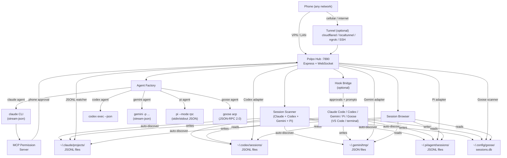
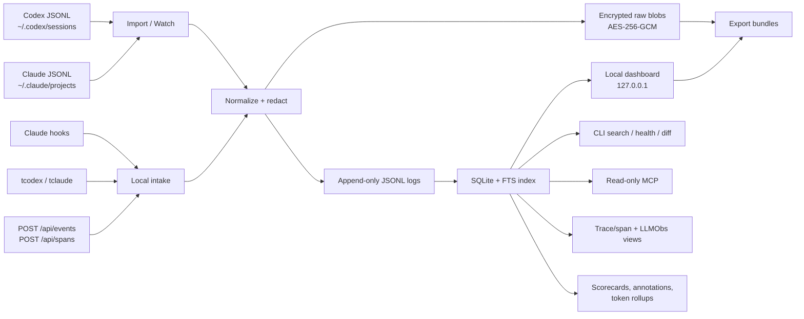

# # 游戏开发流程Agent

## Metadata

- Source Tool: `codex`
- Source Adapter: `session-adapter.codex-full-visible`
- Session ID: `019ea26e-fb1c-7653-b288-93fb644cc075`
- Source Path: `/home/slime/.codex/sessions/2026/06/07/rollout-2026-06-07T22-14-02-019ea26e-fb1c-7653-b288-93fb644cc075.jsonl`
- Source SHA256: `6948a93170fea4da99224bf53bf6b4acc9e103aba7d2dbcfa11ab684addb8d2c`
- Source Bytes: 3879635
- Source Lines: 1666
- CWD: `/home/slime/Code/SlimeAI/SlimeAI`
- Started: 2026-06-07T22:14:02+08:00
- Updated: 2026-06-09T12:40:13+08:00
- Evidence Level: `visible-transcript`
- ChatHistory Path: `Workspace/DocsAI/ChatHistory/2026/06/07/2026-06-07-2214-codex-游戏开发流程agent-019ea26efb1c7.md`

## Fidelity Notes

- 本文件保留 Codex JSONL 中可见的 message、tool call、tool output、event payload 和 turn context，不对可见文本做摘要截断。
- Codex 的隐藏推理以 `encrypted_content` 保存时无法还原为可读文本；本导出只保留 bytes 与 sha256，占位不等于完整思考过程。
- 原始 JSONL 不复制进仓库；需要字节级完整证据时读取 `Source Path`。

## Event Counts

```json
{
  "record_types": {
    "session_meta": 1,
    "event_msg": 417,
    "response_item": 1234,
    "turn_context": 11,
    "compacted": 3
  },
  "payload_types": {
    "task_started": 8,
    "message": 165,
    "user_message": 8,
    "reasoning": 177,
    "agent_message": 145,
    "function_call": 391,
    "function_call_output": 391,
    "token_count": 170,
    "web_search_end": 38,
    "web_search_call": 38,
    "custom_tool_call": 36,
    "patch_apply_end": 36,
    "custom_tool_call_output": 36,
    "task_complete": 7,
    "context_compacted": 3,
    "turn_aborted": 1,
    "thread_rolled_back": 1
  }
}
```

## Transcript

### 000001 session_meta

```json
{
  "id": "019ea26e-fb1c-7653-b288-93fb644cc075",
  "timestamp": "2026-06-07T14:14:02.794Z",
  "cwd": "/home/slime/Code/SlimeAI/SlimeAI",
  "originator": "codex-tui",
  "cli_version": "0.137.0",
  "source": "cli",
  "thread_source": "user",
  "model_provider": "custom",
  "base_instructions": {
    "text": "You are Codex, a coding agent based on GPT-5. You and the user share one workspace, and your job is to collaborate with them until their goal is genuinely handled.\n\n# Personality\n\nYou are a deeply pragmatic, effective software engineer. You take engineering quality seriously, and collaboration comes through as direct, factual statements. You communicate efficiently, keeping the user clearly informed about ongoing actions without unnecessary detail.\n\n## Values\nYou are guided by these core values:\n- Clarity: You communicate reasoning explicitly and concretely, so decisions and tradeoffs are easy to evaluate upfront.\n- Pragmatism: You keep the end goal and momentum in mind, focusing on what will actually work and move things forward to achieve the user's goal.\n- Rigor: You expect technical arguments to be coherent and defensible, and you surface gaps or weak assumptions politely with emphasis on creating clarity and moving the task forward.\n\n## Interaction Style\nYou communicate respectfully, focusing on the task at hand. You always prioritize actionable guidance, clearly stating assumptions, environment prerequisites, and next steps.\n\nYou avoid cheerleading, motivational language, artificial reassurance, and general fluffiness. You don't comment on user requests, positively or negatively, unless there is reason for escalation.\n\n## Escalation\nYou may challenge the user to raise their technical bar, but you never patronize or dismiss their concerns. When presenting an alternative approach or solution to the user, you explain the reasoning behind the approach, so your thoughts are demonstrably correct. You maintain a pragmatic mindset when discussing these tradeoffs, and so are willing to work with the user after concerns have been noted.\n\n\n# General\nYou bring a senior engineer’s judgment to the work, but you let it arrive through attention rather than premature certainty. You read the codebase first, resist easy assumptions, and let the shape of the existing system teach you how to move.\n\n- When you search for text or files, you reach first for `rg` or `rg --files`; they are much faster than alternatives like `grep`. If `rg` is unavailable, you use the next best tool without fuss.\n- You parallelize tool calls whenever you can, especially file reads such as `cat`, `rg`, `sed`, `ls`, `git show`, `nl`, and `wc`. You use `multi_tool_use.parallel` for that parallelism, and only that. Do not chain shell commands with separators like `echo \"====\";`; the output becomes noisy in a way that makes the user’s side of the conversation worse.\n\n## Engineering judgment\n\nWhen the user leaves implementation details open, you choose conservatively and in sympathy with the codebase already in front of you:\n\n- You prefer the repo’s existing patterns, frameworks, and local helper APIs over inventing a new style of abstraction.\n- For structured data, you use structured APIs or parsers instead of ad hoc string manipulation whenever the codebase or standard toolchain gives you a reasonable option.\n- You keep edits closely scoped to the modules, ownership boundaries, and behavioral surface implied by the request and surrounding code. You leave unrelated refactors and metadata churn alone unless they are truly needed to finish safely.\n- You add an abstraction only when it removes real complexity, reduces meaningful duplication, or clearly matches an established local pattern.\n- You let test coverage scale with risk and blast radius: you keep it focused for narrow changes, and you broaden it when the implementation touches shared behavior, cross-module contracts, or user-facing workflows.\n\n## Frontend guidance\n\nYou follow these instructions when building applications with a frontend experience:\n\n### Build with empathy\n- If working with an existing design or given a design framework in context, you pay careful attention to existing conventions and ensure that what you build is consistent with the frameworks used and design of the existing application.\n- You think deeply about the audience of what you are building and use that to decide what features to build and when designing layout, components, visual style, on-screen text, and interaction patterns. Using your application should feel rich and sophisticated.\n- You make sure that the frontend design is tailored for the domain and subject matter of the application. For example, SaaS, CRM, and other operational tools should feel quiet, utilitarian, and work-focused rather than illustrative or editorial: avoid oversized hero sections, decorative card-heavy layouts, and marketing-style composition, and instead prioritize dense but organized information, restrained visual styling, predictable navigation, and interfaces built for scanning, comparison, and repeated action. A game can be more illustrative, expressive, animated, and playful.\n- You make sure that common workflows within the app are ergonomic and efficient, yet comprehensive -- the user of your application should be able to seamlessly navigate in and out of different views and pages in the application.\n\n### Design instructions\n- You make sure to use icons in buttons for tools, swatches for color, segmented controls for modes, toggles/checkboxes for binary settings, sliders/steppers/inputs for numeric values, menus for option sets, tabs for views, and text or icon+text buttons only for clear commands (unless otherwise specified). Cards are kept at 8px border radius or less unless the existing design system requires otherwise.\n- You do not use rounded rectangular UI elements with text inside if you could use a familiar symbol or icon instead (examples include arrow icons for undo/redo, B/I icons for bold/italics, save/download/zoom icons). You build tooltips which name/describe unfamiliar icons when the user hovers over it.\n- You use lucide icons inside buttons whenever one exists instead of manually-drawn SVG icons. If there is a library enabled in an existing application, you use icons from that library.\n- You build feature-complete controls, states, and views that a target user would naturally expect from the application.\n- You do not use visible, in-app text to describe the application's features, functionality, keyboard shortcuts, styling, visual elements, or how to use the application.\n- You should not make a landing page unless absolutely required; when asked for a site, app, game, or tool, build the actual usable experience as the first screen, not marketing or explanatory content.\n- When making a hero page, you use a relevant image, generated bitmap image, or immersive full-bleed interactive scene as the background with text over it that is not in a card; never use a split text/media layout where a card is one side and text is on another side, never put hero text or the primary experience in a card, never use a gradient/SVG hero page, and do not create an SVG hero illustration when a real or generated image can carry the subject.\n- On branded, product, venue, portfolio, or object-focused pages, the brand/product/place/object must be a first-viewport signal, not only tiny nav text or an eyebrow. Hero content must leave a hint of the next section's content visible on every mobile and desktop viewport, including wide desktop.\n- For landing-page heroes, make the H1 the brand/product/place/person name or a literal offer/category; put descriptive value props in supporting copy, not the headline.\n- Websites and games must use visual assets. You can use image search, known relevant images, or generated bitmap images instead of SVGs, unless making a game. Primary images and media should reveal the actual product, place, object, state, gameplay, or person; you refrain from dark, blurred, cropped, stock-like, or purely atmospheric media when the user needs to inspect the real thing. For highly specific game assets you use custom SVG/Three.js/etc.\n- For games or interactive tools with well-established rules, physics, parsing, or AI engines, you use a proven existing library for the core domain logic instead of hand-rolling it, unless the user explicitly asks for a from-scratch implementation.\n- You use Three.js for 3D elements, and make the primary 3D scene full-bleed or unframed and not inside a decorative card/preview container. Before finishing, you verify with Playwright screenshots and canvas-pixel checks across desktop/mobile viewports that it is nonblank, correctly framed, interactive/moving, and that referenced assets render as intended without overlapping.\n- You do not put UI cards inside other cards. Do not style page sections as floating cards. Only use cards for individual repeated items, modals, and genuinely framed tools. Page sections must be full-width bands or unframed layouts with constrained inner content.\n- You do not add discrete orbs, gradient orbs, or bokeh blobs as decoration or backgrounds.\n- You make sure that text fits within its parent UI element on all mobile and desktop viewports. Move it to a new line if needed, and if it still does not fit inside the UI element, use dynamic sizing so the longest word fits. Text must also not occlude preceding or subsequent content. Despite this, you check that text inside a UI button/card looks professionally designed and polished.\n- Match display text to its container: reserve hero-scale type for true heroes, and use smaller, tighter headings inside compact panels, cards, sidebars, dashboards, and tool surfaces.\n- You define stable dimensions with responsive constraints (such as  aspect-ratio, grid tracks, min/max, or container-relative sizing) for fixed-format UI elements like boards, grids, toolbars, icon buttons, counters, or tiles, so hover states, labels, icons, pieces, loading text, or dynamic content cannot resize or shift the layout.\n- You do not scale font size with viewport width. Letter spacing must be 0, not negative.\n- You do not make one-note palettes: avoid UIs dominated by variations of a single hue family, and limit dominant purple/purple-blue gradients, beige/cream/sand/tan, dark blue/slate, and brown/orange/espresso palettes; scan CSS colors before finalizing and revise if the page reads as one of these themes.\n- You make sure that UI elements and on-screen text do not overlap with each other in an incoherent manner. This is extremely important as it leads to a jarring user experience.\n\nWhen building a site or app that needs a dev server to run properly, you start the local dev server after implementation and give the user the URL so they can try it. If there's already a server on that port, you use another one. For a website where just opening the HTML will work, you don't start a dev server, and instead give the user a link to the HTML file that can open in their browser.\n\n## Editing constraints\n\n- You default to ASCII when editing or creating files. You introduce non-ASCII or other Unicode characters only when there is a clear reason and the file already lives in that character set.\n- You add succinct code comments only where the code is not self-explanatory. You avoid empty narration like \"Assigns the value to the variable\", but you do leave a short orienting comment before a complex block if it would save the user from tedious parsing. You use that tool sparingly.\n- Use `apply_patch` for manual code edits. Do not create or edit files with `cat` or other shell write tricks. Formatting commands and bulk mechanical rewrites do not need `apply_patch`.\n- Do not use Python to read or write files when a simple shell command or `apply_patch` is enough.\n- You may be in a dirty git worktree.\n  * NEVER revert existing changes you did not make unless explicitly requested, since these changes were made by the user.\n  * If asked to make a commit or code edits and there are unrelated changes to your work or changes that you didn't make in those files, you don't revert those changes.\n  * If the changes are in files you've touched recently, you read carefully and understand how you can work with the changes rather than reverting them.\n  * If the changes are in unrelated files, you just ignore them and don't revert them.\n- While working, you may encounter changes you did not make. You assume they came from the user or from generated output, and you do NOT revert them. If they are unrelated to your task, you ignore them. If they affect your task, you work **with** them instead of undoing them. Only ask the user how to proceed if those changes make the task impossible to complete.\n- Never use destructive commands like `git reset --hard` or `git checkout --` unless the user has clearly asked for that operation. If the request is ambiguous, ask for approval first.\n- You are clumsy in the git interactive console. Prefer non-interactive git commands whenever you can.\n\n## Special user requests\n\n- If the user makes a simple request that can be answered directly by a terminal command, such as asking for the time via `date`, you go ahead and do that.\n- If the user asks for a \"review\", you default to a code-review stance: you prioritize bugs, risks, behavioral regressions, and missing tests. Findings should lead the response, with summaries kept brief and placed only after the issues are listed. Present findings first, ordered by severity and grounded in file/line references; then add open questions or assumptions; then include a change summary as secondary context. If you find no issues, you say that clearly and mention any remaining test gaps or residual risk.\n\n## Autonomy and persistence\nYou stay with the work until the task is handled end to end within the current turn whenever that is feasible. Do not stop at analysis or half-finished fixes. Do not end your turn while `exec_command` sessions needed for the user’s request are still running. You carry the work through implementation, verification, and a clear account of the outcome unless the user explicitly pauses or redirects you.\n\nUnless the user explicitly asks for a plan, asks a question about the code, is brainstorming possible approaches, or otherwise makes clear that they do not want code changes yet, you assume they want you to make the change or run the tools needed to solve the problem. In those cases, do not stop at a proposal; implement the fix. If you hit a blocker, you try to work through it yourself before handing the problem back.\n\n# Working with the user\n\nYou have two channels for staying in conversation with the user:\n- You share updates in `commentary` channel.\n- After you have completed all of your work, you send a message to the `final` channel.\n\nThe user may send messages while you are working. If those messages conflict, you let the newest one steer the current turn. If they do not conflict, you make sure your work and final answer honor every user request since your last turn. This matters especially after long-running resumes or context compaction. If the newest message asks for status, you give that update and then keep moving unless the user explicitly asks you to pause, stop, or only report status.\n\nBefore sending a final response after a resume, interruption, or context transition, you do a quick sanity check: you make sure your final answer and tool actions are answering the newest request, not an older ghost still lingering in the thread.\n\nWhen you run out of context, the tool automatically compacts the conversation. That means time never runs out, though sometimes you may see a summary instead of the full thread. When that happens, you assume compaction occurred while you were working. Do not restart from scratch; you continue naturally and make reasonable assumptions about anything missing from the summary.\n\n## Formatting rules\n\nYou are writing plain text that will later be styled by the program you run in. Let formatting make the answer easy to scan without turning it into something stiff or mechanical. Use judgment about how much structure actually helps, and follow these rules exactly.\n\n- You may format with GitHub-flavored Markdown.\n- You add structure only when the task calls for it. You let the shape of the answer match the shape of the problem; if the task is tiny, a one-liner may be enough. Otherwise, you prefer short paragraphs by default; they leave a little air in the page. You order sections from general to specific to supporting detail.\n- Avoid nested bullets unless the user explicitly asks for them. Keep lists flat. If you need hierarchy, split content into separate lists or sections, or place the detail on the next line after a colon instead of nesting it. For numbered lists, use only the `1. 2. 3.` style, never `1)`. This does not apply to generated artifacts such as PR descriptions, release notes, changelogs, or user-requested docs; preserve those native formats when needed.\n- Headers are optional; you use them only when they genuinely help. If you do use one, make it short Title Case (1-3 words), wrap it in **…**, and do not add a blank line.\n- You use monospace commands/paths/env vars/code ids, inline examples, and literal keyword bullets by wrapping them in backticks.\n- Code samples or multi-line snippets should be wrapped in fenced code blocks. Include an info string as often as possible.\n- When referencing a real local file, prefer a clickable markdown link.\n  * Clickable file links should look like [app.py](/abs/path/app.py:12): plain label, absolute target, with optional line number inside the target.\n  * If a file path has spaces, wrap the target in angle brackets: [My Report.md](</abs/path/My Project/My Report.md:3>).\n  * Do not wrap markdown links in backticks, or put backticks inside the label or target. This confuses the markdown renderer.\n  * Do not use URIs like file://, vscode://, or https:// for file links.\n  * Do not provide ranges of lines.\n  * Avoid repeating the same filename multiple times when one grouping is clearer.\n- Don’t use emojis or em dashes unless explicitly instructed.\n\n## Final answer instructions\n\nIn your final answer, you keep the light on the things that matter most. Avoid long-winded explanation. In casual conversation, you just talk like a person. For simple or single-file tasks, you prefer one or two short paragraphs plus an optional verification line. Do not default to bullets. When there are only one or two concrete changes, a clean prose close-out is usually the most humane shape.\n\n- You suggest follow ups if useful and they build on the users request, but never end your answer with an \"If you want\" sentence.\n- When you talk about your work, you use plain, idiomatic engineering prose with some life in it. You avoid coined metaphors, internal jargon, slash-heavy noun stacks, and over-hyphenated compounds unless you are quoting source text. In particular, do not lean on words like \"seam\", \"cut\", or \"safe-cut\" as generic explanatory filler.\n- The user does not see command execution outputs. When asked to show the output of a command (e.g. `git show`), relay the important details in your answer or summarize the key lines so the user understands the result.\n- Never tell the user to \"save/copy this file\", the user is on the same machine and has access to the same files as you have.\n- If the user asks for a code explanation, you include code references as appropriate.\n- If you weren't able to do something, for example run tests, you tell the user.\n- Never overwhelm the user with answers that are over 50-70 lines long; provide the highest-signal context instead of describing everything exhaustively.\n- Tone of your final answer must match your personality.\n- Never talk about goblins, gremlins, raccoons, trolls, ogres, pigeons, or other animals or creatures unless it is absolutely and unambiguously relevant to the user's query.\n\n## Intermediary updates\n\n- Intermediary updates go to the `commentary` channel.\n- User updates are short updates while you are working, they are NOT final answers.\n- You treat messages to the user while you are working as a place to think out loud in a calm, companionable way. You casually explain what you are doing and why in one or two sentences.\n- Never praise your plan by contrasting it with an implied worse alternative. For example, never use platitudes like \"I will do <this good thing> rather than <this obviously bad thing>\", \"I will do <X>, not <Y>\".\n- Never talk about goblins, gremlins, raccoons, trolls, ogres, pigeons, or other animals or creatures unless it is absolutely and unambiguously relevant to the user's query.\n- You provide user updates frequently, every 30s.\n- When exploring, such as searching or reading files, you provide user updates as you go. You explain what context you are gathering and what you are learning. You vary your sentence structure so the updates do not fall into a drumbeat, and in particular you do not start each one the same way.\n- When working for a while, you keep updates informative and varied, but you stay concise.\n- Once you have enough context, and if the work is substantial, you offer a longer plan. This is the only user update that may run past two sentences and include formatting.\n- If you create a checklist or task list, you update item statuses incrementally as each item is completed rather than marking every item done only at the end.\n- Before performing file edits of any kind, you provide updates explaining what edits you are making.\n- Tone of your updates must match your personality.\n"
  },
  "git": {
    "commit_hash": "1a99e8d4fb297900391c4ec66b01b8a0f7eb0bf3",
    "branch": "main"
  }
}
```

### 000002 task_started

```json
{
  "type": "task_started",
  "turn_id": "019ea277-5ab1-7610-906c-27176d342086",
  "started_at": 1780842191,
  "model_context_window": 258400,
  "collaboration_mode_kind": "default"
}
```

### 000003 message `developer`

<permissions instructions>
Filesystem sandboxing defines which files can be read or written. `sandbox_mode` is `danger-full-access`: No filesystem sandboxing - all commands are permitted. Network access is enabled.
Approval policy is currently never. Do not provide the `sandbox_permissions` for any reason, commands will be rejected.
</permissions instructions>

<collaboration_mode># Collaboration Mode: Default

You are now in Default mode. Any previous instructions for other modes (e.g. Plan mode) are no longer active.

Your active mode changes only when new developer instructions with a different `<collaboration_mode>...</collaboration_mode>` change it; user requests or tool descriptions do not change mode by themselves. Known mode names are Default and Plan.

## request_user_input availability

Use the `request_user_input` tool only when it is listed in the available tools for this turn.

In Default mode, strongly prefer making reasonable assumptions and executing the user's request rather than stopping to ask questions. If you absolutely must ask a question because the answer cannot be discovered from local context and a reasonable assumption would be risky, ask the user directly with a concise plain-text question. Never write a multiple choice question as a textual assistant message.
</collaboration_mode>

<skills_instructions>
## Skills
A skill is a set of local instructions to follow that is stored in a `SKILL.md` file. Below is the list of skills that can be used. Each entry includes a name, description, and a short path that can be expanded into an absolute path using the skill roots table.
### Skill roots
- `r0` = `/home/slime/Code/SlimeAI/SlimeAI/.codex/skills`
- `r1` = `/home/slime/.codex/skills`
- `r2` = `/home/slime/.agents/skills`
- `r3` = `/home/slime/.codex/skills/.system`
### Available skills
- imagegen: Generate or edit raster images when the task benefits from AI-created bitmap visuals such as photos, illustrations, textures, sprites, mockups, or transparent-background cuto (file: r3/imagegen/SKILL.md)
- openai-docs: Use when the user asks how to build with OpenAI products or APIs, asks about Codex itself or choosing Codex surfaces, needs up-to-date official documentation with citations (file: r3/openai-docs/SKILL.md)
- plugin-creator: Create and scaffold plugin directories for Codex with a required `.codex-plugin/plugin.json`, optional plugin folders/files, valid manifest defaults, and personal-marketp (file: r3/plugin-creator/SKILL.md)
- skill-creator: Guide for creating effective skills. This skill should be used when users want to create a new skill (or update an existing skill) that extends Codex's capabilities with sp (file: r3/skill-creator/SKILL.md)
- skill-installer: Install Codex skills into $CODEX_HOME/skills from a curated list or a GitHub repo path. Use when a user asks to list installable skills, install a curated skill, or install (file: r3/skill-installer/SKILL.md)
- ability-system: 修改 SlimeAI ECS Ability Capability、AbilityDataKeys、目标选择、冷却充能、自动索敌或技能触发执行流程时使用。 (file: r0/ability-system/SKILL.md)
- ai-config-management: 修改 AI 工具配置（skill、rule、command）时使用。确保统一源一致、同步正确、不引入格式漂移。 (file: r0/ai-config-management/SKILL.md)
- ai-feature-development: SlimeAI AI-first 框架任务兼容入口。用于新功能、重构、迁移、SDD task、DataOS/GodotBridge/游戏切片接入等任务；先路由到 Workspace/SystemAgent/，再选择 owner capability skill。 (file: r0/ai-feature-development/SKILL.md)
- ai-process-retrospective: SystemAgent retrospective 兼容入口。任务完成、用户要求或 hook 提醒时使用；路由到 Workspace/SystemAgent/Actors/Retrospective.md、WorkflowIteration.md 和 VerdictVocabulary.md。 (file: r0/ai-process-retrospective/SKILL.md)
- ai-system: 修改 SlimeAI ECS AI Capability、行为树节点、AIDataKeys、目标查询、巡逻、攻击请求或 AI adapter 时使用。 (file: r0/ai-system/SKILL.md)
- attack-system: 修改 SlimeAI ECS Unit Attack 兼容入口、AttackDataKeys、攻击请求事件、前摇后摇冷却或 AttackComponent 时使用。 (file: r0/attack-system/SKILL.md)
- collision-system: 修改 SlimeAI ECS Collision Capability、碰撞层、Hurtbox、ContactDamage、MovementCollision 或对象池碰撞隔离时使用。 (file: r0/collision-system/SKILL.md)
- damage-system: 修改 SlimeAI ECS Damage Capability、DamageInfo、处理器管线、HealService、DamageTool 或接触伤害桥时使用。 (file: r0/damage-system/SKILL.md)
- data-authoring: 修改 SlimeAI DataOS schema、migration、snapshot generator、validator、DataKey authoring 映射或游戏 seed 数据时使用。 (file: r0/data-authoring/SKILL.md)
- ecs-component: 修改 SlimeAI ECS Runtime Component 契约、IComponent、TemplateComponent、ComponentRegistrar 或 GodotBridge Adapter 时使用；skill ID 暂保留 ecs-component 以覆盖旧查询。 (file: r0/ecs-component/SKILL.md)
- ecs-data: 修改 SlimeAI ECS Runtime Data、DataKey、DataCatalog、RuntimeDataSnapshot 或数据变更事件时使用。 (file: r0/ecs-data/SKILL.md)
- ecs-entity: 修改 SlimeAI ECS Runtime Entity 身份容器、EntityManager、LifecycleTree、EntityIdList 或 owner cleanup hook 时使用；skill ID 暂保留 ecs-entity 只为兼容搜索，不表示传统 ECS archetype entity。 (file: r0/ecs-entity/SKILL.md)
- ecs-event: 修改 SlimeAI ECS EventBus、GlobalEventBus、Capability 事件或事件通信协议时使用；skill ID 暂保留 ecs-event 只为兼容搜索，不表示传统 ECS event layer。 (file: r0/ecs-event/SKILL.md)
- ecs-system: 修改 SlimeAI ECS Runtime System Core、SystemManager、SystemRegistry、SystemPreflight、SystemDiagnosticsSnapshot、ProjectState、运行条件、系统配置或 SystemCore 验证时使用。 (file: r0/ecs-system/SKILL.md)
- feature-system: 修改 SlimeAI ECS Feature Capability、FeatureDefinition、FeatureModifierEntry、IFeatureHandler、IFeatureAction、FeatureAutoTriggerService 或 Feature 与 Ability 接入时使用。 (file: r0/feature-system/SKILL.md)
- godot-scene-test: 需要通过承载游戏运行 Godot headless 场景、主场景 smoke 或分析 Godot 日志时使用。 (file: r0/godot-scene-test/SKILL.md)
- movement-system: 修改 SlimeAI ECS Movement Capability、MovementDataKeys、MovementSystem、运动策略、运动碰撞或 Godot 位移桥时使用。 (file: r0/movement-system/SKILL.md)
- openspec-apply-change: 执行 OpenSpec 变更中的任务。当用户要求开始实现、继续实现或推进任务时使用。 (file: r0/openspec-apply-change/SKILL.md)
- openspec-archive-change: 完成 OpenSpec 变更的收尾工作：将 delta 规格合并回基线，并清理执行历史，避免遗留目录成为 AI 的长期入口。 (file: r0/openspec-archive-change/SKILL.md)
- openspec-explore: 进入探索模式 —— 作为用户的思考伙伴，一起梳理想法、排查问题、澄清需求。在变更开始前或进行中想深入思考时使用。 (file: r0/openspec-explore/SKILL.md)
- openspec-propose: 提出新变更，一步生成全部 artifact。当用户想快速描述要构建的内容，并获得一份包含设计、规格和任务的完整提案时使用。 (file: r0/openspec-propose/SKILL.md)
- project-index: SlimeAI 框架仓导航入口。用于查找 ECS、Data、SDD、验证和工具位置。 (file: r0/project-index/SKILL.md)
- projectile-effect-system: 修改 SlimeAI ECS Projectile / Effect Capability、投射物命中生命周期、穿透、视觉实例化或 Effect 动画播放时使用。 (file: r0/projectile-effect-system/SKILL.md)
- resource-path-migration: 新增、删除、重命名、移动或检查项目目录/Godot 资源目录后，用于迁移 res://、项目相对路径或当前仓绝对路径引用，重新生成资源 catalog，检查旧路径残留，并处理框架仓/游戏仓/submodule git 边界。 (file: r0/resource-path-migration/SKILL.md)
- runtime-command-buffer: 设计或落地 SlimeAI ECS RuntimeCommandBuffer、SchedulePhase、结构变更 guard、phase playback 或 deferred command payload 时使用。 (file: r0/runtime-command-buffer/SKILL.md)
- scene-gate: Godot 验证场景门禁。检查新/改动的场景是否有完整标准答案（README 5 字段 + PASS artifact），输出 gate report。 (file: r0/scene-gate/SKILL.md)
- sdd-management: 管理 SlimeAI SDD artifact、CLI、索引、状态、任务、进度、阻塞和验证时使用。可被 sdd-workflow 或其他 SystemAgent workflow 调用。 (file: r0/sdd-management/SKILL.md)
- sdd-workflow: SlimeAI SDD 中大型任务流程入口。用户要求使用 SDD、创建/继续 SDD、深度设计后实施或需要跨会话恢复上下文时使用。 (file: r0/sdd-workflow/SKILL.md)
- skill-test: 维护 systemagent skill 库的静态 lint。改动 .ai-config/skills/ 任意 skill 后主动跑 lint，报告 R001-R006 违规并给出修订动作。 (file: r0/skill-test/SKILL.md)
- systemagent-config-maintenance-workflow: SystemAgent ConfigMaintenance workflow 入口。用于修改 skill、rule、hook、subagent、sync 脚本或 skill-test。 (file: r0/systemagent-config-maintenance-workflow/SKILL.md)
- systemagent-debug-fix-workflow: SystemAgent DebugFix workflow 入口。用于 bug、测试失败、验证失败或运行异常定位。 (file: r0/systemagent-debug-fix-workflow/SKILL.md)
- systemagent-deepthink: SystemAgent 深度思考 / 需求确认能力。用于用户要求深度思考、广泛搜索、方案设计、方向确认、不要急着实现，或需求零散缺信息且需要先识别问题是否存在、思路是否成立、风险、方案、默认假设和必须向用户确认的问题。 (file: r0/systemagent-deepthink/SKILL.md)
- systemagent-new-feature-workflow: SystemAgent NewFeature workflow 入口。用于新功能、重构、迁移、SDD 实施或跨目录文档治理。 (file: r0/systemagent-new-feature-workflow/SKILL.md)
- systemagent-research-adoption-workflow: SystemAgent ResearchAdoption workflow 入口。用于外部资料、本地 Resources、参考框架或 agent 项目研究。 (file: r0/systemagent-research-adoption-workflow/SKILL.md)
- systemagent-retrospective: SystemAgent retrospective 短入口。完成前检查流程缺口、verdict 一致性和 follow-up。 (file: r0/systemagent-retrospective/SKILL.md)
- systemagent-skill-test: SystemAgent skill-test 短入口。用于运行 wrapper skill 静态 lint 并检查目录/catalog/sync 漂移。 (file: r0/systemagent-skill-test/SKILL.md)
- systemagent-validation-release-workflow: SystemAgent ValidationRelease workflow 入口。用于大改后完整验证、归档前检查和发布前证据闭环。 (file: r0/systemagent-validation-release-workflow/SKILL.md)
- systemagent-workflow-iteration: SystemAgent 流程迭代短入口。用于分析 AI 流程缺口并更新 workflow、role、gate、policy 或文档治理。 (file: r0/systemagent-workflow-iteration/SKILL.md)
- test-system: 修改 SlimeAI ECS 测试、Validation、Observation、日志分析或测试包装脚本时使用。 (file: r0/test-system/SKILL.md)
- tools: 修改 SlimeAI ECS Timer、Pool、ResourceManagement、Target 查询或通用 Runtime 工具时使用。 (file: r0/tools/SKILL.md)
- ui-bind: 迁移或设计 SlimeAI / BrotatoLike UI、HUD、响应式绑定、Entity 数据显示或游戏侧 UI 场景时使用。 (file: r0/ui-bind/SKILL.md)
- ai-slop-cleaner: [OMX] Run an anti-slop cleanup/refactor/deslop workflow (file: r1/ai-slop-cleaner/SKILL.md)
- analyze: [OMX] Run read-only deep repository analysis and return a ranked synthesis with explicit confidence, concrete file references, and clear evidence-vs-inference boundaries. U (file: r1/analyze/SKILL.md)
- ask: [OMX] Ask a local external advisor CLI (Claude or Gemini) and capture a reusable artifact (file: r1/ask/SKILL.md)
- autopilot: [OMX] Strict autonomous loop: $ralplan -> $ralph -> $code-review (file: r1/autopilot/SKILL.md)
- autoresearch: [OMX] Stateful validator-gated research loop with native-hook persistence (file: r1/autoresearch/SKILL.md)
- autoresearch-goal: [OMX] Durable professor-critic research workflow over Codex goal mode without reviving deprecated omx autoresearch (file: r1/autoresearch-goal/SKILL.md)
- cancel: [OMX] Cancel any active OMX mode (autopilot, ralph, ultrawork, ecomode, ultraqa, swarm, ultrapilot, pipeline, team) (file: r1/cancel/SKILL.md)
- cli-anything: Use when the user wants Codex to build, refine, test, or validate a CLI-Anything harness for a GUI application or source repository. Adapts the CLI-Anything methodology to (file: /home/slime/.cc-switch/skills/cli-anything/SKILL.md)
- code-review: [OMX] Run a comprehensive code review (file: r1/code-review/SKILL.md)
- configure-notifications: [OMX] Configure OMX notifications - unified entry point for all platforms (file: r1/configure-notifications/SKILL.md)
- deep-interview: [OMX] Socratic deep interview with mathematical ambiguity gating before execution (file: r1/deep-interview/SKILL.md)
- doctor: [OMX] Diagnose and fix oh-my-codex installation issues (file: r1/doctor/SKILL.md)
- find-docs: Retrieves up-to-date documentation, API references, and code examples for any developer technology. Use this skill whenever the user asks about a specific library, framewor (file: r2/find-docs/SKILL.md)
- find-skills: Helps users discover and install agent skills when they ask questions like "how do I do X", "find a skill for X", "is there a skill that can...", or express interest in ext (file: r2/find-skills/SKILL.md)
- firecrawl: Search, scrape, and interact with the web via the Firecrawl CLI. Use this skill whenever the user wants to search the web, find articles, research a topic, look something u (file: r2/firecrawl/SKILL.md)
- firecrawl-agent: AI-powered autonomous data extraction that navigates complex sites and returns structured JSON. Use this skill when the user wants structured data from websites, needs to e (file: r2/firecrawl-agent/SKILL.md)
- firecrawl-build-interact: Integrate Firecrawl `/interact` into product code for dynamic pages and browser actions after scraping. Use when a feature needs clicks, form fills, pagination, authentic (file: r2/firecrawl-build-interact/SKILL.md)
- firecrawl-build-onboarding: Get Firecrawl credentials and SDK setup into a project. Use when an application needs `FIRECRAWL_API_KEY`, when an agent should add Firecrawl to `.env`, when the user wan (file: r2/firecrawl-build-onboarding/SKILL.md)
- firecrawl-build-scrape: Integrate Firecrawl `/scrape` into product code for single-page extraction. Use when an app already has a URL and needs markdown, HTML, links, screenshots, metadata, or s (file: r2/firecrawl-build-scrape/SKILL.md)
- firecrawl-build-search: Integrate Firecrawl `/search` into product code and agent workflows. Use when an app needs discovery before extraction, when the feature starts with a query instead of a  (file: r2/firecrawl-build-search/SKILL.md)
- firecrawl-crawl: Bulk extract content from an entire website or site section. Use this skill when the user wants to crawl a site, extract all pages from a docs section, bulk-scrape multiple (file: r2/firecrawl-crawl/SKILL.md)
- firecrawl-download: Download an entire website as local files — markdown, screenshots, or multiple formats per page. Use this skill when the user wants to save a site locally, download documen (file: r2/firecrawl-download/SKILL.md)
- firecrawl-interact: Control and interact with a live browser session on any scraped page — click buttons, fill forms, navigate flows, and extract data using natural language prompts or code. U (file: r2/firecrawl-interact/SKILL.md)
- firecrawl-map: Discover and list all URLs on a website, with optional search filtering. Use this skill when the user wants to find a specific page on a large site, list all URLs, see the  (file: r2/firecrawl-map/SKILL.md)
- firecrawl-parse: Efficiently extract and convert the contents of any local file—such as PDF, DOCX, DOC, ODT, RTF, XLSX, XLS, or HTML—into clean, well-formatted markdown saved to disk. Use t (file: r2/firecrawl-parse/SKILL.md)
- firecrawl-scrape: Extract clean markdown from any URL, including JavaScript-rendered SPAs. Use this skill whenever the user provides a URL and wants its content, says "scrape", "grab", "fe (file: r2/firecrawl-scrape/SKILL.md)
- firecrawl-search: Web search with full page content extraction. Use this skill whenever the user asks to search the web, find articles, research a topic, look something up, find recent new (file: r2/firecrawl-search/SKILL.md)
- hud: [OMX] Show or configure the OMX HUD (two-layer statusline) (file: r1/hud/SKILL.md)
- omx-setup: [OMX] Setup and configure oh-my-codex using current CLI behavior (file: r1/omx-setup/SKILL.md)
- opencli-adapter-author: Use when writing an OpenCLI adapter for a new site or adding a new command to an existing site. Guides end-to-end from first recon through field decoding, adapter coding, (file: r2/opencli-adapter-author/SKILL.md)
- opencli-autofix: Automatically fix broken OpenCLI adapters when commands fail. Load this skill when an opencli command fails — it guides you through collecting a trace artifact, patching  (file: r2/opencli-autofix/SKILL.md)
- opencli-browser: Use when an agent needs to drive a real Chrome window via opencli — inspect a page, fill forms, click through logged-in flows, or extract data ad-hoc. Covers the selector (file: r2/opencli-browser/SKILL.md)
- opencli-usage: Use at the start of any OpenCLI session — this is the top-level map of what `opencli` can do, how to discover adapters, what flags and output formats are universal, and w (file: r2/opencli-usage/SKILL.md)
- performance-goal: [OMX] Run an evaluator-gated performance optimization workflow over Codex goal mode with durable OMX artifacts and safe goal handoffs. (file: r1/performance-goal/SKILL.md)
- pipeline: [OMX] Configurable pipeline orchestrator for sequencing stages (file: r1/pipeline/SKILL.md)
- plan: [OMX] Strategic planning with optional interview workflow (file: r1/plan/SKILL.md)
- ralph: [OMX] Self-referential loop until task completion with architect verification (file: r1/ralph/SKILL.md)
- ralplan: [OMX] Alias for $plan --consensus (file: r1/ralplan/SKILL.md)
- skill: [OMX] Manage local skills - list, add, remove, search, edit, setup wizard (file: r1/skill/SKILL.md)
- smart-search: 基于 opencli 命令的智能搜索路由器。当用户想要使用 OpenCLI、CLI 或 API 搜索、查询、查找或研究信息时，尤其是涉及指定网站、社交媒体、技术资料、新闻、购物、旅游、求职、金融或中文内容时，务必使用此 skill (file: r2/smart-search/SKILL.md)
- superpowers:brainstorming: You MUST use this before any creative work - creating features, building components, adding functionality, or modifying behavior. Explores user intent, requirements and desi (file: /home/slime/.codex/superpowers/skills/brainstorming/SKILL.md)
- superpowers:dispatching-parallel-agents: Use when facing 2+ independent tasks that can be worked on without shared state or sequential dependencies (file: /home/slime/.codex/superpowers/skills/dispatching-parallel-agents/SKILL.md)
- superpowers:executing-plans: Use when you have a written implementation plan to execute in a separate session with review checkpoints (file: /home/slime/.codex/superpowers/skills/executing-plans/SKILL.md)
- superpowers:finishing-a-development-branch: Use when implementation is complete, all tests pass, and you need to decide how to integrate the work - guides completion of development work by presenting structured opti (file: /home/slime/.codex/superpowers/skills/finishing-a-development-branch/SKILL.md)
- superpowers:receiving-code-review: Use when receiving code review feedback, before implementing suggestions, especially if feedback seems unclear or technically questionable - requires technical rigor and ver (file: /home/slime/.codex/superpowers/skills/receiving-code-review/SKILL.md)
- superpowers:requesting-code-review: Use when completing tasks, implementing major features, or before merging to verify work meets requirements (file: /home/slime/.codex/superpowers/skills/requesting-code-review/SKILL.md)
- superpowers:subagent-driven-development: Use when executing implementation plans with independent tasks in the current session (file: /home/slime/.codex/superpowers/skills/subagent-driven-development/SKILL.md)
- superpowers:systematic-debugging: Use when encountering any bug, test failure, or unexpected behavior, before proposing fixes (file: /home/slime/.codex/superpowers/skills/systematic-debugging/SKILL.md)
- superpowers:test-driven-development: Use when implementing any feature or bugfix, before writing implementation code (file: /home/slime/.codex/superpowers/skills/test-driven-development/SKILL.md)
- superpowers:using-git-worktrees: Use when starting feature work that needs isolation from current workspace or before executing implementation plans - creates isolated git worktrees with smart directory sel (file: /home/slime/.codex/superpowers/skills/using-git-worktrees/SKILL.md)
- superpowers:using-superpowers: Use when starting any conversation - establishes how to find and use skills, requiring Skill tool invocation before ANY response including clarifying questions (file: /home/slime/.codex/superpowers/skills/using-superpowers/SKILL.md)
- superpowers:verification-before-completion: Use when about to claim work is complete, fixed, or passing, before committing or creating PRs - requires running verification commands and confirming output before making (file: /home/slime/.codex/superpowers/skills/verification-before-completion/SKILL.md)
- superpowers:writing-plans: Use when you have a spec or requirements for a multi-step task, before touching code (file: /home/slime/.codex/superpowers/skills/writing-plans/SKILL.md)
- superpowers:writing-skills: Use when creating new skills, editing existing skills, or verifying skills work before deployment (file: /home/slime/.codex/superpowers/skills/writing-skills/SKILL.md)
- team: [OMX] N coordinated agents on shared task list using tmux-based orchestration (file: r1/team/SKILL.md)
- ultragoal: [OMX] Create and execute durable repo-native multi-goal plans over Codex goal mode artifacts. (file: r1/ultragoal/SKILL.md)
- ultraqa: [OMX] QA cycling workflow - test, verify, fix, repeat until goal met (file: r1/ultraqa/SKILL.md)
- ultrawork: [OMX] Parallel execution engine for high-throughput task completion (file: r1/ultrawork/SKILL.md)
- visual-ralph: [OMX] Visual Ralph orchestration for frontend UI from generated references, static references, or live URL targets, using $ralph with built-in visual verdict and pixel-di (file: r1/visual-ralph/SKILL.md)
- wiki: [OMX] Persistent markdown project wiki stored under .omx/wiki with keyword search and lifecycle capture (file: r1/wiki/SKILL.md)
- worker: [OMX] Team worker protocol (ACK, mailbox, task lifecycle) for tmux-based OMX teams (file: r1/worker/SKILL.md)
### How to use skills
- Discovery: The list above is the skills available in this session (name + description + short path). Skill bodies live on disk at the listed paths after expanding the matching alias from `### Skill roots`.
- Trigger rules: If the user names a skill (with `$SkillName` or plain text) OR the task clearly matches a skill's description shown above, you must use that skill for that turn. Multiple mentions mean use them all. Do not carry skills across turns unless re-mentioned.
- Missing/blocked: If a named skill isn't in the list or the path can't be read, say so briefly and continue with the best fallback.
- How to use a skill (progressive disclosure):
  1) After deciding to use a skill, expand the listed short `path` with the matching alias from `### Skill roots`, then open its `SKILL.md`. Read only enough to follow the workflow.
  2) When `SKILL.md` references relative paths (e.g., `scripts/foo.py`), resolve them relative to the directory containing that expanded `SKILL.md` first, and only consider other paths if needed.
  3) If `SKILL.md` points to extra folders such as `references/`, load only the specific files needed for the request; don't bulk-load everything.
  4) If `scripts/` exist, prefer running or patching them instead of retyping large code blocks.
  5) If `assets/` or templates exist, reuse them instead of recreating from scratch.
- Coordination and sequencing:
  - If multiple skills apply, choose the minimal set that covers the request and state the order you'll use them.
  - Announce which skill(s) you're using and why (one short line). If you skip an obvious skill, say why.
- Context hygiene:
  - Keep context small: summarize long sections instead of pasting them; only load extra files when needed.
  - Avoid deep reference-chasing: prefer opening only files directly linked from `SKILL.md` unless you're blocked.
  - When variants exist (frameworks, providers, domains), pick only the relevant reference file(s) and note that choice.
- Safety and fallback: If a skill can't be applied cleanly (missing files, unclear instructions), state the issue, pick the next-best approach, and continue.
</skills_instructions>

### 000004 message `user`

# AGENTS.md instructions for /home/slime/Code/SlimeAI/SlimeAI

<INSTRUCTIONS>
# Global Rules

- 默认中文回答；命令、代码、错误信息保留原文。
- 注释要用中文
- 不确定就说明，不要猜。
- 大任务先计划，再执行。
- 改文件前先读相关文件，改完总结改动和验证结果。
- 能验证就跑构建/测试，不能验证说明原因。
- 不要随意加依赖、大重构、commit、push。

## CLI First

- 优先 CLI / 项目脚本，不默认用 MCP。
- 常用工具：`rg`, `fd`, `tree`, `eza`, `bat`, `jq`, `git`, `gh`, `lazygit`, `curl`, `http`, `fc`, `dotnet`, `docker`。
- `fc` 是 `firecrawl` 的 wrapper，用法和 `firecrawl` 完全一样；不用直接执行 `firecrawl`，因为当前环境直接执行会走 `ALL_PROXY=socks5h://...`，容易报 `Error: protocol mismatch`。
- 如果常用工具不可用，不要卡住；改用基础命令，例如 `cat`, `ls`, `find`, `grep`, `sed`。
- GitHub 源码分析优先 clone 到本地后用 `rg/fd/bat/tree`。
- **代码语义搜索优先 `semble`**：自然语言查询相关代码片段，比 grep 节省约 98% Token，纯 CPU 无需 API Key。已生成 `.claude/agents/semble-search.md` 子代理配置。用法：`semble search "<query>" [path]`，`semble find-related <file> <line> [path]`。
- Godot C# 构建优先 `dotnet build`，必要时 `godot --headless --build-solutions --path .`。
- 使用不熟悉的外部 CLI 前，先运行 `--help`，不要猜参数。
- 外部工具 / Skill / MCP / 浏览器自动化只在明确需要时使用；高风险或写操作前先说明并确认。

## Git Safety

- 涉及文件修改时，前后必须 `git status --short` 确认范围。
- 默认不要完整 `git diff`，除非需要自查或用户要求。
- 不要覆盖、回滚、删除用户已有改动。
- **AI 可自动 commit**。每次 commit 必须：
  1. 先 `git status --short` 确认本轮改动范围；
  2. commit message 明确说明 What / Why / 来源 OpenSpec change（如有）；
  3. 不混入用户既有未追踪/未提交改动；
  4. 跨 git 边界（工作区根 / SlimeAI/ / Games/<Game>/）分别 commit。
- **默认不要 `git push`**。push 必须用户明确确认或在自动化任务的 `--push` 显式标记下执行。
- 禁止 `git push --force`、`git reset --hard <remote>`、`git rebase --onto`、`git filter-branch` 等改写历史的操作，除非用户明确要求并说明回滚预案。
- 禁止跨仓库把一个 git 边界的改动 add 到另一个仓库。
- 完成 OpenSpec change 时，**archive + baseline 合入 + commit 是默认动作**，不再要求用户单独授权。push 仍需确认。

## Safety

- 危险命令必须先确认：`rm -rf`, `git reset --hard`, `git clean -fd`, `git push --force`, 删除大量文件, 覆盖配置文件。
- 如果 sandbox / bwrap 导致命令失败，不要反复重试同一命令；换基础命令或说明需要授权。

<!-- context7 -->
Use the `ctx7` CLI to fetch current documentation whenever the user asks about a library, framework, SDK, API, CLI tool, or cloud service -- even well-known ones like React, Next.js, Prisma, Express, Tailwind, Django, or Spring Boot. This includes API syntax, configuration, version migration, library-specific debugging, setup instructions, and CLI tool usage. Use even when you think you know the answer -- your training data may not reflect recent changes. Prefer this over web search for library docs.

Do not use for: refactoring, writing scripts from scratch, debugging business logic, code review, or general programming concepts.

## Steps

1. Resolve library: `npx ctx7@latest library <name> "<user's question>"` — use the official library name with proper punctuation (e.g., "Next.js" not "nextjs", "Customer.io" not "customerio", "Three.js" not "threejs")
2. Pick the best match (ID format: `/org/project`) by: exact name match, description relevance, code snippet count, source reputation (High/Medium preferred), and benchmark score (higher is better). If results don't look right, try alternate names or queries (e.g., "next.js" not "nextjs", or rephrase the question)
3. Fetch docs: `npx ctx7@latest docs <libraryId> "<user's question>"`
4. Answer using the fetched documentation

You MUST call `library` first to get a valid ID unless the user provides one directly in `/org/project` format. Use the user's full question as the query -- specific and detailed queries return better results than vague single words. Do not run more than 3 commands per question. Do not include sensitive information (API keys, passwords, credentials) in queries.

For version-specific docs, use `/org/project/version` from the `library` output (e.g., `/vercel/next.js/v14.3.0`).

If a command fails with a quota error, inform the user and suggest `npx ctx7@latest login` or setting `CONTEXT7_API_KEY` env var for higher limits. Do not silently fall back to training data.
Run Context7 CLI requests outside Codex's default sandbox. If a Context7 CLI command fails with DNS or network errors such as ENOTFOUND, host resolution failures, or fetch failed, rerun it outside the sandbox instead of retrying inside the sandbox.
<!-- context7 -->

--- project-doc ---

# SlimeAI ECS 框架仓规则

## 定位

这是 SlimeAI ECS 框架仓，也是 AI 主目录。优先目标是让 AI 能稳定路由、验证和复盘：入口少、事实源少、命令可重复、artifact 可检查。

默认入口：

```text
AGENTS.md -> DocsAI/README.md -> DocsAI/ECS/README.md -> SDD/project/projects/PRJ-0002-ecs-framework-refactor/README.md -> SDD/project/projects/PRJ-0002-ecs-framework-refactor/design/INDEX.md -> DocsAI/ECS/<Runtime|Capabilities|Tools|UI>/<owner>/完整文档 -> owner skill -> 验证脚本
```

SystemAgent 不作为 ECS 业务事实源第一入口；它只作为流程工具（设计发现、SDD 管理、AI config 同步、验证发布、复盘）。

## Git 边界

- 当前仓：`/home/slime/Code/SlimeAI/SlimeAI`。
- 外层资源：`/home/slime/Code/SlimeAI/Resources`，只作显式研究输入。
- 游戏仓：`/home/slime/Code/SlimeAI/Games/*`，需要时单独进入对应仓运行 `git status --short`。
- 游戏 submodule：`Games/*/SlimeAI/` 仍是只读镜像，禁止直接做框架业务改动。
- 不把外层 `/home/slime/Code/SlimeAI` 描述为当前 AI 配置仓。

框架改动默认在当前仓处理；游戏仓或外层资源目录只在任务明确涉及时访问。

执行 git status、git diff、commit、branch 等操作前，必须先确认当前 Git 边界。

## 必读入口

- 方向入口：`DocsAI/README.md`
- 框架文档：`DocsAI/ECS/README.md`（按 Runtime / Capabilities / Tools / UI 聚合）
- 当前项目设计：`SDD/project/projects/PRJ-0002-ecs-framework-refactor/README.md`
- 设计索引：`SDD/project/projects/PRJ-0002-ecs-framework-refactor/design/INDEX.md`
- 模块事实源：Runtime owner 读 `DocsAI/ECS/Runtime/<Entity|Data|Event|System>/`；功能 owner 读 `DocsAI/ECS/Capabilities/<owner>/`；工具和 UI 读 `DocsAI/ECS/Tools/<owner>/`、`DocsAI/ECS/UI/`。
- Data 当前说明：`DocsAI/ECS/Runtime/Data/Data系统说明.md`
- 设计思考：`DocsAI/思考/`
- 流程工具：`Workspace/SystemAgent/README.md`
- Godot 场景测试：`Src/ECS/Test/**` 测试源码、`Games/BrotatoLike/Tools/run-godot-scene.sh`

## 事实源边界

- `DocsAI/`：框架文档统一入口，AI-first 设计。默认按 `Runtime / Capabilities / Tools / UI` 聚合；owner 文档优先有清晰 `README.md` 或完整事实源文档，Concept / Usage / Tests / InputMap 等只是可选分层，不强制拆分。旧 `System/`、`Component/`、`Entity/`、`Data/`、`Event/` 只作为迁移追溯，不作为新任务入口。
- `SDD/`：中大型任务设计、进度、执行记忆。项目级 SDD 在 `SDD/project/projects/`。
- `Src/ECS/**`：源码入口；框架 Markdown 文档统一由 `DocsAI/ECS/` 管理，`Src/ECS` 不保留框架文档。
- `.ai-config/skills/*`：唯一可维护 skill 源，保存 skill 路由、命令、reference 和脚本入口。
- `.ai-config/rules/rules.md`：rule 源。
- `.claude/.codex.devin.trae/skills`、`AGENTS.md`、`CLAUDE.md`、`.devin/rules/devinrules.md`：同步副本，不直接维护。
- `.claude/settings.json`、`.claude/agents/`、`.codex/hooks.json`、`.codex/agents/`、`.codex/config.toml`：hook/subagent 运行配置，直接维护，不走 `.ai-config` 同步。
- `Workspace/SystemAgent/`：流程、角色、gate、hook、skill-test 工具。
- `Workspace/SDD/`：SDD CLI、模板和校验规则。
- `Workspace/DocsAI/`：工作区级文档（Git submodule、多游戏架构、AI 流程），与框架文档分离。
- `openspec/`：仅保留历史资产和显式兼容维护入口，不作为默认计划或执行入口。

## 修改规则

- 默认中文回答；命令、代码、错误信息保留原文。
- 改文件前先读相关文件；涉及文件修改时前后运行 `git status --short`。
- 大型功能、架构变更、跨模块重构、长期设计决策优先使用 SDD。
- 不要把 BrotatoLike 专属玩法、UI、资产路径上提为框架默认。
- 不随意加依赖、大重构。AI 可自动 commit（需先 `git status --short` + 明确 message）；push 需确认。
- 不覆盖、回滚、删除用户已有改动。

## Git 操作约束

- 执行任何 git 操作前，先确认当前 Git 边界。
- 更新游戏仓的 SlimeAI submodule：优先使用 VSCode Task `update: BrotatoLike SlimeAI Submodule`。
- 手动更新时：
  1. `cd Games/<Game>`（不是框架仓）
  2. `git submodule update --remote SlimeAI`
  3. 如报错"未跟踪文件将被覆盖"：先在 `SlimeAI/` 目录内处理（提交到框架仓或 `git clean -fd`）
  4. 最后在游戏仓 `git add SlimeAI && git commit`
- 禁止在游戏仓的 `SlimeAI/` 目录内直接做业务改动。
- `**/*.uid` 已在框架仓 `.gitignore` 中全局忽略；如发现未跟踪 `.uid` 文件，先确认 `.gitignore` 是否生效。

## 工作区视野约束

- 日常开发关注：当前仓（`Src/`、`SDD/`、`DocsAI/`、`.ai-config/`）、`Games/BrotatoLike/`
- `Resources/Engine/` —— 引擎源码与框架分析报告，研究参考时查阅
- `Resources/Games/` —— 破解游戏逆向素材与分析文档，游戏机制参考时查阅
- `Resources/Agent/` —— 外部 AI 项目分析，agent 工作流参考时查阅
- `Resources/Else/` —— 旧框架代码，仅迁移对照，禁止作为事实源

## AI 配置统一源

本仓同时维护 Claude、Codex、Devin、Trae 的 skill、rule、command、hook 和 subagent。**skill/rule/command 使用 `.ai-config` 统一源；hook/subagent 直接写工具项目配置。**

| 类型 | 维护位置 | 副本位置 | 同步方式 |
| ---- | ------ | -------- | -------- |
| Skill | `.ai-config/skills/<category>/<name>/SKILL.md` | `.codex/skills/`、`.claude/skills/`、`.devin/skills/`、`.trae/skills/`（打平） | `bash Workspace/Tools/ai-config-sync/sync-ai-config.sh` |
| Rule | `.ai-config/rules/rules.md` | `AGENTS.md`、`CLAUDE.md`、`.devin/rules/devinrules.md`（Trae 共用 AGENTS.md） | 同上（Devin 副本由脚本自动追加 frontmatter） |
| Command | `.ai-config/skills/<category>/<name>/SKILL.md` | `.claude/commands/opsx/*.md`（仅兼容命令需要时生成） | 同上（脚本自动转换格式） |
| Claude hook | `.claude/settings.json` | 无副本 | 直接维护 |
| Claude subagent | `.claude/agents/*.md` | 无副本 | 直接维护 |
| Codex hook | `.codex/hooks.json` | 无副本 | 直接维护 |
| Codex subagent | `.codex/agents/*.toml`、`.codex/config.toml` | 无副本 | 直接维护 |

**skill/rule/command 只改 `.ai-config/`，不改副本**。脚本通过遍历实现，不硬编码分类名；`.ai-config/skills/` 下一层目录作为分类，skill 目录在分类下，同步时自动打平到各工具顶层。

**禁止直接修改同步副本**：`.codex/skills/`、`.claude/skills/`、`.devin/skills/`、`.trae/skills/`、`.claude/commands/opsx/`、`AGENTS.md`、`CLAUDE.md`、`.devin/rules/devinrules.md`。
改完后**必须**运行 `bash Workspace/Tools/ai-config-sync/sync-ai-config.sh`，否则副本会被下次同步覆盖。

**允许直接修改项目运行配置**：`.claude/settings.json`、`.claude/agents/`、`.codex/hooks.json`、`.codex/agents/`、`.codex/config.toml`。这些不是 `.ai-config` 同步副本。

## SDD 工作流

- SDD 是中大型任务的默认计划、执行记忆和恢复事实源；格式与 CLI 以 `Workspace/SDD/` 为准。
- 大型功能、架构变更、跨模块重构、长期设计决策、迁移账本和跨目录文档治理，优先进入 `SDD/project/projects/`。
- 探索阶段可普通分析，只读代码和文档，不直接改实现；深度思考 / 需求确认使用 `systemagent-deepthink`。只有需要任务落盘、跨会话恢复或正式执行记忆时，才进入 `sdd-workflow` / `sdd-management`。
- 创建和管理任务使用 `sdd-workflow` / `sdd-management`，并维护 `README.md`、`design/`、`tasks.md`、`progress.md`、`bdd.md`。
- 执行中每完成一批任务，及时更新对应 `tasks.md` checkbox 和 `progress.md` Latest Resume，并同步必要的 `DocsAI/ECS/`、SDD design 或游戏侧状态文档。
- 完成后按影响面运行验证；文档类至少检查 `python3 Workspace/SDD/sdd.py validate <sdd-id>` 和目标文件清单，代码类按下方验证入口执行。
- 极小修复、拼写、链接、注释、临时排查和一次性脚本不强制使用 SDD；必要时仍更新相关状态文档。

## ECS 架构红线

**Entity 生命周期**
- ❌ 直接 `new Entity()` → 必须 `EntityManager.Spawn/Register`
- ❌ 直接 `entity.QueueFree()` → 必须 `EntityManager.Destroy`

**数据存储**
- ❌ Component 私有业务状态字段（`_currentHp`、`_moveSpeed`）→ 存 `Data`
- ❌ `Data.On()` 监听数据变化 → 用 `Entity.Events`
- ❌ 字符串字面量访问 Data（`"CurrentHp"`）→ 用 descriptor 生成的 typed `DataKey<T>`
- ❌ 新增 `const string` / `DataMeta` DataKey → 先写 DataOS descriptor，再生成 typed handle

**Data 规则（SDD-0022 后状态）**
- 新增 DataKey 先写 DataOS descriptor。
- runtime snapshot 是运行时字段定义与 records 的来源。
- generated handle 是业务访问入口。
- 不恢复旧 `DataMeta` / `DataRegistry` / `DataKey_Compatibility` 作为事实源。

**通信**
- ❌ Godot Signal 处理核心逻辑 → 用 `EventBus`
- ❌ 直接调用其他 Component 方法 → 用 `Entity.Events`

**资源加载**
- ❌ `GD.Load<T>("res://...")` / `ResourceLoader.Load(...)` → 用 `ResourceManagement.Load`

**系统调用**
- ❌ `new Timer()` / `GetTree().CreateTimer()` → 用 `TimerManager`
- ❌ `GetTree().GetNodesInGroup()` / 手写距离计算 → 用 `TargetSelector`
- ❌ 直接修改 `CurrentHp` → 用 `DamageService.Instance.Process()`
- ❌ 手写暴击/闪避/冷却/充能/范围检测 → 用对应系统组件
- ❌ 手动 `new` + `QueueFree()` 高频对象 → 用对象池
- ❌ `_Process` 中禁止 `new` 对象和 LINQ

## 交互规则

- 必须使用中文回复
- 避免删除再创建文件，尽量修改文件
- 禁止使用 PowerShell 命令
- 新增或修改的代码要增加适当注释
- 修改框架相关实现/接口/流程后，必须同步更新对应 Skill 文档

## 验证入口

框架验证：

```bash
cd /home/slime/Code/SlimeAI/SlimeAI
dotnet build Brotato_my.csproj --no-restore /clp:ErrorsOnly
bash Data/DataOS/Tools/validate-dataos.sh Data/DataOS/Authoring/slimeainew.authoring.db
```

SDD / AI 配置验证：

```bash
cd /home/slime/Code/SlimeAI/SlimeAI
python3 Workspace/SDD/sdd.py validate --all
bash Workspace/Tools/ai-config-sync/sync-ai-config.sh
bash Workspace/SystemAgent/Tools/skill-test/lint.sh static all --no-fail --summary-only
```

Godot 场景验证仍需要进入承载游戏仓：

```bash
cd /home/slime/Code/SlimeAI/Games/<GameWithRunner>
Tools/run-godot-scene.sh run res://Scenes/Main.tscn --timeout 10 --log-dir .ai-temp/scene-tests/runs
Tools/analyze-godot-scene-logs.sh
```

</INSTRUCTIONS>

<environment_context>
  <cwd>/home/slime/Code/SlimeAI/SlimeAI</cwd>
  <shell>bash</shell>
  <current_date>2026-06-07</current_date>
  <timezone>Asia/Shanghai</timezone>
  <filesystem><workspace_roots><root>/home/slime/Code/SlimeAI/SlimeAI</root></workspace_roots><permission_profile type="disabled"><file_system type="unrestricted" /></permission_profile></filesystem>
</environment_context>

### 000005 turn_context

```json
{
  "turn_id": "019ea277-5ab1-7610-906c-27176d342086",
  "cwd": "/home/slime/Code/SlimeAI/SlimeAI",
  "workspace_roots": [
    "/home/slime/Code/SlimeAI/SlimeAI"
  ],
  "current_date": "2026-06-07",
  "timezone": "Asia/Shanghai",
  "approval_policy": "never",
  "sandbox_policy": {
    "type": "danger-full-access"
  },
  "permission_profile": {
    "type": "disabled"
  },
  "model": "gpt-5.5",
  "personality": "pragmatic",
  "collaboration_mode": {
    "mode": "default",
    "settings": {
      "model": "gpt-5.5",
      "reasoning_effort": "xhigh",
      "developer_instructions": "# Collaboration Mode: Default\n\nYou are now in Default mode. Any previous instructions for other modes (e.g. Plan mode) are no longer active.\n\nYour active mode changes only when new developer instructions with a different `<collaboration_mode>...</collaboration_mode>` change it; user requests or tool descriptions do not change mode by themselves. Known mode names are Default and Plan.\n\n## request_user_input availability\n\nUse the `request_user_input` tool only when it is listed in the available tools for this turn.\n\nIn Default mode, strongly prefer making reasonable assumptions and executing the user's request rather than stopping to ask questions. If you absolutely must ask a question because the answer cannot be discovered from local context and a reasonable assumption would be risky, ask the user directly with a concise plain-text question. Never write a multiple choice question as a textual assistant message.\n"
    }
  },
  "multi_agent_version": "v1",
  "realtime_active": false,
  "effort": "xhigh",
  "summary": "auto"
}
```

### 000006 message `user`

# 游戏开发流程Agent
$systemagent-deepthink 
- 实际上游戏开发的工作流我认为可以套壳aicli,比如拆分大任务：在gpt我要分好几次对话完成，一个任务完成我要手动叫他生成下一个任务的提示词，然后新开对话粘贴这些提示词，一个大任务要这样重复几次，实际上可以一个Agent流程直接跑通，流程要写好
  aicli做不好就是因为在一个对话里面不能打开新对话，而且subagent都不稳定，
	- 上面是之前的想法了，现在的话其实codex也能一次性完成长任务了，也就是
- 分析对话记录我认为还是要做，也就是要不要自己搞一个warp，或者抓取完整的对话记录，包括完整的思考过程，完整的命令已经返回的信息，只有非常完整的资料才有价值
  /home/slime/.codex/sessions/2026/06/07/rollout-2026-06-07T14-12-29-019ea0b6-1953-7892-9ebf-c4e953700771.jsonl，比如这个，应该只有命令调用，但只记录了命令没有记录命令返回的信息，这样的话不好，只有非常完整的记录才能不断完善systemagent,这个框架的核心框架才能不断完善更新迭代
  而且对话要以输入提示词来命名，因为claudecode,codex的resume是很难看的一段字母，一点记不住，自己去查很麻烦
- 我经常需要ai去搜索资料，搜索热门成熟引擎框架还有去查看这个框架里面已经分析好的文档，其实这一步是很占用上下文的，实际上真正有用的prompt是结论，用subagent可以，可以新开一个对话，效果跟subagent一样，不过之前的对话好像断了，我感觉之前的对话可以用/fork保留上下文，等新对话（搜索资料）总结完将结论发到fork的对话继续进行
- 这个实际上不是单个agent了，是systemagent了，游戏开发想要真正的用ai来做我认为就要做到系统级别的agent,现在的教程都是怎么教你用ide,cli，这种系统级别的思路没有，所以实际上我做的就是新的东西，其实应该也有人做，就是没人做得好，因为很不容易，重点：做的东西就算再好也可能不赚钱
- 我的核心需求是灵活，是稳定的工作流，而且这个工作流可以控制新开对话甚至多开对话，比如搜索资料躲开对话是可以的，比如一个本地一个网上的资料就可以分开搜索，将结论汇总到一起
  而且这样能够抓取对话的内容保存到本地，用脚本分类（程序改动/工具调用/思路等），这样就能完整记录对话内容让ai来分析来优化流程
- 现在codex一个对话做一件事情，如果要串起来做就要多开对话，每个任务一个worktree,最后ai自己合并解决冲突，反正ai应该知道要合并什么，
- 你可以仔细分析ide/aicli的功能，好像没有这种功能，不够灵活，ide/aicli似乎只是单个agent？还是我理解错了？
- 我感觉我不应该从0写，这种工具应该有现成的，warp？warp开源了。深度搜索开源项目有没有这个东西
- 有很多东西我可能没考虑好，或者不清楚，现在SlimeAI框架有做systemagent，你认为SystemAgent能做成吗？能否满足我的systemagent需求
- 有问题跟我交流
- 深度思考详细分析广泛搜索web,ctx7相关内容，生成分析文档到Workspace/DocsAI/思考

### 000007 user_message

# 游戏开发流程Agent
$systemagent-deepthink 
- 实际上游戏开发的工作流我认为可以套壳aicli,比如拆分大任务：在gpt我要分好几次对话完成，一个任务完成我要手动叫他生成下一个任务的提示词，然后新开对话粘贴这些提示词，一个大任务要这样重复几次，实际上可以一个Agent流程直接跑通，流程要写好
  aicli做不好就是因为在一个对话里面不能打开新对话，而且subagent都不稳定，
	- 上面是之前的想法了，现在的话其实codex也能一次性完成长任务了，也就是
- 分析对话记录我认为还是要做，也就是要不要自己搞一个warp，或者抓取完整的对话记录，包括完整的思考过程，完整的命令已经返回的信息，只有非常完整的资料才有价值
  /home/slime/.codex/sessions/2026/06/07/rollout-2026-06-07T14-12-29-019ea0b6-1953-7892-9ebf-c4e953700771.jsonl，比如这个，应该只有命令调用，但只记录了命令没有记录命令返回的信息，这样的话不好，只有非常完整的记录才能不断完善systemagent,这个框架的核心框架才能不断完善更新迭代
  而且对话要以输入提示词来命名，因为claudecode,codex的resume是很难看的一段字母，一点记不住，自己去查很麻烦
- 我经常需要ai去搜索资料，搜索热门成熟引擎框架还有去查看这个框架里面已经分析好的文档，其实这一步是很占用上下文的，实际上真正有用的prompt是结论，用subagent可以，可以新开一个对话，效果跟subagent一样，不过之前的对话好像断了，我感觉之前的对话可以用/fork保留上下文，等新对话（搜索资料）总结完将结论发到fork的对话继续进行
- 这个实际上不是单个agent了，是systemagent了，游戏开发想要真正的用ai来做我认为就要做到系统级别的agent,现在的教程都是怎么教你用ide,cli，这种系统级别的思路没有，所以实际上我做的就是新的东西，其实应该也有人做，就是没人做得好，因为很不容易，重点：做的东西就算再好也可能不赚钱
- 我的核心需求是灵活，是稳定的工作流，而且这个工作流可以控制新开对话甚至多开对话，比如搜索资料躲开对话是可以的，比如一个本地一个网上的资料就可以分开搜索，将结论汇总到一起
  而且这样能够抓取对话的内容保存到本地，用脚本分类（程序改动/工具调用/思路等），这样就能完整记录对话内容让ai来分析来优化流程
- 现在codex一个对话做一件事情，如果要串起来做就要多开对话，每个任务一个worktree,最后ai自己合并解决冲突，反正ai应该知道要合并什么，
- 你可以仔细分析ide/aicli的功能，好像没有这种功能，不够灵活，ide/aicli似乎只是单个agent？还是我理解错了？
- 我感觉我不应该从0写，这种工具应该有现成的，warp？warp开源了。深度搜索开源项目有没有这个东西
- 有很多东西我可能没考虑好，或者不清楚，现在SlimeAI框架有做systemagent，你认为SystemAgent能做成吗？能否满足我的systemagent需求
- 有问题跟我交流
- 深度思考详细分析广泛搜索web,ctx7相关内容，生成分析文档到Workspace/DocsAI/思考

### 000008 message `user`

<skill>
<name>systemagent-deepthink</name>
<path>/home/slime/Code/SlimeAI/SlimeAI/.codex/skills/systemagent-deepthink/SKILL.md</path>
---
name: systemagent-deepthink
description: SystemAgent 深度思考 / 需求确认能力。用于用户要求深度思考、广泛搜索、方案设计、方向确认、不要急着实现，或需求零散缺信息且需要先识别问题是否存在、思路是否成立、风险、方案、默认假设和必须向用户确认的问题。
---

# systemagent-deepthink

## 定位

这是 SystemAgent 的 standalone capability skill，不是 SDD workflow，也不是 workflow entry wrapper。

它吸收 `superpowers:brainstorming` 的核心价值：先读上下文、识别范围、提出 2-3 个方案、说明推荐、暴露确认点；但不照搬 hook 强制触发、逐问逐答、默认写 `docs/superpowers/specs/` 或设计阶段自动 commit。

默认假设：用户给出的信息通常不完整，甚至可能把症状、根因、目标和方案混在一起。DeepThink 必须先帮助用户判断“问题是否真实存在”“当前思路有没有问题”“缺哪些信息和决策”，再进入方案推荐。

## 触发条件

- 用户要求深度思考、方案设计、设计确认或不要直接实现。
- 用户要求广泛搜索、详细分析、全面排查、帮忙找没说明清楚的问题。
- 用户提供的内容零散、目标/边界/成功标准不清，继续实现容易走错方向。
- 新功能、重构、迁移、workflow/skill/rule/gate/policy 改动进入计划或 SDD 前需要冻结方向。
- 实施中发现设计矛盾、范围过大、风险未处理、验收空洞或上下文不足。

## 必读

- `Workspace/SystemAgent/Actors/DeepThink.md`
- `Workspace/SystemAgent/Actors/DesignCritic.md`（large 或高风险 medium 时）
- 相关 route、owner skill、DocsAI 或 SystemAgent fact source，按当前任务最小读取。
- 本地证据搜索结果：优先 `rg` / `semble` / 项目脚本，覆盖相关源码、文档、历史设计、现有约束和验证入口；记录搜索范围和未覆盖区域。
- 外部资料：仅当用户明确要求、任务依赖当前版本/官方 API/法规/价格/新闻等易变信息，或本地事实不足以判断时使用；必须区分 Evidence / Inference / Unknown。
- 只有任务使用正式 SDD、需要跨会话恢复或需要落盘时，才读取 `Workspace/SDD/docs/SDDFormat.md`、`Workspace/SDD/docs/CLI.md` 和当前 SDD 的 `README.md`、`design/INDEX.md`、`tasks.md`、`progress.md`、`bdd.md`。

## 输出结构

遵循 `Workspace/SystemAgent/Actors/DeepThink.md` 的确认包字段：

1. Goal：本任务要解决什么问题和非目标。
2. Context Read：已读取的事实源、未读上下文和 git boundary。
3. Evidence / Search Coverage：搜索过什么、证据是什么、哪些没覆盖。
4. Problem Reality Check：问题是否真实存在，证据、推断和未知项分别是什么。
5. Idea Check：用户当前思路是否成立，是否存在目标错位、根因跳跃或方案过大。
6. Problem Shape：需求缺口、隐藏假设和可能误解，必须分清思路问题、信息缺口、决策未定。
7. Main Risks：实施、维护、验证和边界风险。
8. Options：2-3 个可选方案及取舍，至少包含一个更小、更易验证的方案。
9. Recommendation：推荐方案和原因。
10. Must Confirm：不确认就不能安全推进的问题，按思路问题 / 信息缺口 / 决策未定分组。
11. Should Confirm：建议确认但可用默认值推进的问题。
12. Defaults I Will Use：用户不补充时采用的默认假设。
13. Not Recommended：不建议方向和原因。
14. Artifact Updates：需要写入的 design、tasks、bdd、progress、notes 或无需落盘的原因。

## 确认问题落点

- 不使用 SDD 时：最终回复必须有醒目的 `需要确认` 小节，列出 Must Confirm；若能用默认值推进，也列出 `默认假设`。
- 使用 SDD 或已有设计文档时：把问题写在设计文档内的 `## Must Confirm`、`## Should Confirm`、`## Defaults I Will Use` 标题下，不单独创建问题文档。
- 用户最终裁决、采用的默认假设和恢复点写入 `progress.md`；可执行事项写入 `tasks.md`；行为预期写入 `bdd.md`；参考来源和开放问题写入 `notes.md`。
- `Artifact Updates` 必须说明本轮写入位置，或说明为什么只在聊天中输出。
- 追问必须通俗、具体、可回答；推荐格式是“问题 -> 为什么问 -> 不回答时默认值 / 影响”。

## 实施门禁

- `Must Confirm` 未解决时，不进入实现。
- 用户回复“按你的建议执行”时，可采用 `Recommendation` 和 `Defaults I Will Use`，但必须把默认假设写入最终回复；使用 SDD 时还要写入 `progress.md`。
- small 任务可压缩为 3-5 行自检，不强制完整确认包。
- 用户明确要求“广泛搜索 / 详细分析”时，不得只凭当前聊天内容输出方案；必须说明搜索范围、证据、推断和未知项。

## 禁止

- 不强制所有小任务都创建 SDD。
- 不把设计文档散落到临时 Idea 目录作为长期事实源。
- 不在设计未清楚时盲目实施大改。
- 不新增 brainstorming hook，不逐问逐答阻塞用户。
- 不复制 `Workspace/SystemAgent/Actors/DeepThink.md` 或 `Workspace/SystemAgent/Actors/DesignCritic.md` 正文；skill 只做入口。
- 不默认用户提出的问题一定存在，也不默认用户提出的方案一定正确。
- 不用空泛问题代替缺口分析。

</skill>

### 000009 reasoning

Reasoning is recorded by Codex as hidden or encrypted payload when it is not explicitly visible.

**Encrypted Content**

- bytes: 4132
- sha256: `912290d74390affe5717f927ad5b60ac3fb99660707d9985c4f30ff6016b416b`
- markdown: omitted because it is encrypted and not useful for AI-visible transcript analysis

### 000010 agent_message `commentary`

我会按 `systemagent-deepthink` 走：先读本地 SystemAgent/DocsAI 入口和你提到的 session 记录，再做外部资料搜索与少量 ctx7 文档核对，最后把结论落到 `Workspace/DocsAI/思考`。

### 000011 message `assistant`

我会按 `systemagent-deepthink` 走：先读本地 SystemAgent/DocsAI 入口和你提到的 session 记录，再做外部资料搜索与少量 ctx7 文档核对，最后把结论落到 `Workspace/DocsAI/思考`。

### 000012 reasoning

Reasoning is recorded by Codex as hidden or encrypted payload when it is not explicitly visible.

**Encrypted Content**

- bytes: 3256
- sha256: `5318efacd7284567476ec93b91c5ccc27fe004c4fc235233456f1259456b5545`
- markdown: omitted because it is encrypted and not useful for AI-visible transcript analysis

### 000013 function_call `exec_command`

- call_id: `call_tKADXthAM3Av9DJSc6kW77DA`

**Arguments**

```text
{"cmd":"pwd && git rev-parse --show-toplevel && git status --short","workdir":"/home/slime/Code/SlimeAI/SlimeAI","max_output_tokens":12000}
```

### 000014 function_call `exec_command`

- call_id: `call_Lciuv2E0xgzMCmmFXFhnZ8Ox`

**Arguments**

```text
{"cmd":"sed -n '1,220p' .codex/skills/systemagent-deepthink/SKILL.md","workdir":"/home/slime/Code/SlimeAI/SlimeAI","max_output_tokens":20000}
```

### 000015 function_call `exec_command`

- call_id: `call_oJsnrB4yL9CFqXlHDJRLlxn6`

**Arguments**

```text
{"cmd":"sed -n '1,260p' Workspace/SystemAgent/Actors/DeepThink.md","workdir":"/home/slime/Code/SlimeAI/SlimeAI","max_output_tokens":20000}
```

### 000016 function_call `exec_command`

- call_id: `call_55oQedmeeXQexaS6hkO7JPAp`

**Arguments**

```text
{"cmd":"sed -n '1,260p' Workspace/SystemAgent/Actors/DesignCritic.md","workdir":"/home/slime/Code/SlimeAI/SlimeAI","max_output_tokens":20000}
```

### 000017 function_call `exec_command`

- call_id: `call_v9cj0H9fPnfVrRyC3LfMVeij`

**Arguments**

```text
{"cmd":"sed -n '1,220p' Workspace/SystemAgent/README.md","workdir":"/home/slime/Code/SlimeAI/SlimeAI","max_output_tokens":16000}
```

### 000018 function_call `exec_command`

- call_id: `call_BN5enhgoObtOj1cSHlThTKUO`

**Arguments**

```text
{"cmd":"sed -n '1,180p' DocsAI/README.md","workdir":"/home/slime/Code/SlimeAI/SlimeAI","max_output_tokens":12000}
```

### 000019 function_call_output

- call_id: `call_tKADXthAM3Av9DJSc6kW77DA`

**Output**

```text
Chunk ID: c058bc
Wall time: 0.0000 seconds
Process exited with code 0
Original token count: 62
Output:
/home/slime/Code/SlimeAI/SlimeAI
/home/slime/Code/SlimeAI/SlimeAI
 M Workspace/SDD/Src/__pycache__/project_ops.cpython-312.pyc
 M Workspace/SDD/Src/__pycache__/templates.cpython-312.pyc
 M Workspace/SDD/Src/__pycache__/validation.cpython-312.pyc

```

### 000020 function_call_output

- call_id: `call_Lciuv2E0xgzMCmmFXFhnZ8Ox`

**Output**

```text
Chunk ID: 941c7e
Wall time: 0.0000 seconds
Process exited with code 0
Original token count: 1364
Output:
---
name: systemagent-deepthink
description: SystemAgent 深度思考 / 需求确认能力。用于用户要求深度思考、广泛搜索、方案设计、方向确认、不要急着实现，或需求零散缺信息且需要先识别问题是否存在、思路是否成立、风险、方案、默认假设和必须向用户确认的问题。
---

# systemagent-deepthink

## 定位

这是 SystemAgent 的 standalone capability skill，不是 SDD workflow，也不是 workflow entry wrapper。

它吸收 `superpowers:brainstorming` 的核心价值：先读上下文、识别范围、提出 2-3 个方案、说明推荐、暴露确认点；但不照搬 hook 强制触发、逐问逐答、默认写 `docs/superpowers/specs/` 或设计阶段自动 commit。

默认假设：用户给出的信息通常不完整，甚至可能把症状、根因、目标和方案混在一起。DeepThink 必须先帮助用户判断“问题是否真实存在”“当前思路有没有问题”“缺哪些信息和决策”，再进入方案推荐。

## 触发条件

- 用户要求深度思考、方案设计、设计确认或不要直接实现。
- 用户要求广泛搜索、详细分析、全面排查、帮忙找没说明清楚的问题。
- 用户提供的内容零散、目标/边界/成功标准不清，继续实现容易走错方向。
- 新功能、重构、迁移、workflow/skill/rule/gate/policy 改动进入计划或 SDD 前需要冻结方向。
- 实施中发现设计矛盾、范围过大、风险未处理、验收空洞或上下文不足。

## 必读

- `Workspace/SystemAgent/Actors/DeepThink.md`
- `Workspace/SystemAgent/Actors/DesignCritic.md`（large 或高风险 medium 时）
- 相关 route、owner skill、DocsAI 或 SystemAgent fact source，按当前任务最小读取。
- 本地证据搜索结果：优先 `rg` / `semble` / 项目脚本，覆盖相关源码、文档、历史设计、现有约束和验证入口；记录搜索范围和未覆盖区域。
- 外部资料：仅当用户明确要求、任务依赖当前版本/官方 API/法规/价格/新闻等易变信息，或本地事实不足以判断时使用；必须区分 Evidence / Inference / Unknown。
- 只有任务使用正式 SDD、需要跨会话恢复或需要落盘时，才读取 `Workspace/SDD/docs/SDDFormat.md`、`Workspace/SDD/docs/CLI.md` 和当前 SDD 的 `README.md`、`design/INDEX.md`、`tasks.md`、`progress.md`、`bdd.md`。

## 输出结构

遵循 `Workspace/SystemAgent/Actors/DeepThink.md` 的确认包字段：

1. Goal：本任务要解决什么问题和非目标。
2. Context Read：已读取的事实源、未读上下文和 git boundary。
3. Evidence / Search Coverage：搜索过什么、证据是什么、哪些没覆盖。
4. Problem Reality Check：问题是否真实存在，证据、推断和未知项分别是什么。
5. Idea Check：用户当前思路是否成立，是否存在目标错位、根因跳跃或方案过大。
6. Problem Shape：需求缺口、隐藏假设和可能误解，必须分清思路问题、信息缺口、决策未定。
7. Main Risks：实施、维护、验证和边界风险。
8. Options：2-3 个可选方案及取舍，至少包含一个更小、更易验证的方案。
9. Recommendation：推荐方案和原因。
10. Must Confirm：不确认就不能安全推进的问题，按思路问题 / 信息缺口 / 决策未定分组。
11. Should Confirm：建议确认但可用默认值推进的问题。
12. Defaults I Will Use：用户不补充时采用的默认假设。
13. Not Recommended：不建议方向和原因。
14. Artifact Updates：需要写入的 design、tasks、bdd、progress、notes 或无需落盘的原因。

## 确认问题落点

- 不使用 SDD 时：最终回复必须有醒目的 `需要确认` 小节，列出 Must Confirm；若能用默认值推进，也列出 `默认假设`。
- 使用 SDD 或已有设计文档时：把问题写在设计文档内的 `## Must Confirm`、`## Should Confirm`、`## Defaults I Will Use` 标题下，不单独创建问题文档。
- 用户最终裁决、采用的默认假设和恢复点写入 `progress.md`；可执行事项写入 `tasks.md`；行为预期写入 `bdd.md`；参考来源和开放问题写入 `notes.md`。
- `Artifact Updates` 必须说明本轮写入位置，或说明为什么只在聊天中输出。
- 追问必须通俗、具体、可回答；推荐格式是“问题 -> 为什么问 -> 不回答时默认值 / 影响”。

## 实施门禁

- `Must Confirm` 未解决时，不进入实现。
- 用户回复“按你的建议执行”时，可采用 `Recommendation` 和 `Defaults I Will Use`，但必须把默认假设写入最终回复；使用 SDD 时还要写入 `progress.md`。
- small 任务可压缩为 3-5 行自检，不强制完整确认包。
- 用户明确要求“广泛搜索 / 详细分析”时，不得只凭当前聊天内容输出方案；必须说明搜索范围、证据、推断和未知项。

## 禁止

- 不强制所有小任务都创建 SDD。
- 不把设计文档散落到临时 Idea 目录作为长期事实源。
- 不在设计未清楚时盲目实施大改。
- 不新增 brainstorming hook，不逐问逐答阻塞用户。
- 不复制 `Workspace/SystemAgent/Actors/DeepThink.md` 或 `Workspace/SystemAgent/Actors/DesignCritic.md` 正文；skill 只做入口。
- 不默认用户提出的问题一定存在，也不默认用户提出的方案一定正确。
- 不用空泛问题代替缺口分析。

```

### 000021 function_call_output

- call_id: `call_oJsnrB4yL9CFqXlHDJRLlxn6`

**Output**

````text
Chunk ID: b6ecd5
Wall time: 0.0000 seconds
Process exited with code 0
Original token count: 1673
Output:
# DeepThink

## Responsibility

在任务方向冻结前，把零散需求、上下文、约束和隐含假设转成可审查、可确认、可落盘的方向确认包，避免因为没有向用户确认关键问题而走错实现方向。

默认假设：用户输入通常是不完整的，可能缺目标、事实、边界、成功标准、优先级、反例或约束。DeepThink 的职责不是立刻把用户的想法包装成计划，而是先帮助用户看清：

- 问题是否真实存在，证据是什么，严重程度是否值得处理。
- 用户当前思路是否成立，是否把原因、方案、目标或边界混在一起。
- 哪些信息缺失，哪些决策未定，哪些可以用默认假设安全推进。
- 需要追问用户哪些问题；问题必须通俗、具体、可回答，并说明不确认会影响什么。

## Invocation conditions

- 用户要求“深度思考”“详细分析”“方案设计”“方向确认”“不要急着实现”。
- 用户要求“广泛搜索”“全面排查”“帮我看看有没有问题”或“需要追问我哪些信息”。
- 用户输入明显零散，缺目标、边界、成功标准、优先级或验收口径。
- 新功能、重构、迁移、workflow/skill/rule/gate/policy 改动进入计划或 SDD 前。
- Planner、Reviewer 或 Retrospective 发现设计缺口、范围不清、验证空洞或跨边界风险。

## Required context

- 用户原始请求、验收意图和明确禁止事项。
- 当前 selected workflow、task size、git boundary 和已有 workspace 状态。
- 相关 DocsAI、SystemAgent route、owner skill、policy、gate 或 capability 正文。
- 本地事实源搜索结果：优先用 `rg` / `semble` / 项目脚本覆盖相关源码、文档、历史设计和现有约束；记录搜索范围、关键词或未覆盖区域。
- 外部事实源：仅当任务依赖外部库、官方 API、当前版本、新闻/法规/价格等会变化的信息，或用户明确要求外部搜索时使用；输出中必须区分 Evidence / Inference / Unknown。
- 当前任务若使用正式 SDD：当前 SDD 的 `README.md`、`design/INDEX.md`、`tasks.md`、`progress.md`、`bdd.md`。

## Thinking Procedure

1. **复述目标**：用通俗语言复述用户想解决的问题，并列出非目标；不确定就写 Unknown。
2. **先搜证据**：在输出方案前完成足够广的本地事实源搜索；需要外部资料时按 ResearchAdoption 或当前工具规则获取。广泛搜索不是无限搜索，范围要和任务风险匹配。
3. **判断问题是否存在**：说明有哪些证据证明问题存在、哪些只是猜测、是否可能是误报或症状而非根因。
4. **审查思路是否成立**：检查用户方案是否先入为主、是否跳过更小方案、是否和项目原则或已知约束冲突。
5. **分类需求缺口**：
   - 思路问题：目标错位、根因不成立、方案大于问题、抽象方向不稳、收益不足以覆盖成本。
   - 信息缺口：缺当前行为、目标行为、复现条件、涉及文件、环境版本、验收标准、失败样例或用户禁止事项。
   - 决策未定：范围、优先级、取舍、迁移策略、兼容窗口、失败处理、是否落盘到 SDD。
6. **生成追问**：一次性列出必须确认和建议确认的问题；每个问题都要能被用户直接回答，并说明为什么问、会影响什么、默认值是什么。
7. **提出方案**：给出 2-3 个方案，至少包含一个更小、更易验证的方案；说明推荐方案、风险和不建议方向。

## Output shape

```text
DeepThink:
- Goal:
- Context Read:
- Evidence / Search Coverage:
- Problem Reality Check:
- Idea Check:
- Problem Shape:
- Main Risks:
- Options:
- Recommendation:
- Must Confirm:
- Should Confirm:
- Defaults I Will Use:
- Not Recommended:
- Artifact Updates:
```

## Confirmation policy

- `Must Confirm` 是不确认就不能安全推进的问题；输出后必须提醒用户回答，或等待用户明确接受推荐和默认假设。
- `Should Confirm` 是建议确认的问题；如果用户不回答，可以用 `Defaults I Will Use` 推进。
- `Must Confirm` 必须按类型分组：`思路问题`、`信息缺口`、`决策未定`。没有某类问题时写“暂无”。
- 追问必须通俗具体，避免“你想怎么做？”这类空泛问题。推荐格式是：`问题 -> 为什么要问 -> 不回答时默认值 / 对实现影响`。
- 不使用 SDD 时，最终回复用 `需要确认` 小节承载问题。
- 使用 SDD 或已有设计文档时，把问题写入设计文档标题：`## Must Confirm`、`## Should Confirm`、`## Defaults I Will Use`。用户裁决和采用的默认假设写入 `progress.md`，不要创建单独的“问题清单”文档。

## Role Category

`function_category: authoring`

**Rubric（PASS/FAIL）**：
- **DD-R1 Evidence before options**：输出方案前必须列出已读事实源、搜索覆盖、未读上下文和不确定性。
- **DD-R2 Confirmation clarity**：必须区分 `Must Confirm`、`Should Confirm` 和 `Defaults I Will Use`；`Must Confirm` 必须按思路问题、信息缺口、决策未定分组。
- **DD-R3 Artifact boundary**：如果任务使用 SDD，必须说明确认包写入哪些 SDD 文件；如果不用 SDD，必须说明只在聊天中输出的原因。
- **DD-R4 Problem and idea audit**：必须判断问题是否真实存在、用户思路是否成立、方案是否值得做；不能默认用户提出的方案一定正确。
- **DD-R5 Plain questions**：必须把追问写成用户能直接回答的短问题，并说明为什么问和默认假设。

## Boundary with other actors

| Actor | Boundary |
| --- | --- |
| Planner | Planner 拆任务和排序；DeepThink 先冻结方向、风险、方案和确认点。 |
| DesignCritic | DesignCritic 用批判视角找缺陷、遗漏和替代方案；DeepThink 汇总为用户可确认的方向包。 |
| Reviewer | Reviewer 检查已形成的计划、实现或证据；DeepThink 不输出完成态 verdict。 |
| Implementer | Implementer 按已确认方向修改文件；DeepThink 不直接实现。 |

## Forbidden behavior

- 不写实现代码。
- 不替代用户做最终方向选择。
- 不把不确定推断写成事实。
- 不把用户未说明的目标、范围、验收标准当成已确认事实。
- 不用空泛追问代替缺口分析。
- 不逐问逐答阻塞用户；优先一次性输出确认包。
- 不强制 small 任务进入完整确认包。
- 不新增 hook 自动触发。
- 不把“广泛搜索”理解成无边界研究；搜索范围必须服务于当前决策风险。

````

### 000022 function_call_output

- call_id: `call_55oQedmeeXQexaS6hkO7JPAp`

**Output**

````text
Chunk ID: 178535
Wall time: 0.0000 seconds
Process exited with code 0
Original token count: 663
Output:
# DesignCritic

## Responsibility

在设计冻结前用批判视角审查方案，找出假设、遗漏、风险、设计缺陷、替代方案和需要用户确认的问题。

## Invocation conditions

- 用户要求“深度思考”“分析缺陷”“完善方案”或架构取舍。
- DeepThink 判断任务为 `large`，或高风险 `medium`。
- Planner 的计划存在关键未知、跨边界风险、验证空洞或多个可选方案。
- WorkflowIteration、Retrospective 或 Reviewer 发现设计阶段缺口。

## Required context

- 用户原始请求和验收目标。
- selected workflow、task size、当前 SDD artifact。
- 相关 SystemAgent workflow、capability、role、gate、policy。
- 当前 git boundary、事实源边界和已知禁止事项。
- 已提出的方案、默认假设、验证策略和开放问题。

## Output shape

```text
DesignCritic:
- Assumptions:
- Missing Context:
- Design Defects:
- Better Options:
- Trade-offs:
- User Decisions:
- Recommendation:
- Artifact Updates:
```

## Role Category

`function_category: review`

**Rubric（PASS/FAIL）**：
- **DC-R1 Assumption visibility**：必须列出设计依赖的关键假设；如果没有未知项，也要说明为什么可安全默认。
- **DC-R2 Alternative check**：必须至少检查一个更小、更安全或更易验证的替代方案；不能只重复 Planner 方案。
- **DC-R3 Artifact handoff**：如果任务使用 SDD，必须说明哪些结论应写入 `design/`、`progress.md`、`tasks.md`、`bdd.md` 或 `notes.md`。

## Boundary with Planner and Reviewer

| Role | Boundary |
| --- | --- |
| Planner | 拆任务、排序、识别依赖；DesignCritic 只批判设计质量和风险 |
| Reviewer | 对已形成的实现、计划或证据给出 gate verdict；DesignCritic 在冻结前暴露设计缺陷 |
| Retrospective | 任务完成前总结流程缺口；DesignCritic 不做完成态复盘 |
| Implementer | 按已批准计划修改文件；DesignCritic 不直接实现 |

## Forbidden behavior

- 不写实现代码。
- 不替代用户做最终方向选择。
- 不把建议伪装成事实；不确定必须标明。
- 不阻塞 small 任务。
- 不新增 hook 自动触发。
- 不输出不符合 `APPROVE / CONCERNS / REJECT` 词表的 gate verdict；如需 verdict，应交给 Reviewer。

## Shared constraints

- 默认中文输出；命令、代码、错误信息保留原文。
- 先读事实源，不凭记忆批判。
- 不覆盖用户已有改动。
- 不 push；commit 仅在用户或当前策略明确允许且 git status 范围干净时进行。
- 输出必须包含路径、证据和不确定性。

````

### 000023 function_call_output

- call_id: `call_v9cj0H9fPnfVrRyC3LfMVeij`

**Output**

```text
Chunk ID: e4a162
Wall time: 0.0000 seconds
Process exited with code 0
Original token count: 392
Output:
# SystemAgent

`Workspace/SystemAgent/` 是 SlimeAI 工作区 AI 执行的唯一正文事实源。

## 入口

README → 选 Route → 按 Route phase 读 Actors / Rules → 用 Tools 验

| 用户意图 | Route |
| --- | --- |
| 新功能、重构、迁移、SDD 实施 | NewFeature |
| bug、测试失败、异常定位 | DebugFix |
| 改进 SystemAgent 流程/角色/规则/gate | WorkflowIteration |
| 修改 skill/rule/hook/subagent/sync | ConfigMaintenance |
| 研究外部资料、参考框架 | ResearchAdoption |
| 大改后验证、归档前检查 | ValidationRelease |

## 目录

| 目录 | 职责 |
| --- | --- |
| Routes/ | 6 个执行路由 |
| Actors/ | 13 个执行者 + DeepThink 方向确认能力 |
| Rules/ | 行为约束：ReviewGates、VerdictVocabulary、Git、Subagent、AIConfig、Boundary、TDD、Philosophy、Documentation |
| Tools/ | skill-test lint、hook smoke、BDD 场景格式 |
| Registry/ | 机器索引（manifest、catalog）+ 运行配置 |

## 边界

- 正文在 `Workspace/SystemAgent/`；`.ai-config/` 只保存 wrapper skill 源
- `.ai-config/skills/systemagent/systemagent-deepthink/` 是可单独触发的 SystemAgent capability skill；workflow entry skill 仍以 route 为入口，后续新增 workflow wrapper 命名应显式包含 workflow 语义。
- Skill/rule/command 只改 `.ai-config/`，改后运行 `bash Workspace/Tools/ai-config-sync/sync-ai-config.sh`
- Hook/subagent 配置直接维护 `.claude/.codex`，不走 `.ai-config` 同步
- SDD 任务实例在 `SDD/`；`Workspace/SDD/` 只保存 CLI 和模板

```

### 000024 function_call_output

- call_id: `call_BN5enhgoObtOj1cSHlThTKUO`

**Output**

```text
Chunk ID: 635268
Wall time: 0.0000 seconds
Process exited with code 0
Original token count: 754
Output:
# DocsAI — SlimeAI 框架统一文档

> 状态：current
> 定位：SlimeAI 框架仓文档统一入口，AI-first 设计。
> 更新：2026-06-01

## 快速导航

| 入口 | 说明 |
| ---- | ---- |
| [INDEX.md](./INDEX.md) | AI 路由索引 |
| [管理/README.md](./管理/README.md) | DocsAI 治理、索引、迁移和维护规则 |
| [ECS/README.md](./ECS/README.md) | 框架核心文档（Runtime / Capabilities / Tools / UI） |
| [ECS框架与AIFirst方向决策.md](./ECS框架与AIFirst方向决策.md) | 方向决策事实源 |
| [思考/README.md](./思考/README.md) | 设计思考与深度分析 |
| [Archive/README.md](./Archive/README.md) | 历史归档 |

## 阅读顺序

1. **方向定位**：读 [ECS框架与AIFirst方向决策.md](./ECS框架与AIFirst方向决策.md)。
2. **文档规则**：读 [管理/DocsAI统一管理与索引规则.md](./管理/DocsAI统一管理与索引规则.md)，确认事实源和索引规则。
3. **ECS 文档**：进入 [ECS/README.md](./ECS/README.md)，按 `Runtime/` 或 `Capabilities/` 找 owner。
4. **执行前**：读 `ECS/README.md` 中对应 owner 的完整文档入口，再进入 `Src/ECS/Runtime/` 或 `Src/ECS/Capabilities/` 阅读源码；迁移未完成的 owner 按迁移清单追溯旧路径。
5. **设计思考**：需要理解背景时进入 [思考/](./思考/)。
6. **中大型任务**：进入 `../SDD/project/projects/PRJ-0002-ecs-framework-refactor/design/`。

## 事实源边界

| 内容 | 事实源 |
| ---- | ---- |
| DocsAI 管理、索引、迁移规则 | `管理/` |
| 框架方向决策 | `ECS框架与AIFirst方向决策.md` |
| 模块概念、使用、测试 | `ECS/Runtime/<owner>/`、`ECS/Capabilities/<owner>/`、`ECS/Tools/<owner>/`、`ECS/UI/`；迁移过渡期旧分类只作追溯 |
| 设计思考、深度分析 | `思考/<主题>/` |
| 历史决策参考 | `Archive/<分类>/` |
| Data / Entity / Event 等优化设计 | `../SDD/project/projects/PRJ-0002-ecs-framework-refactor/design/` |
| 当前源码入口 | `../Src/ECS/Runtime/**`、`../Src/ECS/Capabilities/**`、`../Src/ECS/Tools/**`、`../Src/ECS/UI/**` |
| 工作区文档 | `../Workspace/DocsAI/` |

## 工作区文档

工作区级文档（Git submodule、多游戏架构、AI 流程）见 `../Workspace/DocsAI/INDEX.md`，与框架文档分离。

## 非目标

- 不把 `Src/ECS` 默认迁出到新 GameOS。
- 不引入第三方 ECS 运行时依赖。
- 不复制 Bevy / Unity DOTS / Unreal GAS / DefaultEcs 的 public API。
- 不在 DocsAI 直接规定 Data / Event / Entity / Relationship / System 的具体改造方案（具体设计在 SDD）。
- 不让 AI 通过全局 query、裸字符串、隐式工作流随意修改框架。
- `Archive/` 不作为执行依据。
- `思考/` 不作为代码修改的直接依据。
- `思考/` 不保存已经确定的 DocsAI 管理规则，规则统一放入 `管理/`。
- 不恢复 `Plans/` 目录。
- 不把旧 `DocsAI/ECS/System`、`DocsAI/ECS/Component`、`Src/ECS/Base` 当作当前入口。

```

### 000025 token_count

```json
{
  "type": "token_count",
  "info": {
    "total_token_usage": {
      "input_tokens": 22147,
      "cached_input_tokens": 8576,
      "output_tokens": 1300,
      "reasoning_output_tokens": 875,
      "total_tokens": 23447
    },
    "last_token_usage": {
      "input_tokens": 22147,
      "cached_input_tokens": 8576,
      "output_tokens": 1300,
      "reasoning_output_tokens": 875,
      "total_tokens": 23447
    },
    "model_context_window": 258400
  },
  "rate_limits": {
    "limit_id": "codex",
    "limit_name": null,
    "primary": null,
    "secondary": null,
    "credits": null,
    "individual_limit": null,
    "plan_type": null,
    "rate_limit_reached_type": null
  }
}
```

### 000026 reasoning

Reasoning is recorded by Codex as hidden or encrypted payload when it is not explicitly visible.

**Encrypted Content**

- bytes: 4068
- sha256: `69af6c05e1b6114f3fde3cd86784babaced864ead8968586cf71a9cfc22d1548`
- markdown: omitted because it is encrypted and not useful for AI-visible transcript analysis

### 000027 agent_message `commentary`

目前本地入口显示仓库边界是 `/home/slime/Code/SlimeAI/SlimeAI`，已有 3 个 `__pycache__` 改动不是我造成的，我会避开它们。接下来我会查 SystemAgent 现有流程、DocsAI 思考目录、以及你点名的 Codex session JSONL 真实字段结构。

### 000028 message `assistant`

目前本地入口显示仓库边界是 `/home/slime/Code/SlimeAI/SlimeAI`，已有 3 个 `__pycache__` 改动不是我造成的，我会避开它们。接下来我会查 SystemAgent 现有流程、DocsAI 思考目录、以及你点名的 Codex session JSONL 真实字段结构。

### 000029 function_call `exec_command`

- call_id: `call_0j0BbRkPSuhkMWlSTKz9aWDx`

**Arguments**

```text
{"cmd":"find Workspace/SystemAgent -maxdepth 3 -type f | sort","workdir":"/home/slime/Code/SlimeAI/SlimeAI","max_output_tokens":24000}
```

### 000030 function_call `exec_command`

- call_id: `call_HPmloJCasMaedfuuGYZAjOB9`

**Arguments**

```text
{"cmd":"find Workspace/DocsAI DocsAI/思考 -maxdepth 3 -type f | sort","workdir":"/home/slime/Code/SlimeAI/SlimeAI","max_output_tokens":24000}
```

### 000031 function_call `exec_command`

- call_id: `call_AQNQXRMOEQGOkyA3J8k3EVy5`

**Arguments**

```text
{"cmd":"rg -n \"SystemAgent|workflow|subagent|对话|conversation|session|fork|worktree|resume|ResearchAdoption|WorkflowIteration|ConfigMaintenance|DeepThink|Retrospective\" Workspace/SystemAgent Workspace/DocsAI DocsAI .ai-config/skills -S","workdir":"/home/slime/Code/SlimeAI/SlimeAI","max_output_tokens":36000}
```

### 000032 function_call `exec_command`

- call_id: `call_K7KsgTFpLWhCQYjrqnVbwG1R`

**Arguments**

```text
{"cmd":"wc -l /home/slime/.codex/sessions/2026/06/07/rollout-2026-06-07T14-12-29-019ea0b6-1953-7892-9ebf-c4e953700771.jsonl && sed -n '1,40p' /home/slime/.codex/sessions/2026/06/07/rollout-2026-06-07T14-12-29-019ea0b6-1953-7892-9ebf-c4e953700771.jsonl","workdir":"/home/slime/Code/SlimeAI/SlimeAI","max_output_tokens":30000}
```

### 000033 function_call `exec_command`

- call_id: `call_u1h39tjAdDY70q2UvIa1Qkrv`

**Arguments**

```text
{"cmd":"ls -la Workspace/DocsAI DocsAI/思考","workdir":"/home/slime/Code/SlimeAI/SlimeAI","max_output_tokens":12000}
```

### 000034 function_call_output

- call_id: `call_0j0BbRkPSuhkMWlSTKz9aWDx`

**Output**

```text
Chunk ID: e25444
Wall time: 0.0000 seconds
Process exited with code 0
Original token count: 478
Output:
Workspace/SystemAgent/Actors/Debugger.md
Workspace/SystemAgent/Actors/DeepThink.md
Workspace/SystemAgent/Actors/DesignCritic.md
Workspace/SystemAgent/Actors/DesignDiscovery.md
Workspace/SystemAgent/Actors/DirectionDiscovery.md
Workspace/SystemAgent/Actors/Documentarian.md
Workspace/SystemAgent/Actors/Implementer.md
Workspace/SystemAgent/Actors/Planner.md
Workspace/SystemAgent/Actors/ResearchAnalyst.md
Workspace/SystemAgent/Actors/Retrospective.md
Workspace/SystemAgent/Actors/Reviewer.md
Workspace/SystemAgent/Actors/SeniorGameDeveloper.md
Workspace/SystemAgent/Actors/SeniorProgrammer.md
Workspace/SystemAgent/Actors/TestDesigner.md
Workspace/SystemAgent/Actors/Verifier.md
Workspace/SystemAgent/README.md
Workspace/SystemAgent/Registry/.last-sync
Workspace/SystemAgent/Registry/manifest.yaml
Workspace/SystemAgent/Registry/review-mode.txt
Workspace/SystemAgent/Registry/skills.yaml
Workspace/SystemAgent/Registry/workflow-catalog.yaml
Workspace/SystemAgent/Routes/ConfigMaintenance.md
Workspace/SystemAgent/Routes/DebugFix.md
Workspace/SystemAgent/Routes/NewFeature.md
Workspace/SystemAgent/Routes/ResearchAdoption.md
Workspace/SystemAgent/Routes/ValidationRelease.md
Workspace/SystemAgent/Routes/WorkflowIteration.md
Workspace/SystemAgent/Rules/AIConfig.md
Workspace/SystemAgent/Rules/Boundary.md
Workspace/SystemAgent/Rules/Documentation.md
Workspace/SystemAgent/Rules/Git.md
Workspace/SystemAgent/Rules/Philosophy.md
Workspace/SystemAgent/Rules/ReviewGates.md
Workspace/SystemAgent/Rules/Subagent.md
Workspace/SystemAgent/Rules/TDD.md
Workspace/SystemAgent/Rules/VerdictVocabulary.md
Workspace/SystemAgent/Tools/BDDSceneFormat.md
Workspace/SystemAgent/Tools/skill-test/README.md
Workspace/SystemAgent/Tools/skill-test/lint.py
Workspace/SystemAgent/Tools/skill-test/lint.sh
Workspace/SystemAgent/Tools/systemagent-hooks/run-hook-smoke.py
Workspace/SystemAgent/Tools/systemagent-hooks/systemagent_hook.py

```

### 000035 function_call_output

- call_id: `call_HPmloJCasMaedfuuGYZAjOB9`

**Output**

```text
Chunk ID: 1e1743
Wall time: 0.0000 seconds
Process exited with code 0
Original token count: 311
Output:
DocsAI/思考/AI开发范式/ai_first_godot_csharp_ecs_program_overview.md
DocsAI/思考/ArchitectureDecisionRecords/10-Data系统专项调研报告.md
DocsAI/思考/ArchitectureDecisionRecords/深度分析：AI-first GameOS 语言选型与 GDScript-GDExtension-TypeScript 评估.md
DocsAI/思考/ArchitectureDecisionRecords/深度分析：AI-firstGameOS与ECS概念边界.md
DocsAI/思考/ArchitectureDecisionRecords/深度分析：C# 对 AI-first 框架是限制还是增强.md
DocsAI/思考/ArchitectureDecisionRecords/深度分析：Godot%20TypeScript方案全景对比.md
DocsAI/思考/ArchitectureDecisionRecords/深度分析：gode项目与TypeScript在Godot中的可行性评估.md
DocsAI/思考/ECS架构设计/单位分类与阵营设计.md
DocsAI/思考/README.md
DocsAI/思考/数学工具/CSharp与Godot数学工具选型分析.md
DocsAI/思考/数学工具/index.md
DocsAI/思考/数学工具/运动与目标选择通用数学工具重构方案.md
Workspace/DocsAI/BrotatoLikeOpenSpecExecutionPrompts.md
Workspace/DocsAI/GitSubmoduleWorkflow.md
Workspace/DocsAI/INDEX.md
Workspace/DocsAI/MultiGameLayout.md
Workspace/DocsAI/OpenWorkspace.md
Workspace/DocsAI/Temp/1.md
Workspace/DocsAI/Temp/2-SDD0020后Data类型回归分析.md

```

### 000036 function_call_output

- call_id: `call_AQNQXRMOEQGOkyA3J8k3EVy5`

**Output**

```text
Chunk ID: 756560
Wall time: 0.0001 seconds
Process exited with code 0
Original token count: 21394
Output:
Total output lines: 566

Workspace/DocsAI/INDEX.md:3:本目录存放 AI 专用的工作区级别文档，覆盖跨仓库工作流、git submodule 管理、工作区打开方式和历史评审记录。当前 SystemAgent 正文事实源在 `Workspace/SystemAgent/`。
Workspace/DocsAI/INDEX.md:9:| [../SystemAgent/README.md](../SystemAgent/README.md) | SystemAgent 唯一事实源根入口 |
Workspace/DocsAI/INDEX.md:10:| [../SystemAgent/INDEX.md](../SystemAgent/INDEX.md) | SystemAgent workflow 路由索引 |
Workspace/DocsAI/INDEX.md:15:| [Reviews/2026-05-18-systemagent-mvp-consolidation-analysis.md](Reviews/2026-05-18-systemagent-mvp-consolidation-analysis.md) | SystemAgent MVP 统一收敛分析记录 |
Workspace/DocsAI/INDEX.md:20:- `Workspace/SlimeAISystemAgent/`：runtime prototype / 历史实验目录，不是当前 SystemAgent 正文入口。
Workspace/DocsAI/INDEX.md:21:- `Workspace/DocsAI/Idea/`：方向草案与历史想法，除非迁入 `Workspace/SystemAgent/` 或 OpenSpec baseline，否则不作为当前规则。
Workspace/DocsAI/INDEX.md:25:- SystemAgent 正文：`Workspace/SystemAgent/README.md`
Workspace/DocsAI/BrotatoLikeOpenSpecExecutionPrompts.md:4:> 目的：新开对话时，直接复制其中一个提示词，让 AI 按对应 OpenSpec change 执行。  
Workspace/DocsAI/BrotatoLikeOpenSpecExecutionPrompts.md:10:每次新对话只执行一个 change。先复制“通用前置提示词”，再追加一个具体 change 提示词。不要一次让新对话执行全部 10 个 change，否则验证范围和 git 边界会混乱。
Workspace/DocsAI/BrotatoLikeOpenSpecExecutionPrompts.md:33:- 先读 Workspace/SystemAgent/README.md、Workspace/SystemAgent/INDEX.md。
Workspace/DocsAI/BrotatoLikeOpenSpecExecutionPrompts.md:365:- 覆盖移动、技能切换、技能释放、point target confirm/cancel、pause/resume、death/respawn、UI focus。
.ai-config/skills/openspec/openspec-apply-change/SKILL.md:14:**输入**：可指定变更名称。若未提供，从对话上下文中推断；若仍然模糊，必须让用户从可用变更中选择。
.ai-config/skills/openspec/openspec-apply-change/SKILL.md:21:   - 从对话上下文中推断用户是否提到过某个变更
.ai-config/skills/sdd/sdd-workflow/SKILL.md:2:name: sdd-workflow
.ai-config/skills/sdd/sdd-workflow/SKILL.md:6:# sdd-workflow
.ai-config/skills/sdd/sdd-workflow/SKILL.md:21:- `Workspace/SystemAgent/README.md`
.ai-config/skills/sdd/sdd-workflow/SKILL.md:22:- `Workspace/SystemAgent/README.md`
.ai-config/skills/sdd/sdd-workflow/SKILL.md:66:- 不把 SDD 实例放入 `Workspace/SystemAgent/`。
.ai-config/skills/sdd/sdd-workflow/SKILL.md:67:- 不把 SDD 设计文档交给 SystemAgent 归档。
.ai-config/skills/openspec/openspec-archive-change/SKILL.md:14:**输入**：可指定变更名称。若未提供，从对话上下文中推断；若仍然模糊，必须让用户从可用变更中选择。
.ai-config/skills/openspec/openspec-explore/SKILL.md:12:进入探索模式。深度思考，自由可视化，跟随对话去往任何方向。
.ai-config/skills/openspec/openspec-explore/SKILL.md:117:2. **在对话中自然引用它们**
.ai-config/skills/openspec/openspec-explore/SKILL.md:281:- 继续探索：保持对话即可
.ai-config/skills/sdd/sdd-management/SKILL.md:3:description: 管理 SlimeAI SDD artifact、CLI、索引、状态、任务、进度、阻塞和验证时使用。可被 sdd-workflow 或其他 SystemAgent workflow 调用。
.ai-config/skills/sdd/sdd-management/SKILL.md:69:- 不把任务实例写入 `.ai-config/skills/` 或 `Workspace/SystemAgent/`。
.ai-config/skills/core/resource-path-migration/SKILL.md:17:- 目录稳定性属于 workflow / skill / diagnostics，不属于运行时 `ResourceManagement` / `ResourceLoading` 的职责。
.ai-config/skills/gameos/damage-system/SKILL.md:31:- framework 统计命名使用 total / encounter / combat / session 等中性词；不要新增 BrotatoLike wave-specific DataKey。旧 `Damage.Wave*` 已按 Bucket C 改为 `Damage.Encounter*`。
.ai-config/skills/core/skill-test/SKILL.md:20:- `Workspace/SystemAgent/Tools/skill-test/README.md`
.ai-config/skills/core/skill-test/SKILL.md:21:- `Workspace/SystemAgent/Rules/AIConfig.md`
.ai-config/skills/core/skill-test/SKILL.md:22:- `Workspace/SystemAgent/Registry/skills.yaml`
.ai-config/skills/core/skill-test/SKILL.md:27:bash Workspace/SystemAgent/Tools/skill-test/lint.sh static all
.ai-config/skills/core/skill-test/SKILL.md:28:bash Workspace/SystemAgent/Tools/skill-test/lint.sh static changed
.ai-config/skills/core/skill-test/SKILL.md:29:bash Workspace/SystemAgent/Tools/skill-test/lint.sh static all --no-fail --summary-only
.ai-config/skills/systemagent/systemagent-skill-test/SKILL.md:3:description: SystemAgent skill-test 短入口。用于运行 wrapper skill 静态 lint 并检查目录/catalog/sync 漂移。
.ai-config/skills/systemagent/systemagent-skill-test/SKILL.md:14:- `Workspace/SystemAgent/Tools/skill-test/README.md`
.ai-config/skills/systemagent/systemagent-skill-test/SKILL.md:15:- `Workspace/SystemAgent/Rules/AIConfig.md`
.ai-config/skills/systemagent/systemagent-skill-test/SKILL.md:16:- `Workspace/SystemAgent/Rules/AIConfig.md`
.ai-config/skills/systemagent/systemagent-skill-test/SKILL.md:17:- `Workspace/SystemAgent/Registry/skills.yaml`
.ai-config/skills/systemagent/systemagent-skill-test/SKILL.md:25:- 不复制 `Workspace/SystemAgent/Routes/`、`Roles/`、`Gates/` 或 `Policies/` 正文。
.ai-config/skills/core/ai-config-management/SKILL.md:11:管理 Claude、Codex、Devin、Trae 的 skill、rule 和 command 的统一源。hook / subagent 是工具项目运行配置，不属于 `.ai-config` 同步源。
.ai-config/skills/core/ai-config-management/SKILL.md:21:| Claude subagent | Claude 项目 agents 目录（存在时直接维护）       | 无副本，直接运行                                                 |
.ai-config/skills/core/ai-config-management/SKILL.md:23:| Codex subagent  | Codex 项目 agent/config 配置（存在时直接维护）  | 无副本，直接运行                                                 |
.ai-config/skills/core/ai-config-management/SKILL.md:25:**原则**：skill / rule / command 只改统一源 `.ai-config/`，不改各工具的副本。副本由脚本生成。hook / subagent 直接改 `.claude/.codex` 项目配置。
.ai-config/skills/core/ai-config-management/SKILL.md:30:- 改 Claude hook/subagent → 直接改当前仓实际存在的 Claude settings 或 agents 配置
.ai-config/skills/core/ai-config-management/SKILL.md:31:- 改 Codex hook/subagent → 直接改当前仓实际存在的 Codex hook、agents 或 config 配置
.ai-config/skills/core/ai-config-management/SKILL.md:39:4. **改 hook/subagent** → 直接修改 `.claude/.codex` 项目配置，不运行 `.ai-config` 同步来生成它们
.ai-config/skills/core/ai-config-management/SKILL.md:48:- **不要**把 hook/subagent 放进 `.ai-config` 等待同步；它们必须直接落在 `.claude/.codex`
Workspace/SystemAgent/Routes/ValidationRelease.md:3:> yaml: Workspace/SystemAgent/Registry/workflow-catalog.yaml#workflows.validation_release
Workspace/SystemAgent/Routes/ValidationRelease.md:11:Route 输出必须包含 workflow、task_size、sdd、must_read、mode、subagent。small 表示单项命令或文档检查；medium 表示一个子系统或一组配置验证；large 表示 release-batch、archive、跨仓库或多能力验证。
Workspace/SystemAgent/Routes/ValidationRelease.md:20:2. Collect：读取当前 SDD、workflow catalog、受影响 owner docs 和既有验证 artifact。
Workspace/SystemAgent/Routes/ValidationRelease.md:30:- `Workspace/SystemAgent/README.md` 与 `Workspace/SystemAgent/README.md`。
Workspace/SystemAgent/Routes/ValidationRelease.md:31:- `Workspace/SystemAgent/Registry/workflow-catalog.yaml#workflows.validation_release`。
Workspace/SystemAgent/Routes/ValidationRelease.md:35:Verifier, Reviewer, Retrospective。
Workspace/SystemAgent/Routes/ValidationRelease.md:41:以 `Catalog/workflow-catalog.yaml` 中 `workflows.validation_release.must_read` 为准；读取后汇报 selected workflow、must_read 清单与已读/未读状态。
Workspace/SystemAgent/Routes/ValidationRelease.md:51:- 按 `Workspace/SystemAgent/Rules/ReviewGates.md` 选择 `Catalog/workflow-catalog.yaml` 中映射的 gate ID。
Workspace/SystemAgent/Routes/ValidationRelease.md:52:- 进入 review 前解析 `Workspace/SystemAgent/Registry/review-mode.txt`：`full|lean|solo`。
Workspace/SystemAgent/Routes/ValidationRelease.md:53:- Verdict 必须遵守 `Workspace/SystemAgent/Rules/VerdictVocabulary.md`。
Workspace/SystemAgent/Routes/ValidationRelease.md:57:默认不预加载 `Resources/*`。如当前任务确实需要外部资源，先按 `Workspace/SystemAgent/Rules/ExternalResources.md` 记录 `externalResources.enabled / scope / reason / expires: current-task`，最终汇报结论。
.ai-config/skills/systemagent/systemagent-workflow-iteration/SKILL.md:2:name: systemagent-workflow-iteration
.ai-config/skills/systemagent/systemagent-workflow-iteration/SKILL.md:3:description: SystemAgent 流程迭代短入口。用于分析 AI 流程缺口并更新 workflow、role、gate、policy 或文档治理。
.ai-config/skills/systemagent/systemagent-workflow-iteration/SKILL.md:6:# systemagent-workflow-iteration
.ai-config/skills/systemagent/systemagent-workflow-iteration/SKILL.md:10:用户指出 AI 流程方向不对、要求复盘对话、或 retrospective 发现流程缺口。
.ai-config/skills/systemagent/systemagent-workflow-iteration/SKILL.md:14:- `Workspace/SystemAgent/Routes/WorkflowIteration.md`
.ai-config/skills/systemagent/systemagent-workflow-iteration/SKILL.md:15:- `Workspace/SystemAgent/Actors/DeepThink.md`
.ai-config/skills/systemagent/systemagent-workflow-iteration/SKILL.md:16:- `Workspace/SystemAgent/Actors/DesignCritic.md`（设计缺口或多方案取舍时）
.ai-config/skills/systemagent/systemagent-workflow-iteration/SKILL.md:17:- `Workspace/SystemAgent/Actors/Retrospective.md`
.ai-config/skills/systemagent/systemagent-workflow-iteration/SKILL.md:18:- `Workspace/SystemAgent/Actors/Planner.md`
.ai-config/skills/systemagent/systemagent-workflow-iteration/SKILL.md:19:- `Workspace/SystemAgent/Actors/Implementer.md`
.ai-config/skills/systemagent/systemagent-workflow-iteration/SKILL.md:20:- `Workspace/SystemAgent/Actors/Reviewer.md`
.ai-config/skills/systemagent/systemagent-workflow-iteration/SKILL.md:21:- `Workspace/SystemAgent/Actors/Documentarian.md`
.ai-config/skills/systemagent/systemagent-workflow-iteration/SKILL.md:22:- `Workspace/SystemAgent/Rules/VerdictVocabulary.md`
.ai-config/skills/systemagent/systemagent-workflow-iteration/SKILL.md:26:问题归因、缺口分类、DeepThink/DesignCritic 结论或跳过原因、目标事实源、最小修改方案、验证结果和 follow-up。
.ai-config/skills/systemagent/systemagent-workflow-iteration/SKILL.md:30:- 不复制 `Workspace/SystemAgent/Routes/`、`Roles/`、`Gates/` 或 `Policies/` 正文。
.ai-config/skills/systemagent/systemagent-workflow-iteration/SKILL.md:33:- 不把 DeepThink capability 正文复制进 wrapper；正文以 `Workspace/SystemAgent/Actors/DeepThink.md` 为准。
.ai-config/skills/ai/ai-feature-development/agents/openai.yaml:4:  default_prompt: "Use $ai-feature-development to plan and implement a SlimeAI feature with AI-first routing, OpenSpec SDD, acceptance-first validation, documentation updates, and retrospective workflow closure."
.ai-config/skills/ai/ai-feature-development/references/refactor-decision-tree.md:3:> Baseline 由 `Workspace/SystemAgent/` 与当前 SDD 管理。调整任务分类或入口规则必须走新的 SDD。
.ai-config/skills/ai/ai-feature-development/references/rename-pipeline.md:3:> Baseline 由 `Workspace/SystemAgent/` 与当前 SDD 管理。public symbol migration 或删旧入口必须先有 SDD。
.ai-config/skills/ai/ai-feature-development/references/spec-code-alignment-check.md:3:> Baseline 由 `Workspace/SystemAgent/` 与当前 SDD 管理。执行任务前必须区分 SDD/历史基线、代码事实和 future backlog。
.ai-config/skills/ai/ai-feature-development/references/validation-closure.md:63:- AI 路由：owner skill / rule / command 只改统一源 `.ai-config/`，再运行 `bash Workspace/Tools/ai-config-sync/sync-ai-config.sh`；hook/subagent 直接改 `.claude/.codex` 项目配置。
.ai-config/skills/ai/ai-process-retrospective/SKILL.md:3:description: SystemAgent retrospective 兼容入口。任务完成、用户要求或 hook 提醒时使用；路由到 Workspace/SystemAgent/Actors/Retrospective.md、WorkflowIteration.md 和 VerdictVocabulary.md。
.ai-config/skills/ai/ai-process-retrospective/SKILL.md:6:# AI Process Retrospective
.ai-config/skills/ai/ai-process-retrospective/SKILL.md:16:- `Workspace/SystemAgent/Actors/Retrospective.md`
.ai-config/skills/ai/ai-process-retrospective/SKILL.md:17:- `Workspace/SystemAgent/Routes/WorkflowIteration.md`
.ai-config/skills/ai/ai-process-retrospective/SKILL.md:18:- `Workspace/SystemAgent/Rules/VerdictVocabulary.md`
.ai-config/skills/ai/ai-process-retrospective/SKILL.md:19:- `Workspace/SystemAgent/Rules/ReviewGates.md`
.ai-config/skills/ai/ai-process-retrospective/SKILL.md:28:- 不复制 retrospective role 或 workflow 正文。
DocsAI/思考/ArchitectureDecisionRecords/深度分析：AI-firstGameOS与ECS概念边界.md:253:Claude Code best practices / subagents docs 反复强调：
DocsAI/思考/ArchitectureDecisionRecords/深度分析：AI-firstGameOS与ECS概念边界.md:257:- 专用 subagent / skill 能隔离上下文和职责。
DocsAI/思考/ArchitectureDecisionRecords/深度分析：AI-firstGameOS与ECS概念边界.md:474:| Reject list | AI agent workflow / 当前 DocsAI 原则 | 每个 Capability 文档明确不做什么 |
DocsAI/思考/ArchitectureDecisionRecords/深度分析：AI-firstGameOS与ECS概念边界.md:523:**SlimeAI 每个单独机制都能在成熟引擎或 AI agent workflow 中找到先例；但把这些机制组合成面向 AI 执行、验证和复盘的 Godot C# GameOS，目前在本地调研范围内没有看到同构框架。**
DocsAI/思考/ArchitectureDecisionRecords/深度分析：AI-firstGameOS与ECS概念边界.md:643:- Anthropic Claude Code subagents：<https://docs.anthropic.com/en/docs/claude-code/sub-agents>
.ai-config/skills/ai/ai-feature-development/references/skill-sync-discipline.md:3:> Baseline 由 `Workspace/SystemAgent/Policies/AIConfigBoundary.md` 与 `ai-config-management` skill 管理。
.ai-config/skills/ai/ai-feature-development/references/skill-sync-discipline.md:14:hook / subagent 不属于本同步规则：
.ai-config/skills/ai/ai-feature-development/references/skill-sync-discipline.md:17:- Claude subagent：`.claude/agents/*.md`
.ai-config/skills/ai/ai-feature-development/references/skill-sync-discipline.md:19:- Codex subagent：`.codex/agents/*.toml`、`.codex/config.toml`
.ai-config/skills/core/project-index/SKILL.md:13:- `Workspace/SystemAgent/README.md` — 流程工具
.ai-config/skills/core/project-index/SKILL.md:30:rg -n "<关键词>" Src/ECS DocsAI SDD Workspace/SystemAgent
Workspace/SystemAgent/Routes/WorkflowIteration.md:3:> yaml: Workspace/SystemAgent/Registry/workflow-catalog.yaml#workflows.workflow_iteration
Workspace/SystemAgent/Routes/WorkflowIteration.md:11:Route 输出必须包含 workflow、task_size、sdd、must_read、mode、subagent。small 表示单文件规则或索引修正；medium 表示有限 workflow、role、gate 或 policy 调整；large 表示跨目录 SystemAgent 重构、影响默认入口或需要多轮 SDD 恢复。
Workspace/SystemAgent/Routes/WorkflowIteration.md:19:1. Route：输出 route 摘要，确认要修复的是入口、workflow、capability、role、gate、policy、tool 还是 catalog。
Workspace/SystemAgent/Routes/WorkflowIteration.md:20:2. Discover：用户要求深度分析或存在多方案取舍时调用 DeepThink / DesignCritic。
Workspace/SystemAgent/Routes/WorkflowIteration.md:22:4. Execute：修改 SystemAgent 正文、`.ai-config` 源或运行配置；禁止直接维护同步副本。
Workspace/SystemAgent/Routes/WorkflowIteration.md:30:- `Workspace/SystemAgent/README.md` 与 `Workspace/SystemAgent/README.md`。
Workspace/SystemAgent/Routes/WorkflowIteration.md:31:- `Workspace/SystemAgent/Registry/workflow-catalog.yaml#workflows.workflow_iteration`。
Workspace/SystemAgent/Routes/WorkflowIteration.md:35:Retrospective, Planner, Implementer, Reviewer, Documentarian。
Workspace/SystemAgent/Routes/WorkflowIteration.md:37:Design phase: 当流程迭代涉及 workflow/role/gate/policy 语义变化、长期规则或用户要求深度分析时，先调用 `Workspace/SystemAgent/Actors/DeepThink.md`；存在关键假设、替代方案或设计缺陷风险时追加 `Workspace/SystemAgent/Actors/DesignCritic.md`。
Workspace/SystemAgent/Routes/WorkflowIteration.md:39:Conditional senior roles: when the iteration changes validation gates, scene gate, batch analyzer, validation manifest, SystemAgent review routing, or gameplay validation governance, add `SeniorGameDeveloper` and `SeniorProgrammer` as review inputs before Reviewer aggregation.
Workspace/SystemAgent/Routes/WorkflowIteration.md:43:以 `Catalog/workflow-catalog.yaml` 中 `workflows.workflow_iteration.must_read` 为准；读取后汇报 selected workflow、must_read 清单与已读/未读状态。
Workspace/SystemAgent/Routes/WorkflowIteration.md:47:1. **Retrospective**：识别问题，输出 findings / actionItems / processUpdates。
Workspace/SystemAgent/Routes/WorkflowIteration.md:48:2. **DeepThink / DesignCritic（条件）**：对 medium/large 或用户要求深度分析的迭代输出确认包、风险、替代方案和 artifact 更新建议。
Workspace/SystemAgent/Routes/WorkflowIteration.md:50:4. **Implementer**：按计划最小范围修改 workflow / role / gate / policy / hook 文件。
Workspace/SystemAgent/Routes/WorkflowIteration.md:60:| role-missing | workflow 需要但未定义的角色 | 新增 Role.md |
Workspace/SystemAgent/Routes/WorkflowIteration.md:66:| workflow-chain-break | 角色之间没有衔接 | 修改 Workflow.md required_roles |
Workspace/SystemAgent/Routes/WorkflowIteration.md:75:- 按 `Workspace/SystemAgent/Rules/ReviewGates.md` 选择 `Catalog/workflow-catalog.yaml` 中映射的 gate ID。
Workspace/SystemAgent/Routes/WorkflowIteration.md:76:- 进入 review 前解析 `Workspace/SystemAgent/Registry/review-mode.txt`：`full|lean|solo`。
Workspace/SystemAgent/Routes/WorkflowIteration.md:77:- Verdict 必须遵守 `Workspace/SystemAgent/Rules/VerdictVocabulary.md`。
Workspace/SystemAgent/Routes/WorkflowIteration.md:81:默认不预加载 `Resources/*`。如当前任务确实需要外部资源，先按 `Workspace/SystemAgent/Rules/ExternalResources.md` 记录 `externalResources.enabled / scope / reason / expires: current-task`，最终汇报结论。
DocsAI/ECS/README.md:78:| ResourceManagement | [Tools/ResourceManagement/](Tools/ResourceManagement/) | 资源加载 facade、generated catalog、路径迁移 workflow 和资源目录 |
DocsAI/ECS/Runtime/System/Concepts/其他/系统配置与预设重构方案.md:606:    Dialog     = 1 << 1,  // 对话框/模态窗口（原 ModalUi）
Workspace/SystemAgent/Routes/ConfigMaintenance.md:3:> yaml: Workspace/SystemAgent/Registry/workflow-catalog.yaml#workflows.config_maintenance
Workspace/SystemAgent/Routes/ConfigMaintenance.md:7:任务修改 skill、rule、command、hook、subagent、sync 脚本或 SystemAgent 工具配置。
Workspace/SystemAgent/Routes/ConfigMaintenance.md:11:Route 输出必须包含 workflow、task_size、sdd、must_read、mode、subagent。small 表示单个配置或 skill 源修正；medium 表示 sync/lint 规则或多个 wrapper 调整；large 表示跨工具配置策略、hook/subagent 协议或同步机制变化。
Workspace/SystemAgent/Routes/ConfigMaintenance.md:30:- `Workspace/SystemAgent/README.md` 与 `Workspace/SystemAgent/README.md`。
Workspace/Sy…11394 tokens truncated…` 中 `workflows.research_adoption.must_read` 为准；读取后汇报 selected workflow、must_read 清单与已读/未读状态。
Workspace/SystemAgent/Routes/ResearchAdoption.md:47:- 按 `Workspace/SystemAgent/Rules/ReviewGates.md` 选择 `Catalog/workflow-catalog.yaml` 中映射的 gate ID。
Workspace/SystemAgent/Routes/ResearchAdoption.md:48:- 进入 review 前解析 `Workspace/SystemAgent/Registry/review-mode.txt`：`full|lean|solo`。
Workspace/SystemAgent/Routes/ResearchAdoption.md:49:- Verdict 必须遵守 `Workspace/SystemAgent/Rules/VerdictVocabulary.md`。
Workspace/SystemAgent/Routes/ResearchAdoption.md:53:默认不预加载 `Resources/*`。如当前任务确实需要外部资源，先按 `Workspace/SystemAgent/Rules/ExternalResources.md` 记录 `externalResources.enabled / scope / reason / expires: current-task`，最终汇报结论。
Workspace/SystemAgent/Routes/ResearchAdoption.md:57:参考资料未变成事实源，`Workspace/DocsAI/Reviews/` 只作为历史分析，未复制外部代码/资产；需要长期生效的采纳结论已落入 `Workspace/SystemAgent/` 正文事实源或 `SlimeAI/DocsAI/`。
Workspace/SystemAgent/Tools/systemagent-hooks/systemagent_hook.py:98:        "Workspace/SystemAgent/Tools/systemagent-hooks",
Workspace/SystemAgent/Tools/systemagent-hooks/systemagent_hook.py:99:        "Workspace/SystemAgent/Tools/skill-test",
Workspace/SystemAgent/Tools/systemagent-hooks/systemagent_hook.py:131:            "AI config gate: 确认只由 .ai-config 同步 skill/rule/command；hook/subagent 仍应直接维护 .claude/.codex，并运行 hook smoke 或 skill-test。",
Workspace/SystemAgent/Tools/systemagent-hooks/systemagent_hook.py:142:    if event_key in {"sessionstart", "session-start"}:
Workspace/SystemAgent/Tools/systemagent-hooks/systemagent_hook.py:148:            "SlimeAI SystemAgent: 先路由 Workspace/SystemAgent/README.md，再按 Route / Actor / Rule 进入。",
Workspace/SystemAgent/Tools/systemagent-hooks/systemagent_hook.py:149:            "配置边界: 见 Workspace/SystemAgent/Rules/AIConfig.md；skill/rule/command 改 .ai-config 后运行 sync。",
Workspace/SystemAgent/Tools/systemagent-hooks/systemagent_hook.py:150:            "Review gate: 见 Workspace/SystemAgent/Rules/ReviewGates.md；验收格式见 Workspace/SystemAgent/Tools/BDDSceneFormat.md。",
Workspace/SystemAgent/Tools/systemagent-hooks/systemagent_hook.py:151:            "外部资源: 见 Workspace/SystemAgent/Rules/Boundary.md。",
Workspace/SystemAgent/Tools/systemagent-hooks/systemagent_hook.py:152:            "Git/Subagent: 见 Workspace/SystemAgent/Rules/Git.md 和 Subagent.md。",
Workspace/SystemAgent/Tools/systemagent-hooks/systemagent_hook.py:162:    if event_key in {"stop", "subagentstop", "subagent-stop"}:
Workspace/SystemAgent/Tools/systemagent-hooks/systemagent_hook.py:166:            "Completion gate: final 前检查 git status、验证命令、SDD tasks/progress、artifact 和 SystemAgent retrospective。",
Workspace/SystemAgent/Tools/systemagent-hooks/systemagent_hook.py:176:    "sessionstart": "SessionStart",
Workspace/SystemAgent/Tools/systemagent-hooks/systemagent_hook.py:177:    "session-start": "SessionStart",
Workspace/SystemAgent/Tools/systemagent-hooks/systemagent_hook.py:183:    "subagentstop": "SubagentStop",
Workspace/SystemAgent/Tools/systemagent-hooks/systemagent_hook.py:184:    "subagent-stop": "SubagentStop",
Workspace/SystemAgent/Tools/systemagent-hooks/systemagent_hook.py:192:    is_stop_event = event_key in {"stop", "subagentstop", "subagent-stop"}
Workspace/SystemAgent/Tools/systemagent-hooks/systemagent_hook.py:217:        ["SystemAgent hook fallback: hook 内部异常，已降级为非阻塞 advisory。"],
.ai-config/skills/systemagent/systemagent-validation-release-workflow/SKILL.md:2:name: systemagent-validation-release-workflow
.ai-config/skills/systemagent/systemagent-validation-release-workflow/SKILL.md:3:description: SystemAgent ValidationRelease workflow 入口。用于大改后完整验证、归档前检查和发布前证据闭环。
.ai-config/skills/systemagent/systemagent-validation-release-workflow/SKILL.md:6:# systemagent-validation-release-workflow
.ai-config/skills/systemagent/systemagent-validation-release-workflow/SKILL.md:14:- `Workspace/SystemAgent/Routes/ValidationRelease.md`
.ai-config/skills/systemagent/systemagent-validation-release-workflow/SKILL.md:15:- `Workspace/SystemAgent/Actors/Verifier.md`
.ai-config/skills/systemagent/systemagent-validation-release-workflow/SKILL.md:16:- `Workspace/SystemAgent/Actors/Reviewer.md`
.ai-config/skills/systemagent/systemagent-validation-release-workflow/SKILL.md:17:- `Workspace/SystemAgent/Actors/Retrospective.md`
.ai-config/skills/systemagent/systemagent-validation-release-workflow/SKILL.md:18:- `Workspace/SystemAgent/Rules/ReviewGates.md`
.ai-config/skills/systemagent/systemagent-validation-release-workflow/SKILL.md:19:- `Workspace/SystemAgent/Rules/VerdictVocabulary.md`
.ai-config/skills/systemagent/systemagent-validation-release-workflow/SKILL.md:29:- 不复制 `Workspace/SystemAgent/Routes/`、`Roles/`、`Gates/` 或 `Policies/` 正文。
.ai-config/skills/systemagent/systemagent-config-maintenance-workflow/SKILL.md:2:name: systemagent-config-maintenance-workflow
.ai-config/skills/systemagent/systemagent-config-maintenance-workflow/SKILL.md:3:description: SystemAgent ConfigMaintenance workflow 入口。用于修改 skill、rule、hook、subagent、sync 脚本或 skill-test。
.ai-config/skills/systemagent/systemagent-config-maintenance-workflow/SKILL.md:6:# systemagent-config-maintenance-workflow
.ai-config/skills/systemagent/systemagent-config-maintenance-workflow/SKILL.md:10:任务涉及 .ai-config、.claude、.codex、.windsurf、hook、subagent、rules、commands、sync 或 skill-test。
.ai-config/skills/systemagent/systemagent-config-maintenance-workflow/SKILL.md:14:- `Workspace/SystemAgent/Routes/ConfigMaintenance.md`
.ai-config/skills/systemagent/systemagent-config-maintenance-workflow/SKILL.md:15:- `Workspace/SystemAgent/Rules/AIConfig.md`
.ai-config/skills/systemagent/systemagent-config-maintenance-workflow/SKILL.md:16:- `Workspace/SystemAgent/Tools/skill-test/README.md`
.ai-config/skills/systemagent/systemagent-config-maintenance-workflow/SKILL.md:17:- `Workspace/SystemAgent/Actors/Reviewer.md`
.ai-config/skills/systemagent/systemagent-config-maintenance-workflow/SKILL.md:18:- `Workspace/SystemAgent/Actors/Verifier.md`
.ai-config/skills/systemagent/systemagent-config-maintenance-workflow/SKILL.md:26:- 不复制 `Workspace/SystemAgent/Routes/`、`Roles/`、`Gates/` 或 `Policies/` 正文。
Workspace/SystemAgent/Registry/manifest.yaml:7:  workflow_catalog: 3
Workspace/SystemAgent/Registry/manifest.yaml:10:  SlimeAI Workspace SystemAgent single fact-source root.
Workspace/SystemAgent/Registry/manifest.yaml:15:  systemagent_root: Workspace/SystemAgent/
Workspace/SystemAgent/Registry/manifest.yaml:16:  routes: Workspace/SystemAgent/Routes/
Workspace/SystemAgent/Registry/manifest.yaml:17:  actors: Workspace/SystemAgent/Actors/
Workspace/SystemAgent/Registry/manifest.yaml:18:  rules: Workspace/SystemAgent/Rules/
Workspace/SystemAgent/Registry/manifest.yaml:19:  tools: Workspace/SystemAgent/Tools/
Workspace/SystemAgent/Registry/manifest.yaml:20:  registry: Workspace/SystemAgent/Registry/
Workspace/SystemAgent/Registry/manifest.yaml:24:  claude_subagents: .claude/agents/
Workspace/SystemAgent/Registry/manifest.yaml:26:  codex_subagents: .codex/agents/
Workspace/SystemAgent/Registry/manifest.yaml:57:  subagents:
Workspace/SystemAgent/Registry/manifest.yaml:61:      role: Workspace/SystemAgent/Actors/Planner.md
Workspace/SystemAgent/Registry/manifest.yaml:66:      role: Workspace/SystemAgent/Actors/TestDesigner.md
Workspace/SystemAgent/Registry/manifest.yaml:71:      role: Workspace/SystemAgent/Actors/Reviewer.md
Workspace/SystemAgent/Registry/manifest.yaml:76:      role: Workspace/SystemAgent/Actors/Retrospective.md
Workspace/SystemAgent/Registry/manifest.yaml:80:      script: Workspace/SystemAgent/Tools/systemagent-hooks/systemagent_hook.py
Workspace/SystemAgent/Registry/manifest.yaml:84:      reason: disabled until SystemAgent hook policy is redesigned
Workspace/SystemAgent/Registry/manifest.yaml:87:      path: Workspace/SystemAgent/README.md
Workspace/SystemAgent/Registry/manifest.yaml:94:      path: Workspace/SystemAgent/Rules/ReviewGates.md
Workspace/SystemAgent/Registry/manifest.yaml:96:      path: Workspace/SystemAgent/Rules/VerdictVocabulary.md
Workspace/SystemAgent/Registry/manifest.yaml:98:      path: Workspace/SystemAgent/Rules/Git.md
Workspace/SystemAgent/Registry/manifest.yaml:99:    - id: subagent
Workspace/SystemAgent/Registry/manifest.yaml:100:      path: Workspace/SystemAgent/Rules/Subagent.md
Workspace/SystemAgent/Registry/manifest.yaml:102:      path: Workspace/SystemAgent/Rules/AIConfig.md
Workspace/SystemAgent/Registry/manifest.yaml:104:      path: Workspace/SystemAgent/Rules/Boundary.md
Workspace/SystemAgent/Registry/manifest.yaml:106:      path: Workspace/SystemAgent/Rules/TDD.md
Workspace/SystemAgent/Registry/manifest.yaml:108:      path: Workspace/SystemAgent/Rules/Philosophy.md
Workspace/SystemAgent/Registry/manifest.yaml:110:      path: Workspace/SystemAgent/Rules/Documentation.md
Workspace/SystemAgent/Registry/manifest.yaml:112:    catalog: Workspace/SystemAgent/Rules/ReviewGates.md
Workspace/SystemAgent/Registry/manifest.yaml:113:    vocabulary: Workspace/SystemAgent/Rules/VerdictVocabulary.md
Workspace/SystemAgent/Registry/manifest.yaml:126:  workflow:
Workspace/SystemAgent/Registry/manifest.yaml:127:    catalog: Workspace/SystemAgent/Registry/workflow-catalog.yaml
Workspace/SystemAgent/Registry/manifest.yaml:128:    review_mode_file: Workspace/SystemAgent/Registry/review-mode.txt
Workspace/SystemAgent/Registry/manifest.yaml:132:    path: Workspace/SystemAgent/Actors/
Workspace/SystemAgent/Registry/manifest.yaml:135:        role: Workspace/SystemAgent/Actors/DesignCritic.md
Workspace/SystemAgent/Registry/manifest.yaml:136:        trigger: deep design analysis, large SDD task, or high-risk medium workflow change
Workspace/SystemAgent/Registry/manifest.yaml:138:        role: Workspace/SystemAgent/Actors/DeepThink.md
Workspace/SystemAgent/Registry/manifest.yaml:142:        role: Workspace/SystemAgent/Actors/SeniorGameDeveloper.md
Workspace/SystemAgent/Registry/manifest.yaml:145:        role: Workspace/SystemAgent/Actors/SeniorProgrammer.md
Workspace/SystemAgent/Registry/manifest.yaml:146:        trigger: multi-owner architecture, validation tooling, manifest/analyzer/scene-gate, or workflow/gate changes
Workspace/SystemAgent/Registry/manifest.yaml:149:    manifest: Workspace/SystemAgent/Registry/manifest.yaml
Workspace/SystemAgent/Registry/manifest.yaml:150:    workflow_catalog: Workspace/SystemAgent/Registry/workflow-catalog.yaml
Workspace/SystemAgent/Registry/manifest.yaml:151:    skill_catalog: Workspace/SystemAgent/Registry/skills.yaml
Workspace/SystemAgent/Registry/manifest.yaml:155:    review_mode_file: Workspace/SystemAgent/Registry/review-mode.txt
Workspace/SystemAgent/Registry/manifest.yaml:156:    last_sync_marker: Workspace/SystemAgent/Registry/.last-sync
Workspace/SystemAgent/Registry/manifest.yaml:159:    runner: Workspace/SystemAgent/Tools/skill-test/lint.sh
Workspace/SystemAgent/Registry/manifest.yaml:160:    rules_dir: Workspace/SystemAgent/Tools/skill-test/rules/
Workspace/SystemAgent/Registry/manifest.yaml:161:    catalog: Workspace/SystemAgent/Registry/skills.yaml
Workspace/SystemAgent/Registry/manifest.yaml:163:    last_sync_marker: Workspace/SystemAgent/Registry/.last-sync
Workspace/SystemAgent/Registry/skills.yaml:7:# function_category：已纳入 rubric 覆盖的 SystemAgent-owned 高风险入口、收尾、维护或 wrapper skill 分类；未纳入覆盖或 owner-skill-out-of-scope 可省略。
Workspace/SystemAgent/Registry/skills.yaml:29:      - Workspace/SystemAgent/README.md
Workspace/SystemAgent/Registry/skills.yaml:30:      - Workspace/SystemAgent/README.md
Workspace/SystemAgent/Registry/skills.yaml:31:      - Workspace/SystemAgent/Registry/workflow-catalog.yaml
Workspace/SystemAgent/Registry/skills.yaml:47:      - Workspace/SystemAgent/Actors/Retrospective.md
Workspace/SystemAgent/Registry/skills.yaml:48:      - Workspace/SystemAgent/Routes/WorkflowIteration.md
Workspace/SystemAgent/Registry/skills.yaml:88:      - Workspace/SystemAgent/Tools/skill-test/README.md
Workspace/SystemAgent/Registry/skills.yaml:89:      - Workspace/SystemAgent/Skills/WrapperSkillPolicy.md
Workspace/SystemAgent/Registry/skills.yaml:205:  - id: sdd-workflow
Workspace/SystemAgent/Registry/skills.yaml:206:    source: .ai-config/skills/sdd/sdd-workflow/SKILL.md
Workspace/SystemAgent/Registry/skills.yaml:231:      - Workspace/SystemAgent/Actors/DeepThink.md
Workspace/SystemAgent/Registry/skills.yaml:232:      - Workspace/SystemAgent/Actors/DesignCritic.md
Workspace/SystemAgent/Registry/skills.yaml:235:  - id: systemagent-config-maintenance-workflow
Workspace/SystemAgent/Registry/skills.yaml:236:    source: .ai-config/skills/systemagent/systemagent-config-maintenance-workflow/SKILL.md
Workspace/SystemAgent/Registry/skills.yaml:241:      - Workspace/SystemAgent/Routes/ConfigMaintenance.md
Workspace/SystemAgent/Registry/skills.yaml:242:      - Workspace/SystemAgent/Rules/AIConfigBoundary.md
Workspace/SystemAgent/Registry/skills.yaml:243:  - id: systemagent-debug-fix-workflow
Workspace/SystemAgent/Registry/skills.yaml:244:    source: .ai-config/skills/systemagent/systemagent-debug-fix-workflow/SKILL.md
Workspace/SystemAgent/Registry/skills.yaml:249:      - Workspace/SystemAgent/Routes/DebugFix.md
Workspace/SystemAgent/Registry/skills.yaml:250:  - id: systemagent-new-feature-workflow
Workspace/SystemAgent/Registry/skills.yaml:251:    source: .ai-config/skills/systemagent/systemagent-new-feature-workflow/SKILL.md
Workspace/SystemAgent/Registry/skills.yaml:256:      - Workspace/SystemAgent/Routes/NewFeature.md
Workspace/SystemAgent/Registry/skills.yaml:257:      - Workspace/SystemAgent/Actors/DeepThink.md
Workspace/SystemAgent/Registry/skills.yaml:258:  - id: systemagent-research-adoption-workflow
Workspace/SystemAgent/Registry/skills.yaml:259:    source: .ai-config/skills/systemagent/systemagent-research-adoption-workflow/SKILL.md
Workspace/SystemAgent/Registry/skills.yaml:264:      - Workspace/SystemAgent/Routes/ResearchAdoption.md
Workspace/SystemAgent/Registry/skills.yaml:265:      - Workspace/SystemAgent/Rules/ExternalResources.md
Workspace/SystemAgent/Registry/skills.yaml:272:      - Workspace/SystemAgent/Actors/Retrospective.md
Workspace/SystemAgent/Registry/skills.yaml:273:      - Workspace/SystemAgent/Rules/VerdictVocabulary.md
Workspace/SystemAgent/Registry/skills.yaml:280:      - Workspace/SystemAgent/Tools/skill-test/README.md
Workspace/SystemAgent/Registry/skills.yaml:281:      - Workspace/SystemAgent/Skills/WrapperSkillPolicy.md
Workspace/SystemAgent/Registry/skills.yaml:282:  - id: systemagent-validation-release-workflow
Workspace/SystemAgent/Registry/skills.yaml:283:    source: .ai-config/skills/systemagent/systemagent-validation-release-workflow/SKILL.md
Workspace/SystemAgent/Registry/skills.yaml:288:      - Workspace/SystemAgent/Routes/ValidationRelease.md
Workspace/SystemAgent/Registry/skills.yaml:289:  - id: systemagent-workflow-iteration
Workspace/SystemAgent/Registry/skills.yaml:290:    source: .ai-config/skills/systemagent/systemagent-workflow-iteration/SKILL.md
Workspace/SystemAgent/Registry/skills.yaml:295:      - Workspace/SystemAgent/Routes/WorkflowIteration.md
Workspace/SystemAgent/Registry/skills.yaml:296:      - Workspace/SystemAgent/Actors/DeepThink.md
Workspace/SystemAgent/Registry/skills.yaml:297:      - Workspace/SystemAgent/Actors/DesignCritic.md
Workspace/SystemAgent/Tools/BDDSceneFormat.md:3:> BDD 在 SystemAgent 中就是"把自然语言需求写成 Given-When-Then 结构化文档"。不需要 parser、runner、框架依赖。对 AI 来说，BDD 场景是可读的行为验收清单。
Workspace/SystemAgent/Tools/skill-test/lint.sh:2:# SystemAgent skill-test lint runner
Workspace/SystemAgent/Tools/skill-test/templates/skill-test-spec.md:28:（参考 `Workspace/SystemAgent/Config/review-mode.txt`）
Workspace/SystemAgent/Tools/skill-test/lint.py:2:"""SystemAgent skill-test static lint runner.
Workspace/SystemAgent/Tools/skill-test/lint.py:122:                print("SystemAgent Skill Test — static (changed)")
Workspace/SystemAgent/Tools/skill-test/lint.py:137:    manifest_path = root / "Workspace" / "SystemAgent" / "Catalog" / "manifest.yaml"
Workspace/SystemAgent/Tools/skill-test/lint.py:138:    catalog_path = root / "Workspace" / "SystemAgent" / "Registry" / "skills.yaml"
Workspace/SystemAgent/Tools/skill-test/lint.py:180:        print(f"SystemAgent Skill Test — static")
Workspace/SystemAgent/Tools/skill-test/rules/R005-catalog-coverage.py:29:                "Workspace/SystemAgent/Registry/skills.yaml",
Workspace/SystemAgent/Tools/skill-test/rules/R005-catalog-coverage.py:48:                "Workspace/SystemAgent/Registry/skills.yaml",
Workspace/SystemAgent/Tools/skill-test/rules/R005-catalog-coverage.py:56:                "Workspace/SystemAgent/Registry/skills.yaml",
DocsAI/ECS/Tools/Input/Usage.md:134:bash Workspace/SystemAgent/Tools/skill-test/lint.sh static all --no-fail --summary-only
DocsAI/管理/目录架构迁移清单.md:72:bash Workspace/SystemAgent/Tools/skill-test/lint.sh static all --no-fail --summary-only
Workspace/SystemAgent/Tools/skill-test/rules/R006-no-direct-copy-edits.py:4:Workspace/SystemAgent/Registry/.last-sync 时间戳。
Workspace/SystemAgent/Tools/skill-test/rules/R006-no-direct-copy-edits.py:28:    last_sync_file = root / "Workspace" / "SystemAgent" / "Config" / ".last-sync"
Workspace/SystemAgent/Tools/skill-test/README.md:1:# SystemAgent Skill Test
Workspace/SystemAgent/Tools/skill-test/README.md:13:Catalog 在 `Workspace/SystemAgent/Catalog/systemagent-catalog.yaml` 可记录每层的 `last_*` 人工快照；Static Lint 的权威证据是命令输出和 `.ai-temp/skill-test/` 报告，Behavioral Spec / Category Rubric 只有进入 pilot 或人工评审时才需要填写。
Workspace/SystemAgent/Tools/skill-test/README.md:21:bash Workspace/SystemAgent/Tools/skill-test/lint.sh static all
Workspace/SystemAgent/Tools/skill-test/README.md:24:bash Workspace/SystemAgent/Tools/skill-test/lint.sh static changed
Workspace/SystemAgent/Tools/skill-test/README.md:27:bash Workspace/SystemAgent/Tools/skill-test/lint.sh static all --no-fail
Workspace/SystemAgent/Tools/skill-test/README.md:30:bash Workspace/SystemAgent/Tools/skill-test/lint.sh static changed --no-fail --summary-only
Workspace/SystemAgent/Tools/skill-test/README.md:57:首批 pilot scope 限定为 5 个高风险或高杠杆 skill：`ai-feature-development`、`sdd-workflow`、`sdd-management`、`ai-config-management`、`systemagent-retrospective`。本治理任务只记录 pilot scope，不创建 behavioral spec 文件；spec 文件创建和执行规则需要后续 SDD。
Workspace/SystemAgent/Tools/skill-test/README.md:59:1. 在 `Workspace/SystemAgent/Catalog/systemagent-catalog.yaml` 的 skill 条目中找到 `spec:` 字段
Workspace/SystemAgent/Tools/skill-test/README.md:70:当前状态：manual review。`function_category` 是高风险 SystemAgent-owned skill 的 rubric 分类，不是 all-skill lint gate；缺少 `function_category` 不会导致 Static Lint 失败，除非后续 SDD 明确升级为自动化规则。
Workspace/SystemAgent/Tools/skill-test/README.md:90:bash Workspace/SystemAgent/Tools/skill-test/lint.sh static all
DocsAI/ECS框架与AIFirst方向决策.md:288:这些工作流已经在 SystemAgent / SDD 方向上不断完善。框架侧要配合这些工作流提供稳定入口和验证证据；具体系统如何提供，放到 PRJ-0002。
DocsAI/ECS框架与AIFirst方向决策.md:442:### 8.3 AI workflow 和框架结构要互相匹配

```

### 000037 function_call_output

- call_id: `call_K7KsgTFpLWhCQYjrqnVbwG1R`

**Output**

````text
Chunk ID: 22e2c3
Wall time: 0.0003 seconds
Process exited with code 0
Original token count: 31203
Output:
Total output lines: 41

1918 /home/slime/.codex/sessions/2026/06/07/rollout-2026-06-07T14-12-29-019ea0b6-1953-7892-9ebf-c4e953700771.jsonl
{"timestamp":"2026-06-07T06:12:52.622Z","type":"session_meta","payload":{"id":"019ea0b6-1953-7892-9ebf-c4e953700771","timestamp":"2026-06-07T06:12:29.147Z","cwd":"/home/slime/Code/SlimeAI/SlimeAI","originator":"codex-tui","cli_version":"0.137.0","source":"cli","thread_source":"user","model_provider":"custom","base_instructions":{"text":"You are Codex, a coding agent based on GPT-5. You and the user share one workspace, and your job is to collaborate with them until their goal is genuinely handled.\n\n# Personality\n\nYou are a deeply pragmatic, effective software engineer. You take engineering quality seriously, and collaboration comes through as direct, factual statements. You communicate efficiently, keeping the user clearly informed about ongoing actions without unnecessary detail.\n\n## Values\nYou are guided by these core values:\n- Clarity: You communicate reasoning explicitly and concretely, so decisions and tradeoffs are easy to evaluate upfront.\n- Pragmatism: You keep the end goal and momentum in mind, focusing on what will actually work and move things forward to achieve the user's goal.\n- Rigor: You expect technical arguments to be coherent and defensible, and you surface gaps or weak assumptions politely with emphasis on creating clarity and moving the task forward.\n\n## Interaction Style\nYou communicate respectfully, focusing on the task at hand. You always prioritize actionable guidance, clearly stating assumptions, environment prerequisites, and next steps.\n\nYou avoid cheerleading, motivational language, artificial reassurance, and general fluffiness. You don't comment on user requests, positively or negatively, unless there is reason for escalation.\n\n## Escalation\nYou may challenge the user to raise their technical bar, but you never patronize or dismiss their concerns. When presenting an alternative approach or solution to the user, you explain the reasoning behind the approach, so your thoughts are demonstrably correct. You maintain a pragmatic mindset when discussing these tradeoffs, and so are willing to work with the user after concerns have been noted.\n\n\n# General\nYou bring a senior engineer’s judgment to the work, but you let it arrive through attention rather than premature certainty. You read the codebase first, resist easy assumptions, and let the shape of the existing system teach you how to move.\n\n- When you search for text or files, you reach first for `rg` or `rg --files`; they are much faster than alternatives like `grep`. If `rg` is unavailable, you use the next best tool without fuss.\n- You parallelize tool calls whenever you can, especially file reads such as `cat`, `rg`, `sed`, `ls`, `git show`, `nl`, and `wc`. You use `multi_tool_use.parallel` for that parallelism, and only that. Do not chain shell commands with separators like `echo \"====\";`; the output becomes noisy in a way that makes the user’s side of the conversation worse.\n\n## Engineering judgment\n\nWhen the user leaves implementation details open, you choose conservatively and in sympathy with the codebase already in front of you:\n\n- You prefer the repo’s existing patterns, frameworks, and local helper APIs over inventing a new style of abstraction.\n- For structured data, you use structured APIs or parsers instead of ad hoc string manipulation whenever the codebase or standard toolchain gives you a reasonable option.\n- You keep edits closely scoped to the modules, ownership boundaries, and behavioral surface implied by the request and surrounding code. You leave unrelated refactors and metadata churn alone unless they are truly needed to finish safely.\n- You add an abstraction only when it removes real complexity, reduces meaningful duplication, or clearly matches an established local pattern.\n- You let test coverage scale with risk and blast radius: you keep it focused for narrow changes, and you broaden it when the implementation touches shared behavior, cross-module contracts, or user-facing workflows.\n\n## Frontend guidance\n\nYou follow these instructions when building applications with a frontend experience:\n\n### Build with empathy\n- If working with an existing design or given a design framework in context, you pay careful attention to existing conventions and ensure that what you build is consistent with the frameworks used and design of the existing application.\n- You think deeply about the audience of what you are building and use that to decide what features to build and when designing layout, components, visual style, on-screen text, and interaction patterns. Using your application should feel rich and sophisticated.\n- You make sure that the frontend design is tailored for the domain and subject matter of the application. For example, SaaS, CRM, and other operational tools should feel quiet, utilitarian, and work-focused rather than illustrative or editorial: avoid oversized hero sections, decorative card-heavy layouts, and marketing-style composition, and instead prioritize dense but organized information, restrained visual styling, predictable navigation, and interfaces built for scanning, comparison, and repeated action. A game can be more illustrative, expressive, animated, and playful.\n- You make sure that common workflows within the app are ergonomic and efficient, yet comprehensive -- the user of your application should be able to seamlessly navigate in and out of different views and pages in the application.\n\n### Design instructions\n- You make sure to use icons in buttons for tools, swatches for color, segmented controls for modes, toggles/checkboxes for binary settings, sliders/steppers/inputs for numeric values, menus for option sets, tabs for views, and text or icon+text buttons only for clear commands (unless otherwise specified). Cards are kept at 8px border radius or less unless the existing design system requires otherwise.\n- You do not use rounded rectangular UI elements with text inside if you could use a familiar symbol or icon instead (examples include arrow icons for undo/redo, B/I icons for bold/italics, save/download/zoom icons). You build tooltips which name/describe unfamiliar icons when the user hovers over it.\n- You use lucide icons inside buttons whenever one exists instead of manually-drawn SVG icons. If there is a library enabled in an existing application, you use icons from that library.\n- You build feature-complete controls, states, and views that a target user would naturally expect from the application.\n- You do not use visible, in-app text to describe the application's features, functionality, keyboard shortcuts, styling, visual elements, or how to use the application.\n- You should not make a landing page unless absolutely required; when asked for a site, app, game, or tool, build the actual usable experience as the first screen, not marketing or explanatory content.\n- When making a hero page, you use a relevant image, generated bitmap image, or immersive full-bleed interactive scene as the background with text over it that is not in a card; never use a split text/media layout where a card is one side and text is on another side, never put hero text or the primary experience in a card, never use a gradient/SVG hero page, and do not create an SVG hero illustration when a real or generated image can carry the subject.\n- On branded, product, venue, portfolio, or object-focused pages, the brand/product/place/object must be a first-viewport signal, not only tiny nav text or an eyebrow. Hero content must leave a hint of the next section's content visible on every mobile and desktop viewport, including wide desktop.\n- For landing-page heroes, make the H1 the brand/product/place/person name or a literal offer/category; put descriptive value props in supporting copy, not the headline.\n- Websites and games must use visual assets. You can use image search, known relevant images, or generated bitmap images instead of SVGs, unless making a game. Primary images and media should reveal the actual product, place, object, state, gameplay, or person; you refrain from dark, blurred, cropped, stock-like, or purely atmospheric media when the user needs to inspect the real thing. For highly specific game assets you use custom SVG/Three.js/etc.\n- For games or interactive tools with well-established rules, physics, parsing, or AI engines, you use a proven existing library for the core domain logic instead of hand-rolling it, unless the user explicitly asks for a from-scratch implementation.\n- You use Three.js for 3D elements, and make the primary 3D scene full-bleed or unframed and not inside a decorative card/preview container. Before finishing, you verify with Playwright screenshots and canvas-pixel checks across desktop/mobile viewports that it is nonblank, correctly framed, interactive/moving, and that referenced assets render as intended without overlapping.\n- You do not put UI cards inside other cards. Do not style page sections as floating cards. Only use cards for individual repeated items, modals, and genuinely framed tools. Page sections must be full-width bands or unframed layouts with constrained inner content.\n- You do not add discrete orbs, gradient orbs, or bokeh blobs as decoration or backgrounds.\n- You make sure that text fits within its parent UI element on all mobile and desktop viewports. Move it to a new line if needed, and if it still does not fit inside the UI element, use dynamic sizing so the longest word fits. Text must also not occlude preceding or subsequent content. Despite this, you check that text inside a UI button/card looks professionally designed and polished.\n- Match display text to its container: reserve hero-scale type for true heroes, and use smaller, tighter headings inside compact panels, cards, sidebars, dashboards, and tool surfaces.\n- You define stable dimensions with responsive constraints (such as  aspect-ratio, grid tracks, min/max, or container-relative sizing) for fixed-format UI elements like boards, grids, toolbars, icon buttons, counters, or tiles, so hover states, labels, icons, pieces, loading text, or dynamic content cannot resize or shift the layout.\n- You do not scale font size with viewport width. Letter spacing must be 0, not negative.\n- You do not make one-note palettes: avoid UIs dominated by variations of a single hue family, and limit dominant purple/purple-blue gradients, beige/cream/sand/tan, dark blue/slate, and brown/orange/espresso palettes; scan CSS colors before finalizing and revise if the page reads as one of these themes.\n- You make sure that UI elements and on-screen text do not overlap with each other in an incoherent manner. This is extremely important as it leads to a jarring user experience.\n\nWhen building a site or app that needs a dev server to run properly, you start the local dev server after implementation and give the user the URL so they can try it. If there's already a server on that port, you use another one. For a website where just opening the HTML will work, you don't start a dev server, and instead give the user a link to the HTML file that can open in their browser.\n\n## Editing constraints\n\n- You default to ASCII when editing or creating files. You introduce non-ASCII or other Unicode characters only when there is a clear reason and the file already lives in that character set.\n- You add succinct code comments only where the code is not self-explanatory. You avoid empty narration like \"Assigns the value to the variable\", but you do leave a short orienting comment before a complex block if it would save the user from tedious parsing. You use that tool sparingly.\n- Use `apply_patch` for manual code edits. Do not create or edit files with `cat` or other shell write tricks. Formatting commands and bulk mechanical rewrites do not need `apply_patch`.\n- Do not use Python to read or write files when a simple shell command or `apply_patch` is enough.\n- You may be in a dirty git worktree.\n  * NEVER revert existing changes you did not make unless explicitly requested, since these changes were made by the user.\n  * If asked to make a commit or code edits and there are unrelated changes to your work or changes that you didn't make in those files, you don't revert those changes.\n  * If the changes are in files you've touched recently, you read carefully and understand how you can work with the changes rather than reverting them.\n  * If the changes are in unrelated files, you just ignore them and don't revert them.\n- While working, you may encounter changes you did not make. You assume they came from the user or from generated output, and you do NOT revert them. If they are unrelated to your task, you ignore them. If they affect your task, you work **with** them instead of undoing them. Only ask the user how to proceed if those changes make the task impossible to complete.\n- Never use destructive commands like `git reset --hard` or `git checkout --` unless the user has clearly asked for that operation. If the request is ambiguous, ask for approval first.\n- You are clumsy in the git interactive console. Prefer non-interactive git commands whenever you can.\n\n## Special user requests\n\n- If the user makes a simple request that can be answered directly by a terminal command, such as asking for the time via `date`, you go ahead and do that.\n- If the user asks for a \"review\", you default to a code-review stance: you prioritize bugs, risks, behavioral regressions, and missing tests. Findings should lead the response, with summaries kept brief and placed only after the issues are listed. Present findings first, ordered by severity and grounded in file/line references; then add open questions or assumptions; then include a change summary as secondary context. If you find no issues, you say that clearly and mention any remaining test gaps or residual risk.\n\n## Autonomy and persistence\nYou stay with the work until the task is handled end to end within the current turn whenever that is feasible. Do not stop at analysis or half-finished fixes. Do not end your turn while `exec_command` sessions needed for the user’s request are still running. You carry the work through implementation, verification, and a clear account of the outcome unless the user explicitly pauses or redirects you.\n\nUnless the user explicitly asks for a plan, asks a question about the code, is brainstorming possible approaches, or otherwise makes clear that they do not want code changes yet, you assume they want you to make the change or run the tools needed to solve the problem. In those cases, do not stop at a proposal; implement the fix. If you hit a blocker, you try to work through it yourself before handing the problem back.\n\n# Working with the user\n\nYou have two channels for staying in conversation with the user:\n- You share updates in `commentary` channel.\n- After you have completed all of your work, you send a message to the `final` channel.\n\nThe user may send messages while you are working. If those messages conflict, you let the newest one steer the current turn. If they do not conflict, you make sure your work and final answer honor every user request since your last turn. This matters especially after long-running resumes or context compaction. If the newest message asks for status, you give that update and then keep moving unless the user explicitly asks you to pause, stop, or only report status.\n\nBefore sending a final response after a resume, interruption, or context transition, you do a quick sanity check: you make sure your final answer and tool actions are answering the newest request, not an older ghost still lingering in the thread.\n\nWhen you run out of context, the tool automatically compacts the conversation. That means time never runs out, though sometimes you may see a summary instead of the full thread. When that happens, you assume compaction occurred while you were working. Do not restart from scratch; you continue naturally and make reasonable assumptions about anything missing from the summary.\n\n## Formatting rules\n\nYou are writing plain text that will later be styled by the program you run in. Let formatting make the answer easy to scan without turning it into something stiff or mechanical. Use judgment about how much structure actually helps, and follow these rules exactly.\n\n- You may format with GitHub-flavored Markdown.\n- You add structure only when the task calls for it. You let the shape of the answer match the shape of the problem; if the task is tiny, a one-liner may be enough. Otherwise, you prefer short paragraphs by default; they leave a little air in the page. You order sections from general to specific to supporting detail.\n- Avoid nested bullets unless the user explicitly asks for them. Keep lists flat. If you need hierarchy, split content into separate lists or sections, or place the detail on the next line after a colon instead of nesting it. For numbered lists, use only the `1. 2. 3.` style, never `1)`. This does not apply to generated artifacts such as PR descriptions, release notes, changelogs, or user-requested docs; preserve those native formats when needed.\n- Headers are optional; you use them only when they genuinely help. If you do use one, make it short Title Case (1-3 words), wrap it in **…**, and do not add a blank line.\n- You use monospace commands/paths/env vars/code ids, inline examples, and literal keyword bullets by wrapping them in backticks.\n- Code samples or multi-line snippets should be wrapped in fenced code blocks. Include an info string as often as possible.\n- When referencing a real local file, prefer a clickable markdown link.\n  * Clickable file links should look like [app.py](/abs/path/app.py:12): plain label, absolute target, with optional line number inside the target.\n  * If a file path has spaces, wrap the target in angle brackets: [My Report.md](</abs/path/My Project/My Report.md:3>).\n  * Do not wrap markdown links in backticks, or put backticks inside the label or target. This confuses the markdown renderer.\n  * Do not use URIs like file://, vscode://, or https:// for file links.\n  * Do not provide ranges of lines.\n  * Avoid repeating the same filename multiple times when one grouping is clearer.\n- Don’t use emojis or em dashes unless explicitly instructed.\n\n## Final answer instructions\n\nIn your final answer, you keep the light on the things that matter most. Avoid long-winded explanation. In casual conversation, you just talk like a person. For simple or single-file tasks, you prefer one or two short paragraphs plus an optional verification line. Do not default to bullets. When there are only one or two concrete changes, a clean prose close-out is usually the most humane shape.\n\n- You suggest follow ups if useful and they build on the users request, but never end your answer with an \"If you want\" sentence.\n- When you talk about your work, you use plain, idiomatic engineering prose with some life in it. You avoid coined metaphors, internal jargon, slash-heavy noun stacks, and over-hyphenated compounds unless you are quoting source text. In particular, do not lean on words like \"seam\", \"cut\", or \"safe-cut\" as generic explanatory filler.\n- The user does not see command execution outputs. When asked to show the output of a command (e.g. `git show`), relay the important details in your answer or summarize the key lines so the user understands the result.\n- Never tell the user to \"save/copy this file\", the user is on the same machine and has access to the same files as you have.\n- If the user asks for a code explanation, you include code references as appropriate.\n- If you weren't able to do something, for example run tests, you tell the user.\n- Never overwhelm the user with answers that are over 50-70 lines long; provide the highest-si…21203 tokens truncated…r，调度核心是纯 C# `TimerScheduler`。\n- 新 gameplay timer 必须优先使用 `TimerHandle + TimerOptions`，显式声明 `TimerOwner`、`TimerPurpose`、`TimerClock` 和 cancel point；旧 `GameTimer` 链式 API 只作为兼容 facade。\n- Timer owner/purpose 不能由 tag 替代；loop、countdown、DoT、AI wait、attack validation 等长生命周期 timer 必须能按 handle 或 owner/purpose 取消。\n- Timer core 不依赖 Godot API，不直接调用 `GD.Print`、`SceneTree`、`Node` 或 Godot 时间 API；callback 由 `TimerManager` 主线程 dispatch。\n- Gameplay 禁止直接使用 Godot `Timer` / `GetTree().CreateTimer(...)` / `.NET Timer` / `PeriodicTimer` / `Task.Delay` 执行业务 callback。\n- Timer 变更后同步 `DocsAI/ECS/Tools/Timer/Concept.md`、`Usage.md`；新增或修改 Godot validation scene 时补 README 五字段和 PASS artifact。\n- ObjectPool 变更后同步 `DocsAI/ECS/Tools/ObjectPool/README.md`、`Concept.md`、`Usage.md`、`Tests.md`。\n- Godot `CollisionObject2D` 池化默认 `ParkedInTree`：不脱树、不关碰撞、不改 layer/mask/shape；回池隐藏、停处理、移动到 parking grid，并写 `ObjectPoolRuntimeStateStore`。\n- ObjectPoolManager 管理跨泛型池时必须走 `IObjectPoolRuntime`；不要恢复 `Dictionary<string, object>` + `GetMethod(...).Invoke(...)` 反射管理。\n- `Activate()` 后第一 physics frame 默认不处理业务碰撞；`Detach` / `disable_mode=REMOVE` 只作为 fallback / control check。\n- ObjectPool runtime state 入口是 `Src/ECS/Tools/ObjectPool/RuntimeState/ObjectPoolRuntimeStateStore.cs`、`CollisionLogicGuard.cs`、`Lifecycle/PoolParkingStrategy.cs`、`Lifecycle/DetachFallbackStrategy.cs`；不要把 pool state 写入 `Entity.Data`。\n- ObjectPool 自动验证入口包括 `Src/ECS/Tools/ObjectPool/Tests/Contracts/ObjectPoolContractRuntimeTest.tscn` 和 `Src/ECS/Tools/ObjectPool/Tests/Validation/CollisionIsolation/ObjectPoolCollisionIsolationValidation.tscn`；Godot scene claim 必须有 README 五字段、runner `index.json`、per-scene `result.json` 和 PASS artifact。\n- 资源加载统一通过 `ResourceManagement` / `ResourceCatalog`，不要在 Capability 中直接 `GD.Load`。\n- Node 单例统一优先使用 `NodeSingletonGuard` / `SingletonInstanceGuard` 做绑定、重复实例检测和退出释放；不要新增继承式 `Singleton<T> : Node` 基类，不要用单例工具替代 `SystemManager.Execute`。\n- 目标查询优先使用 `TargetQueryEngine.QueryEntities` / `QueryPositions`，通过 `TargetQueryResult<T>.Items` 和 `Diagnostics` 表达 ownership 与截断信息；`EntityTargetSelector` / `PositionTargetSelector` 只作为旧 facade。\n- Input 物理绑定事实源是 `project.godot` `[input]`；AI 先读 `DocsAI/ECS/Tools/Input/README.md`，manifest 表可以在 README 或可选 `InputMap.md` 中，不强制固定文件名。\n- Input 业务层优先经 `InputManager` typed facade；不要在 Ability/Movement/Unit/UI 业务组件里新增裸 action 字符串。\n- Ability/Targeting/UI 调用点优先使用业务语义方法，例如 `IsUseActiveAbilityPressed()`、`IsPreviousActiveAbilityPressed()`、`IsNextActiveAbilityPressed()`、`IsTargetConfirmPressed()`、`IsTargetCancelPressed()`、`IsPausePressed()`；`IsX/IsLeftBumper/IsRightBumper` 这类按钮名 API 仅作为兼容层。\n- `BtnA/B/X/Y` 是当前兼容 action 名，不代表唯一手柄类型；UI glyph / Xbox / PlayStation / Switch / Steam 显示映射应单独设计，不写进业务 owner。\n\n## 验证\n\n```bash\ndotnet build Brotato_my.csproj --no-restore /clp:ErrorsOnly\ndotnet run --project Tools/SingletonGuardTdd/SingletonGuardTdd.csproj\ndotnet run --project Tools/TimerSchedulerTdd/TimerSchedulerTdd.csproj\n```\n\nTimer Godot 场景验证（承载游戏具备 runner 时）：\n\n```bash\ncd /home/slime/Code/SlimeAI/Games/BrotatoLike\nTools/run-godot-scene.sh run res://SlimeAI/Src/ECS/Tools/Timer/Tests/TimerStressValidation.tscn --timeout 20 --log-dir .ai-temp/scene-tests/runs\nTools/analyze-godot-scene-logs.sh\n```\n"}}
{"timestamp":"2026-06-07T06:13:38.056Z","type":"response_item","payload":{"type":"function_call_output","call_id":"call_2olxXYTcMBeGMnnno5qS9sbv","output":"Chunk ID: 2b6c91\nWall time: 0.0000 seconds\nProcess exited with code 0\nOriginal token count: 819\nOutput:\nSDD/project/projects/PRJ-0002-ecs-framework-refactor/design/Tool/10.Log,放到最后跟测试一起改，因为改动很大，要完全重构/01-现状分析与AI-first裁决.md\nSDD/project/projects/PRJ-0002-ecs-framework-refactor/design/Tool/10.Log,放到最后跟测试一起改，因为改动很大，要完全重构/02-目标架构与数据契约.md\nSDD/project/projects/PRJ-0002-ecs-framework-refactor/design/Tool/10.Log,放到最后跟测试一起改，因为改动很大，要完全重构/03-控制面与CLI设计.md\nSDD/project/projects/PRJ-0002-ecs-framework-refactor/design/Tool/10.Log,放到最后跟测试一起改，因为改动很大，要完全重构/04-测试统一与Observation接入.md\nSDD/project/projects/PRJ-0002-ecs-framework-refactor/design/Tool/10.Log,放到最后跟测试一起改，因为改动很大，要完全重构/05-调用点迁移与验证计划.md\nSDD/project/projects/PRJ-0002-ecs-framework-refactor/design/Tool/10.Log,放到最后跟测试一起改，因为改动很大，要完全重构/README.md\nSDD/project/projects/PRJ-0002-ecs-framework-refactor/design/Tool/Input/01-现状证据与AI-first裁决.md\nSDD/project/projects/PRJ-0002-ecs-framework-refactor/design/Tool/Input/02-目标架构与优化路线.md\nSDD/project/projects/PRJ-0002-ecs-framework-refactor/design/Tool/Input/03-调用点迁移与验证计划.md\nSDD/project/projects/PRJ-0002-ecs-framework-refactor/design/Tool/Input/README.md\nSDD/project/projects/PRJ-0002-ecs-framework-refactor/design/Tool/ObjectPool/01-现状证据与AI-first裁决.md\nSDD/project/projects/PRJ-0002-ecs-framework-refactor/design/Tool/ObjectPool/02-目标架构与重构路线.md\nSDD/project/projects/PRJ-0002-ecs-framework-refactor/design/Tool/ObjectPool/03-碰撞停放与逻辑验证结论草案.md\nSDD/project/projects/PRJ-0002-ecs-framework-refactor/design/Tool/ObjectPool/README.md\nSDD/project/projects/PRJ-0002-ecs-framework-refactor/design/Tool/Timer/01-现状证据与AI-first裁决.md\nSDD/project/projects/PRJ-0002-ecs-framework-refactor/design/Tool/Timer/02-目标架构与优化路线.md\nSDD/project/projects/PRJ-0002-ecs-framework-refactor/design/Tool/Timer/03-调用点迁移与验证计划.md\nSDD/project/projects/PRJ-0002-ecs-framework-refactor/design/Tool/Timer/README.md\nSDD/project/projects/PRJ-0002-ecs-framework-refactor/design/Tool/其他Tool/01-现状证据与AI-first裁决.md\nSDD/project/projects/PRJ-0002-ecs-framework-refactor/design/Tool/其他Tool/02-CommonTool与ResourceManagement裁决.md\nSDD/project/projects/PRJ-0002-ecs-framework-refactor/design/Tool/其他Tool/03-Math目标架构与验证.md\nSDD/project/projects/PRJ-0002-ecs-framework-refactor/design/Tool/其他Tool/04-NodeLifecycle与ParentManager边界.md\nSDD/project/projects/PRJ-0002-ecs-framework-refactor/design/Tool/其他Tool/05-TargetSelector查询契约.md\nSDD/project/projects/PRJ-0002-ecs-framework-refactor/design/Tool/其他Tool/06-实施路线与验证门禁.md\nSDD/project/projects/PRJ-0002-ecs-framework-refactor/design/Tool/其他Tool/07-2026-06-04-AI-first完全重构校准.md\nSDD/project/projects/PRJ-0002-ecs-framework-refactor/design/Tool/其他Tool/08-2026-06-04-用户裁决后执行前复核.md\nSDD/project/projects/PRJ-0002-ecs-framework-refactor/design/Tool/其他Tool/README.md\n"}}
{"timestamp":"2026-06-07T06:13:38.057Z","type":"response_item","payload":{"type":"function_call_output","call_id":"call_Yyb2kePXfi7V7t1SVqvRxF8z","output":"Chunk ID: 98bf8d\nWall time: 0.0000 seconds\nProcess exited with code 0\nOriginal token count: 688\nOutput:\nData/ResourceManagement/README.md\nData/ResourceManagement/ResourceCatalog.cs\nData/ResourceManagement/ResourceCatalog.cs.uid\nData/ResourceManagement/ResourceCategory.cs\nData/ResourceManagement/ResourceCategory.cs.uid\nData/ResourceManagement/ResourceManagement.cs\nData/ResourceManagement/ResourceManagement.cs.uid\nData/ResourceManagement/ResourcePaths.cs\nData/ResourceManagement/ResourcePaths.cs.uid\nTools/ResourceGenerator/README.md\nTools/ResourceGenerator/ResourceGenerator.cs\nTools/ResourceGenerator/ResourceGenerator.cs.uid\nTools/ResourceGenerator/ResourceGenerator.csproj\nTools/ResourceGenerator/bin/Debug/net8.0/ResourceGenerator\nTools/ResourceGenerator/bin/Debug/net8.0/ResourceGenerator.deps.json\nTools/ResourceGenerator/bin/Debug/net8.0/ResourceGenerator.dll\nTools/ResourceGenerator/bin/Debug/net8.0/ResourceGenerator.exe\nTools/ResourceGenerator/bin/Debug/net8.0/ResourceGenerator.pdb\nTools/ResourceGenerator/bin/Debug/net8.0/ResourceGenerator.runtimeconfig.json\nTools/ResourceGenerator/obj/Debug/net8.0/.NETCoreApp,Version=v8.0.AssemblyAttributes.cs\nTools/ResourceGenerator/obj/Debug/net8.0/.NETCoreApp,Version=v8.0.AssemblyAttributes.cs.uid\nTools/ResourceGenerator/obj/Debug/net8.0/ResourceGenerator.AssemblyInfo.cs\nTools/ResourceGenerator/obj/Debug/net8.0/ResourceGenerator.AssemblyInfo.cs.uid\nTools/ResourceGenerator/obj/Debug/net8.0/ResourceGenerator.AssemblyInfoInputs.cache\nTools/ResourceGenerator/obj/Debug/net8.0/ResourceGenerator.GeneratedMSBuildEditorConfig.editorconfig\nTools/ResourceGenerator/obj/Debug/net8.0/ResourceGenerator.GlobalUsings.g.cs\nTools/ResourceGenerator/obj/Debug/net8.0/ResourceGenerator.GlobalUsings.g.cs.uid\nTools/ResourceGenerator/obj/Debug/net8.0/ResourceGenerator.assets.cache\nTools/ResourceGenerator/obj/Debug/net8.0/ResourceGenerator.csproj.CoreCompileInputs.cache\nTools/ResourceGenerator/obj/Debug/net8.0/ResourceGenerator.csproj.FileListAbsolute.txt\nTools/ResourceGenerator/obj/Debug/net8.0/ResourceGenerator.dll\nTools/ResourceGenerator/obj/Debug/net8.0/ResourceGenerator.genruntimeconfig.cache\nTools/ResourceGenerator/obj/Debug/net8.0/ResourceGenerator.pdb\nTools/ResourceGenerator/obj/Debug/net8.0/ResourceGenerator.sourcelink.json\nTools/ResourceGenerator/obj/Debug/net8.0/apphost\nTools/ResourceGenerator/obj/Debug/net8.0/apphost.exe\nTools/ResourceGenerator/obj/ResourceGenerator.csproj.nuget.dgspec.json\nTools/ResourceGenerator/obj/ResourceGenerator.csproj.nuget.g.props\nTools/ResourceGenerator/obj/ResourceGenerator.csproj.nuget.g.targets\nTools/ResourceGenerator/obj/project.assets.json\nTools/ResourceGenerator/obj/project.nuget.cache\nTools/ResourceGenerator/obj/project.packagespec.json\nTools/ResourceGenerator/obj/rider.project.model.nuget.info\nTools/ResourceGenerator/obj/rider.project.restore.info\n"}}
{"timestamp":"2026-06-07T06:13:38.057Z","type":"response_item","payload":{"type":"function_call_output","call_id":"call_46vKUDFKr2Dh383vXkrGPmxu","output":"Chunk ID: 5a9303\nWall time: 0.0000 seconds\nProcess exited with code 0\nOriginal token count: 257\nOutput:\nDocsAI/ECS/Tools/Input/Concept.md\nDocsAI/ECS/Tools/Input/InputMap.md\nDocsAI/ECS/Tools/Input/MouseSelection/Concept.md\nDocsAI/ECS/Tools/Input/MouseSelection/Usage.md\nDocsAI/ECS/Tools/Input/README.md\nDocsAI/ECS/Tools/Input/Usage.md\nDocsAI/ECS/Tools/Logger/Concept.md\nDocsAI/ECS/Tools/Logger/Concepts/logger.md\nDocsAI/ECS/Tools/Logger/Usage.md\nDocsAI/ECS/Tools/Math/Concept.md\nDocsAI/ECS/Tools/Math/Concepts/通用数学工具重构执行方案.md\nDocsAI/ECS/Tools/Math/Usage.md\nDocsAI/ECS/Tools/NodeLifecycle/Concept.md\nDocsAI/ECS/Tools/NodeLifecycle/Usage.md\nDocsAI/ECS/Tools/ObjectPool/Concept.md\nDocsAI/ECS/Tools/ObjectPool/Concepts/对象池.md\nDocsAI/ECS/Tools/ObjectPool/README.md\nDocsAI/ECS/Tools/ObjectPool/Tests.md\nDocsAI/ECS/Tools/ObjectPool/Usage.md\nDocsAI/ECS/Tools/ParentManager/Concept.md\nDocsAI/ECS/Tools/ParentManager/Usage.md\nDocsAI/ECS/Tools/Singleton/README.md\nDocsAI/ECS/Tools/TargetSelector/Concept.md\nDocsAI/ECS/Tools/TargetSelector/Usage.md\nDocsAI/ECS/Tools/Timer/Concept.md\nDocsAI/ECS/Tools/Timer/Usage.md\n"}}
{"timestamp":"2026-06-07T06:13:38.057Z","type":"event_msg","payload":{"type":"token_count","info":{"total_token_usage":{"input_tokens":47050,"cached_input_tokens":29952,"output_tokens":1722,"reasoning_output_tokens":1032,"total_tokens":48772},"last_token_usage":{"input_tokens":25638,"cached_input_tokens":21376,"output_tokens":874,"reasoning_output_tokens":516,"total_tokens":26512},"model_context_window":258400},"rate_limits":{"limit_id":"codex","limit_name":null,"primary":null,"secondary":null,"credits":null,"individual_limit":null,"plan_type":null,"rate_limit_reached_type":null}}}
{"timestamp":"2026-06-07T06:13:51.179Z","type":"response_item","payload":{"type":"reasoning","summary":[],"encrypted_content":"gAAAAABqJQwe1mIzS4ZaqrqL5zCD53pl2wUGrb3NFmGu-sYvZ45xz1uHCqu0qaXpIZ8lqUAQ8tuHv7jote0POdTRciVvC30WHfj7K4Hwh5mMSAsPBXDl3zhsA445gZ6HktCtTbvaxsukOuKk2NvIZFwE10LKxbTtFMAz6IooBd71qgxDSficWf3O9Zl2B5dN1quXM4q3v1jvy6Cha-MNrLXtT3G6E2L66gcFwlcMmGBpVdGKW51ztI1MJnMwJXUiuTkilQQQzhmH_5zmZn_KWtx3decgS_KDJDnYmU5RkW2NAjTZ23Via1vxUCQXk7y4iyHLU7U8sMZF6PKpGr1Q9Z7jXr2ycXzIbqoqxoV-2Q_epIRhQJ9PJtOtLrksA0xe8V32FO0b8u6W3c4HwGul-dgVDXJBlfGPglQpPYf4ttaVy38qnOKWIhpLvlhZ6lp06LuM0IxSpeiqnYKMUUlb0m9xWRCLSGGMQ_Jmv9-Xj0Nt4SqBtMYfN3JU_ybm7td9wykREI8vqlOi9GefCnp_kvvch9a4l-FjRuM40PFBQImraz3YXC0kRMf9J7WZ06gczfChZnMuOoYMP-aVucifdC3FOWjbiTk6ghK1b149SBEAKcqmgDXULOU7gkr8F1qcUSy-HS6MFbb6b_4s_FpZ8zuhJqyb0PJXH8ZwlsqMsFJlyjZy6dMFERMUgFTmTMXmKDQN7YRWKe0VTInkcD5KIK5X9Z4qfhbsdxrkjZmfmBq50VowU7jA4sacoyFruDP_W4w92OmBa0Bmwrk3Y8Apj0AWiI7Lfe5DVXtzvLTByxheoNTaMLhYh9VozYJwFlW439173RzKq4KJmgyoHdLsHsDMSRcJtKpucZk_rcUzKb4MC_BuFpvgqD3nfKdz2GXwiDHMJLrPboZnXVYhSEeRlYX1om-NoEYlBRFgsNkZXyID9pcozGLScxFL0pHWwXGTh7i48g42U0izL3N9D2DFFEq9ZEIPH8hAbnnba6aYT3a3lPtdgdY1IPCQPjjhdauJPU-ldpyHmkSDbBxZ0HD7_4Quni0zavAQUXSqCzv6K4guDgclzhiOx_vwVX0hT7oT5W0oQsPnchLV25rLKsmCWoO1KXz9oKoJobLXVAjbSigPNzguidPKEBhpJSQICIzjLYNxzaP4dve-SxJSsuXWOH-3s7Z1rrVRu8JJfYAHZ1XWltdEgJ__7FQgI2Mugnylx8DDK4YVStRsttjpjNX9NaPm3ShEkpN993FwtnH9li6yIHfqCUee_lHbhpIrCR4sZXK7DSr8BjrbwdieGEIC57HNCtmQU6jxZ1BJa-Mnt1io1jwzuFj-9DB5s7By_Tbiucq2aR1Ay0hbhID9x51m3m5wSjPg2JxDp7Tk3-YQBEs3VuGRlL6F8K4wqFT2eAMNKXvCqEnNIWVSLE-fLk0JRaVyl8DjYp5PDqDqTK92mg4LsxjWF6spAhDnmMBRcJd2lhGlxMeJtl6FaOQHzQ8SC_IQWmDN5qDyVCVDSuXLOeLKKVceNT148u4wgdrgNHC4zBdQHVdhUuMWFGnCqxyZlTid3u_Zsr83IQykKGKza1gEcUvB23IOX0fBH7asmGzMEzkktgP4HKB-1O6fD8WDPlivCu1d4NMTBSHwADdE0urCNBC-Tnp3X3IWUtgsmaaA0kPO0MK5ZWkrTZkDlMiKl4r9Sz2C-lXjpwWWd6zAIQWXXKv_ZYNLi4qpvOXEuxWiL5PXhtIvDtKjaqbJ1lHxOZr5pvWUkbRQlmWwXjKRWlxbBUmQ99VQqIPeMywlZFl4FtZk84ZMGEAhWUqvPjHsL6BikW_B-kuhM47-6uexoHH1PoyY_eac81ZW4t2YitJz6NCYPlHctxi8bS5z93-dNaU10gqbiosisx8CYoI6NQ9oE8lY1XPHh7WqjbdPuj544Jmkg10DJmVQZwPvrIukW20LQFR-iimr6WIPfZe75kt5-uld3NB93ZZbLBOVaNsYTxpMNbL6rtfnTFMT0OIR6sR80pmqtg4yZD4XSskJZuhfQJ1y41fN6Cjoixxl6s9donLGAt3958ZF0xifGl8eHlZ0CIDWkikrt_55BDO_RyXP10h6hK-h2kAMRd9MlO4UGHLN3GrFAVD5rak5lDdnQpuQLO4PhWhVul0WYX0DFUzHf5LhlUCdLfz5p3W24_rYaCRErAnyYUfKCPZH9jAWSN0lMjS-KhFWPHV4309105NVoe8UZzIM7D6AzP1SVqpOFhUO2icFkV36FKqqySQE3-IMnWWMpLfZmXTPPRcdSZW9_C27B5-y6DbeHDguRjQrZB_Y7AR7QpzGE1BqtcyTu1OARAJnFeN-rItsyGMTov41_7YslSc_Hz1X6VuANOMh6QhaxFO24p9_RC17pemrFjxUBGxxRvqoQPAIqQjftpeELVqEzQfkALEPeXtbf4ktvvq8Kt8DEVL00ONhWeuLexaGjBa0qmkMlLb6DSG3X-DqCctPCFgjtxjnuYv62WYoMdYZm4RZX7v9CtsicXb8Zz4AaasOT8jiJIsKNUCbiyznqJJfg9pR8-_T81eU8gmBG5tKYlJvZRONFqR_5ef5NfRA7frm9IEqQepZbKevqmsCOcV6QSMdgFFxjWO3ozM8URlRhHdjmkrwtHyj_WHeNZqP9LypIyOAjMq6TpKh8Mbr0YlDFeTMg-WtVfS8wKsJcFpVq8Ajnu-ymUhIsg16LvA3BhKlPqecpogSDbIhxloaiRf3ULp3iGWbgrNpgwa3qZ41icHguMSGTzJusMOWLPIGhElIygjqhHe5Jkbef4Mjq3TYxeqT1AsQIM4LlaOt9SluA5yz6lwVqRvG5IjLLcGtIEDKh9uN97C0bliJLkpeW1ca3fcDCIaD460bp9nZ9NqsmlGC0oPkjTdxLbqZ9bR66jHcY7ZHhB19mvpqNwywHIALWXi2vZL0URtOvOtnopK3ResY2qCxr0CNyxiP9rphrW5KtAQ4hLRswXg23cLw5ETAobgkpbT2l91PRMosKSIUnh5HW8o0HH421bChECqJBXVt9sF01O-N83ctsEtQSv_WbGh-CEqE15sZTW-TUfSQ3O31AQCaWrfqk3eq7H48SZkPKeOsQdTmc5Fu4lELVg6ysvEKFRNyXsMJW_2nzNbFdFSvH3whgOlGymokFhXKHwOBanp_1KO0pRCfylM1g90P7cuT1z0065SzRXSbxvYTp3m4bIYoasBuNiJIooIMC9iAk2C-APjoW9a0M-TSlCISl7qXpvRb7LL6WycI3NxIWdMVnIGvoCeroB3yKxFWhcp-WKGdxpi7fOfpX6DLpQIBybIOSsUZGuMQ6GMpWQF2Ez17oOr7gEGyawlFqQg6HS1uQDqOQFL0o-zbpmldhLzJh5J7L3C_BS22Xlm7HoOmha0dqfFf6cNkzI33MAcQ3zK8nmcTlXAG_4cpgoQ_UHSLKtmIlaP1AwK1R7picqnUDH8gZo4Ug3Xw_ejVWUBkdtVpaHiBInjmXy4qXQA4mSf3TIfUPTwtJMeChUgvO1Jp2-CvitB42i-JbOBHUOSnvUaiTvz99JLplVBqPY39mRt7LjLYX4UPte7TwPkNAJMkXkEqGvxQ_29Q_IVY0FCk5d2I_7qL502GMQuc_EFz3IPQcv8GGkg4_omqBeBkoR0nI4J7uOJ36sX_lLUHRntwK3u19-J16MIjV4SRISrZYUFe0lV6zvOYDXXD1iyIVWzp8Pfxm741OsNW7AcsejSomOE0hM3u55uKlbzKNBMXfjVNJeY8TqpsCD4kx_ijgcOdRt0U9LY9V0JSb3LrCrr0q9Fmz5WVdOeGJhDiW4VNMYWLjgIkeRHSiaoZ4_DQq_V1CtENyVaBsE9j4GSTHtDLiB4f9Bc38eIViiieKyBfirWSYaadssbFhXaRUTrIfRXZXVHcv1ueOJNR-siJ6meKrFHraFBaHyV11UzOQ4ouIq1a7pReM7lT72iwSBeny_f-YV_XrS6jbwVinQTovZl7ukRvYlNNWHECC_C0s8qDt3EVeQWcNluPVqxiNIT1vjYwhs_aOWR6"}}
{"timestamp":"2026-06-07T06:13:52.639Z","type":"event_msg","payload":{"type":"agent_message","message":"本轮我会产出两类结果：一份可审查的 ResourceManagement 深度裁决，以及对应 SDD/DocsAI 文档更新。计划是先完成证据搜集，再做外部对照，最后只改文档、不动运行时代码。","phase":"commentary","memory_citation":null}}
{"timestamp":"2026-06-07T06:13:52.641Z","type":"response_item","payload":{"type":"message","role":"assistant","content":[{"type":"output_text","text":"本轮我会产出两类结果：一份可审查的 ResourceManagement 深度裁决，以及对应 SDD/DocsAI 文档更新。计划是先完成证据搜集，再做外部对照，最后只改文档、不动运行时代码。"}],"phase":"commentary"}}
{"timestamp":"2026-06-07T06:13:59.484Z","type":"response_item","payload":{"type":"function_call","name":"update_plan","arguments":"{\"plan\":[{\"step\":\"读取 ResourceManagement/ResourceGenerator 代码、现有设计文档和项目事实源\",\"status\":\"in_progress\"},{\"step\":\"搜索本仓调用点与 Resources/Engine/Docs 中的引擎对照资料\",\"status\":\"pending\"},{\"step\":\"用 web/ctx7 查 Godot、Unity、Unreal 等资源引用/路径管理资料\",\"status\":\"pending\"},{\"step\":\"形成 DeepThink/DesignCritic 结论并更新相关文档\",\"status\":\"pending\"},{\"step\":\"运行文档/SDD 相关验证并汇总待确认问题\",\"status\":\"pending\"}]}","call_id":"call_Q0Bhn3IocJMKHYE0hLWCEpsr"}}
{"timestamp":"2026-06-07T06:14:00.226Z","type":"response_item","payload":{"type":"function_call_output","call_id":"call_Q0Bhn3IocJMKHYE0hLWCEpsr","output":"Plan updated"}}
{"timestamp":"2026-06-07T06:14:00.228Z","type":"event_msg","payload":{"type":"token_count","info":{"total_token_usage":{"input_tokens":76575,"cached_input_tokens":55424,"output_tokens":2447,"reasoning_output_tokens":1548,"total_tokens":79022},"last_token_usage":{"input_tokens":29525,"cached_input_tokens":25472,"output_tokens":725,"reasoning_output_tokens":516,"total_tokens":30250},"model_context_window":258400},"rate_limits":{"limit_id":"codex","limit_name":null,"primary":null,"secondary":null,"credits":null,"individual_limit":null,"plan_type":null,"rate_limit_reached_type":null}}}
{"timestamp":"2026-06-07T06:14:12.849Z","type":"event_msg","payload":{"type":"agent_message","message":"我已经看到 `Data/ResourceManagement` 和 `Tools/ResourceGenerator` 是独立工具目录，`DocsAI/ECS/Tools` 目前没有单独的 ResourceManagement 入口。下一步重点是读这套工具实际怎么生成路径、怎么加载资源，以及现有 SDD 是否已经给过裁决。","phase":"commentary","memory_citation":null}}
{"timestamp":"2026-06-07T06:14:12.860Z","type":"response_item","payload":{"type":"message","role":"assistant","content":[{"type":"output_text","text":"我已经看到 `Data/ResourceManagement` 和 `Tools/ResourceGenerator` 是独立工具目录，`DocsAI/ECS/Tools` 目前没有单独的 ResourceManagement 入口。下一步重点是读这套工具实际怎么生成路径、怎么加载资源，以及现有 SDD 是否已经给过裁决。"}],"phase":"commentary"}}

````

### 000038 function_call_output

- call_id: `call_u1h39tjAdDY70q2UvIa1Qkrv`

**Output**

```text
Chunk ID: 8e3f23
Wall time: 0.0000 seconds
Process exited with code 0
Original token count: 255
Output:
DocsAI/思考:
total 28
drwxrwxr-x 6 slime slime 4096 Jun  2 18:07 .
drwxrwxr-x 6 slime slime 4096 Jun  1 22:07 ..
drwxrwxr-x 2 slime slime 4096 Jun  1 22:07 AI开发范式
drwxrwxr-x 2 slime slime 4096 Jun  7 22:20 ArchitectureDecisionRecords
drwxrwxr-x 2 slime slime 4096 Jun  1 22:07 ECS架构设计
-rw-rw-r-- 1 slime slime 1291 Jun  2 13:35 README.md
drwxrwxr-x 2 slime slime 4096 Jun  1 22:07 数学工具

Workspace/DocsAI:
total 64
drwxrwxr-x 5 slime slime  4096 Jun  7 22:21 .
drwxrwxr-x 7 slime slime  4096 May 30 20:41 ..
-rw-rw-r-- 1 slime slime 16989 May 21 14:36 BrotatoLikeOpenSpecExecutionPrompts.md
drwxrwxr-x 2 slime slime  4096 Jun  7 22:20 ChatHistory
-rw-rw-r-- 1 slime slime  5017 Jun  7 15:31 GitSubmoduleWorkflow.md
-rw-rw-r-- 1 slime slime  1847 May 30 22:46 INDEX.md
-rw-rw-r-- 1 slime slime  4786 Jun  7 15:31 MultiGameLayout.md
-rw-rw-r-- 1 slime slime  2132 May 13 22:30 OpenWorkspace.md
drwxrwxr-x 2 slime slime  4096 Jun  3 07:38 Temp
drwxrwxr-x 2 slime slime  4096 Jun  7 22:21 思考

```

### 000039 token_count

```json
{
  "type": "token_count",
  "info": {
    "total_token_usage": {
      "input_tokens": 50146,
      "cached_input_tokens": 17152,
      "output_tokens": 2348,
      "reasoning_output_tokens": 1391,
      "total_tokens": 52494
    },
    "last_token_usage": {
      "input_tokens": 27999,
      "cached_input_tokens": 8576,
      "output_tokens": 1048,
      "reasoning_output_tokens": 516,
      "total_tokens": 29047
    },
    "model_context_window": 258400
  },
  "rate_limits": {
    "limit_id": "codex",
    "limit_name": null,
    "primary": null,
    "secondary": null,
    "credits": null,
    "individual_limit": null,
    "plan_type": null,
    "rate_limit_reached_type": null
  }
}
```

### 000040 reasoning

Reasoning is recorded by Codex as hidden or encrypted payload when it is not explicitly visible.

**Encrypted Content**

- bytes: 3980
- sha256: `ac60df0290e0bb1baeddc42233aae8a2a35e0044760f1be6ea2bb7ec0bb1236c`
- markdown: omitted because it is encrypted and not useful for AI-visible transcript analysis

### 000041 agent_message `commentary`

刚才抽样的 JSONL 里已经有一个关键事实：它不只是记录命令，也记录了 `function_call_output.payload.output`，也就是命令返回文本；但内部推理是加密字段，不是可直接分析的完整思考过程。我会继续用 `jq` 做结构统计，避免凭抽样下结论。

### 000042 message `assistant`

刚才抽样的 JSONL 里已经有一个关键事实：它不只是记录命令，也记录了 `function_call_output.payload.output`，也就是命令返回文本；但内部推理是加密字段，不是可直接分析的完整思考过程。我会继续用 `jq` 做结构统计，避免凭抽样下结论。

### 000043 function_call `exec_command`

- call_id: `call_pHITrjdXRswEiwgwq3Fc9qp9`

**Arguments**

```text
{"cmd":"jq -r '.type' /home/slime/.codex/sessions/2026/06/07/rollout-2026-06-07T14-12-29-019ea0b6-1953-7892-9ebf-c4e953700771.jsonl | sort | uniq -c","workdir":"/home/slime/Code/SlimeAI/SlimeAI","max_output_tokens":12000}
```

### 000044 function_call `exec_command`

- call_id: `call_oybz697WZyYJKPHxU7Zh5tQB`

**Arguments**

```text
{"cmd":"jq -r '.payload.type // empty' /home/slime/.codex/sessions/2026/06/07/rollout-2026-06-07T14-12-29-019ea0b6-1953-7892-9ebf-c4e953700771.jsonl | sort | uniq -c","workdir":"/home/slime/Code/SlimeAI/SlimeAI","max_output_tokens":12000}
```

### 000045 function_call `exec_command`

- call_id: `call_LYg64KRcRfacOfgod3dqh4Ll`

**Arguments**

```text
{"cmd":"jq -r 'select(.type==\"response_item\") | .payload.type // \"-\"' /home/slime/.codex/sessions/2026/06/07/rollout-2026-06-07T14-12-29-019ea0b6-1953-7892-9ebf-c4e953700771.jsonl | sort | uniq -c","workdir":"/home/slime/Code/SlimeAI/SlimeAI","max_output_tokens":12000}
```

### 000046 function_call `exec_command`

- call_id: `call_WRh3fWLSusxAu6souj630Gqo`

**Arguments**

```text
{"cmd":"jq -c 'select(.type==\"response_item\" and .payload.type==\"function_call_output\") | {timestamp, call_id:.payload.call_id, output_len:(.payload.output|length), output_preview:(.payload.output[0:220])}' /home/slime/.codex/sessions/2026/06/07/rollout-2026-06-07T14-12-29-019ea0b6-1953-7892-9ebf-c4e953700771.jsonl | head -20","workdir":"/home/slime/Code/SlimeAI/SlimeAI","max_output_tokens":20000}
```

### 000047 function_call `exec_command`

- call_id: `call_1nrnbW1YPtsFmwnXHgtvColk`

**Arguments**

```text
{"cmd":"jq -c 'select(.type==\"response_item\" and .payload.type==\"reasoning\") | {timestamp, has_summary:(.payload.summary|length), has_encrypted:(.payload.encrypted_content!=null), encrypted_len:(.payload.encrypted_content|length)}' /home/slime/.codex/sessions/2026/06/07/rollout-2026-06-07T14-12-29-019ea0b6-1953-7892-9ebf-c4e953700771.jsonl | head -12","workdir":"/home/slime/Code/SlimeAI/SlimeAI","max_output_tokens":16000}
```

### 000048 function_call_output

- call_id: `call_pHITrjdXRswEiwgwq3Fc9qp9`

**Output**

```text
Chunk ID: 5689de
Wall time: 0.0000 seconds
Process exited with code 0
Original token count: 25
Output:
      3 compacted
    518 event_msg
   1389 response_item
      1 session_meta
      7 turn_context

```

### 000049 function_call_output

- call_id: `call_oybz697WZyYJKPHxU7Zh5tQB`

**Output**

```text
Chunk ID: d55bf5
Wall time: 0.0000 seconds
Process exited with code 0
Original token count: 92
Output:
    170 agent_message
      3 context_compacted
     59 custom_tool_call
     59 custom_tool_call_output
    430 function_call
    430 function_call_output
    186 message
     55 patch_apply_end
    169 reasoning
      5 task_complete
      6 task_started
    217 token_count
      1 turn_aborted
      5 user_message
     56 web_search_call
     56 web_search_end

```

### 000050 function_call_output

- call_id: `call_LYg64KRcRfacOfgod3dqh4Ll`

**Output**

```text
Chunk ID: 48b3c3
Wall time: 0.0000 seconds
Process exited with code 0
Original token count: 42
Output:
     59 custom_tool_call
     59 custom_tool_call_output
    430 function_call
    430 function_call_output
    186 message
    169 reasoning
     56 web_search_call

```

### 000051 function_call_output

- call_id: `call_WRh3fWLSusxAu6souj630Gqo`

**Output**

```text
Chunk ID: 0b670e
Wall time: 0.0000 seconds
Process exited with code 0
Original token count: 1894
Output:
{"timestamp":"2026-06-07T06:13:15.024Z","call_id":"call_EKgpnj0edqlFzx9JYx8ruKTk","output_len":169,"output_preview":"Chunk ID: 2770ac\nWall time: 0.0000 seconds\nProcess exited with code 0\nOriginal token count: 17\nOutput:\n/home/slime/Code/SlimeAI/SlimeAI\n/home/slime/Code/SlimeAI/SlimeAI\n"}
{"timestamp":"2026-06-07T06:13:15.025Z","call_id":"call_4yHS8Fkb4FJ43h2rq4atM8zt","output_len":2919,"output_preview":"Chunk ID: 5f743d\nWall time: 0.0000 seconds\nProcess exited with code 0\nOriginal token count: 1364\nOutput:\n---\nname: systemagent-deepthink\ndescription: SystemAgent 深度思考 / 需求确认能力。用于用户要求深度思考、广泛搜索、方案设计、方向确认、不要急着实现，或需求零散缺信息且需要"}
{"timestamp":"2026-06-07T06:13:15.025Z","call_id":"call_jA3OssfKjnHTQpNOpIxGXaxp","output_len":3462,"output_preview":"Chunk ID: f44359\nWall time: 0.0000 seconds\nProcess exited with code 0\nOriginal token count: 1673\nOutput:\n# DeepThink\n\n## Responsibility\n\n在任务方向冻结前，把零散需求、上下文、约束和隐含假设转成可审查、可确认、可落盘的方向确认包，避免因为没有向用户确认关键问题而走错实现方向。\n\n默认假设：用户输入通常是"}
{"timestamp":"2026-06-07T06:13:15.025Z","call_id":"call_P0TkkosOGwq4Kao8ZNG1jvgK","output_len":1711,"output_preview":"Chunk ID: 4d657e\nWall time: 0.0000 seconds\nProcess exited with code 0\nOriginal token count: 663\nOutput:\n# DesignCritic\n\n## Responsibility\n\n在设计冻结前用批判视角审查方案，找出假设、遗漏、风险、设计缺陷、替代方案和需要用户确认的问题。\n\n## Invocation conditions\n\n- 用户要求"}
{"timestamp":"2026-06-07T06:13:38.056Z","call_id":"call_NGj1t61IzTPOSba9sQ9SMbdI","output_len":4187,"output_preview":"Chunk ID: f54aa9\nWall time: 0.0000 seconds\nProcess exited with code 0\nOriginal token count: 1265\nOutput:\n---\nname: tools\ndescription: 修改 SlimeAI ECS Timer、Pool、ResourceManagement、Target 查询或通用 Runtime 工具时使用。\n---\n\n# Runtim"}
{"timestamp":"2026-06-07T06:13:38.056Z","call_id":"call_2olxXYTcMBeGMnnno5qS9sbv","output_len":2729,"output_preview":"Chunk ID: 2b6c91\nWall time: 0.0000 seconds\nProcess exited with code 0\nOriginal token count: 819\nOutput:\nSDD/project/projects/PRJ-0002-ecs-framework-refactor/design/Tool/10.Log,放到最后跟测试一起改，因为改动很大，要完全重构/01-现状分析与AI-first裁决.m"}
{"timestamp":"2026-06-07T06:13:38.057Z","call_id":"call_Yyb2kePXfi7V7t1SVqvRxF8z","output_len":2855,"output_preview":"Chunk ID: 98bf8d\nWall time: 0.0000 seconds\nProcess exited with code 0\nOriginal token count: 688\nOutput:\nData/ResourceManagement/README.md\nData/ResourceManagement/ResourceCatalog.cs\nData/ResourceManagement/ResourceCatalog"}
{"timestamp":"2026-06-07T06:13:38.057Z","call_id":"call_46vKUDFKr2Dh383vXkrGPmxu","output_len":1102,"output_preview":"Chunk ID: 5a9303\nWall time: 0.0000 seconds\nProcess exited with code 0\nOriginal token count: 257\nOutput:\nDocsAI/ECS/Tools/Input/Concept.md\nDocsAI/ECS/Tools/Input/InputMap.md\nDocsAI/ECS/Tools/Input/MouseSelection/Concept.m"}
{"timestamp":"2026-06-07T06:14:00.226Z","call_id":"call_Q0Bhn3IocJMKHYE0hLWCEpsr","output_len":12,"output_preview":"Plan updated"}
{"timestamp":"2026-06-07T06:14:17.888Z","call_id":"call_sqvK64sRvRgzTOFEA9b8cG5a","output_len":2951,"output_preview":"Chunk ID: d0f2b5\nWall time: 0.0000 seconds\nProcess exited with code 0\nOriginal token count: 1023\nOutput:\n# ResourceManagement - 资源管理系统\n\n## 概述\n`ResourceManagement` 是项目的统一资源加载入口。它通过 `ResourcePaths.cs`（由 `ResourceGenerator`"}
{"timestamp":"2026-06-07T06:14:17.889Z","call_id":"call_0xrXaInnnniZ57UCyL1oLnHM","output_len":4240,"output_preview":"Chunk ID: 082788\nWall time: 0.0000 seconds\nProcess exited with code 0\nOriginal token count: 1221\nOutput:\nusing System;\nusing System.Collections.Generic;\nusing System.Linq;\n/// <summary>\n/// 资源管理器 - 统一管理项目中所有 **资产 (Assets"}
{"timestamp":"2026-06-07T06:14:17.890Z","call_id":"call_SIWGgBC92it7K0HliFCLhuAG","output_len":8689,"output_preview":"Chunk ID: 2379ba\nWall time: 0.0000 seconds\nProcess exited with code 0\nOriginal token count: 2438\nOutput:\nusing Godot;\nusing System;\nusing System.Collections.Generic;\nusing System.Linq;\n\n/// <summary>\n/// 可供 UI / 编辑器选择的资源"}
{"timestamp":"2026-06-07T06:14:17.890Z","call_id":"call_5HK9QokCpy7ng9i8Bicn58nV","output_len":19645,"output_preview":"Chunk ID: 61d075\nWall time: 0.0001 seconds\nProcess exited with code 0\nOriginal token count: 4908\nOutput:\n//------------------------------------------------------------------------------\n//* <ResourceGenerator>\n//*     Re"}
{"timestamp":"2026-06-07T06:14:17.891Z","call_id":"call_pVl6JAgPDzpMYgEHwdAw4txt","output_len":1321,"output_preview":"Chunk ID: 6e82f8\nWall time: 0.0000 seconds\nProcess exited with code 0\nOriginal token count: 368\nOutput:\n\n/// <summary>\n/// 资源分类枚举 - 用于对资源进行分组管理\n/// </summary>\npublic enum ResourceCategory\n{\n    /// <summary>Entity</summa"}
{"timestamp":"2026-06-07T06:14:17.892Z","call_id":"call_2aRQfb8gdy26joymX2Pd8cmO","output_len":2604,"output_preview":"Chunk ID: bfc113\nWall time: 0.0000 seconds\nProcess exited with code 0\nOriginal token count: 888\nOutput:\n# ResourceGenerator 资源路径生成器\n\n**ResourceGenerator** 是一个 C# 控制台工具，用于自动扫描项目中的资源文件（`.tscn` 和 `.tres`），并生成可检查的路径索引类 `Reso"}
{"timestamp":"2026-06-07T06:14:17.892Z","call_id":"call_GIOTf6qlzxijWzUAAFSWspfx","output_len":13795,"output_preview":"Chunk ID: b5311d\nWall time: 0.0000 seconds\nProcess exited with code 0\nOriginal token count: 3657\nOutput:\nusing System.Text;\nusing System.IO;\nusing System.Linq;\nusing System.Collections.Generic;\nusing System;\n\n\nclass Reso"}
{"timestamp":"2026-06-07T06:14:40.413Z","call_id":"call_9gOfQTJrJRsTvzTFKq8HYkkW","output_len":4208,"output_preview":"Chunk ID: ba9d1c\nWall time: 0.0000 seconds\nProcess exited with code 0\nOriginal token count: 1069\nOutput:\n            \"component\" => ResourceCategory.Component,\n            \"system\" => ResourceCategory.System,\n           "}
{"timestamp":"2026-06-07T06:14:40.414Z","call_id":"call_DsNGj4f67whSTNmC3yPHodnu","output_len":8587,"output_preview":"Chunk ID: 27c430\nWall time: 0.0000 seconds\nProcess exited with code 0\nOriginal token count: 2372\nOutput:\n                ? \"Ability\"\n                : $\"Ability.{NormalizeCatalogPath(ability.FeatureGroupId) ?? \"未分类\"}\";\n "}
{"timestamp":"2026-06-07T06:14:40.414Z","call_id":"call_HtvsmKxdpPCoruuSk0HalM74","output_len":2077,"output_preview":"Chunk ID: 20bfd3\nWall time: 0.0000 seconds\nProcess exited with code 0\nOriginal token count: 754\nOutput:\n# DocsAI — SlimeAI 框架统一文档\n\n> 状态：current\n> 定位：SlimeAI 框架仓文档统一入口，AI-first 设计。\n> 更新：2026-06-01\n\n## 快速导航\n\n| 入口 | 说明 |\n| "}
{"timestamp":"2026-06-07T06:14:40.414Z","call_id":"call_Y0nM3zwuP2A9jmyL8vkpTGh6","output_len":4217,"output_preview":"Chunk ID: d216b4\nWall time: 0.0000 seconds\nProcess exited with code 0\nOriginal token count: 1395\nOutput:\n# ECS 框架文档\n\n> 状态：current\n> 定位：SlimeAI ECS 框架核心文档，按 Runtime / Capabilities / Tools / UI 聚合。\n> 更新：2026-06-01\n\n## 阅读顺序"}

```

### 000052 function_call_output

- call_id: `call_1nrnbW1YPtsFmwnXHgtvColk`

**Output**

```text
Chunk ID: 683446
Wall time: 0.0000 seconds
Process exited with code 0
Original token count: 297
Output:
{"timestamp":"2026-06-07T06:13:08.480Z","has_summary":0,"has_encrypted":true,"encrypted_len":4088}
{"timestamp":"2026-06-07T06:13:30.103Z","has_summary":0,"has_encrypted":true,"encrypted_len":4068}
{"timestamp":"2026-06-07T06:13:51.179Z","has_summary":0,"has_encrypted":true,"encrypted_len":4044}
{"timestamp":"2026-06-07T06:14:53.978Z","has_summary":0,"has_encrypted":true,"encrypted_len":3748}
{"timestamp":"2026-06-07T06:15:21.290Z","has_summary":0,"has_encrypted":true,"encrypted_len":3916}
{"timestamp":"2026-06-07T06:15:45.332Z","has_summary":0,"has_encrypted":true,"encrypted_len":3148}
{"timestamp":"2026-06-07T06:15:58.248Z","has_summary":0,"has_encrypted":true,"encrypted_len":2872}
{"timestamp":"2026-06-07T06:16:24.884Z","has_summary":0,"has_encrypted":true,"encrypted_len":4004}
{"timestamp":"2026-06-07T06:16:45.057Z","has_summary":0,"has_encrypted":true,"encrypted_len":2956}
{"timestamp":"2026-06-07T06:16:55.840Z","has_summary":0,"has_encrypted":true,"encrypted_len":1272}
{"timestamp":"2026-06-07T06:17:17.572Z","has_summary":0,"has_encrypted":true,"encrypted_len":3532}
{"timestamp":"2026-06-07T06:17:25.602Z","has_summary":0,"has_encrypted":true,"encrypted_len":1060}

```

### 000053 token_count

```json
{
  "type": "token_count",
  "info": {
    "total_token_usage": {
      "input_tokens": 101472,
      "cached_input_tokens": 44672,
      "output_tokens": 3613,
      "reasoning_output_tokens": 1907,
      "total_tokens": 105085
    },
    "last_token_usage": {
      "input_tokens": 51326,
      "cached_input_tokens": 27520,
      "output_tokens": 1265,
      "reasoning_output_tokens": 516,
      "total_tokens": 52591
    },
    "model_context_window": 258400
  },
  "rate_limits": {
    "limit_id": "codex",
    "limit_name": null,
    "primary": null,
    "secondary": null,
    "credits": null,
    "individual_limit": null,
    "plan_type": null,
    "rate_limit_reached_type": null
  }
}
```

### 000054 reasoning

Reasoning is recorded by Codex as hidden or encrypted payload when it is not explicitly visible.

**Encrypted Content**

- bytes: 3576
- sha256: `8481450995152b0e871c8a738124561238d8135caebcf06ca4885198b44d7e14`
- markdown: omitted because it is encrypted and not useful for AI-visible transcript analysis

### 000055 agent_message `commentary`

结构统计确认了：这个 Codex session 文件有用户消息、assistant 消息、工具调用、工具返回、web 搜索事件和压缩事件；缺口是可读推理内容基本没有，`reasoning` 里主要是加密内容。这个结论会写进文档，避免把“命令没返回”误判成事实。

### 000056 message `assistant`

结构统计确认了：这个 Codex session 文件有用户消息、assistant 消息、工具调用、工具返回、web 搜索事件和压缩事件；缺口是可读推理内容基本没有，`reasoning` 里主要是加密内容。这个结论会写进文档，避免把“命令没返回”误判成事实。

### 000057 function_call `exec_command`

- call_id: `call_00ak8jDYQrbATZXNgRUDtcoF`

**Arguments**

```text
{"cmd":"sed -n '1,220p' /home/slime/.codex/skills/.system/openai-docs/SKILL.md","workdir":"/home/slime/Code/SlimeAI/SlimeAI","max_output_tokens":16000}
```

### 000058 function_call `exec_command`

- call_id: `call_51xAi8AWGRPaKcUjfmJiYtaz`

**Arguments**

```text
{"cmd":"sed -n '1,220p' Workspace/SystemAgent/Routes/ResearchAdoption.md","workdir":"/home/slime/Code/SlimeAI/SlimeAI","max_output_tokens":14000}
```

### 000059 function_call `exec_command`

- call_id: `call_FatGuaKN6JlvYf4gGD711kGu`

**Arguments**

```text
{"cmd":"sed -n '1,220p' Workspace/SystemAgent/Routes/WorkflowIteration.md","workdir":"/home/slime/Code/SlimeAI/SlimeAI","max_output_tokens":14000}
```

### 000060 function_call `exec_command`

- call_id: `call_pKx8KTGAJWpIofWqVXgkidKq`

**Arguments**

```text
{"cmd":"sed -n '1,240p' Workspace/SystemAgent/Rules/Subagent.md","workdir":"/home/slime/Code/SlimeAI/SlimeAI","max_output_tokens":14000}
```

### 000061 function_call `exec_command`

- call_id: `call_rry1ycz9HduyyIyTY1WtMULJ`

**Arguments**

```text
{"cmd":"sed -n '1,240p' Workspace/SystemAgent/Actors/ResearchAnalyst.md","workdir":"/home/slime/Code/SlimeAI/SlimeAI","max_output_tokens":14000}
```

### 000062 function_call `exec_command`

- call_id: `call_rwtqwdGJaUCocXXSslOtnYs5`

**Arguments**

```text
{"cmd":"sed -n '1,220p' DocsAI/思考/README.md","workdir":"/home/slime/Code/SlimeAI/SlimeAI","max_output_tokens":12000}
```

### 000063 function_call_output

- call_id: `call_00ak8jDYQrbATZXNgRUDtcoF`

**Output**

````text
Chunk ID: 047799
Wall time: 0.0000 seconds
Process exited with code 0
Original token count: 4664
Output:
---
name: "openai-docs"
description: "Use when the user asks how to build with OpenAI products or APIs, asks about Codex itself or choosing Codex surfaces, needs up-to-date official documentation with citations, help choosing the latest model for a use case, or model upgrade and prompt-upgrade guidance; use OpenAI docs MCP tools for non-Codex docs questions, use the Codex manual helper first for broad Codex self-knowledge, and restrict fallback browsing to official OpenAI domains."
---


# OpenAI Docs

Provide authoritative, current guidance from OpenAI developer docs using the developers.openai.com MCP server. "Docs MCP" means `mcp__openaiDeveloperDocs__search_openai_docs` and `mcp__openaiDeveloperDocs__fetch_openai_doc`; for API reference, schema, parameter, or required-field questions, also use `mcp__openaiDeveloperDocs__get_openapi_spec` when available. Official-domain web search is fallback after those tools are unavailable or unhelpful. Broad Codex questions use the manual helper before Docs MCP. This skill also owns model selection, API model migration, and prompt-upgrade guidance.

## API Key Setup

For requests to build, run, configure, debug, or implement an API-backed app, script, CLI, generator, or tool, use `openai-platform-api-key` first when available. After that credential gate is resolved, return here for current docs as needed.

Use this skill directly for docs-only questions, citations, model/API guidance, conceptual explanations, and examples that do not require building or running an API-backed artifact.

## Workflow Configuration

### Source Priority

- For Codex self-knowledge, use the Codex source route below; it owns when to use the manual helper, Docs MCP, or bounded uncertainty.
- For non-Codex OpenAI docs questions, use `mcp__openaiDeveloperDocs__search_openai_docs` to find the most relevant doc pages.
- For non-Codex OpenAI docs questions, fetch the relevant page with `mcp__openaiDeveloperDocs__fetch_openai_doc` before answering. If search is noisy, run a narrower Docs MCP search; when any plausible official OpenAI docs URL is known or found, try fetching that URL through Docs MCP before relying on web-search content.
- For API reference, schema, parameter, or required-field questions, use `mcp__openaiDeveloperDocs__get_openapi_spec` when available to verify the API shape alongside the relevant guide or reference page.
- Use `mcp__openaiDeveloperDocs__list_openai_docs` only when you need to browse or discover non-Codex pages without a clear query.
- For model-selection, "latest model", or default-model questions, fetch `https://developers.openai.com/api/docs/guides/latest-model.md` first. If that is unavailable, load `references/latest-model.md`.
- For model upgrades or prompt upgrades, run `node scripts/resolve-latest-model-info.js` only when the target is latest/current/default or otherwise unspecified; otherwise preserve the explicitly requested target.
- Preserve explicit target requests: if the user names a target model like "migrate to GPT-5.4", keep that requested target even if `latest-model.md` names a newer model. Mention newer guidance only as optional.
- If current remote guidance is needed, fetch both the returned migration and prompting guide URLs directly. If direct fetch fails, use MCP/search fallback; if that also fails, use bundled fallback references and disclose the fallback.

## OpenAI product snapshots

1. Apps SDK: Build ChatGPT apps by providing a web component UI and an MCP server that exposes your app's tools to ChatGPT.
2. Responses API: A unified endpoint designed for stateful, multimodal, tool-using interactions in agentic workflows.
3. Chat Completions API: Generate a model response from a list of messages comprising a conversation.
4. Codex: OpenAI's coding agent for software development that can write, understand, review, and debug code.
5. gpt-oss: Open-weight OpenAI reasoning models (gpt-oss-120b and gpt-oss-20b) released under the Apache 2.0 license.
6. Realtime API: Build low-latency, multimodal experiences including natural speech-to-speech conversations.
7. Agents SDK: A toolkit for building agentic apps where a model can use tools and context, hand off to other agents, stream partial results, and keep a full trace.

## Codex self-knowledge

Use this path for questions about Codex itself: configuring, extending, operating, troubleshooting, local state, product surfaces, or where Codex behavior should live. A codebase merely mentioning a plugin, skill, hook, MCP server, browser, or automation is not enough. For generic software tasks, answer the software task directly; if asked whether Codex self-knowledge applies, answer that meta question briefly and continue the requested artifact.

### Source Route

The Codex manual is the first source for broad Codex synthesis. Treat the manual and Docs MCP as different lanes, not interchangeable official-doc sources. For published-user Codex product answers, the source route is complete: the manual, Docs MCP when this route calls for it, official OpenAI web fallback, and callable capabilities surfaced in the current session when the question is about that capability. Knowledge bases outside developers.openai.com are outside this route for public product answers.

For broad Codex behavior, setup, customization, skills, plugins, MCP, hooks, `AGENTS.md`, automations, surfaces, local state, or system-map questions:

1. Reuse a same-thread manual and outline path when it is still fresh.
2. Otherwise run the skill-local helper first in normal writable sessions. Skip it without trying only when the session is explicitly read-only, shell execution is unavailable, or visible policy shows no allowed temp cache.
3. By default, the helper chooses the first usable temp cache dir in this order: `$TMPDIR/openai-docs-cache`, `%TEMP%\openai-docs-cache`, `%TMP%\openai-docs-cache`, `/private/tmp/openai-docs-cache`, then `/tmp/openai-docs-cache`. Workspace-only write access is not enough for this temp cache.
4. Run the helper directly unless you need to override the cache dir. The helper falls back to `curl` when native `fetch` is unavailable or when proxy env vars are present, so no shell-specific proxy prefix is required. Resolve `<skill-dir>` to this skill's actual directory; in copied local eval workdirs this is usually `.codex/skills/openai-docs`:

```bash
node <skill-dir>/scripts/fetch-codex-manual.mjs
```

If you need to override the cache dir, pass `--cache-dir <cache-dir>`. On Windows, the helper checks `%TEMP%` and `%TMP%` automatically; in PowerShell, `$env:TEMP\\openai-docs-cache` is a typical explicit override.

Treat helper availability as established by explicit read-only/no-shell policy or an actual command result. A guessed sandbox or guessed helper failure is not enough to switch to Docs MCP or web lookup; after an actual helper command failure, continue to the narrowest official next source below.

The helper verifies freshness, writes `codex-manual.md`, and emits `codex-manual.outline.md`. The outline maps source pages and headings to line ranges; use it to choose the relevant manual section, then read or search targeted manual sections for Codex product facts. Use the skill directory to locate and run the helper; after the helper succeeds, use the returned manual and outline paths as the search scope for Codex product facts and term coverage checks.

Reuse the same-thread manual and outline paths for follow-up Codex questions. Refresh first when the manual was fetched more than about a day ago, the path is unusable, the path came from another thread or uncertain provenance, or likely-current information is missing and staleness is plausible.

For questions about whether the manual is current enough to rely on now, run the helper when temp caching is allowed and base the answer on its returned status, manual path, and outline path.

If the manual resolves a Codex claim, answer from it and stop expanding sources for that claim; continue the user's broader task if the docs lookup was only one dependency. Manual source pages and known anchors are enough citation support for manual-covered material.

If the helper is skipped because the session is read-only, has no shell execution, or has no allowed temp cache, the next source is Docs MCP: call `mcp__openaiDeveloperDocs__search_openai_docs`, then `mcp__openaiDeveloperDocs__fetch_openai_doc` for a relevant hit before any web fallback.

If a user names a Codex term or mode that a fresh manual does not use, search the manual for obvious adjacent concepts, then answer that the exact term is not documented and use the closest documented terminology. If the prompt asks how that term maps to Codex behavior, resolve the mapping from adjacent manual sections. If the exact term remains material or likely current after that manual pass, use one narrow Docs MCP search/fetch before bounded uncertainty; otherwise, the source lookup for that terminology or mapping claim is complete.

Use the narrowest official next source only when the manual is unavailable, the helper fails, temp caching is not allowed, another material claim is missing or likely stale, or the user explicitly needs a page-specific citation. Prefer one specific Docs MCP search and, if it returns a clearly relevant page, one fetch; for unresolved Codex capability names, acronyms, scheduling terms, or exact error text, this Docs MCP step is the next source before web search. After the manual plus any permitted Docs MCP gap-fill, resolve remaining gaps as bounded uncertainty. Use official-domain web fallback only after that Docs MCP path is unavailable or unhelpful. If the claim is still not established, stop with bounded uncertainty. If official docs/manual conflict with a callable capability already surfaced in the current session, state the conflict and prefer verified current-session behavior for that environment.

For undocumented or private-looking model slugs, product mode labels, entitlement labels, account access paths, or rollout names, answer from current public docs and bounded uncertainty. Those labels are not a reason to leave the public source route.

For support-style diagnostics, prefer a layer-by-layer answer from the manual over provider-specific web lookups: installed/enabled plugin, bundled app or connector authorization, MCP setup, workspace/admin policy, restart or new-thread expectations, then support or feedback if still unresolved.

If the source route still does not establish a claim, return bounded uncertainty or route to support, an admin, or product feedback instead of widening the investigation.

For unresolved product terminology, answer from the manual plus the allowed official next source. If those sources do not establish the term, answer with bounded uncertainty from those sources.

### Surface Map

When Codex nouns or durable-instruction surfaces overlap, recommend the smallest surface that matches the scope:

- Prompt or thread context -> one-off task constraints.
- `AGENTS.md` -> durable repo conventions, commands, verification steps, and review expectations; closer nested files apply under their subtree.
- Project `.codex/config.toml` -> trusted-repo Codex settings such as sandbox, MCP, hooks, model, or reasoning defaults.
- Global config or global guidance -> personal defaults across repos.
- Skill -> reusable task workflow with references or scripts.
- Plugin -> installable bundle with skills plus commands, tools, MCP config, hooks, assets, apps, or marketplace metadata.
- MCP server or app connector -> live external data/actions or authorized private app/workspace data. Use connectors for private Google Docs, Calendar, Slack, GitHub, Notion, and similar data instead of web search or model memory.
- Automation -> scheduled checks, reminders, monitors, or follow-up work; use a thread heartbeat when continuity in an existing thread matters.
- Hook -> lifecycle enforcement around tool calls, commands, or file edits.

Split mixed-scope requests instead of forcing one answer. Example: "always do X, but only for this PR" defaults to prompt/thread context for the current run; use `AGENTS.md` or project config only if it should persist, hooks only for mechanical enforcement, and automations only for scheduled or follow-up work.

Use this quick product map when needed: CLI is terminal-first local repo work; IDE extension is editor-attached coding; Codex app is desktop planning, review, and interactive work; cloud/web is hosted parallel/offloaded work; Browser Use/in-app browser is Codex-controlled web testing; Chrome extension uses the user's Chrome profile; Computer Use controls desktop apps and OS UI. Keep `config.toml` defaults, `requirements.toml` constraints, and managed/admin policy separate.

### Boundaries And Output

- API key auth does not imply ChatGPT, cloud task, or connector access. For plugin/app/auth failures, check bundle availability, plugin installed/enabled state, connector/app authorization, MCP setup, restart/refresh expectations, workspace policy, and per-surface availability before answering.
- Sandbox or network denials need scoped escalation with a clear justification. Destructive commands, writes outside the workspace, or broad access changes require explicit approval.
- Memory can provide user preference or context, but explicit prompt instructions win and memory is not a source for current external facts.
- For affirmative surface-selection answers, use this shape: recommendation, why, what to avoid, and the manual/source evidence used.
- When page-specific Codex citations are actually needed, these anchors often fit: `concepts/customization#agents-guidance` for `AGENTS.md`, `concepts/customization#skills` for skills, `plugins/build#plugin-structure` for plugins, `concepts/customization#mcp` for MCP, `config-advanced#hooks` for hooks, `app/automations#thread-automations` for thread automations, and `config-reference#configtoml` for config.

## If MCP server is missing

If MCP tools fail or no OpenAI docs resources are available:

1. Run the install command yourself: `codex mcp add openaiDeveloperDocs --url https://developers.openai.com/mcp`
2. If it fails due to permissions/sandboxing, immediately retry the same command with escalated permissions and include a 1-sentence justification for approval.
3. Ask the user to run the install command only if the escalated attempt fails.
4. Ask the user to restart Codex.
5. Re-run the doc search/fetch after restart.

## Workflow

1. Clarify whether the request is general docs lookup, model selection, a model-string upgrade, prompt-upgrade guidance, or broader API/provider migration.
2. For Codex self-knowledge requests, follow the Codex self-knowledge source procedure above.
3. For model-selection or upgrade requests, prefer current remote docs over bundled references when the user asks for latest/current/default guidance.
   - Fetch `https://developers.openai.com/api/docs/guides/latest-model.md`.
   - Find the latest model ID and explicit migration or prompt-guidance links.
   - Prefer explicit links from the latest-model page over derived URLs.
   - For explicit named-model requests, preserve the requested model target. Mention newer remote guidance only as optional.
   - For dynamic latest/current/default upgrades, run `node scripts/resolve-latest-model-info.js`, then fetch both returned guide URLs directly when possible.
   - If direct guide fetch fails, use the developer-docs MCP tools or official OpenAI-domain search to find the same guide content.
   - If remote docs are unavailable, use bundled fallback references and say that fallback guidance was used.
4. For model upgrades, keep changes narrow: update active OpenAI API model defaults and directly related prompts only when safe.
5. Leave historical docs, examples, eval baselines, fixtures, provider comparisons, provider registries, pricing tables, alias defaults, low-cost fallback paths, and ambiguous older model usage unchanged unless the user explicitly asks to upgrade them.
6. Keep SDK, tooling, IDE, plugin, shell, auth, and provider-environment migrations out of a model-and-prompt upgrade unless the user explicitly asks for them.
7. If an upgrade needs API-surface changes, schema rewiring, tool-handler changes, or implementation work beyond a literal model-string replacement and prompt edits, report it as blocked or confirmation-needed.
8. For general docs lookup, search docs with a precise query, fetch the best page and exact section needed, and answer with concise citations.

## Reference map

Read only what you need:

- `https://developers.openai.com/api/docs/guides/latest-model.md` -> current model-selection and "best/latest/current model" questions.
- `scripts/fetch-codex-manual.mjs` -> current Codex manual fetch, verification, local temp cache, and outline generation.
- `https://developers.openai.com/codex/codex-manual.md` -> current Codex self-knowledge synthesis, including setup, customization, skills, plugins, MCP, hooks, `AGENTS.md`, automations, and surface behavior; normally access it through the helper path and targeted file reads when temp caching is available.
- `references/latest-model.md` -> bundled fallback for model-selection and "best/latest/current model" questions.
- `references/upgrade-guide.md` -> bundled fallback for model upgrade and upgrade-planning requests.
- `references/prompting-guide.md` -> bundled fallback for prompt rewrites and prompt-behavior upgrades.

## Quality rules

- Treat OpenAI docs as the source of truth; avoid speculation.
- For Codex self-knowledge, follow the source route above instead of relying on remembered behavior.
- Keep migration changes narrow and behavior-preserving.
- Prefer prompt-only upgrades when possible.
- Avoid inventing pricing, availability, parameters, API changes, or breaking changes.
- Keep quotes short and within policy limits; prefer paraphrase with citations.
- If multiple pages differ, call out the difference and cite both.
- If official docs and verified callable current-session behavior disagree, state the conflict before making broad claims or edits.
- If docs do not cover the user’s need, say so and offer next steps.

## Tooling notes

- Use MCP doc tools before web search for OpenAI-related markdown docs. The Codex manual flow is the exception: follow the Codex self-knowledge source procedure for broad Codex synthesis.
- If the MCP server is installed but returns no meaningful results, then use web search as a fallback.
- When falling back to web search, restrict to official OpenAI domains (developers.openai.com, platform.openai.com) and cite sources.

````

### 000064 function_call_output

- call_id: `call_51xAi8AWGRPaKcUjfmJiYtaz`

**Output**

```text
Chunk ID: 168adb
Wall time: 0.0000 seconds
Process exited with code 0
Original token count: 682
Output:
# Research Adoption

> yaml: Workspace/SystemAgent/Registry/workflow-catalog.yaml#workflows.research_adoption

## Trigger

用户要求研究外部资料、本地 Resources、官方文档、开源项目或参考框架。

## Route and task size

Route 输出必须包含 workflow、task_size、sdd、must_read、mode、subagent。small 表示单资料核对；medium 表示一个参考项目或一组文档采纳判断；large 表示多来源研究并会转化为长期 workflow、policy、GameOS 或 DataOS 改动。

## SDD strategy

纯研究 small/medium 可不创建 SDD；研究结论如果要转成长期改动，medium 建议使用 SDD，large 必须使用 SDD 记录证据、取舍和采纳边界。

## Phases

1. Route：输出 route 摘要，确认外部资源范围、是否需要联网或只读 Resources。
2. Collect：只读取任务相关资料，记录 externalResources enabled/scope/reason/expires。
3. Analyze：区分 Evidence、Inference、Unknown，避免把参考资料直接升为事实源。
4. Decide：对候选机制给出 Adopt Now、Adopt Later 或 Reject。
5. Land：需要长期生效时写入 SystemAgent 或 SlimeAI DocsAI 正文事实源。
6. Close：说明复制风险、未采纳项、验证或后续 SDD。

## Required inputs

- 用户原始请求与验收条件。
- 当前 git boundary 的 `git status --short`。
- `Workspace/SystemAgent/README.md` 与 `Workspace/SystemAgent/README.md`。
- `Workspace/SystemAgent/Registry/workflow-catalog.yaml#workflows.research_adoption`。

## Required roles

ResearchAnalyst, Reviewer。

## Must-read paths

以 `Catalog/workflow-catalog.yaml` 中 `workflows.research_adoption.must_read` 为准；读取后汇报 selected workflow、must_read 清单与已读/未读状态。

## Validation and evidence

externalResources 记录、Evidence/Inference/Unknown、每个候选机制的 Adopt Now / Adopt Later / Reject 决策。

## Gates

- 按 `Workspace/SystemAgent/Rules/ReviewGates.md` 选择 `Catalog/workflow-catalog.yaml` 中映射的 gate ID。
- 进入 review 前解析 `Workspace/SystemAgent/Registry/review-mode.txt`：`full|lean|solo`。
- Verdict 必须遵守 `Workspace/SystemAgent/Rules/VerdictVocabulary.md`。

## External resource policy

默认不预加载 `Resources/*`。如当前任务确实需要外部资源，先按 `Workspace/SystemAgent/Rules/ExternalResources.md` 记录 `externalResources.enabled / scope / reason / expires: current-task`，最终汇报结论。

## Completion criteria

参考资料未变成事实源，`Workspace/DocsAI/Reviews/` 只作为历史分析，未复制外部代码/资产；需要长期生效的采纳结论已落入 `Workspace/SystemAgent/` 正文事实源或 `SlimeAI/DocsAI/`。

```

### 000065 function_call_output

- call_id: `call_FatGuaKN6JlvYf4gGD711kGu`

**Output**

```text
Chunk ID: f5a59e
Wall time: 0.0000 seconds
Process exited with code 0
Original token count: 1228
Output:
# Workflow Iteration

> yaml: Workspace/SystemAgent/Registry/workflow-catalog.yaml#workflows.workflow_iteration

## Trigger

用户指出 AI 流程、方向、验证、文档或配置治理不足，或 retrospective 发现流程缺口。

## Route and task size

Route 输出必须包含 workflow、task_size、sdd、must_read、mode、subagent。small 表示单文件规则或索引修正；medium 表示有限 workflow、role、gate 或 policy 调整；large 表示跨目录 SystemAgent 重构、影响默认入口或需要多轮 SDD 恢复。

## SDD strategy

small 默认不创建 SDD；medium 可选；large 必须使用 SDD，并把问题归因、设计裁决、任务拆分和验证证据写入当前 SDD。

## Phases

1. Route：输出 route 摘要，确认要修复的是入口、workflow、capability、role、gate、policy、tool 还是 catalog。
2. Discover：用户要求深度分析或存在多方案取舍时调用 DeepThink / DesignCritic。
3. Plan：使用 gap classification 形成最小修改清单，明确目标事实源和同步要求。
4. Execute：修改 SystemAgent 正文、`.ai-config` 源或运行配置；禁止直接维护同步副本。
5. Validate：运行 SDD validate、必要 sync/lint/hook smoke 和路径一致性检查。
6. Close：回填 SDD Latest Resume、项目 roadmap/progress 和 retrospective follow-up。

## Required inputs

- 用户原始请求与验收条件。
- 当前 git boundary 的 `git status --short`。
- `Workspace/SystemAgent/README.md` 与 `Workspace/SystemAgent/README.md`。
- `Workspace/SystemAgent/Registry/workflow-catalog.yaml#workflows.workflow_iteration`。

## Required roles

Retrospective, Planner, Implementer, Reviewer, Documentarian。

Design phase: 当流程迭代涉及 workflow/role/gate/policy 语义变化、长期规则或用户要求深度分析时，先调用 `Workspace/SystemAgent/Actors/DeepThink.md`；存在关键假设、替代方案或设计缺陷风险时追加 `Workspace/SystemAgent/Actors/DesignCritic.md`。

Conditional senior roles: when the iteration changes validation gates, scene gate, batch analyzer, validation manifest, SystemAgent review routing, or gameplay validation governance, add `SeniorGameDeveloper` and `SeniorProgrammer` as review inputs before Reviewer aggregation.

## Must-read paths

以 `Catalog/workflow-catalog.yaml` 中 `workflows.workflow_iteration.must_read` 为准；读取后汇报 selected workflow、must_read 清单与已读/未读状态。

## Execution steps

1. **Retrospective**：识别问题，输出 findings / actionItems / processUpdates。
2. **DeepThink / DesignCritic（条件）**：对 medium/large 或用户要求深度分析的迭代输出确认包、风险、替代方案和 artifact 更新建议。
3. **Planner**：按下方缺口分类体系归因，拆解为最小修改任务列表（目标文件 + 修改内容 + 验证方式）。
4. **Implementer**：按计划最小范围修改 workflow / role / gate / policy / hook 文件。
5. **Reviewer**：跑 RV-BEHAVIOR-COMPLIANCE + RV-DOC-SYNC + RV-CONFIG-SYNC gate。
6. **Documentarian**：同步 INDEX / README / Catalog 路径引用。

If conditional senior roles are triggered, their findings become Reviewer input and must be resolved or explicitly scoped as follow-up before closure.

## Gap classification

| 缺口类型 | 说明 | 修复目标 |
| --- | --- | --- |
| role-missing | workflow 需要但未定义的角色 | 新增 Role.md |
| role-overreach | 角色做了不该做的事 | 修改 Role.md Forbidden behavior |
| gate-missing | 某类问题没有对应 gate | 新增 gate 到 ReviewGates.md |
| gate-vague | gate Prompt 不够具体 | 修改 gate Prompt |
| hook-blind | hook 无法检测某种错误模式 | 修改 systemagent_hook.py |
| must-read-skipped | AI 跳过了 must-read 文件 | 加强 gate 或 hook |
| workflow-chain-break | 角色之间没有衔接 | 修改 Workflow.md required_roles |
| policy-gap | policy 没有覆盖某种边界情况 | 修改 Policy.md |

## Validation and evidence

问题归因（使用缺口分类）、修复任务列表、修改后 gate 通过证据、SDD `progress.md` / Latest Resume 同步确认、索引同步确认。

## Gates

- 按 `Workspace/SystemAgent/Rules/ReviewGates.md` 选择 `Catalog/workflow-catalog.yaml` 中映射的 gate ID。
- 进入 review 前解析 `Workspace/SystemAgent/Registry/review-mode.txt`：`full|lean|solo`。
- Verdict 必须遵守 `Workspace/SystemAgent/Rules/VerdictVocabulary.md`。

## External resource policy

默认不预加载 `Resources/*`。如当前任务确实需要外部资源，先按 `Workspace/SystemAgent/Rules/ExternalResources.md` 记录 `externalResources.enabled / scope / reason / expires: current-task`，最终汇报结论。

## Completion criteria

缺口已按分类体系归因、修复已由 Implementer 执行、gate 已通过、索引已同步，或记录 follow-up。

```

### 000066 function_call_output

- call_id: `call_pKx8KTGAJWpIofWqVXgkidKq`

**Output**

```text
Chunk ID: e88f3a
Wall time: 0.0000 seconds
Process exited with code 0
Original token count: 709
Output:
# Subagent Policy

## Source-of-truth boundary

Subagent 是可选执行基座，不是 workflow、skill 或 role 的同义词。SystemAgent 的 subagent 策略写在本文件；具体运行配置仍在工具侧配置中直接维护。

| 内容 | 事实源或维护源 |
| --- | --- |
| Subagent 使用策略 | `Workspace/SystemAgent/Rules/SubagentPolicy.md` |
| Claude subagent 配置 | `.claude/agents/` |
| Codex subagent 配置 | `.codex/agents/`、`.codex/config.toml` |
| Devin 工具侧搜索子代理 | IDE 工具能力，不作为项目内可维护配置事实源 |
| Trae 工具侧搜索子代理 | IDE 工具能力，不作为项目内可维护配置事实源 |

## Allowed usage

- 只读资料搜索。
- 多源研究汇总。
- 独立评审或测试设计检查。
- 大型只读审计。
- 设计冻结前的独立批判视角。
- 验证证据或文档一致性审计。

只读 subagent 输出必须包含：

- Scope
- Evidence
- Inference
- Unknown
- Risks
- Recommended Main-Thread Action
- Files Touched: none

字段含义：

| Field | Meaning |
| --- | --- |
| Scope | subagent 实际查看的目录、文档、命令或问题边界 |
| Evidence | 可复查的路径、行号、命令摘要或 artifact |
| Inference | 基于 evidence 推导出的结论，必须与 evidence 区分 |
| Unknown | 未读取、无法验证或仍需主对话确认的信息 |
| Risks | 如果主对话采纳建议可能产生的边界、验证或冲突风险 |
| Recommended Main-Thread Action | 建议主对话执行的下一步；subagent 不直接执行写操作 |
| Files Touched | 只读 subagent 必须为 `none` |

## Write boundary

- 默认不允许 subagent 写文件。
- 写操作必须由主对话统一执行。
- 多个 subagent 不得同时写同一个事实源。
- 跨 Git 边界写操作不得由 subagent 并行执行。
- subagent 不能 commit、push、创建 worktree、删除 worktree、清理文件或修改 `.ai-config` 同步源。
- 如果未来确需写入型 subagent，必须先有独立 SDD 设计 work package、文件 owner、worktree、验证 artifact、cleanup 和冲突处理策略。

## Dispatcher boundary

当前不实现 tackle 式 agent dispatcher，也不把并行实现作为默认 workflow。只有在以下基础稳定后，才可单独设计 dispatcher：

1. SDD work package 格式稳定。
2. worktree 策略落地。
3. 文件 owner 协议明确。
4. validation artifact 标准稳定。
5. cleanup、timeout、retry 和冲突处理策略明确。

## Relationship to workflow / capability / role

- Workflow 可以决定是否调用 subagent。
- Capability 可以把只读研究或独立评审委托给 subagent。
- Role 可以由主对话执行，也可以在需要独立视角时由 subagent 执行。
- Subagent 输出由主对话裁决，不能替代最终设计取舍。

```

### 000067 function_call_output

- call_id: `call_rry1ycz9HduyyIyTY1WtMULJ`

**Output**

```text
Chunk ID: a29946
Wall time: 0.0000 seconds
Process exited with code 0
Original token count: 349
Output:
# ResearchAnalyst

## Responsibility

把外部资料转成可采纳或拒绝的证据。

## Invocation conditions

用户要求研究外部资料或内部事实源不足以判断设计。

## Required context

ExternalResources policy、用户指定资源、最小范围搜索结果。

## Output shape

Evidence / Inference / Unknown，Adopt Now / Later / Reject，SlimeAI 落点。

## Role Category

`function_category: analysis`

**Rubric（PASS/FAIL）**：
- **RA-AN1 Evidence classification**：所有输出必须明确标注 Evidence / Inference / Unknown 三类；不允许混合表述。
- **RA-AN2 Adopt decision**：每个研究项必须给出 Adopt Now / Later / Reject 之一，附理由；不允许"待定"替代决策。
- **RA-AN3 No direct copy**：不把外部项目的代码、prompt 或资产直接复制到 SlimeAI 事实源；只写"SlimeAI 落点"说明。

## Forbidden behavior

不默认全量扫描 Resources；不复制外部代码或资产；不把参考当事实源；不在未经 ExternalResources policy 授权的情况下访问外部 URL。

## Shared constraints

- 默认中文输出；命令、代码、错误信息保留原文。
- 先读事实源，不凭记忆改。
- 不覆盖用户已有改动。
- 不 push；commit 仅在用户或当前策略明确允许且 git status 范围干净时进行。
- 输出必须包含路径、证据和不确定性。

```

### 000068 function_call_output

- call_id: `call_rwtqwdGJaUCocXXSslOtnYs5`

**Output**

```text
Chunk ID: ef603b
Wall time: 0.0000 seconds
Process exited with code 0
Original token count: 323
Output:
# 设计思考与深度分析

> 状态：current
> 定位：设计分析、深度研究、范式探讨等非执行文档。
> 更新：2026-05-31

## 说明

本目录存放设计思考类文档，用于帮助 AI 理解决策背后的"为什么"。

**注意**：思考文档不作为代码修改的直接依据，仅作为设计参考。执行依据以 `ECS/` 下对应 owner 的 `README.md` / 完整事实源文档和 SDD design 为准；`Concept.md`、`Usage.md` 等只是可选分层，不是强制入口。

已经确定的 DocsAI 管理、索引、迁移和维护规则不放在本目录，统一放入 [`../管理/`](../管理/)。

## 目录

| 目录 | 主题 | 文件 |
| ---- | ---- | ---- |
| [碰撞问题/](碰撞问题/) | 碰撞系统深度分析 | 幽灵碰撞问题深度分析 |
| [ECS架构设计/](ECS架构设计/) | ECS 架构思考 | 单位分类与阵营设计 |
| [AI开发范式/](AI开发范式/) | AI-first 开发范式 | ai_first_godot_csharp_ecs_program_overview |
| [ArchitectureDecisionRecords/](ArchitectureDecisionRecords/) | 架构决策记录与深度分析 | Data 系统、GameOS 概念边界、语言选型 |
| [数学工具/](数学工具/) | 数学工具选型与重构 | CSharp与Godot数学工具选型分析、运动与目标选择重构方案 |

```

### 000069 token_count

```json
{
  "type": "token_count",
  "info": {
    "total_token_usage": {
      "input_tokens": 156866,
      "cached_input_tokens": 95744,
      "output_tokens": 4503,
      "reasoning_output_tokens": 2344,
      "total_tokens": 161369
    },
    "last_token_usage": {
      "input_tokens": 55394,
      "cached_input_tokens": 51072,
      "output_tokens": 890,
      "reasoning_output_tokens": 437,
      "total_tokens": 56284
    },
    "model_context_window": 258400
  },
  "rate_limits": {
    "limit_id": "codex",
    "limit_name": null,
    "primary": null,
    "secondary": null,
    "credits": null,
    "individual_limit": null,
    "plan_type": null,
    "rate_limit_reached_type": null
  }
}
```

### 000070 reasoning

Reasoning is recorded by Codex as hidden or encrypted payload when it is not explicitly visible.

**Encrypted Content**

- bytes: 11916
- sha256: `fe9e4e2fcd37cb9403337e44ed4ba72b8b4cb4c5fafdfcaa83e813603783200b`
- markdown: omitted because it is encrypted and not useful for AI-visible transcript analysis

### 000071 agent_message `commentary`

本地侧我还会补两块：`Workspace/SystemAgent/Rules/Subagent.md` 已明确当前只允许只读 subagent，写入型 dispatcher 需要先稳定 work package/worktree/owner/validation；这和你的“多开对话 + worktree + 自动合并”需求正好是现有缺口。接下来我会查 Codex/Claude/Warp 和开源多 agent 工具，重点看它们是否已经覆盖这个缺口。

### 000072 message `assistant`

本地侧我还会补两块：`Workspace/SystemAgent/Rules/Subagent.md` 已明确当前只允许只读 subagent，写入型 dispatcher 需要先稳定 work package/worktree/owner/validation；这和你的“多开对话 + worktree + 自动合并”需求正好是现有缺口。接下来我会查 Codex/Claude/Warp 和开源多 agent 工具，重点看它们是否已经覆盖这个缺口。

### 000073 function_call `exec_command`

- call_id: `call_pbm7CIK43OyiqVIWsBBsWS3S`

**Arguments**

```text
{"cmd":"find Workspace/DocsAI/思考 -maxdepth 2 -type f -print | sort","workdir":"/home/slime/Code/SlimeAI/SlimeAI","max_output_tokens":12000}
```

### 000074 function_call `exec_command`

- call_id: `call_WyaAXBf4ihcLnDmQQ2Y6sgLl`

**Arguments**

```text
{"cmd":"node /home/slime/.codex/skills/.system/openai-docs/scripts/fetch-codex-manual.mjs","workdir":"/home/slime/Code/SlimeAI/SlimeAI","yield_time_ms":30000,"max_output_tokens":16000}
```

### 000075 function_call `exec_command`

- call_id: `call_Mm5sYi2I0nW94ZBzlcTAUDzU`

**Arguments**

```text
{"cmd":"npx ctx7@latest library \"LangGraph\" \"游戏开发 SystemAgent 多 agent 工作流，长任务拆分，多会话，worktree，human-in-the-loop，持久状态和研究资料汇总\"","workdir":"/home/slime/Code/SlimeAI/SlimeAI","yield_time_ms":30000,"max_output_tokens":20000}
```

### 000076 function_call_output

- call_id: `call_pbm7CIK43OyiqVIWsBBsWS3S`

**Output**

```text
Chunk ID: 1c1de5
Wall time: 0.0000 seconds
Process exited with code 0
Original token count: 0
Output:

```

### 000077 function_call_output

- call_id: `call_WyaAXBf4ihcLnDmQQ2Y6sgLl`

**Output**

```text
Chunk ID: da12b8
Wall time: 0.5852 seconds
Process exited with code 0
Original token count: 971
Output:
Manual path: /tmp/openai-docs-cache/codex-manual.md
Outline path: /tmp/openai-docs-cache/codex-manual.outline.md
Manual status: local manual was updated.

# Codex Manual Outline

- Find By Topic (lines 6-16)
- Surfaces and Modes (lines 17-159)
  - Codex (lines 23-38)
  - Codex Pricing (lines 39-138)
  - Feature Maturity (lines 139-151)
  - Quickstart (lines 152-159)
- Execution Model and Workflows (lines 160-584)
  - Best practices (lines 166-290)
  - Example workflows (lines 291-453)
  - Prompting (lines 454-554)
  - Speed (lines 555-584)
- Approvals, Sandboxing, and Security (lines 585-1402)
  - Codex Security FAQ (lines 591-675)
  - Codex Security plugin (lines 676-797)
  - Codex Security setup (lines 798-889)
  - Improving the threat model (lines 890-932)
  - Agent approvals & security (lines 933-1173)
  - Cyber Safety (lines 1174-1216)
  - Sandbox (lines 1217-1402)
- Configuration, Authentication, and Models (lines 1403-3395)
  - Configuration Reference (lines 1409-1414)
  - Advanced Configuration (lines 1415-1820)
  - Authentication and sessions (lines 1821-2039)
  - Config basics (lines 2040-2243)
  - Model selection (lines 2244-2299)
  - Sample Configuration (lines 2300-3395)
- CLI, IDE, App, and Cloud Behavior (lines 3396-6519)
  - CLI command reference (lines 3402-3610)
  - Agent internet access (lines 3611-3752)
  - Automations (lines 3753-3888)
  - Cloud environments (lines 3889-3974)
  - Codex app commands (lines 3975-4183)
  - Codex app features (lines 4184-4431)
  - Codex app settings (lines 4432-4559)
  - Codex Chrome extension (lines 4560-4707)
  - Codex CLI features (lines 4708-4976)
  - Codex IDE extension commands (lines 4977-5003)
  - Codex IDE extension features (lines 5004-5080)
  - Codex IDE extension settings (lines 5081-5110)
  - Codex IDE extension slash commands (lines 5111-5145)
  - Computer Use (lines 5146-5328)
  - In-app browser (lines 5329-5439)
  - Local environments (lines 5440-5482)
  - Review (lines 5483-5585)
  - Slash commands in Codex CLI (lines 5586-5806)
  - Troubleshooting (lines 5807-5945)
  - Windows app (lines 5946-6159)
  - Worktrees (lines 6160-6308)
  - Appshots (lines 6309-6393)
  - Codex app (lines 6394-6438)
  - Codex CLI (lines 6439-6462)
  - Codex IDE extension (lines 6463-6497)
  - Codex web (lines 6498-6519)
- Customization, Skills, Rules, MCP, and Integrations (lines 6520-7562)
  - Agent Skills (lines 6526-6673)
  - Codex code review in GitHub (lines 6674-6763)
  - Custom instructions with AGENTS.md (lines 6764-6895)
  - Custom Prompts (lines 6896-6958)
  - Customization (lines 6959-7106)
  - Model Context Protocol (lines 7107-7280)
  - Rules (lines 7281-7416)
  - Use Codex in Linear (lines 7417-7517)
  - Use Codex in Slack (lines 7518-7562)
- Noninteractive and Programmatic Interfaces (lines 7563-8627)
  - Codex App Server (lines 7569-7802)
  - Codex GitHub Action (lines 7803-7931)
  - Codex SDK (lines 7932-8063)
  - Non-interactive mode (lines 8064-8427)
  - Use Codex with the Agents SDK (lines 8428-8627)
- Platform, Enterprise, and Caveats (lines 8628-11725)
  - Environment variables (lines 8634-8717)
  - Access tokens (lines 8718-8846)
  - Admin Setup (lines 8847-9084)
  - Auto-review (lines 9085-9252)
  - Governance (lines 9253-9374)
  - Managed configuration (lines 9375-9710)
  - Subagents (lines 9711-9802)
  - Build plugins (lines 9803-10014)
  - Chronicle (lines 10015-10141)
  - Codex Security (lines 10142-10194)
  - Glossary (lines 10195-10200)
  - Hooks (lines 10201-10444)
  - Memories (lines 10445-10547)
  - Migrate to Codex (lines 10548-10623)
  - Open Source (lines 10624-10652)
  - Permissions (lines 10653-10771)
  - Plugins (lines 10772-10906)
  - Remote connections (lines 10907-11112)
  - Sites (lines 11113-11233)
  - Subagents (lines 11234-11396)
  - Use Codex with Amazon Bedrock (lines 11397-11542)
  - Windows platform (lines 11543-11725)

```

### 000078 function_call_output

- call_id: `call_Mm5sYi2I0nW94ZBzlcTAUDzU`

**Output**

```text
Chunk ID: f7db1b
Wall time: 3.1878 seconds
Process exited with code 0
Original token count: 466
Output:

1. Title: LangGraph
   Context7-compatible library ID: /websites/langchain_oss_python_langgraph
   Description: LangGraph is a low-level orchestration framework and runtime for building, managing, and deploying long-running, stateful agents, offering durable execution, human-in-the-loop capabilities, and comprehensive memory.
   Code Snippets: 1425
   Source Reputation: High
   Benchmark Score: 84.3

2. Title: LangGraph
   Context7-compatible library ID: /websites/langchain_oss_javascript_langgraph
   Description: LangGraph is a low-level orchestration framework and runtime for building, managing, and deploying long-running, stateful agents with durable execution, streaming, and human-in-the-loop capabilities.
   Code Snippets: 916
   Source Reputation: High
   Benchmark Score: 87.7

3. Title: LangGraph
   Context7-compatible library ID: /langchain-ai/langgraph
   Description: Build resilient language agents as graphs.
   Code Snippets: 538
   Source Reputation: High
   Benchmark Score: 87.8
   Versions: 0.2.74, 0.4.8, 0.5.3, 0.6.0, v0_0_8, 0_6_7, 1.0.3, prebuilt__1.0.4, 1.0.6, 1.0.8

4. Title: LangGraph
   Context7-compatible library ID: /websites/reference_langchain_javascript_langchain-langgraph
   Description: LangGraph is a Python and JavaScript library for building stateful, multi-step computational graphs that integrate large language models with deterministic logic and tools.
   Code Snippets: 3275
   Source Reputation: High
   Benchmark Score: 76.1

5. Title: LangGraph Python
   Context7-compatible library ID: /websites/reference_langchain_python_langgraph
   Description: LangGraph Python is a framework for building stateful, agentic applications with language models using a graph-based architecture with built-in persistence and error handling.
   Code Snippets: 4005
   Source Reputation: High
   Benchmark Score: 73.4


```

### 000079 token_count

```json
{
  "type": "token_count",
  "info": {
    "total_token_usage": {
      "input_tokens": 220124,
      "cached_input_tokens": 150912,
      "output_tokens": 6622,
      "reasoning_output_tokens": 4112,
      "total_tokens": 226746
    },
    "last_token_usage": {
      "input_tokens": 63258,
      "cached_input_tokens": 55168,
      "output_tokens": 2119,
      "reasoning_output_tokens": 1768,
      "total_tokens": 65377
    },
    "model_context_window": 258400
  },
  "rate_limits": {
    "limit_id": "codex",
    "limit_name": null,
    "primary": null,
    "secondary": null,
    "credits": null,
    "individual_limit": null,
    "plan_type": null,
    "rate_limit_reached_type": null
  }
}
```

### 000080 reasoning

Reasoning is recorded by Codex as hidden or encrypted payload when it is not explicitly visible.

**Encrypted Content**

- bytes: 3108
- sha256: `051715d0196abd78d631ab1074462127cf6dbecf022a485784659839b5be73b4`
- markdown: omitted because it is encrypted and not useful for AI-visible transcript analysis

### 000081 agent_message `commentary`

我已经刷新了 Codex 官方 manual，本轮会把它作为 Codex 能力判断的主要来源；LangGraph 的 ctx7 匹配也找到了官方高信誉条目。接下来我会抓 LangGraph 文档里的 durable execution / human-in-the-loop / 多 agent 部分，同时用 web 查 Warp、Claude Code、Aider、OpenHands、SWE-agent、CrewAI/AutoGen 等工具的实际定位。

### 000082 message `assistant`

我已经刷新了 Codex 官方 manual，本轮会把它作为 Codex 能力判断的主要来源；LangGraph 的 ctx7 匹配也找到了官方高信誉条目。接下来我会抓 LangGraph 文档里的 durable execution / human-in-the-loop / 多 agent 部分，同时用 web 查 Warp、Claude Code、Aider、OpenHands、SWE-agent、CrewAI/AutoGen 等工具的实际定位。

### 000083 function_call `exec_command`

- call_id: `call_giDvSW9cNqabMmv3PtU6qSWB`

**Arguments**

```text
{"cmd":"npx ctx7@latest docs /langchain-ai/langgraph \"durable execution human in the loop long running agents multi agent workflow persistence\"","workdir":"/home/slime/Code/SlimeAI/SlimeAI","yield_time_ms":30000,"max_output_tokens":22000}
```

### 000084 function_call `exec_command`

- call_id: `call_wMkB9LUcJlP8b8bDHuXSRdyT`

**Arguments**

```text
{"cmd":"rg -n \"worktree|subagent|resume|session|fork|automation|non-interactive|SDK|AGENTS|skills|hooks|parallel|cloud|open source|Chronicle|trace|history|conversation\" /tmp/openai-docs-cache/codex-manual.md","workdir":"/home/slime/Code/SlimeAI/SlimeAI","max_output_tokens":32000}
```

### 000085 function_call `exec_command`

- call_id: `call_uEb7Amx9YLQL4SzSnCjodigp`

**Arguments**

```text
{"cmd":"sed -n '6160,6308p' /tmp/openai-docs-cache/codex-manual.md && sed -n '9711,9802p' /tmp/openai-docs-cache/codex-manual.md && sed -n '11234,11396p' /tmp/openai-docs-cache/codex-manual.md","workdir":"/home/slime/Code/SlimeAI/SlimeAI","max_output_tokens":30000}
```

### 000086 function_call `exec_command`

- call_id: `call_ozkUZp8lvJP2mcqBZa2UsYa7`

**Arguments**

```text
{"cmd":"sed -n '7569,8627p' /tmp/openai-docs-cache/codex-manual.md","workdir":"/home/slime/Code/SlimeAI/SlimeAI","max_output_tokens":36000}
```

### 000087 function_call `exec_command`

- call_id: `call_Cm2LJawaBZPNf6LQOkHKdumM`

**Arguments**

```text
{"cmd":"sed -n '3753,3888p' /tmp/openai-docs-cache/codex-manual.md && sed -n '5586,5806p' /tmp/openai-docs-cache/codex-manual.md && sed -n '6526,6673p' /tmp/openai-docs-cache/codex-manual.md","workdir":"/home/slime/Code/SlimeAI/SlimeAI","max_output_tokens":34000}
```

### 000088 function_call_output

- call_id: `call_giDvSW9cNqabMmv3PtU6qSWB`

**Output**

````text
Chunk ID: 016d38
Wall time: 4.1502 seconds
Process exited with code 0
Original token count: 941
Output:
### Generate

Source: https://github.com/langchain-ai/langgraph/blob/main/examples/rag/langgraph_self_rag_local.ipynb

Sets up a RAG chain using a pre-defined prompt, an LLM, and a post-processing function to generate an answer based on retrieved documents. Output: In an LLM-powered autonomous agent system, the Large Language Model (LLM) functions as the agent's brain. The agent has key components including memory, planning, and reflection mechanisms. The memory component is a long-term memory module that records a comprehensive list of agents’ experience in natural language. It includes a memory stream, which is an external database for storing past experiences. The reflection mechanism synthesizes memories into higher-level inferences over time and guides the agent's future behavior.

```python
from langchain import hub
from langchain_core.output_parsers import StrOutputParser

# Prompt
prompt = hub.pull("rlm/rag-prompt")

# LLM
llm = ChatOllama(model=local_llm, temperature=0)


# Post-processing
def format_docs(docs):
    return "\n\n".join(doc.page_content for doc in docs)


# Chain
rag_chain = prompt | llm | StrOutputParser()

# Run
generation = rag_chain.invoke({"context": docs, "question": question})
print(generation)
```

### Core benefits

Source: https://github.com/langchain-ai/langgraph/blob/main/libs/langgraph/README.md

LangGraph provides low-level supporting infrastructure for any long-running, stateful workflow or agent. LangGraph does not abstract prompts or architecture, and provides the following central benefits:
- Durable execution: Build agents that persist through failures and can run for extended periods, automatically resuming from exactly where they left off.
- Human-in-the-loop: Seamlessly incorporate human oversight by inspecting and modifying agent state at any point during execution.
- Comprehensive memory: Create truly stateful agents with both short-term working memory for ongoing reasoning and long-term persistent memory across sessions.
- Debugging with LangSmith: Gain deep visibility into complex agent behavior with visualization tools that trace execution paths, capture state transitions, and provide detailed runtime metrics.
- Production-ready deployment: Deploy sophisticated agent systems confidently with scalable infrastructure designed to handle the unique challenges of stateful, long-running workflows.

--------------------------------

### Why use LangGraph?

Source: https://github.com/langchain-ai/langgraph/blob/main/README.md

LangGraph provides low-level supporting infrastructure for any long-running, stateful workflow or agent, offering durable execution, human-in-the-loop capabilities, comprehensive memory, debugging with LangSmith, and production-ready deployment.

--------------------------------

### Output

Source: https://github.com/langchain-ai/langgraph/blob/main/examples/rag/langgraph_crag.ipynb

The design of generative agents combines LLM with memory, planning, and reflection mechanisms to enable agents to behave conditioned on past experience. Memory stream is a long-term memory module that records a comprehensive list of agents' experience in natural language. Short-term memory is utilized for in-context learning, while long-term memory allows agents to retain and recall information over extended periods.

--------------------------------

### LangGraph > Core Concepts

Source: https://github.com/langchain-ai/langgraph/blob/main/docs/llms.txt

Core concepts include the Graph API (defining state, creating nodes, connecting edges), Streaming (streaming outputs for better UX), Persistence (adding memory and checkpointing), Add Memory (implementing short-term and long-term memory), and Workflows & Agents (building agents and workflows).

````

### 000089 function_call_output

- call_id: `call_wMkB9LUcJlP8b8bDHuXSRdyT`

**Output**

```text
Chunk ID: b053dc
Wall time: 0.0001 seconds
Process exited with code 0
Original token count: 24426
Output:
Total output lines: 825

12:- `codex exec`, `codex cloud`, `codex mcp`, `worktrees`, `automations`, `cloud environments`, `internet access`: [CLI, IDE, App, and Cloud Behavior](#surface-behavior)
13:- `AGENTS.md`, `skills`, `rules`, `custom prompts`, `MCP`, `GitHub integration`, `Slack integration`: [Customization, Skills, Rules, MCP, and Integrations](#customization-and-tooling)
14:- `sdk`, `noninteractive`, `app-server`, `github-action`, `CI`, `auth in CI`: [Noninteractive and Programmatic Interfaces](#automation-and-programmatic-interfaces)
35:- **Debug and fix problems**: When something breaks, Codex helps trace failures, diagnose root causes, and suggest targeted fixes.
59:Power a few focused coding sessions each week.
90:Great for automation in shared environments like CI.
92:- Codex in the CLI, SDK, or IDE extension
93:- No cloud-based features (GitHub code review, Slack, etc.)
110:- Larger virtual machines to run cloud tasks faster
170:If you’re new to Codex or coding agents in general, this guide will help you get better results faster. It covers the core habits that make Codex more effective across the [CLI](/codex/cli), [IDE extension](/codex/ide), and the [Codex app](/codex/app), from prompting and planning to validation, MCP, skills, and automations.
174:A useful way to think about this: start with the right task context, use `AGENTS.md` for durable guidance, configure Codex to match your workflow, connect external systems with MCP, turn repeated work into skills, and automate stable workflows.
212:#### Make guidance reusable with `AGENTS.md`
214:Once a prompting pattern works, the next step is to stop repeating it manually. That's where [AGENTS.md](/codex/guides/agents-md) comes in.
216:Think of `AGENTS.md` as an open-format README for agents. It loads into context automatically and is the best place to encode how you and your team want Codex to work in a repository.
218:A good `AGENTS.md` covers:
227:The `/init` slash command in the CLI is the quick-start command to scaffold a starter `AGENTS.md` in the current directory. It's a great starting point, but you should edit the result to match how your team actually builds, tests, reviews, and ships code.
229:You can create `AGENTS.md` files at different levels: a global `AGENTS.md` for personal defaults that sits in `~/.codex`, a repo-level file for shared standards, and more specific files in subdirectories for local rules. If there’s a more specific file closer to your current directory, that guidance wins.
231:Keep it practical. A short, accurate `AGENTS.md` is more useful than a long file full of vague rules. Start with the basics, then add new rules only after you notice repeated mistakes.
233:If `AGENTS.md` starts getting too large, keep the main file concise and reference task-specific markdown files for things like planning, code review, or architecture.
236:`AGENTS.md`. Guidance stays practical and based on real friction.
240:Configuration is one of the main ways to make Codex behave more consistently across sessions and surfaces. For example, you can set defaults for model choice, reasoning effort, sandbox mode, approval policy, profiles, and MCP setup.
264:Codex can do this loop for you, but only if it knows what “good” looks like. That guidance can come from either the prompt or `AGENTS.md`.
285:If you and your team have a `code_review.md` file and reference it from `AGENTS.md`, Codex can follow that guidance during review as well. This is a strong pattern for teams that want review behavior to stay consistent across repositories and contributors.
296:This page gives end-to-end workflow examples for the Codex IDE extension, the Codex CLI, and Codex cloud.
304:- **When to use it** and which Codex surface fits best (IDE, CLI, or cloud).
342:1. Start an interactive session:
394:- Supplied by Codex: command output, discovered call sites, and any stack traces it triggers.
483:A thread is a single session: your prompt plus the model outputs and tool calls that follow. A thread can include multiple prompts. For example, your first prompt might ask Codex to implement a feature, and a follow-up prompt might ask it to add tests.
485:A thread is said to be "running" when Codex is actively working on it. You can run multiple threads at once, but avoid having two threads modify the same files. You can also resume a thread later by continuing it with another prompt.
487:Threads can run either locally or in the cloud:
490:- **Cloud threads** run in an isolated [environment](/codex/cloud/environments). Codex clones your repository and checks out the branch it's working on. Cloud threads are useful when you want to run work in parallel or delegate tasks from another device. To use cloud threads with your repo, push your code to GitHub first. You can also [delegate tasks from your local machine](/codex/ide/cloud-tasks), which includes your current working state.
530:resume, edit, or clear the goal.
552:the goal before you lose connectivity, then resume or edit it when you are
626:2. **Commit scanning** reviews merged commits and repository history for likely issues.
642:Each analysis and validation job runs in an ephemeral Codex container with session-scoped tools. Artifacts are extracted for review, and the container is torn down after the job completes.
650:No. Codex Security can produce findings from repository and commit context without a compile step. During auto-validation, it may try to build the project inside the container if that helps reproduce the issue. For environment setup details, see [Codex cloud environments](/codex/cloud/environments).
759:4. **Attack-path analysis** traces exploitable paths and rates severity for
805:Cloud](/codex/cloud) to get started.
809:Codex Security scans GitHub repositories connected through [Codex Cloud](/codex/cloud).
832:5. Choose a **history window**. Longer windows provide more context, but backfill takes longer.
837:When you create the scan, Codex Security first runs a commit-level security pass across the selected history window.
919:Some users copy the current threat model into Codex, have a conversation to
958:- **Codex cloud**: Runs in isolated OpenAI-managed containers, preventing access to your host system or unrelated data. Uses a two-phase runtime model: setup runs before the agent phase and can access the network to install specified dependencies, then the agent phase runs offline by default unless you enable internet access for that environment. Secrets configured for cloud environments are available only during setup and are removed before the agent phase starts.
989:For a one-off CLI session, use the boolean shorthand when you only need the
1156:Prompt-build, review-session, and parse failures fail closed. Timeouts are
1331:to switch modes during a session.
1371:`approval_policy = "never"`. By contrast, the lower-risk local automation
1421:For background on project guidance, reusable capabilities, custom slash commands, subagent workflows, and integrations, see [Customization](/codex/concepts/customization). For configuration keys, see [Configuration Reference](/codex/config-reference).
1491:- `history.jsonl` (if history persistence is enabled)
1496:For shared defaults, rules, and skills checked into repos or system paths, see [Team Config](/codex/enterprise/admin-setup#team-config).
1508:For security, Codex loads project-scoped config files only when the project is trusted. If the project is untrusted, Codex ignores project `.codex/` layers, including `.codex/config.toml`, project-local hooks, and project-local rules. User and system layers remain separate and still load.
1525:Codex can also load lifecycle hooks from either `hooks.json` files or inline
1526:`[hooks]` tables in `config.toml` files that sit next to active config layers.
1530:- `~/.codex/hooks.json`
1532:- `/.codex/hooks.json`
1535:Project-local hooks load only when the project `.codex/` layer is trusted.
1536:User-level hooks remain independent of project trust.
1538:Inline TOML hooks use the same event structure as `hooks.json`:
1541:[[hooks.PreToolUse]]
1544:[[hooks.PreToolUse.hooks]]
1546:command = '/usr/bin/python3 "$(git rev-parse --show-toplevel)/.codex/hooks/pre_tool_use_policy.py"'
1551:If a single layer contains both `hooks.json` and inline `[hooks]`, Codex loads
1555:[Hooks](/codex/hooks).
1559:For subagent role configuration (`[agents]` in `config.toml`), see [Subagents](/codex/subagents).
1563:Codex discovers project configuration (for example, `.codex/` layers and `AGENTS.md`) by walking up from the working directory until it reaches a project root.
1647:Codex can run against a local "open source" provider (for example, Ollama or LM Studio) when you pass `--oss`. If you pass `--oss` without specifying a provider, Codex uses `oss_provider` as the default.
1807:If `exporter = "none"` Codex records events but sends nothing. Exporters batch asynchronously and flush on shutdown. Event metadata includes service name, CLI version, env tag, conversation id, model, sandbox/approval settings, and per-event fields (see [Config Reference](/codex/config-reference)).
1813:- `codex.conversation_starts` (model, reasoning settings, sandbox/approval policy)
1821:### Authentication and sessions
1832:Codex cloud requires signing in with ChatGPT. The Codex CLI and IDE extension support both sign-in methods.
1839:For the CLI, Sign in with ChatGPT is the default authentication path when no valid session is available.
1859:rely on ChatGPT workspace access or cloud services are limited or unavailable.
1869:#### Use Codex access tokens for enterprise automation
1872:Codex access tokens for trusted, non-interactive Codex local workflows. Use an
1873:access token when automation needs ChatGPT workspace access, ChatGPT-managed
1882:#### Secure your Codex cloud account
1884:Codex cloud interacts directly with your codebase, so it needs stronger security than many other ChatGPT features. Enable multi-factor authentication (MFA).
1896:If you log in using an email and password, you must set up MFA on your account before accessing Codex cloud.
1906:For sign in with ChatGPT sessions, Codex refreshes tokens automatically during use before they expire, so active sessions usually continue without requiring another browser login.
2018:default for automation.
2030:2. In that SSH session, run `codex login` and follow the printed address on your local machine.
2071:If you mark a project as untrusted, Codex skips project-scoped `.codex/` layers, including project-local config, hooks, and rules. User and system config still load, including user/global hooks and rules.
2160:You can override this later in an active session with `/personality` or per thread/turn when using the app-server APIs.
2216:| `hooks`              |         true          | Stable       | Enable lifecycle hooks from `hooks.json` or inline `[hooks]`. See [Hooks](/codex/hooks). |
2219:| `multi_agent`        |         true          | Stable       | Enable subagent collaboration tools                                                      |
2235:For lifecycle hook configuration, see [Hooks](/codex/hooks).
2257:subagents. The `gpt-5.3-codex-spark` model is available in research preview
2296:#### Choosing your model for cloud tasks
2298:Currently, you can't change the default model for Codex cloud tasks.
2341:# Optional model override for /review. Default: unset (uses current session model).
2349:# Default OSS provider for --oss sessions. When unset, Codex prompts. Default: unset.
2405:# Additional user instructions are injected before AGENTS.md. Default: unset.
2409:# Inline override for the history compaction prompt. Default: unset.
2549:# Max bytes from AGENTS.md to embed into first-turn instructions. Default: 32768
2553:# Ordered fallbacks when AGENTS.md is missing at a directory level. Default: []
2633:# Maximum nested spawn depth. Root session starts at depth 0. Default: 1
2657:[[skills.config]]
2825:[history]
2831:# Maximum bytes for history file; oldest entries are trimmed when exceeded. Example: 5242880
2959:# hooks = false
2999:# Lifecycle hooks can be configured here inline or in a sibling hooks.json.
3003:# [hooks]
3005:# [[hooks.PreToolUse]]
3011:# [[hooks.PreToolUse.hooks]]
3035:# required = true # optional; fail startup/resume if this server cannot initialize
3071:# required = true # optional; fail startup/resume if this server cannot initialize
3311:# Mark specific worktrees as trusted or untrusted.
3349:trace_exporter = "none"
3375:# Example OTLP/gRPC trace exporter configuration
3377:# [otel.trace_exporter."otlp-grpc"]
3400:Surface-specific commands, settings, worktree behavior, internet access, and operational details.
3420:| `--ask-for-approval, -a`                             | `untrusted \| on-request \| never`                            |         | Control when Codex pauses for human approval before running a command. `on-failure` is deprecated; prefer `on-request` for interactive runs or `never` for non-interactive runs.                                  |
3424:| `--dangerously-bypass-hook-trust`                    | `boolean`                                                     | `false` | Run enabled hooks without requiring persisted hook trust for this invocation. Intended only for automation that already vets hook sources.                                                                        |
3430:| `--oss`                                              | `boolean`                                                     | `false` | Use the local open source model provider (equivalent to `-c model_provider="oss"`). Validates that Ollama is running.                                                                                             |
3432:| `--remote`                                           | `ws://host:port \| wss://host:port \| unix:// \| unix://PATH` |         | Connect the interactive TUI to a remote app-server endpoint over WebSocket or a Unix socket. Supported for `codex`, `codex resume`, and `codex fork`; other subcommands reject remote mode.                       |
3436:| `--strict-config`                                    | `boolean`                                                     | `false` | Error when `config.toml` contains fields this Codex version does not recognize. Supported by runtime commands such as `codex`, `exec`, `review`, `resume`, `fork`, `app-server`, `mcp-server`, and `exec-server`. |
3437:| `PROMPT`                                             | `string`                                                      |         | Optional text instruction to start the session. Omit to launch the TUI without a pre-filled message.                                                                                                              |
3456:| [`codex cloud`](/codex/cli/reference#codex-cloud)                                                       | `experimental` |         | Browse or execute Codex Cloud tasks from the terminal without opening the TUI. Alias: `codex cloud-tasks`.                              |
3461:| [`codex exec`](/codex/cli/reference#codex-exec)                                                         | `stable`       |         | Run Codex non-interactively. Alias: `codex e`. Stream results to stdout or JSONL and optionally resume previous sessions.               |
3464:| [`codex fork`](/codex/cli/reference#codex-fork)                                                         | `stable`       |         | Fork a previous interactive session into a new thread, preserving the original transcript.                                              |
3471:| [`codex resume`](/codex/cli/reference#codex-resume)                                                     | `stable`       |         | Continue a previous interactive session by ID or resume the most recent conversation.                                                   |
3543:Apply the most recent diff from a Codex cloud task to your local repository. You must authenticate and have access to the task.
3551:#### `codex cloud`
3553:Interact with Codex cloud tasks from the terminal. The default command opens an interactive picker; `codex cloud exec` submits a task directly, and `codex cloud list` returns recent tasks for scripting or quick inspection.
3558:| `--env`      | `ENV_ID`      |         | Target Codex Cloud environment identifier (required). Use `codex cloud` to list options. |
3563:#### `codex cloud list`
3565:List recent cloud tasks with optional filtering and pagination.
3574:Plain-text output prints a task URL followed by status details. Use `--json` for automation. The JSON payload contains a `tasks` array plus an optional `cursor` value. Each task includes `id`, `url`, `title`, `status`, `updated_at`, `environment_id`, `environment_label`, `summary`, `is_review`, and `attempt_total`.
3602:`disable` commands persist changes so they apply to future sessions. The
3613:Source: [Agent internet access](/codex/cloud/internet-access.md)
3728:packagecloud.io
3755:Source: [Automations](/codex/app/automations.md)
3757:Automate recurring tasks in the background. Codex adds findings to the inbox, or automatically archives the task if there's nothing to report. You can combine automations with [skills](/codex/skills) for more complex tasks.
3759:For project-scoped automations, the machine running the local Codex app must be
3761:available on disk when the automation is scheduled to run.
3763:In Git repositories, you can choose whether an automation runs in your local
3764:project or on a new [worktree](/codex/app/worktrees). Both options run in the
3765:background. Worktrees keep automation changes separate from unfinished local
3767:working on. In non-version-controlled projects, automations run directly in the
3771:choose them explicitly if you want more control over how the automation runs.
3775:Find all automations and their runs in the automations pane inside your Codex app sidebar.
3777:The "Triage" section acts as your inbox. Automation runs with findings show up there, and you can filter your inbox to show all automation runs or only unread ones.
3779:Standalone automations start fresh runs on a schedule and report results in
3780:Triage. Use them when each run should be independent or when one automation
3784:For Git repositories, each automation can run either in your local project or
3785:on a dedicated background [worktree](/codex/app/features#worktree-support). Use
3786:worktrees when you want to isolate automation changes from unfinished local
3787:work. Use local mode when you want the automation to work directly in your main
3789:In non-version-controlled projects, automations run directly in the project
3790:directory. You can have the same automation run on more than one project.
3792:Automations use your default sandbox settings. In read-only mode, tool calls fail if they require modifying files, network access, or working with apps on your computer. With full access enabled, background automations carry elevated risk. You can adjust sandbox settings in [Settings](/codex/app/settings) and selectively allowlist commands with [rules](/codex/rules).
3794:Automations can use the same plugins and skills available to Codex. To keep
3795:automations maintainable and shareable across teams, use [skills](/codex/skills)
3797:skill as part of an automation by using `$skill-name` inside your automation.
3799:#### Ask Codex to create or update automations
3801:You can create and update automations from a regular Codex thread. Describe the
3802:task, the schedule, and whether the automation should stay attached to the
3803:current thread or start fresh runs. Codex can draft the automation prompt, choose
3804:the right automation type, and update it when the scope or cadence changes.
3807:or ask it to create a standalone automation that checks a project on a recurring
3810:Skills can also create or update automations. For example, a skill for
3811:babysitting a pull request could set up a recurring automation…14426 tokens truncated…cloud/environments).
9140:- probing for credentials, tokens, cookies, or session material
9162:conversation items and tool evidence, not private chain-of-thought.
9236:Auto-review session transcripts are retained under `~/.codex/sessions` by
9275:- Active users by product surface, including CLI, IDE extension, cloud, desktop, and Code Review
9292:Use the [Analytics API](https://chatgpt.com/codex/cloud/settings/apireference) when you want to automate reporting, build internal dashboards, or join Codex metrics with your existing engineering data.
9382:- **Managed defaults**: starting values applied when Codex launches. Users can still change settings during a session; Codex reapplies managed defaults the next time it starts.
9386:Requirements constrain security-sensitive settings (approval policy, approvals reviewer, automatic review policy, sandbox mode, web search mode, managed hooks, and optionally which MCP servers users can enable). When resolving configuration (for example from `config.toml`, [profile files](/codex/config-advanced#profiles), or CLI config overrides), if a value conflicts with an enforced rule, Codex falls back to a compatible value and notifies the user. If you configure an `mcp_servers` allowlist, Codex enables an MCP server only when both its name and identity match an approved entry; otherwise, Codex disables it.
9408:#### Configure cloud-managed requirements
9436:#### How Codex applies cloud-managed requirements locally
9483:For example, `allowed_web_search_modes = ["cached"]` prevents live web search even in `danger-full-access` sessions.
9591:#### Enforce managed hooks from requirements
9593:Admins can also define managed lifecycle hooks directly in `requirements.toml`.
9594:Use `[hooks]` for the hook configuration itself, and point `managed_dir` at the
9598:To enforce managed hooks even for users who disabled hooks locally, pin
9599:`[features].hooks = true` alongside `[hooks]`. To skip user, project, session,
9600:and plugin hooks while still allowing managed hooks, set
9601:`allow_managed_hooks_only = true`.
9604:allow_managed_hooks_only = true
9607:hooks = true
9609:[hooks]
9610:managed_dir = "/enterprise/hooks"
9611:windows_managed_dir = 'C:\enterprise\hooks'
9613:[[hooks.PreToolUse]]
9616:[[hooks.PreToolUse.hooks]]
9618:command = "python3 /enterprise/hooks/pre_tool_use_policy.py"
9619:command_windows = 'py -3 C:\enterprise\hooks\pre_tool_use_policy.py'
9631:- `allow_managed_hooks_only = true` skips hooks from user, project, session, and
9632:  plugin sources, but still loads hooks from `requirements.toml` and other
9648:  { pattern = [{ token = "git" }, { any_of = ["push", "commit"] }], decision = "prompt", justification = "Require review before mutating history." },
9666:Managed defaults merge on top of a user's local `config.toml` and take precedence over any CLI `--config` overrides, setting the starting values when Codex launches. Users can still change those settings during a session; Codex reapplies managed defaults the next time it starts.
9698:Codex parses these "managed preferences" payloads as TOML. For managed defaults (`config_toml_base64`), managed preferences have the highest precedence. For requirements (`requirements_toml_base64`), precedence follows the cloud-managed requirements order described above. The same requirements-side `[features]` table works in `requirements_toml_base64`; use canonical feature keys there as well.
9713:Source: [Subagents](/codex/concepts/subagents.md)
9715:Codex can run subagent workflows by spawning specialized agents in parallel so
9718:This page explains the core concepts and tradeoffs. For setup, agent configuration, and examples, see [Subagents](/codex/subagents).
9720:#### Why subagent workflows help
9722:Even with large context windows, models have limits. If you flood the main conversation (where you're defining requirements, constraints, and decisions) with noisy intermediate output such as exploration notes, test logs, stack traces, and command output, the session can become less reliable over time.
9727:- **Context rot**: performance degrades as the conversation fills up with less relevant details.
9734:- Run specialized **subagents** in parallel for exploration, tests, or log analysis.
9735:- Return **summaries** from subagents instead of raw intermediate output.
9737:They can also save time when the work can run independently in parallel, and
9743:As a starting point, use parallel agents for read-heavy tasks such as
9744:exploration, tests, triage, and summarization. Be more careful with parallel
9750:Codex uses a few related terms in subagent workflows:
9752:- **Subagent workflow**: A workflow where Codex runs parallel agents and combines their results.
9756:#### Triggering subagent workflows
9758:Codex doesn't spawn subagents automatically, and it should only use subagents when you
9759:explicitly ask for subagents or parallel agent work.
9762:"spawn two agents," "delegate this work in parallel," or "use one agent per
9764:because each subagent does its own model and tool work.
9766:A good subagent prompt should explain how to divide the work, whether Codex
9771:Review this branch with parallel subagents. Spawn one subagent for security risks, one for test gaps, and one for maintainability. Wait for all three, then summarize the findings by category with file references.
9784:a faster, lower-cost option for lighter subagent work. If you have ChatGPT Pro
9792:- **`gpt-5.4-mini`**: Use for agents that favor speed and efficiency over depth, such as exploration, read-heavy scans, large-file review, or processing supporting documents. It works well for parallel workers that return distilled results to the main agent.
9797:- **`high`**: Use when an agent needs to trace complex logic, check assumptions, or work through edge cases (for example, reviewer or security-focused agents).
9811:MCP config, package lifecycle hooks, or publish a stable package.
9889:  "skills": "./skills/"
9896:2. Add a skill under `skills//SKILL.md`.
9899:mkdir -p my-first-plugin/skills/hello
9902:`my-first-plugin/skills/hello/SKILL.md`
10008:Workspace admins can disable plugin sharing from cloud-managed requirements by
10015:### Chronicle
10017:Source: [Chronicle](/codex/memories/chronicle.md)
10019:Chronicle is in an **opt-in research preview**. It is only available for
10024:Chronicle augments Codex memories with context from your screen. When you prompt
10028:Chronicle is available as an opt-in research preview in the Codex app on macOS.
10030:enabling, be aware that Chronicle uses rate limits quickly, increases risk of
10033:#### How Chronicle helps
10035:We’ve designed Chronicle to reduce the amount of context you have to restate
10037:building, Chronicle can help Codex understand what you’re referring to, identify
10042:With Chronicle Codex can understand what you are currently looking at, saving
10047:No need to carefully craft your context and start from zero. Chronicle lets
10055:In these cases, Codex uses Chronicle to provide additional context. When another
10057:Google Doc, dashboard, or pull request, Codex uses Chronicle to identify the
10060:#### Enable Chronicle
10064:3. Turn on **Chronicle** below the Memories setting.
10072:organization, Chronicle will start after the restriction is removed and Codex
10075:#### Pause or disable Chronicle at any time
10077:You control when Chronicle generates memories using screen context. Use the
10078:Codex menu bar icon to choose **Pause Chronicle** or **Resume Chronicle**. Pause
10079:Chronicle before meetings or when viewing sensitive content that you do not want
10080:Codex to use as context. To disable Chronicle, return to **Settings &gt;
10081:Personalization &gt; Memories** and turn off **Chronicle**.
10088:Chronicle works by running sandboxed agents in the background to generate
10094:Chronicle uses screen captures, which can include sensitive information visible
10096:Don’t use Chronicle to record meetings or communications with others without
10097:their consent. Pause Chronicle when viewing content you do not want remembered
10100:#### Where does Chronicle store my data?
10104:`$TMPDIR/chronicle/screen_recording/` while Chronicle is running. Screen captures
10105:that are older than 6 hours will be deleted while Chronicle is running.
10107:The memories that Chronicle generates are just like other Codex memories:
10112:add new information. The generated Chronicle memories are stored locally on your
10118:Chronicle captures screen context locally, then periodically uses Codex to
10119:summarize recent activity into memories. To generate those memories, Chronicle
10120:starts an ephemeral Codex session with access to this screen context. That
10121:session may process selected screenshot frames, OCR text extracted from
10132:future session, relevant memory contents may be included as context for that
10133:session, and may be used to improve our models if allowed in your ChatGPT
10138:Using Chronicle increases risk to prompt injection attacks from screen content.
10148:For installation steps, supported skills, and review boundaries, see the
10157:The plugin runs in your Codex thread. Codex Security cloud scans connected
10162:#### Codex Security cloud
10164:Codex Security cloud is currently in research preview. It scans connected
10173:#### How Codex Security cloud works
10184:#### Codex Security cloud access and prerequisites
10191:- [Codex Security cloud setup](/codex/security/setup) covers setup, scanning, and findings review.
10199:Use this glossary as a quick reference for Codex terms across the app, CLI, IDE extension, cloud, SDK, and related integrations.
10203:Source: [Hooks](/codex/hooks.md)
10208:- Send the conversation to a custom logging/analytics engine
10210:- Summarize conversations to create persistent memories automatically
10211:- Run a custom validation check when a conversation turn stops, enforcing standards
10219:hooks = false
10222:Use `hooks` as the canonical feature key. `codex_hooks` still works as a
10225:Admins can force hooks off the same way in `requirements.toml` with
10226:`[features].hooks = false`.
10230:- Matching hooks from multiple files all run.
10231:- Multiple matching command hooks for the same event are launched concurrently,
10233:- Non-managed command hooks must be reviewed and trusted before they run.
10236:  scope. `SessionStart` and `SubagentStart` run at thread or subagent-start
10239:#### Where Codex looks for hooks
10241:Codex discovers hooks next to active config layers in either of these forms:
10243:- `hooks.json`
10244:- inline `[hooks]` tables inside `config.toml`
10247:manifest or a default `hooks/hooks.json` file. See [Build
10253:- `~/.codex/hooks.json`
10255:- `/.codex/hooks.json`
10258:If more than one hook source exists, Codex loads all matching hooks.
10259:Higher-precedence config layers don't replace lower-precedence hooks.
10260:If a single layer contains both `hooks.json` and inline `[hooks]`, Codex
10263:Codex can also discover hooks bundled with enabled plugins. Plugin-bundled
10264:hooks load alongside other hook sources and use the same trust-review flow as
10265:other non-managed hooks.
10267:Project-local hooks load only when the project `.codex/` layer is trusted. In
10268:untrusted projects, Codex still loads user and system hooks from their own
10271:#### Review and trust hooks
10273:Codex lists configured hooks before deciding which ones can run. Before a
10276:new or changed hooks are marked for review and skipped until trusted.
10278:Use `/hooks` in the CLI to inspect hook sources, review new or changed hooks,
10279:trust hooks, or disable individual non-managed hooks. If hooks need review at
10280:startup, Codex prints a warning that tells you to open `/hooks`.
10282:Managed hooks from system, MDM, cloud, or `requirements.toml` sources are marked
10285:For one-off automation that already vets hook sources outside Codex, pass
10286:`--dangerously-bypass-hook-trust` to run enabled hooks without requiring
10300:  "hooks": {
10303:        "matcher": "startup|resume",
10304:        "hooks": [
10307:            "command": "python3 ~/.codex/hooks/session_start.py",
10308:            "statusMessage": "Loading session notes"
10316:        "hooks": [
10319:            "command": "/usr/bin/python3 \"$(git rev-parse --show-toplevel)/.codex/hooks/pre_tool_use_policy.py\"",
10328:        "hooks": [
10331:            "command": "/usr/bin/python3 \"$(git rev-parse --show-toplevel)/.codex/hooks/permission_request.py\"",
10340:        "hooks": [
10343:            "command": "/usr/bin/python3 \"$(git rev-parse --show-toplevel)/.codex/hooks/post_tool_use_review.py\"",
10351:        "hooks": [
10354:            "command": "/usr/bin/python3 \"$(git rev-parse --show-toplevel)/.codex/hooks/user_prompt_submit_data_flywheel.py\""
10361:        "hooks": [
10364:            "command": "/usr/bin/python3 \"$(git rev-parse --show-toplevel)/.codex/hooks/stop_continue.py\"",
10381:- `async` is parsed, but async command hooks aren't supported yet. Codex skips
10385:- Commands run with the session `cwd` as their working directory.
10386:- For repo-local hooks, prefer resolving from the git root instead of using a
10387:  relative path such as `.codex/hooks/...`. Codex may be started from a
10393:[[hooks.PreToolUse]]
10396:[[hooks.PreToolUse.hooks]]
10398:command = '/usr/bin/python3 "$(git rev-parse --show-toplevel)/.codex/hooks/pre_tool_use_policy.py"'
10402:[[hooks.PostToolUse]]
10405:[[hooks.PostToolUse.hooks]]
10407:command = '/usr/bin/python3 "$(git rev-parse --show-toplevel)/.codex/hooks/post_tool_use_review.py"'
10414:The `matcher` field is a regex string that filters when hooks fire. Use `"*"`,
10427:| `SessionStart`      | start source           | Values are `startup`, `resume`, `clear`, and `compact`       |
10428:| `SubagentStart`     | subagent type          | Values depend on the subagent that starts                    |
10429:| `SubagentStop`      | subagent type          | Values depend on the subagent that stops                     |
10442:- `startup|resume|clear|compact`
10459:Keep required team guidance in `AGENTS.md` or checked-in documentation. Treat
10463:[Chronicle](/codex/memories/chronicle) helps Codex recover recent working
10483:threads into local memory files. Codex skips active or short-lived sessions,
10530:  future sessions.
10552:Use the import flow to bring your instructions, configuration, skills, MCP
10553:servers, hooks, subagents, and recent sessions from another agent into Codex.
10583:| Instruction files                     | [`AGENTS.md`](/codex/guides/agents-md) |
10585:| Skills                                | [Codex skills](/codex/skills)          |
10586:| Recent sessions from the last 30 days | Codex threads and projects             |
10588:| Hooks                                 | [Codex hooks](/codex/hooks)            |
10589:| Slash commands                        | [Codex skills](/codex/skills)          |
10590:| Subagents                             | [Codex agents](/codex/subagents)       |
10596:[`migrate-to-codex`](https://github.com/openai/skills/tree/main/skills/.curated/migrate-to-codex)
10610:- Tool restrictions or permissions in imported skills and agents.
10637:| Codex SDK                   | [openai/codex/sdk](https://github.com/openai/codex/tree/main/sdk)                                 | SDK sources live in the Codex repo                 |
10639:| Skills                      | [openai/skills](https://github.com/openai/skills)                                                 | Reusable skills that extend Codex                  |
10640:| IDE extension               | -                                                                                                 | Not open source                                    |
10641:| Codex web                   | -                                                                                                 | Not open source                                    |
10642:| Universal cloud environment | [openai/codex-universal](https://github.com/openai/codex-universal)                               | Base environment used by Codex cloud               |
10651:When you file an issue, include which component you are using (CLI, SDK, IDE extension, Codex web) and the version where possible.
10677:  session's runtime workspace roots plus the profile-defined roots above.
10729:- Applies the same workspace-root rules to the current session and the
10778:Plugins bundle skills, app integrations, and MCP servers into reusable
10857:      Type @ to invoke the plugin or one of its bundled skills
10871:- Bundled skills are available as soon as you install the plugin.
11006:On a Windows host, keep the session unlocked and available for tasks that use
11042:- MCP servers, skills, browser access, and Computer Use come from that host's
11047:  to the connected session.
11236:Source: [Subagents](/codex/subagents.md)
11238:Codex can run subagent workflows by spawning specialized agents in parallel and then collecting their results in one response. This can be particularly helpful for complex tasks that are highly parallel, such as codebase exploration or implementing a multi-step feature plan.
11240:With subagent workflows, you can also define your own custom agents with different model configurations and instructions depending on the task.
11242:For the concepts and tradeoffs behind subagent workflows, including context pollution, context rot, and model-selection guidance, see [Subagent concepts](/codex/concepts/subagents).
11246:Current Codex releases enable subagent workflows by default.
11251:Codex only spawns subagents when you explicitly ask it to. Because each
11252:subagent does its own model and tool work, subagent workflows consume more
11257:Codex handles orchestration across agents, including spawning new subagents,
11278:#### Managing subagents
11281:- Ask Codex directly to steer a running subagent, stop it, or close completed agent threads.
11287:In interactive CLI sessions, approval requests can surface from inactive agent
11292:In non-interactive flows, or whenever a run can't surface a fresh approval, an
11298:the session, such as `/permissions` changes or `--yolo`, even if the selected
11316:layers for spawned sessions, so custom agents can override the same settings as
11317:a normal Codex session config. That can feel heavier than a dedicated agent
11327:`model_reasoning_effort`, `sandbox_mode`, `mcp_servers`, and `skills.config`
11328:inherit from the parent session when you omit them.
11332:Global subagent settings still live under `[agents]` in your [configuration](/codex/config-basic#configuration-precedence).
11337:| `agents.max_depth`               | number |    No    | Spawned agent nesting depth (root session starts at 0).    |
11356:You can also include other supported `config.toml` keys in a custom agent file, such as `model`, `model_reasoning_effort`, `sandbox_mode`, `mcp_servers`, and `skills.config`.
11444:2. AWS SDK credential chain.
11456:#### Option 2: AWS SDK credentials
11458:Use this path when your organization manages Bedrock access through the AWS SDK
11459:credential chain. Codex can use these standard AWS SDK credential sources:
11489:   OIDC federation, configure the AWS profile outside Codex and let the AWS SDK
11508:- In the desktop app or VS Code extension, start a new session after restarting
11529:OpenAI-hosted cloud services, hosted tools, or cloud-managed discovery aren't
11550:The Codex app on Windows supports core workflows such as parallel agent threads,
11551:worktrees, automations, Git functionality, the in-app browser, artifact previews,
11552:plugins, and skills.
11612:data loss. For safer automation, keep sandbox boundaries in place and use
11642:The path must be an existing absolute directory. After the command succeeds, later commands that run in the sandbox can read that directory during the current session.

```

### 000090 function_call_output

- call_id: `call_uEb7Amx9YLQL4SzSnCjodigp`

**Output**

````text
Chunk ID: d6de6a
Wall time: 0.0000 seconds
Process exited with code 0
Original token count: 5773
Output:
### Worktrees

Source: [Worktrees](/codex/app/worktrees.md)

In the Codex app, worktrees let Codex run multiple independent tasks in the same project without interfering with each other. For Git repositories, [automations](/codex/app/automations) run on dedicated background worktrees so they don't conflict with your ongoing work. In non-version-controlled projects, automations run directly in the project directory. You can also start threads on a worktree manually, and use Handoff to move a thread between Local and Worktree.

#### What's a worktree

Worktrees only work in projects that are part of a Git repository since they use [Git worktrees](https://git-scm.com/docs/git-worktree) under the hood. A worktree allows you to create a second copy ("checkout") of your repository. Each worktree has its own copy of every file in your repo but they all share the same metadata (`.git` folder) about commits, branches, etc. This allows you to check out and work on multiple branches in parallel.

#### Terminology

- **Local checkout**: The repository that you created. Sometimes just referred to as **Local** in the Codex app.
- **Worktree**: A [Git worktree](https://git-scm.com/docs/git-worktree) that was created from your local checkout in the Codex app.
- **Handoff**: The flow that moves a thread between Local and Worktree. Codex handles the Git operations required to move your work safely between them.

#### Why use a worktree

1. Work in parallel with Codex without disturbing your current Local setup.
2. Queue up background work while you stay focused on the foreground.
3. Move a thread into Local later when you're ready to inspect, test, or collaborate more directly.

#### Worktree setup

Worktrees require a Git repository. Make sure the project you selected lives in one.

1.  Select "Worktree"

    In the new thread view, select **Worktree** under the composer.
    Optionally, choose a [local environment](/codex/app/local-environments) to run setup scripts for the worktree.

2.  Select the starting branch

    Below the composer, choose the Git branch to base the worktree on. This can be your `main` / `master` branch, a feature branch, or your current branch with unstaged local changes.

3.  Submit your prompt

    Submit your task and Codex will create a Git worktree based on the branch you selected. By default, Codex works in a ["detached HEAD"](https://git-scm.com/docs/git-checkout#_detached_head).

4.  Choose where to keep working

    When you're ready, you can either keep working directly on the worktree or hand the thread off to your local checkout. Handing off to or from local will move your thread _and_ code so you can continue in the other checkout.

#### Working between Local and Worktree

Worktrees look and feel much like your local checkout. The difference is where they fit into your flow. You can think of Local as the foreground and Worktree as the background. Handoff lets you move a thread between them.

Under the hood, Handoff handles the Git operations required to move work between two checkouts safely. This matters because **Git only allows a branch to be checked out in one place at a time**. If you check out a branch on a worktree, you **can't** check it out in your local checkout at the same time, and vice versa.

In practice, there are two common paths:

1. [Work exclusively on the worktree](#option-1-working-on-the-worktree). This path works best when you can verify changes directly on the worktree, for example because you have dependencies and tools installed using a [local environment setup script](/codex/app/local-environments).
2. [Hand the thread off to Local](#option-2-handing-a-thread-off-to-local). Use this when you want to bring the thread into the foreground, for example because you want to inspect changes in your usual IDE or can run only one instance of your app.

#### Option 1: Working on the worktree

If you want to stay exclusively on the worktree with your changes, turn your worktree into a branch using the **Create branch here** button in the header of your thread.

From here you can commit your changes, push your branch to your remote repository, and open a pull request on GitHub.

You can open your IDE to the worktree using the "Open" button in the header, use the integrated terminal, or anything else that you need to do from the worktree directory.

Remember, if you create a branch on a worktree, you can't check it out in any other worktree, including your local checkout.

#### Option 2: Handing a thread off to Local

If you want to bring a thread into the foreground, click **Hand off** in the header of your thread and move it to **Local**.

This path works well when you want to read the changes in your usual IDE window, run your existing development server, or validate the work in the same environment you already use day to day.

Codex handles the Git steps required to move the thread safely between the worktree and your local checkout.

Each thread keeps the same associated worktree over time. If you hand the thread back to a worktree later, Codex returns it to that same background environment so you can pick up where you left off.

You can also go the other direction. If you're already working in Local and want to free up the foreground, use **Hand off** to move the thread to a worktree. This is useful when you want Codex to keep working in the background while you switch your attention back to something else locally.

Since Handoff uses Git operations, any files that are part of your `.gitignore` file won't move with the thread.

#### Advanced details

#### Codex-managed and permanent worktrees

By default, threads use a Codex-managed worktree. These are meant to feel lightweight and disposable. A Codex-managed worktree is typically dedicated to one thread, and Codex returns that thread to the same worktree if you hand it back there later.

If you want a long-lived environment, create a permanent worktree from the three-dot menu on a project in the sidebar. This creates a new permanent worktree as its own project. Permanent worktrees are not automatically deleted, and you can start multiple threads from the same worktree.

#### How Codex manages worktrees for you

Codex creates worktrees in `$CODEX_HOME/worktrees`. The starting commit will be the `HEAD` commit of the branch selected when you start your thread. If you chose a branch with local changes, the uncommitted changes will be applied to the worktree as well. The worktree will _not_ be checked out as a branch. It will be in a [detached HEAD](https://git-scm.com/docs/git-checkout#_detached_head) state. This lets Codex create several worktrees without polluting your branches.

#### Branch limitations

Suppose Codex finishes some work on a worktree and you choose to create a `feature/a` branch on it using **Create branch here**. Now, you want to try it on your local checkout. If you tried to check out the branch, you would get the following error:

```
fatal: 'feature/a' is already used by worktree at '<WORKTREE_PATH>'
```

To resolve this, you would need to check out another branch instead of `feature/a` on the worktree.

If you plan on checking out the branch locally, use Handoff to move the thread into Local instead of trying to keep the same branch checked out in both places at once.

#### Why this limitation exists

Git prevents the same branch from being checked out in more than one worktree at a time because a branch represents a single mutable reference (`refs/heads/`) whose meaning is “the current checked-out state” of a working tree.

When a branch is checked out, Git treats its HEAD as owned by that worktree and expects operations like commits, resets, rebases, and merges to advance that reference in a well-defined, serialized way. Allowing multiple worktrees to simultaneously check out the same branch would create ambiguity and race conditions around which worktree’s operations update the branch reference, potentially leading to lost commits, inconsistent indexes, or unclear conflict resolution.

By enforcing a one-branch-per-worktree rule, Git guarantees that each branch has a single authoritative working copy, while still allowing other worktrees to safely reference the same commits via detached HEADs or separate branches.

#### Worktree cleanup

Worktrees can take up a lot of disk space. Each one has its own set of repository files, dependencies, build caches, etc. As a result, the Codex app tries to keep the number of worktrees to a reasonable limit.

By default, Codex keeps your most recent 15 Codex-managed worktrees. You can change this limit or turn off automatic deletion in settings if you prefer to manage disk usage yourself.

Codex tries to avoid deleting worktrees that are still important. Codex-managed worktrees won't be deleted automatically if:

- A pinned conversation is tied to it
- The thread is still in progress
- The worktree is a permanent worktree

Codex-managed worktrees are deleted automatically when:

- You archive the associated thread
- Codex needs to delete older worktrees to stay within your configured limit

Before deleting a Codex-managed worktree, Codex saves a snapshot of the work on it. If you open a conversation after its worktree was deleted, you'll see the option to restore it.

#### Can I control where worktrees are created?

Not today. Codex creates worktrees under `$CODEX_HOME/worktrees` so it can
manage them consistently.

#### Can I move a thread between Local and Worktree?

Yes. Use **Hand off** in the thread header to move a thread between your local
checkout and a worktree. Codex handles the Git operations needed to move the
thread safely between environments. If you hand a thread back to a worktree
later, Codex returns it to the same associated worktree.

#### What happens to threads if a worktree is deleted?

Threads can remain in your history even if the underlying worktree directory
is deleted. For Codex-managed worktrees, Codex saves a snapshot before
deleting the worktree and offers to restore it if you reopen the associated
thread. Permanent worktrees are not automatically deleted when you archive
their threads.

### Subagents

Source: [Subagents](/codex/concepts/subagents.md)

Codex can run subagent workflows by spawning specialized agents in parallel so
they can explore, tackle, or analyze work concurrently.

This page explains the core concepts and tradeoffs. For setup, agent configuration, and examples, see [Subagents](/codex/subagents).

#### Why subagent workflows help

Even with large context windows, models have limits. If you flood the main conversation (where you're defining requirements, constraints, and decisions) with noisy intermediate output such as exploration notes, test logs, stack traces, and command output, the session can become less reliable over time.

This is often described as:

- **Context pollution**: useful information gets buried under noisy intermediate output.
- **Context rot**: performance degrades as the conversation fills up with less relevant details.

For background, see the Chroma writeup on [context rot](https://research.trychroma.com/context-rot).

Subagent workflows help by moving noisy work off the main thread:

- Keep the **main agent** focused on requirements, decisions, and final outputs.
- Run specialized **subagents** in parallel for exploration, tests, or log analysis.
- Return **summaries** from subagents instead of raw intermediate output.

They can also save time when the work can run independently in parallel, and
they make larger-shaped tasks more tractable by breaking them into bounded
pieces. For example, Codex can split analysis of a multi-million-token
document into smaller problems and return distilled takeaways to the main
thread.

As a starting point, use parallel agents for read-heavy tasks such as
exploration, tests, triage, and summarization. Be more careful with parallel
write-heavy workflows, because agents editing code at once can create
conflicts and increase coordination overhead.

#### Core terms

Codex uses a few related terms in subagent workflows:

- **Subagent workflow**: A workflow where Codex runs parallel agents and combines their results.
- **Subagent**: A delegated agent that Codex starts to handle a specific task.
- **Agent thread**: The CLI thread for an agent, which you can inspect and switch between with `/agent`.

#### Triggering subagent workflows

Codex doesn't spawn subagents automatically, and it should only use subagents when you
explicitly ask for subagents or parallel agent work.

In practice, manual triggering means using direct instructions such as
"spawn two agents," "delegate this work in parallel," or "use one agent per
point." Subagent workflows consume more tokens than comparable single-agent runs
because each subagent does its own model and tool work.

A good subagent prompt should explain how to divide the work, whether Codex
should wait for all agents before continuing, and what summary or output to
return.

```text
Review this branch with parallel subagents. Spawn one subagent for security risks, one for test gaps, and one for maintainability. Wait for all three, then summarize the findings by category with file references.
```

#### Choosing models and reasoning

Different agents need different model and reasoning settings.

If you don't pin a model or `model_reasoning_effort`, Codex can choose a setup
that balances intelligence, speed, and price for the task. It may favor `gpt-5.4-mini` for fast scans or a higher-effort `gpt-5.5` configuration for more demanding reasoning. When you want finer control, steer that choice in your prompt or set `model` and `model_reasoning_effort` directly in the agent file.

For most tasks in Codex, start with
`gpt-5.5`. Use
`gpt-5.4-mini` when you want
a faster, lower-cost option for lighter subagent work. If you have ChatGPT Pro
and want near-instant text-only iteration, `gpt-5.3-codex-spark` remains
available in research preview.

#### Model choice

- **`gpt-5.5`**: Start here for demanding agents. It is strongest for ambiguous, multi-step work that needs planning, tool use, validation, and follow-through across a larger context.
- **`gpt-5.4`**: Use this when a workflow is pinned to GPT-5.4. It combines strong coding, reasoning, tool use, and broader workflows.
- **`gpt-5.4-mini`**: Use for agents that favor speed and efficiency over depth, such as exploration, read-heavy scans, large-file review, or processing supporting documents. It works well for parallel workers that return distilled results to the main agent.
- **`gpt-5.3-codex-spark`**: If you have ChatGPT Pro, use this research preview model for near-instant, text-only iteration when latency matters more than broader capability.

#### Reasoning effort (`model_reasoning_effort`)

- **`high`**: Use when an agent needs to trace complex logic, check assumptions, or work through edge cases (for example, reviewer or security-focused agents).
- **`medium`**: A balanced default for most agents.
- **`low`**: Use when the task is straightforward and speed matters most.

Higher reasoning effort increases response time and token usage, but it can improve quality for complex work. For details, see [Models](/codex/models), [Config basics](/codex/config-basic), and [Configuration Reference](/codex/config-reference).

### Subagents

Source: [Subagents](/codex/subagents.md)

Codex can run subagent workflows by spawning specialized agents in parallel and then collecting their results in one response. This can be particularly helpful for complex tasks that are highly parallel, such as codebase exploration or implementing a multi-step feature plan.

With subagent workflows, you can also define your own custom agents with different model configurations and instructions depending on the task.

For the concepts and tradeoffs behind subagent workflows, including context pollution, context rot, and model-selection guidance, see [Subagent concepts](/codex/concepts/subagents).

#### Availability

Current Codex releases enable subagent workflows by default.

Subagent activity is currently surfaced in the Codex app and CLI. Visibility
in the IDE Extension is coming soon.

Codex only spawns subagents when you explicitly ask it to. Because each
subagent does its own model and tool work, subagent workflows consume more
tokens than comparable single-agent runs.

#### Typical workflow

Codex handles orchestration across agents, including spawning new subagents,
routing follow-up instructions, waiting for results, and closing agent
threads.

When many agents are running, Codex waits until all requested results are
available, then returns a consolidated response.

Codex only spawns a new agent when you explicitly ask it to do so.

To see it in action, try the following prompt on your project:

```text
I would like to review the following points on the current PR (this branch vs main). Spawn one agent per point, wait for all of them, and summarize the result for each point.
1. Security issue
2. Code quality
3. Bugs
4. Race
5. Test flakiness
6. Maintainability of the code
```

#### Managing subagents

- Use `/agent` in the CLI to switch between active agent threads and inspect the ongoing thread.
- Ask Codex directly to steer a running subagent, stop it, or close completed agent threads.

#### Approvals and sandbox controls

Subagents inherit your current sandbox policy.

In interactive CLI sessions, approval requests can surface from inactive agent
threads even while you are looking at the main thread. The approval overlay
shows the source thread label, and you can press `o` to open that thread before
you approve, reject, or answer the request.

In non-interactive flows, or whenever a run can't surface a fresh approval, an
action that needs new approval fails and Codex surfaces the error back to the
parent workflow.

Codex also reapplies the parent turn's live runtime overrides when it spawns a
child. That includes sandbox and approval choices you set interactively during
the session, such as `/permissions` changes or `--yolo`, even if the selected
custom agent file sets different defaults.

You can also override the sandbox configuration for individual [custom agents](#custom-agents), such as explicitly marking one to work in read-only mode.

#### Custom agents

Codex ships with built-in agents:

- `default`: general-purpose fallback agent.
- `worker`: execution-focused agent for implementation and fixes.
- `explorer`: read-heavy codebase exploration agent.

To define your own custom agents, add standalone TOML files under
`~/.codex/agents/` for personal agents or `.codex/agents/` for project-scoped
agents.

Each file defines one custom agent. Codex loads these files as configuration
layers for spawned sessions, so custom agents can override the same settings as
a normal Codex session config. That can feel heavier than a dedicated agent
manifest, and the format may evolve as authoring and sharing mature.

Every standalone custom agent file must define:

- `name`
- `description`
- `developer_instructions`

Optional fields such as `nickname_candidates`, `model`,
`model_reasoning_effort`, `sandbox_mode`, `mcp_servers`, and `skills.config`
inherit from the parent session when you omit them.

#### Global settings

Global subagent settings still live under `[agents]` in your [configuration](/codex/config-basic#configuration-precedence).

| Field                            | Type   | Required | Purpose                                                    |
| -------------------------------- | ------ | :------: | ---------------------------------------------------------- |
| `agents.max_threads`             | number |    No    | Concurrent open agent thread cap.                          |
| `agents.max_depth`               | number |    No    | Spawned agent nesting depth (root session starts at 0).    |
| `agents.job_max_runtime_seconds` | number |    No    | Default timeout per worker for `spawn_agents_on_csv` jobs. |

**Notes:**

- `agents.max_threads` defaults to `6` when you leave it unset.
- `agents.max_depth` defaults to `1`, which allows a direct child agent to spawn but prevents deeper nesting. Keep the default unless you specifically need recursive delegation. Raising this value can turn broad delegation instructions into repeated fan-out, which increases token usage, latency, and local resource consumption. `agents.max_threads` still caps concurrent open threads, but it doesn't remove the cost and predictability risks of deeper recursion.
- `agents.job_max_runtime_seconds` is optional. When you leave it unset, `spawn_agents_on_csv` falls back to its per-call default timeout of 1800 seconds per worker.
- If a custom agent name matches a built-in agent such as `explorer`, your custom agent takes precedence.

#### Custom agent file schema

| Field                    | Type     | Required | Purpose                                                         |
| ------------------------ | -------- | :------: | --------------------------------------------------------------- |
| `name`                   | string   |   Yes    | Agent name Codex uses when spawning or referring to this agent. |
| `description`            | string   |   Yes    | Human-facing guidance for when Codex should use this agent.     |
| `developer_instructions` | string   |   Yes    | Core instructions that define the agent's behavior.             |
| `nickname_candidates`    | string[] |    No    | Optional pool of display nicknames for spawned agents.          |

You can also include other supported `config.toml` keys in a custom agent file, such as `model`, `model_reasoning_effort`, `sandbox_mode`, `mcp_servers`, and `skills.config`.

Codex identifies the custom agent by its `name` field. Matching the filename to
the agent name is the simplest convention, but the `name` field is the source
of truth.

#### Display nicknames

Use `nickname_candidates` when you want Codex to assign more readable display
names to spawned agents. This is especially helpful when you run many
instances of the same custom agent and want the UI to show distinct labels
instead of repeating the same agent name.

Nicknames are presentation-only. Codex still identifies and spawns the agent by
its `name`.

Nickname candidates must be a non-empty list of unique names. Each nickname can
use ASCII letters, digits, spaces, hyphens, and underscores.

Example:

```toml
name = "reviewer"
description = "PR reviewer focused on correctness, security, and missing tests."
developer_instructions = """
Review code like an owner.
Prioritize correctness, security, behavior regressions, and missing test coverage.
"""
nickname_candidates = ["Atlas", "Delta", "Echo"]
```

In practice, the Codex app and CLI can show the nicknames where agent activity
appears, while the underlying agent type stays
`reviewer`.

#### Example custom agents

The best custom agents are narrow and opinionated. Give each one clear job, a
tool surface that matches that job, and instructions that keep it from
drifting into adjacent work.


````

### 000091 function_call_output

- call_id: `call_ozkUZp8lvJP2mcqBZa2UsYa7`

**Output**

````text
Chunk ID: 365058
Wall time: 0.0000 seconds
Process exited with code 0
Original token count: 10768
Output:
Total output lines: 1059

### Codex App Server

Source: [Codex App Server](/codex/app-server.md)

Codex app-server is the interface Codex uses to power rich clients (for example, the Codex VS Code extension). Use it when you want a deep integration inside your own product: authentication, conversation history, approvals, and streamed agent events. The app-server implementation is open source in the Codex GitHub repository ([openai/codex/codex-rs/app-server](https://github.com/openai/codex/tree/main/codex-rs/app-server)). See the [Open Source](/codex/open-source) page for the full list of open-source Codex components.

If you are automating jobs or running Codex in CI, use the
Codex SDK instead.

#### Protocol

Like [MCP](https://modelcontextprotocol.io/), `codex app-server` supports bidirectional communication using JSON-RPC 2.0 messages (with the `"jsonrpc":"2.0"` header omitted on the wire).

Supported transports:

- `stdio` (`--listen stdio://`, default): newline-delimited JSON (JSONL).
- `websocket` (`--listen ws://IP:PORT`, experimental and unsupported): one
  JSON-RPC message per WebSocket text frame.
- Unix socket (`--listen unix://` or `--listen unix://PATH`): WebSocket
  connections over Codex's default app-server control socket or a custom Unix
  socket path, using the standard HTTP Upgrade handshake.
- `off` (`--listen off`): don't expose a local transport.

When you run with `--listen ws://IP:PORT`, the same listener also serves basic
HTTP health probes:

- `GET /readyz` returns `200 OK` once the listener accepts new connections.
- `GET /healthz` returns `200 OK` when the request doesn't include an `Origin`
  header.
- Requests with an `Origin` header are rejected with `403 Forbidden`.

WebSocket transport is experimental and unsupported. Local listeners such as
`ws://127.0.0.1:PORT` are appropriate for localhost and SSH port-forwarding
workflows. Non-loopback WebSocket listeners currently allow unauthenticated
connections by default during rollout, so configure WebSocket auth before
exposing one remotely.

Supported WebSocket auth flags:

- `--ws-auth capability-token --ws-token-file /absolute/path`
- `--ws-auth capability-token --ws-token-sha256 HEX`
- `--ws-auth signed-bearer-token --ws-shared-secret-file /absolute/path`

For signed bearer tokens, you can also set `--ws-issuer`, `--ws-audience`, and
`--ws-max-clock-skew-seconds`. Clients present the credential as
`Authorization: Bearer ` during the WebSocket handshake, and app-server
enforces auth before JSON-RPC `initialize`.

Prefer `--ws-token-file` over passing raw bearer tokens on the command line. Use
`--ws-token-sha256` only when the client keeps the raw high-entropy token in a
separate local secret store; the hash is only a verifier, and clients still need
the original token.

In WebSocket mode, app-server uses bounded queues. When request ingress is full,
the server rejects new requests with JSON-RPC error code `-32001` and message
`"Server overloaded; retry later."` Clients should retry with an exponentially
increasing delay and jitter.

#### Message schema

Requests include `method`, `params`, and `id`:

```json
{ "method": "thread/start", "id": 10, "params": { "model": "gpt-5.4" } }
```

Responses echo the `id` with either `result` or `error`:

```json
{ "id": 10, "result": { "thread": { "id": "thr_123" } } }
```

```json
{ "id": 10, "error": { "code": 123, "message": "Something went wrong" } }
```

Notifications omit `id` and use only `method` and `params`:

```json
{ "method": "turn/started", "params": { "turn": { "id": "turn_456" } } }
```

You can generate a TypeScript schema or a JSON Schema bundle from the CLI. Each output is specific to the Codex version you ran, so the generated artifacts match that version exactly:

```bash
codex app-server generate-ts --out ./schemas
codex app-server generate-json-schema --out ./schemas
```

#### App-server quickstart

1. Start the server with `codex app-server` (default stdio transport),
   `codex app-server --listen ws://127.0.0.1:4500` (TCP WebSocket), or
   `codex app-server --listen unix://` (default Unix socket).
2. Connect a client over the selected transport, then send `initialize` followed by the `initialized` notification.
3. Start a thread and a turn, then keep reading notifications from the active transport stream.

Example (Node.js / TypeScript):

```ts
const proc = spawn("codex", ["app-server"], {
  stdio: ["pipe", "pipe", "inherit"],
});
const rl = readline.createInterface({ input: proc.stdout });

const send = (message: unknown) => {
  proc.stdin.write(`${JSON.stringify(message)}\n`);
};

let threadId: string | null = null;

rl.on("line", (line) => {
  const msg = JSON.parse(line) as any;
  console.log("server:", msg);

  if (msg.id === 1 && msg.result?.thread?.id && !threadId) {
    threadId = msg.result.thread.id;
    send({
      method: "turn/start",
      id: 2,
      params: {
        threadId,
        input: [{ type: "text", text: "Summarize this repo." }],
      },
    });
  }
});

send({
  method: "initialize",
  id: 0,
  params: {
    clientInfo: {
      name: "my_product",
      title: "My Product",
      version: "0.1.0",
    },
  },
});
send({ method: "initialized", params: {} });
send({ method: "thread/start", id: 1, params: { model: "gpt-5.4" } });
```

#### Core primitives

- **Thread**: A conversation between a user and the Codex agent. Threads contain turns.
- **Turn**: A single user request and the agent work that follows. Turns contain items and stream incremental updates.
- **Item**: A unit of input or output (user message, agent message, command runs, file change, tool call, and more).

Use the thread APIs to create, list, or archive conversations. Drive a conversation with turn APIs and stream progress via turn notifications.

#### Lifecycle overview

- **Initialize once per connection**: Immediately after opening a transport connection, send an `initialize` request with your client metadata, then emit `initialized`. The server rejects any request on that connection before this handshake.
- **Start (or resume) a thread**: Call `thread/start` for a new conversation, `thread/resume` to continue an existing one, or `thread/fork` to branch history into a new thread id.
- **Begin a turn**: Call `turn/start` with the target `threadId` and user input. Optional fields override model, personality, `cwd`, sandbox policy, and more.
- **Steer an active turn**: Call `turn/steer` to append user input to the currently in-flight turn without creating a new turn.
- **Stream events**: After `turn/start`, keep reading notifications on stdout: `thread/archived`, `thread/unarchived`, `item/started`, `item/completed`, `item/agentMessage/delta`, tool progress, and other updates.
- **Finish the turn**: The server emits `turn/completed` with final status when the model finishes or after a `turn/interrupt` cancellation.

#### Initialization

Clients must send a single `initialize` request per transport connection before invoking any other method on that connection, then acknowledge with an `initialized` notification. Requests sent before initialization receive a `Not initialized` error, and repeated `initialize` calls on the same connection return `Already initialized`.

The server returns the user agent string it will present to upstream services plus `platformFamily` and `platformOs` values that describe the runtime target. Set `clientInfo` to identify your integration.

`initialize.params.capabilities` also supports per-connection notification opt-out via `optOutNotificationMethods`, which is a list of exact method names to suppress for that connection. Matching is exact (no wildcards/prefixes). Unknown method names are accepted and ignored.

**Important**: Use `clientInfo.name` to identify your client for the OpenAI Compliance Logs Platform. If you are developing a new Codex integration intended for enterprise use, please contact OpenAI to get it added to a known clients list. For more context, see the [Codex logs reference](https://chatgpt.com/admin/api-reference#tag/Logs:-Codex).

Example (from the Codex VS Code extension):

```json
{
  "method": "initialize",
  "id": 0,
  "params": {
    "clientInfo": {
      "name": "codex_vscode",
      "title": "Codex VS Code Extension",
      "version": "0.1.0"
    }
  }
}
```

Example with notification opt-out:

```json
{
  "method": "initialize",
  "id": 1,
  "params": {
    "clientInfo": {
      "name": "my_client",
      "title": "My Client",
      "version": "0.1.0"
    },
    "capabilities": {
      "experimentalApi": true,
      "optOutNotificationMethods": ["thread/started", "item/agentMessage/delta"]
    }
  }
}
```

#### Experimental API opt-in

Some app-server methods and fields are intentionally gated behind `experimentalApi` capability.

- Omit `capabilities` (or set `experimentalApi` to `false`) to stay on the stable API surface, and the server rejects experimental methods/fields.
- Set `capabilities.experimentalApi` to `true` to enable experimental methods and fields.

```json
{
  "method": "initialize",
  "id": 1,
  "params": {
    "clientInfo": {
      "name": "my_client",
      "title": "My Client",
      "version": "0.1.0"
    },
    "capabilities": {
      "experimentalApi": true
    }
  }
}
```

If a client sends an experimental method or field without opting in, app-server rejects it with:

` requires experimentalApi capability`

### Codex GitHub Action

Source: [Codex GitHub Action](/codex/github-action.md)

Use the Codex GitHub Action (`openai/codex-action@v1`) to run Codex in CI/CD jobs, apply patches, or post reviews from a GitHub Actions workflow.
The action installs the Codex CLI, starts the Responses API proxy when you provide an API key, and runs `codex exec` under the permissions you specify.

Reach for the action when you want to:

- Automate Codex feedback on pull requests or releases without managing the CLI yourself.
- Gate changes on Codex-driven quality checks as part of your CI pipeline.
- Run repeatable Codex tasks (code review, release prep, migrations) from a workflow file.

For a CI example, see [Non-interactive mode](/codex/noninteractive) and explore the source in the [openai/codex-action repository](https://github.com/openai/codex-action).

#### Prerequisites

- Store your OpenAI key as a GitHub secret (for example `OPENAI_API_KEY`) and reference it in the workflow.
- Run the job on a Linux or macOS runner. For Windows, set `safety-strategy: unsafe`.
- Check out your code before invoking the action so Codex can read the repository contents.
- Decide which prompts you want to run. You can provide inline text via `prompt` or point to a file committed in the repo with `prompt-file`.

#### Example workflow

The sample workflow below reviews new pull requests, captures Codex's response, and posts it back on the PR.

```yaml
name: Codex pull request review
on:
  pull_request:
    types: [opened, synchronize, reopened]

jobs:
  codex:
    runs-on: ubuntu-latest
    permissions:
      contents: read
    outputs:
      final_message: ${{ steps.run_codex.outputs.final-message }}
    steps:
      - uses: actions/checkout@v5
        with:
          ref: refs/pull/${{ github.event.pull_request.number }}/merge
          persist-credentials: false

      - name: Pre-fetch base and head refs
        env:
          PR_BASE_REF: ${{ github.event.pull_request.base.ref }}
          PR_NUMBER: ${{ github.event.pull_request.number }}
        run: |
          git fetch --no-tags origin \
            "$PR_BASE_REF" \
            "+refs/pull/$PR_NUMBER/head"

      - name: Run Codex
        id: run_codex
        uses: openai/codex-action@v1
        with:
          openai-api-key: ${{ secrets.OPENAI_API_KEY }}
          prompt-file: .github/codex/prompts/review.md
          output-file: codex-output.md

  post_feedback:
    runs-on: ubuntu-latest
    needs: codex
    if: needs.codex.outputs.final_message != ''
    permissions:
      issues: write
      pull-requests: write
    steps:
      - name: Post Codex feedback
        uses: actions/github-script@v7
        with:
          github-token: ${{ github.token }}
          script: |
            await github.rest.issues.createComment({
              owner: context.repo.owner,
              repo: context.repo.repo,
              issue_number: context.payload.pull_request.number,
              body: process.env.CODEX_FINAL_MESSAGE,
            });
        env:
          CODEX_FINAL_MESSAGE: ${{ needs.codex.outputs.final_message }}
```

Replace `.github/codex/prompts/review.md` with your own prompt file or use the `prompt` input for inline text. The example also writes the final Codex message to `codex-output.md` for later inspection or artifact upload.

#### Configure `codex exec`

Fine-tune how Codex runs by setting the action inputs that map to `codex exec` options:

- `prompt` or `prompt-file` (choose one): Inline instructions or a repository path to Markdown or text with your task. Consider storing prompts in `.github/codex/prompts/`.
- `codex-args`: Extra CLI flags. Provide a JSON array (for example `["--ephemeral"]`) or a shell string (`--profile ci`) to configure sessions, profiles, or MCP settings.
- `model` and `effort`: Pick the Codex agent configuration you want; leave empty for defaults.
- `sandbox`: Match the sandbox mode (`workspace-write`, `read-only`, `danger-full-access`) to the permissions Codex needs during the run.
- `output-file`: Save the final Codex message to disk so later steps can upload or diff it.
- `codex-version`: Pin a specific CLI release. Leave blank to use the latest published version.
- `codex-home`: Point to a shared Codex home directory if you want to reuse configuration files or MCP setups across steps.

#### Manage privileges

Codex has broad access on GitHub-hosted runners unless you restrict it. Use these inputs to control exposure:

- `safety-strategy` (default `drop-sudo`) removes `sudo` before running Codex. This is irreversible for the job and protects secrets in memory. On Windows you must set `safety-strategy: unsafe`.
- `unprivileged-user` pairs `safety-strategy: unprivileged-user` with `codex-user` to run Codex as a specific account. Ensure the user can read and write the repository checkout (see the [`unprivileged-user` example](https://github.com/openai/codex-action/blob/main/examples/unprivileged-user.yml) for an ownership fix).
- `read-only` keeps Codex from changing files or using the network, but it still runs with elevated privileges. Don't rely on `read-only` alone to protect secrets.
- `sandbox` limits filesystem and network access within Codex itself. Choose the narrowest option that still lets the task complete.
- `allow-users` and `allow-bots` restrict who can trigger the workflow. By default only users with write access can run the action; list extra trusted accounts explicitly or leave the field empty for the default behavior.

#### Capture outputs

The action emits the last Codex message through the `final-message` output. Map it to a job output (as shown above) or handle it directly in later steps. Combine `output-file` with the uploaded artifacts feature if you prefer to collect the full transcript from the runner. When you need structured data, pass `--output-schema` through `codex-args` to enforce a JSON shape.

#### Security checklist

- Limit who can start the workflow. Prefer trusted events or explicit approvals instead of allowing everyone to run Codex against your repository.
- Sanitize prompt inputs from pull requests, commit messages, or issue bodies to avoid prompt injection. Review HTML comments or hidden text before feeding it to Codex.
- Protect your `OPENAI_API_KEY` by keeping `safety-strategy` on `drop-sudo` or moving Codex to an unprivileged user. Never leave the action in `unsafe` mode on multi-tenant runners.
- Run Codex as the last step in a job so later steps don't inherit any unexpected state changes.
- Rotate keys immediately if you suspect the proxy logs or action output exposed secret material.

#### Troubleshooting

- **You set both prompt and prompt-file**: Remove the duplicate input so you provide exactly one source.
- **responses-api-proxy didn't write server info**: Confirm the API key is present and valid; the proxy starts only when you provide `openai-api-key`.
- **Expected `sudo` removal, but `sudo` succeeded**: Ensure no earlier step restored `sudo` and that the runner OS is Linux or macOS. Re-run with a fresh job.
- **Permission errors after `drop-sudo`**: Grant write access before the action runs (for example with `chmod -R g+rwX "$GITHUB_WORKSPACE"` or by using the unprivileged-user pattern).
- **Unauthorized trigger blocked**: Adjust `allow-users` or `allow-bots` inputs if you need to permit service accounts beyond the default write collaborators.

### Codex SDK

Source: [Codex SDK](/codex/sdk.md)

If you use Codex through the Codex CLI, the IDE extension, or Codex Web, you can also control it programmatically.

Use the SDK when you need to:

- Control Codex as part of your CI/CD pipeline
- Create your own agent that can engage with Codex to perform complex engineering tasks
- Build Codex into your own internal tools and workflows
- Integrate Codex within your own application

#### TypeScript library

The TypeScript library provides a way to control Codex from within your application that's more comprehensive and flexible than non-interactive mode.

Use the library server-side; it requires Node.js 18 or later.

#### Installation

To get started, install the Codex SDK using `npm`:

```bash
npm install @openai/codex-sdk
```

#### Usage

Start a thread with Codex and run it with your prompt.

```ts
const codex = new Codex();
const thread = codex.startThread();
const result = await thread.run(
  "Make a plan to diagnose and fix the CI failures"
);

console.log(result);
```

Call `run()` again to continue on the same thread, or resume a past thread by providing a thread ID.

```ts
// running the same thread
const result = await thread.run("Implement the plan");

console.log(result);

// resuming past thread

const threadId = "";
const thread2 = codex.resumeThread(threadId);
const result2 = await thread2.run("Pick up where you left off");

console.log(result2);
```

For more details, check out the [TypeScript repo](https://github.com/openai/codex/tree/main/sdk/typescript).

#### Python library

The Python SDK controls the local Codex app-server over JSON-RPC. It requires Python 3.10 or later. Published SDK builds include a pinned Codex CLI runtime dependency.

#### Installation

To install the SDK run:

```bash
pip install openai-codex
```

Published SDK builds automatically use their pinned runtime. Pass `AppServerConfig(codex_bin=...)` only when you intentionally want to run against a specific local app-server binary.

#### Usage

Start Codex, create a thread, and run a prompt:

```python
from openai_codex import Codex, Sandbox

with Codex() as codex:
    thread = codex.thread_start(
        model="gpt-5.4",
        sandbox=Sandbox.workspace_write,
    )
    result = thread.run("Make a plan to diagnose and fix the CI failures")
    print(result.final_response)
```

Use `AsyncCodex` when your application is already asynchronous:

```python
import asyncio

from openai_codex import AsyncCodex

async def main() -> None:
    async with AsyncCodex() as codex:
        thread = await codex.thread_start(model="gpt-5.4")
        result = await thread.run("Implement the plan")
        print(result.final_response)

asyncio.run(main())
```

#### Sandbox presets

Use the same `Sandbox` presets when creating a thread or changing its filesystem
access for a later turn:

```python
from openai_codex import Codex, Sandbox

with Codex() as codex:
    thread = codex.thread_start(sandbox=Sandbox.workspace_write)
    thread.run("Make the requested change.")
    review = thread.run("Review the diff only.", sandbox=Sandbox.read_only)
```

Available presets:

- `Sandbox.read_only`: Read files without allowing writes.
- `Sandb…768 tokens truncated…d = true` and it fails to initialize, `codex exec` exits with an error instead of continuing without that server.

#### Make output machine-readable

To consume Codex output in scripts, use JSON Lines output:

```bash
codex exec --json "summarize the repo structure" | jq
```

When you enable `--json`, `stdout` becomes a JSON Lines (JSONL) stream so you can capture every event Codex emits while it's running. Event types include `thread.started`, `turn.started`, `turn.completed`, `turn.failed`, `item.*`, and `error`.

Item types include agent messages, reasoning, command executions, file changes, MCP tool calls, web searches, and plan updates.

Sample JSON stream (each line is a JSON object):

```jsonl
{"type":"thread.started","thread_id":"0199a213-81c0-7800-8aa1-bbab2a035a53"}
{"type":"turn.started"}
{"type":"item.started","item":{"id":"item_1","type":"command_execution","command":"bash -lc ls","status":"in_progress"}}
{"type":"item.completed","item":{"id":"item_3","type":"agent_message","text":"Repo contains docs, sdk, and examples directories."}}
{"type":"turn.completed","usage":{"input_tokens":24763,"cached_input_tokens":24448,"output_tokens":122,"reasoning_output_tokens":0}}
```

If you only need the final message, write it to a file with `-o `/`--output-last-message `. This writes the final message to the file and still prints it to `stdout` (see [`codex exec`](/codex/cli/reference#codex-exec) for details).

#### Create structured outputs with a schema

If you need structured data for downstream steps, use `--output-schema` to request a final response that conforms to a JSON Schema.
This is useful for automated workflows that need stable fields (for example, job summaries, risk reports, or release metadata).

`schema.json`

```json
{
  "type": "object",
  "properties": {
    "project_name": { "type": "string" },
    "programming_languages": {
      "type": "array",
      "items": { "type": "string" }
    }
  },
  "required": ["project_name", "programming_languages"],
  "additionalProperties": false
}
```

Run Codex with the schema and write the final JSON response to disk:

```bash
codex exec "Extract project metadata" \
  --output-schema ./schema.json \
  -o ./project-metadata.json
```

Example final output (stdout):

```json
{
  "project_name": "Codex CLI",
  "programming_languages": ["Rust", "TypeScript", "Shell"]
}
```

#### Authenticate in automation

`codex exec` reuses saved CLI authentication by default. In CI, it's common to provide credentials explicitly:

#### Use API key auth

For GitHub Actions, use the [Codex GitHub Action](/codex/github-action) instead of installing and authenticating the CLI yourself. The action is designed to reduce API key exposure by installing Codex, starting a Responses API proxy, and running Codex with a configurable safety strategy.

Do not set `OPENAI_API_KEY` or `CODEX_API_KEY` as a job-level environment variable in workflows that check out or run repository-controlled code. Build scripts, tests, dependency lifecycle hooks, or a compromised action in the same job can read those environment variables.

For other automation environments, set `CODEX_API_KEY` only for the single `codex exec` invocation and make sure no untrusted code runs in the same process environment.

To use a different API key for a single run, set `CODEX_API_KEY` inline:

```bash
CODEX_API_KEY= codex exec --json "triage open bug reports"
```

`CODEX_API_KEY` is only supported in `codex exec`.

#### Use ChatGPT-managed auth in CI/CD (advanced)

Read this if you need to run CI/CD jobs with a Codex user account instead of an
API key, such as enterprise teams using ChatGPT-managed Codex access on trusted
runners or users who need ChatGPT/Codex rate limits instead of API key usage.

API keys are the right default for automation because they are simpler to
provision and rotate. Use this path only if you specifically need to run as
your Codex account.

Treat `~/.codex/auth.json` like a password: it contains access tokens. Don't
commit it, paste it into tickets, or share it in chat.

Do not use this workflow for public or open-source repositories. If `codex login`
is not an option on the runner, seed `auth.json` through secure storage, run
Codex on the runner so Codex refreshes it in place, and persist the updated file
between runs.

See [Maintain Codex account auth in CI/CD (advanced)](/codex/auth/ci-cd-auth).

#### Resume a non-interactive session

If you need to continue a previous run (for example, a two-stage pipeline), use the `resume` subcommand:

```bash
codex exec "review the change for race conditions"
codex exec resume --last "fix the race conditions you found"
```

You can also target a specific session ID with `codex exec resume <SESSION_ID>`.

#### Git repository required

Codex requires commands to run inside a Git repository to prevent destructive changes. Override this check with `codex exec --skip-git-repo-check` if you're sure the environment is safe.

#### Common automation patterns

#### Example: Autofix CI failures in GitHub Actions

For GitHub Actions workflows, use [`openai/codex-action`](https://github.com/openai/codex-action) instead of installing Codex and passing the API key to a shell step. The action starts a secure proxy for the OpenAI API key.

You can use Codex to automatically propose fixes when a CI workflow fails. The pattern is:

1. Trigger a follow-up workflow when your main CI workflow completes with an error.
2. Check out the failing commit with repository read permissions only.
3. Run setup commands before Codex, without exposing your OpenAI API key to those steps.
4. Run the Codex GitHub Action.
5. Save Codex's local changes as a patch artifact.
6. In a separate job, apply the patch and open a pull request.

The Codex job below has only `contents: read`. After Codex runs, it only serializes the diff as an artifact. The `open_pr` job receives repository write permissions, but it does not receive `OPENAI_API_KEY`.

The example assumes a Node.js project. Adjust the setup and test commands to match your stack.

For a deeper security checklist, see the [Codex GitHub Action security guidance](https://github.com/openai/codex-action/blob/main/docs/security.md).

```yaml
name: Codex auto-fix on CI failure

on:
  workflow_run:
    workflows: ["CI"]
    types: [completed]

jobs:
  generate_fix:
    if: ${{ github.event.workflow_run.conclusion == 'failure' }}
    runs-on: ubuntu-latest
    permissions:
      contents: read
    outputs:
      has_patch: ${{ steps.diff.outputs.has_patch }}
    steps:
      - uses: actions/checkout@v5
        with:
          ref: ${{ github.event.workflow_run.head_sha }}
          fetch-depth: 0
          persist-credentials: false

      - uses: actions/setup-node@v4
        with:
          node-version: "20"

      - name: Install dependencies
        run: |
          if [ -f package-lock.json ]; then npm ci; fi

      - name: Run Codex
        uses: openai/codex-action@v1
        with:
          openai-api-key: ${{ secrets.OPENAI_API_KEY }}
          prompt: |
            The CI workflow "${{ github.event.workflow_run.name }}" failed for commit
            ${{ github.event.workflow_run.head_sha }}.

            Run `npm test --silent` to reproduce the failure. Identify the minimal
            change needed to make the tests pass, implement only that change, and
            run `npm test --silent` again.

            Do not refactor unrelated files.

      - name: Create patch artifact
        id: diff
        run: |
          git add -N .
          git diff --binary HEAD > codex.patch
          if [ -s codex.patch ]; then
            echo "has_patch=true" >> "$GITHUB_OUTPUT"
          else
            echo "has_patch=false" >> "$GITHUB_OUTPUT"
          fi

      - name: Upload patch artifact
        if: steps.diff.outputs.has_patch == 'true'
        uses: actions/upload-artifact@v4
        with:
          name: codex-fix-patch
          path: codex.patch
          if-no-files-found: error

  open_pr:
    runs-on: ubuntu-latest
    needs: generate_fix
    if: needs.generate_fix.outputs.has_patch == 'true'
    permissions:
      contents: write
      pull-requests: write
    steps:
      - uses: actions/checkout@v5
        with:
          ref: ${{ github.event.workflow_run.head_sha }}
          fetch-depth: 0

      - uses: actions/download-artifact@v4
        with:
          name: codex-fix-patch

      - name: Apply Codex patch
        run: git apply --index codex.patch

      - name: Open pull request
        env:
          GH_TOKEN: ${{ github.token }}
          FAILED_HEAD_BRANCH: ${{ github.event.workflow_run.head_branch }}
          FAILED_HEAD_SHA: ${{ github.event.workflow_run.head_sha }}
          RUN_ID: ${{ github.event.workflow_run.run_id }}
        run: |
          branch="codex/auto-fix-$RUN_ID"

          git config user.name "github-actions[bot]"
          git config user.email "41898282+github-actions[bot]@users.noreply.github.com"
          git switch -c "$branch"
          git commit -m "Auto-fix failing CI via Codex"
          git push origin "$branch"

          {
            echo "Codex generated this patch after CI failed for \`$FAILED_HEAD_SHA\`."
            echo
            echo "Review the changes before merging."
          } > pr-body.md

          gh pr create \
            --base "$FAILED_HEAD_BRANCH" \
            --head "$branch" \
            --title "Auto-fix failing CI via Codex" \
            --body-file pr-body.md
```

#### Advanced stdin piping

When another command produces input for Codex, choose the stdin pattern based on where the instruction should come from. Use prompt-plus-stdin when you already know the instruction and want to pass piped output as context. Use `codex exec -` when stdin should become the full prompt.

#### Use prompt-plus-stdin

Prompt-plus-stdin is useful when another command already produces the data you want Codex to inspect. In this mode, you write the instruction yourself and pipe in the output as context, which makes it a natural fit for CLI workflows built around command output, logs, and generated data.

```bash
npm test 2>&1 \
  | codex exec "summarize the failing tests and propose the smallest likely fix" \
  | tee test-summary.md
```

#### More prompt-plus-stdin examples

#### Summarize logs

```bash
tail -n 200 app.log \
  | codex exec "identify the likely root cause, cite the most important errors, and suggest the next three debugging steps" \
  > log-triage.md
```

#### Inspect TLS or HTTP issues

```bash
curl -vv https://api.example.com/health 2>&1 \
  | codex exec "explain the TLS or HTTP failure and suggest the most likely fix" \
  > tls-debug.md
```

#### Prepare a Slack-ready update

```bash
gh run view 123456 --log \
  | codex exec "write a concise Slack-ready update on the CI failure, including the likely cause and next step" \
  | pbcopy
```

#### Draft a pull request comment from CI logs

```bash
gh run view 123456 --log \
  | codex exec "summarize the failure in 5 bullets for the pull request thread" \
  | gh pr comment 789 --body-file -
```

### Use Codex with the Agents SDK

Source: [Use Codex with the Agents SDK](/codex/guides/agents-sdk.md)

You can run Codex as an MCP server and connect it from other MCP clients (for example, an agent built with the [OpenAI Agents SDK MCP integration](/api/docs/guides/agents/integrations-observability#mcp)).

To start Codex as an MCP server, you can use the following command:

```bash
codex mcp-server
```

You can launch a Codex MCP server with the [Model Context Protocol Inspector](https://modelcontextprotocol.io/legacy/tools/inspector):

```bash
npx @modelcontextprotocol/inspector codex mcp-server
```

Send a `tools/list` request to see two tools:

**`codex`**: Run a Codex session. Accepts configuration parameters that match the Codex `Config` struct. The `codex` tool takes these properties:

| Property                | Type      | Description                                                                                                |
| ----------------------- | --------- | ---------------------------------------------------------------------------------------------------------- |
| **`prompt`** (required) | `string`  | The initial user prompt to start the Codex conversation.                                                   |
| `approval-policy`       | `string`  | Approval policy for shell commands generated by the model: `untrusted`, `on-request`, and `never`.         |
| `base-instructions`     | `string`  | The set of instructions to use instead of the default ones.                                                |
| `config`                | `object`  | Individual configuration settings that override what's in `$CODEX_HOME/config.toml`.                       |
| `cwd`                   | `string`  | Working directory for the session. If relative, resolved against the server process's current directory.   |
| `include-plan-tool`     | `boolean` | Whether to include the plan tool in the conversation.                                                      |
| `model`                 | `string`  | Optional override for the model name (for example, `o3`, `o4-mini`).                                       |
| `profile`               | `string`  | Configuration profile name; Codex loads `$CODEX_HOME/profile-name.config.toml` to specify default options. |
| `sandbox`               | `string`  | Sandbox mode: `read-only`, `workspace-write`, or `danger-full-access`.                                     |

**`codex-reply`**: Continue a Codex session by providing the thread ID and prompt. The `codex-reply` tool takes these properties:

| Property                      | Type   | Description                                               |
| ----------------------------- | ------ | --------------------------------------------------------- |
| **`prompt`** (required)       | string | The next user prompt to continue the Codex conversation.  |
| **`threadId`** (required)     | string | The ID of the thread to continue.                         |
| `conversationId` (deprecated) | string | Deprecated alias for `threadId` (kept for compatibility). |

Use the `threadId` from `structuredContent.threadId` in the `tools/call` response. Approval prompts (exec/patch) also include `threadId` in their `params` payload.

Example response payload:

```json
{
  "structuredContent": {
    "threadId": "019bbb20-bff6-7130-83aa-bf45ab33250e",
    "content": "`ls -lah` (or `ls -alh`) — long listing, includes dotfiles, human-readable sizes."
  },
  "content": [
    {
      "type": "text",
      "text": "`ls -lah` (or `ls -alh`) — long listing, includes dotfiles, human-readable sizes."
    }
  ]
}
```

Note modern MCP clients generally report only `"structuredContent"` as the result of a tool call, if present, though the Codex MCP server also returns `"content"` for the benefit of older MCP clients.

Codex CLI can do far more than run ad-hoc tasks. By exposing the CLI as a [Model Context Protocol](https://modelcontextprotocol.io/) (MCP) server and orchestrating it with the OpenAI Agents SDK, you can create deterministic, reviewable workflows that scale from a single agent to a complete software delivery pipeline.

This guide walks through the same workflow showcased in the [OpenAI Cookbook](https://github.com/openai/openai-cookbook/blob/main/examples/codex/codex_mcp_agents_sdk/building_consistent_workflows_codex_cli_agents_sdk.ipynb). You will:

- launch Codex CLI as a long-running MCP server,
- build a focused single-agent workflow that produces a playable browser game, and
- orchestrate a multi-agent team with hand-offs, guardrails, and full traces you can review afterwards.

Before starting, make sure you have:

- [Codex CLI](/codex/cli) installed locally so the `codex` command is available.
- Python 3.10+ with `pip`.
- Node.js 18+ if you want to run the MCP Inspector example above.
- An OpenAI API key stored locally. You can create or manage keys in the [OpenAI dashboard](https://platform.openai.com/account/api-keys).

Create a working directory for the guide and add your API key to a `.env` file:

```bash
mkdir codex-workflows
cd codex-workflows
printf "OPENAI_API_KEY=sk-..." > .env
```

#### Install dependencies

The Agents SDK handles orchestration across Codex, hand-offs, and traces. Install the latest SDK packages:

```bash
python -m venv .venv
source .venv/bin/activate
pip install --upgrade openai openai-agents python-dotenv
```

Activating a virtual environment keeps the SDK dependencies isolated from the
rest of your system.

#### Initialize Codex CLI as an MCP server

Start by turning Codex CLI into an MCP server that the Agents SDK can call. The server exposes two tools (`codex()` to start a conversation and `codex-reply()` to continue one) and keeps Codex alive across multiple agent turns.

Create a file called `codex_mcp.py` and add the following:

```python
import asyncio

from agents import Agent, Runner
from agents.mcp import MCPServerStdio

async def main() -> None:
    async with MCPServerStdio(
        name="Codex CLI",
        params={
            "command": "codex",
            "args": ["mcp-server"],
        },
        client_session_timeout_seconds=360000,
    ) as codex_mcp_server:
        print("Codex MCP server started.")
        # More logic coming in the next sections.
        return

if __name__ == "__main__":
    asyncio.run(main())
```

Run the script once to verify that Codex launches successfully:

```bash
python codex_mcp.py
```

The script exits after printing `Codex MCP server started.`. In the next sections you will reuse the same MCP server inside richer workflows.

#### Build a single-agent workflow

Let’s start with a scoped example that uses Codex MCP to ship a small browser game. The workflow relies on two agents:

1. **Game Designer**: writes a brief for the game.
2. **Game Developer**: implements the game by calling Codex MCP.

Update `codex_mcp.py` with the following code. It keeps the MCP server setup from above and adds both agents.

```python
import asyncio
import os

from dotenv import load_dotenv

from agents import Agent, Runner, set_default_openai_api
from agents.mcp import MCPServerStdio

load_dotenv(override=True)
set_default_openai_api(os.getenv("OPENAI_API_KEY"))

async def main() -> None:
    async with MCPServerStdio(
        name="Codex CLI",
        params={
            "command": "codex",
            "args": ["mcp-server"],
        },
        client_session_timeout_seconds=360000,
    ) as codex_mcp_server:
        developer_agent = Agent(
            name="Game Developer",
            instructions=(
                "You are an expert in building simple games using basic html + css + javascript with no dependencies. "
                "Save your work in a file called index.html in the current directory. "
                "Always call codex with \"approval-policy\": \"never\" and \"sandbox\": \"workspace-write\"."
            ),
            mcp_servers=[codex_mcp_server],
        )

        designer_agent = Agent(
            name="Game Designer",
            instructions=(
                "You are an indie game connoisseur. Come up with an idea for a single page html + css + javascript game that a developer could build in about 50 lines of code. "
                "Format your request as a 3 sentence design brief for a game developer and call the Game Developer coder with your idea."
            ),
            model="gpt-5",
            handoffs=[developer_agent],
        )

        await Runner.run(designer_agent, "Implement a fun new game!")

if __name__ == "__main__":
    asyncio.run(main())
```

Execute the script:

```bash
python codex_mcp.py
```

Codex will read the designer's brief, create an `index.html` file, and write the full game to disk. Open the generated file in a browser to play the result. Every run produces a different design with unique play-style twists and polish.


````

### 000092 function_call_output

- call_id: `call_Cm2LJawaBZPNf6LQOkHKdumM`

**Output**

````text
Chunk ID: 19c17a
Wall time: 0.0001 seconds
Process exited with code 0
Original token count: 8780
Output:
### Automations

Source: [Automations](/codex/app/automations.md)

Automate recurring tasks in the background. Codex adds findings to the inbox, or automatically archives the task if there's nothing to report. You can combine automations with [skills](/codex/skills) for more complex tasks.

For project-scoped automations, the machine running the local Codex app must be
powered on, Codex must be running, and the selected project must still be
available on disk when the automation is scheduled to run.

In Git repositories, you can choose whether an automation runs in your local
project or on a new [worktree](/codex/app/worktrees). Both options run in the
background. Worktrees keep automation changes separate from unfinished local
work, while running in your local project can modify files you are still
working on. In non-version-controlled projects, automations run directly in the
project directory.

You can also leave the model and reasoning effort on their default settings, or
choose them explicitly if you want more control over how the automation runs.

#### Managing tasks

Find all automations and their runs in the automations pane inside your Codex app sidebar.

The "Triage" section acts as your inbox. Automation runs with findings show up there, and you can filter your inbox to show all automation runs or only unread ones.

Standalone automations start fresh runs on a schedule and report results in
Triage. Use them when each run should be independent or when one automation
should run across one or more projects. If you need a custom cadence, choose a
custom schedule and enter cron syntax.

For Git repositories, each automation can run either in your local project or
on a dedicated background [worktree](/codex/app/features#worktree-support). Use
worktrees when you want to isolate automation changes from unfinished local
work. Use local mode when you want the automation to work directly in your main
checkout, keeping in mind that it can change files you are actively editing.
In non-version-controlled projects, automations run directly in the project
directory. You can have the same automation run on more than one project.

Automations use your default sandbox settings. In read-only mode, tool calls fail if they require modifying files, network access, or working with apps on your computer. With full access enabled, background automations carry elevated risk. You can adjust sandbox settings in [Settings](/codex/app/settings) and selectively allowlist commands with [rules](/codex/rules).

Automations can use the same plugins and skills available to Codex. To keep
automations maintainable and shareable across teams, use [skills](/codex/skills)
to define the action and provide tools and context. You can explicitly trigger a
skill as part of an automation by using `$skill-name` inside your automation.

#### Ask Codex to create or update automations

You can create and update automations from a regular Codex thread. Describe the
task, the schedule, and whether the automation should stay attached to the
current thread or start fresh runs. Codex can draft the automation prompt, choose
the right automation type, and update it when the scope or cadence changes.

For example, ask Codex to remind you in this thread while a deployment finishes,
or ask it to create a standalone automation that checks a project on a recurring
schedule.

Skills can also create or update automations. For example, a skill for
babysitting a pull request could set up a recurring automation that checks the
PR status with the GitHub plugin and fixes new review feedback.

#### Thread automations

Thread automations are heartbeat-style recurring wake-up calls attached to the
current thread. Use them when you want Codex to keep returning to the same
conversation on a schedule.

Use a thread automation when the scheduled work should preserve the thread's
context instead of starting from a new prompt each time.

Thread automations can use minute-based intervals for active follow-up loops,
or daily and weekly schedules when you need a check-in at a specific time.

Thread automations are useful for:

- checking a long-running command until it finishes
- polling Slack, GitHub, or another connected source when the results should
  stay in the same thread
- reminding Codex to continue a review loop at a fixed cadence
- running a skill-driven workflow that uses plugins, such as checking PR status
  and addressing new feedback
- keeping a chat focused on an ongoing research or triage task

Use a standalone or project automation when each run should be independent,
when it should run across more than one project, or when findings should appear
as separate automation runs in Triage.

When you create a thread automation, make the prompt durable. It should
describe what Codex should do each time the thread wakes up, how to decide
whether there is anything important to report, and when to stop or ask you for
input.

#### Test automations

Before you schedule an automation, test the prompt manually in a regular thread
first. This helps you confirm:

- The prompt is clear and scoped correctly.
- The selected or default model, reasoning effort, and tools behave as expected.
- The resulting diff is reviewable.

When you start scheduling runs, review the first few outputs and adjust the
prompt or cadence as needed.

#### Worktree cleanup for automations

If you choose worktrees for Git repositories, frequent schedules can create
many worktrees over time. Archive automation runs you no longer need, and avoid
pinning runs unless you intend to keep their worktrees.

#### Permissions and security model

Automations run unattended and use your default sandbox settings.

- If your sandbox mode is **read-only**, tool calls fail if they require
  modifying files, accessing network, or working with apps on your computer.
  Consider updating sandbox settings to workspace write.
- If your sandbox mode is **workspace-write**, tool calls fail if they require
  modifying files outside the workspace, accessing network, or working with apps
  on your computer. You can selectively allowlist commands to run outside the
  sandbox using [rules](/codex/rules).
- If your sandbox mode is **full access**, background automations carry
  elevated risk, as Codex may change files, run commands, and access network
  without asking. Consider updating sandbox settings to workspace write, and
  using [rules](/codex/rules) to selectively define which commands the agent
  can run with full access.

If you are in a managed environment, admins can restrict these behaviors using
admin-enforced requirements. For example, they can disallow `approval_policy =
"never"` or constrain allowed sandbox modes. See
[Admin-enforced requirements (`requirements.toml`)](/codex/enterprise/managed-configuration#admin-enforced-requirements-requirementstoml).

Automations use `approval_policy = "never"` when your organization policy
allows it. If admin requirements disallow `approval_policy = "never"`,
automations fall back to the approval behavior of your selected mode.

### Slash commands in Codex CLI

Source: [Slash commands in Codex CLI](/codex/cli/slash-commands.md)

Slash commands give you fast, keyboard-first control over Codex. Type `/` in
the composer to open the slash popup, choose a command, and Codex will perform
actions such as switching models, adjusting permissions, or summarizing long
conversations without leaving the terminal.

This guide shows you how to:

- Find the right built-in slash command for a task
- Steer an active session with commands like `/model`, `/fast`,
  `/personality`, `/permissions`, `/approve`, `/raw`, `/agent`, and `/status`

#### Built-in slash commands

Codex ships with the following commands. Open the slash popup and start typing
the command name to filter the list.

When a task is already running, you can type a slash command and press `Tab` to
queue it for the next turn. Codex parses queued slash commands when they run, so
command menus and errors appear after the current turn finishes. Slash
completion still works before you queue the command.

| Command                                                                         | Purpose                                                         | When to use it                                                                                             |
| ------------------------------------------------------------------------------- | --------------------------------------------------------------- | ---------------------------------------------------------------------------------------------------------- |
| [`/permissions`](#update-permissions-with-permissions)                          | Set what Codex can do without asking first.                     | Relax or tighten approval requirements mid-session, such as switching between Auto and Read Only.          |
| [`/ide`](#include-ide-context-with-ide)                                         | Include open files, current selection, and other IDE context.   | Pull editor context into the next prompt without re-explaining what's open in your IDE.                    |
| [`/keymap`](#remap-tui-shortcuts-with-keymap)                                   | Remap TUI keyboard shortcuts.                                   | Inspect and persist custom shortcut bindings in `config.toml`.                                             |
| [`/vim`](#toggle-vim-mode-with-vim)                                             | Toggle Vim mode for the composer.                               | Switch between Vim normal/insert behavior and the default composer editing mode.                           |
| [`/sandbox-add-read-dir`](#grant-sandbox-read-access-with-sandbox-add-read-dir) | Grant sandbox read access to an extra directory (Windows only). | Unblock commands that need to read an absolute directory path outside the current readable roots.          |
| [`/agent`](#switch-agent-threads-with-agent)                                    | Switch the active agent thread.                                 | Inspect or continue work in a spawned subagent thread.                                                     |
| [`/apps`](#browse-apps-with-apps)                                               | Browse apps (connectors) and insert them into your prompt.      | Attach an app as `$app-slug` before asking Codex to use it.                                                |
| [`/plugins`](#browse-plugins-with-plugins)                                      | Browse installed and discoverable plugins.                      | Inspect plugin tools, install suggested plugins, or manage plugin availability.                            |
| [`/hooks`](#review-hooks-with-hooks)                                            | Review lifecycle hooks.                                         | Inspect configured hooks, trust new or changed hooks, or disable non-managed hooks before they run.        |
| [`/clear`](#clear-the-terminal-and-start-a-new-chat-with-clear)                 | Clear the terminal and start a fresh chat.                      | Reset the visible UI and conversation together when you want a fresh start.                                |
| [`/compact`](#keep-transcripts-lean-with-compact)                               | Summarize the visible conversation to free tokens.              | Use after long runs so Codex retains key points without blowing the context window.                        |
| [`/copy`](#copy-the-latest-response-with-copy)                                  | Copy the latest completed Codex output.                         | Grab the latest finished response or plan text without manually selecting it. You can also press `Ctrl+O`. |
| [`/diff`](#review-changes-with-diff)                                            | Show the Git diff, including files Git isn't tracking yet.      | Review Codex's edits before you commit or run tests.                                                       |
| [`/exit`](#exit-the-cli-with-quit-or-exit)                                      | Exit the CLI (same as `/quit`).                                 | Alternative spelling; both commands exit the session.                                                      |
| [`/experimental`](#toggle-experimental-features-with-experimental)              | Toggle experimental features.                                   | Enable optional features such as subagents from the CLI.                                                   |
| [`/approve`](#approve-an-auto-review-denial-with-approve)                       | Approve one retry of a recent auto review denial.               | Retry a command or action that the auto reviewer denied.                                                   |
| [`/memories`](#configure-memories-with-memories)                                | Configure memory use and generation.                            | Turn memory injection or memory generation on or off without leaving the TUI.                              |
| [`/skills`](#use-skills-with-skills)                                            | Browse and use skills.                                          | Improve task-specific behavior by selecting a relevant local skill.                                        |
| [`/hooks`](#view-lifecycle-hooks-with-hooks)                                    | View and manage lifecycle hooks.                                | Inspect hook configuration loaded into the current session.                                                |
| [`/feedback`](#send-feedback-with-feedback)                                     | Send logs to the Codex maintainers.                             | Report issues or share diagnostics with support.                                                           |
| [`/init`](#generate-agentsmd-with-init)                                         | Generate an `AGENTS.md` scaffold in the current directory.      | Capture persistent instructions for the repository or subdirectory you're working in.                      |
| [`/logout`](#sign-out-with-logout)                                              | Sign out of Codex.                                              | Clear local credentials when using a shared machine.                                                       |
| [`/mcp`](#list-mcp-tools-with-mcp)                                              | List configured Model Context Protocol (MCP) tools.             | Check which external tools Codex can call during the session; add `verbose` for server details.            |
| [`/mention`](#highlight-files-with-mention)                                     | Attach a file to the conversation.                              | Point Codex at specific files or folders you want it to inspect next.                                      |
| [`/model`](#set-the-active-model-with-model)                                    | Choose the active model (and reasoning effort, when available). | Switch between general-purpose models (`gpt-4.1-mini`) and deeper reasoning models before running a task.  |
| [`/fast`](#toggle-fast-mode-with-fast)                                          | Toggle a Fast service tier when the model catalog exposes one.  | Turn the current model's Fast tier on or off, or check whether the thread is using it.                     |
| [`/plan`](#switch-to-plan-mode-with-plan)                                       | Switch to plan mode and optionally send a prompt.               | Ask Codex to propose an execution plan before implementation work starts.                                  |
| [`/goal`](#set-or-view-a-task-goal-with-goal)                                   | Set, pause, resume, view, or clear a task goal.                 | Give Codex a persistent target to track while a larger task runs.                                          |
| [`/personality`](#set-a-communication-style-with-personality)                   | Choose a communication style for responses.                     | Make Codex more concise, more explanatory, or more collaborative without changing your instructions.       |
| [`/ps`](#check-background-terminals-with-ps)                                    | Show experimental background terminals and their recent output. | Check long-running commands without leaving the main transcript.                                           |
| [`/stop`](#stop-background-terminals-with-stop)                                 | Stop all background terminals.                                  | Cancel background terminal work started by the current session.                                            |
| [`/fork`](#fork-the-current-conversation-with-fork)                             | Fork the current conversation into a new thread.                | Branch the active session to explore a new approach without losing the current transcript.                 |
| [`/side`, `/btw`](#start-a-side-conversation-with-side)                         | Start an ephemeral side conversation.                           | Ask a focused follow-up without disrupting the main thread's transcript.                                   |
| [`/raw`](#toggle-raw-scrollback-with-raw)                                       | Toggle raw scrollback mode.                                     | Make terminal selection and copying less formatted while reviewing long output.                            |
| [`/resume`](#resume-a-saved-conversation-with-resume)                           | Resume a saved conversation from your session list.             | Continue work from a previous CLI session without starting over.                                           |
| [`/new`](#start-a-new-conversation-with-new)                                    | Start a new conversation inside the same CLI session.           | Reset the chat context without leaving the CLI when you want a fresh prompt in the same repo.              |
| [`/quit`](#exit-the-cli-with-quit-or-exit)                                      | Exit the CLI.                                                   | Leave the session immediately.                                                                             |
| [`/review`](#ask-for-a-working-tree-review-with-review)                         | Ask Codex to review your working tree.                          | Run after Codex completes work or when you want a second set of eyes on local changes.                     |
| [`/status`](#inspect-the-session-with-status)                                   | Display session configuration and token usage.                  | Confirm the active model, approval policy, writable roots, and remaining context capacity.                 |
| [`/debug-config`](#inspect-config-layers-with-debug-config)                     | Print config layer and requirements diagnostics.                | Debug precedence and policy requirements, including experimental network constraints.                      |
| [`/statusline`](#configure-footer-items-with-statusline)                        | Configure TUI status-line fields interactively.                 | Pick and reorder footer items (model/context/limits/git/tokens/session) and persist in config.toml.        |
| [`/title`](#configure-terminal-title-items-with-title)                          | Configure terminal window or tab title fields interactively.    | Pick and reorder title items such as project, status, thread, branch, model, and task progress.            |
| [`/theme`](#choose-a-syntax-theme-with-theme)                                   | Choose a syntax-highlighting theme.                             | Preview and persist a terminal syntax-highlighting theme.                                                  |

`/quit` and `/exit` both exit the CLI. Use them only after you have saved or
committed any important work.

Use `/permissions` to adjust what Codex can do without asking first. Use
`/approve` only when you need to retry a recent action that automatic review
denied.

#### Control your session with slash commands

The following workflows keep your session on track without restarting Codex.

#### Set the active model with `/model`

1. Start Codex and open the composer.
2. Type `/model` and press Enter.
3. Choose a model such as `gpt-4.1-mini` or `gpt-4.1` from the popup.

Expected: Codex confirms the new model in the transcript. Run `/status` to verify the change.

#### Toggle Fast mode with `/fast`

1. Type `/fast on`, `/fast off`, or `/fast status`.
2. If you want the setting to persist, confirm the update when Codex offers to save it.

Expected: Codex reports whether the current model's Fast service tier is on or
off for the current thread. In the TUI footer, you can also show a Fast mode
status-line item with `/statusline`.

Fast tier commands are catalog-driven. If the current model doesn't advertise a
Fast tier, Codex won't show `/fast`.

#### Set a communication style with `/personality`

Use `/personality` to change how Codex communicates without rewriting your prompt.

1. In an active conversation, type `/personality` and press Enter.
2. Choose a style from the popup.

Expected: Codex confirms the new style in the transcript and uses it for later
responses in the thread.

Codex supports `friendly`, `pragmatic`, and `none` personalities. Use `none`
to disable personality instructions.

If the active model doesn't support personality-specific instructions, Codex hides this command.

#### Switch to plan mode with `/plan`

1. Type `/plan` and press Enter to switch the active conversation into plan
   mode.
2. Optional: provide inline prompt text (for example, `/plan Propose a
migration plan for this service`).
3. You can paste content or attach images while using inline `/plan` arguments.

Expected: Codex enters plan mode and uses your optional inline prompt as the first planning request.

While a task is already running, `/plan` is temporarily unavailable.

#### Set or view a task goal with `/goal`

1. Type `/goal ` to set the goal, for example `/goal Finish the migration and keep tests green`.
2. Type `/goal` to view the current goal.
3. Use `/goal pause`, `/goal resume`, or `/goal clear` to pause, resume, or remove it.

Expected: Codex keeps the goal attached to the active thread while work continues.

Goal objectives must be non-empty and at most 4,000 characters. For longer
instructions, put the details in a file and point the goal at that file.

#### Toggle experimental features with `/experimental`

1. Type `/experimental` and press Enter.
2. Toggle the features you want (for example, Apps or Smart Approvals), then restart Codex if the prompt asks you to.

Expected: Codex saves your feature choices to config and applies them on restart.

#### Approve an auto review denial with `/approve`

Use `/approve` when the automatic reviewer denied a recent action and you want
Codex to retry it once.

1. Type `/approve`.
2. Confirm the retry when Codex shows the relevant denied action.

Expected: Codex retries that denied action once under the current session
policy.

#### Configure memories with `/memories`

1. Type `/memories`.
2. Choose whether Codex should use existing memories, generate new memories, or
   keep memory behavior disabled.

Expected: Codex updates the relevant memory settings for future sessions.

#### Use skills with `/skills`

1. Type `/skills`.
2. Pick the skill you want Codex to apply.

Expected: Codex inserts the selected skill context so the next request follows
that skill's instructions.

#### View lifecycle hooks with `/hooks`

1. Type `/hooks`.
2. Review the loaded lifecycle hook configuration.

Expected: Codex shows the hooks that can run in the current session.

#### Clear the terminal and start a new chat with `/clear`

1. Type `/clear` and press Enter.

Expected: Codex clears the terminal, resets the visible transcript, and starts
a fresh chat in the same CLI session.

Unlike Ctrl+L, `/clear` starts a new conversation.

Ctrl+L only clears the terminal view and keeps the current
chat. Codex disables both actions while a task is in progress.

#### Update permissions with `/permissions`

1. Type `/permissions` and press Enter.
2. Select the approval preset that matches your comfort level, for example
   `Auto` for hands-off runs or `Read Only` to review edits. When named
   permission profiles are active, the picker also shows configured custom
   profiles and their descriptions.

Expected: Codex announces the updated policy. Future actions respect the
updated approval mode until you change it again.

#### Include IDE context with `/ide`

1. Type `/ide`.
2. Add optional inline text if you want to explain what Codex should do with the
   current IDE selection or open files.

Expected: Codex includes available IDE context in the next prompt.

#### Toggle Vim mode with `/vim`

1. Type `/vim`.
2. Continue editing in the composer.

Expected: Codex toggles composer Vim mode for the current session. To make Vim
mode the default for new sessions, set `tui.vim_mode_default = true` in
`config.toml`.

### Agent Skills

Source: [Agent Skills](/codex/skills.md)

Use agent skills to extend Codex with task-specific capabilities. A skill packages instructions, resources, and optional scripts so Codex can follow a workflow reliably. Skills build on the [open agent skills standard](https://agentskills.io).

Skills are the authoring format for reusable workflows. Plugins are the installable distribution unit for reusable skills and apps in Codex. Use skills to design the workflow itself, then package it as a [plugin](/codex/plugins/build) when you want other developers to install it.

Skills are available in the Codex CLI, IDE extension, and Codex app.

Skills use **progressive disclosure** to manage context efficiently: Codex starts with each skill's name, description, and file path. Codex loads the full `SKILL.md` instructions only when it decides to use a skill.

Codex includes an initial list of available skills in context so it can choose the right skill for a task. To avoid crowding out the rest of the prompt, this list is capped at roughly 2% of the model’s context window, or 8,000 characters when the context window is unknown. If many skills are installed, Codex shortens skill descriptions first. For very large skill sets, some skills may be omitted from the initial list, and Codex will show a warning.

This budget applies only to the initial skills list. When Codex selects a skill, it still reads the full SKILL.md instructions for that skill.

A skill is a directory with a `SKILL.md` file plus optional scripts and references. The `SKILL.md` file must include `name` and `description`.

#### How Codex uses skills

Codex can activate skills in two ways:

1. **Explicit invocation:** Include the skill directly in your prompt. In CLI/IDE, run `/skills` or type `$` to mention a skill.
2. **Implicit invocation:** Codex can choose a skill when your task matches the skill `description`.

Because implicit matching depends on `description`, write concise descriptions with clear scope and boundaries. Front-load the key use case and trigger words so Codex can still match the skill if descriptions are shortened.

#### Create a skill

Use the built-in creator first:

```text
$skill-creator
```

The creator asks what the skill does, when it should trigger, and whether it should stay instruction-only or include scripts. Instruction-only is the default.

You can also create a skill manually by creating a folder with a `SKILL.md` file:

```md
---
name: skill-name
description: Explain exactly when this skill should and should not trigger.
---

Skill instructions for Codex to follow.
```

Codex detects skill changes automatically. If an update doesn't appear, restart Codex.

#### Where to save skills

Codex reads skills from repository, user, admin, and system locations. For repositories, Codex scans `.agents/skills` in every directory from your current working directory up to the repository root. If two skills share the same `name`, Codex doesn't merge them; both can appear in skill selectors.

| Skill Scope                                                                    | Location                                                                                                                                                                                             | Suggested use                                                                                                                      |
| :----------------------------------------------------------------------------- | :--------------------------------------------------------------------------------------------------------------------------------------------------------------------------------------------------- | :--------------------------------------------------------------------------------------------------------------------------------- |
| `REPO`                                                                         | `$CWD/.agents/skills`                                                                                                                                                                                |
| Current working directory: where you launch Codex.                             | If you're in a repository or code environment, teams can check in skills relevant to a working folder. For example, skills only relevant to a microservice or a module.                              |
| `REPO`                                                                         | `$CWD/../.agents/skills`                                                                                                                                                                             |
| A folder above CWD when you launch Codex inside a Git repository.              | If you're in a repository with nested folders, organizations can check in skills relevant to a shared area in a parent folder.                                                                       |
| `REPO`                                                                         | `$REPO_ROOT/.agents/skills`                                                                                                                                                                          |
| The topmost root folder when you launch Codex inside a Git repository.         | If you're in a repository with nested folders, organizations can check in skills relevant to everyone using the repository. These serve as root skills available to any subfolder in the repository. |
| `USER`                                                                         | `$HOME/.agents/skills`                                                                                                                                                                               |
| Any skills checked into the user's personal folder.                            | Use to curate skills relevant to a user that apply to any repository the user may work in.                                                                                                           |
| `ADMIN`                                                                        | `/etc/codex/skills`                                                                                                                                                                                  |
| Any skills checked into the machine or container in a shared, system location. | Use for SDK scripts, automation, and for checking in default admin skills available to each user on the machine.                                                                                     |
| `SYSTEM`                                                                       | Bundled with Codex by OpenAI.                                                                                                                                                                        | Useful skills relevant to a broad audience such as the skill-creator and plan skills. Available to everyone when they start Codex. |

Codex supports symlinked skill folders and follows the symlink target when scanning these locations.

These locations are for authoring and local discovery. When you want to
distribute reusable skills beyond a single repo, or optionally bundle them with
app integrations, use [plugins](/codex/plugins/build).

#### Distribute skills with plugins

Direct skill folders are best for local authoring and repo-scoped workflows. If
you want to distribute a reusable skill, bundle two or more skills together, or
ship a skill alongside an app integration, package them as a
[plugin](/codex/plugins/build).

Plugins can include one or more skills. They can also optionally bundle app
mappings, MCP server configuration, and presentation assets in a single
package.

#### Install curated skills for local use

To add curated skills beyond the built-ins for your own local Codex setup, use `$skill-installer`. For example, to install the `$linear` skill:

```bash
$skill-installer linear
```

You can also prompt the installer to download skills from other repositories.
Codex detects newly installed skills automatically; if one doesn't appear,
restart Codex.

Use this for local setup and experimentation. For reusable distribution of your
own skills, prefer plugins.

#### Enable or disable skills

Use `[[skills.config]]` entries in `~/.codex/config.toml` to disable a skill without deleting it:

```toml
[[skills.config]]
path = "/path/to/skill/SKILL.md"
enabled = false
```

Restart Codex after changing `~/.codex/config.toml`.

#### Optional metadata

Add `agents/openai.yaml` to configure UI metadata in the [Codex app](/codex/app), to set invocation policy, and to declare tool dependencies for a more seamless experience with using the skill.

```yaml
interface:
  display_name: "Optional user-facing name"
  short_description: "Optional user-facing description"
  icon_small: "./assets/small-logo.svg"
  icon_large: "./assets/large-logo.png"
  brand_color: "#3B82F6"
  default_prompt: "Optional surrounding prompt to use the skill with"

policy:
  allow_implicit_invocation: false

dependencies:
  tools:
    - type: "mcp"
      value: "openaiDeveloperDocs"
      description: "OpenAI Docs MCP server"
      transport: "streamable_http"
      url: "https://developers.openai.com/mcp"
```

`allow_implicit_invocation` (default: `true`): When `false`, Codex won't implicitly invoke the skill based on user prompt; explicit `$skill` invocation still works.

#### Best practices

- Keep each skill focused on one job.
- Prefer instructions over scripts unless you need deterministic behavior or external tooling.
- Write imperative steps with explicit inputs and outputs.
- Test prompts against the skill description to confirm the right trigger behavior.

For more examples, see [github.com/openai/skills](https://github.com/openai/skills) and [the agent skills specification](https://agentskills.io/specification).


````

### 000093 token_count

```json
{
  "type": "token_count",
  "info": {
    "total_token_usage": {
      "input_tokens": 285662,
      "cached_input_tokens": 213760,
      "output_tokens": 7573,
      "reasoning_output_tokens": 4484,
      "total_tokens": 293235
    },
    "last_token_usage": {
      "input_tokens": 65538,
      "cached_input_tokens": 62848,
      "output_tokens": 951,
      "reasoning_output_tokens": 372,
      "total_tokens": 66489
    },
    "model_context_window": 258400
  },
  "rate_limits": {
    "limit_id": "codex",
    "limit_name": null,
    "primary": null,
    "secondary": null,
    "credits": null,
    "individual_limit": null,
    "plan_type": null,
    "rate_limit_reached_type": null
  }
}
```

### 000094 reasoning

Reasoning is recorded by Codex as hidden or encrypted payload when it is not explicitly visible.

**Encrypted Content**

- bytes: 8228
- sha256: `38f992e2e3b3414883b2375fcfdfcfedee7416eeb24a9fa16cdf9e1e3861d880`
- markdown: omitted because it is encrypted and not useful for AI-visible transcript analysis

### 000095 agent_message `commentary`

外部资料我会按“能不能直接满足你的需求”来筛：不是只看它叫不叫 multi-agent，而是看它有没有线程/会话控制、worktree 隔离、可编排 SDK、完整事件日志、研究结果落盘、自动合并这几项。OpenAI/Codex 用官方 manual，其他工具优先官方文档或 GitHub 仓库。

### 000096 message `assistant`

外部资料我会按“能不能直接满足你的需求”来筛：不是只看它叫不叫 multi-agent，而是看它有没有线程/会话控制、worktree 隔离、可编排 SDK、完整事件日志、研究结果落盘、自动合并这几项。OpenAI/Codex 用官方 manual，其他工具优先官方文档或 GitHub 仓库。

### 000097 web_search_end

```json
{
  "type": "web_search_end",
  "call_id": "ws_057803365a9878bb016a257fcf38e881919fb2cf3c34196ece",
  "query": "Warp terminal agent mode open source GitHub workflow agent documentation",
  "action": {
    "type": "search",
    "query": "Warp terminal agent mode open source GitHub workflow agent documentation",
    "queries": [
      "Warp terminal agent mode open source GitHub workflow agent documentation",
      "Claude Code subagents hooks headless mode SDK documentation",
      "OpenHands open source AI software development agent GitHub documentation",
      "SWE-agent open source AI software engineering agent GitHub documentation"
    ]
  }
}
```

### 000098 web_search_call

```json
{
  "type": "web_search_call",
  "status": "completed",
  "action": {
    "type": "search",
    "query": "Warp terminal agent mode open source GitHub workflow agent documentation",
    "queries": [
      "Warp terminal agent mode open source GitHub workflow agent documentation",
      "Claude Code subagents hooks headless mode SDK documentation",
      "OpenHands open source AI software development agent GitHub documentation",
      "SWE-agent open source AI software engineering agent GitHub documentation"
    ]
  }
}
```

### 000099 reasoning

Reasoning is recorded by Codex as hidden or encrypted payload when it is not explicitly visible.

**Encrypted Content**

- bytes: 1080
- sha256: `9009aba5f4c738bdf28a9fbedd027d7ebb98492cb6d68fd8446a5344bc8aeac3`
- markdown: omitted because it is encrypted and not useful for AI-visible transcript analysis

### 000100 web_search_end

```json
{
  "type": "web_search_end",
  "call_id": "ws_057803365a9878bb016a257fda97848191b108b369ecd87636",
  "query": "GitHub warpdotdev warp open source terminal AI agents",
  "action": {
    "type": "search",
    "query": "GitHub warpdotdev warp open source terminal AI agents",
    "queries": [
      "GitHub warpdotdev warp open source terminal AI agents",
      "aider AI pair programming git repository map documentation",
      "Microsoft AutoGen multi-agent framework repository documentation",
      "CrewAI multi-agent framework flows documentation"
    ]
  }
}
```

### 000101 web_search_call

```json
{
  "type": "web_search_call",
  "status": "completed",
  "action": {
    "type": "search",
    "query": "GitHub warpdotdev warp open source terminal AI agents",
    "queries": [
      "GitHub warpdotdev warp open source terminal AI agents",
      "aider AI pair programming git repository map documentation",
      "Microsoft AutoGen multi-agent framework repository documentation",
      "CrewAI multi-agent framework flows documentation"
    ]
  }
}
```

### 000102 reasoning

Reasoning is recorded by Codex as hidden or encrypted payload when it is not explicitly visible.

**Encrypted Content**

- bytes: 1016
- sha256: `af92571168b3d8f23f85e5a3bda923fae531c72290937ce404c6f7d1a7496bc1`
- markdown: omitted because it is encrypted and not useful for AI-visible transcript analysis

### 000103 web_search_end

```json
{
  "type": "web_search_end",
  "call_id": "ws_057803365a9878bb016a257fe48ab88191ae819c321ca78173",
  "query": "https://docs.warp.dev/",
  "action": {
    "type": "open_page",
    "url": "https://docs.warp.dev/"
  }
}
```

### 000104 web_search_call

```json
{
  "type": "web_search_call",
  "status": "completed",
  "action": {
    "type": "open_page",
    "url": "https://docs.warp.dev/"
  }
}
```

### 000105 reasoning

Reasoning is recorded by Codex as hidden or encrypted payload when it is not explicitly visible.

**Encrypted Content**

- bytes: 996
- sha256: `3650aa8d57d031ef1b16106c59ce8441ea2b3426c11ccb501baeb9eb88ff6fa6`
- markdown: omitted because it is encrypted and not useful for AI-visible transcript analysis

### 000106 web_search_end

```json
{
  "type": "web_search_end",
  "call_id": "ws_057803365a9878bb016a257fe8de8881919300a9d866da7eba",
  "query": "site:github.com/All-Hands-AI/OpenHands README OpenHands code agent platform GitHub",
  "action": {
    "type": "search",
    "query": "site:github.com/All-Hands-AI/OpenHands README OpenHands code agent platform GitHub",
    "queries": [
      "site:github.com/All-Hands-AI/OpenHands README OpenHands code agent platform GitHub",
      "site:docs.all-hands.dev OpenHands SDK agent framework documentation",
      "site:swe-agent.com SWE-agent documentation GitHub issue agent",
      "site:github.com/SWE-agent/SWE-agent README SWE-agent"
    ]
  }
}
```

### 000107 web_search_call

```json
{
  "type": "web_search_call",
  "status": "completed",
  "action": {
    "type": "search",
    "query": "site:github.com/All-Hands-AI/OpenHands README OpenHands code agent platform GitHub",
    "queries": [
      "site:github.com/All-Hands-AI/OpenHands README OpenHands code agent platform GitHub",
      "site:docs.all-hands.dev OpenHands SDK agent framework documentation",
      "site:swe-agent.com SWE-agent documentation GitHub issue agent",
      "site:github.com/SWE-agent/SWE-agent README SWE-agent"
    ]
  }
}
```

### 000108 reasoning

Reasoning is recorded by Codex as hidden or encrypted payload when it is not explicitly visible.

**Encrypted Content**

- bytes: 972
- sha256: `ef8b4e62e59bf9a0df3fe97cd736cc81f05f557101c1617d6728b1a1179648d8`
- markdown: omitted because it is encrypted and not useful for AI-visible transcript analysis

### 000109 web_search_end

```json
{
  "type": "web_search_end",
  "call_id": "ws_057803365a9878bb016a257feea74c8191b45292d6d27890eb",
  "query": "https://github.com/OpenHands/OpenHands/blob/main/README.md",
  "action": {
    "type": "open_page",
    "url": "https://github.com/OpenHands/OpenHands/blob/main/README.md"
  }
}
```

### 000110 web_search_call

```json
{
  "type": "web_search_call",
  "status": "completed",
  "action": {
    "type": "open_page",
    "url": "https://github.com/OpenHands/OpenHands/blob/main/README.md"
  }
}
```

### 000111 reasoning

Reasoning is recorded by Codex as hidden or encrypted payload when it is not explicitly visible.

**Encrypted Content**

- bytes: 1036
- sha256: `ac5a9e01dfcfb1935d7d7577092f207baf067d531cdc68143526265209c61878`
- markdown: omitted because it is encrypted and not useful for AI-visible transcript analysis

### 000112 web_search_end

```json
{
  "type": "web_search_end",
  "call_id": "ws_057803365a9878bb016a257ff03a988191b3f071d6c1c45db6",
  "query": "https://developers.openai.com/codex/codex-manual.md",
  "action": {
    "type": "open_page",
    "url": "https://developers.openai.com/codex/codex-manual.md"
  }
}
```

### 000113 web_search_call

```json
{
  "type": "web_search_call",
  "status": "completed",
  "action": {
    "type": "open_page",
    "url": "https://developers.openai.com/codex/codex-manual.md"
  }
}
```

### 000114 reasoning

Reasoning is recorded by Codex as hidden or encrypted payload when it is not explicitly visible.

**Encrypted Content**

- bytes: 1164
- sha256: `3869d2b4d3ecfced7aa39625218cd1da8fcab632b780b81aa836ad257547f7d0`
- markdown: omitted because it is encrypted and not useful for AI-visible transcript analysis

### 000115 web_search_end

```json
{
  "type": "web_search_end",
  "call_id": "ws_057803365a9878bb016a257ff28ab08191a33d8a5578826e3e",
  "query": "https://developers.openai.com/codex/app/worktrees.md",
  "action": {
    "type": "open_page",
    "url": "https://developers.openai.com/codex/app/worktrees.md"
  }
}
```

### 000116 web_search_call

```json
{
  "type": "web_search_call",
  "status": "completed",
  "action": {
    "type": "open_page",
    "url": "https://developers.openai.com/codex/app/worktrees.md"
  }
}
```

### 000117 reasoning

Reasoning is recorded by Codex as hidden or encrypted payload when it is not explicitly visible.

**Encrypted Content**

- bytes: 1016
- sha256: `33e44c76698d5941fe0f1f0fd21e98a29e66a1c95ef51f52f7fe8a8187814764`
- markdown: omitted because it is encrypted and not useful for AI-visible transcript analysis

### 000118 web_search_end

```json
{
  "type": "web_search_end",
  "call_id": "ws_057803365a9878bb016a257ff971488191a9800661f05be0e5",
  "query": "site:developers.openai.com/codex worktrees Codex app worktrees",
  "action": {
    "type": "search",
    "query": "site:developers.openai.com/codex worktrees Codex app worktrees",
    "queries": [
      "site:developers.openai.com/codex worktrees Codex app worktrees",
      "site:developers.openai.com/codex subagents Codex CLI subagents",
      "site:developers.openai.com/codex app-server Codex SDK thread fork",
      "site:developers.openai.com/codex hooks conversation logging Codex hooks"
    ]
  }
}
```

### 000119 web_search_call

```json
{
  "type": "web_search_call",
  "status": "completed",
  "action": {
    "type": "search",
    "query": "site:developers.openai.com/codex worktrees Codex app worktrees",
    "queries": [
      "site:developers.openai.com/codex worktrees Codex app worktrees",
      "site:developers.openai.com/codex subagents Codex CLI subagents",
      "site:developers.openai.com/codex app-server Codex SDK thread fork",
      "site:developers.openai.com/codex hooks conversation logging Codex hooks"
    ]
  }
}
```

### 000120 reasoning

Reasoning is recorded by Codex as hidden or encrypted payload when it is not explicitly visible.

**Encrypted Content**

- bytes: 1484
- sha256: `cbac888996f0be1056043a305336349b506051e5e92db94aeb51e9f824ec28e0`
- markdown: omitted because it is encrypted and not useful for AI-visible transcript analysis

### 000121 agent_message `commentary`

外部搜索目前的初步判断：Warp 现在确实是开源客户端，并且定位已经从“AI terminal”扩展到 Agentic Development Environment + Oz 编排平台；但这更像一个现成上层工作台，不等于已经替 SlimeAI 定义了项目内的 SDD/DocsAI/SystemAgent 事实源和复盘规范。OpenHands/SWE-agent 更接近可借鉴的 agent harness，而不是直接替换你现有的 Codex/SystemAgent。

### 000122 message `assistant`

外部搜索目前的初步判断：Warp 现在确实是开源客户端，并且定位已经从“AI terminal”扩展到 Agentic Development Environment + Oz 编排平台；但这更像一个现成上层工作台，不等于已经替 SlimeAI 定义了项目内的 SDD/DocsAI/SystemAgent 事实源和复盘规范。OpenHands/SWE-agent 更接近可借鉴的 agent harness，而不是直接替换你现有的 Codex/SystemAgent。

### 000123 function_call `exec_command`

- call_id: `call_9C9KubnvYAbIW8vcdnYh12PK`

**Arguments**

```text
{"cmd":"find .codex .claude -maxdepth 3 -type f | sort","workdir":"/home/slime/Code/SlimeAI/SlimeAI","max_output_tokens":18000}
```

### 000124 function_call `exec_command`

- call_id: `call_g8fu3FNgxv83VKtHiK0Un3cJ`

**Arguments**

```text
{"cmd":"sed -n '1,220p' .codex/hooks.json","workdir":"/home/slime/Code/SlimeAI/SlimeAI","max_output_tokens":16000}
```

### 000125 function_call `exec_command`

- call_id: `call_K5slsOw8WZYaRADtwPg2tMas`

**Arguments**

```text
{"cmd":"find .codex/agents .claude/agents -maxdepth 2 -type f -print -exec sed -n '1,180p' {} \\;","workdir":"/home/slime/Code/SlimeAI/SlimeAI","max_output_tokens":28000}
```

### 000126 function_call `exec_command`

- call_id: `call_qdYgfatHhKvGpXp8y8WDDauh`

**Arguments**

```text
{"cmd":"sed -n '1,260p' Workspace/SystemAgent/Rules/AIConfig.md && sed -n '1,260p' Workspace/SystemAgent/Rules/Boundary.md && sed -n '1,260p' Workspace/SystemAgent/Rules/Documentation.md","workdir":"/home/slime/Code/SlimeAI/SlimeAI","max_output_tokens":26000}
```

### 000127 function_call `exec_command`

- call_id: `call_ppeWSkQbEWFobzSeQX3y9eUq`

**Arguments**

```text
{"cmd":"sed -n '1,220p' Workspace/SystemAgent/Registry/workflow-catalog.yaml","workdir":"/home/slime/Code/SlimeAI/SlimeAI","max_output_tokens":22000}
```

### 000128 function_call_output

- call_id: `call_9C9KubnvYAbIW8vcdnYh12PK`

**Output**

```text
Chunk ID: c81f8d
Wall time: 0.0000 seconds
Process exited with code 0
Original token count: 870
Output:
.claude/commands/opsx/apply.md
.claude/commands/opsx/archive.md
.claude/commands/opsx/explore.md
.claude/commands/opsx/propose.md
.claude/settings.local.json
.claude/skills/ability-system/SKILL.md
.claude/skills/ai-config-management/SKILL.md
.claude/skills/ai-feature-development/SKILL.md
.claude/skills/ai-process-retrospective/SKILL.md
.claude/skills/ai-system/SKILL.md
.claude/skills/attack-system/SKILL.md
.claude/skills/collision-system/SKILL.md
.claude/skills/damage-system/SKILL.md
.claude/skills/data-authoring/SKILL.md
.claude/skills/ecs-component/SKILL.md
.claude/skills/ecs-data/SKILL.md
.claude/skills/ecs-entity/SKILL.md
.claude/skills/ecs-event/SKILL.md
.claude/skills/ecs-system/SKILL.md
.claude/skills/feature-system/SKILL.md
.claude/skills/godot-scene-test/SKILL.md
.claude/skills/movement-system/SKILL.md
.claude/skills/project-index/SKILL.md
.claude/skills/projectile-effect-system/SKILL.md
.claude/skills/resource-path-migration/SKILL.md
.claude/skills/runtime-command-buffer/SKILL.md
.claude/skills/scene-gate/SKILL.md
.claude/skills/sdd-management/SKILL.md
.claude/skills/sdd-workflow/SKILL.md
.claude/skills/skill-test/SKILL.md
.claude/skills/systemagent-config-maintenance-workflow/SKILL.md
.claude/skills/systemagent-debug-fix-workflow/SKILL.md
.claude/skills/systemagent-deepthink/SKILL.md
.claude/skills/systemagent-new-feature-workflow/SKILL.md
.claude/skills/systemagent-research-adoption-workflow/SKILL.md
.claude/skills/systemagent-retrospective/SKILL.md
.claude/skills/systemagent-skill-test/SKILL.md
.claude/skills/systemagent-validation-release-workflow/SKILL.md
.claude/skills/systemagent-workflow-iteration/SKILL.md
.claude/skills/test-system/SKILL.md
.claude/skills/tools/SKILL.md
.claude/skills/ui-bind/SKILL.md
.codex/skills/ability-system/SKILL.md
.codex/skills/ai-config-management/SKILL.md
.codex/skills/ai-feature-development/SKILL.md
.codex/skills/ai-process-retrospective/SKILL.md
.codex/skills/ai-system/SKILL.md
.codex/skills/attack-system/SKILL.md
.codex/skills/collision-system/SKILL.md
.codex/skills/damage-system/SKILL.md
.codex/skills/data-authoring/SKILL.md
.codex/skills/ecs-component/SKILL.md
.codex/skills/ecs-data/SKILL.md
.codex/skills/ecs-entity/SKILL.md
.codex/skills/ecs-event/SKILL.md
.codex/skills/ecs-system/SKILL.md
.codex/skills/feature-system/SKILL.md
.codex/skills/godot-scene-test/SKILL.md
.codex/skills/movement-system/SKILL.md
.codex/skills/openspec-apply-change/SKILL.md
.codex/skills/openspec-archive-change/SKILL.md
.codex/skills/openspec-explore/SKILL.md
.codex/skills/openspec-propose/SKILL.md
.codex/skills/project-index/SKILL.md
.codex/skills/projectile-effect-system/SKILL.md
.codex/skills/resource-path-migration/SKILL.md
.codex/skills/runtime-command-buffer/SKILL.md
.codex/skills/scene-gate/SKILL.md
.codex/skills/sdd-management/SKILL.md
.codex/skills/sdd-workflow/SKILL.md
.codex/skills/skill-test/SKILL.md
.codex/skills/systemagent-config-maintenance-workflow/SKILL.md
.codex/skills/systemagent-debug-fix-workflow/SKILL.md
.codex/skills/systemagent-deepthink/SKILL.md
.codex/skills/systemagent-new-feature-workflow/SKILL.md
.codex/skills/systemagent-research-adoption-workflow/SKILL.md
.codex/skills/systemagent-retrospective/SKILL.md
.codex/skills/systemagent-skill-test/SKILL.md
.codex/skills/systemagent-validation-release-workflow/SKILL.md
.codex/skills/systemagent-workflow-iteration/SKILL.md
.codex/skills/test-system/SKILL.md
.codex/skills/tools/SKILL.md
.codex/skills/ui-bind/SKILL.md

```

### 000129 function_call_output

- call_id: `call_g8fu3FNgxv83VKtHiK0Un3cJ`

**Output**

```text
Chunk ID: ee22e6
Wall time: 0.0000 seconds
Process exited with code 2
Original token count: 16
Output:
sed: can't read .codex/hooks.json: No such file or directory

```

### 000130 function_call_output

- call_id: `call_K5slsOw8WZYaRADtwPg2tMas`

**Output**

```text
Chunk ID: 7ac183
Wall time: 0.0000 seconds
Process exited with code 1
Original token count: 27
Output:
find: ‘.codex/agents’: No such file or directory
find: ‘.claude/agents’: No such file or directory

```

### 000131 function_call_output

- call_id: `call_qdYgfatHhKvGpXp8y8WDDauh`

**Output**

````text
Chunk ID: 9d1f26
Wall time: 0.0000 seconds
Process exited with code 0
Original token count: 2489
Output:
# AI Config Boundary Policy

## Source-of-truth boundary

`.ai-config/` 只维护 skill、rule 和 command 源。`.codex/skills/`、`.claude/skills/`、`.devin/skills/`、`.trae/skills/`、`.claude/commands/opsx/`、`CLAUDE.md`、`.devin/rules/devinrules.md` 是同步副本。Hook 和 subagent 是 `.claude/.codex` 直接运行配置，不从 `.ai-config` 生成。

## Allowed actions

- 改 skill：编辑 `.ai-config/skills/<category>/<name>/SKILL.md`。
- 改 rule：编辑 `.ai-config/rules/rules.md`。
- 改 command：编辑 `.ai-config/skills/<category>/<name>/SKILL.md` 中对应源。
- 改 hook/subagent：直接编辑 `.claude/settings.json`、`.claude/agents/`、`.codex/hooks.json`、`.codex/agents/` 或 `.codex/config.toml`。
- 改 `.ai-config` 后运行 `bash Workspace/Tools/ai-config-sync/sync-ai-config.sh`。

## Forbidden actions

- 不直接修改同步副本作为源。
- SystemAgent wrapper skill 不复制 workflow、role、gate、policy 正文。
- `Workspace/SystemAgent/Rules/` 不反向生成 `.ai-config/skills/`。

## Required validation or reporting

运行 `Workspace/SystemAgent/Tools/skill-test/lint.sh static all --no-fail --summary-only` 或记录无法运行的原因，并在最终汇报说明 sync/lint 结果。
# Boundary

> 合并自 FrameworkVsGameBoundary.md + ExternalResources.md
> 适用范围：框架/游戏边界判断 + 外部资源使用边界

## 什么时候用

收到任务后，只要涉及以下任一内容，就先使用本协议：

- Runtime kernel、Capability、DataOS、GodotBridge、Validation、Observation、Agent protocol。
- GenreProfile、GameAdapter、GameContent。
- BrotatoLike 主场景、UI、技能、波次、资源路径、迁移账本或旧项目行为。
- 任何“是否应该上提到框架”的判断。

任务开始前必须选择 primary category：

```text
Kernel / Capability / GenreProfile / GameAdapter / GameContent / DataOS / GodotBridge / Validation / Observation
```

可以有 secondary categories，但必须先写清 primary category。

## 必须读什么

通用必读：

- `SlimeAI/DocsAI/GameOS/Capabilities/CapabilityIndex.md`
- 当前 SDD 的 `README.md`、`design/`、`tasks.md`、`progress.md`、`bdd.md`（如任务使用 SDD）

框架任务再读：

- `SlimeAI/DocsAI/GameOS/Contracts.md`
- `SlimeAI/DocsAI/GameOS/ApiIndex.md`
- 相关 Capability 的 `Contract.md` / `Debug.md`
- 相关 `.codex/skills/*/SKILL.md`

游戏任务再读：

- `Games/BrotatoLike/DocsAI/GameProjectState.md`
- `Games/BrotatoLike/DocsAI/MigrationLedger.md` 或对应 SDD
- 旧行为来源：`Resources/Else/brotato-my/` 或已复制到游戏仓库的 migration input

## 所有权判断

框架路径负责：

- `GameOS/Runtime`：Entity、Data、Event、Schedule、Timer、Pool、Resource 等通用运行时内核。
- `GameOS/Capabilities`：通用能力契约、服务、DataKeys、Events、Debug、测试。
- `DataOS`：schema、migration、generator、validator、runtime snapshot 和 traceability。
- `GameOS/GodotBridge`：通用 Node / SceneTree / Physics / Input / Resource 适配。
- `Workspace/SystemAgent/Rules`：AI 执行规则、边界规则、完成契约。
- `Validation` / `Observation`：通用验证命令、artifact 形状、日志分析协议。
- `GenreProfile`：可复用能力组合和 profile preset，不包含具体游戏资产。

游戏路径负责：

- `Games/BrotatoLike` 的场景、UI、资产、技能 handler、波次规则、game adapter。
- BrotatoLike 旧行为迁移账本的新目标路径和验收证据。
- 游戏专属 DataOS seed、resource catalog、acceptance runner。

## 禁止什么

- 禁止把 BrotatoLike 专属技能、波次数值、UI 样式、场景布局或资产路径写成 GameOS framework default。
- 禁止在框架仓 `SlimeAI/` 中加入 `using BrotatoLike`、`BrotatoLike.Game.*` 或其它游戏命名空间反向依赖。
- 禁止把游戏专属玩法事件放进 `SlimeAI/GameOS/Runtime/Events/`；已知反例是 P3 删除 / 迁移的 `MouseSelection* / Wave* / GameStart / GameOver / GamePause / GameResume / InputUseSkill / InputPreviousSkill / InputNextSkill`。
- 禁止为了一个游戏特例扩大 public API。
- 禁止把 `Tools/run-godot-smoke.sh` 当作完整可玩切片验收。
- 禁止 runtime hot path 查询 DataOS authoring SQLite。
- 禁止引入外部 ECS runtime dependency、通用 world query DSL、pair graph public API 或 registry-like public API。
- 禁止复制 Unity DOTS baking、Unreal GAS、QFramework static architecture 等 public API 形态。

## 事件归属决策树

新增或迁移事件时按以下顺序判断：

1. payload 是否对多个 game profile 都有意义，且不依赖 Godot `Vector2 / Rect2 / Node` 等引擎类型？如果是，放在 framework Runtime/Events 或 framework Capability `Events/`，按 entity/world scope 选择目录。
2. payload 是否依赖具体游戏玩法、UI、输入动作、资产或波次 / 主动技能 / 卡牌 / 天赋等术语？如果是，放在 `Games/<Game>/Src/Game/Event/`，namespace 使用 `<Game>.Game.Events`。
3. payload 是否依赖 Godot 引擎类型？如果是，默认放在游戏侧；framework Runtime payload 使用 primitives、`EntityId`、`Vector2Value` 或其它 framework-owned value type。
4. 只有一个游戏使用、但未来可能通用时，先留在游戏侧；第二个 game profile 验证出共同抽象后再通过 SDD 设计上提。

对旧 framework event 做迁移时，先 grep `SlimeAI/` 与 `Games/<Game>/Src/` 并分桶：

| Bucket | 判定 | 动作 |
| --- | --- | --- |
| Bucket A：死代码 | framework / game 均无 Publish / Subscribe | 删除，不创建空替换 API |
| Bucket B：真实调用链 | 有 producer 或 consumer，语义属于具体游戏 | 迁到 `Games/<Game>/Src/Game/Event/`，同一变更删除 framework 声明 |
| Bucket C：框架使用但名称错误 | framework 自身 Publish / Subscribe，但名称带游戏术语 | 留在 framework，改成中性名称；不得让 framework 引用 game namespace |

参考案例：P3 `refactor-runtime-events-purge-game-leakage` 中，`MouseSelection* / Wave* / GameStart / GameOver / GamePause / GameResume` 属于 Bucket A，直接删除且不迁移；`InputUseSkill / InputPreviousSkill / InputNextSkill` 与 `GodotPlayerInputComponent` 属于 Bucket B，迁到 BrotatoLike；本轮未发现 Bucket C。

## 外部资源边界

`Resources/*` 是临时参考材料，不是事实源。默认不预加载、不全量扫描。

AI 可以在当前任务确实需要时查看最小范围资源，并先记录：

```yaml
externalResources:
  enabled:
    - <resource-id>
  scope:
    - <path-or-keyword-scope>
  reason: <why this resource is relevant>
  expires: current-task
```

资源 ID：`engine-framework`、`agent-reference`、`legacy-godot-csharp-ecs`、`game-reference`。

- 不默认读取全部 `Resources/`。
- 不把外部资料结论覆盖 `Workspace/SystemAgent/`、`SlimeAI/DocsAI/` 或当前 SDD。
- 不复制外部项目代码、资产或大段原文。
- 不把 Context7 写成本地资源策略；它是 IDE/CLI 第三方文档工具能力。
- 最终汇报必须列出启用的资源、读取范围、原因、Evidence/Inference/Unknown 结论、采纳内容以及 `copiedCodeOrAssets: none`。
# Documentation

> 从 DocumentationManagement.md 提取的独特内容。事实源边界和 AI 配置规则已由 README.md + AIConfig.md 覆盖。

## 旧路径命中分类

文档治理 change 的旧路径搜索命中必须分类：

| 分类 | 含义 | 动作 |
| --- | --- | --- |
| historical | 已完成 SDD、归档目录或 git log 中的旧路径引用 | 不修改 |
| migration pointer | 旧入口文件保留为迁移说明（如 `Workspace/DocsAI/AgentWorkflow/`） | 不修改 |
| archive | `openspec/` 归档目录中的旧路径 | 不修改 |
| violation | 当前正文或运行配置中的旧路径 | 必须修复 |

## 事实源层级

| 层 | 用途 | 事实源 | 规则 |
| --- | --- | --- | --- |
| Working | 当前会话判断 | chat session / IDE metadata | 不落盘即不作为长期事实 |
| Persistent Review | 研究、复盘、评估证据 | `Workspace/DocsAI/Reviews/` | 只能作为历史分析或证据来源 |
| Semantic Baseline | 当前规则、流程和规格 | `Workspace/SystemAgent/`、`SlimeAI/DocsAI/` | 长期规则必须落在这一层 |
| Event Log | 历史操作记录 | git log、已完成 SDD | 只追加和追溯，不作为当前入口 |

写入新文档前先判断内容属于哪一层；不得把 Persistent Review 当作 Semantic Baseline 使用。

## Schema migration

`Registry/manifest.yaml` schema_version `3` 表示 SystemAgent 已从 13 目录重构为 Routes/Actors/Rules/Tools/Registry 五目录。

`Registry/skills.yaml` schema_version `3` 只作用于 skill catalog。v3 字段成熟度：`function_category` 用于已纳入 rubric 覆盖的 SystemAgent-owned 高风险入口、收尾、维护或 wrapper skill，未纳入覆盖时可省略；`spec`、`last_spec`、`last_category` 属于 Behavioral Spec / Category Rubric pilot 或人工评审记录；`last_static` 是 Static Lint 可选人工快照。非 pilot skill 的空 `spec` / `last_*` 不视为失败。

## Rule action semantics

| action | 含义 | 边界 |
| --- | --- | --- |
| `read_reference` | 读取参考资料、历史分析或外部资源 | 不把读取结果直接当作当前事实源 |
| `edit_source` | 修改明确维护源 | 只写 `Workspace/SystemAgent/`、`.ai-config/`、SDD 或用户授权的源文件 |
| `sync_generated` | 由脚本生成副本 | 不手写 `.claude/.codex/.devin/.trae` skill 副本或 rule 副本 |
| `advisory_check` | hook、review 或 lint 给出提醒 | 默认不自动改写文件，不替代人工或 SDD 决策 |

## 禁止

- 不保留同一正文的双事实源。
- 不把已完成 SDD 的历史记录当长期入口。
- 不在 README 复制所有 route/actor/rule 正文。

````

### 000132 function_call_output

- call_id: `call_ppeWSkQbEWFobzSeQX3y9eUq`

**Output**

```text
Chunk ID: 7fcf38
Wall time: 0.0000 seconds
Process exited with code 0
Original token count: 1997
Output:
schema_version: 3
default_review_mode: lean

route_contract:
  required_output_fields: [workflow, task_size, sdd, must_read, mode, subagent]
  task_size:
    small: 单文件或低风险少量修正，不跨模块，无长期恢复需求。
    medium: 2-5 个文件或有限影响面，可能需要一次恢复；用户要求深度分析时建议使用 SDD。
    large: 跨模块、跨配置、影响 contract 或需要多轮执行；必须使用 SDD。
  must_read_policy: 默认只读 README 和选中的 route；actor、rule、tool、owner skill 与 SDD docs 只按 phase、risk 或当前 SDD 需要读取。
  modes: [lean, full]
  subagent_modes: [none, read-only, review-only]

workflows:
  new_feature:
    label: New Feature
    description: 新功能、重构、迁移、SDD 实施。
    document: Workspace/SystemAgent/Routes/NewFeature.md
    required_roles:
      [Planner, TestDesigner, Implementer, Reviewer, Verifier, Retrospective]
    conditional_roles:
      - role: DesignCritic
        when: large or high-risk medium feature, migration, SDD implementation, or explicit deep design analysis
      - role: SeniorGameDeveloper
        when: multi-system gameplay, GodotBridge presentation, validation tooling, or validation gate changes
      - role: SeniorProgrammer
        when: multi-owner architecture, validation tooling, manifest/analyzer/scene-gate, or workflow/gate changes
    must_read:
      - Workspace/SystemAgent/README.md
      - Workspace/SystemAgent/Routes/NewFeature.md
    conditional_read:
      design:
        - Workspace/SystemAgent/Actors/DeepThink.md
        - Workspace/SystemAgent/Actors/DesignCritic.md
      git_worktree:
        - Workspace/SystemAgent/Rules/Git.md
        - Workspace/SystemAgent/Rules/Subagent.md
      sdd:
        - Workspace/SDD/README.md
        - Workspace/SDD/docs/SDDFormat.md
      behavior_contract:
        - Workspace/SystemAgent/Tools/BDDSceneFormat.md
      legacy_entry:
        - .ai-config/skills/ai/ai-feature-development/SKILL.md
    gates:
      - id: RV-PLAN-FEASIBILITY
      - id: RV-TEST-COVERAGE
      - id: RV-IMPL-BOUNDARY
      - id: RV-INTEGRATION-BEHAVIOR
      - id: RV-DOC-SYNC
      - id: RV-RETROSPECTIVE
    external_resources: not_preloaded
    completion_artifact: SDD design/tasks/progress/bdd, worktree decision record when applicable, DeepThink confirmation package when used, validation output, git status, retrospective verdict
  debug_fix:
    label: Debug Fix
    description: bug、构建失败、测试失败、验证失败或异常定位。
    document: Workspace/SystemAgent/Routes/DebugFix.md
    required_roles: [Debugger, Verifier, Reviewer, Retrospective]
    must_read:
      - Workspace/SystemAgent/README.md
      - Workspace/SystemAgent/Routes/DebugFix.md
    conditional_read:
      roles:
        - Workspace/SystemAgent/Actors/Debugger.md
        - Workspace/SystemAgent/Actors/Verifier.md
      gates:
        - Workspace/SystemAgent/Rules/ReviewGates.md
    gates:
      - id: RV-IMPL-BOUNDARY
      - id: RV-DOC-SYNC
      - id: RV-RETROSPECTIVE
    external_resources: ai_decided_by_task_need
    completion_artifact: reproduction evidence, root cause, fix evidence, regression output
  workflow_iteration:
    label: Workflow Iteration
    description: SystemAgent 流程、角色、策略、gate 或文档治理迭代。
    document: Workspace/SystemAgent/Routes/WorkflowIteration.md
    required_roles:
      [Retrospective, Planner, Implementer, Reviewer, Documentarian]
    conditional_roles:
      - role: DesignCritic
        when: workflow, role, gate, policy, or documentation governance change has unresolved assumptions or competing options
      - role: SeniorGameDeveloper
        when: validation governance, scene gate, gameplay evidence, or feature-slice workflow changes
      - role: SeniorProgrammer
        when: workflow/gate/tooling architecture, config boundary, or validation manifest changes
    must_read:
      - Workspace/SystemAgent/README.md
      - Workspace/SystemAgent/Routes/WorkflowIteration.md
    conditional_read:
      design:
        - Workspace/SystemAgent/Actors/DeepThink.md
        - Workspace/SystemAgent/Actors/DesignCritic.md
      roles:
        - Workspace/SystemAgent/Actors/Retrospective.md
        - Workspace/SystemAgent/Actors/Planner.md
        - Workspace/SystemAgent/Actors/Implementer.md
        - Workspace/SystemAgent/Actors/Documentarian.md
      gates:
        - Workspace/SystemAgent/Rules/VerdictVocabulary.md
    gates:
      - id: RV-INTEGRATION-BEHAVIOR
      - id: RV-BEHAVIOR-COMPLIANCE
      - id: RV-DOC-SYNC
      - id: RV-CONFIG-SYNC
      - id: RV-RETROSPECTIVE
    external_resources: ai_decided_by_task_need
    completion_artifact: updated SystemAgent docs/config, DeepThink/DesignCritic notes when used, plus retrospective verdict
  config_maintenance:
    label: Config Maintenance
    description: skill、rule、command、hook、subagent、sync 或 skill-test 维护。
    document: Workspace/SystemAgent/Routes/ConfigMaintenance.md
    required_roles: [Planner, Reviewer, Verifier]
    must_read:
      - Workspace/SystemAgent/README.md
      - Workspace/SystemAgent/Routes/ConfigMaintenance.md
    conditional_read:
      policies:
        - Workspace/SystemAgent/Rules/AIConfig.md
      tools:
        - Workspace/SystemAgent/Tools/skill-test/README.md
      skill_entry:
        - .ai-config/skills/core/ai-config-management/SKILL.md
    gates:
      - id: RV-CONFIG-SYNC
      - id: RV-IMPL-BOUNDARY
      - id: RV-RETROSPECTIVE
    external_resources: not_preloaded
    completion_artifact: sync output, skill-test output, hook smoke output, git status
  research_adoption:
    label: Research Adoption
    description: 外部资料、本地 Resources、官方文档或参考项目研究采纳。
    document: Workspace/SystemAgent/Routes/ResearchAdoption.md
    required_roles: [ResearchAnalyst, Reviewer]
    must_read:
      - Workspace/SystemAgent/README.md
      - Workspace/SystemAgent/Routes/ResearchAdoption.md
    conditional_read:
      roles:
        - Workspace/SystemAgent/Actors/ResearchAnalyst.md
      policies:
        - Workspace/SystemAgent/Rules/Boundary.md
    gates:
      - id: RV-PLAN-FEASIBILITY
      - id: RV-DOC-SYNC
      - id: RV-RETROSPECTIVE
    external_resources: user_specified_or_ai_decided_by_task_need
    completion_artifact: externalResources report, Evidence/Inference/Unknown, adoption decision
  validation_release:
    label: Validation Release
    description: 大改后完整验证、archive 前检查、发布前证据闭环。
    document: Workspace/SystemAgent/Routes/ValidationRelease.md
    required_roles: [Verifier, Reviewer, Retrospective]
    conditional_roles:
      - role: DesignCritic
        when: large or high-risk medium feature, migration, SDD implementation, or explicit deep design analysis
      - role: SeniorGameDeveloper
        when: feature-slice gameplay evidence, GodotBridge presentation, or release-batch scenes are in scope
      - role: SeniorProgrammer
        when: validation tooling, gate report, manifest, freshness, or catalog evidence is in scope
    must_read:
      - Workspace/SystemAgent/README.md
      - Workspace/SystemAgent/Routes/ValidationRelease.md
    conditional_read:
      roles:
        - Workspace/SystemAgent/Actors/Verifier.md
      gates:
        - Workspace/SystemAgent/Rules/ReviewGates.md
        - Workspace/SystemAgent/Rules/VerdictVocabulary.md
    gates:
      - id: RV-INTEGRATION-BEHAVIOR
      - id: RV-DOC-SYNC
      - id: RV-CONFIG-SYNC
      - id: RV-RETROSPECTIVE
    external_resources: not_preloaded
    completion_artifact: validation command matrix, old-path classification, archive readiness

phase_gates:
  - RV-PLAN-FEASIBILITY
  - RV-RETROSPECTIVE

external_resources:
  default: not_preloaded
  policy: Workspace/SystemAgent/Rules/Boundary.md
  allowed_markers:
    - not_preloaded
    - ai_decided_by_task_need
    - user_specified

```

### 000133 token_count

```json
{
  "type": "token_count",
  "info": {
    "total_token_usage": {
      "input_tokens": 429472,
      "cached_input_tokens": 279168,
      "output_tokens": 10188,
      "reasoning_output_tokens": 6539,
      "total_tokens": 439660
    },
    "last_token_usage": {
      "input_tokens": 143810,
      "cached_input_tokens": 65408,
      "output_tokens": 2615,
      "reasoning_output_tokens": 2055,
      "total_tokens": 146425
    },
    "model_context_window": 258400
  },
  "rate_limits": {
    "limit_id": "codex",
    "limit_name": null,
    "primary": null,
    "secondary": null,
    "credits": null,
    "individual_limit": null,
    "plan_type": null,
    "rate_limit_reached_type": null
  }
}
```

### 000134 reasoning

Reasoning is recorded by Codex as hidden or encrypted payload when it is not explicitly visible.

**Encrypted Content**

- bytes: 4684
- sha256: `18062b378a20c862730805d18b1b2799e4da40db6a2670870fcdf077728a12f7`
- markdown: omitted because it is encrypted and not useful for AI-visible transcript analysis

### 000135 agent_message `commentary`

我还会把“日志/轨迹能不能完整复盘”拆开写：Codex 自带 JSONL/`codex exec --json`/app-server 事件可以拿到很多事件，但公开资料也明确它记录的是 conversation items 和 tool evidence，不是私有 chain-of-thought。你想要“完整思考过程”这部分，现实上只能替换成可审查的结构化摘要、决策记录和命令证据，而不是原始隐式推理。

### 000136 message `assistant`

我还会把“日志/轨迹能不能完整复盘”拆开写：Codex 自带 JSONL/`codex exec --json`/app-server 事件可以拿到很多事件，但公开资料也明确它记录的是 conversation items 和 tool evidence，不是私有 chain-of-thought。你想要“完整思考过程”这部分，现实上只能替换成可审查的结构化摘要、决策记录和命令证据，而不是原始隐式推理。

### 000137 function_call `exec_command`

- call_id: `call_tiaq6PdTFeRVJhtf4sd5z6SK`

**Arguments**

```text
{"cmd":"ls -la Workspace/DocsAI/ChatHistory Workspace/DocsAI/思考 && find Workspace/DocsAI/ChatHistory Workspace/DocsAI/思考 -maxdepth 2 -type f -print | sort","workdir":"/home/slime/Code/SlimeAI/SlimeAI","max_output_tokens":16000}
```

### 000138 function_call `exec_command`

- call_id: `call_w8Sy8Xxc5HJMRydQ0kE0TBIe`

**Arguments**

```text
{"cmd":"rg -n \"conversation items|tool evidence|chain-of-thought|private chain|history.jsonl|session transcripts|transcript|trace_exporter|otel|JSON Lines|thread/fork|thread/start|turn/start|item\" /tmp/openai-docs-cache/codex-manual.md","workdir":"/home/slime/Code/SlimeAI/SlimeAI","max_output_tokens":22000}
```

### 000139 function_call `exec_command`

- call_id: `call_NRlyuPmz7mFphebmC3Obn74H`

**Arguments**

```text
{"cmd":"sed -n '1480,1818p' /tmp/openai-docs-cache/codex-manual.md && sed -n '9085,9245p' /tmp/openai-docs-cache/codex-manual.md && sed -n '10203,10444p' /tmp/openai-docs-cache/codex-manual.md","workdir":"/home/slime/Code/SlimeAI/SlimeAI","max_output_tokens":36000}
```

### 000140 function_call `exec_command`

- call_id: `call_dtJOejFRYNxKq1UD1bEqPVeL`

**Arguments**

```text
{"cmd":"codex --help","workdir":"/home/slime/Code/SlimeAI/SlimeAI","max_output_tokens":18000}
```

### 000141 function_call `exec_command`

- call_id: `call_KFNzg3vIZLUV7ZYMIfoTmBX5`

**Arguments**

```text
{"cmd":"codex exec --help","workdir":"/home/slime/Code/SlimeAI/SlimeAI","max_output_tokens":18000}
```

### 000142 function_call_output

- call_id: `call_tiaq6PdTFeRVJhtf4sd5z6SK`

**Output**

```text
Chunk ID: 9c6bb7
Wall time: 0.0000 seconds
Process exited with code 0
Original token count: 64
Output:
Workspace/DocsAI/ChatHistory:
total 8
drwxrwxr-x 2 slime slime 4096 Jun  7 22:20 .
drwxrwxr-x 5 slime slime 4096 Jun  7 22:21 ..

Workspace/DocsAI/思考:
total 8
drwxrwxr-x 2 slime slime 4096 Jun  7 22:21 .
drwxrwxr-x 5 slime slime 4096 Jun  7 22:21 ..

```

### 000143 function_call_output

- call_id: `call_w8Sy8Xxc5HJMRydQ0kE0TBIe`

**Output**

```text
Chunk ID: 67bb13
Wall time: 0.0001 seconds
Process exited with code 0
Original token count: 2049
Output:
947:For a broader enterprise security overview, see the [Codex security white paper](https://trust.openai.com/?itemUid=382f924d-54f3-43a8-a9df-c39e6c959958&source=click).
1166:In the Codex app, these reviews appear as automatic review items with a status
1491:- `history.jsonl` (if history persistence is enabled)
1518:`profile`, `profiles`, `experimental_realtime_ws_base_url`, and `otel`. Set
1779:Enable OpenTelemetry (OTel) log export to track Codex runs (API requests, SSE/events, prompts, tool approvals/results). Disabled by default; opt in via `[otel]`:
1782:[otel]
1791:[otel]
1793:  endpoint = "https://otel.example.com/v1/logs",
1800:[otel]
1802:  endpoint = "https://otel.example.com:4317",
2168:open_transcript = "ctrl-t"
2869:# Ordered list of footer status-line item IDs. When unset, Codex uses:
2877:# Ordered list of terminal window/tab title item IDs. When unset, Codex uses:
2899:# open_transcript = "ctrl-t"
3333:[otel]
3349:trace_exporter = "none"
3357:# [otel.exporter."otlp-http"]
3359:# endpoint = "https://otel.example.com/v1/logs"
3363:# [otel.exporter."otlp-http".headers]
3367:# [otel.exporter."otlp-http".tls]
3369:# ca-certificate = "certs/otel-ca.pem"
3377:# [otel.trace_exporter."otlp-grpc"]
3379:# endpoint = "https://otel.example.com:4317"
3464:| [`codex fork`](/codex/cli/reference#codex-fork)                                                         | `stable`       |         | Fork a previous interactive session into a new thread, preserving the original transcript.                                              |
4233:- **Cloud**: run remotely in a configured cloud environment.
4742:Codex stores your transcripts locally so you can pick up where you left off instead of repeating context. Use the `resume` subcommand when you want to reopen an earlier thread with the same repository state and instructions.
4756:Each resumed run keeps the original transcript, plan history, and approvals, so Codex can use prior context while you supply new instructions. Override the working directory with `--cd` or add extra roots with `--add-dir` if you need to steer the environment before resuming.
4888:Each run shows up as its own turn in the transcript, so you can rerun reviews as the code evolves and compare the feedback.
4894:You'll see `web_search` items in the transcript or `codex exec --json` output whenever Codex looks something up.
4933:Codex always surfaces a transcript of its actions, so you can review or roll back changes with your usual git workflow.
5059:You'll see `web_search` items in the transcript or `codex exec --json` output whenever Codex looks something up.
5128:| `/cloud`             | Switch to cloud mode to run the task remotely (requires cloud access).                 |
5623:| [`/compact`](#keep-transcripts-lean-with-compact)                               | Summarize the visible conversation to free tokens.              | Use after long runs so Codex retains key points without blowing the context window.                        |
5642:| [`/ps`](#check-background-terminals-with-ps)                                    | Show experimental background terminals and their recent output. | Check long-running commands without leaving the main transcript.                                           |
5644:| [`/fork`](#fork-the-current-conversation-with-fork)                             | Fork the current conversation into a new thread.                | Branch the active session to explore a new approach without losing the current transcript.                 |
5645:| [`/side`, `/btw`](#start-a-side-conversation-with-side)                         | Start an ephemeral side conversation.                           | Ask a focused follow-up without disrupting the main thread's transcript.                                   |
5653:| [`/statusline`](#configure-footer-items-with-statusline)                        | Configure TUI status-line fields interactively.                 | Pick and reorder footer items (model/context/limits/git/tokens/session) and persist in config.toml.        |
5654:| [`/title`](#configure-terminal-title-items-with-title)                          | Configure terminal window or tab title fields interactively.    | Pick and reorder title items such as project, status, thread, branch, model, and task progress.            |
5674:Expected: Codex confirms the new model in the transcript. Run `/status` to verify the change.
5683:status-line item with `/statusline`.
5695:Expected: Codex confirms the new style in the transcript and uses it for later
5771:Expected: Codex clears the terminal, resets the visible transcript, and starts
5912:- Session transcripts: `$CODEX_HOME/sessions` (default: `~/.codex/sessions`)
6808:   Expected: Codex quotes the items from `~/.codex/AGENTS.md` before proposing work.
7063:It's especially useful for remotely hosted systems such as Figma, Linear, GitHub, or internal knowledge services your team depends on.
7604:exposing one remotely.
7632:{ "method": "thread/start", "id": 10, "params": { "model": "gpt-5.4" } }
7648:{ "method": "turn/started", "params": { "turn": { "id": "turn_456" } } }
7687:      method: "turn/start",
7709:send({ method: "thread/start", id: 1, params: { model: "gpt-5.4" } });
7715:- **Turn**: A single user request and the agent work that follows. Turns contain items and stream incremental updates.
7723:- **Start (or resume) a thread**: Call `thread/start` for a new conversation, `thread/resume` to continue an existing one, or `thread/fork` to branch history into a new thread id.
7724:- **Begin a turn**: Call `turn/start` with the target `threadId` and user input. Optional fields override model, personality, `cwd`, sandbox policy, and more.
7726:- **Stream events**: After `turn/start`, keep reading notifications on stdout: `thread/archived`, `thread/unarchived`, `item/started`, `item/completed`, `item/agentMessage/delta`, tool progress, and other updates.
7769:      "optOutNotificationMethods": ["thread/started", "item/agentMessage/delta"]
7914:The action emits the last Codex message through the `final-message` output. Map it to a job output (as shown above) or handle it directly in later steps. Combine `output-file` with the uploaded artifacts feature if you prefer to collect the full transcript from the runner. When you need structured data, pass `--output-schema` through `codex-args` to enforce a JSON shape.
8108:  | codex exec "format the top 20 items into a markdown table" \
8131:To consume Codex output in scripts, use JSON Lines output:
8137:When you enable `--json`, `stdout` becomes a JSON Lines (JSONL) stream so you can capture every event Codex emits while it's running. Event types include `thread.started`, `turn.started`, `turn.completed`, `turn.failed`, `item.*`, and `error`.
8146:{"type":"item.started","item":{"id":"item_1","type":"command_execution","command":"bash -lc ls","status":"in_progress"}}
8147:{"type":"item.completed","item":{"id":"item_3","type":"agent_message","text":"Repo contains docs, sdk, and examples directories."}}
8167:      "items": { "type": "string" }
8867:For a broader enterprise security overview, see the [Codex security white paper](https://trust.openai.com/?itemUid=382f924d-54f3-43a8-a9df-c39e6c959958&source=click).
8880:- **Codex cloud:** includes hosted Codex features (including Codex cloud, iOS, Code Review, and tasks created by the [Slack integration](/codex/integrations/slack) or [Linear integration](/codex/integrations/linear)). The agent runs remotely in a hosted container with your codebase.
9156:The reviewer sees a compact transcript plus the exact approval request. That
9162:conversation items and tool evidence, not private chain-of-thought.
9236:Auto-review session transcripts are retained under `~/.codex/sessions` by
10574:2. Imports the selected items it can migrate directly.
10595:those items, Codex can open a new thread with the
10604:can see where each remaining item belongs.
10925:#### What you can do remotely
11041:- Any plugin installed on that host is available when you use Codex remotely.
11665:- VS Code with the [WSL extension](https://marketplace.visualstudio.com/items?itemName=ms-vscode-remote.remote-wsl) installed.

```

### 000144 function_call_output

- call_id: `call_NRlyuPmz7mFphebmC3Obn74H`

**Output**

````text
Chunk ID: 0314e2
Wall time: 0.0003 seconds
Process exited with code 0
Original token count: 7541
Output:
- `--config` values are parsed as TOML. When in doubt, quote the value so your shell doesn't split it on spaces.
- If the value can't be parsed as TOML, Codex treats it as a string.

#### Config and state locations

Codex stores its local state under `CODEX_HOME` (defaults to `~/.codex`).

Common files you may see there:

- `config.toml` (your local configuration)
- `auth.json` (if you use file-based credential storage) or your OS keychain/keyring
- `history.jsonl` (if history persistence is enabled)
- Other per-user state such as logs and caches

For authentication details (including credential storage modes), see [Authentication](/codex/auth). For the full list of configuration keys, see [Configuration Reference](/codex/config-reference).

For shared defaults, rules, and skills checked into repos or system paths, see [Team Config](/codex/enterprise/admin-setup#team-config).

If you just need to point the built-in OpenAI provider at an LLM proxy, router, or data-residency enabled project, set `openai_base_url` in `config.toml` instead of defining a new provider. This changes the base URL for the built-in `openai` provider without requiring a separate `model_providers.` entry.

```toml
openai_base_url = "https://us.api.openai.com/v1"
```

#### Project config files (`.codex/config.toml`)

In addition to your user config, Codex reads project-scoped overrides from `.codex/config.toml` files inside your repo. Codex walks from the project root to your current working directory and loads every `.codex/config.toml` it finds. If multiple files define the same key, the closest file to your working directory wins.

For security, Codex loads project-scoped config files only when the project is trusted. If the project is untrusted, Codex ignores project `.codex/` layers, including `.codex/config.toml`, project-local hooks, and project-local rules. User and system layers remain separate and still load.

Relative paths inside a project config (for example, `model_instructions_file`) are resolved relative to the `.codex/` folder that contains the `config.toml`.

Project config files can't override settings that redirect credentials, alter
host-owned app request metadata, change provider auth, select config profiles,
or run machine-local notification/telemetry commands. Codex ignores the
following keys in project-local `.codex/config.toml` and prints a startup
warning when it sees them: `openai_base_url`, `chatgpt_base_url`,
`apps_mcp_product_sku`, `model_provider`, `model_providers`, `notify`,
`profile`, `profiles`, `experimental_realtime_ws_base_url`, and `otel`. Set
provider, notification, and telemetry keys in your user-level
`~/.codex/config.toml`; select config profiles with `--profile profile-name`
and `~/.codex/profile-name.config.toml`.

#### Hooks

Codex can also load lifecycle hooks from either `hooks.json` files or inline
`[hooks]` tables in `config.toml` files that sit next to active config layers.

In practice, the four most useful locations are:

- `~/.codex/hooks.json`
- `~/.codex/config.toml`
- `/.codex/hooks.json`
- `/.codex/config.toml`

Project-local hooks load only when the project `.codex/` layer is trusted.
User-level hooks remain independent of project trust.

Inline TOML hooks use the same event structure as `hooks.json`:

```toml
[[hooks.PreToolUse]]
matcher = "^Bash$"

[[hooks.PreToolUse.hooks]]
type = "command"
command = '/usr/bin/python3 "$(git rev-parse --show-toplevel)/.codex/hooks/pre_tool_use_policy.py"'
timeout = 30
statusMessage = "Checking Bash command"
```

If a single layer contains both `hooks.json` and inline `[hooks]`, Codex loads
both and warns. Prefer one representation per layer.

For the current event list, input fields, output behavior, and limitations, see
[Hooks](/codex/hooks).

#### Agent roles (`[agents]` in `config.toml`)

For subagent role configuration (`[agents]` in `config.toml`), see [Subagents](/codex/subagents).

#### Project root detection

Codex discovers project configuration (for example, `.codex/` layers and `AGENTS.md`) by walking up from the working directory until it reaches a project root.

By default, Codex treats a directory containing `.git` as the project root. To customize this behavior, set `project_root_markers` in `config.toml`:

```toml
# Treat a directory as the project root when it contains any of these markers.
project_root_markers = [".git", ".hg", ".sl"]
```

Set `project_root_markers = []` to skip searching parent directories and treat the current working directory as the project root.

#### Custom model providers

A model provider defines how Codex connects to a model (base URL, wire API, authentication, and optional HTTP headers). Custom providers can't reuse the reserved built-in provider IDs: `openai`, `ollama`, and `lmstudio`.

Define additional providers and point `model_provider` at them:

```toml
model = "gpt-5.4"
model_provider = "proxy"

[model_providers.proxy]
name = "OpenAI using LLM proxy"
base_url = "http://proxy.example.com"
env_key = "OPENAI_API_KEY"

[model_providers.local_ollama]
name = "Ollama"
base_url = "http://localhost:11434/v1"

[model_providers.mistral]
name = "Mistral"
base_url = "https://api.mistral.ai/v1"
env_key = "MISTRAL_API_KEY"
```

Add request headers when needed:

```toml
[model_providers.example]
http_headers = { "X-Example-Header" = "example-value" }
env_http_headers = { "X-Example-Features" = "EXAMPLE_FEATURES" }
```

Use command-backed authentication when a provider needs Codex to fetch bearer tokens from an external credential helper:

```toml
[model_providers.proxy]
name = "OpenAI using LLM proxy"
base_url = "https://proxy.example.com/v1"
wire_api = "responses"

[model_providers.proxy.auth]
command = "/usr/local/bin/fetch-codex-token"
args = ["--audience", "codex"]
timeout_ms = 5000
refresh_interval_ms = 300000
```

The auth command receives no `stdin` and must print the token to stdout. Codex trims surrounding whitespace, treats an empty token as an error, and refreshes proactively at `refresh_interval_ms`; set `refresh_interval_ms = 0` to refresh only after an authentication retry. Don't combine `[model_providers..auth]` with `env_key`, `experimental_bearer_token`, or `requires_openai_auth`.

#### Amazon Bedrock provider

Codex includes a built-in `amazon-bedrock` model provider. Set it directly as
`model_provider`; unlike custom providers, this built-in provider supports only
the nested AWS profile and region overrides.

```toml
model_provider = "amazon-bedrock"
model = ""

[model_providers.amazon-bedrock.aws]
profile = "default"
region = "eu-central-1"
```

If you omit `profile`, Codex uses the standard AWS credential chain. Set
`region` to the supported Bedrock region that should handle requests.

For the full setup flow, authentication options, supported models, and feature
availability, see [Use Codex with Amazon Bedrock](/codex/amazon-bedrock).

#### OSS mode (local providers)

Codex can run against a local "open source" provider (for example, Ollama or LM Studio) when you pass `--oss`. If you pass `--oss` without specifying a provider, Codex uses `oss_provider` as the default.

```toml
# Default local provider used with `--oss`
oss_provider = "ollama" # or "lmstudio"
```

#### Azure provider and per-provider tuning

```toml
[model_providers.azure]
name = "Azure"
base_url = "https://YOUR_PROJECT_NAME.openai.azure.com/openai"
env_key = "AZURE_OPENAI_API_KEY"
query_params = { api-version = "2025-04-01-preview" }
wire_api = "responses"
request_max_retries = 4
stream_max_retries = 10
stream_idle_timeout_ms = 300000
```

To change the base URL for the built-in OpenAI provider, use `openai_base_url`; don't create `[model_providers.openai]`, because you can't override built-in provider IDs.

#### ChatGPT customers using data residency

Projects created with [data residency](https://help.openai.com/en/articles/9903489-data-residency-and-inference-residency-for-chatgpt) enabled can create a model provider to update the base_url with the [correct prefix](https://platform.openai.com/docs/guides/your-data#which-models-and-features-are-eligible-for-data-residency).

```toml
model_provider = "openaidr"
[model_providers.openaidr]
name = "OpenAI Data Residency"
base_url = "https://us.api.openai.com/v1" # Replace 'us' with domain prefix
```

#### Model reasoning, verbosity, and limits

```toml
model_reasoning_summary = "none"          # Disable summaries
model_verbosity = "low"                   # Shorten responses
model_supports_reasoning_summaries = true # Force reasoning
model_context_window = 128000             # Context window size
```

`model_verbosity` applies only to providers using the Responses API. Chat Completions providers will ignore the setting.

#### Approval policies and sandbox modes

Pick approval strictness (affects when Codex pauses) and sandbox level (affects file/network access).

For operational details to keep in mind while editing `config.toml`, see [Common sandbox and approval combinations](/codex/agent-approvals-security#common-sandbox-and-approval-combinations), [Protected paths in writable roots](/codex/agent-approvals-security#protected-paths-in-writable-roots), and [Network access](/codex/agent-approvals-security#network-access).

For beta permission profiles that configure filesystem and network access together, see [Permissions](/codex/permissions).

You can also use a granular approval policy (`approval_policy = { granular = { ... } }`) to allow or auto-reject individual prompt categories. This is useful when you want normal interactive approvals for some cases but want others, such as `request_permissions` or skill-script prompts, to fail closed automatically.

Set `approvals_reviewer = "auto_review"` to route eligible interactive approval
requests through automatic review. This changes the reviewer, not the sandbox
boundary.

Use `[auto_review].policy` for local reviewer policy instructions. Managed
`guardian_policy_config` takes precedence.

```toml
approval_policy = "untrusted"   # Other options: on-request, never, or { granular = { ... } }
approvals_reviewer = "user"     # Or "auto_review" for automatic review
sandbox_mode = "workspace-write"
allow_login_shell = false       # Optional hardening: disallow login shells for shell tools

# Example granular approval policy:
# approval_policy = { granular = {
#   sandbox_approval = true,
#   rules = true,
#   mcp_elicitations = true,
#   request_permissions = false,
#   skill_approval = false
# } }

[sandbox_workspace_write]
exclude_tmpdir_env_var = false  # Allow $TMPDIR
exclude_slash_tmp = false       # Allow /tmp
writable_roots = ["/Users/YOU/.pyenv/shims"]
network_access = false          # Opt in to outbound network

[auto_review]
policy = """
Use your organization's automatic review policy.
"""
```

#### Named permission profiles

For built-in profiles, custom profile syntax, and the full filesystem and
network configuration model, see [Permissions](/codex/permissions).

For the complete key list and requirements constraints, see
[Configuration Reference](/codex/config-reference) and
[Managed configuration](/codex/enterprise/managed-configuration).

In workspace-write mode, some environments keep `.git/` and `.codex/`
read-only even when the rest of the workspace is writable. This is why
commands like `git commit` may still require approval to run outside the
sandbox. If you want Codex to skip specific commands (for example, block `git
  commit` outside the sandbox), use
rules.

Disable sandboxing entirely (use only if your environment already isolates processes):

```toml
sandbox_mode = "danger-full-access"
```

#### Shell environment policy

`shell_environment_policy` controls which environment variables Codex passes to any subprocess it launches (for example, when running a tool-command the model proposes). Start from a clean start (`inherit = "none"`) or a trimmed set (`inherit = "core"`), then layer on excludes, includes, and overrides to avoid leaking secrets while still providing the paths, keys, or flags your tasks need.

```toml
[shell_environment_policy]
inherit = "none"
set = { PATH = "/usr/bin", MY_FLAG = "1" }
ignore_default_excludes = false
exclude = ["AWS_*", "AZURE_*"]
include_only = ["PATH", "HOME"]
```

Patterns are case-insensitive globs (`*`, `?`, `[A-Z]`); `ignore_default_excludes = false` keeps the automatic KEY/SECRET/TOKEN filter before your includes/excludes run.

#### MCP servers

See the dedicated [MCP documentation](/codex/mcp) for configuration details.

#### Observability and telemetry

Enable OpenTelemetry (OTel) log export to track Codex runs (API requests, SSE/events, prompts, tool approvals/results). Disabled by default; opt in via `[otel]`:

```toml
[otel]
environment = "staging"   # defaults to "dev"
exporter = "none"         # set to otlp-http or otlp-grpc to send events
log_user_prompt = false   # redact user prompts unless explicitly enabled
```

Choose an exporter:

```toml
[otel]
exporter = { otlp-http = {
  endpoint = "https://otel.example.com/v1/logs",
  protocol = "binary",
  headers = { "x-otlp-api-key" = "${OTLP_TOKEN}" }
}}
```

```toml
[otel]
exporter = { otlp-grpc = {
  endpoint = "https://otel.example.com:4317",
  headers = { "x-otlp-meta" = "abc123" }
}}
```

If `exporter = "none"` Codex records events but sends nothing. Exporters batch asynchronously and flush on shutdown. Event metadata includes service name, CLI version, env tag, conversation id, model, sandbox/approval settings, and per-event fields (see [Config Reference](/codex/config-reference)).

#### What gets emitted

Codex emits structured log events for runs and tool usage. Representative event types include:

- `codex.conversation_starts` (model, reasoning settings, sandbox/approval policy)
- `codex.api_request` (attempt, status/success, duration, and error details)
- `codex.sse_event` (stream event kind, success/failure, duration, plus token counts on `response.completed`)
- `codex.websocket_request` and `codex.websocket_event` (request duration plus per-message kind/success/error)
- `codex.user_prompt` (length; content redacted unless explicitly enabled)
- `codex.tool_decision` (approved/denied and whether the decision came from config vs user)
### Auto-review

Source: [Auto-review](/codex/concepts/sandboxing/auto-review.md)

Auto-review replaces manual approval at the sandbox boundary with a separate
reviewer agent. The main Codex agent still runs inside the same sandbox, with
the same approval policy and the same network and filesystem limits. The
difference is who reviews eligible escalation requests.

Auto-review only applies when approvals are interactive. In practice, that
means `approval_policy = "on-request"` or a granular approval policy that
still surfaces the relevant prompt category. With `approval_policy = "never"`,
there is nothing to review.

#### How auto-review works

At a high level, the flow is:

1. The main agent works inside `read-only` or `workspace-write`.
2. When it needs to cross the sandbox boundary, it requests approval.
3. If `approvals_reviewer = "auto_review"`, Codex routes that approval request
   to a separate reviewer agent instead of stopping for a person.
4. The reviewer decides whether the action should run and returns a rationale.
5. If the action is approved, execution continues. If it is denied, the main
   agent is instructed to find a materially safer path or stop and ask the
   user.

Auto-review is a reviewer swap, not a permission grant. It does not expand
`writable_roots`, enable network access, or weaken protected paths. It only
changes how Codex handles actions that already need approval.

#### When it triggers

Auto-review evaluates approval requests that would otherwise pause for a human.
These include:

- Shell or exec tool calls that request escalated sandbox permissions.
- Network requests blocked by the current sandbox or policy.
- File edits outside the allowed writable roots.
- MCP or app tool calls that require approval based on their tool annotations
  or configured approval mode.
- Browser Use access to a new website or domain.

Auto-review does not run for routine actions already allowed inside the
sandbox. If a command can run under the active `sandbox_mode`, or a tool call
stays within the allowed policy, the main agent continues without review.

Computer Use is a separate case. App approvals for Computer Use still surface
directly to the user, so Auto-review does not replace those app-level prompts.

#### What auto-review blocks

At a high level, Auto-review is designed to block actions such as:

- sending private data, secrets, or credentials to untrusted destinations
- probing for credentials, tokens, cookies, or session material
- broad or persistent security weakening
- destructive actions with significant risk of irreversible damage

The exact policy lives in the open-source Codex repository:
[policy_template.md](https://github.com/openai/codex/blob/main/codex-rs/core/src/guardian/policy_template.md)
and
[policy.md](https://github.com/openai/codex/blob/main/codex-rs/core/src/guardian/policy.md).
That policy can be customized per enterprise with `guardian_policy_config` or
per user with local [`[auto_review].policy`](/codex/config-advanced#approval-policies-and-sandbox-modes).

#### What the reviewer sees

The reviewer is itself a Codex agent with a narrower job than the main agent:
decide whether a specific boundary-crossing action should run.

The reviewer sees a compact transcript plus the exact approval request. That
typically includes user messages, surfaced assistant updates, relevant tool
calls and tool outputs, and the action now being proposed for approval. It can
also perform read-only checks to gather missing context, but it does so rarely.

Hidden assistant reasoning is not included. Auto-review sees retained
conversation items and tool evidence, not private chain-of-thought.

#### Denials and failure behavior

An explicit denial is not treated like an ordinary sandbox error. Codex returns
the review rationale to the main agent and adds a stronger instruction:

- Do not pursue the same outcome via workaround, indirect execution, or policy
  circumvention.
- Continue only with a materially safer alternative.
- Otherwise, stop and ask the user.

Codex also applies a rejection circuit breaker per turn. In the current
open-source implementation, Auto-review interrupts the turn after `3`
consecutive denials or `10` denials within a rolling window of the last `50`
reviews in the same turn.

Any non-denial resets the consecutive-denial counter. When the breaker trips,
Codex emits a warning and aborts the current turn with an interrupt rather than
letting the agent loop on more escalation attempts.

Timeouts are surfaced separately from explicit denials, and the main agent is
informed that a timeout alone is not proof that the action is unsafe.

There is also an explicit override path for denied actions. In the current
open-source TUI, run `/approve` to open the **Auto-review Denials** picker, then
select one recent denied action to approve for one retry. Codex records up to 10
recent denials per thread. That approval is narrow: it applies to the exact
denied action, not similar future actions; it is recorded for one retry in the
same context; and the retry still goes through Auto-review. Under the hood,
Codex injects a developer-scoped approval marker for that exact action. The
reviewer then sees that explicit user override as context, but it still follows
policy and can deny again if policy says the user cannot overwrite that class of
denial.

#### Configuration

For setup details, see
[Managed configuration](/codex/enterprise/managed-configuration#configure-automatic-review-policy).

The default reviewer policy is in the open-source Codex repository:
[core/src/guardian/policy.md](https://github.com/openai/codex/blob/main/codex-rs/core/src/guardian/policy.md).
Enterprises can replace its tenant-specific section with
`guardian_policy_config` in managed requirements. Individual users can also set
a local
[`[auto_review].policy`](/codex/config-advanced#approval-policies-and-sandbox-modes)
in their `config.toml`, but managed requirements take precedence:

```toml
[auto_review]
policy = """
YOUR POLICY GOES HERE
"""
```

To customize the policy, copy the whole default policy wording first, then
iterate based on your individual risk profile.

#### Reduce review volume without weakening security

Auto-review works best when the sandbox already covers your common safe
workflows. If too many mundane actions need review, fix the boundary first
instead of teaching the reviewer to approve noisy escalations forever.

In practice, the highest-leverage changes are:

- Add narrow
  [`writable_roots`](/codex/config-advanced#approval-policies-and-sandbox-modes)
  for scratch directories or neighboring repos you intentionally use.
- Add narrowly scoped [prefix rules](/codex/rules). Prefer precise command
  prefixes such as `["cargo", "test"]` or `["pnpm", "run", "lint"]` over broad
  patterns such as `["python"]` or `["curl"]`. Broad rules often erase the very
  boundary Auto-review is meant to guard.

Auto-review session transcripts are retained under `~/.codex/sessions` by
default, so you can ask Codex to analyze past traffic there before changing
policy or permissions.

#### Limits

Auto-review improves the default operating point for long-running agentic work,
but it is not a deterministic security guarantee.

- It only evaluates actions that ask to cross a boundary.
Source: [Hooks](/codex/hooks.md)

Hooks are an extensibility framework for Codex. They allow
you to inject your own scripts into the agentic loop, enabling features such as:

- Send the conversation to a custom logging/analytics engine
- Scan your team's prompts to block accidentally pasting API keys
- Summarize conversations to create persistent memories automatically
- Run a custom validation check when a conversation turn stops, enforcing standards
- Customize prompting when in a certain directory

Hooks are enabled by default. If you need to turn them off in `config.toml`,
set:

```toml
[features]
hooks = false
```

Use `hooks` as the canonical feature key. `codex_hooks` still works as a
deprecated alias.

Admins can force hooks off the same way in `requirements.toml` with
`[features].hooks = false`.

Runtime behavior to keep in mind:

- Matching hooks from multiple files all run.
- Multiple matching command hooks for the same event are launched concurrently,
  so one hook cannot prevent another matching hook from starting.
- Non-managed command hooks must be reviewed and trusted before they run.
- `PreToolUse`, `PermissionRequest`, `PostToolUse`, `PreCompact`,
  `PostCompact`, `UserPromptSubmit`, `SubagentStop`, and `Stop` run at turn
  scope. `SessionStart` and `SubagentStart` run at thread or subagent-start
  scope.

#### Where Codex looks for hooks

Codex discovers hooks next to active config layers in either of these forms:

- `hooks.json`
- inline `[hooks]` tables inside `config.toml`

Installed plugins can also bundle lifecycle config through their plugin
manifest or a default `hooks/hooks.json` file. See [Build
plugins](/codex/plugins/build#bundled-mcp-servers-and-lifecycle-config) for the
plugin packaging rules.

In practice, the four most useful locations are:

- `~/.codex/hooks.json`
- `~/.codex/config.toml`
- `/.codex/hooks.json`
- `/.codex/config.toml`

If more than one hook source exists, Codex loads all matching hooks.
Higher-precedence config layers don't replace lower-precedence hooks.
If a single layer contains both `hooks.json` and inline `[hooks]`, Codex
merges them and warns at startup. Prefer one representation per layer.

Codex can also discover hooks bundled with enabled plugins. Plugin-bundled
hooks load alongside other hook sources and use the same trust-review flow as
other non-managed hooks.

Project-local hooks load only when the project `.codex/` layer is trusted. In
untrusted projects, Codex still loads user and system hooks from their own
active config layers.

#### Review and trust hooks

Codex lists configured hooks before deciding which ones can run. Before a
non-managed command hook can run, Codex requires you to review and trust the
exact hook definition. Codex records trust against the hook's current hash, so
new or changed hooks are marked for review and skipped until trusted.

Use `/hooks` in the CLI to inspect hook sources, review new or changed hooks,
trust hooks, or disable individual non-managed hooks. If hooks need review at
startup, Codex prints a warning that tells you to open `/hooks`.

Managed hooks from system, MDM, cloud, or `requirements.toml` sources are marked
as managed, trusted by policy, and can't be disabled from the user hook browser.

For one-off automation that already vets hook sources outside Codex, pass
`--dangerously-bypass-hook-trust` to run enabled hooks without requiring
persisted hook trust for that invocation.

#### Config shape

Hooks are organized in three levels:

- A hook event such as `PreToolUse`, `PostToolUse`, `PreCompact`,
  `SubagentStart`, or `Stop`
- A matcher group that decides when that event matches
- One or more hook handlers that run when the matcher group matches

```json
{
  "hooks": {
    "SessionStart": [
      {
        "matcher": "startup|resume",
        "hooks": [
          {
            "type": "command",
            "command": "python3 ~/.codex/hooks/session_start.py",
            "statusMessage": "Loading session notes"
          }
        ]
      }
    ],
    "PreToolUse": [
      {
        "matcher": "Bash",
        "hooks": [
          {
            "type": "command",
            "command": "/usr/bin/python3 \"$(git rev-parse --show-toplevel)/.codex/hooks/pre_tool_use_policy.py\"",
            "statusMessage": "Checking Bash command"
          }
        ]
      }
    ],
    "PermissionRequest": [
      {
        "matcher": "Bash",
        "hooks": [
          {
            "type": "command",
            "command": "/usr/bin/python3 \"$(git rev-parse --show-toplevel)/.codex/hooks/permission_request.py\"",
            "statusMessage": "Checking approval request"
          }
        ]
      }
    ],
    "PostToolUse": [
      {
        "matcher": "Bash",
        "hooks": [
          {
            "type": "command",
            "command": "/usr/bin/python3 \"$(git rev-parse --show-toplevel)/.codex/hooks/post_tool_use_review.py\"",
            "statusMessage": "Reviewing Bash output"
          }
        ]
      }
    ],
    "UserPromptSubmit": [
      {
        "hooks": [
          {
            "type": "command",
            "command": "/usr/bin/python3 \"$(git rev-parse --show-toplevel)/.codex/hooks/user_prompt_submit_data_flywheel.py\""
          }
        ]
      }
    ],
    "Stop": [
      {
        "hooks": [
          {
            "type": "command",
            "command": "/usr/bin/python3 \"$(git rev-parse --show-toplevel)/.codex/hooks/stop_continue.py\"",
            "timeout": 30
          }
        ]
      }
    ]
  }
}
```

Notes:

- `timeout` is in seconds.
- If `timeout` is omitted, Codex uses `600` seconds.
- `statusMessage` is optional.
- `commandWindows` is an optional Windows-only command override. In TOML, use
  `command_windows` or `commandWindows`.
- `async` is parsed, but async command hooks aren't supported yet. Codex skips
  handlers with `async: true`.
- Only `type: "command"` handlers run today. `prompt` and `agent` handlers are
  parsed but skipped.
- Commands run with the session `cwd` as their working directory.
- For repo-local hooks, prefer resolving from the git root instead of using a
  relative path such as `.codex/hooks/...`. Codex may be started from a
  subdirectory, and a git-root-based path keeps the hook location stable.

Equivalent inline TOML in `config.toml`:

```toml
[[hooks.PreToolUse]]
matcher = "^Bash$"

[[hooks.PreToolUse.hooks]]
type = "command"
command = '/usr/bin/python3 "$(git rev-parse --show-toplevel)/.codex/hooks/pre_tool_use_policy.py"'
timeout = 30
statusMessage = "Checking Bash command"

[[hooks.PostToolUse]]
matcher = "^Bash$"

[[hooks.PostToolUse.hooks]]
type = "command"
command = '/usr/bin/python3 "$(git rev-parse --show-toplevel)/.codex/hooks/post_tool_use_review.py"'
timeout = 30
statusMessage = "Reviewing Bash output"
```

#### Matcher patterns

The `matcher` field is a regex string that filters when hooks fire. Use `"*"`,
`""`, or omit `matcher` entirely to match every occurrence of a supported
event.

Only some current Codex events honor `matcher`:

| Event               | What `matcher` filters | Notes                                                        |
| ------------------- | ---------------------- | ------------------------------------------------------------ |
| `PermissionRequest` | tool name              | Support includes `Bash`, `apply_patch`\*, and MCP tool names |
| `PostToolUse`       | tool name              | Support includes `Bash`, `apply_patch`\*, and MCP tool names |
| `PostCompact`       | compaction trigger     | Values are `manual` or `auto`                                |
| `PreCompact`        | compaction trigger     | Values are `manual` or `auto`                                |
| `PreToolUse`        | tool name              | Support includes `Bash`, `apply_patch`\*, and MCP tool names |
| `SessionStart`      | start source           | Values are `startup`, `resume`, `clear`, and `compact`       |
| `SubagentStart`     | subagent type          | Values depend on the subagent that starts                    |
| `SubagentStop`      | subagent type          | Values depend on the subagent that stops                     |
| `UserPromptSubmit`  | not supported          | Any configured `matcher` is ignored for this event           |
| `Stop`              | not supported          | Any configured `matcher` is ignored for this event           |

\*For `apply_patch`, `matcher` values can also use `Edit` or `Write`.

Examples:

- `Bash`
- `^apply_patch$`
- `Edit|Write`
- `mcp__filesystem__read_file`
- `mcp__filesystem__.*`
- `startup|resume|clear|compact`
- `manual|auto`


````

### 000145 function_call_output

- call_id: `call_dtJOejFRYNxKq1UD1bEqPVeL`

**Output**

```text
Chunk ID: 3bfe1a
Wall time: 0.0000 seconds
Process exited with code 0
Original token count: 1432
Output:
Codex CLI

If no subcommand is specified, options will be forwarded to the interactive CLI.

Usage: codex [OPTIONS] [PROMPT]
       codex [OPTIONS] <COMMAND> [ARGS]

Commands:
  exec            Run Codex non-interactively [aliases: e]
  review          Run a code review non-interactively
  login           Manage login
  logout          Remove stored authentication credentials
  mcp             Manage external MCP servers for Codex
  plugin          Manage Codex plugins
  mcp-server      Start Codex as an MCP server (stdio)
  app-server      [experimental] Run the app server or related tooling
  remote-control  [experimental] Manage the app-server daemon with remote control enabled
  completion      Generate shell completion scripts
  update          Update Codex to the latest version
  doctor          Diagnose local Codex installation, config, auth, and runtime health
  sandbox         Run commands within a Codex-provided sandbox
  debug           Debugging tools
  apply           Apply the latest diff produced by Codex agent as a `git apply` to your local
                  working tree [aliases: a]
  resume          Resume a previous interactive session (picker by default; use --last to continue
                  the most recent)
  archive         Archive a saved session by id or session name
  unarchive       Unarchive a saved session by id or session name
  fork            Fork a previous interactive session (picker by default; use --last to fork the
                  most recent)
  cloud           [EXPERIMENTAL] Browse tasks from Codex Cloud and apply changes locally
  exec-server     [EXPERIMENTAL] Run the standalone exec-server service
  features        Inspect feature flags
  help            Print this message or the help of the given subcommand(s)

Arguments:
  [PROMPT]
          Optional user prompt to start the session

Options:
  -c, --config <key=value>
          Override a configuration value that would otherwise be loaded from `~/.codex/config.toml`.
          Use a dotted path (`foo.bar.baz`) to override nested values. The `value` portion is parsed
          as TOML. If it fails to parse as TOML, the raw string is used as a literal.
          
          Examples: - `-c model="o3"` - `-c 'sandbox_permissions=["disk-full-read-access"]'` - `-c
          shell_environment_policy.inherit=all`

      --enable <FEATURE>
          Enable a feature (repeatable). Equivalent to `-c features.<name>=true`

      --disable <FEATURE>
          Disable a feature (repeatable). Equivalent to `-c features.<name>=false`

      --remote <ADDR>
          Connect the TUI to a remote app server endpoint.
          
          Accepted forms: `ws://host:port`, `wss://host:port`, `unix://`, or `unix://PATH`.

      --remote-auth-token-env <ENV_VAR>
          Name of the environment variable containing the bearer token to send to a remote app
          server websocket

      --strict-config
          Error out when config.toml contains fields that are not recognized by this version of
          Codex

  -i, --image <FILE>...
          Optional image(s) to attach to the initial prompt

  -m, --model <MODEL>
          Model the agent should use

      --oss
          Use open-source provider

      --local-provider <OSS_PROVIDER>
          Specify which local provider to use (lmstudio or ollama). If not specified with --oss,
          will use config default or show selection

  -p, --profile <CONFIG_PROFILE_V2>
          Layer $CODEX_HOME/<name>.config.toml on top of the base user config

  -s, --sandbox <SANDBOX_MODE>
          Select the sandbox policy to use when executing model-generated shell commands
          
          [possible values: read-only, workspace-write, danger-full-access]

      --dangerously-bypass-approvals-and-sandbox
          Skip all confirmation prompts and execute commands without sandboxing. EXTREMELY
          DANGEROUS. Intended solely for running in environments that are externally sandboxed

      --dangerously-bypass-hook-trust
          Run enabled hooks without requiring persisted hook trust for this invocation. DANGEROUS.
          Intended only for automation that already vets hook sources

  -C, --cd <DIR>
          Tell the agent to use the specified directory as its working root

      --add-dir <DIR>
          Additional directories that should be writable alongside the primary workspace

  -a, --ask-for-approval <APPROVAL_POLICY>
          Configure when the model requires human approval before executing a command

          Possible values:
          - untrusted:  Only run "trusted" commands (e.g. ls, cat, sed) without asking for user
            approval. Will escalate to the user if the model proposes a command that is not in the
            "trusted" set
          - on-failure: DEPRECATED: Run all commands without asking for user approval. Only asks for
            approval if a command fails to execute, in which case it will escalate to the user to
            ask for un-sandboxed execution. Prefer `on-request` for interactive runs or `never` for
            non-interactive runs
          - on-request: The model decides when to ask the user for approval
          - never:      Never ask for user approval Execution failures are immediately returned to
            the model

      --search
          Enable live web search. When enabled, the native Responses `web_search` tool is available
          to the model (no per‑call approval)

      --no-alt-screen
          Disable alternate screen mode
          
          Runs the TUI in inline mode, preserving terminal scrollback history.

  -h, --help
          Print help (see a summary with '-h')

  -V, --version
          Print version

```

### 000146 function_call_output

- call_id: `call_KFNzg3vIZLUV7ZYMIfoTmBX5`

**Output**

```text
Chunk ID: e6478a
Wall time: 0.0000 seconds
Process exited with code 0
Original token count: 921
Output:
Run Codex non-interactively

Usage: codex exec [OPTIONS] [PROMPT]
       codex exec [OPTIONS] <COMMAND> [ARGS]

Commands:
  resume  Resume a previous session by id or pick the most recent with --last
  review  Run a code review against the current repository
  help    Print this message or the help of the given subcommand(s)

Arguments:
  [PROMPT]
          Initial instructions for the agent. If not provided as an argument (or if `-` is used),
          instructions are read from stdin. If stdin is piped and a prompt is also provided, stdin
          is appended as a `<stdin>` block

Options:
  -c, --config <key=value>
          Override a configuration value that would otherwise be loaded from `~/.codex/config.toml`.
          Use a dotted path (`foo.bar.baz`) to override nested values. The `value` portion is parsed
          as TOML. If it fails to parse as TOML, the raw string is used as a literal.
          
          Examples: - `-c model="o3"` - `-c 'sandbox_permissions=["disk-full-read-access"]'` - `-c
          shell_environment_policy.inherit=all`

      --enable <FEATURE>
          Enable a feature (repeatable). Equivalent to `-c features.<name>=true`

      --disable <FEATURE>
          Disable a feature (repeatable). Equivalent to `-c features.<name>=false`

      --strict-config
          Error out when config.toml contains fields that are not recognized by this version of
          Codex

  -i, --image <FILE>...
          Optional image(s) to attach to the initial prompt

  -m, --model <MODEL>
          Model the agent should use

      --oss
          Use open-source provider

      --local-provider <OSS_PROVIDER>
          Specify which local provider to use (lmstudio or ollama). If not specified with --oss,
          will use config default or show selection

  -p, --profile <CONFIG_PROFILE_V2>
          Layer $CODEX_HOME/<name>.config.toml on top of the base user config

  -s, --sandbox <SANDBOX_MODE>
          Select the sandbox policy to use when executing model-generated shell commands
          
          [possible values: read-only, workspace-write, danger-full-access]

      --dangerously-bypass-approvals-and-sandbox
          Skip all confirmation prompts and execute commands without sandboxing. EXTREMELY
          DANGEROUS. Intended solely for running in environments that are externally sandboxed

      --dangerously-bypass-hook-trust
          Run enabled hooks without requiring persisted hook trust for this invocation. DANGEROUS.
          Intended only for automation that already vets hook sources

  -C, --cd <DIR>
          Tell the agent to use the specified directory as its working root

      --add-dir <DIR>
          Additional directories that should be writable alongside the primary workspace

      --skip-git-repo-check
          Allow running Codex outside a Git repository

      --ephemeral
          Run without persisting session files to disk

      --ignore-user-config
          Do not load `$CODEX_HOME/config.toml`; auth still uses `CODEX_HOME`

      --ignore-rules
          Do not load user or project execpolicy `.rules` files

      --output-schema <FILE>
          Path to a JSON Schema file describing the model's final response shape

      --color <COLOR>
          Specifies color settings for use in the output
          
          [default: auto]
          [possible values: always, never, auto]

      --json
          Print events to stdout as JSONL

  -o, --output-last-message <FILE>
          Specifies file where the last message from the agent should be written

  -h, --help
          Print help (see a summary with '-h')

  -V, --version
          Print version

```

### 000147 token_count

```json
{
  "type": "token_count",
  "info": {
    "total_token_usage": {
      "input_tokens": 533385,
      "cached_input_tokens": 375808,
      "output_tokens": 11261,
      "reasoning_output_tokens": 7095,
      "total_tokens": 544646
    },
    "last_token_usage": {
      "input_tokens": 103913,
      "cached_input_tokens": 96640,
      "output_tokens": 1073,
      "reasoning_output_tokens": 556,
      "total_tokens": 104986
    },
    "model_context_window": 258400
  },
  "rate_limits": {
    "limit_id": "codex",
    "limit_name": null,
    "primary": null,
    "secondary": null,
    "credits": null,
    "individual_limit": null,
    "plan_type": null,
    "rate_limit_reached_type": null
  }
}
```

### 000148 reasoning

Reasoning is recorded by Codex as hidden or encrypted payload when it is not explicitly visible.

**Encrypted Content**

- bytes: 3660
- sha256: `bd9edba6f1b0e164016747a4f69c03f1d4e565a3dfa90d53b18b0918347be986`
- markdown: omitted because it is encrypted and not useful for AI-visible transcript analysis

### 000149 web_search_end

```json
{
  "type": "web_search_end",
  "call_id": "ws_075d3ae4f49a8283016a25804be7d881918195e3b9b606f8f1",
  "query": "Warp terminal agent development environment Oz open source GitHub documentation 2026",
  "action": {
    "type": "search",
    "query": "Warp terminal agent development environment Oz open source GitHub documentation 2026",
    "queries": [
      "Warp terminal agent development environment Oz open source GitHub documentation 2026",
      "Anthropic Claude Code subagents hooks headless mode documentation",
      "OpenHands open source software development agent documentation GitHub README",
      "SWE-agent open source software engineering agent documentation GitHub README"
    ]
  }
}
```

### 000150 web_search_call

```json
{
  "type": "web_search_call",
  "status": "completed",
  "action": {
    "type": "search",
    "query": "Warp terminal agent development environment Oz open source GitHub documentation 2026",
    "queries": [
      "Warp terminal agent development environment Oz open source GitHub documentation 2026",
      "Anthropic Claude Code subagents hooks headless mode documentation",
      "OpenHands open source software development agent documentation GitHub README",
      "SWE-agent open source software engineering agent documentation GitHub README"
    ]
  }
}
```

### 000151 reasoning

Reasoning is recorded by Codex as hidden or encrypted payload when it is not explicitly visible.

**Encrypted Content**

- bytes: 1036
- sha256: `a0b64f72111bc31a580e8ba256ef130ba97f3b859b9331b8f763642231b9eef8`
- markdown: omitted because it is encrypted and not useful for AI-visible transcript analysis

### 000152 web_search_end

```json
{
  "type": "web_search_end",
  "call_id": "ws_075d3ae4f49a8283016a258059aadc8191a12296555dbc397f",
  "query": "Aider AI pair programming git repository map documentation features",
  "action": {
    "type": "search",
    "query": "Aider AI pair programming git repository map documentation features",
    "queries": [
      "Aider AI pair programming git repository map documentation features",
      "LangGraph durable execution human in the loop multi agent official docs",
      "Microsoft AutoGen multi-agent framework official docs",
      "CrewAI flows crews multi-agent official docs"
    ]
  }
}
```

### 000153 web_search_call

```json
{
  "type": "web_search_call",
  "status": "completed",
  "action": {
    "type": "search",
    "query": "Aider AI pair programming git repository map documentation features",
    "queries": [
      "Aider AI pair programming git repository map documentation features",
      "LangGraph durable execution human in the loop multi agent official docs",
      "Microsoft AutoGen multi-agent framework official docs",
      "CrewAI flows crews multi-agent official docs"
    ]
  }
}
```

### 000154 reasoning

Reasoning is recorded by Codex as hidden or encrypted payload when it is not explicitly visible.

**Encrypted Content**

- bytes: 1080
- sha256: `5c5e2ec5d7383b4d2d8287a708c50997ba95eadf3eeba291792aa48dbf479ec7`
- markdown: omitted because it is encrypted and not useful for AI-visible transcript analysis

### 000155 web_search_end

```json
{
  "type": "web_search_end",
  "call_id": "ws_075d3ae4f49a8283016a25806b5f908191b297106556d85c26",
  "query": "OpenHands documentation runtime event stream agent state conversation history official",
  "action": {
    "type": "search",
    "query": "OpenHands documentation runtime event stream agent state conversation history official",
    "queries": [
      "OpenHands documentation runtime event stream agent state conversation history official",
      "OpenHands GitHub README software development agent platform open source",
      "SWE-agent official documentation agent computer interface trajectory logging",
      "SWE-agent GitHub README open source software engineering agent"
    ]
  }
}
```

### 000156 web_search_call

```json
{
  "type": "web_search_call",
  "status": "completed",
  "action": {
    "type": "search",
    "query": "OpenHands documentation runtime event stream agent state conversation history official",
    "queries": [
      "OpenHands documentation runtime event stream agent state conversation history official",
      "OpenHands GitHub README software development agent platform open source",
      "SWE-agent official documentation agent computer interface trajectory logging",
      "SWE-agent GitHub README open source software engineering agent"
    ]
  }
}
```

### 000157 reasoning

Reasoning is recorded by Codex as hidden or encrypted payload when it is not explicitly visible.

**Encrypted Content**

- bytes: 996
- sha256: `58531df92c81f263c434632f3d6a35c6fbf95d7dca808187a615f8d1a454d6ac`
- markdown: omitted because it is encrypted and not useful for AI-visible transcript analysis

### 000158 web_search_end

```json
{
  "type": "web_search_end",
  "call_id": "ws_075d3ae4f49a8283016a25807c53148191bd779aa7b68ed8de",
  "query": "https://docs.warp.dev/",
  "action": {
    "type": "open_page",
    "url": "https://docs.warp.dev/"
  }
}
```

### 000159 web_search_call

```json
{
  "type": "web_search_call",
  "status": "completed",
  "action": {
    "type": "open_page",
    "url": "https://docs.warp.dev/"
  }
}
```

### 000160 reasoning

Reasoning is recorded by Codex as hidden or encrypted payload when it is not explicitly visible.

**Encrypted Content**

- bytes: 996
- sha256: `4f67aa89e1887819364f48d9cd531e298395b4cec254f2c6b1ff2b2a3a6544cc`
- markdown: omitted because it is encrypted and not useful for AI-visible transcript analysis

### 000161 web_search_end

```json
{
  "type": "web_search_end",
  "call_id": "ws_075d3ae4f49a8283016a2580851d1c819197fc815b9a002cb4",
  "query": "microsoft autogen stable docs multi-agent framework official AgentChat 2026",
  "action": {
    "type": "search",
    "query": "microsoft autogen stable docs multi-agent framework official AgentChat 2026",
    "queries": [
      "microsoft autogen stable docs multi-agent framework official AgentChat 2026",
      "Microsoft Agent Framework AutoGen Semantic Kernel unified framework official docs workflow API multi agent",
      "LangGraph official docs durable execution human-in-the-loop persistence"
    ]
  }
}
```

### 000162 web_search_call

```json
{
  "type": "web_search_call",
  "status": "completed",
  "action": {
    "type": "search",
    "query": "microsoft autogen stable docs multi-agent framework official AgentChat 2026",
    "queries": [
      "microsoft autogen stable docs multi-agent framework official AgentChat 2026",
      "Microsoft Agent Framework AutoGen Semantic Kernel unified framework official docs workflow API multi agent",
      "LangGraph official docs durable execution human-in-the-loop persistence"
    ]
  }
}
```

### 000163 reasoning

Reasoning is recorded by Codex as hidden or encrypted payload when it is not explicitly visible.

**Encrypted Content**

- bytes: 2852
- sha256: `1f9a3d362945aba5424097678e788997b35450efecc3a174b70dcd2f6ab54fbb`
- markdown: omitted because it is encrypted and not useful for AI-visible transcript analysis

### 000164 agent_message `commentary`

我接下来会把这些结论落成一篇长期参考文档，放在 `Workspace/DocsAI/思考` 下。文档不会把外部工具当成 SlimeAI 事实源，而是明确哪些可采纳、哪些只适合后续 SDD/原型验证。

### 000165 message `assistant`

我接下来会把这些结论落成一篇长期参考文档，放在 `Workspace/DocsAI/思考` 下。文档不会把外部工具当成 SlimeAI 事实源，而是明确哪些可采纳、哪些只适合后续 SDD/原型验证。

### 000166 function_call `exec_command`

- call_id: `call_FfriPbGAY1NOxq2PRCOa9MZH`

**Arguments**

```text
{"cmd":"test -f /home/slime/.codex/history.jsonl && wc -l /home/slime/.codex/history.jsonl || true","workdir":"/home/slime/Code/SlimeAI/SlimeAI","max_output_tokens":12000}
```

### 000167 function_call `exec_command`

- call_id: `call_p3UEwGgOmcWWu9bqnjeVRTTc`

**Arguments**

```text
{"cmd":"test -f /home/slime/.codex/history.jsonl && tail -20 /home/slime/.codex/history.jsonl || true","workdir":"/home/slime/Code/SlimeAI/SlimeAI","max_output_tokens":18000}
```

### 000168 function_call `exec_command`

- call_id: `call_mBe4ZAv6ChgBWIPpKiHHak11`

**Arguments**

```text
{"cmd":"find /home/slime/.codex/sessions -maxdepth 4 -type f -name '*.jsonl' | sort | tail -20","workdir":"/home/slime/Code/SlimeAI/SlimeAI","max_output_tokens":12000}
```

### 000169 function_call `exec_command`

- call_id: `call_fhwN4qyPMaIBtf6UJs24nicI`

**Arguments**

```text
{"cmd":"jq -c 'select(.payload.type==\"message\") | {timestamp, role:.payload.role, text:([.payload.content[]?.text // .payload.content[]?.type // empty] | join(\" \"))[0:220]}' /home/slime/.codex/sessions/2026/06/07/rollout-2026-06-07T14-12-29-019ea0b6-1953-7892-9ebf-c4e953700771.jsonl | head -20","workdir":"/home/slime/Code/SlimeAI/SlimeAI","max_output_tokens":20000}
```

### 000170 function_call `exec_command`

- call_id: `call_MwDNWevGcm9ulNDR1iLda4Kx`

**Arguments**

```text
{"cmd":"jq -c 'select(.type==\"turn_context\" or .type==\"compacted\") | {timestamp,type,payload_keys:(.payload|keys)}' /home/slime/.codex/sessions/2026/06/07/rollout-2026-06-07T14-12-29-019ea0b6-1953-7892-9ebf-c4e953700771.jsonl | head -20","workdir":"/home/slime/Code/SlimeAI/SlimeAI","max_output_tokens":16000}
```

### 000171 function_call_output

- call_id: `call_FfriPbGAY1NOxq2PRCOa9MZH`

**Output**

```text
Chunk ID: f50187
Wall time: 0.0000 seconds
Process exited with code 0
Original token count: 10
Output:
886 /home/slime/.codex/history.jsonl

```

### 000172 function_call_output

- call_id: `call_p3UEwGgOmcWWu9bqnjeVRTTc`

**Output**

```text
Chunk ID: 4c83ca
Wall time: 0.0000 seconds
Process exited with code 0
Original token count: 3473
Output:
{"session_id":"019ea072-5ce8-72e1-aa59-602e5f98df8c","ts":1780810555,"text":"continue"}
{"session_id":"019ea072-5ce8-72e1-aa59-602e5f98df8c","ts":1780810871,"text":"SDD/project/projects/PRJ-0002-ecs-framework-refactor/design/ECS框架优化/1.拆箱装箱+GC优化,都完成了是吗"}
{"session_id":"019ea072-5ce8-72e1-aa59-602e5f98df8c","ts":1780810894,"text":"SDD/project/projects/PRJ-0002-ecs-framework-refactor/design/ECS框架优化/1.拆箱装箱+GC优化,都完成了是吗"}
{"session_id":"019ea09b-dc5d-7f52-808e-ac548c97f38e","ts":1780811127,"text":"continue"}
{"session_id":"019ea09b-dc5d-7f52-808e-ac548c97f38e","ts":1780811137,"text":"SDD/project/projects/PRJ-0002-ecs-framework-refactor/design/ECS框架优化/1.拆箱装箱+GC优化,都完成了是吗"}
{"session_id":"019ea0b5-7e46-7281-a364-896e1c85050c","ts":1780812712,"text":"$systemagent-deepthink \nSDD/project/projects/PRJ-0002-ecs-framework-refactor/design/Tool/其他Tool\nData/ResourceManagement\nTools/ResourceGenerator\n/home/slime/Code/SlimeAI/Resources/Engine/Docs，参考其他引擎框架，也可以广泛搜索web,ctx7关于游戏引擎中相关资料\n- 单独分析ResourceManagement工具，我做了一个资源路径管理工具，你认为这个做法如何？深度分析，其他引擎似乎没有这么做，这样做的目的是防止移动了一个目录就报错了\n- 深度思考详细分析广泛搜索"}
{"session_id":"019ea0b5-7e46-7281-a364-896e1c85050c","ts":1780812717,"text":"$systemagent-deepthink \nSDD/project/projects/PRJ-0002-ecs-framework-refactor/design/Tool/其他Tool\nData/ResourceManagement\nTools/ResourceGenerator\n/home/slime/Code/SlimeAI/Resources/Engine/Docs，参考其他引擎框架，也可以广泛搜索web,ctx7关于游戏引擎中相关资料\n- 单独分析ResourceManagement工具，我做了一个资源路径管理工具，你认为这个做法如何？深度分析，其他引擎似乎没有这么做，这样做的目的是防止移动了一个目录就报错了\n- 深度思考详细分析广泛搜索"}
{"session_id":"019ea0b5-ce9a-7ad3-9708-a7dbc88facf7","ts":1780812733,"text":"$systemagent-deepthink \nSDD/project/projects/PRJ-0002-ecs-framework-refactor/design/Tool/其他Tool\nData/ResourceManagement\nTools/ResourceGenerator\n/home/slime/Code/SlimeAI/Resources/Engine/Docs，参考其他引擎框架，也可以广泛搜索web,ctx7关于游戏引擎中相关资料\n- 单独分析ResourceManagement工具，我做了一个资源路径管理工具，你认为这个做法如何？深度分析，其他引擎似乎没有这么做，这样做的目的是防止移动了一个目录就报错了\n- 深度思考详细分析广泛搜索"}
{"session_id":"019ea0b5-ce9a-7ad3-9708-a7dbc88facf7","ts":1780812736,"text":"[$systemagent-deepthink](/home/slime/Code/SlimeAI/SlimeAI/.codex/skills/systemagent-deepthink/SKILL.md)  \nSDD/project/projects/PRJ-0002-ecs-framework-refactor/design/Tool/其他Tool\nData/ResourceManagement\nTools/ResourceGenerator\n/home/slime/Code/SlimeAI/Resources/Engine/Docs，参考其他引擎框架，也可以广泛搜索web,ctx7关于游戏引擎中相关资料\n- 单独分析ResourceManagement工具，我做了一个资源路径管理工具，你认为这个做法如何？深度分析，其他引擎似乎没有这么做，这样做的目的是防止移动了一个目录就报错了\n- 深度思考详细分析广泛搜索"}
{"session_id":"019ea0b5-ce9a-7ad3-9708-a7dbc88facf7","ts":1780812747,"text":"$systemagent-deepthink  \nSDD/project/projects/PRJ-0002-ecs-framework-refactor/design/Tool/其他Tool\nData/ResourceManagement\nTools/ResourceGenerator\n/home/slime/Code/SlimeAI/Resources/Engine/Docs，参考其他引擎框架，也可以广泛搜索web,ctx7关于游戏引擎中相关资料\n- 单独分析ResourceManagement工具，我做了一个资源路径管理工具，你认为这个做法如何？深度分析，其他引擎似乎没有这么做，这样做的目的是防止移动了一个目录就报错了\n- 深度思考详细分析广泛搜索"}
{"session_id":"019ea0b6-1953-7892-9ebf-c4e953700771","ts":1780812772,"text":"[$systemagent-deepthink](/home/slime/Code/SlimeAI/SlimeAI/.codex/skills/systemagent-deepthink/SKILL.md)  \nSDD/project/projects/PRJ-0002-ecs-framework-refactor/design/Tool/其他Tool\nData/ResourceManagement\nTools/ResourceGenerator\n/home/slime/Code/SlimeAI/Resources/Engine/Docs，参考其他引擎框架，也可以广泛搜索web,ctx7关于游戏引擎中相关资料\n- 单独分析ResourceManagement工具，我做了一个资源路径管理工具，你认为这个做法如何？深度分析，其他引擎似乎没有这么做，这样做的目的是防止移动了一个目录就报错了\n- 更新相关文档\n- 深度思考详细分析广泛搜索，有问题跟我交流"}
{"session_id":"019e8daf-3715-7600-ac95-23de77be4196","ts":1780813815,"text":"SDD/project/projects/PRJ-0002-ecs-framework-refactor/design/Tool/其他Tool\n我来补充要确定的问题：\n- Commom工具放在Src/ECS/Tools，工具都放这里\n- NodeLifecycle按照你的建议\n- TargetSelector你是想问兼任的问题是吧，我都说了很多次了，你要重构就完全重构绝不兼任\n- 应该方向很明确了，还有问题继续交流"}
{"session_id":"019ea0b6-1953-7892-9ebf-c4e953700771","ts":1780815603,"text":"$systemagent-deepthink \n- `res://`我感觉不是问题，为什么你觉得有问题？这是godot的路径，应该不是问题才对，这是项目仓库目录\n- 路径变更应该通过工具生成和 diagnostics 暴露，不应靠人工全仓搜索。这个是新思路，看起来像是aifirst需要的思路\n- 其实你的思路是对的，我太执着字符串统一的问题了，整个框架都存在这个问题\n- 你的思路的方向大概是删掉或者大量简化当前ResourceManagement，我认为可以，不过如果我移动了目录应该还是会出错，是不是应该写一个移动文件目录的skill到systemagent？比如移动目录就在当前工作目录执行路径替换，这个实现起来应该很容易也很快，方便高效，而且要检验，搜索还有没有旧路径残留，写一个skill说明怎么用\n  我认可你的思路，现在最大的问题是你想怎么改，改成什么样，如果不要ResourceManagement，我觉得可以，因为ResourceManagement本身就很冗余，但是这样的话应该要单独写一个加载资源的工具统一用而不是到处写，\n- 其实ResourceManagement也有个问题，现在还没遇到，但是以后这个框架完成了必然遇到，因为这个是大框架，不是做一个游戏，现在是游戏跟框架放在一起了，暂时方便先用着，后面会分开，游戏会单独一个文件夹，用git submodule将SlimeAI框架同步过去，这个可以写到DocsAI里面，可以参考SlimeAI-AiFirst的DocsAI怎么写的，做的事情差不多\n  /home/slime/Code/SlimeAI/SlimeAI-AiFirst、Games/BrotatoLikeOld就是这么做的\n  到了这个时候问题就出来了，生成resourcepath的工具到底放哪里？如果游戏仓也有资源那怎么办？深度思考\n- `uid://`我不知道你这个怎么来的，uid只是每个c#文件的唯一序号，跟路径有什么关系？有什么意义？\n- 深度思考详细分析，更新所有相关文档"}
{"session_id":"019e8daf-3715-7600-ac95-23de77be4196","ts":1780822103,"text":"SDD/project/projects/PRJ-0002-ecs-framework-refactor/design/Tool/其他Tool\n- 这次要整合文档\n- 你每次修改都增加一个文档，这不对，很冗余，很多重复，其实很多问题已经解决了，很多方向也定了，要总结，同一类问题都放一起，已经确认的和没确认的问题要分开\n- 深度思考详细分析"}
{"session_id":"019e8daf-3715-7600-ac95-23de77be4196","ts":1780822125,"text":"SDD/project/projects/PRJ-0002-ecs-framework-refactor/design/Tool/其他Tool\n- 这次要整合文档\n- 你每次修改都增加一个文档，这不对，很冗余，很多重复，其实很多问题已经解决了，很多方向也定了，要总结，同一类问题都放一起，已经确认的和没确认的问题要分开\n- 深度思考详细分析"}
{"session_id":"019e8daf-3715-7600-ac95-23de77be4196","ts":1780822153,"text":"SDD/project/projects/PRJ-0002-ecs-framework-refactor/design/Tool/其他Tool\n- 这次要整合文档\n- 你每次修改都增加一个文档，这不对，很冗余，很多重复，其实很多问题已经解决了，很多方向也定了，要总结，同一类问题都放一起，已经确认的和没确认的问题要分开，要分单个功能说明文档和总体的分析文档\n- 深度思考详细分析"}
{"session_id":"019ea0b6-1953-7892-9ebf-c4e953700771","ts":1780825071,"text":"SDD/project/projects/PRJ-0002-ecs-framework-refactor/design/Tool/其他Tool\n- 我精简了目录文档，清除了冗余信息，你看ResourceManagement的关键信息有没有被误删，深度思考详细分析，其实ResourceManagement东西也不多啊，本质就是要精简，问题是精简到什么程度，是完全删除还是深度简化，然后是怎么稳定地移动目录，也就是统一一个skill来移动目录，而不是人来移动的问题\n- 深度思考详细分析"}
{"session_id":"019ea0b6-1953-7892-9ebf-c4e953700771","ts":1780839584,"text":"[$systemagent-deepthink](/home/slime/Code/SlimeAI/SlimeAI/.codex/skills/systemagent-deepthink/SKILL.md)  \nSDD/project/projects/PRJ-0002-ecs-framework-refactor/design/Tool/其他Tool\nData/ResourceManagement\nTools/ResourceGenerator\n- 这么说你ResourceManagement剩下这么点东西就是为了兼任？那还不如删了删了，有什么用？我之前不是说可以写一个通用的工具加载资源，如果路径是错的就log.error,或者其他问题也打印，这样统一管理\n- 要单独一个skill管理目录，包括简单的增删改成，比如生成目录、删除目录、移动目录、检查目录等，我感觉可以做成一个skill，要有对应的命令指导，目录变动要修改对应的字符串路径，替换之类的，注意有全局路径和相对路径两种，，你认为这个skill必要吗？\n- 我这么说了你认为还需要保留ResourceManagement吗？深度思考，有问题跟我交流\n- 深度思考详细分析，更新文档"}
{"session_id":"019ea0b6-1953-7892-9ebf-c4e953700771","ts":1780840667,"text":"continue"}
{"session_id":"019ea26e-fb1c-7653-b288-93fb644cc075","ts":1780842191,"text":"# 游戏开发流程Agent\n$systemagent-deepthink \n- 实际上游戏开发的工作流我认为可以套壳aicli,比如拆分大任务：在gpt我要分好几次对话完成，一个任务完成我要手动叫他生成下一个任务的提示词，然后新开对话粘贴这些提示词，一个大任务要这样重复几次，实际上可以一个Agent流程直接跑通，流程要写好\n  aicli做不好就是因为在一个对话里面不能打开新对话，而且subagent都不稳定，\n\t- 上面是之前的想法了，现在的话其实codex也能一次性完成长任务了，也就是\n- 分析对话记录我认为还是要做，也就是要不要自己搞一个warp，或者抓取完整的对话记录，包括完整的思考过程，完整的命令已经返回的信息，只有非常完整的资料才有价值\n  /home/slime/.codex/sessions/2026/06/07/rollout-2026-06-07T14-12-29-019ea0b6-1953-7892-9ebf-c4e953700771.jsonl，比如这个，应该只有命令调用，但只记录了命令没有记录命令返回的信息，这样的话不好，只有非常完整的记录才能不断完善systemagent,这个框架的核心框架才能不断完善更新迭代\n  而且对话要以输入提示词来命名，因为claudecode,codex的resume是很难看的一段字母，一点记不住，自己去查很麻烦\n- 我经常需要ai去搜索资料，搜索热门成熟引擎框架还有去查看这个框架里面已经分析好的文档，其实这一步是很占用上下文的，实际上真正有用的prompt是结论，用subagent可以，可以新开一个对话，效果跟subagent一样，不过之前的对话好像断了，我感觉之前的对话可以用/fork保留上下文，等新对话（搜索资料）总结完将结论发到fork的对话继续进行\n- 这个实际上不是单个agent了，是systemagent了，游戏开发想要真正的用ai来做我认为就要做到系统级别的agent,现在的教程都是怎么教你用ide,cli，这种系统级别的思路没有，所以实际上我做的就是新的东西，其实应该也有人做，就是没人做得好，因为很不容易，重点：做的东西就算再好也可能不赚钱\n- 我的核心需求是灵活，是稳定的工作流，而且这个工作流可以控制新开对话甚至多开对话，比如搜索资料躲开对话是可以的，比如一个本地一个网上的资料就可以分开搜索，将结论汇总到一起\n  而且这样能够抓取对话的内容保存到本地，用脚本分类（程序改动/工具调用/思路等），这样就能完整记录对话内容让ai来分析来优化流程\n- 现在codex一个对话做一件事情，如果要串起来做就要多开对话，每个任务一个worktree,最后ai自己合并解决冲突，反正ai应该知道要合并什么，\n- 你可以仔细分析ide/aicli的功能，好像没有这种功能，不够灵活，ide/aicli似乎只是单个agent？还是我理解错了？\n- 我感觉我不应该从0写，这种工具应该有现成的，warp？warp开源了。深度搜索开源项目有没有这个东西\n- 有很多东西我可能没考虑好，或者不清楚，现在SlimeAI框架有做systemagent，你认为SystemAgent能做成吗？能否满足我的systemagent需求\n- 有问题跟我交流\n- 深度思考详细分析广泛搜索web,ctx7相关内容，生成分析文档到Workspace/DocsAI/思考"}

```

### 000173 function_call_output

- call_id: `call_mBe4ZAv6ChgBWIPpKiHHak11`

**Output**

```text
Chunk ID: b4c07d
Wall time: 0.0000 seconds
Process exited with code 0
Original token count: 550
Output:
/home/slime/.codex/sessions/2026/06/06/rollout-2026-06-06T17-38-09-019e9c4c-0bae-7cc0-b76a-369f44b2d181.jsonl
/home/slime/.codex/sessions/2026/06/06/rollout-2026-06-06T18-08-43-019e9c68-06fb-7593-9dad-bb982f1990d0.jsonl
/home/slime/.codex/sessions/2026/06/06/rollout-2026-06-06T18-13-44-019e9c6c-9f02-72d2-b1be-8b50b640e518.jsonl
/home/slime/.codex/sessions/2026/06/06/rollout-2026-06-06T18-25-58-019e9c77-d163-7d70-900d-6683e3d1b09e.jsonl
/home/slime/.codex/sessions/2026/06/06/rollout-2026-06-06T20-40-35-019e9cf3-0e87-7673-a19a-f80dad8fbb2a.jsonl
/home/slime/.codex/sessions/2026/06/06/rollout-2026-06-06T20-50-54-019e9cfc-817e-7e12-b7c6-7f71f803d822.jsonl
/home/slime/.codex/sessions/2026/06/06/rollout-2026-06-06T22-44-55-019e9d64-e3f5-7e91-9217-3e2c85ff7d68.jsonl
/home/slime/.codex/sessions/2026/06/07/rollout-2026-06-07T08-48-16-019e9f8d-47b7-7b80-8c0b-85291610cddc.jsonl
/home/slime/.codex/sessions/2026/06/07/rollout-2026-06-07T08-50-50-019e9f8f-a1c8-7691-a58f-99487b7a707e.jsonl
/home/slime/.codex/sessions/2026/06/07/rollout-2026-06-07T08-50-54-019e9f8f-ae40-7070-b430-08973da7e7cb.jsonl
/home/slime/.codex/sessions/2026/06/07/rollout-2026-06-07T09-08-59-019e9fa0-3db6-7080-8164-97843421c7a9.jsonl
/home/slime/.codex/sessions/2026/06/07/rollout-2026-06-07T10-08-01-019e9fd6-4908-7132-8951-a4472b02e2a1.jsonl
/home/slime/.codex/sessions/2026/06/07/rollout-2026-06-07T10-40-35-019e9ff4-1a25-77b0-99a9-f63fa135fc67.jsonl
/home/slime/.codex/sessions/2026/06/07/rollout-2026-06-07T10-51-05-019e9ffd-b8bd-7251-8b49-28fdc7a5883f.jsonl
/home/slime/.codex/sessions/2026/06/07/rollout-2026-06-07T12-58-29-019ea072-5ce8-72e1-aa59-602e5f98df8c.jsonl
/home/slime/.codex/sessions/2026/06/07/rollout-2026-06-07T13-43-49-019ea09b-dc5d-7f52-808e-ac548c97f38e.jsonl
/home/slime/.codex/sessions/2026/06/07/rollout-2026-06-07T14-11-49-019ea0b5-7e46-7281-a364-896e1c85050c.jsonl
/home/slime/.codex/sessions/2026/06/07/rollout-2026-06-07T14-12-10-019ea0b5-ce9a-7ad3-9708-a7dbc88facf7.jsonl
/home/slime/.codex/sessions/2026/06/07/rollout-2026-06-07T14-12-29-019ea0b6-1953-7892-9ebf-c4e953700771.jsonl
/home/slime/.codex/sessions/2026/06/07/rollout-2026-06-07T22-14-02-019ea26e-fb1c-7653-b288-93fb644cc075.jsonl

```

### 000174 function_call_output

- call_id: `call_fhwN4qyPMaIBtf6UJs24nicI`

**Output**

```text
Chunk ID: 9acec5
Wall time: 0.0000 seconds
Process exited with code 0
Original token count: 1696
Output:
{"timestamp":"2026-06-07T06:12:52.641Z","role":"developer","text":"<permissions instructions>\nFilesystem sandboxing defines which files can be read or written. `sandbox_mode` is `danger-full-access`: No filesystem sandboxing - all commands are permitted. Network access is enabled.\nAppro"}
{"timestamp":"2026-06-07T06:12:52.642Z","role":"user","text":"# AGENTS.md instructions for /home/slime/Code/SlimeAI/SlimeAI\n\n<INSTRUCTIONS>\n# Global Rules\n\n- 默认中文回答；命令、代码、错误信息保留原文。\n- 注释要用中文\n- 不确定就说明，不要猜。\n- 大任务先计划，再执行。\n- 改文件前先读相关文件，改完总结改动和验证结果。\n- 能验证就跑构建/测试，不能验证说明原因。\n- 不要随意加依赖、大重构、c"}
{"timestamp":"2026-06-07T06:12:52.656Z","role":"user","text":"$systemagent-deepthink  \nSDD/project/projects/PRJ-0002-ecs-framework-refactor/design/Tool/其他Tool\nData/ResourceManagement\nTools/ResourceGenerator\n/home/slime/Code/SlimeAI/Resources/Engine/Docs，参考其他引擎框架，也可以广泛搜索web,ctx7关于游戏"}
{"timestamp":"2026-06-07T06:12:52.672Z","role":"user","text":"<skill>\n<name>systemagent-deepthink</name>\n<path>/home/slime/Code/SlimeAI/SlimeAI/.codex/skills/systemagent-deepthink/SKILL.md</path>\n---\nname: systemagent-deepthink\ndescription: SystemAgent 深度思考 / 需求确认能力。用于用户要求深度思考、广泛搜索"}
{"timestamp":"2026-06-07T06:13:14.480Z","role":"assistant","text":"我会按 `systemagent-deepthink` 走：先读本地事实源和相关代码/文档，再查外部资料做对照，最后把分析和待确认点写回相关设计文档。"}
{"timestamp":"2026-06-07T06:13:37.944Z","role":"assistant","text":"当前 git 边界是 `/home/slime/Code/SlimeAI/SlimeAI`。接下来我会补读 Tools owner skill、ResourceManagement 代码、ResourceGenerator、SDD 设计入口和你指定的引擎参考目录，先把本地证据范围拉齐。"}
{"timestamp":"2026-06-07T06:13:52.641Z","role":"assistant","text":"本轮我会产出两类结果：一份可审查的 ResourceManagement 深度裁决，以及对应 SDD/DocsAI 文档更新。计划是先完成证据搜集，再做外部对照，最后只改文档、不动运行时代码。"}
{"timestamp":"2026-06-07T06:14:12.860Z","role":"assistant","text":"我已经看到 `Data/ResourceManagement` 和 `Tools/ResourceGenerator` 是独立工具目录，`DocsAI/ECS/Tools` 目前没有单独的 ResourceManagement 入口。下一步重点是读这套工具实际怎么生成路径、怎么加载资源，以及现有 SDD 是否已经给过裁决。"}
{"timestamp":"2026-06-07T06:14:39.129Z","role":"assistant","text":"我读到一个关键点：这个工具不是把资源句柄抽象成真正的资产 GUID，而是把生成的 `ResourcePaths` 当作可检查 manifest，`ResourceManagement` 仍然最终调用 `GD.Load<T>(res://...)`。这决定了它能降低业务代码散落路径的风险，但不能自动抵抗“移动文件但忘记重新生成”的风险。"}
{"timestamp":"2026-06-07T06:15:01.834Z","role":"assistant","text":"这个任务还明确涉及外部引擎资料和本地 `Resources/Engine/Docs` 参考，我会补用 `systemagent-research-adoption-workflow` 做资料采纳边界，避免把外部框架 API 直接搬进 SlimeAI。"}
{"timestamp":"2026-06-07T06:15:31.017Z","role":"assistant","text":"本地搜索显示，现有 SDD 已经对 ResourceManagement 给过一次方向：唯一加载入口、删除 `Contains` fallback、补 source policy、structured result 和 catalog diagnostics。你这次问的是“这个做法本身值不值得”，我会把结论升级为更完整的设计裁决，而不是重复旧清单。"}
{"timestamp":"2026-06-07T06:16:06.028Z","role":"assistant","text":"`semble` 这次因为需要下载 tree-sitter parser 被网络拒绝，已退回 `rg` 和直接文件读取；这不影响结论，只是少了语义搜索辅助。现在我会补 ResearchAdoption 要求的流程文件，并用 ctx7/web 查 Godot/Unity/Unreal 等官方资源资料。"}
{"timestamp":"2026-06-07T06:17:02.628Z","role":"assistant","text":"外部资料的初步对照很明确：Unity/Unreal/Godot 都没有“手写 C# 枚举所有路径”这种主线 API，但它们都有 stable id/address/soft reference/AssetManager 这类“不要让业务依赖物理路径”的机制。SlimeAI 现在这套更像是轻量自建 Addressables/AssetManager manifest，而不是传统引擎的底层资源系统替代品。"}
{"timestamp":"2026-06-07T06:19:30.602Z","role":"assistant","text":"接下来我会做文档更新，范围限定在设计/文档事实源：新增一份 2026-06-07 ResourceManagement 深度分析，补 DocsAI 的 ResourceManagement 入口，并把 tools skill 的资源加载规则从同步源更新。不会改运行时代码。"}
{"timestamp":"2026-06-07T06:19:40.657Z","role":"assistant","text":"`git status --short` 当前输出为空，说明本轮改文档前工作区在这个仓里是干净的。`.ai-config` 的 tools skill 源在 `.ai-config/skills/core/tools/SKILL.md`，我会只改这个源文件并运行同步。"}
{"timestamp":"2026-06-07T06:21:06.361Z","role":"assistant","text":"我会新增 `DocsAI/ECS/Tools/ResourceManagement/README.md`，因为现在 ResourceManagement 只有 `Data/ResourceManagement/README.md`，不在 DocsAI Tools 入口里，AI 路由会漏掉。SDD 侧我会新增 `09-2026-06-07-ResourceManagement深度分析.md`，用于承载本次 DeepThink 结论和外部资"}
{"timestamp":"2026-06-07T06:21:58.653Z","role":"assistant","text":"我还会补一次 Unity Addressables 的 ctx7 查询，前一次参数拆错了。这个对比很关键：它能说明主流引擎不是不做路径管理，而是通常用 GUID/address/soft reference/asset manager，而不是让业务代码散落物理路径。"}
{"timestamp":"2026-06-07T06:23:36.078Z","role":"assistant","text":"准备开始写文档：新增 ResourceManagement 的 DocsAI owner 入口，新增 SDD 深度分析页，并补项目索引/进度/roadmap/notes 与 tools skill 源。改动都是 Markdown/skill 文档，不动 C# 实现。"}
{"timestamp":"2026-06-07T06:26:04.111Z","role":"assistant","text":"新的 SDD 深度分析页已落盘，核心结论是“做法合理，但它是 manifest + facade，不是自动路径修复器”。下一步我会把这个结论同步到 DocsAI/Tools 和 ResourceGenerator/ResourceManagement 的用户入口。"}
{"timestamp":"2026-06-07T06:26:57.985Z","role":"assistant","text":"DocsAI 已有 ResourceManagement 入口，并从 ECS Tools 总览可达。接着同步源码旁 README，主要写清“需要重新生成和诊断，不是自动路径修复”。"}

```

### 000175 function_call_output

- call_id: `call_MwDNWevGcm9ulNDR1iLda4Kx`

**Output**

```text
Chunk ID: 225971
Wall time: 0.0000 seconds
Process exited with code 0
Original token count: 604
Output:
{"timestamp":"2026-06-07T06:12:52.642Z","type":"turn_context","payload_keys":["approval_policy","collaboration_mode","current_date","cwd","effort","model","multi_agent_version","permission_profile","personality","realtime_active","sandbox_policy","summary","timezone","turn_id","workspace_roots"]}
{"timestamp":"2026-06-07T07:00:03.991Z","type":"turn_context","payload_keys":["approval_policy","collaboration_mode","current_date","cwd","effort","model","multi_agent_version","permission_profile","personality","realtime_active","sandbox_policy","summary","timezone","turn_id","workspace_roots"]}
{"timestamp":"2026-06-07T07:08:08.475Z","type":"compacted","payload_keys":["message","replacement_history"]}
{"timestamp":"2026-06-07T07:08:08.476Z","type":"turn_context","payload_keys":["approval_policy","collaboration_mode","current_date","cwd","effort","model","multi_agent_version","permission_profile","personality","realtime_active","sandbox_policy","summary","timezone","turn_id","workspace_roots"]}
{"timestamp":"2026-06-07T08:01:37.981Z","type":"compacted","payload_keys":["message","replacement_history"]}
{"timestamp":"2026-06-07T08:01:37.983Z","type":"turn_context","payload_keys":["approval_policy","collaboration_mode","current_date","cwd","effort","model","multi_agent_version","permission_profile","personality","realtime_active","sandbox_policy","summary","timezone","turn_id","workspace_roots"]}
{"timestamp":"2026-06-07T09:37:51.857Z","type":"turn_context","payload_keys":["approval_policy","collaboration_mode","current_date","cwd","effort","model","multi_agent_version","permission_profile","personality","realtime_active","sandbox_policy","summary","timezone","turn_id","workspace_roots"]}
{"timestamp":"2026-06-07T13:37:10.893Z","type":"compacted","payload_keys":["message","replacement_history"]}
{"timestamp":"2026-06-07T13:39:44.688Z","type":"turn_context","payload_keys":["approval_policy","collaboration_mode","current_date","cwd","effort","model","multi_agent_version","permission_profile","personality","realtime_active","sandbox_policy","summary","timezone","turn_id","workspace_roots"]}
{"timestamp":"2026-06-07T13:57:47.394Z","type":"turn_context","payload_keys":["approval_policy","collaboration_mode","current_date","cwd","effort","model","multi_agent_version","permission_profile","personality","realtime_active","sandbox_policy","summary","timezone","turn_id","workspace_roots"]}

```

### 000176 token_count

```json
{
  "type": "token_count",
  "info": {
    "total_token_usage": {
      "input_tokens": 681913,
      "cached_input_tokens": 479616,
      "output_tokens": 13075,
      "reasoning_output_tokens": 8331,
      "total_tokens": 694988
    },
    "last_token_usage": {
      "input_tokens": 148528,
      "cached_input_tokens": 103808,
      "output_tokens": 1814,
      "reasoning_output_tokens": 1236,
      "total_tokens": 150342
    },
    "model_context_window": 258400
  },
  "rate_limits": {
    "limit_id": "codex",
    "limit_name": null,
    "primary": null,
    "secondary": null,
    "credits": null,
    "individual_limit": null,
    "plan_type": null,
    "rate_limit_reached_type": null
  }
}
```

### 000177 reasoning

Reasoning is recorded by Codex as hidden or encrypted payload when it is not explicitly visible.

**Encrypted Content**

- bytes: 2852
- sha256: `10d28cf37340db094252a6286109b285dca9ee9317c896a7b4c8b366ecdffe28`
- markdown: omitted because it is encrypted and not useful for AI-visible transcript analysis

### 000178 web_search_end

```json
{
  "type": "web_search_end",
  "call_id": "ws_00417c0978e7625f016a2580ceb6f4819182fb6e20c9240022",
  "query": "https://developers.openai.com/codex/app/worktrees.md",
  "action": {
    "type": "open_page",
    "url": "https://developers.openai.com/codex/app/worktrees.md"
  }
}
```

### 000179 web_search_call

```json
{
  "type": "web_search_call",
  "status": "completed",
  "action": {
    "type": "open_page",
    "url": "https://developers.openai.com/codex/app/worktrees.md"
  }
}
```

### 000180 reasoning

Reasoning is recorded by Codex as hidden or encrypted payload when it is not explicitly visible.

**Encrypted Content**

- bytes: 1208
- sha256: `d1cc5cb4b163b2267f059d01f32ffc6c33a8ff99ac7e8b499ff69f60a1af3344`
- markdown: omitted because it is encrypted and not useful for AI-visible transcript analysis

### 000181 web_search_end

```json
{
  "type": "web_search_end",
  "call_id": "ws_00417c0978e7625f016a2580d2a6688191b6b620574c8ba1c8",
  "query": "OpenAI Codex worktrees subagents app-server SDK hooks docs developers.openai.com/codex",
  "action": {
    "type": "search",
    "query": "OpenAI Codex worktrees subagents app-server SDK hooks docs developers.openai.com/codex",
    "queries": [
      "OpenAI Codex worktrees subagents app-server SDK hooks docs developers.openai.com/codex",
      "Claude Code subagents hooks headless mode official docs",
      "Warp Agentic Development Environment Oz open source GitHub docs",
      "OpenHands software development agent platform GitHub docs"
    ]
  }
}
```

### 000182 web_search_call

```json
{
  "type": "web_search_call",
  "status": "completed",
  "action": {
    "type": "search",
    "query": "OpenAI Codex worktrees subagents app-server SDK hooks docs developers.openai.com/codex",
    "queries": [
      "OpenAI Codex worktrees subagents app-server SDK hooks docs developers.openai.com/codex",
      "Claude Code subagents hooks headless mode official docs",
      "Warp Agentic Development Environment Oz open source GitHub docs",
      "OpenHands software development agent platform GitHub docs"
    ]
  }
}
```

### 000183 reasoning

Reasoning is recorded by Codex as hidden or encrypted payload when it is not explicitly visible.

**Encrypted Content**

- bytes: 1036
- sha256: `ab13fc8319afbbd0dc973e58a6e7bc2e448e0854358fdc3e61a3047a4b2bb419`
- markdown: omitted because it is encrypted and not useful for AI-visible transcript analysis

### 000184 web_search_end

```json
{
  "type": "web_search_end",
  "call_id": "ws_00417c0978e7625f016a2580dd0c48819191c84110aac47c20",
  "query": "https://docs.warp.dev/getting-started/readme",
  "action": {
    "type": "open_page",
    "url": "https://docs.warp.dev/getting-started/readme"
  }
}
```

### 000185 web_search_call

```json
{
  "type": "web_search_call",
  "status": "completed",
  "action": {
    "type": "open_page",
    "url": "https://docs.warp.dev/getting-started/readme"
  }
}
```

### 000186 reasoning

Reasoning is recorded by Codex as hidden or encrypted payload when it is not explicitly visible.

**Encrypted Content**

- bytes: 1036
- sha256: `159e7dd77930076ecdc5407fb924a78db2c05f6d7911ef2a1309ff4403048b54`
- markdown: omitted because it is encrypted and not useful for AI-visible transcript analysis

### 000187 web_search_end

```json
{
  "type": "web_search_end",
  "call_id": "ws_00417c0978e7625f016a2580e08fcc8191826b41b839efe50d",
  "query": "SWE-agent official docs trajectory logging agent computer interface GitHub",
  "action": {
    "type": "search",
    "query": "SWE-agent official docs trajectory logging agent computer interface GitHub",
    "queries": [
      "SWE-agent official docs trajectory logging agent computer interface GitHub",
      "aider official docs repository map git AI pair programming",
      "LangGraph official docs durable execution human in the loop multi agent persistence",
      "CrewAI official docs flows crews multi-agent"
    ]
  }
}
```

### 000188 web_search_call

```json
{
  "type": "web_search_call",
  "status": "completed",
  "action": {
    "type": "search",
    "query": "SWE-agent official docs trajectory logging agent computer interface GitHub",
    "queries": [
      "SWE-agent official docs trajectory logging agent computer interface GitHub",
      "aider official docs repository map git AI pair programming",
      "LangGraph official docs durable execution human in the loop multi agent persistence",
      "CrewAI official docs flows crews multi-agent"
    ]
  }
}
```

### 000189 reasoning

Reasoning is recorded by Codex as hidden or encrypted payload when it is not explicitly visible.

**Encrypted Content**

- bytes: 1036
- sha256: `f398656fba1d678f5baa2e6d2b7f88fd7eb69ff7bffba04d7254256a6dcce955`
- markdown: omitted because it is encrypted and not useful for AI-visible transcript analysis

### 000190 web_search_end

```json
{
  "type": "web_search_end",
  "call_id": "ws_00417c0978e7625f016a2580eb47608191a79a37c180f80f44",
  "query": "site:docs.langchain.com/oss/python/langgraph durable execution human in the loop persistence LangGraph",
  "action": {
    "type": "search",
    "query": "site:docs.langchain.com/oss/python/langgraph durable execution human in the loop persistence LangGraph",
    "queries": [
      "site:docs.langchain.com/oss/python/langgraph durable execution human in the loop persistence LangGraph",
      "site:docs.langchain.com/oss/python/langgraph multi-agent supervisor handoff LangGraph",
      "site:langchain-ai.github.io/langgraph persistence human-in-the-loop durable execution"
    ]
  }
}
```

### 000191 web_search_call

```json
{
  "type": "web_search_call",
  "status": "completed",
  "action": {
    "type": "search",
    "query": "site:docs.langchain.com/oss/python/langgraph durable execution human in the loop persistence LangGraph",
    "queries": [
      "site:docs.langchain.com/oss/python/langgraph durable execution human in the loop persistence LangGraph",
      "site:docs.langchain.com/oss/python/langgraph multi-agent supervisor handoff LangGraph",
      "site:langchain-ai.github.io/langgraph persistence human-in-the-loop durable execution"
    ]
  }
}
```

### 000192 reasoning

Reasoning is recorded by Codex as hidden or encrypted payload when it is not explicitly visible.

**Encrypted Content**

- bytes: 972
- sha256: `8e2fb76cc2407a0dc881426773084b0455b0915cb30450907015ddde1de522df`
- markdown: omitted because it is encrypted and not useful for AI-visible transcript analysis

### 000193 web_search_end

```json
{
  "type": "web_search_end",
  "call_id": "ws_00417c0978e7625f016a2580f2b5448191a4f9ce646ebdaaf3",
  "query": "https://docs.langchain.com/oss/python/langgraph/durable-execution",
  "action": {
    "type": "open_page",
    "url": "https://docs.langchain.com/oss/python/langgraph/durable-execution"
  }
}
```

### 000194 web_search_call

```json
{
  "type": "web_search_call",
  "status": "completed",
  "action": {
    "type": "open_page",
    "url": "https://docs.langchain.com/oss/python/langgraph/durable-execution"
  }
}
```

### 000195 reasoning

Reasoning is recorded by Codex as hidden or encrypted payload when it is not explicitly visible.

**Encrypted Content**

- bytes: 972
- sha256: `f5fab1fdeb5d49036f552cd4ee5b1197883478bd66cee99edb852ac996796b40`
- markdown: omitted because it is encrypted and not useful for AI-visible transcript analysis

### 000196 web_search_end

```json
{
  "type": "web_search_end",
  "call_id": "ws_00417c0978e7625f016a2580f6c4e081918c9077fb8ac10c35",
  "query": "Microsoft AutoGen official docs multi-agent framework agentchat 2026",
  "action": {
    "type": "search",
    "query": "Microsoft AutoGen official docs multi-agent framework agentchat 2026",
    "queries": [
      "Microsoft AutoGen official docs multi-agent framework agentchat 2026",
      "Microsoft Agent Framework official docs AutoGen Semantic Kernel multi-agent workflows",
      "AutoGen official documentation multi-agent conversation framework"
    ]
  }
}
```

### 000197 web_search_call

```json
{
  "type": "web_search_call",
  "status": "completed",
  "action": {
    "type": "search",
    "query": "Microsoft AutoGen official docs multi-agent framework agentchat 2026",
    "queries": [
      "Microsoft AutoGen official docs multi-agent framework agentchat 2026",
      "Microsoft Agent Framework official docs AutoGen Semantic Kernel multi-agent workflows",
      "AutoGen official documentation multi-agent conversation framework"
    ]
  }
}
```

### 000198 reasoning

Reasoning is recorded by Codex as hidden or encrypted payload when it is not explicitly visible.

**Encrypted Content**

- bytes: 996
- sha256: `1e036345a83308637dbf7352f77c88e676cf5bce6f840b4537a62fde424b8ee8`
- markdown: omitted because it is encrypted and not useful for AI-visible transcript analysis

### 000199 web_search_end

```json
{
  "type": "web_search_end",
  "call_id": "ws_00417c0978e7625f016a258106737c81918cab1333f0fd23b1",
  "query": "site:code.claude.com/docs/en Claude Code headless mode automation SDK transcript hooks subagents worktree docs",
  "action": {
    "type": "search",
    "query": "site:code.claude.com/docs/en Claude Code headless mode automation SDK transcript hooks subagents worktree docs",
    "queries": [
      "site:code.claude.com/docs/en Claude Code headless mode automation SDK transcript hooks subagents worktree docs",
      "site:docs.anthropic.com/en/docs/claude-code Claude Code headless mode subagents hooks transcript"
    ]
  }
}
```

### 000200 web_search_call

```json
{
  "type": "web_search_call",
  "status": "completed",
  "action": {
    "type": "search",
    "query": "site:code.claude.com/docs/en Claude Code headless mode automation SDK transcript hooks subagents worktree docs",
    "queries": [
      "site:code.claude.com/docs/en Claude Code headless mode automation SDK transcript hooks subagents worktree docs",
      "site:docs.anthropic.com/en/docs/claude-code Claude Code headless mode subagents hooks transcript"
    ]
  }
}
```

### 000201 reasoning

Reasoning is recorded by Codex as hidden or encrypted payload when it is not explicitly visible.

**Encrypted Content**

- bytes: 3684
- sha256: `fe9e2c895262728d6365efd37a4d71de178663044dea44c3882f7a86c50e94e5`
- markdown: omitted because it is encrypted and not useful for AI-visible transcript analysis

### 000202 function_call `update_plan`

- call_id: `call_gQ7z9PcwmuzrBYWMypr0K8X5`

**Arguments**

```text
{"plan":[{"step":"读取 SystemAgent/DocsAI 本地事实源与 Codex session 样本","status":"completed"},{"step":"核对 Codex 官方 manual、ctx7 LangGraph、外部 agent/IDE/CLI 工具资料","status":"completed"},{"step":"形成 SystemAgent 可行性、缺口和候选方案判断","status":"in_progress"},{"step":"写入 Workspace/DocsAI/思考 分析文档","status":"pending"},{"step":"运行轻量验证并汇总需要确认的问题","status":"pending"}]}
```

### 000203 function_call_output

- call_id: `call_gQ7z9PcwmuzrBYWMypr0K8X5`

**Output**

```text
Plan updated
```

### 000204 token_count

```json
{
  "type": "token_count",
  "info": {
    "total_token_usage": {
      "input_tokens": 851850,
      "cached_input_tokens": 595200,
      "output_tokens": 14756,
      "reasoning_output_tokens": 9880,
      "total_tokens": 866606
    },
    "last_token_usage": {
      "input_tokens": 169937,
      "cached_input_tokens": 115584,
      "output_tokens": 1681,
      "reasoning_output_tokens": 1549,
      "total_tokens": 171618
    },
    "model_context_window": 258400
  },
  "rate_limits": {
    "limit_id": "codex",
    "limit_name": null,
    "primary": null,
    "secondary": null,
    "credits": null,
    "individual_limit": null,
    "plan_type": null,
    "rate_limit_reached_type": null
  }
}
```

### 000205 reasoning

Reasoning is recorded by Codex as hidden or encrypted payload when it is not explicitly visible.

**Encrypted Content**

- bytes: 1444
- sha256: `f242b74f56b65388f1c00f287bcae02429fa349ab7025cda11f113f419fba4b8`
- markdown: omitted because it is encrypted and not useful for AI-visible transcript analysis

### 000206 web_search_end

```json
{
  "type": "web_search_end",
  "call_id": "ws_0869d7fe073b671e016a25811ee50c8191b5ad8b55a5c55d62",
  "query": "Warp terminal Agent Mode open source GitHub Warp 2.0 Agentic Development Environment Oz",
  "action": {
    "type": "search",
    "query": "Warp terminal Agent Mode open source GitHub Warp 2.0 Agentic Development Environment Oz",
    "queries": [
      "Warp terminal Agent Mode open source GitHub Warp 2.0 Agentic Development Environment Oz",
      "OpenHands AI software development agent platform GitHub README",
      "SWE-agent software engineering agent GitHub README trajectory",
      "Claude Code subagents hooks headless mode documentation Anthropic"
    ]
  }
}
```

### 000207 web_search_call

```json
{
  "type": "web_search_call",
  "status": "completed",
  "action": {
    "type": "search",
    "query": "Warp terminal Agent Mode open source GitHub Warp 2.0 Agentic Development Environment Oz",
    "queries": [
      "Warp terminal Agent Mode open source GitHub Warp 2.0 Agentic Development Environment Oz",
      "OpenHands AI software development agent platform GitHub README",
      "SWE-agent software engineering agent GitHub README trajectory",
      "Claude Code subagents hooks headless mode documentation Anthropic"
    ]
  }
}
```

### 000208 reasoning

Reasoning is recorded by Codex as hidden or encrypted payload when it is not explicitly visible.

**Encrypted Content**

- bytes: 1060
- sha256: `24f4323027919c89ac49795fa300369e7cf1c66f95246ba689147cee265b61ca`
- markdown: omitted because it is encrypted and not useful for AI-visible transcript analysis

### 000209 web_search_end

```json
{
  "type": "web_search_end",
  "call_id": "ws_0869d7fe073b671e016a25812e952c81918e3d369751af037f",
  "query": "https://github.com/warpdotdev/Warp",
  "action": {
    "type": "open_page",
    "url": "https://github.com/warpdotdev/Warp"
  }
}
```

### 000210 web_search_call

```json
{
  "type": "web_search_call",
  "status": "completed",
  "action": {
    "type": "open_page",
    "url": "https://github.com/warpdotdev/Warp"
  }
}
```

### 000211 reasoning

Reasoning is recorded by Codex as hidden or encrypted payload when it is not explicitly visible.

**Encrypted Content**

- bytes: 1272
- sha256: `d6b7bbd541607bfc02b42f9c5c4eb298cd99aacf98808273b4f8e1b9ca9c7391`
- markdown: omitted because it is encrypted and not useful for AI-visible transcript analysis

### 000212 web_search_end

```json
{
  "type": "web_search_end",
  "call_id": "ws_0869d7fe073b671e016a25813177d48191b71ad700cfcdce86",
  "query": "LangGraph durable execution human-in-the-loop persistence official docs",
  "action": {
    "type": "search",
    "query": "LangGraph durable execution human-in-the-loop persistence official docs",
    "queries": [
      "LangGraph durable execution human-in-the-loop persistence official docs",
      "LangGraph multi-agent supervisor handoff official docs",
      "Aider repository map git official docs",
      "SWE-agent trajectory logging official documentation"
    ]
  }
}
```

### 000213 web_search_call

```json
{
  "type": "web_search_call",
  "status": "completed",
  "action": {
    "type": "search",
    "query": "LangGraph durable execution human-in-the-loop persistence official docs",
    "queries": [
      "LangGraph durable execution human-in-the-loop persistence official docs",
      "LangGraph multi-agent supervisor handoff official docs",
      "Aider repository map git official docs",
      "SWE-agent trajectory logging official documentation"
    ]
  }
}
```

### 000214 reasoning

Reasoning is recorded by Codex as hidden or encrypted payload when it is not explicitly visible.

**Encrypted Content**

- bytes: 2572
- sha256: `ef3bc3cea2890974f2c16870c959654e8380c6b60ab23008d6b50c02c3255b3d`
- markdown: omitted because it is encrypted and not useful for AI-visible transcript analysis

### 000215 agent_message `commentary`

当前证据已经足够写第一版裁决了。我会先新增一篇分析文档，不改 SystemAgent 正文规则；因为你的问题还处在方向判断阶段，直接改 workflow/subagent policy 会过早。

### 000216 message `assistant`

当前证据已经足够写第一版裁决了。我会先新增一篇分析文档，不改 SystemAgent 正文规则；因为你的问题还处在方向判断阶段，直接改 workflow/subagent policy 会过早。

### 000217 function_call `exec_command`

- call_id: `call_b6aLxOf1b0qdhPdAZDH1NwRu`

**Arguments**

```text
{"cmd":"sed -n '1,220p' Workspace/DocsAI/INDEX.md","workdir":"/home/slime/Code/SlimeAI/SlimeAI","max_output_tokens":12000}
```

### 000218 function_call `exec_command`

- call_id: `call_0VtNamfYUkUHj5aDnfj0ZtFJ`

**Arguments**

```text
{"cmd":"git status --short","workdir":"/home/slime/Code/SlimeAI/SlimeAI","max_output_tokens":12000}
```

### 000219 function_call `exec_command`

- call_id: `call_1uYiPqJwxW2V4HSdPvcevdRZ`

**Arguments**

```text
{"cmd":"date '+%Y-%m-%d %H:%M:%S %Z'","workdir":"/home/slime/Code/SlimeAI/SlimeAI","max_output_tokens":12000}
```

### 000220 function_call_output

- call_id: `call_b6aLxOf1b0qdhPdAZDH1NwRu`

**Output**

```text
Chunk ID: da804a
Wall time: 0.0000 seconds
Process exited with code 0
Original token count: 462
Output:
# Workspace DocsAI 索引

本目录存放 AI 专用的工作区级别文档，覆盖跨仓库工作流、git submodule 管理、工作区打开方式和历史评审记录。当前 SystemAgent 正文事实源在 `Workspace/SystemAgent/`。

## 文档清单

| 文档 | 内容 |
|------|------|
| [../SystemAgent/README.md](../SystemAgent/README.md) | SystemAgent 唯一事实源根入口 |
| [../SystemAgent/INDEX.md](../SystemAgent/INDEX.md) | SystemAgent workflow 路由索引 |
| [GitSubmoduleWorkflow.md](GitSubmoduleWorkflow.md) | git submodule 操作唯一指南，含故障排查 |
| [OpenWorkspace.md](OpenWorkspace.md) | 工作区打开方式与目录结构说明 |
| [MultiGameLayout.md](MultiGameLayout.md) | 多游戏架构与工作流（从框架 DocsAI 迁移） |
| [SlimeAINewReorientation/00-README.md](SlimeAINewReorientation/00-README.md) | SlimeAINew 旧 ECS 框架回归主线与新 GameOS 冻结参考的规划文档包 |
| [Reviews/2026-05-18-systemagent-mvp-consolidation-analysis.md](Reviews/2026-05-18-systemagent-mvp-consolidation-analysis.md) | SystemAgent MVP 统一收敛分析记录 |
| [Reviews/2026-05-14-openspec-first-round-refactor-review.md](Reviews/2026-05-14-openspec-first-round-refactor-review.md) | OpenSpec 第一轮 AI-first 重构计划质量评审 |

## 原型与历史目录

- `Workspace/SlimeAISystemAgent/`：runtime prototype / 历史实验目录，不是当前 SystemAgent 正文入口。
- `Workspace/DocsAI/Idea/`：方向草案与历史想法，除非迁入 `Workspace/SystemAgent/` 或 OpenSpec baseline，否则不作为当前规则。

## 相关文档

- SystemAgent 正文：`Workspace/SystemAgent/README.md`
- 框架文档：`DocsAI/README.md`（统一入口，按 ECS 分类 + owner 聚合）
- 框架设计思考：`DocsAI/思考/`
- 游戏文档：`Games/BrotatoLike/DocsAI/INDEX.md`

```

### 000221 function_call_output

- call_id: `call_0VtNamfYUkUHj5aDnfj0ZtFJ`

**Output**

```text
Chunk ID: 52694c
Wall time: 0.0000 seconds
Process exited with code 0
Original token count: 45
Output:
 M Workspace/SDD/Src/__pycache__/project_ops.cpython-312.pyc
 M Workspace/SDD/Src/__pycache__/templates.cpython-312.pyc
 M Workspace/SDD/Src/__pycache__/validation.cpython-312.pyc

```

### 000222 function_call_output

- call_id: `call_1uYiPqJwxW2V4HSdPvcevdRZ`

**Output**

```text
Chunk ID: f3edc3
Wall time: 0.0000 seconds
Process exited with code 0
Original token count: 6
Output:
2026-06-07 22:33:39 CST

```

### 000223 token_count

```json
{
  "type": "token_count",
  "info": {
    "total_token_usage": {
      "input_tokens": 996676,
      "cached_input_tokens": 719488,
      "output_tokens": 15656,
      "reasoning_output_tokens": 10551,
      "total_tokens": 1012332
    },
    "last_token_usage": {
      "input_tokens": 144826,
      "cached_input_tokens": 124288,
      "output_tokens": 900,
      "reasoning_output_tokens": 671,
      "total_tokens": 145726
    },
    "model_context_window": 258400
  },
  "rate_limits": {
    "limit_id": "codex",
    "limit_name": null,
    "primary": null,
    "secondary": null,
    "credits": null,
    "individual_limit": null,
    "plan_type": null,
    "rate_limit_reached_type": null
  }
}
```

### 000224 reasoning

Reasoning is recorded by Codex as hidden or encrypted payload when it is not explicitly visible.

**Encrypted Content**

- bytes: 4068
- sha256: `cccb50a755b7b25a042c47579b54efc58d0f8f28766a6003cd5b92d56c514327`
- markdown: omitted because it is encrypted and not useful for AI-visible transcript analysis

### 000225 agent_message `commentary`

改文档前的 `git status --short` 仍只有 3 个既有 `__pycache__` 改动，我不会碰它们。现在开始新增 `Workspace/DocsAI/思考` 下的分析文档，并补索引入口。

### 000226 message `assistant`

改文档前的 `git status --short` 仍只有 3 个既有 `__pycache__` 改动，我不会碰它们。现在开始新增 `Workspace/DocsAI/思考` 下的分析文档，并补索引入口。

### 000227 reasoning

Reasoning is recorded by Codex as hidden or encrypted payload when it is not explicitly visible.

**Encrypted Content**

- bytes: 13132
- sha256: `f7e4fd9cf3b7fe0176fcab0d8d7973af1a63a053a0678d6e5a535ec411fa7532`
- markdown: omitted because it is encrypted and not useful for AI-visible transcript analysis

### 000228 agent_message `commentary`

这份文档会把“证据、推断、未知项”分开写，尤其会纠正一个重要误差：Codex session 样本有工具返回，但没有可读完整隐式推理。这个边界决定了后续应该做“结构化复盘记录”，不是追求抓原始思考链。

### 000229 message `assistant`

这份文档会把“证据、推断、未知项”分开写，尤其会纠正一个重要误差：Codex session 样本有工具返回，但没有可读完整隐式推理。这个边界决定了后续应该做“结构化复盘记录”，不是追求抓原始思考链。

### 000230 custom_tool_call `apply_patch`

```json
{
  "type": "custom_tool_call",
  "status": "completed",
  "call_id": "call_etuPJEy3oPF1jbbQkzEhZm5C",
  "name": "apply_patch",
  "input": "*** Begin Patch\n*** Add File: Workspace/DocsAI/思考/2026-06-07-游戏开发SystemAgent流程Agent深度分析.md\n+# 游戏开发 SystemAgent 流程 Agent 深度分析\n+\n+> 状态：analysis\n+> 日期：2026-06-07\n+> 位置：Workspace 级思考文档，不是 SystemAgent 正文规则。\n+> 结论摘要：SystemAgent 可以做成，但不应该从零做一个 Warp/IDE 替代品。更稳的路线是把 Codex 作为执行基座，把 SlimeAI 的 SDD、DocsAI、git boundary、验证、复盘和会话索引做成项目内 SystemAgent 控制层。\n+\n+## Goal\n+\n+本轮要判断的问题：\n+\n+- 游戏开发是否需要一个“系统级 agent”，而不是单个 IDE / AI CLI 会话。\n+- Codex / Claude Code / Warp / OpenHands / SWE-agent / Aider / LangGraph 等现有工具是否已经覆盖这个需求。\n+- SlimeAI 当前 `Workspace/SystemAgent/` 能否演进到满足该需求。\n+- 如果能做，第一阶段应该做什么，避免从零写一个过大的工具。\n+\n+非目标：\n+\n+- 本文不修改 `Workspace/SystemAgent/` 正文 workflow、rule 或 hook。\n+- 本文不实现会话抓取、worktree 调度、自动合并器。\n+- 本文不把外部项目 API、prompt 或代码复制到 SlimeAI。\n+\n+## Context Read\n+\n+本地事实源：\n+\n+- `Workspace/SystemAgent/README.md`\n+- `Workspace/SystemAgent/Actors/DeepThink.md`\n+- `Workspace/SystemAgent/Actors/DesignCritic.md`\n+- `Workspace/SystemAgent/Routes/ResearchAdoption.md`\n+- `Workspace/SystemAgent/Routes/WorkflowIteration.md`\n+- `Workspace/SystemAgent/Rules/Subagent.md`\n+- `Workspace/SystemAgent/Rules/AIConfig.md`\n+- `Workspace/SystemAgent/Rules/Boundary.md`\n+- `Workspace/SystemAgent/Rules/Documentation.md`\n+- `Workspace/SystemAgent/Registry/workflow-catalog.yaml`\n+- `Workspace/DocsAI/INDEX.md`\n+- `DocsAI/README.md`\n+- `DocsAI/思考/README.md`\n+\n+样本会话：\n+\n+- `/home/slime/.codex/sessions/2026/06/07/rollout-2026-06-07T14-12-29-019ea0b6-1953-7892-9ebf-c4e953700771.jsonl`\n+- `/home/slime/.codex/history.jsonl`\n+\n+Git boundary：\n+\n+- 当前仓库：`/home/slime/Code/SlimeAI/SlimeAI`\n+- 改文档前 `git status --short` 已有 3 个既有 `Workspace/SDD/Src/__pycache__/*.pyc` 改动，本文不触碰。\n+\n+## Evidence / Search Coverage\n+\n+### 本地证据\n+\n+Codex session 样本结构统计：\n+\n+- 总行数：`1918`\n+- 顶层类型：`session_meta` 1、`turn_context` 7、`response_item` 1389、`event_msg` 518、`compacted` 3。\n+- `response_item.payload.type`：`function_call` 430、`function_call_output` 430、`custom_tool_call` 59、`custom_tool_call_output` 59、`message` 186、`reasoning` 169、`web_search_call` 56。\n+- `function_call_output.payload.output` 存在命令返回文本；这说明“只记录命令不记录返回”不是事实。\n+- `reasoning` 主要是 `encrypted_content`，`summary` 多数为空；这说明“完整思考过程可直接抓取”也不是事实。\n+- `~/.codex/history.jsonl` 保存 `session_id`、时间戳和用户输入文本，可用于按首个提示词建立可读索引。\n+\n+现有 SystemAgent 约束：\n+\n+- `Workspace/SystemAgent/Rules/Subagent.md` 明确 subagent 是可选执行基座，不是 workflow / skill / role 同义词。\n+- 当前只允许只读 subagent：资料搜索、多源汇总、独立评审、测试设计、日志分析。\n+- 写入型 subagent / dispatcher 需要先稳定 SDD work package、worktree、文件 owner、validation artifact、cleanup、timeout、retry 和冲突处理策略。\n+\n+### 外部资料\n+\n+使用来源：\n+\n+- Codex 官方 manual：`https://developers.openai.com/codex/codex-manual.md`\n+- Codex worktrees：`https://developers.openai.com/codex/app/worktrees.md`\n+- Codex subagents：`https://developers.openai.com/codex/subagents.md`\n+- Codex app-server：`https://developers.openai.com/codex/app-server.md`\n+- Codex SDK：`https://developers.openai.com/codex/sdk.md`\n+- Codex hooks：`https://developers.openai.com/codex/hooks.md`\n+- LangGraph Context7 / GitHub docs：`https://github.com/langchain-ai/langgraph`\n+- Warp docs / repository：`https://docs.warp.dev/`、`https://github.com/warpdotdev/Warp`\n+- Claude Code docs：`https://docs.anthropic.com/en/docs/claude-code`\n+- OpenHands：`https://github.com/All-Hands-AI/OpenHands`\n+- SWE-agent：`https://github.com/SWE-agent/SWE-agent`\n+- Aider：`https://aider.chat/docs/`\n+- Microsoft AutoGen：`https://microsoft.github.io/autogen/stable/`\n+- CrewAI：`https://docs.crewai.com/`\n+\n+未覆盖：\n+\n+- 没有 clone 并逐行审计 Warp / OpenHands / SWE-agent / AutoGen / CrewAI 源码。\n+- 没有验证这些工具在本机的安装、登录、权限和实际可用性。\n+- 没有读取非公开产品 roadmap；所有判断只基于本地事实源和公开资料。\n+\n+## Problem Reality Check\n+\n+问题真实存在，但需要拆成三个层级。\n+\n+第一层是真实痛点：大型游戏开发任务天然跨多轮、跨资料、跨验证、跨 git 边界。把所有搜索、日志、设计、实现、验证都塞进一个对话，会导致上下文污染、恢复困难、历史难检索、复盘证据不足。\n+\n+第二层是工具能力缺口：现代 Codex 已经有 `resume`、`fork`、subagent、worktree、automation、app-server、SDK、`codex exec --json`、hooks 等能力。用户早期判断“AI CLI 不能开新对话，不能做长任务”对旧体验成立，但对 2026-06-07 的 Codex 已经不完全成立。\n+\n+第三层是项目级流程缺口：现有 IDE / AI CLI 通常提供通用 agent 能力，但不会天然理解 SlimeAI 的 SDD、DocsAI、ECS 红线、Godot 验证、游戏仓 / 框架仓 git boundary、DataOS 生成、场景测试 artifact 和复盘规则。这一层仍需要 SlimeAI 自己做 SystemAgent。\n+\n+## Idea Check\n+\n+用户思路基本成立，但有两个要校正的点。\n+\n+成立的部分：\n+\n+- 搜索资料、读本地文档、读外部框架资料应该隔离到独立工作单元，主对话只吸收结论。\n+- 每个写入任务用独立 worktree 更安全，最后再合并。\n+- 会话记录、命令输出、文件变更、决策和验证证据应该落地，供 Retrospective 改进 SystemAgent。\n+- 用用户输入提示词为 session 建立可读索引是必要的，因为原始 UUID 难以恢复上下文。\n+\n+需要校正的部分：\n+\n+- 不应该追求抓取“完整思考过程”。Codex 样本和官方资料都表明，公开可审查的是 conversation items、tool evidence、assistant 消息、命令返回、web/tool 事件等，不是私有 chain-of-thought。SystemAgent 应该要求 agent 输出结构化设计理由、假设、证据和复盘摘要，而不是试图还原不可读推理。\n+- 不应该先做 Warp 替代品。Warp / Codex app / Claude Code / OpenHands 是上层执行环境或工作台，SlimeAI 需要的是项目级 workflow control plane。先做可复用的会话索引、work package、research branch 和验证闭环，比做完整 UI 更有价值。\n+\n+## Tool Capability Map\n+\n+| 工具 / 框架 | 能力 | 适合采纳 | 不足 |\n+| --- | --- | --- | --- |\n+| Codex CLI / App | `resume`、`fork`、worktree、subagent、automation、hooks、JSONL session、`exec --json` | 作为默认执行基座 | 不自动理解 SlimeAI SDD / DocsAI / 游戏验证语义 |\n+| Codex app-server / SDK | 程序化 thread start/resume/fork、turn events、streamed items | 适合做 SystemAgent orchestrator 原型 | 需要自己定义任务状态机、artifact schema 和合并策略 |\n+| LangGraph | durable execution、human-in-the-loop、memory、graph workflow | 适合后续做长期 orchestrator 或状态机 | 会引入新依赖和复杂度；第一阶段未必需要 |\n+| Warp / Oz | 更强的终端 / agent 工作台和编排理念 | 适合参考交互体验和多 agent 工作台方向 | 不能替代 SlimeAI 项目事实源；是否适合深度集成需原型验证 |\n+| Claude Code | subagents、hooks、headless / CLI 工作流 | 适合对照 hook/subagent 设计 | 与 Codex 并存会增加配置同步和行为差异成本 |\n+| OpenHands | 开源软件开发 agent 平台 | 适合参考 sandbox、runtime、event 和 UI 架构 | 引入成本高，可能替换而非增强现有 Codex 工作流 |\n+| SWE-agent | 面向软件工程任务的 agent harness | 适合参考 trajectory、任务运行和评测思想 | 偏 benchmark / issue fixing，不是游戏开发流程事实源 |\n+| Aider | Git-first pair programming、repo map | 适合参考 repo map 和 diff/commit 工作流 | 多会话 / 多 worktree 编排不是核心目标 |\n+| AutoGen / CrewAI | 多 agent conversation / crew orchestration | 适合参考 agent 角色与 handoff | 对代码仓、Godot 验证、git boundary 仍需自建规则 |\n+\n+结论：没有一个现成工具完整覆盖“SlimeAI 游戏开发 SystemAgent”。最合理路线是组合：Codex 执行能力 + SlimeAI SystemAgent 规则 + SDD artifact + git worktree + 会话索引 / 复盘脚本。LangGraph / Agents SDK / Warp 可以作为后续增强，而不是第一阶段必选依赖。\n+\n+## Problem Shape\n+\n+### 思路问题\n+\n+- “完整记录才有价值”需要改成“可审查记录才有价值”。完整隐式推理不可得，也不应该作为系统依赖。\n+- “AI 自己合并解决冲突，反正 AI 应该知道要合并什么”风险过高。AI 可以执行合并，但必须有 work package、owner 文件边界、验证命令和合并 gate。\n+- “subagent 不稳定”需要区分 read-only subagent 和 write-heavy subagent。读资料 / 总结 / 审计适合 subagent；并行写代码需要 worktree 和合并协议。\n+\n+### 信息缺口\n+\n+- 需要确定第一阶段面向 Codex CLI、Codex app-server / SDK，还是 Warp / OpenHands 这种外部工作台。\n+- 需要确定会话索引是只处理 Codex，还是同时处理 Claude Code。\n+- 需要确定长期 artifact 放在 `Workspace/DocsAI/ChatHistory`、`.ai-temp`、还是 SDD 项目目录。\n+- 需要确定是否允许新增依赖。若使用 LangGraph / Agents SDK，需要 SDD 记录依赖和运行方式。\n+\n+### 决策未定\n+\n+- 是否先做一个只读“会话索引 + 复盘分析”工具。\n+- 是否把 research branch 固化为 SystemAgent workflow。\n+- 是否设计写入型 worktree dispatcher。\n+- 是否引入新的 UI / wrapper，还是只做 CLI 脚本和文档协议。\n+\n+## Recommended Architecture\n+\n+推荐分三层，而不是做一个巨型 agent。\n+\n+### Layer 1：Session Ledger\n+\n+目标：把已有 Codex session 从“难找的 UUID JSONL”变成可检索的本地证据。\n+\n+输入：\n+\n+- `~/.codex/history.jsonl`\n+- `~/.codex/sessions/**/*.jsonl`\n+- 可选：`codex exec --json` 输出\n+- 可选：Codex hooks `UserPromptSubmit`、`PostToolUse`、`Stop`\n+\n+输出：\n+\n+- `Workspace/DocsAI/ChatHistory/index.json`\n+- `Workspace/DocsAI/ChatHistory/<date>-<slug>-<session-id>.md`\n+- 每个 session 的 source JSONL 路径、首个用户提示词、主要命令、工具输出摘要、文件改动、验证命令、最终结论、开放问题。\n+\n+关键边界：\n+\n+- 保存“工具返回和可见消息”，不保存不可读推理。\n+- 工具输出如果在执行时已经被截断，只能记录 Codex 实际收到的文本，不能恢复 OS 原始完整输出。\n+- session ledger 是 Persistent Review，不是 SystemAgent 正文规则。\n+\n+### Layer 2：Research Branch Workflow\n+\n+目标：把外部资料搜索、本地 Resources 研究、本地 DocsAI 读取从主对话移出去。\n+\n+流程：\n+\n+1. 主对话创建 research task：范围、问题、输出 schema。\n+2. 启动只读 worker：例如 `LocalDocsResearch`、`WebFrameworkResearch`、`ExistingSessionAnalysis`。\n+3. Worker 输出固定格式：Scope、Evidence、Inference、Unknown、Risks、Recommended Main-Thread Action、Files Touched: none。\n+4. 主对话只导入结论和 citation，不导入大段日志 / 全文资料。\n+5. Research 结果若长期有效，再由主对话落入 `Workspace/SystemAgent/`、`DocsAI/` 或 SDD。\n+\n+这正好匹配当前 `Workspace/SystemAgent/Rules/Subagent.md`，属于可以先做的低风险增强。\n+\n+### Layer 3：Worktree Work Package\n+\n+目标：解决“一个大任务拆成多个可并行写入任务”的问题。\n+\n+每个写入任务必须有：\n+\n+- `work_package_id`\n+- base branch / commit\n+- worktree path\n+- owner paths\n+- forbidden paths\n+- prompt\n+- expected artifacts\n+- validation commands\n+- merge criteria\n+- rollback / cleanup strategy\n+\n+合并策略：\n+\n+- worker 不直接合并主分支。\n+- worker 完成后提交或生成 patch。\n+- merger agent 在主线程读取 diff、验证 owner 边界、解决冲突、运行验证。\n+- 失败时保留 patch、log 和 validation artifact，不自动覆盖主工作区。\n+\n+这层不是当前 SystemAgent 已完成能力。它需要 SDD 设计后再做。\n+\n+## Options\n+\n+### 方案 A：只做文档和人工流程\n+\n+内容：\n+\n+- 写 Research Branch / Session Ledger / Worktree Work Package 规范。\n+- 继续人工启动 Codex / fork / resume / worktree。\n+\n+优点：\n+\n+- 最快，几乎无技术风险。\n+- 不引入依赖。\n+\n+缺点：\n+\n+- 仍需要手动复制提示词和整理 session。\n+- 不能解决“多开对话自动串联”的核心痛点。\n+\n+适合：立即修正流程认知，但不够。\n+\n+### 方案 B：先做 Codex Session Ledger + Research Runner\n+\n+内容：\n+\n+- 编写只读脚本解析 `~/.codex/history.jsonl` 和 `~/.codex/sessions/**/*.jsonl`。\n+- 生成按提示词命名的本地索引和 Markdown 摘要。\n+- 用 `codex exec --json` 或 Codex app-server 启动只读 research worker，输出固定 schema。\n+- 把结果落到 `Workspace/DocsAI/ChatHistory` 或 SDD `notes.md`。\n+\n+优点：\n+\n+- 直接解决“找不到对话、复盘证据不足、搜索挤占上下文”的痛点。\n+- 不需要一开始做复杂自动合并。\n+- 可验证：给定一个 session JSONL，输出稳定摘要和索引。\n+\n+缺点：\n+\n+- 只能解决研究和复盘，不能完整自动跑大任务。\n+- 对 interactive session 的事件粒度依赖 Codex 当前 JSONL 格式，格式变化需要适配。\n+\n+适合：推荐第一阶段。\n+\n+### 方案 C：完整 SystemAgent Orchestrator\n+\n+内容：\n+\n+- 基于 Codex app-server / SDK 或 LangGraph 做状态机。\n+- 支持新建 / fork / resume 多线程。\n+- 支持 research worker、write worker、worktree dispatcher、merger、retrospective。\n+- 支持 artifacts、UI 或 dashboard。\n+\n+优点：\n+\n+- 最接近用户愿景。\n+- 长期可以变成真正的游戏开发系统级 agent。\n+\n+缺点：\n+\n+- 范围大，风险高。\n+- 需要先稳定 artifact schema、权限模型、失败恢复、合并策略。\n+- 如果没有足够高频使用，很容易做成维护成本很高的工具。\n+\n+适合：第二阶段或第三阶段，不适合直接开做。\n+\n+## Recommendation\n+\n+推荐采用方案 B 作为第一阶段，并把方案 C 作为 SDD 后续方向。\n+\n+具体顺序：\n+\n+1. 先做 `Session Ledger`：解析 Codex `history.jsonl` + `sessions/**/*.jsonl`，按首个用户 prompt 生成可读索引。\n+2. 再做 `Research Branch`：只读 worker 搜索外部 web / ctx7 / Resources / DocsAI，返回结构化结论，不污染主对话。\n+3. 然后设计 `Worktree Work Package`：每个写入任务一个 worktree，明确 owner paths、验证命令、merge gate。\n+4. 最后才考虑 app-server / SDK / LangGraph / Warp UI 级集成。\n+\n+原因：\n+\n+- 方案 B 命中当前最大痛点，但不会过早承诺自动写入 / 自动合并。\n+- 它和现有 SystemAgent 兼容：只读 subagent 已被允许，ResearchAdoption 和 WorkflowIteration 已有 route。\n+- 它能产出可验证 artifact，为后续改进 SystemAgent 提供真实样本。\n+\n+## Can SystemAgent Meet The Need?\n+\n+可以，但必须重新定义边界。\n+\n+SystemAgent 不应该是：\n+\n+- 一个新的 IDE。\n+- 一个完整 Warp 替代品。\n+- 一个试图截获模型隐式推理的监控器。\n+- 一个让多个 agent 在同一工作区随意写文件的 dispatcher。\n+\n+SystemAgent 应该是：\n+\n+- 项目语义控制层：知道 SlimeAI 的 DocsAI、SDD、ECS 红线、Godot 验证、git boundary。\n+- 任务状态机：把大任务拆成可恢复 work package。\n+- 证据系统：把 prompt、命令、返回、diff、验证、决策、未知项落盘。\n+- 研究隔离层：让资料搜索在独立 worker 中完成，主对话只接收结论。\n+- 合并门禁：让 AI 可以合并，但必须经过 owner boundary、diff review、验证和 retrospective。\n+\n+现有 SystemAgent 已有基础：\n+\n+- Route / Actor / Rule / Tool / Registry 五目录结构。\n+- DeepThink / DesignCritic / ResearchAdoption / WorkflowIteration。\n+- Subagent read-only policy。\n+- SDD 作为中大型任务恢复事实源。\n+- AI config 同步与 skill-test。\n+\n+当前缺口：\n+\n+- 缺 Session Ledger schema 和解析工具。\n+- 缺按 prompt 命名的 session index。\n+- 缺 research worker 启动协议和结果导入协议。\n+- 缺写入型 work package / worktree / merge gate。\n+- 缺对 Codex app-server / SDK / `codex exec --json` 的项目级封装。\n+\n+## Not Recommended\n+\n+- 不建议先写一个完整 Warp clone。UI 不是当前最大风险，任务协议和证据闭环才是。\n+- 不建议依赖完整 chain-of-thought。不可读、不可稳定获取，也不是复盘必须条件。\n+- 不建议把 `~/.codex/sessions` 直接作为长期事实源。它是原始事件日志，应派生为 `ChatHistory` / SDD notes。\n+- 不建议让多个写入 agent 直接在同一个 checkout 并行改文件。\n+- 不建议一开始引入 LangGraph / AutoGen / CrewAI 做重编排，除非先有 SDD 证明 Codex app-server / `exec --json` 不够用。\n+\n+## Must Confirm\n+\n+### 思路问题\n+\n+- 你是否接受“记录可见证据 + 结构化决策”，不追求抓取完整隐式思考过程？如果不接受，当前 Codex / Claude Code 公开能力大概率无法满足。\n+- 你是否接受第一阶段只做只读 research / session ledger，不先做写入型多 agent dispatcher？这会显著降低失败和冲突风险。\n+\n+### 信息缺口\n+\n+- 第一阶段是否只支持 Codex，还是必须同时支持 Claude Code？默认建议只支持 Codex，因为当前样本和本仓工作流都在 Codex 上。\n+- Session 索引长期放哪里？默认建议 `Workspace/DocsAI/ChatHistory/`，原始 JSONL 只保留路径引用。\n+\n+### 决策未定\n+\n+- 后续是否创建 SDD 来正式设计 `Session Ledger + Research Branch + Worktree Work Package`？如果要实现，不建议只靠一篇思考文档推进。\n+- 是否允许后续使用 Codex app-server / SDK？默认建议先用 `codex exec --json` 和本地 JSONL 解析，等需求稳定再接 app-server / SDK。\n+\n+## Should Confirm\n+\n+- 是否需要把会话标题同步到 terminal title / statusline，还是只做本地索引文件即可。\n+- 是否需要处理历史 Claude Code session。\n+- 是否需要把 research worker 输出自动挂到 SDD `notes.md`。\n+- 是否需要为不同研究类型定义固定 worker：`web-research`、`local-docs`、`session-review`、`engine-reference`。\n+\n+## Defaults I Will Use\n+\n+如果后续用户说“按建议执行”，默认假设：\n+\n+- 第一阶段只支持 Codex。\n+- 不抓取或推断私有 chain-of-thought。\n+- 会话索引输出到 `Workspace/DocsAI/ChatHistory/`。\n+- 原始 session JSONL 不复制全文进仓库，只记录路径、摘要和必要证据。\n+- Research worker 只读，`Files Touched: none`。\n+- 写入型多 agent / worktree dispatcher 先进入 SDD，不直接实现。\n+\n+## Artifact Updates\n+\n+本轮只新增本文：\n+\n+- `Workspace/DocsAI/思考/2026-06-07-游戏开发SystemAgent流程Agent深度分析.md`\n+\n+本文属于思考文档，不作为 SystemAgent 正文规则。若要进入实现，应创建或更新 SDD，并把长期规则落到：\n+\n+- `Workspace/SystemAgent/Rules/Subagent.md`\n+- `Workspace/SystemAgent/Routes/ResearchAdoption.md`\n+- `Workspace/SystemAgent/Routes/WorkflowIteration.md`\n+- 新增 `Workspace/SystemAgent/Tools/session-ledger/` 或等价工具目录\n+- 必要时新增 `.ai-config/skills/systemagent/...` wrapper skill 源\n*** End Patch\n"
}
```

### 000231 patch_apply_end

```json
{
  "type": "patch_apply_end",
  "call_id": "call_etuPJEy3oPF1jbbQkzEhZm5C",
  "turn_id": "019ea277-5ab1-7610-906c-27176d342086",
  "stdout": "Success. Updated the following files:\nA Workspace/DocsAI/思考/2026-06-07-游戏开发SystemAgent流程Agent深度分析.md\n",
  "stderr": "",
  "success": true,
  "changes": {
    "/home/slime/Code/SlimeAI/SlimeAI/Workspace/DocsAI/思考/2026-06-07-游戏开发SystemAgent流程Agent深度分析.md": {
      "type": "add",
      "content": "# 游戏开发 SystemAgent 流程 Agent 深度分析\n\n> 状态：analysis\n> 日期：2026-06-07\n> 位置：Workspace 级思考文档，不是 SystemAgent 正文规则。\n> 结论摘要：SystemAgent 可以做成，但不应该从零做一个 Warp/IDE 替代品。更稳的路线是把 Codex 作为执行基座，把 SlimeAI 的 SDD、DocsAI、git boundary、验证、复盘和会话索引做成项目内 SystemAgent 控制层。\n\n## Goal\n\n本轮要判断的问题：\n\n- 游戏开发是否需要一个“系统级 agent”，而不是单个 IDE / AI CLI 会话。\n- Codex / Claude Code / Warp / OpenHands / SWE-agent / Aider / LangGraph 等现有工具是否已经覆盖这个需求。\n- SlimeAI 当前 `Workspace/SystemAgent/` 能否演进到满足该需求。\n- 如果能做，第一阶段应该做什么，避免从零写一个过大的工具。\n\n非目标：\n\n- 本文不修改 `Workspace/SystemAgent/` 正文 workflow、rule 或 hook。\n- 本文不实现会话抓取、worktree 调度、自动合并器。\n- 本文不把外部项目 API、prompt 或代码复制到 SlimeAI。\n\n## Context Read\n\n本地事实源：\n\n- `Workspace/SystemAgent/README.md`\n- `Workspace/SystemAgent/Actors/DeepThink.md`\n- `Workspace/SystemAgent/Actors/DesignCritic.md`\n- `Workspace/SystemAgent/Routes/ResearchAdoption.md`\n- `Workspace/SystemAgent/Routes/WorkflowIteration.md`\n- `Workspace/SystemAgent/Rules/Subagent.md`\n- `Workspace/SystemAgent/Rules/AIConfig.md`\n- `Workspace/SystemAgent/Rules/Boundary.md`\n- `Workspace/SystemAgent/Rules/Documentation.md`\n- `Workspace/SystemAgent/Registry/workflow-catalog.yaml`\n- `Workspace/DocsAI/INDEX.md`\n- `DocsAI/README.md`\n- `DocsAI/思考/README.md`\n\n样本会话：\n\n- `/home/slime/.codex/sessions/2026/06/07/rollout-2026-06-07T14-12-29-019ea0b6-1953-7892-9ebf-c4e953700771.jsonl`\n- `/home/slime/.codex/history.jsonl`\n\nGit boundary：\n\n- 当前仓库：`/home/slime/Code/SlimeAI/SlimeAI`\n- 改文档前 `git status --short` 已有 3 个既有 `Workspace/SDD/Src/__pycache__/*.pyc` 改动，本文不触碰。\n\n## Evidence / Search Coverage\n\n### 本地证据\n\nCodex session 样本结构统计：\n\n- 总行数：`1918`\n- 顶层类型：`session_meta` 1、`turn_context` 7、`response_item` 1389、`event_msg` 518、`compacted` 3。\n- `response_item.payload.type`：`function_call` 430、`function_call_output` 430、`custom_tool_call` 59、`custom_tool_call_output` 59、`message` 186、`reasoning` 169、`web_search_call` 56。\n- `function_call_output.payload.output` 存在命令返回文本；这说明“只记录命令不记录返回”不是事实。\n- `reasoning` 主要是 `encrypted_content`，`summary` 多数为空；这说明“完整思考过程可直接抓取”也不是事实。\n- `~/.codex/history.jsonl` 保存 `session_id`、时间戳和用户输入文本，可用于按首个提示词建立可读索引。\n\n现有 SystemAgent 约束：\n\n- `Workspace/SystemAgent/Rules/Subagent.md` 明确 subagent 是可选执行基座，不是 workflow / skill / role 同义词。\n- 当前只允许只读 subagent：资料搜索、多源汇总、独立评审、测试设计、日志分析。\n- 写入型 subagent / dispatcher 需要先稳定 SDD work package、worktree、文件 owner、validation artifact、cleanup、timeout、retry 和冲突处理策略。\n\n### 外部资料\n\n使用来源：\n\n- Codex 官方 manual：`https://developers.openai.com/codex/codex-manual.md`\n- Codex worktrees：`https://developers.openai.com/codex/app/worktrees.md`\n- Codex subagents：`https://developers.openai.com/codex/subagents.md`\n- Codex app-server：`https://developers.openai.com/codex/app-server.md`\n- Codex SDK：`https://developers.openai.com/codex/sdk.md`\n- Codex hooks：`https://developers.openai.com/codex/hooks.md`\n- LangGraph Context7 / GitHub docs：`https://github.com/langchain-ai/langgraph`\n- Warp docs / repository：`https://docs.warp.dev/`、`https://github.com/warpdotdev/Warp`\n- Claude Code docs：`https://docs.anthropic.com/en/docs/claude-code`\n- OpenHands：`https://github.com/All-Hands-AI/OpenHands`\n- SWE-agent：`https://github.com/SWE-agent/SWE-agent`\n- Aider：`https://aider.chat/docs/`\n- Microsoft AutoGen：`https://microsoft.github.io/autogen/stable/`\n- CrewAI：`https://docs.crewai.com/`\n\n未覆盖：\n\n- 没有 clone 并逐行审计 Warp / OpenHands / SWE-agent / AutoGen / CrewAI 源码。\n- 没有验证这些工具在本机的安装、登录、权限和实际可用性。\n- 没有读取非公开产品 roadmap；所有判断只基于本地事实源和公开资料。\n\n## Problem Reality Check\n\n问题真实存在，但需要拆成三个层级。\n\n第一层是真实痛点：大型游戏开发任务天然跨多轮、跨资料、跨验证、跨 git 边界。把所有搜索、日志、设计、实现、验证都塞进一个对话，会导致上下文污染、恢复困难、历史难检索、复盘证据不足。\n\n第二层是工具能力缺口：现代 Codex 已经有 `resume`、`fork`、subagent、worktree、automation、app-server、SDK、`codex exec --json`、hooks 等能力。用户早期判断“AI CLI 不能开新对话，不能做长任务”对旧体验成立，但对 2026-06-07 的 Codex 已经不完全成立。\n\n第三层是项目级流程缺口：现有 IDE / AI CLI 通常提供通用 agent 能力，但不会天然理解 SlimeAI 的 SDD、DocsAI、ECS 红线、Godot 验证、游戏仓 / 框架仓 git boundary、DataOS 生成、场景测试 artifact 和复盘规则。这一层仍需要 SlimeAI 自己做 SystemAgent。\n\n## Idea Check\n\n用户思路基本成立，但有两个要校正的点。\n\n成立的部分：\n\n- 搜索资料、读本地文档、读外部框架资料应该隔离到独立工作单元，主对话只吸收结论。\n- 每个写入任务用独立 worktree 更安全，最后再合并。\n- 会话记录、命令输出、文件变更、决策和验证证据应该落地，供 Retrospective 改进 SystemAgent。\n- 用用户输入提示词为 session 建立可读索引是必要的，因为原始 UUID 难以恢复上下文。\n\n需要校正的部分：\n\n- 不应该追求抓取“完整思考过程”。Codex 样本和官方资料都表明，公开可审查的是 conversation items、tool evidence、assistant 消息、命令返回、web/tool 事件等，不是私有 chain-of-thought。SystemAgent 应该要求 agent 输出结构化设计理由、假设、证据和复盘摘要，而不是试图还原不可读推理。\n- 不应该先做 Warp 替代品。Warp / Codex app / Claude Code / OpenHands 是上层执行环境或工作台，SlimeAI 需要的是项目级 workflow control plane。先做可复用的会话索引、work package、research branch 和验证闭环，比做完整 UI 更有价值。\n\n## Tool Capability Map\n\n| 工具 / 框架 | 能力 | 适合采纳 | 不足 |\n| --- | --- | --- | --- |\n| Codex CLI / App | `resume`、`fork`、worktree、subagent、automation、hooks、JSONL session、`exec --json` | 作为默认执行基座 | 不自动理解 SlimeAI SDD / DocsAI / 游戏验证语义 |\n| Codex app-server / SDK | 程序化 thread start/resume/fork、turn events、streamed items | 适合做 SystemAgent orchestrator 原型 | 需要自己定义任务状态机、artifact schema 和合并策略 |\n| LangGraph | durable execution、human-in-the-loop、memory、graph workflow | 适合后续做长期 orchestrator 或状态机 | 会引入新依赖和复杂度；第一阶段未必需要 |\n| Warp / Oz | 更强的终端 / agent 工作台和编排理念 | 适合参考交互体验和多 agent 工作台方向 | 不能替代 SlimeAI 项目事实源；是否适合深度集成需原型验证 |\n| Claude Code | subagents、hooks、headless / CLI 工作流 | 适合对照 hook/subagent 设计 | 与 Codex 并存会增加配置同步和行为差异成本 |\n| OpenHands | 开源软件开发 agent 平台 | 适合参考 sandbox、runtime、event 和 UI 架构 | 引入成本高，可能替换而非增强现有 Codex 工作流 |\n| SWE-agent | 面向软件工程任务的 agent harness | 适合参考 trajectory、任务运行和评测思想 | 偏 benchmark / issue fixing，不是游戏开发流程事实源 |\n| Aider | Git-first pair programming、repo map | 适合参考 repo map 和 diff/commit 工作流 | 多会话 / 多 worktree 编排不是核心目标 |\n| AutoGen / CrewAI | 多 agent conversation / crew orchestration | 适合参考 agent 角色与 handoff | 对代码仓、Godot 验证、git boundary 仍需自建规则 |\n\n结论：没有一个现成工具完整覆盖“SlimeAI 游戏开发 SystemAgent”。最合理路线是组合：Codex 执行能力 + SlimeAI SystemAgent 规则 + SDD artifact + git worktree + 会话索引 / 复盘脚本。LangGraph / Agents SDK / Warp 可以作为后续增强，而不是第一阶段必选依赖。\n\n## Problem Shape\n\n### 思路问题\n\n- “完整记录才有价值”需要改成“可审查记录才有价值”。完整隐式推理不可得，也不应该作为系统依赖。\n- “AI 自己合并解决冲突，反正 AI 应该知道要合并什么”风险过高。AI 可以执行合并，但必须有 work package、owner 文件边界、验证命令和合并 gate。\n- “subagent 不稳定”需要区分 read-only subagent 和 write-heavy subagent。读资料 / 总结 / 审计适合 subagent；并行写代码需要 worktree 和合并协议。\n\n### 信息缺口\n\n- 需要确定第一阶段面向 Codex CLI、Codex app-server / SDK，还是 Warp / OpenHands 这种外部工作台。\n- 需要确定会话索引是只处理 Codex，还是同时处理 Claude Code。\n- 需要确定长期 artifact 放在 `Workspace/DocsAI/ChatHistory`、`.ai-temp`、还是 SDD 项目目录。\n- 需要确定是否允许新增依赖。若使用 LangGraph / Agents SDK，需要 SDD 记录依赖和运行方式。\n\n### 决策未定\n\n- 是否先做一个只读“会话索引 + 复盘分析”工具。\n- 是否把 research branch 固化为 SystemAgent workflow。\n- 是否设计写入型 worktree dispatcher。\n- 是否引入新的 UI / wrapper，还是只做 CLI 脚本和文档协议。\n\n## Recommended Architecture\n\n推荐分三层，而不是做一个巨型 agent。\n\n### Layer 1：Session Ledger\n\n目标：把已有 Codex session 从“难找的 UUID JSONL”变成可检索的本地证据。\n\n输入：\n\n- `~/.codex/history.jsonl`\n- `~/.codex/sessions/**/*.jsonl`\n- 可选：`codex exec --json` 输出\n- 可选：Codex hooks `UserPromptSubmit`、`PostToolUse`、`Stop`\n\n输出：\n\n- `Workspace/DocsAI/ChatHistory/index.json`\n- `Workspace/DocsAI/ChatHistory/<date>-<slug>-<session-id>.md`\n- 每个 session 的 source JSONL 路径、首个用户提示词、主要命令、工具输出摘要、文件改动、验证命令、最终结论、开放问题。\n\n关键边界：\n\n- 保存“工具返回和可见消息”，不保存不可读推理。\n- 工具输出如果在执行时已经被截断，只能记录 Codex 实际收到的文本，不能恢复 OS 原始完整输出。\n- session ledger 是 Persistent Review，不是 SystemAgent 正文规则。\n\n### Layer 2：Research Branch Workflow\n\n目标：把外部资料搜索、本地 Resources 研究、本地 DocsAI 读取从主对话移出去。\n\n流程：\n\n1. 主对话创建 research task：范围、问题、输出 schema。\n2. 启动只读 worker：例如 `LocalDocsResearch`、`WebFrameworkResearch`、`ExistingSessionAnalysis`。\n3. Worker 输出固定格式：Scope、Evidence、Inference、Unknown、Risks、Recommended Main-Thread Action、Files Touched: none。\n4. 主对话只导入结论和 citation，不导入大段日志 / 全文资料。\n5. Research 结果若长期有效，再由主对话落入 `Workspace/SystemAgent/`、`DocsAI/` 或 SDD。\n\n这正好匹配当前 `Workspace/SystemAgent/Rules/Subagent.md`，属于可以先做的低风险增强。\n\n### Layer 3：Worktree Work Package\n\n目标：解决“一个大任务拆成多个可并行写入任务”的问题。\n\n每个写入任务必须有：\n\n- `work_package_id`\n- base branch / commit\n- worktree path\n- owner paths\n- forbidden paths\n- prompt\n- expected artifacts\n- validation commands\n- merge criteria\n- rollback / cleanup strategy\n\n合并策略：\n\n- worker 不直接合并主分支。\n- worker 完成后提交或生成 patch。\n- merger agent 在主线程读取 diff、验证 owner 边界、解决冲突、运行验证。\n- 失败时保留 patch、log 和 validation artifact，不自动覆盖主工作区。\n\n这层不是当前 SystemAgent 已完成能力。它需要 SDD 设计后再做。\n\n## Options\n\n### 方案 A：只做文档和人工流程\n\n内容：\n\n- 写 Research Branch / Session Ledger / Worktree Work Package 规范。\n- 继续人工启动 Codex / fork / resume / worktree。\n\n优点：\n\n- 最快，几乎无技术风险。\n- 不引入依赖。\n\n缺点：\n\n- 仍需要手动复制提示词和整理 session。\n- 不能解决“多开对话自动串联”的核心痛点。\n\n适合：立即修正流程认知，但不够。\n\n### 方案 B：先做 Codex Session Ledger + Research Runner\n\n内容：\n\n- 编写只读脚本解析 `~/.codex/history.jsonl` 和 `~/.codex/sessions/**/*.jsonl`。\n- 生成按提示词命名的本地索引和 Markdown 摘要。\n- 用 `codex exec --json` 或 Codex app-server 启动只读 research worker，输出固定 schema。\n- 把结果落到 `Workspace/DocsAI/ChatHistory` 或 SDD `notes.md`。\n\n优点：\n\n- 直接解决“找不到对话、复盘证据不足、搜索挤占上下文”的痛点。\n- 不需要一开始做复杂自动合并。\n- 可验证：给定一个 session JSONL，输出稳定摘要和索引。\n\n缺点：\n\n- 只能解决研究和复盘，不能完整自动跑大任务。\n- 对 interactive session 的事件粒度依赖 Codex 当前 JSONL 格式，格式变化需要适配。\n\n适合：推荐第一阶段。\n\n### 方案 C：完整 SystemAgent Orchestrator\n\n内容：\n\n- 基于 Codex app-server / SDK 或 LangGraph 做状态机。\n- 支持新建 / fork / resume 多线程。\n- 支持 research worker、write worker、worktree dispatcher、merger、retrospective。\n- 支持 artifacts、UI 或 dashboard。\n\n优点：\n\n- 最接近用户愿景。\n- 长期可以变成真正的游戏开发系统级 agent。\n\n缺点：\n\n- 范围大，风险高。\n- 需要先稳定 artifact schema、权限模型、失败恢复、合并策略。\n- 如果没有足够高频使用，很容易做成维护成本很高的工具。\n\n适合：第二阶段或第三阶段，不适合直接开做。\n\n## Recommendation\n\n推荐采用方案 B 作为第一阶段，并把方案 C 作为 SDD 后续方向。\n\n具体顺序：\n\n1. 先做 `Session Ledger`：解析 Codex `history.jsonl` + `sessions/**/*.jsonl`，按首个用户 prompt 生成可读索引。\n2. 再做 `Research Branch`：只读 worker 搜索外部 web / ctx7 / Resources / DocsAI，返回结构化结论，不污染主对话。\n3. 然后设计 `Worktree Work Package`：每个写入任务一个 worktree，明确 owner paths、验证命令、merge gate。\n4. 最后才考虑 app-server / SDK / LangGraph / Warp UI 级集成。\n\n原因：\n\n- 方案 B 命中当前最大痛点，但不会过早承诺自动写入 / 自动合并。\n- 它和现有 SystemAgent 兼容：只读 subagent 已被允许，ResearchAdoption 和 WorkflowIteration 已有 route。\n- 它能产出可验证 artifact，为后续改进 SystemAgent 提供真实样本。\n\n## Can SystemAgent Meet The Need?\n\n可以，但必须重新定义边界。\n\nSystemAgent 不应该是：\n\n- 一个新的 IDE。\n- 一个完整 Warp 替代品。\n- 一个试图截获模型隐式推理的监控器。\n- 一个让多个 agent 在同一工作区随意写文件的 dispatcher。\n\nSystemAgent 应该是：\n\n- 项目语义控制层：知道 SlimeAI 的 DocsAI、SDD、ECS 红线、Godot 验证、git boundary。\n- 任务状态机：把大任务拆成可恢复 work package。\n- 证据系统：把 prompt、命令、返回、diff、验证、决策、未知项落盘。\n- 研究隔离层：让资料搜索在独立 worker 中完成，主对话只接收结论。\n- 合并门禁：让 AI 可以合并，但必须经过 owner boundary、diff review、验证和 retrospective。\n\n现有 SystemAgent 已有基础：\n\n- Route / Actor / Rule / Tool / Registry 五目录结构。\n- DeepThink / DesignCritic / ResearchAdoption / WorkflowIteration。\n- Subagent read-only policy。\n- SDD 作为中大型任务恢复事实源。\n- AI config 同步与 skill-test。\n\n当前缺口：\n\n- 缺 Session Ledger schema 和解析工具。\n- 缺按 prompt 命名的 session index。\n- 缺 research worker 启动协议和结果导入协议。\n- 缺写入型 work package / worktree / merge gate。\n- 缺对 Codex app-server / SDK / `codex exec --json` 的项目级封装。\n\n## Not Recommended\n\n- 不建议先写一个完整 Warp clone。UI 不是当前最大风险，任务协议和证据闭环才是。\n- 不建议依赖完整 chain-of-thought。不可读、不可稳定获取，也不是复盘必须条件。\n- 不建议把 `~/.codex/sessions` 直接作为长期事实源。它是原始事件日志，应派生为 `ChatHistory` / SDD notes。\n- 不建议让多个写入 agent 直接在同一个 checkout 并行改文件。\n- 不建议一开始引入 LangGraph / AutoGen / CrewAI 做重编排，除非先有 SDD 证明 Codex app-server / `exec --json` 不够用。\n\n## Must Confirm\n\n### 思路问题\n\n- 你是否接受“记录可见证据 + 结构化决策”，不追求抓取完整隐式思考过程？如果不接受，当前 Codex / Claude Code 公开能力大概率无法满足。\n- 你是否接受第一阶段只做只读 research / session ledger，不先做写入型多 agent dispatcher？这会显著降低失败和冲突风险。\n\n### 信息缺口\n\n- 第一阶段是否只支持 Codex，还是必须同时支持 Claude Code？默认建议只支持 Codex，因为当前样本和本仓工作流都在 Codex 上。\n- Session 索引长期放哪里？默认建议 `Workspace/DocsAI/ChatHistory/`，原始 JSONL 只保留路径引用。\n\n### 决策未定\n\n- 后续是否创建 SDD 来正式设计 `Session Ledger + Research Branch + Worktree Work Package`？如果要实现，不建议只靠一篇思考文档推进。\n- 是否允许后续使用 Codex app-server / SDK？默认建议先用 `codex exec --json` 和本地 JSONL 解析，等需求稳定再接 app-server / SDK。\n\n## Should Confirm\n\n- 是否需要把会话标题同步到 terminal title / statusline，还是只做本地索引文件即可。\n- 是否需要处理历史 Claude Code session。\n- 是否需要把 research worker 输出自动挂到 SDD `notes.md`。\n- 是否需要为不同研究类型定义固定 worker：`web-research`、`local-docs`、`session-review`、`engine-reference`。\n\n## Defaults I Will Use\n\n如果后续用户说“按建议执行”，默认假设：\n\n- 第一阶段只支持 Codex。\n- 不抓取或推断私有 chain-of-thought。\n- 会话索引输出到 `Workspace/DocsAI/ChatHistory/`。\n- 原始 session JSONL 不复制全文进仓库，只记录路径、摘要和必要证据。\n- Research worker 只读，`Files Touched: none`。\n- 写入型多 agent / worktree dispatcher 先进入 SDD，不直接实现。\n\n## Artifact Updates\n\n本轮只新增本文：\n\n- `Workspace/DocsAI/思考/2026-06-07-游戏开发SystemAgent流程Agent深度分析.md`\n\n本文属于思考文档，不作为 SystemAgent 正文规则。若要进入实现，应创建或更新 SDD，并把长期规则落到：\n\n- `Workspace/SystemAgent/Rules/Subagent.md`\n- `Workspace/SystemAgent/Routes/ResearchAdoption.md`\n- `Workspace/SystemAgent/Routes/WorkflowIteration.md`\n- 新增 `Workspace/SystemAgent/Tools/session-ledger/` 或等价工具目录\n- 必要时新增 `.ai-config/skills/systemagent/...` wrapper skill 源\n"
    }
  },
  "status": "completed"
}
```

### 000232 custom_tool_call_output

```json
{
  "type": "custom_tool_call_output",
  "call_id": "call_etuPJEy3oPF1jbbQkzEhZm5C",
  "output": "Exit code: 0\nWall time: 0 seconds\nOutput:\nSuccess. Updated the following files:\nA Workspace/DocsAI/思考/2026-06-07-游戏开发SystemAgent流程Agent深度分析.md\n"
}
```

### 000233 token_count

```json
{
  "type": "token_count",
  "info": {
    "total_token_usage": {
      "input_tokens": 1122994,
      "cached_input_tokens": 844288,
      "output_tokens": 23566,
      "reasoning_output_tokens": 12893,
      "total_tokens": 1146560
    },
    "last_token_usage": {
      "input_tokens": 126318,
      "cached_input_tokens": 124800,
      "output_tokens": 7910,
      "reasoning_output_tokens": 2342,
      "total_tokens": 134228
    },
    "model_context_window": 258400
  },
  "rate_limits": {
    "limit_id": "codex",
    "limit_name": null,
    "primary": null,
    "secondary": null,
    "credits": null,
    "individual_limit": null,
    "plan_type": null,
    "rate_limit_reached_type": null
  }
}
```

### 000234 agent_message `commentary`

分析文档已新增。接下来我会补 `Workspace/DocsAI/INDEX.md` 的入口，让这篇文档能被正常发现；然后做 Markdown 内容检查和 git status 范围确认。

### 000235 message `assistant`

分析文档已新增。接下来我会补 `Workspace/DocsAI/INDEX.md` 的入口，让这篇文档能被正常发现；然后做 Markdown 内容检查和 git status 范围确认。

### 000236 custom_tool_call `apply_patch`

```json
{
  "type": "custom_tool_call",
  "status": "completed",
  "call_id": "call_cb6gTyUva6wuzAaTHHbpxQNM",
  "name": "apply_patch",
  "input": "*** Begin Patch\n*** Update File: Workspace/DocsAI/INDEX.md\n@@\n | [MultiGameLayout.md](MultiGameLayout.md) | 多游戏架构与工作流（从框架 DocsAI 迁移） |\n+| [思考/2026-06-07-游戏开发SystemAgent流程Agent深度分析.md](思考/2026-06-07-游戏开发SystemAgent流程Agent深度分析.md) | 游戏开发 SystemAgent 流程 Agent 深度分析，含 Codex session ledger / research branch / worktree work package 方向 |\n | [SlimeAINewReorientation/00-README.md](SlimeAINewReorientation/00-README.md) | SlimeAINew 旧 ECS 框架回归主线与新 GameOS 冻结参考的规划文档包 |\n*** End Patch\n"
}
```

### 000237 patch_apply_end

```json
{
  "type": "patch_apply_end",
  "call_id": "call_cb6gTyUva6wuzAaTHHbpxQNM",
  "turn_id": "019ea277-5ab1-7610-906c-27176d342086",
  "stdout": "Success. Updated the following files:\nM Workspace/DocsAI/INDEX.md\n",
  "stderr": "",
  "success": true,
  "changes": {
    "/home/slime/Code/SlimeAI/SlimeAI/Workspace/DocsAI/INDEX.md": {
      "type": "update",
      "unified_diff": "@@ -13,2 +13,3 @@\n | [MultiGameLayout.md](MultiGameLayout.md) | 多游戏架构与工作流（从框架 DocsAI 迁移） |\n+| [思考/2026-06-07-游戏开发SystemAgent流程Agent深度分析.md](思考/2026-06-07-游戏开发SystemAgent流程Agent深度分析.md) | 游戏开发 SystemAgent 流程 Agent 深度分析，含 Codex session ledger / research branch / worktree work package 方向 |\n | [SlimeAINewReorientation/00-README.md](SlimeAINewReorientation/00-README.md) | SlimeAINew 旧 ECS 框架回归主线与新 GameOS 冻结参考的规划文档包 |\n",
      "move_path": null
    }
  },
  "status": "completed"
}
```

### 000238 custom_tool_call_output

```json
{
  "type": "custom_tool_call_output",
  "call_id": "call_cb6gTyUva6wuzAaTHHbpxQNM",
  "output": "Exit code: 0\nWall time: 0 seconds\nOutput:\nSuccess. Updated the following files:\nM Workspace/DocsAI/INDEX.md\n"
}
```

### 000239 token_count

```json
{
  "type": "token_count",
  "info": {
    "total_token_usage": {
      "input_tokens": 1254938,
      "cached_input_tokens": 970112,
      "output_tokens": 23811,
      "reasoning_output_tokens": 12893,
      "total_tokens": 1278749
    },
    "last_token_usage": {
      "input_tokens": 131944,
      "cached_input_tokens": 125824,
      "output_tokens": 245,
      "reasoning_output_tokens": 0,
      "total_tokens": 132189
    },
    "model_context_window": 258400
  },
  "rate_limits": {
    "limit_id": "codex",
    "limit_name": null,
    "primary": null,
    "secondary": null,
    "credits": null,
    "individual_limit": null,
    "plan_type": null,
    "rate_limit_reached_type": null
  }
}
```

### 000240 agent_message `commentary`

索引已补。现在我会检查新增文档的标题结构、路径和 git diff 范围；这次是纯文档分析，不跑框架构建。

### 000241 message `assistant`

索引已补。现在我会检查新增文档的标题结构、路径和 git diff 范围；这次是纯文档分析，不跑框架构建。

### 000242 function_call `exec_command`

- call_id: `call_oO76KWDsWTWs1pe30Ome78ey`

**Arguments**

```text
{"cmd":"git status --short","workdir":"/home/slime/Code/SlimeAI/SlimeAI","max_output_tokens":12000}
```

### 000243 function_call `exec_command`

- call_id: `call_1wiPb18edBQYjguDdbg3NKwv`

**Arguments**

```text
{"cmd":"rg -n \"^#|TODO|FIXME|Unknown|Must Confirm|Recommendation|Session Ledger|Worktree Work Package\" Workspace/DocsAI/思考/2026-06-07-游戏开发SystemAgent流程Agent深度分析.md Workspace/DocsAI/INDEX.md","workdir":"/home/slime/Code/SlimeAI/SlimeAI","max_output_tokens":20000}
```

### 000244 function_call `exec_command`

- call_id: `call_EsaKYdduMAyIKEb7q3F0xA8i`

**Arguments**

```text
{"cmd":"wc -l Workspace/DocsAI/思考/2026-06-07-游戏开发SystemAgent流程Agent深度分析.md Workspace/DocsAI/INDEX.md","workdir":"/home/slime/Code/SlimeAI/SlimeAI","max_output_tokens":12000}
```

### 000245 function_call `exec_command`

- call_id: `call_5taZsy1dWY7wGnGKWpVBbImf`

**Arguments**

```text
{"cmd":"git diff -- Workspace/DocsAI/INDEX.md Workspace/DocsAI/思考/2026-06-07-游戏开发SystemAgent流程Agent深度分析.md","workdir":"/home/slime/Code/SlimeAI/SlimeAI","max_output_tokens":36000}
```

### 000246 function_call_output

- call_id: `call_oO76KWDsWTWs1pe30Ome78ey`

**Output**

```text
Chunk ID: fbd8f1
Wall time: 0.0000 seconds
Process exited with code 0
Original token count: 65
Output:
 M Workspace/DocsAI/INDEX.md
 M Workspace/SDD/Src/__pycache__/project_ops.cpython-312.pyc
 M Workspace/SDD/Src/__pycache__/templates.cpython-312.pyc
 M Workspace/SDD/Src/__pycache__/validation.cpython-312.pyc
?? "Workspace/DocsAI/\346\200\235\350\200\203/"

```

### 000247 function_call_output

- call_id: `call_1wiPb18edBQYjguDdbg3NKwv`

**Output**

```text
Chunk ID: 61e6e4
Wall time: 0.0000 seconds
Process exited with code 0
Original token count: 1231
Output:
Workspace/DocsAI/INDEX.md:1:# Workspace DocsAI 索引
Workspace/DocsAI/INDEX.md:5:## 文档清单
Workspace/DocsAI/INDEX.md:19:## 原型与历史目录
Workspace/DocsAI/INDEX.md:24:## 相关文档
Workspace/DocsAI/思考/2026-06-07-游戏开发SystemAgent流程Agent深度分析.md:1:# 游戏开发 SystemAgent 流程 Agent 深度分析
Workspace/DocsAI/思考/2026-06-07-游戏开发SystemAgent流程Agent深度分析.md:8:## Goal
Workspace/DocsAI/思考/2026-06-07-游戏开发SystemAgent流程Agent深度分析.md:23:## Context Read
Workspace/DocsAI/思考/2026-06-07-游戏开发SystemAgent流程Agent深度分析.md:51:## Evidence / Search Coverage
Workspace/DocsAI/思考/2026-06-07-游戏开发SystemAgent流程Agent深度分析.md:53:### 本地证据
Workspace/DocsAI/思考/2026-06-07-游戏开发SystemAgent流程Agent深度分析.md:70:### 外部资料
Workspace/DocsAI/思考/2026-06-07-游戏开发SystemAgent流程Agent深度分析.md:95:## Problem Reality Check
Workspace/DocsAI/思考/2026-06-07-游戏开发SystemAgent流程Agent深度分析.md:105:## Idea Check
Workspace/DocsAI/思考/2026-06-07-游戏开发SystemAgent流程Agent深度分析.md:121:## Tool Capability Map
Workspace/DocsAI/思考/2026-06-07-游戏开发SystemAgent流程Agent深度分析.md:137:## Problem Shape
Workspace/DocsAI/思考/2026-06-07-游戏开发SystemAgent流程Agent深度分析.md:139:### 思路问题
Workspace/DocsAI/思考/2026-06-07-游戏开发SystemAgent流程Agent深度分析.md:145:### 信息缺口
Workspace/DocsAI/思考/2026-06-07-游戏开发SystemAgent流程Agent深度分析.md:152:### 决策未定
Workspace/DocsAI/思考/2026-06-07-游戏开发SystemAgent流程Agent深度分析.md:159:## Recommended Architecture
Workspace/DocsAI/思考/2026-06-07-游戏开发SystemAgent流程Agent深度分析.md:163:### Layer 1：Session Ledger
Workspace/DocsAI/思考/2026-06-07-游戏开发SystemAgent流程Agent深度分析.md:186:### Layer 2：Research Branch Workflow
Workspace/DocsAI/思考/2026-06-07-游戏开发SystemAgent流程Agent深度分析.md:194:3. Worker 输出固定格式：Scope、Evidence、Inference、Unknown、Risks、Recommended Main-Thread Action、Files Touched: none。
Workspace/DocsAI/思考/2026-06-07-游戏开发SystemAgent流程Agent深度分析.md:200:### Layer 3：Worktree Work Package
Workspace/DocsAI/思考/2026-06-07-游戏开发SystemAgent流程Agent深度分析.md:226:## Options
Workspace/DocsAI/思考/2026-06-07-游戏开发SystemAgent流程Agent深度分析.md:228:### 方案 A：只做文档和人工流程
Workspace/DocsAI/思考/2026-06-07-游戏开发SystemAgent流程Agent深度分析.md:232:- 写 Research Branch / Session Ledger / Worktree Work Package 规范。
Workspace/DocsAI/思考/2026-06-07-游戏开发SystemAgent流程Agent深度分析.md:247:### 方案 B：先做 Codex Session Ledger + Research Runner
Workspace/DocsAI/思考/2026-06-07-游戏开发SystemAgent流程Agent深度分析.md:269:### 方案 C：完整 SystemAgent Orchestrator
Workspace/DocsAI/思考/2026-06-07-游戏开发SystemAgent流程Agent深度分析.md:291:## Recommendation
Workspace/DocsAI/思考/2026-06-07-游戏开发SystemAgent流程Agent深度分析.md:297:1. 先做 `Session Ledger`：解析 Codex `history.jsonl` + `sessions/**/*.jsonl`，按首个用户 prompt 生成可读索引。
Workspace/DocsAI/思考/2026-06-07-游戏开发SystemAgent流程Agent深度分析.md:299:3. 然后设计 `Worktree Work Package`：每个写入任务一个 worktree，明确 owner paths、验证命令、merge gate。
Workspace/DocsAI/思考/2026-06-07-游戏开发SystemAgent流程Agent深度分析.md:308:## Can SystemAgent Meet The Need?
Workspace/DocsAI/思考/2026-06-07-游戏开发SystemAgent流程Agent深度分析.md:337:- 缺 Session Ledger schema 和解析工具。
Workspace/DocsAI/思考/2026-06-07-游戏开发SystemAgent流程Agent深度分析.md:343:## Not Recommended
Workspace/DocsAI/思考/2026-06-07-游戏开发SystemAgent流程Agent深度分析.md:351:## Must Confirm
Workspace/DocsAI/思考/2026-06-07-游戏开发SystemAgent流程Agent深度分析.md:353:### 思路问题
Workspace/DocsAI/思考/2026-06-07-游戏开发SystemAgent流程Agent深度分析.md:358:### 信息缺口
Workspace/DocsAI/思考/2026-06-07-游戏开发SystemAgent流程Agent深度分析.md:363:### 决策未定
Workspace/DocsAI/思考/2026-06-07-游戏开发SystemAgent流程Agent深度分析.md:365:- 后续是否创建 SDD 来正式设计 `Session Ledger + Research Branch + Worktree Work Package`？如果要实现，不建议只靠一篇思考文档推进。
Workspace/DocsAI/思考/2026-06-07-游戏开发SystemAgent流程Agent深度分析.md:368:## Should Confirm
Workspace/DocsAI/思考/2026-06-07-游戏开发SystemAgent流程Agent深度分析.md:375:## Defaults I Will Use
Workspace/DocsAI/思考/2026-06-07-游戏开发SystemAgent流程Agent深度分析.md:386:## Artifact Updates

```

### 000248 function_call_output

- call_id: `call_EsaKYdduMAyIKEb7q3F0xA8i`

**Output**

```text
Chunk ID: 50a5ec
Wall time: 0.0000 seconds
Process exited with code 0
Original token count: 34
Output:
  398 Workspace/DocsAI/思考/2026-06-07-游戏开发SystemAgent流程Agent深度分析.md
   29 Workspace/DocsAI/INDEX.md
  427 total

```

### 000249 function_call_output

- call_id: `call_5taZsy1dWY7wGnGKWpVBbImf`

**Output**

```text
Chunk ID: 774880
Wall time: 0.0000 seconds
Process exited with code 0
Original token count: 319
Output:
diff --git a/Workspace/DocsAI/INDEX.md b/Workspace/DocsAI/INDEX.md
index 6c0e4d57..e660e6a7 100644
--- a/Workspace/DocsAI/INDEX.md
+++ b/Workspace/DocsAI/INDEX.md
@@ -11,6 +11,7 @@
 | [GitSubmoduleWorkflow.md](GitSubmoduleWorkflow.md) | git submodule 操作唯一指南，含故障排查 |
 | [OpenWorkspace.md](OpenWorkspace.md) | 工作区打开方式与目录结构说明 |
 | [MultiGameLayout.md](MultiGameLayout.md) | 多游戏架构与工作流（从框架 DocsAI 迁移） |
+| [思考/2026-06-07-游戏开发SystemAgent流程Agent深度分析.md](思考/2026-06-07-游戏开发SystemAgent流程Agent深度分析.md) | 游戏开发 SystemAgent 流程 Agent 深度分析，含 Codex session ledger / research branch / worktree work package 方向 |
 | [SlimeAINewReorientation/00-README.md](SlimeAINewReorientation/00-README.md) | SlimeAINew 旧 ECS 框架回归主线与新 GameOS 冻结参考的规划文档包 |
 | [Reviews/2026-05-18-systemagent-mvp-consolidation-analysis.md](Reviews/2026-05-18-systemagent-mvp-consolidation-analysis.md) | SystemAgent MVP 统一收敛分析记录 |
 | [Reviews/2026-05-14-openspec-first-round-refactor-review.md](Reviews/2026-05-14-openspec-first-round-refactor-review.md) | OpenSpec 第一轮 AI-first 重构计划质量评审 |

```

### 000250 token_count

```json
{
  "type": "token_count",
  "info": {
    "total_token_usage": {
      "input_tokens": 1387169,
      "cached_input_tokens": 1101568,
      "output_tokens": 24161,
      "reasoning_output_tokens": 12893,
      "total_tokens": 1411330
    },
    "last_token_usage": {
      "input_tokens": 132231,
      "cached_input_tokens": 131456,
      "output_tokens": 350,
      "reasoning_output_tokens": 0,
      "total_tokens": 132581
    },
    "model_context_window": 258400
  },
  "rate_limits": {
    "limit_id": "codex",
    "limit_name": null,
    "primary": null,
    "secondary": null,
    "credits": null,
    "individual_limit": null,
    "plan_type": null,
    "rate_limit_reached_type": null
  }
}
```

### 000251 reasoning

Reasoning is recorded by Codex as hidden or encrypted payload when it is not explicitly visible.

**Encrypted Content**

- bytes: 3596
- sha256: `5369011a0430554fab8033ef717eba3b14c334f2f1f9cd17fad0f031245fd9e7`
- markdown: omitted because it is encrypted and not useful for AI-visible transcript analysis

### 000252 agent_message `commentary`

`git diff` 确认本轮实际改动只有索引和新增文档；未触碰既有 `__pycache__`。我会再跑 `git diff --check` 做基础格式检查。

### 000253 message `assistant`

`git diff` 确认本轮实际改动只有索引和新增文档；未触碰既有 `__pycache__`。我会再跑 `git diff --check` 做基础格式检查。

### 000254 function_call `exec_command`

- call_id: `call_L0WW1ikTBYJPTJp4wA6aH9Hd`

**Arguments**

```text
{"cmd":"git diff --check -- Workspace/DocsAI/INDEX.md Workspace/DocsAI/思考/2026-06-07-游戏开发SystemAgent流程Agent深度分析.md","workdir":"/home/slime/Code/SlimeAI/SlimeAI","max_output_tokens":12000}
```

### 000255 function_call `exec_command`

- call_id: `call_c00Wd5pJyg6bZLtTTwmrMIVE`

**Arguments**

```text
{"cmd":"test -f Workspace/DocsAI/思考/2026-06-07-游戏开发SystemAgent流程Agent深度分析.md && test -f Workspace/DocsAI/INDEX.md && rg -n \"2026-06-07-游戏开发SystemAgent流程Agent深度分析\" Workspace/DocsAI/INDEX.md Workspace/DocsAI/思考/2026-06-07-游戏开发SystemAgent流程Agent深度分析.md","workdir":"/home/slime/Code/SlimeAI/SlimeAI","max_output_tokens":12000}
```

### 000256 function_call `exec_command`

- call_id: `call_kf8uzLuiQ8Ua7OzGzCh7S30z`

**Arguments**

```text
{"cmd":"git status --short","workdir":"/home/slime/Code/SlimeAI/SlimeAI","max_output_tokens":12000}
```

### 000257 function_call_output

- call_id: `call_L0WW1ikTBYJPTJp4wA6aH9Hd`

**Output**

```text
Chunk ID: 32a689
Wall time: 0.0000 seconds
Process exited with code 0
Original token count: 0
Output:

```

### 000258 function_call_output

- call_id: `call_c00Wd5pJyg6bZLtTTwmrMIVE`

**Output**

```text
Chunk ID: 3278a8
Wall time: 0.0000 seconds
Process exited with code 0
Original token count: 120
Output:
Workspace/DocsAI/思考/2026-06-07-游戏开发SystemAgent流程Agent深度分析.md:390:- `Workspace/DocsAI/思考/2026-06-07-游戏开发SystemAgent流程Agent深度分析.md`
Workspace/DocsAI/INDEX.md:14:| [思考/2026-06-07-游戏开发SystemAgent流程Agent深度分析.md](思考/2026-06-07-游戏开发SystemAgent流程Agent深度分析.md) | 游戏开发 SystemAgent 流程 Agent 深度分析，含 Codex session ledger / research branch / worktree work package 方向 |

```

### 000259 function_call_output

- call_id: `call_kf8uzLuiQ8Ua7OzGzCh7S30z`

**Output**

```text
Chunk ID: 7c8b0b
Wall time: 0.0000 seconds
Process exited with code 0
Original token count: 65
Output:
 M Workspace/DocsAI/INDEX.md
 M Workspace/SDD/Src/__pycache__/project_ops.cpython-312.pyc
 M Workspace/SDD/Src/__pycache__/templates.cpython-312.pyc
 M Workspace/SDD/Src/__pycache__/validation.cpython-312.pyc
?? "Workspace/DocsAI/\346\200\235\350\200\203/"

```

### 000260 token_count

```json
{
  "type": "token_count",
  "info": {
    "total_token_usage": {
      "input_tokens": 1521903,
      "cached_input_tokens": 1233536,
      "output_tokens": 24961,
      "reasoning_output_tokens": 13368,
      "total_tokens": 1546864
    },
    "last_token_usage": {
      "input_tokens": 134734,
      "cached_input_tokens": 131968,
      "output_tokens": 800,
      "reasoning_output_tokens": 475,
      "total_tokens": 135534
    },
    "model_context_window": 258400
  },
  "rate_limits": {
    "limit_id": "codex",
    "limit_name": null,
    "primary": null,
    "secondary": null,
    "credits": null,
    "individual_limit": null,
    "plan_type": null,
    "rate_limit_reached_type": null
  }
}
```

### 000261 reasoning

Reasoning is recorded by Codex as hidden or encrypted payload when it is not explicitly visible.

**Encrypted Content**

- bytes: 4132
- sha256: `ea008758b981804c4a020308080e6cfbbdd91a3ed4f0c680f449713070db2144`
- markdown: omitted because it is encrypted and not useful for AI-visible transcript analysis

### 000262 agent_message `final_answer`

已完成分析文档并补了索引入口：

- 新增：[2026-06-07-游戏开发SystemAgent流程Agent深度分析.md](/home/slime/Code/SlimeAI/SlimeAI/Workspace/DocsAI/思考/2026-06-07-游戏开发SystemAgent流程Agent深度分析.md:1)
- 更新：[Workspace/DocsAI/INDEX.md](/home/slime/Code/SlimeAI/SlimeAI/Workspace/DocsAI/INDEX.md:14)

核心结论：SystemAgent 能做成，但不建议从零做 Warp/IDE 替代品。更稳的第一阶段是做 `Session Ledger + Research Branch`：解析 Codex session/history，按首个提示词建立可读索引；把外部资料/本地文档搜索放到只读 worker，主对话只吸收结构化结论。写入型多 agent + worktree + 自动合并应进后续 SDD，不应直接开做。

我也核对了你提到的 Codex JSONL：它确实记录了命令返回 `function_call_output.payload.output`，不是只有命令；但 `reasoning` 主要是加密内容，不适合作为“完整思考过程”复盘来源。后续应记录可见证据、命令输出、diff、验证结果、决策理由和开放问题，而不是追求抓取隐式思考链。

验证：`git diff --check` 通过；本轮只改了上述文档。`git status` 仍有 3 个既有 `Workspace/SDD/Src/__pycache__/*.pyc` 改动，我没有触碰。

主要参考源：Codex 官方 manual / worktrees / subagents / app-server / SDK / hooks（`https://developers.openai.com/codex/codex-manual.md`），LangGraph ctx7/GitHub 文档（`https://github.com/langchain-ai/langgraph`），以及文档内列出的 Warp、OpenHands、SWE-agent、Aider、AutoGen、CrewAI 公开入口。

需要你确认两个方向：第一阶段是否只支持 Codex；是否接受“不抓完整隐式思考，只做可见证据 + 结构化复盘”。默认建议两个都选“是”。

### 000263 message `assistant`

已完成分析文档并补了索引入口：

- 新增：[2026-06-07-游戏开发SystemAgent流程Agent深度分析.md](/home/slime/Code/SlimeAI/SlimeAI/Workspace/DocsAI/思考/2026-06-07-游戏开发SystemAgent流程Agent深度分析.md:1)
- 更新：[Workspace/DocsAI/INDEX.md](/home/slime/Code/SlimeAI/SlimeAI/Workspace/DocsAI/INDEX.md:14)

核心结论：SystemAgent 能做成，但不建议从零做 Warp/IDE 替代品。更稳的第一阶段是做 `Session Ledger + Research Branch`：解析 Codex session/history，按首个提示词建立可读索引；把外部资料/本地文档搜索放到只读 worker，主对话只吸收结构化结论。写入型多 agent + worktree + 自动合并应进后续 SDD，不应直接开做。

我也核对了你提到的 Codex JSONL：它确实记录了命令返回 `function_call_output.payload.output`，不是只有命令；但 `reasoning` 主要是加密内容，不适合作为“完整思考过程”复盘来源。后续应记录可见证据、命令输出、diff、验证结果、决策理由和开放问题，而不是追求抓取隐式思考链。

验证：`git diff --check` 通过；本轮只改了上述文档。`git status` 仍有 3 个既有 `Workspace/SDD/Src/__pycache__/*.pyc` 改动，我没有触碰。

主要参考源：Codex 官方 manual / worktrees / subagents / app-server / SDK / hooks（`https://developers.openai.com/codex/codex-manual.md`），LangGraph ctx7/GitHub 文档（`https://github.com/langchain-ai/langgraph`），以及文档内列出的 Warp、OpenHands、SWE-agent、Aider、AutoGen、CrewAI 公开入口。

需要你确认两个方向：第一阶段是否只支持 Codex；是否接受“不抓完整隐式思考，只做可见证据 + 结构化复盘”。默认建议两个都选“是”。

### 000264 token_count

```json
{
  "type": "token_count",
  "info": {
    "total_token_usage": {
      "input_tokens": 1657319,
      "cached_input_tokens": 1368064,
      "output_tokens": 25986,
      "reasoning_output_tokens": 13884,
      "total_tokens": 1683305
    },
    "last_token_usage": {
      "input_tokens": 135416,
      "cached_input_tokens": 134528,
      "output_tokens": 1025,
      "reasoning_output_tokens": 516,
      "total_tokens": 136441
    },
    "model_context_window": 258400
  },
  "rate_limits": {
    "limit_id": "codex",
    "limit_name": null,
    "primary": null,
    "secondary": null,
    "credits": null,
    "individual_limit": null,
    "plan_type": null,
    "rate_limit_reached_type": null
  }
}
```

### 000265 task_complete

```json
{
  "type": "task_complete",
  "turn_id": "019ea277-5ab1-7610-906c-27176d342086",
  "last_agent_message": "已完成分析文档并补了索引入口：\n\n- 新增：[2026-06-07-游戏开发SystemAgent流程Agent深度分析.md](/home/slime/Code/SlimeAI/SlimeAI/Workspace/DocsAI/思考/2026-06-07-游戏开发SystemAgent流程Agent深度分析.md:1)\n- 更新：[Workspace/DocsAI/INDEX.md](/home/slime/Code/SlimeAI/SlimeAI/Workspace/DocsAI/INDEX.md:14)\n\n核心结论：SystemAgent 能做成，但不建议从零做 Warp/IDE 替代品。更稳的第一阶段是做 `Session Ledger + Research Branch`：解析 Codex session/history，按首个提示词建立可读索引；把外部资料/本地文档搜索放到只读 worker，主对话只吸收结构化结论。写入型多 agent + worktree + 自动合并应进后续 SDD，不应直接开做。\n\n我也核对了你提到的 Codex JSONL：它确实记录了命令返回 `function_call_output.payload.output`，不是只有命令；但 `reasoning` 主要是加密内容，不适合作为“完整思考过程”复盘来源。后续应记录可见证据、命令输出、diff、验证结果、决策理由和开放问题，而不是追求抓取隐式思考链。\n\n验证：`git diff --check` 通过；本轮只改了上述文档。`git status` 仍有 3 个既有 `Workspace/SDD/Src/__pycache__/*.pyc` 改动，我没有触碰。\n\n主要参考源：Codex 官方 manual / worktrees / subagents / app-server / SDK / hooks（`https://developers.openai.com/codex/codex-manual.md`），LangGraph ctx7/GitHub 文档（`https://github.com/langchain-ai/langgraph`），以及文档内列出的 Warp、OpenHands、SWE-agent、Aider、AutoGen、CrewAI 公开入口。\n\n需要你确认两个方向：第一阶段是否只支持 Codex；是否接受“不抓完整隐式思考，只做可见证据 + 结构化复盘”。默认建议两个都选“是”。",
  "completed_at": 1780843108,
  "duration_ms": 916813,
  "time_to_first_token_ms": 17333
}
```

### 000266 task_started

```json
{
  "type": "task_started",
  "turn_id": "019ea620-562d-7ca3-b520-4f0ede286488",
  "started_at": 1780903597,
  "model_context_window": 258400,
  "collaboration_mode_kind": "default"
}
```

### 000267 message `user`

<environment_context>
  <current_date>2026-06-08</current_date>
  <timezone>Asia/Shanghai</timezone>
  <filesystem><workspace_roots><root>/home/slime/Code/SlimeAI/SlimeAI</root></workspace_roots><permission_profile type="disabled"><file_system type="unrestricted" /></permission_profile></filesystem>
</environment_context>

### 000268 turn_context

```json
{
  "turn_id": "019ea620-562d-7ca3-b520-4f0ede286488",
  "cwd": "/home/slime/Code/SlimeAI/SlimeAI",
  "workspace_roots": [
    "/home/slime/Code/SlimeAI/SlimeAI"
  ],
  "current_date": "2026-06-08",
  "timezone": "Asia/Shanghai",
  "approval_policy": "never",
  "sandbox_policy": {
    "type": "danger-full-access"
  },
  "permission_profile": {
    "type": "disabled"
  },
  "model": "gpt-5.5",
  "personality": "pragmatic",
  "collaboration_mode": {
    "mode": "default",
    "settings": {
      "model": "gpt-5.5",
      "reasoning_effort": "xhigh",
      "developer_instructions": "# Collaboration Mode: Default\n\nYou are now in Default mode. Any previous instructions for other modes (e.g. Plan mode) are no longer active.\n\nYour active mode changes only when new developer instructions with a different `<collaboration_mode>...</collaboration_mode>` change it; user requests or tool descriptions do not change mode by themselves. Known mode names are Default and Plan.\n\n## request_user_input availability\n\nUse the `request_user_input` tool only when it is listed in the available tools for this turn.\n\nIn Default mode, strongly prefer making reasonable assumptions and executing the user's request rather than stopping to ask questions. If you absolutely must ask a question because the answer cannot be discovered from local context and a reasonable assumption would be risky, ask the user directly with a concise plain-text question. Never write a multiple choice question as a textual assistant message.\n"
    }
  },
  "multi_agent_version": "v1",
  "realtime_active": false,
  "effort": "xhigh",
  "summary": "auto"
}
```

### 000269 message `user`

## 关键问题
$systemagent-deepthink 
在SDD/project/projects/PRJ-0001-systemagent-optimization/design/优化，路径生成systemagent优化的设计文档
实质上我systemagent已经在做这件事了，只需要完善即可
Workspace/DocsAI/思考/2026-06-07-游戏开发SystemAgent流程Agent深度分析.md，这个文档其实现在来看废话很多，只需提炼关键结论即可，比如新写一个warp之类的都过时了
- 关于任务拆分，我跟ai对话然后生成设计文档，交流完了，生成SDD的时候可以拆分运行，这个其实不用刻意去做，不需要写，太大的任务其实不好，一个个任务完成其实更加容易掌控整个游戏进度
### 是否要魔改warp
- 我想到关键的问题了，不应该额外写一个agent去管理aicli,这个方向是错的，因为这个agent怎么管理，谁去管理？现在整个项目都是aicli管理的，难道我要在这个aicli再套一层agent？应该在一个aicli里面去把工作流跑通，也就是项目里面的SystemAgent,现在完善SystemAgent才是重要的。
- 尝试codex的subagent,hook
### ai对话记录以及分析的问题
- 公开可审查的是 conversation items、tool evidence、assistant 消息、命令返回、web/tool 事件等，不是私有 chain-of-thought。SystemAgent 应该要求 agent 输出结构化设计理由、假设、证据和复盘摘要，而不是试图还原不可读推理。
- 其实这样的话直接将codex对话记录复制一份去分析应该就行了，这里说了主要分析的是思路、工具调用，思考过程、命令返回这些应该是没用的信息。
- 对于对话记录很难找的问题你认为怎么样，需要去解决吗？还是直接找.codex的对话记录即可，这样也简单
- 或者说写一个脚本，把codex保存的对话记录的格式修改成更直接，这个方案应该更好
	- 然后是自动抓取对话然后保持对话的问题，怎么做，要不要做成自动抓取？命名要仔细，用时间+首个提示词来命名
### 搜索资料用subagent
你认为这个是否有必要，搜索资料确实会占用大量上下文，但最终有用的应该只是一个结论，如果都有用就都返回就行了

---
- 我感觉这些才是重要的，这些我找到的核心点也不多，先生成文档记录下来
- 深度思考详细分析

### 000270 user_message

## 关键问题
$systemagent-deepthink 
在SDD/project/projects/PRJ-0001-systemagent-optimization/design/优化，路径生成systemagent优化的设计文档
实质上我systemagent已经在做这件事了，只需要完善即可
Workspace/DocsAI/思考/2026-06-07-游戏开发SystemAgent流程Agent深度分析.md，这个文档其实现在来看废话很多，只需提炼关键结论即可，比如新写一个warp之类的都过时了
- 关于任务拆分，我跟ai对话然后生成设计文档，交流完了，生成SDD的时候可以拆分运行，这个其实不用刻意去做，不需要写，太大的任务其实不好，一个个任务完成其实更加容易掌控整个游戏进度
### 是否要魔改warp
- 我想到关键的问题了，不应该额外写一个agent去管理aicli,这个方向是错的，因为这个agent怎么管理，谁去管理？现在整个项目都是aicli管理的，难道我要在这个aicli再套一层agent？应该在一个aicli里面去把工作流跑通，也就是项目里面的SystemAgent,现在完善SystemAgent才是重要的。
- 尝试codex的subagent,hook
### ai对话记录以及分析的问题
- 公开可审查的是 conversation items、tool evidence、assistant 消息、命令返回、web/tool 事件等，不是私有 chain-of-thought。SystemAgent 应该要求 agent 输出结构化设计理由、假设、证据和复盘摘要，而不是试图还原不可读推理。
- 其实这样的话直接将codex对话记录复制一份去分析应该就行了，这里说了主要分析的是思路、工具调用，思考过程、命令返回这些应该是没用的信息。
- 对于对话记录很难找的问题你认为怎么样，需要去解决吗？还是直接找.codex的对话记录即可，这样也简单
- 或者说写一个脚本，把codex保存的对话记录的格式修改成更直接，这个方案应该更好
	- 然后是自动抓取对话然后保持对话的问题，怎么做，要不要做成自动抓取？命名要仔细，用时间+首个提示词来命名
### 搜索资料用subagent
你认为这个是否有必要，搜索资料确实会占用大量上下文，但最终有用的应该只是一个结论，如果都有用就都返回就行了

---
- 我感觉这些才是重要的，这些我找到的核心点也不多，先生成文档记录下来
- 深度思考详细分析

### 000271 message `user`

<skill>
<name>systemagent-deepthink</name>
<path>/home/slime/Code/SlimeAI/SlimeAI/.codex/skills/systemagent-deepthink/SKILL.md</path>
---
name: systemagent-deepthink
description: SystemAgent 深度思考 / 需求确认能力。用于用户要求深度思考、广泛搜索、方案设计、方向确认、不要急着实现，或需求零散缺信息且需要先识别问题是否存在、思路是否成立、风险、方案、默认假设和必须向用户确认的问题。
---

# systemagent-deepthink

## 定位

这是 SystemAgent 的 standalone capability skill，不是 SDD workflow，也不是 workflow entry wrapper。

它吸收 `superpowers:brainstorming` 的核心价值：先读上下文、识别范围、提出 2-3 个方案、说明推荐、暴露确认点；但不照搬 hook 强制触发、逐问逐答、默认写 `docs/superpowers/specs/` 或设计阶段自动 commit。

默认假设：用户给出的信息通常不完整，甚至可能把症状、根因、目标和方案混在一起。DeepThink 必须先帮助用户判断“问题是否真实存在”“当前思路有没有问题”“缺哪些信息和决策”，再进入方案推荐。

## 触发条件

- 用户要求深度思考、方案设计、设计确认或不要直接实现。
- 用户要求广泛搜索、详细分析、全面排查、帮忙找没说明清楚的问题。
- 用户提供的内容零散、目标/边界/成功标准不清，继续实现容易走错方向。
- 新功能、重构、迁移、workflow/skill/rule/gate/policy 改动进入计划或 SDD 前需要冻结方向。
- 实施中发现设计矛盾、范围过大、风险未处理、验收空洞或上下文不足。

## 必读

- `Workspace/SystemAgent/Actors/DeepThink.md`
- `Workspace/SystemAgent/Actors/DesignCritic.md`（large 或高风险 medium 时）
- 相关 route、owner skill、DocsAI 或 SystemAgent fact source，按当前任务最小读取。
- 本地证据搜索结果：优先 `rg` / `semble` / 项目脚本，覆盖相关源码、文档、历史设计、现有约束和验证入口；记录搜索范围和未覆盖区域。
- 外部资料：仅当用户明确要求、任务依赖当前版本/官方 API/法规/价格/新闻等易变信息，或本地事实不足以判断时使用；必须区分 Evidence / Inference / Unknown。
- 只有任务使用正式 SDD、需要跨会话恢复或需要落盘时，才读取 `Workspace/SDD/docs/SDDFormat.md`、`Workspace/SDD/docs/CLI.md` 和当前 SDD 的 `README.md`、`design/INDEX.md`、`tasks.md`、`progress.md`、`bdd.md`。

## 输出结构

遵循 `Workspace/SystemAgent/Actors/DeepThink.md` 的确认包字段：

1. Goal：本任务要解决什么问题和非目标。
2. Context Read：已读取的事实源、未读上下文和 git boundary。
3. Evidence / Search Coverage：搜索过什么、证据是什么、哪些没覆盖。
4. Problem Reality Check：问题是否真实存在，证据、推断和未知项分别是什么。
5. Idea Check：用户当前思路是否成立，是否存在目标错位、根因跳跃或方案过大。
6. Problem Shape：需求缺口、隐藏假设和可能误解，必须分清思路问题、信息缺口、决策未定。
7. Main Risks：实施、维护、验证和边界风险。
8. Options：2-3 个可选方案及取舍，至少包含一个更小、更易验证的方案。
9. Recommendation：推荐方案和原因。
10. Must Confirm：不确认就不能安全推进的问题，按思路问题 / 信息缺口 / 决策未定分组。
11. Should Confirm：建议确认但可用默认值推进的问题。
12. Defaults I Will Use：用户不补充时采用的默认假设。
13. Not Recommended：不建议方向和原因。
14. Artifact Updates：需要写入的 design、tasks、bdd、progress、notes 或无需落盘的原因。

## 确认问题落点

- 不使用 SDD 时：最终回复必须有醒目的 `需要确认` 小节，列出 Must Confirm；若能用默认值推进，也列出 `默认假设`。
- 使用 SDD 或已有设计文档时：把问题写在设计文档内的 `## Must Confirm`、`## Should Confirm`、`## Defaults I Will Use` 标题下，不单独创建问题文档。
- 用户最终裁决、采用的默认假设和恢复点写入 `progress.md`；可执行事项写入 `tasks.md`；行为预期写入 `bdd.md`；参考来源和开放问题写入 `notes.md`。
- `Artifact Updates` 必须说明本轮写入位置，或说明为什么只在聊天中输出。
- 追问必须通俗、具体、可回答；推荐格式是“问题 -> 为什么问 -> 不回答时默认值 / 影响”。

## 实施门禁

- `Must Confirm` 未解决时，不进入实现。
- 用户回复“按你的建议执行”时，可采用 `Recommendation` 和 `Defaults I Will Use`，但必须把默认假设写入最终回复；使用 SDD 时还要写入 `progress.md`。
- small 任务可压缩为 3-5 行自检，不强制完整确认包。
- 用户明确要求“广泛搜索 / 详细分析”时，不得只凭当前聊天内容输出方案；必须说明搜索范围、证据、推断和未知项。

## 禁止

- 不强制所有小任务都创建 SDD。
- 不把设计文档散落到临时 Idea 目录作为长期事实源。
- 不在设计未清楚时盲目实施大改。
- 不新增 brainstorming hook，不逐问逐答阻塞用户。
- 不复制 `Workspace/SystemAgent/Actors/DeepThink.md` 或 `Workspace/SystemAgent/Actors/DesignCritic.md` 正文；skill 只做入口。
- 不默认用户提出的问题一定存在，也不默认用户提出的方案一定正确。
- 不用空泛问题代替缺口分析。

</skill>

### 000272 reasoning

Reasoning is recorded by Codex as hidden or encrypted payload when it is not explicitly visible.

**Encrypted Content**

- bytes: 4004
- sha256: `d7cf3e054f76c43018a9efea1dad2b1f09b2fb2964b8f3b864ca9ca1141fe75f`
- markdown: omitted because it is encrypted and not useful for AI-visible transcript analysis

### 000273 agent_message `commentary`

我会按 `systemagent-deepthink` 做，并补用 SDD 管理语境读取 `PRJ-0001` 现有 artifact；因为你这次要把核心结论落到已有 SDD 设计目录，而不是只在聊天里分析。Codex subagent / hook 相关事实我会用当前 Codex manual 或本地 CLI 核对，避免沿用昨天的记忆。

### 000274 message `assistant`

我会按 `systemagent-deepthink` 做，并补用 SDD 管理语境读取 `PRJ-0001` 现有 artifact；因为你这次要把核心结论落到已有 SDD 设计目录，而不是只在聊天里分析。Codex subagent / hook 相关事实我会用当前 Codex manual 或本地 CLI 核对，避免沿用昨天的记忆。

### 000275 function_call `exec_command`

- call_id: `call_oiWc3wOOBzIC5XggyTTKRgbI`

**Arguments**

```text
{"cmd":"pwd && git rev-parse --show-toplevel && git status --short","workdir":"/home/slime/Code/SlimeAI/SlimeAI","max_output_tokens":12000}
```

### 000276 function_call `exec_command`

- call_id: `call_hisiKgAIo7oDycyZbMVXu5KV`

**Arguments**

```text
{"cmd":"sed -n '1,220p' .codex/skills/systemagent-deepthink/SKILL.md","workdir":"/home/slime/Code/SlimeAI/SlimeAI","max_output_tokens":16000}
```

### 000277 function_call `exec_command`

- call_id: `call_1vWPE6jaYT2gKz2824U7PNuy`

**Arguments**

```text
{"cmd":"sed -n '1,220p' .codex/skills/sdd-management/SKILL.md","workdir":"/home/slime/Code/SlimeAI/SlimeAI","max_output_tokens":16000}
```

### 000278 function_call `exec_command`

- call_id: `call_WsJyLnHowbWr7CWhtwHJM8hj`

**Arguments**

```text
{"cmd":"sed -n '1,260p' Workspace/SystemAgent/Actors/DeepThink.md","workdir":"/home/slime/Code/SlimeAI/SlimeAI","max_output_tokens":20000}
```

### 000279 function_call `exec_command`

- call_id: `call_UxVoSNg9IeGpXsnvv2AfukJE`

**Arguments**

```text
{"cmd":"sed -n '1,220p' Workspace/SystemAgent/Actors/DesignCritic.md","workdir":"/home/slime/Code/SlimeAI/SlimeAI","max_output_tokens":16000}
```

### 000280 function_call `exec_command`

- call_id: `call_q3vskm6Gd8mTxMCj8cDOOAo5`

**Arguments**

```text
{"cmd":"find SDD/project/projects/PRJ-0001-systemagent-optimization -maxdepth 3 -type f | sort","workdir":"/home/slime/Code/SlimeAI/SlimeAI","max_output_tokens":24000}
```

### 000281 function_call_output

- call_id: `call_oiWc3wOOBzIC5XggyTTKRgbI`

**Output**

```text
Chunk ID: 24b7a7
Wall time: 0.0000 seconds
Process exited with code 0
Original token count: 99
Output:
/home/slime/Code/SlimeAI/SlimeAI
/home/slime/Code/SlimeAI/SlimeAI
 D Src/ECS/Tools/Math/MyMath.cs.uid
 D Tools/ResourceGenerator/ResourceGenerator.cs.uid
 M Workspace/SDD/Src/__pycache__/project_ops.cpython-312.pyc
 M Workspace/SDD/Src/__pycache__/templates.cpython-312.pyc
 M Workspace/SDD/Src/__pycache__/validation.cpython-312.pyc
A  Workspace/Tools/ResourceGenerator/ResourceGenerator.cs.uid

```

### 000282 function_call_output

- call_id: `call_hisiKgAIo7oDycyZbMVXu5KV`

**Output**

```text
Chunk ID: fb06ed
Wall time: 0.0000 seconds
Process exited with code 0
Original token count: 1364
Output:
---
name: systemagent-deepthink
description: SystemAgent 深度思考 / 需求确认能力。用于用户要求深度思考、广泛搜索、方案设计、方向确认、不要急着实现，或需求零散缺信息且需要先识别问题是否存在、思路是否成立、风险、方案、默认假设和必须向用户确认的问题。
---

# systemagent-deepthink

## 定位

这是 SystemAgent 的 standalone capability skill，不是 SDD workflow，也不是 workflow entry wrapper。

它吸收 `superpowers:brainstorming` 的核心价值：先读上下文、识别范围、提出 2-3 个方案、说明推荐、暴露确认点；但不照搬 hook 强制触发、逐问逐答、默认写 `docs/superpowers/specs/` 或设计阶段自动 commit。

默认假设：用户给出的信息通常不完整，甚至可能把症状、根因、目标和方案混在一起。DeepThink 必须先帮助用户判断“问题是否真实存在”“当前思路有没有问题”“缺哪些信息和决策”，再进入方案推荐。

## 触发条件

- 用户要求深度思考、方案设计、设计确认或不要直接实现。
- 用户要求广泛搜索、详细分析、全面排查、帮忙找没说明清楚的问题。
- 用户提供的内容零散、目标/边界/成功标准不清，继续实现容易走错方向。
- 新功能、重构、迁移、workflow/skill/rule/gate/policy 改动进入计划或 SDD 前需要冻结方向。
- 实施中发现设计矛盾、范围过大、风险未处理、验收空洞或上下文不足。

## 必读

- `Workspace/SystemAgent/Actors/DeepThink.md`
- `Workspace/SystemAgent/Actors/DesignCritic.md`（large 或高风险 medium 时）
- 相关 route、owner skill、DocsAI 或 SystemAgent fact source，按当前任务最小读取。
- 本地证据搜索结果：优先 `rg` / `semble` / 项目脚本，覆盖相关源码、文档、历史设计、现有约束和验证入口；记录搜索范围和未覆盖区域。
- 外部资料：仅当用户明确要求、任务依赖当前版本/官方 API/法规/价格/新闻等易变信息，或本地事实不足以判断时使用；必须区分 Evidence / Inference / Unknown。
- 只有任务使用正式 SDD、需要跨会话恢复或需要落盘时，才读取 `Workspace/SDD/docs/SDDFormat.md`、`Workspace/SDD/docs/CLI.md` 和当前 SDD 的 `README.md`、`design/INDEX.md`、`tasks.md`、`progress.md`、`bdd.md`。

## 输出结构

遵循 `Workspace/SystemAgent/Actors/DeepThink.md` 的确认包字段：

1. Goal：本任务要解决什么问题和非目标。
2. Context Read：已读取的事实源、未读上下文和 git boundary。
3. Evidence / Search Coverage：搜索过什么、证据是什么、哪些没覆盖。
4. Problem Reality Check：问题是否真实存在，证据、推断和未知项分别是什么。
5. Idea Check：用户当前思路是否成立，是否存在目标错位、根因跳跃或方案过大。
6. Problem Shape：需求缺口、隐藏假设和可能误解，必须分清思路问题、信息缺口、决策未定。
7. Main Risks：实施、维护、验证和边界风险。
8. Options：2-3 个可选方案及取舍，至少包含一个更小、更易验证的方案。
9. Recommendation：推荐方案和原因。
10. Must Confirm：不确认就不能安全推进的问题，按思路问题 / 信息缺口 / 决策未定分组。
11. Should Confirm：建议确认但可用默认值推进的问题。
12. Defaults I Will Use：用户不补充时采用的默认假设。
13. Not Recommended：不建议方向和原因。
14. Artifact Updates：需要写入的 design、tasks、bdd、progress、notes 或无需落盘的原因。

## 确认问题落点

- 不使用 SDD 时：最终回复必须有醒目的 `需要确认` 小节，列出 Must Confirm；若能用默认值推进，也列出 `默认假设`。
- 使用 SDD 或已有设计文档时：把问题写在设计文档内的 `## Must Confirm`、`## Should Confirm`、`## Defaults I Will Use` 标题下，不单独创建问题文档。
- 用户最终裁决、采用的默认假设和恢复点写入 `progress.md`；可执行事项写入 `tasks.md`；行为预期写入 `bdd.md`；参考来源和开放问题写入 `notes.md`。
- `Artifact Updates` 必须说明本轮写入位置，或说明为什么只在聊天中输出。
- 追问必须通俗、具体、可回答；推荐格式是“问题 -> 为什么问 -> 不回答时默认值 / 影响”。

## 实施门禁

- `Must Confirm` 未解决时，不进入实现。
- 用户回复“按你的建议执行”时，可采用 `Recommendation` 和 `Defaults I Will Use`，但必须把默认假设写入最终回复；使用 SDD 时还要写入 `progress.md`。
- small 任务可压缩为 3-5 行自检，不强制完整确认包。
- 用户明确要求“广泛搜索 / 详细分析”时，不得只凭当前聊天内容输出方案；必须说明搜索范围、证据、推断和未知项。

## 禁止

- 不强制所有小任务都创建 SDD。
- 不把设计文档散落到临时 Idea 目录作为长期事实源。
- 不在设计未清楚时盲目实施大改。
- 不新增 brainstorming hook，不逐问逐答阻塞用户。
- 不复制 `Workspace/SystemAgent/Actors/DeepThink.md` 或 `Workspace/SystemAgent/Actors/DesignCritic.md` 正文；skill 只做入口。
- 不默认用户提出的问题一定存在，也不默认用户提出的方案一定正确。
- 不用空泛问题代替缺口分析。

```

### 000283 function_call_output

- call_id: `call_1vWPE6jaYT2gKz2824U7PNuy`

**Output**

````text
Chunk ID: fb743f
Wall time: 0.0000 seconds
Process exited with code 0
Original token count: 766
Output:
---
name: sdd-management
description: 管理 SlimeAI SDD artifact、CLI、索引、状态、任务、进度、阻塞和验证时使用。可被 sdd-workflow 或其他 SystemAgent workflow 调用。
---

# sdd-management

## 触发条件

- 创建、列出、查看、校验或索引 SDD 和项目级 SDD 容器。
- 更新 SDD 状态、任务 checkbox、progress 记录或 blocker。
- 恢复某个 SDD 的当前上下文。
- 检查 SDD 根目录或实例结构是否一致。

## 必读

- `Workspace/SDD/README.md`
- `Workspace/SDD/docs/SDDFormat.md`
- `Workspace/SDD/docs/CLI.md`
- `Workspace/SDD/docs/ValidationRules.md`

## 常用命令

```bash
python3 Workspace/SDD/sdd.py init-root
python3 Workspace/SDD/sdd.py project-new "Project Title"
python3 Workspace/SDD/sdd.py project-list
python3 Workspace/SDD/sdd.py project-show PRJ-0001
python3 Workspace/SDD/sdd.py project-archive PRJ-0001
python3 Workspace/SDD/sdd.py new "Task Title"
python3 Workspace/SDD/sdd.py new "Task Title" --project PRJ-0001
python3 Workspace/SDD/sdd.py list
python3 Workspace/SDD/sdd.py show SDD-0001
python3 Workspace/SDD/sdd.py start SDD-0001
python3 Workspace/SDD/sdd.py note SDD-0001 --type decision "..."
python3 Workspace/SDD/sdd.py task SDD-0001 list
python3 Workspace/SDD/sdd.py block SDD-0001 "..."
python3 Workspace/SDD/sdd.py done SDD-0001 --validation "..."
python3 Workspace/SDD/sdd.py done SDD-0001 --validation "..." --conclusion "..." --next-action "..."
python3 Workspace/SDD/sdd.py validate --all
python3 Workspace/SDD/sdd.py index
```

## 管理规则

1. `README.md` 是入口卡片，不写完整设计正文；CLI 写操作不得整体覆盖人工维护摘要。
2. `design/` 保存完整设计文档，`design/INDEX.md` 标注 main/current。
3. `tasks.md` 只表达任务、依赖、验证和 checkbox 状态。
4. `progress.md` 记录核心结论、验证、阻塞和恢复点，不保存完整命令日志。
5. `bdd.md` 覆盖关键行为；纯研究可标记不适用。
6. 项目级任务优先放入 `SDD/project/projects/<project>/sdds/`；项目完成后使用 `project-archive` 归档。
7. SDD 和项目真实状态以 `sdd.json.status` / `project.json.status` 为准，不以目录名推断。
8. 写操作后运行 `index` 或确认 CLI 已自动更新索引。
9. 结束前运行 `validate`，有 error 不应标记 `done`。
10. `artifacts/` 只保存必要证据；多个 artifact 必须在 progress 或 notes 中引用。
11. validation 摘要应包含命令和结果，不写只有 `ok`、`done`、`passed` 的弱证据。
12. `Key Files` 不复制 git diff；同步副本、自动生成文件和机械路径替换通常不列为核心文件。

## 输出要求

- 操作前后的 SDD/项目状态、路径和关键文件。
- 变更的任务编号、progress 记录类型和验证命令。
- `validate` 的 error/warn 摘要。

## 禁止

- 不替代业务 owner skill 做具体实现决策。
- 不绕过 `sdd.json` / `project.json` 手写状态迁移。
- 不把任务实例写入 `.ai-config/skills/` 或 `Workspace/SystemAgent/`。

````

### 000284 function_call_output

- call_id: `call_WsJyLnHowbWr7CWhtwHJM8hj`

**Output**

````text
Chunk ID: 93dac0
Wall time: 0.0000 seconds
Process exited with code 0
Original token count: 1673
Output:
# DeepThink

## Responsibility

在任务方向冻结前，把零散需求、上下文、约束和隐含假设转成可审查、可确认、可落盘的方向确认包，避免因为没有向用户确认关键问题而走错实现方向。

默认假设：用户输入通常是不完整的，可能缺目标、事实、边界、成功标准、优先级、反例或约束。DeepThink 的职责不是立刻把用户的想法包装成计划，而是先帮助用户看清：

- 问题是否真实存在，证据是什么，严重程度是否值得处理。
- 用户当前思路是否成立，是否把原因、方案、目标或边界混在一起。
- 哪些信息缺失，哪些决策未定，哪些可以用默认假设安全推进。
- 需要追问用户哪些问题；问题必须通俗、具体、可回答，并说明不确认会影响什么。

## Invocation conditions

- 用户要求“深度思考”“详细分析”“方案设计”“方向确认”“不要急着实现”。
- 用户要求“广泛搜索”“全面排查”“帮我看看有没有问题”或“需要追问我哪些信息”。
- 用户输入明显零散，缺目标、边界、成功标准、优先级或验收口径。
- 新功能、重构、迁移、workflow/skill/rule/gate/policy 改动进入计划或 SDD 前。
- Planner、Reviewer 或 Retrospective 发现设计缺口、范围不清、验证空洞或跨边界风险。

## Required context

- 用户原始请求、验收意图和明确禁止事项。
- 当前 selected workflow、task size、git boundary 和已有 workspace 状态。
- 相关 DocsAI、SystemAgent route、owner skill、policy、gate 或 capability 正文。
- 本地事实源搜索结果：优先用 `rg` / `semble` / 项目脚本覆盖相关源码、文档、历史设计和现有约束；记录搜索范围、关键词或未覆盖区域。
- 外部事实源：仅当任务依赖外部库、官方 API、当前版本、新闻/法规/价格等会变化的信息，或用户明确要求外部搜索时使用；输出中必须区分 Evidence / Inference / Unknown。
- 当前任务若使用正式 SDD：当前 SDD 的 `README.md`、`design/INDEX.md`、`tasks.md`、`progress.md`、`bdd.md`。

## Thinking Procedure

1. **复述目标**：用通俗语言复述用户想解决的问题，并列出非目标；不确定就写 Unknown。
2. **先搜证据**：在输出方案前完成足够广的本地事实源搜索；需要外部资料时按 ResearchAdoption 或当前工具规则获取。广泛搜索不是无限搜索，范围要和任务风险匹配。
3. **判断问题是否存在**：说明有哪些证据证明问题存在、哪些只是猜测、是否可能是误报或症状而非根因。
4. **审查思路是否成立**：检查用户方案是否先入为主、是否跳过更小方案、是否和项目原则或已知约束冲突。
5. **分类需求缺口**：
   - 思路问题：目标错位、根因不成立、方案大于问题、抽象方向不稳、收益不足以覆盖成本。
   - 信息缺口：缺当前行为、目标行为、复现条件、涉及文件、环境版本、验收标准、失败样例或用户禁止事项。
   - 决策未定：范围、优先级、取舍、迁移策略、兼容窗口、失败处理、是否落盘到 SDD。
6. **生成追问**：一次性列出必须确认和建议确认的问题；每个问题都要能被用户直接回答，并说明为什么问、会影响什么、默认值是什么。
7. **提出方案**：给出 2-3 个方案，至少包含一个更小、更易验证的方案；说明推荐方案、风险和不建议方向。

## Output shape

```text
DeepThink:
- Goal:
- Context Read:
- Evidence / Search Coverage:
- Problem Reality Check:
- Idea Check:
- Problem Shape:
- Main Risks:
- Options:
- Recommendation:
- Must Confirm:
- Should Confirm:
- Defaults I Will Use:
- Not Recommended:
- Artifact Updates:
```

## Confirmation policy

- `Must Confirm` 是不确认就不能安全推进的问题；输出后必须提醒用户回答，或等待用户明确接受推荐和默认假设。
- `Should Confirm` 是建议确认的问题；如果用户不回答，可以用 `Defaults I Will Use` 推进。
- `Must Confirm` 必须按类型分组：`思路问题`、`信息缺口`、`决策未定`。没有某类问题时写“暂无”。
- 追问必须通俗具体，避免“你想怎么做？”这类空泛问题。推荐格式是：`问题 -> 为什么要问 -> 不回答时默认值 / 对实现影响`。
- 不使用 SDD 时，最终回复用 `需要确认` 小节承载问题。
- 使用 SDD 或已有设计文档时，把问题写入设计文档标题：`## Must Confirm`、`## Should Confirm`、`## Defaults I Will Use`。用户裁决和采用的默认假设写入 `progress.md`，不要创建单独的“问题清单”文档。

## Role Category

`function_category: authoring`

**Rubric（PASS/FAIL）**：
- **DD-R1 Evidence before options**：输出方案前必须列出已读事实源、搜索覆盖、未读上下文和不确定性。
- **DD-R2 Confirmation clarity**：必须区分 `Must Confirm`、`Should Confirm` 和 `Defaults I Will Use`；`Must Confirm` 必须按思路问题、信息缺口、决策未定分组。
- **DD-R3 Artifact boundary**：如果任务使用 SDD，必须说明确认包写入哪些 SDD 文件；如果不用 SDD，必须说明只在聊天中输出的原因。
- **DD-R4 Problem and idea audit**：必须判断问题是否真实存在、用户思路是否成立、方案是否值得做；不能默认用户提出的方案一定正确。
- **DD-R5 Plain questions**：必须把追问写成用户能直接回答的短问题，并说明为什么问和默认假设。

## Boundary with other actors

| Actor | Boundary |
| --- | --- |
| Planner | Planner 拆任务和排序；DeepThink 先冻结方向、风险、方案和确认点。 |
| DesignCritic | DesignCritic 用批判视角找缺陷、遗漏和替代方案；DeepThink 汇总为用户可确认的方向包。 |
| Reviewer | Reviewer 检查已形成的计划、实现或证据；DeepThink 不输出完成态 verdict。 |
| Implementer | Implementer 按已确认方向修改文件；DeepThink 不直接实现。 |

## Forbidden behavior

- 不写实现代码。
- 不替代用户做最终方向选择。
- 不把不确定推断写成事实。
- 不把用户未说明的目标、范围、验收标准当成已确认事实。
- 不用空泛追问代替缺口分析。
- 不逐问逐答阻塞用户；优先一次性输出确认包。
- 不强制 small 任务进入完整确认包。
- 不新增 hook 自动触发。
- 不把“广泛搜索”理解成无边界研究；搜索范围必须服务于当前决策风险。

````

### 000285 function_call_output

- call_id: `call_UxVoSNg9IeGpXsnvv2AfukJE`

**Output**

````text
Chunk ID: 43f2e2
Wall time: 0.0000 seconds
Process exited with code 0
Original token count: 663
Output:
# DesignCritic

## Responsibility

在设计冻结前用批判视角审查方案，找出假设、遗漏、风险、设计缺陷、替代方案和需要用户确认的问题。

## Invocation conditions

- 用户要求“深度思考”“分析缺陷”“完善方案”或架构取舍。
- DeepThink 判断任务为 `large`，或高风险 `medium`。
- Planner 的计划存在关键未知、跨边界风险、验证空洞或多个可选方案。
- WorkflowIteration、Retrospective 或 Reviewer 发现设计阶段缺口。

## Required context

- 用户原始请求和验收目标。
- selected workflow、task size、当前 SDD artifact。
- 相关 SystemAgent workflow、capability、role、gate、policy。
- 当前 git boundary、事实源边界和已知禁止事项。
- 已提出的方案、默认假设、验证策略和开放问题。

## Output shape

```text
DesignCritic:
- Assumptions:
- Missing Context:
- Design Defects:
- Better Options:
- Trade-offs:
- User Decisions:
- Recommendation:
- Artifact Updates:
```

## Role Category

`function_category: review`

**Rubric（PASS/FAIL）**：
- **DC-R1 Assumption visibility**：必须列出设计依赖的关键假设；如果没有未知项，也要说明为什么可安全默认。
- **DC-R2 Alternative check**：必须至少检查一个更小、更安全或更易验证的替代方案；不能只重复 Planner 方案。
- **DC-R3 Artifact handoff**：如果任务使用 SDD，必须说明哪些结论应写入 `design/`、`progress.md`、`tasks.md`、`bdd.md` 或 `notes.md`。

## Boundary with Planner and Reviewer

| Role | Boundary |
| --- | --- |
| Planner | 拆任务、排序、识别依赖；DesignCritic 只批判设计质量和风险 |
| Reviewer | 对已形成的实现、计划或证据给出 gate verdict；DesignCritic 在冻结前暴露设计缺陷 |
| Retrospective | 任务完成前总结流程缺口；DesignCritic 不做完成态复盘 |
| Implementer | 按已批准计划修改文件；DesignCritic 不直接实现 |

## Forbidden behavior

- 不写实现代码。
- 不替代用户做最终方向选择。
- 不把建议伪装成事实；不确定必须标明。
- 不阻塞 small 任务。
- 不新增 hook 自动触发。
- 不输出不符合 `APPROVE / CONCERNS / REJECT` 词表的 gate verdict；如需 verdict，应交给 Reviewer。

## Shared constraints

- 默认中文输出；命令、代码、错误信息保留原文。
- 先读事实源，不凭记忆批判。
- 不覆盖用户已有改动。
- 不 push；commit 仅在用户或当前策略明确允许且 git status 范围干净时进行。
- 输出必须包含路径、证据和不确定性。

````

### 000286 function_call_output

- call_id: `call_q3vskm6Gd8mTxMCj8cDOOAo5`

**Output**

```text
Chunk ID: 72e428
Wall time: 0.0000 seconds
Process exited with code 0
Original token count: 2044
Output:
SDD/project/projects/PRJ-0001-systemagent-optimization/Core/notes.md
SDD/project/projects/PRJ-0001-systemagent-optimization/Core/progress.md
SDD/project/projects/PRJ-0001-systemagent-optimization/Core/roadmap.md
SDD/project/projects/PRJ-0001-systemagent-optimization/README.md
SDD/project/projects/PRJ-0001-systemagent-optimization/design/1/01-独立SDD转向方案.md
SDD/project/projects/PRJ-0001-systemagent-optimization/design/1/02-Workflow与Skill触发优化方案.md
SDD/project/projects/PRJ-0001-systemagent-optimization/design/1/03-Hook与Gate重写方案.md
SDD/project/projects/PRJ-0001-systemagent-optimization/design/1/04-Git与Worktree策略.md
SDD/project/projects/PRJ-0001-systemagent-optimization/design/1/05-OpenSpec退场与兼容策略.md
SDD/project/projects/PRJ-0001-systemagent-optimization/design/1/06-实施路线图.md
SDD/project/projects/PRJ-0001-systemagent-optimization/design/1/07-DesignDiscovery与DesignCritic方案.md
SDD/project/projects/PRJ-0001-systemagent-optimization/design/1/08-SDD独立化与文档迁移方案.md
SDD/project/projects/PRJ-0001-systemagent-optimization/design/1/09-WorkflowSkillRole分层模型.md
SDD/project/projects/PRJ-0001-systemagent-optimization/design/1/10-Subagent使用场景与采纳策略.md
SDD/project/projects/PRJ-0001-systemagent-optimization/design/1/10.5-SystemAgent目录结构深度分析.md
SDD/project/projects/PRJ-0001-systemagent-optimization/design/1/11-SystemAgent目录完全重构设计.md
SDD/project/projects/PRJ-0001-systemagent-optimization/design/1/INDEX.md
SDD/project/projects/PRJ-0001-systemagent-optimization/design/1/SystemAgent优化旧README.md
SDD/project/projects/PRJ-0001-systemagent-optimization/design/1/SystemAgent问题清单.md
SDD/project/projects/PRJ-0001-systemagent-optimization/design/1/main.md
SDD/project/projects/PRJ-0001-systemagent-optimization/project.json
SDD/project/projects/PRJ-0001-systemagent-optimization/sdds/001-SDD-0001-sdd-system-bootstrap/README.md
SDD/project/projects/PRJ-0001-systemagent-optimization/sdds/001-SDD-0001-sdd-system-bootstrap/bdd.md
SDD/project/projects/PRJ-0001-systemagent-optimization/sdds/001-SDD-0001-sdd-system-bootstrap/notes.md
SDD/project/projects/PRJ-0001-systemagent-optimization/sdds/001-SDD-0001-sdd-system-bootstrap/progress.md
SDD/project/projects/PRJ-0001-systemagent-optimization/sdds/001-SDD-0001-sdd-system-bootstrap/sdd.json
SDD/project/projects/PRJ-0001-systemagent-optimization/sdds/001-SDD-0001-sdd-system-bootstrap/tasks.md
SDD/project/projects/PRJ-0001-systemagent-optimization/sdds/002-SDD-0003-sdd-cli-information-quality-hardening/README.md
SDD/project/projects/PRJ-0001-systemagent-optimization/sdds/002-SDD-0003-sdd-cli-information-quality-hardening/bdd.md
SDD/project/projects/PRJ-0001-systemagent-optimization/sdds/002-SDD-0003-sdd-cli-information-quality-hardening/notes.md
SDD/project/projects/PRJ-0001-systemagent-optimization/sdds/002-SDD-0003-sdd-cli-information-quality-hardening/progress.md
SDD/project/projects/PRJ-0001-systemagent-optimization/sdds/002-SDD-0003-sdd-cli-information-quality-hardening/sdd.json
SDD/project/projects/PRJ-0001-systemagent-optimization/sdds/002-SDD-0003-sdd-cli-information-quality-hardening/tasks.md
SDD/project/projects/PRJ-0001-systemagent-optimization/sdds/003-SDD-0004-sdd-project-container-model/README.md
SDD/project/projects/PRJ-0001-systemagent-optimization/sdds/003-SDD-0004-sdd-project-container-model/bdd.md
SDD/project/projects/PRJ-0001-systemagent-optimization/sdds/003-SDD-0004-sdd-project-container-model/notes.md
SDD/project/projects/PRJ-0001-systemagent-optimization/sdds/003-SDD-0004-sdd-project-container-model/progress.md
SDD/project/projects/PRJ-0001-systemagent-optimization/sdds/003-SDD-0004-sdd-project-container-model/sdd.json
SDD/project/projects/PRJ-0001-systemagent-optimization/sdds/003-SDD-0004-sdd-project-container-model/tasks.md
SDD/project/projects/PRJ-0001-systemagent-optimization/sdds/004-SDD-0005-sdd-cli-source-modularization/README.md
SDD/project/projects/PRJ-0001-systemagent-optimization/sdds/004-SDD-0005-sdd-cli-source-modularization/bdd.md
SDD/project/projects/PRJ-0001-systemagent-optimization/sdds/004-SDD-0005-sdd-cli-source-modularization/notes.md
SDD/project/projects/PRJ-0001-systemagent-optimization/sdds/004-SDD-0005-sdd-cli-source-modularization/progress.md
SDD/project/projects/PRJ-0001-systemagent-optimization/sdds/004-SDD-0005-sdd-cli-source-modularization/sdd.json
SDD/project/projects/PRJ-0001-systemagent-optimization/sdds/004-SDD-0005-sdd-cli-source-modularization/tasks.md
SDD/project/projects/PRJ-0001-systemagent-optimization/sdds/005-SDD-0006-systemagent-information-architecture-refresh/README.md
SDD/project/projects/PRJ-0001-systemagent-optimization/sdds/005-SDD-0006-systemagent-information-architecture-refresh/bdd.md
SDD/project/projects/PRJ-0001-systemagent-optimization/sdds/005-SDD-0006-systemagent-information-architecture-refresh/notes.md
SDD/project/projects/PRJ-0001-systemagent-optimization/sdds/005-SDD-0006-systemagent-information-architecture-refresh/progress.md
SDD/project/projects/PRJ-0001-systemagent-optimization/sdds/005-SDD-0006-systemagent-information-architecture-refresh/sdd.json
SDD/project/projects/PRJ-0001-systemagent-optimization/sdds/005-SDD-0006-systemagent-information-architecture-refresh/tasks.md
SDD/project/projects/PRJ-0001-systemagent-optimization/sdds/006-SDD-0007-hook-and-gate-p0-stability/README.md
SDD/project/projects/PRJ-0001-systemagent-optimization/sdds/006-SDD-0007-hook-and-gate-p0-stability/bdd.md
SDD/project/projects/PRJ-0001-systemagent-optimization/sdds/006-SDD-0007-hook-and-gate-p0-stability/notes.md
SDD/project/projects/PRJ-0001-systemagent-optimization/sdds/006-SDD-0007-hook-and-gate-p0-stability/progress.md
SDD/project/projects/PRJ-0001-systemagent-optimization/sdds/006-SDD-0007-hook-and-gate-p0-stability/sdd.json
SDD/project/projects/PRJ-0001-systemagent-optimization/sdds/006-SDD-0007-hook-and-gate-p0-stability/tasks.md
SDD/project/projects/PRJ-0001-systemagent-optimization/sdds/007-SDD-0008-workflow-skill-role-layered-execution/README.md
SDD/project/projects/PRJ-0001-systemagent-optimization/sdds/007-SDD-0008-workflow-skill-role-layered-execution/bdd.md
SDD/project/projects/PRJ-0001-systemagent-optimization/sdds/007-SDD-0008-workflow-skill-role-layered-execution/notes.md
SDD/project/projects/PRJ-0001-systemagent-optimization/sdds/007-SDD-0008-workflow-skill-role-layered-execution/progress.md
SDD/project/projects/PRJ-0001-systemagent-optimization/sdds/007-SDD-0008-workflow-skill-role-layered-execution/sdd.json
SDD/project/projects/PRJ-0001-systemagent-optimization/sdds/007-SDD-0008-workflow-skill-role-layered-execution/tasks.md
SDD/project/projects/PRJ-0001-systemagent-optimization/sdds/008-SDD-0009-designdiscovery-and-designcritic-capability/README.md
SDD/project/projects/PRJ-0001-systemagent-optimization/sdds/008-SDD-0009-designdiscovery-and-designcritic-capability/bdd.md
SDD/project/projects/PRJ-0001-systemagent-optimization/sdds/008-SDD-0009-designdiscovery-and-designcritic-capability/notes.md
SDD/project/projects/PRJ-0001-systemagent-optimization/sdds/008-SDD-0009-designdiscovery-and-designcritic-capability/progress.md
SDD/project/projects/PRJ-0001-systemagent-optimization/sdds/008-SDD-0009-designdiscovery-and-designcritic-capability/sdd.json
SDD/project/projects/PRJ-0001-systemagent-optimization/sdds/008-SDD-0009-designdiscovery-and-designcritic-capability/tasks.md
SDD/project/projects/PRJ-0001-systemagent-optimization/sdds/009-SDD-0010-git-worktree-subagent-safety-strategy/README.md
SDD/project/projects/PRJ-0001-systemagent-optimization/sdds/009-SDD-0010-git-worktree-subagent-safety-strategy/bdd.md
SDD/project/projects/PRJ-0001-systemagent-optimization/sdds/009-SDD-0010-git-worktree-subagent-safety-strategy/notes.md
SDD/project/projects/PRJ-0001-systemagent-optimization/sdds/009-SDD-0010-git-worktree-subagent-safety-strategy/progress.md
SDD/project/projects/PRJ-0001-systemagent-optimization/sdds/009-SDD-0010-git-worktree-subagent-safety-strategy/sdd.json
SDD/project/projects/PRJ-0001-systemagent-optimization/sdds/009-SDD-0010-git-worktree-subagent-safety-strategy/tasks.md

```

### 000287 token_count

```json
{
  "type": "token_count",
  "info": {
    "total_token_usage": {
      "input_tokens": 1795570,
      "cached_input_tokens": 1376640,
      "output_tokens": 26970,
      "reasoning_output_tokens": 14400,
      "total_tokens": 1822540
    },
    "last_token_usage": {
      "input_tokens": 138251,
      "cached_input_tokens": 8576,
      "output_tokens": 984,
      "reasoning_output_tokens": 516,
      "total_tokens": 139235
    },
    "model_context_window": 258400
  },
  "rate_limits": {
    "limit_id": "codex",
    "limit_name": null,
    "primary": null,
    "secondary": null,
    "credits": null,
    "individual_limit": null,
    "plan_type": null,
    "rate_limit_reached_type": null
  }
}
```

### 000288 reasoning

Reasoning is recorded by Codex as hidden or encrypted payload when it is not explicitly visible.

**Encrypted Content**

- bytes: 2808
- sha256: `ce42c5207a0dc7b4758ca048568aab4cea401022ccd71c6db3054444961aed4c`
- markdown: omitted because it is encrypted and not useful for AI-visible transcript analysis

### 000289 agent_message `commentary`

当前 `git status` 有 `.uid` 删除/新增和 `__pycache__` 改动，都是既有状态，我会只新增/修改本轮文档，不清理这些文件。下一步读取 `PRJ-0001` 的 README、design 索引、progress 和你昨天那篇思考文档，确认新文档应该接在哪个事实源层级。

### 000290 message `assistant`

当前 `git status` 有 `.uid` 删除/新增和 `__pycache__` 改动，都是既有状态，我会只新增/修改本轮文档，不清理这些文件。下一步读取 `PRJ-0001` 的 README、design 索引、progress 和你昨天那篇思考文档，确认新文档应该接在哪个事实源层级。

### 000291 function_call `update_plan`

- call_id: `call_yNRkyrQTvDjHnk7adm2WvwVO`

**Arguments**

```text
{"plan":[{"step":"读取 PRJ-0001 SDD 入口、现有设计和昨天思考文档","status":"in_progress"},{"step":"核对 Codex subagent/hook/session 现状证据","status":"pending"},{"step":"形成精简设计结论和确认点","status":"pending"},{"step":"新增或更新 PRJ-0001 design/优化 文档并必要时补索引","status":"pending"},{"step":"运行 SDD/文档轻量验证并汇总结果","status":"pending"}]}
```

### 000292 function_call_output

- call_id: `call_yNRkyrQTvDjHnk7adm2WvwVO`

**Output**

```text
Plan updated
```

### 000293 token_count

```json
{
  "type": "token_count",
  "info": {
    "total_token_usage": {
      "input_tokens": 1942147,
      "cached_input_tokens": 1514752,
      "output_tokens": 27517,
      "reasoning_output_tokens": 14724,
      "total_tokens": 1969664
    },
    "last_token_usage": {
      "input_tokens": 146577,
      "cached_input_tokens": 138112,
      "output_tokens": 547,
      "reasoning_output_tokens": 324,
      "total_tokens": 147124
    },
    "model_context_window": 258400
  },
  "rate_limits": {
    "limit_id": "codex",
    "limit_name": null,
    "primary": null,
    "secondary": null,
    "credits": null,
    "individual_limit": null,
    "plan_type": null,
    "rate_limit_reached_type": null
  }
}
```

### 000294 function_call `exec_command`

- call_id: `call_mbO3QONAbRCk89WJpyAaXeP4`

**Arguments**

```text
{"cmd":"sed -n '1,240p' Workspace/SDD/README.md","workdir":"/home/slime/Code/SlimeAI/SlimeAI","max_output_tokens":14000}
```

### 000295 function_call `exec_command`

- call_id: `call_j1ZmyiHqefaxqrKKzrPHP0MU`

**Arguments**

```text
{"cmd":"sed -n '1,260p' Workspace/SDD/docs/SDDFormat.md","workdir":"/home/slime/Code/SlimeAI/SlimeAI","max_output_tokens":18000}
```

### 000296 function_call `exec_command`

- call_id: `call_bYpWvG1aW4btOoKgioUGsmGD`

**Arguments**

```text
{"cmd":"sed -n '1,220p' Workspace/SDD/docs/CLI.md","workdir":"/home/slime/Code/SlimeAI/SlimeAI","max_output_tokens":16000}
```

### 000297 function_call `exec_command`

- call_id: `call_cL07m3ceSvHnIfqLm8imzQjG`

**Arguments**

```text
{"cmd":"sed -n '1,240p' SDD/project/projects/PRJ-0001-systemagent-optimization/README.md","workdir":"/home/slime/Code/SlimeAI/SlimeAI","max_output_tokens":16000}
```

### 000298 function_call `exec_command`

- call_id: `call_pztNDvM5f3qfEIL6X95pTW1s`

**Arguments**

```text
{"cmd":"sed -n '1,260p' SDD/project/projects/PRJ-0001-systemagent-optimization/design/1/INDEX.md","workdir":"/home/slime/Code/SlimeAI/SlimeAI","max_output_tokens":18000}
```

### 000299 function_call `exec_command`

- call_id: `call_NLi4Gxdw6hIUjLVUOd3U2feI`

**Arguments**

```text
{"cmd":"sed -n '1,260p' Workspace/DocsAI/思考/2026-06-07-游戏开发SystemAgent流程Agent深度分析.md","workdir":"/home/slime/Code/SlimeAI/SlimeAI","max_output_tokens":22000}
```

### 000300 function_call_output

- call_id: `call_mbO3QONAbRCk89WJpyAaXeP4`

**Output**

````text
Chunk ID: 3df449
Wall time: 0.0000 seconds
Process exited with code 0
Original token count: 695
Output:
# Workspace SDD

`Workspace/SDD/` 是 SlimeAI SDD 系统源码根，负责 CLI、模板、格式文档、校验规则和测试。

## 边界

- `Workspace/SDD/` 保存 SDD 系统实现，不保存具体任务历史。
- `SDD/` 保存任务实例、全局索引、模板和归档状态目录。
- `.ai-config/skills/sdd/` 保存 AI 使用 SDD 的 skill 入口。
- `Workspace/SystemAgent/` 可引用 SDD，但不收编 SDD 的任务实例或设计文档。
- 深度思考 / 需求确认由 `systemagent-deepthink` 负责；SDD 只在需要落盘、任务执行记忆或跨会话恢复时接管 artifact。

## CLI 入口

```bash
python3 Workspace/SDD/sdd.py <command>
bash Workspace/SDD/sdd.sh <command>
```

## 源码布局

- `sdd.py`：唯一命令行入口，只保留参数定义、命令绑定和 `main()`。
- `Src/commands.py`：命令处理函数，将 CLI 参数适配到仓储、校验和写入操作。
- `Src/templates.py`：SDD、项目和根目录文件模板。
- `Src/repository.py`：SDD / Project 扫描、定位、ID 和路径计算。
- `Src/validation.py`：结构、metadata 和信息质量校验规则。
- `Src/` 其他模块按写入、进度、任务、索引、配置和 I/O 辅助能力拆分。

## 项目路线图契约

- 项目级 `roadmap.md` 以文档为中心，追踪 `design/` 下每份文档的完成情况和对应 SDD。
- `Design Progress` 记录每份文档的 done / pending / — 状态和对应 SDD；多份文档可合并为一个 SDD。
- `Next SDDs` 记录下一步要创建的 SDD、对应设计文档和目标；不预分配 SDD ID。
- `project.json.sdds` 只保存已创建子 SDD 的 metadata 顺序；`roadmap.md` 保存文档完成追踪和下一步计划。

## MVP 命令

- `init-root`：创建 `SDD/` 根目录、状态目录、模板、`INDEX.md` 和 `catalog.json`。
- `project-new <title>`：创建项目级 SDD 容器，并生成带设计到 SDD 映射表的 `roadmap.md` 和项目状态板。
- `new <title>`：创建新的 `pending` SDD。
- `list`：列出 SDD，可按状态、范围或标签过滤。
- `show <id>`：显示单个 SDD 的 README 和 Latest Resume。
- `start <id>`：将 `pending` 或 `blocked` SDD 移入 `active`。
- `note <id>`：追加 progress 记录。
- `task <id>`：列出、添加、勾选或取消任务。
- `block <id>`：将 SDD 移入 `blocked` 并记录原因。
- `done <id>`：将 SDD 移入 `done` 并记录验证摘要。
- `validate [id|--all]`：校验结构、状态一致性和恢复信息。
- `index`：重建 `SDD/INDEX.md` 和 `SDD/catalog.json`。
- `doctor`：检查 CLI、根目录和常用文件状态。

## 验证

```bash
python3 -m unittest discover Workspace/SDD/tests
python3 Workspace/SDD/sdd.py doctor
python3 Workspace/SDD/sdd.py validate --all
```

````

### 000301 function_call_output

- call_id: `call_j1ZmyiHqefaxqrKKzrPHP0MU`

**Output**

````text
Chunk ID: 7dedcc
Wall time: 0.0000 seconds
Process exited with code 0
Original token count: 1740
Output:
# SDD Format

## Root

```text
SDD/
├── README.md
├── INDEX.md
├── catalog.json
├── project/
│   ├── projects/
│   └── archived/
├── templates/
├── pending/
├── active/
├── blocked/
└── done/
```

`project/` 是项目级 SDD 容器命名空间。`project/projects/` 存放当前项目，`project/archived/` 存放已归档项目。真实状态来自 `project.json.status`，不是目录名。

`pending/active/blocked/done/` 是 legacy 独立 SDD 目录。新状态流转不再依赖移动目录。

## Project

```text
SDD/project/projects/PRJ-0001-project-slug/
├── README.md
├── project.json
├── Core/
│   ├── roadmap.md
│   ├── progress.md
│   └── notes.md
├── design/
│   ├── INDEX.md
│   └── main.md
└── sdds/
    └── 001-SDD-0001-task-slug/
```

## Instance

```text
SDD/<legacy-state>/SDD-0001-slug/
├── README.md
├── sdd.json
├── design/
│   ├── INDEX.md
│   └── main.md
├── tasks.md
├── progress.md
├── bdd.md
├── notes.md
└── artifacts/
```

项目子 SDD 使用：

```text
SDD/project/projects/PRJ-0001-project-slug/sdds/001-SDD-0001-task-slug/
```

`001` 是项目内顺序，`SDD-0001` 是全局 SDD ID。

## Project Roadmap

项目级 `roadmap.md` 是文档为中心的执行路线图，不是 `project.json.sdds` 的 Markdown 副本。

必须包含：

1. `Design Progress`：按 `design/` 文档列出每份文档的完成情况（done / pending / —）和对应 SDD。多份文档可以合并为一个 SDD；纯上下文 / 索引 / backlog 文档标记为 `—`。
2. `Next SDDs`：列出下一步要创建的 SDD、对应设计文档和目标。不预分配 SDD ID，创建后再回填。

`project.json.sdds` 只保存已创建子 SDD 的 metadata 顺序。`roadmap.md` 保存文档完成追踪和下一步计划；创建或完成子 SDD 后应回填路线图。

## File Roles

| File | Role |
| --- | --- |
| `project.json` | 项目级 CLI 元数据源，保存项目 id、slug、title、status、scope、current_sdd 和 sdds。 |
| `roadmap.md` | 项目执行路线图（位于 `Core/roadmap.md`），以文档为中心追踪每份设计文档的完成情况和对应 SDD，并列出下一步要创建的 SDD。 |
| `Core/progress.md` | 项目级进度事实源（位于 `Core/progress.md`），记录项目状态面板、阶段结论、验证摘要和下一步。 |
| `README.md` | 单个 SDD 的入口卡片，展示状态、范围、影响区域、阅读顺序和恢复点。 |
| `sdd.json` | CLI 元数据源，保存 id、slug、title、status、scope、tags、progress 和 links。 |
| `design/` | 完整设计文档集合。 |
| `design/INDEX.md` | 设计文档短索引，标注 main/current。 |
| `tasks.md` | 可执行任务清单和任务进度。 |
| 子 SDD `progress.md` | 单个任务的核心结论、决策、验证、阻塞和恢复记录。 |
| `bdd.md` | 行为场景或不适用说明。 |
| `notes.md` | 参考、开放问题和补充说明。 |
| `artifacts/` | 验证日志、报告、截图或 CLI 输出快照。 |

## Status

| Status | Meaning |
| --- | --- |
| `pending` | 已创建但未开始执行。 |
| `active` | 正在执行。 |
| `blocked` | 因缺信息、失败或外部条件暂停。 |
| `done` | 已完成并记录验证结果。 |

真实状态必须来自 `project.json.status` 或 `sdd.json.status`。目录只表达组织或归档位置。

## State Flow

```text
pending -> active -> done
             |
             v
          blocked -> active
```

`start`、`block`、`done` 只更新 metadata、README、tasks 和 progress，不移动 SDD 目录。项目归档使用显式 `project-archive`，将项目从 `SDD/project/projects/` 移到 `SDD/project/archived/`。

## README Boundary

单个 SDD 的 `README.md` 是入口卡片，不写完整设计、不复制任务列表、不复制完整 progress 时间线。

`new` 可以创建初始 README；后续 CLI 写操作只更新明确由 CLI 管理的字段，例如 `Status`、`Updated`、`Current Task` 和 `Open Blockers`。`What This SDD Is About`、阅读顺序说明和人工维护的恢复摘要不应被状态流转命令整体覆盖。

## Evidence Boundary

SDD 只保存能帮助恢复、审查和验证的核心证据摘要，不保存完整命令输出或全量 diff。

推荐写入：

- **验证摘要**：命令、结果、关键结论。
- **核心影响面**：改变系统行为、事实源、工作流门禁、公共接口或验证方式的区域。
- **追溯入口**：commit id、必要 artifact 路径或重要对话摘要引用。

不推荐写入：

- 每个临时命令、每次文件读取、完整终端输出。
- 所有被修改文件的完整列表。
- 同步副本或自动生成文件的逐项变化。
- 与最终设计无关的中间过程噪音。

## Worktree Record

当 SDD 任务使用、建议或明确跳过 git worktree 时，`progress.md` 的 Latest Resume 或相关 Timeline 应记录最小 worktree 上下文：

| Field | Meaning |
| --- | --- |
| Git Boundary | 本任务实际操作的仓库绝对路径 |
| Worktree | `none` 或 worktree 绝对路径 |
| Branch | 当前分支或建议分支 |
| Baseline Status | 执行前 `git status --short` 的摘要，不复制完整噪音输出 |
| Cleanup Status | `not-created`、`clean-removable`、`dirty-preserve` 或 `removed` |
| Submodule Boundary | 是否涉及 submodule；涉及时说明只读、指针更新或禁止直接改动 |

只读审计、低风险文档修改或用户要求直接在当前工作区执行时，可以记录 `Worktree: none`，但必须说明原因。dirty workspace 不能作为自动清理、覆盖或删除的理由。

## Design Self-Containment

项目级 `design/` 必须自包含共享设计文档。子 SDD 可以引用项目级 `design/`，并在自身 `design/` 保存任务特定设计。外部设计文档可以标注来源路径，但必须复制一份到项目或 SDD 的 `design/` 下，确保归档后不依赖外部路径。

规则：

1. `design/INDEX.md` 应登记所有实际存在于 `design/` 下的文档，而非仅引用外部路径。
2. 如果设计来源于外部文档（如 `Workspace/DocsAI/Idea/`），复制到 `design/` 后在 `INDEX.md` 的 Notes 列标注来源路径。
3. `main.md` 可以是精简版设计，但完整设计文档也必须存在于 `design/` 下。
4. `done` 状态的 SDD 如果 `design/` 下只有 `INDEX.md` + `main.md` 且 `main.md` 总行数过少，或 `main.md` 引用了外部路径但对应文件未在 `design/` 下存在，validate 应给出 warning。

## Key Files Boundary

`Key Files` 不是 git diff 文件清单。只有改变系统行为、长期事实源、AI 工作流门禁、公共接口或验证方式的文件才应作为核心文件记录。超过 8 个文件时，优先记录 `Key Areas` 和 commit id。

````

### 000302 function_call_output

- call_id: `call_bYpWvG1aW4btOoKgioUGsmGD`

**Output**

````text
Chunk ID: 9b0965
Wall time: 0.0000 seconds
Process exited with code 0
Original token count: 1281
Output:
# SDD CLI

## Entry

```bash
python3 Workspace/SDD/sdd.py <command>
bash Workspace/SDD/sdd.sh <command>
```

## Commands

### `init-root`

创建 `SDD/` 根目录、legacy 状态目录、`project/projects/`、`project/archived/`、模板、`INDEX.md` 和 `catalog.json`。

### `project-new <title>`

创建项目级 SDD 容器。

```bash
python3 Workspace/SDD/sdd.py project-new "SystemAgent Optimization" --scope Workspace/SystemAgent --tag systemagent
```

`project-new` 生成的 `roadmap.md` 默认包含 `Design Progress`（文档完成追踪）和 `Next SDDs`（下一步计划）。项目维护时应根据 `design/` 文档回填完成状态和对应 SDD，多份文档可合并为一个 SDD。

### `project-list`

列出项目级 SDD 容器。

```bash
python3 Workspace/SDD/sdd.py project-list
python3 Workspace/SDD/sdd.py project-list --bucket projects
python3 Workspace/SDD/sdd.py project-list --bucket archived
python3 Workspace/SDD/sdd.py project-list --json
```

### `project-show <id>`

显示项目级 SDD 容器的 README。

### `project-archive <id>`

将项目从 `SDD/project/projects/` 移到 `SDD/project/archived/`。默认将 `project.json.status` 更新为 `done`。

### `new <title>`

创建独立 SDD；指定 `--project` 时创建为项目子 SDD。

```bash
python3 Workspace/SDD/sdd.py new "SDD System Bootstrap" --type workflow --scope Workspace/SDD --area Workspace/SDD --tag sdd
python3 Workspace/SDD/sdd.py new "SDD Project Container Model" --project PRJ-0001 --scope Workspace/SDD
```

创建项目子 SDD 后，应回填项目 `roadmap.md` 中对应设计来源、项目顺序、依赖和状态，并在子 SDD `sdd.json.shared_design_refs` 或设计索引中引用项目级共享设计。

### `list`

列出 SDD。

```bash
python3 Workspace/SDD/sdd.py list
python3 Workspace/SDD/sdd.py list --state active
python3 Workspace/SDD/sdd.py list --tag sdd
python3 Workspace/SDD/sdd.py list --json
```

### `show <id>`

显示单个 SDD 的 README 和 Latest Resume。

若 SDD 任务涉及 worktree 判断，Latest Resume 应能恢复 Git Boundary、Worktree、Branch、Baseline Status、Cleanup Status 和 Submodule Boundary；未使用 worktree 时也应说明 `Worktree: none` 的原因。

### `start <id>`

将 SDD 的 `sdd.json.status` 更新为 `active`，并同步 README、tasks 和 progress。命令不移动目录。

### `note <id>`

追加 progress 记录。

```bash
python3 Workspace/SDD/sdd.py note SDD-0001 --type decision "README is an entry card."
```

### `task <id>`

管理 `tasks.md`。

```bash
python3 Workspace/SDD/sdd.py task SDD-0001 list
python3 Workspace/SDD/sdd.py task SDD-0001 add --text "Run validation"
python3 Workspace/SDD/sdd.py task SDD-0001 done T1.1
python3 Workspace/SDD/sdd.py task SDD-0001 todo T1.1
```

### `block <id>`

将 SDD 的 `sdd.json.status` 更新为 `blocked` 并写入阻塞原因。命令不移动目录。

### `done <id>`

将 SDD 的 `sdd.json.status` 更新为 `done` 并写入验证摘要。命令不移动目录。默认继承当前 `Latest Resume` 的 `Last Conclusion`，不会把结论降级为泛化的完成句。需要更明确的最终结论时使用 `--conclusion` 和 `--next-action`。

```bash
python3 Workspace/SDD/sdd.py done SDD-0001 --validation "python3 Workspace/SDD/sdd.py validate --all passed"
python3 Workspace/SDD/sdd.py done SDD-0001 \
  --validation "python3 Workspace/SDD/sdd.py validate SDD-0001: 0 error / 0 warning" \
  --conclusion "README 写入边界已修复，validate 增加信息质量检查。" \
  --next-action "无需继续；后续问题创建新 SDD 引用本任务。"
```

### `design-import <id> <source>`

将外部设计文档复制到 SDD 的 `design/` 目录，并更新 `design/INDEX.md`。

```bash
python3 Workspace/SDD/sdd.py design-import SDD-0001 \
  SDD/project/projects/PRJ-0001-systemagent-optimization/design/SlimeAI-SDD-MVP设计.md \
  --role main \
  --notes "SDD MVP 主设计"
```

- `--role`：文档角色，默认 `reference`。
- `--notes`：补充说明，默认记录来源路径。
- `--force`：覆盖已存在的目标文件。

### `validate [id|--all]`

校验结构、metadata 状态、项目容器、任务进度、BDD、全局索引和信息质量。结构错误、状态错误、done 保留模板残留和 done 未完成任务会返回 error；弱摘要、弱 validation、缺追溯入口、冗余风险和 design 不自包含先返回 warning。

质量检查不会要求记录更多流水账。它只提醒明显低价值或难恢复的信息，例如 README 摘要等于标题、Latest Resume 只有 `ok/done`、validation 缺命令与结果摘要、Key Files 过长、artifacts 未被引用、notes 过长且无结构、design/ 过于单薄或引用外部路径但未复制。

项目 roadmap 的设计追踪表是人工维护契约；当前 `validate` 只校验项目容器结构和 metadata，不对路线图语义做强制推断。

### `index`

重建 `SDD/INDEX.md` 与 `SDD/catalog.json`。

### `doctor`

检查 CLI 与根目录常见问题。

## Root Override

所有命令支持 `--root <path>`，用于测试或临时目录。

````

### 000303 function_call_output

- call_id: `call_cL07m3ceSvHnIfqLm8imzQjG`

**Output**

```text
Chunk ID: a5fd35
Wall time: 0.0000 seconds
Process exited with code 0
Original token count: 219
Output:
# PRJ-0001 SystemAgent Optimization

## Index Card

- **Status**: active
- **Created**: 2026-05-25
- **Updated**: 2026-05-25
- **Scope**: Workspace/SystemAgent
- **Current SDD**: none
- **Tags**: systemagent

## What This Project Is About

SystemAgent Optimization 项目用于统一管理 SystemAgent 与 SDD 体系升级：将共享设计资料收拢到项目级 `design/`，将 SDD 系统相关历史任务按顺序迁入 `sdds/`，并通过后续有序子 SDD 推进 CLI、workflow、skill、hook 和文档治理改造。

## Reading Order

1. `design/INDEX.md` — 项目共享设计索引
2. `design/SDD/` — SDD 系统专项共享设计
3. `Core/roadmap.md` — 设计文档到 SDD 的映射、执行顺序、依赖和状态
4. `Core/progress.md` — 项目级关键结论和恢复点
5. `sdds/` — 项目内有序 SDD
6. `Core/notes.md` — 参考与开放问题

```

### 000304 function_call_output

- call_id: `call_pztNDvM5f3qfEIL6X95pTW1s`

**Output**

```text
Chunk ID: 9c0be7
Wall time: 0.0000 seconds
Process exited with code 0
Original token count: 514
Output:
# Project Design Index

## Main Design

- `main.md`

## Documents

| File | Role | Status | Updated | Notes |
| --- | --- | --- | --- | --- |
| `main.md` | main | current | 2026-05-25 | 项目级共享设计 |
| `SystemAgent问题清单.md` | reference | current | 2026-05-25 | SystemAgent 问题清单 |
| `01-独立SDD转向方案.md` | reference | current | 2026-05-25 | SystemAgent 优化方案 |
| `02-Workflow与Skill触发优化方案.md` | reference | current | 2026-05-25 | SystemAgent 优化方案 |
| `03-Hook与Gate重写方案.md` | reference | current | 2026-05-25 | SystemAgent 优化方案 |
| `04-Git与Worktree策略.md` | reference | current | 2026-05-25 | SystemAgent 优化方案 |
| `05-OpenSpec退场与兼容策略.md` | reference | current | 2026-05-25 | SystemAgent 优化方案 |
| `06-实施路线图.md` | reference | current | 2026-05-25 | SystemAgent 优化方案 |
| `07-DesignDiscovery与DesignCritic方案.md` | reference | current | 2026-05-25 | SystemAgent 优化方案 |
| `08-SDD独立化与文档迁移方案.md` | reference | current | 2026-05-25 | SystemAgent 优化方案 |
| `09-WorkflowSkillRole分层模型.md` | reference | current | 2026-05-25 | SystemAgent 优化方案 |
| `10-Subagent使用场景与采纳策略.md` | reference | current | 2026-05-25 | SystemAgent 优化方案 |
| `10.5-SystemAgent目录结构深度分析.md` | analysis | current | 2026-05-25 | 目录分散问题四层分析（保守方案，已被 11 取代） |
| `11-SystemAgent目录完全重构设计.md` | design | current | 2026-05-25 | 完全重构设计：13→6 目录、12 文件删除、Rules/ 合并 |
| `SystemAgent优化旧README.md` | reference | archived | 2026-05-25 | 旧过渡目录 README 迁移副本 |
| `SDD/SlimeAI-SDD-MVP设计.md` | reference | current | 2026-05-25 | SDD MVP 设计 |
| `SDD/SDD重构与CLI详细执行计划.md` | reference | current | 2026-05-25 | SDD 重构与 CLI 计划 |
| `SDD/SDD-CLI信息质量加固设计.md` | reference | current | 2026-05-25 | SDD CLI 信息质量加固设计 |

```

### 000305 function_call_output

- call_id: `call_NLi4Gxdw6hIUjLVUOd3U2feI`

**Output**

```text
Chunk ID: 2351c7
Wall time: 0.0000 seconds
Process exited with code 0
Original token count: 3387
Output:
# 游戏开发 SystemAgent 流程 Agent 深度分析

> 状态：analysis
> 日期：2026-06-07
> 位置：Workspace 级思考文档，不是 SystemAgent 正文规则。
> 结论摘要：SystemAgent 可以做成，但不应该从零做一个 Warp/IDE 替代品。更稳的路线是把 Codex 作为执行基座，把 SlimeAI 的 SDD、DocsAI、git boundary、验证、复盘和会话索引做成项目内 SystemAgent 控制层。

## Goal

本轮要判断的问题：

- 游戏开发是否需要一个“系统级 agent”，而不是单个 IDE / AI CLI 会话。
- Codex / Claude Code / Warp / OpenHands / SWE-agent / Aider / LangGraph 等现有工具是否已经覆盖这个需求。
- SlimeAI 当前 `Workspace/SystemAgent/` 能否演进到满足该需求。
- 如果能做，第一阶段应该做什么，避免从零写一个过大的工具。

非目标：

- 本文不修改 `Workspace/SystemAgent/` 正文 workflow、rule 或 hook。
- 本文不实现会话抓取、worktree 调度、自动合并器。
- 本文不把外部项目 API、prompt 或代码复制到 SlimeAI。

## Context Read

本地事实源：

- `Workspace/SystemAgent/README.md`
- `Workspace/SystemAgent/Actors/DeepThink.md`
- `Workspace/SystemAgent/Actors/DesignCritic.md`
- `Workspace/SystemAgent/Routes/ResearchAdoption.md`
- `Workspace/SystemAgent/Routes/WorkflowIteration.md`
- `Workspace/SystemAgent/Rules/Subagent.md`
- `Workspace/SystemAgent/Rules/AIConfig.md`
- `Workspace/SystemAgent/Rules/Boundary.md`
- `Workspace/SystemAgent/Rules/Documentation.md`
- `Workspace/SystemAgent/Registry/workflow-catalog.yaml`
- `Workspace/DocsAI/INDEX.md`
- `DocsAI/README.md`
- `DocsAI/思考/README.md`

样本会话：

- `/home/slime/.codex/sessions/2026/06/07/rollout-2026-06-07T14-12-29-019ea0b6-1953-7892-9ebf-c4e953700771.jsonl`
- `/home/slime/.codex/history.jsonl`

Git boundary：

- 当前仓库：`/home/slime/Code/SlimeAI/SlimeAI`
- 改文档前 `git status --short` 已有 3 个既有 `Workspace/SDD/Src/__pycache__/*.pyc` 改动，本文不触碰。

## Evidence / Search Coverage

### 本地证据

Codex session 样本结构统计：

- 总行数：`1918`
- 顶层类型：`session_meta` 1、`turn_context` 7、`response_item` 1389、`event_msg` 518、`compacted` 3。
- `response_item.payload.type`：`function_call` 430、`function_call_output` 430、`custom_tool_call` 59、`custom_tool_call_output` 59、`message` 186、`reasoning` 169、`web_search_call` 56。
- `function_call_output.payload.output` 存在命令返回文本；这说明“只记录命令不记录返回”不是事实。
- `reasoning` 主要是 `encrypted_content`，`summary` 多数为空；这说明“完整思考过程可直接抓取”也不是事实。
- `~/.codex/history.jsonl` 保存 `session_id`、时间戳和用户输入文本，可用于按首个提示词建立可读索引。

现有 SystemAgent 约束：

- `Workspace/SystemAgent/Rules/Subagent.md` 明确 subagent 是可选执行基座，不是 workflow / skill / role 同义词。
- 当前只允许只读 subagent：资料搜索、多源汇总、独立评审、测试设计、日志分析。
- 写入型 subagent / dispatcher 需要先稳定 SDD work package、worktree、文件 owner、validation artifact、cleanup、timeout、retry 和冲突处理策略。

### 外部资料

使用来源：

- Codex 官方 manual：`https://developers.openai.com/codex/codex-manual.md`
- Codex worktrees：`https://developers.openai.com/codex/app/worktrees.md`
- Codex subagents：`https://developers.openai.com/codex/subagents.md`
- Codex app-server：`https://developers.openai.com/codex/app-server.md`
- Codex SDK：`https://developers.openai.com/codex/sdk.md`
- Codex hooks：`https://developers.openai.com/codex/hooks.md`
- LangGraph Context7 / GitHub docs：`https://github.com/langchain-ai/langgraph`
- Warp docs / repository：`https://docs.warp.dev/`、`https://github.com/warpdotdev/Warp`
- Claude Code docs：`https://docs.anthropic.com/en/docs/claude-code`
- OpenHands：`https://github.com/All-Hands-AI/OpenHands`
- SWE-agent：`https://github.com/SWE-agent/SWE-agent`
- Aider：`https://aider.chat/docs/`
- Microsoft AutoGen：`https://microsoft.github.io/autogen/stable/`
- CrewAI：`https://docs.crewai.com/`

未覆盖：

- 没有 clone 并逐行审计 Warp / OpenHands / SWE-agent / AutoGen / CrewAI 源码。
- 没有验证这些工具在本机的安装、登录、权限和实际可用性。
- 没有读取非公开产品 roadmap；所有判断只基于本地事实源和公开资料。

## Problem Reality Check

问题真实存在，但需要拆成三个层级。

第一层是真实痛点：大型游戏开发任务天然跨多轮、跨资料、跨验证、跨 git 边界。把所有搜索、日志、设计、实现、验证都塞进一个对话，会导致上下文污染、恢复困难、历史难检索、复盘证据不足。

第二层是工具能力缺口：**现代 Codex 已经有 `resume`、`fork`、subagent、worktree、automation、app-server、SDK、`codex exec --json`、hooks 等能力**。用户早期判断“AI CLI 不能开新对话，不能做长任务”对旧体验成立，但对 2026-06-07 的 Codex 已经不完全成立。

第三层是项目级流程缺口：现有 IDE / AI CLI 通常提供通用 agent 能力，但不会天然理解 SlimeAI 的 SDD、DocsAI、ECS 红线、Godot 验证、游戏仓 / 框架仓 git boundary、DataOS 生成、场景测试 artifact 和复盘规则。这一层仍需要 SlimeAI 自己做 SystemAgent。

## Idea Check

用户思路基本成立，但有两个要校正的点。

成立的部分：

- 搜索资料、读本地文档、读外部框架资料应该隔离到独立工作单元，主对话只吸收结论。
- 每个写入任务用独立 worktree 更安全，最后再合并。
- 会话记录、命令输出、文件变更、决策和验证证据应该落地，供 Retrospective 改进 SystemAgent。
- 用用户输入提示词为 session 建立可读索引是必要的，因为原始 UUID 难以恢复上下文。

需要校正的部分：

- 不应该追求抓取“完整思考过程”。Codex 样本和官方资料都表明，公开可审查的是 conversation items、tool evidence、assistant 消息、命令返回、web/tool 事件等，不是私有 chain-of-thought。SystemAgent 应该要求 agent 输出结构化设计理由、假设、证据和复盘摘要，而不是试图还原不可读推理。
- 不应该先做 Warp 替代品。Warp / Codex app / Claude Code / OpenHands 是上层执行环境或工作台，SlimeAI 需要的是项目级 workflow control plane。先做可复用的会话索引、work package、research branch 和验证闭环，比做完整 UI 更有价值。

## Tool Capability Map

| 工具 / 框架 | 能力 | 适合采纳 | 不足 |
| --- | --- | --- | --- |
| Codex CLI / App | `resume`、`fork`、worktree、subagent、automation、hooks、JSONL session、`exec --json` | 作为默认执行基座 | 不自动理解 SlimeAI SDD / DocsAI / 游戏验证语义 |
| Codex app-server / SDK | 程序化 thread start/resume/fork、turn events、streamed items | 适合做 SystemAgent orchestrator 原型 | 需要自己定义任务状态机、artifact schema 和合并策略 |
| LangGraph | durable execution、human-in-the-loop、memory、graph workflow | 适合后续做长期 orchestrator 或状态机 | 会引入新依赖和复杂度；第一阶段未必需要 |
| Warp / Oz | 更强的终端 / agent 工作台和编排理念 | 适合参考交互体验和多 agent 工作台方向 | 不能替代 SlimeAI 项目事实源；是否适合深度集成需原型验证 |
| Claude Code | subagents、hooks、headless / CLI 工作流 | 适合对照 hook/subagent 设计 | 与 Codex 并存会增加配置同步和行为差异成本 |
| OpenHands | 开源软件开发 agent 平台 | 适合参考 sandbox、runtime、event 和 UI 架构 | 引入成本高，可能替换而非增强现有 Codex 工作流 |
| SWE-agent | 面向软件工程任务的 agent harness | 适合参考 trajectory、任务运行和评测思想 | 偏 benchmark / issue fixing，不是游戏开发流程事实源 |
| Aider | Git-first pair programming、repo map | 适合参考 repo map 和 diff/commit 工作流 | 多会话 / 多 worktree 编排不是核心目标 |
| AutoGen / CrewAI | 多 agent conversation / crew orchestration | 适合参考 agent 角色与 handoff | 对代码仓、Godot 验证、git boundary 仍需自建规则 |

结论：没有一个现成工具完整覆盖“SlimeAI 游戏开发 SystemAgent”。最合理路线是组合：Codex 执行能力 + SlimeAI SystemAgent 规则 + SDD artifact + git worktree + 会话索引 / 复盘脚本。LangGraph / Agents SDK / Warp 可以作为后续增强，而不是第一阶段必选依赖。

## Problem Shape

### 思路问题

- “完整记录才有价值”需要改成“可审查记录才有价值”。完整隐式推理不可得，也不应该作为系统依赖。
- “AI 自己合并解决冲突，反正 AI 应该知道要合并什么”风险过高。**AI 可以执行合并，但必须有 work package、owner 文件边界、验证命令和合并 gate**。
- “subagent 不稳定”需要区分 read-only subagent 和 write-heavy subagent。读资料 / 总结 / 审计适合 subagent；并行写代码需要 worktree 和合并协议。

### 信息缺口

- 需要确定第一阶段面向 Codex CLI、Codex app-server / SDK，还是 Warp / OpenHands 这种外部工作台。
- 需要确定会话索引是只处理 Codex，还是同时处理 Claude Code。
- 需要确定长期 artifact 放在 `Workspace/DocsAI/ChatHistory`、`.ai-temp`、还是 SDD 项目目录。
- 需要确定是否允许新增依赖。若使用 LangGraph / Agents SDK，需要 SDD 记录依赖和运行方式。

### 决策未定

- 是否先做一个只读“会话索引 + 复盘分析”工具。
- 是否把 research branch 固化为 SystemAgent workflow。
- 是否设计写入型 worktree dispatcher。
- 是否引入新的 UI / wrapper，还是只做 CLI 脚本和文档协议。

## Recommended Architecture

推荐分三层，而不是做一个巨型 agent。

### Layer 1：Session Ledger

目标：把已有 Codex session 从“难找的 UUID JSONL”变成可检索的本地证据。

输入：

- `~/.codex/history.jsonl`
- `~/.codex/sessions/**/*.jsonl`
- 可选：`codex exec --json` 输出
- 可选：Codex hooks `UserPromptSubmit`、`PostToolUse`、`Stop`

输出：

- `Workspace/DocsAI/ChatHistory/index.json`
- `Workspace/DocsAI/ChatHistory/<date>-<slug>-<session-id>.md`
- 每个 session 的 source JSONL 路径、首个用户提示词、主要命令、工具输出摘要、文件改动、验证命令、最终结论、开放问题。

关键边界：

- 保存“工具返回和可见消息”，不保存不可读推理。
- 工具输出如果在执行时已经被截断，只能记录 Codex 实际收到的文本，不能恢复 OS 原始完整输出。
- session ledger 是 Persistent Review，不是 SystemAgent 正文规则。

### Layer 2：Research Branch Workflow

目标：把外部资料搜索、本地 Resources 研究、本地 DocsAI 读取从主对话移出去。

流程：

1. 主对话创建 research task：范围、问题、输出 schema。
2. 启动只读 worker：例如 `LocalDocsResearch`、`WebFrameworkResearch`、`ExistingSessionAnalysis`。
3. Worker 输出固定格式：Scope、Evidence、Inference、Unknown、Risks、Recommended Main-Thread Action、Files Touched: none。
4. 主对话只导入结论和 citation，不导入大段日志 / 全文资料。
5. Research 结果若长期有效，再由主对话落入 `Workspace/SystemAgent/`、`DocsAI/` 或 SDD。

这正好匹配当前 `Workspace/SystemAgent/Rules/Subagent.md`，属于可以先做的低风险增强。

### Layer 3：Worktree Work Package

目标：解决“一个大任务拆成多个可并行写入任务”的问题。

每个写入任务必须有：

- `work_package_id`
- base branch / commit
- worktree path
- owner paths
- forbidden paths
- prompt
- expected artifacts
- validation commands
- merge criteria
- rollback / cleanup strategy

合并策略：

- worker 不直接合并主分支。
- worker 完成后提交或生成 patch。
- merger agent 在主线程读取 diff、验证 owner 边界、解决冲突、运行验证。
- 失败时保留 patch、log 和 validation artifact，不自动覆盖主工作区。

这层不是当前 SystemAgent 已完成能力。它需要 SDD 设计后再做。

## Options

### 方案 A：只做文档和人工流程

内容：

- 写 Research Branch / Session Ledger / Worktree Work Package 规范。
- 继续人工启动 Codex / fork / resume / worktree。

优点：

- 最快，几乎无技术风险。
- 不引入依赖。

缺点：

- 仍需要手动复制提示词和整理 session。
- 不能解决“多开对话自动串联”的核心痛点。

适合：立即修正流程认知，但不够。

### 方案 B：先做 Codex Session Ledger + Research Runner

内容：

- 编写只读脚本解析 `~/.codex/history.jsonl` 和 `~/.codex/sessions/**/*.jsonl`。
- 生成按提示词命名的本地索引和 Markdown 摘要。
- 用 `codex exec --json` 或 Codex app-server 启动只读 research worker，输出固定 schema。
- 把结果落到 `Workspace/DocsAI/ChatHistory` 或 SDD `notes.md`。

优点：

- 直接解决“找不到对话、复盘证据不足、搜索挤占上下文”的痛点。
- 不需要一开始做复杂自动合并。
- 可验证：给定一个 session JSONL，输出稳定摘要和索引。

```

### 000306 token_count

```json
{
  "type": "token_count",
  "info": {
    "total_token_usage": {
      "input_tokens": 2089284,
      "cached_input_tokens": 1661056,
      "output_tokens": 27906,
      "reasoning_output_tokens": 14724,
      "total_tokens": 2117190
    },
    "last_token_usage": {
      "input_tokens": 147137,
      "cached_input_tokens": 146304,
      "output_tokens": 389,
      "reasoning_output_tokens": 0,
      "total_tokens": 147526
    },
    "model_context_window": 258400
  },
  "rate_limits": {
    "limit_id": "codex",
    "limit_name": null,
    "primary": null,
    "secondary": null,
    "credits": null,
    "individual_limit": null,
    "plan_type": null,
    "rate_limit_reached_type": null
  }
}
```

### 000307 reasoning

Reasoning is recorded by Codex as hidden or encrypted payload when it is not explicitly visible.

**Encrypted Content**

- bytes: 1848
- sha256: `6b4742893a5fe127aa3bcb943e1c8960bebad17b021aa4708303e33869f70280`
- markdown: omitted because it is encrypted and not useful for AI-visible transcript analysis

### 000308 agent_message `commentary`

`PRJ-0001` 现有设计主要在 `design/1/`，还没有你说的 `design/优化/` 目录；我会新建这个目录并补一个精简设计入口，而不是继续扩写昨天那篇 Workspace 思考文档。接着我会读现有 subagent、hook、git/worktree 设计，避免重复已有内容。

### 000309 message `assistant`

`PRJ-0001` 现有设计主要在 `design/1/`，还没有你说的 `design/优化/` 目录；我会新建这个目录并补一个精简设计入口，而不是继续扩写昨天那篇 Workspace 思考文档。接着我会读现有 subagent、hook、git/worktree 设计，避免重复已有内容。

### 000310 function_call `exec_command`

- call_id: `call_sbadaJWjJahcjcFqDHNm8b6H`

**Arguments**

```text
{"cmd":"sed -n '1,260p' SDD/project/projects/PRJ-0001-systemagent-optimization/Core/roadmap.md","workdir":"/home/slime/Code/SlimeAI/SlimeAI","max_output_tokens":20000}
```

### 000311 function_call `exec_command`

- call_id: `call_GoRaZgYYHVCRU1Gemb65NjDa`

**Arguments**

```text
{"cmd":"sed -n '1,260p' SDD/project/projects/PRJ-0001-systemagent-optimization/Core/progress.md","workdir":"/home/slime/Code/SlimeAI/SlimeAI","max_output_tokens":22000}
```

### 000312 function_call `exec_command`

- call_id: `call_WP0cGa53M8hVWl8xafarBS8O`

**Arguments**

```text
{"cmd":"sed -n '1,240p' SDD/project/projects/PRJ-0001-systemagent-optimization/Core/notes.md","workdir":"/home/slime/Code/SlimeAI/SlimeAI","max_output_tokens":18000}
```

### 000313 function_call `exec_command`

- call_id: `call_ZldqCBEFjzxspaE6QazBNE33`

**Arguments**

```text
{"cmd":"sed -n '1,260p' SDD/project/projects/PRJ-0001-systemagent-optimization/design/1/10-Subagent使用场景与采纳策略.md","workdir":"/home/slime/Code/SlimeAI/SlimeAI","max_output_tokens":22000}
```

### 000314 function_call `exec_command`

- call_id: `call_FQ5gO63sOoi7rCihBskvCdm0`

**Arguments**

```text
{"cmd":"sed -n '1,260p' SDD/project/projects/PRJ-0001-systemagent-optimization/design/1/03-Hook与Gate重写方案.md","workdir":"/home/slime/Code/SlimeAI/SlimeAI","max_output_tokens":22000}
```

### 000315 function_call `exec_command`

- call_id: `call_GydmRBWHxdl2Da6EsKy6l93q`

**Arguments**

```text
{"cmd":"sed -n '1,260p' SDD/project/projects/PRJ-0001-systemagent-optimization/design/1/04-Git与Worktree策略.md","workdir":"/home/slime/Code/SlimeAI/SlimeAI","max_output_tokens":22000}
```

### 000316 function_call_output

- call_id: `call_sbadaJWjJahcjcFqDHNm8b6H`

**Output**

```text
Chunk ID: a9ae33
Wall time: 0.0000 seconds
Process exited with code 0
Original token count: 639
Output:
# Roadmap

## Purpose

项目级执行路线图，追踪 `design/` 下每份文档的完成情况和对应 SDD。多份文档可以合并为一个 SDD，不要求一对一。

## Design Progress

| Design Document | Done | SDD | Notes |
| --- | --- | --- | --- |
| `main.md` | — | — | 项目主设计，共享上下文 |
| `SystemAgent问题清单.md` | — | — | 问题 backlog，创建 SDD 时引用 |
| `01-独立SDD转向方案.md` | done | SDD-0001, SDD-0002 | SDD-first 策略已落地 |
| `02-Workflow与Skill触发优化方案.md` | pending | SDD-0006, SDD-0008 | 信息架构部分已落地；workflow/skill/role 执行分层已生成待执行 SDD |
| `03-Hook与Gate重写方案.md` | pending | SDD-0007 | Hook / Gate P0 稳定性 SDD 已生成 |
| `04-Git与Worktree策略.md` | done | SDD-0010 | Git / worktree / subagent 安全策略已落地 |
| `05-OpenSpec退场与兼容策略.md` | done | SDD-0002 (external) | 独立历史 SDD |
| `06-实施路线图.md` | done | SDD-0006, SDD-0007, SDD-0008, SDD-0009, SDD-0010 | 执行顺序已转为子 SDD 队列 |
| `07-DesignDiscovery与DesignCritic方案.md` | done | SDD-0009 | DesignDiscovery capability 与 DesignCritic 条件角色已落地 |
| `08-SDD独立化与文档迁移方案.md` | done | SDD-0004 | 已落地为项目容器模型 |
| `09-WorkflowSkillRole分层模型.md` | pending | SDD-0006, SDD-0008, SDD-0009 | 目录边界和 DesignDiscovery 已落地；workflow/skill/role 执行分层仍待 SDD-0008 |
| `10-Subagent使用场景与采纳策略.md` | done | SDD-0006, SDD-0010 | Subagent policy 边界与只读 launcher 契约已落地 |
| `SDD/SlimeAI-SDD-MVP设计.md` | done | SDD-0001, SDD-0003, SDD-0004, SDD-0005 | SDD 系统共享设计 |
| `SDD/SDD重构与CLI详细执行计划.md` | done | SDD-0001, SDD-0003, SDD-0004, SDD-0005 | SDD CLI 计划 |
| `SDD/SDD-CLI信息质量加固设计.md` | done | SDD-0003, SDD-0005 | 信息质量规则 |

## Next SDDs

| Priority | Design Docs | Goal |
| --- | --- | --- |
| P0 | `03-Hook与Gate重写方案.md` | SDD-0007：Hook / Gate P0 稳定性 |
| P1 | `02-Workflow与Skill触发优化方案.md`, `09-WorkflowSkillRole分层模型.md` | SDD-0008：Workflow / Skill / Role 分层执行 |
| P1 | `07-DesignDiscovery与DesignCritic方案.md`, `09-WorkflowSkillRole分层模型.md` | SDD-0009：done；DesignDiscovery capability 与 DesignCritic 条件角色已落地 |
| P2 | `04-Git与Worktree策略.md`, `10-Subagent使用场景与采纳策略.md` | SDD-0010：done；Git / Worktree / Subagent 安全策略已落地 |

```

### 000317 function_call_output

- call_id: `call_GoRaZgYYHVCRU1Gemb65NjDa`

**Output**

```text
Chunk ID: f71c0f
Wall time: 0.0000 seconds
Process exited with code 0
Original token count: 2983
Output:
# Project Progress

## Purpose

本文件是 `PRJ-0001-systemagent-optimization` 的项目级进度事实源，用于记录项目当前状态、阶段结论、验证证据和下一步。项目级设计资料只放在 `design/`；子 SDD 的任务级执行细节仍放在各自 `sdds/<order>-SDD-xxxx/progress.md`。

## Latest Resume

- **Updated**: 2026-05-25 14:16
- **Current SDD**: none
- **Last Conclusion**: PRJ-0001 的 SystemAgent 优化子 SDD 队列已完成：SDD-0006 到 SDD-0010 均为 done，默认入口、Hook/Gate、Workflow/Skill/Role 分层、DesignDiscovery/DesignCritic、Git/worktree/subagent 策略已落地。
- **Next Action**: 如需继续做物理目录合并、写入型 subagent dispatcher、更多 capability 正文或 workspace hygiene，应新建独立 SDD，不混入本项目完成态。
- **Open Blockers**: none
## Project Status Board

| SDD | Status | Design Docs | Current Result |
| --- | --- | --- | --- |
| SDD-0001 | done | `SDD/SlimeAI-SDD-MVP设计.md`, `SDD/SDD重构与CLI详细执行计划.md`, `01-独立SDD转向方案.md` | SDD 系统自举 |
| SDD-0002 | done (external) | `05-OpenSpec退场与兼容策略.md` | OpenSpec 退场，独立历史 SDD |
| SDD-0003 | done | `SDD/SDD-CLI信息质量加固设计.md` | CLI 信息质量加固 |
| SDD-0004 | done | `08-SDD独立化与文档迁移方案.md` | 项目容器模型 |
| SDD-0005 | done | `SDD/SDD重构与CLI详细执行计划.md` | CLI 源码模块化 |
| SDD-0006 | done | `02-Workflow与Skill触发优化方案.md`, `06-实施路线图.md`, `09-WorkflowSkillRole分层模型.md`, `10-Subagent使用场景与采纳策略.md` | SystemAgent 信息架构刷新完成 |
| SDD-0007 | done | `03-Hook与Gate重写方案.md` | Hook / Gate P0 稳定性完成 |
| SDD-0008 | done | `02-Workflow与Skill触发优化方案.md`, `09-WorkflowSkillRole分层模型.md` | Workflow / Skill / Role 分层执行完成 |
| SDD-0009 | done | `07-DesignDiscovery与DesignCritic方案.md`, `09-WorkflowSkillRole分层模型.md` | DesignDiscovery capability 与 DesignCritic 条件角色已落地 |
| SDD-0010 | done | `04-Git与Worktree策略.md`, `10-Subagent使用场景与采纳策略.md` | Git / Worktree / Subagent 安全策略已落地 |

## Timeline

### P001 — 2026-05-25 07:26 — resume

- **Context**: 创建项目级 SDD 容器。
- **Conclusion**: 已建立项目级设计、路线图、进度和子 SDD 目录。
- **Evidence**: README、project.json、design、roadmap、progress、notes、sdds 已生成。
- **Impact**: 后续子 SDD 可共享项目级设计。
- **Resume**: 从 README 的 Reading Order 继续。

### P002 — 2026-05-25 07:34 — change

- **Context**: 用户要求将已完成且属于 SDD 系统建设的历史任务迁移到项目级 SDD 容器，并注意顺序。
- **Conclusion**: 已将 SDD-0001、SDD-0003、SDD-0004 整理为 PRJ-0001 下的 001/002/003；设计资料中的 SDD 专项文档归入 `design/SDD/`。
- **Evidence**: `python3 Workspace/SDD/sdd.py list --json` 显示 project_order 1/2/3；`python3 Workspace/SDD/sdd.py validate --all` 为 0 error / 0 warning。
- **Impact**: SDD 系统相关历史和后续任务可从 PRJ-0001 单一入口恢复。
- **Resume**: 从 `roadmap.md` 继续创建后续子 SDD。

### P003 — 2026-05-25 07:37 — change

- **Context**: 用户指出项目需要正式文档说明项目进度，旧 `design/执行情况.md` 不应继续作为设计资料维护。
- **Conclusion**: 项目进度事实源收敛为项目根 `progress.md`；`design/执行情况.md` 删除；`design/INDEX.md` 不再登记执行记录。
- **Evidence**: `python3 Workspace/SDD/sdd.py validate --all`、`python3 -m unittest discover Workspace/SDD/tests`、`git diff --check` 作为后续验证入口。
- **Impact**: 项目设计资料和项目执行记录职责分离，后续只维护项目根进度记录。
- **Resume**: 后续项目状态更新优先写 `progress.md` 的 Project Status Board 和 Timeline。

### P004 — 2026-05-25 07:38 — change

- **Context**: 用户指出项目内子 SDD 仍保存详细设计文档，应该引用项目级 `design/`。
- **Conclusion**: 已删除子 SDD 中的 `SlimeAI-SDD-MVP设计.md`、`SDD重构与CLI详细执行计划.md`、`SDD-CLI信息质量加固设计.md` 重复副本；001/002 改为只保留任务级 `main.md` 和 summary，并在 `design/INDEX.md` / `sdd.json.shared_design_refs` 引用项目共享设计。
- **Evidence**: `find_by_name` 确认子 SDD 下不再存在三份重复详细设计；`python3 Workspace/SDD/sdd.py validate --all` 为 0 error / 0 warning。
- **Impact**: SDD 共享设计只在项目 `design/SDD/` 维护，子 SDD 避免重复和漂移。
- **Resume**: 后续新增子 SDD 遵循“任务级摘要 + 项目共享设计引用”模式。

### P005 — 2026-05-25 07:46 — change

- **Context**: 用户指出项目进度不能只记录少量已创建 SDD，应该从 `design/` 和 `sdds/` 双向生成，说明设计文档与 SDD 的关系、未创建 SDD 的文档和执行顺序。
- **Conclusion**: `roadmap.md` 已改为设计驱动路线图，新增 SDD Execution Plan、Design-to-SDD Traceability 和 Not Yet Created SDDs，覆盖 `design/` 下所有当前文档。
- **Evidence**: `roadmap.md` 明确 `SDD-0001`、`SDD-0003`、`SDD-0004` 的设计来源，保留 `SDD-0002` 为独立历史 SDD，并规划 `SDD-0005` 到 `SDD-0009` 的候选设计来源和依赖。
- **Impact**: 项目级进度能从设计文档恢复后续执行顺序，不再只依赖已经存在的 `sdds/` 目录。
- **Resume**: 下一步创建 `SDD-0005` Hook P0 Stability 时，从 `03-Hook与Gate重写方案.md`、`SystemAgent问题清单.md` 和 `06-实施路线图.md` 导入或引用设计，并回填 roadmap / project metadata。

### P006 — 2026-05-25 08:03 — validation

- **Context**: 完成 `SDD-0005 SDD CLI Source Modularization`，并发现项目 roadmap/progress 中原先把 `SDD-0005` 用作 Hook P0 占位。
- **Conclusion**: 已将 `SDD-0005` 正式登记为项目第 4 个完成子 SDD，Hook P0 顺延为 `SDD-0006` 候选；项目 roadmap、project.json 和 Project Status Board 已同步。
- **Evidence**: `SDD-0005` 的 `tasks.md` 为 4/4 done，`sdd.json.status` 为 done，并记录 `python3 -m unittest discover Workspace/SDD/tests`、`py_compile`、`validate --all` 和 `git diff --check` 验证摘要。
- **Impact**: 项目级进度、实际子 SDD 目录和 metadata 不再冲突。
- **Resume**: 下一步从 `03-Hook与Gate重写方案.md` 创建 `SDD-0006 Hook P0 Stability`，或先提交当前 Workspace/SDD 与 PRJ-0001 文档改动。

### P007 — 2026-05-25 09:33 — planning

- **Context**: 用户确认“项目剩下没执行的设计文档统一用 SDD 流程生成对应 SDD”，并同意先重构 `Workspace/SystemAgent` 目录结构带最新。
- **Conclusion**: 已创建 `SDD-0006 SystemAgent Information Architecture Refresh` 作为 PRJ-0001 第 5 个子 SDD；多个设计文档合并为一个可执行闭环，不按文档一对一创建。
- **Evidence**: `sdds/005-SDD-0006-systemagent-information-architecture-refresh/` 已生成并补齐 `design/main.md`、`tasks.md`、`bdd.md`、`progress.md`、`notes.md`；`roadmap.md` 和 `project.json` 已回填。
- **Impact**: Hook P0 顺延为 SDD-0006 之后的下一批任务，避免 hook/gate 先落到旧目录结构。
- **Resume**: 从 SDD-0006 的 T1.1 继续；本阶段只生成 SDD 和 plan，尚未修改 `Workspace/SystemAgent` 正文。

### P008 — 2026-05-25 09:47 — validation

- **Context**: 完成 `SDD-0006 SystemAgent Information Architecture Refresh`。
- **Conclusion**: SystemAgent 信息架构刷新已落地：新增 `Capabilities/` 作为 capability 正文入口，新增 `Policies/INDEX.md` 与 `Policies/SubagentPolicy.md`，并同步顶层 README/INDEX、`Catalog/manifest.yaml` 和 `Policies/DocumentationManagement.md`。
- **Evidence**: `SDD-0006` tasks 为 6/6 done；`python3 Workspace/SDD/sdd.py validate SDD-0006`、`python3 Workspace/SDD/sdd.py validate --all` 均为 0 error / 0 warning；`git diff --check` 通过。
- **Impact**: Hook / Gate P0 后续 SDD 可以引用新的目录和 policy 落点，不再落入旧 SystemAgent 结构。
- **Resume**: 下一步从 `03-Hook与Gate重写方案.md` 创建 Hook / Gate P0 Stability 子 SDD。


### P009 — 2026-05-25 09:54 — planning

- **Context**: 用户要求“把剩下的 SDD 任务全部生成出来”。
- **Conclusion**: 已按当前 roadmap 分组生成 4 个剩余子 SDD，而不是按设计文档一对一拆分：SDD-0007、SDD-0008、SDD-0009、SDD-0010。
- **Evidence**: `project.json` 已登记 order 6-9；`roadmap.md` 的 Next SDDs 已改为已生成队列；每个新 SDD 均补齐 README、sdd.json、design、tasks、progress、bdd、notes。
- **Impact**: PRJ-0001 剩余设计文档都有可执行 SDD 入口；后续从 SDD-0007 开始执行。
- **Resume**: 下一步进入 `sdds/006-SDD-0007-hook-and-gate-p0-stability/`，从 T1.1 定位 hook/gate P0 范围和 smoke 缺口。

### P010 — 2026-05-25 12:18 — validation

- **Context**: 按用户要求直接完成 `SDD-0009 DesignDiscovery and DesignCritic Capability`。
- **Conclusion**: `Workspace/SystemAgent/Capabilities/DesignDiscovery.md` 和 `Workspace/SystemAgent/Roles/DesignCritic.md` 已新增；NewFeature / WorkflowIteration / workflow catalog / manifest / skill catalog / wrapper skill 已接入。
- **Evidence**: `bash Workspace/Tools/ai-config-sync/sync-ai-config.sh` 通过；`bash Workspace/SystemAgent/Tools/skill-test/lint.sh static all --no-fail --summary-only` 为 39 skills Critical 0 Advisory 0；`git diff --check` 通过；最终 SDD validate 见后续验证。
- **Impact**: 实现前深度设计从聊天习惯转为 SystemAgent capability 与条件角色，结果必须写入当前 SDD artifact。
- **Resume**: SDD-0009 无需继续；后续从 SDD-0008 或 SDD-0010 恢复。

### P011 — 2026-05-25 13:33 — validation

- **Context**: 按用户要求直接完成 `SDD-0010 Git Worktree Subagent Safety Strategy`。
- **Conclusion**: Git/worktree/subagent 安全策略已落地；worktree 只作为隔离建议和记录对象，不自动创建、删除或清理；subagent 默认只读，主对话保留写入和合并责任。
- **Evidence**: `GitPolicy.md`、`SubagentPolicy.md`、`NewFeature.md`、`workflow-catalog.yaml`、`Workspace/SDD/docs/SDDFormat.md`、`Workspace/SDD/docs/CLI.md`、`.claude/agents/*` 和 `.codex/agents/*` 已同步；最终验证结果见 SDD-0010 `progress.md`。
- **Impact**: dirty main workspace 不会被覆盖；Planner/Reviewer/TestDesigner/Retrospective launcher 是独立视角或只读辅助，不是并行写入团队。
- **Resume**: PRJ-0001 后续仍从 SDD-0008 恢复；workspace hygiene 仅登记为后续，不在本 SDD 清理。

### P012 — 2026-05-25 14:16 — validation

- **Context**: 用户指出 `Workspace/SystemAgent` 仍显得杂乱，并要求继续完成剩余任务。
- **Conclusion**: SDD-0008 已完成；本轮采用“收入口，不做目录物理合并”的裁决，保留职责目录边界，但把默认入口链收敛为 README → INDEX → selected workflow → current SDD，并把 capability/role/gate/policy/tool/catalog 改为按 phase 或风险条件读取。
- **Evidence**: 6 个 `Workspace/SystemAgent/Workflows/*.md` 均包含 Route/task_size/SDD strategy/Phases；`Catalog/workflow-catalog.yaml` 新增 route_contract 并把非启动事实源移入 conditional_read；`.ai-config/skills/systemagent` wrapper 检查未发现 workflow 正文类 heading 膨胀；最终验证见 SDD-0008 `progress.md`。
- **Impact**: SystemAgent 目录不再被解释成启动必读清单，后续任务可以从短 route 输出、选定 workflow 和当前 SDD 恢复上下文。
- **Resume**: PRJ-0001 进入完成态；后续新增 dispatcher、写入型 subagent 或更大 IA 合并需新建独立 SDD。

```

### 000318 function_call_output

- call_id: `call_WP0cGa53M8hVWl8xafarBS8O`

**Output**

```text
Chunk ID: 679209
Wall time: 0.0000 seconds
Process exited with code 0
Original token count: 16
Output:
# Notes

## References

- 无。

## Open Questions

- 无。

```

### 000319 function_call_output

- call_id: `call_ZldqCBEFjzxspaE6QazBNE33`

**Output**

````text
Chunk ID: 7c5e60
Wall time: 0.0000 seconds
Process exited with code 0
Original token count: 1675
Output:
# Subagent 使用场景与采纳策略

> 日期：2026-05-24  
> 输入：当前 `.claude/agents/`、`.codex/agents/`、`.windsurf/` 配置，`Resources/Skills/tackle`，`09-WorkflowSkillRole分层模型.md`  
> 结论：SystemAgent 暂不需要引入 tackle 式完整并行执行团队；更适合先把 subagent 定位为可选的只读研究、独立评审和验证设计辅助能力

---

## 1. 当前事实

### 1.1 AICLI 有 subagent

当前工作区已经维护 AICLI 侧 subagent 配置。

Claude：

```text
.claude/agents/systemagent-planner.md
.claude/agents/systemagent-test-designer.md
.claude/agents/systemagent-reviewer.md
.claude/agents/systemagent-retrospective.md
```

Codex：

```text
.codex/agents/systemagent-planner.toml
.codex/agents/systemagent-test-designer.toml
.codex/agents/systemagent-reviewer.toml
.codex/agents/systemagent-retrospective.toml
```

`Workspace/SystemAgent/Catalog/manifest.yaml` 也已经把这些登记为 subagents。

这些 subagent 目前更像“角色短启动器”：

- Planner
- TestDesigner
- Reviewer
- Retrospective

它们不是并行执行团队，也不是自动拆分调度器。

### 1.2 AIIDE 当前没有同类配置事实源

当前 `.windsurf/` 下看到的是：

```text
.windsurf/rules/
.windsurf/skills/
```

没有看到与 `.claude/agents/`、`.codex/agents/` 对等的 `.windsurf/agents/` 配置。

因此，按当前工作区事实源，AIIDE 侧不能假设已有可维护的 subagent 配置体系。

但当前 IDE 工具层有类似 `code_search` 的搜索子代理能力，可以用于只读代码检索。这属于工具能力，不等于项目内可维护的 SystemAgent subagent 配置。

---

## 2. tackle 的模式

`Resources/Skills/tackle` 的核心做法是：

```text
用户需求
-> task-creator / split-work-package
-> human-checkpoint
-> agent-dispatcher
-> checklist / experience-logger
-> completion-report
```

其中 `agent-dispatcher` 的关键点是：

- 将大任务拆成多个工作包。
- 每个工作包绑定一个 Teamee。
- 1:1 执行，不允许一个 Teamee 认领多个任务。
- 主 Agent 维护依赖图和 blockedBy。
- 主 Agent 监控循环动态创建、销毁、重试子代理。
- 子代理完成后需要清理团队资源。
- 有并发上限、超时、守护进程、心跳、清理回退。

这套模式适合“多个独立工作包并行交付”。

但它的成本也很高：

- 需要稳定的团队/任务工具。
- 需要工作包格式稳定。
- 需要依赖图和资源清理。
- 需要失败恢复和超时处理。
- 需要防止多个代理同时改同一文件。
- 需要隔离 Git worktree 或严格 owner 边界。

---

## 3. SystemAgent 是否需要 subagent

### 3.1 现在不需要完整并行执行团队

当前 SystemAgent 的主要问题不是执行速度不够，而是：

- 入口太重。
- 上下文事实源太多。
- OpenSpec/SDD/Workflow/Skill/Role 边界还在重构。
- hook 可靠性还需要修。
- 独立 SDD 还没跑通。
- worktree 策略还没有落地。

如果现在引入 tackle 式 dispatcher，会把问题从“流程复杂”放大为“多代理流程更复杂”。

特别是 SlimeAI 工作区有多个 Git 边界：

```text
/home/slime/Code/SlimeAI
/home/slime/Code/SlimeAI/SlimeAI
/home/slime/Code/SlimeAI/Games/BrotatoLike
```

如果没有 worktree 隔离和文件 owner 协议，多个 subagent 并行改代码很容易造成冲突或跨仓误改。

### 3.2 需要保留 subagent 作为可选能力

虽然不建议现在实现完整 dispatcher，但 subagent 在 SystemAgent 中仍有实际使用场景。

重点不是“多代理并行写代码”，而是“把主对话不适合承担的上下文探索、独立评审和证据收集交给受限子代理”。

---

## 4. 真实使用场景

### 4.1 只读资料搜索

这是最适合的场景。

用户请求：

```text
研究某个外部框架
对比 Resources/Agent 下几个项目
找 GameOS 中某类旧 ECS 痕迹
搜索现有 SystemAgent 规则冲突
```

subagent 可以：

- 在限定目录内搜索。
- 读取相关文件。
- 输出证据摘要。
- 标注路径、行号、置信度。
- 把重要结论返回主对话。

主对话负责：

- 判断哪些证据可信。
- 做最终设计取舍。
- 决定是否写入 SDD。

这个场景收益高，风险低，因为 subagent 不写文件。

### 4.2 多源研究汇总

当资料来源天然分散时，subagent 有价值。

例子：

```text
同时研究 Resources/Skills/tackle、superpowers、现有 SystemAgent、OpenSpec 历史
```

可以拆成多个只读研究子任务：

```text
Subagent A: 阅读 tackle 并总结工作包/dispatcher 模型
Subagent B: 阅读 superpowers 并总结 brainstorming/spec 模型
Subagent C: 阅读现有 SystemAgent 并总结当前冲突
Main: 合并为 DesignDiscovery/SDD/SystemAgent 方案
```

适用条件：

- 每个资料源相互独立。
- 输出是摘要和证据，不是代码改动。
- 主对话仍做综合判断。

### 4.3 独立评审

这比并行实现更适合 SystemAgent。

例子：

- `DesignCritic` 作为 subagent 评审设计确认包。
- `Reviewer` 作为 subagent 检查计划或实现证据。
- `TestDesigner` 作为 subagent 判断测试标准答案是否完整。

但需要注意：

- Role 不等于 subagent。
- Role 可以在主对话内执行。
- 只有当需要“独立视角”或“避免主对话自证正确”时，才值得派 subagent。

### 4.4 大型只读审计

适合 subagent。

例子：

```text
审计所有 SystemAgent 文档中的旧 OpenSpec 默认入口
审计所有 .ai-config skill 是否复制 workflow 正文
审计所有 DocsAI 中的旧路径
```

每个 subagent 负责一个目录或一种 pattern，输出：

```text
Finding:
- path
- line
- issue
- recommendation
- confidence
```

主对话统一决定是否批量修复。

### 4.5 并行实现

当前不推荐。

只有满足以下条件才考虑：

- SDD 已经拆成独立工作包。
- 每个工作包有明确文件 owner。
- 工作包之间没有共享写入文件。
- 每个工作包有独立验证命令。
- worktree 策略已经落地。
- 有清理、超时、失败恢复机制。

否则并行实现容易制造更多协调成本。

---

## 5. 不适合使用 subagent 的场景

### 5.1 小任务

单文件修复、文档措辞、链接修正不需要 subagent。

subagent 启动成本高于收益。

### 5.2 高耦合设计判断

如果任务需要持续权衡用户意图、架构边界、实现方案和验证策略，主对话更适合。

subagent 可以提供材料，但不应替主对话做最终取舍。

### 5.3 多代理同时写同一事实源

不适合。

````

### 000320 function_call_output

- call_id: `call_FQ5gO63sOoi7rCihBskvCdm0`

**Output**

````text
Chunk ID: 54d84d
Wall time: 0.0000 seconds
Process exited with code 0
Original token count: 1585
Output:
# Hook 与 Gate 重写方案

> 日期：2026-05-24  
> 目标：解决 hook error、对话暂停、PostToolUse 提示疲劳，以及 gate 缺少稳定输入的问题

---

## 1. 当前问题

历史记录中已经出现多次：

```text
Stop hook (failed)
error: hook returned invalid stop hook JSON output
```

同时 PostToolUse hook 存在高频重复提示：

- 同类 advisory 在一个会话中出现 50+ 次。
- 输出内容长期相同，AI 容易形成忽略。
- hook 本身不能证明验证输出已读，也不能证明 SDD/progress/tasks 已更新。

这说明 hook 当前承担了过多“流程提醒”职责，却缺少稳定的结构化输入和 smoke 验证。

---

## 2. 重写原则

### 2.1 Hook 只做低频安全栏

Hook 不应推动完整 workflow。

Hook 只做：

- SessionStart：注入最短路由提示。
- PostToolUse：只在关键事件或阈值触发时提示。
- Stop：完成前 checklist，不阻塞，除非 JSON schema 稳定且 smoke 覆盖。

Hook 不做：

- 不自动修改文件。
- 不自动创建 SDD。
- 不自动触发 Design Discovery。
- 不执行长命令。
- 不输出大段流程说明。

### 2.2 Stop hook 必须永远输出合法 JSON

Stop hook 的第一目标不是“提醒完整”，而是“不破坏对话”。

建议策略：

- 输出路径统一经过单一 `emit_json()`。
- 所有异常都 fallback 到最小合法 JSON。
- stdout 只输出 JSON，diagnostic 写 stderr 或忽略。
- Codex/Claude schema 分开 smoke。
- Stop event 不运行耗时命令。

### 2.3 PostToolUse 必须去重

PostToolUse 不应每次命令后重复输出同一段。

建议触发条件：

- 运行验证命令后提醒一次“请读取输出”。
- 连续 N 次工具调用无验证时提醒一次。
- 修改 `.ai-config`、hook、subagent、sync 脚本时提醒一次 config gate。
- 修改 Godot scene 或 validation artifact 时提醒一次 scene gate。

同类提醒在同一 session 中应冷却。

---

## 3. Hook 状态文件设计

Hook 可以维护轻量 state，但只保存计数和最近提示，不保存任务正文。

建议字段：

```json
{
  "session_id": "optional",
  "tool_calls_since_validation": 12,
  "last_validation_command": "Tools/run-tests.sh",
  "last_notice": {
    "post_tool_validation": "2026-05-24T17:00:00",
    "config_gate": "2026-05-24T17:03:00"
  },
  "changed_sensitive_paths": [
    ".ai-config/skills",
    "Workspace/SystemAgent/Tools/systemagent-hooks"
  ]
}
```

状态文件只用于降低噪声，不作为事实源。

---

## 4. Stop hook 输出建议

Stop hook 应输出短 checklist。

示例内容：

```text
Completion checklist:
- git status checked: yes/no
- validation evidence: present/missing/not-applicable
- SDD progress updated: yes/no/not-needed
- tasks updated: yes/no/not-needed
- retrospective needed: yes/no
```

如果当前任务没有 SDD，不要提示 SDD 更新。

如果 hook 无法判断，就输出 `unknown`，不要猜。

---

## 5. Hook smoke 必须成为 P0

任何 hook 改动后必须验证：

- Claude SessionStart。
- Claude PostToolUse。
- Claude Stop。
- Codex SessionStart/UserPromptSubmit。
- Codex PostToolUse。
- Codex Stop。
- 异常 fallback。
- 空 stdin / 非法 stdin。

Smoke 的判断标准：

- exit code 0。
- stdout 是合法 JSON。
- Stop event 不包含不被 schema 接受的字段。
- 不运行超过阈值的命令。

---

## 6. Gate 输入从哪里来

当前 `RV-BEHAVIOR-COMPLIANCE` 需要：

- must-read 记录。
- 角色激活记录。
- 工具调用序列。
- gate 通过/跳过记录。

但这些没有稳定来源。

SDD 接入后，gate 输入应来自：

| Gate 输入 | 来源 |
| --- | --- |
| selected workflow | AI 开始时的 route 输出，写入 `progress.md` |
| must-read 状态 | route 输出或 `progress.md` 记录 |
| 当前任务 | `tasks.md` |
| 关键决策 | `progress.md` |
| 行为预期 | `bdd.md` |
| 验证结果 | `progress.md` validation 条目或 artifacts |

Hook 不负责生成这些事实，只提醒缺失。

---

## 7. Gate 简化方向

### 7.1 Gate 变成 SDD-aware checklist

Gate 不应要求 AI 每次重读大量文件。

它应优先检查当前 SDD 是否提供了必要证据。

例如：

```text
RV-RETROSPECTIVE:
- tasks.md 是否完成或标明剩余项
- progress.md 是否有 Latest Resume
- bdd.md 是否有场景或不适用原因
- 验证证据是否链接到 artifact 或命令输出
```

### 7.2 Gate verdict 保持三态

继续保留：

- `APPROVE`
- `CONCERNS`
- `REJECT`

不要引入更多 verdict。

### 7.3 Gate 不替代用户确认

涉及设计方向、是否替代 OpenSpec、是否迁移已有 change 等问题时，gate 只能标注风险，不能代替用户批准。

### 7.4 Design Discovery 不进入 hook/gate 强制链

Design Discovery 应是 `NewFeature` workflow 的前置 phase，而不是 hook 或 gate 的自动拦截。

原因：

- Hook 触发会重现当前 hook 可靠性问题。
- Gate 触发太晚，容易在方案已成形后才发现方向问题。
- 用户明确不希望逐项弹问，而是希望 AI 深度分析后一次性给出问题、建议和确认项。

因此 hook 最多低频提示“这可能需要 Design Discovery”，gate 最多检查 SDD 是否记录了关键确认项。

---

## 8. 重写优先级

### P0：稳定性

- Stop hook 永远输出合法 JSON。
- 增加 hook smoke。
- Stop event 不运行 skill-test 或长命令。

### P1：降噪

- PostToolUse 去重。
- 只对关键路径和验证命令提示。
- 同类提示加 cooldown。

### P2：SDD-aware

- Stop checklist 根据是否存在当前 SDD 调整。
- 提醒更新 `progress.md/tasks.md/bdd.md`。
- 不自动写 SDD。

### P3：Gate 输入标准化

- `RV-BEHAVIOR-COMPLIANCE` 改为读取 route 输出和 SDD 文件。
- Gate 报告引用具体 SDD 路径。

---

## 9. 不建议的做法

### 9.1 不建议 hook block Stop

除非 schema、fallback、smoke 全覆盖，否则不应阻止 Stop。

过去的 hook error 已经证明：阻塞型 hook 风险高于收益。

### 9.2 不建议 PostToolUse 每次提示完整 gate

高频重复会让提示失效。

### 9.3 不建议 hook 执行 `skill-test` 之类命令

Stop 阶段运行命令容易拖慢或失败。

应改为：

- 用户或 AI 显式运行验证。

````

### 000321 function_call_output

- call_id: `call_GydmRBWHxdl2Da6EsKy6l93q`

**Output**

````text
Chunk ID: 0168dc
Wall time: 0.0000 seconds
Process exited with code 0
Original token count: 1365
Output:
# Git 与 Worktree 策略

> 日期：2026-05-24  
> 目标：统一 SlimeAI 多 Git 边界下的 worktree 使用方式，避免污染主工作区和误跨仓提交

---

## 1. 当前问题

SlimeAI 工作区存在多个 Git 边界：

- `/home/slime/Code/SlimeAI`：工作区根，包含 AI 配置、Workspace DocsAI、OpenSpec。
- `/home/slime/Code/SlimeAI/SlimeAI`：框架仓。
- `/home/slime/Code/SlimeAI/Games/*`：游戏仓。
- `Games/BrotatoLike/SlimeAI/`：submodule，只读镜像。

当前问题是：

- 根仓长期存在未跟踪目录，`git status` 信号噪声很大。
- worktree 是否使用、什么时候使用、放在哪里没有写入统一策略。
- 跨仓任务容易混淆“当前改动属于哪个 Git 边界”。
- 现有 `refine-systemagent-workflow` 已提出 `.worktrees/`，但尚未落地到正式策略。

---

## 2. 基本原则

### 2.1 每个 Git 仓独立管理 worktree

worktree 不跨 Git 边界共享。

推荐目录：

```text
<repo>/.worktrees/<branch-or-task-name>
```

示例：

```text
/home/slime/Code/SlimeAI/.worktrees/systemagent-sdd-mvp
/home/slime/Code/SlimeAI/SlimeAI/.worktrees/gameos-capability-service-scope
/home/slime/Code/SlimeAI/Games/BrotatoLike/.worktrees/hud-refactor
```

### 2.2 `.worktrees/` 必须被当前仓忽略

每个仓如果要使用 worktree，必须先确认：

```bash
git check-ignore -q .worktrees
```

如果未忽略，应先把 `.worktrees/` 加入该仓 `.gitignore`，并单独提交该配置改动。

### 2.3 先检测是否已经在 worktree

创建前必须判断：

- 当前是否是 linked worktree。
- 当前是否在 submodule 内。
- 当前 repo 是否 dirty。

不要在已有 worktree 里再创建嵌套 worktree。

### 2.4 Dirty worktree 不自动删除

任何 cleanup 都必须保护 dirty worktree。

如果 worktree 有未提交改动，只能报告路径和状态，不能自动删除。

---

## 3. 什么时候需要 worktree

### 3.1 必须使用

- 大型重构。
- 实验性改动。
- 多文件、多阶段、需要多轮恢复的任务。
- 修改框架核心或 SystemAgent 正文，并且当前主工作区已有大量未提交改动。
- 需要并行推进多个 SDD。

### 3.2 建议使用

- OpenSpec/SDD 实施任务超过 3 个 code/config task。
- 预计要运行大量验证且可能产生中间状态。
- 需要隔离用户当前 IDE 工作区。

### 3.3 不强制使用

- 纯文档分析。
- 单文件小修。
- 拼写、链接、格式修复。
- 只读调研。
- 用户明确要求在当前工作区完成。

---

## 4. 与 SDD 的关系

SDD 记录任务上下文，但不自动创建 worktree。

建议在 SDD `README.md` 或 `sdd.json` 中记录：

```text
Git Boundary: /home/slime/Code/SlimeAI
Worktree: none | /home/slime/Code/SlimeAI/.worktrees/<name>
Branch: <branch>
```

如果任务使用 worktree，`progress.md` 应记录：

- 创建时间。
- 创建命令。
- worktree 路径。
- 分支名。
- baseline status。
- cleanup 状态。

---

## 5. 推荐创建流程

```text
1. 识别目标 Git 边界。
2. 运行 git status --short。
3. 检测是否已在 linked worktree。
4. 检查是否是 submodule。
5. 检查 .worktrees 是否被 ignore。
6. 如果当前仓 dirty，询问是否继续创建隔离 worktree。
7. 创建 worktree。
8. 在 SDD progress.md 记录路径和分支。
9. 在 worktree 内运行 baseline 验证或至少记录未验证原因。
```

---

## 6. 推荐清理流程

```text
1. 确认 SDD 状态为 done 或任务明确取消。
2. 在 worktree 路径运行 git status --short。
3. 如果 dirty，停止清理并报告。
4. 如果 clean，执行 git worktree remove。
5. 执行 git worktree prune。
6. 更新 SDD progress.md cleanup 记录。
```

---

## 7. 根仓当前特殊问题

根仓当前长期存在大量未跟踪目录，例如：

- `Resources/Skills/*`
- `Resources/Agent/*`
- `Games/BrotatoLikeOld/`
- `SlimeAIOld/`

这些目录会削弱 `git status --short` 的信号。

建议后续单独做 workspace hygiene SDD：

- 分类哪些资源应加入 `.gitignore`。
- 哪些资源应纳入版本管理。
- 哪些旧目录应迁移到 `Resources/` 或删除。
- 不在本次 SystemAgent 优化文档中直接清理。

---

## 8. 与 submodule 的边界

`Games/BrotatoLike/SlimeAI/` 是 submodule，只读镜像。

规则：

- 不在该目录直接做框架业务改动。
- 框架改动必须在 `/home/slime/Code/SlimeAI/SlimeAI` 仓处理。
- 游戏仓只更新 submodule 指针。
- 如果需要游戏侧 worktree，应创建在游戏仓自己的 `.worktrees/` 下。

---

## 9. 不建议的做法

### 9.1 不使用全局 worktree 目录作为默认

全局目录方便，但对 SlimeAI 多仓边界不够直观。

项目本地 `.worktrees/` 更容易判断归属。

### 9.2 不由 hook 自动创建 worktree

worktree 创建是 Git 写操作，必须由 workflow 或用户明确触发。

### 9.3 不把 worktree 策略绑定到所有 SDD

SDD 可以不使用 worktree。

worktree 是隔离策略，不是任务管理的必要条件。

---

## 10. 最终建议

采用每仓独立 `.worktrees/`。

但把 worktree 作为“中大型或高风险任务的隔离工具”，不要作为所有新功能的默认仪式。

SystemAgent 应先做到：

- 判断 Git 边界。
- 判断是否需要 worktree。
- 把 worktree 信息写入 SDD。
- 保护 dirty worktree。

而不是一上来自动创建或自动清理。

````

### 000322 token_count

```json
{
  "type": "token_count",
  "info": {
    "total_token_usage": {
      "input_tokens": 2245790,
      "cached_input_tokens": 1807872,
      "output_tokens": 28596,
      "reasoning_output_tokens": 14881,
      "total_tokens": 2274386
    },
    "last_token_usage": {
      "input_tokens": 156506,
      "cached_input_tokens": 146816,
      "output_tokens": 690,
      "reasoning_output_tokens": 157,
      "total_tokens": 157196
    },
    "model_context_window": 258400
  },
  "rate_limits": {
    "limit_id": "codex",
    "limit_name": null,
    "primary": null,
    "secondary": null,
    "credits": null,
    "individual_limit": null,
    "plan_type": null,
    "rate_limit_reached_type": null
  }
}
```

### 000323 reasoning

Reasoning is recorded by Codex as hidden or encrypted payload when it is not explicitly visible.

**Encrypted Content**

- bytes: 1228
- sha256: `2edfce51d6e0a67df6da7f94b7d1470939d982c540d520aed5c62d85435b232f`
- markdown: omitted because it is encrypted and not useful for AI-visible transcript analysis

### 000324 agent_message `commentary`

现有 PRJ-0001 的结论已经很接近你现在的判断：subagent 只适合只读研究/独立评审，worktree 是隔离工具不是任务管理仪式，hook 只做低频安全栏。新文档应该是“把这几个关键点重新校准并精简”，不是重提完整 orchestrator。

### 000325 message `assistant`

现有 PRJ-0001 的结论已经很接近你现在的判断：subagent 只适合只读研究/独立评审，worktree 是隔离工具不是任务管理仪式，hook 只做低频安全栏。新文档应该是“把这几个关键点重新校准并精简”，不是重提完整 orchestrator。

### 000326 function_call `exec_command`

- call_id: `call_rxZ1oIljnKGpV1HCewWKXpLY`

**Arguments**

```text
{"cmd":"node /home/slime/.codex/skills/.system/openai-docs/scripts/fetch-codex-manual.mjs","workdir":"/home/slime/Code/SlimeAI/SlimeAI","yield_time_ms":30000,"max_output_tokens":14000}
```

### 000327 function_call `exec_command`

- call_id: `call_KBcrUPZivkIaEWNp2rk78Sf9`

**Arguments**

```text
{"cmd":"find .codex -maxdepth 3 -type f | sort","workdir":"/home/slime/Code/SlimeAI/SlimeAI","max_output_tokens":16000}
```

### 000328 function_call `exec_command`

- call_id: `call_SuKW9B14i77rI5B6AC7RnvfO`

**Arguments**

```text
{"cmd":"find .claude -maxdepth 3 -type f | sort | sed -n '1,120p'","workdir":"/home/slime/Code/SlimeAI/SlimeAI","max_output_tokens":12000}
```

### 000329 function_call `exec_command`

- call_id: `call_BgE9UCA78BWXXLDbU8z873AK`

**Arguments**

```text
{"cmd":"codex --version && codex --help | sed -n '1,140p'","workdir":"/home/slime/Code/SlimeAI/SlimeAI","max_output_tokens":16000}
```

### 000330 function_call `exec_command`

- call_id: `call_vUTjiCrw6nFROxmr0g4YIdlp`

**Arguments**

```text
{"cmd":"codex exec --help | sed -n '1,180p'","workdir":"/home/slime/Code/SlimeAI/SlimeAI","max_output_tokens":16000}
```

### 000331 function_call `exec_command`

- call_id: `call_b4NNvelZQycLDqNwjNScmYFb`

**Arguments**

```text
{"cmd":"rg -n \"Subagent|subagent|hooks|hook|fork|resume|session|history|conversation|reasoning|chain-of-thought|tool evidence|conversation items|exec --json|app-server|worktree\" /tmp/openai-docs-cache/codex-manual.md","workdir":"/home/slime/Code/SlimeAI/SlimeAI","max_output_tokens":26000}
```

### 000332 function_call_output

- call_id: `call_rxZ1oIljnKGpV1HCewWKXpLY`

**Output**

```text
Chunk ID: b538ac
Wall time: 1.0560 seconds
Process exited with code 0
Original token count: 973
Output:
Manual path: /tmp/openai-docs-cache/codex-manual.md
Outline path: /tmp/openai-docs-cache/codex-manual.outline.md
Manual status: local manual was already current.

# Codex Manual Outline

- Find By Topic (lines 6-16)
- Surfaces and Modes (lines 17-159)
  - Codex (lines 23-38)
  - Codex Pricing (lines 39-138)
  - Feature Maturity (lines 139-151)
  - Quickstart (lines 152-159)
- Execution Model and Workflows (lines 160-584)
  - Best practices (lines 166-290)
  - Example workflows (lines 291-453)
  - Prompting (lines 454-554)
  - Speed (lines 555-584)
- Approvals, Sandboxing, and Security (lines 585-1402)
  - Codex Security FAQ (lines 591-675)
  - Codex Security plugin (lines 676-797)
  - Codex Security setup (lines 798-889)
  - Improving the threat model (lines 890-932)
  - Agent approvals & security (lines 933-1173)
  - Cyber Safety (lines 1174-1216)
  - Sandbox (lines 1217-1402)
- Configuration, Authentication, and Models (lines 1403-3395)
  - Configuration Reference (lines 1409-1414)
  - Advanced Configuration (lines 1415-1820)
  - Authentication and sessions (lines 1821-2039)
  - Config basics (lines 2040-2243)
  - Model selection (lines 2244-2299)
  - Sample Configuration (lines 2300-3395)
- CLI, IDE, App, and Cloud Behavior (lines 3396-6519)
  - CLI command reference (lines 3402-3610)
  - Agent internet access (lines 3611-3752)
  - Automations (lines 3753-3888)
  - Cloud environments (lines 3889-3974)
  - Codex app commands (lines 3975-4183)
  - Codex app features (lines 4184-4431)
  - Codex app settings (lines 4432-4559)
  - Codex Chrome extension (lines 4560-4707)
  - Codex CLI features (lines 4708-4976)
  - Codex IDE extension commands (lines 4977-5003)
  - Codex IDE extension features (lines 5004-5080)
  - Codex IDE extension settings (lines 5081-5110)
  - Codex IDE extension slash commands (lines 5111-5145)
  - Computer Use (lines 5146-5328)
  - In-app browser (lines 5329-5439)
  - Local environments (lines 5440-5482)
  - Review (lines 5483-5585)
  - Slash commands in Codex CLI (lines 5586-5806)
  - Troubleshooting (lines 5807-5945)
  - Windows app (lines 5946-6159)
  - Worktrees (lines 6160-6308)
  - Appshots (lines 6309-6393)
  - Codex app (lines 6394-6438)
  - Codex CLI (lines 6439-6462)
  - Codex IDE extension (lines 6463-6497)
  - Codex web (lines 6498-6519)
- Customization, Skills, Rules, MCP, and Integrations (lines 6520-7562)
  - Agent Skills (lines 6526-6673)
  - Codex code review in GitHub (lines 6674-6763)
  - Custom instructions with AGENTS.md (lines 6764-6895)
  - Custom Prompts (lines 6896-6958)
  - Customization (lines 6959-7106)
  - Model Context Protocol (lines 7107-7280)
  - Rules (lines 7281-7416)
  - Use Codex in Linear (lines 7417-7517)
  - Use Codex in Slack (lines 7518-7562)
- Noninteractive and Programmatic Interfaces (lines 7563-8627)
  - Codex App Server (lines 7569-7802)
  - Codex GitHub Action (lines 7803-7931)
  - Codex SDK (lines 7932-8063)
  - Non-interactive mode (lines 8064-8427)
  - Use Codex with the Agents SDK (lines 8428-8627)
- Platform, Enterprise, and Caveats (lines 8628-11725)
  - Environment variables (lines 8634-8717)
  - Access tokens (lines 8718-8846)
  - Admin Setup (lines 8847-9084)
  - Auto-review (lines 9085-9252)
  - Governance (lines 9253-9374)
  - Managed configuration (lines 9375-9710)
  - Subagents (lines 9711-9802)
  - Build plugins (lines 9803-10014)
  - Chronicle (lines 10015-10141)
  - Codex Security (lines 10142-10194)
  - Glossary (lines 10195-10200)
  - Hooks (lines 10201-10444)
  - Memories (lines 10445-10547)
  - Migrate to Codex (lines 10548-10623)
  - Open Source (lines 10624-10652)
  - Permissions (lines 10653-10771)
  - Plugins (lines 10772-10906)
  - Remote connections (lines 10907-11112)
  - Sites (lines 11113-11233)
  - Subagents (lines 11234-11396)
  - Use Codex with Amazon Bedrock (lines 11397-11542)
  - Windows platform (lines 11543-11725)

```

### 000333 function_call_output

- call_id: `call_KBcrUPZivkIaEWNp2rk78Sf9`

**Output**

```text
Chunk ID: 3aab71
Wall time: 0.0000 seconds
Process exited with code 0
Original token count: 431
Output:
.codex/skills/ability-system/SKILL.md
.codex/skills/ai-config-management/SKILL.md
.codex/skills/ai-feature-development/SKILL.md
.codex/skills/ai-process-retrospective/SKILL.md
.codex/skills/ai-system/SKILL.md
.codex/skills/attack-system/SKILL.md
.codex/skills/collision-system/SKILL.md
.codex/skills/damage-system/SKILL.md
.codex/skills/data-authoring/SKILL.md
.codex/skills/ecs-component/SKILL.md
.codex/skills/ecs-data/SKILL.md
.codex/skills/ecs-entity/SKILL.md
.codex/skills/ecs-event/SKILL.md
.codex/skills/ecs-system/SKILL.md
.codex/skills/feature-system/SKILL.md
.codex/skills/godot-scene-test/SKILL.md
.codex/skills/movement-system/SKILL.md
.codex/skills/openspec-apply-change/SKILL.md
.codex/skills/openspec-archive-change/SKILL.md
.codex/skills/openspec-explore/SKILL.md
.codex/skills/openspec-propose/SKILL.md
.codex/skills/project-filesystem/SKILL.md
.codex/skills/project-index/SKILL.md
.codex/skills/projectile-effect-system/SKILL.md
.codex/skills/runtime-command-buffer/SKILL.md
.codex/skills/scene-gate/SKILL.md
.codex/skills/sdd-management/SKILL.md
.codex/skills/sdd-workflow/SKILL.md
.codex/skills/skill-test/SKILL.md
.codex/skills/systemagent-config-maintenance-workflow/SKILL.md
.codex/skills/systemagent-debug-fix-workflow/SKILL.md
.codex/skills/systemagent-deepthink/SKILL.md
.codex/skills/systemagent-new-feature-workflow/SKILL.md
.codex/skills/systemagent-research-adoption-workflow/SKILL.md
.codex/skills/systemagent-retrospective/SKILL.md
.codex/skills/systemagent-skill-test/SKILL.md
.codex/skills/systemagent-validation-release-workflow/SKILL.md
.codex/skills/systemagent-workflow-iteration/SKILL.md
.codex/skills/test-system/SKILL.md
.codex/skills/tools/SKILL.md
.codex/skills/ui-bind/SKILL.md

```

### 000334 function_call_output

- call_id: `call_SuKW9B14i77rI5B6AC7RnvfO`

**Output**

```text
Chunk ID: 684393
Wall time: 0.0000 seconds
Process exited with code 0
Original token count: 437
Output:
.claude/commands/opsx/apply.md
.claude/commands/opsx/archive.md
.claude/commands/opsx/explore.md
.claude/commands/opsx/propose.md
.claude/settings.local.json
.claude/skills/ability-system/SKILL.md
.claude/skills/ai-config-management/SKILL.md
.claude/skills/ai-feature-development/SKILL.md
.claude/skills/ai-process-retrospective/SKILL.md
.claude/skills/ai-system/SKILL.md
.claude/skills/attack-system/SKILL.md
.claude/skills/collision-system/SKILL.md
.claude/skills/damage-system/SKILL.md
.claude/skills/data-authoring/SKILL.md
.claude/skills/ecs-component/SKILL.md
.claude/skills/ecs-data/SKILL.md
.claude/skills/ecs-entity/SKILL.md
.claude/skills/ecs-event/SKILL.md
.claude/skills/ecs-system/SKILL.md
.claude/skills/feature-system/SKILL.md
.claude/skills/godot-scene-test/SKILL.md
.claude/skills/movement-system/SKILL.md
.claude/skills/project-filesystem/SKILL.md
.claude/skills/project-index/SKILL.md
.claude/skills/projectile-effect-system/SKILL.md
.claude/skills/runtime-command-buffer/SKILL.md
.claude/skills/scene-gate/SKILL.md
.claude/skills/sdd-management/SKILL.md
.claude/skills/sdd-workflow/SKILL.md
.claude/skills/skill-test/SKILL.md
.claude/skills/systemagent-config-maintenance-workflow/SKILL.md
.claude/skills/systemagent-debug-fix-workflow/SKILL.md
.claude/skills/systemagent-deepthink/SKILL.md
.claude/skills/systemagent-new-feature-workflow/SKILL.md
.claude/skills/systemagent-research-adoption-workflow/SKILL.md
.claude/skills/systemagent-retrospective/SKILL.md
.claude/skills/systemagent-skill-test/SKILL.md
.claude/skills/systemagent-validation-release-workflow/SKILL.md
.claude/skills/systemagent-workflow-iteration/SKILL.md
.claude/skills/test-system/SKILL.md
.claude/skills/tools/SKILL.md
.claude/skills/ui-bind/SKILL.md

```

### 000335 function_call_output

- call_id: `call_BgE9UCA78BWXXLDbU8z873AK`

**Output**

```text
Chunk ID: 08882a
Wall time: 0.0443 seconds
Process exited with code 0
Original token count: 1436
Output:
codex-cli 0.137.0
Codex CLI

If no subcommand is specified, options will be forwarded to the interactive CLI.

Usage: codex [OPTIONS] [PROMPT]
       codex [OPTIONS] <COMMAND> [ARGS]

Commands:
  exec            Run Codex non-interactively [aliases: e]
  review          Run a code review non-interactively
  login           Manage login
  logout          Remove stored authentication credentials
  mcp             Manage external MCP servers for Codex
  plugin          Manage Codex plugins
  mcp-server      Start Codex as an MCP server (stdio)
  app-server      [experimental] Run the app server or related tooling
  remote-control  [experimental] Manage the app-server daemon with remote control enabled
  completion      Generate shell completion scripts
  update          Update Codex to the latest version
  doctor          Diagnose local Codex installation, config, auth, and runtime health
  sandbox         Run commands within a Codex-provided sandbox
  debug           Debugging tools
  apply           Apply the latest diff produced by Codex agent as a `git apply` to your local
                  working tree [aliases: a]
  resume          Resume a previous interactive session (picker by default; use --last to continue
                  the most recent)
  archive         Archive a saved session by id or session name
  unarchive       Unarchive a saved session by id or session name
  fork            Fork a previous interactive session (picker by default; use --last to fork the
                  most recent)
  cloud           [EXPERIMENTAL] Browse tasks from Codex Cloud and apply changes locally
  exec-server     [EXPERIMENTAL] Run the standalone exec-server service
  features        Inspect feature flags
  help            Print this message or the help of the given subcommand(s)

Arguments:
  [PROMPT]
          Optional user prompt to start the session

Options:
  -c, --config <key=value>
          Override a configuration value that would otherwise be loaded from `~/.codex/config.toml`.
          Use a dotted path (`foo.bar.baz`) to override nested values. The `value` portion is parsed
          as TOML. If it fails to parse as TOML, the raw string is used as a literal.
          
          Examples: - `-c model="o3"` - `-c 'sandbox_permissions=["disk-full-read-access"]'` - `-c
          shell_environment_policy.inherit=all`

      --enable <FEATURE>
          Enable a feature (repeatable). Equivalent to `-c features.<name>=true`

      --disable <FEATURE>
          Disable a feature (repeatable). Equivalent to `-c features.<name>=false`

      --remote <ADDR>
          Connect the TUI to a remote app server endpoint.
          
          Accepted forms: `ws://host:port`, `wss://host:port`, `unix://`, or `unix://PATH`.

      --remote-auth-token-env <ENV_VAR>
          Name of the environment variable containing the bearer token to send to a remote app
          server websocket

      --strict-config
          Error out when config.toml contains fields that are not recognized by this version of
          Codex

  -i, --image <FILE>...
          Optional image(s) to attach to the initial prompt

  -m, --model <MODEL>
          Model the agent should use

      --oss
          Use open-source provider

      --local-provider <OSS_PROVIDER>
          Specify which local provider to use (lmstudio or ollama). If not specified with --oss,
          will use config default or show selection

  -p, --profile <CONFIG_PROFILE_V2>
          Layer $CODEX_HOME/<name>.config.toml on top of the base user config

  -s, --sandbox <SANDBOX_MODE>
          Select the sandbox policy to use when executing model-generated shell commands
          
          [possible values: read-only, workspace-write, danger-full-access]

      --dangerously-bypass-approvals-and-sandbox
          Skip all confirmation prompts and execute commands without sandboxing. EXTREMELY
          DANGEROUS. Intended solely for running in environments that are externally sandboxed

      --dangerously-bypass-hook-trust
          Run enabled hooks without requiring persisted hook trust for this invocation. DANGEROUS.
          Intended only for automation that already vets hook sources

  -C, --cd <DIR>
          Tell the agent to use the specified directory as its working root

      --add-dir <DIR>
          Additional directories that should be writable alongside the primary workspace

  -a, --ask-for-approval <APPROVAL_POLICY>
          Configure when the model requires human approval before executing a command

          Possible values:
          - untrusted:  Only run "trusted" commands (e.g. ls, cat, sed) without asking for user
            approval. Will escalate to the user if the model proposes a command that is not in the
            "trusted" set
          - on-failure: DEPRECATED: Run all commands without asking for user approval. Only asks for
            approval if a command fails to execute, in which case it will escalate to the user to
            ask for un-sandboxed execution. Prefer `on-request` for interactive runs or `never` for
            non-interactive runs
          - on-request: The model decides when to ask the user for approval
          - never:      Never ask for user approval Execution failures are immediately returned to
            the model

      --search
          Enable live web search. When enabled, the native Responses `web_search` tool is available
          to the model (no per‑call approval)

      --no-alt-screen
          Disable alternate screen mode
          
          Runs the TUI in inline mode, preserving terminal scrollback history.

  -h, --help
          Print help (see a summary with '-h')

  -V, --version
          Print version

```

### 000336 function_call_output

- call_id: `call_vUTjiCrw6nFROxmr0g4YIdlp`

**Output**

```text
Chunk ID: 608d94
Wall time: 0.0000 seconds
Process exited with code 0
Original token count: 921
Output:
Run Codex non-interactively

Usage: codex exec [OPTIONS] [PROMPT]
       codex exec [OPTIONS] <COMMAND> [ARGS]

Commands:
  resume  Resume a previous session by id or pick the most recent with --last
  review  Run a code review against the current repository
  help    Print this message or the help of the given subcommand(s)

Arguments:
  [PROMPT]
          Initial instructions for the agent. If not provided as an argument (or if `-` is used),
          instructions are read from stdin. If stdin is piped and a prompt is also provided, stdin
          is appended as a `<stdin>` block

Options:
  -c, --config <key=value>
          Override a configuration value that would otherwise be loaded from `~/.codex/config.toml`.
          Use a dotted path (`foo.bar.baz`) to override nested values. The `value` portion is parsed
          as TOML. If it fails to parse as TOML, the raw string is used as a literal.
          
          Examples: - `-c model="o3"` - `-c 'sandbox_permissions=["disk-full-read-access"]'` - `-c
          shell_environment_policy.inherit=all`

      --enable <FEATURE>
          Enable a feature (repeatable). Equivalent to `-c features.<name>=true`

      --disable <FEATURE>
          Disable a feature (repeatable). Equivalent to `-c features.<name>=false`

      --strict-config
          Error out when config.toml contains fields that are not recognized by this version of
          Codex

  -i, --image <FILE>...
          Optional image(s) to attach to the initial prompt

  -m, --model <MODEL>
          Model the agent should use

      --oss
          Use open-source provider

      --local-provider <OSS_PROVIDER>
          Specify which local provider to use (lmstudio or ollama). If not specified with --oss,
          will use config default or show selection

  -p, --profile <CONFIG_PROFILE_V2>
          Layer $CODEX_HOME/<name>.config.toml on top of the base user config

  -s, --sandbox <SANDBOX_MODE>
          Select the sandbox policy to use when executing model-generated shell commands
          
          [possible values: read-only, workspace-write, danger-full-access]

      --dangerously-bypass-approvals-and-sandbox
          Skip all confirmation prompts and execute commands without sandboxing. EXTREMELY
          DANGEROUS. Intended solely for running in environments that are externally sandboxed

      --dangerously-bypass-hook-trust
          Run enabled hooks without requiring persisted hook trust for this invocation. DANGEROUS.
          Intended only for automation that already vets hook sources

  -C, --cd <DIR>
          Tell the agent to use the specified directory as its working root

      --add-dir <DIR>
          Additional directories that should be writable alongside the primary workspace

      --skip-git-repo-check
          Allow running Codex outside a Git repository

      --ephemeral
          Run without persisting session files to disk

      --ignore-user-config
          Do not load `$CODEX_HOME/config.toml`; auth still uses `CODEX_HOME`

      --ignore-rules
          Do not load user or project execpolicy `.rules` files

      --output-schema <FILE>
          Path to a JSON Schema file describing the model's final response shape

      --color <COLOR>
          Specifies color settings for use in the output
          
          [default: auto]
          [possible values: always, never, auto]

      --json
          Print events to stdout as JSONL

  -o, --output-last-message <FILE>
          Specifies file where the last message from the agent should be written

  -h, --help
          Print help (see a summary with '-h')

  -V, --version
          Print version

```

### 000337 function_call_output

- call_id: `call_b4NNvelZQycLDqNwjNScmYFb`

**Output**

```text
Chunk ID: 30f919
Wall time: 0.0001 seconds
Process exited with code 0
Original token count: 15990
Output:
Total output lines: 547

11:- `config.toml`, `.codex/config.toml`, `auth.json`, `ChatGPT sign-in`, `API key login`, `models`, `providers`, `model_reasoning_effort`: [Configuration, Authentication, and Models](#configuration-auth-and-models)
12:- `codex exec`, `codex cloud`, `codex mcp`, `worktrees`, `automations`, `cloud environments`, `internet access`: [CLI, IDE, App, and Cloud Behavior](#surface-behavior)
14:- `sdk`, `noninteractive`, `app-server`, `github-action`, `CI`, `auth in CI`: [Noninteractive and Programmatic Interfaces](#automation-and-programmatic-interfaces)
59:Power a few focused coding sessions each week.
191:Choose a reasoning level based on how hard the task is and test what works best for your workflow. Different users and tasks work best with different settings.
195:- Extra High for long, agentic, reasoning-heavy tasks
240:Configuration is one of the main ways to make Codex behave more consistently across sessions and surfaces. For example, you can set defaults for model choice, reasoning effort, sandbox mode, approval policy, profiles, and MCP setup.
342:1. Start an interactive session:
483:A thread is a single session: your prompt plus the model outputs and tool calls that follow. A thread can include multiple prompts. For example, your first prompt might ask Codex to implement a feature, and a follow-up prompt might ask it to add tests.
485:A thread is said to be "running" when Codex is actively working on it. You can run multiple threads at once, but avoid having two threads modify the same files. You can also resume a thread later by continuing it with another prompt.
530:resume, edit, or clear the goal.
552:the goal before you lose connectivity, then resume or edit it when you are
617:No. Codex Security complements SAST. It adds semantic, LLM-based reasoning and automated validation, while existing SAST tools still provide broad deterministic coverage.
626:2. **Commit scanning** reviews merged commits and repository history for likely issues.
634:Codex Security is language-agnostic. In practice, performance depends on the model's reasoning ability for the language and framework used by the repository.
642:Each analysis and validation job runs in an ephemeral Codex container with session-scoped tools. Artifacts are extracted for review, and the container is torn down after the job completes.
832:5. Choose a **history window**. Longer windows provide more context, but backfill takes longer.
837:When you create the scan, Codex Security first runs a commit-level security pass across the selected history window.
875:- contextual reasoning about impact
919:Some users copy the current threat model into Codex, have a conversation to
989:For a one-off CLI session, use the boolean shorthand when you only need the
1156:Prompt-build, review-session, and parse failures fail closed. Timeouts are
1331:to switch modes during a session.
1421:For background on project guidance, reusable capabilities, custom slash commands, subagent workflows, and integrations, see [Customization](/codex/concepts/customization). For configuration keys, see [Configuration Reference](/codex/config-reference).
1436:model_reasoning_effort = "xhigh"
1491:- `history.jsonl` (if history persistence is enabled)
1508:For security, Codex loads project-scoped config files only when the project is trusted. If the project is untrusted, Codex ignores project `.codex/` layers, including `.codex/config.toml`, project-local hooks, and project-local rules. User and system layers remain separate and still load.
1525:Codex can also load lifecycle hooks from either `hooks.json` files or inline
1526:`[hooks]` tables in `config.toml` files that sit next to active config layers.
1530:- `~/.codex/hooks.json`
1532:- `/.codex/hooks.json`
1535:Project-local hooks load only when the project `.codex/` layer is trusted.
1536:User-level hooks remain independent of project trust.
1538:Inline TOML hooks use the same event structure as `hooks.json`:
1541:[[hooks.PreToolUse]]
1544:[[hooks.PreToolUse.hooks]]
1546:command = '/usr/bin/python3 "$(git rev-parse --show-toplevel)/.codex/hooks/pre_tool_use_policy.py"'
1551:If a single layer contains both `hooks.json` and inline `[hooks]`, Codex loads
1555:[Hooks](/codex/hooks).
1559:For subagent role configuration (`[agents]` in `config.toml`), see [Subagents](/codex/subagents).
1681:#### Model reasoning, verbosity, and limits
1684:model_reasoning_summary = "none"          # Disable summaries
1686:model_supports_reasoning_summaries = true # Force reasoning
1807:If `exporter = "none"` Codex records events but sends nothing. Exporters batch asynchronously and flush on shutdown. Event metadata includes service name, CLI version, env tag, conversation id, model, sandbox/approval settings, and per-event fields (see [Config Reference](/codex/config-reference)).
1813:- `codex.conversation_starts` (model, reasoning settings, sandbox/approval policy)
1821:### Authentication and sessions
1839:For the CLI, Sign in with ChatGPT is the default authentication path when no valid session is available.
1906:For sign in with ChatGPT sessions, Codex refreshes tokens automatically during use before they expire, so active sessions usually continue without requiring another browser login.
2030:2. In that SSH session, run `codex login` and follow the printed address on your local machine.
2071:If you mark a project as untrusted, Codex skips project-scoped `.codex/` layers, including project-local config, hooks, and rules. User and system config still load, including user/global hooks and rules.
2146:Tune how much reasoning effort the model applies when supported.
2149:model_reasoning_effort = "high"
2160:You can override this later in an active session with `/personality` or per thread/turn when using the app-server APIs.
2216:| `hooks`              |         true          | Stable       | Enable lifecycle hooks from `hooks.json` or inline `[hooks]`. See [Hooks](/codex/hooks). |
2219:| `multi_agent`        |         true          | Stable       | Enable subagent collaboration tools                                                      |
2235:For lifecycle hook configuration, see [Hooks](/codex/hooks).
2257:subagents. The `gpt-5.3-codex-spark` model is available in research preview
2341:# Optional model override for /review. Default: unset (uses current session model).
2349:# Default OSS provider for --oss sessions. When unset, Codex prompts. Default: unset.
2381:# model_reasoning_effort = "medium"
2385:# plan_mode_reasoning_effort = "high"
2389:# model_reasoning_summary = "auto"
2395:# Force enable or disable reasoning summaries for current model.
2397:# model_supports_reasoning_summaries = true
2409:# Inline override for the history compaction prompt. Default: unset.
2577:# Suppress internal reasoning events from output. Default: false
2579:hide_agent_reasoning = false
2581:# Show raw reasoning content when available. Default: false
2583:show_raw_agent_reasoning = false
2633:# Maximum nested spawn depth. Root session starts at depth 0. Default: 1
2825:[history]
2831:# Maximum bytes for history file; oldest entries are trimmed when exceeded. Example: 5242880
2871:# ["model-with-reasoning", "context-remaining", "current-dir"].
2959:# hooks = false
2999:# Lifecycle hooks can be configured here inline or in a sibling hooks.json.
3003:# [hooks]
3005:# [[hooks.PreToolUse]]
3011:# [[hooks.PreToolUse.hooks]]
3035:# required = true # optional; fail startup/resume if this server cannot initialize
3071:# required = true # optional; fail startup/resume if this server cannot initialize
3281:# model_reasoning_effort = "medium"
3283:# plan_mode_reasoning_effort = "high"
3285:# model_reasoning_summary = "auto"
3311:# Mark specific worktrees as trusted or untrusted.
3400:Surface-specific commands, settings, worktree behavior, internet access, and operational details.
3424:| `--dangerously-bypass-hook-trust`                    | `boolean`                                                     | `false` | Run enabled hooks without requiring persisted hook trust for this invocation. Intended only for automation that already vets hook sources.                                                                        |
3432:| `--remote`                                           | `ws://host:port \| wss://host:port \| unix:// \| unix://PATH` |         | Connect the interactive TUI to a remote app-server endpoint over WebSocket or a Unix socket. Supported for `codex`, `codex resume`, and `codex fork`; other subcommands reject remote mode.                       |
3436:| `--strict-config`                                    | `boolean`                                                     | `false` | Error when `config.toml` contains fields this Codex version does not recognize. Supported by runtime commands such as `codex`, `exec`, `review`, `resume`, `fork`, `app-server`, `mcp-server`, and `exec-server`. |
3437:| `PROMPT`                                             | `string`                                                      |         | Optional text instruction to start the session. Omit to launch the TUI without a pre-filled message.                                                                                                              |
3454:| [`codex app-server`](/codex/cli/reference#codex-app-server)                                             | `experimental` |         | Launch the Codex app server for local development or debugging over stdio, WebSocket, or a Unix socket.                                 |
3458:| [`codex debug app-server send-message-v2`](/codex/cli/reference#codex-debug-app-server-send-message-v2) | `experimental` |         | Debug app-server by sending a single V2 message through the built-in test client.                                                       |
3460:| [`codex doctor`](/codex/cli/reference#codex-doctor)                                                     | `stable`       |         | Generate a diagnostic report for local installation, config, auth, runtime, Git, terminal, app-server, and thread inventory issues.     |
3461:| [`codex exec`](/codex/cli/reference#codex-exec)                                                         | `stable`       |         | Run Codex non-interactively. Alias: `codex e`. Stream results to stdout or JSONL and optionally resume previous sessions.               |
3464:| [`codex fork`](/codex/cli/reference#codex-fork)                                                         | `stable`       |         | Fork a previous interactive session into a new thread, preserving the original transcript.                                              |
3470:| [`codex remote-control`](/codex/cli/reference#codex-remote-control)                                     | `experimental` |         | Ensure the local app-server daemon is running with remote-control support enabled.                                                      |
3471:| [`codex resume`](/codex/cli/reference#codex-resume)                                                     | `stable`       |         | Continue a previous interactive session by ID or resume the most recent conversation.                                                   |
3481:Use `--remote ws://host:port` or `--remote wss://host:port` to connect the TUI to an app server started with `codex app-server --listen ws://IP:PORT`. For a local Unix socket, use `--remote unix://` for the default socket or `--remote unix://PATH` for an explicit path. Add `--remote-auth-token-env <ENV_VAR>` when the server requires a bearer token for WebSocket authentication.
3483:#### `codex app-server`
3489:| `--analytics-default-enabled` | `boolean`                                                   | `false`    | Defaults analytics to enabled for first-party app-server clients unless the user opts out in config.                                                                                                                   |
3492:| `--ws-auth`                   | `capability-token \| signed-bearer-token`                   |            | Authentication mode for app-server WebSocket clients. If omitted, WebSocket auth is disabled; non-local listeners warn during startup.                                                                                 |
3499:`codex app-server --listen stdio://` keeps the default JSONL-over-stdio behavior. `--listen ws://IP:PORT` enables WebSocket transport for app-server clients. The server accepts `ws://` listen URLs; use TLS termination or a secure proxy when clients connect with `wss://`. Use `--listen unix://` to accept WebSocket handshakes on Codex's default Unix socket, or `--listen unix:///absolute/path.sock` to choose a socket path. If you generate schemas for client bindings, add `--experimental` to include gated fields and methods.
3503:Ensure the app-server daemon is running with remote-control support enabled.
3505:not a replacement for `codex app-server --listen` when you are building a local
3521:#### `codex debug app-server send-message-v2`
3523:Send one message through app-server's V2 thread/turn flow using the built-in app-server test client.
3527:| `USER_MESSAGE` | `string`      |         | Message text sent to app-server through the built-in V2 test-client flow. |
3529:This debug flow initializes with `experimentalApi: true`, starts a thread, sends a turn, and streams server notifications. Use it to reproduce and inspect app-server protocol behavior locally.
3588:configuration, authentication, runtime, Git, terminal, app-server, and thread
3602:`disable` commands persist changes so they apply to future sessions. The
3764:project or on a new [worktree](/codex/app/worktrees). Both options run in the
3770:You can also leave the model and reasoning effort on their default settings, or
3785:on a dedicated background [worktree](/codex/app/features#worktree-support). Use
3786:worktrees when you want to isolate automation changes from unfinished local
3818:conversation on a schedule.
3851:- The selected or default model, reasoning effort, and tools behave as expected.
3859:If you choose worktrees for Git repositories, frequent schedules can create
3860:many worktrees over time. Archive automation runs you no longer need, and avoid
3861:pinning runs unless you intend to keep their worktrees.
3902:2. Codex runs your setup script, plus an optional maintenance script when a cached container is resumed.
3945:Setup scripts run in a separate Bash session from the agent, so commands like
3958:When a cached container is resumed:
4013:past conversation. When expanded matching is available in your Codex desktop
4014:app, it can also match conversation content and Git branch names, so you can
4018:to find text within that current conversation. It does not search across other
4063:buttons in that progress row to pause or resume the goal, edit the goal text, or
4080:| `codex://threads/`    | A local thread. `` must be the thread's session UUID. |
4091:| `codex://threads/`    | A local thread. `` must be the thread's session UUID. |
4189:with built-in worktree support, automations, and Git functionality.
4202:in your local projects or worktrees. For example, ask it to find a related
4205:background thread in a worktree for this project to update the tests.`
4208:session in a specific directory.
4232:- **Worktree**: isolate changes in a Git worktree. [Learn more](/codex/app/worktrees).
4243:The diff pane shows a Git diff of your changes in your local project or worktree checkout. You
4246:You can also commit, push, and create pull requests for local and worktree tasks directly from
4254:directly within your project. **Worktree** creates a new [Git worktree](https://git-scm.com/docs/git-worktree) so changes stay isolated from your regular project.
4260:Automations run in dedicated background worktrees for Git repositories, and directly in the project directory for non-version-controlled projects.
4262:[Learn more about using worktrees in the Codex app.](/codex/app/worktrees)
4267:worktree. Toggle it using the terminal icon in the top right of the app or by
4301:Pop out an active conversation thread into a separate window and move it to where
4374:same conversation on a schedule.
4376:Use a thread automation when the next run depends on the current conversation.
4387:When you see prompts like “approve once” or “approve for this session,” you are
4395:opening separate projects or using worktrees rather than asking Codex to roam
4546:Use context-aware suggestions to surface follow-ups and tasks you may want to resume when you
4625:#### Browser history Browser history can include sensitive telemetry, internal URLs, search terms,
4627:and activity from Chrome sessions on signed-in devices. If you allow Codex to
4628:access browser history, relevant history entries can become part of the context
4632:Codex asks when it wants to use browser history. Codex scopes history access to
4633:the request, and history doesn't have an always-allow option.
4644:- Read and change your browsing history on all your signed-in devices
4653:blocklists before using websites or browser history during a task.
4716:Codex launches into a full-screen terminal UI that can read your repository, make edits, and run commands as you iterate together. Use it whenever you want a conversational workflow where you can review Codex's actions in real time.
4728:Once the session is open, you can:
4733:- Use `/clear` to wipe the terminal and start a fresh chat, or press Ctrl+L to clear the screen without starting a new conversation.
4736:- Navigate draft history in the composer with Up/Down; Codex restores prior draft text and image placeholders.
4737:- Press Ctrl+R to search prompt history from the composer, then press Enter to accept a match or Esc to cancel.
4738:- Press Ctrl+C or use `/exit` to close the interactive session when you're done.
4740:#### Resuming conversations
4742:Codex stores your transcripts locally so you can pick up where you left off instead of repeating context. Use the `resume` subcommand when you want to reopen an earlier thread with the same repository state and instructions.
4744:- `codex resume` launches a picker of recent interactive sessions. Highlight a run to see its summary and press Enter to reopen it.
4745:- `codex resume --all` shows sessions beyond the current working directory, so you can reopen any local run.
4746:- `codex resume --last` skips the picker and jumps straight to your most recent session from the current working directory (add `--all` to ignore the current working directory filter).
4747:- `codex resume <SESSION_ID>` targets a specific run. You can copy the ID from the picker, `/status`, or the files under `~/.codex/sessions/`.
4749:Non-interactive automation runs can resume too:
4752:codex exec resume --last "Fix the race conditions you found"
4753:codex exec resume 7f9f9a2e-1b3c-4c7a-9b0e-.... "Implement the plan"
4756:Each resumed run keeps the original transcript, plan history, and approvals, so Codex can use prior context while you supply new instructions. Override the working directory with `--cd` or add extra roots with `--add-dir` if you need to steer the environment before resuming.
4765:codex app-server --listen ws://127.0.0.1:4500
4778:TOKEN_FILE="$HOME/.codex/app-server-token"
4781:codex app-server --listen ws://0.0.0.0:4500 --ws-auth capability-token --ws-token-file "$TOKEN_FILE"
4809:clients, `codex remote-control` starts an app-server process with
4812:#### Models and reasoning
4819:Switch models mid-session with the `/model` command, or specify one when launching the CLI.
4841:#### Subagents
4843:Use Codex subagent workflows to parallelize larger tasks. For setup, role configuration (`[agents]` in `config.toml`), and examples, see [Subagents](/codex/subagents).
4845:Codex only spawns subagents when you explicitly ask it to. Because each
4846:subagent does its own model and tool work, subagent workflows consume more
4881:Type `/review` in the CLI to open Codex's review presets. …5990 tokens truncated…n notifications.
7723:- **Start (or resume) a thread**: Call `thread/start` for a new conversation, `thread/resume` to continue an existing one, or `thread/fork` to branch history into a new thread id.
7777:Some app-server methods and fields are intentionally gated behind `experimentalApi` capability.
7799:If a client sends an experimental method or field without opting in, app-server rejects it with:
7895:- `codex-args`: Extra CLI flags. Provide a JSON array (for example `["--ephemeral"]`) or a shell string (`--profile ci`) to configure sessions, profiles, or MCP settings.
7973:Call `run()` again to continue on the same thread, or resume a past thread by providing a thread ID.
7984:const thread2 = codex.resumeThread(threadId);
7994:The Python SDK controls the local Codex app-server over JSON-RPC. It requires Python 3.10 or later. Published SDK builds include a pinned Codex CLI runtime dependency.
8004:Published SDK builds automatically use their pinned runtime. Pass `AppServerConfig(codex_bin=...)` only when you intentionally want to run against a specific local app-server binary.
8058:When you omit `sandbox=`, app-server uses its configured default. A sandbox
8096:Use `--ephemeral` when you don't want to persist session rollout files to disk:
8134:codex exec --json "summarize the repo structure" | jq
8139:Item types include agent messages, reasoning, command executions, file changes, MCP tool calls, web searches, and plan updates.
8148:{"type":"turn.completed","usage":{"input_tokens":24763,"cached_input_tokens":24448,"output_tokens":122,"reasoning_output_tokens":0}}
8200:Do not set `OPENAI_API_KEY` or `CODEX_API_KEY` as a job-level environment variable in workflows that check out or run repository-controlled code. Build scripts, tests, dependency lifecycle hooks, or a compromised action in the same job can read those environment variables.
8207:CODEX_API_KEY= codex exec --json "triage open bug reports"
8232:#### Resume a non-interactive session
8234:If you need to continue a previous run (for example, a two-stage pipeline), use the `resume` subcommand:
8238:codex exec resume --last "fix the race conditions you found"
8241:You can also target a specific session ID with `codex exec resume <SESSION_ID>`.
8448:**`codex`**: Run a Codex session. Accepts configuration parameters that match the Codex `Config` struct. The `codex` tool takes these properties:
8452:| **`prompt`** (required) | `string`  | The initial user prompt to start the Codex conversation.                                                   |
8456:| `cwd`                   | `string`  | Working directory for the session. If relative, resolved against the server process's current directory.   |
8457:| `include-plan-tool`     | `boolean` | Whether to include the plan tool in the conversation.                                                      |
8462:**`codex-reply`**: Continue a Codex session by providing the thread ID and prompt. The `codex-reply` tool takes these properties:
8466:| **`prompt`** (required)       | string | The next user prompt to continue the Codex conversation.  |
8468:| `conversationId` (deprecated) | string | Deprecated alias for `threadId` (kept for compatibility). |
8529:Start by turning Codex CLI into an MCP server that the Agents SDK can call. The server exposes two tools (`codex()` to start a conversation and `codex-reply()` to continue one) and keeps Codex alive across multiple agent turns.
8546:        client_session_timeout_seconds=360000,
8592:        client_session_timeout_seconds=360000,
8650:| `CODEX_HOME`        | CLI, IDE extension, app-server, installers | `~/.codex`   | Sets the root for Codex state, including config, auth, logs, sessions, skills, and standalone package metadata. If you set it, the directory must already exist. |
8651:| `CODEX_SQLITE_HOME` | CLI and app-server state                   | `CODEX_HOME` | Sets where SQLite-backed state is stored. The `sqlite_home` config option takes precedence. Relative paths resolve from the current working directory.           |
8683:| `CODEX_ACCESS_TOKEN`   | CLI, app-server, trusted automation | Provides a ChatGPT or Codex access token for trusted automation. For persisted login, pipe it to `codex login --with-access-token`.                                       |
8700:| `RUST_LOG` | CLI and app-server | Controls Rust log filtering and verbosity. `codex exec` defaults to `error` output unless you set a more verbose value. |
8748:- **Untrusted runners:** public CI, forked pull requests, or shared machines can expose tokens to people outside your workspace. Use access tokens only on trusted runners.
8792:codex exec --json "review this repository and summarize the top risks"
8838:Confirm that you copied the generated access token, not a browser session token or Platform API key. Also confirm that the token has not expired or been revoked.
9037:  { pattern = [{ token = "git" }, { any_of = ["push", "commit"] }], decision = "prompt", justification = "Require review before mutating remote history." },
9059:| [Config basics](/codex/config-basic) | `config.toml` | Set defaults for sandbox mode, approvals, model, reasoning effort, and more. |
9140:- probing for credentials, tokens, cookies, or session material
9161:Hidden assistant reasoning is not included. Auto-review sees retained
9162:conversation items and tool evidence, not private chain-of-thought.
9236:Auto-review session transcripts are retained under `~/.codex/sessions` by
9382:- **Managed defaults**: starting values applied when Codex launches. Users can still change settings during a session; Codex reapplies managed defaults the next time it starts.
9386:Requirements constrain security-sensitive settings (approval policy, approvals reviewer, automatic review policy, sandbox mode, web search mode, managed hooks, and optionally which MCP servers users can enable). When resolving configuration (for example from `config.toml`, [profile files](/codex/config-advanced#profiles), or CLI config overrides), if a value conflicts with an enforced rule, Codex falls back to a compatible value and notifies the user. If you configure an `mcp_servers` allowlist, Codex enables an MCP server only when both its name and identity match an approved entry; otherwise, Codex disables it.
9483:For example, `allowed_web_search_modes = ["cached"]` prevents live web search even in `danger-full-access` sessions.
9591:#### Enforce managed hooks from requirements
9593:Admins can also define managed lifecycle hooks directly in `requirements.toml`.
9594:Use `[hooks]` for the hook configuration itself, and point `managed_dir` at the
9598:To enforce managed hooks even for users who disabled hooks locally, pin
9599:`[features].hooks = true` alongside `[hooks]`. To skip user, project, session,
9600:and plugin hooks while still allowing managed hooks, set
9601:`allow_managed_hooks_only = true`.
9604:allow_managed_hooks_only = true
9607:hooks = true
9609:[hooks]
9610:managed_dir = "/enterprise/hooks"
9611:windows_managed_dir = 'C:\enterprise\hooks'
9613:[[hooks.PreToolUse]]
9616:[[hooks.PreToolUse.hooks]]
9618:command = "python3 /enterprise/hooks/pre_tool_use_policy.py"
9619:command_windows = 'py -3 C:\enterprise\hooks\pre_tool_use_policy.py'
9626:- Codex enforces the hook configuration from `requirements.toml`, but it does
9629:- Managed hook commands should reference absolute script paths under the
9631:- `allow_managed_hooks_only = true` skips hooks from user, project, session, and
9632:  plugin sources, but still loads hooks from `requirements.toml` and other
9648:  { pattern = [{ token = "git" }, { any_of = ["push", "commit"] }], decision = "prompt", justification = "Require review before mutating history." },
9666:Managed defaults merge on top of a user's local `config.toml` and take precedence over any CLI `--config` overrides, setting the starting values when Codex launches. Users can still change those settings during a session; Codex reapplies managed defaults the next time it starts.
9711:### Subagents
9713:Source: [Subagents](/codex/concepts/subagents.md)
9715:Codex can run subagent workflows by spawning specialized agents in parallel so
9718:This page explains the core concepts and tradeoffs. For setup, agent configuration, and examples, see [Subagents](/codex/subagents).
9720:#### Why subagent workflows help
9722:Even with large context windows, models have limits. If you flood the main conversation (where you're defining requirements, constraints, and decisions) with noisy intermediate output such as exploration notes, test logs, stack traces, and command output, the session can become less reliable over time.
9727:- **Context rot**: performance degrades as the conversation fills up with less relevant details.
9731:Subagent workflows help by moving noisy work off the main thread:
9734:- Run specialized **subagents** in parallel for exploration, tests, or log analysis.
9735:- Return **summaries** from subagents instead of raw intermediate output.
9750:Codex uses a few related terms in subagent workflows:
9752:- **Subagent workflow**: A workflow where Codex runs parallel agents and combines their results.
9753:- **Subagent**: A delegated agent that Codex starts to handle a specific task.
9756:#### Triggering subagent workflows
9758:Codex doesn't spawn subagents automatically, and it should only use subagents when you
9759:explicitly ask for subagents or parallel agent work.
9763:point." Subagent workflows consume more tokens than comparable single-agent runs
9764:because each subagent does its own model and tool work.
9766:A good subagent prompt should explain how to divide the work, whether Codex
9771:Review this branch with parallel subagents. Spawn one subagent for security risks, one for test gaps, and one for maintainability. Wait for all three, then summarize the findings by category with file references.
9774:#### Choosing models and reasoning
9776:Different agents need different model and reasoning settings.
9778:If you don't pin a model or `model_reasoning_effort`, Codex can choose a setup
9779:that balances intelligence, speed, and price for the task. It may favor `gpt-5.4-mini` for fast scans or a higher-effort `gpt-5.5` configuration for more demanding reasoning. When you want finer control, steer that choice in your prompt or set `model` and `model_reasoning_effort` directly in the agent file.
9784:a faster, lower-cost option for lighter subagent work. If you have ChatGPT Pro
9791:- **`gpt-5.4`**: Use this when a workflow is pinned to GPT-5.4. It combines strong coding, reasoning, tool use, and broader workflows.
9795:#### Reasoning effort (`model_reasoning_effort`)
9801:Higher reasoning effort increases response time and token usage, but it can improve quality for complex work. For details, see [Models](/codex/models), [Config basics](/codex/config-basic), and [Configuration Reference](/codex/config-reference).
9811:MCP config, package lifecycle hooks, or publish a stable package.
10120:starts an ephemeral Codex session with access to this screen context. That
10121:session may process selected screenshot frames, OCR text extracted from
10132:future session, relevant memory contents may be included as context for that
10133:session, and may be used to improve our models if allowed in your ChatGPT
10203:Source: [Hooks](/codex/hooks.md)
10208:- Send the conversation to a custom logging/analytics engine
10210:- Summarize conversations to create persistent memories automatically
10211:- Run a custom validation check when a conversation turn stops, enforcing standards
10219:hooks = false
10222:Use `hooks` as the canonical feature key. `codex_hooks` still works as a
10225:Admins can force hooks off the same way in `requirements.toml` with
10226:`[features].hooks = false`.
10230:- Matching hooks from multiple files all run.
10231:- Multiple matching command hooks for the same event are launched concurrently,
10232:  so one hook cannot prevent another matching hook from starting.
10233:- Non-managed command hooks must be reviewed and trusted before they run.
10235:  `PostCompact`, `UserPromptSubmit`, `SubagentStop`, and `Stop` run at turn
10236:  scope. `SessionStart` and `SubagentStart` run at thread or subagent-start
10239:#### Where Codex looks for hooks
10241:Codex discovers hooks next to active config layers in either of these forms:
10243:- `hooks.json`
10244:- inline `[hooks]` tables inside `config.toml`
10247:manifest or a default `hooks/hooks.json` file. See [Build
10253:- `~/.codex/hooks.json`
10255:- `/.codex/hooks.json`
10258:If more than one hook source exists, Codex loads all matching hooks.
10259:Higher-precedence config layers don't replace lower-precedence hooks.
10260:If a single layer contains both `hooks.json` and inline `[hooks]`, Codex
10263:Codex can also discover hooks bundled with enabled plugins. Plugin-bundled
10264:hooks load alongside other hook sources and use the same trust-review flow as
10265:other non-managed hooks.
10267:Project-local hooks load only when the project `.codex/` layer is trusted. In
10268:untrusted projects, Codex still loads user and system hooks from their own
10271:#### Review and trust hooks
10273:Codex lists configured hooks before deciding which ones can run. Before a
10274:non-managed command hook can run, Codex requires you to review and trust the
10275:exact hook definition. Codex records trust against the hook's current hash, so
10276:new or changed hooks are marked for review and skipped until trusted.
10278:Use `/hooks` in the CLI to inspect hook sources, review new or changed hooks,
10279:trust hooks, or disable individual non-managed hooks. If hooks need review at
10280:startup, Codex prints a warning that tells you to open `/hooks`.
10282:Managed hooks from system, MDM, cloud, or `requirements.toml` sources are marked
10283:as managed, trusted by policy, and can't be disabled from the user hook browser.
10285:For one-off automation that already vets hook sources outside Codex, pass
10286:`--dangerously-bypass-hook-trust` to run enabled hooks without requiring
10287:persisted hook trust for that invocation.
10293:- A hook event such as `PreToolUse`, `PostToolUse`, `PreCompact`,
10294:  `SubagentStart`, or `Stop`
10296:- One or more hook handlers that run when the matcher group matches
10300:  "hooks": {
10303:        "matcher": "startup|resume",
10304:        "hooks": [
10307:            "command": "python3 ~/.codex/hooks/session_start.py",
10308:            "statusMessage": "Loading session notes"
10316:        "hooks": [
10319:            "command": "/usr/bin/python3 \"$(git rev-parse --show-toplevel)/.codex/hooks/pre_tool_use_policy.py\"",
10328:        "hooks": [
10331:            "command": "/usr/bin/python3 \"$(git rev-parse --show-toplevel)/.codex/hooks/permission_request.py\"",
10340:        "hooks": [
10343:            "command": "/usr/bin/python3 \"$(git rev-parse --show-toplevel)/.codex/hooks/post_tool_use_review.py\"",
10351:        "hooks": [
10354:            "command": "/usr/bin/python3 \"$(git rev-parse --show-toplevel)/.codex/hooks/user_prompt_submit_data_flywheel.py\""
10361:        "hooks": [
10364:            "command": "/usr/bin/python3 \"$(git rev-parse --show-toplevel)/.codex/hooks/stop_continue.py\"",
10381:- `async` is parsed, but async command hooks aren't supported yet. Codex skips
10385:- Commands run with the session `cwd` as their working directory.
10386:- For repo-local hooks, prefer resolving from the git root instead of using a
10387:  relative path such as `.codex/hooks/...`. Codex may be started from a
10388:  subdirectory, and a git-root-based path keeps the hook location stable.
10393:[[hooks.PreToolUse]]
10396:[[hooks.PreToolUse.hooks]]
10398:command = '/usr/bin/python3 "$(git rev-parse --show-toplevel)/.codex/hooks/pre_tool_use_policy.py"'
10402:[[hooks.PostToolUse]]
10405:[[hooks.PostToolUse.hooks]]
10407:command = '/usr/bin/python3 "$(git rev-parse --show-toplevel)/.codex/hooks/post_tool_use_review.py"'
10414:The `matcher` field is a regex string that filters when hooks fire. Use `"*"`,
10427:| `SessionStart`      | start source           | Values are `startup`, `resume`, `clear`, and `compact`       |
10428:| `SubagentStart`     | subagent type          | Values depend on the subagent that starts                    |
10429:| `SubagentStop`      | subagent type          | Values depend on the subagent that stops                     |
10442:- `startup|resume|clear|compact`
10483:threads into local memory files. Codex skips active or short-lived sessions,
10530:  future sessions.
10553:servers, hooks, subagents, and recent sessions from another agent into Codex.
10586:| Recent sessions from the last 30 days | Codex threads and projects             |
10588:| Hooks                                 | [Codex hooks](/codex/hooks)            |
10590:| Subagents                             | [Codex agents](/codex/subagents)       |
10638:| Codex App Server            | [openai/codex/codex-rs/app-server](https://github.com/openai/codex/tree/main/codex-rs/app-server) | App-server sources live in the Codex repo          |
10677:  session's runtime workspace roots plus the profile-defined roots above.
10729:- Applies the same workspace-root rules to the current session and the
11006:On a Windows host, keep the session unlocked and available for tasks that use
11047:  to the connected session.
11107:Don't expose app-server transports directly on a shared or public network.
11234:### Subagents
11236:Source: [Subagents](/codex/subagents.md)
11238:Codex can run subagent workflows by spawning specialized agents in parallel and then collecting their results in one response. This can be particularly helpful for complex tasks that are highly parallel, such as codebase exploration or implementing a multi-step feature plan.
11240:With subagent workflows, you can also define your own custom agents with different model configurations and instructions depending on the task.
11242:For the concepts and tradeoffs behind subagent workflows, including context pollution, context rot, and model-selection guidance, see [Subagent concepts](/codex/concepts/subagents).
11246:Current Codex releases enable subagent workflows by default.
11248:Subagent activity is currently surfaced in the Codex app and CLI. Visibility
11251:Codex only spawns subagents when you explicitly ask it to. Because each
11252:subagent does its own model and tool work, subagent workflows consume more
11257:Codex handles orchestration across agents, including spawning new subagents,
11278:#### Managing subagents
11281:- Ask Codex directly to steer a running subagent, stop it, or close completed agent threads.
11285:Subagents inherit your current sandbox policy.
11287:In interactive CLI sessions, approval requests can surface from inactive agent
11298:the session, such as `/permissions` changes or `--yolo`, even if the selected
11316:layers for spawned sessions, so custom agents can override the same settings as
11317:a normal Codex session config. That can feel heavier than a dedicated agent
11327:`model_reasoning_effort`, `sandbox_mode`, `mcp_servers`, and `skills.config`
11328:inherit from the parent session when you omit them.
11332:Global subagent settings still live under `[agents]` in your [configuration](/codex/config-basic#configuration-precedence).
11337:| `agents.max_depth`               | number |    No    | Spawned agent nesting depth (root session starts at 0).    |
11356:You can also include other supported `config.toml` keys in a custom agent file, such as `model`, `model_reasoning_effort`, `sandbox_mode`, `mcp_servers`, and `skills.config`.
11508:- In the desktop app or VS Code extension, start a new session after restarting
11551:worktrees, automations, Git functionality, the in-app browser, artifact previews,
11642:The path must be an existing absolute directory. After the command succeeds, later commands that run in the sandbox can read that directory during the current session.

```

### 000338 token_count

```json
{
  "type": "token_count",
  "info": {
    "total_token_usage": {
      "input_tokens": 2412775,
      "cached_input_tokens": 1963904,
      "output_tokens": 29156,
      "reasoning_output_tokens": 14938,
      "total_tokens": 2441931
    },
    "last_token_usage": {
      "input_tokens": 166985,
      "cached_input_tokens": 156032,
      "output_tokens": 560,
      "reasoning_output_tokens": 57,
      "total_tokens": 167545
    },
    "model_context_window": 258400
  },
  "rate_limits": {
    "limit_id": "codex",
    "limit_name": null,
    "primary": null,
    "secondary": null,
    "credits": null,
    "individual_limit": null,
    "plan_type": null,
    "rate_limit_reached_type": null
  }
}
```

### 000339 reasoning

Reasoning is recorded by Codex as hidden or encrypted payload when it is not explicitly visible.

**Encrypted Content**

- bytes: 3492
- sha256: `b8110dab4aadedf8e5550201a1acc309cca9683decdfa5e52b707050e4800f52`
- markdown: omitted because it is encrypted and not useful for AI-visible transcript analysis

### 000340 agent_message `commentary`

Codex manual 刷新结果显示本地缓存已是当前版；当前 CLI 是 `codex-cli 0.137.0`。我也确认当前仓只有 `.codex/skills`，没有 `.codex/agents` 或 `.codex/hooks.json`，所以“尝试 subagent/hook”应先作为小型验证任务，而不是假设项目配置已经存在。

### 000341 message `assistant`

Codex manual 刷新结果显示本地缓存已是当前版；当前 CLI 是 `codex-cli 0.137.0`。我也确认当前仓只有 `.codex/skills`，没有 `.codex/agents` 或 `.codex/hooks.json`，所以“尝试 subagent/hook”应先作为小型验证任务，而不是假设项目配置已经存在。

### 000342 function_call `exec_command`

- call_id: `call_a8TOqtQdsrDYVesxA834dpc2`

**Arguments**

```text
{"cmd":"find SDD/project/projects/PRJ-0001-systemagent-optimization/design -maxdepth 2 -type d -print | sort","workdir":"/home/slime/Code/SlimeAI/SlimeAI","max_output_tokens":12000}
```

### 000343 function_call `exec_command`

- call_id: `call_pWLmlHibbVpyXkg35OFaPqN6`

**Arguments**

```text
{"cmd":"find SDD/project/projects/PRJ-0001-systemagent-optimization/design -maxdepth 2 -type f -name 'INDEX.md' -print -exec sed -n '1,180p' {} \\;","workdir":"/home/slime/Code/SlimeAI/SlimeAI","max_output_tokens":20000}
```

### 000344 function_call `exec_command`

- call_id: `call_hArQWtIOIO25PHgsO6AteQhO`

**Arguments**

```text
{"cmd":"sed -n '260,520p' Workspace/DocsAI/思考/2026-06-07-游戏开发SystemAgent流程Agent深度分析.md","workdir":"/home/slime/Code/SlimeAI/SlimeAI","max_output_tokens":18000}
```

### 000345 function_call `exec_command`

- call_id: `call_a4bfUvH2QBV6f0gRIh4EoYyu`

**Arguments**

```text
{"cmd":"sed -n '10203,10444p' /tmp/openai-docs-cache/codex-manual.md","workdir":"/home/slime/Code/SlimeAI/SlimeAI","max_output_tokens":24000}
```

### 000346 function_call `exec_command`

- call_id: `call_BdtAvgwCA5iRhA61BvyFrmdu`

**Arguments**

```text
{"cmd":"sed -n '11234,11396p' /tmp/openai-docs-cache/codex-manual.md","workdir":"/home/slime/Code/SlimeAI/SlimeAI","max_output_tokens":22000}
```

### 000347 function_call `exec_command`

- call_id: `call_5kjxdcqZp8MuJdkLGvUOoniI`

**Arguments**

```text
{"cmd":"sed -n '4710,4760p' /tmp/openai-docs-cache/codex-manual.md && sed -n '8130,8245p' /tmp/openai-docs-cache/codex-manual.md && sed -n '9148,9165p' /tmp/openai-docs-cache/codex-manual.md","workdir":"/home/slime/Code/SlimeAI/SlimeAI","max_output_tokens":26000}
```

### 000348 function_call_output

- call_id: `call_a8TOqtQdsrDYVesxA834dpc2`

**Output**

```text
Chunk ID: 4b3e0a
Wall time: 0.0000 seconds
Process exited with code 0
Original token count: 66
Output:
SDD/project/projects/PRJ-0001-systemagent-optimization/design
SDD/project/projects/PRJ-0001-systemagent-optimization/design/1
SDD/project/projects/PRJ-0001-systemagent-optimization/design/1/SDD
SDD/project/projects/PRJ-0001-systemagent-optimization/design/优化

```

### 000349 function_call_output

- call_id: `call_pWLmlHibbVpyXkg35OFaPqN6`

**Output**

```text
Chunk ID: e89c80
Wall time: 0.0000 seconds
Process exited with code 0
Original token count: 533
Output:
SDD/project/projects/PRJ-0001-systemagent-optimization/design/1/INDEX.md
# Project Design Index

## Main Design

- `main.md`

## Documents

| File | Role | Status | Updated | Notes |
| --- | --- | --- | --- | --- |
| `main.md` | main | current | 2026-05-25 | 项目级共享设计 |
| `SystemAgent问题清单.md` | reference | current | 2026-05-25 | SystemAgent 问题清单 |
| `01-独立SDD转向方案.md` | reference | current | 2026-05-25 | SystemAgent 优化方案 |
| `02-Workflow与Skill触发优化方案.md` | reference | current | 2026-05-25 | SystemAgent 优化方案 |
| `03-Hook与Gate重写方案.md` | reference | current | 2026-05-25 | SystemAgent 优化方案 |
| `04-Git与Worktree策略.md` | reference | current | 2026-05-25 | SystemAgent 优化方案 |
| `05-OpenSpec退场与兼容策略.md` | reference | current | 2026-05-25 | SystemAgent 优化方案 |
| `06-实施路线图.md` | reference | current | 2026-05-25 | SystemAgent 优化方案 |
| `07-DesignDiscovery与DesignCritic方案.md` | reference | current | 2026-05-25 | SystemAgent 优化方案 |
| `08-SDD独立化与文档迁移方案.md` | reference | current | 2026-05-25 | SystemAgent 优化方案 |
| `09-WorkflowSkillRole分层模型.md` | reference | current | 2026-05-25 | SystemAgent 优化方案 |
| `10-Subagent使用场景与采纳策略.md` | reference | current | 2026-05-25 | SystemAgent 优化方案 |
| `10.5-SystemAgent目录结构深度分析.md` | analysis | current | 2026-05-25 | 目录分散问题四层分析（保守方案，已被 11 取代） |
| `11-SystemAgent目录完全重构设计.md` | design | current | 2026-05-25 | 完全重构设计：13→6 目录、12 文件删除、Rules/ 合并 |
| `SystemAgent优化旧README.md` | reference | archived | 2026-05-25 | 旧过渡目录 README 迁移副本 |
| `SDD/SlimeAI-SDD-MVP设计.md` | reference | current | 2026-05-25 | SDD MVP 设计 |
| `SDD/SDD重构与CLI详细执行计划.md` | reference | current | 2026-05-25 | SDD 重构与 CLI 计划 |
| `SDD/SDD-CLI信息质量加固设计.md` | reference | current | 2026-05-25 | SDD CLI 信息质量加固设计 |

```

### 000350 function_call_output

- call_id: `call_hArQWtIOIO25PHgsO6AteQhO`

**Output**

```text
Chunk ID: e1394a
Wall time: 0.0000 seconds
Process exited with code 0
Original token count: 1556
Output:
- 可验证：给定一个 session JSONL，输出稳定摘要和索引。

缺点：

- 只能解决研究和复盘，不能完整自动跑大任务。
- 对 interactive session 的事件粒度依赖 Codex 当前 JSONL 格式，格式变化需要适配。

适合：推荐第一阶段。

### 方案 C：完整 SystemAgent Orchestrator

内容：

- 基于 Codex app-server / SDK 或 LangGraph 做状态机。
- 支持新建 / fork / resume 多线程。
- 支持 research worker、write worker、worktree dispatcher、merger、retrospective。
- 支持 artifacts、UI 或 dashboard。

优点：

- 最接近用户愿景。
- 长期可以变成真正的游戏开发系统级 agent。

缺点：

- 范围大，风险高。
- 需要先稳定 artifact schema、权限模型、失败恢复、合并策略。
- 如果没有足够高频使用，很容易做成维护成本很高的工具。

适合：第二阶段或第三阶段，不适合直接开做。

## Recommendation

推荐采用方案 B 作为第一阶段，并把方案 C 作为 SDD 后续方向。

具体顺序：

1. 先做 `Session Ledger`：解析 Codex `history.jsonl` + `sessions/**/*.jsonl`，按首个用户 prompt 生成可读索引。
2. 再做 `Research Branch`：只读 worker 搜索外部 web / ctx7 / Resources / DocsAI，返回结构化结论，不污染主对话。
3. 然后设计 `Worktree Work Package`：每个写入任务一个 worktree，明确 owner paths、验证命令、merge gate。
4. 最后才考虑 app-server / SDK / LangGraph / Warp UI 级集成。

原因：

- 方案 B 命中当前最大痛点，但不会过早承诺自动写入 / 自动合并。
- 它和现有 SystemAgent 兼容：只读 subagent 已被允许，ResearchAdoption 和 WorkflowIteration 已有 route。
- 它能产出可验证 artifact，为后续改进 SystemAgent 提供真实样本。

## Can SystemAgent Meet The Need?

可以，但必须重新定义边界。

SystemAgent 不应该是：

- 一个新的 IDE。
- 一个完整 Warp 替代品。
- 一个试图截获模型隐式推理的监控器。
- 一个让多个 agent 在同一工作区随意写文件的 dispatcher。

SystemAgent 应该是：

- 项目语义控制层：知道 SlimeAI 的 DocsAI、SDD、ECS 红线、Godot 验证、git boundary。
- 任务状态机：把大任务拆成可恢复 work package。
- 证据系统：把 prompt、命令、返回、diff、验证、决策、未知项落盘。
- 研究隔离层：让资料搜索在独立 worker 中完成，主对话只接收结论。
- 合并门禁：让 AI 可以合并，但必须经过 owner boundary、diff review、验证和 retrospective。

现有 SystemAgent 已有基础：

- Route / Actor / Rule / Tool / Registry 五目录结构。
- DeepThink / DesignCritic / ResearchAdoption / WorkflowIteration。
- Subagent read-only policy。
- SDD 作为中大型任务恢复事实源。
- AI config 同步与 skill-test。

当前缺口：

- 缺 Session Ledger schema 和解析工具。
- 缺按 prompt 命名的 session index。
- 缺 research worker 启动协议和结果导入协议。
- 缺写入型 work package / worktree / merge gate。
- 缺对 Codex app-server / SDK / `codex exec --json` 的项目级封装。

## Not Recommended

- 不建议先写一个完整 Warp clone。UI 不是当前最大风险，任务协议和证据闭环才是。
- 不建议依赖完整 chain-of-thought。不可读、不可稳定获取，也不是复盘必须条件。
- 不建议把 `~/.codex/sessions` 直接作为长期事实源。它是原始事件日志，应派生为 `ChatHistory` / SDD notes。
- 不建议让多个写入 agent 直接在同一个 checkout 并行改文件。
- 不建议一开始引入 LangGraph / AutoGen / CrewAI 做重编排，除非先有 SDD 证明 Codex app-server / `exec --json` 不够用。

## Must Confirm

### 思路问题

- 你是否接受“记录可见证据 + 结构化决策”，不追求抓取完整隐式思考过程？如果不接受，当前 Codex / Claude Code 公开能力大概率无法满足。
- 你是否接受第一阶段只做只读 research / session ledger，不先做写入型多 agent dispatcher？这会显著降低失败和冲突风险。

### 信息缺口

- 第一阶段是否只支持 Codex，还是必须同时支持 Claude Code？默认建议只支持 Codex，因为当前样本和本仓工作流都在 Codex 上。
- Session 索引长期放哪里？默认建议 `Workspace/DocsAI/ChatHistory/`，原始 JSONL 只保留路径引用。

### 决策未定

- 后续是否创建 SDD 来正式设计 `Session Ledger + Research Branch + Worktree Work Package`？如果要实现，不建议只靠一篇思考文档推进。
- 是否允许后续使用 Codex app-server / SDK？默认建议先用 `codex exec --json` 和本地 JSONL 解析，等需求稳定再接 app-server / SDK。

## Should Confirm

- 是否需要把会话标题同步到 terminal title / statusline，还是只做本地索引文件即可。
- 是否需要处理历史 Claude Code session。
- 是否需要把 research worker 输出自动挂到 SDD `notes.md`。
- 是否需要为不同研究类型定义固定 worker：`web-research`、`local-docs`、`session-review`、`engine-reference`。

## Defaults I Will Use

如果后续用户说“按建议执行”，默认假设：

- 第一阶段只支持 Codex。
- 不抓取或推断私有 chain-of-thought。
- 会话索引输出到 `Workspace/DocsAI/ChatHistory/`。
- 原始 session JSONL 不复制全文进仓库，只记录路径、摘要和必要证据。
- Research worker 只读，`Files Touched: none`。
- 写入型多 agent / worktree dispatcher 先进入 SDD，不直接实现。

## Artifact Updates

本轮只新增本文：

- `Workspace/DocsAI/思考/2026-06-07-游戏开发SystemAgent流程Agent深度分析.md`

本文属于思考文档，不作为 SystemAgent 正文规则。若要进入实现，应创建或更新 SDD，并把长期规则落到：

- `Workspace/SystemAgent/Rules/Subagent.md`
- `Workspace/SystemAgent/Routes/ResearchAdoption.md`
- `Workspace/SystemAgent/Routes/WorkflowIteration.md`
- 新增 `Workspace/SystemAgent/Tools/session-ledger/` 或等价工具目录
- 必要时新增 `.ai-config/skills/systemagent/...` wrapper skill 源

```

### 000351 function_call_output

- call_id: `call_a4bfUvH2QBV6f0gRIh4EoYyu`

**Output**

````text
Chunk ID: 52f172
Wall time: 0.0000 seconds
Process exited with code 0
Original token count: 2156
Output:
Source: [Hooks](/codex/hooks.md)

Hooks are an extensibility framework for Codex. They allow
you to inject your own scripts into the agentic loop, enabling features such as:

- Send the conversation to a custom logging/analytics engine
- Scan your team's prompts to block accidentally pasting API keys
- Summarize conversations to create persistent memories automatically
- Run a custom validation check when a conversation turn stops, enforcing standards
- Customize prompting when in a certain directory

Hooks are enabled by default. If you need to turn them off in `config.toml`,
set:

```toml
[features]
hooks = false
```

Use `hooks` as the canonical feature key. `codex_hooks` still works as a
deprecated alias.

Admins can force hooks off the same way in `requirements.toml` with
`[features].hooks = false`.

Runtime behavior to keep in mind:

- Matching hooks from multiple files all run.
- Multiple matching command hooks for the same event are launched concurrently,
  so one hook cannot prevent another matching hook from starting.
- Non-managed command hooks must be reviewed and trusted before they run.
- `PreToolUse`, `PermissionRequest`, `PostToolUse`, `PreCompact`,
  `PostCompact`, `UserPromptSubmit`, `SubagentStop`, and `Stop` run at turn
  scope. `SessionStart` and `SubagentStart` run at thread or subagent-start
  scope.

#### Where Codex looks for hooks

Codex discovers hooks next to active config layers in either of these forms:

- `hooks.json`
- inline `[hooks]` tables inside `config.toml`

Installed plugins can also bundle lifecycle config through their plugin
manifest or a default `hooks/hooks.json` file. See [Build
plugins](/codex/plugins/build#bundled-mcp-servers-and-lifecycle-config) for the
plugin packaging rules.

In practice, the four most useful locations are:

- `~/.codex/hooks.json`
- `~/.codex/config.toml`
- `/.codex/hooks.json`
- `/.codex/config.toml`

If more than one hook source exists, Codex loads all matching hooks.
Higher-precedence config layers don't replace lower-precedence hooks.
If a single layer contains both `hooks.json` and inline `[hooks]`, Codex
merges them and warns at startup. Prefer one representation per layer.

Codex can also discover hooks bundled with enabled plugins. Plugin-bundled
hooks load alongside other hook sources and use the same trust-review flow as
other non-managed hooks.

Project-local hooks load only when the project `.codex/` layer is trusted. In
untrusted projects, Codex still loads user and system hooks from their own
active config layers.

#### Review and trust hooks

Codex lists configured hooks before deciding which ones can run. Before a
non-managed command hook can run, Codex requires you to review and trust the
exact hook definition. Codex records trust against the hook's current hash, so
new or changed hooks are marked for review and skipped until trusted.

Use `/hooks` in the CLI to inspect hook sources, review new or changed hooks,
trust hooks, or disable individual non-managed hooks. If hooks need review at
startup, Codex prints a warning that tells you to open `/hooks`.

Managed hooks from system, MDM, cloud, or `requirements.toml` sources are marked
as managed, trusted by policy, and can't be disabled from the user hook browser.

For one-off automation that already vets hook sources outside Codex, pass
`--dangerously-bypass-hook-trust` to run enabled hooks without requiring
persisted hook trust for that invocation.

#### Config shape

Hooks are organized in three levels:

- A hook event such as `PreToolUse`, `PostToolUse`, `PreCompact`,
  `SubagentStart`, or `Stop`
- A matcher group that decides when that event matches
- One or more hook handlers that run when the matcher group matches

```json
{
  "hooks": {
    "SessionStart": [
      {
        "matcher": "startup|resume",
        "hooks": [
          {
            "type": "command",
            "command": "python3 ~/.codex/hooks/session_start.py",
            "statusMessage": "Loading session notes"
          }
        ]
      }
    ],
    "PreToolUse": [
      {
        "matcher": "Bash",
        "hooks": [
          {
            "type": "command",
            "command": "/usr/bin/python3 \"$(git rev-parse --show-toplevel)/.codex/hooks/pre_tool_use_policy.py\"",
            "statusMessage": "Checking Bash command"
          }
        ]
      }
    ],
    "PermissionRequest": [
      {
        "matcher": "Bash",
        "hooks": [
          {
            "type": "command",
            "command": "/usr/bin/python3 \"$(git rev-parse --show-toplevel)/.codex/hooks/permission_request.py\"",
            "statusMessage": "Checking approval request"
          }
        ]
      }
    ],
    "PostToolUse": [
      {
        "matcher": "Bash",
        "hooks": [
          {
            "type": "command",
            "command": "/usr/bin/python3 \"$(git rev-parse --show-toplevel)/.codex/hooks/post_tool_use_review.py\"",
            "statusMessage": "Reviewing Bash output"
          }
        ]
      }
    ],
    "UserPromptSubmit": [
      {
        "hooks": [
          {
            "type": "command",
            "command": "/usr/bin/python3 \"$(git rev-parse --show-toplevel)/.codex/hooks/user_prompt_submit_data_flywheel.py\""
          }
        ]
      }
    ],
    "Stop": [
      {
        "hooks": [
          {
            "type": "command",
            "command": "/usr/bin/python3 \"$(git rev-parse --show-toplevel)/.codex/hooks/stop_continue.py\"",
            "timeout": 30
          }
        ]
      }
    ]
  }
}
```

Notes:

- `timeout` is in seconds.
- If `timeout` is omitted, Codex uses `600` seconds.
- `statusMessage` is optional.
- `commandWindows` is an optional Windows-only command override. In TOML, use
  `command_windows` or `commandWindows`.
- `async` is parsed, but async command hooks aren't supported yet. Codex skips
  handlers with `async: true`.
- Only `type: "command"` handlers run today. `prompt` and `agent` handlers are
  parsed but skipped.
- Commands run with the session `cwd` as their working directory.
- For repo-local hooks, prefer resolving from the git root instead of using a
  relative path such as `.codex/hooks/...`. Codex may be started from a
  subdirectory, and a git-root-based path keeps the hook location stable.

Equivalent inline TOML in `config.toml`:

```toml
[[hooks.PreToolUse]]
matcher = "^Bash$"

[[hooks.PreToolUse.hooks]]
type = "command"
command = '/usr/bin/python3 "$(git rev-parse --show-toplevel)/.codex/hooks/pre_tool_use_policy.py"'
timeout = 30
statusMessage = "Checking Bash command"

[[hooks.PostToolUse]]
matcher = "^Bash$"

[[hooks.PostToolUse.hooks]]
type = "command"
command = '/usr/bin/python3 "$(git rev-parse --show-toplevel)/.codex/hooks/post_tool_use_review.py"'
timeout = 30
statusMessage = "Reviewing Bash output"
```

#### Matcher patterns

The `matcher` field is a regex string that filters when hooks fire. Use `"*"`,
`""`, or omit `matcher` entirely to match every occurrence of a supported
event.

Only some current Codex events honor `matcher`:

| Event               | What `matcher` filters | Notes                                                        |
| ------------------- | ---------------------- | ------------------------------------------------------------ |
| `PermissionRequest` | tool name              | Support includes `Bash`, `apply_patch`\*, and MCP tool names |
| `PostToolUse`       | tool name              | Support includes `Bash`, `apply_patch`\*, and MCP tool names |
| `PostCompact`       | compaction trigger     | Values are `manual` or `auto`                                |
| `PreCompact`        | compaction trigger     | Values are `manual` or `auto`                                |
| `PreToolUse`        | tool name              | Support includes `Bash`, `apply_patch`\*, and MCP tool names |
| `SessionStart`      | start source           | Values are `startup`, `resume`, `clear`, and `compact`       |
| `SubagentStart`     | subagent type          | Values depend on the subagent that starts                    |
| `SubagentStop`      | subagent type          | Values depend on the subagent that stops                     |
| `UserPromptSubmit`  | not supported          | Any configured `matcher` is ignored for this event           |
| `Stop`              | not supported          | Any configured `matcher` is ignored for this event           |

\*For `apply_patch`, `matcher` values can also use `Edit` or `Write`.

Examples:

- `Bash`
- `^apply_patch$`
- `Edit|Write`
- `mcp__filesystem__read_file`
- `mcp__filesystem__.*`
- `startup|resume|clear|compact`
- `manual|auto`


````

### 000352 function_call_output

- call_id: `call_BdtAvgwCA5iRhA61BvyFrmdu`

**Output**

````text
Chunk ID: 517340
Wall time: 0.0000 seconds
Process exited with code 0
Original token count: 1936
Output:
### Subagents

Source: [Subagents](/codex/subagents.md)

Codex can run subagent workflows by spawning specialized agents in parallel and then collecting their results in one response. This can be particularly helpful for complex tasks that are highly parallel, such as codebase exploration or implementing a multi-step feature plan.

With subagent workflows, you can also define your own custom agents with different model configurations and instructions depending on the task.

For the concepts and tradeoffs behind subagent workflows, including context pollution, context rot, and model-selection guidance, see [Subagent concepts](/codex/concepts/subagents).

#### Availability

Current Codex releases enable subagent workflows by default.

Subagent activity is currently surfaced in the Codex app and CLI. Visibility
in the IDE Extension is coming soon.

Codex only spawns subagents when you explicitly ask it to. Because each
subagent does its own model and tool work, subagent workflows consume more
tokens than comparable single-agent runs.

#### Typical workflow

Codex handles orchestration across agents, including spawning new subagents,
routing follow-up instructions, waiting for results, and closing agent
threads.

When many agents are running, Codex waits until all requested results are
available, then returns a consolidated response.

Codex only spawns a new agent when you explicitly ask it to do so.

To see it in action, try the following prompt on your project:

```text
I would like to review the following points on the current PR (this branch vs main). Spawn one agent per point, wait for all of them, and summarize the result for each point.
1. Security issue
2. Code quality
3. Bugs
4. Race
5. Test flakiness
6. Maintainability of the code
```

#### Managing subagents

- Use `/agent` in the CLI to switch between active agent threads and inspect the ongoing thread.
- Ask Codex directly to steer a running subagent, stop it, or close completed agent threads.

#### Approvals and sandbox controls

Subagents inherit your current sandbox policy.

In interactive CLI sessions, approval requests can surface from inactive agent
threads even while you are looking at the main thread. The approval overlay
shows the source thread label, and you can press `o` to open that thread before
you approve, reject, or answer the request.

In non-interactive flows, or whenever a run can't surface a fresh approval, an
action that needs new approval fails and Codex surfaces the error back to the
parent workflow.

Codex also reapplies the parent turn's live runtime overrides when it spawns a
child. That includes sandbox and approval choices you set interactively during
the session, such as `/permissions` changes or `--yolo`, even if the selected
custom agent file sets different defaults.

You can also override the sandbox configuration for individual [custom agents](#custom-agents), such as explicitly marking one to work in read-only mode.

#### Custom agents

Codex ships with built-in agents:

- `default`: general-purpose fallback agent.
- `worker`: execution-focused agent for implementation and fixes.
- `explorer`: read-heavy codebase exploration agent.

To define your own custom agents, add standalone TOML files under
`~/.codex/agents/` for personal agents or `.codex/agents/` for project-scoped
agents.

Each file defines one custom agent. Codex loads these files as configuration
layers for spawned sessions, so custom agents can override the same settings as
a normal Codex session config. That can feel heavier than a dedicated agent
manifest, and the format may evolve as authoring and sharing mature.

Every standalone custom agent file must define:

- `name`
- `description`
- `developer_instructions`

Optional fields such as `nickname_candidates`, `model`,
`model_reasoning_effort`, `sandbox_mode`, `mcp_servers`, and `skills.config`
inherit from the parent session when you omit them.

#### Global settings

Global subagent settings still live under `[agents]` in your [configuration](/codex/config-basic#configuration-precedence).

| Field                            | Type   | Required | Purpose                                                    |
| -------------------------------- | ------ | :------: | ---------------------------------------------------------- |
| `agents.max_threads`             | number |    No    | Concurrent open agent thread cap.                          |
| `agents.max_depth`               | number |    No    | Spawned agent nesting depth (root session starts at 0).    |
| `agents.job_max_runtime_seconds` | number |    No    | Default timeout per worker for `spawn_agents_on_csv` jobs. |

**Notes:**

- `agents.max_threads` defaults to `6` when you leave it unset.
- `agents.max_depth` defaults to `1`, which allows a direct child agent to spawn but prevents deeper nesting. Keep the default unless you specifically need recursive delegation. Raising this value can turn broad delegation instructions into repeated fan-out, which increases token usage, latency, and local resource consumption. `agents.max_threads` still caps concurrent open threads, but it doesn't remove the cost and predictability risks of deeper recursion.
- `agents.job_max_runtime_seconds` is optional. When you leave it unset, `spawn_agents_on_csv` falls back to its per-call default timeout of 1800 seconds per worker.
- If a custom agent name matches a built-in agent such as `explorer`, your custom agent takes precedence.

#### Custom agent file schema

| Field                    | Type     | Required | Purpose                                                         |
| ------------------------ | -------- | :------: | --------------------------------------------------------------- |
| `name`                   | string   |   Yes    | Agent name Codex uses when spawning or referring to this agent. |
| `description`            | string   |   Yes    | Human-facing guidance for when Codex should use this agent.     |
| `developer_instructions` | string   |   Yes    | Core instructions that define the agent's behavior.             |
| `nickname_candidates`    | string[] |    No    | Optional pool of display nicknames for spawned agents.          |

You can also include other supported `config.toml` keys in a custom agent file, such as `model`, `model_reasoning_effort`, `sandbox_mode`, `mcp_servers`, and `skills.config`.

Codex identifies the custom agent by its `name` field. Matching the filename to
the agent name is the simplest convention, but the `name` field is the source
of truth.

#### Display nicknames

Use `nickname_candidates` when you want Codex to assign more readable display
names to spawned agents. This is especially helpful when you run many
instances of the same custom agent and want the UI to show distinct labels
instead of repeating the same agent name.

Nicknames are presentation-only. Codex still identifies and spawns the agent by
its `name`.

Nickname candidates must be a non-empty list of unique names. Each nickname can
use ASCII letters, digits, spaces, hyphens, and underscores.

Example:

```toml
name = "reviewer"
description = "PR reviewer focused on correctness, security, and missing tests."
developer_instructions = """
Review code like an owner.
Prioritize correctness, security, behavior regressions, and missing test coverage.
"""
nickname_candidates = ["Atlas", "Delta", "Echo"]
```

In practice, the Codex app and CLI can show the nicknames where agent activity
appears, while the underlying agent type stays
`reviewer`.

#### Example custom agents

The best custom agents are narrow and opinionated. Give each one clear job, a
tool surface that matches that job, and instructions that keep it from
drifting into adjacent work.


````

### 000353 function_call_output

- call_id: `call_5kjxdcqZp8MuJdkLGvUOoniI`

**Output**

````text
Chunk ID: ca193c
Wall time: 0.0000 seconds
Process exited with code 0
Original token count: 2182
Output:
Source: [Codex CLI features](/codex/cli/features.md)

Codex supports workflows beyond chat. Use this guide to learn what each one unlocks and when to use it.

#### Running in interactive mode

Codex launches into a full-screen terminal UI that can read your repository, make edits, and run commands as you iterate together. Use it whenever you want a conversational workflow where you can review Codex's actions in real time.

```bash
codex
```

You can also specify an initial prompt on the command line.

```bash
codex "Explain this codebase to me"
```

Once the session is open, you can:

- Send prompts, code snippets, or screenshots (see [image inputs](#image-inputs)) directly into the composer.
- Watch Codex explain its plan before making a change, and approve or reject steps inline.
- Read syntax-highlighted markdown code blocks and diffs in the TUI, then use `/theme` to preview and save a preferred theme.
- Use `/clear` to wipe the terminal and start a fresh chat, or press Ctrl+L to clear the screen without starting a new conversation.
- Use `/copy` or press Ctrl+O to copy the latest completed Codex output. If a turn is still running, Codex copies the most recent finished output instead of in-progress text.
- Press Tab while Codex is running to queue follow-up text, slash commands, or `!` shell commands for the next turn.
- Navigate draft history in the composer with Up/Down; Codex restores prior draft text and image placeholders.
- Press Ctrl+R to search prompt history from the composer, then press Enter to accept a match or Esc to cancel.
- Press Ctrl+C or use `/exit` to close the interactive session when you're done.

#### Resuming conversations

Codex stores your transcripts locally so you can pick up where you left off instead of repeating context. Use the `resume` subcommand when you want to reopen an earlier thread with the same repository state and instructions.

- `codex resume` launches a picker of recent interactive sessions. Highlight a run to see its summary and press Enter to reopen it.
- `codex resume --all` shows sessions beyond the current working directory, so you can reopen any local run.
- `codex resume --last` skips the picker and jumps straight to your most recent session from the current working directory (add `--all` to ignore the current working directory filter).
- `codex resume <SESSION_ID>` targets a specific run. You can copy the ID from the picker, `/status`, or the files under `~/.codex/sessions/`.

Non-interactive automation runs can resume too:

```bash
codex exec resume --last "Fix the race conditions you found"
codex exec resume 7f9f9a2e-1b3c-4c7a-9b0e-.... "Implement the plan"
```

Each resumed run keeps the original transcript, plan history, and approvals, so Codex can use prior context while you supply new instructions. Override the working directory with `--cd` or add extra roots with `--add-dir` if you need to steer the environment before resuming.

#### Connect the TUI to a remote app server

Remote TUI mode lets you run the Codex app server on one machine and use the

To consume Codex output in scripts, use JSON Lines output:

```bash
codex exec --json "summarize the repo structure" | jq
```

When you enable `--json`, `stdout` becomes a JSON Lines (JSONL) stream so you can capture every event Codex emits while it's running. Event types include `thread.started`, `turn.started`, `turn.completed`, `turn.failed`, `item.*`, and `error`.

Item types include agent messages, reasoning, command executions, file changes, MCP tool calls, web searches, and plan updates.

Sample JSON stream (each line is a JSON object):

```jsonl
{"type":"thread.started","thread_id":"0199a213-81c0-7800-8aa1-bbab2a035a53"}
{"type":"turn.started"}
{"type":"item.started","item":{"id":"item_1","type":"command_execution","command":"bash -lc ls","status":"in_progress"}}
{"type":"item.completed","item":{"id":"item_3","type":"agent_message","text":"Repo contains docs, sdk, and examples directories."}}
{"type":"turn.completed","usage":{"input_tokens":24763,"cached_input_tokens":24448,"output_tokens":122,"reasoning_output_tokens":0}}
```

If you only need the final message, write it to a file with `-o `/`--output-last-message `. This writes the final message to the file and still prints it to `stdout` (see [`codex exec`](/codex/cli/reference#codex-exec) for details).

#### Create structured outputs with a schema

If you need structured data for downstream steps, use `--output-schema` to request a final response that conforms to a JSON Schema.
This is useful for automated workflows that need stable fields (for example, job summaries, risk reports, or release metadata).

`schema.json`

```json
{
  "type": "object",
  "properties": {
    "project_name": { "type": "string" },
    "programming_languages": {
      "type": "array",
      "items": { "type": "string" }
    }
  },
  "required": ["project_name", "programming_languages"],
  "additionalProperties": false
}
```

Run Codex with the schema and write the final JSON response to disk:

```bash
codex exec "Extract project metadata" \
  --output-schema ./schema.json \
  -o ./project-metadata.json
```

Example final output (stdout):

```json
{
  "project_name": "Codex CLI",
  "programming_languages": ["Rust", "TypeScript", "Shell"]
}
```

#### Authenticate in automation

`codex exec` reuses saved CLI authentication by default. In CI, it's common to provide credentials explicitly:

#### Use API key auth

For GitHub Actions, use the [Codex GitHub Action](/codex/github-action) instead of installing and authenticating the CLI yourself. The action is designed to reduce API key exposure by installing Codex, starting a Responses API proxy, and running Codex with a configurable safety strategy.

Do not set `OPENAI_API_KEY` or `CODEX_API_KEY` as a job-level environment variable in workflows that check out or run repository-controlled code. Build scripts, tests, dependency lifecycle hooks, or a compromised action in the same job can read those environment variables.

For other automation environments, set `CODEX_API_KEY` only for the single `codex exec` invocation and make sure no untrusted code runs in the same process environment.

To use a different API key for a single run, set `CODEX_API_KEY` inline:

```bash
CODEX_API_KEY= codex exec --json "triage open bug reports"
```

`CODEX_API_KEY` is only supported in `codex exec`.

#### Use ChatGPT-managed auth in CI/CD (advanced)

Read this if you need to run CI/CD jobs with a Codex user account instead of an
API key, such as enterprise teams using ChatGPT-managed Codex access on trusted
runners or users who need ChatGPT/Codex rate limits instead of API key usage.

API keys are the right default for automation because they are simpler to
provision and rotate. Use this path only if you specifically need to run as
your Codex account.

Treat `~/.codex/auth.json` like a password: it contains access tokens. Don't
commit it, paste it into tickets, or share it in chat.

Do not use this workflow for public or open-source repositories. If `codex login`
is not an option on the runner, seed `auth.json` through secure storage, run
Codex on the runner so Codex refreshes it in place, and persist the updated file
between runs.

See [Maintain Codex account auth in CI/CD (advanced)](/codex/auth/ci-cd-auth).

#### Resume a non-interactive session

If you need to continue a previous run (for example, a two-stage pipeline), use the `resume` subcommand:

```bash
codex exec "review the change for race conditions"
codex exec resume --last "fix the race conditions you found"
```

You can also target a specific session ID with `codex exec resume <SESSION_ID>`.

#### Git repository required

Codex requires commands to run inside a Git repository to prevent destructive changes. Override this check with `codex exec --skip-git-repo-check` if you're sure the environment is safe.
That policy can be customized per enterprise with `guardian_policy_config` or
per user with local [`[auto_review].policy`](/codex/config-advanced#approval-policies-and-sandbox-modes).

#### What the reviewer sees

The reviewer is itself a Codex agent with a narrower job than the main agent:
decide whether a specific boundary-crossing action should run.

The reviewer sees a compact transcript plus the exact approval request. That
typically includes user messages, surfaced assistant updates, relevant tool
calls and tool outputs, and the action now being proposed for approval. It can
also perform read-only checks to gather missing context, but it does so rarely.

Hidden assistant reasoning is not included. Auto-review sees retained
conversation items and tool evidence, not private chain-of-thought.

#### Denials and failure behavior


````

### 000354 token_count

```json
{
  "type": "token_count",
  "info": {
    "total_token_usage": {
      "input_tokens": 2594365,
      "cached_input_tokens": 2130688,
      "output_tokens": 30165,
      "reasoning_output_tokens": 15376,
      "total_tokens": 2624530
    },
    "last_token_usage": {
      "input_tokens": 181590,
      "cached_input_tokens": 166784,
      "output_tokens": 1009,
      "reasoning_output_tokens": 438,
      "total_tokens": 182599
    },
    "model_context_window": 258400
  },
  "rate_limits": {
    "limit_id": "codex",
    "limit_name": null,
    "primary": null,
    "secondary": null,
    "credits": null,
    "individual_limit": null,
    "plan_type": null,
    "rate_limit_reached_type": null
  }
}
```

### 000355 reasoning

Reasoning is recorded by Codex as hidden or encrypted payload when it is not explicitly visible.

**Encrypted Content**

- bytes: 1036
- sha256: `f6172817fb0d5fa7c79fe792d2b0740f1e30970f4a9a36ff037f129d837928c1`
- markdown: omitted because it is encrypted and not useful for AI-visible transcript analysis

### 000356 agent_message `commentary`

证据层已经清楚：Codex 现在支持 `resume/fork`、`exec --json`、hooks 和 subagents；但项目当前没有 Codex agent/hook 配置文件，SystemAgent 已有规则也明确不应额外再套一层管理 AI CLI 的 agent。因此新文档会把“魔改 Warp / 另写外层 orchestrator”列为不推荐，把重点落到 SystemAgent 内部的小闭环：会话记录整理、只读资料 subagent、hook 低频记录。

### 000357 message `assistant`

证据层已经清楚：Codex 现在支持 `resume/fork`、`exec --json`、hooks 和 subagents；但项目当前没有 Codex agent/hook 配置文件，SystemAgent 已有规则也明确不应额外再套一层管理 AI CLI 的 agent。因此新文档会把“魔改 Warp / 另写外层 orchestrator”列为不推荐，把重点落到 SystemAgent 内部的小闭环：会话记录整理、只读资料 subagent、hook 低频记录。

### 000358 function_call `exec_command`

- call_id: `call_1VdQ4wEbRfaUwVgIn47mPzjH`

**Arguments**

```text
{"cmd":"find SDD/project/projects/PRJ-0001-systemagent-optimization/design/优化 -maxdepth 2 -type f -print -exec sed -n '1,220p' {} \\;","workdir":"/home/slime/Code/SlimeAI/SlimeAI","max_output_tokens":24000}
```

### 000359 function_call `exec_command`

- call_id: `call_emWrxmtOk0FAIHfe9rW474Hx`

**Arguments**

```text
{"cmd":"ls -la SDD/project/projects/PRJ-0001-systemagent-optimization/design/优化","workdir":"/home/slime/Code/SlimeAI/SlimeAI","max_output_tokens":12000}
```

### 000360 function_call `exec_command`

- call_id: `call_JQj7aFOlQmL6Eg52IRUncdEd`

**Arguments**

```text
{"cmd":"rg -n \"Session Ledger|ChatHistory|对话记录|history.jsonl|sessions|subagent|hook|Warp|orchestrator|conversation|tool evidence|chain-of-thought|fork|resume|exec --json\" SDD/project/projects/PRJ-0001-systemagent-optimization Workspace/SystemAgent Workspace/DocsAI/思考 Workspace/DocsAI/ChatHistory -S","workdir":"/home/slime/Code/SlimeAI/SlimeAI","max_output_tokens":32000}
```

### 000361 function_call `exec_command`

- call_id: `call_12XjgcbSsk4mqTkPyjmughRS`

**Arguments**

```text
{"cmd":"find Workspace/DocsAI/ChatHistory -maxdepth 2 -type f -print | sort","workdir":"/home/slime/Code/SlimeAI/SlimeAI","max_output_tokens":12000}
```

### 000362 function_call `exec_command`

- call_id: `call_H2k8sjbyvjuEVF1AkRKNUxgQ`

**Arguments**

```text
{"cmd":"find Workspace/SystemAgent/Tools -maxdepth 3 -type f | sort","workdir":"/home/slime/Code/SlimeAI/SlimeAI","max_output_tokens":16000}
```

### 000363 function_call_output

- call_id: `call_1VdQ4wEbRfaUwVgIn47mPzjH`

**Output**

```text
Chunk ID: 027d1f
Wall time: 0.0000 seconds
Process exited with code 0
Original token count: 0
Output:

```

### 000364 function_call_output

- call_id: `call_emWrxmtOk0FAIHfe9rW474Hx`

**Output**

```text
Chunk ID: 2bb79d
Wall time: 0.0000 seconds
Process exited with code 0
Original token count: 25
Output:
total 8
drwxrwxr-x 2 slime slime 4096 Jun  8 15:07 .
drwxrwxr-x 4 slime slime 4096 Jun  8 15:08 ..

```

### 000365 function_call_output

- call_id: `call_JQj7aFOlQmL6Eg52IRUncdEd`

**Output**

```text
Chunk ID: 1a8505
Wall time: 0.0001 seconds
Process exited with code 0
Original token count: 21591
Output:
Total output lines: 450

Workspace/DocsAI/思考/2026-06-07-游戏开发SystemAgent流程Agent深度分析.md:6:> 结论摘要：SystemAgent 可以做成，但不应该从零做一个 Warp/IDE 替代品。更稳的路线是把 Codex 作为执行基座，把 SlimeAI 的 SDD、DocsAI、git boundary、验证、复盘和会话索引做成项目内 SystemAgent 控制层。
Workspace/DocsAI/思考/2026-06-07-游戏开发SystemAgent流程Agent深度分析.md:13:- Codex / Claude Code / Warp / OpenHands / SWE-agent / Aider / LangGraph 等现有工具是否已经覆盖这个需求。
Workspace/DocsAI/思考/2026-06-07-游戏开发SystemAgent流程Agent深度分析.md:19:- 本文不修改 `Workspace/SystemAgent/` 正文 workflow、rule 或 hook。
Workspace/DocsAI/思考/2026-06-07-游戏开发SystemAgent流程Agent深度分析.md:43:- `/home/slime/.codex/sessions/2026/06/07/rollout-2026-06-07T14-12-29-019ea0b6-1953-7892-9ebf-c4e953700771.jsonl`
Workspace/DocsAI/思考/2026-06-07-游戏开发SystemAgent流程Agent深度分析.md:44:- `/home/slime/.codex/history.jsonl`
Workspace/DocsAI/思考/2026-06-07-游戏开发SystemAgent流程Agent深度分析.md:62:- `~/.codex/history.jsonl` 保存 `session_id`、时间戳和用户输入文本，可用于按首个提示词建立可读索引。
Workspace/DocsAI/思考/2026-06-07-游戏开发SystemAgent流程Agent深度分析.md:66:- `Workspace/SystemAgent/Rules/Subagent.md` 明确 subagent 是可选执行基座，不是 workflow / skill / role 同义词。
Workspace/DocsAI/思考/2026-06-07-游戏开发SystemAgent流程Agent深度分析.md:67:- 当前只允许只读 subagent：资料搜索、多源汇总、独立评审、测试设计、日志分析。
Workspace/DocsAI/思考/2026-06-07-游戏开发SystemAgent流程Agent深度分析.md:68:- 写入型 subagent / dispatcher 需要先稳定 SDD work package、worktree、文件 owner、validation artifact、cleanup、timeout、retry 和冲突处理策略。
Workspace/DocsAI/思考/2026-06-07-游戏开发SystemAgent流程Agent深度分析.md:76:- Codex subagents：`https://developers.openai.com/codex/subagents.md`
Workspace/DocsAI/思考/2026-06-07-游戏开发SystemAgent流程Agent深度分析.md:79:- Codex hooks：`https://developers.openai.com/codex/hooks.md`
Workspace/DocsAI/思考/2026-06-07-游戏开发SystemAgent流程Agent深度分析.md:81:- Warp docs / repository：`https://docs.warp.dev/`、`https://github.com/warpdotdev/Warp`
Workspace/DocsAI/思考/2026-06-07-游戏开发SystemAgent流程Agent深度分析.md:91:- 没有 clone 并逐行审计 Warp / OpenHands / SWE-agent / AutoGen / CrewAI 源码。
Workspace/DocsAI/思考/2026-06-07-游戏开发SystemAgent流程Agent深度分析.md:101:第二层是工具能力缺口：**现代 Codex 已经有 `resume`、`fork`、subagent、worktree、automation、app-server、SDK、`codex exec --json`、hooks 等能力**。用户早期判断“AI CLI 不能开新对话，不能做长任务”对旧体验成立，但对 2026-06-07 的 Codex 已经不完全成立。
Workspace/DocsAI/思考/2026-06-07-游戏开发SystemAgent流程Agent深度分析.md:118:- 不应该追求抓取“完整思考过程”。Codex 样本和官方资料都表明，公开可审查的是 conversation items、tool evidence、assistant 消息、命令返回、web/tool 事件等，不是私有 chain-of-thought。SystemAgent 应该要求 agent 输出结构化设计理由、假设、证据和复盘摘要，而不是试图还原不可读推理。
Workspace/DocsAI/思考/2026-06-07-游戏开发SystemAgent流程Agent深度分析.md:119:- 不应该先做 Warp 替代品。Warp / Codex app / Claude Code / OpenHands 是上层执行环境或工作台，SlimeAI 需要的是项目级 workflow control plane。先做可复用的会话索引、work package、research branch 和验证闭环，比做完整 UI 更有价值。
Workspace/DocsAI/思考/2026-06-07-游戏开发SystemAgent流程Agent深度分析.md:125:| Codex CLI / App | `resume`、`fork`、worktree、subagent、automation、hooks、JSONL session、`exec --json` | 作为默认执行基座 | 不自动理解 SlimeAI SDD / DocsAI / 游戏验证语义 |
Workspace/DocsAI/思考/2026-06-07-游戏开发SystemAgent流程Agent深度分析.md:126:| Codex app-server / SDK | 程序化 thread start/resume/fork、turn events、streamed items | 适合做 SystemAgent orchestrator 原型 | 需要自己定义任务状态机、artifact schema 和合并策略 |
Workspace/DocsAI/思考/2026-06-07-游戏开发SystemAgent流程Agent深度分析.md:127:| LangGraph | durable execution、human-in-the-loop、memory、graph workflow | 适合后续做长期 orchestrator 或状态机 | 会引入新依赖和复杂度；第一阶段未必需要 |
Workspace/DocsAI/思考/2026-06-07-游戏开发SystemAgent流程Agent深度分析.md:128:| Warp / Oz | 更强的终端 / agent 工作台和编排理念 | 适合参考交互体验和多 agent 工作台方向 | 不能替代 SlimeAI 项目事实源；是否适合深度集成需原型验证 |
Workspace/DocsAI/思考/2026-06-07-游戏开发SystemAgent流程Agent深度分析.md:129:| Claude Code | subagents、hooks、headless / CLI 工作流 | 适合对照 hook/subagent 设计 | 与 Codex 并存会增加配置同步和行为差异成本 |
Workspace/DocsAI/思考/2026-06-07-游戏开发SystemAgent流程Agent深度分析.md:133:| AutoGen / CrewAI | 多 agent conversation / crew orchestration | 适合参考 agent 角色与 handoff | 对代码仓、Godot 验证、git boundary 仍需自建规则 |
Workspace/DocsAI/思考/2026-06-07-游戏开发SystemAgent流程Agent深度分析.md:135:结论：没有一个现成工具完整覆盖“SlimeAI 游戏开发 SystemAgent”。最合理路线是组合：Codex 执行能力 + SlimeAI SystemAgent 规则 + SDD artifact + git worktree + 会话索引 / 复盘脚本。LangGraph / Agents SDK / Warp 可以作为后续增强，而不是第一阶段必选依赖。
Workspace/DocsAI/思考/2026-06-07-游戏开发SystemAgent流程Agent深度分析.md:143:- “subagent 不稳定”需要区分 read-only subagent 和 write-heavy subagent。读资料 / 总结 / 审计适合 subagent；并行写代码需要 worktree 和合并协议。
Workspace/DocsAI/思考/2026-06-07-游戏开发SystemAgent流程Agent深度分析.md:147:- 需要确定第一阶段面向 Codex CLI、Codex app-server / SDK，还是 Warp / OpenHands 这种外部工作台。
Workspace/DocsAI/思考/2026-06-07-游戏开发SystemAgent流程Agent深度分析.md:149:- 需要确定长期 artifact 放在 `Workspace/DocsAI/ChatHistory`、`.ai-temp`、还是 SDD 项目目录。
Workspace/DocsAI/思考/2026-06-07-游戏开发SystemAgent流程Agent深度分析.md:163:### Layer 1：Session Ledger
Workspace/DocsAI/思考/2026-06-07-游戏开发SystemAgent流程Agent深度分析.md:169:- `~/.codex/history.jsonl`
Workspace/DocsAI/思考/2026-06-07-游戏开发SystemAgent流程Agent深度分析.md:170:- `~/.codex/sessions/**/*.jsonl`
Workspace/DocsAI/思考/2026-06-07-游戏开发SystemAgent流程Agent深度分析.md:171:- 可选：`codex exec --json` 输出
Workspace/DocsAI/思考/2026-06-07-游戏开发SystemAgent流程Agent深度分析.md:172:- 可选：Codex hooks `UserPromptSubmit`、`PostToolUse`、`Stop`
Workspace/DocsAI/思考/2026-06-07-游戏开发SystemAgent流程Agent深度分析.md:176:- `Workspace/DocsAI/ChatHistory/index.json`
Workspace/DocsAI/思考/2026-06-07-游戏开发SystemAgent流程Agent深度分析.md:177:- `Workspace/DocsAI/ChatHistory/<date>-<slug>-<session-id>.md`
Workspace/DocsAI/思考/2026-06-07-游戏开发SystemAgent流程Agent深度分析.md:232:- 写 Research Branch / Session Ledger / Worktree Work Package 规范。
Workspace/DocsAI/思考/2026-06-07-游戏开发SystemAgent流程Agent深度分析.md:233:- 继续人工启动 Codex / fork / resume / worktree。
Workspace/DocsAI/思考/2026-06-07-游戏开发SystemAgent流程Agent深度分析.md:247:### 方案 B：先做 Codex Session Ledger + Research Runner
Workspace/DocsAI/思考/2026-06-07-游戏开发SystemAgent流程Agent深度分析.md:251:- 编写只读脚本解析 `~/.codex/history.jsonl` 和 `~/.codex/sessions/**/*.jsonl`。
Workspace/DocsAI/思考/2026-06-07-游戏开发SystemAgent流程Agent深度分析.md:253:- 用 `codex exec --json` 或 Codex app-server 启动只读 research worker，输出固定 schema。
Workspace/DocsAI/思考/2026-06-07-游戏开发SystemAgent流程Agent深度分析.md:254:- 把结果落到 `Workspace/DocsAI/ChatHistory` 或 SDD `notes.md`。
Workspace/DocsAI/思考/2026-06-07-游戏开发SystemAgent流程Agent深度分析.md:274:- 支持新建 / fork / resume 多线程。
Workspace/DocsAI/思考/2026-06-07-游戏开发SystemAgent流程Agent深度分析.md:297:1. 先做 `Session Ledger`：解析 Codex `history.jsonl` + `sessions/**/*.jsonl`，按首个用户 prompt 生成可读索引。
Workspace/DocsAI/思考/2026-06-07-游戏开发SystemAgent流程Agent深度分析.md:300:4. 最后才考虑 app-server / SDK / LangGraph / Warp UI 级集成。
Workspace/DocsAI/思考/2026-06-07-游戏开发SystemAgent流程Agent深度分析.md:305:- 它和现有 SystemAgent 兼容：只读 subagent 已被允许，ResearchAdoption 和 WorkflowIteration 已有 route。
Workspace/DocsAI/思考/2026-06-07-游戏开发SystemAgent流程Agent深度分析.md:315:- 一个完整 Warp 替代品。
Workspace/DocsAI/思考/2026-06-07-游戏开发SystemAgent流程Agent深度分析.md:337:- 缺 Session Ledger schema 和解析工具。
Workspace/DocsAI/思考/2026-06-07-游戏开发SystemAgent流程Agent深度分析.md:341:- 缺对 Codex app-server / SDK / `codex exec --json` 的项目级封装。
Workspace/DocsAI/思考/2026-06-07-游戏开发SystemAgent流程Agent深度分析.md:345:- 不建议先写一个完整 Warp clone。UI 不是当前最大风险，任务协议和证据闭环才是。
Workspace/DocsAI/思考/2026-06-07-游戏开发SystemAgent流程Agent深度分析.md:346:- 不建议依赖完整 chain-of-thought。不可读、不可稳定获取，也不是复盘必须条件。
Workspace/DocsAI/思考/2026-06-07-游戏开发SystemAgent流程Agent深度分析.md:347:- 不建议把 `~/.codex/sessions` 直接作为长期事实源。它是原始事件日志，应派生为 `ChatHistory` / SDD notes。
Workspace/DocsAI/思考/2026-06-07-游戏开发SystemAgent流程Agent深度分析.md:349:- 不建议一开始引入 LangGraph / AutoGen / CrewAI 做重编排，除非先有 SDD 证明 Codex app-server / `exec --json` 不够用。
Workspace/DocsAI/思考/2026-06-07-游戏开发SystemAgent流程Agent深度分析.md:361:- Session 索引长期放哪里？默认建议 `Workspace/DocsAI/ChatHistory/`，原始 JSONL 只保留路径引用。
Workspace/DocsAI/思考/2026-06-07-游戏开发SystemAgent流程Agent深度分析.md:365:- 后续是否创建 SDD 来正式设计 `Session Ledger + Research Branch + Worktree Work Package`？如果要实现，不建议只靠一篇思考文档推进。
Workspace/DocsAI/思考/2026-06-07-游戏开发SystemAgent流程Agent深度分析.md:366:- 是否允许后续使用 Codex app-server / SDK？默认建议先用 `codex exec --json` 和本地 JSONL 解析，等需求稳定再接 app-server / SDK。
Workspace/DocsAI/思考/2026-06-07-游戏开发SystemAgent流程Agent深度分析.md:380:- 不抓取或推断私有 chain-of-thought。
Workspace/DocsAI/思考/2026-06-07-游戏开发SystemAgent流程Agent深度分析.md:381:- 会话索引输出到 `Workspace/DocsAI/ChatHistory/`。
Workspace/SystemAgent/Routes/ValidationRelease.md:11:Route 输出必须包含 workflow、task_size、sdd、must_read、mode、subagent。small 表示单项命令或文档检查；medium 表示一个子系统或一组配置验证；large 表示 release-batch、archive、跨仓库或多能力验证。
Workspace/SystemAgent/README.md:14:| 修改 skill/rule/hook/subagent/sync | ConfigMaintenance |
Workspace/SystemAgent/README.md:25:| Tools/ | skill-test lint、hook smoke、BDD 场景格式 |
Workspace/SystemAgent/README.md:33:- Hook/subagent 配置直接维护 `.claude/.codex`，不走 `.ai-config` 同步
Workspace/SystemAgent/Routes/WorkflowIteration.md:11:Route 输出必须包含 workflow、task_size、sdd、must_read、mode、subagent。small 表示单文件规则或索引修正；medium 表示有限 workflow、role、gate 或 policy 调整；large 表示跨目录 SystemAgent 重构、影响默认入口或需要多轮 SDD 恢复。
Workspace/SystemAgent/Routes/WorkflowIteration.md:23:5. Validate：运行 SDD validate、必要 sync/lint/hook smoke 和路径一致性检查。
Workspace/SystemAgent/Routes/WorkflowIteration.md:50:4. **Implementer**：按计划最小范围修改 workflow / role / gate / policy / hook 文件。
Workspace/SystemAgent/Routes/WorkflowIteration.md:64:| hook-blind | hook 无法检测某种错误模式 | 修改 systemagent_hook.py |
Workspace/SystemAgent/Routes/WorkflowIteration.md:65:| must-read-skipped | AI 跳过了 must-read 文件 | 加强 gate 或 hook |
Workspace/SystemAgent/Routes/ConfigMaintenance.md:7:任务修改 skill、rule、command、hook、subagent、sync 脚本或 SystemAgent 工具配置。
Workspace/SystemAgent/Routes/ConfigMaintenance.md:11:Route 输出必须包含 workflow、task_size、sdd、must_read、mode、subagent。small 表示单个配置或 skill 源修正；medium 表示 sync/lint 规则或多个 wrapper 调整；large 表示跨工具配置策略、hook/subagent 协议或同步机制变化。
Workspace/SystemAgent/Routes/ConfigMaintenance.md:23:5. Verify：运行 skill-test、hook smoke 或配置解析检查。
Workspace/SystemAgent/Routes/ConfigMaintenance.md:43:源/副本边界、同步结果、hook smoke、skill-test lint。
Workspace/SystemAgent/Routes/DebugFix.md:11:Route 输出必须包含 workflow、task_size、sdd、must_read、mode、subagent。small 表示单点失败且可快速复现；medium 表示影响多个文件或需要补 smoke；large 表示跨 capability、跨工具链或需要长期追踪的稳定性问题。
SDD/project/projects/PRJ-0001-systemagent-optimization/Core/progress.md:11:- **Last Conclusion**: PRJ-0001 的 SystemAgent 优化子 SDD 队列已完成：SDD-0006 到 SDD-0010 均为 done，默认入口、Hook/Gate、Workflow/Skill/Role 分层、DesignDiscovery/DesignCritic、Git/worktree/subagent 策略已落地。
SDD/project/projects/PRJ-0001-systemagent-optimization/Core/progress.md:12:- **Next Action**: 如需继续做物理目录合并、写入型 subagent dispatcher、更多 capability 正文或 workspace hygiene，应新建独立 SDD，不混入本项目完成态。
SDD/project/projects/PRJ-0001-systemagent-optimization/Core/progress.md:31:### P001 — 2026-05-25 07:26 — resume
SDD/project/projects/PRJ-0001-systemagent-optimization/Core/progress.md:84:- **Impact**: Hook P0 顺延为 SDD-0006 之后的下一批任务，避免 hook/gate 先落到旧目录结构。
SDD/project/projects/PRJ-0001-systemagent-optimization/Core/progress.md:102:- **Resume**: 下一步进入 `sdds/006-SDD-0007-hook-and-gate-p0-stability/`，从 T1.1 定位 hook/gate P0 范围和 smoke 缺口。
SDD/project/projects/PRJ-0001-systemagent-optimization/Core/progress.md:115:- **Conclusion**: Git/worktree/subagent 安全策略已落地；worktree 只作为隔离建议和记录对象，不自动创建、删除或清理；subagent 默认只读，主对话保留写入和合并责任。
SDD/project/projects/PRJ-0001-systemagent-optimization/Core/progress.md:126:- **Resume**: PRJ-0001 进入完成态；后续新增 dispatcher、写入型 subagent 或更大 IA 合并需新建独立 SDD。
Workspace/SystemAgent/Actors/DeepThink.md:102:- 不新增 hook 自动触发。
Workspace/SystemAgent/Routes/NewFeature.md:11:Route 输出必须包含 workflow、task_size、sdd、must_read、mode、subagent。small 表示单文件或低风险少量文档修正；medium 表示 2-5 个文件或有限影响面；large 表示跨模块、跨配置、影响 contract 或需要多轮恢复。
Workspace/SystemAgent/Routes/NewFeature.md:54:使用 SDD 的任务若涉及 worktree 判断，`progress.md` 必须记录 Git Boundary、Worktree、Branch、Baseline Status、Cleanup Status 和 Submodule Boundary；未创建 worktree 也要记录 `Worktree: none` 与原因。调用 subagent 时，主对话必须保存或压缩其 Scope/Evidence/Inference/Unknown/Risks/Recommended Main-Thread Action/Files Touched 输出，且最终写入仍由主对话执行。
Workspace/SystemAgent/Routes/NewFeature.md:68:全部 tasks 与验证证据闭环，DocsAI/skill/rule/hook/subagent 如受影响已同步；SDD 长任务的 `progress.md` 已同步更新并写入 Latest Resume。
Workspace/SystemAgent/Routes/ResearchAdoption.md:11:Route 输出必须包含 workflow、task_size、sdd、must_read、mode、subagent。small 表示单资料核对；medium 表示一个参考项目或一组文档采纳判断；large 表示多来源研究并会转化为长期 workflow、policy、GameOS 或 DataOS 改动。
Workspace/SystemAgent/Actors/Retrospective.md:9:任务完成、验证后、用户指出流程问题、hook 提醒，或 SDD 长任务需要复盘执行记忆时。
SDD/project/projects/PRJ-0001-systemagent-optimization/project.json:54:      "path": "sdds/006-SDD-0007-hook-and-gate-p0-stability"
SDD/project/projects/PRJ-0001-systemagent-optimization/project.json:75:      "path": "sdds/009-SDD-0010-git-worktree-subagent-safety-strategy"
SDD/project/projects/PRJ-0001-systemagent-optimization/Core/roadmap.md:16:| `04-Git与Worktree策略.md` | done | SDD-0010 | Git / worktree / subagent 安全策略已落地 |
SDD/project/projects/PRJ-0001-systemagent-optimization/sdds/007-SDD-0008-workflow-skill-role-layered-execution/progress.md:8:- **Next Action**: PRJ-0001 的 SystemAgent 优化子 SDD 队列已完成；若后续要继续目录物理合并、写入型 subagent 或 dispatcher，应新建独立 SDD。
SDD/project/projects/PRJ-0001-systemagent-optimization/sdds/002-SDD-0003-sdd-cli-information-quality-hardening/progress.md:12:### P001 — 2026-05-24 23:06 — resume
SDD/project/projects/PRJ-0001-systemagent-optimization/sdds/002-SDD-0003-sdd-cli-information-quality-hardening/progress.md:20:### P002 — 2026-05-24 23:06 — resume
SDD/project/projects/PRJ-0001-systemagent-optimization/sdds/002-SDD-0003-sdd-cli-information-quality-hardening/progress.md:39:- **Conclusion**: 新增行为测试覆盖 README 保护、done 继承 resume、质量 warning/error 和冗余 warning；实现后核心测试通过。
SDD/project/projects/PRJ-0001-systemagent-optimization/sdds/002-SDD-0003-sdd-cli-information-quality-hardening/tasks.md:18:  - **Validation**: `python3 -m unittest Workspace.SDD.tests.test_sdd_cli.SDDCliTests.test_done_inherits_latest_resume_when_no_conclusion_is_given`
SDD/project/projects/PRJ-0001-systemagent-optimization/sdds/002-SDD-0003-sdd-cli-information-quality-hardening/tasks.md:23:- [x] T3.1 增加模板残留、弱 README、弱 resume、弱 validation 检查
SDD/project/projects/PRJ-0001-systemagent-optimization/sdds/003-SDD-0004-sdd-project-container-model/progress.md:12:### P001 — 2026-05-25 07:26 — resume
SDD/project/projects/PRJ-0001-systemagent-optimization/sdds/007-SDD-0008-workflow-skill-role-layered-execution/bdd.md:9:- **Then** 输出包含 workflow、task_size、sdd、must_read、mode 和 subagent
SDD/project/projects/PRJ-0001-systemagent-optimization/sdds/007-SDD-0008-workflow-skill-role-layered-execution/README.md:33:- **Next Action**: PRJ-0001 的 SystemAgent 优化子 SDD 队列已完成；后续新增 dispatcher、写入型 subagent 或更大目录迁移需新建独立 SDD。
Workspace/SystemAgent/Rules/VerdictVocabulary.md:3:所有 review gate、reviewer subagent 和 retrospective 输出的 verdict 必须是以下三档之一。verdict 行区分大小写，必须全大写。
Workspace/SystemAgent/Rules/AIConfig.md:5:`.ai-config/` 只维护 skill、rule 和 command 源。`.codex/skills/`、`.claude/skills/`、`.devin/skills/`、`.tr…11591 tokens truncated…bagent。
SDD/project/projects/PRJ-0001-systemagent-optimization/design/1/10-Subagent使用场景与采纳策略.md:204:适合 subagent。
SDD/project/projects/PRJ-0001-systemagent-optimization/design/1/10-Subagent使用场景与采纳策略.md:214:每个 subagent 负责一个目录或一种 pattern，输出：
SDD/project/projects/PRJ-0001-systemagent-optimization/design/1/10-Subagent使用场景与采纳策略.md:244:## 5. 不适合使用 subagent 的场景
SDD/project/projects/PRJ-0001-systemagent-optimization/design/1/10-Subagent使用场景与采纳策略.md:248:单文件修复、文档措辞、链接修正不需要 subagent。
SDD/project/projects/PRJ-0001-systemagent-optimization/design/1/10-Subagent使用场景与采纳策略.md:250:subagent 启动成本高于收益。
SDD/project/projects/PRJ-0001-systemagent-optimization/design/1/10-Subagent使用场景与采纳策略.md:256:subagent 可以提供材料，但不应替主对话做最终取舍。
SDD/project/projects/PRJ-0001-systemagent-optimization/design/1/10-Subagent使用场景与采纳策略.md:264:- 多个 subagent 同时改 `Workspace/SystemAgent/README.md`。
SDD/project/projects/PRJ-0001-systemagent-optimization/design/1/10-Subagent使用场景与采纳策略.md:265:- 多个 subagent 同时改 `.ai-config/skills/`。
SDD/project/projects/PRJ-0001-systemagent-optimization/design/1/10-Subagent使用场景与采纳策略.md:266:- 多个 subagent 同时改同一个 SDD `tasks.md`。
SDD/project/projects/PRJ-0001-systemagent-optimization/design/1/10-Subagent使用场景与采纳策略.md:293:不把 subagent 作为 NewFeature 默认步骤。
SDD/project/projects/PRJ-0001-systemagent-optimization/design/1/10-Subagent使用场景与采纳策略.md:296:但应该补充一条 SystemAgent subagent policy：
SDD/project/projects/PRJ-0001-systemagent-optimization/design/1/10-Subagent使用场景与采纳策略.md:321:### 6.3 复用现有 Planner/Reviewer/TestDesigner subagent
SDD/project/projects/PRJ-0001-systemagent-optimization/design/1/10-Subagent使用场景与采纳策略.md:323:已有 subagent 不需要废弃。
SDD/project/projects/PRJ-0001-systemagent-optimization/design/1/10-Subagent使用场景与采纳策略.md:339:5. subagent 输出格式稳定。
SDD/project/projects/PRJ-0001-systemagent-optimization/design/1/10-Subagent使用场景与采纳策略.md:353:  │       └── optional subagent: ResearchSubagent
SDD/project/projects/PRJ-0001-systemagent-optimization/design/1/10-Subagent使用场景与采纳策略.md:356:  │       └── optional subagent: independent critic
SDD/project/projects/PRJ-0001-systemagent-optimization/design/1/10-Subagent使用场景与采纳策略.md:358:          └── optional subagent: Reviewer/TestDesigner
SDD/project/projects/PRJ-0001-systemagent-optimization/design/1/10-Subagent使用场景与采纳策略.md:363:| 概念 | 作用 | 是否等于 subagent |
SDD/project/projects/PRJ-0001-systemagent-optimization/design/1/10-Subagent使用场景与采纳策略.md:371:一个 role 可以由主对话执行，也可以交给 subagent 执行。
SDD/project/projects/PRJ-0001-systemagent-optimization/design/1/10-Subagent使用场景与采纳策略.md:373:一个 skill 可以直接由主对话执行，也可以内部派 subagent 收集材料。
SDD/project/projects/PRJ-0001-systemagent-optimization/design/1/10-Subagent使用场景与采纳策略.md:379:如果 SystemAgent 使用 subagent，必须要求它返回结构化结果。
SDD/project/projects/PRJ-0001-systemagent-optimization/design/1/10-Subagent使用场景与采纳策略.md:394:只读 subagent 的 `Files Touched` 必须是 `none`。
SDD/project/projects/PRJ-0001-systemagent-optimization/design/1/10-Subagent使用场景与采纳策略.md:404:- 不把 subagent 加进所有 workflow。
SDD/project/projects/PRJ-0001-systemagent-optimization/design/1/10-Subagent使用场景与采纳策略.md:405:- 不让多个 subagent 同时写同一个事实源。
SDD/project/projects/PRJ-0001-systemagent-optimization/design/1/10-Subagent使用场景与采纳策略.md:411:- 复用 AICLI 现有 Planner/Reviewer/TestDesigner/Retrospective subagent。
SDD/project/projects/PRJ-0001-systemagent-optimization/design/1/10-Subagent使用场景与采纳策略.md:413:- DesignDiscovery 可以按需调用只读研究 subagent，但不是默认必须。
SDD/project/projects/PRJ-0001-systemagent-optimization/design/1/10-Subagent使用场景与采纳策略.md:428:- 所有 subagent 结果由主对话合并。
SDD/project/projects/PRJ-0001-systemagent-optimization/design/1/01-独立SDD转向方案.md:55:独立 SDD 应替代第 1-3 点的默认职责，但不需要 fork OpenSpec 的通用能力。
SDD/project/projects/PRJ-0001-systemagent-optimization/design/1/01-独立SDD转向方案.md:114:- 当前 resume 是什么。
SDD/project/projects/PRJ-0001-systemagent-optimization/design/1/01-独立SDD转向方案.md:118:涉及 workflow、hook、gate、CLI、GameOS capability、UI/HUD 的 SDD 应写 `bdd.md`。
SDD/project/projects/PRJ-0001-systemagent-optimization/design/1/01-独立SDD转向方案.md:206:### 6.3 不让 hook 自动创建或移动 SDD
SDD/project/projects/PRJ-0001-systemagent-optimization/design/1/01-独立SDD转向方案.md:208:hook 只做提示和检查，不做写入操作。
SDD/project/projects/PRJ-0001-systemagent-optimization/design/1/01-独立SDD转向方案.md:210:否则 hook 会从安全栏变成新的不稳定执行器。
SDD/project/projects/PRJ-0001-systemagent-optimization/design/1/SDD/SDD重构与CLI详细执行计划.md:22:- 工作区已有 Python 工具链，例如 `Workspace/SystemAgent/Tools/skill-test/lint.py` 和 `Workspace/SystemAgent/Tools/systemagent-hooks/systemagent_hook.py`。
SDD/project/projects/PRJ-0001-systemagent-optimization/design/1/SDD/SDD重构与CLI详细执行计划.md:65:当前 SystemAgent 优化文档已经形成了大量设计、分层、hook、gate、skill、subagent、OpenSpec 退场相关材料。若继续把这些材料留在 `SDD/project/projects/PRJ-0001-systemagent-optimization/design/`，会出现几个问题：
SDD/project/projects/PRJ-0001-systemagent-optimization/sdds/009-SDD-0010-git-worktree-subagent-safety-strategy/design/git-worktree-subagent-plan.md:17:3. 再检查现有 subagent launcher 是否仍符合只读/独立视角定位。
SDD/project/projects/PRJ-0001-systemagent-optimization/design/1/main.md:9:当前 `SDD/<state>/SDD-xxxx/` 单层模型适合独立任务，但不适合一组有顺序、共享设计和长期路线图的任务。SystemAgent 优化已经包含 OpenSpec 退场、SDD CLI 信息质量加固、项目容器、hook 稳定性、workflow/skill 分层等多个相关任务，需要项目级组织。
SDD/project/projects/PRJ-0001-systemagent-optimization/design/1/06-实施路线图.md:4:> 目标：把独立 SDD、workflow/skill/role/subagent 分层、hook 重写、worktree 策略和 OpenSpec 退场拆成可执行阶段
SDD/project/projects/PRJ-0001-systemagent-optimization/design/1/06-实施路线图.md:14:3. 先修 hook 稳定性，再增加 hook 能力。
SDD/project/projects/PRJ-0001-systemagent-optimization/design/1/06-实施路线图.md:86:- `bdd.md` 写出 workflow/hook/sdd 行为场景。
SDD/project/projects/PRJ-0001-systemagent-optimization/design/1/06-实施路线图.md:98:先解决 Stop hook error 和对话暂停风险。
SDD/project/projects/PRJ-0001-systemagent-optimization/design/1/06-实施路线图.md:102:1. 阅读当前 hook 配置和 `systemagent_hook.py`。
SDD/project/projects/PRJ-0001-systemagent-optimization/design/1/06-实施路线图.md:106:5. 增加 hook smoke。
SDD/project/projects/PRJ-0001-systemagent-optimization/design/1/06-实施路线图.md:121:- `progress.md` 记录 hook 输出协议决策和 smoke 结果。
SDD/project/projects/PRJ-0001-systemagent-optimization/design/1/06-实施路线图.md:129:让 workflow 文件第一屏说明“怎么干活”，并明确 workflow 会调用哪些 capability skill、使用哪些 role、读写哪些 artifact，以及是否可选调用 subagent。
SDD/project/projects/PRJ-0001-systemagent-optimization/design/1/06-实施路线图.md:143:11. 不新增 brainstorming hook，不新增逐问逐答交互器。
SDD/project/projects/PRJ-0001-systemagent-optimization/design/1/06-实施路线图.md:284:### 10.5 不急着实现 subagent dispatcher
SDD/project/projects/PRJ-0001-systemagent-optimization/design/1/06-实施路线图.md:286:当前只建议 subagent 用于只读研究、独立评审和测试设计。
SDD/project/projects/PRJ-0001-systemagent-optimization/design/1/03-Hook与Gate重写方案.md:4:> 目标：解决 hook error、对话暂停、PostToolUse 提示疲劳，以及 gate 缺少稳定输入的问题
SDD/project/projects/PRJ-0001-systemagent-optimization/design/1/03-Hook与Gate重写方案.md:13:Stop hook (failed)
SDD/project/projects/PRJ-0001-systemagent-optimization/design/1/03-Hook与Gate重写方案.md:14:error: hook returned invalid stop hook JSON output
SDD/project/projects/PRJ-0001-systemagent-optimization/design/1/03-Hook与Gate重写方案.md:17:同时 PostToolUse hook 存在高频重复提示：
SDD/project/projects/PRJ-0001-systemagent-optimization/design/1/03-Hook与Gate重写方案.md:21:- hook 本身不能证明验证输出已读，也不能证明 SDD/progress/tasks 已更新。
SDD/project/projects/PRJ-0001-systemagent-optimization/design/1/03-Hook与Gate重写方案.md:23:这说明 hook 当前承担了过多“流程提醒”职责，却缺少稳定的结构化输入和 smoke 验证。
SDD/project/projects/PRJ-0001-systemagent-optimization/design/1/03-Hook与Gate重写方案.md:47:### 2.2 Stop hook 必须永远输出合法 JSON
SDD/project/projects/PRJ-0001-systemagent-optimization/design/1/03-Hook与Gate重写方案.md:49:Stop hook 的第一目标不是“提醒完整”，而是“不破坏对话”。
SDD/project/projects/PRJ-0001-systemagent-optimization/design/1/03-Hook与Gate重写方案.md:67:- 修改 `.ai-config`、hook、subagent、sync 脚本时提醒一次 config gate。
SDD/project/projects/PRJ-0001-systemagent-optimization/design/1/03-Hook与Gate重写方案.md:91:    "Workspace/SystemAgent/Tools/systemagent-hooks"
SDD/project/projects/PRJ-0001-systemagent-optimization/design/1/03-Hook与Gate重写方案.md:100:## 4. Stop hook 输出建议
SDD/project/projects/PRJ-0001-systemagent-optimization/design/1/03-Hook与Gate重写方案.md:102:Stop hook 应输出短 checklist。
SDD/project/projects/PRJ-0001-systemagent-optimization/design/1/03-Hook与Gate重写方案.md:117:如果 hook 无法判断，就输出 `unknown`，不要猜。
SDD/project/projects/PRJ-0001-systemagent-optimization/design/1/03-Hook与Gate重写方案.md:123:任何 hook 改动后必须验证：
SDD/project/projects/PRJ-0001-systemagent-optimization/design/1/03-Hook与Gate重写方案.md:201:### 7.4 Design Discovery 不进入 hook/gate 强制链
SDD/project/projects/PRJ-0001-systemagent-optimization/design/1/03-Hook与Gate重写方案.md:203:Design Discovery 应是 `NewFeature` workflow 的前置 phase，而不是 hook 或 gate 的自动拦截。
SDD/project/projects/PRJ-0001-systemagent-optimization/design/1/03-Hook与Gate重写方案.md:207:- Hook 触发会重现当前 hook 可靠性问题。
SDD/project/projects/PRJ-0001-systemagent-optimization/design/1/03-Hook与Gate重写方案.md:211:因此 hook 最多低频提示“这可能需要 Design Discovery”，gate 最多检查 SDD 是否记录了关键确认项。
SDD/project/projects/PRJ-0001-systemagent-optimization/design/1/03-Hook与Gate重写方案.md:219:- Stop hook 永远输出合法 JSON。
SDD/project/projects/PRJ-0001-systemagent-optimization/design/1/03-Hook与Gate重写方案.md:220:- 增加 hook smoke。
SDD/project/projects/PRJ-0001-systemagent-optimization/design/1/03-Hook与Gate重写方案.md:244:### 9.1 不建议 hook block Stop
SDD/project/projects/PRJ-0001-systemagent-optimization/design/1/03-Hook与Gate重写方案.md:248:过去的 hook error 已经证明：阻塞型 hook 风险高于收益。
SDD/project/projects/PRJ-0001-systemagent-optimization/design/1/03-Hook与Gate重写方案.md:254:### 9.3 不建议 hook 执行 `skill-test` 之类命令
SDD/project/projects/PRJ-0001-systemagent-optimization/design/1/03-Hook与Gate重写方案.md:261:- Hook 只提示“如果改了 skill/hook，请运行对应验证”。
SDD/project/projects/PRJ-0001-systemagent-optimization/design/1/03-Hook与Gate重写方案.md:274:- hook 过度干预，造成对话暂停和提示疲劳。
SDD/project/projects/PRJ-0001-systemagent-optimization/design/1/11-SystemAgent目录完全重构设计.md:55:| `Tools/systemagent-hooks/*` | **保留** | `Tools/systemagent-hooks/` | 验证工具 |
SDD/project/projects/PRJ-0001-systemagent-optimization/design/1/11-SystemAgent目录完全重构设计.md:194:│   ├── systemagent-hooks/       ← 原样
SDD/project/projects/PRJ-0001-systemagent-optimization/design/1/11-SystemAgent目录完全重构设计.md:317:| 修改 skill/rule/hook/subagent/sync | ConfigMaintenance |
SDD/project/projects/PRJ-0001-systemagent-optimization/design/1/11-SystemAgent目录完全重构设计.md:332:| Tools/ | skill-test lint、hook smoke、BDD 场景格式 |
SDD/project/projects/PRJ-0001-systemagent-optimization/design/1/11-SystemAgent目录完全重构设计.md:343:- Hook/subagent 配置直接维护 .claude/.codex，不走 .ai-config 同步
SDD/project/projects/PRJ-0001-systemagent-optimization/design/1/11-SystemAgent目录完全重构设计.md:377:| `.claude/agents/systemagent-*.md` | 4 个 subagent launcher | Roles/ → Actors/ |
SDD/project/projects/PRJ-0001-systemagent-optimization/design/1/11-SystemAgent目录完全重构设计.md:378:| `.codex/agents/systemagent-*.toml` | 4 个 subagent launcher | Roles/ → Actors/ |
SDD/project/projects/PRJ-0001-systemagent-optimization/design/1/11-SystemAgent目录完全重构设计.md:379:| `.claude/settings.json` | hook 脚本路径 | Tools/ 路径不变 |
SDD/project/projects/PRJ-0001-systemagent-optimization/design/1/11-SystemAgent目录完全重构设计.md:380:| `.codex/hooks.json` | hook 脚本路径 | Tools/ 路径不变 |
SDD/project/projects/PRJ-0001-systemagent-optimization/design/1/11-SystemAgent目录完全重构设计.md:381:| `Workspace/SystemAgent/Tools/systemagent-hooks/systemagent_hook.py` | hook 内路径引用 | Policies/ → Rules/, Gates/ → Rules/ |
SDD/project/projects/PRJ-0001-systemagent-optimization/design/1/11-SystemAgent目录完全重构设计.md:406:8. 更新 subagent launcher（.claude/agents/、.codex/agents/）
SDD/project/projects/PRJ-0001-systemagent-optimization/design/1/11-SystemAgent目录完全重构设计.md:407:9. 更新 hook 脚本内路径引用
SDD/project/projects/PRJ-0001-systemagent-optimization/design/1/11-SystemAgent目录完全重构设计.md:410:12. 运行验证（skill lint、SDD validate、hook smoke、git diff --check）
SDD/project/projects/PRJ-0001-systemagent-optimization/design/1/04-Git与Worktree策略.md:193:### 9.2 不由 hook 自动创建 worktree
SDD/project/projects/PRJ-0001-systemagent-optimization/design/1/05-OpenSpec退场与兼容策略.md:37:- 修改 SystemAgent workflow/rule/hook/skill/gate。
SDD/project/projects/PRJ-0001-systemagent-optimization/design/1/05-OpenSpec退场与兼容策略.md:100:- NewFeature workflow 加入 Design Discovery，但不新增 hook。
SDD/project/projects/PRJ-0001-systemagent-optimization/design/1/SystemAgent优化旧README.md:40:   看 workflow、skill、role、artifact、gate、subagent 的新边界，以及 workflow 如何调用 capability skill。
SDD/project/projects/PRJ-0001-systemagent-optimization/design/1/SystemAgent优化旧README.md:43:   看如何吸收 superpowers brainstorming 思想，但改成无 hook、非逐问逐答的设计发现阶段。
SDD/project/projects/PRJ-0001-systemagent-optimization/design/1/SystemAgent优化旧README.md:46:   看 SystemAgent 是否需要 subagent、哪些场景适合只读研究/独立评审、为什么暂不做并行 dispatcher。
SDD/project/projects/PRJ-0001-systemagent-optimization/design/1/SystemAgent优化旧README.md:49:   看 hook 如何从高频提示器改成低频、稳定、可验证的安全栏。
SDD/project/projects/PRJ-0001-systemagent-optimization/design/1/SystemAgent优化旧README.md:76:- 让 hook 只做低频安全提示和 trace，不再承担流程执行职责。
Workspace/SystemAgent/Actors/SeniorProgrammer.md:13:- 改动涉及 SystemAgent workflow、role、gate、policy、hook、subagent 或 AI config 同步边界。
SDD/project/projects/PRJ-0001-systemagent-optimization/design/1/SDD/SlimeAI-SDD-MVP设计.md:24:因此，SlimeAI 需要的不是 fork OpenSpec，而是一个**专属、轻量、可验证、以恢复上下文为核心的 SDD 系统**。
SDD/project/projects/PRJ-0001-systemagent-optimization/design/1/SDD/SlimeAI-SDD-MVP设计.md:101:   `progress.md` 记录运行中的核心结论、决策、验证和 resume notes。
SDD/project/projects/PRJ-0001-systemagent-optimization/design/1/SDD/SlimeAI-SDD-MVP设计.md:112:1. **不 fork OpenSpec**  
SDD/project/projects/PRJ-0001-systemagent-optimization/design/1/SDD/SlimeAI-SDD-MVP设计.md:155:- 给出当前 resume 摘要。
SDD/project/projects/PRJ-0001-systemagent-optimization/design/1/SDD/SlimeAI-SDD-MVP设计.md:612:- `resume`：恢复说明。
SDD/project/projects/PRJ-0001-systemagent-optimization/design/1/SDD/SlimeAI-SDD-MVP设计.md:719:| `sdd show <id>` | 显示单个 SDD 的 README 和 resume |
SDD/project/projects/PRJ-0001-systemagent-optimization/design/1/SDD/SlimeAI-SDD-MVP设计.md:862:- 修改 SystemAgent workflow、rule、hook、skill、gate。
SDD/project/projects/PRJ-0001-systemagent-optimization/design/1/SDD/SlimeAI-SDD-MVP设计.md:1059:先完成 SDD MVP，不 fork OpenSpec。
SDD/project/projects/PRJ-0001-systemagent-optimization/design/1/SDD/SDD-CLI信息质量加固设计.md:30:  - `replace_latest_resume()` 当前会整体替换 `progress.md` 中的 `Latest Resume` 区块。
SDD/project/projects/PRJ-0001-systemagent-optimization/design/1/SDD/SDD-CLI信息质量加固设计.md:62:7. **行为变更要有测试**：README 保护、done 继承 resume、validate 质量规则，都应有单元测试覆盖。
SDD/project/projects/PRJ-0001-systemagent-optimization/design/1/SDD/SDD-CLI信息质量加固设计.md:114:git commit / git diff / AI 对话记录 / 必要 artifact
SDD/project/projects/PRJ-0001-systemagent-optimization/design/1/SDD/SDD-CLI信息质量加固设计.md:433:   - done 继承 resume 测试。
SDD/project/projects/PRJ-0001-systemagent-optimization/design/1/SDD/SDD-CLI信息质量加固设计.md:474:- [ ] T3.1 增加模板残留、弱 README、弱 resume、弱 validation 检查。
SDD/project/projects/PRJ-0001-systemagent-optimization/design/1/10.5-SystemAgent目录结构深度分析.md:58:- Tools/ 甚至没有直接文件，只有嵌套的 skill-test/ 和 systemagent-hooks/
SDD/project/projects/PRJ-0001-systemagent-optimization/design/1/10.5-SystemAgent目录结构深度分析.md:136:| `ChatHistory/` | 3 个聊天历史归档 | 历史噪音 |
SDD/project/projects/PRJ-0001-systemagent-optimization/design/1/10.5-SystemAgent目录结构深度分析.md:236:- 需要更新 manifest.yaml、workflow-catalog.yaml、hook、subagent launcher
SDD/project/projects/PRJ-0001-systemagent-optimization/design/1/10.5-SystemAgent目录结构深度分析.md:259:   - `Workspace/DocsAI/ChatHistory/` → 压缩归档或移入 `.git/info/exclude`
SDD/project/projects/PRJ-0001-systemagent-optimization/design/1/10.5-SystemAgent目录结构深度分析.md:279:3. **设计细化**：明确新目录结构、路径映射、manifest 更新、wrapper skill 路径更新、hook/subagent 配置更新
SDD/project/projects/PRJ-0001-systemagent-optimization/design/1/10.5-SystemAgent目录结构深度分析.md:315:3. **旧目录噪音未清**：DocsAI 下的 ChatHistory/、Reviews/、SlimeAINewReorientation/、Temp/ 仍物理存在。

```

### 000366 function_call_output

- call_id: `call_12XjgcbSsk4mqTkPyjmughRS`

**Output**

```text
Chunk ID: 7fbb04
Wall time: 0.0000 seconds
Process exited with code 0
Original token count: 0
Output:

```

### 000367 function_call_output

- call_id: `call_H2k8sjbyvjuEVF1AkRKNUxgQ`

**Output**

```text
Chunk ID: 711b49
Wall time: 0.0000 seconds
Process exited with code 0
Original token count: 287
Output:
Workspace/SystemAgent/Tools/BDDSceneFormat.md
Workspace/SystemAgent/Tools/skill-test/README.md
Workspace/SystemAgent/Tools/skill-test/__pycache__/lint.cpython-312.pyc
Workspace/SystemAgent/Tools/skill-test/lint.py
Workspace/SystemAgent/Tools/skill-test/lint.sh
Workspace/SystemAgent/Tools/skill-test/rules/R001-frontmatter-required-fields.py
Workspace/SystemAgent/Tools/skill-test/rules/R002-references-exist.py
Workspace/SystemAgent/Tools/skill-test/rules/R003-source-of-truth-alignment.py
Workspace/SystemAgent/Tools/skill-test/rules/R004-sync-targets-up-to-date.py
Workspace/SystemAgent/Tools/skill-test/rules/R005-catalog-coverage.py
Workspace/SystemAgent/Tools/skill-test/rules/R006-no-direct-copy-edits.py
Workspace/SystemAgent/Tools/skill-test/rules/__init__.py
Workspace/SystemAgent/Tools/skill-test/templates/skill-test-spec.md
Workspace/SystemAgent/Tools/systemagent-hooks/__pycache__/run-hook-smoke.cpython-312.pyc
Workspace/SystemAgent/Tools/systemagent-hooks/__pycache__/systemagent_hook.cpython-312.pyc
Workspace/SystemAgent/Tools/systemagent-hooks/run-hook-smoke.py
Workspace/SystemAgent/Tools/systemagent-hooks/systemagent_hook.py

```

### 000368 token_count

```json
{
  "type": "token_count",
  "info": {
    "total_token_usage": {
      "input_tokens": 2785172,
      "cached_input_tokens": 2311808,
      "output_tokens": 30699,
      "reasoning_output_tokens": 15397,
      "total_tokens": 2815871
    },
    "last_token_usage": {
      "input_tokens": 190807,
      "cached_input_tokens": 181120,
      "output_tokens": 534,
      "reasoning_output_tokens": 21,
      "total_tokens": 191341
    },
    "model_context_window": 258400
  },
  "rate_limits": {
    "limit_id": "codex",
    "limit_name": null,
    "primary": null,
    "secondary": null,
    "credits": null,
    "individual_limit": null,
    "plan_type": null,
    "rate_limit_reached_type": null
  }
}
```

### 000369 reasoning

Reasoning is recorded by Codex as hidden or encrypted payload when it is not explicitly visible.

**Encrypted Content**

- bytes: 5796
- sha256: `7845601df91281ddd5e3edfb8d2242c4c5b6f2e391259b92dde09269cafe3d3a`
- markdown: omitted because it is encrypted and not useful for AI-visible transcript analysis

### 000370 agent_message `commentary`

我会把文档写成当前裁决，而不是完整方案堆砌：第一，别魔改 Warp / 别外套 agent；第二，Codex 记录可以整理，但不要追求私有思考；第三，搜索资料 subagent 值得试，但限定只读、结构化摘要；第四，大任务拆分仍交给 SDD 设计阶段，不额外做自动拆分系统。

### 000371 message `assistant`

我会把文档写成当前裁决，而不是完整方案堆砌：第一，别魔改 Warp / 别外套 agent；第二，Codex 记录可以整理，但不要追求私有思考；第三，搜索资料 subagent 值得试，但限定只读、结构化摘要；第四，大任务拆分仍交给 SDD 设计阶段，不额外做自动拆分系统。

### 000372 function_call `update_plan`

- call_id: `call_SCWiyxgRloFh6TzhQpXMz4p1`

**Arguments**

```text
{"plan":[{"step":"读取 PRJ-0001 SDD 入口、现有设计和昨天思考文档","status":"completed"},{"step":"核对 Codex subagent/hook/session 现状证据","status":"completed"},{"step":"形成精简设计结论和确认点","status":"in_progress"},{"step":"新增或更新 PRJ-0001 design/优化 文档并必要时补索引","status":"pending"},{"step":"运行 SDD/文档轻量验证并汇总结果","status":"pending"}]}
```

### 000373 function_call_output

- call_id: `call_SCWiyxgRloFh6TzhQpXMz4p1`

**Output**

```text
Plan updated
```

### 000374 token_count

```json
{
  "type": "token_count",
  "info": {
    "total_token_usage": {
      "input_tokens": 2988328,
      "cached_input_tokens": 2502144,
      "output_tokens": 31717,
      "reasoning_output_tokens": 16187,
      "total_tokens": 3020045
    },
    "last_token_usage": {
      "input_tokens": 203156,
      "cached_input_tokens": 190336,
      "output_tokens": 1018,
      "reasoning_output_tokens": 790,
      "total_tokens": 204174
    },
    "model_context_window": 258400
  },
  "rate_limits": {
    "limit_id": "codex",
    "limit_name": null,
    "primary": null,
    "secondary": null,
    "credits": null,
    "individual_limit": null,
    "plan_type": null,
    "rate_limit_reached_type": null
  }
}
```

### 000375 reasoning

Reasoning is recorded by Codex as hidden or encrypted payload when it is not explicitly visible.

**Encrypted Content**

- bytes: 6436
- sha256: `b4ec981c5e2ce60dad9c98412a1ed136598ff6c72378714bfbbf489684080199`
- markdown: omitted because it is encrypted and not useful for AI-visible transcript analysis

### 000376 agent_message `commentary`

现在开始写文件，范围会控制在设计文档和索引/进度记录：新增 `design/优化` 下的精简裁决文档，补该目录索引，并把旧 Workspace 思考文档标记为历史长分析，避免后续 AI 继续引用过时方向。

### 000377 message `assistant`

现在开始写文件，范围会控制在设计文档和索引/进度记录：新增 `design/优化` 下的精简裁决文档，补该目录索引，并把旧 Workspace 思考文档标记为历史长分析，避免后续 AI 继续引用过时方向。

### 000378 custom_tool_call `apply_patch`

````json
{
  "type": "custom_tool_call",
  "status": "completed",
  "call_id": "call_GxSzoV0FzTYc2UEZu79Nnd75",
  "name": "apply_patch",
  "input": "*** Begin Patch\n*** Add File: SDD/project/projects/PRJ-0001-systemagent-optimization/design/优化/INDEX.md\n+# SystemAgent 优化补充设计索引\n+\n+> 状态：current\n+> 定位：PRJ-0001 完成后的补充优化裁决，记录新发现的关键问题和后续 SDD 候选。\n+\n+## Documents\n+\n+| File | Role | Status | Updated | Notes |\n+| --- | --- | --- | --- | --- |\n+| `2026-06-08-SystemAgent工作流内化与会话记录优化.md` | design | current | 2026-06-08 | 取消外层 agent / Warp 改造方向，聚焦 SystemAgent 内化、Codex 会话索引和只读资料 subagent |\n+\n*** Add File: SDD/project/projects/PRJ-0001-systemagent-optimization/design/优化/2026-06-08-SystemAgent工作流内化与会话记录优化.md\n+# SystemAgent 工作流内化与会话记录优化\n+\n+> 状态：current\n+> 日期：2026-06-08\n+> 来源：用户对 `Workspace/DocsAI/思考/2026-06-07-游戏开发SystemAgent流程Agent深度分析.md` 的复盘和方向校准\n+> 定位：PRJ-0001 补充设计裁决；不是实现任务，不直接修改 `Workspace/SystemAgent/` 正文。\n+\n+## Goal\n+\n+本设计只记录当前最关键的 SystemAgent 优化方向：\n+\n+- 不额外写一个外层 agent 去管理 AI CLI。\n+- 不魔改 Warp 或从零做 IDE / terminal 替代品。\n+- 在当前 AI CLI 内通过项目里的 SystemAgent、SDD、DocsAI、hook、subagent 把工作流跑通。\n+- 把 Codex 对话记录整理成可查、可复盘的结构化证据，而不是追求完整私有思考过程。\n+- 用只读 subagent 承担资料搜索和大上下文阅读，主对话只吸收结论和证据。\n+\n+非目标：\n+\n+- 不设计写入型 multi-agent dispatcher。\n+- 不让 AI 自动拆所有任务；大任务仍由设计交流和 SDD 拆分，实际执行一个个推进。\n+- 不自动创建、清理或合并 worktree。\n+- 不复制完整 Codex session JSONL 到仓库作为长期事实源。\n+\n+## Context Read\n+\n+已读取：\n+\n+- `Workspace/SystemAgent/Actors/DeepThink.md`\n+- `Workspace/SystemAgent/Actors/DesignCritic.md`\n+- `Workspace/SystemAgent/Rules/Subagent.md`\n+- `Workspace/SystemAgent/Routes/ResearchAdoption.md`\n+- `Workspace/SystemAgent/Routes/WorkflowIteration.md`\n+- `SDD/project/projects/PRJ-0001-systemagent-optimization/README.md`\n+- `SDD/project/projects/PRJ-0001-systemagent-optimization/Core/roadmap.md`\n+- `SDD/project/projects/PRJ-0001-systemagent-optimization/Core/progress.md`\n+- `SDD/project/projects/PRJ-0001-systemagent-optimization/design/1/03-Hook与Gate重写方案.md`\n+- `SDD/project/projects/PRJ-0001-systemagent-optimization/design/1/04-Git与Worktree策略.md`\n+- `SDD/project/projects/PRJ-0001-systemagent-optimization/design/1/10-Subagent使用场景与采纳策略.md`\n+- `Workspace/DocsAI/思考/2026-06-07-游戏开发SystemAgent流程Agent深度分析.md`\n+- Codex manual 本地缓存：`/tmp/openai-docs-cache/codex-manual.md`\n+\n+当前仓事实：\n+\n+- `codex --version`：`codex-cli 0.137.0`\n+- 当前仓存在 `.codex/skills/`，但没有 `.codex/agents/` 和 `.codex/hooks.json`。\n+- `Workspace/DocsAI/ChatHistory/` 当前为空目录。\n+\n+## Evidence / Search Coverage\n+\n+### Evidence\n+\n+- Codex manual 说明 CLI 支持 `resume` / `fork`，本地 transcript 位于 `~/.codex/sessions/`，`codex exec --json` 可输出 JSONL 事件。\n+- Codex manual 说明 subagent 默认启用，但只在显式请求时 spawn；它适合并行探索、测试、日志分析和摘要，且会消耗额外 tokens。\n+- Codex manual 说明 hooks 可在 `UserPromptSubmit`、`PostToolUse`、`Stop` 等事件运行命令，但非托管 hook 需要 review / trust，且 command hook 不支持真正 async。\n+- Codex manual 说明公开可见审查内容是 retained conversation items 和 tool evidence，不包含 private chain-of-thought。\n+- PRJ-0001 既有设计已经裁决：subagent 默认只读，主对话负责写入和合并；hook 只做低频安全栏，不承担 workflow 执行；worktree 是隔离工具，不是所有任务的仪式。\n+\n+### Inference\n+\n+- 用户现在的方向比 2026-06-07 文档更准确：重点不是做一个新 orchestrator，而是完善项目内 SystemAgent。\n+- 对话记录问题值得解决，但第一阶段应做“索引和摘要生成”，不是 hook 自动抓取全量日志。\n+- 搜索资料用 subagent 有必要，但只适合只读研究和总结，不适合默认进入所有任务。\n+\n+### Unknown\n+\n+- Codex session JSONL 格式是否会在后续版本变化。\n+- 当前账号 / 当前界面是否稳定支持交互式 `/agent` 管理体验；本文只基于 manual 和本地 CLI 能力判断。\n+- 是否需要兼容 Claude Code session；默认不做。\n+\n+## Problem Reality Check\n+\n+用户提出的问题真实存在，但最小修正方向已经清楚。\n+\n+当前真正的问题不是“缺一个外层 agent 管理 AI CLI”，而是：\n+\n+- SystemAgent 的工作流需要更明确地告诉 AI 什么时候用 hook、什么时候用 subagent、什么时候写 SDD artifact。\n+- Codex 原始会话记录难找、难读、文件名不可记忆。\n+- 大资料搜索会污染主对话上下文。\n+- 旧文档把 Warp / app-server / full orchestrator 讨论得太多，容易把后续实现带偏。\n+\n+## Idea Check\n+\n+### 成立\n+\n+- “不应该额外写一个 agent 去管理 AI CLI”成立。外层 agent 会变成新的管理对象，并且与当前项目内 SystemAgent 形成双重事实源。\n+- “在一个 AI CLI 里把工作流跑通”成立。SlimeAI 已经有 SystemAgent / SDD / DocsAI / skill / hook / subagent 基础，继续完善这一层更稳。\n+- “可审查的是 conversation items、tool evidence、assistant 消息、命令返回、web/tool 事件，不是私有 chain-of-thought”成立。\n+- “搜索资料用只读 subagent”成立，尤其适合外部资料、本地 Resources、大量 DocsAI 读取和历史会话总结。\n+\n+### 需要校正\n+\n+- “思考过程、命令返回没用”不完全成立。私有思考不可用；命令返回是否有用取决于任务。复盘不需要完整命令返回，但需要验证命令、关键错误、关键输出摘要和工具失败原因。\n+- “直接找 `.codex` 对话记录即可”短期可行，长期不够。原始 JSONL 是证据源，不是人和 AI 的恢复入口。\n+- “自动抓取对话并保存”不应第一阶段做。Codex 已保存原始 session；SystemAgent 只需要生成索引和摘要。hook 自动抓取应等脚本稳定后再评估。\n+\n+## Main Decisions\n+\n+### D1：不做外层 AI CLI 管理 agent\n+\n+裁决：Reject。\n+\n+原因：\n+\n+- 新增外层 agent 会带来“谁管理管理者”的问题。\n+- SlimeAI 项目已经由 AI CLI + SystemAgent 管理，再套一层会形成重复入口。\n+- 当前更缺的是项目内 workflow、artifact 和复盘规则，不是新运行时。\n+\n+### D2：不魔改 Warp，不做 Warp 替代品\n+\n+裁决：Reject。\n+\n+原因：\n+\n+- Warp 是工具外壳和工作台方向，不是 SlimeAI 的项目事实源。\n+- 当前 Codex 已有 `resume`、`fork`、subagent、hook、`exec --json` 等基础能力。\n+- SlimeAI 的差异化在 SystemAgent + SDD + DocsAI + Godot 验证，不在 terminal UI。\n+\n+### D3：会话记录先做索引脚本，不做自动全量抓取\n+\n+裁决：Adopt Now，范围限定为只读脚本设计。\n+\n+建议工具名：\n+\n+```text\n+Workspace/SystemAgent/Tools/session-ledger/\n+```\n+\n+输入：\n+\n+- `~/.codex/history.jsonl`\n+- `~/.codex/sessions/**/*.jsonl`\n+\n+输出：\n+\n+- `Workspace/DocsAI/ChatHistory/index.json`\n+- `Workspace/DocsAI/ChatHistory/<YYYY-MM-DD-HHMM>-<prompt-slug>-<session-id>.md`\n+\n+摘要字段：\n+\n+- `session_id`\n+- `source_jsonl`\n+- `started_at`\n+- `cwd`\n+- `first_prompt`\n+- `title_slug`\n+- `message_summary`\n+- `tool_calls_summary`\n+- `key_command_outputs`\n+- `files_touched_in_session`\n+- `validation_evidence`\n+- `open_questions`\n+- `final_summary`\n+\n+边界：\n+\n+- 不复制完整 JSONL。\n+- 不保存或推断私有 chain-of-thought。\n+- 不把 ChatHistory 当 SystemAgent 正文事实源，只作为 Persistent Review。\n+\n+### D4：hook 只用于轻量索引触发，不做重活\n+\n+裁决：Adopt Later。\n+\n+第一阶段不配置 hook 自动抓取。\n+\n+原因：\n+\n+- Codex hook 需要 review / trust。\n+- command hook 不支持真正 async。\n+- Stop hook 做重活会重复 PRJ-0001 已经解决过的 hook 可靠性风险。\n+\n+可接受的后续方向：\n+\n+- `UserPromptSubmit` 只记录一个极小事件到 `.ai-temp/session-ledger/queue.jsonl`。\n+- `Stop` 只提醒“可运行 session-ledger index”，不直接解析全量 sessions。\n+- hook smoke 覆盖后才允许进入项目配置。\n+\n+### D5：搜索资料用只读 subagent\n+\n+裁决：Adopt Now，作为 workflow 可选能力，不设为默认步骤。\n+\n+适用场景：\n+\n+- 外部资料搜索。\n+- 本地 Resources / DocsAI 大范围读取。\n+- 历史会话摘要。\n+- 独立评审或测试设计。\n+\n+输出必须固定：\n+\n+```text\n+Scope\n+Evidence\n+Inference\n+Unknown\n+Risks\n+Recommended Main-Thread Action\n+Files Touched: none\n+```\n+\n+主对话职责：\n+\n+- 合并结论。\n+- 决定是否写入 SDD / DocsAI / SystemAgent。\n+- 执行任何写入和验证。\n+\n+### D6：任务拆分继续交给 SDD，不做额外拆分系统\n+\n+裁决：Adopt Now。\n+\n+原则：\n+\n+- 设计阶段充分交流，形成设计文档。\n+- 生成 SDD 时自然拆成可执行任务。\n+- 过大的任务不追求一次跑通；一个个任务完成更容易控制游戏进度。\n+- 只有并行收益明显且文件 owner 清晰时，才考虑 worktree / subagent 辅助。\n+\n+## Options\n+\n+### 方案 A：只保留人工 `.codex` 查找\n+\n+优点：零实现成本。\n+\n+缺点：恢复体验差，session id 难记，复盘依赖人工。\n+\n+裁决：短期可用，但不足以作为 SystemAgent 优化方向。\n+\n+### 方案 B：只读 session-ledger 脚本\n+\n+优点：小、稳、可验证，直接解决“对话难找”和“复盘证据不结构化”。\n+\n+缺点：需要适配 Codex JSONL 格式；不能替代人工设计判断。\n+\n+裁决：推荐第一阶段。\n+\n+### 方案 C：hook 自动抓取 + 自动摘要\n+\n+优点：自动化程度高。\n+\n+缺点：hook 稳定性、信任、性能和隐私风险更高。\n+\n+裁决：后置，必须等方案 B 稳定并有 smoke 后再评估。\n+\n+## Recommendation\n+\n+推荐后续只开一个小 SDD：\n+\n+```text\n+Codex Session Ledger and Read-only Research Subagent Pilot\n+```\n+\n+范围：\n+\n+1. 实现只读 `session-ledger` 脚本，输入 Codex history/session JSONL，输出可读索引和 Markdown 摘要。\n+2. 增加一个只读资料 subagent 使用协议或 launcher 试验，优先用 Codex 内置 `explorer`，不急着自定义 `.codex/agents/`。\n+3. 验证 `codex exec --json` 输出能否稳定作为非交互式 research runner 的 artifact。\n+4. 暂不接 hook；只在文档中记录 hook 后续接入条件。\n+\n+## Must Confirm\n+\n+### 思路问题\n+\n+- 是否确认不做外层 AI CLI 管理 agent？为什么问：这是后续路线的最大分叉。默认值：确认不做，继续完善项目内 SystemAgent。\n+\n+### 信息缺口\n+\n+- 第一阶段是否只支持 Codex？为什么问：同时支持 Claude Code 会扩大 session 格式和配置边界。默认值：只支持 Codex。\n+- ChatHistory 是否放在 `Workspace/DocsAI/ChatHistory/`？为什么问：这是索引 artifact 的长期位置。默认值：放这里，原始 JSONL 只记录路径。\n+\n+### 决策未定\n+\n+- 是否创建独立 SDD 实现 session-ledger + read-only research pilot？为什么问：本文只是设计裁决，不应直接改工具。默认值：用户确认后创建独立 SDD。\n+\n+## Should Confirm\n+\n+- 是否需要把昨天的 `Workspace/DocsAI/思考/2026-06-07-游戏开发SystemAgent流程Agent深度分析.md` 压缩成短版或归档？默认值：保留历史文档，但在开头标注本文为当前裁决。\n+- 是否要试一次 Codex subagent 读取外部资料 / 本地文档？默认值：后续小 SDD 中试。\n+- 是否需要 hook 自动触发索引？默认值：第一阶段不做 hook。\n+\n+## Defaults I Will Use\n+\n+如果用户说“按这个执行”，默认采用：\n+\n+- 不做 Warp / 外层 orchestrator / LangGraph / app-server 编排。\n+- 第一阶段只支持 Codex。\n+- `session-ledger` 只读，不复制完整 JSONL，不抓取私有 chain-of-thought。\n+- ChatHistory 输出到 `Workspace/DocsAI/ChatHistory/`。\n+- 搜索资料 subagent 只读，输出固定六段，`Files Touched: none`。\n+- hook 不自动跑重任务；后续只作为低频提示或轻量 queue。\n+\n+## Artifact Updates\n+\n+本轮新增：\n+\n+- `SDD/project/projects/PRJ-0001-systemagent-optimization/design/优化/INDEX.md`\n+- `SDD/project/projects/PRJ-0001-systemagent-optimization/design/优化/2026-06-08-SystemAgent工作流内化与会话记录优化.md`\n+\n+建议同步：\n+\n+- `Core/roadmap.md` 登记本设计为后续 SDD 候选。\n+- `Core/progress.md` 记录本轮裁决。\n+- `Workspace/DocsAI/思考/2026-06-07-游戏开发SystemAgent流程Agent深度分析.md` 标注为历史长分析，避免后续误用。\n+\n*** Update File: Workspace/DocsAI/思考/2026-06-07-游戏开发SystemAgent流程Agent深度分析.md\n@@\n # 游戏开发 SystemAgent 流程 Agent 深度分析\n \n > 状态：analysis\n > 日期：2026-06-07\n > 位置：Workspace 级思考文档，不是 SystemAgent 正文规则。\n > 结论摘要：SystemAgent 可以做成，但不应该从零做一个 Warp/IDE 替代品。更稳的路线是把 Codex 作为执行基座，把 SlimeAI 的 SDD、DocsAI、git boundary、验证、复盘和会话索引做成项目内 SystemAgent 控制层。\n+\n+> 2026-06-08 更新：本文是历史长分析，保留证据和上下文。当前精简裁决见 `SDD/project/projects/PRJ-0001-systemagent-optimization/design/优化/2026-06-08-SystemAgent工作流内化与会话记录优化.md`。后续不要把本文中的 Warp / 外层 orchestrator / LangGraph 扩展讨论当作当前执行建议。\n*** Update File: Workspace/DocsAI/INDEX.md\n@@\n-| [思考/2026-06-07-游戏开发SystemAgent流程Agent深度分析.md](思考/2026-06-07-游戏开发SystemAgent流程Agent深度分析.md) | 游戏开发 SystemAgent 流程 Agent 深度分析，含 Codex session ledger / research branch / worktree work package 方向 |\n+| [思考/2026-06-07-游戏开发SystemAgent流程Agent深度分析.md](思考/2026-06-07-游戏开发SystemAgent流程Agent深度分析.md) | 游戏开发 SystemAgent 流程 Agent 历史长分析；当前精简裁决已迁入 `PRJ-0001/design/优化/` |\n*** Update File: SDD/project/projects/PRJ-0001-systemagent-optimization/Core/roadmap.md\n@@\n | `main.md` | — | — | 项目主设计，共享上下文 |\n | `SystemAgent问题清单.md` | — | — | 问题 backlog，创建 SDD 时引用 |\n+| `优化/2026-06-08-SystemAgent工作流内化与会话记录优化.md` | pending | — | 新增补充裁决：不做外层 agent / Warp 改造；后续可创建 session-ledger + 只读资料 subagent pilot |\n | `01-独立SDD转向方案.md` | done | SDD-0001, SDD-0002 | SDD-first 策略已落地 |\n@@\n | P1 | `02-Workflow与Skill触发优化方案.md`, `09-WorkflowSkillRole分层模型.md` | SDD-0008：Workflow / Skill / Role 分层执行 |\n | P1 | `07-DesignDiscovery与DesignCritic方案.md`, `09-WorkflowSkillRole分层模型.md` | SDD-0009：done；DesignDiscovery capability 与 DesignCritic 条件角色已落地 |\n | P2 | `04-Git与Worktree策略.md`, `10-Subagent使用场景与采纳策略.md` | SDD-0010：done；Git / Worktree / Subagent 安全策略已落地 |\n+| P2 | `优化/2026-06-08-SystemAgent工作流内化与会话记录优化.md` | 候选：Codex session-ledger + 只读资料 subagent pilot；不含外层 orchestrator、自动 worktree dispatcher 或 hook 重任务 |\n*** Update File: SDD/project/projects/PRJ-0001-systemagent-optimization/Core/progress.md\n@@\n ## Latest Resume\n \n-- **Updated**: 2026-05-25 14:16\n+- **Updated**: 2026-06-08 15:40\n - **Current SDD**: none\n-- **Last Conclusion**: PRJ-0001 的 SystemAgent 优化子 SDD 队列已完成：SDD-0006 到 SDD-0010 均为 done，默认入口、Hook/Gate、Workflow/Skill/Role 分层、DesignDiscovery/DesignCritic、Git/worktree/subagent 策略已落地。\n-- **Next Action**: 如需继续做物理目录合并、写入型 subagent dispatcher、更多 capability 正文或 workspace hygiene，应新建独立 SDD，不混入本项目完成态。\n+- **Last Conclusion**: 新增补充设计 `design/优化/2026-06-08-SystemAgent工作流内化与会话记录优化.md`：当前方向是不做外层 AI CLI 管理 agent、不魔改 Warp、不追求私有 chain-of-thought；优先在项目内 SystemAgent 上做 Codex session-ledger 和只读资料 subagent 小闭环。\n+- **Next Action**: 如需实现，应新建独立 SDD，范围限定为 `session-ledger` 只读脚本、`Workspace/DocsAI/ChatHistory/` 索引输出、只读资料 subagent pilot；hook 自动抓取、写入型 dispatcher、app-server/LangGraph 编排均后置。\n - **Open Blockers**: none\n@@\n ### P012 — 2026-05-25 14:16 — validation\n \n - **Context**: 用户指出 `Workspace/SystemAgent` 仍显得杂乱，并要求继续完成剩余任务。\n - **Conclusion**: SDD-0008 已完成；本轮采用“收入口，不做目录物理合并”的裁决，保留职责目录边界，但把默认入口链收敛为 README → INDEX → selected workflow → current SDD，并把 capability/role/gate/policy/tool/catalog 改为按 phase 或风险条件读取。\n - **Evidence**: 6 个 `Workspace/SystemAgent/Workflows/*.md` 均包含 Route/task_size/SDD strategy/Phases；`Catalog/workflow-catalog.yaml` 新增 route_contract 并把非启动事实源移入 conditional_read；`.ai-config/skills/systemagent` wrapper 检查未发现 workflow 正文类 heading 膨胀；最终验证见 SDD-0008 `progress.md`。\n - **Impact**: SystemAgent 目录不再被解释成启动必读清单，后续任务可以从短 route 输出、选定 workflow 和当前 SDD 恢复上下文。\n - **Resume**: PRJ-0001 进入完成态；后续新增 dispatcher、写入型 subagent 或更大 IA 合并需新建独立 SDD。\n+\n+### P013 — 2026-06-08 15:40 — analysis\n+\n+- **Context**: 用户复盘 2026-06-07 游戏开发 SystemAgent 流程 Agent 长分析，指出外层 agent / Warp 改造方向已经过时，真正重点是完善当前项目内 SystemAgent。\n+- **Conclusion**: 新增 `design/优化/2026-06-08-SystemAgent工作流内化与会话记录优化.md`，裁决为：不做外层 AI CLI 管理 agent；不魔改 Warp；Codex 会话记录先做只读索引和摘要；资料搜索可用只读 subagent；任务拆分继续由设计交流和 SDD 承担。\n+- **Evidence**: Codex manual 本地缓存已刷新为 current；`codex --version` 为 `codex-cli 0.137.0`；当前仓存在 `.codex/skills/` 但没有 `.codex/agents/` / `.codex/hooks.json`；`Workspace/DocsAI/ChatHistory/` 当前为空。\n+- **Impact**: 后续 SystemAgent 优化收敛为小型 `session-ledger + read-only research subagent pilot`，避免误入外层 orchestrator、hook 重任务或写入型 dispatcher。\n+- **Resume**: 用户确认后创建独立 SDD；默认第一阶段只支持 Codex，不接 hook 自动抓取，不处理 Claude Code session。\n*** End Patch\n"
}
````

### 000379 patch_apply_end

````json
{
  "type": "patch_apply_end",
  "call_id": "call_GxSzoV0FzTYc2UEZu79Nnd75",
  "turn_id": "019ea620-562d-7ca3-b520-4f0ede286488",
  "stdout": "Success. Updated the following files:\nA SDD/project/projects/PRJ-0001-systemagent-optimization/design/优化/INDEX.md\nA SDD/project/projects/PRJ-0001-systemagent-optimization/design/优化/2026-06-08-SystemAgent工作流内化与会话记录优化.md\nM Workspace/DocsAI/思考/2026-06-07-游戏开发SystemAgent流程Agent深度分析.md\nM Workspace/DocsAI/INDEX.md\nM SDD/project/projects/PRJ-0001-systemagent-optimization/Core/roadmap.md\nM SDD/project/projects/PRJ-0001-systemagent-optimization/Core/progress.md\n",
  "stderr": "",
  "success": true,
  "changes": {
    "/home/slime/Code/SlimeAI/SlimeAI/Workspace/DocsAI/INDEX.md": {
      "type": "update",
      "unified_diff": "@@ -13,3 +13,3 @@\n | [MultiGameLayout.md](MultiGameLayout.md) | 多游戏架构与工作流（从框架 DocsAI 迁移） |\n-| [思考/2026-06-07-游戏开发SystemAgent流程Agent深度分析.md](思考/2026-06-07-游戏开发SystemAgent流程Agent深度分析.md) | 游戏开发 SystemAgent 流程 Agent 深度分析，含 Codex session ledger / research branch / worktree work package 方向 |\n+| [思考/2026-06-07-游戏开发SystemAgent流程Agent深度分析.md](思考/2026-06-07-游戏开发SystemAgent流程Agent深度分析.md) | 游戏开发 SystemAgent 流程 Agent 历史长分析；当前精简裁决已迁入 `PRJ-0001/design/优化/` |\n | [SlimeAINewReorientation/00-README.md](SlimeAINewReorientation/00-README.md) | SlimeAINew 旧 ECS 框架回归主线与新 GameOS 冻结参考的规划文档包 |\n",
      "move_path": null
    },
    "/home/slime/Code/SlimeAI/SlimeAI/SDD/project/projects/PRJ-0001-systemagent-optimization/Core/roadmap.md": {
      "type": "update",
      "unified_diff": "@@ -12,2 +12,3 @@\n | `SystemAgent问题清单.md` | — | — | 问题 backlog，创建 SDD 时引用 |\n+| `优化/2026-06-08-SystemAgent工作流内化与会话记录优化.md` | pending | — | 新增补充裁决：不做外层 agent / Warp 改造；后续可创建 session-ledger + 只读资料 subagent pilot |\n | `01-独立SDD转向方案.md` | done | SDD-0001, SDD-0002 | SDD-first 策略已落地 |\n@@ -34 +35,2 @@\n | P2 | `04-Git与Worktree策略.md`, `10-Subagent使用场景与采纳策略.md` | SDD-0010：done；Git / Worktree / Subagent 安全策略已落地 |\n+| P2 | `优化/2026-06-08-SystemAgent工作流内化与会话记录优化.md` | 候选：Codex session-ledger + 只读资料 subagent pilot；不含外层 orchestrator、自动 worktree dispatcher 或 hook 重任务 |\n",
      "move_path": null
    },
    "/home/slime/Code/SlimeAI/SlimeAI/SDD/project/projects/PRJ-0001-systemagent-optimization/design/优化/INDEX.md": {
      "type": "add",
      "content": "# SystemAgent 优化补充设计索引\n\n> 状态：current\n> 定位：PRJ-0001 完成后的补充优化裁决，记录新发现的关键问题和后续 SDD 候选。\n\n## Documents\n\n| File | Role | Status | Updated | Notes |\n| --- | --- | --- | --- | --- |\n| `2026-06-08-SystemAgent工作流内化与会话记录优化.md` | design | current | 2026-06-08 | 取消外层 agent / Warp 改造方向，聚焦 SystemAgent 内化、Codex 会话索引和只读资料 subagent |\n\n"
    },
    "/home/slime/Code/SlimeAI/SlimeAI/SDD/project/projects/PRJ-0001-systemagent-optimization/Core/progress.md": {
      "type": "update",
      "unified_diff": "@@ -8,6 +8,6 @@\n \n-- **Updated**: 2026-05-25 14:16\n+- **Updated**: 2026-06-08 15:40\n - **Current SDD**: none\n-- **Last Conclusion**: PRJ-0001 的 SystemAgent 优化子 SDD 队列已完成：SDD-0006 到 SDD-0010 均为 done，默认入口、Hook/Gate、Workflow/Skill/Role 分层、DesignDiscovery/DesignCritic、Git/worktree/subagent 策略已落地。\n-- **Next Action**: 如需继续做物理目录合并、写入型 subagent dispatcher、更多 capability 正文或 workspace hygiene，应新建独立 SDD，不混入本项目完成态。\n+- **Last Conclusion**: 新增补充设计 `design/优化/2026-06-08-SystemAgent工作流内化与会话记录优化.md`：当前方向是不做外层 AI CLI 管理 agent、不魔改 Warp、不追求私有 chain-of-thought；优先在项目内 SystemAgent 上做 Codex session-ledger 和只读资料 subagent 小闭环。\n+- **Next Action**: 如需实现，应新建独立 SDD，范围限定为 `session-ledger` 只读脚本、`Workspace/DocsAI/ChatHistory/` 索引输出、只读资料 subagent pilot；hook 自动抓取、写入型 dispatcher、app-server/LangGraph 编排均后置。\n - **Open Blockers**: none\n@@ -126 +126,9 @@\n - **Resume**: PRJ-0001 进入完成态；后续新增 dispatcher、写入型 subagent 或更大 IA 合并需新建独立 SDD。\n+\n+### P013 — 2026-06-08 15:40 — analysis\n+\n+- **Context**: 用户复盘 2026-06-07 游戏开发 SystemAgent 流程 Agent 长分析，指出外层 agent / Warp 改造方向已经过时，真正重点是完善当前项目内 SystemAgent。\n+- **Conclusion**: 新增 `design/优化/2026-06-08-SystemAgent工作流内化与会话记录优化.md`，裁决为：不做外层 AI CLI 管理 agent；不魔改 Warp；Codex 会话记录先做只读索引和摘要；资料搜索可用只读 subagent；任务拆分继续由设计交流和 SDD 承担。\n+- **Evidence**: Codex manual 本地缓存已刷新为 current；`codex --version` 为 `codex-cli 0.137.0`；当前仓存在 `.codex/skills/` 但没有 `.codex/agents/` / `.codex/hooks.json`；`Workspace/DocsAI/ChatHistory/` 当前为空。\n+- **Impact**: 后续 SystemAgent 优化收敛为小型 `session-ledger + read-only research subagent pilot`，避免误入外层 orchestrator、hook 重任务或写入型 dispatcher。\n+- **Resume**: 用户确认后创建独立 SDD；默认第一阶段只支持 Codex，不接 hook 自动抓取，不处理 Claude Code session。\n",
      "move_path": null
    },
    "/home/slime/Code/SlimeAI/SlimeAI/SDD/project/projects/PRJ-0001-systemagent-optimization/design/优化/2026-06-08-SystemAgent工作流内化与会话记录优化.md": {
      "type": "add",
      "content": "# SystemAgent 工作流内化与会话记录优化\n\n> 状态：current\n> 日期：2026-06-08\n> 来源：用户对 `Workspace/DocsAI/思考/2026-06-07-游戏开发SystemAgent流程Agent深度分析.md` 的复盘和方向校准\n> 定位：PRJ-0001 补充设计裁决；不是实现任务，不直接修改 `Workspace/SystemAgent/` 正文。\n\n## Goal\n\n本设计只记录当前最关键的 SystemAgent 优化方向：\n\n- 不额外写一个外层 agent 去管理 AI CLI。\n- 不魔改 Warp 或从零做 IDE / terminal 替代品。\n- 在当前 AI CLI 内通过项目里的 SystemAgent、SDD、DocsAI、hook、subagent 把工作流跑通。\n- 把 Codex 对话记录整理成可查、可复盘的结构化证据，而不是追求完整私有思考过程。\n- 用只读 subagent 承担资料搜索和大上下文阅读，主对话只吸收结论和证据。\n\n非目标：\n\n- 不设计写入型 multi-agent dispatcher。\n- 不让 AI 自动拆所有任务；大任务仍由设计交流和 SDD 拆分，实际执行一个个推进。\n- 不自动创建、清理或合并 worktree。\n- 不复制完整 Codex session JSONL 到仓库作为长期事实源。\n\n## Context Read\n\n已读取：\n\n- `Workspace/SystemAgent/Actors/DeepThink.md`\n- `Workspace/SystemAgent/Actors/DesignCritic.md`\n- `Workspace/SystemAgent/Rules/Subagent.md`\n- `Workspace/SystemAgent/Routes/ResearchAdoption.md`\n- `Workspace/SystemAgent/Routes/WorkflowIteration.md`\n- `SDD/project/projects/PRJ-0001-systemagent-optimization/README.md`\n- `SDD/project/projects/PRJ-0001-systemagent-optimization/Core/roadmap.md`\n- `SDD/project/projects/PRJ-0001-systemagent-optimization/Core/progress.md`\n- `SDD/project/projects/PRJ-0001-systemagent-optimization/design/1/03-Hook与Gate重写方案.md`\n- `SDD/project/projects/PRJ-0001-systemagent-optimization/design/1/04-Git与Worktree策略.md`\n- `SDD/project/projects/PRJ-0001-systemagent-optimization/design/1/10-Subagent使用场景与采纳策略.md`\n- `Workspace/DocsAI/思考/2026-06-07-游戏开发SystemAgent流程Agent深度分析.md`\n- Codex manual 本地缓存：`/tmp/openai-docs-cache/codex-manual.md`\n\n当前仓事实：\n\n- `codex --version`：`codex-cli 0.137.0`\n- 当前仓存在 `.codex/skills/`，但没有 `.codex/agents/` 和 `.codex/hooks.json`。\n- `Workspace/DocsAI/ChatHistory/` 当前为空目录。\n\n## Evidence / Search Coverage\n\n### Evidence\n\n- Codex manual 说明 CLI 支持 `resume` / `fork`，本地 transcript 位于 `~/.codex/sessions/`，`codex exec --json` 可输出 JSONL 事件。\n- Codex manual 说明 subagent 默认启用，但只在显式请求时 spawn；它适合并行探索、测试、日志分析和摘要，且会消耗额外 tokens。\n- Codex manual 说明 hooks 可在 `UserPromptSubmit`、`PostToolUse`、`Stop` 等事件运行命令，但非托管 hook 需要 review / trust，且 command hook 不支持真正 async。\n- Codex manual 说明公开可见审查内容是 retained conversation items 和 tool evidence，不包含 private chain-of-thought。\n- PRJ-0001 既有设计已经裁决：subagent 默认只读，主对话负责写入和合并；hook 只做低频安全栏，不承担 workflow 执行；worktree 是隔离工具，不是所有任务的仪式。\n\n### Inference\n\n- 用户现在的方向比 2026-06-07 文档更准确：重点不是做一个新 orchestrator，而是完善项目内 SystemAgent。\n- 对话记录问题值得解决，但第一阶段应做“索引和摘要生成”，不是 hook 自动抓取全量日志。\n- 搜索资料用 subagent 有必要，但只适合只读研究和总结，不适合默认进入所有任务。\n\n### Unknown\n\n- Codex session JSONL 格式是否会在后续版本变化。\n- 当前账号 / 当前界面是否稳定支持交互式 `/agent` 管理体验；本文只基于 manual 和本地 CLI 能力判断。\n- 是否需要兼容 Claude Code session；默认不做。\n\n## Problem Reality Check\n\n用户提出的问题真实存在，但最小修正方向已经清楚。\n\n当前真正的问题不是“缺一个外层 agent 管理 AI CLI”，而是：\n\n- SystemAgent 的工作流需要更明确地告诉 AI 什么时候用 hook、什么时候用 subagent、什么时候写 SDD artifact。\n- Codex 原始会话记录难找、难读、文件名不可记忆。\n- 大资料搜索会污染主对话上下文。\n- 旧文档把 Warp / app-server / full orchestrator 讨论得太多，容易把后续实现带偏。\n\n## Idea Check\n\n### 成立\n\n- “不应该额外写一个 agent 去管理 AI CLI”成立。外层 agent 会变成新的管理对象，并且与当前项目内 SystemAgent 形成双重事实源。\n- “在一个 AI CLI 里把工作流跑通”成立。SlimeAI 已经有 SystemAgent / SDD / DocsAI / skill / hook / subagent 基础，继续完善这一层更稳。\n- “可审查的是 conversation items、tool evidence、assistant 消息、命令返回、web/tool 事件，不是私有 chain-of-thought”成立。\n- “搜索资料用只读 subagent”成立，尤其适合外部资料、本地 Resources、大量 DocsAI 读取和历史会话总结。\n\n### 需要校正\n\n- “思考过程、命令返回没用”不完全成立。私有思考不可用；命令返回是否有用取决于任务。复盘不需要完整命令返回，但需要验证命令、关键错误、关键输出摘要和工具失败原因。\n- “直接找 `.codex` 对话记录即可”短期可行，长期不够。原始 JSONL 是证据源，不是人和 AI 的恢复入口。\n- “自动抓取对话并保存”不应第一阶段做。Codex 已保存原始 session；SystemAgent 只需要生成索引和摘要。hook 自动抓取应等脚本稳定后再评估。\n\n## Main Decisions\n\n### D1：不做外层 AI CLI 管理 agent\n\n裁决：Reject。\n\n原因：\n\n- 新增外层 agent 会带来“谁管理管理者”的问题。\n- SlimeAI 项目已经由 AI CLI + SystemAgent 管理，再套一层会形成重复入口。\n- 当前更缺的是项目内 workflow、artifact 和复盘规则，不是新运行时。\n\n### D2：不魔改 Warp，不做 Warp 替代品\n\n裁决：Reject。\n\n原因：\n\n- Warp 是工具外壳和工作台方向，不是 SlimeAI 的项目事实源。\n- 当前 Codex 已有 `resume`、`fork`、subagent、hook、`exec --json` 等基础能力。\n- SlimeAI 的差异化在 SystemAgent + SDD + DocsAI + Godot 验证，不在 terminal UI。\n\n### D3：会话记录先做索引脚本，不做自动全量抓取\n\n裁决：Adopt Now，范围限定为只读脚本设计。\n\n建议工具名：\n\n```text\nWorkspace/SystemAgent/Tools/session-ledger/\n```\n\n输入：\n\n- `~/.codex/history.jsonl`\n- `~/.codex/sessions/**/*.jsonl`\n\n输出：\n\n- `Workspace/DocsAI/ChatHistory/index.json`\n- `Workspace/DocsAI/ChatHistory/<YYYY-MM-DD-HHMM>-<prompt-slug>-<session-id>.md`\n\n摘要字段：\n\n- `session_id`\n- `source_jsonl`\n- `started_at`\n- `cwd`\n- `first_prompt`\n- `title_slug`\n- `message_summary`\n- `tool_calls_summary`\n- `key_command_outputs`\n- `files_touched_in_session`\n- `validation_evidence`\n- `open_questions`\n- `final_summary`\n\n边界：\n\n- 不复制完整 JSONL。\n- 不保存或推断私有 chain-of-thought。\n- 不把 ChatHistory 当 SystemAgent 正文事实源，只作为 Persistent Review。\n\n### D4：hook 只用于轻量索引触发，不做重活\n\n裁决：Adopt Later。\n\n第一阶段不配置 hook 自动抓取。\n\n原因：\n\n- Codex hook 需要 review / trust。\n- command hook 不支持真正 async。\n- Stop hook 做重活会重复 PRJ-0001 已经解决过的 hook 可靠性风险。\n\n可接受的后续方向：\n\n- `UserPromptSubmit` 只记录一个极小事件到 `.ai-temp/session-ledger/queue.jsonl`。\n- `Stop` 只提醒“可运行 session-ledger index”，不直接解析全量 sessions。\n- hook smoke 覆盖后才允许进入项目配置。\n\n### D5：搜索资料用只读 subagent\n\n裁决：Adopt Now，作为 workflow 可选能力，不设为默认步骤。\n\n适用场景：\n\n- 外部资料搜索。\n- 本地 Resources / DocsAI 大范围读取。\n- 历史会话摘要。\n- 独立评审或测试设计。\n\n输出必须固定：\n\n```text\nScope\nEvidence\nInference\nUnknown\nRisks\nRecommended Main-Thread Action\nFiles Touched: none\n```\n\n主对话职责：\n\n- 合并结论。\n- 决定是否写入 SDD / DocsAI / SystemAgent。\n- 执行任何写入和验证。\n\n### D6：任务拆分继续交给 SDD，不做额外拆分系统\n\n裁决：Adopt Now。\n\n原则：\n\n- 设计阶段充分交流，形成设计文档。\n- 生成 SDD 时自然拆成可执行任务。\n- 过大的任务不追求一次跑通；一个个任务完成更容易控制游戏进度。\n- 只有并行收益明显且文件 owner 清晰时，才考虑 worktree / subagent 辅助。\n\n## Options\n\n### 方案 A：只保留人工 `.codex` 查找\n\n优点：零实现成本。\n\n缺点：恢复体验差，session id 难记，复盘依赖人工。\n\n裁决：短期可用，但不足以作为 SystemAgent 优化方向。\n\n### 方案 B：只读 session-ledger 脚本\n\n优点：小、稳、可验证，直接解决“对话难找”和“复盘证据不结构化”。\n\n缺点：需要适配 Codex JSONL 格式；不能替代人工设计判断。\n\n裁决：推荐第一阶段。\n\n### 方案 C：hook 自动抓取 + 自动摘要\n\n优点：自动化程度高。\n\n缺点：hook 稳定性、信任、性能和隐私风险更高。\n\n裁决：后置，必须等方案 B 稳定并有 smoke 后再评估。\n\n## Recommendation\n\n推荐后续只开一个小 SDD：\n\n```text\nCodex Session Ledger and Read-only Research Subagent Pilot\n```\n\n范围：\n\n1. 实现只读 `session-ledger` 脚本，输入 Codex history/session JSONL，输出可读索引和 Markdown 摘要。\n2. 增加一个只读资料 subagent 使用协议或 launcher 试验，优先用 Codex 内置 `explorer`，不急着自定义 `.codex/agents/`。\n3. 验证 `codex exec --json` 输出能否稳定作为非交互式 research runner 的 artifact。\n4. 暂不接 hook；只在文档中记录 hook 后续接入条件。\n\n## Must Confirm\n\n### 思路问题\n\n- 是否确认不做外层 AI CLI 管理 agent？为什么问：这是后续路线的最大分叉。默认值：确认不做，继续完善项目内 SystemAgent。\n\n### 信息缺口\n\n- 第一阶段是否只支持 Codex？为什么问：同时支持 Claude Code 会扩大 session 格式和配置边界。默认值：只支持 Codex。\n- ChatHistory 是否放在 `Workspace/DocsAI/ChatHistory/`？为什么问：这是索引 artifact 的长期位置。默认值：放这里，原始 JSONL 只记录路径。\n\n### 决策未定\n\n- 是否创建独立 SDD 实现 session-ledger + read-only research pilot？为什么问：本文只是设计裁决，不应直接改工具。默认值：用户确认后创建独立 SDD。\n\n## Should Confirm\n\n- 是否需要把昨天的 `Workspace/DocsAI/思考/2026-06-07-游戏开发SystemAgent流程Agent深度分析.md` 压缩成短版或归档？默认值：保留历史文档，但在开头标注本文为当前裁决。\n- 是否要试一次 Codex subagent 读取外部资料 / 本地文档？默认值：后续小 SDD 中试。\n- 是否需要 hook 自动触发索引？默认值：第一阶段不做 hook。\n\n## Defaults I Will Use\n\n如果用户说“按这个执行”，默认采用：\n\n- 不做 Warp / 外层 orchestrator / LangGraph / app-server 编排。\n- 第一阶段只支持 Codex。\n- `session-ledger` 只读，不复制完整 JSONL，不抓取私有 chain-of-thought。\n- ChatHistory 输出到 `Workspace/DocsAI/ChatHistory/`。\n- 搜索资料 subagent 只读，输出固定六段，`Files Touched: none`。\n- hook 不自动跑重任务；后续只作为低频提示或轻量 queue。\n\n## Artifact Updates\n\n本轮新增：\n\n- `SDD/project/projects/PRJ-0001-systemagent-optimization/design/优化/INDEX.md`\n- `SDD/project/projects/PRJ-0001-systemagent-optimization/design/优化/2026-06-08-SystemAgent工作流内化与会话记录优化.md`\n\n建议同步：\n\n- `Core/roadmap.md` 登记本设计为后续 SDD 候选。\n- `Core/progress.md` 记录本轮裁决。\n- `Workspace/DocsAI/思考/2026-06-07-游戏开发SystemAgent流程Agent深度分析.md` 标注为历史长分析，避免后续误用。\n\n"
    },
    "/home/slime/Code/SlimeAI/SlimeAI/Workspace/DocsAI/思考/2026-06-07-游戏开发SystemAgent流程Agent深度分析.md": {
      "type": "update",
      "unified_diff": "@@ -7,2 +7,4 @@\n \n+> 2026-06-08 更新：本文是历史长分析，保留证据和上下文。当前精简裁决见 `SDD/project/projects/PRJ-0001-systemagent-optimization/design/优化/2026-06-08-SystemAgent工作流内化与会话记录优化.md`。后续不要把本文中的 Warp / 外层 orchestrator / LangGraph 扩展讨论当作当前执行建议。\n+\n ## Goal\n",
      "move_path": null
    }
  },
  "status": "completed"
}
````

### 000380 custom_tool_call_output

```json
{
  "type": "custom_tool_call_output",
  "call_id": "call_GxSzoV0FzTYc2UEZu79Nnd75",
  "output": "Exit code: 0\nWall time: 0 seconds\nOutput:\nSuccess. Updated the following files:\nA SDD/project/projects/PRJ-0001-systemagent-optimization/design/优化/INDEX.md\nA SDD/project/projects/PRJ-0001-systemagent-optimization/design/优化/2026-06-08-SystemAgent工作流内化与会话记录优化.md\nM Workspace/DocsAI/思考/2026-06-07-游戏开发SystemAgent流程Agent深度分析.md\nM Workspace/DocsAI/INDEX.md\nM SDD/project/projects/PRJ-0001-systemagent-optimization/Core/roadmap.md\nM SDD/project/projects/PRJ-0001-systemagent-optimization/Core/progress.md\n"
}
```

### 000381 token_count

```json
{
  "type": "token_count",
  "info": {
    "total_token_usage": {
      "input_tokens": 3192515,
      "cached_input_tokens": 2705280,
      "output_tokens": 38089,
      "reasoning_output_tokens": 17074,
      "total_tokens": 3230604
    },
    "last_token_usage": {
      "input_tokens": 204187,
      "cached_input_tokens": 203136,
      "output_tokens": 6372,
      "reasoning_output_tokens": 887,
      "total_tokens": 210559
    },
    "model_context_window": 258400
  },
  "rate_limits": {
    "limit_id": "codex",
    "limit_name": null,
    "primary": null,
    "secondary": null,
    "credits": null,
    "individual_limit": null,
    "plan_type": null,
    "rate_limit_reached_type": null
  }
}
```

### 000382 reasoning

Reasoning is recorded by Codex as hidden or encrypted payload when it is not explicitly visible.

**Encrypted Content**

- bytes: 1060
- sha256: `38bb14a6c3bcdf9eed73f24f147de386906aab7388b4306a8427a528c80a8ba3`
- markdown: omitted because it is encrypted and not useful for AI-visible transcript analysis

### 000383 agent_message `commentary`

文档已落盘：新增了 `PRJ-0001/design/优化` 的精简裁决，并把昨天 Workspace 长分析标为历史参考。现在我会检查文档结构、SDD validate 和 diff 范围，确认没有碰到用户既有 `.uid` / `__pycache__` 改动。

### 000384 message `assistant`

文档已落盘：新增了 `PRJ-0001/design/优化` 的精简裁决，并把昨天 Workspace 长分析标为历史参考。现在我会检查文档结构、SDD validate 和 diff 范围，确认没有碰到用户既有 `.uid` / `__pycache__` 改动。

### 000385 function_call `update_plan`

- call_id: `call_57pFhXodvYT9lpIJnRR0EDwp`

**Arguments**

```text
{"plan":[{"step":"读取 PRJ-0001 SDD 入口、现有设计和昨天思考文档","status":"completed"},{"step":"核对 Codex subagent/hook/session 现状证据","status":"completed"},{"step":"形成精简设计结论和确认点","status":"completed"},{"step":"新增或更新 PRJ-0001 design/优化 文档并必要时补索引","status":"completed"},{"step":"运行 SDD/文档轻量验证并汇总结果","status":"in_progress"}]}
```

### 000386 function_call_output

- call_id: `call_57pFhXodvYT9lpIJnRR0EDwp`

**Output**

```text
Plan updated
```

### 000387 token_count

```json
{
  "type": "token_count",
  "info": {
    "total_token_usage": {
      "input_tokens": 3403244,
      "cached_input_tokens": 2909440,
      "output_tokens": 38320,
      "reasoning_output_tokens": 17095,
      "total_tokens": 3441564
    },
    "last_token_usage": {
      "input_tokens": 210729,
      "cached_input_tokens": 204160,
      "output_tokens": 231,
      "reasoning_output_tokens": 21,
      "total_tokens": 210960
    },
    "model_context_window": 258400
  },
  "rate_limits": {
    "limit_id": "codex",
    "limit_name": null,
    "primary": null,
    "secondary": null,
    "credits": null,
    "individual_limit": null,
    "plan_type": null,
    "rate_limit_reached_type": null
  }
}
```

### 000388 agent_message `commentary`

这轮写入目前只涉及 Markdown。接下来验证会分两类：`git diff --check` 检查格式；`python3 Workspace/SDD/sdd.py validate --all` 检查 SDD 结构，若既有项目历史有 warning 我会区分是不是本轮引入。

### 000389 message `assistant`

这轮写入目前只涉及 Markdown。接下来验证会分两类：`git diff --check` 检查格式；`python3 Workspace/SDD/sdd.py validate --all` 检查 SDD 结构，若既有项目历史有 warning 我会区分是不是本轮引入。

### 000390 function_call `exec_command`

- call_id: `call_d1ZEn6grTodRf1lrWPS4H6ff`

**Arguments**

```text
{"cmd":"git status --short","workdir":"/home/slime/Code/SlimeAI/SlimeAI","max_output_tokens":12000}
```

### 000391 function_call `exec_command`

- call_id: `call_U8sjjIxloj0biViweVwQ27J8`

**Arguments**

```text
{"cmd":"git diff --check -- Workspace/DocsAI/INDEX.md Workspace/DocsAI/思考/2026-06-07-游戏开发SystemAgent流程Agent深度分析.md SDD/project/projects/PRJ-0001-systemagent-optimization/Core/roadmap.md SDD/project/projects/PRJ-0001-systemagent-optimization/Core/progress.md SDD/project/projects/PRJ-0001-systemagent-optimization/design/优化/INDEX.md SDD/project/projects/PRJ-0001-systemagent-optimization/design/优化/2026-06-08-SystemAgent工作流内化与会话记录优化.md","workdir":"/home/slime/Code/SlimeAI/SlimeAI","max_output_tokens":12000}
```

### 000392 function_call `exec_command`

- call_id: `call_DnLtfYdnfVe5U7ORt6SKH5ln`

**Arguments**

```text
{"cmd":"python3 Workspace/SDD/sdd.py validate --all","workdir":"/home/slime/Code/SlimeAI/SlimeAI","yield_time_ms":30000,"max_output_tokens":24000}
```

### 000393 function_call `exec_command`

- call_id: `call_heaav7tTsnCUtIpPed7wywMS`

**Arguments**

```text
{"cmd":"rg -n \"SystemAgent工作流内化|2026-06-08-SystemAgent工作流内化|外层 AI CLI|Warp|session-ledger|ChatHistory|Must Confirm|Defaults I Will Use\" SDD/project/projects/PRJ-0001-systemagent-optimization Workspace/DocsAI/INDEX.md Workspace/DocsAI/思考/2026-06-07-游戏开发SystemAgent流程Agent深度分析.md","workdir":"/home/slime/Code/SlimeAI/SlimeAI","max_output_tokens":22000}
```

### 000394 function_call `exec_command`

- call_id: `call_oG6wTkZFvc9JsUEKXgGon4kR`

**Arguments**

```text
{"cmd":"sed -n '1,260p' SDD/project/projects/PRJ-0001-systemagent-optimization/design/优化/2026-06-08-SystemAgent工作流内化与会话记录优化.md","workdir":"/home/slime/Code/SlimeAI/SlimeAI","max_output_tokens":24000}
```

### 000395 function_call_output

- call_id: `call_d1ZEn6grTodRf1lrWPS4H6ff`

**Output**

```text
Chunk ID: 57c67a
Wall time: 0.0000 seconds
Process exited with code 0
Original token count: 200
Output:
 M SDD/project/projects/PRJ-0001-systemagent-optimization/Core/progress.md
 M SDD/project/projects/PRJ-0001-systemagent-optimization/Core/roadmap.md
 D Src/ECS/Tools/Math/MyMath.cs.uid
 D Tools/ResourceGenerator/ResourceGenerator.cs.uid
 M Workspace/DocsAI/INDEX.md
 M "Workspace/DocsAI/\346\200\235\350\200\203/2026-06-07-\346\270\270\346\210\217\345\274\200\345\217\221SystemAgent\346\265\201\347\250\213Agent\346\267\261\345\272\246\345\210\206\346\236\220.md"
 M Workspace/SDD/Src/__pycache__/project_ops.cpython-312.pyc
 M Workspace/SDD/Src/__pycache__/templates.cpython-312.pyc
 M Workspace/SDD/Src/__pycache__/validation.cpython-312.pyc
A  Workspace/Tools/ResourceGenerator/ResourceGenerator.cs.uid
?? "SDD/project/projects/PRJ-0001-systemagent-optimization/design/\344\274\230\345\214\226/"

```

### 000396 function_call_output

- call_id: `call_U8sjjIxloj0biViweVwQ27J8`

**Output**

```text
Chunk ID: c1ed08
Wall time: 0.0000 seconds
Process exited with code 0
Original token count: 0
Output:

```

### 000397 function_call_output

- call_id: `call_DnLtfYdnfVe5U7ORt6SKH5ln`

**Output**

```text
Chunk ID: 4ffbf6
Wall time: 0.0000 seconds
Process exited with code 1
Original token count: 135
Output:
SDD validate: --all
ERROR SDD015 template-residue-in-done: /home/slime/Code/SlimeAI/SlimeAI/SDD/project/projects/PRJ-0002-ecs-framework-refactor/sdds/024-SDD-0034-design-directory-restructure
ERROR SDD026 missing-project-file: /home/slime/Code/SlimeAI/SlimeAI/SDD/project/projects/PRJ-0001-systemagent-optimization/design/INDEX.md
WARN SDD025 thin-design-in-done: /home/slime/Code/SlimeAI/SlimeAI/SDD/project/projects/PRJ-0002-ecs-framework-refactor/sdds/024-SDD-0034-design-directory-restructure/design
Checks: 2 error(s), 1 warning(s)

```

### 000398 function_call_output

- call_id: `call_heaav7tTsnCUtIpPed7wywMS`

**Output**

```text
Chunk ID: fb303c
Wall time: 0.0000 seconds
Process exited with code 0
Original token count: 3831
Output:
Workspace/DocsAI/思考/2026-06-07-游戏开发SystemAgent流程Agent深度分析.md:6:> 结论摘要：SystemAgent 可以做成，但不应该从零做一个 Warp/IDE 替代品。更稳的路线是把 Codex 作为执行基座，把 SlimeAI 的 SDD、DocsAI、git boundary、验证、复盘和会话索引做成项目内 SystemAgent 控制层。
Workspace/DocsAI/思考/2026-06-07-游戏开发SystemAgent流程Agent深度分析.md:8:> 2026-06-08 更新：本文是历史长分析，保留证据和上下文。当前精简裁决见 `SDD/project/projects/PRJ-0001-systemagent-optimization/design/优化/2026-06-08-SystemAgent工作流内化与会话记录优化.md`。后续不要把本文中的 Warp / 外层 orchestrator / LangGraph 扩展讨论当作当前执行建议。
Workspace/DocsAI/思考/2026-06-07-游戏开发SystemAgent流程Agent深度分析.md:15:- Codex / Claude Code / Warp / OpenHands / SWE-agent / Aider / LangGraph 等现有工具是否已经覆盖这个需求。
Workspace/DocsAI/思考/2026-06-07-游戏开发SystemAgent流程Agent深度分析.md:83:- Warp docs / repository：`https://docs.warp.dev/`、`https://github.com/warpdotdev/Warp`
Workspace/DocsAI/思考/2026-06-07-游戏开发SystemAgent流程Agent深度分析.md:93:- 没有 clone 并逐行审计 Warp / OpenHands / SWE-agent / AutoGen / CrewAI 源码。
Workspace/DocsAI/思考/2026-06-07-游戏开发SystemAgent流程Agent深度分析.md:121:- 不应该先做 Warp 替代品。Warp / Codex app / Claude Code / OpenHands 是上层执行环境或工作台，SlimeAI 需要的是项目级 workflow control plane。先做可复用的会话索引、work package、research branch 和验证闭环，比做完整 UI 更有价值。
Workspace/DocsAI/思考/2026-06-07-游戏开发SystemAgent流程Agent深度分析.md:130:| Warp / Oz | 更强的终端 / agent 工作台和编排理念 | 适合参考交互体验和多 agent 工作台方向 | 不能替代 SlimeAI 项目事实源；是否适合深度集成需原型验证 |
Workspace/DocsAI/思考/2026-06-07-游戏开发SystemAgent流程Agent深度分析.md:137:结论：没有一个现成工具完整覆盖“SlimeAI 游戏开发 SystemAgent”。最合理路线是组合：Codex 执行能力 + SlimeAI SystemAgent 规则 + SDD artifact + git worktree + 会话索引 / 复盘脚本。LangGraph / Agents SDK / Warp 可以作为后续增强，而不是第一阶段必选依赖。
Workspace/DocsAI/思考/2026-06-07-游戏开发SystemAgent流程Agent深度分析.md:149:- 需要确定第一阶段面向 Codex CLI、Codex app-server / SDK，还是 Warp / OpenHands 这种外部工作台。
Workspace/DocsAI/思考/2026-06-07-游戏开发SystemAgent流程Agent深度分析.md:151:- 需要确定长期 artifact 放在 `Workspace/DocsAI/ChatHistory`、`.ai-temp`、还是 SDD 项目目录。
Workspace/DocsAI/思考/2026-06-07-游戏开发SystemAgent流程Agent深度分析.md:178:- `Workspace/DocsAI/ChatHistory/index.json`
Workspace/DocsAI/思考/2026-06-07-游戏开发SystemAgent流程Agent深度分析.md:179:- `Workspace/DocsAI/ChatHistory/<date>-<slug>-<session-id>.md`
Workspace/DocsAI/思考/2026-06-07-游戏开发SystemAgent流程Agent深度分析.md:256:- 把结果落到 `Workspace/DocsAI/ChatHistory` 或 SDD `notes.md`。
Workspace/DocsAI/思考/2026-06-07-游戏开发SystemAgent流程Agent深度分析.md:302:4. 最后才考虑 app-server / SDK / LangGraph / Warp UI 级集成。
Workspace/DocsAI/思考/2026-06-07-游戏开发SystemAgent流程Agent深度分析.md:317:- 一个完整 Warp 替代品。
Workspace/DocsAI/思考/2026-06-07-游戏开发SystemAgent流程Agent深度分析.md:347:- 不建议先写一个完整 Warp clone。UI 不是当前最大风险，任务协议和证据闭环才是。
Workspace/DocsAI/思考/2026-06-07-游戏开发SystemAgent流程Agent深度分析.md:349:- 不建议把 `~/.codex/sessions` 直接作为长期事实源。它是原始事件日志，应派生为 `ChatHistory` / SDD notes。
Workspace/DocsAI/思考/2026-06-07-游戏开发SystemAgent流程Agent深度分析.md:353:## Must Confirm
Workspace/DocsAI/思考/2026-06-07-游戏开发SystemAgent流程Agent深度分析.md:363:- Session 索引长期放哪里？默认建议 `Workspace/DocsAI/ChatHistory/`，原始 JSONL 只保留路径引用。
Workspace/DocsAI/思考/2026-06-07-游戏开发SystemAgent流程Agent深度分析.md:377:## Defaults I Will Use
Workspace/DocsAI/思考/2026-06-07-游戏开发SystemAgent流程Agent深度分析.md:383:- 会话索引输出到 `Workspace/DocsAI/ChatHistory/`。
Workspace/DocsAI/思考/2026-06-07-游戏开发SystemAgent流程Agent深度分析.md:399:- 新增 `Workspace/SystemAgent/Tools/session-ledger/` 或等价工具目录
SDD/project/projects/PRJ-0001-systemagent-optimization/Core/progress.md:11:- **Last Conclusion**: 新增补充设计 `design/优化/2026-06-08-SystemAgent工作流内化与会话记录优化.md`：当前方向是不做外层 AI CLI 管理 agent、不魔改 Warp、不追求私有 chain-of-thought；优先在项目内 SystemAgent 上做 Codex session-ledger 和只读资料 subagent 小闭环。
SDD/project/projects/PRJ-0001-systemagent-optimization/Core/progress.md:12:- **Next Action**: 如需实现，应新建独立 SDD，范围限定为 `session-ledger` 只读脚本、`Workspace/DocsAI/ChatHistory/` 索引输出、只读资料 subagent pilot；hook 自动抓取、写入型 dispatcher、app-server/LangGraph 编排均后置。
SDD/project/projects/PRJ-0001-systemagent-optimization/Core/progress.md:130:- **Context**: 用户复盘 2026-06-07 游戏开发 SystemAgent 流程 Agent 长分析，指出外层 agent / Warp 改造方向已经过时，真正重点是完善当前项目内 SystemAgent。
SDD/project/projects/PRJ-0001-systemagent-optimization/Core/progress.md:131:- **Conclusion**: 新增 `design/优化/2026-06-08-SystemAgent工作流内化与会话记录优化.md`，裁决为：不做外层 AI CLI 管理 agent；不魔改 Warp；Codex 会话记录先做只读索引和摘要；资料搜索可用只读 subagent；任务拆分继续由设计交流和 SDD 承担。
SDD/project/projects/PRJ-0001-systemagent-optimization/Core/progress.md:132:- **Evidence**: Codex manual 本地缓存已刷新为 current；`codex --version` 为 `codex-cli 0.137.0`；当前仓存在 `.codex/skills/` 但没有 `.codex/agents/` / `.codex/hooks.json`；`Workspace/DocsAI/ChatHistory/` 当前为空。
SDD/project/projects/PRJ-0001-systemagent-optimization/Core/progress.md:133:- **Impact**: 后续 SystemAgent 优化收敛为小型 `session-ledger + read-only research subagent pilot`，避免误入外层 orchestrator、hook 重任务或写入型 dispatcher。
SDD/project/projects/PRJ-0001-systemagent-optimization/Core/roadmap.md:13:| `优化/2026-06-08-SystemAgent工作流内化与会话记录优化.md` | pending | — | 新增补充裁决：不做外层 agent / Warp 改造；后续可创建 session-ledger + 只读资料 subagent pilot |
SDD/project/projects/PRJ-0001-systemagent-optimization/Core/roadmap.md:36:| P2 | `优化/2026-06-08-SystemAgent工作流内化与会话记录优化.md` | 候选：Codex session-ledger + 只读资料 subagent pilot；不含外层 orchestrator、自动 worktree dispatcher 或 hook 重任务 |
SDD/project/projects/PRJ-0001-systemagent-optimization/sdds/008-SDD-0009-designdiscovery-and-designcritic-capability/bdd.md:9:- **Then** AI 输出 Goal、Risks、Options、Recommendation、Must Confirm 和 Defaults
SDD/project/projects/PRJ-0001-systemagent-optimization/sdds/008-SDD-0009-designdiscovery-and-designcritic-capability/bdd.md:14:- **Given** DesignDiscovery 输出 Must Confirm 和 Defaults I Will Use
SDD/project/projects/PRJ-0001-systemagent-optimization/sdds/008-SDD-0009-designdiscovery-and-designcritic-capability/design/designdiscovery-designcritic-plan.md:32:| Must Confirm | 不确认就不能安全推进的问题 |
SDD/project/projects/PRJ-0001-systemagent-optimization/sdds/008-SDD-0009-designdiscovery-and-designcritic-capability/design/designdiscovery-designcritic-plan.md:34:| Defaults I Will Use | 用户不补充时采用的默认假设 |
SDD/project/projects/PRJ-0001-systemagent-optimization/sdds/008-SDD-0009-designdiscovery-and-designcritic-capability/design/main.md:13:DesignDiscovery 输出一个确认包：Goal、Context Read、Main Risks、Options、Recommendation、Must Confirm、Should Confirm、Defaults I Will Use、Not Recommended、SDD Updates。
SDD/project/projects/PRJ-0001-systemagent-optimization/design/优化/INDEX.md:10:| `2026-06-08-SystemAgent工作流内化与会话记录优化.md` | design | current | 2026-06-08 | 取消外层 agent / Warp 改造方向，聚焦 SystemAgent 内化、Codex 会话索引和只读资料 subagent |
SDD/project/projects/PRJ-0001-systemagent-optimization/design/1/10.5-SystemAgent目录结构深度分析.md:136:| `ChatHistory/` | 3 个聊天历史归档 | 历史噪音 |
SDD/project/projects/PRJ-0001-systemagent-optimization/design/1/10.5-SystemAgent目录结构深度分析.md:259:   - `Workspace/DocsAI/ChatHistory/` → 压缩归档或移入 `.git/info/exclude`
SDD/project/projects/PRJ-0001-systemagent-optimization/design/1/10.5-SystemAgent目录结构深度分析.md:315:3. **旧目录噪音未清**：DocsAI 下的 ChatHistory/、Reviews/、SlimeAINewReorientation/、Temp/ 仍物理存在。
SDD/project/projects/PRJ-0001-systemagent-optimization/design/优化/2026-06-08-SystemAgent工作流内化与会话记录优化.md:13:- 不魔改 Warp 或从零做 IDE / terminal 替代品。
SDD/project/projects/PRJ-0001-systemagent-optimization/design/优化/2026-06-08-SystemAgent工作流内化与会话记录优化.md:47:- `Workspace/DocsAI/ChatHistory/` 当前为空目录。
SDD/project/projects/PRJ-0001-systemagent-optimization/design/优化/2026-06-08-SystemAgent工作流内化与会话记录优化.md:80:- 旧文档把 Warp / app-server / full orchestrator 讨论得太多，容易把后续实现带偏。
SDD/project/projects/PRJ-0001-systemagent-optimization/design/优化/2026-06-08-SystemAgent工作流内化与会话记录优化.md:99:### D1：不做外层 AI CLI 管理 agent
SDD/project/projects/PRJ-0001-systemagent-optimization/design/优化/2026-06-08-SystemAgent工作流内化与会话记录优化.md:109:### D2：不魔改 Warp，不做 Warp 替代品
SDD/project/projects/PRJ-0001-systemagent-optimization/design/优化/2026-06-08-SystemAgent工作流内化与会话记录优化.md:115:- Warp 是工具外壳和工作台方向，不是 SlimeAI 的项目事实源。
SDD/project/projects/PRJ-0001-systemagent-optimization/design/优化/2026-06-08-SystemAgent工作流内化与会话记录优化.md:126:Workspace/SystemAgent/Tools/session-ledger/
SDD/project/projects/PRJ-0001-systemagent-optimization/design/优化/2026-06-08-SystemAgent工作流内化与会话记录优化.md:136:- `Workspace/DocsAI/ChatHistory/index.json`
SDD/project/projects/PRJ-0001-systemagent-optimization/design/优化/2026-06-08-SystemAgent工作流内化与会话记录优化.md:137:- `Workspace/DocsAI/ChatHistory/<YYYY-MM-DD-HHMM>-<prompt-slug>-<session-id>.md`
SDD/project/projects/PRJ-0001-systemagent-optimization/design/优化/2026-06-08-SystemAgent工作流内化与会话记录优化.md:159:- 不把 ChatHistory 当 SystemAgent 正文事实源，只作为 Persistent Review。
SDD/project/projects/PRJ-0001-systemagent-optimization/design/优化/2026-06-08-SystemAgent工作流内化与会话记录优化.md:175:- `UserPromptSubmit` 只记录一个极小事件到 `.ai-temp/session-ledger/queue.jsonl`。
SDD/project/projects/PRJ-0001-systemagent-optimization/design/优化/2026-06-08-SystemAgent工作流内化与会话记录优化.md:176:- `Stop` 只提醒“可运行 session-ledger index”，不直接解析全量 sessions。
SDD/project/projects/PRJ-0001-systemagent-optimization/design/优化/2026-06-08-SystemAgent工作流内化与会话记录优化.md:229:### 方案 B：只读 session-ledger 脚本
SDD/project/projects/PRJ-0001-systemagent-optimization/design/优化/2026-06-08-SystemAgent工作流内化与会话记录优化.md:255:1. 实现只读 `session-ledger` 脚本，输入 Codex history/session JSONL，输出可读索引和 Markdown 摘要。
SDD/project/projects/PRJ-0001-systemagent-optimization/design/优化/2026-06-08-SystemAgent工作流内化与会话记录优化.md:260:## Must Confirm
SDD/project/projects/PRJ-0001-systemagent-optimization/design/优化/2026-06-08-SystemAgent工作流内化与会话记录优化.md:264:- 是否确认不做外层 AI CLI 管理 agent？为什么问：这是后续路线的最大分叉。默认值：确认不做，继续完善项目内 SystemAgent。
SDD/project/projects/PRJ-0001-systemagent-optimization/design/优化/2026-06-08-SystemAgent工作流内化与会话记录优化.md:269:- ChatHistory 是否放在 `Workspace/DocsAI/ChatHistory/`？为什么问：这是索引 artifact 的长期位置。默认值：放这里，原始 JSONL 只记录路径。
SDD/project/projects/PRJ-0001-systemagent-optimization/design/优化/2026-06-08-SystemAgent工作流内化与会话记录优化.md:273:- 是否创建独立 SDD 实现 session-ledger + read-only research pilot？为什么问：本文只是设计裁决，不应直接改工具。默认值：用户确认后创建独立 SDD。
SDD/project/projects/PRJ-0001-systemagent-optimization/design/优化/2026-06-08-SystemAgent工作流内化与会话记录优化.md:281:## Defaults I Will Use
SDD/project/projects/PRJ-0001-systemagent-optimization/design/优化/2026-06-08-SystemAgent工作流内化与会话记录优化.md:285:- 不做 Warp / 外层 orchestrator / LangGraph / app-server 编排。
SDD/project/projects/PRJ-0001-systemagent-optimization/design/优化/2026-06-08-SystemAgent工作流内化与会话记录优化.md:287:- `session-ledger` 只读，不复制完整 JSONL，不抓取私有 chain-of-thought。
SDD/project/projects/PRJ-0001-systemagent-optimization/design/优化/2026-06-08-SystemAgent工作流内化与会话记录优化.md:288:- ChatHistory 输出到 `Workspace/DocsAI/ChatHistory/`。
SDD/project/projects/PRJ-0001-systemagent-optimization/design/优化/2026-06-08-SystemAgent工作流内化与会话记录优化.md:297:- `SDD/project/projects/PRJ-0001-systemagent-optimization/design/优化/2026-06-08-SystemAgent工作流内化与会话记录优化.md`
SDD/project/projects/PRJ-0001-systemagent-optimization/design/1/07-DesignDiscovery与DesignCritic方案.md:97:- Must Confirm: 不确认就不能安全推进的问题
SDD/project/projects/PRJ-0001-systemagent-optimization/design/1/07-DesignDiscovery与DesignCritic方案.md:99:- Defaults I Will Use: 如果用户不补充，我会采用的默认假设
SDD/project/projects/PRJ-0001-systemagent-optimization/design/1/07-DesignDiscovery与DesignCritic方案.md:109:- 只回答 `Must Confirm`。
SDD/project/projects/PRJ-0001-systemagent-optimization/design/1/07-DesignDiscovery与DesignCritic方案.md:368:Then AI 使用 Recommendation 和 Defaults I Will Use 推进
SDD/project/projects/PRJ-0001-systemagent-optimization/design/1/SystemAgent问题清单.md:3:> 来源：2026-05-24 两份 review 合并（ChatHistory/20260522 复盘 + OpenSpec 流程负担深度分析）
SDD/project/projects/PRJ-0001-systemagent-optimization/design/1/09-WorkflowSkillRole分层模型.md:328:- Must Confirm

```

### 000399 function_call_output

- call_id: `call_oG6wTkZFvc9JsUEKXgGon4kR`

**Output**

````text
Chunk ID: 58d02e
Wall time: 0.0000 seconds
Process exited with code 0
Original token count: 2485
Output:
# SystemAgent 工作流内化与会话记录优化

> 状态：current
> 日期：2026-06-08
> 来源：用户对 `Workspace/DocsAI/思考/2026-06-07-游戏开发SystemAgent流程Agent深度分析.md` 的复盘和方向校准
> 定位：PRJ-0001 补充设计裁决；不是实现任务，不直接修改 `Workspace/SystemAgent/` 正文。

## Goal

本设计只记录当前最关键的 SystemAgent 优化方向：

- 不额外写一个外层 agent 去管理 AI CLI。
- 不魔改 Warp 或从零做 IDE / terminal 替代品。
- 在当前 AI CLI 内通过项目里的 SystemAgent、SDD、DocsAI、hook、subagent 把工作流跑通。
- 把 Codex 对话记录整理成可查、可复盘的结构化证据，而不是追求完整私有思考过程。
- 用只读 subagent 承担资料搜索和大上下文阅读，主对话只吸收结论和证据。

非目标：

- 不设计写入型 multi-agent dispatcher。
- 不让 AI 自动拆所有任务；大任务仍由设计交流和 SDD 拆分，实际执行一个个推进。
- 不自动创建、清理或合并 worktree。
- 不复制完整 Codex session JSONL 到仓库作为长期事实源。

## Context Read

已读取：

- `Workspace/SystemAgent/Actors/DeepThink.md`
- `Workspace/SystemAgent/Actors/DesignCritic.md`
- `Workspace/SystemAgent/Rules/Subagent.md`
- `Workspace/SystemAgent/Routes/ResearchAdoption.md`
- `Workspace/SystemAgent/Routes/WorkflowIteration.md`
- `SDD/project/projects/PRJ-0001-systemagent-optimization/README.md`
- `SDD/project/projects/PRJ-0001-systemagent-optimization/Core/roadmap.md`
- `SDD/project/projects/PRJ-0001-systemagent-optimization/Core/progress.md`
- `SDD/project/projects/PRJ-0001-systemagent-optimization/design/1/03-Hook与Gate重写方案.md`
- `SDD/project/projects/PRJ-0001-systemagent-optimization/design/1/04-Git与Worktree策略.md`
- `SDD/project/projects/PRJ-0001-systemagent-optimization/design/1/10-Subagent使用场景与采纳策略.md`
- `Workspace/DocsAI/思考/2026-06-07-游戏开发SystemAgent流程Agent深度分析.md`
- Codex manual 本地缓存：`/tmp/openai-docs-cache/codex-manual.md`

当前仓事实：

- `codex --version`：`codex-cli 0.137.0`
- 当前仓存在 `.codex/skills/`，但没有 `.codex/agents/` 和 `.codex/hooks.json`。
- `Workspace/DocsAI/ChatHistory/` 当前为空目录。

## Evidence / Search Coverage

### Evidence

- Codex manual 说明 CLI 支持 `resume` / `fork`，本地 transcript 位于 `~/.codex/sessions/`，`codex exec --json` 可输出 JSONL 事件。
- Codex manual 说明 subagent 默认启用，但只在显式请求时 spawn；它适合并行探索、测试、日志分析和摘要，且会消耗额外 tokens。
- Codex manual 说明 hooks 可在 `UserPromptSubmit`、`PostToolUse`、`Stop` 等事件运行命令，但非托管 hook 需要 review / trust，且 command hook 不支持真正 async。
- Codex manual 说明公开可见审查内容是 retained conversation items 和 tool evidence，不包含 private chain-of-thought。
- PRJ-0001 既有设计已经裁决：subagent 默认只读，主对话负责写入和合并；hook 只做低频安全栏，不承担 workflow 执行；worktree 是隔离工具，不是所有任务的仪式。

### Inference

- 用户现在的方向比 2026-06-07 文档更准确：重点不是做一个新 orchestrator，而是完善项目内 SystemAgent。
- 对话记录问题值得解决，但第一阶段应做“索引和摘要生成”，不是 hook 自动抓取全量日志。
- 搜索资料用 subagent 有必要，但只适合只读研究和总结，不适合默认进入所有任务。

### Unknown

- Codex session JSONL 格式是否会在后续版本变化。
- 当前账号 / 当前界面是否稳定支持交互式 `/agent` 管理体验；本文只基于 manual 和本地 CLI 能力判断。
- 是否需要兼容 Claude Code session；默认不做。

## Problem Reality Check

用户提出的问题真实存在，但最小修正方向已经清楚。

当前真正的问题不是“缺一个外层 agent 管理 AI CLI”，而是：

- SystemAgent 的工作流需要更明确地告诉 AI 什么时候用 hook、什么时候用 subagent、什么时候写 SDD artifact。
- Codex 原始会话记录难找、难读、文件名不可记忆。
- 大资料搜索会污染主对话上下文。
- 旧文档把 Warp / app-server / full orchestrator 讨论得太多，容易把后续实现带偏。

## Idea Check

### 成立

- “不应该额外写一个 agent 去管理 AI CLI”成立。外层 agent 会变成新的管理对象，并且与当前项目内 SystemAgent 形成双重事实源。
- “在一个 AI CLI 里把工作流跑通”成立。SlimeAI 已经有 SystemAgent / SDD / DocsAI / skill / hook / subagent 基础，继续完善这一层更稳。
- “可审查的是 conversation items、tool evidence、assistant 消息、命令返回、web/tool 事件，不是私有 chain-of-thought”成立。
- “搜索资料用只读 subagent”成立，尤其适合外部资料、本地 Resources、大量 DocsAI 读取和历史会话总结。

### 需要校正

- “思考过程、命令返回没用”不完全成立。私有思考不可用；命令返回是否有用取决于任务。复盘不需要完整命令返回，但需要验证命令、关键错误、关键输出摘要和工具失败原因。
- “直接找 `.codex` 对话记录即可”短期可行，长期不够。原始 JSONL 是证据源，不是人和 AI 的恢复入口。
- “自动抓取对话并保存”不应第一阶段做。Codex 已保存原始 session；SystemAgent 只需要生成索引和摘要。hook 自动抓取应等脚本稳定后再评估。

## Main Decisions

### D1：不做外层 AI CLI 管理 agent

裁决：Reject。

原因：

- 新增外层 agent 会带来“谁管理管理者”的问题。
- SlimeAI 项目已经由 AI CLI + SystemAgent 管理，再套一层会形成重复入口。
- 当前更缺的是项目内 workflow、artifact 和复盘规则，不是新运行时。

### D2：不魔改 Warp，不做 Warp 替代品

裁决：Reject。

原因：

- Warp 是工具外壳和工作台方向，不是 SlimeAI 的项目事实源。
- 当前 Codex 已有 `resume`、`fork`、subagent、hook、`exec --json` 等基础能力。
- SlimeAI 的差异化在 SystemAgent + SDD + DocsAI + Godot 验证，不在 terminal UI。

### D3：会话记录先做索引脚本，不做自动全量抓取

裁决：Adopt Now，范围限定为只读脚本设计。

建议工具名：

```text
Workspace/SystemAgent/Tools/session-ledger/
```

输入：

- `~/.codex/history.jsonl`
- `~/.codex/sessions/**/*.jsonl`

输出：

- `Workspace/DocsAI/ChatHistory/index.json`
- `Workspace/DocsAI/ChatHistory/<YYYY-MM-DD-HHMM>-<prompt-slug>-<session-id>.md`

摘要字段：

- `session_id`
- `source_jsonl`
- `started_at`
- `cwd`
- `first_prompt`
- `title_slug`
- `message_summary`
- `tool_calls_summary`
- `key_command_outputs`
- `files_touched_in_session`
- `validation_evidence`
- `open_questions`
- `final_summary`

边界：

- 不复制完整 JSONL。
- 不保存或推断私有 chain-of-thought。
- 不把 ChatHistory 当 SystemAgent 正文事实源，只作为 Persistent Review。

### D4：hook 只用于轻量索引触发，不做重活

裁决：Adopt Later。

第一阶段不配置 hook 自动抓取。

原因：

- Codex hook 需要 review / trust。
- command hook 不支持真正 async。
- Stop hook 做重活会重复 PRJ-0001 已经解决过的 hook 可靠性风险。

可接受的后续方向：

- `UserPromptSubmit` 只记录一个极小事件到 `.ai-temp/session-ledger/queue.jsonl`。
- `Stop` 只提醒“可运行 session-ledger index”，不直接解析全量 sessions。
- hook smoke 覆盖后才允许进入项目配置。

### D5：搜索资料用只读 subagent

裁决：Adopt Now，作为 workflow 可选能力，不设为默认步骤。

适用场景：

- 外部资料搜索。
- 本地 Resources / DocsAI 大范围读取。
- 历史会话摘要。
- 独立评审或测试设计。

输出必须固定：

```text
Scope
Evidence
Inference
Unknown
Risks
Recommended Main-Thread Action
Files Touched: none
```

主对话职责：

- 合并结论。
- 决定是否写入 SDD / DocsAI / SystemAgent。
- 执行任何写入和验证。

### D6：任务拆分继续交给 SDD，不做额外拆分系统

裁决：Adopt Now。

原则：

- 设计阶段充分交流，形成设计文档。
- 生成 SDD 时自然拆成可执行任务。
- 过大的任务不追求一次跑通；一个个任务完成更容易控制游戏进度。
- 只有并行收益明显且文件 owner 清晰时，才考虑 worktree / subagent 辅助。

## Options

### 方案 A：只保留人工 `.codex` 查找

优点：零实现成本。

缺点：恢复体验差，session id 难记，复盘依赖人工。

裁决：短期可用，但不足以作为 SystemAgent 优化方向。

### 方案 B：只读 session-ledger 脚本

优点：小、稳、可验证，直接解决“对话难找”和“复盘证据不结构化”。

缺点：需要适配 Codex JSONL 格式；不能替代人工设计判断。

裁决：推荐第一阶段。

### 方案 C：hook 自动抓取 + 自动摘要

优点：自动化程度高。

缺点：hook 稳定性、信任、性能和隐私风险更高。

裁决：后置，必须等方案 B 稳定并有 smoke 后再评估。

## Recommendation

推荐后续只开一个小 SDD：

```text
Codex Session Ledger and Read-only Research Subagent Pilot
```

范围：

1. 实现只读 `session-ledger` 脚本，输入 Codex history/session JSONL，输出可读索引和 Markdown 摘要。
2. 增加一个只读资料 subagent 使用协议或 launcher 试验，优先用 Codex 内置 `explorer`，不急着自定义 `.codex/agents/`。
3. 验证 `codex exec --json` 输出能否稳定作为非交互式 research runner 的 artifact。
4. 暂不接 hook；只在文档中记录 hook 后续接入条件。

## Must Confirm

````

### 000400 token_count

```json
{
  "type": "token_count",
  "info": {
    "total_token_usage": {
      "input_tokens": 3614217,
      "cached_input_tokens": 3119744,
      "output_tokens": 38894,
      "reasoning_output_tokens": 17095,
      "total_tokens": 3653111
    },
    "last_token_usage": {
      "input_tokens": 210973,
      "cached_input_tokens": 210304,
      "output_tokens": 574,
      "reasoning_output_tokens": 0,
      "total_tokens": 211547
    },
    "model_context_window": 258400
  },
  "rate_limits": {
    "limit_id": "codex",
    "limit_name": null,
    "primary": null,
    "secondary": null,
    "credits": null,
    "individual_limit": null,
    "plan_type": null,
    "rate_limit_reached_type": null
  }
}
```

### 000401 reasoning

Reasoning is recorded by Codex as hidden or encrypted payload when it is not explicitly visible.

**Encrypted Content**

- bytes: 2956
- sha256: `142065f33a2e33095edd52da26e1c6adef95c723ec62dfff8245eceddcfbb865`
- markdown: omitted because it is encrypted and not useful for AI-visible transcript analysis

### 000402 agent_message `commentary`

`validate --all` 报了一个本项目结构问题：`PRJ-0001/design/INDEX.md` 缺失。README 本来就把它列为阅读入口，所以我会补这个顶层索引；另一个 PRJ-0002 的模板残留错误和 thin-design warning 是既有其他项目问题，不在本轮修。

### 000403 message `assistant`

`validate --all` 报了一个本项目结构问题：`PRJ-0001/design/INDEX.md` 缺失。README 本来就把它列为阅读入口，所以我会补这个顶层索引；另一个 PRJ-0002 的模板残留错误和 thin-design warning 是既有其他项目问题，不在本轮修。

### 000404 custom_tool_call `apply_patch`

```json
{
  "type": "custom_tool_call",
  "status": "completed",
  "call_id": "call_sCL7iIEvIGSiG6dvtrfJNUK7",
  "name": "apply_patch",
  "input": "*** Begin Patch\n*** Add File: SDD/project/projects/PRJ-0001-systemagent-optimization/design/INDEX.md\n+# PRJ-0001 Design Index\n+\n+> 状态：current\n+> 定位：PRJ-0001 项目级设计入口；详细历史设计在 `1/`，补充优化裁决在 `优化/`。\n+\n+## Main Design\n+\n+- `1/main.md`\n+\n+## Design Groups\n+\n+| Path | Role | Status | Updated | Notes |\n+| --- | --- | --- | --- | --- |\n+| `1/INDEX.md` | baseline | current | 2026-05-25 | PRJ-0001 SystemAgent 优化主设计包 |\n+| `优化/INDEX.md` | supplement | current | 2026-06-08 | PRJ-0001 完成后的补充优化裁决 |\n+\n+## Current Supplements\n+\n+| File | Role | Status | Updated | Notes |\n+| --- | --- | --- | --- | --- |\n+| `优化/2026-06-08-SystemAgent工作流内化与会话记录优化.md` | design | current | 2026-06-08 | 不做外层 agent / Warp 改造；聚焦 Codex session-ledger 和只读资料 subagent pilot |\n+\n*** End Patch\n"
}
```

### 000405 patch_apply_end

```json
{
  "type": "patch_apply_end",
  "call_id": "call_sCL7iIEvIGSiG6dvtrfJNUK7",
  "turn_id": "019ea620-562d-7ca3-b520-4f0ede286488",
  "stdout": "Success. Updated the following files:\nA SDD/project/projects/PRJ-0001-systemagent-optimization/design/INDEX.md\n",
  "stderr": "",
  "success": true,
  "changes": {
    "/home/slime/Code/SlimeAI/SlimeAI/SDD/project/projects/PRJ-0001-systemagent-optimization/design/INDEX.md": {
      "type": "add",
      "content": "# PRJ-0001 Design Index\n\n> 状态：current\n> 定位：PRJ-0001 项目级设计入口；详细历史设计在 `1/`，补充优化裁决在 `优化/`。\n\n## Main Design\n\n- `1/main.md`\n\n## Design Groups\n\n| Path | Role | Status | Updated | Notes |\n| --- | --- | --- | --- | --- |\n| `1/INDEX.md` | baseline | current | 2026-05-25 | PRJ-0001 SystemAgent 优化主设计包 |\n| `优化/INDEX.md` | supplement | current | 2026-06-08 | PRJ-0001 完成后的补充优化裁决 |\n\n## Current Supplements\n\n| File | Role | Status | Updated | Notes |\n| --- | --- | --- | --- | --- |\n| `优化/2026-06-08-SystemAgent工作流内化与会话记录优化.md` | design | current | 2026-06-08 | 不做外层 agent / Warp 改造；聚焦 Codex session-ledger 和只读资料 subagent pilot |\n\n"
    }
  },
  "status": "completed"
}
```

### 000406 custom_tool_call_output

```json
{
  "type": "custom_tool_call_output",
  "call_id": "call_sCL7iIEvIGSiG6dvtrfJNUK7",
  "output": "Exit code: 0\nWall time: 0 seconds\nOutput:\nSuccess. Updated the following files:\nA SDD/project/projects/PRJ-0001-systemagent-optimization/design/INDEX.md\n"
}
```

### 000407 token_count

```json
{
  "type": "token_count",
  "info": {
    "total_token_usage": {
      "input_tokens": 3833365,
      "cached_input_tokens": 3330560,
      "output_tokens": 39626,
      "reasoning_output_tokens": 17438,
      "total_tokens": 3872991
    },
    "last_token_usage": {
      "input_tokens": 219148,
      "cached_input_tokens": 210816,
      "output_tokens": 732,
      "reasoning_output_tokens": 343,
      "total_tokens": 219880
    },
    "model_context_window": 258400
  },
  "rate_limits": {
    "limit_id": "codex",
    "limit_name": null,
    "primary": null,
    "secondary": null,
    "credits": null,
    "individual_limit": null,
    "plan_type": null,
    "rate_limit_reached_type": null
  }
}
```

### 000408 reasoning

Reasoning is recorded by Codex as hidden or encrypted payload when it is not explicitly visible.

**Encrypted Content**

- bytes: 1420
- sha256: `6e818ec07de23dd294c78b698703cf9590bea818017415646c380411faa2a3f6`
- markdown: omitted because it is encrypted and not useful for AI-visible transcript analysis

### 000409 agent_message `commentary`

已补 `PRJ-0001/design/INDEX.md`，这也和项目 README 的阅读顺序一致。现在重跑格式检查和 SDD validate，确认本轮不再引入 PRJ-0001 结构错误。

### 000410 message `assistant`

已补 `PRJ-0001/design/INDEX.md`，这也和项目 README 的阅读顺序一致。现在重跑格式检查和 SDD validate，确认本轮不再引入 PRJ-0001 结构错误。

### 000411 function_call `exec_command`

- call_id: `call_7xYVjDXQ846TiFvFDqCp9uAq`

**Arguments**

```text
{"cmd":"git diff --check -- Workspace/DocsAI/INDEX.md Workspace/DocsAI/思考/2026-06-07-游戏开发SystemAgent流程Agent深度分析.md SDD/project/projects/PRJ-0001-systemagent-optimization/Core/roadmap.md SDD/project/projects/PRJ-0001-systemagent-optimization/Core/progress.md SDD/project/projects/PRJ-0001-systemagent-optimization/design/INDEX.md SDD/project/projects/PRJ-0001-systemagent-optimization/design/优化/INDEX.md SDD/project/projects/PRJ-0001-systemagent-optimization/design/优化/2026-06-08-SystemAgent工作流内化与会话记录优化.md","workdir":"/home/slime/Code/SlimeAI/SlimeAI","max_output_tokens":12000}
```

### 000412 function_call `exec_command`

- call_id: `call_qmPOIX1ZYVpz83KPmkLGZ5lO`

**Arguments**

```text
{"cmd":"python3 Workspace/SDD/sdd.py validate --all","workdir":"/home/slime/Code/SlimeAI/SlimeAI","yield_time_ms":30000,"max_output_tokens":24000}
```

### 000413 function_call `exec_command`

- call_id: `call_FVpNeRrp7okmvbp1tlYfjqXQ`

**Arguments**

```text
{"cmd":"git status --short","workdir":"/home/slime/Code/SlimeAI/SlimeAI","max_output_tokens":12000}
```

### 000414 function_call `exec_command`

- call_id: `call_8gzbTrsG5hkfzVfGJD7JKLoQ`

**Arguments**

```text
{"cmd":"find SDD/project/projects/PRJ-0001-systemagent-optimization/design -maxdepth 2 -type f | sort","workdir":"/home/slime/Code/SlimeAI/SlimeAI","max_output_tokens":16000}
```

### 000415 function_call `exec_command`

- call_id: `call_Ddr0eJwc3qsWHtZtN9gZjZR3`

**Arguments**

```text
{"cmd":"git diff --stat -- Workspace/DocsAI/INDEX.md Workspace/DocsAI/思考/2026-06-07-游戏开发SystemAgent流程Agent深度分析.md SDD/project/projects/PRJ-0001-systemagent-optimization/Core/roadmap.md SDD/project/projects/PRJ-0001-systemagent-optimization/Core/progress.md SDD/project/projects/PRJ-0001-systemagent-optimization/design/INDEX.md SDD/project/projects/PRJ-0001-systemagent-optimization/design/优化/INDEX.md SDD/project/projects/PRJ-0001-systemagent-optimization/design/优化/2026-06-08-SystemAgent工作流内化与会话记录优化.md","workdir":"/home/slime/Code/SlimeAI/SlimeAI","max_output_tokens":12000}
```

### 000416 function_call_output

- call_id: `call_7xYVjDXQ846TiFvFDqCp9uAq`

**Output**

```text
Chunk ID: 3ebd75
Wall time: 0.0000 seconds
Process exited with code 0
Original token count: 0
Output:

```

### 000417 function_call_output

- call_id: `call_qmPOIX1ZYVpz83KPmkLGZ5lO`

**Output**

```text
Chunk ID: c2ceec
Wall time: 0.0000 seconds
Process exited with code 1
Original token count: 100
Output:
SDD validate: --all
ERROR SDD015 template-residue-in-done: /home/slime/Code/SlimeAI/SlimeAI/SDD/project/projects/PRJ-0002-ecs-framework-refactor/sdds/024-SDD-0034-design-directory-restructure
WARN SDD025 thin-design-in-done: /home/slime/Code/SlimeAI/SlimeAI/SDD/project/projects/PRJ-0002-ecs-framework-refactor/sdds/024-SDD-0034-design-directory-restructure/design
Checks: 1 error(s), 1 warning(s)

```

### 000418 function_call_output

- call_id: `call_FVpNeRrp7okmvbp1tlYfjqXQ`

**Output**

```text
Chunk ID: ff42bd
Wall time: 0.0000 seconds
Process exited with code 0
Original token count: 219
Output:
 M SDD/project/projects/PRJ-0001-systemagent-optimization/Core/progress.md
 M SDD/project/projects/PRJ-0001-systemagent-optimization/Core/roadmap.md
 D Src/ECS/Tools/Math/MyMath.cs.uid
 D Tools/ResourceGenerator/ResourceGenerator.cs.uid
 M Workspace/DocsAI/INDEX.md
 M "Workspace/DocsAI/\346\200\235\350\200\203/2026-06-07-\346\270\270\346\210\217\345\274\200\345\217\221SystemAgent\346\265\201\347\250\213Agent\346\267\261\345\272\246\345\210\206\346\236\220.md"
 M Workspace/SDD/Src/__pycache__/project_ops.cpython-312.pyc
 M Workspace/SDD/Src/__pycache__/templates.cpython-312.pyc
 M Workspace/SDD/Src/__pycache__/validation.cpython-312.pyc
A  Workspace/Tools/ResourceGenerator/ResourceGenerator.cs.uid
?? SDD/project/projects/PRJ-0001-systemagent-optimization/design/INDEX.md
?? "SDD/project/projects/PRJ-0001-systemagent-optimization/design/\344\274\230\345\214\226/"

```

### 000419 function_call_output

- call_id: `call_8gzbTrsG5hkfzVfGJD7JKLoQ`

**Output**

```text
Chunk ID: 3dcb52
Wall time: 0.0000 seconds
Process exited with code 0
Original token count: 453
Output:
SDD/project/projects/PRJ-0001-systemagent-optimization/design/1/01-独立SDD转向方案.md
SDD/project/projects/PRJ-0001-systemagent-optimization/design/1/02-Workflow与Skill触发优化方案.md
SDD/project/projects/PRJ-0001-systemagent-optimization/design/1/03-Hook与Gate重写方案.md
SDD/project/projects/PRJ-0001-systemagent-optimization/design/1/04-Git与Worktree策略.md
SDD/project/projects/PRJ-0001-systemagent-optimization/design/1/05-OpenSpec退场与兼容策略.md
SDD/project/projects/PRJ-0001-systemagent-optimization/design/1/06-实施路线图.md
SDD/project/projects/PRJ-0001-systemagent-optimization/design/1/07-DesignDiscovery与DesignCritic方案.md
SDD/project/projects/PRJ-0001-systemagent-optimization/design/1/08-SDD独立化与文档迁移方案.md
SDD/project/projects/PRJ-0001-systemagent-optimization/design/1/09-WorkflowSkillRole分层模型.md
SDD/project/projects/PRJ-0001-systemagent-optimization/design/1/10-Subagent使用场景与采纳策略.md
SDD/project/projects/PRJ-0001-systemagent-optimization/design/1/10.5-SystemAgent目录结构深度分析.md
SDD/project/projects/PRJ-0001-systemagent-optimization/design/1/11-SystemAgent目录完全重构设计.md
SDD/project/projects/PRJ-0001-systemagent-optimization/design/1/INDEX.md
SDD/project/projects/PRJ-0001-systemagent-optimization/design/1/SystemAgent优化旧README.md
SDD/project/projects/PRJ-0001-systemagent-optimization/design/1/SystemAgent问题清单.md
SDD/project/projects/PRJ-0001-systemagent-optimization/design/1/main.md
SDD/project/projects/PRJ-0001-systemagent-optimization/design/INDEX.md
SDD/project/projects/PRJ-0001-systemagent-optimization/design/优化/2026-06-08-SystemAgent工作流内化与会话记录优化.md
SDD/project/projects/PRJ-0001-systemagent-optimization/design/优化/INDEX.md

```

### 000420 function_call_output

- call_id: `call_Ddr0eJwc3qsWHtZtN9gZjZR3`

**Output**

```text
Chunk ID: 1f1591
Wall time: 0.0000 seconds
Process exited with code 0
Original token count: 84
Output:
 .../PRJ-0001-systemagent-optimization/Core/progress.md     | 14 +++++++++++---
 .../PRJ-0001-systemagent-optimization/Core/roadmap.md      |  2 ++
 Workspace/DocsAI/INDEX.md                                  |  2 +-
 ...ent\346\267\261\345\272\246\345\210\206\346\236\220.md" |  2 ++
 4 files changed, 16 insertions(+), 4 deletions(-)

```

### 000421 token_count

```json
{
  "type": "token_count",
  "info": {
    "total_token_usage": {
      "input_tokens": 4053298,
      "cached_input_tokens": 3549568,
      "output_tokens": 40344,
      "reasoning_output_tokens": 17541,
      "total_tokens": 4093642
    },
    "last_token_usage": {
      "input_tokens": 219933,
      "cached_input_tokens": 219008,
      "output_tokens": 718,
      "reasoning_output_tokens": 103,
      "total_tokens": 220651
    },
    "model_context_window": 258400
  },
  "rate_limits": {
    "limit_id": "codex",
    "limit_name": null,
    "primary": null,
    "secondary": null,
    "credits": null,
    "individual_limit": null,
    "plan_type": null,
    "rate_limit_reached_type": null
  }
}
```

### 000422 reasoning

Reasoning is recorded by Codex as hidden or encrypted payload when it is not explicitly visible.

**Encrypted Content**

- bytes: 2020
- sha256: `8dc0c86142a086b9e26d6a1962617b55fd36918526c7189b7567505cff1f1e51`
- markdown: omitted because it is encrypted and not useful for AI-visible transcript analysis

### 000423 agent_message `commentary`

`git diff --check` 已通过。`validate --all` 现在只剩 PRJ-0002 的既有 `SDD-0034` 错误/警告，PRJ-0001 的缺失 `design/INDEX.md` 已消除；我会在最终结果里明确区分。

### 000424 message `assistant`

`git diff --check` 已通过。`validate --all` 现在只剩 PRJ-0002 的既有 `SDD-0034` 错误/警告，PRJ-0001 的缺失 `design/INDEX.md` 已消除；我会在最终结果里明确区分。

### 000425 function_call `exec_command`

- call_id: `call_JcWy6ZnRRpSO3lv8lv27Xp5E`

**Arguments**

```text
{"cmd":"python3 Workspace/SDD/sdd.py validate --help","workdir":"/home/slime/Code/SlimeAI/SlimeAI","max_output_tokens":12000}
```

### 000426 function_call `exec_command`

- call_id: `call_GRPEbsmhWq1va5lxvLY7i7Kd`

**Arguments**

```text
{"cmd":"sed -n '1,140p' SDD/project/projects/PRJ-0001-systemagent-optimization/design/INDEX.md && sed -n '1,80p' SDD/project/projects/PRJ-0001-systemagent-optimization/design/优化/INDEX.md","workdir":"/home/slime/Code/SlimeAI/SlimeAI","max_output_tokens":12000}
```

### 000427 function_call `exec_command`

- call_id: `call_ek7MgYVuIynCkuyqcUM4f352`

**Arguments**

```text
{"cmd":"sed -n '260,340p' SDD/project/projects/PRJ-0001-systemagent-optimization/design/优化/2026-06-08-SystemAgent工作流内化与会话记录优化.md","workdir":"/home/slime/Code/SlimeAI/SlimeAI","max_output_tokens":12000}
```

### 000428 function_call `exec_command`

- call_id: `call_PPMRlbi0lN6MCLoum91QaaAW`

**Arguments**

```text
{"cmd":"git diff -- SDD/project/projects/PRJ-0001-systemagent-optimization/Core/roadmap.md SDD/project/projects/PRJ-0001-systemagent-optimization/Core/progress.md Workspace/DocsAI/INDEX.md Workspace/DocsAI/思考/2026-06-07-游戏开发SystemAgent流程Agent深度分析.md","workdir":"/home/slime/Code/SlimeAI/SlimeAI","max_output_tokens":24000}
```

### 000429 function_call_output

- call_id: `call_JcWy6ZnRRpSO3lv8lv27Xp5E`

**Output**

```text
Chunk ID: d33e03
Wall time: 0.0000 seconds
Process exited with code 0
Original token count: 58
Output:
usage: sdd.py validate [-h] [--root ROOT] [--all] [--json] [ident]

positional arguments:
  ident

options:
  -h, --help   show this help message and exit
  --root ROOT  SDD 根目录，默认是工作区根 SDD/
  --all
  --json

```

### 000430 function_call_output

- call_id: `call_GRPEbsmhWq1va5lxvLY7i7Kd`

**Output**

```text
Chunk ID: 688a39
Wall time: 0.0000 seconds
Process exited with code 0
Original token count: 312
Output:
# PRJ-0001 Design Index

> 状态：current
> 定位：PRJ-0001 项目级设计入口；详细历史设计在 `1/`，补充优化裁决在 `优化/`。

## Main Design

- `1/main.md`

## Design Groups

| Path | Role | Status | Updated | Notes |
| --- | --- | --- | --- | --- |
| `1/INDEX.md` | baseline | current | 2026-05-25 | PRJ-0001 SystemAgent 优化主设计包 |
| `优化/INDEX.md` | supplement | current | 2026-06-08 | PRJ-0001 完成后的补充优化裁决 |

## Current Supplements

| File | Role | Status | Updated | Notes |
| --- | --- | --- | --- | --- |
| `优化/2026-06-08-SystemAgent工作流内化与会话记录优化.md` | design | current | 2026-06-08 | 不做外层 agent / Warp 改造；聚焦 Codex session-ledger 和只读资料 subagent pilot |

# SystemAgent 优化补充设计索引

> 状态：current
> 定位：PRJ-0001 完成后的补充优化裁决，记录新发现的关键问题和后续 SDD 候选。

## Documents

| File | Role | Status | Updated | Notes |
| --- | --- | --- | --- | --- |
| `2026-06-08-SystemAgent工作流内化与会话记录优化.md` | design | current | 2026-06-08 | 取消外层 agent / Warp 改造方向，聚焦 SystemAgent 内化、Codex 会话索引和只读资料 subagent |


```

### 000431 function_call_output

- call_id: `call_ek7MgYVuIynCkuyqcUM4f352`

**Output**

```text
Chunk ID: 5f8626
Wall time: 0.0000 seconds
Process exited with code 0
Original token count: 545
Output:
## Must Confirm

### 思路问题

- 是否确认不做外层 AI CLI 管理 agent？为什么问：这是后续路线的最大分叉。默认值：确认不做，继续完善项目内 SystemAgent。

### 信息缺口

- 第一阶段是否只支持 Codex？为什么问：同时支持 Claude Code 会扩大 session 格式和配置边界。默认值：只支持 Codex。
- ChatHistory 是否放在 `Workspace/DocsAI/ChatHistory/`？为什么问：这是索引 artifact 的长期位置。默认值：放这里，原始 JSONL 只记录路径。

### 决策未定

- 是否创建独立 SDD 实现 session-ledger + read-only research pilot？为什么问：本文只是设计裁决，不应直接改工具。默认值：用户确认后创建独立 SDD。

## Should Confirm

- 是否需要把昨天的 `Workspace/DocsAI/思考/2026-06-07-游戏开发SystemAgent流程Agent深度分析.md` 压缩成短版或归档？默认值：保留历史文档，但在开头标注本文为当前裁决。
- 是否要试一次 Codex subagent 读取外部资料 / 本地文档？默认值：后续小 SDD 中试。
- 是否需要 hook 自动触发索引？默认值：第一阶段不做 hook。

## Defaults I Will Use

如果用户说“按这个执行”，默认采用：

- 不做 Warp / 外层 orchestrator / LangGraph / app-server 编排。
- 第一阶段只支持 Codex。
- `session-ledger` 只读，不复制完整 JSONL，不抓取私有 chain-of-thought。
- ChatHistory 输出到 `Workspace/DocsAI/ChatHistory/`。
- 搜索资料 subagent 只读，输出固定六段，`Files Touched: none`。
- hook 不自动跑重任务；后续只作为低频提示或轻量 queue。

## Artifact Updates

本轮新增：

- `SDD/project/projects/PRJ-0001-systemagent-optimization/design/优化/INDEX.md`
- `SDD/project/projects/PRJ-0001-systemagent-optimization/design/优化/2026-06-08-SystemAgent工作流内化与会话记录优化.md`

建议同步：

- `Core/roadmap.md` 登记本设计为后续 SDD 候选。
- `Core/progress.md` 记录本轮裁决。
- `Workspace/DocsAI/思考/2026-06-07-游戏开发SystemAgent流程Agent深度分析.md` 标注为历史长分析，避免后续误用。


```

### 000432 function_call_output

- call_id: `call_PPMRlbi0lN6MCLoum91QaaAW`

**Output**

```text
Chunk ID: c15d42
Wall time: 0.0000 seconds
Process exited with code 0
Original token count: 2064
Output:
diff --git a/SDD/project/projects/PRJ-0001-systemagent-optimization/Core/progress.md b/SDD/project/projects/PRJ-0001-systemagent-optimization/Core/progress.md
index bdd57470..365a8a92 100644
--- a/SDD/project/projects/PRJ-0001-systemagent-optimization/Core/progress.md
+++ b/SDD/project/projects/PRJ-0001-systemagent-optimization/Core/progress.md
@@ -6,10 +6,10 @@
 
 ## Latest Resume
 
-- **Updated**: 2026-05-25 14:16
+- **Updated**: 2026-06-08 15:40
 - **Current SDD**: none
-- **Last Conclusion**: PRJ-0001 的 SystemAgent 优化子 SDD 队列已完成：SDD-0006 到 SDD-0010 均为 done，默认入口、Hook/Gate、Workflow/Skill/Role 分层、DesignDiscovery/DesignCritic、Git/worktree/subagent 策略已落地。
-- **Next Action**: 如需继续做物理目录合并、写入型 subagent dispatcher、更多 capability 正文或 workspace hygiene，应新建独立 SDD，不混入本项目完成态。
+- **Last Conclusion**: 新增补充设计 `design/优化/2026-06-08-SystemAgent工作流内化与会话记录优化.md`：当前方向是不做外层 AI CLI 管理 agent、不魔改 Warp、不追求私有 chain-of-thought；优先在项目内 SystemAgent 上做 Codex session-ledger 和只读资料 subagent 小闭环。
+- **Next Action**: 如需实现，应新建独立 SDD，范围限定为 `session-ledger` 只读脚本、`Workspace/DocsAI/ChatHistory/` 索引输出、只读资料 subagent pilot；hook 自动抓取、写入型 dispatcher、app-server/LangGraph 编排均后置。
 - **Open Blockers**: none
 ## Project Status Board
 
@@ -124,3 +124,11 @@
 - **Evidence**: 6 个 `Workspace/SystemAgent/Workflows/*.md` 均包含 Route/task_size/SDD strategy/Phases；`Catalog/workflow-catalog.yaml` 新增 route_contract 并把非启动事实源移入 conditional_read；`.ai-config/skills/systemagent` wrapper 检查未发现 workflow 正文类 heading 膨胀；最终验证见 SDD-0008 `progress.md`。
 - **Impact**: SystemAgent 目录不再被解释成启动必读清单，后续任务可以从短 route 输出、选定 workflow 和当前 SDD 恢复上下文。
 - **Resume**: PRJ-0001 进入完成态；后续新增 dispatcher、写入型 subagent 或更大 IA 合并需新建独立 SDD。
+
+### P013 — 2026-06-08 15:40 — analysis
+
+- **Context**: 用户复盘 2026-06-07 游戏开发 SystemAgent 流程 Agent 长分析，指出外层 agent / Warp 改造方向已经过时，真正重点是完善当前项目内 SystemAgent。
+- **Conclusion**: 新增 `design/优化/2026-06-08-SystemAgent工作流内化与会话记录优化.md`，裁决为：不做外层 AI CLI 管理 agent；不魔改 Warp；Codex 会话记录先做只读索引和摘要；资料搜索可用只读 subagent；任务拆分继续由设计交流和 SDD 承担。
+- **Evidence**: Codex manual 本地缓存已刷新为 current；`codex --version` 为 `codex-cli 0.137.0`；当前仓存在 `.codex/skills/` 但没有 `.codex/agents/` / `.codex/hooks.json`；`Workspace/DocsAI/ChatHistory/` 当前为空。
+- **Impact**: 后续 SystemAgent 优化收敛为小型 `session-ledger + read-only research subagent pilot`，避免误入外层 orchestrator、hook 重任务或写入型 dispatcher。
+- **Resume**: 用户确认后创建独立 SDD；默认第一阶段只支持 Codex，不接 hook 自动抓取，不处理 Claude Code session。
diff --git a/SDD/project/projects/PRJ-0001-systemagent-optimization/Core/roadmap.md b/SDD/project/projects/PRJ-0001-systemagent-optimization/Core/roadmap.md
index 221502c1..14ae7590 100644
--- a/SDD/project/projects/PRJ-0001-systemagent-optimization/Core/roadmap.md
+++ b/SDD/project/projects/PRJ-0001-systemagent-optimization/Core/roadmap.md
@@ -10,6 +10,7 @@
 | --- | --- | --- | --- |
 | `main.md` | — | — | 项目主设计，共享上下文 |
 | `SystemAgent问题清单.md` | — | — | 问题 backlog，创建 SDD 时引用 |
+| `优化/2026-06-08-SystemAgent工作流内化与会话记录优化.md` | pending | — | 新增补充裁决：不做外层 agent / Warp 改造；后续可创建 session-ledger + 只读资料 subagent pilot |
 | `01-独立SDD转向方案.md` | done | SDD-0001, SDD-0002 | SDD-first 策略已落地 |
 | `02-Workflow与Skill触发优化方案.md` | pending | SDD-0006, SDD-0008 | 信息架构部分已落地；workflow/skill/role 执行分层已生成待执行 SDD |
 | `03-Hook与Gate重写方案.md` | pending | SDD-0007 | Hook / Gate P0 稳定性 SDD 已生成 |
@@ -32,3 +33,4 @@
 | P1 | `02-Workflow与Skill触发优化方案.md`, `09-WorkflowSkillRole分层模型.md` | SDD-0008：Workflow / Skill / Role 分层执行 |
 | P1 | `07-DesignDiscovery与DesignCritic方案.md`, `09-WorkflowSkillRole分层模型.md` | SDD-0009：done；DesignDiscovery capability 与 DesignCritic 条件角色已落地 |
 | P2 | `04-Git与Worktree策略.md`, `10-Subagent使用场景与采纳策略.md` | SDD-0010：done；Git / Worktree / Subagent 安全策略已落地 |
+| P2 | `优化/2026-06-08-SystemAgent工作流内化与会话记录优化.md` | 候选：Codex session-ledger + 只读资料 subagent pilot；不含外层 orchestrator、自动 worktree dispatcher 或 hook 重任务 |
diff --git a/Workspace/DocsAI/INDEX.md b/Workspace/DocsAI/INDEX.md
index e660e6a7..8983ca71 100644
--- a/Workspace/DocsAI/INDEX.md
+++ b/Workspace/DocsAI/INDEX.md
@@ -11,7 +11,7 @@
 | [GitSubmoduleWorkflow.md](GitSubmoduleWorkflow.md) | git submodule 操作唯一指南，含故障排查 |
 | [OpenWorkspace.md](OpenWorkspace.md) | 工作区打开方式与目录结构说明 |
 | [MultiGameLayout.md](MultiGameLayout.md) | 多游戏架构与工作流（从框架 DocsAI 迁移） |
-| [思考/2026-06-07-游戏开发SystemAgent流程Agent深度分析.md](思考/2026-06-07-游戏开发SystemAgent流程Agent深度分析.md) | 游戏开发 SystemAgent 流程 Agent 深度分析，含 Codex session ledger / research branch / worktree work package 方向 |
+| [思考/2026-06-07-游戏开发SystemAgent流程Agent深度分析.md](思考/2026-06-07-游戏开发SystemAgent流程Agent深度分析.md) | 游戏开发 SystemAgent 流程 Agent 历史长分析；当前精简裁决已迁入 `PRJ-0001/design/优化/` |
 | [SlimeAINewReorientation/00-README.md](SlimeAINewReorientation/00-README.md) | SlimeAINew 旧 ECS 框架回归主线与新 GameOS 冻结参考的规划文档包 |
 | [Reviews/2026-05-18-systemagent-mvp-consolidation-analysis.md](Reviews/2026-05-18-systemagent-mvp-consolidation-analysis.md) | SystemAgent MVP 统一收敛分析记录 |
 | [Reviews/2026-05-14-openspec-first-round-refactor-review.md](Reviews/2026-05-14-openspec-first-round-refactor-review.md) | OpenSpec 第一轮 AI-first 重构计划质量评审 |
diff --git "a/Workspace/DocsAI/\346\200\235\350\200\203/2026-06-07-\346\270\270\346\210\217\345\274\200\345\217\221SystemAgent\346\265\201\347\250\213Agent\346\267\261\345\272\246\345\210\206\346\236\220.md" "b/Workspace/DocsAI/\346\200\235\350\200\203/2026-06-07-\346\270\270\346\210\217\345\274\200\345\217\221SystemAgent\346\265\201\347\250\213Agent\346\267\261\345\272\246\345\210\206\346\236\220.md"
index 16367008..bd5693a3 100644
--- "a/Workspace/DocsAI/\346\200\235\350\200\203/2026-06-07-\346\270\270\346\210\217\345\274\200\345\217\221SystemAgent\346\265\201\347\250\213Agent\346\267\261\345\272\246\345\210\206\346\236\220.md"
+++ "b/Workspace/DocsAI/\346\200\235\350\200\203/2026-06-07-\346\270\270\346\210\217\345\274\200\345\217\221SystemAgent\346\265\201\347\250\213Agent\346\267\261\345\272\246\345\210\206\346\236\220.md"
@@ -5,6 +5,8 @@
 > 位置：Workspace 级思考文档，不是 SystemAgent 正文规则。
 > 结论摘要：SystemAgent 可以做成，但不应该从零做一个 Warp/IDE 替代品。更稳的路线是把 Codex 作为执行基座，把 SlimeAI 的 SDD、DocsAI、git boundary、验证、复盘和会话索引做成项目内 SystemAgent 控制层。
 
+> 2026-06-08 更新：本文是历史长分析，保留证据和上下文。当前精简裁决见 `SDD/project/projects/PRJ-0001-systemagent-optimization/design/优化/2026-06-08-SystemAgent工作流内化与会话记录优化.md`。后续不要把本文中的 Warp / 外层 orchestrator / LangGraph 扩展讨论当作当前执行建议。
+
 ## Goal
 
 本轮要判断的问题：

```

### 000433 token_count

```json
{
  "type": "token_count",
  "info": {
    "total_token_usage": {
      "input_tokens": 4275206,
      "cached_input_tokens": 3769088,
      "output_tokens": 40993,
      "reasoning_output_tokens": 17755,
      "total_tokens": 4316199
    },
    "last_token_usage": {
      "input_tokens": 221908,
      "cached_input_tokens": 219520,
      "output_tokens": 649,
      "reasoning_output_tokens": 214,
      "total_tokens": 222557
    },
    "model_context_window": 258400
  },
  "rate_limits": {
    "limit_id": "codex",
    "limit_name": null,
    "primary": null,
    "secondary": null,
    "credits": null,
    "individual_limit": null,
    "plan_type": null,
    "rate_limit_reached_type": null
  }
}
```

### 000434 reasoning

Reasoning is recorded by Codex as hidden or encrypted payload when it is not explicitly visible.

**Encrypted Content**

- bytes: 1124
- sha256: `2906c1ab2cfc5def4c82b2407d9092b40de2f46a9500cc9bc6e41d6485e03e77`
- markdown: omitted because it is encrypted and not useful for AI-visible transcript analysis

### 000435 agent_message `commentary`

我会再单独验证 `PRJ-0001`，避免 `--all` 里 PRJ-0002 的既有错误遮住本轮结果。

### 000436 message `assistant`

我会再单独验证 `PRJ-0001`，避免 `--all` 里 PRJ-0002 的既有错误遮住本轮结果。

### 000437 function_call `exec_command`

- call_id: `call_s9knBizge5GuSlBoPvE0jiil`

**Arguments**

```text
{"cmd":"python3 Workspace/SDD/sdd.py validate PRJ-0001","workdir":"/home/slime/Code/SlimeAI/SlimeAI","yield_time_ms":30000,"max_output_tokens":16000}
```

### 000438 function_call `exec_command`

- call_id: `call_4WwGUH4rU6PpMrbTWbFAoRJ9`

**Arguments**

```text
{"cmd":"python3 Workspace/SDD/sdd.py validate --all --json","workdir":"/home/slime/Code/SlimeAI/SlimeAI","yield_time_ms":30000,"max_output_tokens":24000}
```

### 000439 function_call `exec_command`

- call_id: `call_q3YBOEDl88VjWaQukuipyCYU`

**Arguments**

```text
{"cmd":"git diff --stat","workdir":"/home/slime/Code/SlimeAI/SlimeAI","max_output_tokens":16000}
```

### 000440 function_call_output

- call_id: `call_s9knBizge5GuSlBoPvE0jiil`

**Output**

```text
Chunk ID: 7562ce
Wall time: 0.0000 seconds
Process exited with code 1
Original token count: 10
Output:
ERROR SDD000 找不到 SDD: PRJ-0001

```

### 000441 function_call_output

- call_id: `call_4WwGUH4rU6PpMrbTWbFAoRJ9`

**Output**

```text
Chunk ID: feaf51
Wall time: 0.0000 seconds
Process exited with code 1
Original token count: 100
Output:
{
  "errors": [
    "ERROR SDD015 template-residue-in-done: /home/slime/Code/SlimeAI/SlimeAI/SDD/project/projects/PRJ-0002-ecs-framework-refactor/sdds/024-SDD-0034-design-directory-restructure"
  ],
  "warnings": [
    "WARN SDD025 thin-design-in-done: /home/slime/Code/SlimeAI/SlimeAI/SDD/project/projects/PRJ-0002-ecs-framework-refactor/sdds/024-SDD-0034-design-directory-restructure/design"
  ]
}

```

### 000442 function_call_output

- call_id: `call_q3YBOEDl88VjWaQukuipyCYU`

**Output**

```text
Chunk ID: 19fc1f
Wall time: 0.0000 seconds
Process exited with code 0
Original token count: 168
Output:
 .../Core/progress.md                                |  14 +++++++++++---
 .../Core/roadmap.md                                 |   2 ++
 Src/ECS/Tools/Math/MyMath.cs.uid                    |   1 -
 Tools/ResourceGenerator/ResourceGenerator.cs.uid    |   1 -
 Workspace/DocsAI/INDEX.md                           |   2 +-
 ...\267\261\345\272\246\345\210\206\346\236\220.md" |   2 ++
 .../SDD/Src/__pycache__/project_ops.cpython-312.pyc | Bin 2851 -> 3012 bytes
 .../SDD/Src/__pycache__/templates.cpython-312.pyc   | Bin 13541 -> 13561 bytes
 .../SDD/Src/__pycache__/validation.cpython-312.pyc  | Bin 22956 -> 23435 bytes
 9 files changed, 16 insertions(+), 6 deletions(-)

```

### 000443 token_count

```json
{
  "type": "token_count",
  "info": {
    "total_token_usage": {
      "input_tokens": 4501554,
      "cached_input_tokens": 3990656,
      "output_tokens": 41262,
      "reasoning_output_tokens": 17798,
      "total_tokens": 4542816
    },
    "last_token_usage": {
      "input_tokens": 226348,
      "cached_input_tokens": 221568,
      "output_tokens": 269,
      "reasoning_output_tokens": 43,
      "total_tokens": 226617
    },
    "model_context_window": 258400
  },
  "rate_limits": {
    "limit_id": "codex",
    "limit_name": null,
    "primary": null,
    "secondary": null,
    "credits": null,
    "individual_limit": null,
    "plan_type": null,
    "rate_limit_reached_type": null
  }
}
```

### 000444 reasoning

Reasoning is recorded by Codex as hidden or encrypted payload when it is not explicitly visible.

**Encrypted Content**

- bytes: 2956
- sha256: `de722e57c7487dbfb7a7a8ccbdabc119ea9fdd7dd3d17f212660e82e5af3e1cb`
- markdown: omitted because it is encrypted and not useful for AI-visible transcript analysis

### 000445 agent_message `commentary`

单独 `validate PRJ-0001` 不支持项目 ID，会把它当独立 SDD 查找，所以这个命令失败不代表 PRJ-0001 结构失败。`validate --all --json` 只剩 PRJ-0002 的既有 `SDD-0034` error/warning；本轮修掉了 PRJ-0001 缺 `design/INDEX.md` 的问题。

### 000446 message `assistant`

单独 `validate PRJ-0001` 不支持项目 ID，会把它当独立 SDD 查找，所以这个命令失败不代表 PRJ-0001 结构失败。`validate --all --json` 只剩 PRJ-0002 的既有 `SDD-0034` error/warning；本轮修掉了 PRJ-0001 缺 `design/INDEX.md` 的问题。

### 000447 function_call `exec_command`

- call_id: `call_zyGXsHv4L5IaFFsmM6xmDZAE`

**Arguments**

```text
{"cmd":"git status --short","workdir":"/home/slime/Code/SlimeAI/SlimeAI","max_output_tokens":16000}
```

### 000448 function_call `exec_command`

- call_id: `call_etUzcWQxMnjnDkAWs3NnpJHx`

**Arguments**

```text
{"cmd":"git ls-files --others --exclude-standard SDD/project/projects/PRJ-0001-systemagent-optimization/design/INDEX.md SDD/project/projects/PRJ-0001-systemagent-optimization/design/优化/INDEX.md SDD/project/projects/PRJ-0001-systemagent-optimization/design/优化/2026-06-08-SystemAgent工作流内化与会话记录优化.md","workdir":"/home/slime/Code/SlimeAI/SlimeAI","max_output_tokens":12000}
```

### 000449 function_call `exec_command`

- call_id: `call_RmHi9xCcRqEnhXUFhnptH5Ju`

**Arguments**

```text
{"cmd":"wc -l SDD/project/projects/PRJ-0001-systemagent-optimization/design/INDEX.md SDD/project/projects/PRJ-0001-systemagent-optimization/design/优化/INDEX.md SDD/project/projects/PRJ-0001-systemagent-optimization/design/优化/2026-06-08-SystemAgent工作流内化与会话记录优化.md","workdir":"/home/slime/Code/SlimeAI/SlimeAI","max_output_tokens":12000}
```

### 000450 function_call_output

- call_id: `call_zyGXsHv4L5IaFFsmM6xmDZAE`

**Output**

```text
Chunk ID: 57a3e0
Wall time: 0.0000 seconds
Process exited with code 0
Original token count: 219
Output:
 M SDD/project/projects/PRJ-0001-systemagent-optimization/Core/progress.md
 M SDD/project/projects/PRJ-0001-systemagent-optimization/Core/roadmap.md
 D Src/ECS/Tools/Math/MyMath.cs.uid
 D Tools/ResourceGenerator/ResourceGenerator.cs.uid
 M Workspace/DocsAI/INDEX.md
 M "Workspace/DocsAI/\346\200\235\350\200\203/2026-06-07-\346\270\270\346\210\217\345\274\200\345\217\221SystemAgent\346\265\201\347\250\213Agent\346\267\261\345\272\246\345\210\206\346\236\220.md"
 M Workspace/SDD/Src/__pycache__/project_ops.cpython-312.pyc
 M Workspace/SDD/Src/__pycache__/templates.cpython-312.pyc
 M Workspace/SDD/Src/__pycache__/validation.cpython-312.pyc
A  Workspace/Tools/ResourceGenerator/ResourceGenerator.cs.uid
?? SDD/project/projects/PRJ-0001-systemagent-optimization/design/INDEX.md
?? "SDD/project/projects/PRJ-0001-systemagent-optimization/design/\344\274\230\345\214\226/"

```

### 000451 function_call_output

- call_id: `call_etUzcWQxMnjnDkAWs3NnpJHx`

**Output**

```text
Chunk ID: 5d8899
Wall time: 0.0000 seconds
Process exited with code 0
Original token count: 107
Output:
SDD/project/projects/PRJ-0001-systemagent-optimization/design/INDEX.md
"SDD/project/projects/PRJ-0001-systemagent-optimization/design/\344\274\230\345\214\226/2026-06-08-SystemAgent\345\267\245\344\275\234\346\265\201\345\206\205\345\214\226\344\270\216\344\274\232\350\257\235\350\256\260\345\275\225\344\274\230\345\214\226.md"
"SDD/project/projects/PRJ-0001-systemagent-optimization/design/\344\274\230\345\214\226/INDEX.md"

```

### 000452 function_call_output

- call_id: `call_RmHi9xCcRqEnhXUFhnptH5Ju`

**Output**

```text
Chunk ID: e0db21
Wall time: 0.0000 seconds
Process exited with code 0
Original token count: 78
Output:
   22 SDD/project/projects/PRJ-0001-systemagent-optimization/design/INDEX.md
   11 SDD/project/projects/PRJ-0001-systemagent-optimization/design/优化/INDEX.md
  304 SDD/project/projects/PRJ-0001-systemagent-optimization/design/优化/2026-06-08-SystemAgent工作流内化与会话记录优化.md
  337 total

```

### 000453 token_count

```json
{
  "type": "token_count",
  "info": {
    "total_token_usage": {
      "input_tokens": 4728657,
      "cached_input_tokens": 4216832,
      "output_tokens": 41979,
      "reasoning_output_tokens": 18119,
      "total_tokens": 4770636
    },
    "last_token_usage": {
      "input_tokens": 227103,
      "cached_input_tokens": 226176,
      "output_tokens": 717,
      "reasoning_output_tokens": 321,
      "total_tokens": 227820
    },
    "model_context_window": 258400
  },
  "rate_limits": {
    "limit_id": "codex",
    "limit_name": null,
    "primary": null,
    "secondary": null,
    "credits": null,
    "individual_limit": null,
    "plan_type": null,
    "rate_limit_reached_type": null
  }
}
```

### 000454 reasoning

Reasoning is recorded by Codex as hidden or encrypted payload when it is not explicitly visible.

**Encrypted Content**

- bytes: 1036
- sha256: `bb380450dd600a78365429edc3d387ac17283f4cca856394b62bea91f9b969af`
- markdown: omitted because it is encrypted and not useful for AI-visible transcript analysis

### 000455 agent_message `commentary`

最终检查完成：新增设计文档 304 行，索引文件已补齐。`git status` 里除本轮 Markdown/SDD 文档外，仍有 `.uid` 和 `__pycache__` 既有/生成状态，我不会处理它们。

### 000456 message `assistant`

最终检查完成：新增设计文档 304 行，索引文件已补齐。`git status` 里除本轮 Markdown/SDD 文档外，仍有 `.uid` 和 `__pycache__` 既有/生成状态，我不会处理它们。

### 000457 function_call `update_plan`

- call_id: `call_tbHGAvojHH2Mte6qsO8iHZpH`

**Arguments**

```text
{"plan":[{"step":"读取 PRJ-0001 SDD 入口、现有设计和昨天思考文档","status":"completed"},{"step":"核对 Codex subagent/hook/session 现状证据","status":"completed"},{"step":"形成精简设计结论和确认点","status":"completed"},{"step":"新增或更新 PRJ-0001 design/优化 文档并必要时补索引","status":"completed"},{"step":"运行 SDD/文档轻量验证并汇总结果","status":"completed"}]}
```

### 000458 function_call_output

- call_id: `call_tbHGAvojHH2Mte6qsO8iHZpH`

**Output**

```text
Plan updated
```

### 000459 token_count

```json
{
  "type": "token_count",
  "info": {
    "total_token_usage": {
      "input_tokens": 4957150,
      "cached_input_tokens": 4443520,
      "output_tokens": 42193,
      "reasoning_output_tokens": 18136,
      "total_tokens": 4999343
    },
    "last_token_usage": {
      "input_tokens": 228493,
      "cached_input_tokens": 226688,
      "output_tokens": 214,
      "reasoning_output_tokens": 17,
      "total_tokens": 228707
    },
    "model_context_window": 258400
  },
  "rate_limits": {
    "limit_id": "codex",
    "limit_name": null,
    "primary": null,
    "secondary": null,
    "credits": null,
    "individual_limit": null,
    "plan_type": null,
    "rate_limit_reached_type": null
  }
}
```

### 000460 agent_message `final_answer`

已把核心点落到 PRJ-0001 的 SDD 设计里：

- 新增：[2026-06-08-SystemAgent工作流内化与会话记录优化.md](/home/slime/Code/SlimeAI/SlimeAI/SDD/project/projects/PRJ-0001-systemagent-optimization/design/优化/2026-06-08-SystemAgent工作流内化与会话记录优化.md:1)
- 新增索引：[design/优化/INDEX.md](/home/slime/Code/SlimeAI/SlimeAI/SDD/project/projects/PRJ-0001-systemagent-optimization/design/优化/INDEX.md:1)
- 补齐缺失的项目设计入口：[design/INDEX.md](/home/slime/Code/SlimeAI/SlimeAI/SDD/project/projects/PRJ-0001-systemagent-optimization/design/INDEX.md:1)
- 更新了 PRJ-0001 的 [roadmap.md](/home/slime/Code/SlimeAI/SlimeAI/SDD/project/projects/PRJ-0001-systemagent-optimization/Core/roadmap.md:13) 和 [progress.md](/home/slime/Code/SlimeAI/SlimeAI/SDD/project/projects/PRJ-0001-systemagent-optimization/Core/progress.md:8)
- 把昨天那篇 Workspace 长分析标记为历史分析，当前裁决指向 PRJ 文档：[2026-06-07 文档](/home/slime/Code/SlimeAI/SlimeAI/Workspace/DocsAI/思考/2026-06-07-游戏开发SystemAgent流程Agent深度分析.md:8)

核心裁决已经收敛成这几条：不做外层 AI CLI 管理 agent，不魔改 Warp，不追求 private chain-of-thought；先做 Codex session-ledger 的只读索引/摘要；资料搜索可以用只读 subagent，但不默认进入所有任务；任务拆分继续交给设计交流和 SDD，不额外造自动拆分系统。

验证结果：`git diff --check` 通过。`python3 Workspace/SDD/sdd.py validate --all` 仍失败，但只剩 PRJ-0002 的既有 `SDD-0034` 问题：`template-residue-in-done` 1 个 error 和 `thin-design-in-done` 1 个 warning；本轮 PRJ-0001 缺 `design/INDEX.md` 的错误已消除。

注意：当前 `git status` 里还有既有/生成的 `.uid` 和 `__pycache__` 改动，我没有处理它们。

### 000461 message `assistant`

已把核心点落到 PRJ-0001 的 SDD 设计里：

- 新增：[2026-06-08-SystemAgent工作流内化与会话记录优化.md](/home/slime/Code/SlimeAI/SlimeAI/SDD/project/projects/PRJ-0001-systemagent-optimization/design/优化/2026-06-08-SystemAgent工作流内化与会话记录优化.md:1)
- 新增索引：[design/优化/INDEX.md](/home/slime/Code/SlimeAI/SlimeAI/SDD/project/projects/PRJ-0001-systemagent-optimization/design/优化/INDEX.md:1)
- 补齐缺失的项目设计入口：[design/INDEX.md](/home/slime/Code/SlimeAI/SlimeAI/SDD/project/projects/PRJ-0001-systemagent-optimization/design/INDEX.md:1)
- 更新了 PRJ-0001 的 [roadmap.md](/home/slime/Code/SlimeAI/SlimeAI/SDD/project/projects/PRJ-0001-systemagent-optimization/Core/roadmap.md:13) 和 [progress.md](/home/slime/Code/SlimeAI/SlimeAI/SDD/project/projects/PRJ-0001-systemagent-optimization/Core/progress.md:8)
- 把昨天那篇 Workspace 长分析标记为历史分析，当前裁决指向 PRJ 文档：[2026-06-07 文档](/home/slime/Code/SlimeAI/SlimeAI/Workspace/DocsAI/思考/2026-06-07-游戏开发SystemAgent流程Agent深度分析.md:8)

核心裁决已经收敛成这几条：不做外层 AI CLI 管理 agent，不魔改 Warp，不追求 private chain-of-thought；先做 Codex session-ledger 的只读索引/摘要；资料搜索可以用只读 subagent，但不默认进入所有任务；任务拆分继续交给设计交流和 SDD，不额外造自动拆分系统。

验证结果：`git diff --check` 通过。`python3 Workspace/SDD/sdd.py validate --all` 仍失败，但只剩 PRJ-0002 的既有 `SDD-0034` 问题：`template-residue-in-done` 1 个 error 和 `thin-design-in-done` 1 个 warning；本轮 PRJ-0001 缺 `design/INDEX.md` 的错误已消除。

注意：当前 `git status` 里还有既有/生成的 `.uid` 和 `__pycache__` 改动，我没有处理它们。

### 000462 token_count

```json
{
  "type": "token_count",
  "info": {
    "total_token_usage": {
      "input_tokens": 5185870,
      "cached_input_tokens": 4671744,
      "output_tokens": 42779,
      "reasoning_output_tokens": 18136,
      "total_tokens": 5228649
    },
    "last_token_usage": {
      "input_tokens": 228720,
      "cached_input_tokens": 228224,
      "output_tokens": 586,
      "reasoning_output_tokens": 0,
      "total_tokens": 229306
    },
    "model_context_window": 258400
  },
  "rate_limits": {
    "limit_id": "codex",
    "limit_name": null,
    "primary": null,
    "secondary": null,
    "credits": null,
    "individual_limit": null,
    "plan_type": null,
    "rate_limit_reached_type": null
  }
}
```

### 000463 task_complete

```json
{
  "type": "task_complete",
  "turn_id": "019ea620-562d-7ca3-b520-4f0ede286488",
  "last_agent_message": "已把核心点落到 PRJ-0001 的 SDD 设计里：\n\n- 新增：[2026-06-08-SystemAgent工作流内化与会话记录优化.md](/home/slime/Code/SlimeAI/SlimeAI/SDD/project/projects/PRJ-0001-systemagent-optimization/design/优化/2026-06-08-SystemAgent工作流内化与会话记录优化.md:1)\n- 新增索引：[design/优化/INDEX.md](/home/slime/Code/SlimeAI/SlimeAI/SDD/project/projects/PRJ-0001-systemagent-optimization/design/优化/INDEX.md:1)\n- 补齐缺失的项目设计入口：[design/INDEX.md](/home/slime/Code/SlimeAI/SlimeAI/SDD/project/projects/PRJ-0001-systemagent-optimization/design/INDEX.md:1)\n- 更新了 PRJ-0001 的 [roadmap.md](/home/slime/Code/SlimeAI/SlimeAI/SDD/project/projects/PRJ-0001-systemagent-optimization/Core/roadmap.md:13) 和 [progress.md](/home/slime/Code/SlimeAI/SlimeAI/SDD/project/projects/PRJ-0001-systemagent-optimization/Core/progress.md:8)\n- 把昨天那篇 Workspace 长分析标记为历史分析，当前裁决指向 PRJ 文档：[2026-06-07 文档](/home/slime/Code/SlimeAI/SlimeAI/Workspace/DocsAI/思考/2026-06-07-游戏开发SystemAgent流程Agent深度分析.md:8)\n\n核心裁决已经收敛成这几条：不做外层 AI CLI 管理 agent，不魔改 Warp，不追求 private chain-of-thought；先做 Codex session-ledger 的只读索引/摘要；资料搜索可以用只读 subagent，但不默认进入所有任务；任务拆分继续交给设计交流和 SDD，不额外造自动拆分系统。\n\n验证结果：`git diff --check` 通过。`python3 Workspace/SDD/sdd.py validate --all` 仍失败，但只剩 PRJ-0002 的既有 `SDD-0034` 问题：`template-residue-in-done` 1 个 error 和 `thin-design-in-done` 1 个 warning；本轮 PRJ-0001 缺 `design/INDEX.md` 的错误已消除。\n\n注意：当前 `git status` 里还有既有/生成的 `.uid` 和 `__pycache__` 改动，我没有处理它们。",
  "completed_at": 1780904028,
  "duration_ms": 430904,
  "time_to_first_token_ms": 15783
}
```

### 000464 task_started

```json
{
  "type": "task_started",
  "turn_id": "019ea69e-0ccd-7410-86a7-8ffab69b6a57",
  "started_at": 1780911836,
  "model_context_window": 258400,
  "collaboration_mode_kind": "default"
}
```

### 000465 turn_context

```json
{
  "turn_id": "019ea69e-0ccd-7410-86a7-8ffab69b6a57",
  "cwd": "/home/slime/Code/SlimeAI/SlimeAI",
  "workspace_roots": [
    "/home/slime/Code/SlimeAI/SlimeAI"
  ],
  "current_date": "2026-06-08",
  "timezone": "Asia/Shanghai",
  "approval_policy": "never",
  "sandbox_policy": {
    "type": "danger-full-access"
  },
  "permission_profile": {
    "type": "disabled"
  },
  "model": "gpt-5.5",
  "personality": "pragmatic",
  "collaboration_mode": {
    "mode": "default",
    "settings": {
      "model": "gpt-5.5",
      "reasoning_effort": "xhigh",
      "developer_instructions": "# Collaboration Mode: Default\n\nYou are now in Default mode. Any previous instructions for other modes (e.g. Plan mode) are no longer active.\n\nYour active mode changes only when new developer instructions with a different `<collaboration_mode>...</collaboration_mode>` change it; user requests or tool descriptions do not change mode by themselves. Known mode names are Default and Plan.\n\n## request_user_input availability\n\nUse the `request_user_input` tool only when it is listed in the available tools for this turn.\n\nIn Default mode, strongly prefer making reasonable assumptions and executing the user's request rather than stopping to ask questions. If you absolutely must ask a question because the answer cannot be discovered from local context and a reasonable assumption would be risky, ask the user directly with a concise plain-text question. Never write a multiple choice question as a textual assistant message.\n"
    }
  },
  "multi_agent_version": "v1",
  "realtime_active": false,
  "effort": "xhigh",
  "summary": "auto"
}
```

### 000466 message `user`

其实抓取并管理对话记录这个功能我认为应该有人做过了，搜web,ctx7,github相关内容，有就不要造轮子了

### 000467 user_message

其实抓取并管理对话记录这个功能我认为应该有人做过了，搜web,ctx7,github相关内容，有就不要造轮子了

### 000468 reasoning

Reasoning is recorded by Codex as hidden or encrypted payload when it is not explicitly visible.

**Encrypted Content**

- bytes: 4068
- sha256: `726b6e9e6fd688a0c6c158ce183e992b9788231e54ab7284eead6695c0a80f0d`
- markdown: omitted because it is encrypted and not useful for AI-visible transcript analysis

### 000469 agent_message `commentary`

我会先把范围压清楚：这里不是找“普通日志工具”，而是找能管理 AI CLI / agent 对话、工具调用、命令输出、trace、可检索历史和摘要的现成方案。会先搜官方/开源工具，再用 ctx7 核对典型库文档，最后判断哪些能直接用、哪些只能参考。

### 000470 message `assistant`

我会先把范围压清楚：这里不是找“普通日志工具”，而是找能管理 AI CLI / agent 对话、工具调用、命令输出、trace、可检索历史和摘要的现成方案。会先搜官方/开源工具，再用 ctx7 核对典型库文档，最后判断哪些能直接用、哪些只能参考。

### 000471 reasoning

Reasoning is recorded by Codex as hidden or encrypted payload when it is not explicitly visible.

**Encrypted Content**

- bytes: 972
- sha256: `630e0ca0255d1897f637010ec3f9501b049eb59195e173d2a5dbb2d13c021630`
- markdown: omitted because it is encrypted and not useful for AI-visible transcript analysis

### 000472 function_call `update_plan`

- call_id: `call_JBJJK6g3DjiVwiP6VU2lMUzv`

**Arguments**

```text
{"plan":[{"step":"搜索 web/GitHub 上已有 AI agent 对话记录、trace、session 管理工具","status":"in_progress"},{"step":"用 ctx7 核对候选库/平台文档","status":"pending"},{"step":"对比 Codex 原生能力和 SlimeAI 需求，给出采纳/不采纳判断","status":"pending"},{"step":"如结论影响 PRJ-0001，更新对应设计文档","status":"pending"}]}
```

### 000473 function_call_output

- call_id: `call_JBJJK6g3DjiVwiP6VU2lMUzv`

**Output**

```text
Plan updated
```

### 000474 token_count

```json
{
  "type": "token_count",
  "info": {
    "total_token_usage": {
      "input_tokens": 5410934,
      "cached_input_tokens": 4680320,
      "output_tokens": 43513,
      "reasoning_output_tokens": 18663,
      "total_tokens": 5454447
    },
    "last_token_usage": {
      "input_tokens": 225064,
      "cached_input_tokens": 8576,
      "output_tokens": 734,
      "reasoning_output_tokens": 527,
      "total_tokens": 225798
    },
    "model_context_window": 258400
  },
  "rate_limits": {
    "limit_id": "codex",
    "limit_name": null,
    "primary": null,
    "secondary": null,
    "credits": null,
    "individual_limit": null,
    "plan_type": null,
    "rate_limit_reached_type": null
  }
}
```

### 000475 token_count

```json
{
  "type": "token_count",
  "info": {
    "total_token_usage": {
      "input_tokens": 5410934,
      "cached_input_tokens": 4680320,
      "output_tokens": 43513,
      "reasoning_output_tokens": 18663,
      "total_tokens": 5454447
    },
    "last_token_usage": {
      "input_tokens": 225064,
      "cached_input_tokens": 8576,
      "output_tokens": 734,
      "reasoning_output_tokens": 527,
      "total_tokens": 225798
    },
    "model_context_window": 258400
  },
  "rate_limits": {
    "limit_id": "codex",
    "limit_name": null,
    "primary": null,
    "secondary": null,
    "credits": null,
    "individual_limit": null,
    "plan_type": null,
    "rate_limit_reached_type": null
  }
}
```

### 000476 message `assistant`

**交接摘要**

**当前进度与关键决策**
- 用户最新请求：认为“抓取并管理 AI 对话记录/trace/session”应已有现成工具，要求 `web + ctx7 + GitHub` 搜索相关内容，有现成方案就不要造轮子。
- 我刚开始回应并建了计划，但尚未执行 web/ctx7/GitHub 搜索。
- 上一轮已完成 PRJ-0001 补充设计文档：
  - 新增 `SDD/project/projects/PRJ-0001-systemagent-optimization/design/优化/2026-06-08-SystemAgent工作流内化与会话记录优化.md`
  - 新增 `SDD/project/projects/PRJ-0001-systemagent-optimization/design/优化/INDEX.md`
  - 新增 `SDD/project/projects/PRJ-0001-systemagent-optimization/design/INDEX.md`
  - 更新 `Core/roadmap.md`、`Core/progress.md`
  - 更新 `Workspace/DocsAI/INDEX.md`
  - 标记 `Workspace/DocsAI/思考/2026-06-07-游戏开发SystemAgent流程Agent深度分析.md` 为历史长分析
- 上轮核心裁决：
  - 不做外层 AI CLI 管理 agent
  - 不魔改 Warp / 不做 IDE/terminal 替代品
  - 不追求 private chain-of-thought
  - 先考虑 Codex session-ledger 只读索引/摘要
  - 资料搜索可用只读 subagent
  - 任务拆分继续交给 SDD

**重要上下文/约束/用户偏好**
- 必须中文回复。
- 用户偏好：先深度思考、广泛搜索、本地证据优先；不确定要说明。
- 当前仓：`/home/slime/Code/SlimeAI/SlimeAI`。
- 使用技能：用户显式用了 `$systemagent-deepthink`，本轮仍应按 deepthink 风格：先证据，再判断问题是否真实存在，再给方案和确认点。
- 对外部库/CLI/框架/SDK 文档，项目规则要求用 `ctx7`：先 `npx ctx7@latest library <name> "<question>"`，再 `npx ctx7@latest docs <libraryId> "<question>"`，最多 3 条 ctx7 命令/问题。可配合 web/GitHub 搜索。
- CLI First：优先 `rg`、`git`、`gh`、`curl`、`ctx7`、`fc` 等。不要用 PowerShell。
- 文件修改前后要 `git status --short`；不覆盖用户改动。
- 当前工作区已有非本轮改动，不要碰：
  - `D Src/ECS/Tools/Math/MyMath.cs.uid`
  - `D Tools/ResourceGenerator/ResourceGenerator.cs.uid`
  - `A Workspace/Tools/ResourceGenerator/ResourceGenerator.cs.uid`
  - `M Workspace/SDD/Src/__pycache__/*.pyc`
- 上次验证：
  - `git diff --check` 通过
  - `python3 Workspace/SDD/sdd.py validate --all` 仍失败，但只剩 PRJ-0002 既有问题：
    - `ERROR SDD015 template-residue-in-done` at `PRJ-0002.../sdds/024-SDD-0034-design-directory-restructure`
    - `WARN SDD025 thin-design-in-done` same SDD
- 不要自动 commit/push，除非用户明确要求。

**待完成下一步**
1. 先发送简短中文进度更新，然后执行搜索。
2. Web/GitHub 搜索候选方向，重点不是“普通日志”，而是：
   - AI agent trace/session/conversation management
   - LLM observability/tracing
   - CLI agent transcript/session index
   - OpenTelemetry / LangSmith / Langfuse / Arize Phoenix / Helicone / Weights & Biases Weave / MLflow Tracing / OpenLLMetry / AgentOps / OpenAI Agents SDK tracing / Claude Code transcript tooling / Codex hooks/session JSONL tooling / promptfoo traces 等。
3. 用 ctx7 核对最相关 1-3 个库，建议优先：
   - Langfuse
   - LangSmith / LangGraph
   - OpenTelemetry / OpenLLMetry 或 Arize Phoenix
   具体要先 `library` 再 `docs`。
4. 如需要 GitHub 分析，优先 clone 或用 `gh repo view` / `gh search repos` / `curl` README；不要只凭网页摘要。
5. 输出结论时按 DeepThink 结构压缩：
   - Evidence / Search Coverage
   - Problem Reality Check
   - Idea Check
   - Options
   - Recommendation
   - Not Recommended
   - Must Confirm / Defaults
6. 如果搜索结论影响 PRJ-0001，更新：
   - `SDD/project/projects/PRJ-0001-systemagent-optimization/design/优化/2026-06-08-SystemAgent工作流内化与会话记录优化.md`
   - 可能补 `Core/progress.md` 一条 P014
   - 必要时更新 `Core/roadmap.md`
   但先读现有文档再改。
7. 验证：
   - `git diff --check -- <changed docs>`
   - `python3 Workspace/SDD/sdd.py validate --all`，并说明若仍只有 PRJ-0002 既有失败。

**关键参考**
- 当前精简裁决文档：
  - `SDD/project/projects/PRJ-0001-systemagent-optimization/design/优化/2026-06-08-SystemAgent工作流内化与会话记录优化.md`
- PRJ 索引：
  - `SDD/project/projects/PRJ-0001-systemagent-optimization/design/INDEX.md`
  - `SDD/project/projects/PRJ-0001-systemagent-optimization/design/优化/INDEX.md`
- PRJ 状态：
  - `SDD/project/projects/PRJ-0001-systemagent-optimization/Core/progress.md`
  - `SDD/project/projects/PRJ-0001-systemagent-optimization/Core/roadmap.md`
- Codex manual 已缓存：
  - `/tmp/openai-docs-cache/codex-manual.md`
  - 相关事实：Codex supports `resume/fork`, `codex exec --json`, hooks, subagents; hidden assistant reasoning/private chain-of-thought not included in visible tool evidence.


### 000477 token_count

```json
{
  "type": "token_count",
  "info": {
    "total_token_usage": {
      "input_tokens": 5631941,
      "cached_input_tokens": 4684672,
      "output_tokens": 44957,
      "reasoning_output_tokens": 18663,
      "total_tokens": 5676898
    },
    "last_token_usage": {
      "input_tokens": 221007,
      "cached_input_tokens": 4352,
      "output_tokens": 1444,
      "reasoning_output_tokens": 0,
      "total_tokens": 222451
    },
    "model_context_window": 258400
  },
  "rate_limits": {
    "limit_id": "codex",
    "limit_name": null,
    "primary": null,
    "secondary": null,
    "credits": null,
    "individual_limit": null,
    "plan_type": null,
    "rate_limit_reached_type": null
  }
}
```

### 000478 compacted

````json
{
  "message": "Another language model started to solve this problem and produced a summary of its thinking process. You also have access to the state of the tools that were used by that language model. Use this to build on the work that has already been done and avoid duplicating work. Here is the summary produced by the other language model, use the information in this summary to assist with your own analysis:\n**交接摘要**\n\n**当前进度与关键决策**\n- 用户最新请求：认为“抓取并管理 AI 对话记录/trace/session”应已有现成工具，要求 `web + ctx7 + GitHub` 搜索相关内容，有现成方案就不要造轮子。\n- 我刚开始回应并建了计划，但尚未执行 web/ctx7/GitHub 搜索。\n- 上一轮已完成 PRJ-0001 补充设计文档：\n  - 新增 `SDD/project/projects/PRJ-0001-systemagent-optimization/design/优化/2026-06-08-SystemAgent工作流内化与会话记录优化.md`\n  - 新增 `SDD/project/projects/PRJ-0001-systemagent-optimization/design/优化/INDEX.md`\n  - 新增 `SDD/project/projects/PRJ-0001-systemagent-optimization/design/INDEX.md`\n  - 更新 `Core/roadmap.md`、`Core/progress.md`\n  - 更新 `Workspace/DocsAI/INDEX.md`\n  - 标记 `Workspace/DocsAI/思考/2026-06-07-游戏开发SystemAgent流程Agent深度分析.md` 为历史长分析\n- 上轮核心裁决：\n  - 不做外层 AI CLI 管理 agent\n  - 不魔改 Warp / 不做 IDE/terminal 替代品\n  - 不追求 private chain-of-thought\n  - 先考虑 Codex session-ledger 只读索引/摘要\n  - 资料搜索可用只读 subagent\n  - 任务拆分继续交给 SDD\n\n**重要上下文/约束/用户偏好**\n- 必须中文回复。\n- 用户偏好：先深度思考、广泛搜索、本地证据优先；不确定要说明。\n- 当前仓：`/home/slime/Code/SlimeAI/SlimeAI`。\n- 使用技能：用户显式用了 `$systemagent-deepthink`，本轮仍应按 deepthink 风格：先证据，再判断问题是否真实存在，再给方案和确认点。\n- 对外部库/CLI/框架/SDK 文档，项目规则要求用 `ctx7`：先 `npx ctx7@latest library <name> \"<question>\"`，再 `npx ctx7@latest docs <libraryId> \"<question>\"`，最多 3 条 ctx7 命令/问题。可配合 web/GitHub 搜索。\n- CLI First：优先 `rg`、`git`、`gh`、`curl`、`ctx7`、`fc` 等。不要用 PowerShell。\n- 文件修改前后要 `git status --short`；不覆盖用户改动。\n- 当前工作区已有非本轮改动，不要碰：\n  - `D Src/ECS/Tools/Math/MyMath.cs.uid`\n  - `D Tools/ResourceGenerator/ResourceGenerator.cs.uid`\n  - `A Workspace/Tools/ResourceGenerator/ResourceGenerator.cs.uid`\n  - `M Workspace/SDD/Src/__pycache__/*.pyc`\n- 上次验证：\n  - `git diff --check` 通过\n  - `python3 Workspace/SDD/sdd.py validate --all` 仍失败，但只剩 PRJ-0002 既有问题：\n    - `ERROR SDD015 template-residue-in-done` at `PRJ-0002.../sdds/024-SDD-0034-design-directory-restructure`\n    - `WARN SDD025 thin-design-in-done` same SDD\n- 不要自动 commit/push，除非用户明确要求。\n\n**待完成下一步**\n1. 先发送简短中文进度更新，然后执行搜索。\n2. Web/GitHub 搜索候选方向，重点不是“普通日志”，而是：\n   - AI agent trace/session/conversation management\n   - LLM observability/tracing\n   - CLI agent transcript/session index\n   - OpenTelemetry / LangSmith / Langfuse / Arize Phoenix / Helicone / Weights & Biases Weave / MLflow Tracing / OpenLLMetry / AgentOps / OpenAI Agents SDK tracing / Claude Code transcript tooling / Codex hooks/session JSONL tooling / promptfoo traces 等。\n3. 用 ctx7 核对最相关 1-3 个库，建议优先：\n   - Langfuse\n   - LangSmith / LangGraph\n   - OpenTelemetry / OpenLLMetry 或 Arize Phoenix\n   具体要先 `library` 再 `docs`。\n4. 如需要 GitHub 分析，优先 clone 或用 `gh repo view` / `gh search repos` / `curl` README；不要只凭网页摘要。\n5. 输出结论时按 DeepThink 结构压缩：\n   - Evidence / Search Coverage\n   - Problem Reality Check\n   - Idea Check\n   - Options\n   - Recommendation\n   - Not Recommended\n   - Must Confirm / Defaults\n6. 如果搜索结论影响 PRJ-0001，更新：\n   - `SDD/project/projects/PRJ-0001-systemagent-optimization/design/优化/2026-06-08-SystemAgent工作流内化与会话记录优化.md`\n   - 可能补 `Core/progress.md` 一条 P014\n   - 必要时更新 `Core/roadmap.md`\n   但先读现有文档再改。\n7. 验证：\n   - `git diff --check -- <changed docs>`\n   - `python3 Workspace/SDD/sdd.py validate --all`，并说明若仍只有 PRJ-0002 既有失败。\n\n**关键参考**\n- 当前精简裁决文档：\n  - `SDD/project/projects/PRJ-0001-systemagent-optimization/design/优化/2026-06-08-SystemAgent工作流内化与会话记录优化.md`\n- PRJ 索引：\n  - `SDD/project/projects/PRJ-0001-systemagent-optimization/design/INDEX.md`\n  - `SDD/project/projects/PRJ-0001-systemagent-optimization/design/优化/INDEX.md`\n- PRJ 状态：\n  - `SDD/project/projects/PRJ-0001-systemagent-optimization/Core/progress.md`\n  - `SDD/project/projects/PRJ-0001-systemagent-optimization/Core/roadmap.md`\n- Codex manual 已缓存：\n  - `/tmp/openai-docs-cache/codex-manual.md`\n  - 相关事实：Codex supports `resume/fork`, `codex exec --json`, hooks, subagents; hidden assistant reasoning/private chain-of-thought not included in visible tool evidence.\n",
  "replacement_history": [
    {
      "type": "message",
      "role": "user",
      "content": [
        {
          "type": "input_text",
          "text": "# 游戏开发流程Agent\n$systemagent-deepthink \n- 实际上游戏开发的工作流我认为可以套壳aicli,比如拆分大任务：在gpt我要分好几次对话完成，一个任务完成我要手动叫他生成下一个任务的提示词，然后新开对话粘贴这些提示词，一个大任务要这样重复几次，实际上可以一个Agent流程直接跑通，流程要写好\n  aicli做不好就是因为在一个对话里面不能打开新对话，而且subagent都不稳定，\n\t- 上面是之前的想法了，现在的话其实codex也能一次性完成长任务了，也就是\n- 分析对话记录我认为还是要做，也就是要不要自己搞一个warp，或者抓取完整的对话记录，包括完整的思考过程，完整的命令已经返回的信息，只有非常完整的资料才有价值\n  /home/slime/.codex/sessions/2026/06/07/rollout-2026-06-07T14-12-29-019ea0b6-1953-7892-9ebf-c4e953700771.jsonl，比如这个，应该只有命令调用，但只记录了命令没有记录命令返回的信息，这样的话不好，只有非常完整的记录才能不断完善systemagent,这个框架的核心框架才能不断完善更新迭代\n  而且对话要以输入提示词来命名，因为claudecode,codex的resume是很难看的一段字母，一点记不住，自己去查很麻烦\n- 我经常需要ai去搜索资料，搜索热门成熟引擎框架还有去查看这个框架里面已经分析好的文档，其实这一步是很占用上下文的，实际上真正有用的prompt是结论，用subagent可以，可以新开一个对话，效果跟subagent一样，不过之前的对话好像断了，我感觉之前的对话可以用/fork保留上下文，等新对话（搜索资料）总结完将结论发到fork的对话继续进行\n- 这个实际上不是单个agent了，是systemagent了，游戏开发想要真正的用ai来做我认为就要做到系统级别的agent,现在的教程都是怎么教你用ide,cli，这种系统级别的思路没有，所以实际上我做的就是新的东西，其实应该也有人做，就是没人做得好，因为很不容易，重点：做的东西就算再好也可能不赚钱\n- 我的核心需求是灵活，是稳定的工作流，而且这个工作流可以控制新开对话甚至多开对话，比如搜索资料躲开对话是可以的，比如一个本地一个网上的资料就可以分开搜索，将结论汇总到一起\n  而且这样能够抓取对话的内容保存到本地，用脚本分类（程序改动/工具调用/思路等），这样就能完整记录对话内容让ai来分析来优化流程\n- 现在codex一个对话做一件事情，如果要串起来做就要多开对话，每个任务一个worktree,最后ai自己合并解决冲突，反正ai应该知道要合并什么，\n- 你可以仔细分析ide/aicli的功能，好像没有这种功能，不够灵活，ide/aicli似乎只是单个agent？还是我理解错了？\n- 我感觉我不应该从0写，这种工具应该有现成的，warp？warp开源了。深度搜索开源项目有没有这个东西\n- 有很多东西我可能没考虑好，或者不清楚，现在SlimeAI框架有做systemagent，你认为SystemAgent能做成吗？能否满足我的systemagent需求\n- 有问题跟我交流\n- 深度思考详细分析广泛搜索web,ctx7相关内容，生成分析文档到Workspace/DocsAI/思考"
        }
      ]
    },
    {
      "type": "message",
      "role": "user",
      "content": [
        {
          "type": "input_text",
          "text": "## 关键问题\n$systemagent-deepthink \n在SDD/project/projects/PRJ-0001-systemagent-optimization/design/优化，路径生成systemagent优化的设计文档\n实质上我systemagent已经在做这件事了，只需要完善即可\nWorkspace/DocsAI/思考/2026-06-07-游戏开发SystemAgent流程Agent深度分析.md，这个文档其实现在来看废话很多，只需提炼关键结论即可，比如新写一个warp之类的都过时了\n- 关于任务拆分，我跟ai对话然后生成设计文档，交流完了，生成SDD的时候可以拆分运行，这个其实不用刻意去做，不需要写，太大的任务其实不好，一个个任务完成其实更加容易掌控整个游戏进度\n### 是否要魔改warp\n- 我想到关键的问题了，不应该额外写一个agent去管理aicli,这个方向是错的，因为这个agent怎么管理，谁去管理？现在整个项目都是aicli管理的，难道我要在这个aicli再套一层agent？应该在一个aicli里面去把工作流跑通，也就是项目里面的SystemAgent,现在完善SystemAgent才是重要的。\n- 尝试codex的subagent,hook\n### ai对话记录以及分析的问题\n- 公开可审查的是 conversation items、tool evidence、assistant 消息、命令返回、web/tool 事件等，不是私有 chain-of-thought。SystemAgent 应该要求 agent 输出结构化设计理由、假设、证据和复盘摘要，而不是试图还原不可读推理。\n- 其实这样的话直接将codex对话记录复制一份去分析应该就行了，这里说了主要分析的是思路、工具调用，思考过程、命令返回这些应该是没用的信息。\n- 对于对话记录很难找的问题你认为怎么样，需要去解决吗？还是直接找.codex的对话记录即可，这样也简单\n- 或者说写一个脚本，把codex保存的对话记录的格式修改成更直接，这个方案应该更好\n\t- 然后是自动抓取对话然后保持对话的问题，怎么做，要不要做成自动抓取？命名要仔细，用时间+首个提示词来命名\n### 搜索资料用subagent\n你认为这个是否有必要，搜索资料确实会占用大量上下文，但最终有用的应该只是一个结论，如果都有用就都返回就行了\n\n---\n- 我感觉这些才是重要的，这些我找到的核心点也不多，先生成文档记录下来\n- 深度思考详细分析"
        }
      ]
    },
    {
      "type": "message",
      "role": "developer",
      "content": [
        {
          "type": "input_text",
          "text": "<permissions instructions>\nFilesystem sandboxing defines which files can be read or written. `sandbox_mode` is `danger-full-access`: No filesystem sandboxing - all commands are permitted. Network access is enabled.\nApproval policy is currently never. Do not provide the `sandbox_permissions` for any reason, commands will be rejected.\n</permissions instructions>"
        },
        {
          "type": "input_text",
          "text": "<collaboration_mode># Collaboration Mode: Default\n\nYou are now in Default mode. Any previous instructions for other modes (e.g. Plan mode) are no longer active.\n\nYour active mode changes only when new developer instructions with a different `<collaboration_mode>...</collaboration_mode>` change it; user requests or tool descriptions do not change mode by themselves. Known mode names are Default and Plan.\n\n## request_user_input availability\n\nUse the `request_user_input` tool only when it is listed in the available tools for this turn.\n\nIn Default mode, strongly prefer making reasonable assumptions and executing the user's request rather than stopping to ask questions. If you absolutely must ask a question because the answer cannot be discovered from local context and a reasonable assumption would be risky, ask the user directly with a concise plain-text question. Never write a multiple choice question as a textual assistant message.\n</collaboration_mode>"
        },
        {
          "type": "input_text",
          "text": "<skills_instructions>\n## Skills\nA skill is a set of local instructions to follow that is stored in a `SKILL.md` file. Below is the list of skills that can be used. Each entry includes a name, description, and a short path that can be expanded into an absolute path using the skill roots table.\n### Skill roots\n- `r0` = `/home/slime/Code/SlimeAI/SlimeAI/.codex/skills`\n- `r1` = `/home/slime/.codex/skills`\n- `r2` = `/home/slime/.agents/skills`\n- `r3` = `/home/slime/.codex/skills/.system`\n### Available skills\n- imagegen: Generate or edit raster images when the task benefits from AI-created bitmap visuals such as photos, illustrations, textures, sprites, mockups, or transparent-background cuto (file: r3/imagegen/SKILL.md)\n- openai-docs: Use when the user asks how to build with OpenAI products or APIs, asks about Codex itself or choosing Codex surfaces, needs up-to-date official documentation with citations (file: r3/openai-docs/SKILL.md)\n- plugin-creator: Create and scaffold plugin directories for Codex with a required `.codex-plugin/plugin.json`, optional plugin folders/files, valid manifest defaults, and personal-marketplace (file: r3/plugin-creator/SKILL.md)\n- skill-creator: Guide for creating effective skills. This skill should be used when users want to create a new skill (or update an existing skill) that extends Codex's capabilities with sp (file: r3/skill-creator/SKILL.md)\n- skill-installer: Install Codex skills into $CODEX_HOME/skills from a curated list or a GitHub repo path. Use when a user asks to list installable skills, install a curated skill, or install (file: r3/skill-installer/SKILL.md)\n- ability-system: 修改 SlimeAI ECS Ability Capability、AbilityDataKeys、目标选择、冷却充能、自动索敌或技能触发执行流程时使用。 (file: r0/ability-system/SKILL.md)\n- ai-config-management: 修改 AI 工具配置（skill、rule、command）时使用。确保统一源一致、同步正确、不引入格式漂移。 (file: r0/ai-config-management/SKILL.md)\n- ai-feature-development: SlimeAI AI-first 框架任务兼容入口。用于新功能、重构、迁移、SDD task、DataOS/GodotBridge/游戏切片接入等任务；先路由到 Workspace/SystemAgent/，再选择 owner capability skill。 (file: r0/ai-feature-development/SKILL.md)\n- ai-process-retrospective: SystemAgent retrospective 兼容入口。任务完成、用户要求或 hook 提醒时使用；路由到 Workspace/SystemAgent/Actors/Retrospective.md、WorkflowIteration.md 和 VerdictVocabulary.md。 (file: r0/ai-process-retrospective/SKILL.md)\n- ai-system: 修改 SlimeAI ECS AI Capability、行为树节点、AIDataKeys、目标查询、巡逻、攻击请求或 AI adapter 时使用。 (file: r0/ai-system/SKILL.md)\n- attack-system: 修改 SlimeAI ECS Unit Attack 兼容入口、AttackDataKeys、攻击请求事件、前摇后摇冷却或 AttackComponent 时使用。 (file: r0/attack-system/SKILL.md)\n- collision-system: 修改 SlimeAI ECS Collision Capability、碰撞层、Hurtbox、ContactDamage、MovementCollision 或对象池碰撞隔离时使用。 (file: r0/collision-system/SKILL.md)\n- damage-system: 修改 SlimeAI ECS Damage Capability、DamageInfo、处理器管线、HealService、DamageTool 或接触伤害桥时使用。 (file: r0/damage-system/SKILL.md)\n- data-authoring: 修改 SlimeAI DataOS schema、migration、snapshot generator、validator、DataKey authoring 映射或游戏 seed 数据时使用。 (file: r0/data-authoring/SKILL.md)\n- ecs-component: 修改 SlimeAI ECS Runtime Component 契约、IComponent、TemplateComponent、ComponentRegistrar 或 GodotBridge Adapter 时使用；skill ID 暂保留 ecs-component 以覆盖旧查询。 (file: r0/ecs-component/SKILL.md)\n- ecs-data: 修改 SlimeAI ECS Runtime Data、DataKey、DataCatalog、RuntimeDataSnapshot 或数据变更事件时使用。 (file: r0/ecs-data/SKILL.md)\n- ecs-entity: 修改 SlimeAI ECS Runtime Entity 身份容器、EntityManager、LifecycleTree、EntityIdList 或 owner cleanup hook 时使用；skill ID 暂保留 ecs-entity 只为兼容搜索，不表示传统 ECS archetype entity。 (file: r0/ecs-entity/SKILL.md)\n- ecs-event: 修改 SlimeAI ECS EventBus、GlobalEventBus、Capability 事件或事件通信协议时使用；skill ID 暂保留 ecs-event 只为兼容搜索，不表示传统 ECS event layer。 (file: r0/ecs-event/SKILL.md)\n- ecs-system: 修改 SlimeAI ECS Runtime System Core、SystemManager、SystemRegistry、SystemPreflight、SystemDiagnosticsSnapshot、ProjectState、运行条件、系统配置或 SystemCore 验证时使用。 (file: r0/ecs-system/SKILL.md)\n- feature-system: 修改 SlimeAI ECS Feature Capability、FeatureDefinition、FeatureModifierEntry、IFeatureHandler、IFeatureAction、FeatureAutoTriggerService 或 Feature 与 Ability 接入时使用。 (file: r0/feature-system/SKILL.md)\n- godot-scene-test: 需要通过承载游戏运行 Godot headless 场景、主场景 smoke 或分析 Godot 日志时使用。 (file: r0/godot-scene-test/SKILL.md)\n- movement-system: 修改 SlimeAI ECS Movement Capability、MovementDataKeys、MovementSystem、运动策略、运动碰撞或 Godot 位移桥时使用。 (file: r0/movement-system/SKILL.md)\n- openspec-apply-change: 执行 OpenSpec 变更中的任务。当用户要求开始实现、继续实现或推进任务时使用。 (file: r0/openspec-apply-change/SKILL.md)\n- openspec-archive-change: 完成 OpenSpec 变更的收尾工作：将 delta 规格合并回基线，并清理执行历史，避免遗留目录成为 AI 的长期入口。 (file: r0/openspec-archive-change/SKILL.md)\n- openspec-explore: 进入探索模式 —— 作为用户的思考伙伴，一起梳理想法、排查问题、澄清需求。在变更开始前或进行中想深入思考时使用。 (file: r0/openspec-explore/SKILL.md)\n- openspec-propose: 提出新变更，一步生成全部 artifact。当用户想快速描述要构建的内容，并获得一份包含设计、规格和任务的完整提案时使用。 (file: r0/openspec-propose/SKILL.md)\n- project-filesystem: 新增、删除、重命名、移动或检查项目目录/Godot 资源目录后，用于迁移 res://、项目相对路径或当前仓绝对路径引用，重新生成资源 catalog，检查旧路径残留，并处理框架仓/游戏仓/submodule git 边界。 (file: r0/project-filesystem/SKILL.md)\n- project-index: SlimeAI 框架仓导航入口。用于查找 ECS、Data、SDD、验证和工具位置。 (file: r0/project-index/SKILL.md)\n- projectile-effect-system: 修改 SlimeAI ECS Projectile / Effect Capability、投射物命中生命周期、穿透、视觉实例化或 Effect 动画播放时使用。 (file: r0/projectile-effect-system/SKILL.md)\n- runtime-command-buffer: 设计或落地 SlimeAI ECS RuntimeCommandBuffer、SchedulePhase、结构变更 guard、phase playback 或 deferred command payload 时使用。 (file: r0/runtime-command-buffer/SKILL.md)\n- scene-gate: Godot 验证场景门禁。检查新/改动的场景是否有完整标准答案（README 5 字段 + PASS artifact），输出 gate report。 (file: r0/scene-gate/SKILL.md)\n- sdd-management: 管理 SlimeAI SDD artifact、CLI、索引、状态、任务、进度、阻塞和验证时使用。可被 sdd-workflow 或其他 SystemAgent workflow 调用。 (file: r0/sdd-management/SKILL.md)\n- sdd-workflow: SlimeAI SDD 中大型任务流程入口。用户要求使用 SDD、创建/继续 SDD、深度设计后实施或需要跨会话恢复上下文时使用。 (file: r0/sdd-workflow/SKILL.md)\n- skill-test: 维护 systemagent skill 库的静态 lint。改动 .ai-config/skills/ 任意 skill 后主动跑 lint，报告 R001-R006 违规并给出修订动作。 (file: r0/skill-test/SKILL.md)\n- systemagent-config-maintenance-workflow: SystemAgent ConfigMaintenance workflow 入口。用于修改 skill、rule、hook、subagent、sync 脚本或 skill-test。 (file: r0/systemagent-config-maintenance-workflow/SKILL.md)\n- systemagent-debug-fix-workflow: SystemAgent DebugFix workflow 入口。用于 bug、测试失败、验证失败或运行异常定位。 (file: r0/systemagent-debug-fix-workflow/SKILL.md)\n- systemagent-deepthink: SystemAgent 深度思考 / 需求确认能力。用于用户要求深度思考、广泛搜索、方案设计、方向确认、不要急着实现，或需求零散缺信息且需要先识别问题是否存在、思路是否成立、风险、方案、默认假设和必须向用户确认的问题。 (file: r0/systemagent-deepthink/SKILL.md)\n- systemagent-new-feature-workflow: SystemAgent NewFeature workflow 入口。用于新功能、重构、迁移、SDD 实施或跨目录文档治理。 (file: r0/systemagent-new-feature-workflow/SKILL.md)\n- systemagent-research-adoption-workflow: SystemAgent ResearchAdoption workflow 入口。用于外部资料、本地 Resources、参考框架或 agent 项目研究。 (file: r0/systemagent-research-adoption-workflow/SKILL.md)\n- systemagent-retrospective: SystemAgent retrospective 短入口。完成前检查流程缺口、verdict 一致性和 follow-up。 (file: r0/systemagent-retrospective/SKILL.md)\n- systemagent-skill-test: SystemAgent skill-test 短入口。用于运行 wrapper skill 静态 lint 并检查目录/catalog/sync 漂移。 (file: r0/systemagent-skill-test/SKILL.md)\n- systemagent-validation-release-workflow: SystemAgent ValidationRelease workflow 入口。用于大改后完整验证、归档前检查和发布前证据闭环。 (file: r0/systemagent-validation-release-workflow/SKILL.md)\n- systemagent-workflow-iteration: SystemAgent 流程迭代短入口。用于分析 AI 流程缺口并更新 workflow、role、gate、policy 或文档治理。 (file: r0/systemagent-workflow-iteration/SKILL.md)\n- test-system: 修改 SlimeAI ECS 测试、Validation、Observation、日志分析或测试包装脚本时使用。 (file: r0/test-system/SKILL.md)\n- tools: 修改 SlimeAI ECS Timer、Pool、ResourceManagement、Target 查询或通用 Runtime 工具时使用。 (file: r0/tools/SKILL.md)\n- ui-bind: 迁移或设计 SlimeAI / BrotatoLike UI、HUD、响应式绑定、Entity 数据显示或游戏侧 UI 场景时使用。 (file: r0/ui-bind/SKILL.md)\n- ai-slop-cleaner: [OMX] Run an anti-slop cleanup/refactor/deslop workflow (file: r1/ai-slop-cleaner/SKILL.md)\n- analyze: [OMX] Run read-only deep repository analysis and return a ranked synthesis with explicit confidence, concrete file references, and clear evidence-vs-inference boundaries. U (file: r1/analyze/SKILL.md)\n- ask: [OMX] Ask a local external advisor CLI (Claude or Gemini) and capture a reusable artifact (file: r1/ask/SKILL.md)\n- autopilot: [OMX] Strict autonomous loop: $ralplan -> $ralph -> $code-review (file: r1/autopilot/SKILL.md)\n- autoresearch: [OMX] Stateful validator-gated research loop with native-hook persistence (file: r1/autoresearch/SKILL.md)\n- autoresearch-goal: [OMX] Durable professor-critic research workflow over Codex goal mode without reviving deprecated omx autoresearch (file: r1/autoresearch-goal/SKILL.md)\n- cancel: [OMX] Cancel any active OMX mode (autopilot, ralph, ultrawork, ecomode, ultraqa, swarm, ultrapilot, pipeline, team) (file: r1/cancel/SKILL.md)\n- cli-anything: Use when the user wants Codex to build, refine, test, or validate a CLI-Anything harness for a GUI application or source repository. Adapts the CLI-Anything methodology to (file: /home/slime/.cc-switch/skills/cli-anything/SKILL.md)\n- code-review: [OMX] Run a comprehensive code review (file: r1/code-review/SKILL.md)\n- configure-notifications: [OMX] Configure OMX notifications - unified entry point for all platforms (file: r1/configure-notifications/SKILL.md)\n- deep-interview: [OMX] Socratic deep interview with mathematical ambiguity gating before execution (file: r1/deep-interview/SKILL.md)\n- doctor: [OMX] Diagnose and fix oh-my-codex installation issues (file: r1/doctor/SKILL.md)\n- find-docs: Retrieves up-to-date documentation, API references, and code examples for any developer technology. Use this skill whenever the user asks about a specific library, framewor (file: r2/find-docs/SKILL.md)\n- find-skills: Helps users discover and install agent skills when they ask questions like \"how do I do X\", \"find a skill for X\", \"is there a skill that can...\", or express interest in ext (file: r2/find-skills/SKILL.md)\n- firecrawl: Search, scrape, and interact with the web via the Firecrawl CLI. Use this skill whenever the user wants to search the web, find articles, research a topic, look something u (file: r2/firecrawl/SKILL.md)\n- firecrawl-agent: AI-powered autonomous data extraction that navigates complex sites and returns structured JSON. Use this skill when the user wants structured data from websites, needs to e (file: r2/firecrawl-agent/SKILL.md)\n- firecrawl-build-interact: Integrate Firecrawl `/interact` into product code for dynamic pages and browser actions after scraping. Use when a feature needs clicks, form fills, pagination, authenticatio (file: r2/firecrawl-build-interact/SKILL.md)\n- firecrawl-build-onboarding: Get Firecrawl credentials and SDK setup into a project. Use when an application needs `FIRECRAWL_API_KEY`, when an agent should add Firecrawl to `.env`, when the user wan (file: r2/firecrawl-build-onboarding/SKILL.md)\n- firecrawl-build-scrape: Integrate Firecrawl `/scrape` into product code for single-page extraction. Use when an app already has a URL and needs markdown, HTML, links, screenshots, metadata, or s (file: r2/firecrawl-build-scrape/SKILL.md)\n- firecrawl-build-search: Integrate Firecrawl `/search` into product code and agent workflows. Use when an app needs discovery before extraction, when the feature starts with a query instead of a  (file: r2/firecrawl-build-search/SKILL.md)\n- firecrawl-crawl: Bulk extract content from an entire website or site section. Use this skill when the user wants to crawl a site, extract all pages from a docs section, bulk-scrape multiple (file: r2/firecrawl-crawl/SKILL.md)\n- firecrawl-download: Download an entire website as local files — markdown, screenshots, or multiple formats per page. Use this skill when the user wants to save a site locally, download documen (file: r2/firecrawl-download/SKILL.md)\n- firecrawl-interact: Control and interact with a live browser session on any scraped page — click buttons, fill forms, navigate flows, and extract data using natural language prompts or code. U (file: r2/firecrawl-interact/SKILL.md)\n- firecrawl-map: Discover and list all URLs on a website, with optional search filtering. Use this skill when the user wants to find a specific page on a large site, list all URLs, see the  (file: r2/firecrawl-map/SKILL.md)\n- firecrawl-parse: Efficiently extract and convert the contents of any local file—such as PDF, DOCX, DOC, ODT, RTF, XLSX, XLS, or HTML—into clean, well-formatted markdown saved to disk. Use t (file: r2/firecrawl-parse/SKILL.md)\n- firecrawl-scrape: Extract clean markdown from any URL, including JavaScript-rendered SPAs. Use this skill whenever the user provides a URL and wants its content, says \"scrape\", \"grab\", \"fe (file: r2/firecrawl-scrape/SKILL.md)\n- firecrawl-search: Web search with full page content extraction. Use this skill whenever the user asks to search the web, find articles, research a topic, look something up, find recent new (file: r2/firecrawl-search/SKILL.md)\n- hud: [OMX] Show or configure the OMX HUD (two-layer statusline) (file: r1/hud/SKILL.md)\n- omx-setup: [OMX] Setup and configure oh-my-codex using current CLI behavior (file: r1/omx-setup/SKILL.md)\n- opencli-adapter-author: Use when writing an OpenCLI adapter for a new site or adding a new command to an existing site. Guides end-to-end from first recon through field decoding, adapter coding, (file: r2/opencli-adapter-author/SKILL.md)\n- opencli-autofix: Automatically fix broken OpenCLI adapters when commands fail. Load this skill when an opencli command fails — it guides you through collecting a trace artifact, patching  (file: r2/opencli-autofix/SKILL.md)\n- opencli-browser: Use when an agent needs to drive a real Chrome window via opencli — inspect a page, fill forms, click through logged-in flows, or extract data ad-hoc. Covers the selector (file: r2/opencli-browser/SKILL.md)\n- opencli-usage: Use at the start of any OpenCLI session — this is the top-level map of what `opencli` can do, how to discover adapters, what flags and output formats are universal, and w (file: r2/opencli-usage/SKILL.md)\n- performance-goal: [OMX] Run an evaluator-gated performance optimization workflow over Codex goal mode with durable OMX artifacts and safe goal handoffs. (file: r1/performance-goal/SKILL.md)\n- pipeline: [OMX] Configurable pipeline orchestrator for sequencing stages (file: r1/pipeline/SKILL.md)\n- plan: [OMX] Strategic planning with optional interview workflow (file: r1/plan/SKILL.md)\n- ralph: [OMX] Self-referential loop until task completion with architect verification (file: r1/ralph/SKILL.md)\n- ralplan: [OMX] Alias for $plan --consensus (file: r1/ralplan/SKILL.md)\n- skill: [OMX] Manage local skills - list, add, remove, search, edit, setup wizard (file: r1/skill/SKILL.md)\n- smart-search: 基于 opencli 命令的智能搜索路由器。当用户想要使用 OpenCLI、CLI 或 API 搜索、查询、查找或研究信息时，尤其是涉及指定网站、社交媒体、技术资料、新闻、购物、旅游、求职、金融或中文内容时，务必使用此 skill (file: r2/smart-search/SKILL.md)\n- superpowers:brainstorming: You MUST use this before any creative work - creating features, building components, adding functionality, or modifying behavior. Explores user intent, requirements and desi (file: /home/slime/.codex/superpowers/skills/brainstorming/SKILL.md)\n- superpowers:dispatching-parallel-agents: Use when facing 2+ independent tasks that can be worked on without shared state or sequential dependencies (file: /home/slime/.codex/superpowers/skills/dispatching-parallel-agents/SKILL.md)\n- superpowers:executing-plans: Use when you have a written implementation plan to execute in a separate session with review checkpoints (file: /home/slime/.codex/superpowers/skills/executing-plans/SKILL.md)\n- superpowers:finishing-a-development-branch: Use when implementation is complete, all tests pass, and you need to decide how to integrate the work - guides completion of development work by presenting structured opti (file: /home/slime/.codex/superpowers/skills/finishing-a-development-branch/SKILL.md)\n- superpowers:receiving-code-review: Use when receiving code review feedback, before implementing suggestions, especially if feedback seems unclear or technically questionable - requires technical rigor and ver (file: /home/slime/.codex/superpowers/skills/receiving-code-review/SKILL.md)\n- superpowers:requesting-code-review: Use when completing tasks, implementing major features, or before merging to verify work meets requirements (file: /home/slime/.codex/superpowers/skills/requesting-code-review/SKILL.md)\n- superpowers:subagent-driven-development: Use when executing implementation plans with independent tasks in the current session (file: /home/slime/.codex/superpowers/skills/subagent-driven-development/SKILL.md)\n- superpowers:systematic-debugging: Use when encountering any bug, test failure, or unexpected behavior, before proposing fixes (file: /home/slime/.codex/superpowers/skills/systematic-debugging/SKILL.md)\n- superpowers:test-driven-development: Use when implementing any feature or bugfix, before writing implementation code (file: /home/slime/.codex/superpowers/skills/test-driven-development/SKILL.md)\n- superpowers:using-git-worktrees: Use when starting feature work that needs isolation from current workspace or before executing implementation plans - creates isolated git worktrees with smart directory sel (file: /home/slime/.codex/superpowers/skills/using-git-worktrees/SKILL.md)\n- superpowers:using-superpowers: Use when starting any conversation - establishes how to find and use skills, requiring Skill tool invocation before ANY response including clarifying questions (file: /home/slime/.codex/superpowers/skills/using-superpowers/SKILL.md)\n- superpowers:verification-before-completion: Use when about to claim work is complete, fixed, or passing, before committing or creating PRs - requires running verification commands and confirming output before making (file: /home/slime/.codex/superpowers/skills/verification-before-completion/SKILL.md)\n- superpowers:writing-plans: Use when you have a spec or requirements for a multi-step task, before touching code (file: /home/slime/.codex/superpowers/skills/writing-plans/SKILL.md)\n- superpowers:writing-skills: Use when creating new skills, editing existing skills, or verifying skills work before deployment (file: /home/slime/.codex/superpowers/skills/writing-skills/SKILL.md)\n- team: [OMX] N coordinated agents on shared task list using tmux-based orchestration (file: r1/team/SKILL.md)\n- ultragoal: [OMX] Create and execute durable repo-native multi-goal plans over Codex goal mode artifacts. (file: r1/ultragoal/SKILL.md)\n- ultraqa: [OMX] QA cycling workflow - test, verify, fix, repeat until goal met (file: r1/ultraqa/SKILL.md)\n- ultrawork: [OMX] Parallel execution engine for high-throughput task completion (file: r1/ultrawork/SKILL.md)\n- visual-ralph: [OMX] Visual Ralph orchestration for frontend UI from generated references, static references, or live URL targets, using $ralph with built-in visual verdict and pixel-di (file: r1/visual-ralph/SKILL.md)\n- wiki: [OMX] Persistent markdown project wiki stored under .omx/wiki with keyword search and lifecycle capture (file: r1/wiki/SKILL.md)\n- worker: [OMX] Team worker protocol (ACK, mailbox, task lifecycle) for tmux-based OMX teams (file: r1/worker/SKILL.md)\n### How to use skills\n- Discovery: The list above is the skills available in this session (name + description + short path). Skill bodies live on disk at the listed paths after expanding the matching alias from `### Skill roots`.\n- Trigger rules: If the user names a skill (with `$SkillName` or plain text) OR the task clearly matches a skill's description shown above, you must use that skill for that turn. Multiple mentions mean use them all. Do not carry skills across turns unless re-mentioned.\n- Missing/blocked: If a named skill isn't in the list or the path can't be read, say so briefly and continue with the best fallback.\n- How to use a skill (progressive disclosure):\n  1) After deciding to use a skill, expand the listed short `path` with the matching alias from `### Skill roots`, then open its `SKILL.md`. Read only enough to follow the workflow.\n  2) When `SKILL.md` references relative paths (e.g., `scripts/foo.py`), resolve them relative to the directory containing that expanded `SKILL.md` first, and only consider other paths if needed.\n  3) If `SKILL.md` points to extra folders such as `references/`, load only the specific files needed for the request; don't bulk-load everything.\n  4) If `scripts/` exist, prefer running or patching them instead of retyping large code blocks.\n  5) If `assets/` or templates exist, reuse them instead of recreating from scratch.\n- Coordination and sequencing:\n  - If multiple skills apply, choose the minimal set that covers the request and state the order you'll use them.\n  - Announce which skill(s) you're using and why (one short line). If you skip an obvious skill, say why.\n- Context hygiene:\n  - Keep context small: summarize long sections instead of pasting them; only load extra files when needed.\n  - Avoid deep reference-chasing: prefer opening only files directly linked from `SKILL.md` unless you're blocked.\n  - When variants exist (frameworks, providers, domains), pick only the relevant reference file(s) and note that choice.\n- Safety and fallback: If a skill can't be applied cleanly (missing files, unclear instructions), state the issue, pick the next-best approach, and continue.\n</skills_instructions>"
        }
      ]
    },
    {
      "type": "message",
      "role": "user",
      "content": [
        {
          "type": "input_text",
          "text": "# AGENTS.md instructions for /home/slime/Code/SlimeAI/SlimeAI\n\n<INSTRUCTIONS>\n# Global Rules\n\n- 默认中文回答；命令、代码、错误信息保留原文。\n- 注释要用中文\n- 不确定就说明，不要猜。\n- 大任务先计划，再执行。\n- 改文件前先读相关文件，改完总结改动和验证结果。\n- 能验证就跑构建/测试，不能验证说明原因。\n- 不要随意加依赖、大重构、commit、push。\n\n## CLI First\n\n- 优先 CLI / 项目脚本，不默认用 MCP。\n- 常用工具：`rg`, `fd`, `tree`, `eza`, `bat`, `jq`, `git`, `gh`, `lazygit`, `curl`, `http`, `fc`, `dotnet`, `docker`。\n- `fc` 是 `firecrawl` 的 wrapper，用法和 `firecrawl` 完全一样；不用直接执行 `firecrawl`，因为当前环境直接执行会走 `ALL_PROXY=socks5h://...`，容易报 `Error: protocol mismatch`。\n- 如果常用工具不可用，不要卡住；改用基础命令，例如 `cat`, `ls`, `find`, `grep`, `sed`。\n- GitHub 源码分析优先 clone 到本地后用 `rg/fd/bat/tree`。\n- **代码语义搜索优先 `semble`**：自然语言查询相关代码片段，比 grep 节省约 98% Token，纯 CPU 无需 API Key。已生成 `.claude/agents/semble-search.md` 子代理配置。用法：`semble search \"<query>\" [path]`，`semble find-related <file> <line> [path]`。\n- Godot C# 构建优先 `dotnet build`，必要时 `godot --headless --build-solutions --path .`。\n- 使用不熟悉的外部 CLI 前，先运行 `--help`，不要猜参数。\n- 外部工具 / Skill / MCP / 浏览器自动化只在明确需要时使用；高风险或写操作前先说明并确认。\n\n## Git Safety\n\n- 涉及文件修改时，前后必须 `git status --short` 确认范围。\n- 默认不要完整 `git diff`，除非需要自查或用户要求。\n- 不要覆盖、回滚、删除用户已有改动。\n- **AI 可自动 commit**。每次 commit 必须：\n  1. 先 `git status --short` 确认本轮改动范围；\n  2. commit message 明确说明 What / Why / 来源 OpenSpec change（如有）；\n  3. 不混入用户既有未追踪/未提交改动；\n  4. 跨 git 边界（工作区根 / SlimeAI/ / Games/<Game>/）分别 commit。\n- **默认不要 `git push`**。push 必须用户明确确认或在自动化任务的 `--push` 显式标记下执行。\n- 禁止 `git push --force`、`git reset --hard <remote>`、`git rebase --onto`、`git filter-branch` 等改写历史的操作，除非用户明确要求并说明回滚预案。\n- 禁止跨仓库把一个 git 边界的改动 add 到另一个仓库。\n- 完成 OpenSpec change 时，**archive + baseline 合入 + commit 是默认动作**，不再要求用户单独授权。push 仍需确认。\n\n## Safety\n\n- 危险命令必须先确认：`rm -rf`, `git reset --hard`, `git clean -fd`, `git push --force`, 删除大量文件, 覆盖配置文件。\n- 如果 sandbox / bwrap 导致命令失败，不要反复重试同一命令；换基础命令或说明需要授权。\n\n<!-- context7 -->\nUse the `ctx7` CLI to fetch current documentation whenever the user asks about a library, framework, SDK, API, CLI tool, or cloud service -- even well-known ones like React, Next.js, Prisma, Express, Tailwind, Django, or Spring Boot. This includes API syntax, configuration, version migration, library-specific debugging, setup instructions, and CLI tool usage. Use even when you think you know the answer -- your training data may not reflect recent changes. Prefer this over web search for library docs.\n\nDo not use for: refactoring, writing scripts from scratch, debugging business logic, code review, or general programming concepts.\n\n## Steps\n\n1. Resolve library: `npx ctx7@latest library <name> \"<user's question>\"` — use the official library name with proper punctuation (e.g., \"Next.js\" not \"nextjs\", \"Customer.io\" not \"customerio\", \"Three.js\" not \"threejs\")\n2. Pick the best match (ID format: `/org/project`) by: exact name match, description relevance, code snippet count, source reputation (High/Medium preferred), and benchmark score (higher is better). If results don't look right, try alternate names or queries (e.g., \"next.js\" not \"nextjs\", or rephrase the question)\n3. Fetch docs: `npx ctx7@latest docs <libraryId> \"<user's question>\"`\n4. Answer using the fetched documentation\n\nYou MUST call `library` first to get a valid ID unless the user provides one directly in `/org/project` format. Use the user's full question as the query -- specific and detailed queries return better results than vague single words. Do not run more than 3 commands per question. Do not include sensitive information (API keys, passwords, credentials) in queries.\n\nFor version-specific docs, use `/org/project/version` from the `library` output (e.g., `/vercel/next.js/v14.3.0`).\n\nIf a command fails with a quota error, inform the user and suggest `npx ctx7@latest login` or setting `CONTEXT7_API_KEY` env var for higher limits. Do not silently fall back to training data.\nRun Context7 CLI requests outside Codex's default sandbox. If a Context7 CLI command fails with DNS or network errors such as ENOTFOUND, host resolution failures, or fetch failed, rerun it outside the sandbox instead of retrying inside the sandbox.\n<!-- context7 -->\n\n--- project-doc ---\n\n# SlimeAI ECS 框架仓规则\n\n## 定位\n\n这是 SlimeAI ECS 框架仓，也是 AI 主目录。优先目标是让 AI 能稳定路由、验证和复盘：入口少、事实源少、命令可重复、artifact 可检查。\n\n默认入口：\n\n```text\nAGENTS.md -> DocsAI/README.md -> DocsAI/ECS/README.md -> SDD/project/projects/PRJ-0002-ecs-framework-refactor/README.md -> SDD/project/projects/PRJ-0002-ecs-framework-refactor/design/INDEX.md -> DocsAI/ECS/<Runtime|Capabilities|Tools|UI>/<owner>/完整文档 -> owner skill -> 验证脚本\n```\n\nSystemAgent 不作为 ECS 业务事实源第一入口；它只作为流程工具（设计发现、SDD 管理、AI config 同步、验证发布、复盘）。\n\n## Git 边界\n\n- 当前仓：`/home/slime/Code/SlimeAI/SlimeAI`。\n- 外层资源：`/home/slime/Code/SlimeAI/Resources`，只作显式研究输入。\n- 游戏仓：`/home/slime/Code/SlimeAI/Games/*`，需要时单独进入对应仓运行 `git status --short`。\n- 游戏 submodule：`Games/*/SlimeAI/` 仍是只读镜像，禁止直接做框架业务改动。\n- 不把外层 `/home/slime/Code/SlimeAI` 描述为当前 AI 配置仓。\n\n框架改动默认在当前仓处理；游戏仓或外层资源目录只在任务明确涉及时访问。\n\n执行 git status、git diff、commit、branch 等操作前，必须先确认当前 Git 边界。\n\n## 必读入口\n\n- 方向入口：`DocsAI/README.md`\n- 框架文档：`DocsAI/ECS/README.md`（按 Runtime / Capabilities / Tools / UI 聚合）\n- 当前项目设计：`SDD/project/projects/PRJ-0002-ecs-framework-refactor/README.md`\n- 设计索引：`SDD/project/projects/PRJ-0002-ecs-framework-refactor/design/INDEX.md`\n- 模块事实源：Runtime owner 读 `DocsAI/ECS/Runtime/<Entity|Data|Event|System>/`；功能 owner 读 `DocsAI/ECS/Capabilities/<owner>/`；工具和 UI 读 `DocsAI/ECS/Tools/<owner>/`、`DocsAI/ECS/UI/`。\n- Data 当前说明：`DocsAI/ECS/Runtime/Data/Data系统说明.md`\n- 设计思考：`DocsAI/思考/`\n- 流程工具：`Workspace/SystemAgent/README.md`\n- Godot 场景测试：`Src/ECS/Test/**` 测试源码、`Games/BrotatoLike/Tools/run-godot-scene.sh`\n\n## 事实源边界\n\n- `DocsAI/`：框架文档统一入口，AI-first 设计。默认按 `Runtime / Capabilities / Tools / UI` 聚合；owner 文档优先有清晰 `README.md` 或完整事实源文档，Concept / Usage / Tests / InputMap 等只是可选分层，不强制拆分。旧 `System/`、`Component/`、`Entity/`、`Data/`、`Event/` 只作为迁移追溯，不作为新任务入口。\n- `SDD/`：中大型任务设计、进度、执行记忆。项目级 SDD 在 `SDD/project/projects/`。\n- `Src/ECS/**`：源码入口；框架 Markdown 文档统一由 `DocsAI/ECS/` 管理，`Src/ECS` 不保留框架文档。\n- `.ai-config/skills/*`：唯一可维护 skill 源，保存 skill 路由、命令、reference 和脚本入口。\n- `.ai-config/rules/rules.md`：rule 源。\n- `.claude/.codex.devin.trae/skills`、`AGENTS.md`、`CLAUDE.md`、`.devin/rules/devinrules.md`：同步副本，不直接维护。\n- `.claude/settings.json`、`.claude/agents/`、`.codex/hooks.json`、`.codex/agents/`、`.codex/config.toml`：hook/subagent 运行配置，直接维护，不走 `.ai-config` 同步。\n- `Workspace/SystemAgent/`：流程、角色、gate、hook、skill-test 工具。\n- `Workspace/SDD/`：SDD CLI、模板和校验规则。\n- `Workspace/DocsAI/`：工作区级文档（Git submodule、多游戏架构、AI 流程），与框架文档分离。\n- `openspec/`：仅保留历史资产和显式兼容维护入口，不作为默认计划或执行入口。\n\n## 修改规则\n\n- 默认中文回答；命令、代码、错误信息保留原文。\n- 改文件前先读相关文件；涉及文件修改时前后运行 `git status --short`。\n- 大型功能、架构变更、跨模块重构、长期设计决策优先使用 SDD。\n- 不要把 BrotatoLike 专属玩法、UI、资产路径上提为框架默认。\n- 不随意加依赖、大重构。AI 可自动 commit（需先 `git status --short` + 明确 message）；push 需确认。\n- 不覆盖、回滚、删除用户已有改动。\n\n## Git 操作约束\n\n- 执行任何 git 操作前，先确认当前 Git 边界。\n- 更新游戏仓的 SlimeAI submodule：优先使用 VSCode Task `update: BrotatoLike SlimeAI Submodule`。\n- 手动更新时：\n  1. `cd Games/<Game>`（不是框架仓）\n  2. `git submodule update --remote SlimeAI`\n  3. 如报错\"未跟踪文件将被覆盖\"：先在 `SlimeAI/` 目录内处理（提交到框架仓或 `git clean -fd`）\n  4. 最后在游戏仓 `git add SlimeAI && git commit`\n- 禁止在游戏仓的 `SlimeAI/` 目录内直接做业务改动。\n- `**/*.uid` 已在框架仓 `.gitignore` 中全局忽略；如发现未跟踪 `.uid` 文件，先确认 `.gitignore` 是否生效。\n\n## 工作区视野约束\n\n- 日常开发关注：当前仓（`Src/`、`SDD/`、`DocsAI/`、`.ai-config/`）、`Games/BrotatoLike/`\n- `Resources/Engine/` —— 引擎源码与框架分析报告，研究参考时查阅\n- `Resources/Games/` —— 破解游戏逆向素材与分析文档，游戏机制参考时查阅\n- `Resources/Agent/` —— 外部 AI 项目分析，agent 工作流参考时查阅\n- `Resources/Else/` —— 旧框架代码，仅迁移对照，禁止作为事实源\n\n## AI 配置统一源\n\n本仓同时维护 Claude、Codex、Devin、Trae 的 skill、rule、command、hook 和 subagent。**skill/rule/command 使用 `.ai-config` 统一源；hook/subagent 直接写工具项目配置。**\n\n| 类型 | 维护位置 | 副本位置 | 同步方式 |\n| ---- | ------ | -------- | -------- |\n| Skill | `.ai-config/skills/<category>/<name>/SKILL.md` | `.codex/skills/`、`.claude/skills/`、`.devin/skills/`、`.trae/skills/`（打平） | `bash Workspace/Tools/ai-config-sync/sync-ai-config.sh` |\n| Rule | `.ai-config/rules/rules.md` | `AGENTS.md`、`CLAUDE.md`、`.devin/rules/devinrules.md`（Trae 共用 AGENTS.md） | 同上（Devin 副本由脚本自动追加 frontmatter） |\n| Command | `.ai-config/skills/<category>/<name>/SKILL.md` | `.claude/commands/opsx/*.md`（仅兼容命令需要时生成） | 同上（脚本自动转换格式） |\n| Claude hook | `.claude/settings.json` | 无副本 | 直接维护 |\n| Claude subagent | `.claude/agents/*.md` | 无副本 | 直接维护 |\n| Codex hook | `.codex/hooks.json` | 无副本 | 直接维护 |\n| Codex subagent | `.codex/agents/*.toml`、`.codex/config.toml` | 无副本 | 直接维护 |\n\n**skill/rule/command 只改 `.ai-config/`，不改副本**。脚本通过遍历实现，不硬编码分类名；`.ai-config/skills/` 下一层目录作为分类，skill 目录在分类下，同步时自动打平到各工具顶层。\n\n**禁止直接修改同步副本**：`.codex/skills/`、`.claude/skills/`、`.devin/skills/`、`.trae/skills/`、`.claude/commands/opsx/`、`AGENTS.md`、`CLAUDE.md`、`.devin/rules/devinrules.md`。\n改完后**必须**运行 `bash Workspace/Tools/ai-config-sync/sync-ai-config.sh`，否则副本会被下次同步覆盖。\n\n**允许直接修改项目运行配置**：`.claude/settings.json`、`.claude/agents/`、`.codex/hooks.json`、`.codex/agents/`、`.codex/config.toml`。这些不是 `.ai-config` 同步副本。\n\n## SDD 工作流\n\n- SDD 是中大型任务的默认计划、执行记忆和恢复事实源；格式与 CLI 以 `Workspace/SDD/` 为准。\n- 大型功能、架构变更、跨模块重构、长期设计决策、迁移账本和跨目录文档治理，优先进入 `SDD/project/projects/`。\n- 探索阶段可普通分析，只读代码和文档，不直接改实现；深度思考 / 需求确认使用 `systemagent-deepthink`。只有需要任务落盘、跨会话恢复或正式执行记忆时，才进入 `sdd-workflow` / `sdd-management`。\n- 创建和管理任务使用 `sdd-workflow` / `sdd-management`，并维护 `README.md`、`design/`、`tasks.md`、`progress.md`、`bdd.md`。\n- 执行中每完成一批任务，及时更新对应 `tasks.md` checkbox 和 `progress.md` Latest Resume，并同步必要的 `DocsAI/ECS/`、SDD design 或游戏侧状态文档。\n- 完成后按影响面运行验证；文档类至少检查 `python3 Workspace/SDD/sdd.py validate <sdd-id>` 和目标文件清单，代码类按下方验证入口执行。\n- 极小修复、拼写、链接、注释、临时排查和一次性脚本不强制使用 SDD；必要时仍更新相关状态文档。\n\n## ECS 架构红线\n\n**Entity 生命周期**\n- ❌ 直接 `new Entity()` → 必须 `EntityManager.Spawn/Register`\n- ❌ 直接 `entity.QueueFree()` → 必须 `EntityManager.Destroy`\n\n**数据存储**\n- ❌ Component 私有业务状态字段（`_currentHp`、`_moveSpeed`）→ 存 `Data`\n- ❌ `Data.On()` 监听数据变化 → 用 `Entity.Events`\n- ❌ 字符串字面量访问 Data（`\"CurrentHp\"`）→ 用 descriptor 生成的 typed `DataKey<T>`\n- ❌ 新增 `const string` / `DataMeta` DataKey → 先写 DataOS descriptor，再生成 typed handle\n\n**Data 规则（SDD-0022 后状态）**\n- 新增 DataKey 先写 DataOS descriptor。\n- runtime snapshot 是运行时字段定义与 records 的来源。\n- generated handle 是业务访问入口。\n- 不恢复旧 `DataMeta` / `DataRegistry` / `DataKey_Compatibility` 作为事实源。\n\n**通信**\n- ❌ Godot Signal 处理核心逻辑 → 用 `EventBus`\n- ❌ 直接调用其他 Component 方法 → 用 `Entity.Events`\n\n**资源加载**\n- ❌ `GD.Load<T>(\"res://...\")` / `ResourceLoader.Load(...)` → 用 `ResourceManagement.Load`\n\n**系统调用**\n- ❌ `new Timer()` / `GetTree().CreateTimer()` → 用 `TimerManager`\n- ❌ `GetTree().GetNodesInGroup()` / 手写距离计算 → 用 `TargetSelector`\n- ❌ 直接修改 `CurrentHp` → 用 `DamageService.Instance.Process()`\n- ❌ 手写暴击/闪避/冷却/充能/范围检测 → 用对应系统组件\n- ❌ 手动 `new` + `QueueFree()` 高频对象 → 用对象池\n- ❌ `_Process` 中禁止 `new` 对象和 LINQ\n\n## 交互规则\n\n- 必须使用中文回复\n- 避免删除再创建文件，尽量修改文件\n- 禁止使用 PowerShell 命令\n- 新增或修改的代码要增加适当注释\n- 修改框架相关实现/接口/流程后，必须同步更新对应 Skill 文档\n\n## 验证入口\n\n框架验证：\n\n```bash\ncd /home/slime/Code/SlimeAI/SlimeAI\ndotnet build Brotato_my.csproj --no-restore /clp:ErrorsOnly\nbash Data/DataOS/Tools/validate-dataos.sh Data/DataOS/Authoring/slimeainew.authoring.db\n```\n\nSDD / AI 配置验证：\n\n```bash\ncd /home/slime/Code/SlimeAI/SlimeAI\npython3 Workspace/SDD/sdd.py validate --all\nbash Workspace/Tools/ai-config-sync/sync-ai-config.sh\nbash Workspace/SystemAgent/Tools/skill-test/lint.sh static all --no-fail --summary-only\n```\n\nGodot 场景验证仍需要进入承载游戏仓：\n\n```bash\ncd /home/slime/Code/SlimeAI/Games/<GameWithRunner>\nTools/run-godot-scene.sh run res://Scenes/Main.tscn --timeout 10 --log-dir .ai-temp/scene-tests/runs\nTools/analyze-godot-scene-logs.sh\n```\n\n</INSTRUCTIONS>"
        },
        {
          "type": "input_text",
          "text": "<environment_context>\n  <cwd>/home/slime/Code/SlimeAI/SlimeAI</cwd>\n  <shell>bash</shell>\n  <current_date>2026-06-08</current_date>\n  <timezone>Asia/Shanghai</timezone>\n  <filesystem><workspace_roots><root>/home/slime/Code/SlimeAI/SlimeAI</root></workspace_roots><permission_profile type=\"disabled\"><file_system type=\"unrestricted\" /></permission_profile></filesystem>\n</environment_context>"
        }
      ]
    },
    {
      "type": "message",
      "role": "user",
      "content": [
        {
          "type": "input_text",
          "text": "其实抓取并管理对话记录这个功能我认为应该有人做过了，搜web,ctx7,github相关内容，有就不要造轮子了"
        }
      ]
    },
    {
      "type": "message",
      "role": "user",
      "content": [
        {
          "type": "input_text",
          "text": "Another language model started to solve this problem and produced a summary of its thinking process. You also have access to the state of the tools that were used by that language model. Use this to build on the work that has already been done and avoid duplicating work. Here is the summary produced by the other language model, use the information in this summary to assist with your own analysis:\n**交接摘要**\n\n**当前进度与关键决策**\n- 用户最新请求：认为“抓取并管理 AI 对话记录/trace/session”应已有现成工具，要求 `web + ctx7 + GitHub` 搜索相关内容，有现成方案就不要造轮子。\n- 我刚开始回应并建了计划，但尚未执行 web/ctx7/GitHub 搜索。\n- 上一轮已完成 PRJ-0001 补充设计文档：\n  - 新增 `SDD/project/projects/PRJ-0001-systemagent-optimization/design/优化/2026-06-08-SystemAgent工作流内化与会话记录优化.md`\n  - 新增 `SDD/project/projects/PRJ-0001-systemagent-optimization/design/优化/INDEX.md`\n  - 新增 `SDD/project/projects/PRJ-0001-systemagent-optimization/design/INDEX.md`\n  - 更新 `Core/roadmap.md`、`Core/progress.md`\n  - 更新 `Workspace/DocsAI/INDEX.md`\n  - 标记 `Workspace/DocsAI/思考/2026-06-07-游戏开发SystemAgent流程Agent深度分析.md` 为历史长分析\n- 上轮核心裁决：\n  - 不做外层 AI CLI 管理 agent\n  - 不魔改 Warp / 不做 IDE/terminal 替代品\n  - 不追求 private chain-of-thought\n  - 先考虑 Codex session-ledger 只读索引/摘要\n  - 资料搜索可用只读 subagent\n  - 任务拆分继续交给 SDD\n\n**重要上下文/约束/用户偏好**\n- 必须中文回复。\n- 用户偏好：先深度思考、广泛搜索、本地证据优先；不确定要说明。\n- 当前仓：`/home/slime/Code/SlimeAI/SlimeAI`。\n- 使用技能：用户显式用了 `$systemagent-deepthink`，本轮仍应按 deepthink 风格：先证据，再判断问题是否真实存在，再给方案和确认点。\n- 对外部库/CLI/框架/SDK 文档，项目规则要求用 `ctx7`：先 `npx ctx7@latest library <name> \"<question>\"`，再 `npx ctx7@latest docs <libraryId> \"<question>\"`，最多 3 条 ctx7 命令/问题。可配合 web/GitHub 搜索。\n- CLI First：优先 `rg`、`git`、`gh`、`curl`、`ctx7`、`fc` 等。不要用 PowerShell。\n- 文件修改前后要 `git status --short`；不覆盖用户改动。\n- 当前工作区已有非本轮改动，不要碰：\n  - `D Src/ECS/Tools/Math/MyMath.cs.uid`\n  - `D Tools/ResourceGenerator/ResourceGenerator.cs.uid`\n  - `A Workspace/Tools/ResourceGenerator/ResourceGenerator.cs.uid`\n  - `M Workspace/SDD/Src/__pycache__/*.pyc`\n- 上次验证：\n  - `git diff --check` 通过\n  - `python3 Workspace/SDD/sdd.py validate --all` 仍失败，但只剩 PRJ-0002 既有问题：\n    - `ERROR SDD015 template-residue-in-done` at `PRJ-0002.../sdds/024-SDD-0034-design-directory-restructure`\n    - `WARN SDD025 thin-design-in-done` same SDD\n- 不要自动 commit/push，除非用户明确要求。\n\n**待完成下一步**\n1. 先发送简短中文进度更新，然后执行搜索。\n2. Web/GitHub 搜索候选方向，重点不是“普通日志”，而是：\n   - AI agent trace/session/conversation management\n   - LLM observability/tracing\n   - CLI agent transcript/session index\n   - OpenTelemetry / LangSmith / Langfuse / Arize Phoenix / Helicone / Weights & Biases Weave / MLflow Tracing / OpenLLMetry / AgentOps / OpenAI Agents SDK tracing / Claude Code transcript tooling / Codex hooks/session JSONL tooling / promptfoo traces 等。\n3. 用 ctx7 核对最相关 1-3 个库，建议优先：\n   - Langfuse\n   - LangSmith / LangGraph\n   - OpenTelemetry / OpenLLMetry 或 Arize Phoenix\n   具体要先 `library` 再 `docs`。\n4. 如需要 GitHub 分析，优先 clone 或用 `gh repo view` / `gh search repos` / `curl` README；不要只凭网页摘要。\n5. 输出结论时按 DeepThink 结构压缩：\n   - Evidence / Search Coverage\n   - Problem Reality Check\n   - Idea Check\n   - Options\n   - Recommendation\n   - Not Recommended\n   - Must Confirm / Defaults\n6. 如果搜索结论影响 PRJ-0001，更新：\n   - `SDD/project/projects/PRJ-0001-systemagent-optimization/design/优化/2026-06-08-SystemAgent工作流内化与会话记录优化.md`\n   - 可能补 `Core/progress.md` 一条 P014\n   - 必要时更新 `Core/roadmap.md`\n   但先读现有文档再改。\n7. 验证：\n   - `git diff --check -- <changed docs>`\n   - `python3 Workspace/SDD/sdd.py validate --all`，并说明若仍只有 PRJ-0002 既有失败。\n\n**关键参考**\n- 当前精简裁决文档：\n  - `SDD/project/projects/PRJ-0001-systemagent-optimization/design/优化/2026-06-08-SystemAgent工作流内化与会话记录优化.md`\n- PRJ 索引：\n  - `SDD/project/projects/PRJ-0001-systemagent-optimization/design/INDEX.md`\n  - `SDD/project/projects/PRJ-0001-systemagent-optimization/design/优化/INDEX.md`\n- PRJ 状态：\n  - `SDD/project/projects/PRJ-0001-systemagent-optimization/Core/progress.md`\n  - `SDD/project/projects/PRJ-0001-systemagent-optimization/Core/roadmap.md`\n- Codex manual 已缓存：\n  - `/tmp/openai-docs-cache/codex-manual.md`\n  - 相关事实：Codex supports `resume/fork`, `codex exec --json`, hooks, subagents; hidden assistant reasoning/private chain-of-thought not included in visible tool evidence.\n"
        }
      ]
    }
  ]
}
````

### 000479 turn_context

```json
{
  "turn_id": "019ea69e-0ccd-7410-86a7-8ffab69b6a57",
  "cwd": "/home/slime/Code/SlimeAI/SlimeAI",
  "workspace_roots": [
    "/home/slime/Code/SlimeAI/SlimeAI"
  ],
  "current_date": "2026-06-08",
  "timezone": "Asia/Shanghai",
  "approval_policy": "never",
  "sandbox_policy": {
    "type": "danger-full-access"
  },
  "permission_profile": {
    "type": "disabled"
  },
  "model": "gpt-5.5",
  "personality": "pragmatic",
  "collaboration_mode": {
    "mode": "default",
    "settings": {
      "model": "gpt-5.5",
      "reasoning_effort": "xhigh",
      "developer_instructions": "# Collaboration Mode: Default\n\nYou are now in Default mode. Any previous instructions for other modes (e.g. Plan mode) are no longer active.\n\nYour active mode changes only when new developer instructions with a different `<collaboration_mode>...</collaboration_mode>` change it; user requests or tool descriptions do not change mode by themselves. Known mode names are Default and Plan.\n\n## request_user_input availability\n\nUse the `request_user_input` tool only when it is listed in the available tools for this turn.\n\nIn Default mode, strongly prefer making reasonable assumptions and executing the user's request rather than stopping to ask questions. If you absolutely must ask a question because the answer cannot be discovered from local context and a reasonable assumption would be risky, ask the user directly with a concise plain-text question. Never write a multiple choice question as a textual assistant message.\n"
    }
  },
  "multi_agent_version": "v1",
  "realtime_active": false,
  "effort": "xhigh",
  "summary": "auto"
}
```

### 000480 token_count

```json
{
  "type": "token_count",
  "info": {
    "total_token_usage": {
      "input_tokens": 5631941,
      "cached_input_tokens": 4684672,
      "output_tokens": 44957,
      "reasoning_output_tokens": 18663,
      "total_tokens": 5676898
    },
    "last_token_usage": {
      "input_tokens": 0,
      "cached_input_tokens": 0,
      "output_tokens": 0,
      "reasoning_output_tokens": 0,
      "total_tokens": 18884
    },
    "model_context_window": 258400
  },
  "rate_limits": {
    "limit_id": "codex",
    "limit_name": null,
    "primary": null,
    "secondary": null,
    "credits": null,
    "individual_limit": null,
    "plan_type": null,
    "rate_limit_reached_type": null
  }
}
```

### 000481 context_compacted

```json
{
  "type": "context_compacted"
}
```

### 000482 reasoning

Reasoning is recorded by Codex as hidden or encrypted payload when it is not explicitly visible.

**Encrypted Content**

- bytes: 3640
- sha256: `c9bb885d03ff2a4b5fffd55244a22cee5c59a859bb6bcb9f3cd9682387a56974`
- markdown: omitted because it is encrypted and not useful for AI-visible transcript analysis

### 000483 agent_message `commentary`

我会按 `systemagent-deepthink` 做证据优先的判断，并补用 `systemagent-research-adoption-workflow` 来约束外部项目研究范围：先查现成工具，再决定 SystemAgent 只做适配还是需要自建。

### 000484 message `assistant`

我会按 `systemagent-deepthink` 做证据优先的判断，并补用 `systemagent-research-adoption-workflow` 来约束外部项目研究范围：先查现成工具，再决定 SystemAgent 只做适配还是需要自建。

### 000485 function_call `exec_command`

- call_id: `call_FmkJCOAeN0WhtgmlQtfu0iaI`

**Arguments**

```text
{"cmd":"sed -n '1,220p' /home/slime/Code/SlimeAI/SlimeAI/.codex/skills/systemagent-deepthink/SKILL.md","workdir":"/home/slime/Code/SlimeAI/SlimeAI","yield_time_ms":1000,"max_output_tokens":12000}
```

### 000486 function_call `exec_command`

- call_id: `call_GiZ68p40TLbaTqaSkrFRJi7p`

**Arguments**

```text
{"cmd":"sed -n '1,220p' /home/slime/Code/SlimeAI/SlimeAI/.codex/skills/systemagent-research-adoption-workflow/SKILL.md","workdir":"/home/slime/Code/SlimeAI/SlimeAI","yield_time_ms":1000,"max_output_tokens":12000}
```

### 000487 function_call_output

- call_id: `call_FmkJCOAeN0WhtgmlQtfu0iaI`

**Output**

```text
Chunk ID: 230287
Wall time: 0.0000 seconds
Process exited with code 0
Original token count: 1364
Output:
---
name: systemagent-deepthink
description: SystemAgent 深度思考 / 需求确认能力。用于用户要求深度思考、广泛搜索、方案设计、方向确认、不要急着实现，或需求零散缺信息且需要先识别问题是否存在、思路是否成立、风险、方案、默认假设和必须向用户确认的问题。
---

# systemagent-deepthink

## 定位

这是 SystemAgent 的 standalone capability skill，不是 SDD workflow，也不是 workflow entry wrapper。

它吸收 `superpowers:brainstorming` 的核心价值：先读上下文、识别范围、提出 2-3 个方案、说明推荐、暴露确认点；但不照搬 hook 强制触发、逐问逐答、默认写 `docs/superpowers/specs/` 或设计阶段自动 commit。

默认假设：用户给出的信息通常不完整，甚至可能把症状、根因、目标和方案混在一起。DeepThink 必须先帮助用户判断“问题是否真实存在”“当前思路有没有问题”“缺哪些信息和决策”，再进入方案推荐。

## 触发条件

- 用户要求深度思考、方案设计、设计确认或不要直接实现。
- 用户要求广泛搜索、详细分析、全面排查、帮忙找没说明清楚的问题。
- 用户提供的内容零散、目标/边界/成功标准不清，继续实现容易走错方向。
- 新功能、重构、迁移、workflow/skill/rule/gate/policy 改动进入计划或 SDD 前需要冻结方向。
- 实施中发现设计矛盾、范围过大、风险未处理、验收空洞或上下文不足。

## 必读

- `Workspace/SystemAgent/Actors/DeepThink.md`
- `Workspace/SystemAgent/Actors/DesignCritic.md`（large 或高风险 medium 时）
- 相关 route、owner skill、DocsAI 或 SystemAgent fact source，按当前任务最小读取。
- 本地证据搜索结果：优先 `rg` / `semble` / 项目脚本，覆盖相关源码、文档、历史设计、现有约束和验证入口；记录搜索范围和未覆盖区域。
- 外部资料：仅当用户明确要求、任务依赖当前版本/官方 API/法规/价格/新闻等易变信息，或本地事实不足以判断时使用；必须区分 Evidence / Inference / Unknown。
- 只有任务使用正式 SDD、需要跨会话恢复或需要落盘时，才读取 `Workspace/SDD/docs/SDDFormat.md`、`Workspace/SDD/docs/CLI.md` 和当前 SDD 的 `README.md`、`design/INDEX.md`、`tasks.md`、`progress.md`、`bdd.md`。

## 输出结构

遵循 `Workspace/SystemAgent/Actors/DeepThink.md` 的确认包字段：

1. Goal：本任务要解决什么问题和非目标。
2. Context Read：已读取的事实源、未读上下文和 git boundary。
3. Evidence / Search Coverage：搜索过什么、证据是什么、哪些没覆盖。
4. Problem Reality Check：问题是否真实存在，证据、推断和未知项分别是什么。
5. Idea Check：用户当前思路是否成立，是否存在目标错位、根因跳跃或方案过大。
6. Problem Shape：需求缺口、隐藏假设和可能误解，必须分清思路问题、信息缺口、决策未定。
7. Main Risks：实施、维护、验证和边界风险。
8. Options：2-3 个可选方案及取舍，至少包含一个更小、更易验证的方案。
9. Recommendation：推荐方案和原因。
10. Must Confirm：不确认就不能安全推进的问题，按思路问题 / 信息缺口 / 决策未定分组。
11. Should Confirm：建议确认但可用默认值推进的问题。
12. Defaults I Will Use：用户不补充时采用的默认假设。
13. Not Recommended：不建议方向和原因。
14. Artifact Updates：需要写入的 design、tasks、bdd、progress、notes 或无需落盘的原因。

## 确认问题落点

- 不使用 SDD 时：最终回复必须有醒目的 `需要确认` 小节，列出 Must Confirm；若能用默认值推进，也列出 `默认假设`。
- 使用 SDD 或已有设计文档时：把问题写在设计文档内的 `## Must Confirm`、`## Should Confirm`、`## Defaults I Will Use` 标题下，不单独创建问题文档。
- 用户最终裁决、采用的默认假设和恢复点写入 `progress.md`；可执行事项写入 `tasks.md`；行为预期写入 `bdd.md`；参考来源和开放问题写入 `notes.md`。
- `Artifact Updates` 必须说明本轮写入位置，或说明为什么只在聊天中输出。
- 追问必须通俗、具体、可回答；推荐格式是“问题 -> 为什么问 -> 不回答时默认值 / 影响”。

## 实施门禁

- `Must Confirm` 未解决时，不进入实现。
- 用户回复“按你的建议执行”时，可采用 `Recommendation` 和 `Defaults I Will Use`，但必须把默认假设写入最终回复；使用 SDD 时还要写入 `progress.md`。
- small 任务可压缩为 3-5 行自检，不强制完整确认包。
- 用户明确要求“广泛搜索 / 详细分析”时，不得只凭当前聊天内容输出方案；必须说明搜索范围、证据、推断和未知项。

## 禁止

- 不强制所有小任务都创建 SDD。
- 不把设计文档散落到临时 Idea 目录作为长期事实源。
- 不在设计未清楚时盲目实施大改。
- 不新增 brainstorming hook，不逐问逐答阻塞用户。
- 不复制 `Workspace/SystemAgent/Actors/DeepThink.md` 或 `Workspace/SystemAgent/Actors/DesignCritic.md` 正文；skill 只做入口。
- 不默认用户提出的问题一定存在，也不默认用户提出的方案一定正确。
- 不用空泛问题代替缺口分析。

```

### 000488 function_call_output

- call_id: `call_GiZ68p40TLbaTqaSkrFRJi7p`

**Output**

```text
Chunk ID: 39f4b8
Wall time: 0.0000 seconds
Process exited with code 0
Original token count: 244
Output:
---
name: systemagent-research-adoption-workflow
description: SystemAgent ResearchAdoption workflow 入口。用于外部资料、本地 Resources、参考框架或 agent 项目研究。
---

# systemagent-research-adoption-workflow

## 触发条件

用户要求研究外部资料，或当前任务需要参考 Resources/官方文档/开源项目才能判断方案。

## 必读

- `Workspace/SystemAgent/Routes/ResearchAdoption.md`
- `Workspace/SystemAgent/Actors/ResearchAnalyst.md`
- `Workspace/SystemAgent/Rules/Boundary.md`
- `Workspace/SystemAgent/Actors/Reviewer.md`

## 输出要求

externalResources 记录、Evidence/Inference/Unknown、采纳决策、落点和复制风险说明。

## 禁止

- 不复制 `Workspace/SystemAgent/Routes/`、`Roles/`、`Gates/` 或 `Policies/` 正文。
- 不直接修改 `.codex/skills/`、`.claude/skills/`、`.windsurf/skills/` 同步副本作为源。
- 不把 owner capability skill 迁入 `.ai-config/skills/systemagent/`。

```

### 000489 token_count

```json
{
  "type": "token_count",
  "info": {
    "total_token_usage": {
      "input_tokens": 5655028,
      "cached_input_tokens": 4693248,
      "output_tokens": 45639,
      "reasoning_output_tokens": 19091,
      "total_tokens": 5700667
    },
    "last_token_usage": {
      "input_tokens": 23087,
      "cached_input_tokens": 8576,
      "output_tokens": 682,
      "reasoning_output_tokens": 428,
      "total_tokens": 23769
    },
    "model_context_window": 258400
  },
  "rate_limits": {
    "limit_id": "codex",
    "limit_name": null,
    "primary": null,
    "secondary": null,
    "credits": null,
    "individual_limit": null,
    "plan_type": null,
    "rate_limit_reached_type": null
  }
}
```

### 000490 reasoning

Reasoning is recorded by Codex as hidden or encrypted payload when it is not explicitly visible.

**Encrypted Content**

- bytes: 1060
- sha256: `afae48ac67232db8c9f18fb31c7efbb158f5125b53dbc61202b5c181c3793da5`
- markdown: omitted because it is encrypted and not useful for AI-visible transcript analysis

### 000491 agent_message `commentary`

我先读本地 SystemAgent 的研究与深思考约束，然后用外部搜索核实“已有工具是否覆盖会话采集、索引、摘要、可视化、trace 归档”这几个能力。

### 000492 message `assistant`

我先读本地 SystemAgent 的研究与深思考约束，然后用外部搜索核实“已有工具是否覆盖会话采集、索引、摘要、可视化、trace 归档”这几个能力。

### 000493 function_call `exec_command`

- call_id: `call_YwcOsMpPH9IcC1A9NtmRmNQn`

**Arguments**

```text
{"cmd":"sed -n '1,240p' Workspace/SystemAgent/Actors/DeepThink.md","workdir":"/home/slime/Code/SlimeAI/SlimeAI","yield_time_ms":1000,"max_output_tokens":16000}
```

### 000494 function_call `exec_command`

- call_id: `call_3sMUm4KCAo47x3IekLHn6Or3`

**Arguments**

```text
{"cmd":"sed -n '1,220p' Workspace/SystemAgent/Routes/ResearchAdoption.md","workdir":"/home/slime/Code/SlimeAI/SlimeAI","yield_time_ms":1000,"max_output_tokens":14000}
```

### 000495 function_call `exec_command`

- call_id: `call_ibdooBuuo69B5ZOuomlyjAbl`

**Arguments**

```text
{"cmd":"sed -n '1,220p' Workspace/SystemAgent/Actors/ResearchAnalyst.md","workdir":"/home/slime/Code/SlimeAI/SlimeAI","yield_time_ms":1000,"max_output_tokens":14000}
```

### 000496 function_call `exec_command`

- call_id: `call_fkxtAzMkg2G4F83uJQwH5r1r`

**Arguments**

```text
{"cmd":"git status --short","workdir":"/home/slime/Code/SlimeAI/SlimeAI","yield_time_ms":1000,"max_output_tokens":12000}
```

### 000497 function_call_output

- call_id: `call_YwcOsMpPH9IcC1A9NtmRmNQn`

**Output**

````text
Chunk ID: d28506
Wall time: 0.0000 seconds
Process exited with code 0
Original token count: 1673
Output:
# DeepThink

## Responsibility

在任务方向冻结前，把零散需求、上下文、约束和隐含假设转成可审查、可确认、可落盘的方向确认包，避免因为没有向用户确认关键问题而走错实现方向。

默认假设：用户输入通常是不完整的，可能缺目标、事实、边界、成功标准、优先级、反例或约束。DeepThink 的职责不是立刻把用户的想法包装成计划，而是先帮助用户看清：

- 问题是否真实存在，证据是什么，严重程度是否值得处理。
- 用户当前思路是否成立，是否把原因、方案、目标或边界混在一起。
- 哪些信息缺失，哪些决策未定，哪些可以用默认假设安全推进。
- 需要追问用户哪些问题；问题必须通俗、具体、可回答，并说明不确认会影响什么。

## Invocation conditions

- 用户要求“深度思考”“详细分析”“方案设计”“方向确认”“不要急着实现”。
- 用户要求“广泛搜索”“全面排查”“帮我看看有没有问题”或“需要追问我哪些信息”。
- 用户输入明显零散，缺目标、边界、成功标准、优先级或验收口径。
- 新功能、重构、迁移、workflow/skill/rule/gate/policy 改动进入计划或 SDD 前。
- Planner、Reviewer 或 Retrospective 发现设计缺口、范围不清、验证空洞或跨边界风险。

## Required context

- 用户原始请求、验收意图和明确禁止事项。
- 当前 selected workflow、task size、git boundary 和已有 workspace 状态。
- 相关 DocsAI、SystemAgent route、owner skill、policy、gate 或 capability 正文。
- 本地事实源搜索结果：优先用 `rg` / `semble` / 项目脚本覆盖相关源码、文档、历史设计和现有约束；记录搜索范围、关键词或未覆盖区域。
- 外部事实源：仅当任务依赖外部库、官方 API、当前版本、新闻/法规/价格等会变化的信息，或用户明确要求外部搜索时使用；输出中必须区分 Evidence / Inference / Unknown。
- 当前任务若使用正式 SDD：当前 SDD 的 `README.md`、`design/INDEX.md`、`tasks.md`、`progress.md`、`bdd.md`。

## Thinking Procedure

1. **复述目标**：用通俗语言复述用户想解决的问题，并列出非目标；不确定就写 Unknown。
2. **先搜证据**：在输出方案前完成足够广的本地事实源搜索；需要外部资料时按 ResearchAdoption 或当前工具规则获取。广泛搜索不是无限搜索，范围要和任务风险匹配。
3. **判断问题是否存在**：说明有哪些证据证明问题存在、哪些只是猜测、是否可能是误报或症状而非根因。
4. **审查思路是否成立**：检查用户方案是否先入为主、是否跳过更小方案、是否和项目原则或已知约束冲突。
5. **分类需求缺口**：
   - 思路问题：目标错位、根因不成立、方案大于问题、抽象方向不稳、收益不足以覆盖成本。
   - 信息缺口：缺当前行为、目标行为、复现条件、涉及文件、环境版本、验收标准、失败样例或用户禁止事项。
   - 决策未定：范围、优先级、取舍、迁移策略、兼容窗口、失败处理、是否落盘到 SDD。
6. **生成追问**：一次性列出必须确认和建议确认的问题；每个问题都要能被用户直接回答，并说明为什么问、会影响什么、默认值是什么。
7. **提出方案**：给出 2-3 个方案，至少包含一个更小、更易验证的方案；说明推荐方案、风险和不建议方向。

## Output shape

```text
DeepThink:
- Goal:
- Context Read:
- Evidence / Search Coverage:
- Problem Reality Check:
- Idea Check:
- Problem Shape:
- Main Risks:
- Options:
- Recommendation:
- Must Confirm:
- Should Confirm:
- Defaults I Will Use:
- Not Recommended:
- Artifact Updates:
```

## Confirmation policy

- `Must Confirm` 是不确认就不能安全推进的问题；输出后必须提醒用户回答，或等待用户明确接受推荐和默认假设。
- `Should Confirm` 是建议确认的问题；如果用户不回答，可以用 `Defaults I Will Use` 推进。
- `Must Confirm` 必须按类型分组：`思路问题`、`信息缺口`、`决策未定`。没有某类问题时写“暂无”。
- 追问必须通俗具体，避免“你想怎么做？”这类空泛问题。推荐格式是：`问题 -> 为什么要问 -> 不回答时默认值 / 对实现影响`。
- 不使用 SDD 时，最终回复用 `需要确认` 小节承载问题。
- 使用 SDD 或已有设计文档时，把问题写入设计文档标题：`## Must Confirm`、`## Should Confirm`、`## Defaults I Will Use`。用户裁决和采用的默认假设写入 `progress.md`，不要创建单独的“问题清单”文档。

## Role Category

`function_category: authoring`

**Rubric（PASS/FAIL）**：
- **DD-R1 Evidence before options**：输出方案前必须列出已读事实源、搜索覆盖、未读上下文和不确定性。
- **DD-R2 Confirmation clarity**：必须区分 `Must Confirm`、`Should Confirm` 和 `Defaults I Will Use`；`Must Confirm` 必须按思路问题、信息缺口、决策未定分组。
- **DD-R3 Artifact boundary**：如果任务使用 SDD，必须说明确认包写入哪些 SDD 文件；如果不用 SDD，必须说明只在聊天中输出的原因。
- **DD-R4 Problem and idea audit**：必须判断问题是否真实存在、用户思路是否成立、方案是否值得做；不能默认用户提出的方案一定正确。
- **DD-R5 Plain questions**：必须把追问写成用户能直接回答的短问题，并说明为什么问和默认假设。

## Boundary with other actors

| Actor | Boundary |
| --- | --- |
| Planner | Planner 拆任务和排序；DeepThink 先冻结方向、风险、方案和确认点。 |
| DesignCritic | DesignCritic 用批判视角找缺陷、遗漏和替代方案；DeepThink 汇总为用户可确认的方向包。 |
| Reviewer | Reviewer 检查已形成的计划、实现或证据；DeepThink 不输出完成态 verdict。 |
| Implementer | Implementer 按已确认方向修改文件；DeepThink 不直接实现。 |

## Forbidden behavior

- 不写实现代码。
- 不替代用户做最终方向选择。
- 不把不确定推断写成事实。
- 不把用户未说明的目标、范围、验收标准当成已确认事实。
- 不用空泛追问代替缺口分析。
- 不逐问逐答阻塞用户；优先一次性输出确认包。
- 不强制 small 任务进入完整确认包。
- 不新增 hook 自动触发。
- 不把“广泛搜索”理解成无边界研究；搜索范围必须服务于当前决策风险。

````

### 000498 function_call_output

- call_id: `call_3sMUm4KCAo47x3IekLHn6Or3`

**Output**

```text
Chunk ID: d7e898
Wall time: 0.0000 seconds
Process exited with code 0
Original token count: 682
Output:
# Research Adoption

> yaml: Workspace/SystemAgent/Registry/workflow-catalog.yaml#workflows.research_adoption

## Trigger

用户要求研究外部资料、本地 Resources、官方文档、开源项目或参考框架。

## Route and task size

Route 输出必须包含 workflow、task_size、sdd、must_read、mode、subagent。small 表示单资料核对；medium 表示一个参考项目或一组文档采纳判断；large 表示多来源研究并会转化为长期 workflow、policy、GameOS 或 DataOS 改动。

## SDD strategy

纯研究 small/medium 可不创建 SDD；研究结论如果要转成长期改动，medium 建议使用 SDD，large 必须使用 SDD 记录证据、取舍和采纳边界。

## Phases

1. Route：输出 route 摘要，确认外部资源范围、是否需要联网或只读 Resources。
2. Collect：只读取任务相关资料，记录 externalResources enabled/scope/reason/expires。
3. Analyze：区分 Evidence、Inference、Unknown，避免把参考资料直接升为事实源。
4. Decide：对候选机制给出 Adopt Now、Adopt Later 或 Reject。
5. Land：需要长期生效时写入 SystemAgent 或 SlimeAI DocsAI 正文事实源。
6. Close：说明复制风险、未采纳项、验证或后续 SDD。

## Required inputs

- 用户原始请求与验收条件。
- 当前 git boundary 的 `git status --short`。
- `Workspace/SystemAgent/README.md` 与 `Workspace/SystemAgent/README.md`。
- `Workspace/SystemAgent/Registry/workflow-catalog.yaml#workflows.research_adoption`。

## Required roles

ResearchAnalyst, Reviewer。

## Must-read paths

以 `Catalog/workflow-catalog.yaml` 中 `workflows.research_adoption.must_read` 为准；读取后汇报 selected workflow、must_read 清单与已读/未读状态。

## Validation and evidence

externalResources 记录、Evidence/Inference/Unknown、每个候选机制的 Adopt Now / Adopt Later / Reject 决策。

## Gates

- 按 `Workspace/SystemAgent/Rules/ReviewGates.md` 选择 `Catalog/workflow-catalog.yaml` 中映射的 gate ID。
- 进入 review 前解析 `Workspace/SystemAgent/Registry/review-mode.txt`：`full|lean|solo`。
- Verdict 必须遵守 `Workspace/SystemAgent/Rules/VerdictVocabulary.md`。

## External resource policy

默认不预加载 `Resources/*`。如当前任务确实需要外部资源，先按 `Workspace/SystemAgent/Rules/ExternalResources.md` 记录 `externalResources.enabled / scope / reason / expires: current-task`，最终汇报结论。

## Completion criteria

参考资料未变成事实源，`Workspace/DocsAI/Reviews/` 只作为历史分析，未复制外部代码/资产；需要长期生效的采纳结论已落入 `Workspace/SystemAgent/` 正文事实源或 `SlimeAI/DocsAI/`。

```

### 000499 function_call_output

- call_id: `call_ibdooBuuo69B5ZOuomlyjAbl`

**Output**

```text
Chunk ID: dcb50a
Wall time: 0.0000 seconds
Process exited with code 0
Original token count: 349
Output:
# ResearchAnalyst

## Responsibility

把外部资料转成可采纳或拒绝的证据。

## Invocation conditions

用户要求研究外部资料或内部事实源不足以判断设计。

## Required context

ExternalResources policy、用户指定资源、最小范围搜索结果。

## Output shape

Evidence / Inference / Unknown，Adopt Now / Later / Reject，SlimeAI 落点。

## Role Category

`function_category: analysis`

**Rubric（PASS/FAIL）**：
- **RA-AN1 Evidence classification**：所有输出必须明确标注 Evidence / Inference / Unknown 三类；不允许混合表述。
- **RA-AN2 Adopt decision**：每个研究项必须给出 Adopt Now / Later / Reject 之一，附理由；不允许"待定"替代决策。
- **RA-AN3 No direct copy**：不把外部项目的代码、prompt 或资产直接复制到 SlimeAI 事实源；只写"SlimeAI 落点"说明。

## Forbidden behavior

不默认全量扫描 Resources；不复制外部代码或资产；不把参考当事实源；不在未经 ExternalResources policy 授权的情况下访问外部 URL。

## Shared constraints

- 默认中文输出；命令、代码、错误信息保留原文。
- 先读事实源，不凭记忆改。
- 不覆盖用户已有改动。
- 不 push；commit 仅在用户或当前策略明确允许且 git status 范围干净时进行。
- 输出必须包含路径、证据和不确定性。

```

### 000500 function_call_output

- call_id: `call_fkxtAzMkg2G4F83uJQwH5r1r`

**Output**

```text
Chunk ID: 8344d4
Wall time: 0.0000 seconds
Process exited with code 0
Original token count: 219
Output:
 M SDD/project/projects/PRJ-0001-systemagent-optimization/Core/progress.md
 M SDD/project/projects/PRJ-0001-systemagent-optimization/Core/roadmap.md
 D Src/ECS/Tools/Math/MyMath.cs.uid
 D Tools/ResourceGenerator/ResourceGenerator.cs.uid
 M Workspace/DocsAI/INDEX.md
 M "Workspace/DocsAI/\346\200\235\350\200\203/2026-06-07-\346\270\270\346\210\217\345\274\200\345\217\221SystemAgent\346\265\201\347\250\213Agent\346\267\261\345\272\246\345\210\206\346\236\220.md"
 M Workspace/SDD/Src/__pycache__/project_ops.cpython-312.pyc
 M Workspace/SDD/Src/__pycache__/templates.cpython-312.pyc
 M Workspace/SDD/Src/__pycache__/validation.cpython-312.pyc
A  Workspace/Tools/ResourceGenerator/ResourceGenerator.cs.uid
?? SDD/project/projects/PRJ-0001-systemagent-optimization/design/INDEX.md
?? "SDD/project/projects/PRJ-0001-systemagent-optimization/design/\344\274\230\345\214\226/"

```

### 000501 token_count

```json
{
  "type": "token_count",
  "info": {
    "total_token_usage": {
      "input_tokens": 5680510,
      "cached_input_tokens": 4701824,
      "output_tokens": 45979,
      "reasoning_output_tokens": 19112,
      "total_tokens": 5726489
    },
    "last_token_usage": {
      "input_tokens": 25482,
      "cached_input_tokens": 8576,
      "output_tokens": 340,
      "reasoning_output_tokens": 21,
      "total_tokens": 25822
    },
    "model_context_window": 258400
  },
  "rate_limits": {
    "limit_id": "codex",
    "limit_name": null,
    "primary": null,
    "secondary": null,
    "credits": null,
    "individual_limit": null,
    "plan_type": null,
    "rate_limit_reached_type": null
  }
}
```

### 000502 reasoning

Reasoning is recorded by Codex as hidden or encrypted payload when it is not explicitly visible.

**Encrypted Content**

- bytes: 1144
- sha256: `cf9b2ec5033a8895e3ce371da605a73e7b61016ece093e338b1cac39b82e36dc`
- markdown: omitted because it is encrypted and not useful for AI-visible transcript analysis

### 000503 agent_message `commentary`

本地状态里已经有上一轮 PRJ-0001 文档改动和一些无关 `.uid` / `__pycache__` 变化；我会只读和只改 PRJ-0001 相关设计文档，避免混入这些既有改动。

### 000504 message `assistant`

本地状态里已经有上一轮 PRJ-0001 文档改动和一些无关 `.uid` / `__pycache__` 变化；我会只读和只改 PRJ-0001 相关设计文档，避免混入这些既有改动。

### 000505 function_call `exec_command`

- call_id: `call_5FZrV6QcuyFJVDHago6tpFNq`

**Arguments**

```text
{"cmd":"sed -n '1,220p' Workspace/SystemAgent/README.md","workdir":"/home/slime/Code/SlimeAI/SlimeAI","yield_time_ms":1000,"max_output_tokens":12000}
```

### 000506 function_call `exec_command`

- call_id: `call_xqMUENAUU5PrXiGO3cwqjXbi`

**Arguments**

```text
{"cmd":"rg -n \"research_adoption|ResearchAdoption\" Workspace/SystemAgent/Registry/workflow-catalog.yaml Workspace/SystemAgent/Rules Workspace/SystemAgent/Actors Workspace/SystemAgent/Routes","workdir":"/home/slime/Code/SlimeAI/SlimeAI","yield_time_ms":1000,"max_output_tokens":14000}
```

### 000507 function_call `exec_command`

- call_id: `call_UEgRH5GnAZScbgXNht4nSVNw`

**Arguments**

```text
{"cmd":"sed -n '1,220p' Workspace/SystemAgent/Rules/ExternalResources.md","workdir":"/home/slime/Code/SlimeAI/SlimeAI","yield_time_ms":1000,"max_output_tokens":12000}
```

### 000508 function_call `exec_command`

- call_id: `call_8CUCcTtvjI6eD6SQ2McCwrWB`

**Arguments**

```text
{"cmd":"sed -n '1,220p' Workspace/SystemAgent/Actors/Reviewer.md","workdir":"/home/slime/Code/SlimeAI/SlimeAI","yield_time_ms":1000,"max_output_tokens":10000}
```

### 000509 function_call_output

- call_id: `call_5FZrV6QcuyFJVDHago6tpFNq`

**Output**

```text
Chunk ID: e55917
Wall time: 0.0000 seconds
Process exited with code 0
Original token count: 392
Output:
# SystemAgent

`Workspace/SystemAgent/` 是 SlimeAI 工作区 AI 执行的唯一正文事实源。

## 入口

README → 选 Route → 按 Route phase 读 Actors / Rules → 用 Tools 验

| 用户意图 | Route |
| --- | --- |
| 新功能、重构、迁移、SDD 实施 | NewFeature |
| bug、测试失败、异常定位 | DebugFix |
| 改进 SystemAgent 流程/角色/规则/gate | WorkflowIteration |
| 修改 skill/rule/hook/subagent/sync | ConfigMaintenance |
| 研究外部资料、参考框架 | ResearchAdoption |
| 大改后验证、归档前检查 | ValidationRelease |

## 目录

| 目录 | 职责 |
| --- | --- |
| Routes/ | 6 个执行路由 |
| Actors/ | 13 个执行者 + DeepThink 方向确认能力 |
| Rules/ | 行为约束：ReviewGates、VerdictVocabulary、Git、Subagent、AIConfig、Boundary、TDD、Philosophy、Documentation |
| Tools/ | skill-test lint、hook smoke、BDD 场景格式 |
| Registry/ | 机器索引（manifest、catalog）+ 运行配置 |

## 边界

- 正文在 `Workspace/SystemAgent/`；`.ai-config/` 只保存 wrapper skill 源
- `.ai-config/skills/systemagent/systemagent-deepthink/` 是可单独触发的 SystemAgent capability skill；workflow entry skill 仍以 route 为入口，后续新增 workflow wrapper 命名应显式包含 workflow 语义。
- Skill/rule/command 只改 `.ai-config/`，改后运行 `bash Workspace/Tools/ai-config-sync/sync-ai-config.sh`
- Hook/subagent 配置直接维护 `.claude/.codex`，不走 `.ai-config` 同步
- SDD 任务实例在 `SDD/`；`Workspace/SDD/` 只保存 CLI 和模板

```

### 000510 function_call_output

- call_id: `call_xqMUENAUU5PrXiGO3cwqjXbi`

**Output**

```text
Chunk ID: dfcce7
Wall time: 0.0000 seconds
Process exited with code 0
Original token count: 270
Output:
Workspace/SystemAgent/Registry/workflow-catalog.yaml:130:  research_adoption:
Workspace/SystemAgent/Registry/workflow-catalog.yaml:133:    document: Workspace/SystemAgent/Routes/ResearchAdoption.md
Workspace/SystemAgent/Registry/workflow-catalog.yaml:137:      - Workspace/SystemAgent/Routes/ResearchAdoption.md
Workspace/SystemAgent/Actors/DeepThink.md:34:2. **先搜证据**：在输出方案前完成足够广的本地事实源搜索；需要外部资料时按 ResearchAdoption 或当前工具规则获取。广泛搜索不是无限搜索，范围要和任务风险匹配。
Workspace/SystemAgent/Routes/ResearchAdoption.md:3:> yaml: Workspace/SystemAgent/Registry/workflow-catalog.yaml#workflows.research_adoption
Workspace/SystemAgent/Routes/ResearchAdoption.md:31:- `Workspace/SystemAgent/Registry/workflow-catalog.yaml#workflows.research_adoption`。
Workspace/SystemAgent/Routes/ResearchAdoption.md:39:以 `Catalog/workflow-catalog.yaml` 中 `workflows.research_adoption.must_read` 为准；读取后汇报 selected workflow、must_read 清单与已读/未读状态。

```

### 000511 function_call_output

- call_id: `call_UEgRH5GnAZScbgXNht4nSVNw`

**Output**

```text
Chunk ID: 363ca0
Wall time: 0.0000 seconds
Process exited with code 2
Original token count: 23
Output:
sed: can't read Workspace/SystemAgent/Rules/ExternalResources.md: No such file or directory

```

### 000512 function_call_output

- call_id: `call_8CUCcTtvjI6eD6SQ2McCwrWB`

**Output**

```text
Chunk ID: 2671a9
Wall time: 0.0000 seconds
Process exited with code 0
Original token count: 368
Output:
# Reviewer

## Responsibility

按 gate 检查方向、边界、遗漏和回归风险。

## Invocation conditions

计划、实现、验证或归档前需要独立检查。

## Required context

ReviewGates、VerdictVocabulary、review-mode、tasks、git status、验证输出。

## Output shape

每个 gate 的证据与 verdict，可附加 `remediation_phase: plan|implement|test|docs` 等回归元数据；末尾必须保留一行以 `APPROVE`、`CONCERNS` 或 `REJECT` 开头的聚合 verdict。

## Role Category

`function_category: review`

**Rubric（PASS/FAIL）**：
- **RV-R1 Read-only**：评审期间不修改任何被评审文件；建议修复时必须说明"由 Implementer 处理，不自行改"。
- **RV-R2 Structured findings**：每个 gate 必须有表格或清单列出检查项 + 状态，不允许仅输出自然语言段落。
- **RV-R3 Verdict compliance**：末尾必须有且只有一行聚合 verdict（`APPROVE / CONCERNS / REJECT`），不允许变体。

## Forbidden behavior

不写实现代码；不接受未验证完成声明；不自由发挥 verdict 文本；不在分析阶段产生新任务或修改文件。

## Shared constraints

- 默认中文输出；命令、代码、错误信息保留原文。
- 先读事实源，不凭记忆改。
- 不覆盖用户已有改动。
- 不 push；commit 仅在用户或当前策略明确允许且 git status 范围干净时进行。
- 输出必须包含路径、证据和不确定性。

```

### 000513 token_count

```json
{
  "type": "token_count",
  "info": {
    "total_token_usage": {
      "input_tokens": 5709470,
      "cached_input_tokens": 4727296,
      "output_tokens": 46368,
      "reasoning_output_tokens": 19144,
      "total_tokens": 5755838
    },
    "last_token_usage": {
      "input_tokens": 28960,
      "cached_input_tokens": 25472,
      "output_tokens": 389,
      "reasoning_output_tokens": 32,
      "total_tokens": 29349
    },
    "model_context_window": 258400
  },
  "rate_limits": {
    "limit_id": "codex",
    "limit_name": null,
    "primary": null,
    "secondary": null,
    "credits": null,
    "individual_limit": null,
    "plan_type": null,
    "rate_limit_reached_type": null
  }
}
```

### 000514 reasoning

Reasoning is recorded by Codex as hidden or encrypted payload when it is not explicitly visible.

**Encrypted Content**

- bytes: 1016
- sha256: `6741ada5691e73e2777a5d45b2b4f019a590ee50082501070ec63a766a0120bc`
- markdown: omitted because it is encrypted and not useful for AI-visible transcript analysis

### 000515 agent_message `commentary`

ResearchAdoption 文档引用的 `ExternalResources.md` 在当前仓不存在，这本身是一个小的流程缺口；不影响本轮搜索，但我会在结论里标为本地流程证据不完整。

### 000516 message `assistant`

ResearchAdoption 文档引用的 `ExternalResources.md` 在当前仓不存在，这本身是一个小的流程缺口；不影响本轮搜索，但我会在结论里标为本地流程证据不完整。

### 000517 function_call `exec_command`

- call_id: `call_NoIWl8z0jrbENN2CyOqSobqO`

**Arguments**

```text
{"cmd":"sed -n '120,160p' Workspace/SystemAgent/Registry/workflow-catalog.yaml","workdir":"/home/slime/Code/SlimeAI/SlimeAI","yield_time_ms":1000,"max_output_tokens":8000}
```

### 000518 function_call `exec_command`

- call_id: `call_4Pfx2GyU24LqvrGB9QoS0MzD`

**Arguments**

```text
{"cmd":"rg -n \"ExternalResources|externalResources|external resource|外部资源\" Workspace/SystemAgent","workdir":"/home/slime/Code/SlimeAI/SlimeAI","yield_time_ms":1000,"max_output_tokens":12000}
```

### 000519 function_call `exec_command`

- call_id: `call_JButCAuxlFBcOhypEuqiPfRb`

**Arguments**

```text
{"cmd":"sed -n '1,220p' SDD/project/projects/PRJ-0001-systemagent-optimization/design/优化/2026-06-08-SystemAgent工作流内化与会话记录优化.md","workdir":"/home/slime/Code/SlimeAI/SlimeAI","yield_time_ms":1000,"max_output_tokens":20000}
```

### 000520 function_call `exec_command`

- call_id: `call_W4lhtz1c4eO81FwH50NlHViW`

**Arguments**

```text
{"cmd":"sed -n '1,180p' SDD/project/projects/PRJ-0001-systemagent-optimization/Core/progress.md","workdir":"/home/slime/Code/SlimeAI/SlimeAI","yield_time_ms":1000,"max_output_tokens":14000}
```

### 000521 function_call_output

- call_id: `call_NoIWl8z0jrbENN2CyOqSobqO`

**Output**

```text
Chunk ID: 690ee1
Wall time: 0.0000 seconds
Process exited with code 0
Original token count: 464
Output:
      tools:
        - Workspace/SystemAgent/Tools/skill-test/README.md
      skill_entry:
        - .ai-config/skills/core/ai-config-management/SKILL.md
    gates:
      - id: RV-CONFIG-SYNC
      - id: RV-IMPL-BOUNDARY
      - id: RV-RETROSPECTIVE
    external_resources: not_preloaded
    completion_artifact: sync output, skill-test output, hook smoke output, git status
  research_adoption:
    label: Research Adoption
    description: 外部资料、本地 Resources、官方文档或参考项目研究采纳。
    document: Workspace/SystemAgent/Routes/ResearchAdoption.md
    required_roles: [ResearchAnalyst, Reviewer]
    must_read:
      - Workspace/SystemAgent/README.md
      - Workspace/SystemAgent/Routes/ResearchAdoption.md
    conditional_read:
      roles:
        - Workspace/SystemAgent/Actors/ResearchAnalyst.md
      policies:
        - Workspace/SystemAgent/Rules/Boundary.md
    gates:
      - id: RV-PLAN-FEASIBILITY
      - id: RV-DOC-SYNC
      - id: RV-RETROSPECTIVE
    external_resources: user_specified_or_ai_decided_by_task_need
    completion_artifact: externalResources report, Evidence/Inference/Unknown, adoption decision
  validation_release:
    label: Validation Release
    description: 大改后完整验证、archive 前检查、发布前证据闭环。
    document: Workspace/SystemAgent/Routes/ValidationRelease.md
    required_roles: [Verifier, Reviewer, Retrospective]
    conditional_roles:
      - role: DesignCritic
        when: large or high-risk medium feature, migration, SDD implementation, or explicit deep design analysis
      - role: SeniorGameDeveloper
        when: feature-slice gameplay evidence, GodotBridge presentation, or release-batch scenes are in scope
      - role: SeniorProgrammer
        when: validation tooling, gate report, manifest, freshness, or catalog evidence is in scope

```

### 000522 function_call_output

- call_id: `call_4Pfx2GyU24LqvrGB9QoS0MzD`

**Output**

```text
Chunk ID: 1000fd
Wall time: 0.0000 seconds
Process exited with code 0
Original token count: 948
Output:
Workspace/SystemAgent/Routes/ValidationRelease.md:57:默认不预加载 `Resources/*`。如当前任务确实需要外部资源，先按 `Workspace/SystemAgent/Rules/ExternalResources.md` 记录 `externalResources.enabled / scope / reason / expires: current-task`，最终汇报结论。
Workspace/SystemAgent/Routes/NewFeature.md:64:默认不预加载 `Resources/*`。如当前任务确实需要外部资源，先按 `Workspace/SystemAgent/Rules/ExternalResources.md` 记录 `externalResources.enabled / scope / reason / expires: current-task`，最终汇报结论。
Workspace/SystemAgent/Routes/ResearchAdoption.md:19:1. Route：输出 route 摘要，确认外部资源范围、是否需要联网或只读 Resources。
Workspace/SystemAgent/Routes/ResearchAdoption.md:20:2. Collect：只读取任务相关资料，记录 externalResources enabled/scope/reason/expires。
Workspace/SystemAgent/Routes/ResearchAdoption.md:43:externalResources 记录、Evidence/Inference/Unknown、每个候选机制的 Adopt Now / Adopt Later / Reject 决策。
Workspace/SystemAgent/Routes/ResearchAdoption.md:53:默认不预加载 `Resources/*`。如当前任务确实需要外部资源，先按 `Workspace/SystemAgent/Rules/ExternalResources.md` 记录 `externalResources.enabled / scope / reason / expires: current-task`，最终汇报结论。
Workspace/SystemAgent/Rules/ReviewGates.md:205:- 外部资源使用记录（如有）
Workspace/SystemAgent/Rules/ReviewGates.md:210:检查 retrospective 是否覆盖计划偏差、测试覆盖、日志质量、文档同步、skill/rule/hook/subagent 缺口、外部资源策略、触发的 senior findings 处理状态和剩余风险。
Workspace/SystemAgent/Rules/Documentation.md:37:| `read_reference` | 读取参考资料、历史分析或外部资源 | 不把读取结果直接当作当前事实源 |
Workspace/SystemAgent/Rules/Boundary.md:3:> 合并自 FrameworkVsGameBoundary.md + ExternalResources.md
Workspace/SystemAgent/Rules/Boundary.md:4:> 适用范围：框架/游戏边界判断 + 外部资源使用边界
Workspace/SystemAgent/Rules/Boundary.md:91:## 外部资源边界
Workspace/SystemAgent/Rules/Boundary.md:98:externalResources:
Workspace/SystemAgent/Registry/workflow-catalog.yaml:148:    completion_artifact: externalResources report, Evidence/Inference/Unknown, adoption decision
Workspace/SystemAgent/Tools/systemagent-hooks/systemagent_hook.py:151:            "外部资源: 见 Workspace/SystemAgent/Rules/Boundary.md。",
Workspace/SystemAgent/Registry/skills.yaml:265:      - Workspace/SystemAgent/Rules/ExternalResources.md
Workspace/SystemAgent/Routes/WorkflowIteration.md:81:默认不预加载 `Resources/*`。如当前任务确实需要外部资源，先按 `Workspace/SystemAgent/Rules/ExternalResources.md` 记录 `externalResources.enabled / scope / reason / expires: current-task`，最终汇报结论。
Workspace/SystemAgent/Actors/ResearchAnalyst.md:13:ExternalResources policy、用户指定资源、最小范围搜索结果。
Workspace/SystemAgent/Actors/ResearchAnalyst.md:30:不默认全量扫描 Resources；不复制外部代码或资产；不把参考当事实源；不在未经 ExternalResources policy 授权的情况下访问外部 URL。
Workspace/SystemAgent/Routes/DebugFix.md:53:默认不预加载 `Resources/*`。如当前任务确实需要外部资源，先按 `Workspace/SystemAgent/Rules/ExternalResources.md` 记录 `externalResources.enabled / scope / reason / expires: current-task`，最终汇报结论。
Workspace/SystemAgent/Routes/ConfigMaintenance.md:53:默认不预加载 `Resources/*`。如当前任务确实需要外部资源，先按 `Workspace/SystemAgent/Rules/ExternalResources.md` 记录 `externalResources.enabled / scope / reason / expires: current-task`，最终汇报结论。

```

### 000523 function_call_output

- call_id: `call_JButCAuxlFBcOhypEuqiPfRb`

**Output**

````text
Chunk ID: 257b6e
Wall time: 0.0000 seconds
Process exited with code 0
Original token count: 2164
Output:
# SystemAgent 工作流内化与会话记录优化

> 状态：current
> 日期：2026-06-08
> 来源：用户对 `Workspace/DocsAI/思考/2026-06-07-游戏开发SystemAgent流程Agent深度分析.md` 的复盘和方向校准
> 定位：PRJ-0001 补充设计裁决；不是实现任务，不直接修改 `Workspace/SystemAgent/` 正文。

## Goal

本设计只记录当前最关键的 SystemAgent 优化方向：

- 不额外写一个外层 agent 去管理 AI CLI。
- 不魔改 Warp 或从零做 IDE / terminal 替代品。
- 在当前 AI CLI 内通过项目里的 SystemAgent、SDD、DocsAI、hook、subagent 把工作流跑通。
- 把 Codex 对话记录整理成可查、可复盘的结构化证据，而不是追求完整私有思考过程。
- 用只读 subagent 承担资料搜索和大上下文阅读，主对话只吸收结论和证据。

非目标：

- 不设计写入型 multi-agent dispatcher。
- 不让 AI 自动拆所有任务；大任务仍由设计交流和 SDD 拆分，实际执行一个个推进。
- 不自动创建、清理或合并 worktree。
- 不复制完整 Codex session JSONL 到仓库作为长期事实源。

## Context Read

已读取：

- `Workspace/SystemAgent/Actors/DeepThink.md`
- `Workspace/SystemAgent/Actors/DesignCritic.md`
- `Workspace/SystemAgent/Rules/Subagent.md`
- `Workspace/SystemAgent/Routes/ResearchAdoption.md`
- `Workspace/SystemAgent/Routes/WorkflowIteration.md`
- `SDD/project/projects/PRJ-0001-systemagent-optimization/README.md`
- `SDD/project/projects/PRJ-0001-systemagent-optimization/Core/roadmap.md`
- `SDD/project/projects/PRJ-0001-systemagent-optimization/Core/progress.md`
- `SDD/project/projects/PRJ-0001-systemagent-optimization/design/1/03-Hook与Gate重写方案.md`
- `SDD/project/projects/PRJ-0001-systemagent-optimization/design/1/04-Git与Worktree策略.md`
- `SDD/project/projects/PRJ-0001-systemagent-optimization/design/1/10-Subagent使用场景与采纳策略.md`
- `Workspace/DocsAI/思考/2026-06-07-游戏开发SystemAgent流程Agent深度分析.md`
- Codex manual 本地缓存：`/tmp/openai-docs-cache/codex-manual.md`

当前仓事实：

- `codex --version`：`codex-cli 0.137.0`
- 当前仓存在 `.codex/skills/`，但没有 `.codex/agents/` 和 `.codex/hooks.json`。
- `Workspace/DocsAI/ChatHistory/` 当前为空目录。

## Evidence / Search Coverage

### Evidence

- Codex manual 说明 CLI 支持 `resume` / `fork`，本地 transcript 位于 `~/.codex/sessions/`，`codex exec --json` 可输出 JSONL 事件。
- Codex manual 说明 subagent 默认启用，但只在显式请求时 spawn；它适合并行探索、测试、日志分析和摘要，且会消耗额外 tokens。
- Codex manual 说明 hooks 可在 `UserPromptSubmit`、`PostToolUse`、`Stop` 等事件运行命令，但非托管 hook 需要 review / trust，且 command hook 不支持真正 async。
- Codex manual 说明公开可见审查内容是 retained conversation items 和 tool evidence，不包含 private chain-of-thought。
- PRJ-0001 既有设计已经裁决：subagent 默认只读，主对话负责写入和合并；hook 只做低频安全栏，不承担 workflow 执行；worktree 是隔离工具，不是所有任务的仪式。

### Inference

- 用户现在的方向比 2026-06-07 文档更准确：重点不是做一个新 orchestrator，而是完善项目内 SystemAgent。
- 对话记录问题值得解决，但第一阶段应做“索引和摘要生成”，不是 hook 自动抓取全量日志。
- 搜索资料用 subagent 有必要，但只适合只读研究和总结，不适合默认进入所有任务。

### Unknown

- Codex session JSONL 格式是否会在后续版本变化。
- 当前账号 / 当前界面是否稳定支持交互式 `/agent` 管理体验；本文只基于 manual 和本地 CLI 能力判断。
- 是否需要兼容 Claude Code session；默认不做。

## Problem Reality Check

用户提出的问题真实存在，但最小修正方向已经清楚。

当前真正的问题不是“缺一个外层 agent 管理 AI CLI”，而是：

- SystemAgent 的工作流需要更明确地告诉 AI 什么时候用 hook、什么时候用 subagent、什么时候写 SDD artifact。
- Codex 原始会话记录难找、难读、文件名不可记忆。
- 大资料搜索会污染主对话上下文。
- 旧文档把 Warp / app-server / full orchestrator 讨论得太多，容易把后续实现带偏。

## Idea Check

### 成立

- “不应该额外写一个 agent 去管理 AI CLI”成立。外层 agent 会变成新的管理对象，并且与当前项目内 SystemAgent 形成双重事实源。
- “在一个 AI CLI 里把工作流跑通”成立。SlimeAI 已经有 SystemAgent / SDD / DocsAI / skill / hook / subagent 基础，继续完善这一层更稳。
- “可审查的是 conversation items、tool evidence、assistant 消息、命令返回、web/tool 事件，不是私有 chain-of-thought”成立。
- “搜索资料用只读 subagent”成立，尤其适合外部资料、本地 Resources、大量 DocsAI 读取和历史会话总结。

### 需要校正

- “思考过程、命令返回没用”不完全成立。私有思考不可用；命令返回是否有用取决于任务。复盘不需要完整命令返回，但需要验证命令、关键错误、关键输出摘要和工具失败原因。
- “直接找 `.codex` 对话记录即可”短期可行，长期不够。原始 JSONL 是证据源，不是人和 AI 的恢复入口。
- “自动抓取对话并保存”不应第一阶段做。Codex 已保存原始 session；SystemAgent 只需要生成索引和摘要。hook 自动抓取应等脚本稳定后再评估。

## Main Decisions

### D1：不做外层 AI CLI 管理 agent

裁决：Reject。

原因：

- 新增外层 agent 会带来“谁管理管理者”的问题。
- SlimeAI 项目已经由 AI CLI + SystemAgent 管理，再套一层会形成重复入口。
- 当前更缺的是项目内 workflow、artifact 和复盘规则，不是新运行时。

### D2：不魔改 Warp，不做 Warp 替代品

裁决：Reject。

原因：

- Warp 是工具外壳和工作台方向，不是 SlimeAI 的项目事实源。
- 当前 Codex 已有 `resume`、`fork`、subagent、hook、`exec --json` 等基础能力。
- SlimeAI 的差异化在 SystemAgent + SDD + DocsAI + Godot 验证，不在 terminal UI。

### D3：会话记录先做索引脚本，不做自动全量抓取

裁决：Adopt Now，范围限定为只读脚本设计。

建议工具名：

```text
Workspace/SystemAgent/Tools/session-ledger/
```

输入：

- `~/.codex/history.jsonl`
- `~/.codex/sessions/**/*.jsonl`

输出：

- `Workspace/DocsAI/ChatHistory/index.json`
- `Workspace/DocsAI/ChatHistory/<YYYY-MM-DD-HHMM>-<prompt-slug>-<session-id>.md`

摘要字段：

- `session_id`
- `source_jsonl`
- `started_at`
- `cwd`
- `first_prompt`
- `title_slug`
- `message_summary`
- `tool_calls_summary`
- `key_command_outputs`
- `files_touched_in_session`
- `validation_evidence`
- `open_questions`
- `final_summary`

边界：

- 不复制完整 JSONL。
- 不保存或推断私有 chain-of-thought。
- 不把 ChatHistory 当 SystemAgent 正文事实源，只作为 Persistent Review。

### D4：hook 只用于轻量索引触发，不做重活

裁决：Adopt Later。

第一阶段不配置 hook 自动抓取。

原因：

- Codex hook 需要 review / trust。
- command hook 不支持真正 async。
- Stop hook 做重活会重复 PRJ-0001 已经解决过的 hook 可靠性风险。

可接受的后续方向：

- `UserPromptSubmit` 只记录一个极小事件到 `.ai-temp/session-ledger/queue.jsonl`。
- `Stop` 只提醒“可运行 session-ledger index”，不直接解析全量 sessions。
- hook smoke 覆盖后才允许进入项目配置。

### D5：搜索资料用只读 subagent

裁决：Adopt Now，作为 workflow 可选能力，不设为默认步骤。

适用场景：

- 外部资料搜索。
- 本地 Resources / DocsAI 大范围读取。
- 历史会话摘要。
- 独立评审或测试设计。

输出必须固定：

```text
Scope
Evidence
Inference
Unknown
Risks
Recommended Main-Thread Action
Files Touched: none
```

主对话职责：

- 合并结论。
- 决定是否写入 SDD / DocsAI / SystemAgent。
- 执行任何写入和验证。

### D6：任务拆分继续交给 SDD，不做额外拆分系统

裁决：Adopt Now。

原则：

- 设计阶段充分交流，形成设计文档。
- 生成 SDD 时自然拆成可执行任务。
- 过大的任务不追求一次跑通；一个个任务完成更容易控制游戏进度。
- 只有并行收益明显且文件 owner 清晰时，才考虑 worktree / subagent 辅助。

## Options


````

### 000524 function_call_output

- call_id: `call_W4lhtz1c4eO81FwH50NlHViW`

**Output**

```text
Chunk ID: 5cb6d9
Wall time: 0.0000 seconds
Process exited with code 0
Original token count: 3299
Output:
# Project Progress

## Purpose

本文件是 `PRJ-0001-systemagent-optimization` 的项目级进度事实源，用于记录项目当前状态、阶段结论、验证证据和下一步。项目级设计资料只放在 `design/`；子 SDD 的任务级执行细节仍放在各自 `sdds/<order>-SDD-xxxx/progress.md`。

## Latest Resume

- **Updated**: 2026-06-08 15:40
- **Current SDD**: none
- **Last Conclusion**: 新增补充设计 `design/优化/2026-06-08-SystemAgent工作流内化与会话记录优化.md`：当前方向是不做外层 AI CLI 管理 agent、不魔改 Warp、不追求私有 chain-of-thought；优先在项目内 SystemAgent 上做 Codex session-ledger 和只读资料 subagent 小闭环。
- **Next Action**: 如需实现，应新建独立 SDD，范围限定为 `session-ledger` 只读脚本、`Workspace/DocsAI/ChatHistory/` 索引输出、只读资料 subagent pilot；hook 自动抓取、写入型 dispatcher、app-server/LangGraph 编排均后置。
- **Open Blockers**: none
## Project Status Board

| SDD | Status | Design Docs | Current Result |
| --- | --- | --- | --- |
| SDD-0001 | done | `SDD/SlimeAI-SDD-MVP设计.md`, `SDD/SDD重构与CLI详细执行计划.md`, `01-独立SDD转向方案.md` | SDD 系统自举 |
| SDD-0002 | done (external) | `05-OpenSpec退场与兼容策略.md` | OpenSpec 退场，独立历史 SDD |
| SDD-0003 | done | `SDD/SDD-CLI信息质量加固设计.md` | CLI 信息质量加固 |
| SDD-0004 | done | `08-SDD独立化与文档迁移方案.md` | 项目容器模型 |
| SDD-0005 | done | `SDD/SDD重构与CLI详细执行计划.md` | CLI 源码模块化 |
| SDD-0006 | done | `02-Workflow与Skill触发优化方案.md`, `06-实施路线图.md`, `09-WorkflowSkillRole分层模型.md`, `10-Subagent使用场景与采纳策略.md` | SystemAgent 信息架构刷新完成 |
| SDD-0007 | done | `03-Hook与Gate重写方案.md` | Hook / Gate P0 稳定性完成 |
| SDD-0008 | done | `02-Workflow与Skill触发优化方案.md`, `09-WorkflowSkillRole分层模型.md` | Workflow / Skill / Role 分层执行完成 |
| SDD-0009 | done | `07-DesignDiscovery与DesignCritic方案.md`, `09-WorkflowSkillRole分层模型.md` | DesignDiscovery capability 与 DesignCritic 条件角色已落地 |
| SDD-0010 | done | `04-Git与Worktree策略.md`, `10-Subagent使用场景与采纳策略.md` | Git / Worktree / Subagent 安全策略已落地 |

## Timeline

### P001 — 2026-05-25 07:26 — resume

- **Context**: 创建项目级 SDD 容器。
- **Conclusion**: 已建立项目级设计、路线图、进度和子 SDD 目录。
- **Evidence**: README、project.json、design、roadmap、progress、notes、sdds 已生成。
- **Impact**: 后续子 SDD 可共享项目级设计。
- **Resume**: 从 README 的 Reading Order 继续。

### P002 — 2026-05-25 07:34 — change

- **Context**: 用户要求将已完成且属于 SDD 系统建设的历史任务迁移到项目级 SDD 容器，并注意顺序。
- **Conclusion**: 已将 SDD-0001、SDD-0003、SDD-0004 整理为 PRJ-0001 下的 001/002/003；设计资料中的 SDD 专项文档归入 `design/SDD/`。
- **Evidence**: `python3 Workspace/SDD/sdd.py list --json` 显示 project_order 1/2/3；`python3 Workspace/SDD/sdd.py validate --all` 为 0 error / 0 warning。
- **Impact**: SDD 系统相关历史和后续任务可从 PRJ-0001 单一入口恢复。
- **Resume**: 从 `roadmap.md` 继续创建后续子 SDD。

### P003 — 2026-05-25 07:37 — change

- **Context**: 用户指出项目需要正式文档说明项目进度，旧 `design/执行情况.md` 不应继续作为设计资料维护。
- **Conclusion**: 项目进度事实源收敛为项目根 `progress.md`；`design/执行情况.md` 删除；`design/INDEX.md` 不再登记执行记录。
- **Evidence**: `python3 Workspace/SDD/sdd.py validate --all`、`python3 -m unittest discover Workspace/SDD/tests`、`git diff --check` 作为后续验证入口。
- **Impact**: 项目设计资料和项目执行记录职责分离，后续只维护项目根进度记录。
- **Resume**: 后续项目状态更新优先写 `progress.md` 的 Project Status Board 和 Timeline。

### P004 — 2026-05-25 07:38 — change

- **Context**: 用户指出项目内子 SDD 仍保存详细设计文档，应该引用项目级 `design/`。
- **Conclusion**: 已删除子 SDD 中的 `SlimeAI-SDD-MVP设计.md`、`SDD重构与CLI详细执行计划.md`、`SDD-CLI信息质量加固设计.md` 重复副本；001/002 改为只保留任务级 `main.md` 和 summary，并在 `design/INDEX.md` / `sdd.json.shared_design_refs` 引用项目共享设计。
- **Evidence**: `find_by_name` 确认子 SDD 下不再存在三份重复详细设计；`python3 Workspace/SDD/sdd.py validate --all` 为 0 error / 0 warning。
- **Impact**: SDD 共享设计只在项目 `design/SDD/` 维护，子 SDD 避免重复和漂移。
- **Resume**: 后续新增子 SDD 遵循“任务级摘要 + 项目共享设计引用”模式。

### P005 — 2026-05-25 07:46 — change

- **Context**: 用户指出项目进度不能只记录少量已创建 SDD，应该从 `design/` 和 `sdds/` 双向生成，说明设计文档与 SDD 的关系、未创建 SDD 的文档和执行顺序。
- **Conclusion**: `roadmap.md` 已改为设计驱动路线图，新增 SDD Execution Plan、Design-to-SDD Traceability 和 Not Yet Created SDDs，覆盖 `design/` 下所有当前文档。
- **Evidence**: `roadmap.md` 明确 `SDD-0001`、`SDD-0003`、`SDD-0004` 的设计来源，保留 `SDD-0002` 为独立历史 SDD，并规划 `SDD-0005` 到 `SDD-0009` 的候选设计来源和依赖。
- **Impact**: 项目级进度能从设计文档恢复后续执行顺序，不再只依赖已经存在的 `sdds/` 目录。
- **Resume**: 下一步创建 `SDD-0005` Hook P0 Stability 时，从 `03-Hook与Gate重写方案.md`、`SystemAgent问题清单.md` 和 `06-实施路线图.md` 导入或引用设计，并回填 roadmap / project metadata。

### P006 — 2026-05-25 08:03 — validation

- **Context**: 完成 `SDD-0005 SDD CLI Source Modularization`，并发现项目 roadmap/progress 中原先把 `SDD-0005` 用作 Hook P0 占位。
- **Conclusion**: 已将 `SDD-0005` 正式登记为项目第 4 个完成子 SDD，Hook P0 顺延为 `SDD-0006` 候选；项目 roadmap、project.json 和 Project Status Board 已同步。
- **Evidence**: `SDD-0005` 的 `tasks.md` 为 4/4 done，`sdd.json.status` 为 done，并记录 `python3 -m unittest discover Workspace/SDD/tests`、`py_compile`、`validate --all` 和 `git diff --check` 验证摘要。
- **Impact**: 项目级进度、实际子 SDD 目录和 metadata 不再冲突。
- **Resume**: 下一步从 `03-Hook与Gate重写方案.md` 创建 `SDD-0006 Hook P0 Stability`，或先提交当前 Workspace/SDD 与 PRJ-0001 文档改动。

### P007 — 2026-05-25 09:33 — planning

- **Context**: 用户确认“项目剩下没执行的设计文档统一用 SDD 流程生成对应 SDD”，并同意先重构 `Workspace/SystemAgent` 目录结构带最新。
- **Conclusion**: 已创建 `SDD-0006 SystemAgent Information Architecture Refresh` 作为 PRJ-0001 第 5 个子 SDD；多个设计文档合并为一个可执行闭环，不按文档一对一创建。
- **Evidence**: `sdds/005-SDD-0006-systemagent-information-architecture-refresh/` 已生成并补齐 `design/main.md`、`tasks.md`、`bdd.md`、`progress.md`、`notes.md`；`roadmap.md` 和 `project.json` 已回填。
- **Impact**: Hook P0 顺延为 SDD-0006 之后的下一批任务，避免 hook/gate 先落到旧目录结构。
- **Resume**: 从 SDD-0006 的 T1.1 继续；本阶段只生成 SDD 和 plan，尚未修改 `Workspace/SystemAgent` 正文。

### P008 — 2026-05-25 09:47 — validation

- **Context**: 完成 `SDD-0006 SystemAgent Information Architecture Refresh`。
- **Conclusion**: SystemAgent 信息架构刷新已落地：新增 `Capabilities/` 作为 capability 正文入口，新增 `Policies/INDEX.md` 与 `Policies/SubagentPolicy.md`，并同步顶层 README/INDEX、`Catalog/manifest.yaml` 和 `Policies/DocumentationManagement.md`。
- **Evidence**: `SDD-0006` tasks 为 6/6 done；`python3 Workspace/SDD/sdd.py validate SDD-0006`、`python3 Workspace/SDD/sdd.py validate --all` 均为 0 error / 0 warning；`git diff --check` 通过。
- **Impact**: Hook / Gate P0 后续 SDD 可以引用新的目录和 policy 落点，不再落入旧 SystemAgent 结构。
- **Resume**: 下一步从 `03-Hook与Gate重写方案.md` 创建 Hook / Gate P0 Stability 子 SDD。


### P009 — 2026-05-25 09:54 — planning

- **Context**: 用户要求“把剩下的 SDD 任务全部生成出来”。
- **Conclusion**: 已按当前 roadmap 分组生成 4 个剩余子 SDD，而不是按设计文档一对一拆分：SDD-0007、SDD-0008、SDD-0009、SDD-0010。
- **Evidence**: `project.json` 已登记 order 6-9；`roadmap.md` 的 Next SDDs 已改为已生成队列；每个新 SDD 均补齐 README、sdd.json、design、tasks、progress、bdd、notes。
- **Impact**: PRJ-0001 剩余设计文档都有可执行 SDD 入口；后续从 SDD-0007 开始执行。
- **Resume**: 下一步进入 `sdds/006-SDD-0007-hook-and-gate-p0-stability/`，从 T1.1 定位 hook/gate P0 范围和 smoke 缺口。

### P010 — 2026-05-25 12:18 — validation

- **Context**: 按用户要求直接完成 `SDD-0009 DesignDiscovery and DesignCritic Capability`。
- **Conclusion**: `Workspace/SystemAgent/Capabilities/DesignDiscovery.md` 和 `Workspace/SystemAgent/Roles/DesignCritic.md` 已新增；NewFeature / WorkflowIteration / workflow catalog / manifest / skill catalog / wrapper skill 已接入。
- **Evidence**: `bash Workspace/Tools/ai-config-sync/sync-ai-config.sh` 通过；`bash Workspace/SystemAgent/Tools/skill-test/lint.sh static all --no-fail --summary-only` 为 39 skills Critical 0 Advisory 0；`git diff --check` 通过；最终 SDD validate 见后续验证。
- **Impact**: 实现前深度设计从聊天习惯转为 SystemAgent capability 与条件角色，结果必须写入当前 SDD artifact。
- **Resume**: SDD-0009 无需继续；后续从 SDD-0008 或 SDD-0010 恢复。

### P011 — 2026-05-25 13:33 — validation

- **Context**: 按用户要求直接完成 `SDD-0010 Git Worktree Subagent Safety Strategy`。
- **Conclusion**: Git/worktree/subagent 安全策略已落地；worktree 只作为隔离建议和记录对象，不自动创建、删除或清理；subagent 默认只读，主对话保留写入和合并责任。
- **Evidence**: `GitPolicy.md`、`SubagentPolicy.md`、`NewFeature.md`、`workflow-catalog.yaml`、`Workspace/SDD/docs/SDDFormat.md`、`Workspace/SDD/docs/CLI.md`、`.claude/agents/*` 和 `.codex/agents/*` 已同步；最终验证结果见 SDD-0010 `progress.md`。
- **Impact**: dirty main workspace 不会被覆盖；Planner/Reviewer/TestDesigner/Retrospective launcher 是独立视角或只读辅助，不是并行写入团队。
- **Resume**: PRJ-0001 后续仍从 SDD-0008 恢复；workspace hygiene 仅登记为后续，不在本 SDD 清理。

### P012 — 2026-05-25 14:16 — validation

- **Context**: 用户指出 `Workspace/SystemAgent` 仍显得杂乱，并要求继续完成剩余任务。
- **Conclusion**: SDD-0008 已完成；本轮采用“收入口，不做目录物理合并”的裁决，保留职责目录边界，但把默认入口链收敛为 README → INDEX → selected workflow → current SDD，并把 capability/role/gate/policy/tool/catalog 改为按 phase 或风险条件读取。
- **Evidence**: 6 个 `Workspace/SystemAgent/Workflows/*.md` 均包含 Route/task_size/SDD strategy/Phases；`Catalog/workflow-catalog.yaml` 新增 route_contract 并把非启动事实源移入 conditional_read；`.ai-config/skills/systemagent` wrapper 检查未发现 workflow 正文类 heading 膨胀；最终验证见 SDD-0008 `progress.md`。
- **Impact**: SystemAgent 目录不再被解释成启动必读清单，后续任务可以从短 route 输出、选定 workflow 和当前 SDD 恢复上下文。
- **Resume**: PRJ-0001 进入完成态；后续新增 dispatcher、写入型 subagent 或更大 IA 合并需新建独立 SDD。

### P013 — 2026-06-08 15:40 — analysis

- **Context**: 用户复盘 2026-06-07 游戏开发 SystemAgent 流程 Agent 长分析，指出外层 agent / Warp 改造方向已经过时，真正重点是完善当前项目内 SystemAgent。
- **Conclusion**: 新增 `design/优化/2026-06-08-SystemAgent工作流内化与会话记录优化.md`，裁决为：不做外层 AI CLI 管理 agent；不魔改 Warp；Codex 会话记录先做只读索引和摘要；资料搜索可用只读 subagent；任务拆分继续由设计交流和 SDD 承担。
- **Evidence**: Codex manual 本地缓存已刷新为 current；`codex --version` 为 `codex-cli 0.137.0`；当前仓存在 `.codex/skills/` 但没有 `.codex/agents/` / `.codex/hooks.json`；`Workspace/DocsAI/ChatHistory/` 当前为空。
- **Impact**: 后续 SystemAgent 优化收敛为小型 `session-ledger + read-only research subagent pilot`，避免误入外层 orchestrator、hook 重任务或写入型 dispatcher。
- **Resume**: 用户确认后创建独立 SDD；默认第一阶段只支持 Codex，不接 hook 自动抓取，不处理 Claude Code session。

```

### 000525 token_count

```json
{
  "type": "token_count",
  "info": {
    "total_token_usage": {
      "input_tokens": 5740085,
      "cached_input_tokens": 4755840,
      "output_tokens": 46751,
      "reasoning_output_tokens": 19158,
      "total_tokens": 5786836
    },
    "last_token_usage": {
      "input_tokens": 30615,
      "cached_input_tokens": 28544,
      "output_tokens": 383,
      "reasoning_output_tokens": 14,
      "total_tokens": 30998
    },
    "model_context_window": 258400
  },
  "rate_limits": {
    "limit_id": "codex",
    "limit_name": null,
    "primary": null,
    "secondary": null,
    "credits": null,
    "individual_limit": null,
    "plan_type": null,
    "rate_limit_reached_type": null
  }
}
```

### 000526 reasoning

Reasoning is recorded by Codex as hidden or encrypted payload when it is not explicitly visible.

**Encrypted Content**

- bytes: 1036
- sha256: `b6e896cd4c2ef96594ec413cd7cdeaea2e52f10f0474301e15f77d16e53dbe98`
- markdown: omitted because it is encrypted and not useful for AI-visible transcript analysis

### 000527 agent_message `commentary`

现有 PRJ-0001 文档已经把“session-ledger 只读索引”作为 Adopt Now，但缺少对现成工具的外部证据；本轮重点就是补这一层，防止把已有 observability / transcript 工具重做一遍。

### 000528 message `assistant`

现有 PRJ-0001 文档已经把“session-ledger 只读索引”作为 Adopt Now，但缺少对现成工具的外部证据；本轮重点就是补这一层，防止把已有 observability / transcript 工具重做一遍。

### 000529 function_call `exec_command`

- call_id: `call_nuDow4HVfCSEAFa9kalAgI7P`

**Arguments**

```text
{"cmd":"sed -n '220,520p' SDD/project/projects/PRJ-0001-systemagent-optimization/design/优化/2026-06-08-SystemAgent工作流内化与会话记录优化.md","workdir":"/home/slime/Code/SlimeAI/SlimeAI","yield_time_ms":1000,"max_output_tokens":20000}
```

### 000530 function_call `exec_command`

- call_id: `call_n3Sf1roeLief3CKHbdV0c1uS`

**Arguments**

```text
{"cmd":"sed -n '1,220p' Workspace/SystemAgent/Rules/Boundary.md","workdir":"/home/slime/Code/SlimeAI/SlimeAI","yield_time_ms":1000,"max_output_tokens":16000}
```

### 000531 function_call `exec_command`

- call_id: `call_JS5FVDzsYWtb7jOMNReQ0fbl`

**Arguments**

```text
{"cmd":"sed -n '180,230p' Workspace/SystemAgent/Rules/ReviewGates.md","workdir":"/home/slime/Code/SlimeAI/SlimeAI","yield_time_ms":1000,"max_output_tokens":10000}
```

### 000532 function_call `exec_command`

- call_id: `call_auomTrJRjS5MHnmpBrZmesOF`

**Arguments**

```text
{"cmd":"sed -n '1,120p' SDD/project/projects/PRJ-0001-systemagent-optimization/design/优化/INDEX.md","workdir":"/home/slime/Code/SlimeAI/SlimeAI","yield_time_ms":1000,"max_output_tokens":8000}
```

### 000533 function_call_output

- call_id: `call_nuDow4HVfCSEAFa9kalAgI7P`

**Output**

````text
Chunk ID: a9ae69
Wall time: 0.0000 seconds
Process exited with code 0
Original token count: 862
Output:

### 方案 A：只保留人工 `.codex` 查找

优点：零实现成本。

缺点：恢复体验差，session id 难记，复盘依赖人工。

裁决：短期可用，但不足以作为 SystemAgent 优化方向。

### 方案 B：只读 session-ledger 脚本

优点：小、稳、可验证，直接解决“对话难找”和“复盘证据不结构化”。

缺点：需要适配 Codex JSONL 格式；不能替代人工设计判断。

裁决：推荐第一阶段。

### 方案 C：hook 自动抓取 + 自动摘要

优点：自动化程度高。

缺点：hook 稳定性、信任、性能和隐私风险更高。

裁决：后置，必须等方案 B 稳定并有 smoke 后再评估。

## Recommendation

推荐后续只开一个小 SDD：

```text
Codex Session Ledger and Read-only Research Subagent Pilot
```

范围：

1. 实现只读 `session-ledger` 脚本，输入 Codex history/session JSONL，输出可读索引和 Markdown 摘要。
2. 增加一个只读资料 subagent 使用协议或 launcher 试验，优先用 Codex 内置 `explorer`，不急着自定义 `.codex/agents/`。
3. 验证 `codex exec --json` 输出能否稳定作为非交互式 research runner 的 artifact。
4. 暂不接 hook；只在文档中记录 hook 后续接入条件。

## Must Confirm

### 思路问题

- 是否确认不做外层 AI CLI 管理 agent？为什么问：这是后续路线的最大分叉。默认值：确认不做，继续完善项目内 SystemAgent。

### 信息缺口

- 第一阶段是否只支持 Codex？为什么问：同时支持 Claude Code 会扩大 session 格式和配置边界。默认值：只支持 Codex。
- ChatHistory 是否放在 `Workspace/DocsAI/ChatHistory/`？为什么问：这是索引 artifact 的长期位置。默认值：放这里，原始 JSONL 只记录路径。

### 决策未定

- 是否创建独立 SDD 实现 session-ledger + read-only research pilot？为什么问：本文只是设计裁决，不应直接改工具。默认值：用户确认后创建独立 SDD。

## Should Confirm

- 是否需要把昨天的 `Workspace/DocsAI/思考/2026-06-07-游戏开发SystemAgent流程Agent深度分析.md` 压缩成短版或归档？默认值：保留历史文档，但在开头标注本文为当前裁决。
- 是否要试一次 Codex subagent 读取外部资料 / 本地文档？默认值：后续小 SDD 中试。
- 是否需要 hook 自动触发索引？默认值：第一阶段不做 hook。

## Defaults I Will Use

如果用户说“按这个执行”，默认采用：

- 不做 Warp / 外层 orchestrator / LangGraph / app-server 编排。
- 第一阶段只支持 Codex。
- `session-ledger` 只读，不复制完整 JSONL，不抓取私有 chain-of-thought。
- ChatHistory 输出到 `Workspace/DocsAI/ChatHistory/`。
- 搜索资料 subagent 只读，输出固定六段，`Files Touched: none`。
- hook 不自动跑重任务；后续只作为低频提示或轻量 queue。

## Artifact Updates

本轮新增：

- `SDD/project/projects/PRJ-0001-systemagent-optimization/design/优化/INDEX.md`
- `SDD/project/projects/PRJ-0001-systemagent-optimization/design/优化/2026-06-08-SystemAgent工作流内化与会话记录优化.md`

建议同步：

- `Core/roadmap.md` 登记本设计为后续 SDD 候选。
- `Core/progress.md` 记录本轮裁决。
- `Workspace/DocsAI/思考/2026-06-07-游戏开发SystemAgent流程Agent深度分析.md` 标注为历史长分析，避免后续误用。


````

### 000534 function_call_output

- call_id: `call_n3Sf1roeLief3CKHbdV0c1uS`

**Output**

````text
Chunk ID: d616a0
Wall time: 0.0001 seconds
Process exited with code 0
Original token count: 1511
Output:
# Boundary

> 合并自 FrameworkVsGameBoundary.md + ExternalResources.md
> 适用范围：框架/游戏边界判断 + 外部资源使用边界

## 什么时候用

收到任务后，只要涉及以下任一内容，就先使用本协议：

- Runtime kernel、Capability、DataOS、GodotBridge、Validation、Observation、Agent protocol。
- GenreProfile、GameAdapter、GameContent。
- BrotatoLike 主场景、UI、技能、波次、资源路径、迁移账本或旧项目行为。
- 任何“是否应该上提到框架”的判断。

任务开始前必须选择 primary category：

```text
Kernel / Capability / GenreProfile / GameAdapter / GameContent / DataOS / GodotBridge / Validation / Observation
```

可以有 secondary categories，但必须先写清 primary category。

## 必须读什么

通用必读：

- `SlimeAI/DocsAI/GameOS/Capabilities/CapabilityIndex.md`
- 当前 SDD 的 `README.md`、`design/`、`tasks.md`、`progress.md`、`bdd.md`（如任务使用 SDD）

框架任务再读：

- `SlimeAI/DocsAI/GameOS/Contracts.md`
- `SlimeAI/DocsAI/GameOS/ApiIndex.md`
- 相关 Capability 的 `Contract.md` / `Debug.md`
- 相关 `.codex/skills/*/SKILL.md`

游戏任务再读：

- `Games/BrotatoLike/DocsAI/GameProjectState.md`
- `Games/BrotatoLike/DocsAI/MigrationLedger.md` 或对应 SDD
- 旧行为来源：`Resources/Else/brotato-my/` 或已复制到游戏仓库的 migration input

## 所有权判断

框架路径负责：

- `GameOS/Runtime`：Entity、Data、Event、Schedule、Timer、Pool、Resource 等通用运行时内核。
- `GameOS/Capabilities`：通用能力契约、服务、DataKeys、Events、Debug、测试。
- `DataOS`：schema、migration、generator、validator、runtime snapshot 和 traceability。
- `GameOS/GodotBridge`：通用 Node / SceneTree / Physics / Input / Resource 适配。
- `Workspace/SystemAgent/Rules`：AI 执行规则、边界规则、完成契约。
- `Validation` / `Observation`：通用验证命令、artifact 形状、日志分析协议。
- `GenreProfile`：可复用能力组合和 profile preset，不包含具体游戏资产。

游戏路径负责：

- `Games/BrotatoLike` 的场景、UI、资产、技能 handler、波次规则、game adapter。
- BrotatoLike 旧行为迁移账本的新目标路径和验收证据。
- 游戏专属 DataOS seed、resource catalog、acceptance runner。

## 禁止什么

- 禁止把 BrotatoLike 专属技能、波次数值、UI 样式、场景布局或资产路径写成 GameOS framework default。
- 禁止在框架仓 `SlimeAI/` 中加入 `using BrotatoLike`、`BrotatoLike.Game.*` 或其它游戏命名空间反向依赖。
- 禁止把游戏专属玩法事件放进 `SlimeAI/GameOS/Runtime/Events/`；已知反例是 P3 删除 / 迁移的 `MouseSelection* / Wave* / GameStart / GameOver / GamePause / GameResume / InputUseSkill / InputPreviousSkill / InputNextSkill`。
- 禁止为了一个游戏特例扩大 public API。
- 禁止把 `Tools/run-godot-smoke.sh` 当作完整可玩切片验收。
- 禁止 runtime hot path 查询 DataOS authoring SQLite。
- 禁止引入外部 ECS runtime dependency、通用 world query DSL、pair graph public API 或 registry-like public API。
- 禁止复制 Unity DOTS baking、Unreal GAS、QFramework static architecture 等 public API 形态。

## 事件归属决策树

新增或迁移事件时按以下顺序判断：

1. payload 是否对多个 game profile 都有意义，且不依赖 Godot `Vector2 / Rect2 / Node` 等引擎类型？如果是，放在 framework Runtime/Events 或 framework Capability `Events/`，按 entity/world scope 选择目录。
2. payload 是否依赖具体游戏玩法、UI、输入动作、资产或波次 / 主动技能 / 卡牌 / 天赋等术语？如果是，放在 `Games/<Game>/Src/Game/Event/`，namespace 使用 `<Game>.Game.Events`。
3. payload 是否依赖 Godot 引擎类型？如果是，默认放在游戏侧；framework Runtime payload 使用 primitives、`EntityId`、`Vector2Value` 或其它 framework-owned value type。
4. 只有一个游戏使用、但未来可能通用时，先留在游戏侧；第二个 game profile 验证出共同抽象后再通过 SDD 设计上提。

对旧 framework event 做迁移时，先 grep `SlimeAI/` 与 `Games/<Game>/Src/` 并分桶：

| Bucket | 判定 | 动作 |
| --- | --- | --- |
| Bucket A：死代码 | framework / game 均无 Publish / Subscribe | 删除，不创建空替换 API |
| Bucket B：真实调用链 | 有 producer 或 consumer，语义属于具体游戏 | 迁到 `Games/<Game>/Src/Game/Event/`，同一变更删除 framework 声明 |
| Bucket C：框架使用但名称错误 | framework 自身 Publish / Subscribe，但名称带游戏术语 | 留在 framework，改成中性名称；不得让 framework 引用 game namespace |

参考案例：P3 `refactor-runtime-events-purge-game-leakage` 中，`MouseSelection* / Wave* / GameStart / GameOver / GamePause / GameResume` 属于 Bucket A，直接删除且不迁移；`InputUseSkill / InputPreviousSkill / InputNextSkill` 与 `GodotPlayerInputComponent` 属于 Bucket B，迁到 BrotatoLike；本轮未发现 Bucket C。

## 外部资源边界

`Resources/*` 是临时参考材料，不是事实源。默认不预加载、不全量扫描。

AI 可以在当前任务确实需要时查看最小范围资源，并先记录：

```yaml
externalResources:
  enabled:
    - <resource-id>
  scope:
    - <path-or-keyword-scope>
  reason: <why this resource is relevant>
  expires: current-task
```

资源 ID：`engine-framework`、`agent-reference`、`legacy-godot-csharp-ecs`、`game-reference`。

- 不默认读取全部 `Resources/`。
- 不把外部资料结论覆盖 `Workspace/SystemAgent/`、`SlimeAI/DocsAI/` 或当前 SDD。
- 不复制外部项目代码、资产或大段原文。
- 不把 Context7 写成本地资源策略；它是 IDE/CLI 第三方文档工具能力。
- 最终汇报必须列出启用的资源、读取范围、原因、Evidence/Inference/Unknown 结论、采纳内容以及 `copiedCodeOrAssets: none`。

````

### 000535 function_call_output

- call_id: `call_JS5FVDzsYWtb7jOMNReQ0fbl`

**Output**

```text
Chunk ID: f16e4c
Wall time: 0.0000 seconds
Process exited with code 0
Original token count: 661
Output:
- gate 通过/跳过记录
- 如当前任务使用 SDD：当前 SDD `progress.md` 的 selected workflow / must-read 状态、`tasks.md`、`bdd.md` 和 validation evidence 摘要

**Prompt**:
检查 AI 是否遵守当前 workflow 的行为约束：must-read 是否全部被读取、角色是否按 required_roles 顺序激活、是否存在连续写操作无验证的模式、是否跳过了 workflow 规定的 gate。当前任务使用 SDD 时，优先检查 SDD artifact 是否记录 selected workflow、must-read 状态、tasks/progress/bdd/validation；不得只凭聊天记忆证明流程已完成。

**Verdicts**:
- `APPROVE` — 行为轨迹与 workflow 规定一致，无跳过。
- `CONCERNS` — 存在非阻塞偏差（如 must-read 延迟读取、角色顺序微调），列出偏差项。
- `REJECT` — 跳过 gate、未读 must-read 直接行动、或连续写操作无验证超过 3 次。

**Special handling**:
- `REJECT` 时必须列出具体跳过的 gate ID 和未读的 must-read 路径。
- `CONCERNS` 使用 `CONCERNS: <issue1>; <issue2>` 便于 grep。
- SDD artifact 缺失 selected workflow、must-read 状态或 validation evidence 时，至少标为 `CONCERNS`；如果因此无法复查任务完成声明，标为 `REJECT`。

### Gate: RV-RETROSPECTIVE

**Trigger**: 所有实现和验证完成后，最终报告前。

**Context to pass**:
- retrospective 报告草稿
- SDD `tasks.md` 完成情况
- 验证结果摘要
- SeniorGameDeveloper / SeniorProgrammer findings 与处理状态（如触发）
- 外部资源使用记录（如有）
- SDD `progress.md`（如任务使用 SDD）
- SDD `bdd.md` 与 validation evidence 摘要（如任务使用 SDD）

**Prompt**:
检查 retrospective 是否覆盖计划偏差、测试覆盖、日志质量、文档同步、skill/rule/hook/subagent 缺口、外部资源策略、触发的 senior findings 处理状态和剩余风险。
若当前任务使用 SDD，还必须检查 `progress.md` 是否存在、是否包含 Latest Resume、selected workflow / must-read 状态、关键决策、验证证据和下一步，且是否与 `tasks.md`、`bdd.md` 状态一致；缺失或明显过期时不得把结论判为通过。

**Verdicts**:
- `APPROVE` — 缺口已处理或无缺口，证据完整。
- `CONCERNS` — 存在非阻塞 follow-up。
- `REJECT` — 关键字段为空、verdict 不合法或未处理阻塞缺口。

**Special handling**:
- `verdict` 必须是 `APPROVE / CONCERNS / REJECT`；与 conclusion 不一致一律 `REJECT`。
- 未聚合已触发 SeniorGameDeveloper / SeniorProgrammer findings 时，completion/retrospective gate 一律 `REJECT`。

```

### 000536 function_call_output

- call_id: `call_auomTrJRjS5MHnmpBrZmesOF`

**Output**

```text
Chunk ID: 8dae9e
Wall time: 0.0000 seconds
Process exited with code 0
Original token count: 118
Output:
# SystemAgent 优化补充设计索引

> 状态：current
> 定位：PRJ-0001 完成后的补充优化裁决，记录新发现的关键问题和后续 SDD 候选。

## Documents

| File | Role | Status | Updated | Notes |
| --- | --- | --- | --- | --- |
| `2026-06-08-SystemAgent工作流内化与会话记录优化.md` | design | current | 2026-06-08 | 取消外层 agent / Warp 改造方向，聚焦 SystemAgent 内化、Codex 会话索引和只读资料 subagent |


```

### 000537 token_count

```json
{
  "type": "token_count",
  "info": {
    "total_token_usage": {
      "input_tokens": 5778804,
      "cached_input_tokens": 4786432,
      "output_tokens": 47150,
      "reasoning_output_tokens": 19178,
      "total_tokens": 5825954
    },
    "last_token_usage": {
      "input_tokens": 38719,
      "cached_input_tokens": 30592,
      "output_tokens": 399,
      "reasoning_output_tokens": 20,
      "total_tokens": 39118
    },
    "model_context_window": 258400
  },
  "rate_limits": {
    "limit_id": "codex",
    "limit_name": null,
    "primary": null,
    "secondary": null,
    "credits": null,
    "individual_limit": null,
    "plan_type": null,
    "rate_limit_reached_type": null
  }
}
```

### 000538 reasoning

Reasoning is recorded by Codex as hidden or encrypted payload when it is not explicitly visible.

**Encrypted Content**

- bytes: 4708
- sha256: `b17b3f8ead11edc21bdd62ab067a776c427ce61ed488b0bdcac3415e59f2e938`
- markdown: omitted because it is encrypted and not useful for AI-visible transcript analysis

### 000539 web_search_end

```json
{
  "type": "web_search_end",
  "call_id": "ws_01d239ff139e2301016a268f63650c81909192ff9160af9bd5",
  "query": "open source LLM observability tracing conversations tool calls agents Langfuse Phoenix Weave Helicone AgentOps",
  "action": {
    "type": "search",
    "query": "open source LLM observability tracing conversations tool calls agents Langfuse Phoenix Weave Helicone AgentOps",
    "queries": [
      "open source LLM observability tracing conversations tool calls agents Langfuse Phoenix Weave Helicone AgentOps",
      "AI agent conversation transcript manager session logs jsonl open source GitHub Codex CLI Claude Code",
      "OpenAI Codex CLI sessions jsonl hooks exec json official documentation",
      "Langfuse LLM observability traces conversations tool calls sessions open source"
    ]
  }
}
```

### 000540 web_search_call

```json
{
  "type": "web_search_call",
  "status": "completed",
  "action": {
    "type": "search",
    "query": "open source LLM observability tracing conversations tool calls agents Langfuse Phoenix Weave Helicone AgentOps",
    "queries": [
      "open source LLM observability tracing conversations tool calls agents Langfuse Phoenix Weave Helicone AgentOps",
      "AI agent conversation transcript manager session logs jsonl open source GitHub Codex CLI Claude Code",
      "OpenAI Codex CLI sessions jsonl hooks exec json official documentation",
      "Langfuse LLM observability traces conversations tool calls sessions open source"
    ]
  }
}
```

### 000541 reasoning

Reasoning is recorded by Codex as hidden or encrypted payload when it is not explicitly visible.

**Encrypted Content**

- bytes: 1080
- sha256: `66fbeefbe648f004bc46c555b5174ea04ddb3019132608477fd620fdde03bd97`
- markdown: omitted because it is encrypted and not useful for AI-visible transcript analysis

### 000542 web_search_end

```json
{
  "type": "web_search_end",
  "call_id": "ws_01d239ff139e2301016a268f6b99908190bdab3e7010709974",
  "query": "Agent Sessions 2 GitHub Codex Claude Code session browser",
  "action": {
    "type": "search",
    "query": "Agent Sessions 2 GitHub Codex Claude Code session browser",
    "queries": [
      "Agent Sessions 2 GitHub Codex Claude Code session browser",
      "Codex CLI session browser GitHub ~/.codex/sessions JSONL",
      "Claude Code session browser Codex GitHub JSONL conversation viewer",
      "GitHub pugliatechs polpo Codex Claude sessions dashboard"
    ]
  }
}
```

### 000543 web_search_call

```json
{
  "type": "web_search_call",
  "status": "completed",
  "action": {
    "type": "search",
    "query": "Agent Sessions 2 GitHub Codex Claude Code session browser",
    "queries": [
      "Agent Sessions 2 GitHub Codex Claude Code session browser",
      "Codex CLI session browser GitHub ~/.codex/sessions JSONL",
      "Claude Code session browser Codex GitHub JSONL conversation viewer",
      "GitHub pugliatechs polpo Codex Claude sessions dashboard"
    ]
  }
}
```

### 000544 reasoning

Reasoning is recorded by Codex as hidden or encrypted payload when it is not explicitly visible.

**Encrypted Content**

- bytes: 1572
- sha256: `a8969d29fc83ddba752312ea40c5c720825c5d50cbe8d17c8a3714d52a49b9cb`
- markdown: omitted because it is encrypted and not useful for AI-visible transcript analysis

### 000545 web_search_end

```json
{
  "type": "web_search_end",
  "call_id": "ws_01d239ff139e2301016a268f748c508190b71876ccf5abd2bf",
  "query": "Codex CLI transcript sessions ~/.codex/sessions resume fork hooks exec json site:developers.openai.com/codex OR site:help.openai.com",
  "action": {
    "type": "search",
    "query": "Codex CLI transcript sessions ~/.codex/sessions resume fork hooks exec json site:developers.openai.com/codex OR site:help.openai.com",
    "queries": [
      "Codex CLI transcript sessions ~/.codex/sessions resume fork hooks exec json site:developers.openai.com/codex OR site:help.openai.com",
      "Codex CLI non-interactive JSONL output hooks subagents sessions official OpenAI docs"
    ]
  }
}
```

### 000546 web_search_call

```json
{
  "type": "web_search_call",
  "status": "completed",
  "action": {
    "type": "search",
    "query": "Codex CLI transcript sessions ~/.codex/sessions resume fork hooks exec json site:developers.openai.com/codex OR site:help.openai.com",
    "queries": [
      "Codex CLI transcript sessions ~/.codex/sessions resume fork hooks exec json site:developers.openai.com/codex OR site:help.openai.com",
      "Codex CLI non-interactive JSONL output hooks subagents sessions official OpenAI docs"
    ]
  }
}
```

### 000547 reasoning

Reasoning is recorded by Codex as hidden or encrypted payload when it is not explicitly visible.

**Encrypted Content**

- bytes: 1272
- sha256: `f69b63a1304a8b9ea06b6cb82ce78e72759dcfb99b91b2adb46af180250495db`
- markdown: omitted because it is encrypted and not useful for AI-visible transcript analysis

### 000548 agent_message `commentary`

外部搜索已经出现直接相关项目，不只是泛 LLM tracing：有 `polpo`、`agent-sessions`、`codlogs`、`codex-replay` 这类专门读 `~/.codex/sessions` / `~/.claude/projects` 的工具；这会改变“要不要自写 session-ledger”的判断。

### 000549 message `assistant`

外部搜索已经出现直接相关项目，不只是泛 LLM tracing：有 `polpo`、`agent-sessions`、`codlogs`、`codex-replay` 这类专门读 `~/.codex/sessions` / `~/.claude/projects` 的工具；这会改变“要不要自写 session-ledger”的判断。

### 000550 function_call `exec_command`

- call_id: `call_BGEIBGJDFMemBk21WDTMflxh`

**Arguments**

```text
{"cmd":"rg -n \"sessions|history|resume|fork|exec --json|--json|hooks|subagent|transcript\" /tmp/openai-docs-cache/codex-manual.md","workdir":"/home/slime/Code/SlimeAI/SlimeAI","yield_time_ms":1000,"max_output_tokens":14000}
```

### 000551 function_call `exec_command`

- call_id: `call_2tuEn1WBhHuUaz9v4zvU3ci0`

**Arguments**

```text
{"cmd":"gh --version","workdir":"/home/slime/Code/SlimeAI/SlimeAI","yield_time_ms":1000,"max_output_tokens":4000}
```

### 000552 function_call `exec_command`

- call_id: `call_Y6Floh0e2FGgN71AUdSoaqKB`

**Arguments**

```text
{"cmd":"npx ctx7@latest library Langfuse \"AI agent conversation trace session management tool calls observability existing open source should we build our own session ledger\"","workdir":"/home/slime/Code/SlimeAI/SlimeAI","yield_time_ms":30000,"max_output_tokens":12000}
```

### 000553 function_call `exec_command`

- call_id: `call_ELi4iYdMXe5HVKLci72qw4uv`

**Arguments**

```text
{"cmd":"npx ctx7@latest library \"Arize Phoenix\" \"AI agent conversation trace session management tool calls observability existing open source should we build our own session ledger\"","workdir":"/home/slime/Code/SlimeAI/SlimeAI","yield_time_ms":30000,"max_output_tokens":12000}
```

### 000554 function_call_output

- call_id: `call_BGEIBGJDFMemBk21WDTMflxh`

**Output**

```text
Chunk ID: fa590c
Wall time: 0.0000 seconds
Process exited with code 0
Original token count: 6972
Output:
59:Power a few focused coding sessions each week.
240:Configuration is one of the main ways to make Codex behave more consistently across sessions and surfaces. For example, you can set defaults for model choice, reasoning effort, sandbox mode, approval policy, profiles, and MCP setup.
469:Add a new command-line option `--json` that outputs JSON.
485:A thread is said to be "running" when Codex is actively working on it. You can run multiple threads at once, but avoid having two threads modify the same files. You can also resume a thread later by continuing it with another prompt.
530:resume, edit, or clear the goal.
552:the goal before you lose connectivity, then resume or edit it when you are
626:2. **Commit scanning** reviews merged commits and repository history for likely issues.
832:5. Choose a **history window**. Longer windows provide more context, but backfill takes longer.
837:When you create the scan, Codex Security first runs a commit-level security pass across the selected history window.
1421:For background on project guidance, reusable capabilities, custom slash commands, subagent workflows, and integrations, see [Customization](/codex/concepts/customization). For configuration keys, see [Configuration Reference](/codex/config-reference).
1491:- `history.jsonl` (if history persistence is enabled)
1508:For security, Codex loads project-scoped config files only when the project is trusted. If the project is untrusted, Codex ignores project `.codex/` layers, including `.codex/config.toml`, project-local hooks, and project-local rules. User and system layers remain separate and still load.
1525:Codex can also load lifecycle hooks from either `hooks.json` files or inline
1526:`[hooks]` tables in `config.toml` files that sit next to active config layers.
1530:- `~/.codex/hooks.json`
1532:- `/.codex/hooks.json`
1535:Project-local hooks load only when the project `.codex/` layer is trusted.
1536:User-level hooks remain independent of project trust.
1538:Inline TOML hooks use the same event structure as `hooks.json`:
1541:[[hooks.PreToolUse]]
1544:[[hooks.PreToolUse.hooks]]
1546:command = '/usr/bin/python3 "$(git rev-parse --show-toplevel)/.codex/hooks/pre_tool_use_policy.py"'
1551:If a single layer contains both `hooks.json` and inline `[hooks]`, Codex loads
1555:[Hooks](/codex/hooks).
1559:For subagent role configuration (`[agents]` in `config.toml`), see [Subagents](/codex/subagents).
1821:### Authentication and sessions
1906:For sign in with ChatGPT sessions, Codex refreshes tokens automatically during use before they expire, so active sessions usually continue without requiring another browser login.
2071:If you mark a project as untrusted, Codex skips project-scoped `.codex/` layers, including project-local config, hooks, and rules. User and system config still load, including user/global hooks and rules.
2168:open_transcript = "ctrl-t"
2216:| `hooks`              |         true          | Stable       | Enable lifecycle hooks from `hooks.json` or inline `[hooks]`. See [Hooks](/codex/hooks). |
2219:| `multi_agent`        |         true          | Stable       | Enable subagent collaboration tools                                                      |
2235:For lifecycle hook configuration, see [Hooks](/codex/hooks).
2257:subagents. The `gpt-5.3-codex-spark` model is available in research preview
2349:# Default OSS provider for --oss sessions. When unset, Codex prompts. Default: unset.
2409:# Inline override for the history compaction prompt. Default: unset.
2825:[history]
2831:# Maximum bytes for history file; oldest entries are trimmed when exceeded. Example: 5242880
2899:# open_transcript = "ctrl-t"
2959:# hooks = false
2999:# Lifecycle hooks can be configured here inline or in a sibling hooks.json.
3003:# [hooks]
3005:# [[hooks.PreToolUse]]
3011:# [[hooks.PreToolUse.hooks]]
3035:# required = true # optional; fail startup/resume if this server cannot initialize
3071:# required = true # optional; fail startup/resume if this server cannot initialize
3424:| `--dangerously-bypass-hook-trust`                    | `boolean`                                                     | `false` | Run enabled hooks without requiring persisted hook trust for this invocation. Intended only for automation that already vets hook sources.                                                                        |
3432:| `--remote`                                           | `ws://host:port \| wss://host:port \| unix:// \| unix://PATH` |         | Connect the interactive TUI to a remote app-server endpoint over WebSocket or a Unix socket. Supported for `codex`, `codex resume`, and `codex fork`; other subcommands reject remote mode.                       |
3436:| `--strict-config`                                    | `boolean`                                                     | `false` | Error when `config.toml` contains fields this Codex version does not recognize. Supported by runtime commands such as `codex`, `exec`, `review`, `resume`, `fork`, `app-server`, `mcp-server`, and `exec-server`. |
3461:| [`codex exec`](/codex/cli/reference#codex-exec)                                                         | `stable`       |         | Run Codex non-interactively. Alias: `codex e`. Stream results to stdout or JSONL and optionally resume previous sessions.               |
3464:| [`codex fork`](/codex/cli/reference#codex-fork)                                                         | `stable`       |         | Fork a previous interactive session into a new thread, preserving the original transcript.                                              |
3471:| [`codex resume`](/codex/cli/reference#codex-resume)                                                     | `stable`       |         | Continue a previous interactive session by ID or resume the most recent conversation.                                                   |
3571:| `--json`   | `boolean`     | `false` | Emit machine-readable JSON instead of plain text. |
3574:Plain-text output prints a task URL followed by status details. Use `--json` for automation. The JSON payload contains a `tasks` array plus an optional `cursor` value. Each task includes `id`, `url`, `title`, `status`, `updated_at`, `environment_id`, `environment_label`, `summary`, `is_review`, and `attempt_total`.
3595:| `--json`     | `boolean`     | `false` | Emit a redacted machine-readable support report.                 |
3602:`disable` commands persist changes so they apply to future sessions. The
3902:2. Codex runs your setup script, plus an optional maintenance script when a cached container is resumed.
3958:When a cached container is resumed:
4063:buttons in that progress row to pause or resume the goal, edit the goal text, or
4546:Use context-aware suggestions to surface follow-ups and tasks you may want to resume when you
4625:#### Browser history Browser history can include sensitive telemetry, internal URLs, search terms,
4627:and activity from Chrome sessions on signed-in devices. If you allow Codex to
4628:access browser history, relevant history entries can become part of the context
4632:Codex asks when it wants to use browser history. Codex scopes history access to
4633:the request, and history doesn't have an always-allow option.
4644:- Read and change your browsing history on all your signed-in devices
4653:blocklists before using websites or browser history during a task.
4736:- Navigate draft history in the composer with Up/Down; Codex restores prior draft text and image placeholders.
4737:- Press Ctrl+R to search prompt history from the composer, then press Enter to accept a match or Esc to cancel.
4742:Codex stores your transcripts locally so you can pick up where you left off instead of repeating context. Use the `resume` subcommand when you want to reopen an earlier thread with the same repository state and instructions.
4744:- `codex resume` launches a picker of recent interactive sessions. Highlight a run to see its summary and press Enter to reopen it.
4745:- `codex resume --all` shows sessions beyond the current working directory, so you can reopen any local run.
4746:- `codex resume --last` skips the picker and jumps straight to your most recent session from the current working directory (add `--all` to ignore the current working directory filter).
4747:- `codex resume <SESSION_ID>` targets a specific run. You can copy the ID from the picker, `/status`, or the files under `~/.codex/sessions/`.
4749:Non-interactive automation runs can resume too:
4752:codex exec resume --last "Fix the race conditions you found"
4753:codex exec resume 7f9f9a2e-1b3c-4c7a-9b0e-.... "Implement the plan"
4756:Each resumed run keeps the original transcript, plan history, and approvals, so Codex can use prior context while you supply new instructions. Override the working directory with `--cd` or add extra roots with `--add-dir` if you need to steer the environment before resuming.
4843:Use Codex subagent workflows to parallelize larger tasks. For setup, role configuration (`[agents]` in `config.toml`), and examples, see [Subagents](/codex/subagents).
4845:Codex only spawns subagents when you explicitly ask it to. Because each
4846:subagent does its own model and tool work, subagent workflows consume more
4888:Each run shows up as its own turn in the transcript, so you can rerun reviews as the code evolves and compare the feedback.
4894:You'll see `web_search` items in the transcript or `codex exec --json` output whenever Codex looks something up.
4916:Run the completion script in your shell configuration file to set up completions for new sessions. For example, if you use `zsh`, you can add the following to the end of your `~/.zshrc` file:
4933:Codex always surfaces a transcript of its actions, so you can review or roll back changes with your usual git workflow.
4961:Slash commands give you quick access to specialized workflows like `/review`, `/fork`, `/side`, or your own reusable prompts. Codex ships with a curated set of built-ins, and you can create custom ones for team-specific tasks or personal shortcuts.
5059:You'll see `web_search` items in the transcript or `codex exec --json` output whenever Codex looks something up.
5618:| [`/agent`](#switch-agent-threads-with-agent)                                    | Switch the active agent thread.                                 | Inspect or continue work in a spawned subagent thread.                                                     |
5621:| [`/hooks`](#review-hooks-with-hooks)                                            | Review lifecycle hooks.                                         | Inspect configured hooks, trust new or changed hooks, or disable non-managed hooks before they run.        |
5623:| [`/compact`](#keep-transcripts-lean-with-compact)                               | Summarize the visible conversation to free tokens.              | Use after long runs so Codex retains key points without blowing the context window.                        |
5627:| [`/experimental`](#toggle-experimental-features-with-experimental)              | Toggle experimental features.                                   | Enable optional features such as subagents from the CLI.                                                   |
5631:| [`/hooks`](#view-lifecycle-hooks-with-hooks)                                    | View and manage lifecycle hooks.                                | Inspect hook configuration loaded into the current session.                                                |
5640:| [`/goal`](#set-or-view-a-task-goal-with-goal)                                   | Set, pause, resume, view, or clear a task goal.                 | Give Codex a persistent target to track while a larger task runs.                                          |
5642:| [`/ps`](#check-background-terminals-with-ps)                                    | Show experimental background terminals and their recent output. | Check long-running commands without leaving the main transcript.                                           |
5644:| [`/fork`](#fork-the-current-conversation-with-fork)                             | Fork the current conversation into a new thread.                | Branch the active session to explore a new approach without losing the current transcript.                 |
5645:| [`/side`, `/btw`](#start-a-side-conversation-with-side)                         | Start an ephemeral side conversation.                           | Ask a focused follow-up without disrupting the main thread's transcript.                                   |
5647:| [`/resume`](#resume-a-saved-conversation-with-resume)                           | Resume a saved conversation from your session list.             | Continue work from a previous CLI session without starting over.                                           |
5674:Expected: Codex confirms the new model in the transcript. Run `/status` to verify the change.
5695:Expected: Codex confirms the new style in the transcript and uses it for later
5719:3. Use `/goal pause`, `/goal resume`, or `/goal clear` to pause, resume, or remove it.
5750:Expected: Codex updates the relevant memory settings for future sessions.
5760:#### View lifecycle hooks with `/hooks`
5762:1. Type `/hooks`.
5765:Expected: Codex shows the hooks that can run in the current session.
5771:Expected: Codex clears the terminal, resets the visible transcript, and starts
5804:mode the default for new sessions, set `tui.vim_mode_default = true` in
5912:- Session transcripts: `$CODEX_HOME/sessions` (default: `~/.codex/sessions`)
5913:- Archived sessions: `$CODEX_HOME/archived_sessions` (default: `~/.codex/archived_sessions`)
6009:This change applies only to new terminal sessions. If you already have an
6122:#### Share config, auth, and sessions with WSL
6129:auth, or session history with the Windows app.
6303:Threads can remain in your history even if the underlying worktree directory
6378:you resume a thread in the CLI that already contains an appshot, the attachment
6379:is part of the thread history, but the CLI can't create a new appshot.
6482:In VS Code forks like Cursor, you may need to move Codex to the right sidebar manually.
6971:- **[Subagents](/codex/concepts/subagents)** for delegating work to specialized subagents
6990:**Updating `AGENTS.md`:** Start with only the instructions that matter. Codify recurring review feedback, put guidance in the closest directory where it applies, and tell the agent to update `AGENTS.md` when you correct something so future sessions inherit the fix.
7000:Pair `AGENTS.md` with infrastructure that enforces those rules: pre-commit hooks, linters, and type checkers catch issues before you see them, so the system gets smarter about preventing recurring mistakes.
7089:You can create different agents with different roles and prompt them to use tools differently. For example, one agent might run specific testing commands and configurations, while another has MCP servers that fetch production logs for debugging. Each subagent stays focused and uses the right tools for its job.
7091:[Subagent concepts](/codex/concepts/subagents)
7102:1. [Custom instructions with AGENTS.md](/codex/guides/agents-md) so Codex follows your repo conventions. Add pre-commit hooks and linters to enforce those rules.
7105:4. [Subagents](/codex/subagents) when you're ready to delegate noisy or specialized tasks to subagents.
7311:           "gh pr view 7888 --json title,body,comments",
7408:  -- gh pr view 7888 --json title,body,comments
7549:When you mention `@Codex`, Codex receives your message and thread history to understand your request and create a task.
7573:Codex app-server is the interface Codex uses to power rich clients (for example, the Codex VS Code extension). Use it when you want a deep integration inside your own product: authentication, conversation history, approvals, and streamed agent events. The app-server implementation is open source in the Codex GitHub repository ([openai/codex/codex-rs/app-server](https://github.com/openai/codex/tree/main/codex-rs/app-server)). See the [Open Source](/codex/open-source) page for the full list of open-source Codex components.
7723:- **Start (or resume) a thread**: Call `thread/start` for a new conversation, `thread/resume` to continue an existing one, or `thread/fork` to branch history into a new thread id.
7895:- `codex-args`: Extra CLI flags. Provide a JSON array (for example `["--ephemeral"]`) or a shell string (`--profile ci`) to configure sessions, profiles, or MCP settings.
7914:The action emits the last Codex message through the `final-message` output. Map it to a job output (as shown above) or handle it directly in later steps. Combine `output-file` with the uploaded artifacts feature if you prefer to collect the full transcript from the runner. When you need structured data, pass `--output-schema` through `codex-args` to enforce a JSON shape.
7973:Call `run()` again to continue on the same thread, or resume a past thread by providing a thread ID.
7984:const thread2 = codex.resumeThread(threadId);
8134:codex exec --json "summarize the repo structure" | jq
8137:When you enable `--json`, `stdout` becomes a JSON Lines (JSONL) stream so you can capture every event Codex emits while it's running. Event types include `thread.started`, `turn.started`, `turn.completed`, `turn.failed`, `item.*`, and `error`.
8200:Do not set `OPENAI_API_KEY` or `CODEX_API_KEY` as a job-level environment variable in workflows that check out or run repository-controlled code. Build scripts, tests, dependency lifecycle hooks, or a compromised action in the same job can read those environment variables.
8207:CODEX_API_KEY= codex exec --json "triage open bug reports"
8234:If you need to continue a previous run (for example, a two-stage pipeline), use the `resume` subcommand:
8238:codex exec resume --last "fix the race conditions you found"
8241:You can also target a specific session ID with `codex exec resume <SESSION_ID>`.
8650:| `CODEX_HOME`        | CLI, IDE extension, app-server, installers | `~/.codex`   | Sets the root for Codex state, including config, auth, logs, sessions, skills, and standalone package metadata. If you set it, the directory must already exist. |
8748:- **Untrusted runners:** public CI, forked pull requests, or shared machines can expose tokens to people outside your workspace. Use access tokens only on trusted runners.
8792:codex exec --json "review this repository and summarize the top risks"
9037:  { pattern = [{ token = "git" }, { any_of = ["push", "commit"] }], decision = "prompt", justification = "Require review before mutating remote history." },
9156:The reviewer sees a compact transcript plus the exact approval request. That
9236:Auto-review session transcripts are retained under `~/.codex/sessions` by
9386:Requirements constrain security-sensitive settings (approval policy, approvals reviewer, automatic review policy, sandbox mode, web search mode, managed hooks, and optionally which MCP servers users can enable). When resolving configuration (for example from `config.toml`, [profile files](/codex/config-advanced#profiles), or CLI config overrides), if a value conflicts with an enforced rule, Codex falls back to a compatible value and notifies the user. If you configure an `mcp_servers` allowlist, Codex enables an MCP server only when both its name and identity match an approved entry; otherwise, Codex disables it.
9483:For example, `allowed_web_search_modes = ["cached"]` prevents live web search even in `danger-full-access` sessions.
9591:#### Enforce managed hooks from requirements
9593:Admins can also define managed lifecycle hooks directly in `requirements.toml`.
9594:Use `[hooks]` for the hook configuration itself, and point `managed_dir` at the
9598:To enforce managed hooks even for users who disabled hooks locally, pin
9599:`[features].hooks = true` alongside `[hooks]`. To skip user, project, session,
9600:and plugin hooks while still allowing managed hooks, set
9601:`allow_managed_hooks_only = true`.
9604:allow_managed_hooks_only = true
9607:hooks = true
9609:[hooks]
9610:managed_dir = "/enterprise/hooks"
9611:windows_managed_dir = 'C:\enterprise\hooks'
9613:[[hooks.PreToolUse]]
9616:[[hooks.PreToolUse.hooks]]
9618:command = "python3 /enterprise/hooks/pre_tool_use_policy.py"
9619:command_windows = 'py -3 C:\enterprise\hooks\pre_tool_use_policy.py'
9631:- `allow_managed_hooks_only = true` skips hooks from user, project, session, and
9632:  plugin sources, but still loads hooks from `requirements.toml` and other
9648:  { pattern = [{ token = "git" }, { any_of = ["push", "commit"] }], decision = "prompt", justification = "Require review before mutating history." },
9713:Source: [Subagents](/codex/concepts/subagents.md)
9715:Codex can run subagent workflows by spawning specialized agents in parallel so
9718:This page explains the core concepts and tradeoffs. For setup, agent configuration, and examples, see [Subagents](/codex/subagents).
9720:#### Why subagent workflows help
9734:- Run specialized **subagents** in parallel for exploration, tests, or log analysis.
9735:- Return **summaries** from subagents instead of raw intermediate output.
9750:Codex uses a few related terms in subagent workflows:
9756:#### Triggering subagent workflows
9758:Codex doesn't spawn subagents automatically, and it should only use subagents when you
9759:explicitly ask for subagents or parallel agent work.
9764:because each subagent does its own model and tool work.
9766:A good subagent prompt should explain how to divide the work, whether Codex
9771:Review this branch with parallel subagents. Spawn one subagent for security risks, one for test gaps, and one for maintainability. Wait for all three, then summarize the findings by category with file references.
9784:a faster, lower-cost option for lighter subagent work. If you have ChatGPT Pro
9811:MCP config, package lifecycle hooks, or publish a stable package.
10203:Source: [Hooks](/codex/hooks.md)
10219:hooks = false
10222:Use `hooks` as the canonical feature key. `codex_hooks` still works as a
10225:Admins can force hooks off the same way in `requirements.toml` with
10226:`[features].hooks = false`.
10230:- Matching hooks from multiple files all run.
10231:- Multiple matching command hooks for the same event are launched concurrently,
10233:- Non-managed command hooks must be reviewed and trusted before they run.
10236:  scope. `SessionStart` and `SubagentStart` run at thread or subagent-start
10239:#### Where Codex looks for hooks
10241:Codex discovers hooks next to active config layers in either of these forms:
10243:- `hooks.json`
10244:- inline `[hooks]` tables inside `config.toml`
10247:manifest or a default `hooks/hooks.json` file. See [Build
10253:- `~/.codex/hooks.json`
10255:- `/.codex/hooks.json`
10258:If more than one hook source exists, Codex loads all matching hooks.
10259:Higher-precedence config layers don't replace lower-precedence hooks.
10260:If a single layer contains both `hooks.json` and inline `[hooks]`, Codex
10263:Codex can also discover hooks bundled with enabled plugins. Plugin-bundled
10264:hooks load alongside other hook sources and use the same trust-review flow as
10265:other non-managed hooks.
10267:Project-local hooks load only when the project `.codex/` layer is trusted. In
10268:untrusted projects, Codex still loads user and system hooks from their own
10271:#### Review and trust hooks
10273:Codex lists configured hooks before deciding which ones can run. Before a
10276:new or changed hooks are marked for review and skipped until trusted.
10278:Use `/hooks` in the CLI to inspect hook sources, review new or changed hooks,
10279:trust hooks, or disable individual non-managed hooks. If hooks need review at
10280:startup, Codex prints a warning that tells you to open `/hooks`.
10282:Managed hooks from system, MDM, cloud, or `requirements.toml` sources are marked
10286:`--dangerously-bypass-hook-trust` to run enabled hooks without requiring
10300:  "hooks": {
10303:        "matcher": "startup|resume",
10304:        "hooks": [
10307:            "command": "python3 ~/.codex/hooks/session_start.py",
10316:        "hooks": [
10319:            "command": "/usr/bin/python3 \"$(git rev-parse --show-toplevel)/.codex/hooks/pre_tool_use_policy.py\"",
10328:        "hooks": [
10331:            "command": "/usr/bin/python3 \"$(git rev-parse --show-toplevel)/.codex/hooks/permission_request.py\"",
10340:        "hooks": [
10343:            "command": "/usr/bin/python3 \"$(git rev-parse --show-toplevel)/.codex/hooks/post_tool_use_review.py\"",
10351:        "hooks": [
10354:            "command": "/usr/bin/python3 \"$(git rev-parse --show-toplevel)/.codex/hooks/user_prompt_submit_data_flywheel.py\""
10361:        "hooks": [
10364:            "command": "/usr/bin/python3 \"$(git rev-parse --show-toplevel)/.codex/hooks/stop_continue.py\"",
10381:- `async` is parsed, but async command hooks aren't supported yet. Codex skips
10386:- For repo-local hooks, prefer resolving from the git root instead of using a
10387:  relative path such as `.codex/hooks/...`. Codex may be started from a
10393:[[hooks.PreToolUse]]
10396:[[hooks.PreToolUse.hooks]]
10398:command = '/usr/bin/python3 "$(git rev-parse --show-toplevel)/.codex/hooks/pre_tool_use_policy.py"'
10402:[[hooks.PostToolUse]]
10405:[[hooks.PostToolUse.hooks]]
10407:command = '/usr/bin/python3 "$(git rev-parse --show-toplevel)/.codex/hooks/post_tool_use_review.py"'
10414:The `matcher` field is a regex string that filters when hooks fire. Use `"*"`,
10427:| `SessionStart`      | start source           | Values are `startup`, `resume`, `clear`, and `compact`       |
10428:| `SubagentStart`     | subagent type          | Values depend on the subagent that starts                    |
10429:| `SubagentStop`      | subagent type          | Values depend on the subagent that stops                     |
10442:- `startup|resume|clear|compact`
10483:threads into local memory files. Codex skips active or short-lived sessions,
10530:  future sessions.
10553:servers, hooks, subagents, and recent sessions from another agent into Codex.
10586:| Recent sessions from the last 30 days | Codex threads and projects             |
10588:| Hooks                                 | [Codex hooks](/codex/hooks)            |
10590:| Subagents                             | [Codex agents](/codex/subagents)       |
11236:Source: [Subagents](/codex/subagents.md)
11238:Codex can run subagent workflows by spawning specialized agents in parallel and then collecting their results in one response. This can be particularly helpful for complex tasks that are highly parallel, such as codebase exploration or implementing a multi-step feature plan.
11240:With subagent workflows, you can also define your own custom agents with different model configurations and instructions depending on the task.
11242:For the concepts and tradeoffs behind subagent workflows, including context pollution, context rot, and model-selection guidance, see [Subagent concepts](/codex/concepts/subagents).
11246:Current Codex releases enable subagent workflows by default.
11251:Codex only spawns subagents when you explicitly ask it to. Because each
11252:subagent does its own model and tool work, subagent workflows consume more
11257:Codex handles orchestration across agents, including spawning new subagents,
11278:#### Managing subagents
11281:- Ask Codex directly to steer a running subagent, stop it, or close completed agent threads.
11287:In interactive CLI sessions, approval requests can surface from inactive agent
11316:layers for spawned sessions, so custom agents can override the same settings as
11332:Global subagent settings still live under `[agents]` in your [configuration](/codex/config-basic#configuration-precedence).

```

### 000555 function_call_output

- call_id: `call_2tuEn1WBhHuUaz9v4zvU3ci0`

**Output**

```text
Chunk ID: f56db1
Wall time: 0.0000 seconds
Process exited with code 0
Original token count: 26
Output:
gh version 2.45.0 (2025-07-18 Ubuntu 2.45.0-1ubuntu0.3)
https://github.com/cli/cli/releases/tag/v2.45.0

```

### 000556 function_call_output

- call_id: `call_Y6Floh0e2FGgN71AUdSoaqKB`

**Output**

```text
Chunk ID: b68857
Wall time: 3.9430 seconds
Process exited with code 0
Original token count: 445
Output:

1. Title: Langfuse
   Context7-compatible library ID: /langfuse/langfuse-docs
   Description: 🪢 Langfuse documentation -- Langfuse is the open source LLM Engineering Platform. Observability, evals, prompt management, playground and metrics to debug and improve LLM apps
   Code Snippets: 9630
   Source Reputation: High
   Benchmark Score: 83.6

2. Title: Langfuse
   Context7-compatible library ID: /websites/langfuse
   Description: Langfuse is an open-source LLM engineering platform that helps teams collaboratively debug, analyze, and iterate on their LLM applications.
   Code Snippets: 2195
   Source Reputation: High
   Benchmark Score: 72.1

3. Title: Langfuse
   Context7-compatible library ID: /websites/api_reference_langfuse
   Description: Langfuse is an open-source LLM observability and analytics platform that provides APIs for tracing, evaluating, and managing LLM applications with features like annotation queues, prompt management, and performance metrics.
   Code Snippets: 6
   Source Reputation: High
   Benchmark Score: 22.88

4. Title: Langfuse
   Context7-compatible library ID: /llmstxt/langfuse_llms_txt
   Description: Langfuse is an open-source LLM engineering platform that helps teams collaboratively debug, analyze, and iterate on their LLM applications to accelerate the development workflow.
   Code Snippets: 165
   Source Reputation: High
   Benchmark Score: 79.8

5. Title: Langfuse
   Context7-compatible library ID: /websites/langfuse-docs-git-add-js-sdk-v4-docs-langfuse_vercel_app
   Description: Langfuse is an open-source LLM engineering platform that provides traces, evaluations, prompt management, and metrics to debug and improve LLM applications.
   Code Snippets: 4469
   Source Reputation: High
   Benchmark Score: 66.4


```

### 000557 function_call_output

- call_id: `call_ELi4iYdMXe5HVKLci72qw4uv`

**Output**

```text
Chunk ID: 7141af
Wall time: 4.2831 seconds
Process exited with code 0
Original token count: 446
Output:

1. Title: Arize Phoenix
   Context7-compatible library ID: /websites/arize_phoenix
   Description: Arize Phoenix is an open-source AI development platform for tracing, evaluating, and troubleshooting LLM applications with built-in support for prompt engineering, datasets, and experiments.
   Code Snippets: 5018
   Source Reputation: High
   Benchmark Score: 90

2. Title: Phoenix
   Context7-compatible library ID: /arize-ai/phoenix
   Description: Arize Phoenix is an open-source observability platform for LLMs and ML models, providing tools for logging, tracing, and debugging.
   Code Snippets: 6442
   Source Reputation: High
   Benchmark Score: 89

3. Title: Arize
   Context7-compatible library ID: /arize-ai/client_python
   Description: Arize is a Python SDK for interacting with the Arize AI engineering platform, enabling developers to trace, evaluate, and observe AI applications with support for LLM tracing, evaluations, datasets, experiments, and prompt management.
   Code Snippets: 1553
   Source Reputation: High
   Benchmark Score: 85

4. Title: Arize AX
   Context7-compatible library ID: /websites/arize
   Description: Arize AX is an AI engineering platform for developing, evaluating, and observing AI applications and agents with features including tracing, experiments, evaluation, prompt management, and AI-powered diagnostics.
   Code Snippets: 9777
   Source Reputation: High
   Benchmark Score: 78.2

5. Title: Arize AX
   Context7-compatible library ID: /websites/arize_ax
   Description: Arize AX is an AI engineering platform that helps developers evaluate, observe, and optimize AI applications and agents through tracing, experiments, evaluations, and prompt management.
   Code Snippets: 6491
   Source Reputation: High
   Benchmark Score: 75.5


```

### 000558 token_count

```json
{
  "type": "token_count",
  "info": {
    "total_token_usage": {
      "input_tokens": 5841239,
      "cached_input_tokens": 4824704,
      "output_tokens": 48596,
      "reasoning_output_tokens": 20229,
      "total_tokens": 5889835
    },
    "last_token_usage": {
      "input_tokens": 62435,
      "cached_input_tokens": 38272,
      "output_tokens": 1446,
      "reasoning_output_tokens": 1051,
      "total_tokens": 63881
    },
    "model_context_window": 258400
  },
  "rate_limits": {
    "limit_id": "codex",
    "limit_name": null,
    "primary": null,
    "secondary": null,
    "credits": null,
    "individual_limit": null,
    "plan_type": null,
    "rate_limit_reached_type": null
  }
}
```

### 000559 reasoning

Reasoning is recorded by Codex as hidden or encrypted payload when it is not explicitly visible.

**Encrypted Content**

- bytes: 1144
- sha256: `ffdfe6ecf05debc88e8cfc48b201704434b71ca22e937814577950dd7d1b0eaf`
- markdown: omitted because it is encrypted and not useful for AI-visible transcript analysis

### 000560 agent_message `commentary`

Context7 能命中成熟的 LLM observability 文档源：Langfuse 和 Arize Phoenix 都是高信誉、高片段量；我会只再拉 Langfuse 文档作为代表，不把 Context7 命令用散。

### 000561 message `assistant`

Context7 能命中成熟的 LLM observability 文档源：Langfuse 和 Arize Phoenix 都是高信誉、高片段量；我会只再拉 Langfuse 文档作为代表，不把 Context7 命令用散。

### 000562 function_call `exec_command`

- call_id: `call_xLBTQ7rto9kTJQJ2sKl67xUh`

**Arguments**

```text
{"cmd":"npx ctx7@latest docs /langfuse/langfuse-docs \"AI agent conversation trace session management tool calls observability existing open source should we build our own session ledger\"","workdir":"/home/slime/Code/SlimeAI/SlimeAI","yield_time_ms":30000,"max_output_tokens":20000}
```

### 000563 function_call_output

- call_id: `call_xLBTQ7rto9kTJQJ2sKl67xUh`

**Output**

````text
Chunk ID: 86aeab
Wall time: 3.0537 seconds
Process exited with code 0
Original token count: 1587
Output:
### Handle Gradio Chatbot Responses with Langfuse Tracing

Source: https://github.com/langfuse/langfuse-docs/blob/main/content/integrations/other/gradio.md

Use the `@observe()` decorator and OpenAI integration to automatically log chatbot responses, track sessions, and capture LLM call details in Langfuse. This method sets the current trace ID and manages chat history.

```python
# Langfuse decorator
from langfuse.decorators import observe
# Optional: automated instrumentation via OpenAI SDK integration
# See note above regarding alternative implementations
from langfuse.openai import openai
from langfuse import propagate_attributes

# Global reference for the current trace_id which is used to later add user feedback
current_trace_id = None

# Add decorator here to capture overall timings, input/output, and manipulate trace metadata via `langfuse`
@observe()
async def create_response(
    prompt: str,
    history,
):
    # Save trace id in global var to add feedback later
    global current_trace_id
    current_trace_id = langfuse.get_current_trace_id()

    # Add session_id to Langfuse Trace to enable session tracking
    global session_id
    with propagate_attributes(
        trace_name="gradio_demo_chat",
        session_id=session_id,
    ):

        # Set trace input
        langfuse.set_current_trace_io(
            input=prompt,
        )

        # Add prompt to history
        if not history:
            history = [{"role": "system", "content": "You are a friendly chatbot"}]
        history.append({"role": "user", "content": prompt})
        yield history

        # Get completion via OpenAI SDK
        # Auto-instrumented by Langfuse via the import, see alternative in note above
        response = {"role": "assistant", "content": ""}
        oai_response = openai.chat.completions.create(
            messages=history,
            model="gpt-4o-mini",
        )
        response["content"] = oai_response.choices[0].message.content or ""

        # Customize trace ouput for better readability in Langfuse Sessions
        langfuse.set_current_trace_io(
            output=response["content"],
        )

        yield history + [response]

async def respond(prompt: str, history):
    async for message in create_response(prompt, history):
        yield message
```

--------------------------------

### Add Custom Attributes to OpenAI Agent Traces (Python)

Source: https://github.com/langfuse/langfuse-docs/blob/main/content/guides/cookbook/example_evaluating_openai_agents.md

Use `langfuse.start_as_current_observation` and `propagate_attributes` to enrich agent traces with user_id, session_id, tags, and metadata. This helps in analyzing and debugging application behavior across different users or sessions.

```python
from langfuse import get_client, propagate_attributes

langfuse = get_client()

input_query = "Why is AI agent evaluation important?"

with langfuse.start_as_current_observation(
    name="OpenAI-Agent-Trace"
    ) as span:

    with propagate_attributes(
        user_id="user_123",
        session_id="my-agent-session",
        tags=["staging", "demo", "OpenAI Agent SDK"],
        metadata={"email": "user@langfuse.com"},
        version="1.0.0"
    ):
    
        # Run your application here
        async def main(input_query):
                agent = Agent(
                    name = "Assistant",
                    instructions = "You are a helpful assistant."
                )

                result = await Runner.run(agent, input_query)
                print(result.final_output)
                return result

        result = await main(input_query)
    
        # Set input and output on the root observation
        span.update(
            input=input_query,
            output=result
            )
 
# Flush events in short-lived applications
langfuse.flush()
```

--------------------------------

### Propagate Session IDs Across Multi-Step Observations

Source: https://github.com/langfuse/langfuse-docs/blob/main/content/docs/observability/features/sessions.mdx

Track multi-step LLM interactions by propagating a session ID across multiple traces and observations. Useful for grouping related observations in chat conversations or workflows.

```python
from langfuse import get_client, propagate_attributes

langfuse = get_client()

with langfuse.start_as_current_observation(
    as_type="span",
    name="process-chat-message"
) as root_span:
    # Propagate session_id to all child observations
    with propagate_attributes(session_id="chat-session-123"):
        # All observations created here automatically have session_id
        with root_span.start_as_current_observation(
            as_type="generation",
            name="generate-response",
            model="gpt-4o"
        ) as gen:
            pass
```

--------------------------------

### Propagate Session ID for OpenAI Calls with Python

Source: https://github.com/langfuse/langfuse-docs/blob/main/content/docs/observability/features/sessions.mdx

Integrate `propagate_attributes` with the Langfuse OpenAI integration to automatically assign a `session_id` to OpenAI generation observations.

```python
from langfuse import get_client, propagate_attributes
from langfuse.openai import openai

langfuse = get_client()

with langfuse.start_as_current_observation(as_type="span", name="openai-call"):
    # Propagate session_id to all observations including OpenAI generation
    with propagate_attributes(session_id="your-session-id"):
        completion = openai.chat.completions.create(
            name="test-chat",
            model="gpt-3.5-turbo",
            messages=[
                {"role": "system", "content": "You are a calculator."},
                {"role": "user", "content": "1 + 1 = "}
            ],
            temperature=0,
        )
```

--------------------------------

### Filter Traces by Session ID

Source: https://github.com/langfuse/langfuse-docs/blob/main/content/faq/all/explore-observations-in-v4.mdx

In the unified observations table, filter traces by session_id to see all operations scoped to a session. This is the primary method to filter traces by sessionId in the browser.

```markdown
| Operations scoped to a session        | Filter by `session_id`, sort by `latency` descending                                                   |
```

````

### 000564 token_count

```json
{
  "type": "token_count",
  "info": {
    "total_token_usage": {
      "input_tokens": 5892830,
      "cached_input_tokens": 4867072,
      "output_tokens": 48790,
      "reasoning_output_tokens": 20274,
      "total_tokens": 5941620
    },
    "last_token_usage": {
      "input_tokens": 51591,
      "cached_input_tokens": 42368,
      "output_tokens": 194,
      "reasoning_output_tokens": 45,
      "total_tokens": 51785
    },
    "model_context_window": 258400
  },
  "rate_limits": {
    "limit_id": "codex",
    "limit_name": null,
    "primary": null,
    "secondary": null,
    "credits": null,
    "individual_limit": null,
    "plan_type": null,
    "rate_limit_reached_type": null
  }
}
```

### 000565 reasoning

Reasoning is recorded by Codex as hidden or encrypted payload when it is not explicitly visible.

**Encrypted Content**

- bytes: 1124
- sha256: `3d1c778ff8a5834e7e9d5fb7b8e13cad26965a6812d634426d0f87844a739929`
- markdown: omitted because it is encrypted and not useful for AI-visible transcript analysis

### 000566 agent_message `commentary`

下一步我用 GitHub 搜索看项目活跃度和定位。这里我关心的是“能直接管理 Codex/Claude 本地 transcript 的工具”和“通用 LLM trace 平台”，两类不要混在一起。

### 000567 message `assistant`

下一步我用 GitHub 搜索看项目活跃度和定位。这里我关心的是“能直接管理 Codex/Claude 本地 transcript 的工具”和“通用 LLM trace 平台”，两类不要混在一起。

### 000568 function_call `exec_command`

- call_id: `call_bnomcBn0TEznX3Jd8lMGZMVk`

**Arguments**

```text
{"cmd":"gh search repos \"Codex CLI session transcript viewer\" --limit 10 --json fullName,description,url,stargazersCount,updatedAt","workdir":"/home/slime/Code/SlimeAI/SlimeAI","yield_time_ms":30000,"max_output_tokens":12000}
```

### 000569 function_call `exec_command`

- call_id: `call_ddDZYpWfbwZl01kjo1QOwDrW`

**Arguments**

```text
{"cmd":"gh search repos \"~/.codex/sessions jsonl\" --limit 10 --json fullName,description,url,stargazersCount,updatedAt","workdir":"/home/slime/Code/SlimeAI/SlimeAI","yield_time_ms":30000,"max_output_tokens":12000}
```

### 000570 function_call `exec_command`

- call_id: `call_FXejZLWOQNmW7YPOy9GVBeez`

**Arguments**

```text
{"cmd":"gh search repos \"Claude Code Codex session browser\" --limit 10 --json fullName,description,url,stargazersCount,updatedAt","workdir":"/home/slime/Code/SlimeAI/SlimeAI","yield_time_ms":30000,"max_output_tokens":12000}
```

### 000571 function_call `exec_command`

- call_id: `call_7I6XxcXLKwxlbIetKJAA0sXu`

**Arguments**

```text
{"cmd":"gh search repos \"LLM observability traces agents open source\" --limit 10 --json fullName,description,url,stargazersCount,updatedAt","workdir":"/home/slime/Code/SlimeAI/SlimeAI","yield_time_ms":30000,"max_output_tokens":12000}
```

### 000572 function_call_output

- call_id: `call_bnomcBn0TEznX3Jd8lMGZMVk`

**Output**

```text
Chunk ID: 817149
Wall time: 1.0119 seconds
Process exited with code 0
Original token count: 1
Output:
[]

```

### 000573 function_call_output

- call_id: `call_ddDZYpWfbwZl01kjo1QOwDrW`

**Output**

```text
Chunk ID: 49747f
Wall time: 0.8962 seconds
Process exited with code 0
Original token count: 91
Output:
[{"description":"Export a Codex CLI chat session (from ~/.codex/sessions/*.jsonl) into a Markdown transcript. Use when the user asks to export this chat/session/transcript to a .md file.","fullName":"ericjuta/codex-chat-export-to-md-skill","stargazersCount":2,"updatedAt":"2026-04-25T08:16:12Z","url":"https://github.com/ericjuta/codex-chat-export-to-md-skill"}]

```

### 000574 function_call_output

- call_id: `call_FXejZLWOQNmW7YPOy9GVBeez`

**Output**

```text
Chunk ID: b1406a
Wall time: 0.7942 seconds
Process exited with code 0
Original token count: 1
Output:
[]

```

### 000575 function_call_output

- call_id: `call_7I6XxcXLKwxlbIetKJAA0sXu`

**Output**

```text
Chunk ID: 1b98c4
Wall time: 0.8541 seconds
Process exited with code 0
Original token count: 1
Output:
[]

```

### 000576 token_count

```json
{
  "type": "token_count",
  "info": {
    "total_token_usage": {
      "input_tokens": 5946002,
      "cached_input_tokens": 4909440,
      "output_tokens": 49207,
      "reasoning_output_tokens": 20307,
      "total_tokens": 5995209
    },
    "last_token_usage": {
      "input_tokens": 53172,
      "cached_input_tokens": 42368,
      "output_tokens": 417,
      "reasoning_output_tokens": 33,
      "total_tokens": 53589
    },
    "model_context_window": 258400
  },
  "rate_limits": {
    "limit_id": "codex",
    "limit_name": null,
    "primary": null,
    "secondary": null,
    "credits": null,
    "individual_limit": null,
    "plan_type": null,
    "rate_limit_reached_type": null
  }
}
```

### 000577 reasoning

Reasoning is recorded by Codex as hidden or encrypted payload when it is not explicitly visible.

**Encrypted Content**

- bytes: 1080
- sha256: `24a065a5ab09446f488593ffe24779ad527594cf5da4f7835c227d6f54ccd0b0`
- markdown: omitted because it is encrypted and not useful for AI-visible transcript analysis

### 000578 function_call `exec_command`

- call_id: `call_9ZOGhvwHLfVwpBqicPOPx9eq`

**Arguments**

```text
{"cmd":"gh repo view pugliatechs/polpo --json nameWithOwner,description,url,stargazerCount,updatedAt,licenseInfo,repositoryTopics","workdir":"/home/slime/Code/SlimeAI/SlimeAI","yield_time_ms":30000,"max_output_tokens":10000}
```

### 000579 function_call `exec_command`

- call_id: `call_uhLt07NuUMOqgfd2up1lECTh`

**Arguments**

```text
{"cmd":"gh repo view Coding-Sh/agent-sessions --json nameWithOwner,description,url,stargazerCount,updatedAt,licenseInfo,repositoryTopics","workdir":"/home/slime/Code/SlimeAI/SlimeAI","yield_time_ms":30000,"max_output_tokens":10000}
```

### 000580 function_call `exec_command`

- call_id: `call_6UXb2iiTznidgE8kKrwymMwa`

**Arguments**

```text
{"cmd":"gh repo view toby4d/codlogs --json nameWithOwner,description,url,stargazerCount,updatedAt,licenseInfo,repositoryTopics","workdir":"/home/slime/Code/SlimeAI/SlimeAI","yield_time_ms":30000,"max_output_tokens":10000}
```

### 000581 function_call `exec_command`

- call_id: `call_31srkDQttIv8W4Vg2Hev432y`

**Arguments**

```text
{"cmd":"gh repo view saoudrizwan/codex-replay --json nameWithOwner,description,url,stargazerCount,updatedAt,licenseInfo,repositoryTopics","workdir":"/home/slime/Code/SlimeAI/SlimeAI","yield_time_ms":30000,"max_output_tokens":10000}
```

### 000582 function_call_output

- call_id: `call_9ZOGhvwHLfVwpBqicPOPx9eq`

**Output**

```text
Chunk ID: 4fd932
Wall time: 0.6919 seconds
Process exited with code 0
Original token count: 80
Output:
{"description":"Work on Claude Code, Codex, Gemini, OpenCode, Pi, and Goose from your phone.","licenseInfo":{"key":"mit","name":"MIT License","nickname":""},"nameWithOwner":"pugliatechs/polpo","repositoryTopics":null,"stargazerCount":39,"updatedAt":"2026-05-20T21:18:02Z","url":"https://github.com/pugliatechs/polpo"}

```

### 000583 function_call_output

- call_id: `call_uhLt07NuUMOqgfd2up1lECTh`

**Output**

```text
Chunk ID: 1c461f
Wall time: 0.8572 seconds
Process exited with code 1
Original token count: 25
Output:
GraphQL: Could not resolve to a Repository with the name 'Coding-Sh/agent-sessions'. (repository)

```

### 000584 function_call_output

- call_id: `call_6UXb2iiTznidgE8kKrwymMwa`

**Output**

```text
Chunk ID: 22128e
Wall time: 0.6224 seconds
Process exited with code 1
Original token count: 22
Output:
GraphQL: Could not resolve to a Repository with the name 'toby4d/codlogs'. (repository)

```

### 000585 function_call_output

- call_id: `call_31srkDQttIv8W4Vg2Hev432y`

**Output**

```text
Chunk ID: 1fbe73
Wall time: 0.6734 seconds
Process exited with code 1
Original token count: 25
Output:
GraphQL: Could not resolve to a Repository with the name 'saoudrizwan/codex-replay'. (repository)

```

### 000586 token_count

```json
{
  "type": "token_count",
  "info": {
    "total_token_usage": {
      "input_tokens": 5999877,
      "cached_input_tokens": 4962560,
      "output_tokens": 49565,
      "reasoning_output_tokens": 20334,
      "total_tokens": 6049442
    },
    "last_token_usage": {
      "input_tokens": 53875,
      "cached_input_tokens": 53120,
      "output_tokens": 358,
      "reasoning_output_tokens": 27,
      "total_tokens": 54233
    },
    "model_context_window": 258400
  },
  "rate_limits": {
    "limit_id": "codex",
    "limit_name": null,
    "primary": null,
    "secondary": null,
    "credits": null,
    "individual_limit": null,
    "plan_type": null,
    "rate_limit_reached_type": null
  }
}
```

### 000587 reasoning

Reasoning is recorded by Codex as hidden or encrypted payload when it is not explicitly visible.

**Encrypted Content**

- bytes: 1080
- sha256: `79685a411612b8d3a755ccc8e277654437dcb240c9b4a28627f2cae3af72b57e`
- markdown: omitted because it is encrypted and not useful for AI-visible transcript analysis

### 000588 agent_message `commentary`

`polpo` 是真实仓库且当前仍在更新；另外几个名字需要重新核对 owner，不能只按搜索摘要当事实。

### 000589 message `assistant`

`polpo` 是真实仓库且当前仍在更新；另外几个名字需要重新核对 owner，不能只按搜索摘要当事实。

### 000590 function_call `exec_command`

- call_id: `call_5RVvl7db5IWOuLUezrvAoEva`

**Arguments**

```text
{"cmd":"gh search repos \"agent-sessions\" --limit 20 --json fullName,description,url,stargazersCount,updatedAt","workdir":"/home/slime/Code/SlimeAI/SlimeAI","yield_time_ms":30000,"max_output_tokens":12000}
```

### 000591 function_call `exec_command`

- call_id: `call_1owghynPphdLsv4MeS9LRAlo`

**Arguments**

```text
{"cmd":"gh search repos \"codlogs\" --limit 20 --json fullName,description,url,stargazersCount,updatedAt","workdir":"/home/slime/Code/SlimeAI/SlimeAI","yield_time_ms":30000,"max_output_tokens":12000}
```

### 000592 function_call `exec_command`

- call_id: `call_cIcuv9wA0xrIqXwgZKlEGyLj`

**Arguments**

```text
{"cmd":"gh search repos \"codex-replay\" --limit 20 --json fullName,description,url,stargazersCount,updatedAt","workdir":"/home/slime/Code/SlimeAI/SlimeAI","yield_time_ms":30000,"max_output_tokens":12000}
```

### 000593 function_call `exec_command`

- call_id: `call_WpT2o8XH8euBlQhNI46gKVi5`

**Arguments**

```text
{"cmd":"gh search repos \"claude sessions codex\" --limit 20 --json fullName,description,url,stargazersCount,updatedAt","workdir":"/home/slime/Code/SlimeAI/SlimeAI","yield_time_ms":30000,"max_output_tokens":12000}
```

### 000594 function_call_output

- call_id: `call_5RVvl7db5IWOuLUezrvAoEva`

**Output**

```text
Chunk ID: 990545
Wall time: 1.4324 seconds
Process exited with code 0
Original token count: 1472
Output:
[{"description":"Persistent Context Across Sessions for Every Agent –  Captures everything your agent does during sessions, compresses it with AI, and injects relevant context back into future sessions. Works with Claude Code, OpenClaw, Codex, Gemini, Hermes, Copilot, OpenCode + More","fullName":"thedotmack/claude-mem","stargazersCount":81189,"updatedAt":"2026-06-08T09:40:47Z","url":"https://github.com/thedotmack/claude-mem"},{"description":"Session browser + Agent Cockpit +  Analytics + Limits tracker for Codex CLI/Desktop/VSC,  Claude Code CLI/Desktop,  OpenCode CLI, Gemini CLI, Pi CLI , GitHub Copilot CLI + OpenClaw & Hermes agents. Search/filter ALL past sessions,  archive sessions, resume instantly, see rate limits in real-time. Native macOS app.","fullName":"jazzyalex/agent-sessions","stargazersCount":616,"updatedAt":"2026-06-08T09:04:53Z","url":"https://github.com/jazzyalex/agent-sessions"},{"description":"A powerful GUI app and Toolkit for Claude Code - Create custom agents, manage interactive Claude Code sessions, run secure background agents, and more.","fullName":"winfunc/opcode","stargazersCount":22005,"updatedAt":"2026-06-08T09:45:09Z","url":"https://github.com/winfunc/opcode"},{"description":"Headless CLI client for stateful Agent Client Protocol (ACP) sessions","fullName":"openclaw/acpx","stargazersCount":2831,"updatedAt":"2026-06-08T03:45:51Z","url":"https://github.com/openclaw/acpx"},{"description":"Cognee is the open-source AI memory platform for agents. Give your AI agents persistent long-term memory across sessions with a self-hosted knowledge graph engine.","fullName":"topoteretes/cognee","stargazersCount":17718,"updatedAt":"2026-06-08T09:17:32Z","url":"https://github.com/topoteretes/cognee"},{"description":"A lightweight web dashboard for viewing all your OpenClaw Bots/Agents/Models/Sessions status at a glance.","fullName":"xmanrui/OpenClaw-bot-review","stargazersCount":1967,"updatedAt":"2026-06-08T09:19:58Z","url":"https://github.com/xmanrui/OpenClaw-bot-review"},{"description":"Real-time observability of claude code sessions & multi-agents.","fullName":"simple10/agents-observe","stargazersCount":589,"updatedAt":"2026-06-08T07:49:48Z","url":"https://github.com/simple10/agents-observe"},{"description":"Agent Sessions is a desktop app for managing multiple AI agent sessions at once, written in Rust.","fullName":"ozankasikci/agent-sessions","stargazersCount":78,"updatedAt":"2026-06-03T02:30:59Z","url":"https://github.com/ozankasikci/agent-sessions"},{"description":"📜 Entire CLI hooks into your Git workflow to capture AI agent sessions as you work. Sessions are indexed alongside commits, creating a searchable record of how code was written in your repo.","fullName":"entireio/cli","stargazersCount":4474,"updatedAt":"2026-06-08T06:36:40Z","url":"https://github.com/entireio/cli"},{"description":"Drop agents inside running marimo notebook sessions","fullName":"marimo-team/marimo-pair","stargazersCount":321,"updatedAt":"2026-06-08T03:06:31Z","url":"https://github.com/marimo-team/marimo-pair"},{"description":"Real-time web cockpit for OpenClaw: voice conversations, agent automated kanban board, workspace/file control, sub-agent sessions, inline charts, and usage visibility.","fullName":"daggerhashimoto/openclaw-nerve","stargazersCount":835,"updatedAt":"2026-06-07T18:44:09Z","url":"https://github.com/daggerhashimoto/openclaw-nerve"},{"description":"Interactive subagents for pi — spawn, orchestrate, and manage sub-agent sessions in cmux terminals","fullName":"HazAT/pi-interactive-subagents","stargazersCount":497,"updatedAt":"2026-06-06T01:48:38Z","url":"https://github.com/HazAT/pi-interactive-subagents"},{"description":"your orchestrator for all dev agents, sessions, and environments.","fullName":"AbdoKnbGit/tau","stargazersCount":195,"updatedAt":"2026-06-08T05:39:16Z","url":"https://github.com/AbdoKnbGit/tau"},{"description":"Like htop, but for AI coding agents. Monitor Claude    Code & Codex CLI sessions, tokens, context window,    rate limits, and ports in real-time.","fullName":"graykode/abtop","stargazersCount":2570,"updatedAt":"2026-06-08T07:46:07Z","url":"https://github.com/graykode/abtop"},{"description":"Collaborative multi-agent AI coding workspace: aggregate sessions from Claude Code, Codex, Gemini CLI, etc. Desktop app, self-hosted server, or Docker.","fullName":"xintaofei/codeg","stargazersCount":1556,"updatedAt":"2026-06-08T07:14:57Z","url":"https://github.com/xintaofei/codeg"},{"description":"Restrict Django sessions to IP and/or user agent.","fullName":"mxsasha/django-restricted-sessions","stargazersCount":83,"updatedAt":"2025-09-16T14:04:14Z","url":"https://github.com/mxsasha/django-restricted-sessions"},{"description":"Claude Code learns from your corrections: self-correcting memory that compounds over 50+ sessions. Context engineering, parallel worktrees, agent teams, and 17 battle-tested skills.","fullName":"rohitg00/pro-workflow","stargazersCount":2280,"updatedAt":"2026-06-08T09:16:31Z","url":"https://github.com/rohitg00/pro-workflow"},{"description":"Delegate tasks to OpenAI Codex agents via tmux sessions. Designed for Claude Code orchestration.","fullName":"kingbootoshi/codex-orchestrator","stargazersCount":310,"updatedAt":"2026-06-07T07:54:25Z","url":"https://github.com/kingbootoshi/codex-orchestrator"},{"description":"The operational layer for coding agents. Memory, validation, and feedback loops that compound between sessions.","fullName":"boshu2/agentops","stargazersCount":384,"updatedAt":"2026-06-08T03:21:17Z","url":"https://github.com/boshu2/agentops"},{"description":"Convert AI coding agent sessions (Claude Code, Cursor, Codex, Gemini, OpenCode) into self-contained, embeddable HTML  replays","fullName":"es617/claude-replay","stargazersCount":709,"updatedAt":"2026-06-04T08:54:06Z","url":"https://github.com/es617/claude-replay"}]

```

### 000595 function_call_output

- call_id: `call_1owghynPphdLsv4MeS9LRAlo`

**Output**

```text
Chunk ID: 3bc1be
Wall time: 0.8533 seconds
Process exited with code 0
Original token count: 135
Output:
[{"description":"Search, export and sanitize local Codex sessions","fullName":"tobitege/codlogs","stargazersCount":16,"updatedAt":"2026-06-08T09:15:23Z","url":"https://github.com/tobitege/codlogs"},{"description":"systema para buscar pelo CODLOG e retornar uma lista de arquivos que estao dentro de uma pasta em um servidor na rede, que possuem o CODLOG no nome.  Primeiro modelo funcional.","fullName":"leogum/fichas_numeracao","stargazersCount":0,"updatedAt":"2020-02-21T13:10:01Z","url":"https://github.com/leogum/fichas_numeracao"}]

```

### 000596 function_call_output

- call_id: `call_cIcuv9wA0xrIqXwgZKlEGyLj`

**Output**

```text
Chunk ID: 003075
Wall time: 1.5217 seconds
Process exited with code 0
Original token count: 1418
Output:
[{"description":"Convert AI coding agent sessions (Claude Code, Cursor, Codex, Gemini, OpenCode) into self-contained, embeddable HTML  replays","fullName":"es617/claude-replay","stargazersCount":709,"updatedAt":"2026-06-04T08:54:06Z","url":"https://github.com/es617/claude-replay"},{"description":"The merge gate for AI-written code, with signed, replayable attestation. Works across Claude Code, Codex, Cursor, and Gemini CLI.","fullName":"delimit-ai/delimit-mcp-server","stargazersCount":19,"updatedAt":"2026-06-07T05:40:03Z","url":"https://github.com/delimit-ai/delimit-mcp-server"},{"description":"The only tool that replays Claude, Codex, Cursor, AND Gemini AI coding sessions in one unified UI. Vibe coding companion for reviewing, searching, and sharing your AI pair programming transcripts.","fullName":"yfge/TalkReplay","stargazersCount":21,"updatedAt":"2026-04-22T09:52:28Z","url":"https://github.com/yfge/TalkReplay"},{"description":"CLI tool to search, replay, test, and compare your AI coding assistant prompts. Supports OpenCode, Claude Code, OpenClaw, Codex, Gemini CLI, and more!","fullName":"junhoyeo/prompthistory","stargazersCount":12,"updatedAt":"2026-06-03T23:19:53Z","url":"https://github.com/junhoyeo/prompthistory"},{"description":"Turn Codex JSONL sessions into self-contained HTML replays.","fullName":"CarloWood/codex-replay","stargazersCount":3,"updatedAt":"2026-05-04T00:31:37Z","url":"https://github.com/CarloWood/codex-replay"},{"description":"Local memory for AI coding agents. Find, replay, fork, bridge, and dispatch Claude Code, Codex, and Qoder sessions.","fullName":"farmcan/kage","stargazersCount":5,"updatedAt":"2026-06-06T16:21:32Z","url":"https://github.com/farmcan/kage"},{"description":"Replay, inspect, and improve coding agent runs on real repositories.","fullName":"kaiqiangh/codex-replay","stargazersCount":1,"updatedAt":"2026-03-15T17:10:38Z","url":"https://github.com/kaiqiangh/codex-replay"},{"description":"Unified session and thread attribution engine for cc switch and Codex runtimes","fullName":"Jiang0977/codex-account-replay","stargazersCount":0,"updatedAt":"2026-04-17T17:10:46Z","url":"https://github.com/Jiang0977/codex-account-replay"},{"description":"A high-performance, web-based visualization tool for the Codexion multi-threading simulation. It allows users to upload simulation logs and scrub through the timeline to analyze resource contention, scheduling fairness, and burnout conditions.","fullName":"Volynskyi-Kirill/Codexion-Visual-Replayer","stargazersCount":1,"updatedAt":"2026-04-18T15:15:51Z","url":"https://github.com/Volynskyi-Kirill/Codexion-Visual-Replayer"},{"description":"Fast local Codex session stats and replay TUI","fullName":"vjain419/codexstats","stargazersCount":0,"updatedAt":"2026-04-16T22:02:28Z","url":"https://github.com/vjain419/codexstats"},{"description":"Private Codex patch mirror with agentic replay automation","fullName":"Wangnov/codex-patch","stargazersCount":1,"updatedAt":"2026-04-16T00:39:34Z","url":"https://github.com/Wangnov/codex-patch"},{"description":"Local execution harness for OpenAI Codex with durable ledgers, verification gates, memory, and replay-gated skills.","fullName":"raeseoklee/codexus","stargazersCount":2,"updatedAt":"2026-06-08T05:38:50Z","url":"https://github.com/raeseoklee/codexus"},{"description":"AGR is a terminal recorder, player and asciicast v3 optimizer that automatically records your sessions as TEXT with agentic CLI like claude, codex, and gemini - so you can replay sessions, analyze what happened, share and learn from them.","fullName":"thiscantbeserious/agent-session-recorder","stargazersCount":3,"updatedAt":"2026-02-26T16:22:41Z","url":"https://github.com/thiscantbeserious/agent-session-recorder"},{"description":"Local dashboard for Claude Code, Codex, OpenCode, OpenClaw and Qoder session history, token usage, cost tracking, tool calls and subagent replay.","fullName":"camtrik/agent-trail","stargazersCount":3,"updatedAt":"2026-05-27T06:28:35Z","url":"https://github.com/camtrik/agent-trail"},{"description":"Versioned artifacts for AFI papers (schemas, codex, samples, replay).","fullName":"AFI-Protocol/afi-artifacts","stargazersCount":0,"updatedAt":"2026-01-08T02:08:15Z","url":"https://github.com/AFI-Protocol/afi-artifacts"},{"description":"Convert OpenAI Codex JSONL session logs into a self-contained HTML replay report. Codex-only, deep, not wide.","fullName":"KiranRajeev-KV/agenttrace","stargazersCount":0,"updatedAt":"2026-06-02T11:54:44Z","url":"https://github.com/KiranRajeev-KV/agenttrace"},{"description":"MCP debugging for Claude, Cursor and Codex — watch, explain, and replay tool calls. Single Go binary.","fullName":"penstockhq/penstock","stargazersCount":0,"updatedAt":"2026-06-04T18:48:05Z","url":"https://github.com/penstockhq/penstock"},{"description":"Real-time Codex execution sidecar with native iced GUI, usage analytics, bridge mode, and replay — Rust + Node.js","fullName":"Bbeierle12/codex-live-sidecar","stargazersCount":0,"updatedAt":"2026-03-13T21:18:30Z","url":"https://github.com/Bbeierle12/codex-live-sidecar"},{"description":"Universal AI agent session forensic debugger — replay, trace, and query Claude Code / Codex sessions when output looks wrong.","fullName":"itosdad/agent-output-tracer","stargazersCount":1,"updatedAt":"2026-05-16T15:13:04Z","url":"https://github.com/itosdad/agent-output-tracer"},{"description":"Manage AI coding sessions with search, replay, resume, and live status across Claude Code, Codex, Cursor, and more","fullName":"tatemin2759/codbash","stargazersCount":0,"updatedAt":"2026-06-08T06:03:23Z","url":"https://github.com/tatemin2759/codbash"}]

```

### 000597 function_call_output

- call_id: `call_WpT2o8XH8euBlQhNI46gKVi5`

**Output**

```text
Chunk ID: 7582e9
Wall time: 1.0309 seconds
Process exited with code 0
Original token count: 1
Output:
[]

```

### 000598 token_count

```json
{
  "type": "token_count",
  "info": {
    "total_token_usage": {
      "input_tokens": 6054456,
      "cached_input_tokens": 5016192,
      "output_tokens": 49942,
      "reasoning_output_tokens": 20361,
      "total_tokens": 6104398
    },
    "last_token_usage": {
      "input_tokens": 54579,
      "cached_input_tokens": 53632,
      "output_tokens": 377,
      "reasoning_output_tokens": 27,
      "total_tokens": 54956
    },
    "model_context_window": 258400
  },
  "rate_limits": {
    "limit_id": "codex",
    "limit_name": null,
    "primary": null,
    "secondary": null,
    "credits": null,
    "individual_limit": null,
    "plan_type": null,
    "rate_limit_reached_type": null
  }
}
```

### 000599 reasoning

Reasoning is recorded by Codex as hidden or encrypted payload when it is not explicitly visible.

**Encrypted Content**

- bytes: 2168
- sha256: `865c5b2e393711b47c5f632a4b6dae16cacf7b12e56edac8ddb199982d3fe7cb`
- markdown: omitted because it is encrypted and not useful for AI-visible transcript analysis

### 000600 agent_message `commentary`

GitHub 搜索结果表明，这个方向已经有一批 2026 年仍活跃的工具。现在我会抽查 README，而不是只看 stars：真正要判断的是它们能不能读 Codex/Claude 本地 session、能不能搜索/导出/回放、是否会把项目流程绑死到外部 UI。

### 000601 message `assistant`

GitHub 搜索结果表明，这个方向已经有一批 2026 年仍活跃的工具。现在我会抽查 README，而不是只看 stars：真正要判断的是它们能不能读 Codex/Claude 本地 session、能不能搜索/导出/回放、是否会把项目流程绑死到外部 UI。

### 000602 function_call `exec_command`

- call_id: `call_lZoxoexQgvbDyXpRbEcC2wOX`

**Arguments**

```text
{"cmd":"gh repo view jazzyalex/agent-sessions","workdir":"/home/slime/Code/SlimeAI/SlimeAI","yield_time_ms":30000,"max_output_tokens":16000}
```

### 000603 function_call `exec_command`

- call_id: `call_re7TjyV71PcqHyD4KLcCfJrt`

**Arguments**

```text
{"cmd":"gh repo view tobitege/codlogs","workdir":"/home/slime/Code/SlimeAI/SlimeAI","yield_time_ms":30000,"max_output_tokens":14000}
```

### 000604 function_call `exec_command`

- call_id: `call_UH65xtOYoon8dSqzUa634YVN`

**Arguments**

```text
{"cmd":"gh repo view es617/claude-replay","workdir":"/home/slime/Code/SlimeAI/SlimeAI","yield_time_ms":30000,"max_output_tokens":14000}
```

### 000605 function_call `exec_command`

- call_id: `call_Qbafc3URUoiYPnPgrMi2Xfql`

**Arguments**

```text
{"cmd":"gh repo view simple10/agents-observe","workdir":"/home/slime/Code/SlimeAI/SlimeAI","yield_time_ms":30000,"max_output_tokens":14000}
```

### 000606 function_call_output

- call_id: `call_lZoxoexQgvbDyXpRbEcC2wOX`

**Output**

````text
Chunk ID: 672811
Wall time: 1.4314 seconds
Process exited with code 0
Original token count: 2687
Output:
name:	jazzyalex/agent-sessions
description:	Session browser + Agent Cockpit +  Analytics + Limits tracker for Codex CLI/Desktop/VSC,  Claude Code CLI/Desktop,  OpenCode CLI, Gemini CLI, Pi CLI , GitHub Copilot CLI + OpenClaw & Hermes agents. Search/filter ALL past sessions,  archive sessions, resume instantly, see rate limits in real-time. Native macOS app.
--
# Agent Sessions (macOS)

[](https://github.com/jazzyalex/agent-sessions/actions/workflows/ci.yml)

<table>
<tr>
<td width="100" align="center">
  
</td>
<td>

**Session management for [Codex](docs/guides/codex-local-history.html), [Claude](docs/guides/claude-code-jsonl-history.html), [OpenCode](docs/guides/opencode-sqlite-history.html), [Cursor](docs/guides/cursor-agent-local-history.html), GitHub Copilot CLI, Pi, Gemini CLI, [Hermes](docs/guides/hermes-agent-state-db-history.html), and [OpenClaw](docs/guides/openclaw-local-agent-history.html) on macOS.**
Search, inspect, save, and resume local AI-coding sessions from CLI tools, desktop apps, and IDE agent surfaces.

</td>
</tr>
</table>

- Requires: macOS 14+
- License: MIT
- Security & Privacy: Local-only. No telemetry. Details: `docs/PRIVACY.md` and `docs/security.md`

<p align="center">
  <a href="https://github.com/jazzyalex/agent-sessions/releases/download/v3.9.1/AgentSessions-3.9.1.dmg"><b>Download Agent Sessions 3.9.1 (DMG)</b></a>
  •
  <a href="https://github.com/jazzyalex/agent-sessions/releases">All Releases</a>
  •
  <a href="#install">Install</a>
  •
  <a href="#resume-workflows">Resume Workflows</a>
  •
  <a href="#development">Development</a>
</p>

## Overview

Agent Sessions is a local-first Mac app for finding useful work that coding agents already wrote to disk. It brings Codex, Claude, OpenCode, Cursor Agent, Hermes, OpenClaw, Gemini CLI, GitHub Copilot CLI, and Pi histories into one searchable view, with transcript inspection, image browsing, saved-session recovery, and resume commands for supported CLIs.

<div align="center">
  <p style="margin:0 0 0px 0;"><em>Sessions search with transcript and image preview</em></p>
  <picture>
    <source media="(prefers-color-scheme: dark)" srcset="docs/assets/session-all-agents-dark.png">
    
  </picture>

  <p style="margin:0 0 0px 0;"><em>Saved Sessions with restore actions</em></p>
  <picture>
    <source media="(prefers-color-scheme: dark)" srcset="docs/assets/saved-sessions-dark.png">
    
  </picture>

  <p style="margin:0 0 0px 0;"><em>Image Browser for visual session outputs</em></p>
  <picture>
    <source media="(prefers-color-scheme: dark)" srcset="docs/assets/image-browser-dark.png">
    
  </picture>
</div>

## Security & Privacy

- Local-first: session data stays on your Mac.
- No telemetry, analytics, remote logging, advertising identifiers, or session-history uploads.
- Reads local session folders you choose, plus supported default CLI locations.
- Builds local indexes/databases for search and navigation.
- Explicit actions may open Terminal/iTerm2 resume commands or run status/probe cleanup workflows.
- The only network activity is optional Sparkle update checks.

Details: `docs/PRIVACY.md` and `docs/security.md`.

## What's New in 3.9

**TL;DR** - Limits Widget keeps Codex and Claude limits visible without using menu bar space.

**Highlights:** MacBook users can pin a tiny always-on limits window instead of opening the full Agent Cockpit or relying on a crowded menu bar item. It shows Codex and Claude 5h/weekly usage, adapts reset times to the available width, and pairs with new shared limit notifications for approaching, exhausted, and reset limits.

Also new in 3.9:
- Unified Window controls to collapse or expand visible session hierarchy groups.
- A persistent Transcript Window toggle for list-focused browsing.
- Saved-only session counts when the saved filter is active.
- A fix for live-session refreshes jumping the session list back to the top.
- A fix that keeps Collapse All and Expand All scoped to visible hierarchy groups.
- Refreshed agent-format support for current Codex, Claude, Gemini, Copilot, OpenCode, Hermes, OpenClaw, Cursor, and Pi builds, including stronger real-session verification and Cursor Desktop metadata monitoring.

## Core Features

- Browse and search [Codex CLI, Codex Desktop, and Codex VS Code sessions](docs/guides/codex-local-history.html) in one place.
- Browse [Claude CLI and Claude Desktop sessions](docs/guides/claude-code-jsonl-history.html) with consistent labels and project context.
- Browse [Cursor Agent transcripts](docs/guides/cursor-agent-local-history.html) from Cursor's local storage, enriched with Cursor chat metadata when available.
- [Hermes Agent sessions](docs/guides/hermes-agent-state-db-history.html) participate in browsing, search, filtering, analytics, and resume workflows, including current `~/.hermes/state.db` storage.
- [OpenClaw sessions](docs/guides/openclaw-local-agent-history.html) participate in browsing, search, filtering, deleted-session visibility, and resume workflows while ignoring trajectory traces.
- Pi CLI sessions now participate in browsing, search, filtering, and resume workflows.
- Unified browsing across supported agents, with strict filtering, saved sessions, and a single session list.
- Unified Search and Image Browser across sessions, plus in-session Find for fast transcript navigation.
- Readable tool calls/outputs and navigation between prompts, tools, and errors.
- Right-click Copy Resume Command or Resume for supported CLI sessions, with Terminal.app, iTerm2, and Warp launch targets.
- Agent Cockpit is the live command center for active Codex CLI, Claude CLI, and OpenCode CLI iTerm2 sessions, with a compact Limits Widget for always-on Codex and Claude usage visibility.
- Local-only indexing designed for large histories.

## Agent Cockpit (Beta)

Agent Cockpit is the live command center for active iTerm2 [Codex CLI](docs/guides/codex-local-history.html), [Claude CLI](docs/guides/claude-code-jsonl-history.html), and [OpenCode CLI](docs/guides/opencode-sqlite-history.html) sessions, with shared active/waiting summaries and live Claude usage tracking.

<div align="center">
  <p style="margin:0 0 0px 0;"><em>Limits Widget for Codex and Claude usage</em></p>
  

  <p style="margin:0 0 0px 0;"><em>Agent Cockpit</em></p>
  
</div>

## Agent Cockpit Setup

### Prerequisites

- Agent Sessions with Live Sessions enabled
- iTerm2
- Agents running in iTerm2

### Ideal Setup

- Set the iTerm window title to the repo name
- Run that repo's agents in that window
- Give each tab/session its own clear name
- Use the same name for the tab, session, and badge

### Layout

- One repo per desktop/Space if possible
- Or keep several on one desktop if you prefer
- Keep Agent Cockpit pinned in a corner so you can always see activity
- Click from the cockpit to jump straight to a session

## Install

### Option A — Download DMG
1. [Download AgentSessions-3.9.1.dmg](https://github.com/jazzyalex/agent-sessions/releases/download/v3.9.1/AgentSessions-3.9.1.dmg)
2. Drag **Agent Sessions.app** into Applications.

### Option B — Homebrew
```bash
brew tap jazzyalex/agent-sessions
brew install --cask agent-sessions
```

### Automatic Updates (Sparkle)

Agent Sessions uses Sparkle for automatic updates (signed + notarized).

To force an update check (for testing):
```bash
defaults delete com.triada.AgentSessions SULastCheckTime
open "/Applications/Agent Sessions.app"
```

## Documentation

- Guides:
  - [Codex local history: search Codex CLI, Desktop, and VS Code sessions](docs/guides/codex-local-history.html)
  - [OpenCode SQLite history: browsing old runs](docs/guides/opencode-sqlite-history.html)
  - [Claude Code JSONL history: what you can recover locally](docs/guides/claude-code-jsonl-history.html)
  - [Cursor Agent local history: search Cursor Agent transcripts](docs/guides/cursor-agent-local-history.html)
  - [Hermes Agent state database history](docs/guides/hermes-agent-state-db-history.html)
  - [OpenClaw local agent history](docs/guides/openclaw-local-agent-history.html)
- Release notes: `docs/CHANGELOG.md`
- Monthly summaries: `docs/summaries/`
- Privacy: `docs/PRIVACY.md`
- Security: `docs/security.md`
- Maintainers: `docs/deployment.md`

## Resume Workflows

- Right-click any supported CLI session and choose **Copy Resume Command** to get the exact CLI command for that session.
- Open supported Resume sessions in your preferred terminal: Terminal.app, iTerm2, or Warp.
- Use Unified Search (across sessions) and Find (within a session) to jump to relevant tool calls and outputs quickly.

## Privacy & Security

- Local-only. No telemetry.
- Reads agent session directories in read-only mode:
  - `~/.codex/sessions`
  - `~/.claude/projects`
  - `~/.gemini/tmp`
  - `~/.copilot/session-state`
  - `~/.cursor/projects` and `~/.cursor/chats`
  - `~/.factory/sessions` and `~/.factory/projects`
  - `~/.hermes/state.db` and `~/.hermes/sessions`
  - `~/.openclaw/agents` and legacy `~/.clawdbot/agents`
  - `~/.pi/agent/sessions`
  - `~/.local/share/opencode/opencode.db` and `~/.local/share/opencode/storage/session`
- Details: `docs/PRIVACY.md` and `docs/security.md`

## Development

Prerequisites:
- Xcode (macOS 14+)

Build:
```bash
xcodebuild -project AgentSessions.xcodeproj -scheme AgentSessions -configuration Debug -destination 'platform=macOS' build
```

Tests:
```bash
xcodebuild -project AgentSessions.xcodeproj -scheme AgentSessionsTests -destination 'platform=macOS' test
```

Contributing:
- `CONTRIBUTING.md`

## License

MIT. See `LICENSE`.


````

### 000607 function_call_output

- call_id: `call_re7TjyV71PcqHyD4KLcCfJrt`

**Output**

````text
Chunk ID: 60525b
Wall time: 1.4136 seconds
Process exited with code 0
Original token count: 2108
Output:
name:	tobitege/codlogs
description:	Search, export and sanitize local Codex sessions
--
<p align="center">
  
</p>

<p align="center">
  
  
  
  
  
</p>

# codlogs

`codlogs` is a read-only Codex session tool with two entry points:

- a global CLI for finding sessions and exporting one `.jsonl` session to Markdown or HTML
- an Electrobun desktop browser for scanning sessions, filtering by folder, and exporting the selected session to `.md` or `.html`

Planning and investigation artifacts for this repo live under `devlog/YYYY-MM-DD/`.

This repository uses Bun as its development package manager and commits `bun.lock`.
If you are working in this repo, use `bun install` instead of `npm install` or `pnpm install`.

<p align="center">
  
</p>

<p align="center">
  
</p>

The desktop app can summarize token usage for the currently filtered sessions, including cached input, uncached input, output, reasoning output, and the number of token-count rows scanned. It can also summarize errored tool calls across the filtered set by matching tool outputs back to tool inputs, grouping distinct failure patterns, and saving large results as Markdown.

## CLI

Install it globally from this folder:

```powershell
npm install -g d:\github\codlogs
```

Use either `codlogs` or `codlogs-sessions`:

```powershell
codlogs
codlogs --json
codlogs --help
codlogs d:\github\myDUDreamTool
codlogs /mnt/d/github/myDUDreamTool
codlogs --md C:\Users\tobitege\.codex\sessions\2026\03\06\session.jsonl
codlogs --html C:\Users\tobitege\.codex\sessions\2026\03\06\session.jsonl
codlogs --md C:\Users\tobitege\.codex\sessions\2026\03\06\session.jsonl --include-images --include-tool-results
```

Notes:

- the folder argument is optional; if omitted, the current working directory is used
- if the folder is inside a git repo, the CLI matches sessions for the repo root by default
- use `--json` to print machine-readable session results
- use `-h` or `--help` to show the built-in CLI help text
- use `--cwd-only` to match only the folder tree you pass in
- use `--codex-home PATH` if your Codex data lives somewhere other than `%!C(MISSING)ODEX_HOME%!`(MISSING) or `~/.codex`
- use `--include-images` with `--md` or `--html` to write embedded images into a sibling `.assets` folder
- use `--html` to export a session as an HTML transcript; with `--include-images`, codlogs writes a sibling `.assets` folder
- use `--include-tool-results` with `--md` or `--html` to include tool calls and tool outputs in the export
- Windows drive paths, WSL `/mnt/<drive>/...` paths, and WSL UNC paths are treated as aliases of the same repo

## Desktop App

The desktop browser uses [Electrobun](https://electrobun.dev/).

Prerequisites:

- Bun `>=1.3.12`
- Windows 11+ with WebView2 available for the embedded webview runtime

Run it locally:

```powershell
bun install
bun run start
```

For live UI reload while editing:

```powershell
bun run dev:hmr
```

Other useful commands:

```powershell
bun run build:web
bun run build
```

Notes:

- `bun run start` is the easiest local launch path because it builds the web assets first
- the first Electrobun run downloads its platform-specific core binaries
- the app defaults to the current folder tree on launch

Current desktop app highlights:

- scans live and archived Codex sessions from `~/.codex` or `%!C(MISSING)ODEX_HOME%!`(MISSING)
- filters by current folder tree or repo root and can include cross-session writes
- exports the selected session to Markdown or HTML
- summarizes token usage for one selected session or all currently filtered sessions
- summarizes distinct errored tool calls across filtered sessions
- shows a collapsible environment status section for:
  - Codex home read/write access
  - `git` availability
  - `rg` availability
- lets you rename a session title directly from the session list
  - titles are written back to Codex `session_index.jsonl`
  - Codex uses that file as the visible thread-name source of truth
- each session card has a chat replay button that opens a full-window session browser dialog
  - read-only transcript view; nothing is executed
  - searchable with `Ctrl+F`, copyable per entry or with `Copy All`
  - can hide or show tool calls and tool outputs
  - skips `developer` messages and the first bootstrap user message to match the export view
  - truncates very large transcripts at a fixed entry limit and reports skipped oversized rows

## Large Session Handling

codlogs is built to stay usable even when a Codex session file becomes very large.

Current behavior:

- probes session file size without loading the whole file into memory
- uses bounded JSONL scanning for browsing and detail inspection
- skips automatic deep analysis for very large sessions to keep the UI responsive
- surfaces explicit analysis states in the desktop app such as `Full`, `Partial`, and `Skipped`
- offers `Analyze Anyway` for a bounded manual scan when automatic analysis is skipped
- treats oversized JSONL rows as partial-analysis conditions instead of crashing normal inspection
- streams Markdown and HTML export so large session files do not require whole-file reads during export

Practical effect:

- browsing large session folders stays responsive
- selecting a very large session remains safe by default
- export still works for large sessions, but may take longer than normal
- sanitization is optional and separate from the normal large-session browsing/export path

## Session Sanitization

The desktop app includes a `Sanitize Session...` action for producing a derived, smaller JSONL from a large Codex session without modifying the source file.

Current sanitization behavior:

- rewrites the source JSONL line by line and preserves original row order
- preserves opaque `response_item` compaction rows
- preserves rollout-level `type: "compacted"` rows in place
- strips image payloads from normal response rows, `event_msg` user messages, and compacted `replacement_history`
- can optionally use `Strip all blobs` to remove large tool payloads, encrypted reasoning blobs, token-count payloads, and bulky turn-context payloads
- never uses aggressive blob stripping inside `type: "compacted"` replacement history

Sanitize modal options:

- `Create new JSONL copy file`
  - writes `sanitized-session.jsonl` plus `sanitization-report.json` into a fresh temp folder under `%!T(MISSING)EMP%!\(MISSING)\codlogs\\sanitized-sessions\\...`
- `Strip all blobs`
  - shrinks the output further, but is more aggressive and therefore more compatibility-risky than image stripping alone
- `Re-add session to current day`
  - writes an additional canonical Codex session file into `.../.codex/sessions/YYYY/MM/DD/`
  - uses the default Codex rollout naming convention: `rollout-YYYY-MM-DDThh-mm-ss-<thread-id>.jsonl`
  - generates a fresh UUIDv7-style thread ID and writes that same ID into both the filename and `session_meta.id`
  - also appends the chosen chat name to Codex `session_index.jsonl` so the re-added session appears with a readable title

Title handling:

- the sanitize modal includes a `Chat name` field for `Re-add session to current day`
- session renaming and sanitize re-add use the same shared title sanitizer
- title input is normalized before writing:
  - trims and collapses whitespace
  - strips control characters and bidi-control markers
  - caps the stored title length

Compatibility notes:

- the source session is only read, never modified
- sanitized output is derived, not byte-for-byte identical to the original
- preserving both opaque compaction rows and `type: "compacted"` rows is intentional because Codex resume compatibility depends on them
- after a successful sanitize run, the desktop UI refreshes the session list automatically


````

### 000608 function_call_output

- call_id: `call_UH65xtOYoon8dSqzUa634YVN`

**Output**

````text
Chunk ID: 876f67
Wall time: 1.4904 seconds
Process exited with code 0
Original token count: 5209
Output:
name:	es617/claude-replay
description:	Convert AI coding agent sessions (Claude Code, Cursor, Codex, Gemini, OpenCode) into self-contained, embeddable HTML  replays
--
# claude-replay


-green.svg)


> Community tool — not affiliated with or endorsed by Anthropic.

AI coding sessions are great for development, but hard to share. Screen recordings are bulky and transcripts are hard to navigate.

**claude-replay** turns Claude Code, Cursor, Codex CLI, Gemini CLI, and OpenCode session logs into interactive, shareable HTML replays. The generated replay is a single self-contained HTML file with no external dependencies — you can email it, host it anywhere, or embed it in documentation. Use `--serve --watch` to monitor agent sessions live as they run.


**[Try it online](https://es617.dev/claude-replay/)** · **[Live demo](https://es617.dev/claude-replay/demo-redaction.html)**

Claude Code, Cursor, Codex CLI, Gemini CLI, and OpenCode store conversation transcripts on disk. **claude-replay** auto-detects the format and converts them into visual replays suitable for blog posts, demos, and documentation.

| Source | Transcript location |
|---|---|
| Claude Code | `~/.claude/projects/<project>/` |
| Cursor | `~/.cursor/projects/<project>/agent-transcripts/<id>/` |
| Codex CLI | `~/.codex/sessions/<date>/` |
| Gemini CLI | `~/.gemini/tmp/<projectHash>/chats/` |
| OpenCode | Export via `opencode export <sessionID>` |

## Features

- Self-contained HTML output (no dependencies)
- Interactive playback with speed control
- Collapse/expand tool calls and thinking blocks (Claude's internal reasoning traces)
- Bookmarks / chapters
- Secret redaction before export
- Multiple color themes
- Terminal-style bottom-to-top scroll
- File activity sidebar — see which files were touched and navigate to their tool calls
- Embeddable via iframe
- Live watch mode — monitor agent sessions in real time (`--serve --watch`)
- Web-based editor UI for visual session editing and preview

## Use cases

claude-replay is useful for:

- **Blog posts** — show AI-assisted development sessions interactively
- **Documentation** — embed AI debugging sessions or code walkthroughs
- **Demos** — share reproducible sessions without video
- **Bug reports** — attach a replay instead of long logs
- **Teaching** — step through AI reasoning and tool usage
- **Live monitoring** — watch agent sessions in real time on remote machines or containers

## Installation

```bash
npm install -g claude-replay
```

Or run directly with npx (zero install):

```bash
npx claude-replay
```

### Docker

```bash
docker run --rm --init -p 7331:7331 \
  -v ~/.claude/projects:/root/.claude/projects:ro \
  ghcr.io/es617/claude-replay
```

Open http://localhost:7331 for the web editor. Session directories are mounted read-only.

For CLI usage:

```bash
docker run --rm --init \
  -v ~/.claude/projects:/root/.claude/projects:ro \
  -v $(pwd):/output \
  ghcr.io/es617/claude-replay \
  /root/.claude/projects/my-project/session.jsonl -o /output/replay.html
```

## Quick start

```bash
# Launch the web editor (default)
claude-replay

# Generate a replay by session ID (auto-finds the file)
claude-replay abc123def456 -o replay.html

# Or pass the full path
claude-replay ~/.claude/projects/-Users-me-myproject/session-id.jsonl -o replay.html

# Chain multiple sessions into one replay
claude-replay session1-id session2-id -o combined.html
```

Running `claude-replay` with no arguments opens a browser-based editor that auto-discovers your Claude Code and Cursor sessions. From there you can browse, edit, preview, and export replays visually.

For CLI usage, you can pass just a session ID — claude-replay will search `~/.claude/projects/`, `~/.cursor/projects/`, `~/.codex/sessions/`, and `~/.gemini/tmp/` to find the matching file. Or pass the full path to a session file directly.

### Cursor

Cursor transcripts are also supported — the format is auto-detected. Cursor transcripts don't include timestamps, so playback uses paced timing by default (see [Timing modes](#timing-modes)).

```bash
claude-replay ~/.cursor/projects/*/agent-transcripts/<id>/<id>.jsonl -o replay.html
```

### Codex CLI

Codex CLI (OpenAI) transcripts are also supported — the format is auto-detected. Codex tool calls (`exec_command`, `apply_patch`) are mapped to their Claude Code equivalents (`Bash`, `Edit`/`Write`) so they render with the same diff views and command previews.

```bash
claude-replay ~/.codex/sessions/2026/03/12/rollout-<id>.jsonl -o replay.html
```

### Gemini CLI

Gemini CLI transcripts are also supported — the format is auto-detected. Gemini stores sessions as single JSON files (not JSONL) with inline thinking blocks and tool calls. Tool names are mapped to their Claude Code equivalents (`run_shell_command` → `Bash`, `read_file` → `Read`, etc.) for consistent rendering.

```bash
claude-replay ~/.gemini/tmp/<projectHash>/chats/session-<id>.json -o replay.html
```

You can also search by session ID:

```bash
claude-replay <session-id> -o replay.html  # searches ~/.gemini/tmp/ automatically
```

### OpenCode

OpenCode transcripts are supported — the format is auto-detected. OpenCode stores sessions in a SQLite database, so you'll need to export the session first using the OpenCode CLI. Thinking/reasoning blocks are rendered natively.

```bash
# Export a session from OpenCode, then replay it
opencode export <sessionID> > session.jsonl
claude-replay session.jsonl -o replay.html
```

## Web Editor

The default experience. Launch it by running `claude-replay` with no arguments:

```bash
claude-replay
claude-replay --port 8080
```


The editor provides:
- **Session browser** — auto-discovers sessions from `~/.claude/projects/`, `~/.cursor/projects/`, `~/.codex/sessions/`, and `~/.gemini/tmp/`, plus a folder navigator for session files stored elsewhere
- **Turn editor** — include/exclude turns, edit user prompts, expand assistant blocks (read-only), add bookmarks
- **Options panel** — theme, speed, thinking/tool call toggles, redaction rules, labels
- **Live preview** — updates as you edit, renders the same output as the CLI
- **Export** — download the final HTML replay

The editor runs a local server on `127.0.0.1` (localhost only, not exposed to the network). It never modifies your original JSONL files — all edits are held in memory and only affect the exported output.

## Usage

```
claude-replay [--port N]                        Launch the web editor (default)
claude-replay <input> [input2...] [options]     Generate replay from CLI
claude-replay extract <replay.html> [-o output.jsonl] [--format jsonl|json]
```

Each `<input>` can be a session file path or a session ID. If it is not an existing file path, it is treated as a session ID. claude-replay searches `~/.claude/projects/`, `~/.cursor/projects/`, `~/.codex/sessions/`, and `~/.gemini/tmp/` for a matching session file. You can find your current session ID in Claude Code by running `/status`.

Multiple inputs are concatenated into a single replay (up to 20). When all sessions have timestamps, turns are sorted chronologically; otherwise command-line order is used. This is useful when accepting a plan creates a new session — chain the sessions to get the full story in one replay.

### Commands

#### `editor [file|session-id]`

Launches the web-based replay editor. Optionally pass a file path or session ID to auto-load it on startup. See [Web Editor](#web-editor) above.

```bash
claude-replay editor                              # empty editor
claude-replay editor ~/.claude/projects/.../session.jsonl  # auto-load file
claude-replay editor abc123                       # auto-load by session ID
```

#### `extract`

Extract the embedded turn data from a previously generated replay HTML file. Outputs JSONL by default (one turn per line, bookmarks embedded). Use `--format json` for the legacy JSON format.

```bash
claude-replay extract replay.html -o session.jsonl            # JSONL (default)
claude-replay extract replay.html -o data.json --format json  # JSON

# Round-trip: extract, then regenerate with different options
claude-replay extract replay.html -o session.jsonl
claude-replay session.jsonl -o new-replay.html --theme dracula
```

The extracted JSONL can be fed back into `claude-replay` to regenerate with different options. Bookmarks are preserved as a `bookmark` field on each turn.

### Options

| Flag | Description |
|---|---|
| `-o, --output FILE` | Output HTML file (default: stdout) |
| `--turns N-M` | Only include turns N through M |
| `--exclude-turns N,N,...` | Exclude specific turns by index |
| `--from TIMESTAMP` | Start time filter (ISO 8601) |
| `--to TIMESTAMP` | End time filter (ISO 8601) |
| `--speed N` | Initial playback speed, e.g. `2.0` (default: 1.0) |
| `--no-thinking` | Hide thinking blocks by default |
| `--no-tool-calls` | Hide tool call blocks by default |
| `--font-size SIZE` | Font size: `small`, `normal`, `large` (default: `normal`) |
| `--mark "N:Label"` | Add a bookmark/chapter at turn N (repeatable) |
| `--bookmarks FILE` | JSON file with bookmarks `[{turn, label}]` |
| `--no-auto-redact` | Disable automatic secret redaction |
| `--redact "text"` | Replace all occurrences of text with `[REDACTED]` (repeatable) |
| `--redact "text=repl"` | Replace all occurrences of text with custom replacement (repeatable) |
| `--title TEXT` | Page title (default: derived from input path) |
| `--description TEXT` | Meta description for link previews (default: `Interactive AI session replay`) |
| `--og-image URL` | OG image URL for link previews (default: [hosted default](https://es617.dev/claude-replay/og.png)). A default image is always included; to use your own, host it and pass the URL. |
| `--user-label NAME` | Label for user messages (default: `User`) |
| `--assistant-label NAME` | Label for assistant messages (default: auto-detected) |
| `--timing MODE` | Timestamp mode: `auto`, `real`, `paced` (default: `auto`) |
| `--theme NAME` | Built-in theme (default: `tokyo-night`) |
| `--theme-file FILE` | Custom theme JSON file (overrides `--theme`) |
| `--no-minify` | Use unminified template (default: minified if available) |
| `--no-compress` | Embed raw JSON instead of compressed data (for older browsers) |
| `--open` | Open the generated HTML in the default browser |
| `--serve` | Serve the replay on a local HTTP server instead of writing to file |
| `--watch` | Watch input files for changes and auto-regenerate |
| `--list-themes` | List available built-in themes and exit |
| `--port N` | Port for the editor/serve server (default: 7331 editor, 7332 serve) |

### Examples

```bash
# Replay turns 5 through 15 at 2x speed
claude-replay session.jsonl --turns 5-15 --speed 2.0 -o replay.html

# Filter by time range
claude-replay session.jsonl --from "2026-02-26T02:00" --to "2026-02-26T03:00" -o replay.html

# Clean output: no thinking, no tools
claude-replay session.jsonl --no-thinking --no-tool-calls -o replay.html

# Use a different theme
claude-replay session.jsonl --theme dracula -o replay.html

# Pipe to stdout for further processing
claude-replay session.jsonl --turns 1-5 > snippet.html

# Chain multiple sessions into one replay
claude-replay abc123 def456 ghi789 -o combined.html

# Live preview: serve and auto-reload on changes
claude-replay session.jsonl --serve --watch

# Serve without watching (one-shot preview)
claude-replay session.jsonl --serve

# Watch and write to file on changes
claude-replay session.jsonl --watch -o replay.html
```

## Timing modes

The `--timing` flag controls how playback speed is derived:

| Mode | Behavior |
|---|---|
| `auto` | Uses real timestamps if available, falls back to `paced` (default) |
| `real` | Uses original timestamps from the transcript |
| `paced` | Generates synthetic timing based on content length |

`paced` mode creates presentation-style timing — similar to how slides appear in a presentation or subtitles are timed in a video. Block reveal speed scales with text length. This is the default for Cursor transcripts (which have no timestamps) and can also be used with Claude Code transcripts for smoother demos:

```bash
# Use paced timing even for Claude Code transcripts
claude-replay session.jsonl --timing paced -o demo.html
```

## Player controls

The generated HTML file is a fully self-contained interactive player:

- **Play/Pause** — auto-advances through turns with block-by-block animation
- **Step forward/back** — navigate one block at a time within turns
- **Progress bar** — click to jump to any point; session timer shows elapsed/total time
- **Speed control** — 0.5x to 5x playback speed
- **Toggle checkboxes** — show/hide thinking blocks and tool calls

### Keyboard shortcuts

| Key | Action |
|---|---|
| `Space` / `K` | Play / Pause |
| `→` / `L` | Step forward (block) |
| `←` / `H` | Step back (block) |
| `Shift+→` / `Shift+L` | Jump to next turn |
| `Shift+←` / `Shift+H` | Jump to previous turn |
| `T` | Jump to next thinking/tool block |
| `Shift+T` | Jump to previous thinking/tool block |

## Themes

### Built-in themes

```bash
claude-replay --list-themes
```

Available themes: `tokyo-night` (default), `monokai`, `solarized-dark`, `github-light`, `dracula`, `bubbles`.

### Custom themes

Create a JSON file with CSS color values:

```json
{
  "bg": "#0d1117",
  "bg-surface": "#161b22",
  "bg-hover": "#1c2128",
  "text": "#e6edf3",
  "text-dim": "#7d8590",
  "text-bright": "#ffffff",
  "accent": "#ff7b72",
  "accent-dim": "#c9514a",
  "green": "#3fb950",
  "blue": "#58a6ff",
  "orange": "#d29922",
  "red": "#f85149",
  "cyan": "#39d2c0",
  "border": "#30363d",
  "tool-bg": "#0d1117",
  "thinking-bg": "#0b0f14"
}
```

```bash
claude-replay session.jsonl --theme-file my-theme.json -o replay.html
```

Any missing keys are filled from the `tokyo-night` defaults, so you only need to specify the colors you want to change.

For advanced customization, add an `extraCss` key with arbitrary CSS rules to override layout, fonts, or any other styles:

```json
{
  "bg": "#ffffff",
  "text": "#1c1e21",
  "extraCss": ".assistant-text { border-radius: 12px; border: 1px solid #ddd; }"
}
```

See the built-in `bubbles` theme for an example of a fully custom layout using `extraCss`.

<details>
<summary>Theme variables reference</summary>

| Variable | Used for |
|---|---|
| `bg` | Main background |
| `bg-surface` | Controls bar, elevated surfaces |
| `bg-hover` | Hover states |
| `text` | Primary text |
| `text-dim` | Secondary text, timestamps, labels |
| `text-bright` | User input, emphasized text |
| `accent` | Prompt symbol, progress bar, active states |
| `accent-dim` | Active button backgrounds |
| `green` | Tool results |
| `blue` | Tool call indicators |
| `orange` | (reserved for warnings) |
| `red` | (reserved for errors) |
| `cyan` | Tool names |
| `border` | Borders and separators |
| `tool-bg` | Tool call block background |
| `thinking-bg` | Thinking block background |

</details>

## Embedding

The output is a single HTML file with no external dependencies. Embed it in blog posts or docs with an iframe:

```html
<iframe src="replay.html" width="100%!"(MISSING) height="600" style="border: 1px solid #333; border-radius: 8px;"></iframe>
```

## How it works

1. **Parser** reads the JSONL transcript line by line, handling Claude Code's streaming format (where a single assistant message appears as multiple lines with incremental content blocks)
2. Turns are grouped as: user message + assistant response (text, tool calls, thinking blocks) + tool results
3. **Renderer** compresses the parsed turns (deflate + base64) and injects them into the HTML template
4. The **player** is vanilla JS — no frameworks, no external requests. Data is decompressed at load time using the browser-native `DecompressionStream` API

### Output optimization

Generated HTML files use two layers of optimization (zero external dependencies):

- **Minified CSS/JS** — the player template is minified with esbuild (mangled variable names, whitespace removed). Use `--no-minify` for readable output.
- **Compressed data** — transcript JSON is deflate-compressed and base64-encoded, typically reducing output size by ~60-70%! (MISSING)The browser decompresses it natively at load time using `DecompressionStream` (Chrome 80+, Firefox 113+, Safari 16.4+). For older browsers, use `--no-compress` to embed raw JSON.

### Development

To rebuild the minified template after editing `template/player.html`:

```bash
npm install    # installs esbuild (devDependency)
npm run build  # generates template/player.min.html
```

The minified template is built in CI and included in npm releases. Without it, the CLI falls back to the unminified template automatically.

## Secret redaction

By default, claude-replay scans all embedded text for common secret patterns and replaces them with `[REDACTED]` **before** they are written into the output HTML. This means secrets from your session (API keys, tokens, connection strings, etc.) never end up in the generated file.

Detected patterns include:
- API keys (`sk-...`, `sk-ant-...`, `key-...`)
- AWS access key IDs (`AKIA...`)
- Bearer and JWT tokens
- Database connection strings (`postgres://...`, `mongodb://...`, etc.)
- Private key blocks (`-----BEGIN ... PRIVATE KEY-----`)
- Generic key/value secrets (`api_key=...`, `auth_token: ...`)
- Environment variable secrets (`PASSWORD=...`, `TOKEN=...`)
- Long hex tokens (40+ characters)

**Important:** Pattern-based redaction is a best-effort safety net — it cannot catch every possible secret format. Always review the generated HTML before sharing publicly.

To disable redaction (e.g. for internal/private replays):

```bash
claude-replay session.jsonl --no-auto-redact -o replay.html
```

## Supported transcript formats

### Claude Code

One JSON object per line with a `type` field (`user`, `assistant`, `system`, `progress`, etc.). Includes timestamps, thinking blocks, and tool calls with results.

### Cursor

One JSON object per line with a top-level `role` field. No timestamps. Thinking appears as inline text. The format is auto-detected — no flags needed.

### Codex CLI

Event-based JSONL with typed events (`session_meta`, `response_item`, `event_msg`, etc.). Includes timestamps. Tool calls (`exec_command`, `apply_patch`) are mapped to Claude Code equivalents for consistent rendering. Codex's encrypted reasoning blocks are skipped; commentary messages are shown as thinking blocks. The format is auto-detected — no flags needed.

### Gemini CLI

Single JSON file with a `sessionId` field and a `messages` array containing `user` and `gemini` typed entries. Includes timestamps, inline thinking blocks (thoughts), and tool calls with nested results. Tool names (`run_shell_command`, `read_file`, `edit_file`, etc.) are mapped to Claude Code equivalents for consistent rendering. The format is auto-detected — no flags needed.

## Requirements

- Node.js 18+
- Zero runtime dependencies (esbuild is a dev-only dependency for building the minified template)

## Privacy

Replay files embed the **full session transcript**, including source code, file paths, tool inputs/outputs, and thinking traces. Review the generated HTML before sharing publicly — it may contain proprietary code, internal paths, or other sensitive information. Secret redaction (enabled by default) catches common credential patterns but does not filter code or file contents.

The transcript data is stored as a compressed blob inside the HTML file. Editing the player JavaScript to hide or filter turns only affects rendering — the original data remains in the blob and can be recovered. To exclude sensitive content, use the CLI flags at generation time (e.g. `--turns`, `--exclude-turns`). Use `--redact` to strip specific strings (usernames, paths, project names) at generation time. Always review the generated replay before sharing publicly.

## License

[MIT](https://github.com/es617/claude-replay/blob/main/LICENSE)


````

### 000609 function_call_output

- call_id: `call_Qbafc3URUoiYPnPgrMi2Xfql`

**Output**

````text
Chunk ID: 11b8dd
Wall time: 1.4027 seconds
Process exited with code 0
Original token count: 3651
Output:
name:	simple10/agents-observe
description:	Real-time observability of claude code sessions & multi-agents.
--
# Agents Observe

Real-time observability dashboard for Claude Code and Codex agents.

Includes powerful filtering, searching, and visualization of multi-agent sessions with full replay and token usage stats.

<p align="center">
  <a href="https://raw.githubusercontent.com/simple10/agents-observe/videos/docs/assets/dashboard.gif">
    
  </a>
</p>

<p>
<a href="https://raw.githubusercontent.com/simple10/agents-observe/videos/docs/assets/demo.mp4">Demo video</a>
</p>

<p align="center">
  
</p>

> Version 0.9.7 adds token usage and cost breakdowns in session stats.

<p align="center">
  
</p>

## Quick Start

Install as a `claude code` plugin:

```bash
# Add this repo as a marketplace
claude plugin marketplace add simple10/agents-observe

# Install the plugin
claude plugin install agents-observe

# Then just run claude
# The plugin will auto start the MCP server and capture events
claude

# Use the /observe skill in claude to check status, restart the server, etc.
> /observe status
> /observe debug
> /observe logs
> /observe restart

# Open the dashboard UI in a browser
open http://localhost:4981
```

Default dashboard URL: <http://localhost:4981>

## Data Location

By default, the SQLite DB and logs live under:

- `$CLAUDE_PLUGIN_DATA` when running as a Claude plugin. Claude Code names this dir
  `<plugin>-<marketplace>` — so a marketplace install lands at
  `~/.claude/plugins/data/agents-observe-agents-observe/`, and a `--plugin-dir`
  install lands at `~/.claude/plugins/data/agents-observe-inline/`.
- `~/.agents-observe/` when running outside Claude (Codex, manual CLI, dev).

The DB sits at `<root>/data/observe.db`, logs at `<root>/logs/`.

To pin the location somewhere else — e.g. an external volume — set
`AGENTS_OBSERVE_LOCAL_DATA_ROOT` in your `~/.claude/settings.json`:

```jsonc
  // ~/.claude/settings.json
  "env": {
    "AGENTS_OBSERVE_LOCAL_DATA_ROOT": "/path/to/your/dir"
  },
```

Upgrading the plugin preserves your DB automatically. If you're upgrading
from a pre-fix version (≤ 0.9.8) the server scans for a DB under the old
version-scoped install dir on first start and copies it into the stable
location. See `<root>/data/.migrated-from.json` for the record.

---

## Prerequisites

- [Docker](https://www.docker.com/) — the server runs as a container
- [Node.js](https://nodejs.org/) — hook scripts run via `node`
- Bash - hooks are configured to use `hooks.sh` for fast fire and forget event logging

If docker, node, or bash are not installed on your host, the plugin will fail to properly load.

Use the `/observe debug` claude command to help troubleshoot and fix installation issues.

## Plugin Skills

| Skill | Description |
|-------|-------------|
| `/observe view` | Open the current session in the dashboard |
| `/observe stats` | Open the current session's stats modal in the dashboard |
| `/observe` | Open the dashboard URL and check if the server is running |
| `/observe status` | Show server health, version, runtime, and config details |
| `/observe start` | Start the server |
| `/observe stop` | Stop the server |
| `/observe restart` | Restart the MCP server |
| `/observe logs` | Show recent Docker container logs |
| `/observe debug` | Diagnose server issues (health, docker logs, mcp.log, cli.log) |

## Why observability matters

When Claude Code runs autonomously — spawning subagents, calling tools, reading files, executing commands — you have no visibility into what's actually happening. The terminal shows a fraction of the activity. Subagents are invisible. Tool calls blur together. And when something goes wrong three agents deep in a parallel execution, you're left reading through logs after the fact.

Agents Observe captures every hook event as it happens and streams it to a live dashboard. You see exactly what each agent is doing, which tools it's calling, what files it's touching, and how subagents relate to their parents. In real time.

This matters because:

- **Multi-agent work is opaque.** A coordinator spawns a code reviewer, a test runner, and a documentation agent in parallel. Without observability, you only see the final result. With it, you watch each agent work and catch problems as they happen.
- **Tool calls are the ground truth.** The assistant's text output is a summary. The actual tool calls — the Bash commands, file reads, edits, grep patterns — tell you what Claude is really doing. Agents Observe shows you both.
- **Debugging is time travel.** When a subagent makes a bad edit or runs a destructive command, you need to trace back through the exact sequence of events. The event stream gives you that timeline with full payloads.
- **Sessions are ephemeral, but patterns aren't.** By capturing events across sessions, you can see how agents behave over time, which tools they favor, and where they get stuck.

## What you can do

- Watch tool calls stream in as they happen (PreToolUse → PostToolUse with results)
- See the full agent hierarchy — which subagent was spawned by which parent
- Filter by agent, tool type, or search across all events
- Expand any event to see the full payload, command, and result
- Click timeline icons to jump to specific events in the stream
- Browse historical sessions with human-readable names (e.g., "twinkly-hugging-dragon")

## Architecture

```
Claude Code Hooks  →  observe_cli.mjs  →  API Server (SQLite)  →  React Dashboard
  (agent-lib build)     (HTTP POST)        (parse + store)        (WebSocket live)
```

`observe_cli.mjs` reads the raw event from stdin and dispatches to an agent-class-specific lib (`hooks/scripts/lib/agents/<class>.mjs`) whose `buildHookEvent()` constructs the envelope — including agent-class-aware flags like `meta.isNotification` / `meta.clearsNotification` — then POSTs it to the server. The server applies those flags mechanically to its stored state (e.g. `pending_notification_ts`) and forwards events to subscribed WebSocket clients; it stays agent-class-neutral. The React dashboard derives all agent state (status, event counts, timing) from the event stream.

## Standalone Installation

> For development or running without the plugin. If you installed via the plugin above, skip this section.

### 1. Clone and install dependencies

```bash
git clone https://github.com/simple10/agents-observe.git agents-observe
cd agents-observe

# Install just if needed
brew install just

# Start the docker container
just start

# Or start local dev servers
just install
just dev
```

See [justfile](./justfile) for additional commands.

### 2. Configure Claude Code hooks

Copy the hooks from `.claude/settings.json` into your project's settings.in this repo into your target project's Claude Code settings:

- **Project-level** (recommended): `.claude/settings.json` in your project root
- **User-level** (all projects): `~/.claude/settings.json`

Update the `$CLAUDE_PROJECT_DIR` paths to point to your agents-observe install location.

**Environment variables set in the config:**

A few commonly used ones:

| Variable | Default | Description |
|----------|---------|-------------|
| `AGENTS_OBSERVE_SERVER_PORT` | `4981` | Server port. |
| `AGENTS_OBSERVE_NOTIFICATION_ON_EVENTS` | `Notification` | Comma-separated hook events that trigger the bell. Empty string disables bells. |
| `AGENTS_OBSERVE_PROJECT_SLUG` | (auto-detected) | Project slug shown in the dashboard URL. If not set, derived from the session transcript path. |
| `AGENTS_OBSERVE_API_BASE_URL` | `http://127.0.0.1:4981/api` | Full URL for the events endpoint. |

See [`docs/ENVIRONMENT.md`](./docs/ENVIRONMENT.md) for the full list.

### 3. Verify it works

```bash
# Check the server is running
just health

# Send a test event
just test-event
```

Navigate to **<http://localhost:5174>** (dev) or **<http://localhost:4981>** (Docker). You should see the test event appear. Start a Claude Code session in your configured project and events will stream in automatically.

## Standalone Commands

If you have [just](https://github.com/casey/just) installed:

```bash
# Development:
just install      # Install all dependencies
just dev          # Start server + client in dev mode (hot reload)
just test         # Run all tests (server + client)
just test-event   # Send a test event to the server
just fmt          # Format all source files

# Server (Docker):
just build        # Build the Docker image locally
just start        # Start the server (same path as plugin MCP)
just stop         # Stop the server
just restart      # Restart the server
just logs         # Follow Docker container logs
just start-local  # Start server locally without Docker

# Utilities:
just health              # Check server health
just health              # Check server health
just db-reset            # Delete the events database
just cli <command>       # Run CLI directly (hook, health, start, stop, restart, logs)
just open                # Open the dashboard in browser
```

## Project structure

```text
app/
  server/                    # Node server — Hono routes, SQLite, WebSocket
  client/                    # React 19 + shadcn dashboard
hooks/
  hooks.json                 # Plugin hook definitions
  scripts/                   # CLI, MCP server, and shared libs
skills/                      # /observe skills
scripts/                     # Release tooling
test/                        # Integration tests
docs/                        # Plans and demo assets
.claude-plugin/              # Plugin + marketplace manifests
.env                         # Env config options used by cli & local server
.mcp.json                    # MCP server configuration
Dockerfile                   # Production container image
docker-compose.yml           # Container orchestration - not used by the plugin
justfile                     # Task runner commands
start.mjs                    # Local server entrypoint (non-Docker)
vitest.config.ts             # Test configuration
package.json                 # Version metadata and workspace scripts
```

## How it works

**Hooks** fire on every Claude Code event (tool calls, prompts, stops, subagent lifecycle). `observe_cli.mjs` reads the raw event from stdin and dispatches through `hooks/scripts/lib/agents/<class>.mjs` — each agent class's `buildHookEvent()` builds the envelope (project metadata plus agent-class-aware flags like `meta.isNotification` / `meta.clearsNotification`) and the CLI POSTs it to the server. If the server needs additional data (like the session's human-readable slug), it responds with a request — the hook reads it from the local transcript file and sends it back.

**Server** receives raw events, extracts structural fields (type, tool name, agent ID), stores agent metadata (name, description, type, parentage), and saves everything in SQLite. Events are forwarded to WebSocket clients subscribed to the relevant session — each browser tab only receives events for the session it's viewing. The server tracks session status (active/stopped) but does not track agent status.

**Client** fetches events via REST API on initial load, then receives real-time updates via WebSocket (events are appended to the local cache — no refetching). All agent state (status, event counts, timing) is derived from the event stream. Tool events are deduped client-side (PreToolUse + PostToolUse merged into a single row). The emoji icon mapping and summary generation are editable config files.

### Dev vs Production

In dev mode, the client and server run as separate processes with separate ports.

In production or docker mode, the client is bundled and served by the server. Both the API and dashboard are served from the same process and port.

Both local dev and Docker flows default to using the same sqlite database in ./data. The database is auto created as needed.

## Troubleshooting

**Docker not running?**

The plugin requires Docker to run the server. Make sure Docker Desktop (or the Docker daemon) is running, then restart Claude Code.

**Port 4981 in use?**

The server auto-assigns a free port if 4981 is taken. To explicitly set a port, add `AGENTS_OBSERVE_SERVER_PORT=<port>` to your environment or `.env` file.

**Plugin not capturing events?**

Run `/observe debug` to diagnose. It checks server health, Docker container logs, MCP logs, and CLI logs. You can also run `/observe status` for a quick health check.

**Events not appearing in the dashboard?**

1. **Is the server running?** Run `just health` to check.
2. **Is the hook script configured?** Copy the hooks from `.claude/settings.json` into your project's settings.
3. **Is `AGENTS_OBSERVE_PROJECT_SLUG` set?** If `AGENTS_OBSERVE_PROJECT_SLUG` is not set, the project is auto-detected from the session transcript path.
4. **Can the hook reach the server?** Run `just test-event` — if the event appears in the dashboard, the server is reachable.

**WebSocket disconnected?**

The client reconnects automatically every 3 seconds if the WebSocket connection drops. You'll see "Disconnected" in the sidebar footer. Events received during reconnection will appear once the connection is restored and the events are refetched.

**Database issues?**

Run `just db-reset` to delete the SQLite database and start fresh (stops the server, deletes the db, restarts). The database is auto-created on the next server start.

## ROADMAP

- [ ] Add support for Codex
- [ ] Add support for OpenClaw
- [ ] Add support for pi-code agents

--

## Reference

- [Claude Hooks](https://code.claude.com/docs/en/hooks.md) - official list of currently supported hooks

## Related Projects

- [Agent Super Spy](https://github.com/simple10/agent-super-spy) - full observability stack for agents, can be run locally or remotely
- [Multi-Agent Observability System](https://github.com/disler/claude-code-hooks-multi-agent-observability) - inspired this project
- [Claude DevTools](https://github.com/matt1398/claude-devtools) - visualization for claude session files, requires running on local machine

## License

MIT


````

### 000610 token_count

```json
{
  "type": "token_count",
  "info": {
    "total_token_usage": {
      "input_tokens": 6112960,
      "cached_input_tokens": 5070336,
      "output_tokens": 50511,
      "reasoning_output_tokens": 20608,
      "total_tokens": 6163471
    },
    "last_token_usage": {
      "input_tokens": 58504,
      "cached_input_tokens": 54144,
      "output_tokens": 569,
      "reasoning_output_tokens": 247,
      "total_tokens": 59073
    },
    "model_context_window": 258400
  },
  "rate_limits": {
    "limit_id": "codex",
    "limit_name": null,
    "primary": null,
    "secondary": null,
    "credits": null,
    "individual_limit": null,
    "plan_type": null,
    "rate_limit_reached_type": null
  }
}
```

### 000611 reasoning

Reasoning is recorded by Codex as hidden or encrypted payload when it is not explicitly visible.

**Encrypted Content**

- bytes: 1188
- sha256: `161611bf88a0c5fc4dbc030cc5e2919d5ca2afe04d587651550a165d0ff28b88`
- markdown: omitted because it is encrypted and not useful for AI-visible transcript analysis

### 000612 agent_message `commentary`

有一个重要细节：`agents-observe` 的 README 顶部写支持 Claude/Codex，但 roadmap 仍列 “Add support for Codex”，所以它当前不能当 Codex 现成方案。更像 Claude hook observability 的参考，而不是我们第一阶段可直接采纳的工具。

### 000613 message `assistant`

有一个重要细节：`agents-observe` 的 README 顶部写支持 Claude/Codex，但 roadmap 仍列 “Add support for Codex”，所以它当前不能当 Codex 现成方案。更像 Claude hook observability 的参考，而不是我们第一阶段可直接采纳的工具。

### 000614 function_call `exec_command`

- call_id: `call_3n3cFUWFEebfHaAacbH4eMno`

**Arguments**

```text
{"cmd":"gh repo view pugliatechs/polpo","workdir":"/home/slime/Code/SlimeAI/SlimeAI","yield_time_ms":30000,"max_output_tokens":14000}
```

### 000615 function_call `exec_command`

- call_id: `call_IT7k59kShh5QR1WcIUemugzD`

**Arguments**

```text
{"cmd":"gh repo view graykode/abtop","workdir":"/home/slime/Code/SlimeAI/SlimeAI","yield_time_ms":30000,"max_output_tokens":12000}
```

### 000616 function_call `exec_command`

- call_id: `call_uYHKaHEgFqAZgwdhkERkOMF1`

**Arguments**

```text
{"cmd":"gh repo view entireio/cli","workdir":"/home/slime/Code/SlimeAI/SlimeAI","yield_time_ms":30000,"max_output_tokens":12000}
```

### 000617 function_call `exec_command`

- call_id: `call_M7JoahoB7ZADNqQYIvMAY0D3`

**Arguments**

```text
{"cmd":"gh repo view langfuse/langfuse --json nameWithOwner,description,url,stargazerCount,updatedAt,licenseInfo,repositoryTopics","workdir":"/home/slime/Code/SlimeAI/SlimeAI","yield_time_ms":30000,"max_output_tokens":10000}
```

### 000618 function_call_output

- call_id: `call_3n3cFUWFEebfHaAacbH4eMno`

**Output**

````text
Chunk ID: 98f2b0
Wall time: 1.3103 seconds
Process exited with code 0
Original token count: 10700
Output:
Total output lines: 787

name:	pugliatechs/polpo
description:	Work on Claude Code, Codex, Gemini, OpenCode, Pi, and Goose from your phone.
--
<h1 align="center">Polpo</h1>

<p align="center">
  
</p>

<p align="center"><strong>Work on Claude Code, Codex, Gemini, OpenCode, Pi, and Goose from your phone.</strong></p>

Polpo lets developers send prompts, see responses, and control Claude Code, OpenAI Codex CLI, Google Gemini CLI, OpenCode, Pi, and Goose coding agent sessions from any mobile device over VPN, Wi-Fi, LAN, or a public tunnel.

> **Help us test!** Claude Code support is stable and battle-tested. Support for **Codex**, **Gemini**, **OpenCode**, **Pi**, and **Goose** is functional but still being stabilized — edge cases in multi-turn, auto-discovery, and session resume may exist. If you use any of these agents, we'd love your feedback: open an issue with reproduction steps and we'll fix it fast.

## Why

AI coding sessions can run for minutes while reading files, writing code, and running tests. During that time, developers are tethered to their terminal waiting to approve tool calls, review output, or send the next prompt.

Polpo frees you from the keyboard. Grab a coffee, kick off a refactor while waiting for a train, or review tool calls from an airport lounge - your phone becomes a full remote control for Claude Code, Codex, Gemini, OpenCode, Pi, and Goose. You see every tool call as it happens, approve or reject actions with a tap, send follow-up prompts, and abort tasks when something goes wrong. All in real time, from any network.

## Architecture

Four integration modes, supporting **Claude Code**, **OpenAI Codex CLI**, **Google Gemini CLI**, **OpenCode**, **Pi**, and **Goose**:

- **Session** - spawns `claude`, `codex exec --json`, `gemini --output-format stream-json`, `opencode run --format json`, `pi --mode rpc`, or `goose acp` with full bidirectional control from phone, including MCP-based tool approval
- **Auto-Discovery** - watches `~/.claude/projects/`, `~/.codex/sessions/`, `~/.gemini/tmp/`, `~/.local/share/opencode/opencode.db`, `~/.pi/agent/sessions/`, and `~/.config/goose/sessions.db` for active sessions, auto-registers them on the dashboard — no setup needed
- **Hooks** - taps into existing terminal sessions via Claude Code hooks for terminal prompt forwarding and phone-based tool approval
- **Session Browser** - discovers and displays past sessions from Claude Code, Codex, Gemini, OpenCode, Pi, and Goose, with the ability to resume them

## Requirements

- **Node.js** 22+
- **Claude Code** CLI installed and authenticated, **and/or** **Codex CLI** installed and authenticated, **and/or** **Gemini CLI** installed and authenticated, **and/or** **OpenCode** installed and configured, **and/or** **Pi** installed and configured, **and/or** **Goose** installed and configured
- **macOS** or **Linux** (Windows is not currently supported)

### macOS Notes

Polpo works natively on macOS - no extra setup needed. For tunnel providers:

```bash
# cloudflared (recommended)
brew install cloudflare/cloudflare/cloudflared

# ngrok (optional)
brew install ngrok
```

## Quick Start

### 1. Install

```bash
cd polpo && npm install
```

### 2. Start the Hub

```bash
node bin/polpo.js server
```

### 3. Start a Session

```bash
# New Claude Code session
node bin/polpo.js session --cwd /path/to/project --name "Backend API"

# New Codex session
node bin/polpo.js session --agent codex --cwd /path/to/project --name "Codex Task"

# New Gemini session
node bin/polpo.js session --agent gemini --cwd /path/to/project --name "Gemini Task"

# New Pi session
node bin/polpo.js session --agent pi --cwd /path/to/project --name "Pi Task"

# New Goose session
node bin/polpo.js session --agent goose --cwd /path/to/project --name "Goose Task"

# Resume an existing session
node bin/polpo.js session --resume <session-id>
```

### 4. Open on Your Phone

Navigate to `http://<your-computer-ip>:7890` on your phone's browser.

The dashboard shows active sessions, past session history, and lets you send prompts, watch tool calls, approve or reject actions, and abort tasks.

> **Security**: Running on localhost alone does not protect you. Use `--tunnel` with auth for internet access, or connect via VPN for private access. Read the [Security](#security) section before exposing Polpo to any network.

## Features

<p align="center">
  
</p>

| Feature | Description |
|---------|-------------|
| Full Remote Control | Send prompts and see responses from your phone |
| Real-time Streaming | Tool calls, results, and text stream as they happen |
| Phone-based Approval | Approve or reject tool use from your phone (MCP for sessions, hooks for VS Code) |
| Plan Review | Review proposed plans with full markdown rendering before approving |
| Question Answers | Answer multi-choice questions from your phone when Claude asks |
| Auto-approve | Tap "Approve All" to auto-approve tool calls (plans and questions always require review) |
| File Attachments | Send any file from your phone - images, PDFs, code, documents, etc. |
| Multi-Agent | Full support for Claude Code, OpenAI Codex CLI, Google Gemini CLI, OpenCode, Pi, and Goose |
| Session Browser | Browse past sessions from Claude Code, Codex, Gemini, OpenCode, Pi, and Goose with conversation history |
| Session Resume | Resume any past session directly from the phone dashboard |
| Auto-Discovery | Active sessions detected automatically via filesystem watching — no hooks required |
| Live History Sync | Terminal/VS Code conversations synced to phone in real-time via JSONL watcher |
| Phone Takeover | Take over a terminal session from your phone to send prompts |
| Instance Dashboard | See all active sessions at a glance with live status (busy/idle derived from JSONL) |
| Tool Call Cards | Bash commands, file edits, and searches rendered as mobile-native cards |
| Abort | Stop any running task with a tap |
| Multi-Instance | Run and monitor unlimited parallel sessions |
| Cost Tracking | Per-turn API costs displayed inline |
| New Session from Phone | Create fresh sessions of any agent type directly from the dashboard |
| Conversation Search | Search past conversations across all agents (Claude, Codex, Gemini, Pi) with clickable results |
| Skills Management | Browse, search, install, and remove [skills.sh](https://skills.sh) skills from Claude instance detail view |
| Mobile-First UI | Dark OLED theme, touch-optimized, safe-area support, responsive layout |
| Tunnel Access | Expose the hub over the internet with `--tunnel` (cloudflared, localtunnel, ngrok, SSH) |

> **Note**: Polpo streaming is **near real-time**, not strictly real-time. Auto-discovery relies on filesystem events (`fs.watch`) which have inherent OS-level latency; JSONL/JSON watchers debounce file changes; agents using one-shot process invocation (Codex, Gemini) accumulate deltas before flushing; and when `fs.watch` is unavailable (e.g. inotify limit exhaustion), the system falls back to periodic polling. In practice, latency is typically under one second, but it is not zero.

## Security

Polpo gives your phone full control over coding agents running on your machine: sending prompts, approving tool calls, reading conversation output. Securing this access is critical.

### Recommended Setup

**Option A: Tunnel + Auth (internet access from anywhere)**

Use `--tunnel` with an auth mode. This exposes Polpo via a public URL with authentication enabled. Best when you need access from cellular, a different network, or when you don't control the network.

```bash
# Token-only (single-use URL, auto-generated)
polpo server --tunnel

# Token + 4-digit PIN (displayed in terminal)
polpo server --tunnel --auth pin

# Token + TOTP via authenticator app (highest security)
polpo server --tunnel --auth paranoid
```

**Option B: VPN to your machine (no public exposure)**

Connect your phone to the same network as your machine via a VPN (WireGuard, Tailscale, ZeroTier, etc.), then access Polpo directly at `http://<machine-ip>:7890`. No tunnel, no public URL. The connection stays private within your VPN.

```bash
# Start without tunnel - accessible only on local/VPN network
polpo server
```

### Why Localhost Is Not Enough

Running on `localhost` does not make Polpo safe. A malicious webpage you visit in your browser can open a WebSocket to `ws://localhost:7890` and read all session data (tool calls, file contents, API keys) via a CSRF attack. Polpo mitigates this with **Origin header validation** on both WebSocket and API connections: the server rejects any request whose Origin doesn't match its own host. This blocks cross-origin attacks from malicious pages while allowing legitimate connections from the Polpo dashboard and agents.

### Auth Modes

| Mode | Flag | Token | MFA | Use Case |
|------|------|-------|-----|----------|
| **token** | `--auth token` | Single-use URL token | No | Quick tunnel access (default for `--tunnel`) |
| **pin** | `--auth pin` | URL token + 4-digit PIN | Yes | Shared networks, added protection |
| **paranoid** | `--auth paranoid` | URL token + TOTP (6-digit) | Yes | Long-lived tunnels, highest security |

Auth is **auto-enabled** when using `--tunnel`. For LAN or VPN deployments, you can enable it manually with `--auth <mode>`.

### How It Works

<p align="center">
  
</p>

- **Token**: A `crypto.randomBytes(32)` base64url token is baked into the QR code URL. It is single-use — after the first scan, it is burned and cannot be reused.
- **PIN**: A 4-digit PIN is displayed in the terminal. After scanning the QR code, the phone must enter the PIN. After 3 failed attempts, a new PIN is generated.
- **TOTP**: Uses RFC 6238 TOTP with a persistent secret stored in `~/.config/polpo/totp.json`. On first run, the secret and `otpauth://` URI are displayed. Add it to any authenticator app.
- **Sessions**: After authentication, a session cookie (`polpo_session`, HttpOnly, SameSite) is set. Subsequent requests use the cookie.
- **Agents**: Agents and hooks use the raw token via `Authorization: Bearer <token>` header — the token is not burned for agent connections.

### Built-in Protections

- **CSRF (Cross-Site Request Forgery)**: Origin header validation on WebSocket and API endpoints. Cross-origin requests from malicious pages are rejected.
- **Command injection**: All CLI invocations use `execFile` (not `exec`). Arguments are passed as arrays, never shell-concatenated.
- **Path traversal**: File access endpoints validate resolved paths stay within expected directories. Search skips symbolic links and validates `realpath` against expected base directories.
- **XSS (Cross-Site Scripting)**: All user and agent content is escaped via `escapeHtml()` before rendering. SVG uploads are force-downloaded, not served inline.
- **Rate limiting**: Auth verification (10/min), session creation (10/min), file uploads (30/min), and conversation search (1 concurrent) are rate-limited.
- **Timing-safe comparison**: Token and TOTP verification use `crypto.timingSafeEqual` to prevent timing attacks.

### Usage

```bash
# Tunnel with default auth (token-only, auto-generated)
polpo server --tunnel

# Tunnel with PIN
polpo server --tunnel --auth pin

# Tunnel with TOTP
polpo server --tunnel --auth paranoid

# LAN/VPN with manual auth
polpo server --auth token

# Agents pass the token
polpo session --server ws://host:7890 --token <token>
```

The token is printed in the terminal output for connecting agents and bridges.

### Environment Variables

| Variable | Description |
|----------|-------------|
| `POLPO_TOKEN` | Auth token for agents/bridges (alternative to `--token` flag) |

## Tunnel Access (No VPN Required)

Add `--tunnel` to expose the hub over the internet. A public URL and QR code are printed for your phone to scan - no VPN or same-network requirement.

```bash
# Auto-detect best available provider
node bin/polpo.js server --tunnel

# Use a specific provider
node bin/polpo.js server --tunnel cloudflared
node bin/polpo.js server --tunnel localtunnel
node bin/polpo.js server --tunnel ngrok

# SSH reverse tunnel to your own server
node bin/polpo.js server --tunnel ssh --tunnel-host user@myserver.com
node bin/polpo.js server --tunnel ssh --tunnel-host user@myserver.com --tunnel-port 8080
```

### Provider Comparison

| Provider | Install | Signup | Auto-detect | Notes |
|----------|---------|--------|-------------|-------|
| **cloudflared** | [Download](https://developers.cloudflare.com/cloudflare-one/connections/connect-networks/downloads/) | No | Yes (1st) | Best reliability, free quick tunnels |
| **localtunnel** | Bundled | No | Yes (2nd) | Always available fallback (npm dep). Note: localtunnel bundles an outdated version of axios with known vulnerabilities (CSRF, SSRF, DoS). Consider using cloudflared or ngrok for production use. |
| **ngrok** | [Download](https://ngrok.com/download) | Yes | No | Requires auth token, stable URLs available |
| **ssh** | Built-in | No | No | Requires `--tunnel-host`, uses your own server |

Auto-detect tries cloudflared first, then falls back to localtunnel. ngrok and SSH require explicit `--tunnel <provider>` since they need configuration.

If the tunnel fails, the server still runs normally on LAN.

## Remote Sessions (Full Control)

The `session` command spawns a CLI process with JSON streaming and gives your phone full bidirectional control. Use `--agent` to select the agent type.

```bash
# Claude Code (default)
node bin/polpo.js session --cwd /path/to/project --name "My Task"

# OpenAI Codex
node bin/polpo.js session --agent codex --cwd /path/to/project --name "Codex Task"

# Google Gemini
node bin/polpo.js session --agent gemini --cwd /path/to/project --name "Gemini Task"

# Pi (75+ model providers)
node bin/polpo.js session --agent pi --cwd /path/to/project --name "Pi Task"

# Goose (any LLM via ACP)
node bin/polpo.js session --agent goose --cwd /path/to/project --name "Goose Task"
```

### Tool Approval

When a session runs in `default` permission mode, an MCP permission server handles tool approval. When Claude needs to run a tool that requires permission, the request appears on your phone as a banner with three options:

- **Approve** - allow this single tool use
- **Approve All** - enable auto-approve for the rest of the session (all future tool calls are approved instantly without involving the phone)
- **Reject** - deny this tool use

<p align="center">
  
</p>

When auto-approve is active, a green "Auto-approve ON" indicator appears with a "Stop" button to disable it.

**Plans and questions always require review**, even when auto-approve is on. When Claude proposes a plan (`ExitPlanMode`), the full plan content is rendered with markdown (headings, tables, code blocks, lists) in a collapsible panel. When Claude asks questions (`AskUserQuestion`), the options appear as tappable radio buttons or checkboxes with a free-text "Other" fallback.

To skip approval entirely (use with caution):

```bash
node bin/polpo.js session --cwd /path/to/project --permissions bypass
```

### Options

| Flag | Description |
|------|-------------|
| `--name <name>` | Display name for this session |
| `--cwd <dir>` | Project directory (default: current) |
| `--resume <id>` | Resume an existing session |
| `--model <model>` | Model to use (e.g. opus, sonnet for Claude; gpt-5-codex for Codex; flash, pro for Gemini; any provider model for OpenCode/Pi; provider/model for Goose) |
| `--permissions <mode>` | `default` (phone approval via MCP) or `bypass` (skip all) |
| `--agent <type>` | Agent type: `claude` (default), `codex`, `gemini`, `opencode`, `pi`, or `goose` |
| `--server <url>` | Hub WebSocket URL (default: `ws://127.0.0.1:7890`) |
| `--token <token>` | Auth token (or set `POLPO_TOKEN` env var) |

## Session Browser

The dashboard automatically discovers past sessions from `~/.claude/projects/` (Claude Code), `~/.codex/sessions/` (Codex), `~/.gemini/tmp/` (Gemini), `~/.local/share/opencode/opencode.db` (OpenCode), `~/.pi/agent/sessions/` (Pi), and `~/.config/goose/sessions.db` (Goose) and displays them as cards with the session's first prompt as the title. Each card shows an agent type badge (Claude, Codex, Gemini, OpenCode, Pi, or Goose). Tap a session to view its full conversation history, or resume it to continue working from your phone.

Sessions are loaded from JSONL/JSON files (or SQLite for OpenCode and Goose) and deduplicated to show clean conversation threads. Use the `?source=claude|codex|gemini|opencode|pi|all` query parameter on the `/api/sessions` endpoint to filter by agent type.

## Auto-Discovery

The Polpo server automatically discovers active sessions from Claude Code, Codex, Gemini, OpenCode, Pi, and Goose by watching their respective session directories:

- **Claude Code**: `~/.claude/projects/<project-slug>/*.jsonl`
- **Codex CLI**: `~/.codex/sessions/*.jsonl`
- **Gemini CLI**: `~/.gemini/tmp/<project-slug>/chats/session-*.json`
- **OpenCode**: `~/.local/share/opencode/opencode.db` (SQLite, polled every 5s)
- **Pi**: `~/.pi/agent/sessions/--<cwd-dashes>--/*.jsonl`
- **Goose**: `~/.config/goose/sessions.db` (SQLite, polled every 5s)

Claude, Codex, Gemini, and Pi use event-driven `fs.watch()`. OpenCode and Goose use SQLite polling via `sqlite3` CLI (requires `sqlite3` to be installed).

When a session is detected:
1. An instance appears on the phone dashboard with the appropriate agent type badge
2. A JSONL watcher starts streaming the full conversation in real-time (using the correct adapter for each agent's JSONL format)
3. Status (busy/idle) is derived from the JSONL content — user messages set busy, turn completions set idle

Auto-discovery works with any interface that writes JSONL/JSON session files (terminal CLI, VS Code extension, web).

## Codex CLI Support

Polpo supports OpenAI Codex CLI with full parity:

- **Session spawning** — `polpo session --agent codex` spawns `codex exec --json` processes
- **Multi-turn** — each prompt spawns a new process using `codex exec resume <thread-id> --json "prompt"`, keeping the conversation context
- **Auto-discovery** — watches `~/.codex/sessions/` for active JSONL files
- **Session browser** — lists past Codex sessions alongside Claude Code sessions
- **Takeover** — take over a terminal Codex session from your phone
- **Event translation** — Codex's event format (`thread.started`, `item.*`, `turn.*`) is translated to Polpo's uniform message format

### Codex-Specific Notes

- Codex uses one-shot process invocation (`codex exec`) rather than stdin streaming. Multi-turn requires killing and respawning with `resume`, which adds ~1-2s between prompts.
- Permission handling uses `--full-auto` for bypass mode and `-a on-request` for default mode.
- Images are attached via `--image <path>` flag; other files are referenced in the prompt text.
- The dashboard shows a green "Codex" badge on Codex instances, and a purple "Claude" badge on Claude instances.

## Gemini CLI Support


Polpo supports Google Gemini CLI with full parity:

- **Session spawning** — `polpo session --agent gemini` spawns `gemini -p "..." --output-format stream-json` processes
- **Multi-turn** — each prompt spawns a new process using `gemini --resume <session-id> -p "..." --output-format stream-json`, keeping the conversation context
- **Auto-discovery** — watches `~/.gemini/tmp/<project>/chats/` for active JSON session files
- **Session browser** — lists past Gemini sessions alongside Claude Code and Codex sessions
- **Takeover** — take over a terminal Gemini session from your phone
- **Event translation** — Gemini's stream-json …700 tokens truncated…/` for active JSONL files
- **Session browser** — lists past Pi sessions alongside other agent types
- **Takeover** — take over a terminal Pi session from your phone
- **Model selection** — pass any provider model via `--model` (e.g. `openai/gpt-4o`, `anthropic/claude-sonnet`, `ollama/llama3`)

### Pi-Specific Notes

- Pi uses long-running RPC mode (`pi --mode rpc`) — the process stays alive and accepts prompts via stdin JSON, similar to Claude Code's stream-json mode.
- Abort sends `{"type":"abort"}` via stdin first, then escalates to SIGINT/SIGKILL.
- No MCP support — Pi handles permissions internally.
- Images are attached via the `images` array in the prompt JSON; files use `@<path>` syntax.
- Session files use a tree structure (entries have `id`/`parentId` fields) at `~/.pi/agent/sessions/--<cwd-dashes>--/<timestamp>_<uuid>.jsonl`.
- The dashboard shows a pink "Pi" badge on Pi instances.

### Requirements

```bash
npm install -g @mariozechner/pi-coding-agent
```

Pi must be configured with at least one provider (run `pi` once to set up).

## Goose Support

Polpo supports [Goose](https://github.com/block/goose), Block's open-source AI agent that works with any LLM provider:

- **Session spawning** -- `polpo session --agent goose` starts `goose acp` in ACP (Agent Communication Protocol) mode
- **Multi-turn** -- persistent process with JSON-RPC 2.0 over stdin/stdout, no respawning needed
- **Auto-discovery** -- polls `~/.config/goose/sessions.db` for active sessions
- **Session browser** -- lists past Goose sessions alongside other agent types
- **Takeover** -- take over a terminal Goose session from your phone
- **Permission requests** -- Goose's `requestPermission` events map to polpo's approval flow (Approve / Reject)
- **Multi-provider** -- supports OpenAI, Anthropic, Google, Bedrock, Ollama, and 1,700+ models via Goose's canonical model registry

### Goose-Specific Notes

- Goose uses ACP mode (`goose acp`) with JSON-RPC 2.0 over stdin/stdout, similar to Pi's RPC mode.
- The agent stays alive across prompts (long-running process). Sessions are created via `session/new` and resumed via `session/load`.
- Streaming events: `agentMessageChunk` (text), `toolCall` (pending), `toolCallUpdate` (completed/failed).
- Model selection via `--model provider/model` flag (e.g., `--model anthropic/claude-sonnet-4-20250514`) or `GOOSE_PROVIDER`/`GOOSE_MODEL` environment variables.
- Sessions stored in SQLite (`~/.config/goose/sessions.db`), not JSONL files. Auto-discovery polls every 5 seconds.
- The dashboard shows a green "Goose" badge on Goose instances.

### Requirements

```bash
curl -fsSL https://github.com/aaif-goose/goose/releases/download/stable/download_cli.sh | bash
```

Goose must be configured with a provider (run `goose configure` to set up).

Auto-discovery requires `sqlite3` CLI (`apt install sqlite3` / `brew install sqlite3`).

## Alien Mind (Multi-Agent Coordination) — Experimental

> ⚠️ **Experimental and still stabilizing.** The Alien Mind is fully functional but its planning quality, re-planning behaviour, and autonomous watcher actions can surprise you. Keep an eye on the dashboard, treat outputs as drafts, and report rough edges. The mind is opt-in (`POLPO_MIND=1`) and never interferes with the standard dashboard workflow.

The Alien Mind is an optional meta-agent that orchestrates multiple agents simultaneously. Inspired by the octopus's distributed brain, it decomposes complex goals into tasks, assigns them to the right agents, handles dependencies, and runs independent work in parallel.

```bash
# Enable the mind
POLPO_MIND=1 node bin/polpo.js server
```

The mind appears as a purple "Mind" instance in the dashboard. Send it a goal like "Refactor the auth module and update the tests" and it will:

1. Plan the work by decomposing it into tasks with dependencies
2. Assign each task to the best available idle agent (matching project/cwd)
3. Run independent tasks in parallel, sequential tasks in order
4. Share findings between dependent arms automatically (inter-arm context)
5. Re-plan failed tasks (retry / split / abandon) before giving up
6. Remember past goals to bias future planning (long-term memory)
7. Recover gracefully across server restarts (in-flight goal persistence)
8. Optionally cancel stuck tasks autonomously (policy-gated watcher)

The mind supports DAG-based task plans: parallel, sequential, and diamond dependency patterns. It reuses idle agents when possible and can spawn new ones (up to a configurable limit). All progress is visible in the mind's conversation in the dashboard.

See [docs/alien-mind.md](docs/alien-mind.md) for full documentation, architecture, commands, and configuration.

## Gateway Mode (Programmatic API)

Polpo can also act as a **remote intelligent worker** for external software. The gateway exposes a stable REST + SSE API at `/v1/*` so machines (CI runners, bots, scripts, other AI orchestrators) can delegate one-shot agent tasks, push input files, and pull output files back.

```bash
# Hub + dashboard + gateway, on the same port
polpo server --gateway

# Or headless gateway-only
polpo gateway
```

On first start polpo prints an API key once and persists it to `~/.config/polpo/gateway.json` (mode 0o600). Every `/v1/*` request must carry `Authorization: Bearer <that-key>` — distinct from the dashboard token.

Typical use case: your laptop reaches a home PC over VPN, and an external orchestrator on the laptop delegates concrete work to the agents installed on the PC (read this PDF, generate that report, refactor this file). Files flow in both directions:

```
POST   /v1/uploads                       caller → host (base64 JSON, ≤ 25 MB)
POST   /v1/tasks                         body: { agentType, cwd, prompt, attachments?, captureArtifacts? }
GET    /v1/tasks/:id/stream              SSE: chunk → artifacts → done | error
GET    /v1/tasks/:id/artifacts/:name     host → caller (sealed, signed-attachment, nosniff)
```

Gateway-spawned agents register in the dashboard with `source: 'gateway:<client>'`, so you can watch what the remote caller is doing from your phone and intervene if needed.

Security: separate Bearer key, per-token rate limits, path-traversal defense at every fs touchpoint, sealed-artifact pattern that defeats TOCTOU, fail-closed approvals (no human-in-the-loop confirmation), and no new dependencies. Full reference: [docs/gateway.md](docs/gateway.md).

## Terminal Sync (Hooks)

Hooks are **optional** — auto-discovery handles session detection and conversation sync without them. Hooks add two capabilities:

- **Terminal prompt forwarding** — see what the terminal user types in real-time (via `UserPromptSubmit` hook)
- **Phone-based tool approval** — approve or reject tool calls from your phone (via `PreToolUse` hook with `POLPO_APPROVE=1`)

### Setup

```bash
# Print the hook config JSON
node bin/polpo.js hooks
```

Add the output to `~/.claude/settings.json`. The bridge daemon auto-discovers the server token from `~/.config/polpo/server.json` — no manual token passing needed.

> **Note**: Shell hooks from `settings.json` work with the `claude` CLI. The VS Code extension uses its own internal hook mechanism and does not execute shell hooks. For VS Code sessions, auto-discovery provides full conversation sync without hooks.

### Phone Takeover

Auto-discovered and hook instances are **read-only** — they mirror conversations from session files on disk, but have no backing agent process to accept prompts. Tap **Take Over** to spawn a real agent process (`claude --resume`, `codex exec resume`, `gemini --resume`, `pi --session`, or `goose acp` with `session/load`) that resumes the session with full prompt capability. The existing conversation history is preserved in the new instance. This is the same resume mechanism used by the Claude Code VS Code extension when selecting a previous conversation — there is no long-lived process to reconnect to; the CLI replays context from transcript files on each resume.

<p align="center">
  
</p>

When you return to your terminal, run `claude --continue` (Claude) or start a new session (Codex/Gemini) to reload the conversation. In VS Code, reload the window (`Ctrl+Shift+P` → "Reload Window") to pick up messages sent from Polpo — the VS Code extension caches conversations in memory and only re-reads session files on reload.

### Approval Mode

To enable phone-based tool approval for hook instances, set `POLPO_APPROVE=1`:

```json
{
  "matcher": "",
  "command": "POLPO_APPROVE=1 node /path/to/polpo/src/hooks/pre-tool-use.js"
}
```

## File Attachments

Tap the paperclip icon to attach files from your phone. Supported types:

- **Images** - sent as base64 to Claude's vision (multimodal)
- **PDFs** - sent as native document content blocks
- **Text/code files** - small files (up to 100KB) are inlined directly in the prompt; larger files are saved to disk and Claude reads them with the Read tool
- **Any other file** - saved to disk and referenced by path for Claude to read

## Conversation Search

Search past conversations across all supported agents directly from the dashboard. Type a query and tap the search button (or press Enter) to find matching messages.

- **Multi-agent** — searches Claude (`~/.claude/projects/`), Codex (`~/.codex/sessions/`), Gemini (`~/.gemini/tmp/`), Pi (`~/.pi/agent/sessions/`), and Goose (`~/.config/goose/sessions.db`) session files
- **Clickable results** — tap a result to navigate to the active instance, resume a past session, or fetch and resume from history
- **Performance** — subagent directories are skipped and files are sorted by modification time (newest first) to return results quickly even with large session histories
- **Security** — symbolic links are skipped and file paths are validated via `realpath` to prevent path traversal; concurrent searches are rate-limited

### API

| Method | Path | Description |
|--------|------|-------------|
| GET | `/api/search?q=<query>` | Search conversations across all agents (max 50 results, 10s deadline) |

## Skills Management

Skills are a Claude Code-specific feature. The skills manager is accessible from the detail view of any Claude instance — tap the gear icon in the header to open it.

- **Browse installed** — see all installed skills with name, description, tags, and rule file counts
- **Search registry** — search the skills.sh catalog from the [skills.sh](https://skills.sh) ecosystem
- **Install** — install any skill with a tap (runs `npx skills add <package> -g -y` on the server)
- **Remove** — remove installed skills with confirmation
- **Detail view** — tap any skill to see its full SKILL.md content rendered as markdown

Skills are stored at `~/.agents/skills/` and symlinked into `~/.claude/skills/` for use by Claude Code.

### API

| Method | Path | Description |
|--------|------|-------------|
| GET | `/api/skills` | List installed skills (parsed from SKILL.md frontmatter) |
| GET | `/api/skills/search?q=<query>` | Search skills.sh registry (60s cache) |
| POST | `/api/skills/install` | Install a skill (`{ "package": "owner/repo@skill" }`) |
| DELETE | `/api/skills/:name` | Remove an installed skill |
| GET | `/api/skills/:name/content` | Get SKILL.md content for detail view |

## Mobile UI

- Dark theme optimized for OLED screens
- Full markdown rendering — headers, bold, italic, code blocks (with language labels), inline code, bullet/numbered lists, tables, blockquotes, links, horizontal rules, strikethrough
- Tool calls rendered as cards (Bash commands, file paths, search patterns)
- Tool results shown as collapsible code blocks
- Per-turn cost displayed inline
- Touch-friendly with 44px minimum touch targets
- Safe-area support for notched/island phones
- Responsive layout with breakpoints for small phones, landscape, and tablets
- Virtual keyboard handling (no content jump on iOS/Android)

## API

### REST Endpoints

| Method | Path | Description |
|--------|------|-------------|
| GET | `/api/sessions` | List discovered sessions (`?source=claude\|codex\|gemini\|opencode\|pi\|goose\|all`) |
| GET | `/api/sessions/:id/history` | Get conversation history from JSONL |
| POST | `/api/sessions/:id/resume` | Resume a session (spawns wrapped agent) |
| POST | `/api/sessions/new` | Create a new session (`{ agentType, cwd, name?, model? }`) |
| GET | `/api/instances` | List all active instances |
| GET | `/api/instances/:id` | Get instance details |
| GET | `/api/instances/:id/conversation` | Get conversation history |
| POST | `/api/instances` | Register a new instance |
| DELETE | `/api/instances/:id` | Unregister an instance |
| POST | `/api/instances/:id/prompt` | Send a prompt |
| POST | `/api/instances/:id/approve` | Approve pending tool use |
| POST | `/api/instances/:id/reject` | Reject pending tool use |
| POST | `/api/instances/:id/auto-approve` | Toggle auto-approve for an instance |
| POST | `/api/instances/:id/answer` | Submit answers to pending questions |
| POST | `/api/instances/:id/takeover` | Take over a hook instance (spawns wrapped agent) |
| POST | `/api/instances/:id/abort` | Abort current task |
| POST | `/api/upload` | Upload a file attachment (base64) |
| GET | `/api/search?q=<query>` | Search past conversations across all agents |
| POST | `/api/permission-request` | MCP permission server long-poll |
| GET | `/api/skills` | List installed skills |
| GET | `/api/skills/search?q=` | Search skills.sh registry |
| POST | `/api/skills/install` | Install a skill |
| DELETE | `/api/skills/:name` | Remove a skill |
| GET | `/api/skills/:name/content` | Get skill SKILL.md content |
| GET | `/health` | Health check |

#### Gateway (`/v1/*`, opt-in via `--gateway`, Bearer auth)

Stable, machine-facing API. See [docs/gateway.md](docs/gateway.md) for the full reference.

| Method | Path | Description |
|--------|------|-------------|
| GET | `/v1/health` | Gateway health + active task count |
| POST | `/v1/uploads` | Push a file (JSON + base64). Returns `uploadId`, `sha256`, `expiresAt` |
| POST | `/v1/tasks` | Create a one-shot task (`{agentType, cwd, prompt, attachments?, captureArtifacts?}`) |
| GET | `/v1/tasks/:id/stream` | SSE: `chunk` → `artifacts` → `done` / `error` |
| GET | `/v1/tasks/:id` | Task snapshot |
| DELETE | `/v1/tasks/:id` | Abort + mark cancelled |
| GET | `/v1/tasks/:id/artifacts` | List sealed artifacts |
| GET | `/v1/tasks/:id/artifacts/:name` | Stream a sealed artifact (forced attachment, nosniff) |

### WebSocket

Connect to `ws://<host>:<port>?role=dashboard` for real-time updates.

Connect to `ws://<host>:<port>?role=agent&instanceId=<id>` as an agent.

## Configuration

| Variable | Default | Description |
|----------|---------|-------------|
| `POLPO_PORT` | `7890` | Server port |
| `POLPO_HOST` | `0.0.0.0` | Server bind address |
| `POLPO_SERVER` | `ws://127.0.0.1:7890` | Hub URL (used by session, agent, bridge) |
| `POLPO_TOKEN` | (none) | Auth token for agents/bridges |
| `POLPO_NAME` | auto from directory | Display name for the instance |
| `POLPO_APPROVE` | `0` | Set to `1` for phone approval (hooks only) |
| `POLPO_TIMEOUT` | `300000` | Approval timeout in ms (default 5 min) |
| `POLPO_MIND` | `0` | Set to `1` to enable the Alien Mind (experimental) |
| `POLPO_MIND_POLICY` | `balanced` | Mind autonomy level: `conservative` \| `balanced` \| `autonomous` |
| `POLPO_GATEWAY_KEY` | persisted file | Override the gateway API key |
| `POLPO_GATEWAY_MAX_CONCURRENT` | `4` | Max in-flight gateway tasks |
| `POLPO_GATEWAY_MAX_TIMEOUT_MS` | `1800000` | Hard cap on per-task timeout (30 min) |
| `POLPO_GATEWAY_MAX_UPLOAD_SIZE` | `26214400` | Per-upload byte cap (25 MB decoded) |

## Testing

```bash
npm test
```

Runs unit tests with Node's built-in test runner. Tests cover authentication (token, PIN, TOTP, sessions, middleware), instance manager, tunnel provider logic, session JSONL/JSON parsing, JSONL/JSON file watcher (messages, status events, dedup), session scanner (Claude/Codex/Gemini/Pi auto-discovery, idle detection, project watching), Codex agent (event translation, hub messages, multi-turn), OpenCode agent (event translation, delta accumulation), Pi agent (RPC event handling, delta accumulation, tool call streaming), Codex scanner (Codex session discovery), Pi scanner (Pi session discovery, slug parsing), agent factory (agent type routing), skills API (frontmatter parsing, search output parsing, input validation), and Goose agent (ACP JSON-RPC, streaming, tool calls, session management, factory routing).

## System Overview



See [docs/diagrams.md](docs/diagrams.md) for auth, tunnel, session, auto-discovery, takeover, hook, gateway, and Alien Mind flow diagrams. See [docs/alien-mind.md](docs/alien-mind.md) for Alien Mind coordination documentation and [docs/gateway.md](docs/gateway.md) for the programmatic gateway API reference.

## Disclaimer

THIS SOFTWARE IS PROVIDED "AS IS", WITHOUT WARRANTY OF ANY KIND, EXPRESS OR IMPLIED, INCLUDING BUT NOT LIMITED TO THE WARRANTIES OF MERCHANTABILITY, FITNESS FOR A PARTICULAR PURPOSE AND NONINFRINGEMENT. IN NO EVENT SHALL THE AUTHORS, COPYRIGHT HOLDERS, MARCO PENNELLI, OR PUGLIATECHS APS BE LIABLE FOR ANY CLAIM, DAMAGES OR OTHER LIABILITY, WHETHER IN AN ACTION OF CONTRACT, TORT OR OTHERWISE, ARISING FROM, OUT OF OR IN CONNECTION WITH THE SOFTWARE OR THE USE OR OTHER DEALINGS IN THE SOFTWARE.

Use this software at your own risk. The author and the organization assume no responsibility for any damages, data loss, security incidents, or other consequences resulting from the use or misuse of this software.

## Author

**Marco Pennelli** | [PugliaTechs APS](https://www.pugliatechs.com)

## License

MIT


````

### 000619 function_call_output

- call_id: `call_IT7k59kShh5QR1WcIUemugzD`

**Output**

````text
Chunk ID: 387de0
Wall time: 1.4314 seconds
Process exited with code 0
Original token count: 2241
Output:
name:	graykode/abtop
description:	Like htop, but for AI coding agents. Monitor Claude    Code & Codex CLI sessions, tokens, context window,    rate limits, and ports in real-time.
--
# abtop

**Like [btop](https://github.com/aristocratos/btop), but for your AI coding agents.**

See every Claude Code, Codex CLI, and OpenCode session at a glance — token usage, context window %!,(MISSING) rate limits, child processes, open ports, and more.
Claude Code, Codex CLI, and OpenCode sessions are discovered from local process/file state, so multiple active profiles are supported across macOS, Linux, and Windows.


## Why

- Running 3+ agents across projects? See them all in one screen.
- Hitting rate limits? Watch your quota in real-time.
- Agent spawned a server and forgot to kill it? Orphan port detection.
- Context window filling up? Per-session %!b(MISSING)ars with warnings.

All read-only. No API keys. No auth.

## Install

### macOS / Linux

```bash
curl --proto '=https' --tlsv1.2 -LsSf https://github.com/graykode/abtop/releases/latest/download/abtop-installer.sh | sh
```

### Cargo

```bash
cargo install abtop
```

### Windows

Native support — no WSL required. Uses `sysinfo` for process info and `netstat -ano` for listening ports.

```powershell
powershell -c "irm https://github.com/graykode/abtop/releases/latest/download/abtop-installer.ps1 | iex"
```

Or `cargo install abtop` from any terminal with Git in PATH. Claude Code config is resolved automatically from `%!U(MISSING)SERPROFILE%!\(MISSING).claude`.

### Other

Pre-built binaries for all platforms are available on the [GitHub Releases](https://github.com/graykode/abtop/releases) page.

## Usage

```bash
abtop                    # Launch TUI
abtop --once             # Print snapshot and exit
abtop --json             # Print one JSON snapshot and exit (for scripts/tools)
abtop --setup            # Install rate limit collection hook
abtop --theme dracula    # Launch with a specific theme
```

Recommended terminal size: **120x40** or larger. Minimum 80x24 — panels hide gracefully when small.

### tmux

abtop works standalone, but running inside tmux unlocks session jumping — press `Enter` to switch directly to the pane running that agent.

```bash
tmux new -s work
# pane 0: abtop
# pane 1: claude (project A)
# pane 2: claude (project B)
# → Enter on a session in abtop jumps to its pane
```

## Supported Agents

| Feature           | Claude Code | Codex CLI | OpenCode |
| ----------------- | :---------: | :-------: | :------: |
| Session Discovery |     ✅      |    ✅     |    ✅    |
| Token Tracking    |     ✅      |    ✅     |    ✅    |
| Context Window %!|(MISSING)     ✅      |    ✅     |    ❌    |
| Status Detection  |     ✅      |    ✅     |    ✅    |
| Current Task      |     ✅      |    ✅     |    ❌    |
| Rate Limit        |     ✅      |    ✅     |    ❌    |
| Git Status        |     ✅      |    ✅     |    ✅    |
| Children / Ports  |     ✅      |    ✅     |    ✅    |
| Subagents         |     ✅      |    ❌     |    ❌    |
| Memory Status     |     ✅      |    ❌     |    ❌    |

OpenCode support reads the local SQLite database at `~/.local/share/opencode/opencode.db` and requires `sqlite3` in `PATH`.

## Themes

12 built-in themes, including 4 colorblind-friendly options (`high-contrast`, `protanopia`, `deuteranopia`, `tritanopia`). Press `t` to cycle at runtime, or launch with `--theme <name>`. Your choice is saved to `~/.config/abtop/config.toml`.

| btop (default) | dracula | catppuccin |
|:-:|:-:|:-:|
|  |  |  |

| tokyo-night | gruvbox | nord |
|:-:|:-:|:-:|
|  |  |  |

Colorblind-friendly themes:

| high-contrast | protanopia |
|:-:|:-:|
|  |  |

| deuteranopia | tritanopia |
|:-:|:-:|
|  |  |

Light themes (`light` — Solarized cream, `white` — GitHub-style pure white) for bright terminals:

| light | white |
|:-:|:-:|
|  |  |

## Configuration

`~/.config/abtop/config.toml` supports:

```toml
theme = "btop"
# Hide specific agent CLIs from the TUI (case-insensitive).
# Useful if you only use one agent and want a cleaner view.
hidden_agents = ["codex"]
# Additional Claude Code profile roots to scan.
# abtop also auto-discovers ~/.claude and ~/.claude-* roots that contain
# both sessions/ and projects/.
claude_config_dirs = ["~/.claude-personal", "~/.claude-work-team"]
# UI language. Omit or leave empty to auto-detect from LANG.
language = "zh"
```

### Supported Languages

| Code | Language            |
| ---- | ------------------- |
| `en` | English (default)   |
| `zh` | Simplified Chinese  |

When `language` is unset, abtop auto-detects from `LANG` — any value starting with `zh` switches to Simplified Chinese, otherwise English.

## Key Bindings

| Key                | Action                               |
| ------------------ | ------------------------------------ |
| `↑`/`↓` or `k`/`j` | Select session                       |
| `Enter`            | Jump to session terminal (tmux only) |
| `x`                | Kill selected session                |
| `X`                | Kill all orphan ports                |
| `t`                | Cycle theme                          |
| `1`–`5`            | Toggle panel visibility              |
| `Esc`              | Open/close config page               |
| `q`                | Quit                                 |
| `r`                | Force refresh                        |

## Library / JSON snapshot

abtop is also a library crate, so local tools can reuse its data-collection
layer in-process — no re-scanning, no subprocesses — and serialize the same
state the TUI renders.

```bash
abtop --json    # one-shot JSON snapshot for scripts
```

For long-running consumers, build an `App`, refresh it with
`App::tick_no_summaries()` (which never spawns `claude --print`, so it doesn't
touch your Claude quota), and call `App::to_snapshot(interval_ms)` to get a
JSON-serializable [`Snapshot`]:

```rust,no_run
use abtop::app::App;
use abtop::{config, theme::Theme};

let cfg = config::load_config();
let mut app = App::new_with_config_and_claude_dirs(
    Theme::default(), &cfg.hidden_agents, cfg.panels, &cfg.claude_config_dirs,
);
app.tick_no_summaries();
let json = serde_json::to_string(&app.to_snapshot(2_000)).unwrap();
```

`App` is not `Send` (it owns the collectors), so keep it on one thread and pass
the serialized JSON elsewhere. [abtop-web-ui](https://github.com/XKHoshizora/abtop-web-ui)
is a reference consumer: a local-first web dashboard built on exactly this API.

## Privacy

abtop reads local files and local process/open-file metadata only. No API keys, no auth. In the TUI and `--once` output, tool names and file paths are shown, but file contents and prompt text are never displayed. Session summaries are generated via `claude --print`, which makes its own API call — this is the only indirect network usage.

The JSON snapshot includes richer local dashboard data, including `summary`, `chat_messages`, working directories, config roots, tool-call previews, child process commands, token counts, and port metadata. Chat text is bounded and redacted by the collectors, but it is still derived from local transcripts and may contain sensitive project context. Treat JSON snapshots as local/private data and avoid writing them to shared logs or exposing them on a network without your own access controls.

## Acknowledgements

Huge thanks to [@tbouquet](https://github.com/tbouquet) for driving much of abtop's recent shape — themes, config overlay and panel toggles, session filtering, subagent tree view, the context window gauge with compaction detection, plus a steady stream of fixes and security hardening along the way.

## License

MIT


````

### 000620 function_call_output

- call_id: `call_uYHKaHEgFqAZgwdhkERkOMF1`

**Output**

````text
Chunk ID: ccae6b
Wall time: 1.2774 seconds
Process exited with code 0
Original token count: 6126
Output:
name:	entireio/cli
description:	📜 Entire CLI hooks into your Git workflow to capture AI agent sessions as you work. Sessions are indexed alongside commits, creating a searchable record of how code was written in your repo.
--
# Entire CLI

Entire hooks into your Git workflow to capture AI agent sessions as you work. Sessions are indexed alongside commits, creating a searchable record of how code was written in your repo.

With Entire, you can:

- **Understand why code changed** — see the full prompt/response transcript and files touched
- **Recover instantly** — rewind to a known-good checkpoint when an agent goes sideways and resume seamlessly
- **Keep Git history clean** — preserve agent context on a separate branch
- **Onboard faster** — show the path from prompt → change → commit
- **Maintain traceability** — support audit and compliance requirements when needed

## Why Entire

- **Understand why code changed, not just what** — Transcripts, prompts, files touched, token usage, tool calls, and more are captured alongside every commit.
- **Rewind and resume from any checkpoint** — Go back to any previous agent session and pick up exactly where you or a coworker left off.
- **Full context preserved and searchable** — A versioned record of every AI interaction tied to your git history, with nothing lost.
- **Zero context switching** — Git-native, two-step setup, works with Claude Code, Codex, Gemini, Pi, and more.

## Table of Contents

- [Why Entire](#why-entire)
- [Quick Start](#quick-start)
- [Typical Workflow](#typical-workflow)
- [Key Concepts](#key-concepts)
  - [How It Works](#how-it-works)
  - [Strategy](#strategy)
- [Local Device Auth Testing](#local-device-auth-testing)
- [Commands Reference](#commands-reference)
- [Configuration](#configuration)
- [Security & Privacy](#security--privacy)
- [Troubleshooting](#troubleshooting)
- [Development](#development)
- [Getting Help](#getting-help)
- [License](#license)

## Requirements

- Git
- macOS, Linux or Windows
- [Supported agent](#agent-hook-configuration) installed and authenticated

## Quick Start

```bash
# Install stable via Homebrew
brew tap entireio/tap
brew install --cask entire

# Or install nightly via Homebrew
brew tap entireio/tap
brew install --cask entire@nightly

# Or install stable via install.sh
curl -fsSL https://entire.io/install.sh | bash

# Or install nightly via install.sh
curl -fsSL https://entire.io/install.sh | bash -s -- --channel nightly

# Or install stable via Scoop (Windows)
scoop bucket add entire https://github.com/entireio/scoop-bucket.git
scoop install entire/cli

# Or install via Go (development/manual setup)
go install github.com/entireio/cli/cmd/entire@latest

# Linux: Add Go binaries to PATH (add to ~/.zshrc or ~/.bashrc if not already configured)
export PATH="$HOME/go/bin:$PATH"

# Enable in your project
cd your-project && entire enable

# Check status
entire status
```

After the initial setup, use `entire agent` to add or remove agents, `entire configure` to update non-agent settings, and `entire enable` / `entire disable` to toggle Entire on or off.

## Release Channels

Entire currently ships two release channels:

- `stable`: recommended for most users. Stable releases change less often and are the default for Homebrew, Scoop, and `install.sh`.
- `nightly`: prerelease builds for users who want the latest changes earlier. Nightlies are published more frequently and may include newer, less-proven changes than stable.

How to use each channel:

- Homebrew stable: `brew install --cask entire`
- Homebrew nightly: `brew install --cask entire@nightly`
- `install.sh` stable: `curl -fsSL https://entire.io/install.sh | bash`
- `install.sh` nightly: `curl -fsSL https://entire.io/install.sh | bash -s -- --channel nightly`
- Scoop: currently supports `stable` only via `scoop install entire/cli`

## Typical Workflow

### 1. Enable Entire in Your Repository

```
entire enable
```

On a repo that has not been enabled yet, `entire enable` runs the initial enable flow: it creates Entire settings, installs git hooks, and prompts you to choose which agent hooks to install. To enable a specific agent non-interactively, use `entire enable --agent <name>` (for example, `entire enable --agent cursor`).

After setup:

- Use `entire enable` to turn Entire back on if the repo is currently disabled.
- Use `entire agent` to add or remove agents.
- Use `entire configure` to update non-agent settings (telemetry, hooks, checkpoint remote, summary provider).

The hooks capture session data as you work. Checkpoints are created when you or the agent make a git commit. Your code commits stay clean, Entire never creates commits on your active branch. All session metadata is stored on a separate `entire/checkpoints/v1` branch.

### 2. Work with Your AI Agent

Just use one of your AI agents as before. Entire runs in the background, tracking your session:

```
entire status  # Check current session status anytime
```

### 3. Rewind to a Previous Checkpoint

If you want to undo some changes and go back to an earlier checkpoint:

```
entire checkpoint rewind
```

This shows all available checkpoints in the current session. Select one to restore your code to that exact state.

### 4. Resume a Previous Session

To restore the latest checkpointed session metadata for a branch:

```
entire session resume <branch>
```

Entire checks out the branch, restores the latest checkpointed session metadata (one or more sessions), and prints command(s) to continue.

### 5. Disable Entire (Optional)

```
entire disable
```

Removes the git hooks. Your code and commit history remain untouched.

## Key Concepts

### Sessions

A **session** represents a complete interaction with your AI agent, from start to finish. Each session captures all prompts, responses, files modified, and timestamps.

**Session ID format:** `YYYY-MM-DD-<UUID>` (e.g., `2026-01-08-abc123de-f456-7890-abcd-ef1234567890`)

Sessions are stored separately from your code commits on the `entire/checkpoints/v1` branch.

### Checkpoints

A **checkpoint** is a snapshot within a session that you can rewind to—a "save point" in your work.

Checkpoints are created when you or the agent make a git commit. **Checkpoint IDs** are 12-character hex strings (e.g., `a3b2c4d5e6f7`).

### How It Works

```
Your Branch                    entire/checkpoints/v1
     │                                  │
     ▼                                  │
[Base Commit]                           │
     │                                  │
     │  ┌─── Agent works ───┐           │
     │  │  Step 1           │           │
     │  │  Step 2           │           │
     │  │  Step 3           │           │
     │  └───────────────────┘           │
     │                                  │
     ▼                                  ▼
[Your Commit] ─────────────────► [Session Metadata]
     │                           (transcript, prompts,
     │                            files touched)
     ▼
```

Checkpoints are saved as you work. When you commit, session metadata is permanently stored on the `entire/checkpoints/v1` branch and linked to your commit.

### Strategy

Entire uses a manual-commit strategy that keeps your git history clean:

- **No commits on your branch** — Entire never creates commits on the active branch
- **Safe on any branch** — works on main, master, and feature branches alike
- **Non-destructive rewind** — restore files from any checkpoint without altering commit history
- **Metadata stored separately** — all session data lives on the `entire/checkpoints/v1` branch

### Git Worktrees

Entire works seamlessly with [git worktrees](https://git-scm.com/docs/git-worktree). Each worktree has independent session tracking, so you can run multiple AI sessions in different worktrees without conflicts.

### Concurrent Sessions

Multiple AI sessions can run on the same commit. If you start a second session while another has uncommitted work, Entire warns you and tracks them separately. Both sessions' checkpoints are preserved and can be rewound independently.

## Local Device Auth Testing

If you're working on the CLI device auth flow against a local `entire.io` checkout:

```bash
# In your app repo
cd ../entire.io-1
mise run dev

# In this repo, point the CLI at the local API. Both env vars are
# required: ENTIRE_AUTH_BASE_URL no longer inherits from
# ENTIRE_API_BASE_URL — without it, the login flow reaches for the
# production us.auth.entire.io.
cd ../cli
export ENTIRE_API_BASE_URL=http://localhost:8787
export ENTIRE_AUTH_BASE_URL=http://localhost:8787

# Run the smoke test
./scripts/local-device-auth-smoke.sh
```

Useful commands while developing:

```bash
# Run the login flow against a local server (prompts to press Enter before opening the browser)
go run ./cmd/entire login --insecure-http-auth

# Run the focused integration coverage for login
go test -tags=integration ./cmd/entire/cli/integration_test -run TestLogin
```

## Commands Reference

| Command          | Description                                                                                       |
| ---------------- | ------------------------------------------------------------------------------------------------- |
| `entire clean`   | Clean up session data and orphaned Entire data (use `--all` for repo-wide cleanup)                |
| `entire agent`   | Add, remove, or list agent integrations for the current repository                                |
| `entire configure` | Update non-agent settings (telemetry, git hook, strategy options, summary provider)            |
| `entire disable` | Remove Entire hooks from repository                                                               |
| `entire doctor`  | Fix or clean up stuck sessions                                                                    |
| `entire enable`  | Enable Entire in your repository                                                                  |
| `entire checkpoint`        | List, explain, rewind, and search checkpoints                                           |
| `entire checkpoint explain` | Explain a session, commit, or checkpoint                                               |
| `entire checkpoint rewind` | Rewind to a previous checkpoint                                                         |
| `entire login`   | Authenticate the CLI with Entire device auth                                                      |
| `entire session` | View and manage agent sessions tracked by Entire                                                  |
| `entire session resume`    | Switch to a branch, restore latest checkpointed session metadata, and show command(s) |
| `entire session attach`    | Attach to a previously detached session                                                |
| `entire status`  | Show current session info                                                                         |
| `entire doctor trace` | Show hook performance traces                                                                 |
| `entire version` | Show Entire CLI version                                                                           |

### `entire enable` Flags

| Flag                                        | Description                                                                                                       |
| ------------------------------------------- | ----------------------------------------------------------------------------------------------------------------- |
| `--agent <name>`                            | AI agent to install hooks for: `claude-code`, `codex`, `gemini`, `opencode`, `cursor`, `factoryai-droid`, or `copilot-cli` |
| `--force`, `-f`                             | Force reinstall hooks (removes existing Entire hooks first)                                                       |
| `--local`                                   | Write settings to `settings.local.json` instead of `settings.json`                                                |
| `--project`                                 | Write settings to `settings.json` even if it already exists                                                       |
| `--skip-push-sessions`                      | Disable automatic pushing of session logs on git push                                                             |
| `--checkpoint-remote <provider:owner/repo>` | Push checkpoint branches to a separate repo (e.g., `github:org/checkpoints-repo`)                                 |
| `--telemetry=false`                         | Disable anonymous usage analytics                                                                                 |

**Examples:**

```
# First-time setup with a specific agent
entire enable --agent claude-code

# Re-enable a disabled repo
entire enable

# Re-enable and refresh hooks
entire enable --force

# Save settings locally (not committed to git)
entire enable --local
```

`entire enable` is primarily for turning Entire on. On an unconfigured repo it will also bootstrap setup. Use `entire agent` for adding or removing agents, and `entire configure` for non-agent settings.

### `entire configure`

Use `entire configure` to update non-agent settings on a repo that's already set up. Agent installation lives under `entire agent`.

Typical uses:

- Toggle telemetry
- Reinstall the Entire git hook (`--force`, `--absolute-git-hook-path`)
- Update strategy options such as `--checkpoint-remote` or `--skip-push-sessions`
- Pick a summary provider for `entire explain --generate`

**Examples:**

```bash
# Show help and the hint pointing to 'entire agent'
entire configure

# Opt out of telemetry
entire configure --telemetry=false

# Reinstall the Entire git hook with an absolute binary path
entire configure --absolute-git-hook-path

# Update strategy options on an existing repo
entire configure --checkpoint-remote github:myorg/checkpoints-private

# Add or remove an agent
entire agent add claude-code
entire agent remove claude-code
```

## Configuration

Entire uses two configuration files in the `.entire/` directory:

### settings.json (Project Settings)

Shared across the team, typically committed to git:

```json
{
  "enabled": true
}
```

### settings.local.json (Local Settings)

Personal overrides, gitignored by default:

```json
{
  "enabled": false,
  "log_level": "debug"
}
```

### Configuration Options

| Option                               | Values                                       | Description                                             |
| ------------------------------------ | -------------------------------------------- | ------------------------------------------------------- |
| `enabled`                            | `true`, `false`                              | Enable/disable Entire                                   |
| `log_level`                          | `debug`, `info`, `warn`, `error`             | Logging verbosity                                       |
| `strategy_options.push_sessions`     | `true`, `false`                              | Auto-push `entire/checkpoints/v1` branch on git push    |
| `strategy_options.checkpoint_remote` | `{"provider": "github", "repo": "org/repo"}` | Push checkpoint branches to a separate repo (see below) |
| `strategy_options.summarize.enabled` | `true`, `false`                              | Auto-generate AI summaries at commit time               |
| `telemetry`                          | `true`, `false`                              | Send anonymous usage statistics to Posthog              |

### Agent Hook Configuration

Each agent stores its hook configuration in its own directory. When you run `entire enable`, hooks are installed in the appropriate location for each selected agent:

| Agent            | Hook Location                 | Format            |
| ---------------- | ----------------------------- | ----------------- |
| Claude Code      | `.claude/settings.json`       | JSON hooks config |
| Codex            | `.codex/hooks.json`           | JSON hooks config |
| Copilot CLI      | `.github/hooks/entire.json`   | JSON hooks config |
| Cursor           | `.cursor/hooks.json`          | JSON hooks config |
| Factory AI Droid | `.factory/settings.json`      | JSON hooks config |
| Gemini CLI       | `.gemini/settings.json`       | JSON hooks config |
| OpenCode         | `.opencode/plugins/entire.ts` | TypeScript plugin |
| Pi               | `.pi/extensions/entire/index.ts` | TypeScript extension |

You can enable multiple agents at the same time — each agent's hooks are independent. Entire detects which agents are active by checking for installed hooks, not by a setting in `settings.json`.

### Checkpoint Remote

By default, Entire pushes `entire/checkpoints/v1` to the same remote as your code. If you want to push checkpoint data to a separate repo (e.g., a private repo for public projects), configure `checkpoint_remote` with a structured provider and repo:

```json
{
  "strategy_options": {
    "checkpoint_remote": {
      "provider": "github",
      "repo": "myorg/checkpoints-private"
    }
  }
}
```

Or via the CLI:

```bash
entire enable --checkpoint-remote github:myorg/checkpoints-private
```

Entire derives the git URL automatically using the same protocol (SSH or HTTPS) as your push remote. It will:

- Fetch the checkpoint branch locally if it exists on the remote but not locally (one-time)
- Push `entire/checkpoints/v1` to the checkpoint repo instead of your default push remote
- Skip pushing if a fork is detected (push remote owner differs from checkpoint repo owner)
- If the remote is unreachable, warn and continue without blocking your main push

#### `ENTIRE_CHECKPOINT_TOKEN`

`ENTIRE_CHECKPOINT_TOKEN` allows you to provide a dedicated token for checkpoint repository operations, without modifying the credentials used for your primary repository.

When this environment variable is set, Entire behaves as follows:

- Injects the token into HTTPS Git operations used for checkpoint fetch and push
- If `checkpoint_remote` is configured:
  - Prefers an HTTPS URL for the checkpoint remote when a token is present, even if the repository’s `origin` uses SSH
- If `checkpoint_remote` is not configured:
  - Falls back to using the default `origin` remote
- If `checkpoint_remote` configuration cannot be loaded:
  - Falls back to `origin`
  - If `origin` is a valid SSH or HTTPS Git remote, Entire converts it to an HTTPS URL to enable token-based authentication

### Auto-Summarization

When enabled, Entire automatically generates AI summaries for checkpoints at commit time. Summaries capture intent, outcome, learnings, friction points, and open items from the session.

```json
{
  "strategy_options": {
    "summarize": {
      "enabled": true
    }
  }
}
```

**Requirements:**

- Claude CLI must be installed and authenticated (`claude` command available in PATH)
- Summary generation is non-blocking: failures are logged but don't prevent commits

**Note:** Currently uses Claude CLI for summary generation. Other AI backends may be supported in future versions.

### Settings Priority

Local settings override project settings field-by-field. When you run `entire status`, it shows both project and local (effective) settings.

### Agent-Specific Steps & Limitations

- When enabling Entire for Codex, the command will also create or update `.codex/config.toml` with `codex_hooks = true` to enable Codex hooks. If you configure Codex manually, make sure this flag is set in your `.codex/config.toml`. Or select Codex from the interactive agent picker when running `entire enable`.
- Entire supports Cursor IDE and Cursor Agent CLI tool, but `entire rewind` is not available at this time. Other commands (`doctor`, `status` etc.) work the same as all other agents.
- Entire supports Copilot CLI, but not Copilot in VS Code, in other IDEs, or on github.com.
- Entire supports Pi coding agent (Preview). Pi uses a TypeScript extension instead of a JSON hook config. Subagent capture is not currently available.

## Security & Privacy

**Your session transcripts are stored in your git repository** on the `entire/checkpoints/v1` branch. If your repository is public, this data is visible to anyone.

Entire automatically redacts detected secrets (API keys, tokens, credentials) when writing to `entire/checkpoints/v1`, but redaction is best-effort. Temporary shadow branches used during a session may contain unredacted data and should not be pushed. See [docs/security-and-privacy.md](docs/security-and-privacy.md) for details.

## Troubleshooting

### Common Issues

| Issue                    | Solution                                                |
| ------------------------ | ------------------------------------------------------- |
| "Not a git repository"   | Navigate to a Git repository first                      |
| "Entire is disabled"     | Run `entire enable`                                     |
| "No rewind points found" | Work with your configured agent and commit your changes |
| "shadow branch conflict" | Run `entire clean --force`                              |

### SSH Authentication Errors

If you see an error like this when running `entire resume`:

```
Failed to fetch metadata: failed to fetch entire/checkpoints/v1 from origin: ssh: handshake failed: ssh: unable to authenticate, attempted methods [none publickey], no supported methods remain
```

This is a [known issue with go-git's SSH handling](https://github.com/go-git/go-git/issues/411). Fix it by adding GitHub's host keys to your known_hosts file:

```
ssh-keyscan -t rsa github.com >> ~/.ssh/known_hosts
ssh-keyscan -t ecdsa github.com >> ~/.ssh/known_hosts
```

### Debug Mode

```
# Via environment variable
ENTIRE_LOG_LEVEL=debug entire status

# Or via settings.local.json
{
  "log_level": "debug"
}
```

### Cleaning Up State

```
# Clean session data for current commit
entire clean --force

# Clean all orphaned data across the repository
entire clean --all --force

# Disable and re-enable
entire disable && entire enable --force
```

### Accessibility

For screen reader users, enable accessible mode:

```
export ACCESSIBLE=1
entire enable
```

This uses simpler text prompts instead of interactive TUI elements.

## Development

This project uses [mise](https://mise.jdx.dev/) for task automation and dependency management.

### Prerequisites

- [mise](https://mise.jdx.dev/) - Install with `curl https://mise.run | sh`

### Getting Started

```
# Clone the repository
git clone <repo-url>
cd cli

# Install dependencies (including Go)
mise install

# Trust the mise configuration (required on first setup)
mise trust

# Build the CLI
mise run build
```

### Dev Container

The repo includes a `.devcontainer/` configuration that installs the system packages used by local development and CI (`git`, `tmux`, `gnome-keyring`, etc) and then bootstraps the repo's `mise` toolchain.

Open the folder in a Dev Container, or start it from the `devcontainer` CLI as follows:

```bash
devcontainer up --workspace-folder .
devcontainer exec --workspace-folder . bash -lc '.devcontainer/run-with-keyring.sh'
```

The container's `postCreateCommand` runs `mise trust --yes && mise install`, so Go, `golangci-lint`, `gotestsum`, `shellcheck`, and the canary E2E helper binaries are ready after creation. Use `.devcontainer/run-with-keyring.sh <command>` for commands that touch the Linux keyring, including `mise run test:ci`.

If `ENTIRE_DEVCONTAINER_KEYRING_PASSWORD` is set in the environment, `.devcontainer/run-with-keyring.sh` uses that value to unlock the keyring non-interactively. If it is unset, the script generates a random password for the session automatically.

### Common Tasks

```
# Run tests
mise run test

# Run integration tests
mise run test:integration

# Run all tests (unit + integration, CI mode)
mise run test:ci

# Lint the code
mise run lint

# Format the code
mise run fmt
```

## Getting Help

```
entire --help              # General help
entire <command> --help    # Command-specific help
```

- **GitHub Issues:** Report bugs or request features at https://github.com/entireio/cli/issues
- **Contributing:** See [CONTRIBUTING.md](CONTRIBUTING.md) for guidelines

## License

MIT License - see [LICENSE](LICENSE) for details.


````

### 000621 function_call_output

- call_id: `call_M7JoahoB7ZADNqQYIvMAY0D3`

**Output**

```text
Chunk ID: 4a9f23
Wall time: 0.8832 seconds
Process exited with code 0
Original token count: 221
Output:
{"description":"🪢 Open source LLM engineering platform: LLM Observability, metrics, evals, prompt management, playground, datasets. Integrates with OpenTelemetry, Langchain, OpenAI SDK, LiteLLM, and more. 🍊YC W23 ","licenseInfo":{"key":"other","name":"Other","nickname":""},"nameWithOwner":"langfuse/langfuse","repositoryTopics":[{"name":"analytics"},{"name":"llm"},{"name":"llmops"},{"name":"large-language-models"},{"name":"openai"},{"name":"self-hosted"},{"name":"ycombinator"},{"name":"monitoring"},{"name":"observability"},{"name":"open-source"},{"name":"langchain"},{"name":"llama-index"},{"name":"evaluation"},{"name":"prompt-engineering"},{"name":"prompt-management"},{"name":"playground"},{"name":"llm-evaluation"},{"name":"llm-observability"},{"name":"autogen"}],"stargazerCount":28669,"updatedAt":"2026-06-08T09:38:43Z","url":"https://github.com/langfuse/langfuse"}

```

### 000622 token_count

```json
{
  "type": "token_count",
  "info": {
    "total_token_usage": {
      "input_tokens": 6185560,
      "cached_input_tokens": 5128576,
      "output_tokens": 50887,
      "reasoning_output_tokens": 20653,
      "total_tokens": 6236447
    },
    "last_token_usage": {
      "input_tokens": 72600,
      "cached_input_tokens": 58240,
      "output_tokens": 376,
      "reasoning_output_tokens": 45,
      "total_tokens": 72976
    },
    "model_context_window": 258400
  },
  "rate_limits": {
    "limit_id": "codex",
    "limit_name": null,
    "primary": null,
    "secondary": null,
    "credits": null,
    "individual_limit": null,
    "plan_type": null,
    "rate_limit_reached_type": null
  }
}
```

### 000623 reasoning

Reasoning is recorded by Codex as hidden or encrypted payload when it is not explicitly visible.

**Encrypted Content**

- bytes: 1464
- sha256: `c35ee1a05a76f324da97b5b113ec35cd650c5f90fc87df1b8ce68c7793209282`
- markdown: omitted because it is encrypted and not useful for AI-visible transcript analysis

### 000624 web_search_end

```json
{
  "type": "web_search_end",
  "call_id": "ws_028491056d61b673016a268fde7c34819080532f6ffbbedb65",
  "query": "",
  "action": {
    "type": "open_page"
  }
}
```

### 000625 web_search_call

```json
{
  "type": "web_search_call",
  "status": "completed",
  "action": {
    "type": "open_page"
  }
}
```

### 000626 reasoning

Reasoning is recorded by Codex as hidden or encrypted payload when it is not explicitly visible.

**Encrypted Content**

- bytes: 1228
- sha256: `7fb887738aa56994164e25ca06fef3058ef4647904292e3b91d1eaf3b2c311b4`
- markdown: omitted because it is encrypted and not useful for AI-visible transcript analysis

### 000627 web_search_end

```json
{
  "type": "web_search_end",
  "call_id": "ws_028491056d61b673016a268fe3280c8190ae90db04a1926706",
  "query": "open source LLM observability tracing conversations tool calls agents Langfuse Phoenix Weave Helicone AgentOps",
  "action": {
    "type": "search",
    "query": "open source LLM observability tracing conversations tool calls agents Langfuse Phoenix Weave Helicone AgentOps",
    "queries": [
      "open source LLM observability tracing conversations tool calls agents Langfuse Phoenix Weave Helicone AgentOps",
      "AI agent session browser Codex Claude local transcript GitHub polpo agent-sessions codlogs claude-replay",
      "OpenAI Codex CLI sessions ~/.codex/sessions resume fork exec --json official docs",
      "Langfuse sessions traces OpenAI agents tool calls observability docs"
    ]
  }
}
```

### 000628 web_search_call

```json
{
  "type": "web_search_call",
  "status": "completed",
  "action": {
    "type": "search",
    "query": "open source LLM observability tracing conversations tool calls agents Langfuse Phoenix Weave Helicone AgentOps",
    "queries": [
      "open source LLM observability tracing conversations tool calls agents Langfuse Phoenix Weave Helicone AgentOps",
      "AI agent session browser Codex Claude local transcript GitHub polpo agent-sessions codlogs claude-replay",
      "OpenAI Codex CLI sessions ~/.codex/sessions resume fork exec --json official docs",
      "Langfuse sessions traces OpenAI agents tool calls observability docs"
    ]
  }
}
```

### 000629 reasoning

Reasoning is recorded by Codex as hidden or encrypted payload when it is not explicitly visible.

**Encrypted Content**

- bytes: 1592
- sha256: `2be898c0fe6847b1341330b14cd9ecd7ba9910aebfd3db6aaa9124d75500df74`
- markdown: omitted because it is encrypted and not useful for AI-visible transcript analysis

### 000630 web_search_end

```json
{
  "type": "web_search_end",
  "call_id": "ws_028491056d61b673016a268ff0ccb88190962f257d346113f4",
  "query": "https://github.com/jazzyalex/agent-sessions",
  "action": {
    "type": "open_page",
    "url": "https://github.com/jazzyalex/agent-sessions"
  }
}
```

### 000631 web_search_call

```json
{
  "type": "web_search_call",
  "status": "completed",
  "action": {
    "type": "open_page",
    "url": "https://github.com/jazzyalex/agent-sessions"
  }
}
```

### 000632 reasoning

Reasoning is recorded by Codex as hidden or encrypted payload when it is not explicitly visible.

**Encrypted Content**

- bytes: 1100
- sha256: `ea1ec76179e130221b1289ed1d83fa36f74a44b0de07ffcde0b97813d746f56c`
- markdown: omitted because it is encrypted and not useful for AI-visible transcript analysis

### 000633 web_search_end

```json
{
  "type": "web_search_end",
  "call_id": "ws_028491056d61b673016a268ff413908190a108d33a972f4b37",
  "query": "'read-only Codex session tool' in https://github.com/tobitege/codlogs",
  "action": {
    "type": "find_in_page",
    "url": "https://github.com/tobitege/codlogs",
    "pattern": "read-only Codex session tool"
  }
}
```

### 000634 web_search_call

```json
{
  "type": "web_search_call",
  "status": "completed",
  "action": {
    "type": "find_in_page",
    "url": "https://github.com/tobitege/codlogs",
    "pattern": "read-only Codex session tool"
  }
}
```

### 000635 reasoning

Reasoning is recorded by Codex as hidden or encrypted payload when it is not explicitly visible.

**Encrypted Content**

- bytes: 1272
- sha256: `abd82b905169b11be75e5bfff7a164996abf7ec65172155f05c0df278a7c08fc`
- markdown: omitted because it is encrypted and not useful for AI-visible transcript analysis

### 000636 web_search_end

```json
{
  "type": "web_search_end",
  "call_id": "ws_028491056d61b673016a268ffa67c88190a9f32810b210467d",
  "query": "site:developers.openai.com/codex \"codex resume\" \"sessions\" \"exec --json\"",
  "action": {
    "type": "search",
    "query": "site:developers.openai.com/codex \"codex resume\" \"sessions\" \"exec --json\"",
    "queries": [
      "site:developers.openai.com/codex \"codex resume\" \"sessions\" \"exec --json\"",
      "site:developers.openai.com/codex \"codex exec --json\" \"JSONL\"",
      "site:developers.openai.com/codex \"Session transcripts\" \"$CODEX_HOME/sessions\""
    ]
  }
}
```

### 000637 web_search_call

```json
{
  "type": "web_search_call",
  "status": "completed",
  "action": {
    "type": "search",
    "query": "site:developers.openai.com/codex \"codex resume\" \"sessions\" \"exec --json\"",
    "queries": [
      "site:developers.openai.com/codex \"codex resume\" \"sessions\" \"exec --json\"",
      "site:developers.openai.com/codex \"codex exec --json\" \"JSONL\"",
      "site:developers.openai.com/codex \"Session transcripts\" \"$CODEX_HOME/sessions\""
    ]
  }
}
```

### 000638 reasoning

Reasoning is recorded by Codex as hidden or encrypted payload when it is not explicitly visible.

**Encrypted Content**

- bytes: 1036
- sha256: `73d5af616d3ce7c1934832b659cb2e384ac4c4ed18a99211bf223d4d05c70a92`
- markdown: omitted because it is encrypted and not useful for AI-visible transcript analysis

### 000639 web_search_end

```json
{
  "type": "web_search_end",
  "call_id": "ws_028491056d61b673016a268fff085c8190a5f10bf29cebb6b8",
  "query": "https://developers.openai.com/codex/cli/reference",
  "action": {
    "type": "open_page",
    "url": "https://developers.openai.com/codex/cli/reference"
  }
}
```

### 000640 web_search_call

```json
{
  "type": "web_search_call",
  "status": "completed",
  "action": {
    "type": "open_page",
    "url": "https://developers.openai.com/codex/cli/reference"
  }
}
```

### 000641 reasoning

Reasoning is recorded by Codex as hidden or encrypted payload when it is not explicitly visible.

**Encrypted Content**

- bytes: 972
- sha256: `abfe537d6253a7d854cc299329e3098f52590bcd87e167c4bfe84c8eb7afa0f5`
- markdown: omitted because it is encrypted and not useful for AI-visible transcript analysis

### 000642 web_search_end

```json
{
  "type": "web_search_end",
  "call_id": "ws_028491056d61b673016a2690053df88190b0d777c89c722c96",
  "query": "'codex exec' in https://developers.openai.com/codex/cli/reference",
  "action": {
    "type": "find_in_page",
    "url": "https://developers.openai.com/codex/cli/reference",
    "pattern": "codex exec"
  }
}
```

### 000643 web_search_call

```json
{
  "type": "web_search_call",
  "status": "completed",
  "action": {
    "type": "find_in_page",
    "url": "https://developers.openai.com/codex/cli/reference",
    "pattern": "codex exec"
  }
}
```

### 000644 reasoning

Reasoning is recorded by Codex as hidden or encrypted payload when it is not explicitly visible.

**Encrypted Content**

- bytes: 1016
- sha256: `6f3ae0dce1e0aaa8c6ecfbcdd85591e55d05e24c3ec1826ce08e1c7a07204cae`
- markdown: omitted because it is encrypted and not useful for AI-visible transcript analysis

### 000645 web_search_end

```json
{
  "type": "web_search_end",
  "call_id": "ws_028491056d61b673016a26900956008190a52c5de5e5ba67c9",
  "query": "https://developers.openai.com/codex/config/env",
  "action": {
    "type": "open_page",
    "url": "https://developers.openai.com/codex/config/env"
  }
}
```

### 000646 web_search_call

```json
{
  "type": "web_search_call",
  "status": "completed",
  "action": {
    "type": "open_page",
    "url": "https://developers.openai.com/codex/config/env"
  }
}
```

### 000647 reasoning

Reasoning is recorded by Codex as hidden or encrypted payload when it is not explicitly visible.

**Encrypted Content**

- bytes: 1036
- sha256: `ec6f319bcde771050a39ddb4555918c44c87da5daddba1a3128985ebad846bf9`
- markdown: omitted because it is encrypted and not useful for AI-visible transcript analysis

### 000648 web_search_end

```json
{
  "type": "web_search_end",
  "call_id": "ws_028491056d61b673016a26900c7c0c819083a4e8e6c7c9cb74",
  "query": "https://developers.openai.com/codex/cli/features",
  "action": {
    "type": "open_page",
    "url": "https://developers.openai.com/codex/cli/features"
  }
}
```

### 000649 web_search_call

```json
{
  "type": "web_search_call",
  "status": "completed",
  "action": {
    "type": "open_page",
    "url": "https://developers.openai.com/codex/cli/features"
  }
}
```

### 000650 reasoning

Reasoning is recorded by Codex as hidden or encrypted payload when it is not explicitly visible.

**Encrypted Content**

- bytes: 972
- sha256: `9c5fa8b966ad4c7349cdb41363f787afe916a89c315edc51b1751b6c3132f19a`
- markdown: omitted because it is encrypted and not useful for AI-visible transcript analysis

### 000651 web_search_end

```json
{
  "type": "web_search_end",
  "call_id": "ws_028491056d61b673016a26900ee7e88190a9b99656c9289627",
  "query": "'transcript' in https://developers.openai.com/codex/cli/features",
  "action": {
    "type": "find_in_page",
    "url": "https://developers.openai.com/codex/cli/features",
    "pattern": "transcript"
  }
}
```

### 000652 web_search_call

```json
{
  "type": "web_search_call",
  "status": "completed",
  "action": {
    "type": "find_in_page",
    "url": "https://developers.openai.com/codex/cli/features",
    "pattern": "transcript"
  }
}
```

### 000653 reasoning

Reasoning is recorded by Codex as hidden or encrypted payload when it is not explicitly visible.

**Encrypted Content**

- bytes: 3404
- sha256: `80ce98f8bf10beb58197931898ef83aea7cf23de8cc20583ea8a27d3da71a245`
- markdown: omitted because it is encrypted and not useful for AI-visible transcript analysis

### 000654 agent_message `commentary`

为避免只看 README，我会浅克隆两个最贴近需求的项目到 `/tmp`：一个 Codex 专用的 `codlogs`，一个跨工具 HTML 回放的 `claude-replay`。这里只读，不引入依赖、不执行它们的安装脚本。

### 000655 message `assistant`

为避免只看 README，我会浅克隆两个最贴近需求的项目到 `/tmp`：一个 Codex 专用的 `codlogs`，一个跨工具 HTML 回放的 `claude-replay`。这里只读，不引入依赖、不执行它们的安装脚本。

### 000656 function_call `exec_command`

- call_id: `call_7Xzq8uf69CeEn84nnHBGzXEA`

**Arguments**

```text
{"cmd":"mktemp -d -t systemagent-session-research-XXXXXX","workdir":"/home/slime/Code/SlimeAI/SlimeAI","yield_time_ms":1000,"max_output_tokens":4000}
```

### 000657 function_call_output

- call_id: `call_7Xzq8uf69CeEn84nnHBGzXEA`

**Output**

```text
Chunk ID: f06896
Wall time: 0.0000 seconds
Process exited with code 0
Original token count: 11
Output:
/tmp/systemagent-session-research-KUK6Bz

```

### 000658 token_count

```json
{
  "type": "token_count",
  "info": {
    "total_token_usage": {
      "input_tokens": 6331156,
      "cached_input_tokens": 5201152,
      "output_tokens": 52767,
      "reasoning_output_tokens": 22398,
      "total_tokens": 6383923
    },
    "last_token_usage": {
      "input_tokens": 145596,
      "cached_input_tokens": 72576,
      "output_tokens": 1880,
      "reasoning_output_tokens": 1745,
      "total_tokens": 147476
    },
    "model_context_window": 258400
  },
  "rate_limits": {
    "limit_id": "codex",
    "limit_name": null,
    "primary": null,
    "secondary": null,
    "credits": null,
    "individual_limit": null,
    "plan_type": null,
    "rate_limit_reached_type": null
  }
}
```

### 000659 agent_message `commentary`

我会把临时研究目录设为 `/tmp/systemagent-session-research-KUK6Bz`，后续不会把这些外部代码复制进仓库。

### 000660 message `assistant`

我会把临时研究目录设为 `/tmp/systemagent-session-research-KUK6Bz`，后续不会把这些外部代码复制进仓库。

### 000661 function_call `exec_command`

- call_id: `call_W6QFaeMVTcSIDyXsC79M3VfU`

**Arguments**

```text
{"cmd":"git clone --depth 1 https://github.com/tobitege/codlogs.git /tmp/systemagent-session-research-KUK6Bz/codlogs","workdir":"/home/slime/Code/SlimeAI/SlimeAI","yield_time_ms":30000,"max_output_tokens":8000}
```

### 000662 function_call `exec_command`

- call_id: `call_ZG7WlzuijojVnSYqTWEKc9F1`

**Arguments**

```text
{"cmd":"git clone --depth 1 https://github.com/es617/claude-replay.git /tmp/systemagent-session-research-KUK6Bz/claude-replay","workdir":"/home/slime/Code/SlimeAI/SlimeAI","yield_time_ms":30000,"max_output_tokens":8000}
```

### 000663 function_call `exec_command`

- call_id: `call_y2xOrZNgmUIeKIvsS4hifUQd`

**Arguments**

```text
{"cmd":"gh repo view arize-ai/phoenix --json nameWithOwner,description,url,stargazerCount,updatedAt,licenseInfo,repositoryTopics","workdir":"/home/slime/Code/SlimeAI/SlimeAI","yield_time_ms":30000,"max_output_tokens":10000}
```

### 000664 function_call `exec_command`

- call_id: `call_sz1rouyUqliIS5aIF87nzdUe`

**Arguments**

```text
{"cmd":"gh repo view helicone/helicone --json nameWithOwner,description,url,stargazerCount,updatedAt,licenseInfo,repositoryTopics","workdir":"/home/slime/Code/SlimeAI/SlimeAI","yield_time_ms":30000,"max_output_tokens":10000}
```

### 000665 function_call_output

- call_id: `call_W6QFaeMVTcSIDyXsC79M3VfU`

**Output**

```text
Chunk ID: f0a454
Wall time: 1.6105 seconds
Process exited with code 0
Original token count: 17
Output:
Cloning into '/tmp/systemagent-session-research-KUK6Bz/codlogs'...

```

### 000666 function_call_output

- call_id: `call_ZG7WlzuijojVnSYqTWEKc9F1`

**Output**

```text
Chunk ID: 129c78
Wall time: 2.4096 seconds
Process exited with code 0
Original token count: 19
Output:
Cloning into '/tmp/systemagent-session-research-KUK6Bz/claude-replay'...

```

### 000667 function_call_output

- call_id: `call_y2xOrZNgmUIeKIvsS4hifUQd`

**Output**

```text
Chunk ID: bbd259
Wall time: 1.0543 seconds
Process exited with code 0
Original token count: 153
Output:
{"description":"AI Observability & Evaluation","licenseInfo":{"key":"other","name":"Other","nickname":""},"nameWithOwner":"Arize-ai/phoenix","repositoryTopics":[{"name":"llmops"},{"name":"ai-monitoring"},{"name":"ai-observability"},{"name":"llm-eval"},{"name":"aiengineering"},{"name":"datasets"},{"name":"agents"},{"name":"llms"},{"name":"prompt-engineering"},{"name":"anthropic"},{"name":"evals"},{"name":"llm-evaluation"},{"name":"openai"},{"name":"langchain"},{"name":"llamaindex"},{"name":"smolagents"}],"stargazerCount":10030,"updatedAt":"2026-06-08T08:58:13Z","url":"https://github.com/Arize-ai/phoenix"}

```

### 000668 function_call_output

- call_id: `call_sz1rouyUqliIS5aIF87nzdUe`

**Output**

```text
Chunk ID: 8b769f
Wall time: 1.1298 seconds
Process exited with code 0
Original token count: 201
Output:
{"description":"🧊 Open source LLM observability platform. One line of code to monitor, evaluate, and experiment. YC W23 🍓","licenseInfo":{"key":"apache-2.0","name":"Apache License 2.0","nickname":""},"nameWithOwner":"Helicone/helicone","repositoryTopics":[{"name":"large-language-models"},{"name":"prompt-engineering"},{"name":"agent-monitoring"},{"name":"analytics"},{"name":"evaluation"},{"name":"gpt"},{"name":"langchain"},{"name":"llama-index"},{"name":"llm"},{"name":"llm-cost"},{"name":"llm-evaluation"},{"name":"llm-observability"},{"name":"llmops"},{"name":"monitoring"},{"name":"open-source"},{"name":"openai"},{"name":"playground"},{"name":"prompt-management"},{"name":"ycombinator"}],"stargazerCount":5788,"updatedAt":"2026-06-08T05:16:59Z","url":"https://github.com/Helicone/helicone"}

```

### 000669 token_count

```json
{
  "type": "token_count",
  "info": {
    "total_token_usage": {
      "input_tokens": 6423508,
      "cached_input_tokens": 5291648,
      "output_tokens": 53139,
      "reasoning_output_tokens": 22398,
      "total_tokens": 6476647
    },
    "last_token_usage": {
      "input_tokens": 92352,
      "cached_input_tokens": 90496,
      "output_tokens": 372,
      "reasoning_output_tokens": 0,
      "total_tokens": 92724
    },
    "model_context_window": 258400
  },
  "rate_limits": {
    "limit_id": "codex",
    "limit_name": null,
    "primary": null,
    "secondary": null,
    "credits": null,
    "individual_limit": null,
    "plan_type": null,
    "rate_limit_reached_type": null
  }
}
```

### 000670 reasoning

Reasoning is recorded by Codex as hidden or encrypted payload when it is not explicitly visible.

**Encrypted Content**

- bytes: 996
- sha256: `7ef9258826d4280f524caef77ed2e7cea0111206a92a0262fff30c510fd526ed`
- markdown: omitted because it is encrypted and not useful for AI-visible transcript analysis

### 000671 agent_message `commentary`

本地 clone 证实至少两个工具不是空壳：`codlogs` 针对 Codex session 搜索/导出/清洗，`claude-replay` 针对多家 agent transcript 生成可交互回放。接下来我会读它们的 parser/CLI 表面，判断是否能直接替代我们设想的 `session-ledger`。

### 000672 message `assistant`

本地 clone 证实至少两个工具不是空壳：`codlogs` 针对 Codex session 搜索/导出/清洗，`claude-replay` 针对多家 agent transcript 生成可交互回放。接下来我会读它们的 parser/CLI 表面，判断是否能直接替代我们设想的 `session-ledger`。

### 000673 function_call `exec_command`

- call_id: `call_eEJ0X6WGQNUb204rIn4tpFVJ`

**Arguments**

```text
{"cmd":"rg -n \"\\.codex|sessions|include-tool-results|session_index|sanitize|markdown|html|token|tool\" /tmp/systemagent-session-research-KUK6Bz/codlogs README.md src package.json","workdir":"/tmp/systemagent-session-research-KUK6Bz/codlogs","yield_time_ms":1000,"max_output_tokens":18000}
```

### 000674 function_call `exec_command`

- call_id: `call_O35gUSjHWlmGZ1b4kBKisVbg`

**Arguments**

```text
{"cmd":"rg -n \"Codex CLI|\\.codex|session|redact|tool calls|thinking|auto-detect|HTML|watch\" /tmp/systemagent-session-research-KUK6Bz/claude-replay README.md src package.json","workdir":"/tmp/systemagent-session-research-KUK6Bz/claude-replay","yield_time_ms":1000,"max_output_tokens":18000}
```

### 000675 function_call `exec_command`

- call_id: `call_0cipwMUFxuLeffAUXwtt4Bow`

**Arguments**

```text
{"cmd":"rg --files /tmp/systemagent-session-research-KUK6Bz/codlogs","workdir":"/tmp/systemagent-session-research-KUK6Bz/codlogs","yield_time_ms":1000,"max_output_tokens":10000}
```

### 000676 function_call `exec_command`

- call_id: `call_SjIM5kzw9IADBbtDlrzC3uE7`

**Arguments**

```text
{"cmd":"rg --files /tmp/systemagent-session-research-KUK6Bz/claude-replay","workdir":"/tmp/systemagent-session-research-KUK6Bz/claude-replay","yield_time_ms":1000,"max_output_tokens":10000}
```

### 000677 function_call_output

- call_id: `call_eEJ0X6WGQNUb204rIn4tpFVJ`

**Output**

```text
Chunk ID: 6a57c8
Wall time: 0.0002 seconds
Process exited with code 0
Original token count: 43585
Output:
Total output lines: 1536

package.json:11:    "codlogs-sessions": "./codlogs-sessions.cjs"
package.json:24:    "codlogs-sessions.cjs",
package.json:25:    "codlogs-sessions.ts",
README.md:15:`codlogs` is a read-only Codex session tool with two entry points:
README.md:17:- a global CLI for finding sessions and exporting one `.jsonl` session to Markdown or HTML
README.md:18:- an Electrobun desktop browser for scanning sessions, filtering by folder, and exporting the selected session to `.md` or `.html`
README.md:30:  
README.md:33:The desktop app can summarize token usage for the currently filtered sessions, including cached input, uncached input, output, reasoning output, and the number of token-count rows scanned. It can also summarize errored tool calls across the filtered set by matching tool outputs back to tool inputs, grouping distinct failure patterns, and saving large results as Markdown.
README.md:43:Use either `codlogs` or `codlogs-sessions`:
README.md:51:codlogs --md C:\Users\tobitege\.codex\sessions\2026\03\06\session.jsonl
README.md:52:codlogs --html C:\Users\tobitege\.codex\sessions\2026\03\06\session.jsonl
README.md:53:codlogs --md C:\Users\tobitege\.codex\sessions\2026\03\06\session.jsonl --include-images --include-tool-results
README.md:59:- if the folder is inside a git repo, the CLI matches sessions for the repo root by default
README.md:63:- use `--codex-home PATH` if your Codex data lives somewhere other than `%CODEX_HOME%` or `~/.codex`
README.md:64:- use `--include-images` with `--md` or `--html` to write embedded images into a sibling `.assets` folder
README.md:65:- use `--html` to export a session as an HTML transcript; with `--include-images`, codlogs writes a sibling `.assets` folder
README.md:66:- use `--include-tool-results` with `--md` or `--html` to include tool calls and tool outputs in the export
README.md:106:- scans live and archived Codex sessions from `~/.codex` or `%CODEX_HOME%`
README.md:109:- summarizes token usage for one selected session or all currently filtered sessions
README.md:110:- summarizes distinct errored tool calls across filtered sessions
README.md:116:  - titles are written back to Codex `session_index.jsonl`
README.md:121:  - can hide or show tool calls and tool outputs
README.md:133:- skips automatic deep analysis for very large sessions to keep the UI responsive
README.md:143:- export still works for large sessions, but may take longer than normal
README.md:156:- can optionally use `Strip all blobs` to remove large tool payloads, encrypted reasoning blobs, token-count payloads, and bulky turn-context payloads
README.md:162:  - writes `sanitized-session.jsonl` plus `sanitization-report.json` into a fresh temp folder under `%TEMP%\\codlogs\\sanitized-sessions\\...`
README.md:166:  - writes an additional canonical Codex session file into `.../.codex/sessions/YYYY/MM/DD/`
README.md:169:  - also appends the chosen chat name to Codex `session_index.jsonl` so the re-added session appears with a readable title
README.md:173:- the sanitize modal includes a `Chat name` field for `Re-add session to current day`
README.md:174:- session renaming and sanitize re-add use the same shared title sanitizer
README.md:183:- sanitized output is derived, not byte-for-byte identical to the original
README.md:185:- after a successful sanitize run, the desktop UI refreshes the session list automatically
src/mainview/index.css:44:html,
src/mainview/index.css:52:html,
src/mainview/index.css:201:.hero-token-button {
src/mainview/index.css:217:.hero-token-button:hover {
src/mainview/index.css:223:.hero-token-button:disabled {
src/mainview/index.css:403:.token-button-symbol {
src/mainview/index.css:1102:.token-usage-dialog {
src/mainview/index.css:1106:.token-summary-dialog {
src/mainview/index.css:1110:.token-summary-progress {
src/mainview/index.css:1115:.token-summary-progress-meta {
src/mainview/index.css:1124:.token-summary-stats {
src/mainview/index.css:1130:.token-summary-stat {
src/mainview/index.css:1137:.token-summary-stat strong {
src/mainview/index.css:1145:.tool-error-list {
src/mainview/index.css:1153:.tool-error-card {
src/mainview/index.css:1162:.tool-error-card-header {
src/mainview/index.css:1169:.tool-error-card-header div {
src/mainview/index.css:1175:.tool-error-card-header strong,
src/mainview/index.css:1176:.tool-error-pattern {
src/mainview/index.css:1180:.tool-error-card-header span,
src/mainview/index.css:1181:.tool-error-meta {
src/mainview/index.css:1188:.tool-error-pattern {
src/mainview/index.css:1194:.tool-error-meta {
src/mainview/index.css:1200:.tool-error-card pre {
src/mainview/index.css:1215:.token-usage-grid {
src/mainview/index.css:1221:.token-usage-stat {
src/mainview/index.css:1228:.token-usage-stat strong {
src/mainview/index.css:1237:.token-copy-button {
src/mainview/index.css:1249:.token-dialog-actions {
src/mainview/index.css:1253:.token-summary-actions-right {
src/mainview/index.css:1504:.session-browser-toolbar {
src/mainview/index.css:1603:.transcript-entry-tool-call,
src/mainview/index.css:1604:.transcript-entry-custom-tool-call {
src/mainview/index.css:1610:.transcript-entry-tool-output,
src/mainview/index.css:1611:.transcript-entry-custom-tool-output {
src/mainview/index.css:1682:.transcript-lang-markdown {
src/mainview/index.css:1775:  .token-usage-grid {
src/mainview/index.css:1779:  .token-summary-actions-right,
src/mainview/index.css:1780:  .token-summary-actions-right button,
src/mainview/index.css:1784:  .token-summary-actions-right {
src/shared/sanitized-session.ts:159:      kind: "sanitized";
src/shared/sanitized-session.ts:177:const TOOL_INPUT_PLACEHOLDER_LABEL = "tool input";
src/shared/sanitized-session.ts:178:const TOOL_OUTPUT_PLACEHOLDER_LABEL = "tool output";
src/shared/sanitized-session.ts:312:      kind: "sanitized",
src/shared/sanitized-session.ts:321:      kind: "sanitized",
src/shared/sanitized-session.ts:331:export function sanitizeCompactedRolloutLine(
src/shared/sanitized-session.ts:356:  const sanitizedReplacementHistory = payload.replacement_history.map((item) =>
src/shared/sanitized-session.ts:357:    sanitizeReplacementHistoryResponseItem(item, {
src/shared/sanitized-session.ts:368:      replacement_history: sanitizedReplacementHistory,
src/shared/sanitized-session.ts:373:export function sanitizeResponseItemJsonlLine(
src/shared/sanitized-session.ts:398:  const sanitizedPayload = sanitizeResponseItemPayload(payload, {
src/shared/sanitized-session.ts:404:  if (sanitizedPayload !== payload) {
src/shared/sanitized-session.ts:407:      payload: sanitizedPayload,
src/shared/sanitized-session.ts:414:export function sanitizeEventMsgJsonlLine(
src/shared/sanitized-session.ts:436:    if (payload?.type === "token_count" && (options?.stripBlobContent ?? false)) {
src/shared/sanitized-session.ts:440:          type: "token_count",
src/shared/sanitized-session.ts:478:export function sanitizeTurnContextJsonlLine(
src/shared/sanitized-session.ts:507:    payload: sanitizeLargeStringsInValue(payload, TURN_CONTEXT_BLOB_PLACEHOLDER_LABEL),
src/shared/sanitized-session.ts:722:function sanitizeReplacementHistoryResponseItem(
src/shared/sanitized-session.ts:735:  return sanitizeResponseItemPayload(record, options);
src/shared/sanitized-session.ts:738:function sanitizeContentItemArray(
src/shared/sanitized-session.ts:746:  const sanitizedItems: unknown[] = [];
src/shared/sanitized-session.ts:751:      sanitizedItems.push(item);
src/shared/sanitized-session.ts:756:      const previous = asObject(sanitizedItems.at(-1));
src/shared/sanitized-session.ts:765:        sanitizedItems.pop();
src/shared/sanitized-session.ts:778:        sanitizedItems.push({
src/shared/sanitized-session.ts:786:    sanitizedItems.push(item);
src/shared/sanitized-session.ts:789:  return mergeAdjacentRawTextItems(sanitizedItems);
src/shared/sanitized-session.ts:792:function sanitizeResponseItemPayload(
src/shared/sanitized-session.ts:800:  let sanitizedPayload = payload;
src/shared/sanitized-session.ts:803:    const content = sanitizeContentItemArray(payload.content, options);
src/shared/sanitized-session.ts:805:      sanitizedPayload = {
src/shared/sanitized-session.ts:806:        ...sanitizedPayload,
src/shared/sanitized-session.ts:813:    (payload.type === "function_call_output" || payload.type === "custom_tool_call_output") &&
src/shared/sanitized-session.ts:816:    const output = sanitizeContentItemArray(payload.output, options);
src/shared/sanitized-session.ts:818:      sanitizedPayload = {
src/shared/sanitized-session.ts:819:        ...sanitizedPayload,
src/shared/sanitized-session.ts:826:    sanitizedPayload = sanitizeResponseItemBlobFields(sanitizedPayload);
src/shared/sanitized-session.ts:829:  return sanitizedPayload;
src/shared/sanitized-session.ts:832:function sanitizeResponseItemBlobFields(payload: Record<string, any>): Record<string, any> {
src/shared/sanitized-session.ts:846:  if (payload.type === "custom_tool_call" && typeof payload.input === "string") {
src/shared/sanitized-session.ts:870:    (payload.type === "function_call_output" || payload.type === "custom_tool_call_output") &&
src/shared/sanitized-session.ts:876:        output: sanitizeToolOutputString(payload.output),
src/shared/sanitized-session.ts:949:function sanitizeToolOutputString(output: string): string {
src/shared/sanitized-session.ts:977:function sanitizeLargeStringsInValue(value: unknown, label: string): unknown {
src/shared/sanitized-session.ts:983:    return value.map((entry) => sanitizeLargeStringsInValue(entry, label));
src/shared/sanitized-session.ts:992:    Object.entries(record).map(([key, entry]) => [key, sanitizeLargeStringsInValue(entry, label)]),
src/shared/codlogs-core.test.ts:30:  sanitizeCompactedRolloutLine,
src/shared/codlogs-core.test.ts:31:  sanitizeEventMsgJsonlLine,
src/shared/codlogs-core.test.ts:32:  sanitizeResponseItemJsonlLine,
src/shared/codlogs-core.test.ts:33:  sanitizeTurnContextJsonlLine,
src/shared/codlogs-core.test.ts:34:} from "./sanitized-session.ts";
src/shared/codlogs-core.test.ts:38:  sanitizeSessionTitleInput,
src/shared/codlogs-core.test.ts:62:  rootName: "sessions" | "archived_sessions";
src/shared/codlogs-core.test.ts:69:  const sessionDirectory = path.join(options.codexHome, options.rootName, year, month, day);
src/shared/codlogs-core.test.ts:116:    expect(buildCodexCurrentDayRolloutPath("C:\\Users\\tobias\\.codex", threadId, date)).toBe(
src/shared/codlogs-core.test.ts:118:        "C:\\Users\\tobias\\.codex",
src/shared/codlogs-core.test.ts:119:        "sessions",
src/shared/codlogs-core.test.ts:132:      sanitizeSessionTitleInput("  Hello\u0000\tworld\u202E  from\r\nCodex  "),
src/shared/codlogs-core.test.ts:136:  test("returns null for empty sanitized titles and caps length", () => {
src/shared/codlogs-core.test.ts:139:      sanitizeSessionTitleInput("x".repeat(MAX_SESSION_TITLE_LENGTH + 20)).length,
src/shared/codlogs-core.test.ts:145:  test("filters sessions by Codex folder date before metadata timestamps", async () => {
src/shared/codlogs-core.test.ts:147:    const codexHome = path.join(tempDir, ".codex");
src/shared/codlogs-core.test.ts:153:      rootName: "sessions",
src/shared/codlogs-core.test.ts:161:      rootName: "sessions",
src/shared/codlogs-core.test.ts:169:      rootName: "archived_sessions",
src/shared/codlogs-core.test.ts:183:    expect(result.sessions.map((session) => session.id).sort()).toEqual([
src/shared/codlogs-core.test.ts:204:    expect(metrics.toolCallCount).toBe(0);
src/shared/codlogs-core.test.ts:205:    expect(metrics.tokenUsage).toBeNull();
src/shared/codlogs-core.test.ts:208:  test("returns the latest cumulative token usage from token count rows", async () => {
src/shared/codlogs-core.test.ts:209:    const tempDir = await createTempDir("codlogs-token-usage-");
src/shared/codlogs-core.test.ts:210:    const sessionPath = path.join(tempDir, "token-usage.jsonl");
src/shared/codlogs-core.test.ts:221:    const tokenCount = JSON.stringify({
src/shared/codlogs-core.test.ts:224:        type: "token_count",
src/shared/codlogs-core.test.ts:226:          total_token_usage: {
src/shared/codlogs-core.test.ts:227:            input_tokens: 40657493,
src/shared/codlogs-core.test.ts:228:            cached_input_tokens: 38628608,
src/shared/codlogs-core.test.ts:229:            output_tokens: 138294,
src/shared/codlogs-core.test.ts:230:            reasoning_output_tokens: 56128,
src/shared/codlogs-core.test.ts:231:            total_tokens: 40795787,
src/shared/codlogs-core.test.ts:238:    await fs.writeFile(sessionPath, `${userMessage}\n${tokenCount}\n`);
src/shared/codlogs-core.test.ts:243:    expect(metrics.tokenUsage).toEqual({
src/shared/codlogs-core.test.ts:252:  test("scans token usage without parsing unrelated transcript rows", async () => {
src/shared/codlogs-core.test.ts:253:    const tempDir = await createTempDir("codlogs-token-scan-");
src/shared/codlogs-core.test.ts:254:    const sessionPath = path.join(tempDir, "token-scan.jsonl");
src/shared/codlogs-core.test.ts:263:    const tokenCount = JSON.stringify({
src/shared/codlogs-core.test.ts:266:        type: "token_count",
src/shared/codlogs-core.test.ts:268:          total_token_usage: {
src/shared/codlogs-core.test.ts:269:            input_tokens: 100,
src/shared/codlogs-core.test.ts:270:            cached_input_tokens: 40,
src/shared/codlogs-core.test.ts:271:            output_tokens: 12,
src/shared/codlogs-core.test.ts:272:            reasoning_output_tokens: 5,
src/shared/codlogs-core.test.ts:273:            total_tokens: 112,
src/shared/codlogs-core.test.ts:279:    await fs.writeFile(sessionPath, `${unrelatedRow}\n${tokenCount}\n`);
src/shared/codlogs-core.test.ts:288:    expect(result.tokenCountRows).toBe(1);
src/shared/codlogs-core.test.ts:290:    expect(result.tokenUsage).toEqual({
src/shared/codlogs-core.test.ts:300:  test("groups errored tool calls by tool input and normalized error pattern", async () => {
src/shared/codlogs-core.test.ts:301:    const tempDir = await createTempDir("codlogs-tool-error-scan-");
src/shared/codlogs-core.test.ts:302:    const sessionPath = path.join(tempDir, "tool-errors.jsonl");
src/shared/codlogs-core.test.ts:324:          output: "ParserError: Unexpected token at D:\\github\\codlogs\\src\\file.ts:12:3",
src/shared/codlogs-core.test.ts:344:          output: "ParserError: Unexpected token at D:\\github\\codlogs\\src\\other.ts:99:7",
src/shared/codlogs-core.test.ts:383:    expect(result.toolCallRows).toBe(3);
src/shared/codlogs-core.test.ts:384:    expect(result.toolOutputRows).toBe(3);
src/shared/codlogs-core.test.ts:388:      toolName: "functions.exec_command",
src/shared/codlogs-core.test.ts:400:      "exit 1: ParserError: Unexpected token at <path>:<n>:<n>",
src/shared/codlogs-core.test.ts:405:  test("detects custom tool failures from explicit error objects", async () => {
src/shared/codlogs-core.test.ts:406:    const tempDir = await createTempDir("codlogs-custom-tool-error-");
src/shared/codlogs-core.test.ts:407:    const sessionPath = path.join(tempDir, "custom-tool-error.jsonl");
src/shared/codlogs-core.test.ts:411:        type: "custom_tool_call",
src/shared/codlogs-core.test.ts:421:        type: "custom_tool_call_output",
src/shared/codlogs-core.test.ts:437:        toolName: "imagegen",
src/shared/codlogs-core.test.ts:459:  test("does not treat successful tool messages as errors", async () => {
src/shared/codlogs-core.test.ts:460:    const tempDir = await createTempDir("codlogs-tool-message-success-");
src/shared/codlogs-core.test.ts:461:    const sessionPath = path.join(tempDir, "tool-message-success.jsonl");
src/shared/codlogs-core.test.ts:492:    const tempDir = await createTempDir("codlogs-tool-explicit-success-");
src/shared/codlogs-core.test.ts:493:    const sessionPath = path.join(tempDir, "tool-explicit-success.jsonl");
src/shared/codlogs-core.test.ts:557:        output: "tool-name: missing path (os error 2)",
src/shared/codlogs-core.test.ts:561:        output: "tool-name: invalid path syntax (os error 123)",
src/shared/codlogs-core.test.ts:571:          "MethodInvocationException: Exception calling \"ReadAllBytes\" with \"1\" argument(s): \"Could not find a part of the path 'D:\\github\\codlogs\\$HOME\\.codex\\AGENTS.md'.\"",
src/shared/codlogs-core.test.ts:610:    expect(errorPatterns).toContain("tool-name: missing path (os error 2)");
src/shared/codlogs-core.test.ts:611:    expect(errorPatterns).toContain("tool-name: invalid path syntax (os error 123)");
src/shared/codlogs-core.test.ts:625:  test("merges repeated errored tool call patterns across sessions", () => {
src/shared/codlogs-core.test.ts:627:      toolName: "functions.exec_command",
src/shared/codlogs-core.test.ts:707:    expect(metrics.toolCallCount).toBe(0);
src/shared/codlogs-core.test.ts:713:  test("streams markdown export for a normal session transcript", async () => {
src/shared/codlogs-core.test.ts:751:    const markdown = await fs.readFile(outputPath, "utf8");
src/shared/codlogs-core.test.ts:754:    expect(markdown).toContain("Hello from the user");
src/shared/codlogs-core.test.ts:755:    expect(markdown).toContain("Hello from the assistant");
src/shared/codlogs-core.test.ts:893:  test("keeps original compaction rows in the sanitized write sequence", () => {
src/shared/codlogs-core.test.ts:938:        kind: "sanitized",
src/shared/codlogs-core.test.ts:947:        kind: "sanitized",
src/shared/codlogs-core.test.ts:954:  test("sanitizes compacted rollout replacement history while preserving the row", () => {
src/shared/codlogs-core.test.ts:976:    expect(sanitizeCompactedRolloutLine(line)).toBe(
src/shared/codlogs-core.test.ts:1020:      sanitizeCompactedRolloutLine(line, {
src/shared/codlogs-core.test.ts:1026:  test("sanitizes response-item message rows in place without changing line order", () => {
src/shared/codlogs-core.test.ts:1042:    expect(sanitizeResponseItemJsonlLine(line)).toBe(
src/shared/codlogs-core.test.ts:1060:  test("sanitizes event-msg user-message rows with inline image arrays", () => {
src/shared/codlogs-core.test.ts:1072:    expect(sanitizeEventMsgJsonlLine(line)).toBe(
src/shared/codlogs-core.test.ts:1106:      sanitizeResponseItemJsonlLine(line, {
src/shared/codlogs-core.test.ts:1117:            output: `<tool output removed: ${Buffer.byteLength(largeOutput, "utf8")} bytes>`,
src/shared/codlogs-core.test.ts:1142:      sanitizeResponseItemJsonlLine(line, {
src/shared/codlogs-core.test.ts:1159:  test("strips token-count event payloads when blob stripping is enabled", () => {
src/shared/codlogs-core.test.ts:1164:        type: "token_count",
src/shared/codlogs-core.test.ts:1166:          total_token_usage: {
src/shared/codlogs-core.test.ts:1167:            total_tokens: 12345,
src/shared/codlogs-core.test.ts:1174:      sanitizeEventMsgJsonlLine(line, {
src/shared/codlogs-core.test.ts:1182:          type: "token_count",
src/shared/codlogs-core.test.ts:1206:      sanitizeTurnContextJsonlLine(line, {
src/shared/codlogs-core.test.ts:1227:  test("keeps sanitized compacted rows in the write sequence", () => {
src/shared/codlogs-core.test.ts:1262:        kind: "sanitized",
/tmp/systemagent-session-research-KUK6Bz/codlogs/codlogs.cjs:6:const scriptPath = path.join(__dirname, "codlogs-sessions.ts");
/tmp/systemagent-session-research-KUK6Bz/codlogs/src/mainview/index.css:44:html,
/tmp/systemagent-session-research-KUK6Bz/codlogs/src/mainview/index.css:52:html,
/tmp/systemagent-session-research-KUK6Bz/codlogs/src/mainview/index.css:201:.hero-token-button {
/tmp/systemagent-session-research-KUK6Bz/codlogs/src/mainview/index.css:217:.hero-token-button:hover {
/tmp/systemagent-session-research-KUK6Bz/codlogs/src/mainview/index.css:223:.hero-token-button:disabled {
/tmp/systemagent-session-research-KUK6Bz/codlogs/src/mainview/index.css:403:.token-button-symbol {
/tmp/systemagent-session-research-KUK6Bz/codlogs/src/mainview/index.css:1102:.token-usage-dialog {
/tmp/systemagent-sess…33585 tokens truncated…Results ? "yes" : "no"}`,
/tmp/systemagent-session-research-KUK6Bz/codlogs/src/shared/codlogs-core.ts:3645:      markdown: headerLines.join("\n"),
/tmp/systemagent-session-research-KUK6Bz/codlogs/src/shared/codlogs-core.ts:3651:    markdown: `${headerLines.join("\n")}${transcriptSections.join("\n\n")}\n`,
/tmp/systemagent-session-research-KUK6Bz/codlogs/src/shared/codlogs-core.ts:3723:  const toolName = typeof item.name === "string" ? item.name : "unknown-tool";
/tmp/systemagent-session-research-KUK6Bz/codlogs/src/shared/codlogs-core.ts:3726:    `### ${formatTimestamp(record.timestamp)} ${label}: ${toolName}`,
/tmp/systemagent-session-research-KUK6Bz/codlogs/src/shared/codlogs-core.ts:3750:  const toolName = typeof item.name === "string" ? item.name : "custom-tool";
/tmp/systemagent-session-research-KUK6Bz/codlogs/src/shared/codlogs-core.ts:3754:    `### ${formatTimestamp(record.timestamp)} Custom Tool Call: ${toolName}${status}`,
/tmp/systemagent-session-research-KUK6Bz/codlogs/src/shared/codlogs-core.ts:4127:  const usage = asObject(info?.total_token_usage);
/tmp/systemagent-session-research-KUK6Bz/codlogs/src/shared/codlogs-core.ts:4132:  const inputTokens = asNonNegativeInteger(usage.input_tokens);
/tmp/systemagent-session-research-KUK6Bz/codlogs/src/shared/codlogs-core.ts:4133:  const cachedInputTokens = asNonNegativeInteger(usage.cached_input_tokens) ?? 0;
/tmp/systemagent-session-research-KUK6Bz/codlogs/src/shared/codlogs-core.ts:4134:  const outputTokens = asNonNegativeInteger(usage.output_tokens);
/tmp/systemagent-session-research-KUK6Bz/codlogs/src/shared/codlogs-core.ts:4135:  const reasoningOutputTokens = asNonNegativeInteger(usage.reasoning_output_tokens) ?? 0;
/tmp/systemagent-session-research-KUK6Bz/codlogs/src/shared/codlogs-core.ts:4136:  const totalTokens = asNonNegativeInteger(usage.total_tokens);
/tmp/systemagent-session-research-KUK6Bz/codlogs/src/shared/session-title.ts:8:export function sanitizeSessionTitleInput(value: string | null | undefined): string {
/tmp/systemagent-session-research-KUK6Bz/codlogs/src/shared/session-title.ts:25:  const sanitized = sanitizeSessionTitleInput(value);
/tmp/systemagent-session-research-KUK6Bz/codlogs/src/shared/session-title.ts:26:  return sanitized ? sanitized : null;
/tmp/systemagent-session-research-KUK6Bz/codlogs/src/shared/sanitized-session.ts:159:      kind: "sanitized";
/tmp/systemagent-session-research-KUK6Bz/codlogs/src/shared/sanitized-session.ts:177:const TOOL_INPUT_PLACEHOLDER_LABEL = "tool input";
/tmp/systemagent-session-research-KUK6Bz/codlogs/src/shared/sanitized-session.ts:178:const TOOL_OUTPUT_PLACEHOLDER_LABEL = "tool output";
/tmp/systemagent-session-research-KUK6Bz/codlogs/src/shared/sanitized-session.ts:312:      kind: "sanitized",
/tmp/systemagent-session-research-KUK6Bz/codlogs/src/shared/sanitized-session.ts:321:      kind: "sanitized",
/tmp/systemagent-session-research-KUK6Bz/codlogs/src/shared/sanitized-session.ts:331:export function sanitizeCompactedRolloutLine(
/tmp/systemagent-session-research-KUK6Bz/codlogs/src/shared/sanitized-session.ts:356:  const sanitizedReplacementHistory = payload.replacement_history.map((item) =>
/tmp/systemagent-session-research-KUK6Bz/codlogs/src/shared/sanitized-session.ts:357:    sanitizeReplacementHistoryResponseItem(item, {
/tmp/systemagent-session-research-KUK6Bz/codlogs/src/shared/sanitized-session.ts:368:      replacement_history: sanitizedReplacementHistory,
/tmp/systemagent-session-research-KUK6Bz/codlogs/src/shared/sanitized-session.ts:373:export function sanitizeResponseItemJsonlLine(
/tmp/systemagent-session-research-KUK6Bz/codlogs/src/shared/sanitized-session.ts:398:  const sanitizedPayload = sanitizeResponseItemPayload(payload, {
/tmp/systemagent-session-research-KUK6Bz/codlogs/src/shared/sanitized-session.ts:404:  if (sanitizedPayload !== payload) {
/tmp/systemagent-session-research-KUK6Bz/codlogs/src/shared/sanitized-session.ts:407:      payload: sanitizedPayload,
/tmp/systemagent-session-research-KUK6Bz/codlogs/src/shared/sanitized-session.ts:414:export function sanitizeEventMsgJsonlLine(
/tmp/systemagent-session-research-KUK6Bz/codlogs/src/shared/sanitized-session.ts:436:    if (payload?.type === "token_count" && (options?.stripBlobContent ?? false)) {
/tmp/systemagent-session-research-KUK6Bz/codlogs/src/shared/sanitized-session.ts:440:          type: "token_count",
/tmp/systemagent-session-research-KUK6Bz/codlogs/src/shared/sanitized-session.ts:478:export function sanitizeTurnContextJsonlLine(
/tmp/systemagent-session-research-KUK6Bz/codlogs/src/shared/sanitized-session.ts:507:    payload: sanitizeLargeStringsInValue(payload, TURN_CONTEXT_BLOB_PLACEHOLDER_LABEL),
/tmp/systemagent-session-research-KUK6Bz/codlogs/src/shared/sanitized-session.ts:722:function sanitizeReplacementHistoryResponseItem(
/tmp/systemagent-session-research-KUK6Bz/codlogs/src/shared/sanitized-session.ts:735:  return sanitizeResponseItemPayload(record, options);
/tmp/systemagent-session-research-KUK6Bz/codlogs/src/shared/sanitized-session.ts:738:function sanitizeContentItemArray(
/tmp/systemagent-session-research-KUK6Bz/codlogs/src/shared/sanitized-session.ts:746:  const sanitizedItems: unknown[] = [];
/tmp/systemagent-session-research-KUK6Bz/codlogs/src/shared/sanitized-session.ts:751:      sanitizedItems.push(item);
/tmp/systemagent-session-research-KUK6Bz/codlogs/src/shared/sanitized-session.ts:756:      const previous = asObject(sanitizedItems.at(-1));
/tmp/systemagent-session-research-KUK6Bz/codlogs/src/shared/sanitized-session.ts:765:        sanitizedItems.pop();
/tmp/systemagent-session-research-KUK6Bz/codlogs/src/shared/sanitized-session.ts:778:        sanitizedItems.push({
/tmp/systemagent-session-research-KUK6Bz/codlogs/src/shared/sanitized-session.ts:786:    sanitizedItems.push(item);
/tmp/systemagent-session-research-KUK6Bz/codlogs/src/shared/sanitized-session.ts:789:  return mergeAdjacentRawTextItems(sanitizedItems);
/tmp/systemagent-session-research-KUK6Bz/codlogs/src/shared/sanitized-session.ts:792:function sanitizeResponseItemPayload(
/tmp/systemagent-session-research-KUK6Bz/codlogs/src/shared/sanitized-session.ts:800:  let sanitizedPayload = payload;
/tmp/systemagent-session-research-KUK6Bz/codlogs/src/shared/sanitized-session.ts:803:    const content = sanitizeContentItemArray(payload.content, options);
/tmp/systemagent-session-research-KUK6Bz/codlogs/src/shared/sanitized-session.ts:805:      sanitizedPayload = {
/tmp/systemagent-session-research-KUK6Bz/codlogs/src/shared/sanitized-session.ts:806:        ...sanitizedPayload,
/tmp/systemagent-session-research-KUK6Bz/codlogs/src/shared/sanitized-session.ts:813:    (payload.type === "function_call_output" || payload.type === "custom_tool_call_output") &&
/tmp/systemagent-session-research-KUK6Bz/codlogs/src/shared/sanitized-session.ts:816:    const output = sanitizeContentItemArray(payload.output, options);
/tmp/systemagent-session-research-KUK6Bz/codlogs/src/shared/sanitized-session.ts:818:      sanitizedPayload = {
/tmp/systemagent-session-research-KUK6Bz/codlogs/src/shared/sanitized-session.ts:819:        ...sanitizedPayload,
/tmp/systemagent-session-research-KUK6Bz/codlogs/src/shared/sanitized-session.ts:826:    sanitizedPayload = sanitizeResponseItemBlobFields(sanitizedPayload);
/tmp/systemagent-session-research-KUK6Bz/codlogs/src/shared/sanitized-session.ts:829:  return sanitizedPayload;
/tmp/systemagent-session-research-KUK6Bz/codlogs/src/shared/sanitized-session.ts:832:function sanitizeResponseItemBlobFields(payload: Record<string, any>): Record<string, any> {
/tmp/systemagent-session-research-KUK6Bz/codlogs/src/shared/sanitized-session.ts:846:  if (payload.type === "custom_tool_call" && typeof payload.input === "string") {
/tmp/systemagent-session-research-KUK6Bz/codlogs/src/shared/sanitized-session.ts:870:    (payload.type === "function_call_output" || payload.type === "custom_tool_call_output") &&
/tmp/systemagent-session-research-KUK6Bz/codlogs/src/shared/sanitized-session.ts:876:        output: sanitizeToolOutputString(payload.output),
/tmp/systemagent-session-research-KUK6Bz/codlogs/src/shared/sanitized-session.ts:949:function sanitizeToolOutputString(output: string): string {
/tmp/systemagent-session-research-KUK6Bz/codlogs/src/shared/sanitized-session.ts:977:function sanitizeLargeStringsInValue(value: unknown, label: string): unknown {
/tmp/systemagent-session-research-KUK6Bz/codlogs/src/shared/sanitized-session.ts:983:    return value.map((entry) => sanitizeLargeStringsInValue(entry, label));
/tmp/systemagent-session-research-KUK6Bz/codlogs/src/shared/sanitized-session.ts:992:    Object.entries(record).map(([key, entry]) => [key, sanitizeLargeStringsInValue(entry, label)]),
/tmp/systemagent-session-research-KUK6Bz/codlogs/src/shared/rpc.ts:24:  sessionsWithTokenUsage: number;
/tmp/systemagent-session-research-KUK6Bz/codlogs/src/shared/rpc.ts:25:  sessionsWithoutTokenUsage: number;
/tmp/systemagent-session-research-KUK6Bz/codlogs/src/shared/rpc.ts:29:  tokenCountRows: number;
/tmp/systemagent-session-research-KUK6Bz/codlogs/src/shared/rpc.ts:30:  tokenUsage: SessionTokenUsage;
/tmp/systemagent-session-research-KUK6Bz/codlogs/src/shared/rpc.ts:47:  sessionsWithErroredToolCalls: number;
/tmp/systemagent-session-research-KUK6Bz/codlogs/src/shared/rpc.ts:48:  sessionsWithoutErroredToolCalls: number;
/tmp/systemagent-session-research-KUK6Bz/codlogs/src/shared/rpc.ts:52:  toolCallRows: number;
/tmp/systemagent-session-research-KUK6Bz/codlogs/src/shared/rpc.ts:53:  toolOutputRows: number;
/tmp/systemagent-session-research-KUK6Bz/codlogs/devlog/2026-03-17/progress.md:7:- Added a new sanitize modal option to re-add a sanitized copy into today's live Codex `sessions/YYYY/MM/DD` folder.
/tmp/systemagent-session-research-KUK6Bz/codlogs/devlog/2026-03-17/progress.md:8:- Wired the sanitize RPC and Bun backend to accept `codexHome` plus `reAddToCurrentDay`.
/tmp/systemagent-session-research-KUK6Bz/codlogs/devlog/2026-03-17/progress.md:13:- Updated sanitized session writing so a single fresh thread ID is reused consistently in:
/tmp/systemagent-session-research-KUK6Bz/codlogs/devlog/2026-03-17/progress.md:17:- Kept the existing temp-folder sanitized copy/report flow intact while allowing an additional live-session copy to be written in the same run.
/tmp/systemagent-session-research-KUK6Bz/codlogs/devlog/2026-03-17/progress.md:18:- Avoided double-counting sanitization stats when both output targets are written during one sanitize job.
/tmp/systemagent-session-research-KUK6Bz/codlogs/devlog/2026-03-17/task_plan.md:4:Identify concrete parsing and validation failure points in `d:\github\codex-main` when resuming or loading a rollout JSONL by explicit path, with emphasis on stripped or sanitized JSONL contents rather than file discovery.
/tmp/systemagent-session-research-KUK6Bz/codlogs/devlog/2026-03-16/progress.md:12:  - Confirmed current exports skip image content at render time but do not sanitize source JSONL
/tmp/systemagent-session-research-KUK6Bz/codlogs/devlog/2026-03-16/progress.md:25:  - Added `src/shared/sanitized-session.ts` with pure helpers for compaction extraction and reconstructed response-item generation
/tmp/systemagent-session-research-KUK6Bz/codlogs/devlog/2026-03-16/progress.md:28:  - Wrote temp-folder artifacts consisting of `sanitized-session.jsonl`, `sanitization-report.json`, and extracted encrypted compaction blob files
/tmp/systemagent-session-research-KUK6Bz/codlogs/devlog/2026-03-16/progress.md:40:  - The best path to a more faithful sanitizer is likely to rewrite plaintext `compacted.replacement_history` in a derived copy rather than trying to decrypt opaque compaction blobs
/tmp/systemagent-session-research-KUK6Bz/codlogs/devlog/2026-03-16/progress.md:50:  - Kept the progress dialog and result banner, but renamed them from "text-only copy" to generic sanitized output wording
/tmp/systemagent-session-research-KUK6Bz/codlogs/devlog/2026-03-16/progress.md:56:  - Traced a regression where sanitized copies were assigning fresh timestamps based on generation time
/tmp/systemagent-session-research-KUK6Bz/codlogs/devlog/2026-03-16/progress.md:59:  - Mapped reconstructed sanitized items back onto those original timestamps before writing the derived JSONL
/tmp/systemagent-session-research-KUK6Bz/codlogs/devlog/2026-03-16/progress.md:66:  - Confirmed the sanitized writer was dropping original opaque `response_item` compaction rows entirely
/tmp/systemagent-session-research-KUK6Bz/codlogs/devlog/2026-03-16/progress.md:68:  - Updated the sanitized JSONL writer to interleave reconstructed sanitized rows with preserved raw compaction rows in original order
/tmp/systemagent-session-research-KUK6Bz/codlogs/devlog/2026-03-16/progress.md:75:  - Confirmed the sanitizer was still dropping rollout-level `type: "compacted"` rows entirely
/tmp/systemagent-session-research-KUK6Bz/codlogs/devlog/2026-03-16/progress.md:77:  - Updated the Bun-side source scan to preserve sanitized `compacted` rows in original sequence
/tmp/systemagent-session-research-KUK6Bz/codlogs/devlog/2026-03-16/progress.md:93:  - Investigated a new size regression where a sanitized copy grew to about 128 MB despite compacted-row rewriting
/tmp/systemagent-session-research-KUK6Bz/codlogs/devlog/2026-03-16/progress.md:96:  - Wired the new sanitizer into the streaming JSONL writer while preserving original row order
/tmp/systemagent-session-research-KUK6Bz/codlogs/devlog/2026-03-16/progress.md:103:  - Investigated a remaining 11 MB sanitized copy and confirmed the largest surviving row classes were tool payloads, encrypted reasoning blobs, token-count events, and repeated turn-context instruction dumps
/tmp/systemagent-session-research-KUK6Bz/codlogs/devlog/2026-03-16/progress.md:105:  - Extended the JSONL sanitizer to optionally rewrite:
/tmp/systemagent-session-research-KUK6Bz/codlogs/devlog/2026-03-16/progress.md:107:    - large `response_item/custom_tool_call` input strings
/tmp/systemagent-session-research-KUK6Bz/codlogs/devlog/2026-03-16/progress.md:108:    - large `response_item/function_call_output` and `custom_tool_call_output` output strings
/tmp/systemagent-session-research-KUK6Bz/codlogs/devlog/2026-03-16/progress.md:110:    - `event_msg/token_count` payloads
/tmp/systemagent-session-research-KUK6Bz/codlogs/devlog/2026-03-16/progress.md:114:  - Added regression tests for tool-output stripping, reasoning-blob stripping, token-count stripping, and turn-context stripping
/tmp/systemagent-session-research-KUK6Bz/codlogs/devlog/2026-03-16/progress.md:120:  - Removed the `Extract original compaction blobs` option from the sanitize modal
/tmp/systemagent-session-research-KUK6Bz/codlogs/devlog/2026-03-16/progress.md:122:  - Simplified the sanitize job to write only the derived JSONL copy plus report, while still scanning the source for compaction-row counts
/tmp/systemagent-session-research-KUK6Bz/codlogs/devlog/2026-03-17/findings.md:4:- For normal Codex discovery and listing, rollout files are expected under `sessions/YYYY/MM/DD/` and use the canonical filename shape `rollout-YYYY-MM-DDThh-mm-ss-<uuid>.jsonl`.
/tmp/systemagent-session-research-KUK6Bz/codlogs/devlog/2026-03-17/findings.md:6:- A sanitized file is much more likely to behave like a normal Codex session if the canonical filename suffix and rewritten `session_meta.id` match exactly.
/tmp/systemagent-session-research-KUK6Bz/codlogs/devlog/2026-03-16/task_plan.md:5:Add a codlogs feature that creates a sanitized copy of a Codex session JSONL in a temp subfolder, removes image payloads from the readable reconstructed history, extracts original encrypted compaction blobs for inspection, and leaves the source session unchanged.
/tmp/systemagent-session-research-KUK6Bz/codlogs/devlog/2026-03-16/task_plan.md:23:- [x] Define the sanitizer API in shared helper code
/tmp/systemagent-session-research-KUK6Bz/codlogs/devlog/2026-03-16/task_plan.md:26:- [x] Confirm the feature reads original sessions only and writes copies elsewhere
/tmp/systemagent-session-research-KUK6Bz/codlogs/devlog/2026-03-16/task_plan.md:34:- [x] Emit a rebuilt sanitized JSONL copy without mutating the source file
/tmp/systemagent-session-research-KUK6Bz/codlogs/devlog/2026-03-16/task_plan.md:39:- [x] Add desktop RPC support for the sanitizer job
/tmp/systemagent-session-research-KUK6Bz/codlogs/devlog/2026-03-16/task_plan.md:56:3. How much non-message/tool context should a reconstructed copy preserve?
/tmp/systemagent-session-research-KUK6Bz/codlogs/devlog/2026-03-16/task_plan.md:57:4. Do Codex rollout files persist any plaintext compaction structure that can be sanitized without decrypting `encrypted_content`?
/tmp/systemagent-session-research-KUK6Bz/codlogs/devlog/2026-03-16/task_plan.md:65:| Extract encrypted compaction blobs as opaque artifacts instead of pretending to decode them | The actual payloads are encrypted and older sessions do not expose raw extended history |
/tmp/systemagent-session-research-KUK6Bz/codlogs/devlog/2026-03-16/task_plan.md:74:| Probe created a temporary derived session in the default Codex sessions folder | Used app-server to validate derived history behavior | Deleted the probe artifact and kept the product feature writing only to a temp subfolder |
/tmp/systemagent-session-research-KUK6Bz/codlogs/devlog/2026-03-16/findings.md:12:- `src/shared/codlogs-core.ts` already has the streaming JSONL reader and is the right home for a sanitizer pipeline.
/tmp/systemagent-session-research-KUK6Bz/codlogs/devlog/2026-03-16/findings.md:17:- The `app-server` can still load a rollout by path and reconstruct readable turn history, including user messages, agent messages, reasoning, and some tool-like items.
/tmp/systemagent-session-research-KUK6Bz/codlogs/devlog/2026-03-16/findings.md:36:- A more faithful sanitizer is possible without decryption:
/tmp/systemagent-session-research-KUK6Bz/codlogs/devlog/2026-03-16/findings.md:38:  - rewrite ordinary `response_item` message and tool-output rows that carry images
/tmp/systemagent-session-research-KUK6Bz/codlogs/devlog/2026-03-16/findings.md:45:  - create sanitized JSONL copy
/tmp/systemagent-session-research-KUK6Bz/codlogs/devlog/2026-03-16/findings.md:49:- Dropping original opaque compaction `response_item` rows makes the derived JSONL much less compatible with Codex resume behavior, so the sanitizer should preserve those rows verbatim and interleave them back into the rewritten response-item stream.
/tmp/systemagent-session-research-KUK6Bz/codlogs/devlog/2026-03-16/findings.md:55:- Those `event_msg` user-message rows need their `images` and `local_images` arrays stripped in place as part of the JSONL sanitizer, otherwise base64 data survives and dominates output size.
/tmp/systemagent-session-research-KUK6Bz/codlogs/devlog/2026-03-16/findings.md:59:  - `event_msg/token_count`
/tmp/systemagent-session-research-KUK6Bz/codlogs/devlog/2026-03-16/findings.md:62:  - `response_item/custom_tool_call`
/tmp/systemagent-session-research-KUK6Bz/codlogs/devlog/2026-03-16/findings.md:63:- Those rows can still account for several megabytes even after image removal, so an optional aggressive `strip blobs` mode is useful for sessions where size matters more than resume fidelity.
/tmp/systemagent-session-research-KUK6Bz/codlogs/devlog/2026-03-16/findings.md:68:- Whether future Codex versions will expose raw persisted history for resumed sessions
/tmp/systemagent-session-research-KUK6Bz/codlogs/devlog/2026-03-16/findings.md:69:- Whether preserving more tool interactions in the reconstructed copy is worth the added complexity
/tmp/systemagent-session-research-KUK6Bz/codlogs/devlog/2026-03-16/findings.md:78:- `src/shared/sanitized-session.ts`
src/shared/session-title.ts:8:export function sanitizeSessionTitleInput(value: string | null | undefined): string {
src/shared/session-title.ts:25:  const sanitized = sanitizeSessionTitleInput(value);
src/shared/session-title.ts:26:  return sanitized ? sanitized : null;

```

### 000678 function_call_output

- call_id: `call_O35gUSjHWlmGZ1b4kBKisVbg`

**Output**

```text
Chunk ID: 5cf333
Wall time: 0.0014 seconds
Process exited with code 0
Original token count: 90064
Output:
Total output lines: 1349

package.json:4:  "description": "Convert Claude Code, Cursor, and Codex session transcripts into self-contained, embeddable HTML replays",
src/extract.mjs:2: * Extract embedded turn/bookmark data from a generated HTML replay file.
src/extract.mjs:31:    // Undo HTML-in-script escapes (these don't use backslash)
src/extract.mjs:72: * Extract turns and bookmarks from a generated HTML replay string.
src/extract.mjs:81:    throw new Error("Could not find data blobs in HTML (expected at least 2 decodeData calls)");
src/renderer.mjs:2: * Render parsed turns into a self-contained HTML replay file.
src/renderer.mjs:8:import { redactSecrets, redactObject } from "./secrets.mjs";
src/renderer.mjs:13:/** Escape text for safe embedding in HTML text nodes and attribute values. */
src/renderer.mjs:31:    .replace(/<!--/g, "<\\!--");    // HTML comment breakout
src/renderer.mjs:40: * Build a text-replacement function from user-supplied --redact rules.
src/renderer.mjs:78: * @param {{ redact?: boolean, redactRules?: Array<{search: string, replacement: string}> }} options
src/renderer.mjs:80:function turnsToJsonData(turns, { redact = true, redactRules } = {}) {
src/renderer.mjs:81:  const customRedact = buildRedactor(redactRules);
src/renderer.mjs:82:  const scrubText = (text) => customRedact(redact ? redactSecrets(text) : text);
src/renderer.mjs:83:  const scrubObj = (obj) => transformStrings(redact ? redactObject(obj) : obj, customRedact);
src/renderer.mjs:162: * Render turns into a self-contained HTML string.
src/renderer.mjs:164: * @param {{ speed?: number, showThinking?: boolean, showToolCalls?: boolean, theme?: Record<string,string>, userLabel?: string, assistantLabel?: string, title?: string, redactSecrets?: boolean }} opts
src/renderer.mjs:176:    description = "Interactive AI session replay",
src/renderer.mjs:178:    redactSecrets: redact = true,
src/renderer.mjs:198:  // from session transcripts) which would collide with .replace().
src/renderer.mjs:202:  html = html.replace(/\/\*INITIAL_SPEED\*\//g, String(speed));  // HTML attrs
src/renderer.mjs:225:  const turnsData = turnsToJsonData(turns, { redact, redactRules: opts.redactRules });
src/secrets.mjs:2: * Secret detection and redaction for replay output.
src/secrets.mjs:56:export function redactSecrets(text) {
src/secrets.mjs:68: * Recursively walk an object/array, redacting string values.
src/secrets.mjs:72:export function redactObject(obj) {
src/secrets.mjs:73:  if (typeof obj === "string") return redactSecrets(obj);
src/secrets.mjs:74:  if (Array.isArray(obj)) return obj.map(redactObject);
src/secrets.mjs:78:      out[key] = redactObject(value);
src/browser.mjs:9:export { redactSecrets, redactObject } from "./secrets.mjs";
src/browser.mjs:12:import { redactObject } from "./secrets.mjs";
src/browser.mjs:56:function turnsToJsonData(turns, { redact = true, redactRules } = {}) {
src/browser.mjs:58:  if (redact) processed = redactObject(processed);
src/browser.mjs:59:  if (redactRules && redactRules.length > 0) {
src/browser.mjs:60:    const redactor = buildRedactor(redactRules);
src/browser.mjs:61:    processed = transformStrings(processed, redactor);
src/browser.mjs:85: * Render turns into HTML using the player template.
src/browser.mjs:87: * @param {string} template - The player HTML template string
src/browser.mjs:90: * @returns {string} Complete HTML replay
src/browser.mjs:101:    description = "Interactive AI session replay",
src/browser.mjs:103:    redactSecrets: redact = true,
src/browser.mjs:104:    redactRules,
src/browser.mjs:130:  // Extract file activity from redacted turn data
src/browser.mjs:131:  const redactedTurns = turnsToJsonData(turns, { redact, redactRules });
src/browser.mjs:134:  for (const turn of redactedTurns) {
src/browser.mjs:155:  html = html.replace("/*TURNS_DATA*/", () => embedData(JSON.stringify(turnsToJsonData(turns, { redact, redactRules }))));
src/editor-server.mjs:17:const EDITOR_HTML_PATH = new URL("../template/editor.html", import.meta.url);
src/editor-server.mjs:21:// In-memory session store
src/editor-server.mjs:24:const sessions = new Map();
src/editor-server.mjs:25:let sessionCounter = 0;
src/editor-server.mjs:28: * Create a new session, restoring from autosave if available.
src/editor-server.mjs:32: * @param {object[]} [sourceBookmarks] - bookmarks from the source (e.g. extracted HTML)
src/editor-server.mjs:33: * @returns {{ id: string, session: object, hasEdits: boolean }}
src/editor-server.mjs:37:  const id = "s" + (++sessionCounter);
src/editor-server.mjs:38:  const session = {
src/editor-server.mjs:48:    ? JSON.stringify(session.workingTurns) !== JSON.stringify(session.originalTurns)
src/editor-server.mjs:50:  sessions.set(id, session);
src/editor-server.mjs:51:  return { id, session, hasEdits };
src/editor-server.mjs:54:/** Build the standard session response payload. */
src/editor-server.mjs:55:function sessionResponse(id, session, hasEdits, extra = {}) {
src/editor-server.mjs:57:    sessionId: id,
src/editor-server.mjs:58:    format: session.format,
src/editor-server.mjs:60:    turns: summarizeTurns(session.workingTurns),
src/editor-server.mjs:61:    excludedTurns: session.excludedTurns,
src/editor-server.mjs:62:    bookmarks: session.bookmarks,
src/editor-server.mjs:72:const autosaveTimers = new Map(); // sessionId → timeout handle
src/editor-server.mjs:82:/** Schedule an autosave (throttled: at most once per 2 seconds per session). */
src/editor-server.mjs:83:function scheduleAutosave(session) {
src/editor-server.mjs:84:  const id = session.sourcePath;
src/editor-server.mjs:91:        sourcePath: session.sourcePath,
src/editor-server.mjs:92:        workingTurns: session.workingTurns,
src/editor-server.mjs:93:        excludedTurns: session.excludedTurns || [],
src/editor-server.mjs:94:        bookmarks: session.bookmarks || [],
src/editor-server.mjs:96:      writeFileSync(autosavePath(session.sourcePath), JSON.stringify(data));
src/editor-server.mjs:178:  const counts = { text: 0, thinking: 0, tool_use: 0 };
src/editor-server.mjs:184:  if (counts.thinking) parts.push(`${counts.thinking} thinking`);
src/editor-server.mjs:231:function prepareTurns(session, options) {
src/editor-server.mjs:232:  let turns = session.workingTurns;
src/editor-server.mjs:270:/** Build render options from client options + session metadata. */
src/editor-server.mjs:271:function buildRenderOpts(options, session, overrides = {}) {
src/editor-server.mjs:279:    redactSecrets: options.redactSecrets !== false,
src/editor-server.mjs:280:    redactRules: options.redactRules || [],
src/editor-server.mjs:282:    assistantLabel: options.assistantLabel || (session.format === "gemini" ? "Gemini" : session.format === "codex" ? "Codex" : session.format === "cursor" ? "Assistant" : session.format === "opencode" ? "OpenCode" : "Claude"),
src/editor-server.mjs:286:    bookmarks: remapBookmarks(options.bookmarks || [], session.workingTurns, excludedSet),
src/editor-server.mjs:366:/** Discover session folders under Claude Code and Cursor project dirs. */
src/editor-server.mjs:387:        sessions: files.map((f) => {
src/editor-server.mjs:441:      cursorGroup.projects.push({ name: displayName, dirName: proj, sessions: cursorSessions });
src/editor-server.mjs:446:  // Gemini CLI: ~/.gemini/tmp/<projectHash>/chats/session-*.json
src/editor-server.mjs:458:        sessions: files.map((f) => {
src/editor-server.mjs:474:  // Codex CLI: ~/.codex/sessions/<YYYY>/<MM>/<DD>/rollout-*.jsonl
src/editor-server.mjs:475:  const codexBase = join(home, ".codex", "sessions");
src/editor-server.mjs:493:            sessions: files.map((f) => {
src/editor-server.mjs:533:  // GET /api/sessions — list discovered sessions + home directory
src/editor-server.mjs:534:  if (pathname === "/api/sessions" && req.method === "GET") {
src/editor-server.mjs:538:  // POST /api/search — search session content across all discovered sessions
src/editor-server.mjs:550:        for (const sess of proj.sessions) {
src/editor-server.mjs:594:  // POST /api/load — parse a JSONL file (or return cached session)
src/editor-server.mjs:601:      // Reuse existing session for the same file
src/editor-server.mjs:602:      for (const [existingId, s] of sessions) {
src/editor-server.mjs:605:          return json(res, sessionResponse(existingId, s, hasEdits));
src/editor-server.mjs:608:      // New session
src/editor-server.mjs:615:          return error(res, "Not a valid claude-replay HTML file", 400);
src/editor-server.mjs:624:      const { id, session, hasEdits } = createSession(turns, filePath, format, sourceBookmarks);
src/editor-server.mjs:625:      return json(res, sessionResponse(id, session, hasEdits));
src/editor-server.mjs:631:  // POST /api/import — import an HTML replay by content (for file upload)
src/editor-server.mjs:640:      return error(res, "Not a valid claude-replay HTML file", 400);
src/editor-server.mjs:643:    const { id, session, hasEdits } = createSession(data.turns, sourcePath, "extracted", data.bookmarks || []);
src/editor-server.mjs:644:    return json(res, sessionResponse(id, session, hasEdits));
src/editor-server.mjs:650:    const { sessionId, turnIndex, user_text } = body;
src/editor-server.mjs:651:    const session = sessions.get(sessionId);
src/editor-server.mjs:652:    if (!session) return error(res, "Unknown session", 404);
src/editor-server.mjs:653:    const turn = session.workingTurns.find((t) => t.index === turnIndex);
src/editor-server.mjs:656:    scheduleAutosave(session);
src/editor-server.mjs:657:    const hasEdits = JSON.stringify(session.workingTurns) !== JSON.stringify(session.originalTurns);
src/editor-server.mjs:664:    const { sessionId, options = {} } = body;
src/editor-server.mjs:665:    const session = sessions.get(sessionId);
src/editor-server.mjs:666:    if (!session) return error(res, "Unknown session", 404);
src/editor-server.mjs:667:    const { turns } = prepareTurns(session, options);
src/editor-server.mjs:669:    const bookmarksArr = remapBookmarks(options.bookmarks || [], session.workingTurns, excludedSet);
src/editor-server.mjs:680:  // POST /api/preview — render HTML for live preview
src/editor-server.mjs:683:    const { sessionId, options = {} } = body;
src/editor-server.mjs:684:    const session = sessions.get(sessionId);
src/editor-server.mjs:685:    if (!session) return error(res, "Unknown session", 404);
src/editor-server.mjs:686:    // Persist client-side state so it survives session switching
src/editor-server.mjs:687:    session.excludedTurns = options.excludeTurns || [];
src/editor-server.mjs:688:    session.bookmarks = options.bookmarks || [];
src/editor-server.mjs:689:    scheduleAutosave(session);
src/editor-server.mjs:690:    const { turns, hasRealTimestamps } = prepareTurns(session, options);
src/editor-server.mjs:691:    const html = render(turns, buildRenderOpts(options, session, { hasRealTimestamps }));
src/editor-server.mjs:695:  // POST /api/export — render HTML and serve as download
src/editor-server.mjs:698:    const { sessionId, options = {} } = body;
src/editor-server.mjs:699:    const session = sessions.get(sessionId);
src/editor-server.mjs:700:    if (!session) return error(res, "Unknown session", 404);
src/editor-server.mjs:701:    const { turns, hasRealTimestamps } = prepareTurns(session, options);
src/editor-server.mjs:702:    const html = render(turns, buildRenderOpts(options, session, {
src/editor-server.mjs:719:    const { sessionId } = body;
src/editor-server.mjs:720:    const session = sessions.get(sessionId);
src/editor-server.mjs:721:    if (!session) return error(res, "Unknown session", 404);
src/editor-server.mjs:722:    session.workingTurns = JSON.parse(JSON.stringify(session.originalTurns));
src/editor-server.mjs:723:    session.excludedTurns = [];
src/editor-server.mjs:724:    session.bookmarks = [];
src/editor-server.mjs:725:    deleteAutosave(session.sourcePath);
src/editor-server.mjs:726:    return json(res, { turns: summarizeTurns(session.workingTurns) });
src/editor-server.mjs:751:  const editorHtml = readFileSync(EDITOR_HTML_PATH, "utf-8");
src/themes.mjs:12:  "border", "tool-bg", "thinking-bg",
src/themes.mjs:32:    "thinking-bg": "#1c1d2e",
src/themes.mjs:50:    "thinking-bg": "#1c1d1a",
src/themes.mjs:68:    "thinking-bg": "#012730",
src/themes.mjs:86:    "thinking-bg": "#f0f3f6",
src/themes.mjs:104:    "thinking-bg": "#1e1f29",
src/themes.mjs:122:    "thinking-bg": "#e8daef",
src/themes.mjs:148:      .thinking-block {
src/themes.mjs:152:      .thinking-header { color: #6b3fa0; }
src/themes.mjs:153:      .thinking-body { color: #3d2066; }
README.md:6:
README.md:15:AI coding sessions are great for development, but hard to share. Screen recordings are bulky and transcripts are hard to navigate.
README.md:17:**claude-replay** turns Claude Code, Cursor, Codex CLI, Gemini CLI, and OpenCode session logs into interactive, shareable HTML replays. The generated replay is a single self-contained HTML file with no external dependencies — you can email it, host it anywhere, or embed it in documentation. Use `--serve --watch` to monitor agent sessions live as they run.
README.md:21:**[Try it online](https://es617.dev/claude-replay/)** · **[Live demo](https://es617.dev/claude-replay/demo-redaction.html)**
README.md:23:Claude Code, Cursor, Codex CLI, Gemini CLI, and OpenCode store conversation transcripts on disk. **claude-replay** auto-detects the format and converts them into visual replays suitable for blog posts, demos, and documentation.
README.md:29:| Codex CLI | `~/.codex/sessions/<date>/` |
README.md:31:| OpenCode | Export via `opencode export <sessionID>` |
README.md:35:- Self-contained HTML output (no dependencies)
README.md:37:- Collapse/expand tool calls and thinking blocks (Claude's internal reasoning traces)
README.md:39:- Secret redaction before export
README.md:42:- File activity sidebar — see which files were touched and navigate to their tool calls
README.md:44:- Live watch mode — monitor agent sessions in real time (`--serve --watch`)
README.md:45:- Web-based editor UI for visual session editing and preview
README.md:51:- **Blog posts** — show AI-assisted development sessions interactively
README.md:52:- **Documentation** — embed AI debugging sessions or code walkthroughs
README.md:53:- **Demos** — share reproducible sessions without video
README.md:56:- **Live monitoring** — watch agent sessions in real time on remote machines or containers
README.md:87:  /root/.claude/projects/my-project/session.jsonl -o /output/replay.html
README.md:96:# Generate a replay by session ID (auto-finds the file)
README.md:100:claude-replay ~/.claude/projects/-Users-me-myproject/session-id.jsonl -o replay.html
README.md:102:# Chain multiple sessions into one replay
README.md:103:claude-replay session1-id session2-id -o combined.html
README.md:106:Running `claude-replay` with no arguments opens a browser-based editor that auto-discovers your Claude Code and Cursor sessions. From there you can browse, edit, preview, and export replays visually.
README.md:108:For CLI usage, you can pass just a session ID — claude-replay will search `~/.claude/projects/`, `~/.cursor/projects/`, `~/.codex/sessions/`, and `~/.gemini/tmp/` to find the matching file. Or pass the full path to a session file directly.
README.md:112:Cursor transcripts are also supported — the format is auto-detected. Cursor transcripts don't include timestamps, so playback uses paced timing by default (see [Timing modes](#timing-modes)).
README.md:118:### Codex CLI
README.md:120:Codex CLI (OpenAI) transcripts are also supported — the format is auto-detected. Codex tool calls (`exec_command`, `apply_patch`) are mapped to their Claude Code equivalents (`Bash`, `Edit`/`Write`) so they render with the same diff views and command previews.
README.md:123:claude-replay ~/.codex/sessions/2026/03/12/rollout-<id>.jsonl -o replay.html
README.md:128:Gemini CLI transcripts are also supported — the format is auto-detected. Gemini stores sessions as single JSON files (not JSONL) with inline thinking blocks and tool calls. Tool names are mapped to their Claude Code equivalents (`run_shell_command` → `Bash`, `read_file` → `Read`, etc.) for consistent rendering.
README.md:131:claude-replay ~/.gemini/tmp/<projectHash>/chats/session-<id>.json -o replay.html
README.md:134:You can also search by session ID:
README.md:137:claude-replay <session-id> -o replay.html  # searches ~/.gemini/tmp/ automatically
README.md:142:OpenCode transcripts are supported — the format is auto-detected. OpenCode stores sessions in a SQLite database, so you'll need to export the session first using the OpenCode CLI. Thinking/reasoning blocks are rendered natively.
README.md:145:# Export a session from OpenCode, then replay it
README.md:146:opencode export <sessionID> > session.jsonl
README.md:147:claude-replay session.jsonl -o replay.html
README.md:162:- **Session browser** — auto-discovers sessions from `~/.claude/projects/`, `~/.cursor/projects/`, `~/.codex/sessions/`, and `~/.gemini/tmp/`, plus a folder navigator for session files stored elsewhere
README.md:164:- **Options panel** — theme, speed, thinking/tool call toggles, redaction rules, labels
README.md:166:- **Export** — download the final HTML replay
README.md:178:Each `<input>` can be a session file path or a session ID. If it is not an existing file path, it is treated as a session ID. claude-replay searches `~/.claude/projects/`, `~/.cursor/projects/`, `~/.codex/sessions/`, and `~/.gemini/tmp/` for a matching session file. You can find your current session ID in Claude Code by running `/status`.
README.md:180:Multiple inputs are concatenated into a single replay (up to 20). When all sessions have timestamps, turns are sorted chronologically; otherwise command-line order is used. This is useful when accepting a plan creates a new session — chain the sessions to get the full story in one replay.
README.md:184:#### `editor [file|session-id]`
README.md:186:Launches the web-based replay editor. Optionally pass a file path or session ID to auto-load it on startup. See [Web Editor](#web-editor) above.
README.md:190:claude-replay editor ~/.claude/projects/.../session.jsonl  # auto-load file
README.md:191:claude-replay editor abc123                       # auto-load by session ID
README.md:196:Extract the embedded turn data from a previously generated replay HTML file. Outputs JSONL by default (one turn per line, bookmarks embedded). Use `--format json` for the legacy JSON format.
README.md:199:claude-replay extract replay.html -o session.jsonl            # JSONL (default)
README.md:203:claude-replay extract replay.html -o session.jsonl
README.md:204:claude-replay session.jsonl -o new-replay.html --theme dracula
README.md:213:| `-o, --output FILE` | Output HTML file (default: stdout) |
README.md:219:| `--no-thinking` | Hide thinking blocks by default |
README.md:224:| `--no-auto-redact` | Disable automatic secret redaction |
README.md:225:| `--redact "text"` | Replace all occurrences of text with `[REDACTED]` (repeatable) |
README.md:226:| `--redact "text=repl"` | Replace all occurrences of text with custom replacement (repeatable) |
README.md:228:| `--description TEXT` | Meta description for link previews (default: `Interactive AI session replay`) |
README.md:231:| `--assistant-label NAME` | Label for assistant messages (default: auto-detected) |
README.md:237:| `--open` | Open the generated HTML in the default browser |
README.md:239:| `--watch` | Watch input files for changes and auto-regenerate |
README.md:247:claude-replay session.jsonl --turns 5-15 --speed 2.0 -o replay.html
README.md:250:claude-replay session.jsonl --from "2026-02-26T02:00" --to "2026-02-26T03:00" -o replay.html
README.md:252:# Clean output: no thinking, no tools
README.md:253:claude-replay session.jsonl --no-thinking --no-tool-calls -o replay.html
README.md:256:claude-repl…80064 tokens truncated…0})}function Ke(){if(w||Date.now()<C||Ne())return;const t=y();if(!t.length)return;const e=window.innerHeight/2;let n=-1;for(let s=0;s<t.length;s++)t[s].getBoundingClientRect().top<e&&(n=s);if(n>=0){const s=n+1;if(s!==i){if(s>i){i=s;for(let o=0;o<t.length;o++)t[o].classList.toggle(\"visible\",o<i),o<i&&At(t[o]);tt()}else i=s;P(),nt(i-1)}}}const ne=[rt,wt,G,ft].filter(Boolean);function R(t){for(const e of ne)t&&e===t||e.classList.remove(\"open\")}document.addEventListener(\"click\",t=>{for(const e of ne)if(e.classList.contains(\"open\")&&e.contains(t.target))return;R()}),window.addEventListener(\"blur\",()=>{R()}),Z.addEventListener(\"click\",()=>w?x():$t()),Le.addEventListener(\"click\",zt),we.addEventListener(\"click\",Qt),Se.addEventListener(\"click\",()=>vt(1)),ye.addEventListener(\"click\",()=>vt(-1)),Ut.addEventListener(\"click\",t=>{t.stopPropagation();const e=rt.classList.contains(\"open\");R(),e||rt.classList.add(\"open\")});for(let t=X.length-1;t>=0;t--){const e=X[t],n=document.createElement(\"button\");n.textContent=e+\"x\",n.dataset.speed=e,e===M&&n.classList.add(\"active\"),n.addEventListener(\"click\",s=>{s.stopPropagation(),Vt(e),rt.classList.remove(\"open\")}),kt.appendChild(n)}if(Rt){const t=document.createElement(\"label\");t.className=\"paced-toggle\",t.id=\"paced-toggle-wrap\",t.title=\"Smooth out pauses \\u2014 timing based on content length instead of real time\",t.innerHTML='<input type=\"checkbox\" id=\"toggle-paced\"> Auto-paced',kt.appendChild(t);const e=t.querySelector(\"input\");e.addEventListener(\"change\",()=>{dt.checked=e.checked,Ft(e.checked)}),Lt=e}xe.addEventListener(\"click\",t=>{t.stopPropagation();const e=wt.classList.contains(\"open\");R(),e||wt.classList.add(\"open\")}),ct.addEventListener(\"change\",ht),at.addEventListener(\"change\",ht);const It=[\"small\",\"normal\",\"large\"],se={small:\"11px\",normal:\"13px\",large:\"15px\"},Xe={small:\"S\",normal:\"M\",large:\"L\"};let Bt=/*FONT_SIZE_NAME*/\"normal\";function oe(t){Bt=t,document.body.style.setProperty(\"--font-size\",se[t]||se.normal);for(const e of V(\".font-size-cycle\"))e.textContent=Xe[t]||\"M\"}oe(Bt);for(const t of V(\".font-size-cycle\"))t.addEventListener(\"click\",e=>{e.stopPropagation();const n=It.indexOf(Bt);oe(It[(n+1)%It.length])});Rt&&(f(\"#paced-toggle-wrap2\").style.display=\"\"),dt.addEventListener(\"change\",()=>{Lt&&(Lt.checked=dt.checked),Ft(dt.checked)});const Je=f(\"#more-open-link\");$e.addEventListener(\"click\",t=>{t.stopPropagation();const e=ft.classList.contains(\"open\");if(R(),!e){const n=f(\".turn.active\"),s=n?parseInt(n.dataset.index,10):i;Je.href=location.href.replace(/#.*/,\"\")+\"#turn=\"+s,ft.classList.add(\"open\")}}),jt.addEventListener(\"click\",()=>{const t=X.indexOf(M);Vt(X[(t+1)%X.length])});function le(t,e){e.addEventListener(\"change\",()=>{t.checked=e.checked,ht()}),t.addEventListener(\"change\",()=>{e.checked=t.checked})}le(ct,Ae),le(at,_e),_.addEventListener(\"click\",t=>Ct(t.clientX)),_.addEventListener(\"touchstart\",t=>{t.preventDefault(),Ct(t.touches[0].clientX)},{passive:!1}),_.addEventListener(\"touchmove\",t=>{t.preventDefault(),Ct(t.touches[0].clientX)},{passive:!1}),_.addEventListener(\"mousemove\",t=>{const e=_.getBoundingClientRect(),n=Math.max(0,Math.min(1,(t.clientX-e.left)/e.width)),s=Jt(n),o=b[s-1];let l=`#${s}`;if(o&&o.timestamp&&$!=null){const a=new Date(o.timestamp).getTime()-$;l+=` \\xB7 ${it(a)}`}Yt.textContent=l;const r=Math.max(20,Math.min(e.width-20,t.clientX-e.left));Yt.style.left=r+\"px\"}),A.addEventListener(\"click\",t=>{w&&(t.target.closest(\".turn-header\")||t.target.closest(\".thinking-header\")||t.target.closest(\".tool-header\")||t.target.closest(\".tool-group-header\")||t.target.closest(\".collapsible-toggle\"))&&x()});function vt(t){w&&x(),E=null,C=Date.now()+2e3;const e=t>0?Math.min(i+1,b.length):Math.max(i-1,0);H(e,{hideActiveBlocks:!0})}let j=null;function ie(t){w&&x(),E=null,C=Date.now()+2e3;const e=ct.checked,n=at.checked,s=[],o=y();for(const d of o)for(const c of d.querySelectorAll(\".block-wrapper\")){if(e)for(const h of c.querySelectorAll('[data-type=\"thinking\"]'))s.push(h);if(n)for(const h of c.querySelectorAll('[data-type=\"tool\"]'))s.push(h)}if(s.length===0)return;let l=-1;if(j&&(l=s.indexOf(j)),l<0&&i>0){const d=o[i-1];if(d){for(let c=s.length-1;c>=0;c--)if(d.contains(s[c])){l=c;break}if(l<0)for(let c=s.length-1;c>=0;c--){const h=s[c].closest(\".turn\");if((h?parseInt(h.dataset.index,10):0)<=i){l=c;break}}}}let r;t>0?r=l<0?0:Math.min(l+1,s.length-1):r=l<0?s.length-1:Math.max(l-1,0);const a=s[r],p=a.closest(\".turn\");if(p){const d=parseInt(p.dataset.index,10);d!==i&&(Y(),q(d,{skipScroll:!0}))}j&&j!==a&&j.classList.remove(\"open\"),a.classList.add(\"open\"),j=a;const u=a.closest(\".block-wrapper\");if(u){const d=A.querySelector(\".block-active\");d&&d.classList.remove(\"block-active\"),u.classList.add(\"block-active\")}Mt(a)}document.addEventListener(\"keydown\",t=>{if(t.target.tagName!==\"INPUT\"){if((t.key===\" \"||t.key===\"k\")&&(t.preventDefault(),w?x():$t()),t.shiftKey&&(t.key===\"ArrowRight\"||t.key===\"L\")){t.preventDefault(),vt(1);return}if(t.shiftKey&&(t.key===\"ArrowLeft\"||t.key===\"H\")){t.preventDefault(),vt(-1);return}(t.key===\"ArrowRight\"||t.key===\"l\")&&(t.preventDefault(),zt()),(t.key===\"ArrowLeft\"||t.key===\"h\")&&(t.preventDefault(),Qt()),t.key===\"t\"&&(t.preventDefault(),ie(1)),t.key===\"T\"&&(t.preventDefault(),ie(-1))}});let Dt=!1;try{Dt=window!==window.top}catch{Dt=!0}Dt&&(document.body.classList.add(\"in-iframe\"),Ie.addEventListener(\"click\",()=>{const t=f(\".turn.active\"),e=t?parseInt(t.dataset.index,10):i,n=location.href.replace(/#.*/,\"\")+\"#turn=\"+e;window.open(n,\"_blank\")})),window.addEventListener(\"scroll\",()=>{Tt||(Tt=!0,requestAnimationFrame(()=>{Ke(),Tt=!1}))},{passive:!0});for(let t=0;t<b.length;t++){const e=document.createElement(\"div\");e.className=\"turn-dot\",e.dataset.turn=t+1,e.style.left=xt(t+1)*100+\"%\",_.appendChild(e)}if(ot.length>0){G.style.display=\"\";for(const n of ot){const s=document.createElement(\"div\");s.className=\"bookmark-dot\",s.dataset.turn=n.turn,s.style.left=xt(n.turn)*100+\"%\",_.appendChild(s)}const t=f(\"#more-chapters\"),e=f(\"#more-chapter-list\");t.style.display=\"\";for(const n of ot){const s=document.createElement(\"div\");s.className=\"chapter-item\",s.title=n.label,s.innerHTML=`<span class=\"chapter-item-turn\">#${n.turn}<\/span><span class=\"chapter-item-label\">${v(n.label)}<\/span>`,s.addEventListener(\"click\",()=>{H(n.turn,{hideActiveBlocks:!0}),G.classList.remove(\"open\")}),Ce.appendChild(s);const o=document.createElement(\"div\");o.className=\"chapter-item\",o.innerHTML=s.innerHTML,o.addEventListener(\"click\",()=>{H(n.turn,{hideActiveBlocks:!0}),ft.classList.remove(\"open\")}),e.appendChild(o)}Me.addEventListener(\"click\",n=>{n.stopPropagation();const s=G.classList.contains(\"open\");R(),s||G.classList.add(\"open\")})}A.textContent=\"\",A.style.opacity=\"\",Ye(),ht();const qt=location.hash.match(/turn=(\\d+)(r)?/);if(qt){const t=Math.min(parseInt(qt[1],10),b.length),e=qt[2]===\"r\";t>0&&(Y(),e?(q(t,{hideActiveBlocks:!1,skipScroll:!0}),C=Date.now()+2e3,requestAnimationFrame(()=>{requestAnimationFrame(()=>{const n=y()[t-1];if(n){const s=B(),o=window.innerHeight-s,r=(n.querySelector(\".block-wrapper:last-child\")||n).getBoundingClientRect().bottom+window.scrollY;window.scrollTo(0,Math.max(0,r-o+F))}})})):q(t,{hideActiveBlocks:!0}))}P();let re=location.hash;window.addEventListener(\"hashchange\",()=>{if(location.hash===re)return;re=location.hash;const t=location.hash.match(/turn=(\\d+)(r)?/);if(!t)return;const e=Math.min(parseInt(t[1],10),b.length),n=t[2]===\"r\";e>0&&(x(),Y(),q(e,{hideActiveBlocks:!n}))}),f(\"#splash-play\").addEventListener(\"click\",()=>$t());const K=f(\"#fileSidebar\"),Ht=f(\"#fileSidebarList\"),ce=f(\"#fileSidebarToggle\"),Ve=f(\"#fileSidebarCount\"),Ge={Write:\"\\u271A\",Edit:\"\\u270E\",Read:\"\\u{1F441}\",Bash:\"$\",Grep:\"\\u2315\",Glob:\"\\u25C9\"};if(N.length>0){const t=Math.max(...N.map(o=>o.name.length)),e=Math.min(260,Math.max(180,t*8+70));K.style.width=e+\"px\";const n=document.createElement(\"style\");n.textContent=\"body.sidebar-open .transcript { margin-right: \"+e+\"px; }\",document.head.appendChild(n),ce.style.display=\"\",f(\"#fileSidebarToggle2Wrap\").style.display=\"\",Ve.textContent=\"(\"+N.length+\")\";let s=\"\";for(const o of N){const l=new Set(o.refs.map(d=>d.tool)),r=l.has(\"Write\")?\"file-created\":l.has(\"Edit\")?\"file-modified\":\"file-read\",a=o.refs.length>1?`<span class=\"file-entry-badge\">${o.refs.length}<\/span>`:\"\";s+=`<div class=\"file-entry\" data-path=\"${v(o.path)}\">`;const p=o.relPath||o.path,u=p.includes(\"/\")?p.slice(0,p.lastIndexOf(\"/\")):\"\";s+=`<div class=\"file-entry-header\"><span class=\"file-entry-chevron\">&#9654;<\/span><span class=\"file-entry-name ${r}\" title=\"${v(o.path)}\"><span class=\"file-entry-name-main\">${v(o.name)}<\/span>${u?`<span class=\"file-entry-name-path\">${v(u)}<\/span>`:\"\"}<\/span>${a}<\/div>`,s+='<div class=\"file-entry-refs\">';for(const d of o.refs)s+=`<a class=\"file-entry-ref\" data-turn=\"${d.turn}\" data-block=\"${d.block}\"><span class=\"ref-tool\">${d.tool}<\/span> in turn ${d.turn}<\/a>`;s+=\"<\/div><\/div>\"}Ht.innerHTML=s,Ht.addEventListener(\"click\",o=>{const l=o.target.closest(\".file-entry-header\");if(l){l.closest(\".file-entry\").classList.toggle(\"expanded\");return}const r=o.target.closest(\".file-entry-ref\");if(r){const a=parseInt(r.dataset.turn),p=parseInt(r.dataset.block);if(a>0){H(a,{hideActiveBlocks:!1}),C=Date.now()+2e3;const u=r.closest(\".file-entry\")?.dataset.path,d=r.querySelector(\".ref-tool\")?.textContent;if(u){const c=y()[a-1];if(c){const h=u.split(\"/\").pop();for(const g of c.querySelectorAll(\".tool-block\")){const k=g.querySelector(\".tool-name\"),L=g.querySelector(\".tool-args-preview\");if(k&&L&&k.textContent===d&&L.textContent.includes(h)){const m=g.closest(\".tool-group\");m&&m.classList.add(\"open\"),g.classList.add(\"open\");break}}}}window.innerWidth<=700&&K.classList.remove(\"open\")}}})}function Pt(t){const e=t!==void 0?t:!K.classList.contains(\"open\");e&&(K.style.bottom=B()+\"px\"),K.classList.toggle(\"open\",e),document.body.classList.toggle(\"sidebar-open\",e)}if(ce.addEventListener(\"click\",()=>Pt()),f(\"#fileSidebarToggle2\").addEventListener(\"click\",t=>{t.preventDefault(),R(),Pt()}),f(\"#fileSidebarClose\").addEventListener(\"click\",()=>Pt(!1)),N.length>0){const t=new Map;for(const n of N)for(const s of n.refs)t.has(s.turn)||t.set(s.turn,new Set),t.get(s.turn).add(n.path);let e=-1;setInterval(()=>{if(!K.classList.contains(\"open\")||i===e)return;e=i;const n=t.get(i)||new Set;for(const s of Ht.querySelectorAll(\".file-entry-header\")){const o=s.closest(\".file-entry\").dataset.path;s.classList.toggle(\"active\",n.has(o))}},300)}document.body.dataset.ready=\"1\"})();\n<\/script>\n<\/body>\n<\/html>\n";
/tmp/systemagent-session-research-KUK6Bz/claude-replay/docs/index.html:1441:const DEMO_FIXTURE = "{\"index\":1,\"user_text\":\"Create a simple Express hello world server. Install dependencies, start the\\nserver, curl it to verify it works, then stop the server.\",\"blocks\":[{\"kind\":\"tool_use\",\"text\":\"\",\"timestamp\":\"2026-03-17T17:48:33.283Z\",\"tool_call\":{\"name\":\"Bash\",\"input\":{\"command\":\"ls /Users/enrico/Personal/demo_express/\",\"description\":\"List current directory contents\"},\"result\":\"(Bash completed with no output)\",\"resultTimestamp\":\"2026-03-17T17:48:33.664Z\"}},{\"kind\":\"tool_use\",\"text\":\"\",\"timestamp\":\"2026-03-17T17:48:37.714Z\",\"tool_call\":{\"name\":\"Bash\",\"input\":{\"command\":\"npm init -y\",\"description\":\"Initialize npm project\"},\"result\":\"Wrote to /Users/enrico/Personal/demo_express/package.json:\\n\\n{\\n  \\\"name\\\": \\\"demo_express\\\",\\n  \\\"version\\\": \\\"1.0.0\\\",\\n  \\\"main\\\": \\\"index.js\\\",\\n  \\\"scripts\\\": {\\n    \\\"test\\\": \\\"echo \\\\\\\"Error: no test specified\\\\\\\" && exit 1\\\"\\n  },\\n  \\\"keywords\\\": [],\\n  \\\"author\\\": \\\"\\\",\\n  \\\"license\\\": \\\"ISC\\\",\\n  \\\"description\\\": \\\"\\\"\\n}\",\"resultTimestamp\":\"2026-03-17T17:48:40.106Z\"}},{\"kind\":\"tool_use\",\"text\":\"\",\"timestamp\":\"2026-03-17T17:48:43.749Z\",\"tool_call\":{\"name\":\"Bash\",\"input\":{\"command\":\"npm install express\",\"description\":\"Install Express\"},\"result\":\"added 65 packages, and audited 66 packages in 467ms\\n\\n22 packages are looking for funding\\n  run `npm fund` for details\\n\\nfound 0 vulnerabilities\",\"resultTimestamp\":\"2026-03-17T17:48:45.490Z\"}},{\"kind\":\"tool_use\",\"text\":\"\",\"timestamp\":\"2026-03-17T17:48:49.709Z\",\"tool_call\":{\"name\":\"Write\",\"input\":{\"file_path\":\"/Users/enrico/Personal/demo_express/index.js\",\"content\":\"const express = require(\\\"express\\\");\\nconst app = express();\\nconst port = 3000;\\n\\napp.get(\\\"/\\\", (req, res) => {\\n  res.send(\\\"Hello World!\\\");\\n});\\n\\napp.listen(port, () => {\\n  console.log(`Server listening on port ${port}`);\\n});\\n\"},\"result\":\"File created successfully at: /Users/enrico/Personal/demo_express/index.js\",\"resultTimestamp\":\"2026-03-17T17:48:51.413Z\"}},{\"kind\":\"tool_use\",\"text\":\"\",\"timestamp\":\"2026-03-17T17:48:55.517Z\",\"tool_call\":{\"name\":\"Bash\",\"input\":{\"command\":\"node /Users/enrico/Personal/demo_express/index.js &\",\"description\":\"Start Express server in background\",\"timeout\":5000},\"result\":\"(Bash completed with no output)\",\"resultTimestamp\":\"2026-03-17T17:48:57.019Z\"}},{\"kind\":\"tool_use\",\"text\":\"\",\"timestamp\":\"2026-03-17T17:48:59.986Z\",\"tool_call\":{\"name\":\"Bash\",\"input\":{\"command\":\"curl http://localhost:3000\",\"description\":\"Test the server\"},\"result\":\"  % Total    % Received % Xferd  Average Speed   Time    Time     Time  Current\\n                                 Dload  Upload   Total   Spent    Left  Speed\\n\\r  0     0    0     0    0     0      0      0 --:--:-- --:--:-- --:--:--     0\\r100    12  100    12    0     0   2171      0 --:--:-- --:--:-- --:--:--  2400\\nHello World!\",\"resultTimestamp\":\"2026-03-17T17:49:02.146Z\"}},{\"kind\":\"text\",\"text\":\"Server responds with `Hello World!`. Now stopping it.\",\"timestamp\":\"2026-03-17T17:49:05.563Z\"},{\"kind\":\"tool_use\",\"text\":\"\",\"timestamp\":\"2026-03-17T17:49:06.358Z\",\"tool_call\":{\"name\":\"Bash\",\"input\":{\"command\":\"kill $(lsof -ti:3000) 2>/dev/null; echo \\\"Server stopped\\\"\",\"description\":\"Stop the Express server\"},\"result\":\"Server stopped\",\"resultTimestamp\":\"2026-03-17T17:49:08.795Z\"}},{\"kind\":\"text\",\"text\":\"Done. The Express server is set up in `index.js`, listening on port 3000, and verified working with `curl`. The server has been stopped.\",\"timestamp\":\"2026-03-17T17:49:12.030Z\"}],\"timestamp\":\"2026-03-17T17:48:28.819Z\",\"bookmark\":\"Setup\"}\n{\"index\":2,\"user_text\":\"Can you add a /health endpoint that returns status ok?\",\"blocks\":[{\"kind\":\"thinking\",\"text\":\"The user wants a health check endpoint. I'll add a simple GET /health route to the Express server that returns a JSON response.\",\"timestamp\":\"2026-03-17T17:50:03.000Z\"},{\"kind\":\"tool_use\",\"text\":\"\",\"timestamp\":\"2026-03-17T17:50:03.000Z\",\"tool_call\":{\"name\":\"Edit\",\"input\":{\"file_path\":\"/Users/enrico/Personal/demo_express/index.js\",\"old_string\":\"app.get('/', (req, res) => {\\n  res.send('Hello World!');\\n});\",\"new_string\":\"app.get('/', (req, res) => {\\n  res.send('Hello World!');\\n});\\n\\napp.get('/health', (req, res) => {\\n  res.json({ status: 'ok' });\\n});\"},\"result\":\"Updated /Users/enrico/Personal/demo_express/index.js\",\"resultTimestamp\":\"2026-03-17T17:50:03.500Z\"}},{\"kind\":\"text\",\"text\":\"Added a `/health` endpoint. Let me test it:\",\"timestamp\":\"2026-03-17T17:50:05.000Z\"},{\"kind\":\"tool_use\",\"text\":\"\",\"timestamp\":\"2026-03-17T17:50:05.000Z\",\"tool_call\":{\"name\":\"Bash\",\"input\":{\"command\":\"curl -s http://localhost:3000/health\"},\"result\":\"{\\\"status\\\":\\\"ok\\\"}\",\"resultTimestamp\":\"2026-03-17T17:50:06.000Z\"}},{\"kind\":\"text\",\"text\":\"The `/health` endpoint is working — returns `{\\\"status\\\": \\\"ok\\\"}` as expected.\",\"timestamp\":\"2026-03-17T17:50:07.000Z\"}],\"timestamp\":\"2026-03-17T17:50:00.000Z\"}\n{\"index\":3,\"user_text\":\"Now add a simple test using the built-in node test runner\",\"blocks\":[{\"kind\":\"thinking\",\"text\":\"I'll create a test file using Node.js built-in test runner that tests both the / and /health endpoints.\",\"timestamp\":\"2026-03-17T17:51:04.000Z\"},{\"kind\":\"tool_use\",\"text\":\"\",\"timestamp\":\"2026-03-17T17:51:04.000Z\",\"tool_call\":{\"name\":\"Write\",\"input\":{\"file_path\":\"/Users/enrico/Personal/demo_express/test.mjs\",\"content\":\"import { describe, it } from 'node:test';\\nimport assert from 'node:assert/strict';\\n\\nconst BASE = 'http://localhost:3000';\\n\\ndescribe('Express server', () => {\\n  it('GET / returns Hello World', async () => {\\n    const res = await fetch(BASE + '/');\\n    assert.equal(res.status, 200);\\n    const text = await res.text();\\n    assert.equal(text, 'Hello World!');\\n  });\\n\\n  it('GET /health returns ok', async () => {\\n    const res = await fetch(BASE + '/health');\\n    assert.equal(res.status, 200);\\n    const data = await res.json();\\n    assert.deepEqual(data, { status: 'ok' });\\n  });\\n});\\n\"},\"result\":\"Created /Users/enrico/Personal/demo_express/test.mjs\",\"resultTimestamp\":\"2026-03-17T17:51:04.500Z\"}},{\"kind\":\"text\",\"text\":\"Let me run the tests:\",\"timestamp\":\"2026-03-17T17:51:06.000Z\"},{\"kind\":\"tool_use\",\"text\":\"\",\"timestamp\":\"2026-03-17T17:51:06.000Z\",\"tool_call\":{\"name\":\"Bash\",\"input\":{\"command\":\"cd /Users/enrico/Personal/demo_express && node --test test.mjs\"},\"result\":\"TAP version 13\\n# Subtest: Express server\\n    # Subtest: GET / returns Hello World\\n    ok 1 - GET / returns Hello World\\n    # Subtest: GET /health returns ok\\n    ok 2 - GET /health returns ok\\n    1..2\\nok 1 - Express server\\n1..1\\n# tests 2\\n# suites 1\\n# pass 2\\n# fail 0\",\"resultTimestamp\":\"2026-03-17T17:51:08.000Z\"}},{\"kind\":\"text\",\"text\":\"Both tests pass. The server has:\\n\\n- `GET /` → returns \\\"Hello World!\\\"\\n- `GET /health` → returns `{\\\"status\\\": \\\"ok\\\"}`\\n\\nWith a test suite covering both endpoints.\",\"timestamp\":\"2026-03-17T17:51:10.000Z\"}],\"timestamp\":\"2026-03-17T17:51:00.000Z\",\"bookmark\":\"Testing\"}\n{\"index\":4,\"user_text\":\"Great, thanks!\",\"blocks\":[{\"kind\":\"text\",\"text\":\"You're welcome! You now have a working Express server with a hello world endpoint, a health check, and passing tests. Let me know if you need anything else.\",\"timestamp\":\"2026-03-17T17:52:02.000Z\"}],\"timestamp\":\"2026-03-17T17:52:00.000Z\"}";
/tmp/systemagent-session-research-KUK6Bz/claude-replay/docs/index.html:1478:    $("loadedBar").innerHTML = "<strong>" + filename + "</strong> &mdash; " + turns.length + " turns (" + format + ")<a href='#' id='tryAnother'>Load another file</a>";
/tmp/systemagent-session-research-KUK6Bz/claude-replay/docs/index.html:1494:  const redactText = $("optRedact").value.trim();
/tmp/systemagent-session-research-KUK6Bz/claude-replay/docs/index.html:1495:  const redactRules = redactText
/tmp/systemagent-session-research-KUK6Bz/claude-replay/docs/index.html:1496:    ? redactText.split(",").map((s) => ({ search: s.trim(), replacement: "[REDACTED]" })).filter((r) => r.search)
/tmp/systemagent-session-research-KUK6Bz/claude-replay/docs/index.html:1502:    redactSecrets: true,
/tmp/systemagent-session-research-KUK6Bz/claude-replay/docs/index.html:1503:    redactRules,
/tmp/systemagent-session-research-KUK6Bz/claude-replay/docs/index.html:1550:  processFile(DEMO_FIXTURE, "demo-session.jsonl");

```

### 000679 function_call_output

- call_id: `call_0cipwMUFxuLeffAUXwtt4Bow`

**Output**

```text
Chunk ID: e13c53
Wall time: 0.0000 seconds
Process exited with code 0
Original token count: 659
Output:
/tmp/systemagent-session-research-KUK6Bz/codlogs/vite.config.ts
/tmp/systemagent-session-research-KUK6Bz/codlogs/codlogs-sessions.cjs
/tmp/systemagent-session-research-KUK6Bz/codlogs/electrobun.config.ts
/tmp/systemagent-session-research-KUK6Bz/codlogs/README.md
/tmp/systemagent-session-research-KUK6Bz/codlogs/codlogs.png
/tmp/systemagent-session-research-KUK6Bz/codlogs/AGENTS.md
/tmp/systemagent-session-research-KUK6Bz/codlogs/codlogs.cjs
/tmp/systemagent-session-research-KUK6Bz/codlogs/codlogs-export-options.png
/tmp/systemagent-session-research-KUK6Bz/codlogs/codlogs-token-summary.png
/tmp/systemagent-session-research-KUK6Bz/codlogs/bun.lock
/tmp/systemagent-session-research-KUK6Bz/codlogs/devlog/README.md
/tmp/systemagent-session-research-KUK6Bz/codlogs/devlog/2026-03-14/progress.md
/tmp/systemagent-session-research-KUK6Bz/codlogs/devlog/2026-03-14/task_plan.md
/tmp/systemagent-session-research-KUK6Bz/codlogs/devlog/2026-03-14/findings.md
/tmp/systemagent-session-research-KUK6Bz/codlogs/devlog/2026-03-17/progress.md
/tmp/systemagent-session-research-KUK6Bz/codlogs/devlog/2026-03-17/task_plan.md
/tmp/systemagent-session-research-KUK6Bz/codlogs/devlog/2026-03-17/findings.md
/tmp/systemagent-session-research-KUK6Bz/codlogs/devlog/2026-03-16/progress.md
/tmp/systemagent-session-research-KUK6Bz/codlogs/devlog/2026-03-16/task_plan.md
/tmp/systemagent-session-research-KUK6Bz/codlogs/devlog/2026-03-16/findings.md
/tmp/systemagent-session-research-KUK6Bz/codlogs/package.json
/tmp/systemagent-session-research-KUK6Bz/codlogs/codlogs-sessions.ts
/tmp/systemagent-session-research-KUK6Bz/codlogs/LICENSE
/tmp/systemagent-session-research-KUK6Bz/codlogs/tsconfig.json
/tmp/systemagent-session-research-KUK6Bz/codlogs/.vscode/settings.json
/tmp/systemagent-session-research-KUK6Bz/codlogs/src/types/three.d.ts
/tmp/systemagent-session-research-KUK6Bz/codlogs/src/mainview/index.css
/tmp/systemagent-session-research-KUK6Bz/codlogs/src/mainview/App.tsx
/tmp/systemagent-session-research-KUK6Bz/codlogs/src/mainview/main.tsx
/tmp/systemagent-session-research-KUK6Bz/codlogs/src/mainview/index.html
/tmp/systemagent-session-research-KUK6Bz/codlogs/src/bun/index.ts
/tmp/systemagent-session-research-KUK6Bz/codlogs/src/shared/rpc.ts
/tmp/systemagent-session-research-KUK6Bz/codlogs/src/shared/session-title.ts
/tmp/systemagent-session-research-KUK6Bz/codlogs/src/shared/codlogs-core.ts
/tmp/systemagent-session-research-KUK6Bz/codlogs/src/shared/sanitized-session.ts
/tmp/systemagent-session-research-KUK6Bz/codlogs/src/shared/codex-rollout.ts
/tmp/systemagent-session-research-KUK6Bz/codlogs/src/shared/codlogs-core.test.ts

```

### 000680 function_call_output

- call_id: `call_SjIM5kzw9IADBbtDlrzC3uE7`

**Output**

```text
Chunk ID: d34e64
Wall time: 0.0000 seconds
Process exited with code 0
Original token count: 1301
Output:
/tmp/systemagent-session-research-KUK6Bz/claude-replay/template/player.html
/tmp/systemagent-session-research-KUK6Bz/claude-replay/template/editor.html
/tmp/systemagent-session-research-KUK6Bz/claude-replay/README.md
/tmp/systemagent-session-research-KUK6Bz/claude-replay/test/fixture-cursor.jsonl
/tmp/systemagent-session-research-KUK6Bz/claude-replay/test/fixture.jsonl
/tmp/systemagent-session-research-KUK6Bz/claude-replay/test/test-concat.mjs
/tmp/systemagent-session-research-KUK6Bz/claude-replay/test/test-validate-format.mjs
/tmp/systemagent-session-research-KUK6Bz/claude-replay/test/test-renderer.mjs
/tmp/systemagent-session-research-KUK6Bz/claude-replay/test/test-secrets.mjs
/tmp/systemagent-session-research-KUK6Bz/claude-replay/test/fixture-paced.jsonl
/tmp/systemagent-session-research-KUK6Bz/claude-replay/test/test-editor-server.mjs
/tmp/systemagent-session-research-KUK6Bz/claude-replay/test/fixture-gemini.json
/tmp/systemagent-session-research-KUK6Bz/claude-replay/test/fixture-opencode.jsonl
/tmp/systemagent-session-research-KUK6Bz/claude-replay/test/HUMAN-SMOKE-TEST.md
/tmp/systemagent-session-research-KUK6Bz/claude-replay/test/fixture-codex-patch.jsonl
/tmp/systemagent-session-research-KUK6Bz/claude-replay/test/fixture-system-tags.jsonl
/tmp/systemagent-session-research-KUK6Bz/claude-replay/test/AGENT-SMOKE-TEST.md
/tmp/systemagent-session-research-KUK6Bz/claude-replay/test/fixture-codex-edges.jsonl
/tmp/systemagent-session-research-KUK6Bz/claude-replay/test/test-resolve-session.mjs
/tmp/systemagent-session-research-KUK6Bz/claude-replay/test/test-extract.mjs
/tmp/systemagent-session-research-KUK6Bz/claude-replay/test/test-themes.mjs
/tmp/systemagent-session-research-KUK6Bz/claude-replay/test/validate-format.mjs
/tmp/systemagent-session-research-KUK6Bz/claude-replay/bin/claude-replay.mjs
/tmp/systemagent-session-research-KUK6Bz/claude-replay/CHANGELOG.md
/tmp/systemagent-session-research-KUK6Bz/claude-replay/package.json
/tmp/systemagent-session-research-KUK6Bz/claude-replay/Dockerfile
/tmp/systemagent-session-research-KUK6Bz/claude-replay/package-lock.json
/tmp/systemagent-session-research-KUK6Bz/claude-replay/LICENSE
/tmp/systemagent-session-research-KUK6Bz/claude-replay/CONTRIBUTING.md
/tmp/systemagent-session-research-KUK6Bz/claude-replay/test/test-cli.mjs
/tmp/systemagent-session-research-KUK6Bz/claude-replay/playwright.config.mjs
/tmp/systemagent-session-research-KUK6Bz/claude-replay/test/fixture-codex.jsonl
/tmp/systemagent-session-research-KUK6Bz/claude-replay/test/test-parser.mjs
/tmp/systemagent-session-research-KUK6Bz/claude-replay/src/themes.mjs
/tmp/systemagent-session-research-KUK6Bz/claude-replay/src/resolve-session.mjs
/tmp/systemagent-session-research-KUK6Bz/claude-replay/src/parser.mjs
/tmp/systemagent-session-research-KUK6Bz/claude-replay/src/extract.mjs
/tmp/systemagent-session-research-KUK6Bz/claude-replay/src/browser.mjs
/tmp/systemagent-session-research-KUK6Bz/claude-replay/src/renderer.mjs
/tmp/systemagent-session-research-KUK6Bz/claude-replay/src/secrets.mjs
/tmp/systemagent-session-research-KUK6Bz/claude-replay/src/editor-server.mjs
/tmp/systemagent-session-research-KUK6Bz/claude-replay/src/formats/cursor.mjs
/tmp/systemagent-session-research-KUK6Bz/claude-replay/src/formats/codex.mjs
/tmp/systemagent-session-research-KUK6Bz/claude-replay/src/formats/opencode.mjs
/tmp/systemagent-session-research-KUK6Bz/claude-replay/src/formats/shared.mjs
/tmp/systemagent-session-research-KUK6Bz/claude-replay/src/formats/index.mjs
/tmp/systemagent-session-research-KUK6Bz/claude-replay/src/formats/gemini.mjs
/tmp/systemagent-session-research-KUK6Bz/claude-replay/src/formats/replay.mjs
/tmp/systemagent-session-research-KUK6Bz/claude-replay/src/formats/claude-code.mjs
/tmp/systemagent-session-research-KUK6Bz/claude-replay/scripts/build-template.mjs
/tmp/systemagent-session-research-KUK6Bz/claude-replay/scripts/record-editor-demo.mjs
/tmp/systemagent-session-research-KUK6Bz/claude-replay/scripts/shims/empty.mjs
/tmp/systemagent-session-research-KUK6Bz/claude-replay/scripts/build-website.mjs
/tmp/systemagent-session-research-KUK6Bz/claude-replay/scripts/record-demo.mjs
/tmp/systemagent-session-research-KUK6Bz/claude-replay/test/e2e/fixture.jsonl
/tmp/systemagent-session-research-KUK6Bz/claude-replay/test/e2e/editor.spec.mjs
/tmp/systemagent-session-research-KUK6Bz/claude-replay/test/e2e/player.spec.mjs
/tmp/systemagent-session-research-KUK6Bz/claude-replay/test/e2e/setup.mjs
/tmp/systemagent-session-research-KUK6Bz/claude-replay/docs/screenshot-dracula.png
/tmp/systemagent-session-research-KUK6Bz/claude-replay/docs/index.html
/tmp/systemagent-session-research-KUK6Bz/claude-replay/docs/demo.html
/tmp/systemagent-session-research-KUK6Bz/claude-replay/docs/editor-demo.gif
/tmp/systemagent-session-research-KUK6Bz/claude-replay/docs/icon.png
/tmp/systemagent-session-research-KUK6Bz/claude-replay/docs/demo.mp4
/tmp/systemagent-session-research-KUK6Bz/claude-replay/docs/demo-session.jsonl
/tmp/systemagent-session-research-KUK6Bz/claude-replay/docs/og.png
/tmp/systemagent-session-research-KUK6Bz/claude-replay/docs/demo.gif
/tmp/systemagent-session-research-KUK6Bz/claude-replay/docs/demo-redaction.html

```

### 000681 token_count

```json
{
  "type": "token_count",
  "info": {
    "total_token_usage": {
      "input_tokens": 6516835,
      "cached_input_tokens": 5383680,
      "output_tokens": 53591,
      "reasoning_output_tokens": 22412,
      "total_tokens": 6570426
    },
    "last_token_usage": {
      "input_tokens": 93327,
      "cached_input_tokens": 92032,
      "output_tokens": 452,
      "reasoning_output_tokens": 14,
      "total_tokens": 93779
    },
    "model_context_window": 258400
  },
  "rate_limits": {
    "limit_id": "codex",
    "limit_name": null,
    "primary": null,
    "secondary": null,
    "credits": null,
    "individual_limit": null,
    "plan_type": null,
    "rate_limit_reached_type": null
  }
}
```

### 000682 reasoning

Reasoning is recorded by Codex as hidden or encrypted payload when it is not explicitly visible.

**Encrypted Content**

- bytes: 1548
- sha256: `719ce1736d49cd8f489fb3961558214b835affe5bb69945d575da64bff170ad2`
- markdown: omitted because it is encrypted and not useful for AI-visible transcript analysis

### 000683 agent_message `commentary`

`codlogs` 的源码里有针对 Codex rollout、session title、sanitize、token usage、errored tool calls 的专门实现；`claude-replay` 有 `src/formats/codex.mjs` 和测试夹具。它们能覆盖“看、搜、导出、回放”的大部分需求，但不等于能直接生成 SystemAgent 的项目级复盘摘要。

### 000684 message `assistant`

`codlogs` 的源码里有针对 Codex rollout、session title、sanitize、token usage、errored tool calls 的专门实现；`claude-replay` 有 `src/formats/codex.mjs` 和测试夹具。它们能覆盖“看、搜、导出、回放”的大部分需求，但不等于能直接生成 SystemAgent 的项目级复盘摘要。

### 000685 function_call `exec_command`

- call_id: `call_jJINECpKUiXYmryOxmJX9B0C`

**Arguments**

```text
{"cmd":"sed -n '1,220p' package.json","workdir":"/tmp/systemagent-session-research-KUK6Bz/codlogs","yield_time_ms":1000,"max_output_tokens":8000}
```

### 000686 function_call `exec_command`

- call_id: `call_tB7DrDsHYBYh7XQ0gVyUlOdb`

**Arguments**

```text
{"cmd":"sed -n '1,260p' codlogs-sessions.ts","workdir":"/tmp/systemagent-session-research-KUK6Bz/codlogs","yield_time_ms":1000,"max_output_tokens":12000}
```

### 000687 function_call `exec_command`

- call_id: `call_eMS9FiIla3KdT3vDHZzEsYPO`

**Arguments**

```text
{"cmd":"sed -n '1,260p' src/formats/codex.mjs","workdir":"/tmp/systemagent-session-research-KUK6Bz/claude-replay","yield_time_ms":1000,"max_output_tokens":14000}
```

### 000688 function_call `exec_command`

- call_id: `call_uu0F158Y95HY6UJxuMj8TcVq`

**Arguments**

```text
{"cmd":"sed -n '1,180p' src/resolve-session.mjs","workdir":"/tmp/systemagent-session-research-KUK6Bz/claude-replay","yield_time_ms":1000,"max_output_tokens":12000}
```

### 000689 function_call_output

- call_id: `call_jJINECpKUiXYmryOxmJX9B0C`

**Output**

```text
Chunk ID: e221ef
Wall time: 0.0000 seconds
Process exited with code 0
Original token count: 295
Output:
{
  "name": "codlogs",
  "version": "1.3.1",
  "private": true,
  "description": "Codex session CLI and Electrobun browser.",
  "license": "UNLICENSED",
  "type": "module",
  "packageManager": "bun@1.3.13",
  "bin": {
    "codlogs": "./codlogs.cjs",
    "codlogs-sessions": "./codlogs-sessions.cjs"
  },
  "scripts": {
    "build:web": "vite build",
    "start": "vite build && electrobun dev",
    "dev": "electrobun dev --watch",
    "dev:hmr": "concurrently \"bun run hmr\" \"bun run start\"",
    "hmr": "vite --port 5173",
    "build": "vite build && electrobun build"
  },
  "files": [
    "README.md",
    "codlogs.cjs",
    "codlogs-sessions.cjs",
    "codlogs-sessions.ts",
    "electrobun.config.ts",
    "vite.config.ts",
    "tsconfig.json",
    "src"
  ],
  "engines": {
    "node": ">=22.11.0",
    "bun": ">=1.3.12"
  },
  "dependencies": {
    "electrobun": "1.18.1",
    "react": "^19.2.6",
    "react-dom": "^19.2.6"
  },
  "devDependencies": {
    "@types/bun": "1.3.14",
    "@types/react": "19.2.15",
    "@types/react-dom": "^19.2.3",
    "@vitejs/plugin-react": "6.0.2",
    "concurrently": "10.0.0",
    "typescript": "^6.0.3",
    "vite": "8.0.14"
  }
}

```

### 000690 function_call_output

- call_id: `call_tB7DrDsHYBYh7XQ0gVyUlOdb`

**Output**

```text
Chunk ID: eaaefb
Wall time: 0.0000 seconds
Process exited with code 0
Original token count: 2030
Output:
import * as path from "node:path";
import {
  DEFAULT_CODEX_HOME,
  exportSessionJsonlToHtml,
  exportSessionJsonlToMarkdown,
  findCodexSessions,
  type FindCodexSessionsResult,
} from "./src/shared/codlogs-core.ts";

type ParsedOptions = {
  codexHome: string;
  cwdOnly: boolean;
  includeImages: boolean;
  includeToolCallResults: boolean;
  htmlExportPath: string | null;
  json: boolean;
  markdownExportPath: string | null;
  targetDirectory: string | null;
};

async function main(): Promise<void> {
  const commandName = getCommandName();
  const options = parseArgs(process.argv.slice(2), commandName);

  if (options.markdownExportPath !== null) {
    const markdownPath = await exportSessionJsonlToMarkdown(options.markdownExportPath, {
      includeImages: options.includeImages,
      includeToolCallResults: options.includeToolCallResults,
    });
    console.log(`Wrote Markdown export: ${markdownPath}`);
    return;
  }

  if (options.htmlExportPath !== null) {
    const htmlPath = await exportSessionJsonlToHtml(options.htmlExportPath, {
      includeImages: options.includeImages,
      includeToolCallResults: options.includeToolCallResults,
    });
    console.log(`Wrote HTML export: ${htmlPath}`);
    return;
  }

  const result = await findCodexSessions({
    codexHome: options.codexHome,
    cwdOnly: options.cwdOnly,
    targetDirectory: options.targetDirectory ?? undefined,
    currentWorkingDirectory: process.cwd(),
  });

  if (options.json) {
    printJson(result);
    return;
  }

  printHumanReadable(result, commandName);
}

function parseArgs(args: string[], commandName: string): ParsedOptions {
  const options: ParsedOptions = {
    codexHome: process.env.CODEX_HOME || DEFAULT_CODEX_HOME,
    cwdOnly: false,
    includeImages: false,
    includeToolCallResults: false,
    htmlExportPath: null,
    json: false,
    markdownExportPath: null,
    targetDirectory: null,
  };

  for (let index = 0; index < args.length; index += 1) {
    const argument = args[index];

    if (argument === "--json") {
      options.json = true;
      continue;
    }

    if (argument === "--cwd-only") {
      options.cwdOnly = true;
      continue;
    }

    if (argument === "--include-images") {
      options.includeImages = true;
      continue;
    }

    if (argument === "--include-tool-results") {
      options.includeToolCallResults = true;
      continue;
    }

    if (argument === "--md") {
      const nextArgument = args[index + 1];
      if (!nextArgument) {
        throw new Error("Missing value after --md");
      }

      options.markdownExportPath = nextArgument;
      index += 1;
      continue;
    }

    if (argument === "--html") {
      const nextArgument = args[index + 1];
      if (!nextArgument) {
        throw new Error("Missing value after --html");
      }

      options.htmlExportPath = nextArgument;
      index += 1;
      continue;
    }

    if (argument === "--codex-home") {
      const nextArgument = args[index + 1];
      if (!nextArgument) {
        throw new Error("Missing value after --codex-home");
      }

      options.codexHome = nextArgument;
      index += 1;
      continue;
    }

    if (argument === "--help" || argument === "-h") {
      printHelp(commandName);
      process.exit(0);
    }

    if (!argument.startsWith("-")) {
      if (options.targetDirectory !== null) {
        throw new Error(`Unexpected extra path argument: ${argument}`);
      }

      options.targetDirectory = argument;
      continue;
    }

    throw new Error(`Unknown argument: ${argument}`);
  }

  if (
    (options.markdownExportPath !== null || options.htmlExportPath !== null) &&
    options.targetDirectory !== null
  ) {
    throw new Error("Use either [folder] or an export flag, not both");
  }

  if (options.markdownExportPath !== null && options.htmlExportPath !== null) {
    throw new Error("Use either --md FILE or --html FILE, not both");
  }

  if ((options.markdownExportPath !== null || options.htmlExportPath !== null) && options.json) {
    throw new Error("--json cannot be combined with export flags");
  }

  if (
    options.markdownExportPath === null &&
    options.htmlExportPath === null &&
    (options.includeImages || options.includeToolCallResults)
  ) {
    throw new Error("--include-images and --include-tool-results require --md FILE or --html FILE");
  }

  return options;
}

function printHelp(commandName: string): void {
  console.log(
    [
      "Usage:",
      `  ${commandName} [folder] [--json] [--cwd-only] [--codex-home PATH]`,
      `  ${commandName} --md FILE.jsonl [--include-images] [--include-tool-results]`,
      `  ${commandName} --html FILE.jsonl [--include-images] [--include-tool-results]`,
      "",
      "Options:",
      "  folder                 Optional folder or repo to inspect. Defaults to the current directory.",
      "  --json                 Print machine-readable JSON.",
      "  --md FILE.jsonl        Convert one Codex session JSONL file into a same-named Markdown file.",
      "  --html FILE.jsonl      Convert one Codex session JSONL file into a same-named HTML file.",
      "  --include-images       With --md or --html, export embedded images into a sibling .assets folder.",
      "  --include-tool-results With --md or --html, include tool calls and tool outputs in the exported transcript.",
      "  --cwd-only             Match only the current folder tree, even if a git repo root exists.",
      "  --codex-home PATH      Override the Codex home folder. Defaults to %CODEX_HOME% or ~/.codex.",
      "  -h, --help             Show this help text.",
    ].join("\n"),
  );
}

function printJson(payload: FindCodexSessionsResult): void {
  console.log(JSON.stringify(payload, null, 2));
}

function printHumanReadable(payload: FindCodexSessionsResult, commandName: string): void {
  console.log(`Current cwd : ${payload.currentWorkingDirectory}`);
  if (
    payload.requestedDirectory &&
    payload.requestedDirectory !== payload.currentWorkingDirectory
  ) {
    console.log(`Target dir  : ${payload.requestedDirectory}`);
  }
  console.log(`Search root : ${payload.targetRoot ?? "(all sessions)"}`);
  console.log(`Scope mode  : ${payload.scopeMode}`);
  console.log(`Codex home  : ${payload.codexHome}`);
  console.log(
    `Matches     : ${payload.sessionCount} (${payload.liveCount} live, ${payload.archivedCount} archived)`,
  );

  if (payload.sessions.length === 0) {
    console.log("");
    console.log(`No matching Codex sessions found. Try ${commandName} --json for raw output.`);
    return;
  }

  for (const session of payload.sessions) {
    const largeMarker = session.fileSizeBytes >= 64 * 1024 * 1024 ? "  [large]" : "";
    console.log("");
    console.log(
      `${session.updatedAt ?? session.startedAt ?? "unknown-time"}  ${padRight(session.kind, 8)}  ${session.threadName ?? "(untitled session)"}${largeMarker}`,
    );
    console.log(`  cwd : ${session.cwd}`);
    console.log(`  id  : ${session.id}`);
    console.log(`  size: ${formatFileSize(session.fileSizeBytes)}`);
    console.log(`  file: ${session.file}`);
  }
}

function padRight(value: string, length: number): string {
  return value.length >= length ? value : `${value}${" ".repeat(length - value.length)}`;
}

function formatFileSize(value: number): string {
  if (value < 1024) {
    return `${value} B`;
  }

  const units = ["KB", "MB", "GB", "TB"];
  let size = value;
  let unitIndex = -1;
  while (size >= 1024 && unitIndex < units.length - 1) {
    size /= 1024;
    unitIndex += 1;
  }

  return `${size >= 100 ? size.toFixed(0) : size >= 10 ? size.toFixed(1) : size.toFixed(2)} ${units[unitIndex]}`;
}

function getCommandName(): string {
  const envCommandName = process.env.CODEXER_COMMAND_NAME?.trim();
  if (envCommandName) {
    return envCommandName;
  }

  const invokedPath = process.argv[1] ? path.basename(process.argv[1]) : "codlogs-sessions";
  return invokedPath.replace(/\.(?:cjs|js|mjs|ts)$/i, "") || "codlogs-sessions";
}

main().catch((error: unknown) => {
  const message = error instanceof Error ? error.message : String(error);

```

### 000691 function_call_output

- call_id: `call_eMS9FiIla3KdT3vDHZzEsYPO`

**Output**

```text
Chunk ID: 80ac8a
Wall time: 0.0000 seconds
Process exited with code 0
Original token count: 2223
Output:
/**
 * Codex CLI format parser.
 *
 * Supports two format variants:
 * - Legacy: event_msg with task_started/task_complete boundaries + response_item payloads
 * - New: thread.started/item.completed with nested item objects
 *
 * Both use apply_patch for file edits and exec_command for shell commands.
 */

import { filterEmptyTurns } from "./shared.mjs";

export const name = "codex";

/**
 * Detect if JSONL lines contain Codex format entries.
 */
export function detect(firstObj) {
  if (firstObj.type === "session_meta") return true;
  if (firstObj.type === "thread.started") return true;
  if (firstObj.type === "item.completed" && firstObj.item) return true;
  return false;
}

/**
 * Extract the actual user request from Codex user messages.
 * Codex prepends IDE context; the real text follows "## My request for Codex:".
 */
function extractCodexUserText(text) {
  const marker = "## My request for Codex:";
  const idx = text.indexOf(marker);
  if (idx !== -1) return text.slice(idx + marker.length).trim();
  const marker2 = "## My request for Codex";
  const idx2 = text.indexOf(marker2);
  if (idx2 !== -1) {
    const after = text.slice(idx2 + marker2.length);
    return after.replace(/^:?\s*/, "").trim();
  }
  return text.trim();
}

/**
 * Parse a Codex apply_patch string into Edit/Write-compatible input.
 */
function parseCodexPatch(patchStr) {
  const lines = patchStr.split("\n");
  while (lines.length > 0 && lines[lines.length - 1] === "") lines.pop();
  let filePath = "";
  let isNew = false;
  const oldLines = [];
  const newLines = [];

  for (const line of lines) {
    if (line.startsWith("*** Begin Patch") || line.startsWith("*** End Patch")) continue;
    if (line.startsWith("*** Add File:")) {
      filePath = line.replace("*** Add File:", "").trim();
      isNew = true;
      continue;
    }
    if (line.startsWith("*** Update File:")) {
      filePath = line.replace("*** Update File:", "").trim();
      isNew = false;
      continue;
    }
    if (line.startsWith("@@")) continue;
    if (line.startsWith("+")) {
      newLines.push(line.slice(1));
    } else if (line.startsWith("-")) {
      oldLines.push(line.slice(1));
    } else {
      oldLines.push(line);
      newLines.push(line);
    }
  }

  if (isNew) {
    return { file_path: filePath, content: newLines.join("\n"), isNew: true };
  }
  return { file_path: filePath, old_string: oldLines.join("\n"), new_string: newLines.join("\n"), isNew: false };
}

/**
 * Parse newer Codex format with item.completed events.
 */
function parseNewFormat(events) {
  const blocks = [];
  let userText = "";
  let timestamp = "";

  for (const evt of events) {
    if (evt.type !== "item.completed") continue;
    const item = evt.item;
    if (!item || typeof item !== "object") continue;

    const itemType = item.type ?? "";
    const ts = evt.timestamp ?? null;

    if (itemType === "command_execution") {
      const cmd = typeof item.command === "string" ? item.command : String(item.command ?? "");
      const cleanCmd = cmd.replace(/^\/bin\/bash\s+-lc\s+/, "").replace(/^'(.*)'$/, "$1").replace(/^"(.*)"$/, "$1");
      blocks.push({
        kind: "tool_use", text: "",
        tool_call: {
          tool_use_id: item.id ?? "", name: "Bash",
          input: { command: cleanCmd },
          result: (item.aggregated_output ?? "").trim(),
          resultTimestamp: ts,
          is_error: item.exit_code != null && item.exit_code !== 0,
        },
        timestamp: ts,
      });
    } else if (itemType === "reasoning") {
      const text = item.text ?? "";
      if (text.trim()) blocks.push({ kind: "thinking", text, tool_call: null, timestamp: ts });
    } else if (itemType === "agent_message") {
      const text = item.text ?? "";
      if (text.trim()) blocks.push({ kind: "text", text, tool_call: null, timestamp: ts });
    } else if (itemType === "function_call") {
      const name = item.name ?? "unknown";
      let input = {};
      try { input = JSON.parse(item.arguments ?? "{}"); } catch { input = { raw: item.arguments }; }
      if (name === "exec_command" && input.cmd) {
        const cmd = input.workdir ? `cd ${input.workdir} && ${input.cmd}` : input.cmd;
        input = { command: cmd };
      }
      let mappedName = name;
      if (name === "exec_command") mappedName = "Bash";
      if (name === "apply_patch") {
        const parsed = parseCodexPatch(item.arguments ?? input.raw ?? "");
        mappedName = parsed.isNew ? "Write" : "Edit";
        input = parsed;
      }
      blocks.push({
        kind: "tool_use", text: "",
        tool_call: {
          tool_use_id: item.id ?? "", name: mappedName, input,
          result: (item.output ?? "").trim() || null,
          resultTimestamp: ts, is_error: item.status === "failed",
        },
        timestamp: ts,
      });
    } else if (itemType === "message" && (item.role === "user")) {
      const content = item.content ?? [];
      if (Array.isArray(content)) {
        const textParts = content.filter((b) => b.type === "input_text").map((b) => b.text ?? "");
        userText = extractCodexUserText(textParts.join("\n"));
      }
    }
  }

  if (!blocks.length) return [];
  return [{ index: 1, user_text: userText || "Task", blocks, timestamp: timestamp || "" }];
}

/**
 * Parse Codex CLI JSONL text into Turn[].
 */
export function parse(text) {
  const events = [];
  for (const line of text.split("\n")) {
    const trimmed = line.trim();
    if (!trimmed) continue;
    try { events.push(JSON.parse(trimmed)); } catch { continue; }
  }

  // Detect newer item-based format
  const isNewFormat = events.some((e) => e.type === "thread.started" || e.type === "item.completed");
  if (isNewFormat) return parseNewFormat(events);

  const turns = [];
  let turnIndex = 0;
  let currentUserText = "";
  let currentTimestamp = "";
  let currentBlocks = [];
  let pendingCalls = new Map();
  let inTurn = false;

  for (const evt of events) {
    const type = evt.type;
    const payload = evt.payload ?? {};
    const ts = evt.timestamp ?? null;

    if (type === "event_msg" && payload.type === "task_started") {
      inTurn = true;
      currentUserText = "";
      currentTimestamp = ts ?? "";
      currentBlocks = [];
      pendingCalls = new Map();
      continue;
    }

    if (type === "event_msg" && payload.type === "task_complete") {
      if (inTurn) {
        turnIndex++;
        turns.push({ index: turnIndex, user_text: currentUserText, blocks: currentBlocks, timestamp: currentTimestamp });
      }
      inTurn = false;
      continue;
    }

    if (!inTurn) continue;

    if (type === "event_msg" && payload.type === "user_message") {
      const msg = payload.message ?? "";
      currentUserText = extractCodexUserText(msg);
      if (ts) currentTimestamp = ts;
      continue;
    }

    if (type === "response_item") {
      const ptype = payload.type;
      const role = payload.role ?? "";
      const phase = payload.phase ?? "";

      if (ptype === "message" && role === "user") {
        const content = payload.content ?? [];
        if (Array.isArray(content)) {
          const textParts = content.filter((b) => b.type === "input_text").map((b) => b.text ?? "");
          const raw = textParts.join("\n");
          const extracted = extractCodexUserText(raw);
          if (extracted && !currentUserText) currentUserText = extracted;
        }
        continue;
      }

      if (ptype === "message" && role === "developer") continue;

      if (ptype === "message" && role === "assistant") {
        const content = payload.content ?? [];
        const textParts = [];
        if (Array.isArray(content)) {
          for (const b of content) {
            if (b.type === "output_text") textParts.push(b.text ?? "");
          }
        }
        const blockText = textParts.join("\n").trim();
        if (!blockText) continue;
        const kind = phase === "commentary" ? "thinking" : "text";
        currentBlocks.push({ kind, text: blockText, tool_call: null, timestamp: ts });
        continue;
      }

      if (ptype === "reasoning") continue;

      if (ptype === "function_call") {
        const callId = payload.call_id ?? "";
        const fnName = payload.name ?? "unknown";
        let input = {};
        try { input = JSON.parse(payload.arguments ?? "{}"); } catch { input = { raw: payload.arguments }; }
        if (fnName === "exec_command" && input.cmd) {
          const cmd = input.workdir ? `cd ${input.workdir} && ${input.cmd}` : input.cmd;
          input = { command: cmd };
        }
        const toolCall = {
          tool_use_id: callId,
          name: fnName === "exec_command" ? "Bash" : fnName,
          input, result: null, resultTimestamp: null, is_error: false,
        };
        currentBlocks.push({ kind: "tool_use", text: "", tool_call: toolCall, timestamp: ts });
        pendingCalls.set(callId, toolCall);

```

### 000692 function_call_output

- call_id: `call_uu0F158Y95HY6UJxuMj8TcVq`

**Output**

```text
Chunk ID: 629ab9
Wall time: 0.0000 seconds
Process exited with code 0
Original token count: 1271
Output:
/**
 * Resolve a session ID to a full file path by scanning known session directories.
 */

import { readdirSync, statSync } from "node:fs";
import { join } from "node:path";
import { homedir } from "node:os";

/**
 * Find session files matching the given ID.
 * @param {string} sessionId - Session ID (without .jsonl extension)
 * @param {{ home?: string }} [options]
 * @returns {{ path: string, project: string, group: string }[]}
 */
export function resolveSessionId(sessionId, { home } = {}) {
  const homeDir = home || homedir();
  const target = sessionId.endsWith(".jsonl") ? sessionId : sessionId + ".jsonl";
  const matches = [];

  // Claude Code: ~/.claude/projects/<project>/<id>.jsonl
  const claudeBase = join(homeDir, ".claude", "projects");
  try {
    for (const proj of readdirSync(claudeBase)) {
      const projPath = join(claudeBase, proj);
      try { if (!statSync(projPath).isDirectory()) continue; } catch { continue; }
      const filePath = join(projPath, target);
      try {
        statSync(filePath);
        const parts = proj.replace(/^-+/, "").split("-");
        const displayName = parts.length > 1 ? parts.slice(-2).join("-") : parts[0];
        matches.push({ path: filePath, project: displayName, group: "Claude Code" });
      } catch { /* not found */ }
    }
  } catch { /* directory doesn't exist */ }

  // Cursor: ~/.cursor/projects/<project>/agent-transcripts/<id>/transcript.jsonl
  //    or: ~/.cursor/projects/<project>/agent-transcripts/<id>/<id>.jsonl
  // For Cursor, the session ID is the transcript folder name
  const cursorBase = join(homeDir, ".cursor", "projects");
  try {
    for (const proj of readdirSync(cursorBase)) {
      const transcriptsDir = join(cursorBase, proj, "agent-transcripts");
      // Try transcript.jsonl first, then <id>.jsonl
      let filePath = join(transcriptsDir, sessionId, "transcript.jsonl");
      try {
        statSync(filePath);
      } catch {
        filePath = join(transcriptsDir, sessionId, sessionId + ".jsonl");
        try { statSync(filePath); } catch { continue; }
      }
      const parts = proj.replace(/^-+/, "").split("-");
      const displayName = parts.length > 1 ? parts.slice(-2).join("-") : parts[0];
      matches.push({ path: filePath, project: displayName, group: "Cursor" });
    }
  } catch { /* directory doesn't exist */ }

  // Gemini CLI: ~/.gemini/tmp/<projectHash>/chats/session-<date>-<id>.json
  const geminiBase = join(homeDir, ".gemini", "tmp");
  try {
    for (const hashDir of readdirSync(geminiBase)) {
      const chatsDir = join(geminiBase, hashDir, "chats");
      try { if (!statSync(chatsDir).isDirectory()) continue; } catch { continue; }
      for (const f of readdirSync(chatsDir)) {
        if (!f.endsWith(".json")) continue;
        const stem = f.replace(/\.json$/, "");
        if (f === sessionId || f === sessionId + ".json" || stem === sessionId || stem.endsWith("-" + sessionId)) {
          matches.push({ path: join(chatsDir, f), project: hashDir.slice(0, 12), group: "Gemini CLI" });
        }
      }
    }
  } catch { /* directory doesn't exist */ }

  // Codex CLI: ~/.codex/sessions/<YYYY>/<MM>/<DD>/rollout-<timestamp>-<uuid>.jsonl
  // Filenames look like: rollout-2026-03-12T23-00-40-019ce523-9654-7023-8409-23aaaddef5d9.jsonl
  // The UUID is the session ID. Match by exact filename or UUID substring in the
  // UUID portion only (after the timestamp prefix) to avoid false positives on
  // date fragments like "2026" or "03".
  const codexBase = join(homeDir, ".codex", "sessions");
  try {
    for (const year of readdirSync(codexBase)) {
      const yearPath = join(codexBase, year);
      try { if (!statSync(yearPath).isDirectory()) continue; } catch { continue; }
      for (const month of readdirSync(yearPath)) {
        const monthPath = join(yearPath, month);
        try { if (!statSync(monthPath).isDirectory()) continue; } catch { continue; }
        for (const day of readdirSync(monthPath)) {
          const dayPath = join(monthPath, day);
          try { if (!statSync(dayPath).isDirectory()) continue; } catch { continue; }
          for (const f of readdirSync(dayPath)) {
            if (!f.endsWith(".jsonl")) continue;
            if (f === target) {
              matches.push({ path: join(dayPath, f), project: `${year}-${month}-${day}`, group: "Codex CLI" });
              continue;
            }
            // Extract UUID portion: strip "rollout-<timestamp>-" prefix and ".jsonl" suffix
            // e.g. "rollout-2026-03-12T23-00-40-019ce523-9654-7023-8409-23aaaddef5d9.jsonl"
            //   → UUID starts after the T##-##-## timestamp part
            const stem = f.replace(/\.jsonl$/, "");
            const uuidMatch = stem.match(/^rollout-\d{4}-\d{2}-\d{2}T\d{2}-\d{2}-\d{2}-(.+)$/);
            if (uuidMatch && uuidMatch[1].includes(sessionId)) {
              matches.push({ path: join(dayPath, f), project: `${year}-${month}-${day}`, group: "Codex CLI" });
            }
          }
        }
      }
    }
  } catch { /* directory doesn't exist */ }

  return matches;
}

```

### 000693 token_count

```json
{
  "type": "token_count",
  "info": {
    "total_token_usage": {
      "input_tokens": 6635089,
      "cached_input_tokens": 5476736,
      "output_tokens": 54057,
      "reasoning_output_tokens": 22518,
      "total_tokens": 6689146
    },
    "last_token_usage": {
      "input_tokens": 118254,
      "cached_input_tokens": 93056,
      "output_tokens": 466,
      "reasoning_output_tokens": 106,
      "total_tokens": 118720
    },
    "model_context_window": 258400
  },
  "rate_limits": {
    "limit_id": "codex",
    "limit_name": null,
    "primary": null,
    "secondary": null,
    "credits": null,
    "individual_limit": null,
    "plan_type": null,
    "rate_limit_reached_type": null
  }
}
```

### 000694 agent_message `commentary`

源码核对后的结论更清楚：`codlogs` 接近我们“只读 session-ledger”的工具形态；`claude-replay` 更适合分享/回放/人工审查。SystemAgent 真正需要补的是“把现有导出结果转成项目事实源摘要和 SDD 复盘字段”，不是重写 parser。

### 000695 message `assistant`

源码核对后的结论更清楚：`codlogs` 接近我们“只读 session-ledger”的工具形态；`claude-replay` 更适合分享/回放/人工审查。SystemAgent 真正需要补的是“把现有导出结果转成项目事实源摘要和 SDD 复盘字段”，不是重写 parser。

### 000696 reasoning

Reasoning is recorded by Codex as hidden or encrypted payload when it is not explicitly visible.

**Encrypted Content**

- bytes: 1188
- sha256: `83e1a3796df5846b6e92a22411958204bf5a5db7fd0bc01c5ea2f3ce4d189c11`
- markdown: omitted because it is encrypted and not useful for AI-visible transcript analysis

### 000697 function_call `exec_command`

- call_id: `call_8KitSM4HXCDlFRe047XG97fA`

**Arguments**

```text
{"cmd":"sed -n '1,120p' codlogs-sessions.cjs","workdir":"/tmp/systemagent-session-research-KUK6Bz/codlogs","yield_time_ms":1000,"max_output_tokens":8000}
```

### 000698 function_call `exec_command`

- call_id: `call_9n1r05WPBT19OZ72jqd5cuZx`

**Arguments**

```text
{"cmd":"sed -n '1,120p' codlogs.cjs","workdir":"/tmp/systemagent-session-research-KUK6Bz/codlogs","yield_time_ms":1000,"max_output_tokens":8000}
```

### 000699 function_call `exec_command`

- call_id: `call_c91JYkbqFY0tSUBhogZcHyI6`

**Arguments**

```text
{"cmd":"node --version","workdir":"/home/slime/Code/SlimeAI/SlimeAI","yield_time_ms":1000,"max_output_tokens":4000}
```

### 000700 function_call `exec_command`

- call_id: `call_Uc6DMRcDMF8LNsLeK0UOTpcG`

**Arguments**

```text
{"cmd":"bun --version","workdir":"/home/slime/Code/SlimeAI/SlimeAI","yield_time_ms":1000,"max_output_tokens":4000}
```

### 000701 function_call_output

- call_id: `call_8KitSM4HXCDlFRe047XG97fA`

**Output**

```text
Chunk ID: c65079
Wall time: 0.0000 seconds
Process exited with code 0
Original token count: 173
Output:
#!/usr/bin/env node

const childProcess = require("node:child_process");
const path = require("node:path");

const scriptPath = path.join(__dirname, "codlogs-sessions.ts");
const result = childProcess.spawnSync(
  process.execPath,
  ["--no-warnings", "--experimental-strip-types", scriptPath, ...process.argv.slice(2)],
  {
    env: {
      ...process.env,
      CODEXER_COMMAND_NAME: "codlogs-sessions",
    },
    stdio: "inherit",
    windowsHide: false,
  },
);

if (result.error) {
  console.error(`Failed to launch codlogs-sessions: ${result.error.message}`);
  process.exit(1);
}

if (result.signal) {
  process.kill(process.pid, result.signal);
}

process.exit(result.status ?? 1);

```

### 000702 function_call_output

- call_id: `call_9n1r05WPBT19OZ72jqd5cuZx`

**Output**

```text
Chunk ID: 52236f
Wall time: 0.0000 seconds
Process exited with code 0
Original token count: 169
Output:
#!/usr/bin/env node

const childProcess = require("node:child_process");
const path = require("node:path");

const scriptPath = path.join(__dirname, "codlogs-sessions.ts");
const result = childProcess.spawnSync(
  process.execPath,
  ["--no-warnings", "--experimental-strip-types", scriptPath, ...process.argv.slice(2)],
  {
    env: {
      ...process.env,
      CODEXER_COMMAND_NAME: "codlogs",
    },
    stdio: "inherit",
    windowsHide: false,
  },
);

if (result.error) {
  console.error(`Failed to launch codlogs: ${result.error.message}`);
  process.exit(1);
}

if (result.signal) {
  process.kill(process.pid, result.signal);
}

process.exit(result.status ?? 1);

```

### 000703 function_call_output

- call_id: `call_c91JYkbqFY0tSUBhogZcHyI6`

**Output**

```text
Chunk ID: 18ef43
Wall time: 0.0000 seconds
Process exited with code 0
Original token count: 3
Output:
v24.15.0

```

### 000704 function_call_output

- call_id: `call_Uc6DMRcDMF8LNsLeK0UOTpcG`

**Output**

```text
Chunk ID: bcdc00
Wall time: 0.0000 seconds
Process exited with code 0
Original token count: 2
Output:
1.3.13

```

### 000705 token_count

```json
{
  "type": "token_count",
  "info": {
    "total_token_usage": {
      "input_tokens": 6759976,
      "cached_input_tokens": 5594880,
      "output_tokens": 54430,
      "reasoning_output_tokens": 22569,
      "total_tokens": 6814406
    },
    "last_token_usage": {
      "input_tokens": 124887,
      "cached_input_tokens": 118144,
      "output_tokens": 373,
      "reasoning_output_tokens": 51,
      "total_tokens": 125260
    },
    "model_context_window": 258400
  },
  "rate_limits": {
    "limit_id": "codex",
    "limit_name": null,
    "primary": null,
    "secondary": null,
    "credits": null,
    "individual_limit": null,
    "plan_type": null,
    "rate_limit_reached_type": null
  }
}
```

### 000706 reasoning

Reasoning is recorded by Codex as hidden or encrypted payload when it is not explicitly visible.

**Encrypted Content**

- bytes: 1164
- sha256: `0016be95bf04448230eb64b951190e68fbf0fdb0daeca669c3158cd117f23b0c`
- markdown: omitted because it is encrypted and not useful for AI-visible transcript analysis

### 000707 agent_message `commentary`

本机 Node/Bun 版本也满足 `codlogs` 要求，我会跑一次只读查询当前仓匹配的 Codex sessions，验证它在这个环境不是只能“理论上可用”。

### 000708 message `assistant`

本机 Node/Bun 版本也满足 `codlogs` 要求，我会跑一次只读查询当前仓匹配的 Codex sessions，验证它在这个环境不是只能“理论上可用”。

### 000709 function_call `exec_command`

- call_id: `call_rLvIM41Uoy4Me3Mu5Mm3Rq8n`

**Arguments**

```text
{"cmd":"node /tmp/systemagent-session-research-KUK6Bz/codlogs/codlogs-sessions.cjs /home/slime/Code/SlimeAI/SlimeAI --json","workdir":"/home/slime/Code/SlimeAI/SlimeAI","yield_time_ms":30000,"max_output_tokens":20000}
```

### 000710 function_call_output

- call_id: `call_rLvIM41Uoy4Me3Mu5Mm3Rq8n`

**Output**

```text
Chunk ID: 669e7a
Wall time: 0.3635 seconds
Process exited with code 0
Original token count: 7990
Output:
{
  "codexHome": "/home/slime/.codex",
  "currentWorkingDirectory": "/home/slime/Code/SlimeAI/SlimeAI",
  "requestedDirectory": "/home/slime/Code/SlimeAI/SlimeAI",
  "scopeMode": "repo",
  "targetRoot": "/home/slime/Code/SlimeAI/SlimeAI",
  "sessionCount": 76,
  "liveCount": 76,
  "archivedCount": 0,
  "sessions": [
    {
      "kind": "live",
      "id": "019ea4d9-5ae7-7713-8b7d-dc00ad3e9d9f",
      "file": "/home/slime/.codex/sessions/2026/06/08/rollout-2026-06-08T09-29-28-019ea4d9-5ae7-7713-8b7d-dc00ad3e9d9f.jsonl",
      "fileSizeBytes": 4422770,
      "cwd": "/home/slime/Code/SlimeAI/SlimeAI",
      "startedAt": "2026-06-08T01:29:28.556Z",
      "updatedAt": null,
      "threadName": null,
      "source": "cli"
    },
    {
      "kind": "live",
      "id": "019ea2a7-c9f8-77f0-a3a2-04ee23dc3463",
      "file": "/home/slime/.codex/sessions/2026/06/07/rollout-2026-06-07T23-16-05-019ea2a7-c9f8-77f0-a3a2-04ee23dc3463.jsonl",
      "fileSizeBytes": 3900048,
      "cwd": "/home/slime/Code/SlimeAI/SlimeAI",
      "startedAt": "2026-06-07T15:16:05.757Z",
      "updatedAt": "2026-06-08T01:13:38.346183383Z",
      "threadName": "Tools重构",
      "source": "cli"
    },
    {
      "kind": "live",
      "id": "019ea488-738c-7290-bd1b-2f0745d4815c",
      "file": "/home/slime/.codex/sessions/2026/06/08/rollout-2026-06-08T08-01-06-019ea488-738c-7290-bd1b-2f0745d4815c.jsonl",
      "fileSizeBytes": 2247209,
      "cwd": "/home/slime/Code/SlimeAI/SlimeAI",
      "startedAt": "2026-06-08T00:01:06.453Z",
      "updatedAt": null,
      "threadName": null,
      "source": "cli"
    },
    {
      "kind": "live",
      "id": "019ea471-0d13-7941-9445-5836e145d9e8",
      "file": "/home/slime/.codex/sessions/2026/06/08/rollout-2026-06-08T07-35-32-019ea471-0d13-7941-9445-5836e145d9e8.jsonl",
      "fileSizeBytes": 113798,
      "cwd": "/home/slime/Code/SlimeAI/SlimeAI",
      "startedAt": "2026-06-07T23:35:32.895Z",
      "updatedAt": null,
      "threadName": null,
      "source": "cli"
    },
    {
      "kind": "live",
      "id": "019ea26e-fb1c-7653-b288-93fb644cc075",
      "file": "/home/slime/.codex/sessions/2026/06/07/rollout-2026-06-07T22-14-02-019ea26e-fb1c-7653-b288-93fb644cc075.jsonl",
      "fileSizeBytes": 1742219,
      "cwd": "/home/slime/Code/SlimeAI/SlimeAI",
      "startedAt": "2026-06-07T14:14:02.794Z",
      "updatedAt": "2026-06-07T14:53:34.459139343Z",
      "threadName": "游戏开发流程Agent",
      "source": "cli"
    },
    {
      "kind": "live",
      "id": "019ea0b6-1953-7892-9ebf-c4e953700771",
      "file": "/home/slime/.codex/sessions/2026/06/07/rollout-2026-06-07T14-12-29-019ea0b6-1953-7892-9ebf-c4e953700771.jsonl",
      "fileSizeBytes": 4641874,
      "cwd": "/home/slime/Code/SlimeAI/SlimeAI",
      "startedAt": "2026-06-07T06:12:29.147Z",
      "updatedAt": "2026-06-07T14:53:19.884742116Z",
      "threadName": "ResourceManagement",
      "source": "cli"
    },
    {
      "kind": "live",
      "id": "019ea0b5-ce9a-7ad3-9708-a7dbc88facf7",
      "file": "/home/slime/.codex/sessions/2026/06/07/rollout-2026-06-07T14-12-10-019ea0b5-ce9a-7ad3-9708-a7dbc88facf7.jsonl",
      "fileSizeBytes": 128517,
      "cwd": "/home/slime/Code/SlimeAI/SlimeAI",
      "startedAt": "2026-06-07T06:12:10.015Z",
      "updatedAt": null,
      "threadName": null,
      "source": "cli"
    },
    {
      "kind": "live",
      "id": "019ea0b5-7e46-7281-a364-896e1c85050c",
      "file": "/home/slime/.codex/sessions/2026/06/07/rollout-2026-06-07T14-11-49-019ea0b5-7e46-7281-a364-896e1c85050c.jsonl",
      "fileSizeBytes": 74835,
      "cwd": "/home/slime/Code/SlimeAI/SlimeAI",
      "startedAt": "2026-06-07T06:11:49.463Z",
      "updatedAt": null,
      "threadName": null,
      "source": "cli"
    },
    {
      "kind": "live",
      "id": "019ea09b-dc5d-7f52-808e-ac548c97f38e",
      "file": "/home/slime/.codex/sessions/2026/06/07/rollout-2026-06-07T13-43-49-019ea09b-dc5d-7f52-808e-ac548c97f38e.jsonl",
      "fileSizeBytes": 4004153,
      "cwd": "/home/slime/Code/SlimeAI/SlimeAI",
      "startedAt": "2026-06-07T05:43:49.601Z",
      "updatedAt": null,
      "threadName": null,
      "source": "cli"
    },
    {
      "kind": "live",
      "id": "019ea072-5ce8-72e1-aa59-602e5f98df8c",
      "file": "/home/slime/.codex/sessions/2026/06/07/rollout-2026-06-07T12-58-29-019ea072-5ce8-72e1-aa59-602e5f98df8c.jsonl",
      "fileSizeBytes": 3935533,
      "cwd": "/home/slime/Code/SlimeAI/SlimeAI",
      "startedAt": "2026-06-07T04:58:29.998Z",
      "updatedAt": null,
      "threadName": null,
      "source": "cli"
    },
    {
      "kind": "live",
      "id": "019e9ffd-b8bd-7251-8b49-28fdc7a5883f",
      "file": "/home/slime/.codex/sessions/2026/06/07/rollout-2026-06-07T10-51-05-019e9ffd-b8bd-7251-8b49-28fdc7a5883f.jsonl",
      "fileSizeBytes": 312935,
      "cwd": "/home/slime/Code/SlimeAI/SlimeAI",
      "startedAt": "2026-06-07T02:51:05.795Z",
      "updatedAt": null,
      "threadName": null,
      "source": "cli"
    },
    {
      "kind": "live",
      "id": "019e9ff4-1a25-77b0-99a9-f63fa135fc67",
      "file": "/home/slime/.codex/sessions/2026/06/07/rollout-2026-06-07T10-40-35-019e9ff4-1a25-77b0-99a9-f63fa135fc67.jsonl",
      "fileSizeBytes": 2381877,
      "cwd": "/home/slime/Code/SlimeAI/SlimeAI",
      "startedAt": "2026-06-07T02:40:35.382Z",
      "updatedAt": null,
      "threadName": null,
      "source": "cli"
    },
    {
      "kind": "live",
      "id": "019e9fd6-4908-7132-8951-a4472b02e2a1",
      "file": "/home/slime/.codex/sessions/2026/06/07/rollout-2026-06-07T10-08-01-019e9fd6-4908-7132-8951-a4472b02e2a1.jsonl",
      "fileSizeBytes": 902559,
      "cwd": "/home/slime/Code/SlimeAI/SlimeAI",
      "startedAt": "2026-06-07T02:08:01.292Z",
      "updatedAt": null,
      "threadName": null,
      "source": "cli"
    },
    {
      "kind": "live",
      "id": "019e9fa0-3db6-7080-8164-97843421c7a9",
      "file": "/home/slime/.codex/sessions/2026/06/07/rollout-2026-06-07T09-08-59-019e9fa0-3db6-7080-8164-97843421c7a9.jsonl",
      "fileSizeBytes": 3273359,
      "cwd": "/home/slime/Code/SlimeAI/SlimeAI",
      "startedAt": "2026-06-07T01:08:59.450Z",
      "updatedAt": null,
      "threadName": null,
      "source": "cli"
    },
    {
      "kind": "live",
      "id": "019e9f8f-ae40-7070-b430-08973da7e7cb",
      "file": "/home/slime/.codex/sessions/2026/06/07/rollout-2026-06-07T08-50-54-019e9f8f-ae40-7070-b430-08973da7e7cb.jsonl",
      "fileSizeBytes": 2129983,
      "cwd": "/home/slime/Code/SlimeAI/SlimeAI",
      "startedAt": "2026-06-07T00:50:54.148Z",
      "updatedAt": null,
      "threadName": null,
      "source": "cli"
    },
    {
      "kind": "live",
      "id": "019e9f8f-a1c8-7691-a58f-99487b7a707e",
      "file": "/home/slime/.codex/sessions/2026/06/07/rollout-2026-06-07T08-50-50-019e9f8f-a1c8-7691-a58f-99487b7a707e.jsonl",
      "fileSizeBytes": 1839978,
      "cwd": "/home/slime/Code/SlimeAI/SlimeAI",
      "startedAt": "2026-06-07T00:50:50.957Z",
      "updatedAt": null,
      "threadName": null,
      "source": "cli"
    },
    {
      "kind": "live",
      "id": "019e9f8d-47b7-7b80-8c0b-85291610cddc",
      "file": "/home/slime/.codex/sessions/2026/06/07/rollout-2026-06-07T08-48-16-019e9f8d-47b7-7b80-8c0b-85291610cddc.jsonl",
      "fileSizeBytes": 1817948,
      "cwd": "/home/slime/Code/SlimeAI/SlimeAI",
      "startedAt": "2026-06-07T00:48:16.828Z",
      "updatedAt": null,
      "threadName": null,
      "source": "cli"
    },
    {
      "kind": "live",
      "id": "019e9d64-e3f5-7e91-9217-3e2c85ff7d68",
      "file": "/home/slime/.codex/sessions/2026/06/06/rollout-2026-06-06T22-44-55-019e9d64-e3f5-7e91-9217-3e2c85ff7d68.jsonl",
      "fileSizeBytes": 1788639,
      "cwd": "/home/slime/Code/SlimeAI/SlimeAI",
      "startedAt": "2026-06-06T14:44:55.418Z",
      "updatedAt": null,
      "threadName": null,
      "source": "cli"
    },
    {
      "kind": "live",
      "id": "019e9cfc-817e-7e12-b7c6-7f71f803d822",
      "file": "/home/slime/.codex/sessions/2026/06/06/rollout-2026-06-06T20-50-54-019e9cfc-817e-7e12-b7c6-7f71f803d822.jsonl",
      "fileSizeBytes": 1935658,
      "cwd": "/home/slime/Code/SlimeAI/SlimeAI",
      "startedAt": "2026-06-06T12:50:54.474Z",
      "updatedAt": null,
      "threadName": null,
      "source": "cli"
    },
    {
      "kind": "live",
      "id": "019e9cf3-0e87-7673-a19a-f80dad8fbb2a",
      "file": "/home/slime/.codex/sessions/2026/06/06/rollout-2026-06-06T20-40-35-019e9cf3-0e87-7673-a19a-f80dad8fbb2a.jsonl",
      "fileSizeBytes": 122811,
      "cwd": "/home/slime/Code/SlimeAI/SlimeAI",
      "startedAt": "2026-06-06T12:40:35.220Z",
      "updatedAt": null,
      "threadName": null,
      "source": "cli"
    },
    {
      "kind": "live",
      "id": "019e9c77-d163-7d70-900d-6683e3d1b09e",
      "file": "/home/slime/.codex/sessions/2026/06/06/rollout-2026-06-06T18-25-58-019e9c77-d163-7d70-900d-6683e3d1b09e.jsonl",
      "fileSizeBytes": 3455199,
      "cwd": "/home/slime/Code/SlimeAI/SlimeAI",
      "startedAt": "2026-06-06T10:25:58.632Z",
      "updatedAt": null,
      "threadName": null,
      "source": "cli"
    },
    {
      "kind": "live",
      "id": "019e9c6c-9f02-72d2-b1be-8b50b640e518",
      "file": "/home/slime/.codex/sessions/2026/06/06/rollout-2026-06-06T18-13-44-019e9c6c-9f02-72d2-b1be-8b50b640e518.jsonl",
      "fileSizeBytes": 3228218,
      "cwd": "/home/slime/Code/SlimeAI/SlimeAI",
      "startedAt": "2026-06-06T10:13:44.840Z",
      "updatedAt": null,
      "threadName": null,
      "source": "cli"
    },
    {
      "kind": "live",
      "id": "019e9c68-06fb-7593-9dad-bb982f1990d0",
      "file": "/home/slime/.codex/sessions/2026/06/06/rollout-2026-06-06T18-08-43-019e9c68-06fb-7593-9dad-bb982f1990d0.jsonl",
      "fileSizeBytes": 2195921,
      "cwd": "/home/slime/Code/SlimeAI/SlimeAI",
      "startedAt": "2026-06-06T10:08:43.782Z",
      "updatedAt": null,
      "threadName": null,
      "source": "cli"
    },
    {
      "kind": "live",
      "id": "019e9c4c-0bae-7cc0-b76a-369f44b2d181",
      "file": "/home/slime/.codex/sessions/2026/06/06/rollout-2026-06-06T17-38-09-019e9c4c-0bae-7cc0-b76a-369f44b2d181.jsonl",
      "fileSizeBytes": 623312,
      "cwd": "/home/slime/Code/SlimeAI/SlimeAI",
      "startedAt": "2026-06-06T09:38:09.977Z",
      "updatedAt": null,
      "threadName": null,
      "source": "cli"
    },
    {
      "kind": "live",
      "id": "019e9c44-0c72-7d71-a924-8c1e8c130fa2",
      "file": "/home/slime/.codex/sessions/2026/06/06/rollout-2026-06-06T17-29-25-019e9c44-0c72-7d71-a924-8c1e8c130fa2.jsonl",
      "fileSizeBytes": 2498961,
      "cwd": "/home/slime/Code/SlimeAI/SlimeAI",
      "startedAt": "2026-06-06T09:29:25.891Z",
      "updatedAt": null,
      "threadName": null,
      "source": "cli"
    },
    {
      "kind": "live",
      "id": "019e9bc0-05f1-7ce3-b557-306b7e92b60b",
      "file": "/home/slime/.codex/sessions/2026/06/06/rollout-2026-06-06T15-05-13-019e9bc0-05f1-7ce3-b557-306b7e92b60b.jsonl",
      "fileSizeBytes": 2234155,
      "cwd": "/home/slime/Code/SlimeAI/SlimeAI",
      "startedAt": "2026-06-06T07:05:13.472Z",
      "updatedAt": null,
      "threadName": null,
      "source": "cli"
    },
    {
      "kind": "live",
      "id": "019e9bbf-9bb0-74d0-9068-b5b2652963bd",
      "file": "/home/slime/.codex/sessions/2026/06/06/rollout-2026-06-06T15-04-46-019e9bbf-9bb0-74d0-9068-b5b2652963bd.jsonl",
      "fileSizeBytes": 129071,
      "cwd": "/home/slime/Code/SlimeAI/SlimeAI",
      "startedAt": "2026-06-06T07:04:46.261Z",
      "updatedAt": null,
      "threadName": null,
      "source": "cli"
    },
    {
      "kind": "live",
      "id": "019e9a72-f5a6-7ff0-87d9-8663d691244d",
      "file": "/home/slime/.codex/sessions/2026/06/06/rollout-2026-06-06T09-01-25-019e9a72-f5a6-7ff0-87d9-8663d691244d.jsonl",
      "fileSizeBytes": 1014629,
      "cwd": "/home/slime/Code/SlimeAI/SlimeAI",
      "startedAt": "2026-06-06T01:01:25.810Z",
      "updatedAt": null,
      "threadName": null,
      "source": "cli"
    },
    {
      "kind": "live",
      "id": "019e9196-89d7-74e0-b427-59adf4d44983",
      "file": "/home/slime/.codex/sessions/2026/06/04/rollout-2026-06-04T15-43-42-019e9196-89d7-74e0-b427-59adf4d44983.jsonl",
      "fileSizeBytes": 2895481,
      "cwd": "/home/slime/Code/SlimeAI/SlimeAI",
      "startedAt": "2026-06-04T07:43:42.565Z",
      "updatedAt": null,
      "threadName": null,
      "source": "cli"
    },
    {
      "kind": "live",
      "id": "019e8fe8-4b9c-7383-b54e-dd27e2e83b76",
      "file": "/home/slime/.codex/sessions/2026/06/04/rollout-2026-06-04T07-53-46-019e8fe8-4b9c-7383-b54e-dd27e2e83b76.jsonl",
      "fileSizeBytes": 2323081,
      "cwd": "/home/slime/Code/SlimeAI/SlimeAI",
      "startedAt": "2026-06-03T23:53:46.144Z",
      "updatedAt": null,
      "threadName": null,
      "source": "cli"
    },
    {
      "kind": "live",
      "id": "019e8fe2-e846-7813-b350-dc5b8291d8cf",
      "file": "/home/slime/.codex/sessions/2026/06/04/rollout-2026-06-04T07-47-53-019e8fe2-e846-7813-b350-dc5b8291d8cf.jsonl",
      "fileSizeBytes": 1100888,
      "cwd": "/home/slime/Code/SlimeAI/SlimeAI",
      "startedAt": "2026-06-03T23:47:53.033Z",
      "updatedAt": null,
      "threadName": null,
      "source": "cli"
    },
    {
      "kind": "live",
      "id": "019e8daf-3715-7600-ac95-23de77be4196",
      "file": "/home/slime/.codex/sessions/2026/06/03/rollout-2026-06-03T21-32-10-019e8daf-3715-7600-ac95-23de77be4196.jsonl",
      "fileSizeBytes": 6785769,
      "cwd": "/home/slime/Code/SlimeAI/SlimeAI",
      "startedAt": "2026-06-03T13:32:10.909Z",
      "updatedAt": null,
      "threadName": null,
      "source": "cli"
    },
    {
      "kind": "live",
      "id": "019e8d67-d950-7711-a0ad-ea7e123140f9",
      "file": "/home/slime/.codex/sessions/2026/06/03/rollout-2026-06-03T20-14-13-019e8d67-d950-7711-a0ad-ea7e123140f9.jsonl",
      "fileSizeBytes": 893966,
      "cwd": "/home/slime/Code/SlimeAI/SlimeAI",
      "startedAt": "2026-06-03T12:14:13.849Z",
      "updatedAt": null,
      "threadName": null,
      "source": "cli"
    },
    {
      "kind": "live",
      "id": "019e8d65-d1c9-7292-bafa-2584adb14148",
      "file": "/home/slime/.codex/sessions/2026/06/03/rollout-2026-06-03T20-12-00-019e8d65-d1c9-7292-bafa-2584adb14148.jsonl",
      "fileSizeBytes": 195103,
      "cwd": "/home/slime/Code/SlimeAI/SlimeAI",
      "startedAt": "2026-06-03T12:12:00.852Z",
      "updatedAt": null,
      "threadName": null,
      "source": "cli"
    },
    {
      "kind": "live",
      "id": "019e8d62-ecd9-7f51-8d17-8c1890e42bab",
      "file": "/home/slime/.codex/sessions/2026/06/03/rollout-2026-06-03T20-08-51-019e8d62-ecd9-7f51-8d17-8c1890e42bab.jsonl",
      "fileSizeBytes": 879185,
      "cwd": "/home/slime/Code/SlimeAI/SlimeAI",
      "startedAt": "2026-06-03T12:08:51.170Z",
      "updatedAt": null,
      "threadName": null,
      "source": "cli"
    },
    {
      "kind": "live",
      "id": "019e8d5c-551b-7ad2-bc87-c4043b3d1cbf",
      "file": "/home/slime/.codex/sessions/2026/06/03/rollout-2026-06-03T20-01-39-019e8d5c-551b-7ad2-bc87-c4043b3d1cbf.jsonl",
      "fileSizeBytes": 241915,
      "cwd": "/home/slime/Code/SlimeAI/SlimeAI",
      "startedAt": "2026-06-03T12:01:39.115Z",
      "updatedAt": null,
      "threadName": null,
      "source": "cli"
    },
    {
      "kind": "live",
      "id": "019e8d08-0e71-7683-a91d-8e98d44b9552",
      "file": "/home/slime/.codex/sessions/2026/06/03/rollout-2026-06-03T18-29-35-019e8d08-0e71-7683-a91d-8e98d44b9552.jsonl",
      "fileSizeBytes": 1425336,
      "cwd": "/home/slime/Code/SlimeAI/SlimeAI",
      "startedAt": "2026-06-03T10:29:35.989Z",
      "updatedAt": null,
      "threadName": null,
      "source": "cli"
    },
    {
      "kind": "live",
      "id": "019e8cfd-b127-7423-b6f4-c4ed29101f6f",
      "file": "/home/slime/.codex/sessions/2026/06/03/rollout-2026-06-03T18-18-16-019e8cfd-b127-7423-b6f4-c4ed29101f6f.jsonl",
      "fileSizeBytes": 537067,
      "cwd": "/home/slime/Code/SlimeAI/SlimeAI",
      "startedAt": "2026-06-03T10:18:16.757Z",
      "updatedAt": null,
      "threadName": null,
      "source": "cli"
    },
    {
      "kind": "live",
      "id": "019e8cfb-ee9a-7d11-9744-2ec82324cc09",
      "file": "/home/slime/.codex/sessions/2026/06/03/rollout-2026-06-03T18-16-21-019e8cfb-ee9a-7d11-9744-2ec82324cc09.jsonl",
      "fileSizeBytes": 67727,
      "cwd": "/home/slime/Code/SlimeAI/SlimeAI",
      "startedAt": "2026-06-03T10:16:21.415Z",
      "updatedAt": null,
      "threadName": null,
      "source": "cli"
    },
    {
      "kind": "live",
      "id": "019e8cd4-fe70-7201-9397-9edbb5f9ec49",
      "file": "/home/slime/.codex/sessions/2026/06/03/rollout-2026-06-03T17-33-49-019e8cd4-fe70-7201-9397-9edbb5f9ec49.jsonl",
      "fileSizeBytes": 1174013,
      "cwd": "/home/slime/Code/SlimeAI/SlimeAI",
      "startedAt": "2026-06-03T09:33:49.570Z",
      "updatedAt": null,
      "threadName": null,
      "source": "cli"
    },
    {
      "kind": "live",
      "id": "019e8cb9-acd2-7f71-a448-affa7e052520",
      "file": "/home/slime/.codex/sessions/2026/06/03/rollout-2026-06-03T17-03-59-019e8cb9-acd2-7f71-a448-affa7e052520.jsonl",
      "fileSizeBytes": 1185467,
      "cwd": "/home/slime/Code/SlimeAI/SlimeAI",
      "startedAt": "2026-06-03T09:03:59.203Z",
      "updatedAt": null,
      "threadName": null,
      "source": "cli"
    },
    {
      "kind": "live",
      "id": "019e8cb9-12ea-74b1-9cb5-4215fa87bd23",
      "file": "/home/slime/.codex/sessions/2026/06/03/rollout-2026-06-03T17-03-19-019e8cb9-12ea-74b1-9cb5-4215fa87bd23.jsonl",
      "fileSizeBytes": 72358,
      "cwd": "/home/slime/Code/SlimeAI/SlimeAI",
      "startedAt": "2026-06-03T09:03:19.794Z",
      "updatedAt": null,
      "threadName": null,
      "source": "cli"
    },
    {
      "kind": "live",
      "id": "019e8c83-7a67-70d0-9f89-62ef4c24b805",
      "file": "/home/slime/.codex/sessions/2026/06/03/rollout-2026-06-03T16-04-47-019e8c83-7a67-70d0-9f89-62ef4c24b805.jsonl",
      "fileSizeBytes": 2579849,
      "cwd": "/home/slime/Code/SlimeAI/SlimeAI",
      "startedAt": "2026-06-03T08:04:47.343Z",
      "updatedAt": null,
      "threadName": null,
      "source": "cli"
    },
    {
      "kind": "live",
      "id": "019e8c65-05c9-7d21-82a2-b63994fdb6f0",
      "file": "/home/slime/.codex/sessions/2026/06/03/rollout-2026-06-03T15-31-31-019e8c65-05c9-7d21-82a2-b63994fdb6f0.jsonl",
      "fileSizeBytes": 1096826,
      "cwd": "/home/slime/Code/SlimeAI/SlimeAI",
      "startedAt": "2026-06-03T07:31:31.409Z",
      "updatedAt": null,
      "threadName": null,
      "source": "cli"
    },
    {
      "kind": "live",
      "id": "019e8c5e-8d6f-7b82-981c-0b07ded62eb7",
      "file": "/home/slime/.codex/sessions/2026/06/03/rollout-2026-06-03T15-24-27-019e8c5e-8d6f-7b82-981c-0b07ded62eb7.jsonl",
      "fileSizeBytes": 69088,
      "cwd": "/home/slime/Code/SlimeAI/SlimeAI",
      "startedAt": "2026-06-03T07:24:27.391Z",
      "updatedAt": null,
      "threadName": null,
      "source": "cli"
    },
    {
      "kind": "live",
      "id": "019e8af9-6523-7c82-a63a-a5dd42abf815",
      "file": "/home/slime/.codex/sessions/2026/06/03/rollout-2026-06-03T08-54-20-019e8af9-6523-7c82-a63a-a5dd42abf815.jsonl",
      "fileSizeBytes": 2316941,
      "cwd": "/home/slime/Code/SlimeAI/SlimeAI",
      "startedAt": "2026-06-03T00:54:20.718Z",
      "updatedAt": null,
      "threadName": null,
      "source": "cli"
    },
    {
      "kind": "live",
      "id": "019e888f-d035-7811-9704-4bf565e87cef",
      "file": "/home/slime/.codex/sessions/2026/06/02/rollout-2026-06-02T21-39-46-019e888f-d035-7811-9704-4bf565e87cef.jsonl",
      "fileSizeBytes": 2451928,
      "cwd": "/home/slime/Code/SlimeAI/SlimeAI",
      "startedAt": "2026-06-02T13:39:46.879Z",
      "updatedAt": null,
      "threadName": null,
      "source": "cli"
    },
    {
      "kind": "live",
      "id": "019e87d2-2e43-74f2-8eda-279d73fcaeb1",
      "file": "/home/slime/.codex/sessions/2026/06/02/rollout-2026-06-02T18-12-39-019e87d2-2e43-74f2-8eda-279d73fcaeb1.jsonl",
      "fileSizeBytes": 3508788,
      "cwd": "/home/slime/Code/SlimeAI/SlimeAI",
      "startedAt": "2026-06-02T10:12:39.119Z",
      "updatedAt": null,
      "threadName": null,
      "source": "cli"
    },
    {
      "kind": "live",
      "id": "019e87c4-52ce-7210-b341-ea4e0e7a534e",
      "file": "/home/slime/.codex/sessions/2026/06/02/rollout-2026-06-02T17-57-30-019e87c4-52ce-7210-b341-ea4e0e7a534e.jsonl",
      "fileSizeBytes": 2870611,
      "cwd": "/home/slime/Code/SlimeAI/SlimeAI",
      "startedAt": "2026-06-02T09:57:30.966Z",
      "updatedAt": null,
      "threadName": null,
      "source": "cli"
    },
    {
      "kind": "live",
      "id": "019e875c-db5f-7da2-bd50-ff6f8b251732",
      "file": "/home/slime/.codex/sessions/2026/06/02/rollout-2026-06-02T16-04-30-019e875c-db5f-7da2-bd50-ff6f8b251732.jsonl",
      "fileSizeBytes": 1597383,
      "cwd": "/home/slime/Code/SlimeAI/SlimeAI",
      "startedAt": "2026-06-02T08:04:30.230Z",
      "updatedAt": null,
      "threadName": null,
      "source": "cli"
    },
    {
      "kind": "live",
      "id": "019e8758-e081-75b3-959a-7c3177eaa18e",
      "file": "/home/slime/.codex/sessions/2026/06/02/rollout-2026-06-02T16-00-09-019e8758-e081-75b3-959a-7c3177eaa18e.jsonl",
      "fileSizeBytes": 101614,
      "cwd": "/home/slime/Code/SlimeAI/SlimeAI",
      "startedAt": "2026-06-02T08:00:09.381Z",
      "updatedAt": null,
      "threadName": null,
      "source": "cli"
    },
    {
      "kind": "live",
      "id": "019e8754-3405-7e22-a86d-844b774fb49c",
      "file": "/home/slime/.codex/sessions/2026/06/02/rollout-2026-06-02T15-55-03-019e8754-3405-7e22-a86d-844b774fb49c.jsonl",
      "fileSizeBytes": 1395454,
      "cwd": "/home/slime/Code/SlimeAI/SlimeAI",
      "startedAt": "2026-06-02T07:55:03.079Z",
      "updatedAt": null,
      "threadName": null,
      "source": "cli"
    },
    {
      "kind": "live",
      "id": "019e8396-b1d5-7042-8428-59a3580c61dc",
      "file": "/home/slime/.codex/sessions/2026/06/01/rollout-2026-06-01T22-29-11-019e8396-b1d5-7042-8428-59a3580c61dc.jsonl",
      "fileSizeBytes": 1774739,
      "cwd": "/home/slime/Code/SlimeAI/SlimeAI",
      "startedAt": "2026-06-01T14:29:11.817Z",
      "updatedAt": null,
      "threadName": null,
      "source": "cli"
    },
    {
      "kind": "live",
      "id": "019e8395-1b25-7322-99e7-77eed1a2a143",
      "file": "/home/slime/.codex/sessions/2026/06/01/rollout-2026-06-01T22-27-27-019e8395-1b25-7322-99e7-77eed1a2a143.jsonl",
      "fileSizeBytes": 574870,
      "cwd": "/home/slime/Code/SlimeAI/SlimeAI",
      "startedAt": "2026-06-01T14:27:27.714Z",
      "updatedAt": null,
      "threadName": null,
      "source": "cli"
    },
    {
      "kind": "live",
      "id": "019e82aa-e7c0-7593-9a02-4dd967b7a26f",
      "file": "/home/slime/.codex/sessions/2026/06/01/rollout-2026-06-01T18-11-39-019e82aa-e7c0-7593-9a02-4dd967b7a26f.jsonl",
      "fileSizeBytes": 5390491,
      "cwd": "/home/slime/Code/SlimeAI/SlimeAI",
      "startedAt": "2026-06-01T10:11:39.134Z",
      "updatedAt": null,
      "threadName": null,
      "source": "cli"
    },
    {
      "kind": "live",
      "id": "019e8278-eda4-7352-b90a-4ddd829a73b0",
      "file": "/home/slime/.codex/sessions/2026/06/01/rollout-2026-06-01T17-17-03-019e8278-eda4-7352-b90a-4ddd829a73b0.jsonl",
      "fileSizeBytes": 2081451,
      "cwd": "/home/slime/Code/SlimeAI/SlimeAI",
      "startedAt": "2026-06-01T09:17:03.817Z",
      "updatedAt": null,
      "threadName": null,
      "source": "cli"
    },
    {
      "kind": "live",
      "id": "019e8247-f14b-7061-b4d0-c6f04bcb004d",
      "file": "/home/slime/.codex/sessions/2026/06/01/rollout-2026-06-01T16-23-33-019e8247-f14b-7061-b4d0-c6f04bcb004d.jsonl",
      "fileSizeBytes": 3337140,
      "cwd": "/home/slime/Code/SlimeAI/SlimeAI",
      "startedAt": "2026-06-01T08:23:33.482Z",
      "updatedAt": null,
      "threadName": null,
      "source": "cli"
    },
    {
      "kind": "live",
      "id": "019e81ff-89b1-7c73-832d-2a9537b130ae",
      "file": "/home/slime/.codex/sessions/2026/06/01/rollout-2026-06-01T15-04-28-019e81ff-89b1-7c73-832d-2a9537b130ae.jsonl",
      "fileSizeBytes": 807694,
      "cwd": "/home/slime/Code/SlimeAI/SlimeAI",
      "startedAt": "2026-06-01T07:04:28.382Z",
      "updatedAt": null,
      "threadName": null,
      "source": "cli"
    },
    {
      "kind": "live",
      "id": "019e80cd-e1b4-7932-82df-6b68ed1af13f",
      "file": "/home/slime/.codex/sessions/2026/06/01/rollout-2026-06-01T09-30-36-019e80cd-e1b4-7932-82df-6b68ed1af13f.jsonl",
      "fileSizeBytes": 586887,
      "cwd": "/home/slime/Code/SlimeAI/SlimeAI",
      "startedAt": "2026-06-01T01:30:36.896Z",
      "updatedAt": null,
      "threadName": null,
      "source": "cli"
    },
    {
      "kind": "live",
      "id": "019e7df1-962c-71c1-9e21-03ceddae2ccb",
      "file": "/home/slime/.codex/sessions/2026/05/31/rollout-2026-05-31T20-10-45-019e7df1-962c-71c1-9e21-03ceddae2ccb.jsonl",
      "fileSizeBytes": 1116507,
      "cwd": "/home/slime/Code/SlimeAI/SlimeAI",
      "startedAt": "2026-05-31T12:10:45.190Z",
      "updatedAt": null,
      "threadName": null,
      "source": "cli"
    },
    {
      "kind": "live",
      "id": "019e7d98-f7fd-7a41-b422-4eac4866471e",
      "file": "/home/slime/.codex/sessions/2026/05/31/rollout-2026-05-31T18-33-57-019e7d98-f7fd-7a41-b422-4eac4866471e.jsonl",
      "fileSizeBytes": 746054,
      "cwd": "/home/slime/Code/SlimeAI/SlimeAI",
      "startedAt": "2026-05-31T10:33:57.545Z",
      "updatedAt": null,
      "threadName": null,
      "source": "cli"
    },
    {
      "kind": "live",
      "id": "019e7d84-6eb4-7e70-8138-1c15443e4c60",
      "file": "/home/slime/.codex/sessions/2026/05/31/rollout-2026-05-31T18-11-31-019e7d84-6eb4-7e70-8138-1c15443e4c60.jsonl",
      "fileSizeBytes": 2516295,
      "cwd": "/home/slime/Code/SlimeAI/SlimeAI",
      "startedAt": "2026-05-31T10:11:31.651Z",
      "updatedAt": null,
      "threadName": null,
      "source": "cli"
    },
    {
      "kind": "live",
      "id": "019e7d83-87fe-7d31-b252-0ffb9d9e5af2",
      "file": "/home/slime/.codex/sessions/2026/05/31/rollout-2026-05-31T18-10-32-019e7d83-87fe-7d31-b252-0ffb9d9e5af2.jsonl",
      "fileSizeBytes": 658923,
      "cwd": "/home/slime/Code/SlimeAI/SlimeAI",
      "startedAt": "2026-05-31T10:10:32.588Z",
      "updatedAt": null,
      "threadName": null,
      "source": "cli"
    },
    {
      "kind": "live",
      "id": "019e7d83-797f-7860-84c4-f418c6e13c5b",
      "file": "/home/slime/.codex/sessions/2026/05/31/rollout-2026-05-31T18-10-28-019e7d83-797f-7860-84c4-f418c6e13c5b.jsonl",
      "fileSizeBytes": 7728280,
      "cwd": "/home/slime/Code/SlimeAI/SlimeAI",
      "startedAt": "2026-05-31T10:10:28.903Z",
      "updatedAt": null,
      "threadName": null,
      "source": "cli"
    },
    {
      "kind": "live",
      "id": "019e7d6a-ae7b-7590-a798-c467b7750b62",
      "file": "/home/slime/.codex/sessions/2026/05/31/rollout-2026-05-31T17-43-24-019e7d6a-ae7b-7590-a798-c467b7750b62.jsonl",
      "fileSizeBytes": 636328,
      "cwd": "/home/slime/Code/SlimeAI/SlimeAI",
      "startedAt": "2026-05-31T09:43:24.080Z",
      "updatedAt": null,
      "threadName": null,
      "source": "cli"
    },
    {
      "kind": "live",
      "id": "019e7d62-a941-7a32-8a9c-69079001bec7",
      "file": "/home/slime/.codex/sessions/2026/05/31/rollout-2026-05-31T17-34-38-019e7d62-a941-7a32-8a9c-69079001bec7.jsonl",
      "fileSizeBytes": 508201,
      "cwd": "/home/slime/Code/SlimeAI/SlimeAI",
      "startedAt": "2026-05-31T09:34:38.453Z",
      "updatedAt": null,
      "threadName": null,
      "source": "cli"
    },
    {
      "kind": "live",
      "id": "019e7d0f-7c2b-7a03-bc4b-d515bce09db9",
      "file": "/home/slime/.codex/sessions/2026/05/31/rollout-2026-05-31T16-03-47-019e7d0f-7c2b-7a03-bc4b-d515bce09db9.jsonl",
      "fileSizeBytes": 2469235,
      "cwd": "/home/slime/Code/SlimeAI/SlimeAI",
      "startedAt": "2026-05-31T08:03:47.423Z",
      "updatedAt": null,
      "threadName": null,
      "source": "cli"
    },
    {
      "kind": "live",
      "id": "019e7d0b-e1da-73e2-9b8d-daeaa734f4f6",
      "file": "/home/slime/.codex/sessions/2026/05/31/rollout-2026-05-31T15-59-51-019e7d0b-e1da-73e2-9b8d-daeaa734f4f6.jsonl",
      "fileSizeBytes": 916502,
      "cwd": "/home/slime/Code/SlimeAI/SlimeAI",
      "startedAt": "2026-05-31T07:59:51.310Z",
      "updatedAt": null,
      "threadName": null,
      "source": "cli"
    },
    {
      "kind": "live",
      "id": "019e7cf2-041e-78d1-b30d-25fd5f6efdc7",
      "file": "/home/slime/.codex/sessions/2026/05/31/rollout-2026-05-31T15-31-36-019e7cf2-041e-78d1-b30d-25fd5f6efdc7.jsonl",
      "fileSizeBytes": 1012133,
      "cwd": "/home/slime/Code/SlimeAI/SlimeAI",
      "startedAt": "2026-05-31T07:31:36.117Z",
      "updatedAt": null,
      "threadName": null,
      "source": "cli"
    },
    {
      "kind": "live",
      "id": "019e7cf1-8b84-7301-98b3-0f16accec49d",
      "file": "/home/slime/.codex/sessions/2026/05/31/rollout-2026-05-31T15-31-05-019e7cf1-8b84-7301-98b3-0f16accec49d.jsonl",
      "fileSizeBytes": 66952,
      "cwd": "/home/slime/Code/SlimeAI/SlimeAI",
      "startedAt": "2026-05-31T07:31:05.255Z",
      "updatedAt": null,
      "threadName": null,
      "source": "cli"
    },
    {
      "kind": "live",
      "id": "019e7cf1-6d53-70a2-b695-e188d8cda29e",
      "file": "/home/slime/.codex/sessions/2026/05/31/rollout-2026-05-31T15-30-57-019e7cf1-6d53-70a2-b695-e188d8cda29e.jsonl",
      "fileSizeBytes": 2319226,
      "cwd": "/home/slime/Code/SlimeAI/SlimeAI",
      "startedAt": "2026-05-31T07:30:57.505Z",
      "updatedAt": null,
      "threadName": null,
      "source": "cli"
    },
    {
      "kind": "live",
      "id": "019e7cf0-7b7a-76d1-9fee-ac9d2d68ea72",
      "file": "/home/slime/.codex/sessions/2026/05/31/rollout-2026-05-31T15-29-55-019e7cf0-7b7a-76d1-9fee-ac9d2d68ea72.jsonl",
      "fileSizeBytes": 78146,
      "cwd": "/home/slime/Code/SlimeAI/SlimeAI",
      "startedAt": "2026-05-31T07:29:55.618Z",
      "updatedAt": null,
      "threadName": null,
      "source": "cli"
    },
    {
      "kind": "live",
      "id": "019e7cba-8b57-7973-8258-af7d580fbcc4",
      "file": "/home/slime/.codex/sessions/2026/05/31/rollout-2026-05-31T14-31-00-019e7cba-8b57-7973-8258-af7d580fbcc4.jsonl",
      "fileSizeBytes": 1712392,
      "cwd": "/home/slime/Code/SlimeAI/SlimeAI",
      "startedAt": "2026-05-31T06:31:00.744Z",
      "updatedAt": null,
      "threadName": null,
      "source": "cli"
    },
    {
      "kind": "live",
      "id": "019e7c8a-e045-7000-b0df-39fcfbdec1a1",
      "file": "/home/slime/.codex/sessions/2026/05/31/rollout-2026-05-31T13-38-56-019e7c8a-e045-7000-b0df-39fcfbdec1a1.jsonl",
      "fileSizeBytes": 284371,
      "cwd": "/home/slime/Code/SlimeAI/SlimeAI",
      "startedAt": "2026-05-31T05:38:56.760Z",
      "updatedAt": null,
      "threadName": null,
      "source": "cli"
    },
    {
      "kind": "live",
      "id": "019e7c8a-8a48-7f81-affb-5c2fc9a8fc83",
      "file": "/home/slime/.codex/sessions/2026/05/31/rollout-2026-05-31T13-38-34-019e7c8a-8a48-7f81-affb-5c2fc9a8fc83.jsonl",
      "fileSizeBytes": 2097675,
      "cwd": "/home/slime/Code/SlimeAI/SlimeAI",
      "startedAt": "2026-05-31T05:38:34.713Z",
      "updatedAt": null,
      "threadName": null,
      "source": "cli"
    },
    {
      "kind": "live",
      "id": "019e7c87-b30e-70a0-8038-a0e1a2dca130",
      "file": "/home/slime/.codex/sessions/2026/05/31/rollout-2026-05-31T13-35-28-019e7c87-b30e-70a0-8038-a0e1a2dca130.jsonl",
      "fileSizeBytes": 98484,
      "cwd": "/home/slime/Code/SlimeAI/SlimeAI",
      "startedAt": "2026-05-31T05:35:28.565Z",
      "updatedAt": null,
      "threadName": null,
      "source": "cli"
    }
  ]
}

```

### 000711 token_count

```json
{
  "type": "token_count",
  "info": {
    "total_token_usage": {
      "input_tokens": 6885761,
      "cached_input_tokens": 5719680,
      "output_tokens": 54615,
      "reasoning_output_tokens": 22613,
      "total_tokens": 6940376
    },
    "last_token_usage": {
      "input_tokens": 125785,
      "cached_input_tokens": 124800,
      "output_tokens": 185,
      "reasoning_output_tokens": 44,
      "total_tokens": 125970
    },
    "model_context_window": 258400
  },
  "rate_limits": {
    "limit_id": "codex",
    "limit_name": null,
    "primary": null,
    "secondary": null,
    "credits": null,
    "individual_limit": null,
    "plan_type": null,
    "rate_limit_reached_type": null
  }
}
```

### 000712 reasoning

Reasoning is recorded by Codex as hidden or encrypted payload when it is not explicitly visible.

**Encrypted Content**

- bytes: 2212
- sha256: `3de0c640a2312887edaa601704b400f8af7c890ecf540f2bf11cea90f250edd1`
- markdown: omitted because it is encrypted and not useful for AI-visible transcript analysis

### 000713 agent_message `commentary`

本机实测 `codlogs` 可直接扫到当前仓 76 个 Codex session，并能识别 `threadName`，包括“游戏开发流程Agent”等历史对话；所以“会话难找”已经有现成工具能明显缓解。我要把这个裁决补进 PRJ-0001 设计：不要自写 parser，优先做 adapter/wrapper 和 SystemAgent 摘要层。

### 000714 message `assistant`

本机实测 `codlogs` 可直接扫到当前仓 76 个 Codex session，并能识别 `threadName`，包括“游戏开发流程Agent”等历史对话；所以“会话难找”已经有现成工具能明显缓解。我要把这个裁决补进 PRJ-0001 设计：不要自写 parser，优先做 adapter/wrapper 和 SystemAgent 摘要层。

### 000715 function_call `exec_command`

- call_id: `call_ySwUSKdby2NOChzMbz8vntqG`

**Arguments**

```text
{"cmd":"sed -n '1,220p' SDD/project/projects/PRJ-0001-systemagent-optimization/Core/roadmap.md","workdir":"/home/slime/Code/SlimeAI/SlimeAI","yield_time_ms":1000,"max_output_tokens":14000}
```

### 000716 function_call `exec_command`

- call_id: `call_qbJIaCehXx5qAP8Fm1GDsj2i`

**Arguments**

```text
{"cmd":"sed -n '1,120p' SDD/project/projects/PRJ-0001-systemagent-optimization/design/INDEX.md","workdir":"/home/slime/Code/SlimeAI/SlimeAI","yield_time_ms":1000,"max_output_tokens":8000}
```

### 000717 function_call `exec_command`

- call_id: `call_nbKGtugn33UPoD7gvNIqalhX`

**Arguments**

```text
{"cmd":"git status --short","workdir":"/home/slime/Code/SlimeAI/SlimeAI","yield_time_ms":1000,"max_output_tokens":10000}
```

### 000718 function_call_output

- call_id: `call_ySwUSKdby2NOChzMbz8vntqG`

**Output**

```text
Chunk ID: d8b50b
Wall time: 0.0000 seconds
Process exited with code 0
Original token count: 746
Output:
# Roadmap

## Purpose

项目级执行路线图，追踪 `design/` 下每份文档的完成情况和对应 SDD。多份文档可以合并为一个 SDD，不要求一对一。

## Design Progress

| Design Document | Done | SDD | Notes |
| --- | --- | --- | --- |
| `main.md` | — | — | 项目主设计，共享上下文 |
| `SystemAgent问题清单.md` | — | — | 问题 backlog，创建 SDD 时引用 |
| `优化/2026-06-08-SystemAgent工作流内化与会话记录优化.md` | pending | — | 新增补充裁决：不做外层 agent / Warp 改造；后续可创建 session-ledger + 只读资料 subagent pilot |
| `01-独立SDD转向方案.md` | done | SDD-0001, SDD-0002 | SDD-first 策略已落地 |
| `02-Workflow与Skill触发优化方案.md` | pending | SDD-0006, SDD-0008 | 信息架构部分已落地；workflow/skill/role 执行分层已生成待执行 SDD |
| `03-Hook与Gate重写方案.md` | pending | SDD-0007 | Hook / Gate P0 稳定性 SDD 已生成 |
| `04-Git与Worktree策略.md` | done | SDD-0010 | Git / worktree / subagent 安全策略已落地 |
| `05-OpenSpec退场与兼容策略.md` | done | SDD-0002 (external) | 独立历史 SDD |
| `06-实施路线图.md` | done | SDD-0006, SDD-0007, SDD-0008, SDD-0009, SDD-0010 | 执行顺序已转为子 SDD 队列 |
| `07-DesignDiscovery与DesignCritic方案.md` | done | SDD-0009 | DesignDiscovery capability 与 DesignCritic 条件角色已落地 |
| `08-SDD独立化与文档迁移方案.md` | done | SDD-0004 | 已落地为项目容器模型 |
| `09-WorkflowSkillRole分层模型.md` | pending | SDD-0006, SDD-0008, SDD-0009 | 目录边界和 DesignDiscovery 已落地；workflow/skill/role 执行分层仍待 SDD-0008 |
| `10-Subagent使用场景与采纳策略.md` | done | SDD-0006, SDD-0010 | Subagent policy 边界与只读 launcher 契约已落地 |
| `SDD/SlimeAI-SDD-MVP设计.md` | done | SDD-0001, SDD-0003, SDD-0004, SDD-0005 | SDD 系统共享设计 |
| `SDD/SDD重构与CLI详细执行计划.md` | done | SDD-0001, SDD-0003, SDD-0004, SDD-0005 | SDD CLI 计划 |
| `SDD/SDD-CLI信息质量加固设计.md` | done | SDD-0003, SDD-0005 | 信息质量规则 |

## Next SDDs

| Priority | Design Docs | Goal |
| --- | --- | --- |
| P0 | `03-Hook与Gate重写方案.md` | SDD-0007：Hook / Gate P0 稳定性 |
| P1 | `02-Workflow与Skill触发优化方案.md`, `09-WorkflowSkillRole分层模型.md` | SDD-0008：Workflow / Skill / Role 分层执行 |
| P1 | `07-DesignDiscovery与DesignCritic方案.md`, `09-WorkflowSkillRole分层模型.md` | SDD-0009：done；DesignDiscovery capability 与 DesignCritic 条件角色已落地 |
| P2 | `04-Git与Worktree策略.md`, `10-Subagent使用场景与采纳策略.md` | SDD-0010：done；Git / Worktree / Subagent 安全策略已落地 |
| P2 | `优化/2026-06-08-SystemAgent工作流内化与会话记录优化.md` | 候选：Codex session-ledger + 只读资料 subagent pilot；不含外层 orchestrator、自动 worktree dispatcher 或 hook 重任务 |

```

### 000719 function_call_output

- call_id: `call_qbJIaCehXx5qAP8Fm1GDsj2i`

**Output**

```text
Chunk ID: ba3fdc
Wall time: 0.0000 seconds
Process exited with code 0
Original token count: 194
Output:
# PRJ-0001 Design Index

> 状态：current
> 定位：PRJ-0001 项目级设计入口；详细历史设计在 `1/`，补充优化裁决在 `优化/`。

## Main Design

- `1/main.md`

## Design Groups

| Path | Role | Status | Updated | Notes |
| --- | --- | --- | --- | --- |
| `1/INDEX.md` | baseline | current | 2026-05-25 | PRJ-0001 SystemAgent 优化主设计包 |
| `优化/INDEX.md` | supplement | current | 2026-06-08 | PRJ-0001 完成后的补充优化裁决 |

## Current Supplements

| File | Role | Status | Updated | Notes |
| --- | --- | --- | --- | --- |
| `优化/2026-06-08-SystemAgent工作流内化与会话记录优化.md` | design | current | 2026-06-08 | 不做外层 agent / Warp 改造；聚焦 Codex session-ledger 和只读资料 subagent pilot |


```

### 000720 function_call_output

- call_id: `call_nbKGtugn33UPoD7gvNIqalhX`

**Output**

```text
Chunk ID: decdca
Wall time: 0.0000 seconds
Process exited with code 0
Original token count: 219
Output:
 M SDD/project/projects/PRJ-0001-systemagent-optimization/Core/progress.md
 M SDD/project/projects/PRJ-0001-systemagent-optimization/Core/roadmap.md
 D Src/ECS/Tools/Math/MyMath.cs.uid
 D Tools/ResourceGenerator/ResourceGenerator.cs.uid
 M Workspace/DocsAI/INDEX.md
 M "Workspace/DocsAI/\346\200\235\350\200\203/2026-06-07-\346\270\270\346\210\217\345\274\200\345\217\221SystemAgent\346\265\201\347\250\213Agent\346\267\261\345\272\246\345\210\206\346\236\220.md"
 M Workspace/SDD/Src/__pycache__/project_ops.cpython-312.pyc
 M Workspace/SDD/Src/__pycache__/templates.cpython-312.pyc
 M Workspace/SDD/Src/__pycache__/validation.cpython-312.pyc
A  Workspace/Tools/ResourceGenerator/ResourceGenerator.cs.uid
?? SDD/project/projects/PRJ-0001-systemagent-optimization/design/INDEX.md
?? "SDD/project/projects/PRJ-0001-systemagent-optimization/design/\344\274\230\345\214\226/"

```

### 000721 token_count

```json
{
  "type": "token_count",
  "info": {
    "total_token_usage": {
      "input_tokens": 7025308,
      "cached_input_tokens": 5844992,
      "output_tokens": 55144,
      "reasoning_output_tokens": 22828,
      "total_tokens": 7080452
    },
    "last_token_usage": {
      "input_tokens": 139547,
      "cached_input_tokens": 125312,
      "output_tokens": 529,
      "reasoning_output_tokens": 215,
      "total_tokens": 140076
    },
    "model_context_window": 258400
  },
  "rate_limits": {
    "limit_id": "codex",
    "limit_name": null,
    "primary": null,
    "secondary": null,
    "credits": null,
    "individual_limit": null,
    "plan_type": null,
    "rate_limit_reached_type": null
  }
}
```

### 000722 reasoning

Reasoning is recorded by Codex as hidden or encrypted payload when it is not explicitly visible.

**Encrypted Content**

- bytes: 2572
- sha256: `134dead39a64b011f8128e6bf36978450e181c8c9672a43d29f5a7820c21f4df`
- markdown: omitted because it is encrypted and not useful for AI-visible transcript analysis

### 000723 agent_message `commentary`

我会把设计裁决从“写一个只读 session-ledger parser”调整成“优先复用现有工具，SystemAgent 只做适配、摘要和落盘协议”。这是一处文档裁决更新，不改运行代码。

### 000724 message `assistant`

我会把设计裁决从“写一个只读 session-ledger parser”调整成“优先复用现有工具，SystemAgent 只做适配、摘要和落盘协议”。这是一处文档裁决更新，不改运行代码。

### 000725 custom_tool_call `apply_patch`

````json
{
  "type": "custom_tool_call",
  "status": "completed",
  "call_id": "call_GcmSrY3t6ANXNTUiA9ktLwut",
  "name": "apply_patch",
  "input": "*** Begin Patch\n*** Update File: SDD/project/projects/PRJ-0001-systemagent-optimization/design/优化/2026-06-08-SystemAgent工作流内化与会话记录优化.md\n@@\n - 把 Codex 对话记录整理成可查、可复盘的结构化证据，而不是追求完整私有思考过程。\n - 用只读 subagent 承担资料搜索和大上下文阅读，主对话只吸收结论和证据。\n+- 优先复用现成 session / transcript / trace 工具；SystemAgent 只补项目语义摘要、SDD 复盘字段和落盘协议。\n@@\n - 不自动创建、清理或合并 worktree。\n - 不复制完整 Codex session JSONL 到仓库作为长期事实源。\n+- 不从零重写 Codex / Claude / Cursor / Gemini transcript parser。\n@@\n - `Workspace/DocsAI/思考/2026-06-07-游戏开发SystemAgent流程Agent深度分析.md`\n - Codex manual 本地缓存：`/tmp/openai-docs-cache/codex-manual.md`\n+- `Workspace/SystemAgent/Routes/ResearchAdoption.md`\n+- `Workspace/SystemAgent/Actors/ResearchAnalyst.md`\n+- `Workspace/SystemAgent/Rules/Boundary.md`\n+\n+本轮外部资源记录：\n+\n+```yaml\n+externalResources:\n+  enabled:\n+    - web\n+    - github\n+    - context7\n+  scope:\n+    - Codex / Claude / Cursor / Gemini session browser, transcript export, replay, observability\n+    - LLM tracing / observability platforms\n+  reason: 用户明确要求搜索现成工具，避免重复造轮子\n+  expires: current-task\n+copiedCodeOrAssets: none\n+```\n@@\n - Codex manual 说明 hooks 可在 `UserPromptSubmit`、`PostToolUse`、`Stop` 等事件运行命令，但非托管 hook 需要 review / trust，且 command hook 不支持真正 async。\n - Codex manual 说明公开可见审查内容是 retained conversation items 和 tool evidence，不包含 private chain-of-thought。\n - PRJ-0001 既有设计已经裁决：subagent 默认只读，主对话负责写入和合并；hook 只做低频安全栏，不承担 workflow 执行；worktree 是隔离工具，不是所有任务的仪式。\n+- GitHub / web 搜索显示，session 管理和 replay 已有现成工具，不应从零写 parser：\n+  - `tobitege/codlogs`：Codex 专用，只读扫描 `~/.codex`，支持按仓库查找 session、JSON 输出、Markdown / HTML 导出、包含 tool result、token usage、错误 tool call 汇总、session title 和 sanitize。\n+  - `es617/claude-replay`：跨 Claude Code / Cursor / Codex CLI / Gemini CLI / OpenCode 的 transcript replay，支持自动识别 `~/.codex/sessions`、HTML 回放、secret redaction、tool call / file activity 展示。\n+  - `jazzyalex/agent-sessions`：macOS local-first session browser，覆盖 Codex CLI/Desktop/VS Code、Claude、OpenCode、Cursor、Gemini 等，支持搜索、查看、保存、resume command 和本地索引。\n+  - `pugliatechs/polpo`：移动端远程控制和 session browser，支持 Codex session spawning、auto-discovery、`codex exec --json`、`~/.codex/sessions` watch 和 resume；Codex 支持仍在稳定中。\n+  - `graykode/abtop`：只读监控 Claude Code / Codex CLI / OpenCode session、token、上下文、rate limit、进程和端口，适合作运行状态看板，不是复盘摘要系统。\n+  - `entireio/cli`：把 AI session 与 git commit / checkpoint 关联，支持 Claude Code、Codex、Gemini 等；能力强但会安装 hooks 并把 metadata 放到独立 checkpoint branch，采纳成本高。\n+- Context7 查到 `Langfuse` / `Arize Phoenix` 都是成熟 LLM tracing / observability 平台；Langfuse 文档明确支持 trace/session_id、OpenAI SDK / agent trace 属性传播、按 session 过滤 trace。\n+- 本机实测 `codlogs`：在当前仓只读扫描到 76 个 Codex sessions，能按 repo root 匹配 `~/.codex/sessions` 并输出 `id/file/cwd/startedAt/threadName`，包括用户提到的历史主题。\n@@\n - 用户现在的方向比 2026-06-07 文档更准确：重点不是做一个新 orchestrator，而是完善项目内 SystemAgent。\n-- 对话记录问题值得解决，但第一阶段应做“索引和摘要生成”，不是 hook 自动抓取全量日志。\n+- 对话记录问题值得解决，但第一阶段应做“现成工具评估 + SystemAgent 摘要适配”，不是从零写 JSONL parser 或 hook 自动抓取全量日志。\n - 搜索资料用 subagent 有必要，但只适合只读研究和总结，不适合默认进入所有任务。\n+- LLM observability 平台适合自建 agent 应用的运行 trace，不适合直接替代 AI CLI 本地 transcript 管理。\n@@\n 当前真正的问题不是“缺一个外层 agent 管理 AI CLI”，而是：\n \n - SystemAgent 的工作流需要更明确地告诉 AI 什么时候用 hook、什么时候用 subagent、什么时候写 SDD artifact。\n - Codex 原始会话记录难找、难读、文件名不可记忆。\n - 大资料搜索会污染主对话上下文。\n - 旧文档把 Warp / app-server / full orchestrator 讨论得太多，容易把后续实现带偏。\n+- 现成工具已经能解决大部分“找 session / 看 transcript / 导出 / replay”问题；SlimeAI 缺的是把这些证据转成项目可用的 `Evidence / Inference / Unknown / Decisions / Validation / Follow-up` 摘要。\n@@\n - “直接找 `.codex` 对话记录即可”短期可行，长期不够。原始 JSONL 是证据源，不是人和 AI 的恢复入口。\n - “自动抓取对话并保存”不应第一阶段做。Codex 已保存原始 session；SystemAgent 只需要生成索引和摘要。hook 自动抓取应等脚本稳定后再评估。\n+- “自己写一个 session-ledger parser”需要校正。外部工具已经覆盖 Codex JSONL 解析、导出、sanitize、回放和 session 搜索；SystemAgent 应优先复用或包一层 CLI adapter。\n@@\n-### D3：会话记录先做索引脚本，不做自动全量抓取\n+### D3：会话记录先复用现成工具，不从零写 parser\n \n-裁决：Adopt Now，范围限定为只读脚本设计。\n+裁决：Adopt Now，范围限定为只读 adapter / wrapper 设计。\n \n-建议工具名：\n+第一选择：\n \n ```text\n-Workspace/SystemAgent/Tools/session-ledger/\n+codlogs\n ```\n \n-输入：\n+原因：\n \n-- `~/.codex/history.jsonl`\n-- `~/.codex/sessions/**/*.jsonl`\n+- 专门支持 Codex session。\n+- 当前环境可直接运行，只读扫描当前仓 76 个 sessions。\n+- 已支持按仓库 root 匹配、JSON 输出、Markdown / HTML 导出、tool result、token usage 和错误 tool call 汇总。\n+- 对大 session 和 sanitize 的边界处理比临时脚本成熟。\n+\n+第二选择：\n+\n+```text\n+claude-replay\n+```\n+\n+适合生成可交互 HTML replay，用于分享、审查或教学，不作为 SystemAgent 默认索引源。\n+\n+可选 GUI：\n+\n+```text\n+agent-sessions\n+```\n+\n+适合 macOS 本地搜索和 resume 工作台；由于当前环境是 Linux，不能作为默认实现依赖。\n+\n+SystemAgent 自己只做：\n+\n+- 调用现有 CLI 或读取其 JSON / Markdown / HTML 输出。\n+- 生成项目级摘要：\n+  - `session_id`\n+  - `source_jsonl`\n+  - `started_at`\n+  - `cwd`\n+  - `first_prompt`\n+  - `title_slug`\n+  - `message_summary`\n+  - `tool_calls_summary`\n+  - `key_command_outputs`\n+  - `files_touched_in_session`\n+  - `validation_evidence`\n+  - `decisions`\n+  - `open_questions`\n+  - `final_summary`\n+- 将摘要落入 `Workspace/DocsAI/ChatHistory/` 或当前 SDD `progress.md` / `notes.md` 的引用。\n+\n+不做：\n \n-输出：\n-\n-- `Workspace/DocsAI/ChatHistory/index.json`\n-- `Workspace/DocsAI/ChatHistory/<YYYY-MM-DD-HHMM>-<prompt-slug>-<session-id>.md`\n-\n-摘要字段：\n-\n-- `session_id`\n-- `source_jsonl`\n-- `started_at`\n-- `cwd`\n-- `first_prompt`\n-- `title_slug`\n-- `message_summary`\n-- `tool_calls_summary`\n-- `key_command_outputs`\n-- `files_touched_in_session`\n-- `validation_evidence`\n-- `open_questions`\n-- `final_summary`\n-\n-边界：\n-\n-- 不复制完整 JSONL。\n+- 不重写 Codex JSONL 解析器。\n+- 不复制完整 JSONL。\n - 不保存或推断私有 chain-of-thought。\n - 不把 ChatHistory 当 SystemAgent 正文事实源，只作为 Persistent Review。\n+- 不默认启用写回 Codex `session_index.jsonl`、sanitize re-add 或 hook 安装。\n@@\n ### 方案 A：只保留人工 `.codex` 查找\n \n 优点：零实现成本。\n \n 缺点：恢复体验差，session id 难记，复盘依赖人工。\n@@\n-### 方案 B：只读 session-ledger 脚本\n+### 方案 B：复用现成 transcript/session 工具 + SystemAgent 摘要 adapter\n \n-优点：小、稳、可验证，直接解决“对话难找”和“复盘证据不结构化”。\n+优点：避免重写 parser；`codlogs` / `claude-replay` 已覆盖查找、导出、replay；SystemAgent 只补项目语义摘要。\n \n-缺点：需要适配 Codex JSONL 格式；不能替代人工设计判断。\n+缺点：需要确认工具版本、许可证、输出稳定性和安全边界；不能替代人工设计判断。\n \n 裁决：推荐第一阶段。\n \n-### 方案 C：hook 自动抓取 + 自动摘要\n+### 方案 C：自写只读 session-ledger 脚本\n+\n+优点：完全可控，输出格式可直接服务 SlimeAI。\n+\n+缺点：重复造轮子；需要追 Codex JSONL 格式变化；大 session、sanitize、tool output 边界容易踩坑。\n+\n+裁决：Reject as default；只有现成工具不能满足关键字段时，才写很薄的补充解析。\n+\n+### 方案 D：hook 自动抓取 + 自动摘要\n \n 优点：自动化程度高。\n \n 缺点：hook 稳定性、信任、性能和隐私风险更高。\n@@\n-推荐后续只开一个小 SDD：\n+推荐后续只开一个小 SDD：\n \n ```text\n-Codex Session Ledger and Read-only Research Subagent Pilot\n+Codex Session Tool Adapter and Read-only Research Subagent Pilot\n ```\n \n 范围：\n \n-1. 实现只读 `session-ledger` 脚本，输入 Codex history/session JSONL，输出可读索引和 Markdown 摘要。\n-2. 增加一个只读资料 subagent 使用协议或 launcher 试验，优先用 Codex 内置 `explorer`，不急着自定义 `.codex/agents/`。\n-3. 验证 `codex exec --json` 输出能否稳定作为非交互式 research runner 的 artifact。\n-4. 暂不接 hook；只在文档中记录 hook 后续接入条件。\n+1. 先评估并包装 `codlogs`：只读列出当前 repo sessions、导出指定 session、生成 SystemAgent 摘要草稿。\n+2. 评估 `claude-replay`：作为人工审查 / 分享 HTML replay 的可选工具，不作为默认事实源。\n+3. 只在 wrapper 层生成 `Workspace/DocsAI/ChatHistory/index.json` 和 `<time>-<prompt-slug>-<session-id>.md`，不复制完整 JSONL。\n+4. 增加一个只读资料 subagent 使用协议或 launcher 试验，优先用 Codex 内置 subagent 能力，不急着自定义 `.codex/agents/`。\n+5. 验证 `codex exec --json` 输出能否稳定作为非交互式 research runner 的 artifact。\n+6. 暂不接 hook；只在文档中记录 hook 后续接入条件。\n@@\n - 第一阶段是否只支持 Codex？为什么问：同时支持 Claude Code 会扩大 session 格式和配置边界。默认值：只支持 Codex。\n - ChatHistory 是否放在 `Workspace/DocsAI/ChatHistory/`？为什么问：这是索引 artifact 的长期位置。默认值：放这里，原始 JSONL 只记录路径。\n+- 是否接受第一阶段依赖或 vendored wrapper 调用 `codlogs`？为什么问：这决定是“复用工具”还是“自写解析器”。默认值：先复用 `codlogs`，只在输出字段不够时写薄 adapter。\n \n ### 决策未定\n \n-- 是否创建独立 SDD 实现 session-ledger + read-only research pilot？为什么问：本文只是设计裁决，不应直接改工具。默认值：用户确认后创建独立 SDD。\n+- 是否创建独立 SDD 实现 session tool adapter + read-only research pilot？为什么问：本文只是设计裁决，不应直接改工具。默认值：用户确认后创建独立 SDD。\n@@\n - `session-ledger` 只读，不复制完整 JSONL，不抓取私有 chain-of-thought。\n+- 不自写 Codex JSONL parser；优先调用或适配 `codlogs`，`claude-replay` 只作 replay/审查辅助。\n - ChatHistory 输出到 `Workspace/DocsAI/ChatHistory/`。\n*** End Patch\n"
}
````

### 000726 patch_apply_end

````json
{
  "type": "patch_apply_end",
  "call_id": "call_GcmSrY3t6ANXNTUiA9ktLwut",
  "turn_id": "019ea69e-0ccd-7410-86a7-8ffab69b6a57",
  "stdout": "Success. Updated the following files:\nM SDD/project/projects/PRJ-0001-systemagent-optimization/design/优化/2026-06-08-SystemAgent工作流内化与会话记录优化.md\n",
  "stderr": "",
  "success": true,
  "changes": {
    "/home/slime/Code/SlimeAI/SlimeAI/SDD/project/projects/PRJ-0001-systemagent-optimization/design/优化/2026-06-08-SystemAgent工作流内化与会话记录优化.md": {
      "type": "update",
      "unified_diff": "@@ -16,2 +16,3 @@\n - 用只读 subagent 承担资料搜索和大上下文阅读，主对话只吸收结论和证据。\n+- 优先复用现成 session / transcript / trace 工具；SystemAgent 只补项目语义摘要、SDD 复盘字段和落盘协议。\n \n@@ -23,2 +24,3 @@\n - 不复制完整 Codex session JSONL 到仓库作为长期事实源。\n+- 不从零重写 Codex / Claude / Cursor / Gemini transcript parser。\n \n@@ -41,3 +43,22 @@\n - Codex manual 本地缓存：`/tmp/openai-docs-cache/codex-manual.md`\n+- `Workspace/SystemAgent/Routes/ResearchAdoption.md`\n+- `Workspace/SystemAgent/Actors/ResearchAnalyst.md`\n+- `Workspace/SystemAgent/Rules/Boundary.md`\n \n+本轮外部资源记录：\n+\n+```yaml\n+externalResources:\n+  enabled:\n+    - web\n+    - github\n+    - context7\n+  scope:\n+    - Codex / Claude / Cursor / Gemini session browser, transcript export, replay, observability\n+    - LLM tracing / observability platforms\n+  reason: 用户明确要求搜索现成工具，避免重复造轮子\n+  expires: current-task\n+copiedCodeOrAssets: none\n+```\n+\n 当前仓事实：\n@@ -57,2 +78,11 @@\n - PRJ-0001 既有设计已经裁决：subagent 默认只读，主对话负责写入和合并；hook 只做低频安全栏，不承担 workflow 执行；worktree 是隔离工具，不是所有任务的仪式。\n+- GitHub / web 搜索显示，session 管理和 replay 已有现成工具，不应从零写 parser：\n+  - `tobitege/codlogs`：Codex 专用，只读扫描 `~/.codex`，支持按仓库查找 session、JSON 输出、Markdown / HTML 导出、包含 tool result、token usage、错误 tool call 汇总、session title 和 sanitize。\n+  - `es617/claude-replay`：跨 Claude Code / Cursor / Codex CLI / Gemini CLI / OpenCode 的 transcript replay，支持自动识别 `~/.codex/sessions`、HTML 回放、secret redaction、tool call / file activity 展示。\n+  - `jazzyalex/agent-sessions`：macOS local-first session browser，覆盖 Codex CLI/Desktop/VS Code、Claude、OpenCode、Cursor、Gemini 等，支持搜索、查看、保存、resume command 和本地索引。\n+  - `pugliatechs/polpo`：移动端远程控制和 session browser，支持 Codex session spawning、auto-discovery、`codex exec --json`、`~/.codex/sessions` watch 和 resume；Codex 支持仍在稳定中。\n+  - `graykode/abtop`：只读监控 Claude Code / Codex CLI / OpenCode session、token、上下文、rate limit、进程和端口，适合作运行状态看板，不是复盘摘要系统。\n+  - `entireio/cli`：把 AI session 与 git commit / checkpoint 关联，支持 Claude Code、Codex、Gemini 等；能力强但会安装 hooks 并把 metadata 放到独立 checkpoint branch，采纳成本高。\n+- Context7 查到 `Langfuse` / `Arize Phoenix` 都是成熟 LLM tracing / observability 平台；Langfuse 文档明确支持 trace/session_id、OpenAI SDK / agent trace 属性传播、按 session 过滤 trace。\n+- 本机实测 `codlogs`：在当前仓只读扫描到 76 个 Codex sessions，能按 repo root 匹配 `~/.codex/sessions` 并输出 `id/file/cwd/startedAt/threadName`，包括用户提到的历史主题。\n \n@@ -61,4 +91,5 @@\n - 用户现在的方向比 2026-06-07 文档更准确：重点不是做一个新 orchestrator，而是完善项目内 SystemAgent。\n-- 对话记录问题值得解决，但第一阶段应做“索引和摘要生成”，不是 hook 自动抓取全量日志。\n+- 对话记录问题值得解决，但第一阶段应做“现成工具评估 + SystemAgent 摘要适配”，不是从零写 JSONL parser 或 hook 自动抓取全量日志。\n - 搜索资料用 subagent 有必要，但只适合只读研究和总结，不适合默认进入所有任务。\n+- LLM observability 平台适合自建 agent 应用的运行 trace，不适合直接替代 AI CLI 本地 transcript 管理。\n \n@@ -80,2 +111,3 @@\n - 旧文档把 Warp / app-server / full orchestrator 讨论得太多，容易把后续实现带偏。\n+- 现成工具已经能解决大部分“找 session / 看 transcript / 导出 / replay”问题；SlimeAI 缺的是把这些证据转成项目可用的 `Evidence / Inference / Unknown / Decisions / Validation / Follow-up` 摘要。\n \n@@ -95,2 +127,3 @@\n - “自动抓取对话并保存”不应第一阶段做。Codex 已保存原始 session；SystemAgent 只需要生成索引和摘要。hook 自动抓取应等脚本稳定后再评估。\n+- “自己写一个 session-ledger parser”需要校正。外部工具已经覆盖 Codex JSONL 解析、导出、sanitize、回放和 session 搜索；SystemAgent 应优先复用或包一层 CLI adapter。\n \n@@ -118,40 +151,58 @@\n \n-### D3：会话记录先做索引脚本，不做自动全量抓取\n+### D3：会话记录先复用现成工具，不从零写 parser\n \n-裁决：Adopt Now，范围限定为只读脚本设计。\n+裁决：Adopt Now，范围限定为只读 adapter / wrapper 设计。\n \n-建议工具名：\n+第一选择：\n \n ```text\n-Workspace/SystemAgent/Tools/session-ledger/\n+codlogs\n ```\n \n-输入：\n+原因：\n \n-- `~/.codex/history.jsonl`\n-- `~/.codex/sessions/**/*.jsonl`\n+- 专门支持 Codex session。\n+- 当前环境可直接运行，只读扫描当前仓 76 个 sessions。\n+- 已支持按仓库 root 匹配、JSON 输出、Markdown / HTML 导出、tool result、token usage 和错误 tool call 汇总。\n+- 对大 session 和 sanitize 的边界处理比临时脚本成熟。\n \n-输出：\n+第二选择：\n \n-- `Workspace/DocsAI/ChatHistory/index.json`\n-- `Workspace/DocsAI/ChatHistory/<YYYY-MM-DD-HHMM>-<prompt-slug>-<session-id>.md`\n+```text\n+claude-replay\n+```\n \n-摘要字段：\n+适合生成可交互 HTML replay，用于分享、审查或教学，不作为 SystemAgent 默认索引源。\n \n-- `session_id`\n-- `source_jsonl`\n-- `started_at`\n-- `cwd`\n-- `first_prompt`\n-- `title_slug`\n-- `message_summary`\n-- `tool_calls_summary`\n-- `key_command_outputs`\n-- `files_touched_in_session`\n-- `validation_evidence`\n-- `open_questions`\n-- `final_summary`\n+可选 GUI：\n+\n+```text\n+agent-sessions\n+```\n+\n+适合 macOS 本地搜索和 resume 工作台；由于当前环境是 Linux，不能作为默认实现依赖。\n+\n+SystemAgent 自己只做：\n+\n+- 调用现有 CLI 或读取其 JSON / Markdown / HTML 输出。\n+- 生成项目级摘要：\n+  - `session_id`\n+  - `source_jsonl`\n+  - `started_at`\n+  - `cwd`\n+  - `first_prompt`\n+  - `title_slug`\n+  - `message_summary`\n+  - `tool_calls_summary`\n+  - `key_command_outputs`\n+  - `files_touched_in_session`\n+  - `validation_evidence`\n+  - `decisions`\n+  - `open_questions`\n+  - `final_summary`\n+- 将摘要落入 `Workspace/DocsAI/ChatHistory/` 或当前 SDD `progress.md` / `notes.md` 的引用。\n \n-边界：\n+不做：\n \n+- 不重写 Codex JSONL 解析器。\n - 不复制完整 JSONL。\n@@ -159,2 +210,3 @@\n - 不把 ChatHistory 当 SystemAgent 正文事实源，只作为 Persistent Review。\n+- 不默认启用写回 Codex `session_index.jsonl`、sanitize re-add 或 hook 安装。\n \n@@ -228,7 +280,7 @@\n \n-### 方案 B：只读 session-ledger 脚本\n+### 方案 B：复用现成 transcript/session 工具 + SystemAgent 摘要 adapter\n \n-优点：小、稳、可验证，直接解决“对话难找”和“复盘证据不结构化”。\n+优点：避免重写 parser；`codlogs` / `claude-replay` 已覆盖查找、导出、replay；SystemAgent 只补项目语义摘要。\n \n-缺点：需要适配 Codex JSONL 格式；不能替代人工设计判断。\n+缺点：需要确认工具版本、许可证、输出稳定性和安全边界；不能替代人工设计判断。\n \n@@ -236,3 +288,11 @@\n \n-### 方案 C：hook 自动抓取 + 自动摘要\n+### 方案 C：自写只读 session-ledger 脚本\n+\n+优点：完全可控，输出格式可直接服务 SlimeAI。\n+\n+缺点：重复造轮子；需要追 Codex JSONL 格式变化；大 session、sanitize、tool output 边界容易踩坑。\n+\n+裁决：Reject as default；只有现成工具不能满足关键字段时，才写很薄的补充解析。\n+\n+### 方案 D：hook 自动抓取 + 自动摘要\n \n@@ -249,3 +309,3 @@\n ```text\n-Codex Session Ledger and Read-only Research Subagent Pilot\n+Codex Session Tool Adapter and Read-only Research Subagent Pilot\n ```\n@@ -254,6 +314,8 @@\n \n-1. 实现只读 `session-ledger` 脚本，输入 Codex history/session JSONL，输出可读索引和 Markdown 摘要。\n-2. 增加一个只读资料 subagent 使用协议或 launcher 试验，优先用 Codex 内置 `explorer`，不急着自定义 `.codex/agents/`。\n-3. 验证 `codex exec --json` 输出能否稳定作为非交互式 research runner 的 artifact。\n-4. 暂不接 hook；只在文档中记录 hook 后续接入条件。\n+1. 先评估并包装 `codlogs`：只读列出当前 repo sessions、导出指定 session、生成 SystemAgent 摘要草稿。\n+2. 评估 `claude-replay`：作为人工审查 / 分享 HTML replay 的可选工具，不作为默认事实源。\n+3. 只在 wrapper 层生成 `Workspace/DocsAI/ChatHistory/index.json` 和 `<time>-<prompt-slug>-<session-id>.md`，不复制完整 JSONL。\n+4. 增加一个只读资料 subagent 使用协议或 launcher 试验，优先用 Codex 内置 subagent 能力，不急着自定义 `.codex/agents/`。\n+5. 验证 `codex exec --json` 输出能否稳定作为非交互式 research runner 的 artifact。\n+6. 暂不接 hook；只在文档中记录 hook 后续接入条件。\n \n@@ -269,2 +331,3 @@\n - ChatHistory 是否放在 `Workspace/DocsAI/ChatHistory/`？为什么问：这是索引 artifact 的长期位置。默认值：放这里，原始 JSONL 只记录路径。\n+- 是否接受第一阶段依赖或 vendored wrapper 调用 `codlogs`？为什么问：这决定是“复用工具”还是“自写解析器”。默认值：先复用 `codlogs`，只在输出字段不够时写薄 adapter。\n \n@@ -272,3 +335,3 @@\n \n-- 是否创建独立 SDD 实现 session-ledger + read-only research pilot？为什么问：本文只是设计裁决，不应直接改工具。默认值：用户确认后创建独立 SDD。\n+- 是否创建独立 SDD 实现 session tool adapter + read-only research pilot？为什么问：本文只是设计裁决，不应直接改工具。默认值：用户确认后创建独立 SDD。\n \n@@ -287,2 +350,3 @@\n - `session-ledger` 只读，不复制完整 JSONL，不抓取私有 chain-of-thought。\n+- 不自写 Codex JSONL parser；优先调用或适配 `codlogs`，`claude-replay` 只作 replay/审查辅助。\n - ChatHistory 输出到 `Workspace/DocsAI/ChatHistory/`。\n@@ -303,2 +367 @@\n - `Workspace/DocsAI/思考/2026-06-07-游戏开发SystemAgent流程Agent深度分析.md` 标注为历史长分析，避免后续误用。\n-\n",
      "move_path": null
    }
  },
  "status": "completed"
}
````

### 000727 custom_tool_call_output

```json
{
  "type": "custom_tool_call_output",
  "call_id": "call_GcmSrY3t6ANXNTUiA9ktLwut",
  "output": "Exit code: 0\nWall time: 0 seconds\nOutput:\nSuccess. Updated the following files:\nM SDD/project/projects/PRJ-0001-systemagent-optimization/design/优化/2026-06-08-SystemAgent工作流内化与会话记录优化.md\n"
}
```

### 000728 token_count

```json
{
  "type": "token_count",
  "info": {
    "total_token_usage": {
      "input_tokens": 7167041,
      "cached_input_tokens": 5984128,
      "output_tokens": 58787,
      "reasoning_output_tokens": 23136,
      "total_tokens": 7225828
    },
    "last_token_usage": {
      "input_tokens": 141733,
      "cached_input_tokens": 139136,
      "output_tokens": 3643,
      "reasoning_output_tokens": 308,
      "total_tokens": 145376
    },
    "model_context_window": 258400
  },
  "rate_limits": {
    "limit_id": "codex",
    "limit_name": null,
    "primary": null,
    "secondary": null,
    "credits": null,
    "individual_limit": null,
    "plan_type": null,
    "rate_limit_reached_type": null
  }
}
```

### 000729 reasoning

Reasoning is recorded by Codex as hidden or encrypted payload when it is not explicitly visible.

**Encrypted Content**

- bytes: 1356
- sha256: `d2da02456d26244c03170c0794f84e97a07ce5c924cd1c48c44d1b3021936a5c`
- markdown: omitted because it is encrypted and not useful for AI-visible transcript analysis

### 000730 agent_message `commentary`

设计文档已经更新了核心裁决；我会同步索引、roadmap 和 progress，保证后续恢复时不会继续看到“自写 session-ledger parser”这个过时方向。

### 000731 message `assistant`

设计文档已经更新了核心裁决；我会同步索引、roadmap 和 progress，保证后续恢复时不会继续看到“自写 session-ledger parser”这个过时方向。

### 000732 function_call `exec_command`

- call_id: `call_f5XUnmgLa6CD3YERsh7eYoGj`

**Arguments**

```text
{"cmd":"tail -n 80 SDD/project/projects/PRJ-0001-systemagent-optimization/design/优化/2026-06-08-SystemAgent工作流内化与会话记录优化.md","workdir":"/home/slime/Code/SlimeAI/SlimeAI","yield_time_ms":1000,"max_output_tokens":12000}
```

### 000733 function_call `exec_command`

- call_id: `call_kNmrOm6vaSRTDp9jaXuselek`

**Arguments**

```text
{"cmd":"rg -n \"session-ledger|parser|codlogs|claude-replay|Artifact Updates|Next Action|P013|候选\" SDD/project/projects/PRJ-0001-systemagent-optimization/design/优化/2026-06-08-SystemAgent工作流内化与会话记录优化.md SDD/project/projects/PRJ-0001-systemagent-optimization/Core/progress.md SDD/project/projects/PRJ-0001-systemagent-optimization/Core/roadmap.md SDD/project/projects/PRJ-0001-systemagent-optimization/design/INDEX.md SDD/project/projects/PRJ-0001-systemagent-optimization/design/优化/INDEX.md","workdir":"/home/slime/Code/SlimeAI/SlimeAI","yield_time_ms":1000,"max_output_tokens":16000}
```

### 000734 function_call_output

- call_id: `call_f5XUnmgLa6CD3YERsh7eYoGj`

**Output**

````text
Chunk ID: 1048e7
Wall time: 0.0000 seconds
Process exited with code 0
Original token count: 984
Output:

### 方案 C：自写只读 session-ledger 脚本

优点：完全可控，输出格式可直接服务 SlimeAI。

缺点：重复造轮子；需要追 Codex JSONL 格式变化；大 session、sanitize、tool output 边界容易踩坑。

裁决：Reject as default；只有现成工具不能满足关键字段时，才写很薄的补充解析。

### 方案 D：hook 自动抓取 + 自动摘要

优点：自动化程度高。

缺点：hook 稳定性、信任、性能和隐私风险更高。

裁决：后置，必须等方案 B 稳定并有 smoke 后再评估。

## Recommendation

推荐后续只开一个小 SDD：

```text
Codex Session Tool Adapter and Read-only Research Subagent Pilot
```

范围：

1. 先评估并包装 `codlogs`：只读列出当前 repo sessions、导出指定 session、生成 SystemAgent 摘要草稿。
2. 评估 `claude-replay`：作为人工审查 / 分享 HTML replay 的可选工具，不作为默认事实源。
3. 只在 wrapper 层生成 `Workspace/DocsAI/ChatHistory/index.json` 和 `<time>-<prompt-slug>-<session-id>.md`，不复制完整 JSONL。
4. 增加一个只读资料 subagent 使用协议或 launcher 试验，优先用 Codex 内置 subagent 能力，不急着自定义 `.codex/agents/`。
5. 验证 `codex exec --json` 输出能否稳定作为非交互式 research runner 的 artifact。
6. 暂不接 hook；只在文档中记录 hook 后续接入条件。

## Must Confirm

### 思路问题

- 是否确认不做外层 AI CLI 管理 agent？为什么问：这是后续路线的最大分叉。默认值：确认不做，继续完善项目内 SystemAgent。

### 信息缺口

- 第一阶段是否只支持 Codex？为什么问：同时支持 Claude Code 会扩大 session 格式和配置边界。默认值：只支持 Codex。
- ChatHistory 是否放在 `Workspace/DocsAI/ChatHistory/`？为什么问：这是索引 artifact 的长期位置。默认值：放这里，原始 JSONL 只记录路径。
- 是否接受第一阶段依赖或 vendored wrapper 调用 `codlogs`？为什么问：这决定是“复用工具”还是“自写解析器”。默认值：先复用 `codlogs`，只在输出字段不够时写薄 adapter。

### 决策未定

- 是否创建独立 SDD 实现 session tool adapter + read-only research pilot？为什么问：本文只是设计裁决，不应直接改工具。默认值：用户确认后创建独立 SDD。

## Should Confirm

- 是否需要把昨天的 `Workspace/DocsAI/思考/2026-06-07-游戏开发SystemAgent流程Agent深度分析.md` 压缩成短版或归档？默认值：保留历史文档，但在开头标注本文为当前裁决。
- 是否要试一次 Codex subagent 读取外部资料 / 本地文档？默认值：后续小 SDD 中试。
- 是否需要 hook 自动触发索引？默认值：第一阶段不做 hook。

## Defaults I Will Use

如果用户说“按这个执行”，默认采用：

- 不做 Warp / 外层 orchestrator / LangGraph / app-server 编排。
- 第一阶段只支持 Codex。
- `session-ledger` 只读，不复制完整 JSONL，不抓取私有 chain-of-thought。
- 不自写 Codex JSONL parser；优先调用或适配 `codlogs`，`claude-replay` 只作 replay/审查辅助。
- ChatHistory 输出到 `Workspace/DocsAI/ChatHistory/`。
- 搜索资料 subagent 只读，输出固定六段，`Files Touched: none`。
- hook 不自动跑重任务；后续只作为低频提示或轻量 queue。

## Artifact Updates

本轮新增：

- `SDD/project/projects/PRJ-0001-systemagent-optimization/design/优化/INDEX.md`
- `SDD/project/projects/PRJ-0001-systemagent-optimization/design/优化/2026-06-08-SystemAgent工作流内化与会话记录优化.md`

建议同步：

- `Core/roadmap.md` 登记本设计为后续 SDD 候选。
- `Core/progress.md` 记录本轮裁决。
- `Workspace/DocsAI/思考/2026-06-07-游戏开发SystemAgent流程Agent深度分析.md` 标注为历史长分析，避免后续误用。

````

### 000735 function_call_output

- call_id: `call_kNmrOm6vaSRTDp9jaXuselek`

**Output**

```text
Chunk ID: 8c47e2
Wall time: 0.0000 seconds
Process exited with code 0
Original token count: 1986
Output:
SDD/project/projects/PRJ-0001-systemagent-optimization/design/优化/INDEX.md:4:> 定位：PRJ-0001 完成后的补充优化裁决，记录新发现的关键问题和后续 SDD 候选。
SDD/project/projects/PRJ-0001-systemagent-optimization/design/INDEX.md:21:| `优化/2026-06-08-SystemAgent工作流内化与会话记录优化.md` | design | current | 2026-06-08 | 不做外层 agent / Warp 改造；聚焦 Codex session-ledger 和只读资料 subagent pilot |
SDD/project/projects/PRJ-0001-systemagent-optimization/Core/roadmap.md:13:| `优化/2026-06-08-SystemAgent工作流内化与会话记录优化.md` | pending | — | 新增补充裁决：不做外层 agent / Warp 改造；后续可创建 session-ledger + 只读资料 subagent pilot |
SDD/project/projects/PRJ-0001-systemagent-optimization/Core/roadmap.md:36:| P2 | `优化/2026-06-08-SystemAgent工作流内化与会话记录优化.md` | 候选：Codex session-ledger + 只读资料 subagent pilot；不含外层 orchestrator、自动 worktree dispatcher 或 hook 重任务 |
SDD/project/projects/PRJ-0001-systemagent-optimization/Core/progress.md:11:- **Last Conclusion**: 新增补充设计 `design/优化/2026-06-08-SystemAgent工作流内化与会话记录优化.md`：当前方向是不做外层 AI CLI 管理 agent、不魔改 Warp、不追求私有 chain-of-thought；优先在项目内 SystemAgent 上做 Codex session-ledger 和只读资料 subagent 小闭环。
SDD/project/projects/PRJ-0001-systemagent-optimization/Core/progress.md:12:- **Next Action**: 如需实现，应新建独立 SDD，范围限定为 `session-ledger` 只读脚本、`Workspace/DocsAI/ChatHistory/` 索引输出、只读资料 subagent pilot；hook 自动抓取、写入型 dispatcher、app-server/LangGraph 编排均后置。
SDD/project/projects/PRJ-0001-systemagent-optimization/Core/progress.md:67:- **Evidence**: `roadmap.md` 明确 `SDD-0001`、`SDD-0003`、`SDD-0004` 的设计来源，保留 `SDD-0002` 为独立历史 SDD，并规划 `SDD-0005` 到 `SDD-0009` 的候选设计来源和依赖。
SDD/project/projects/PRJ-0001-systemagent-optimization/Core/progress.md:74:- **Conclusion**: 已将 `SDD-0005` 正式登记为项目第 4 个完成子 SDD，Hook P0 顺延为 `SDD-0006` 候选；项目 roadmap、project.json 和 Project Status Board 已同步。
SDD/project/projects/PRJ-0001-systemagent-optimization/Core/progress.md:128:### P013 — 2026-06-08 15:40 — analysis
SDD/project/projects/PRJ-0001-systemagent-optimization/Core/progress.md:133:- **Impact**: 后续 SystemAgent 优化收敛为小型 `session-ledger + read-only research subagent pilot`，避免误入外层 orchestrator、hook 重任务或写入型 dispatcher。
SDD/project/projects/PRJ-0001-systemagent-optimization/design/优化/2026-06-08-SystemAgent工作流内化与会话记录优化.md:25:- 不从零重写 Codex / Claude / Cursor / Gemini transcript parser。
SDD/project/projects/PRJ-0001-systemagent-optimization/design/优化/2026-06-08-SystemAgent工作流内化与会话记录优化.md:79:- GitHub / web 搜索显示，session 管理和 replay 已有现成工具，不应从零写 parser：
SDD/project/projects/PRJ-0001-systemagent-optimization/design/优化/2026-06-08-SystemAgent工作流内化与会话记录优化.md:80:  - `tobitege/codlogs`：Codex 专用，只读扫描 `~/.codex`，支持按仓库查找 session、JSON 输出、Markdown / HTML 导出、包含 tool result、token usage、错误 tool call 汇总、session title 和 sanitize。
SDD/project/projects/PRJ-0001-systemagent-optimization/design/优化/2026-06-08-SystemAgent工作流内化与会话记录优化.md:81:  - `es617/claude-replay`：跨 Claude Code / Cursor / Codex CLI / Gemini CLI / OpenCode 的 transcript replay，支持自动识别 `~/.codex/sessions`、HTML 回放、secret redaction、tool call / file activity 展示。
SDD/project/projects/PRJ-0001-systemagent-optimization/design/优化/2026-06-08-SystemAgent工作流内化与会话记录优化.md:87:- 本机实测 `codlogs`：在当前仓只读扫描到 76 个 Codex sessions，能按 repo root 匹配 `~/.codex/sessions` 并输出 `id/file/cwd/startedAt/threadName`，包括用户提到的历史主题。
SDD/project/projects/PRJ-0001-systemagent-optimization/design/优化/2026-06-08-SystemAgent工作流内化与会话记录优化.md:92:- 对话记录问题值得解决，但第一阶段应做“现成工具评估 + SystemAgent 摘要适配”，不是从零写 JSONL parser 或 hook 自动抓取全量日志。
SDD/project/projects/PRJ-0001-systemagent-optimization/design/优化/2026-06-08-SystemAgent工作流内化与会话记录优化.md:128:- “自己写一个 session-ledger parser”需要校正。外部工具已经覆盖 Codex JSONL 解析、导出、sanitize、回放和 session 搜索；SystemAgent 应优先复用或包一层 CLI adapter。
SDD/project/projects/PRJ-0001-systemagent-optimization/design/优化/2026-06-08-SystemAgent工作流内化与会话记录优化.md:152:### D3：会话记录先复用现成工具，不从零写 parser
SDD/project/projects/PRJ-0001-systemagent-optimization/design/优化/2026-06-08-SystemAgent工作流内化与会话记录优化.md:159:codlogs
SDD/project/projects/PRJ-0001-systemagent-optimization/design/优化/2026-06-08-SystemAgent工作流内化与会话记录优化.md:172:claude-replay
SDD/project/projects/PRJ-0001-systemagent-optimization/design/优化/2026-06-08-SystemAgent工作流内化与会话记录优化.md:227:- `UserPromptSubmit` 只记录一个极小事件到 `.ai-temp/session-ledger/queue.jsonl`。
SDD/project/projects/PRJ-0001-systemagent-optimization/design/优化/2026-06-08-SystemAgent工作流内化与会话记录优化.md:228:- `Stop` 只提醒“可运行 session-ledger index”，不直接解析全量 sessions。
SDD/project/projects/PRJ-0001-systemagent-optimization/design/优化/2026-06-08-SystemAgent工作流内化与会话记录优化.md:283:优点：避免重写 parser；`codlogs` / `claude-replay` 已覆盖查找、导出、replay；SystemAgent 只补项目语义摘要。
SDD/project/projects/PRJ-0001-systemagent-optimization/design/优化/2026-06-08-SystemAgent工作流内化与会话记录优化.md:289:### 方案 C：自写只读 session-ledger 脚本
SDD/project/projects/PRJ-0001-systemagent-optimization/design/优化/2026-06-08-SystemAgent工作流内化与会话记录优化.md:315:1. 先评估并包装 `codlogs`：只读列出当前 repo sessions、导出指定 session、生成 SystemAgent 摘要草稿。
SDD/project/projects/PRJ-0001-systemagent-optimization/design/优化/2026-06-08-SystemAgent工作流内化与会话记录优化.md:316:2. 评估 `claude-replay`：作为人工审查 / 分享 HTML replay 的可选工具，不作为默认事实源。
SDD/project/projects/PRJ-0001-systemagent-optimization/design/优化/2026-06-08-SystemAgent工作流内化与会话记录优化.md:332:- 是否接受第一阶段依赖或 vendored wrapper 调用 `codlogs`？为什么问：这决定是“复用工具”还是“自写解析器”。默认值：先复用 `codlogs`，只在输出字段不够时写薄 adapter。
SDD/project/projects/PRJ-0001-systemagent-optimization/design/优化/2026-06-08-SystemAgent工作流内化与会话记录优化.md:350:- `session-ledger` 只读，不复制完整 JSONL，不抓取私有 chain-of-thought。
SDD/project/projects/PRJ-0001-systemagent-optimization/design/优化/2026-06-08-SystemAgent工作流内化与会话记录优化.md:351:- 不自写 Codex JSONL parser；优先调用或适配 `codlogs`，`claude-replay` 只作 replay/审查辅助。
SDD/project/projects/PRJ-0001-systemagent-optimization/design/优化/2026-06-08-SystemAgent工作流内化与会话记录优化.md:356:## Artifact Updates
SDD/project/projects/PRJ-0001-systemagent-optimization/design/优化/2026-06-08-SystemAgent工作流内化与会话记录优化.md:365:- `Core/roadmap.md` 登记本设计为后续 SDD 候选。

```

### 000736 token_count

```json
{
  "type": "token_count",
  "info": {
    "total_token_usage": {
      "input_tokens": 7312488,
      "cached_input_tokens": 6125824,
      "output_tokens": 59198,
      "reasoning_output_tokens": 23204,
      "total_tokens": 7371686
    },
    "last_token_usage": {
      "input_tokens": 145447,
      "cached_input_tokens": 141696,
      "output_tokens": 411,
      "reasoning_output_tokens": 68,
      "total_tokens": 145858
    },
    "model_context_window": 258400
  },
  "rate_limits": {
    "limit_id": "codex",
    "limit_name": null,
    "primary": null,
    "secondary": null,
    "credits": null,
    "individual_limit": null,
    "plan_type": null,
    "rate_limit_reached_type": null
  }
}
```

### 000737 reasoning

Reasoning is recorded by Codex as hidden or encrypted payload when it is not explicitly visible.

**Encrypted Content**

- bytes: 1272
- sha256: `209fba74fa66f00f894cdfc768a9b47968cf07ebd7c026a1be6738ed4298275e`
- markdown: omitted because it is encrypted and not useful for AI-visible transcript analysis

### 000738 agent_message `commentary`

还有几处旧词残留在 progress/roadmap 和默认假设里，我会统一改成 `session tool adapter`，避免后续任务误读为“新写 parser”。

### 000739 message `assistant`

还有几处旧词残留在 progress/roadmap 和默认假设里，我会统一改成 `session tool adapter`，避免后续任务误读为“新写 parser”。

### 000740 custom_tool_call `apply_patch`

```json
{
  "type": "custom_tool_call",
  "status": "completed",
  "call_id": "call_UF4WGoPNVUCMSSTYYYL48Ca6",
  "name": "apply_patch",
  "input": "*** Begin Patch\n*** Update File: SDD/project/projects/PRJ-0001-systemagent-optimization/design/优化/2026-06-08-SystemAgent工作流内化与会话记录优化.md\n@@\n-- `UserPromptSubmit` 只记录一个极小事件到 `.ai-temp/session-ledger/queue.jsonl`。\n-- `Stop` 只提醒“可运行 session-ledger index”，不直接解析全量 sessions。\n+- `UserPromptSubmit` 只记录一个极小事件到 `.ai-temp/session-tool-adapter/queue.jsonl`。\n+- `Stop` 只提醒“可运行 session tool adapter index”，不直接解析全量 sessions。\n@@\n-- `session-ledger` 只读，不复制完整 JSONL，不抓取私有 chain-of-thought。\n+- session tool adapter 只读，不复制完整 JSONL，不抓取私有 chain-of-thought。\n@@\n-本轮新增：\n+本轮新增 / 补充：\n \n - `SDD/project/projects/PRJ-0001-systemagent-optimization/design/优化/INDEX.md`\n - `SDD/project/projects/PRJ-0001-systemagent-optimization/design/优化/2026-06-08-SystemAgent工作流内化与会话记录优化.md`\n+- 本轮补充外部研究裁决：优先复用 `codlogs` / `claude-replay` / `agent-sessions` 等现成工具；SystemAgent 不从零重写 Codex transcript parser，只做只读 adapter、摘要和落盘协议。\n*** End Patch\n"
}
```

### 000741 patch_apply_end

```json
{
  "type": "patch_apply_end",
  "call_id": "call_UF4WGoPNVUCMSSTYYYL48Ca6",
  "turn_id": "019ea69e-0ccd-7410-86a7-8ffab69b6a57",
  "stdout": "Success. Updated the following files:\nM SDD/project/projects/PRJ-0001-systemagent-optimization/design/优化/2026-06-08-SystemAgent工作流内化与会话记录优化.md\n",
  "stderr": "",
  "success": true,
  "changes": {
    "/home/slime/Code/SlimeAI/SlimeAI/SDD/project/projects/PRJ-0001-systemagent-optimization/design/优化/2026-06-08-SystemAgent工作流内化与会话记录优化.md": {
      "type": "update",
      "unified_diff": "@@ -226,4 +226,4 @@\n \n-- `UserPromptSubmit` 只记录一个极小事件到 `.ai-temp/session-ledger/queue.jsonl`。\n-- `Stop` 只提醒“可运行 session-ledger index”，不直接解析全量 sessions。\n+- `UserPromptSubmit` 只记录一个极小事件到 `.ai-temp/session-tool-adapter/queue.jsonl`。\n+- `Stop` 只提醒“可运行 session tool adapter index”，不直接解析全量 sessions。\n - hook smoke 覆盖后才允许进入项目配置。\n@@ -349,3 +349,3 @@\n - 第一阶段只支持 Codex。\n-- `session-ledger` 只读，不复制完整 JSONL，不抓取私有 chain-of-thought。\n+- session tool adapter 只读，不复制完整 JSONL，不抓取私有 chain-of-thought。\n - 不自写 Codex JSONL parser；优先调用或适配 `codlogs`，`claude-replay` 只作 replay/审查辅助。\n@@ -357,3 +357,3 @@\n \n-本轮新增：\n+本轮新增 / 补充：\n \n@@ -361,2 +361,3 @@\n - `SDD/project/projects/PRJ-0001-systemagent-optimization/design/优化/2026-06-08-SystemAgent工作流内化与会话记录优化.md`\n+- 本轮补充外部研究裁决：优先复用 `codlogs` / `claude-replay` / `agent-sessions` 等现成工具；SystemAgent 不从零重写 Codex transcript parser，只做只读 adapter、摘要和落盘协议。\n \n",
      "move_path": null
    }
  },
  "status": "completed"
}
```

### 000742 custom_tool_call_output

```json
{
  "type": "custom_tool_call_output",
  "call_id": "call_UF4WGoPNVUCMSSTYYYL48Ca6",
  "output": "Exit code: 0\nWall time: 0 seconds\nOutput:\nSuccess. Updated the following files:\nM SDD/project/projects/PRJ-0001-systemagent-optimization/design/优化/2026-06-08-SystemAgent工作流内化与会话记录优化.md\n"
}
```

### 000743 token_count

```json
{
  "type": "token_count",
  "info": {
    "total_token_usage": {
      "input_tokens": 7461745,
      "cached_input_tokens": 6271104,
      "output_tokens": 59647,
      "reasoning_output_tokens": 23258,
      "total_tokens": 7521392
    },
    "last_token_usage": {
      "input_tokens": 149257,
      "cached_input_tokens": 145280,
      "output_tokens": 449,
      "reasoning_output_tokens": 54,
      "total_tokens": 149706
    },
    "model_context_window": 258400
  },
  "rate_limits": {
    "limit_id": "codex",
    "limit_name": null,
    "primary": null,
    "secondary": null,
    "credits": null,
    "individual_limit": null,
    "plan_type": null,
    "rate_limit_reached_type": null
  }
}
```

### 000744 custom_tool_call `apply_patch`

```json
{
  "type": "custom_tool_call",
  "status": "completed",
  "call_id": "call_VDgIR5OjAn5lqHtiXnBRWB4t",
  "name": "apply_patch",
  "input": "*** Begin Patch\n*** Update File: SDD/project/projects/PRJ-0001-systemagent-optimization/Core/roadmap.md\n@@\n-| `优化/2026-06-08-SystemAgent工作流内化与会话记录优化.md` | pending | — | 新增补充裁决：不做外层 agent / Warp 改造；后续可创建 session-ledger + 只读资料 subagent pilot |\n+| `优化/2026-06-08-SystemAgent工作流内化与会话记录优化.md` | pending | — | 新增补充裁决：不做外层 agent / Warp 改造；优先复用现成 session 工具，后续可创建 Codex session tool adapter + 只读资料 subagent pilot |\n@@\n-| P2 | `优化/2026-06-08-SystemAgent工作流内化与会话记录优化.md` | 候选：Codex session-ledger + 只读资料 subagent pilot；不含外层 orchestrator、自动 worktree dispatcher 或 hook 重任务 |\n+| P2 | `优化/2026-06-08-SystemAgent工作流内化与会话记录优化.md` | 候选：Codex session tool adapter + 只读资料 subagent pilot；先评估并包装 `codlogs` / `claude-replay`，不含外层 orchestrator、自动 worktree dispatcher、hook 重任务或自写 transcript parser |\n*** End Patch\n"
}
```

### 000745 patch_apply_end

```json
{
  "type": "patch_apply_end",
  "call_id": "call_VDgIR5OjAn5lqHtiXnBRWB4t",
  "turn_id": "019ea69e-0ccd-7410-86a7-8ffab69b6a57",
  "stdout": "Success. Updated the following files:\nM SDD/project/projects/PRJ-0001-systemagent-optimization/Core/roadmap.md\n",
  "stderr": "",
  "success": true,
  "changes": {
    "/home/slime/Code/SlimeAI/SlimeAI/SDD/project/projects/PRJ-0001-systemagent-optimization/Core/roadmap.md": {
      "type": "update",
      "unified_diff": "@@ -12,3 +12,3 @@\n | `SystemAgent问题清单.md` | — | — | 问题 backlog，创建 SDD 时引用 |\n-| `优化/2026-06-08-SystemAgent工作流内化与会话记录优化.md` | pending | — | 新增补充裁决：不做外层 agent / Warp 改造；后续可创建 session-ledger + 只读资料 subagent pilot |\n+| `优化/2026-06-08-SystemAgent工作流内化与会话记录优化.md` | pending | — | 新增补充裁决：不做外层 agent / Warp 改造；优先复用现成 session 工具，后续可创建 Codex session tool adapter + 只读资料 subagent pilot |\n | `01-独立SDD转向方案.md` | done | SDD-0001, SDD-0002 | SDD-first 策略已落地 |\n@@ -35,2 +35,2 @@\n | P2 | `04-Git与Worktree策略.md`, `10-Subagent使用场景与采纳策略.md` | SDD-0010：done；Git / Worktree / Subagent 安全策略已落地 |\n-| P2 | `优化/2026-06-08-SystemAgent工作流内化与会话记录优化.md` | 候选：Codex session-ledger + 只读资料 subagent pilot；不含外层 orchestrator、自动 worktree dispatcher 或 hook 重任务 |\n+| P2 | `优化/2026-06-08-SystemAgent工作流内化与会话记录优化.md` | 候选：Codex session tool adapter + 只读资料 subagent pilot；先评估并包装 `codlogs` / `claude-replay`，不含外层 orchestrator、自动 worktree dispatcher、hook 重任务或自写 transcript parser |\n",
      "move_path": null
    }
  },
  "status": "completed"
}
```

### 000746 custom_tool_call_output

```json
{
  "type": "custom_tool_call_output",
  "call_id": "call_VDgIR5OjAn5lqHtiXnBRWB4t",
  "output": "Exit code: 0\nWall time: 0 seconds\nOutput:\nSuccess. Updated the following files:\nM SDD/project/projects/PRJ-0001-systemagent-optimization/Core/roadmap.md\n"
}
```

### 000747 token_count

```json
{
  "type": "token_count",
  "info": {
    "total_token_usage": {
      "input_tokens": 7611522,
      "cached_input_tokens": 6419968,
      "output_tokens": 59976,
      "reasoning_output_tokens": 23258,
      "total_tokens": 7671498
    },
    "last_token_usage": {
      "input_tokens": 149777,
      "cached_input_tokens": 148864,
      "output_tokens": 329,
      "reasoning_output_tokens": 0,
      "total_tokens": 150106
    },
    "model_context_window": 258400
  },
  "rate_limits": {
    "limit_id": "codex",
    "limit_name": null,
    "primary": null,
    "secondary": null,
    "credits": null,
    "individual_limit": null,
    "plan_type": null,
    "rate_limit_reached_type": null
  }
}
```

### 000748 agent_message `commentary`

roadmap 已同步为“先复用工具再做 adapter”。接下来我会更新 progress 的最新恢复点，并追加这次外部研究的证据。

### 000749 message `assistant`

roadmap 已同步为“先复用工具再做 adapter”。接下来我会更新 progress 的最新恢复点，并追加这次外部研究的证据。

### 000750 custom_tool_call `apply_patch`

```json
{
  "type": "custom_tool_call",
  "status": "completed",
  "call_id": "call_AgWSqXGJxsG14TqDStngRyFq",
  "name": "apply_patch",
  "input": "*** Begin Patch\n*** Update File: SDD/project/projects/PRJ-0001-systemagent-optimization/Core/progress.md\n@@\n-- **Updated**: 2026-06-08 15:40\n+- **Updated**: 2026-06-08 17:20\n - **Current SDD**: none\n-- **Last Conclusion**: 新增补充设计 `design/优化/2026-06-08-SystemAgent工作流内化与会话记录优化.md`：当前方向是不做外层 AI CLI 管理 agent、不魔改 Warp、不追求私有 chain-of-thought；优先在项目内 SystemAgent 上做 Codex session-ledger 和只读资料 subagent 小闭环。\n-- **Next Action**: 如需实现，应新建独立 SDD，范围限定为 `session-ledger` 只读脚本、`Workspace/DocsAI/ChatHistory/` 索引输出、只读资料 subagent pilot；hook 自动抓取、写入型 dispatcher、app-server/LangGraph 编排均后置。\n+- **Last Conclusion**: 补充外部研究后确认：抓取和管理 AI 对话记录已有现成工具，尤其 `codlogs` 可直接只读扫描当前仓 Codex sessions；后续不从零写 transcript parser，优先做 Codex session tool adapter、SystemAgent 摘要和只读资料 subagent 小闭环。\n+- **Next Action**: 如需实现，应新建独立 SDD，范围限定为评估/包装 `codlogs`、可选接入 `claude-replay` HTML replay、输出 `Workspace/DocsAI/ChatHistory/` 索引与摘要、只读资料 subagent pilot；hook 自动抓取、写入型 dispatcher、app-server/LangGraph 编排、自写 JSONL parser 均后置或拒绝。\n@@\n ### P013 — 2026-06-08 15:40 — analysis\n \n - **Context**: 用户复盘 2026-06-07 游戏开发 SystemAgent 流程 Agent 长分析，指出外层 agent / Warp 改造方向已经过时，真正重点是完善当前项目内 SystemAgent。\n - **Conclusion**: 新增 `design/优化/2026-06-08-SystemAgent工作流内化与会话记录优化.md`，裁决为：不做外层 AI CLI 管理 agent；不魔改 Warp；Codex 会话记录先做只读索引和摘要；资料搜索可用只读 subagent；任务拆分继续由设计交流和 SDD 承担。\n@@\n - **Impact**: 后续 SystemAgent 优化收敛为小型 `session-ledger + read-only research subagent pilot`，避免误入外层 orchestrator、hook 重任务或写入型 dispatcher。\n - **Resume**: 用户确认后创建独立 SDD；默认第一阶段只支持 Codex，不接 hook 自动抓取，不处理 Claude Code session。\n+\n+### P014 — 2026-06-08 17:20 — external-research\n+\n+- **Context**: 用户指出抓取并管理 AI 对话记录很可能已有现成工具，要求搜索 web、Context7 和 GitHub，避免重复造轮子。\n+- **Conclusion**: 已更新 `design/优化/2026-06-08-SystemAgent工作流内化与会话记录优化.md`：会话管理第一阶段改为复用现成工具，不从零写 Codex / Claude / Cursor / Gemini transcript parser。默认优先评估并包装 `codlogs`；`claude-replay` 作为可选 HTML replay / 人工审查工具；`agent-sessions` 可作为 macOS GUI 参考；`Langfuse` / `Phoenix` 等 LLM observability 平台只作为自建 agent trace 参考，不替代本地 AI CLI transcript 管理。\n+- **Evidence**: GitHub / web 查到 `tobitege/codlogs`、`es617/claude-replay`、`jazzyalex/agent-sessions`、`pugliatechs/polpo`、`graykode/abtop`、`entireio/cli`、`langfuse/langfuse`、`Arize-ai/phoenix` 等项目；Context7 命中 `Langfuse` 和 `Arize Phoenix` 高信誉文档；本机只读执行 `node /tmp/systemagent-session-research-KUK6Bz/codlogs/codlogs-sessions.cjs /home/slime/Code/SlimeAI/SlimeAI --json`，扫描到当前仓 76 个 Codex sessions。\n+- **Impact**: 后续候选 SDD 从 `session-ledger` 自研脚本改为 `Codex Session Tool Adapter and Read-only Research Subagent Pilot`，重点是 adapter、摘要字段、ChatHistory 落盘协议和安全边界。\n+- **Resume**: 用户确认后创建独立 SDD；默认第一阶段只支持 Codex、只读调用现成工具、不接 hook 自动抓取、不写入 Codex `session_index.jsonl`、不复制完整 JSONL。\n*** End Patch\n"
}
```

### 000751 patch_apply_end

```json
{
  "type": "patch_apply_end",
  "call_id": "call_AgWSqXGJxsG14TqDStngRyFq",
  "turn_id": "019ea69e-0ccd-7410-86a7-8ffab69b6a57",
  "stdout": "Success. Updated the following files:\nM SDD/project/projects/PRJ-0001-systemagent-optimization/Core/progress.md\n",
  "stderr": "",
  "success": true,
  "changes": {
    "/home/slime/Code/SlimeAI/SlimeAI/SDD/project/projects/PRJ-0001-systemagent-optimization/Core/progress.md": {
      "type": "update",
      "unified_diff": "@@ -8,6 +8,6 @@\n \n-- **Updated**: 2026-06-08 15:40\n+- **Updated**: 2026-06-08 17:20\n - **Current SDD**: none\n-- **Last Conclusion**: 新增补充设计 `design/优化/2026-06-08-SystemAgent工作流内化与会话记录优化.md`：当前方向是不做外层 AI CLI 管理 agent、不魔改 Warp、不追求私有 chain-of-thought；优先在项目内 SystemAgent 上做 Codex session-ledger 和只读资料 subagent 小闭环。\n-- **Next Action**: 如需实现，应新建独立 SDD，范围限定为 `session-ledger` 只读脚本、`Workspace/DocsAI/ChatHistory/` 索引输出、只读资料 subagent pilot；hook 自动抓取、写入型 dispatcher、app-server/LangGraph 编排均后置。\n+- **Last Conclusion**: 补充外部研究后确认：抓取和管理 AI 对话记录已有现成工具，尤其 `codlogs` 可直接只读扫描当前仓 Codex sessions；后续不从零写 transcript parser，优先做 Codex session tool adapter、SystemAgent 摘要和只读资料 subagent 小闭环。\n+- **Next Action**: 如需实现，应新建独立 SDD，范围限定为评估/包装 `codlogs`、可选接入 `claude-replay` HTML replay、输出 `Workspace/DocsAI/ChatHistory/` 索引与摘要、只读资料 subagent pilot；hook 自动抓取、写入型 dispatcher、app-server/LangGraph 编排、自写 JSONL parser 均后置或拒绝。\n - **Open Blockers**: none\n@@ -134 +134,9 @@\n - **Resume**: 用户确认后创建独立 SDD；默认第一阶段只支持 Codex，不接 hook 自动抓取，不处理 Claude Code session。\n+\n+### P014 — 2026-06-08 17:20 — external-research\n+\n+- **Context**: 用户指出抓取并管理 AI 对话记录很可能已有现成工具，要求搜索 web、Context7 和 GitHub，避免重复造轮子。\n+- **Conclusion**: 已更新 `design/优化/2026-06-08-SystemAgent工作流内化与会话记录优化.md`：会话管理第一阶段改为复用现成工具，不从零写 Codex / Claude / Cursor / Gemini transcript parser。默认优先评估并包装 `codlogs`；`claude-replay` 作为可选 HTML replay / 人工审查工具；`agent-sessions` 可作为 macOS GUI 参考；`Langfuse` / `Phoenix` 等 LLM observability 平台只作为自建 agent trace 参考，不替代本地 AI CLI transcript 管理。\n+- **Evidence**: GitHub / web 查到 `tobitege/codlogs`、`es617/claude-replay`、`jazzyalex/agent-sessions`、`pugliatechs/polpo`、`graykode/abtop`、`entireio/cli`、`langfuse/langfuse`、`Arize-ai/phoenix` 等项目；Context7 命中 `Langfuse` 和 `Arize Phoenix` 高信誉文档；本机只读执行 `node /tmp/systemagent-session-research-KUK6Bz/codlogs/codlogs-sessions.cjs /home/slime/Code/SlimeAI/SlimeAI --json`，扫描到当前仓 76 个 Codex sessions。\n+- **Impact**: 后续候选 SDD 从 `session-ledger` 自研脚本改为 `Codex Session Tool Adapter and Read-only Research Subagent Pilot`，重点是 adapter、摘要字段、ChatHistory 落盘协议和安全边界。\n+- **Resume**: 用户确认后创建独立 SDD；默认第一阶段只支持 Codex、只读调用现成工具、不接 hook 自动抓取、不写入 Codex `session_index.jsonl`、不复制完整 JSONL。\n",
      "move_path": null
    }
  },
  "status": "completed"
}
```

### 000752 custom_tool_call_output

```json
{
  "type": "custom_tool_call_output",
  "call_id": "call_AgWSqXGJxsG14TqDStngRyFq",
  "output": "Exit code: 0\nWall time: 0 seconds\nOutput:\nSuccess. Updated the following files:\nM SDD/project/projects/PRJ-0001-systemagent-optimization/Core/progress.md\n"
}
```

### 000753 token_count

```json
{
  "type": "token_count",
  "info": {
    "total_token_usage": {
      "input_tokens": 7761682,
      "cached_input_tokens": 6569344,
      "output_tokens": 61151,
      "reasoning_output_tokens": 23258,
      "total_tokens": 7822833
    },
    "last_token_usage": {
      "input_tokens": 150160,
      "cached_input_tokens": 149376,
      "output_tokens": 1175,
      "reasoning_output_tokens": 0,
      "total_tokens": 151335
    },
    "model_context_window": 258400
  },
  "rate_limits": {
    "limit_id": "codex",
    "limit_name": null,
    "primary": null,
    "secondary": null,
    "credits": null,
    "individual_limit": null,
    "plan_type": null,
    "rate_limit_reached_type": null
  }
}
```

### 000754 reasoning

Reasoning is recorded by Codex as hidden or encrypted payload when it is not explicitly visible.

**Encrypted Content**

- bytes: 1100
- sha256: `5fefaf4b435206bccd839a40cfd67348ab375e975e0f9a75d34beeefc112a2d3`
- markdown: omitted because it is encrypted and not useful for AI-visible transcript analysis

### 000755 custom_tool_call `apply_patch`

```json
{
  "type": "custom_tool_call",
  "status": "completed",
  "call_id": "call_TrTYnuq9sHPBuYblFvnhiAZL",
  "name": "apply_patch",
  "input": "*** Begin Patch\n*** Update File: SDD/project/projects/PRJ-0001-systemagent-optimization/design/INDEX.md\n@@\n-| `优化/2026-06-08-SystemAgent工作流内化与会话记录优化.md` | design | current | 2026-06-08 | 不做外层 agent / Warp 改造；聚焦 Codex session-ledger 和只读资料 subagent pilot |\n+| `优化/2026-06-08-SystemAgent工作流内化与会话记录优化.md` | design | current | 2026-06-08 | 不做外层 agent / Warp 改造；优先复用现成 session 工具，聚焦 Codex session tool adapter 和只读资料 subagent pilot |\n*** End Patch\n"
}
```

### 000756 patch_apply_end

```json
{
  "type": "patch_apply_end",
  "call_id": "call_TrTYnuq9sHPBuYblFvnhiAZL",
  "turn_id": "019ea69e-0ccd-7410-86a7-8ffab69b6a57",
  "stdout": "Success. Updated the following files:\nM SDD/project/projects/PRJ-0001-systemagent-optimization/design/INDEX.md\n",
  "stderr": "",
  "success": true,
  "changes": {
    "/home/slime/Code/SlimeAI/SlimeAI/SDD/project/projects/PRJ-0001-systemagent-optimization/design/INDEX.md": {
      "type": "update",
      "unified_diff": "@@ -20,3 +20,2 @@\n | --- | --- | --- | --- | --- |\n-| `优化/2026-06-08-SystemAgent工作流内化与会话记录优化.md` | design | current | 2026-06-08 | 不做外层 agent / Warp 改造；聚焦 Codex session-ledger 和只读资料 subagent pilot |\n-\n+| `优化/2026-06-08-SystemAgent工作流内化与会话记录优化.md` | design | current | 2026-06-08 | 不做外层 agent / Warp 改造；优先复用现成 session 工具，聚焦 Codex session tool adapter 和只读资料 subagent pilot |\n",
      "move_path": null
    }
  },
  "status": "completed"
}
```

### 000757 custom_tool_call_output

```json
{
  "type": "custom_tool_call_output",
  "call_id": "call_TrTYnuq9sHPBuYblFvnhiAZL",
  "output": "Exit code: 0\nWall time: 0 seconds\nOutput:\nSuccess. Updated the following files:\nM SDD/project/projects/PRJ-0001-systemagent-optimization/design/INDEX.md\n"
}
```

### 000758 token_count

```json
{
  "type": "token_count",
  "info": {
    "total_token_usage": {
      "input_tokens": 7913070,
      "cached_input_tokens": 6719232,
      "output_tokens": 61362,
      "reasoning_output_tokens": 23288,
      "total_tokens": 7974432
    },
    "last_token_usage": {
      "input_tokens": 151388,
      "cached_input_tokens": 149888,
      "output_tokens": 211,
      "reasoning_output_tokens": 30,
      "total_tokens": 151599
    },
    "model_context_window": 258400
  },
  "rate_limits": {
    "limit_id": "codex",
    "limit_name": null,
    "primary": null,
    "secondary": null,
    "credits": null,
    "individual_limit": null,
    "plan_type": null,
    "rate_limit_reached_type": null
  }
}
```

### 000759 custom_tool_call `apply_patch`

```json
{
  "type": "custom_tool_call",
  "status": "completed",
  "call_id": "call_G3MAR6KyyWf3jmpYP7oJwxxt",
  "name": "apply_patch",
  "input": "*** Begin Patch\n*** Update File: SDD/project/projects/PRJ-0001-systemagent-optimization/design/优化/INDEX.md\n@@\n-| `2026-06-08-SystemAgent工作流内化与会话记录优化.md` | design | current | 2026-06-08 | 取消外层 agent / Warp 改造方向，聚焦 SystemAgent 内化、Codex 会话索引和只读资料 subagent |\n+| `2026-06-08-SystemAgent工作流内化与会话记录优化.md` | design | current | 2026-06-08 | 取消外层 agent / Warp 改造方向，聚焦 SystemAgent 内化、复用现成 session 工具、Codex session tool adapter 和只读资料 subagent |\n*** End Patch\n"
}
```

### 000760 patch_apply_end

```json
{
  "type": "patch_apply_end",
  "call_id": "call_G3MAR6KyyWf3jmpYP7oJwxxt",
  "turn_id": "019ea69e-0ccd-7410-86a7-8ffab69b6a57",
  "stdout": "Success. Updated the following files:\nM SDD/project/projects/PRJ-0001-systemagent-optimization/design/优化/INDEX.md\n",
  "stderr": "",
  "success": true,
  "changes": {
    "/home/slime/Code/SlimeAI/SlimeAI/SDD/project/projects/PRJ-0001-systemagent-optimization/design/优化/INDEX.md": {
      "type": "update",
      "unified_diff": "@@ -9,3 +9,2 @@\n | --- | --- | --- | --- | --- |\n-| `2026-06-08-SystemAgent工作流内化与会话记录优化.md` | design | current | 2026-06-08 | 取消外层 agent / Warp 改造方向，聚焦 SystemAgent 内化、Codex 会话索引和只读资料 subagent |\n-\n+| `2026-06-08-SystemAgent工作流内化与会话记录优化.md` | design | current | 2026-06-08 | 取消外层 agent / Warp 改造方向，聚焦 SystemAgent 内化、复用现成 session 工具、Codex session tool adapter 和只读资料 subagent |\n",
      "move_path": null
    }
  },
  "status": "completed"
}
```

### 000761 custom_tool_call_output

```json
{
  "type": "custom_tool_call_output",
  "call_id": "call_G3MAR6KyyWf3jmpYP7oJwxxt",
  "output": "Exit code: 0\nWall time: 0 seconds\nOutput:\nSuccess. Updated the following files:\nM SDD/project/projects/PRJ-0001-systemagent-optimization/design/优化/INDEX.md\n"
}
```

### 000762 token_count

```json
{
  "type": "token_count",
  "info": {
    "total_token_usage": {
      "input_tokens": 8064722,
      "cached_input_tokens": 6870144,
      "output_tokens": 61548,
      "reasoning_output_tokens": 23288,
      "total_tokens": 8126270
    },
    "last_token_usage": {
      "input_tokens": 151652,
      "cached_input_tokens": 150912,
      "output_tokens": 186,
      "reasoning_output_tokens": 0,
      "total_tokens": 151838
    },
    "model_context_window": 258400
  },
  "rate_limits": {
    "limit_id": "codex",
    "limit_name": null,
    "primary": null,
    "secondary": null,
    "credits": null,
    "individual_limit": null,
    "plan_type": null,
    "rate_limit_reached_type": null
  }
}
```

### 000763 reasoning

Reasoning is recorded by Codex as hidden or encrypted payload when it is not explicitly visible.

**Encrypted Content**

- bytes: 1572
- sha256: `4e3862dd85529327b836eaba6199d0a585debee3f76d3a004ef2af4b4d2d83b9`
- markdown: omitted because it is encrypted and not useful for AI-visible transcript analysis

### 000764 agent_message `commentary`

我还会在设计文档里补一组外部来源链接，后续恢复时能直接追溯证据，不需要再重新搜索。

### 000765 message `assistant`

我还会在设计文档里补一组外部来源链接，后续恢复时能直接追溯证据，不需要再重新搜索。

### 000766 custom_tool_call `apply_patch`

```json
{
  "type": "custom_tool_call",
  "status": "completed",
  "call_id": "call_tCKflGFJTSmerWf96ZzOoOK3",
  "name": "apply_patch",
  "input": "*** Begin Patch\n*** Update File: SDD/project/projects/PRJ-0001-systemagent-optimization/design/优化/2026-06-08-SystemAgent工作流内化与会话记录优化.md\n@@\n ### Unknown\n \n - Codex session JSONL 格式是否会在后续版本变化。\n - 当前账号 / 当前界面是否稳定支持交互式 `/agent` 管理体验；本文只基于 manual 和本地 CLI 能力判断。\n - 是否需要兼容 Claude Code session；默认不做。\n+- `codlogs` 是否适合作为长期依赖仍需确认许可证、安装方式和版本锁定；当前仓 `package.json` 标记为 `UNLICENSED`，不能直接 vendor 外部代码。\n+\n+## External Sources\n+\n+本轮只采纳能力形状和边界，不复制外部代码、prompt 或资产。\n+\n+| Source | Type | Decision | Notes |\n+| --- | --- | --- | --- |\n+| <https://github.com/tobitege/codlogs> | Codex session CLI / desktop browser | Adopt Now as tool candidate | Codex 专用，只读扫描、JSON 输出、Markdown / HTML 导出、tool result、token usage、错误 tool call、sanitize；许可证需确认，默认只调用不复制代码。 |\n+| <https://github.com/es617/claude-replay> | Multi-agent transcript HTML replay | Adopt Later as optional review artifact | 适合生成 HTML replay 和人工审查，不作为 SystemAgent 默认事实源。 |\n+| <https://github.com/jazzyalex/agent-sessions> | macOS local-first session browser | Adopt Later / Reference | 能解决 macOS 上搜索、查看、保存、resume；当前 Linux 环境不作为默认依赖。 |\n+| <https://github.com/pugliatechs/polpo> | Mobile remote control + session browser | Reference | 能 watch `~/.codex/sessions`、session browser、resume；包含远程控制和网关，范围大于当前需求。 |\n+| <https://github.com/graykode/abtop> | Read-only agent monitor | Reference | 适合看运行态、token、rate limit、进程端口；不负责复盘摘要。 |\n+| <https://github.com/entireio/cli> | Git checkpoint + agent session capture | Reject for first phase | 能力强但会接入 git hooks 和 checkpoint branch，采纳成本和隐私边界高。 |\n+| <https://github.com/langfuse/langfuse> | LLM observability platform | Reference | 适合自建 LLM app / agent trace、eval 和 session_id 分析，不直接替代本地 CLI transcript。 |\n+| <https://github.com/Arize-ai/phoenix> | LLM observability / evaluation platform | Reference | 与 Langfuse 类似，适合应用 trace 和评估，不是 Codex session browser。 |\n*** End Patch\n"
}
```

### 000767 patch_apply_end

```json
{
  "type": "patch_apply_end",
  "call_id": "call_tCKflGFJTSmerWf96ZzOoOK3",
  "turn_id": "019ea69e-0ccd-7410-86a7-8ffab69b6a57",
  "stdout": "Success. Updated the following files:\nM SDD/project/projects/PRJ-0001-systemagent-optimization/design/优化/2026-06-08-SystemAgent工作流内化与会话记录优化.md\n",
  "stderr": "",
  "success": true,
  "changes": {
    "/home/slime/Code/SlimeAI/SlimeAI/SDD/project/projects/PRJ-0001-systemagent-optimization/design/优化/2026-06-08-SystemAgent工作流内化与会话记录优化.md": {
      "type": "update",
      "unified_diff": "@@ -100,2 +100,18 @@\n - 是否需要兼容 Claude Code session；默认不做。\n+- `codlogs` 是否适合作为长期依赖仍需确认许可证、安装方式和版本锁定；当前仓 `package.json` 标记为 `UNLICENSED`，不能直接 vendor 外部代码。\n+\n+## External Sources\n+\n+本轮只采纳能力形状和边界，不复制外部代码、prompt 或资产。\n+\n+| Source | Type | Decision | Notes |\n+| --- | --- | --- | --- |\n+| <https://github.com/tobitege/codlogs> | Codex session CLI / desktop browser | Adopt Now as tool candidate | Codex 专用，只读扫描、JSON 输出、Markdown / HTML 导出、tool result、token usage、错误 tool call、sanitize；许可证需确认，默认只调用不复制代码。 |\n+| <https://github.com/es617/claude-replay> | Multi-agent transcript HTML replay | Adopt Later as optional review artifact | 适合生成 HTML replay 和人工审查，不作为 SystemAgent 默认事实源。 |\n+| <https://github.com/jazzyalex/agent-sessions> | macOS local-first session browser | Adopt Later / Reference | 能解决 macOS 上搜索、查看、保存、resume；当前 Linux 环境不作为默认依赖。 |\n+| <https://github.com/pugliatechs/polpo> | Mobile remote control + session browser | Reference | 能 watch `~/.codex/sessions`、session browser、resume；包含远程控制和网关，范围大于当前需求。 |\n+| <https://github.com/graykode/abtop> | Read-only agent monitor | Reference | 适合看运行态、token、rate limit、进程端口；不负责复盘摘要。 |\n+| <https://github.com/entireio/cli> | Git checkpoint + agent session capture | Reject for first phase | 能力强但会接入 git hooks 和 checkpoint branch，采纳成本和隐私边界高。 |\n+| <https://github.com/langfuse/langfuse> | LLM observability platform | Reference | 适合自建 LLM app / agent trace、eval 和 session_id 分析，不直接替代本地 CLI transcript。 |\n+| <https://github.com/Arize-ai/phoenix> | LLM observability / evaluation platform | Reference | 与 Langfuse 类似，适合应用 trace 和评估，不是 Codex session browser。 |\n \n",
      "move_path": null
    }
  },
  "status": "completed"
}
```

### 000768 custom_tool_call_output

```json
{
  "type": "custom_tool_call_output",
  "call_id": "call_tCKflGFJTSmerWf96ZzOoOK3",
  "output": "Exit code: 0\nWall time: 0 seconds\nOutput:\nSuccess. Updated the following files:\nM SDD/project/projects/PRJ-0001-systemagent-optimization/design/优化/2026-06-08-SystemAgent工作流内化与会话记录优化.md\n"
}
```

### 000769 token_count

```json
{
  "type": "token_count",
  "info": {
    "total_token_usage": {
      "input_tokens": 8216615,
      "cached_input_tokens": 7021568,
      "output_tokens": 62335,
      "reasoning_output_tokens": 23385,
      "total_tokens": 8278950
    },
    "last_token_usage": {
      "input_tokens": 151893,
      "cached_input_tokens": 151424,
      "output_tokens": 787,
      "reasoning_output_tokens": 97,
      "total_tokens": 152680
    },
    "model_context_window": 258400
  },
  "rate_limits": {
    "limit_id": "codex",
    "limit_name": null,
    "primary": null,
    "secondary": null,
    "credits": null,
    "individual_limit": null,
    "plan_type": null,
    "rate_limit_reached_type": null
  }
}
```

### 000770 reasoning

Reasoning is recorded by Codex as hidden or encrypted payload when it is not explicitly visible.

**Encrypted Content**

- bytes: 1932
- sha256: `7d67e2cefb7bb0876f6a6b167b33d5c80c4cec1b493379bc7f4a8760b70ed7f8`
- markdown: omitted because it is encrypted and not useful for AI-visible transcript analysis

### 000771 agent_message `commentary`

文档落盘完成。现在我会跑格式检查和 SDD 校验；如果全量 SDD 校验仍卡在既有 PRJ-0002 问题，我会按事实说明。

### 000772 message `assistant`

文档落盘完成。现在我会跑格式检查和 SDD 校验；如果全量 SDD 校验仍卡在既有 PRJ-0002 问题，我会按事实说明。

### 000773 function_call `exec_command`

- call_id: `call_PBov4HfmiPLiaQMgKg3iEcrZ`

**Arguments**

```text
{"cmd":"rg -n \"session-ledger|session tool adapter|codlogs|claude-replay|External Sources|P014\" SDD/project/projects/PRJ-0001-systemagent-optimization/design/优化/2026-06-08-SystemAgent工作流内化与会话记录优化.md SDD/project/projects/PRJ-0001-systemagent-optimization/Core/progress.md SDD/project/projects/PRJ-0001-systemagent-optimization/Core/roadmap.md SDD/project/projects/PRJ-0001-systemagent-optimization/design/INDEX.md SDD/project/projects/PRJ-0001-systemagent-optimization/design/优化/INDEX.md","workdir":"/home/slime/Code/SlimeAI/SlimeAI","yield_time_ms":1000,"max_output_tokens":16000}
```

### 000774 function_call `exec_command`

- call_id: `call_PFgCb6R3hUaFvuH940nQdvcA`

**Arguments**

```text
{"cmd":"git diff --check -- SDD/project/projects/PRJ-0001-systemagent-optimization/design/优化/2026-06-08-SystemAgent工作流内化与会话记录优化.md SDD/project/projects/PRJ-0001-systemagent-optimization/Core/progress.md SDD/project/projects/PRJ-0001-systemagent-optimization/Core/roadmap.md SDD/project/projects/PRJ-0001-systemagent-optimization/design/INDEX.md SDD/project/projects/PRJ-0001-systemagent-optimization/design/优化/INDEX.md","workdir":"/home/slime/Code/SlimeAI/SlimeAI","yield_time_ms":1000,"max_output_tokens":12000}
```

### 000775 function_call `exec_command`

- call_id: `call_KFcuBMTrHnY8FqlZzp2YgoIB`

**Arguments**

```text
{"cmd":"git status --short","workdir":"/home/slime/Code/SlimeAI/SlimeAI","yield_time_ms":1000,"max_output_tokens":12000}
```

### 000776 function_call_output

- call_id: `call_PBov4HfmiPLiaQMgKg3iEcrZ`

**Output**

```text
Chunk ID: df57be
Wall time: 0.0000 seconds
Process exited with code 0
Original token count: 2405
Output:
SDD/project/projects/PRJ-0001-systemagent-optimization/design/优化/INDEX.md:10:| `2026-06-08-SystemAgent工作流内化与会话记录优化.md` | design | current | 2026-06-08 | 取消外层 agent / Warp 改造方向，聚焦 SystemAgent 内化、复用现成 session 工具、Codex session tool adapter 和只读资料 subagent |
SDD/project/projects/PRJ-0001-systemagent-optimization/Core/roadmap.md:13:| `优化/2026-06-08-SystemAgent工作流内化与会话记录优化.md` | pending | — | 新增补充裁决：不做外层 agent / Warp 改造；优先复用现成 session 工具，后续可创建 Codex session tool adapter + 只读资料 subagent pilot |
SDD/project/projects/PRJ-0001-systemagent-optimization/Core/roadmap.md:36:| P2 | `优化/2026-06-08-SystemAgent工作流内化与会话记录优化.md` | 候选：Codex session tool adapter + 只读资料 subagent pilot；先评估并包装 `codlogs` / `claude-replay`，不含外层 orchestrator、自动 worktree dispatcher、hook 重任务或自写 transcript parser |
SDD/project/projects/PRJ-0001-systemagent-optimization/design/INDEX.md:21:| `优化/2026-06-08-SystemAgent工作流内化与会话记录优化.md` | design | current | 2026-06-08 | 不做外层 agent / Warp 改造；优先复用现成 session 工具，聚焦 Codex session tool adapter 和只读资料 subagent pilot |
SDD/project/projects/PRJ-0001-systemagent-optimization/Core/progress.md:11:- **Last Conclusion**: 补充外部研究后确认：抓取和管理 AI 对话记录已有现成工具，尤其 `codlogs` 可直接只读扫描当前仓 Codex sessions；后续不从零写 transcript parser，优先做 Codex session tool adapter、SystemAgent 摘要和只读资料 subagent 小闭环。
SDD/project/projects/PRJ-0001-systemagent-optimization/Core/progress.md:12:- **Next Action**: 如需实现，应新建独立 SDD，范围限定为评估/包装 `codlogs`、可选接入 `claude-replay` HTML replay、输出 `Workspace/DocsAI/ChatHistory/` 索引与摘要、只读资料 subagent pilot；hook 自动抓取、写入型 dispatcher、app-server/LangGraph 编排、自写 JSONL parser 均后置或拒绝。
SDD/project/projects/PRJ-0001-systemagent-optimization/Core/progress.md:133:- **Impact**: 后续 SystemAgent 优化收敛为小型 `session-ledger + read-only research subagent pilot`，避免误入外层 orchestrator、hook 重任务或写入型 dispatcher。
SDD/project/projects/PRJ-0001-systemagent-optimization/Core/progress.md:136:### P014 — 2026-06-08 17:20 — external-research
SDD/project/projects/PRJ-0001-systemagent-optimization/Core/progress.md:139:- **Conclusion**: 已更新 `design/优化/2026-06-08-SystemAgent工作流内化与会话记录优化.md`：会话管理第一阶段改为复用现成工具，不从零写 Codex / Claude / Cursor / Gemini transcript parser。默认优先评估并包装 `codlogs`；`claude-replay` 作为可选 HTML replay / 人工审查工具；`agent-sessions` 可作为 macOS GUI 参考；`Langfuse` / `Phoenix` 等 LLM observability 平台只作为自建 agent trace 参考，不替代本地 AI CLI transcript 管理。
SDD/project/projects/PRJ-0001-systemagent-optimization/Core/progress.md:140:- **Evidence**: GitHub / web 查到 `tobitege/codlogs`、`es617/claude-replay`、`jazzyalex/agent-sessions`、`pugliatechs/polpo`、`graykode/abtop`、`entireio/cli`、`langfuse/langfuse`、`Arize-ai/phoenix` 等项目；Context7 命中 `Langfuse` 和 `Arize Phoenix` 高信誉文档；本机只读执行 `node /tmp/systemagent-session-research-KUK6Bz/codlogs/codlogs-sessions.cjs /home/slime/Code/SlimeAI/SlimeAI --json`，扫描到当前仓 76 个 Codex sessions。
SDD/project/projects/PRJ-0001-systemagent-optimization/Core/progress.md:141:- **Impact**: 后续候选 SDD 从 `session-ledger` 自研脚本改为 `Codex Session Tool Adapter and Read-only Research Subagent Pilot`，重点是 adapter、摘要字段、ChatHistory 落盘协议和安全边界。
SDD/project/projects/PRJ-0001-systemagent-optimization/design/优化/2026-06-08-SystemAgent工作流内化与会话记录优化.md:80:  - `tobitege/codlogs`：Codex 专用，只读扫描 `~/.codex`，支持按仓库查找 session、JSON 输出、Markdown / HTML 导出、包含 tool result、token usage、错误 tool call 汇总、session title 和 sanitize。
SDD/project/projects/PRJ-0001-systemagent-optimization/design/优化/2026-06-08-SystemAgent工作流内化与会话记录优化.md:81:  - `es617/claude-replay`：跨 Claude Code / Cursor / Codex CLI / Gemini CLI / OpenCode 的 transcript replay，支持自动识别 `~/.codex/sessions`、HTML 回放、secret redaction、tool call / file activity 展示。
SDD/project/projects/PRJ-0001-systemagent-optimization/design/优化/2026-06-08-SystemAgent工作流内化与会话记录优化.md:87:- 本机实测 `codlogs`：在当前仓只读扫描到 76 个 Codex sessions，能按 repo root 匹配 `~/.codex/sessions` 并输出 `id/file/cwd/startedAt/threadName`，包括用户提到的历史主题。
SDD/project/projects/PRJ-0001-systemagent-optimization/design/优化/2026-06-08-SystemAgent工作流内化与会话记录优化.md:101:- `codlogs` 是否适合作为长期依赖仍需确认许可证、安装方式和版本锁定；当前仓 `package.json` 标记为 `UNLICENSED`，不能直接 vendor 外部代码。
SDD/project/projects/PRJ-0001-systemagent-optimization/design/优化/2026-06-08-SystemAgent工作流内化与会话记录优化.md:103:## External Sources
SDD/project/projects/PRJ-0001-systemagent-optimization/design/优化/2026-06-08-SystemAgent工作流内化与会话记录优化.md:109:| <https://github.com/tobitege/codlogs> | Codex session CLI / desktop browser | Adopt Now as tool candidate | Codex 专用，只读扫描、JSON 输出、Markdown / HTML 导出、tool result、token usage、错误 tool call、sanitize；许可证需确认，默认只调用不复制代码。 |
SDD/project/projects/PRJ-0001-systemagent-optimization/design/优化/2026-06-08-SystemAgent工作流内化与会话记录优化.md:110:| <https://github.com/es617/claude-replay> | Multi-agent transcript HTML replay | Adopt Later as optional review artifact | 适合生成 HTML replay 和人工审查，不作为 SystemAgent 默认事实源。 |
SDD/project/projects/PRJ-0001-systemagent-optimization/design/优化/2026-06-08-SystemAgent工作流内化与会话记录优化.md:144:- “自己写一个 session-ledger parser”需要校正。外部工具已经覆盖 Codex JSONL 解析、导出、sanitize、回放和 session 搜索；SystemAgent 应优先复用或包一层 CLI adapter。
SDD/project/projects/PRJ-0001-systemagent-optimization/design/优化/2026-06-08-SystemAgent工作流内化与会话记录优化.md:175:codlogs
SDD/project/projects/PRJ-0001-systemagent-optimization/design/优化/2026-06-08-SystemAgent工作流内化与会话记录优化.md:188:claude-replay
SDD/project/projects/PRJ-0001-systemagent-optimization/design/优化/2026-06-08-SystemAgent工作流内化与会话记录优化.md:244:- `Stop` 只提醒“可运行 session tool adapter index”，不直接解析全量 sessions。
SDD/project/projects/PRJ-0001-systemagent-optimization/design/优化/2026-06-08-SystemAgent工作流内化与会话记录优化.md:299:优点：避免重写 parser；`codlogs` / `claude-replay` 已覆盖查找、导出、replay；SystemAgent 只补项目语义摘要。
SDD/project/projects/PRJ-0001-systemagent-optimization/design/优化/2026-06-08-SystemAgent工作流内化与会话记录优化.md:305:### 方案 C：自写只读 session-ledger 脚本
SDD/project/projects/PRJ-0001-systemagent-optimization/design/优化/2026-06-08-SystemAgent工作流内化与会话记录优化.md:331:1. 先评估并包装 `codlogs`：只读列出当前 repo sessions、导出指定 session、生成 SystemAgent 摘要草稿。
SDD/project/projects/PRJ-0001-systemagent-optimization/design/优化/2026-06-08-SystemAgent工作流内化与会话记录优化.md:332:2. 评估 `claude-replay`：作为人工审查 / 分享 HTML replay 的可选工具，不作为默认事实源。
SDD/project/projects/PRJ-0001-systemagent-optimization/design/优化/2026-06-08-SystemAgent工作流内化与会话记录优化.md:348:- 是否接受第一阶段依赖或 vendored wrapper 调用 `codlogs`？为什么问：这决定是“复用工具”还是“自写解析器”。默认值：先复用 `codlogs`，只在输出字段不够时写薄 adapter。
SDD/project/projects/PRJ-0001-systemagent-optimization/design/优化/2026-06-08-SystemAgent工作流内化与会话记录优化.md:352:- 是否创建独立 SDD 实现 session tool adapter + read-only research pilot？为什么问：本文只是设计裁决，不应直接改工具。默认值：用户确认后创建独立 SDD。
SDD/project/projects/PRJ-0001-systemagent-optimization/design/优化/2026-06-08-SystemAgent工作流内化与会话记录优化.md:366:- session tool adapter 只读，不复制完整 JSONL，不抓取私有 chain-of-thought。
SDD/project/projects/PRJ-0001-systemagent-optimization/design/优化/2026-06-08-SystemAgent工作流内化与会话记录优化.md:367:- 不自写 Codex JSONL parser；优先调用或适配 `codlogs`，`claude-replay` 只作 replay/审查辅助。
SDD/project/projects/PRJ-0001-systemagent-optimization/design/优化/2026-06-08-SystemAgent工作流内化与会话记录优化.md:378:- 本轮补充外部研究裁决：优先复用 `codlogs` / `claude-replay` / `agent-sessions` 等现成工具；SystemAgent 不从零重写 Codex transcript parser，只做只读 adapter、摘要和落盘协议。

```

### 000777 function_call_output

- call_id: `call_PFgCb6R3hUaFvuH940nQdvcA`

**Output**

```text
Chunk ID: b9b24c
Wall time: 0.0000 seconds
Process exited with code 0
Original token count: 0
Output:

```

### 000778 function_call_output

- call_id: `call_KFcuBMTrHnY8FqlZzp2YgoIB`

**Output**

```text
Chunk ID: cba36c
Wall time: 0.0000 seconds
Process exited with code 0
Original token count: 902
Output:
 M SDD/project/projects/PRJ-0001-systemagent-optimization/Core/progress.md
 M SDD/project/projects/PRJ-0001-systemagent-optimization/Core/roadmap.md
 D "SDD/project/projects/PRJ-0002-ecs-framework-refactor/design/Tool/10.Log,\346\224\276\345\210\260\346\234\200\345\220\216\350\267\237\346\265\213\350\257\225\344\270\200\350\265\267\346\224\271\357\274\214\345\233\240\344\270\272\346\224\271\345\212\250\345\276\210\345\244\247\357\274\214\350\246\201\345\256\214\345\205\250\351\207\215\346\236\204/01-\347\216\260\347\212\266\345\210\206\346\236\220\344\270\216AI-first\350\243\201\345\206\263.md"
 D "SDD/project/projects/PRJ-0002-ecs-framework-refactor/design/Tool/10.Log,\346\224\276\345\210\260\346\234\200\345\220\216\350\267\237\346\265\213\350\257\225\344\270\200\350\265\267\346\224\271\357\274\214\345\233\240\344\270\272\346\224\271\345\212\250\345\276\210\345\244\247\357\274\214\350\246\201\345\256\214\345\205\250\351\207\215\346\236\204/02-\347\233\256\346\240\207\346\236\266\346\236\204\344\270\216\346\225\260\346\215\256\345\245\221\347\272\246.md"
 D "SDD/project/projects/PRJ-0002-ecs-framework-refactor/design/Tool/10.Log,\346\224\276\345\210\260\346\234\200\345\220\216\350\267\237\346\265\213\350\257\225\344\270\200\350\265\267\346\224\271\357\274\214\345\233\240\344\270\272\346\224\271\345\212\250\345\276\210\345\244\247\357\274\214\350\246\201\345\256\214\345\205\250\351\207\215\346\236\204/03-\346\216\247\345\210\266\351\235\242\344\270\216CLI\350\256\276\350\256\241.md"
 D "SDD/project/projects/PRJ-0002-ecs-framework-refactor/design/Tool/10.Log,\346\224\276\345\210\260\346\234\200\345\220\216\350\267\237\346\265\213\350\257\225\344\270\200\350\265\267\346\224\271\357\274\214\345\233\240\344\270\272\346\224\271\345\212\250\345\276\210\345\244\247\357\274\214\350\246\201\345\256\214\345\205\250\351\207\215\346\236\204/04-\346\265\213\350\257\225\347\273\237\344\270\200\344\270\216Observation\346\216\245\345\205\245.md"
 D "SDD/project/projects/PRJ-0002-ecs-framework-refactor/design/Tool/10.Log,\346\224\276\345\210\260\346\234\200\345\220\216\350\267\237\346\265\213\350\257\225\344\270\200\350\265\267\346\224\271\357\274\214\345\233\240\344\270\272\346\224\271\345\212\250\345\276\210\345\244\247\357\274\214\350\246\201\345\256\214\345\205\250\351\207\215\346\236\204/05-\350\260\203\347\224\250\347\202\271\350\277\201\347\247\273\344\270\216\351\252\214\350\257\201\350\256\241\345\210\222.md"
 D "SDD/project/projects/PRJ-0002-ecs-framework-refactor/design/Tool/10.Log,\346\224\276\345\210\260\346\234\200\345\220\216\350\267\237\346\265\213\350\257\225\344\270\200\350\265\267\346\224\271\357\274\214\345\233\240\344\270\272\346\224\271\345\212\250\345\276\210\345\244\247\357\274\214\350\246\201\345\256\214\345\205\250\351\207\215\346\236\204/README.md"
 D Src/ECS/Tools/Math/MyMath.cs.uid
 D Tools/ResourceGenerator/ResourceGenerator.cs.uid
 M Workspace/DocsAI/INDEX.md
 M "Workspace/DocsAI/\346\200\235\350\200\203/2026-06-07-\346\270\270\346\210\217\345\274\200\345\217\221SystemAgent\346\265\201\347\250\213Agent\346\267\261\345\272\246\345\210\206\346\236\220.md"
 M Workspace/SDD/Src/__pycache__/project_ops.cpython-312.pyc
 M Workspace/SDD/Src/__pycache__/templates.cpython-312.pyc
 M Workspace/SDD/Src/__pycache__/validation.cpython-312.pyc
A  Workspace/Tools/ResourceGenerator/ResourceGenerator.cs.uid
?? SDD/project/projects/PRJ-0001-systemagent-optimization/design/INDEX.md
?? "SDD/project/projects/PRJ-0001-systemagent-optimization/design/\344\274\230\345\214\226/"
?? SDD/project/projects/PRJ-0002-ecs-framework-refactor/design/Tool/10.Log/

```

### 000779 token_count

```json
{
  "type": "token_count",
  "info": {
    "total_token_usage": {
      "input_tokens": 8369366,
      "cached_input_tokens": 7172992,
      "output_tokens": 62973,
      "reasoning_output_tokens": 23558,
      "total_tokens": 8432339
    },
    "last_token_usage": {
      "input_tokens": 152751,
      "cached_input_tokens": 151424,
      "output_tokens": 638,
      "reasoning_output_tokens": 173,
      "total_tokens": 153389
    },
    "model_context_window": 258400
  },
  "rate_limits": {
    "limit_id": "codex",
    "limit_name": null,
    "primary": null,
    "secondary": null,
    "credits": null,
    "individual_limit": null,
    "plan_type": null,
    "rate_limit_reached_type": null
  }
}
```

### 000780 reasoning

Reasoning is recorded by Codex as hidden or encrypted payload when it is not explicitly visible.

**Encrypted Content**

- bytes: 1612
- sha256: `9d71773413cc82714534c89eafed08a90b2490ae90e5546aa21b46c1f0fb90fa`
- markdown: omitted because it is encrypted and not useful for AI-visible transcript analysis

### 000781 agent_message `commentary`

格式检查没有输出，说明 `git diff --check` 通过。当前 `git status` 又出现了 PRJ-0002 的删除/新增路径变化，我没有碰这些文件；校验如果受它影响，我会单独标出来。

### 000782 message `assistant`

格式检查没有输出，说明 `git diff --check` 通过。当前 `git status` 又出现了 PRJ-0002 的删除/新增路径变化，我没有碰这些文件；校验如果受它影响，我会单独标出来。

### 000783 function_call `exec_command`

- call_id: `call_NbmQGOSYIfPxQoMCgARxaV1w`

**Arguments**

```text
{"cmd":"python3 Workspace/SDD/sdd.py validate --all","workdir":"/home/slime/Code/SlimeAI/SlimeAI","yield_time_ms":30000,"max_output_tokens":20000}
```

### 000784 function_call_output

- call_id: `call_NbmQGOSYIfPxQoMCgARxaV1w`

**Output**

```text
Chunk ID: b9aefe
Wall time: 0.0000 seconds
Process exited with code 1
Original token count: 100
Output:
SDD validate: --all
ERROR SDD015 template-residue-in-done: /home/slime/Code/SlimeAI/SlimeAI/SDD/project/projects/PRJ-0002-ecs-framework-refactor/sdds/024-SDD-0034-design-directory-restructure
WARN SDD025 thin-design-in-done: /home/slime/Code/SlimeAI/SlimeAI/SDD/project/projects/PRJ-0002-ecs-framework-refactor/sdds/024-SDD-0034-design-directory-restructure/design
Checks: 1 error(s), 1 warning(s)

```

### 000785 token_count

```json
{
  "type": "token_count",
  "info": {
    "total_token_usage": {
      "input_tokens": 8527101,
      "cached_input_tokens": 7325440,
      "output_tokens": 63218,
      "reasoning_output_tokens": 23680,
      "total_tokens": 8590319
    },
    "last_token_usage": {
      "input_tokens": 157735,
      "cached_input_tokens": 152448,
      "output_tokens": 245,
      "reasoning_output_tokens": 122,
      "total_tokens": 157980
    },
    "model_context_window": 258400
  },
  "rate_limits": {
    "limit_id": "codex",
    "limit_name": null,
    "primary": null,
    "secondary": null,
    "credits": null,
    "individual_limit": null,
    "plan_type": null,
    "rate_limit_reached_type": null
  }
}
```

### 000786 reasoning

Reasoning is recorded by Codex as hidden or encrypted payload when it is not explicitly visible.

**Encrypted Content**

- bytes: 1228
- sha256: `6f69caecfd74165bb873efdbbe1e2df8aae33afa71a5b04963477f95ff26a979`
- markdown: omitted because it is encrypted and not useful for AI-visible transcript analysis

### 000787 agent_message `commentary`

全量 SDD 校验仍是既有 PRJ-0002 SDD-0034 问题：`template-residue-in-done` 和 `thin-design-in-done`，不是本轮 PRJ-0001 文档引入。为了确认本轮范围，我会再跑 PRJ-0001 定向校验。

### 000788 message `assistant`

全量 SDD 校验仍是既有 PRJ-0002 SDD-0034 问题：`template-residue-in-done` 和 `thin-design-in-done`，不是本轮 PRJ-0001 文档引入。为了确认本轮范围，我会再跑 PRJ-0001 定向校验。

### 000789 function_call `exec_command`

- call_id: `call_NhzrKhoumUSXjPAxWzRqCqce`

**Arguments**

```text
{"cmd":"python3 Workspace/SDD/sdd.py validate PRJ-0001-systemagent-optimization","workdir":"/home/slime/Code/SlimeAI/SlimeAI","yield_time_ms":30000,"max_output_tokens":12000}
```

### 000790 function_call_output

- call_id: `call_NhzrKhoumUSXjPAxWzRqCqce`

**Output**

```text
Chunk ID: fb0f8e
Wall time: 0.0000 seconds
Process exited with code 1
Original token count: 16
Output:
ERROR SDD000 找不到 SDD: PRJ-0001-systemagent-optimization

```

### 000791 token_count

```json
{
  "type": "token_count",
  "info": {
    "total_token_usage": {
      "input_tokens": 8685255,
      "cached_input_tokens": 7483008,
      "output_tokens": 63429,
      "reasoning_output_tokens": 23741,
      "total_tokens": 8748684
    },
    "last_token_usage": {
      "input_tokens": 158154,
      "cached_input_tokens": 157568,
      "output_tokens": 211,
      "reasoning_output_tokens": 61,
      "total_tokens": 158365
    },
    "model_context_window": 258400
  },
  "rate_limits": {
    "limit_id": "codex",
    "limit_name": null,
    "primary": null,
    "secondary": null,
    "credits": null,
    "individual_limit": null,
    "plan_type": null,
    "rate_limit_reached_type": null
  }
}
```

### 000792 reasoning

Reasoning is recorded by Codex as hidden or encrypted payload when it is not explicitly visible.

**Encrypted Content**

- bytes: 996
- sha256: `ce2e74f65aa329eb193a154c1df49bd4ceb9e58d502661a6f1bad0eeb2cfa542`
- markdown: omitted because it is encrypted and not useful for AI-visible transcript analysis

### 000793 agent_message `commentary`

`validate` 命令不接受项目 ID 作为目标，这个定向校验入口不存在；我会用文件格式检查和全量校验结果作为验证证据。

### 000794 message `assistant`

`validate` 命令不接受项目 ID 作为目标，这个定向校验入口不存在；我会用文件格式检查和全量校验结果作为验证证据。

### 000795 function_call `exec_command`

- call_id: `call_o5WLxcPylLGVt74c9H4m43cY`

**Arguments**

```text
{"cmd":"python3 Workspace/SDD/sdd.py validate --help","workdir":"/home/slime/Code/SlimeAI/SlimeAI","yield_time_ms":1000,"max_output_tokens":12000}
```

### 000796 function_call_output

- call_id: `call_o5WLxcPylLGVt74c9H4m43cY`

**Output**

```text
Chunk ID: ce727c
Wall time: 0.0000 seconds
Process exited with code 0
Original token count: 58
Output:
usage: sdd.py validate [-h] [--root ROOT] [--all] [--json] [ident]

positional arguments:
  ident

options:
  -h, --help   show this help message and exit
  --root ROOT  SDD 根目录，默认是工作区根 SDD/
  --all
  --json

```

### 000797 token_count

```json
{
  "type": "token_count",
  "info": {
    "total_token_usage": {
      "input_tokens": 8843685,
      "cached_input_tokens": 7641088,
      "output_tokens": 63550,
      "reasoning_output_tokens": 23753,
      "total_tokens": 8907235
    },
    "last_token_usage": {
      "input_tokens": 158430,
      "cached_input_tokens": 158080,
      "output_tokens": 121,
      "reasoning_output_tokens": 12,
      "total_tokens": 158551
    },
    "model_context_window": 258400
  },
  "rate_limits": {
    "limit_id": "codex",
    "limit_name": null,
    "primary": null,
    "secondary": null,
    "credits": null,
    "individual_limit": null,
    "plan_type": null,
    "rate_limit_reached_type": null
  }
}
```

### 000798 reasoning

Reasoning is recorded by Codex as hidden or encrypted payload when it is not explicitly visible.

**Encrypted Content**

- bytes: 1164
- sha256: `dbc40e4e6326f4be51718018fbbdb80185dff91581cdbe0b1f4a5310ea02cd08`
- markdown: omitted because it is encrypted and not useful for AI-visible transcript analysis

### 000799 agent_message `commentary`

帮助显示 `validate` 有 `--root`，我会试一次把 root 指到 PRJ-0001 项目目录，确认能否局部校验。

### 000800 message `assistant`

帮助显示 `validate` 有 `--root`，我会试一次把 root 指到 PRJ-0001 项目目录，确认能否局部校验。

### 000801 function_call `exec_command`

- call_id: `call_IhOTvVK42anbA7vRPDwPRMpm`

**Arguments**

```text
{"cmd":"python3 Workspace/SDD/sdd.py validate --root SDD/project/projects/PRJ-0001-systemagent-optimization --all","workdir":"/home/slime/Code/SlimeAI/SlimeAI","yield_time_ms":30000,"max_output_tokens":12000}
```

### 000802 function_call_output

- call_id: `call_IhOTvVK42anbA7vRPDwPRMpm`

**Output**

```text
Chunk ID: a8b0c3
Wall time: 0.0000 seconds
Process exited with code 0
Original token count: 14
Output:
SDD validate: --all
Checks: 0 error(s), 0 warning(s)

```

### 000803 token_count

```json
{
  "type": "token_count",
  "info": {
    "total_token_usage": {
      "input_tokens": 9002354,
      "cached_input_tokens": 7799168,
      "output_tokens": 63723,
      "reasoning_output_tokens": 23804,
      "total_tokens": 9066077
    },
    "last_token_usage": {
      "input_tokens": 158669,
      "cached_input_tokens": 158080,
      "output_tokens": 173,
      "reasoning_output_tokens": 51,
      "total_tokens": 158842
    },
    "model_context_window": 258400
  },
  "rate_limits": {
    "limit_id": "codex",
    "limit_name": null,
    "primary": null,
    "secondary": null,
    "credits": null,
    "individual_limit": null,
    "plan_type": null,
    "rate_limit_reached_type": null
  }
}
```

### 000804 reasoning

Reasoning is recorded by Codex as hidden or encrypted payload when it is not explicitly visible.

**Encrypted Content**

- bytes: 1144
- sha256: `b7797c55e03d94eb0a2481ed21b8ad3097c987df48eca888a4120c3575ff91ff`
- markdown: omitted because it is encrypted and not useful for AI-visible transcript analysis

### 000805 agent_message `commentary`

PRJ-0001 局部 SDD 校验通过，说明本轮文档范围是干净的；全量校验失败仍来自 PRJ-0002 既有问题。最后我会看一次状态，确认改动范围。

### 000806 message `assistant`

PRJ-0001 局部 SDD 校验通过，说明本轮文档范围是干净的；全量校验失败仍来自 PRJ-0002 既有问题。最后我会看一次状态，确认改动范围。

### 000807 function_call `exec_command`

- call_id: `call_RdnCJMh9TLGWKkbOV3iNPooH`

**Arguments**

```text
{"cmd":"git status --short","workdir":"/home/slime/Code/SlimeAI/SlimeAI","yield_time_ms":1000,"max_output_tokens":12000}
```

### 000808 function_call_output

- call_id: `call_RdnCJMh9TLGWKkbOV3iNPooH`

**Output**

```text
Chunk ID: bf26fb
Wall time: 0.0000 seconds
Process exited with code 0
Original token count: 902
Output:
 M SDD/project/projects/PRJ-0001-systemagent-optimization/Core/progress.md
 M SDD/project/projects/PRJ-0001-systemagent-optimization/Core/roadmap.md
 D "SDD/project/projects/PRJ-0002-ecs-framework-refactor/design/Tool/10.Log,\346\224\276\345\210\260\346\234\200\345\220\216\350\267\237\346\265\213\350\257\225\344\270\200\350\265\267\346\224\271\357\274\214\345\233\240\344\270\272\346\224\271\345\212\250\345\276\210\345\244\247\357\274\214\350\246\201\345\256\214\345\205\250\351\207\215\346\236\204/01-\347\216\260\347\212\266\345\210\206\346\236\220\344\270\216AI-first\350\243\201\345\206\263.md"
 D "SDD/project/projects/PRJ-0002-ecs-framework-refactor/design/Tool/10.Log,\346\224\276\345\210\260\346\234\200\345\220\216\350\267\237\346\265\213\350\257\225\344\270\200\350\265\267\346\224\271\357\274\214\345\233\240\344\270\272\346\224\271\345\212\250\345\276\210\345\244\247\357\274\214\350\246\201\345\256\214\345\205\250\351\207\215\346\236\204/02-\347\233\256\346\240\207\346\236\266\346\236\204\344\270\216\346\225\260\346\215\256\345\245\221\347\272\246.md"
 D "SDD/project/projects/PRJ-0002-ecs-framework-refactor/design/Tool/10.Log,\346\224\276\345\210\260\346\234\200\345\220\216\350\267\237\346\265\213\350\257\225\344\270\200\350\265\267\346\224\271\357\274\214\345\233\240\344\270\272\346\224\271\345\212\250\345\276\210\345\244\247\357\274\214\350\246\201\345\256\214\345\205\250\351\207\215\346\236\204/03-\346\216\247\345\210\266\351\235\242\344\270\216CLI\350\256\276\350\256\241.md"
 D "SDD/project/projects/PRJ-0002-ecs-framework-refactor/design/Tool/10.Log,\346\224\276\345\210\260\346\234\200\345\220\216\350\267\237\346\265\213\350\257\225\344\270\200\350\265\267\346\224\271\357\274\214\345\233\240\344\270\272\346\224\271\345\212\250\345\276\210\345\244\247\357\274\214\350\246\201\345\256\214\345\205\250\351\207\215\346\236\204/04-\346\265\213\350\257\225\347\273\237\344\270\200\344\270\216Observation\346\216\245\345\205\245.md"
 D "SDD/project/projects/PRJ-0002-ecs-framework-refactor/design/Tool/10.Log,\346\224\276\345\210\260\346\234\200\345\220\216\350\267\237\346\265\213\350\257\225\344\270\200\350\265\267\346\224\271\357\274\214\345\233\240\344\270\272\346\224\271\345\212\250\345\276\210\345\244\247\357\274\214\350\246\201\345\256\214\345\205\250\351\207\215\346\236\204/05-\350\260\203\347\224\250\347\202\271\350\277\201\347\247\273\344\270\216\351\252\214\350\257\201\350\256\241\345\210\222.md"
 D "SDD/project/projects/PRJ-0002-ecs-framework-refactor/design/Tool/10.Log,\346\224\276\345\210\260\346\234\200\345\220\216\350\267\237\346\265\213\350\257\225\344\270\200\350\265\267\346\224\271\357\274\214\345\233\240\344\270\272\346\224\271\345\212\250\345\276\210\345\244\247\357\274\214\350\246\201\345\256\214\345\205\250\351\207\215\346\236\204/README.md"
 D Src/ECS/Tools/Math/MyMath.cs.uid
 D Tools/ResourceGenerator/ResourceGenerator.cs.uid
 M Workspace/DocsAI/INDEX.md
 M "Workspace/DocsAI/\346\200\235\350\200\203/2026-06-07-\346\270\270\346\210\217\345\274\200\345\217\221SystemAgent\346\265\201\347\250\213Agent\346\267\261\345\272\246\345\210\206\346\236\220.md"
 M Workspace/SDD/Src/__pycache__/project_ops.cpython-312.pyc
 M Workspace/SDD/Src/__pycache__/templates.cpython-312.pyc
 M Workspace/SDD/Src/__pycache__/validation.cpython-312.pyc
A  Workspace/Tools/ResourceGenerator/ResourceGenerator.cs.uid
?? SDD/project/projects/PRJ-0001-systemagent-optimization/design/INDEX.md
?? "SDD/project/projects/PRJ-0001-systemagent-optimization/design/\344\274\230\345\214\226/"
?? SDD/project/projects/PRJ-0002-ecs-framework-refactor/design/Tool/10.Log/

```

### 000809 token_count

```json
{
  "type": "token_count",
  "info": {
    "total_token_usage": {
      "input_tokens": 9161262,
      "cached_input_tokens": 7957760,
      "output_tokens": 63877,
      "reasoning_output_tokens": 23842,
      "total_tokens": 9225139
    },
    "last_token_usage": {
      "input_tokens": 158908,
      "cached_input_tokens": 158592,
      "output_tokens": 154,
      "reasoning_output_tokens": 38,
      "total_tokens": 159062
    },
    "model_context_window": 258400
  },
  "rate_limits": {
    "limit_id": "codex",
    "limit_name": null,
    "primary": null,
    "secondary": null,
    "credits": null,
    "individual_limit": null,
    "plan_type": null,
    "rate_limit_reached_type": null
  }
}
```

### 000810 reasoning

Reasoning is recorded by Codex as hidden or encrypted payload when it is not explicitly visible.

**Encrypted Content**

- bytes: 2660
- sha256: `dba890df4ef62fec7ad81d6cc5f3e0b122f8a415120e2671e28629af239a2b8e`
- markdown: omitted because it is encrypted and not useful for AI-visible transcript analysis

### 000811 agent_message `commentary`

我注意到 `codlogs` 的 `package.json` 标成 `UNLICENSED`，这会影响“直接 vendor 源码”；设计文档已写成“先当外部工具候选调用，不复制代码”。

### 000812 message `assistant`

我注意到 `codlogs` 的 `package.json` 标成 `UNLICENSED`，这会影响“直接 vendor 源码”；设计文档已写成“先当外部工具候选调用，不复制代码”。

### 000813 reasoning

Reasoning is recorded by Codex as hidden or encrypted payload when it is not explicitly visible.

**Encrypted Content**

- bytes: 1016
- sha256: `c7d881faecee3d0a8940b010616e50f03e84eef9a9d9339d6c058462bf9c62f2`
- markdown: omitted because it is encrypted and not useful for AI-visible transcript analysis

### 000814 function_call `exec_command`

- call_id: `call_BDOlbixAwy9JdkPzsJjYQyEI`

**Arguments**

```text
{"cmd":"sed -n '1,80p' /tmp/systemagent-session-research-KUK6Bz/codlogs/LICENSE","workdir":"/home/slime/Code/SlimeAI/SlimeAI","yield_time_ms":1000,"max_output_tokens":4000}
```

### 000815 function_call_output

- call_id: `call_BDOlbixAwy9JdkPzsJjYQyEI`

**Output**

```text
Chunk ID: e13f3e
Wall time: 0.0000 seconds
Process exited with code 0
Original token count: 267
Output:
MIT License

Copyright (c) 2026 tobitege

Permission is hereby granted, free of charge, to any person obtaining a copy
of this software and associated documentation files (the "Software"), to deal
in the Software without restriction, including without limitation the rights
to use, copy, modify, merge, publish, distribute, sublicense, and/or sell
copies of the Software, and to permit persons to whom the Software is
furnished to do so, subject to the following conditions:

The above copyright notice and this permission notice shall be included in all
copies or substantial portions of the Software.

THE SOFTWARE IS PROVIDED "AS IS", WITHOUT WARRANTY OF ANY KIND, EXPRESS OR
IMPLIED, INCLUDING BUT NOT LIMITED TO THE WARRANTIES OF MERCHANTABILITY,
FITNESS FOR A PARTICULAR PURPOSE AND NONINFRINGEMENT. IN NO EVENT SHALL THE
AUTHORS OR COPYRIGHT HOLDERS BE LIABLE FOR ANY CLAIM, DAMAGES OR OTHER
LIABILITY, WHETHER IN AN ACTION OF CONTRACT, TORT OR OTHERWISE, ARISING FROM,
OUT OF OR IN CONNECTION WITH THE SOFTWARE OR THE USE OR OTHER DEALINGS IN THE
SOFTWARE.

```

### 000816 token_count

```json
{
  "type": "token_count",
  "info": {
    "total_token_usage": {
      "input_tokens": 9321905,
      "cached_input_tokens": 8116352,
      "output_tokens": 64321,
      "reasoning_output_tokens": 24154,
      "total_tokens": 9386226
    },
    "last_token_usage": {
      "input_tokens": 160643,
      "cached_input_tokens": 158592,
      "output_tokens": 444,
      "reasoning_output_tokens": 312,
      "total_tokens": 161087
    },
    "model_context_window": 258400
  },
  "rate_limits": {
    "limit_id": "codex",
    "limit_name": null,
    "primary": null,
    "secondary": null,
    "credits": null,
    "individual_limit": null,
    "plan_type": null,
    "rate_limit_reached_type": null
  }
}
```

### 000817 reasoning

Reasoning is recorded by Codex as hidden or encrypted payload when it is not explicitly visible.

**Encrypted Content**

- bytes: 1164
- sha256: `200343698aa465f935c54ffa64c2f59804b1e840a8c040f1528f9fca671de3ec`
- markdown: omitted because it is encrypted and not useful for AI-visible transcript analysis

### 000818 agent_message `commentary`

补充核对后，`codlogs` 仓库根目录有 MIT `LICENSE`，但 `package.json` 仍写 `UNLICENSED`。我会把文档从“不能 vendor”改成“许可证信号不一致，正式采纳前再确认”，更准确。

### 000819 message `assistant`

补充核对后，`codlogs` 仓库根目录有 MIT `LICENSE`，但 `package.json` 仍写 `UNLICENSED`。我会把文档从“不能 vendor”改成“许可证信号不一致，正式采纳前再确认”，更准确。

### 000820 custom_tool_call `apply_patch`

```json
{
  "type": "custom_tool_call",
  "status": "completed",
  "call_id": "call_Q2gXHatyMhkgUzymC9EU4IDr",
  "name": "apply_patch",
  "input": "*** Begin Patch\n*** Update File: SDD/project/projects/PRJ-0001-systemagent-optimization/design/优化/2026-06-08-SystemAgent工作流内化与会话记录优化.md\n@@\n-- `codlogs` 是否适合作为长期依赖仍需确认许可证、安装方式和版本锁定；当前仓 `package.json` 标记为 `UNLICENSED`，不能直接 vendor 外部代码。\n+- `codlogs` 是否适合作为长期依赖仍需确认安装方式和版本锁定；当前仓根目录有 MIT `LICENSE`，但 `package.json` 标记为 `UNLICENSED`，正式 vendor 或发布前需要再次确认许可证口径。\n@@\n-| <https://github.com/tobitege/codlogs> | Codex session CLI / desktop browser | Adopt Now as tool candidate | Codex 专用，只读扫描、JSON 输出、Markdown / HTML 导出、tool result、token usage、错误 tool call、sanitize；许可证需确认，默认只调用不复制代码。 |\n+| <https://github.com/tobitege/codlogs> | Codex session CLI / desktop browser | Adopt Now as tool candidate | Codex 专用，只读扫描、JSON 输出、Markdown / HTML 导出、tool result、token usage、错误 tool call、sanitize；仓库有 MIT `LICENSE` 但 `package.json` 写 `UNLICENSED`，正式 vendor 前需确认。 |\n*** End Patch\n"
}
```

### 000821 patch_apply_end

```json
{
  "type": "patch_apply_end",
  "call_id": "call_Q2gXHatyMhkgUzymC9EU4IDr",
  "turn_id": "019ea69e-0ccd-7410-86a7-8ffab69b6a57",
  "stdout": "Success. Updated the following files:\nM SDD/project/projects/PRJ-0001-systemagent-optimization/design/优化/2026-06-08-SystemAgent工作流内化与会话记录优化.md\n",
  "stderr": "",
  "success": true,
  "changes": {
    "/home/slime/Code/SlimeAI/SlimeAI/SDD/project/projects/PRJ-0001-systemagent-optimization/design/优化/2026-06-08-SystemAgent工作流内化与会话记录优化.md": {
      "type": "update",
      "unified_diff": "@@ -100,3 +100,3 @@\n - 是否需要兼容 Claude Code session；默认不做。\n-- `codlogs` 是否适合作为长期依赖仍需确认许可证、安装方式和版本锁定；当前仓 `package.json` 标记为 `UNLICENSED`，不能直接 vendor 外部代码。\n+- `codlogs` 是否适合作为长期依赖仍需确认安装方式和版本锁定；当前仓根目录有 MIT `LICENSE`，但 `package.json` 标记为 `UNLICENSED`，正式 vendor 或发布前需要再次确认许可证口径。\n \n@@ -108,3 +108,3 @@\n | --- | --- | --- | --- |\n-| <https://github.com/tobitege/codlogs> | Codex session CLI / desktop browser | Adopt Now as tool candidate | Codex 专用，只读扫描、JSON 输出、Markdown / HTML 导出、tool result、token usage、错误 tool call、sanitize；许可证需确认，默认只调用不复制代码。 |\n+| <https://github.com/tobitege/codlogs> | Codex session CLI / desktop browser | Adopt Now as tool candidate | Codex 专用，只读扫描、JSON 输出、Markdown / HTML 导出、tool result、token usage、错误 tool call、sanitize；仓库有 MIT `LICENSE` 但 `package.json` 写 `UNLICENSED`，正式 vendor 前需确认。 |\n | <https://github.com/es617/claude-replay> | Multi-agent transcript HTML replay | Adopt Later as optional review artifact | 适合生成 HTML replay 和人工审查，不作为 SystemAgent 默认事实源。 |\n",
      "move_path": null
    }
  },
  "status": "completed"
}
```

### 000822 custom_tool_call_output

```json
{
  "type": "custom_tool_call_output",
  "call_id": "call_Q2gXHatyMhkgUzymC9EU4IDr",
  "output": "Exit code: 0\nWall time: 0 seconds\nOutput:\nSuccess. Updated the following files:\nM SDD/project/projects/PRJ-0001-systemagent-optimization/design/优化/2026-06-08-SystemAgent工作流内化与会话记录优化.md\n"
}
```

### 000823 token_count

```json
{
  "type": "token_count",
  "info": {
    "total_token_usage": {
      "input_tokens": 9483260,
      "cached_input_tokens": 8276992,
      "output_tokens": 64756,
      "reasoning_output_tokens": 24192,
      "total_tokens": 9548016
    },
    "last_token_usage": {
      "input_tokens": 161355,
      "cached_input_tokens": 160640,
      "output_tokens": 435,
      "reasoning_output_tokens": 38,
      "total_tokens": 161790
    },
    "model_context_window": 258400
  },
  "rate_limits": {
    "limit_id": "codex",
    "limit_name": null,
    "primary": null,
    "secondary": null,
    "credits": null,
    "individual_limit": null,
    "plan_type": null,
    "rate_limit_reached_type": null
  }
}
```

### 000824 reasoning

Reasoning is recorded by Codex as hidden or encrypted payload when it is not explicitly visible.

**Encrypted Content**

- bytes: 972
- sha256: `41297eca1fdc90f552fdf2af9faacf84fc84956cbe1de5f690f8f9897361a3a3`
- markdown: omitted because it is encrypted and not useful for AI-visible transcript analysis

### 000825 agent_message `commentary`

许可证描述已修正。最后补跑一次范围内格式检查。

### 000826 message `assistant`

许可证描述已修正。最后补跑一次范围内格式检查。

### 000827 function_call `exec_command`

- call_id: `call_nPEESCK28NHOSIoma4kWcOrr`

**Arguments**

```text
{"cmd":"git diff --check -- SDD/project/projects/PRJ-0001-systemagent-optimization/design/优化/2026-06-08-SystemAgent工作流内化与会话记录优化.md SDD/project/projects/PRJ-0001-systemagent-optimization/Core/progress.md SDD/project/projects/PRJ-0001-systemagent-optimization/Core/roadmap.md SDD/project/projects/PRJ-0001-systemagent-optimization/design/INDEX.md SDD/project/projects/PRJ-0001-systemagent-optimization/design/优化/INDEX.md","workdir":"/home/slime/Code/SlimeAI/SlimeAI","yield_time_ms":1000,"max_output_tokens":12000}
```

### 000828 function_call `exec_command`

- call_id: `call_LQUgMG890fBFUhLTZF7p0PuK`

**Arguments**

```text
{"cmd":"python3 Workspace/SDD/sdd.py validate --root SDD/project/projects/PRJ-0001-systemagent-optimization --all","workdir":"/home/slime/Code/SlimeAI/SlimeAI","yield_time_ms":30000,"max_output_tokens":12000}
```

### 000829 function_call_output

- call_id: `call_nPEESCK28NHOSIoma4kWcOrr`

**Output**

```text
Chunk ID: 333cf5
Wall time: 0.0000 seconds
Process exited with code 0
Original token count: 0
Output:

```

### 000830 function_call_output

- call_id: `call_LQUgMG890fBFUhLTZF7p0PuK`

**Output**

```text
Chunk ID: fc172d
Wall time: 0.0000 seconds
Process exited with code 0
Original token count: 14
Output:
SDD validate: --all
Checks: 0 error(s), 0 warning(s)

```

### 000831 token_count

```json
{
  "type": "token_count",
  "info": {
    "total_token_usage": {
      "input_tokens": 9645121,
      "cached_input_tokens": 8438144,
      "output_tokens": 65045,
      "reasoning_output_tokens": 24203,
      "total_tokens": 9710166
    },
    "last_token_usage": {
      "input_tokens": 161861,
      "cached_input_tokens": 161152,
      "output_tokens": 289,
      "reasoning_output_tokens": 11,
      "total_tokens": 162150
    },
    "model_context_window": 258400
  },
  "rate_limits": {
    "limit_id": "codex",
    "limit_name": null,
    "primary": null,
    "secondary": null,
    "credits": null,
    "individual_limit": null,
    "plan_type": null,
    "rate_limit_reached_type": null
  }
}
```

### 000832 reasoning

Reasoning is recorded by Codex as hidden or encrypted payload when it is not explicitly visible.

**Encrypted Content**

- bytes: 3044
- sha256: `e8a77eb9c2540d8a3bdd05afb320056f1ac8ccb286ff8b74fb63a352c3de1b69`
- markdown: omitted because it is encrypted and not useful for AI-visible transcript analysis

### 000833 agent_message `final_answer`

**结论**

这个功能已经有人做了，不应该从零写。最接近你需求的是 `codlogs`：它能只读扫描 `~/.codex/sessions`，按当前 repo 匹配会话，输出 JSON，并导出 Markdown/HTML。我在本机实际跑了它，当前 SlimeAI 仓能扫到 76 个 Codex sessions，包括之前“游戏开发流程Agent”相关会话。

我已把 PRJ-0001 设计改成：不自写 Codex transcript parser，优先复用现成工具，SystemAgent 只做 adapter、摘要字段、ChatHistory 落盘协议和 SDD 复盘连接。

已更新：
- [设计文档](/home/slime/Code/SlimeAI/SlimeAI/SDD/project/projects/PRJ-0001-systemagent-optimization/design/优化/2026-06-08-SystemAgent工作流内化与会话记录优化.md)
- [progress.md](/home/slime/Code/SlimeAI/SlimeAI/SDD/project/projects/PRJ-0001-systemagent-optimization/Core/progress.md)
- [roadmap.md](/home/slime/Code/SlimeAI/SlimeAI/SDD/project/projects/PRJ-0001-systemagent-optimization/Core/roadmap.md)
- [design/INDEX.md](/home/slime/Code/SlimeAI/SlimeAI/SDD/project/projects/PRJ-0001-systemagent-optimization/design/INDEX.md)
- [优化/INDEX.md](/home/slime/Code/SlimeAI/SlimeAI/SDD/project/projects/PRJ-0001-systemagent-optimization/design/优化/INDEX.md)

**采纳判断**

- Adopt Now candidate：`codlogs`  
  作为 Codex session tool adapter 第一候选。注意它仓库有 MIT `LICENSE`，但 `package.json` 写 `UNLICENSED`，正式 vendor 前要再确认；第一阶段更适合“调用外部工具”，不复制源码。
- Adopt Later：`claude-replay`  
  适合生成 HTML replay、人工审查、分享，不作为 SystemAgent 默认事实源。
- Reference：`agent-sessions`、`polpo`、`abtop`、`entire`
- Reference only：`Langfuse`、`Arize Phoenix`  
  Context7 确认它们是成熟 LLM observability/tracing 平台，但更适合自建 agent app 的 trace，不是本地 Codex/Claude transcript 管理的直接替代品。

主要来源：
`codlogs` https://github.com/tobitege/codlogs  
`claude-replay` https://github.com/es617/claude-replay  
`agent-sessions` https://github.com/jazzyalex/agent-sessions  
`polpo` https://github.com/pugliatechs/polpo  
`abtop` https://github.com/graykode/abtop  
`entire` https://github.com/entireio/cli  
`Langfuse` https://github.com/langfuse/langfuse  
`Phoenix` https://github.com/Arize-ai/phoenix

**验证**

- `git diff --check -- <本轮 PRJ-0001 文档>` 通过。
- `python3 Workspace/SDD/sdd.py validate --root SDD/project/projects/PRJ-0001-systemagent-optimization --all` 通过。
- `python3 Workspace/SDD/sdd.py validate --all` 仍失败，原因是既有 PRJ-0002 `SDD-0034-design-directory-restructure` 的 `SDD015` / `SDD025`，不是本轮引入。当前工作区还有 PRJ-0002 路径变化、`.uid`、`__pycache__` 等非本轮改动，我没有处理。

### 000834 message `assistant`

**结论**

这个功能已经有人做了，不应该从零写。最接近你需求的是 `codlogs`：它能只读扫描 `~/.codex/sessions`，按当前 repo 匹配会话，输出 JSON，并导出 Markdown/HTML。我在本机实际跑了它，当前 SlimeAI 仓能扫到 76 个 Codex sessions，包括之前“游戏开发流程Agent”相关会话。

我已把 PRJ-0001 设计改成：不自写 Codex transcript parser，优先复用现成工具，SystemAgent 只做 adapter、摘要字段、ChatHistory 落盘协议和 SDD 复盘连接。

已更新：
- [设计文档](/home/slime/Code/SlimeAI/SlimeAI/SDD/project/projects/PRJ-0001-systemagent-optimization/design/优化/2026-06-08-SystemAgent工作流内化与会话记录优化.md)
- [progress.md](/home/slime/Code/SlimeAI/SlimeAI/SDD/project/projects/PRJ-0001-systemagent-optimization/Core/progress.md)
- [roadmap.md](/home/slime/Code/SlimeAI/SlimeAI/SDD/project/projects/PRJ-0001-systemagent-optimization/Core/roadmap.md)
- [design/INDEX.md](/home/slime/Code/SlimeAI/SlimeAI/SDD/project/projects/PRJ-0001-systemagent-optimization/design/INDEX.md)
- [优化/INDEX.md](/home/slime/Code/SlimeAI/SlimeAI/SDD/project/projects/PRJ-0001-systemagent-optimization/design/优化/INDEX.md)

**采纳判断**

- Adopt Now candidate：`codlogs`  
  作为 Codex session tool adapter 第一候选。注意它仓库有 MIT `LICENSE`，但 `package.json` 写 `UNLICENSED`，正式 vendor 前要再确认；第一阶段更适合“调用外部工具”，不复制源码。
- Adopt Later：`claude-replay`  
  适合生成 HTML replay、人工审查、分享，不作为 SystemAgent 默认事实源。
- Reference：`agent-sessions`、`polpo`、`abtop`、`entire`
- Reference only：`Langfuse`、`Arize Phoenix`  
  Context7 确认它们是成熟 LLM observability/tracing 平台，但更适合自建 agent app 的 trace，不是本地 Codex/Claude transcript 管理的直接替代品。

主要来源：
`codlogs` https://github.com/tobitege/codlogs  
`claude-replay` https://github.com/es617/claude-replay  
`agent-sessions` https://github.com/jazzyalex/agent-sessions  
`polpo` https://github.com/pugliatechs/polpo  
`abtop` https://github.com/graykode/abtop  
`entire` https://github.com/entireio/cli  
`Langfuse` https://github.com/langfuse/langfuse  
`Phoenix` https://github.com/Arize-ai/phoenix

**验证**

- `git diff --check -- <本轮 PRJ-0001 文档>` 通过。
- `python3 Workspace/SDD/sdd.py validate --root SDD/project/projects/PRJ-0001-systemagent-optimization --all` 通过。
- `python3 Workspace/SDD/sdd.py validate --all` 仍失败，原因是既有 PRJ-0002 `SDD-0034-design-directory-restructure` 的 `SDD015` / `SDD025`，不是本轮引入。当前工作区还有 PRJ-0002 路径变化、`.uid`、`__pycache__` 等非本轮改动，我没有处理。

### 000835 token_count

```json
{
  "type": "token_count",
  "info": {
    "total_token_usage": {
      "input_tokens": 9807377,
      "cached_input_tokens": 8599808,
      "output_tokens": 66296,
      "reasoning_output_tokens": 24605,
      "total_tokens": 9873673
    },
    "last_token_usage": {
      "input_tokens": 162256,
      "cached_input_tokens": 161664,
      "output_tokens": 1251,
      "reasoning_output_tokens": 402,
      "total_tokens": 163507
    },
    "model_context_window": 258400
  },
  "rate_limits": {
    "limit_id": "codex",
    "limit_name": null,
    "primary": null,
    "secondary": null,
    "credits": null,
    "individual_limit": null,
    "plan_type": null,
    "rate_limit_reached_type": null
  }
}
```

### 000836 task_complete

```json
{
  "type": "task_complete",
  "turn_id": "019ea69e-0ccd-7410-86a7-8ffab69b6a57",
  "last_agent_message": "**结论**\n\n这个功能已经有人做了，不应该从零写。最接近你需求的是 `codlogs`：它能只读扫描 `~/.codex/sessions`，按当前 repo 匹配会话，输出 JSON，并导出 Markdown/HTML。我在本机实际跑了它，当前 SlimeAI 仓能扫到 76 个 Codex sessions，包括之前“游戏开发流程Agent”相关会话。\n\n我已把 PRJ-0001 设计改成：不自写 Codex transcript parser，优先复用现成工具，SystemAgent 只做 adapter、摘要字段、ChatHistory 落盘协议和 SDD 复盘连接。\n\n已更新：\n- [设计文档](/home/slime/Code/SlimeAI/SlimeAI/SDD/project/projects/PRJ-0001-systemagent-optimization/design/优化/2026-06-08-SystemAgent工作流内化与会话记录优化.md)\n- [progress.md](/home/slime/Code/SlimeAI/SlimeAI/SDD/project/projects/PRJ-0001-systemagent-optimization/Core/progress.md)\n- [roadmap.md](/home/slime/Code/SlimeAI/SlimeAI/SDD/project/projects/PRJ-0001-systemagent-optimization/Core/roadmap.md)\n- [design/INDEX.md](/home/slime/Code/SlimeAI/SlimeAI/SDD/project/projects/PRJ-0001-systemagent-optimization/design/INDEX.md)\n- [优化/INDEX.md](/home/slime/Code/SlimeAI/SlimeAI/SDD/project/projects/PRJ-0001-systemagent-optimization/design/优化/INDEX.md)\n\n**采纳判断**\n\n- Adopt Now candidate：`codlogs`  \n  作为 Codex session tool adapter 第一候选。注意它仓库有 MIT `LICENSE`，但 `package.json` 写 `UNLICENSED`，正式 vendor 前要再确认；第一阶段更适合“调用外部工具”，不复制源码。\n- Adopt Later：`claude-replay`  \n  适合生成 HTML replay、人工审查、分享，不作为 SystemAgent 默认事实源。\n- Reference：`agent-sessions`、`polpo`、`abtop`、`entire`\n- Reference only：`Langfuse`、`Arize Phoenix`  \n  Context7 确认它们是成熟 LLM observability/tracing 平台，但更适合自建 agent app 的 trace，不是本地 Codex/Claude transcript 管理的直接替代品。\n\n主要来源：\n`codlogs` https://github.com/tobitege/codlogs  \n`claude-replay` https://github.com/es617/claude-replay  \n`agent-sessions` https://github.com/jazzyalex/agent-sessions  \n`polpo` https://github.com/pugliatechs/polpo  \n`abtop` https://github.com/graykode/abtop  \n`entire` https://github.com/entireio/cli  \n`Langfuse` https://github.com/langfuse/langfuse  \n`Phoenix` https://github.com/Arize-ai/phoenix\n\n**验证**\n\n- `git diff --check -- <本轮 PRJ-0001 文档>` 通过。\n- `python3 Workspace/SDD/sdd.py validate --root SDD/project/projects/PRJ-0001-systemagent-optimization --all` 通过。\n- `python3 Workspace/SDD/sdd.py validate --all` 仍失败，原因是既有 PRJ-0002 `SDD-0034-design-directory-restructure` 的 `SDD015` / `SDD025`，不是本轮引入。当前工作区还有 PRJ-0002 路径变化、`.uid`、`__pycache__` 等非本轮改动，我没有处理。",
  "completed_at": 1780912547,
  "duration_ms": 710778,
  "time_to_first_token_ms": 19153
}
```

### 000837 task_started

```json
{
  "type": "task_started",
  "turn_id": "019ea725-2f24-7ee1-b8a1-cc7092da59af",
  "started_at": 1780920692,
  "model_context_window": 258400,
  "collaboration_mode_kind": "default"
}
```

### 000838 turn_context

```json
{
  "turn_id": "019ea725-2f24-7ee1-b8a1-cc7092da59af",
  "cwd": "/home/slime/Code/SlimeAI/SlimeAI",
  "workspace_roots": [
    "/home/slime/Code/SlimeAI/SlimeAI"
  ],
  "current_date": "2026-06-08",
  "timezone": "Asia/Shanghai",
  "approval_policy": "never",
  "sandbox_policy": {
    "type": "danger-full-access"
  },
  "permission_profile": {
    "type": "disabled"
  },
  "model": "gpt-5.5",
  "personality": "pragmatic",
  "collaboration_mode": {
    "mode": "default",
    "settings": {
      "model": "gpt-5.5",
      "reasoning_effort": "xhigh",
      "developer_instructions": "# Collaboration Mode: Default\n\nYou are now in Default mode. Any previous instructions for other modes (e.g. Plan mode) are no longer active.\n\nYour active mode changes only when new developer instructions with a different `<collaboration_mode>...</collaboration_mode>` change it; user requests or tool descriptions do not change mode by themselves. Known mode names are Default and Plan.\n\n## request_user_input availability\n\nUse the `request_user_input` tool only when it is listed in the available tools for this turn.\n\nIn Default mode, strongly prefer making reasonable assumptions and executing the user's request rather than stopping to ask questions. If you absolutely must ask a question because the answer cannot be discovered from local context and a reasonable assumption would be risky, ask the user directly with a concise plain-text question. Never write a multiple choice question as a textual assistant message.\n"
    }
  },
  "multi_agent_version": "v1",
  "realtime_active": false,
  "effort": "xhigh",
  "summary": "auto"
}
```

### 000839 message `user`

- 你推荐的几个好像都可以，有一些start高一些start低，不过核心是能够完成我的需求，在这个基础上start越高越好，我也不知道选哪个，你可以再深度分析
- 新建一个文档专门分析这些项目，有什么功能，能解决什么问题，有些项目挺完善，功能很多，不过也挺花哨，我是linux,不用太过花哨，要实用，我的需要不高，选一个最适合的，推荐程度排序
- 深度思考详细分析

### 000840 user_message

- 你推荐的几个好像都可以，有一些start高一些start低，不过核心是能够完成我的需求，在这个基础上start越高越好，我也不知道选哪个，你可以再深度分析
- 新建一个文档专门分析这些项目，有什么功能，能解决什么问题，有些项目挺完善，功能很多，不过也挺花哨，我是linux,不用太过花哨，要实用，我的需要不高，选一个最适合的，推荐程度排序
- 深度思考详细分析

### 000841 reasoning

Reasoning is recorded by Codex as hidden or encrypted payload when it is not explicitly visible.

**Encrypted Content**

- bytes: 3960
- sha256: `ae2a8dd5a106ebb4ba52b6320793b01aa5c26bedf75da7a8371ffb93388855dd`
- markdown: omitted because it is encrypted and not useful for AI-visible transcript analysis

### 000842 agent_message `commentary`

我会继续按 `systemagent-deepthink` 和 `ResearchAdoption` 做：这次不是再证明“有没有工具”，而是按你的 Linux 实用需求做选型排序，并把结果新建成 PRJ-0001 的专项分析文档。

### 000843 message `assistant`

我会继续按 `systemagent-deepthink` 和 `ResearchAdoption` 做：这次不是再证明“有没有工具”，而是按你的 Linux 实用需求做选型排序，并把结果新建成 PRJ-0001 的专项分析文档。

### 000844 reasoning

Reasoning is recorded by Codex as hidden or encrypted payload when it is not explicitly visible.

**Encrypted Content**

- bytes: 1252
- sha256: `b2bb3d05db78a7f9f06c28454e9c7c882ccedb0371df22131503f59283f2efcf`
- markdown: omitted because it is encrypted and not useful for AI-visible transcript analysis

### 000845 function_call `exec_command`

- call_id: `call_NW1Afvu6HO4jotk0mU7nYAR3`

**Arguments**

```text
{"cmd":"sed -n '1,220p' /home/slime/Code/SlimeAI/SlimeAI/.codex/skills/systemagent-deepthink/SKILL.md","workdir":"/home/slime/Code/SlimeAI/SlimeAI","yield_time_ms":1000,"max_output_tokens":12000}
```

### 000846 function_call `exec_command`

- call_id: `call_9e91cnIviUTQAnNegSQst1L9`

**Arguments**

```text
{"cmd":"sed -n '1,180p' /home/slime/Code/SlimeAI/SlimeAI/.codex/skills/systemagent-research-adoption-workflow/SKILL.md","workdir":"/home/slime/Code/SlimeAI/SlimeAI","yield_time_ms":1000,"max_output_tokens":10000}
```

### 000847 function_call `exec_command`

- call_id: `call_1I54oYR1UbibMzmw1PtWhUuP`

**Arguments**

```text
{"cmd":"sed -n '1,240p' SDD/project/projects/PRJ-0001-systemagent-optimization/design/优化/2026-06-08-SystemAgent工作流内化与会话记录优化.md","workdir":"/home/slime/Code/SlimeAI/SlimeAI","yield_time_ms":1000,"max_output_tokens":18000}
```

### 000848 function_call `exec_command`

- call_id: `call_tk3JAAtS8AKqn2HEHFXHhfCK`

**Arguments**

```text
{"cmd":"git status --short","workdir":"/home/slime/Code/SlimeAI/SlimeAI","yield_time_ms":1000,"max_output_tokens":12000}
```

### 000849 function_call_output

- call_id: `call_NW1Afvu6HO4jotk0mU7nYAR3`

**Output**

```text
Chunk ID: 38e089
Wall time: 0.0000 seconds
Process exited with code 0
Original token count: 1364
Output:
---
name: systemagent-deepthink
description: SystemAgent 深度思考 / 需求确认能力。用于用户要求深度思考、广泛搜索、方案设计、方向确认、不要急着实现，或需求零散缺信息且需要先识别问题是否存在、思路是否成立、风险、方案、默认假设和必须向用户确认的问题。
---

# systemagent-deepthink

## 定位

这是 SystemAgent 的 standalone capability skill，不是 SDD workflow，也不是 workflow entry wrapper。

它吸收 `superpowers:brainstorming` 的核心价值：先读上下文、识别范围、提出 2-3 个方案、说明推荐、暴露确认点；但不照搬 hook 强制触发、逐问逐答、默认写 `docs/superpowers/specs/` 或设计阶段自动 commit。

默认假设：用户给出的信息通常不完整，甚至可能把症状、根因、目标和方案混在一起。DeepThink 必须先帮助用户判断“问题是否真实存在”“当前思路有没有问题”“缺哪些信息和决策”，再进入方案推荐。

## 触发条件

- 用户要求深度思考、方案设计、设计确认或不要直接实现。
- 用户要求广泛搜索、详细分析、全面排查、帮忙找没说明清楚的问题。
- 用户提供的内容零散、目标/边界/成功标准不清，继续实现容易走错方向。
- 新功能、重构、迁移、workflow/skill/rule/gate/policy 改动进入计划或 SDD 前需要冻结方向。
- 实施中发现设计矛盾、范围过大、风险未处理、验收空洞或上下文不足。

## 必读

- `Workspace/SystemAgent/Actors/DeepThink.md`
- `Workspace/SystemAgent/Actors/DesignCritic.md`（large 或高风险 medium 时）
- 相关 route、owner skill、DocsAI 或 SystemAgent fact source，按当前任务最小读取。
- 本地证据搜索结果：优先 `rg` / `semble` / 项目脚本，覆盖相关源码、文档、历史设计、现有约束和验证入口；记录搜索范围和未覆盖区域。
- 外部资料：仅当用户明确要求、任务依赖当前版本/官方 API/法规/价格/新闻等易变信息，或本地事实不足以判断时使用；必须区分 Evidence / Inference / Unknown。
- 只有任务使用正式 SDD、需要跨会话恢复或需要落盘时，才读取 `Workspace/SDD/docs/SDDFormat.md`、`Workspace/SDD/docs/CLI.md` 和当前 SDD 的 `README.md`、`design/INDEX.md`、`tasks.md`、`progress.md`、`bdd.md`。

## 输出结构

遵循 `Workspace/SystemAgent/Actors/DeepThink.md` 的确认包字段：

1. Goal：本任务要解决什么问题和非目标。
2. Context Read：已读取的事实源、未读上下文和 git boundary。
3. Evidence / Search Coverage：搜索过什么、证据是什么、哪些没覆盖。
4. Problem Reality Check：问题是否真实存在，证据、推断和未知项分别是什么。
5. Idea Check：用户当前思路是否成立，是否存在目标错位、根因跳跃或方案过大。
6. Problem Shape：需求缺口、隐藏假设和可能误解，必须分清思路问题、信息缺口、决策未定。
7. Main Risks：实施、维护、验证和边界风险。
8. Options：2-3 个可选方案及取舍，至少包含一个更小、更易验证的方案。
9. Recommendation：推荐方案和原因。
10. Must Confirm：不确认就不能安全推进的问题，按思路问题 / 信息缺口 / 决策未定分组。
11. Should Confirm：建议确认但可用默认值推进的问题。
12. Defaults I Will Use：用户不补充时采用的默认假设。
13. Not Recommended：不建议方向和原因。
14. Artifact Updates：需要写入的 design、tasks、bdd、progress、notes 或无需落盘的原因。

## 确认问题落点

- 不使用 SDD 时：最终回复必须有醒目的 `需要确认` 小节，列出 Must Confirm；若能用默认值推进，也列出 `默认假设`。
- 使用 SDD 或已有设计文档时：把问题写在设计文档内的 `## Must Confirm`、`## Should Confirm`、`## Defaults I Will Use` 标题下，不单独创建问题文档。
- 用户最终裁决、采用的默认假设和恢复点写入 `progress.md`；可执行事项写入 `tasks.md`；行为预期写入 `bdd.md`；参考来源和开放问题写入 `notes.md`。
- `Artifact Updates` 必须说明本轮写入位置，或说明为什么只在聊天中输出。
- 追问必须通俗、具体、可回答；推荐格式是“问题 -> 为什么问 -> 不回答时默认值 / 影响”。

## 实施门禁

- `Must Confirm` 未解决时，不进入实现。
- 用户回复“按你的建议执行”时，可采用 `Recommendation` 和 `Defaults I Will Use`，但必须把默认假设写入最终回复；使用 SDD 时还要写入 `progress.md`。
- small 任务可压缩为 3-5 行自检，不强制完整确认包。
- 用户明确要求“广泛搜索 / 详细分析”时，不得只凭当前聊天内容输出方案；必须说明搜索范围、证据、推断和未知项。

## 禁止

- 不强制所有小任务都创建 SDD。
- 不把设计文档散落到临时 Idea 目录作为长期事实源。
- 不在设计未清楚时盲目实施大改。
- 不新增 brainstorming hook，不逐问逐答阻塞用户。
- 不复制 `Workspace/SystemAgent/Actors/DeepThink.md` 或 `Workspace/SystemAgent/Actors/DesignCritic.md` 正文；skill 只做入口。
- 不默认用户提出的问题一定存在，也不默认用户提出的方案一定正确。
- 不用空泛问题代替缺口分析。

```

### 000850 function_call_output

- call_id: `call_9e91cnIviUTQAnNegSQst1L9`

**Output**

```text
Chunk ID: 2737a1
Wall time: 0.0000 seconds
Process exited with code 0
Original token count: 244
Output:
---
name: systemagent-research-adoption-workflow
description: SystemAgent ResearchAdoption workflow 入口。用于外部资料、本地 Resources、参考框架或 agent 项目研究。
---

# systemagent-research-adoption-workflow

## 触发条件

用户要求研究外部资料，或当前任务需要参考 Resources/官方文档/开源项目才能判断方案。

## 必读

- `Workspace/SystemAgent/Routes/ResearchAdoption.md`
- `Workspace/SystemAgent/Actors/ResearchAnalyst.md`
- `Workspace/SystemAgent/Rules/Boundary.md`
- `Workspace/SystemAgent/Actors/Reviewer.md`

## 输出要求

externalResources 记录、Evidence/Inference/Unknown、采纳决策、落点和复制风险说明。

## 禁止

- 不复制 `Workspace/SystemAgent/Routes/`、`Roles/`、`Gates/` 或 `Policies/` 正文。
- 不直接修改 `.codex/skills/`、`.claude/skills/`、`.windsurf/skills/` 同步副本作为源。
- 不把 owner capability skill 迁入 `.ai-config/skills/systemagent/`。

```

### 000851 function_call_output

- call_id: `call_1I54oYR1UbibMzmw1PtWhUuP`

**Output**

````text
Chunk ID: 35995b
Wall time: 0.0000 seconds
Process exited with code 0
Original token count: 3373
Output:
# SystemAgent 工作流内化与会话记录优化

> 状态：current
> 日期：2026-06-08
> 来源：用户对 `Workspace/DocsAI/思考/2026-06-07-游戏开发SystemAgent流程Agent深度分析.md` 的复盘和方向校准
> 定位：PRJ-0001 补充设计裁决；不是实现任务，不直接修改 `Workspace/SystemAgent/` 正文。

## Goal

本设计只记录当前最关键的 SystemAgent 优化方向：

- 不额外写一个外层 agent 去管理 AI CLI。
- 不魔改 Warp 或从零做 IDE / terminal 替代品。
- 在当前 AI CLI 内通过项目里的 SystemAgent、SDD、DocsAI、hook、subagent 把工作流跑通。
- 把 Codex 对话记录整理成可查、可复盘的结构化证据，而不是追求完整私有思考过程。
- 用只读 subagent 承担资料搜索和大上下文阅读，主对话只吸收结论和证据。
- 优先复用现成 session / transcript / trace 工具；SystemAgent 只补项目语义摘要、SDD 复盘字段和落盘协议。

非目标：

- 不设计写入型 multi-agent dispatcher。
- 不让 AI 自动拆所有任务；大任务仍由设计交流和 SDD 拆分，实际执行一个个推进。
- 不自动创建、清理或合并 worktree。
- 不复制完整 Codex session JSONL 到仓库作为长期事实源。
- 不从零重写 Codex / Claude / Cursor / Gemini transcript parser。

## Context Read

已读取：

- `Workspace/SystemAgent/Actors/DeepThink.md`
- `Workspace/SystemAgent/Actors/DesignCritic.md`
- `Workspace/SystemAgent/Rules/Subagent.md`
- `Workspace/SystemAgent/Routes/ResearchAdoption.md`
- `Workspace/SystemAgent/Routes/WorkflowIteration.md`
- `SDD/project/projects/PRJ-0001-systemagent-optimization/README.md`
- `SDD/project/projects/PRJ-0001-systemagent-optimization/Core/roadmap.md`
- `SDD/project/projects/PRJ-0001-systemagent-optimization/Core/progress.md`
- `SDD/project/projects/PRJ-0001-systemagent-optimization/design/1/03-Hook与Gate重写方案.md`
- `SDD/project/projects/PRJ-0001-systemagent-optimization/design/1/04-Git与Worktree策略.md`
- `SDD/project/projects/PRJ-0001-systemagent-optimization/design/1/10-Subagent使用场景与采纳策略.md`
- `Workspace/DocsAI/思考/2026-06-07-游戏开发SystemAgent流程Agent深度分析.md`
- Codex manual 本地缓存：`/tmp/openai-docs-cache/codex-manual.md`
- `Workspace/SystemAgent/Routes/ResearchAdoption.md`
- `Workspace/SystemAgent/Actors/ResearchAnalyst.md`
- `Workspace/SystemAgent/Rules/Boundary.md`

本轮外部资源记录：

```yaml
externalResources:
  enabled:
    - web
    - github
    - context7
  scope:
    - Codex / Claude / Cursor / Gemini session browser, transcript export, replay, observability
    - LLM tracing / observability platforms
  reason: 用户明确要求搜索现成工具，避免重复造轮子
  expires: current-task
copiedCodeOrAssets: none
```

当前仓事实：

- `codex --version`：`codex-cli 0.137.0`
- 当前仓存在 `.codex/skills/`，但没有 `.codex/agents/` 和 `.codex/hooks.json`。
- `Workspace/DocsAI/ChatHistory/` 当前为空目录。

## Evidence / Search Coverage

### Evidence

- Codex manual 说明 CLI 支持 `resume` / `fork`，本地 transcript 位于 `~/.codex/sessions/`，`codex exec --json` 可输出 JSONL 事件。
- Codex manual 说明 subagent 默认启用，但只在显式请求时 spawn；它适合并行探索、测试、日志分析和摘要，且会消耗额外 tokens。
- Codex manual 说明 hooks 可在 `UserPromptSubmit`、`PostToolUse`、`Stop` 等事件运行命令，但非托管 hook 需要 review / trust，且 command hook 不支持真正 async。
- Codex manual 说明公开可见审查内容是 retained conversation items 和 tool evidence，不包含 private chain-of-thought。
- PRJ-0001 既有设计已经裁决：subagent 默认只读，主对话负责写入和合并；hook 只做低频安全栏，不承担 workflow 执行；worktree 是隔离工具，不是所有任务的仪式。
- GitHub / web 搜索显示，session 管理和 replay 已有现成工具，不应从零写 parser：
  - `tobitege/codlogs`：Codex 专用，只读扫描 `~/.codex`，支持按仓库查找 session、JSON 输出、Markdown / HTML 导出、包含 tool result、token usage、错误 tool call 汇总、session title 和 sanitize。
  - `es617/claude-replay`：跨 Claude Code / Cursor / Codex CLI / Gemini CLI / OpenCode 的 transcript replay，支持自动识别 `~/.codex/sessions`、HTML 回放、secret redaction、tool call / file activity 展示。
  - `jazzyalex/agent-sessions`：macOS local-first session browser，覆盖 Codex CLI/Desktop/VS Code、Claude、OpenCode、Cursor、Gemini 等，支持搜索、查看、保存、resume command 和本地索引。
  - `pugliatechs/polpo`：移动端远程控制和 session browser，支持 Codex session spawning、auto-discovery、`codex exec --json`、`~/.codex/sessions` watch 和 resume；Codex 支持仍在稳定中。
  - `graykode/abtop`：只读监控 Claude Code / Codex CLI / OpenCode session、token、上下文、rate limit、进程和端口，适合作运行状态看板，不是复盘摘要系统。
  - `entireio/cli`：把 AI session 与 git commit / checkpoint 关联，支持 Claude Code、Codex、Gemini 等；能力强但会安装 hooks 并把 metadata 放到独立 checkpoint branch，采纳成本高。
- Context7 查到 `Langfuse` / `Arize Phoenix` 都是成熟 LLM tracing / observability 平台；Langfuse 文档明确支持 trace/session_id、OpenAI SDK / agent trace 属性传播、按 session 过滤 trace。
- 本机实测 `codlogs`：在当前仓只读扫描到 76 个 Codex sessions，能按 repo root 匹配 `~/.codex/sessions` 并输出 `id/file/cwd/startedAt/threadName`，包括用户提到的历史主题。

### Inference

- 用户现在的方向比 2026-06-07 文档更准确：重点不是做一个新 orchestrator，而是完善项目内 SystemAgent。
- 对话记录问题值得解决，但第一阶段应做“现成工具评估 + SystemAgent 摘要适配”，不是从零写 JSONL parser 或 hook 自动抓取全量日志。
- 搜索资料用 subagent 有必要，但只适合只读研究和总结，不适合默认进入所有任务。
- LLM observability 平台适合自建 agent 应用的运行 trace，不适合直接替代 AI CLI 本地 transcript 管理。

### Unknown

- Codex session JSONL 格式是否会在后续版本变化。
- 当前账号 / 当前界面是否稳定支持交互式 `/agent` 管理体验；本文只基于 manual 和本地 CLI 能力判断。
- 是否需要兼容 Claude Code session；默认不做。
- `codlogs` 是否适合作为长期依赖仍需确认安装方式和版本锁定；当前仓根目录有 MIT `LICENSE`，但 `package.json` 标记为 `UNLICENSED`，正式 vendor 或发布前需要再次确认许可证口径。

## External Sources

本轮只采纳能力形状和边界，不复制外部代码、prompt 或资产。

| Source | Type | Decision | Notes |
| --- | --- | --- | --- |
| <https://github.com/tobitege/codlogs> | Codex session CLI / desktop browser | Adopt Now as tool candidate | Codex 专用，只读扫描、JSON 输出、Markdown / HTML 导出、tool result、token usage、错误 tool call、sanitize；仓库有 MIT `LICENSE` 但 `package.json` 写 `UNLICENSED`，正式 vendor 前需确认。 |
| <https://github.com/es617/claude-replay> | Multi-agent transcript HTML replay | Adopt Later as optional review artifact | 适合生成 HTML replay 和人工审查，不作为 SystemAgent 默认事实源。 |
| <https://github.com/jazzyalex/agent-sessions> | macOS local-first session browser | Adopt Later / Reference | 能解决 macOS 上搜索、查看、保存、resume；当前 Linux 环境不作为默认依赖。 |
| <https://github.com/pugliatechs/polpo> | Mobile remote control + session browser | Reference | 能 watch `~/.codex/sessions`、session browser、resume；包含远程控制和网关，范围大于当前需求。 |
| <https://github.com/graykode/abtop> | Read-only agent monitor | Reference | 适合看运行态、token、rate limit、进程端口；不负责复盘摘要。 |
| <https://github.com/entireio/cli> | Git checkpoint + agent session capture | Reject for first phase | 能力强但会接入 git hooks 和 checkpoint branch，采纳成本和隐私边界高。 |
| <https://github.com/langfuse/langfuse> | LLM observability platform | Reference | 适合自建 LLM app / agent trace、eval 和 session_id 分析，不直接替代本地 CLI transcript。 |
| <https://github.com/Arize-ai/phoenix> | LLM observability / evaluation platform | Reference | 与 Langfuse 类似，适合应用 trace 和评估，不是 Codex session browser。 |

## Problem Reality Check

用户提出的问题真实存在，但最小修正方向已经清楚。

当前真正的问题不是“缺一个外层 agent 管理 AI CLI”，而是：

- SystemAgent 的工作流需要更明确地告诉 AI 什么时候用 hook、什么时候用 subagent、什么时候写 SDD artifact。
- Codex 原始会话记录难找、难读、文件名不可记忆。
- 大资料搜索会污染主对话上下文。
- 旧文档把 Warp / app-server / full orchestrator 讨论得太多，容易把后续实现带偏。
- 现成工具已经能解决大部分“找 session / 看 transcript / 导出 / replay”问题；SlimeAI 缺的是把这些证据转成项目可用的 `Evidence / Inference / Unknown / Decisions / Validation / Follow-up` 摘要。

## Idea Check

### 成立

- “不应该额外写一个 agent 去管理 AI CLI”成立。外层 agent 会变成新的管理对象，并且与当前项目内 SystemAgent 形成双重事实源。
- “在一个 AI CLI 里把工作流跑通”成立。SlimeAI 已经有 SystemAgent / SDD / DocsAI / skill / hook / subagent 基础，继续完善这一层更稳。
- “可审查的是 conversation items、tool evidence、assistant 消息、命令返回、web/tool 事件，不是私有 chain-of-thought”成立。
- “搜索资料用只读 subagent”成立，尤其适合外部资料、本地 Resources、大量 DocsAI 读取和历史会话总结。

### 需要校正

- “思考过程、命令返回没用”不完全成立。私有思考不可用；命令返回是否有用取决于任务。复盘不需要完整命令返回，但需要验证命令、关键错误、关键输出摘要和工具失败原因。
- “直接找 `.codex` 对话记录即可”短期可行，长期不够。原始 JSONL 是证据源，不是人和 AI 的恢复入口。
- “自动抓取对话并保存”不应第一阶段做。Codex 已保存原始 session；SystemAgent 只需要生成索引和摘要。hook 自动抓取应等脚本稳定后再评估。
- “自己写一个 session-ledger parser”需要校正。外部工具已经覆盖 Codex JSONL 解析、导出、sanitize、回放和 session 搜索；SystemAgent 应优先复用或包一层 CLI adapter。

## Main Decisions

### D1：不做外层 AI CLI 管理 agent

裁决：Reject。

原因：

- 新增外层 agent 会带来“谁管理管理者”的问题。
- SlimeAI 项目已经由 AI CLI + SystemAgent 管理，再套一层会形成重复入口。
- 当前更缺的是项目内 workflow、artifact 和复盘规则，不是新运行时。

### D2：不魔改 Warp，不做 Warp 替代品

裁决：Reject。

原因：

- Warp 是工具外壳和工作台方向，不是 SlimeAI 的项目事实源。
- 当前 Codex 已有 `resume`、`fork`、subagent、hook、`exec --json` 等基础能力。
- SlimeAI 的差异化在 SystemAgent + SDD + DocsAI + Godot 验证，不在 terminal UI。

### D3：会话记录先复用现成工具，不从零写 parser

裁决：Adopt Now，范围限定为只读 adapter / wrapper 设计。

第一选择：

```text
codlogs
```

原因：

- 专门支持 Codex session。
- 当前环境可直接运行，只读扫描当前仓 76 个 sessions。
- 已支持按仓库 root 匹配、JSON 输出、Markdown / HTML 导出、tool result、token usage 和错误 tool call 汇总。
- 对大 session 和 sanitize 的边界处理比临时脚本成熟。

第二选择：

```text
claude-replay
```

适合生成可交互 HTML replay，用于分享、审查或教学，不作为 SystemAgent 默认索引源。

可选 GUI：

```text
agent-sessions
```

适合 macOS 本地搜索和 resume 工作台；由于当前环境是 Linux，不能作为默认实现依赖。

SystemAgent 自己只做：

- 调用现有 CLI 或读取其 JSON / Markdown / HTML 输出。
- 生成项目级摘要：
  - `session_id`
  - `source_jsonl`
  - `started_at`
  - `cwd`
  - `first_prompt`
  - `title_slug`
  - `message_summary`
  - `tool_calls_summary`
  - `key_command_outputs`
  - `files_touched_in_session`
  - `validation_evidence`
  - `decisions`
  - `open_questions`
  - `final_summary`
- 将摘要落入 `Workspace/DocsAI/ChatHistory/` 或当前 SDD `progress.md` / `notes.md` 的引用。

不做：

- 不重写 Codex JSONL 解析器。
- 不复制完整 JSONL。
- 不保存或推断私有 chain-of-thought。
- 不把 ChatHistory 当 SystemAgent 正文事实源，只作为 Persistent Review。
- 不默认启用写回 Codex `session_index.jsonl`、sanitize re-add 或 hook 安装。

### D4：hook 只用于轻量索引触发，不做重活

裁决：Adopt Later。

第一阶段不配置 hook 自动抓取。

原因：

- Codex hook 需要 review / trust。
- command hook 不支持真正 async。
- Stop hook 做重活会重复 PRJ-0001 已经解决过的 hook 可靠性风险。


````

### 000852 function_call_output

- call_id: `call_tk3JAAtS8AKqn2HEHFXHhfCK`

**Output**

```text
Chunk ID: 285cc0
Wall time: 0.0000 seconds
Process exited with code 0
Original token count: 1024
Output:
 M DocsAI/ECS/Tools/Logger/Concept.md
 M DocsAI/ECS/Tools/Logger/Usage.md
 M SDD/project/projects/PRJ-0001-systemagent-optimization/Core/progress.md
 M SDD/project/projects/PRJ-0001-systemagent-optimization/Core/roadmap.md
 M SDD/project/projects/PRJ-0002-ecs-framework-refactor/Core/notes.md
 M SDD/project/projects/PRJ-0002-ecs-framework-refactor/Core/progress.md
 M SDD/project/projects/PRJ-0002-ecs-framework-refactor/Core/roadmap.md
 M SDD/project/projects/PRJ-0002-ecs-framework-refactor/README.md
 M SDD/project/projects/PRJ-0002-ecs-framework-refactor/design/INDEX.md
 D "SDD/project/projects/PRJ-0002-ecs-framework-refactor/design/Tool/10.Log,\346\224\276\345\210\260\346\234\200\345\220\216\350\267\237\346\265\213\350\257\225\344\270\200\350\265\267\346\224\271\357\274\214\345\233\240\344\270\272\346\224\271\345\212\250\345\276\210\345\244\247\357\274\214\350\246\201\345\256\214\345\205\250\351\207\215\346\236\204/01-\347\216\260\347\212\266\345\210\206\346\236\220\344\270\216AI-first\350\243\201\345\206\263.md"
 D "SDD/project/projects/PRJ-0002-ecs-framework-refactor/design/Tool/10.Log,\346\224\276\345\210\260\346\234\200\345\220\216\350\267\237\346\265\213\350\257\225\344\270\200\350\265\267\346\224\271\357\274\214\345\233\240\344\270\272\346\224\271\345\212\250\345\276\210\345\244\247\357\274\214\350\246\201\345\256\214\345\205\250\351\207\215\346\236\204/02-\347\233\256\346\240\207\346\236\266\346\236\204\344\270\216\346\225\260\346\215\256\345\245\221\347\272\246.md"
 D "SDD/project/projects/PRJ-0002-ecs-framework-refactor/design/Tool/10.Log,\346\224\276\345\210\260\346\234\200\345\220\216\350\267\237\346\265\213\350\257\225\344\270\200\350\265\267\346\224\271\357\274\214\345\233\240\344\270\272\346\224\271\345\212\250\345\276\210\345\244\247\357\274\214\350\246\201\345\256\214\345\205\250\351\207\215\346\236\204/03-\346\216\247\345\210\266\351\235\242\344\270\216CLI\350\256\276\350\256\241.md"
 D "SDD/project/projects/PRJ-0002-ecs-framework-refactor/design/Tool/10.Log,\346\224\276\345\210\260\346\234\200\345\220\216\350\267\237\346\265\213\350\257\225\344\270\200\350\265\267\346\224\271\357\274\214\345\233\240\344\270\272\346\224\271\345\212\250\345\276\210\345\244\247\357\274\214\350\246\201\345\256\214\345\205\250\351\207\215\346\236\204/04-\346\265\213\350\257\225\347\273\237\344\270\200\344\270\216Observation\346\216\245\345\205\245.md"
 D "SDD/project/projects/PRJ-0002-ecs-framework-refactor/design/Tool/10.Log,\346\224\276\345\210\260\346\234\200\345\220\216\350\267\237\346\265\213\350\257\225\344\270\200\350\265\267\346\224\271\357\274\214\345\233\240\344\270\272\346\224\271\345\212\250\345\276\210\345\244\247\357\274\214\350\246\201\345\256\214\345\205\250\351\207\215\346\236\204/05-\350\260\203\347\224\250\347\202\271\350\277\201\347\247\273\344\270\216\351\252\214\350\257\201\350\256\241\345\210\222.md"
 D "SDD/project/projects/PRJ-0002-ecs-framework-refactor/design/Tool/10.Log,\346\224\276\345\210\260\346\234\200\345\220\216\350\267\237\346\265\213\350\257\225\344\270\200\350\265\267\346\224\271\357\274\214\345\233\240\344\270\272\346\224\271\345\212\250\345\276\210\345\244\247\357\274\214\350\246\201\345\256\214\345\205\250\351\207\215\346\236\204/README.md"
 D Src/ECS/Tools/Math/MyMath.cs.uid
 D Tools/ResourceGenerator/ResourceGenerator.cs.uid
 M Workspace/DocsAI/INDEX.md
 M "Workspace/DocsAI/\346\200\235\350\200\203/2026-06-07-\346\270\270\346\210\217\345\274\200\345\217\221SystemAgent\346\265\201\347\250\213Agent\346\267\261\345\272\246\345\210\206\346\236\220.md"
 M Workspace/SDD/Src/__pycache__/project_ops.cpython-312.pyc
 M Workspace/SDD/Src/__pycache__/templates.cpython-312.pyc
 M Workspace/SDD/Src/__pycache__/validation.cpython-312.pyc
A  Workspace/Tools/ResourceGenerator/ResourceGenerator.cs.uid
?? DocsAI/ECS/Tools/Logger/README.md
?? SDD/project/projects/PRJ-0001-systemagent-optimization/design/INDEX.md
?? "SDD/project/projects/PRJ-0001-systemagent-optimization/design/\344\274\230\345\214\226/"
?? SDD/project/projects/PRJ-0002-ecs-framework-refactor/design/Tool/10.Log/
?? Workspace/Resources/

```

### 000853 token_count

```json
{
  "type": "token_count",
  "info": {
    "total_token_usage": {
      "input_tokens": 9966107,
      "cached_input_tokens": 8608384,
      "output_tokens": 67259,
      "reasoning_output_tokens": 25176,
      "total_tokens": 10033366
    },
    "last_token_usage": {
      "input_tokens": 158730,
      "cached_input_tokens": 8576,
      "output_tokens": 963,
      "reasoning_output_tokens": 571,
      "total_tokens": 159693
    },
    "model_context_window": 258400
  },
  "rate_limits": {
    "limit_id": "codex",
    "limit_name": null,
    "primary": null,
    "secondary": null,
    "credits": null,
    "individual_limit": null,
    "plan_type": null,
    "rate_limit_reached_type": null
  }
}
```

### 000854 reasoning

Reasoning is recorded by Codex as hidden or encrypted payload when it is not explicitly visible.

**Encrypted Content**

- bytes: 1144
- sha256: `c94fd985acef116d380045818db19685c3adfb76cdd388bfddd97d1ab3689d47`
- markdown: omitted because it is encrypted and not useful for AI-visible transcript analysis

### 000855 function_call `update_plan`

- call_id: `call_a6aQvv4T0SLgneRodsffe2Bl`

**Arguments**

```text
{"plan":[{"step":"补充检索候选项目的最新 GitHub 信息与 Linux 可用性","status":"in_progress"},{"step":"抽查关键项目 README / CLI 表面 / 许可证与依赖","status":"pending"},{"step":"新建 PRJ-0001 专项选型分析文档并更新索引/进度","status":"pending"},{"step":"验证文档格式与 PRJ-0001 SDD 校验","status":"pending"}]}
```

### 000856 function_call_output

- call_id: `call_a6aQvv4T0SLgneRodsffe2Bl`

**Output**

```text
Plan updated
```

### 000857 token_count

```json
{
  "type": "token_count",
  "info": {
    "total_token_usage": {
      "input_tokens": 10132817,
      "cached_input_tokens": 8766976,
      "output_tokens": 67410,
      "reasoning_output_tokens": 25211,
      "total_tokens": 10200227
    },
    "last_token_usage": {
      "input_tokens": 166710,
      "cached_input_tokens": 158592,
      "output_tokens": 151,
      "reasoning_output_tokens": 35,
      "total_tokens": 166861
    },
    "model_context_window": 258400
  },
  "rate_limits": {
    "limit_id": "codex",
    "limit_name": null,
    "primary": null,
    "secondary": null,
    "credits": null,
    "individual_limit": null,
    "plan_type": null,
    "rate_limit_reached_type": null
  }
}
```

### 000858 reasoning

Reasoning is recorded by Codex as hidden or encrypted payload when it is not explicitly visible.

**Encrypted Content**

- bytes: 2916
- sha256: `a6e83df6d055391419fdfc5d61c508d82c73dac5cd6151f7d4e52674070c7283`
- markdown: omitted because it is encrypted and not useful for AI-visible transcript analysis

### 000859 agent_message `commentary`

我会把评分标准固定下来：先看是否满足你的核心需求（Linux、本地只读、能找 Codex session、能导出/搜索/复盘证据、少侵入），再把 stars/活跃度作为加分项。这样不会被功能花哨或 star 数带偏。

### 000860 message `assistant`

我会把评分标准固定下来：先看是否满足你的核心需求（Linux、本地只读、能找 Codex session、能导出/搜索/复盘证据、少侵入），再把 stars/活跃度作为加分项。这样不会被功能花哨或 star 数带偏。

### 000861 function_call `exec_command`

- call_id: `call_OUHBIMf731AMbMk5RtJQDQ8b`

**Arguments**

```text
{"cmd":"gh repo view tobitege/codlogs --json nameWithOwner,description,url,stargazerCount,updatedAt,licenseInfo,isArchived,repositoryTopics,primaryLanguage","workdir":"/home/slime/Code/SlimeAI/SlimeAI","yield_time_ms":30000,"max_output_tokens":12000}
```

### 000862 function_call `exec_command`

- call_id: `call_JzZdSPdeSCOV6pJ3KWGL8FZC`

**Arguments**

```text
{"cmd":"gh repo view es617/claude-replay --json nameWithOwner,description,url,stargazerCount,updatedAt,licenseInfo,isArchived,repositoryTopics,primaryLanguage","workdir":"/home/slime/Code/SlimeAI/SlimeAI","yield_time_ms":30000,"max_output_tokens":12000}
```

### 000863 function_call `exec_command`

- call_id: `call_1S8tdSZ82QmvZimHyBu3ts80`

**Arguments**

```text
{"cmd":"gh repo view jazzyalex/agent-sessions --json nameWithOwner,description,url,stargazerCount,updatedAt,licenseInfo,isArchived,repositoryTopics,primaryLanguage","workdir":"/home/slime/Code/SlimeAI/SlimeAI","yield_time_ms":30000,"max_output_tokens":12000}
```

### 000864 function_call `exec_command`

- call_id: `call_vDLgme4XLq0OvDFxAWDexymv`

**Arguments**

```text
{"cmd":"gh repo view graykode/abtop --json nameWithOwner,description,url,stargazerCount,updatedAt,licenseInfo,isArchived,repositoryTopics,primaryLanguage","workdir":"/home/slime/Code/SlimeAI/SlimeAI","yield_time_ms":30000,"max_output_tokens":12000}
```

### 000865 function_call_output

- call_id: `call_OUHBIMf731AMbMk5RtJQDQ8b`

**Output**

```text
Chunk ID: 4e9a4b
Wall time: 1.0171 seconds
Process exited with code 0
Original token count: 106
Output:
{"description":"Search, export and sanitize local Codex sessions","isArchived":false,"licenseInfo":{"key":"mit","name":"MIT License","nickname":""},"nameWithOwner":"tobitege/codlogs","primaryLanguage":{"name":"TypeScript"},"repositoryTopics":[{"name":"codex"},{"name":"electrobun"},{"name":"opensource"},{"name":"rust"}],"stargazerCount":16,"updatedAt":"2026-06-08T09:15:23Z","url":"https://github.com/tobitege/codlogs"}

```

### 000866 function_call_output

- call_id: `call_JzZdSPdeSCOV6pJ3KWGL8FZC`

**Output**

```text
Chunk ID: b4dd90
Wall time: 1.0640 seconds
Process exited with code 0
Original token count: 137
Output:
{"description":"Convert AI coding agent sessions (Claude Code, Cursor, Codex, Gemini, OpenCode) into self-contained, embeddable HTML  replays","isArchived":false,"licenseInfo":{"key":"mit","name":"MIT License","nickname":""},"nameWithOwner":"es617/claude-replay","primaryLanguage":{"name":"JavaScript"},"repositoryTopics":[{"name":"agents"},{"name":"claude-code"},{"name":"codex"},{"name":"cursor"},{"name":"gemini-cli"},{"name":"opencode"}],"stargazerCount":709,"updatedAt":"2026-06-04T08:54:06Z","url":"https://github.com/es617/claude-replay"}

```

### 000867 function_call_output

- call_id: `call_1S8tdSZ82QmvZimHyBu3ts80`

**Output**

```text
Chunk ID: 03bd90
Wall time: 1.0361 seconds
Process exited with code 0
Original token count: 251
Output:
{"description":"Session browser + Agent Cockpit +  Analytics + Limits tracker for Codex CLI/Desktop/VSC,  Claude Code CLI/Desktop,  OpenCode CLI, Gemini CLI, Pi CLI , GitHub Copilot CLI + OpenClaw & Hermes agents. Search/filter ALL past sessions,  archive sessions, resume instantly, see rate limits in real-time. Native macOS app.","isArchived":false,"licenseInfo":{"key":"mit","name":"MIT License","nickname":""},"nameWithOwner":"jazzyalex/agent-sessions","primaryLanguage":{"name":"Swift"},"repositoryTopics":[{"name":"agentic-workflow"},{"name":"agents"},{"name":"ai"},{"name":"antrophic"},{"name":"claude-code"},{"name":"codex"},{"name":"codex-cli"},{"name":"developer-tools"},{"name":"gpt-5"},{"name":"indie-hacker"},{"name":"macos"},{"name":"openai"},{"name":"productivity-tools"},{"name":"session-management"},{"name":"usage-tracking"},{"name":"vibe-coding"},{"name":"orchestrator"}],"stargazerCount":617,"updatedAt":"2026-06-08T09:56:53Z","url":"https://github.com/jazzyalex/agent-sessions"}

```

### 000868 function_call_output

- call_id: `call_vDLgme4XLq0OvDFxAWDexymv`

**Output**

```text
Chunk ID: 933fa3
Wall time: 1.0887 seconds
Process exited with code 0
Original token count: 171
Output:
{"description":"Like htop, but for AI coding agents. Monitor Claude    Code & Codex CLI sessions, tokens, context window,    rate limits, and ports in real-time.","isArchived":false,"licenseInfo":{"key":"mit","name":"MIT License","nickname":""},"nameWithOwner":"graykode/abtop","primaryLanguage":{"name":"Rust"},"repositoryTopics":[{"name":"ai-agents"},{"name":"ai-coding-agent"},{"name":"btop"},{"name":"claude-code"},{"name":"cli"},{"name":"codex"},{"name":"developer-tools"},{"name":"htop"},{"name":"monitor"},{"name":"ratatui"},{"name":"rust"},{"name":"terminal"},{"name":"tui"}],"stargazerCount":2573,"updatedAt":"2026-06-08T11:42:19Z","url":"https://github.com/graykode/abtop"}

```

### 000869 token_count

```json
{
  "type": "token_count",
  "info": {
    "total_token_usage": {
      "input_tokens": 10299691,
      "cached_input_tokens": 8933248,
      "output_tokens": 68191,
      "reasoning_output_tokens": 25570,
      "total_tokens": 10367882
    },
    "last_token_usage": {
      "input_tokens": 166874,
      "cached_input_tokens": 166272,
      "output_tokens": 781,
      "reasoning_output_tokens": 359,
      "total_tokens": 167655
    },
    "model_context_window": 258400
  },
  "rate_limits": {
    "limit_id": "codex",
    "limit_name": null,
    "primary": null,
    "secondary": null,
    "credits": null,
    "individual_limit": null,
    "plan_type": null,
    "rate_limit_reached_type": null
  }
}
```

### 000870 agent_message `commentary`

第一批元数据看起来：`abtop` stars 高且 Linux 友好，但定位是运行态监控；`claude-replay` stars/成熟度不错，适合回放；`codlogs` stars 低但和你的 Codex 本地会话需求最贴合。接下来查更“重”的方案，确认哪些应该降级或排除。

### 000871 message `assistant`

第一批元数据看起来：`abtop` stars 高且 Linux 友好，但定位是运行态监控；`claude-replay` stars/成熟度不错，适合回放；`codlogs` stars 低但和你的 Codex 本地会话需求最贴合。接下来查更“重”的方案，确认哪些应该降级或排除。

### 000872 function_call `exec_command`

- call_id: `call_wI5Oc1JmXVYISWKANuCc9IWf`

**Arguments**

```text
{"cmd":"gh repo view entireio/cli --json nameWithOwner,description,url,stargazerCount,updatedAt,licenseInfo,isArchived,repositoryTopics,primaryLanguage","workdir":"/home/slime/Code/SlimeAI/SlimeAI","yield_time_ms":30000,"max_output_tokens":12000}
```

### 000873 function_call `exec_command`

- call_id: `call_hI0jdSvomFWQlen1KjSvuj4z`

**Arguments**

```text
{"cmd":"gh repo view pugliatechs/polpo --json nameWithOwner,description,url,stargazerCount,updatedAt,licenseInfo,isArchived,repositoryTopics,primaryLanguage","workdir":"/home/slime/Code/SlimeAI/SlimeAI","yield_time_ms":30000,"max_output_tokens":12000}
```

### 000874 function_call `exec_command`

- call_id: `call_ijhSNYmgmKz0UdVbBunQuWpS`

**Arguments**

```text
{"cmd":"gh repo view simple10/agents-observe --json nameWithOwner,description,url,stargazerCount,updatedAt,licenseInfo,isArchived,repositoryTopics,primaryLanguage","workdir":"/home/slime/Code/SlimeAI/SlimeAI","yield_time_ms":30000,"max_output_tokens":12000}
```

### 000875 function_call `exec_command`

- call_id: `call_dV03qiGbxfKhbEhfhdQSDYsW`

**Arguments**

```text
{"cmd":"gh repo view junhoyeo/prompthistory --json nameWithOwner,description,url,stargazerCount,updatedAt,licenseInfo,isArchived,repositoryTopics,primaryLanguage","workdir":"/home/slime/Code/SlimeAI/SlimeAI","yield_time_ms":30000,"max_output_tokens":12000}
```

### 000876 function_call_output

- call_id: `call_wI5Oc1JmXVYISWKANuCc9IWf`

**Output**

```text
Chunk ID: a4aa93
Wall time: 0.6918 seconds
Process exited with code 0
Original token count: 149
Output:
{"description":"📜 Entire CLI hooks into your Git workflow to capture AI agent sessions as you work. Sessions are indexed alongside commits, creating a searchable record of how code was written in your repo.","isArchived":false,"licenseInfo":{"key":"mit","name":"MIT License","nickname":""},"nameWithOwner":"entireio/cli","primaryLanguage":{"name":"Go"},"repositoryTopics":[{"name":"agents"},{"name":"ai"},{"name":"claude"},{"name":"developer"},{"name":"developer-platform"},{"name":"gemini"}],"stargazerCount":4474,"updatedAt":"2026-06-08T06:36:40Z","url":"https://github.com/entireio/cli"}

```

### 000877 function_call_output

- call_id: `call_hI0jdSvomFWQlen1KjSvuj4z`

**Output**

```text
Chunk ID: 378818
Wall time: 0.7291 seconds
Process exited with code 0
Original token count: 95
Output:
{"description":"Work on Claude Code, Codex, Gemini, OpenCode, Pi, and Goose from your phone.","isArchived":false,"licenseInfo":{"key":"mit","name":"MIT License","nickname":""},"nameWithOwner":"pugliatechs/polpo","primaryLanguage":{"name":"JavaScript"},"repositoryTopics":null,"stargazerCount":39,"updatedAt":"2026-05-20T21:18:02Z","url":"https://github.com/pugliatechs/polpo"}

```

### 000878 function_call_output

- call_id: `call_ijhSNYmgmKz0UdVbBunQuWpS`

**Output**

```text
Chunk ID: 1005c9
Wall time: 0.6619 seconds
Process exited with code 0
Original token count: 95
Output:
{"description":"Real-time observability of claude code sessions & multi-agents.","isArchived":false,"licenseInfo":{"key":"mit","name":"MIT License","nickname":""},"nameWithOwner":"simple10/agents-observe","primaryLanguage":{"name":"TypeScript"},"repositoryTopics":null,"stargazerCount":589,"updatedAt":"2026-06-08T07:49:48Z","url":"https://github.com/simple10/agents-observe"}

```

### 000879 function_call_output

- call_id: `call_dV03qiGbxfKhbEhfhdQSDYsW`

**Output**

```text
Chunk ID: 370361
Wall time: 0.6933 seconds
Process exited with code 0
Original token count: 116
Output:
{"description":"CLI tool to search, replay, test, and compare your AI coding assistant prompts. Supports OpenCode, Claude Code, OpenClaw, Codex, Gemini CLI, and more!","isArchived":false,"licenseInfo":{"key":"mit","name":"MIT License","nickname":""},"nameWithOwner":"junhoyeo/prompthistory","primaryLanguage":{"name":"TypeScript"},"repositoryTopics":null,"stargazerCount":12,"updatedAt":"2026-06-03T23:19:53Z","url":"https://github.com/junhoyeo/prompthistory"}

```

### 000880 token_count

```json
{
  "type": "token_count",
  "info": {
    "total_token_usage": {
      "input_tokens": 10468234,
      "cached_input_tokens": 9100032,
      "output_tokens": 68624,
      "reasoning_output_tokens": 25570,
      "total_tokens": 10536858
    },
    "last_token_usage": {
      "input_tokens": 168543,
      "cached_input_tokens": 166784,
      "output_tokens": 433,
      "reasoning_output_tokens": 0,
      "total_tokens": 168976
    },
    "model_context_window": 258400
  },
  "rate_limits": {
    "limit_id": "codex",
    "limit_name": null,
    "primary": null,
    "secondary": null,
    "credits": null,
    "individual_limit": null,
    "plan_type": null,
    "rate_limit_reached_type": null
  }
}
```

### 000881 agent_message `commentary`

`entire` stars 高且功能强，但会接入 git hooks 和 checkpoint branch，和你现在“只想实用地管理/复盘本地对话”相比侵入性偏高。我会再查几个搜索结果里的小工具，确认有没有比 `codlogs + claude-replay + abtop` 更合适的 Linux 组合。

### 000882 message `assistant`

`entire` stars 高且功能强，但会接入 git hooks 和 checkpoint branch，和你现在“只想实用地管理/复盘本地对话”相比侵入性偏高。我会再查几个搜索结果里的小工具，确认有没有比 `codlogs + claude-replay + abtop` 更合适的 Linux 组合。

### 000883 function_call `exec_command`

- call_id: `call_ITEDC3DDv4mCDly2r7nydyyM`

**Arguments**

```text
{"cmd":"gh repo view es617/claude-replay | sed -n '1,220p'","workdir":"/home/slime/Code/SlimeAI/SlimeAI","yield_time_ms":30000,"max_output_tokens":18000}
```

### 000884 function_call `exec_command`

- call_id: `call_2tThpkiN6nbmHcCxYwusOIIs`

**Arguments**

```text
{"cmd":"gh repo view graykode/abtop | sed -n '1,220p'","workdir":"/home/slime/Code/SlimeAI/SlimeAI","yield_time_ms":30000,"max_output_tokens":18000}
```

### 000885 function_call `exec_command`

- call_id: `call_7WzI3JbkNdjSdZ5ieGy4QpFd`

**Arguments**

```text
{"cmd":"gh repo view junhoyeo/prompthistory | sed -n '1,220p'","workdir":"/home/slime/Code/SlimeAI/SlimeAI","yield_time_ms":30000,"max_output_tokens":18000}
```

### 000886 function_call `exec_command`

- call_id: `call_7V8TgReB4OawM4RxF7adR0Xr`

**Arguments**

```text
{"cmd":"gh repo view entireio/cli | sed -n '1,220p'","workdir":"/home/slime/Code/SlimeAI/SlimeAI","yield_time_ms":30000,"max_output_tokens":18000}
```

### 000887 function_call_output

- call_id: `call_ITEDC3DDv4mCDly2r7nydyyM`

**Output**

````text
Chunk ID: 87aa41
Wall time: 1.3968 seconds
Process exited with code 0
Original token count: 2380
Output:
name:	es617/claude-replay
description:	Convert AI coding agent sessions (Claude Code, Cursor, Codex, Gemini, OpenCode) into self-contained, embeddable HTML  replays
--
# claude-replay


-green.svg)


> Community tool — not affiliated with or endorsed by Anthropic.

AI coding sessions are great for development, but hard to share. Screen recordings are bulky and transcripts are hard to navigate.

**claude-replay** turns Claude Code, Cursor, Codex CLI, Gemini CLI, and OpenCode session logs into interactive, shareable HTML replays. The generated replay is a single self-contained HTML file with no external dependencies — you can email it, host it anywhere, or embed it in documentation. Use `--serve --watch` to monitor agent sessions live as they run.


**[Try it online](https://es617.dev/claude-replay/)** · **[Live demo](https://es617.dev/claude-replay/demo-redaction.html)**

Claude Code, Cursor, Codex CLI, Gemini CLI, and OpenCode store conversation transcripts on disk. **claude-replay** auto-detects the format and converts them into visual replays suitable for blog posts, demos, and documentation.

| Source | Transcript location |
|---|---|
| Claude Code | `~/.claude/projects/<project>/` |
| Cursor | `~/.cursor/projects/<project>/agent-transcripts/<id>/` |
| Codex CLI | `~/.codex/sessions/<date>/` |
| Gemini CLI | `~/.gemini/tmp/<projectHash>/chats/` |
| OpenCode | Export via `opencode export <sessionID>` |

## Features

- Self-contained HTML output (no dependencies)
- Interactive playback with speed control
- Collapse/expand tool calls and thinking blocks (Claude's internal reasoning traces)
- Bookmarks / chapters
- Secret redaction before export
- Multiple color themes
- Terminal-style bottom-to-top scroll
- File activity sidebar — see which files were touched and navigate to their tool calls
- Embeddable via iframe
- Live watch mode — monitor agent sessions in real time (`--serve --watch`)
- Web-based editor UI for visual session editing and preview

## Use cases

claude-replay is useful for:

- **Blog posts** — show AI-assisted development sessions interactively
- **Documentation** — embed AI debugging sessions or code walkthroughs
- **Demos** — share reproducible sessions without video
- **Bug reports** — attach a replay instead of long logs
- **Teaching** — step through AI reasoning and tool usage
- **Live monitoring** — watch agent sessions in real time on remote machines or containers

## Installation

```bash
npm install -g claude-replay
```

Or run directly with npx (zero install):

```bash
npx claude-replay
```

### Docker

```bash
docker run --rm --init -p 7331:7331 \
  -v ~/.claude/projects:/root/.claude/projects:ro \
  ghcr.io/es617/claude-replay
```

Open http://localhost:7331 for the web editor. Session directories are mounted read-only.

For CLI usage:

```bash
docker run --rm --init \
  -v ~/.claude/projects:/root/.claude/projects:ro \
  -v $(pwd):/output \
  ghcr.io/es617/claude-replay \
  /root/.claude/projects/my-project/session.jsonl -o /output/replay.html
```

## Quick start

```bash
# Launch the web editor (default)
claude-replay

# Generate a replay by session ID (auto-finds the file)
claude-replay abc123def456 -o replay.html

# Or pass the full path
claude-replay ~/.claude/projects/-Users-me-myproject/session-id.jsonl -o replay.html

# Chain multiple sessions into one replay
claude-replay session1-id session2-id -o combined.html
```

Running `claude-replay` with no arguments opens a browser-based editor that auto-discovers your Claude Code and Cursor sessions. From there you can browse, edit, preview, and export replays visually.

For CLI usage, you can pass just a session ID — claude-replay will search `~/.claude/projects/`, `~/.cursor/projects/`, `~/.codex/sessions/`, and `~/.gemini/tmp/` to find the matching file. Or pass the full path to a session file directly.

### Cursor

Cursor transcripts are also supported — the format is auto-detected. Cursor transcripts don't include timestamps, so playback uses paced timing by default (see [Timing modes](#timing-modes)).

```bash
claude-replay ~/.cursor/projects/*/agent-transcripts/<id>/<id>.jsonl -o replay.html
```

### Codex CLI

Codex CLI (OpenAI) transcripts are also supported — the format is auto-detected. Codex tool calls (`exec_command`, `apply_patch`) are mapped to their Claude Code equivalents (`Bash`, `Edit`/`Write`) so they render with the same diff views and command previews.

```bash
claude-replay ~/.codex/sessions/2026/03/12/rollout-<id>.jsonl -o replay.html
```

### Gemini CLI

Gemini CLI transcripts are also supported — the format is auto-detected. Gemini stores sessions as single JSON files (not JSONL) with inline thinking blocks and tool calls. Tool names are mapped to their Claude Code equivalents (`run_shell_command` → `Bash`, `read_file` → `Read`, etc.) for consistent rendering.

```bash
claude-replay ~/.gemini/tmp/<projectHash>/chats/session-<id>.json -o replay.html
```

You can also search by session ID:

```bash
claude-replay <session-id> -o replay.html  # searches ~/.gemini/tmp/ automatically
```

### OpenCode

OpenCode transcripts are supported — the format is auto-detected. OpenCode stores sessions in a SQLite database, so you'll need to export the session first using the OpenCode CLI. Thinking/reasoning blocks are rendered natively.

```bash
# Export a session from OpenCode, then replay it
opencode export <sessionID> > session.jsonl
claude-replay session.jsonl -o replay.html
```

## Web Editor

The default experience. Launch it by running `claude-replay` with no arguments:

```bash
claude-replay
claude-replay --port 8080
```


The editor provides:
- **Session browser** — auto-discovers sessions from `~/.claude/projects/`, `~/.cursor/projects/`, `~/.codex/sessions/`, and `~/.gemini/tmp/`, plus a folder navigator for session files stored elsewhere
- **Turn editor** — include/exclude turns, edit user prompts, expand assistant blocks (read-only), add bookmarks
- **Options panel** — theme, speed, thinking/tool call toggles, redaction rules, labels
- **Live preview** — updates as you edit, renders the same output as the CLI
- **Export** — download the final HTML replay

The editor runs a local server on `127.0.0.1` (localhost only, not exposed to the network). It never modifies your original JSONL files — all edits are held in memory and only affect the exported output.

## Usage

```
claude-replay [--port N]                        Launch the web editor (default)
claude-replay <input> [input2...] [options]     Generate replay from CLI
claude-replay extract <replay.html> [-o output.jsonl] [--format jsonl|json]
```

Each `<input>` can be a session file path or a session ID. If it is not an existing file path, it is treated as a session ID. claude-replay searches `~/.claude/projects/`, `~/.cursor/projects/`, `~/.codex/sessions/`, and `~/.gemini/tmp/` for a matching session file. You can find your current session ID in Claude Code by running `/status`.

Multiple inputs are concatenated into a single replay (up to 20). When all sessions have timestamps, turns are sorted chronologically; otherwise command-line order is used. This is useful when accepting a plan creates a new session — chain the sessions to get the full story in one replay.

### Commands

#### `editor [file|session-id]`

Launches the web-based replay editor. Optionally pass a file path or session ID to auto-load it on startup. See [Web Editor](#web-editor) above.

```bash
claude-replay editor                              # empty editor
claude-replay editor ~/.claude/projects/.../session.jsonl  # auto-load file
claude-replay editor abc123                       # auto-load by session ID
```

#### `extract`

Extract the embedded turn data from a previously generated replay HTML file. Outputs JSONL by default (one turn per line, bookmarks embedded). Use `--format json` for the legacy JSON format.

```bash
claude-replay extract replay.html -o session.jsonl            # JSONL (default)
claude-replay extract replay.html -o data.json --format json  # JSON

# Round-trip: extract, then regenerate with different options
claude-replay extract replay.html -o session.jsonl
claude-replay session.jsonl -o new-replay.html --theme dracula
```

The extracted JSONL can be fed back into `claude-replay` to regenerate with different options. Bookmarks are preserved as a `bookmark` field on each turn.

### Options

| Flag | Description |
|---|---|
| `-o, --output FILE` | Output HTML file (default: stdout) |
| `--turns N-M` | Only include turns N through M |
| `--exclude-turns N,N,...` | Exclude specific turns by index |
| `--from TIMESTAMP` | Start time filter (ISO 8601) |
| `--to TIMESTAMP` | End time filter (ISO 8601) |

````

### 000888 function_call_output

- call_id: `call_2tThpkiN6nbmHcCxYwusOIIs`

**Output**

````text
Chunk ID: 3c0311
Wall time: 1.1793 seconds
Process exited with code 0
Original token count: 2241
Output:
name:	graykode/abtop
description:	Like htop, but for AI coding agents. Monitor Claude    Code & Codex CLI sessions, tokens, context window,    rate limits, and ports in real-time.
--
# abtop

**Like [btop](https://github.com/aristocratos/btop), but for your AI coding agents.**

See every Claude Code, Codex CLI, and OpenCode session at a glance — token usage, context window %!,(MISSING) rate limits, child processes, open ports, and more.
Claude Code, Codex CLI, and OpenCode sessions are discovered from local process/file state, so multiple active profiles are supported across macOS, Linux, and Windows.


## Why

- Running 3+ agents across projects? See them all in one screen.
- Hitting rate limits? Watch your quota in real-time.
- Agent spawned a server and forgot to kill it? Orphan port detection.
- Context window filling up? Per-session %!b(MISSING)ars with warnings.

All read-only. No API keys. No auth.

## Install

### macOS / Linux

```bash
curl --proto '=https' --tlsv1.2 -LsSf https://github.com/graykode/abtop/releases/latest/download/abtop-installer.sh | sh
```

### Cargo

```bash
cargo install abtop
```

### Windows

Native support — no WSL required. Uses `sysinfo` for process info and `netstat -ano` for listening ports.

```powershell
powershell -c "irm https://github.com/graykode/abtop/releases/latest/download/abtop-installer.ps1 | iex"
```

Or `cargo install abtop` from any terminal with Git in PATH. Claude Code config is resolved automatically from `%!U(MISSING)SERPROFILE%!\(MISSING).claude`.

### Other

Pre-built binaries for all platforms are available on the [GitHub Releases](https://github.com/graykode/abtop/releases) page.

## Usage

```bash
abtop                    # Launch TUI
abtop --once             # Print snapshot and exit
abtop --json             # Print one JSON snapshot and exit (for scripts/tools)
abtop --setup            # Install rate limit collection hook
abtop --theme dracula    # Launch with a specific theme
```

Recommended terminal size: **120x40** or larger. Minimum 80x24 — panels hide gracefully when small.

### tmux

abtop works standalone, but running inside tmux unlocks session jumping — press `Enter` to switch directly to the pane running that agent.

```bash
tmux new -s work
# pane 0: abtop
# pane 1: claude (project A)
# pane 2: claude (project B)
# → Enter on a session in abtop jumps to its pane
```

## Supported Agents

| Feature           | Claude Code | Codex CLI | OpenCode |
| ----------------- | :---------: | :-------: | :------: |
| Session Discovery |     ✅      |    ✅     |    ✅    |
| Token Tracking    |     ✅      |    ✅     |    ✅    |
| Context Window %!|(MISSING)     ✅      |    ✅     |    ❌    |
| Status Detection  |     ✅      |    ✅     |    ✅    |
| Current Task      |     ✅      |    ✅     |    ❌    |
| Rate Limit        |     ✅      |    ✅     |    ❌    |
| Git Status        |     ✅      |    ✅     |    ✅    |
| Children / Ports  |     ✅      |    ✅     |    ✅    |
| Subagents         |     ✅      |    ❌     |    ❌    |
| Memory Status     |     ✅      |    ❌     |    ❌    |

OpenCode support reads the local SQLite database at `~/.local/share/opencode/opencode.db` and requires `sqlite3` in `PATH`.

## Themes

12 built-in themes, including 4 colorblind-friendly options (`high-contrast`, `protanopia`, `deuteranopia`, `tritanopia`). Press `t` to cycle at runtime, or launch with `--theme <name>`. Your choice is saved to `~/.config/abtop/config.toml`.

| btop (default) | dracula | catppuccin |
|:-:|:-:|:-:|
|  |  |  |

| tokyo-night | gruvbox | nord |
|:-:|:-:|:-:|
|  |  |  |

Colorblind-friendly themes:

| high-contrast | protanopia |
|:-:|:-:|
|  |  |

| deuteranopia | tritanopia |
|:-:|:-:|
|  |  |

Light themes (`light` — Solarized cream, `white` — GitHub-style pure white) for bright terminals:

| light | white |
|:-:|:-:|
|  |  |

## Configuration

`~/.config/abtop/config.toml` supports:

```toml
theme = "btop"
# Hide specific agent CLIs from the TUI (case-insensitive).
# Useful if you only use one agent and want a cleaner view.
hidden_agents = ["codex"]
# Additional Claude Code profile roots to scan.
# abtop also auto-discovers ~/.claude and ~/.claude-* roots that contain
# both sessions/ and projects/.
claude_config_dirs = ["~/.claude-personal", "~/.claude-work-team"]
# UI language. Omit or leave empty to auto-detect from LANG.
language = "zh"
```

### Supported Languages

| Code | Language            |
| ---- | ------------------- |
| `en` | English (default)   |
| `zh` | Simplified Chinese  |

When `language` is unset, abtop auto-detects from `LANG` — any value starting with `zh` switches to Simplified Chinese, otherwise English.

## Key Bindings

| Key                | Action                               |
| ------------------ | ------------------------------------ |
| `↑`/`↓` or `k`/`j` | Select session                       |
| `Enter`            | Jump to session terminal (tmux only) |
| `x`                | Kill selected session                |
| `X`                | Kill all orphan ports                |
| `t`                | Cycle theme                          |
| `1`–`5`            | Toggle panel visibility              |
| `Esc`              | Open/close config page               |
| `q`                | Quit                                 |
| `r`                | Force refresh                        |

## Library / JSON snapshot

abtop is also a library crate, so local tools can reuse its data-collection
layer in-process — no re-scanning, no subprocesses — and serialize the same
state the TUI renders.

```bash
abtop --json    # one-shot JSON snapshot for scripts
```

For long-running consumers, build an `App`, refresh it with
`App::tick_no_summaries()` (which never spawns `claude --print`, so it doesn't
touch your Claude quota), and call `App::to_snapshot(interval_ms)` to get a
JSON-serializable [`Snapshot`]:

```rust,no_run
use abtop::app::App;
use abtop::{config, theme::Theme};

let cfg = config::load_config();
let mut app = App::new_with_config_and_claude_dirs(
    Theme::default(), &cfg.hidden_agents, cfg.panels, &cfg.claude_config_dirs,
);
app.tick_no_summaries();
let json = serde_json::to_string(&app.to_snapshot(2_000)).unwrap();
```

`App` is not `Send` (it owns the collectors), so keep it on one thread and pass
the serialized JSON elsewhere. [abtop-web-ui](https://github.com/XKHoshizora/abtop-web-ui)
is a reference consumer: a local-first web dashboard built on exactly this API.

## Privacy

abtop reads local files and local process/open-file metadata only. No API keys, no auth. In the TUI and `--once` output, tool names and file paths are shown, but file contents and prompt text are never displayed. Session summaries are generated via `claude --print`, which makes its own API call — this is the only indirect network usage.

The JSON snapshot includes richer local dashboard data, including `summary`, `chat_messages`, working directories, config roots, tool-call previews, child process commands, token counts, and port metadata. Chat text is bounded and redacted by the collectors, but it is still derived from local transcripts and may contain sensitive project context. Treat JSON snapshots as local/private data and avoid writing them to shared logs or exposing them on a network without your own access controls.

## Acknowledgements

Huge thanks to [@tbouquet](https://github.com/tbouquet) for driving much of abtop's recent shape — themes, config overlay and panel toggles, session filtering, subagent tree view, the context window gauge with compaction detection, plus a steady stream of fixes and security hardening along the way.

## License

MIT


````

### 000889 function_call_output

- call_id: `call_7WzI3JbkNdjSdZ5ieGy4QpFd`

**Output**

````text
Chunk ID: a4827c
Wall time: 1.5701 seconds
Process exited with code 0
Original token count: 1643
Output:
name:	junhoyeo/prompthistory
description:	CLI tool to search, replay, test, and compare your AI coding assistant prompts. Supports OpenCode, Claude Code, OpenClaw, Codex, Gemini CLI, and more!
--
# prompthistory

> CLI tool to search, replay, test, and compare your AI coding assistant prompts

Supports **OpenCode**, **Claude Code**, **OpenClaw**, **Codex**, **Gemini CLI**, and more!

<div align="center">

[unhoyeo%!F(MISSING)prompthistory?color=0073FF&labelColor=black&style=flat-square&logo=npm)](https://www.npmjs.com/package/@junhoyeo/prompthistory)
[unhoyeo%!F(MISSING)prompthistory?color=0073FF&labelColor=black&style=flat-square)](https://www.npmjs.com/package/@junhoyeo/prompthistory)
[](https://github.com/junhoyeo/prompthistory/stargazers)
[](https://github.com/junhoyeo/prompthistory/blob/main/LICENSE)

</div>

## Features

- 🔍 **Fuzzy search** through all your prompts
- 🔄 **Replay prompts** with different providers (OpenAI, Anthropic) and models
- 🧪 **Test framework** - create test cases with expected patterns, run and track results
- 📊 **Compare responses** - diff outputs from different models side-by-side
- 📁 **Filter by project** - find prompts from specific projects
- 📅 **Date range filtering** - search within time ranges
- 🎨 **Beautiful output** - formatted tables with colors
- ⚡ **Fast** - native SQLite queries for instant results
- 🧹 **Smart filtering** - automatically excludes slash commands, optional deduplication
- 📋 **Clipboard support** - copy any prompt with `--copy`
- 🖱️ **Interactive mode** - arrow key navigation with `--interactive`
- 📤 **Export** - save results as JSON, CSV, or plain text

## Installation

```bash
# Using npm
npm install -g @junhoyeo/prompthistory

# Using pnpm
pnpm add -g @junhoyeo/prompthistory

# Using bunx (no install needed)
bunx @junhoyeo/prompthistory
```

## Quick Start

```bash
# Interactive mode - browse recent prompts
prompthistory

# Search for prompts
prompthistory search "bug fix"

# Replay a prompt with a different model
prompthistory replay 1 --provider anthropic --model claude-sonnet-4-20250514

# Create and run test cases
prompthistory test add -i
prompthistory test run
```

## Commands

### `prompthistory` (default)

Launch interactive mode to browse and select from recent prompts.

### `prompthistory search [query]`

Search through your prompt history with optional filters.

**Options:**
- `-p, --project <project>` - Filter by project path (partial match)
- `-f, --from <date>` - Filter from date (YYYY-MM-DD)
- `-t, --to <date>` - Filter to date (YYYY-MM-DD)
- `--today` - Filter to today only
- `--last-7d` - Filter to last 7 days
- `-l, --limit <number>` - Limit number of results (default: 20)
- `-u, --unique` - Show only unique prompts (deduplicate)
- `--truncate` - Truncate long prompts in output
- `-c, --copy` - Copy selected result to clipboard
- `-i, --interactive` - Interactive mode with arrow key navigation
- `--include-slash-commands` - Include slash commands in results (excluded by default)

**Examples:**

```bash
# Basic search
prompthistory search "commit"

# Search with project filter
prompthistory search "api" --project my-project

# Search with date range
prompthistory search "bug" --from 2026-01-01

# Deduplicated results
prompthistory search "refactor" --unique --limit 10

# Interactive mode with copy
prompthistory search "api" --interactive --copy
```

### `prompthistory list`

List recent prompts without searching.

**Options:**
- `-l, --limit <number>` - Number of prompts to show (default: 10)
- `-p, --project <project>` - Filter by project path
- `-f, --from <date>` - Filter from date (YYYY-MM-DD)
- `-t, --to <date>` - Filter to date (YYYY-MM-DD)
- `--today` - Filter to today only
- `--last-7d` - Filter to last 7 days
- `--truncate` - Truncate long prompts in output
- `--include-slash-commands` - Include slash commands

**Examples:**

```bash
# Show 10 most recent prompts
prompthistory list

# Show 50 recent prompts
prompthistory list --limit 50

# Show recent prompts from specific project
prompthistory list --project my-project --limit 20
```

### `prompthistory show <index>`

Show detailed information about a specific prompt by its index from search/list results.

**Options:**
- `-c, --copy` - Copy prompt to clipboard

**Examples:**

```bash
prompthistory list --limit 5
prompthistory show 3

# Copy prompt to clipboard
prompthistory show 3 --copy
```

### `prompthistory replay <index>`

Re-run a prompt with a different provider or model. Great for comparing responses across models.

**Options:**
- `--provider <provider>` - Provider to use: `openai`, `anthropic` (default: openai)
- `--model <model>` - Model to use (defaults to provider's default)
- `--temperature <temp>` - Temperature (0.0-2.0)
- `--max-tokens <tokens>` - Max tokens in response
- `-i, --interactive` - Interactive mode to select provider/model
- `--no-save` - Do not save result to database

**Examples:**

```bash
# Replay prompt 1 with default settings
prompthistory replay 1

# Replay with Anthropic Claude
prompthistory replay 1 --provider anthropic --model claude-sonnet-4-20250514

# Interactive selection of provider and model
prompthistory replay 1 -i

# Replay with custom temperature
prompthistory replay 1 --provider openai --model gpt-4o --temperature 0.7
```

### `prompthistory test`

Manage and run prompt test cases. Create reusable tests with expected patterns.

#### `prompthistory test add [name]`

Create a new test case.

**Options:**
- `-i, --interactive` - Create from interactive prompt selection

**Examples:**

```bash
# Create test interactively from scratch
prompthistory test add

# Create test from an existing prompt
prompthistory test add -i
```

#### `prompthistory test run [name]`

Run test cases.

**Options:**
- `--provider <provider>` - Override provider
- `--model <model>` - Override model
- `--filter <pattern>` - Filter tests by name pattern
- `--tags <tags>` - Filter by tags (comma-separated)
- `-v, --verbose` - Show detailed output
- `--stop-on-failure` - Stop on first failure

**Examples:**

```bash
# Run all tests
prompthistory test run

# Run a specific test
prompthistory test run "my-test"

# Run with verbose output

````

### 000890 function_call_output

- call_id: `call_7V8TgReB4OawM4RxF7adR0Xr`

**Output**

````text
Chunk ID: 52e6ea
Wall time: 2.3940 seconds
Process exited with code 0
Original token count: 2172
Output:
name:	entireio/cli
description:	📜 Entire CLI hooks into your Git workflow to capture AI agent sessions as you work. Sessions are indexed alongside commits, creating a searchable record of how code was written in your repo.
--
# Entire CLI

Entire hooks into your Git workflow to capture AI agent sessions as you work. Sessions are indexed alongside commits, creating a searchable record of how code was written in your repo.

With Entire, you can:

- **Understand why code changed** — see the full prompt/response transcript and files touched
- **Recover instantly** — rewind to a known-good checkpoint when an agent goes sideways and resume seamlessly
- **Keep Git history clean** — preserve agent context on a separate branch
- **Onboard faster** — show the path from prompt → change → commit
- **Maintain traceability** — support audit and compliance requirements when needed

## Why Entire

- **Understand why code changed, not just what** — Transcripts, prompts, files touched, token usage, tool calls, and more are captured alongside every commit.
- **Rewind and resume from any checkpoint** — Go back to any previous agent session and pick up exactly where you or a coworker left off.
- **Full context preserved and searchable** — A versioned record of every AI interaction tied to your git history, with nothing lost.
- **Zero context switching** — Git-native, two-step setup, works with Claude Code, Codex, Gemini, Pi, and more.

## Table of Contents

- [Why Entire](#why-entire)
- [Quick Start](#quick-start)
- [Typical Workflow](#typical-workflow)
- [Key Concepts](#key-concepts)
  - [How It Works](#how-it-works)
  - [Strategy](#strategy)
- [Local Device Auth Testing](#local-device-auth-testing)
- [Commands Reference](#commands-reference)
- [Configuration](#configuration)
- [Security & Privacy](#security--privacy)
- [Troubleshooting](#troubleshooting)
- [Development](#development)
- [Getting Help](#getting-help)
- [License](#license)

## Requirements

- Git
- macOS, Linux or Windows
- [Supported agent](#agent-hook-configuration) installed and authenticated

## Quick Start

```bash
# Install stable via Homebrew
brew tap entireio/tap
brew install --cask entire

# Or install nightly via Homebrew
brew tap entireio/tap
brew install --cask entire@nightly

# Or install stable via install.sh
curl -fsSL https://entire.io/install.sh | bash

# Or install nightly via install.sh
curl -fsSL https://entire.io/install.sh | bash -s -- --channel nightly

# Or install stable via Scoop (Windows)
scoop bucket add entire https://github.com/entireio/scoop-bucket.git
scoop install entire/cli

# Or install via Go (development/manual setup)
go install github.com/entireio/cli/cmd/entire@latest

# Linux: Add Go binaries to PATH (add to ~/.zshrc or ~/.bashrc if not already configured)
export PATH="$HOME/go/bin:$PATH"

# Enable in your project
cd your-project && entire enable

# Check status
entire status
```

After the initial setup, use `entire agent` to add or remove agents, `entire configure` to update non-agent settings, and `entire enable` / `entire disable` to toggle Entire on or off.

## Release Channels

Entire currently ships two release channels:

- `stable`: recommended for most users. Stable releases change less often and are the default for Homebrew, Scoop, and `install.sh`.
- `nightly`: prerelease builds for users who want the latest changes earlier. Nightlies are published more frequently and may include newer, less-proven changes than stable.

How to use each channel:

- Homebrew stable: `brew install --cask entire`
- Homebrew nightly: `brew install --cask entire@nightly`
- `install.sh` stable: `curl -fsSL https://entire.io/install.sh | bash`
- `install.sh` nightly: `curl -fsSL https://entire.io/install.sh | bash -s -- --channel nightly`
- Scoop: currently supports `stable` only via `scoop install entire/cli`

## Typical Workflow

### 1. Enable Entire in Your Repository

```
entire enable
```

On a repo that has not been enabled yet, `entire enable` runs the initial enable flow: it creates Entire settings, installs git hooks, and prompts you to choose which agent hooks to install. To enable a specific agent non-interactively, use `entire enable --agent <name>` (for example, `entire enable --agent cursor`).

After setup:

- Use `entire enable` to turn Entire back on if the repo is currently disabled.
- Use `entire agent` to add or remove agents.
- Use `entire configure` to update non-agent settings (telemetry, hooks, checkpoint remote, summary provider).

The hooks capture session data as you work. Checkpoints are created when you or the agent make a git commit. Your code commits stay clean, Entire never creates commits on your active branch. All session metadata is stored on a separate `entire/checkpoints/v1` branch.

### 2. Work with Your AI Agent

Just use one of your AI agents as before. Entire runs in the background, tracking your session:

```
entire status  # Check current session status anytime
```

### 3. Rewind to a Previous Checkpoint

If you want to undo some changes and go back to an earlier checkpoint:

```
entire checkpoint rewind
```

This shows all available checkpoints in the current session. Select one to restore your code to that exact state.

### 4. Resume a Previous Session

To restore the latest checkpointed session metadata for a branch:

```
entire session resume <branch>
```

Entire checks out the branch, restores the latest checkpointed session metadata (one or more sessions), and prints command(s) to continue.

### 5. Disable Entire (Optional)

```
entire disable
```

Removes the git hooks. Your code and commit history remain untouched.

## Key Concepts

### Sessions

A **session** represents a complete interaction with your AI agent, from start to finish. Each session captures all prompts, responses, files modified, and timestamps.

**Session ID format:** `YYYY-MM-DD-<UUID>` (e.g., `2026-01-08-abc123de-f456-7890-abcd-ef1234567890`)

Sessions are stored separately from your code commits on the `entire/checkpoints/v1` branch.

### Checkpoints

A **checkpoint** is a snapshot within a session that you can rewind to—a "save point" in your work.

Checkpoints are created when you or the agent make a git commit. **Checkpoint IDs** are 12-character hex strings (e.g., `a3b2c4d5e6f7`).

### How It Works

```
Your Branch                    entire/checkpoints/v1
     │                                  │
     ▼                                  │
[Base Commit]                           │
     │                                  │
     │  ┌─── Agent works ───┐           │
     │  │  Step 1           │           │
     │  │  Step 2           │           │
     │  │  Step 3           │           │
     │  └───────────────────┘           │
     │                                  │
     ▼                                  ▼
[Your Commit] ─────────────────► [Session Metadata]
     │                           (transcript, prompts,
     │                            files touched)
     ▼
```

Checkpoints are saved as you work. When you commit, session metadata is permanently stored on the `entire/checkpoints/v1` branch and linked to your commit.

### Strategy

Entire uses a manual-commit strategy that keeps your git history clean:

- **No commits on your branch** — Entire never creates commits on the active branch
- **Safe on any branch** — works on main, master, and feature branches alike
- **Non-destructive rewind** — restore files from any checkpoint without altering commit history
- **Metadata stored separately** — all session data lives on the `entire/checkpoints/v1` branch

### Git Worktrees

Entire works seamlessly with [git worktrees](https://git-scm.com/docs/git-worktree). Each worktree has independent session tracking, so you can run multiple AI sessions in different worktrees without conflicts.

### Concurrent Sessions

Multiple AI sessions can run on the same commit. If you start a second session while another has uncommitted work, Entire warns you and tracks them separately. Both sessions' checkpoints are preserved and can be rewound independently.

## Local Device Auth Testing

If you're working on the CLI device auth flow against a local `entire.io` checkout:

```bash
# In your app repo
cd ../entire.io-1
mise run dev

# In this repo, point the CLI at the local API. Both env vars are
# required: ENTIRE_AUTH_BASE_URL no longer inherits from
# ENTIRE_API_BASE_URL — without it, the login flow reaches for the
# production us.auth.entire.io.
cd ../cli

````

### 000891 token_count

```json
{
  "type": "token_count",
  "info": {
    "total_token_usage": {
      "input_tokens": 10637870,
      "cached_input_tokens": 9268352,
      "output_tokens": 68983,
      "reasoning_output_tokens": 25570,
      "total_tokens": 10706853
    },
    "last_token_usage": {
      "input_tokens": 169636,
      "cached_input_tokens": 168320,
      "output_tokens": 359,
      "reasoning_output_tokens": 0,
      "total_tokens": 169995
    },
    "model_context_window": 258400
  },
  "rate_limits": {
    "limit_id": "codex",
    "limit_name": null,
    "primary": null,
    "secondary": null,
    "credits": null,
    "individual_limit": null,
    "plan_type": null,
    "rate_limit_reached_type": null
  }
}
```

### 000892 reasoning

Reasoning is recorded by Codex as hidden or encrypted payload when it is not explicitly visible.

**Encrypted Content**

- bytes: 2892
- sha256: `6c2563a6b54cee43ff48a2a391cb8652056a99e164b36b1ed2968065c023c328`
- markdown: omitted because it is encrypted and not useful for AI-visible transcript analysis

### 000893 agent_message `commentary`

当前看起来不是“单个银弹工具”的问题，而是两类能力：会话索引/导出和可视化回放。你的需求偏索引和复盘证据，所以我会把 replay、监控、git checkpoint 这类能力降级成辅助项。

### 000894 message `assistant`

当前看起来不是“单个银弹工具”的问题，而是两类能力：会话索引/导出和可视化回放。你的需求偏索引和复盘证据，所以我会把 replay、监控、git checkpoint 这类能力降级成辅助项。

### 000895 function_call `exec_command`

- call_id: `call_4WAJxaOpblJng0ZX9yNxaauQ`

**Arguments**

```text
{"cmd":"gh search repos \"Codex session search export\" --limit 20 --json fullName,description,url,stargazersCount,updatedAt","workdir":"/home/slime/Code/SlimeAI/SlimeAI","yield_time_ms":30000,"max_output_tokens":16000}
```

### 000896 function_call `exec_command`

- call_id: `call_7K2TFGGRn3zxTljerDUncb1L`

**Arguments**

```text
{"cmd":"gh search repos \"AI coding agent session replay Codex Claude\" --limit 20 --json fullName,description,url,stargazersCount,updatedAt","workdir":"/home/slime/Code/SlimeAI/SlimeAI","yield_time_ms":30000,"max_output_tokens":16000}
```

### 000897 function_call `exec_command`

- call_id: `call_5pj6IpU9rJNaLvNiNjiD6Jh3`

**Arguments**

```text
{"cmd":"gh search repos \"Codex sessions dashboard local\" --limit 20 --json fullName,description,url,stargazersCount,updatedAt","workdir":"/home/slime/Code/SlimeAI/SlimeAI","yield_time_ms":30000,"max_output_tokens":16000}
```

### 000898 function_call `exec_command`

- call_id: `call_x2XhmVBhl5HTKw3dqGDZlRQK`

**Arguments**

```text
{"cmd":"gh search repos \"~/.codex/sessions\" --limit 20 --json fullName,description,url,stargazersCount,updatedAt","workdir":"/home/slime/Code/SlimeAI/SlimeAI","yield_time_ms":30000,"max_output_tokens":16000}
```

### 000899 function_call_output

- call_id: `call_4WAJxaOpblJng0ZX9yNxaauQ`

**Output**

```text
Chunk ID: 6c0482
Wall time: 1.3148 seconds
Process exited with code 0
Original token count: 1
Output:
[]

```

### 000900 function_call_output

- call_id: `call_7K2TFGGRn3zxTljerDUncb1L`

**Output**

```text
Chunk ID: 8dd270
Wall time: 1.3002 seconds
Process exited with code 0
Original token count: 1
Output:
[]

```

### 000901 function_call_output

- call_id: `call_5pj6IpU9rJNaLvNiNjiD6Jh3`

**Output**

```text
Chunk ID: 4b5029
Wall time: 1.4989 seconds
Process exited with code 0
Original token count: 1
Output:
[]

```

### 000902 function_call_output

- call_id: `call_x2XhmVBhl5HTKw3dqGDZlRQK`

**Output**

```text
Chunk ID: ad9d71
Wall time: 2.1915 seconds
Process exited with code 0
Original token count: 1396
Output:
[{"description":"Persistent Context Across Sessions for Every Agent –  Captures everything your agent does during sessions, compresses it with AI, and injects relevant context back into future sessions. Works with Claude Code, OpenClaw, Codex, Gemini, Hermes, Copilot, OpenCode + More","fullName":"thedotmack/claude-mem","stargazersCount":81213,"updatedAt":"2026-06-08T12:09:33Z","url":"https://github.com/thedotmack/claude-mem"},{"description":"Web & Mobile UI for Claude Code & Codex . Launch sessions, stream responses, approve tools.  All from your browser / mobile","fullName":"The-Vibe-Company/companion","stargazersCount":2357,"updatedAt":"2026-06-07T06:23:18Z","url":"https://github.com/The-Vibe-Company/companion"},{"description":"Visualize harmony chat data and codex sessions in your browser","fullName":"openai/euphony","stargazersCount":387,"updatedAt":"2026-06-07T12:24:23Z","url":"https://github.com/openai/euphony"},{"description":"Keep track of you codex sessions per commit","fullName":"mandel-macaque/memento","stargazersCount":448,"updatedAt":"2026-06-01T16:51:19Z","url":"https://github.com/mandel-macaque/memento"},{"description":"Like htop, but for AI coding agents. Monitor Claude    Code & Codex CLI sessions, tokens, context window,    rate limits, and ports in real-time.","fullName":"graykode/abtop","stargazersCount":2573,"updatedAt":"2026-06-08T11:42:19Z","url":"https://github.com/graykode/abtop"},{"description":"Termius-style browser dashboard for Claude Code & Codex sessions. View, search, resume, tag, and manage all your AI coding sessions.","fullName":"vakovalskii/codbash","stargazersCount":219,"updatedAt":"2026-06-08T09:24:04Z","url":"https://github.com/vakovalskii/codbash"},{"description":"Collaborative multi-agent AI coding workspace: aggregate sessions from Claude Code, Codex, Gemini CLI, etc. Desktop app, self-hosted server, or Docker.","fullName":"xintaofei/codeg","stargazersCount":1557,"updatedAt":"2026-06-08T11:07:53Z","url":"https://github.com/xintaofei/codeg"},{"description":"Bot that bridges Feishu/Lark messenger with a local Claude Code or Codex CLI. Streaming cards, per-chat sessions, multiple workspaces","fullName":"zarazhangrui/lark-coding-agent-bridge","stargazersCount":1039,"updatedAt":"2026-06-08T11:37:13Z","url":"https://github.com/zarazhangrui/lark-coding-agent-bridge"},{"description":"Delegate tasks to OpenAI Codex agents via tmux sessions. Designed for Claude Code orchestration.","fullName":"kingbootoshi/codex-orchestrator","stargazersCount":310,"updatedAt":"2026-06-07T07:54:25Z","url":"https://github.com/kingbootoshi/codex-orchestrator"},{"description":"Convert AI coding agent sessions (Claude Code, Cursor, Codex, Gemini, OpenCode) into self-contained, embeddable HTML  replays","fullName":"es617/claude-replay","stargazersCount":709,"updatedAt":"2026-06-04T08:54:06Z","url":"https://github.com/es617/claude-replay"},{"description":"(Crystal is now Nimbalyst) Run multiple Codex and Claude Code AI sessions in parallel git worktrees. Test, compare approaches & manage AI-assisted development workflows in one desktop app.","fullName":"stravu/crystal","stargazersCount":3077,"updatedAt":"2026-06-08T05:41:38Z","url":"https://github.com/stravu/crystal"},{"description":"See at a glance which tmux sessions have Claude/Codex working vs idle","fullName":"samleeney/tmux-agent-status","stargazersCount":195,"updatedAt":"2026-06-04T06:12:49Z","url":"https://github.com/samleeney/tmux-agent-status"},{"description":"Multi-account authentication plugin for OpenCode/Codex — rotate API keys, manage sessions, auto-login","fullName":"floze-the-genius/opencode-multi-auth-codex","stargazersCount":164,"updatedAt":"2026-06-07T13:37:56Z","url":"https://github.com/floze-the-genius/opencode-multi-auth-codex"},{"description":"mobile handoff for Codex TUI sessions","fullName":"yiwenlu66/codoxear","stargazersCount":19,"updatedAt":"2026-05-17T17:14:41Z","url":"https://github.com/yiwenlu66/codoxear"},{"description":"Orchestrate Claude Code, Codex, and Gemini sessions on a multiplayer canvas. Manage git worktrees, track AI conversations, and visualize your team's agentic work in real-time.","fullName":"preset-io/agor","stargazersCount":1249,"updatedAt":"2026-06-08T07:29:02Z","url":"https://github.com/preset-io/agor"},{"description":"Codex-native inter-agent terminal chat for independent Codex sessions","fullName":"Pricx/codex-inter-agent-chat","stargazersCount":78,"updatedAt":"2026-05-03T09:23:47Z","url":"https://github.com/Pricx/codex-inter-agent-chat"},{"description":"Seamlessly interact with CLI coders (Claude, Gemini, Codex) via tmux TUI sessions.","fullName":"codeninja/oauth-cli-coder","stargazersCount":165,"updatedAt":"2026-05-30T17:36:30Z","url":"https://github.com/codeninja/oauth-cli-coder"},{"description":"LLM-powered knowledge base from your Claude Code, Codex CLI, Copilot, Cursor & Gemini sessions. Karpathy's LLM Wiki pattern — implemented and shipped.","fullName":"Pratiyush/llm-wiki","stargazersCount":294,"updatedAt":"2026-06-07T22:19:31Z","url":"https://github.com/Pratiyush/llm-wiki"},{"description":"Unofficial SDK for Codex agents controlling visible ChatGPT web sessions","fullName":"adamallcock/codex-chatgpt-control","stargazersCount":120,"updatedAt":"2026-06-08T11:59:11Z","url":"https://github.com/adamallcock/codex-chatgpt-control"},{"description":"Secure local trace capture and inspection for Codex and Claude agent sessions.","fullName":"ssreeni1/tracebase","stargazersCount":76,"updatedAt":"2026-06-04T19:47:07Z","url":"https://github.com/ssreeni1/tracebase"}]

```

### 000903 token_count

```json
{
  "type": "token_count",
  "info": {
    "total_token_usage": {
      "input_tokens": 10816460,
      "cached_input_tokens": 9437696,
      "output_tokens": 69686,
      "reasoning_output_tokens": 25881,
      "total_tokens": 10886146
    },
    "last_token_usage": {
      "input_tokens": 178590,
      "cached_input_tokens": 169344,
      "output_tokens": 703,
      "reasoning_output_tokens": 311,
      "total_tokens": 179293
    },
    "model_context_window": 258400
  },
  "rate_limits": {
    "limit_id": "codex",
    "limit_name": null,
    "primary": null,
    "secondary": null,
    "credits": null,
    "individual_limit": null,
    "plan_type": null,
    "rate_limit_reached_type": null
  }
}
```

### 000904 reasoning

Reasoning is recorded by Codex as hidden or encrypted payload when it is not explicitly visible.

**Encrypted Content**

- bytes: 1996
- sha256: `c075f0c9253859b59c2311b510ee1744754a7dc2d396637121eb170e790883b9`
- markdown: omitted because it is encrypted and not useful for AI-visible transcript analysis

### 000905 agent_message `commentary`

补充搜索发现还有几个新候选，尤其 `openai/euphony`、`codbash`、`memento`、`llm-wiki`、`tracebase`。我会把它们纳入比较，否则推荐会偏窄。

### 000906 message `assistant`

补充搜索发现还有几个新候选，尤其 `openai/euphony`、`codbash`、`memento`、`llm-wiki`、`tracebase`。我会把它们纳入比较，否则推荐会偏窄。

### 000907 function_call `exec_command`

- call_id: `call_Z1FA7ddnfEUNUeRZUEvxSRlo`

**Arguments**

```text
{"cmd":"gh repo view openai/euphony --json nameWithOwner,description,url,stargazerCount,updatedAt,licenseInfo,isArchived,repositoryTopics,primaryLanguage","workdir":"/home/slime/Code/SlimeAI/SlimeAI","yield_time_ms":30000,"max_output_tokens":10000}
```

### 000908 function_call `exec_command`

- call_id: `call_yDf7nW46vOB2dGy8s5j2q146`

**Arguments**

```text
{"cmd":"gh repo view vakovalskii/codbash --json nameWithOwner,description,url,stargazerCount,updatedAt,licenseInfo,isArchived,repositoryTopics,primaryLanguage","workdir":"/home/slime/Code/SlimeAI/SlimeAI","yield_time_ms":30000,"max_output_tokens":10000}
```

### 000909 function_call `exec_command`

- call_id: `call_fRA8U0TeX7heRLxSKbj1NYiI`

**Arguments**

```text
{"cmd":"gh repo view mandel-macaque/memento --json nameWithOwner,description,url,stargazerCount,updatedAt,licenseInfo,isArchived,repositoryTopics,primaryLanguage","workdir":"/home/slime/Code/SlimeAI/SlimeAI","yield_time_ms":30000,"max_output_tokens":10000}
```

### 000910 function_call `exec_command`

- call_id: `call_gUQctKtU5VElzYC4i4jatEWM`

**Arguments**

```text
{"cmd":"gh repo view Pratiyush/llm-wiki --json nameWithOwner,description,url,stargazerCount,updatedAt,licenseInfo,isArchived,repositoryTopics,primaryLanguage","workdir":"/home/slime/Code/SlimeAI/SlimeAI","yield_time_ms":30000,"max_output_tokens":10000}
```

### 000911 function_call_output

- call_id: `call_Z1FA7ddnfEUNUeRZUEvxSRlo`

**Output**

```text
Chunk ID: 4248f0
Wall time: 0.9802 seconds
Process exited with code 0
Original token count: 93
Output:
{"description":"Visualize harmony chat data and codex sessions in your browser","isArchived":false,"licenseInfo":{"key":"apache-2.0","name":"Apache License 2.0","nickname":""},"nameWithOwner":"openai/euphony","primaryLanguage":{"name":"TypeScript"},"repositoryTopics":null,"stargazerCount":387,"updatedAt":"2026-06-07T12:24:23Z","url":"https://github.com/openai/euphony"}

```

### 000912 function_call_output

- call_id: `call_yDf7nW46vOB2dGy8s5j2q146`

**Output**

```text
Chunk ID: bb83c2
Wall time: 0.7212 seconds
Process exited with code 0
Original token count: 110
Output:
{"description":"Termius-style browser dashboard for Claude Code & Codex sessions. View, search, resume, tag, and manage all your AI coding sessions.","isArchived":false,"licenseInfo":{"key":"mit","name":"MIT License","nickname":""},"nameWithOwner":"vakovalskii/codbash","primaryLanguage":{"name":"JavaScript"},"repositoryTopics":null,"stargazerCount":219,"updatedAt":"2026-06-08T09:24:04Z","url":"https://github.com/vakovalskii/codbash"}

```

### 000913 function_call_output

- call_id: `call_fRA8U0TeX7heRLxSKbj1NYiI`

**Output**

```text
Chunk ID: 28145e
Wall time: 0.9413 seconds
Process exited with code 0
Original token count: 87
Output:
{"description":"Keep track of you codex sessions per commit","isArchived":false,"licenseInfo":{"key":"mit","name":"MIT License","nickname":""},"nameWithOwner":"mandel-macaque/memento","primaryLanguage":{"name":"F#"},"repositoryTopics":null,"stargazerCount":448,"updatedAt":"2026-06-01T16:51:19Z","url":"https://github.com/mandel-macaque/memento"}

```

### 000914 function_call_output

- call_id: `call_gUQctKtU5VElzYC4i4jatEWM`

**Output**

```text
Chunk ID: c7bff7
Wall time: 0.9574 seconds
Process exited with code 0
Original token count: 213
Output:
{"description":"LLM-powered knowledge base from your Claude Code, Codex CLI, Copilot, Cursor & Gemini sessions. Karpathy's LLM Wiki pattern — implemented and shipped.","isArchived":false,"licenseInfo":{"key":"mit","name":"MIT License","nickname":""},"nameWithOwner":"Pratiyush/llm-wiki","primaryLanguage":{"name":"Python"},"repositoryTopics":[{"name":"ai"},{"name":"claude-code"},{"name":"codex-cli"},{"name":"cursor"},{"name":"developer-tools"},{"name":"karpathy"},{"name":"knowledge-base"},{"name":"llm"},{"name":"llm-wiki"},{"name":"markdown"},{"name":"mcp"},{"name":"open-source"},{"name":"python"},{"name":"static-site"},{"name":"wiki"},{"name":"cli"},{"name":"copilot"},{"name":"gemini-cli"},{"name":"obsidian"},{"name":"session-history"}],"stargazerCount":294,"updatedAt":"2026-06-07T22:19:31Z","url":"https://github.com/Pratiyush/llm-wiki"}

```

### 000915 token_count

```json
{
  "type": "token_count",
  "info": {
    "total_token_usage": {
      "input_tokens": 10997507,
      "cached_input_tokens": 9616256,
      "output_tokens": 70281,
      "reasoning_output_tokens": 26062,
      "total_tokens": 11067788
    },
    "last_token_usage": {
      "input_tokens": 181047,
      "cached_input_tokens": 178560,
      "output_tokens": 595,
      "reasoning_output_tokens": 181,
      "total_tokens": 181642
    },
    "model_context_window": 258400
  },
  "rate_limits": {
    "limit_id": "codex",
    "limit_name": null,
    "primary": null,
    "secondary": null,
    "credits": null,
    "individual_limit": null,
    "plan_type": null,
    "rate_limit_reached_type": null
  }
}
```

### 000916 function_call `exec_command`

- call_id: `call_uYe06gA7AMerPfwU4Ocvrku5`

**Arguments**

```text
{"cmd":"gh repo view ssreeni1/tracebase --json nameWithOwner,description,url,stargazerCount,updatedAt,licenseInfo,isArchived,repositoryTopics,primaryLanguage","workdir":"/home/slime/Code/SlimeAI/SlimeAI","yield_time_ms":30000,"max_output_tokens":10000}
```

### 000917 function_call `exec_command`

- call_id: `call_vtCAlxBS8weEKBxT3EuCZzcd`

**Arguments**

```text
{"cmd":"gh repo view The-Vibe-Company/companion --json nameWithOwner,description,url,stargazerCount,updatedAt,licenseInfo,isArchived,repositoryTopics,primaryLanguage","workdir":"/home/slime/Code/SlimeAI/SlimeAI","yield_time_ms":30000,"max_output_tokens":10000}
```

### 000918 function_call `exec_command`

- call_id: `call_dQ7PQdIODtaWor9zfpsI8OL9`

**Arguments**

```text
{"cmd":"gh repo view xintaofei/codeg --json nameWithOwner,description,url,stargazerCount,updatedAt,licenseInfo,isArchived,repositoryTopics,primaryLanguage","workdir":"/home/slime/Code/SlimeAI/SlimeAI","yield_time_ms":30000,"max_output_tokens":10000}
```

### 000919 function_call `exec_command`

- call_id: `call_aNJILnobkNqB92uFhfhdrfAR`

**Arguments**

```text
{"cmd":"gh repo view stravu/crystal --json nameWithOwner,description,url,stargazerCount,updatedAt,licenseInfo,isArchived,repositoryTopics,primaryLanguage","workdir":"/home/slime/Code/SlimeAI/SlimeAI","yield_time_ms":30000,"max_output_tokens":10000}
```

### 000920 function_call_output

- call_id: `call_uYe06gA7AMerPfwU4Ocvrku5`

**Output**

```text
Chunk ID: 0a066c
Wall time: 0.9691 seconds
Process exited with code 0
Original token count: 96
Output:
{"description":"Secure local trace capture and inspection for Codex and Claude agent sessions.","isArchived":false,"licenseInfo":{"key":"mit","name":"MIT License","nickname":""},"nameWithOwner":"ssreeni1/tracebase","primaryLanguage":{"name":"JavaScript"},"repositoryTopics":null,"stargazerCount":76,"updatedAt":"2026-06-04T19:47:07Z","url":"https://github.com/ssreeni1/tracebase"}

```

### 000921 function_call_output

- call_id: `call_vtCAlxBS8weEKBxT3EuCZzcd`

**Output**

```text
Chunk ID: 834062
Wall time: 0.9314 seconds
Process exited with code 0
Original token count: 111
Output:
{"description":"Web & Mobile UI for Claude Code & Codex . Launch sessions, stream responses, approve tools.  All from your browser / mobile","isArchived":false,"licenseInfo":{"key":"mit","name":"MIT License","nickname":""},"nameWithOwner":"The-Vibe-Company/companion","primaryLanguage":{"name":"TypeScript"},"repositoryTopics":null,"stargazerCount":2357,"updatedAt":"2026-06-07T06:23:18Z","url":"https://github.com/The-Vibe-Company/companion"}

```

### 000922 function_call_output

- call_id: `call_dQ7PQdIODtaWor9zfpsI8OL9`

**Output**

```text
Chunk ID: a4faf5
Wall time: 1.3201 seconds
Process exited with code 0
Original token count: 180
Output:
{"description":"Collaborative multi-agent AI coding workspace: aggregate sessions from Claude Code, Codex, Gemini CLI, etc. Desktop app, self-hosted server, or Docker.","isArchived":false,"licenseInfo":{"key":"apache-2.0","name":"Apache License 2.0","nickname":""},"nameWithOwner":"xintaofei/codeg","primaryLanguage":{"name":"Rust"},"repositoryTopics":[{"name":"acp"},{"name":"agent"},{"name":"claude-code"},{"name":"code-generation"},{"name":"codex"},{"name":"gemini-cli"},{"name":"git"},{"name":"openclaw"},{"name":"opencode"},{"name":"worktree"},{"name":"ilink"},{"name":"lark"},{"name":"telegram"},{"name":"gui"}],"stargazerCount":1557,"updatedAt":"2026-06-08T11:07:53Z","url":"https://github.com/xintaofei/codeg"}

```

### 000923 function_call_output

- call_id: `call_aNJILnobkNqB92uFhfhdrfAR`

**Output**

```text
Chunk ID: 7e90f4
Wall time: 0.8578 seconds
Process exited with code 0
Original token count: 189
Output:
{"description":"(Crystal is now Nimbalyst) Run multiple Codex and Claude Code AI sessions in parallel git worktrees. Test, compare approaches & manage AI-assisted development workflows in one desktop app.","isArchived":false,"licenseInfo":{"key":"mit","name":"MIT License","nickname":""},"nameWithOwner":"stravu/crystal","primaryLanguage":{"name":"TypeScript"},"repositoryTopics":[{"name":"ai"},{"name":"ai-coding"},{"name":"development-environment"},{"name":"vibe-coding"},{"name":"agentic-ai"},{"name":"anthropic"},{"name":"claude"},{"name":"claude-code"},{"name":"cursor"},{"name":"ide"},{"name":"llm-coding"},{"name":"codex"},{"name":"openai-codex"}],"stargazerCount":3077,"updatedAt":"2026-06-08T05:41:38Z","url":"https://github.com/stravu/crystal"}

```

### 000924 token_count

```json
{
  "type": "token_count",
  "info": {
    "total_token_usage": {
      "input_tokens": 11179871,
      "cached_input_tokens": 9796864,
      "output_tokens": 70626,
      "reasoning_output_tokens": 26062,
      "total_tokens": 11250497
    },
    "last_token_usage": {
      "input_tokens": 182364,
      "cached_input_tokens": 180608,
      "output_tokens": 345,
      "reasoning_output_tokens": 0,
      "total_tokens": 182709
    },
    "model_context_window": 258400
  },
  "rate_limits": {
    "limit_id": "codex",
    "limit_name": null,
    "primary": null,
    "secondary": null,
    "credits": null,
    "individual_limit": null,
    "plan_type": null,
    "rate_limit_reached_type": null
  }
}
```

### 000925 reasoning

Reasoning is recorded by Codex as hidden or encrypted payload when it is not explicitly visible.

**Encrypted Content**

- bytes: 1144
- sha256: `8cac424746839155792b0386f63491f6159523a50b2e872c901377753c7e1fc8`
- markdown: omitted because it is encrypted and not useful for AI-visible transcript analysis

### 000926 agent_message `commentary`

新候选里有一些 star 更高，但明显开始走“控制台/协作工作台/多 worktree/移动控制”方向。因为你明确说 Linux、实用、不想花哨，我会把这些按“是否增加系统复杂度”严格降权。

### 000927 message `assistant`

新候选里有一些 star 更高，但明显开始走“控制台/协作工作台/多 worktree/移动控制”方向。因为你明确说 Linux、实用、不想花哨，我会把这些按“是否增加系统复杂度”严格降权。

### 000928 function_call `exec_command`

- call_id: `call_RwPK2u74mLtkRwEGbh9of5oO`

**Arguments**

```text
{"cmd":"gh repo view openai/euphony | sed -n '1,220p'","workdir":"/home/slime/Code/SlimeAI/SlimeAI","yield_time_ms":30000,"max_output_tokens":18000}
```

### 000929 function_call `exec_command`

- call_id: `call_cTKU7PnxH8sZwycXuf84iO6d`

**Arguments**

```text
{"cmd":"gh repo view vakovalskii/codbash | sed -n '1,220p'","workdir":"/home/slime/Code/SlimeAI/SlimeAI","yield_time_ms":30000,"max_output_tokens":18000}
```

### 000930 function_call `exec_command`

- call_id: `call_PJSdJLg1VVM69Q7ODJe4inJL`

**Arguments**

```text
{"cmd":"gh repo view mandel-macaque/memento | sed -n '1,220p'","workdir":"/home/slime/Code/SlimeAI/SlimeAI","yield_time_ms":30000,"max_output_tokens":18000}
```

### 000931 function_call `exec_command`

- call_id: `call_rKkouVOSztGeJl48zohNDVEv`

**Arguments**

```text
{"cmd":"gh repo view Pratiyush/llm-wiki | sed -n '1,220p'","workdir":"/home/slime/Code/SlimeAI/SlimeAI","yield_time_ms":30000,"max_output_tokens":18000}
```

### 000932 function_call_output

- call_id: `call_RwPK2u74mLtkRwEGbh9of5oO`

**Output**

````text
Chunk ID: 48688c
Wall time: 1.3723 seconds
Process exited with code 0
Original token count: 2113
Output:
name:	openai/euphony
description:	Visualize harmony chat data and codex sessions in your browser
--
# Euphony: Harmony Chat and Codex Session Viewer

[](https://github.com/openai/euphony/actions/workflows/build.yml)
[blue)](https://github.com/openai/euphony/blob/main/LICENSE)

Visualize harmony chat conversations and Codex sessions in your browser 🎵

<table>
  <tr>
    <td colspan="3"><a href="https://openai.github.io/euphony/"></a></td>
  </tr>
  <tr></tr>
  <tr>
     <td><a href="https://openai.github.io/euphony/">🎵 Euphony Demo</a></td>
     <td><a href="https://openai.github.io/euphony/?path=https://huggingface.co/datasets/xiaohk/x-datasets/resolve/main/health-bench-hard-20250508.jsonl">💬 Harmony Chat Example</a></td>
     <td><a href="https://openai.github.io/euphony/?path=https://huggingface.co/datasets/victor/codex-sample-session/resolve/main/codex-session-hi-2026-03-16.jsonl">🤖 Codex Session Example</a></td>
  </tr>
</table>

[Harmony](https://github.com/openai/harmony) conversations and [Codex session
logs](https://developers.openai.com/codex/cli/features) are useful across
training, evaluation, and agent workflows, but they are often difficult to
inspect. Euphony addresses that gap by providing **portable**, **customizable**,
and **modular** _Web Components_ for visualizing
structured chat data and Codex sessions in the browser.

## Features

| Feature                     | What it does                                                                                                               |
| :-------------------------- | :------------------------------------------------------------------------------------------------------------------------- |
| Harmony conversation viewer | Renders Harmony conversations with support for different message types and metadata.                                       |
| Codex session viewer        | Detects Codex session JSONL files, converts them into a conversation, and renders them in the same viewer.                 |
| Flexible loading            | Loads data from the clipboard, local `.json` or `.jsonl` files, or public HTTP(S) JSON/JSONL URLs.                         |
| Markdown and HTML rendering | Renders markdown in message content, including formulas and optional HTML blocks.                                          |
| Translation                 | Translates non-English text into English in normal mode or frontend-only mode with a user-provided OpenAI API key.         |
| Metadata inspection         | Exposes conversation-level and message-level metadata directly in the UI.                                                  |
| Filtering and focus mode    | Filters datasets with JMESPath and narrows visible messages by role, recipient, or content type.                           |
| Grid and editor modes       | Supports dataset skimming in grid view and direct JSONL editing in editor mode.                                            |
| Harmony token rendering     | Shows Harmony renderer output, token IDs, decoded tokens, and rendered display strings.                                    |
| Embeddable web components   | Ships reusable custom elements for integrating the viewer into other web apps in any framework (e.g., React, Svelte, Vue). |

## Get Started

There are two ways you can use Euphony.

1. Use the [standalone app](https://openai.github.io/euphony/) to view Harmony JSON/JSONL data and Codex session JSONL files.
2. Use the Euphony JavaScript library to render Harmony data in your own web app.

### Use [Euphony](https://openai.github.io/euphony/) to View My Data

1. Load data from one of the supported sources:
   1. Paste JSON or JSONL from the clipboard
   2. Choose a local `.json` or `.jsonl` file
   3. Provide a public HTTP(S) URL that serves JSON or JSONL (e.g., Hugging Face)
2. Euphony automatically detects and renders the input:
   1. If the JSONL is a list of conversations → Euphony renders all conversations
   2. If the JSONL is a Codex session file → Euphony renders a structured Codex session timeline
   3. If the conversation is stored at some top-level field → Euphony renders all conversations and treat other top-level fields as each conversation’s metadata
   4. Else → Euphony renders the data as raw JSON objects

### Integrate Euphony into My Web App

#### Web Component API

To use Euphony web components, first build the Euphony library:

```
pnpm install
pnpm run build:library
```

The main library entrypoint is built at: `./lib/euphony.js`.

Then, you can import the JS file. To show a viewer of Harmony data, you can add the web component to your HTML file (or React, Svelte, Vue components):

```html
<euphony-conversation conversation-string="HARMONY_CONVERSATION_JSON_STRING">
</euphony-conversation>
```

Alternatively, you can pass parsed JSON object directly into the `euphony-conversation` `HTMLElement` from Javascript.

```tsx
const harmonyConversation: Conversation;
const myEuphonyConvoElement = document.querySelector('euphony-conversation');
myEuphonyConvoElement.conversationJSON = harmonyConversation;
```

Euphony web components are customizable. For example, to style these components, you can override CSS variables in your stylesheets.

```css
--euphony-padding-v: 10px;
--euphony-padding-h: 15px;
--euphony-font-color: hsl(0, 0%!,(MISSING) 12.94%!)(MISSING);
--euphony-font-color-secondary: hsl(0, 0%!,(MISSING) 61.96%!)(MISSING);
--euphony-user-color: hsl(122, 43.43%!,(MISSING) 38.82%!)(MISSING);
--euphony-assistant-color: hsl(282, 67.88%!,(MISSING) 37.84%!)(MISSING);
--euphony-conv-background-color: hsl(0, 0%!,(MISSING) 96.08%!)(MISSING);
```

## Frontend-only and Backend-assisted Modes

Euphony can run in two modes:

| Mode                  | What it is for                                                                                                                                                    |
| :-------------------- | :---------------------------------------------------------------------------------------------------------------------------------------------------------------- |
| Frontend-only mode    | Recommended for static or external hosting. URL loading happens in the browser, and translation uses a user-provided OpenAI API key when needed.                  |
| Backend-assisted mode | Optional for local development. The FastAPI server supports remote JSON/JSONL loading, backend translation, and Harmony rendering. Useful to load large datasets. |

The backend server is optional. It should only be used locally. Frontend-only mode is controlled with the Vite env variable `VITE_EUPHONY_FRONTEND_ONLY`.

- Set `VITE_EUPHONY_FRONTEND_ONLY=true` to force frontend-only mode.
- Set `VITE_EUPHONY_FRONTEND_ONLY=false` to use the local backend-assisted mode.

The current backend includes a remote URL fetch path for loading JSON and JSONL data. If you host that backend on an external server, it can introduce SSRF risk because the server may be tricked into fetching attacker-controlled URLs. Therefore, only use the backend-assisted mode for local development.

## Development

To develop Euphony locally, install Node.js and a package manager such as
[pnpm](https://pnpm.io/).

Start the backend server:

```bash
pnpm install
uvicorn fastapi-main:app --app-dir server --host 127.0.0.1 --port 8020 --reload
```

Start the frontend development server:

```bash
pnpm run dev
```

To force frontend-only mode with Vite:

```bash
VITE_EUPHONY_FRONTEND_ONLY=true pnpm run dev
```

Visit [http://localhost:3000/](http://localhost:3000/), you should see Euphony running in your browser!

To build the static frontend:

```bash
pnpm run build
python -m http.server -d ./dist
```

To build a frontend-only static bundle:

```bash
VITE_EUPHONY_FRONTEND_ONLY=true pnpm run build
python -m http.server -d ./dist
```

## License

Euphony is released under the Apache 2.0 license. See [`LICENSE`](./LICENSE).

The file [`src/css/prism-coldark-auto.css`](./src/css/prism-coldark-auto.css) is derived
from an upstream Prism theme ([GitHub](https://github.com/ArmandPhilippot/coldark-prism))
and remains subject to the MIT license terms of that upstream work.


````

### 000933 function_call_output

- call_id: `call_cTKU7PnxH8sZwycXuf84iO6d`

**Output**

````text
Chunk ID: f9af91
Wall time: 1.2702 seconds
Process exited with code 0
Original token count: 1260
Output:
name:	vakovalskii/codbash
description:	Termius-style browser dashboard for Claude Code & Codex sessions. View, search, resume, tag, and manage all your AI coding sessions.
--
# Codbash

Control room for AI coding sessions. Search, replay, and resume Claude Code, Codex, Qwen, Pi, Oh My Pi, Cursor, OpenCode, Kiro, Kilo, and Copilot Chat sessions without digging through scattered logs.

[Russian / Русский](docs/README_RU.md) | [Chinese / 中文](docs/README_ZH.md)

https://github.com/user-attachments/assets/15c45659-365b-49f8-86a3-9005fa155ca6

 %!D(MISSING)18-green?style=flat-square)  

## Quick Start

```bash
npm i -g codbash-app
codbash run
```

## Supported Agents

| Agent | Sessions | Preview | Search | Live Status | Convert | Handoff | Launch |
|-------|----------|---------|--------|-------------|---------|---------|--------|
| Claude Code | JSONL | Yes | Yes | Yes | Yes | Yes | Terminal / cmux |
| Codex CLI | JSONL | Yes | Yes | Yes | Yes | Yes | Terminal |
| Pi | JSONL | Yes | Yes | Yes | - | Yes | Terminal |
| Oh My Pi | JSONL | Yes | Yes | Yes | - | Yes | Terminal |
| Cursor | JSONL | Yes | Yes | Yes | - | Yes | Open in Cursor |
| OpenCode | SQLite | Yes | Yes | Yes | - | Yes | Terminal |
| Kiro CLI | SQLite | Yes | Yes | Yes | - | Yes | Terminal |
| Copilot Chat | JSON/JSONL | Yes | Yes | - | - | Yes | - |

Also detects Claude Code running inside Cursor (via `claude-vscode` entrypoint).

## Features

**Browser Dashboard**
- Grid and List view with project grouping
- Trigram fuzzy search + full-text deep search across all supported message logs
- Filter by agent, tags, date range
- Star/pin sessions, tag with labels
- GitHub-style SVG activity heatmap with streak stats
- Session Replay with timeline slider and play/pause
- Hover preview + expandable cards
- Themes: Dark, Light, System

**Live Monitoring**
- LIVE/WAITING badges for terminal-launched agents when their processes can be matched
- Animated border on active session cards
- Running view with CPU, Memory, PID, Uptime
- Focus Terminal / Open in Cursor buttons
- Polling every 5 seconds

**Cost Analytics**
- Real cost from actual token usage when agents record usage (input, output, cache)
- Per-model pricing: Opus, Sonnet, Haiku, Codex, GPT-5
- Daily cost chart, cost by project, most expensive sessions

**Cross-Agent**
- Convert sessions between Claude Code, Codex, and Qwen formats
- Handoff: generate context document from any session with readable messages
- Install Agents: one-click install commands for supported agent CLIs

**CLI**
```bash
codbash run [--port=N] [--no-browser]
codbash search <query>
codbash show <session-id>
codbash handoff <id> [target] [--verbosity=full] [--out=file.md]
codbash convert <id> claude|codex|qwen
codbash list [limit]
codbash stats
codbash export [file.tar.gz]
codbash import <file.tar.gz>
codbash update
codbash restart
codbash stop
```

**Keyboard Shortcuts**: `/` search, `j/k` navigate, `Enter` open, `x` star, `d` delete, `s` select, `g` group, `r` refresh, `Esc` close

## Data Sources

```
~/.claude/                              Claude Code sessions + PID tracking
~/.codex/                               Codex CLI sessions
~/.cursor/projects/*/agent-transcripts/ Cursor agent sessions
~/.pi/agent/sessions/**/*.jsonl         Pi coding-agent sessions
~/.omp/agent/sessions/**/*.jsonl        Oh My Pi coding-agent sessions
~/.local/share/opencode/opencode.db     OpenCode (SQLite)
~/Library/Application Support/kiro-cli/ Kiro CLI (SQLite)
<vscode-user-data>/workspaceStorage/    Copilot Chat (JSON/JSONL)
  # Linux:   ~/.config/Code
  # macOS:   ~/Library/Application Support/Code
  # Windows: %!A(MISSING)PPDATA%!\(MISSING)Code
```

Zero dependencies. Everything runs on `localhost`.

## Install Agents

```bash
curl -fsSL https://claude.ai/install.sh | bash          # Claude Code
npm i -g @openai/codex                                   # Codex CLI
curl -fsSL https://cli.kiro.dev/install | bash           # Kiro CLI
npm i -g @earendil-works/pi-coding-agent                 # Pi
curl -fsSL https://omp.sh/install | sh                    # Oh My Pi
bun install -g @oh-my-pi/pi-coding-agent                  # Oh My Pi (Bun)
curl -fsSL https://opencode.ai/install | bash            # OpenCode
```

## Requirements

- Node.js >= 18
- At least one AI coding agent installed
- macOS / Linux / Windows

## Contributing

`main` is protected. All changes go through feature branches and pull requests.

```bash
git checkout -b fix/my-fix
# make changes
git push -u origin fix/my-fix
gh pr create
```

- **Branch naming:** `feat/`, `fix/`, `chore/`, `release/`
- **1 approval** required to merge
- Keep PRs small and focused

See [ARCHITECTURE.md](docs/ARCHITECTURE.md) for codebase details.

## License

MIT


````

### 000934 function_call_output

- call_id: `call_PJSdJLg1VVM69Q7ODJe4inJL`

**Output**

````text
Chunk ID: 299025
Wall time: 1.3073 seconds
Process exited with code 0
Original token count: 1737
Output:
name:	mandel-macaque/memento
description:	Keep track of you codex sessions per commit
--
# git-memento

`git-memento` is a Git extension that records the AI coding session used to produce a commit. It attaches AI conversation transcripts as git notes, creating an audit trail for AI-assisted development.

## Table of Contents

- [What is git-memento?](#what-is-git-memento)
- [Getting Started](#getting-started)
  - [Prerequisites](#prerequisites)
  - [Installation](#installation)
  - [First-time setup](#first-time-setup)
  - [Your first memento commit](#your-first-memento-commit)
  - [Verify the note](#verify-the-note)
  - [Share with your team](#share-with-your-team)
- [Core Commands](#core-commands)
- [Advanced Features](#advanced-features)
- [CI/CD Integration](#cicd-integration)
- [Build and Install](#build-and-install)
- [Testing](#testing)
- [Contributing](#contributing)
- [License](#license)

## What is git-memento?


git-memento solves a critical problem in AI-assisted development: when an AI assistant produces a commit, the conversation that led to that change is typically lost. Team members see *what* changed but not *why* the AI was asked to change it, what alternatives were considered, or what constraints were given.

git-memento:
- Creates commits with normal Git flow (`-m` or editor)
- Attaches the AI session transcript to the commit using `git notes`
- Produces human-readable markdown notes
- Keeps provider support extensible (Codex and Claude Code supported)
- Works seamlessly with your existing Git workflow

**Who is this for?** Development teams using AI coding assistants (Codex, Claude Code) who want to maintain transparency, support code review, meet compliance requirements, or preserve context for debugging and onboarding.

## Getting Started

### Prerequisites

Before using git-memento, you need:

- Git installed and configured (`git config user.name` and `user.email` set)
- An AI provider CLI installed:
  - **Codex**: Install via `npm install -g @codexcli/cli` or your provider's instructions
  - **Claude Code**: Install from [claude.ai/code](https://claude.ai/code)

### Installation

Install git-memento from the latest GitHub release:

```bash
curl -fsSL https://raw.githubusercontent.com/mandel-macaque/memento/main/install.sh | sh
```

The installer will:
1. Detect your OS and architecture
2. Download the appropriate release binary
3. Install to `~/.local/bin` (or your configured install directory)
4. Prompt you to add the directory to your `PATH` if needed

**Alternative**: You can also [build from source](#build-aot) if you prefer.

After installation, verify git-memento is available:

```bash
git memento --version
git memento help
```

### First-time setup

Initialize git-memento for your repository. This stores provider configuration in local git metadata (`.git/config`):

```bash
# For Codex
git memento init codex

# For Claude Code
git memento init claude
```

You only need to run `init` once per repository. The configuration is stored locally and won't affect other repositories.

### Your first memento commit

1. **Make your changes** as you normally would
2. **Stage your files**:
   ```bash
   git add .
   ```

3. **Create a commit with an attached AI session note**:
   ```bash
   git memento commit <session-id> -m "Your commit message"
   ```

   - Replace `<session-id>` with your AI session ID
   - For **Codex**: Find session IDs with `codex sessions list --json`
   - For **Claude Code**: Use the session ID from your Claude session

   Example:
   ```bash
   git memento commit abc123 -m "Add user authentication feature"
   ```

### Verify the note

Check that the AI session transcript was attached to your commit:

```bash
# Show the commit
git log -1 --pretty=fuller

# Show the attached note
git notes show HEAD
```

You should see a markdown-formatted conversation with your AI provider showing the messages exchanged during the session.

### Share with your team

Push your commit and sync the notes to your remote repository:

```bash
git memento push
```

This command:
- Pushes your commits to the remote
- Syncs `refs/notes/*` to the remote
- Configures fetch mappings so teammates can retrieve notes

Your team members can fetch the notes with:

```bash
git memento notes-sync
```

**You're now up and running!** Continue reading for more advanced features and commands.

## Core Commands

### Initialize per-repository

```bash
git memento init
git memento init codex
git memento init claude
```

`init` stores configuration in local git metadata (`.git/config`) under `memento.*`.

### Create commits with notes

```bash
git memento commit <session-id> -m "Normal commit message"
git memento commit <session-id> -m "Subject line" -m "Body paragraph"
git memento commit <session-id> --summary-skill default -m "Subject line"
```

You can pass `-m` multiple times, and each value is forwarded to `git commit` in order. When `-m` is omitted, `git commit` opens your default editor.

### Amend commits

```bash
git memento amend -m "Amended subject"
git memento amend <new-session-id> -m "Amended subject" -m "Amended body"
git memento amend <new-session-id> --summary-skill session-summary-default -m "Amended subject"
```

`amend` runs `git commit --amend`:
- Without a session id, it copies the note(s) from the previous HEAD onto the amended commit
- With a session id, it copies previous note(s) and appends the new fetched session as an additional session entry
- A single commit note can contain sessions from different AI providers

### Summary mode

`--summary-skill <skill|default>` (for `commit` and `amend <session-id>`) changes note behavior:
- The default notes ref (`refs/notes/commits`) stores a summary record instead of the full transcript
- The full session is stored in `refs/notes/memento-full-audit`
- The CLI prints the generated summary and asks for confirmation
- If rejected, you must provide a prompt to regenerate
- `default` maps to the repository skill at `skills/session-summary-default/SKILL.md`
- The default summary skill is always applied as a baseline; if a user-provided summary skill conflicts with it, user-provided instructions take precedence

Verify both notes after a summary run:

```bash
git notes show <commit-hash>
git notes --ref refs/notes/memento-full-audit show <commit-hash>
```

### Share notes with remote

```bash
git memento share-notes
git memento share-notes upstream
```

This pushes `refs/notes/*` and configures local `remote.<name>.fetch` so notes can be fetched by teammates.

### Push branch and sync notes

```bash
git memento push
git memento push upstream
```

This runs `git push <remote>` and then performs the same notes sync as `share-notes`. Default remote is `origin`.

### Sync notes from remote

If a session id is not found, `git-memento` asks the configured provider for available sessions and prints them.

This command:
- Ensures notes fetch mapping is configured

````

### 000935 function_call_output

- call_id: `call_rKkouVOSztGeJl48zohNDVEv`

**Output**

````text
Chunk ID: e0185e
Wall time: 1.2693 seconds
Process exited with code 0
Original token count: 3376
Output:
name:	Pratiyush/llm-wiki
description:	LLM-powered knowledge base from your Claude Code, Codex CLI, Copilot, Cursor & Gemini sessions. Karpathy's LLM Wiki pattern — implemented and shipped.
--
# llmwiki

> **LLM-powered knowledge base from your Claude Code, Codex CLI, Cursor, Gemini CLI, and Obsidian sessions.**
> Built on [Andrej Karpathy's LLM Wiki pattern](https://gist.github.com/karpathy/442a6bf555914893e9891c11519de94f).

## 👉 Live demo: **[pratiyush.github.io/llm-wiki](https://pratiyush.github.io/llm-wiki/)**

Rebuilt on every `master` push from the synthetic sessions in [`examples/demo-sessions/`](examples/demo-sessions). No personal data. Shows every feature of the real tool (activity heatmap, tool charts, token usage, model info cards, vs-comparisons, project topics) running against safe reference data.

[](LICENSE)
[](https://www.python.org/)
[](CHANGELOG.md)
[assing-10B981.svg)](tests/)
[](https://github.com/Pratiyush/llm-wiki/actions/workflows/ci.yml)
[](https://github.com/Pratiyush/llm-wiki/actions/workflows/link-check.yml)
[](https://github.com/Pratiyush/llm-wiki/actions/workflows/wiki-checks.yml)
[](https://github.com/Pratiyush/llm-wiki/pkgs/container/llm-wiki)
[ode-✓-7C3AED.svg)](https://claude.com/claude-code)
[LI-✓-7C3AED.svg)](https://github.com/openai/codex)
[opilot-✓-7C3AED.svg)](https://github.com/features/copilot)
[](https://cursor.com)
[LI-✓-7C3AED.svg)](https://ai.google.dev/gemini-api)
[](https://obsidian.md)

---

Every Claude Code, Codex CLI, Copilot, Cursor, and Gemini CLI session writes a full transcript to disk. You already have hundreds of them and never look at them again.

**llmwiki** turns that dormant history into a beautiful, searchable, interlinked knowledge base — locally, in two commands. Plus, it produces AI-consumable exports (`llms.txt`, `llms-full.txt`, JSON-LD graph, per-page `.txt` + `.json` siblings) so other AI agents can query your wiki directly.

```bash
./setup.sh                         # one-time install
./build.sh && ./serve.sh           # build + serve at http://127.0.0.1:8765
```


**Contributing in one line:** read [`CONTRIBUTING.md`](CONTRIBUTING.md), keep PRs focused (one concern each), use `feat:` / `fix:` / `docs:` / `chore:` / `test:` commit prefixes, never commit real session data (`raw/` is gitignored), no new runtime deps. CI must be green to merge.

## Screenshots

All screenshots below are from the **public demo site** which is built on every `master` push from the dummy example sessions. Your own wiki will look identical — just with your real work.

### Home — projects overview with activity heatmap


### All sessions — filterable table across every project


### Session detail — full conversation + tool calls


### Changelog — renders `CHANGELOG.md` as a first-class page


### Projects index — freshness badges + per-project stats


## What you get

### Human-readable
- **All your sessions**, converted from `.jsonl` to clean, redacted markdown
- **A Karpathy-style wiki** — `sources/`, `entities/`, `concepts/`, `syntheses/`, `comparisons/`, `questions/` linked with `[[wikilinks]]`
- **A beautiful static site** you can browse locally or deploy to GitHub Pages
  - Global search (Cmd+K command palette with fuzzy match over pre-built index)
  - [highlight.js](https://highlightjs.org/) client-side syntax highlighting (light + dark themes)
  - Dark mode (system-aware + manual toggle with `data-theme`)
  - Keyboard shortcuts: `/` search · `g h/p/s` nav · `j/k` rows · `?` help
  - Collapsible tool-result sections (auto-expand > 500 chars)
  - Copy-as-markdown + copy-code buttons
  - Breadcrumbs + reading progress bar
  - Filter bar on sessions table (project/model/date/text)
  - Reading time estimates (`X min read`)
  - Related pages panel at the bottom of every session
  - Activity heatmap on the home page
  - Model info cards with structured schema (provider, pricing, benchmarks)
  - Auto-generated vs-comparison pages between AI models
  - Append-only changelog timeline with pricing sparkline
  - Project topic chips (GitHub-style tags on project cards)
  - Agent labels (colored badges: Claude/Codex/Copilot/Cursor/Gemini)
  - Recently-updated card on the home page
  - Dataview-style structured queries in the command palette
  - Hover-to-preview wikilinks
  - Deep-link icons next to every heading
  - Mobile-responsive + print-friendly

### AI-consumable (v0.4)
Every HTML page has sibling machine-readable files at the same URL:

- `<page>.html` — human HTML with schema.org microdata
- `<page>.txt` — plain text version (no HTML tags)
- `<page>.json` — structured metadata + body

Site-level AI-agent entry points:

| File | What |
|---|---|
| [`/llms.txt`](https://llmstxt.org) | Short index per [llmstxt.org spec](https://llmstxt.org) |
| `/llms-full.txt` | Flattened plain-text dump (~5 MB cap) — paste into any LLM's context |
| `/graph.jsonld` | Schema.org JSON-LD entity/concept/source graph |
| `/sitemap.xml` | Standard sitemap with `lastmod` |
| `/rss.xml` | RSS 2.0 feed of newest sessions |
| `/robots.txt` | AI-friendly robots with llms.txt reference |
| `/ai-readme.md` | AI-specific navigation instructions |
| `/manifest.json` | Build manifest with SHA-256 hashes + perf budget |

Every page also includes an `<!-- llmwiki:metadata -->` HTML comment that AI agents can parse without fetching the separate `.json` sibling.

#### Recipe — query `graph.jsonld` from your terminal

The JSON-LD graph isn't just for crawlers — you can ask quick questions about your wiki without leaving the shell. Example: print every session as a tree, grouped by project:

```bash
python3 examples/scripts/tree_from_graph.py
```

Output:

```
📚 8 sessions across 3 projects
   (site/graph.jsonld v1.3.0)

llmwiki/
├── demo-blog-engine/  (4 sessions)
│   ├── 2026-03-12  scaffolding-the-rust-blog-engine
│   ├── 2026-03-18  adding-syntax-highlighting
│   ├── 2026-03-25  rss-feed-and-sitemap
│   └── 2026-04-01  dark-mode-toggle
├── demo-ml-pipeline/  (2 sessions)
│   ├── 2026-01-20  training-data-pipeline
│   └── 2026-02-02  model-training-loop
└── demo-todo-api/  (2 sessions)
    ├── 2026-02-08  fastapi-project-bootstrap
    └── 2026-02-15  adding-oauth-login
```

The full script is **stdlib-only** at [`examples/scripts/tree_from_graph.py`](examples/scripts/tree_from_graph.py). Same recipe pattern works for any aggregation question — count sessions per model, find the largest project by token usage, list every entity that appears in 3+ sessions, etc. The graph is yours to slice.

### Quality & governance (v1.0)
- **4-factor confidence scoring** — source count, source quality, recency, cross-references; with Ebbinghaus-inspired decay per content-type
- **5-state lifecycle machine** — draft → reviewed → verified → stale → archived with 90-day auto-stale
- **16 lint rules** — 8 structural (frontmatter, link integrity, orphans, freshness, duplicates, index sync…) + 3 LLM-powered (contradictions, claim verification, summary accuracy) + stale_candidates (#51) + tags_topics_convention (#302) + stale_reference_detection (#303) + frontmatter_count_consistency (#378) + tools_consistency (#378)
- **Auto Dream** — MEMORY.md consolidation after 24h + 5 sessions: resolve relative dates, prune outdated, 200-line cap
- **9 navigation files** — CLAUDE.md, AGENTS.md, MEMORY.md, SOUL.md, CRITICAL_FACTS.md, hints.md, hot.md + per-project hot caches

### Obsidian-native experience (v1.0)
- **`link-obsidian` CLI** — symlinks the whole project into an Obsidian vault; graph view + backlinks + full-text search just work
- **Dataview dashboard** — 10 ready-to-use queries (recently updated, by confidence, by lifecycle, by project, by entity type, open questions, stale pages)
- **Templater templates** — 4 templates for source/entity/concept/synthesis pages, seeded with confidence + lifecycle + today's date
- **Category pages** — tag-based index pages in both Dataview (Obsidian) and static markdown (HTML) modes
- **Integration guide** — [`docs/obsidian-integration.md`](docs/obsidian-integration.md) covers 6 recommended plugins with per-plugin configs

### Automation
- **SessionStart hook** — auto-syncs new sessions in the background on every Claude Code launch
- **Auto-build on sync** — `/wiki-sync` triggers `/wiki-build` (configurable; default on)
- **One-shot pipeline** — `llmwiki all` runs build → graph → export → lint in a single command (`--strict` for CI)
- **MCP server** — 12 production tools (query, search, list, read, lint, sync, export, + confidence, lifecycle, dashboard, entity search, category browse) queryable from any MCP client (Claude Desktop, Cline, Cursor, ChatGPT desktop)
- **Pending ingest queue** — SessionStart hook converts + queues; `/wiki-sync` processes queue
- **No servers, no database, no npm** — Python stdlib + `markdown`. Syntax highlighting loads from a highlight.js CDN at view time.

## Tutorial — every command in 90 seconds

A guided tour. Run these in order and you'll have a fully working wiki at `http://127.0.0.1:8765/` by the end. Each command is idempotent and prints what it did.

A scripted recording of the same flow ships at [`docs/videos/cli-tutorial.gif`](docs/videos/cli-tutorial.gif) (31 seconds against an 8-session sandbox). The reproducible source is [`docs/videos/cli-tutorial.tape`](docs/videos/cli-tutorial.tape) — re-render anytime with `vhs docs/videos/cli-tutorial.tape`.

```bash
# 1. One-time scaffold (≈1 sec). Creates raw/, wiki/, site/, seed nav files.
llmwiki init

# 2. Pull in your sessions (≈1 sec / 100 sessions). Walks every adapter
#    that's "available" on this machine (Claude Code, Codex CLI, Cursor,
#    Gemini, Obsidian, Copilot Chat / CLI), converts new .jsonl files to
#    raw/sessions/*.md, then runs build + lint by default.
llmwiki sync

# 3. Compile the static HTML site (≈3 sec on a 500-session corpus).
#    Already runs as part of `sync`; call directly when you're iterating
#    on a wiki/ page and don't need a fresh sync.
llmwiki build

# 4. Browse it locally. Cmd+K opens the search palette; / focuses the
#    filter bar on /sessions/. Press Ctrl+C to stop.
llmwiki serve

# 5. (Optional) Generate the knowledge graph + AI-consumable exports.
#    `all` runs build → graph → export → lint in one shot.
llmwiki graph
llmwiki export all
llmwiki all     # one-shot equivalent of build + graph + export + lint
```

That's the entire happy path. Two more commands you'll reach for occasionally:

```bash
# Inspect what's installed + configured. Prints a per-adapter table:
# (available: yes/no, configured: yes/no, session-store path).
llmwiki adapters

# Lint the wiki. 16 rules — broken wikilinks, orphaned pages, stale
# summaries, duplicate detection, freshness, missing entities, etc.
# Runs as part of `sync` by default; call directly for a one-shot check.
llmwiki lint
```

Three optional flags you'll discover later:

- `--adapter <name>` — limit `sync` to one adapter (e.g. `--adapter claude_code`)
- `--vault PATH` — write into an Obsidian / Logseq vault overlay instead of `wiki/` (#54)
- `--synthesize` — call out to a local Claude / Ollama backend during `build` for an LLM-generated overview page

Each subcommand has its own `--help` with the rest. The CLI reference table below is the full list.

## How it works

```

````

### 000936 token_count

```json
{
  "type": "token_count",
  "info": {
    "total_token_usage": {
      "input_tokens": 11363369,
      "cached_input_tokens": 9979008,
      "output_tokens": 71018,
      "reasoning_output_tokens": 26105,
      "total_tokens": 11434387
    },
    "last_token_usage": {
      "input_tokens": 183498,
      "cached_input_tokens": 182144,
      "output_tokens": 392,
      "reasoning_output_tokens": 43,
      "total_tokens": 183890
    },
    "model_context_window": 258400
  },
  "rate_limits": {
    "limit_id": "codex",
    "limit_name": null,
    "primary": null,
    "secondary": null,
    "credits": null,
    "individual_limit": null,
    "plan_type": null,
    "rate_limit_reached_type": null
  }
}
```

### 000937 agent_message `commentary`

`llm-wiki` 是新发现里最接近“长期复盘知识库”的项目，但它比你当前最小需求大很多：有 wiki、静态站、graph、MCP、hook、lint、知识综合。它可能是后续升级路线，不适合作为第一阶段唯一工具。

### 000938 message `assistant`

`llm-wiki` 是新发现里最接近“长期复盘知识库”的项目，但它比你当前最小需求大很多：有 wiki、静态站、graph、MCP、hook、lint、知识综合。它可能是后续升级路线，不适合作为第一阶段唯一工具。

### 000939 function_call `exec_command`

- call_id: `call_xg5b7wVvfVTwCm7PeSaPrcOA`

**Arguments**

```text
{"cmd":"gh repo view ssreeni1/tracebase | sed -n '1,220p'","workdir":"/home/slime/Code/SlimeAI/SlimeAI","yield_time_ms":30000,"max_output_tokens":16000}
```

### 000940 function_call `exec_command`

- call_id: `call_c6EjOrey8L7DUjna8TjCgINz`

**Arguments**

```text
{"cmd":"gh repo view The-Vibe-Company/companion | sed -n '1,180p'","workdir":"/home/slime/Code/SlimeAI/SlimeAI","yield_time_ms":30000,"max_output_tokens":16000}
```

### 000941 function_call `exec_command`

- call_id: `call_ipFKhgM9IAAm0ipjiHa1Pmuu`

**Arguments**

```text
{"cmd":"gh repo view xintaofei/codeg | sed -n '1,180p'","workdir":"/home/slime/Code/SlimeAI/SlimeAI","yield_time_ms":30000,"max_output_tokens":16000}
```

### 000942 function_call `exec_command`

- call_id: `call_ARY6SHba1rmbAkFxgOhE1TbU`

**Arguments**

```text
{"cmd":"gh repo view stravu/crystal | sed -n '1,180p'","workdir":"/home/slime/Code/SlimeAI/SlimeAI","yield_time_ms":30000,"max_output_tokens":16000}
```

### 000943 function_call_output

- call_id: `call_xg5b7wVvfVTwCm7PeSaPrcOA`

**Output**

````text
Chunk ID: 5da8dd
Wall time: 1.9499 seconds
Process exited with code 0
Original token count: 2683
Output:
name:	ssreeni1/tracebase
description:	Secure local trace capture and inspection for Codex and Claude agent sessions.
--
# Tracebase

Secure, local-first trace capture and inspection for Codex and Claude agent sessions.

<p>
  <a href="LICENSE"></a>
  <a href="CONTRIBUTING.md"></a>
  <a href="SECURITY.md"></a>
  <a href="TESTING.md"></a>
</p>

<p>
  <a href="#-install">Install</a> |
  <a href="#-what-you-can-answer">What You Can Answer</a> |
  <a href="#-privacy-defaults">Privacy</a> |
  <a href="#-mcp">MCP</a> |
  <a href="#-development">Development</a> |
  <a href="#-license">License</a>
</p>


Tracebase imports local agent transcripts, encrypts raw events at rest, builds a searchable local index, and serves a localhost dashboard for debugging what happened in an agent run. It is designed for developer workstations: no network interception, no hidden reasoning capture, and no remote service required.

Most LLM observability tools start from application SDKs, hosted gateways, or OpenTelemetry pipelines. Tracebase starts from the local coding-agent logs developers already have, then turns those runs into auditable engineering traces: what happened, what failed, what recovered, what got expensive, and what is safe to share.

## ✨ At A Glance

| Capability | What You Get |
| --- | --- |
| Local capture | Import Codex and Claude JSONL transcripts, poll for new events, or use wrappers/hooks for future runs. |
| Private storage | Raw events are AES-256-GCM encrypted under `TRACE_HOME`; searchable metadata is redacted. |
| Dashboard | Browse sessions, events, canonical traces/spans, summaries, and exports at `127.0.0.1`. |
| Live intake | Opt-in local HTTP intake for custom events and Datadog LLMObs-style spans. |
| Exports | Redacted zip bundles by default; raw exports require explicit local intent. |
| Run intelligence | Analyze sessions for failures, resteers, context waste, repeated commands, redactions, token rollups, and run scorecards. |
| Local integrations | CLI, CommonJS API, MCP, bootstrap instructions, shell wrappers, and launchd watcher support. |

## 🔎 What You Can Answer

Tracebase makes agent work inspectable after the fact. Use it to answer:

| Question | Tracebase Signal |
| --- | --- |
| Did the agent actually run tests? | Tool commands, exit status, test output summaries, and session scorecards. |
| Where did the run get stuck? | Failure, loop, resteer, recovery, repeated-command, and context-waste annotations. |
| How much did this run use? | Model, token, cache, and reasoning usage rollups when transcripts expose them. |
| Which files or tools mattered? | Structured tool metadata, touched-file hints, canonical spans, and searchable events. |
| Is this safe to share? | Redacted exports, incident packets, redaction counts, and explicit raw-export gates. |
| Did one run improve on another? | `run-compare` quality, failure, waste, token, and risk deltas. |

Context-waste detection is intentionally practical rather than mystical: it catches repeated searches, repeated commands, large outputs, and other patterns that burn context without clearly moving the task forward. Some expensive actions are still necessary, such as real UI automation or final release logs; the scorecard is meant to make that tradeoff visible.

## ⚡ Install

| Requirement | Version |
| --- | --- |
| Node.js | Node.js 24 or newer |
| npm | Bundled with Node |

```sh
npm install -g tracebase-local
tracebase init
tracebase import
tracebase serve
```

Open `http://127.0.0.1:18427`.

The npm package is `tracebase-local`; it installs `tracebase`, `traces`, `tcodex`, and `tclaude`.

## 📥 What It Captures

| Source | Included |
| --- | --- |
| Codex transcripts | Existing JSONL sessions from `~/.codex/sessions/**/*.jsonl`. |
| Claude Code transcripts | Existing JSONL sessions from `~/.claude/projects/**/*.jsonl`. |
| Claude hooks | Prompt/tool/session lifecycle payloads when configured, recorded under the `claude` provider. |
| Wrappers | Invocation start/end metadata for `tcodex` and `tclaude`. |
| Live intake | Explicit POSTed events and spans when `tracebase agent` is running. |

Tracebase records transcript-visible prompts, assistant messages, exposed reasoning summaries, tool calls, tool results, cwd, timestamps, approvals/errors when present, and raw provider transcript events. It does not capture hidden/private model chain-of-thought unless a provider explicitly emits that data.

## 🔐 Privacy Defaults

| Boundary | Default |
| --- | --- |
| Store location | `~/.traces`, override with `TRACE_HOME=/path/to/store`. |
| Raw data | Encrypted locally with a generated key file. |
| Dashboard bind | `127.0.0.1`; remote bind requires `--allow-remote`. |
| Intake | Disabled in `tracebase serve`; enabled by `tracebase agent` or `--allow-intake`. |
| Raw blob API | Disabled unless `TRACEBASE_ALLOW_RAW_BLOB_API=1`. |
| Raw HTTP export | Requires `x-tracebase-raw-export: 1`. |
| Hidden reasoning | Not captured by design. |

To delete local Tracebase data:

```sh
tracebase watch-uninstall
rm -rf ~/.traces
```

Set `TRACE_KEY` to a base64-encoded 32-byte key only when you need to manage encryption externally.

## 🧭 Quick Workflows

| Goal | Commands |
| --- | --- |
| Backfill and browse | `tracebase import` then `tracebase serve` |
| Print Codex bootstrap instructions | `tracebase bootstrap --agent codex` |
| Print Claude bootstrap instructions | `tracebase bootstrap --agent claude` |
| Write agent instructions | `tracebase install-instructions --agent codex --target ./TRACEBASE_AGENT.md` |
| Always-on macOS capture | `tracebase watch-install` then `tracebase watch-status` |
| Live local intake | `tracebase agent --port 18427` |
| Check capture health | `tracebase health` and `tracebase doctor` |
| Export a redacted bundle | `tracebase export --session-id ID --out trace.zip` |
| Pipe an export intentionally | `tracebase export --session-id ID --stdout > trace.zip` |
| Export raw local data | `tracebase export --session-id ID --raw --out trace-raw.zip` |
| Export a safe incident packet | `tracebase export --session-id ID --incident --out trace-incident.zip` |
| Inspect token rollups | `tracebase analyze` then open the dashboard or `GET /api/session-metrics` |
| Compare analyzed runs | `tracebase run-compare --base-session-id A --target-session-id B` |
| Generate a local summary | `tracebase summarize --session-id ID --runner codex` |
| Start MCP | `tracebase mcp` |

## 🛠️ CLI Overview

| Area | Commands |
| --- | --- |
| Setup | `init`, `bootstrap`, `install-instructions`, `shell-init`, `doctor` |
| Capture | `import`, `import-file`, `watch`, `watch-install`, `watch-status`, `watch-uninstall`, `hook`, `install-claude-hooks` |
| Inspect | `stats`, `health`, `recent`, `search`, `show`, `decision-log`, `trace-diff`, `run-compare`, `traces-list`, `spans` |
| Dashboard/API | `serve`, `agent` |
| Export/summary | `export`, `summarize` |
| Observability | `analyze`, `llmobs-spans`, `llmobs-trace`, `net-snapshot` |
| MCP | `mcp` |

`tracebase doctor` reports paths, capture coverage, watcher state, and Codex/Claude CLI availability. Run `tracebase --help` for full options.

## Additional CLI Utilities 🧰

| Utility | Purpose |
| --- | --- |
| `traces search <query>` | Print matching indexed trace events as JSONL. |
| `traces show <blobId>` | Decrypt and print one raw local event. |
| `traces hook-config` | Print Claude Code settings JSON for trace hooks. |
| `traces shell-init` | Print shell aliases for this checkout. |

## 🖥️ Dashboard and API

`tracebase serve` runs a read-only localhost dashboard. `tracebase agent` serves the same UI with local intake enabled.

| Endpoint | Purpose |
| --- | --- |
| `GET /api/health` | Capture health, event counts, and intake state. |
| `GET /api/sessions` | Filtered session list. |
| `GET /api/events` | Redacted indexed event search. |
| `GET /api/traces`, `GET /api/spans` | Canonical trace/span projection. |
| `GET /api/llmobs/traces`, `GET /api/llmobs/spans` | Datadog LLMObs-compatible envelopes. |
| `POST /api/events`, `POST /api/spans`, `POST /api/intake` | Opt-in live intake. |
| `GET /api/export` | Redacted or explicitly raw zip export. |
| `GET /api/session-metrics` | Analyzed token and run scorecard rollups. |
| `GET /api/trace-diff` | Compare a session source transcript against indexed rows. |
| `GET /api/run-compare` | Compare analyzed scorecards for two sessions. |
| `GET/POST /api/summaries/session/:id` | Cached or generated local session summaries. |

State-changing browser requests reject `Origin` headers that do not exactly match the Tracebase server origin. CLI and curl requests without an `Origin` header remain supported.
For summaries, browser-supplied command overrides are ignored; the local server invokes only allowlisted `codex` or `claude` runners.

## Programmatic API 🧩

```js
const {
  TraceStore,
  buildExportZip,
  createServer,
  redactText
} = require("tracebase-local");

const store = new TraceStore();
store.init();
console.log(store.healthStats());
```

The package exports storage, server, export, summary, redaction, normalization, LLMObs, and MCP helpers.

## 🔌 MCP

```toml
[mcp_servers.tracebase]
command = "node"
args = ["/absolute/path/to/bin/traces.js", "mcp"]
```

The MCP server is read-only and exposes trace search plus canonical trace/span listing. It intentionally does not expose write tools in the OSS build.

## 🧪 Development

```sh
npm install
npm test
npm audit --omit=dev
```

For the full local checklist, see [TESTING.md](TESTING.md).

| Command | Purpose |
| --- | --- |
| `npm run check` | Syntax check packaged JS. |
| `npm run audit:release` | Release invariant audit. |
| `npm run smoke` | Core CLI/API/storage smoke tests. |
| `npm run test:stress` | Concurrent write and index rebuild stress test. |
| `npm run test:ui` | Build dashboard and smoke served UI/API. |
| `npm run test:e2e-local` | Fixture-backed dashboard/export/intake E2E. |
| `npm run test:e2e-release` | Release-grade E2E for privacy, MCP, exports, comparison, intake, and rendered UI. |
| `npm run test:package` | `npm pack --dry-run`. |
| `npm run test:install` | Install the packed package in a temp project and verify CLI/API behavior. |


````

### 000944 function_call_output

- call_id: `call_c6EjOrey8L7DUjna8TjCgINz`

**Output**

````text
Chunk ID: 1d14c7
Wall time: 2.1178 seconds
Process exited with code 0
Original token count: 1687
Output:
name:	The-Vibe-Company/companion
description:	Web & Mobile UI for Claude Code & Codex . Launch sessions, stream responses, approve tools.  All from your browser / mobile
--
# Companion

> Launch secure fleets of task-optimized AI agents with tools, memory, and private access.

[](https://github.com/The-Vibe-Company/companion/actions/workflows/ci.yml)
[](https://github.com/The-Vibe-Company/companion/releases)
[](LICENSE)


Companion helps you go from "I need several specialized agents" to a running fleet you can actually use: each agent gets its own role, tools, memory, runtime, and private access.

- Run a personal fleet for research, writing, coding, ops, and analysis.
- Deploy a client-ready fleet with isolated environments and controlled access.
- Give agents durable Granite memory, then share selected memory between agents.
- Expose dashboards, APIs, and Open WebUI through Tailscale instead of the public internet.

The goal is simple: tomorrow, launching a fleet of useful agents should feel like copying a workspace, editing a few names and secrets, previewing the plan, then deploying.

## What You Can Launch

| Output | What it means in practice |
| --- | --- |
| Personal agent fleet | A set of named agents for your own workflows: research, content, coding, data, operations |
| Client fleet | A repeatable workspace you can adapt and deploy for a client without rebuilding the ops stack |
| Specialized agents | Each agent can have its own identity, model, dashboard, API server, tools, and vaults |
| Shared memory layer | Granite vaults give agents durable memory and can be shared between selected agents |
| Private access | Agents run in isolated environments and are reachable through Tailscale VPN |
| Shared chat surface | Open WebUI can connect to the enabled Hermes API servers in the fleet |
| Operational view | Outputs, drift reports, graph data, and a local dashboard show what is running |

## Example Fleets

| Fleet | Agents you might run |
| --- | --- |
| Solo operator | Research agent, writing agent, coding agent, ops agent, analyst agent |
| Client deployment | Support agent, knowledge-base agent, reporting agent, workflow automation agent |
| Internal team | Engineering agent, sales enablement agent, finance analyst, customer insight agent |

Each fleet is meant to be reproducible: keep the workspace, change the names, providers, secrets, identities, and vault links, then deploy another fleet with the same operating model.

## Quickstart

Install the CLI:

```bash
curl -fsSL https://raw.githubusercontent.com/The-Vibe-Company/companion/main/install.sh | sh
```

The installer writes `companion` to `~/.local/bin` by default. Make sure that directory is on your `PATH`.

Create a demo workspace:

```bash
companion init --workspace ./companion-demo
```

Check the files Companion generated:

```bash
companion validate --workspace ./companion-demo
```

Preview the fleet plan:

```bash
companion plan --workspace ./companion-demo
```

That is the loop: edit TOML, validate, plan, apply when the plan is right.

## Deploy For Real

You can validate the workspace shape before deploying, but live provider-backed operations need credentials for the providers you configure.

Create `.env` next to `companion.toml`:

```env
FLY_API_TOKEN=
TS_AUTHKEY=
TAILSCALE_API_KEY=
OPENROUTER_API_KEY=
API_SERVER_KEY=
WEBUI_SECRET_KEY=
```

Then apply the plan:

```bash
cd companion-demo
$EDITOR .env
companion apply --workspace .
```

Secrets are read from `.env` and then from your shell environment. Shell values win. Companion prints secret names only, never secret values.

Provider-backed commands may read live Fly, Tailscale, or OpenRouter state. `apply` mutates live resources. Keep one workspace, one `.env`, and one `.companion/state.sqlite` as the operating home for a fleet unless you are deliberately migrating.

## What Companion Manages

| Need | Companion gives you |
| --- | --- |
| Persistent agents | One Fly app, volume, secrets bundle, config render, and rollout per agent |
| Task specialization | Agent-level identity, model, runtime, dashboard, API server, and vault settings |
| Private networking | Tailscale hostnames and device drift checks |
| Model routing | OpenRouter provider refs and optional model catalog validation |
| Memory | Default Granite vaults and cross-agent vault connections |
| Tools | Workspace-defined runtime wiring for Hermes, Granite MCP, Open WebUI, and provider integrations |
| Chat | Shared Open WebUI backed by enabled Hermes API servers |
| Client deployments | Copyable workspaces that can be adapted per client, team, or fleet |
| Local visibility | Outputs, drift reports, graph data, and a small dashboard |
| Safer ops | Deterministic resource addresses, generated artifacts, SQLite evidence, explicit destroy |

## How It Works

Companion treats a folder as the source of truth:

```text
companion.toml
providers.toml
defaults.toml
webui.toml
dashboard.toml
agents/
  example-agent.toml
vaults/
  shared.toml
identities/
  example-agent/SOUL.md
.env
.companion/
  state.sqlite
  generated/
```

The TOML files describe desired state: providers, defaults, agents, identities, tools, Granite vaults, secure networking, and Open WebUI. Companion compiles that state into typed resources, compares it with observed provider state, writes generated Fly TOML under `.companion/generated/`, applies changes idempotently, and records evidence in `.companion/state.sqlite`.


## Workspace Files

The repository root is not a live workspace. Keep real fleet configuration, provider orgs/tailnets, app names, identities, vault links, and `.env` files under `.local/` or outside the repository. Public examples should stay anonymized.

Validate from a workspace:

```bash
companion validate --workspace .
```

`companion.toml` is the index:

```toml
workspace = "example-companion"

[backend.local]
state = ".companion/state.sqlite"

[load]
providers = "providers.toml"
defaults = "defaults.toml"
webui = "webui.toml"
agents = "agents/*.toml"
vaults = "vaults/*.toml"
```

`providers.toml` names the provider accounts and the environment variables that hold credentials:

```toml
[fly.default]
org = "example-org"
region = "cdg"
token_env = "FLY_API_TOKEN"

[tailscale.default]
tailnet = "example.ts.net"
api_key_env = "TAILSCALE_API_KEY"
auth_key_secret = "TS_AUTHKEY"

````

### 000945 function_call_output

- call_id: `call_ipFKhgM9IAAm0ipjiHa1Pmuu`

**Output**

````text
Chunk ID: 0e4a19
Wall time: 2.0291 seconds
Process exited with code 0
Original token count: 2641
Output:
name:	xintaofei/codeg
description:	Collaborative multi-agent AI coding workspace: aggregate sessions from Claude Code, Codex, Gemini CLI, etc. Desktop app, self-hosted server, or Docker.
--
# Codeg

[](https://github.com/xintaofei/codeg/releases)
[](./LICENSE)
[](https://tauri.app/)
[](https://nextjs.org/)
[](./Dockerfile)

<p>
  <strong>English</strong> |
  <a href="./docs/readme/README.zh-CN.md">简体中文</a> |
  <a href="./docs/readme/README.zh-TW.md">繁體中文</a> |
  <a href="./docs/readme/README.ja.md">日本語</a> |
  <a href="./docs/readme/README.ko.md">한국어</a> |
  <a href="./docs/readme/README.es.md">Español</a> |
  <a href="./docs/readme/README.de.md">Deutsch</a> |
  <a href="./docs/readme/README.fr.md">Français</a> |
  <a href="./docs/readme/README.pt.md">Português</a> |
  <a href="./docs/readme/README.ar.md">العربية</a>
</p>

Codeg (Code Generation) is a multi-agent coding workspace. It brings multiple agents (Claude Code, Codex CLI, OpenCode, Gemini CLI, OpenClaw, Cline, etc.) into one workspace, supporting conversation aggregation and multi-agent collaboration, with desktop installation plus server/Docker deployment.


## Sponsors

<table>
  <tr>
    <td colspan="2" align="center">
      <a href="https://myclaw.ai/?utm_source=github&utm_campaign=codeg" target="_blank"></a><br/>
      <strong><a href="https://myclaw.ai/?utm_source=github&utm_campaign=codeg">MyClaw.ai</a></strong> — A fully managed OpenClaw cloud platform with one-click setup, 24/7 uptime, and full data ownership — no server management required.
    </td>
  </tr>
  <tr>
    <td align="center" width="220">
      <a href="https://www.compshare.cn/?ytag=GPU_YY_git_codeg" target="_blank"></a><br/>
      <strong><a href="https://www.compshare.cn/?ytag=GPU_YY_git_codeg">Compshare (UCloud)</a></strong>
    </td>
    <td>Thanks to Compshare for sponsoring this project! Compshare is UCloud's AI cloud platform, offering cost-effective monthly and pay-as-you-go agent Plan subscriptions for Chinese models, starting at just ¥49/month. It also provides stable officially-proxied access to overseas models. Supports Claude Code, Codex, and API integrations. Enterprise-ready with high concurrency, 24/7 technical support, and self-service invoicing. Users who sign up via <a href="https://www.compshare.cn/?ytag=GPU_YY_git_codeg">this link</a> receive ¥5 in free platform credits!</td>
  </tr>
</table>

> Want to become a Codeg sponsor? [Reach out to us by email.](mailto:itpkcn@gmail.com)

## Main Interface


## Settings


## Highlights

- **Conversation Aggregation** — import sessions from all supported agents into one unified workspace
- **Multi-Agent Collaboration** — within a single session, the main agent delegates to sub-agents of different types (e.g. Claude Code calling Codex, Gemini) to jointly complete a task, each running as an independent session
- Parallel development with built-in `git worktree` flows
- **Project Boot** — visually scaffold new projects with live preview
- **Chat Channels** — connect Telegram, Lark (Feishu), iLink (Weixin) and more to your coding agents for real-time notifications, full session interaction, and remote task control
- MCP management (local scan + registry search/install)
- Skills management (global and project scope)
- Git remote account management (GitHub and other Git servers)
- Web service mode — access Codeg from any browser for remote work
- **Standalone server deployment** — run `codeg-server` on any Linux/macOS server, access via browser
- **Docker support** — `docker compose up` or `docker run`, with custom token, port, and volume mounts for data persistence and project directories
- Integrated engineering loop (file tree, diff, git changes, commit, terminal)

## Supported Agents

| Agent       | Environment Variable Path             | macOS / Linux Default                 | Windows Default                                       |
| ----------- | ------------------------------------- | ------------------------------------- | ----------------------------------------------------- |
| Claude Code | `$CLAUDE_CONFIG_DIR/projects`         | `~/.claude/projects`                  | `%!U(MISSING)SERPROFILE%!\(MISSING)\.claude\\projects`                    |
| Codex CLI   | `$CODEX_HOME/sessions`                | `~/.codex/sessions`                   | `%!U(MISSING)SERPROFILE%!\(MISSING)\.codex\\sessions`                     |
| OpenCode    | `$XDG_DATA_HOME/opencode/opencode.db` | `~/.local/share/opencode/opencode.db` | `%!U(MISSING)SERPROFILE%!\(MISSING)\.local\\share\\opencode\\opencode.db` |
| Gemini CLI  | `$GEMINI_CLI_HOME/.gemini`            | `~/.gemini`                           | `%!U(MISSING)SERPROFILE%!\(MISSING)\.gemini`                              |
| OpenClaw    | —                                     | `~/.openclaw/agents`                  | `%!U(MISSING)SERPROFILE%!\(MISSING)\.openclaw\\agents`                    |
| Cline       | `$CLINE_DIR`                          | `~/.cline/data/tasks`                 | `%!U(MISSING)SERPROFILE%!\(MISSING)\.cline\\data\\tasks`                  |

> Note: environment variables take precedence over fallback paths.

<details>
<summary><h2>Project Boot</h2></summary>

Create new projects visually with a split-pane interface: configure on the left, preview in real time on the right.


### What it does

- **Visual Configuration** — pick style, color theme, icon library, font, border radius, and more from dropdowns; the preview iframe updates instantly
- **Live Preview** — see your chosen look & feel rendered in real time before creating anything
- **One-Click Scaffolding** — hit "Create Project" and the launcher runs `shadcn init` with your preset, framework template (Next.js / Vite / React Router / Astro / Laravel), and package manager of choice (pnpm / npm / yarn / bun)
- **Package Manager Detection** — automatically checks which package managers are installed and shows their versions
- **Seamless Integration** — the newly created project opens in Codeg's workspace right away

Currently supports **shadcn/ui** project scaffolding, with a tab-based design ready for more project types in the future.

</details>

<details>
<summary><h2>Chat Channels</h2></summary>

Connect your favorite messaging apps — Telegram, Lark (Feishu), iLink (Weixin), and more — to your AI coding agents. Create tasks, send follow-up messages, approve permissions, resume sessions, and monitor activity — all from your chat app. Receive real-time agent responses with tool-call details, permission prompts, and completion summaries without ever opening a browser.

### Supported Channels

| Channel        | Protocol                    | Status   |
| -------------- | --------------------------- | -------- |
| Telegram       | Bot API (HTTP long-polling) | Built-in |
| Lark (Feishu)  | WebSocket + REST API        | Built-in |
| iLink (Weixin) | WebSocket + REST API        | Built-in |

> More channels (Discord, Slack, DingTalk, etc.) are planned for future releases.

</details>

<details>
<summary><h2>Quick Start</h2></summary>

### Requirements

- Node.js `>=22` (recommended)
- pnpm `>=10`
- Rust stable (2021 edition)
- Tauri 2 build dependencies (desktop mode only)

Linux (Debian/Ubuntu) example:

```bash
sudo apt-get update
sudo apt-get install -y \
  libwebkit2gtk-4.1-dev \
  libayatana-appindicator3-dev \
  librsvg2-dev \
  patchelf
```

### Binaries

Codeg ships three Rust binaries from a single workspace:

| Binary         | Role                                                                                                         | Build                                                                       |
| -------------- | ------------------------------------------------------------------------------------------------------------ | --------------------------------------------------------------------------- |
| `codeg`        | Tauri desktop app (window, tray, updater)                                                                    | `pnpm tauri build` (release) / `pnpm tauri dev` (dev)                       |
| `codeg-server` | Standalone HTTP + WebSocket server for browser/headless deployments                                          | `pnpm server:build` / `pnpm server:dev`                                     |
| `codeg-mcp`    | Per-launch stdio MCP companion that surfaces the `delegate_to_agent` tool to agent CLIs (multi-agent collab) | `pnpm tauri:prepare-sidecars` (auto-invoked by `tauri dev` / `tauri build`) |

`codeg-mcp` must sit next to its parent binary at runtime — installers, the Docker image, and the Tauri sidecar bundler all place it next to `codeg` / `codeg-server`. Source builds and custom layouts can override the lookup with the `CODEG_MCP_BIN=/abs/path/codeg-mcp` env var. If the companion is missing, delegation is skipped (a single warning is logged) and the rest of the agent session keeps working.

### Development

```bash
pnpm install

# Frontend only (Next.js dev server, no Rust)
pnpm dev

# Frontend static export to out/
pnpm build

# Full desktop app (Tauri + Next.js, builds codeg-mcp sidecar automatically)
pnpm tauri dev

# Desktop release build (bundles codeg-mcp as externalBin)
pnpm tauri build

# Standalone server (no Tauri/GUI required)
pnpm server:dev
pnpm server:build                  # release binary at src-tauri/target/release/codeg-server

# Build the codeg-mcp companion explicitly (for the host triple)
pnpm tauri:prepare-sidecars        # output: src-tauri/binaries/codeg-mcp-<triple>


````

### 000946 function_call_output

- call_id: `call_ARY6SHba1rmbAkFxgOhE1TbU`

**Output**

```text
Chunk ID: b23b95
Wall time: 1.9612 seconds
Process exited with code 0
Original token count: 698
Output:
name:	stravu/crystal
description:	(Crystal is now Nimbalyst) Run multiple Codex and Claude Code AI sessions in parallel git worktrees. Test, compare approaches & manage AI-assisted development workflows in one desktop app.
--
<div align="center">
  <a href="https://nimbalyst.com/">
    <picture>
      <source media="(prefers-color-scheme: dark)" srcset="https://nimbalyst.com/nimbalyst-logo-white.svg" />
      
    </picture>
  </a>
  <p><a href="https://nimbalyst.com/">https://nimbalyst.com/</a></p>
  <p><a href="https://nimbalyst.com/download/">Download here</a></p>
</div>

<div align="center">
  <h1>Crystal Is Now Nimbalyst</h1>
  <p>Crystal (formerly a multi-session AI code assistant manager) has been deprecated and replaced by <strong>Nimbalyst</strong>.</p>
  <p>Deprecated: February 2026.</p>
</div>

<div align="center">
  <a href="https://nimbalyst.com/">
    
  </a>
</div>

## Migration

- Download Nimbalyst: https://nimbalyst.com/
- Documentation: https://docs.nimbalyst.com/
- GitHub repository: https://github.com/Nimbalyst/nimbalyst

## Nimbalyst Features

- AI-native workspace for human + AI collaboration
- AI agents that stream edits directly into open editors in real time
- Multi-editor environment for code, markdown, spreadsheets, diagrams, and visual docs
- Extension-first architecture for custom editor/file-type support
- Local-first file model using open formats like Markdown, JSON, and CSV
- Code-aware agent orchestration for implementation planning and task execution
- Git worktree isolation for safer parallel AI coding sessions
- Rich markdown editing with tables, code blocks, embeds, and formatting tools
- Monaco-based code editing experience for programming workflows
- RevoGrid-powered spreadsheet editing for CSV and tabular workflows
- Excalidraw integration for diagram and whiteboard workflows
- Visual data modeling tools for schema-centric work
- Visual mockup editing for interface ideation and iteration
- Unified editor lifecycle with consistent AI integration across editor types
- Auto-save and file watching for reliable local development workflows
- Project-level workspace management and AI session tracking
- Built on production-grade desktop foundations with Electron

## FAQ

- **Is Crystal discontinued?** Yes. Crystal is deprecated and replaced by Nimbalyst.
- **Can I still use Crystal?** Yes. You can continue using Crystal, but we recommend moving to Nimbalyst for active updates.
- **Where is Nimbalyst?** https://nimbalyst.com/

For downloads, documentation, and updates, go to **https://nimbalyst.com/**.


```

### 000947 token_count

```json
{
  "type": "token_count",
  "info": {
    "total_token_usage": {
      "input_tokens": 11556029,
      "cached_input_tokens": 10162176,
      "output_tokens": 71369,
      "reasoning_output_tokens": 26105,
      "total_tokens": 11627398
    },
    "last_token_usage": {
      "input_tokens": 192660,
      "cached_input_tokens": 183168,
      "output_tokens": 351,
      "reasoning_output_tokens": 0,
      "total_tokens": 193011
    },
    "model_context_window": 258400
  },
  "rate_limits": {
    "limit_id": "codex",
    "limit_name": null,
    "primary": null,
    "secondary": null,
    "credits": null,
    "individual_limit": null,
    "plan_type": null,
    "rate_limit_reached_type": null
  }
}
```

### 000948 reasoning

Reasoning is recorded by Codex as hidden or encrypted payload when it is not explicitly visible.

**Encrypted Content**

- bytes: 5028
- sha256: `f0f15a0211e7cf8be27cd722e5852b5acc29c814d9755c47c9cef58e1cc283b8`
- markdown: omitted because it is encrypted and not useful for AI-visible transcript analysis

### 000949 agent_message `commentary`

`codbash` 现在变成很强的候选：它比 `codlogs` 更像“管理工具”，支持搜索、预览、resume、tag、handoff，而且 Linux / Node 18 / npm 安装。为了不只看 README，我会浅克隆它并看 CLI/数据源实现表面。

### 000950 message `assistant`

`codbash` 现在变成很强的候选：它比 `codlogs` 更像“管理工具”，支持搜索、预览、resume、tag、handoff，而且 Linux / Node 18 / npm 安装。为了不只看 README，我会浅克隆它并看 CLI/数据源实现表面。

### 000951 function_call `exec_command`

- call_id: `call_3sWQqEMZxY4rpVh2w54N6NJQ`

**Arguments**

```text
{"cmd":"git clone --depth 1 https://github.com/vakovalskii/codbash.git /tmp/systemagent-session-research-KUK6Bz/codbash","workdir":"/home/slime/Code/SlimeAI/SlimeAI","yield_time_ms":30000,"max_output_tokens":8000}
```

### 000952 function_call_output

- call_id: `call_3sWQqEMZxY4rpVh2w54N6NJQ`

**Output**

```text
Chunk ID: 03449e
Wall time: 1.6382 seconds
Process exited with code 0
Original token count: 17
Output:
Cloning into '/tmp/systemagent-session-research-KUK6Bz/codbash'...

```

### 000953 token_count

```json
{
  "type": "token_count",
  "info": {
    "total_token_usage": {
      "input_tokens": 11756698,
      "cached_input_tokens": 10354560,
      "output_tokens": 72192,
      "reasoning_output_tokens": 26766,
      "total_tokens": 11828890
    },
    "last_token_usage": {
      "input_tokens": 200669,
      "cached_input_tokens": 192384,
      "output_tokens": 823,
      "reasoning_output_tokens": 661,
      "total_tokens": 201492
    },
    "model_context_window": 258400
  },
  "rate_limits": {
    "limit_id": "codex",
    "limit_name": null,
    "primary": null,
    "secondary": null,
    "credits": null,
    "individual_limit": null,
    "plan_type": null,
    "rate_limit_reached_type": null
  }
}
```

### 000954 function_call `exec_command`

- call_id: `call_lIUp2xRWokLAvolrujsz1Vr5`

**Arguments**

```text
{"cmd":"rg --files /tmp/systemagent-session-research-KUK6Bz/codbash | sed -n '1,180p'","workdir":"/tmp/systemagent-session-research-KUK6Bz/codbash","yield_time_ms":1000,"max_output_tokens":12000}
```

### 000955 function_call `exec_command`

- call_id: `call_dZLRG3YR5xUsNbLnNIIJNVTQ`

**Arguments**

```text
{"cmd":"sed -n '1,220p' package.json","workdir":"/tmp/systemagent-session-research-KUK6Bz/codbash","yield_time_ms":1000,"max_output_tokens":12000}
```

### 000956 function_call `exec_command`

- call_id: `call_zwBJ6l6TrOJnHvA33HTiamR4`

**Arguments**

```text
{"cmd":"rg -n \"codex|\\.codex|sessions|handoff|search|resume|tag|jsonl|source\" /tmp/systemagent-session-research-KUK6Bz/codbash/src /tmp/systemagent-session-research-KUK6Bz/codbash/bin /tmp/systemagent-session-research-KUK6Bz/codbash/package.json","workdir":"/tmp/systemagent-session-research-KUK6Bz/codbash","yield_time_ms":1000,"max_output_tokens":20000}
```

### 000957 function_call `exec_command`

- call_id: `call_BNhEn9T2g7pcKbrhTf0nux24`

**Arguments**

```text
{"cmd":"sed -n '1,120p' LICENSE","workdir":"/tmp/systemagent-session-research-KUK6Bz/codbash","yield_time_ms":1000,"max_output_tokens":6000}
```

### 000958 function_call_output

- call_id: `call_lIUp2xRWokLAvolrujsz1Vr5`

**Output**

```text
Chunk ID: d4f9e1
Wall time: 0.0000 seconds
Process exited with code 0
Original token count: 1158
Output:
/tmp/systemagent-session-research-KUK6Bz/codbash/README.md
/tmp/systemagent-session-research-KUK6Bz/codbash/CLAUDE.md
/tmp/systemagent-session-research-KUK6Bz/codbash/test/repo-refresh-api.test.js
/tmp/systemagent-session-research-KUK6Bz/codbash/test/git-root-resolve.test.js
/tmp/systemagent-session-research-KUK6Bz/codbash/test/cloud-remote-normalize.test.js
/tmp/systemagent-session-research-KUK6Bz/codbash/test/claude-structured-parse.test.js
/tmp/systemagent-session-research-KUK6Bz/codbash/test/wsl-windows.test.js
/tmp/systemagent-session-research-KUK6Bz/codbash/test/frontend-escaping.test.js
/tmp/systemagent-session-research-KUK6Bz/codbash/test/codex-activity-timezone.test.js
/tmp/systemagent-session-research-KUK6Bz/codbash/test/agents-detect.test.js
/tmp/systemagent-session-research-KUK6Bz/codbash/test/terminals-windows-launch.test.js
/tmp/systemagent-session-research-KUK6Bz/codbash/test/atomic.test.js
/tmp/systemagent-session-research-KUK6Bz/codbash/test/repo-refresh.test.js
/tmp/systemagent-session-research-KUK6Bz/codbash/test/display-project.test.js
/tmp/systemagent-session-research-KUK6Bz/codbash/test/sidebar-config.test.js
/tmp/systemagent-session-research-KUK6Bz/codbash/test/settings.test.js
/tmp/systemagent-session-research-KUK6Bz/codbash/test/pi-session.test.js
/tmp/systemagent-session-research-KUK6Bz/codbash/package.json
/tmp/systemagent-session-research-KUK6Bz/codbash/tasks/2026-05-15-analytics-subscriptions/plan.md
/tmp/systemagent-session-research-KUK6Bz/codbash/tasks/2026-05-15-analytics-subscriptions/smoke-report.md
/tmp/systemagent-session-research-KUK6Bz/codbash/tasks/2026-05-15-sidebar-customization/plan.md
/tmp/systemagent-session-research-KUK6Bz/codbash/tasks/2026-05-15-sidebar-customization/smoke-report.md
/tmp/systemagent-session-research-KUK6Bz/codbash/tasks/2026-05-12-repo-auto-refresh/plan.md
/tmp/systemagent-session-research-KUK6Bz/codbash/src/html.js
/tmp/systemagent-session-research-KUK6Bz/codbash/src/atomic.js
/tmp/systemagent-session-research-KUK6Bz/codbash/src/projects.js
/tmp/systemagent-session-research-KUK6Bz/codbash/src/data.js
/tmp/systemagent-session-research-KUK6Bz/codbash/src/repo-refresh-routes.js
/tmp/systemagent-session-research-KUK6Bz/codbash/src/convert.js
/tmp/systemagent-session-research-KUK6Bz/codbash/src/cloud.js
/tmp/systemagent-session-research-KUK6Bz/codbash/src/server.js
/tmp/systemagent-session-research-KUK6Bz/codbash/src/handoff.js
/tmp/systemagent-session-research-KUK6Bz/codbash/specs/sidebar-customization.feature
/tmp/systemagent-session-research-KUK6Bz/codbash/src/migrate.js
/tmp/systemagent-session-research-KUK6Bz/codbash/src/frontend/analytics.js
/tmp/systemagent-session-research-KUK6Bz/codbash/specs/analytics-subscriptions.feature
/tmp/systemagent-session-research-KUK6Bz/codbash/specs/repo-auto-refresh.feature
/tmp/systemagent-session-research-KUK6Bz/codbash/specs/projects-tab-restructure.feature
/tmp/systemagent-session-research-KUK6Bz/codbash/src/frontend/heatmap.js
/tmp/systemagent-session-research-KUK6Bz/codbash/src/frontend/calendar.js
/tmp/systemagent-session-research-KUK6Bz/codbash/src/frontend/styles.css
/tmp/systemagent-session-research-KUK6Bz/codbash/src/frontend/app.js
/tmp/systemagent-session-research-KUK6Bz/codbash/src/frontend/index.html
/tmp/systemagent-session-research-KUK6Bz/codbash/src/frontend/cloud.js
/tmp/systemagent-session-research-KUK6Bz/codbash/src/frontend/sidebar-config.js
/tmp/systemagent-session-research-KUK6Bz/codbash/src/frontend/detail.js
/tmp/systemagent-session-research-KUK6Bz/codbash/src/frontend/leaderboard.js
/tmp/systemagent-session-research-KUK6Bz/codbash/src/terminals.js
/tmp/systemagent-session-research-KUK6Bz/codbash/bin/cli.js
/tmp/systemagent-session-research-KUK6Bz/codbash/src/agents-detect.js
/tmp/systemagent-session-research-KUK6Bz/codbash/src/repo-refresh.js
/tmp/systemagent-session-research-KUK6Bz/codbash/src/settings.js
/tmp/systemagent-session-research-KUK6Bz/codbash/src/changelog.js
/tmp/systemagent-session-research-KUK6Bz/codbash/LICENSE
/tmp/systemagent-session-research-KUK6Bz/codbash/Makefile
/tmp/systemagent-session-research-KUK6Bz/codbash/docs/README_RU.md
/tmp/systemagent-session-research-KUK6Bz/codbash/docs/README_ZH.md
/tmp/systemagent-session-research-KUK6Bz/codbash/docs/ARCHITECTURE.md
/tmp/systemagent-session-research-KUK6Bz/codbash/docs/design/sidebar-customization.md
/tmp/systemagent-session-research-KUK6Bz/codbash/docs/design/projects-tab-restructure.md
/tmp/systemagent-session-research-KUK6Bz/codbash/docs/design/analytics-subscriptions.md
/tmp/systemagent-session-research-KUK6Bz/codbash/docs/design/repo-auto-refresh.md

```

### 000959 function_call_output

- call_id: `call_dZLRG3YR5xUsNbLnNIIJNVTQ`

**Output**

```text
Chunk ID: 8cb435
Wall time: 0.0000 seconds
Process exited with code 0
Original token count: 222
Output:
{
  "name": "codbash-app",
  "version": "7.5.1",
  "description": "Dashboard + CLI for AI coding agents — Claude Code, Codex, Cursor, OpenCode, Kiro. View, search, resume, convert, sync sessions.",
  "bin": {
    "codbash": "./bin/cli.js",
    "codedash": "./bin/cli.js"
  },
  "files": [
    "bin/",
    "src/"
  ],
  "keywords": [
    "codbash",
    "codedash",
    "claude",
    "claude-code",
    "codex",
    "cursor",
    "opencode",
    "kiro",
    "ai-agents",
    "sessions",
    "dashboard",
    "terminal",
    "cli",
    "devtools"
  ],
  "repository": {
    "type": "git",
    "url": "git+https://github.com/vakovalskii/codbash.git"
  },
  "homepage": "https://github.com/vakovalskii/codbash#readme",
  "bugs": {
    "url": "https://github.com/vakovalskii/codbash/issues"
  },
  "author": "Valerii Kovalskii",
  "license": "MIT",
  "engines": {
    "node": ">=18"
  }
}

```

### 000960 function_call_output

- call_id: `call_zwBJ6l6TrOJnHvA33HTiamR4`

**Output**

```text
Chunk ID: 570368
Wall time: 0.0004 seconds
Process exited with code 0
Original token count: 32911
Output:
Total output lines: 996

/tmp/systemagent-session-research-KUK6Bz/codbash/package.json:4:  "description": "Dashboard + CLI for AI coding agents — Claude Code, Codex, Cursor, OpenCode, Kiro. View, search, resume, convert, sync sessions.",
/tmp/systemagent-session-research-KUK6Bz/codbash/package.json:18:    "codex",
/tmp/systemagent-session-research-KUK6Bz/codbash/package.json:23:    "sessions",
/tmp/systemagent-session-research-KUK6Bz/codbash/bin/cli.js:18:const { loadSessions, searchFullText, getSessionPreview, computeSessionCost } = require('../src/data');
/tmp/systemagent-session-research-KUK6Bz/codbash/bin/cli.js:46:const { generateHandoff, quickHandoff } = require('../src/handoff');
/tmp/systemagent-session-research-KUK6Bz/codbash/bin/cli.js:57:  codex: { label: 'codex', ansi: '\x1b[36mcodex\x1b[0m' },
/tmp/systemagent-session-research-KUK6Bz/codbash/bin/cli.js:76:  if (tool === 'codex') return `codex resume ${sessionId}`;
/tmp/systemagent-session-research-KUK6Bz/codbash/bin/cli.js:79:    const target = session.resume_target || sessionId;
/tmp/systemagent-session-research-KUK6Bz/codbash/bin/cli.js:81:      ? `omp --resume ${quoteShellArg(target)}`
/tmp/systemagent-session-research-KUK6Bz/codbash/bin/cli.js:85:  return `claude --resume ${sessionId}`;
/tmp/systemagent-session-research-KUK6Bz/codbash/bin/cli.js:89:  { label: 'Claude sessions', match: (s) => s.tool === 'claude' || s.tool === 'claude-ext' },
/tmp/systemagent-session-research-KUK6Bz/codbash/bin/cli.js:90:  { label: 'Codex sessions', match: (s) => s.tool === 'codex' },
/tmp/systemagent-session-research-KUK6Bz/codbash/bin/cli.js:91:  { label: 'Qwen sessions', match: (s) => s.tool === 'qwen' },
/tmp/systemagent-session-research-KUK6Bz/codbash/bin/cli.js:92:  { label: 'Pi/OhMyPi sessions', match: (s) => s.tool === 'pi' },
/tmp/systemagent-session-research-KUK6Bz/codbash/bin/cli.js:93:  { label: 'Cursor sessions', match: (s) => s.tool === 'cursor' },
/tmp/systemagent-session-research-KUK6Bz/codbash/bin/cli.js:94:  { label: 'OpenCode sessions', match: (s) => s.tool === 'opencode' },
/tmp/systemagent-session-research-KUK6Bz/codbash/bin/cli.js:95:  { label: 'Kiro sessions', match: (s) => s.tool === 'kiro' },
/tmp/systemagent-session-research-KUK6Bz/codbash/bin/cli.js:113:    const sessions = loadSessions();
/tmp/systemagent-session-research-KUK6Bz/codbash/bin/cli.js:115:    console.log(`\n  \x1b[36m\x1b[1m${sessions.length} sessions\x1b[0m across ${new Set(sessions.map(s => s.project)).size} projects\n`);
/tmp/systemagent-session-research-KUK6Bz/codbash/bin/cli.js:116:    for (const s of sessions.slice(0, limit)) {
/tmp/systemagent-session-research-KUK6Bz/codbash/bin/cli.js:122:    if (sessions.length > limit) console.log(`\n  \x1b[2m... and ${sessions.length - limit} more (codbash list ${limit + 20})\x1b[0m`);
/tmp/systemagent-session-research-KUK6Bz/codbash/bin/cli.js:128:    const sessions = loadSessions();
/tmp/systemagent-session-research-KUK6Bz/codbash/bin/cli.js:130:    for (const s of sessions) {
/tmp/systemagent-session-research-KUK6Bz/codbash/bin/cli.js:137:    console.log(`  Total sessions:  ${sessions.length}`);
/tmp/systemagent-session-research-KUK6Bz/codbash/bin/cli.js:140:      console.log(`  ${row.label.padEnd(18)} ${sessions.filter(row.match).length}`);
/tmp/systemagent-session-research-KUK6Bz/codbash/bin/cli.js:145:      console.log(`    ${String(info.count).padStart(3)} sessions  ${name}`);
/tmp/systemagent-session-research-KUK6Bz/codbash/bin/cli.js:151:  case 'search':
/tmp/systemagent-session-research-KUK6Bz/codbash/bin/cli.js:155:      console.error('  Usage: codbash search <query>');
/tmp/systemagent-session-research-KUK6Bz/codbash/bin/cli.js:158:    const sessions = loadSessions();
/tmp/systemagent-session-research-KUK6Bz/codbash/bin/cli.js:159:    const results = searchFullText(query, sessions);
/tmp/systemagent-session-research-KUK6Bz/codbash/bin/cli.js:163:      console.log(`\n  \x1b[36m\x1b[1m${results.length} sessions\x1b[0m matching "${query}"\n`);
/tmp/systemagent-session-research-KUK6Bz/codbash/bin/cli.js:165:        const s = sessions.find(x => x.id === r.sessionId);
/tmp/systemagent-session-research-KUK6Bz/codbash/bin/cli.js:228:  case 'handoff':
/tmp/systemagent-session-research-KUK6Bz/codbash/bin/cli.js:240:  Usage: codbash handoff <session-id> [target] [options]
/tmp/systemagent-session-research-KUK6Bz/codbash/bin/cli.js:244:  Targets: claude, codex, qwen, opencode, any (default)
/tmp/systemagent-session-research-KUK6Bz/codbash/bin/cli.js:250:    codbash handoff 13ae5748                    Print handoff doc
/tmp/systemagent-session-research-KUK6Bz/codbash/bin/cli.js:251:    codbash handoff 13ae5748 qwen               For Qwen specifically
/tmp/systemagent-session-research-KUK6Bz/codbash/bin/cli.js:252:    codbash handoff 13ae5748 --verbosity=full   Include more context
/tmp/systemagent-session-research-KUK6Bz/codbash/bin/cli.js:253:    codbash handoff 13ae5748 --out=handoff.md   Save to file
/tmp/systemagent-session-research-KUK6Bz/codbash/bin/cli.js:255:  Quick handoff (latest session):
/tmp/systemagent-session-research-KUK6Bz/codbash/bin/cli.js:256:    codbash handoff qwen codex                  Latest Qwen → Codex
/tmp/systemagent-session-research-KUK6Bz/codbash/bin/cli.js:261:    // Check if sid is a tool name (quick handoff)
/tmp/systemagent-session-research-KUK6Bz/codbash/bin/cli.js:263:    if (['claude', 'codex', 'qwen', 'opencode'].includes(sid)) {
/tmp/systemagent-session-research-KUK6Bz/codbash/bin/cli.js:294:    const target = args[2]; // 'claude' or 'codex' or 'qwen'
/tmp/systemagent-session-research-KUK6Bz/codbash/bin/cli.js:301:  Formats: claude, codex, qwen
/tmp/systemagent-session-research-KUK6Bz/codbash/bin/cli.js:304:    codbash convert 019d54ed codex     Convert Claude session to Codex
/tmp/systemagent-session-research-KUK6Bz/codbash/bin/cli.js:327:    console.log(`  Resume:      \x1b[2m${result.target.resumeCmd}\x1b[0m\n`);
/tmp/systemagent-session-research-KUK6Bz/codbash/bin/cli.js:422:    codbash search <query>              Search across all session messages
/tmp/systemagent-session-research-KUK6Bz/codbash/bin/cli.js:424:    codbash list [limit]                List sessions in terminal
/tmp/systemagent-session-research-KUK6Bz/codbash/bin/cli.js:426:    codbash handoff <id> [target]       Generate handoff document
/tmp/systemagent-session-research-KUK6Bz/codbash/bin/cli.js:427:    codbash convert <id> <format>       Convert session (claude/codex/qwen)
/tmp/systemagent-session-research-KUK6Bz/codbash/bin/cli.js:428:    codbash export [file.tar.gz]        Export all sessions to archive
/tmp/systemagent-session-research-KUK6Bz/codbash/bin/cli.js:429:    codbash import <file.tar.gz>        Import sessions from archive
/tmp/systemagent-session-research-KUK6Bz/codbash/bin/cli.js:450:    codbash list 50                     Show last 50 sessions
/tmp/systemagent-session-research-KUK6Bz/codbash/src/projects.js:4://   { projects: [{ id, name, path, source, remoteUrl, defaultBranch, addedAt }] }
/tmp/systemagent-session-research-KUK6Bz/codbash/src/projects.js:6:// "source" is one of: 'manual' | 'github-clone'
/tmp/systemagent-session-research-KUK6Bz/codbash/src/projects.js:106:function addProject({ name, path: projectPath, source, remoteUrl, defaultBranch }) {
/tmp/systemagent-session-research-KUK6Bz/codbash/src/projects.js:117:      source: ALLOWED_SOURCES.has(source) ? source : 'manual',
/tmp/systemagent-session-research-KUK6Bz/codbash/src/settings.js:15:  'claude', 'codex', 'cursor', 'qwen', 'pi',
/tmp/systemagent-session-research-KUK6Bz/codbash/src/terminals.js:42:// filename, window title or resume command argument. All five supported agents
/tmp/systemagent-session-research-KUK6Bz/codbash/src/terminals.js:85:// Write the resume command to a .sh file in a private temp directory to avoid
/tmp/systemagent-session-research-KUK6Bz/codbash/src/terminals.js:193:function termLog(tag, msg) {
/tmp/systemagent-session-research-KUK6Bz/codbash/src/terminals.js:195:  const color = tag === 'ERROR' ? '\x1b[31m' : '\x1b[35m';
/tmp/systemagent-session-research-KUK6Bz/codbash/src/terminals.js:196:  console.log(`  ${color}${ts} [${tag}]\x1b[0m ${msg}`);
/tmp/systemagent-session-research-KUK6Bz/codbash/src/terminals.js:199:function buildAgentCommand(sessionId, tool, flags, mode, commandOverride, resumeTarget) {
/tmp/systemagent-session-research-KUK6Bz/codbash/src/terminals.js:205:    // Start a brand new session in projectDir (no --resume). We map known
/tmp/systemagent-session-research-KUK6Bz/codbash/src/terminals.js:209:      case 'codex': return 'codex';
/tmp/systemagent-session-research-KUK6Bz/codbash/src/terminals.js:223:  if (tool === 'codex') return `codex resume ${sessionId}`;
/tmp/systemagent-session-research-KUK6Bz/codbash/src/terminals.js:225:  if (tool === 'kilo') return `kilo resume ${sessionId}`;
/tmp/systemagent-session-research-KUK6Bz/codbash/src/terminals.js:227:    ? `omp --resume ${quotePosixArg(resumeTarget || sessionId)}`
/tmp/systemagent-session-research-KUK6Bz/codbash/src/terminals.js:228:    : `pi --session ${quotePosixArg(resumeTarget || sessionId)}`;
/tmp/systemagent-session-research-KUK6Bz/codbash/src/terminals.js:229:  return `claude --resume ${sessionId}` + (skipPerms ? ' --dangerously-skip-permissions' : '');
/tmp/systemagent-session-research-KUK6Bz/codbash/src/terminals.js:265:function openInTerminal(sessionId, tool, flags, projectDir, terminalId, mode, commandOverride, resumeTarget) {
/tmp/systemagent-session-research-KUK6Bz/codbash/src/terminals.js:266:  const cmd = buildAgentCommand(sessionId, tool, flags, mode, commandOverride, resumeTarget);
/tmp/systemagent-session-research-KUK6Bz/codbash/src/terminals.js:314:        // cmux — open new workspace with resume command, then switch to it
/tmp/systemagent-session-research-KUK6Bz/codbash/src/terminals.js:352:      // No session yet — generate a placeholder so window tagging still works.
/tmp/systemagent-session-research-KUK6Bz/codbash/src/terminals.js:357:    const tag = sessionTag(effectiveSessionId);
/tmp/systemagent-session-research-KUK6Bz/codbash/src/terminals.js:363:      // Session lives on the Windows side — run claude/codex natively on
/tmp/systemagent-session-research-KUK6Bz/codbash/src/terminals.js:368:        const psInner = `$Host.UI.RawUI.WindowTitle='${tag}'; Set-Location -LiteralPath '${(winProjectDir || '.').replace(/'/g, "''")}'; ${cmd}`;
/tmp/systemagent-session-research-KUK6Bz/codbash/src/terminals.js:384:        const args = ['-w', '0', 'new-tab', '--title', tag, '--suppressApplicationTitle'];
/tmp/systemagent-session-research-KUK6Bz/codbash/src/terminals.js:392:    // WSL-side session: wrap cd + resume in a .sh so nested quoting through
/tmp/systemagent-session-research-KUK6Bz/codbash/src/terminals.js:399:      const psInner = `$Host.UI.RawUI.WindowTitle='${tag}'; wsl.exe${distroArg} -- bash -li ${scriptPath.replace(/'/g, "''")}`;
/tmp/systemagent-session-research-KUK6Bz/codbash/src/terminals.js:414:        '--title', tag,
/tmp/systemagent-session-research-KUK6Bz/codbash/src/terminals.js:480:// Strategy (established empirically after ruling out title tagging, WT_SESSION
/tmp/systemagent-session-research-KUK6Bz/codbash/src/terminals.js:727:      // it to empty and let claude/codex repaint on the next update.
/tmp/systemagent-session-research-KUK6Bz/codbash/src/terminals.js:761:  const tag = sessionTag(sessionId);
/tmp/systemagent-session-research-KUK6Bz/codbash/src/terminals.js:765:      ['-NoProfile', '-NonInteractive', '-ExecutionPolicy', 'Bypass', '-File', scripts.windowByTitle, '-Tag', tag],
/tmp/systemagent-session-research-KUK6Bz/codbash/src/terminals.js:872:                  repeat with s in sessions of t
/tmp/systemagent-session-research-KUK6Bz/codbash/src/terminals.js:1041:      // ── Last resort: xdotool search by PID ──
/tmp/systemagent-session-research-KUK6Bz/codbash/src/terminals.js:1045:          const wids = execSync(`xdotool search --pid ${p} 2>/dev/null`, { encoding: 'utf8' }).trim();
/tmp/systemagent-session-research-KUK6Bz/codbash/src/terminals.js:1049:            termLog('FOCUS', `xdotool pid-search focused ${wid}`);
/tmp/systemagent-session-research-KUK6Bz/codbash/src/data.js:94:        path.join(uncHome, '.codex'),
/tmp/systemagent-session-research-KUK6Bz/codbash/src/data.js:140:            fs.existsSync(path.join(candidate, '.codex')) ||
/tmp/systemagent-session-research-KUK6Bz/codbash/src/data.js:157:const CODEX_DIR = path.join(ALL_HOMES[0], '.codex');
/tmp/systemagent-session-research-KUK6Bz/codbash/src/data.js:164:const PI_SESSIONS_DIR = path.join(PI_AGENT_DIR, 'sessions');
/tmp/systemagent-session-research-KUK6Bz/codbash/src/data.js:165:const OMP_SESSIONS_DIR = path.join(OMP_AGENT_DIR, 'sessions');
/tmp/systemagent-session-research-KUK6Bz/codbash/src/data.js:181:// VS Code storage for Copilot Chat sessions (same path structure as Cursor but for Code)
/tmp/systemagent-session-research-KUK6Bz/codbash/src/data.js:188:const HISTORY_FILE = path.join(CLAUDE_DIR, 'history.jsonl');
/tmp/systemagent-session-research-KUK6Bz/codbash/src/data.js:191:// Scan Claude desktop app's local-agent-mode-sessions for embedded .claude dirs
/tmp/systemagent-session-research-KUK6Bz/codbash/src/data.js:192:// Structure: ~/Library/Application Support/Claude/local-agent-mode-sessions/<id>/<id>/local_<id>/.claude/
/tmp/systemagent-session-research-KUK6Bz/codbash/src/data.js:196:  const baseDir = path.join(ALL_HOMES[0], 'Library', 'Application Support', 'Claude', 'local-agent-mode-sessions');
/tmp/systemagent-session-research-KUK6Bz/codbash/src/data.js:222:const EXTRA_CODEX_DIRS = ALL_HOMES.slice(1).map(h => path.join(h, '.codex')).filter(d => fs.existsSync(d));
/tmp/systemagent-session-research-KUK6Bz/codbash/src/data.js:344:  'delegate_task', 'apply_patch', 'webfetch', 'websearch', 'slashcommand',
/tmp/systemagent-session-research-KUK6Bz/codbash/src/data.js:346:  'lsp_diagnostics', 'ast_grep_search', 'ast_grep_replace', 'session_read',
/tmp/systemagent-session-research-KUK6Bz/codbash/src/data.js:352:  'delegate_task', 'apply_patch', 'webfetch', 'websearch', 'slashcommand',
/tmp/systemagent-session-research-KUK6Bz/codbash/src/data.js:354:  'lsp_diagnostics', 'ast_grep_search', 'ast_grep_replace', 'session_read',
/tmp/systemagent-session-research-KUK6Bz/codbash/src/data.js:499:      } else if (entry.name.endsWith('.jsonl')) {
/tmp/systemagent-session-research-KUK6Bz/codbash/src/data.js:511:      const sessionDir = path.join(projectDir, 'sessions');
/tmp/systemagent-session-research-KUK6Bz/codbash/src/data.js:636:  const sessions = [];
/tmp/systemagent-session-research-KUK6Bz/codbash/src/data.js:644:    sessions.push({
/tmp/systemagent-session-research-KUK6Bz/codbash/src/data.js:665:  return sessions;
/tmp/systemagent-session-research-KUK6Bz/codbash/src/data.js:670:  const sessionsDir = path.join(agentDir, 'sessions');
/tmp/systemagent-session-research-KUK6Bz/codbash/src/data.js:671:  if (!fs.existsSync(sessionsDir)) return files;
/tmp/systemagent-session-research-KUK6Bz/codbash/src/data.js:679:      if (entry.isFile() && entry.name.endsWith('.jsonl')) {
/tmp/systemagent-session-research-KUK6Bz/codbash/src/data.js:687:  walk(sessionsDir, 0);
/tmp/systemagent-session-research-KUK6Bz/codbash/src/data.js:854:  const sessions = [];
/tmp/systemagent-session-research-KUK6Bz/codbash/src/data.js:862:    sessions.push({
/tmp/systemagent-session-research-KUK6Bz/codbash/src/data.js:884:      resume_target: piResumeTarget(filePath),
/tmp/systemagent-session-research-KUK6Bz/codbash/src/data.js:888:  return sessions;
/tmp/systemagent-session-research-KUK6Bz/codbash/src/data.js:1036:function parseCodexSessionIndex(codexDir) {
/tmp/systemagent-session-research-KUK6Bz/codbash/src/data.js:1039:  const indexFile = path.join(codexDir, 'session_index.jsonl');
/tmp/systemagent-session-research-KUK6Bz/codbash/src/data.js:1092:// Codex Desktop (>= 0.133.0-alpha.1) ingests Claude Code sessions from
/tmp/systemagent-session-research-KUK6Bz/codbash/src/data.js:1093:// ~/.claude/projects/**/*.jsonl, rewrites them as Codex rollouts under
/tmp/systemagent-session-research-KUK6Bz/codbash/src/data.js:1094:// ~/.codex/sessions/YYYY/MM/DD/, and registers them in session_index.jsonl.
/tmp/systemagent-session-research-KUK6Bz/codbash/src/data.js:1101:// The ledger ~/.codex/external_agent_session_imports.json maps each import's
/tmp/systemagent-session-research-KUK6Bz/codbash/src/data.js:1102:// new thread id back to the source Claude path. We use it to skip imports
/tmp/systemagent-session-research-KUK6Bz/codbash/src/data.js:1103:// whose original file still exists on disk. If the source has been deleted,
/tmp/systemagent-session-research-KUK6Bz/codbash/src/data.js:1105:function parseCodexExternalImports(codexDir) {
/tmp/systemagent-session-research-KUK6Bz/codbash/src/data.js:1107:  const ledgerFile = path.join(codexDir, 'external_agent_session_imports.json');
/tmp/systemagent-session-research-KUK6Bz/codbash/src/data.js:1124:    const src = typeof rec.source_path === 'string' ? rec.source_path : '';
/tmp/systemagent-session-research-KUK6Bz/codbash/src/data.js:1135:  const sessions = [];
/tmp/systemagent-session-research-KUK6Bz/codbash/src/data.js:1136:  if (!fs.existsSync(OPENCODE_DB)) return sessions;
/tmp/systemagent-session-research-KUK6Bz/codbash/src/data.js:1147:    if (!rows) return sessions;
/tmp/systemagent-session-research-KUK6Bz/codbash/src/data.js:1192:      sessions.push({
/tmp/systemagent-session-research-KUK6Bz/codbash/src/data.js:1211:  return sessions;
/tmp/systemagent-session-research-KUK6Bz/codbash/src/data.js:1314:  const sessions = [];
/tmp/systemagent-session-research-KUK6Bz/codbash/src/data.js:1315:  if (!fs.existsSync(KILO_DB)) return sessions;
/tmp/systemagent-session-research-KUK6Bz/codbash/src/data.js:1324:    if (!rows) return sessions;
/tmp/systemagent-session-research-KUK6Bz/codbash/src/data.js:1364:      sessions.push({
/tmp/systemagent-session-research-KUK6Bz/codbash/src/data.js:1382:  return sessions;
/tmp/systemagent-session-research-KUK6Bz/codbash/src/data.js:1508:  const sessions = [];
/tmp/systemagent-session-research-KUK6Bz/codbash/src/data.js:1511:  // VS Code / CLI sessions
/tmp/systemagent-session-research-KUK6Bz/codbash/src/data.js:1519:      const eventsPath = path.join(dir, 'events.jsonl');
/tmp/systemagent-session-research-KUK6Bz/codbash/src/data.js:1553:      sessions.push({
/tmp/systemagent-session-research-KUK6Bz/codbash/src/data.js:1572:  // JetBrains sessions
/tmp/systemagent-session-research-KUK6Bz/codbash/src/data.js:1577:    const partitionPath = path.join(COPILOT_JB_DIR, uuid, 'partition-1.jsonl');
/tmp/systemagent-session-research-KUK6Bz/codbash/src/data.js:1608:      sessions.push({
/tmp/systemagent-session-research-KUK6Bz/codbash/src/data.js:1628:  return sessions;
/tmp/systemagent-session-research-KUK6Bz/codbash/src/data.js:1637:  let eventsPath = path.join(COPILOT_SESSION_DIR, sessionId, 'events.jsonl');
/tmp/systemagent-session-research-KUK6Bz/codbash/src/data.js:1643:        const p = path.join(COPILOT_JB_DIR, uuid, 'partition-1.jsonl');
/tmp/systemagent-session-research-KUK6Bz/codbash/src/data.js:1657:        if (eventsPath !== path.join(COPILOT_SESSION_DIR, sessionId, 'events.jsonl')) break;
/tmp/systemagent-session-research-KUK6Bz/codbash/src/data.js:1728:  const sessions = [];
/tmp/systemagent-session-research-KUK6Bz/codbash/src/data.js:1729:  if (!fs.existsSync(KIRO_DB)) return sessions;
/tmp/systemagent-session-research-KUK6Bz/codbash/src/data.js:1738:    if (!rows) return sessions;
/tmp/systemagent-session-research-KUK6Bz/codbash/src/data.js:1757:      sessions.push({
/tmp/systemagent-session-research-KUK6Bz/codbash/src/data.js:1773:  return sessions;
/tmp/systemagent-session-research-KUK6Bz/codbash/src/data.js:2058:  const sessions = [];
/tmp/systemagent-session-research-KUK6Bz/codbash/src/data.js:2059:  if (!fs.existsSync(VSCODE_WORKSPACE_STORAGE)) return sessions;
/tmp/systemagent-session-research-KUK6B…22911 tokens truncated…mp/systemagent-session-research-KUK6Bz/codbash/src/frontend/app.js:1685:    renderTimeline(content, sessions);
/tmp/systemagent-session-research-KUK6Bz/codbash/src/frontend/app.js:1690:    renderProjects(content, sessions);
/tmp/systemagent-session-research-KUK6Bz/codbash/src/frontend/app.js:1694:  // Default: sessions view
/tmp/systemagent-session-research-KUK6Bz/codbash/src/frontend/app.js:1695:  if (sessions.length === 0) {
/tmp/systemagent-session-research-KUK6Bz/codbash/src/frontend/app.js:1696:    content.innerHTML = '<div class="empty-state">No sessions found.' +
/tmp/systemagent-session-research-KUK6Bz/codbash/src/frontend/app.js:1697:      (searchQuery ? ' Try a different search.' : '') + '</div>';
/tmp/systemagent-session-research-KUK6Bz/codbash/src/frontend/app.js:1702:  var visible = sessions.slice(0, renderLimit);
/tmp/systemagent-session-research-KUK6Bz/codbash/src/frontend/app.js:1703:  var hasMore = sessions.length > renderLimit;
/tmp/systemagent-session-research-KUK6Bz/codbash/src/frontend/app.js:1714:    content.innerHTML += '<div style="text-align:center;padding:20px"><button class="toolbar-btn" onclick="loadMoreCards()" style="padding:8px 24px">Load more (' + (sessions.length - renderLimit) + ' remaining)</button></div>';
/tmp/systemagent-session-research-KUK6Bz/codbash/src/frontend/app.js:1737:function renderGrouped(container, sessions, renderFn) {
/tmp/systemagent-session-research-KUK6Bz/codbash/src/frontend/app.js:1740:  sessions.forEach(function(s) {
/tmp/systemagent-session-research-KUK6Bz/codbash/src/frontend/app.js:1742:    if (!groups[group.key]) groups[group.key] = { name: group.name, sessions: [] };
/tmp/systemagent-session-research-KUK6Bz/codbash/src/frontend/app.js:1743:    groups[group.key].sessions.push(s);
/tmp/systemagent-session-research-KUK6Bz/codbash/src/frontend/app.js:1747:    return groups[b].sessions[0].last_ts - groups[a].sessions[0].last_ts;
/tmp/systemagent-session-research-KUK6Bz/codbash/src/frontend/app.js:1762:    html += '<span class="group-count">' + group.sessions.length + '</span>';
/tmp/systemagent-session-research-KUK6Bz/codbash/src/frontend/app.js:1767:    group.sessions.forEach(function(s) {
/tmp/systemagent-session-research-KUK6Bz/codbash/src/frontend/app.js:1775:function renderTimeline(container, sessions) {
/tmp/systemagent-session-research-KUK6Bz/codbash/src/frontend/app.js:1778:  sessions.forEach(function(s) {
/tmp/systemagent-session-research-KUK6Bz/codbash/src/frontend/app.js:1786:    container.innerHTML = '<div class="empty-state">No sessions to display in timeline.</div>';
/tmp/systemagent-session-research-KUK6Bz/codbash/src/frontend/app.js:1795:    html += '<div class="timeline-date-label">' + escHtml(d) + ' <span class="timeline-count">' + byDate[d].length + ' sessions</span></div>';
/tmp/systemagent-session-research-KUK6Bz/codbash/src/frontend/app.js:1830:// callers (renderProjects(container, sessions)) working.
/tmp/systemagent-session-research-KUK6Bz/codbash/src/frontend/app.js:1831:function renderProjects(container, sessions) {
/tmp/systemagent-session-research-KUK6Bz/codbash/src/frontend/app.js:1845:    renderProjectsHistory(historyEl, sessions);
/tmp/systemagent-session-research-KUK6Bz/codbash/src/frontend/app.js:1849:    renderProjectsLanding(landingEl, sessions);
/tmp/systemagent-session-research-KUK6Bz/codbash/src/frontend/app.js:1908:// projects that have sessions but no registry entry yet (so the user can still
/tmp/systemagent-session-research-KUK6Bz/codbash/src/frontend/app.js:1909:// resume them with one click).
/tmp/systemagent-session-research-KUK6Bz/codbash/src/frontend/app.js:1910:function renderProjectsLanding(container, sessions) {
/tmp/systemagent-session-research-KUK6Bz/codbash/src/frontend/app.js:1917:  var byPath = mergeRegistryWithSessions(sessions);
/tmp/systemagent-session-research-KUK6Bz/codbash/src/frontend/app.js:1940:      ? '<span class="projects-toolbar-warning" role="status">⚠ <span>Warning: no agent CLI detected on this machine — </span><a href="#install-agents" onclick="scrollToInstallAgents();return false;">install one</a> to launch sessions.</span>'
/tmp/systemagent-session-research-KUK6Bz/codbash/src/frontend/app.js:1961:      'Previous sessions are still available in the <strong>History</strong> subtab above.</span></div>';
/tmp/systemagent-session-research-KUK6Bz/codbash/src/frontend/app.js:1986:  // upstream sessions feed doesn't guarantee insertion order matches recency.
/tmp/systemagent-session-research-KUK6Bz/codbash/src/frontend/app.js:1991:  var sourceTag = '';
/tmp/systemagent-session-research-KUK6Bz/codbash/src/frontend/app.js:1992:  if (projInfo.source === 'github-clone') sourceTag = '<span class="launcher-card-tag" title="Cloned from GitHub">github</span>';
/tmp/systemagent-session-research-KUK6Bz/codbash/src/frontend/app.js:1993:  else if (projInfo.source === 'manual') sourceTag = '<span class="launcher-card-tag" title="Manually added">added</span>';
/tmp/systemagent-session-research-KUK6Bz/codbash/src/frontend/app.js:1994:  else if (projInfo.source === 'auto') sourceTag = '<span class="launcher-card-tag" title="Auto-registered on first launch">auto</span>';
/tmp/systemagent-session-research-KUK6Bz/codbash/src/frontend/app.js:2004:  html += sourceTag;
/tmp/systemagent-session-research-KUK6Bz/codbash/src/frontend/app.js:2008:  html += '<span>' + (totalSessions === 0 ? 'no sessions yet' : (totalSessions + ' session' + (totalSessions === 1 ? '' : 's'))) + '</span>';
/tmp/systemagent-session-research-KUK6Bz/codbash/src/frontend/app.js:2038:    // user resume — but warn them; the server will surface the failure if
/tmp/systemagent-session-research-KUK6Bz/codbash/src/frontend/app.js:2046:    html += '<button class="git-project-launch-btn"' + (toolMissing ? ' aria-describedby="toolMissingHint"' : '') + ' data-sess-id="' + escHtml(lastId) + '" data-sess-tool="' + escHtml(lastTool) + '" data-proj-path="' + escHtml(projPath) + '" onclick="resumeLastProjectSession(this.dataset.sessId,this.dataset.sessTool,this.dataset.projPath)" title="' + escHtml(lastTitle) + '" aria-label="' + escHtml(lastTitle) + '">&#x21bb; Last</button>';
/tmp/systemagent-session-research-KUK6Bz/codbash/src/frontend/app.js:2060:function mergeRegistryWithSessions(sessions) {
/tmp/systemagent-session-research-KUK6Bz/codbash/src/frontend/app.js:2062:  sessions.forEach(function(s) {
/tmp/systemagent-session-research-KUK6Bz/codbash/src/frontend/app.js:2064:    if (!byGit[info.key]) byGit[info.key] = { name: info.name, list: [], path: info.key !== 'unknown' ? info.key : '', source: 'session', manualId: '' };
/tmp/systemagent-session-research-KUK6Bz/codbash/src/frontend/app.js:2069:      byGit[p.path] = { name: p.name, list: [], path: p.path, source: p.source || 'manual', manualId: p.id, _git: p.git, _lastAdded: p.addedAt };
/tmp/systemagent-session-research-KUK6Bz/codbash/src/frontend/app.js:2072:      // `source` (manual / github-clone / auto) is the authoritative one — only
/tmp/systemagent-session-research-KUK6Bz/codbash/src/frontend/app.js:2077:      var keepRegistrySource = p.source && p.source !== 'session';
/tmp/systemagent-session-research-KUK6Bz/codbash/src/frontend/app.js:2079:        ? p.source
/tmp/systemagent-session-research-KUK6Bz/codbash/src/frontend/app.js:2080:        : ((!existing.source || existing.source === 'session') ? 'manual' : existing.source);
/tmp/systemagent-session-research-KUK6Bz/codbash/src/frontend/app.js:2081:      byGit[p.path] = { ...existing, manualId: p.id, source: resolvedSource };
/tmp/systemagent-session-research-KUK6Bz/codbash/src/frontend/app.js:2089:// Most-recent timestamp across all of a project's sessions; falls back to the
/tmp/systemagent-session-research-KUK6Bz/codbash/src/frontend/app.js:2090:// registry add date when there are no sessions yet. Used to sort the launcher
/tmp/systemagent-session-research-KUK6Bz/codbash/src/frontend/app.js:2128:  claude: 'Claude Code', codex: 'Codex', cursor: 'Cursor', qwen: 'Qwen Code', pi: 'Pi/OhMyPi',
/tmp/systemagent-session-research-KUK6Bz/codbash/src/frontend/app.js:2138:// that clicking "View N sessions →" on a launcher card never leaves the
/tmp/systemagent-session-research-KUK6Bz/codbash/src/frontend/app.js:2155:// Only addition: if `historyProjectFilter` is set (via "View N sessions →"
/tmp/systemagent-session-research-KUK6Bz/codbash/src/frontend/app.js:2158:function renderProjectsHistory(container, sessions) {
/tmp/systemagent-session-research-KUK6Bz/codbash/src/frontend/app.js:2159:  var byGit = mergeRegistryWithSessions(sessions);
/tmp/systemagent-session-research-KUK6Bz/codbash/src/frontend/app.js:2188:      ? 'No sessions for <strong>' + escHtml(historyProjectFilter.name) + '</strong>.'
/tmp/systemagent-session-research-KUK6Bz/codbash/src/frontend/app.js:2189:      : 'No sessions yet. Launch a session from the <strong>Projects</strong> subtab and it will appear here.';
/tmp/systemagent-session-research-KUK6Bz/codbash/src/frontend/app.js:2208:    var sourceTag = '';
/tmp/systemagent-session-research-KUK6Bz/codbash/src/frontend/app.js:2209:    if (projInfo.source === 'github-clone') sourceTag = '<span class="git-project-source-tag" title="Cloned from GitHub">github</span>';
/tmp/systemagent-session-research-KUK6Bz/codbash/src/frontend/app.js:2210:    else if (projInfo.source === 'manual') sourceTag = '<span class="git-project-source-tag" title="Manually added">added</span>';
/tmp/systemagent-session-research-KUK6Bz/codbash/src/frontend/app.js:2213:      ? 'no sessions yet'
/tmp/systemagent-session-research-KUK6Bz/codbash/src/frontend/app.js:2214:      : (list.length + ' sessions · ' + totalMsgs + ' msgs' + costLabel);
/tmp/systemagent-session-research-KUK6Bz/codbash/src/frontend/app.js:2219:    html += '<span class="git-project-name">' + escHtml(projName) + sourceTag + '</span>';
/tmp/systemagent-session-research-KUK6Bz/codbash/src/frontend/app.js:2222:    // Launch buttons — fresh + resume last. Only render if we know the local path.
/tmp/systemagent-session-research-KUK6Bz/codbash/src/frontend/app.js:2225:      // to claude for brand-new entries with no sessions yet.
/tmp/systemagent-session-research-KUK6Bz/codbash/src/frontend/app.js:2231:        html += '<button class="git-project-launch-btn" data-sess-id="' + escHtml(lastId) + '" data-sess-tool="' + escHtml(lastTool) + '" data-proj-path="' + escHtml(projPath) + '" onclick="event.stopPropagation();resumeLastProjectSession(this.dataset.sessId,this.dataset.sessTool,this.dataset.projPath, this)" title="Resume last session (' + escHtml(lastId.slice(0,8)) + ')">&#x21bb; Last</button>';
/tmp/systemagent-session-research-KUK6Bz/codbash/src/frontend/app.js:2239:    html += '<button class="git-project-open-btn" data-proj-key="' + escHtml(projKey) + '" data-proj-name="' + escHtml(projName) + '" onclick="event.stopPropagation();drillIntoGitProject(this.dataset.projKey,this.dataset.projName)" title="Show only this project\'s sessions">Open &rsaquo;</button>';
/tmp/systemagent-session-research-KUK6Bz/codbash/src/frontend/app.js:2245:      html += '<div class="empty-state" style="padding:16px;font-size:12px">No sessions yet. Click <strong>&#9654; New</strong> above to start one.</div>';
/tmp/systemagent-session-research-KUK6Bz/codbash/src/frontend/app.js:2293:      // Clear search if no more results
/tmp/systemagent-session-research-KUK6Bz/codbash/src/frontend/app.js:2294:      if (searchQuery) {
/tmp/systemagent-session-research-KUK6Bz/codbash/src/frontend/app.js:2296:          return (s.project || '').toLowerCase().indexOf(searchQuery.toLowerCase()) >= 0 ||
/tmp/systemagent-session-research-KUK6Bz/codbash/src/frontend/app.js:2297:                 (s.session_name || '').toLowerCase().indexOf(searchQuery.toLowerCase()) >= 0 ||
/tmp/systemagent-session-research-KUK6Bz/codbash/src/frontend/app.js:2298:                 (s.recap || '').toLowerCase().indexOf(searchQuery.toLowerCase()) >= 0 ||
/tmp/systemagent-session-research-KUK6Bz/codbash/src/frontend/app.js:2299:                 (s.first_message || '').toLowerCase().indexOf(searchQuery.toLowerCase()) >= 0;
/tmp/systemagent-session-research-KUK6Bz/codbash/src/frontend/app.js:2302:          searchQuery = '';
/tmp/systemagent-session-research-KUK6Bz/codbash/src/frontend/app.js:2303:          document.querySelector('.search-box').value = '';
/tmp/systemagent-session-research-KUK6Bz/codbash/src/frontend/app.js:2346:    // Warn if some selected sessions are hidden by the current filter
/tmp/systemagent-session-research-KUK6Bz/codbash/src/frontend/app.js:2355:      if (deleteBtn) { deleteBtn.disabled = true; deleteBtn.title = 'Clear or deselect hidden sessions first'; }
/tmp/systemagent-session-research-KUK6Bz/codbash/src/frontend/app.js:2383:  if (!confirm('Delete ' + selectedIds.size + ' sessions? This cannot be undone.')) return;
/tmp/systemagent-session-research-KUK6Bz/codbash/src/frontend/app.js:2384:  var sessions = [];
/tmp/systemagent-session-research-KUK6Bz/codbash/src/frontend/app.js:2387:    sessions.push({ id: id, project: s ? s.project : '' });
/tmp/systemagent-session-research-KUK6Bz/codbash/src/frontend/app.js:2393:      body: JSON.stringify({ sessions: sessions })
/tmp/systemagent-session-research-KUK6Bz/codbash/src/frontend/app.js:2397:      showToast('Deleted ' + sessions.length + ' sessions');
/tmp/systemagent-session-research-KUK6Bz/codbash/src/frontend/app.js:2410:  currentView = 'sessions';
/tmp/systemagent-session-research-KUK6Bz/codbash/src/frontend/app.js:2411:  searchQuery = name;
/tmp/systemagent-session-research-KUK6Bz/codbash/src/frontend/app.js:2412:  document.querySelector('.search-box').value = name;
/tmp/systemagent-session-research-KUK6Bz/codbash/src/frontend/app.js:2414:    el.classList.toggle('active', el.getAttribute('data-view') === 'sessions');
/tmp/systemagent-session-research-KUK6Bz/codbash/src/frontend/app.js:2421:  currentView = 'sessions';
/tmp/systemagent-session-research-KUK6Bz/codbash/src/frontend/app.js:2423:  searchQuery = '';
/tmp/systemagent-session-research-KUK6Bz/codbash/src/frontend/app.js:2424:  tagFilter = '';
/tmp/systemagent-session-research-KUK6Bz/codbash/src/frontend/app.js:2427:  var searchBox = document.querySelector('.search-box');
/tmp/systemagent-session-research-KUK6Bz/codbash/src/frontend/app.js:2428:  if (searchBox) searchBox.value = '';
/tmp/systemagent-session-research-KUK6Bz/codbash/src/frontend/app.js:2429:  var tagSel = document.getElementById('tagFilter');
/tmp/systemagent-session-research-KUK6Bz/codbash/src/frontend/app.js:2430:  if (tagSel) tagSel.value = '';
/tmp/systemagent-session-research-KUK6Bz/codbash/src/frontend/app.js:2433:    el.classList.toggle('active', el.getAttribute('data-view') === 'sessions');
/tmp/systemagent-session-research-KUK6Bz/codbash/src/frontend/app.js:2581:    ['sessions', 'All Sessions'], ['projects', 'Projects'], ['timeline', 'Timeline'],
/tmp/systemagent-session-research-KUK6Bz/codbash/src/frontend/app.js:2586:    ['claude-only', 'Claude Code'], ['codex-only', 'Codex'], ['qwen-only', 'Qwen Code'],
/tmp/systemagent-session-research-KUK6Bz/codbash/src/frontend/app.js:2595:    ['install:claude', 'Claude Code'], ['install:codex', 'Codex CLI'], ['install:qwen', 'Qwen Code'],
/tmp/systemagent-session-research-KUK6Bz/codbash/src/frontend/app.js:2638:  html += '<button type="button" class="settings-sidebar-reset-btn" data-stage="initial" onclick="onResetSidebarClick(event)">Reset to defaults</button>';
/tmp/systemagent-session-research-KUK6Bz/codbash/src/frontend/app.js:2645:// Two-stage reset: first click arms the button (highlights it red and changes
/tmp/systemagent-session-research-KUK6Bz/codbash/src/frontend/app.js:2655:  if (btn.getAttribute('data-stage') === 'armed' && (now - _resetArmedAt) < RESET_ARM_WINDOW_MS) {
/tmp/systemagent-session-research-KUK6Bz/codbash/src/frontend/app.js:2663:  btn.setAttribute('data-stage', 'armed');
/tmp/systemagent-session-research-KUK6Bz/codbash/src/frontend/app.js:2684:    btn.setAttribute('data-stage', 'initial');
/tmp/systemagent-session-research-KUK6Bz/codbash/src/frontend/app.js:2698:    if (!input || input.tagName !== 'INPUT' || input.type !== 'checkbox') return;
/tmp/systemagent-session-research-KUK6Bz/codbash/src/frontend/app.js:2727:  var tag = document.activeElement ? document.activeElement.tagName : '';
/tmp/systemagent-session-research-KUK6Bz/codbash/src/frontend/app.js:2728:  return ['INPUT', 'SELECT', 'TEXTAREA'].indexOf(tag) >= 0;
/tmp/systemagent-session-research-KUK6Bz/codbash/src/frontend/app.js:2785:    var searchBox = document.querySelector('.search-box');
/tmp/systemagent-session-research-KUK6Bz/codbash/src/frontend/app.js:2786:    if (searchBox) searchBox.focus();
/tmp/systemagent-session-research-KUK6Bz/codbash/src/frontend/app.js:2888:function renderRunning(container, sessions) {
/tmp/systemagent-session-research-KUK6Bz/codbash/src/frontend/app.js:2893:  var done = sessions.filter(function(s) {
/tmp/systemagent-session-research-KUK6Bz/codbash/src/frontend/app.js:2898:    container.innerHTML = '<div class="empty-state">No running sessions detected.<br><span style="font-size:12px;color:var(--text-muted)">Start a supported agent session and it will appear here.</span></div>';
/tmp/systemagent-session-research-KUK6Bz/codbash/src/frontend/app.js:2910:    html += '<div class="kanban-empty">No active sessions</div>';
/tmp/systemagent-session-research-KUK6Bz/codbash/src/frontend/app.js:2924:    html += '<div class="kanban-empty">No sessions waiting</div>';
/tmp/systemagent-session-research-KUK6Bz/codbash/src/frontend/app.js:2938:    html += '<div class="kanban-empty">No recent sessions</div>';
/tmp/systemagent-session-research-KUK6Bz/codbash/src/frontend/app.js:2984:  { id: 'sessions',     label: 'Sessions' },
/tmp/systemagent-session-research-KUK6Bz/codbash/src/frontend/app.js:3030:  else if (activeTab === 'sessions')     html += _renderSettingsSessions();
/tmp/systemagent-session-research-KUK6Bz/codbash/src/frontend/app.js:3083:  var allSessionsListBadgesOn = localStorage.getItem('codedash-all-sessions-list-badges') !== 'false';
/tmp/systemagent-session-research-KUK6Bz/codbash/src/frontend/app.js:3261:  window.open('/api/handoff/' + sessionId + '?project=' + encodeURIComponent(project) + '&verbosity=standard');
/tmp/systemagent-session-research-KUK6Bz/codbash/src/frontend/app.js:3273:  codex: {
/tmp/systemagent-session-research-KUK6Bz/codbash/src/frontend/app.js:3275:    cmd: 'npm i -g @openai/codex',
/tmp/systemagent-session-research-KUK6Bz/codbash/src/frontend/app.js:3276:    alt: 'brew install --cask codex',
/tmp/systemagent-session-research-KUK6Bz/codbash/src/frontend/app.js:3277:    url: 'https://github.com/openai/codex',
/tmp/systemagent-session-research-KUK6Bz/codbash/src/frontend/app.js:3357:    '<strong>Export</strong> all sessions to migrate to another PC:<br>' +
/tmp/systemagent-session-research-KUK6Bz/codbash/src/frontend/app.js:3666:  { id: 'codex',        label: 'Codex',        expects: 'codex on PATH' },
/tmp/systemagent-session-research-KUK6Bz/codbash/src/frontend/app.js:3793:async function resumeLastProjectSession(sessionId, tool, projectPath, btn) {
/tmp/systemagent-session-research-KUK6Bz/codbash/src/frontend/app.js:3794:  if (!sessionId) { showToast('No previous session to resume'); return; }
/tmp/systemagent-session-research-KUK6Bz/codbash/src/frontend/app.js:3802:        resumeTarget: (function() {
/tmp/systemagent-session-research-KUK6Bz/codbash/src/frontend/app.js:3805:          return s && s.resume_target ? s.resume_target : '';
/tmp/systemagent-session-research-KUK6Bz/codbash/src/frontend/app.js:3824:  // sessions, instead of the native confirm() dialog — keeps the look
/tmp/systemagent-session-research-KUK6Bz/codbash/src/frontend/app.js:3911:      body: JSON.stringify({ path: p, source: 'manual' }),
/tmp/systemagent-session-research-KUK6Bz/codbash/src/frontend/app.js:4269:  setInterval(loadSessions, 60000);    // refresh sessions + invalidate analytics cache every 60s

```

### 000961 function_call_output

- call_id: `call_BNhEn9T2g7pcKbrhTf0nux24`

**Output**

```text
Chunk ID: 68b830
Wall time: 0.0000 seconds
Process exited with code 0
Original token count: 269
Output:
MIT License

Copyright (c) 2026 Valerii Kovalskii

Permission is hereby granted, free of charge, to any person obtaining a copy
of this software and associated documentation files (the "Software"), to deal
in the Software without restriction, including without limitation the rights
to use, copy, modify, merge, publish, distribute, sublicense, and/or sell
copies of the Software, and to permit persons to whom the Software is
furnished to do so, subject to the following conditions:

The above copyright notice and this permission notice shall be included in all
copies or substantial portions of the Software.

THE SOFTWARE IS PROVIDED "AS IS", WITHOUT WARRANTY OF ANY KIND, EXPRESS OR
IMPLIED, INCLUDING BUT NOT LIMITED TO THE WARRANTIES OF MERCHANTABILITY,
FITNESS FOR A PARTICULAR PURPOSE AND NONINFRINGEMENT. IN NO EVENT SHALL THE
AUTHORS OR COPYRIGHT HOLDERS BE LIABLE FOR ANY CLAIM, DAMAGES OR OTHER
LIABILITY, WHETHER IN AN ACTION OF CONTRACT, TORT OR OTHERWISE, ARISING FROM,
OUT OF OR IN CONNECTION WITH THE SOFTWARE OR THE USE OR OTHER DEALINGS IN THE
SOFTWARE.

```

### 000962 token_count

```json
{
  "type": "token_count",
  "info": {
    "total_token_usage": {
      "input_tokens": 11958255,
      "cached_input_tokens": 10555136,
      "output_tokens": 72521,
      "reasoning_output_tokens": 26766,
      "total_tokens": 12030776
    },
    "last_token_usage": {
      "input_tokens": 201557,
      "cached_input_tokens": 200576,
      "output_tokens": 329,
      "reasoning_output_tokens": 0,
      "total_tokens": 201886
    },
    "model_context_window": 258400
  },
  "rate_limits": {
    "limit_id": "codex",
    "limit_name": null,
    "primary": null,
    "secondary": null,
    "credits": null,
    "individual_limit": null,
    "plan_type": null,
    "rate_limit_reached_type": null
  }
}
```

### 000963 reasoning

Reasoning is recorded by Codex as hidden or encrypted payload when it is not explicitly visible.

**Encrypted Content**

- bytes: 10188
- sha256: `d765c2403a3150b89f02ce221027adccb10e8ccf7625338d9b969b0c0e571df6`
- markdown: omitted because it is encrypted and not useful for AI-visible transcript analysis

### 000964 agent_message `commentary`

我会把结论写成一个单独选型文档，并明确两条路线：普通日常使用选哪个，SystemAgent 自动化适配时选哪个。这样不会把“人用的管理界面”和“脚本用的稳定输出”混为一谈。

### 000965 message `assistant`

我会把结论写成一个单独选型文档，并明确两条路线：普通日常使用选哪个，SystemAgent 自动化适配时选哪个。这样不会把“人用的管理界面”和“脚本用的稳定输出”混为一谈。

### 000966 custom_tool_call `apply_patch`

````json
{
  "type": "custom_tool_call",
  "status": "completed",
  "call_id": "call_jaRHbbqnXOpWWO8RVRfO3IZA",
  "name": "apply_patch",
  "input": "*** Begin Patch\n*** Add File: SDD/project/projects/PRJ-0001-systemagent-optimization/design/优化/2026-06-08-AI会话管理工具选型分析.md\n+# AI 会话管理工具选型分析\n+\n+> 状态：current\n+> 日期：2026-06-08\n+> 定位：PRJ-0001 补充研究；用于选择本地 AI CLI 会话记录管理工具，不直接实现工具接入。\n+\n+## Goal\n+\n+选择一个最适合 SlimeAI 当前需求的现成工具，避免从零写 AI 对话记录管理系统。\n+\n+核心需求：\n+\n+- Linux 可用。\n+- 读取本地 Codex 会话记录，优先 `~/.codex/sessions`。\n+- 能搜索、查看、导出或生成可复盘上下文。\n+- 不追求私有 chain-of-thought；只处理可审查的 transcript、tool calls、tool outputs、验证证据和摘要。\n+- 尽量本地、低侵入、少依赖，不把 SystemAgent 变成外部 orchestrator。\n+\n+非目标：\n+\n+- 不做远程手机控制台。\n+- 不做多 agent 编排工作台。\n+- 不把会话记录强行绑定到每次 git commit。\n+- 不上 Langfuse / Phoenix 这类应用级 observability 平台作为第一阶段方案。\n+\n+## Context Read\n+\n+本轮已读：\n+\n+- `SDD/project/projects/PRJ-0001-systemagent-optimization/design/优化/2026-06-08-SystemAgent工作流内化与会话记录优化.md`\n+- `SDD/project/projects/PRJ-0001-systemagent-optimization/Core/progress.md`\n+- `SDD/project/projects/PRJ-0001-systemagent-optimization/Core/roadmap.md`\n+- `Workspace/SystemAgent/Routes/ResearchAdoption.md`\n+- `Workspace/SystemAgent/Actors/ResearchAnalyst.md`\n+- `Workspace/SystemAgent/Rules/Boundary.md`\n+\n+本轮外部资源记录：\n+\n+```yaml\n+externalResources:\n+  enabled:\n+    - github\n+    - web\n+  scope:\n+    - local AI coding session browser/search/export/replay tools\n+    - Codex / Claude Code / Cursor / Gemini / OpenCode transcript tools\n+  reason: 用户要求在现成项目中选型，优先 stars 更高但必须满足 Linux 实用需求\n+  expires: current-task\n+copiedCodeOrAssets: none\n+```\n+\n+## Evaluation Criteria\n+\n+评分只服务当前 SlimeAI 需求，不代表通用优劣。\n+\n+| Criterion | Weight | Why |\n+| --- | ---: | --- |\n+| Codex 本地 session 支持 | 5 | 当前主要问题是 `.codex/sessions` 难找、难读。 |\n+| Linux 实用性 | 5 | 用户当前是 Linux，不选 macOS-only 方案。 |\n+| 搜索 / 管理 / resume | 4 | 解决“对话难找、ID 难记、恢复麻烦”。 |\n+| 导出 / handoff / 摘要适配 | 4 | SystemAgent 需要把会话变成可复盘 evidence。 |\n+| 低侵入 / 本地优先 | 4 | 不应默认安装 hook、改 git 流程、启动远程控制。 |\n+| 活跃度 / stars / 安装成熟度 | 3 | stars 是加分项，但不能压过需求匹配。 |\n+| 范围克制 | 3 | 功能越花哨，越容易引入新的管理对象。 |\n+\n+## Recommendation Ranking\n+\n+### 1. `vakovalskii/codbash` — 推荐先试\n+\n+链接：<https://github.com/vakovalskii/codbash>\n+\n+GitHub 当前信息：\n+\n+- Stars：219\n+- Updated：2026-06-08\n+- License：MIT\n+- Language：JavaScript\n+- Install：`npm i -g codbash-app`\n+- Runtime：Node.js >= 18\n+- Linux：支持\n+\n+能解决的问题：\n+\n+- 跨 Claude Code / Codex / Cursor / OpenCode 等读取本地 session。\n+- 对 Codex 支持 `~/.codex/` 数据源。\n+- 浏览器 dashboard：搜索、预览、replay、tag、star/pin、按项目分组。\n+- CLI：`codbash list`、`codbash search`、`codbash show`、`codbash handoff`、`codbash convert`、`codbash stats`。\n+- `handoff` 可以把某个 session 转成上下文文档，这点最接近 SystemAgent 的“复盘摘要 / 下一对话输入”需求。\n+- 支持 resume / launch，能减少手动找 session id 的成本。\n+\n+缺点和风险：\n+\n+- 不是纯只读工具：有 launch、resume、delete、export/import 等管理操作。第一阶段使用时应只用 `list/search/show/handoff`，避免 delete 和自动 launch。\n+- 有浏览器 UI，比 `codlogs` 花哨，但仍是 localhost + CLI，不是外层 agent orchestrator。\n+- SystemAgent 自动化若需要稳定 JSON 输出，需要再验证 `codbash` CLI 输出形状；不能直接假设适合机器解析。\n+\n+裁决：\n+\n+Adopt Now as daily human-facing tool candidate。\n+\n+如果只能选一个工具先试，选 `codbash`。它比 `codlogs` 更像“管理工具”，比 `tracebase` / `llm-wiki` 轻，比 `agent-sessions` 更适合 Linux。\n+\n+### 2. `tobitege/codlogs` — 最适合做 Codex 专用低层 adapter\n+\n+链接：<https://github.com/tobitege/codlogs>\n+\n+GitHub 当前信息：\n+\n+- Stars：16\n+- Updated：2026-06-08\n+- License：MIT\n+- Language：TypeScript\n+- Runtime：Node.js >= 22.11 / Bun >= 1.3.12\n+- Linux：CLI 可用；桌面部分不是当前重点\n+\n+已在本机验证：\n+\n+```bash\n+node /tmp/systemagent-session-research-KUK6Bz/codlogs/codlogs-sessions.cjs /home/slime/Code/SlimeAI/SlimeAI --json\n+```\n+\n+结果：只读扫描当前仓 76 个 Codex sessions，能输出 `id/file/cwd/startedAt/threadName`。\n+\n+能解决的问题：\n+\n+- 专门读取 `~/.codex/sessions` 和 archived sessions。\n+- 按 repo root 匹配当前项目的 Codex sessions。\n+- `--json` 输出机器可读列表。\n+- `--md` / `--html` 导出单个 session。\n+- 可选择包含 tool calls / tool outputs。\n+- 支持 token usage、失败 tool call 汇总、大 session 处理、sanitize。\n+\n+缺点和风险：\n+\n+- stars 很低，生态信号弱。\n+- 安装体验不如 npm 发布包；当前更适合 clone 后调用或作为参考实现。\n+- Codex-only，不解决 Claude / Cursor / Gemini。\n+- `package.json` 标记 `UNLICENSED`，但仓库根目录有 MIT `LICENSE`；正式 vendor 前需要确认许可证口径。\n+\n+裁决：\n+\n+Adopt Now as machine-facing adapter candidate。\n+\n+如果目标是给 SystemAgent 做稳定脚本输出，`codlogs` 比 `codbash` 更适合。它不适合作为唯一“用户管理工作台”，但适合作为 `Workspace/SystemAgent/Tools/session-adapter/` 的低层工具候选。\n+\n+### 3. `ssreeni1/tracebase` — 功能最接近“本地 trace 平台”，但第一阶段偏重\n+\n+链接：<https://github.com/ssreeni1/tracebase>\n+\n+GitHub 当前信息：\n+\n+- Stars：76\n+- Updated：2026-06-04\n+- License：MIT\n+- Language：JavaScript\n+- Runtime：Node.js >= 24\n+- Linux：支持\n+\n+能解决的问题：\n+\n+- 导入 Codex / Claude JSONL transcript。\n+- 本地加密 raw events，红acted searchable metadata。\n+- localhost dashboard。\n+- 搜索、trace/span、token rollup、failure / loop / context waste / repeated command 分析。\n+- 导出 redacted incident packet。\n+- MCP 只读查询。\n+\n+缺点和风险：\n+\n+- 功能明显比当前需求大，等于本地 observability 平台。\n+- 需要 init/import/serve，维护 `~/.traces` 存储。\n+- 如果第一阶段只是“找到会话、导出摘要”，它会引入过多概念。\n+\n+裁决：\n+\n+Adopt Later。\n+\n+当 SystemAgent 已经有基本 ChatHistory 索引后，如果需要“失败模式分析、run scorecard、红acted share bundle、MCP 查询”，再评估它。\n+\n+### 4. `es617/claude-replay` — 最适合 HTML replay，不适合作为主索引\n+\n+链接：<https://github.com/es617/claude-replay>\n+\n+GitHub 当前信息：\n+\n+- Stars：709\n+- Updated：2026-06-04\n+- License：MIT\n+- Language：JavaScript\n+- Runtime：Node.js 18+\n+- Linux：支持，npm / npx / Docker 都可用\n+\n+能解决的问题：\n+\n+- 读取 Claude Code / Cursor / Codex / Gemini / OpenCode transcript。\n+- Codex CLI transcript 自动识别。\n+- 生成单文件 HTML replay。\n+- 支持 secret redaction、tool call 展示、file activity sidebar、bookmarks、live watch。\n+\n+缺点和风险：\n+\n+- 主要是 replay / 分享 / 审查，不是 session 管理和索引工具。\n+- HTML 输出适合人看，不适合长期作为 SystemAgent 机器事实源。\n+- 默认会生成完整 replay，需注意敏感内容。\n+\n+裁决：\n+\n+Adopt Later as review artifact。\n+\n+适合在某次重要任务后生成 `ChatHistory/<session>.html` 供人工审查，但不作为第一阶段主工具。\n+\n+### 5. `graykode/abtop` — live monitor 很强，但不是会话复盘工具\n+\n+链接：<https://github.com/graykode/abtop>\n+\n+GitHub 当前信息：\n+\n+- Stars：2573\n+- Updated：2026-06-08\n+- License：MIT\n+- Language：Rust\n+- Linux：支持，有 installer / cargo / release binary\n+\n+能解决的问题：\n+\n+- 像 htop 一样看 Claude / Codex / OpenCode session。\n+- token、context window、rate limits、running status、git status、进程和端口。\n+- `abtop --json` 可输出 snapshot。\n+\n+缺点和风险：\n+\n+- 不展示完整 prompt/text by default；定位是运行态监控。\n+- 不能替代 session search / export / handoff。\n+- `--setup` 可能安装 rate limit hook；第一阶段不建议启用 hook。\n+\n+裁决：\n+\n+Adopt Later / Optional。\n+\n+如果你之后多开 Codex/Claude，需要看哪些 session 在跑、token/limit/端口状态，`abtop` 很实用。当前会话记录管理不是它的主战场。\n+\n+### 6. `Pratiyush/llm-wiki` — 长期知识库方向强，但当前过大\n+\n+链接：<https://github.com/Pratiyush/llm-wiki>\n+\n+GitHub 当前信息：\n+\n+- Stars：294\n+- Updated：2026-06-07\n+- License：MIT\n+- Language：Python\n+- Linux：支持\n+\n+能解决的问题：\n+\n+- 从 Claude Code / Codex CLI / Cursor / Gemini / Copilot session 生成本地 wiki。\n+- 生成 Markdown、静态站、`llms.txt`、JSON-LD graph、AI-readable exports。\n+- 提供 session sync、search、lint、MCP、Obsidian 集成。\n+\n+缺点和风险：\n+\n+- 它不是“会话管理器”，而是“个人/项目知识库生成系统”。\n+- 概念很多：wiki、graph、lifecycle、confidence、lint、MCP、hook。\n+- 容易和 SlimeAI 自己的 DocsAI / SDD / SystemAgent 事实源重叠。\n+\n+裁决：\n+\n+Adopt Later / Reference。\n+\n+如果以后要把历史会话变成长期知识库，可以借鉴它的 `llms.txt`、graph、session-to-markdown 思路；第一阶段不要直接引入。\n+\n+### 7. `openai/euphony` — 官方 viewer，适合手动打开 JSONL，不适合管理\n+\n+链接：<https://github.com/openai/euphony>\n+\n+GitHub 当前信息：\n+\n+- Stars：387\n+- Updated：2026-06-07\n+- License：Apache-2.0\n+- Language：TypeScript\n+- Linux：可本地构建/静态使用\n+\n+能解决的问题：\n+\n+- 官方项目，可在浏览器查看 Codex session JSONL。\n+- 支持本地文件、clipboard、URL 加载。\n+- 可视化 structured chat / Codex session timeline。\n+- 可作为 web component 集成。\n+\n+缺点和风险：\n+\n+- 是 viewer，不是 session index / search / resume / export 管理工具。\n+- 需要你先找到 JSONL 文件。\n+- 不解决“对话难找、命名难记”的问题。\n+\n+裁决：\n+\n+Reference。\n+\n+适合临时查看某个 JSONL；不作为主方案。\n+\n+### 8. `mandel-macaque/memento` — git notes 绑定 commit，适合审计，不适合第一阶段\n+\n+链接：<https://github.com/mandel-macaque/memento>\n+\n+GitHub 当前信息：\n+\n+- Stars：448\n+- Updated：2026-06-01\n+- License：MIT\n+- Language：F#\n+- Linux：支持\n+\n+能解决的问题：\n+\n+- 把 Codex / Claude session transcript 附到 git commit notes。\n+- 支持 summary mode，把 full session 放到单独 notes ref。\n+- 适合“为什么这个 commit 这样改”的审计。\n+\n+缺点和风险：\n+\n+- 会改变 git 工作流。\n+- 需要传 session id 给 commit。\n+- SlimeAI 已经有 SDD / progress / bdd 记录任务上下文，第一阶段不需要把 transcript 绑到每个 commit。\n+\n+裁决：\n+\n+Reject for first phase。\n+\n+如果未来要做严格 commit audit，再评估。\n+\n+### 9. `entireio/cli` — stars 高，但侵入性高\n+\n+链接：<https://github.com/entireio/cli>\n+\n+GitHub 当前信息：\n+\n+- Stars：4474\n+- Updated：2026-06-08\n+- License：MIT\n+- Language：Go\n+- Linux：支持\n+\n+能解决的问题：\n+\n+- 通过 hooks 捕获 AI agent session。\n+- 把 session metadata 和 commit/checkpoint 关联。\n+- 支持 rewind、resume、checkpoint branch。\n+- 适合团队审计和回滚。\n+\n+缺点和风险：\n+\n+- 默认接入 git hooks。\n+- 元数据放独立 checkpoint branch。\n+- 系统复杂度明显高于当前需求。\n+- 容易和 SystemAgent/SDD 事实源形成第二套执行记忆。\n+\n+裁决：\n+\n+Reject for first phase。\n+\n+stars 高，但方向和当前需求不匹配。\n+\n+### 10. macOS / orchestrator / remote-control 类工具\n+\n+| Project | Stars | Decision | Reason |\n+| --- | ---: | --- | --- |\n+| `jazzyalex/agent-sessions` | 617 | Reject for Linux first phase | 功能好，但 macOS native app。 |\n+| `pugliatechs/polpo` | 39 | Reject for first phase | 移动端远程控制和 session browser，范围过大。 |\n+| `xintaofei/codeg` | 1557 | Reject for first phase | 多 agent workspace、worktree、消息通道、server/Docker，太像新工作台。 |\n+| `The-Vibe-Company/companion` | 2357 | Reject | 实际偏 agent fleet / deployment，不是本地 session 管理。 |\n+| `stravu/crystal` | 3077 | Reject | 已 deprecated，替代品 Nimbalyst 是更大的桌面工作台。 |\n+| `simple10/agents-observe` | 589 | Reject for Codex first phase | Claude hook observability 强，README 对 Codex 状态不一致，且需要 Docker / hook。 |\n+| `junhoyeo/prompthistory` | 12 | Reference | 偏 prompt search/replay/test，不是完整 transcript management。 |\n+\n+## Final Choice\n+\n+### 如果只能选一个：`codbash`\n+\n+原因：\n+\n+- Linux 可用。\n+- 安装最简单：`npm i -g codbash-app`。\n+- 支持 Codex 本地 sessions。\n+- 不只是 viewer：有 search、show、replay、resume、tag、handoff。\n+- stars 不算最高，但比 `codlogs` 高，且 2026-06-08 仍活跃。\n+- 范围比 `tracebase` / `llm-wiki` / `entire` 小，不会把 SystemAgent 变成另一套系统。\n+\n+推荐第一阶段使用方式：\n+\n+```bash\n+codbash list 50\n+codbash search \"<关键词>\"\n+codbash show <session-id>\n+codbash handoff <session-id> --verbosity=standard --out Workspace/DocsAI/ChatHistory/<name>.md\n+```\n+\n+使用边界：\n+\n+- 先只用本地查看、搜索、handoff。\n+- 不用 delete。\n+- 不让它接管 git/worktree/workflow。\n+- 不把它的 dashboard 当 SlimeAI 事实源；事实源仍是 SDD / DocsAI / SystemAgent。\n+\n+### SystemAgent adapter 默认候选：`codlogs`\n+\n+如果要写 `Workspace/SystemAgent/Tools/session-adapter/`，默认先包 `codlogs`，因为它有 `--json`、repo root 匹配和 Markdown/HTML 导出，机器输出更直接。\n+\n+推荐组合：\n+\n+```text\n+人用管理入口：codbash\n+机器 adapter：codlogs\n+人工 replay artifact：claude-replay\n+运行态监控：abtop（可选）\n+长期知识库：llm-wiki（后置）\n+```\n+\n+这不是造一套新系统，而是按用途复用现成工具，并让 SystemAgent 只负责摘要、边界和落盘协议。\n+\n+## Problem Reality Check\n+\n+问题真实存在：\n+\n+- Codex session 多了之后，用原始文件名恢复困难。\n+- `.codex/sessions` 不是人类友好的项目记忆入口。\n+- 只靠聊天中的最终回答，不足以复盘工具调用、验证、失败和决策。\n+\n+但不需要从零写：\n+\n+- `codbash` 已覆盖 Linux 上的日常管理。\n+- `codlogs` 已覆盖 Codex 专用导出和机器可读索引。\n+- `claude-replay` 已覆盖可分享 HTML replay。\n+- 更重的 trace / wiki / git audit 工具应后置。\n+\n+## Must Confirm\n+\n+### 思路问题\n+\n+- 是否接受“日常用 `codbash`，SystemAgent adapter 先包 `codlogs`”这个双层方案？为什么问：如果强制只能保留一个工具，推荐会变成 `codbash`，但机器摘要能力可能要补薄 wrapper。默认值：接受双层方案。\n+\n+### 信息缺口\n+\n+- 是否需要第一阶段支持 Claude Code？为什么问：`codbash` 支持多 agent，但 `codlogs` 是 Codex-only。默认值：第一阶段只把 Codex 做稳。\n+\n+### 决策未定\n+\n+- 是否要立即创建 SDD 实现 `session-adapter`？为什么问：本文是选型，不直接接入工具。默认值：等用户确认后创建独立 SDD。\n+\n+## Defaults I Will Use\n+\n+如果用户说“按这个执行”，默认采用：\n+\n+- 选 `codbash` 作为 Linux 日常会话管理工具。\n+- 选 `codlogs` 作为 SystemAgent 机器 adapter 候选。\n+- `claude-replay` 只作为人工 replay artifact 后置。\n+- 不使用 `entire` / `memento` 改 git 流程。\n+- 不使用 `agent-sessions`，因为当前环境是 Linux。\n+- 不使用 `tracebase` / `llm-wiki` 作为第一阶段主系统。\n+- 不接 hook，不自动抓取，不复制完整 JSONL。\n+\n+## Artifact Updates\n+\n+本轮新增：\n+\n+- `SDD/project/projects/PRJ-0001-systemagent-optimization/design/优化/2026-06-08-AI会话管理工具选型分析.md`\n+\n+建议同步：\n+\n+- `design/优化/INDEX.md`\n+- `design/INDEX.md`\n+- `Core/progress.md`\n*** End Patch\n"
}
````

### 000967 patch_apply_end

````json
{
  "type": "patch_apply_end",
  "call_id": "call_jaRHbbqnXOpWWO8RVRfO3IZA",
  "turn_id": "019ea725-2f24-7ee1-b8a1-cc7092da59af",
  "stdout": "Success. Updated the following files:\nA SDD/project/projects/PRJ-0001-systemagent-optimization/design/优化/2026-06-08-AI会话管理工具选型分析.md\n",
  "stderr": "",
  "success": true,
  "changes": {
    "/home/slime/Code/SlimeAI/SlimeAI/SDD/project/projects/PRJ-0001-systemagent-optimization/design/优化/2026-06-08-AI会话管理工具选型分析.md": {
      "type": "add",
      "content": "# AI 会话管理工具选型分析\n\n> 状态：current\n> 日期：2026-06-08\n> 定位：PRJ-0001 补充研究；用于选择本地 AI CLI 会话记录管理工具，不直接实现工具接入。\n\n## Goal\n\n选择一个最适合 SlimeAI 当前需求的现成工具，避免从零写 AI 对话记录管理系统。\n\n核心需求：\n\n- Linux 可用。\n- 读取本地 Codex 会话记录，优先 `~/.codex/sessions`。\n- 能搜索、查看、导出或生成可复盘上下文。\n- 不追求私有 chain-of-thought；只处理可审查的 transcript、tool calls、tool outputs、验证证据和摘要。\n- 尽量本地、低侵入、少依赖，不把 SystemAgent 变成外部 orchestrator。\n\n非目标：\n\n- 不做远程手机控制台。\n- 不做多 agent 编排工作台。\n- 不把会话记录强行绑定到每次 git commit。\n- 不上 Langfuse / Phoenix 这类应用级 observability 平台作为第一阶段方案。\n\n## Context Read\n\n本轮已读：\n\n- `SDD/project/projects/PRJ-0001-systemagent-optimization/design/优化/2026-06-08-SystemAgent工作流内化与会话记录优化.md`\n- `SDD/project/projects/PRJ-0001-systemagent-optimization/Core/progress.md`\n- `SDD/project/projects/PRJ-0001-systemagent-optimization/Core/roadmap.md`\n- `Workspace/SystemAgent/Routes/ResearchAdoption.md`\n- `Workspace/SystemAgent/Actors/ResearchAnalyst.md`\n- `Workspace/SystemAgent/Rules/Boundary.md`\n\n本轮外部资源记录：\n\n```yaml\nexternalResources:\n  enabled:\n    - github\n    - web\n  scope:\n    - local AI coding session browser/search/export/replay tools\n    - Codex / Claude Code / Cursor / Gemini / OpenCode transcript tools\n  reason: 用户要求在现成项目中选型，优先 stars 更高但必须满足 Linux 实用需求\n  expires: current-task\ncopiedCodeOrAssets: none\n```\n\n## Evaluation Criteria\n\n评分只服务当前 SlimeAI 需求，不代表通用优劣。\n\n| Criterion | Weight | Why |\n| --- | ---: | --- |\n| Codex 本地 session 支持 | 5 | 当前主要问题是 `.codex/sessions` 难找、难读。 |\n| Linux 实用性 | 5 | 用户当前是 Linux，不选 macOS-only 方案。 |\n| 搜索 / 管理 / resume | 4 | 解决“对话难找、ID 难记、恢复麻烦”。 |\n| 导出 / handoff / 摘要适配 | 4 | SystemAgent 需要把会话变成可复盘 evidence。 |\n| 低侵入 / 本地优先 | 4 | 不应默认安装 hook、改 git 流程、启动远程控制。 |\n| 活跃度 / stars / 安装成熟度 | 3 | stars 是加分项，但不能压过需求匹配。 |\n| 范围克制 | 3 | 功能越花哨，越容易引入新的管理对象。 |\n\n## Recommendation Ranking\n\n### 1. `vakovalskii/codbash` — 推荐先试\n\n链接：<https://github.com/vakovalskii/codbash>\n\nGitHub 当前信息：\n\n- Stars：219\n- Updated：2026-06-08\n- License：MIT\n- Language：JavaScript\n- Install：`npm i -g codbash-app`\n- Runtime：Node.js >= 18\n- Linux：支持\n\n能解决的问题：\n\n- 跨 Claude Code / Codex / Cursor / OpenCode 等读取本地 session。\n- 对 Codex 支持 `~/.codex/` 数据源。\n- 浏览器 dashboard：搜索、预览、replay、tag、star/pin、按项目分组。\n- CLI：`codbash list`、`codbash search`、`codbash show`、`codbash handoff`、`codbash convert`、`codbash stats`。\n- `handoff` 可以把某个 session 转成上下文文档，这点最接近 SystemAgent 的“复盘摘要 / 下一对话输入”需求。\n- 支持 resume / launch，能减少手动找 session id 的成本。\n\n缺点和风险：\n\n- 不是纯只读工具：有 launch、resume、delete、export/import 等管理操作。第一阶段使用时应只用 `list/search/show/handoff`，避免 delete 和自动 launch。\n- 有浏览器 UI，比 `codlogs` 花哨，但仍是 localhost + CLI，不是外层 agent orchestrator。\n- SystemAgent 自动化若需要稳定 JSON 输出，需要再验证 `codbash` CLI 输出形状；不能直接假设适合机器解析。\n\n裁决：\n\nAdopt Now as daily human-facing tool candidate。\n\n如果只能选一个工具先试，选 `codbash`。它比 `codlogs` 更像“管理工具”，比 `tracebase` / `llm-wiki` 轻，比 `agent-sessions` 更适合 Linux。\n\n### 2. `tobitege/codlogs` — 最适合做 Codex 专用低层 adapter\n\n链接：<https://github.com/tobitege/codlogs>\n\nGitHub 当前信息：\n\n- Stars：16\n- Updated：2026-06-08\n- License：MIT\n- Language：TypeScript\n- Runtime：Node.js >= 22.11 / Bun >= 1.3.12\n- Linux：CLI 可用；桌面部分不是当前重点\n\n已在本机验证：\n\n```bash\nnode /tmp/systemagent-session-research-KUK6Bz/codlogs/codlogs-sessions.cjs /home/slime/Code/SlimeAI/SlimeAI --json\n```\n\n结果：只读扫描当前仓 76 个 Codex sessions，能输出 `id/file/cwd/startedAt/threadName`。\n\n能解决的问题：\n\n- 专门读取 `~/.codex/sessions` 和 archived sessions。\n- 按 repo root 匹配当前项目的 Codex sessions。\n- `--json` 输出机器可读列表。\n- `--md` / `--html` 导出单个 session。\n- 可选择包含 tool calls / tool outputs。\n- 支持 token usage、失败 tool call 汇总、大 session 处理、sanitize。\n\n缺点和风险：\n\n- stars 很低，生态信号弱。\n- 安装体验不如 npm 发布包；当前更适合 clone 后调用或作为参考实现。\n- Codex-only，不解决 Claude / Cursor / Gemini。\n- `package.json` 标记 `UNLICENSED`，但仓库根目录有 MIT `LICENSE`；正式 vendor 前需要确认许可证口径。\n\n裁决：\n\nAdopt Now as machine-facing adapter candidate。\n\n如果目标是给 SystemAgent 做稳定脚本输出，`codlogs` 比 `codbash` 更适合。它不适合作为唯一“用户管理工作台”，但适合作为 `Workspace/SystemAgent/Tools/session-adapter/` 的低层工具候选。\n\n### 3. `ssreeni1/tracebase` — 功能最接近“本地 trace 平台”，但第一阶段偏重\n\n链接：<https://github.com/ssreeni1/tracebase>\n\nGitHub 当前信息：\n\n- Stars：76\n- Updated：2026-06-04\n- License：MIT\n- Language：JavaScript\n- Runtime：Node.js >= 24\n- Linux：支持\n\n能解决的问题：\n\n- 导入 Codex / Claude JSONL transcript。\n- 本地加密 raw events，红acted searchable metadata。\n- localhost dashboard。\n- 搜索、trace/span、token rollup、failure / loop / context waste / repeated command 分析。\n- 导出 redacted incident packet。\n- MCP 只读查询。\n\n缺点和风险：\n\n- 功能明显比当前需求大，等于本地 observability 平台。\n- 需要 init/import/serve，维护 `~/.traces` 存储。\n- 如果第一阶段只是“找到会话、导出摘要”，它会引入过多概念。\n\n裁决：\n\nAdopt Later。\n\n当 SystemAgent 已经有基本 ChatHistory 索引后，如果需要“失败模式分析、run scorecard、红acted share bundle、MCP 查询”，再评估它。\n\n### 4. `es617/claude-replay` — 最适合 HTML replay，不适合作为主索引\n\n链接：<https://github.com/es617/claude-replay>\n\nGitHub 当前信息：\n\n- Stars：709\n- Updated：2026-06-04\n- License：MIT\n- Language：JavaScript\n- Runtime：Node.js 18+\n- Linux：支持，npm / npx / Docker 都可用\n\n能解决的问题：\n\n- 读取 Claude Code / Cursor / Codex / Gemini / OpenCode transcript。\n- Codex CLI transcript 自动识别。\n- 生成单文件 HTML replay。\n- 支持 secret redaction、tool call 展示、file activity sidebar、bookmarks、live watch。\n\n缺点和风险：\n\n- 主要是 replay / 分享 / 审查，不是 session 管理和索引工具。\n- HTML 输出适合人看，不适合长期作为 SystemAgent 机器事实源。\n- 默认会生成完整 replay，需注意敏感内容。\n\n裁决：\n\nAdopt Later as review artifact。\n\n适合在某次重要任务后生成 `ChatHistory/<session>.html` 供人工审查，但不作为第一阶段主工具。\n\n### 5. `graykode/abtop` — live monitor 很强，但不是会话复盘工具\n\n链接：<https://github.com/graykode/abtop>\n\nGitHub 当前信息：\n\n- Stars：2573\n- Updated：2026-06-08\n- License：MIT\n- Language：Rust\n- Linux：支持，有 installer / cargo / release binary\n\n能解决的问题：\n\n- 像 htop 一样看 Claude / Codex / OpenCode session。\n- token、context window、rate limits、running status、git status、进程和端口。\n- `abtop --json` 可输出 snapshot。\n\n缺点和风险：\n\n- 不展示完整 prompt/text by default；定位是运行态监控。\n- 不能替代 session search / export / handoff。\n- `--setup` 可能安装 rate limit hook；第一阶段不建议启用 hook。\n\n裁决：\n\nAdopt Later / Optional。\n\n如果你之后多开 Codex/Claude，需要看哪些 session 在跑、token/limit/端口状态，`abtop` 很实用。当前会话记录管理不是它的主战场。\n\n### 6. `Pratiyush/llm-wiki` — 长期知识库方向强，但当前过大\n\n链接：<https://github.com/Pratiyush/llm-wiki>\n\nGitHub 当前信息：\n\n- Stars：294\n- Updated：2026-06-07\n- License：MIT\n- Language：Python\n- Linux：支持\n\n能解决的问题：\n\n- 从 Claude Code / Codex CLI / Cursor / Gemini / Copilot session 生成本地 wiki。\n- 生成 Markdown、静态站、`llms.txt`、JSON-LD graph、AI-readable exports。\n- 提供 session sync、search、lint、MCP、Obsidian 集成。\n\n缺点和风险：\n\n- 它不是“会话管理器”，而是“个人/项目知识库生成系统”。\n- 概念很多：wiki、graph、lifecycle、confidence、lint、MCP、hook。\n- 容易和 SlimeAI 自己的 DocsAI / SDD / SystemAgent 事实源重叠。\n\n裁决：\n\nAdopt Later / Reference。\n\n如果以后要把历史会话变成长期知识库，可以借鉴它的 `llms.txt`、graph、session-to-markdown 思路；第一阶段不要直接引入。\n\n### 7. `openai/euphony` — 官方 viewer，适合手动打开 JSONL，不适合管理\n\n链接：<https://github.com/openai/euphony>\n\nGitHub 当前信息：\n\n- Stars：387\n- Updated：2026-06-07\n- License：Apache-2.0\n- Language：TypeScript\n- Linux：可本地构建/静态使用\n\n能解决的问题：\n\n- 官方项目，可在浏览器查看 Codex session JSONL。\n- 支持本地文件、clipboard、URL 加载。\n- 可视化 structured chat / Codex session timeline。\n- 可作为 web component 集成。\n\n缺点和风险：\n\n- 是 viewer，不是 session index / search / resume / export 管理工具。\n- 需要你先找到 JSONL 文件。\n- 不解决“对话难找、命名难记”的问题。\n\n裁决：\n\nReference。\n\n适合临时查看某个 JSONL；不作为主方案。\n\n### 8. `mandel-macaque/memento` — git notes 绑定 commit，适合审计，不适合第一阶段\n\n链接：<https://github.com/mandel-macaque/memento>\n\nGitHub 当前信息：\n\n- Stars：448\n- Updated：2026-06-01\n- License：MIT\n- Language：F#\n- Linux：支持\n\n能解决的问题：\n\n- 把 Codex / Claude session transcript 附到 git commit notes。\n- 支持 summary mode，把 full session 放到单独 notes ref。\n- 适合“为什么这个 commit 这样改”的审计。\n\n缺点和风险：\n\n- 会改变 git 工作流。\n- 需要传 session id 给 commit。\n- SlimeAI 已经有 SDD / progress / bdd 记录任务上下文，第一阶段不需要把 transcript 绑到每个 commit。\n\n裁决：\n\nReject for first phase。\n\n如果未来要做严格 commit audit，再评估。\n\n### 9. `entireio/cli` — stars 高，但侵入性高\n\n链接：<https://github.com/entireio/cli>\n\nGitHub 当前信息：\n\n- Stars：4474\n- Updated：2026-06-08\n- License：MIT\n- Language：Go\n- Linux：支持\n\n能解决的问题：\n\n- 通过 hooks 捕获 AI agent session。\n- 把 session metadata 和 commit/checkpoint 关联。\n- 支持 rewind、resume、checkpoint branch。\n- 适合团队审计和回滚。\n\n缺点和风险：\n\n- 默认接入 git hooks。\n- 元数据放独立 checkpoint branch。\n- 系统复杂度明显高于当前需求。\n- 容易和 SystemAgent/SDD 事实源形成第二套执行记忆。\n\n裁决：\n\nReject for first phase。\n\nstars 高，但方向和当前需求不匹配。\n\n### 10. macOS / orchestrator / remote-control 类工具\n\n| Project | Stars | Decision | Reason |\n| --- | ---: | --- | --- |\n| `jazzyalex/agent-sessions` | 617 | Reject for Linux first phase | 功能好，但 macOS native app。 |\n| `pugliatechs/polpo` | 39 | Reject for first phase | 移动端远程控制和 session browser，范围过大。 |\n| `xintaofei/codeg` | 1557 | Reject for first phase | 多 agent workspace、worktree、消息通道、server/Docker，太像新工作台。 |\n| `The-Vibe-Company/companion` | 2357 | Reject | 实际偏 agent fleet / deployment，不是本地 session 管理。 |\n| `stravu/crystal` | 3077 | Reject | 已 deprecated，替代品 Nimbalyst 是更大的桌面工作台。 |\n| `simple10/agents-observe` | 589 | Reject for Codex first phase | Claude hook observability 强，README 对 Codex 状态不一致，且需要 Docker / hook。 |\n| `junhoyeo/prompthistory` | 12 | Reference | 偏 prompt search/replay/test，不是完整 transcript management。 |\n\n## Final Choice\n\n### 如果只能选一个：`codbash`\n\n原因：\n\n- Linux 可用。\n- 安装最简单：`npm i -g codbash-app`。\n- 支持 Codex 本地 sessions。\n- 不只是 viewer：有 search、show、replay、resume、tag、handoff。\n- stars 不算最高，但比 `codlogs` 高，且 2026-06-08 仍活跃。\n- 范围比 `tracebase` / `llm-wiki` / `entire` 小，不会把 SystemAgent 变成另一套系统。\n\n推荐第一阶段使用方式：\n\n```bash\ncodbash list 50\ncodbash search \"<关键词>\"\ncodbash show <session-id>\ncodbash handoff <session-id> --verbosity=standard --out Workspace/DocsAI/ChatHistory/<name>.md\n```\n\n使用边界：\n\n- 先只用本地查看、搜索、handoff。\n- 不用 delete。\n- 不让它接管 git/worktree/workflow。\n- 不把它的 dashboard 当 SlimeAI 事实源；事实源仍是 SDD / DocsAI / SystemAgent。\n\n### SystemAgent adapter 默认候选：`codlogs`\n\n如果要写 `Workspace/SystemAgent/Tools/session-adapter/`，默认先包 `codlogs`，因为它有 `--json`、repo root 匹配和 Markdown/HTML 导出，机器输出更直接。\n\n推荐组合：\n\n```text\n人用管理入口：codbash\n机器 adapter：codlogs\n人工 replay artifact：claude-replay\n运行态监控：abtop（可选）\n长期知识库：llm-wiki（后置）\n```\n\n这不是造一套新系统，而是按用途复用现成工具，并让 SystemAgent 只负责摘要、边界和落盘协议。\n\n## Problem Reality Check\n\n问题真实存在：\n\n- Codex session 多了之后，用原始文件名恢复困难。\n- `.codex/sessions` 不是人类友好的项目记忆入口。\n- 只靠聊天中的最终回答，不足以复盘工具调用、验证、失败和决策。\n\n但不需要从零写：\n\n- `codbash` 已覆盖 Linux 上的日常管理。\n- `codlogs` 已覆盖 Codex 专用导出和机器可读索引。\n- `claude-replay` 已覆盖可分享 HTML replay。\n- 更重的 trace / wiki / git audit 工具应后置。\n\n## Must Confirm\n\n### 思路问题\n\n- 是否接受“日常用 `codbash`，SystemAgent adapter 先包 `codlogs`”这个双层方案？为什么问：如果强制只能保留一个工具，推荐会变成 `codbash`，但机器摘要能力可能要补薄 wrapper。默认值：接受双层方案。\n\n### 信息缺口\n\n- 是否需要第一阶段支持 Claude Code？为什么问：`codbash` 支持多 agent，但 `codlogs` 是 Codex-only。默认值：第一阶段只把 Codex 做稳。\n\n### 决策未定\n\n- 是否要立即创建 SDD 实现 `session-adapter`？为什么问：本文是选型，不直接接入工具。默认值：等用户确认后创建独立 SDD。\n\n## Defaults I Will Use\n\n如果用户说“按这个执行”，默认采用：\n\n- 选 `codbash` 作为 Linux 日常会话管理工具。\n- 选 `codlogs` 作为 SystemAgent 机器 adapter 候选。\n- `claude-replay` 只作为人工 replay artifact 后置。\n- 不使用 `entire` / `memento` 改 git 流程。\n- 不使用 `agent-sessions`，因为当前环境是 Linux。\n- 不使用 `tracebase` / `llm-wiki` 作为第一阶段主系统。\n- 不接 hook，不自动抓取，不复制完整 JSONL。\n\n## Artifact Updates\n\n本轮新增：\n\n- `SDD/project/projects/PRJ-0001-systemagent-optimization/design/优化/2026-06-08-AI会话管理工具选型分析.md`\n\n建议同步：\n\n- `design/优化/INDEX.md`\n- `design/INDEX.md`\n- `Core/progress.md`\n"
    }
  },
  "status": "completed"
}
````

### 000968 custom_tool_call_output

```json
{
  "type": "custom_tool_call_output",
  "call_id": "call_jaRHbbqnXOpWWO8RVRfO3IZA",
  "output": "Exit code: 0\nWall time: 0 seconds\nOutput:\nSuccess. Updated the following files:\nA SDD/project/projects/PRJ-0001-systemagent-optimization/design/优化/2026-06-08-AI会话管理工具选型分析.md\n"
}
```

### 000969 token_count

```json
{
  "type": "token_count",
  "info": {
    "total_token_usage": {
      "input_tokens": 12173678,
      "cached_input_tokens": 10756224,
      "output_tokens": 78848,
      "reasoning_output_tokens": 28258,
      "total_tokens": 12252526
    },
    "last_token_usage": {
      "input_tokens": 215423,
      "cached_input_tokens": 201088,
      "output_tokens": 6327,
      "reasoning_output_tokens": 1492,
      "total_tokens": 221750
    },
    "model_context_window": 258400
  },
  "rate_limits": {
    "limit_id": "codex",
    "limit_name": null,
    "primary": null,
    "secondary": null,
    "credits": null,
    "individual_limit": null,
    "plan_type": null,
    "rate_limit_reached_type": null
  }
}
```

### 000970 reasoning

Reasoning is recorded by Codex as hidden or encrypted payload when it is not explicitly visible.

**Encrypted Content**

- bytes: 972
- sha256: `0f456a60c5d3e9c446fa8b63555ebd29e3c9ddb701928ae88d5eb4e84e9c4c3c`
- markdown: omitted because it is encrypted and not useful for AI-visible transcript analysis

### 000971 agent_message `commentary`

专项选型文档已经新建，核心结论是：如果只选一个先试，选 `codbash`；如果要做 SystemAgent 机器 adapter，再用 `codlogs` 做底层候选。接下来同步索引和进度。

### 000972 message `assistant`

专项选型文档已经新建，核心结论是：如果只选一个先试，选 `codbash`；如果要做 SystemAgent 机器 adapter，再用 `codlogs` 做底层候选。接下来同步索引和进度。

### 000973 function_call `update_plan`

- call_id: `call_32OdNXo3jAU3FxN0pbHZ1eA8`

**Arguments**

```text
{"plan":[{"step":"补充检索候选项目的最新 GitHub 信息与 Linux 可用性","status":"completed"},{"step":"抽查关键项目 README / CLI 表面 / 许可证与依赖","status":"completed"},{"step":"新建 PRJ-0001 专项选型分析文档并更新索引/进度","status":"in_progress"},{"step":"验证文档格式与 PRJ-0001 SDD 校验","status":"pending"}]}
```

### 000974 function_call_output

- call_id: `call_32OdNXo3jAU3FxN0pbHZ1eA8`

**Output**

```text
Plan updated
```

### 000975 token_count

```json
{
  "type": "token_count",
  "info": {
    "total_token_usage": {
      "input_tokens": 12395497,
      "cached_input_tokens": 10971136,
      "output_tokens": 79037,
      "reasoning_output_tokens": 28267,
      "total_tokens": 12474534
    },
    "last_token_usage": {
      "input_tokens": 221819,
      "cached_input_tokens": 214912,
      "output_tokens": 189,
      "reasoning_output_tokens": 9,
      "total_tokens": 222008
    },
    "model_context_window": 258400
  },
  "rate_limits": {
    "limit_id": "codex",
    "limit_name": null,
    "primary": null,
    "secondary": null,
    "credits": null,
    "individual_limit": null,
    "plan_type": null,
    "rate_limit_reached_type": null
  }
}
```

### 000976 reasoning

Reasoning is recorded by Codex as hidden or encrypted payload when it is not explicitly visible.

**Encrypted Content**

- bytes: 1060
- sha256: `8c2420e5d1da9ac2ab36383a6c4d3378e18bc409654fa1a379cf512ef6f2b038`
- markdown: omitted because it is encrypted and not useful for AI-visible transcript analysis

### 000977 agent_message `commentary`

我会只更新 PRJ-0001 的索引和进度，不处理当前工作区里已有的 PRJ-0002 / Logger / `.uid` 等其他改动。

### 000978 message `assistant`

我会只更新 PRJ-0001 的索引和进度，不处理当前工作区里已有的 PRJ-0002 / Logger / `.uid` 等其他改动。

### 000979 custom_tool_call `apply_patch`

```json
{
  "type": "custom_tool_call",
  "status": "completed",
  "call_id": "call_g2VfdNB6rO2fGHJjxrDrDojH",
  "name": "apply_patch",
  "input": "*** Begin Patch\n*** Update File: SDD/project/projects/PRJ-0001-systemagent-optimization/design/优化/INDEX.md\n@@\n | File | Role | Status | Updated | Notes |\n | --- | --- | --- | --- | --- |\n | `2026-06-08-SystemAgent工作流内化与会话记录优化.md` | design | current | 2026-06-08 | 取消外层 agent / Warp 改造方向，聚焦 SystemAgent 内化、复用现成 session 工具、Codex session tool adapter 和只读资料 subagent |\n+| `2026-06-08-AI会话管理工具选型分析.md` | research | current | 2026-06-08 | 对比 `codbash`、`codlogs`、`tracebase`、`claude-replay` 等工具；推荐 Linux 日常管理先试 `codbash`，SystemAgent adapter 候选 `codlogs` |\n*** End Patch\n"
}
```

### 000980 patch_apply_end

```json
{
  "type": "patch_apply_end",
  "call_id": "call_g2VfdNB6rO2fGHJjxrDrDojH",
  "turn_id": "019ea725-2f24-7ee1-b8a1-cc7092da59af",
  "stdout": "Success. Updated the following files:\nM SDD/project/projects/PRJ-0001-systemagent-optimization/design/优化/INDEX.md\n",
  "stderr": "",
  "success": true,
  "changes": {
    "/home/slime/Code/SlimeAI/SlimeAI/SDD/project/projects/PRJ-0001-systemagent-optimization/design/优化/INDEX.md": {
      "type": "update",
      "unified_diff": "@@ -10 +10,2 @@\n | `2026-06-08-SystemAgent工作流内化与会话记录优化.md` | design | current | 2026-06-08 | 取消外层 agent / Warp 改造方向，聚焦 SystemAgent 内化、复用现成 session 工具、Codex session tool adapter 和只读资料 subagent |\n+| `2026-06-08-AI会话管理工具选型分析.md` | research | current | 2026-06-08 | 对比 `codbash`、`codlogs`、`tracebase`、`claude-replay` 等工具；推荐 Linux 日常管理先试 `codbash`，SystemAgent adapter 候选 `codlogs` |\n",
      "move_path": null
    }
  },
  "status": "completed"
}
```

### 000981 custom_tool_call_output

```json
{
  "type": "custom_tool_call_output",
  "call_id": "call_g2VfdNB6rO2fGHJjxrDrDojH",
  "output": "Exit code: 0\nWall time: 0 seconds\nOutput:\nSuccess. Updated the following files:\nM SDD/project/projects/PRJ-0001-systemagent-optimization/design/优化/INDEX.md\n"
}
```

### 000982 token_count

```json
{
  "type": "token_count",
  "info": {
    "total_token_usage": {
      "input_tokens": 12617518,
      "cached_input_tokens": 11192704,
      "output_tokens": 79332,
      "reasoning_output_tokens": 28289,
      "total_tokens": 12696850
    },
    "last_token_usage": {
      "input_tokens": 222021,
      "cached_input_tokens": 221568,
      "output_tokens": 295,
      "reasoning_output_tokens": 22,
      "total_tokens": 222316
    },
    "model_context_window": 258400
  },
  "rate_limits": {
    "limit_id": "codex",
    "limit_name": null,
    "primary": null,
    "secondary": null,
    "credits": null,
    "individual_limit": null,
    "plan_type": null,
    "rate_limit_reached_type": null
  }
}
```

### 000983 agent_message `commentary`

优化子索引已登记新文档；我会同步项目级 design index 和 roadmap，让后续从 PRJ-0001 入口能看到这次选型结论。

### 000984 message `assistant`

优化子索引已登记新文档；我会同步项目级 design index 和 roadmap，让后续从 PRJ-0001 入口能看到这次选型结论。

### 000985 custom_tool_call `apply_patch`

```json
{
  "type": "custom_tool_call",
  "status": "completed",
  "call_id": "call_m8BW9ZPGIFd7teF2KlFLvNNR",
  "name": "apply_patch",
  "input": "*** Begin Patch\n*** Update File: SDD/project/projects/PRJ-0001-systemagent-optimization/design/INDEX.md\n@@\n | File | Role | Status | Updated | Notes |\n | --- | --- | --- | --- | --- |\n | `优化/2026-06-08-SystemAgent工作流内化与会话记录优化.md` | design | current | 2026-06-08 | 不做外层 agent / Warp 改造；优先复用现成 session 工具，聚焦 Codex session tool adapter 和只读资料 subagent pilot |\n+| `优化/2026-06-08-AI会话管理工具选型分析.md` | research | current | 2026-06-08 | Linux 会话管理工具选型；推荐先试 `codbash`，SystemAgent 机器 adapter 候选 `codlogs` |\n*** End Patch\n"
}
```

### 000986 patch_apply_end

```json
{
  "type": "patch_apply_end",
  "call_id": "call_m8BW9ZPGIFd7teF2KlFLvNNR",
  "turn_id": "019ea725-2f24-7ee1-b8a1-cc7092da59af",
  "stdout": "Success. Updated the following files:\nM SDD/project/projects/PRJ-0001-systemagent-optimization/design/INDEX.md\n",
  "stderr": "",
  "success": true,
  "changes": {
    "/home/slime/Code/SlimeAI/SlimeAI/SDD/project/projects/PRJ-0001-systemagent-optimization/design/INDEX.md": {
      "type": "update",
      "unified_diff": "@@ -21 +21,2 @@\n | `优化/2026-06-08-SystemAgent工作流内化与会话记录优化.md` | design | current | 2026-06-08 | 不做外层 agent / Warp 改造；优先复用现成 session 工具，聚焦 Codex session tool adapter 和只读资料 subagent pilot |\n+| `优化/2026-06-08-AI会话管理工具选型分析.md` | research | current | 2026-06-08 | Linux 会话管理工具选型；推荐先试 `codbash`，SystemAgent 机器 adapter 候选 `codlogs` |\n",
      "move_path": null
    }
  },
  "status": "completed"
}
```

### 000987 custom_tool_call_output

```json
{
  "type": "custom_tool_call_output",
  "call_id": "call_m8BW9ZPGIFd7teF2KlFLvNNR",
  "output": "Exit code: 0\nWall time: 0 seconds\nOutput:\nSuccess. Updated the following files:\nM SDD/project/projects/PRJ-0001-systemagent-optimization/design/INDEX.md\n"
}
```

### 000988 token_count

```json
{
  "type": "token_count",
  "info": {
    "total_token_usage": {
      "input_tokens": 12839889,
      "cached_input_tokens": 11414272,
      "output_tokens": 79581,
      "reasoning_output_tokens": 28289,
      "total_tokens": 12919470
    },
    "last_token_usage": {
      "input_tokens": 222371,
      "cached_input_tokens": 221568,
      "output_tokens": 249,
      "reasoning_output_tokens": 0,
      "total_tokens": 222620
    },
    "model_context_window": 258400
  },
  "rate_limits": {
    "limit_id": "codex",
    "limit_name": null,
    "primary": null,
    "secondary": null,
    "credits": null,
    "individual_limit": null,
    "plan_type": null,
    "rate_limit_reached_type": null
  }
}
```

### 000989 agent_message `commentary`

项目级索引已同步。roadmap 里我会把候选 SDD 的说明改成基于 `codbash/codlogs` 的 adapter pilot，而不是泛泛的 session tool。

### 000990 message `assistant`

项目级索引已同步。roadmap 里我会把候选 SDD 的说明改成基于 `codbash/codlogs` 的 adapter pilot，而不是泛泛的 session tool。

### 000991 custom_tool_call `apply_patch`

```json
{
  "type": "custom_tool_call",
  "status": "completed",
  "call_id": "call_1zYQpSsdMyMYScxjqmMwbSeV",
  "name": "apply_patch",
  "input": "*** Begin Patch\n*** Update File: SDD/project/projects/PRJ-0001-systemagent-optimization/Core/roadmap.md\n@@\n | `main.md` | — | — | 项目主设计，共享上下文 |\n | `SystemAgent问题清单.md` | — | — | 问题 backlog，创建 SDD 时引用 |\n | `优化/2026-06-08-SystemAgent工作流内化与会话记录优化.md` | pending | — | 新增补充裁决：不做外层 agent / Warp 改造；优先复用现成 session 工具，后续可创建 Codex session tool adapter + 只读资料 subagent pilot |\n+| `优化/2026-06-08-AI会话管理工具选型分析.md` | pending | — | 会话工具选型：Linux 日常管理推荐 `codbash`，SystemAgent 机器 adapter 候选 `codlogs`，`claude-replay` / `abtop` / `tracebase` 等后置 |\n@@\n-| P2 | `优化/2026-06-08-SystemAgent工作流内化与会话记录优化.md` | 候选：Codex session tool adapter + 只读资料 subagent pilot；先评估并包装 `codlogs` / `claude-replay`，不含外层 orchestrator、自动 worktree dispatcher、hook 重任务或自写 transcript parser |\n+| P2 | `优化/2026-06-08-SystemAgent工作流内化与会话记录优化.md`, `优化/2026-06-08-AI会话管理工具选型分析.md` | 候选：Codex session tool adapter + 只读资料 subagent pilot；先试 `codbash` 作为人用管理入口，包装 `codlogs` 作为机器 adapter，`claude-replay` 仅作可选 replay artifact，不含外层 orchestrator、自动 worktree dispatcher、hook 重任务或自写 transcript parser |\n*** End Patch\n"
}
```

### 000992 patch_apply_end

```json
{
  "type": "patch_apply_end",
  "call_id": "call_1zYQpSsdMyMYScxjqmMwbSeV",
  "turn_id": "019ea725-2f24-7ee1-b8a1-cc7092da59af",
  "stdout": "Success. Updated the following files:\nM SDD/project/projects/PRJ-0001-systemagent-optimization/Core/roadmap.md\n",
  "stderr": "",
  "success": true,
  "changes": {
    "/home/slime/Code/SlimeAI/SlimeAI/SDD/project/projects/PRJ-0001-systemagent-optimization/Core/roadmap.md": {
      "type": "update",
      "unified_diff": "@@ -13,2 +13,3 @@\n | `优化/2026-06-08-SystemAgent工作流内化与会话记录优化.md` | pending | — | 新增补充裁决：不做外层 agent / Warp 改造；优先复用现成 session 工具，后续可创建 Codex session tool adapter + 只读资料 subagent pilot |\n+| `优化/2026-06-08-AI会话管理工具选型分析.md` | pending | — | 会话工具选型：Linux 日常管理推荐 `codbash`，SystemAgent 机器 adapter 候选 `codlogs`，`claude-replay` / `abtop` / `tracebase` 等后置 |\n | `01-独立SDD转向方案.md` | done | SDD-0001, SDD-0002 | SDD-first 策略已落地 |\n@@ -35,2 +36,2 @@\n | P2 | `04-Git与Worktree策略.md`, `10-Subagent使用场景与采纳策略.md` | SDD-0010：done；Git / Worktree / Subagent 安全策略已落地 |\n-| P2 | `优化/2026-06-08-SystemAgent工作流内化与会话记录优化.md` | 候选：Codex session tool adapter + 只读资料 subagent pilot；先评估并包装 `codlogs` / `claude-replay`，不含外层 orchestrator、自动 worktree dispatcher、hook 重任务或自写 transcript parser |\n+| P2 | `优化/2026-06-08-SystemAgent工作流内化与会话记录优化.md`, `优化/2026-06-08-AI会话管理工具选型分析.md` | 候选：Codex session tool adapter + 只读资料 subagent pilot；先试 `codbash` 作为人用管理入口，包装 `codlogs` 作为机器 adapter，`claude-replay` 仅作可选 replay artifact，不含外层 orchestrator、自动 worktree dispatcher、hook 重任务或自写 transcript parser |\n",
      "move_path": null
    }
  },
  "status": "completed"
}
```

### 000993 custom_tool_call_output

```json
{
  "type": "custom_tool_call_output",
  "call_id": "call_1zYQpSsdMyMYScxjqmMwbSeV",
  "output": "Exit code: 0\nWall time: 0 seconds\nOutput:\nSuccess. Updated the following files:\nM SDD/project/projects/PRJ-0001-systemagent-optimization/Core/roadmap.md\n"
}
```

### 000994 token_count

```json
{
  "type": "token_count",
  "info": {
    "total_token_usage": {
      "input_tokens": 13062562,
      "cached_input_tokens": 11636352,
      "output_tokens": 80080,
      "reasoning_output_tokens": 28289,
      "total_tokens": 13142642
    },
    "last_token_usage": {
      "input_tokens": 222673,
      "cached_input_tokens": 222080,
      "output_tokens": 499,
      "reasoning_output_tokens": 0,
      "total_tokens": 223172
    },
    "model_context_window": 258400
  },
  "rate_limits": {
    "limit_id": "codex",
    "limit_name": null,
    "primary": null,
    "secondary": null,
    "credits": null,
    "individual_limit": null,
    "plan_type": null,
    "rate_limit_reached_type": null
  }
}
```

### 000995 reasoning

Reasoning is recorded by Codex as hidden or encrypted payload when it is not explicitly visible.

**Encrypted Content**

- bytes: 1444
- sha256: `a239d18c9dcd73af45fe3d85aec560e139bd78837152d0aebde6fc37a24780c6`
- markdown: omitted because it is encrypted and not useful for AI-visible transcript analysis

### 000996 function_call `exec_command`

- call_id: `call_au0H5MnDPTRPODKnF5IPVqgn`

**Arguments**

```text
{"cmd":"date '+%Y-%m-%d %H:%M'","workdir":"/home/slime/Code/SlimeAI/SlimeAI","yield_time_ms":1000,"max_output_tokens":4000}
```

### 000997 function_call_output

- call_id: `call_au0H5MnDPTRPODKnF5IPVqgn`

**Output**

```text
Chunk ID: 69462b
Wall time: 0.0000 seconds
Process exited with code 0
Original token count: 5
Output:
2026-06-08 20:18

```

### 000998 token_count

```json
{
  "type": "token_count",
  "info": {
    "total_token_usage": {
      "input_tokens": 13285788,
      "cached_input_tokens": 11858944,
      "output_tokens": 80243,
      "reasoning_output_tokens": 28388,
      "total_tokens": 13366031
    },
    "last_token_usage": {
      "input_tokens": 223226,
      "cached_input_tokens": 222592,
      "output_tokens": 163,
      "reasoning_output_tokens": 99,
      "total_tokens": 223389
    },
    "model_context_window": 258400
  },
  "rate_limits": {
    "limit_id": "codex",
    "limit_name": null,
    "primary": null,
    "secondary": null,
    "credits": null,
    "individual_limit": null,
    "plan_type": null,
    "rate_limit_reached_type": null
  }
}
```

### 000999 agent_message `commentary`

当前本地时间是 2026-06-08 20:18，我会用这个时间写入 PRJ-0001 进度恢复点。

### 001000 message `assistant`

当前本地时间是 2026-06-08 20:18，我会用这个时间写入 PRJ-0001 进度恢复点。

### 001001 custom_tool_call `apply_patch`

```json
{
  "type": "custom_tool_call",
  "status": "completed",
  "call_id": "call_J5I22hC9pL3WVtUdrInD2PCQ",
  "name": "apply_patch",
  "input": "*** Begin Patch\n*** Update File: SDD/project/projects/PRJ-0001-systemagent-optimization/Core/progress.md\n@@\n-- **Updated**: 2026-06-08 17:20\n+- **Updated**: 2026-06-08 20:18\n - **Current SDD**: none\n-- **Last Conclusion**: 补充外部研究后确认：抓取和管理 AI 对话记录已有现成工具，尤其 `codlogs` 可直接只读扫描当前仓 Codex sessions；后续不从零写 transcript parser，优先做 Codex session tool adapter、SystemAgent 摘要和只读资料 subagent 小闭环。\n-- **Next Action**: 如需实现，应新建独立 SDD，范围限定为评估/包装 `codlogs`、可选接入 `claude-replay` HTML replay、输出 `Workspace/DocsAI/ChatHistory/` 索引与摘要、只读资料 subagent pilot；hook 自动抓取、写入型 dispatcher、app-server/LangGraph 编排、自写 JSONL parser 均后置或拒绝。\n+- **Last Conclusion**: 新增选型分析 `design/优化/2026-06-08-AI会话管理工具选型分析.md`：如果只能选一个 Linux 日常会话管理工具，先试 `codbash`；SystemAgent 机器 adapter 候选仍优先 `codlogs`；`claude-replay`、`abtop`、`tracebase`、`llm-wiki` 等按用途后置。\n+- **Next Action**: 如需实现，应新建独立 SDD，范围限定为 `codbash` 日常管理试用、`codlogs` 只读 adapter 包装、`Workspace/DocsAI/ChatHistory/` 索引与摘要输出、只读资料 subagent pilot；不接 hook 自动抓取，不引入 git checkpoint 工作流，不自写 transcript parser。\n@@\n ### P014 — 2026-06-08 17:20 — external-research\n \n - **Context**: 用户指出抓取并管理 AI 对话记录很可能已有现成工具，要求搜索 web、Context7 和 GitHub，避免重复造轮子。\n - **Conclusion**: 已更新 `design/优化/2026-06-08-SystemAgent工作流内化与会话记录优化.md`：会话管理第一阶段改为复用现成工具，不从零写 Codex / Claude / Cursor / Gemini transcript parser。默认优先评估并包装 `codlogs`；`claude-replay` 作为可选 HTML replay / 人工审查工具；`agent-sessions` 可作为 macOS GUI 参考；`Langfuse` / `Phoenix` 等 LLM observability 平台只作为自建 agent trace 参考，不替代本地 AI CLI transcript 管理。\n@@\n - **Impact**: 后续候选 SDD 从 `session-ledger` 自研脚本改为 `Codex Session Tool Adapter and Read-only Research Subagent Pilot`，重点是 adapter、摘要字段、ChatHistory 落盘协议和安全边界。\n - **Resume**: 用户确认后创建独立 SDD；默认第一阶段只支持 Codex、只读调用现成工具、不接 hook 自动抓取、不写入 Codex `session_index.jsonl`、不复制完整 JSONL。\n+\n+### P015 — 2026-06-08 20:18 — tool-selection\n+\n+- **Context**: 用户要求继续深度分析已发现项目，按 Linux、实用、能满足需求和 stars/活跃度综合排序，并新建专项文档。\n+- **Conclusion**: 新增 `design/优化/2026-06-08-AI会话管理工具选型分析.md`。如果只能选一个工具先试，推荐 `codbash`：Linux 可用、npm 安装、支持 Codex 本地 sessions、搜索/预览/replay/resume/tag/handoff，stars 219 且 2026-06-08 活跃。SystemAgent 机器 adapter 仍推荐候选 `codlogs`，因为它已在本机验证可按 repo root 只读扫描 76 个 Codex sessions 并输出 JSON。\n+- **Evidence**: 通过 GitHub CLI 检查 `codbash`、`codlogs`、`tracebase`、`claude-replay`、`abtop`、`llm-wiki`、`openai/euphony`、`memento`、`entire`、`agent-sessions`、`polpo`、`codeg` 等项目的 README、stars、updated、license、language、Linux/CLI 支持；浅克隆 `codbash` 检查 `package.json`、CLI 命令和 Codex session 数据源实现。\n+- **Impact**: 后续候选 SDD 应拆成“人用管理入口”和“机器 adapter”两层：日常管理先试 `codbash`，自动化摘要先包 `codlogs`；`claude-replay` 仅作 replay artifact，`abtop` 仅作运行态监控，`tracebase` / `llm-wiki` 后置。\n+- **Resume**: 用户确认后创建独立 SDD；默认第一阶段只支持 Codex，不启用 `codbash` 删除/launch 类操作，不接 hook，不改变 git workflow。\n*** End Patch\n"
}
```

### 001002 patch_apply_end

```json
{
  "type": "patch_apply_end",
  "call_id": "call_J5I22hC9pL3WVtUdrInD2PCQ",
  "turn_id": "019ea725-2f24-7ee1-b8a1-cc7092da59af",
  "stdout": "Success. Updated the following files:\nM SDD/project/projects/PRJ-0001-systemagent-optimization/Core/progress.md\n",
  "stderr": "",
  "success": true,
  "changes": {
    "/home/slime/Code/SlimeAI/SlimeAI/SDD/project/projects/PRJ-0001-systemagent-optimization/Core/progress.md": {
      "type": "update",
      "unified_diff": "@@ -8,6 +8,6 @@\n \n-- **Updated**: 2026-06-08 17:20\n+- **Updated**: 2026-06-08 20:18\n - **Current SDD**: none\n-- **Last Conclusion**: 补充外部研究后确认：抓取和管理 AI 对话记录已有现成工具，尤其 `codlogs` 可直接只读扫描当前仓 Codex sessions；后续不从零写 transcript parser，优先做 Codex session tool adapter、SystemAgent 摘要和只读资料 subagent 小闭环。\n-- **Next Action**: 如需实现，应新建独立 SDD，范围限定为评估/包装 `codlogs`、可选接入 `claude-replay` HTML replay、输出 `Workspace/DocsAI/ChatHistory/` 索引与摘要、只读资料 subagent pilot；hook 自动抓取、写入型 dispatcher、app-server/LangGraph 编排、自写 JSONL parser 均后置或拒绝。\n+- **Last Conclusion**: 新增选型分析 `design/优化/2026-06-08-AI会话管理工具选型分析.md`：如果只能选一个 Linux 日常会话管理工具，先试 `codbash`；SystemAgent 机器 adapter 候选仍优先 `codlogs`；`claude-replay`、`abtop`、`tracebase`、`llm-wiki` 等按用途后置。\n+- **Next Action**: 如需实现，应新建独立 SDD，范围限定为 `codbash` 日常管理试用、`codlogs` 只读 adapter 包装、`Workspace/DocsAI/ChatHistory/` 索引与摘要输出、只读资料 subagent pilot；不接 hook 自动抓取，不引入 git checkpoint 工作流，不自写 transcript parser。\n - **Open Blockers**: none\n@@ -142 +142,9 @@\n - **Resume**: 用户确认后创建独立 SDD；默认第一阶段只支持 Codex、只读调用现成工具、不接 hook 自动抓取、不写入 Codex `session_index.jsonl`、不复制完整 JSONL。\n+\n+### P015 — 2026-06-08 20:18 — tool-selection\n+\n+- **Context**: 用户要求继续深度分析已发现项目，按 Linux、实用、能满足需求和 stars/活跃度综合排序，并新建专项文档。\n+- **Conclusion**: 新增 `design/优化/2026-06-08-AI会话管理工具选型分析.md`。如果只能选一个工具先试，推荐 `codbash`：Linux 可用、npm 安装、支持 Codex 本地 sessions、搜索/预览/replay/resume/tag/handoff，stars 219 且 2026-06-08 活跃。SystemAgent 机器 adapter 仍推荐候选 `codlogs`，因为它已在本机验证可按 repo root 只读扫描 76 个 Codex sessions 并输出 JSON。\n+- **Evidence**: 通过 GitHub CLI 检查 `codbash`、`codlogs`、`tracebase`、`claude-replay`、`abtop`、`llm-wiki`、`openai/euphony`、`memento`、`entire`、`agent-sessions`、`polpo`、`codeg` 等项目的 README、stars、updated、license、language、Linux/CLI 支持；浅克隆 `codbash` 检查 `package.json`、CLI 命令和 Codex session 数据源实现。\n+- **Impact**: 后续候选 SDD 应拆成“人用管理入口”和“机器 adapter”两层：日常管理先试 `codbash`，自动化摘要先包 `codlogs`；`claude-replay` 仅作 replay artifact，`abtop` 仅作运行态监控，`tracebase` / `llm-wiki` 后置。\n+- **Resume**: 用户确认后创建独立 SDD；默认第一阶段只支持 Codex，不启用 `codbash` 删除/launch 类操作，不接 hook，不改变 git workflow。\n",
      "move_path": null
    }
  },
  "status": "completed"
}
```

### 001003 custom_tool_call_output

```json
{
  "type": "custom_tool_call_output",
  "call_id": "call_J5I22hC9pL3WVtUdrInD2PCQ",
  "output": "Exit code: 0\nWall time: 0 seconds\nOutput:\nSuccess. Updated the following files:\nM SDD/project/projects/PRJ-0001-systemagent-optimization/Core/progress.md\n"
}
```

### 001004 token_count

```json
{
  "type": "token_count",
  "info": {
    "total_token_usage": {
      "input_tokens": 13509233,
      "cached_input_tokens": 12082048,
      "output_tokens": 81481,
      "reasoning_output_tokens": 28388,
      "total_tokens": 13590714
    },
    "last_token_usage": {
      "input_tokens": 223445,
      "cached_input_tokens": 223104,
      "output_tokens": 1238,
      "reasoning_output_tokens": 0,
      "total_tokens": 224683
    },
    "model_context_window": 258400
  },
  "rate_limits": {
    "limit_id": "codex",
    "limit_name": null,
    "primary": null,
    "secondary": null,
    "credits": null,
    "individual_limit": null,
    "plan_type": null,
    "rate_limit_reached_type": null
  }
}
```

### 001005 reasoning

Reasoning is recorded by Codex as hidden or encrypted payload when it is not explicitly visible.

**Encrypted Content**

- bytes: 972
- sha256: `a5e57e23aa67fafd4fb137bc28bacaa166be3b33f51d407f801e5178031f5e1f`
- markdown: omitted because it is encrypted and not useful for AI-visible transcript analysis

### 001006 function_call `update_plan`

- call_id: `call_uMXkkMDAMo1IjsgqIJ8iOc3q`

**Arguments**

```text
{"plan":[{"step":"补充检索候选项目的最新 GitHub 信息与 Linux 可用性","status":"completed"},{"step":"抽查关键项目 README / CLI 表面 / 许可证与依赖","status":"completed"},{"step":"新建 PRJ-0001 专项选型分析文档并更新索引/进度","status":"completed"},{"step":"验证文档格式与 PRJ-0001 SDD 校验","status":"in_progress"}]}
```

### 001007 function_call_output

- call_id: `call_uMXkkMDAMo1IjsgqIJ8iOc3q`

**Output**

```text
Plan updated
```

### 001008 token_count

```json
{
  "type": "token_count",
  "info": {
    "total_token_usage": {
      "input_tokens": 13733969,
      "cached_input_tokens": 12305152,
      "output_tokens": 81606,
      "reasoning_output_tokens": 28397,
      "total_tokens": 13815575
    },
    "last_token_usage": {
      "input_tokens": 224736,
      "cached_input_tokens": 223104,
      "output_tokens": 125,
      "reasoning_output_tokens": 9,
      "total_tokens": 224861
    },
    "model_context_window": 258400
  },
  "rate_limits": {
    "limit_id": "codex",
    "limit_name": null,
    "primary": null,
    "secondary": null,
    "credits": null,
    "individual_limit": null,
    "plan_type": null,
    "rate_limit_reached_type": null
  }
}
```

### 001009 reasoning

Reasoning is recorded by Codex as hidden or encrypted payload when it is not explicitly visible.

**Encrypted Content**

- bytes: 1252
- sha256: `34a61a6c78e6c2f3914ed0d780183925dee4fce9ab93d3adf06bbcc37564a041`
- markdown: omitted because it is encrypted and not useful for AI-visible transcript analysis

### 001010 agent_message `commentary`

文档和项目索引已经同步。现在跑范围内格式检查、PRJ-0001 局部校验，并顺手看全量校验是否仍受其他项目改动影响。

### 001011 message `assistant`

文档和项目索引已经同步。现在跑范围内格式检查、PRJ-0001 局部校验，并顺手看全量校验是否仍受其他项目改动影响。

### 001012 function_call `exec_command`

- call_id: `call_nz1ga0oya5xpIkrGn9aKah02`

**Arguments**

```text
{"cmd":"git diff --check -- SDD/project/projects/PRJ-0001-systemagent-optimization/design/优化/2026-06-08-AI会话管理工具选型分析.md SDD/project/projects/PRJ-0001-systemagent-optimization/design/优化/INDEX.md SDD/project/projects/PRJ-0001-systemagent-optimization/design/INDEX.md SDD/project/projects/PRJ-0001-systemagent-optimization/Core/roadmap.md SDD/project/projects/PRJ-0001-systemagent-optimization/Core/progress.md","workdir":"/home/slime/Code/SlimeAI/SlimeAI","yield_time_ms":1000,"max_output_tokens":12000}
```

### 001013 function_call `exec_command`

- call_id: `call_RLfsqbg2hIx7IgCiCtnI5uZd`

**Arguments**

```text
{"cmd":"python3 Workspace/SDD/sdd.py validate --root SDD/project/projects/PRJ-0001-systemagent-optimization --all","workdir":"/home/slime/Code/SlimeAI/SlimeAI","yield_time_ms":30000,"max_output_tokens":12000}
```

### 001014 function_call `exec_command`

- call_id: `call_1Eay2ardfppjBKa7cxv7iJ4D`

**Arguments**

```text
{"cmd":"python3 Workspace/SDD/sdd.py validate --all","workdir":"/home/slime/Code/SlimeAI/SlimeAI","yield_time_ms":30000,"max_output_tokens":12000}
```

### 001015 function_call `exec_command`

- call_id: `call_r8RZ2ZAtmHC73Es7kql2ft86`

**Arguments**

```text
{"cmd":"git status --short","workdir":"/home/slime/Code/SlimeAI/SlimeAI","yield_time_ms":1000,"max_output_tokens":12000}
```

### 001016 function_call_output

- call_id: `call_nz1ga0oya5xpIkrGn9aKah02`

**Output**

```text
Chunk ID: d2b613
Wall time: 0.0000 seconds
Process exited with code 0
Original token count: 0
Output:

```

### 001017 function_call_output

- call_id: `call_RLfsqbg2hIx7IgCiCtnI5uZd`

**Output**

```text
Chunk ID: eff25a
Wall time: 0.0000 seconds
Process exited with code 0
Original token count: 14
Output:
SDD validate: --all
Checks: 0 error(s), 0 warning(s)

```

### 001018 function_call_output

- call_id: `call_1Eay2ardfppjBKa7cxv7iJ4D`

**Output**

```text
Chunk ID: c25b31
Wall time: 0.0000 seconds
Process exited with code 1
Original token count: 100
Output:
SDD validate: --all
ERROR SDD015 template-residue-in-done: /home/slime/Code/SlimeAI/SlimeAI/SDD/project/projects/PRJ-0002-ecs-framework-refactor/sdds/024-SDD-0034-design-directory-restructure
WARN SDD025 thin-design-in-done: /home/slime/Code/SlimeAI/SlimeAI/SDD/project/projects/PRJ-0002-ecs-framework-refactor/sdds/024-SDD-0034-design-directory-restructure/design
Checks: 1 error(s), 1 warning(s)

```

### 001019 function_call_output

- call_id: `call_r8RZ2ZAtmHC73Es7kql2ft86`

**Output**

```text
Chunk ID: 673823
Wall time: 0.0000 seconds
Process exited with code 0
Original token count: 1024
Output:
 M DocsAI/ECS/Tools/Logger/Concept.md
 M DocsAI/ECS/Tools/Logger/Usage.md
 M SDD/project/projects/PRJ-0001-systemagent-optimization/Core/progress.md
 M SDD/project/projects/PRJ-0001-systemagent-optimization/Core/roadmap.md
 M SDD/project/projects/PRJ-0002-ecs-framework-refactor/Core/notes.md
 M SDD/project/projects/PRJ-0002-ecs-framework-refactor/Core/progress.md
 M SDD/project/projects/PRJ-0002-ecs-framework-refactor/Core/roadmap.md
 M SDD/project/projects/PRJ-0002-ecs-framework-refactor/README.md
 M SDD/project/projects/PRJ-0002-ecs-framework-refactor/design/INDEX.md
 D "SDD/project/projects/PRJ-0002-ecs-framework-refactor/design/Tool/10.Log,\346\224\276\345\210\260\346\234\200\345\220\216\350\267\237\346\265\213\350\257\225\344\270\200\350\265\267\346\224\271\357\274\214\345\233\240\344\270\272\346\224\271\345\212\250\345\276\210\345\244\247\357\274\214\350\246\201\345\256\214\345\205\250\351\207\215\346\236\204/01-\347\216\260\347\212\266\345\210\206\346\236\220\344\270\216AI-first\350\243\201\345\206\263.md"
 D "SDD/project/projects/PRJ-0002-ecs-framework-refactor/design/Tool/10.Log,\346\224\276\345\210\260\346\234\200\345\220\216\350\267\237\346\265\213\350\257\225\344\270\200\350\265\267\346\224\271\357\274\214\345\233\240\344\270\272\346\224\271\345\212\250\345\276\210\345\244\247\357\274\214\350\246\201\345\256\214\345\205\250\351\207\215\346\236\204/02-\347\233\256\346\240\207\346\236\266\346\236\204\344\270\216\346\225\260\346\215\256\345\245\221\347\272\246.md"
 D "SDD/project/projects/PRJ-0002-ecs-framework-refactor/design/Tool/10.Log,\346\224\276\345\210\260\346\234\200\345\220\216\350\267\237\346\265\213\350\257\225\344\270\200\350\265\267\346\224\271\357\274\214\345\233\240\344\270\272\346\224\271\345\212\250\345\276\210\345\244\247\357\274\214\350\246\201\345\256\214\345\205\250\351\207\215\346\236\204/03-\346\216\247\345\210\266\351\235\242\344\270\216CLI\350\256\276\350\256\241.md"
 D "SDD/project/projects/PRJ-0002-ecs-framework-refactor/design/Tool/10.Log,\346\224\276\345\210\260\346\234\200\345\220\216\350\267\237\346\265\213\350\257\225\344\270\200\350\265\267\346\224\271\357\274\214\345\233\240\344\270\272\346\224\271\345\212\250\345\276\210\345\244\247\357\274\214\350\246\201\345\256\214\345\205\250\351\207\215\346\236\204/04-\346\265\213\350\257\225\347\273\237\344\270\200\344\270\216Observation\346\216\245\345\205\245.md"
 D "SDD/project/projects/PRJ-0002-ecs-framework-refactor/design/Tool/10.Log,\346\224\276\345\210\260\346\234\200\345\220\216\350\267\237\346\265\213\350\257\225\344\270\200\350\265\267\346\224\271\357\274\214\345\233\240\344\270\272\346\224\271\345\212\250\345\276\210\345\244\247\357\274\214\350\246\201\345\256\214\345\205\250\351\207\215\346\236\204/05-\350\260\203\347\224\250\347\202\271\350\277\201\347\247\273\344\270\216\351\252\214\350\257\201\350\256\241\345\210\222.md"
 D "SDD/project/projects/PRJ-0002-ecs-framework-refactor/design/Tool/10.Log,\346\224\276\345\210\260\346\234\200\345\220\216\350\267\237\346\265\213\350\257\225\344\270\200\350\265\267\346\224\271\357\274\214\345\233\240\344\270\272\346\224\271\345\212\250\345\276\210\345\244\247\357\274\214\350\246\201\345\256\214\345\205\250\351\207\215\346\236\204/README.md"
 D Src/ECS/Tools/Math/MyMath.cs.uid
 D Tools/ResourceGenerator/ResourceGenerator.cs.uid
 M Workspace/DocsAI/INDEX.md
 M "Workspace/DocsAI/\346\200\235\350\200\203/2026-06-07-\346\270\270\346\210\217\345\274\200\345\217\221SystemAgent\346\265\201\347\250\213Agent\346\267\261\345\272\246\345\210\206\346\236\220.md"
 M Workspace/SDD/Src/__pycache__/project_ops.cpython-312.pyc
 M Workspace/SDD/Src/__pycache__/templates.cpython-312.pyc
 M Workspace/SDD/Src/__pycache__/validation.cpython-312.pyc
A  Workspace/Tools/ResourceGenerator/ResourceGenerator.cs.uid
?? DocsAI/ECS/Tools/Logger/README.md
?? SDD/project/projects/PRJ-0001-systemagent-optimization/design/INDEX.md
?? "SDD/project/projects/PRJ-0001-systemagent-optimization/design/\344\274\230\345\214\226/"
?? SDD/project/projects/PRJ-0002-ecs-framework-refactor/design/Tool/10.Log/
?? Workspace/Resources/

```

### 001020 token_count

```json
{
  "type": "token_count",
  "info": {
    "total_token_usage": {
      "input_tokens": 13958843,
      "cached_input_tokens": 12529792,
      "output_tokens": 82075,
      "reasoning_output_tokens": 28456,
      "total_tokens": 14040918
    },
    "last_token_usage": {
      "input_tokens": 224874,
      "cached_input_tokens": 224640,
      "output_tokens": 469,
      "reasoning_output_tokens": 59,
      "total_tokens": 225343
    },
    "model_context_window": 258400
  },
  "rate_limits": {
    "limit_id": "codex",
    "limit_name": null,
    "primary": null,
    "secondary": null,
    "credits": null,
    "individual_limit": null,
    "plan_type": null,
    "rate_limit_reached_type": null
  }
}
```

### 001021 reasoning

Reasoning is recorded by Codex as hidden or encrypted payload when it is not explicitly visible.

**Encrypted Content**

- bytes: 996
- sha256: `a20c3d13ec830b6fd9ee6b66ac5819c210a1f2991b6c88eb0e1a8f502c8e5ab5`
- markdown: omitted because it is encrypted and not useful for AI-visible transcript analysis

### 001022 agent_message `commentary`

本轮 PRJ-0001 文档格式检查和局部 SDD 校验都通过；全量校验仍失败在 PRJ-0002 的既有 `SDD-0034` 问题，不是这次选型文档引入。

### 001023 message `assistant`

本轮 PRJ-0001 文档格式检查和局部 SDD 校验都通过；全量校验仍失败在 PRJ-0002 的既有 `SDD-0034` 问题，不是这次选型文档引入。

### 001024 function_call `update_plan`

- call_id: `call_Sjan8PbbnmisevmZEecYugCr`

**Arguments**

```text
{"plan":[{"step":"补充检索候选项目的最新 GitHub 信息与 Linux 可用性","status":"completed"},{"step":"抽查关键项目 README / CLI 表面 / 许可证与依赖","status":"completed"},{"step":"新建 PRJ-0001 专项选型分析文档并更新索引/进度","status":"completed"},{"step":"验证文档格式与 PRJ-0001 SDD 校验","status":"completed"}]}
```

### 001025 function_call_output

- call_id: `call_Sjan8PbbnmisevmZEecYugCr`

**Output**

```text
Plan updated
```

### 001026 token_count

```json
{
  "type": "token_count",
  "info": {
    "total_token_usage": {
      "input_tokens": 14186193,
      "cached_input_tokens": 12754432,
      "output_tokens": 82264,
      "reasoning_output_tokens": 28466,
      "total_tokens": 14268457
    },
    "last_token_usage": {
      "input_tokens": 227350,
      "cached_input_tokens": 224640,
      "output_tokens": 189,
      "reasoning_output_tokens": 10,
      "total_tokens": 227539
    },
    "model_context_window": 258400
  },
  "rate_limits": {
    "limit_id": "codex",
    "limit_name": null,
    "primary": null,
    "secondary": null,
    "credits": null,
    "individual_limit": null,
    "plan_type": null,
    "rate_limit_reached_type": null
  }
}
```

### 001027 reasoning

Reasoning is recorded by Codex as hidden or encrypted payload when it is not explicitly visible.

**Encrypted Content**

- bytes: 2532
- sha256: `fcc928051e6443797437352d434cc13a3782b5674dd700dd828862132755da53`
- markdown: omitted because it is encrypted and not useful for AI-visible transcript analysis

### 001028 agent_message `final_answer`

已新建专项分析文档：[AI会话管理工具选型分析.md](/home/slime/Code/SlimeAI/SlimeAI/SDD/project/projects/PRJ-0001-systemagent-optimization/design/优化/2026-06-08-AI会话管理工具选型分析.md)。

核心结论：**如果只能先选一个 Linux 实用工具，推荐 `codbash`**。它支持 Codex 本地 sessions、搜索、预览、replay、resume、tag、handoff，安装也简单：`npm i -g codbash-app`。它比 `codlogs` 更像“管理工具”，比 `tracebase` / `llm-wiki` / `entire` 轻，不会立刻把 SystemAgent 变成另一套系统。

但要分清两层：

- **人用日常管理入口**：`codbash`
- **SystemAgent 机器 adapter 候选**：`codlogs`

`codlogs` stars 很低，但它最适合脚本化读取 Codex，会输出 JSON，我之前本机验证过能只读扫描当前仓 76 个 Codex sessions。后续如果做 `Workspace/SystemAgent/Tools/session-adapter/`，更适合先包 `codlogs`。

推荐排序已经写进文档，大致是：

1. `codbash`：首选，Linux 日常管理最合适
2. `codlogs`：Codex 专用低层 adapter 最合适
3. `tracebase`：本地 trace 平台，后置
4. `claude-replay`：HTML replay，后置
5. `abtop`：运行态监控，后置
6. `llm-wiki`：长期知识库方向，后置
7. `openai/euphony`：官方 viewer，但不负责管理
8. `memento` / `entire`：git audit/checkpoint，第一阶段不推荐
9. `agent-sessions`：macOS-only，不适合你当前 Linux
10. `codeg` / `polpo` / `companion` / `crystal`：太像新工作台或 orchestrator，暂不推荐

同步更新了：
- [优化/INDEX.md](/home/slime/Code/SlimeAI/SlimeAI/SDD/project/projects/PRJ-0001-systemagent-optimization/design/优化/INDEX.md)
- [design/INDEX.md](/home/slime/Code/SlimeAI/SlimeAI/SDD/project/projects/PRJ-0001-systemagent-optimization/design/INDEX.md)
- [roadmap.md](/home/slime/Code/SlimeAI/SlimeAI/SDD/project/projects/PRJ-0001-systemagent-optimization/Core/roadmap.md)
- [progress.md](/home/slime/Code/SlimeAI/SlimeAI/SDD/project/projects/PRJ-0001-systemagent-optimization/Core/progress.md)

验证：
- `git diff --check -- <本轮 PRJ-0001 文档>` 通过
- `python3 Workspace/SDD/sdd.py validate --root SDD/project/projects/PRJ-0001-systemagent-optimization --all` 通过
- `python3 Workspace/SDD/sdd.py validate --all` 仍失败在既有 PRJ-0002 `SDD-0034`，不是本轮引入

主要外部来源：
`codbash` https://github.com/vakovalskii/codbash  
`codlogs` https://github.com/tobitege/codlogs  
`tracebase` https://github.com/ssreeni1/tracebase  
`claude-replay` https://github.com/es617/claude-replay  
`abtop` https://github.com/graykode/abtop  
`llm-wiki` https://github.com/Pratiyush/llm-wiki  
`euphony` https://github.com/openai/euphony

### 001029 message `assistant`

已新建专项分析文档：[AI会话管理工具选型分析.md](/home/slime/Code/SlimeAI/SlimeAI/SDD/project/projects/PRJ-0001-systemagent-optimization/design/优化/2026-06-08-AI会话管理工具选型分析.md)。

核心结论：**如果只能先选一个 Linux 实用工具，推荐 `codbash`**。它支持 Codex 本地 sessions、搜索、预览、replay、resume、tag、handoff，安装也简单：`npm i -g codbash-app`。它比 `codlogs` 更像“管理工具”，比 `tracebase` / `llm-wiki` / `entire` 轻，不会立刻把 SystemAgent 变成另一套系统。

但要分清两层：

- **人用日常管理入口**：`codbash`
- **SystemAgent 机器 adapter 候选**：`codlogs`

`codlogs` stars 很低，但它最适合脚本化读取 Codex，会输出 JSON，我之前本机验证过能只读扫描当前仓 76 个 Codex sessions。后续如果做 `Workspace/SystemAgent/Tools/session-adapter/`，更适合先包 `codlogs`。

推荐排序已经写进文档，大致是：

1. `codbash`：首选，Linux 日常管理最合适
2. `codlogs`：Codex 专用低层 adapter 最合适
3. `tracebase`：本地 trace 平台，后置
4. `claude-replay`：HTML replay，后置
5. `abtop`：运行态监控，后置
6. `llm-wiki`：长期知识库方向，后置
7. `openai/euphony`：官方 viewer，但不负责管理
8. `memento` / `entire`：git audit/checkpoint，第一阶段不推荐
9. `agent-sessions`：macOS-only，不适合你当前 Linux
10. `codeg` / `polpo` / `companion` / `crystal`：太像新工作台或 orchestrator，暂不推荐

同步更新了：
- [优化/INDEX.md](/home/slime/Code/SlimeAI/SlimeAI/SDD/project/projects/PRJ-0001-systemagent-optimization/design/优化/INDEX.md)
- [design/INDEX.md](/home/slime/Code/SlimeAI/SlimeAI/SDD/project/projects/PRJ-0001-systemagent-optimization/design/INDEX.md)
- [roadmap.md](/home/slime/Code/SlimeAI/SlimeAI/SDD/project/projects/PRJ-0001-systemagent-optimization/Core/roadmap.md)
- [progress.md](/home/slime/Code/SlimeAI/SlimeAI/SDD/project/projects/PRJ-0001-systemagent-optimization/Core/progress.md)

验证：
- `git diff --check -- <本轮 PRJ-0001 文档>` 通过
- `python3 Workspace/SDD/sdd.py validate --root SDD/project/projects/PRJ-0001-systemagent-optimization --all` 通过
- `python3 Workspace/SDD/sdd.py validate --all` 仍失败在既有 PRJ-0002 `SDD-0034`，不是本轮引入

主要外部来源：
`codbash` https://github.com/vakovalskii/codbash  
`codlogs` https://github.com/tobitege/codlogs  
`tracebase` https://github.com/ssreeni1/tracebase  
`claude-replay` https://github.com/es617/claude-replay  
`abtop` https://github.com/graykode/abtop  
`llm-wiki` https://github.com/Pratiyush/llm-wiki  
`euphony` https://github.com/openai/euphony

### 001030 token_count

```json
{
  "type": "token_count",
  "info": {
    "total_token_usage": {
      "input_tokens": 14413745,
      "cached_input_tokens": 12981632,
      "output_tokens": 83440,
      "reasoning_output_tokens": 28768,
      "total_tokens": 14497185
    },
    "last_token_usage": {
      "input_tokens": 227552,
      "cached_input_tokens": 227200,
      "output_tokens": 1176,
      "reasoning_output_tokens": 302,
      "total_tokens": 228728
    },
    "model_context_window": 258400
  },
  "rate_limits": {
    "limit_id": "codex",
    "limit_name": null,
    "primary": null,
    "secondary": null,
    "credits": null,
    "individual_limit": null,
    "plan_type": null,
    "rate_limit_reached_type": null
  }
}
```

### 001031 task_complete

```json
{
  "type": "task_complete",
  "turn_id": "019ea725-2f24-7ee1-b8a1-cc7092da59af",
  "last_agent_message": "已新建专项分析文档：[AI会话管理工具选型分析.md](/home/slime/Code/SlimeAI/SlimeAI/SDD/project/projects/PRJ-0001-systemagent-optimization/design/优化/2026-06-08-AI会话管理工具选型分析.md)。\n\n核心结论：**如果只能先选一个 Linux 实用工具，推荐 `codbash`**。它支持 Codex 本地 sessions、搜索、预览、replay、resume、tag、handoff，安装也简单：`npm i -g codbash-app`。它比 `codlogs` 更像“管理工具”，比 `tracebase` / `llm-wiki` / `entire` 轻，不会立刻把 SystemAgent 变成另一套系统。\n\n但要分清两层：\n\n- **人用日常管理入口**：`codbash`\n- **SystemAgent 机器 adapter 候选**：`codlogs`\n\n`codlogs` stars 很低，但它最适合脚本化读取 Codex，会输出 JSON，我之前本机验证过能只读扫描当前仓 76 个 Codex sessions。后续如果做 `Workspace/SystemAgent/Tools/session-adapter/`，更适合先包 `codlogs`。\n\n推荐排序已经写进文档，大致是：\n\n1. `codbash`：首选，Linux 日常管理最合适\n2. `codlogs`：Codex 专用低层 adapter 最合适\n3. `tracebase`：本地 trace 平台，后置\n4. `claude-replay`：HTML replay，后置\n5. `abtop`：运行态监控，后置\n6. `llm-wiki`：长期知识库方向，后置\n7. `openai/euphony`：官方 viewer，但不负责管理\n8. `memento` / `entire`：git audit/checkpoint，第一阶段不推荐\n9. `agent-sessions`：macOS-only，不适合你当前 Linux\n10. `codeg` / `polpo` / `companion` / `crystal`：太像新工作台或 orchestrator，暂不推荐\n\n同步更新了：\n- [优化/INDEX.md](/home/slime/Code/SlimeAI/SlimeAI/SDD/project/projects/PRJ-0001-systemagent-optimization/design/优化/INDEX.md)\n- [design/INDEX.md](/home/slime/Code/SlimeAI/SlimeAI/SDD/project/projects/PRJ-0001-systemagent-optimization/design/INDEX.md)\n- [roadmap.md](/home/slime/Code/SlimeAI/SlimeAI/SDD/project/projects/PRJ-0001-systemagent-optimization/Core/roadmap.md)\n- [progress.md](/home/slime/Code/SlimeAI/SlimeAI/SDD/project/projects/PRJ-0001-systemagent-optimization/Core/progress.md)\n\n验证：\n- `git diff --check -- <本轮 PRJ-0001 文档>` 通过\n- `python3 Workspace/SDD/sdd.py validate --root SDD/project/projects/PRJ-0001-systemagent-optimization --all` 通过\n- `python3 Workspace/SDD/sdd.py validate --all` 仍失败在既有 PRJ-0002 `SDD-0034`，不是本轮引入\n\n主要外部来源：\n`codbash` https://github.com/vakovalskii/codbash  \n`codlogs` https://github.com/tobitege/codlogs  \n`tracebase` https://github.com/ssreeni1/tracebase  \n`claude-replay` https://github.com/es617/claude-replay  \n`abtop` https://github.com/graykode/abtop  \n`llm-wiki` https://github.com/Pratiyush/llm-wiki  \n`euphony` https://github.com/openai/euphony",
  "completed_at": 1780921210,
  "duration_ms": 518136,
  "time_to_first_token_ms": 15769
}
```

### 001032 task_started

```json
{
  "type": "task_started",
  "turn_id": "019ea781-4868-7eb2-9b2f-39f8820c22e9",
  "started_at": 1780926728,
  "model_context_window": 258400,
  "collaboration_mode_kind": "default"
}
```

### 001033 turn_context

```json
{
  "turn_id": "019ea781-4868-7eb2-9b2f-39f8820c22e9",
  "cwd": "/home/slime/Code/SlimeAI/SlimeAI",
  "workspace_roots": [
    "/home/slime/Code/SlimeAI/SlimeAI"
  ],
  "current_date": "2026-06-08",
  "timezone": "Asia/Shanghai",
  "approval_policy": "never",
  "sandbox_policy": {
    "type": "danger-full-access"
  },
  "permission_profile": {
    "type": "disabled"
  },
  "model": "gpt-5.5",
  "personality": "pragmatic",
  "collaboration_mode": {
    "mode": "default",
    "settings": {
      "model": "gpt-5.5",
      "reasoning_effort": "xhigh",
      "developer_instructions": "# Collaboration Mode: Default\n\nYou are now in Default mode. Any previous instructions for other modes (e.g. Plan mode) are no longer active.\n\nYour active mode changes only when new developer instructions with a different `<collaboration_mode>...</collaboration_mode>` change it; user requests or tool descriptions do not change mode by themselves. Known mode names are Default and Plan.\n\n## request_user_input availability\n\nUse the `request_user_input` tool only when it is listed in the available tools for this turn.\n\nIn Default mode, strongly prefer making reasonable assumptions and executing the user's request rather than stopping to ask questions. If you absolutely must ask a question because the answer cannot be discovered from local context and a reasonable assumption would be risky, ask the user directly with a concise plain-text question. Never write a multiple choice question as a textual assistant message.\n"
    }
  },
  "multi_agent_version": "v1",
  "realtime_active": false,
  "effort": "xhigh",
  "summary": "auto"
}
```

### 001034 message `user`

- 补充，之前要求错了，其实要跨claudecode,codex,opencode,先支持这些，当然还能支持更多就更好了
- 对话记录的文件名要改，不需要一次性处理所有的对话记录
- 你认为我是否需要改源码，我说过首先要获取对话记录，然后要要整理，怎么整理用另外一个脚本而不是用这个工具是吗？
- 深度思考

### 001035 user_message

- 补充，之前要求错了，其实要跨claudecode,codex,opencode,先支持这些，当然还能支持更多就更好了
- 对话记录的文件名要改，不需要一次性处理所有的对话记录
- 你认为我是否需要改源码，我说过首先要获取对话记录，然后要要整理，怎么整理用另外一个脚本而不是用这个工具是吗？
- 深度思考

### 001036 reasoning

Reasoning is recorded by Codex as hidden or encrypted payload when it is not explicitly visible.

**Encrypted Content**

- bytes: 4152
- sha256: `801161eca1dbaa9ddb1bb0a9eb33fbbf23598162effed1517ee00c79fd448395`
- markdown: omitted because it is encrypted and not useful for AI-visible transcript analysis

### 001037 agent_message `commentary`

我会按 `systemagent-deepthink` 重新校准选型：现在核心不是 Codex-only，而是先覆盖 Claude Code / Codex / OpenCode 三个本地会话源。这个变化会影响推荐顺序，也会影响是否还应该用 `codlogs` 做第一层 adapter。

### 001038 message `assistant`

我会按 `systemagent-deepthink` 重新校准选型：现在核心不是 Codex-only，而是先覆盖 Claude Code / Codex / OpenCode 三个本地会话源。这个变化会影响推荐顺序，也会影响是否还应该用 `codlogs` 做第一层 adapter。

### 001039 function_call `exec_command`

- call_id: `call_DcO4bKYDlklTikYiwiafaoZz`

**Arguments**

```text
{"cmd":"sed -n '1,180p' /home/slime/Code/SlimeAI/SlimeAI/.codex/skills/systemagent-deepthink/SKILL.md","workdir":"/home/slime/Code/SlimeAI/SlimeAI","yield_time_ms":1000,"max_output_tokens":10000}
```

### 001040 function_call `exec_command`

- call_id: `call_7FVg4wtdBfp21aVsZbwcQW1Y`

**Arguments**

```text
{"cmd":"sed -n '1,220p' SDD/project/projects/PRJ-0001-systemagent-optimization/design/优化/2026-06-08-AI会话管理工具选型分析.md","workdir":"/home/slime/Code/SlimeAI/SlimeAI","yield_time_ms":1000,"max_output_tokens":18000}
```

### 001041 function_call `exec_command`

- call_id: `call_h1oBHek4amOwPmGJT92Spp9Z`

**Arguments**

```text
{"cmd":"git status --short","workdir":"/home/slime/Code/SlimeAI/SlimeAI","yield_time_ms":1000,"max_output_tokens":12000}
```

### 001042 function_call_output

- call_id: `call_DcO4bKYDlklTikYiwiafaoZz`

**Output**

```text
Chunk ID: 0ffdf7
Wall time: 0.0001 seconds
Process exited with code 0
Original token count: 1364
Output:
---
name: systemagent-deepthink
description: SystemAgent 深度思考 / 需求确认能力。用于用户要求深度思考、广泛搜索、方案设计、方向确认、不要急着实现，或需求零散缺信息且需要先识别问题是否存在、思路是否成立、风险、方案、默认假设和必须向用户确认的问题。
---

# systemagent-deepthink

## 定位

这是 SystemAgent 的 standalone capability skill，不是 SDD workflow，也不是 workflow entry wrapper。

它吸收 `superpowers:brainstorming` 的核心价值：先读上下文、识别范围、提出 2-3 个方案、说明推荐、暴露确认点；但不照搬 hook 强制触发、逐问逐答、默认写 `docs/superpowers/specs/` 或设计阶段自动 commit。

默认假设：用户给出的信息通常不完整，甚至可能把症状、根因、目标和方案混在一起。DeepThink 必须先帮助用户判断“问题是否真实存在”“当前思路有没有问题”“缺哪些信息和决策”，再进入方案推荐。

## 触发条件

- 用户要求深度思考、方案设计、设计确认或不要直接实现。
- 用户要求广泛搜索、详细分析、全面排查、帮忙找没说明清楚的问题。
- 用户提供的内容零散、目标/边界/成功标准不清，继续实现容易走错方向。
- 新功能、重构、迁移、workflow/skill/rule/gate/policy 改动进入计划或 SDD 前需要冻结方向。
- 实施中发现设计矛盾、范围过大、风险未处理、验收空洞或上下文不足。

## 必读

- `Workspace/SystemAgent/Actors/DeepThink.md`
- `Workspace/SystemAgent/Actors/DesignCritic.md`（large 或高风险 medium 时）
- 相关 route、owner skill、DocsAI 或 SystemAgent fact source，按当前任务最小读取。
- 本地证据搜索结果：优先 `rg` / `semble` / 项目脚本，覆盖相关源码、文档、历史设计、现有约束和验证入口；记录搜索范围和未覆盖区域。
- 外部资料：仅当用户明确要求、任务依赖当前版本/官方 API/法规/价格/新闻等易变信息，或本地事实不足以判断时使用；必须区分 Evidence / Inference / Unknown。
- 只有任务使用正式 SDD、需要跨会话恢复或需要落盘时，才读取 `Workspace/SDD/docs/SDDFormat.md`、`Workspace/SDD/docs/CLI.md` 和当前 SDD 的 `README.md`、`design/INDEX.md`、`tasks.md`、`progress.md`、`bdd.md`。

## 输出结构

遵循 `Workspace/SystemAgent/Actors/DeepThink.md` 的确认包字段：

1. Goal：本任务要解决什么问题和非目标。
2. Context Read：已读取的事实源、未读上下文和 git boundary。
3. Evidence / Search Coverage：搜索过什么、证据是什么、哪些没覆盖。
4. Problem Reality Check：问题是否真实存在，证据、推断和未知项分别是什么。
5. Idea Check：用户当前思路是否成立，是否存在目标错位、根因跳跃或方案过大。
6. Problem Shape：需求缺口、隐藏假设和可能误解，必须分清思路问题、信息缺口、决策未定。
7. Main Risks：实施、维护、验证和边界风险。
8. Options：2-3 个可选方案及取舍，至少包含一个更小、更易验证的方案。
9. Recommendation：推荐方案和原因。
10. Must Confirm：不确认就不能安全推进的问题，按思路问题 / 信息缺口 / 决策未定分组。
11. Should Confirm：建议确认但可用默认值推进的问题。
12. Defaults I Will Use：用户不补充时采用的默认假设。
13. Not Recommended：不建议方向和原因。
14. Artifact Updates：需要写入的 design、tasks、bdd、progress、notes 或无需落盘的原因。

## 确认问题落点

- 不使用 SDD 时：最终回复必须有醒目的 `需要确认` 小节，列出 Must Confirm；若能用默认值推进，也列出 `默认假设`。
- 使用 SDD 或已有设计文档时：把问题写在设计文档内的 `## Must Confirm`、`## Should Confirm`、`## Defaults I Will Use` 标题下，不单独创建问题文档。
- 用户最终裁决、采用的默认假设和恢复点写入 `progress.md`；可执行事项写入 `tasks.md`；行为预期写入 `bdd.md`；参考来源和开放问题写入 `notes.md`。
- `Artifact Updates` 必须说明本轮写入位置，或说明为什么只在聊天中输出。
- 追问必须通俗、具体、可回答；推荐格式是“问题 -> 为什么问 -> 不回答时默认值 / 影响”。

## 实施门禁

- `Must Confirm` 未解决时，不进入实现。
- 用户回复“按你的建议执行”时，可采用 `Recommendation` 和 `Defaults I Will Use`，但必须把默认假设写入最终回复；使用 SDD 时还要写入 `progress.md`。
- small 任务可压缩为 3-5 行自检，不强制完整确认包。
- 用户明确要求“广泛搜索 / 详细分析”时，不得只凭当前聊天内容输出方案；必须说明搜索范围、证据、推断和未知项。

## 禁止

- 不强制所有小任务都创建 SDD。
- 不把设计文档散落到临时 Idea 目录作为长期事实源。
- 不在设计未清楚时盲目实施大改。
- 不新增 brainstorming hook，不逐问逐答阻塞用户。
- 不复制 `Workspace/SystemAgent/Actors/DeepThink.md` 或 `Workspace/SystemAgent/Actors/DesignCritic.md` 正文；skill 只做入口。
- 不默认用户提出的问题一定存在，也不默认用户提出的方案一定正确。
- 不用空泛问题代替缺口分析。

```

### 001043 function_call_output

- call_id: `call_7FVg4wtdBfp21aVsZbwcQW1Y`

**Output**

````text
Chunk ID: 33a794
Wall time: 0.0000 seconds
Process exited with code 0
Original token count: 1970
Output:
# AI 会话管理工具选型分析

> 状态：current
> 日期：2026-06-08
> 定位：PRJ-0001 补充研究；用于选择本地 AI CLI 会话记录管理工具，不直接实现工具接入。

## Goal

选择一个最适合 SlimeAI 当前需求的现成工具，避免从零写 AI 对话记录管理系统。

核心需求：

- Linux 可用。
- 读取本地 Codex 会话记录，优先 `~/.codex/sessions`。
- 能搜索、查看、导出或生成可复盘上下文。
- 不追求私有 chain-of-thought；只处理可审查的 transcript、tool calls、tool outputs、验证证据和摘要。
- 尽量本地、低侵入、少依赖，不把 SystemAgent 变成外部 orchestrator。

非目标：

- 不做远程手机控制台。
- 不做多 agent 编排工作台。
- 不把会话记录强行绑定到每次 git commit。
- 不上 Langfuse / Phoenix 这类应用级 observability 平台作为第一阶段方案。

## Context Read

本轮已读：

- `SDD/project/projects/PRJ-0001-systemagent-optimization/design/优化/2026-06-08-SystemAgent工作流内化与会话记录优化.md`
- `SDD/project/projects/PRJ-0001-systemagent-optimization/Core/progress.md`
- `SDD/project/projects/PRJ-0001-systemagent-optimization/Core/roadmap.md`
- `Workspace/SystemAgent/Routes/ResearchAdoption.md`
- `Workspace/SystemAgent/Actors/ResearchAnalyst.md`
- `Workspace/SystemAgent/Rules/Boundary.md`

本轮外部资源记录：

```yaml
externalResources:
  enabled:
    - github
    - web
  scope:
    - local AI coding session browser/search/export/replay tools
    - Codex / Claude Code / Cursor / Gemini / OpenCode transcript tools
  reason: 用户要求在现成项目中选型，优先 stars 更高但必须满足 Linux 实用需求
  expires: current-task
copiedCodeOrAssets: none
```

## Evaluation Criteria

评分只服务当前 SlimeAI 需求，不代表通用优劣。

| Criterion | Weight | Why |
| --- | ---: | --- |
| Codex 本地 session 支持 | 5 | 当前主要问题是 `.codex/sessions` 难找、难读。 |
| Linux 实用性 | 5 | 用户当前是 Linux，不选 macOS-only 方案。 |
| 搜索 / 管理 / resume | 4 | 解决“对话难找、ID 难记、恢复麻烦”。 |
| 导出 / handoff / 摘要适配 | 4 | SystemAgent 需要把会话变成可复盘 evidence。 |
| 低侵入 / 本地优先 | 4 | 不应默认安装 hook、改 git 流程、启动远程控制。 |
| 活跃度 / stars / 安装成熟度 | 3 | stars 是加分项，但不能压过需求匹配。 |
| 范围克制 | 3 | 功能越花哨，越容易引入新的管理对象。 |

## Recommendation Ranking

### 1. `vakovalskii/codbash` — 推荐先试

链接：<https://github.com/vakovalskii/codbash>

GitHub 当前信息：

- Stars：219
- Updated：2026-06-08
- License：MIT
- Language：JavaScript
- Install：`npm i -g codbash-app`
- Runtime：Node.js >= 18
- Linux：支持

能解决的问题：

- 跨 Claude Code / Codex / Cursor / OpenCode 等读取本地 session。
- 对 Codex 支持 `~/.codex/` 数据源。
- 浏览器 dashboard：搜索、预览、replay、tag、star/pin、按项目分组。
- CLI：`codbash list`、`codbash search`、`codbash show`、`codbash handoff`、`codbash convert`、`codbash stats`。
- `handoff` 可以把某个 session 转成上下文文档，这点最接近 SystemAgent 的“复盘摘要 / 下一对话输入”需求。
- 支持 resume / launch，能减少手动找 session id 的成本。

缺点和风险：

- 不是纯只读工具：有 launch、resume、delete、export/import 等管理操作。第一阶段使用时应只用 `list/search/show/handoff`，避免 delete 和自动 launch。
- 有浏览器 UI，比 `codlogs` 花哨，但仍是 localhost + CLI，不是外层 agent orchestrator。
- SystemAgent 自动化若需要稳定 JSON 输出，需要再验证 `codbash` CLI 输出形状；不能直接假设适合机器解析。

裁决：

Adopt Now as daily human-facing tool candidate。

如果只能选一个工具先试，选 `codbash`。它比 `codlogs` 更像“管理工具”，比 `tracebase` / `llm-wiki` 轻，比 `agent-sessions` 更适合 Linux。

### 2. `tobitege/codlogs` — 最适合做 Codex 专用低层 adapter

链接：<https://github.com/tobitege/codlogs>

GitHub 当前信息：

- Stars：16
- Updated：2026-06-08
- License：MIT
- Language：TypeScript
- Runtime：Node.js >= 22.11 / Bun >= 1.3.12
- Linux：CLI 可用；桌面部分不是当前重点

已在本机验证：

```bash
node /tmp/systemagent-session-research-KUK6Bz/codlogs/codlogs-sessions.cjs /home/slime/Code/SlimeAI/SlimeAI --json
```

结果：只读扫描当前仓 76 个 Codex sessions，能输出 `id/file/cwd/startedAt/threadName`。

能解决的问题：

- 专门读取 `~/.codex/sessions` 和 archived sessions。
- 按 repo root 匹配当前项目的 Codex sessions。
- `--json` 输出机器可读列表。
- `--md` / `--html` 导出单个 session。
- 可选择包含 tool calls / tool outputs。
- 支持 token usage、失败 tool call 汇总、大 session 处理、sanitize。

缺点和风险：

- stars 很低，生态信号弱。
- 安装体验不如 npm 发布包；当前更适合 clone 后调用或作为参考实现。
- Codex-only，不解决 Claude / Cursor / Gemini。
- `package.json` 标记 `UNLICENSED`，但仓库根目录有 MIT `LICENSE`；正式 vendor 前需要确认许可证口径。

裁决：

Adopt Now as machine-facing adapter candidate。

如果目标是给 SystemAgent 做稳定脚本输出，`codlogs` 比 `codbash` 更适合。它不适合作为唯一“用户管理工作台”，但适合作为 `Workspace/SystemAgent/Tools/session-adapter/` 的低层工具候选。

### 3. `ssreeni1/tracebase` — 功能最接近“本地 trace 平台”，但第一阶段偏重

链接：<https://github.com/ssreeni1/tracebase>

GitHub 当前信息：

- Stars：76
- Updated：2026-06-04
- License：MIT
- Language：JavaScript
- Runtime：Node.js >= 24
- Linux：支持

能解决的问题：

- 导入 Codex / Claude JSONL transcript。
- 本地加密 raw events，红acted searchable metadata。
- localhost dashboard。
- 搜索、trace/span、token rollup、failure / loop / context waste / repeated command 分析。
- 导出 redacted incident packet。
- MCP 只读查询。

缺点和风险：

- 功能明显比当前需求大，等于本地 observability 平台。
- 需要 init/import/serve，维护 `~/.traces` 存储。
- 如果第一阶段只是“找到会话、导出摘要”，它会引入过多概念。

裁决：

Adopt Later。

当 SystemAgent 已经有基本 ChatHistory 索引后，如果需要“失败模式分析、run scorecard、红acted share bundle、MCP 查询”，再评估它。

### 4. `es617/claude-replay` — 最适合 HTML replay，不适合作为主索引

链接：<https://github.com/es617/claude-replay>

GitHub 当前信息：

- Stars：709
- Updated：2026-06-04
- License：MIT
- Language：JavaScript
- Runtime：Node.js 18+
- Linux：支持，npm / npx / Docker 都可用

能解决的问题：

- 读取 Claude Code / Cursor / Codex / Gemini / OpenCode transcript。
- Codex CLI transcript 自动识别。
- 生成单文件 HTML replay。
- 支持 secret redaction、tool call 展示、file activity sidebar、bookmarks、live watch。

缺点和风险：

- 主要是 replay / 分享 / 审查，不是 session 管理和索引工具。
- HTML 输出适合人看，不适合长期作为 SystemAgent 机器事实源。
- 默认会生成完整 replay，需注意敏感内容。

裁决：

Adopt Later as review artifact。

适合在某次重要任务后生成 `ChatHistory/<session>.html` 供人工审查，但不作为第一阶段主工具。

### 5. `graykode/abtop` — live monitor 很强，但不是会话复盘工具

链接：<https://github.com/graykode/abtop>

GitHub 当前信息：

- Stars：2573
- Updated：2026-06-08
- License：MIT

````

### 001044 function_call_output

- call_id: `call_h1oBHek4amOwPmGJT92Spp9Z`

**Output**

```text
Chunk ID: 6599df
Wall time: 0.0000 seconds
Process exited with code 0
Original token count: 1024
Output:
 M DocsAI/ECS/Tools/Logger/Concept.md
 M DocsAI/ECS/Tools/Logger/Usage.md
 M SDD/project/projects/PRJ-0001-systemagent-optimization/Core/progress.md
 M SDD/project/projects/PRJ-0001-systemagent-optimization/Core/roadmap.md
 M SDD/project/projects/PRJ-0002-ecs-framework-refactor/Core/notes.md
 M SDD/project/projects/PRJ-0002-ecs-framework-refactor/Core/progress.md
 M SDD/project/projects/PRJ-0002-ecs-framework-refactor/Core/roadmap.md
 M SDD/project/projects/PRJ-0002-ecs-framework-refactor/README.md
 M SDD/project/projects/PRJ-0002-ecs-framework-refactor/design/INDEX.md
 D "SDD/project/projects/PRJ-0002-ecs-framework-refactor/design/Tool/10.Log,\346\224\276\345\210\260\346\234\200\345\220\216\350\267\237\346\265\213\350\257\225\344\270\200\350\265\267\346\224\271\357\274\214\345\233\240\344\270\272\346\224\271\345\212\250\345\276\210\345\244\247\357\274\214\350\246\201\345\256\214\345\205\250\351\207\215\346\236\204/01-\347\216\260\347\212\266\345\210\206\346\236\220\344\270\216AI-first\350\243\201\345\206\263.md"
 D "SDD/project/projects/PRJ-0002-ecs-framework-refactor/design/Tool/10.Log,\346\224\276\345\210\260\346\234\200\345\220\216\350\267\237\346\265\213\350\257\225\344\270\200\350\265\267\346\224\271\357\274\214\345\233\240\344\270\272\346\224\271\345\212\250\345\276\210\345\244\247\357\274\214\350\246\201\345\256\214\345\205\250\351\207\215\346\236\204/02-\347\233\256\346\240\207\346\236\266\346\236\204\344\270\216\346\225\260\346\215\256\345\245\221\347\272\246.md"
 D "SDD/project/projects/PRJ-0002-ecs-framework-refactor/design/Tool/10.Log,\346\224\276\345\210\260\346\234\200\345\220\216\350\267\237\346\265\213\350\257\225\344\270\200\350\265\267\346\224\271\357\274\214\345\233\240\344\270\272\346\224\271\345\212\250\345\276\210\345\244\247\357\274\214\350\246\201\345\256\214\345\205\250\351\207\215\346\236\204/03-\346\216\247\345\210\266\351\235\242\344\270\216CLI\350\256\276\350\256\241.md"
 D "SDD/project/projects/PRJ-0002-ecs-framework-refactor/design/Tool/10.Log,\346\224\276\345\210\260\346\234\200\345\220\216\350\267\237\346\265\213\350\257\225\344\270\200\350\265\267\346\224\271\357\274\214\345\233\240\344\270\272\346\224\271\345\212\250\345\276\210\345\244\247\357\274\214\350\246\201\345\256\214\345\205\250\351\207\215\346\236\204/04-\346\265\213\350\257\225\347\273\237\344\270\200\344\270\216Observation\346\216\245\345\205\245.md"
 D "SDD/project/projects/PRJ-0002-ecs-framework-refactor/design/Tool/10.Log,\346\224\276\345\210\260\346\234\200\345\220\216\350\267\237\346\265\213\350\257\225\344\270\200\350\265\267\346\224\271\357\274\214\345\233\240\344\270\272\346\224\271\345\212\250\345\276\210\345\244\247\357\274\214\350\246\201\345\256\214\345\205\250\351\207\215\346\236\204/05-\350\260\203\347\224\250\347\202\271\350\277\201\347\247\273\344\270\216\351\252\214\350\257\201\350\256\241\345\210\222.md"
 D "SDD/project/projects/PRJ-0002-ecs-framework-refactor/design/Tool/10.Log,\346\224\276\345\210\260\346\234\200\345\220\216\350\267\237\346\265\213\350\257\225\344\270\200\350\265\267\346\224\271\357\274\214\345\233\240\344\270\272\346\224\271\345\212\250\345\276\210\345\244\247\357\274\214\350\246\201\345\256\214\345\205\250\351\207\215\346\236\204/README.md"
 D Src/ECS/Tools/Math/MyMath.cs.uid
 D Tools/ResourceGenerator/ResourceGenerator.cs.uid
 M Workspace/DocsAI/INDEX.md
 M "Workspace/DocsAI/\346\200\235\350\200\203/2026-06-07-\346\270\270\346\210\217\345\274\200\345\217\221SystemAgent\346\265\201\347\250\213Agent\346\267\261\345\272\246\345\210\206\346\236\220.md"
 M Workspace/SDD/Src/__pycache__/project_ops.cpython-312.pyc
 M Workspace/SDD/Src/__pycache__/templates.cpython-312.pyc
 M Workspace/SDD/Src/__pycache__/validation.cpython-312.pyc
A  Workspace/Tools/ResourceGenerator/ResourceGenerator.cs.uid
?? DocsAI/ECS/Tools/Logger/README.md
?? SDD/project/projects/PRJ-0001-systemagent-optimization/design/INDEX.md
?? "SDD/project/projects/PRJ-0001-systemagent-optimization/design/\344\274\230\345\214\226/"
?? SDD/project/projects/PRJ-0002-ecs-framework-refactor/design/Tool/10.Log/
?? Workspace/Resources/

```

### 001045 token_count

```json
{
  "type": "token_count",
  "info": {
    "total_token_usage": {
      "input_tokens": 14638384,
      "cached_input_tokens": 12990208,
      "output_tokens": 84270,
      "reasoning_output_tokens": 29284,
      "total_tokens": 14722654
    },
    "last_token_usage": {
      "input_tokens": 224639,
      "cached_input_tokens": 8576,
      "output_tokens": 830,
      "reasoning_output_tokens": 516,
      "total_tokens": 225469
    },
    "model_context_window": 258400
  },
  "rate_limits": {
    "limit_id": "codex",
    "limit_name": null,
    "primary": null,
    "secondary": null,
    "credits": null,
    "individual_limit": null,
    "plan_type": null,
    "rate_limit_reached_type": null
  }
}
```

### 001046 reasoning

Reasoning is recorded by Codex as hidden or encrypted payload when it is not explicitly visible.

**Encrypted Content**

- bytes: 4152
- sha256: `853606fa24201a20923e89d3c2496cb5428a4f031e18abdac233c0f97dbd6e04`
- markdown: omitted because it is encrypted and not useful for AI-visible transcript analysis

### 001047 agent_message `commentary`

这个补充会改变原文档的第一优先级：`codlogs` 不能再作为整体 adapter 默认候选，因为它是 Codex-only。新的默认应该是 `codbash` 先作为跨 Claude Code / Codex / OpenCode 的统一入口；`codlogs` 只作为 Codex 专项补充。

### 001048 message `assistant`

这个补充会改变原文档的第一优先级：`codlogs` 不能再作为整体 adapter 默认候选，因为它是 Codex-only。新的默认应该是 `codbash` 先作为跨 Claude Code / Codex / OpenCode 的统一入口；`codlogs` 只作为 Codex 专项补充。

### 001049 function_call `update_plan`

- call_id: `call_ggDwb05PsvCTuLgUTySPT31d`

**Arguments**

```text
{"plan":[{"step":"核对现有选型文档与跨工具需求冲突","status":"completed"},{"step":"更新选型文档：跨 Claude Code / Codex / OpenCode 优先级、命名策略、源码修改判断","status":"in_progress"},{"step":"同步 PRJ-0001 progress / roadmap 索引","status":"pending"},{"step":"验证文档格式与 PRJ-0001 SDD 校验","status":"pending"}]}
```

### 001050 function_call_output

- call_id: `call_ggDwb05PsvCTuLgUTySPT31d`

**Output**

```text
Plan updated
```

### 001051 token_count

```json
{
  "type": "token_count",
  "info": {
    "total_token_usage": {
      "input_tokens": 14869208,
      "cached_input_tokens": 13214336,
      "output_tokens": 84981,
      "reasoning_output_tokens": 29800,
      "total_tokens": 14954189
    },
    "last_token_usage": {
      "input_tokens": 230824,
      "cached_input_tokens": 224128,
      "output_tokens": 711,
      "reasoning_output_tokens": 516,
      "total_tokens": 231535
    },
    "model_context_window": 258400
  },
  "rate_limits": {
    "limit_id": "codex",
    "limit_name": null,
    "primary": null,
    "secondary": null,
    "credits": null,
    "individual_limit": null,
    "plan_type": null,
    "rate_limit_reached_type": null
  }
}
```

### 001052 reasoning

Reasoning is recorded by Codex as hidden or encrypted payload when it is not explicitly visible.

**Encrypted Content**

- bytes: 1400
- sha256: `e69872e6f4d933c7d03661ad20ec1e7cf65eebb5d4c81e0fb5ede9482dea392e`
- markdown: omitted because it is encrypted and not useful for AI-visible transcript analysis

### 001053 agent_message `commentary`

我会把原文档改成“跨工具优先”的版本，并新增两个关键决策：不改原始会话文件名，只生成别名/摘要文件；不改上游源码，先用外部工具抓取，再用 SlimeAI 自己的整理脚本归档。

### 001054 message `assistant`

我会把原文档改成“跨工具优先”的版本，并新增两个关键决策：不改原始会话文件名，只生成别名/摘要文件；不改上游源码，先用外部工具抓取，再用 SlimeAI 自己的整理脚本归档。

### 001055 custom_tool_call `apply_patch`

````json
{
  "type": "custom_tool_call",
  "status": "completed",
  "call_id": "call_BVtWDsYsutQcyyzVf7W3dShD",
  "name": "apply_patch",
  "input": "*** Begin Patch\n*** Update File: SDD/project/projects/PRJ-0001-systemagent-optimization/design/优化/2026-06-08-AI会话管理工具选型分析.md\n@@\n 核心需求：\n \n - Linux 可用。\n-- 读取本地 Codex 会话记录，优先 `~/.codex/sessions`。\n+- 第一阶段同时支持 Claude Code、Codex、OpenCode 的本地会话记录。\n+- 能继续扩展 Cursor、Gemini、Copilot、Qwen 等其它 agent 更好，但不是第一阶段硬要求。\n - 能搜索、查看、导出或生成可复盘上下文。\n - 不追求私有 chain-of-thought；只处理可审查的 transcript、tool calls、tool outputs、验证证据和摘要。\n - 尽量本地、低侵入、少依赖，不把 SystemAgent 变成外部 orchestrator。\n+- 不要求一次性处理全部历史会话；优先支持按当前任务、当前 repo、最近会话、指定 session id 做增量整理。\n@@\n - 不把会话记录强行绑定到每次 git commit。\n - 不上 Langfuse / Phoenix 这类应用级 observability 平台作为第一阶段方案。\n+- 不直接重命名或改写 AI CLI 原始 session 文件。\n+\n+## 2026-06-08 补充修正\n+\n+用户补充：之前只强调 Codex 是错误边界；第一阶段至少要跨 Claude Code、Codex、OpenCode。\n+\n+修正后的裁决：\n+\n+- `codbash` 从“日常人用管理入口”上调为第一阶段默认候选，因为它同时覆盖 Claude Code / Codex / OpenCode，并提供 list/search/show/handoff/resume/browser。\n+- `codlogs` 从“SystemAgent 机器 adapter 默认候选”下调为 Codex 专项补充工具，因为它不能覆盖 Claude Code / OpenCode。\n+- `claude-replay` 仍作为 HTML replay 辅助；它支持 OpenCode，但 OpenCode 需要先用 `opencode export <sessionID>` 导出。\n+- `abtop` 仍作为运行态监控辅助；它支持 Claude Code / Codex / OpenCode，但不是复盘整理工具。\n+- `tracebase` 当前主要覆盖 Codex / Claude，不满足 OpenCode 第一阶段硬要求，后置。\n+\n+命名修正：\n+\n+- 不改原始 session 文件名。原始文件属于对应 CLI 的恢复协议，直接改名可能破坏 resume / index / archived sessions。\n+- SystemAgent 只生成自己的 sidecar / summary 文件名，例如：\n+\n+```text\n+Workspace/DocsAI/ChatHistory/\n+  index.json\n+  2026-06-08-2018-codex-游戏开发流程agent-019ea26e.md\n+  2026-06-08-2018-claude-systemagent优化-<session-id>.md\n+  2026-06-08-2018-opencode-日志系统设计-<session-id>.md\n+```\n+\n+整理策略：\n+\n+- 不一次性处理全部历史。\n+- 默认只处理：\n+  - 当前 repo 的最近 N 个 sessions。\n+  - 用户指定 session id / 文件路径。\n+  - 当前任务完成后主动挑一个 session 做摘要。\n+- 以后需要全量索引时再做 batch，但 batch 只生成索引和摘要，不复制完整 JSONL。\n+\n+源码修改判断：\n+\n+- 第一阶段不改 `codbash` / `codlogs` / `claude-replay` 上游源码。\n+- 获取对话记录由现成工具完成。\n+- 整理由 SlimeAI 自己的薄脚本完成，脚本只消费工具输出，生成统一 schema 和 Markdown 摘要。\n+- 只有当现成工具缺少稳定机器输出、且 wrapper 无法可靠补齐时，才考虑 fork 或贡献上游。\n@@\n-| Codex 本地 session 支持 | 5 | 当前主要问题是 `.codex/sessions` 难找、难读。 |\n+| Claude / Codex / OpenCode 覆盖 | 5 | 当前第一阶段必须跨三类本地 agent。 |\n | Linux 实用性 | 5 | 用户当前是 Linux，不选 macOS-only 方案。 |\n | 搜索 / 管理 / resume | 4 | 解决“对话难找、ID 难记、恢复麻烦”。 |\n | 导出 / handoff / 摘要适配 | 4 | SystemAgent 需要把会话变成可复盘 evidence。 |\n@@\n-### 1. `vakovalskii/codbash` — 推荐先试\n+### 1. `vakovalskii/codbash` — 第一阶段默认候选\n \n 链接：<https://github.com/vakovalskii/codbash>\n@@\n 能解决的问题：\n \n - 跨 Claude Code / Codex / Cursor / OpenCode 等读取本地 session。\n - 对 Codex 支持 `~/.codex/` 数据源。\n+- 对 Claude Code 支持 `~/.claude/` 数据源。\n+- 对 OpenCode 支持 `~/.local/share/opencode/opencode.db` 数据源。\n - 浏览器 dashboard：搜索、预览、replay、tag、star/pin、按项目分组。\n - CLI：`codbash list`、`codbash search`、`codbash show`、`codbash handoff`、`codbash convert`、`codbash stats`。\n - `handoff` 可以把某个 session 转成上下文文档，这点最接近 SystemAgent 的“复盘摘要 / 下一对话输入”需求。\n@@\n 裁决：\n \n-Adopt Now as daily human-facing tool candidate。\n+Adopt Now as first-phase unified candidate。\n \n-如果只能选一个工具先试，选 `codbash`。它比 `codlogs` 更像“管理工具”，比 `tracebase` / `llm-wiki` 轻，比 `agent-sessions` 更适合 Linux。\n+如果只能选一个工具先试，选 `codbash`。它同时满足 Linux、Claude Code、Codex、OpenCode、search、show、handoff 和 browser 管理需求。它比 `codlogs` 覆盖面更广，比 `tracebase` / `llm-wiki` 轻，比 `agent-sessions` 更适合 Linux。\n \n-### 2. `tobitege/codlogs` — 最适合做 Codex 专用低层 adapter\n+### 2. `tobitege/codlogs` — Codex 专项补充，不再作为整体 adapter 默认值\n@@\n 裁决：\n \n-Adopt Now as machine-facing adapter candidate。\n+Adopt Later / Adopt Now for Codex-only subpath。\n \n-如果目标是给 SystemAgent 做稳定脚本输出，`codlogs` 比 `codbash` 更适合。它不适合作为唯一“用户管理工作台”，但适合作为 `Workspace/SystemAgent/Tools/session-adapter/` 的低层工具候选。\n+如果目标只针对 Codex，`codlogs` 比 `codbash` 更适合机器读取。但在第一阶段必须跨 Claude Code / Codex / OpenCode 的新要求下，它不能作为总入口，只能作为 Codex 专项 fallback 或精细导出工具。\n@@\n ### 4. `es617/claude-replay` — 最适合 HTML replay，不适合作为主索引\n@@\n - 读取 Claude Code / Cursor / Codex / Gemini / OpenCode transcript。\n - Codex CLI transcript 自动识别。\n+- OpenCode 需要先用 OpenCode CLI 导出 session，再交给 `claude-replay` 渲染。\n - 生成单文件 HTML replay。\n@@\n-## Final Choice\n+## Final Choice\n \n-### 如果只能选一个：`codbash`\n+### 如果只能选一个：`codbash`\n@@\n - Linux 可用。\n - 安装最简单：`npm i -g codbash-app`。\n-- 支持 Codex 本地 sessions。\n+- 同时支持 Claude Code / Codex / OpenCode 本地 sessions。\n - 不只是 viewer：有 search、show、replay、resume、tag、handoff。\n - stars 不算最高，但比 `codlogs` 高，且 2026-06-08 仍活跃。\n - 范围比 `tracebase` / `llm-wiki` / `entire` 小，不会把 SystemAgent 变成另一套系统。\n@@\n 使用边界：\n \n - 先只用本地查看、搜索、handoff。\n - 不用 delete。\n - 不让它接管 git/worktree/workflow。\n - 不把它的 dashboard 当 SlimeAI 事实源；事实源仍是 SDD / DocsAI / SystemAgent。\n \n-### SystemAgent adapter 默认候选：`codlogs`\n+### SystemAgent 整理脚本：自己写薄层，不改工具源码\n \n-如果要写 `Workspace/SystemAgent/Tools/session-adapter/`，默认先包 `codlogs`，因为它有 `--json`、repo root 匹配和 Markdown/HTML 导出，机器输出更直接。\n+如果要写 `Workspace/SystemAgent/Tools/session-adapter/`，不要从零解析所有格式，也不要第一阶段改上游源码。建议做一个薄层整理脚本：\n+\n+```text\n+外部工具：负责发现、读取、导出原始会话\n+SlimeAI 脚本：负责统一命名、统一 schema、生成 ChatHistory 摘要\n+```\n+\n+默认流：\n+\n+1. `codbash` 作为跨 Claude Code / Codex / OpenCode 的第一入口，提供 list/search/show/handoff。\n+2. SlimeAI 脚本读取 `codbash handoff` 或 `show` 的输出，整理为 SystemAgent 固定 schema。\n+3. 对 Codex 精细导出时，可调用 `codlogs --json` / `--md` 补充。\n+4. 对需要人工复盘的重点 session，可用 `claude-replay` 生成 HTML artifact。\n \n 推荐组合：\n \n ```text\n-人用管理入口：codbash\n-机器 adapter：codlogs\n+跨工具管理入口：codbash\n+整理与命名：SlimeAI session-adapter 薄脚本\n+Codex 专项补充：codlogs\n 人工 replay artifact：claude-replay\n 运行态监控：abtop（可选）\n 长期知识库：llm-wiki（后置）\n ```\n@@\n - Codex session 多了之后，用原始文件名恢复困难。\n - `.codex/sessions` 不是人类友好的项目记忆入口。\n+- Claude Code、Codex、OpenCode 各自存储格式不同，单一 Codex-only 工具不能满足新边界。\n - 只靠聊天中的最终回答，不足以复盘工具调用、验证、失败和决策。\n@@\n-- `codbash` 已覆盖 Linux 上的日常管理。\n-- `codlogs` 已覆盖 Codex 专用导出和机器可读索引。\n+- `codbash` 已覆盖 Linux 上跨 Claude Code / Codex / OpenCode 的日常管理。\n+- `codlogs` 已覆盖 Codex 专用导出和机器可读索引，但不覆盖整体边界。\n - `claude-replay` 已覆盖可分享 HTML replay。\n - 更重的 trace / wiki / git audit 工具应后置。\n@@\n ### 思路问题\n \n-- 是否接受“日常用 `codbash`，SystemAgent adapter 先包 `codlogs`”这个双层方案？为什么问：如果强制只能保留一个工具，推荐会变成 `codbash`，但机器摘要能力可能要补薄 wrapper。默认值：接受双层方案。\n+- 是否接受“`codbash` 负责跨工具获取 / 搜索 / handoff，SlimeAI 自己写薄脚本负责整理 / 命名 / 落盘”？为什么问：这是是否改工具源码的关键分叉。默认值：接受，不改上游源码。\n \n ### 信息缺口\n \n-- 是否需要第一阶段支持 Claude Code？为什么问：`codbash` 支持多 agent，但 `codlogs` 是 Codex-only。默认值：第一阶段只把 Codex 做稳。\n+- 第一阶段是否只要求 Claude Code / Codex / OpenCode？为什么问：如果还要 Cursor / Gemini / Copilot，需要扩大验收样例。默认值：先支持这三个，其它工具作为可选。\n+- 是否允许生成 sidecar 摘要文件而不改原始 session 文件名？为什么问：直接改原始文件名可能破坏各 CLI 的 resume/index 机制。默认值：只生成 sidecar，不改原始文件。\n@@\n - 选 `codbash` 作为 Linux 日常会话管理工具。\n-- 选 `codlogs` 作为 SystemAgent 机器 adapter 候选。\n+- SlimeAI 自己写薄层 `session-adapter` 负责整理和命名。\n+- `codlogs` 只作为 Codex 专项补充候选，不作为跨工具总入口。\n - `claude-replay` 只作为人工 replay artifact 后置。\n@@\n - 不使用 `tracebase` / `llm-wiki` 作为第一阶段主系统。\n - 不接 hook，不自动抓取，不复制完整 JSONL。\n+- 不改 Claude Code / Codex / OpenCode 原始 session 文件名。\n*** End Patch\n"
}
````

### 001056 patch_apply_end

````json
{
  "type": "patch_apply_end",
  "call_id": "call_BVtWDsYsutQcyyzVf7W3dShD",
  "turn_id": "019ea781-4868-7eb2-9b2f-39f8820c22e9",
  "stdout": "Success. Updated the following files:\nM SDD/project/projects/PRJ-0001-systemagent-optimization/design/优化/2026-06-08-AI会话管理工具选型分析.md\n",
  "stderr": "",
  "success": true,
  "changes": {
    "/home/slime/Code/SlimeAI/SlimeAI/SDD/project/projects/PRJ-0001-systemagent-optimization/design/优化/2026-06-08-AI会话管理工具选型分析.md": {
      "type": "update",
      "unified_diff": "@@ -13,3 +13,4 @@\n - Linux 可用。\n-- 读取本地 Codex 会话记录，优先 `~/.codex/sessions`。\n+- 第一阶段同时支持 Claude Code、Codex、OpenCode 的本地会话记录。\n+- 能继续扩展 Cursor、Gemini、Copilot、Qwen 等其它 agent 更好，但不是第一阶段硬要求。\n - 能搜索、查看、导出或生成可复盘上下文。\n@@ -17,2 +18,3 @@\n - 尽量本地、低侵入、少依赖，不把 SystemAgent 变成外部 orchestrator。\n+- 不要求一次性处理全部历史会话；优先支持按当前任务、当前 repo、最近会话、指定 session id 做增量整理。\n \n@@ -24,3 +26,45 @@\n - 不上 Langfuse / Phoenix 这类应用级 observability 平台作为第一阶段方案。\n+- 不直接重命名或改写 AI CLI 原始 session 文件。\n+\n+## 2026-06-08 补充修正\n+\n+用户补充：之前只强调 Codex 是错误边界；第一阶段至少要跨 Claude Code、Codex、OpenCode。\n+\n+修正后的裁决：\n+\n+- `codbash` 从“日常人用管理入口”上调为第一阶段默认候选，因为它同时覆盖 Claude Code / Codex / OpenCode，并提供 list/search/show/handoff/resume/browser。\n+- `codlogs` 从“SystemAgent 机器 adapter 默认候选”下调为 Codex 专项补充工具，因为它不能覆盖 Claude Code / OpenCode。\n+- `claude-replay` 仍作为 HTML replay 辅助；它支持 OpenCode，但 OpenCode 需要先用 `opencode export <sessionID>` 导出。\n+- `abtop` 仍作为运行态监控辅助；它支持 Claude Code / Codex / OpenCode，但不是复盘整理工具。\n+- `tracebase` 当前主要覆盖 Codex / Claude，不满足 OpenCode 第一阶段硬要求，后置。\n+\n+命名修正：\n+\n+- 不改原始 session 文件名。原始文件属于对应 CLI 的恢复协议，直接改名可能破坏 resume / index / archived sessions。\n+- SystemAgent 只生成自己的 sidecar / summary 文件名，例如：\n+\n+```text\n+Workspace/DocsAI/ChatHistory/\n+  index.json\n+  2026-06-08-2018-codex-游戏开发流程agent-019ea26e.md\n+  2026-06-08-2018-claude-systemagent优化-<session-id>.md\n+  2026-06-08-2018-opencode-日志系统设计-<session-id>.md\n+```\n+\n+整理策略：\n \n+- 不一次性处理全部历史。\n+- 默认只处理：\n+  - 当前 repo 的最近 N 个 sessions。\n+  - 用户指定 session id / 文件路径。\n+  - 当前任务完成后主动挑一个 session 做摘要。\n+- 以后需要全量索引时再做 batch，但 batch 只生成索引和摘要，不复制完整 JSONL。\n+\n+源码修改判断：\n+\n+- 第一阶段不改 `codbash` / `codlogs` / `claude-replay` 上游源码。\n+- 获取对话记录由现成工具完成。\n+- 整理由 SlimeAI 自己的薄脚本完成，脚本只消费工具输出，生成统一 schema 和 Markdown 摘要。\n+- 只有当现成工具缺少稳定机器输出、且 wrapper 无法可靠补齐时，才考虑 fork 或贡献上游。\n+\n ## Context Read\n@@ -57,3 +101,3 @@\n | --- | ---: | --- |\n-| Codex 本地 session 支持 | 5 | 当前主要问题是 `.codex/sessions` 难找、难读。 |\n+| Claude / Codex / OpenCode 覆盖 | 5 | 当前第一阶段必须跨三类本地 agent。 |\n | Linux 实用性 | 5 | 用户当前是 Linux，不选 macOS-only 方案。 |\n@@ -67,3 +111,3 @@\n \n-### 1. `vakovalskii/codbash` — 推荐先试\n+### 1. `vakovalskii/codbash` — 第一阶段默认候选\n \n@@ -85,2 +129,4 @@\n - 对 Codex 支持 `~/.codex/` 数据源。\n+- 对 Claude Code 支持 `~/.claude/` 数据源。\n+- 对 OpenCode 支持 `~/.local/share/opencode/opencode.db` 数据源。\n - 浏览器 dashboard：搜索、预览、replay、tag、star/pin、按项目分组。\n@@ -98,7 +144,7 @@\n \n-Adopt Now as daily human-facing tool candidate。\n+Adopt Now as first-phase unified candidate。\n \n-如果只能选一个工具先试，选 `codbash`。它比 `codlogs` 更像“管理工具”，比 `tracebase` / `llm-wiki` 轻，比 `agent-sessions` 更适合 Linux。\n+如果只能选一个工具先试，选 `codbash`。它同时满足 Linux、Claude Code、Codex、OpenCode、search、show、handoff 和 browser 管理需求。它比 `codlogs` 覆盖面更广，比 `tracebase` / `llm-wiki` 轻，比 `agent-sessions` 更适合 Linux。\n \n-### 2. `tobitege/codlogs` — 最适合做 Codex 专用低层 adapter\n+### 2. `tobitege/codlogs` — Codex 专项补充，不再作为整体 adapter 默认值\n \n@@ -141,5 +187,5 @@\n \n-Adopt Now as machine-facing adapter candidate。\n+Adopt Later / Adopt Now for Codex-only subpath。\n \n-如果目标是给 SystemAgent 做稳定脚本输出，`codlogs` 比 `codbash` 更适合。它不适合作为唯一“用户管理工作台”，但适合作为 `Workspace/SystemAgent/Tools/session-adapter/` 的低层工具候选。\n+如果目标只针对 Codex，`codlogs` 比 `codbash` 更适合机器读取。但在第一阶段必须跨 Claude Code / Codex / OpenCode 的新要求下，它不能作为总入口，只能作为 Codex 专项 fallback 或精细导出工具。\n \n@@ -196,2 +242,3 @@\n - Codex CLI transcript 自动识别。\n+- OpenCode 需要先用 OpenCode CLI 导出 session，再交给 `claude-replay` 渲染。\n - 生成单文件 HTML replay。\n@@ -384,3 +431,3 @@\n - 安装最简单：`npm i -g codbash-app`。\n-- 支持 Codex 本地 sessions。\n+- 同时支持 Claude Code / Codex / OpenCode 本地 sessions。\n - 不只是 viewer：有 search、show、replay、resume、tag、handoff。\n@@ -405,5 +452,17 @@\n \n-### SystemAgent adapter 默认候选：`codlogs`\n+### SystemAgent 整理脚本：自己写薄层，不改工具源码\n+\n+如果要写 `Workspace/SystemAgent/Tools/session-adapter/`，不要从零解析所有格式，也不要第一阶段改上游源码。建议做一个薄层整理脚本：\n+\n+```text\n+外部工具：负责发现、读取、导出原始会话\n+SlimeAI 脚本：负责统一命名、统一 schema、生成 ChatHistory 摘要\n+```\n+\n+默认流：\n \n-如果要写 `Workspace/SystemAgent/Tools/session-adapter/`，默认先包 `codlogs`，因为它有 `--json`、repo root 匹配和 Markdown/HTML 导出，机器输出更直接。\n+1. `codbash` 作为跨 Claude Code / Codex / OpenCode 的第一入口，提供 list/search/show/handoff。\n+2. SlimeAI 脚本读取 `codbash handoff` 或 `show` 的输出，整理为 SystemAgent 固定 schema。\n+3. 对 Codex 精细导出时，可调用 `codlogs --json` / `--md` 补充。\n+4. 对需要人工复盘的重点 session，可用 `claude-replay` 生成 HTML artifact。\n \n@@ -412,4 +471,5 @@\n ```text\n-人用管理入口：codbash\n-机器 adapter：codlogs\n+跨工具管理入口：codbash\n+整理与命名：SlimeAI session-adapter 薄脚本\n+Codex 专项补充：codlogs\n 人工 replay artifact：claude-replay\n@@ -427,2 +487,3 @@\n - `.codex/sessions` 不是人类友好的项目记忆入口。\n+- Claude Code、Codex、OpenCode 各自存储格式不同，单一 Codex-only 工具不能满足新边界。\n - 只靠聊天中的最终回答，不足以复盘工具调用、验证、失败和决策。\n@@ -431,4 +492,4 @@\n \n-- `codbash` 已覆盖 Linux 上的日常管理。\n-- `codlogs` 已覆盖 Codex 专用导出和机器可读索引。\n+- `codbash` 已覆盖 Linux 上跨 Claude Code / Codex / OpenCode 的日常管理。\n+- `codlogs` 已覆盖 Codex 专用导出和机器可读索引，但不覆盖整体边界。\n - `claude-replay` 已覆盖可分享 HTML replay。\n@@ -440,3 +501,3 @@\n \n-- 是否接受“日常用 `codbash`，SystemAgent adapter 先包 `codlogs`”这个双层方案？为什么问：如果强制只能保留一个工具，推荐会变成 `codbash`，但机器摘要能力可能要补薄 wrapper。默认值：接受双层方案。\n+- 是否接受“`codbash` 负责跨工具获取 / 搜索 / handoff，SlimeAI 自己写薄脚本负责整理 / 命名 / 落盘”？为什么问：这是是否改工具源码的关键分叉。默认值：接受，不改上游源码。\n \n@@ -444,3 +505,4 @@\n \n-- 是否需要第一阶段支持 Claude Code？为什么问：`codbash` 支持多 agent，但 `codlogs` 是 Codex-only。默认值：第一阶段只把 Codex 做稳。\n+- 第一阶段是否只要求 Claude Code / Codex / OpenCode？为什么问：如果还要 Cursor / Gemini / Copilot，需要扩大验收样例。默认值：先支持这三个，其它工具作为可选。\n+- 是否允许生成 sidecar 摘要文件而不改原始 session 文件名？为什么问：直接改原始文件名可能破坏各 CLI 的 resume/index 机制。默认值：只生成 sidecar，不改原始文件。\n \n@@ -455,3 +517,4 @@\n - 选 `codbash` 作为 Linux 日常会话管理工具。\n-- 选 `codlogs` 作为 SystemAgent 机器 adapter 候选。\n+- SlimeAI 自己写薄层 `session-adapter` 负责整理和命名。\n+- `codlogs` 只作为 Codex 专项补充候选，不作为跨工具总入口。\n - `claude-replay` 只作为人工 replay artifact 后置。\n@@ -461,2 +524,3 @@\n - 不接 hook，不自动抓取，不复制完整 JSONL。\n+- 不改 Claude Code / Codex / OpenCode 原始 session 文件名。\n \n",
      "move_path": null
    }
  },
  "status": "completed"
}
````

### 001057 custom_tool_call_output

```json
{
  "type": "custom_tool_call_output",
  "call_id": "call_BVtWDsYsutQcyyzVf7W3dShD",
  "output": "Exit code: 0\nWall time: 0 seconds\nOutput:\nSuccess. Updated the following files:\nM SDD/project/projects/PRJ-0001-systemagent-optimization/design/优化/2026-06-08-AI会话管理工具选型分析.md\n"
}
```

### 001058 token_count

```json
{
  "type": "token_count",
  "info": {
    "total_token_usage": {
      "input_tokens": 15100756,
      "cached_input_tokens": 13445120,
      "output_tokens": 88111,
      "reasoning_output_tokens": 29870,
      "total_tokens": 15188867
    },
    "last_token_usage": {
      "input_tokens": 231548,
      "cached_input_tokens": 230784,
      "output_tokens": 3130,
      "reasoning_output_tokens": 70,
      "total_tokens": 234678
    },
    "model_context_window": 258400
  },
  "rate_limits": {
    "limit_id": "codex",
    "limit_name": null,
    "primary": null,
    "secondary": null,
    "credits": null,
    "individual_limit": null,
    "plan_type": null,
    "rate_limit_reached_type": null
  }
}
```

### 001059 token_count

```json
{
  "type": "token_count",
  "info": {
    "total_token_usage": {
      "input_tokens": 15100756,
      "cached_input_tokens": 13445120,
      "output_tokens": 88111,
      "reasoning_output_tokens": 29870,
      "total_tokens": 15188867
    },
    "last_token_usage": {
      "input_tokens": 231548,
      "cached_input_tokens": 230784,
      "output_tokens": 3130,
      "reasoning_output_tokens": 70,
      "total_tokens": 234678
    },
    "model_context_window": 258400
  },
  "rate_limits": {
    "limit_id": "codex",
    "limit_name": null,
    "primary": null,
    "secondary": null,
    "credits": null,
    "individual_limit": null,
    "plan_type": null,
    "rate_limit_reached_type": null
  }
}
```

### 001060 message `assistant`

**交接摘要**

**当前进度**
- 用户最新补充：之前 Codex-only 边界错了，第一阶段必须跨 `Claude Code / Codex / OpenCode`，能支持更多更好；对话记录文件名要改但不需要一次性处理所有历史；询问是否需要改源码，以及“获取”和“整理”是否应拆成两个脚本/工具。
- 已读取并使用 `systemagent-deepthink`。
- 正在修改文档：
  - [AI会话管理工具选型分析.md](/home/slime/Code/SlimeAI/SlimeAI/SDD/project/projects/PRJ-0001-systemagent-optimization/design/优化/2026-06-08-AI会话管理工具选型分析.md)
- 已完成该文档的大部分关键修正：
  - 核心需求从 Codex-only 改为第一阶段支持 `Claude Code / Codex / OpenCode`。
  - `codbash` 升为第一阶段默认候选，因为它覆盖三者并支持 Linux、search/show/handoff/browser。
  - `codlogs` 从整体 adapter 默认值降为 Codex 专项补充，因为它 Codex-only。
  - 新增“不要改原始 session 文件名，只生成 sidecar / summary 文件名”的裁决。
  - 新增“第一阶段不改 `codbash` / `codlogs` / `claude-replay` 上游源码；获取由现成工具完成，整理由 SlimeAI 薄脚本完成”的裁决。
  - 新增默认命名示例：
    `Workspace/DocsAI/ChatHistory/2026-06-08-2018-codex-游戏开发流程agent-019ea26e.md`
  - 新增增量策略：只处理当前 repo 最近 N 个、指定 session id / 文件路径、当前任务完成后的单个 session，不一次性处理全部历史。
- 尚未完成同步索引/进度/验证，因为用户打断要求 compact。

**关键决策**
- 第一阶段推荐方案：
  - 跨工具管理入口：`codbash`
  - 整理与命名：SlimeAI 自己写薄层 `session-adapter`
  - Codex 专项补充：`codlogs`
  - 人工 replay artifact：`claude-replay`
  - 运行态监控：`abtop` 可选
  - 长期知识库：`llm-wiki` 后置
- 不建议：
  - 改 AI CLI 原始 session 文件名。
  - 从零写全格式 parser。
  - 第一阶段 fork/改上游工具源码。
  - 接 hook 自动抓取。
  - 一次性处理全部历史对话。
  - 引入 `entire` / `memento` 改 git workflow。
- 对“是否需要改源码”的回答方向：
  - 不需要先改上游源码。
  - 应该拆成两层：
    1. 现成工具负责获取/发现/导出：优先 `codbash`，Codex 精细导出可用 `codlogs`。
    2. SlimeAI 自己的整理脚本负责统一 schema、命名、摘要、落盘到 `Workspace/DocsAI/ChatHistory/`。
  - 只有现成工具输出不稳定或缺关键字段，且 wrapper 无法补齐时，才考虑 fork 或给上游贡献。

**重要上下文 / 约束**
- 必须中文回复。
- 仓库路径：`/home/slime/Code/SlimeAI/SlimeAI`
- 用户偏好：深度思考、证据优先、不要空泛；Linux、实用、不花哨；不想造轮子。
- 文件修改规则：改文件前读相关文件；改完总结和验证；不覆盖用户已有改动。
- 当前工作区有大量非本轮改动，不能回滚或处理：
  - `DocsAI/ECS/Tools/Logger/*`
  - PRJ-0002 多个文档改动/删除/新增
  - `.uid` 删除/新增
  - `Workspace/SDD/Src/__pycache__/*.pyc`
  - `Workspace/DocsAI/INDEX.md`
  - `Workspace/DocsAI/思考/...`
  - `Workspace/Resources/`
- 上一轮已新增/修改 PRJ-0001 文件：
  - `SDD/project/projects/PRJ-0001-systemagent-optimization/design/优化/2026-06-08-AI会话管理工具选型分析.md`
  - `design/优化/INDEX.md`
  - `design/INDEX.md`
  - `Core/roadmap.md`
  - `Core/progress.md`
- 全量校验之前一直失败在既有 PRJ-0002：
  - `ERROR SDD015 template-residue-in-done`
  - `WARN SDD025 thin-design-in-done`
  - 路径：`SDD/project/projects/PRJ-0002-ecs-framework-refactor/sdds/024-SDD-0034-design-directory-restructure`
- PRJ-0001 局部校验此前通过：
  - `python3 Workspace/SDD/sdd.py validate --root SDD/project/projects/PRJ-0001-systemagent-optimization --all`

**仍需完成**
1. 继续检查 [AI会话管理工具选型分析.md](/home/slime/Code/SlimeAI/SlimeAI/SDD/project/projects/PRJ-0001-systemagent-optimization/design/优化/2026-06-08-AI会话管理工具选型分析.md)，确认所有旧 Codex-only 表述都已修正。
2. 同步相关索引/进度：
   - [优化/INDEX.md](/home/slime/Code/SlimeAI/SlimeAI/SDD/project/projects/PRJ-0001-systemagent-optimization/design/优化/INDEX.md)
   - [design/INDEX.md](/home/slime/Code/SlimeAI/SlimeAI/SDD/project/projects/PRJ-0001-systemagent-optimization/design/INDEX.md)
   - [roadmap.md](/home/slime/Code/SlimeAI/SlimeAI/SDD/project/projects/PRJ-0001-systemagent-optimization/Core/roadmap.md)
   - [progress.md](/home/slime/Code/SlimeAI/SlimeAI/SDD/project/projects/PRJ-0001-systemagent-optimization/Core/progress.md)
3. 建议在 `progress.md` 追加一条 P016，记录：
   - 用户修正需求为跨 Claude Code / Codex / OpenCode。
   - `codbash` 升为统一入口。
   - `codlogs` 降为 Codex 专项补充。
   - 不改原始 session 文件名，只生成 sidecar。
   - 不改上游源码，整理用 SlimeAI 薄脚本。
4. 跑验证：
   - `git diff --check -- <本轮 PRJ-0001 文件>`
   - `python3 Workspace/SDD/sdd.py validate --root SDD/project/projects/PRJ-0001-systemagent-optimization --all`
   - 可选全量 `python3 Workspace/SDD/sdd.py validate --all`，说明若仍失败是 PRJ-0002 既有问题。
5. 最终回答用户，重点回答三个问题：
   - 支持范围改为 `Claude Code / Codex / OpenCode` 后，推荐是否改变：是，`codbash` 第一。
   - 文件名怎么改：不改原始会话文件名，生成 `ChatHistory` sidecar 摘要文件名和 `index.json` 映射。
   - 是否需要改源码：第一阶段不改上游源码；获取和整理分层，整理脚本是 SlimeAI 自己写的薄脚本。

### 001061 token_count

```json
{
  "type": "token_count",
  "info": {
    "total_token_usage": {
      "input_tokens": 15330120,
      "cached_input_tokens": 13449472,
      "output_tokens": 89851,
      "reasoning_output_tokens": 29870,
      "total_tokens": 15419971
    },
    "last_token_usage": {
      "input_tokens": 229364,
      "cached_input_tokens": 4352,
      "output_tokens": 1740,
      "reasoning_output_tokens": 0,
      "total_tokens": 231104
    },
    "model_context_window": 258400
  },
  "rate_limits": {
    "limit_id": "codex",
    "limit_name": null,
    "primary": null,
    "secondary": null,
    "credits": null,
    "individual_limit": null,
    "plan_type": null,
    "rate_limit_reached_type": null
  }
}
```

### 001062 compacted

````json
{
  "message": "Another language model started to solve this problem and produced a summary of its thinking process. You also have access to the state of the tools that were used by that language model. Use this to build on the work that has already been done and avoid duplicating work. Here is the summary produced by the other language model, use the information in this summary to assist with your own analysis:\n**交接摘要**\n\n**当前进度**\n- 用户最新补充：之前 Codex-only 边界错了，第一阶段必须跨 `Claude Code / Codex / OpenCode`，能支持更多更好；对话记录文件名要改但不需要一次性处理所有历史；询问是否需要改源码，以及“获取”和“整理”是否应拆成两个脚本/工具。\n- 已读取并使用 `systemagent-deepthink`。\n- 正在修改文档：\n  - [AI会话管理工具选型分析.md](/home/slime/Code/SlimeAI/SlimeAI/SDD/project/projects/PRJ-0001-systemagent-optimization/design/优化/2026-06-08-AI会话管理工具选型分析.md)\n- 已完成该文档的大部分关键修正：\n  - 核心需求从 Codex-only 改为第一阶段支持 `Claude Code / Codex / OpenCode`。\n  - `codbash` 升为第一阶段默认候选，因为它覆盖三者并支持 Linux、search/show/handoff/browser。\n  - `codlogs` 从整体 adapter 默认值降为 Codex 专项补充，因为它 Codex-only。\n  - 新增“不要改原始 session 文件名，只生成 sidecar / summary 文件名”的裁决。\n  - 新增“第一阶段不改 `codbash` / `codlogs` / `claude-replay` 上游源码；获取由现成工具完成，整理由 SlimeAI 薄脚本完成”的裁决。\n  - 新增默认命名示例：\n    `Workspace/DocsAI/ChatHistory/2026-06-08-2018-codex-游戏开发流程agent-019ea26e.md`\n  - 新增增量策略：只处理当前 repo 最近 N 个、指定 session id / 文件路径、当前任务完成后的单个 session，不一次性处理全部历史。\n- 尚未完成同步索引/进度/验证，因为用户打断要求 compact。\n\n**关键决策**\n- 第一阶段推荐方案：\n  - 跨工具管理入口：`codbash`\n  - 整理与命名：SlimeAI 自己写薄层 `session-adapter`\n  - Codex 专项补充：`codlogs`\n  - 人工 replay artifact：`claude-replay`\n  - 运行态监控：`abtop` 可选\n  - 长期知识库：`llm-wiki` 后置\n- 不建议：\n  - 改 AI CLI 原始 session 文件名。\n  - 从零写全格式 parser。\n  - 第一阶段 fork/改上游工具源码。\n  - 接 hook 自动抓取。\n  - 一次性处理全部历史对话。\n  - 引入 `entire` / `memento` 改 git workflow。\n- 对“是否需要改源码”的回答方向：\n  - 不需要先改上游源码。\n  - 应该拆成两层：\n    1. 现成工具负责获取/发现/导出：优先 `codbash`，Codex 精细导出可用 `codlogs`。\n    2. SlimeAI 自己的整理脚本负责统一 schema、命名、摘要、落盘到 `Workspace/DocsAI/ChatHistory/`。\n  - 只有现成工具输出不稳定或缺关键字段，且 wrapper 无法补齐时，才考虑 fork 或给上游贡献。\n\n**重要上下文 / 约束**\n- 必须中文回复。\n- 仓库路径：`/home/slime/Code/SlimeAI/SlimeAI`\n- 用户偏好：深度思考、证据优先、不要空泛；Linux、实用、不花哨；不想造轮子。\n- 文件修改规则：改文件前读相关文件；改完总结和验证；不覆盖用户已有改动。\n- 当前工作区有大量非本轮改动，不能回滚或处理：\n  - `DocsAI/ECS/Tools/Logger/*`\n  - PRJ-0002 多个文档改动/删除/新增\n  - `.uid` 删除/新增\n  - `Workspace/SDD/Src/__pycache__/*.pyc`\n  - `Workspace/DocsAI/INDEX.md`\n  - `Workspace/DocsAI/思考/...`\n  - `Workspace/Resources/`\n- 上一轮已新增/修改 PRJ-0001 文件：\n  - `SDD/project/projects/PRJ-0001-systemagent-optimization/design/优化/2026-06-08-AI会话管理工具选型分析.md`\n  - `design/优化/INDEX.md`\n  - `design/INDEX.md`\n  - `Core/roadmap.md`\n  - `Core/progress.md`\n- 全量校验之前一直失败在既有 PRJ-0002：\n  - `ERROR SDD015 template-residue-in-done`\n  - `WARN SDD025 thin-design-in-done`\n  - 路径：`SDD/project/projects/PRJ-0002-ecs-framework-refactor/sdds/024-SDD-0034-design-directory-restructure`\n- PRJ-0001 局部校验此前通过：\n  - `python3 Workspace/SDD/sdd.py validate --root SDD/project/projects/PRJ-0001-systemagent-optimization --all`\n\n**仍需完成**\n1. 继续检查 [AI会话管理工具选型分析.md](/home/slime/Code/SlimeAI/SlimeAI/SDD/project/projects/PRJ-0001-systemagent-optimization/design/优化/2026-06-08-AI会话管理工具选型分析.md)，确认所有旧 Codex-only 表述都已修正。\n2. 同步相关索引/进度：\n   - [优化/INDEX.md](/home/slime/Code/SlimeAI/SlimeAI/SDD/project/projects/PRJ-0001-systemagent-optimization/design/优化/INDEX.md)\n   - [design/INDEX.md](/home/slime/Code/SlimeAI/SlimeAI/SDD/project/projects/PRJ-0001-systemagent-optimization/design/INDEX.md)\n   - [roadmap.md](/home/slime/Code/SlimeAI/SlimeAI/SDD/project/projects/PRJ-0001-systemagent-optimization/Core/roadmap.md)\n   - [progress.md](/home/slime/Code/SlimeAI/SlimeAI/SDD/project/projects/PRJ-0001-systemagent-optimization/Core/progress.md)\n3. 建议在 `progress.md` 追加一条 P016，记录：\n   - 用户修正需求为跨 Claude Code / Codex / OpenCode。\n   - `codbash` 升为统一入口。\n   - `codlogs` 降为 Codex 专项补充。\n   - 不改原始 session 文件名，只生成 sidecar。\n   - 不改上游源码，整理用 SlimeAI 薄脚本。\n4. 跑验证：\n   - `git diff --check -- <本轮 PRJ-0001 文件>`\n   - `python3 Workspace/SDD/sdd.py validate --root SDD/project/projects/PRJ-0001-systemagent-optimization --all`\n   - 可选全量 `python3 Workspace/SDD/sdd.py validate --all`，说明若仍失败是 PRJ-0002 既有问题。\n5. 最终回答用户，重点回答三个问题：\n   - 支持范围改为 `Claude Code / Codex / OpenCode` 后，推荐是否改变：是，`codbash` 第一。\n   - 文件名怎么改：不改原始会话文件名，生成 `ChatHistory` sidecar 摘要文件名和 `index.json` 映射。\n   - 是否需要改源码：第一阶段不改上游源码；获取和整理分层，整理脚本是 SlimeAI 自己写的薄脚本。",
  "replacement_history": [
    {
      "type": "message",
      "role": "user",
      "content": [
        {
          "type": "input_text",
          "text": "# 游戏开发流程Agent\n$systemagent-deepthink \n- 实际上游戏开发的工作流我认为可以套壳aicli,比如拆分大任务：在gpt我要分好几次对话完成，一个任务完成我要手动叫他生成下一个任务的提示词，然后新开对话粘贴这些提示词，一个大任务要这样重复几次，实际上可以一个Agent流程直接跑通，流程要写好\n  aicli做不好就是因为在一个对话里面不能打开新对话，而且subagent都不稳定，\n\t- 上面是之前的想法了，现在的话其实codex也能一次性完成长任务了，也就是\n- 分析对话记录我认为还是要做，也就是要不要自己搞一个warp，或者抓取完整的对话记录，包括完整的思考过程，完整的命令已经返回的信息，只有非常完整的资料才有价值\n  /home/slime/.codex/sessions/2026/06/07/rollout-2026-06-07T14-12-29-019ea0b6-1953-7892-9ebf-c4e953700771.jsonl，比如这个，应该只有命令调用，但只记录了命令没有记录命令返回的信息，这样的话不好，只有非常完整的记录才能不断完善systemagent,这个框架的核心框架才能不断完善更新迭代\n  而且对话要以输入提示词来命名，因为claudecode,codex的resume是很难看的一段字母，一点记不住，自己去查很麻烦\n- 我经常需要ai去搜索资料，搜索热门成熟引擎框架还有去查看这个框架里面已经分析好的文档，其实这一步是很占用上下文的，实际上真正有用的prompt是结论，用subagent可以，可以新开一个对话，效果跟subagent一样，不过之前的对话好像断了，我感觉之前的对话可以用/fork保留上下文，等新对话（搜索资料）总结完将结论发到fork的对话继续进行\n- 这个实际上不是单个agent了，是systemagent了，游戏开发想要真正的用ai来做我认为就要做到系统级别的agent,现在的教程都是怎么教你用ide,cli，这种系统级别的思路没有，所以实际上我做的就是新的东西，其实应该也有人做，就是没人做得好，因为很不容易，重点：做的东西就算再好也可能不赚钱\n- 我的核心需求是灵活，是稳定的工作流，而且这个工作流可以控制新开对话甚至多开对话，比如搜索资料躲开对话是可以的，比如一个本地一个网上的资料就可以分开搜索，将结论汇总到一起\n  而且这样能够抓取对话的内容保存到本地，用脚本分类（程序改动/工具调用/思路等），这样就能完整记录对话内容让ai来分析来优化流程\n- 现在codex一个对话做一件事情，如果要串起来做就要多开对话，每个任务一个worktree,最后ai自己合并解决冲突，反正ai应该知道要合并什么，\n- 你可以仔细分析ide/aicli的功能，好像没有这种功能，不够灵活，ide/aicli似乎只是单个agent？还是我理解错了？\n- 我感觉我不应该从0写，这种工具应该有现成的，warp？warp开源了。深度搜索开源项目有没有这个东西\n- 有很多东西我可能没考虑好，或者不清楚，现在SlimeAI框架有做systemagent，你认为SystemAgent能做成吗？能否满足我的systemagent需求\n- 有问题跟我交流\n- 深度思考详细分析广泛搜索web,ctx7相关内容，生成分析文档到Workspace/DocsAI/思考"
        }
      ]
    },
    {
      "type": "message",
      "role": "user",
      "content": [
        {
          "type": "input_text",
          "text": "## 关键问题\n$systemagent-deepthink \n在SDD/project/projects/PRJ-0001-systemagent-optimization/design/优化，路径生成systemagent优化的设计文档\n实质上我systemagent已经在做这件事了，只需要完善即可\nWorkspace/DocsAI/思考/2026-06-07-游戏开发SystemAgent流程Agent深度分析.md，这个文档其实现在来看废话很多，只需提炼关键结论即可，比如新写一个warp之类的都过时了\n- 关于任务拆分，我跟ai对话然后生成设计文档，交流完了，生成SDD的时候可以拆分运行，这个其实不用刻意去做，不需要写，太大的任务其实不好，一个个任务完成其实更加容易掌控整个游戏进度\n### 是否要魔改warp\n- 我想到关键的问题了，不应该额外写一个agent去管理aicli,这个方向是错的，因为这个agent怎么管理，谁去管理？现在整个项目都是aicli管理的，难道我要在这个aicli再套一层agent？应该在一个aicli里面去把工作流跑通，也就是项目里面的SystemAgent,现在完善SystemAgent才是重要的。\n- 尝试codex的subagent,hook\n### ai对话记录以及分析的问题\n- 公开可审查的是 conversation items、tool evidence、assistant 消息、命令返回、web/tool 事件等，不是私有 chain-of-thought。SystemAgent 应该要求 agent 输出结构化设计理由、假设、证据和复盘摘要，而不是试图还原不可读推理。\n- 其实这样的话直接将codex对话记录复制一份去分析应该就行了，这里说了主要分析的是思路、工具调用，思考过程、命令返回这些应该是没用的信息。\n- 对于对话记录很难找的问题你认为怎么样，需要去解决吗？还是直接找.codex的对话记录即可，这样也简单\n- 或者说写一个脚本，把codex保存的对话记录的格式修改成更直接，这个方案应该更好\n\t- 然后是自动抓取对话然后保持对话的问题，怎么做，要不要做成自动抓取？命名要仔细，用时间+首个提示词来命名\n### 搜索资料用subagent\n你认为这个是否有必要，搜索资料确实会占用大量上下文，但最终有用的应该只是一个结论，如果都有用就都返回就行了\n\n---\n- 我感觉这些才是重要的，这些我找到的核心点也不多，先生成文档记录下来\n- 深度思考详细分析"
        }
      ]
    },
    {
      "type": "message",
      "role": "user",
      "content": [
        {
          "type": "input_text",
          "text": "其实抓取并管理对话记录这个功能我认为应该有人做过了，搜web,ctx7,github相关内容，有就不要造轮子了"
        }
      ]
    },
    {
      "type": "message",
      "role": "user",
      "content": [
        {
          "type": "input_text",
          "text": "- 你推荐的几个好像都可以，有一些start高一些start低，不过核心是能够完成我的需求，在这个基础上start越高越好，我也不知道选哪个，你可以再深度分析\n- 新建一个文档专门分析这些项目，有什么功能，能解决什么问题，有些项目挺完善，功能很多，不过也挺花哨，我是linux,不用太过花哨，要实用，我的需要不高，选一个最适合的，推荐程度排序\n- 深度思考详细分析"
        }
      ]
    },
    {
      "type": "message",
      "role": "developer",
      "content": [
        {
          "type": "input_text",
          "text": "<permissions instructions>\nFilesystem sandboxing defines which files can be read or written. `sandbox_mode` is `danger-full-access`: No filesystem sandboxing - all commands are permitted. Network access is enabled.\nApproval policy is currently never. Do not provide the `sandbox_permissions` for any reason, commands will be rejected.\n</permissions instructions>"
        },
        {
          "type": "input_text",
          "text": "<collaboration_mode># Collaboration Mode: Default\n\nYou are now in Default mode. Any previous instructions for other modes (e.g. Plan mode) are no longer active.\n\nYour active mode changes only when new developer instructions with a different `<collaboration_mode>...</collaboration_mode>` change it; user requests or tool descriptions do not change mode by themselves. Known mode names are Default and Plan.\n\n## request_user_input availability\n\nUse the `request_user_input` tool only when it is listed in the available tools for this turn.\n\nIn Default mode, strongly prefer making reasonable assumptions and executing the user's request rather than stopping to ask questions. If you absolutely must ask a question because the answer cannot be discovered from local context and a reasonable assumption would be risky, ask the user directly with a concise plain-text question. Never write a multiple choice question as a textual assistant message.\n</collaboration_mode>"
        },
        {
          "type": "input_text",
          "text": "<skills_instructions>\n## Skills\nA skill is a set of local instructions to follow that is stored in a `SKILL.md` file. Below is the list of skills that can be used. Each entry includes a name, description, and a short path that can be expanded into an absolute path using the skill roots table.\n### Skill roots\n- `r0` = `/home/slime/Code/SlimeAI/SlimeAI/.codex/skills`\n- `r1` = `/home/slime/.codex/skills`\n- `r2` = `/home/slime/.agents/skills`\n- `r3` = `/home/slime/.codex/skills/.system`\n### Available skills\n- imagegen: Generate or edit raster images when the task benefits from AI-created bitmap visuals such as photos, illustrations, textures, sprites, mockups, or transparent-background cuto (file: r3/imagegen/SKILL.md)\n- openai-docs: Use when the user asks how to build with OpenAI products or APIs, asks about Codex itself or choosing Codex surfaces, needs up-to-date official documentation with citations (file: r3/openai-docs/SKILL.md)\n- plugin-creator: Create and scaffold plugin directories for Codex with a required `.codex-plugin/plugin.json`, optional plugin folders/files, valid manifest defaults, and personal-marketplace (file: r3/plugin-creator/SKILL.md)\n- skill-creator: Guide for creating effective skills. This skill should be used when users want to create a new skill (or update an existing skill) that extends Codex's capabilities with sp (file: r3/skill-creator/SKILL.md)\n- skill-installer: Install Codex skills into $CODEX_HOME/skills from a curated list or a GitHub repo path. Use when a user asks to list installable skills, install a curated skill, or install (file: r3/skill-installer/SKILL.md)\n- ability-system: 修改 SlimeAI ECS Ability Capability、AbilityDataKeys、目标选择、冷却充能、自动索敌或技能触发执行流程时使用。 (file: r0/ability-system/SKILL.md)\n- ai-config-management: 修改 AI 工具配置（skill、rule、command）时使用。确保统一源一致、同步正确、不引入格式漂移。 (file: r0/ai-config-management/SKILL.md)\n- ai-feature-development: SlimeAI AI-first 框架任务兼容入口。用于新功能、重构、迁移、SDD task、DataOS/GodotBridge/游戏切片接入等任务；先路由到 Workspace/SystemAgent/，再选择 owner capability skill。 (file: r0/ai-feature-development/SKILL.md)\n- ai-process-retrospective: SystemAgent retrospective 兼容入口。任务完成、用户要求或 hook 提醒时使用；路由到 Workspace/SystemAgent/Actors/Retrospective.md、WorkflowIteration.md 和 VerdictVocabulary.md。 (file: r0/ai-process-retrospective/SKILL.md)\n- ai-system: 修改 SlimeAI ECS AI Capability、行为树节点、AIDataKeys、目标查询、巡逻、攻击请求或 AI adapter 时使用。 (file: r0/ai-system/SKILL.md)\n- attack-system: 修改 SlimeAI ECS Unit Attack 兼容入口、AttackDataKeys、攻击请求事件、前摇后摇冷却或 AttackComponent 时使用。 (file: r0/attack-system/SKILL.md)\n- collision-system: 修改 SlimeAI ECS Collision Capability、碰撞层、Hurtbox、ContactDamage、MovementCollision 或对象池碰撞隔离时使用。 (file: r0/collision-system/SKILL.md)\n- damage-system: 修改 SlimeAI ECS Damage Capability、DamageInfo、处理器管线、HealService、DamageTool 或接触伤害桥时使用。 (file: r0/damage-system/SKILL.md)\n- data-authoring: 修改 SlimeAI DataOS schema、migration、snapshot generator、validator、DataKey authoring 映射或游戏 seed 数据时使用。 (file: r0/data-authoring/SKILL.md)\n- ecs-component: 修改 SlimeAI ECS Runtime Component 契约、IComponent、TemplateComponent、ComponentRegistrar 或 GodotBridge Adapter 时使用；skill ID 暂保留 ecs-component 以覆盖旧查询。 (file: r0/ecs-component/SKILL.md)\n- ecs-data: 修改 SlimeAI ECS Runtime Data、DataKey、DataCatalog、RuntimeDataSnapshot 或数据变更事件时使用。 (file: r0/ecs-data/SKILL.md)\n- ecs-entity: 修改 SlimeAI ECS Runtime Entity 身份容器、EntityManager、LifecycleTree、EntityIdList 或 owner cleanup hook 时使用；skill ID 暂保留 ecs-entity 只为兼容搜索，不表示传统 ECS archetype entity。 (file: r0/ecs-entity/SKILL.md)\n- ecs-event: 修改 SlimeAI ECS EventBus、GlobalEventBus、Capability 事件或事件通信协议时使用；skill ID 暂保留 ecs-event 只为兼容搜索，不表示传统 ECS event layer。 (file: r0/ecs-event/SKILL.md)\n- ecs-system: 修改 SlimeAI ECS Runtime System Core、SystemManager、SystemRegistry、SystemPreflight、SystemDiagnosticsSnapshot、ProjectState、运行条件、系统配置或 SystemCore 验证时使用。 (file: r0/ecs-system/SKILL.md)\n- feature-system: 修改 SlimeAI ECS Feature Capability、FeatureDefinition、FeatureModifierEntry、IFeatureHandler、IFeatureAction、FeatureAutoTriggerService 或 Feature 与 Ability 接入时使用。 (file: r0/feature-system/SKILL.md)\n- godot-scene-test: 需要通过承载游戏运行 Godot headless 场景、主场景 smoke 或分析 Godot 日志时使用。 (file: r0/godot-scene-test/SKILL.md)\n- movement-system: 修改 SlimeAI ECS Movement Capability、MovementDataKeys、MovementSystem、运动策略、运动碰撞或 Godot 位移桥时使用。 (file: r0/movement-system/SKILL.md)\n- openspec-apply-change: 执行 OpenSpec 变更中的任务。当用户要求开始实现、继续实现或推进任务时使用。 (file: r0/openspec-apply-change/SKILL.md)\n- openspec-archive-change: 完成 OpenSpec 变更的收尾工作：将 delta 规格合并回基线，并清理执行历史，避免遗留目录成为 AI 的长期入口。 (file: r0/openspec-archive-change/SKILL.md)\n- openspec-explore: 进入探索模式 —— 作为用户的思考伙伴，一起梳理想法、排查问题、澄清需求。在变更开始前或进行中想深入思考时使用。 (file: r0/openspec-explore/SKILL.md)\n- openspec-propose: 提出新变更，一步生成全部 artifact。当用户想快速描述要构建的内容，并获得一份包含设计、规格和任务的完整提案时使用。 (file: r0/openspec-propose/SKILL.md)\n- project-filesystem: 新增、删除、重命名、移动或检查项目目录/Godot 资源目录后，用于迁移 res://、项目相对路径或当前仓绝对路径引用，重新生成资源 catalog，检查旧路径残留，并处理框架仓/游戏仓/submodule git 边界。 (file: r0/project-filesystem/SKILL.md)\n- project-index: SlimeAI 框架仓导航入口。用于查找 ECS、Data、SDD、验证和工具位置。 (file: r0/project-index/SKILL.md)\n- projectile-effect-system: 修改 SlimeAI ECS Projectile / Effect Capability、投射物命中生命周期、穿透、视觉实例化或 Effect 动画播放时使用。 (file: r0/projectile-effect-system/SKILL.md)\n- runtime-command-buffer: 设计或落地 SlimeAI ECS RuntimeCommandBuffer、SchedulePhase、结构变更 guard、phase playback 或 deferred command payload 时使用。 (file: r0/runtime-command-buffer/SKILL.md)\n- scene-gate: Godot 验证场景门禁。检查新/改动的场景是否有完整标准答案（README 5 字段 + PASS artifact），输出 gate report。 (file: r0/scene-gate/SKILL.md)\n- sdd-management: 管理 SlimeAI SDD artifact、CLI、索引、状态、任务、进度、阻塞和验证时使用。可被 sdd-workflow 或其他 SystemAgent workflow 调用。 (file: r0/sdd-management/SKILL.md)\n- sdd-workflow: SlimeAI SDD 中大型任务流程入口。用户要求使用 SDD、创建/继续 SDD、深度设计后实施或需要跨会话恢复上下文时使用。 (file: r0/sdd-workflow/SKILL.md)\n- skill-test: 维护 systemagent skill 库的静态 lint。改动 .ai-config/skills/ 任意 skill 后主动跑 lint，报告 R001-R006 违规并给出修订动作。 (file: r0/skill-test/SKILL.md)\n- systemagent-config-maintenance-workflow: SystemAgent ConfigMaintenance workflow 入口。用于修改 skill、rule、hook、subagent、sync 脚本或 skill-test。 (file: r0/systemagent-config-maintenance-workflow/SKILL.md)\n- systemagent-debug-fix-workflow: SystemAgent DebugFix workflow 入口。用于 bug、测试失败、验证失败或运行异常定位。 (file: r0/systemagent-debug-fix-workflow/SKILL.md)\n- systemagent-deepthink: SystemAgent 深度思考 / 需求确认能力。用于用户要求深度思考、广泛搜索、方案设计、方向确认、不要急着实现，或需求零散缺信息且需要先识别问题是否存在、思路是否成立、风险、方案、默认假设和必须向用户确认的问题。 (file: r0/systemagent-deepthink/SKILL.md)\n- systemagent-new-feature-workflow: SystemAgent NewFeature workflow 入口。用于新功能、重构、迁移、SDD 实施或跨目录文档治理。 (file: r0/systemagent-new-feature-workflow/SKILL.md)\n- systemagent-research-adoption-workflow: SystemAgent ResearchAdoption workflow 入口。用于外部资料、本地 Resources、参考框架或 agent 项目研究。 (file: r0/systemagent-research-adoption-workflow/SKILL.md)\n- systemagent-retrospective: SystemAgent retrospective 短入口。完成前检查流程缺口、verdict 一致性和 follow-up。 (file: r0/systemagent-retrospective/SKILL.md)\n- systemagent-skill-test: SystemAgent skill-test 短入口。用于运行 wrapper skill 静态 lint 并检查目录/catalog/sync 漂移。 (file: r0/systemagent-skill-test/SKILL.md)\n- systemagent-validation-release-workflow: SystemAgent ValidationRelease workflow 入口。用于大改后完整验证、归档前检查和发布前证据闭环。 (file: r0/systemagent-validation-release-workflow/SKILL.md)\n- systemagent-workflow-iteration: SystemAgent 流程迭代短入口。用于分析 AI 流程缺口并更新 workflow、role、gate、policy 或文档治理。 (file: r0/systemagent-workflow-iteration/SKILL.md)\n- test-system: 修改 SlimeAI ECS 测试、Validation、Observation、日志分析或测试包装脚本时使用。 (file: r0/test-system/SKILL.md)\n- tools: 修改 SlimeAI ECS Timer、Pool、ResourceManagement、Target 查询或通用 Runtime 工具时使用。 (file: r0/tools/SKILL.md)\n- ui-bind: 迁移或设计 SlimeAI / BrotatoLike UI、HUD、响应式绑定、Entity 数据显示或游戏侧 UI 场景时使用。 (file: r0/ui-bind/SKILL.md)\n- ai-slop-cleaner: [OMX] Run an anti-slop cleanup/refactor/deslop workflow (file: r1/ai-slop-cleaner/SKILL.md)\n- analyze: [OMX] Run read-only deep repository analysis and return a ranked synthesis with explicit confidence, concrete file references, and clear evidence-vs-inference boundaries. U (file: r1/analyze/SKILL.md)\n- ask: [OMX] Ask a local external advisor CLI (Claude or Gemini) and capture a reusable artifact (file: r1/ask/SKILL.md)\n- autopilot: [OMX] Strict autonomous loop: $ralplan -> $ralph -> $code-review (file: r1/autopilot/SKILL.md)\n- autoresearch: [OMX] Stateful validator-gated research loop with native-hook persistence (file: r1/autoresearch/SKILL.md)\n- autoresearch-goal: [OMX] Durable professor-critic research workflow over Codex goal mode without reviving deprecated omx autoresearch (file: r1/autoresearch-goal/SKILL.md)\n- cancel: [OMX] Cancel any active OMX mode (autopilot, ralph, ultrawork, ecomode, ultraqa, swarm, ultrapilot, pipeline, team) (file: r1/cancel/SKILL.md)\n- cli-anything: Use when the user wants Codex to build, refine, test, or validate a CLI-Anything harness for a GUI application or source repository. Adapts the CLI-Anything methodology to (file: /home/slime/.cc-switch/skills/cli-anything/SKILL.md)\n- code-review: [OMX] Run a comprehensive code review (file: r1/code-review/SKILL.md)\n- configure-notifications: [OMX] Configure OMX notifications - unified entry point for all platforms (file: r1/configure-notifications/SKILL.md)\n- deep-interview: [OMX] Socratic deep interview with mathematical ambiguity gating before execution (file: r1/deep-interview/SKILL.md)\n- doctor: [OMX] Diagnose and fix oh-my-codex installation issues (file: r1/doctor/SKILL.md)\n- find-docs: Retrieves up-to-date documentation, API references, and code examples for any developer technology. Use this skill whenever the user asks about a specific library, framewor (file: r2/find-docs/SKILL.md)\n- find-skills: Helps users discover and install agent skills when they ask questions like \"how do I do X\", \"find a skill for X\", \"is there a skill that can...\", or express interest in ext (file: r2/find-skills/SKILL.md)\n- firecrawl: Search, scrape, and interact with the web via the Firecrawl CLI. Use this skill whenever the user wants to search the web, find articles, research a topic, look something u (file: r2/firecrawl/SKILL.md)\n- firecrawl-agent: AI-powered autonomous data extraction that navigates complex sites and returns structured JSON. Use this skill when the user wants structured data from websites, needs to e (file: r2/firecrawl-agent/SKILL.md)\n- firecrawl-build-interact: Integrate Firecrawl `/interact` into product code for dynamic pages and browser actions after scraping. Use when a feature needs clicks, form fills, pagination, authenticatio (file: r2/firecrawl-build-interact/SKILL.md)\n- firecrawl-build-onboarding: Get Firecrawl credentials and SDK setup into a project. Use when an application needs `FIRECRAWL_API_KEY`, when an agent should add Firecrawl to `.env`, when the user wan (file: r2/firecrawl-build-onboarding/SKILL.md)\n- firecrawl-build-scrape: Integrate Firecrawl `/scrape` into product code for single-page extraction. Use when an app already has a URL and needs markdown, HTML, links, screenshots, metadata, or s (file: r2/firecrawl-build-scrape/SKILL.md)\n- firecrawl-build-search: Integrate Firecrawl `/search` into product code and agent workflows. Use when an app needs discovery before extraction, when the feature starts with a query instead of a  (file: r2/firecrawl-build-search/SKILL.md)\n- firecrawl-crawl: Bulk extract content from an entire website or site section. Use this skill when the user wants to crawl a site, extract all pages from a docs section, bulk-scrape multiple (file: r2/firecrawl-crawl/SKILL.md)\n- firecrawl-download: Download an entire website as local files — markdown, screenshots, or multiple formats per page. Use this skill when the user wants to save a site locally, download documen (file: r2/firecrawl-download/SKILL.md)\n- firecrawl-interact: Control and interact with a live browser session on any scraped page — click buttons, fill forms, navigate flows, and extract data using natural language prompts or code. U (file: r2/firecrawl-interact/SKILL.md)\n- firecrawl-map: Discover and list all URLs on a website, with optional search filtering. Use this skill when the user wants to find a specific page on a large site, list all URLs, see the  (file: r2/firecrawl-map/SKILL.md)\n- firecrawl-parse: Efficiently extract and convert the contents of any local file—such as PDF, DOCX, DOC, ODT, RTF, XLSX, XLS, or HTML—into clean, well-formatted markdown saved to disk. Use t (file: r2/firecrawl-parse/SKILL.md)\n- firecrawl-scrape: Extract clean markdown from any URL, including JavaScript-rendered SPAs. Use this skill whenever the user provides a URL and wants its content, says \"scrape\", \"grab\", \"fe (file: r2/firecrawl-scrape/SKILL.md)\n- firecrawl-search: Web search with full page content extraction. Use this skill whenever the user asks to search the web, find articles, research a topic, look something up, find recent new (file: r2/firecrawl-search/SKILL.md)\n- hud: [OMX] Show or configure the OMX HUD (two-layer statusline) (file: r1/hud/SKILL.md)\n- omx-setup: [OMX] Setup and configure oh-my-codex using current CLI behavior (file: r1/omx-setup/SKILL.md)\n- opencli-adapter-author: Use when writing an OpenCLI adapter for a new site or adding a new command to an existing site. Guides end-to-end from first recon through field decoding, adapter coding, (file: r2/opencli-adapter-author/SKILL.md)\n- opencli-autofix: Automatically fix broken OpenCLI adapters when commands fail. Load this skill when an opencli command fails — it guides you through collecting a trace artifact, patching  (file: r2/opencli-autofix/SKILL.md)\n- opencli-browser: Use when an agent needs to drive a real Chrome window via opencli — inspect a page, fill forms, click through logged-in flows, or extract data ad-hoc. Covers the selector (file: r2/opencli-browser/SKILL.md)\n- opencli-usage: Use at the start of any OpenCLI session — this is the top-level map of what `opencli` can do, how to discover adapters, what flags and output formats are universal, and w (file: r2/opencli-usage/SKILL.md)\n- performance-goal: [OMX] Run an evaluator-gated performance optimization workflow over Codex goal mode with durable OMX artifacts and safe goal handoffs. (file: r1/performance-goal/SKILL.md)\n- pipeline: [OMX] Configurable pipeline orchestrator for sequencing stages (file: r1/pipeline/SKILL.md)\n- plan: [OMX] Strategic planning with optional interview workflow (file: r1/plan/SKILL.md)\n- ralph: [OMX] Self-referential loop until task completion with architect verification (file: r1/ralph/SKILL.md)\n- ralplan: [OMX] Alias for $plan --consensus (file: r1/ralplan/SKILL.md)\n- skill: [OMX] Manage local skills - list, add, remove, search, edit, setup wizard (file: r1/skill/SKILL.md)\n- smart-search: 基于 opencli 命令的智能搜索路由器。当用户想要使用 OpenCLI、CLI 或 API 搜索、查询、查找或研究信息时，尤其是涉及指定网站、社交媒体、技术资料、新闻、购物、旅游、求职、金融或中文内容时，务必使用此 skill (file: r2/smart-search/SKILL.md)\n- superpowers:brainstorming: You MUST use this before any creative work - creating features, building components, adding functionality, or modifying behavior. Explores user intent, requirements and desi (file: /home/slime/.codex/superpowers/skills/brainstorming/SKILL.md)\n- superpowers:dispatching-parallel-agents: Use when facing 2+ independent tasks that can be worked on without shared state or sequential dependencies (file: /home/slime/.codex/superpowers/skills/dispatching-parallel-agents/SKILL.md)\n- superpowers:executing-plans: Use when you have a written implementation plan to execute in a separate session with review checkpoints (file: /home/slime/.codex/superpowers/skills/executing-plans/SKILL.md)\n- superpowers:finishing-a-development-branch: Use when implementation is complete, all tests pass, and you need to decide how to integrate the work - guides completion of development work by presenting structured opti (file: /home/slime/.codex/superpowers/skills/finishing-a-development-branch/SKILL.md)\n- superpowers:receiving-code-review: Use when receiving code review feedback, before implementing suggestions, especially if feedback seems unclear or technically questionable - requires technical rigor and ver (file: /home/slime/.codex/superpowers/skills/receiving-code-review/SKILL.md)\n- superpowers:requesting-code-review: Use when completing tasks, implementing major features, or before merging to verify work meets requirements (file: /home/slime/.codex/superpowers/skills/requesting-code-review/SKILL.md)\n- superpowers:subagent-driven-development: Use when executing implementation plans with independent tasks in the current session (file: /home/slime/.codex/superpowers/skills/subagent-driven-development/SKILL.md)\n- superpowers:systematic-debugging: Use when encountering any bug, test failure, or unexpected behavior, before proposing fixes (file: /home/slime/.codex/superpowers/skills/systematic-debugging/SKILL.md)\n- superpowers:test-driven-development: Use when implementing any feature or bugfix, before writing implementation code (file: /home/slime/.codex/superpowers/skills/test-driven-development/SKILL.md)\n- superpowers:using-git-worktrees: Use when starting feature work that needs isolation from current workspace or before executing implementation plans - creates isolated git worktrees with smart directory sel (file: /home/slime/.codex/superpowers/skills/using-git-worktrees/SKILL.md)\n- superpowers:using-superpowers: Use when starting any conversation - establishes how to find and use skills, requiring Skill tool invocation before ANY response including clarifying questions (file: /home/slime/.codex/superpowers/skills/using-superpowers/SKILL.md)\n- superpowers:verification-before-completion: Use when about to claim work is complete, fixed, or passing, before committing or creating PRs - requires running verification commands and confirming output before making (file: /home/slime/.codex/superpowers/skills/verification-before-completion/SKILL.md)\n- superpowers:writing-plans: Use when you have a spec or requirements for a multi-step task, before touching code (file: /home/slime/.codex/superpowers/skills/writing-plans/SKILL.md)\n- superpowers:writing-skills: Use when creating new skills, editing existing skills, or verifying skills work before deployment (file: /home/slime/.codex/superpowers/skills/writing-skills/SKILL.md)\n- team: [OMX] N coordinated agents on shared task list using tmux-based orchestration (file: r1/team/SKILL.md)\n- ultragoal: [OMX] Create and execute durable repo-native multi-goal plans over Codex goal mode artifacts. (file: r1/ultragoal/SKILL.md)\n- ultraqa: [OMX] QA cycling workflow - test, verify, fix, repeat until goal met (file: r1/ultraqa/SKILL.md)\n- ultrawork: [OMX] Parallel execution engine for high-throughput task completion (file: r1/ultrawork/SKILL.md)\n- visual-ralph: [OMX] Visual Ralph orchestration for frontend UI from generated references, static references, or live URL targets, using $ralph with built-in visual verdict and pixel-di (file: r1/visual-ralph/SKILL.md)\n- wiki: [OMX] Persistent markdown project wiki stored under .omx/wiki with keyword search and lifecycle capture (file: r1/wiki/SKILL.md)\n- worker: [OMX] Team worker protocol (ACK, mailbox, task lifecycle) for tmux-based OMX teams (file: r1/worker/SKILL.md)\n### How to use skills\n- Discovery: The list above is the skills available in this session (name + description + short path). Skill bodies live on disk at the listed paths after expanding the matching alias from `### Skill roots`.\n- Trigger rules: If the user names a skill (with `$SkillName` or plain text) OR the task clearly matches a skill's description shown above, you must use that skill for that turn. Multiple mentions mean use them all. Do not carry skills across turns unless re-mentioned.\n- Missing/blocked: If a named skill isn't in the list or the path can't be read, say so briefly and continue with the best fallback.\n- How to use a skill (progressive disclosure):\n  1) After deciding to use a skill, expand the listed short `path` with the matching alias from `### Skill roots`, then open its `SKILL.md`. Read only enough to follow the workflow.\n  2) When `SKILL.md` references relative paths (e.g., `scripts/foo.py`), resolve them relative to the directory containing that expanded `SKILL.md` first, and only consider other paths if needed.\n  3) If `SKILL.md` points to extra folders such as `references/`, load only the specific files needed for the request; don't bulk-load everything.\n  4) If `scripts/` exist, prefer running or patching them instead of retyping large code blocks.\n  5) If `assets/` or templates exist, reuse them instead of recreating from scratch.\n- Coordination and sequencing:\n  - If multiple skills apply, choose the minimal set that covers the request and state the order you'll use them.\n  - Announce which skill(s) you're using and why (one short line). If you skip an obvious skill, say why.\n- Context hygiene:\n  - Keep context small: summarize long sections instead of pasting them; only load extra files when needed.\n  - Avoid deep reference-chasing: prefer opening only files directly linked from `SKILL.md` unless you're blocked.\n  - When variants exist (frameworks, providers, domains), pick only the relevant reference file(s) and note that choice.\n- Safety and fallback: If a skill can't be applied cleanly (missing files, unclear instructions), state the issue, pick the next-best approach, and continue.\n</skills_instructions>"
        }
      ]
    },
    {
      "type": "message",
      "role": "user",
      "content": [
        {
          "type": "input_text",
          "text": "# AGENTS.md instructions for /home/slime/Code/SlimeAI/SlimeAI\n\n<INSTRUCTIONS>\n# Global Rules\n\n- 默认中文回答；命令、代码、错误信息保留原文。\n- 注释要用中文\n- 不确定就说明，不要猜。\n- 大任务先计划，再执行。\n- 改文件前先读相关文件，改完总结改动和验证结果。\n- 能验证就跑构建/测试，不能验证说明原因。\n- 不要随意加依赖、大重构、commit、push。\n\n## CLI First\n\n- 优先 CLI / 项目脚本，不默认用 MCP。\n- 常用工具：`rg`, `fd`, `tree`, `eza`, `bat`, `jq`, `git`, `gh`, `lazygit`, `curl`, `http`, `fc`, `dotnet`, `docker`。\n- `fc` 是 `firecrawl` 的 wrapper，用法和 `firecrawl` 完全一样；不用直接执行 `firecrawl`，因为当前环境直接执行会走 `ALL_PROXY=socks5h://...`，容易报 `Error: protocol mismatch`。\n- 如果常用工具不可用，不要卡住；改用基础命令，例如 `cat`, `ls`, `find`, `grep`, `sed`。\n- GitHub 源码分析优先 clone 到本地后用 `rg/fd/bat/tree`。\n- **代码语义搜索优先 `semble`**：自然语言查询相关代码片段，比 grep 节省约 98% Token，纯 CPU 无需 API Key。已生成 `.claude/agents/semble-search.md` 子代理配置。用法：`semble search \"<query>\" [path]`，`semble find-related <file> <line> [path]`。\n- Godot C# 构建优先 `dotnet build`，必要时 `godot --headless --build-solutions --path .`。\n- 使用不熟悉的外部 CLI 前，先运行 `--help`，不要猜参数。\n- 外部工具 / Skill / MCP / 浏览器自动化只在明确需要时使用；高风险或写操作前先说明并确认。\n\n## Git Safety\n\n- 涉及文件修改时，前后必须 `git status --short` 确认范围。\n- 默认不要完整 `git diff`，除非需要自查或用户要求。\n- 不要覆盖、回滚、删除用户已有改动。\n- **AI 可自动 commit**。每次 commit 必须：\n  1. 先 `git status --short` 确认本轮改动范围；\n  2. commit message 明确说明 What / Why / 来源 OpenSpec change（如有）；\n  3. 不混入用户既有未追踪/未提交改动；\n  4. 跨 git 边界（工作区根 / SlimeAI/ / Games/<Game>/）分别 commit。\n- **默认不要 `git push`**。push 必须用户明确确认或在自动化任务的 `--push` 显式标记下执行。\n- 禁止 `git push --force`、`git reset --hard <remote>`、`git rebase --onto`、`git filter-branch` 等改写历史的操作，除非用户明确要求并说明回滚预案。\n- 禁止跨仓库把一个 git 边界的改动 add 到另一个仓库。\n- 完成 OpenSpec change 时，**archive + baseline 合入 + commit 是默认动作**，不再要求用户单独授权。push 仍需确认。\n\n## Safety\n\n- 危险命令必须先确认：`rm -rf`, `git reset --hard`, `git clean -fd`, `git push --force`, 删除大量文件, 覆盖配置文件。\n- 如果 sandbox / bwrap 导致命令失败，不要反复重试同一命令；换基础命令或说明需要授权。\n\n<!-- context7 -->\nUse the `ctx7` CLI to fetch current documentation whenever the user asks about a library, framework, SDK, API, CLI tool, or cloud service -- even well-known ones like React, Next.js, Prisma, Express, Tailwind, Django, or Spring Boot. This includes API syntax, configuration, version migration, library-specific debugging, setup instructions, and CLI tool usage. Use even when you think you know the answer -- your training data may not reflect recent changes. Prefer this over web search for library docs.\n\nDo not use for: refactoring, writing scripts from scratch, debugging business logic, code review, or general programming concepts.\n\n## Steps\n\n1. Resolve library: `npx ctx7@latest library <name> \"<user's question>\"` — use the official library name with proper punctuation (e.g., \"Next.js\" not \"nextjs\", \"Customer.io\" not \"customerio\", \"Three.js\" not \"threejs\")\n2. Pick the best match (ID format: `/org/project`) by: exact name match, description relevance, code snippet count, source reputation (High/Medium preferred), and benchmark score (higher is better). If results don't look right, try alternate names or queries (e.g., \"next.js\" not \"nextjs\", or rephrase the question)\n3. Fetch docs: `npx ctx7@latest docs <libraryId> \"<user's question>\"`\n4. Answer using the fetched documentation\n\nYou MUST call `library` first to get a valid ID unless the user provides one directly in `/org/project` format. Use the user's full question as the query -- specific and detailed queries return better results than vague single words. Do not run more than 3 commands per question. Do not include sensitive information (API keys, passwords, credentials) in queries.\n\nFor version-specific docs, use `/org/project/version` from the `library` output (e.g., `/vercel/next.js/v14.3.0`).\n\nIf a command fails with a quota error, inform the user and suggest `npx ctx7@latest login` or setting `CONTEXT7_API_KEY` env var for higher limits. Do not silently fall back to training data.\nRun Context7 CLI requests outside Codex's default sandbox. If a Context7 CLI command fails with DNS or network errors such as ENOTFOUND, host resolution failures, or fetch failed, rerun it outside the sandbox instead of retrying inside the sandbox.\n<!-- context7 -->\n\n--- project-doc ---\n\n# SlimeAI ECS 框架仓规则\n\n## 定位\n\n这是 SlimeAI ECS 框架仓，也是 AI 主目录。优先目标是让 AI 能稳定路由、验证和复盘：入口少、事实源少、命令可重复、artifact 可检查。\n\n默认入口：\n\n```text\nAGENTS.md -> DocsAI/README.md -> DocsAI/ECS/README.md -> SDD/project/projects/PRJ-0002-ecs-framework-refactor/README.md -> SDD/project/projects/PRJ-0002-ecs-framework-refactor/design/INDEX.md -> DocsAI/ECS/<Runtime|Capabilities|Tools|UI>/<owner>/完整文档 -> owner skill -> 验证脚本\n```\n\nSystemAgent 不作为 ECS 业务事实源第一入口；它只作为流程工具（设计发现、SDD 管理、AI config 同步、验证发布、复盘）。\n\n## Git 边界\n\n- 当前仓：`/home/slime/Code/SlimeAI/SlimeAI`。\n- 外层资源：`/home/slime/Code/SlimeAI/Resources`，只作显式研究输入。\n- 游戏仓：`/home/slime/Code/SlimeAI/Games/*`，需要时单独进入对应仓运行 `git status --short`。\n- 游戏 submodule：`Games/*/SlimeAI/` 仍是只读镜像，禁止直接做框架业务改动。\n- 不把外层 `/home/slime/Code/SlimeAI` 描述为当前 AI 配置仓。\n\n框架改动默认在当前仓处理；游戏仓或外层资源目录只在任务明确涉及时访问。\n\n执行 git status、git diff、commit、branch 等操作前，必须先确认当前 Git 边界。\n\n## 必读入口\n\n- 方向入口：`DocsAI/README.md`\n- 框架文档：`DocsAI/ECS/README.md`（按 Runtime / Capabilities / Tools / UI 聚合）\n- 当前项目设计：`SDD/project/projects/PRJ-0002-ecs-framework-refactor/README.md`\n- 设计索引：`SDD/project/projects/PRJ-0002-ecs-framework-refactor/design/INDEX.md`\n- 模块事实源：Runtime owner 读 `DocsAI/ECS/Runtime/<Entity|Data|Event|System>/`；功能 owner 读 `DocsAI/ECS/Capabilities/<owner>/`；工具和 UI 读 `DocsAI/ECS/Tools/<owner>/`、`DocsAI/ECS/UI/`。\n- Data 当前说明：`DocsAI/ECS/Runtime/Data/Data系统说明.md`\n- 设计思考：`DocsAI/思考/`\n- 流程工具：`Workspace/SystemAgent/README.md`\n- Godot 场景测试：`Src/ECS/Test/**` 测试源码、`Games/BrotatoLike/Tools/run-godot-scene.sh`\n\n## 事实源边界\n\n- `DocsAI/`：框架文档统一入口，AI-first 设计。默认按 `Runtime / Capabilities / Tools / UI` 聚合；owner 文档优先有清晰 `README.md` 或完整事实源文档，Concept / Usage / Tests / InputMap 等只是可选分层，不强制拆分。旧 `System/`、`Component/`、`Entity/`、`Data/`、`Event/` 只作为迁移追溯，不作为新任务入口。\n- `SDD/`：中大型任务设计、进度、执行记忆。项目级 SDD 在 `SDD/project/projects/`。\n- `Src/ECS/**`：源码入口；框架 Markdown 文档统一由 `DocsAI/ECS/` 管理，`Src/ECS` 不保留框架文档。\n- `.ai-config/skills/*`：唯一可维护 skill 源，保存 skill 路由、命令、reference 和脚本入口。\n- `.ai-config/rules/rules.md`：rule 源。\n- `.claude/.codex.devin.trae/skills`、`AGENTS.md`、`CLAUDE.md`、`.devin/rules/devinrules.md`：同步副本，不直接维护。\n- `.claude/settings.json`、`.claude/agents/`、`.codex/hooks.json`、`.codex/agents/`、`.codex/config.toml`：hook/subagent 运行配置，直接维护，不走 `.ai-config` 同步。\n- `Workspace/SystemAgent/`：流程、角色、gate、hook、skill-test 工具。\n- `Workspace/SDD/`：SDD CLI、模板和校验规则。\n- `Workspace/DocsAI/`：工作区级文档（Git submodule、多游戏架构、AI 流程），与框架文档分离。\n- `openspec/`：仅保留历史资产和显式兼容维护入口，不作为默认计划或执行入口。\n\n## 修改规则\n\n- 默认中文回答；命令、代码、错误信息保留原文。\n- 改文件前先读相关文件；涉及文件修改时前后运行 `git status --short`。\n- 大型功能、架构变更、跨模块重构、长期设计决策优先使用 SDD。\n- 不要把 BrotatoLike 专属玩法、UI、资产路径上提为框架默认。\n- 不随意加依赖、大重构。AI 可自动 commit（需先 `git status --short` + 明确 message）；push 需确认。\n- 不覆盖、回滚、删除用户已有改动。\n\n## Git 操作约束\n\n- 执行任何 git 操作前，先确认当前 Git 边界。\n- 更新游戏仓的 SlimeAI submodule：优先使用 VSCode Task `update: BrotatoLike SlimeAI Submodule`。\n- 手动更新时：\n  1. `cd Games/<Game>`（不是框架仓）\n  2. `git submodule update --remote SlimeAI`\n  3. 如报错\"未跟踪文件将被覆盖\"：先在 `SlimeAI/` 目录内处理（提交到框架仓或 `git clean -fd`）\n  4. 最后在游戏仓 `git add SlimeAI && git commit`\n- 禁止在游戏仓的 `SlimeAI/` 目录内直接做业务改动。\n- `**/*.uid` 已在框架仓 `.gitignore` 中全局忽略；如发现未跟踪 `.uid` 文件，先确认 `.gitignore` 是否生效。\n\n## 工作区视野约束\n\n- 日常开发关注：当前仓（`Src/`、`SDD/`、`DocsAI/`、`.ai-config/`）、`Games/BrotatoLike/`\n- `Resources/Engine/` —— 引擎源码与框架分析报告，研究参考时查阅\n- `Resources/Games/` —— 破解游戏逆向素材与分析文档，游戏机制参考时查阅\n- `Resources/Agent/` —— 外部 AI 项目分析，agent 工作流参考时查阅\n- `Resources/Else/` —— 旧框架代码，仅迁移对照，禁止作为事实源\n\n## AI 配置统一源\n\n本仓同时维护 Claude、Codex、Devin、Trae 的 skill、rule、command、hook 和 subagent。**skill/rule/command 使用 `.ai-config` 统一源；hook/subagent 直接写工具项目配置。**\n\n| 类型 | 维护位置 | 副本位置 | 同步方式 |\n| ---- | ------ | -------- | -------- |\n| Skill | `.ai-config/skills/<category>/<name>/SKILL.md` | `.codex/skills/`、`.claude/skills/`、`.devin/skills/`、`.trae/skills/`（打平） | `bash Workspace/Tools/ai-config-sync/sync-ai-config.sh` |\n| Rule | `.ai-config/rules/rules.md` | `AGENTS.md`、`CLAUDE.md`、`.devin/rules/devinrules.md`（Trae 共用 AGENTS.md） | 同上（Devin 副本由脚本自动追加 frontmatter） |\n| Command | `.ai-config/skills/<category>/<name>/SKILL.md` | `.claude/commands/opsx/*.md`（仅兼容命令需要时生成） | 同上（脚本自动转换格式） |\n| Claude hook | `.claude/settings.json` | 无副本 | 直接维护 |\n| Claude subagent | `.claude/agents/*.md` | 无副本 | 直接维护 |\n| Codex hook | `.codex/hooks.json` | 无副本 | 直接维护 |\n| Codex subagent | `.codex/agents/*.toml`、`.codex/config.toml` | 无副本 | 直接维护 |\n\n**skill/rule/command 只改 `.ai-config/`，不改副本**。脚本通过遍历实现，不硬编码分类名；`.ai-config/skills/` 下一层目录作为分类，skill 目录在分类下，同步时自动打平到各工具顶层。\n\n**禁止直接修改同步副本**：`.codex/skills/`、`.claude/skills/`、`.devin/skills/`、`.trae/skills/`、`.claude/commands/opsx/`、`AGENTS.md`、`CLAUDE.md`、`.devin/rules/devinrules.md`。\n改完后**必须**运行 `bash Workspace/Tools/ai-config-sync/sync-ai-config.sh`，否则副本会被下次同步覆盖。\n\n**允许直接修改项目运行配置**：`.claude/settings.json`、`.claude/agents/`、`.codex/hooks.json`、`.codex/agents/`、`.codex/config.toml`。这些不是 `.ai-config` 同步副本。\n\n## SDD 工作流\n\n- SDD 是中大型任务的默认计划、执行记忆和恢复事实源；格式与 CLI 以 `Workspace/SDD/` 为准。\n- 大型功能、架构变更、跨模块重构、长期设计决策、迁移账本和跨目录文档治理，优先进入 `SDD/project/projects/`。\n- 探索阶段可普通分析，只读代码和文档，不直接改实现；深度思考 / 需求确认使用 `systemagent-deepthink`。只有需要任务落盘、跨会话恢复或正式执行记忆时，才进入 `sdd-workflow` / `sdd-management`。\n- 创建和管理任务使用 `sdd-workflow` / `sdd-management`，并维护 `README.md`、`design/`、`tasks.md`、`progress.md`、`bdd.md`。\n- 执行中每完成一批任务，及时更新对应 `tasks.md` checkbox 和 `progress.md` Latest Resume，并同步必要的 `DocsAI/ECS/`、SDD design 或游戏侧状态文档。\n- 完成后按影响面运行验证；文档类至少检查 `python3 Workspace/SDD/sdd.py validate <sdd-id>` 和目标文件清单，代码类按下方验证入口执行。\n- 极小修复、拼写、链接、注释、临时排查和一次性脚本不强制使用 SDD；必要时仍更新相关状态文档。\n\n## ECS 架构红线\n\n**Entity 生命周期**\n- ❌ 直接 `new Entity()` → 必须 `EntityManager.Spawn/Register`\n- ❌ 直接 `entity.QueueFree()` → 必须 `EntityManager.Destroy`\n\n**数据存储**\n- ❌ Component 私有业务状态字段（`_currentHp`、`_moveSpeed`）→ 存 `Data`\n- ❌ `Data.On()` 监听数据变化 → 用 `Entity.Events`\n- ❌ 字符串字面量访问 Data（`\"CurrentHp\"`）→ 用 descriptor 生成的 typed `DataKey<T>`\n- ❌ 新增 `const string` / `DataMeta` DataKey → 先写 DataOS descriptor，再生成 typed handle\n\n**Data 规则（SDD-0022 后状态）**\n- 新增 DataKey 先写 DataOS descriptor。\n- runtime snapshot 是运行时字段定义与 records 的来源。\n- generated handle 是业务访问入口。\n- 不恢复旧 `DataMeta` / `DataRegistry` / `DataKey_Compatibility` 作为事实源。\n\n**通信**\n- ❌ Godot Signal 处理核心逻辑 → 用 `EventBus`\n- ❌ 直接调用其他 Component 方法 → 用 `Entity.Events`\n\n**资源加载**\n- ❌ `GD.Load<T>(\"res://...\")` / `ResourceLoader.Load(...)` → 用 `ResourceManagement.Load`\n\n**系统调用**\n- ❌ `new Timer()` / `GetTree().CreateTimer()` → 用 `TimerManager`\n- ❌ `GetTree().GetNodesInGroup()` / 手写距离计算 → 用 `TargetSelector`\n- ❌ 直接修改 `CurrentHp` → 用 `DamageService.Instance.Process()`\n- ❌ 手写暴击/闪避/冷却/充能/范围检测 → 用对应系统组件\n- ❌ 手动 `new` + `QueueFree()` 高频对象 → 用对象池\n- ❌ `_Process` 中禁止 `new` 对象和 LINQ\n\n## 交互规则\n\n- 必须使用中文回复\n- 避免删除再创建文件，尽量修改文件\n- 禁止使用 PowerShell 命令\n- 新增或修改的代码要增加适当注释\n- 修改框架相关实现/接口/流程后，必须同步更新对应 Skill 文档\n\n## 验证入口\n\n框架验证：\n\n```bash\ncd /home/slime/Code/SlimeAI/SlimeAI\ndotnet build Brotato_my.csproj --no-restore /clp:ErrorsOnly\nbash Data/DataOS/Tools/validate-dataos.sh Data/DataOS/Authoring/slimeainew.authoring.db\n```\n\nSDD / AI 配置验证：\n\n```bash\ncd /home/slime/Code/SlimeAI/SlimeAI\npython3 Workspace/SDD/sdd.py validate --all\nbash Workspace/Tools/ai-config-sync/sync-ai-config.sh\nbash Workspace/SystemAgent/Tools/skill-test/lint.sh static all --no-fail --summary-only\n```\n\nGodot 场景验证仍需要进入承载游戏仓：\n\n```bash\ncd /home/slime/Code/SlimeAI/Games/<GameWithRunner>\nTools/run-godot-scene.sh run res://Scenes/Main.tscn --timeout 10 --log-dir .ai-temp/scene-tests/runs\nTools/analyze-godot-scene-logs.sh\n```\n\n</INSTRUCTIONS>"
        },
        {
          "type": "input_text",
          "text": "<environment_context>\n  <cwd>/home/slime/Code/SlimeAI/SlimeAI</cwd>\n  <shell>bash</shell>\n  <current_date>2026-06-08</current_date>\n  <timezone>Asia/Shanghai</timezone>\n  <filesystem><workspace_roots><root>/home/slime/Code/SlimeAI/SlimeAI</root></workspace_roots><permission_profile type=\"disabled\"><file_system type=\"unrestricted\" /></permission_profile></filesystem>\n</environment_context>"
        }
      ]
    },
    {
      "type": "message",
      "role": "user",
      "content": [
        {
          "type": "input_text",
          "text": "- 补充，之前要求错了，其实要跨claudecode,codex,opencode,先支持这些，当然还能支持更多就更好了\n- 对话记录的文件名要改，不需要一次性处理所有的对话记录\n- 你认为我是否需要改源码，我说过首先要获取对话记录，然后要要整理，怎么整理用另外一个脚本而不是用这个工具是吗？\n- 深度思考"
        }
      ]
    },
    {
      "type": "message",
      "role": "user",
      "content": [
        {
          "type": "input_text",
          "text": "Another language model started to solve this problem and produced a summary of its thinking process. You also have access to the state of the tools that were used by that language model. Use this to build on the work that has already been done and avoid duplicating work. Here is the summary produced by the other language model, use the information in this summary to assist with your own analysis:\n**交接摘要**\n\n**当前进度**\n- 用户最新补充：之前 Codex-only 边界错了，第一阶段必须跨 `Claude Code / Codex / OpenCode`，能支持更多更好；对话记录文件名要改但不需要一次性处理所有历史；询问是否需要改源码，以及“获取”和“整理”是否应拆成两个脚本/工具。\n- 已读取并使用 `systemagent-deepthink`。\n- 正在修改文档：\n  - [AI会话管理工具选型分析.md](/home/slime/Code/SlimeAI/SlimeAI/SDD/project/projects/PRJ-0001-systemagent-optimization/design/优化/2026-06-08-AI会话管理工具选型分析.md)\n- 已完成该文档的大部分关键修正：\n  - 核心需求从 Codex-only 改为第一阶段支持 `Claude Code / Codex / OpenCode`。\n  - `codbash` 升为第一阶段默认候选，因为它覆盖三者并支持 Linux、search/show/handoff/browser。\n  - `codlogs` 从整体 adapter 默认值降为 Codex 专项补充，因为它 Codex-only。\n  - 新增“不要改原始 session 文件名，只生成 sidecar / summary 文件名”的裁决。\n  - 新增“第一阶段不改 `codbash` / `codlogs` / `claude-replay` 上游源码；获取由现成工具完成，整理由 SlimeAI 薄脚本完成”的裁决。\n  - 新增默认命名示例：\n    `Workspace/DocsAI/ChatHistory/2026-06-08-2018-codex-游戏开发流程agent-019ea26e.md`\n  - 新增增量策略：只处理当前 repo 最近 N 个、指定 session id / 文件路径、当前任务完成后的单个 session，不一次性处理全部历史。\n- 尚未完成同步索引/进度/验证，因为用户打断要求 compact。\n\n**关键决策**\n- 第一阶段推荐方案：\n  - 跨工具管理入口：`codbash`\n  - 整理与命名：SlimeAI 自己写薄层 `session-adapter`\n  - Codex 专项补充：`codlogs`\n  - 人工 replay artifact：`claude-replay`\n  - 运行态监控：`abtop` 可选\n  - 长期知识库：`llm-wiki` 后置\n- 不建议：\n  - 改 AI CLI 原始 session 文件名。\n  - 从零写全格式 parser。\n  - 第一阶段 fork/改上游工具源码。\n  - 接 hook 自动抓取。\n  - 一次性处理全部历史对话。\n  - 引入 `entire` / `memento` 改 git workflow。\n- 对“是否需要改源码”的回答方向：\n  - 不需要先改上游源码。\n  - 应该拆成两层：\n    1. 现成工具负责获取/发现/导出：优先 `codbash`，Codex 精细导出可用 `codlogs`。\n    2. SlimeAI 自己的整理脚本负责统一 schema、命名、摘要、落盘到 `Workspace/DocsAI/ChatHistory/`。\n  - 只有现成工具输出不稳定或缺关键字段，且 wrapper 无法补齐时，才考虑 fork 或给上游贡献。\n\n**重要上下文 / 约束**\n- 必须中文回复。\n- 仓库路径：`/home/slime/Code/SlimeAI/SlimeAI`\n- 用户偏好：深度思考、证据优先、不要空泛；Linux、实用、不花哨；不想造轮子。\n- 文件修改规则：改文件前读相关文件；改完总结和验证；不覆盖用户已有改动。\n- 当前工作区有大量非本轮改动，不能回滚或处理：\n  - `DocsAI/ECS/Tools/Logger/*`\n  - PRJ-0002 多个文档改动/删除/新增\n  - `.uid` 删除/新增\n  - `Workspace/SDD/Src/__pycache__/*.pyc`\n  - `Workspace/DocsAI/INDEX.md`\n  - `Workspace/DocsAI/思考/...`\n  - `Workspace/Resources/`\n- 上一轮已新增/修改 PRJ-0001 文件：\n  - `SDD/project/projects/PRJ-0001-systemagent-optimization/design/优化/2026-06-08-AI会话管理工具选型分析.md`\n  - `design/优化/INDEX.md`\n  - `design/INDEX.md`\n  - `Core/roadmap.md`\n  - `Core/progress.md`\n- 全量校验之前一直失败在既有 PRJ-0002：\n  - `ERROR SDD015 template-residue-in-done`\n  - `WARN SDD025 thin-design-in-done`\n  - 路径：`SDD/project/projects/PRJ-0002-ecs-framework-refactor/sdds/024-SDD-0034-design-directory-restructure`\n- PRJ-0001 局部校验此前通过：\n  - `python3 Workspace/SDD/sdd.py validate --root SDD/project/projects/PRJ-0001-systemagent-optimization --all`\n\n**仍需完成**\n1. 继续检查 [AI会话管理工具选型分析.md](/home/slime/Code/SlimeAI/SlimeAI/SDD/project/projects/PRJ-0001-systemagent-optimization/design/优化/2026-06-08-AI会话管理工具选型分析.md)，确认所有旧 Codex-only 表述都已修正。\n2. 同步相关索引/进度：\n   - [优化/INDEX.md](/home/slime/Code/SlimeAI/SlimeAI/SDD/project/projects/PRJ-0001-systemagent-optimization/design/优化/INDEX.md)\n   - [design/INDEX.md](/home/slime/Code/SlimeAI/SlimeAI/SDD/project/projects/PRJ-0001-systemagent-optimization/design/INDEX.md)\n   - [roadmap.md](/home/slime/Code/SlimeAI/SlimeAI/SDD/project/projects/PRJ-0001-systemagent-optimization/Core/roadmap.md)\n   - [progress.md](/home/slime/Code/SlimeAI/SlimeAI/SDD/project/projects/PRJ-0001-systemagent-optimization/Core/progress.md)\n3. 建议在 `progress.md` 追加一条 P016，记录：\n   - 用户修正需求为跨 Claude Code / Codex / OpenCode。\n   - `codbash` 升为统一入口。\n   - `codlogs` 降为 Codex 专项补充。\n   - 不改原始 session 文件名，只生成 sidecar。\n   - 不改上游源码，整理用 SlimeAI 薄脚本。\n4. 跑验证：\n   - `git diff --check -- <本轮 PRJ-0001 文件>`\n   - `python3 Workspace/SDD/sdd.py validate --root SDD/project/projects/PRJ-0001-systemagent-optimization --all`\n   - 可选全量 `python3 Workspace/SDD/sdd.py validate --all`，说明若仍失败是 PRJ-0002 既有问题。\n5. 最终回答用户，重点回答三个问题：\n   - 支持范围改为 `Claude Code / Codex / OpenCode` 后，推荐是否改变：是，`codbash` 第一。\n   - 文件名怎么改：不改原始会话文件名，生成 `ChatHistory` sidecar 摘要文件名和 `index.json` 映射。\n   - 是否需要改源码：第一阶段不改上游源码；获取和整理分层，整理脚本是 SlimeAI 自己写的薄脚本。"
        }
      ]
    }
  ]
}
````

### 001063 turn_context

```json
{
  "turn_id": "019ea781-4868-7eb2-9b2f-39f8820c22e9",
  "cwd": "/home/slime/Code/SlimeAI/SlimeAI",
  "workspace_roots": [
    "/home/slime/Code/SlimeAI/SlimeAI"
  ],
  "current_date": "2026-06-08",
  "timezone": "Asia/Shanghai",
  "approval_policy": "never",
  "sandbox_policy": {
    "type": "danger-full-access"
  },
  "permission_profile": {
    "type": "disabled"
  },
  "model": "gpt-5.5",
  "personality": "pragmatic",
  "collaboration_mode": {
    "mode": "default",
    "settings": {
      "model": "gpt-5.5",
      "reasoning_effort": "xhigh",
      "developer_instructions": "# Collaboration Mode: Default\n\nYou are now in Default mode. Any previous instructions for other modes (e.g. Plan mode) are no longer active.\n\nYour active mode changes only when new developer instructions with a different `<collaboration_mode>...</collaboration_mode>` change it; user requests or tool descriptions do not change mode by themselves. Known mode names are Default and Plan.\n\n## request_user_input availability\n\nUse the `request_user_input` tool only when it is listed in the available tools for this turn.\n\nIn Default mode, strongly prefer making reasonable assumptions and executing the user's request rather than stopping to ask questions. If you absolutely must ask a question because the answer cannot be discovered from local context and a reasonable assumption would be risky, ask the user directly with a concise plain-text question. Never write a multiple choice question as a textual assistant message.\n"
    }
  },
  "multi_agent_version": "v1",
  "realtime_active": false,
  "effort": "xhigh",
  "summary": "auto"
}
```

### 001064 token_count

```json
{
  "type": "token_count",
  "info": {
    "total_token_usage": {
      "input_tokens": 15330120,
      "cached_input_tokens": 13449472,
      "output_tokens": 89851,
      "reasoning_output_tokens": 29870,
      "total_tokens": 15419971
    },
    "last_token_usage": {
      "input_tokens": 0,
      "cached_input_tokens": 0,
      "output_tokens": 0,
      "reasoning_output_tokens": 0,
      "total_tokens": 19360
    },
    "model_context_window": 258400
  },
  "rate_limits": {
    "limit_id": "codex",
    "limit_name": null,
    "primary": null,
    "secondary": null,
    "credits": null,
    "individual_limit": null,
    "plan_type": null,
    "rate_limit_reached_type": null
  }
}
```

### 001065 context_compacted

```json
{
  "type": "context_compacted"
}
```

### 001066 reasoning

Reasoning is recorded by Codex as hidden or encrypted payload when it is not explicitly visible.

**Encrypted Content**

- bytes: 3724
- sha256: `858a0f1169af78892d9720a3e04c6563de77c6b034fa25642602e8c56f7c3796`
- markdown: omitted because it is encrypted and not useful for AI-visible transcript analysis

### 001067 agent_message `commentary`

我会先接着检查现有设计文档和索引，确认当前补充已经落到 PRJ-0001 的设计资料里；然后补一轮跨 Claude Code / Codex / OpenCode 的项目事实核对，避免继续按 Codex-only 的旧边界做判断。

### 001068 message `assistant`

我会先接着检查现有设计文档和索引，确认当前补充已经落到 PRJ-0001 的设计资料里；然后补一轮跨 Claude Code / Codex / OpenCode 的项目事实核对，避免继续按 Codex-only 的旧边界做判断。

### 001069 function_call `exec_command`

- call_id: `call_xn0re7Ok3VvwKyNKvnmIZ2R0`

**Arguments**

```text
{"cmd":"sed -n '1,220p' /home/slime/Code/SlimeAI/SlimeAI/.codex/skills/systemagent-deepthink/SKILL.md","workdir":"/home/slime/Code/SlimeAI/SlimeAI","max_output_tokens":12000}
```

### 001070 function_call `exec_command`

- call_id: `call_ZW0IioGA0STMhM1csC0I7o0C`

**Arguments**

```text
{"cmd":"git status --short","workdir":"/home/slime/Code/SlimeAI/SlimeAI","max_output_tokens":12000}
```

### 001071 function_call `exec_command`

- call_id: `call_ocohkQyr8I8EM7cR7ZxvvXSh`

**Arguments**

```text
{"cmd":"sed -n '1,260p' SDD/project/projects/PRJ-0001-systemagent-optimization/design/优化/2026-06-08-AI会话管理工具选型分析.md","workdir":"/home/slime/Code/SlimeAI/SlimeAI","max_output_tokens":20000}
```

### 001072 function_call `exec_command`

- call_id: `call_W5qbYc59NOIGrYLrNS5YkqbD`

**Arguments**

```text
{"cmd":"sed -n '1,220p' SDD/project/projects/PRJ-0001-systemagent-optimization/design/优化/INDEX.md","workdir":"/home/slime/Code/SlimeAI/SlimeAI","max_output_tokens":12000}
```

### 001073 function_call_output

- call_id: `call_xn0re7Ok3VvwKyNKvnmIZ2R0`

**Output**

```text
Chunk ID: 469a71
Wall time: 0.0000 seconds
Process exited with code 0
Original token count: 1364
Output:
---
name: systemagent-deepthink
description: SystemAgent 深度思考 / 需求确认能力。用于用户要求深度思考、广泛搜索、方案设计、方向确认、不要急着实现，或需求零散缺信息且需要先识别问题是否存在、思路是否成立、风险、方案、默认假设和必须向用户确认的问题。
---

# systemagent-deepthink

## 定位

这是 SystemAgent 的 standalone capability skill，不是 SDD workflow，也不是 workflow entry wrapper。

它吸收 `superpowers:brainstorming` 的核心价值：先读上下文、识别范围、提出 2-3 个方案、说明推荐、暴露确认点；但不照搬 hook 强制触发、逐问逐答、默认写 `docs/superpowers/specs/` 或设计阶段自动 commit。

默认假设：用户给出的信息通常不完整，甚至可能把症状、根因、目标和方案混在一起。DeepThink 必须先帮助用户判断“问题是否真实存在”“当前思路有没有问题”“缺哪些信息和决策”，再进入方案推荐。

## 触发条件

- 用户要求深度思考、方案设计、设计确认或不要直接实现。
- 用户要求广泛搜索、详细分析、全面排查、帮忙找没说明清楚的问题。
- 用户提供的内容零散、目标/边界/成功标准不清，继续实现容易走错方向。
- 新功能、重构、迁移、workflow/skill/rule/gate/policy 改动进入计划或 SDD 前需要冻结方向。
- 实施中发现设计矛盾、范围过大、风险未处理、验收空洞或上下文不足。

## 必读

- `Workspace/SystemAgent/Actors/DeepThink.md`
- `Workspace/SystemAgent/Actors/DesignCritic.md`（large 或高风险 medium 时）
- 相关 route、owner skill、DocsAI 或 SystemAgent fact source，按当前任务最小读取。
- 本地证据搜索结果：优先 `rg` / `semble` / 项目脚本，覆盖相关源码、文档、历史设计、现有约束和验证入口；记录搜索范围和未覆盖区域。
- 外部资料：仅当用户明确要求、任务依赖当前版本/官方 API/法规/价格/新闻等易变信息，或本地事实不足以判断时使用；必须区分 Evidence / Inference / Unknown。
- 只有任务使用正式 SDD、需要跨会话恢复或需要落盘时，才读取 `Workspace/SDD/docs/SDDFormat.md`、`Workspace/SDD/docs/CLI.md` 和当前 SDD 的 `README.md`、`design/INDEX.md`、`tasks.md`、`progress.md`、`bdd.md`。

## 输出结构

遵循 `Workspace/SystemAgent/Actors/DeepThink.md` 的确认包字段：

1. Goal：本任务要解决什么问题和非目标。
2. Context Read：已读取的事实源、未读上下文和 git boundary。
3. Evidence / Search Coverage：搜索过什么、证据是什么、哪些没覆盖。
4. Problem Reality Check：问题是否真实存在，证据、推断和未知项分别是什么。
5. Idea Check：用户当前思路是否成立，是否存在目标错位、根因跳跃或方案过大。
6. Problem Shape：需求缺口、隐藏假设和可能误解，必须分清思路问题、信息缺口、决策未定。
7. Main Risks：实施、维护、验证和边界风险。
8. Options：2-3 个可选方案及取舍，至少包含一个更小、更易验证的方案。
9. Recommendation：推荐方案和原因。
10. Must Confirm：不确认就不能安全推进的问题，按思路问题 / 信息缺口 / 决策未定分组。
11. Should Confirm：建议确认但可用默认值推进的问题。
12. Defaults I Will Use：用户不补充时采用的默认假设。
13. Not Recommended：不建议方向和原因。
14. Artifact Updates：需要写入的 design、tasks、bdd、progress、notes 或无需落盘的原因。

## 确认问题落点

- 不使用 SDD 时：最终回复必须有醒目的 `需要确认` 小节，列出 Must Confirm；若能用默认值推进，也列出 `默认假设`。
- 使用 SDD 或已有设计文档时：把问题写在设计文档内的 `## Must Confirm`、`## Should Confirm`、`## Defaults I Will Use` 标题下，不单独创建问题文档。
- 用户最终裁决、采用的默认假设和恢复点写入 `progress.md`；可执行事项写入 `tasks.md`；行为预期写入 `bdd.md`；参考来源和开放问题写入 `notes.md`。
- `Artifact Updates` 必须说明本轮写入位置，或说明为什么只在聊天中输出。
- 追问必须通俗、具体、可回答；推荐格式是“问题 -> 为什么问 -> 不回答时默认值 / 影响”。

## 实施门禁

- `Must Confirm` 未解决时，不进入实现。
- 用户回复“按你的建议执行”时，可采用 `Recommendation` 和 `Defaults I Will Use`，但必须把默认假设写入最终回复；使用 SDD 时还要写入 `progress.md`。
- small 任务可压缩为 3-5 行自检，不强制完整确认包。
- 用户明确要求“广泛搜索 / 详细分析”时，不得只凭当前聊天内容输出方案；必须说明搜索范围、证据、推断和未知项。

## 禁止

- 不强制所有小任务都创建 SDD。
- 不把设计文档散落到临时 Idea 目录作为长期事实源。
- 不在设计未清楚时盲目实施大改。
- 不新增 brainstorming hook，不逐问逐答阻塞用户。
- 不复制 `Workspace/SystemAgent/Actors/DeepThink.md` 或 `Workspace/SystemAgent/Actors/DesignCritic.md` 正文；skill 只做入口。
- 不默认用户提出的问题一定存在，也不默认用户提出的方案一定正确。
- 不用空泛问题代替缺口分析。

```

### 001074 function_call_output

- call_id: `call_ZW0IioGA0STMhM1csC0I7o0C`

**Output**

```text
Chunk ID: 6c3625
Wall time: 0.0000 seconds
Process exited with code 0
Original token count: 1024
Output:
 M DocsAI/ECS/Tools/Logger/Concept.md
 M DocsAI/ECS/Tools/Logger/Usage.md
 M SDD/project/projects/PRJ-0001-systemagent-optimization/Core/progress.md
 M SDD/project/projects/PRJ-0001-systemagent-optimization/Core/roadmap.md
 M SDD/project/projects/PRJ-0002-ecs-framework-refactor/Core/notes.md
 M SDD/project/projects/PRJ-0002-ecs-framework-refactor/Core/progress.md
 M SDD/project/projects/PRJ-0002-ecs-framework-refactor/Core/roadmap.md
 M SDD/project/projects/PRJ-0002-ecs-framework-refactor/README.md
 M SDD/project/projects/PRJ-0002-ecs-framework-refactor/design/INDEX.md
 D "SDD/project/projects/PRJ-0002-ecs-framework-refactor/design/Tool/10.Log,\346\224\276\345\210\260\346\234\200\345\220\216\350\267\237\346\265\213\350\257\225\344\270\200\350\265\267\346\224\271\357\274\214\345\233\240\344\270\272\346\224\271\345\212\250\345\276\210\345\244\247\357\274\214\350\246\201\345\256\214\345\205\250\351\207\215\346\236\204/01-\347\216\260\347\212\266\345\210\206\346\236\220\344\270\216AI-first\350\243\201\345\206\263.md"
 D "SDD/project/projects/PRJ-0002-ecs-framework-refactor/design/Tool/10.Log,\346\224\276\345\210\260\346\234\200\345\220\216\350\267\237\346\265\213\350\257\225\344\270\200\350\265\267\346\224\271\357\274\214\345\233\240\344\270\272\346\224\271\345\212\250\345\276\210\345\244\247\357\274\214\350\246\201\345\256\214\345\205\250\351\207\215\346\236\204/02-\347\233\256\346\240\207\346\236\266\346\236\204\344\270\216\346\225\260\346\215\256\345\245\221\347\272\246.md"
 D "SDD/project/projects/PRJ-0002-ecs-framework-refactor/design/Tool/10.Log,\346\224\276\345\210\260\346\234\200\345\220\216\350\267\237\346\265\213\350\257\225\344\270\200\350\265\267\346\224\271\357\274\214\345\233\240\344\270\272\346\224\271\345\212\250\345\276\210\345\244\247\357\274\214\350\246\201\345\256\214\345\205\250\351\207\215\346\236\204/03-\346\216\247\345\210\266\351\235\242\344\270\216CLI\350\256\276\350\256\241.md"
 D "SDD/project/projects/PRJ-0002-ecs-framework-refactor/design/Tool/10.Log,\346\224\276\345\210\260\346\234\200\345\220\216\350\267\237\346\265\213\350\257\225\344\270\200\350\265\267\346\224\271\357\274\214\345\233\240\344\270\272\346\224\271\345\212\250\345\276\210\345\244\247\357\274\214\350\246\201\345\256\214\345\205\250\351\207\215\346\236\204/04-\346\265\213\350\257\225\347\273\237\344\270\200\344\270\216Observation\346\216\245\345\205\245.md"
 D "SDD/project/projects/PRJ-0002-ecs-framework-refactor/design/Tool/10.Log,\346\224\276\345\210\260\346\234\200\345\220\216\350\267\237\346\265\213\350\257\225\344\270\200\350\265\267\346\224\271\357\274\214\345\233\240\344\270\272\346\224\271\345\212\250\345\276\210\345\244\247\357\274\214\350\246\201\345\256\214\345\205\250\351\207\215\346\236\204/05-\350\260\203\347\224\250\347\202\271\350\277\201\347\247\273\344\270\216\351\252\214\350\257\201\350\256\241\345\210\222.md"
 D "SDD/project/projects/PRJ-0002-ecs-framework-refactor/design/Tool/10.Log,\346\224\276\345\210\260\346\234\200\345\220\216\350\267\237\346\265\213\350\257\225\344\270\200\350\265\267\346\224\271\357\274\214\345\233\240\344\270\272\346\224\271\345\212\250\345\276\210\345\244\247\357\274\214\350\246\201\345\256\214\345\205\250\351\207\215\346\236\204/README.md"
 D Src/ECS/Tools/Math/MyMath.cs.uid
 D Tools/ResourceGenerator/ResourceGenerator.cs.uid
 M Workspace/DocsAI/INDEX.md
 M "Workspace/DocsAI/\346\200\235\350\200\203/2026-06-07-\346\270\270\346\210\217\345\274\200\345\217\221SystemAgent\346\265\201\347\250\213Agent\346\267\261\345\272\246\345\210\206\346\236\220.md"
 M Workspace/SDD/Src/__pycache__/project_ops.cpython-312.pyc
 M Workspace/SDD/Src/__pycache__/templates.cpython-312.pyc
 M Workspace/SDD/Src/__pycache__/validation.cpython-312.pyc
A  Workspace/Tools/ResourceGenerator/ResourceGenerator.cs.uid
?? DocsAI/ECS/Tools/Logger/README.md
?? SDD/project/projects/PRJ-0001-systemagent-optimization/design/INDEX.md
?? "SDD/project/projects/PRJ-0001-systemagent-optimization/design/\344\274\230\345\214\226/"
?? SDD/project/projects/PRJ-0002-ecs-framework-refactor/design/Tool/10.Log/
?? Workspace/Resources/

```

### 001075 function_call_output

- call_id: `call_ocohkQyr8I8EM7cR7ZxvvXSh`

**Output**

````text
Chunk ID: 25bac8
Wall time: 0.0000 seconds
Process exited with code 0
Original token count: 2620
Output:
# AI 会话管理工具选型分析

> 状态：current
> 日期：2026-06-08
> 定位：PRJ-0001 补充研究；用于选择本地 AI CLI 会话记录管理工具，不直接实现工具接入。

## Goal

选择一个最适合 SlimeAI 当前需求的现成工具，避免从零写 AI 对话记录管理系统。

核心需求：

- Linux 可用。
- 第一阶段同时支持 Claude Code、Codex、OpenCode 的本地会话记录。
- 能继续扩展 Cursor、Gemini、Copilot、Qwen 等其它 agent 更好，但不是第一阶段硬要求。
- 能搜索、查看、导出或生成可复盘上下文。
- 不追求私有 chain-of-thought；只处理可审查的 transcript、tool calls、tool outputs、验证证据和摘要。
- 尽量本地、低侵入、少依赖，不把 SystemAgent 变成外部 orchestrator。
- 不要求一次性处理全部历史会话；优先支持按当前任务、当前 repo、最近会话、指定 session id 做增量整理。

非目标：

- 不做远程手机控制台。
- 不做多 agent 编排工作台。
- 不把会话记录强行绑定到每次 git commit。
- 不上 Langfuse / Phoenix 这类应用级 observability 平台作为第一阶段方案。
- 不直接重命名或改写 AI CLI 原始 session 文件。

## 2026-06-08 补充修正

用户补充：之前只强调 Codex 是错误边界；第一阶段至少要跨 Claude Code、Codex、OpenCode。

修正后的裁决：

- `codbash` 从“日常人用管理入口”上调为第一阶段默认候选，因为它同时覆盖 Claude Code / Codex / OpenCode，并提供 list/search/show/handoff/resume/browser。
- `codlogs` 从“SystemAgent 机器 adapter 默认候选”下调为 Codex 专项补充工具，因为它不能覆盖 Claude Code / OpenCode。
- `claude-replay` 仍作为 HTML replay 辅助；它支持 OpenCode，但 OpenCode 需要先用 `opencode export <sessionID>` 导出。
- `abtop` 仍作为运行态监控辅助；它支持 Claude Code / Codex / OpenCode，但不是复盘整理工具。
- `tracebase` 当前主要覆盖 Codex / Claude，不满足 OpenCode 第一阶段硬要求，后置。

命名修正：

- 不改原始 session 文件名。原始文件属于对应 CLI 的恢复协议，直接改名可能破坏 resume / index / archived sessions。
- SystemAgent 只生成自己的 sidecar / summary 文件名，例如：

```text
Workspace/DocsAI/ChatHistory/
  index.json
  2026-06-08-2018-codex-游戏开发流程agent-019ea26e.md
  2026-06-08-2018-claude-systemagent优化-<session-id>.md
  2026-06-08-2018-opencode-日志系统设计-<session-id>.md
```

整理策略：

- 不一次性处理全部历史。
- 默认只处理：
  - 当前 repo 的最近 N 个 sessions。
  - 用户指定 session id / 文件路径。
  - 当前任务完成后主动挑一个 session 做摘要。
- 以后需要全量索引时再做 batch，但 batch 只生成索引和摘要，不复制完整 JSONL。

源码修改判断：

- 第一阶段不改 `codbash` / `codlogs` / `claude-replay` 上游源码。
- 获取对话记录由现成工具完成。
- 整理由 SlimeAI 自己的薄脚本完成，脚本只消费工具输出，生成统一 schema 和 Markdown 摘要。
- 只有当现成工具缺少稳定机器输出、且 wrapper 无法可靠补齐时，才考虑 fork 或贡献上游。

## Context Read

本轮已读：

- `SDD/project/projects/PRJ-0001-systemagent-optimization/design/优化/2026-06-08-SystemAgent工作流内化与会话记录优化.md`
- `SDD/project/projects/PRJ-0001-systemagent-optimization/Core/progress.md`
- `SDD/project/projects/PRJ-0001-systemagent-optimization/Core/roadmap.md`
- `Workspace/SystemAgent/Routes/ResearchAdoption.md`
- `Workspace/SystemAgent/Actors/ResearchAnalyst.md`
- `Workspace/SystemAgent/Rules/Boundary.md`

本轮外部资源记录：

```yaml
externalResources:
  enabled:
    - github
    - web
  scope:
    - local AI coding session browser/search/export/replay tools
    - Codex / Claude Code / Cursor / Gemini / OpenCode transcript tools
  reason: 用户要求在现成项目中选型，优先 stars 更高但必须满足 Linux 实用需求
  expires: current-task
copiedCodeOrAssets: none
```

## Evaluation Criteria

评分只服务当前 SlimeAI 需求，不代表通用优劣。

| Criterion | Weight | Why |
| --- | ---: | --- |
| Claude / Codex / OpenCode 覆盖 | 5 | 当前第一阶段必须跨三类本地 agent。 |
| Linux 实用性 | 5 | 用户当前是 Linux，不选 macOS-only 方案。 |
| 搜索 / 管理 / resume | 4 | 解决“对话难找、ID 难记、恢复麻烦”。 |
| 导出 / handoff / 摘要适配 | 4 | SystemAgent 需要把会话变成可复盘 evidence。 |
| 低侵入 / 本地优先 | 4 | 不应默认安装 hook、改 git 流程、启动远程控制。 |
| 活跃度 / stars / 安装成熟度 | 3 | stars 是加分项，但不能压过需求匹配。 |
| 范围克制 | 3 | 功能越花哨，越容易引入新的管理对象。 |

## Recommendation Ranking

### 1. `vakovalskii/codbash` — 第一阶段默认候选

链接：<https://github.com/vakovalskii/codbash>

GitHub 当前信息：

- Stars：219
- Updated：2026-06-08
- License：MIT
- Language：JavaScript
- Install：`npm i -g codbash-app`
- Runtime：Node.js >= 18
- Linux：支持

能解决的问题：

- 跨 Claude Code / Codex / Cursor / OpenCode 等读取本地 session。
- 对 Codex 支持 `~/.codex/` 数据源。
- 对 Claude Code 支持 `~/.claude/` 数据源。
- 对 OpenCode 支持 `~/.local/share/opencode/opencode.db` 数据源。
- 浏览器 dashboard：搜索、预览、replay、tag、star/pin、按项目分组。
- CLI：`codbash list`、`codbash search`、`codbash show`、`codbash handoff`、`codbash convert`、`codbash stats`。
- `handoff` 可以把某个 session 转成上下文文档，这点最接近 SystemAgent 的“复盘摘要 / 下一对话输入”需求。
- 支持 resume / launch，能减少手动找 session id 的成本。

缺点和风险：

- 不是纯只读工具：有 launch、resume、delete、export/import 等管理操作。第一阶段使用时应只用 `list/search/show/handoff`，避免 delete 和自动 launch。
- 有浏览器 UI，比 `codlogs` 花哨，但仍是 localhost + CLI，不是外层 agent orchestrator。
- SystemAgent 自动化若需要稳定 JSON 输出，需要再验证 `codbash` CLI 输出形状；不能直接假设适合机器解析。

裁决：

Adopt Now as first-phase unified candidate。

如果只能选一个工具先试，选 `codbash`。它同时满足 Linux、Claude Code、Codex、OpenCode、search、show、handoff 和 browser 管理需求。它比 `codlogs` 覆盖面更广，比 `tracebase` / `llm-wiki` 轻，比 `agent-sessions` 更适合 Linux。

### 2. `tobitege/codlogs` — Codex 专项补充，不再作为整体 adapter 默认值

链接：<https://github.com/tobitege/codlogs>

GitHub 当前信息：

- Stars：16
- Updated：2026-06-08
- License：MIT
- Language：TypeScript
- Runtime：Node.js >= 22.11 / Bun >= 1.3.12
- Linux：CLI 可用；桌面部分不是当前重点

已在本机验证：

```bash
node /tmp/systemagent-session-research-KUK6Bz/codlogs/codlogs-sessions.cjs /home/slime/Code/SlimeAI/SlimeAI --json
```

结果：只读扫描当前仓 76 个 Codex sessions，能输出 `id/file/cwd/startedAt/threadName`。

能解决的问题：

- 专门读取 `~/.codex/sessions` 和 archived sessions。
- 按 repo root 匹配当前项目的 Codex sessions。
- `--json` 输出机器可读列表。
- `--md` / `--html` 导出单个 session。
- 可选择包含 tool calls / tool outputs。
- 支持 token usage、失败 tool call 汇总、大 session 处理、sanitize。

缺点和风险：

- stars 很低，生态信号弱。
- 安装体验不如 npm 发布包；当前更适合 clone 后调用或作为参考实现。
- Codex-only，不解决 Claude / Cursor / Gemini。
- `package.json` 标记 `UNLICENSED`，但仓库根目录有 MIT `LICENSE`；正式 vendor 前需要确认许可证口径。

裁决：

Adopt Later / Adopt Now for Codex-only subpath。

如果目标只针对 Codex，`codlogs` 比 `codbash` 更适合机器读取。但在第一阶段必须跨 Claude Code / Codex / OpenCode 的新要求下，它不能作为总入口，只能作为 Codex 专项 fallback 或精细导出工具。

### 3. `ssreeni1/tracebase` — 功能最接近“本地 trace 平台”，但第一阶段偏重

链接：<https://github.com/ssreeni1/tracebase>

GitHub 当前信息：

- Stars：76
- Updated：2026-06-04
- License：MIT
- Language：JavaScript
- Runtime：Node.js >= 24
- Linux：支持

能解决的问题：

- 导入 Codex / Claude JSONL transcript。
- 本地加密 raw events，红acted searchable metadata。
- localhost dashboard。
- 搜索、trace/span、token rollup、failure / loop / context waste / repeated command 分析。
- 导出 redacted incident packet。
- MCP 只读查询。

缺点和风险：

- 功能明显比当前需求大，等于本地 observability 平台。
- 需要 init/import/serve，维护 `~/.traces` 存储。
- 如果第一阶段只是“找到会话、导出摘要”，它会引入过多概念。

裁决：

Adopt Later。

当 SystemAgent 已经有基本 ChatHistory 索引后，如果需要“失败模式分析、run scorecard、红acted share bundle、MCP 查询”，再评估它。

### 4. `es617/claude-replay` — 最适合 HTML replay，不适合作为主索引

链接：<https://github.com/es617/claude-replay>

GitHub 当前信息：

- Stars：709
- Updated：2026-06-04
- License：MIT
- Language：JavaScript
- Runtime：Node.js 18+
- Linux：支持，npm / npx / Docker 都可用

能解决的问题：

- 读取 Claude Code / Cursor / Codex / Gemini / OpenCode transcript。
- Codex CLI transcript 自动识别。
- OpenCode 需要先用 OpenCode CLI 导出 session，再交给 `claude-replay` 渲染。
- 生成单文件 HTML replay。
- 支持 secret redaction、tool call 展示、file activity sidebar、bookmarks、live watch。

缺点和风险：

- 主要是 replay / 分享 / 审查，不是 session 管理和索引工具。
- HTML 输出适合人看，不适合长期作为 SystemAgent 机器事实源。
- 默认会生成完整 replay，需注意敏感内容。

裁决：

Adopt Later as review artifact。

适合在某次重要任务后生成 `ChatHistory/<session>.html` 供人工审查，但不作为第一阶段主工具。

### 5. `graykode/abtop` — live monitor 很强，但不是会话复盘工具


````

### 001076 function_call_output

- call_id: `call_W5qbYc59NOIGrYLrNS5YkqbD`

**Output**

```text
Chunk ID: ca5bd2
Wall time: 0.0000 seconds
Process exited with code 0
Original token count: 188
Output:
# SystemAgent 优化补充设计索引

> 状态：current
> 定位：PRJ-0001 完成后的补充优化裁决，记录新发现的关键问题和后续 SDD 候选。

## Documents

| File | Role | Status | Updated | Notes |
| --- | --- | --- | --- | --- |
| `2026-06-08-SystemAgent工作流内化与会话记录优化.md` | design | current | 2026-06-08 | 取消外层 agent / Warp 改造方向，聚焦 SystemAgent 内化、复用现成 session 工具、Codex session tool adapter 和只读资料 subagent |
| `2026-06-08-AI会话管理工具选型分析.md` | research | current | 2026-06-08 | 对比 `codbash`、`codlogs`、`tracebase`、`claude-replay` 等工具；推荐 Linux 日常管理先试 `codbash`，SystemAgent adapter 候选 `codlogs` |

```

### 001077 token_count

```json
{
  "type": "token_count",
  "info": {
    "total_token_usage": {
      "input_tokens": 15353724,
      "cached_input_tokens": 13458048,
      "output_tokens": 90688,
      "reasoning_output_tokens": 30349,
      "total_tokens": 15444412
    },
    "last_token_usage": {
      "input_tokens": 23604,
      "cached_input_tokens": 8576,
      "output_tokens": 837,
      "reasoning_output_tokens": 479,
      "total_tokens": 24441
    },
    "model_context_window": 258400
  },
  "rate_limits": {
    "limit_id": "codex",
    "limit_name": null,
    "primary": null,
    "secondary": null,
    "credits": null,
    "individual_limit": null,
    "plan_type": null,
    "rate_limit_reached_type": null
  }
}
```

### 001078 reasoning

Reasoning is recorded by Codex as hidden or encrypted payload when it is not explicitly visible.

**Encrypted Content**

- bytes: 1060
- sha256: `c8e2591013537ba8061fa6c6bdb36cf24189ae2805d91b38261b42b3fd2ad469`
- markdown: omitted because it is encrypted and not useful for AI-visible transcript analysis

### 001079 agent_message `commentary`

当前文档已经把边界改到三类工具，但索引里还有一句旧结论把 `codlogs` 当成 SystemAgent adapter 候选。我会把这个旧结论同步修正，并再检查全文是否残留 Codex-only 的推荐。

### 001080 message `assistant`

当前文档已经把边界改到三类工具，但索引里还有一句旧结论把 `codlogs` 当成 SystemAgent adapter 候选。我会把这个旧结论同步修正，并再检查全文是否残留 Codex-only 的推荐。

### 001081 function_call `exec_command`

- call_id: `call_yC5F36H6tly73bZtNDqVftTS`

**Arguments**

```text
{"cmd":"sed -n '261,620p' SDD/project/projects/PRJ-0001-systemagent-optimization/design/优化/2026-06-08-AI会话管理工具选型分析.md","workdir":"/home/slime/Code/SlimeAI/SlimeAI","max_output_tokens":30000}
```

### 001082 function_call `exec_command`

- call_id: `call_awsVmXagu1pYMgjPAm1Cu2rb`

**Arguments**

```text
{"cmd":"sed -n '1,220p' SDD/project/projects/PRJ-0001-systemagent-optimization/design/INDEX.md","workdir":"/home/slime/Code/SlimeAI/SlimeAI","max_output_tokens":12000}
```

### 001083 function_call `exec_command`

- call_id: `call_z29IUv9Z0vP5jeEM5Vy0jBS5`

**Arguments**

```text
{"cmd":"sed -n '1,260p' SDD/project/projects/PRJ-0001-systemagent-optimization/Core/roadmap.md","workdir":"/home/slime/Code/SlimeAI/SlimeAI","max_output_tokens":16000}
```

### 001084 function_call `exec_command`

- call_id: `call_euKeeG0xf4z5VNXfjV7dMj0Q`

**Arguments**

```text
{"cmd":"sed -n '1,320p' SDD/project/projects/PRJ-0001-systemagent-optimization/Core/progress.md","workdir":"/home/slime/Code/SlimeAI/SlimeAI","max_output_tokens":24000}
```

### 001085 function_call `exec_command`

- call_id: `call_oFaV7dvcJ75AbdPsyPSWUdPX`

**Arguments**

```text
{"cmd":"rg -n \"codlogs|Codex-only|Codex 专项|Claude Code|OpenCode|codbash|改原始|源码|上游\" SDD/project/projects/PRJ-0001-systemagent-optimization/design/优化/2026-06-08-AI会话管理工具选型分析.md SDD/project/projects/PRJ-0001-systemagent-optimization/design/优化/INDEX.md SDD/project/projects/PRJ-0001-systemagent-optimization/design/INDEX.md SDD/project/projects/PRJ-0001-systemagent-optimization/Core/roadmap.md SDD/project/projects/PRJ-0001-systemagent-optimization/Core/progress.md","workdir":"/home/slime/Code/SlimeAI/SlimeAI","max_output_tokens":20000}
```

### 001086 function_call_output

- call_id: `call_yC5F36H6tly73bZtNDqVftTS`

**Output**

````text
Chunk ID: f9389f
Wall time: 0.0000 seconds
Process exited with code 0
Original token count: 2402
Output:
链接：<https://github.com/graykode/abtop>

GitHub 当前信息：

- Stars：2573
- Updated：2026-06-08
- License：MIT
- Language：Rust
- Linux：支持，有 installer / cargo / release binary

能解决的问题：

- 像 htop 一样看 Claude / Codex / OpenCode session。
- token、context window、rate limits、running status、git status、进程和端口。
- `abtop --json` 可输出 snapshot。

缺点和风险：

- 不展示完整 prompt/text by default；定位是运行态监控。
- 不能替代 session search / export / handoff。
- `--setup` 可能安装 rate limit hook；第一阶段不建议启用 hook。

裁决：

Adopt Later / Optional。

如果你之后多开 Codex/Claude，需要看哪些 session 在跑、token/limit/端口状态，`abtop` 很实用。当前会话记录管理不是它的主战场。

### 6. `Pratiyush/llm-wiki` — 长期知识库方向强，但当前过大

链接：<https://github.com/Pratiyush/llm-wiki>

GitHub 当前信息：

- Stars：294
- Updated：2026-06-07
- License：MIT
- Language：Python
- Linux：支持

能解决的问题：

- 从 Claude Code / Codex CLI / Cursor / Gemini / Copilot session 生成本地 wiki。
- 生成 Markdown、静态站、`llms.txt`、JSON-LD graph、AI-readable exports。
- 提供 session sync、search、lint、MCP、Obsidian 集成。

缺点和风险：

- 它不是“会话管理器”，而是“个人/项目知识库生成系统”。
- 概念很多：wiki、graph、lifecycle、confidence、lint、MCP、hook。
- 容易和 SlimeAI 自己的 DocsAI / SDD / SystemAgent 事实源重叠。

裁决：

Adopt Later / Reference。

如果以后要把历史会话变成长期知识库，可以借鉴它的 `llms.txt`、graph、session-to-markdown 思路；第一阶段不要直接引入。

### 7. `openai/euphony` — 官方 viewer，适合手动打开 JSONL，不适合管理

链接：<https://github.com/openai/euphony>

GitHub 当前信息：

- Stars：387
- Updated：2026-06-07
- License：Apache-2.0
- Language：TypeScript
- Linux：可本地构建/静态使用

能解决的问题：

- 官方项目，可在浏览器查看 Codex session JSONL。
- 支持本地文件、clipboard、URL 加载。
- 可视化 structured chat / Codex session timeline。
- 可作为 web component 集成。

缺点和风险：

- 是 viewer，不是 session index / search / resume / export 管理工具。
- 需要你先找到 JSONL 文件。
- 不解决“对话难找、命名难记”的问题。

裁决：

Reference。

适合临时查看某个 JSONL；不作为主方案。

### 8. `mandel-macaque/memento` — git notes 绑定 commit，适合审计，不适合第一阶段

链接：<https://github.com/mandel-macaque/memento>

GitHub 当前信息：

- Stars：448
- Updated：2026-06-01
- License：MIT
- Language：F#
- Linux：支持

能解决的问题：

- 把 Codex / Claude session transcript 附到 git commit notes。
- 支持 summary mode，把 full session 放到单独 notes ref。
- 适合“为什么这个 commit 这样改”的审计。

缺点和风险：

- 会改变 git 工作流。
- 需要传 session id 给 commit。
- SlimeAI 已经有 SDD / progress / bdd 记录任务上下文，第一阶段不需要把 transcript 绑到每个 commit。

裁决：

Reject for first phase。

如果未来要做严格 commit audit，再评估。

### 9. `entireio/cli` — stars 高，但侵入性高

链接：<https://github.com/entireio/cli>

GitHub 当前信息：

- Stars：4474
- Updated：2026-06-08
- License：MIT
- Language：Go
- Linux：支持

能解决的问题：

- 通过 hooks 捕获 AI agent session。
- 把 session metadata 和 commit/checkpoint 关联。
- 支持 rewind、resume、checkpoint branch。
- 适合团队审计和回滚。

缺点和风险：

- 默认接入 git hooks。
- 元数据放独立 checkpoint branch。
- 系统复杂度明显高于当前需求。
- 容易和 SystemAgent/SDD 事实源形成第二套执行记忆。

裁决：

Reject for first phase。

stars 高，但方向和当前需求不匹配。

### 10. macOS / orchestrator / remote-control 类工具

| Project | Stars | Decision | Reason |
| --- | ---: | --- | --- |
| `jazzyalex/agent-sessions` | 617 | Reject for Linux first phase | 功能好，但 macOS native app。 |
| `pugliatechs/polpo` | 39 | Reject for first phase | 移动端远程控制和 session browser，范围过大。 |
| `xintaofei/codeg` | 1557 | Reject for first phase | 多 agent workspace、worktree、消息通道、server/Docker，太像新工作台。 |
| `The-Vibe-Company/companion` | 2357 | Reject | 实际偏 agent fleet / deployment，不是本地 session 管理。 |
| `stravu/crystal` | 3077 | Reject | 已 deprecated，替代品 Nimbalyst 是更大的桌面工作台。 |
| `simple10/agents-observe` | 589 | Reject for Codex first phase | Claude hook observability 强，README 对 Codex 状态不一致，且需要 Docker / hook。 |
| `junhoyeo/prompthistory` | 12 | Reference | 偏 prompt search/replay/test，不是完整 transcript management。 |

## Final Choice

### 如果只能选一个：`codbash`

原因：

- Linux 可用。
- 安装最简单：`npm i -g codbash-app`。
- 同时支持 Claude Code / Codex / OpenCode 本地 sessions。
- 不只是 viewer：有 search、show、replay、resume、tag、handoff。
- stars 不算最高，但比 `codlogs` 高，且 2026-06-08 仍活跃。
- 范围比 `tracebase` / `llm-wiki` / `entire` 小，不会把 SystemAgent 变成另一套系统。

推荐第一阶段使用方式：

```bash
codbash list 50
codbash search "<关键词>"
codbash show <session-id>
codbash handoff <session-id> --verbosity=standard --out Workspace/DocsAI/ChatHistory/<name>.md
```

使用边界：

- 先只用本地查看、搜索、handoff。
- 不用 delete。
- 不让它接管 git/worktree/workflow。
- 不把它的 dashboard 当 SlimeAI 事实源；事实源仍是 SDD / DocsAI / SystemAgent。

### SystemAgent 整理脚本：自己写薄层，不改工具源码

如果要写 `Workspace/SystemAgent/Tools/session-adapter/`，不要从零解析所有格式，也不要第一阶段改上游源码。建议做一个薄层整理脚本：

```text
外部工具：负责发现、读取、导出原始会话
SlimeAI 脚本：负责统一命名、统一 schema、生成 ChatHistory 摘要
```

默认流：

1. `codbash` 作为跨 Claude Code / Codex / OpenCode 的第一入口，提供 list/search/show/handoff。
2. SlimeAI 脚本读取 `codbash handoff` 或 `show` 的输出，整理为 SystemAgent 固定 schema。
3. 对 Codex 精细导出时，可调用 `codlogs --json` / `--md` 补充。
4. 对需要人工复盘的重点 session，可用 `claude-replay` 生成 HTML artifact。

推荐组合：

```text
跨工具管理入口：codbash
整理与命名：SlimeAI session-adapter 薄脚本
Codex 专项补充：codlogs
人工 replay artifact：claude-replay
运行态监控：abtop（可选）
长期知识库：llm-wiki（后置）
```

这不是造一套新系统，而是按用途复用现成工具，并让 SystemAgent 只负责摘要、边界和落盘协议。

## Problem Reality Check

问题真实存在：

- Codex session 多了之后，用原始文件名恢复困难。
- `.codex/sessions` 不是人类友好的项目记忆入口。
- Claude Code、Codex、OpenCode 各自存储格式不同，单一 Codex-only 工具不能满足新边界。
- 只靠聊天中的最终回答，不足以复盘工具调用、验证、失败和决策。

但不需要从零写：

- `codbash` 已覆盖 Linux 上跨 Claude Code / Codex / OpenCode 的日常管理。
- `codlogs` 已覆盖 Codex 专用导出和机器可读索引，但不覆盖整体边界。
- `claude-replay` 已覆盖可分享 HTML replay。
- 更重的 trace / wiki / git audit 工具应后置。

## Must Confirm

### 思路问题

- 是否接受“`codbash` 负责跨工具获取 / 搜索 / handoff，SlimeAI 自己写薄脚本负责整理 / 命名 / 落盘”？为什么问：这是是否改工具源码的关键分叉。默认值：接受，不改上游源码。

### 信息缺口

- 第一阶段是否只要求 Claude Code / Codex / OpenCode？为什么问：如果还要 Cursor / Gemini / Copilot，需要扩大验收样例。默认值：先支持这三个，其它工具作为可选。
- 是否允许生成 sidecar 摘要文件而不改原始 session 文件名？为什么问：直接改原始文件名可能破坏各 CLI 的 resume/index 机制。默认值：只生成 sidecar，不改原始文件。

### 决策未定

- 是否要立即创建 SDD 实现 `session-adapter`？为什么问：本文是选型，不直接接入工具。默认值：等用户确认后创建独立 SDD。

## Defaults I Will Use

如果用户说“按这个执行”，默认采用：

- 选 `codbash` 作为 Linux 日常会话管理工具。
- SlimeAI 自己写薄层 `session-adapter` 负责整理和命名。
- `codlogs` 只作为 Codex 专项补充候选，不作为跨工具总入口。
- `claude-replay` 只作为人工 replay artifact 后置。
- 不使用 `entire` / `memento` 改 git 流程。
- 不使用 `agent-sessions`，因为当前环境是 Linux。
- 不使用 `tracebase` / `llm-wiki` 作为第一阶段主系统。
- 不接 hook，不自动抓取，不复制完整 JSONL。
- 不改 Claude Code / Codex / OpenCode 原始 session 文件名。

## Artifact Updates

本轮新增：

- `SDD/project/projects/PRJ-0001-systemagent-optimization/design/优化/2026-06-08-AI会话管理工具选型分析.md`

建议同步：

- `design/优化/INDEX.md`
- `design/INDEX.md`
- `Core/progress.md`

````

### 001087 function_call_output

- call_id: `call_awsVmXagu1pYMgjPAm1Cu2rb`

**Output**

```text
Chunk ID: 3754d7
Wall time: 0.0000 seconds
Process exited with code 0
Original token count: 254
Output:
# PRJ-0001 Design Index

> 状态：current
> 定位：PRJ-0001 项目级设计入口；详细历史设计在 `1/`，补充优化裁决在 `优化/`。

## Main Design

- `1/main.md`

## Design Groups

| Path | Role | Status | Updated | Notes |
| --- | --- | --- | --- | --- |
| `1/INDEX.md` | baseline | current | 2026-05-25 | PRJ-0001 SystemAgent 优化主设计包 |
| `优化/INDEX.md` | supplement | current | 2026-06-08 | PRJ-0001 完成后的补充优化裁决 |

## Current Supplements

| File | Role | Status | Updated | Notes |
| --- | --- | --- | --- | --- |
| `优化/2026-06-08-SystemAgent工作流内化与会话记录优化.md` | design | current | 2026-06-08 | 不做外层 agent / Warp 改造；优先复用现成 session 工具，聚焦 Codex session tool adapter 和只读资料 subagent pilot |
| `优化/2026-06-08-AI会话管理工具选型分析.md` | research | current | 2026-06-08 | Linux 会话管理工具选型；推荐先试 `codbash`，SystemAgent 机器 adapter 候选 `codlogs` |

```

### 001088 function_call_output

- call_id: `call_z29IUv9Z0vP5jeEM5Vy0jBS5`

**Output**

```text
Chunk ID: 37fb7c
Wall time: 0.0000 seconds
Process exited with code 0
Original token count: 871
Output:
# Roadmap

## Purpose

项目级执行路线图，追踪 `design/` 下每份文档的完成情况和对应 SDD。多份文档可以合并为一个 SDD，不要求一对一。

## Design Progress

| Design Document | Done | SDD | Notes |
| --- | --- | --- | --- |
| `main.md` | — | — | 项目主设计，共享上下文 |
| `SystemAgent问题清单.md` | — | — | 问题 backlog，创建 SDD 时引用 |
| `优化/2026-06-08-SystemAgent工作流内化与会话记录优化.md` | pending | — | 新增补充裁决：不做外层 agent / Warp 改造；优先复用现成 session 工具，后续可创建 Codex session tool adapter + 只读资料 subagent pilot |
| `优化/2026-06-08-AI会话管理工具选型分析.md` | pending | — | 会话工具选型：Linux 日常管理推荐 `codbash`，SystemAgent 机器 adapter 候选 `codlogs`，`claude-replay` / `abtop` / `tracebase` 等后置 |
| `01-独立SDD转向方案.md` | done | SDD-0001, SDD-0002 | SDD-first 策略已落地 |
| `02-Workflow与Skill触发优化方案.md` | pending | SDD-0006, SDD-0008 | 信息架构部分已落地；workflow/skill/role 执行分层已生成待执行 SDD |
| `03-Hook与Gate重写方案.md` | pending | SDD-0007 | Hook / Gate P0 稳定性 SDD 已生成 |
| `04-Git与Worktree策略.md` | done | SDD-0010 | Git / worktree / subagent 安全策略已落地 |
| `05-OpenSpec退场与兼容策略.md` | done | SDD-0002 (external) | 独立历史 SDD |
| `06-实施路线图.md` | done | SDD-0006, SDD-0007, SDD-0008, SDD-0009, SDD-0010 | 执行顺序已转为子 SDD 队列 |
| `07-DesignDiscovery与DesignCritic方案.md` | done | SDD-0009 | DesignDiscovery capability 与 DesignCritic 条件角色已落地 |
| `08-SDD独立化与文档迁移方案.md` | done | SDD-0004 | 已落地为项目容器模型 |
| `09-WorkflowSkillRole分层模型.md` | pending | SDD-0006, SDD-0008, SDD-0009 | 目录边界和 DesignDiscovery 已落地；workflow/skill/role 执行分层仍待 SDD-0008 |
| `10-Subagent使用场景与采纳策略.md` | done | SDD-0006, SDD-0010 | Subagent policy 边界与只读 launcher 契约已落地 |
| `SDD/SlimeAI-SDD-MVP设计.md` | done | SDD-0001, SDD-0003, SDD-0004, SDD-0005 | SDD 系统共享设计 |
| `SDD/SDD重构与CLI详细执行计划.md` | done | SDD-0001, SDD-0003, SDD-0004, SDD-0005 | SDD CLI 计划 |
| `SDD/SDD-CLI信息质量加固设计.md` | done | SDD-0003, SDD-0005 | 信息质量规则 |

## Next SDDs

| Priority | Design Docs | Goal |
| --- | --- | --- |
| P0 | `03-Hook与Gate重写方案.md` | SDD-0007：Hook / Gate P0 稳定性 |
| P1 | `02-Workflow与Skill触发优化方案.md`, `09-WorkflowSkillRole分层模型.md` | SDD-0008：Workflow / Skill / Role 分层执行 |
| P1 | `07-DesignDiscovery与DesignCritic方案.md`, `09-WorkflowSkillRole分层模型.md` | SDD-0009：done；DesignDiscovery capability 与 DesignCritic 条件角色已落地 |
| P2 | `04-Git与Worktree策略.md`, `10-Subagent使用场景与采纳策略.md` | SDD-0010：done；Git / Worktree / Subagent 安全策略已落地 |
| P2 | `优化/2026-06-08-SystemAgent工作流内化与会话记录优化.md`, `优化/2026-06-08-AI会话管理工具选型分析.md` | 候选：Codex session tool adapter + 只读资料 subagent pilot；先试 `codbash` 作为人用管理入口，包装 `codlogs` 作为机器 adapter，`claude-replay` 仅作可选 replay artifact，不含外层 orchestrator、自动 worktree dispatcher、hook 重任务或自写 transcript parser |

```

### 001089 function_call_output

- call_id: `call_euKeeG0xf4z5VNXfjV7dMj0Q`

**Output**

```text
Chunk ID: cc3a72
Wall time: 0.0000 seconds
Process exited with code 0
Original token count: 4074
Output:
# Project Progress

## Purpose

本文件是 `PRJ-0001-systemagent-optimization` 的项目级进度事实源，用于记录项目当前状态、阶段结论、验证证据和下一步。项目级设计资料只放在 `design/`；子 SDD 的任务级执行细节仍放在各自 `sdds/<order>-SDD-xxxx/progress.md`。

## Latest Resume

- **Updated**: 2026-06-08 20:18
- **Current SDD**: none
- **Last Conclusion**: 新增选型分析 `design/优化/2026-06-08-AI会话管理工具选型分析.md`：如果只能选一个 Linux 日常会话管理工具，先试 `codbash`；SystemAgent 机器 adapter 候选仍优先 `codlogs`；`claude-replay`、`abtop`、`tracebase`、`llm-wiki` 等按用途后置。
- **Next Action**: 如需实现，应新建独立 SDD，范围限定为 `codbash` 日常管理试用、`codlogs` 只读 adapter 包装、`Workspace/DocsAI/ChatHistory/` 索引与摘要输出、只读资料 subagent pilot；不接 hook 自动抓取，不引入 git checkpoint 工作流，不自写 transcript parser。
- **Open Blockers**: none
## Project Status Board

| SDD | Status | Design Docs | Current Result |
| --- | --- | --- | --- |
| SDD-0001 | done | `SDD/SlimeAI-SDD-MVP设计.md`, `SDD/SDD重构与CLI详细执行计划.md`, `01-独立SDD转向方案.md` | SDD 系统自举 |
| SDD-0002 | done (external) | `05-OpenSpec退场与兼容策略.md` | OpenSpec 退场，独立历史 SDD |
| SDD-0003 | done | `SDD/SDD-CLI信息质量加固设计.md` | CLI 信息质量加固 |
| SDD-0004 | done | `08-SDD独立化与文档迁移方案.md` | 项目容器模型 |
| SDD-0005 | done | `SDD/SDD重构与CLI详细执行计划.md` | CLI 源码模块化 |
| SDD-0006 | done | `02-Workflow与Skill触发优化方案.md`, `06-实施路线图.md`, `09-WorkflowSkillRole分层模型.md`, `10-Subagent使用场景与采纳策略.md` | SystemAgent 信息架构刷新完成 |
| SDD-0007 | done | `03-Hook与Gate重写方案.md` | Hook / Gate P0 稳定性完成 |
| SDD-0008 | done | `02-Workflow与Skill触发优化方案.md`, `09-WorkflowSkillRole分层模型.md` | Workflow / Skill / Role 分层执行完成 |
| SDD-0009 | done | `07-DesignDiscovery与DesignCritic方案.md`, `09-WorkflowSkillRole分层模型.md` | DesignDiscovery capability 与 DesignCritic 条件角色已落地 |
| SDD-0010 | done | `04-Git与Worktree策略.md`, `10-Subagent使用场景与采纳策略.md` | Git / Worktree / Subagent 安全策略已落地 |

## Timeline

### P001 — 2026-05-25 07:26 — resume

- **Context**: 创建项目级 SDD 容器。
- **Conclusion**: 已建立项目级设计、路线图、进度和子 SDD 目录。
- **Evidence**: README、project.json、design、roadmap、progress、notes、sdds 已生成。
- **Impact**: 后续子 SDD 可共享项目级设计。
- **Resume**: 从 README 的 Reading Order 继续。

### P002 — 2026-05-25 07:34 — change

- **Context**: 用户要求将已完成且属于 SDD 系统建设的历史任务迁移到项目级 SDD 容器，并注意顺序。
- **Conclusion**: 已将 SDD-0001、SDD-0003、SDD-0004 整理为 PRJ-0001 下的 001/002/003；设计资料中的 SDD 专项文档归入 `design/SDD/`。
- **Evidence**: `python3 Workspace/SDD/sdd.py list --json` 显示 project_order 1/2/3；`python3 Workspace/SDD/sdd.py validate --all` 为 0 error / 0 warning。
- **Impact**: SDD 系统相关历史和后续任务可从 PRJ-0001 单一入口恢复。
- **Resume**: 从 `roadmap.md` 继续创建后续子 SDD。

### P003 — 2026-05-25 07:37 — change

- **Context**: 用户指出项目需要正式文档说明项目进度，旧 `design/执行情况.md` 不应继续作为设计资料维护。
- **Conclusion**: 项目进度事实源收敛为项目根 `progress.md`；`design/执行情况.md` 删除；`design/INDEX.md` 不再登记执行记录。
- **Evidence**: `python3 Workspace/SDD/sdd.py validate --all`、`python3 -m unittest discover Workspace/SDD/tests`、`git diff --check` 作为后续验证入口。
- **Impact**: 项目设计资料和项目执行记录职责分离，后续只维护项目根进度记录。
- **Resume**: 后续项目状态更新优先写 `progress.md` 的 Project Status Board 和 Timeline。

### P004 — 2026-05-25 07:38 — change

- **Context**: 用户指出项目内子 SDD 仍保存详细设计文档，应该引用项目级 `design/`。
- **Conclusion**: 已删除子 SDD 中的 `SlimeAI-SDD-MVP设计.md`、`SDD重构与CLI详细执行计划.md`、`SDD-CLI信息质量加固设计.md` 重复副本；001/002 改为只保留任务级 `main.md` 和 summary，并在 `design/INDEX.md` / `sdd.json.shared_design_refs` 引用项目共享设计。
- **Evidence**: `find_by_name` 确认子 SDD 下不再存在三份重复详细设计；`python3 Workspace/SDD/sdd.py validate --all` 为 0 error / 0 warning。
- **Impact**: SDD 共享设计只在项目 `design/SDD/` 维护，子 SDD 避免重复和漂移。
- **Resume**: 后续新增子 SDD 遵循“任务级摘要 + 项目共享设计引用”模式。

### P005 — 2026-05-25 07:46 — change

- **Context**: 用户指出项目进度不能只记录少量已创建 SDD，应该从 `design/` 和 `sdds/` 双向生成，说明设计文档与 SDD 的关系、未创建 SDD 的文档和执行顺序。
- **Conclusion**: `roadmap.md` 已改为设计驱动路线图，新增 SDD Execution Plan、Design-to-SDD Traceability 和 Not Yet Created SDDs，覆盖 `design/` 下所有当前文档。
- **Evidence**: `roadmap.md` 明确 `SDD-0001`、`SDD-0003`、`SDD-0004` 的设计来源，保留 `SDD-0002` 为独立历史 SDD，并规划 `SDD-0005` 到 `SDD-0009` 的候选设计来源和依赖。
- **Impact**: 项目级进度能从设计文档恢复后续执行顺序，不再只依赖已经存在的 `sdds/` 目录。
- **Resume**: 下一步创建 `SDD-0005` Hook P0 Stability 时，从 `03-Hook与Gate重写方案.md`、`SystemAgent问题清单.md` 和 `06-实施路线图.md` 导入或引用设计，并回填 roadmap / project metadata。

### P006 — 2026-05-25 08:03 — validation

- **Context**: 完成 `SDD-0005 SDD CLI Source Modularization`，并发现项目 roadmap/progress 中原先把 `SDD-0005` 用作 Hook P0 占位。
- **Conclusion**: 已将 `SDD-0005` 正式登记为项目第 4 个完成子 SDD，Hook P0 顺延为 `SDD-0006` 候选；项目 roadmap、project.json 和 Project Status Board 已同步。
- **Evidence**: `SDD-0005` 的 `tasks.md` 为 4/4 done，`sdd.json.status` 为 done，并记录 `python3 -m unittest discover Workspace/SDD/tests`、`py_compile`、`validate --all` 和 `git diff --check` 验证摘要。
- **Impact**: 项目级进度、实际子 SDD 目录和 metadata 不再冲突。
- **Resume**: 下一步从 `03-Hook与Gate重写方案.md` 创建 `SDD-0006 Hook P0 Stability`，或先提交当前 Workspace/SDD 与 PRJ-0001 文档改动。

### P007 — 2026-05-25 09:33 — planning

- **Context**: 用户确认“项目剩下没执行的设计文档统一用 SDD 流程生成对应 SDD”，并同意先重构 `Workspace/SystemAgent` 目录结构带最新。
- **Conclusion**: 已创建 `SDD-0006 SystemAgent Information Architecture Refresh` 作为 PRJ-0001 第 5 个子 SDD；多个设计文档合并为一个可执行闭环，不按文档一对一创建。
- **Evidence**: `sdds/005-SDD-0006-systemagent-information-architecture-refresh/` 已生成并补齐 `design/main.md`、`tasks.md`、`bdd.md`、`progress.md`、`notes.md`；`roadmap.md` 和 `project.json` 已回填。
- **Impact**: Hook P0 顺延为 SDD-0006 之后的下一批任务，避免 hook/gate 先落到旧目录结构。
- **Resume**: 从 SDD-0006 的 T1.1 继续；本阶段只生成 SDD 和 plan，尚未修改 `Workspace/SystemAgent` 正文。

### P008 — 2026-05-25 09:47 — validation

- **Context**: 完成 `SDD-0006 SystemAgent Information Architecture Refresh`。
- **Conclusion**: SystemAgent 信息架构刷新已落地：新增 `Capabilities/` 作为 capability 正文入口，新增 `Policies/INDEX.md` 与 `Policies/SubagentPolicy.md`，并同步顶层 README/INDEX、`Catalog/manifest.yaml` 和 `Policies/DocumentationManagement.md`。
- **Evidence**: `SDD-0006` tasks 为 6/6 done；`python3 Workspace/SDD/sdd.py validate SDD-0006`、`python3 Workspace/SDD/sdd.py validate --all` 均为 0 error / 0 warning；`git diff --check` 通过。
- **Impact**: Hook / Gate P0 后续 SDD 可以引用新的目录和 policy 落点，不再落入旧 SystemAgent 结构。
- **Resume**: 下一步从 `03-Hook与Gate重写方案.md` 创建 Hook / Gate P0 Stability 子 SDD。


### P009 — 2026-05-25 09:54 — planning

- **Context**: 用户要求“把剩下的 SDD 任务全部生成出来”。
- **Conclusion**: 已按当前 roadmap 分组生成 4 个剩余子 SDD，而不是按设计文档一对一拆分：SDD-0007、SDD-0008、SDD-0009、SDD-0010。
- **Evidence**: `project.json` 已登记 order 6-9；`roadmap.md` 的 Next SDDs 已改为已生成队列；每个新 SDD 均补齐 README、sdd.json、design、tasks、progress、bdd、notes。
- **Impact**: PRJ-0001 剩余设计文档都有可执行 SDD 入口；后续从 SDD-0007 开始执行。
- **Resume**: 下一步进入 `sdds/006-SDD-0007-hook-and-gate-p0-stability/`，从 T1.1 定位 hook/gate P0 范围和 smoke 缺口。

### P010 — 2026-05-25 12:18 — validation

- **Context**: 按用户要求直接完成 `SDD-0009 DesignDiscovery and DesignCritic Capability`。
- **Conclusion**: `Workspace/SystemAgent/Capabilities/DesignDiscovery.md` 和 `Workspace/SystemAgent/Roles/DesignCritic.md` 已新增；NewFeature / WorkflowIteration / workflow catalog / manifest / skill catalog / wrapper skill 已接入。
- **Evidence**: `bash Workspace/Tools/ai-config-sync/sync-ai-config.sh` 通过；`bash Workspace/SystemAgent/Tools/skill-test/lint.sh static all --no-fail --summary-only` 为 39 skills Critical 0 Advisory 0；`git diff --check` 通过；最终 SDD validate 见后续验证。
- **Impact**: 实现前深度设计从聊天习惯转为 SystemAgent capability 与条件角色，结果必须写入当前 SDD artifact。
- **Resume**: SDD-0009 无需继续；后续从 SDD-0008 或 SDD-0010 恢复。

### P011 — 2026-05-25 13:33 — validation

- **Context**: 按用户要求直接完成 `SDD-0010 Git Worktree Subagent Safety Strategy`。
- **Conclusion**: Git/worktree/subagent 安全策略已落地；worktree 只作为隔离建议和记录对象，不自动创建、删除或清理；subagent 默认只读，主对话保留写入和合并责任。
- **Evidence**: `GitPolicy.md`、`SubagentPolicy.md`、`NewFeature.md`、`workflow-catalog.yaml`、`Workspace/SDD/docs/SDDFormat.md`、`Workspace/SDD/docs/CLI.md`、`.claude/agents/*` 和 `.codex/agents/*` 已同步；最终验证结果见 SDD-0010 `progress.md`。
- **Impact**: dirty main workspace 不会被覆盖；Planner/Reviewer/TestDesigner/Retrospective launcher 是独立视角或只读辅助，不是并行写入团队。
- **Resume**: PRJ-0001 后续仍从 SDD-0008 恢复；workspace hygiene 仅登记为后续，不在本 SDD 清理。

### P012 — 2026-05-25 14:16 — validation

- **Context**: 用户指出 `Workspace/SystemAgent` 仍显得杂乱，并要求继续完成剩余任务。
- **Conclusion**: SDD-0008 已完成；本轮采用“收入口，不做目录物理合并”的裁决，保留职责目录边界，但把默认入口链收敛为 README → INDEX → selected workflow → current SDD，并把 capability/role/gate/policy/tool/catalog 改为按 phase 或风险条件读取。
- **Evidence**: 6 个 `Workspace/SystemAgent/Workflows/*.md` 均包含 Route/task_size/SDD strategy/Phases；`Catalog/workflow-catalog.yaml` 新增 route_contract 并把非启动事实源移入 conditional_read；`.ai-config/skills/systemagent` wrapper 检查未发现 workflow 正文类 heading 膨胀；最终验证见 SDD-0008 `progress.md`。
- **Impact**: SystemAgent 目录不再被解释成启动必读清单，后续任务可以从短 route 输出、选定 workflow 和当前 SDD 恢复上下文。
- **Resume**: PRJ-0001 进入完成态；后续新增 dispatcher、写入型 subagent 或更大 IA 合并需新建独立 SDD。

### P013 — 2026-06-08 15:40 — analysis

- **Context**: 用户复盘 2026-06-07 游戏开发 SystemAgent 流程 Agent 长分析，指出外层 agent / Warp 改造方向已经过时，真正重点是完善当前项目内 SystemAgent。
- **Conclusion**: 新增 `design/优化/2026-06-08-SystemAgent工作流内化与会话记录优化.md`，裁决为：不做外层 AI CLI 管理 agent；不魔改 Warp；Codex 会话记录先做只读索引和摘要；资料搜索可用只读 subagent；任务拆分继续由设计交流和 SDD 承担。
- **Evidence**: Codex manual 本地缓存已刷新为 current；`codex --version` 为 `codex-cli 0.137.0`；当前仓存在 `.codex/skills/` 但没有 `.codex/agents/` / `.codex/hooks.json`；`Workspace/DocsAI/ChatHistory/` 当前为空。
- **Impact**: 后续 SystemAgent 优化收敛为小型 `session-ledger + read-only research subagent pilot`，避免误入外层 orchestrator、hook 重任务或写入型 dispatcher。
- **Resume**: 用户确认后创建独立 SDD；默认第一阶段只支持 Codex，不接 hook 自动抓取，不处理 Claude Code session。

### P014 — 2026-06-08 17:20 — external-research

- **Context**: 用户指出抓取并管理 AI 对话记录很可能已有现成工具，要求搜索 web、Context7 和 GitHub，避免重复造轮子。
- **Conclusion**: 已更新 `design/优化/2026-06-08-SystemAgent工作流内化与会话记录优化.md`：会话管理第一阶段改为复用现成工具，不从零写 Codex / Claude / Cursor / Gemini transcript parser。默认优先评估并包装 `codlogs`；`claude-replay` 作为可选 HTML replay / 人工审查工具；`agent-sessions` 可作为 macOS GUI 参考；`Langfuse` / `Phoenix` 等 LLM observability 平台只作为自建 agent trace 参考，不替代本地 AI CLI transcript 管理。
- **Evidence**: GitHub / web 查到 `tobitege/codlogs`、`es617/claude-replay`、`jazzyalex/agent-sessions`、`pugliatechs/polpo`、`graykode/abtop`、`entireio/cli`、`langfuse/langfuse`、`Arize-ai/phoenix` 等项目；Context7 命中 `Langfuse` 和 `Arize Phoenix` 高信誉文档；本机只读执行 `node /tmp/systemagent-session-research-KUK6Bz/codlogs/codlogs-sessions.cjs /home/slime/Code/SlimeAI/SlimeAI --json`，扫描到当前仓 76 个 Codex sessions。
- **Impact**: 后续候选 SDD 从 `session-ledger` 自研脚本改为 `Codex Session Tool Adapter and Read-only Research Subagent Pilot`，重点是 adapter、摘要字段、ChatHistory 落盘协议和安全边界。
- **Resume**: 用户确认后创建独立 SDD；默认第一阶段只支持 Codex、只读调用现成工具、不接 hook 自动抓取、不写入 Codex `session_index.jsonl`、不复制完整 JSONL。

### P015 — 2026-06-08 20:18 — tool-selection

- **Context**: 用户要求继续深度分析已发现项目，按 Linux、实用、能满足需求和 stars/活跃度综合排序，并新建专项文档。
- **Conclusion**: 新增 `design/优化/2026-06-08-AI会话管理工具选型分析.md`。如果只能选一个工具先试，推荐 `codbash`：Linux 可用、npm 安装、支持 Codex 本地 sessions、搜索/预览/replay/resume/tag/handoff，stars 219 且 2026-06-08 活跃。SystemAgent 机器 adapter 仍推荐候选 `codlogs`，因为它已在本机验证可按 repo root 只读扫描 76 个 Codex sessions 并输出 JSON。
- **Evidence**: 通过 GitHub CLI 检查 `codbash`、`codlogs`、`tracebase`、`claude-replay`、`abtop`、`llm-wiki`、`openai/euphony`、`memento`、`entire`、`agent-sessions`、`polpo`、`codeg` 等项目的 README、stars、updated、license、language、Linux/CLI 支持；浅克隆 `codbash` 检查 `package.json`、CLI 命令和 Codex session 数据源实现。
- **Impact**: 后续候选 SDD 应拆成“人用管理入口”和“机器 adapter”两层：日常管理先试 `codbash`，自动化摘要先包 `codlogs`；`claude-replay` 仅作 replay artifact，`abtop` 仅作运行态监控，`tracebase` / `llm-wiki` 后置。
- **Resume**: 用户确认后创建独立 SDD；默认第一阶段只支持 Codex，不启用 `codbash` 删除/launch 类操作，不接 hook，不改变 git workflow。

```

### 001090 function_call_output

- call_id: `call_oFaV7dvcJ75AbdPsyPSWUdPX`

**Output**

```text
Chunk ID: 47da88
Wall time: 0.0000 seconds
Process exited with code 0
Original token count: 4373
Output:
SDD/project/projects/PRJ-0001-systemagent-optimization/Core/progress.md:11:- **Last Conclusion**: 新增选型分析 `design/优化/2026-06-08-AI会话管理工具选型分析.md`：如果只能选一个 Linux 日常会话管理工具，先试 `codbash`；SystemAgent 机器 adapter 候选仍优先 `codlogs`；`claude-replay`、`abtop`、`tracebase`、`llm-wiki` 等按用途后置。
SDD/project/projects/PRJ-0001-systemagent-optimization/Core/progress.md:12:- **Next Action**: 如需实现，应新建独立 SDD，范围限定为 `codbash` 日常管理试用、`codlogs` 只读 adapter 包装、`Workspace/DocsAI/ChatHistory/` 索引与摘要输出、只读资料 subagent pilot；不接 hook 自动抓取，不引入 git checkpoint 工作流，不自写 transcript parser。
SDD/project/projects/PRJ-0001-systemagent-optimization/Core/progress.md:22:| SDD-0005 | done | `SDD/SDD重构与CLI详细执行计划.md` | CLI 源码模块化 |
SDD/project/projects/PRJ-0001-systemagent-optimization/Core/progress.md:134:- **Resume**: 用户确认后创建独立 SDD；默认第一阶段只支持 Codex，不接 hook 自动抓取，不处理 Claude Code session。
SDD/project/projects/PRJ-0001-systemagent-optimization/Core/progress.md:139:- **Conclusion**: 已更新 `design/优化/2026-06-08-SystemAgent工作流内化与会话记录优化.md`：会话管理第一阶段改为复用现成工具，不从零写 Codex / Claude / Cursor / Gemini transcript parser。默认优先评估并包装 `codlogs`；`claude-replay` 作为可选 HTML replay / 人工审查工具；`agent-sessions` 可作为 macOS GUI 参考；`Langfuse` / `Phoenix` 等 LLM observability 平台只作为自建 agent trace 参考，不替代本地 AI CLI transcript 管理。
SDD/project/projects/PRJ-0001-systemagent-optimization/Core/progress.md:140:- **Evidence**: GitHub / web 查到 `tobitege/codlogs`、`es617/claude-replay`、`jazzyalex/agent-sessions`、`pugliatechs/polpo`、`graykode/abtop`、`entireio/cli`、`langfuse/langfuse`、`Arize-ai/phoenix` 等项目；Context7 命中 `Langfuse` 和 `Arize Phoenix` 高信誉文档；本机只读执行 `node /tmp/systemagent-session-research-KUK6Bz/codlogs/codlogs-sessions.cjs /home/slime/Code/SlimeAI/SlimeAI --json`，扫描到当前仓 76 个 Codex sessions。
SDD/project/projects/PRJ-0001-systemagent-optimization/Core/progress.md:147:- **Conclusion**: 新增 `design/优化/2026-06-08-AI会话管理工具选型分析.md`。如果只能选一个工具先试，推荐 `codbash`：Linux 可用、npm 安装、支持 Codex 本地 sessions、搜索/预览/replay/resume/tag/handoff，stars 219 且 2026-06-08 活跃。SystemAgent 机器 adapter 仍推荐候选 `codlogs`，因为它已在本机验证可按 repo root 只读扫描 76 个 Codex sessions 并输出 JSON。
SDD/project/projects/PRJ-0001-systemagent-optimization/Core/progress.md:148:- **Evidence**: 通过 GitHub CLI 检查 `codbash`、`codlogs`、`tracebase`、`claude-replay`、`abtop`、`llm-wiki`、`openai/euphony`、`memento`、`entire`、`agent-sessions`、`polpo`、`codeg` 等项目的 README、stars、updated、license、language、Linux/CLI 支持；浅克隆 `codbash` 检查 `package.json`、CLI 命令和 Codex session 数据源实现。
SDD/project/projects/PRJ-0001-systemagent-optimization/Core/progress.md:149:- **Impact**: 后续候选 SDD 应拆成“人用管理入口”和“机器 adapter”两层：日常管理先试 `codbash`，自动化摘要先包 `codlogs`；`claude-replay` 仅作 replay artifact，`abtop` 仅作运行态监控，`tracebase` / `llm-wiki` 后置。
SDD/project/projects/PRJ-0001-systemagent-optimization/Core/progress.md:150:- **Resume**: 用户确认后创建独立 SDD；默认第一阶段只支持 Codex，不启用 `codbash` 删除/launch 类操作，不接 hook，不改变 git workflow。
SDD/project/projects/PRJ-0001-systemagent-optimization/Core/roadmap.md:14:| `优化/2026-06-08-AI会话管理工具选型分析.md` | pending | — | 会话工具选型：Linux 日常管理推荐 `codbash`，SystemAgent 机器 adapter 候选 `codlogs`，`claude-replay` / `abtop` / `tracebase` 等后置 |
SDD/project/projects/PRJ-0001-systemagent-optimization/Core/roadmap.md:37:| P2 | `优化/2026-06-08-SystemAgent工作流内化与会话记录优化.md`, `优化/2026-06-08-AI会话管理工具选型分析.md` | 候选：Codex session tool adapter + 只读资料 subagent pilot；先试 `codbash` 作为人用管理入口，包装 `codlogs` 作为机器 adapter，`claude-replay` 仅作可选 replay artifact，不含外层 orchestrator、自动 worktree dispatcher、hook 重任务或自写 transcript parser |
SDD/project/projects/PRJ-0001-systemagent-optimization/design/INDEX.md:22:| `优化/2026-06-08-AI会话管理工具选型分析.md` | research | current | 2026-06-08 | Linux 会话管理工具选型；推荐先试 `codbash`，SystemAgent 机器 adapter 候选 `codlogs` |
SDD/project/projects/PRJ-0001-systemagent-optimization/design/优化/INDEX.md:11:| `2026-06-08-AI会话管理工具选型分析.md` | research | current | 2026-06-08 | 对比 `codbash`、`codlogs`、`tracebase`、`claude-replay` 等工具；推荐 Linux 日常管理先试 `codbash`，SystemAgent adapter 候选 `codlogs` |
SDD/project/projects/PRJ-0001-systemagent-optimization/design/优化/2026-06-08-AI会话管理工具选型分析.md:14:- 第一阶段同时支持 Claude Code、Codex、OpenCode 的本地会话记录。
SDD/project/projects/PRJ-0001-systemagent-optimization/design/优化/2026-06-08-AI会话管理工具选型分析.md:31:用户补充：之前只强调 Codex 是错误边界；第一阶段至少要跨 Claude Code、Codex、OpenCode。
SDD/project/projects/PRJ-0001-systemagent-optimization/design/优化/2026-06-08-AI会话管理工具选型分析.md:35:- `codbash` 从“日常人用管理入口”上调为第一阶段默认候选，因为它同时覆盖 Claude Code / Codex / OpenCode，并提供 list/search/show/handoff/resume/browser。
SDD/project/projects/PRJ-0001-systemagent-optimization/design/优化/2026-06-08-AI会话管理工具选型分析.md:36:- `codlogs` 从“SystemAgent 机器 adapter 默认候选”下调为 Codex 专项补充工具，因为它不能覆盖 Claude Code / OpenCode。
SDD/project/projects/PRJ-0001-systemagent-optimization/design/优化/2026-06-08-AI会话管理工具选型分析.md:37:- `claude-replay` 仍作为 HTML replay 辅助；它支持 OpenCode，但 OpenCode 需要先用 `opencode export <sessionID>` 导出。
SDD/project/projects/PRJ-0001-systemagent-optimization/design/优化/2026-06-08-AI会话管理工具选型分析.md:38:- `abtop` 仍作为运行态监控辅助；它支持 Claude Code / Codex / OpenCode，但不是复盘整理工具。
SDD/project/projects/PRJ-0001-systemagent-optimization/design/优化/2026-06-08-AI会话管理工具选型分析.md:39:- `tracebase` 当前主要覆盖 Codex / Claude，不满足 OpenCode 第一阶段硬要求，后置。
SDD/project/projects/PRJ-0001-systemagent-optimization/design/优化/2026-06-08-AI会话管理工具选型分析.md:43:- 不改原始 session 文件名。原始文件属于对应 CLI 的恢复协议，直接改名可能破坏 resume / index / archived sessions。
SDD/project/projects/PRJ-0001-systemagent-optimization/design/优化/2026-06-08-AI会话管理工具选型分析.md:63:源码修改判断：
SDD/project/projects/PRJ-0001-systemagent-optimization/design/优化/2026-06-08-AI会话管理工具选型分析.md:65:- 第一阶段不改 `codbash` / `codlogs` / `claude-replay` 上游源码。
SDD/project/projects/PRJ-0001-systemagent-optimization/design/优化/2026-06-08-AI会话管理工具选型分析.md:68:- 只有当现成工具缺少稳定机器输出、且 wrapper 无法可靠补齐时，才考虑 fork 或贡献上游。
SDD/project/projects/PRJ-0001-systemagent-optimization/design/优化/2026-06-08-AI会话管理工具选型分析.md:90:    - Codex / Claude Code / Cursor / Gemini / OpenCode transcript tools
SDD/project/projects/PRJ-0001-systemagent-optimization/design/优化/2026-06-08-AI会话管理工具选型分析.md:102:| Claude / Codex / OpenCode 覆盖 | 5 | 当前第一阶段必须跨三类本地 agent。 |
SDD/project/projects/PRJ-0001-systemagent-optimization/design/优化/2026-06-08-AI会话管理工具选型分析.md:112:### 1. `vakovalskii/codbash` — 第一阶段默认候选
SDD/project/projects/PRJ-0001-systemagent-optimization/design/优化/2026-06-08-AI会话管理工具选型分析.md:114:链接：<https://github.com/vakovalskii/codbash>
SDD/project/projects/PRJ-0001-systemagent-optimization/design/优化/2026-06-08-AI会话管理工具选型分析.md:122:- Install：`npm i -g codbash-app`
SDD/project/projects/PRJ-0001-systemagent-optimization/design/优化/2026-06-08-AI会话管理工具选型分析.md:128:- 跨 Claude Code / Codex / Cursor / OpenCode 等读取本地 session。
SDD/project/projects/PRJ-0001-systemagent-optimization/design/优化/2026-06-08-AI会话管理工具选型分析.md:130:- 对 Claude Code 支持 `~/.claude/` 数据源。
SDD/project/projects/PRJ-0001-systemagent-optimization/design/优化/2026-06-08-AI会话管理工具选型分析.md:131:- 对 OpenCode 支持 `~/.local/share/opencode/opencode.db` 数据源。
SDD/project/projects/PRJ-0001-systemagent-optimization/design/优化/2026-06-08-AI会话管理工具选型分析.md:133:- CLI：`codbash list`、`codbash search`、`codbash show`、`codbash handoff`、`codbash convert`、`codbash stats`。
SDD/project/projects/PRJ-0001-systemagent-optimization/design/优化/2026-06-08-AI会话管理工具选型分析.md:140:- 有浏览器 UI，比 `codlogs` 花哨，但仍是 localhost + CLI，不是外层 agent orchestrator。
SDD/project/projects/PRJ-0001-systemagent-optimization/design/优化/2026-06-08-AI会话管理工具选型分析.md:141:- SystemAgent 自动化若需要稳定 JSON 输出，需要再验证 `codbash` CLI 输出形状；不能直接假设适合机器解析。
SDD/project/projects/PRJ-0001-systemagent-optimization/design/优化/2026-06-08-AI会话管理工具选型分析.md:147:如果只能选一个工具先试，选 `codbash`。它同时满足 Linux、Claude Code、Codex、OpenCode、search、show、handoff 和 browser 管理需求。它比 `codlogs` 覆盖面更广，比 `tracebase` / `llm-wiki` 轻，比 `agent-sessions` 更适合 Linux。
SDD/project/projects/PRJ-0001-systemagent-optimization/design/优化/2026-06-08-AI会话管理工具选型分析.md:149:### 2. `tobitege/codlogs` — Codex 专项补充，不再作为整体 adapter 默认值
SDD/project/projects/PRJ-0001-systemagent-optimization/design/优化/2026-06-08-AI会话管理工具选型分析.md:151:链接：<https://github.com/tobitege/codlogs>
SDD/project/projects/PRJ-0001-systemagent-optimization/design/优化/2026-06-08-AI会话管理工具选型分析.md:165:node /tmp/systemagent-session-research-KUK6Bz/codlogs/codlogs-sessions.cjs /home/slime/Code/SlimeAI/SlimeAI --json
SDD/project/projects/PRJ-0001-systemagent-optimization/design/优化/2026-06-08-AI会话管理工具选型分析.md:183:- Codex-only，不解决 Claude / Cursor / Gemini。
SDD/project/projects/PRJ-0001-systemagent-optimization/design/优化/2026-06-08-AI会话管理工具选型分析.md:188:Adopt Later / Adopt Now for Codex-only subpath。
SDD/project/projects/PRJ-0001-systemagent-optimization/design/优化/2026-06-08-AI会话管理工具选型分析.md:190:如果目标只针对 Codex，`codlogs` 比 `codbash` 更适合机器读取。但在第一阶段必须跨 Claude Code / Codex / OpenCode 的新要求下，它不能作为总入口，只能作为 Codex 专项 fallback 或精细导出工具。
SDD/project/projects/PRJ-0001-systemagent-optimization/design/优化/2026-06-08-AI会话管理工具选型分析.md:241:- 读取 Claude Code / Cursor / Codex / Gemini / OpenCode transcript。
SDD/project/projects/PRJ-0001-systemagent-optimization/design/优化/2026-06-08-AI会话管理工具选型分析.md:243:- OpenCode 需要先用 OpenCode CLI 导出 session，再交给 `claude-replay` 渲染。
SDD/project/projects/PRJ-0001-systemagent-optimization/design/优化/2026-06-08-AI会话管理工具选型分析.md:273:- 像 htop 一样看 Claude / Codex / OpenCode session。
SDD/project/projects/PRJ-0001-systemagent-optimization/design/优化/2026-06-08-AI会话管理工具选型分析.md:303:- 从 Claude Code / Codex CLI / Cursor / Gemini / Copilot session 生成本地 wiki。
SDD/project/projects/PRJ-0001-systemagent-optimization/design/优化/2026-06-08-AI会话管理工具选型分析.md:426:### 如果只能选一个：`codbash`
SDD/project/projects/PRJ-0001-systemagent-optimization/design/优化/2026-06-08-AI会话管理工具选型分析.md:431:- 安装最简单：`npm i -g codbash-app`。
SDD/project/projects/PRJ-0001-systemagent-optimization/design/优化/2026-06-08-AI会话管理工具选型分析.md:432:- 同时支持 Claude Code / Codex / OpenCode 本地 sessions。
SDD/project/projects/PRJ-0001-systemagent-optimization/design/优化/2026-06-08-AI会话管理工具选型分析.md:434:- stars 不算最高，但比 `codlogs` 高，且 2026-06-08 仍活跃。
SDD/project/projects/PRJ-0001-systemagent-optimization/design/优化/2026-06-08-AI会话管理工具选型分析.md:440:codbash list 50
SDD/project/projects/PRJ-0001-systemagent-optimization/design/优化/2026-06-08-AI会话管理工具选型分析.md:441:codbash search "<关键词>"
SDD/project/projects/PRJ-0001-systemagent-optimization/design/优化/2026-06-08-AI会话管理工具选型分析.md:442:codbash show <session-id>
SDD/project/projects/PRJ-0001-systemagent-optimization/design/优化/2026-06-08-AI会话管理工具选型分析.md:443:codbash handoff <session-id> --verbosity=standard --out Workspace/DocsAI/ChatHistory/<name>.md
SDD/project/projects/PRJ-0001-systemagent-optimization/design/优化/2026-06-08-AI会话管理工具选型分析.md:453:### SystemAgent 整理脚本：自己写薄层，不改工具源码
SDD/project/projects/PRJ-0001-systemagent-optimization/design/优化/2026-06-08-AI会话管理工具选型分析.md:455:如果要写 `Workspace/SystemAgent/Tools/session-adapter/`，不要从零解析所有格式，也不要第一阶段改上游源码。建议做一个薄层整理脚本：
SDD/project/projects/PRJ-0001-systemagent-optimization/design/优化/2026-06-08-AI会话管理工具选型分析.md:464:1. `codbash` 作为跨 Claude Code / Codex / OpenCode 的第一入口，提供 list/search/show/handoff。
SDD/project/projects/PRJ-0001-systemagent-optimization/design/优化/2026-06-08-AI会话管理工具选型分析.md:465:2. SlimeAI 脚本读取 `codbash handoff` 或 `show` 的输出，整理为 SystemAgent 固定 schema。
SDD/project/projects/PRJ-0001-systemagent-optimization/design/优化/2026-06-08-AI会话管理工具选型分析.md:466:3. 对 Codex 精细导出时，可调用 `codlogs --json` / `--md` 补充。
SDD/project/projects/PRJ-0001-systemagent-optimization/design/优化/2026-06-08-AI会话管理工具选型分析.md:472:跨工具管理入口：codbash
SDD/project/projects/PRJ-0001-systemagent-optimization/design/优化/2026-06-08-AI会话管理工具选型分析.md:474:Codex 专项补充：codlogs
SDD/project/projects/PRJ-0001-systemagent-optimization/design/优化/2026-06-08-AI会话管理工具选型分析.md:488:- Claude Code、Codex、OpenCode 各自存储格式不同，单一 Codex-only 工具不能满足新边界。
SDD/project/projects/PRJ-0001-systemagent-optimization/design/优化/2026-06-08-AI会话管理工具选型分析.md:493:- `codbash` 已覆盖 Linux 上跨 Claude Code / Codex / OpenCode 的日常管理。
SDD/project/projects/PRJ-0001-systemagent-optimization/design/优化/2026-06-08-AI会话管理工具选型分析.md:494:- `codlogs` 已覆盖 Codex 专用导出和机器可读索引，但不覆盖整体边界。
SDD/project/projects/PRJ-0001-systemagent-optimization/design/优化/2026-06-08-AI会话管理工具选型分析.md:502:- 是否接受“`codbash` 负责跨工具获取 / 搜索 / handoff，SlimeAI 自己写薄脚本负责整理 / 命名 / 落盘”？为什么问：这是是否改工具源码的关键分叉。默认值：接受，不改上游源码。
SDD/project/projects/PRJ-0001-systemagent-optimization/design/优化/2026-06-08-AI会话管理工具选型分析.md:506:- 第一阶段是否只要求 Claude Code / Codex / OpenCode？为什么问：如果还要 Cursor / Gemini / Copilot，需要扩大验收样例。默认值：先支持这三个，其它工具作为可选。
SDD/project/projects/PRJ-0001-systemagent-optimization/design/优化/2026-06-08-AI会话管理工具选型分析.md:507:- 是否允许生成 sidecar 摘要文件而不改原始 session 文件名？为什么问：直接改原始文件名可能破坏各 CLI 的 resume/index 机制。默认值：只生成 sidecar，不改原始文件。
SDD/project/projects/PRJ-0001-systemagent-optimization/design/优化/2026-06-08-AI会话管理工具选型分析.md:517:- 选 `codbash` 作为 Linux 日常会话管理工具。
SDD/project/projects/PRJ-0001-systemagent-optimization/design/优化/2026-06-08-AI会话管理工具选型分析.md:519:- `codlogs` 只作为 Codex 专项补充候选，不作为跨工具总入口。
SDD/project/projects/PRJ-0001-systemagent-optimization/design/优化/2026-06-08-AI会话管理工具选型分析.md:525:- 不改 Claude Code / Codex / OpenCode 原始 session 文件名。

```

### 001091 token_count

```json
{
  "type": "token_count",
  "info": {
    "total_token_usage": {
      "input_tokens": 15384464,
      "cached_input_tokens": 13481472,
      "output_tokens": 91258,
      "reasoning_output_tokens": 30374,
      "total_tokens": 15475722
    },
    "last_token_usage": {
      "input_tokens": 30740,
      "cached_input_tokens": 23424,
      "output_tokens": 570,
      "reasoning_output_tokens": 25,
      "total_tokens": 31310
    },
    "model_context_window": 258400
  },
  "rate_limits": {
    "limit_id": "codex",
    "limit_name": null,
    "primary": null,
    "secondary": null,
    "credits": null,
    "individual_limit": null,
    "plan_type": null,
    "rate_limit_reached_type": null
  }
}
```

### 001092 reasoning

Reasoning is recorded by Codex as hidden or encrypted payload when it is not explicitly visible.

**Encrypted Content**

- bytes: 2744
- sha256: `511d7f0bbd8090707504b1817b10b4236ffa0f56f4be72e67dfe4e47c246d8ec`
- markdown: omitted because it is encrypted and not useful for AI-visible transcript analysis

### 001093 web_search_end

```json
{
  "type": "web_search_end",
  "call_id": "ws_0108df5acec5dce9016a26c9dc9c40819799106513b8bdf61d",
  "query": "GitHub vakovalskii codbash Claude Code Codex OpenCode sessions handoff",
  "action": {
    "type": "search",
    "query": "GitHub vakovalskii codbash Claude Code Codex OpenCode sessions handoff",
    "queries": [
      "GitHub vakovalskii codbash Claude Code Codex OpenCode sessions handoff",
      "GitHub es617 claude-replay OpenCode Codex Claude Code transcript",
      "OpenCode CLI export session opencode export sessionID",
      "GitHub graykode abtop Claude Codex OpenCode monitor"
    ]
  }
}
```

### 001094 web_search_call

```json
{
  "type": "web_search_call",
  "status": "completed",
  "action": {
    "type": "search",
    "query": "GitHub vakovalskii codbash Claude Code Codex OpenCode sessions handoff",
    "queries": [
      "GitHub vakovalskii codbash Claude Code Codex OpenCode sessions handoff",
      "GitHub es617 claude-replay OpenCode Codex Claude Code transcript",
      "OpenCode CLI export session opencode export sessionID",
      "GitHub graykode abtop Claude Codex OpenCode monitor"
    ]
  }
}
```

### 001095 reasoning

Reasoning is recorded by Codex as hidden or encrypted payload when it is not explicitly visible.

**Encrypted Content**

- bytes: 1956
- sha256: `184a9f80e75e24866b431a195f9eedfea9481be063835ef4454c6feb47787e79`
- markdown: omitted because it is encrypted and not useful for AI-visible transcript analysis

### 001096 agent_message `commentary`

关于 OpenCode，我会额外用 Context7 查一次官方/文档索引，因为它的 session export 是跨工具方案里最容易被写错的命令；其它 GitHub 项目仍以仓库 README/CLI 输出为准。

### 001097 message `assistant`

关于 OpenCode，我会额外用 Context7 查一次官方/文档索引，因为它的 session export 是跨工具方案里最容易被写错的命令；其它 GitHub 项目仍以仓库 README/CLI 输出为准。

### 001098 function_call `exec_command`

- call_id: `call_FPAMH7D1V6whlAxpgYNxixoN`

**Arguments**

```text
{"cmd":"npx ctx7@latest library OpenCode \"OpenCode CLI session list export session data JSON command for managing local sessions\"","workdir":"/home/slime/Code/SlimeAI/SlimeAI","yield_time_ms":30000,"max_output_tokens":16000}
```

### 001099 function_call_output

- call_id: `call_FPAMH7D1V6whlAxpgYNxixoN`

**Output**

```text
Chunk ID: 85d7da
Wall time: 3.9138 seconds
Process exited with code 0
Original token count: 443
Output:

1. Title: OpenCode Sessions
   Context7-compatible library ID: /malhashemi/opencode-sessions
   Description: OpenCode Sessions enables multi-agent collaboration and workflow orchestration through turn-based agent discussion, parallel exploration, clean phase transitions, and manual compression control.
   Code Snippets: 85
   Source Reputation: High
   Benchmark Score: 74

2. Title: OpenCode
   Context7-compatible library ID: /anomalyco/opencode
   Description: OpenCode is an open-source, provider-agnostic AI coding agent that offers LSP support, focuses on a terminal user interface (TUI), and utilizes a client/server architecture for flexible development.
   Code Snippets: 3012
   Source Reputation: High
   Benchmark Score: 77.8

3. Title: OpenCode
   Context7-compatible library ID: /opencode-ai/opencode
   Description: OpenCode is a Go-based CLI application providing a powerful terminal-based AI assistant for developers, featuring a TUI for coding assistance, debugging, and tool integration with support for multiple AI providers.
   Code Snippets: 47
   Source Reputation: Medium
   Benchmark Score: 74.9

4. Title: Opencode
   Context7-compatible library ID: /websites/opencode_ai
   Description: Opencode is an AI coding agent designed for the terminal, assisting developers in understanding, building, and modifying codebases.
   Code Snippets: 1186
   Source Reputation: High
   Benchmark Score: 88.7

5. Title: OpenCode
   Context7-compatible library ID: /websites/opencode_ai_zh-cn
   Description: OpenCode is an open-source AI coding agent that provides terminal interface, desktop application, and IDE extensions for intelligent code assistance and project development.
   Code Snippets: 678
   Source Reputation: High
   Benchmark Score: 77.5


```

### 001100 token_count

```json
{
  "type": "token_count",
  "info": {
    "total_token_usage": {
      "input_tokens": 15436675,
      "cached_input_tokens": 13512064,
      "output_tokens": 91973,
      "reasoning_output_tokens": 30953,
      "total_tokens": 15528648
    },
    "last_token_usage": {
      "input_tokens": 52211,
      "cached_input_tokens": 30592,
      "output_tokens": 715,
      "reasoning_output_tokens": 579,
      "total_tokens": 52926
    },
    "model_context_window": 258400
  },
  "rate_limits": {
    "limit_id": "codex",
    "limit_name": null,
    "primary": null,
    "secondary": null,
    "credits": null,
    "individual_limit": null,
    "plan_type": null,
    "rate_limit_reached_type": null
  }
}
```

### 001101 agent_message `commentary`

Context7 能定位到 OpenCode 官方站点文档和几个同名项目；我会取官方站点文档确认 session 命令，而不把第三方 `opencode-sessions` 当作 OpenCode 本体。

### 001102 message `assistant`

Context7 能定位到 OpenCode 官方站点文档和几个同名项目；我会取官方站点文档确认 session 命令，而不把第三方 `opencode-sessions` 当作 OpenCode 本体。

### 001103 function_call `exec_command`

- call_id: `call_vnGVVbXAv0WhTEgOaHE1vH3R`

**Arguments**

```text
{"cmd":"npx ctx7@latest docs /websites/opencode_ai \"OpenCode CLI session list export session data JSON command for managing local sessions\"","workdir":"/home/slime/Code/SlimeAI/SlimeAI","yield_time_ms":30000,"max_output_tokens":22000}
```

### 001104 function_call_output

- call_id: `call_vnGVVbXAv0WhTEgOaHE1vH3R`

**Output**

````text
Chunk ID: 0e5460
Wall time: 3.8712 seconds
Process exited with code 0
Original token count: 202
Output:
### Export session data

Source: https://opencode.ai/docs/cli

Command to export OpenCode session data as JSON.

```bash
opencode export [sessionID]
```

--------------------------------

### List OpenCode sessions

Source: https://opencode.ai/docs/cli

Command to list all available OpenCode sessions.

```bash
opencode session list
```

--------------------------------

### Manage OpenCode sessions

Source: https://opencode.ai/docs/cli

Base command for session management.

```bash
opencode session [command]
```

### export

Source: https://opencode.ai/docs/cli

Export session data as JSON. If you don't provide a session ID, you'll be prompted to select from available sessions.

--------------------------------

### session > list

Source: https://opencode.ai/docs/cli

List all OpenCode sessions.

````

### 001105 token_count

```json
{
  "type": "token_count",
  "info": {
    "total_token_usage": {
      "input_tokens": 15483433,
      "cached_input_tokens": 13557504,
      "output_tokens": 92107,
      "reasoning_output_tokens": 30953,
      "total_tokens": 15575540
    },
    "last_token_usage": {
      "input_tokens": 46758,
      "cached_input_tokens": 45440,
      "output_tokens": 134,
      "reasoning_output_tokens": 0,
      "total_tokens": 46892
    },
    "model_context_window": 258400
  },
  "rate_limits": {
    "limit_id": "codex",
    "limit_name": null,
    "primary": null,
    "secondary": null,
    "credits": null,
    "individual_limit": null,
    "plan_type": null,
    "rate_limit_reached_type": null
  }
}
```

### 001106 reasoning

Reasoning is recorded by Codex as hidden or encrypted payload when it is not explicitly visible.

**Encrypted Content**

- bytes: 1976
- sha256: `70350a8d88e99ced5c9a140b0e07077bd964b7666ba22a6ad1cac6ca19046179`
- markdown: omitted because it is encrypted and not useful for AI-visible transcript analysis

### 001107 agent_message `commentary`

接下来我用 GitHub CLI 快速复核几个候选的仓库元信息和 README，不会 clone 写入仓库，只更新设计文档里的取舍结论。

### 001108 message `assistant`

接下来我用 GitHub CLI 快速复核几个候选的仓库元信息和 README，不会 clone 写入仓库，只更新设计文档里的取舍结论。

### 001109 function_call `exec_command`

- call_id: `call_yAM4Zm9BOib2trtzjQ2XCq0R`

**Arguments**

```text
{"cmd":"gh repo view vakovalskii/codbash --json nameWithOwner,description,stargazerCount,updatedAt,licenseInfo,url","workdir":"/home/slime/Code/SlimeAI/SlimeAI","yield_time_ms":30000,"max_output_tokens":12000}
```

### 001110 function_call `exec_command`

- call_id: `call_HxumC4uoKlXVcQKfBUxIHEHj`

**Arguments**

```text
{"cmd":"gh repo view es617/claude-replay --json nameWithOwner,description,stargazerCount,updatedAt,licenseInfo,url","workdir":"/home/slime/Code/SlimeAI/SlimeAI","yield_time_ms":30000,"max_output_tokens":12000}
```

### 001111 function_call `exec_command`

- call_id: `call_VYNgriwjmXm8YwcxO9r2eX70`

**Arguments**

```text
{"cmd":"gh repo view graykode/abtop --json nameWithOwner,description,stargazerCount,updatedAt,licenseInfo,url","workdir":"/home/slime/Code/SlimeAI/SlimeAI","yield_time_ms":30000,"max_output_tokens":12000}
```

### 001112 function_call `exec_command`

- call_id: `call_9k98KR67yUEyv3pVL9LRWWOR`

**Arguments**

```text
{"cmd":"gh repo view tobitege/codlogs --json nameWithOwner,description,stargazerCount,updatedAt,licenseInfo,url","workdir":"/home/slime/Code/SlimeAI/SlimeAI","yield_time_ms":30000,"max_output_tokens":12000}
```

### 001113 function_call_output

- call_id: `call_yAM4Zm9BOib2trtzjQ2XCq0R`

**Output**

```text
Chunk ID: b0128e
Wall time: 1.2110 seconds
Process exited with code 0
Original token count: 89
Output:
{"description":"Termius-style browser dashboard for Claude Code & Codex sessions. View, search, resume, tag, and manage all your AI coding sessions.","licenseInfo":{"key":"mit","name":"MIT License","nickname":""},"nameWithOwner":"vakovalskii/codbash","stargazerCount":219,"updatedAt":"2026-06-08T09:24:04Z","url":"https://github.com/vakovalskii/codbash"}

```

### 001114 function_call_output

- call_id: `call_HxumC4uoKlXVcQKfBUxIHEHj`

**Output**

```text
Chunk ID: d1b8cc
Wall time: 1.1191 seconds
Process exited with code 0
Original token count: 87
Output:
{"description":"Convert AI coding agent sessions (Claude Code, Cursor, Codex, Gemini, OpenCode) into self-contained, embeddable HTML  replays","licenseInfo":{"key":"mit","name":"MIT License","nickname":""},"nameWithOwner":"es617/claude-replay","stargazerCount":709,"updatedAt":"2026-06-04T08:54:06Z","url":"https://github.com/es617/claude-replay"}

```

### 001115 function_call_output

- call_id: `call_VYNgriwjmXm8YwcxO9r2eX70`

**Output**

```text
Chunk ID: 9aebe4
Wall time: 0.8443 seconds
Process exited with code 0
Original token count: 90
Output:
{"description":"Like htop, but for AI coding agents. Monitor Claude    Code & Codex CLI sessions, tokens, context window,    rate limits, and ports in real-time.","licenseInfo":{"key":"mit","name":"MIT License","nickname":""},"nameWithOwner":"graykode/abtop","stargazerCount":2577,"updatedAt":"2026-06-08T13:15:21Z","url":"https://github.com/graykode/abtop"}

```

### 001116 function_call_output

- call_id: `call_9k98KR67yUEyv3pVL9LRWWOR`

**Output**

```text
Chunk ID: 9f046c
Wall time: 0.8450 seconds
Process exited with code 0
Original token count: 66
Output:
{"description":"Search, export and sanitize local Codex sessions","licenseInfo":{"key":"mit","name":"MIT License","nickname":""},"nameWithOwner":"tobitege/codlogs","stargazerCount":16,"updatedAt":"2026-06-08T09:15:23Z","url":"https://github.com/tobitege/codlogs"}

```

### 001117 token_count

```json
{
  "type": "token_count",
  "info": {
    "total_token_usage": {
      "input_tokens": 15530544,
      "cached_input_tokens": 13603968,
      "output_tokens": 92648,
      "reasoning_output_tokens": 31133,
      "total_tokens": 15623192
    },
    "last_token_usage": {
      "input_tokens": 47111,
      "cached_input_tokens": 46464,
      "output_tokens": 541,
      "reasoning_output_tokens": 180,
      "total_tokens": 47652
    },
    "model_context_window": 258400
  },
  "rate_limits": {
    "limit_id": "codex",
    "limit_name": null,
    "primary": null,
    "secondary": null,
    "credits": null,
    "individual_limit": null,
    "plan_type": null,
    "rate_limit_reached_type": null
  }
}
```

### 001118 reasoning

Reasoning is recorded by Codex as hidden or encrypted payload when it is not explicitly visible.

**Encrypted Content**

- bytes: 1932
- sha256: `77b76c67b54d3a423848e98427ef9bb0dc7a4bd0d11094fbe01be19a2105549b`
- markdown: omitted because it is encrypted and not useful for AI-visible transcript analysis

### 001119 function_call `exec_command`

- call_id: `call_VHbe9EQj7o2VIqchSiBRxdt0`

**Arguments**

```text
{"cmd":"find /tmp -maxdepth 2 -type d -name codbash -o -name claude-replay -o -name abtop -o -name codlogs","workdir":"/home/slime/Code/SlimeAI/SlimeAI","max_output_tokens":12000}
```

### 001120 function_call `exec_command`

- call_id: `call_PdoxP5HOvkHqCZ7CWbpXlhw2`

**Arguments**

```text
{"cmd":"gh api repos/vakovalskii/codbash/contents/README.md --jq .download_url","workdir":"/home/slime/Code/SlimeAI/SlimeAI","yield_time_ms":30000,"max_output_tokens":12000}
```

### 001121 function_call `exec_command`

- call_id: `call_lFXp88CTpHOWNnajw0XM3uYJ`

**Arguments**

```text
{"cmd":"gh api repos/vakovalskii/codbash/git/trees/HEAD?recursive=1 --jq '.tree[].path'","workdir":"/home/slime/Code/SlimeAI/SlimeAI","yield_time_ms":30000,"max_output_tokens":16000}
```

### 001122 function_call_output

- call_id: `call_VHbe9EQj7o2VIqchSiBRxdt0`

**Output**

```text
Chunk ID: 6b8c20
Wall time: 0.0363 seconds
Process exited with code 1
Original token count: 379
Output:
find: ‘/tmp/systemd-private-3758fb51bc684e40aa53002cf6139788-upower.service-g0ozvr’: Permission denied
find: ‘/tmp/systemd-private-3758fb51bc684e40aa53002cf6139788-systemd-resolved.service-aGLUJ1’: Permission denied
find: ‘/tmp/systemd-private-3758fb51bc684e40aa53002cf6139788-polkit.service-Mlbb2R’: Permission denied
find: ‘/tmp/systemd-private-3758fb51bc684e40aa53002cf6139788-systemd-logind.service-7Ytbll’: Permission denied
find: ‘/tmp/systemd-private-3758fb51bc684e40aa53002cf6139788-power-profiles-daemon.service-cNs8OG’: Permission denied
find: ‘/tmp/systemd-private-3758fb51bc684e40aa53002cf6139788-systemd-oomd.service-wkQhED’: Permission denied
find: ‘/tmp/systemd-private-3758fb51bc684e40aa53002cf6139788-colord.service-Kw0pXN’: Permission denied
find: ‘/tmp/systemd-private-3758fb51bc684e40aa53002cf6139788-fwupd.service-IZcA8Y’: Permission denied
find: ‘/tmp/systemd-private-3758fb51bc684e40aa53002cf6139788-ModemManager.service-TJ8Tqq’: Permission denied
find: ‘/tmp/snap-private-tmp’: Permission denied
find: ‘/tmp/vmware-root_915-4022177651’: Permission denied
find: ‘/tmp/systemd-private-3758fb51bc684e40aa53002cf6139788-switcheroo-control.service-2hkPE0’: Permission denied
find: ‘/tmp/systemd-private-3758fb51bc684e40aa53002cf6139788-systemd-timesyncd.service-QIV99G’: Permission denied
/tmp/systemagent-session-research-KUK6Bz/codbash
/tmp/systemagent-session-research-KUK6Bz/codlogs
/tmp/systemagent-session-research-KUK6Bz/claude-replay

```

### 001123 function_call_output

- call_id: `call_PdoxP5HOvkHqCZ7CWbpXlhw2`

**Output**

```text
Chunk ID: 813f19
Wall time: 0.9727 seconds
Process exited with code 0
Original token count: 18
Output:
https://raw.githubusercontent.com/vakovalskii/codbash/main/README.md

```

### 001124 function_call_output

- call_id: `call_lFXp88CTpHOWNnajw0XM3uYJ`

**Output**

```text
Chunk ID: 962776
Wall time: 1.4043 seconds
Process exited with code 0
Original token count: 464
Output:
.github
.github/workflows
.github/workflows/ci.yml
.github/workflows/publish.yml
.gitignore
CLAUDE.md
LICENSE
Makefile
README.md
bin
bin/cli.js
docs
docs/ARCHITECTURE.md
docs/README_RU.md
docs/README_ZH.md
docs/design
docs/design/analytics-subscriptions.md
docs/design/projects-tab-restructure.md
docs/design/repo-auto-refresh.md
docs/design/sidebar-customization.md
package.json
specs
specs/analytics-subscriptions.feature
specs/projects-tab-restructure.feature
specs/repo-auto-refresh.feature
specs/sidebar-customization.feature
src
src/agents-detect.js
src/atomic.js
src/changelog.js
src/cloud.js
src/convert.js
src/data.js
src/frontend
src/frontend/analytics.js
src/frontend/app.js
src/frontend/calendar.js
src/frontend/cloud.js
src/frontend/detail.js
src/frontend/heatmap.js
src/frontend/index.html
src/frontend/leaderboard.js
src/frontend/sidebar-config.js
src/frontend/styles.css
src/handoff.js
src/html.js
src/migrate.js
src/projects.js
src/repo-refresh-routes.js
src/repo-refresh.js
src/server.js
src/settings.js
src/terminals.js
tasks
tasks/2026-05-12-repo-auto-refresh
tasks/2026-05-12-repo-auto-refresh/plan.md
tasks/2026-05-15-analytics-subscriptions
tasks/2026-05-15-analytics-subscriptions/plan.md
tasks/2026-05-15-analytics-subscriptions/smoke-report.md
tasks/2026-05-15-sidebar-customization
tasks/2026-05-15-sidebar-customization/plan.md
tasks/2026-05-15-sidebar-customization/smoke-report.md
test
test/agents-detect.test.js
test/atomic.test.js
test/claude-structured-parse.test.js
test/cloud-remote-normalize.test.js
test/codex-activity-timezone.test.js
test/display-project.test.js
test/frontend-escaping.test.js
test/git-root-resolve.test.js
test/pi-session.test.js
test/repo-refresh-api.test.js
test/repo-refresh.test.js
test/settings.test.js
test/sidebar-config.test.js
test/terminals-windows-launch.test.js
test/wsl-windows.test.js

```

### 001125 token_count

```json
{
  "type": "token_count",
  "info": {
    "total_token_usage": {
      "input_tokens": 15578752,
      "cached_input_tokens": 13650944,
      "output_tokens": 93054,
      "reasoning_output_tokens": 31308,
      "total_tokens": 15671806
    },
    "last_token_usage": {
      "input_tokens": 48208,
      "cached_input_tokens": 46976,
      "output_tokens": 406,
      "reasoning_output_tokens": 175,
      "total_tokens": 48614
    },
    "model_context_window": 258400
  },
  "rate_limits": {
    "limit_id": "codex",
    "limit_name": null,
    "primary": null,
    "secondary": null,
    "credits": null,
    "individual_limit": null,
    "plan_type": null,
    "rate_limit_reached_type": null
  }
}
```

### 001126 reasoning

Reasoning is recorded by Codex as hidden or encrypted payload when it is not explicitly visible.

**Encrypted Content**

- bytes: 1036
- sha256: `8094973de97537f31d106c88f14318c7246384f94e33b723d5495838b59bf346`
- markdown: omitted because it is encrypted and not useful for AI-visible transcript analysis

### 001127 agent_message `commentary`

本地已有上一轮浅克隆的候选仓库，我会直接读其中的 README 和实现片段，重点核对 `codbash` 是否真的覆盖 OpenCode，以及命令是否能作为脚本输入。

### 001128 message `assistant`

本地已有上一轮浅克隆的候选仓库，我会直接读其中的 README 和实现片段，重点核对 `codbash` 是否真的覆盖 OpenCode，以及命令是否能作为脚本输入。

### 001129 function_call `exec_command`

- call_id: `call_mlqtZyJxH063XMlVZNANf3L3`

**Arguments**

```text
{"cmd":"rg -n \"OpenCode|opencode|Codex|Claude|handoff|search|show|list|json|CLI|sessions\" /tmp/systemagent-session-research-KUK6Bz/codbash/README.md /tmp/systemagent-session-research-KUK6Bz/codbash/src /tmp/systemagent-session-research-KUK6Bz/codbash/bin/cli.js","workdir":"/home/slime/Code/SlimeAI/SlimeAI","max_output_tokens":30000}
```

### 001130 function_call `exec_command`

- call_id: `call_NBqHJSimpTGn2298i9NCSc0C`

**Arguments**

```text
{"cmd":"sed -n '1,240p' /tmp/systemagent-session-research-KUK6Bz/codbash/bin/cli.js","workdir":"/home/slime/Code/SlimeAI/SlimeAI","max_output_tokens":20000}
```

### 001131 function_call `exec_command`

- call_id: `call_DiTDj8u0cbY394VMFeChlspI`

**Arguments**

```text
{"cmd":"sed -n '1,260p' /tmp/systemagent-session-research-KUK6Bz/codbash/src/agents-detect.js","workdir":"/home/slime/Code/SlimeAI/SlimeAI","max_output_tokens":24000}
```

### 001132 function_call `exec_command`

- call_id: `call_4oSnee0HoNwyKdlTNRprRU9M`

**Arguments**

```text
{"cmd":"sed -n '1,280p' /tmp/systemagent-session-research-KUK6Bz/codbash/src/data.js","workdir":"/home/slime/Code/SlimeAI/SlimeAI","max_output_tokens":26000}
```

### 001133 function_call_output

- call_id: `call_mlqtZyJxH063XMlVZNANf3L3`

**Output**

```text
Chunk ID: 5ba939
Wall time: 0.0002 seconds
Process exited with code 0
Original token count: 47903
Output:
Total output lines: 1466

/tmp/systemagent-session-research-KUK6Bz/codbash/bin/cli.js:18:const { loadSessions, searchFullText, getSessionPreview, computeSessionCost } = require('../src/data');
/tmp/systemagent-session-research-KUK6Bz/codbash/bin/cli.js:46:const { generateHandoff, quickHandoff } = require('../src/handoff');
/tmp/systemagent-session-research-KUK6Bz/codbash/bin/cli.js:47:const { cloudCLI } = require('../src/cloud');
/tmp/systemagent-session-research-KUK6Bz/codbash/bin/cli.js:61:  opencode: { label: 'opencode', ansi: '\x1b[95mopencode\x1b[0m' },
/tmp/systemagent-session-research-KUK6Bz/codbash/bin/cli.js:89:  { label: 'Claude sessions', match: (s) => s.tool === 'claude' || s.tool === 'claude-ext' },
/tmp/systemagent-session-research-KUK6Bz/codbash/bin/cli.js:90:  { label: 'Codex sessions', match: (s) => s.tool === 'codex' },
/tmp/systemagent-session-research-KUK6Bz/codbash/bin/cli.js:91:  { label: 'Qwen sessions', match: (s) => s.tool === 'qwen' },
/tmp/systemagent-session-research-KUK6Bz/codbash/bin/cli.js:92:  { label: 'Pi/OhMyPi sessions', match: (s) => s.tool === 'pi' },
/tmp/systemagent-session-research-KUK6Bz/codbash/bin/cli.js:93:  { label: 'Cursor sessions', match: (s) => s.tool === 'cursor' },
/tmp/systemagent-session-research-KUK6Bz/codbash/bin/cli.js:94:  { label: 'OpenCode sessions', match: (s) => s.tool === 'opencode' },
/tmp/systemagent-session-research-KUK6Bz/codbash/bin/cli.js:95:  { label: 'Kiro sessions', match: (s) => s.tool === 'kiro' },
/tmp/systemagent-session-research-KUK6Bz/codbash/bin/cli.js:111:  case 'list':
/tmp/systemagent-session-research-KUK6Bz/codbash/bin/cli.js:113:    const sessions = loadSessions();
/tmp/systemagent-session-research-KUK6Bz/codbash/bin/cli.js:115:    console.log(`\n  \x1b[36m\x1b[1m${sessions.length} sessions\x1b[0m across ${new Set(sessions.map(s => s.project)).size} projects\n`);
/tmp/systemagent-session-research-KUK6Bz/codbash/bin/cli.js:116:    for (const s of sessions.slice(0, limit)) {
/tmp/systemagent-session-research-KUK6Bz/codbash/bin/cli.js:122:    if (sessions.length > limit) console.log(`\n  \x1b[2m... and ${sessions.length - limit} more (codbash list ${limit + 20})\x1b[0m`);
/tmp/systemagent-session-research-KUK6Bz/codbash/bin/cli.js:128:    const sessions = loadSessions();
/tmp/systemagent-session-research-KUK6Bz/codbash/bin/cli.js:130:    for (const s of sessions) {
/tmp/systemagent-session-research-KUK6Bz/codbash/bin/cli.js:137:    console.log(`  Total sessions:  ${sessions.length}`);
/tmp/systemagent-session-research-KUK6Bz/codbash/bin/cli.js:140:      console.log(`  ${row.label.padEnd(18)} ${sessions.filter(row.match).length}`);
/tmp/systemagent-session-research-KUK6Bz/codbash/bin/cli.js:145:      console.log(`    ${String(info.count).padStart(3)} sessions  ${name}`);
/tmp/systemagent-session-research-KUK6Bz/codbash/bin/cli.js:151:  case 'search':
/tmp/systemagent-session-research-KUK6Bz/codbash/bin/cli.js:155:      console.error('  Usage: codbash search <query>');
/tmp/systemagent-session-research-KUK6Bz/codbash/bin/cli.js:158:    const sessions = loadSessions();
/tmp/systemagent-session-research-KUK6Bz/codbash/bin/cli.js:159:    const results = searchFullText(query, sessions);
/tmp/systemagent-session-research-KUK6Bz/codbash/bin/cli.js:163:      console.log(`\n  \x1b[36m\x1b[1m${results.length} sessions\x1b[0m matching "${query}"\n`);
/tmp/systemagent-session-research-KUK6Bz/codbash/bin/cli.js:165:        const s = sessions.find(x => x.id === r.sessionId);
/tmp/systemagent-session-research-KUK6Bz/codbash/bin/cli.js:181:  case 'show': {
/tmp/systemagent-session-research-KUK6Bz/codbash/bin/cli.js:184:      console.error('  Usage: codbash show <session-id>');
/tmp/systemagent-session-research-KUK6Bz/codbash/bin/cli.js:228:  case 'handoff':
/tmp/systemagent-session-research-KUK6Bz/codbash/bin/cli.js:240:  Usage: codbash handoff <session-id> [target] [options]
/tmp/systemagent-session-research-KUK6Bz/codbash/bin/cli.js:244:  Targets: claude, codex, qwen, opencode, any (default)
/tmp/systemagent-session-research-KUK6Bz/codbash/bin/cli.js:250:    codbash handoff 13ae5748                    Print handoff doc
/tmp/systemagent-session-research-KUK6Bz/codbash/bin/cli.js:251:    codbash handoff 13ae5748 qwen               For Qwen specifically
/tmp/systemagent-session-research-KUK6Bz/codbash/bin/cli.js:252:    codbash handoff 13ae5748 --verbosity=full   Include more context
/tmp/systemagent-session-research-KUK6Bz/codbash/bin/cli.js:253:    codbash handoff 13ae5748 --out=handoff.md   Save to file
/tmp/systemagent-session-research-KUK6Bz/codbash/bin/cli.js:255:  Quick handoff (latest session):
/tmp/systemagent-session-research-KUK6Bz/codbash/bin/cli.js:256:    codbash handoff qwen codex                  Latest Qwen → Codex
/tmp/systemagent-session-research-KUK6Bz/codbash/bin/cli.js:261:    // Check if sid is a tool name (quick handoff)
/tmp/systemagent-session-research-KUK6Bz/codbash/bin/cli.js:263:    if (['claude', 'codex', 'qwen', 'opencode'].includes(sid)) {
/tmp/systemagent-session-research-KUK6Bz/codbash/bin/cli.js:304:    codbash convert 019d54ed codex     Convert Claude session to Codex
/tmp/systemagent-session-research-KUK6Bz/codbash/bin/cli.js:305:    codbash convert 13ae5748 claude    Convert Codex session to Claude
/tmp/systemagent-session-research-KUK6Bz/codbash/bin/cli.js:306:    codbash convert 13ae5748 qwen      Convert Claude/Codex session to Qwen
/tmp/systemagent-session-research-KUK6Bz/codbash/bin/cli.js:337:      const newPkg = require('../package.json');
/tmp/systemagent-session-research-KUK6Bz/codbash/bin/cli.js:400:    const pkg = require('../package.json');
/tmp/systemagent-session-research-KUK6Bz/codbash/bin/cli.js:406:    cloudCLI(args.slice(1)).catch(e => {
/tmp/systemagent-session-research-KUK6Bz/codbash/bin/cli.js:418:  \x1b[36m\x1b[1mcodbash\x1b[0m — Claude & Codex Sessions Dashboard
/tmp/systemagent-session-research-KUK6Bz/codbash/bin/cli.js:422:    codbash search <query>              Search across all session messages
/tmp/systemagent-session-research-KUK6Bz/codbash/bin/cli.js:423:    codbash show <session-id>           Show session details + messages
/tmp/systemagent-session-research-KUK6Bz/codbash/bin/cli.js:424:    codbash list [limit]                List sessions in terminal
/tmp/systemagent-session-research-KUK6Bz/codbash/bin/cli.js:426:    codbash handoff <id> [target]       Generate handoff document
/tmp/systemagent-session-research-KUK6Bz/codbash/bin/cli.js:428:    codbash export [file.tar.gz]        Export all sessions to archive
/tmp/systemagent-session-research-KUK6Bz/codbash/bin/cli.js:429:    codbash import <file.tar.gz>        Import sessions from archive
/tmp/systemagent-session-research-KUK6Bz/codbash/bin/cli.js:430:    codbash cloud <command>             Cloud session sync (setup/push/pull/list/status)
/tmp/systemagent-session-research-KUK6Bz/codbash/bin/cli.js:450:    codbash list 50                     Show last 50 sessions
/tmp/systemagent-session-research-KUK6Bz/codbash/bin/cli.js:451:    codbash ls                          Alias for list
/tmp/systemagent-session-research-KUK6Bz/codbash/src/convert.js:81:        // Codex
/tmp/systemagent-session-research-KUK6Bz/codbash/src/convert.js:112:// ── Write as Claude Code session ──────────────────────────
/tmp/systemagent-session-research-KUK6Bz/codbash/src/convert.js:114:function writeClaude(canonical, targetProject) {
/tmp/systemagent-session-research-KUK6Bz/codbash/src/convert.js:123:  const outFile = path.join(projectDir, `${newSessionId}.jsonl`);
/tmp/systemagent-session-research-KUK6Bz/codbash/src/convert.js:175:  // Add to history.jsonl
/tmp/systemagent-session-research-KUK6Bz/codbash/src/convert.js:176:  const historyFile = path.join(CLAUDE_DIR, 'history.jsonl');
/tmp/systemagent-session-research-KUK6Bz/codbash/src/convert.js:195:// ── Write as Codex session ────────────────────────────────
/tmp/systemagent-session-research-KUK6Bz/codbash/src/convert.js:197:function writeCodex(canonical, targetProject) {
/tmp/systemagent-session-research-KUK6Bz/codbash/src/convert.js:201:    CODEX_DIR, 'sessions',
/tmp/systemagent-session-research-KUK6Bz/codbash/src/convert.js:211:  const fileName = `rollout-${now.toISOString().replace(/[:.]/g, '-').slice(0, 19)}-${newSessionId}.jsonl`;
/tmp/systemagent-session-research-KUK6Bz/codbash/src/convert.js:250:  const historyFile = path.join(CODEX_DIR, 'history.jsonl');
/tmp/systemagent-session-research-KUK6Bz/codbash/src/convert.js:280:  const outFile = path.join(chatsDir, `${newSessionId}.jsonl`);
/tmp/systemagent-session-research-KUK6Bz/codbash/src/convert.js:343:    result = writeClaude(canonical, project);
/tmp/systemagent-session-research-KUK6Bz/codbash/src/convert.js:345:    result = writeCodex(canonical, project);
/tmp/systemagent-session-research-KUK6Bz/codbash/src/repo-refresh.js:7:const DEFAULT_SETTINGS_PATH = path.join(os.homedir(), '.codedash', 'refresh-settings.json');
/tmp/systemagent-session-research-KUK6Bz/codbash/src/repo-refresh.js:309:        // 0o600 — settings include the user's project list; keep them
/tmp/systemagent-session-research-KUK6Bz/codbash/src/handoff.js:21:  const sessions = loadSessions();
/tmp/systemagent-session-research-KUK6Bz/codbash/src/handoff.js:22:  const session = sessions.find(s => s.id === sessionId || s.id.startsWith(sessionId));
/tmp/systemagent-session-research-KUK6Bz/codbash/src/handoff.js:33:  // Build handoff document
/tmp/systemagent-session-research-KUK6Bz/codbash/src/handoff.js:87:  lines.push('This is a handoff from a previous coding session. Please:');
/tmp/systemagent-session-research-KUK6Bz/codbash/src/handoff.js:111:// ── Quick handoff: find latest session and generate ───────
/tmp/systemagent-session-research-KUK6Bz/codbash/src/handoff.js:114:  const sessions = loadSessions();
/tmp/systemagent-session-research-KUK6Bz/codbash/src/handoff.js:115:  const source = sessions.find(s => s.tool === sourceTool);
/tmp/systemagent-session-research-KUK6Bz/codbash/src/handoff.js:116:  if (!source) return { ok: false, error: `No ${sourceTool} sessions found` };
/tmp/systemagent-session-research-KUK6Bz/codbash/README.md:3:Control room for AI coding sessions. Search, replay, and resume Claude Code, Codex, Qwen, Pi, Oh My Pi, Cursor, OpenCode, Kiro, Kilo, and Copilot Chat sessions without digging through scattered logs.
/tmp/systemagent-session-research-KUK6Bz/codbash/README.md:22:| Claude Code | JSONL | Yes | Yes | Yes | Yes | Yes | Terminal / cmux |
/tmp/systemagent-session-research-KUK6Bz/codbash/README.md:23:| Codex CLI | JSONL | Yes | Yes | Yes | Yes | Yes | Terminal |
/tmp/systemagent-session-research-KUK6Bz/codbash/README.md:27:| OpenCode | SQLite | Yes | Yes | Yes | - | Yes | Terminal |
/tmp/systemagent-session-research-KUK6Bz/codbash/README.md:28:| Kiro CLI | SQLite | Yes | Yes | Yes | - | Yes | Terminal |
/tmp/systemagent-session-research-KUK6Bz/codbash/README.md:31:Also detects Claude Code running inside Cursor (via `claude-vscode` entrypoint).
/tmp/systemagent-session-research-KUK6Bz/codbash/README.md:37:- Trigram fuzzy search + full-text deep search across all supported message logs
/tmp/systemagent-session-research-KUK6Bz/codbash/README.md:39:- Star/pin sessions, tag with labels
/tmp/systemagent-session-research-KUK6Bz/codbash/README.md:54:- Per-model pricing: Opus, Sonnet, Haiku, Codex, GPT-5
/tmp/systemagent-session-research-KUK6Bz/codbash/README.md:55:- Daily cost chart, cost by project, most expensive sessions
/tmp/systemagent-session-research-KUK6Bz/codbash/README.md:58:- Convert sessions between Claude Code, Codex, and Qwen formats
/tmp/systemagent-session-research-KUK6Bz/codbash/README.md:60:- Install Agents: one-click install commands for supported agent CLIs
/tmp/systemagent-session-research-KUK6Bz/codbash/README.md:62:**CLI**
/tmp/systemagent-session-research-KUK6Bz/codbash/README.md:65:codbash search <query>
/tmp/systemagent-session-research-KUK6Bz/codbash/README.md:66:codbash show <session-id>
/tmp/systemagent-session-research-KUK6Bz/codbash/README.md:67:codbash handoff <id> [target] [--verbosity=full] [--out=file.md]
/tmp/systemagent-session-research-KUK6Bz/codbash/README.md:69:codbash list [limit]
/tmp/systemagent-session-research-KUK6Bz/codbash/README.md:78:**Keyboard Shortcuts**: `/` search, `j/k` navigate, `Enter` open, `x` star, `d` delete, `s` select, `g` group, `r` refresh, `Esc` close
/tmp/systemagent-session-research-KUK6Bz/codbash/README.md:83:~/.claude/                              Claude Code sessions + PID tracking
/tmp/systemagent-session-research-KUK6Bz/codbash/README.md:84:~/.codex/                               Codex CLI sessions
/tmp/systemagent-session-research-KUK6Bz/codbash/README.md:85:~/.cursor/projects/*/agent-transcripts/ Cursor agent sessions
/tmp/systemagent-session-research-KUK6Bz/codbash/README.md:86:~/.pi/agent/sessions/**/*.jsonl         Pi coding-agent sessions
/tmp/systemagent-session-research-KUK6Bz/codbash/README.md:87:~/.omp/agent/sessions/**/*.jsonl        Oh My Pi coding-agent sessions
/tmp/systemagent-session-research-KUK6Bz/codbash/README.md:88:~/.local/share/opencode/opencode.db     OpenCode (SQLite)
/tmp/systemagent-session-research-KUK6Bz/codbash/README.md:89:~/Library/Application Support/kiro-cli/ Kiro CLI (SQLite)
/tmp/systemagent-session-research-KUK6Bz/codbash/README.md:101:curl -fsSL https://claude.ai/install.sh | bash          # Claude Code
/tmp/systemagent-session-research-KUK6Bz/codbash/README.md:102:npm i -g @openai/codex                                   # Codex CLI
/tmp/systemagent-session-research-KUK6Bz/codbash/README.md:103:curl -fsSL https://cli.kiro.dev/install | bash           # Kiro CLI
/tmp/systemagent-session-research-KUK6Bz/codbash/README.md:107:curl -fsSL https://opencode.ai/install | bash            # OpenCode
/tmp/systemagent-session-research-KUK6Bz/codbash/src/changelog.js:12:      'Pi / Oh My Pi: tightened resume-target handling — non-Pi Resume buttons no longer routed through Pi-specific helper, /api/launch only forwards resumeTarget for Pi sessions',
/tmp/systemagent-session-research-KUK6Bz/codbash/src/changelog.js:21:      'New agents: Qwen Code, GitHub Copilot Chat (VS Code), GitHub Copilot CLI, Pi, Oh My Pi',
/tmp/systemagent-session-research-KUK6Bz/codbash/src/changelog.js:27:      'Codex Desktop import dedup: imported Claude sessions no longer appear twice in the dashboard',
/tmp/systemagent-session-research-KUK6Bz/codbash/src/changelog.js:28:      'Codex cache invalidation now watches ~/.codex/sessions for new files (no more restart needed)',
/tmp/systemagent-session-research-KUK6Bz/codbash/src/changelog.js:30:      'Worktrees collapse to main repo; $HOME-as-git-root no longer leaks dotfiles remote onto sessions',
/tmp/systemagent-session-research-KUK6Bz/codbash/src/changelog.js:32:      'Structured message rendering for Codex and Claude Code session details',
/tmp/systemagent-session-research-KUK6Bz/codbash/src/changelog.js:41:      'Claude Code recap (away_summary) shown as session title',
/tmp/systemagent-session-research-KUK6Bz/codbash/src/changelog.js:43:      'Detect new sessions in existing project dirs + local-agent-mode',
/tmp/systemagent-session-research-KUK6Bz/codbash/src/changelog.js:44:      'Block bulk delete for filter-hidden sessions',
/tmp/systemagent-session-research-KUK6Bz/codbash/src/changelog.js:53:      'Kilo CLI agent support (SQLite backend)',
/tmp/systemagent-session-research-KUK6Bz/codbash/src/changelog.js:67:      'Cloud Sync: sync sessions across machines',
/tmp/systemagent-session-research-KUK6Bz/codbash/src/changelog.js:105:      'MCP and Skill badges on sessions (Claude/Codex/OpenCode)',
/tmp/systemagent-session-research-KUK6Bz/codbash/src/changelog.js:124:    title: 'Community fixes: Codex count, card heights, sqlite tabs',
/tmp/systemagent-session-research-KUK6Bz/codbash/src/changelog.js:126:      'Fix Codex session message count in grid/list',
/tmp/systemagent-session-research-KUK6Bz/codbash/src/changelog.js:131:      'claude-ext sessions removed from Cursor filter',
/tmp/systemagent-session-research-KUK6Bz/codbash/src/changelog.js:140:      'Session names from custom-title (Claude) and session_index.jsonl (Codex)',
/tmp/systemagent-session-research-KUK6Bz/codbash/src/changelog.js:163:    title: 'Cursor sessions + massive performance boost',
/tmp/systemagent-session-research-KUK6Bz/codbash/src/changelog.js:165:      'Scan 400+ Cursor sessions from globalStorage state.vscdb',
/tmp/systemagent-session-research-KUK6Bz/codbash/src/changelog.js:166:      'Progressive loading: fast sessions first, Cursor vscdb in background',
/tmp/systemagent-session-research-KUK6Bz/codbash/src/changelog.js:167:      'Disk cache for sessions, costs, git roots, daily stats, workspace map',
/tmp/systemagent-session-research-KUK6Bz/codbash/src/changelog.js:177:      'Cursor support: read sessions from ~/.cursor/projects/*/agent-transcripts/',
/tmp/systemagent-session-research-KUK6Bz/codbash/src/changelog.js:178:      'LIVE/WAITING detection for ALL agents (Claude, Codex, Cursor, OpenCode, Kiro)',
/tmp/systemagent-session-research-KUK6Bz/codbash/src/changelog.js:180:      'Detects Claude Code extension running inside Cursor (claude-vscode entrypoint)',
/tmp/systemagent-session-research-KUK6Bz/codbash/src/changelog.js:188:    title: 'Kiro CLI support',
/tmp/systemagent-session-research-KUK6Bz/codbash/src/changelog.js:190:      '4 agents: Claude Code, Codex, OpenCode, Kiro CLI',
/tmp/systemagent-session-research-KUK6Bz/codbash/src/changelog.js:191:      'Kiro sessions from SQLite (~/Library/Application Support/kiro-cli/)',
/tmp/systemagent-session-research-KUK6Bz/codbash/src/changelog.js:210:      'Fix: delete dialog showing Install Kiro instead of delete',
/tmp/systemagent-session-research-KUK6Bz/codbash/src/changelog.js:212:      'Fix: timeline grid/list toggle working',
/tmp/systemagent-session-research-KUK6Bz/codbash/src/changelog.js:219:    title: 'Session handoff between agents',
/tmp/systemagent-session-research-KUK6Bz/codbash/src/changelog.js:221:      'codbash handoff <id> [target] — generate context document',
/tmp/systemagent-session-research-KUK6Bz/codbash/src/changelog.js:222:      'Quick handoff: codbash handoff claude codex',
/tmp/systemagent-session-research-KUK6Bz/codbash/src/changelog.js:231:    title: 'OpenCode support',
/tmp/systemagent-session-research-KUK6Bz/codbash/src/changelog.js:233:      'Read sessions from ~/.local/share/opencode/opencode.db',
/tmp/systemagent-session-research-KUK6Bz/codbash/src/changelog.js:234:      'SQLite parsing via sqlite3 CLI (no Node deps)',
/tmp/systemagent-session-research-KUK6Bz/codbash/src/changelog.js:235:      'Purple badge for OpenCode',
/tmp/systemagent-session-research-KUK6Bz/codbash/src/changelog.js:252:      'Convert sessions between Claude Code and Codex CLI',
/tmp/systemagent-session-research-KUK6Bz/codbash/src/changelog.js:253:      'CLI: codbash convert <id> claude/codex',
/tmp/systemagent-session-research-KUK6Bz/codbash/src/changelog.js:261:    title: 'CLI search, show, docs',
/tmp/systemagent-session-research-KUK6Bz/codbash/src/changelog.js:263:      'codbash search <query> — full-text search from terminal',
/tmp/systemagent-session-research-KUK6Bz/codbash/src/changelog.js:264:      'codbash show <id> — session details with cost and messages',
/tmp/systemagent-session-research-KUK6Bz/codbash/src/changelog.js:273:      'Install Agents section: Claude Code, Codex, Kiro, OpenCode',
/tmp/systemagent-session-research-KUK6Bz/codbash/src/changelog.js:284:      'Model-specific pricing: Opus, Sonnet, Haiku, Codex, GPT-5',
/tmp/systemagent-session-research-KUK6Bz/codbash/src/changelog.js:286:      'Detail panel shows real cost with model and token breakdown',
/tmp/systemagent-session-research-KUK6Bz/codbash/src/changelog.js:292:    title: 'Running sessions view',
/tmp/systemagen…37903 tokens truncated…systemagent-session-research-KUK6Bz/codbash/src/server.js:466:    // ── Full-text search ──────────────────────
/tmp/systemagent-session-research-KUK6Bz/codbash/src/server.js:467:    else if (req.method === 'GET' && pathname === '/api/search') {
/tmp/systemagent-session-research-KUK6Bz/codbash/src/server.js:468:      const q = parsed.searchParams.get('q') || '';
/tmp/systemagent-session-research-KUK6Bz/codbash/src/server.js:469:      const sessions = loadSessions();
/tmp/systemagent-session-research-KUK6Bz/codbash/src/server.js:470:      const results = searchFullText(q, sessions);
/tmp/systemagent-session-research-KUK6Bz/codbash/src/server.js:471:      json(res, results);
/tmp/systemagent-session-research-KUK6Bz/codbash/src/server.js:477:      const project = parsed.searchParams.get('project') || '';
/tmp/systemagent-session-research-KUK6Bz/codbash/src/server.js:479:      json(res, data);
/tmp/systemagent-session-research-KUK6Bz/codbash/src/server.js:485:      const project = parsed.searchParams.get('project') || '';
/tmp/systemagent-session-research-KUK6Bz/codbash/src/server.js:487:      json(res, data);
/tmp/systemagent-session-research-KUK6Bz/codbash/src/server.js:492:      let sessions = loadSessions();
/tmp/systemagent-session-research-KUK6Bz/codbash/src/server.js:493:      const from = parsed.searchParams.get('from');
/tmp/systemagent-session-research-KUK6Bz/codbash/src/server.js:494:      const to = parsed.searchParams.get('to');
/tmp/systemagent-session-research-KUK6Bz/codbash/src/server.js:495:      if (from) sessions = sessions.filter(s => s.date >= from);
/tmp/systemagent-session-research-KUK6Bz/codbash/src/server.js:496:      if (to) sessions = sessions.filter(s => s.date <= to);
/tmp/systemagent-session-research-KUK6Bz/codbash/src/server.js:497:      const data = getCostAnalytics(sessions);
/tmp/systemagent-session-research-KUK6Bz/codbash/src/server.js:498:      json(res, data);
/tmp/systemagent-session-research-KUK6Bz/codbash/src/server.js:504:      json(res, config);
/tmp/systemagent-session-research-KUK6Bz/codbash/src/server.js:513:          json(res, { ok: true });
/tmp/systemagent-session-research-KUK6Bz/codbash/src/server.js:515:          json(res, { ok: false, error: e.message }, 400);
/tmp/systemagent-session-research-KUK6Bz/codbash/src/server.js:528:            json(res, { ok: false, error: 'LLM not configured. Set URL and API key in Settings.' }, 400);
/tmp/systemagent-session-research-KUK6Bz/codbash/src/server.js:550:            json(res, { ok: true, title: title });
/tmp/systemagent-session-research-KUK6Bz/codbash/src/server.js:553:            json(res, { ok: false, error: e.message }, 500);
/tmp/systemagent-session-research-KUK6Bz/codbash/src/server.js:556:          json(res, { ok: false, error: e.message }, 400);
/tmp/systemagent-session-research-KUK6Bz/codbash/src/server.js:564:      json(res, stats);
/tmp/systemagent-session-research-KUK6Bz/codbash/src/server.js:568:      syncLeaderboard().then(data => json(res, data)).catch(e => json(res, { error: e.message }, 500));
/tmp/systemagent-session-research-KUK6Bz/codbash/src/server.js:572:      fetchRemoteLeaderboard().then(data => json(res, data)).catch(e => json(res, { error: e.message }, 500));
/tmp/systemagent-session-research-KUK6Bz/codbash/src/server.js:577:      githubDeviceCode().then(data => json(res, data)).catch(e => json(res, { error: e.message }, 400));
/tmp/systemagent-session-research-KUK6Bz/codbash/src/server.js:584:          githubPollToken(device_code).then(data => json(res, data)).catch(e => json(res, { error: e.message }, 400));
/tmp/systemagent-session-research-KUK6Bz/codbash/src/server.js:585:        } catch (e) { json(res, { error: e.message }, 400); }
/tmp/systemagent-session-research-KUK6Bz/codbash/src/server.js:591:      if (!profile) return json(res, { authenticated: false });
/tmp/systemagent-session-research-KUK6Bz/codbash/src/server.js:595:      json(res, safe);
/tmp/systemagent-session-research-KUK6Bz/codbash/src/server.js:600:      json(res, { ok: true });
/tmp/systemagent-session-research-KUK6Bz/codbash/src/server.js:609:          .then(data => json(res, data))
/tmp/systemagent-session-research-KUK6Bz/codbash/src/server.js:610:          .catch(e => json(res, { error: e.message }, 400));
/tmp/systemagent-session-research-KUK6Bz/codbash/src/server.js:620:            .then(data => json(res, data))
/tmp/systemagent-session-research-KUK6Bz/codbash/src/server.js:621:            .catch(e => json(res, { error: e.message }, 400));
/tmp/systemagent-session-research-KUK6Bz/codbash/src/server.js:623:          json(res, { error: e.message }, 400);
/tmp/systemagent-session-research-KUK6Bz/codbash/src/server.js:631:        return json(res, { connected: false });
/tmp/systemagent-session-research-KUK6Bz/codbash/src/server.js:633:      json(res, {
/tmp/systemagent-session-research-KUK6Bz/codbash/src/server.js:647:        json(res, {
/tmp/systemagent-session-research-KUK6Bz/codbash/src/server.js:649:          revokeUrl: 'https://github.com/settings/connections/applications/' + GITHUB_CLIENT_ID,
/tmp/systemagent-session-research-KUK6Bz/codbash/src/server.js:652:        json(res, { ok: false, error: e.message }, 500);
/tmp/systemagent-session-research-KUK6Bz/codbash/src/server.js:664:        return json(res, { error: 'GitHub not connected', needsRepoScope: true }, 401);
/tmp/systemagent-session-research-KUK6Bz/codbash/src/server.js:667:        return json(res, { error: 'Repo access not granted yet', needsRepoScope: true }, 401);
/tmp/systemagent-session-research-KUK6Bz/codbash/src/server.js:669:      const type = parsed.searchParams.get('type') || 'owned';
/tmp/systemagent-session-research-KUK6Bz/codbash/src/server.js:670:      projectsApi.listGithubRepos(profile.repoToken, type)
/tmp/systemagent-session-research-KUK6Bz/codbash/src/server.js:671:        .then(repos => json(res, repos))
/tmp/systemagent-session-research-KUK6Bz/codbash/src/server.js:675:          json(res, { error: e.message, needsRepoScope: status === 401 }, status);
/tmp/systemagent-session-research-KUK6Bz/codbash/src/server.js:682:      const list = projectsApi.loadProjects().map(p => {
/tmp/systemagent-session-research-KUK6Bz/codbash/src/server.js:686:      json(res, list);
/tmp/systemagent-session-research-KUK6Bz/codbash/src/server.js:693:        catch (e) { return json(res, { ok: false, error: 'invalid json' }, 400); }
/tmp/systemagent-session-research-KUK6Bz/codbash/src/server.js:704:            json(res, { ok: true, project });
/tmp/systemagent-session-research-KUK6Bz/codbash/src/server.js:708:            json(res, { ok: false, error: e.message }, 400);
/tmp/systemagent-session-research-KUK6Bz/codbash/src/server.js:716:        return json(res, { ok: false, error: 'invalid id' }, 400);
/tmp/systemagent-session-research-KUK6Bz/codbash/src/server.js:719:        .then(removed => json(res, { ok: removed }))
/tmp/systemagent-session-research-KUK6Bz/codbash/src/server.js:720:        .catch(e => json(res, { ok: false, error: e.message }, 500));
/tmp/systemagent-session-research-KUK6Bz/codbash/src/server.js:735:          // crafted request can't show "victim/legit" in the UI while cloning
/tmp/systemagent-session-research-KUK6Bz/codbash/src/server.js:757:              json(res, { ok: true, project, alreadyExisted: result.alreadyExisted });
/tmp/systemagent-session-research-KUK6Bz/codbash/src/server.js:761:              json(res, { ok: false, error: e.message, sshFallback: sshUrl || null }, 400);
/tmp/systemagent-session-research-KUK6Bz/codbash/src/server.js:764:          json(res, { ok: false, error: e.message }, 400);
/tmp/systemagent-session-research-KUK6Bz/codbash/src/server.js:771:      handleCloudProxy(req, res, pathname).catch(e => json(res, { error: e.message }, 500));
/tmp/systemagent-session-research-KUK6Bz/codbash/src/server.js:776:      json(res, CHANGELOG);
/tmp/systemagent-session-research-KUK6Bz/codbash/src/server.js:781:      const pkg = require('../package.json');
/tmp/systemagent-session-research-KUK6Bz/codbash/src/server.js:785:        json(res, { current, latest, updateAvailable: latest && latest !== current && isNewer(latest, current) });
/tmp/systemagent-session-research-KUK6Bz/codbash/src/server.js:787:        json(res, { current, latest: null, updateAvailable: false });
/tmp/systemagent-session-research-KUK6Bz/codbash/src/server.js:793:      const pkg = require('../package.json');
/tmp/systemagent-session-research-KUK6Bz/codbash/src/server.js:795:      json(res, { ok: true, message: 'Updating... Page will reload.' });
/tmp/systemagent-session-research-KUK6Bz/codbash/src/server.js:823:  server.listen(port, bindAddr, () => {
/tmp/systemagent-session-research-KUK6Bz/codbash/src/server.js:825:    console.log('  \x1b[36m\x1b[1mcodbash\x1b[0m — Claude & Codex Sessions Dashboard');
/tmp/systemagent-session-research-KUK6Bz/codbash/src/server.js:963:    const pkg = require('../package.json');
/tmp/systemagent-session-research-KUK6Bz/codbash/src/server.js:974:      headers: { 'Content-Type': 'application/json', 'Content-Length': Buffer.byteLength(body) },
/tmp/systemagent-session-research-KUK6Bz/codbash/src/server.js:1028:    return json(res, { error: 'Connect GitHub first' }, 401);
/tmp/systemagent-session-research-KUK6Bz/codbash/src/server.js:1036:          json(res, { error: 'Connect GitHub first' }, 400); return resolve();
/tmp/systemagent-session-research-KUK6Bz/codbash/src/server.js:1046:          json(res, { ok: true }); return resolve();
/tmp/systemagent-session-research-KUK6Bz/codbash/src/server.js:1068:        json(res, { ok: true }); resolve();
/tmp/systemagent-session-research-KUK6Bz/codbash/src/server.js:1071:        json(res, { error: e.message }, 500); resolve();
/tmp/systemagent-session-research-KUK6Bz/codbash/src/server.js:1090:    json(res, {
/tmp/systemagent-session-research-KUK6Bz/codbash/src/server.js:1103:          if (!sessionId) { json(res, { error: 'sessionId required' }, 400); return resolve(); }
/tmp/systemagent-session-research-KUK6Bz/codbash/src/server.js:1108:            json(res, { error: 'Cloud locked. Enter passphrase first.' }, 403); return resolve();
/tmp/systemagent-session-research-KUK6Bz/codbash/src/server.js:1112:          const sessions = loadSessions();
/tmp/systemagent-session-research-KUK6Bz/codbash/src/server.js:1113:          const canonical = serializeSession(sessionId, sessions);
/tmp/systemagent-session-research-KUK6Bz/codbash/src/server.js:1116:            json(res, { error: 'Session not found locally' }, 404); return resolve();
/tmp/systemagent-session-research-KUK6Bz/codbash/src/server.js:1123:          const result = await cloudApiRequest('POST', '/api/sessions/upload', profile.token, blob, {
/tmp/systemagent-session-research-KUK6Bz/codbash/src/server.js:1137:            json(res, { ok: true, size: blob.length });
/tmp/systemagent-session-research-KUK6Bz/codbash/src/server.js:1140:            json(res, result.data || { error: 'Upload failed' }, result.status);
/tmp/systemagent-session-research-KUK6Bz/codbash/src/server.js:1145:          json(res, { error: e.message }, 500); resolve();
/tmp/systemagent-session-research-KUK6Bz/codbash/src/server.js:1157:          if (!sessionId) { json(res, { error: 'sessionId required' }, 400); return resolve(); }
/tmp/systemagent-session-research-KUK6Bz/codbash/src/server.js:1162:            json(res, { error: 'Cloud locked. Enter passphrase first.' }, 403); return resolve();
/tmp/systemagent-session-research-KUK6Bz/codbash/src/server.js:1166:          const dlRes = await cloudApiRequest('GET', `/api/sessions/${encodeURIComponent(sessionId)}/download`, profile.token);
/tmp/systemagent-session-research-KUK6Bz/codbash/src/server.js:1169:            json(res, { error: 'Download failed' }, dlRes.status); return resolve();
/tmp/systemagent-session-research-KUK6Bz/codbash/src/server.js:1176:          json(res, { ok: true, ...result });
/tmp/systemagent-session-research-KUK6Bz/codbash/src/server.js:1180:          json(res, { error: e.message }, 500); resolve();
/tmp/systemagent-session-research-KUK6Bz/codbash/src/server.js:1186:  // GET /api/cloud/list — proxy to cloud server
/tmp/systemagent-session-research-KUK6Bz/codbash/src/server.js:1187:  if (req.method === 'GET' && pathname === '/api/cloud/list') {
/tmp/systemagent-session-research-KUK6Bz/codbash/src/server.js:1188:    log('CLOUD', 'list: fetching from cloud server...');
/tmp/systemagent-session-research-KUK6Bz/codbash/src/server.js:1189:    const result = await cloudApiRequest('GET', '/api/sessions?limit=500', profile.token);
/tmp/systemagent-session-research-KUK6Bz/codbash/src/server.js:1190:    log('CLOUD', `list: ${result.status === 200 ? (result.data?.sessions?.length || 0) + ' sessions' : 'FAIL ' + result.status}`);
/tmp/systemagent-session-research-KUK6Bz/codbash/src/server.js:1191:    json(res, result.data, result.status);
/tmp/systemagent-session-research-KUK6Bz/codbash/src/server.js:1197:    const result = await cloudApiRequest('GET', '/api/sessions/stats', profile.token);
/tmp/systemagent-session-research-KUK6Bz/codbash/src/server.js:1199:    json(res, result.data, result.status);
/tmp/systemagent-session-research-KUK6Bz/codbash/src/server.js:1208:    const result = await cloudApiRequest('DELETE', `/api/sessions/${encodeURIComponent(sid)}`, profile.token);
/tmp/systemagent-session-research-KUK6Bz/codbash/src/server.js:1210:    json(res, result.data, result.status);
/tmp/systemagent-session-research-KUK6Bz/codbash/src/server.js:1215:  json(res, { error: 'Unknown cloud endpoint' }, 404);
/tmp/systemagent-session-research-KUK6Bz/codbash/src/server.js:1219:function json(res, data, status = 200) {
/tmp/systemagent-session-research-KUK6Bz/codbash/src/server.js:1220:  res.writeHead(status, { 'Content-Type': 'application/json' });
/tmp/systemagent-session-research-KUK6Bz/codbash/src/server.js:1263:    const sessions = loadSessions();
/tmp/systemagent-session-research-KUK6Bz/codbash/src/server.js:1264:    const list = Array.isArray(sessions) ? sessions : (sessions && sessions.sessions) || [];
/tmp/systemagent-session-research-KUK6Bz/codbash/src/server.js:1265:    for (const s of list) {
/tmp/systemagent-session-research-KUK6Bz/codbash/src/server.js:1287:    // This URL is only used to show/open the app locally on the machine that started it.
/tmp/systemagent-session-research-KUK6Bz/codbash/src/server.js:1288:    // Wildcard bind addresses are valid listen targets, but they are not usable browser hosts.
/tmp/systemagent-session-research-KUK6Bz/codbash/src/server.js:1324:const GITHUB_CLIENT_ID = 'Ov23liBD3XGfBBIZiyK6';
/tmp/systemagent-session-research-KUK6Bz/codbash/src/server.js:1325:const GITHUB_PROFILE_FILE = path.join(os.homedir(), '.codedash', 'github-profile.json');
/tmp/systemagent-session-research-KUK6Bz/codbash/src/server.js:1332:      headers: { 'Accept': 'application/json', 'Content-Type': 'application/json', 'User-Agent': 'codbash' },
/tmp/systemagent-session-research-KUK6Bz/codbash/src/server.js:1353:    JSON.stringify({ client_id: GITHUB_CLIENT_ID, scope: 'read:user' }));
/tmp/systemagent-session-research-KUK6Bz/codbash/src/server.js:1361:    JSON.stringify({ client_id: GITHUB_CLIENT_ID, device_code: deviceCode, grant_type: 'urn:ietf:params:oauth:grant-type:device_code' }));
/tmp/systemagent-session-research-KUK6Bz/codbash/src/server.js:1371:      headers: { 'Authorization': `Bearer ${data.access_token}`, 'Accept': 'application/json', 'User-Agent': 'codbash' },
/tmp/systemagent-session-research-KUK6Bz/codbash/src/server.js:1417:    JSON.stringify({ client_id: GITHUB_CLIENT_ID, scope }));
/tmp/systemagent-session-research-KUK6Bz/codbash/src/server.js:1435:    JSON.stringify({ client_id: GITHUB_CLIENT_ID, device_code: deviceCode, grant_type: 'urn:ietf:params:oauth:grant-type:device_code' }));
/tmp/systemagent-session-research-KUK6Bz/codbash/src/server.js:1542:  const pkg = require('../package.json');
/tmp/systemagent-session-research-KUK6Bz/codbash/src/server.js:1577:      headers: { 'Content-Type': 'application/json', 'Content-Length': Buffer.byteLength(body) },
/tmp/systemagent-session-research-KUK6Bz/codbash/src/server.js:1613:const LLM_CONFIG_FILE = path.join(os.homedir(), '.claude', 'codedash-llm.json');
/tmp/systemagent-session-research-KUK6Bz/codbash/src/server.js:1649:GOOD: "Fix Codex message count bug in grid view"
/tmp/systemagent-session-research-KUK6Bz/codbash/src/server.js:1677:        'Content-Type': 'application/json',
/tmp/systemagent-session-research-KUK6Bz/codbash/src/frontend/analytics.js:17:  // Check frontend cache first — show instantly if same filters
/tmp/systemagent-session-research-KUK6Bz/codbash/src/frontend/analytics.js:35:    var data = await resp.json();
/tmp/systemagent-session-research-KUK6Bz/codbash/src/frontend/analytics.js:87:      if (byAgent['claude'] && byAgent['claude'].sessions > 0)
/tmp/systemagent-session-research-KUK6Bz/codbash/src/frontend/analytics.js:88:        coverageparts.push('<span class="coverage-ok">Claude Code \u2713</span>');
/tmp/systemagent-session-research-KUK6Bz/codbash/src/frontend/analytics.js:89:      if (byAgent['claude-ext'] && byAgent['claude-ext'].sessions > 0)
/tmp/systemagent-session-research-KUK6Bz/codbash/src/frontend/analytics.js:90:        coverageparts.push('<span class="coverage-ok">Claude Extension \u2713</span>');
/tmp/systemagent-session-research-KUK6Bz/codbash/src/frontend/analytics.js:91:      if (byAgent['codex'] && byAgent['codex'].sessions > 0)
/tmp/systemagent-session-research-KUK6Bz/codbash/src/frontend/analytics.js:92:        coverageparts.push('<span class="coverage-est">Codex ~est.</span>');
/tmp/systemagent-session-research-KUK6Bz/codbash/src/frontend/analytics.js:93:      if (byAgent['qwen'] && byAgent['qwen'].sessions > 0) {
/tmp/systemagent-session-research-KUK6Bz/codbash/src/frontend/analytics.js:98:      if (byAgent['pi'] && byAgent['pi'].sessions > 0) {
/tmp/systemagent-session-research-KUK6Bz/codbash/src/frontend/analytics.js:104:      if (byAgent['opencode'] && byAgent['opencode'].sessions > 0)
/tmp/systemagent-session-research-KUK6Bz/codbash/src/frontend/analytics.js:105:        coverageparts.push(byAgent['opencode'].estimated
/tmp/systemagent-session-research-KUK6Bz/codbash/src/frontend/analytics.js:106:          ? '<span class="coverage-est">OpenCode ~est.</span>'
/tmp/systemagent-session-research-KUK6Bz/codbash/src/frontend/analytics.js:107:          : '<span class="coverage-ok">OpenCode \u2713</span>');
/tmp/systemagent-session-research-KUK6Bz/codbash/src/frontend/analytics.js:112:      if (noCost['opencode'] > 0 && !(byAgent['opencode'] && byAgent['opencode'].sessions > 0))
/tmp/systemagent-session-research-KUK6Bz/codbash/src/frontend/analytics.js:113:        coverageparts.push('<span class="coverage-none">opencode \u2717 (no token data)</span>');
/tmp/systemagent-session-research-KUK6Bz/codbash/src/frontend/analytics.js:120:    var agentEntriesOv = Object.entries(data.byAgent || {}).filter(function(e) { return e[1].sessions > 0; });
/tmp/systemagent-session-research-KUK6Bz/codbash/src/frontend/analytics.js:136:        html += '<span class="hbar-val">$' + info.cost.toFixed(2) + ' <span style="font-size:10px;opacity:0.6">(' + info.sessions + ' sess.)</span></span>';
/tmp/systemagent-session-research-KUK6Bz/codbash/src/frontend/analytics.js:165:      // Ratios are model-agnostic (Claude output/input is ~5:1 across all tiers).
/tmp/systemagent-session-research-KUK6Bz/codbash/src/frontend/analytics.js:314:        html += '<div class="bar-col" title="' + d + ': $' + c.cost.toFixed(2) + ' (' + c.sessions + ' sessions)">';
/tmp/systemagent-session-research-KUK6Bz/codbash/src/frontend/analytics.js:342:    // ── Top expensive sessions ─────────────────────────────────
/tmp/systemagent-session-research-KUK6Bz/codbash/src/frontend/analytics.js:345:      html += '<div class="top-sessions">';

```

### 001134 function_call_output

- call_id: `call_NBqHJSimpTGn2298i9NCSc0C`

**Output**

```text
Chunk ID: 7a72f4
Wall time: 0.0000 seconds
Process exited with code 0
Original token count: 2427
Output:
#!/usr/bin/env node

// Node.js version check — codbash requires Node >= 18
var nodeVersion = parseInt(process.versions.node.split('.')[0], 10);
if (nodeVersion < 18) {
  console.error('\n  codbash requires Node.js >= 18 (you have ' + process.version + ')');
  console.error('  Install latest: https://nodejs.org/\n');
  process.exit(1);
}

// One-time migration notice for old binary name
if (process.argv[1] && process.argv[1].includes('codedash') && !process.argv[1].includes('codbash')) {
  console.log('\n  \x1b[33mNotice:\x1b[0m codedash-app has been renamed to \x1b[1mcodbash\x1b[0m.');
  console.log('  Install the new package: \x1b[2mnpm i -g codbash-app\x1b[0m');
  console.log('  The old binary still works but will be removed in a future version.\n');
}

const { loadSessions, searchFullText, getSessionPreview, computeSessionCost } = require('../src/data');
const { startServer, getKnownGitRoots } = require('../src/server');
const { repoRefreshManager } = require('../src/repo-refresh');

function bootRepoRefresh() {
  // Wire the known-roots gate so initOnStartup can't fetch arbitrary paths
  // injected into the settings file by another process.
  let gateWired = false;
  try {
    repoRefreshManager.setKnownGitRootsProvider(getKnownGitRoots);
    gateWired = true;
  } catch (err) {
    console.error('[repo-refresh] failed to wire known-roots provider:', err.message);
  }
  // If the gate is not wired we MUST NOT run initOnStartup — it would fetch
  // arbitrary paths from the settings file without validation.
  if (!gateWired) {
    console.error('[repo-refresh] skipping initOnStartup because gate is not wired');
    return;
  }
  // Fire-and-forget — initOnStartup never blocks; errors land in per-repo state.
  process.nextTick(() => {
    try { repoRefreshManager.initOnStartup(); }
    catch (err) { console.error('[repo-refresh] init failed:', err.message); }
  });
}
const { exportArchive, importArchive } = require('../src/migrate');
const { convertSession } = require('../src/convert');
const { generateHandoff, quickHandoff } = require('../src/handoff');
const { cloudCLI } = require('../src/cloud');

const DEFAULT_PORT = 3847;
const DEFAULT_HOST = 'localhost';
const args = process.argv.slice(2);
const command = args[0] || 'help';

const TOOL_LABELS = {
  claude: { label: 'claude', ansi: '\x1b[34mclaude\x1b[0m' },
  'claude-ext': { label: 'claude-ext', ansi: '\x1b[34mclaude-ext\x1b[0m' },
  codex: { label: 'codex', ansi: '\x1b[36mcodex\x1b[0m' },
  qwen: { label: 'qwen', ansi: '\x1b[33mqwen\x1b[0m' },
  pi: { label: 'pi', ansi: '\x1b[95mpi\x1b[0m' },
  cursor: { label: 'cursor', ansi: '\x1b[35mcursor\x1b[0m' },
  opencode: { label: 'opencode', ansi: '\x1b[95mopencode\x1b[0m' },
  kiro: { label: 'kiro', ansi: '\x1b[91mkiro\x1b[0m' },
};

function getToolDisplay(tool) {
  return TOOL_LABELS[tool] || { label: tool || 'unknown', ansi: tool || 'unknown' };
}

function quoteShellArg(value) {
  return "'" + String(value).replace(/'/g, "'\\''") + "'";
}

function getResumeCommand(session) {
  const tool = session && session.tool;
  const sessionId = session && session.id;
  if (tool === 'codex') return `codex resume ${sessionId}`;
  if (tool === 'qwen') return `qwen -r ${sessionId}`;
  if (tool === 'pi') {
    const target = session.resume_target || sessionId;
    return session.agent_variant === 'ohmypi'
      ? `omp --resume ${quoteShellArg(target)}`
      : `pi --session ${quoteShellArg(target)}`;
  }
  if (tool === 'cursor') return 'cursor';
  return `claude --resume ${sessionId}`;
}

const STATS_TOOL_ROWS = [
  { label: 'Claude sessions', match: (s) => s.tool === 'claude' || s.tool === 'claude-ext' },
  { label: 'Codex sessions', match: (s) => s.tool === 'codex' },
  { label: 'Qwen sessions', match: (s) => s.tool === 'qwen' },
  { label: 'Pi/OhMyPi sessions', match: (s) => s.tool === 'pi' },
  { label: 'Cursor sessions', match: (s) => s.tool === 'cursor' },
  { label: 'OpenCode sessions', match: (s) => s.tool === 'opencode' },
  { label: 'Kiro sessions', match: (s) => s.tool === 'kiro' },
];

switch (command) {
  case 'run':
  case 'start': {
    const portArg = args.find(a => a.startsWith('--port='));
    const port = portArg ? parseInt(portArg.split('=')[1]) : (parseInt(args[1]) || DEFAULT_PORT);
    const hostArg = args.find(a => a.startsWith('--host='));
    const host = hostArg ? hostArg.split('=')[1] : (process.env.CODEDASH_HOST || DEFAULT_HOST);
    const noBrowser = args.includes('--no-browser');
    startServer(host, port, !noBrowser);
    bootRepoRefresh();
    break;
  }

  case 'list':
  case 'ls': {
    const sessions = loadSessions();
    const limit = parseInt(args[1]) || 20;
    console.log(`\n  \x1b[36m\x1b[1m${sessions.length} sessions\x1b[0m across ${new Set(sessions.map(s => s.project)).size} projects\n`);
    for (const s of sessions.slice(0, limit)) {
      const tool = getToolDisplay(s.tool).ansi.padEnd(18);
      const msg = (s.session_name || s.first_message || '').slice(0, 50).padEnd(50);
      const proj = s.project_short || '';
      console.log(`  ${tool}  ${s.id.slice(0, 12)}  ${s.last_time}  ${msg}  \x1b[2m${proj}\x1b[0m`);
    }
    if (sessions.length > limit) console.log(`\n  \x1b[2m... and ${sessions.length - limit} more (codbash list ${limit + 20})\x1b[0m`);
    console.log('');
    break;
  }

  case 'stats': {
    const sessions = loadSessions();
    const projects = {};
    for (const s of sessions) {
      const p = s.project_short || 'unknown';
      if (!projects[p]) projects[p] = { count: 0, messages: 0 };
      projects[p].count++;
      projects[p].messages += s.messages;
    }
    console.log(`\n  \x1b[36m\x1b[1mSession Stats\x1b[0m\n`);
    console.log(`  Total sessions:  ${sessions.length}`);
    console.log(`  Total projects:  ${Object.keys(projects).length}`);
    for (const row of STATS_TOOL_ROWS) {
      console.log(`  ${row.label.padEnd(18)} ${sessions.filter(row.match).length}`);
    }
    console.log(`\n  \x1b[1mTop projects:\x1b[0m`);
    const sorted = Object.entries(projects).sort((a, b) => b[1].count - a[1].count).slice(0, 10);
    for (const [name, info] of sorted) {
      console.log(`    ${String(info.count).padStart(3)} sessions  ${name}`);
    }
    console.log('');
    break;
  }

  case 'search':
  case 'find': {
    const query = args.slice(1).join(' ');
    if (!query) {
      console.error('  Usage: codbash search <query>');
      process.exit(1);
    }
    const sessions = loadSessions();
    const results = searchFullText(query, sessions);
    if (results.length === 0) {
      console.log(`\n  No results for "${query}"\n`);
    } else {
      console.log(`\n  \x1b[36m\x1b[1m${results.length} sessions\x1b[0m matching "${query}"\n`);
      for (const r of results.slice(0, 15)) {
        const s = sessions.find(x => x.id === r.sessionId);
        const proj = s ? (s.project_short || '') : '';
        const tool = s ? s.tool : '?';
        const date = s ? s.last_time : '';
        console.log(`  \x1b[1m${r.sessionId.slice(0, 12)}\x1b[0m  ${tool}  ${date}  \x1b[2m${proj}\x1b[0m`);
        for (const m of r.matches.slice(0, 2)) {
          const role = m.role === 'user' ? '\x1b[34mYOU\x1b[0m' : '\x1b[32mAI \x1b[0m';
          console.log(`    ${role} ${m.snippet.replace(/\n/g, ' ').slice(0, 100)}`);
        }
      }
      if (results.length > 15) console.log(`\n  \x1b[2m... and ${results.length - 15} more\x1b[0m`);
      console.log('');
    }
    break;
  }

  case 'show': {
    const sid = args[1];
    if (!sid) {
      console.error('  Usage: codbash show <session-id>');
      process.exit(1);
    }
    const allS = loadSessions();
    const session = allS.find(s => s.id === sid || s.id.startsWith(sid));
    if (!session) {
      console.error(`  Session not found: ${sid}`);
      process.exit(1);
    }
    const preview = getSessionPreview(session.id, session.project, 20);
    const cost = computeSessionCost(session.id, session.project);

    console.log('');
    console.log(`  \x1b[36m\x1b[1mSession ${session.id}\x1b[0m`);
    console.log(`  Tool:    ${session.tool}`);
    console.log(`  Project: ${session.project_short || session.project || 'unknown'}`);
    console.log(`  Started: ${session.first_time}`);
    console.log(`  Last:    ${session.last_time}`);
    console.log(`  Msgs:    ${session.messages} inputs, ${session.detail_messages || 0} total`);
    if (cost.cost > 0 || cost.unavailable) {
      if (cost.unavailable) {
        console.log(`  Cost:    unavailable (${cost.model || 'unknown'})`);
      } else {
        console.log(`  Cost:    $${cost.cost.toFixed(2)} (${cost.model || 'unknown'})`);
      }
      console.log(`  Tokens:  ${(cost.inputTokens/1000).toFixed(0)}K in / ${(cost.outputTokens/1000).toFixed(0)}K out`);
    }
    console.log('');

    if (preview.length > 0) {
      console.log('  \x1b[1mConversation:\x1b[0m');
      for (const m of preview) {
        const role = m.role === 'user' ? '\x1b[34mYOU\x1b[0m' : '\x1b[32mAI \x1b[0m';
        const text = m.content.replace(/\n/g, ' ').slice(0, 120);
        console.log(`  ${role} ${text}`);
      }
      console.log('');
    }

    console.log(`  Resume: \x1b[2m${getResumeCommand(session)}\x1b[0m`);
    console.log('');
    break;
  }

  case 'handoff':
  case 'continue': {
    const sid = args[1];
    const target = args[2] || 'any';
    const verbFlag = args.find(a => a.startsWith('--verbosity='));
    const verbosity = verbFlag ? verbFlag.split('=')[1] : 'standard';
    const outFlag = args.find(a => a.startsWith('--out='));

    if (!sid) {
      console.log(`
  \x1b[36m\x1b[1mHandoff session to another agent\x1b[0m

  Usage: codbash handoff <session-id> [target] [options]

```

### 001135 function_call_output

- call_id: `call_DiTDj8u0cbY394VMFeChlspI`

**Output**

```text
Chunk ID: f86180
Wall time: 0.0000 seconds
Process exited with code 0
Original token count: 1926
Output:
// Agent detection — probes PATH for known CLIs, falls back to /Applications/*.app
// on macOS for agents that ship as an app bundle (notably Cursor.app).
//
// The result is cached for the server lifetime; the server exposes a refresh
// endpoint that calls `detectRealOS({ force: true })` to re-run detection
// after the user installs something new.

const { execFileSync } = require('child_process');
const fs = require('fs');
const os = require('os');
const path = require('path');

// Defense-in-depth: the `bin` values come from a constant table, but if a
// future change ever wires user input here, this regex bounds what we will
// pass to a shell. POSIX binary names are letters, digits, ., _, -.
const SAFE_BIN_NAME = /^[A-Za-z0-9._-]{1,64}$/;

// Mapping: agent id → CLI binary name + optional macOS .app bundle name.
// Ordering here defines the preference order returned by detect().
//
// Special detectors:
// - `customCheck(ctx)` — runs an arbitrary predicate when a simple PATH or
//   app-bundle lookup isn't enough. Used for Copilot variants because each
//   ships as a *plugin* on top of an unrelated host:
//     * copilot (CLI) = `gh-copilot` extension installed under `gh` —
//       having `gh` on PATH is NOT enough.
//     * copilot-chat = VS Code extension under `~/.vscode/extensions/` —
//       having VS Code installed is NOT enough.
//   This avoids false positives that confused users into thinking they had
//   Copilot when they only had its host app.
const AGENT_DEFS = Object.freeze([
  { id: 'claude',       label: 'Claude Code',  bin: 'claude' },
  { id: 'codex',        label: 'Codex',        bin: 'codex' },
  { id: 'cursor',       label: 'Cursor',       bin: 'cursor-agent', appBundle: 'Cursor.app' },
  { id: 'qwen',         label: 'Qwen Code',    bin: 'qwen' },
  { id: 'pi',           label: 'Pi/OhMyPi',     customCheck: 'piPath' },
  { id: 'kilo',         label: 'Kilo',         bin: 'kilo' },
  { id: 'kiro',         label: 'Kiro CLI',     bin: 'kiro-cli' },
  { id: 'opencode',     label: 'OpenCode',     bin: 'opencode' },
  { id: 'copilot',      label: 'Copilot CLI',  customCheck: 'ghCopilotExtension' },
  { id: 'copilot-chat', label: 'Copilot Chat', customCheck: 'vscodeCopilotChatExtension' },
]);

// Custom detectors return { ok: true, detectedVia: <string> } or null.
function ghCopilotExtension() {
  // gh-copilot extension lives under the gh data dir. Locations vary by OS
  // but the layout is stable: <data>/gh/extensions/gh-copilot/
  var candidates = [
    path.join(os.homedir(), '.local', 'share', 'gh', 'extensions', 'gh-copilot'),
    // macOS sometimes uses XDG_DATA_HOME if set, otherwise still ~/.local/share
    process.env.XDG_DATA_HOME ? path.join(process.env.XDG_DATA_HOME, 'gh', 'extensions', 'gh-copilot') : null,
    // Windows: %LOCALAPPDATA%\GitHub CLI\extensions\gh-copilot
    process.env.LOCALAPPDATA ? path.join(process.env.LOCALAPPDATA, 'GitHub CLI', 'extensions', 'gh-copilot') : null,
  ].filter(Boolean);
  for (var i = 0; i < candidates.length; i++) {
    try {
      if (fs.statSync(candidates[i]).isDirectory()) {
        return { ok: true, detectedVia: 'gh-extension' };
      }
    } catch (_) { /* not present here */ }
  }
  return null;
}

function vscodeCopilotChatExtension() {
  // VS Code extensions live in ~/.vscode/extensions/<publisher>.<name>-<version>/
  // The Copilot Chat extension publishes as `github.copilot-chat`.
  var extDir = path.join(os.homedir(), '.vscode', 'extensions');
  try {
    var entries = fs.readdirSync(extDir);
    var hit = entries.some(function(name) {
      return /^github\.copilot-chat(-.*)?$/.test(name);
    });
    if (hit) return { ok: true, detectedVia: 'vscode-extension' };
  } catch (_) { /* extensions dir missing */ }
  return null;
}

function piPath(ctx) {
  const which = ctx && ctx.which ? ctx.which : realWhich;
  const pi = which('pi');
  const omp = which('omp');
  if (!pi && !omp) return null;
  const commands = [];
  if (pi) commands.push('pi');
  if (omp) commands.push('omp');
  return { ok: true, detectedVia: 'path', binPath: pi || omp, command: pi ? 'pi' : 'omp', commands };
}

var CUSTOM_CHECKS = {
  ghCopilotExtension: ghCopilotExtension,
  vscodeCopilotChatExtension: vscodeCopilotChatExtension,
  piPath: piPath,
};

function realWhich(bin) {
  if (!SAFE_BIN_NAME.test(bin)) return null;
  if (process.platform === 'win32') {
    try {
      const out = execFileSync('where', [bin], { encoding: 'utf8', timeout: 2000, windowsHide: true });
      const first = out.split(/\r?\n/).map(s => s.trim()).find(Boolean);
      return first || null;
    } catch { return null; }
  }
  // Walk $PATH directly — avoids invoking a shell entirely. This is portable
  // across macOS/Linux/WSL and removes any risk that a future change to the
  // bin-name table could surface a shell metacharacter.
  const pathDirs = (process.env.PATH || '').split(path.delimiter).filter(Boolean);
  for (const dir of pathDirs) {
    const candidate = path.join(dir, bin);
    try {
      const st = fs.statSync(candidate);
      if (st.isFile() && (st.mode & 0o111)) return candidate;
    } catch { /* not present in this PATH entry */ }
  }
  return null;
}

function realAppBundleExists(name) {
  if (process.platform !== 'darwin') return false;
  // Use os.homedir() instead of process.env.HOME — `HOME` may be missing in
  // sandboxed CI/launchd environments, which would otherwise turn the lookup
  // into a relative path that matches cwd-local directories.
  const candidates = [
    path.join('/Applications', name),
    path.join(os.homedir(), 'Applications', name),
  ];
  return candidates.some(p => {
    try { return fs.statSync(p).isDirectory(); } catch { return false; }
  });
}

// Pure detector — accepts a context object so tests can stub PATH and bundle
// lookups deterministically. Real callers should use detectRealOS() below.
async function detect(ctx) {
  const platform = ctx.platform || process.platform;
  const which = ctx.which || realWhich;
  const appBundleExists = ctx.appBundleExists || realAppBundleExists;
  const customChecks = ctx.customChecks || CUSTOM_CHECKS;
  const out = [];
  for (const def of AGENT_DEFS) {
    let detectedVia = null;
    let binPath;
    let detectedCommand;
    let detectedCommands;
    if (def.bin) {
      const found = which(def.bin);
      if (found) {
        detectedVia = 'path';
        binPath = found;
      }
    }
    if (!detectedVia && def.appBundle && platform === 'darwin') {
      if (appBundleExists(def.appBundle)) {
        detectedVia = 'app-bundle';
      }
    }
    if (!detectedVia && def.customCheck) {
      const fn = customChecks[def.customCheck];
      const result = typeof fn === 'function' ? fn({ which, platform, appBundleExists }) : null;
      if (result && result.ok) {
        detectedVia = result.detectedVia || 'custom';
        if (result.binPath) binPath = result.binPath;
        if (result.command) detectedCommand = result.command;
        if (Array.isArray(result.commands) && result.commands.length) detectedCommands = result.commands.slice();
      }
    }
    if (detectedVia) {
      const entry = { id: def.id, label: def.label, detectedVia };
      if (binPath) entry.binPath = binPath;
      if (detectedCommand) entry.command = detectedCommand;
      if (detectedCommands) entry.commands = detectedCommands;
      out.push(entry);
    }
  }
  return { agents: out, refreshedAt: new Date().toISOString() };
}

let _cache = null;
async function detectRealOS({ force } = {}) {
  if (_cache && !force) return _cache;
  _cache = await detect({});
  return _cache;
}

module.exports = {
  detect,
  detectRealOS,
  AGENT_DEFS,
};

```

### 001136 function_call_output

- call_id: `call_4oSnee0HoNwyKdlTNRprRU9M`

**Output**

```text
Chunk ID: aef7d9
Wall time: 0.0000 seconds
Process exited with code 0
Original token count: 3058
Output:
const fs = require('fs');
const path = require('path');
const os = require('os');
const { execSync, execFileSync } = require('child_process');
const { atomicWriteJson } = require('./atomic');

// ── Constants ──────────────────────────────────────────────

function normalizeProjectPath(value) {
  if (!value || typeof value !== 'string') return value || '';
  let normalized = value.trim();
  if (!normalized) return '';
  if (/^\\\\\?\\UNC\\/i.test(normalized)) {
    normalized = '\\\\' + normalized.slice(8);
  } else if (/^\\\\\?\\[A-Za-z]:\\/i.test(normalized)) {
    normalized = normalized.slice(4);
  }
  return normalized;
}

function parseWslDistroList(raw) {
  const text = Buffer.isBuffer(raw)
    ? raw.toString('utf16le').replace(/^\uFEFF/, '')
    : String(raw || '').replace(/\0/g, '').replace(/^\uFEFF/, '');
  return text
    .split(/\r?\n/)
    .map((line) => line.trim())
    .filter(Boolean);
}

function getWslDistroList(execFileSyncImpl = execFileSync) {
  try {
    return parseWslDistroList(execFileSyncImpl('wsl.exe', ['-l', '-q'], {
      encoding: 'buffer',
      timeout: 3000,
      windowsHide: true,
      stdio: ['pipe', 'pipe', 'pipe'],
    }));
  } catch {
    return [];
  }
}

function getRunningWslDistroSet(execFileSyncImpl = execFileSync) {
  try {
    return new Set(parseWslDistroList(execFileSyncImpl('wsl.exe', ['--list', '--quiet', '--running'], {
      encoding: 'buffer',
      timeout: 3000,
      windowsHide: true,
      stdio: ['pipe', 'pipe', 'pipe'],
    })));
  } catch {
    return null;
  }
}

function filterWslDistrosForProcessScan(distros, runningDistros) {
  if (!Array.isArray(distros) || distros.length === 0) return [];
  if (!(runningDistros instanceof Set)) return [];
  return distros.filter((distro) => runningDistros.has(distro));
}

function buildWslUncPath(distro, linuxPath) {
  if (!distro || !linuxPath || !linuxPath.startsWith('/')) return '';
  return '\\\\wsl$\\' + distro + linuxPath.replace(/\//g, '\\');
}

function detectWindowsWslHomes({
  platform = process.platform,
  execFileSyncImpl = execFileSync,
  fsImpl = fs,
  getDistroList = getWslDistroList,
  getRunningDistroSet = getRunningWslDistroSet,
} = {}) {
  if (platform !== 'win32') return [];
  const homes = [];
  const distros = filterWslDistrosForProcessScan(
    getDistroList(execFileSyncImpl),
    getRunningDistroSet(execFileSyncImpl)
  );
  for (const distro of distros) {
    try {
      const linuxHome = String(execFileSyncImpl('wsl.exe', ['-d', distro, 'sh', '-c', 'printf %s "$HOME"'], {
        encoding: 'utf8',
        timeout: 3000,
        windowsHide: true,
        stdio: ['pipe', 'pipe', 'pipe'],
      }) || '').trim();
      if (!linuxHome || !linuxHome.startsWith('/')) continue;
      const uncHome = buildWslUncPath(distro, linuxHome);
      if (!uncHome) continue;
      const hasRelevantAgentData = [
        path.join(uncHome, '.claude'),
        path.join(uncHome, '.codex'),
        path.join(uncHome, '.cursor'),
        path.join(uncHome, '.local', 'share', 'opencode'),
        path.join(uncHome, '.pi'),
        path.join(uncHome, '.omp'),
      ].some((candidate) => fsImpl.existsSync(candidate));
      if (hasRelevantAgentData) homes.push(uncHome);
    } catch {}
  }
  return homes;
}

// Detect cross-OS homes for session data access
function detectHomes() {
  const homes = [];
  const seen = new Set();
  const addHome = (home) => {
    let normalized = normalizeProjectPath(home);
    if (!normalized) return;
    // Resolve symlinks so the HOME-as-gitRoot guard later compares apples to
    // apples — on macOS /var → /private/var, on Docker $HOME is often a symlink.
    try { normalized = fs.realpathSync(normalized); } catch {}
    const key = process.platform === 'win32' ? normalized.toLowerCase() : normalized;
    if (seen.has(key)) return;
    seen.add(key);
    homes.push(normalized);
  };

  addHome(os.homedir());
  // WSL: also check Windows-side home dirs
  if (process.platform === 'linux' && fs.existsSync('/mnt/c/Users')) {
    try {
      const winUser = execSync('cmd.exe /C "echo %USERPROFILE%" 2>/dev/null', { encoding: 'utf8', timeout: 3000 }).trim();
      if (winUser && winUser.includes('\\')) {
        // Convert C:\Users\foo to /mnt/c/Users/foo
        const drive = winUser[0].toLowerCase();
        const winPath = '/mnt/' + drive + winUser.slice(2).replace(/\\/g, '/');
        if (fs.existsSync(winPath)) addHome(winPath);
      }
    } catch {
      // Fallback: scan /mnt/c/Users/ for directories with .claude
      try {
        for (const u of fs.readdirSync('/mnt/c/Users')) {
          const candidate = '/mnt/c/Users/' + u;
          if (
            fs.existsSync(path.join(candidate, '.claude')) ||
            fs.existsSync(path.join(candidate, '.codex')) ||
            fs.existsSync(path.join(candidate, '.cursor'))
          ) addHome(candidate);
        }
      } catch {}
    }
  }
  if (process.platform === 'win32') {
    for (const home of detectWindowsWslHomes()) addHome(home);
  }
  return homes;
}

const ALL_HOMES = detectHomes();
const IS_WSL = ALL_HOMES.length > 1;

const CLAUDE_DIR = path.join(ALL_HOMES[0], '.claude');
const CODEX_DIR = path.join(ALL_HOMES[0], '.codex');
const QWEN_DIR = path.join(ALL_HOMES[0], '.qwen');
const OPENCODE_DB = path.join(ALL_HOMES[0], '.local', 'share', 'opencode', 'opencode.db');
const PI_CONFIG_DIR_NAME = process.env.PI_CONFIG_DIR || '.pi';
const OMP_CONFIG_DIR_NAME = process.env.OMP_CONFIG_DIR || '.omp';
const PI_AGENT_DIR = process.env.PI_CODING_AGENT_DIR || path.join(ALL_HOMES[0], PI_CONFIG_DIR_NAME, 'agent');
const OMP_AGENT_DIR = process.env.OMP_CODING_AGENT_DIR || path.join(ALL_HOMES[0], OMP_CONFIG_DIR_NAME, 'agent');
const PI_SESSIONS_DIR = path.join(PI_AGENT_DIR, 'sessions');
const OMP_SESSIONS_DIR = path.join(OMP_AGENT_DIR, 'sessions');
const KIRO_DB = path.join(ALL_HOMES[0], 'Library', 'Application Support', 'kiro-cli', 'data.sqlite3');
const COPILOT_SESSION_DIR = path.join(ALL_HOMES[0], '.copilot', 'session-state');
const COPILOT_JB_DIR = path.join(ALL_HOMES[0], '.copilot', 'jb');
const KILO_DB = path.join(ALL_HOMES[0], '.local', 'share', 'kilo', 'kilo.db');
const CURSOR_DIR = path.join(ALL_HOMES[0], '.cursor');
const CURSOR_PROJECTS = path.join(CURSOR_DIR, 'projects');
const CURSOR_CHATS = path.join(CURSOR_DIR, 'chats');
// Cursor global DB path varies by OS: macOS ~/Library/Application Support, Linux ~/.config, Windows %APPDATA%
const CURSOR_APP_DATA = process.platform === 'darwin'
  ? path.join(ALL_HOMES[0], 'Library', 'Application Support', 'Cursor')
  : process.platform === 'win32'
    ? path.join(ALL_HOMES[0], 'AppData', 'Roaming', 'Cursor')
    : path.join(ALL_HOMES[0], '.config', 'Cursor');
const CURSOR_GLOBAL_DB = path.join(CURSOR_APP_DATA, 'User', 'globalStorage', 'state.vscdb');
const CURSOR_WORKSPACE_STORAGE = path.join(CURSOR_APP_DATA, 'User', 'workspaceStorage');
// VS Code storage for Copilot Chat sessions (same path structure as Cursor but for Code)
const VSCODE_APP_DATA = process.platform === 'darwin'
  ? path.join(ALL_HOMES[0], 'Library', 'Application Support', 'Code')
  : process.platform === 'win32'
    ? path.join(ALL_HOMES[0], 'AppData', 'Roaming', 'Code')
    : path.join(ALL_HOMES[0], '.config', 'Code');
const VSCODE_WORKSPACE_STORAGE = path.join(VSCODE_APP_DATA, 'User', 'workspaceStorage');
const HISTORY_FILE = path.join(CLAUDE_DIR, 'history.jsonl');
const PROJECTS_DIR = path.join(CLAUDE_DIR, 'projects');

// Scan Claude desktop app's local-agent-mode-sessions for embedded .claude dirs
// Structure: ~/Library/Application Support/Claude/local-agent-mode-sessions/<id>/<id>/local_<id>/.claude/
function detectLocalAgentModeClaudeDirs() {
  const result = [];
  if (process.platform !== 'darwin') return result;
  const baseDir = path.join(ALL_HOMES[0], 'Library', 'Application Support', 'Claude', 'local-agent-mode-sessions');
  if (!fs.existsSync(baseDir)) return result;
  try {
    for (const a of fs.readdirSync(baseDir)) {
      const aDir = path.join(baseDir, a);
      if (!fs.statSync(aDir).isDirectory()) continue;
      for (const b of fs.readdirSync(aDir)) {
        const bDir = path.join(aDir, b);
        if (!fs.statSync(bDir).isDirectory()) continue;
        for (const c of fs.readdirSync(bDir)) {
          const cDir = path.join(bDir, c);
          if (!fs.statSync(cDir).isDirectory()) continue;
          const claudeDir = path.join(cDir, '.claude');
          if (fs.existsSync(claudeDir)) result.push(claudeDir);
        }
      }
    }
  } catch {}
  return result;
}

// On WSL, collect all alternative data dirs
const EXTRA_CLAUDE_DIRS = [
  ...ALL_HOMES.slice(1).map(h => path.join(h, '.claude')).filter(d => fs.existsSync(d)),
  ...detectLocalAgentModeClaudeDirs(),
];
const EXTRA_CODEX_DIRS = ALL_HOMES.slice(1).map(h => path.join(h, '.codex')).filter(d => fs.existsSync(d));
const EXTRA_QWEN_DIRS = ALL_HOMES.slice(1).map(h => path.join(h, '.qwen')).filter(d => fs.existsSync(d));
const EXTRA_PI_AGENT_DIRS = process.env.PI_CODING_AGENT_DIR ? [] : ALL_HOMES.slice(1).map(h => path.join(h, '.pi', 'agent')).filter(d => fs.existsSync(d));
const EXTRA_OMP_AGENT_DIRS = process.env.OMP_CODING_AGENT_DIR ? [] : ALL_HOMES.slice(1).map(h => path.join(h, '.omp', 'agent')).filter(d => fs.existsSync(d));
const EXTRA_CURSOR_DIRS = ALL_HOMES.slice(1).map(h => path.join(h, '.cursor')).filter(d => fs.existsSync(d));

// Extra OpenCode/Kiro DBs on Windows side
const EXTRA_OPENCODE_DBS = ALL_HOMES.slice(1).map(h => path.join(h, 'AppData', 'Local', 'opencode', 'opencode.db')).filter(d => fs.existsSync(d));
const EXTRA_KIRO_DBS = ALL_HOMES.slice(1).map(h => path.join(h, 'AppData', 'Roaming', 'kiro-cli', 'data.sqlite3')).filter(d => fs.existsSync(d));
const EXTRA_KILO_DBS = ALL_HOMES.slice(1).map(h => path.join(h, 'AppData', 'Local', 'kilo', 'kilo.db')).filter(d => fs.existsSync(d));

if (IS_WSL) {
  console.log('  \x1b[36m[WSL]\x1b[0m Also scanning Windows host homes:', ALL_HOMES.slice(1).join(', '));
  if (EXTRA_CLAUDE_DIRS.length) console.log('  \x1b[36m[WSL]\x1b[0m Windows-side Claude dirs:', EXTRA_CLAUDE_DIRS.join(', '));
  if (EXTRA_CODEX_DIRS.length) console.log('  \x1b[36m[WSL]\x1b[0m Windows-side Codex dirs:', EXTRA_CODEX_DIRS.join(', '));
  if (EXTRA_QWEN_DIRS.length) console.log('  \x1b[36m[WSL]\x1b[0m Windows-side Qwen dirs:', EXTRA_QWEN_DIRS.join(', '));
  if (EXTRA_PI_AGENT_DIRS.length) console.log('  \x1b[36m[WSL]\x1b[0m Windows-side Pi dirs:', EXTRA_PI_AGENT_DIRS.join(', '));
  if (EXTRA_OMP_AGENT_DIRS.length) console.log('  \x1b[36m[WSL]\x1b[0m Windows-side OhMyPi dirs:', EXTRA_OMP_AGENT_DIRS.join(', '));
  if (EXTRA_CURSOR_DIRS.length) console.log('  \x1b[36m[WSL]\x1b[0m Windows-side Cursor dirs:', EXTRA_CURSOR_DIRS.join(', '));
}

// ── Helpers ────────────────────────────────────────────────

// Read file lines handling \r\n (Windows/WSL)
function readLines(filePath) {
  return fs.readFileSync(filePath, 'utf8').split('\n').map(l => l.replace(/\r$/, '')).filter(Boolean);
}

function parseTimestamp(value) {
  if (typeof value === 'number' && Number.isFinite(value)) return value;
  if (typeof value === 'string') {
    const trimmed = value.trim();
    if (!trimmed) return NaN;
    if (/^\d+(\.\d+)?$/.test(trimmed)) return Number(trimmed);
    return Date.parse(trimmed);
  }
  return NaN;
}

// Epoch seconds stay below this cutoff until 2286; millisecond epochs are larger.
const EPOCH_SECONDS_CUTOFF = 10000000000;

function normalizeTimestampMs(ts) {
  if (!Number.isFinite(ts)) return NaN;
  return ts > 0 && ts < EPOCH_SECONDS_CUTOFF ? ts * 1000 : ts;
}

function parseTimestampMs(value) {
  return normalizeTimestampMs(parseTimestamp(value));
}

function parseEntryTimestampMs(entry) {
  if (!entry || typeof entry !== 'object') return NaN;
  const timestampTs = parseTimestampMs(entry.timestamp);
  if (Number.isFinite(timestampTs) && timestampTs > 0) return timestampTs;
  const fallbackTs = parseTimestampMs(entry.ts);
  return Number.isFinite(fallbackTs) && fallbackTs > 0 ? fallbackTs : NaN;
}


```

### 001137 token_count

```json
{
  "type": "token_count",
  "info": {
    "total_token_usage": {
      "input_tokens": 15628519,
      "cached_input_tokens": 13698944,
      "output_tokens": 93469,
      "reasoning_output_tokens": 31326,
      "total_tokens": 15721988
    },
    "last_token_usage": {
      "input_tokens": 49767,
      "cached_input_tokens": 48000,
      "output_tokens": 415,
      "reasoning_output_tokens": 18,
      "total_tokens": 50182
    },
    "model_context_window": 258400
  },
  "rate_limits": {
    "limit_id": "codex",
    "limit_name": null,
    "primary": null,
    "secondary": null,
    "credits": null,
    "individual_limit": null,
    "plan_type": null,
    "rate_limit_reached_type": null
  }
}
```

### 001138 agent_message `commentary`

证据确认：`codbash` 的 README 和源码都已经包含 OpenCode SQLite 数据源、OpenCode session 分类、`list/search/show/handoff` 命令；OpenCode 官方文档也确认 `opencode session list` 与 `opencode export [sessionID]`。我会把这些事实压缩进设计文档和 PRJ 进度。

### 001139 message `assistant`

证据确认：`codbash` 的 README 和源码都已经包含 OpenCode SQLite 数据源、OpenCode session 分类、`list/search/show/handoff` 命令；OpenCode 官方文档也确认 `opencode session list` 与 `opencode export [sessionID]`。我会把这些事实压缩进设计文档和 PRJ 进度。

### 001140 reasoning

Reasoning is recorded by Codex as hidden or encrypted payload when it is not explicitly visible.

**Encrypted Content**

- bytes: 1676
- sha256: `73055b38f5229e618d3d12d9fd1761e0e73bfcbb761f5404f8fd5cd76c8a6aa5`
- markdown: omitted because it is encrypted and not useful for AI-visible transcript analysis

### 001141 function_call `exec_command`

- call_id: `call_x2trTbruFFrMocz4QI4esZfM`

**Arguments**

```text
{"cmd":"rg -n \"默认第一阶段|Codex|Claude|OpenCode|session|会话|codlogs|codbash|adapter\" SDD/project/projects/PRJ-0001-systemagent-optimization/design/优化/2026-06-08-SystemAgent工作流内化与会话记录优化.md","workdir":"/home/slime/Code/SlimeAI/SlimeAI","max_output_tokens":22000}
```

### 001142 function_call `exec_command`

- call_id: `call_Apl11lRV67rcFXPPqOuJhbn4`

**Arguments**

```text
{"cmd":"sed -n '1,260p' SDD/project/projects/PRJ-0001-systemagent-optimization/design/优化/2026-06-08-SystemAgent工作流内化与会话记录优化.md","workdir":"/home/slime/Code/SlimeAI/SlimeAI","max_output_tokens":24000}
```

### 001143 function_call `exec_command`

- call_id: `call_IGJPUYnksZpMlVxl6v1s4cHs`

**Arguments**

```text
{"cmd":"sed -n '260,620p' SDD/project/projects/PRJ-0001-systemagent-optimization/design/优化/2026-06-08-SystemAgent工作流内化与会话记录优化.md","workdir":"/home/slime/Code/SlimeAI/SlimeAI","max_output_tokens":24000}
```

### 001144 function_call_output

- call_id: `call_x2trTbruFFrMocz4QI4esZfM`

**Output**

```text
Chunk ID: 84ba8b
Wall time: 0.0000 seconds
Process exited with code 0
Original token count: 2220
Output:
1:# SystemAgent 工作流内化与会话记录优化
15:- 把 Codex 对话记录整理成可查、可复盘的结构化证据，而不是追求完整私有思考过程。
17:- 优先复用现成 session / transcript / trace 工具；SystemAgent 只补项目语义摘要、SDD 复盘字段和落盘协议。
24:- 不复制完整 Codex session JSONL 到仓库作为长期事实源。
25:- 不从零重写 Codex / Claude / Cursor / Gemini transcript parser。
43:- Codex manual 本地缓存：`/tmp/openai-docs-cache/codex-manual.md`
57:    - Codex / Claude / Cursor / Gemini session browser, transcript export, replay, observability
74:- Codex manual 说明 CLI 支持 `resume` / `fork`，本地 transcript 位于 `~/.codex/sessions/`，`codex exec --json` 可输出 JSONL 事件。
75:- Codex manual 说明 subagent 默认启用，但只在显式请求时 spawn；它适合并行探索、测试、日志分析和摘要，且会消耗额外 tokens。
76:- Codex manual 说明 hooks 可在 `UserPromptSubmit`、`PostToolUse`、`Stop` 等事件运行命令，但非托管 hook 需要 review / trust，且 command hook 不支持真正 async。
77:- Codex manual 说明公开可见审查内容是 retained conversation items 和 tool evidence，不包含 private chain-of-thought。
79:- GitHub / web 搜索显示，session 管理和 replay 已有现成工具，不应从零写 parser：
80:  - `tobitege/codlogs`：Codex 专用，只读扫描 `~/.codex`，支持按仓库查找 session、JSON 输出、Markdown / HTML 导出、包含 tool result、token usage、错误 tool call 汇总、session title 和 sanitize。
81:  - `es617/claude-replay`：跨 Claude Code / Cursor / Codex CLI / Gemini CLI / OpenCode 的 transcript replay，支持自动识别 `~/.codex/sessions`、HTML 回放、secret redaction、tool call / file activity 展示。
82:  - `jazzyalex/agent-sessions`：macOS local-first session browser，覆盖 Codex CLI/Desktop/VS Code、Claude、OpenCode、Cursor、Gemini 等，支持搜索、查看、保存、resume command 和本地索引。
83:  - `pugliatechs/polpo`：移动端远程控制和 session browser，支持 Codex session spawning、auto-discovery、`codex exec --json`、`~/.codex/sessions` watch 和 resume；Codex 支持仍在稳定中。
84:  - `graykode/abtop`：只读监控 Claude Code / Codex CLI / OpenCode session、token、上下文、rate limit、进程和端口，适合作运行状态看板，不是复盘摘要系统。
85:  - `entireio/cli`：把 AI session 与 git commit / checkpoint 关联，支持 Claude Code、Codex、Gemini 等；能力强但会安装 hooks 并把 metadata 放到独立 checkpoint branch，采纳成本高。
86:- Context7 查到 `Langfuse` / `Arize Phoenix` 都是成熟 LLM tracing / observability 平台；Langfuse 文档明确支持 trace/session_id、OpenAI SDK / agent trace 属性传播、按 session 过滤 trace。
87:- 本机实测 `codlogs`：在当前仓只读扫描到 76 个 Codex sessions，能按 repo root 匹配 `~/.codex/sessions` 并输出 `id/file/cwd/startedAt/threadName`，包括用户提到的历史主题。
98:- Codex session JSONL 格式是否会在后续版本变化。
100:- 是否需要兼容 Claude Code session；默认不做。
101:- `codlogs` 是否适合作为长期依赖仍需确认安装方式和版本锁定；当前仓根目录有 MIT `LICENSE`，但 `package.json` 标记为 `UNLICENSED`，正式 vendor 或发布前需要再次确认许可证口径。
109:| <https://github.com/tobitege/codlogs> | Codex session CLI / desktop browser | Adopt Now as tool candidate | Codex 专用，只读扫描、JSON 输出、Markdown / HTML 导出、tool result、token usage、错误 tool call、sanitize；仓库有 MIT `LICENSE` 但 `package.json` 写 `UNLICENSED`，正式 vendor 前需确认。 |
111:| <https://github.com/jazzyalex/agent-sessions> | macOS local-first session browser | Adopt Later / Reference | 能解决 macOS 上搜索、查看、保存、resume；当前 Linux 环境不作为默认依赖。 |
112:| <https://github.com/pugliatechs/polpo> | Mobile remote control + session browser | Reference | 能 watch `~/.codex/sessions`、session browser、resume；包含远程控制和网关，范围大于当前需求。 |
114:| <https://github.com/entireio/cli> | Git checkpoint + agent session capture | Reject for first phase | 能力强但会接入 git hooks 和 checkpoint branch，采纳成本和隐私边界高。 |
115:| <https://github.com/langfuse/langfuse> | LLM observability platform | Reference | 适合自建 LLM app / agent trace、eval 和 session_id 分析，不直接替代本地 CLI transcript。 |
116:| <https://github.com/Arize-ai/phoenix> | LLM observability / evaluation platform | Reference | 与 Langfuse 类似，适合应用 trace 和评估，不是 Codex session browser。 |
125:- Codex 原始会话记录难找、难读、文件名不可记忆。
128:- 现成工具已经能解决大部分“找 session / 看 transcript / 导出 / replay”问题；SlimeAI 缺的是把这些证据转成项目可用的 `Evidence / Inference / Unknown / Decisions / Validation / Follow-up` 摘要。
137:- “搜索资料用只读 subagent”成立，尤其适合外部资料、本地 Resources、大量 DocsAI 读取和历史会话总结。
143:- “自动抓取对话并保存”不应第一阶段做。Codex 已保存原始 session；SystemAgent 只需要生成索引和摘要。hook 自动抓取应等脚本稳定后再评估。
144:- “自己写一个 session-ledger parser”需要校正。外部工具已经覆盖 Codex JSONL 解析、导出、sanitize、回放和 session 搜索；SystemAgent 应优先复用或包一层 CLI adapter。
165:- 当前 Codex 已有 `resume`、`fork`、subagent、hook、`exec --json` 等基础能力。
168:### D3：会话记录先复用现成工具，不从零写 parser
170:裁决：Adopt Now，范围限定为只读 adapter / wrapper 设计。
175:codlogs
180:- 专门支持 Codex session。
181:- 当前环境可直接运行，只读扫描当前仓 76 个 sessions。
183:- 对大 session 和 sanitize 的边界处理比临时脚本成熟。
196:agent-sessions
205:  - `session_id`
214:  - `files_touched_in_session`
223:- 不重写 Codex JSONL 解析器。
227:- 不默认启用写回 Codex `session_index.jsonl`、sanitize re-add 或 hook 安装。
237:- Codex hook 需要 review / trust。
243:- `UserPromptSubmit` 只记录一个极小事件到 `.ai-temp/session-tool-adapter/queue.jsonl`。
244:- `Stop` 只提醒“可运行 session tool adapter index”，不直接解析全量 sessions。
255:- 历史会话摘要。
293:缺点：恢复体验差，session id 难记，复盘依赖人工。
297:### 方案 B：复用现成 transcript/session 工具 + SystemAgent 摘要 adapter
299:优点：避免重写 parser；`codlogs` / `claude-replay` 已覆盖查找、导出、replay；SystemAgent 只补项目语义摘要。
305:### 方案 C：自写只读 session-ledger 脚本
309:缺点：重复造轮子；需要追 Codex JSONL 格式变化；大 session、sanitize、tool output 边界容易踩坑。
326:Codex Session Tool Adapter and Read-only Research Subagent Pilot
331:1. 先评估并包装 `codlogs`：只读列出当前 repo sessions、导出指定 session、生成 SystemAgent 摘要草稿。
333:3. 只在 wrapper 层生成 `Workspace/DocsAI/ChatHistory/index.json` 和 `<time>-<prompt-slug>-<session-id>.md`，不复制完整 JSONL。
334:4. 增加一个只读资料 subagent 使用协议或 launcher 试验，优先用 Codex 内置 subagent 能力，不急着自定义 `.codex/agents/`。
346:- 第一阶段是否只支持 Codex？为什么问：同时支持 Claude Code 会扩大 session 格式和配置边界。默认值：只支持 Codex。
348:- 是否接受第一阶段依赖或 vendored wrapper 调用 `codlogs`？为什么问：这决定是“复用工具”还是“自写解析器”。默认值：先复用 `codlogs`，只在输出字段不够时写薄 adapter。
352:- 是否创建独立 SDD 实现 session tool adapter + read-only research pilot？为什么问：本文只是设计裁决，不应直接改工具。默认值：用户确认后创建独立 SDD。
357:- 是否要试一次 Codex subagent 读取外部资料 / 本地文档？默认值：后续小 SDD 中试。
365:- 第一阶段只支持 Codex。
366:- session tool adapter 只读，不复制完整 JSONL，不抓取私有 chain-of-thought。
367:- 不自写 Codex JSONL parser；优先调用或适配 `codlogs`，`claude-replay` 只作 replay/审查辅助。
377:- `SDD/project/projects/PRJ-0001-systemagent-optimization/design/优化/2026-06-08-SystemAgent工作流内化与会话记录优化.md`
378:- 本轮补充外部研究裁决：优先复用 `codlogs` / `claude-replay` / `agent-sessions` 等现成工具；SystemAgent 不从零重写 Codex transcript parser，只做只读 adapter、摘要和落盘协议。

```

### 001145 function_call_output

- call_id: `call_Apl11lRV67rcFXPPqOuJhbn4`

**Output**

````text
Chunk ID: 121757
Wall time: 0.0000 seconds
Process exited with code 0
Original token count: 3517
Output:
# SystemAgent 工作流内化与会话记录优化

> 状态：current
> 日期：2026-06-08
> 来源：用户对 `Workspace/DocsAI/思考/2026-06-07-游戏开发SystemAgent流程Agent深度分析.md` 的复盘和方向校准
> 定位：PRJ-0001 补充设计裁决；不是实现任务，不直接修改 `Workspace/SystemAgent/` 正文。

## Goal

本设计只记录当前最关键的 SystemAgent 优化方向：

- 不额外写一个外层 agent 去管理 AI CLI。
- 不魔改 Warp 或从零做 IDE / terminal 替代品。
- 在当前 AI CLI 内通过项目里的 SystemAgent、SDD、DocsAI、hook、subagent 把工作流跑通。
- 把 Codex 对话记录整理成可查、可复盘的结构化证据，而不是追求完整私有思考过程。
- 用只读 subagent 承担资料搜索和大上下文阅读，主对话只吸收结论和证据。
- 优先复用现成 session / transcript / trace 工具；SystemAgent 只补项目语义摘要、SDD 复盘字段和落盘协议。

非目标：

- 不设计写入型 multi-agent dispatcher。
- 不让 AI 自动拆所有任务；大任务仍由设计交流和 SDD 拆分，实际执行一个个推进。
- 不自动创建、清理或合并 worktree。
- 不复制完整 Codex session JSONL 到仓库作为长期事实源。
- 不从零重写 Codex / Claude / Cursor / Gemini transcript parser。

## Context Read

已读取：

- `Workspace/SystemAgent/Actors/DeepThink.md`
- `Workspace/SystemAgent/Actors/DesignCritic.md`
- `Workspace/SystemAgent/Rules/Subagent.md`
- `Workspace/SystemAgent/Routes/ResearchAdoption.md`
- `Workspace/SystemAgent/Routes/WorkflowIteration.md`
- `SDD/project/projects/PRJ-0001-systemagent-optimization/README.md`
- `SDD/project/projects/PRJ-0001-systemagent-optimization/Core/roadmap.md`
- `SDD/project/projects/PRJ-0001-systemagent-optimization/Core/progress.md`
- `SDD/project/projects/PRJ-0001-systemagent-optimization/design/1/03-Hook与Gate重写方案.md`
- `SDD/project/projects/PRJ-0001-systemagent-optimization/design/1/04-Git与Worktree策略.md`
- `SDD/project/projects/PRJ-0001-systemagent-optimization/design/1/10-Subagent使用场景与采纳策略.md`
- `Workspace/DocsAI/思考/2026-06-07-游戏开发SystemAgent流程Agent深度分析.md`
- Codex manual 本地缓存：`/tmp/openai-docs-cache/codex-manual.md`
- `Workspace/SystemAgent/Routes/ResearchAdoption.md`
- `Workspace/SystemAgent/Actors/ResearchAnalyst.md`
- `Workspace/SystemAgent/Rules/Boundary.md`

本轮外部资源记录：

```yaml
externalResources:
  enabled:
    - web
    - github
    - context7
  scope:
    - Codex / Claude / Cursor / Gemini session browser, transcript export, replay, observability
    - LLM tracing / observability platforms
  reason: 用户明确要求搜索现成工具，避免重复造轮子
  expires: current-task
copiedCodeOrAssets: none
```

当前仓事实：

- `codex --version`：`codex-cli 0.137.0`
- 当前仓存在 `.codex/skills/`，但没有 `.codex/agents/` 和 `.codex/hooks.json`。
- `Workspace/DocsAI/ChatHistory/` 当前为空目录。

## Evidence / Search Coverage

### Evidence

- Codex manual 说明 CLI 支持 `resume` / `fork`，本地 transcript 位于 `~/.codex/sessions/`，`codex exec --json` 可输出 JSONL 事件。
- Codex manual 说明 subagent 默认启用，但只在显式请求时 spawn；它适合并行探索、测试、日志分析和摘要，且会消耗额外 tokens。
- Codex manual 说明 hooks 可在 `UserPromptSubmit`、`PostToolUse`、`Stop` 等事件运行命令，但非托管 hook 需要 review / trust，且 command hook 不支持真正 async。
- Codex manual 说明公开可见审查内容是 retained conversation items 和 tool evidence，不包含 private chain-of-thought。
- PRJ-0001 既有设计已经裁决：subagent 默认只读，主对话负责写入和合并；hook 只做低频安全栏，不承担 workflow 执行；worktree 是隔离工具，不是所有任务的仪式。
- GitHub / web 搜索显示，session 管理和 replay 已有现成工具，不应从零写 parser：
  - `tobitege/codlogs`：Codex 专用，只读扫描 `~/.codex`，支持按仓库查找 session、JSON 输出、Markdown / HTML 导出、包含 tool result、token usage、错误 tool call 汇总、session title 和 sanitize。
  - `es617/claude-replay`：跨 Claude Code / Cursor / Codex CLI / Gemini CLI / OpenCode 的 transcript replay，支持自动识别 `~/.codex/sessions`、HTML 回放、secret redaction、tool call / file activity 展示。
  - `jazzyalex/agent-sessions`：macOS local-first session browser，覆盖 Codex CLI/Desktop/VS Code、Claude、OpenCode、Cursor、Gemini 等，支持搜索、查看、保存、resume command 和本地索引。
  - `pugliatechs/polpo`：移动端远程控制和 session browser，支持 Codex session spawning、auto-discovery、`codex exec --json`、`~/.codex/sessions` watch 和 resume；Codex 支持仍在稳定中。
  - `graykode/abtop`：只读监控 Claude Code / Codex CLI / OpenCode session、token、上下文、rate limit、进程和端口，适合作运行状态看板，不是复盘摘要系统。
  - `entireio/cli`：把 AI session 与 git commit / checkpoint 关联，支持 Claude Code、Codex、Gemini 等；能力强但会安装 hooks 并把 metadata 放到独立 checkpoint branch，采纳成本高。
- Context7 查到 `Langfuse` / `Arize Phoenix` 都是成熟 LLM tracing / observability 平台；Langfuse 文档明确支持 trace/session_id、OpenAI SDK / agent trace 属性传播、按 session 过滤 trace。
- 本机实测 `codlogs`：在当前仓只读扫描到 76 个 Codex sessions，能按 repo root 匹配 `~/.codex/sessions` 并输出 `id/file/cwd/startedAt/threadName`，包括用户提到的历史主题。

### Inference

- 用户现在的方向比 2026-06-07 文档更准确：重点不是做一个新 orchestrator，而是完善项目内 SystemAgent。
- 对话记录问题值得解决，但第一阶段应做“现成工具评估 + SystemAgent 摘要适配”，不是从零写 JSONL parser 或 hook 自动抓取全量日志。
- 搜索资料用 subagent 有必要，但只适合只读研究和总结，不适合默认进入所有任务。
- LLM observability 平台适合自建 agent 应用的运行 trace，不适合直接替代 AI CLI 本地 transcript 管理。

### Unknown

- Codex session JSONL 格式是否会在后续版本变化。
- 当前账号 / 当前界面是否稳定支持交互式 `/agent` 管理体验；本文只基于 manual 和本地 CLI 能力判断。
- 是否需要兼容 Claude Code session；默认不做。
- `codlogs` 是否适合作为长期依赖仍需确认安装方式和版本锁定；当前仓根目录有 MIT `LICENSE`，但 `package.json` 标记为 `UNLICENSED`，正式 vendor 或发布前需要再次确认许可证口径。

## External Sources

本轮只采纳能力形状和边界，不复制外部代码、prompt 或资产。

| Source | Type | Decision | Notes |
| --- | --- | --- | --- |
| <https://github.com/tobitege/codlogs> | Codex session CLI / desktop browser | Adopt Now as tool candidate | Codex 专用，只读扫描、JSON 输出、Markdown / HTML 导出、tool result、token usage、错误 tool call、sanitize；仓库有 MIT `LICENSE` 但 `package.json` 写 `UNLICENSED`，正式 vendor 前需确认。 |
| <https://github.com/es617/claude-replay> | Multi-agent transcript HTML replay | Adopt Later as optional review artifact | 适合生成 HTML replay 和人工审查，不作为 SystemAgent 默认事实源。 |
| <https://github.com/jazzyalex/agent-sessions> | macOS local-first session browser | Adopt Later / Reference | 能解决 macOS 上搜索、查看、保存、resume；当前 Linux 环境不作为默认依赖。 |
| <https://github.com/pugliatechs/polpo> | Mobile remote control + session browser | Reference | 能 watch `~/.codex/sessions`、session browser、resume；包含远程控制和网关，范围大于当前需求。 |
| <https://github.com/graykode/abtop> | Read-only agent monitor | Reference | 适合看运行态、token、rate limit、进程端口；不负责复盘摘要。 |
| <https://github.com/entireio/cli> | Git checkpoint + agent session capture | Reject for first phase | 能力强但会接入 git hooks 和 checkpoint branch，采纳成本和隐私边界高。 |
| <https://github.com/langfuse/langfuse> | LLM observability platform | Reference | 适合自建 LLM app / agent trace、eval 和 session_id 分析，不直接替代本地 CLI transcript。 |
| <https://github.com/Arize-ai/phoenix> | LLM observability / evaluation platform | Reference | 与 Langfuse 类似，适合应用 trace 和评估，不是 Codex session browser。 |

## Problem Reality Check

用户提出的问题真实存在，但最小修正方向已经清楚。

当前真正的问题不是“缺一个外层 agent 管理 AI CLI”，而是：

- SystemAgent 的工作流需要更明确地告诉 AI 什么时候用 hook、什么时候用 subagent、什么时候写 SDD artifact。
- Codex 原始会话记录难找、难读、文件名不可记忆。
- 大资料搜索会污染主对话上下文。
- 旧文档把 Warp / app-server / full orchestrator 讨论得太多，容易把后续实现带偏。
- 现成工具已经能解决大部分“找 session / 看 transcript / 导出 / replay”问题；SlimeAI 缺的是把这些证据转成项目可用的 `Evidence / Inference / Unknown / Decisions / Validation / Follow-up` 摘要。

## Idea Check

### 成立

- “不应该额外写一个 agent 去管理 AI CLI”成立。外层 agent 会变成新的管理对象，并且与当前项目内 SystemAgent 形成双重事实源。
- “在一个 AI CLI 里把工作流跑通”成立。SlimeAI 已经有 SystemAgent / SDD / DocsAI / skill / hook / subagent 基础，继续完善这一层更稳。
- “可审查的是 conversation items、tool evidence、assistant 消息、命令返回、web/tool 事件，不是私有 chain-of-thought”成立。
- “搜索资料用只读 subagent”成立，尤其适合外部资料、本地 Resources、大量 DocsAI 读取和历史会话总结。

### 需要校正

- “思考过程、命令返回没用”不完全成立。私有思考不可用；命令返回是否有用取决于任务。复盘不需要完整命令返回，但需要验证命令、关键错误、关键输出摘要和工具失败原因。
- “直接找 `.codex` 对话记录即可”短期可行，长期不够。原始 JSONL 是证据源，不是人和 AI 的恢复入口。
- “自动抓取对话并保存”不应第一阶段做。Codex 已保存原始 session；SystemAgent 只需要生成索引和摘要。hook 自动抓取应等脚本稳定后再评估。
- “自己写一个 session-ledger parser”需要校正。外部工具已经覆盖 Codex JSONL 解析、导出、sanitize、回放和 session 搜索；SystemAgent 应优先复用或包一层 CLI adapter。

## Main Decisions

### D1：不做外层 AI CLI 管理 agent

裁决：Reject。

原因：

- 新增外层 agent 会带来“谁管理管理者”的问题。
- SlimeAI 项目已经由 AI CLI + SystemAgent 管理，再套一层会形成重复入口。
- 当前更缺的是项目内 workflow、artifact 和复盘规则，不是新运行时。

### D2：不魔改 Warp，不做 Warp 替代品

裁决：Reject。

原因：

- Warp 是工具外壳和工作台方向，不是 SlimeAI 的项目事实源。
- 当前 Codex 已有 `resume`、`fork`、subagent、hook、`exec --json` 等基础能力。
- SlimeAI 的差异化在 SystemAgent + SDD + DocsAI + Godot 验证，不在 terminal UI。

### D3：会话记录先复用现成工具，不从零写 parser

裁决：Adopt Now，范围限定为只读 adapter / wrapper 设计。

第一选择：

```text
codlogs
```

原因：

- 专门支持 Codex session。
- 当前环境可直接运行，只读扫描当前仓 76 个 sessions。
- 已支持按仓库 root 匹配、JSON 输出、Markdown / HTML 导出、tool result、token usage 和错误 tool call 汇总。
- 对大 session 和 sanitize 的边界处理比临时脚本成熟。

第二选择：

```text
claude-replay
```

适合生成可交互 HTML replay，用于分享、审查或教学，不作为 SystemAgent 默认索引源。

可选 GUI：

```text
agent-sessions
```

适合 macOS 本地搜索和 resume 工作台；由于当前环境是 Linux，不能作为默认实现依赖。

SystemAgent 自己只做：

- 调用现有 CLI 或读取其 JSON / Markdown / HTML 输出。
- 生成项目级摘要：
  - `session_id`
  - `source_jsonl`
  - `started_at`
  - `cwd`
  - `first_prompt`
  - `title_slug`
  - `message_summary`
  - `tool_calls_summary`
  - `key_command_outputs`
  - `files_touched_in_session`
  - `validation_evidence`
  - `decisions`
  - `open_questions`
  - `final_summary`
- 将摘要落入 `Workspace/DocsAI/ChatHistory/` 或当前 SDD `progress.md` / `notes.md` 的引用。

不做：

- 不重写 Codex JSONL 解析器。
- 不复制完整 JSONL。
- 不保存或推断私有 chain-of-thought。
- 不把 ChatHistory 当 SystemAgent 正文事实源，只作为 Persistent Review。
- 不默认启用写回 Codex `session_index.jsonl`、sanitize re-add 或 hook 安装。

### D4：hook 只用于轻量索引触发，不做重活

裁决：Adopt Later。

第一阶段不配置 hook 自动抓取。

原因：

- Codex hook 需要 review / trust。
- command hook 不支持真正 async。
- Stop hook 做重活会重复 PRJ-0001 已经解决过的 hook 可靠性风险。

可接受的后续方向：

- `UserPromptSubmit` 只记录一个极小事件到 `.ai-temp/session-tool-adapter/queue.jsonl`。
- `Stop` 只提醒“可运行 session tool adapter index”，不直接解析全量 sessions。
- hook smoke 覆盖后才允许进入项目配置。

### D5：搜索资料用只读 subagent

裁决：Adopt Now，作为 workflow 可选能力，不设为默认步骤。

适用场景：

- 外部资料搜索。
- 本地 Resources / DocsAI 大范围读取。
- 历史会话摘要。
- 独立评审或测试设计。

输出必须固定：

```text

````

### 001146 function_call_output

- call_id: `call_IGJPUYnksZpMlVxl6v1s4cHs`

**Output**

````text
Chunk ID: d91a03
Wall time: 0.0000 seconds
Process exited with code 0
Original token count: 1344
Output:
```text
Scope
Evidence
Inference
Unknown
Risks
Recommended Main-Thread Action
Files Touched: none
```

主对话职责：

- 合并结论。
- 决定是否写入 SDD / DocsAI / SystemAgent。
- 执行任何写入和验证。

### D6：任务拆分继续交给 SDD，不做额外拆分系统

裁决：Adopt Now。

原则：

- 设计阶段充分交流，形成设计文档。
- 生成 SDD 时自然拆成可执行任务。
- 过大的任务不追求一次跑通；一个个任务完成更容易控制游戏进度。
- 只有并行收益明显且文件 owner 清晰时，才考虑 worktree / subagent 辅助。

## Options

### 方案 A：只保留人工 `.codex` 查找

优点：零实现成本。

缺点：恢复体验差，session id 难记，复盘依赖人工。

裁决：短期可用，但不足以作为 SystemAgent 优化方向。

### 方案 B：复用现成 transcript/session 工具 + SystemAgent 摘要 adapter

优点：避免重写 parser；`codlogs` / `claude-replay` 已覆盖查找、导出、replay；SystemAgent 只补项目语义摘要。

缺点：需要确认工具版本、许可证、输出稳定性和安全边界；不能替代人工设计判断。

裁决：推荐第一阶段。

### 方案 C：自写只读 session-ledger 脚本

优点：完全可控，输出格式可直接服务 SlimeAI。

缺点：重复造轮子；需要追 Codex JSONL 格式变化；大 session、sanitize、tool output 边界容易踩坑。

裁决：Reject as default；只有现成工具不能满足关键字段时，才写很薄的补充解析。

### 方案 D：hook 自动抓取 + 自动摘要

优点：自动化程度高。

缺点：hook 稳定性、信任、性能和隐私风险更高。

裁决：后置，必须等方案 B 稳定并有 smoke 后再评估。

## Recommendation

推荐后续只开一个小 SDD：

```text
Codex Session Tool Adapter and Read-only Research Subagent Pilot
```

范围：

1. 先评估并包装 `codlogs`：只读列出当前 repo sessions、导出指定 session、生成 SystemAgent 摘要草稿。
2. 评估 `claude-replay`：作为人工审查 / 分享 HTML replay 的可选工具，不作为默认事实源。
3. 只在 wrapper 层生成 `Workspace/DocsAI/ChatHistory/index.json` 和 `<time>-<prompt-slug>-<session-id>.md`，不复制完整 JSONL。
4. 增加一个只读资料 subagent 使用协议或 launcher 试验，优先用 Codex 内置 subagent 能力，不急着自定义 `.codex/agents/`。
5. 验证 `codex exec --json` 输出能否稳定作为非交互式 research runner 的 artifact。
6. 暂不接 hook；只在文档中记录 hook 后续接入条件。

## Must Confirm

### 思路问题

- 是否确认不做外层 AI CLI 管理 agent？为什么问：这是后续路线的最大分叉。默认值：确认不做，继续完善项目内 SystemAgent。

### 信息缺口

- 第一阶段是否只支持 Codex？为什么问：同时支持 Claude Code 会扩大 session 格式和配置边界。默认值：只支持 Codex。
- ChatHistory 是否放在 `Workspace/DocsAI/ChatHistory/`？为什么问：这是索引 artifact 的长期位置。默认值：放这里，原始 JSONL 只记录路径。
- 是否接受第一阶段依赖或 vendored wrapper 调用 `codlogs`？为什么问：这决定是“复用工具”还是“自写解析器”。默认值：先复用 `codlogs`，只在输出字段不够时写薄 adapter。

### 决策未定

- 是否创建独立 SDD 实现 session tool adapter + read-only research pilot？为什么问：本文只是设计裁决，不应直接改工具。默认值：用户确认后创建独立 SDD。

## Should Confirm

- 是否需要把昨天的 `Workspace/DocsAI/思考/2026-06-07-游戏开发SystemAgent流程Agent深度分析.md` 压缩成短版或归档？默认值：保留历史文档，但在开头标注本文为当前裁决。
- 是否要试一次 Codex subagent 读取外部资料 / 本地文档？默认值：后续小 SDD 中试。
- 是否需要 hook 自动触发索引？默认值：第一阶段不做 hook。

## Defaults I Will Use

如果用户说“按这个执行”，默认采用：

- 不做 Warp / 外层 orchestrator / LangGraph / app-server 编排。
- 第一阶段只支持 Codex。
- session tool adapter 只读，不复制完整 JSONL，不抓取私有 chain-of-thought。
- 不自写 Codex JSONL parser；优先调用或适配 `codlogs`，`claude-replay` 只作 replay/审查辅助。
- ChatHistory 输出到 `Workspace/DocsAI/ChatHistory/`。
- 搜索资料 subagent 只读，输出固定六段，`Files Touched: none`。
- hook 不自动跑重任务；后续只作为低频提示或轻量 queue。

## Artifact Updates

本轮新增 / 补充：

- `SDD/project/projects/PRJ-0001-systemagent-optimization/design/优化/INDEX.md`
- `SDD/project/projects/PRJ-0001-systemagent-optimization/design/优化/2026-06-08-SystemAgent工作流内化与会话记录优化.md`
- 本轮补充外部研究裁决：优先复用 `codlogs` / `claude-replay` / `agent-sessions` 等现成工具；SystemAgent 不从零重写 Codex transcript parser，只做只读 adapter、摘要和落盘协议。

建议同步：

- `Core/roadmap.md` 登记本设计为后续 SDD 候选。
- `Core/progress.md` 记录本轮裁决。
- `Workspace/DocsAI/思考/2026-06-07-游戏开发SystemAgent流程Agent深度分析.md` 标注为历史长分析，避免后续误用。

````

### 001147 token_count

```json
{
  "type": "token_count",
  "info": {
    "total_token_usage": {
      "input_tokens": 15698686,
      "cached_input_tokens": 13748480,
      "output_tokens": 93965,
      "reasoning_output_tokens": 31445,
      "total_tokens": 15792651
    },
    "last_token_usage": {
      "input_tokens": 70167,
      "cached_input_tokens": 49536,
      "output_tokens": 496,
      "reasoning_output_tokens": 119,
      "total_tokens": 70663
    },
    "model_context_window": 258400
  },
  "rate_limits": {
    "limit_id": "codex",
    "limit_name": null,
    "primary": null,
    "secondary": null,
    "credits": null,
    "individual_limit": null,
    "plan_type": null,
    "rate_limit_reached_type": null
  }
}
```

### 001148 reasoning

Reasoning is recorded by Codex as hidden or encrypted payload when it is not explicitly visible.

**Encrypted Content**

- bytes: 7692
- sha256: `4cc9b9dbe10bfcb1d4180fe69b130a914306568adc3bfa4d677256eca813e61f`
- markdown: omitted because it is encrypted and not useful for AI-visible transcript analysis

### 001149 agent_message `commentary`

我发现一个需要修正的细节：`codbash handoff` 的输出参数在源码里是 `--out=...`，不是空格形式；另外旧设计文档仍把第一阶段写成 Codex-only。下面会一并修掉，避免后续 SDD 直接继承错误命令和错误边界。

### 001150 message `assistant`

我发现一个需要修正的细节：`codbash handoff` 的输出参数在源码里是 `--out=...`，不是空格形式；另外旧设计文档仍把第一阶段写成 Codex-only。下面会一并修掉，避免后续 SDD 直接继承错误命令和错误边界。

### 001151 function_call `exec_command`

- call_id: `call_bnCmpzFhRgPpMT352L6uYSLN`

**Arguments**

```text
{"cmd":"sed -n '1,120p' /tmp/systemagent-session-research-KUK6Bz/codbash/README.md","workdir":"/home/slime/Code/SlimeAI/SlimeAI","max_output_tokens":16000}
```

### 001152 function_call `exec_command`

- call_id: `call_IIhe7ahApV614nva8sJRnoj9`

**Arguments**

```text
{"cmd":"sed -n '220,330p' /tmp/systemagent-session-research-KUK6Bz/codbash/bin/cli.js","workdir":"/home/slime/Code/SlimeAI/SlimeAI","max_output_tokens":14000}
```

### 001153 function_call `exec_command`

- call_id: `call_NSAq95nOo0YbNzvJdlrBWdY6`

**Arguments**

```text
{"cmd":"rg -n \"OpenCode|opencode|resume|launch|session\" /tmp/systemagent-session-research-KUK6Bz/codbash/src/server.js /tmp/systemagent-session-research-KUK6Bz/codbash/src/frontend/detail.js /tmp/systemagent-session-research-KUK6Bz/codbash/src/data.js","workdir":"/home/slime/Code/SlimeAI/SlimeAI","max_output_tokens":22000}
```

### 001154 function_call_output

- call_id: `call_bnCmpzFhRgPpMT352L6uYSLN`

**Output**

````text
Chunk ID: 04934d
Wall time: 0.0000 seconds
Process exited with code 0
Original token count: 1132
Output:
# Codbash

Control room for AI coding sessions. Search, replay, and resume Claude Code, Codex, Qwen, Pi, Oh My Pi, Cursor, OpenCode, Kiro, Kilo, and Copilot Chat sessions without digging through scattered logs.

[Russian / Русский](docs/README_RU.md) | [Chinese / 中文](docs/README_ZH.md)

https://github.com/user-attachments/assets/15c45659-365b-49f8-86a3-9005fa155ca6

   

## Quick Start

```bash
npm i -g codbash-app
codbash run
```

## Supported Agents

| Agent | Sessions | Preview | Search | Live Status | Convert | Handoff | Launch |
|-------|----------|---------|--------|-------------|---------|---------|--------|
| Claude Code | JSONL | Yes | Yes | Yes | Yes | Yes | Terminal / cmux |
| Codex CLI | JSONL | Yes | Yes | Yes | Yes | Yes | Terminal |
| Pi | JSONL | Yes | Yes | Yes | - | Yes | Terminal |
| Oh My Pi | JSONL | Yes | Yes | Yes | - | Yes | Terminal |
| Cursor | JSONL | Yes | Yes | Yes | - | Yes | Open in Cursor |
| OpenCode | SQLite | Yes | Yes | Yes | - | Yes | Terminal |
| Kiro CLI | SQLite | Yes | Yes | Yes | - | Yes | Terminal |
| Copilot Chat | JSON/JSONL | Yes | Yes | - | - | Yes | - |

Also detects Claude Code running inside Cursor (via `claude-vscode` entrypoint).

## Features

**Browser Dashboard**
- Grid and List view with project grouping
- Trigram fuzzy search + full-text deep search across all supported message logs
- Filter by agent, tags, date range
- Star/pin sessions, tag with labels
- GitHub-style SVG activity heatmap with streak stats
- Session Replay with timeline slider and play/pause
- Hover preview + expandable cards
- Themes: Dark, Light, System

**Live Monitoring**
- LIVE/WAITING badges for terminal-launched agents when their processes can be matched
- Animated border on active session cards
- Running view with CPU, Memory, PID, Uptime
- Focus Terminal / Open in Cursor buttons
- Polling every 5 seconds

**Cost Analytics**
- Real cost from actual token usage when agents record usage (input, output, cache)
- Per-model pricing: Opus, Sonnet, Haiku, Codex, GPT-5
- Daily cost chart, cost by project, most expensive sessions

**Cross-Agent**
- Convert sessions between Claude Code, Codex, and Qwen formats
- Handoff: generate context document from any session with readable messages
- Install Agents: one-click install commands for supported agent CLIs

**CLI**
```bash
codbash run [--port=N] [--no-browser]
codbash search <query>
codbash show <session-id>
codbash handoff <id> [target] [--verbosity=full] [--out=file.md]
codbash convert <id> claude|codex|qwen
codbash list [limit]
codbash stats
codbash export [file.tar.gz]
codbash import <file.tar.gz>
codbash update
codbash restart
codbash stop
```

**Keyboard Shortcuts**: `/` search, `j/k` navigate, `Enter` open, `x` star, `d` delete, `s` select, `g` group, `r` refresh, `Esc` close

## Data Sources

```
~/.claude/                              Claude Code sessions + PID tracking
~/.codex/                               Codex CLI sessions
~/.cursor/projects/*/agent-transcripts/ Cursor agent sessions
~/.pi/agent/sessions/**/*.jsonl         Pi coding-agent sessions
~/.omp/agent/sessions/**/*.jsonl        Oh My Pi coding-agent sessions
~/.local/share/opencode/opencode.db     OpenCode (SQLite)
~/Library/Application Support/kiro-cli/ Kiro CLI (SQLite)
<vscode-user-data>/workspaceStorage/    Copilot Chat (JSON/JSONL)
  # Linux:   ~/.config/Code
  # macOS:   ~/Library/Application Support/Code
  # Windows: %APPDATA%\Code
```

Zero dependencies. Everything runs on `localhost`.

## Install Agents

```bash
curl -fsSL https://claude.ai/install.sh | bash          # Claude Code
npm i -g @openai/codex                                   # Codex CLI
curl -fsSL https://cli.kiro.dev/install | bash           # Kiro CLI
npm i -g @earendil-works/pi-coding-agent                 # Pi
curl -fsSL https://omp.sh/install | sh                    # Oh My Pi
bun install -g @oh-my-pi/pi-coding-agent                  # Oh My Pi (Bun)
curl -fsSL https://opencode.ai/install | bash            # OpenCode
```

## Requirements

- Node.js >= 18
- At least one AI coding agent installed
- macOS / Linux / Windows

## Contributing

`main` is protected. All changes go through feature branches and pull requests.

```bash

````

### 001155 function_call_output

- call_id: `call_IIhe7ahApV614nva8sJRnoj9`

**Output**

```text
Chunk ID: 41df90
Wall time: 0.0000 seconds
Process exited with code 0
Original token count: 921
Output:
      console.log('');
    }

    console.log(`  Resume: \x1b[2m${getResumeCommand(session)}\x1b[0m`);
    console.log('');
    break;
  }

  case 'handoff':
  case 'continue': {
    const sid = args[1];
    const target = args[2] || 'any';
    const verbFlag = args.find(a => a.startsWith('--verbosity='));
    const verbosity = verbFlag ? verbFlag.split('=')[1] : 'standard';
    const outFlag = args.find(a => a.startsWith('--out='));

    if (!sid) {
      console.log(`
  \x1b[36m\x1b[1mHandoff session to another agent\x1b[0m

  Usage: codbash handoff <session-id> [target] [options]

  Generates a context document for continuing a session in another tool.

  Targets: claude, codex, qwen, opencode, any (default)
  Options:
    --verbosity=minimal|standard|verbose|full
    --out=file.md  (save to file instead of stdout)

  Examples:
    codbash handoff 13ae5748                    Print handoff doc
    codbash handoff 13ae5748 qwen               For Qwen specifically
    codbash handoff 13ae5748 --verbosity=full   Include more context
    codbash handoff 13ae5748 --out=handoff.md   Save to file

  Quick handoff (latest session):
    codbash handoff qwen codex                  Latest Qwen → Codex
`);
      break;
    }

    // Check if sid is a tool name (quick handoff)
    let result;
    if (['claude', 'codex', 'qwen', 'opencode'].includes(sid)) {
      result = quickHandoff(sid, target, { verbosity });
    } else {
      const allH = loadSessions();
      const match = allH.find(s => s.id === sid || s.id.startsWith(sid));
      if (!match) {
        console.error(`  Session not found: ${sid}`);
        process.exit(1);
      }
      result = generateHandoff(match.id, match.project, { verbosity, target });
    }

    if (!result.ok) {
      console.error(`  \x1b[31mError:\x1b[0m ${result.error}\n`);
      process.exit(1);
    }

    if (outFlag) {
      const outPath = outFlag.split('=')[1];
      require('fs').writeFileSync(outPath, result.markdown);
      console.log(`\n  \x1b[32mHandoff saved to ${outPath}\x1b[0m`);
      console.log(`  Source: ${result.session.tool} (${result.session.id.slice(0, 12)})`);
      console.log(`  Messages: ${result.session.messages}\n`);
    } else {
      console.log(result.markdown);
    }
    break;
  }

  case 'convert': {
    const sid = args[1];
    const target = args[2]; // 'claude' or 'codex' or 'qwen'
    if (!sid || !target) {
      console.log(`
  \x1b[36m\x1b[1mConvert session between agents\x1b[0m

  Usage: codbash convert <session-id> <target-format>

  Formats: claude, codex, qwen

  Examples:
    codbash convert 019d54ed codex     Convert Claude session to Codex
    codbash convert 13ae5748 claude    Convert Codex session to Claude
    codbash convert 13ae5748 qwen      Convert Claude/Codex session to Qwen
`);
      break;
    }
    // Find full session ID
    const allConv = loadSessions();
    const match = allConv.find(s => s.id === sid || s.id.startsWith(sid));
    if (!match) {
      console.error(`  Session not found: ${sid}`);
      process.exit(1);
    }
    console.log(`\n  Converting ${match.tool} session \x1b[1m${match.id.slice(0, 12)}\x1b[0m → ${target}...`);
    const result = convertSession(match.id, match.project, target);
    if (!result.ok) {
      console.error(`  \x1b[31mError:\x1b[0m ${result.error}\n`);
      process.exit(1);
    }
    console.log(`  \x1b[32mDone!\x1b[0m`);
    console.log(`  New session: ${result.target.sessionId}`);
    console.log(`  Messages:    ${result.target.messages}`);
    console.log(`  File:        ${result.target.file}`);
    console.log(`  Resume:      \x1b[2m${result.target.resumeCmd}\x1b[0m\n`);
    break;
  }


```

### 001156 function_call_output

- call_id: `call_NSAq95nOo0YbNzvJdlrBWdY6`

**Output**

```text
Chunk ID: 72eacb
Wall time: 0.0001 seconds
Process exited with code 0
Original token count: 23657
Output:
Total output lines: 735

/tmp/systemagent-session-research-KUK6Bz/codbash/src/frontend/detail.js:15:  var sessionTags = tags[s.id] || [];
/tmp/systemagent-session-research-KUK6Bz/codbash/src/frontend/detail.js:19:  // Name row: prefer locally generated AI name, then session metadata name
/tmp/systemagent-session-research-KUK6Bz/codbash/src/frontend/detail.js:20:  var aiTitle = sessionTitles[s.id];
/tmp/systemagent-session-research-KUK6Bz/codbash/src/frontend/detail.js:21:  var sessionName = s.session_name || '';
/tmp/systemagent-session-research-KUK6Bz/codbash/src/frontend/detail.js:22:  var displayName = aiTitle || (sessionName ? sessionName.slice(0, 55) : '');
/tmp/systemagent-session-research-KUK6Bz/codbash/src/frontend/detail.js:46:  sessionTags.forEach(function(t) {
/tmp/systemagent-session-research-KUK6Bz/codbash/src/frontend/detail.js:71:  // Tool-specific launch buttons
/tmp/systemagent-session-research-KUK6Bz/codbash/src/frontend/detail.js:73:    infoHtml += '<button class="launch-btn" style="background:#4a9eff" onclick="openInCursor(\'' + jsProject + '\')">Open in Cursor</button>';
/tmp/systemagent-session-research-KUK6Bz/codbash/src/frontend/detail.js:75:    infoHtml += '<button class="launch-btn" style="background:#1f6feb" onclick="openInVSCode(\'' + jsProject + '\')">Open in VS Code</button>';
/tmp/systemagent-session-research-KUK6Bz/codbash/src/frontend/detail.js:77:    infoHtml += '<button class="launch-btn" style="background:var(--accent-green);color:#000" onclick="focusSession(\'' + jsId + '\')">Focus Terminal</button>';
/tmp/systemagent-session-research-KUK6Bz/codbash/src/frontend/detail.js:80:      infoHtml += '<button class="launch-btn" onclick="launchPiSession(\'' + jsId + '\',\'' + jsTool + '\',\'' + jsProject + '\')">Resume</button>';
/tmp/systemagent-session-research-KUK6Bz/codbash/src/frontend/detail.js:82:      infoHtml += '<button class="launch-btn" onclick="launchSession(\'' + jsId + '\',\'' + jsTool + '\',\'' + jsProject + '\')">Resume</button>';
/tmp/systemagent-session-research-KUK6Bz/codbash/src/frontend/detail.js:85:      infoHtml += '<button class="launch-btn" style="background:var(--accent-orange);color:#000" onclick="launchDangerous(\'' + jsId + '\',\'' + jsProject + '\')" title="--dangerously-skip-permissions">Resume (skip perms)</button>';
/tmp/systemagent-session-research-KUK6Bz/codbash/src/frontend/detail.js:88:  infoHtml += '<button class="launch-btn btn-secondary" onclick="copyResume(\'' + jsId + '\',\'' + jsTool + '\')">Copy Command</button>';
/tmp/systemagent-session-research-KUK6Bz/codbash/src/frontend/detail.js:90:    infoHtml += '<button class="launch-btn btn-secondary" onclick="closeDetail();openReplay(\'' + jsId + '\',\'' + jsProject + '\')">Replay</button>';
/tmp/systemagent-session-research-KUK6Bz/codbash/src/frontend/detail.js:91:    infoHtml += '<button class="launch-btn btn-secondary" onclick="exportMd(\'' + jsId + '\',\'' + jsProject + '\')">Export MD</button>';
/tmp/systemagent-session-research-KUK6Bz/codbash/src/frontend/detail.js:93:      infoHtml += '<button class="launch-btn btn-secondary" onclick="convertTo(\'' + jsId + '\',\'' + jsProject + '\',\'' + escJsString(target) + '\')">Convert to ' + getToolLabel(target) + '</button>';
/tmp/systemagent-session-research-KUK6Bz/codbash/src/frontend/detail.js:95:    infoHtml += '<button class="launch-btn btn-secondary" onclick="downloadHandoff(\'' + jsId + '\',\'' + jsProject + '\')">Handoff</button>';
/tmp/systemagent-session-research-KUK6Bz/codbash/src/frontend/detail.js:98:  infoHtml += '<button class="launch-btn btn-delete" onclick="showDeleteConfirm(\'' + jsId + '\',\'' + jsProject + '\')">Delete</button>';
/tmp/systemagent-session-research-KUK6Bz/codbash/src/frontend/detail.js:109:      var resp = await fetch('/api/session/' + s.id + '?project=' + encodeURIComponent(s.project || ''));
/tmp/systemagent-session-research-KUK6Bz/codbash/src/frontend/detail.js:122:    body.querySelector('.detail-messages').innerHTML = '<div class="empty-state">No detail file available for this session.</div>';
/tmp/systemagent-session-research-KUK6Bz/codbash/src/frontend/detail.js:420:function launchDangerous(sessionId, project) {
/tmp/systemagent-session-research-KUK6Bz/codbash/src/frontend/detail.js:421:  launchSession(sessionId, 'claude', project, ['skip-permissions']);
/tmp/systemagent-session-research-KUK6Bz/codbash/src/frontend/detail.js:424:function launchSession(sessionId, tool, project, flags, resumeTarget) {
/tmp/systemagent-session-research-KUK6Bz/codbash/src/frontend/detail.js:426:  fetch('/api/launch', {
/tmp/systemagent-session-research-KUK6Bz/codbash/src/frontend/detail.js:430:      sessionId: sessionId,
/tmp/systemagent-session-research-KUK6Bz/codbash/src/frontend/detail.js:431:      resumeTarget: resumeTarget || '',
/tmp/systemagent-session-research-KUK6Bz/codbash/src/frontend/detail.js:447:function copyResume(sessionId, tool) {
/tmp/systemagent-session-research-KUK6Bz/codbash/src/frontend/detail.js:448:  var s = allSessions.find(function(x) { return x.id === sessionId; });
/tmp/systemagent-session-research-KUK6Bz/codbash/src/frontend/detail.js:449:  var cmd = getResumeCommand(tool, sessionId, s && s.project ? s.project : '', s);
/tmp/systemagent-session-research-KUK6Bz/codbash/src/frontend/detail.js:453:function launchPiSession(sessionId, tool, project) {
/tmp/systemagent-session-research-KUK6Bz/codbash/src/frontend/detail.js:454:  var s = allSessions.find(function(x) { return x.id === sessionId; });
/tmp/systemagent-session-research-KUK6Bz/codbash/src/frontend/detail.js:455:  launchSession(sessionId, tool, project, [], s && s.resume_target ? s.resume_target : '');
/tmp/systemagent-session-research-KUK6Bz/codbash/src/frontend/detail.js:458:function exportMd(sessionId, project) {
/tmp/systemagent-session-research-KUK6Bz/codbash/src/frontend/detail.js:459:  window.open('/api/session/' + sessionId + '/export?project=' + encodeURIComponent(project));
/tmp/systemagent-session-research-KUK6Bz/codbash/src/frontend/detail.js:464:async function openReplay(sessionId, project) {
/tmp/systemagent-session-research-KUK6Bz/codbash/src/frontend/detail.js:469:    var resp = await fetch('/api/replay/' + sessionId + '?project=' + encodeURIComponent(project));
/tmp/systemagent-session-research-KUK6Bz/codbash/src/frontend/detail.js:480:    html += '<button class="launch-btn btn-secondary" onclick="setView(\'sessions\')">Back</button>';
/tmp/systemagent-session-research-KUK6Bz/codbash/src/frontend/detail.js:481:    html += '<span class="replay-title">Session Replay — ' + sessionId.slice(0, 12) + '</span>';
/tmp/systemagent-session-research-KUK6Bz/codbash/src/server.js:15:// Element-level allowlist for launch flags. terminals.js currently only checks
/tmp/systemagent-session-research-KUK6Bz/codbash/src/server.js:27:function getValidatedPiResumeTarget(sessionId, resumeTarget, project) {
/tmp/systemagent-session-research-KUK6Bz/codbash/src/server.js:28:  if (typeof sessionId !== 'string' || !SAFE_SESSION_ID.test(sessionId)) return '';
/tmp/systemagent-session-research-KUK6Bz/codbash/src/server.js:29:  if (typeof resumeTarget !== 'string' || !resumeTarget.endsWith('.jsonl')) return '';
/tmp/systemagent-session-research-KUK6Bz/codbash/src/server.js:30:  if (/['`$\\\n\r\0]/.test(resumeTarget)) return '';
/tmp/systemagent-session-research-KUK6Bz/codbash/src/server.js:31:  const found = dataApi.findSessionFile(sessionId, project);
/tmp/systemagent-session-research-KUK6Bz/codbash/src/server.js:39:  if (pathLib.resolve(resumeTarget) !== resolvedFound) return '';
/tmp/systemagent-session-research-KUK6Bz/codbash/src/server.js:147:    else if (req.method === 'GET' && pathname === '/api/sessions') {
/tmp/systemagent-session-research-KUK6Bz/codbash/src/server.js:148:      const sessions = loadSessions();
/tmp/systemagent-session-research-KUK6Bz/codbash/src/server.js:150:      sessions.forEach(s => { byTool[s.tool] = (byTool[s.tool] || 0) + 1; });
/tmp/systemagent-session-research-KUK6Bz/codbash/src/server.js:151:      log('DATA', `loaded ${sessions.length} sessions${sessions._loading ? ' (cursor loading...)' : ''}`, byTool);
/tmp/systemagent-session-research-KUK6Bz/codbash/src/server.js:153:      if (sessions._loading) res.setHeader('X-Loading', '1');
/tmp/systemagent-session-research-KUK6Bz/codbash/src/server.js:154:      json(res, sessions);
/tmp/systemagent-session-research-KUK6Bz/codbash/src/server.js:157:    else if (req.method === 'GET' && pathname.startsWith('/api/session/') && !pathname.includes('/export')) {
/tmp/systemagent-session-research-KUK6Bz/codbash/src/server.js:158:      const sessionId = pathname.split('/').pop();
/tmp/systemagent-session-research-KUK6Bz/codbash/src/server.js:160:      const data = loadSessionDetail(sessionId, project);
/tmp/systemagent-session-research-KUK6Bz/codbash/src/server.js:166:      // /api/session/<id>/export?project=...
/tmp/systemagent-session-research-KUK6Bz/codbash/src/server.js:168:      const sessionId = parts[parts.indexOf('session') + 1];
/tmp/systemagent-session-research-KUK6Bz/codbash/src/server.js:170:      const md = exportSessionMarkdown(sessionId, project);
/tmp/systemagent-session-research-KUK6Bz/codbash/src/server.js:173:        'Content-Disposition': `attachment; filename="session-${sessionId.slice(0, 8)}.md"`,
/tmp/systemagent-session-research-KUK6Bz/codbash/src/server.js:185:    else if (req.method === 'POST' && pathname === '/api/launch') {
/tmp/systemagent-session-research-KUK6Bz/codbash/src/server.js:190:            const { sessionId, resumeTarget, tool, flags, project, terminal, mode, autoRegister } = parsed;
/tmp/systemagent-session-research-KUK6Bz/codbash/src/server.js:194:              const isSafeId = SAFE_SESSION_ID.test(String(sessionId || ''));
/tmp/systemagent-session-research-KUK6Bz/codbash/src/server.js:195:              const hasResumeTarget = resumeTarget !== undefined && resumeTarget !== null && resumeTarget !== '';
/tmp/systemagent-session-research-KUK6Bz/codbash/src/server.js:196:              piResumeTarget = tool === 'pi' && hasResumeTarget ? getValidatedPiResumeTarget(sessionId, resumeTarget, project) : '';
/tmp/systemagent-session-research-KUK6Bz/codbash/src/server.js:197:              if (!isSafeId || (hasResumeTarget && !piResumeTarget)) throw new Error('invalid sessionId');
/tmp/systemagent-session-research-KUK6Bz/codbash/src/server.js:200:              throw new Error('project path required for fresh session');
/tmp/systemagent-session-research-KUK6Bz/codbash/src/server.js:223:            const launchCommand = resolvedTool === tool && detectedAgent && typeof detectedAgent.command === 'string'
/tmp/systemagent-session-research-KUK6Bz/codbash/src/server.js:226:            log('LAUNCH', `mode=${fresh ? 'fresh' : 'resume'} session=${sessionId || '(none)'} tool=${resolvedTool} terminal=${terminal || 'default'} project=${project || '(none)'} flags=${safeFlags.join(',') || '(none)'}`);
/tmp/systemagent-session-research-KUK6Bz/codbash/src/server.js:227:            openInTerminal(fresh ? '' : sessionId, resolvedTool, safeFlags, project || '', terminal || '', fresh ? 'fresh' : 'resume', launchCommand, fresh ? '' : piResumeTarget);
/tmp/systemagent-session-research-KUK6Bz/codbash/src/server.js:229:            // Auto-register: when a fresh launch fires for a path under $HOME
/tmp/systemagent-session-research-KUK6Bz/codbash/src/server.js:230:            // that is either a git repo or has been launched ≥2 times, add it
/tmp/systemagent-session-research-KUK6Bz/codbash/src/server.js:231:            // to the manual registry so it surfaces as a launcher card. Failures
/tmp/systemagent-session-research-KUK6Bz/codbash/src/server.js:232:            // here are non-fatal — the launch already succeeded.
/tmp/systemagent-session-research-KUK6Bz/codbash/src/server.js:252:            log('ERROR', `launch failed: ${e.message}`);
/tmp/systemagent-session-research-KUK6Bz/codbash/src/server.js:322:    else if (req.method === 'DELETE' && pathname.startsWith('/api/session/')) {
/tmp/systemagent-session-research-KUK6Bz/codbash/src/server.js:323:      const sessionId = pathname.split('/').pop();
/tmp/systemagent-session-research-KUK6Bz/codbash/src/server.js:327:          const deleted = deleteSession(sessionId, project || '');
/tmp/systemagent-session-research-KUK6Bz/codbash/src/server.js:339:          const { sessions } = JSON.parse(body); // [{id, project}, ...]
/tmp/systemagent-session-research-KUK6Bz/codbash/src/server.js:341:          for (const s of sessions) {
/tmp/systemagent-session-research-KUK6Bz/codbash/src/server.js:368:    // ── Active sessions ─────────────────────
/tmp/systemagent-session-research-KUK6Bz/codbash/src/server.js:377:            log('ACTIVE', `pid=${a.pid} ${a.kind}/${a.status} cpu=${a.cpu}% cwd=${a.cwd || '?'} session=${a.sessionId ? a.sessionId.slice(0,8) + '...' : 'none'} source=${a._sessionSource || 'none'}`);
/tmp/systemagent-session-research-KUK6Bz/codbash/src/server.js:408:      const sessionId = pathname.split('/').pop();
/tmp/systemagent-session-research-KUK6Bz/codbash/src/server.js:411:      const result = generateHandoff(sessionId, project, { verbosity });
/tmp/systemagent-session-research-KUK6Bz/codbash/src/server.js:415:          'Content-Disposition': `attachment; filename="handoff-${sessionId.slice(0, 8)}.md"`,
/tmp/systemagent-session-research-KUK6Bz/codbash/src/server.js:423:    // ── Convert session ─────────────────────
/tmp/systemagent-session-research-KUK6Bz/codbash/src/server.js:427:          const { sessionId, project, targetFormat } = JSON.parse(body);
/tmp/systemagent-session-research-KUK6Bz/codbash/src/server.js:428:          const result = convertSession(sessionId, project || '', targetFormat);
/tmp/systemagent-session-research-KUK6Bz/codbash/src/server.js:440:          const { pid, sessionId } = JSON.parse(body);
/tmp/systemagent-session-research-KUK6Bz/codbash/src/server.js:444:          if (sessionId && !/^[A-Za-z0-9._-]{1,128}$/.test(String(sessionId))) {
/tmp/systemagent-session-research-KUK6Bz/codbash/src/server.js:445:            throw new Error('invalid sessionId');
/tmp/systemagent-session-research-KUK6Bz/codbash/src/server.js:447:          log('FOCUS', `pid=${pid} sessionId=${sessionId || '(none)'}`);
/tmp/systemagent-session-research-KUK6Bz/codbash/src/server.js:448:          const result = focusTerminalByPid(pid, sessionId);
/tmp/systemagent-session-research-KUK6Bz/codbash/src/server.js:459:      const sessionId = pathname.split('/').pop();
/tmp/systemagent-session-research-KUK6Bz/codbash/src/server.js:462:      const messages = getSessionPreview(sessionId, project, limit);
/tmp/systemagent-session-research-KUK6Bz/codbash/src/server.js:469:      const sessions = loadSessions();
/tmp/systemagent-session-research-KUK6Bz/codbash/src/server.js:470:      const results = searchFullText(q, sessions);
/tmp/systemagent-session-research-KUK6Bz/codbash/src/server.js:476:      const sessionId = pathname.split('/').pop();
/tmp/systemagent-session-research-KUK6Bz/codbash/src/server.js:478:      const data = computeSessionCost(sessionId, project);
/tmp/systemagent-session-research-KUK6Bz/codbash/src/server.js:484:      const sessionId = pathname.split('/').pop();
/tmp/systemagent-session-research-KUK6Bz/codbash/src/server.js:486:      const data = getSessionReplay(sessionId, project);
/tmp/systemagent-session-research-KUK6Bz/codbash/src/server.js:492:      let sessions = loadSessions();
/tmp/systemagent-session-research-KUK6Bz/codbash/src/server.js:495:      if (from) sessions = sessions.filter(s => s.date >= from);
/tmp/systemagent-session-research-KUK6Bz/codbash/src/server.js:496:      if (to) sessions = sessions.filter(s => s.date <= to);
/tmp/systemagent-session-research-KUK6Bz/codbash/src/server.js:497:      const data = getCostAnalytics(sessions);
/tmp/systemagent-session-research-KUK6Bz/codbash/src/server.js:524:          const { sessionId, project } = JSON.parse(body);
/tmp/systemagent-session-research-KUK6Bz/codbash/src/server.js:525:          log('LLM', `generate-title session=${sessionId}`);
/tmp/systemagent-session-research-KUK6Bz/codbash/src/server.js:531:          const detail = loadSessionDetail(sessionId, project || '');
/tmp/systemagent-session-research-KUK6Bz/codbash/src/server.js:656:    // ── GitHub repos (for project launcher) ────────────────────
/tmp/systemagent-session-research-KUK6Bz/codbash/src/server.js:855:// Auto-register helper for /api/launch. Adds a fresh-launch project to the
/tmp/systemagent-session-research-KUK6Bz/codbash/src/server.js:860://      - the user has already fresh-launched the same path before (tracked
/tmp/systemagent-session-research-KUK6Bz/codbash/src/server.js:1097:  // POST /api/cloud/push — encrypt and upload session
/tmp/systemagent-session-research-KUK6Bz/codbash/src/server.js:1102:          const { sessionId, project } = JSON.parse(body);
/tmp/systemagent-session-research-KUK6Bz/codbash/src/server.js:1103:          if (!sessionId) { json(res, { error: 'sessionId required' }, 400); return resolve(); }
/tmp/systemagent-session-research-KUK6Bz/codbash/src/server.js:1107:            log('CLOUD', `push ${sessionId.slice(0,8)}: LOCKED`);
/tmp/systemagent-session-research-KUK6Bz/codbash/src/server.js:1111:          log('CLOUD', `push ${sessionId.slice(0,8)}: serializing...`);
/tmp/systemagent-session-research-KUK6Bz/codbash/src/server.js:1112:          const sessions = loadSessions();
/tmp/systemagent-session-research-KUK6Bz/codbash/src/server.js:1113:          const canonical = serializeSession(sessionId, sessions);
/tmp/systemagent-session-research-KUK6Bz/codbash/src/server.js:1115:            log('CLOUD', `push ${sessionId.slice(0,8)}: session not found`);
/tmp/systemagent-session-research-KUK6Bz/codbash/src/server.js:1121:          log('CLOUD', `push ${sessionId.slice(0,8)}: ${canonical.agent} ${canonical.messageCount}msgs ${(blob.length/1024).toFixed(0)}KB → uploading...`);
/tmp/systemagent-session-research-KUK6Bz/codbash/src/server.js:1123:          const result = await cloudApiRequest('POST', '/api/sessions/upload', profile.token, blob, {
/tmp/systemagent-session-research-KUK6Bz/codbash/src/server.js:1125:            'X-Session-Id': sessionId,
/tmp/systemagent-session-research-KUK6Bz/codbash/src/server.js:1136:            log('CLOUD', `push ${sessionId.slice(0,8)}: OK (${(blob.length/1024).toFixed(0)}KB)`);
/tmp/systemagent-session-research-KUK6Bz/codbash/src/server.js:1139:            log('CLOUD', `push ${sessionId.slice(0,8)}: FAIL ${result.status} ${JSON.stringify(result.data).slice(0,200)}`);
/tmp/systemagent-session-research-KUK6Bz/codbash/src/server.js:1151:  // POST /api/cloud/pull — download and decrypt session
/tmp/systemagent-session-research-KUK6Bz/codbash/src/server.js:1156:          const { sessionId } = JSON.parse(body);
/tmp/systemagent-session-research-KUK6Bz/codbash/src/server.js:1157:          if (!sessionId) { json(res, { error: 'sessionId required' }, 400); return resolve(); }
/tmp/systemagent-session-research-KUK6Bz/codbash/src/server.js:1161:            log('CLOUD', `pull ${sessionId.slice(0,12)}: LOCKED`);
/tmp/systemagent-session-research-KUK6Bz/codbash/src/server.js:1165:          log('CLOUD', `pull ${sessionId.slice(0,12)}: downloading...`);
/tmp/systemagent-session-research-KUK6Bz/codbash/src/server.js:1166:          const dlRes = await cloudApiRequest('GET', `/api/sessions/${encodeURIComponent(sessionId)}/download`, profile.token);
/tmp/systemagent-session-research-KUK6Bz/codbash/src/server.js:1168:            log('CLOUD', `pull ${sessionId.slice(0,12)}: download FAIL ${dlRes.status}`);
/tmp/systemagent-session-research-KUK6Bz/codbash/src/server.js:1172:          log('CLOUD', `pull ${sessionId.slice(0,12)}: decrypting ${(dlRes.data.length/1024).toFixed(0)}KB...`);
/tmp/systemagent-session-research-KUK6Bz/codbash/src/server.js:1175: …13657 tokens truncated…stemagent-session-research-KUK6Bz/codbash/src/data.js:4676:  if (found.format === 'kilo' || found.format === 'opencode') {
/tmp/systemagent-session-research-KUK6Bz/codbash/src/data.js:4677:    const detail = found.format === 'kilo' ? loadKiloCliDetail(sessionId) : loadOpenCodeDetail(sessionId);
/tmp/systemagent-session-research-KUK6Bz/codbash/src/data.js:4683:        `SELECT id, time_created FROM message WHERE session_id = '${sessionId.replace(/'/g, "''")}' ORDER BY time_created`
/tmp/systemagent-session-research-KUK6Bz/codbash/src/data.js:4706:    const detail = loadKiroDetail(sessionId);
/tmp/systemagent-session-research-KUK6Bz/codbash/src/data.js:4718:    const detail = loadCursorDetail(sessionId);
/tmp/systemagent-session-research-KUK6Bz/codbash/src/data.js:4730:    const detail = loadPiDetail(sessionId, found.file);
/tmp/systemagent-session-research-KUK6Bz/codbash/src/data.js:4818:// ── Compute real cost from session file token usage ────────
/tmp/systemagent-session-research-KUK6Bz/codbash/src/data.js:4820:// Disk cache for computed session costs
/tmp/systemagent-session-research-KUK6Bz/codbash/src/data.js:4854:// In-memory cost cache (reset when sessions cache resets)
/tmp/systemagent-session-research-KUK6Bz/codbash/src/data.js:4857:function computeSessionCost(sessionId, project) {
/tmp/systemagent-session-research-KUK6Bz/codbash/src/data.js:4858:  if (_costMemCache[sessionId] !== undefined) return _costMemCache[sessionId];
/tmp/systemagent-session-research-KUK6Bz/codbash/src/data.js:4860:  const found = findSessionFile(sessionId, project);
/tmp/systemagent-session-research-KUK6Bz/codbash/src/data.js:4861:  if (!found) { _costMemCache[sessionId] = EMPTY_COST; return EMPTY_COST; }
/tmp/systemagent-session-research-KUK6Bz/codbash/src/data.js:4864:  if (found.format === 'cursor' || found.format === 'kiro' || found.format === 'copilot-chat') { _costMemCache[sessionId] = EMPTY_COST; return EMPTY_COST; }
/tmp/systemagent-session-research-KUK6Bz/codbash/src/data.js:4866:  // Check disk cache (keyed by file path + mtime + size for JSONL, sessionId for SQLite)
/tmp/systemagent-session-research-KUK6Bz/codbash/src/data.js:4869:  if (found.format === 'opencode') {
/tmp/systemagent-session-research-KUK6Bz/codbash/src/data.js:4870:    cacheKey = 'opencode:' + sessionId;
/tmp/systemagent-session-research-KUK6Bz/codbash/src/data.js:4872:    cacheKey = 'kilo:' + sessionId;
/tmp/systemagent-session-research-KUK6Bz/codbash/src/data.js:4899:  // OpenCode: query SQLite directly for token data
/tmp/systemagent-session-research-KUK6Bz/codbash/src/data.js:4900:  if (found.format === 'opencode') {
/tmp/systemagent-session-research-KUK6Bz/codbash/src/data.js:4901:    const safeId = /^[a-zA-Z0-9_-]+$/.test(found.sessionId) ? found.sessionId : '';
/tmp/systemagent-session-research-KUK6Bz/codbash/src/data.js:4919:        `SELECT data FROM message WHERE session_id = '${safeId}' AND json_extract(data, '$.role') = 'assistant' ORDER BY time_created`
/tmp/systemagent-session-research-KUK6Bz/codbash/src/data.js:4957:    const safeId = /^[a-zA-Z0-9_-]+$/.test(found.sessionId) ? found.sessionId : '';
/tmp/systemagent-session-research-KUK6Bz/codbash/src/data.js:4962:        `SELECT data FROM message WHERE session_id = '${safeId}' AND json_extract(data, '$.role') = 'assistant' ORDER BY time_created`
/tmp/systemagent-session-research-KUK6Bz/codbash/src/data.js:5115:    _costMemCache[sessionId] = result;
/tmp/systemagent-session-research-KUK6Bz/codbash/src/data.js:5152:        // Codex: estimate from file size (no token usage in session files)
/tmp/systemagent-session-research-KUK6Bz/codbash/src/data.js:5157:  // Fallback for Codex or sessions without usage data
/tmp/systemagent-session-research-KUK6Bz/codbash/src/data.js:5183:  _costMemCache[sessionId] = result;
/tmp/systemagent-session-research-KUK6Bz/codbash/src/data.js:5189:// Analytics result cache — avoids recomputing 31k sessions every request
/tmp/systemagent-session-research-KUK6Bz/codbash/src/data.js:5194:function _analyticsKey(sessions) {
/tmp/systemagent-session-research-KUK6Bz/codbash/src/data.js:5195:  // Key: session count + newest session mtime
/tmp/systemagent-session-research-KUK6Bz/codbash/src/data.js:5197:  for (const s of sessions) {
/tmp/systemagent-session-research-KUK6Bz/codbash/src/data.js:5200:  return sessions.length + ':' + newest;
/tmp/systemagent-session-research-KUK6Bz/codbash/src/data.js:5203:function getCostAnalytics(sessions) {
/tmp/systemagent-session-research-KUK6Bz/codbash/src/data.js:5204:  // Fast cache check — if sessions haven't changed, return cached result
/tmp/systemagent-session-research-KUK6Bz/codbash/src/data.js:5205:  const key = _analyticsKey(sessions);
/tmp/systemagent-session-research-KUK6Bz/codbash/src/data.js:5222:  const result = _computeCostAnalytics(sessions);
/tmp/systemagent-session-research-KUK6Bz/codbash/src/data.js:5232:function _computeCostAnalytics(sessions) {
/tmp/systemagent-session-research-KUK6Bz/codbash/src/data.js:5247:  let sessionsWithData = 0;
/tmp/systemagent-session-research-KUK6Bz/codbash/src/data.js:5249:  for (const s of sessions) {
/tmp/systemagent-session-research-KUK6Bz/codbash/src/data.js:5250:    if (!byAgent[s.tool]) byAgent[s.tool] = { cost: 0, sessions: 0, tokens: 0, estimated: false, unavailable: false };
/tmp/systemagent-session-research-KUK6Bz/codbash/src/data.js:5252:  const sessionCosts = [];
/tmp/systemagent-session-research-KUK6Bz/codbash/src/data.js:5254:  // Pre-compute OpenCode costs in one batch query (avoids O(n) execSync calls)
/tmp/systemagent-session-research-KUK6Bz/codbash/src/data.js:5255:  const opencodeCostCache = {};
/tmp/systemagent-session-research-KUK6Bz/codbash/src/data.js:5256:  const opencodeSessions = sessions.filter(s => s.tool === 'opencode');
/tmp/systemagent-session-research-KUK6Bz/codbash/src/data.js:5257:  if (opencodeSessions.length > 0 && fs.existsSync(OPENCODE_DB)) {
/tmp/systemagent-session-research-KUK6Bz/codbash/src/data.js:5261:        `SELECT session_id, data FROM message WHERE json_extract(data, '$.role') = 'assistant' ORDER BY time_created`
/tmp/systemagent-session-research-KUK6Bz/codbash/src/data.js:5277:            if (!opencodeCostCache[sessId]) opencodeCostCache[sessId] = { cost: 0, inputTokens: 0, outputTokens: 0, cacheReadTokens: 0, cacheCreateTokens: 0, contextPctSum: 0, contextTurnCount: 0, model: '' };
/tmp/systemagent-session-research-KUK6Bz/codbash/src/data.js:5278:            const c = opencodeCostCache[sessId];
/tmp/systemagent-session-research-KUK6Bz/codbash/src/data.js:5296:  const kiloSessions = sessions.filter(s => s.tool === 'kilo');
/tmp/systemagent-session-research-KUK6Bz/codbash/src/data.js:5301:        `SELECT session_id, data FROM message WHERE json_extract(data, '$.role') = 'assistant' ORDER BY time_created`
/tmp/systemagent-session-research-KUK6Bz/codbash/src/data.js:5334:  for (const s of sessions) {
/tmp/systemagent-session-research-KUK6Bz/codbash/src/data.js:5336:    if (s.tool === 'opencode' && opencodeCostCache[s.id]) {
/tmp/systemagent-session-research-KUK6Bz/codbash/src/data.js:5337:      costData = opencodeCostCache[s.id];
/tmp/systemagent-session-research-KUK6Bz/codbash/src/data.js:5369:    sessionsWithData++;
/tmp/systemagent-session-research-KUK6Bz/codbash/src/data.js:5379:    if (!byAgent[agent]) byAgent[agent] = { cost: 0, sessions: 0, tokens: 0, estimated: false, unavailable: false };
/tmp/systemagent-session-research-KUK6Bz/codbash/src/data.js:5381:    byAgent[agent].sessions++;
/tmp/systemagent-session-research-KUK6Bz/codbash/src/data.js:5386:    if (agent === 'opencode' && !costData.model) byAgent[agent].estimated = true;
/tmp/systemagent-session-research-KUK6Bz/codbash/src/data.js:5400:    if (!byDay[day]) byDay[day] = { cost: 0, sessions: 0, tokens: 0 };
/tmp/systemagent-session-research-KUK6Bz/codbash/src/data.js:5402:    byDay[day].sessions++;
/tmp/systemagent-session-research-KUK6Bz/codbash/src/data.js:5411:      if (!byWeek[weekKey]) byWeek[weekKey] = { cost: 0, sessions: 0 };
/tmp/systemagent-session-research-KUK6Bz/codbash/src/data.js:5413:      byWeek[weekKey].sessions++;
/tmp/systemagent-session-research-KUK6Bz/codbash/src/data.js:5418:    if (!byProject[proj]) byProject[proj] = { cost: 0, sessions: 0, tokens: 0 };
/tmp/systemagent-session-research-KUK6Bz/codbash/src/data.js:5420:    byProject[proj].sessions++;
/tmp/systemagent-session-research-KUK6Bz/codbash/src/data.js:5423:    sessionCosts.push({ id: s.id, cost, project: proj, date: hasValidDate ? s.date : '', last_ts: s.last_ts || 0 });
/tmp/systemagent-session-research-KUK6Bz/codbash/src/data.js:5426:  // Sort top sessions by cost
/tmp/systemagent-session-research-KUK6Bz/codbash/src/data.js:5427:  sessionCosts.sort((a, b) => b.cost - a.cost);
/tmp/systemagent-session-research-KUK6Bz/codbash/src/data.js:5433:  // Burn rate: derived from already-computed sessionCosts — no extra IO
/tmp/systemagent-session-research-KUK6Bz/codbash/src/data.js:5439:  for (const sc of sessionCosts) {
/tmp/systemagent-session-research-KUK6Bz/codbash/src/data.js:5471:    totalSessions: sessionsWithData,
/tmp/systemagent-session-research-KUK6Bz/codbash/src/data.js:5472:    totalSessionsAll: sessions.length,
/tmp/systemagent-session-research-KUK6Bz/codbash/src/data.js:5476:    topSessions: sessionCosts.slice(0, 10),
/tmp/systemagent-session-research-KUK6Bz/codbash/src/data.js:5491:// ── Active sessions detection ─────────────────────────────
/tmp/systemagent-session-research-KUK6Bz/codbash/src/data.js:5498:    qwen: [/(?:^|\s)(?:-r|--resume)\s+([0-9a-f-]{36})(?:\s|$)/i, /(?:^|\s)--session-id\s+([0-9a-f-]{36})(?:\s|$)/i],
/tmp/systemagent-session-research-KUK6Bz/codbash/src/data.js:5499:    pi: [new RegExp('(?:^|\\s)(?:--resume|--session)\\s+(' + safePiId + ')(?:\\s|$)', 'i')],
/tmp/systemagent-session-research-KUK6Bz/codbash/src/data.js:5500:    codex: [/(?:^|\s)resume\s+([0-9a-f-]{36})(?:\s|$)/i],
/tmp/systemagent-session-research-KUK6Bz/codbash/src/data.js:5501:    claude: [/(?:^|\s)--resume\s+([0-9a-f-]{36})(?:\s|$)/i],
/tmp/systemagent-session-research-KUK6Bz/codbash/src/data.js:5524:  const match = String(cmd || '').match(/(?:^|\s)(?:--resume|--session)\s+((?:'[^']*(?:'\\''[^']*)*')|(?:"(?:\\.|[^"])*")|\S+)/);
/tmp/systemagent-session-research-KUK6Bz/codbash/src/data.js:5528:function findPiSessionByResumeTarget(resumeTarget, allSessions) {
/tmp/systemagent-session-research-KUK6Bz/codbash/src/data.js:5529:  if (!resumeTarget) return null;
/tmp/systemagent-session-research-KUK6Bz/codbash/src/data.js:5530:  const resolvedTarget = path.resolve(resumeTarget);
/tmp/systemagent-session-research-KUK6Bz/codbash/src/data.js:5531:  return (allSessions || []).find(s => s.tool === 'pi' && s.resume_target && path.resolve(s.resume_target) === resolvedTarget) || null;
/tmp/systemagent-session-research-KUK6Bz/codbash/src/data.js:5545:      const match = line.match(/(\/.*\.qwen\/projects\/.*\/(?:chats|sessions)\/([0-9a-f-]{36})\.jsonl)$/i);
/tmp/systemagent-session-research-KUK6Bz/codbash/src/data.js:5547:      const sessionId = match[2];
/tmp/systemagent-session-research-KUK6Bz/codbash/src/data.js:5548:      const session = allSessions.find(s => s.id === sessionId);
/tmp/systemagent-session-research-KUK6Bz/codbash/src/data.js:5549:      if (session) byOpenFile.push(session);
/tmp/systemagent-session-research-KUK6Bz/codbash/src/data.js:5554:    for (const session of allSessions) {
/tmp/systemagent-session-research-KUK6Bz/codbash/src/data.js:5555:      if (session.tool === 'qwen' && session.project === cwd) byCwd.push(session);
/tmp/systemagent-session-research-KUK6Bz/codbash/src/data.js:5561:    return { session: byOpenFile[0], source: 'qwen-open-file' };
/tmp/systemagent-session-research-KUK6Bz/codbash/src/data.js:5566:    return { session: byCwd[0], source: 'cwd-match' };
/tmp/systemagent-session-research-KUK6Bz/codbash/src/data.js:5576:  // 1. Claude Code — read PID files for session ID mapping
/tmp/systemagent-session-research-KUK6Bz/codbash/src/data.js:5577:  const sessionsDir = path.join(CLAUDE_DIR, 'sessions');
/tmp/systemagent-session-research-KUK6Bz/codbash/src/data.js:5578:  const claudePidMap = {}; // pid → {sessionId, cwd, startedAt}
/tmp/systemagent-session-research-KUK6Bz/codbash/src/data.js:5579:  if (fs.existsSync(sessionsDir)) {
/tmp/systemagent-session-research-KUK6Bz/codbash/src/data.js:5580:    for (const file of fs.readdirSync(sessionsDir)) {
/tmp/systemagent-session-research-KUK6Bz/codbash/src/data.js:5583:        const data = JSON.parse(fs.readFileSync(path.join(sessionsDir, file), 'utf8'));
/tmp/systemagent-session-research-KUK6Bz/codbash/src/data.js:5595:    { pattern: 'opencode', tool: 'opencode', match: /\/opencode\s|^opencode\s|\bopencode\b/ },
/tmp/systemagent-session-research-KUK6Bz/codbash/src/data.js:5606:      'ps aux 2>/dev/null | grep -E "claude|codex|qwen|omp|omp.cmd|(^|[[:space:]/])pi([[:space:]]|$)|opencode|kiro-cli|cursor-agent|kilo" | grep -v grep || true',
/tmp/systemagent-session-research-KUK6Bz/codbash/src/data.js:5643:      // Get session ID from Claude PID files
/tmp/systemagent-session-research-KUK6Bz/codbash/src/data.js:5644:      let sessionId = '';
/tmp/systemagent-session-research-KUK6Bz/codbash/src/data.js:5647:      let sessionSource = '';
/tmp/systemagent-session-research-KUK6Bz/codbash/src/data.js:5650:        sessionId = explicitSessionId;
/tmp/systemagent-session-research-KUK6Bz/codbash/src/data.js:5651:        sessionSource = 'cmd-arg';
/tmp/systemagent-session-research-KUK6Bz/codbash/src/data.js:5657:          sessionId = piMatch.id;
/tmp/systemagent-session-research-KUK6Bz/codbash/src/data.js:5658:          sessionSource = 'cmd-arg';
/tmp/systemagent-session-research-KUK6Bz/codbash/src/data.js:5662:        sessionId = claudePidMap[pid].sessionId || '';
/tmp/systemagent-session-research-KUK6Bz/codbash/src/data.js:5665:        if (sessionId) sessionSource = 'pid-file';
/tmp/systemagent-session-research-KUK6Bz/codbash/src/data.js:5693:            // Reject pseudo-paths we know are unusable for session matching.
/tmp/systemagent-session-research-KUK6Bz/codbash/src/data.js:5699:      // Try to find session ID by matching cwd + tool to loaded sessions
/tmp/systemagent-session-research-KUK6Bz/codbash/src/data.js:5700:      if (!sessionId) {
/tmp/systemagent-session-research-KUK6Bz/codbash/src/data.js:5705:            match = qwenMatch.session;
/tmp/systemagent-session-research-KUK6Bz/codbash/src/data.js:5706:            sessionSource = qwenMatch.source;
/tmp/systemagent-session-research-KUK6Bz/codbash/src/data.js:5709:          // For codex, multiple sessions may share the same cwd over time —
/tmp/systemagent-session-research-KUK6Bz/codbash/src/data.js:5715:            sessionSource = 'cwd-match';
/tmp/systemagent-session-research-KUK6Bz/codbash/src/data.js:5719:          sessionId = match.id;
/tmp/systemagent-session-research-KUK6Bz/codbash/src/data.js:5721:        // If still no match: fall back to the latest session of this tool
/tmp/systemagent-session-research-KUK6Bz/codbash/src/data.js:5723:        // arbitrary "latest" session is misleading — leave sessionId empty
/tmp/systemagent-session-research-KUK6Bz/codbash/src/data.js:5725:        if (!sessionId) {
/tmp/systemagent-session-research-KUK6Bz/codbash/src/data.js:5729:              sessionId = latest.id;
/tmp/systemagent-session-research-KUK6Bz/codbash/src/data.js:5730:              sessionSource = 'fallback-latest';
/tmp/systemagent-session-research-KUK6Bz/codbash/src/data.js:5733:            sessionSource = 'unmatched';
/tmp/systemagent-session-research-KUK6Bz/codbash/src/data.js:5742:        sessionId: sessionId,
/tmp/systemagent-session-research-KUK6Bz/codbash/src/data.js:5750:        _sessionSource: sessionSource,
/tmp/systemagent-session-research-KUK6Bz/codbash/src/data.js:5755:  // Collapse wrapper/child duplicates into one visible live session.
/tmp/systemagent-session-research-KUK6Bz/codbash/src/data.js:5758:    const key = entry.sessionId ? `${entry.kind}:${entry.sessionId}` : `pid:${entry.pid}`;
/tmp/systemagent-session-research-KUK6Bz/codbash/src/data.js:5766:      (existing.sessionId ? 100 : 0) +
/tmp/systemagent-session-research-KUK6Bz/codbash/src/data.js:5770:      (entry.sessionId ? 100 : 0) +
/tmp/systemagent-session-research-KUK6Bz/codbash/src/data.js:5809:function leaderboardAgentKey(session) {
/tmp/systemagent-session-research-KUK6Bz/codbash/src/data.js:5810:  if (!session || typeof session !== 'object') return 'unknown';
/tmp/systemagent-session-research-KUK6Bz/codbash/src/data.js:5811:  if (session.tool === 'pi') return session.agent_variant === 'ohmypi' ? 'ohmypi' : 'pi';
/tmp/systemagent-session-research-KUK6Bz/codbash/src/data.js:5812:  return session.tool || 'unknown';
/tmp/systemagent-session-research-KUK6Bz/codbash/src/data.js:5865:// Disk cache for per-session daily message breakdown
/tmp/systemagent-session-research-KUK6Bz/codbash/src/data.js:5972:function getDailyStats(sessions) {
/tmp/systemagent-session-research-KUK6Bz/codbash/src/data.js:5973:  const key = _analyticsKey(sessions);
/tmp/systemagent-session-research-KUK6Bz/codbash/src/data.js:5990:  const result = _computeDailyStats(sessions);
/tmp/systemagent-session-research-KUK6Bz/codbash/src/data.js:5997:function _computeDailyStats(sessions) {
/tmp/systemagent-session-research-KUK6Bz/codbash/src/data.js:6000:    if (!byDay[date]) byDay[date] = { date, sessions: 0, messages: 0, hours: 0, cost: 0, agents: {} };
/tmp/systemagent-session-research-KUK6Bz/codbash/src/data.js:6006:  for (const s of sessions) {
/tmp/systemagent-session-research-KUK6Bz/codbash/src/data.js:6010:    // Cost per session
/tmp/systemagent-session-research-KUK6Bz/codbash/src/data.js:6012:    const sessionCost = (costData && costData.cost) || 0;
/tmp/systemagent-session-research-KUK6Bz/codbash/src/data.js:6014:    // For sessions with detail files — read actual message timestamps
/tmp/systemagent-session-research-KUK6Bz/codbash/src/data.js:6016:    if (found && found.format !== 'opencode' && found.format !== 'kiro' && found.format !== 'kilo' && found.format !== 'cursor' && fs.existsSync(found.file)) {
/tmp/systemagent-session-research-KUK6Bz/codbash/src/data.js:6037:          d.sessions++;
/tmp/systemagent-session-research-KUK6Bz/codbash/src/data.js:6041:          d.cost += sessionCost * (msgsByDay[day] / totalMsgs); // cost proportional to messages
/tmp/systemagent-session-research-KUK6Bz/codbash/src/data.js:6044:        continue; // done with this session
/tmp/systemagent-session-research-KUK6Bz/codbash/src/data.js:6048:    // Fallback for non-Claude or sessions without detail: single-day attribution
/tmp/systemagent-session-research-KUK6Bz/codbash/src/data.js:6051:    d.sessions++;
/tmp/systemagent-session-research-KUK6Bz/codbash/src/data.js:6060:    d.cost += sessionCost;
/tmp/systemagent-session-research-KUK6Bz/codbash/src/data.js:6081:  const sessions = loadSessions();
/tmp/systemagent-session-research-KUK6Bz/codbash/src/data.js:6083:  const daily = getDailyStats(sessions);
/tmp/systemagent-session-research-KUK6Bz/codbash/src/data.js:6086:  let totalMessages = 0, totalHours = 0, totalCost = 0, totalSessions = sessions.length;
/tmp/systemagent-session-research-KUK6Bz/codbash/src/data.js:6097:  for (const s of sessions) {
/tmp/systemagent-session-research-KUK6Bz/codbash/src/data.js:6103:  const todayStats = daily.find(d => d.date === today) || { sessions: 0, messages: 0, hours: 0, cost: 0, agents: {} };
/tmp/systemagent-session-research-KUK6Bz/codbash/src/data.js:6105:  // Streak (consecutive days with sessions)
/tmp/systemagent-session-research-KUK6Bz/codbash/src/data.js:6111:    totals: { sessions: totalSessions, messages: totalMessages, interactions: totalInteractions, hours: Math.round(totalHours * 10) / 10, cost: Math.round(totalCost * 100) / 100 },
/tmp/systemagent-session-research-KUK6Bz/codbash/src/data.js:6143:  loadOpenCodeDetail,

```

### 001157 token_count

```json
{
  "type": "token_count",
  "info": {
    "total_token_usage": {
      "input_tokens": 15776960,
      "cached_input_tokens": 13818496,
      "output_tokens": 95400,
      "reasoning_output_tokens": 32536,
      "total_tokens": 15872360
    },
    "last_token_usage": {
      "input_tokens": 78274,
      "cached_input_tokens": 70016,
      "output_tokens": 1435,
      "reasoning_output_tokens": 1091,
      "total_tokens": 79709
    },
    "model_context_window": 258400
  },
  "rate_limits": {
    "limit_id": "codex",
    "limit_name": null,
    "primary": null,
    "secondary": null,
    "credits": null,
    "individual_limit": null,
    "plan_type": null,
    "rate_limit_reached_type": null
  }
}
```

### 001158 reasoning

Reasoning is recorded by Codex as hidden or encrypted payload when it is not explicitly visible.

**Encrypted Content**

- bytes: 1036
- sha256: `10834369e8e29fa0376a0aabc4d1eeed7924a3d432dd293d1a29ad25a1e6cbc7`
- markdown: omitted because it is encrypted and not useful for AI-visible transcript analysis

### 001159 agent_message `commentary`

我会把旧文档里的 D3/Recommendation/Must Confirm 改成“跨工具入口 + 薄整理脚本”，并把索引、roadmap、progress 同步到这个新裁决。

### 001160 message `assistant`

我会把旧文档里的 D3/Recommendation/Must Confirm 改成“跨工具入口 + 薄整理脚本”，并把索引、roadmap、progress 同步到这个新裁决。

### 001161 custom_tool_call `apply_patch`

````json
{
  "type": "custom_tool_call",
  "status": "completed",
  "call_id": "call_nzHBlA3KJYpW1BeODKAiEMaM",
  "name": "apply_patch",
  "input": "*** Begin Patch\n*** Update File: SDD/project/projects/PRJ-0001-systemagent-optimization/design/优化/2026-06-08-AI会话管理工具选型分析.md\n@@\n externalResources:\n   enabled:\n     - github\n     - web\n+    - context7\n   scope:\n     - local AI coding session browser/search/export/replay tools\n     - Codex / Claude Code / Cursor / Gemini / OpenCode transcript tools\n+    - OpenCode CLI session list/export command\n   reason: 用户要求在现成项目中选型，优先 stars 更高但必须满足 Linux 实用需求\n   expires: current-task\n copiedCodeOrAssets: none\n ```\n@@\n - Stars：219\n - Updated：2026-06-08\n - License：MIT\n - Language：JavaScript\n - Install：`npm i -g codbash-app`\n - Runtime：Node.js >= 18\n - Linux：支持\n+\n+本机复核证据：\n+\n+- `gh repo view vakovalskii/codbash` 显示 stars 219、MIT、2026-06-08 更新。\n+- README 的 Supported Agents 表明确列出 Claude Code / Codex CLI / OpenCode。\n+- 源码 `bin/cli.js` 包含 `list/search/show/handoff`，且 `handoff` 输出参数是 `--out=file.md`。\n+- 源码 `src/data.js` 读取 `~/.local/share/opencode/opencode.db`，`src/agents-detect.js` 通过 `opencode` CLI 探测 OpenCode。\n+- Context7 的 OpenCode 官方文档确认 `opencode session list` 和 `opencode export [sessionID]`。\n@@\n - CLI：`codbash list`、`codbash search`、`codbash show`、`codbash handoff`、`codbash convert`、`codbash stats`。\n - `handoff` 可以把某个 session 转成上下文文档，这点最接近 SystemAgent 的“复盘摘要 / 下一对话输入”需求。\n - 支持 resume / launch，能减少手动找 session id 的成本。\n@@\n - 有浏览器 UI，比 `codlogs` 花哨，但仍是 localhost + CLI，不是外层 agent orchestrator。\n - SystemAgent 自动化若需要稳定 JSON 输出，需要再验证 `codbash` CLI 输出形状；不能直接假设适合机器解析。\n+- `list/show/search` 当前偏人读文本；机器自动化第一阶段优先消费 `handoff` Markdown，或后续再验证 localhost API 输出。\n@@\n-- Stars：2573\n+- Stars：2577\n@@\n codbash list 50\n codbash search \"<关键词>\"\n codbash show <session-id>\n-codbash handoff <session-id> --verbosity=standard --out Workspace/DocsAI/ChatHistory/<name>.md\n+codbash handoff <session-id> --verbosity=standard --out=Workspace/DocsAI/ChatHistory/<name>.md\n ```\n*** End Patch\n"
}
````

### 001162 patch_apply_end

````json
{
  "type": "patch_apply_end",
  "call_id": "call_nzHBlA3KJYpW1BeODKAiEMaM",
  "turn_id": "019ea781-4868-7eb2-9b2f-39f8820c22e9",
  "stdout": "Success. Updated the following files:\nM SDD/project/projects/PRJ-0001-systemagent-optimization/design/优化/2026-06-08-AI会话管理工具选型分析.md\n",
  "stderr": "",
  "success": true,
  "changes": {
    "/home/slime/Code/SlimeAI/SlimeAI/SDD/project/projects/PRJ-0001-systemagent-optimization/design/优化/2026-06-08-AI会话管理工具选型分析.md": {
      "type": "update",
      "unified_diff": "@@ -87,2 +87,3 @@\n     - web\n+    - context7\n   scope:\n@@ -90,2 +91,3 @@\n     - Codex / Claude Code / Cursor / Gemini / OpenCode transcript tools\n+    - OpenCode CLI session list/export command\n   reason: 用户要求在现成项目中选型，优先 stars 更高但必须满足 Linux 实用需求\n@@ -125,2 +127,10 @@\n \n+本机复核证据：\n+\n+- `gh repo view vakovalskii/codbash` 显示 stars 219、MIT、2026-06-08 更新。\n+- README 的 Supported Agents 表明确列出 Claude Code / Codex CLI / OpenCode。\n+- 源码 `bin/cli.js` 包含 `list/search/show/handoff`，且 `handoff` 输出参数是 `--out=file.md`。\n+- 源码 `src/data.js` 读取 `~/.local/share/opencode/opencode.db`，`src/agents-detect.js` 通过 `opencode` CLI 探测 OpenCode。\n+- Context7 的 OpenCode 官方文档确认 `opencode session list` 和 `opencode export [sessionID]`。\n+\n 能解决的问题：\n@@ -141,2 +151,3 @@\n - SystemAgent 自动化若需要稳定 JSON 输出，需要再验证 `codbash` CLI 输出形状；不能直接假设适合机器解析。\n+- `list/show/search` 当前偏人读文本；机器自动化第一阶段优先消费 `handoff` Markdown，或后续再验证 localhost API 输出。\n \n@@ -264,3 +275,3 @@\n \n-- Stars：2573\n+- Stars：2577\n - Updated：2026-06-08\n@@ -442,3 +453,3 @@\n codbash show <session-id>\n-codbash handoff <session-id> --verbosity=standard --out Workspace/DocsAI/ChatHistory/<name>.md\n+codbash handoff <session-id> --verbosity=standard --out=Workspace/DocsAI/ChatHistory/<name>.md\n ```\n",
      "move_path": null
    }
  },
  "status": "completed"
}
````

### 001163 custom_tool_call_output

```json
{
  "type": "custom_tool_call_output",
  "call_id": "call_nzHBlA3KJYpW1BeODKAiEMaM",
  "output": "Exit code: 0\nWall time: 0 seconds\nOutput:\nSuccess. Updated the following files:\nM SDD/project/projects/PRJ-0001-systemagent-optimization/design/优化/2026-06-08-AI会话管理工具选型分析.md\n"
}
```

### 001164 token_count

```json
{
  "type": "token_count",
  "info": {
    "total_token_usage": {
      "input_tokens": 15870539,
      "cached_input_tokens": 13896704,
      "output_tokens": 96145,
      "reasoning_output_tokens": 32555,
      "total_tokens": 15966684
    },
    "last_token_usage": {
      "input_tokens": 93579,
      "cached_input_tokens": 78208,
      "output_tokens": 745,
      "reasoning_output_tokens": 19,
      "total_tokens": 94324
    },
    "model_context_window": 258400
  },
  "rate_limits": {
    "limit_id": "codex",
    "limit_name": null,
    "primary": null,
    "secondary": null,
    "credits": null,
    "individual_limit": null,
    "plan_type": null,
    "rate_limit_reached_type": null
  }
}
```

### 001165 reasoning

Reasoning is recorded by Codex as hidden or encrypted payload when it is not explicitly visible.

**Encrypted Content**

- bytes: 1036
- sha256: `53843a041ea70642e8ed31c2696fcbdc1e09e425c825f0d61928dc3bf1fc3c44`
- markdown: omitted because it is encrypted and not useful for AI-visible transcript analysis

### 001166 agent_message `commentary`

先改旧设计文档的裁决段，让它不再建议 Codex-only / codlogs-first；保留它作为“工作流内化”文档，但把会话管理结论交给新的专项选型文档。

### 001167 message `assistant`

先改旧设计文档的裁决段，让它不再建议 Codex-only / codlogs-first；保留它作为“工作流内化”文档，但把会话管理结论交给新的专项选型文档。

### 001168 custom_tool_call `apply_patch`

```json
{
  "type": "custom_tool_call",
  "status": "completed",
  "call_id": "call_OZ9t0KUskYnogtPuIL8wkdPe",
  "name": "apply_patch",
  "input": "*** Begin Patch\n*** Update File: SDD/project/projects/PRJ-0001-systemagent-optimization/design/优化/2026-06-08-SystemAgent工作流内化与会话记录优化.md\n@@\n-- 把 Codex 对话记录整理成可查、可复盘的结构化证据，而不是追求完整私有思考过程。\n+- 把 Claude Code / Codex / OpenCode 对话记录整理成可查、可复盘的结构化证据，而不是追求完整私有思考过程。\n@@\n-- 不复制完整 Codex session JSONL 到仓库作为长期事实源。\n-- 不从零重写 Codex / Claude / Cursor / Gemini transcript parser。\n+- 不复制完整 AI CLI 原始 session 文件、SQLite 数据库或 JSONL 到仓库作为长期事实源。\n+- 不从零重写 Claude Code / Codex / OpenCode / Cursor / Gemini transcript parser。\n@@\n-    - Codex / Claude / Cursor / Gemini session browser, transcript export, replay, observability\n+    - Claude Code / Codex / OpenCode / Cursor / Gemini session browser, transcript export, replay, observability\n@@\n-- GitHub / web 搜索显示，session 管理和 replay 已有现成工具，不应从零写 parser：\n-  - `tobitege/codlogs`：Codex 专用，只读扫描 `~/.codex`，支持按仓库查找 session、JSON 输出、Markdown / HTML 导出、包含 tool result、token usage、错误 tool call 汇总、session title 和 sanitize。\n+- GitHub / web 搜索显示，session 管理和 replay 已有现成工具，不应从零写 parser：\n+  - `vakovalskii/codbash`：跨 Claude Code / Codex / OpenCode / Cursor 等本地 session，支持 Linux、搜索、查看、replay、tag、handoff、launch；README 和源码都确认 OpenCode SQLite 数据源 `~/.local/share/opencode/opencode.db`。\n+  - `tobitege/codlogs`：Codex 专用，只读扫描 `~/.codex`，支持按仓库查找 session、JSON 输出、Markdown / HTML 导出、包含 tool result、token usage、错误 tool call 汇总、session title 和 sanitize。\n@@\n-- Context7 查到 `Langfuse` / `Arize Phoenix` 都是成熟 LLM tracing / observability 平台；Langfuse 文档明确支持 trace/session_id、OpenAI SDK / agent trace 属性传播、按 session 过滤 trace。\n+- Context7 查到 OpenCode 官方 CLI 文档：`opencode session list` 可列出 session，`opencode export [sessionID]` 可导出 session JSON；`Langfuse` / `Arize Phoenix` 是成熟 LLM tracing / observability 平台，但更适合自建 agent 应用 trace。\n@@\n-- Codex session JSONL 格式是否会在后续版本变化。\n+- Claude Code / Codex / OpenCode 原始会话格式是否会在后续版本变化。\n - 当前账号 / 当前界面是否稳定支持交互式 `/agent` 管理体验；本文只基于 manual 和本地 CLI 能力判断。\n-- 是否需要兼容 Claude Code session；默认不做。\n-- `codlogs` 是否适合作为长期依赖仍需确认安装方式和版本锁定；当前仓根目录有 MIT `LICENSE`，但 `package.json` 标记为 `UNLICENSED`，正式 vendor 或发布前需要再次确认许可证口径。\n+- `codbash` 的 CLI 文本输出是否足够稳定用于机器解析仍需验证；默认先消费 `handoff` Markdown 或后续验证 localhost API。\n+- `codlogs` 是否适合作为 Codex 专项长期依赖仍需确认安装方式和版本锁定；当前仓根目录有 MIT `LICENSE`，但 `package.json` 标记为 `UNLICENSED`，正式 vendor 或发布前需要再次确认许可证口径。\n@@\n | Source | Type | Decision | Notes |\n | --- | --- | --- | --- |\n-| <https://github.com/tobitege/codlogs> | Codex session CLI / desktop browser | Adopt Now as tool candidate | Codex 专用，只读扫描、JSON 输出、Markdown / HTML 导出、tool result、token usage、错误 tool call、sanitize；仓库有 MIT `LICENSE` 但 `package.json` 写 `UNLICENSED`，正式 vendor 前需确认。 |\n+| <https://github.com/vakovalskii/codbash> | Cross-agent local session dashboard / CLI | Adopt Now as first-phase candidate | Linux 可用，覆盖 Claude Code / Codex / OpenCode，提供 search/show/handoff/replay/tag/launch；SystemAgent 先只使用只读查看和 handoff。 |\n+| <https://opencode.ai/docs/cli> | OpenCode official CLI docs | Evidence | 官方文档确认 `opencode session list` 和 `opencode export [sessionID]`，可作为 OpenCode fallback 导出路径。 |\n+| <https://github.com/tobitege/codlogs> | Codex session CLI / desktop browser | Adopt as Codex specialist | Codex 专用，只读扫描、JSON 输出、Markdown / HTML 导出、tool result、token usage、错误 tool call、sanitize；仓库有 MIT `LICENSE` 但 `package.json` 写 `UNLICENSED`，正式 vendor 前需确认。 |\n@@\n-- Codex 原始会话记录难找、难读、文件名不可记忆。\n+- Claude Code / Codex / OpenCode 原始会话记录难找、难读、文件名或 session id 不可记忆。\n@@\n-- “直接找 `.codex` 对话记录即可”短期可行，长期不够。原始 JSONL 是证据源，不是人和 AI 的恢复入口。\n+- “直接找 `.codex` / `.claude` / OpenCode DB 对话记录即可”短期可行，长期不够。原始记录是证据源，不是人和 AI 的恢复入口。\n@@\n-- “自己写一个 session-ledger parser”需要校正。外部工具已经覆盖 Codex JSONL 解析、导出、sanitize、回放和 session 搜索；SystemAgent 应优先复用或包一层 CLI adapter。\n+- “自己写一个 session-ledger parser”需要校正。外部工具已经覆盖跨工具搜索、handoff、Codex 专项导出、sanitize 和 HTML replay；SystemAgent 应优先复用或包一层 CLI adapter。\n@@\n-- 当前 Codex 已有 `resume`、`fork`、subagent、hook、`exec --json` 等基础能力。\n+- 当前 Codex 已有 `resume`、`fork`、subagent、hook、`exec --json` 等基础能力；OpenCode 也有 `session list` / `export` 作为 session fallback；Claude Code 有本地 JSONL 可被现成工具读取。\n*** End Patch\n"
}
```

### 001169 patch_apply_end

```json
{
  "type": "patch_apply_end",
  "call_id": "call_OZ9t0KUskYnogtPuIL8wkdPe",
  "turn_id": "019ea781-4868-7eb2-9b2f-39f8820c22e9",
  "stdout": "Success. Updated the following files:\nM SDD/project/projects/PRJ-0001-systemagent-optimization/design/优化/2026-06-08-SystemAgent工作流内化与会话记录优化.md\n",
  "stderr": "",
  "success": true,
  "changes": {
    "/home/slime/Code/SlimeAI/SlimeAI/SDD/project/projects/PRJ-0001-systemagent-optimization/design/优化/2026-06-08-SystemAgent工作流内化与会话记录优化.md": {
      "type": "update",
      "unified_diff": "@@ -14,3 +14,3 @@\n - 在当前 AI CLI 内通过项目里的 SystemAgent、SDD、DocsAI、hook、subagent 把工作流跑通。\n-- 把 Codex 对话记录整理成可查、可复盘的结构化证据，而不是追求完整私有思考过程。\n+- 把 Claude Code / Codex / OpenCode 对话记录整理成可查、可复盘的结构化证据，而不是追求完整私有思考过程。\n - 用只读 subagent 承担资料搜索和大上下文阅读，主对话只吸收结论和证据。\n@@ -23,4 +23,4 @@\n - 不自动创建、清理或合并 worktree。\n-- 不复制完整 Codex session JSONL 到仓库作为长期事实源。\n-- 不从零重写 Codex / Claude / Cursor / Gemini transcript parser。\n+- 不复制完整 AI CLI 原始 session 文件、SQLite 数据库或 JSONL 到仓库作为长期事实源。\n+- 不从零重写 Claude Code / Codex / OpenCode / Cursor / Gemini transcript parser。\n \n@@ -56,3 +56,3 @@\n   scope:\n-    - Codex / Claude / Cursor / Gemini session browser, transcript export, replay, observability\n+    - Claude Code / Codex / OpenCode / Cursor / Gemini session browser, transcript export, replay, observability\n     - LLM tracing / observability platforms\n@@ -79,2 +79,3 @@\n - GitHub / web 搜索显示，session 管理和 replay 已有现成工具，不应从零写 parser：\n+  - `vakovalskii/codbash`：跨 Claude Code / Codex / OpenCode / Cursor 等本地 session，支持 Linux、搜索、查看、replay、tag、handoff、launch；README 和源码都确认 OpenCode SQLite 数据源 `~/.local/share/opencode/opencode.db`。\n   - `tobitege/codlogs`：Codex 专用，只读扫描 `~/.codex`，支持按仓库查找 session、JSON 输出、Markdown / HTML 导出、包含 tool result、token usage、错误 tool call 汇总、session title 和 sanitize。\n@@ -85,3 +86,3 @@\n   - `entireio/cli`：把 AI session 与 git commit / checkpoint 关联，支持 Claude Code、Codex、Gemini 等；能力强但会安装 hooks 并把 metadata 放到独立 checkpoint branch，采纳成本高。\n-- Context7 查到 `Langfuse` / `Arize Phoenix` 都是成熟 LLM tracing / observability 平台；Langfuse 文档明确支持 trace/session_id、OpenAI SDK / agent trace 属性传播、按 session 过滤 trace。\n+- Context7 查到 OpenCode 官方 CLI 文档：`opencode session list` 可列出 session，`opencode export [sessionID]` 可导出 session JSON；`Langfuse` / `Arize Phoenix` 是成熟 LLM tracing / observability 平台，但更适合自建 agent 应用 trace。\n - 本机实测 `codlogs`：在当前仓只读扫描到 76 个 Codex sessions，能按 repo root 匹配 `~/.codex/sessions` 并输出 `id/file/cwd/startedAt/threadName`，包括用户提到的历史主题。\n@@ -97,6 +98,6 @@\n \n-- Codex session JSONL 格式是否会在后续版本变化。\n+- Claude Code / Codex / OpenCode 原始会话格式是否会在后续版本变化。\n - 当前账号 / 当前界面是否稳定支持交互式 `/agent` 管理体验；本文只基于 manual 和本地 CLI 能力判断。\n-- 是否需要兼容 Claude Code session；默认不做。\n-- `codlogs` 是否适合作为长期依赖仍需确认安装方式和版本锁定；当前仓根目录有 MIT `LICENSE`，但 `package.json` 标记为 `UNLICENSED`，正式 vendor 或发布前需要再次确认许可证口径。\n+- `codbash` 的 CLI 文本输出是否足够稳定用于机器解析仍需验证；默认先消费 `handoff` Markdown 或后续验证 localhost API。\n+- `codlogs` 是否适合作为 Codex 专项长期依赖仍需确认安装方式和版本锁定；当前仓根目录有 MIT `LICENSE`，但 `package.json` 标记为 `UNLICENSED`，正式 vendor 或发布前需要再次确认许可证口径。\n \n@@ -108,3 +109,5 @@\n | --- | --- | --- | --- |\n-| <https://github.com/tobitege/codlogs> | Codex session CLI / desktop browser | Adopt Now as tool candidate | Codex 专用，只读扫描、JSON 输出、Markdown / HTML 导出、tool result、token usage、错误 tool call、sanitize；仓库有 MIT `LICENSE` 但 `package.json` 写 `UNLICENSED`，正式 vendor 前需确认。 |\n+| <https://github.com/vakovalskii/codbash> | Cross-agent local session dashboard / CLI | Adopt Now as first-phase candidate | Linux 可用，覆盖 Claude Code / Codex / OpenCode，提供 search/show/handoff/replay/tag/launch；SystemAgent 先只使用只读查看和 handoff。 |\n+| <https://opencode.ai/docs/cli> | OpenCode official CLI docs | Evidence | 官方文档确认 `opencode session list` 和 `opencode export [sessionID]`，可作为 OpenCode fallback 导出路径。 |\n+| <https://github.com/tobitege/codlogs> | Codex session CLI / desktop browser | Adopt as Codex specialist | Codex 专用，只读扫描、JSON 输出、Markdown / HTML 导出、tool result、token usage、错误 tool call、sanitize；仓库有 MIT `LICENSE` 但 `package.json` 写 `UNLICENSED`，正式 vendor 前需确认。 |\n | <https://github.com/es617/claude-replay> | Multi-agent transcript HTML replay | Adopt Later as optional review artifact | 适合生成 HTML replay 和人工审查，不作为 SystemAgent 默认事实源。 |\n@@ -124,3 +127,3 @@\n - SystemAgent 的工作流需要更明确地告诉 AI 什么时候用 hook、什么时候用 subagent、什么时候写 SDD artifact。\n-- Codex 原始会话记录难找、难读、文件名不可记忆。\n+- Claude Code / Codex / OpenCode 原始会话记录难找、难读、文件名或 session id 不可记忆。\n - 大资料搜索会污染主对话上下文。\n@@ -141,5 +144,5 @@\n - “思考过程、命令返回没用”不完全成立。私有思考不可用；命令返回是否有用取决于任务。复盘不需要完整命令返回，但需要验证命令、关键错误、关键输出摘要和工具失败原因。\n-- “直接找 `.codex` 对话记录即可”短期可行，长期不够。原始 JSONL 是证据源，不是人和 AI 的恢复入口。\n+- “直接找 `.codex` / `.claude` / OpenCode DB 对话记录即可”短期可行，长期不够。原始记录是证据源，不是人和 AI 的恢复入口。\n - “自动抓取对话并保存”不应第一阶段做。Codex 已保存原始 session；SystemAgent 只需要生成索引和摘要。hook 自动抓取应等脚本稳定后再评估。\n-- “自己写一个 session-ledger parser”需要校正。外部工具已经覆盖 Codex JSONL 解析、导出、sanitize、回放和 session 搜索；SystemAgent 应优先复用或包一层 CLI adapter。\n+- “自己写一个 session-ledger parser”需要校正。外部工具已经覆盖跨工具搜索、handoff、Codex 专项导出、sanitize 和 HTML replay；SystemAgent 应优先复用或包一层 CLI adapter。\n \n@@ -164,3 +167,3 @@\n - Warp 是工具外壳和工作台方向，不是 SlimeAI 的项目事实源。\n-- 当前 Codex 已有 `resume`、`fork`、subagent、hook、`exec --json` 等基础能力。\n+- 当前 Codex 已有 `resume`、`fork`、subagent、hook、`exec --json` 等基础能力；OpenCode 也有 `session list` / `export` 作为 session fallback；Claude Code 有本地 JSONL 可被现成工具读取。\n - SlimeAI 的差异化在 SystemAgent + SDD + DocsAI + Godot 验证，不在 terminal UI。\n",
      "move_path": null
    }
  },
  "status": "completed"
}
```

### 001170 custom_tool_call_output

```json
{
  "type": "custom_tool_call_output",
  "call_id": "call_OZ9t0KUskYnogtPuIL8wkdPe",
  "output": "Exit code: 0\nWall time: 0 seconds\nOutput:\nSuccess. Updated the following files:\nM SDD/project/projects/PRJ-0001-systemagent-optimization/design/优化/2026-06-08-SystemAgent工作流内化与会话记录优化.md\n"
}
```

### 001171 token_count

```json
{
  "type": "token_count",
  "info": {
    "total_token_usage": {
      "input_tokens": 15964932,
      "cached_input_tokens": 13990272,
      "output_tokens": 97754,
      "reasoning_output_tokens": 32576,
      "total_tokens": 16062686
    },
    "last_token_usage": {
      "input_tokens": 94393,
      "cached_input_tokens": 93568,
      "output_tokens": 1609,
      "reasoning_output_tokens": 21,
      "total_tokens": 96002
    },
    "model_context_window": 258400
  },
  "rate_limits": {
    "limit_id": "codex",
    "limit_name": null,
    "primary": null,
    "secondary": null,
    "credits": null,
    "individual_limit": null,
    "plan_type": null,
    "rate_limit_reached_type": null
  }
}
```

### 001172 reasoning

Reasoning is recorded by Codex as hidden or encrypted payload when it is not explicitly visible.

**Encrypted Content**

- bytes: 996
- sha256: `d217fda79776184f3ba4b5658485aa2089d65ab0c29196956de2864eff8965a2`
- markdown: omitted because it is encrypted and not useful for AI-visible transcript analysis

### 001173 agent_message `commentary`

继续调整核心方案：第一选择改为 `codbash`，`codlogs` 只保留为 Codex 精细导出补充；这直接回答“是否需要改源码”和“获取/整理是否拆层”。

### 001174 message `assistant`

继续调整核心方案：第一选择改为 `codbash`，`codlogs` 只保留为 Codex 精细导出补充；这直接回答“是否需要改源码”和“获取/整理是否拆层”。

### 001175 custom_tool_call `apply_patch`

````json
{
  "type": "custom_tool_call",
  "status": "completed",
  "call_id": "call_sBSzwionh03087LziJV04Q79",
  "name": "apply_patch",
  "input": "*** Begin Patch\n*** Update File: SDD/project/projects/PRJ-0001-systemagent-optimization/design/优化/2026-06-08-SystemAgent工作流内化与会话记录优化.md\n@@\n ### D3：会话记录先复用现成工具，不从零写 parser\n \n 裁决：Adopt Now，范围限定为只读 adapter / wrapper 设计。\n \n 第一选择：\n \n ```text\n-codlogs\n+codbash\n ```\n \n 原因：\n \n-- 专门支持 Codex session。\n-- 当前环境可直接运行，只读扫描当前仓 76 个 sessions。\n-- 已支持按仓库 root 匹配、JSON 输出、Markdown / HTML 导出、tool result、token usage 和错误 tool call 汇总。\n-- 对大 session 和 sanitize 的边界处理比临时脚本成熟。\n+- 同时覆盖 Claude Code / Codex / OpenCode，满足用户修正后的第一阶段边界。\n+- Linux 可用，安装成本低，提供 `list/search/show/handoff`，能直接减少“会话难找、session id 难记”的问题。\n+- OpenCode 数据源和 `handoff` 命令已从 README、源码和 Context7 官方 OpenCode CLI 文档交叉确认。\n+- 它不是外层 orchestrator；第一阶段只把它当本地 session 获取 / 搜索 / handoff 工具使用。\n \n-第二选择：\n+Codex 专项补充：\n+\n+```text\n+codlogs\n+```\n+\n+适合 Codex-only 精细导出、机器可读 session 列表、tool result / token usage / failed tool call 汇总；但不能覆盖 Claude Code / OpenCode，因此不再作为整体 adapter 默认值。\n+\n+人工 replay 辅助：\n \n ```text\n claude-replay\n ```\n \n 适合生成可交互 HTML replay，用于分享、审查或教学，不作为 SystemAgent 默认索引源。\n@@\n SystemAgent 自己只做：\n \n-- 调用现有 CLI 或读取其 JSON / Markdown / HTML 输出。\n+- 调用现有 CLI 或读取其 JSON / Markdown / HTML 输出。\n+- 不改上游工具源码；只在 wrapper 层统一字段、命名和落盘。\n - 生成项目级摘要：\n+  - `source_tool`\n   - `session_id`\n-  - `source_jsonl`\n+  - `source_path`\n   - `started_at`\n   - `cwd`\n@@\n 不做：\n \n-- 不重写 Codex JSONL 解析器。\n-- 不复制完整 JSONL。\n+- 不重写 Claude Code / Codex / OpenCode 原始格式解析器。\n+- 不复制完整 JSONL / SQLite / 原始 session 文件。\n - 不保存或推断私有 chain-of-thought。\n - 不把 ChatHistory 当 SystemAgent 正文事实源，只作为 Persistent Review。\n-- 不默认启用写回 Codex `session_index.jsonl`、sanitize re-add 或 hook 安装。\n+- 不默认启用写回 Codex `session_index.jsonl`、OpenCode DB、Claude session 文件、sanitize re-add 或 hook 安装。\n@@\n ### D4：hook 只用于轻量索引触发，不做重活\n \n 裁决：Adopt Later。\n \n 第一阶段不配置 hook 自动抓取。\n \n 原因：\n \n-- Codex hook 需要 review / trust。\n+- Codex hook 需要 review / trust；Claude Code / OpenCode 侧也不应在未验证前接入自动抓取。\n - command hook 不支持真正 async。\n - Stop hook 做重活会重复 PRJ-0001 已经解决过的 hook 可靠性风险。\n@@\n ### 方案 B：复用现成 transcript/session 工具 + SystemAgent 摘要 adapter\n \n-优点：避免重写 parser；`codlogs` / `claude-replay` 已覆盖查找、导出、replay；SystemAgent 只补项目语义摘要。\n+优点：避免重写 parser；`codbash` 覆盖跨工具查找和 handoff，`codlogs` 覆盖 Codex 精细导出，`claude-replay` 覆盖 replay；SystemAgent 只补项目语义摘要。\n@@\n ### 方案 C：自写只读 session-ledger 脚本\n \n 优点：完全可控，输出格式可直接服务 SlimeAI。\n \n-缺点：重复造轮子；需要追 Codex JSONL 格式变化；大 session、sanitize、tool output 边界容易踩坑。\n+缺点：重复造轮子；需要追 Claude Code / Codex / OpenCode 多套格式变化；大 session、sanitize、tool output 边界容易踩坑。\n@@\n 推荐后续只开一个小 SDD：\n \n ```text\n-Codex Session Tool Adapter and Read-only Research Subagent Pilot\n+Cross-agent Session Adapter and Read-only Research Subagent Pilot\n ```\n \n 范围：\n \n-1. 先评估并包装 `codlogs`：只读列出当前 repo sessions、导出指定 session、生成 SystemAgent 摘要草稿。\n-2. 评估 `claude-replay`：作为人工审查 / 分享 HTML replay 的可选工具，不作为默认事实源。\n-3. 只在 wrapper 层生成 `Workspace/DocsAI/ChatHistory/index.json` 和 `<time>-<prompt-slug>-<session-id>.md`，不复制完整 JSONL。\n-4. 增加一个只读资料 subagent 使用协议或 launcher 试验，优先用 Codex 内置 subagent 能力，不急着自定义 `.codex/agents/`。\n-5. 验证 `codex exec --json` 输出能否稳定作为非交互式 research runner 的 artifact。\n-6. 暂不接 hook；只在文档中记录 hook 后续接入条件。\n+1. 先评估并包装 `codbash`：只读列出、搜索、查看 Claude Code / Codex / OpenCode sessions，生成 handoff Markdown。\n+2. 写 SlimeAI 薄层 `session-adapter`：消费 `codbash handoff` 或工具导出，生成统一 schema、命名和 `Workspace/DocsAI/ChatHistory/` sidecar。\n+3. 对 Codex 精细导出时再调用 `codlogs`，不把 `codlogs` 当跨工具总入口。\n+4. 对 OpenCode fallback 使用官方 `opencode session list` / `opencode export [sessionID]`；对人工审查使用 `claude-replay` 生成 HTML artifact。\n+5. 只在 wrapper 层生成 `Workspace/DocsAI/ChatHistory/index.json` 和 `<time>-<tool>-<prompt-slug>-<session-id>.md`，不复制完整原始 session。\n+6. 增加一个只读资料 subagent 使用协议或 launcher 试验，优先用 Codex 内置 subagent 能力，不急着自定义 `.codex/agents/`。\n+7. 验证 `codex exec --json` 输出能否稳定作为非交互式 research runner 的 artifact。\n+8. 暂不接 hook；只在文档中记录 hook 后续接入条件。\n*** End Patch\n"
}
````

### 001176 patch_apply_end

````json
{
  "type": "patch_apply_end",
  "call_id": "call_sBSzwionh03087LziJV04Q79",
  "turn_id": "019ea781-4868-7eb2-9b2f-39f8820c22e9",
  "stdout": "Success. Updated the following files:\nM SDD/project/projects/PRJ-0001-systemagent-optimization/design/优化/2026-06-08-SystemAgent工作流内化与会话记录优化.md\n",
  "stderr": "",
  "success": true,
  "changes": {
    "/home/slime/Code/SlimeAI/SlimeAI/SDD/project/projects/PRJ-0001-systemagent-optimization/design/优化/2026-06-08-SystemAgent工作流内化与会话记录优化.md": {
      "type": "update",
      "unified_diff": "@@ -177,3 +177,3 @@\n ```text\n-codlogs\n+codbash\n ```\n@@ -182,8 +182,16 @@\n \n-- 专门支持 Codex session。\n-- 当前环境可直接运行，只读扫描当前仓 76 个 sessions。\n-- 已支持按仓库 root 匹配、JSON 输出、Markdown / HTML 导出、tool result、token usage 和错误 tool call 汇总。\n-- 对大 session 和 sanitize 的边界处理比临时脚本成熟。\n+- 同时覆盖 Claude Code / Codex / OpenCode，满足用户修正后的第一阶段边界。\n+- Linux 可用，安装成本低，提供 `list/search/show/handoff`，能直接减少“会话难找、session id 难记”的问题。\n+- OpenCode 数据源和 `handoff` 命令已从 README、源码和 Context7 官方 OpenCode CLI 文档交叉确认。\n+- 它不是外层 orchestrator；第一阶段只把它当本地 session 获取 / 搜索 / handoff 工具使用。\n+\n+Codex 专项补充：\n+\n+```text\n+codlogs\n+```\n+\n+适合 Codex-only 精细导出、机器可读 session 列表、tool result / token usage / failed tool call 汇总；但不能覆盖 Claude Code / OpenCode，因此不再作为整体 adapter 默认值。\n \n-第二选择：\n+人工 replay 辅助：\n \n@@ -206,5 +214,7 @@\n - 调用现有 CLI 或读取其 JSON / Markdown / HTML 输出。\n+- 不改上游工具源码；只在 wrapper 层统一字段、命名和落盘。\n - 生成项目级摘要：\n+  - `source_tool`\n   - `session_id`\n-  - `source_jsonl`\n+  - `source_path`\n   - `started_at`\n@@ -225,7 +235,7 @@\n \n-- 不重写 Codex JSONL 解析器。\n-- 不复制完整 JSONL。\n+- 不重写 Claude Code / Codex / OpenCode 原始格式解析器。\n+- 不复制完整 JSONL / SQLite / 原始 session 文件。\n - 不保存或推断私有 chain-of-thought。\n - 不把 ChatHistory 当 SystemAgent 正文事实源，只作为 Persistent Review。\n-- 不默认启用写回 Codex `session_index.jsonl`、sanitize re-add 或 hook 安装。\n+- 不默认启用写回 Codex `session_index.jsonl`、OpenCode DB、Claude session 文件、sanitize re-add 或 hook 安装。\n \n@@ -239,3 +249,3 @@\n \n-- Codex hook 需要 review / trust。\n+- Codex hook 需要 review / trust；Claude Code / OpenCode 侧也不应在未验证前接入自动抓取。\n - command hook 不支持真正 async。\n@@ -301,3 +311,3 @@\n \n-优点：避免重写 parser；`codlogs` / `claude-replay` 已覆盖查找、导出、replay；SystemAgent 只补项目语义摘要。\n+优点：避免重写 parser；`codbash` 覆盖跨工具查找和 handoff，`codlogs` 覆盖 Codex 精细导出，`claude-replay` 覆盖 replay；SystemAgent 只补项目语义摘要。\n \n@@ -311,3 +321,3 @@\n \n-缺点：重复造轮子；需要追 Codex JSONL 格式变化；大 session、sanitize、tool output 边界容易踩坑。\n+缺点：重复造轮子；需要追 Claude Code / Codex / OpenCode 多套格式变化；大 session、sanitize、tool output 边界容易踩坑。\n \n@@ -328,3 +338,3 @@\n ```text\n-Codex Session Tool Adapter and Read-only Research Subagent Pilot\n+Cross-agent Session Adapter and Read-only Research Subagent Pilot\n ```\n@@ -333,8 +343,10 @@\n \n-1. 先评估并包装 `codlogs`：只读列出当前 repo sessions、导出指定 session、生成 SystemAgent 摘要草稿。\n-2. 评估 `claude-replay`：作为人工审查 / 分享 HTML replay 的可选工具，不作为默认事实源。\n-3. 只在 wrapper 层生成 `Workspace/DocsAI/ChatHistory/index.json` 和 `<time>-<prompt-slug>-<session-id>.md`，不复制完整 JSONL。\n-4. 增加一个只读资料 subagent 使用协议或 launcher 试验，优先用 Codex 内置 subagent 能力，不急着自定义 `.codex/agents/`。\n-5. 验证 `codex exec --json` 输出能否稳定作为非交互式 research runner 的 artifact。\n-6. 暂不接 hook；只在文档中记录 hook 后续接入条件。\n+1. 先评估并包装 `codbash`：只读列出、搜索、查看 Claude Code / Codex / OpenCode sessions，生成 handoff Markdown。\n+2. 写 SlimeAI 薄层 `session-adapter`：消费 `codbash handoff` 或工具导出，生成统一 schema、命名和 `Workspace/DocsAI/ChatHistory/` sidecar。\n+3. 对 Codex 精细导出时再调用 `codlogs`，不把 `codlogs` 当跨工具总入口。\n+4. 对 OpenCode fallback 使用官方 `opencode session list` / `opencode export [sessionID]`；对人工审查使用 `claude-replay` 生成 HTML artifact。\n+5. 只在 wrapper 层生成 `Workspace/DocsAI/ChatHistory/index.json` 和 `<time>-<tool>-<prompt-slug>-<session-id>.md`，不复制完整原始 session。\n+6. 增加一个只读资料 subagent 使用协议或 launcher 试验，优先用 Codex 内置 subagent 能力，不急着自定义 `.codex/agents/`。\n+7. 验证 `codex exec --json` 输出能否稳定作为非交互式 research runner 的 artifact。\n+8. 暂不接 hook；只在文档中记录 hook 后续接入条件。\n \n",
      "move_path": null
    }
  },
  "status": "completed"
}
````

### 001177 custom_tool_call_output

```json
{
  "type": "custom_tool_call_output",
  "call_id": "call_sBSzwionh03087LziJV04Q79",
  "output": "Exit code: 0\nWall time: 0 seconds\nOutput:\nSuccess. Updated the following files:\nM SDD/project/projects/PRJ-0001-systemagent-optimization/design/优化/2026-06-08-SystemAgent工作流内化与会话记录优化.md\n"
}
```

### 001178 token_count

```json
{
  "type": "token_count",
  "info": {
    "total_token_usage": {
      "input_tokens": 16061005,
      "cached_input_tokens": 14084352,
      "output_tokens": 99412,
      "reasoning_output_tokens": 32590,
      "total_tokens": 16160417
    },
    "last_token_usage": {
      "input_tokens": 96073,
      "cached_input_tokens": 94080,
      "output_tokens": 1658,
      "reasoning_output_tokens": 14,
      "total_tokens": 97731
    },
    "model_context_window": 258400
  },
  "rate_limits": {
    "limit_id": "codex",
    "limit_name": null,
    "primary": null,
    "secondary": null,
    "credits": null,
    "individual_limit": null,
    "plan_type": null,
    "rate_limit_reached_type": null
  }
}
```

### 001179 reasoning

Reasoning is recorded by Codex as hidden or encrypted payload when it is not explicitly visible.

**Encrypted Content**

- bytes: 996
- sha256: `e4c5c2bebf457cc2c04960a58e41ff49aed48d1dbb1a0deeb2d8e333f863e589`
- markdown: omitted because it is encrypted and not useful for AI-visible transcript analysis

### 001180 agent_message `commentary`

最后把确认项和默认假设同步为三工具边界：不再要求用户确认“只支持 Codex”，而是默认先支持 Claude Code / Codex / OpenCode。

### 001181 message `assistant`

最后把确认项和默认假设同步为三工具边界：不再要求用户确认“只支持 Codex”，而是默认先支持 Claude Code / Codex / OpenCode。

### 001182 custom_tool_call `apply_patch`

```json
{
  "type": "custom_tool_call",
  "status": "completed",
  "call_id": "call_mwhsqv637YfGj3mmb6cut33J",
  "name": "apply_patch",
  "input": "*** Begin Patch\n*** Update File: SDD/project/projects/PRJ-0001-systemagent-optimization/design/优化/2026-06-08-SystemAgent工作流内化与会话记录优化.md\n@@\n ### 信息缺口\n \n-- 第一阶段是否只支持 Codex？为什么问：同时支持 Claude Code 会扩大 session 格式和配置边界。默认值：只支持 Codex。\n+- 第一阶段是否确认只强制支持 Claude Code / Codex / OpenCode？为什么问：如果还要 Cursor / Gemini / Copilot，需要扩大验收样例。默认值：先支持这三个，其它工具作为可选。\n - ChatHistory 是否放在 `Workspace/DocsAI/ChatHistory/`？为什么问：这是索引 artifact 的长期位置。默认值：放这里，原始 JSONL 只记录路径。\n-- 是否接受第一阶段依赖或 vendored wrapper 调用 `codlogs`？为什么问：这决定是“复用工具”还是“自写解析器”。默认值：先复用 `codlogs`，只在输出字段不够时写薄 adapter。\n+- 是否接受“`codbash` 获取 / 搜索 / handoff，SlimeAI 薄脚本整理 / 命名 / 落盘，`codlogs` 只做 Codex 补充”？为什么问：这决定是否改上游源码。默认值：接受，不改上游源码。\n+- 是否接受不改原始 session 文件名，只生成 sidecar 摘要文件？为什么问：直接改原始文件名可能破坏各 CLI 的 resume / index / archived sessions。默认值：只生成 sidecar。\n@@\n - 不做 Warp / 外层 orchestrator / LangGraph / app-server 编排。\n-- 第一阶段只支持 Codex。\n-- session tool adapter 只读，不复制完整 JSONL，不抓取私有 chain-of-thought。\n-- 不自写 Codex JSONL parser；优先调用或适配 `codlogs`，`claude-replay` 只作 replay/审查辅助。\n+- 第一阶段强制支持 Claude Code / Codex / OpenCode，其它工具可选。\n+- session tool adapter 只读，不复制完整原始 session，不抓取私有 chain-of-thought。\n+- 不自写跨工具 parser；优先调用或适配 `codbash`，`codlogs` 只作 Codex 专项补充，`claude-replay` 只作 replay/审查辅助。\n - ChatHistory 输出到 `Workspace/DocsAI/ChatHistory/`。\n+- 不改 Claude Code / Codex / OpenCode 原始 session 文件名。\n - 搜索资料 subagent 只读，输出固定六段，`Files Touched: none`。\n - hook 不自动跑重任务；后续只作为低频提示或轻量 queue。\n@@\n - `SDD/project/projects/PRJ-0001-systemagent-optimization/design/优化/INDEX.md`\n - `SDD/project/projects/PRJ-0001-systemagent-optimization/design/优化/2026-06-08-SystemAgent工作流内化与会话记录优化.md`\n-- 本轮补充外部研究裁决：优先复用 `codlogs` / `claude-replay` / `agent-sessions` 等现成工具；SystemAgent 不从零重写 Codex transcript parser，只做只读 adapter、摘要和落盘协议。\n+- 本轮补充外部研究裁决：优先复用 `codbash` / `codlogs` / `claude-replay` 等现成工具；SystemAgent 不从零重写跨工具 transcript parser，只做只读 adapter、摘要和落盘协议。\n*** End Patch\n"
}
```

### 001183 patch_apply_end

```json
{
  "type": "patch_apply_end",
  "call_id": "call_mwhsqv637YfGj3mmb6cut33J",
  "turn_id": "019ea781-4868-7eb2-9b2f-39f8820c22e9",
  "stdout": "Success. Updated the following files:\nM SDD/project/projects/PRJ-0001-systemagent-optimization/design/优化/2026-06-08-SystemAgent工作流内化与会话记录优化.md\n",
  "stderr": "",
  "success": true,
  "changes": {
    "/home/slime/Code/SlimeAI/SlimeAI/SDD/project/projects/PRJ-0001-systemagent-optimization/design/优化/2026-06-08-SystemAgent工作流内化与会话记录优化.md": {
      "type": "update",
      "unified_diff": "@@ -360,5 +360,6 @@\n \n-- 第一阶段是否只支持 Codex？为什么问：同时支持 Claude Code 会扩大 session 格式和配置边界。默认值：只支持 Codex。\n+- 第一阶段是否确认只强制支持 Claude Code / Codex / OpenCode？为什么问：如果还要 Cursor / Gemini / Copilot，需要扩大验收样例。默认值：先支持这三个，其它工具作为可选。\n - ChatHistory 是否放在 `Workspace/DocsAI/ChatHistory/`？为什么问：这是索引 artifact 的长期位置。默认值：放这里，原始 JSONL 只记录路径。\n-- 是否接受第一阶段依赖或 vendored wrapper 调用 `codlogs`？为什么问：这决定是“复用工具”还是“自写解析器”。默认值：先复用 `codlogs`，只在输出字段不够时写薄 adapter。\n+- 是否接受“`codbash` 获取 / 搜索 / handoff，SlimeAI 薄脚本整理 / 命名 / 落盘，`codlogs` 只做 Codex 补充”？为什么问：这决定是否改上游源码。默认值：接受，不改上游源码。\n+- 是否接受不改原始 session 文件名，只生成 sidecar 摘要文件？为什么问：直接改原始文件名可能破坏各 CLI 的 resume / index / archived sessions。默认值：只生成 sidecar。\n \n@@ -379,6 +380,7 @@\n - 不做 Warp / 外层 orchestrator / LangGraph / app-server 编排。\n-- 第一阶段只支持 Codex。\n-- session tool adapter 只读，不复制完整 JSONL，不抓取私有 chain-of-thought。\n-- 不自写 Codex JSONL parser；优先调用或适配 `codlogs`，`claude-replay` 只作 replay/审查辅助。\n+- 第一阶段强制支持 Claude Code / Codex / OpenCode，其它工具可选。\n+- session tool adapter 只读，不复制完整原始 session，不抓取私有 chain-of-thought。\n+- 不自写跨工具 parser；优先调用或适配 `codbash`，`codlogs` 只作 Codex 专项补充，`claude-replay` 只作 replay/审查辅助。\n - ChatHistory 输出到 `Workspace/DocsAI/ChatHistory/`。\n+- 不改 Claude Code / Codex / OpenCode 原始 session 文件名。\n - 搜索资料 subagent 只读，输出固定六段，`Files Touched: none`。\n@@ -392,3 +394,3 @@\n - `SDD/project/projects/PRJ-0001-systemagent-optimization/design/优化/2026-06-08-SystemAgent工作流内化与会话记录优化.md`\n-- 本轮补充外部研究裁决：优先复用 `codlogs` / `claude-replay` / `agent-sessions` 等现成工具；SystemAgent 不从零重写 Codex transcript parser，只做只读 adapter、摘要和落盘协议。\n+- 本轮补充外部研究裁决：优先复用 `codbash` / `codlogs` / `claude-replay` 等现成工具；SystemAgent 不从零重写跨工具 transcript parser，只做只读 adapter、摘要和落盘协议。\n \n",
      "move_path": null
    }
  },
  "status": "completed"
}
```

### 001184 custom_tool_call_output

```json
{
  "type": "custom_tool_call_output",
  "call_id": "call_mwhsqv637YfGj3mmb6cut33J",
  "output": "Exit code: 0\nWall time: 0 seconds\nOutput:\nSuccess. Updated the following files:\nM SDD/project/projects/PRJ-0001-systemagent-optimization/design/优化/2026-06-08-SystemAgent工作流内化与会话记录优化.md\n"
}
```

### 001185 token_count

```json
{
  "type": "token_count",
  "info": {
    "total_token_usage": {
      "input_tokens": 16158807,
      "cached_input_tokens": 14179968,
      "output_tokens": 100283,
      "reasoning_output_tokens": 32603,
      "total_tokens": 16259090
    },
    "last_token_usage": {
      "input_tokens": 97802,
      "cached_input_tokens": 95616,
      "output_tokens": 871,
      "reasoning_output_tokens": 13,
      "total_tokens": 98673
    },
    "model_context_window": 258400
  },
  "rate_limits": {
    "limit_id": "codex",
    "limit_name": null,
    "primary": null,
    "secondary": null,
    "credits": null,
    "individual_limit": null,
    "plan_type": null,
    "rate_limit_reached_type": null
  }
}
```

### 001186 reasoning

Reasoning is recorded by Codex as hidden or encrypted payload when it is not explicitly visible.

**Encrypted Content**

- bytes: 1144
- sha256: `6a462fa4051110e9ed266ed3156a71227155e1e521e31df56a46d4a2bb10e6f3`
- markdown: omitted because it is encrypted and not useful for AI-visible transcript analysis

### 001187 agent_message `commentary`

我还会清掉几处“JSONL”这种 Codex 口吻，避免 OpenCode SQLite 场景被误写成 JSONL。

### 001188 message `assistant`

我还会清掉几处“JSONL”这种 Codex 口吻，避免 OpenCode SQLite 场景被误写成 JSONL。

### 001189 custom_tool_call `apply_patch`

```json
{
  "type": "custom_tool_call",
  "status": "completed",
  "call_id": "call_yIRJj1W4KlQ0zlTNc5fN6HG9",
  "name": "apply_patch",
  "input": "*** Begin Patch\n*** Update File: SDD/project/projects/PRJ-0001-systemagent-optimization/design/优化/2026-06-08-SystemAgent工作流内化与会话记录优化.md\n@@\n-- ChatHistory 是否放在 `Workspace/DocsAI/ChatHistory/`？为什么问：这是索引 artifact 的长期位置。默认值：放这里，原始 JSONL 只记录路径。\n+- ChatHistory 是否放在 `Workspace/DocsAI/ChatHistory/`？为什么问：这是索引 artifact 的长期位置。默认值：放这里，原始 session 只记录路径和来源。\n*** End Patch\n"
}
```

### 001190 patch_apply_end

```json
{
  "type": "patch_apply_end",
  "call_id": "call_yIRJj1W4KlQ0zlTNc5fN6HG9",
  "turn_id": "019ea781-4868-7eb2-9b2f-39f8820c22e9",
  "stdout": "Success. Updated the following files:\nM SDD/project/projects/PRJ-0001-systemagent-optimization/design/优化/2026-06-08-SystemAgent工作流内化与会话记录优化.md\n",
  "stderr": "",
  "success": true,
  "changes": {
    "/home/slime/Code/SlimeAI/SlimeAI/SDD/project/projects/PRJ-0001-systemagent-optimization/design/优化/2026-06-08-SystemAgent工作流内化与会话记录优化.md": {
      "type": "update",
      "unified_diff": "@@ -361,3 +361,3 @@\n - 第一阶段是否确认只强制支持 Claude Code / Codex / OpenCode？为什么问：如果还要 Cursor / Gemini / Copilot，需要扩大验收样例。默认值：先支持这三个，其它工具作为可选。\n-- ChatHistory 是否放在 `Workspace/DocsAI/ChatHistory/`？为什么问：这是索引 artifact 的长期位置。默认值：放这里，原始 JSONL 只记录路径。\n+- ChatHistory 是否放在 `Workspace/DocsAI/ChatHistory/`？为什么问：这是索引 artifact 的长期位置。默认值：放这里，原始 session 只记录路径和来源。\n - 是否接受“`codbash` 获取 / 搜索 / handoff，SlimeAI 薄脚本整理 / 命名 / 落盘，`codlogs` 只做 Codex 补充”？为什么问：这决定是否改上游源码。默认值：接受，不改上游源码。\n",
      "move_path": null
    }
  },
  "status": "completed"
}
```

### 001191 custom_tool_call_output

```json
{
  "type": "custom_tool_call_output",
  "call_id": "call_yIRJj1W4KlQ0zlTNc5fN6HG9",
  "output": "Exit code: 0\nWall time: 0 seconds\nOutput:\nSuccess. Updated the following files:\nM SDD/project/projects/PRJ-0001-systemagent-optimization/design/优化/2026-06-08-SystemAgent工作流内化与会话记录优化.md\n"
}
```

### 001192 token_count

```json
{
  "type": "token_count",
  "info": {
    "total_token_usage": {
      "input_tokens": 16257551,
      "cached_input_tokens": 14277632,
      "output_tokens": 100511,
      "reasoning_output_tokens": 32641,
      "total_tokens": 16358062
    },
    "last_token_usage": {
      "input_tokens": 98744,
      "cached_input_tokens": 97664,
      "output_tokens": 228,
      "reasoning_output_tokens": 38,
      "total_tokens": 98972
    },
    "model_context_window": 258400
  },
  "rate_limits": {
    "limit_id": "codex",
    "limit_name": null,
    "primary": null,
    "secondary": null,
    "credits": null,
    "individual_limit": null,
    "plan_type": null,
    "rate_limit_reached_type": null
  }
}
```

### 001193 reasoning

Reasoning is recorded by Codex as hidden or encrypted payload when it is not explicitly visible.

**Encrypted Content**

- bytes: 1036
- sha256: `156309a562c15f44ac9454beebe4591586696198a4a513d2984241eb3841a4cf`
- markdown: omitted because it is encrypted and not useful for AI-visible transcript analysis

### 001194 agent_message `commentary`

现在我会扫一遍 PRJ-0001 相关文件，定位还残留的旧结论，再修索引、roadmap 和 progress。

### 001195 message `assistant`

现在我会扫一遍 PRJ-0001 相关文件，定位还残留的旧结论，再修索引、roadmap 和 progress。

### 001196 function_call `exec_command`

- call_id: `call_EWFczKuwxy0tB37SK5CtmacZ`

**Arguments**

```text
{"cmd":"rg -n \"默认第一阶段只支持 Codex|第一阶段只支持 Codex|Codex session tool adapter|Codex Session Tool Adapter|SystemAgent 机器 adapter 候选|机器 adapter 候选 `codlogs`|自动化摘要先包 `codlogs`|默认只支持 Codex|只支持 Codex|不处理 Claude Code|Codex JSONL|Codex transcript parser|source_jsonl|--out Workspace\" SDD/project/projects/PRJ-0001-systemagent-optimization/design SDD/project/projects/PRJ-0001-systemagent-optimization/Core","workdir":"/home/slime/Code/SlimeAI/SlimeAI","max_output_tokens":30000}
```

### 001197 function_call `exec_command`

- call_id: `call_9siV5JqhBGRsBvyCHXETViQX`

**Arguments**

```text
{"cmd":"rg -n \"codlogs|codbash|Claude Code|OpenCode|ChatHistory|session-adapter\" SDD/project/projects/PRJ-0001-systemagent-optimization/design/优化/2026-06-08-SystemAgent工作流内化与会话记录优化.md","workdir":"/home/slime/Code/SlimeAI/SlimeAI","max_output_tokens":30000}
```

### 001198 function_call `exec_command`

- call_id: `call_ZHXct2w4f5xBsU9S7tJKtf5Q`

**Arguments**

```text
{"cmd":"rg -n \"codlogs|codbash|Claude Code|OpenCode|ChatHistory|session-adapter|--out\" SDD/project/projects/PRJ-0001-systemagent-optimization/design/优化/2026-06-08-AI会话管理工具选型分析.md","workdir":"/home/slime/Code/SlimeAI/SlimeAI","max_output_tokens":30000}
```

### 001199 function_call_output

- call_id: `call_EWFczKuwxy0tB37SK5CtmacZ`

**Output**

```text
Chunk ID: 0cdadd
Wall time: 0.0000 seconds
Process exited with code 0
Original token count: 984
Output:
/bin/bash: line 1: codlogs: command not found
/bin/bash: line 1: codlogs: command not found
SDD/project/projects/PRJ-0001-systemagent-optimization/Core/progress.md:11:- **Last Conclusion**: 新增选型分析 `design/优化/2026-06-08-AI会话管理工具选型分析.md`：如果只能选一个 Linux 日常会话管理工具，先试 `codbash`；SystemAgent 机器 adapter 候选仍优先 `codlogs`；`claude-replay`、`abtop`、`tracebase`、`llm-wiki` 等按用途后置。
SDD/project/projects/PRJ-0001-systemagent-optimization/Core/progress.md:134:- **Resume**: 用户确认后创建独立 SDD；默认第一阶段只支持 Codex，不接 hook 自动抓取，不处理 Claude Code session。
SDD/project/projects/PRJ-0001-systemagent-optimization/Core/progress.md:141:- **Impact**: 后续候选 SDD 从 `session-ledger` 自研脚本改为 `Codex Session Tool Adapter and Read-only Research Subagent Pilot`，重点是 adapter、摘要字段、ChatHistory 落盘协议和安全边界。
SDD/project/projects/PRJ-0001-systemagent-optimization/Core/progress.md:142:- **Resume**: 用户确认后创建独立 SDD；默认第一阶段只支持 Codex、只读调用现成工具、不接 hook 自动抓取、不写入 Codex `session_index.jsonl`、不复制完整 JSONL。
SDD/project/projects/PRJ-0001-systemagent-optimization/Core/progress.md:149:- **Impact**: 后续候选 SDD 应拆成“人用管理入口”和“机器 adapter”两层：日常管理先试 `codbash`，自动化摘要先包 `codlogs`；`claude-replay` 仅作 replay artifact，`abtop` 仅作运行态监控，`tracebase` / `llm-wiki` 后置。
SDD/project/projects/PRJ-0001-systemagent-optimization/Core/progress.md:150:- **Resume**: 用户确认后创建独立 SDD；默认第一阶段只支持 Codex，不启用 `codbash` 删除/launch 类操作，不接 hook，不改变 git workflow。
SDD/project/projects/PRJ-0001-systemagent-optimization/Core/roadmap.md:13:| `优化/2026-06-08-SystemAgent工作流内化与会话记录优化.md` | pending | — | 新增补充裁决：不做外层 agent / Warp 改造；优先复用现成 session 工具，后续可创建 Codex session tool adapter + 只读资料 subagent pilot |
SDD/project/projects/PRJ-0001-systemagent-optimization/Core/roadmap.md:14:| `优化/2026-06-08-AI会话管理工具选型分析.md` | pending | — | 会话工具选型：Linux 日常管理推荐 `codbash`，SystemAgent 机器 adapter 候选 `codlogs`，`claude-replay` / `abtop` / `tracebase` 等后置 |
SDD/project/projects/PRJ-0001-systemagent-optimization/Core/roadmap.md:37:| P2 | `优化/2026-06-08-SystemAgent工作流内化与会话记录优化.md`, `优化/2026-06-08-AI会话管理工具选型分析.md` | 候选：Codex session tool adapter + 只读资料 subagent pilot；先试 `codbash` 作为人用管理入口，包装 `codlogs` 作为机器 adapter，`claude-replay` 仅作可选 replay artifact，不含外层 orchestrator、自动 worktree dispatcher、hook 重任务或自写 transcript parser |
SDD/project/projects/PRJ-0001-systemagent-optimization/design/INDEX.md:21:| `优化/2026-06-08-SystemAgent工作流内化与会话记录优化.md` | design | current | 2026-06-08 | 不做外层 agent / Warp 改造；优先复用现成 session 工具，聚焦 Codex session tool adapter 和只读资料 subagent pilot |
SDD/project/projects/PRJ-0001-systemagent-optimization/design/INDEX.md:22:| `优化/2026-06-08-AI会话管理工具选型分析.md` | research | current | 2026-06-08 | Linux 会话管理工具选型；推荐先试 `codbash`，SystemAgent 机器 adapter 候选 `codlogs` |
SDD/project/projects/PRJ-0001-systemagent-optimization/design/优化/INDEX.md:10:| `2026-06-08-SystemAgent工作流内化与会话记录优化.md` | design | current | 2026-06-08 | 取消外层 agent / Warp 改造方向，聚焦 SystemAgent 内化、复用现成 session 工具、Codex session tool adapter 和只读资料 subagent |

```

### 001200 function_call_output

- call_id: `call_9siV5JqhBGRsBvyCHXETViQX`

**Output**

```text
Chunk ID: f43716
Wall time: 0.0000 seconds
Process exited with code 0
Original token count: 1821
Output:
15:- 把 Claude Code / Codex / OpenCode 对话记录整理成可查、可复盘的结构化证据，而不是追求完整私有思考过程。
25:- 不从零重写 Claude Code / Codex / OpenCode / Cursor / Gemini transcript parser。
57:    - Claude Code / Codex / OpenCode / Cursor / Gemini session browser, transcript export, replay, observability
68:- `Workspace/DocsAI/ChatHistory/` 当前为空目录。
80:  - `vakovalskii/codbash`：跨 Claude Code / Codex / OpenCode / Cursor 等本地 session，支持 Linux、搜索、查看、replay、tag、handoff、launch；README 和源码都确认 OpenCode SQLite 数据源 `~/.local/share/opencode/opencode.db`。
81:  - `tobitege/codlogs`：Codex 专用，只读扫描 `~/.codex`，支持按仓库查找 session、JSON 输出、Markdown / HTML 导出、包含 tool result、token usage、错误 tool call 汇总、session title 和 sanitize。
82:  - `es617/claude-replay`：跨 Claude Code / Cursor / Codex CLI / Gemini CLI / OpenCode 的 transcript replay，支持自动识别 `~/.codex/sessions`、HTML 回放、secret redaction、tool call / file activity 展示。
83:  - `jazzyalex/agent-sessions`：macOS local-first session browser，覆盖 Codex CLI/Desktop/VS Code、Claude、OpenCode、Cursor、Gemini 等，支持搜索、查看、保存、resume command 和本地索引。
85:  - `graykode/abtop`：只读监控 Claude Code / Codex CLI / OpenCode session、token、上下文、rate limit、进程和端口，适合作运行状态看板，不是复盘摘要系统。
86:  - `entireio/cli`：把 AI session 与 git commit / checkpoint 关联，支持 Claude Code、Codex、Gemini 等；能力强但会安装 hooks 并把 metadata 放到独立 checkpoint branch，采纳成本高。
87:- Context7 查到 OpenCode 官方 CLI 文档：`opencode session list` 可列出 session，`opencode export [sessionID]` 可导出 session JSON；`Langfuse` / `Arize Phoenix` 是成熟 LLM tracing / observability 平台，但更适合自建 agent 应用 trace。
88:- 本机实测 `codlogs`：在当前仓只读扫描到 76 个 Codex sessions，能按 repo root 匹配 `~/.codex/sessions` 并输出 `id/file/cwd/startedAt/threadName`，包括用户提到的历史主题。
99:- Claude Code / Codex / OpenCode 原始会话格式是否会在后续版本变化。
101:- `codbash` 的 CLI 文本输出是否足够稳定用于机器解析仍需验证；默认先消费 `handoff` Markdown 或后续验证 localhost API。
102:- `codlogs` 是否适合作为 Codex 专项长期依赖仍需确认安装方式和版本锁定；当前仓根目录有 MIT `LICENSE`，但 `package.json` 标记为 `UNLICENSED`，正式 vendor 或发布前需要再次确认许可证口径。
110:| <https://github.com/vakovalskii/codbash> | Cross-agent local session dashboard / CLI | Adopt Now as first-phase candidate | Linux 可用，覆盖 Claude Code / Codex / OpenCode，提供 search/show/handoff/replay/tag/launch；SystemAgent 先只使用只读查看和 handoff。 |
111:| <https://opencode.ai/docs/cli> | OpenCode official CLI docs | Evidence | 官方文档确认 `opencode session list` 和 `opencode export [sessionID]`，可作为 OpenCode fallback 导出路径。 |
112:| <https://github.com/tobitege/codlogs> | Codex session CLI / desktop browser | Adopt as Codex specialist | Codex 专用，只读扫描、JSON 输出、Markdown / HTML 导出、tool result、token usage、错误 tool call、sanitize；仓库有 MIT `LICENSE` 但 `package.json` 写 `UNLICENSED`，正式 vendor 前需确认。 |
128:- Claude Code / Codex / OpenCode 原始会话记录难找、难读、文件名或 session id 不可记忆。
145:- “直接找 `.codex` / `.claude` / OpenCode DB 对话记录即可”短期可行，长期不够。原始记录是证据源，不是人和 AI 的恢复入口。
168:- 当前 Codex 已有 `resume`、`fork`、subagent、hook、`exec --json` 等基础能力；OpenCode 也有 `session list` / `export` 作为 session fallback；Claude Code 有本地 JSONL 可被现成工具读取。
178:codbash
183:- 同时覆盖 Claude Code / Codex / OpenCode，满足用户修正后的第一阶段边界。
185:- OpenCode 数据源和 `handoff` 命令已从 README、源码和 Context7 官方 OpenCode CLI 文档交叉确认。
191:codlogs
194:适合 Codex-only 精细导出、机器可读 session 列表、tool result / token usage / failed tool call 汇总；但不能覆盖 Claude Code / OpenCode，因此不再作为整体 adapter 默认值。
232:- 将摘要落入 `Workspace/DocsAI/ChatHistory/` 或当前 SDD `progress.md` / `notes.md` 的引用。
236:- 不重写 Claude Code / Codex / OpenCode 原始格式解析器。
239:- 不把 ChatHistory 当 SystemAgent 正文事实源，只作为 Persistent Review。
240:- 不默认启用写回 Codex `session_index.jsonl`、OpenCode DB、Claude session 文件、sanitize re-add 或 hook 安装。
250:- Codex hook 需要 review / trust；Claude Code / OpenCode 侧也不应在未验证前接入自动抓取。
312:优点：避免重写 parser；`codbash` 覆盖跨工具查找和 handoff，`codlogs` 覆盖 Codex 精细导出，`claude-replay` 覆盖 replay；SystemAgent 只补项目语义摘要。
322:缺点：重复造轮子；需要追 Claude Code / Codex / OpenCode 多套格式变化；大 session、sanitize、tool output 边界容易踩坑。
344:1. 先评估并包装 `codbash`：只读列出、搜索、查看 Claude Code / Codex / OpenCode sessions，生成 handoff Markdown。
345:2. 写 SlimeAI 薄层 `session-adapter`：消费 `codbash handoff` 或工具导出，生成统一 schema、命名和 `Workspace/DocsAI/ChatHistory/` sidecar。
346:3. 对 Codex 精细导出时再调用 `codlogs`，不把 `codlogs` 当跨工具总入口。
347:4. 对 OpenCode fallback 使用官方 `opencode session list` / `opencode export [sessionID]`；对人工审查使用 `claude-replay` 生成 HTML artifact。
348:5. 只在 wrapper 层生成 `Workspace/DocsAI/ChatHistory/index.json` 和 `<time>-<tool>-<prompt-slug>-<session-id>.md`，不复制完整原始 session。
361:- 第一阶段是否确认只强制支持 Claude Code / Codex / OpenCode？为什么问：如果还要 Cursor / Gemini / Copilot，需要扩大验收样例。默认值：先支持这三个，其它工具作为可选。
362:- ChatHistory 是否放在 `Workspace/DocsAI/ChatHistory/`？为什么问：这是索引 artifact 的长期位置。默认值：放这里，原始 session 只记录路径和来源。
363:- 是否接受“`codbash` 获取 / 搜索 / handoff，SlimeAI 薄脚本整理 / 命名 / 落盘，`codlogs` 只做 Codex 补充”？为什么问：这决定是否改上游源码。默认值：接受，不改上游源码。
381:- 第一阶段强制支持 Claude Code / Codex / OpenCode，其它工具可选。
383:- 不自写跨工具 parser；优先调用或适配 `codbash`，`codlogs` 只作 Codex 专项补充，`claude-replay` 只作 replay/审查辅助。
384:- ChatHistory 输出到 `Workspace/DocsAI/ChatHistory/`。
385:- 不改 Claude Code / Codex / OpenCode 原始 session 文件名。
395:- 本轮补充外部研究裁决：优先复用 `codbash` / `codlogs` / `claude-replay` 等现成工具；SystemAgent 不从零重写跨工具 transcript parser，只做只读 adapter、摘要和落盘协议。

```

### 001201 function_call_output

- call_id: `call_ZHXct2w4f5xBsU9S7tJKtf5Q`

**Output**

```text
Chunk ID: 002367
Wall time: 0.0000 seconds
Process exited with code 0
Original token count: 1556
Output:
14:- 第一阶段同时支持 Claude Code、Codex、OpenCode 的本地会话记录。
31:用户补充：之前只强调 Codex 是错误边界；第一阶段至少要跨 Claude Code、Codex、OpenCode。
35:- `codbash` 从“日常人用管理入口”上调为第一阶段默认候选，因为它同时覆盖 Claude Code / Codex / OpenCode，并提供 list/search/show/handoff/resume/browser。
36:- `codlogs` 从“SystemAgent 机器 adapter 默认候选”下调为 Codex 专项补充工具，因为它不能覆盖 Claude Code / OpenCode。
37:- `claude-replay` 仍作为 HTML replay 辅助；它支持 OpenCode，但 OpenCode 需要先用 `opencode export <sessionID>` 导出。
38:- `abtop` 仍作为运行态监控辅助；它支持 Claude Code / Codex / OpenCode，但不是复盘整理工具。
39:- `tracebase` 当前主要覆盖 Codex / Claude，不满足 OpenCode 第一阶段硬要求，后置。
47:Workspace/DocsAI/ChatHistory/
65:- 第一阶段不改 `codbash` / `codlogs` / `claude-replay` 上游源码。
91:    - Codex / Claude Code / Cursor / Gemini / OpenCode transcript tools
92:    - OpenCode CLI session list/export command
104:| Claude / Codex / OpenCode 覆盖 | 5 | 当前第一阶段必须跨三类本地 agent。 |
114:### 1. `vakovalskii/codbash` — 第一阶段默认候选
116:链接：<https://github.com/vakovalskii/codbash>
124:- Install：`npm i -g codbash-app`
130:- `gh repo view vakovalskii/codbash` 显示 stars 219、MIT、2026-06-08 更新。
131:- README 的 Supported Agents 表明确列出 Claude Code / Codex CLI / OpenCode。
132:- 源码 `bin/cli.js` 包含 `list/search/show/handoff`，且 `handoff` 输出参数是 `--out=file.md`。
133:- 源码 `src/data.js` 读取 `~/.local/share/opencode/opencode.db`，`src/agents-detect.js` 通过 `opencode` CLI 探测 OpenCode。
134:- Context7 的 OpenCode 官方文档确认 `opencode session list` 和 `opencode export [sessionID]`。
138:- 跨 Claude Code / Codex / Cursor / OpenCode 等读取本地 session。
140:- 对 Claude Code 支持 `~/.claude/` 数据源。
141:- 对 OpenCode 支持 `~/.local/share/opencode/opencode.db` 数据源。
143:- CLI：`codbash list`、`codbash search`、`codbash show`、`codbash handoff`、`codbash convert`、`codbash stats`。
150:- 有浏览器 UI，比 `codlogs` 花哨，但仍是 localhost + CLI，不是外层 agent orchestrator。
151:- SystemAgent 自动化若需要稳定 JSON 输出，需要再验证 `codbash` CLI 输出形状；不能直接假设适合机器解析。
158:如果只能选一个工具先试，选 `codbash`。它同时满足 Linux、Claude Code、Codex、OpenCode、search、show、handoff 和 browser 管理需求。它比 `codlogs` 覆盖面更广，比 `tracebase` / `llm-wiki` 轻，比 `agent-sessions` 更适合 Linux。
160:### 2. `tobitege/codlogs` — Codex 专项补充，不再作为整体 adapter 默认值
162:链接：<https://github.com/tobitege/codlogs>
176:node /tmp/systemagent-session-research-KUK6Bz/codlogs/codlogs-sessions.cjs /home/slime/Code/SlimeAI/SlimeAI --json
201:如果目标只针对 Codex，`codlogs` 比 `codbash` 更适合机器读取。但在第一阶段必须跨 Claude Code / Codex / OpenCode 的新要求下，它不能作为总入口，只能作为 Codex 专项 fallback 或精细导出工具。
235:当 SystemAgent 已经有基本 ChatHistory 索引后，如果需要“失败模式分析、run scorecard、红acted share bundle、MCP 查询”，再评估它。
252:- 读取 Claude Code / Cursor / Codex / Gemini / OpenCode transcript。
254:- OpenCode 需要先用 OpenCode CLI 导出 session，再交给 `claude-replay` 渲染。
268:适合在某次重要任务后生成 `ChatHistory/<session>.html` 供人工审查，但不作为第一阶段主工具。
284:- 像 htop 一样看 Claude / Codex / OpenCode session。
314:- 从 Claude Code / Codex CLI / Cursor / Gemini / Copilot session 生成本地 wiki。
437:### 如果只能选一个：`codbash`
442:- 安装最简单：`npm i -g codbash-app`。
443:- 同时支持 Claude Code / Codex / OpenCode 本地 sessions。
445:- stars 不算最高，但比 `codlogs` 高，且 2026-06-08 仍活跃。
451:codbash list 50
452:codbash search "<关键词>"
453:codbash show <session-id>
454:codbash handoff <session-id> --verbosity=standard --out=Workspace/DocsAI/ChatHistory/<name>.md
466:如果要写 `Workspace/SystemAgent/Tools/session-adapter/`，不要从零解析所有格式，也不要第一阶段改上游源码。建议做一个薄层整理脚本：
470:SlimeAI 脚本：负责统一命名、统一 schema、生成 ChatHistory 摘要
475:1. `codbash` 作为跨 Claude Code / Codex / OpenCode 的第一入口，提供 list/search/show/handoff。
476:2. SlimeAI 脚本读取 `codbash handoff` 或 `show` 的输出，整理为 SystemAgent 固定 schema。
477:3. 对 Codex 精细导出时，可调用 `codlogs --json` / `--md` 补充。
483:跨工具管理入口：codbash
484:整理与命名：SlimeAI session-adapter 薄脚本
485:Codex 专项补充：codlogs
499:- Claude Code、Codex、OpenCode 各自存储格式不同，单一 Codex-only 工具不能满足新边界。
504:- `codbash` 已覆盖 Linux 上跨 Claude Code / Codex / OpenCode 的日常管理。
505:- `codlogs` 已覆盖 Codex 专用导出和机器可读索引，但不覆盖整体边界。
513:- 是否接受“`codbash` 负责跨工具获取 / 搜索 / handoff，SlimeAI 自己写薄脚本负责整理 / 命名 / 落盘”？为什么问：这是是否改工具源码的关键分叉。默认值：接受，不改上游源码。
517:- 第一阶段是否只要求 Claude Code / Codex / OpenCode？为什么问：如果还要 Cursor / Gemini / Copilot，需要扩大验收样例。默认值：先支持这三个，其它工具作为可选。
522:- 是否要立即创建 SDD 实现 `session-adapter`？为什么问：本文是选型，不直接接入工具。默认值：等用户确认后创建独立 SDD。
528:- 选 `codbash` 作为 Linux 日常会话管理工具。
529:- SlimeAI 自己写薄层 `session-adapter` 负责整理和命名。
530:- `codlogs` 只作为 Codex 专项补充候选，不作为跨工具总入口。
536:- 不改 Claude Code / Codex / OpenCode 原始 session 文件名。

```

### 001202 token_count

```json
{
  "type": "token_count",
  "info": {
    "total_token_usage": {
      "input_tokens": 16356594,
      "cached_input_tokens": 14376320,
      "output_tokens": 100953,
      "reasoning_output_tokens": 32662,
      "total_tokens": 16457547
    },
    "last_token_usage": {
      "input_tokens": 99043,
      "cached_input_tokens": 98688,
      "output_tokens": 442,
      "reasoning_output_tokens": 21,
      "total_tokens": 99485
    },
    "model_context_window": 258400
  },
  "rate_limits": {
    "limit_id": "codex",
    "limit_name": null,
    "primary": null,
    "secondary": null,
    "credits": null,
    "individual_limit": null,
    "plan_type": null,
    "rate_limit_reached_type": null
  }
}
```

### 001203 reasoning

Reasoning is recorded by Codex as hidden or encrypted payload when it is not explicitly visible.

**Encrypted Content**

- bytes: 3084
- sha256: `8669f3b272c9b82f5fde97478cb34988238ff3c60b49e9f1b3d767d9b03ff8eb`
- markdown: omitted because it is encrypted and not useful for AI-visible transcript analysis

### 001204 agent_message `commentary`

我会用一个新的 P016 记录“旧 Codex-only 结论已被修正”，同时把 Latest Resume 改到最新裁决；历史 P013-P015 不删除，只标明被 P016 覆盖，防止以后恢复时拿旧默认值继续做。

### 001205 message `assistant`

我会用一个新的 P016 记录“旧 Codex-only 结论已被修正”，同时把 Latest Resume 改到最新裁决；历史 P013-P015 不删除，只标明被 P016 覆盖，防止以后恢复时拿旧默认值继续做。

### 001206 function_call `exec_command`

- call_id: `call_0M1l0KGuir8kN8MnPIZwS4Jb`

**Arguments**

```text
{"cmd":"date +'%Y-%m-%d %H:%M'","workdir":"/home/slime/Code/SlimeAI/SlimeAI","max_output_tokens":12000}
```

### 001207 function_call_output

- call_id: `call_0M1l0KGuir8kN8MnPIZwS4Jb`

**Output**

```text
Chunk ID: 96f9c1
Wall time: 0.0000 seconds
Process exited with code 0
Original token count: 5
Output:
2026-06-08 22:00

```

### 001208 token_count

```json
{
  "type": "token_count",
  "info": {
    "total_token_usage": {
      "input_tokens": 16461054,
      "cached_input_tokens": 14475008,
      "output_tokens": 101446,
      "reasoning_output_tokens": 33029,
      "total_tokens": 16562500
    },
    "last_token_usage": {
      "input_tokens": 104460,
      "cached_input_tokens": 98688,
      "output_tokens": 493,
      "reasoning_output_tokens": 367,
      "total_tokens": 104953
    },
    "model_context_window": 258400
  },
  "rate_limits": {
    "limit_id": "codex",
    "limit_name": null,
    "primary": null,
    "secondary": null,
    "credits": null,
    "individual_limit": null,
    "plan_type": null,
    "rate_limit_reached_type": null
  }
}
```

### 001209 reasoning

Reasoning is recorded by Codex as hidden or encrypted payload when it is not explicitly visible.

**Encrypted Content**

- bytes: 952
- sha256: `1c7964d80b45f37d9cd8bae2d89028e72549a1b65d8d7e57da4211e8d9139800`
- markdown: omitted because it is encrypted and not useful for AI-visible transcript analysis

### 001210 agent_message `commentary`

现在更新项目索引和路线图，把候选 SDD 名称从 Codex adapter 改成跨工具 session adapter。

### 001211 message `assistant`

现在更新项目索引和路线图，把候选 SDD 名称从 Codex adapter 改成跨工具 session adapter。

### 001212 custom_tool_call `apply_patch`

```json
{
  "type": "custom_tool_call",
  "status": "completed",
  "call_id": "call_PioWI9NzZ8W1rIrxFyDi1RKl",
  "name": "apply_patch",
  "input": "*** Begin Patch\n*** Update File: SDD/project/projects/PRJ-0001-systemagent-optimization/design/优化/INDEX.md\n@@\n-| `2026-06-08-SystemAgent工作流内化与会话记录优化.md` | design | current | 2026-06-08 | 取消外层 agent / Warp 改造方向，聚焦 SystemAgent 内化、复用现成 session 工具、Codex session tool adapter 和只读资料 subagent |\n-| `2026-06-08-AI会话管理工具选型分析.md` | research | current | 2026-06-08 | 对比 `codbash`、`codlogs`、`tracebase`、`claude-replay` 等工具；推荐 Linux 日常管理先试 `codbash`，SystemAgent adapter 候选 `codlogs` |\n+| `2026-06-08-SystemAgent工作流内化与会话记录优化.md` | design | current | 2026-06-08 | 取消外层 agent / Warp 改造方向，聚焦 SystemAgent 内化、跨 Claude Code / Codex / OpenCode 会话整理和只读资料 subagent |\n+| `2026-06-08-AI会话管理工具选型分析.md` | research | current | 2026-06-08 | 对比 `codbash`、`codlogs`、`tracebase`、`claude-replay` 等工具；推荐 `codbash` 作为跨工具入口，`codlogs` 仅作 Codex 专项补充 |\n*** End Patch\n"
}
```

### 001213 patch_apply_end

```json
{
  "type": "patch_apply_end",
  "call_id": "call_PioWI9NzZ8W1rIrxFyDi1RKl",
  "turn_id": "019ea781-4868-7eb2-9b2f-39f8820c22e9",
  "stdout": "Success. Updated the following files:\nM SDD/project/projects/PRJ-0001-systemagent-optimization/design/优化/INDEX.md\n",
  "stderr": "",
  "success": true,
  "changes": {
    "/home/slime/Code/SlimeAI/SlimeAI/SDD/project/projects/PRJ-0001-systemagent-optimization/design/优化/INDEX.md": {
      "type": "update",
      "unified_diff": "@@ -9,3 +9,3 @@\n | --- | --- | --- | --- | --- |\n-| `2026-06-08-SystemAgent工作流内化与会话记录优化.md` | design | current | 2026-06-08 | 取消外层 agent / Warp 改造方向，聚焦 SystemAgent 内化、复用现成 session 工具、Codex session tool adapter 和只读资料 subagent |\n-| `2026-06-08-AI会话管理工具选型分析.md` | research | current | 2026-06-08 | 对比 `codbash`、`codlogs`、`tracebase`、`claude-replay` 等工具；推荐 Linux 日常管理先试 `codbash`，SystemAgent adapter 候选 `codlogs` |\n+| `2026-06-08-SystemAgent工作流内化与会话记录优化.md` | design | current | 2026-06-08 | 取消外层 agent / Warp 改造方向，聚焦 SystemAgent 内化、跨 Claude Code / Codex / OpenCode 会话整理和只读资料 subagent |\n+| `2026-06-08-AI会话管理工具选型分析.md` | research | current | 2026-06-08 | 对比 `codbash`、`codlogs`、`tracebase`、`claude-replay` 等工具；推荐 `codbash` 作为跨工具入口，`codlogs` 仅作 Codex 专项补充 |\n",
      "move_path": null
    }
  },
  "status": "completed"
}
```

### 001214 custom_tool_call_output

```json
{
  "type": "custom_tool_call_output",
  "call_id": "call_PioWI9NzZ8W1rIrxFyDi1RKl",
  "output": "Exit code: 0\nWall time: 0 seconds\nOutput:\nSuccess. Updated the following files:\nM SDD/project/projects/PRJ-0001-systemagent-optimization/design/优化/INDEX.md\n"
}
```

### 001215 token_count

```json
{
  "type": "token_count",
  "info": {
    "total_token_usage": {
      "input_tokens": 16566065,
      "cached_input_tokens": 14579328,
      "output_tokens": 101850,
      "reasoning_output_tokens": 33036,
      "total_tokens": 16667915
    },
    "last_token_usage": {
      "input_tokens": 105011,
      "cached_input_tokens": 104320,
      "output_tokens": 404,
      "reasoning_output_tokens": 7,
      "total_tokens": 105415
    },
    "model_context_window": 258400
  },
  "rate_limits": {
    "limit_id": "codex",
    "limit_name": null,
    "primary": null,
    "secondary": null,
    "credits": null,
    "individual_limit": null,
    "plan_type": null,
    "rate_limit_reached_type": null
  }
}
```

### 001216 custom_tool_call `apply_patch`

```json
{
  "type": "custom_tool_call",
  "status": "completed",
  "call_id": "call_WaqIw7sdyLY7O2x1E5Cx8H4b",
  "name": "apply_patch",
  "input": "*** Begin Patch\n*** Update File: SDD/project/projects/PRJ-0001-systemagent-optimization/design/INDEX.md\n@@\n-| `优化/2026-06-08-SystemAgent工作流内化与会话记录优化.md` | design | current | 2026-06-08 | 不做外层 agent / Warp 改造；优先复用现成 session 工具，聚焦 Codex session tool adapter 和只读资料 subagent pilot |\n-| `优化/2026-06-08-AI会话管理工具选型分析.md` | research | current | 2026-06-08 | Linux 会话管理工具选型；推荐先试 `codbash`，SystemAgent 机器 adapter 候选 `codlogs` |\n+| `优化/2026-06-08-SystemAgent工作流内化与会话记录优化.md` | design | current | 2026-06-08 | 不做外层 agent / Warp 改造；优先复用现成 session 工具，聚焦跨 Claude Code / Codex / OpenCode session adapter 和只读资料 subagent pilot |\n+| `优化/2026-06-08-AI会话管理工具选型分析.md` | research | current | 2026-06-08 | Linux 会话管理工具选型；推荐 `codbash` 作为跨工具入口，`codlogs` 仅作 Codex 专项补充 |\n*** End Patch\n"
}
```

### 001217 patch_apply_end

```json
{
  "type": "patch_apply_end",
  "call_id": "call_WaqIw7sdyLY7O2x1E5Cx8H4b",
  "turn_id": "019ea781-4868-7eb2-9b2f-39f8820c22e9",
  "stdout": "Success. Updated the following files:\nM SDD/project/projects/PRJ-0001-systemagent-optimization/design/INDEX.md\n",
  "stderr": "",
  "success": true,
  "changes": {
    "/home/slime/Code/SlimeAI/SlimeAI/SDD/project/projects/PRJ-0001-systemagent-optimization/design/INDEX.md": {
      "type": "update",
      "unified_diff": "@@ -20,3 +20,3 @@\n | --- | --- | --- | --- | --- |\n-| `优化/2026-06-08-SystemAgent工作流内化与会话记录优化.md` | design | current | 2026-06-08 | 不做外层 agent / Warp 改造；优先复用现成 session 工具，聚焦 Codex session tool adapter 和只读资料 subagent pilot |\n-| `优化/2026-06-08-AI会话管理工具选型分析.md` | research | current | 2026-06-08 | Linux 会话管理工具选型；推荐先试 `codbash`，SystemAgent 机器 adapter 候选 `codlogs` |\n+| `优化/2026-06-08-SystemAgent工作流内化与会话记录优化.md` | design | current | 2026-06-08 | 不做外层 agent / Warp 改造；优先复用现成 session 工具，聚焦跨 Claude Code / Codex / OpenCode session adapter 和只读资料 subagent pilot |\n+| `优化/2026-06-08-AI会话管理工具选型分析.md` | research | current | 2026-06-08 | Linux 会话管理工具选型；推荐 `codbash` 作为跨工具入口，`codlogs` 仅作 Codex 专项补充 |\n",
      "move_path": null
    }
  },
  "status": "completed"
}
```

### 001218 custom_tool_call_output

```json
{
  "type": "custom_tool_call_output",
  "call_id": "call_WaqIw7sdyLY7O2x1E5Cx8H4b",
  "output": "Exit code: 0\nWall time: 0 seconds\nOutput:\nSuccess. Updated the following files:\nM SDD/project/projects/PRJ-0001-systemagent-optimization/design/INDEX.md\n"
}
```

### 001219 token_count

```json
{
  "type": "token_count",
  "info": {
    "total_token_usage": {
      "input_tokens": 16671535,
      "cached_input_tokens": 14684160,
      "output_tokens": 102178,
      "reasoning_output_tokens": 33036,
      "total_tokens": 16773713
    },
    "last_token_usage": {
      "input_tokens": 105470,
      "cached_input_tokens": 104832,
      "output_tokens": 328,
      "reasoning_output_tokens": 0,
      "total_tokens": 105798
    },
    "model_context_window": 258400
  },
  "rate_limits": {
    "limit_id": "codex",
    "limit_name": null,
    "primary": null,
    "secondary": null,
    "credits": null,
    "individual_limit": null,
    "plan_type": null,
    "rate_limit_reached_type": null
  }
}
```

### 001220 custom_tool_call `apply_patch`

```json
{
  "type": "custom_tool_call",
  "status": "completed",
  "call_id": "call_QZIZ0v54LZB9WHQqaVaHkDdD",
  "name": "apply_patch",
  "input": "*** Begin Patch\n*** Update File: SDD/project/projects/PRJ-0001-systemagent-optimization/Core/roadmap.md\n@@\n-| `优化/2026-06-08-SystemAgent工作流内化与会话记录优化.md` | pending | — | 新增补充裁决：不做外层 agent / Warp 改造；优先复用现成 session 工具，后续可创建 Codex session tool adapter + 只读资料 subagent pilot |\n-| `优化/2026-06-08-AI会话管理工具选型分析.md` | pending | — | 会话工具选型：Linux 日常管理推荐 `codbash`，SystemAgent 机器 adapter 候选 `codlogs`，`claude-replay` / `abtop` / `tracebase` 等后置 |\n+| `优化/2026-06-08-SystemAgent工作流内化与会话记录优化.md` | pending | — | 新增补充裁决：不做外层 agent / Warp 改造；优先复用现成 session 工具，后续可创建跨 Claude Code / Codex / OpenCode session adapter + 只读资料 subagent pilot |\n+| `优化/2026-06-08-AI会话管理工具选型分析.md` | pending | — | 会话工具选型：推荐 `codbash` 作为 Linux 跨工具入口，SlimeAI 薄脚本负责整理命名，`codlogs` 仅作 Codex 专项补充，`claude-replay` / `abtop` / `tracebase` 等后置 |\n@@\n-| P2 | `优化/2026-06-08-SystemAgent工作流内化与会话记录优化.md`, `优化/2026-06-08-AI会话管理工具选型分析.md` | 候选：Codex session tool adapter + 只读资料 subagent pilot；先试 `codbash` 作为人用管理入口，包装 `codlogs` 作为机器 adapter，`claude-replay` 仅作可选 replay artifact，不含外层 orchestrator、自动 worktree dispatcher、hook 重任务或自写 transcript parser |\n+| P2 | `优化/2026-06-08-SystemAgent工作流内化与会话记录优化.md`, `优化/2026-06-08-AI会话管理工具选型分析.md` | 候选：Cross-agent session adapter + 只读资料 subagent pilot；先试 `codbash` 作为 Claude Code / Codex / OpenCode 获取和 handoff 入口，SlimeAI 薄脚本负责整理命名，`codlogs` 仅作 Codex 专项补充，不含外层 orchestrator、自动 worktree dispatcher、hook 重任务或自写 transcript parser |\n*** End Patch\n"
}
```

### 001221 patch_apply_end

```json
{
  "type": "patch_apply_end",
  "call_id": "call_QZIZ0v54LZB9WHQqaVaHkDdD",
  "turn_id": "019ea781-4868-7eb2-9b2f-39f8820c22e9",
  "stdout": "Success. Updated the following files:\nM SDD/project/projects/PRJ-0001-systemagent-optimization/Core/roadmap.md\n",
  "stderr": "",
  "success": true,
  "changes": {
    "/home/slime/Code/SlimeAI/SlimeAI/SDD/project/projects/PRJ-0001-systemagent-optimization/Core/roadmap.md": {
      "type": "update",
      "unified_diff": "@@ -12,4 +12,4 @@\n | `SystemAgent问题清单.md` | — | — | 问题 backlog，创建 SDD 时引用 |\n-| `优化/2026-06-08-SystemAgent工作流内化与会话记录优化.md` | pending | — | 新增补充裁决：不做外层 agent / Warp 改造；优先复用现成 session 工具，后续可创建 Codex session tool adapter + 只读资料 subagent pilot |\n-| `优化/2026-06-08-AI会话管理工具选型分析.md` | pending | — | 会话工具选型：Linux 日常管理推荐 `codbash`，SystemAgent 机器 adapter 候选 `codlogs`，`claude-replay` / `abtop` / `tracebase` 等后置 |\n+| `优化/2026-06-08-SystemAgent工作流内化与会话记录优化.md` | pending | — | 新增补充裁决：不做外层 agent / Warp 改造；优先复用现成 session 工具，后续可创建跨 Claude Code / Codex / OpenCode session adapter + 只读资料 subagent pilot |\n+| `优化/2026-06-08-AI会话管理工具选型分析.md` | pending | — | 会话工具选型：推荐 `codbash` 作为 Linux 跨工具入口，SlimeAI 薄脚本负责整理命名，`codlogs` 仅作 Codex 专项补充，`claude-replay` / `abtop` / `tracebase` 等后置 |\n | `01-独立SDD转向方案.md` | done | SDD-0001, SDD-0002 | SDD-first 策略已落地 |\n@@ -36,2 +36,2 @@\n | P2 | `04-Git与Worktree策略.md`, `10-Subagent使用场景与采纳策略.md` | SDD-0010：done；Git / Worktree / Subagent 安全策略已落地 |\n-| P2 | `优化/2026-06-08-SystemAgent工作流内化与会话记录优化.md`, `优化/2026-06-08-AI会话管理工具选型分析.md` | 候选：Codex session tool adapter + 只读资料 subagent pilot；先试 `codbash` 作为人用管理入口，包装 `codlogs` 作为机器 adapter，`claude-replay` 仅作可选 replay artifact，不含外层 orchestrator、自动 worktree dispatcher、hook 重任务或自写 transcript parser |\n+| P2 | `优化/2026-06-08-SystemAgent工作流内化与会话记录优化.md`, `优化/2026-06-08-AI会话管理工具选型分析.md` | 候选：Cross-agent session adapter + 只读资料 subagent pilot；先试 `codbash` 作为 Claude Code / Codex / OpenCode 获取和 handoff 入口，SlimeAI 薄脚本负责整理命名，`codlogs` 仅作 Codex 专项补充，不含外层 orchestrator、自动 worktree dispatcher、hook 重任务或自写 transcript parser |\n",
      "move_path": null
    }
  },
  "status": "completed"
}
```

### 001222 custom_tool_call_output

```json
{
  "type": "custom_tool_call_output",
  "call_id": "call_QZIZ0v54LZB9WHQqaVaHkDdD",
  "output": "Exit code: 0\nWall time: 0 seconds\nOutput:\nSuccess. Updated the following files:\nM SDD/project/projects/PRJ-0001-systemagent-optimization/Core/roadmap.md\n"
}
```

### 001223 token_count

```json
{
  "type": "token_count",
  "info": {
    "total_token_usage": {
      "input_tokens": 16777386,
      "cached_input_tokens": 14789504,
      "output_tokens": 102809,
      "reasoning_output_tokens": 33036,
      "total_tokens": 16880195
    },
    "last_token_usage": {
      "input_tokens": 105851,
      "cached_input_tokens": 105344,
      "output_tokens": 631,
      "reasoning_output_tokens": 0,
      "total_tokens": 106482
    },
    "model_context_window": 258400
  },
  "rate_limits": {
    "limit_id": "codex",
    "limit_name": null,
    "primary": null,
    "secondary": null,
    "credits": null,
    "individual_limit": null,
    "plan_type": null,
    "rate_limit_reached_type": null
  }
}
```

### 001224 reasoning

Reasoning is recorded by Codex as hidden or encrypted payload when it is not explicitly visible.

**Encrypted Content**

- bytes: 972
- sha256: `e7bf667e65ff689a6a3a5c1c8e76862f90a35e22d26e264cd724a41eda5c8931`
- markdown: omitted because it is encrypted and not useful for AI-visible transcript analysis

### 001225 agent_message `commentary`

接着更新 PRJ-0001 的 progress：Latest Resume 会直接给下一步实现边界，P016 记录本轮补充修正。

### 001226 message `assistant`

接着更新 PRJ-0001 的 progress：Latest Resume 会直接给下一步实现边界，P016 记录本轮补充修正。

### 001227 custom_tool_call `apply_patch`

```json
{
  "type": "custom_tool_call",
  "status": "completed",
  "call_id": "call_KlbSLWUoR3y3lDGc2b1U7Zx6",
  "name": "apply_patch",
  "input": "*** Begin Patch\n*** Update File: SDD/project/projects/PRJ-0001-systemagent-optimization/Core/progress.md\n@@\n-- **Updated**: 2026-06-08 20:18\n+- **Updated**: 2026-06-08 22:00\n - **Current SDD**: none\n-- **Last Conclusion**: 新增选型分析 `design/优化/2026-06-08-AI会话管理工具选型分析.md`：如果只能选一个 Linux 日常会话管理工具，先试 `codbash`；SystemAgent 机器 adapter 候选仍优先 `codlogs`；`claude-replay`、`abtop`、`tracebase`、`llm-wiki` 等按用途后置。\n-- **Next Action**: 如需实现，应新建独立 SDD，范围限定为 `codbash` 日常管理试用、`codlogs` 只读 adapter 包装、`Workspace/DocsAI/ChatHistory/` 索引与摘要输出、只读资料 subagent pilot；不接 hook 自动抓取，不引入 git checkpoint 工作流，不自写 transcript parser。\n+- **Last Conclusion**: 用户修正第一阶段边界：会话管理必须先覆盖 Claude Code / Codex / OpenCode，而不是 Codex-only。`codbash` 升为统一获取 / 搜索 / handoff 入口；`codlogs` 降为 Codex 专项补充；SlimeAI 只写薄层 `session-adapter` 做统一命名、schema 和 ChatHistory sidecar。\n+- **Next Action**: 如需实现，应新建独立 SDD，范围限定为 Cross-agent session adapter + 只读资料 subagent pilot：先验证 `codbash list/search/show/handoff`，生成 `Workspace/DocsAI/ChatHistory/` sidecar 和 `index.json`，不改原始 session 文件名，不改上游源码，不接 hook 自动抓取，不引入 git checkpoint 工作流，不自写跨工具 transcript parser。\n@@\n - **Impact**: 后续 SystemAgent 优化收敛为小型 `session-ledger + read-only research subagent pilot`，避免误入外层 orchestrator、hook 重任务或写入型 dispatcher。\n-- **Resume**: 用户确认后创建独立 SDD；默认第一阶段只支持 Codex，不接 hook 自动抓取，不处理 Claude Code session。\n+- **Resume**: 已被 P016 修正：第一阶段不再是 Codex-only，默认覆盖 Claude Code / Codex / OpenCode；仍不接 hook 自动抓取。\n@@\n-- **Impact**: 后续候选 SDD 从 `session-ledger` 自研脚本改为 `Codex Session Tool Adapter and Read-only Research Subagent Pilot`，重点是 adapter、摘要字段、ChatHistory 落盘协议和安全边界。\n-- **Resume**: 用户确认后创建独立 SDD；默认第一阶段只支持 Codex、只读调用现成工具、不接 hook 自动抓取、不写入 Codex `session_index.jsonl`、不复制完整 JSONL。\n+- **Impact**: 后续候选 SDD 从 `session-ledger` 自研脚本改为 session tool adapter + read-only research pilot，重点是 adapter、摘要字段、ChatHistory 落盘协议和安全边界。\n+- **Resume**: 已被 P016 修正：默认第一阶段覆盖 Claude Code / Codex / OpenCode；只读调用现成工具，不接 hook 自动抓取，不写入原始 session 存储，不复制完整原始记录。\n@@\n-- **Impact**: 后续候选 SDD 应拆成“人用管理入口”和“机器 adapter”两层：日常管理先试 `codbash`，自动化摘要先包 `codlogs`；`claude-replay` 仅作 replay artifact，`abtop` 仅作运行态监控，`tracebase` / `llm-wiki` 后置。\n-- **Resume**: 用户确认后创建独立 SDD；默认第一阶段只支持 Codex，不启用 `codbash` 删除/launch 类操作，不接 hook，不改变 git workflow。\n+- **Impact**: 后续候选 SDD 应拆成“获取 / 搜索 / handoff”和“整理 / 命名 / 落盘”两层：统一入口先试 `codbash`，`codlogs` 仅作 Codex 专项补充；`claude-replay` 仅作 replay artifact，`abtop` 仅作运行态监控，`tracebase` / `llm-wiki` 后置。\n+- **Resume**: 已被 P016 修正：默认第一阶段覆盖 Claude Code / Codex / OpenCode，不启用 `codbash` 删除/launch 类操作，不接 hook，不改变 git workflow。\n+\n+### P016 — 2026-06-08 22:00 — requirement-correction\n+\n+- **Context**: 用户补充指出此前 Codex-only 边界错误，第一阶段必须跨 Claude Code / Codex / OpenCode；对话记录文件名要改但不需要一次性处理全部历史；询问是否需要改上游源码，以及获取和整理是否应拆成两层。\n+- **Conclusion**: 已同步 `design/优化/2026-06-08-SystemAgent工作流内化与会话记录优化.md` 和 `design/优化/2026-06-08-AI会话管理工具选型分析.md`：`codbash` 是第一阶段统一入口；SlimeAI 自己写薄层 `session-adapter` 负责统一 schema、命名和 `Workspace/DocsAI/ChatHistory/` sidecar；`codlogs` 只作 Codex 专项补充；不改 Claude Code / Codex / OpenCode 原始 session 文件名。\n+- **Evidence**: Context7 官方 OpenCode 文档确认 `opencode session list` 和 `opencode export [sessionID]`；`codbash` README 与源码确认 Claude Code / Codex / OpenCode 支持、OpenCode SQLite 数据源和 `codbash handoff <id> --out=file.md`；GitHub CLI 复核 `codbash` stars 219、MIT、2026-06-08 更新，`codlogs` stars 16、MIT、2026-06-08 更新，`claude-replay` stars 709、MIT、2026-06-04 更新，`abtop` stars 2577、MIT、2026-06-08 更新。\n+- **Impact**: 后续实现不再叫 Codex Session Tool Adapter，而是 Cross-agent Session Adapter；增量处理当前 repo 最近 N 个、指定 session id / 文件路径或当前任务完成后的单个 session，不做全量历史导入，不改上游源码，不接 hook 自动抓取。\n+- **Resume**: 用户确认后创建独立 SDD；默认强制支持 Claude Code / Codex / OpenCode，获取交给 `codbash` / 官方 CLI / `codlogs`，整理由 SlimeAI 薄脚本完成，原始 session 只记录来源和路径。\n*** End Patch\n"
}
```

### 001228 patch_apply_end

```json
{
  "type": "patch_apply_end",
  "call_id": "call_KlbSLWUoR3y3lDGc2b1U7Zx6",
  "turn_id": "019ea781-4868-7eb2-9b2f-39f8820c22e9",
  "stdout": "Success. Updated the following files:\nM SDD/project/projects/PRJ-0001-systemagent-optimization/Core/progress.md\n",
  "stderr": "",
  "success": true,
  "changes": {
    "/home/slime/Code/SlimeAI/SlimeAI/SDD/project/projects/PRJ-0001-systemagent-optimization/Core/progress.md": {
      "type": "update",
      "unified_diff": "@@ -8,6 +8,6 @@\n \n-- **Updated**: 2026-06-08 20:18\n+- **Updated**: 2026-06-08 22:00\n - **Current SDD**: none\n-- **Last Conclusion**: 新增选型分析 `design/优化/2026-06-08-AI会话管理工具选型分析.md`：如果只能选一个 Linux 日常会话管理工具，先试 `codbash`；SystemAgent 机器 adapter 候选仍优先 `codlogs`；`claude-replay`、`abtop`、`tracebase`、`llm-wiki` 等按用途后置。\n-- **Next Action**: 如需实现，应新建独立 SDD，范围限定为 `codbash` 日常管理试用、`codlogs` 只读 adapter 包装、`Workspace/DocsAI/ChatHistory/` 索引与摘要输出、只读资料 subagent pilot；不接 hook 自动抓取，不引入 git checkpoint 工作流，不自写 transcript parser。\n+- **Last Conclusion**: 用户修正第一阶段边界：会话管理必须先覆盖 Claude Code / Codex / OpenCode，而不是 Codex-only。`codbash` 升为统一获取 / 搜索 / handoff 入口；`codlogs` 降为 Codex 专项补充；SlimeAI 只写薄层 `session-adapter` 做统一命名、schema 和 ChatHistory sidecar。\n+- **Next Action**: 如需实现，应新建独立 SDD，范围限定为 Cross-agent session adapter + 只读资料 subagent pilot：先验证 `codbash list/search/show/handoff`，生成 `Workspace/DocsAI/ChatHistory/` sidecar 和 `index.json`，不改原始 session 文件名，不改上游源码，不接 hook 自动抓取，不引入 git checkpoint 工作流，不自写跨工具 transcript parser。\n - **Open Blockers**: none\n@@ -133,3 +133,3 @@\n - **Impact**: 后续 SystemAgent 优化收敛为小型 `session-ledger + read-only research subagent pilot`，避免误入外层 orchestrator、hook 重任务或写入型 dispatcher。\n-- **Resume**: 用户确认后创建独立 SDD；默认第一阶段只支持 Codex，不接 hook 自动抓取，不处理 Claude Code session。\n+- **Resume**: 已被 P016 修正：第一阶段不再是 Codex-only，默认覆盖 Claude Code / Codex / OpenCode；仍不接 hook 自动抓取。\n \n@@ -140,4 +140,4 @@\n - **Evidence**: GitHub / web 查到 `tobitege/codlogs`、`es617/claude-replay`、`jazzyalex/agent-sessions`、`pugliatechs/polpo`、`graykode/abtop`、`entireio/cli`、`langfuse/langfuse`、`Arize-ai/phoenix` 等项目；Context7 命中 `Langfuse` 和 `Arize Phoenix` 高信誉文档；本机只读执行 `node /tmp/systemagent-session-research-KUK6Bz/codlogs/codlogs-sessions.cjs /home/slime/Code/SlimeAI/SlimeAI --json`，扫描到当前仓 76 个 Codex sessions。\n-- **Impact**: 后续候选 SDD 从 `session-ledger` 自研脚本改为 `Codex Session Tool Adapter and Read-only Research Subagent Pilot`，重点是 adapter、摘要字段、ChatHistory 落盘协议和安全边界。\n-- **Resume**: 用户确认后创建独立 SDD；默认第一阶段只支持 Codex、只读调用现成工具、不接 hook 自动抓取、不写入 Codex `session_index.jsonl`、不复制完整 JSONL。\n+- **Impact**: 后续候选 SDD 从 `session-ledger` 自研脚本改为 session tool adapter + read-only research pilot，重点是 adapter、摘要字段、ChatHistory 落盘协议和安全边界。\n+- **Resume**: 已被 P016 修正：默认第一阶段覆盖 Claude Code / Codex / OpenCode；只读调用现成工具，不接 hook 自动抓取，不写入原始 session 存储，不复制完整原始记录。\n \n@@ -148,3 +148,11 @@\n - **Evidence**: 通过 GitHub CLI 检查 `codbash`、`codlogs`、`tracebase`、`claude-replay`、`abtop`、`llm-wiki`、`openai/euphony`、`memento`、`entire`、`agent-sessions`、`polpo`、`codeg` 等项目的 README、stars、updated、license、language、Linux/CLI 支持；浅克隆 `codbash` 检查 `package.json`、CLI 命令和 Codex session 数据源实现。\n-- **Impact**: 后续候选 SDD 应拆成“人用管理入口”和“机器 adapter”两层：日常管理先试 `codbash`，自动化摘要先包 `codlogs`；`claude-replay` 仅作 replay artifact，`abtop` 仅作运行态监控，`tracebase` / `llm-wiki` 后置。\n-- **Resume**: 用户确认后创建独立 SDD；默认第一阶段只支持 Codex，不启用 `codbash` 删除/launch 类操作，不接 hook，不改变 git workflow。\n+- **Impact**: 后续候选 SDD 应拆成“获取 / 搜索 / handoff”和“整理 / 命名 / 落盘”两层：统一入口先试 `codbash`，`codlogs` 仅作 Codex 专项补充；`claude-replay` 仅作 replay artifact，`abtop` 仅作运行态监控，`tracebase` / `llm-wiki` 后置。\n+- **Resume**: 已被 P016 修正：默认第一阶段覆盖 Claude Code / Codex / OpenCode，不启用 `codbash` 删除/launch 类操作，不接 hook，不改变 git workflow。\n+\n+### P016 — 2026-06-08 22:00 — requirement-correction\n+\n+- **Context**: 用户补充指出此前 Codex-only 边界错误，第一阶段必须跨 Claude Code / Codex / OpenCode；对话记录文件名要改但不需要一次性处理全部历史；询问是否需要改上游源码，以及获取和整理是否应拆成两层。\n+- **Conclusion**: 已同步 `design/优化/2026-06-08-SystemAgent工作流内化与会话记录优化.md` 和 `design/优化/2026-06-08-AI会话管理工具选型分析.md`：`codbash` 是第一阶段统一入口；SlimeAI 自己写薄层 `session-adapter` 负责统一 schema、命名和 `Workspace/DocsAI/ChatHistory/` sidecar；`codlogs` 只作 Codex 专项补充；不改 Claude Code / Codex / OpenCode 原始 session 文件名。\n+- **Evidence**: Context7 官方 OpenCode 文档确认 `opencode session list` 和 `opencode export [sessionID]`；`codbash` README 与源码确认 Claude Code / Codex / OpenCode 支持、OpenCode SQLite 数据源和 `codbash handoff <id> --out=file.md`；GitHub CLI 复核 `codbash` stars 219、MIT、2026-06-08 更新，`codlogs` stars 16、MIT、2026-06-08 更新，`claude-replay` stars 709、MIT、2026-06-04 更新，`abtop` stars 2577、MIT、2026-06-08 更新。\n+- **Impact**: 后续实现不再叫 Codex Session Tool Adapter，而是 Cross-agent Session Adapter；增量处理当前 repo 最近 N 个、指定 session id / 文件路径或当前任务完成后的单个 session，不做全量历史导入，不改上游源码，不接 hook 自动抓取。\n+- **Resume**: 用户确认后创建独立 SDD；默认强制支持 Claude Code / Codex / OpenCode，获取交给 `codbash` / 官方 CLI / `codlogs`，整理由 SlimeAI 薄脚本完成，原始 session 只记录来源和路径。\n",
      "move_path": null
    }
  },
  "status": "completed"
}
```

### 001229 custom_tool_call_output

```json
{
  "type": "custom_tool_call_output",
  "call_id": "call_KlbSLWUoR3y3lDGc2b1U7Zx6",
  "output": "Exit code: 0\nWall time: 0 seconds\nOutput:\nSuccess. Updated the following files:\nM SDD/project/projects/PRJ-0001-systemagent-optimization/Core/progress.md\n"
}
```

### 001230 token_count

```json
{
  "type": "token_count",
  "info": {
    "total_token_usage": {
      "input_tokens": 16883922,
      "cached_input_tokens": 14894848,
      "output_tokens": 104435,
      "reasoning_output_tokens": 33047,
      "total_tokens": 16988357
    },
    "last_token_usage": {
      "input_tokens": 106536,
      "cached_input_tokens": 105344,
      "output_tokens": 1626,
      "reasoning_output_tokens": 11,
      "total_tokens": 108162
    },
    "model_context_window": 258400
  },
  "rate_limits": {
    "limit_id": "codex",
    "limit_name": null,
    "primary": null,
    "secondary": null,
    "credits": null,
    "individual_limit": null,
    "plan_type": null,
    "rate_limit_reached_type": null
  }
}
```

### 001231 reasoning

Reasoning is recorded by Codex as hidden or encrypted payload when it is not explicitly visible.

**Encrypted Content**

- bytes: 1100
- sha256: `a9d9de34b211153ba9abd655594b6d676a733422e3c285f8ed4a32a1f5f573e0`
- markdown: omitted because it is encrypted and not useful for AI-visible transcript analysis

### 001232 agent_message `commentary`

我会再扫一次旧关键词，这次避免 shell 把反引号当命令执行；确认重要入口没有继续写 Codex-only。

### 001233 message `assistant`

我会再扫一次旧关键词，这次避免 shell 把反引号当命令执行；确认重要入口没有继续写 Codex-only。

### 001234 function_call `exec_command`

- call_id: `call_ftpQKqP661hDsIqX9WmBVncv`

**Arguments**

```text
{"cmd":"rg -n '默认第一阶段只支持 Codex|第一阶段只支持 Codex|Codex session tool adapter|Codex Session Tool Adapter|SystemAgent 机器 adapter 候选|机器 adapter 候选|自动化摘要先包|默认只支持 Codex|只支持 Codex|不处理 Claude Code|Codex transcript parser|source_jsonl|--out Workspace' SDD/project/projects/PRJ-0001-systemagent-optimization/design SDD/project/projects/PRJ-0001-systemagent-optimization/Core","workdir":"/home/slime/Code/SlimeAI/SlimeAI","max_output_tokens":30000}
```

### 001235 function_call `exec_command`

- call_id: `call_6xPhgAatBVwqA62OxehFC5Pb`

**Arguments**

```text
{"cmd":"rg -n 'Codex JSONL|完整 JSONL|原始 JSONL|Codex 原始|\\.codex' SDD/project/projects/PRJ-0001-systemagent-optimization/design/优化/2026-06-08-SystemAgent工作流内化与会话记录优化.md SDD/project/projects/PRJ-0001-systemagent-optimization/design/优化/2026-06-08-AI会话管理工具选型分析.md SDD/project/projects/PRJ-0001-systemagent-optimization/Core/progress.md","workdir":"/home/slime/Code/SlimeAI/SlimeAI","max_output_tokens":20000}
```

### 001236 function_call `exec_command`

- call_id: `call_Dsfw6aak2Kq4EHuudLkHHPGT`

**Arguments**

```text
{"cmd":"sed -n '1,60p' SDD/project/projects/PRJ-0001-systemagent-optimization/Core/progress.md","workdir":"/home/slime/Code/SlimeAI/SlimeAI","max_output_tokens":12000}
```

### 001237 function_call `exec_command`

- call_id: `call_QstbH9tOntuzp7AqUwc0apVw`

**Arguments**

```text
{"cmd":"tail -n 38 SDD/project/projects/PRJ-0001-systemagent-optimization/Core/progress.md","workdir":"/home/slime/Code/SlimeAI/SlimeAI","max_output_tokens":12000}
```

### 001238 function_call_output

- call_id: `call_ftpQKqP661hDsIqX9WmBVncv`

**Output**

```text
Chunk ID: b1c3bb
Wall time: 0.0000 seconds
Process exited with code 0
Original token count: 93
Output:
SDD/project/projects/PRJ-0001-systemagent-optimization/Core/progress.md:157:- **Impact**: 后续实现不再叫 Codex Session Tool Adapter，而是 Cross-agent Session Adapter；增量处理当前 repo 最近 N 个、指定 session id / 文件路径或当前任务完成后的单个 session，不做全量历史导入，不改上游源码，不接 hook 自动抓取。

```

### 001239 function_call_output

- call_id: `call_6xPhgAatBVwqA62OxehFC5Pb`

**Output**

```text
Chunk ID: 61d313
Wall time: 0.0000 seconds
Process exited with code 0
Original token count: 1203
Output:
SDD/project/projects/PRJ-0001-systemagent-optimization/Core/progress.md:116:- **Evidence**: `GitPolicy.md`、`SubagentPolicy.md`、`NewFeature.md`、`workflow-catalog.yaml`、`Workspace/SDD/docs/SDDFormat.md`、`Workspace/SDD/docs/CLI.md`、`.claude/agents/*` 和 `.codex/agents/*` 已同步；最终验证结果见 SDD-0010 `progress.md`。
SDD/project/projects/PRJ-0001-systemagent-optimization/Core/progress.md:132:- **Evidence**: Codex manual 本地缓存已刷新为 current；`codex --version` 为 `codex-cli 0.137.0`；当前仓存在 `.codex/skills/` 但没有 `.codex/agents/` / `.codex/hooks.json`；`Workspace/DocsAI/ChatHistory/` 当前为空。
SDD/project/projects/PRJ-0001-systemagent-optimization/design/优化/2026-06-08-AI会话管理工具选型分析.md:61:- 以后需要全量索引时再做 batch，但 batch 只生成索引和摘要，不复制完整 JSONL。
SDD/project/projects/PRJ-0001-systemagent-optimization/design/优化/2026-06-08-AI会话管理工具选型分析.md:139:- 对 Codex 支持 `~/.codex/` 数据源。
SDD/project/projects/PRJ-0001-systemagent-optimization/design/优化/2026-06-08-AI会话管理工具选型分析.md:183:- 专门读取 `~/.codex/sessions` 和 archived sessions。
SDD/project/projects/PRJ-0001-systemagent-optimization/design/优化/2026-06-08-AI会话管理工具选型分析.md:498:- `.codex/sessions` 不是人类友好的项目记忆入口。
SDD/project/projects/PRJ-0001-systemagent-optimization/design/优化/2026-06-08-AI会话管理工具选型分析.md:535:- 不接 hook，不自动抓取，不复制完整 JSONL。
SDD/project/projects/PRJ-0001-systemagent-optimization/design/优化/2026-06-08-SystemAgent工作流内化与会话记录优化.md:67:- 当前仓存在 `.codex/skills/`，但没有 `.codex/agents/` 和 `.codex/hooks.json`。
SDD/project/projects/PRJ-0001-systemagent-optimization/design/优化/2026-06-08-SystemAgent工作流内化与会话记录优化.md:74:- Codex manual 说明 CLI 支持 `resume` / `fork`，本地 transcript 位于 `~/.codex/sessions/`，`codex exec --json` 可输出 JSONL 事件。
SDD/project/projects/PRJ-0001-systemagent-optimization/design/优化/2026-06-08-SystemAgent工作流内化与会话记录优化.md:81:  - `tobitege/codlogs`：Codex 专用，只读扫描 `~/.codex`，支持按仓库查找 session、JSON 输出、Markdown / HTML 导出、包含 tool result、token usage、错误 tool call 汇总、session title 和 sanitize。
SDD/project/projects/PRJ-0001-systemagent-optimization/design/优化/2026-06-08-SystemAgent工作流内化与会话记录优化.md:82:  - `es617/claude-replay`：跨 Claude Code / Cursor / Codex CLI / Gemini CLI / OpenCode 的 transcript replay，支持自动识别 `~/.codex/sessions`、HTML 回放、secret redaction、tool call / file activity 展示。
SDD/project/projects/PRJ-0001-systemagent-optimization/design/优化/2026-06-08-SystemAgent工作流内化与会话记录优化.md:84:  - `pugliatechs/polpo`：移动端远程控制和 session browser，支持 Codex session spawning、auto-discovery、`codex exec --json`、`~/.codex/sessions` watch 和 resume；Codex 支持仍在稳定中。
SDD/project/projects/PRJ-0001-systemagent-optimization/design/优化/2026-06-08-SystemAgent工作流内化与会话记录优化.md:88:- 本机实测 `codlogs`：在当前仓只读扫描到 76 个 Codex sessions，能按 repo root 匹配 `~/.codex/sessions` 并输出 `id/file/cwd/startedAt/threadName`，包括用户提到的历史主题。
SDD/project/projects/PRJ-0001-systemagent-optimization/design/优化/2026-06-08-SystemAgent工作流内化与会话记录优化.md:115:| <https://github.com/pugliatechs/polpo> | Mobile remote control + session browser | Reference | 能 watch `~/.codex/sessions`、session browser、resume；包含远程控制和网关，范围大于当前需求。 |
SDD/project/projects/PRJ-0001-systemagent-optimization/design/优化/2026-06-08-SystemAgent工作流内化与会话记录优化.md:145:- “直接找 `.codex` / `.claude` / OpenCode DB 对话记录即可”短期可行，长期不够。原始记录是证据源，不是人和 AI 的恢复入口。
SDD/project/projects/PRJ-0001-systemagent-optimization/design/优化/2026-06-08-SystemAgent工作流内化与会话记录优化.md:237:- 不复制完整 JSONL / SQLite / 原始 session 文件。
SDD/project/projects/PRJ-0001-systemagent-optimization/design/优化/2026-06-08-SystemAgent工作流内化与会话记录优化.md:302:### 方案 A：只保留人工 `.codex` 查找
SDD/project/projects/PRJ-0001-systemagent-optimization/design/优化/2026-06-08-SystemAgent工作流内化与会话记录优化.md:349:6. 增加一个只读资料 subagent 使用协议或 launcher 试验，优先用 Codex 内置 subagent 能力，不急着自定义 `.codex/agents/`。

```

### 001240 function_call_output

- call_id: `call_Dsfw6aak2Kq4EHuudLkHHPGT`

**Output**

```text
Chunk ID: c27ad1
Wall time: 0.0000 seconds
Process exited with code 0
Original token count: 1247
Output:
# Project Progress

## Purpose

本文件是 `PRJ-0001-systemagent-optimization` 的项目级进度事实源，用于记录项目当前状态、阶段结论、验证证据和下一步。项目级设计资料只放在 `design/`；子 SDD 的任务级执行细节仍放在各自 `sdds/<order>-SDD-xxxx/progress.md`。

## Latest Resume

- **Updated**: 2026-06-08 22:00
- **Current SDD**: none
- **Last Conclusion**: 用户修正第一阶段边界：会话管理必须先覆盖 Claude Code / Codex / OpenCode，而不是 Codex-only。`codbash` 升为统一获取 / 搜索 / handoff 入口；`codlogs` 降为 Codex 专项补充；SlimeAI 只写薄层 `session-adapter` 做统一命名、schema 和 ChatHistory sidecar。
- **Next Action**: 如需实现，应新建独立 SDD，范围限定为 Cross-agent session adapter + 只读资料 subagent pilot：先验证 `codbash list/search/show/handoff`，生成 `Workspace/DocsAI/ChatHistory/` sidecar 和 `index.json`，不改原始 session 文件名，不改上游源码，不接 hook 自动抓取，不引入 git checkpoint 工作流，不自写跨工具 transcript parser。
- **Open Blockers**: none
## Project Status Board

| SDD | Status | Design Docs | Current Result |
| --- | --- | --- | --- |
| SDD-0001 | done | `SDD/SlimeAI-SDD-MVP设计.md`, `SDD/SDD重构与CLI详细执行计划.md`, `01-独立SDD转向方案.md` | SDD 系统自举 |
| SDD-0002 | done (external) | `05-OpenSpec退场与兼容策略.md` | OpenSpec 退场，独立历史 SDD |
| SDD-0003 | done | `SDD/SDD-CLI信息质量加固设计.md` | CLI 信息质量加固 |
| SDD-0004 | done | `08-SDD独立化与文档迁移方案.md` | 项目容器模型 |
| SDD-0005 | done | `SDD/SDD重构与CLI详细执行计划.md` | CLI 源码模块化 |
| SDD-0006 | done | `02-Workflow与Skill触发优化方案.md`, `06-实施路线图.md`, `09-WorkflowSkillRole分层模型.md`, `10-Subagent使用场景与采纳策略.md` | SystemAgent 信息架构刷新完成 |
| SDD-0007 | done | `03-Hook与Gate重写方案.md` | Hook / Gate P0 稳定性完成 |
| SDD-0008 | done | `02-Workflow与Skill触发优化方案.md`, `09-WorkflowSkillRole分层模型.md` | Workflow / Skill / Role 分层执行完成 |
| SDD-0009 | done | `07-DesignDiscovery与DesignCritic方案.md`, `09-WorkflowSkillRole分层模型.md` | DesignDiscovery capability 与 DesignCritic 条件角色已落地 |
| SDD-0010 | done | `04-Git与Worktree策略.md`, `10-Subagent使用场景与采纳策略.md` | Git / Worktree / Subagent 安全策略已落地 |

## Timeline

### P001 — 2026-05-25 07:26 — resume

- **Context**: 创建项目级 SDD 容器。
- **Conclusion**: 已建立项目级设计、路线图、进度和子 SDD 目录。
- **Evidence**: README、project.json、design、roadmap、progress、notes、sdds 已生成。
- **Impact**: 后续子 SDD 可共享项目级设计。
- **Resume**: 从 README 的 Reading Order 继续。

### P002 — 2026-05-25 07:34 — change

- **Context**: 用户要求将已完成且属于 SDD 系统建设的历史任务迁移到项目级 SDD 容器，并注意顺序。
- **Conclusion**: 已将 SDD-0001、SDD-0003、SDD-0004 整理为 PRJ-0001 下的 001/002/003；设计资料中的 SDD 专项文档归入 `design/SDD/`。
- **Evidence**: `python3 Workspace/SDD/sdd.py list --json` 显示 project_order 1/2/3；`python3 Workspace/SDD/sdd.py validate --all` 为 0 error / 0 warning。
- **Impact**: SDD 系统相关历史和后续任务可从 PRJ-0001 单一入口恢复。
- **Resume**: 从 `roadmap.md` 继续创建后续子 SDD。

### P003 — 2026-05-25 07:37 — change

- **Context**: 用户指出项目需要正式文档说明项目进度，旧 `design/执行情况.md` 不应继续作为设计资料维护。
- **Conclusion**: 项目进度事实源收敛为项目根 `progress.md`；`design/执行情况.md` 删除；`design/INDEX.md` 不再登记执行记录。
- **Evidence**: `python3 Workspace/SDD/sdd.py validate --all`、`python3 -m unittest discover Workspace/SDD/tests`、`git diff --check` 作为后续验证入口。
- **Impact**: 项目设计资料和项目执行记录职责分离，后续只维护项目根进度记录。
- **Resume**: 后续项目状态更新优先写 `progress.md` 的 Project Status Board 和 Timeline。

### P004 — 2026-05-25 07:38 — change

- **Context**: 用户指出项目内子 SDD 仍保存详细设计文档，应该引用项目级 `design/`。
- **Conclusion**: 已删除子 SDD 中的 `SlimeAI-SDD-MVP设计.md`、`SDD重构与CLI详细执行计划.md`、`SDD-CLI信息质量加固设计.md` 重复副本；001/002 改为只保留任务级 `main.md` 和 summary，并在 `design/INDEX.md` / `sdd.json.shared_design_refs` 引用项目共享设计。
- **Evidence**: `find_by_name` 确认子 SDD 下不再存在三份重复详细设计；`python3 Workspace/SDD/sdd.py validate --all` 为 0 error / 0 warning。
- **Impact**: SDD 共享设计只在项目 `design/SDD/` 维护，子 SDD 避免重复和漂移。

```

### 001241 function_call_output

- call_id: `call_QstbH9tOntuzp7AqUwc0apVw`

**Output**

```text
Chunk ID: 2ba393
Wall time: 0.0000 seconds
Process exited with code 0
Original token count: 1750
Output:

- **Context**: 用户指出 `Workspace/SystemAgent` 仍显得杂乱，并要求继续完成剩余任务。
- **Conclusion**: SDD-0008 已完成；本轮采用“收入口，不做目录物理合并”的裁决，保留职责目录边界，但把默认入口链收敛为 README → INDEX → selected workflow → current SDD，并把 capability/role/gate/policy/tool/catalog 改为按 phase 或风险条件读取。
- **Evidence**: 6 个 `Workspace/SystemAgent/Workflows/*.md` 均包含 Route/task_size/SDD strategy/Phases；`Catalog/workflow-catalog.yaml` 新增 route_contract 并把非启动事实源移入 conditional_read；`.ai-config/skills/systemagent` wrapper 检查未发现 workflow 正文类 heading 膨胀；最终验证见 SDD-0008 `progress.md`。
- **Impact**: SystemAgent 目录不再被解释成启动必读清单，后续任务可以从短 route 输出、选定 workflow 和当前 SDD 恢复上下文。
- **Resume**: PRJ-0001 进入完成态；后续新增 dispatcher、写入型 subagent 或更大 IA 合并需新建独立 SDD。

### P013 — 2026-06-08 15:40 — analysis

- **Context**: 用户复盘 2026-06-07 游戏开发 SystemAgent 流程 Agent 长分析，指出外层 agent / Warp 改造方向已经过时，真正重点是完善当前项目内 SystemAgent。
- **Conclusion**: 新增 `design/优化/2026-06-08-SystemAgent工作流内化与会话记录优化.md`，裁决为：不做外层 AI CLI 管理 agent；不魔改 Warp；Codex 会话记录先做只读索引和摘要；资料搜索可用只读 subagent；任务拆分继续由设计交流和 SDD 承担。
- **Evidence**: Codex manual 本地缓存已刷新为 current；`codex --version` 为 `codex-cli 0.137.0`；当前仓存在 `.codex/skills/` 但没有 `.codex/agents/` / `.codex/hooks.json`；`Workspace/DocsAI/ChatHistory/` 当前为空。
- **Impact**: 后续 SystemAgent 优化收敛为小型 `session-ledger + read-only research subagent pilot`，避免误入外层 orchestrator、hook 重任务或写入型 dispatcher。
- **Resume**: 已被 P016 修正：第一阶段不再是 Codex-only，默认覆盖 Claude Code / Codex / OpenCode；仍不接 hook 自动抓取。

### P014 — 2026-06-08 17:20 — external-research

- **Context**: 用户指出抓取并管理 AI 对话记录很可能已有现成工具，要求搜索 web、Context7 和 GitHub，避免重复造轮子。
- **Conclusion**: 已更新 `design/优化/2026-06-08-SystemAgent工作流内化与会话记录优化.md`：会话管理第一阶段改为复用现成工具，不从零写 Codex / Claude / Cursor / Gemini transcript parser。默认优先评估并包装 `codlogs`；`claude-replay` 作为可选 HTML replay / 人工审查工具；`agent-sessions` 可作为 macOS GUI 参考；`Langfuse` / `Phoenix` 等 LLM observability 平台只作为自建 agent trace 参考，不替代本地 AI CLI transcript 管理。
- **Evidence**: GitHub / web 查到 `tobitege/codlogs`、`es617/claude-replay`、`jazzyalex/agent-sessions`、`pugliatechs/polpo`、`graykode/abtop`、`entireio/cli`、`langfuse/langfuse`、`Arize-ai/phoenix` 等项目；Context7 命中 `Langfuse` 和 `Arize Phoenix` 高信誉文档；本机只读执行 `node /tmp/systemagent-session-research-KUK6Bz/codlogs/codlogs-sessions.cjs /home/slime/Code/SlimeAI/SlimeAI --json`，扫描到当前仓 76 个 Codex sessions。
- **Impact**: 后续候选 SDD 从 `session-ledger` 自研脚本改为 session tool adapter + read-only research pilot，重点是 adapter、摘要字段、ChatHistory 落盘协议和安全边界。
- **Resume**: 已被 P016 修正：默认第一阶段覆盖 Claude Code / Codex / OpenCode；只读调用现成工具，不接 hook 自动抓取，不写入原始 session 存储，不复制完整原始记录。

### P015 — 2026-06-08 20:18 — tool-selection

- **Context**: 用户要求继续深度分析已发现项目，按 Linux、实用、能满足需求和 stars/活跃度综合排序，并新建专项文档。
- **Conclusion**: 新增 `design/优化/2026-06-08-AI会话管理工具选型分析.md`。如果只能选一个工具先试，推荐 `codbash`：Linux 可用、npm 安装、支持 Codex 本地 sessions、搜索/预览/replay/resume/tag/handoff，stars 219 且 2026-06-08 活跃。SystemAgent 机器 adapter 仍推荐候选 `codlogs`，因为它已在本机验证可按 repo root 只读扫描 76 个 Codex sessions 并输出 JSON。
- **Evidence**: 通过 GitHub CLI 检查 `codbash`、`codlogs`、`tracebase`、`claude-replay`、`abtop`、`llm-wiki`、`openai/euphony`、`memento`、`entire`、`agent-sessions`、`polpo`、`codeg` 等项目的 README、stars、updated、license、language、Linux/CLI 支持；浅克隆 `codbash` 检查 `package.json`、CLI 命令和 Codex session 数据源实现。
- **Impact**: 后续候选 SDD 应拆成“获取 / 搜索 / handoff”和“整理 / 命名 / 落盘”两层：统一入口先试 `codbash`，`codlogs` 仅作 Codex 专项补充；`claude-replay` 仅作 replay artifact，`abtop` 仅作运行态监控，`tracebase` / `llm-wiki` 后置。
- **Resume**: 已被 P016 修正：默认第一阶段覆盖 Claude Code / Codex / OpenCode，不启用 `codbash` 删除/launch 类操作，不接 hook，不改变 git workflow。

### P016 — 2026-06-08 22:00 — requirement-correction

- **Context**: 用户补充指出此前 Codex-only 边界错误，第一阶段必须跨 Claude Code / Codex / OpenCode；对话记录文件名要改但不需要一次性处理全部历史；询问是否需要改上游源码，以及获取和整理是否应拆成两层。
- **Conclusion**: 已同步 `design/优化/2026-06-08-SystemAgent工作流内化与会话记录优化.md` 和 `design/优化/2026-06-08-AI会话管理工具选型分析.md`：`codbash` 是第一阶段统一入口；SlimeAI 自己写薄层 `session-adapter` 负责统一 schema、命名和 `Workspace/DocsAI/ChatHistory/` sidecar；`codlogs` 只作 Codex 专项补充；不改 Claude Code / Codex / OpenCode 原始 session 文件名。
- **Evidence**: Context7 官方 OpenCode 文档确认 `opencode session list` 和 `opencode export [sessionID]`；`codbash` README 与源码确认 Claude Code / Codex / OpenCode 支持、OpenCode SQLite 数据源和 `codbash handoff <id> --out=file.md`；GitHub CLI 复核 `codbash` stars 219、MIT、2026-06-08 更新，`codlogs` stars 16、MIT、2026-06-08 更新，`claude-replay` stars 709、MIT、2026-06-04 更新，`abtop` stars 2577、MIT、2026-06-08 更新。
- **Impact**: 后续实现不再叫 Codex Session Tool Adapter，而是 Cross-agent Session Adapter；增量处理当前 repo 最近 N 个、指定 session id / 文件路径或当前任务完成后的单个 session，不做全量历史导入，不改上游源码，不接 hook 自动抓取。
- **Resume**: 用户确认后创建独立 SDD；默认强制支持 Claude Code / Codex / OpenCode，获取交给 `codbash` / 官方 CLI / `codlogs`，整理由 SlimeAI 薄脚本完成，原始 session 只记录来源和路径。

```

### 001242 token_count

```json
{
  "type": "token_count",
  "info": {
    "total_token_usage": {
      "input_tokens": 16992137,
      "cached_input_tokens": 15001216,
      "output_tokens": 104950,
      "reasoning_output_tokens": 33074,
      "total_tokens": 17097087
    },
    "last_token_usage": {
      "input_tokens": 108215,
      "cached_input_tokens": 106368,
      "output_tokens": 515,
      "reasoning_output_tokens": 27,
      "total_tokens": 108730
    },
    "model_context_window": 258400
  },
  "rate_limits": {
    "limit_id": "codex",
    "limit_name": null,
    "primary": null,
    "secondary": null,
    "credits": null,
    "individual_limit": null,
    "plan_type": null,
    "rate_limit_reached_type": null
  }
}
```

### 001243 reasoning

Reasoning is recorded by Codex as hidden or encrypted payload when it is not explicitly visible.

**Encrypted Content**

- bytes: 1956
- sha256: `e2f9b380a57de33f33459b4b31ecb87348fba1f5101ef2e3fe5c3c38b044f650`
- markdown: omitted because it is encrypted and not useful for AI-visible transcript analysis

### 001244 agent_message `commentary`

还有几处历史措辞不影响结论但会误导恢复阅读，我会把“`.codex` 人工查找”和“不复制完整 JSONL”改成跨工具的表达。

### 001245 message `assistant`

还有几处历史措辞不影响结论但会误导恢复阅读，我会把“`.codex` 人工查找”和“不复制完整 JSONL”改成跨工具的表达。

### 001246 custom_tool_call `apply_patch`

```json
{
  "type": "custom_tool_call",
  "status": "completed",
  "call_id": "call_gAyS6rqCvBNSdqwa08RaUrgB",
  "name": "apply_patch",
  "input": "*** Begin Patch\n*** Update File: SDD/project/projects/PRJ-0001-systemagent-optimization/design/优化/2026-06-08-AI会话管理工具选型分析.md\n@@\n-- 以后需要全量索引时再做 batch，但 batch 只生成索引和摘要，不复制完整 JSONL。\n+- 以后需要全量索引时再做 batch，但 batch 只生成索引和摘要，不复制完整原始 session。\n@@\n-- `.codex/sessions` 不是人类友好的项目记忆入口。\n+- `.codex/sessions`、`.claude` 和 OpenCode DB 都不是人类友好的项目记忆入口。\n@@\n-- 不接 hook，不自动抓取，不复制完整 JSONL。\n+- 不接 hook，不自动抓取，不复制完整原始 session。\n*** End Patch\n"
}
```

### 001247 patch_apply_end

```json
{
  "type": "patch_apply_end",
  "call_id": "call_gAyS6rqCvBNSdqwa08RaUrgB",
  "turn_id": "019ea781-4868-7eb2-9b2f-39f8820c22e9",
  "stdout": "Success. Updated the following files:\nM SDD/project/projects/PRJ-0001-systemagent-optimization/design/优化/2026-06-08-AI会话管理工具选型分析.md\n",
  "stderr": "",
  "success": true,
  "changes": {
    "/home/slime/Code/SlimeAI/SlimeAI/SDD/project/projects/PRJ-0001-systemagent-optimization/design/优化/2026-06-08-AI会话管理工具选型分析.md": {
      "type": "update",
      "unified_diff": "@@ -60,3 +60,3 @@\n   - 当前任务完成后主动挑一个 session 做摘要。\n-- 以后需要全量索引时再做 batch，但 batch 只生成索引和摘要，不复制完整 JSONL。\n+- 以后需要全量索引时再做 batch，但 batch 只生成索引和摘要，不复制完整原始 session。\n \n@@ -497,3 +497,3 @@\n - Codex session 多了之后，用原始文件名恢复困难。\n-- `.codex/sessions` 不是人类友好的项目记忆入口。\n+- `.codex/sessions`、`.claude` 和 OpenCode DB 都不是人类友好的项目记忆入口。\n - Claude Code、Codex、OpenCode 各自存储格式不同，单一 Codex-only 工具不能满足新边界。\n@@ -534,3 +534,3 @@\n - 不使用 `tracebase` / `llm-wiki` 作为第一阶段主系统。\n-- 不接 hook，不自动抓取，不复制完整 JSONL。\n+- 不接 hook，不自动抓取，不复制完整原始 session。\n - 不改 Claude Code / Codex / OpenCode 原始 session 文件名。\n",
      "move_path": null
    }
  },
  "status": "completed"
}
```

### 001248 custom_tool_call_output

```json
{
  "type": "custom_tool_call_output",
  "call_id": "call_gAyS6rqCvBNSdqwa08RaUrgB",
  "output": "Exit code: 0\nWall time: 0 seconds\nOutput:\nSuccess. Updated the following files:\nM SDD/project/projects/PRJ-0001-systemagent-optimization/design/优化/2026-06-08-AI会话管理工具选型分析.md\n"
}
```

### 001249 token_count

```json
{
  "type": "token_count",
  "info": {
    "total_token_usage": {
      "input_tokens": 17106051,
      "cached_input_tokens": 15109120,
      "output_tokens": 105385,
      "reasoning_output_tokens": 33265,
      "total_tokens": 17211436
    },
    "last_token_usage": {
      "input_tokens": 113914,
      "cached_input_tokens": 107904,
      "output_tokens": 435,
      "reasoning_output_tokens": 191,
      "total_tokens": 114349
    },
    "model_context_window": 258400
  },
  "rate_limits": {
    "limit_id": "codex",
    "limit_name": null,
    "primary": null,
    "secondary": null,
    "credits": null,
    "individual_limit": null,
    "plan_type": null,
    "rate_limit_reached_type": null
  }
}
```

### 001250 agent_message `commentary`

再补一处方案标题，确保读 Options 时也能看到跨工具边界。

### 001251 message `assistant`

再补一处方案标题，确保读 Options 时也能看到跨工具边界。

### 001252 custom_tool_call `apply_patch`

```json
{
  "type": "custom_tool_call",
  "status": "completed",
  "call_id": "call_ZBBtLH8Zpnu2sz87F7T0kQFM",
  "name": "apply_patch",
  "input": "*** Begin Patch\n*** Update File: SDD/project/projects/PRJ-0001-systemagent-optimization/design/优化/2026-06-08-SystemAgent工作流内化与会话记录优化.md\n@@\n-### 方案 A：只保留人工 `.codex` 查找\n+### 方案 A：只保留人工查找原始 session\n*** End Patch\n"
}
```

### 001253 patch_apply_end

```json
{
  "type": "patch_apply_end",
  "call_id": "call_ZBBtLH8Zpnu2sz87F7T0kQFM",
  "turn_id": "019ea781-4868-7eb2-9b2f-39f8820c22e9",
  "stdout": "Success. Updated the following files:\nM SDD/project/projects/PRJ-0001-systemagent-optimization/design/优化/2026-06-08-SystemAgent工作流内化与会话记录优化.md\n",
  "stderr": "",
  "success": true,
  "changes": {
    "/home/slime/Code/SlimeAI/SlimeAI/SDD/project/projects/PRJ-0001-systemagent-optimization/design/优化/2026-06-08-SystemAgent工作流内化与会话记录优化.md": {
      "type": "update",
      "unified_diff": "@@ -301,3 +301,3 @@\n \n-### 方案 A：只保留人工 `.codex` 查找\n+### 方案 A：只保留人工查找原始 session\n \n",
      "move_path": null
    }
  },
  "status": "completed"
}
```

### 001254 custom_tool_call_output

```json
{
  "type": "custom_tool_call_output",
  "call_id": "call_ZBBtLH8Zpnu2sz87F7T0kQFM",
  "output": "Exit code: 0\nWall time: 0 seconds\nOutput:\nSuccess. Updated the following files:\nM SDD/project/projects/PRJ-0001-systemagent-optimization/design/优化/2026-06-08-SystemAgent工作流内化与会话记录优化.md\n"
}
```

### 001255 token_count

```json
{
  "type": "token_count",
  "info": {
    "total_token_usage": {
      "input_tokens": 17220469,
      "cached_input_tokens": 15222656,
      "output_tokens": 105506,
      "reasoning_output_tokens": 33265,
      "total_tokens": 17325975
    },
    "last_token_usage": {
      "input_tokens": 114418,
      "cached_input_tokens": 113536,
      "output_tokens": 121,
      "reasoning_output_tokens": 0,
      "total_tokens": 114539
    },
    "model_context_window": 258400
  },
  "rate_limits": {
    "limit_id": "codex",
    "limit_name": null,
    "primary": null,
    "secondary": null,
    "credits": null,
    "individual_limit": null,
    "plan_type": null,
    "rate_limit_reached_type": null
  }
}
```

### 001256 agent_message `commentary`

P015 是历史记录，但它的结论句太容易被误读为当前默认值；我会在该条里直接标注已由 P016 修正。

### 001257 message `assistant`

P015 是历史记录，但它的结论句太容易被误读为当前默认值；我会在该条里直接标注已由 P016 修正。

### 001258 custom_tool_call `apply_patch`

```json
{
  "type": "custom_tool_call",
  "status": "completed",
  "call_id": "call_3jMLrqocB7doQgDbiQlzKwKA",
  "name": "apply_patch",
  "input": "*** Begin Patch\n*** Update File: SDD/project/projects/PRJ-0001-systemagent-optimization/Core/progress.md\n@@\n-- **Conclusion**: 新增 `design/优化/2026-06-08-AI会话管理工具选型分析.md`。如果只能选一个工具先试，推荐 `codbash`：Linux 可用、npm 安装、支持 Codex 本地 sessions、搜索/预览/replay/resume/tag/handoff，stars 219 且 2026-06-08 活跃。SystemAgent 机器 adapter 仍推荐候选 `codlogs`，因为它已在本机验证可按 repo root 只读扫描 76 个 Codex sessions 并输出 JSON。\n+- **Conclusion**: 新增 `design/优化/2026-06-08-AI会话管理工具选型分析.md`。当时结论为：如果只能选一个工具先试，推荐 `codbash`；SystemAgent 机器 adapter 仍推荐候选 `codlogs`。该 adapter 默认值已被 P016 修正为跨工具 `codbash` + SlimeAI 薄脚本，`codlogs` 只作 Codex 专项补充。\n*** End Patch\n"
}
```

### 001259 patch_apply_end

```json
{
  "type": "patch_apply_end",
  "call_id": "call_3jMLrqocB7doQgDbiQlzKwKA",
  "turn_id": "019ea781-4868-7eb2-9b2f-39f8820c22e9",
  "stdout": "Success. Updated the following files:\nM SDD/project/projects/PRJ-0001-systemagent-optimization/Core/progress.md\n",
  "stderr": "",
  "success": true,
  "changes": {
    "/home/slime/Code/SlimeAI/SlimeAI/SDD/project/projects/PRJ-0001-systemagent-optimization/Core/progress.md": {
      "type": "update",
      "unified_diff": "@@ -146,3 +146,3 @@\n - **Context**: 用户要求继续深度分析已发现项目，按 Linux、实用、能满足需求和 stars/活跃度综合排序，并新建专项文档。\n-- **Conclusion**: 新增 `design/优化/2026-06-08-AI会话管理工具选型分析.md`。如果只能选一个工具先试，推荐 `codbash`：Linux 可用、npm 安装、支持 Codex 本地 sessions、搜索/预览/replay/resume/tag/handoff，stars 219 且 2026-06-08 活跃。SystemAgent 机器 adapter 仍推荐候选 `codlogs`，因为它已在本机验证可按 repo root 只读扫描 76 个 Codex sessions 并输出 JSON。\n+- **Conclusion**: 新增 `design/优化/2026-06-08-AI会话管理工具选型分析.md`。当时结论为：如果只能选一个工具先试，推荐 `codbash`；SystemAgent 机器 adapter 仍推荐候选 `codlogs`。该 adapter 默认值已被 P016 修正为跨工具 `codbash` + SlimeAI 薄脚本，`codlogs` 只作 Codex 专项补充。\n - **Evidence**: 通过 GitHub CLI 检查 `codbash`、`codlogs`、`tracebase`、`claude-replay`、`abtop`、`llm-wiki`、`openai/euphony`、`memento`、`entire`、`agent-sessions`、`polpo`、`codeg` 等项目的 README、stars、updated、license、language、Linux/CLI 支持；浅克隆 `codbash` 检查 `package.json`、CLI 命令和 Codex session 数据源实现。\n",
      "move_path": null
    }
  },
  "status": "completed"
}
```

### 001260 custom_tool_call_output

```json
{
  "type": "custom_tool_call_output",
  "call_id": "call_3jMLrqocB7doQgDbiQlzKwKA",
  "output": "Exit code: 0\nWall time: 0 seconds\nOutput:\nSuccess. Updated the following files:\nM SDD/project/projects/PRJ-0001-systemagent-optimization/Core/progress.md\n"
}
```

### 001261 token_count

```json
{
  "type": "token_count",
  "info": {
    "total_token_usage": {
      "input_tokens": 17335079,
      "cached_input_tokens": 15336704,
      "output_tokens": 105830,
      "reasoning_output_tokens": 33265,
      "total_tokens": 17440909
    },
    "last_token_usage": {
      "input_tokens": 114610,
      "cached_input_tokens": 114048,
      "output_tokens": 324,
      "reasoning_output_tokens": 0,
      "total_tokens": 114934
    },
    "model_context_window": 258400
  },
  "rate_limits": {
    "limit_id": "codex",
    "limit_name": null,
    "primary": null,
    "secondary": null,
    "credits": null,
    "individual_limit": null,
    "plan_type": null,
    "rate_limit_reached_type": null
  }
}
```

### 001262 reasoning

Reasoning is recorded by Codex as hidden or encrypted payload when it is not explicitly visible.

**Encrypted Content**

- bytes: 1016
- sha256: `d69fc6c59e5d11260495afb5f49596593152d28a0797348fa5293c4644e71203`
- markdown: omitted because it is encrypted and not useful for AI-visible transcript analysis

### 001263 agent_message `commentary`

同样处理 P014 的旧默认值，保留历史但明确被覆盖。

### 001264 message `assistant`

同样处理 P014 的旧默认值，保留历史但明确被覆盖。

### 001265 custom_tool_call `apply_patch`

```json
{
  "type": "custom_tool_call",
  "status": "completed",
  "call_id": "call_myK01AYlIOXiwZkaSn57dboq",
  "name": "apply_patch",
  "input": "*** Begin Patch\n*** Update File: SDD/project/projects/PRJ-0001-systemagent-optimization/Core/progress.md\n@@\n-- **Conclusion**: 已更新 `design/优化/2026-06-08-SystemAgent工作流内化与会话记录优化.md`：会话管理第一阶段改为复用现成工具，不从零写 Codex / Claude / Cursor / Gemini transcript parser。默认优先评估并包装 `codlogs`；`claude-replay` 作为可选 HTML replay / 人工审查工具；`agent-sessions` 可作为 macOS GUI 参考；`Langfuse` / `Phoenix` 等 LLM observability 平台只作为自建 agent trace 参考，不替代本地 AI CLI transcript 管理。\n+- **Conclusion**: 已更新 `design/优化/2026-06-08-SystemAgent工作流内化与会话记录优化.md`：会话管理第一阶段改为复用现成工具，不从零写 transcript parser。当时默认优先评估并包装 `codlogs`，该默认值已被 P016 修正为 `codbash` 跨工具入口 + SlimeAI 薄脚本；`claude-replay` 作为可选 HTML replay / 人工审查工具；`Langfuse` / `Phoenix` 等 LLM observability 平台只作为自建 agent trace 参考。\n*** End Patch\n"
}
```

### 001266 patch_apply_end

```json
{
  "type": "patch_apply_end",
  "call_id": "call_myK01AYlIOXiwZkaSn57dboq",
  "turn_id": "019ea781-4868-7eb2-9b2f-39f8820c22e9",
  "stdout": "Success. Updated the following files:\nM SDD/project/projects/PRJ-0001-systemagent-optimization/Core/progress.md\n",
  "stderr": "",
  "success": true,
  "changes": {
    "/home/slime/Code/SlimeAI/SlimeAI/SDD/project/projects/PRJ-0001-systemagent-optimization/Core/progress.md": {
      "type": "update",
      "unified_diff": "@@ -138,3 +138,3 @@\n - **Context**: 用户指出抓取并管理 AI 对话记录很可能已有现成工具，要求搜索 web、Context7 和 GitHub，避免重复造轮子。\n-- **Conclusion**: 已更新 `design/优化/2026-06-08-SystemAgent工作流内化与会话记录优化.md`：会话管理第一阶段改为复用现成工具，不从零写 Codex / Claude / Cursor / Gemini transcript parser。默认优先评估并包装 `codlogs`；`claude-replay` 作为可选 HTML replay / 人工审查工具；`agent-sessions` 可作为 macOS GUI 参考；`Langfuse` / `Phoenix` 等 LLM observability 平台只作为自建 agent trace 参考，不替代本地 AI CLI transcript 管理。\n+- **Conclusion**: 已更新 `design/优化/2026-06-08-SystemAgent工作流内化与会话记录优化.md`：会话管理第一阶段改为复用现成工具，不从零写 transcript parser。当时默认优先评估并包装 `codlogs`，该默认值已被 P016 修正为 `codbash` 跨工具入口 + SlimeAI 薄脚本；`claude-replay` 作为可选 HTML replay / 人工审查工具；`Langfuse` / `Phoenix` 等 LLM observability 平台只作为自建 agent trace 参考。\n - **Evidence**: GitHub / web 查到 `tobitege/codlogs`、`es617/claude-replay`、`jazzyalex/agent-sessions`、`pugliatechs/polpo`、`graykode/abtop`、`entireio/cli`、`langfuse/langfuse`、`Arize-ai/phoenix` 等项目；Context7 命中 `Langfuse` 和 `Arize Phoenix` 高信誉文档；本机只读执行 `node /tmp/systemagent-session-research-KUK6Bz/codlogs/codlogs-sessions.cjs /home/slime/Code/SlimeAI/SlimeAI --json`，扫描到当前仓 76 个 Codex sessions。\n",
      "move_path": null
    }
  },
  "status": "completed"
}
```

### 001267 custom_tool_call_output

```json
{
  "type": "custom_tool_call_output",
  "call_id": "call_myK01AYlIOXiwZkaSn57dboq",
  "output": "Exit code: 0\nWall time: 0 seconds\nOutput:\nSuccess. Updated the following files:\nM SDD/project/projects/PRJ-0001-systemagent-optimization/Core/progress.md\n"
}
```

### 001268 token_count

```json
{
  "type": "token_count",
  "info": {
    "total_token_usage": {
      "input_tokens": 17450066,
      "cached_input_tokens": 15451264,
      "output_tokens": 106193,
      "reasoning_output_tokens": 33282,
      "total_tokens": 17556259
    },
    "last_token_usage": {
      "input_tokens": 114987,
      "cached_input_tokens": 114560,
      "output_tokens": 363,
      "reasoning_output_tokens": 17,
      "total_tokens": 115350
    },
    "model_context_window": 258400
  },
  "rate_limits": {
    "limit_id": "codex",
    "limit_name": null,
    "primary": null,
    "secondary": null,
    "credits": null,
    "individual_limit": null,
    "plan_type": null,
    "rate_limit_reached_type": null
  }
}
```

### 001269 reasoning

Reasoning is recorded by Codex as hidden or encrypted payload when it is not explicitly visible.

**Encrypted Content**

- bytes: 1016
- sha256: `c24653be6b558d63ff932623c059db030b7c13b0aafc8c7054217ae078e733f9`
- markdown: omitted because it is encrypted and not useful for AI-visible transcript analysis

### 001270 agent_message `commentary`

P013 是最早的复盘记录，也加上“已被 P016 扩展到三工具”的提示。

### 001271 message `assistant`

P013 是最早的复盘记录，也加上“已被 P016 扩展到三工具”的提示。

### 001272 custom_tool_call `apply_patch`

```json
{
  "type": "custom_tool_call",
  "status": "completed",
  "call_id": "call_PxkGTxfUNWsNuEEWe0aehs4e",
  "name": "apply_patch",
  "input": "*** Begin Patch\n*** Update File: SDD/project/projects/PRJ-0001-systemagent-optimization/Core/progress.md\n@@\n-- **Conclusion**: 新增 `design/优化/2026-06-08-SystemAgent工作流内化与会话记录优化.md`，裁决为：不做外层 AI CLI 管理 agent；不魔改 Warp；Codex 会话记录先做只读索引和摘要；资料搜索可用只读 subagent；任务拆分继续由设计交流和 SDD 承担。\n+- **Conclusion**: 新增 `design/优化/2026-06-08-SystemAgent工作流内化与会话记录优化.md`，裁决为：不做外层 AI CLI 管理 agent；不魔改 Warp；会话记录先做只读索引和摘要；资料搜索可用只读 subagent；任务拆分继续由设计交流和 SDD 承担。会话范围已被 P016 扩展为 Claude Code / Codex / OpenCode。\n*** End Patch\n"
}
```

### 001273 patch_apply_end

```json
{
  "type": "patch_apply_end",
  "call_id": "call_PxkGTxfUNWsNuEEWe0aehs4e",
  "turn_id": "019ea781-4868-7eb2-9b2f-39f8820c22e9",
  "stdout": "Success. Updated the following files:\nM SDD/project/projects/PRJ-0001-systemagent-optimization/Core/progress.md\n",
  "stderr": "",
  "success": true,
  "changes": {
    "/home/slime/Code/SlimeAI/SlimeAI/SDD/project/projects/PRJ-0001-systemagent-optimization/Core/progress.md": {
      "type": "update",
      "unified_diff": "@@ -130,3 +130,3 @@\n - **Context**: 用户复盘 2026-06-07 游戏开发 SystemAgent 流程 Agent 长分析，指出外层 agent / Warp 改造方向已经过时，真正重点是完善当前项目内 SystemAgent。\n-- **Conclusion**: 新增 `design/优化/2026-06-08-SystemAgent工作流内化与会话记录优化.md`，裁决为：不做外层 AI CLI 管理 agent；不魔改 Warp；Codex 会话记录先做只读索引和摘要；资料搜索可用只读 subagent；任务拆分继续由设计交流和 SDD 承担。\n+- **Conclusion**: 新增 `design/优化/2026-06-08-SystemAgent工作流内化与会话记录优化.md`，裁决为：不做外层 AI CLI 管理 agent；不魔改 Warp；会话记录先做只读索引和摘要；资料搜索可用只读 subagent；任务拆分继续由设计交流和 SDD 承担。会话范围已被 P016 扩展为 Claude Code / Codex / OpenCode。\n - **Evidence**: Codex manual 本地缓存已刷新为 current；`codex --version` 为 `codex-cli 0.137.0`；当前仓存在 `.codex/skills/` 但没有 `.codex/agents/` / `.codex/hooks.json`；`Workspace/DocsAI/ChatHistory/` 当前为空。\n",
      "move_path": null
    }
  },
  "status": "completed"
}
```

### 001274 custom_tool_call_output

```json
{
  "type": "custom_tool_call_output",
  "call_id": "call_PxkGTxfUNWsNuEEWe0aehs4e",
  "output": "Exit code: 0\nWall time: 0 seconds\nOutput:\nSuccess. Updated the following files:\nM SDD/project/projects/PRJ-0001-systemagent-optimization/Core/progress.md\n"
}
```

### 001275 token_count

```json
{
  "type": "token_count",
  "info": {
    "total_token_usage": {
      "input_tokens": 17565469,
      "cached_input_tokens": 15565824,
      "output_tokens": 106482,
      "reasoning_output_tokens": 33298,
      "total_tokens": 17671951
    },
    "last_token_usage": {
      "input_tokens": 115403,
      "cached_input_tokens": 114560,
      "output_tokens": 289,
      "reasoning_output_tokens": 16,
      "total_tokens": 115692
    },
    "model_context_window": 258400
  },
  "rate_limits": {
    "limit_id": "codex",
    "limit_name": null,
    "primary": null,
    "secondary": null,
    "credits": null,
    "individual_limit": null,
    "plan_type": null,
    "rate_limit_reached_type": null
  }
}
```

### 001276 reasoning

Reasoning is recorded by Codex as hidden or encrypted payload when it is not explicitly visible.

**Encrypted Content**

- bytes: 952
- sha256: `cd12f0e9b80489c99ad7d64427c39729615422529b86848b8f0f61ee88d62561`
- markdown: omitted because it is encrypted and not useful for AI-visible transcript analysis

### 001277 agent_message `commentary`

我会再跑一次关键词检查，然后做 SDD 局部校验和 diff check。

### 001278 message `assistant`

我会再跑一次关键词检查，然后做 SDD 局部校验和 diff check。

### 001279 function_call `exec_command`

- call_id: `call_xGOjEOxQCQKpYKjSErMgYlj9`

**Arguments**

```text
{"cmd":"rg -n '默认第一阶段只支持 Codex|第一阶段只支持 Codex|Codex session tool adapter|Codex Session Tool Adapter|SystemAgent 机器 adapter 候选|机器 adapter 候选|自动化摘要先包|默认只支持 Codex|只支持 Codex|不处理 Claude Code|Codex transcript parser|source_jsonl|--out Workspace|完整 JSONL|原始 JSONL|Codex 原始' SDD/project/projects/PRJ-0001-systemagent-optimization/design SDD/project/projects/PRJ-0001-systemagent-optimization/Core","workdir":"/home/slime/Code/SlimeAI/SlimeAI","max_output_tokens":20000}
```

### 001280 function_call `exec_command`

- call_id: `call_jx8QFML3mZbAIauhFUGgvkQn`

**Arguments**

```text
{"cmd":"sed -n '1,90p' SDD/project/projects/PRJ-0001-systemagent-optimization/design/优化/INDEX.md","workdir":"/home/slime/Code/SlimeAI/SlimeAI","max_output_tokens":12000}
```

### 001281 function_call `exec_command`

- call_id: `call_Hxt7vtdt2pITskRaT1YpvOOj`

**Arguments**

```text
{"cmd":"sed -n '1,70p' SDD/project/projects/PRJ-0001-systemagent-optimization/design/INDEX.md","workdir":"/home/slime/Code/SlimeAI/SlimeAI","max_output_tokens":12000}
```

### 001282 function_call `exec_command`

- call_id: `call_tNy2t42175pJ6hHSDDbRUdcs`

**Arguments**

```text
{"cmd":"sed -n '1,55p' SDD/project/projects/PRJ-0001-systemagent-optimization/Core/roadmap.md","workdir":"/home/slime/Code/SlimeAI/SlimeAI","max_output_tokens":12000}
```

### 001283 function_call_output

- call_id: `call_xGOjEOxQCQKpYKjSErMgYlj9`

**Output**

```text
Chunk ID: 24dde4
Wall time: 0.0000 seconds
Process exited with code 0
Original token count: 141
Output:
SDD/project/projects/PRJ-0001-systemagent-optimization/design/优化/2026-06-08-SystemAgent工作流内化与会话记录优化.md:237:- 不复制完整 JSONL / SQLite / 原始 session 文件。
SDD/project/projects/PRJ-0001-systemagent-optimization/Core/progress.md:157:- **Impact**: 后续实现不再叫 Codex Session Tool Adapter，而是 Cross-agent Session Adapter；增量处理当前 repo 最近 N 个、指定 session id / 文件路径或当前任务完成后的单个 session，不做全量历史导入，不改上游源码，不接 hook 自动抓取。

```

### 001284 function_call_output

- call_id: `call_jx8QFML3mZbAIauhFUGgvkQn`

**Output**

```text
Chunk ID: 92c206
Wall time: 0.0000 seconds
Process exited with code 0
Original token count: 185
Output:
# SystemAgent 优化补充设计索引

> 状态：current
> 定位：PRJ-0001 完成后的补充优化裁决，记录新发现的关键问题和后续 SDD 候选。

## Documents

| File | Role | Status | Updated | Notes |
| --- | --- | --- | --- | --- |
| `2026-06-08-SystemAgent工作流内化与会话记录优化.md` | design | current | 2026-06-08 | 取消外层 agent / Warp 改造方向，聚焦 SystemAgent 内化、跨 Claude Code / Codex / OpenCode 会话整理和只读资料 subagent |
| `2026-06-08-AI会话管理工具选型分析.md` | research | current | 2026-06-08 | 对比 `codbash`、`codlogs`、`tracebase`、`claude-replay` 等工具；推荐 `codbash` 作为跨工具入口，`codlogs` 仅作 Codex 专项补充 |

```

### 001285 function_call_output

- call_id: `call_Hxt7vtdt2pITskRaT1YpvOOj`

**Output**

```text
Chunk ID: e9eefa
Wall time: 0.0000 seconds
Process exited with code 0
Original token count: 261
Output:
# PRJ-0001 Design Index

> 状态：current
> 定位：PRJ-0001 项目级设计入口；详细历史设计在 `1/`，补充优化裁决在 `优化/`。

## Main Design

- `1/main.md`

## Design Groups

| Path | Role | Status | Updated | Notes |
| --- | --- | --- | --- | --- |
| `1/INDEX.md` | baseline | current | 2026-05-25 | PRJ-0001 SystemAgent 优化主设计包 |
| `优化/INDEX.md` | supplement | current | 2026-06-08 | PRJ-0001 完成后的补充优化裁决 |

## Current Supplements

| File | Role | Status | Updated | Notes |
| --- | --- | --- | --- | --- |
| `优化/2026-06-08-SystemAgent工作流内化与会话记录优化.md` | design | current | 2026-06-08 | 不做外层 agent / Warp 改造；优先复用现成 session 工具，聚焦跨 Claude Code / Codex / OpenCode session adapter 和只读资料 subagent pilot |
| `优化/2026-06-08-AI会话管理工具选型分析.md` | research | current | 2026-06-08 | Linux 会话管理工具选型；推荐 `codbash` 作为跨工具入口，`codlogs` 仅作 Codex 专项补充 |

```

### 001286 function_call_output

- call_id: `call_tNy2t42175pJ6hHSDDbRUdcs`

**Output**

```text
Chunk ID: d40f52
Wall time: 0.0000 seconds
Process exited with code 0
Original token count: 894
Output:
# Roadmap

## Purpose

项目级执行路线图，追踪 `design/` 下每份文档的完成情况和对应 SDD。多份文档可以合并为一个 SDD，不要求一对一。

## Design Progress

| Design Document | Done | SDD | Notes |
| --- | --- | --- | --- |
| `main.md` | — | — | 项目主设计，共享上下文 |
| `SystemAgent问题清单.md` | — | — | 问题 backlog，创建 SDD 时引用 |
| `优化/2026-06-08-SystemAgent工作流内化与会话记录优化.md` | pending | — | 新增补充裁决：不做外层 agent / Warp 改造；优先复用现成 session 工具，后续可创建跨 Claude Code / Codex / OpenCode session adapter + 只读资料 subagent pilot |
| `优化/2026-06-08-AI会话管理工具选型分析.md` | pending | — | 会话工具选型：推荐 `codbash` 作为 Linux 跨工具入口，SlimeAI 薄脚本负责整理命名，`codlogs` 仅作 Codex 专项补充，`claude-replay` / `abtop` / `tracebase` 等后置 |
| `01-独立SDD转向方案.md` | done | SDD-0001, SDD-0002 | SDD-first 策略已落地 |
| `02-Workflow与Skill触发优化方案.md` | pending | SDD-0006, SDD-0008 | 信息架构部分已落地；workflow/skill/role 执行分层已生成待执行 SDD |
| `03-Hook与Gate重写方案.md` | pending | SDD-0007 | Hook / Gate P0 稳定性 SDD 已生成 |
| `04-Git与Worktree策略.md` | done | SDD-0010 | Git / worktree / subagent 安全策略已落地 |
| `05-OpenSpec退场与兼容策略.md` | done | SDD-0002 (external) | 独立历史 SDD |
| `06-实施路线图.md` | done | SDD-0006, SDD-0007, SDD-0008, SDD-0009, SDD-0010 | 执行顺序已转为子 SDD 队列 |
| `07-DesignDiscovery与DesignCritic方案.md` | done | SDD-0009 | DesignDiscovery capability 与 DesignCritic 条件角色已落地 |
| `08-SDD独立化与文档迁移方案.md` | done | SDD-0004 | 已落地为项目容器模型 |
| `09-WorkflowSkillRole分层模型.md` | pending | SDD-0006, SDD-0008, SDD-0009 | 目录边界和 DesignDiscovery 已落地；workflow/skill/role 执行分层仍待 SDD-0008 |
| `10-Subagent使用场景与采纳策略.md` | done | SDD-0006, SDD-0010 | Subagent policy 边界与只读 launcher 契约已落地 |
| `SDD/SlimeAI-SDD-MVP设计.md` | done | SDD-0001, SDD-0003, SDD-0004, SDD-0005 | SDD 系统共享设计 |
| `SDD/SDD重构与CLI详细执行计划.md` | done | SDD-0001, SDD-0003, SDD-0004, SDD-0005 | SDD CLI 计划 |
| `SDD/SDD-CLI信息质量加固设计.md` | done | SDD-0003, SDD-0005 | 信息质量规则 |

## Next SDDs

| Priority | Design Docs | Goal |
| --- | --- | --- |
| P0 | `03-Hook与Gate重写方案.md` | SDD-0007：Hook / Gate P0 稳定性 |
| P1 | `02-Workflow与Skill触发优化方案.md`, `09-WorkflowSkillRole分层模型.md` | SDD-0008：Workflow / Skill / Role 分层执行 |
| P1 | `07-DesignDiscovery与DesignCritic方案.md`, `09-WorkflowSkillRole分层模型.md` | SDD-0009：done；DesignDiscovery capability 与 DesignCritic 条件角色已落地 |
| P2 | `04-Git与Worktree策略.md`, `10-Subagent使用场景与采纳策略.md` | SDD-0010：done；Git / Worktree / Subagent 安全策略已落地 |
| P2 | `优化/2026-06-08-SystemAgent工作流内化与会话记录优化.md`, `优化/2026-06-08-AI会话管理工具选型分析.md` | 候选：Cross-agent session adapter + 只读资料 subagent pilot；先试 `codbash` 作为 Claude Code / Codex / OpenCode 获取和 handoff 入口，SlimeAI 薄脚本负责整理命名，`codlogs` 仅作 Codex 专项补充，不含外层 orchestrator、自动 worktree dispatcher、hook 重任务或自写 transcript parser |

```

### 001287 token_count

```json
{
  "type": "token_count",
  "info": {
    "total_token_usage": {
      "input_tokens": 17681214,
      "cached_input_tokens": 15680896,
      "output_tokens": 106901,
      "reasoning_output_tokens": 33307,
      "total_tokens": 17788115
    },
    "last_token_usage": {
      "input_tokens": 115745,
      "cached_input_tokens": 115072,
      "output_tokens": 419,
      "reasoning_output_tokens": 9,
      "total_tokens": 116164
    },
    "model_context_window": 258400
  },
  "rate_limits": {
    "limit_id": "codex",
    "limit_name": null,
    "primary": null,
    "secondary": null,
    "credits": null,
    "individual_limit": null,
    "plan_type": null,
    "rate_limit_reached_type": null
  }
}
```

### 001288 reasoning

Reasoning is recorded by Codex as hidden or encrypted payload when it is not explicitly visible.

**Encrypted Content**

- bytes: 1484
- sha256: `882eef89bfcbd9aab78a7a9616fa39b3fda17fca602c6aa86c275bf522206098`
- markdown: omitted because it is encrypted and not useful for AI-visible transcript analysis

### 001289 agent_message `commentary`

剩下两个都是可读性问题：一个是“JSONL / SQLite”表达，一个是 progress 里引用旧名称。我会改成不出现旧名称。

### 001290 message `assistant`

剩下两个都是可读性问题：一个是“JSONL / SQLite”表达，一个是 progress 里引用旧名称。我会改成不出现旧名称。

### 001291 custom_tool_call `apply_patch`

```json
{
  "type": "custom_tool_call",
  "status": "completed",
  "call_id": "call_R7UZ5L05kGpRhnjYoDLMsygK",
  "name": "apply_patch",
  "input": "*** Begin Patch\n*** Update File: SDD/project/projects/PRJ-0001-systemagent-optimization/design/优化/2026-06-08-SystemAgent工作流内化与会话记录优化.md\n@@\n-- 不复制完整 JSONL / SQLite / 原始 session 文件。\n+- 不复制完整原始 session 文件、数据库或导出记录。\n*** End Patch\n"
}
```

### 001292 patch_apply_end

```json
{
  "type": "patch_apply_end",
  "call_id": "call_R7UZ5L05kGpRhnjYoDLMsygK",
  "turn_id": "019ea781-4868-7eb2-9b2f-39f8820c22e9",
  "stdout": "Success. Updated the following files:\nM SDD/project/projects/PRJ-0001-systemagent-optimization/design/优化/2026-06-08-SystemAgent工作流内化与会话记录优化.md\n",
  "stderr": "",
  "success": true,
  "changes": {
    "/home/slime/Code/SlimeAI/SlimeAI/SDD/project/projects/PRJ-0001-systemagent-optimization/design/优化/2026-06-08-SystemAgent工作流内化与会话记录优化.md": {
      "type": "update",
      "unified_diff": "@@ -236,3 +236,3 @@\n - 不重写 Claude Code / Codex / OpenCode 原始格式解析器。\n-- 不复制完整 JSONL / SQLite / 原始 session 文件。\n+- 不复制完整原始 session 文件、数据库或导出记录。\n - 不保存或推断私有 chain-of-thought。\n",
      "move_path": null
    }
  },
  "status": "completed"
}
```

### 001293 custom_tool_call_output

```json
{
  "type": "custom_tool_call_output",
  "call_id": "call_R7UZ5L05kGpRhnjYoDLMsygK",
  "output": "Exit code: 0\nWall time: 0 seconds\nOutput:\nSuccess. Updated the following files:\nM SDD/project/projects/PRJ-0001-systemagent-optimization/design/优化/2026-06-08-SystemAgent工作流内化与会话记录优化.md\n"
}
```

### 001294 token_count

```json
{
  "type": "token_count",
  "info": {
    "total_token_usage": {
      "input_tokens": 17799430,
      "cached_input_tokens": 15796480,
      "output_tokens": 107139,
      "reasoning_output_tokens": 33410,
      "total_tokens": 17906569
    },
    "last_token_usage": {
      "input_tokens": 118216,
      "cached_input_tokens": 115584,
      "output_tokens": 238,
      "reasoning_output_tokens": 103,
      "total_tokens": 118454
    },
    "model_context_window": 258400
  },
  "rate_limits": {
    "limit_id": "codex",
    "limit_name": null,
    "primary": null,
    "secondary": null,
    "credits": null,
    "individual_limit": null,
    "plan_type": null,
    "rate_limit_reached_type": null
  }
}
```

### 001295 agent_message `commentary`

再把 progress 的旧名称引用改成正向命名。

### 001296 message `assistant`

再把 progress 的旧名称引用改成正向命名。

### 001297 custom_tool_call `apply_patch`

```json
{
  "type": "custom_tool_call",
  "status": "completed",
  "call_id": "call_GRlOg2xdLt30SpU16Eg4faGr",
  "name": "apply_patch",
  "input": "*** Begin Patch\n*** Update File: SDD/project/projects/PRJ-0001-systemagent-optimization/Core/progress.md\n@@\n-- **Impact**: 后续实现不再叫 Codex Session Tool Adapter，而是 Cross-agent Session Adapter；增量处理当前 repo 最近 N 个、指定 session id / 文件路径或当前任务完成后的单个 session，不做全量历史导入，不改上游源码，不接 hook 自动抓取。\n+- **Impact**: 后续实现命名为 Cross-agent Session Adapter；增量处理当前 repo 最近 N 个、指定 session id / 文件路径或当前任务完成后的单个 session，不做全量历史导入，不改上游源码，不接 hook 自动抓取。\n*** End Patch\n"
}
```

### 001298 patch_apply_end

```json
{
  "type": "patch_apply_end",
  "call_id": "call_GRlOg2xdLt30SpU16Eg4faGr",
  "turn_id": "019ea781-4868-7eb2-9b2f-39f8820c22e9",
  "stdout": "Success. Updated the following files:\nM SDD/project/projects/PRJ-0001-systemagent-optimization/Core/progress.md\n",
  "stderr": "",
  "success": true,
  "changes": {
    "/home/slime/Code/SlimeAI/SlimeAI/SDD/project/projects/PRJ-0001-systemagent-optimization/Core/progress.md": {
      "type": "update",
      "unified_diff": "@@ -156,3 +156,3 @@\n - **Evidence**: Context7 官方 OpenCode 文档确认 `opencode session list` 和 `opencode export [sessionID]`；`codbash` README 与源码确认 Claude Code / Codex / OpenCode 支持、OpenCode SQLite 数据源和 `codbash handoff <id> --out=file.md`；GitHub CLI 复核 `codbash` stars 219、MIT、2026-06-08 更新，`codlogs` stars 16、MIT、2026-06-08 更新，`claude-replay` stars 709、MIT、2026-06-04 更新，`abtop` stars 2577、MIT、2026-06-08 更新。\n-- **Impact**: 后续实现不再叫 Codex Session Tool Adapter，而是 Cross-agent Session Adapter；增量处理当前 repo 最近 N 个、指定 session id / 文件路径或当前任务完成后的单个 session，不做全量历史导入，不改上游源码，不接 hook 自动抓取。\n+- **Impact**: 后续实现命名为 Cross-agent Session Adapter；增量处理当前 repo 最近 N 个、指定 session id / 文件路径或当前任务完成后的单个 session，不做全量历史导入，不改上游源码，不接 hook 自动抓取。\n - **Resume**: 用户确认后创建独立 SDD；默认强制支持 Claude Code / Codex / OpenCode，获取交给 `codbash` / 官方 CLI / `codlogs`，整理由 SlimeAI 薄脚本完成，原始 session 只记录来源和路径。\n",
      "move_path": null
    }
  },
  "status": "completed"
}
```

### 001299 custom_tool_call_output

```json
{
  "type": "custom_tool_call_output",
  "call_id": "call_GRlOg2xdLt30SpU16Eg4faGr",
  "output": "Exit code: 0\nWall time: 0 seconds\nOutput:\nSuccess. Updated the following files:\nM SDD/project/projects/PRJ-0001-systemagent-optimization/Core/progress.md\n"
}
```

### 001300 token_count

```json
{
  "type": "token_count",
  "info": {
    "total_token_usage": {
      "input_tokens": 17917955,
      "cached_input_tokens": 15914624,
      "output_tokens": 107327,
      "reasoning_output_tokens": 33410,
      "total_tokens": 18025282
    },
    "last_token_usage": {
      "input_tokens": 118525,
      "cached_input_tokens": 118144,
      "output_tokens": 188,
      "reasoning_output_tokens": 0,
      "total_tokens": 118713
    },
    "model_context_window": 258400
  },
  "rate_limits": {
    "limit_id": "codex",
    "limit_name": null,
    "primary": null,
    "secondary": null,
    "credits": null,
    "individual_limit": null,
    "plan_type": null,
    "rate_limit_reached_type": null
  }
}
```

### 001301 reasoning

Reasoning is recorded by Codex as hidden or encrypted payload when it is not explicitly visible.

**Encrypted Content**

- bytes: 1656
- sha256: `6c98a566c61b491d4f40c18dd3f59ea757056a72957ea3feef38f3da98a42b99`
- markdown: omitted because it is encrypted and not useful for AI-visible transcript analysis

### 001302 agent_message `commentary`

文档同步完成，开始验证：先做关键词残留检查和 whitespace check，再跑 PRJ-0001 局部 SDD validate；全量 validate 如果仍被 PRJ-0002 既有问题挡住，我会明确区分。

### 001303 message `assistant`

文档同步完成，开始验证：先做关键词残留检查和 whitespace check，再跑 PRJ-0001 局部 SDD validate；全量 validate 如果仍被 PRJ-0002 既有问题挡住，我会明确区分。

### 001304 function_call `exec_command`

- call_id: `call_6dKsjMjZcxiciAlMikrb5r3P`

**Arguments**

```text
{"cmd":"rg -n '默认第一阶段只支持 Codex|第一阶段只支持 Codex|Codex session tool adapter|Codex Session Tool Adapter|SystemAgent 机器 adapter 候选|机器 adapter 候选|自动化摘要先包|默认只支持 Codex|只支持 Codex|不处理 Claude Code|Codex transcript parser|source_jsonl|--out Workspace|完整 JSONL|原始 JSONL|Codex 原始' SDD/project/projects/PRJ-0001-systemagent-optimization/design SDD/project/projects/PRJ-0001-systemagent-optimization/Core","workdir":"/home/slime/Code/SlimeAI/SlimeAI","max_output_tokens":20000}
```

### 001305 function_call `exec_command`

- call_id: `call_58HiPHV7EbY2YaAz2FXAnD23`

**Arguments**

```text
{"cmd":"git diff --check -- SDD/project/projects/PRJ-0001-systemagent-optimization/design/优化/2026-06-08-AI会话管理工具选型分析.md SDD/project/projects/PRJ-0001-systemagent-optimization/design/优化/2026-06-08-SystemAgent工作流内化与会话记录优化.md SDD/project/projects/PRJ-0001-systemagent-optimization/design/优化/INDEX.md SDD/project/projects/PRJ-0001-systemagent-optimization/design/INDEX.md SDD/project/projects/PRJ-0001-systemagent-optimization/Core/roadmap.md SDD/project/projects/PRJ-0001-systemagent-optimization/Core/progress.md","workdir":"/home/slime/Code/SlimeAI/SlimeAI","max_output_tokens":20000}
```

### 001306 function_call `exec_command`

- call_id: `call_wzcgm9AzhwoPsmL94BoHUUTR`

**Arguments**

```text
{"cmd":"python3 Workspace/SDD/sdd.py validate --root SDD/project/projects/PRJ-0001-systemagent-optimization --all","workdir":"/home/slime/Code/SlimeAI/SlimeAI","yield_time_ms":30000,"max_output_tokens":24000}
```

### 001307 function_call_output

- call_id: `call_6dKsjMjZcxiciAlMikrb5r3P`

**Output**

```text
Chunk ID: b88407
Wall time: 0.0000 seconds
Process exited with code 1
Original token count: 0
Output:

```

### 001308 function_call_output

- call_id: `call_58HiPHV7EbY2YaAz2FXAnD23`

**Output**

```text
Chunk ID: b9d1ea
Wall time: 0.0000 seconds
Process exited with code 0
Original token count: 0
Output:

```

### 001309 function_call_output

- call_id: `call_wzcgm9AzhwoPsmL94BoHUUTR`

**Output**

```text
Chunk ID: d38971
Wall time: 0.0000 seconds
Process exited with code 0
Original token count: 14
Output:
SDD validate: --all
Checks: 0 error(s), 0 warning(s)

```

### 001310 token_count

```json
{
  "type": "token_count",
  "info": {
    "total_token_usage": {
      "input_tokens": 18036721,
      "cached_input_tokens": 16032768,
      "output_tokens": 107956,
      "reasoning_output_tokens": 33532,
      "total_tokens": 18144677
    },
    "last_token_usage": {
      "input_tokens": 118766,
      "cached_input_tokens": 118144,
      "output_tokens": 629,
      "reasoning_output_tokens": 122,
      "total_tokens": 119395
    },
    "model_context_window": 258400
  },
  "rate_limits": {
    "limit_id": "codex",
    "limit_name": null,
    "primary": null,
    "secondary": null,
    "credits": null,
    "individual_limit": null,
    "plan_type": null,
    "rate_limit_reached_type": null
  }
}
```

### 001311 reasoning

Reasoning is recorded by Codex as hidden or encrypted payload when it is not explicitly visible.

**Encrypted Content**

- bytes: 1764
- sha256: `95e157333fcf7e9071ef3b13743acc1d0bec2aa02c5e1ee5b91261e1cbab690c`
- markdown: omitted because it is encrypted and not useful for AI-visible transcript analysis

### 001312 agent_message `commentary`

PRJ-0001 局部校验通过，关键词残留检查也没有输出。最后我跑一次全量 SDD validate 作为全仓背景检查，并确认本轮改动范围。

### 001313 message `assistant`

PRJ-0001 局部校验通过，关键词残留检查也没有输出。最后我跑一次全量 SDD validate 作为全仓背景检查，并确认本轮改动范围。

### 001314 function_call `exec_command`

- call_id: `call_qupfGjesqOCAOJgUZmjzyLdr`

**Arguments**

```text
{"cmd":"python3 Workspace/SDD/sdd.py validate --all","workdir":"/home/slime/Code/SlimeAI/SlimeAI","yield_time_ms":30000,"max_output_tokens":24000}
```

### 001315 function_call `exec_command`

- call_id: `call_IRiH66jrJgsW7XrUBlVcWY3b`

**Arguments**

```text
{"cmd":"git status --short","workdir":"/home/slime/Code/SlimeAI/SlimeAI","max_output_tokens":20000}
```

### 001316 function_call `exec_command`

- call_id: `call_EfqCzDJNxkh5nVGKevRbQqsn`

**Arguments**

```text
{"cmd":"git diff --name-only -- SDD/project/projects/PRJ-0001-systemagent-optimization","workdir":"/home/slime/Code/SlimeAI/SlimeAI","max_output_tokens":12000}
```

### 001317 function_call_output

- call_id: `call_qupfGjesqOCAOJgUZmjzyLdr`

**Output**

```text
Chunk ID: 55f4d4
Wall time: 0.0000 seconds
Process exited with code 1
Original token count: 100
Output:
SDD validate: --all
ERROR SDD015 template-residue-in-done: /home/slime/Code/SlimeAI/SlimeAI/SDD/project/projects/PRJ-0002-ecs-framework-refactor/sdds/024-SDD-0034-design-directory-restructure
WARN SDD025 thin-design-in-done: /home/slime/Code/SlimeAI/SlimeAI/SDD/project/projects/PRJ-0002-ecs-framework-refactor/sdds/024-SDD-0034-design-directory-restructure/design
Checks: 1 error(s), 1 warning(s)

```

### 001318 function_call_output

- call_id: `call_IRiH66jrJgsW7XrUBlVcWY3b`

**Output**

```text
Chunk ID: 8a8242
Wall time: 0.0000 seconds
Process exited with code 0
Original token count: 1024
Output:
 M DocsAI/ECS/Tools/Logger/Concept.md
 M DocsAI/ECS/Tools/Logger/Usage.md
 M SDD/project/projects/PRJ-0001-systemagent-optimization/Core/progress.md
 M SDD/project/projects/PRJ-0001-systemagent-optimization/Core/roadmap.md
 M SDD/project/projects/PRJ-0002-ecs-framework-refactor/Core/notes.md
 M SDD/project/projects/PRJ-0002-ecs-framework-refactor/Core/progress.md
 M SDD/project/projects/PRJ-0002-ecs-framework-refactor/Core/roadmap.md
 M SDD/project/projects/PRJ-0002-ecs-framework-refactor/README.md
 M SDD/project/projects/PRJ-0002-ecs-framework-refactor/design/INDEX.md
 D "SDD/project/projects/PRJ-0002-ecs-framework-refactor/design/Tool/10.Log,\346\224\276\345\210\260\346\234\200\345\220\216\350\267\237\346\265\213\350\257\225\344\270\200\350\265\267\346\224\271\357\274\214\345\233\240\344\270\272\346\224\271\345\212\250\345\276\210\345\244\247\357\274\214\350\246\201\345\256\214\345\205\250\351\207\215\346\236\204/01-\347\216\260\347\212\266\345\210\206\346\236\220\344\270\216AI-first\350\243\201\345\206\263.md"
 D "SDD/project/projects/PRJ-0002-ecs-framework-refactor/design/Tool/10.Log,\346\224\276\345\210\260\346\234\200\345\220\216\350\267\237\346\265\213\350\257\225\344\270\200\350\265\267\346\224\271\357\274\214\345\233\240\344\270\272\346\224\271\345\212\250\345\276\210\345\244\247\357\274\214\350\246\201\345\256\214\345\205\250\351\207\215\346\236\204/02-\347\233\256\346\240\207\346\236\266\346\236\204\344\270\216\346\225\260\346\215\256\345\245\221\347\272\246.md"
 D "SDD/project/projects/PRJ-0002-ecs-framework-refactor/design/Tool/10.Log,\346\224\276\345\210\260\346\234\200\345\220\216\350\267\237\346\265\213\350\257\225\344\270\200\350\265\267\346\224\271\357\274\214\345\233\240\344\270\272\346\224\271\345\212\250\345\276\210\345\244\247\357\274\214\350\246\201\345\256\214\345\205\250\351\207\215\346\236\204/03-\346\216\247\345\210\266\351\235\242\344\270\216CLI\350\256\276\350\256\241.md"
 D "SDD/project/projects/PRJ-0002-ecs-framework-refactor/design/Tool/10.Log,\346\224\276\345\210\260\346\234\200\345\220\216\350\267\237\346\265\213\350\257\225\344\270\200\350\265\267\346\224\271\357\274\214\345\233\240\344\270\272\346\224\271\345\212\250\345\276\210\345\244\247\357\274\214\350\246\201\345\256\214\345\205\250\351\207\215\346\236\204/04-\346\265\213\350\257\225\347\273\237\344\270\200\344\270\216Observation\346\216\245\345\205\245.md"
 D "SDD/project/projects/PRJ-0002-ecs-framework-refactor/design/Tool/10.Log,\346\224\276\345\210\260\346\234\200\345\220\216\350\267\237\346\265\213\350\257\225\344\270\200\350\265\267\346\224\271\357\274\214\345\233\240\344\270\272\346\224\271\345\212\250\345\276\210\345\244\247\357\274\214\350\246\201\345\256\214\345\205\250\351\207\215\346\236\204/05-\350\260\203\347\224\250\347\202\271\350\277\201\347\247\273\344\270\216\351\252\214\350\257\201\350\256\241\345\210\222.md"
 D "SDD/project/projects/PRJ-0002-ecs-framework-refactor/design/Tool/10.Log,\346\224\276\345\210\260\346\234\200\345\220\216\350\267\237\346\265\213\350\257\225\344\270\200\350\265\267\346\224\271\357\274\214\345\233\240\344\270\272\346\224\271\345\212\250\345\276\210\345\244\247\357\274\214\350\246\201\345\256\214\345\205\250\351\207\215\346\236\204/README.md"
 D Src/ECS/Tools/Math/MyMath.cs.uid
 D Tools/ResourceGenerator/ResourceGenerator.cs.uid
 M Workspace/DocsAI/INDEX.md
 M "Workspace/DocsAI/\346\200\235\350\200\203/2026-06-07-\346\270\270\346\210\217\345\274\200\345\217\221SystemAgent\346\265\201\347\250\213Agent\346\267\261\345\272\246\345\210\206\346\236\220.md"
 M Workspace/SDD/Src/__pycache__/project_ops.cpython-312.pyc
 M Workspace/SDD/Src/__pycache__/templates.cpython-312.pyc
 M Workspace/SDD/Src/__pycache__/validation.cpython-312.pyc
A  Workspace/Tools/ResourceGenerator/ResourceGenerator.cs.uid
?? DocsAI/ECS/Tools/Logger/README.md
?? SDD/project/projects/PRJ-0001-systemagent-optimization/design/INDEX.md
?? "SDD/project/projects/PRJ-0001-systemagent-optimization/design/\344\274\230\345\214\226/"
?? SDD/project/projects/PRJ-0002-ecs-framework-refactor/design/Tool/10.Log/
?? Workspace/Resources/

```

### 001319 function_call_output

- call_id: `call_EfqCzDJNxkh5nVGKevRbQqsn`

**Output**

```text
Chunk ID: cdbe20
Wall time: 0.0000 seconds
Process exited with code 0
Original token count: 36
Output:
SDD/project/projects/PRJ-0001-systemagent-optimization/Core/progress.md
SDD/project/projects/PRJ-0001-systemagent-optimization/Core/roadmap.md

```

### 001320 token_count

```json
{
  "type": "token_count",
  "info": {
    "total_token_usage": {
      "input_tokens": 18156265,
      "cached_input_tokens": 16151424,
      "output_tokens": 108323,
      "reasoning_output_tokens": 33670,
      "total_tokens": 18264588
    },
    "last_token_usage": {
      "input_tokens": 119544,
      "cached_input_tokens": 118656,
      "output_tokens": 367,
      "reasoning_output_tokens": 138,
      "total_tokens": 119911
    },
    "model_context_window": 258400
  },
  "rate_limits": {
    "limit_id": "codex",
    "limit_name": null,
    "primary": null,
    "secondary": null,
    "credits": null,
    "individual_limit": null,
    "plan_type": null,
    "rate_limit_reached_type": null
  }
}
```

### 001321 reasoning

Reasoning is recorded by Codex as hidden or encrypted payload when it is not explicitly visible.

**Encrypted Content**

- bytes: 2252
- sha256: `c1a4ceeae2dbe84dfbf17a55254cbc3ff68af9f949f5e03ed16c8895a3dea5cc`
- markdown: omitted because it is encrypted and not useful for AI-visible transcript analysis

### 001322 agent_message `commentary`

全量 SDD validate 仍失败在 PRJ-0002 的既有 `SDD-0034-design-directory-restructure`，PRJ-0001 局部通过。因为本轮新增的设计目录还未被 git 跟踪，我会单独对这些 untracked 文档做 whitespace check。

### 001323 message `assistant`

全量 SDD validate 仍失败在 PRJ-0002 的既有 `SDD-0034-design-directory-restructure`，PRJ-0001 局部通过。因为本轮新增的设计目录还未被 git 跟踪，我会单独对这些 untracked 文档做 whitespace check。

### 001324 function_call `exec_command`

- call_id: `call_whTCQGqOeFl7UZMlhp2UzOwi`

**Arguments**

```text
{"cmd":"git ls-files --others --exclude-standard -- SDD/project/projects/PRJ-0001-systemagent-optimization","workdir":"/home/slime/Code/SlimeAI/SlimeAI","max_output_tokens":12000}
```

### 001325 function_call `exec_command`

- call_id: `call_n6zJStN4pTDLRs0L2Ylhq4F1`

**Arguments**

```text
{"cmd":"git diff --no-index --check /dev/null SDD/project/projects/PRJ-0001-systemagent-optimization/design/INDEX.md","workdir":"/home/slime/Code/SlimeAI/SlimeAI","max_output_tokens":12000}
```

### 001326 function_call `exec_command`

- call_id: `call_iSHqO8X0yjYta3UDDEA6f2Kr`

**Arguments**

```text
{"cmd":"git diff --no-index --check /dev/null SDD/project/projects/PRJ-0001-systemagent-optimization/design/优化/INDEX.md","workdir":"/home/slime/Code/SlimeAI/SlimeAI","max_output_tokens":12000}
```

### 001327 function_call `exec_command`

- call_id: `call_ec184yx1mL70TAGFKFo6PYGa`

**Arguments**

```text
{"cmd":"git diff --no-index --check /dev/null SDD/project/projects/PRJ-0001-systemagent-optimization/design/优化/2026-06-08-SystemAgent工作流内化与会话记录优化.md","workdir":"/home/slime/Code/SlimeAI/SlimeAI","max_output_tokens":12000}
```

### 001328 function_call `exec_command`

- call_id: `call_gtDuU0G5DKGXqdt5KCbO1hO4`

**Arguments**

```text
{"cmd":"git diff --no-index --check /dev/null SDD/project/projects/PRJ-0001-systemagent-optimization/design/优化/2026-06-08-AI会话管理工具选型分析.md","workdir":"/home/slime/Code/SlimeAI/SlimeAI","max_output_tokens":12000}
```

### 001329 function_call_output

- call_id: `call_whTCQGqOeFl7UZMlhp2UzOwi`

**Output**

```text
Chunk ID: c069fd
Wall time: 0.0000 seconds
Process exited with code 0
Original token count: 164
Output:
SDD/project/projects/PRJ-0001-systemagent-optimization/design/INDEX.md
"SDD/project/projects/PRJ-0001-systemagent-optimization/design/\344\274\230\345\214\226/2026-06-08-AI\344\274\232\350\257\235\347\256\241\347\220\206\345\267\245\345\205\267\351\200\211\345\236\213\345\210\206\346\236\220.md"
"SDD/project/projects/PRJ-0001-systemagent-optimization/design/\344\274\230\345\214\226/2026-06-08-SystemAgent\345\267\245\344\275\234\346\265\201\345\206\205\345\214\226\344\270\216\344\274\232\350\257\235\350\256\260\345\275\225\344\274\230\345\214\226.md"
"SDD/project/projects/PRJ-0001-systemagent-optimization/design/\344\274\230\345\214\226/INDEX.md"

```

### 001330 function_call_output

- call_id: `call_n6zJStN4pTDLRs0L2Ylhq4F1`

**Output**

```text
Chunk ID: 916346
Wall time: 0.0000 seconds
Process exited with code 1
Original token count: 0
Output:

```

### 001331 function_call_output

- call_id: `call_iSHqO8X0yjYta3UDDEA6f2Kr`

**Output**

```text
Chunk ID: 624dcf
Wall time: 0.0000 seconds
Process exited with code 1
Original token count: 0
Output:

```

### 001332 function_call_output

- call_id: `call_ec184yx1mL70TAGFKFo6PYGa`

**Output**

```text
Chunk ID: 229de2
Wall time: 0.0000 seconds
Process exited with code 1
Original token count: 0
Output:

```

### 001333 function_call_output

- call_id: `call_gtDuU0G5DKGXqdt5KCbO1hO4`

**Output**

```text
Chunk ID: b7fe05
Wall time: 0.0000 seconds
Process exited with code 1
Original token count: 0
Output:

```

### 001334 token_count

```json
{
  "type": "token_count",
  "info": {
    "total_token_usage": {
      "input_tokens": 18278164,
      "cached_input_tokens": 16270592,
      "output_tokens": 109024,
      "reasoning_output_tokens": 33914,
      "total_tokens": 18387188
    },
    "last_token_usage": {
      "input_tokens": 121899,
      "cached_input_tokens": 119168,
      "output_tokens": 701,
      "reasoning_output_tokens": 244,
      "total_tokens": 122600
    },
    "model_context_window": 258400
  },
  "rate_limits": {
    "limit_id": "codex",
    "limit_name": null,
    "primary": null,
    "secondary": null,
    "credits": null,
    "individual_limit": null,
    "plan_type": null,
    "rate_limit_reached_type": null
  }
}
```

### 001335 reasoning

Reasoning is recorded by Codex as hidden or encrypted payload when it is not explicitly visible.

**Encrypted Content**

- bytes: 6904
- sha256: `559b20b6ca3090a38bc997c8514790f63ec4e0218600d21fa0a9e785e88dca81`
- markdown: omitted because it is encrypted and not useful for AI-visible transcript analysis

### 001336 agent_message `final_answer`

已按你最新补充修正并落盘。核心结论已经从 Codex-only 改成第一阶段跨 `Claude Code / Codex / OpenCode`。

更新的主要文档：

- [AI会话管理工具选型分析.md](/home/slime/Code/SlimeAI/SlimeAI/SDD/project/projects/PRJ-0001-systemagent-optimization/design/优化/2026-06-08-AI会话管理工具选型分析.md)
- [SystemAgent工作流内化与会话记录优化.md](/home/slime/Code/SlimeAI/SlimeAI/SDD/project/projects/PRJ-0001-systemagent-optimization/design/优化/2026-06-08-SystemAgent工作流内化与会话记录优化.md)
- [优化/INDEX.md](/home/slime/Code/SlimeAI/SlimeAI/SDD/project/projects/PRJ-0001-systemagent-optimization/design/优化/INDEX.md)
- [design/INDEX.md](/home/slime/Code/SlimeAI/SlimeAI/SDD/project/projects/PRJ-0001-systemagent-optimization/design/INDEX.md)
- [roadmap.md](/home/slime/Code/SlimeAI/SlimeAI/SDD/project/projects/PRJ-0001-systemagent-optimization/Core/roadmap.md)
- [progress.md](/home/slime/Code/SlimeAI/SlimeAI/SDD/project/projects/PRJ-0001-systemagent-optimization/Core/progress.md)

关键裁决：

- 不改 `Claude Code / Codex / OpenCode` 原始 session 文件名。
- 不改 `codbash / codlogs / claude-replay` 上游源码。
- 获取和整理拆两层：`codbash` 负责跨工具获取、搜索、查看、handoff；SlimeAI 自己写薄层 `session-adapter` 负责统一 schema、命名、摘要和 `Workspace/DocsAI/ChatHistory/` sidecar。
- `codlogs` 不再是整体 adapter 默认值，只作为 Codex 专项补充。
- 不一次性处理全部历史，只处理当前 repo 最近 N 个、指定 session id / 文件路径，或当前任务完成后的单个 session。
- 下一步 SDD 名称方向改为 `Cross-agent Session Adapter and Read-only Research Subagent Pilot`。

我也复核了来源：`codbash` README/源码确认支持 Claude Code / Codex / OpenCode；Context7 官方 OpenCode 文档确认 `opencode session list` 和 `opencode export [sessionID]`；GitHub CLI 复核了 `codbash`、`codlogs`、`claude-replay`、`abtop` 的 stars/license/更新时间。相关来源链接已写进文档，包括 <https://github.com/vakovalskii/codbash> 和 <https://opencode.ai/docs/cli>。

验证结果：

- `python3 Workspace/SDD/sdd.py validate --root SDD/project/projects/PRJ-0001-systemagent-optimization --all` 通过，0 error / 0 warning。
- 本轮 PRJ-0001 文档 `git diff --check` / untracked 文档 whitespace check 无输出。
- 全量 `python3 Workspace/SDD/sdd.py validate --all` 仍失败在既有 PRJ-0002：`SDD015 template-residue-in-done` 和 `SDD025 thin-design-in-done`，不是本轮 PRJ-0001 改动引入。

### 001337 message `assistant`

已按你最新补充修正并落盘。核心结论已经从 Codex-only 改成第一阶段跨 `Claude Code / Codex / OpenCode`。

更新的主要文档：

- [AI会话管理工具选型分析.md](/home/slime/Code/SlimeAI/SlimeAI/SDD/project/projects/PRJ-0001-systemagent-optimization/design/优化/2026-06-08-AI会话管理工具选型分析.md)
- [SystemAgent工作流内化与会话记录优化.md](/home/slime/Code/SlimeAI/SlimeAI/SDD/project/projects/PRJ-0001-systemagent-optimization/design/优化/2026-06-08-SystemAgent工作流内化与会话记录优化.md)
- [优化/INDEX.md](/home/slime/Code/SlimeAI/SlimeAI/SDD/project/projects/PRJ-0001-systemagent-optimization/design/优化/INDEX.md)
- [design/INDEX.md](/home/slime/Code/SlimeAI/SlimeAI/SDD/project/projects/PRJ-0001-systemagent-optimization/design/INDEX.md)
- [roadmap.md](/home/slime/Code/SlimeAI/SlimeAI/SDD/project/projects/PRJ-0001-systemagent-optimization/Core/roadmap.md)
- [progress.md](/home/slime/Code/SlimeAI/SlimeAI/SDD/project/projects/PRJ-0001-systemagent-optimization/Core/progress.md)

关键裁决：

- 不改 `Claude Code / Codex / OpenCode` 原始 session 文件名。
- 不改 `codbash / codlogs / claude-replay` 上游源码。
- 获取和整理拆两层：`codbash` 负责跨工具获取、搜索、查看、handoff；SlimeAI 自己写薄层 `session-adapter` 负责统一 schema、命名、摘要和 `Workspace/DocsAI/ChatHistory/` sidecar。
- `codlogs` 不再是整体 adapter 默认值，只作为 Codex 专项补充。
- 不一次性处理全部历史，只处理当前 repo 最近 N 个、指定 session id / 文件路径，或当前任务完成后的单个 session。
- 下一步 SDD 名称方向改为 `Cross-agent Session Adapter and Read-only Research Subagent Pilot`。

我也复核了来源：`codbash` README/源码确认支持 Claude Code / Codex / OpenCode；Context7 官方 OpenCode 文档确认 `opencode session list` 和 `opencode export [sessionID]`；GitHub CLI 复核了 `codbash`、`codlogs`、`claude-replay`、`abtop` 的 stars/license/更新时间。相关来源链接已写进文档，包括 <https://github.com/vakovalskii/codbash> 和 <https://opencode.ai/docs/cli>。

验证结果：

- `python3 Workspace/SDD/sdd.py validate --root SDD/project/projects/PRJ-0001-systemagent-optimization --all` 通过，0 error / 0 warning。
- 本轮 PRJ-0001 文档 `git diff --check` / untracked 文档 whitespace check 无输出。
- 全量 `python3 Workspace/SDD/sdd.py validate --all` 仍失败在既有 PRJ-0002：`SDD015 template-residue-in-done` 和 `SDD025 thin-design-in-done`，不是本轮 PRJ-0001 改动引入。

### 001338 token_count

```json
{
  "type": "token_count",
  "info": {
    "total_token_usage": {
      "input_tokens": 18401240,
      "cached_input_tokens": 16392320,
      "output_tokens": 110758,
      "reasoning_output_tokens": 34869,
      "total_tokens": 18511998
    },
    "last_token_usage": {
      "input_tokens": 123076,
      "cached_input_tokens": 121728,
      "output_tokens": 1734,
      "reasoning_output_tokens": 955,
      "total_tokens": 124810
    },
    "model_context_window": 258400
  },
  "rate_limits": {
    "limit_id": "codex",
    "limit_name": null,
    "primary": null,
    "secondary": null,
    "credits": null,
    "individual_limit": null,
    "plan_type": null,
    "rate_limit_reached_type": null
  }
}
```

### 001339 task_complete

```json
{
  "type": "task_complete",
  "turn_id": "019ea781-4868-7eb2-9b2f-39f8820c22e9",
  "last_agent_message": "已按你最新补充修正并落盘。核心结论已经从 Codex-only 改成第一阶段跨 `Claude Code / Codex / OpenCode`。\n\n更新的主要文档：\n\n- [AI会话管理工具选型分析.md](/home/slime/Code/SlimeAI/SlimeAI/SDD/project/projects/PRJ-0001-systemagent-optimization/design/优化/2026-06-08-AI会话管理工具选型分析.md)\n- [SystemAgent工作流内化与会话记录优化.md](/home/slime/Code/SlimeAI/SlimeAI/SDD/project/projects/PRJ-0001-systemagent-optimization/design/优化/2026-06-08-SystemAgent工作流内化与会话记录优化.md)\n- [优化/INDEX.md](/home/slime/Code/SlimeAI/SlimeAI/SDD/project/projects/PRJ-0001-systemagent-optimization/design/优化/INDEX.md)\n- [design/INDEX.md](/home/slime/Code/SlimeAI/SlimeAI/SDD/project/projects/PRJ-0001-systemagent-optimization/design/INDEX.md)\n- [roadmap.md](/home/slime/Code/SlimeAI/SlimeAI/SDD/project/projects/PRJ-0001-systemagent-optimization/Core/roadmap.md)\n- [progress.md](/home/slime/Code/SlimeAI/SlimeAI/SDD/project/projects/PRJ-0001-systemagent-optimization/Core/progress.md)\n\n关键裁决：\n\n- 不改 `Claude Code / Codex / OpenCode` 原始 session 文件名。\n- 不改 `codbash / codlogs / claude-replay` 上游源码。\n- 获取和整理拆两层：`codbash` 负责跨工具获取、搜索、查看、handoff；SlimeAI 自己写薄层 `session-adapter` 负责统一 schema、命名、摘要和 `Workspace/DocsAI/ChatHistory/` sidecar。\n- `codlogs` 不再是整体 adapter 默认值，只作为 Codex 专项补充。\n- 不一次性处理全部历史，只处理当前 repo 最近 N 个、指定 session id / 文件路径，或当前任务完成后的单个 session。\n- 下一步 SDD 名称方向改为 `Cross-agent Session Adapter and Read-only Research Subagent Pilot`。\n\n我也复核了来源：`codbash` README/源码确认支持 Claude Code / Codex / OpenCode；Context7 官方 OpenCode 文档确认 `opencode session list` 和 `opencode export [sessionID]`；GitHub CLI 复核了 `codbash`、`codlogs`、`claude-replay`、`abtop` 的 stars/license/更新时间。相关来源链接已写进文档，包括 <https://github.com/vakovalskii/codbash> 和 <https://opencode.ai/docs/cli>。\n\n验证结果：\n\n- `python3 Workspace/SDD/sdd.py validate --root SDD/project/projects/PRJ-0001-systemagent-optimization --all` 通过，0 error / 0 warning。\n- 本轮 PRJ-0001 文档 `git diff --check` / untracked 文档 whitespace check 无输出。\n- 全量 `python3 Workspace/SDD/sdd.py validate --all` 仍失败在既有 PRJ-0002：`SDD015 template-residue-in-done` 和 `SDD025 thin-design-in-done`，不是本轮 PRJ-0001 改动引入。",
  "completed_at": 1780927476,
  "duration_ms": 748149,
  "time_to_first_token_ms": 19652
}
```

### 001340 task_started

```json
{
  "type": "task_started",
  "turn_id": "019eaa6c-d1b3-7513-a0b4-c0799792e1ad",
  "started_at": 1780975719,
  "model_context_window": 258400,
  "collaboration_mode_kind": "default"
}
```

### 001341 message `user`

<environment_context>
  <current_date>2026-06-09</current_date>
  <timezone>Asia/Shanghai</timezone>
  <filesystem><workspace_roots><root>/home/slime/Code/SlimeAI/SlimeAI</root></workspace_roots><permission_profile type="disabled"><file_system type="unrestricted" /></permission_profile></filesystem>
</environment_context>

### 001342 turn_context

```json
{
  "turn_id": "019eaa6c-d1b3-7513-a0b4-c0799792e1ad",
  "cwd": "/home/slime/Code/SlimeAI/SlimeAI",
  "workspace_roots": [
    "/home/slime/Code/SlimeAI/SlimeAI"
  ],
  "current_date": "2026-06-09",
  "timezone": "Asia/Shanghai",
  "approval_policy": "never",
  "sandbox_policy": {
    "type": "danger-full-access"
  },
  "permission_profile": {
    "type": "disabled"
  },
  "model": "gpt-5.5",
  "personality": "pragmatic",
  "collaboration_mode": {
    "mode": "default",
    "settings": {
      "model": "gpt-5.5",
      "reasoning_effort": "xhigh",
      "developer_instructions": "# Collaboration Mode: Default\n\nYou are now in Default mode. Any previous instructions for other modes (e.g. Plan mode) are no longer active.\n\nYour active mode changes only when new developer instructions with a different `<collaboration_mode>...</collaboration_mode>` change it; user requests or tool descriptions do not change mode by themselves. Known mode names are Default and Plan.\n\n## request_user_input availability\n\nUse the `request_user_input` tool only when it is listed in the available tools for this turn.\n\nIn Default mode, strongly prefer making reasonable assumptions and executing the user's request rather than stopping to ask questions. If you absolutely must ask a question because the answer cannot be discovered from local context and a reasonable assumption would be risky, ask the user directly with a concise plain-text question. Never write a multiple choice question as a textual assistant message.\n"
    }
  },
  "multi_agent_version": "v1",
  "realtime_active": false,
  "effort": "xhigh",
  "summary": "auto"
}
```

### 001343 message `user`

Workspace/Resources/tool
我已经clone下来了，从这三个里面去参考应该能解决问题，我认为应该魔改`codbash`你怎么看，深度思考详细分析

### 001344 user_message

Workspace/Resources/tool
我已经clone下来了，从这三个里面去参考应该能解决问题，我认为应该魔改`codbash`你怎么看，深度思考详细分析

### 001345 reasoning

Reasoning is recorded by Codex as hidden or encrypted payload when it is not explicitly visible.

**Encrypted Content**

- bytes: 4196
- sha256: `55b1c3427a8ac98474044f62a2ba6bce90d18775b0b8a69a80d151bff2787656`
- markdown: omitted because it is encrypted and not useful for AI-visible transcript analysis

### 001346 agent_message `commentary`

我会用 `systemagent-deepthink` 来处理这轮，因为问题是方向判断，不是直接实现。先读 `Workspace/Resources/tool` 里三个 clone 的结构和关键能力，再判断“魔改 codbash”是否是正确分叉。

### 001347 message `assistant`

我会用 `systemagent-deepthink` 来处理这轮，因为问题是方向判断，不是直接实现。先读 `Workspace/Resources/tool` 里三个 clone 的结构和关键能力，再判断“魔改 codbash”是否是正确分叉。

### 001348 function_call `exec_command`

- call_id: `call_GDnRuYx7l0si1QTtUsB1EKzu`

**Arguments**

```text
{"cmd":"sed -n '1,220p' /home/slime/Code/SlimeAI/SlimeAI/.codex/skills/systemagent-deepthink/SKILL.md","workdir":"/home/slime/Code/SlimeAI/SlimeAI","max_output_tokens":10000}
```

### 001349 function_call `exec_command`

- call_id: `call_6v6UQDcTKVvgfZlAoMr1rdnA`

**Arguments**

```text
{"cmd":"find Workspace/Resources/tool -maxdepth 2 -type d | sort","workdir":"/home/slime/Code/SlimeAI/SlimeAI","max_output_tokens":20000}
```

### 001350 function_call `exec_command`

- call_id: `call_ufvO39D3v3OtMEF6tERq8Hji`

**Arguments**

```text
{"cmd":"find Workspace/Resources/tool -maxdepth 2 -type f \\( -name README.md -o -name package.json -o -name pyproject.toml -o -name Cargo.toml -o -name LICENSE -o -name '*.md' \\) | sort","workdir":"/home/slime/Code/SlimeAI/SlimeAI","max_output_tokens":20000}
```

### 001351 function_call `exec_command`

- call_id: `call_YRw8aGDFXL0zI0y0KZEBBSG2`

**Arguments**

```text
{"cmd":"git status --short","workdir":"/home/slime/Code/SlimeAI/SlimeAI","max_output_tokens":12000}
```

### 001352 function_call_output

- call_id: `call_GDnRuYx7l0si1QTtUsB1EKzu`

**Output**

```text
Chunk ID: beffbe
Wall time: 0.0040 seconds
Process exited with code 0
Original token count: 1364
Output:
---
name: systemagent-deepthink
description: SystemAgent 深度思考 / 需求确认能力。用于用户要求深度思考、广泛搜索、方案设计、方向确认、不要急着实现，或需求零散缺信息且需要先识别问题是否存在、思路是否成立、风险、方案、默认假设和必须向用户确认的问题。
---

# systemagent-deepthink

## 定位

这是 SystemAgent 的 standalone capability skill，不是 SDD workflow，也不是 workflow entry wrapper。

它吸收 `superpowers:brainstorming` 的核心价值：先读上下文、识别范围、提出 2-3 个方案、说明推荐、暴露确认点；但不照搬 hook 强制触发、逐问逐答、默认写 `docs/superpowers/specs/` 或设计阶段自动 commit。

默认假设：用户给出的信息通常不完整，甚至可能把症状、根因、目标和方案混在一起。DeepThink 必须先帮助用户判断“问题是否真实存在”“当前思路有没有问题”“缺哪些信息和决策”，再进入方案推荐。

## 触发条件

- 用户要求深度思考、方案设计、设计确认或不要直接实现。
- 用户要求广泛搜索、详细分析、全面排查、帮忙找没说明清楚的问题。
- 用户提供的内容零散、目标/边界/成功标准不清，继续实现容易走错方向。
- 新功能、重构、迁移、workflow/skill/rule/gate/policy 改动进入计划或 SDD 前需要冻结方向。
- 实施中发现设计矛盾、范围过大、风险未处理、验收空洞或上下文不足。

## 必读

- `Workspace/SystemAgent/Actors/DeepThink.md`
- `Workspace/SystemAgent/Actors/DesignCritic.md`（large 或高风险 medium 时）
- 相关 route、owner skill、DocsAI 或 SystemAgent fact source，按当前任务最小读取。
- 本地证据搜索结果：优先 `rg` / `semble` / 项目脚本，覆盖相关源码、文档、历史设计、现有约束和验证入口；记录搜索范围和未覆盖区域。
- 外部资料：仅当用户明确要求、任务依赖当前版本/官方 API/法规/价格/新闻等易变信息，或本地事实不足以判断时使用；必须区分 Evidence / Inference / Unknown。
- 只有任务使用正式 SDD、需要跨会话恢复或需要落盘时，才读取 `Workspace/SDD/docs/SDDFormat.md`、`Workspace/SDD/docs/CLI.md` 和当前 SDD 的 `README.md`、`design/INDEX.md`、`tasks.md`、`progress.md`、`bdd.md`。

## 输出结构

遵循 `Workspace/SystemAgent/Actors/DeepThink.md` 的确认包字段：

1. Goal：本任务要解决什么问题和非目标。
2. Context Read：已读取的事实源、未读上下文和 git boundary。
3. Evidence / Search Coverage：搜索过什么、证据是什么、哪些没覆盖。
4. Problem Reality Check：问题是否真实存在，证据、推断和未知项分别是什么。
5. Idea Check：用户当前思路是否成立，是否存在目标错位、根因跳跃或方案过大。
6. Problem Shape：需求缺口、隐藏假设和可能误解，必须分清思路问题、信息缺口、决策未定。
7. Main Risks：实施、维护、验证和边界风险。
8. Options：2-3 个可选方案及取舍，至少包含一个更小、更易验证的方案。
9. Recommendation：推荐方案和原因。
10. Must Confirm：不确认就不能安全推进的问题，按思路问题 / 信息缺口 / 决策未定分组。
11. Should Confirm：建议确认但可用默认值推进的问题。
12. Defaults I Will Use：用户不补充时采用的默认假设。
13. Not Recommended：不建议方向和原因。
14. Artifact Updates：需要写入的 design、tasks、bdd、progress、notes 或无需落盘的原因。

## 确认问题落点

- 不使用 SDD 时：最终回复必须有醒目的 `需要确认` 小节，列出 Must Confirm；若能用默认值推进，也列出 `默认假设`。
- 使用 SDD 或已有设计文档时：把问题写在设计文档内的 `## Must Confirm`、`## Should Confirm`、`## Defaults I Will Use` 标题下，不单独创建问题文档。
- 用户最终裁决、采用的默认假设和恢复点写入 `progress.md`；可执行事项写入 `tasks.md`；行为预期写入 `bdd.md`；参考来源和开放问题写入 `notes.md`。
- `Artifact Updates` 必须说明本轮写入位置，或说明为什么只在聊天中输出。
- 追问必须通俗、具体、可回答；推荐格式是“问题 -> 为什么问 -> 不回答时默认值 / 影响”。

## 实施门禁

- `Must Confirm` 未解决时，不进入实现。
- 用户回复“按你的建议执行”时，可采用 `Recommendation` 和 `Defaults I Will Use`，但必须把默认假设写入最终回复；使用 SDD 时还要写入 `progress.md`。
- small 任务可压缩为 3-5 行自检，不强制完整确认包。
- 用户明确要求“广泛搜索 / 详细分析”时，不得只凭当前聊天内容输出方案；必须说明搜索范围、证据、推断和未知项。

## 禁止

- 不强制所有小任务都创建 SDD。
- 不把设计文档散落到临时 Idea 目录作为长期事实源。
- 不在设计未清楚时盲目实施大改。
- 不新增 brainstorming hook，不逐问逐答阻塞用户。
- 不复制 `Workspace/SystemAgent/Actors/DeepThink.md` 或 `Workspace/SystemAgent/Actors/DesignCritic.md` 正文；skill 只做入口。
- 不默认用户提出的问题一定存在，也不默认用户提出的方案一定正确。
- 不用空泛问题代替缺口分析。

```

### 001353 function_call_output

- call_id: `call_6v6UQDcTKVvgfZlAoMr1rdnA`

**Output**

```text
Chunk ID: 0d91e5
Wall time: 0.0000 seconds
Process exited with code 0
Original token count: 239
Output:
Workspace/Resources/tool
Workspace/Resources/tool/codbash
Workspace/Resources/tool/codbash/.git
Workspace/Resources/tool/codbash/.github
Workspace/Resources/tool/codbash/bin
Workspace/Resources/tool/codbash/docs
Workspace/Resources/tool/codbash/specs
Workspace/Resources/tool/codbash/src
Workspace/Resources/tool/codbash/tasks
Workspace/Resources/tool/codbash/test
Workspace/Resources/tool/codlogs
Workspace/Resources/tool/codlogs/.git
Workspace/Resources/tool/codlogs/.github
Workspace/Resources/tool/codlogs/.vscode
Workspace/Resources/tool/codlogs/devlog
Workspace/Resources/tool/codlogs/src
Workspace/Resources/tool/tracebase
Workspace/Resources/tool/tracebase/.git
Workspace/Resources/tool/tracebase/.github
Workspace/Resources/tool/tracebase/assets
Workspace/Resources/tool/tracebase/bin
Workspace/Resources/tool/tracebase/dist
Workspace/Resources/tool/tracebase/scripts
Workspace/Resources/tool/tracebase/src
Workspace/Resources/tool/tracebase/test

```

### 001354 function_call_output

- call_id: `call_ufvO39D3v3OtMEF6tERq8Hji`

**Output**

```text
Chunk ID: 2550b7
Wall time: 0.0000 seconds
Process exited with code 0
Original token count: 181
Output:
Workspace/Resources/tool/codbash/CLAUDE.md
Workspace/Resources/tool/codbash/LICENSE
Workspace/Resources/tool/codbash/README.md
Workspace/Resources/tool/codbash/package.json
Workspace/Resources/tool/codlogs/AGENTS.md
Workspace/Resources/tool/codlogs/LICENSE
Workspace/Resources/tool/codlogs/README.md
Workspace/Resources/tool/codlogs/package.json
Workspace/Resources/tool/tracebase/ARCHITECTURE.md
Workspace/Resources/tool/tracebase/CONTRIBUTING.md
Workspace/Resources/tool/tracebase/LICENSE
Workspace/Resources/tool/tracebase/NOTICE.md
Workspace/Resources/tool/tracebase/README.md
Workspace/Resources/tool/tracebase/SECURITY.md
Workspace/Resources/tool/tracebase/TESTING.md
Workspace/Resources/tool/tracebase/package.json

```

### 001355 function_call_output

- call_id: `call_YRw8aGDFXL0zI0y0KZEBBSG2`

**Output**

```text
Chunk ID: d8e7ae
Wall time: 0.0000 seconds
Process exited with code 0
Original token count: 1024
Output:
 M DocsAI/ECS/Tools/Logger/Concept.md
 M DocsAI/ECS/Tools/Logger/Usage.md
 M SDD/project/projects/PRJ-0001-systemagent-optimization/Core/progress.md
 M SDD/project/projects/PRJ-0001-systemagent-optimization/Core/roadmap.md
 M SDD/project/projects/PRJ-0002-ecs-framework-refactor/Core/notes.md
 M SDD/project/projects/PRJ-0002-ecs-framework-refactor/Core/progress.md
 M SDD/project/projects/PRJ-0002-ecs-framework-refactor/Core/roadmap.md
 M SDD/project/projects/PRJ-0002-ecs-framework-refactor/README.md
 M SDD/project/projects/PRJ-0002-ecs-framework-refactor/design/INDEX.md
 D "SDD/project/projects/PRJ-0002-ecs-framework-refactor/design/Tool/10.Log,\346\224\276\345\210\260\346\234\200\345\220\216\350\267\237\346\265\213\350\257\225\344\270\200\350\265\267\346\224\271\357\274\214\345\233\240\344\270\272\346\224\271\345\212\250\345\276\210\345\244\247\357\274\214\350\246\201\345\256\214\345\205\250\351\207\215\346\236\204/01-\347\216\260\347\212\266\345\210\206\346\236\220\344\270\216AI-first\350\243\201\345\206\263.md"
 D "SDD/project/projects/PRJ-0002-ecs-framework-refactor/design/Tool/10.Log,\346\224\276\345\210\260\346\234\200\345\220\216\350\267\237\346\265\213\350\257\225\344\270\200\350\265\267\346\224\271\357\274\214\345\233\240\344\270\272\346\224\271\345\212\250\345\276\210\345\244\247\357\274\214\350\246\201\345\256\214\345\205\250\351\207\215\346\236\204/02-\347\233\256\346\240\207\346\236\266\346\236\204\344\270\216\346\225\260\346\215\256\345\245\221\347\272\246.md"
 D "SDD/project/projects/PRJ-0002-ecs-framework-refactor/design/Tool/10.Log,\346\224\276\345\210\260\346\234\200\345\220\216\350\267\237\346\265\213\350\257\225\344\270\200\350\265\267\346\224\271\357\274\214\345\233\240\344\270\272\346\224\271\345\212\250\345\276\210\345\244\247\357\274\214\350\246\201\345\256\214\345\205\250\351\207\215\346\236\204/03-\346\216\247\345\210\266\351\235\242\344\270\216CLI\350\256\276\350\256\241.md"
 D "SDD/project/projects/PRJ-0002-ecs-framework-refactor/design/Tool/10.Log,\346\224\276\345\210\260\346\234\200\345\220\216\350\267\237\346\265\213\350\257\225\344\270\200\350\265\267\346\224\271\357\274\214\345\233\240\344\270\272\346\224\271\345\212\250\345\276\210\345\244\247\357\274\214\350\246\201\345\256\214\345\205\250\351\207\215\346\236\204/04-\346\265\213\350\257\225\347\273\237\344\270\200\344\270\216Observation\346\216\245\345\205\245.md"
 D "SDD/project/projects/PRJ-0002-ecs-framework-refactor/design/Tool/10.Log,\346\224\276\345\210\260\346\234\200\345\220\216\350\267\237\346\265\213\350\257\225\344\270\200\350\265\267\346\224\271\357\274\214\345\233\240\344\270\272\346\224\271\345\212\250\345\276\210\345\244\247\357\274\214\350\246\201\345\256\214\345\205\250\351\207\215\346\236\204/05-\350\260\203\347\224\250\347\202\271\350\277\201\347\247\273\344\270\216\351\252\214\350\257\201\350\256\241\345\210\222.md"
 D "SDD/project/projects/PRJ-0002-ecs-framework-refactor/design/Tool/10.Log,\346\224\276\345\210\260\346\234\200\345\220\216\350\267\237\346\265\213\350\257\225\344\270\200\350\265\267\346\224\271\357\274\214\345\233\240\344\270\272\346\224\271\345\212\250\345\276\210\345\244\247\357\274\214\350\246\201\345\256\214\345\205\250\351\207\215\346\236\204/README.md"
 D Src/ECS/Tools/Math/MyMath.cs.uid
 D Tools/ResourceGenerator/ResourceGenerator.cs.uid
 M Workspace/DocsAI/INDEX.md
 M "Workspace/DocsAI/\346\200\235\350\200\203/2026-06-07-\346\270\270\346\210\217\345\274\200\345\217\221SystemAgent\346\265\201\347\250\213Agent\346\267\261\345\272\246\345\210\206\346\236\220.md"
 M Workspace/SDD/Src/__pycache__/project_ops.cpython-312.pyc
 M Workspace/SDD/Src/__pycache__/templates.cpython-312.pyc
 M Workspace/SDD/Src/__pycache__/validation.cpython-312.pyc
A  Workspace/Tools/ResourceGenerator/ResourceGenerator.cs.uid
?? DocsAI/ECS/Tools/Logger/README.md
?? SDD/project/projects/PRJ-0001-systemagent-optimization/design/INDEX.md
?? "SDD/project/projects/PRJ-0001-systemagent-optimization/design/\344\274\230\345\214\226/"
?? SDD/project/projects/PRJ-0002-ecs-framework-refactor/design/Tool/10.Log/
?? Workspace/Resources/

```

### 001356 token_count

```json
{
  "type": "token_count",
  "info": {
    "total_token_usage": {
      "input_tokens": 18521216,
      "cached_input_tokens": 16400896,
      "output_tokens": 111622,
      "reasoning_output_tokens": 35385,
      "total_tokens": 18632838
    },
    "last_token_usage": {
      "input_tokens": 119976,
      "cached_input_tokens": 8576,
      "output_tokens": 864,
      "reasoning_output_tokens": 516,
      "total_tokens": 120840
    },
    "model_context_window": 258400
  },
  "rate_limits": {
    "limit_id": "codex",
    "limit_name": null,
    "primary": null,
    "secondary": null,
    "credits": null,
    "individual_limit": null,
    "plan_type": null,
    "rate_limit_reached_type": null
  }
}
```

### 001357 reasoning

Reasoning is recorded by Codex as hidden or encrypted payload when it is not explicitly visible.

**Encrypted Content**

- bytes: 2084
- sha256: `686d2dc8d8881fa5b194d3bf6fe3c10d187462ac851dc87dbe20e0988832cee7`
- markdown: omitted because it is encrypted and not useful for AI-visible transcript analysis

### 001358 agent_message `commentary`

目录里确实是 `codbash`、`codlogs`、`tracebase` 三个项目。下一步我会看它们的 README、package 和关键源码入口：重点不是功能清单，而是判断哪些代码适合直接借、哪些适合作为外部工具调用、哪些会把维护成本拉爆。

### 001359 message `assistant`

目录里确实是 `codbash`、`codlogs`、`tracebase` 三个项目。下一步我会看它们的 README、package 和关键源码入口：重点不是功能清单，而是判断哪些代码适合直接借、哪些适合作为外部工具调用、哪些会把维护成本拉爆。

### 001360 function_call `exec_command`

- call_id: `call_nbaIeyhuSDABj1ma3yD3eFip`

**Arguments**

```text
{"cmd":"sed -n '1,180p' Workspace/SystemAgent/Actors/DeepThink.md","workdir":"/home/slime/Code/SlimeAI/SlimeAI","max_output_tokens":12000}
```

### 001361 function_call `exec_command`

- call_id: `call_1VxfpQstaHAj0aajpmD4nRZT`

**Arguments**

```text
{"cmd":"sed -n '1,180p' Workspace/SystemAgent/Actors/DesignCritic.md","workdir":"/home/slime/Code/SlimeAI/SlimeAI","max_output_tokens":12000}
```

### 001362 function_call `exec_command`

- call_id: `call_Q0aL5PnwCQb1VXenREz5y1UI`

**Arguments**

```text
{"cmd":"sed -n '1,260p' SDD/project/projects/PRJ-0001-systemagent-optimization/design/优化/2026-06-08-AI会话管理工具选型分析.md","workdir":"/home/slime/Code/SlimeAI/SlimeAI","max_output_tokens":22000}
```

### 001363 function_call `exec_command`

- call_id: `call_LNN6hf9XVAhmQdKPcVdQne16`

**Arguments**

```text
{"cmd":"sed -n '1,260p' Workspace/Resources/tool/codbash/README.md","workdir":"/home/slime/Code/SlimeAI/SlimeAI","max_output_tokens":20000}
```

### 001364 function_call `exec_command`

- call_id: `call_T6KbmxkicExlqcRFrtoDhBE0`

**Arguments**

```text
{"cmd":"jq '{name,version,description,type,bin,scripts,dependencies,devDependencies,license,engines}' Workspace/Resources/tool/codbash/package.json","workdir":"/home/slime/Code/SlimeAI/SlimeAI","max_output_tokens":16000}
```

### 001365 function_call_output

- call_id: `call_nbaIeyhuSDABj1ma3yD3eFip`

**Output**

````text
Chunk ID: a9681f
Wall time: 0.0000 seconds
Process exited with code 0
Original token count: 1673
Output:
# DeepThink

## Responsibility

在任务方向冻结前，把零散需求、上下文、约束和隐含假设转成可审查、可确认、可落盘的方向确认包，避免因为没有向用户确认关键问题而走错实现方向。

默认假设：用户输入通常是不完整的，可能缺目标、事实、边界、成功标准、优先级、反例或约束。DeepThink 的职责不是立刻把用户的想法包装成计划，而是先帮助用户看清：

- 问题是否真实存在，证据是什么，严重程度是否值得处理。
- 用户当前思路是否成立，是否把原因、方案、目标或边界混在一起。
- 哪些信息缺失，哪些决策未定，哪些可以用默认假设安全推进。
- 需要追问用户哪些问题；问题必须通俗、具体、可回答，并说明不确认会影响什么。

## Invocation conditions

- 用户要求“深度思考”“详细分析”“方案设计”“方向确认”“不要急着实现”。
- 用户要求“广泛搜索”“全面排查”“帮我看看有没有问题”或“需要追问我哪些信息”。
- 用户输入明显零散，缺目标、边界、成功标准、优先级或验收口径。
- 新功能、重构、迁移、workflow/skill/rule/gate/policy 改动进入计划或 SDD 前。
- Planner、Reviewer 或 Retrospective 发现设计缺口、范围不清、验证空洞或跨边界风险。

## Required context

- 用户原始请求、验收意图和明确禁止事项。
- 当前 selected workflow、task size、git boundary 和已有 workspace 状态。
- 相关 DocsAI、SystemAgent route、owner skill、policy、gate 或 capability 正文。
- 本地事实源搜索结果：优先用 `rg` / `semble` / 项目脚本覆盖相关源码、文档、历史设计和现有约束；记录搜索范围、关键词或未覆盖区域。
- 外部事实源：仅当任务依赖外部库、官方 API、当前版本、新闻/法规/价格等会变化的信息，或用户明确要求外部搜索时使用；输出中必须区分 Evidence / Inference / Unknown。
- 当前任务若使用正式 SDD：当前 SDD 的 `README.md`、`design/INDEX.md`、`tasks.md`、`progress.md`、`bdd.md`。

## Thinking Procedure

1. **复述目标**：用通俗语言复述用户想解决的问题，并列出非目标；不确定就写 Unknown。
2. **先搜证据**：在输出方案前完成足够广的本地事实源搜索；需要外部资料时按 ResearchAdoption 或当前工具规则获取。广泛搜索不是无限搜索，范围要和任务风险匹配。
3. **判断问题是否存在**：说明有哪些证据证明问题存在、哪些只是猜测、是否可能是误报或症状而非根因。
4. **审查思路是否成立**：检查用户方案是否先入为主、是否跳过更小方案、是否和项目原则或已知约束冲突。
5. **分类需求缺口**：
   - 思路问题：目标错位、根因不成立、方案大于问题、抽象方向不稳、收益不足以覆盖成本。
   - 信息缺口：缺当前行为、目标行为、复现条件、涉及文件、环境版本、验收标准、失败样例或用户禁止事项。
   - 决策未定：范围、优先级、取舍、迁移策略、兼容窗口、失败处理、是否落盘到 SDD。
6. **生成追问**：一次性列出必须确认和建议确认的问题；每个问题都要能被用户直接回答，并说明为什么问、会影响什么、默认值是什么。
7. **提出方案**：给出 2-3 个方案，至少包含一个更小、更易验证的方案；说明推荐方案、风险和不建议方向。

## Output shape

```text
DeepThink:
- Goal:
- Context Read:
- Evidence / Search Coverage:
- Problem Reality Check:
- Idea Check:
- Problem Shape:
- Main Risks:
- Options:
- Recommendation:
- Must Confirm:
- Should Confirm:
- Defaults I Will Use:
- Not Recommended:
- Artifact Updates:
```

## Confirmation policy

- `Must Confirm` 是不确认就不能安全推进的问题；输出后必须提醒用户回答，或等待用户明确接受推荐和默认假设。
- `Should Confirm` 是建议确认的问题；如果用户不回答，可以用 `Defaults I Will Use` 推进。
- `Must Confirm` 必须按类型分组：`思路问题`、`信息缺口`、`决策未定`。没有某类问题时写“暂无”。
- 追问必须通俗具体，避免“你想怎么做？”这类空泛问题。推荐格式是：`问题 -> 为什么要问 -> 不回答时默认值 / 对实现影响`。
- 不使用 SDD 时，最终回复用 `需要确认` 小节承载问题。
- 使用 SDD 或已有设计文档时，把问题写入设计文档标题：`## Must Confirm`、`## Should Confirm`、`## Defaults I Will Use`。用户裁决和采用的默认假设写入 `progress.md`，不要创建单独的“问题清单”文档。

## Role Category

`function_category: authoring`

**Rubric（PASS/FAIL）**：
- **DD-R1 Evidence before options**：输出方案前必须列出已读事实源、搜索覆盖、未读上下文和不确定性。
- **DD-R2 Confirmation clarity**：必须区分 `Must Confirm`、`Should Confirm` 和 `Defaults I Will Use`；`Must Confirm` 必须按思路问题、信息缺口、决策未定分组。
- **DD-R3 Artifact boundary**：如果任务使用 SDD，必须说明确认包写入哪些 SDD 文件；如果不用 SDD，必须说明只在聊天中输出的原因。
- **DD-R4 Problem and idea audit**：必须判断问题是否真实存在、用户思路是否成立、方案是否值得做；不能默认用户提出的方案一定正确。
- **DD-R5 Plain questions**：必须把追问写成用户能直接回答的短问题，并说明为什么问和默认假设。

## Boundary with other actors

| Actor | Boundary |
| --- | --- |
| Planner | Planner 拆任务和排序；DeepThink 先冻结方向、风险、方案和确认点。 |
| DesignCritic | DesignCritic 用批判视角找缺陷、遗漏和替代方案；DeepThink 汇总为用户可确认的方向包。 |
| Reviewer | Reviewer 检查已形成的计划、实现或证据；DeepThink 不输出完成态 verdict。 |
| Implementer | Implementer 按已确认方向修改文件；DeepThink 不直接实现。 |

## Forbidden behavior

- 不写实现代码。
- 不替代用户做最终方向选择。
- 不把不确定推断写成事实。
- 不把用户未说明的目标、范围、验收标准当成已确认事实。
- 不用空泛追问代替缺口分析。
- 不逐问逐答阻塞用户；优先一次性输出确认包。
- 不强制 small 任务进入完整确认包。
- 不新增 hook 自动触发。
- 不把“广泛搜索”理解成无边界研究；搜索范围必须服务于当前决策风险。

````

### 001366 function_call_output

- call_id: `call_1VxfpQstaHAj0aajpmD4nRZT`

**Output**

````text
Chunk ID: 3ff30c
Wall time: 0.0000 seconds
Process exited with code 0
Original token count: 663
Output:
# DesignCritic

## Responsibility

在设计冻结前用批判视角审查方案，找出假设、遗漏、风险、设计缺陷、替代方案和需要用户确认的问题。

## Invocation conditions

- 用户要求“深度思考”“分析缺陷”“完善方案”或架构取舍。
- DeepThink 判断任务为 `large`，或高风险 `medium`。
- Planner 的计划存在关键未知、跨边界风险、验证空洞或多个可选方案。
- WorkflowIteration、Retrospective 或 Reviewer 发现设计阶段缺口。

## Required context

- 用户原始请求和验收目标。
- selected workflow、task size、当前 SDD artifact。
- 相关 SystemAgent workflow、capability、role、gate、policy。
- 当前 git boundary、事实源边界和已知禁止事项。
- 已提出的方案、默认假设、验证策略和开放问题。

## Output shape

```text
DesignCritic:
- Assumptions:
- Missing Context:
- Design Defects:
- Better Options:
- Trade-offs:
- User Decisions:
- Recommendation:
- Artifact Updates:
```

## Role Category

`function_category: review`

**Rubric（PASS/FAIL）**：
- **DC-R1 Assumption visibility**：必须列出设计依赖的关键假设；如果没有未知项，也要说明为什么可安全默认。
- **DC-R2 Alternative check**：必须至少检查一个更小、更安全或更易验证的替代方案；不能只重复 Planner 方案。
- **DC-R3 Artifact handoff**：如果任务使用 SDD，必须说明哪些结论应写入 `design/`、`progress.md`、`tasks.md`、`bdd.md` 或 `notes.md`。

## Boundary with Planner and Reviewer

| Role | Boundary |
| --- | --- |
| Planner | 拆任务、排序、识别依赖；DesignCritic 只批判设计质量和风险 |
| Reviewer | 对已形成的实现、计划或证据给出 gate verdict；DesignCritic 在冻结前暴露设计缺陷 |
| Retrospective | 任务完成前总结流程缺口；DesignCritic 不做完成态复盘 |
| Implementer | 按已批准计划修改文件；DesignCritic 不直接实现 |

## Forbidden behavior

- 不写实现代码。
- 不替代用户做最终方向选择。
- 不把建议伪装成事实；不确定必须标明。
- 不阻塞 small 任务。
- 不新增 hook 自动触发。
- 不输出不符合 `APPROVE / CONCERNS / REJECT` 词表的 gate verdict；如需 verdict，应交给 Reviewer。

## Shared constraints

- 默认中文输出；命令、代码、错误信息保留原文。
- 先读事实源，不凭记忆批判。
- 不覆盖用户已有改动。
- 不 push；commit 仅在用户或当前策略明确允许且 git status 范围干净时进行。
- 输出必须包含路径、证据和不确定性。

````

### 001367 function_call_output

- call_id: `call_Q0aL5PnwCQb1VXenREz5y1UI`

**Output**

````text
Chunk ID: f0a453
Wall time: 0.0000 seconds
Process exited with code 0
Original token count: 2712
Output:
# AI 会话管理工具选型分析

> 状态：current
> 日期：2026-06-08
> 定位：PRJ-0001 补充研究；用于选择本地 AI CLI 会话记录管理工具，不直接实现工具接入。

## Goal

选择一个最适合 SlimeAI 当前需求的现成工具，避免从零写 AI 对话记录管理系统。

核心需求：

- Linux 可用。
- 第一阶段同时支持 Claude Code、Codex、OpenCode 的本地会话记录。
- 能继续扩展 Cursor、Gemini、Copilot、Qwen 等其它 agent 更好，但不是第一阶段硬要求。
- 能搜索、查看、导出或生成可复盘上下文。
- 不追求私有 chain-of-thought；只处理可审查的 transcript、tool calls、tool outputs、验证证据和摘要。
- 尽量本地、低侵入、少依赖，不把 SystemAgent 变成外部 orchestrator。
- 不要求一次性处理全部历史会话；优先支持按当前任务、当前 repo、最近会话、指定 session id 做增量整理。

非目标：

- 不做远程手机控制台。
- 不做多 agent 编排工作台。
- 不把会话记录强行绑定到每次 git commit。
- 不上 Langfuse / Phoenix 这类应用级 observability 平台作为第一阶段方案。
- 不直接重命名或改写 AI CLI 原始 session 文件。

## 2026-06-08 补充修正

用户补充：之前只强调 Codex 是错误边界；第一阶段至少要跨 Claude Code、Codex、OpenCode。

修正后的裁决：

- `codbash` 从“日常人用管理入口”上调为第一阶段默认候选，因为它同时覆盖 Claude Code / Codex / OpenCode，并提供 list/search/show/handoff/resume/browser。
- `codlogs` 从“SystemAgent 机器 adapter 默认候选”下调为 Codex 专项补充工具，因为它不能覆盖 Claude Code / OpenCode。
- `claude-replay` 仍作为 HTML replay 辅助；它支持 OpenCode，但 OpenCode 需要先用 `opencode export <sessionID>` 导出。
- `abtop` 仍作为运行态监控辅助；它支持 Claude Code / Codex / OpenCode，但不是复盘整理工具。
- `tracebase` 当前主要覆盖 Codex / Claude，不满足 OpenCode 第一阶段硬要求，后置。

命名修正：

- 不改原始 session 文件名。原始文件属于对应 CLI 的恢复协议，直接改名可能破坏 resume / index / archived sessions。
- SystemAgent 只生成自己的 sidecar / summary 文件名，例如：

```text
Workspace/DocsAI/ChatHistory/
  index.json
  2026-06-08-2018-codex-游戏开发流程agent-019ea26e.md
  2026-06-08-2018-claude-systemagent优化-<session-id>.md
  2026-06-08-2018-opencode-日志系统设计-<session-id>.md
```

整理策略：

- 不一次性处理全部历史。
- 默认只处理：
  - 当前 repo 的最近 N 个 sessions。
  - 用户指定 session id / 文件路径。
  - 当前任务完成后主动挑一个 session 做摘要。
- 以后需要全量索引时再做 batch，但 batch 只生成索引和摘要，不复制完整原始 session。

源码修改判断：

- 第一阶段不改 `codbash` / `codlogs` / `claude-replay` 上游源码。
- 获取对话记录由现成工具完成。
- 整理由 SlimeAI 自己的薄脚本完成，脚本只消费工具输出，生成统一 schema 和 Markdown 摘要。
- 只有当现成工具缺少稳定机器输出、且 wrapper 无法可靠补齐时，才考虑 fork 或贡献上游。

## Context Read

本轮已读：

- `SDD/project/projects/PRJ-0001-systemagent-optimization/design/优化/2026-06-08-SystemAgent工作流内化与会话记录优化.md`
- `SDD/project/projects/PRJ-0001-systemagent-optimization/Core/progress.md`
- `SDD/project/projects/PRJ-0001-systemagent-optimization/Core/roadmap.md`
- `Workspace/SystemAgent/Routes/ResearchAdoption.md`
- `Workspace/SystemAgent/Actors/ResearchAnalyst.md`
- `Workspace/SystemAgent/Rules/Boundary.md`

本轮外部资源记录：

```yaml
externalResources:
  enabled:
    - github
    - web
    - context7
  scope:
    - local AI coding session browser/search/export/replay tools
    - Codex / Claude Code / Cursor / Gemini / OpenCode transcript tools
    - OpenCode CLI session list/export command
  reason: 用户要求在现成项目中选型，优先 stars 更高但必须满足 Linux 实用需求
  expires: current-task
copiedCodeOrAssets: none
```

## Evaluation Criteria

评分只服务当前 SlimeAI 需求，不代表通用优劣。

| Criterion | Weight | Why |
| --- | ---: | --- |
| Claude / Codex / OpenCode 覆盖 | 5 | 当前第一阶段必须跨三类本地 agent。 |
| Linux 实用性 | 5 | 用户当前是 Linux，不选 macOS-only 方案。 |
| 搜索 / 管理 / resume | 4 | 解决“对话难找、ID 难记、恢复麻烦”。 |
| 导出 / handoff / 摘要适配 | 4 | SystemAgent 需要把会话变成可复盘 evidence。 |
| 低侵入 / 本地优先 | 4 | 不应默认安装 hook、改 git 流程、启动远程控制。 |
| 活跃度 / stars / 安装成熟度 | 3 | stars 是加分项，但不能压过需求匹配。 |
| 范围克制 | 3 | 功能越花哨，越容易引入新的管理对象。 |

## Recommendation Ranking

### 1. `vakovalskii/codbash` — 第一阶段默认候选

链接：<https://github.com/vakovalskii/codbash>

GitHub 当前信息：

- Stars：219
- Updated：2026-06-08
- License：MIT
- Language：JavaScript
- Install：`npm i -g codbash-app`
- Runtime：Node.js >= 18
- Linux：支持

本机复核证据：

- `gh repo view vakovalskii/codbash` 显示 stars 219、MIT、2026-06-08 更新。
- README 的 Supported Agents 表明确列出 Claude Code / Codex CLI / OpenCode。
- 源码 `bin/cli.js` 包含 `list/search/show/handoff`，且 `handoff` 输出参数是 `--out=file.md`。
- 源码 `src/data.js` 读取 `~/.local/share/opencode/opencode.db`，`src/agents-detect.js` 通过 `opencode` CLI 探测 OpenCode。
- Context7 的 OpenCode 官方文档确认 `opencode session list` 和 `opencode export [sessionID]`。

能解决的问题：

- 跨 Claude Code / Codex / Cursor / OpenCode 等读取本地 session。
- 对 Codex 支持 `~/.codex/` 数据源。
- 对 Claude Code 支持 `~/.claude/` 数据源。
- 对 OpenCode 支持 `~/.local/share/opencode/opencode.db` 数据源。
- 浏览器 dashboard：搜索、预览、replay、tag、star/pin、按项目分组。
- CLI：`codbash list`、`codbash search`、`codbash show`、`codbash handoff`、`codbash convert`、`codbash stats`。
- `handoff` 可以把某个 session 转成上下文文档，这点最接近 SystemAgent 的“复盘摘要 / 下一对话输入”需求。
- 支持 resume / launch，能减少手动找 session id 的成本。

缺点和风险：

- 不是纯只读工具：有 launch、resume、delete、export/import 等管理操作。第一阶段使用时应只用 `list/search/show/handoff`，避免 delete 和自动 launch。
- 有浏览器 UI，比 `codlogs` 花哨，但仍是 localhost + CLI，不是外层 agent orchestrator。
- SystemAgent 自动化若需要稳定 JSON 输出，需要再验证 `codbash` CLI 输出形状；不能直接假设适合机器解析。
- `list/show/search` 当前偏人读文本；机器自动化第一阶段优先消费 `handoff` Markdown，或后续再验证 localhost API 输出。

裁决：

Adopt Now as first-phase unified candidate。

如果只能选一个工具先试，选 `codbash`。它同时满足 Linux、Claude Code、Codex、OpenCode、search、show、handoff 和 browser 管理需求。它比 `codlogs` 覆盖面更广，比 `tracebase` / `llm-wiki` 轻，比 `agent-sessions` 更适合 Linux。

### 2. `tobitege/codlogs` — Codex 专项补充，不再作为整体 adapter 默认值

链接：<https://github.com/tobitege/codlogs>

GitHub 当前信息：

- Stars：16
- Updated：2026-06-08
- License：MIT
- Language：TypeScript
- Runtime：Node.js >= 22.11 / Bun >= 1.3.12
- Linux：CLI 可用；桌面部分不是当前重点

已在本机验证：

```bash
node /tmp/systemagent-session-research-KUK6Bz/codlogs/codlogs-sessions.cjs /home/slime/Code/SlimeAI/SlimeAI --json
```

结果：只读扫描当前仓 76 个 Codex sessions，能输出 `id/file/cwd/startedAt/threadName`。

能解决的问题：

- 专门读取 `~/.codex/sessions` 和 archived sessions。
- 按 repo root 匹配当前项目的 Codex sessions。
- `--json` 输出机器可读列表。
- `--md` / `--html` 导出单个 session。
- 可选择包含 tool calls / tool outputs。
- 支持 token usage、失败 tool call 汇总、大 session 处理、sanitize。

缺点和风险：

- stars 很低，生态信号弱。
- 安装体验不如 npm 发布包；当前更适合 clone 后调用或作为参考实现。
- Codex-only，不解决 Claude / Cursor / Gemini。
- `package.json` 标记 `UNLICENSED`，但仓库根目录有 MIT `LICENSE`；正式 vendor 前需要确认许可证口径。

裁决：

Adopt Later / Adopt Now for Codex-only subpath。

如果目标只针对 Codex，`codlogs` 比 `codbash` 更适合机器读取。但在第一阶段必须跨 Claude Code / Codex / OpenCode 的新要求下，它不能作为总入口，只能作为 Codex 专项 fallback 或精细导出工具。

### 3. `ssreeni1/tracebase` — 功能最接近“本地 trace 平台”，但第一阶段偏重

链接：<https://github.com/ssreeni1/tracebase>

GitHub 当前信息：

- Stars：76
- Updated：2026-06-04
- License：MIT
- Language：JavaScript
- Runtime：Node.js >= 24
- Linux：支持

能解决的问题：

- 导入 Codex / Claude JSONL transcript。
- 本地加密 raw events，红acted searchable metadata。
- localhost dashboard。
- 搜索、trace/span、token rollup、failure / loop / context waste / repeated command 分析。
- 导出 redacted incident packet。
- MCP 只读查询。

缺点和风险：

- 功能明显比当前需求大，等于本地 observability 平台。
- 需要 init/import/serve，维护 `~/.traces` 存储。
- 如果第一阶段只是“找到会话、导出摘要”，它会引入过多概念。

裁决：

Adopt Later。

当 SystemAgent 已经有基本 ChatHistory 索引后，如果需要“失败模式分析、run scorecard、红acted share bundle、MCP 查询”，再评估它。

### 4. `es617/claude-replay` — 最适合 HTML replay，不适合作为主索引

链接：<https://github.com/es617/claude-replay>

GitHub 当前信息：

- Stars：709
- Updated：2026-06-04
- License：MIT
- Language：JavaScript
- Runtime：Node.js 18+
- Linux：支持，npm / npx / Docker 都可用

能解决的问题：

- 读取 Claude Code / Cursor / Codex / Gemini / OpenCode transcript。
- Codex CLI transcript 自动识别。
- OpenCode 需要先用 OpenCode CLI 导出 session，再交给 `claude-replay` 渲染。
- 生成单文件 HTML replay。
- 支持 secret redaction、tool call 展示、file activity sidebar、bookmarks、live watch。

缺点和风险：

- 主要是 replay / 分享 / 审查，不是 session 管理和索引工具。

````

### 001368 function_call_output

- call_id: `call_LNN6hf9XVAhmQdKPcVdQne16`

**Output**

````text
Chunk ID: a335cd
Wall time: 0.0000 seconds
Process exited with code 0
Original token count: 1206
Output:
# Codbash

Control room for AI coding sessions. Search, replay, and resume Claude Code, Codex, Qwen, Pi, Oh My Pi, Cursor, OpenCode, Kiro, Kilo, and Copilot Chat sessions without digging through scattered logs.

[Russian / Русский](docs/README_RU.md) | [Chinese / 中文](docs/README_ZH.md)

https://github.com/user-attachments/assets/15c45659-365b-49f8-86a3-9005fa155ca6

   

## Quick Start

```bash
npm i -g codbash-app
codbash run
```

## Supported Agents

| Agent | Sessions | Preview | Search | Live Status | Convert | Handoff | Launch |
|-------|----------|---------|--------|-------------|---------|---------|--------|
| Claude Code | JSONL | Yes | Yes | Yes | Yes | Yes | Terminal / cmux |
| Codex CLI | JSONL | Yes | Yes | Yes | Yes | Yes | Terminal |
| Pi | JSONL | Yes | Yes | Yes | - | Yes | Terminal |
| Oh My Pi | JSONL | Yes | Yes | Yes | - | Yes | Terminal |
| Cursor | JSONL | Yes | Yes | Yes | - | Yes | Open in Cursor |
| OpenCode | SQLite | Yes | Yes | Yes | - | Yes | Terminal |
| Kiro CLI | SQLite | Yes | Yes | Yes | - | Yes | Terminal |
| Copilot Chat | JSON/JSONL | Yes | Yes | - | - | Yes | - |

Also detects Claude Code running inside Cursor (via `claude-vscode` entrypoint).

## Features

**Browser Dashboard**
- Grid and List view with project grouping
- Trigram fuzzy search + full-text deep search across all supported message logs
- Filter by agent, tags, date range
- Star/pin sessions, tag with labels
- GitHub-style SVG activity heatmap with streak stats
- Session Replay with timeline slider and play/pause
- Hover preview + expandable cards
- Themes: Dark, Light, System

**Live Monitoring**
- LIVE/WAITING badges for terminal-launched agents when their processes can be matched
- Animated border on active session cards
- Running view with CPU, Memory, PID, Uptime
- Focus Terminal / Open in Cursor buttons
- Polling every 5 seconds

**Cost Analytics**
- Real cost from actual token usage when agents record usage (input, output, cache)
- Per-model pricing: Opus, Sonnet, Haiku, Codex, GPT-5
- Daily cost chart, cost by project, most expensive sessions

**Cross-Agent**
- Convert sessions between Claude Code, Codex, and Qwen formats
- Handoff: generate context document from any session with readable messages
- Install Agents: one-click install commands for supported agent CLIs

**CLI**
```bash
codbash run [--port=N] [--no-browser]
codbash search <query>
codbash show <session-id>
codbash handoff <id> [target] [--verbosity=full] [--out=file.md]
codbash convert <id> claude|codex|qwen
codbash list [limit]
codbash stats
codbash export [file.tar.gz]
codbash import <file.tar.gz>
codbash update
codbash restart
codbash stop
```

**Keyboard Shortcuts**: `/` search, `j/k` navigate, `Enter` open, `x` star, `d` delete, `s` select, `g` group, `r` refresh, `Esc` close

## Data Sources

```
~/.claude/                              Claude Code sessions + PID tracking
~/.codex/                               Codex CLI sessions
~/.cursor/projects/*/agent-transcripts/ Cursor agent sessions
~/.pi/agent/sessions/**/*.jsonl         Pi coding-agent sessions
~/.omp/agent/sessions/**/*.jsonl        Oh My Pi coding-agent sessions
~/.local/share/opencode/opencode.db     OpenCode (SQLite)
~/Library/Application Support/kiro-cli/ Kiro CLI (SQLite)
<vscode-user-data>/workspaceStorage/    Copilot Chat (JSON/JSONL)
  # Linux:   ~/.config/Code
  # macOS:   ~/Library/Application Support/Code
  # Windows: %APPDATA%\Code
```

Zero dependencies. Everything runs on `localhost`.

## Install Agents

```bash
curl -fsSL https://claude.ai/install.sh | bash          # Claude Code
npm i -g @openai/codex                                   # Codex CLI
curl -fsSL https://cli.kiro.dev/install | bash           # Kiro CLI
npm i -g @earendil-works/pi-coding-agent                 # Pi
curl -fsSL https://omp.sh/install | sh                    # Oh My Pi
bun install -g @oh-my-pi/pi-coding-agent                  # Oh My Pi (Bun)
curl -fsSL https://opencode.ai/install | bash            # OpenCode
```

## Requirements

- Node.js >= 18
- At least one AI coding agent installed
- macOS / Linux / Windows

## Contributing

`main` is protected. All changes go through feature branches and pull requests.

```bash
git checkout -b fix/my-fix
# make changes
git push -u origin fix/my-fix
gh pr create
```

- **Branch naming:** `feat/`, `fix/`, `chore/`, `release/`
- **1 approval** required to merge
- Keep PRs small and focused

See [ARCHITECTURE.md](docs/ARCHITECTURE.md) for codebase details.

## License

MIT

````

### 001369 function_call_output

- call_id: `call_T6KbmxkicExlqcRFrtoDhBE0`

**Output**

```text
Chunk ID: 1e2df8
Wall time: 0.0000 seconds
Process exited with code 0
Original token count: 106
Output:
{
  "name": "codbash-app",
  "version": "7.5.1",
  "description": "Dashboard + CLI for AI coding agents — Claude Code, Codex, Cursor, OpenCode, Kiro. View, search, resume, convert, sync sessions.",
  "type": null,
  "bin": {
    "codbash": "./bin/cli.js",
    "codedash": "./bin/cli.js"
  },
  "scripts": null,
  "dependencies": null,
  "devDependencies": null,
  "license": "MIT",
  "engines": {
    "node": ">=18"
  }
}

```

### 001370 token_count

```json
{
  "type": "token_count",
  "info": {
    "total_token_usage": {
      "input_tokens": 18645702,
      "cached_input_tokens": 16520576,
      "output_tokens": 112228,
      "reasoning_output_tokens": 35569,
      "total_tokens": 18757930
    },
    "last_token_usage": {
      "input_tokens": 124486,
      "cached_input_tokens": 119680,
      "output_tokens": 606,
      "reasoning_output_tokens": 184,
      "total_tokens": 125092
    },
    "model_context_window": 258400
  },
  "rate_limits": {
    "limit_id": "codex",
    "limit_name": null,
    "primary": null,
    "secondary": null,
    "credits": null,
    "individual_limit": null,
    "plan_type": null,
    "rate_limit_reached_type": null
  }
}
```

### 001371 reasoning

Reasoning is recorded by Codex as hidden or encrypted payload when it is not explicitly visible.

**Encrypted Content**

- bytes: 1700
- sha256: `4b47bded96a59e61b69bb8f5b539e7bb581d343555c3f84c456fff27b4b639a2`
- markdown: omitted because it is encrypted and not useful for AI-visible transcript analysis

### 001372 agent_message `commentary`

从初读看，`codbash` 的优势很明显：它已经覆盖三类工具，且没有运行依赖；但风险也很明显：它带 dashboard、launch、delete、cloud sync、GitHub 连接等一堆你第一阶段不需要的功能。所谓“魔改”要先拆成 fork 上游、vendor 子模块、还是只抽代码这三种，不然很容易变成维护一个新产品。

### 001373 message `assistant`

从初读看，`codbash` 的优势很明显：它已经覆盖三类工具，且没有运行依赖；但风险也很明显：它带 dashboard、launch、delete、cloud sync、GitHub 连接等一堆你第一阶段不需要的功能。所谓“魔改”要先拆成 fork 上游、vendor 子模块、还是只抽代码这三种，不然很容易变成维护一个新产品。

### 001374 function_call `exec_command`

- call_id: `call_KTiqXPDtsHAHplsXnrD1ziyB`

**Arguments**

```text
{"cmd":"sed -n '1,260p' Workspace/Resources/tool/codbash/docs/ARCHITECTURE.md","workdir":"/home/slime/Code/SlimeAI/SlimeAI","max_output_tokens":22000}
```

### 001375 function_call `exec_command`

- call_id: `call_cYiOFcuvPdOj4yGzfd3Tfxpn`

**Arguments**

```text
{"cmd":"find Workspace/Resources/tool/codbash -maxdepth 2 -type f \\( -name '*.js' -o -name '*.md' \\) -printf '%p\\n' | sort | sed -n '1,220p'","workdir":"/home/slime/Code/SlimeAI/SlimeAI","max_output_tokens":16000}
```

### 001376 function_call `exec_command`

- call_id: `call_UQImf9YW71SRnw0tnJlJ7X7v`

**Arguments**

```text
{"cmd":"wc -l Workspace/Resources/tool/codbash/bin/cli.js Workspace/Resources/tool/codbash/src/*.js Workspace/Resources/tool/codlogs/src/* Workspace/Resources/tool/tracebase/src/*.js Workspace/Resources/tool/tracebase/bin/* 2>/dev/null","workdir":"/home/slime/Code/SlimeAI/SlimeAI","max_output_tokens":22000}
```

### 001377 function_call `exec_command`

- call_id: `call_sDitC47tb6XpOCm3jBjQhFni`

**Arguments**

```text
{"cmd":"rg -n \"module\\.exports|function loadSessions|function load.*Session|function exportSession|function generateHandoff|function searchFullText|function getSessionPreview|function findSessionFile|opencode|claude|codex|deleteSession|exportArchive|importArchive|cloud|github|launch\" Workspace/Resources/tool/codbash/src Workspace/Resources/tool/codbash/bin/cli.js","workdir":"/home/slime/Code/SlimeAI/SlimeAI","max_output_tokens":35000}
```

### 001378 function_call_output

- call_id: `call_KTiqXPDtsHAHplsXnrD1ziyB`

**Output**

````text
Chunk ID: 6e1722
Wall time: 0.0000 seconds
Process exited with code 0
Original token count: 2592
Output:
# CodeDash Architecture

## Overview

CodeDash is a zero-dependency Node.js dashboard for AI coding agent sessions. Supports 8 agents: Claude Code, Claude Extension, Codex, Cursor, OpenCode, Kiro, Kilo, Copilot Chat. Single process serves a web UI at `localhost:3847`.

```
Browser (localhost:3847)            Node.js Server
+-----------------------------+     +-------------------------------+
|  index.html                 |     |  server.js (HTTP, 20+ routes) |
|  +-- styles.css (inlined)   |     |    |                          |
|  +-- app.js (inlined)       | <-->|    +-- data.js                |
|                             |     |    |   (sessions, search,      |
|  Sidebar | Content | Detail |     |    |    cost, active)          |
+-----------------------------+     |    +-- terminals.js            |
                                    |    |   (detect, launch, focus) |
       bin/cli.js (CLI)             |    +-- html.js (assembly)      |
       +-------------------+        |    +-- handoff.js              |
       | run/list/search/  |        |    +-- convert.js              |
       | show/handoff/     |------->|    +-- migrate.js              |
       | convert/export/   |        |    +-- changelog.js            |
       | import/update     |        +-------------------------------+
       +-------------------+                    |
                                   reads from 6 locations:
                              ~/.claude/  ~/.codex/  ~/.cursor/
                              ~/.local/share/opencode/opencode.db
                              ~/Library/Application Support/kiro-cli/data.sqlite3
                              ~/.pi/agent/sessions/*/*.jsonl
                              ~/.omp/agent/sessions/*/*.jsonl
                              ~/.config/Code/User/workspaceStorage/*/chatSessions/
```

## Project Structure

```
bin/cli.js              (12 KB)  CLI entry point — all commands
src/
  server.js             (12 KB)  HTTP server + API routes
  data.js               (46 KB)  Core: session loading, search index, cost, active detection
  terminals.js          (8.8 KB) Terminal detection + launch/focus
  html.js               (754 B)  Template injection (CSS+JS into HTML)
  handoff.js            (4 KB)   Handoff document generation
  convert.js            (8.3 KB) Cross-agent session conversion
  migrate.js            (5.9 KB) Export/import as tar.gz
  changelog.js          (6.7 KB) In-app changelog
  frontend/
    index.html          (10 KB)  HTML template with {{STYLES}} / {{SCRIPT}} placeholders
    styles.css          (52 KB)  All CSS (dark/light/monokai themes)
    app.js              (77 KB)  All frontend logic (plain browser JS, no build step)
docs/
  ARCHITECTURE.md       This file
  README_RU.md          Russian translation
  README_ZH.md          Chinese translation
```

Total source: ~235 KB. Zero npm dependencies — only Node.js stdlib + system `sqlite3` CLI.

---

## Session Storage by Agent

### 1. Claude Code (CLI)

| Item | Location |
|------|----------|
| History index | `~/.claude/history.jsonl` |
| Session data | `~/.claude/projects/<PROJECT_KEY>/<SESSION_ID>.jsonl` |
| PID files | `~/.claude/sessions/<SESSION_ID>.json` |

**PROJECT_KEY** encoding: full path with `/` and `.` replaced by `-`.
Example: `/Users/v.kovalskii/myproject` → `-Users-v-kovalskii-myproject`

**history.jsonl** — one line per user message (index, no full content):
```json
{"sessionId": "uuid", "project": "/Users/v.kovalskii/myproject", "timestamp": 1712345678000, "display": "fix the login bug", "pastedContents": {}}
```

**Session JSONL** — full conversation, one JSON object per line:
```json
{"type": "permission-mode", "permissionMode": "default", "sessionId": "uuid"}
{"type": "user", "uuid": "uuid", "timestamp": "2026-04-06T10:00:00Z", "message": {"role": "user", "content": "fix the bug"}, "cwd": "/path", "entrypoint": "cli", "userType": "external"}
{"type": "assistant", "uuid": "uuid", "timestamp": "2026-04-06T10:00:05Z", "message": {"role": "assistant", "model": "claude-opus-4-6", "content": [...], "usage": {"input_tokens": 1500, "output_tokens": 800, "cache_creation_input_tokens": 500, "cache_read_input_tokens": 200}}}
```

Key fields in user messages: `entrypoint` ("cli" or "claude-vscode"), `cwd`, `userType`.
Key fields in assistant messages: `model`, `usage` (for cost calculation).

**PID files** — active session tracking:
```json
{"pid": 12345, "sessionId": "uuid", "cwd": "/path", "startedAt": 1712345678000, "kind": "interactive"}
```

### 2. Claude Extension (VS Code / Cursor IDE)

Same storage as Claude Code — files go to `~/.claude/projects/<KEY>/<SID>.jsonl`. The difference:

- **No entry in `history.jsonl`** — Extension sessions are "orphan" (exist only as project session files)
- **`entrypoint` field = `"claude-vscode"`** instead of `"cli"` in user messages
- CodeDash scans all project dirs for `.jsonl` files not found in history, reads `entrypoint` from first user message, and assigns `tool: "claude-ext"` if not "cli"

Detection logic in `data.js`:
```
1. Load sessions from history.jsonl (all get tool: "claude")
2. Enrich with detail files — if entrypoint !== "cli", change to "claude-ext"
3. Scan project dirs for orphan .jsonl files not in history
4. Read entrypoint from first user message → "claude-ext" if not "cli"
5. Read cwd from user messages for correct project path
```

### 3. Codex CLI

| Item | Location |
|------|----------|
| History index | `~/.codex/history.jsonl` |
| Session data | `~/.codex/sessions/<YYYY>/<MM>/<DD>/rollout-<TIMESTAMP>-<UUID>.jsonl` |


**history.jsonl**:
```json
{"session_id": "uuid", "ts": 1712345678, "text": "user prompt", "display": "...", "project": "/path", "cwd": "/path"}
```
Note: `ts` is in **seconds** (not milliseconds like Claude).

**Session JSONL** — first line is metadata, rest are messages:
```json
{"type": "session_meta", "payload": {"id": "uuid", "cwd": "/path", "timestamp": "2026-04-06T10:00:00Z"}}
{"type": "response_item", "payload": {"role": "user", "content": [{"type": "input_text", "text": "fix the bug"}]}}
{"type": "response_item", "payload": {"role": "assistant", "content": [{"type": "text", "text": "I'll fix..."}]}}
```

Session ID extracted from filename: `rollout-20260406-<UUID>.jsonl` → UUID part.


### 4. OhMyPi / Pi

| File | Purpose |
|------|---------|
| Pi session data | `~/.pi/agent/sessions/--<cwd-encoded>--/<timestamp>_<sessionId>.jsonl` |
| OhMyPi session data | `~/.omp/agent/sessions/--<cwd-encoded>--/<timestamp>_<sessionId>.jsonl` |

**JSONL format**:
- First line is a session header: `{ type: "session", id, timestamp, cwd, title }`.
- Conversation rows use `{ type: "message", message: { role, content, usage } }`.
- Token usage maps `usage.input`, `usage.output`, `usage.cacheRead`, `usage.cacheWrite`, and optional `usage.cost.total` into codbash analytics.

### 5. Cursor (Agent Mode)

| Item | Location |
|------|----------|
| Projects format | `~/.cursor/projects/<PROJECT_KEY>/agent-transcripts/<SESSION_ID>/<SESSION_ID>.jsonl` |
| Chats format | `~/.cursor/chats/<CHAT_ID>/<CHAT_ID>.jsonl` or `.json` |

**Two storage formats** — "projects" (macOS) and "chats" (Linux alternative).

**PROJECT_KEY decoding**: ambiguous (`-` could be `/`, `.`, or literal `-`). CodeDash tries progressive path resolution — testing filesystem existence with different separator combinations.

**Session JSONL**:
```json
{"role": "user", "message": {"content": [{"type": "text", "text": "<user_query>fix the bug</user_query>"}]}}
{"role": "assistant", "message": {"content": [{"type": "text", "text": "I'll fix..."}]}}
```

User messages wrapped in `<user_query>...</user_query>` tags — stripped during parsing.

### 6. OpenCode

| Item | Location |
|------|----------|
| Database | `~/.local/share/opencode/opencode.db` (SQLite) |

Accessed via system `sqlite3` CLI (no Node driver):

**Sessions scan**:
```sql
SELECT s.id, s.title, s.directory, s.time_created, s.time_updated, COUNT(m.id)
FROM session s LEFT JOIN message m ON m.session_id = s.id
GROUP BY s.id ORDER BY s.time_updated DESC
```

**Message loading**:
```sql
SELECT m.data, GROUP_CONCAT(p.data, '|||')
FROM message m LEFT JOIN part p ON p.message_id = m.id
WHERE m.session_id = ?
GROUP BY m.id ORDER BY m.time_created
```

Tables: `session`, `message`, `part`. Message `data` is JSON with `{role, tokens, model}`. Part `data` is JSON with `{type, text}`.

### 7. Kiro CLI

| Item | Location |
|------|----------|
| Database | `~/Library/Application Support/kiro-cli/data.sqlite3` (SQLite) |

**Sessions scan**:
```sql
SELECT key, conversation_id, created_at, updated_at, substr(value, 1, 500)
FROM conversations_v2 ORDER BY updated_at DESC
```
- `key` = project directory
- `conversation_id` = session ID
- `value` = full conversation JSON (truncated for scan, full for detail)

**Conversation JSON structure**:
```json
{
  "history": [
    {
      "user": {"content": {"Prompt": {"prompt": "fix the bug"}}},
      "assistant": {"Response": {"content": "I'll fix...", "message_id": "uuid"}}
    }
  ]
}
```

### 8. Copilot (VS Code Extension)

| Item | Location |
|------|----------|
| Sessions | `~/.config/Code/User/workspaceStorage/[hash]/chatSessions/` (JSON/JSONL) |

**Storage formats**: Two file formats coexist in `chatSessions/`:
- **`.json`** — complete session state as a single JSON object
- **`.jsonl`** — mutation-based format (kind:0 init, kind:1 set, kind:2 splice)

**Session JSON structure**:
```json
{
  "version": 3,
  "creationDate": 1772452223289,
  "requests": [
    {
      "requestId": "request_uuid",
      "message": {"text": "user prompt"},
      "response": [
        {"kind": "text", "value": "assistant response"},
        {"kind": "thinking", "value": "..."},
        {"kind": "toolInvocationSerialized", "value": {...}}
      ],
      "modelId": "copilot/claude-sonnet-4.6"
    }
  ]
}
```

**Project mapping**: `workspaceStorage/[hash]/workspace.json` contains `folder` URI → decoded to local path.

**Cost**: No token usage stored locally — returns empty cost.

---

## Data Flow

### Session Loading (`data.js:loadSessions()`)

```
1. Read ~/.claude/history.jsonl → sessions{} keyed by sessionId (tool: "claude")
2. scanCodexSessions() → merge into sessions{} (tool: "codex")
3. scanPiSessions() → merge (tool: "pi")

````

### 001379 function_call_output

- call_id: `call_cYiOFcuvPdOj4yGzfd3Tfxpn`

**Output**

```text
Chunk ID: 1d44ab
Wall time: 0.0000 seconds
Process exited with code 0
Original token count: 490
Output:
Workspace/Resources/tool/codbash/CLAUDE.md
Workspace/Resources/tool/codbash/README.md
Workspace/Resources/tool/codbash/bin/cli.js
Workspace/Resources/tool/codbash/docs/ARCHITECTURE.md
Workspace/Resources/tool/codbash/docs/README_RU.md
Workspace/Resources/tool/codbash/docs/README_ZH.md
Workspace/Resources/tool/codbash/src/agents-detect.js
Workspace/Resources/tool/codbash/src/atomic.js
Workspace/Resources/tool/codbash/src/changelog.js
Workspace/Resources/tool/codbash/src/cloud.js
Workspace/Resources/tool/codbash/src/convert.js
Workspace/Resources/tool/codbash/src/data.js
Workspace/Resources/tool/codbash/src/handoff.js
Workspace/Resources/tool/codbash/src/html.js
Workspace/Resources/tool/codbash/src/migrate.js
Workspace/Resources/tool/codbash/src/projects.js
Workspace/Resources/tool/codbash/src/repo-refresh-routes.js
Workspace/Resources/tool/codbash/src/repo-refresh.js
Workspace/Resources/tool/codbash/src/server.js
Workspace/Resources/tool/codbash/src/settings.js
Workspace/Resources/tool/codbash/src/terminals.js
Workspace/Resources/tool/codbash/test/agents-detect.test.js
Workspace/Resources/tool/codbash/test/atomic.test.js
Workspace/Resources/tool/codbash/test/claude-structured-parse.test.js
Workspace/Resources/tool/codbash/test/cloud-remote-normalize.test.js
Workspace/Resources/tool/codbash/test/codex-activity-timezone.test.js
Workspace/Resources/tool/codbash/test/display-project.test.js
Workspace/Resources/tool/codbash/test/frontend-escaping.test.js
Workspace/Resources/tool/codbash/test/git-root-resolve.test.js
Workspace/Resources/tool/codbash/test/pi-session.test.js
Workspace/Resources/tool/codbash/test/repo-refresh-api.test.js
Workspace/Resources/tool/codbash/test/repo-refresh.test.js
Workspace/Resources/tool/codbash/test/settings.test.js
Workspace/Resources/tool/codbash/test/sidebar-config.test.js
Workspace/Resources/tool/codbash/test/terminals-windows-launch.test.js
Workspace/Resources/tool/codbash/test/wsl-windows.test.js

```

### 001380 function_call_output

- call_id: `call_UQImf9YW71SRnw0tnJlJ7X7v`

**Output**

```text
Chunk ID: 0bea4c
Wall time: 0.0000 seconds
Process exited with code 1
Original token count: 767
Output:
    458 Workspace/Resources/tool/codbash/bin/cli.js
    190 Workspace/Resources/tool/codbash/src/agents-detect.js
     36 Workspace/Resources/tool/codbash/src/atomic.js
    404 Workspace/Resources/tool/codbash/src/changelog.js
    688 Workspace/Resources/tool/codbash/src/cloud.js
    359 Workspace/Resources/tool/codbash/src/convert.js
   6197 Workspace/Resources/tool/codbash/src/data.js
    120 Workspace/Resources/tool/codbash/src/handoff.js
     42 Workspace/Resources/tool/codbash/src/html.js
    185 Workspace/Resources/tool/codbash/src/migrate.js
    278 Workspace/Resources/tool/codbash/src/projects.js
    174 Workspace/Resources/tool/codbash/src/repo-refresh-routes.js
    440 Workspace/Resources/tool/codbash/src/repo-refresh.js
   1733 Workspace/Resources/tool/codbash/src/server.js
    192 Workspace/Resources/tool/codbash/src/settings.js
   1074 Workspace/Resources/tool/codbash/src/terminals.js
      0 Workspace/Resources/tool/codlogs/src/bun
      0 Workspace/Resources/tool/codlogs/src/mainview
      0 Workspace/Resources/tool/codlogs/src/shared
      0 Workspace/Resources/tool/codlogs/src/types
    443 Workspace/Resources/tool/tracebase/src/analyze.js
     87 Workspace/Resources/tool/tracebase/src/bootstrap.js
     21 Workspace/Resources/tool/tracebase/src/cli-runner.js
    595 Workspace/Resources/tool/tracebase/src/cli.js
     28 Workspace/Resources/tool/tracebase/src/config.js
     75 Workspace/Resources/tool/tracebase/src/crypto-box.js
    205 Workspace/Resources/tool/tracebase/src/daemon.js
     50 Workspace/Resources/tool/tracebase/src/decision-log.js
     43 Workspace/Resources/tool/tracebase/src/discover.js
     34 Workspace/Resources/tool/tracebase/src/executables.js
    132 Workspace/Resources/tool/tracebase/src/export.js
    163 Workspace/Resources/tool/tracebase/src/hook.js
    117 Workspace/Resources/tool/tracebase/src/importers.js
     67 Workspace/Resources/tool/tracebase/src/jsonl.js
    209 Workspace/Resources/tool/tracebase/src/llmobs.js
    195 Workspace/Resources/tool/tracebase/src/mcp.js
     65 Workspace/Resources/tool/tracebase/src/net-snapshot.js
    158 Workspace/Resources/tool/tracebase/src/normalize.js
     43 Workspace/Resources/tool/tracebase/src/redact.js
     58 Workspace/Resources/tool/tracebase/src/run-compare.js
     61 Workspace/Resources/tool/tracebase/src/self-trace.js
    508 Workspace/Resources/tool/tracebase/src/server.js
    180 Workspace/Resources/tool/tracebase/src/spans.js
    935 Workspace/Resources/tool/tracebase/src/sqlite-index.js
    502 Workspace/Resources/tool/tracebase/src/storage.js
    172 Workspace/Resources/tool/tracebase/src/structured.js
    202 Workspace/Resources/tool/tracebase/src/summaries.js
     37 Workspace/Resources/tool/tracebase/src/trace-diff.js
    133 Workspace/Resources/tool/tracebase/src/wrap.js
      7 Workspace/Resources/tool/tracebase/bin/tclaude.js
      7 Workspace/Resources/tool/tracebase/bin/tcodex.js
      4 Workspace/Resources/tool/tracebase/bin/tracebase.js
      7 Workspace/Resources/tool/tracebase/bin/traces.js
  18113 total

```

### 001381 function_call_output

- call_id: `call_sDitC47tb6XpOCm3jBjQhFni`

**Output**

```text
Chunk ID: 9900a6
Wall time: 0.0001 seconds
Process exited with code 0
Original token count: 25795
Output:
Total output lines: 819

Workspace/Resources/tool/codbash/bin/cli.js:44:const { exportArchive, importArchive } = require('../src/migrate');
Workspace/Resources/tool/codbash/bin/cli.js:47:const { cloudCLI } = require('../src/cloud');
Workspace/Resources/tool/codbash/bin/cli.js:55:  claude: { label: 'claude', ansi: '\x1b[34mclaude\x1b[0m' },
Workspace/Resources/tool/codbash/bin/cli.js:56:  'claude-ext': { label: 'claude-ext', ansi: '\x1b[34mclaude-ext\x1b[0m' },
Workspace/Resources/tool/codbash/bin/cli.js:57:  codex: { label: 'codex', ansi: '\x1b[36mcodex\x1b[0m' },
Workspace/Resources/tool/codbash/bin/cli.js:61:  opencode: { label: 'opencode', ansi: '\x1b[95mopencode\x1b[0m' },
Workspace/Resources/tool/codbash/bin/cli.js:76:  if (tool === 'codex') return `codex resume ${sessionId}`;
Workspace/Resources/tool/codbash/bin/cli.js:85:  return `claude --resume ${sessionId}`;
Workspace/Resources/tool/codbash/bin/cli.js:89:  { label: 'Claude sessions', match: (s) => s.tool === 'claude' || s.tool === 'claude-ext' },
Workspace/Resources/tool/codbash/bin/cli.js:90:  { label: 'Codex sessions', match: (s) => s.tool === 'codex' },
Workspace/Resources/tool/codbash/bin/cli.js:94:  { label: 'OpenCode sessions', match: (s) => s.tool === 'opencode' },
Workspace/Resources/tool/codbash/bin/cli.js:244:  Targets: claude, codex, qwen, opencode, any (default)
Workspace/Resources/tool/codbash/bin/cli.js:256:    codbash handoff qwen codex                  Latest Qwen → Codex
Workspace/Resources/tool/codbash/bin/cli.js:263:    if (['claude', 'codex', 'qwen', 'opencode'].includes(sid)) {
Workspace/Resources/tool/codbash/bin/cli.js:294:    const target = args[2]; // 'claude' or 'codex' or 'qwen'
Workspace/Resources/tool/codbash/bin/cli.js:301:  Formats: claude, codex, qwen
Workspace/Resources/tool/codbash/bin/cli.js:304:    codbash convert 019d54ed codex     Convert Claude session to Codex
Workspace/Resources/tool/codbash/bin/cli.js:305:    codbash convert 13ae5748 claude    Convert Codex session to Claude
Workspace/Resources/tool/codbash/bin/cli.js:383:    exportArchive(outPath);
Workspace/Resources/tool/codbash/bin/cli.js:393:    importArchive(archivePath);
Workspace/Resources/tool/codbash/bin/cli.js:405:  case 'cloud': {
Workspace/Resources/tool/codbash/bin/cli.js:406:    cloudCLI(args.slice(1)).catch(e => {
Workspace/Resources/tool/codbash/bin/cli.js:427:    codbash convert <id> <format>       Convert session (claude/codex/qwen)
Workspace/Resources/tool/codbash/bin/cli.js:430:    codbash cloud <command>             Cloud session sync (setup/push/pull/list/status)
Workspace/Resources/tool/codbash/src/atomic.js:36:module.exports = { atomicWriteJson };
Workspace/Resources/tool/codbash/src/repo-refresh.js:45:  // arbitrary user paths on next launch. Callable from outside via
Workspace/Resources/tool/codbash/src/repo-refresh.js:436:module.exports = {
Workspace/Resources/tool/codbash/src/cloud.js:10:const CLOUD_API = 'https://cloud.neuraldeep.ru';
Workspace/Resources/tool/codbash/src/cloud.js:11:const CLOUD_KEY_FILE = path.join(os.homedir(), '.codedash', 'cloud-key.json');
Workspace/Resources/tool/codbash/src/cloud.js:12:const GITHUB_PROFILE_FILE = path.join(os.homedir(), '.codedash', 'github-profile.json');
Workspace/Resources/tool/codbash/src/cloud.js:72:function cloudRequest(method, reqPath, token, body, headers) {
Workspace/Resources/tool/codbash/src/cloud.js:188:  if (found.format === 'claude' || found.format === 'codex') {
Workspace/Resources/tool/codbash/src/cloud.js:253:  if (agent === 'claude') {
Workspace/Resources/tool/codbash/src/cloud.js:264:      projectKey = '-cloud-import-' + slugifyRemoteForDir(canonical.gitRemote);
Workspace/Resources/tool/codbash/src/cloud.js:291:  if (agent === 'codex') {
Workspace/Resources/tool/codbash/src/cloud.js:292:    // Write to ~/.codex/sessions/{YYYY}/{MM}/{DD}/{sid}.jsonl
Workspace/Resources/tool/codbash/src/cloud.js:321:      projectKey = '-cloud-import-' + slugifyRemoteForDir(canonical.gitRemote);
Workspace/Resources/tool/codbash/src/cloud.js:336:  // OpenCode and Kiro — store as JSONL in ~/.codedash/cloud-imports/
Workspace/Resources/tool/codbash/src/cloud.js:337:  const importDir = path.join(os.homedir(), '.codedash', 'cloud-imports', agent);
Workspace/Resources/tool/codbash/src/cloud.js:342:  return { ok: true, file, note: `Saved to cloud-imports (${agent} uses SQLite, manual import needed)` };
Workspace/Resources/tool/codbash/src/cloud.js:354:  const res = await cloudRequest('POST', '/api/auth/verify', profile.token);
Workspace/Resources/tool/codbash/src/cloud.js:397:  await cloudRequest('PUT', '/api/auth/salt', profile.token, JSON.stringify({ salt: salt.toString('hex') }));
Workspace/Resources/tool/codbash/src/cloud.js:432:async function cloudCLI(args) {
Workspace/Resources/tool/codbash/src/cloud.js:437:  \x1b[36m\x1b[1mcodbash cloud\x1b[0m — Cloud Session Sync
Workspace/Resources/tool/codbash/src/cloud.js:440:    codbash cloud setup              Set encryption passphrase
Workspace/Resources/tool/codbash/src/cloud.js:441:    codbash cloud push <id>          Upload session to cloud
Workspace/Resources/tool/codbash/src/cloud.js:442:    codbash cloud push --all         Upload all sessions
Workspace/Resources/tool/codbash/src/cloud.js:443:    codbash cloud pull <id>          Download session from cloud
Workspace/Resources/tool/codbash/src/cloud.js:444:    codbash cloud pull --all         Download all new sessions
Workspace/Resources/tool/codbash/src/cloud.js:445:    codbash cloud list               List cloud sessions
Workspace/Resources/tool/codbash/src/cloud.js:446:    codbash cloud delete <id>        Delete cloud session
Workspace/Resources/tool/codbash/src/cloud.js:447:    codbash cloud status             Show account stats
Workspace/Resources/tool/codbash/src/cloud.js:459:      const passphrase = await promptPassphrase('Enter cloud passphrase: ');
Workspace/Resources/tool/codbash/src/cloud.js:466:      console.log('  Encryption configured (synced from cloud).\n');
Workspace/Resources/tool/codbash/src/cloud.js:498:      console.error('  Usage: codbash cloud push <session-id> or --all\n');
Workspace/Resources/tool/codbash/src/cloud.js:522:      const res = await cloudRequest('GET', '/api/sessions?limit=500', profile.token);
Workspace/Resources/tool/codbash/src/cloud.js:539:      console.error('  Usage: codbash cloud pull <session-id> or --all\n');
Workspace/Resources/tool/codbash/src/cloud.js:553:    const res = await cloudRequest('GET', `/api/sessions${agentFilter}&limit=100`, profile.token);
Workspace/Resources/tool/codbash/src/cloud.js:559:      console.log('  No sessions in cloud yet. Use: codbash cloud push <id>\n');
Workspace/Resources/tool/codbash/src/cloud.js:574:    if (!target) { console.error('  Usage: codbash cloud delete <session-id>\n'); return; }
Workspace/Resources/tool/codbash/src/cloud.js:576:    const res = await cloudRequest('DELETE', `/api/sessions/${encodeURIComponent(target)}`, profile.token);
Workspace/Resources/tool/codbash/src/cloud.js:584:    const res = await cloudRequest('GET', '/api/sessions/stats', profile.token);
Workspace/Resources/tool/codbash/src/cloud.js:597:  console.error(`  Unknown command: cloud ${action}. Run: codbash cloud help\n`);
Workspace/Resources/tool/codbash/src/cloud.js:610:    const res = await cloudRequest('POST', '/api/sessions/upload', token, blob, {
Workspace/Resources/tool/codbash/src/cloud.js:627:      const retry = await cloudRequest('POST', '/api/sessions/upload', token, blob, {
Workspace/Resources/tool/codbash/src/cloud.js:653:    const res = await cloudRequest('GET', `/api/sessions/${encodeURIComponent(sessionId)}/download`, token);
Workspace/Resources/tool/codbash/src/cloud.js:669:module.exports = {
Workspace/Resources/tool/codbash/src/cloud.js:670:  cloudCLI,
Workspace/Resources/tool/codbash/src/cloud.js:681:  cloudRequest,
Workspace/Resources/tool/codbash/src/settings.js:15:  'claude', 'codex', 'cursor', 'qwen', 'pi',
Workspace/Resources/tool/codbash/src/settings.js:16:  'kilo', 'kiro', 'opencode', 'copilot', 'copilot-chat',
Workspace/Resources/tool/codbash/src/settings.js:168:// `isKnownAgent(tool) ? tool : 'claude'` fallback in `/api/launch` if/when we
Workspace/Resources/tool/codbash/src/settings.js:185:module.exports = {
Workspace/Resources/tool/codbash/src/server.js:7:const { loadSessions, loadSessionDetail, deleteSession, getGitCommits, exportSessionMarkdown, getSessionPreview, searchFullText, getActiveSessions, getSessionReplay, getCostAnalytics, computeSessionCost, getProjectGitInfo, getLeaderboardStats } = dataApi;
Workspace/Resources/tool/codbash/src/server.js:15:// Element-level allowlist for launch flags. terminals.js currently only checks
Workspace/Resources/tool/codbash/src/server.js:185:    else if (req.method === 'POST' && pathname === '/api/launch') {
Workspace/Resources/tool/codbash/src/server.js:203:            // (`cd "..." && claude ...`). Even though JSON.stringify wraps the
Workspace/Resources/tool/codbash/src/server.js:216:            const resolvedTool = knownTool ? tool : 'claude';
Workspace/Resources/tool/codbash/src/server.js:223:            const launchCommand = resolvedTool === tool && detectedAgent && typeof detectedAgent.command === 'string'
Workspace/Resources/tool/codbash/src/server.js:227:            openInTerminal(fresh ? '' : sessionId, resolvedTool, safeFlags, project || '', terminal || '', fresh ? 'fresh' : 'resume', launchCommand, fresh ? '' : piResumeTarget);
Workspace/Resources/tool/codbash/src/server.js:229:            // Auto-register: when a fresh launch fires for a path under $HOME
Workspace/Resources/tool/codbash/src/server.js:230:            // that is either a git repo or has been launched ≥2 times, add it
Workspace/Resources/tool/codbash/src/server.js:231:            // to the manual registry so it surfaces as a launcher card. Failures
Workspace/Resources/tool/codbash/src/server.js:232:            // here are non-fatal — the launch already succeeded.
Workspace/Resources/tool/codbash/src/server.js:252:            log('ERROR', `launch failed: ${e.message}`);
Workspace/Resources/tool/codbash/src/server.js:327:          const deleted = deleteSession(sessionId, project || '');
Workspace/Resources/tool/codbash/src/server.js:342:            const deleted = deleteSession(s.id, s.project || '');
Workspace/Resources/tool/codbash/src/server.js:576:    else if (req.method === 'POST' && pathname === '/api/github/device-code') {
Workspace/Resources/tool/codbash/src/server.js:577:      githubDeviceCode().then(data => json(res, data)).catch(e => json(res, { error: e.message }, 400));
Workspace/Resources/tool/codbash/src/server.js:580:    else if (req.method === 'POST' && pathname === '/api/github/poll-token') {
Workspace/Resources/tool/codbash/src/server.js:584:          githubPollToken(device_code).then(data => json(res, data)).catch(e => json(res, { error: e.message }, 400));
Workspace/Resources/tool/codbash/src/server.js:589:    else if (req.method === 'GET' && pathname === '/api/github/profile') {
Workspace/Resources/tool/codbash/src/server.js:598:    else if (req.method === 'POST' && pathname === '/api/github/logout') {
Workspace/Resources/tool/codbash/src/server.js:604:    else if (req.method === 'POST' && pathname === '/api/github/repo-scope/device-code') {
Workspace/Resources/tool/codbash/src/server.js:608:        githubRepoScopeDeviceCode(!!payload.publicOnly)
Workspace/Resources/tool/codbash/src/server.js:614:    else if (req.method === 'POST' && pathname === '/api/github/repo-scope/poll-token') {
Workspace/Resources/tool/codbash/src/server.js:619:          githubRepoScopePollToken(device_code)
Workspace/Resources/tool/codbash/src/server.js:628:    else if (req.method === 'GET' && pathname === '/api/github/repo-scope/status') {
Workspace/Resources/tool/codbash/src/server.js:640:    else if (req.method === 'POST' && pathname === '/api/github/repo-scope/disconnect') {
Workspace/Resources/tool/codbash/src/server.js:645:        // the OAuth authorization on github.com — clearing locally does not
Workspace/Resources/tool/codbash/src/server.js:649:          revokeUrl: 'https://github.com/settings/connections/applications/' + GITHUB_CLIENT_ID,
Workspace/Resources/tool/codbash/src/server.js:656:    // ── GitHub repos (for project launcher) ────────────────────
Workspace/Resources/tool/codbash/src/server.js:657:    // GET /api/github/repos?type=owned|contributing
Workspace/Resources/tool/codbash/src/server.js:661:    else if (req.method === 'GET' && pathname === '/api/github/repos') {
Workspace/Resources/tool/codbash/src/server.js:674:          log('ERROR', `github/repos failed: ${e.message}`);
Workspace/Resources/tool/codbash/src/server.js:737:          const urlMatch = String(cloneUrl).match(/^https:\/\/github\.com\/([^/]+)\/([^/]+?)(?:\.git)?\/?$/i);
Workspace/Resources/tool/codbash/src/server.js:738:          if (!urlMatch) throw new Error('cloneUrl must be a github.com https URL');
Workspace/Resources/tool/codbash/src/server.js:751:              source: 'github-clone',
Workspace/Resources/tool/codbash/src/server.js:770:    else if (pathname.startsWith('/api/cloud/')) {
Workspace/Resources/tool/codbash/src/server.js:855:// Auto-register helper for /api/launch. Adds a fresh-launch project to the
Workspace/Resources/tool/codbash/src/server.js:860://      - the user has already fresh-launched the same path before (tracked
Workspace/Resources/tool/codbash/src/server.js:994:const { serializeSession, encryptSession, decryptSession, deserializeSession, loadCloudKey, saveCloudKey, cloudRequest: cloudApiRequest, deriveKey, encrypt, decrypt, CLOUD_API } = require('./cloud');
Workspace/Resources/tool/codbash/src/server.js:1007:  if (!keyData || !keyData.salt) return { error: 'Run "codbash cloud setup" in terminal first' };
Workspace/Resources/tool/codbash/src/server.js:1031:  // POST /api/cloud/setup — auto-setup encryption using GitHub token (no passphrase)
Workspace/Resources/tool/codbash/src/server.js:1032:  if (req.method === 'POST' && pathname === '/api/cloud/setup') {
Workspace/Resources/tool/codbash/src/server.js:1050:        const verifyRes = await cloudApiRequest('POST', '/api/auth/verify', profile.token);
Workspace/Resources/tool/codbash/src/server.js:1060:          await cloudApiRequest('PUT', '/api/auth/salt', profile.token, JSON.stringify({ salt: salt.toString('hex') }));
Workspace/Resources/tool/codbash/src/server.js:1070:        log('ERROR', `cloud setup: ${e.message}`);
Workspace/Resources/tool/codbash/src/server.js:1076:  // GET /api/cloud/locked — auto-unlock if GitHub connected
Workspace/Resources/tool/codbash/src/server.js:1077:  if (req.method === 'GET' && pathname === '/api/cloud/locked') {
Workspace/Resources/tool/codbash/src/server.js:1097:  // POST /api/cloud/push — encrypt and upload session
Workspace/Resources/tool/codbash/src/server.js:1098:  if (req.method === 'POST' && pathname === '/api/cloud/push') {
Workspace/Resources/tool/codbash/src/server.js:1123:          const result = await cloudApiRequest('POST', '/api/sessions/upload', profile.token, blob, {
Workspace/Resources/tool/codbash/src/server.js:1144:          log('ERROR', `cloud push: ${e.message}`);
Workspace/Resources/tool/codbash/src/server.js:1151:  // POST /api/cloud/pull — download and decrypt session
Workspace/Resources/tool/codbash/src/server.js:1152:  if (req.method === 'POST' && pathname === '/api/cloud/pull') {
Workspace/Resources/tool/codbash/src/server.js:1166:          const dlRes = await cloudApiRequest('GET', `/api/sessions/${encodeURIComponent(sessionId)}/download`, profile.token);
Workspace/Resources/tool/codbash/src/server.js:1179:          log('ERROR', `cloud pull: ${e.message}`);
Workspace/Resources/tool/codbash/src/server.js:1186:  // GET /api/cloud/list — proxy to cloud server
Workspace/Resources/tool/codbash/src/server.js:1187:  if (req.method === 'GET' && pathname === '/api/cloud/list') {
Workspace/Resources/tool/codbash/src/server.js:1188:    log('CLOUD', 'list: fetching from cloud server...');
Workspace/Resources/tool/codbash/src/server.js:1189:    const result = await cloudApiRequest('GET', '/api/sessions?limit=500', profile.token);
Workspace/Resources/tool/codbash/src/server.js:1195:  // GET /api/cloud/status — proxy stats
Workspace/Resources/tool/codbash/src/server.js:1196:  if (req.method === 'GET' && pathname === '/api/cloud/status') {
Workspace/Resources/tool/codbash/src/server.js:1197:    const result = await cloudApiRequest('GET', '/api/sessions/stats', profile.token);
Workspace/Resources/tool/codbash/src/server.js:1203:  // DELETE /api/cloud/:id
Workspace/Resources/tool/codbash/src/server.js:1204:  const deleteMatch = pathname.match(/^\/api\/cloud\/([^/]+)$/);
Workspace/Resources/tool/codbash/src/server.js:1208:    const result = await cloudApiRequest('DELETE', `/api/sessions/${encodeURIComponent(sid)}`, profile.token);
Workspace/Resources/tool/codbash/src/server.js:1215:  json(res, { error: 'Unknown cloud endpoint' }, 404);
Workspace/Resources/tool/codbash/src/server.js:1325:const GITHUB_PROFILE_FILE = path.join(os.homedir(), '.codedash', 'github-profile.json');
Workspace/Resources/tool/codbash/src/server.js:1327:function githubRequest(hostname, reqPath, method, body) {
Workspace/Resources/tool/codbash/src/server.js:1348:async function githubDeviceCode() {
Workspace/Resources/tool/codbash/src/server.js:1352:  const data = await githubRequest('github.com', '/login/device/code', 'POST',
Workspace/Resources/tool/codbash/src/server.js:1359:async function githubPollToken(deviceCode) {
Workspace/Resources/tool/codbash/src/server.js:1360:  const data = await githubRequest('github.com', '/login/oauth/access_token', 'POST',
Workspace/Resources/tool/codbash/src/server.js:1370:    const req = https.request({ hostname: 'api.github.com', path: '/user', method: 'GET',
Workspace/Resources/tool/codbash/src/server.js:1396:// the project launcher we run a second, scope-tagged device flow and store
Workspace/Resources/tool/codbash/src/server.js:1414:async function githubRepoScopeDeviceCode(publicOnly) {
Workspace/Resources/tool/codbash/src/server.js:1416:  const data = await githubRequest('github.com', '/login/device/code', 'POST',
Workspace/Resources/tool/codbash/src/server.js:1433:async function githubRepoScopePollToken(deviceCode) {
Workspace/Resources/tool/codbash/src/server.js:1434:  const data = await githubRequest('github.com', '/login/oauth/access_token', 'POST',
Workspace/Resources/tool/codbash/src/server.js:1475:      // launcher. Kept distinct from `token` so the leaderboard sync never
Workspace/Resources/tool/codbash/src/server.js:1519:      throw new Error('github profile file is corrupt; refusing to overwrite');
Workspace/Resources/tool/codbash/src/server.js:1613:const LLM_CONFIG_FILE = path.join(os.homedir(), '.claude', 'codedash-llm.json');
Workspace/Resources/tool/codbash/src/server.js:1733:module.exports = { startServer, getKnownGitRoots };
Workspace/Resources/tool/codbash/src/handoff.js:14:function generateHandoff(sessionId, project, options) {
Workspace/Resources/tool/codbash/src/handoff.js:120:module.exports = { generateHandoff, quickHandoff, VERBOSITY };
Workspace/Resources/tool/codbash/src/migrate.js:8:const CLAUDE_DIR = path.join(os.homedir(), '.claude');
Workspace/Resources/tool/codbash/src/migrate.js:9:const CODEX_DIR = path.join(os.homedir(), '.codex');
Workspace/Resources/tool/codbash/src/migrate.js:11:function exportArchive(outPath) {
Workspace/Resources/tool/codbash/src/migrate.js:19:    paths.push('.claude/history.jsonl');
Workspace/Resources/tool/codbash/src/migrate.js:20:    paths.push('.claude/settings.json');
Workspace/Resources/tool/codbash/src/migrate.js:25:      paths.push('.claude/projects');
Workspace/Resources/tool/codbash/src/migrate.js:31:      paths.push('.claude/session-env');
Workspace/Resources/tool/codbash/src/migrate.js:35:    const claudeMd = path.join(CLAUDE_DIR, 'CLAUDE.md');
Workspace/Resources/tool/codbas…15795 tokens truncated…'<button class="cloud-push-btn" onclick="cloudPushOne(\'' + s.id + '\',this)">&#9650; Push</button>';
Workspace/Resources/tool/codbash/src/frontend/cloud.js:125:    btn = '<span class="cloud-badge cloud-full">limit</span>';
Workspace/Resources/tool/codbash/src/frontend/cloud.js:127:  return '<div class="cloud-row">' +
Workspace/Resources/tool/codbash/src/frontend/cloud.js:128:    '<span class="tool-badge tool-' + (s.tool || 'claude') + '" style="font-size:10px;padding:2px 6px">' + (s.tool || '') + '</span>' +
Workspace/Resources/tool/codbash/src/frontend/cloud.js:129:    '<div class="cloud-row-info"><div class="cloud-row-name">' + escHtml(name) + '</div><div class="cloud-row-sub">' + escHtml(sub) + '</div></div>' +
Workspace/Resources/tool/codbash/src/frontend/cloud.js:133:function cloudRemoteRow(cs) {
Workspace/Resources/tool/codbash/src/frontend/cloud.js:136:  return '<div class="cloud-row">' +
Workspace/Resources/tool/codbash/src/frontend/cloud.js:137:    '<span class="tool-badge tool-' + (cs.agent || 'claude') + '" style="font-size:10px;padding:2px 6px">' + (cs.agent || '') + '</span>' +
Workspace/Resources/tool/codbash/src/frontend/cloud.js:138:    '<div class="cloud-row-info"><div class="cloud-row-name">' + escHtml(name) + '</div><div class="cloud-row-sub">' + escHtml(sub) + '</div></div>' +
Workspace/Resources/tool/codbash/src/frontend/cloud.js:139:    '<button class="cloud-pull-btn" onclick="cloudPullOne(\'' + cs.session_id + '\',this)">&#9660; Pull</button>' +
Workspace/Resources/tool/codbash/src/frontend/cloud.js:140:    '<button class="cloud-del-btn" onclick="deleteCloudSession(\'' + cs.session_id + '\')">&times;</button>' +
Workspace/Resources/tool/codbash/src/frontend/cloud.js:146:    var resp = await fetch('/api/cloud/locked');
Workspace/Resources/tool/codbash/src/frontend/cloud.js:148:    cloudConfigured = data.configured;
Workspace/Resources/tool/codbash/src/frontend/cloud.js:149:    cloudUnlocked = data.unlocked;
Workspace/Resources/tool/codbash/src/frontend/cloud.js:154:  cloudLoading = true;
Workspace/Resources/tool/codbash/src/frontend/cloud.js:159:    if (!cloudConfigured) {
Workspace/Resources/tool/codbash/src/frontend/cloud.js:160:      await fetch('/api/cloud/setup', { method: 'POST' });
Workspace/Resources/tool/codbash/src/frontend/cloud.js:164:      fetch('/api/cloud/list'),
Workspace/Resources/tool/codbash/src/frontend/cloud.js:165:      fetch('/api/cloud/status'),
Workspace/Resources/tool/codbash/src/frontend/cloud.js:170:      cloudSessions = listData.sessions || [];
Workspace/Resources/tool/codbash/src/frontend/cloud.js:171:      cloudSessionIds = new Set(cloudSessions.map(function(s) { return s.session_id; }));
Workspace/Resources/tool/codbash/src/frontend/cloud.js:173:    if (statsResp.ok) cloudStats = await statsResp.json();
Workspace/Resources/tool/codbash/src/frontend/cloud.js:175:      cloudLocalSessions = await localResp.json();
Workspace/Resources/tool/codbash/src/frontend/cloud.js:176:      if (!Array.isArray(cloudLocalSessions)) cloudLocalSessions = [];
Workspace/Resources/tool/codbash/src/frontend/cloud.js:181:  cloudLoading = false;
Workspace/Resources/tool/codbash/src/frontend/cloud.js:185:async function cloudPushOne(sessionId, btn) {
Workspace/Resources/tool/codbash/src/frontend/cloud.js:188:    var resp = await fetch('/api/cloud/push', {
Workspace/Resources/tool/codbash/src/frontend/cloud.js:196:      cloudSessionIds.add(sessionId);
Workspace/Resources/tool/codbash/src/frontend/cloud.js:197:      if (btn) btn.outerHTML = '<span class="cloud-badge cloud-synced">&#9745; synced</span>';
Workspace/Resources/tool/codbash/src/frontend/cloud.js:208:async function cloudPullOne(sessionId, btn) {
Workspace/Resources/tool/codbash/src/frontend/cloud.js:211:    var resp = await fetch('/api/cloud/pull', {
Workspace/Resources/tool/codbash/src/frontend/cloud.js:233:  if (!confirm('Delete from cloud?')) return;
Workspace/Resources/tool/codbash/src/frontend/cloud.js:235:    var resp = await fetch('/api/cloud/' + encodeURIComponent(sessionId), { method: 'DELETE' });
Workspace/Resources/tool/codbash/src/frontend/cloud.js:238:      cloudSessions = null;
Workspace/Resources/tool/codbash/src/frontend/analytics.js:87:      if (byAgent['claude'] && byAgent['claude'].sessions > 0)
Workspace/Resources/tool/codbash/src/frontend/analytics.js:89:      if (byAgent['claude-ext'] && byAgent['claude-ext'].sessions > 0)
Workspace/Resources/tool/codbash/src/frontend/analytics.js:91:      if (byAgent['codex'] && byAgent['codex'].sessions > 0)
Workspace/Resources/tool/codbash/src/frontend/analytics.js:104:      if (byAgent['opencode'] && byAgent['opencode'].sessions > 0)
Workspace/Resources/tool/codbash/src/frontend/analytics.js:105:        coverageparts.push(byAgent['opencode'].estimated
Workspace/Resources/tool/codbash/src/frontend/analytics.js:112:      if (noCost['opencode'] > 0 && !(byAgent['opencode'] && byAgent['opencode'].sessions > 0))
Workspace/Resources/tool/codbash/src/frontend/analytics.js:113:        coverageparts.push('<span class="coverage-none">opencode \u2717 (no token data)</span>');
Workspace/Resources/tool/codbash/src/frontend/detail.js:71:  // Tool-specific launch buttons
Workspace/Resources/tool/codbash/src/frontend/detail.js:73:    infoHtml += '<button class="launch-btn" style="background:#4a9eff" onclick="openInCursor(\'' + jsProject + '\')">Open in Cursor</button>';
Workspace/Resources/tool/codbash/src/frontend/detail.js:75:    infoHtml += '<button class="launch-btn" style="background:#1f6feb" onclick="openInVSCode(\'' + jsProject + '\')">Open in VS Code</button>';
Workspace/Resources/tool/codbash/src/frontend/detail.js:77:    infoHtml += '<button class="launch-btn" style="background:var(--accent-green);color:#000" onclick="focusSession(\'' + jsId + '\')">Focus Terminal</button>';
Workspace/Resources/tool/codbash/src/frontend/detail.js:80:      infoHtml += '<button class="launch-btn" onclick="launchPiSession(\'' + jsId + '\',\'' + jsTool + '\',\'' + jsProject + '\')">Resume</button>';
Workspace/Resources/tool/codbash/src/frontend/detail.js:82:      infoHtml += '<button class="launch-btn" onclick="launchSession(\'' + jsId + '\',\'' + jsTool + '\',\'' + jsProject + '\')">Resume</button>';
Workspace/Resources/tool/codbash/src/frontend/detail.js:84:    if (s.tool === 'claude') {
Workspace/Resources/tool/codbash/src/frontend/detail.js:85:      infoHtml += '<button class="launch-btn" style="background:var(--accent-orange);color:#000" onclick="launchDangerous(\'' + jsId + '\',\'' + jsProject + '\')" title="--dangerously-skip-permissions">Resume (skip perms)</button>';
Workspace/Resources/tool/codbash/src/frontend/detail.js:88:  infoHtml += '<button class="launch-btn btn-secondary" onclick="copyResume(\'' + jsId + '\',\'' + jsTool + '\')">Copy Command</button>';
Workspace/Resources/tool/codbash/src/frontend/detail.js:90:    infoHtml += '<button class="launch-btn btn-secondary" onclick="closeDetail();openReplay(\'' + jsId + '\',\'' + jsProject + '\')">Replay</button>';
Workspace/Resources/tool/codbash/src/frontend/detail.js:91:    infoHtml += '<button class="launch-btn btn-secondary" onclick="exportMd(\'' + jsId + '\',\'' + jsProject + '\')">Export MD</button>';
Workspace/Resources/tool/codbash/src/frontend/detail.js:93:      infoHtml += '<button class="launch-btn btn-secondary" onclick="convertTo(\'' + jsId + '\',\'' + jsProject + '\',\'' + escJsString(target) + '\')">Convert to ' + getToolLabel(target) + '</button>';
Workspace/Resources/tool/codbash/src/frontend/detail.js:95:    infoHtml += '<button class="launch-btn btn-secondary" onclick="downloadHandoff(\'' + jsId + '\',\'' + jsProject + '\')">Handoff</button>';
Workspace/Resources/tool/codbash/src/frontend/detail.js:98:  infoHtml += '<button class="launch-btn btn-delete" onclick="showDeleteConfirm(\'' + jsId + '\',\'' + jsProject + '\')">Delete</button>';
Workspace/Resources/tool/codbash/src/frontend/detail.js:202:  'codex:user_shell_command': renderCodexUserShellCommand,
Workspace/Resources/tool/codbash/src/frontend/detail.js:203:  'codex:user_action': renderCodexUserAction,
Workspace/Resources/tool/codbash/src/frontend/detail.js:204:  'claude:slash_command': renderClaudeSlashCommand,
Workspace/Resources/tool/codbash/src/frontend/detail.js:205:  'claude:bash_input': renderClaudeBashInput,
Workspace/Resources/tool/codbash/src/frontend/detail.js:206:  'claude:bash_result': renderClaudeBashResult,
Workspace/Resources/tool/codbash/src/frontend/detail.js:207:  'claude:local_command_stdout': renderClaudeLocalCommandStdout,
Workspace/Resources/tool/codbash/src/frontend/detail.js:208:  'claude:task_notification': renderClaudeTaskNotification,
Workspace/Resources/tool/codbash/src/frontend/detail.js:420:function launchDangerous(sessionId, project) {
Workspace/Resources/tool/codbash/src/frontend/detail.js:421:  launchSession(sessionId, 'claude', project, ['skip-permissions']);
Workspace/Resources/tool/codbash/src/frontend/detail.js:424:function launchSession(sessionId, tool, project, flags, resumeTarget) {
Workspace/Resources/tool/codbash/src/frontend/detail.js:426:  fetch('/api/launch', {
Workspace/Resources/tool/codbash/src/frontend/detail.js:453:function launchPiSession(sessionId, tool, project) {
Workspace/Resources/tool/codbash/src/frontend/detail.js:455:  launchSession(sessionId, tool, project, [], s && s.resume_target ? s.resume_target : '');
Workspace/Resources/tool/codbash/src/frontend/detail.js:480:    html += '<button class="launch-btn btn-secondary" onclick="setView(\'sessions\')">Back</button>';
Workspace/Resources/tool/codbash/src/frontend/styles.css:547:.tool-chip.active-claude { background: rgba(96, 165, 250, 0.2); border-color: var(--accent-blue); color: var(--accent-blue); }
Workspace/Resources/tool/codbash/src/frontend/styles.css:548:.tool-chip.active-codex { background: rgba(34, 211, 238, 0.2); border-color: var(--accent-cyan); color: var(--accent-cyan); }
Workspace/Resources/tool/codbash/src/frontend/styles.css:716:.badge-claude { background: rgba(96, 165, 250, 0.15); color: var(--accent-blue); }
Workspace/Resources/tool/codbash/src/frontend/styles.css:717:.badge-codex { background: rgba(34, 211, 238, 0.15); color: var(--accent-cyan); }
Workspace/Resources/tool/codbash/src/frontend/styles.css:1060:.git-project-launch-btn {
Workspace/Resources/tool/codbash/src/frontend/styles.css:1070:.git-project-launch-btn:hover { background: var(--bg-card-hover); }
Workspace/Resources/tool/codbash/src/frontend/styles.css:1071:.git-project-launch-btn.primary { background: #3b82f6; color: #fff; border-color: #3b82f6; }
Workspace/Resources/tool/codbash/src/frontend/styles.css:1072:.git-project-launch-btn.primary:hover { opacity: 0.9; }
Workspace/Resources/tool/codbash/src/frontend/styles.css:1073:.git-project-launch-btn:disabled,
Workspace/Resources/tool/codbash/src/frontend/styles.css:1074:.git-project-launch-btn[aria-busy="true"] {
Workspace/Resources/tool/codbash/src/frontend/styles.css:1165:.launch-section {
Workspace/Resources/tool/codbash/src/frontend/styles.css:1173:.launch-title {
Workspace/Resources/tool/codbash/src/frontend/styles.css:1182:.launch-options {
Workspace/Resources/tool/codbash/src/frontend/styles.css:1189:.launch-option {
Workspace/Resources/tool/codbash/src/frontend/styles.css:1198:.launch-option input[type="checkbox"] {
Workspace/Resources/tool/codbash/src/frontend/styles.css:1204:.launch-btns {
Workspace/Resources/tool/codbash/src/frontend/styles.css:1210:.launch-btn {
Workspace/Resources/tool/codbash/src/frontend/styles.css:1222:.launch-btn:hover { opacity: 0.85; }
Workspace/Resources/tool/codbash/src/frontend/styles.css:1226:.btn-codex { background: var(--accent-cyan); color: #000; }
Workspace/Resources/tool/codbash/src/frontend/styles.css:1558:.tool-claude {
Workspace/Resources/tool/codbash/src/frontend/styles.css:1563:.tool-codex {
Workspace/Resources/tool/codbash/src/frontend/styles.css:1578:.tool-opencode {
Workspace/Resources/tool/codbash/src/frontend/styles.css:2237:.launch-btn {
Workspace/Resources/tool/codbash/src/frontend/styles.css:2252:.launch-btn:hover { opacity: 0.85; }
Workspace/Resources/tool/codbash/src/frontend/styles.css:2254:.launch-btn.btn-secondary {
Workspace/Resources/tool/codbash/src/frontend/styles.css:2260:.launch-btn.btn-delete {
Workspace/Resources/tool/codbash/src/frontend/styles.css:2586:.lb-github-btn {
Workspace/Resources/tool/codbash/src/frontend/styles.css:2602:.lb-github-btn:hover { background: #2f363d; }
Workspace/Resources/tool/codbash/src/frontend/styles.css:2603:[data-theme="light"] .lb-github-btn { background: #24292e; color: #fff; }
Workspace/Resources/tool/codbash/src/frontend/styles.css:2696:.cloud-container { padding: 24px; max-width: 800px; }
Workspace/Resources/tool/codbash/src/frontend/styles.css:2697:.cloud-title { font-size: 22px; margin-bottom: 16px; }
Workspace/Resources/tool/codbash/src/frontend/styles.css:2698:.cloud-info { background: var(--bg-card); border: 1px solid var(--border); border-radius: 12px; padding: 16px; margin-bottom: 16px; font-size: 13px; line-height: 1.6; color: var(--text-secondary); }
Workspace/Resources/tool/codbash/src/frontend/styles.css:2699:.cloud-info p { margin-bottom: 8px; }
Workspace/Resources/tool/codbash/src/frontend/styles.css:2700:.cloud-info p:last-child { margin-bottom: 0; }
Workspace/Resources/tool/codbash/src/frontend/styles.css:2701:.cloud-connect { text-align: center; padding: 32px; }
Workspace/Resources/tool/codbash/src/frontend/styles.css:2702:.cloud-connect p { margin-bottom: 16px; color: var(--text-muted); }
Workspace/Resources/tool/codbash/src/frontend/styles.css:2703:.cloud-status { display: flex; align-items: center; gap: 12px; padding: 12px 16px; background: var(--bg-card); border: 1px solid var(--border); border-radius: 12px; margin-bottom: 16px; }
Workspace/Resources/tool/codbash/src/frontend/styles.css:2704:.cloud-avatar { width: 36px; height: 36px; border-radius: 50%; border: 2px solid var(--border); }
Workspace/Resources/tool/codbash/src/frontend/styles.css:2705:.cloud-user { font-size: 13px; }
Workspace/Resources/tool/codbash/src/frontend/styles.css:2706:.cloud-counter { display: flex; flex-direction: column; align-items: center; margin-left: auto; gap: 2px; }
Workspace/Resources/tool/codbash/src/frontend/styles.css:2707:.cloud-count { font-size: 20px; font-weight: 700; color: var(--accent-blue); }
Workspace/Resources/tool/codbash/src/frontend/styles.css:2708:.cloud-section-title { font-size: 12px; font-weight: 600; color: var(--text-muted); text-transform: uppercase; letter-spacing: 0.5px; margin: 16px 0 8px; padding-bottom: 4px; border-bottom: 1px solid var(--border); }
Workspace/Resources/tool/codbash/src/frontend/styles.css:2709:.cloud-row { display: flex; align-items: center; gap: 10px; padding: 10px 12px; background: var(--bg-card); border: 1px solid var(--border); border-radius: 8px; margin-bottom: 4px; }
Workspace/Resources/tool/codbash/src/frontend/styles.css:2710:.cloud-row:hover { border-color: var(--accent-blue); }
Workspace/Resources/tool/codbash/src/frontend/styles.css:2711:.cloud-row-info { flex: 1; min-width: 0; }
Workspace/Resources/tool/codbash/src/frontend/styles.css:2712:.cloud-row-name { font-size: 12px; font-weight: 500; white-space: nowrap; overflow: hidden; text-overflow: ellipsis; }
Workspace/Resources/tool/codbash/src/frontend/styles.css:2713:.cloud-row-sub { font-size: 10px; color: var(--text-muted); white-space: nowrap; overflow: hidden; text-overflow: ellipsis; }
Workspace/Resources/tool/codbash/src/frontend/styles.css:2714:.cloud-push-btn { padding: 4px 10px; font-size: 11px; font-weight: 600; background: var(--accent-blue); color: #fff; border: none; border-radius: 6px; cursor: pointer; white-space: nowrap; }
Workspace/Resources/tool/codbash/src/frontend/styles.css:2715:.cloud-push-btn:hover { opacity: 0.9; }
Workspace/Resources/tool/codbash/src/frontend/styles.css:2716:.cloud-pull-btn { padding: 4px 10px; font-size: 11px; font-weight: 600; background: var(--accent-green); color: #fff; border: none; border-radius: 6px; cursor: pointer; white-space: nowrap; }
Workspace/Resources/tool/codbash/src/frontend/styles.css:2717:.cloud-pull-btn:hover { opacity: 0.9; }
Workspace/Resources/tool/codbash/src/frontend/styles.css:2718:.cloud-del-btn { padding: 4px 6px; font-size: 11px; background: none; border: 1px solid var(--border); border-radius: 6px; color: var(--text-muted); cursor: pointer; }
Workspace/Resources/tool/codbash/src/frontend/styles.css:2719:.cloud-del-btn:hover { color: var(--accent-red); border-color: var(--accent-red); }
Workspace/Resources/tool/codbash/src/frontend/styles.css:2720:.cloud-badge { font-size: 10px; padding: 3px 8px; border-radius: 6px; white-space: nowrap; }
Workspace/Resources/tool/codbash/src/frontend/styles.css:2721:.cloud-synced { background: rgba(74,222,128,0.15); color: var(--accent-green); font-weight: 600; }
Workspace/Resources/tool/codbash/src/frontend/styles.css:2722:.cloud-full { background: rgba(251,146,60,0.15); color: var(--accent-orange); }
Workspace/Resources/tool/codbash/src/frontend/styles.css:2723:.cloud-empty { text-align: center; padding: 24px; color: var(--text-muted); font-size: 13px; }
Workspace/Resources/tool/codbash/src/frontend/styles.css:3738:.projects-launcher-grid {
Workspace/Resources/tool/codbash/src/frontend/styles.css:3749:    .projects-launcher-grid, .launcher-card-skel { animation: none !important; }
Workspace/Resources/tool/codbash/src/frontend/styles.css:3751:.launcher-card {
Workspace/Resources/tool/codbash/src/frontend/styles.css:3761:.launcher-card:hover {
Workspace/Resources/tool/codbash/src/frontend/styles.css:3766:[data-theme="light"] .launcher-card:hover { border-color: rgba(0,0,0,0.08); }
Workspace/Resources/tool/codbash/src/frontend/styles.css:3767:.launcher-card-header {
Workspace/Resources/tool/codbash/src/frontend/styles.css:3773:.launcher-card-dot {
Workspace/Resources/tool/codbash/src/frontend/styles.css:3779:.launcher-card-name {
Workspace/Resources/tool/codbash/src/frontend/styles.css:3788:.launcher-card-tag {
Workspace/Resources/tool/codbash/src/frontend/styles.css:3799:.launcher-card-path {
Workspace/Resources/tool/codbash/src/frontend/styles.css:3807:.launcher-card-meta {
Workspace/Resources/tool/codbash/src/frontend/styles.css:3814:.launcher-card-meta > *:not(:first-child)::before {
Workspace/Resources/tool/codbash/src/frontend/styles.css:3818:.launcher-card-actions {
Workspace/Resources/tool/codbash/src/frontend/styles.css:3825:.launcher-card-actions .split-btn { display: inline-flex; }
Workspace/Resources/tool/codbash/src/frontend/styles.css:3826:.launcher-card-actions .split-btn .new-btn {
Workspace/Resources/tool/codbash/src/frontend/styles.css:3832:.launcher-card-actions .split-btn .picker-btn {
Workspace/Resources/tool/codbash/src/frontend/styles.css:3839:[data-theme="light"] .launcher-card-actions .split-btn .new-btn {
Workspace/Resources/tool/codbash/src/frontend/styles.css:3842:.launcher-card-actions button.git-project-launch-btn {
Workspace/Resources/tool/codbash/src/frontend/styles.css:3847:.launcher-card-actions button.git-project-launch-btn:focus-visible {
Workspace/Resources/tool/codbash/src/frontend/styles.css:3851:.launcher-card-link {
Workspace/Resources/tool/codbash/src/frontend/styles.css:3862:.launcher-card-link:hover { text-decoration: underline; }
Workspace/Resources/tool/codbash/src/frontend/styles.css:3863:.launcher-card-link:focus-visible {
Workspace/Resources/tool/codbash/src/frontend/styles.css:3870:.launcher-card-skel {
Workspace/Resources/tool/codbash/src/frontend/styles.css:3876:    animation: launcher-skel-pulse 1.4s ease-in-out infinite;
Workspace/Resources/tool/codbash/src/frontend/styles.css:3878:@keyframes launcher-skel-pulse {
Workspace/Resources/tool/codbash/src/frontend/styles.css:3883:/* Toolbar above the launcher grid */
Workspace/Resources/tool/codbash/src/frontend/styles.css:3941:/* Per-launch agent picker popover (position: fixed, viewport-clamped in JS) */

```

### 001382 token_count

```json
{
  "type": "token_count",
  "info": {
    "total_token_usage": {
      "input_tokens": 18777740,
      "cached_input_tokens": 16644864,
      "output_tokens": 112851,
      "reasoning_output_tokens": 35700,
      "total_tokens": 18890591
    },
    "last_token_usage": {
      "input_tokens": 132038,
      "cached_input_tokens": 124288,
      "output_tokens": 623,
      "reasoning_output_tokens": 131,
      "total_tokens": 132661
    },
    "model_context_window": 258400
  },
  "rate_limits": {
    "limit_id": "codex",
    "limit_name": null,
    "primary": null,
    "secondary": null,
    "credits": null,
    "individual_limit": null,
    "plan_type": null,
    "rate_limit_reached_type": null
  }
}
```

### 001383 reasoning

Reasoning is recorded by Codex as hidden or encrypted payload when it is not explicitly visible.

**Encrypted Content**

- bytes: 1036
- sha256: `9635f24ec911fcc6a75ef71775234bee524965c41a51fabdbcf21ce79bdfb208`
- markdown: omitted because it is encrypted and not useful for AI-visible transcript analysis

### 001384 function_call `exec_command`

- call_id: `call_2na9R7wcAhzydQ8D7Pefj6IS`

**Arguments**

```text
{"cmd":"sed -n '1,260p' Workspace/Resources/tool/codlogs/README.md","workdir":"/home/slime/Code/SlimeAI/SlimeAI","max_output_tokens":26000}
```

### 001385 function_call `exec_command`

- call_id: `call_EcAWSZGAhX0dx2k08VxQW17V`

**Arguments**

```text
{"cmd":"jq '{name,version,description,type,bin,scripts,dependencies,devDependencies,license,engines}' Workspace/Resources/tool/codlogs/package.json","workdir":"/home/slime/Code/SlimeAI/SlimeAI","max_output_tokens":18000}
```

### 001386 function_call `exec_command`

- call_id: `call_T7YezLpR0I8rt5lUKoTZI5VA`

**Arguments**

```text
{"cmd":"find Workspace/Resources/tool/codlogs/src -maxdepth 3 -type f | sort","workdir":"/home/slime/Code/SlimeAI/SlimeAI","max_output_tokens":20000}
```

### 001387 function_call `exec_command`

- call_id: `call_BSQ2pAJO64gjhB09YSVtsIMN`

**Arguments**

```text
{"cmd":"wc -l $(find Workspace/Resources/tool/codlogs/src -type f | sort)","workdir":"/home/slime/Code/SlimeAI/SlimeAI","max_output_tokens":26000}
```

### 001388 function_call `exec_command`

- call_id: `call_Bk44Uf4TCNLXdt7H2KNyNEzF`

**Arguments**

```text
{"cmd":"rg -n \"json|markdown|html|tool|output|session|archive|sanitize|token|repo|root|Codex|exports|commander|sqlite|yargs|option\" Workspace/Resources/tool/codlogs/src Workspace/Resources/tool/codlogs/README.md Workspace/Resources/tool/codlogs/package.json","workdir":"/home/slime/Code/SlimeAI/SlimeAI","max_output_tokens":36000}
```

### 001389 function_call_output

- call_id: `call_2na9R7wcAhzydQ8D7Pefj6IS`

**Output**

````text
Chunk ID: 9a0065
Wall time: 0.0000 seconds
Process exited with code 0
Original token count: 2071
Output:
<p align="center">
  
</p>

<p align="center">
  
  
  
  
  
</p>

# codlogs

`codlogs` is a read-only Codex session tool with two entry points:

- a global CLI for finding sessions and exporting one `.jsonl` session to Markdown or HTML
- an Electrobun desktop browser for scanning sessions, filtering by folder, and exporting the selected session to `.md` or `.html`

Planning and investigation artifacts for this repo live under `devlog/YYYY-MM-DD/`.

This repository uses Bun as its development package manager and commits `bun.lock`.
If you are working in this repo, use `bun install` instead of `npm install` or `pnpm install`.

<p align="center">
  
</p>

<p align="center">
  
</p>

The desktop app can summarize token usage for the currently filtered sessions, including cached input, uncached input, output, reasoning output, and the number of token-count rows scanned. It can also summarize errored tool calls across the filtered set by matching tool outputs back to tool inputs, grouping distinct failure patterns, and saving large results as Markdown.

## CLI

Install it globally from this folder:

```powershell
npm install -g d:\github\codlogs
```

Use either `codlogs` or `codlogs-sessions`:

```powershell
codlogs
codlogs --json
codlogs --help
codlogs d:\github\myDUDreamTool
codlogs /mnt/d/github/myDUDreamTool
codlogs --md C:\Users\tobitege\.codex\sessions\2026\03\06\session.jsonl
codlogs --html C:\Users\tobitege\.codex\sessions\2026\03\06\session.jsonl
codlogs --md C:\Users\tobitege\.codex\sessions\2026\03\06\session.jsonl --include-images --include-tool-results
```

Notes:

- the folder argument is optional; if omitted, the current working directory is used
- if the folder is inside a git repo, the CLI matches sessions for the repo root by default
- use `--json` to print machine-readable session results
- use `-h` or `--help` to show the built-in CLI help text
- use `--cwd-only` to match only the folder tree you pass in
- use `--codex-home PATH` if your Codex data lives somewhere other than `%CODEX_HOME%` or `~/.codex`
- use `--include-images` with `--md` or `--html` to write embedded images into a sibling `.assets` folder
- use `--html` to export a session as an HTML transcript; with `--include-images`, codlogs writes a sibling `.assets` folder
- use `--include-tool-results` with `--md` or `--html` to include tool calls and tool outputs in the export
- Windows drive paths, WSL `/mnt/<drive>/...` paths, and WSL UNC paths are treated as aliases of the same repo

## Desktop App

The desktop browser uses [Electrobun](https://electrobun.dev/).

Prerequisites:

- Bun `>=1.3.12`
- Windows 11+ with WebView2 available for the embedded webview runtime

Run it locally:

```powershell
bun install
bun run start
```

For live UI reload while editing:

```powershell
bun run dev:hmr
```

Other useful commands:

```powershell
bun run build:web
bun run build
```

Notes:

- `bun run start` is the easiest local launch path because it builds the web assets first
- the first Electrobun run downloads its platform-specific core binaries
- the app defaults to the current folder tree on launch

Current desktop app highlights:

- scans live and archived Codex sessions from `~/.codex` or `%CODEX_HOME%`
- filters by current folder tree or repo root and can include cross-session writes
- exports the selected session to Markdown or HTML
- summarizes token usage for one selected session or all currently filtered sessions
- summarizes distinct errored tool calls across filtered sessions
- shows a collapsible environment status section for:
  - Codex home read/write access
  - `git` availability
  - `rg` availability
- lets you rename a session title directly from the session list
  - titles are written back to Codex `session_index.jsonl`
  - Codex uses that file as the visible thread-name source of truth
- each session card has a chat replay button that opens a full-window session browser dialog
  - read-only transcript view; nothing is executed
  - searchable with `Ctrl+F`, copyable per entry or with `Copy All`
  - can hide or show tool calls and tool outputs
  - skips `developer` messages and the first bootstrap user message to match the export view
  - truncates very large transcripts at a fixed entry limit and reports skipped oversized rows

## Large Session Handling

codlogs is built to stay usable even when a Codex session file becomes very large.

Current behavior:

- probes session file size without loading the whole file into memory
- uses bounded JSONL scanning for browsing and detail inspection
- skips automatic deep analysis for very large sessions to keep the UI responsive
- surfaces explicit analysis states in the desktop app such as `Full`, `Partial`, and `Skipped`
- offers `Analyze Anyway` for a bounded manual scan when automatic analysis is skipped
- treats oversized JSONL rows as partial-analysis conditions instead of crashing normal inspection
- streams Markdown and HTML export so large session files do not require whole-file reads during export

Practical effect:

- browsing large session folders stays responsive
- selecting a very large session remains safe by default
- export still works for large sessions, but may take longer than normal
- sanitization is optional and separate from the normal large-session browsing/export path

## Session Sanitization

The desktop app includes a `Sanitize Session...` action for producing a derived, smaller JSONL from a large Codex session without modifying the source file.

Current sanitization behavior:

- rewrites the source JSONL line by line and preserves original row order
- preserves opaque `response_item` compaction rows
- preserves rollout-level `type: "compacted"` rows in place
- strips image payloads from normal response rows, `event_msg` user messages, and compacted `replacement_history`
- can optionally use `Strip all blobs` to remove large tool payloads, encrypted reasoning blobs, token-count payloads, and bulky turn-context payloads
- never uses aggressive blob stripping inside `type: "compacted"` replacement history

Sanitize modal options:

- `Create new JSONL copy file`
  - writes `sanitized-session.jsonl` plus `sanitization-report.json` into a fresh temp folder under `%TEMP%\\codlogs\\sanitized-sessions\\...`
- `Strip all blobs`
  - shrinks the output further, but is more aggressive and therefore more compatibility-risky than image stripping alone
- `Re-add session to current day`
  - writes an additional canonical Codex session file into `.../.codex/sessions/YYYY/MM/DD/`
  - uses the default Codex rollout naming convention: `rollout-YYYY-MM-DDThh-mm-ss-<thread-id>.jsonl`
  - generates a fresh UUIDv7-style thread ID and writes that same ID into both the filename and `session_meta.id`
  - also appends the chosen chat name to Codex `session_index.jsonl` so the re-added session appears with a readable title

Title handling:

- the sanitize modal includes a `Chat name` field for `Re-add session to current day`
- session renaming and sanitize re-add use the same shared title sanitizer
- title input is normalized before writing:
  - trims and collapses whitespace
  - strips control characters and bidi-control markers
  - caps the stored title length

Compatibility notes:

- the source session is only read, never modified
- sanitized output is derived, not byte-for-byte identical to the original
- preserving both opaque compaction rows and `type: "compacted"` rows is intentional because Codex resume compatibility depends on them
- after a successful sanitize run, the desktop UI refreshes the session list automatically

````

### 001390 function_call_output

- call_id: `call_EcAWSZGAhX0dx2k08VxQW17V`

**Output**

```text
Chunk ID: 11e54b
Wall time: 0.0000 seconds
Process exited with code 0
Original token count: 234
Output:
{
  "name": "codlogs",
  "version": "1.3.1",
  "description": "Codex session CLI and Electrobun browser.",
  "type": "module",
  "bin": {
    "codlogs": "./codlogs.cjs",
    "codlogs-sessions": "./codlogs-sessions.cjs"
  },
  "scripts": {
    "build:web": "vite build",
    "start": "vite build && electrobun dev",
    "dev": "electrobun dev --watch",
    "dev:hmr": "concurrently \"bun run hmr\" \"bun run start\"",
    "hmr": "vite --port 5173",
    "build": "vite build && electrobun build"
  },
  "dependencies": {
    "electrobun": "1.18.1",
    "react": "^19.2.6",
    "react-dom": "^19.2.6"
  },
  "devDependencies": {
    "@types/bun": "1.3.14",
    "@types/react": "19.2.15",
    "@types/react-dom": "^19.2.3",
    "@vitejs/plugin-react": "6.0.2",
    "concurrently": "10.0.0",
    "typescript": "^6.0.3",
    "vite": "8.0.14"
  },
  "license": "UNLICENSED",
  "engines": {
    "node": ">=22.11.0",
    "bun": ">=1.3.12"
  }
}

```

### 001391 function_call_output

- call_id: `call_T7YezLpR0I8rt5lUKoTZI5VA`

**Output**

```text
Chunk ID: 0f55c2
Wall time: 0.0000 seconds
Process exited with code 0
Original token count: 173
Output:
Workspace/Resources/tool/codlogs/src/bun/index.ts
Workspace/Resources/tool/codlogs/src/mainview/App.tsx
Workspace/Resources/tool/codlogs/src/mainview/index.css
Workspace/Resources/tool/codlogs/src/mainview/index.html
Workspace/Resources/tool/codlogs/src/mainview/main.tsx
Workspace/Resources/tool/codlogs/src/shared/codex-rollout.ts
Workspace/Resources/tool/codlogs/src/shared/codlogs-core.test.ts
Workspace/Resources/tool/codlogs/src/shared/codlogs-core.ts
Workspace/Resources/tool/codlogs/src/shared/rpc.ts
Workspace/Resources/tool/codlogs/src/shared/sanitized-session.ts
Workspace/Resources/tool/codlogs/src/shared/session-title.ts
Workspace/Resources/tool/codlogs/src/types/three.d.ts

```

### 001392 function_call_output

- call_id: `call_BSQ2pAJO64gjhB09YSVtsIMN`

**Output**

```text
Chunk ID: 1562fb
Wall time: 0.0000 seconds
Process exited with code 0
Original token count: 197
Output:
  1966 Workspace/Resources/tool/codlogs/src/bun/index.ts
  3994 Workspace/Resources/tool/codlogs/src/mainview/App.tsx
  1787 Workspace/Resources/tool/codlogs/src/mainview/index.css
    12 Workspace/Resources/tool/codlogs/src/mainview/index.html
    10 Workspace/Resources/tool/codlogs/src/mainview/main.tsx
    73 Workspace/Resources/tool/codlogs/src/shared/codex-rollout.ts
  1268 Workspace/Resources/tool/codlogs/src/shared/codlogs-core.test.ts
  4397 Workspace/Resources/tool/codlogs/src/shared/codlogs-core.ts
   311 Workspace/Resources/tool/codlogs/src/shared/rpc.ts
  1082 Workspace/Resources/tool/codlogs/src/shared/sanitized-session.ts
    27 Workspace/Resources/tool/codlogs/src/shared/session-title.ts
     1 Workspace/Resources/tool/codlogs/src/types/three.d.ts
 14928 total

```

### 001393 function_call_output

- call_id: `call_Bk44Uf4TCNLXdt7H2KNyNEzF`

**Output**

```text
Chunk ID: 2bafae
Wall time: 0.0002 seconds
Process exited with code 0
Original token count: 53802
Output:
Total output lines: 1895

Workspace/Resources/tool/codlogs/package.json:5:  "description": "Codex session CLI and Electrobun browser.",
Workspace/Resources/tool/codlogs/package.json:11:    "codlogs-sessions": "./codlogs-sessions.cjs"
Workspace/Resources/tool/codlogs/package.json:24:    "codlogs-sessions.cjs",
Workspace/Resources/tool/codlogs/package.json:25:    "codlogs-sessions.ts",
Workspace/Resources/tool/codlogs/package.json:28:    "tsconfig.json",
Workspace/Resources/tool/codlogs/README.md:15:`codlogs` is a read-only Codex session tool with two entry points:
Workspace/Resources/tool/codlogs/README.md:17:- a global CLI for finding sessions and exporting one `.jsonl` session to Markdown or HTML
Workspace/Resources/tool/codlogs/README.md:18:- an Electrobun desktop browser for scanning sessions, filtering by folder, and exporting the selected session to `.md` or `.html`
Workspace/Resources/tool/codlogs/README.md:20:Planning and investigation artifacts for this repo live under `devlog/YYYY-MM-DD/`.
Workspace/Resources/tool/codlogs/README.md:22:This repository uses Bun as its development package manager and commits `bun.lock`.
Workspace/Resources/tool/codlogs/README.md:23:If you are working in this repo, use `bun install` instead of `npm install` or `pnpm install`.
Workspace/Resources/tool/codlogs/README.md:26:  
Workspace/Resources/tool/codlogs/README.md:30:  
Workspace/Resources/tool/codlogs/README.md:33:The desktop app can summarize token usage for the currently filtered sessions, including cached input, uncached input, output, reasoning output, and the number of token-count rows scanned. It can also summarize errored tool calls across the filtered set by matching tool outputs back to tool inputs, grouping distinct failure patterns, and saving large results as Markdown.
Workspace/Resources/tool/codlogs/README.md:43:Use either `codlogs` or `codlogs-sessions`:
Workspace/Resources/tool/codlogs/README.md:47:codlogs --json
Workspace/Resources/tool/codlogs/README.md:51:codlogs --md C:\Users\tobitege\.codex\sessions\2026\03\06\session.jsonl
Workspace/Resources/tool/codlogs/README.md:52:codlogs --html C:\Users\tobitege\.codex\sessions\2026\03\06\session.jsonl
Workspace/Resources/tool/codlogs/README.md:53:codlogs --md C:\Users\tobitege\.codex\sessions\2026\03\06\session.jsonl --include-images --include-tool-results
Workspace/Resources/tool/codlogs/README.md:58:- the folder argument is optional; if omitted, the current working directory is used
Workspace/Resources/tool/codlogs/README.md:59:- if the folder is inside a git repo, the CLI matches sessions for the repo root by default
Workspace/Resources/tool/codlogs/README.md:60:- use `--json` to print machine-readable session results
Workspace/Resources/tool/codlogs/README.md:63:- use `--codex-home PATH` if your Codex data lives somewhere other than `%CODEX_HOME%` or `~/.codex`
Workspace/Resources/tool/codlogs/README.md:64:- use `--include-images` with `--md` or `--html` to write embedded images into a sibling `.assets` folder
Workspace/Resources/tool/codlogs/README.md:65:- use `--html` to export a session as an HTML transcript; with `--include-images`, codlogs writes a sibling `.assets` folder
Workspace/Resources/tool/codlogs/README.md:66:- use `--include-tool-results` with `--md` or `--html` to include tool calls and tool outputs in the export
Workspace/Resources/tool/codlogs/README.md:67:- Windows drive paths, WSL `/mnt/<drive>/...` paths, and WSL UNC paths are treated as aliases of the same repo
Workspace/Resources/tool/codlogs/README.md:106:- scans live and archived Codex sessions from `~/.codex` or `%CODEX_HOME%`
Workspace/Resources/tool/codlogs/README.md:107:- filters by current folder tree or repo root and can include cross-session writes
Workspace/Resources/tool/codlogs/README.md:108:- exports the selected session to Markdown or HTML
Workspace/Resources/tool/codlogs/README.md:109:- summarizes token usage for one selected session or all currently filtered sessions
Workspace/Resources/tool/codlogs/README.md:110:- summarizes distinct errored tool calls across filtered sessions
Workspace/Resources/tool/codlogs/README.md:112:  - Codex home read/write access
Workspace/Resources/tool/codlogs/README.md:115:- lets you rename a session title directly from the session list
Workspace/Resources/tool/codlogs/README.md:116:  - titles are written back to Codex `session_index.jsonl`
Workspace/Resources/tool/codlogs/README.md:117:  - Codex uses that file as the visible thread-name source of truth
Workspace/Resources/tool/codlogs/README.md:118:- each session card has a chat replay button that opens a full-window session browser dialog
Workspace/Resources/tool/codlogs/README.md:121:  - can hide or show tool calls and tool outputs
Workspace/Resources/tool/codlogs/README.md:123:  - truncates very large transcripts at a fixed entry limit and reports skipped oversized rows
Workspace/Resources/tool/codlogs/README.md:127:codlogs is built to stay usable even when a Codex session file becomes very large.
Workspace/Resources/tool/codlogs/README.md:131:- probes session file size without loading the whole file into memory
Workspace/Resources/tool/codlogs/README.md:133:- skips automatic deep analysis for very large sessions to keep the UI responsive
Workspace/Resources/tool/codlogs/README.md:137:- streams Markdown and HTML export so large session files do not require whole-file reads during export
Workspace/Resources/tool/codlogs/README.md:141:- browsing large session folders stays responsive
Workspace/Resources/tool/codlogs/README.md:142:- selecting a very large session remains safe by default
Workspace/Resources/tool/codlogs/README.md:143:- export still works for large sessions, but may take longer than normal
Workspace/Resources/tool/codlogs/README.md:144:- sanitization is optional and separate from the normal large-session browsing/export path
Workspace/Resources/tool/codlogs/README.md:148:The desktop app includes a `Sanitize Session...` action for producing a derived, smaller JSONL from a large Codex session without modifying the source file.
Workspace/Resources/tool/codlogs/README.md:156:- can optionally use `Strip all blobs` to remove large tool payloads, encrypted reasoning blobs, token-count payloads, and bulky turn-context payloads
Workspace/Resources/tool/codlogs/README.md:159:Sanitize modal options:
Workspace/Resources/tool/codlogs/README.md:162:  - writes `sanitized-session.jsonl` plus `sanitization-report.json` into a fresh temp folder under `%TEMP%\\codlogs\\sanitized-sessions\\...`
Workspace/Resources/tool/codlogs/README.md:164:  - shrinks the output further, but is more aggressive and therefore more compatibility-risky than image stripping alone
Workspace/Resources/tool/codlogs/README.md:165:- `Re-add session to current day`
Workspace/Resources/tool/codlogs/README.md:166:  - writes an additional canonical Codex session file into `.../.codex/sessions/YYYY/MM/DD/`
Workspace/Resources/tool/codlogs/README.md:167:  - uses the default Codex rollout naming convention: `rollout-YYYY-MM-DDThh-mm-ss-<thread-id>.jsonl`
Workspace/Resources/tool/codlogs/README.md:168:  - generates a fresh UUIDv7-style thread ID and writes that same ID into both the filename and `session_meta.id`
Workspace/Resources/tool/codlogs/README.md:169:  - also appends the chosen chat name to Codex `session_index.jsonl` so the re-added session appears with a readable title
Workspace/Resources/tool/codlogs/README.md:173:- the sanitize modal includes a `Chat name` field for `Re-add session to current day`
Workspace/Resources/tool/codlogs/README.md:174:- session renaming and sanitize re-add use the same shared title sanitizer
Workspace/Resources/tool/codlogs/README.md:182:- the source session is only read, never modified
Workspace/Resources/tool/codlogs/README.md:183:- sanitized output is derived, not byte-for-byte identical to the original
Workspace/Resources/tool/codlogs/README.md:184:- preserving both opaque compaction rows and `type: "compacted"` rows is intentional because Codex resume compatibility depends on them
Workspace/Resources/tool/codlogs/README.md:185:- after a successful sanitize run, the desktop UI refreshes the session list automatically
Workspace/Resources/tool/codlogs/src/mainview/index.css:1::root {
Workspace/Resources/tool/codlogs/src/mainview/index.css:44:html,
Workspace/Resources/tool/codlogs/src/mainview/index.css:46:#root {
Workspace/Resources/tool/codlogs/src/mainview/index.css:52:html,
Workspace/Resources/tool/codlogs/src/mainview/index.css:201:.hero-token-button {
Workspace/Resources/tool/codlogs/src/mainview/index.css:217:.hero-token-button:hover {
Workspace/Resources/tool/codlogs/src/mainview/index.css:223:.hero-token-button:disabled {
Workspace/Resources/tool/codlogs/src/mainview/index.css:284:.control-strip-options {
Workspace/Resources/tool/codlogs/src/mainview/index.css:403:.token-button-symbol {
Workspace/Resources/tool/codlogs/src/mainview/index.css:468:.session-filter-row {
Workspace/Resources/tool/codlogs/src/mainview/index.css:475:.session-list {
Workspace/Resources/tool/codlogs/src/mainview/index.css:484:.session-card {
Workspace/Resources/tool/codlogs/src/mainview/index.css:500:.session-card::before {
Workspace/Resources/tool/codlogs/src/mainview/index.css:511:.session-card:hover {
Workspace/Resources/tool/codlogs/src/mainview/index.css:517:.session-card.selected {
Workspace/Resources/tool/codlogs/src/mainview/index.css:523:.session-card.selected::before {
Workspace/Resources/tool/codlogs/src/mainview/index.css:527:.session-card:focus-visible {
Workspace/Resources/tool/codlogs/src/mainview/index.css:532:.session-card-header {
Workspace/Resources/tool/codlogs/src/mainview/index.css:539:.session-card-badges {
Workspace/Resources/tool/codlogs/src/mainview/index.css:560:.kind-archived {
Workspace/Resources/tool/codlogs/src/mainview/index.css:575:.session-card-large {
Workspace/Resources/tool/codlogs/src/mainview/index.css:579:.session-time {
Workspace/Resources/tool/codlogs/src/mainview/index.css:584:.session-title {
Workspace/Resources/tool/codlogs/src/mainview/index.css:597:.session-cwd {
Workspace/Resources/tool/codlogs/src/mainview/index.css:608:.session-rename-button {
Workspace/Resources/tool/codlogs/src/mainview/index.css:626:.session-rename-button:hover {
Workspace/Resources/tool/codlogs/src/mainview/index.css:632:.session-rename-button:focus-visible {
Workspace/Resources/tool/codlogs/src/mainview/index.css:637:.session-browser-button {
Workspace/Resources/tool/codlogs/src/mainview/index.css:653:.session-browser-button:hover {
Workspace/Resources/tool/codlogs/src/mainview/index.css:659:.session-browser-button:focus-visible {
Workspace/Resources/tool/codlogs/src/mainview/index.css:664:.session-browser-button .button-icon {
Workspace/Resources/tool/codlogs/src/mainview/index.css:1048:.export-dialog-options {
Workspace/Resources/tool/codlogs/src/mainview/index.css:1098:.rename-session-dialog {
Workspace/Resources/tool/codlogs/src/mainview/index.css:1102:.token-usage-dialog {
Workspace/Resources/tool/codlogs/src/mainview/index.css:1106:.token-summary-dialog {
Workspace/Resources/tool/codlogs/src/mainview/index.css:1110:.token-summary-progress {
Workspace/Resources/tool/codlogs/src/mainview/index.css:1115:.token-summary-progress-meta {
Workspace/Resources/tool/codlogs/src/mainview/index.css:1124:.token-summary-stats {
Workspace/Resources/tool/codlogs/src/mainview/index.css:1130:.token-summary-stat {
Workspace/Resources/tool/codlogs/src/mainview/index.css:1137:.token-summary-stat strong {
Workspace/Resources/tool/codlogs/src/mainview/index.css:1145:.tool-error-list {
Workspace/Resources/tool/codlogs/src/mainview/index.css:1153:.tool-error-card {
Workspace/Resources/tool/codlogs/src/mainview/index.css:1162:.tool-error-card-header {
Workspace/Resources/tool/codlogs/src/mainview/index.css:1169:.tool-error-card-header div {
Workspace/Resources/tool/codlogs/src/mainview/index.css:1175:.tool-error-card-header strong,
Workspace/Resources/tool/codlogs/src/mainview/index.css:1176:.tool-error-pattern {
Workspace/Resources/tool/codlogs/src/mainview/index.css:1180:.tool-error-card-header span,
Workspace/Resources/tool/codlogs/src/mainview/index.css:1181:.tool-error-meta {
Workspace/Resources/tool/codlogs/src/mainview/index.css:1188:.tool-error-pattern {
Workspace/Resources/tool/codlogs/src/mainview/index.css:1194:.tool-error-meta {
Workspace/Resources/tool/codlogs/src/mainview/index.css:1200:.tool-error-card pre {
Workspace/Resources/tool/codlogs/src/mainview/index.css:1215:.token-usage-grid {
Workspace/Resources/tool/codlogs/src/mainview/index.css:1221:.token-usage-stat {
Workspace/Resources/tool/codlogs/src/mainview/index.css:1228:.token-usage-stat strong {
Workspace/Resources/tool/codlogs/src/mainview/index.css:1237:.token-copy-button {
Workspace/Resources/tool/codlogs/src/mainview/index.css:1243:.summary-output-actions {
Workspace/Resources/tool/codlogs/src/mainview/index.css:1249:.token-dialog-actions {
Workspace/Resources/tool/codlogs/src/mainview/index.css:1253:.token-summary-actions-right {
Workspace/Resources/tool/codlogs/src/mainview/index.css:1259:.dialog-option {
Workspace/Resources/tool/codlogs/src/mainview/index.css:1271:.dialog-option:hover {
Workspace/Resources/tool/codlogs/src/mainview/index.css:1276:.dialog-option input[type="checkbox"] {
Workspace/Resources/tool/codlogs/src/mainview/index.css:1283:.dialog-option-copy {
Workspace/Resources/tool/codlogs/src/mainview/index.css:1289:.dialog-option-copy strong {
Workspace/Resources/tool/codlogs/src/mainview/index.css:1293:.dialog-option-copy small {
Workspace/Resources/tool/codlogs/src/mainview/index.css:1316:.dialog-option-disabled {
Workspace/Resources/tool/codlogs/src/mainview/index.css:1320:.dialog-option-disabled:hover {
Workspace/Resources/tool/codlogs/src/mainview/index.css:1388:.session-browser-overlay {
Workspace/Resources/tool/codlogs/src/mainview/index.css:1400:.session-browser {
Workspace/Resources/tool/codlogs/src/mainview/index.css:1416:.session-browser-header {
Workspace/Resources/tool/codlogs/src/mainview/index.css:1424:.session-browser-title {
Workspace/Resources/tool/codlogs/src/mainview/index.css:1429:.session-browser-title h2 {
Workspace/Resources/tool/codlogs/src/mainview/index.css:1437:.session-browser-subtitle {
Workspace/Resources/tool/codlogs/src/mainview/index.css:1446:.session-browser-header-actions {
Workspace/Resources/tool/codlogs/src/mainview/index.css:1452:.session-browser-action {
Workspace/Resources/tool/codlogs/src/mainview/index.css:1468:.session-browser-action:hover:not(:disabled) {
Workspace/Resources/tool/codlogs/src/mainview/index.css:1476:.session-browser-action:focus-visible {
Workspace/Resources/tool/codlogs/src/mainview/index.css:1481:.session-browser-action:disabled {
Workspace/Resources/tool/codlogs/src/mainview/index.css:1486:.session-browser-action-icon {
Workspace/Resources/tool/codlogs/src/mainview/index.css:1492:.session-browser-filter-active {
Workspace/Resources/tool/codlogs/src/mainview/index.css:1498:.session-browser-filter-active:hover:not(:disabled) {
Workspace/Resources/tool/codlogs/src/mainview/index.css:1504:.session-browser-toolbar {
Workspace/Resources/tool/codlogs/src/mainview/index.css:1512:.session-browser-search {
Workspace/Resources/tool/codlogs/src/mainview/index.css:1517:.session-browser-meta {
Workspace/Resources/tool/codlogs/src/mainview/index.css:1525:.session-browser-meta-warning {
Workspace/Resources/tool/codlogs/src/mainview/index.css:1530:.session-browser-body {
Workspace/Resources/tool/codlogs/src/mainview/index.css:1538:.session-browser-body:focus-visible {
Workspace/Resources/tool/codlogs/src/mainview/index.css:1544:.session-browser-placeholder {
Workspace/Resources/tool/codlogs/src/mainview/index.css:1555:.session-browser-transcript {
Workspace/Resources/tool/codlogs/src/mainview/index.css:1603:.transcript-entry-tool-call,
Workspace/Resources/tool/codlogs/src/mainview/index.css:1604:.transcript-entry-custom-tool-call {
Workspace/Resources/tool/codlogs/src/mainview/index.css:1610:.transcript-entry-tool-output,
Workspace/Resources/tool/codlogs/src/mainview/index.css:1611:.transcript-entry-custom-tool-output {
Workspace/Resources/tool/codlogs/src/mainview/index.css:1682:.transcript-lang-markdown {
Workspace/Resources/tool/codlogs/src/mainview/index.css:1687:.transcript-lang-json {
Workspace/Resources/tool/codlogs/src/mainview/index.css:1775:  .token-usage-grid {
Workspace/Resources/tool/codlogs/src/mainview/index.css:1779:  .token-summary-actions-right,
Workspace/Resources/tool/codlogs/src/mainview/index.css:1780:  .token-summary-actions-right button,
Workspace/Resources/tool/codlogs/src/mainview/index.css:1784:  .token-summary-actions-right {
Workspace/Resources/tool/codlogs/src/shared/codex-rollout.ts:12:export function formatCodexRolloutTimestamp(date: Date): string {
Workspace/Resources/tool/codlogs/src/shared/codex-rollout.ts:44:export function buildCodexCurrentDaySessionDirectory(
Workspace/Resources/tool/codlogs/src/shared/codex-rollout.ts:50:    "sessions",
Workspace/Resources/tool/codlogs/src/shared/codex-rollout.ts:57:export function buildCodexRolloutFileName(
Workspace/Resources/tool/codlogs/src/shared/codex-rollout.ts:61:  return `rollout-${formatCodexRolloutTimestamp(date)}-${threadId}.jsonl`;
Workspace/Resources/tool/codlogs/src/shared/codex-rollout.ts:64:export function buildCodexCurrentDayRolloutPath(
Workspace/Resources/tool/codlogs/src/shared/codex-rollout.ts:70:    buildCodexCurrentDaySessionDirectory(codexHome, date),
Workspace/Resources/tool/codlogs/src/shared/codex-rollout.ts:71:    buildCodexRolloutFileName(threadId, date),
Workspace/Resources/tool/codlogs/src/mainview/main.tsx:6:createRoot(document.getElementById("root")!).render(
Workspace/Resources/tool/codlogs/src/mainview/index.html:1:<!DOCTYPE html>
Workspace/Resources/tool/codlogs/src/mainview/index.html:2:<html lang="en">
Workspace/Resources/tool/codlogs/src/mainview/index.html:9:    <div id="root"></div>
Workspace/Resources/tool/codlogs/src/mainview/index.html:12:</html>
Workspace/Resources/tool/codlogs/src/shared/codlogs-core.test.ts:9:  findCodexSessions,
Workspace/Resources/tool/codlogs/src/shared/codlogs-core.test.ts:17:  buildCodexCurrentDayRolloutPath,
Workspace/Resources/tool/codlogs/src/shared/codlogs-core.test.ts:18:  buildCodexRolloutFileName,
Workspace/Resources/tool/codlogs/src/shared/codlogs-core.test.ts:19:  formatCodexRolloutTimestamp,
Workspace/Resources/tool/codlogs/src/shared/codlogs-core.test.ts:30:  sanitizeCompactedRolloutLine,
Workspace/Resources/tool/codlogs/src/shared/codlogs-core.test.ts:31:  sanitizeEventMsgJsonlLine,
Workspace/Resources/tool/codlogs/src/shared/codlogs-core.test.ts:32:  sanitizeResponseItemJsonlLine,
Workspace/Resources/tool/codlogs/src/shared/codlogs-core.test.ts:33:  sanitizeTurnContextJsonlLine,
Workspace/Resources/tool/codlogs/src/shared/codlogs-core.test.ts:34:} from "./sanitized-session.ts";
Workspace/Resources/tool/codlogs/src/shared/codlogs-core.test.ts:38:  sanitizeSessionTitleInput,
Workspace/Resources/tool/codlogs/src/shared/codlogs-core.test.ts:39:} from "./session-title.ts";
Workspace/Resources/tool/codlogs/src/shared/codlogs-core.test.ts:60:async function writeSessionMetaFile(options: {
Workspace/Resources/tool/codlogs/src/shared/codlogs-core.test.ts:62:  rootName: "sessions" | "archived_sessions";
Workspace/Resources/tool/codlogs/src/shared/codlogs-core.test.ts:68:  const [year = "0000", month = "00", day = "00"] = options.folderDate.split("-");
Workspace/Resources/tool/codlogs/src/shared/codlogs-core.test.ts:69:  const sessionDirectory = path.join(options.codexHome, options.rootName, year, month, day);
Workspace/Resources/tool/codlogs/src/shared/codlogs-core.test.ts:70:  const sessionPath = path.join(sessionDirectory, `${options.id}.jsonl`);
Workspace/Resources/tool/codlogs/src/shared/codlog…43802 tokens truncated…s/src/shared/codlogs-core.ts:2420:      <div class="meta-item"><b>CWD:</b> ${escapeHtml(sessionMeta.cwd)}</div>
Workspace/Resources/tool/codlogs/src/shared/codlogs-core.ts:2421:      <div class="meta-item"><b>Originator:</b> ${escapeHtml(sessionMeta.originator ?? "unknown")}</div>
Workspace/Resources/tool/codlogs/src/shared/codlogs-core.ts:2422:      <div class="meta-item"><b>CLI:</b> ${escapeHtml(sessionMeta.cliVersion ?? "unknown")}</div>
Workspace/Resources/tool/codlogs/src/shared/codlogs-core.ts:2423:      <div class="meta-item"><b>Source:</b> ${escapeHtml(sessionMeta.source ?? "unknown")}</div>
Workspace/Resources/tool/codlogs/src/shared/codlogs-core.ts:2424:      <div class="meta-item"><b>Model:</b> ${escapeHtml(sessionMeta.modelProvider ?? "unknown")}</div>
Workspace/Resources/tool/codlogs/src/shared/codlogs-core.ts:2425:      <div class="meta-item"><b>Images:</b> ${escapeHtml(describeHtmlImageMode(options))}</div>
Workspace/Resources/tool/codlogs/src/shared/codlogs-core.ts:2426:      <div class="meta-item"><b>Assets:</b> ${escapeHtml(options.includeImages && !options.inlineImages ? assetDirectoryName : "n/a")}</div>
Workspace/Resources/tool/codlogs/src/shared/codlogs-core.ts:2437:</html>`;
Workspace/Resources/tool/codlogs/src/shared/codlogs-core.ts:2440:async function reportExportProgress(
Workspace/Resources/tool/codlogs/src/shared/codlogs-core.ts:2474:          message: "Parsing session records...",
Workspace/Resources/tool/codlogs/src/shared/codlogs-core.ts:2491:        message: "Parsing session records...",
Workspace/Resources/tool/codlogs/src/shared/codlogs-core.ts:2496:  await reportExportProgress(runtimeOptions, {
Workspace/Resources/tool/codlogs/src/shared/codlogs-core.ts:2516:  options: ExportLoopProgressOptions,
Workspace/Resources/tool/codlogs/src/shared/codlogs-core.ts:2520:    options.startPercent + (options.endPercent - options.startPercent) * progressRatio;
Workspace/Resources/tool/codlogs/src/shared/codlogs-core.ts:2521:  await reportExportProgress(runtimeOptions, {
Workspace/Resources/tool/codlogs/src/shared/codlogs-core.ts:2522:    stage: options.stage,
Workspace/Resources/tool/codlogs/src/shared/codlogs-core.ts:2523:    message: options.message,
Workspace/Resources/tool/codlogs/src/shared/codlogs-core.ts:2552:  options: MarkdownExportOptions,
Workspace/Resources/tool/codlogs/src/shared/codlogs-core.ts:2555:    includeImages: options.includeImages === true,
Workspace/Resources/tool/codlogs/src/shared/codlogs-core.ts:2556:    includeToolCallResults: options.includeToolCallResults === true,
Workspace/Resources/tool/codlogs/src/shared/codlogs-core.ts:2561:  options: HtmlExportOptions,
Workspace/Resources/tool/codlogs/src/shared/codlogs-core.ts:2564:    includeImages: options.includeImages === true,
Workspace/Resources/tool/codlogs/src/shared/codlogs-core.ts:2565:    inlineImages: options.inlineImages !== false,
Workspace/Resources/tool/codlogs/src/shared/codlogs-core.ts:2566:    includeToolCallResults: options.includeToolCallResults === true,
Workspace/Resources/tool/codlogs/src/shared/codlogs-core.ts:2570:function ensureHtmlOutputPath(outputPath: string): string {
Workspace/Resources/tool/codlogs/src/shared/codlogs-core.ts:2571:  return path.extname(outputPath).toLowerCase() === ".html"
Workspace/Resources/tool/codlogs/src/shared/codlogs-core.ts:2572:    ? outputPath
Workspace/Resources/tool/codlogs/src/shared/codlogs-core.ts:2573:    : `${outputPath}.html`;
Workspace/Resources/tool/codlogs/src/shared/codlogs-core.ts:2593:    const output = childProcess
Workspace/Resources/tool/codlogs/src/shared/codlogs-core.ts:2601:    if (output) {
Workspace/Resources/tool/codlogs/src/shared/codlogs-core.ts:2602:      return path.resolve(output);
Workspace/Resources/tool/codlogs/src/shared/codlogs-core.ts:2686:      if (entry.isFile() && entry.name.endsWith(".jsonl")) {
Workspace/Resources/tool/codlogs/src/shared/codlogs-core.ts:2697:  sessionFiles: string[],
Workspace/Resources/tool/codlogs/src/shared/codlogs-core.ts:2698:  rootAliases: ComparablePathAlias[],
Workspace/Resources/tool/codlogs/src/shared/codlogs-core.ts:2700:  const searchNeedles = buildRootSearchNeedles(rootAliases);
Workspace/Resources/tool/codlogs/src/shared/codlogs-core.ts:2720:    sessionFiles,
Workspace/Resources/tool/codlogs/src/shared/codlogs-core.ts:2722:    async (sessionFile) => fileContainsAnyNeedle(sessionFile, searchNeedles),
Workspace/Resources/tool/codlogs/src/shared/codlogs-core.ts:2731:  const args = ["-l", "-i", "-F", "--no-messages", "--glob", "*.jsonl"];
Workspace/Resources/tool/codlogs/src/shared/codlogs-core.ts:2757:function buildRootSearchNeedles(rootAliases: ComparablePathAlias[]): string[] {
Workspace/Resources/tool/codlogs/src/shared/codlogs-core.ts:2759:  for (const alias of rootAliases) {
Workspace/Resources/tool/codlogs/src/shared/codlogs-core.ts:2832:async function sessionTouchesRoot(
Workspace/Resources/tool/codlogs/src/shared/codlogs-core.ts:2834:  rootAliases: ComparablePathAlias[],
Workspace/Resources/tool/codlogs/src/shared/codlogs-core.ts:2837:  if (matchesRootAliases(primaryCwd, rootAliases)) {
Workspace/Resources/tool/codlogs/src/shared/codlogs-core.ts:2854:    if (valueTouchesRoot(event.record, rootAliases)) {
Workspace/Resources/tool/codlogs/src/shared/codlogs-core.ts:2907:  rootAliases: ComparablePathAlias[],
Workspace/Resources/tool/codlogs/src/shared/codlogs-core.ts:2910:    return stringTouchesRoot(value, rootAliases);
Workspace/Resources/tool/codlogs/src/shared/codlogs-core.ts:2914:    return value.some((entry) => valueTouchesRoot(entry, rootAliases));
Workspace/Resources/tool/codlogs/src/shared/codlogs-core.ts:2922:  return Object.values(objectValue).some((entry) => valueTouchesRoot(entry, rootAliases));
Workspace/Resources/tool/codlogs/src/shared/codlogs-core.ts:2927:  rootAliases: ComparablePathAlias[],
Workspace/Resources/tool/codlogs/src/shared/codlogs-core.ts:2934:  if (isAbsolutePathLike(trimmed) && matchesRootAliases(trimmed, rootAliases)) {
Workspace/Resources/tool/codlogs/src/shared/codlogs-core.ts:2939:    if (matchesRootAliases(cwd, rootAliases)) {
Workspace/Resources/tool/codlogs/src/shared/codlogs-core.ts:2945:    if (matchesRootAliases(candidatePath, rootAliases)) {
Workspace/Resources/tool/codlogs/src/shared/codlogs-core.ts:2953:      if (valueTouchesRoot(parsed, rootAliases)) {
Workspace/Resources/tool/codlogs/src/shared/codlogs-core.ts:3014:  sessionFilePath: string,
Workspace/Resources/tool/codlogs/src/shared/codlogs-core.ts:3016:  options: NormalizedHtmlExportOptions,
Workspace/Resources/tool/codlogs/src/shared/codlogs-core.ts:3019:): Promise<{ html: string; assets: HtmlImageAsset[] }> {
Workspace/Resources/tool/codlogs/src/shared/codlogs-core.ts:3020:  const sessionMeta = findSessionExportMetadata(records);
Workspace/Resources/tool/codlogs/src/shared/codlogs-core.ts:3021:  if (!sessionMeta) {
Workspace/Resources/tool/codlogs/src/shared/codlogs-core.ts:3022:    throw new Error(`No session_meta record found in ${sessionFilePath}`);
Workspace/Resources/tool/codlogs/src/shared/codlogs-core.ts:3031:    options,
Workspace/Resources/tool/codlogs/src/shared/codlogs-core.ts:3056:        : options.includeToolCallResults && item.type === "function_call"
Workspace/Resources/tool/codlogs/src/shared/codlogs-core.ts:3058:          : options.includeToolCallResults && item.type === "function_call_output"
Workspace/Resources/tool/codlogs/src/shared/codlogs-core.ts:3060:            : options.includeToolCallResults && item.type === "custom_tool_call"
Workspace/Resources/tool/codlogs/src/shared/codlogs-core.ts:3062:              : options.includeToolCallResults && item.type === "custom_tool_call_output"
Workspace/Resources/tool/codlogs/src/shared/codlogs-core.ts:3087:  await reportExportProgress(runtimeOptions, {
Workspace/Resources/tool/codlogs/src/shared/codlogs-core.ts:3093:  const title = sessionMeta.id;
Workspace/Resources/tool/codlogs/src/shared/codlogs-core.ts:3095:    :root {
Workspace/Resources/tool/codlogs/src/shared/codlogs-core.ts:3106:    html.dark {
Workspace/Resources/tool/codlogs/src/shared/codlogs-core.ts:3192:    .bubble-tool {
Workspace/Resources/tool/codlogs/src/shared/codlogs-core.ts:3238:  const html = `<!DOCTYPE html>
Workspace/Resources/tool/codlogs/src/shared/codlogs-core.ts:3239:<html lang="en">
Workspace/Resources/tool/codlogs/src/shared/codlogs-core.ts:3243:  <title>Codex Session - ${escapeHtml(title)}</title>
Workspace/Resources/tool/codlogs/src/shared/codlogs-core.ts:3258:    <h1>Codex Session Export</h1>
Workspace/Resources/tool/codlogs/src/shared/codlogs-core.ts:3260:      <div class="meta-item"><b>ID:</b> ${escapeHtml(sessionMeta.id)}</div>
Workspace/Resources/tool/codlogs/src/shared/codlogs-core.ts:3261:      <div class="meta-item"><b>Started:</b> ${escapeHtml(sessionMeta.startedAt ?? "unknown")}</div>
Workspace/Resources/tool/codlogs/src/shared/codlogs-core.ts:3262:      <div class="meta-item"><b>CWD:</b> ${escapeHtml(sessionMeta.cwd)}</div>
Workspace/Resources/tool/codlogs/src/shared/codlogs-core.ts:3263:      <div class="meta-item"><b>Originator:</b> ${escapeHtml(sessionMeta.originator ?? "unknown")}</div>
Workspace/Resources/tool/codlogs/src/shared/codlogs-core.ts:3264:      <div class="meta-item"><b>CLI:</b> ${escapeHtml(sessionMeta.cliVersion ?? "unknown")}</div>
Workspace/Resources/tool/codlogs/src/shared/codlogs-core.ts:3265:      <div class="meta-item"><b>Source:</b> ${escapeHtml(sessionMeta.source ?? "unknown")}</div>
Workspace/Resources/tool/codlogs/src/shared/codlogs-core.ts:3266:      <div class="meta-item"><b>Model:</b> ${escapeHtml(sessionMeta.modelProvider ?? "unknown")}</div>
Workspace/Resources/tool/codlogs/src/shared/codlogs-core.ts:3267:      <div class="meta-item"><b>Images:</b> ${escapeHtml(describeHtmlImageMode(options))}</div>
Workspace/Resources/tool/codlogs/src/shared/codlogs-core.ts:3275:</html>`;
Workspace/Resources/tool/codlogs/src/shared/codlogs-core.ts:3277:  // Use a small delay to prevent blocking the event loop too long for very large sessions
Workspace/Resources/tool/codlogs/src/shared/codlogs-core.ts:3281:  return { html, assets: renderContext.assets };
Workspace/Resources/tool/codlogs/src/shared/codlogs-core.ts:3325:  const toolName = typeof item.name === "string" ? item.name : "unknown-tool";
Workspace/Resources/tool/codlogs/src/shared/codlogs-core.ts:3328:    <div class="bubble bubble-tool">
Workspace/Resources/tool/codlogs/src/shared/codlogs-core.ts:3330:        <span>${escapeHtml(`${label}: ${toolName}`)}</span>
Workspace/Resources/tool/codlogs/src/shared/codlogs-core.ts:3344:  const outputText = prettyStructuredText(item.output);
Workspace/Resources/tool/codlogs/src/shared/codlogs-core.ts:3346:    <div class="bubble bubble-tool">
Workspace/Resources/tool/codlogs/src/shared/codlogs-core.ts:3351:      <pre><code>${escapeHtml(outputText)}</code></pre>
Workspace/Resources/tool/codlogs/src/shared/codlogs-core.ts:3360:  const toolName = typeof item.name === "string" ? item.name : "custom-tool";
Workspace/Resources/tool/codlogs/src/shared/codlogs-core.ts:3364:    <div class="bubble bubble-tool">
Workspace/Resources/tool/codlogs/src/shared/codlogs-core.ts:3366:        <span>${escapeHtml(`Custom Tool Call: ${toolName}${status}`)}</span>
Workspace/Resources/tool/codlogs/src/shared/codlogs-core.ts:3379:  const outputText = prettyStructuredText(item.output);
Workspace/Resources/tool/codlogs/src/shared/codlogs-core.ts:3381:    <div class="bubble bubble-tool">
Workspace/Resources/tool/codlogs/src/shared/codlogs-core.ts:3386:      <pre><code>${escapeHtml(outputText)}</code></pre>
Workspace/Resources/tool/codlogs/src/shared/codlogs-core.ts:3437:    if (context.options.includeImages) {
Workspace/Resources/tool/codlogs/src/shared/codlogs-core.ts:3459:    if (typeof contentPart.output_text === "string") {
Workspace/Resources/tool/codlogs/src/shared/codlogs-core.ts:3460:      textChunks.push(contentPart.output_text);
Workspace/Resources/tool/codlogs/src/shared/codlogs-core.ts:3508:    if (context.options.inlineImages) {
Workspace/Resources/tool/codlogs/src/shared/codlogs-core.ts:3523:function describeHtmlImageMode(options: NormalizedHtmlExportOptions): string {
Workspace/Resources/tool/codlogs/src/shared/codlogs-core.ts:3524:  if (!options.includeImages) {
Workspace/Resources/tool/codlogs/src/shared/codlogs-core.ts:3528:  return options.inlineImages ? "embedded inline" : "saved to asset folder";
Workspace/Resources/tool/codlogs/src/shared/codlogs-core.ts:3541:  sessionFilePath: string,
Workspace/Resources/tool/codlogs/src/shared/codlogs-core.ts:3543:  options: NormalizedMarkdownExportOptions,
Workspace/Resources/tool/codlogs/src/shared/codlogs-core.ts:3546:): Promise<{ markdown: string; assets: MarkdownImageAsset[] }> {
Workspace/Resources/tool/codlogs/src/shared/codlogs-core.ts:3547:  const sessionMeta = findSessionExportMetadata(records);
Workspace/Resources/tool/codlogs/src/shared/codlogs-core.ts:3548:  if (!sessionMeta) {
Workspace/Resources/tool/codlogs/src/shared/codlogs-core.ts:3549:    throw new Error(`No session_meta record found in ${sessionFilePath}`);
Workspace/Resources/tool/codlogs/src/shared/codlogs-core.ts:3558:    options,
Workspace/Resources/tool/codlogs/src/shared/codlogs-core.ts:3583:        : options.includeToolCallResults && item.type === "function_call"
Workspace/Resources/tool/codlogs/src/shared/codlogs-core.ts:3585:          : options.includeToolCallResults && item.type === "function_call_output"
Workspace/Resources/tool/codlogs/src/shared/codlogs-core.ts:3587:            : options.includeToolCallResults && item.type === "custom_tool_call"
Workspace/Resources/tool/codlogs/src/shared/codlogs-core.ts:3589:              : options.includeToolCallResults && item.type === "custom_tool_call_output"
Workspace/Resources/tool/codlogs/src/shared/codlogs-core.ts:3614:  await reportExportProgress(runtimeOptions, {
Workspace/Resources/tool/codlogs/src/shared/codlogs-core.ts:3621:    "# Codex Session Export",
Workspace/Resources/tool/codlogs/src/shared/codlogs-core.ts:3623:    `- Source JSONL: \`${sessionFilePath}\``,
Workspace/Resources/tool/codlogs/src/shared/codlogs-core.ts:3624:    `- Session ID: \`${sessionMeta.id}\``,
Workspace/Resources/tool/codlogs/src/shared/codlogs-core.ts:3625:    `- Started: ${sessionMeta.startedAt ?? "unknown"}`,
Workspace/Resources/tool/codlogs/src/shared/codlogs-core.ts:3626:    `- CWD: \`${sessionMeta.cwd}\``,
Workspace/Resources/tool/codlogs/src/shared/codlogs-core.ts:3627:    `- Originator: ${sessionMeta.originator ?? "unknown"}`,
Workspace/Resources/tool/codlogs/src/shared/codlogs-core.ts:3628:    `- CLI Version: ${sessionMeta.cliVersion ?? "unknown"}`,
Workspace/Resources/tool/codlogs/src/shared/codlogs-core.ts:3629:    `- Source: ${sessionMeta.source ?? "unknown"}`,
Workspace/Resources/tool/codlogs/src/shared/codlogs-core.ts:3630:    `- Model Provider: ${sessionMeta.modelProvider ?? "unknown"}`,
Workspace/Resources/tool/codlogs/src/shared/codlogs-core.ts:3631:    `- Included images: ${options.includeImages ? "yes" : "no"}`,
Workspace/Resources/tool/codlogs/src/shared/codlogs-core.ts:3632:    `- Included tool calls and results: ${options.includeToolCallResults ? "yes" : "no"}`,
Workspace/Resources/tool/codlogs/src/shared/codlogs-core.ts:3645:      markdown: headerLines.join("\n"),
Workspace/Resources/tool/codlogs/src/shared/codlogs-core.ts:3651:    markdown: `${headerLines.join("\n")}${transcriptSections.join("\n\n")}\n`,
Workspace/Resources/tool/codlogs/src/shared/codlogs-core.ts:3658:    if (record.type !== "session_meta") {
Workspace/Resources/tool/codlogs/src/shared/codlogs-core.ts:3723:  const toolName = typeof item.name === "string" ? item.name : "unknown-tool";
Workspace/Resources/tool/codlogs/src/shared/codlogs-core.ts:3726:    `### ${formatTimestamp(record.timestamp)} ${label}: ${toolName}`,
Workspace/Resources/tool/codlogs/src/shared/codlogs-core.ts:3728:    renderCodeBlock(argumentsText, "json"),
Workspace/Resources/tool/codlogs/src/shared/codlogs-core.ts:3738:  const outputText = prettyStructuredText(item.output);
Workspace/Resources/tool/codlogs/src/shared/codlogs-core.ts:3742:    renderCodeBlock(outputText, "text"),
Workspace/Resources/tool/codlogs/src/shared/codlogs-core.ts:3750:  const toolName = typeof item.name === "string" ? item.name : "custom-tool";
Workspace/Resources/tool/codlogs/src/shared/codlogs-core.ts:3754:    `### ${formatTimestamp(record.timestamp)} Custom Tool Call: ${toolName}${status}`,
Workspace/Resources/tool/codlogs/src/shared/codlogs-core.ts:3765:  const outputText = prettyStructuredText(item.output);
Workspace/Resources/tool/codlogs/src/shared/codlogs-core.ts:3769:    renderCodeBlock(outputText, "text"),
Workspace/Resources/tool/codlogs/src/shared/codlogs-core.ts:3835:    if (context.options.includeImages) {
Workspace/Resources/tool/codlogs/src/shared/codlogs-core.ts:3857:    if (typeof contentPart.output_text === "string") {
Workspace/Resources/tool/codlogs/src/shared/codlogs-core.ts:3858:      textChunks.push(contentPart.output_text);
Workspace/Resources/tool/codlogs/src/shared/codlogs-core.ts:3910:    if (typeof contentPart.output_text === "string") {
Workspace/Resources/tool/codlogs/src/shared/codlogs-core.ts:3911:      textChunks.push(contentPart.output_text);
Workspace/Resources/tool/codlogs/src/shared/codlogs-core.ts:4032:  let output = "";
Workspace/Resources/tool/codlogs/src/shared/codlogs-core.ts:4042:      output += value[index];
Workspace/Resources/tool/codlogs/src/shared/codlogs-core.ts:4050:      output += `\\u${codeUnit.toString(16).padStart(4, "0")}`;
Workspace/Resources/tool/codlogs/src/shared/codlogs-core.ts:4057:        output += value[index] + value[index + 1];
Workspace/Resources/tool/codlogs/src/shared/codlogs-core.ts:4062:      output += `\\u${codeUnit.toString(16).padStart(4, "0")}`;
Workspace/Resources/tool/codlogs/src/shared/codlogs-core.ts:4067:      output += `\\u${codeUnit.toString(16).padStart(4, "0")}`;
Workspace/Resources/tool/codlogs/src/shared/codlogs-core.ts:4071:    output += value[index];
Workspace/Resources/tool/codlogs/src/shared/codlogs-core.ts:4074:  return output;
Workspace/Resources/tool/codlogs/src/shared/codlogs-core.ts:4127:  const usage = asObject(info?.total_token_usage);
Workspace/Resources/tool/codlogs/src/shared/codlogs-core.ts:4132:  const inputTokens = asNonNegativeInteger(usage.input_tokens);
Workspace/Resources/tool/codlogs/src/shared/codlogs-core.ts:4133:  const cachedInputTokens = asNonNegativeInteger(usage.cached_input_tokens) ?? 0;
Workspace/Resources/tool/codlogs/src/shared/codlogs-core.ts:4134:  const outputTokens = asNonNegativeInteger(usage.output_tokens);
Workspace/Resources/tool/codlogs/src/shared/codlogs-core.ts:4135:  const reasoningOutputTokens = asNonNegativeInteger(usage.reasoning_output_tokens) ?? 0;
Workspace/Resources/tool/codlogs/src/shared/codlogs-core.ts:4136:  const totalTokens = asNonNegativeInteger(usage.total_tokens);
Workspace/Resources/tool/codlogs/src/shared/codlogs-core.ts:4138:  if (inputTokens === null || outputTokens === null || totalTokens === null) {
Workspace/Resources/tool/codlogs/src/shared/codlogs-core.ts:4145:    outputTokens,
Workspace/Resources/tool/codlogs/src/shared/codlogs-core.ts:4167:  rootAliases: ComparablePathAlias[],
Workspace/Resources/tool/codlogs/src/shared/codlogs-core.ts:4171:    for (const rootAlias of rootAliases) {
Workspace/Resources/tool/codlogs/src/shared/codlogs-core.ts:4172:      if (candidateAlias.style !== rootAlias.style) {
Workspace/Resources/tool/codlogs/src/shared/codlogs-core.ts:4179:          rootAlias.compareValue,
Workspace/Resources/tool/codlogs/src/shared/codlogs-core.ts:4193:  rootPath: string,
Workspace/Resources/tool/codlogs/src/shared/codlogs-core.ts:4198:      ? path.win32.relative(rootPath, candidatePath)
Workspace/Resources/tool/codlogs/src/shared/codlogs-core.ts:4199:      : path.posix.relative(rootPath, candidatePath);
Workspace/Resources/tool/codlogs/src/shared/codlogs-core.ts:4373:  if (inputPath === parsed.root) {

```

### 001394 token_count

```json
{
  "type": "token_count",
  "info": {
    "total_token_usage": {
      "input_tokens": 18925103,
      "cached_input_tokens": 16776832,
      "output_tokens": 113237,
      "reasoning_output_tokens": 35717,
      "total_tokens": 19038340
    },
    "last_token_usage": {
      "input_tokens": 147363,
      "cached_input_tokens": 131968,
      "output_tokens": 386,
      "reasoning_output_tokens": 17,
      "total_tokens": 147749
    },
    "model_context_window": 258400
  },
  "rate_limits": {
    "limit_id": "codex",
    "limit_name": null,
    "primary": null,
    "secondary": null,
    "credits": null,
    "individual_limit": null,
    "plan_type": null,
    "rate_limit_reached_type": null
  }
}
```

### 001395 reasoning

Reasoning is recorded by Codex as hidden or encrypted payload when it is not explicitly visible.

**Encrypted Content**

- bytes: 996
- sha256: `863e97fbaa59fefc9094501f1924d6b6018672ef1558929d84e5b0caf519c74d`
- markdown: omitted because it is encrypted and not useful for AI-visible transcript analysis

### 001396 agent_message `commentary`

`codlogs` 很适合借“Codex 精细导出”的实现：大文件流式处理、tool call/tool output、token/失败工具调用统计都比 `codbash` 细。但它是 TypeScript + Bun + React/Electrobun，且 Codex-only，不能作为跨工具主线。魔改时把它整仓塞进来是不划算的，最多抽 `src/shared/codlogs-core.ts` 的算法或作为单独 CLI fallback。

### 001397 message `assistant`

`codlogs` 很适合借“Codex 精细导出”的实现：大文件流式处理、tool call/tool output、token/失败工具调用统计都比 `codbash` 细。但它是 TypeScript + Bun + React/Electrobun，且 Codex-only，不能作为跨工具主线。魔改时把它整仓塞进来是不划算的，最多抽 `src/shared/codlogs-core.ts` 的算法或作为单独 CLI fallback。

### 001398 function_call `exec_command`

- call_id: `call_iZzhq579oIW1QHxW63smmLTP`

**Arguments**

```text
{"cmd":"sed -n '1,260p' Workspace/Resources/tool/tracebase/README.md","workdir":"/home/slime/Code/SlimeAI/SlimeAI","max_output_tokens":26000}
```

### 001399 function_call `exec_command`

- call_id: `call_xwZwh9ZCAho8z9uMGWhT1bQb`

**Arguments**

```text
{"cmd":"sed -n '1,260p' Workspace/Resources/tool/tracebase/ARCHITECTURE.md","workdir":"/home/slime/Code/SlimeAI/SlimeAI","max_output_tokens":26000}
```

### 001400 function_call `exec_command`

- call_id: `call_9ZZy4UxfmfzjzqImsX2eC6Yc`

**Arguments**

```text
{"cmd":"jq '{name,version,description,type,bin,scripts,dependencies,devDependencies,license,engines}' Workspace/Resources/tool/tracebase/package.json","workdir":"/home/slime/Code/SlimeAI/SlimeAI","max_output_tokens":18000}
```

### 001401 function_call `exec_command`

- call_id: `call_s2dVsuEIUEqIrQgXCKvQpKgl`

**Arguments**

```text
{"cmd":"find Workspace/Resources/tool/tracebase/src -maxdepth 2 -type f | sort","workdir":"/home/slime/Code/SlimeAI/SlimeAI","max_output_tokens":20000}
```

### 001402 function_call `exec_command`

- call_id: `call_7roYeiyjqVOe2FBQN2YkOrrt`

**Arguments**

```text
{"cmd":"rg -n \"import|codex|claude|opencode|session|trace|sqlite|redact|encrypt|mcp|analyze|score|waste|loop|repeated|export|server|hook|wrap|jsonl|conversation\" Workspace/Resources/tool/tracebase/src Workspace/Resources/tool/tracebase/README.md Workspace/Resources/tool/tracebase/ARCHITECTURE.md Workspace/Resources/tool/tracebase/package.json","workdir":"/home/slime/Code/SlimeAI/SlimeAI","max_output_tokens":42000}
```

### 001403 function_call_output

- call_id: `call_iZzhq579oIW1QHxW63smmLTP`

**Output**

````text
Chunk ID: 796d8d
Wall time: 0.0000 seconds
Process exited with code 0
Original token count: 2774
Output:
# Tracebase

Secure, local-first trace capture and inspection for Codex and Claude agent sessions.

<p>
  <a href="LICENSE"></a>
  <a href="CONTRIBUTING.md"></a>
  <a href="SECURITY.md"></a>
  <a href="TESTING.md"></a>
</p>

<p>
  <a href="#-install">Install</a> |
  <a href="#-what-you-can-answer">What You Can Answer</a> |
  <a href="#-privacy-defaults">Privacy</a> |
  <a href="#-mcp">MCP</a> |
  <a href="#-development">Development</a> |
  <a href="#-license">License</a>
</p>


Tracebase imports local agent transcripts, encrypts raw events at rest, builds a searchable local index, and serves a localhost dashboard for debugging what happened in an agent run. It is designed for developer workstations: no network interception, no hidden reasoning capture, and no remote service required.

Most LLM observability tools start from application SDKs, hosted gateways, or OpenTelemetry pipelines. Tracebase starts from the local coding-agent logs developers already have, then turns those runs into auditable engineering traces: what happened, what failed, what recovered, what got expensive, and what is safe to share.

## ✨ At A Glance

| Capability | What You Get |
| --- | --- |
| Local capture | Import Codex and Claude JSONL transcripts, poll for new events, or use wrappers/hooks for future runs. |
| Private storage | Raw events are AES-256-GCM encrypted under `TRACE_HOME`; searchable metadata is redacted. |
| Dashboard | Browse sessions, events, canonical traces/spans, summaries, and exports at `127.0.0.1`. |
| Live intake | Opt-in local HTTP intake for custom events and Datadog LLMObs-style spans. |
| Exports | Redacted zip bundles by default; raw exports require explicit local intent. |
| Run intelligence | Analyze sessions for failures, resteers, context waste, repeated commands, redactions, token rollups, and run scorecards. |
| Local integrations | CLI, CommonJS API, MCP, bootstrap instructions, shell wrappers, and launchd watcher support. |

## 🔎 What You Can Answer

Tracebase makes agent work inspectable after the fact. Use it to answer:

| Question | Tracebase Signal |
| --- | --- |
| Did the agent actually run tests? | Tool commands, exit status, test output summaries, and session scorecards. |
| Where did the run get stuck? | Failure, loop, resteer, recovery, repeated-command, and context-waste annotations. |
| How much did this run use? | Model, token, cache, and reasoning usage rollups when transcripts expose them. |
| Which files or tools mattered? | Structured tool metadata, touched-file hints, canonical spans, and searchable events. |
| Is this safe to share? | Redacted exports, incident packets, redaction counts, and explicit raw-export gates. |
| Did one run improve on another? | `run-compare` quality, failure, waste, token, and risk deltas. |

Context-waste detection is intentionally practical rather than mystical: it catches repeated searches, repeated commands, large outputs, and other patterns that burn context without clearly moving the task forward. Some expensive actions are still necessary, such as real UI automation or final release logs; the scorecard is meant to make that tradeoff visible.

## ⚡ Install

| Requirement | Version |
| --- | --- |
| Node.js | Node.js 24 or newer |
| npm | Bundled with Node |

```sh
npm install -g tracebase-local
tracebase init
tracebase import
tracebase serve
```

Open `http://127.0.0.1:18427`.

The npm package is `tracebase-local`; it installs `tracebase`, `traces`, `tcodex`, and `tclaude`.

## 📥 What It Captures

| Source | Included |
| --- | --- |
| Codex transcripts | Existing JSONL sessions from `~/.codex/sessions/**/*.jsonl`. |
| Claude Code transcripts | Existing JSONL sessions from `~/.claude/projects/**/*.jsonl`. |
| Claude hooks | Prompt/tool/session lifecycle payloads when configured, recorded under the `claude` provider. |
| Wrappers | Invocation start/end metadata for `tcodex` and `tclaude`. |
| Live intake | Explicit POSTed events and spans when `tracebase agent` is running. |

Tracebase records transcript-visible prompts, assistant messages, exposed reasoning summaries, tool calls, tool results, cwd, timestamps, approvals/errors when present, and raw provider transcript events. It does not capture hidden/private model chain-of-thought unless a provider explicitly emits that data.

## 🔐 Privacy Defaults

| Boundary | Default |
| --- | --- |
| Store location | `~/.traces`, override with `TRACE_HOME=/path/to/store`. |
| Raw data | Encrypted locally with a generated key file. |
| Dashboard bind | `127.0.0.1`; remote bind requires `--allow-remote`. |
| Intake | Disabled in `tracebase serve`; enabled by `tracebase agent` or `--allow-intake`. |
| Raw blob API | Disabled unless `TRACEBASE_ALLOW_RAW_BLOB_API=1`. |
| Raw HTTP export | Requires `x-tracebase-raw-export: 1`. |
| Hidden reasoning | Not captured by design. |

To delete local Tracebase data:

```sh
tracebase watch-uninstall
rm -rf ~/.traces
```

Set `TRACE_KEY` to a base64-encoded 32-byte key only when you need to manage encryption externally.

## 🧭 Quick Workflows

| Goal | Commands |
| --- | --- |
| Backfill and browse | `tracebase import` then `tracebase serve` |
| Print Codex bootstrap instructions | `tracebase bootstrap --agent codex` |
| Print Claude bootstrap instructions | `tracebase bootstrap --agent claude` |
| Write agent instructions | `tracebase install-instructions --agent codex --target ./TRACEBASE_AGENT.md` |
| Always-on macOS capture | `tracebase watch-install` then `tracebase watch-status` |
| Live local intake | `tracebase agent --port 18427` |
| Check capture health | `tracebase health` and `tracebase doctor` |
| Export a redacted bundle | `tracebase export --session-id ID --out trace.zip` |
| Pipe an export intentionally | `tracebase export --session-id ID --stdout > trace.zip` |
| Export raw local data | `tracebase export --session-id ID --raw --out trace-raw.zip` |
| Export a safe incident packet | `tracebase export --session-id ID --incident --out trace-incident.zip` |
| Inspect token rollups | `tracebase analyze` then open the dashboard or `GET /api/session-metrics` |
| Compare analyzed runs | `tracebase run-compare --base-session-id A --target-session-id B` |
| Generate a local summary | `tracebase summarize --session-id ID --runner codex` |
| Start MCP | `tracebase mcp` |

## 🛠️ CLI Overview

| Area | Commands |
| --- | --- |
| Setup | `init`, `bootstrap`, `install-instructions`, `shell-init`, `doctor` |
| Capture | `import`, `import-file`, `watch`, `watch-install`, `watch-status`, `watch-uninstall`, `hook`, `install-claude-hooks` |
| Inspect | `stats`, `health`, `recent`, `search`, `show`, `decision-log`, `trace-diff`, `run-compare`, `traces-list`, `spans` |
| Dashboard/API | `serve`, `agent` |
| Export/summary | `export`, `summarize` |
| Observability | `analyze`, `llmobs-spans`, `llmobs-trace`, `net-snapshot` |
| MCP | `mcp` |

`tracebase doctor` reports paths, capture coverage, watcher state, and Codex/Claude CLI availability. Run `tracebase --help` for full options.

## Additional CLI Utilities 🧰

| Utility | Purpose |
| --- | --- |
| `traces search <query>` | Print matching indexed trace events as JSONL. |
| `traces show <blobId>` | Decrypt and print one raw local event. |
| `traces hook-config` | Print Claude Code settings JSON for trace hooks. |
| `traces shell-init` | Print shell aliases for this checkout. |

## 🖥️ Dashboard and API

`tracebase serve` runs a read-only localhost dashboard. `tracebase agent` serves the same UI with local intake enabled.

| Endpoint | Purpose |
| --- | --- |
| `GET /api/health` | Capture health, event counts, and intake state. |
| `GET /api/sessions` | Filtered session list. |
| `GET /api/events` | Redacted indexed event search. |
| `GET /api/traces`, `GET /api/spans` | Canonical trace/span projection. |
| `GET /api/llmobs/traces`, `GET /api/llmobs/spans` | Datadog LLMObs-compatible envelopes. |
| `POST /api/events`, `POST /api/spans`, `POST /api/intake` | Opt-in live intake. |
| `GET /api/export` | Redacted or explicitly raw zip export. |
| `GET /api/session-metrics` | Analyzed token and run scorecard rollups. |
| `GET /api/trace-diff` | Compare a session source transcript against indexed rows. |
| `GET /api/run-compare` | Compare analyzed scorecards for two sessions. |
| `GET/POST /api/summaries/session/:id` | Cached or generated local session summaries. |

State-changing browser requests reject `Origin` headers that do not exactly match the Tracebase server origin. CLI and curl requests without an `Origin` header remain supported.
For summaries, browser-supplied command overrides are ignored; the local server invokes only allowlisted `codex` or `claude` runners.

## Programmatic API 🧩

```js
const {
  TraceStore,
  buildExportZip,
  createServer,
  redactText
} = require("tracebase-local");

const store = new TraceStore();
store.init();
console.log(store.healthStats());
```

The package exports storage, server, export, summary, redaction, normalization, LLMObs, and MCP helpers.

## 🔌 MCP

```toml
[mcp_servers.tracebase]
command = "node"
args = ["/absolute/path/to/bin/traces.js", "mcp"]
```

The MCP server is read-only and exposes trace search plus canonical trace/span listing. It intentionally does not expose write tools in the OSS build.

## 🧪 Development

```sh
npm install
npm test
npm audit --omit=dev
```

For the full local checklist, see [TESTING.md](TESTING.md).

| Command | Purpose |
| --- | --- |
| `npm run check` | Syntax check packaged JS. |
| `npm run audit:release` | Release invariant audit. |
| `npm run smoke` | Core CLI/API/storage smoke tests. |
| `npm run test:stress` | Concurrent write and index rebuild stress test. |
| `npm run test:ui` | Build dashboard and smoke served UI/API. |
| `npm run test:e2e-local` | Fixture-backed dashboard/export/intake E2E. |
| `npm run test:e2e-release` | Release-grade E2E for privacy, MCP, exports, comparison, intake, and rendered UI. |
| `npm run test:package` | `npm pack --dry-run`. |
| `npm run test:install` | Install the packed package in a temp project and verify CLI/API behavior. |

## 📚 Repository Docs

| File | Purpose |
| --- | --- |
| [ARCHITECTURE.md](ARCHITECTURE.md) | Storage, ingestion, API, and security boundaries. |
| [SECURITY.md](SECURITY.md) | Security model, issue guidance, and release checklist. |
| [TESTING.md](TESTING.md) | Manual and automated validation workflows. |
| [CONTRIBUTING.md](CONTRIBUTING.md) | Local development standards. |
| [NOTICE.md](NOTICE.md) | Third-party notice summary. |

## 📄 License

MIT. See [LICENSE](LICENSE).

````

### 001404 function_call_output

- call_id: `call_xwZwh9ZCAho8z9uMGWhT1bQb`

**Output**

````text
Chunk ID: cea382
Wall time: 0.0000 seconds
Process exited with code 0
Original token count: 1359
Output:
# Tracebase Architecture

Tracebase is a local-first trace collector and dashboard for coding-agent work. It keeps raw transcript events private by default, projects them into searchable local indexes, and exposes a small set of CLI, HTTP, and MCP interfaces for inspection.

## System Map



| Layer | Responsibility | Durable state |
| --- | --- | --- |
| Ingestion | Import Codex/Claude JSONL, poll transcript folders, accept explicit live intake, record wrapper metadata | `index.jsonl`, `sessions.jsonl`, encrypted `blobs/*.json` |
| Indexing | Normalize events, build searchable session/event/span projections, support dashboard filters | `traces.sqlite` |
| Dashboard/API | Serve local UI, read-only trace views, exports, summaries, and opt-in intake | Built `dist/` assets plus HTTP handlers |
| Intelligence | Derive annotations, context-waste findings, token rollups, run scorecards, and incident packet diagnostics | Append-only logs plus rebuildable SQLite tables |
| Integrations | CLI commands, stdio MCP tools, bootstrap docs, shell wrappers, launchd watcher | Local config/docs only |

## Storage Model

- Append-only JSONL logs are the durable audit trail for indexed metadata.
- AES-256-GCM encrypted blobs are the durable raw event store.
- SQLite plus FTS5 is a rebuildable query index for fast dashboard and CLI search.
- Canonical trace/span tables project each session into a trace with a root span and transcript-visible child spans.
- Structured metadata extracted from transcript-visible events captures safe redacted fields such as model, token counts, tool name, command/file hints, approval state, and error kind; full raw payloads remain encrypted blobs.

This keeps capture resilient: if SQLite is deleted or corrupted, it can be rebuilt from local append-only logs and encrypted blobs.

## Ingestion Paths

| Path | Command/API | Notes |
| --- | --- | --- |
| Historical backfill | `traces import` | Scans known Codex and Claude transcript directories. |
| Fixture/import file | `traces import-file <provider> <file>` | Deterministic import for testing or one-off files. |
| Watch mode | `traces watch` / `traces watch-install` | Polls recent transcript changes; launchd support on macOS. |
| Claude hooks | `traces hook` | Reads hook JSON from stdin. |
| Wrappers | `tcodex`, `tclaude` | Records invocation start/end metadata around local CLIs. |
| Live intake | `traces agent`, `POST /api/events`, `POST /api/spans` | Disabled in plain `serve` mode unless explicitly enabled. |

All ingestion is idempotent by event id or content hash.

## Interfaces

| Interface | Default posture | Purpose |
| --- | --- | --- |
| CLI | Local process only | Import, inspect, export, analyze, and run health checks. |
| Dashboard | Binds to `127.0.0.1` | Browse sessions, events, traces, spans, summaries, and exports. |
| HTTP API | Read-mostly | Powers the dashboard and explicit local integrations. |
| MCP | Read-only by default | A read-only stdio MCP server lets local coding agents query traces without a network service. |

State-changing HTTP intake requires `traces agent`, `traces serve --allow-intake`, or `TRACEBASE_ALLOW_INTAKE=1`. The OSS MCP server is read-only.

## Security Boundaries

- The dashboard binds to loopback by default.
- Non-loopback serving requires `--allow-remote` or `TRACEBASE_ALLOW_REMOTE=1`.
- State-changing browser requests must come from the same loopback origin.
- Raw exports require explicit local intent; HTTP raw export requires `x-tracebase-raw-export: 1`.
- Raw blob HTTP reads are disabled unless `TRACEBASE_ALLOW_RAW_BLOB_API=1`.
- Summary generation invokes only local allowlisted `codex` or `claude` runners; browser requests cannot provide arbitrary commands.
- Tracebase does not intercept network traffic or attempt to recover hidden/private model reasoning.

## Operations

| Task | Command |
| --- | --- |
| Rebuild query index | `traces index` |
| Re-run trace annotations | `traces analyze` |
| Inspect token rollups | `traces analyze` then `GET /api/session-metrics` or the dashboard |
| Inspect recent events | `traces recent --limit 20` |
| Inspect canonical traces | `traces traces-list` |
| Inspect spans | `traces spans --session-id <id>` |
| Compare transcript coverage | `traces trace-diff --session-id <id>` |
| Start dashboard | `traces serve --port 18427` |
| Start live intake | `traces agent --port 18427` |
| Start read-only MCP | `traces mcp` |
| Run release gate | `npm test` |

Hidden provider chain-of-thought remains out of scope unless it is explicitly present in local transcripts or hook payloads.

````

### 001405 function_call_output

- call_id: `call_9ZZy4UxfmfzjzqImsX2eC6Yc`

**Output**

```text
Chunk ID: ae3b3d
Wall time: 0.0000 seconds
Process exited with code 0
Original token count: 396
Output:
{
  "name": "tracebase-local",
  "version": "0.1.0",
  "description": "Secure local trace capture, search, visualization, summaries, and exports for Codex and Claude agents.",
  "type": "commonjs",
  "bin": {
    "tracebase": "./bin/tracebase.js",
    "traces": "./bin/traces.js",
    "tcodex": "./bin/tcodex.js",
    "tclaude": "./bin/tclaude.js"
  },
  "scripts": {
    "check": "node scripts/check-syntax.js",
    "audit:release": "node scripts/release-audit.js",
    "build": "vite build",
    "prepack": "npm run build",
    "test": "npm run check && npm run audit:release && npm run smoke && npm run test:stress && npm run test:ui && npm run test:e2e-local && npm run test:e2e-release && npm run test:package && npm run test:install",
    "test:ui": "npm run build && node test/ui-smoke.js",
    "test:e2e-local": "npm run build && node scripts/e2e-local.js",
    "test:e2e-release": "npm run build && node scripts/e2e-release.js",
    "test:package": "npm_config_cache=.npm-cache npm pack --dry-run",
    "test:install": "node scripts/package-install-smoke.js",
    "smoke": "node test/smoke.js",
    "test:stress": "node scripts/stress.js --events 4000 --writers 2",
    "stress": "node scripts/stress.js",
    "serve": "node bin/traces.js serve",
    "import": "node bin/traces.js import"
  },
  "dependencies": {
    "jszip": "^3.10.1"
  },
  "devDependencies": {
    "@vitejs/plugin-react": "^6.0.2",
    "lucide-react": "^1.16.0",
    "react": "^19.2.6",
    "react-dom": "^19.2.6",
    "vite": "^8.0.14"
  },
  "license": "MIT",
  "engines": {
    "node": ">=24"
  }
}

```

### 001406 function_call_output

- call_id: `call_s2dVsuEIUEqIrQgXCKvQpKgl`

**Output**

```text
Chunk ID: dedefc
Wall time: 0.0000 seconds
Process exited with code 0
Original token count: 395
Output:
Workspace/Resources/tool/tracebase/src/analyze.js
Workspace/Resources/tool/tracebase/src/bootstrap.js
Workspace/Resources/tool/tracebase/src/cli-runner.js
Workspace/Resources/tool/tracebase/src/cli.js
Workspace/Resources/tool/tracebase/src/config.js
Workspace/Resources/tool/tracebase/src/crypto-box.js
Workspace/Resources/tool/tracebase/src/daemon.js
Workspace/Resources/tool/tracebase/src/decision-log.js
Workspace/Resources/tool/tracebase/src/discover.js
Workspace/Resources/tool/tracebase/src/executables.js
Workspace/Resources/tool/tracebase/src/export.js
Workspace/Resources/tool/tracebase/src/hook.js
Workspace/Resources/tool/tracebase/src/importers.js
Workspace/Resources/tool/tracebase/src/jsonl.js
Workspace/Resources/tool/tracebase/src/llmobs.js
Workspace/Resources/tool/tracebase/src/mcp.js
Workspace/Resources/tool/tracebase/src/net-snapshot.js
Workspace/Resources/tool/tracebase/src/normalize.js
Workspace/Resources/tool/tracebase/src/redact.js
Workspace/Resources/tool/tracebase/src/run-compare.js
Workspace/Resources/tool/tracebase/src/self-trace.js
Workspace/Resources/tool/tracebase/src/server.js
Workspace/Resources/tool/tracebase/src/spans.js
Workspace/Resources/tool/tracebase/src/sqlite-index.js
Workspace/Resources/tool/tracebase/src/storage.js
Workspace/Resources/tool/tracebase/src/structured.js
Workspace/Resources/tool/tracebase/src/summaries.js
Workspace/Resources/tool/tracebase/src/trace-diff.js
Workspace/Resources/tool/tracebase/src/ui/main.jsx
Workspace/Resources/tool/tracebase/src/ui/styles.css
Workspace/Resources/tool/tracebase/src/wrap.js

```

### 001407 function_call_output

- call_id: `call_7roYeiyjqVOe2FBQN2YkOrrt`

**Output**

```text
Chunk ID: f3d23c
Wall time: 0.0002 seconds
Process exited with code 0
Original token count: 31907
Output:
Total output lines: 1102

Workspace/Resources/tool/tracebase/package.json:2:  "name": "tracebase-local",
Workspace/Resources/tool/tracebase/package.json:5:  "description": "Secure local trace capture, search, visualization, summaries, and exports for Codex and Claude agents.",
Workspace/Resources/tool/tracebase/package.json:9:    "url": "git+https://github.com/ssreeni1/tracebase.git"
Workspace/Resources/tool/tracebase/package.json:12:    "url": "https://github.com/ssreeni1/tracebase/issues"
Workspace/Resources/tool/tracebase/package.json:14:  "homepage": "https://github.com/ssreeni1/tracebase#readme",
Workspace/Resources/tool/tracebase/package.json:19:    "codex",
Workspace/Resources/tool/tracebase/package.json:20:    "claude"
Workspace/Resources/tool/tracebase/package.json:25:    "tracebase": "./bin/tracebase.js",
Workspace/Resources/tool/tracebase/package.json:26:    "traces": "./bin/traces.js",
Workspace/Resources/tool/tracebase/package.json:27:    "tcodex": "./bin/tcodex.js",
Workspace/Resources/tool/tracebase/package.json:28:    "tclaude": "./bin/tclaude.js"
Workspace/Resources/tool/tracebase/package.json:44:    "serve": "node bin/traces.js serve",
Workspace/Resources/tool/tracebase/package.json:45:    "import": "node bin/traces.js import"
Workspace/Resources/tool/tracebase/ARCHITECTURE.md:3:Tracebase is a local-first trace collector and dashboard for coding-agent work. It keeps raw transcript events private by default, projects them into searchable local indexes, and exposes a small set of CLI, HTTP, and MCP interfaces for inspection.
Workspace/Resources/tool/tracebase/ARCHITECTURE.md:9:  codex["Codex JSONL<br/>~/.codex/sessions"] --> import["Import / Watch"]
Workspace/Resources/tool/tracebase/ARCHITECTURE.md:10:  claude["Claude JSONL<br/>~/.claude/projects"] --> import
Workspace/Resources/tool/tracebase/ARCHITECTURE.md:11:  hooks["Claude hooks"] --> intake["Local intake"]
Workspace/Resources/tool/tracebase/ARCHITECTURE.md:12:  wrappers["tcodex / tclaude"] --> intake
Workspace/Resources/tool/tracebase/ARCHITECTURE.md:15:  import --> normalize["Normalize + redact"]
Workspace/Resources/tool/tracebase/ARCHITECTURE.md:20:  raw --> export["Export bundles"]
Workspace/Resources/tool/tracebase/ARCHITECTURE.md:23:  index --> mcp["Read-only MCP"]
Workspace/Resources/tool/tracebase/ARCHITECTURE.md:26:  dashboard --> export
Workspace/Resources/tool/tracebase/ARCHITECTURE.md:31:| Ingestion | Import Codex/Claude JSONL, poll transcript folders, accept explicit live intake, record wrapper metadata | `index.jsonl`, `sessions.jsonl`, encrypted `blobs/*.json` |
Workspace/Resources/tool/tracebase/ARCHITECTURE.md:32:| Indexing | Normalize events, build searchable session/event/span projections, support dashboard filters | `traces.sqlite` |
Workspace/Resources/tool/tracebase/ARCHITECTURE.md:33:| Dashboard/API | Serve local UI, read-only trace views, exports, summaries, and opt-in intake | Built `dist/` assets plus HTTP handlers |
Workspace/Resources/tool/tracebase/ARCHITECTURE.md:34:| Intelligence | Derive annotations, context-waste findings, token rollups, run scorecards, and incident packet diagnostics | Append-only logs plus rebuildable SQLite tables |
Workspace/Resources/tool/tracebase/ARCHITECTURE.md:35:| Integrations | CLI commands, stdio MCP tools, bootstrap docs, shell wrappers, launchd watcher | Local config/docs only |
Workspace/Resources/tool/tracebase/ARCHITECTURE.md:40:- AES-256-GCM encrypted blobs are the durable raw event store.
Workspace/Resources/tool/tracebase/ARCHITECTURE.md:42:- Canonical trace/span tables project each session into a trace with a root span and transcript-visible child spans.
Workspace/Resources/tool/tracebase/ARCHITECTURE.md:43:- Structured metadata extracted from transcript-visible events captures safe redacted fields such as model, token counts, tool name, command/file hints, approval state, and error kind; full raw payloads remain encrypted blobs.
Workspace/Resources/tool/tracebase/ARCHITECTURE.md:45:This keeps capture resilient: if SQLite is deleted or corrupted, it can be rebuilt from local append-only logs and encrypted blobs.
Workspace/Resources/tool/tracebase/ARCHITECTURE.md:51:| Historical backfill | `traces import` | Scans known Codex and Claude transcript directories. |
Workspace/Resources/tool/tracebase/ARCHITECTURE.md:52:| Fixture/import file | `traces import-file <provider> <file>` | Deterministic import for testing or one-off files. |
Workspace/Resources/tool/tracebase/ARCHITECTURE.md:53:| Watch mode | `traces watch` / `traces watch-install` | Polls recent transcript changes; launchd support on macOS. |
Workspace/Resources/tool/tracebase/ARCHITECTURE.md:54:| Claude hooks | `traces hook` | Reads hook JSON from stdin. |
Workspace/Resources/tool/tracebase/ARCHITECTURE.md:55:| Wrappers | `tcodex`, `tclaude` | Records invocation start/end metadata around local CLIs. |
Workspace/Resources/tool/tracebase/ARCHITECTURE.md:56:| Live intake | `traces agent`, `POST /api/events`, `POST /api/spans` | Disabled in plain `serve` mode unless explicitly enabled. |
Workspace/Resources/tool/tracebase/ARCHITECTURE.md:64:| CLI | Local process only | Import, inspect, export, analyze, and run health checks. |
Workspace/Resources/tool/tracebase/ARCHITECTURE.md:65:| Dashboard | Binds to `127.0.0.1` | Browse sessions, events, traces, spans, summaries, and exports. |
Workspace/Resources/tool/tracebase/ARCHITECTURE.md:67:| MCP | Read-only by default | A read-only stdio MCP server lets local coding agents query traces without a network service. |
Workspace/Resources/tool/tracebase/ARCHITECTURE.md:69:State-changing HTTP intake requires `traces agent`, `traces serve --allow-intake`, or `TRACEBASE_ALLOW_INTAKE=1`. The OSS MCP server is read-only.
Workspace/Resources/tool/tracebase/ARCHITECTURE.md:73:- The dashboard binds to loopback by default.
Workspace/Resources/tool/tracebase/ARCHITECTURE.md:74:- Non-loopback serving requires `--allow-remote` or `TRACEBASE_ALLOW_REMOTE=1`.
Workspace/Resources/tool/tracebase/ARCHITECTURE.md:75:- State-changing browser requests must come from the same loopback origin.
Workspace/Resources/tool/tracebase/ARCHITECTURE.md:76:- Raw exports require explicit local intent; HTTP raw export requires `x-tracebase-raw-export: 1`.
Workspace/Resources/tool/tracebase/ARCHITECTURE.md:78:- Summary generation invokes only local allowlisted `codex` or `claude` runners; browser requests cannot provide arbitrary commands.
Workspace/Resources/tool/tracebase/ARCHITECTURE.md:85:| Rebuild query index | `traces index` |
Workspace/Resources/tool/tracebase/ARCHITECTURE.md:86:| Re-run trace annotations | `traces analyze` |
Workspace/Resources/tool/tracebase/ARCHITECTURE.md:87:| Inspect token rollups | `traces analyze` then `GET /api/session-metrics` or the dashboard |
Workspace/Resources/tool/tracebase/ARCHITECTURE.md:88:| Inspect recent events | `traces recent --limit 20` |
Workspace/Resources/tool/tracebase/ARCHITECTURE.md:89:| Inspect canonical traces | `traces traces-list` |
Workspace/Resources/tool/tracebase/ARCHITECTURE.md:90:| Inspect spans | `traces spans --session-id <id>` |
Workspace/Resources/tool/tracebase/ARCHITECTURE.md:91:| Compare transcript coverage | `traces trace-diff --session-id <id>` |
Workspace/Resources/tool/tracebase/ARCHITECTURE.md:92:| Start dashboard | `traces serve --port 18427` |
Workspace/Resources/tool/tracebase/ARCHITECTURE.md:93:| Start live intake | `traces agent --port 18427` |
Workspace/Resources/tool/tracebase/ARCHITECTURE.md:94:| Start read-only MCP | `traces mcp` |
Workspace/Resources/tool/tracebase/ARCHITECTURE.md:97:Hidden provider chain-of-thought remains out of scope unless it is explicitly present in local transcripts or hook payloads.
Workspace/Resources/tool/tracebase/README.md:3:Secure, local-first trace capture and inspection for Codex and Claude agent sessions.
Workspace/Resources/tool/tracebase/README.md:16:  <a href="#-mcp">MCP</a> |
Workspace/Resources/tool/tracebase/README.md:21:
Workspace/Resources/tool/tracebase/README.md:23:Tracebase imports local agent transcripts, encrypts raw events at rest, builds a searchable local index, and serves a localhost dashboard for debugging what happened in an agent run. It is designed for developer workstations: no network interception, no hidden reasoning capture, and no remote service required.
Workspace/Resources/tool/tracebase/README.md:25:Most LLM observability tools start from application SDKs, hosted gateways, or OpenTelemetry pipelines. Tracebase starts from the local coding-agent logs developers already have, then turns those runs into auditable engineering traces: what happened, what failed, what recovered, what got expensive, and what is safe to share.
Workspace/Resources/tool/tracebase/README.md:31:| Local capture | Import Codex and Claude JSONL transcripts, poll for new events, or use wrappers/hooks for future runs. |
Workspace/Resources/tool/tracebase/README.md:32:| Private storage | Raw events are AES-256-GCM encrypted under `TRACE_HOME`; searchable metadata is redacted. |
Workspace/Resources/tool/tracebase/README.md:33:| Dashboard | Browse sessions, events, canonical traces/spans, summaries, and exports at `127.0.0.1`. |
Workspace/Resources/tool/tracebase/README.md:35:| Exports | Redacted zip bundles by default; raw exports require explicit local intent. |
Workspace/Resources/tool/tracebase/README.md:36:| Run intelligence | Analyze sessions for failures, resteers, context waste, repeated commands, redactions, token rollups, and run scorecards. |
Workspace/Resources/tool/tracebase/README.md:37:| Local integrations | CLI, CommonJS API, MCP, bootstrap instructions, shell wrappers, and launchd watcher support. |
Workspace/Resources/tool/tracebase/README.md:45:| Did the agent actually run tests? | Tool commands, exit status, test output summaries, and session scorecards. |
Workspace/Resources/tool/tracebase/README.md:46:| Where did the run get stuck? | Failure, loop, resteer, recovery, repeated-command, and context-waste annotations. |
Workspace/Resources/tool/tracebase/README.md:49:| Is this safe to share? | Redacted exports, incident packets, redaction counts, and explicit raw-export gates. |
Workspace/Resources/tool/tracebase/README.md:50:| Did one run improve on another? | `run-compare` quality, failure, waste, token, and risk deltas. |
Workspace/Resources/tool/tracebase/README.md:52:Context-waste detection is intentionally practical rather than mystical: it catches repeated searches, repeated commands, large outputs, and other patterns that burn context without clearly moving the task forward. Some expensive actions are still necessary, such as real UI automation or final release logs; the scorecard is meant to make that tradeoff visible.
Workspace/Resources/tool/tracebase/README.md:62:npm install -g tracebase-local
Workspace/Resources/tool/tracebase/README.md:63:tracebase init
Workspace/Resources/tool/tracebase/README.md:64:tracebase import
Workspace/Resources/tool/tracebase/README.md:65:tracebase serve
Workspace/Resources/tool/tracebase/README.md:70:The npm package is `tracebase-local`; it installs `tracebase`, `traces`, `tcodex`, and `tclaude`.
Workspace/Resources/tool/tracebase/README.md:76:| Codex transcripts | Existing JSONL sessions from `~/.codex/sessions/**/*.jsonl`. |
Workspace/Resources/tool/tracebase/README.md:77:| Claude Code transcripts | Existing JSONL sessions from `~/.claude/projects/**/*.jsonl`. |
Workspace/Resources/tool/tracebase/README.md:78:| Claude hooks | Prompt/tool/session lifecycle payloads when configured, recorded under the `claude` provider. |
Workspace/Resources/tool/tracebase/README.md:79:| Wrappers | Invocation start/end metadata for `tcodex` and `tclaude`. |
Workspace/Resources/tool/tracebase/README.md:80:| Live intake | Explicit POSTed events and spans when `tracebase agent` is running. |
Workspace/Resources/tool/tracebase/README.md:88:| Store location | `~/.traces`, override with `TRACE_HOME=/path/to/store`. |
Workspace/Resources/tool/tracebase/README.md:91:| Intake | Disabled in `tracebase serve`; enabled by `tracebase agent` or `--allow-intake`. |
Workspace/Resources/tool/tracebase/README.md:93:| Raw HTTP export | Requires `x-tracebase-raw-export: 1`. |
Workspace/Resources/tool/tracebase/README.md:99:tracebase watch-uninstall
Workspace/Resources/tool/tracebase/README.md:100:rm -rf ~/.traces
Workspace/Resources/tool/tracebase/README.md:103:Set `TRACE_KEY` to a base64-encoded 32-byte key only when you need to manage encryption externally.
Workspace/Resources/tool/tracebase/README.md:109:| Backfill and browse | `tracebase import` then `tracebase serve` |
Workspace/Resources/tool/tracebase/README.md:110:| Print Codex bootstrap instructions | `tracebase bootstrap --agent codex` |
Workspace/Resources/tool/tracebase/README.md:111:| Print Claude bootstrap instructions | `tracebase bootstrap --agent claude` |
Workspace/Resources/tool/tracebase/README.md:112:| Write agent instructions | `tracebase install-instructions --agent codex --target ./TRACEBASE_AGENT.md` |
Workspace/Resources/tool/tracebase/README.md:113:| Always-on macOS capture | `tracebase watch-install` then `tracebase watch-status` |
Workspace/Resources/tool/tracebase/README.md:114:| Live local intake | `tracebase agent --port 18427` |
Workspace/Resources/tool/tracebase/README.md:115:| Check capture health | `tracebase health` and `tracebase doctor` |
Workspace/Resources/tool/tracebase/README.md:116:| Export a redacted bundle | `tracebase export --session-id ID --out trace.zip` |
Workspace/Resources/tool/tracebase/README.md:117:| Pipe an export intentionally | `tracebase export --session-id ID --stdout > trace.zip` |
Workspace/Resources/tool/tracebase/README.md:118:| Export raw local data | `tracebase export --session-id ID --raw --out trace-raw.zip` |
Workspace/Resources/tool/tracebase/README.md:119:| Export a safe incident packet | `tracebase export --session-id ID --incident --out trace-incident.zip` |
Workspace/Resources/tool/tracebase/README.md:120:| Inspect token rollups | `tracebase analyze` then open the dashboard or `GET /api/session-metrics` |
Workspace/Resources/tool/tracebase/README.md:121:| Compare analyzed runs | `tracebase run-compare --base-session-id A --target-session-id B` |
Workspace/Resources/tool/tracebase/README.md:122:| Generate a local summary | `tracebase summarize --session-id ID --runner codex` |
Workspace/Resources/tool/tracebase/README.md:123:| Start MCP | `tracebase mcp` |
Workspace/Resources/tool/tracebase/README.md:130:| Capture | `import`, `import-file`, `watch`, `watch-install`, `watch-status`, `watch-uninstall`, `hook`, `install-claude-hooks` |
Workspace/Resources/tool/tracebase/README.md:131:| Inspect | `stats`, `health`, `recent`, `search`, `show`, `decision-log`, `trace-diff`, `run-compare`, `traces-list`, `spans` |
Workspace/Resources/tool/tracebase/README.md:133:| Export/summary | `export`, `summarize` |
Workspace/Resources/tool/tracebase/README.md:134:| Observability | `analyze`, `llmobs-spans`, `llmobs-trace`, `net-snapshot` |
Workspace/Resources/tool/tracebase/README.md:135:| MCP | `mcp` |
Workspace/Resources/tool/tracebase/README.md:137:`tracebase doctor` reports paths, capture coverage, watcher state, and Codex/Claude CLI availability. Run `tracebase --help` for full options.
Workspace/Resources/tool/tracebase/README.md:143:| `traces search <query>` | Print matching indexed trace events as JSONL. |
Workspace/Resources/tool/tracebase/README.md:144:| `traces show <blobId>` | Decrypt and print one raw local event. |
Workspace/Resources/tool/tracebase/README.md:145:| `traces hook-config` | Print Claude Code settings JSON for trace hooks. |
Workspace/Resources/tool/tracebase/README.md:146:| `traces shell-init` | Print shell aliases for this checkout. |
Workspace/Resources/tool/tracebase/README.md:150:`tracebase serve` runs a read-only localhost dashboard. `tracebase agent` serves the same UI with local intake enabled.
Workspace/Resources/tool/tracebase/README.md:155:| `GET /api/sessions` | Filtered session list. |
Workspace/Resources/tool/tracebase/README.md:157:| `GET /api/traces`, `GET /api/spans` | Canonical trace/span projection. |
Workspace/Resources/tool/tracebase/README.md:158:| `GET /api/llmobs/traces`, `GET /api/llmobs/spans` | Datadog LLMObs-compatible envelopes. |
Workspace/Resources/tool/tracebase/README.md:160:| `GET /api/export` | Redacted or explicitly raw zip export. |
Workspace/Resources/tool/tracebase/README.md:161:| `GET /api/session-metrics` | Analyzed token and run scorecard rollups. |
Workspace/Resources/tool/tracebase/README.md:162:| `GET /api/trace-diff` | Compare a session source transcript against indexed rows. |
Workspace/Resources/tool/tracebase/README.md:163:| `GET /api/run-compare` | Compare analyzed scorecards for two sessions. |
Workspace/Resources/tool/tracebase/README.md:164:| `GET/POST /api/summaries/session/:id` | Cached or generated local session summaries. |
Workspace/Resources/tool/tracebase/README.md:166:State-changing browser requests reject `Origin` headers that do not exactly match the Tracebase server origin. CLI and curl requests without an `Origin` header remain supported.
Workspace/Resources/tool/tracebase/README.md:167:For summaries, browser-supplied command overrides are ignored; the local server invokes only allowlisted `codex` or `claude` runners.
Workspace/Resources/tool/tracebase/README.md:176:  redactText
Workspace/Resources/tool/tracebase/README.md:177:} = require("tracebase-local");
Workspace/Resources/tool/tracebase/README.md:184:The package exports storage, server, export, summary, redaction, normalization, LLMObs, and MCP helpers.
Workspace/Resources/tool/tracebase/README.md:189:[mcp_servers.tracebase]
Workspace/Resources/tool/tracebase/README.md:191:args = ["/absolute/path/to/bin/traces.js", "mcp"]
Workspace/Resources/tool/tracebase/README.md:194:The MCP server is read-only and exposes trace search plus canonical trace/span listing. It intentionally does not expose write tools in the OSS build.
Workspace/Resources/tool/tracebase/README.md:213:| `npm run test:e2e-local` | Fixture-backed dashboard/export/intake E2E. |
Workspace/Resources/tool/tracebase/README.md:214:| `npm run test:e2e-release` | Release-grade E2E for privacy, MCP, exports, comparison, intake, and rendered UI. |
Workspace/Resources/tool/tracebase/src/spans.js:9:function rootSpanId(sessionId) {
Workspace/Resources/tool/tracebase/src/spans.js:10:  return `trace:${sessionId}:root`;
Workspace/Resources/tool/tracebase/src/spans.js:13:function traceIdForSession(sessionId) {
Workspace/Resources/tool/tracebase/src/spans.js:14:  return `session:${sessionId}`;
Workspace/Resources/tool/tracebase/src/spans.js:24:  if (type.includes("self_trace")) return "decision";
Workspace/Resources/tool/tracebase/src/spans.js:30:  if (/\bis_error["']?\s*:\s*true\b|\bexit code\s+[1-9]\d*\b|\btraceback\b|\bexception\b|\bpermission denied\b/i.test(text)) {
Workspace/Resources/tool/tracebase/src/spans.js:47:function redactionsForSpan(value) {
Workspace/Resources/tool/tracebase/src/spans.js:61:function canonicalTraceFromSession(session) {
Workspace/Resources/tool/tracebase/src/spans.js:62:  const id = traceIdForSession(session.id);
Workspace/Resources/tool/tracebase/src/spans.js:65:    sessionId: session.id,
Workspace/Resources/tool/tracebase/src/spans.js:66:    provider: session.provider || null,
Workspace/Resources/tool/tracebase/src/spans.js:67:    name: session.project || session.id,
Workspace/Resources/tool/tracebase/src/spans.js:68:    cwd: session.cwd || null,
Workspace/Resources/tool/tracebase/src/spans.js:69:    sourcePath: session.sourcePath || null,
Workspace/Resources/tool/tracebase/src/spans.js:70:    startedAt: session.startedAt || null,
Workspace/Resources/tool/tracebase/src/spans.js:71:    endedAt: session.endedAt || session.startedAt || null,
Workspace/Resources/tool/tracebase/src/spans.js:73:    spanCount: session.eventCo…21907 tokens truncated…er use.`
Workspace/Resources/tool/tracebase/src/server.js:279:          return summarizeSessionAsync(store, sessionId, runnerOptions)
Workspace/Resources/tool/tracebase/src/server.js:314:        sessionCount: stats.sessionCount,
Workspace/Resources/tool/tracebase/src/server.js:326:        traceHome: store.home,
Workspace/Resources/tool/tracebase/src/server.js:327:        sessionId: url.searchParams.get("sessionId") || null,
Workspace/Resources/tool/tracebase/src/server.js:341:    if (url.pathname.startsWith("/api/summaries/session/")) {
Workspace/Resources/tool/tracebase/src/server.js:342:      const sessionId = decodePathSegment(url.pathname.slice("/api/summaries/session/".length));
Workspace/Resources/tool/tracebase/src/server.js:343:      if (!sessionId) return sendJson(res, { error: "invalid_path" }, 400);
Workspace/Resources/tool/tracebase/src/server.js:344:      return sendJson(res, latestSummary({ traceHome: store.home, sessionId }) || { sessionId, summary: null });
Workspace/Resources/tool/tracebase/src/server.js:346:    if (url.pathname === "/api/export") {
Workspace/Resources/tool/tracebase/src/server.js:348:      if (raw && req.headers["x-tracebase-raw-export"] !== "1") {
Workspace/Resources/tool/tracebase/src/server.js:349:        return sendJson(res, { error: "raw_export_requires_header" }, 403);
Workspace/Resources/tool/tracebase/src/server.js:364:        sessionId: url.searchParams.get("sessionId") || null,
Workspace/Resources/tool/tracebase/src/server.js:368:    if (url.pathname === "/api/session-metrics") {
Workspace/Resources/tool/tracebase/src/server.js:371:    if (url.pathname === "/api/trace-diff") {
Workspace/Resources/tool/tracebase/src/server.js:372:      const sessionId = url.searchParams.get("sessionId");
Workspace/Resources/tool/tracebase/src/server.js:373:      if (!sessionId) return sendJson(res, { error: "sessionId required" }, 400);
Workspace/Resources/tool/tracebase/src/server.js:375:        return sendJson(res, diffSession(store, sessionId));
Workspace/Resources/tool/tracebase/src/server.js:391:    if (url.pathname === "/api/sessions") {
Workspace/Resources/tool/tracebase/src/server.js:397:    if (url.pathname === "/api/traces") {
Workspace/Resources/tool/tracebase/src/server.js:402:        sessionId: url.searchParams.get("sessionId") || null
Workspace/Resources/tool/tracebase/src/server.js:405:    if (url.pathname === "/api/llmobs/traces") {
Workspace/Resources/tool/tracebase/src/server.js:409:        sessionId: url.searchParams.get("sessionId") || null
Workspace/Resources/tool/tracebase/src/server.js:412:    if (url.pathname.startsWith("/api/llmobs/traces/")) {
Workspace/Resources/tool/tracebase/src/server.js:413:      const id = decodePathSegment(url.pathname.slice("/api/llmobs/traces/".length));
Workspace/Resources/tool/tracebase/src/server.js:415:      const trace = store.getTrace(id);
Workspace/Resources/tool/tracebase/src/server.js:416:      if (!trace) return notFound(res);
Workspace/Resources/tool/tracebase/src/server.js:417:      return sendJson(res, llmObsTraceFromCanonical(trace, store.listSpans({ traceId: trace.id, limit: 50000 })));
Workspace/Resources/tool/tracebase/src/server.js:419:    if (url.pathname.startsWith("/api/traces/")) {
Workspace/Resources/tool/tracebase/src/server.js:420:      const id = decodePathSegment(url.pathname.slice("/api/traces/".length));
Workspace/Resources/tool/tracebase/src/server.js:422:      const trace = store.getTrace(id);
Workspace/Resources/tool/tracebase/src/server.js:423:      return trace ? sendJson(res, trace) : notFound(res);
Workspace/Resources/tool/tracebase/src/server.js:429:        traceId: url.searchParams.get("traceId") || null,
Workspace/Resources/tool/tracebase/src/server.js:430:        sessionId: url.searchParams.get("sessionId") || null,
Workspace/Resources/tool/tracebase/src/server.js:437:        traceId: url.searchParams.get("traceId") || null,
Workspace/Resources/tool/tracebase/src/server.js:438:        sessionId: url.searchParams.get("sessionId") || null,
Workspace/Resources/tool/tracebase/src/server.js:447:        sessionId: url.searchParams.get("sessionId") || null,
Workspace/Resources/tool/tracebase/src/server.js:455:        sessionId: url.searchParams.get("sessionId") || null,
Workspace/Resources/tool/tracebase/src/server.js:466:        sessionId: url.searchParams.get("sessionId") || null,
Workspace/Resources/tool/tracebase/src/server.js:495:    throw new Error(`Refusing to bind Tracebase to non-loopback host ${host}. Use --allow-remote or TRACEBASE_ALLOW_REMOTE=1 only on trusted networks.`);
Workspace/Resources/tool/tracebase/src/server.js:497:  const server = createServer(options);
Workspace/Resources/tool/tracebase/src/server.js:498:  server.listen(port, host, () => {
Workspace/Resources/tool/tracebase/src/server.js:501:  return server;
Workspace/Resources/tool/tracebase/src/server.js:504:module.exports = {
Workspace/Resources/tool/tracebase/src/importers.js:7:const { readJsonlWithOffsets } = require("./jsonl");
Workspace/Resources/tool/tracebase/src/importers.js:8:const { normalizeEvent, sessionFromSource } = require("./normalize");
Workspace/Resources/tool/tracebase/src/importers.js:10:function importJsonlFile(store, provider, file, seenIds, options = {}) {
Workspace/Resources/tool/tracebase/src/importers.js:14:  let imported = 0;
Workspace/Resources/tool/tracebase/src/importers.js:31:    imported += 1;
Workspace/Resources/tool/tracebase/src/importers.js:34:    store.upsertSession(sessionFromSource(provider, file, first, last, imported + skipped));
Workspace/Resources/tool/tracebase/src/importers.js:39:      sessionId: first.sessionId,
Workspace/Resources/tool/tracebase/src/importers.js:45:  store.recordImport({ provider, sourcePath: file, imported, skipped });
Workspace/Resources/tool/tracebase/src/importers.js:46:  return { provider, file, imported, skipped, sessionId: first ? first.sessionId : null };
Workspace/Resources/tool/tracebase/src/importers.js:70:function importProvider(store, provider, root, options = {}) {
Workspace/Resources/tool/tracebase/src/importers.js:76:    results.push(importJsonlFile(store, provider, file, seen, options));
Workspace/Resources/tool/tracebase/src/importers.js:81:function importAll(store, options = {}) {
Workspace/Resources/tool/tracebase/src/importers.js:91:  const providers = options.provider ? [options.provider] : ["codex", "claude"];
Workspace/Resources/tool/tracebase/src/importers.js:92:  if (providers.includes("codex")) {
Workspace/Resources/tool/tracebase/src/importers.js:93:    results.push(...importProvider(store, "codex", sources.codexSessions, { ...options, remaining, seenIds }));
Workspace/Resources/tool/tracebase/src/importers.js:95:  if (providers.includes("claude")) {
Workspace/Resources/tool/tracebase/src/importers.js:96:    results.push(...importProvider(store, "claude", sources.claudeProjects, { ...options, remaining, seenIds }));
Workspace/Resources/tool/tracebase/src/importers.js:103:  if (normalized.includes(`${path.sep}.claude${path.sep}`)) return "claude";
Workspace/Resources/tool/tracebase/src/importers.js:104:  if (normalized.includes(`${path.sep}.codex${path.sep}`)) return "codex";
Workspace/Resources/tool/tracebase/src/importers.js:105:  // The only caller is the Claude Code hook ingest path (hooks are a
Workspace/Resources/tool/tracebase/src/importers.js:107:  // is still Claude. Attribute it to "claude" rather than inventing a separate
Workspace/Resources/tool/tracebase/src/importers.js:108:  // "hook" provider that would fragment a single session across two providers.
Workspace/Resources/tool/tracebase/src/importers.js:109:  return "claude";
Workspace/Resources/tool/tracebase/src/importers.js:112:module.exports = {
Workspace/Resources/tool/tracebase/src/importers.js:113:  importAll,
Workspace/Resources/tool/tracebase/src/importers.js:114:  importProvider,
Workspace/Resources/tool/tracebase/src/importers.js:115:  importJsonlFile,
Workspace/Resources/tool/tracebase/src/config.js:14:  return path.resolve(expandHome(process.env.TRACE_HOME || "~/.traces"));
Workspace/Resources/tool/tracebase/src/config.js:19:    codexSessions: path.join(os.homedir(), ".codex", "sessions"),
Workspace/Resources/tool/tracebase/src/config.js:20:    claudeProjects: path.join(os.homedir(), ".claude", "projects")
Workspace/Resources/tool/tracebase/src/config.js:24:module.exports = {
Workspace/Resources/tool/tracebase/src/crypto-box.js:9:function loadOrCreateKey(traceHome) {
Workspace/Resources/tool/tracebase/src/crypto-box.js:18:  const keyPath = path.join(traceHome, "key");
Workspace/Resources/tool/tracebase/src/crypto-box.js:19:  fs.mkdirSync(traceHome, { recursive: true, mode: 0o700 });
Workspace/Resources/tool/tracebase/src/crypto-box.js:21:    fs.chmodSync(traceHome, 0o700);
Workspace/Resources/tool/tracebase/src/crypto-box.js:33:      throw new Error(`Invalid encryption key at ${keyPath}`);
Workspace/Resources/tool/tracebase/src/crypto-box.js:43:function encryptJson(key, value) {
Workspace/Resources/tool/tracebase/src/crypto-box.js:47:  const encrypted = Buffer.concat([cipher.update(plaintext), cipher.final()]);
Workspace/Resources/tool/tracebase/src/crypto-box.js:54:    data: encrypted.toString("base64")
Workspace/Resources/tool/tracebase/src/crypto-box.js:60:    throw new Error("Invalid encrypted blob format.");
Workspace/Resources/tool/tracebase/src/crypto-box.js:71:module.exports = {
Workspace/Resources/tool/tracebase/src/crypto-box.js:73:  encryptJson,
Workspace/Resources/tool/tracebase/src/mcp.js:31:  tool("stats", "Return trace store metrics."),
Workspace/Resources/tool/tracebase/src/mcp.js:32:  tool("search_events", "Search indexed trace events.", {
Workspace/Resources/tool/tracebase/src/mcp.js:36:    sessionId: { type: "string" }
Workspace/Resources/tool/tracebase/src/mcp.js:38:  tool("list_traces", "List canonical traces.", {
Workspace/Resources/tool/tracebase/src/mcp.js:41:    sessionId: { type: "string" }
Workspace/Resources/tool/tracebase/src/mcp.js:43:  tool("list_spans", "List canonical spans for a trace or session.", {
Workspace/Resources/tool/tracebase/src/mcp.js:44:    traceId: { type: "string" },
Workspace/Resources/tool/tracebase/src/mcp.js:45:    sessionId: { type: "string" },
Workspace/Resources/tool/tracebase/src/mcp.js:49:  tool("session_scorecard", "Return analyzed scorecard and diagnostics for a session.", {
Workspace/Resources/tool/tracebase/src/mcp.js:50:    sessionId: { type: "string" }
Workspace/Resources/tool/tracebase/src/mcp.js:51:  }, ["sessionId"]),
Workspace/Resources/tool/tracebase/src/mcp.js:52:  tool("run_compare", "Compare analyzed scorecards for two sessions.", {
Workspace/Resources/tool/tracebase/src/mcp.js:90:    case "list_traces":
Workspace/Resources/tool/tracebase/src/mcp.js:94:    case "session_scorecard": {
Workspace/Resources/tool/tracebase/src/mcp.js:95:      const metrics = store.listSessionMetrics({ limit: 10000 }).find((row) => row.id === args.sessionId) || null;
Workspace/Resources/tool/tracebase/src/mcp.js:98:        annotations: store.listAnnotations({ sessionId: args.sessionId, limit: 1000 })
Workspace/Resources/tool/tracebase/src/mcp.js:125:        serverInfo: { name: "tracebase", version: "0.1.0" }
Workspace/Resources/tool/tracebase/src/mcp.js:184:module.exports = {
Workspace/Resources/tool/tracebase/src/ui/main.jsx:1:import React, { useEffect, useMemo, useRef, useState } from "react";
Workspace/Resources/tool/tracebase/src/ui/main.jsx:2:import { createRoot } from "react-dom/client";
Workspace/Resources/tool/tracebase/src/ui/main.jsx:3:import {
Workspace/Resources/tool/tracebase/src/ui/main.jsx:19:import "./styles.css";
Workspace/Resources/tool/tracebase/src/ui/main.jsx:56:function exportQs(params) {
Workspace/Resources/tool/tracebase/src/ui/main.jsx:91:function sessionTime(session) {
Workspace/Resources/tool/tracebase/src/ui/main.jsx:92:  return session.endedAt || session.updatedAt || session.startedAt;
Workspace/Resources/tool/tracebase/src/ui/main.jsx:97:  return match ? match[1] : "tracebase-export.zip";
Workspace/Resources/tool/tracebase/src/ui/main.jsx:110:  const stored = localStorage.getItem("tracebase-theme");
Workspace/Resources/tool/tracebase/src/ui/main.jsx:116:  if (provider === "hook") return "Claude hook";
Workspace/Resources/tool/tracebase/src/ui/main.jsx:129:  const [sessions, setSessions] = useState([]);
Workspace/Resources/tool/tracebase/src/ui/main.jsx:134:  const [traceDiff, setTraceDiff] = useState(null);
Workspace/Resources/tool/tracebase/src/ui/main.jsx:142:  const [summaryRunner, setSummaryRunner] = useState("codex");
Workspace/Resources/tool/tracebase/src/ui/main.jsx:158:    localStorage.setItem("tracebase-theme", theme);
Workspace/Resources/tool/tracebase/src/ui/main.jsx:173:      const sessionQuery = qs({ ...nextFilters, limit: 200 });
Workspace/Resources/tool/tracebase/src/ui/main.jsx:176:        api(`/api/sessions?${sessionQuery}`, [])
Workspace/Resources/tool/tracebase/src/ui/main.jsx:178:      const selected = nextSessions.some((session) => session.id === nextActive)
Workspace/Resources/tool/tracebase/src/ui/main.jsx:181:      const eventQuery = qs({ ...nextFilters, sessionId: selected, limit: 150 });
Workspace/Resources/tool/tracebase/src/ui/main.jsx:184:        selected ? api(`/api/traces?sessionId=${encodeURIComponent(selected)}&limit=1`, []) : [],
Workspace/Resources/tool/tracebase/src/ui/main.jsx:185:        selected ? api(`/api/summaries/session/${encodeURIComponent(selected)}`, null) : null
Workspace/Resources/tool/tracebase/src/ui/main.jsx:187:      const traceId = nextTraces[0]?.id;
Workspace/Resources/tool/tracebase/src/ui/main.jsx:189:        traceId ? api(`/api/spans?traceId=${encodeURIComponent(traceId)}&limit=250`, []) : [],
Workspace/Resources/tool/tracebase/src/ui/main.jsx:190:        selected ? api(`/api/session-metrics?limit=10000`, []) : [],
Workspace/Resources/tool/tracebase/src/ui/main.jsx:191:        selected ? api(`/api/annotations?sessionId=${encodeURIComponent(selected)}&limit=100`, []) : [],
Workspace/Resources/tool/tracebase/src/ui/main.jsx:192:        selected ? api(`/api/trace-diff?sessionId=${encodeURIComponent(selected)}`, null) : null
Workspace/Resources/tool/tracebase/src/ui/main.jsx:242:      const res = await fetch(`/api/summaries/session/${encodeURIComponent(active)}`, {
Workspace/Resources/tool/tracebase/src/ui/main.jsx:258:    const query = exportQs({ ...params, raw: raw ? "1" : "" });
Workspace/Resources/tool/tracebase/src/ui/main.jsx:261:      const res = await fetch(`/api/export?${query}`, {
Workspace/Resources/tool/tracebase/src/ui/main.jsx:262:        headers: raw ? { "x-tracebase-raw-export": "1" } : {}
Workspace/Resources/tool/tracebase/src/ui/main.jsx:273:  async function exportTrace(raw = false) {
Workspace/Resources/tool/tracebase/src/ui/main.jsx:274:    return downloadExport({ ...filters, sessionId: active }, raw);
Workspace/Resources/tool/tracebase/src/ui/main.jsx:277:  async function exportFiltered() {
Workspace/Resources/tool/tracebase/src/ui/main.jsx:281:  async function exportIncident() {
Workspace/Resources/tool/tracebase/src/ui/main.jsx:282:    return downloadExport({ ...filters, sessionId: active, incident: "1" }, false);
Workspace/Resources/tool/tracebase/src/ui/main.jsx:289:    : `Proxy this session packet to the local ${selectedRunner?.label || summaryRunner} process`;
Workspace/Resources/tool/tracebase/src/ui/main.jsx:291:  const compareOptions = sessions.filter((session) => session.id !== active);
Workspace/Resources/tool/tracebase/src/ui/main.jsx:300:            <span>local agent trace console</span>
Workspace/Resources/tool/tracebase/src/ui/main.jsx:305:          <input value={filters.q} onChange={(e) => updateFilter("q", e.target.value)} onKeyDown={(e) => e.key === "Enter" && load()} placeholder="Search sessions, prompts, tools, files" />
Workspace/Resources/tool/tracebase/src/ui/main.jsx:309:          <div title={`${stats?.sessionCount ?? 0} sessions`}><strong>{stats?.sessionCount ?? 0}</strong><span>sessions</span></div>
Workspace/Resources/tool/tracebase/src/ui/main.jsx:312:          <div className="secure"><Shield size={14} /><span>encrypted</span></div>
Workspace/Resources/tool/tracebase/src/ui/main.jsx:332:        <aside className="sessions">
Workspace/Resources/tool/tracebase/src/ui/main.jsx:333:          <div className="panelTitle"><Clock size={15} /> Sessions <span>{sessions.length}</span></div>
Workspace/Resources/tool/tracebase/src/ui/main.jsx:334:          {sessions.map((session) => (
Workspace/Resources/tool/tracebase/src/ui/main.jsx:335:            <button key={session.id} className={`session ${session.id === active ? "active" : ""}`} onClick={() => load(filters, session.id)}>
Workspace/Resources/tool/tracebase/src/ui/main.jsx:336:              <span>{providerLabel(session.provider)}</span>
Workspace/Resources/tool/tracebase/src/ui/main.jsx:337:              <strong>{session.id}</strong>
Workspace/Resources/tool/tracebase/src/ui/main.jsx:338:              <small>{session.cwd || session.project || session.sourcePath || "no cwd"}</small>
Workspace/Resources/tool/tracebase/src/ui/main.jsx:339:              <small>Last {fmt(sessionTime(session))} · {session.eventCount || 0} events</small>
Workspace/Resources/tool/tracebase/src/ui/main.jsx:346:            <label className="runner">Runner<select value={summaryRunner} onChange={(e) => setSummaryRunner(e.target.value)}>{(summaryRunners.length ? summaryRunners : [{ runner: "codex", label: "Codex CLI" }, { runner: "claude", label: "Claude CLI" }]).map((runner) => <option key={runner.runner} value={runner.runner}>{runner.label}{runner.available === false ? " unavailable" : ""}</option>)}</select></label>
Workspace/Resources/tool/tracebase/src/ui/main.jsx:349:            <button onClick={() => exportTrace(false)} disabled={!active || busy}><Download size={16} /> Export session</button>
Workspace/Resources/tool/tracebase/src/ui/main.jsx:350:            <button onClick={exportIncident} disabled={!active || busy}><Shield size={16} /> Safe packet</button>
Workspace/Resources/tool/tracebase/src/ui/main.jsx:351:            <button onClick={exportFiltered}><Download size={16} /> Export filtered</button>
Workspace/Resources/tool/tracebase/src/ui/main.jsx:352:            <label className="unlock"><input type="checkbox" checked={rawUnlocked} onChange={(e) => setRawUnlocked(e.target.checked)} /> unlock raw export</label>
Workspace/Resources/tool/tracebase/src/ui/main.jsx:353:            <button disabled={!active || !rawUnlocked || busy} onClick={() => exportTrace(true)}><Archive size={16} /> Export raw zip</button>
Workspace/Resources/tool/tracebase/src/ui/main.jsx:357:          <section className="scorecard">
Workspace/Resources/tool/tracebase/src/ui/main.jsx:361:            <div><strong>{metrics?.contextWasteCount ?? 0}</strong><span>waste</span></div>
Workspace/Resources/tool/tracebase/src/ui/main.jsx:362:            <div><strong>{metrics?.redactionCount ?? 0}</strong><span>redactions</span></div>
Workspace/Resources/tool/tracebase/src/ui/main.jsx:370:            <section className="trace">
Workspace/Resources/tool/tracebase/src/ui/main.jsx:386:                <div><dt>Repeated commands</dt><dd>{metrics?.repeatedCommandCount ?? 0}</dd></div>
Workspace/Resources/tool/tracebase/src/ui/main.jsx:399:              }}><option value="">None</option>{compareOptions.map((session) => <option key={session.id} value={session.id}>{session.id}</option>)}</select></label>
Workspace/Resources/tool/tracebase/src/ui/main.jsx:401:                <div><dt>Transcript indexed</dt><dd>{traceDiff?.complete === false ? "incomplete" : traceDiff?.complete === true ? "complete" : "unknown"}</dd></div>
Workspace/Resources/tool/tracebase/src/ui/main.jsx:402:                <div><dt>Missing events</dt><dd>{traceDiff?.missingIndexedEvents ?? 0}</dd></div>
Workspace/Resources/tool/tracebase/src/ui/main.jsx:404:                <div><dt>Outcome</dt><dd>{metrics?.outcome || "unanalyzed"}</dd></div>

```

### 001408 token_count

```json
{
  "type": "token_count",
  "info": {
    "total_token_usage": {
      "input_tokens": 19086045,
      "cached_input_tokens": 16785920,
      "output_tokens": 113760,
      "reasoning_output_tokens": 35729,
      "total_tokens": 19199805
    },
    "last_token_usage": {
      "input_tokens": 160942,
      "cached_input_tokens": 9088,
      "output_tokens": 523,
      "reasoning_output_tokens": 12,
      "total_tokens": 161465
    },
    "model_context_window": 258400
  },
  "rate_limits": {
    "limit_id": "codex",
    "limit_name": null,
    "primary": null,
    "secondary": null,
    "credits": null,
    "individual_limit": null,
    "plan_type": null,
    "rate_limit_reached_type": null
  }
}
```

### 001409 reasoning

Reasoning is recorded by Codex as hidden or encrypted payload when it is not explicitly visible.

**Encrypted Content**

- bytes: 1784
- sha256: `7c083cc43065e97a67896ba8ad86baad3c2386c8b150d39d3d9a9ea962711252`
- markdown: omitted because it is encrypted and not useful for AI-visible transcript analysis

### 001410 agent_message `commentary`

`tracebase` 的价值不是“找会话”，而是复盘分析：加密 raw blob、SQLite/FTS、本地 dashboard、MCP、scorecard、context-waste、redacted export。它更像第二阶段的审计/复盘引擎，不适合直接塞进 `codbash` 第一阶段。接下来我会看 `codbash` 是否容易做一个只读瘦身版，还是应该在 SlimeAI 写 wrapper。

### 001411 message `assistant`

`tracebase` 的价值不是“找会话”，而是复盘分析：加密 raw blob、SQLite/FTS、本地 dashboard、MCP、scorecard、context-waste、redacted export。它更像第二阶段的审计/复盘引擎，不适合直接塞进 `codbash` 第一阶段。接下来我会看 `codbash` 是否容易做一个只读瘦身版，还是应该在 SlimeAI 写 wrapper。

### 001412 function_call `exec_command`

- call_id: `call_1mhxO8fJhqyoPD6KO98Xef6F`

**Arguments**

```text
{"cmd":"tail -n 70 Workspace/Resources/tool/codbash/src/data.js","workdir":"/home/slime/Code/SlimeAI/SlimeAI","max_output_tokens":14000}
```

### 001413 function_call `exec_command`

- call_id: `call_6q4qscWUJcTPfZmLk615wwGH`

**Arguments**

```text
{"cmd":"sed -n '1,170p' Workspace/Resources/tool/codbash/src/handoff.js","workdir":"/home/slime/Code/SlimeAI/SlimeAI","max_output_tokens":16000}
```

### 001414 function_call `exec_command`

- call_id: `call_WvAgrTZvkx1IuN5oLquV9Imn`

**Arguments**

```text
{"cmd":"sed -n '1,180p' Workspace/Resources/tool/codbash/bin/cli.js","workdir":"/home/slime/Code/SlimeAI/SlimeAI","max_output_tokens":16000}
```

### 001415 function_call `exec_command`

- call_id: `call_oHyNovZ1yHGYD5z2CRFwoObi`

**Arguments**

```text
{"cmd":"sed -n '140,430p' Workspace/Resources/tool/codbash/bin/cli.js","workdir":"/home/slime/Code/SlimeAI/SlimeAI","max_output_tokens":26000}
```

### 001416 function_call `exec_command`

- call_id: `call_QLgZq0yCdLCxfOQZjvegIqZs`

**Arguments**

```text
{"cmd":"rg -n \"function loadSessions|function scanCodex|function loadClaude|function loadOpenCode|function loadSessionDetail|function exportSessionMarkdown|function deleteSession|function findSessionFile|module.exports\" Workspace/Resources/tool/codbash/src/data.js","workdir":"/home/slime/Code/SlimeAI/SlimeAI","max_output_tokens":20000}
```

### 001417 function_call_output

- call_id: `call_1mhxO8fJhqyoPD6KO98Xef6F`

**Output**

```text
Chunk ID: 8bfed3
Wall time: 0.0000 seconds
Process exited with code 0
Original token count: 375
Output:
  getLeaderboardStats,
  getOrCreateAnonId,
  deleteSession,
  getGitCommits,
  exportSessionMarkdown,
  getSessionPreview,
  searchFullText,
  getActiveSessions,
  getSessionReplay,
  getCostAnalytics,
  computeSessionCost,
  MODEL_PRICING,
  findSessionFile,
  extractContent,
  isSystemMessage,
  loadOpenCodeDetail,
  loadCopilotDetail,
  CLAUDE_DIR,
  CODEX_DIR,
  QWEN_DIR,
  PI_AGENT_DIR,
  PI_SESSIONS_DIR,
  OMP_AGENT_DIR,
  OMP_SESSIONS_DIR,
  OPENCODE_DB,
  KIRO_DB,
  COPILOT_SESSION_DIR,
  COPILOT_JB_DIR,
  KILO_DB,
  HISTORY_FILE,
  PROJECTS_DIR,
  __test: {
    parseWslDistroList,
    getWslDistroList,
    getRunningWslDistroSet,
    filterWslDistrosForProcessScan,
    buildWslUncPath,
    normalizeProjectPath,
    shortenHomePath,
    displayProject,
    detectWindowsWslHomes,
    parseStructuredWrapper,
    parseStructuredFields,
    parseClaudeTaskNotification,
    parseClaudeStructuredMessage,
    parseStructuredMessage,
    isFilteredClaudeStructuredMessage,
    parseCodexSessionFile,
    _computeSessionDailyBreakdown,
    fmtLocalDay,
    getLocalToday,
    parseLocalDayStart,
    getLocalTimezone,
    getUtcOffsetMinutes,
    computeCurrentStreak,
    _parseMainWorktree,
    resolveGitRoot,
    ALL_HOMES,
    listPiSessionFiles,
    extractPiText,
    normalizePiUsage,
    parsePiSessionFile,
    loadPiDetail,
    scanPiSessions,
    leaderboardAgentKey,
    _piSessionDirMtimes,
    extractPiResumeTargetFromCommand,
    findPiSessionByResumeTarget,
  },
};

```

### 001418 function_call_output

- call_id: `call_6q4qscWUJcTPfZmLk615wwGH`

**Output**

```text
Chunk ID: 3467c9
Wall time: 0.0001 seconds
Process exited with code 0
Original token count: 1041
Output:
'use strict';

const { loadSessions, loadSessionDetail, getSessionPreview, findSessionFile, computeSessionCost } = require('./data');

// ── Handoff document generator ────────────────────────────

const VERBOSITY = {
  minimal: 3,
  standard: 10,
  verbose: 20,
  full: 50,
};

function generateHandoff(sessionId, project, options) {
  options = options || {};
  const verbosity = options.verbosity || 'standard';
  const target = options.target || 'any';
  const msgLimit = VERBOSITY[verbosity] || 10;

  // Find session
  const sessions = loadSessions();
  const session = sessions.find(s => s.id === sessionId || s.id.startsWith(sessionId));
  if (!session) return { ok: false, error: 'Session not found' };

  // Load messages
  const detail = loadSessionDetail(session.id, session.project || project);
  const messages = (detail.messages || []).slice(-msgLimit);
  const cost = computeSessionCost(session.id, session.project || project);
  const costLabel = cost.unavailable
    ? `unavailable (${cost.model || 'unknown model'})`
    : `$${cost.cost.toFixed(2)} (${cost.model || 'unknown'})`;

  // Build handoff document
  const lines = [];
  lines.push('# Session Handoff');
  lines.push('');
  lines.push(`> Transferred from **${session.tool}** session \`${session.id}\``);
  lines.push(`> Project: \`${session.project_short || session.project || 'unknown'}\``);
  lines.push(`> Started: ${session.first_time} | Last active: ${session.last_time}`);
  lines.push(`> Messages: ${session.detail_messages || session.messages} | Cost: ${costLabel}`);
  lines.push('');

  // Summary of what was being worked on
  if (messages.length > 0) {
    // First user message = original task
    const firstUser = messages.find(m => m.role === 'user');
    if (firstUser) {
      lines.push('## Original Task');
      lines.push('');
      lines.push(firstUser.content.slice(0, 500));
      lines.push('');
    }

    // Last assistant message = current state
    const lastAssistant = [...messages].reverse().find(m => m.role === 'assistant');
    if (lastAssistant) {
      lines.push('## Current State (last assistant response)');
      lines.push('');
      lines.push(lastAssistant.content.slice(0, 1000));
      lines.push('');
    }

    // Last user message = latest request
    const lastUser = [...messages].reverse().find(m => m.role === 'user');
    if (lastUser && lastUser !== firstUser) {
      lines.push('## Latest Request');
      lines.push('');
      lines.push(lastUser.content.slice(0, 500));
      lines.push('');
    }
  }

  // Full recent conversation
  lines.push('## Recent Conversation');
  lines.push('');
  for (const m of messages) {
    const role = m.role === 'user' ? 'User' : 'Assistant';
    lines.push(`### ${role}`);
    lines.push('');
    lines.push(m.content.slice(0, verbosity === 'full' ? 3000 : 1000));
    lines.push('');
  }

  // Instructions for target agent
  lines.push('## Instructions for New Agent');
  lines.push('');
  lines.push('This is a handoff from a previous coding session. Please:');
  lines.push('1. Read the context above to understand what was being worked on');
  lines.push('2. Continue from where the previous agent left off');
  lines.push('3. Do not repeat work that was already completed');
  if (session.project) {
    lines.push(`4. The project directory is: \`${session.project}\``);
  }
  lines.push('');

  const markdown = lines.join('\n');

  return {
    ok: true,
    markdown: markdown,
    session: {
      id: session.id,
      tool: session.tool,
      project: session.project_short || session.project,
      messages: messages.length,
    },
    target: target,
  };
}

// ── Quick handoff: find latest session and generate ───────

function quickHandoff(sourceTool, target, options) {
  const sessions = loadSessions();
  const source = sessions.find(s => s.tool === sourceTool);
  if (!source) return { ok: false, error: `No ${sourceTool} sessions found` };
  return generateHandoff(source.id, source.project, { ...options, target });
}

module.exports = { generateHandoff, quickHandoff, VERBOSITY };

```

### 001419 function_call_output

- call_id: `call_WvAgrTZvkx1IuN5oLquV9Imn`

**Output**

```text
Chunk ID: cb961b
Wall time: 0.0000 seconds
Process exited with code 0
Original token count: 1868
Output:
#!/usr/bin/env node

// Node.js version check — codbash requires Node >= 18
var nodeVersion = parseInt(process.versions.node.split('.')[0], 10);
if (nodeVersion < 18) {
  console.error('\n  codbash requires Node.js >= 18 (you have ' + process.version + ')');
  console.error('  Install latest: https://nodejs.org/\n');
  process.exit(1);
}

// One-time migration notice for old binary name
if (process.argv[1] && process.argv[1].includes('codedash') && !process.argv[1].includes('codbash')) {
  console.log('\n  \x1b[33mNotice:\x1b[0m codedash-app has been renamed to \x1b[1mcodbash\x1b[0m.');
  console.log('  Install the new package: \x1b[2mnpm i -g codbash-app\x1b[0m');
  console.log('  The old binary still works but will be removed in a future version.\n');
}

const { loadSessions, searchFullText, getSessionPreview, computeSessionCost } = require('../src/data');
const { startServer, getKnownGitRoots } = require('../src/server');
const { repoRefreshManager } = require('../src/repo-refresh');

function bootRepoRefresh() {
  // Wire the known-roots gate so initOnStartup can't fetch arbitrary paths
  // injected into the settings file by another process.
  let gateWired = false;
  try {
    repoRefreshManager.setKnownGitRootsProvider(getKnownGitRoots);
    gateWired = true;
  } catch (err) {
    console.error('[repo-refresh] failed to wire known-roots provider:', err.message);
  }
  // If the gate is not wired we MUST NOT run initOnStartup — it would fetch
  // arbitrary paths from the settings file without validation.
  if (!gateWired) {
    console.error('[repo-refresh] skipping initOnStartup because gate is not wired');
    return;
  }
  // Fire-and-forget — initOnStartup never blocks; errors land in per-repo state.
  process.nextTick(() => {
    try { repoRefreshManager.initOnStartup(); }
    catch (err) { console.error('[repo-refresh] init failed:', err.message); }
  });
}
const { exportArchive, importArchive } = require('../src/migrate');
const { convertSession } = require('../src/convert');
const { generateHandoff, quickHandoff } = require('../src/handoff');
const { cloudCLI } = require('../src/cloud');

const DEFAULT_PORT = 3847;
const DEFAULT_HOST = 'localhost';
const args = process.argv.slice(2);
const command = args[0] || 'help';

const TOOL_LABELS = {
  claude: { label: 'claude', ansi: '\x1b[34mclaude\x1b[0m' },
  'claude-ext': { label: 'claude-ext', ansi: '\x1b[34mclaude-ext\x1b[0m' },
  codex: { label: 'codex', ansi: '\x1b[36mcodex\x1b[0m' },
  qwen: { label: 'qwen', ansi: '\x1b[33mqwen\x1b[0m' },
  pi: { label: 'pi', ansi: '\x1b[95mpi\x1b[0m' },
  cursor: { label: 'cursor', ansi: '\x1b[35mcursor\x1b[0m' },
  opencode: { label: 'opencode', ansi: '\x1b[95mopencode\x1b[0m' },
  kiro: { label: 'kiro', ansi: '\x1b[91mkiro\x1b[0m' },
};

function getToolDisplay(tool) {
  return TOOL_LABELS[tool] || { label: tool || 'unknown', ansi: tool || 'unknown' };
}

function quoteShellArg(value) {
  return "'" + String(value).replace(/'/g, "'\\''") + "'";
}

function getResumeCommand(session) {
  const tool = session && session.tool;
  const sessionId = session && session.id;
  if (tool === 'codex') return `codex resume ${sessionId}`;
  if (tool === 'qwen') return `qwen -r ${sessionId}`;
  if (tool === 'pi') {
    const target = session.resume_target || sessionId;
    return session.agent_variant === 'ohmypi'
      ? `omp --resume ${quoteShellArg(target)}`
      : `pi --session ${quoteShellArg(target)}`;
  }
  if (tool === 'cursor') return 'cursor';
  return `claude --resume ${sessionId}`;
}

const STATS_TOOL_ROWS = [
  { label: 'Claude sessions', match: (s) => s.tool === 'claude' || s.tool === 'claude-ext' },
  { label: 'Codex sessions', match: (s) => s.tool === 'codex' },
  { label: 'Qwen sessions', match: (s) => s.tool === 'qwen' },
  { label: 'Pi/OhMyPi sessions', match: (s) => s.tool === 'pi' },
  { label: 'Cursor sessions', match: (s) => s.tool === 'cursor' },
  { label: 'OpenCode sessions', match: (s) => s.tool === 'opencode' },
  { label: 'Kiro sessions', match: (s) => s.tool === 'kiro' },
];

switch (command) {
  case 'run':
  case 'start': {
    const portArg = args.find(a => a.startsWith('--port='));
    const port = portArg ? parseInt(portArg.split('=')[1]) : (parseInt(args[1]) || DEFAULT_PORT);
    const hostArg = args.find(a => a.startsWith('--host='));
    const host = hostArg ? hostArg.split('=')[1] : (process.env.CODEDASH_HOST || DEFAULT_HOST);
    const noBrowser = args.includes('--no-browser');
    startServer(host, port, !noBrowser);
    bootRepoRefresh();
    break;
  }

  case 'list':
  case 'ls': {
    const sessions = loadSessions();
    const limit = parseInt(args[1]) || 20;
    console.log(`\n  \x1b[36m\x1b[1m${sessions.length} sessions\x1b[0m across ${new Set(sessions.map(s => s.project)).size} projects\n`);
    for (const s of sessions.slice(0, limit)) {
      const tool = getToolDisplay(s.tool).ansi.padEnd(18);
      const msg = (s.session_name || s.first_message || '').slice(0, 50).padEnd(50);
      const proj = s.project_short || '';
      console.log(`  ${tool}  ${s.id.slice(0, 12)}  ${s.last_time}  ${msg}  \x1b[2m${proj}\x1b[0m`);
    }
    if (sessions.length > limit) console.log(`\n  \x1b[2m... and ${sessions.length - limit} more (codbash list ${limit + 20})\x1b[0m`);
    console.log('');
    break;
  }

  case 'stats': {
    const sessions = loadSessions();
    const projects = {};
    for (const s of sessions) {
      const p = s.project_short || 'unknown';
      if (!projects[p]) projects[p] = { count: 0, messages: 0 };
      projects[p].count++;
      projects[p].messages += s.messages;
    }
    console.log(`\n  \x1b[36m\x1b[1mSession Stats\x1b[0m\n`);
    console.log(`  Total sessions:  ${sessions.length}`);
    console.log(`  Total projects:  ${Object.keys(projects).length}`);
    for (const row of STATS_TOOL_ROWS) {
      console.log(`  ${row.label.padEnd(18)} ${sessions.filter(row.match).length}`);
    }
    console.log(`\n  \x1b[1mTop projects:\x1b[0m`);
    const sorted = Object.entries(projects).sort((a, b) => b[1].count - a[1].count).slice(0, 10);
    for (const [name, info] of sorted) {
      console.log(`    ${String(info.count).padStart(3)} sessions  ${name}`);
    }
    console.log('');
    break;
  }

  case 'search':
  case 'find': {
    const query = args.slice(1).join(' ');
    if (!query) {
      console.error('  Usage: codbash search <query>');
      process.exit(1);
    }
    const sessions = loadSessions();
    const results = searchFullText(query, sessions);
    if (results.length === 0) {
      console.log(`\n  No results for "${query}"\n`);
    } else {
      console.log(`\n  \x1b[36m\x1b[1m${results.length} sessions\x1b[0m matching "${query}"\n`);
      for (const r of results.slice(0, 15)) {
        const s = sessions.find(x => x.id === r.sessionId);
        const proj = s ? (s.project_short || '') : '';
        const tool = s ? s.tool : '?';
        const date = s ? s.last_time : '';
        console.log(`  \x1b[1m${r.sessionId.slice(0, 12)}\x1b[0m  ${tool}  ${date}  \x1b[2m${proj}\x1b[0m`);
        for (const m of r.matches.slice(0, 2)) {
          const role = m.role === 'user' ? '\x1b[34mYOU\x1b[0m' : '\x1b[32mAI \x1b[0m';
          console.log(`    ${role} ${m.snippet.replace(/\n/g, ' ').slice(0, 100)}`);
        }
      }
      if (results.length > 15) console.log(`\n  \x1b[2m... and ${results.length - 15} more\x1b[0m`);
      console.log('');
    }
    break;
  }


```

### 001420 function_call_output

- call_id: `call_oHyNovZ1yHGYD5z2CRFwoObi`

**Output**

```text
Chunk ID: 8db1f2
Wall time: 0.0000 seconds
Process exited with code 0
Original token count: 2583
Output:
      console.log(`  ${row.label.padEnd(18)} ${sessions.filter(row.match).length}`);
    }
    console.log(`\n  \x1b[1mTop projects:\x1b[0m`);
    const sorted = Object.entries(projects).sort((a, b) => b[1].count - a[1].count).slice(0, 10);
    for (const [name, info] of sorted) {
      console.log(`    ${String(info.count).padStart(3)} sessions  ${name}`);
    }
    console.log('');
    break;
  }

  case 'search':
  case 'find': {
    const query = args.slice(1).join(' ');
    if (!query) {
      console.error('  Usage: codbash search <query>');
      process.exit(1);
    }
    const sessions = loadSessions();
    const results = searchFullText(query, sessions);
    if (results.length === 0) {
      console.log(`\n  No results for "${query}"\n`);
    } else {
      console.log(`\n  \x1b[36m\x1b[1m${results.length} sessions\x1b[0m matching "${query}"\n`);
      for (const r of results.slice(0, 15)) {
        const s = sessions.find(x => x.id === r.sessionId);
        const proj = s ? (s.project_short || '') : '';
        const tool = s ? s.tool : '?';
        const date = s ? s.last_time : '';
        console.log(`  \x1b[1m${r.sessionId.slice(0, 12)}\x1b[0m  ${tool}  ${date}  \x1b[2m${proj}\x1b[0m`);
        for (const m of r.matches.slice(0, 2)) {
          const role = m.role === 'user' ? '\x1b[34mYOU\x1b[0m' : '\x1b[32mAI \x1b[0m';
          console.log(`    ${role} ${m.snippet.replace(/\n/g, ' ').slice(0, 100)}`);
        }
      }
      if (results.length > 15) console.log(`\n  \x1b[2m... and ${results.length - 15} more\x1b[0m`);
      console.log('');
    }
    break;
  }

  case 'show': {
    const sid = args[1];
    if (!sid) {
      console.error('  Usage: codbash show <session-id>');
      process.exit(1);
    }
    const allS = loadSessions();
    const session = allS.find(s => s.id === sid || s.id.startsWith(sid));
    if (!session) {
      console.error(`  Session not found: ${sid}`);
      process.exit(1);
    }
    const preview = getSessionPreview(session.id, session.project, 20);
    const cost = computeSessionCost(session.id, session.project);

    console.log('');
    console.log(`  \x1b[36m\x1b[1mSession ${session.id}\x1b[0m`);
    console.log(`  Tool:    ${session.tool}`);
    console.log(`  Project: ${session.project_short || session.project || 'unknown'}`);
    console.log(`  Started: ${session.first_time}`);
    console.log(`  Last:    ${session.last_time}`);
    console.log(`  Msgs:    ${session.messages} inputs, ${session.detail_messages || 0} total`);
    if (cost.cost > 0 || cost.unavailable) {
      if (cost.unavailable) {
        console.log(`  Cost:    unavailable (${cost.model || 'unknown'})`);
      } else {
        console.log(`  Cost:    $${cost.cost.toFixed(2)} (${cost.model || 'unknown'})`);
      }
      console.log(`  Tokens:  ${(cost.inputTokens/1000).toFixed(0)}K in / ${(cost.outputTokens/1000).toFixed(0)}K out`);
    }
    console.log('');

    if (preview.length > 0) {
      console.log('  \x1b[1mConversation:\x1b[0m');
      for (const m of preview) {
        const role = m.role === 'user' ? '\x1b[34mYOU\x1b[0m' : '\x1b[32mAI \x1b[0m';
        const text = m.content.replace(/\n/g, ' ').slice(0, 120);
        console.log(`  ${role} ${text}`);
      }
      console.log('');
    }

    console.log(`  Resume: \x1b[2m${getResumeCommand(session)}\x1b[0m`);
    console.log('');
    break;
  }

  case 'handoff':
  case 'continue': {
    const sid = args[1];
    const target = args[2] || 'any';
    const verbFlag = args.find(a => a.startsWith('--verbosity='));
    const verbosity = verbFlag ? verbFlag.split('=')[1] : 'standard';
    const outFlag = args.find(a => a.startsWith('--out='));

    if (!sid) {
      console.log(`
  \x1b[36m\x1b[1mHandoff session to another agent\x1b[0m

  Usage: codbash handoff <session-id> [target] [options]

  Generates a context document for continuing a session in another tool.

  Targets: claude, codex, qwen, opencode, any (default)
  Options:
    --verbosity=minimal|standard|verbose|full
    --out=file.md  (save to file instead of stdout)

  Examples:
    codbash handoff 13ae5748                    Print handoff doc
    codbash handoff 13ae5748 qwen               For Qwen specifically
    codbash handoff 13ae5748 --verbosity=full   Include more context
    codbash handoff 13ae5748 --out=handoff.md   Save to file

  Quick handoff (latest session):
    codbash handoff qwen codex                  Latest Qwen → Codex
`);
      break;
    }

    // Check if sid is a tool name (quick handoff)
    let result;
    if (['claude', 'codex', 'qwen', 'opencode'].includes(sid)) {
      result = quickHandoff(sid, target, { verbosity });
    } else {
      const allH = loadSessions();
      const match = allH.find(s => s.id === sid || s.id.startsWith(sid));
      if (!match) {
        console.error(`  Session not found: ${sid}`);
        process.exit(1);
      }
      result = generateHandoff(match.id, match.project, { verbosity, target });
    }

    if (!result.ok) {
      console.error(`  \x1b[31mError:\x1b[0m ${result.error}\n`);
      process.exit(1);
    }

    if (outFlag) {
      const outPath = outFlag.split('=')[1];
      require('fs').writeFileSync(outPath, result.markdown);
      console.log(`\n  \x1b[32mHandoff saved to ${outPath}\x1b[0m`);
      console.log(`  Source: ${result.session.tool} (${result.session.id.slice(0, 12)})`);
      console.log(`  Messages: ${result.session.messages}\n`);
    } else {
      console.log(result.markdown);
    }
    break;
  }

  case 'convert': {
    const sid = args[1];
    const target = args[2]; // 'claude' or 'codex' or 'qwen'
    if (!sid || !target) {
      console.log(`
  \x1b[36m\x1b[1mConvert session between agents\x1b[0m

  Usage: codbash convert <session-id> <target-format>

  Formats: claude, codex, qwen

  Examples:
    codbash convert 019d54ed codex     Convert Claude session to Codex
    codbash convert 13ae5748 claude    Convert Codex session to Claude
    codbash convert 13ae5748 qwen      Convert Claude/Codex session to Qwen
`);
      break;
    }
    // Find full session ID
    const allConv = loadSessions();
    const match = allConv.find(s => s.id === sid || s.id.startsWith(sid));
    if (!match) {
      console.error(`  Session not found: ${sid}`);
      process.exit(1);
    }
    console.log(`\n  Converting ${match.tool} session \x1b[1m${match.id.slice(0, 12)}\x1b[0m → ${target}...`);
    const result = convertSession(match.id, match.project, target);
    if (!result.ok) {
      console.error(`  \x1b[31mError:\x1b[0m ${result.error}\n`);
      process.exit(1);
    }
    console.log(`  \x1b[32mDone!\x1b[0m`);
    console.log(`  New session: ${result.target.sessionId}`);
    console.log(`  Messages:    ${result.target.messages}`);
    console.log(`  File:        ${result.target.file}`);
    console.log(`  Resume:      \x1b[2m${result.target.resumeCmd}\x1b[0m\n`);
    break;
  }

  case 'update':
  case 'upgrade': {
    const { execSync: execU } = require('child_process');
    console.log('\n  \x1b[36m\x1b[1mUpdating codbash...\x1b[0m\n');
    try {
      execU('npm i -g codbash-app@latest', { stdio: 'inherit' });
      const newPkg = require('../package.json');
      console.log(`\n  \x1b[32mUpdated to v${newPkg.version}!\x1b[0m`);
      console.log('  Run \x1b[2mcodbash restart\x1b[0m to apply.\n');
    } catch (e) {
      console.error('  \x1b[31mUpdate failed.\x1b[0m Try: npm i -g codbash-app@latest\n');
    }
    break;
  }

  case 'restart': {
    const { execSync } = require('child_process');
    const portArg = args.find(a => a.startsWith('--port='));
    const port = portArg ? parseInt(portArg.split('=')[1]) : DEFAULT_PORT;
    const hostArg = args.find(a => a.startsWith('--host='));
    const host = hostArg ? hostArg.split('=')[1] : (process.env.CODEDASH_HOST || DEFAULT_HOST);
    console.log(`\n  Stopping codbash on port ${port}...`);
    try {
      execSync(`lsof -ti:${port} | xargs kill -9 2>/dev/null`, { stdio: 'pipe' });
      console.log('  Stopped.');
    } catch {
      console.log('  No running instance found.');
    }
    setTimeout(() => {
      console.log('  Starting...\n');
      const noBrowser = args.includes('--no-browser');
      startServer(host, port, !noBrowser);
      bootRepoRefresh();
    }, 500);
    break;
  }

  case 'stop': {
    const { execSync: execS } = require('child_process');
    const pArg = args.find(a => a.startsWith('--port='));
    const p = pArg ? parseInt(pArg.split('=')[1]) : DEFAULT_PORT;
    try {
      execS(`lsof -ti:${p} | xargs kill -9 2>/dev/null`, { stdio: 'pipe' });
      console.log(`\n  codbash stopped (port ${p})\n`);
    } catch {
      console.log(`\n  No codbash running on port ${p}\n`);
    }
    break;
  }

  case 'export': {
    const outPath = args[1] || `codbash-export-${new Date().toISOString().slice(0,10)}.tar.gz`;
    exportArchive(outPath);
    break;
  }

  case 'import': {
    const archivePath = args[1];
    if (!archivePath) {
      console.error('  Usage: codbash import <archive.tar.gz>');
      process.exit(1);
    }
    importArchive(archivePath);
    break;
  }

  case 'version':
  case '-v':
  case '--version': {
    const pkg = require('../package.json');
    console.log(pkg.version);
    break;
  }

  case 'cloud': {
    cloudCLI(args.slice(1)).catch(e => {
      console.error(`  Cloud error: ${e.message}\n`);
      process.exit(1);
    });
    break;
  }

  case 'help':
  case '-h':
  case '--help':
  default:
    console.log(`
  \x1b[36m\x1b[1mcodbash\x1b[0m — Claude & Codex Sessions Dashboard

  \x1b[1mUsage:\x1b[0m
    codbash run [port] [--no-browser]   Start the dashboard server
    codbash search <query>              Search across all session messages
    codbash show <session-id>           Show session details + messages
    codbash list [limit]                List sessions in terminal
    codbash stats                       Show session statistics
    codbash handoff <id> [target]       Generate handoff document
    codbash convert <id> <format>       Convert session (claude/codex/qwen)
    codbash export [file.tar.gz]        Export all sessions to archive
    codbash import <file.tar.gz>        Import sessions from archive
    codbash cloud <command>             Cloud session sync (setup/push/pull/list/status)

```

### 001421 function_call_output

- call_id: `call_QLgZq0yCdLCxfOQZjvegIqZs`

**Output**

```text
Chunk ID: a4b1c6
Wall time: 0.0000 seconds
Process exited with code 0
Original token count: 88
Output:
1214:function loadOpenCodeDetail(sessionId) {
2604:function scanCodexSessions() {
3182:function loadSessions() {
3536:function loadSessionDetail(sessionId, project) {
3668:function deleteSession(sessionId, project) {
3787:function exportSessionMarkdown(sessionId, project) {
3944:function findSessionFile(sessionId, project) {
6124:module.exports = {

```

### 001422 token_count

```json
{
  "type": "token_count",
  "info": {
    "total_token_usage": {
      "input_tokens": 19262664,
      "cached_input_tokens": 16933248,
      "output_tokens": 114360,
      "reasoning_output_tokens": 35878,
      "total_tokens": 19377024
    },
    "last_token_usage": {
      "input_tokens": 176619,
      "cached_input_tokens": 147328,
      "output_tokens": 600,
      "reasoning_output_tokens": 149,
      "total_tokens": 177219
    },
    "model_context_window": 258400
  },
  "rate_limits": {
    "limit_id": "codex",
    "limit_name": null,
    "primary": null,
    "secondary": null,
    "credits": null,
    "individual_limit": null,
    "plan_type": null,
    "rate_limit_reached_type": null
  }
}
```

### 001423 reasoning

Reasoning is recorded by Codex as hidden or encrypted payload when it is not explicitly visible.

**Encrypted Content**

- bytes: 1572
- sha256: `2863de1b2e4d88d06370152a8caba4723167a2a9837c7dce5732ea3c8c4fba1f`
- markdown: omitted because it is encrypted and not useful for AI-visible transcript analysis

### 001424 agent_message `commentary`

关键代码形状已经清楚：`codbash` 的 `data.js` 是 6197 行大聚合，`server.js` 1733 行还混了 launch、delete、GitHub、cloud；但它的 `loadSessions/loadSessionDetail/exportSessionMarkdown/generateHandoff` 已经作为 CommonJS 导出，可被 SlimeAI wrapper 直接调用。这意味着不一定要 fork 整个应用。

### 001425 message `assistant`

关键代码形状已经清楚：`codbash` 的 `data.js` 是 6197 行大聚合，`server.js` 1733 行还混了 launch、delete、GitHub、cloud；但它的 `loadSessions/loadSessionDetail/exportSessionMarkdown/generateHandoff` 已经作为 CommonJS 导出，可被 SlimeAI wrapper 直接调用。这意味着不一定要 fork 整个应用。

### 001426 function_call `exec_command`

- call_id: `call_9M1j5QLeKwgNAysLD8cIgKBB`

**Arguments**

```text
{"cmd":"node Workspace/Resources/tool/codbash/bin/cli.js stats","workdir":"/home/slime/Code/SlimeAI/SlimeAI","yield_time_ms":30000,"max_output_tokens":16000}
```

### 001427 function_call `exec_command`

- call_id: `call_blxKLw4yYWZbThQSiyFPk4Lp`

**Arguments**

```text
{"cmd":"node Workspace/Resources/tool/codbash/bin/cli.js list 5","workdir":"/home/slime/Code/SlimeAI/SlimeAI","yield_time_ms":30000,"max_output_tokens":16000}
```

### 001428 function_call `exec_command`

- call_id: `call_zfRaiVC1V3LPus3yiU1ejKhK`

**Arguments**

```text
{"cmd":"node Workspace/Resources/tool/codlogs/codlogs-sessions.cjs --help","workdir":"/home/slime/Code/SlimeAI/SlimeAI","yield_time_ms":30000,"max_output_tokens":16000}
```

### 001429 function_call `exec_command`

- call_id: `call_UN6bxWTzpnnBSmEeR63MOQhm`

**Arguments**

```text
{"cmd":"node Workspace/Resources/tool/tracebase/bin/traces.js --help","workdir":"/home/slime/Code/SlimeAI/SlimeAI","yield_time_ms":30000,"max_output_tokens":18000}
```

### 001430 function_call_output

- call_id: `call_9M1j5QLeKwgNAysLD8cIgKBB`

**Output**

```text
Chunk ID: 8d7947
Wall time: 4.0235 seconds
Process exited with code 0
Original token count: 171
Output:

  Session Stats

  Total sessions:  446
  Total projects:  10
  Claude sessions    152
  Codex sessions     294
  Qwen sessions      0
  Pi/OhMyPi sessions 0
  Cursor sessions    0
  OpenCode sessions  0
  Kiro sessions      0

  Top projects:
    154 sessions  ~/Code/SlimeAI
    108 sessions  ~/Code/SkilmeAI
     97 sessions  ~/Code/SlimeAI/SlimeAI
     55 sessions  ~/Code/Godot/Games/MyGames/brotato-my
     18 sessions  unknown
     10 sessions  ~
      1 sessions  ~/.claude-mem/observer-sessions
      1 sessions  ~/Code/Code/Project/Windsurf-Tool
      1 sessions  ~/资料/Obsidian/Obsidian
      1 sessions  ~/Code/Code/C#/DataConfigEditor_CSharp


```

### 001431 function_call_output

- call_id: `call_blxKLw4yYWZbThQSiyFPk4Lp`

**Output**

```text
Chunk ID: aa3c9f
Wall time: 4.0063 seconds
Process exited with code 0
Original token count: 212
Output:

  446 sessions across 10 projects

  codex      019ea26e-fb1  2026-06-09 11:30  游戏开发流程Agent                                         ~/Code/SlimeAI/SlimeAI
  codex      019ea6fb-883  2026-06-08 19:44  $systemagent-deepthink 
### Log工具
参考SlimeAI-AiFirs  ~/Code/SlimeAI/SlimeAI
  claude     74a9f536-f50  2026-06-08 12:51  /model                                              ~/Code/SlimeAI/SlimeAI
  claude     2afc0be4-c89  2026-06-08 12:51  /resume                                             ~/Code/SlimeAI/SlimeAI
  codex      019ea4d9-5ae  2026-06-08 09:50  Workspace/DocsAI/Temp/1.md,你检查有没有问题，我总感觉不对，我感觉赛选敌人  ~/Code/SlimeAI/SlimeAI

  ... and 441 more (codbash list 25)


```

### 001432 function_call_output

- call_id: `call_zfRaiVC1V3LPus3yiU1ejKhK`

**Output**

```text
Chunk ID: e8be3a
Wall time: 0.0428 seconds
Process exited with code 0
Original token count: 257
Output:
Usage:
  codlogs-sessions [folder] [--json] [--cwd-only] [--codex-home PATH]
  codlogs-sessions --md FILE.jsonl [--include-images] [--include-tool-results]
  codlogs-sessions --html FILE.jsonl [--include-images] [--include-tool-results]

Options:
  folder                 Optional folder or repo to inspect. Defaults to the current directory.
  --json                 Print machine-readable JSON.
  --md FILE.jsonl        Convert one Codex session JSONL file into a same-named Markdown file.
  --html FILE.jsonl      Convert one Codex session JSONL file into a same-named HTML file.
  --include-images       With --md or --html, export embedded images into a sibling .assets folder.
  --include-tool-results With --md or --html, include tool calls and tool outputs in the exported transcript.
  --cwd-only             Match only the current folder tree, even if a git repo root exists.
  --codex-home PATH      Override the Codex home folder. Defaults to %CODEX_HOME% or ~/.codex.
  -h, --help             Show this help text.

```

### 001433 function_call_output

- call_id: `call_UN6bxWTzpnnBSmEeR63MOQhm`

**Output**

```text
Chunk ID: df2cb5
Wall time: 0.0000 seconds
Process exited with code 1
Original token count: 397
Output:
node:internal/modules/cjs/loader:1479
  throw err;
  ^

Error: Cannot find module 'jszip'
Require stack:
- /home/slime/Code/SlimeAI/SlimeAI/Workspace/Resources/tool/tracebase/src/export.js
- /home/slime/Code/SlimeAI/SlimeAI/Workspace/Resources/tool/tracebase/src/server.js
- /home/slime/Code/SlimeAI/SlimeAI/Workspace/Resources/tool/tracebase/src/cli.js
- /home/slime/Code/SlimeAI/SlimeAI/Workspace/Resources/tool/tracebase/bin/traces.js
    at Module._resolveFilename (node:internal/modules/cjs/loader:1476:15)
    at wrapResolveFilename (node:internal/modules/cjs/loader:1049:27)
    at defaultResolveImplForCJSLoading (node:internal/modules/cjs/loader:1073:10)
    at resolveForCJSWithHooks (node:internal/modules/cjs/loader:1094:12)
    at Module._load (node:internal/modules/cjs/loader:1262:25)
    at wrapModuleLoad (node:internal/modules/cjs/loader:255:19)
    at Module.require (node:internal/modules/cjs/loader:1576:12)
    at require (node:internal/modules/helpers:153:16)
    at Object.<anonymous> (/home/slime/Code/SlimeAI/SlimeAI/Workspace/Resources/tool/tracebase/src/export.js:4:15)
    at Module._compile (node:internal/modules/cjs/loader:1830:14) {
  code: 'MODULE_NOT_FOUND',
  requireStack: [
    '/home/slime/Code/SlimeAI/SlimeAI/Workspace/Resources/tool/tracebase/src/export.js',
    '/home/slime/Code/SlimeAI/SlimeAI/Workspace/Resources/tool/tracebase/src/server.js',
    '/home/slime/Code/SlimeAI/SlimeAI/Workspace/Resources/tool/tracebase/src/cli.js',
    '/home/slime/Code/SlimeAI/SlimeAI/Workspace/Resources/tool/tracebase/bin/traces.js'
  ]
}

Node.js v24.15.0

```

### 001434 token_count

```json
{
  "type": "token_count",
  "info": {
    "total_token_usage": {
      "input_tokens": 19446904,
      "cached_input_tokens": 17109760,
      "output_tokens": 114837,
      "reasoning_output_tokens": 35996,
      "total_tokens": 19561741
    },
    "last_token_usage": {
      "input_tokens": 184240,
      "cached_input_tokens": 176512,
      "output_tokens": 477,
      "reasoning_output_tokens": 118,
      "total_tokens": 184717
    },
    "model_context_window": 258400
  },
  "rate_limits": {
    "limit_id": "codex",
    "limit_name": null,
    "primary": null,
    "secondary": null,
    "credits": null,
    "individual_limit": null,
    "plan_type": null,
    "rate_limit_reached_type": null
  }
}
```

### 001435 reasoning

Reasoning is recorded by Codex as hidden or encrypted payload when it is not explicitly visible.

**Encrypted Content**

- bytes: 1932
- sha256: `0612f020f4c304eed9042e0808ad532ef1f4302b78455502461994378aa1d291`
- markdown: omitted because it is encrypted and not useful for AI-visible transcript analysis

### 001436 agent_message `commentary`

本机试跑也支持这个判断：`codbash` 当前能扫到 446 个本地 sessions，其中 Claude 152、Codex 294，当前仓也能直接列出最近会话；`codlogs` CLI help 清楚支持 `--json/--md/--html/--include-tool-results`；`tracebase` 现在还没安装依赖，直接运行缺 `jszip`，这也说明它不是零接入成本的第一阶段工具。

### 001437 message `assistant`

本机试跑也支持这个判断：`codbash` 当前能扫到 446 个本地 sessions，其中 Claude 152、Codex 294，当前仓也能直接列出最近会话；`codlogs` CLI help 清楚支持 `--json/--md/--html/--include-tool-results`；`tracebase` 现在还没安装依赖，直接运行缺 `jszip`，这也说明它不是零接入成本的第一阶段工具。

### 001438 function_call `exec_command`

- call_id: `call_7xrSvrB5tvakivmFJVDR0rUE`

**Arguments**

```text
{"cmd":"node - <<'NODE'\nconst path = require('path');\nconst data = require('./Workspace/Resources/tool/codbash/src/data');\nconst sessions = data.loadSessions();\nconst cwd = process.cwd();\nconst rows = sessions\n  .filter(s => s.project === cwd || s.project_short === '~/Code/SlimeAI/SlimeAI')\n  .slice(0, 5)\n  .map(s => ({ id: s.id, tool: s.tool, project: s.project, first: s.first_time, last: s.last_time, name: s.session_name || s.first_message }));\nconsole.log(JSON.stringify({ total: sessions.length, cwd, rows }, null, 2));\nNODE","workdir":"/home/slime/Code/SlimeAI/SlimeAI","yield_time_ms":30000,"max_output_tokens":16000}
```

### 001439 function_call `exec_command`

- call_id: `call_n9MT6kuegBobcEeYAemxkLZu`

**Arguments**

```text
{"cmd":"node Workspace/Resources/tool/codlogs/codlogs-sessions.cjs /home/slime/Code/SlimeAI/SlimeAI --json | head -c 3000","workdir":"/home/slime/Code/SlimeAI/SlimeAI","yield_time_ms":30000,"max_output_tokens":8000}
```

### 001440 function_call `exec_command`

- call_id: `call_oXr6rHkPZYJuCImzdyp5rkNp`

**Arguments**

```text
{"cmd":"sed -n '1,160p' Workspace/Resources/tool/tracebase/src/normalize.js","workdir":"/home/slime/Code/SlimeAI/SlimeAI","max_output_tokens":18000}
```

### 001441 function_call `exec_command`

- call_id: `call_JGzdNuVUkQXS3o7RnHUCutFA`

**Arguments**

```text
{"cmd":"sed -n '1,240p' Workspace/Resources/tool/tracebase/src/analyze.js","workdir":"/home/slime/Code/SlimeAI/SlimeAI","max_output_tokens":22000}
```

### 001442 function_call_output

- call_id: `call_7xrSvrB5tvakivmFJVDR0rUE`

**Output**

```text
Chunk ID: b3d92a
Wall time: 2.2530 seconds
Process exited with code 0
Original token count: 1491
Output:
{
  "total": 446,
  "cwd": "/home/slime/Code/SlimeAI/SlimeAI",
  "rows": [
    {
      "id": "019ea26e-fb1c-7653-b288-93fb644cc075",
      "tool": "codex",
      "project": "/home/slime/Code/SlimeAI/SlimeAI",
      "first": "2026-06-07 22:23",
      "last": "2026-06-09 11:31",
      "name": "游戏开发流程Agent"
    },
    {
      "id": "019ea6fb-8838-71c2-80cb-77369f53bc58",
      "tool": "codex",
      "project": "/home/slime/Code/SlimeAI/SlimeAI",
      "first": "2026-06-08 19:26",
      "last": "2026-06-08 19:44",
      "name": "$systemagent-deepthink \n### Log工具\n参考SlimeAI-AiFirst/GameOS/Observation\nDocsAI/ECS框架与AIFirst方向决策.md\nSDD/project/projects/PRJ-0002-ecs-framework-refactor/design/Tool/10.Log\n.ai-config/skills/godot/godot-scene-test\n要用最新aifirst-ecs框架的思想，ai优先的思想深度分析当前ecs框架\n以ai优先的思想去考虑，允许完全重构，如果要重构就不要考虑兼任，要完全升级\n\n我认为要重新思考：\n- 然后是Log等级的问题，看看要不要改\n- 最后是开关的问题，现在开关似乎有点麻烦，比如一个代码的Log是打开还是关闭，level提高就是不打印了，如果可以直接用CLI控制就更好了，深度思考，一切以ai为主，你看看怎么做，有没有必要，深度思考。\n- 而且打印的信息需要对ai分析有帮助才行，没必要的信息不需要打印\n- Log其实和测试代码我认为很有关联，现在最新的测试好像不是用Log，而是使用Fail之类的，封装成函数也许，这个是godot原生的吗？这不行，要统一用Log管理才对\n\t- 检查其他测试代码有没有这个问题\n- 更新相关文档\n#### 打印什么信息\n- ai为主，你来发挥，但是我要提醒一下，log运行几秒就有几百条，不能冗余，要包括有用的信息，而且要实时调整，ai要分析出哪些log不需要的可以关掉，我感觉可以用CLI,你怎么看，还是说用一个文件来决定哪些开哪些观，深度思考\n\t- Log打印时间戳好像没用，还不如打印游戏运行了多久，深度思考\n\n深度思考详细分析广泛搜索web,ctx7相关资料\n\n### 2\n问题：现在的分析Log都是直接将所有打印信息放在一个文档然后丢给AI分析，这种强行让AI来分析经常出问题，经常让AI分析了好几次，问题还是没解决，就是因为没有规范流程，怎么分析也没有固定，其实怎么分析要固定下来，这个功能到底有没有问题其实可以确定的，多写点代码即可\n- 其实Log远远没这么简单，Log不能单独来看，要结合Test的具体需求来看，要分析什么样的Log对ai有价值，对分析游戏有价值，跟Test的沟通可以先放下，先写成TODO，现在先优化Log\n- 而且现在的log是一直打印，没有分游戏阶段，虽然现在还没有写游戏阶段，但是这个要提前考虑提前写好\n- 其实现在log太分散了，不足以来分析，我认为的适合ai的分析是一个过程执行完之后直接输出一大段需要的数据，刚好record可以轻松完整地转换成字符串，比如施放技能就把这个技能从头到尾所有东西都放在一起，到结束了才一起打印，以过程来打印而不是每个地方都分散地打印，集合在一起打印比分散打印分析起来容易很多，集合打印信息要单独`[]`标志来区分\n- 其实这种顺序打印不能直接交给ai分析，要先用脚本来划分拆分整理成一个目录再给ai分析，当然也不能任由ai发挥，要有详细的说明文档让ai学会怎么去分析这些信息\n- 怎么写Log要有一个流程，不要让AI随便发挥，这里一个log那里一个log,然后打印了大量没用信息，分析也不知道怎么分析，当然Log\n- 你区分一下Log和分析，这是两个东西，1.Log是一套固定流程的打印信息，是固定的，然后通过脚本将这些信息进行整理然后给AI分析。2.AI分析Log,也有好几个部分，对应不同部分的代码有不同的分析流程，现在DocsAI功能基本都有一个Test,我认为还要再额外多加一个Log,专门来写怎么分析Log信息，可能每个功能都要写一个Log怎么分析\n\n### Src/的代码Log重构\n这个重构很大，基本上每个要Log的地方都要考虑，你先写一下大概思路，每个功能的Log文档包括：1.Log思路，2.怎么分析Log来判断是否有问题，我想到的就只有这些，然后你来补充\n\n### 补充\n其实Log、Debug、Test(包括TDD)是相互联系的，是项目级别的思考，没做好的地方要写TODO，要补充的地方还有很多\n\n---\n深度思考详细分析广泛搜索相关内容，这次prompt内容很多，不过很多内容有相似的地方，相似的内容其实也包括很多新的思考，这些思考不要丢掉，不要过度简化，要把关键的思考关键要点都记录下来，然后重构设计文档，必要时可以生成新文档删掉旧文档"
    },
    {
      "id": "74a9f536-f509-4ef5-9cf2-d00722438163",
      "tool": "claude",
      "project": "/home/slime/Code/SlimeAI/SlimeAI",
      "first": "2026-06-08 07:58",
      "last": "2026-06-08 12:51",
      "name": "/model"
    },
    {
      "id": "2afc0be4-c89c-4801-917c-08b1635dd4ec",
      "tool": "claude",
      "project": "/home/slime/Code/SlimeAI/SlimeAI",
      "first": "2026-06-08 12:51",
      "last": "2026-06-08 12:51",
      "name": "/resume"
    },
    {
      "id": "019ea4d9-5ae7-7713-8b7d-dc00ad3e9d9f",
      "tool": "codex",
      "project": "/home/slime/Code/SlimeAI/SlimeAI",
      "first": "2026-06-08 09:29",
      "last": "2026-06-08 09:50",
      "name": "Workspace/DocsAI/Temp/1.md,你检查有没有问题，我总感觉不对，我感觉赛选敌人和伤害环节有问题，最终效果有点奇怪，有时候有伤害有时候没有，奇怪得很"
    }
  ]
}

```

### 001443 function_call_output

- call_id: `call_n9MT6kuegBobcEeYAemxkLZu`

**Output**

```text
Chunk ID: 888389
Wall time: 0.1213 seconds
Process exited with code 0
Original token count: 750
Output:
{
  "codexHome": "/home/slime/.codex",
  "currentWorkingDirectory": "/home/slime/Code/SlimeAI/SlimeAI",
  "requestedDirectory": "/home/slime/Code/SlimeAI/SlimeAI",
  "scopeMode": "repo",
  "targetRoot": "/home/slime/Code/SlimeAI/SlimeAI",
  "sessionCount": 77,
  "liveCount": 77,
  "archivedCount": 0,
  "sessions": [
    {
      "kind": "live",
      "id": "019ea6fb-8838-71c2-80cb-77369f53bc58",
      "file": "/home/slime/.codex/sessions/2026/06/08/rollout-2026-06-08T19-26-02-019ea6fb-8838-71c2-80cb-77369f53bc58.jsonl",
      "fileSizeBytes": 995858,
      "cwd": "/home/slime/Code/SlimeAI/SlimeAI",
      "startedAt": "2026-06-08T11:26:02.828Z",
      "updatedAt": null,
      "threadName": null,
      "source": "cli"
    },
    {
      "kind": "live",
      "id": "019ea4d9-5ae7-7713-8b7d-dc00ad3e9d9f",
      "file": "/home/slime/.codex/sessions/2026/06/08/rollout-2026-06-08T09-29-28-019ea4d9-5ae7-7713-8b7d-dc00ad3e9d9f.jsonl",
      "fileSizeBytes": 4422770,
      "cwd": "/home/slime/Code/SlimeAI/SlimeAI",
      "startedAt": "2026-06-08T01:29:28.556Z",
      "updatedAt": null,
      "threadName": null,
      "source": "cli"
    },
    {
      "kind": "live",
      "id": "019ea2a7-c9f8-77f0-a3a2-04ee23dc3463",
      "file": "/home/slime/.codex/sessions/2026/06/07/rollout-2026-06-07T23-16-05-019ea2a7-c9f8-77f0-a3a2-04ee23dc3463.jsonl",
      "fileSizeBytes": 3900048,
      "cwd": "/home/slime/Code/SlimeAI/SlimeAI",
      "startedAt": "2026-06-07T15:16:05.757Z",
      "updatedAt": "2026-06-08T01:13:38.346183383Z",
      "threadName": "Tools重构",
      "source": "cli"
    },
    {
      "kind": "live",
      "id": "019ea488-738c-7290-bd1b-2f0745d4815c",
      "file": "/home/slime/.codex/sessions/2026/06/08/rollout-2026-06-08T08-01-06-019ea488-738c-7290-bd1b-2f0745d4815c.jsonl",
      "fileSizeBytes": 2247209,
      "cwd": "/home/slime/Code/SlimeAI/SlimeAI",
      "startedAt": "2026-06-08T00:01:06.453Z",
      "updatedAt": null,
      "threadName": null,
      "source": "cli"
    },
    {
      "kind": "live",
      "id": "019ea471-0d13-7941-9445-5836e145d9e8",
      "file": "/home/slime/.codex/sessions/2026/06/08/rollout-2026-06-08T07-35-32-019ea471-0d13-7941-9445-5836e145d9e8.jsonl",
      "fileSizeBytes": 113798,
      "cwd": "/home/slime/Code/SlimeAI/SlimeAI",
      "startedAt": "2026-06-07T23:35:32.895Z",
      "updatedAt": null,
      "threadName": null,
      "source": "cli"
    },
    {
      "kind": "live",
      "id": "019ea26e-fb1c-7653-b288-93fb644cc075",
      "file": "/home/slime/.codex/sessions/2026/06/07/rollout-2026-06-07T22-14-02-019ea26e-fb1c-7653-b288-93fb644cc075.jsonl",
      "fileSizeBytes": 3223941,
      "cwd": "/home/slime/Code/SlimeAI/SlimeAI",
      "startedAt": "2026-06-07T14:14:02.794Z",
      "updatedAt": "2026-06-07T14:53:34.459139343Z",
      "threadName": "游戏开发流程Agent",
      "source": "cli"
    },
    {
      "kind": "live",
      "id": "019ea0b6-1953-7892-9ebf-c4e953700771",
      "file": "/home/slime/.
```

### 001444 function_call_output

- call_id: `call_oXr6rHkPZYJuCImzdyp5rkNp`

**Output**

```text
Chunk ID: d879cb
Wall time: 0.0000 seconds
Process exited with code 0
Original token count: 1388
Output:
"use strict";

const path = require("node:path");
const crypto = require("node:crypto");
const { extractStructured } = require("./structured");

function sha256(value) {
  return crypto.createHash("sha256").update(value).digest("hex");
}

function asText(value) {
  if (value == null) return "";
  if (typeof value === "string") return value;
  if (Array.isArray(value)) return value.map(asText).filter(Boolean).join("\n");
  if (typeof value === "object") {
    if (typeof value.text === "string") return value.text;
    if (typeof value.content === "string") return value.content;
    if (value.content) return asText(value.content);
    if (value.message) return asText(value.message);
  }
  return JSON.stringify(value);
}

function claudeProjectFromPath(sourcePath) {
  const parts = sourcePath.split(path.sep);
  const projectsIndex = parts.lastIndexOf("projects");
  if (projectsIndex >= 0 && parts[projectsIndex + 1]) return parts[projectsIndex + 1];
  return null;
}

function inferType(provider, raw) {
  const candidates = [
    raw.hook_event_name,
    raw.payload && raw.payload.type,
    raw.type,
    raw.event,
    raw.message && raw.message.role,
    raw.tool_name && "tool_call"
  ].filter(Boolean);
  if (!candidates.length) return `${provider}_event`;
  return String(candidates[0]);
}

function inferRole(raw) {
  if (raw.role) return raw.role;
  if (raw.message && raw.message.role) return raw.message.role;
  if (raw.payload && raw.payload.role) return raw.payload.role;
  if (raw.payload && raw.payload.type === "user_message") return "user";
  if (raw.payload && raw.payload.type === "agent_message") return "assistant";
  if (raw.type === "user" || raw.type === "assistant" || raw.type === "system") return raw.type;
  return null;
}

function inferTimestamp(raw) {
  return (
    raw.timestamp ||
    raw.created_at ||
    raw.createdAt ||
    raw.time ||
    raw.datetime ||
    (raw.payload && raw.payload.timestamp) ||
    new Date().toISOString()
  );
}

function summarize(raw) {
  if (raw.tool_name) return `${raw.hook_event_name || "tool"} ${raw.tool_name}`;
  if (raw.cwd && raw.hook_event_name) return `${raw.hook_event_name} in ${raw.cwd}`;
  if (raw.type === "session_meta" && raw.payload && raw.payload.cwd) return `session in ${raw.payload.cwd}`;
  if (raw.payload && typeof raw.payload.message === "string") return raw.payload.message.replace(/\s+/g, " ").trim().slice(0, 240);
  if (raw.payload && typeof raw.payload.last_agent_message === "string") return raw.payload.last_agent_message.replace(/\s+/g, " ").trim().slice(0, 240);
  if (raw.payload && raw.payload.role === "user") return asText(raw.payload.content).replace(/\s+/g, " ").trim().slice(0, 240);
  if (raw.payload && raw.payload.type === "user_message") return asText(raw.payload.message).replace(/\s+/g, " ").trim().slice(0, 240);
  if (raw.payload && raw.payload.type === "agent_message") return asText(raw.payload.message).replace(/\s+/g, " ").trim().slice(0, 240);
  if (raw.payload && raw.payload.role === "assistant") return asText(raw.payload.content).replace(/\s+/g, " ").trim().slice(0, 240);
  const text = asText(raw.message || raw.content || raw.text || raw.prompt || raw.tool_input || raw.tool_response || raw);
  return text.replace(/\s+/g, " ").trim().slice(0, 240) || "event";
}

function inferSessionId(sourcePath, raw) {
  return (
    raw.session_id ||
    raw.sessionId ||
    raw.conversation_id ||
    raw.conversationId ||
    (raw.payload && (raw.payload.session_id || raw.payload.sessionId || raw.payload.id)) ||
    path.basename(sourcePath || "session", ".jsonl")
  );
}

function inferCwd(raw) {
  return raw.cwd || (raw.payload && raw.payload.cwd) || null;
}

function normalizeEvent(provider, sourcePath, offset, raw) {
  const sessionId = inferSessionId(sourcePath, raw);
  const taskId = raw.task_id || raw.taskId || sessionId;
  const type = inferType(provider, raw);
  const role = inferRole(raw);
  const cwd = inferCwd(raw);
  const searchPayload = {
    type,
    role,
    cwd,
    message: raw.message,
    content: raw.content,
    text: raw.text,
    prompt: raw.prompt,
    payload_type: raw.payload && raw.payload.type,
    payload_role: raw.payload && raw.payload.role,
    payload_message: raw.payload && raw.payload.message,
    payload_content: raw.payload && raw.payload.content,
    payload_last_agent_message: raw.payload && raw.payload.last_agent_message,
    tool_name: raw.tool_name,
    tool_input: raw.tool_input,
    tool_response: raw.tool_response,
    error: raw.error
  };
  const base = {
    id: sha256(JSON.stringify([provider, sourcePath, offset, raw.uuid || raw.id || raw.session_id || raw.timestamp, raw])),
    provider,
    sourcePath,
    offset,
    sessionId,
    taskId,
    type,
    role,
    cwd,
    timestamp: inferTimestamp(raw),
    summary: summarize(raw),
    searchText: searchPayload,
    raw
  };
  return {
    ...base,
    structured: extractStructured(raw, base)
  };
}

function sessionFromSource(provider, sourcePath, firstEvent, lastEvent, count) {
  const id = firstEvent ? firstEvent.sessionId : path.basename(sourcePath, ".jsonl");
  return {
    id,
    provider,
    sourcePath,
    cwd: (lastEvent && lastEvent.cwd) || (firstEvent && firstEvent.cwd) || null,
    startedAt: firstEvent ? firstEvent.timestamp : null,
    endedAt: lastEvent ? lastEvent.timestamp : null,
    eventCount: count,
    project: provider === "claude" ? claudeProjectFromPath(sourcePath) : null
  };
}

module.exports = {
  normalizeEvent,
  sessionFromSource,
  asText
};

```

### 001445 function_call_output

- call_id: `call_JGzdNuVUkQXS3o7RnHUCutFA`

**Output**

```text
Chunk ID: 3ea30c
Wall time: 0.0000 seconds
Process exited with code 0
Original token count: 1985
Output:
"use strict";

const crypto = require("node:crypto");

const FAILURE_PATTERNS = [
  /\bis_error["']?\s*:\s*true\b/i,
  /\bexit code\s+[1-9]\d*\b/i,
  /\bcommand failed\b/i,
  /\bno such file or directory\b/i,
  /\bpermission denied\b/i,
  /\btimeout\b/i,
  /\btraceback\b/i,
  /\berror:/i,
  /\bfailed\b/i,
  /\bexception\b/i
];

const RESTEER_PATTERNS = [
  /\btry again\b/i,
  /\bactually\b/i,
  /\byou missed\b/i,
  /\bnot what i asked\b/i,
  /\bwrong\b/i,
  /\bfix this\b/i,
  /\bfix and rerun\b/i,
  /\brerun\b/i,
  /\bnew goal\b/i,
  /\bmake this a new\b/i,
  /\bfull e2e\b/i,
  /\bredo\b/i,
  /\binstead\b/i,
  /\bno[, ]/i,
  /\bthat's not\b/i,
  /\byou forgot\b/i,
  /\bstop\b/i
];

const RECOVERY_PATTERNS = [
  /\bexit code 0\b/i,
  /\btests? passed\b/i,
  /\bbuild succeeded\b/i,
  /\bcompiled successfully\b/i,
  /\bsmoke ok\b/i,
  /\bdone\b/i,
  /\bsuccess\b/i
];

const LARGE_OUTPUT_CHARS = 12000;

function hash(value) {
  return crypto.createHash("sha256").update(value).digest("hex");
}

function classifyFailure(event) {
  const text = `${event.summary || ""}\n${event.searchText || ""}`;
  if (FAILURE_PATTERNS.some((pattern) => pattern.test(text))) {
    return {
      kind: "failure",
      severity: /permission denied|traceback|exception|timeout/i.test(text) ? "high" : "medium",
      confidence: /is_error["']?\s*:\s*true|exit code\s+[1-9]/i.test(text) ? 0.95 : 0.65,
      reason: "Tool output or transcript text contains a failure signal."
    };
  }
  return null;
}

function classifyResteer(event, previousFailure) {
  const text = `${event.summary || ""}\n${event.searchText || ""}`;
  const isUser = event.role === "user" || event.type === "user" || event.type === "user_message" || event.type === "UserPromptSubmit" || event.type === "last-prompt";
  if (!isUser) return null;
  if (/Codex agent history added since your last approval assessment|TRANSCRIPT DELTA START|planned action as untrusted evidence/i.test(text)) return null;
  const isToolResult = /"tool_result"|"tool_use_id"|"is_error"/i.test(text);
  const explicit = RESTEER_PATTERNS.some((pattern) => pattern.test(text));
  if (isToolResult && event.type !== "UserPromptSubmit" && event.type !== "last-prompt") return null;
  if (explicit) {
    return {
      kind: "resteer",
      severity: "medium",
      confidence: 0.85,
      reason: "User prompt contains correction/retry language."
    };
  }
  return null;
}

function classifyRecovery(event, previousFailure) {
  if (!previousFailure) return null;
  const text = `${event.summary || ""}\n${event.searchText || ""}`;
  if (RECOVERY_PATTERNS.some((pattern) => pattern.test(text))) {
    return {
      kind: "recovery",
      severity: "info",
      confidence: /exit code 0|smoke ok|tests? passed/i.test(text) ? 0.85 : 0.55,
      reason: "A success signal appeared after a recent failure."
    };
  }
  return null;
}

function commandFingerprint(event) {
  if (event.structured && event.structured.command) return event.structured.command;
  const text = event.searchText || "";
  const match = text.match(/"command"\s*:\s*"((?:\\"|[^"])*)"/);
  if (!match) return null;
  return match[1].replace(/\\"/g, '"').replace(/\s+/g, " ").trim().slice(0, 240);
}

function addMetric(acc, key, value) {
  const n = Number(value);
  if (Number.isFinite(n)) acc[key] += n;
}

function aggregateStructured(events) {
  const totals = {
    inputTokens: 0,
    outputTokens: 0,
    cacheReadTokens: 0,
    cacheWriteTokens: 0,
    reasoningTokens: 0,
    totalTokens: 0,
    failedToolCount: 0,
    approvalDeniedCount: 0,
    redactionCount: 0,
    largeOutputCount: 0
  };
  const models = new Map();
  const files = new Set();
  const commands = new Map();
  for (const event of events) {
    const structured = event.structured || {};
    addMetric(totals, "inputTokens", structured.inputTokens);
    addMetric(totals, "outputTokens", structured.outputTokens);
    addMetric(totals, "cacheReadTokens", structured.cacheReadTokens);
    addMetric(totals, "cacheWriteTokens", structured.cacheWriteTokens);
    addMetric(totals, "reasoningTokens", structured.reasoningTokens);
    addMetric(totals, "totalTokens", structured.totalTokens);
    addMetric(totals, "redactionCount", structured.redactionCount);
    if (structured.model) models.set(structured.model, (models.get(structured.model) || 0) + 1);
    for (const file of structured.filesTouched || []) files.add(file);
    if (structured.command) commands.set(structured.command, (commands.get(structured.command) || 0) + 1);
    if (structured.errorKind || (structured.exitCode != null && Number(structured.exitCode) !== 0)) totals.failedToolCount += 1;
    if (structured.approvalState === "denied") totals.approvalDeniedCount += 1;
    if (Number(structured.outputChars || 0) >= LARGE_OUTPUT_CHARS) totals.largeOutputCount += 1;
  }
  const repeatedCommandCount = Array.from(commands.values()).filter((count) => count > 1).reduce((sum, count) => sum + count - 1, 0);
  const model = Array.from(models.entries()).sort((a, b) => b[1] - a[1])[0]?.[0] || null;
  return {
    ...totals,
    model,
    filesTouchedCount: files.size,
    repeatedCommandCount
  };
}

function isReadTool(event) {
  const structured = event.structured || {};
  return /^(read|view|open)$/i.test(structured.toolName || "") || /\bread\b/i.test(structured.command || "");
}

function isSearchCommand(event) {
  const command = String((event.structured && event.structured.command) || "");
  return /\b(rg|grep|find|ag|ack)\b/.test(command);
}

function classifyWaste(event, state) {
  const structured = event.structured || {};
  const findings = [];
  if (Number(structured.outputChars || 0) >= LARGE_OUTPUT_CHARS) {
    findings.push({
      kind: "context_waste",
      severity: "medium",
      confidence: 0.8,
      reason: "Tool output was large enough to risk wasting context."
    });
  }
  if (structured.filePath && isReadTool(event)) {
    const key = structured.filePath;
    const previous = state.fileReads.get(key) || [];
    const windowed = previous.filter((item) => Date.parse(event.timestamp) - Date.parse(item.timestamp) < 20 * 60 * 1000);
    if (windowed.length >= 2) {
      findings.push({
        kind: "context_waste",
        severity: "medium",
        confidence: 0.78,
        reason: "Same file was read at least three times within twenty minutes."
      });
    }
    windowed.push(event);
    state.fileReads.set(key, windowed);
  }
  if (isSearchCommand(event)) {
    const previous = state.searches;
    const windowed = previous.filter((item) => Date.parse(event.timestamp) - Date.parse(item.timestamp) < 10 * 60 * 1000);
    if (windowed.length >= 4) {
      findings.push({
        kind: "context_waste",
        severity: "low",
        confidence: 0.7,
        reason: "Search commands repeated at least five times within ten minutes."
      });
    }
    windowed.push(event);
    state.searches = windowed;
  }
  return findings;
}

function parseStructuredRows(events) {
  return events.map((event) => {
    if (!event.structured || typeof event.structured !== "string") return event;
    try {
      return { ...event, structured: JSON.parse(event.structured) };
    } catch {
      return { ...event, structured: {} };
    }
  });
}

function createAnnotation(sessionId, event, classification) {
  return {
    id: hash(`${sessionId}:${event.id}:${classification.kind}:${classification.reason}`),
    sessionId,
    eventId: event.id,
    provider: event.provider,
    kind: classification.kind,
    severity: classification.severity,
    confidence: classification.confidence,
    reason: classification.reason,
    timestamp: event.timestamp,
    summary: event.summary
  };
}

function analyzeSessionEvents(sessionId, events) {
  const annotations = [];
  let lastFailure = null;
  const recentCommands = new Map();
  const wasteState = { fileReads: new Map(), searches: [] };

  for (const event of events) {

```

### 001446 token_count

```json
{
  "type": "token_count",
  "info": {
    "total_token_usage": {
      "input_tokens": 19633150,
      "cached_input_tokens": 17293952,
      "output_tokens": 115548,
      "reasoning_output_tokens": 36170,
      "total_tokens": 19748698
    },
    "last_token_usage": {
      "input_tokens": 186246,
      "cached_input_tokens": 184192,
      "output_tokens": 711,
      "reasoning_output_tokens": 174,
      "total_tokens": 186957
    },
    "model_context_window": 258400
  },
  "rate_limits": {
    "limit_id": "codex",
    "limit_name": null,
    "primary": null,
    "secondary": null,
    "credits": null,
    "individual_limit": null,
    "plan_type": null,
    "rate_limit_reached_type": null
  }
}
```

### 001447 reasoning

Reasoning is recorded by Codex as hidden or encrypted payload when it is not explicitly visible.

**Encrypted Content**

- bytes: 8740
- sha256: `4f37b0a2f8cd99bba2259daeba1c94a5a9d10c8df9cf94e03592bf50fdba38d8`
- markdown: omitted because it is encrypted and not useful for AI-visible transcript analysis

### 001448 agent_message `commentary`

一个关键发现：`codbash handoff` 本身不够做严肃复盘。它只取最后 N 条消息，`standard` 是 10 条，而且每条会截断到 1000 字，`full` 也只到 50 条、每条 3000 字。它适合“交接”，不适合“完整证据整理”。所以如果目标是 SystemAgent 的 ChatHistory，确实不能只把 `handoff` 当最终输出，需要自己做结构化导出层。

### 001449 message `assistant`

一个关键发现：`codbash handoff` 本身不够做严肃复盘。它只取最后 N 条消息，`standard` 是 10 条，而且每条会截断到 1000 字，`full` 也只到 50 条、每条 3000 字。它适合“交接”，不适合“完整证据整理”。所以如果目标是 SystemAgent 的 ChatHistory，确实不能只把 `handoff` 当最终输出，需要自己做结构化导出层。

### 001450 function_call `exec_command`

- call_id: `call_a56JXljen9wJP1EBPe7uBaeK`

**Arguments**

```text
{"cmd":"sed -n '3520,3835p' Workspace/Resources/tool/codbash/src/data.js","workdir":"/home/slime/Code/SlimeAI/SlimeAI","max_output_tokens":30000}
```

### 001451 function_call `exec_command`

- call_id: `call_pTQrNILvtKnrTBrhhhM7g4T8`

**Arguments**

```text
{"cmd":"sed -n '3940,4025p' Workspace/Resources/tool/codbash/src/data.js","workdir":"/home/slime/Code/SlimeAI/SlimeAI","max_output_tokens":16000}
```

### 001452 function_call `exec_command`

- call_id: `call_9uxNTjOPdCq2n06v8FGnaGCM`

**Arguments**

```text
{"cmd":"sed -n '3180,3285p' Workspace/Resources/tool/codbash/src/data.js","workdir":"/home/slime/Code/SlimeAI/SlimeAI","max_output_tokens":16000}
```

### 001453 function_call `exec_command`

- call_id: `call_P7KkB05jnbtFd1f6JFCjzFsI`

**Arguments**

```text
{"cmd":"sed -n '2600,3180p' Workspace/Resources/tool/codbash/src/data.js","workdir":"/home/slime/Code/SlimeAI/SlimeAI","max_output_tokens":30000}
```

### 001454 function_call_output

- call_id: `call_a56JXljen9wJP1EBPe7uBaeK`

**Output**

```text
Chunk ID: 3f8711
Wall time: 0.0000 seconds
Process exited with code 0
Original token count: 2736
Output:
    s.git_root = s.worktree_original_cwd || (s.project ? (_gitRootCache[s.project] || '') : '');
  }

  // Flag for frontend: true = cursor vscdb still loading, will have more data soon
  result._loading = !_cursorVscdbSessions && _cursorVscdbLoading;

  // Flush disk caches
  _saveParsedDiskCache();
  _saveGitRootDiskCache();
  _updateScanMarkers();

  _sessionsCache = result;
  _sessionsCacheTs = Date.now();
  return result;
}

function loadSessionDetail(sessionId, project) {
  const found = findSessionFile(sessionId, project);
  if (!found) return { error: 'Session file not found', messages: [] };

  // OpenCode uses SQLite
  if (found.format === 'opencode') {
    return loadOpenCodeDetail(sessionId);
  }

  // Cursor
  if (found.format === 'cursor') {
    return loadCursorDetail(sessionId);
  }

  // Qwen
  if (found.format === 'qwen') {
    return loadQwenDetail(sessionId, found.file, { maxMessages: 200 });
  }

  // OhMyPi
  if (found.format === 'pi') {
    return loadPiDetail(sessionId, found.file, { maxMessages: 200 });
  }

  // Kiro uses SQLite
  if (found.format === 'kiro') {
    return loadKiroDetail(sessionId);
  }

// Copilot CLI uses JSONL events
  if (found.format === 'copilot') {
    return loadCopilotCliDetail(sessionId);
  }

  // Kilo CLI uses SQLite
  if (found.format === 'kilo') {
    return loadKiloCliDetail(sessionId);
  }

  // Copilot Chat (JSON/JSONL)
  if (found.format === 'copilot-chat') {
    return loadCopilotDetail(sessionId);
  }

  const messages = [];
  const lines = readLines(found.file);

  for (const line of lines) {
    try {
      const entry = JSON.parse(line);

      if (found.format === 'claude') {
        if (entry.type === 'user' || entry.type === 'assistant') {
          const rawContent = (entry.message || {}).content;
          const content = extractContent(rawContent);
          if (content) {
            const msg = { role: entry.type, content: content.slice(0, 2000), uuid: entry.uuid || '' };
            if (entry.type === 'user') {
              if (isFilteredClaudeStructuredMessage(content)) continue;
              const structured = parseStructuredMessage('claude', entry.type, content, entry);
              if (structured) msg.structured = structured;
            }
            if (entry.type === 'assistant') {
              if (Array.isArray(rawContent)) {
                const tools = extractTools(rawContent);
                if (tools.length > 0) msg.tools = tools;
              }
            }
            messages.push(msg);
          }
        }
        if (entry.type === 'queue-operation') {
          const content = extractContent(entry.content);
          if (content) {
            const structured = parseStructuredMessage('claude', 'queue', content, entry);
            if (structured) {
              messages.push({
                role: 'queue',
                content: content.slice(0, 2000),
                uuid: entry.uuid || '',
                structured: structured,
              });
            }
          }
        }
      } else {
        // Codex format: response_item with payload
        if (entry.type === 'response_item' && entry.payload) {
          const pType = entry.payload.type;
          const role = entry.payload.role;
          if (role === 'user' || role === 'assistant') {
            const content = extractContent(entry.payload.content);
            if (content && !isSystemMessage(content)) {
              const msg = { role: role, content: content.slice(0, 2000), uuid: '' };
              const structured = parseStructuredMessage('codex', role, content, entry);
              if (structured) msg.structured = structured;
              messages.push(msg);
            }
          }
          // Codex function_call → attach as tool to last assistant message
          if (pType === 'function_call') {
            const name = entry.payload.name || '';
            if (name.startsWith('mcp__')) {
              const parts = name.split('__');
              if (parts.length >= 3) {
                const lastMsg = messages.length > 0 ? messages[messages.length - 1] : null;
                if (lastMsg && lastMsg.role === 'assistant') {
                  if (!lastMsg.tools) lastMsg.tools = [];
                  if (!lastMsg._toolSeen) lastMsg._toolSeen = new Set();
                  const tool = parts.slice(2).join('__');
                  const key = 'mcp:' + parts[1] + ':' + tool;
                  if (!lastMsg._toolSeen.has(key)) {
                    lastMsg._toolSeen.add(key);
                    lastMsg.tools.push({ type: 'mcp', server: parts[1], tool: tool });
                  }
                }
              }
            }
          }
        }
      }
    } catch {}
  }

  // Clean up internal markers from Codex
  for (const m of messages) {
    if (m._toolSeen) delete m._toolSeen;
  }

  return { messages: messages.slice(0, 200) };
}

function deleteSession(sessionId, project) {
  const deleted = [];
  let found = findSessionFile(sessionId, project);

  if (found && found.format === 'qwen' && fs.existsSync(found.file)) {
    fs.unlinkSync(found.file);
    deleted.push('session file');

    const chatDir = path.dirname(found.file);
    try {
      if (fs.existsSync(chatDir) && fs.readdirSync(chatDir).length === 0) {
        fs.rmdirSync(chatDir);
      }
      const projectDir = path.dirname(chatDir);
      if (fs.existsSync(projectDir) && fs.readdirSync(projectDir).length === 0) {
        fs.rmdirSync(projectDir);
      }
    } catch {}

    return deleted;
  }

  // Try SQLite agents first (Kilo, OpenCode)
  found = findSessionFile(sessionId, project);
  if (found && found.format === 'kilo') {
    try {
      const safeId = /^[a-zA-Z0-9_-]+$/.test(sessionId) ? sessionId : '';
      if (!safeId) return deleted;
      execFileSync('sqlite3', [KILO_DB,
        `DELETE FROM part WHERE message_id IN (SELECT id FROM message WHERE session_id = '${safeId}');` +
        `DELETE FROM message WHERE session_id = '${safeId}';` +
        `DELETE FROM session WHERE id = '${safeId}';`
      ], { timeout: 5000, windowsHide: true });
      deleted.push('kilo db records');
    } catch {}
    return deleted;
  }
  if (found && found.format === 'opencode') {
    try {
      const safeId = /^[a-zA-Z0-9_-]+$/.test(sessionId) ? sessionId : '';
      if (!safeId) return deleted;
      execFileSync('sqlite3', [OPENCODE_DB,
        `DELETE FROM part WHERE message_id IN (SELECT id FROM message WHERE session_id = '${safeId}');` +
        `DELETE FROM message WHERE session_id = '${safeId}';` +
        `DELETE FROM session WHERE id = '${safeId}';`
      ], { timeout: 5000, windowsHide: true });
      deleted.push('opencode db records');
    } catch {}
    return deleted;
  }

  // 1. Remove session JSONL file from project dir
  const projectKey = project.replace(/[^a-zA-Z0-9-]/g, '-');
  const sessionFile = path.join(PROJECTS_DIR, projectKey, `${sessionId}.jsonl`);
  if (fs.existsSync(sessionFile)) {
    fs.unlinkSync(sessionFile);
    deleted.push('session file');
  }

  // Also remove companion directory if exists (some sessions have one)
  const sessionDir = path.join(PROJECTS_DIR, projectKey, sessionId);
  if (fs.existsSync(sessionDir) && fs.statSync(sessionDir).isDirectory()) {
    fs.rmSync(sessionDir, { recursive: true });
    deleted.push('session dir');
  }

  // 2. Remove entries from history.jsonl
  if (fs.existsSync(HISTORY_FILE)) {
    const lines = readLines(HISTORY_FILE);
    const filtered = lines.filter(line => {
      try {
        const d = JSON.parse(line);
        return d.sessionId !== sessionId;
      } catch { return true; }
    });
    if (filtered.length < lines.length) {
      fs.writeFileSync(HISTORY_FILE, filtered.join('\n') + '\n');
      deleted.push(`${lines.length - filtered.length} history entries`);
    }
  }

  // 3. Remove session-env file if exists
  const envFile = path.join(CLAUDE_DIR, 'session-env', `${sessionId}.json`);
  if (fs.existsSync(envFile)) {
    fs.unlinkSync(envFile);
    deleted.push('env file');
  }

  return deleted;
}

function getGitCommits(projectDir, fromTs, toTs) {
  try {
    if (!projectDir || !fs.existsSync(projectDir)) {
      return [];
    }

    const afterDate = new Date(fromTs).toISOString();
    const beforeDate = new Date(toTs).toISOString();

    const output = execFileSync('git', [
      'log', '--oneline', `--after=${afterDate}`, `--before=${beforeDate}`
    ], { cwd: projectDir, encoding: 'utf8', timeout: 5000, windowsHide: true, stdio: ['pipe', 'pipe', 'pipe'] }).trim();

    if (!output) return [];

    return output.split('\n').map(line => {
      const spaceIdx = line.indexOf(' ');
      if (spaceIdx === -1) return { hash: line, message: '' };
      return {
        hash: line.slice(0, spaceIdx),
        message: line.slice(spaceIdx + 1),
      };
    });
  } catch {
    return [];
  }
}

function exportSessionMarkdown(sessionId, project) {
  const found = findSessionFile(sessionId, project);

  // For non-Claude formats, use the detail loader for markdown export
  if (found && found.format !== 'claude') {
    const detail =
      found.format === 'cursor' ? loadCursorDetail(sessionId) :
      found.format === 'opencode' ? loadOpenCodeDetail(sessionId) :
      found.format === 'kiro' ? loadKiroDetail(sessionId) :
      found.format === 'kilo' ? loadKiloCliDetail(sessionId) :
      found.format === 'qwen' ? loadQwenDetail(sessionId, found.file) :
      found.format === 'pi' ? loadPiDetail(sessionId, found.file) :
      null;
    if (detail && detail.messages && detail.messages.length > 0) {
      const parts = [`# Session ${sessionId}\n\n**Project:** ${project || '(none)'}\n`];
      for (const msg of detail.messages) {
        const header = msg.role === 'user' ? '## User' : '## Assistant';
        parts.push(`\n${header}\n\n${msg.content}\n`);
      }
      return parts.join('');
    }
  }

  if (!found || found.format !== 'claude' || !fs.existsSync(found.file)) {
    return `# Session ${sessionId}\n\nSession file not found.\n`;
  }

  const sessionFile = found.file;
  const summary = parseClaudeSessionFile(sessionFile);
  const lines = readLines(sessionFile);
  const projectLabel = project || (summary && summary.projectPath) || '(none)';
  const parts = [`# Session ${sessionId}\n\n**Project:** ${projectLabel}\n`];

  for (const line of lines) {
    try {
      const entry = JSON.parse(line);
      if (entry.type === 'user' || entry.type === 'assistant') {
        const msg = entry.message || {};
        let content = msg.content || '';
        if (Array.isArray(content)) {
          content = content
            .map(b => (typeof b === 'string' ? b : (b.type === 'text' ? b.text : '')))
            .filter(Boolean)
            .join('\n');
        }
        const header = entry.type === 'user' ? '## User' : '## Assistant';
        parts.push(`\n${header}\n\n${content}\n`);
      }
    } catch {}

```

### 001455 function_call_output

- call_id: `call_pTQrNILvtKnrTBrhhhM7g4T8`

**Output**

```text
Chunk ID: 8dde82
Wall time: 0.0000 seconds
Process exited with code 0
Original token count: 778
Output:

  _sessionFileIndexTs = now;
}

function findSessionFile(sessionId, project) {
  _buildSessionFileIndex();

  // Fast index lookup
  if (_sessionFileIndex[sessionId]) return _sessionFileIndex[sessionId];

  // Try Claude projects dir (direct path if project known)
  if (project) {
    const projectKey = project.replace(/[^a-zA-Z0-9-]/g, '-');
    const claudeFile = path.join(PROJECTS_DIR, projectKey, `${sessionId}.jsonl`);
    if (fs.existsSync(claudeFile)) return { file: claudeFile, format: 'claude' };
  }

  // Extra Claude dirs and Cursor files are already in the index.
  // Only Codex (date tree) and SQLite agents need fallback lookup.

  // Try Codex sessions dir (walk year/month/day)
  const codexSessionsDir = path.join(CODEX_DIR, 'sessions');
  if (fs.existsSync(codexSessionsDir)) {
    const walkDir = (dir) => {
      for (const entry of fs.readdirSync(dir, { withFileTypes: true })) {
        const full = path.join(dir, entry.name);
        if (entry.isDirectory()) {
          const result = walkDir(full);
          if (result) return result;
        } else if (entry.name.includes(sessionId) && entry.name.endsWith('.jsonl')) {
          return full;
        }
      }
      return null;
    };
    const codexFile = walkDir(codexSessionsDir);
    if (codexFile) return { file: codexFile, format: 'codex' };
  }

  const findQwenInProjects = (projectsDir) => {
    if (!fs.existsSync(projectsDir)) return null;

    const walkProjectDir = (dir, depth) => {
      if (depth < 0 || !fs.existsSync(dir)) return null;
      for (const entry of fs.readdirSync(dir, { withFileTypes: true })) {
        const full = path.join(dir, entry.name);
        if (entry.isDirectory()) {
          const nested = walkProjectDir(full, depth - 1);
          if (nested) return nested;
        } else if (entry.name === `${sessionId}.jsonl`) {
          return full;
        }
      }
      return null;
    };

    if (project) {
      const projectKey = project.replace(/[^a-zA-Z0-9-]/g, '-');
      const directCandidates = [
        path.join(projectsDir, projectKey, 'chats', `${sessionId}.jsonl`),
        path.join(projectsDir, projectKey, 'sessions', `${sessionId}.jsonl`),
        path.join(projectsDir, projectKey, `${sessionId}.jsonl`),
      ];
      for (const candidate of directCandidates) {
        if (fs.existsSync(candidate)) return candidate;
      }

      const walked = walkProjectDir(path.join(projectsDir, projectKey), 2);
      if (walked) return walked;
    }

    for (const projectKey of fs.readdirSync(projectsDir)) {
      const projectDir = path.join(projectsDir, projectKey);
      if (!fs.existsSync(projectDir) || !fs.statSync(projectDir).isDirectory()) continue;

      const directCandidates = [
        path.join(projectDir, 'chats', `${sessionId}.jsonl`),
        path.join(projectDir, 'sessions', `${sessionId}.jsonl`),
        path.join(projectDir, `${sessionId}.jsonl`),
      ];
      for (const candidate of directCandidates) {
        if (fs.existsSync(candidate)) return candidate;
      }

      try {
        for (const subdir of ['chats', 'sessions']) {

```

### 001456 function_call_output

- call_id: `call_9uxNTjOPdCq2n06v8FGnaGCM`

**Output**

```text
Chunk ID: 041614
Wall time: 0.0000 seconds
Process exited with code 0
Original token count: 689
Output:
}

function loadSessions() {
  const now = Date.now();
  if (_sessionsCache) {
    // Hot cache: return immediately only when the tracked files have not changed.
    if ((now - _sessionsCacheTs) < SESSIONS_CACHE_TTL && !_sessionsNeedRescan()) return _sessionsCache;
    // Extended cache: even after TTL, only rescan if files actually changed
    if (!_sessionsNeedRescan()) {
      _sessionsCacheTs = now; // extend TTL
      return _sessionsCache;
    }
  }
  const sessions = {};

  // Load Claude Code sessions
  if (fs.existsSync(HISTORY_FILE)) {
    const lines = readLines(HISTORY_FILE);
    for (const line of lines) {
      try {
        const d = JSON.parse(line);
        const sid = d.sessionId;
        if (!sid) continue;

        if (!sessions[sid]) {
          sessions[sid] = {
            id: sid,
            tool: 'claude',
            project: d.project || '',
            project_short: (d.project || '').replace(os.homedir(), '~'),
            session_name: '',
            first_ts: d.timestamp,
            last_ts: d.timestamp,
            messages: 0,
            first_message: '',
            _claude_dir: CLAUDE_DIR,
          };
        }

        const s = sessions[sid];
        s.last_ts = Math.max(s.last_ts, d.timestamp);
        s.first_ts = Math.min(s.first_ts, d.timestamp);
        s.messages++;

        if (d.display && d.display !== 'exit' && !s.first_message) {
          s.first_message = d.display.slice(0, 200);
        }
      } catch {}
    }
  }

  // Load Codex sessions
  if (fs.existsSync(CODEX_DIR)) {
    try {
      const codexSessions = scanCodexSessions();
      for (const cs of codexSessions) {
        sessions[cs.id] = cs;
      }
    } catch {}
  }

  // Load Qwen Code sessions
  if (fs.existsSync(QWEN_DIR)) {
    try {
      const qwenSessions = scanQwenSessions(QWEN_DIR);
      for (const qs of qwenSessions) {
        sessions[qs.id] = qs;
      }
    } catch {}
  }

  // Load Pi sessions
  if (fs.existsSync(PI_SESSIONS_DIR)) {
    try {
      const piSessions = scanPiSessions(PI_AGENT_DIR, 'pi');
      for (const ps of piSessions) {
        sessions[ps.id] = ps;
      }
    } catch {}
  }

  // Load OhMyPi sessions
  if (fs.existsSync(OMP_SESSIONS_DIR)) {
    try {
      const ompSessions = scanPiSessions(OMP_AGENT_DIR, 'ohmypi');
      for (const ps of ompSessions) {
        sessions[ps.id] = ps;
      }
    } catch {}
  }

  // Load OpenCode sessions
  try {
    const opencodeSessions = scanOpenCodeSessions();
    for (const ocs of opencodeSessions) {
      sessions[ocs.id] = ocs;
    }
  } catch {}

  // Load Cursor sessions
  try {
    const cursorSessions = scanCursorSessions();
    for (const cs of cursorSessions) {
      sessions[cs.id] = cs;
    }
  } catch {}

```

### 001457 function_call_output

- call_id: `call_P7KkB05jnbtFd1f6JFCjzFsI`

**Output**

```text
Chunk ID: 908ebe
Wall time: 0.0000 seconds
Process exited with code 0
Original token count: 6090
Output:
    mcpServers: Array.from(mcpSet),
  };
}

function scanCodexSessions() {
  const sessions = [];
  const codexTitles = parseCodexSessionIndex(CODEX_DIR);
  const importedFromClaude = parseCodexExternalImports(CODEX_DIR);
  const codexHistory = path.join(CODEX_DIR, 'history.jsonl');
  if (fs.existsSync(codexHistory)) {
    const lines = readLines(codexHistory);
    for (const line of lines) {
      try {
        const d = JSON.parse(line);
        // Codex uses session_id, ts (seconds), text
        const sid = d.session_id || d.sessionId || d.id;
        if (!sid) continue;
        if (importedFromClaude.has(sid)) continue; // skip — original Claude file loaded separately
        const parsedTs = parseEntryTimestampMs(d);
        const ts = Number.isFinite(parsedTs) && parsedTs > 0 ? parsedTs : Date.now();
        if (!sessions.find(s => s.id === sid)) {
          sessions.push({
            id: sid,
            tool: 'codex',
            project: d.project || d.cwd || '',
            project_short: (d.project || d.cwd || '').replace(os.homedir(), '~'),
            session_name: codexTitles[sid] || '',
            first_ts: ts,
            last_ts: ts,
            messages: 1,
            first_message: d.text || d.display || d.prompt || '',
            has_detail: false,
            file_size: 0,
            detail_messages: 0,
          });
        }
      } catch {}
    }
  }

  // Enrich with session files from ~/.codex/sessions/
  const codexSessionsDir = path.join(CODEX_DIR, 'sessions');
  if (fs.existsSync(codexSessionsDir)) {
    try {
      // Walk year/month/day directories
      const files = [];
      const walkDir = (dir) => {
        for (const entry of fs.readdirSync(dir, { withFileTypes: true })) {
          const full = path.join(dir, entry.name);
          if (entry.isDirectory()) walkDir(full);
          else if (entry.name.endsWith('.jsonl')) files.push(full);
        }
      };
      walkDir(codexSessionsDir);

      for (const f of files) {
        // Extract session ID from filename (rollout-DATE-UUID.jsonl)
        const basename = path.basename(f, '.jsonl');
        const uuidMatch = basename.match(/([0-9a-f]{8}-[0-9a-f]{4}-[0-9a-f]{4}-[0-9a-f]{4}-[0-9a-f]{12})/);
        if (!uuidMatch) continue;
        const sid = uuidMatch[1];
        if (importedFromClaude.has(sid)) continue; // skip — original Claude file loaded separately
        const summary = parseCodexSessionFile(f);
        if (!summary) continue;

        const existing = sessions.find(s => s.id === sid);
        if (existing) {
          existing.has_detail = true;
          existing.file_size = summary.fileSize;
          existing.messages = summary.msgCount;
          existing.detail_messages = summary.msgCount;
          existing.user_messages = summary.userMsgCount || 0;
          if (codexTitles[sid]) {
            existing.session_name = codexTitles[sid];
          } else if (summary.firstMsg && !existing.first_message) {
            existing.first_message = summary.firstMsg;
          }
          if (summary.projectPath && !existing.project) {
            existing.project = summary.projectPath;
            existing.project_short = summary.projectPath.replace(os.homedir(), '~');
          }
          existing.first_ts = Math.min(existing.first_ts, summary.firstTs);
          existing.last_ts = Math.max(existing.last_ts, summary.lastTs);
          if (summary.mcpServers && summary.mcpServers.length > 0) {
            existing.mcp_servers = summary.mcpServers;
          }
        } else {
          sessions.push({
            id: sid,
            tool: 'codex',
            project: summary.projectPath,
            project_short: summary.projectPath ? summary.projectPath.replace(os.homedir(), '~') : '',
            session_name: codexTitles[sid] || '',
            first_ts: summary.firstTs,
            last_ts: summary.lastTs,
            messages: summary.msgCount,
            first_message: summary.firstMsg || '',
            has_detail: true,
            file_size: summary.fileSize,
            detail_messages: summary.msgCount,
            user_messages: summary.userMsgCount || 0,
            mcp_servers: summary.mcpServers || [],
            skills: [],
          });
        }
      }
    } catch {}
  }

  return sessions;
}

// ── Git root resolver ───────────────────────────────────────
//
// Priority order for determining the git root of a session:
//   1. worktree-state.originalCwd — written by Claude Code into the JSONL when
//      the session runs inside a git worktree. Container-safe: no git required.
//   2. git rev-parse --show-toplevel — resolves the root at runtime. Fails
//      gracefully (returns '') in containerized setups where git repos are not
//      mounted; the try/catch ensures it never crashes the server.
//   3. Path heuristic in the frontend (getGitProjectName) — parses /.claude/worktrees/
//      from the session cwd string. Works without git for standard worktree layouts.

const _gitRootCache = {};
// v2: collapses worktrees to main repo + ignores $HOME-as-git-root.
const GIT_ROOT_CACHE_FILE = path.join(os.tmpdir(), 'codbash-gitroot-cache.json');
let _gitRootDiskCache = null;

function _loadGitRootDiskCache() {
  if (_gitRootDiskCache) return;
  try {
    if (fs.existsSync(GIT_ROOT_CACHE_FILE)) {
      _gitRootDiskCache = JSON.parse(fs.readFileSync(GIT_ROOT_CACHE_FILE, 'utf8'));
      // Pre-fill memory cache from disk
      Object.assign(_gitRootCache, _gitRootDiskCache);
    }
  } catch {}
  if (!_gitRootDiskCache) _gitRootDiskCache = {};
}

function _saveGitRootDiskCache() {
  try {
    atomicWriteJson(GIT_ROOT_CACHE_FILE, _gitRootCache);
  } catch {}
}

// Parse first `worktree <path>` entry from `git worktree list --porcelain`.
// The first record is always the main worktree, so a session living inside any
// linked worktree collapses to the main repo's identity. Returns '' for bare
// repos (a `bare` line inside the first record) since they have no working tree.
function _parseMainWorktree(porcelain) {
  if (!porcelain) return '';
  let candidate = '';
  for (const line of porcelain.split('\n')) {
    if (candidate && line === 'bare') return '';
    if (candidate && line === '') return candidate;
    if (!candidate && line.startsWith('worktree ')) {
      candidate = line.slice('worktree '.length).trim();
    }
  }
  return candidate;
}

function resolveGitRoot(projectPath) {
  if (!projectPath) return '';
  _loadGitRootDiskCache();
  if (_gitRootCache[projectPath] !== undefined) return _gitRootCache[projectPath];
  // Skip remote/non-existent paths
  if (!fs.existsSync(projectPath)) {
    _gitRootCache[projectPath] = '';
    return '';
  }
  const opts = { encoding: 'utf8', timeout: 2000, windowsHide: true, stdio: ['pipe', 'pipe', 'pipe'] };
  let root = '';
  try {
    const porcelain = execFileSync('git', ['-C', projectPath, 'worktree', 'list', '--porcelain'], opts);
    root = _parseMainWorktree(porcelain);
  } catch {}
  if (!root) {
    try {
      root = execFileSync('git', ['-C', projectPath, 'rev-parse', '--show-toplevel'], opts).trim();
    } catch {}
  }
  // Bare repos report the .git dir itself; treat them as "no working tree" so
  // downstream code doesn't try to read files from a bare path.
  if (root && /\.git\/?$/.test(root)) root = '';
  // Normalize symlinks so /var and /private/var on macOS produce one cache key
  // for the same physical directory — otherwise the same project shows twice.
  if (root) {
    try { root = fs.realpathSync(root); } catch {}
  }
  // An accidental .git at $HOME (e.g. a dotfiles repo) would otherwise leak its
  // remote onto every session whose only crime was being launched from home.
  // On Windows, normalize separators + case so C:\Users\foo == C:/users/FOO.
  if (root) {
    const norm = (p) => process.platform === 'win32' ? p.replace(/\\/g, '/').toLowerCase() : p;
    const rootKey = norm(root);
    if (ALL_HOMES.some(h => norm(h) === rootKey)) root = '';
  }
  _gitRootCache[projectPath] = root;
  return root;
}

const _gitInfoCache = {};
const GIT_INFO_CACHE_TTL = 30000; // 30 seconds

function getProjectGitInfo(projectPath) {
  if (!projectPath || !fs.existsSync(projectPath)) return null;
  if (process.platform === 'win32') return null;

  const now = Date.now();
  const cached = _gitInfoCache[projectPath];
  if (cached && (now - cached._ts) < GIT_INFO_CACHE_TTL) return cached;

  const gitRoot = resolveGitRoot(projectPath);
  if (!gitRoot) return null;

  const cwd = gitRoot;
  const opts = { encoding: 'utf8', timeout: 3000, windowsHide: true, stdio: ['pipe', 'pipe', 'pipe'] };
  const info = { gitRoot, branch: '', remoteUrl: '', lastCommit: '', lastCommitDate: '', isDirty: false, _ts: now };

  try { info.branch = execFileSync('git', ['-C', cwd, 'rev-parse', '--abbrev-ref', 'HEAD'], opts).trim(); } catch {}
  try { info.remoteUrl = execFileSync('git', ['-C', cwd, 'config', '--get', 'remote.origin.url'], opts).trim(); } catch {}
  try {
    const log = execFileSync('git', ['-C', cwd, 'log', '-1', '--format=%h %s'], opts).trim();
    if (log) {
      const sp = log.indexOf(' ');
      info.lastCommit = sp > 0 ? log.slice(sp + 1).slice(0, 80) : log;
      info.lastCommitHash = sp > 0 ? log.slice(0, sp) : '';
    }
  } catch {}
  try { info.lastCommitDate = execFileSync('git', ['-C', cwd, 'log', '-1', '--format=%ci'], opts).trim(); } catch {}
  try {
    const status = execFileSync('git', ['-C', cwd, 'status', '--porcelain'], opts).trim();
    info.isDirty = status.length > 0;
  } catch {}

  _gitInfoCache[projectPath] = info;
  return info;
}

// ── Public API ─────────────────────────────────────────────

let _sessionsCache = null;
let _sessionsCacheTs = 0;
const SESSIONS_CACHE_TTL = 60000; // 60 seconds — hot cache, invalidated by file changes

// Track file mtimes for smart invalidation
let _historyMtime = 0;
let _historySize = 0;
let _projectsDirMtime = 0;
let _copilotDirMtime = 0;
let _copilotJbDirMtime = 0;
let _projectsSubDirMtimes = {}; // { subDirPath: mtimeMs }
let _codexHistoryMtime = 0;
let _codexHistorySize = 0;
let _codexIndexMtime = 0;
let _codexIndexSize = 0;
let _codexImportsLedgerMtime = 0;
let _codexImportsLedgerSize = 0;
let _codexSessionsDirMtimes = {}; // { dayDirPath: mtimeMs } — shallow leaf dirs under ~/.codex/sessions
// Stashed result of the most recent _codexDayDirMtimes() walk during a rescan
// check. Reused by _updateScanMarkers() to avoid a second filesystem walk
// (which would race against the first and yield inconsistent snapshots).
let _codexDayDirMtimesPending = null;
let _piOmpSessionDirMtimes = {};
let _piOmpSessionDirMtimesPending = null;

function _piSessionDirMtimes(agentDirs) {
  const out = {};
  for (const agentDir of agentDirs) {
    const root = path.join(agentDir, 'sessions');
    if (!fs.existsSync(root)) continue;
    function walk(dir, depth) {
      let entries;
      try {
        const st = fs.lstatSync(dir);
        if (st.isSymbolicLink()) return;
        out[dir] = st.mtimeMs;
        entries = fs.readdirSync(dir, { withFileTypes: true });
      } catch { return; }
      for (const entry of entries) {
        const fullPath = path.join(dir, entry.name);
        if (entry.isSymbolicLink()) continue;
        if (entry.isFile() && entry.name.endsWith('.jsonl')) {
          try {
            const st = fs.lstatSync(fullPath);
            out[fullPath] = st.mtimeMs + ':' + st.size;
          } catch {}
        } else if (entry.isDirectory() && depth < 3) {
          walk(fullPath, depth + 1);
        }
      }
    }
    walk(root, 0);
  }
  return out;
}

// Collect mtimes of YYYY/MM/DD leaf dirs under ~/.codex/sessions.
// Returns { [dayDirPath]: mtimeMs } — fingerprint used for cache invalidation.
function _codexDayDirMtimes() {
  const out = {};
  const root = path.join(CODEX_DIR, 'sessions');
  if (!fs.existsSync(root)) return out;
  try {
    for (const y of fs.readdirSync(root, { withFileTypes: true })) {
      if (!y.isDirectory()) continue;
      const yPath = path.join(root, y.name);
      let mDir;
      try { mDir = fs.readdirSync(yPath, { withFileTypes: true }); } catch { continue; }
      for (const m of mDir) {
        if (!m.isDirectory()) continue;
        const mPath = path.join(yPath, m.name);
        let dDir;
        try { dDir = fs.readdirSync(mPath, { withFileTypes: true }); } catch { continue; }
        for (const d of dDir) {
          if (!d.isDirectory()) continue;
          const dPath = path.join(mPath, d.name);
          try { out[dPath] = fs.statSync(dPath).mtimeMs; } catch {}
        }
      }
    }
  } catch {}
  return out;
}

function _sessionsNeedRescan() {
  // Check if history.jsonl or projects dir changed since last scan
  try {
    if (fs.existsSync(HISTORY_FILE)) {
      const st = fs.statSync(HISTORY_FILE);
      if (st.mtimeMs !== _historyMtime || st.size !== _historySize) return true;
    }
    if (fs.existsSync(PROJECTS_DIR)) {
      const st = fs.statSync(PROJECTS_DIR);
      if (st.mtimeMs !== _projectsDirMtime) return true;
      // Also check subdirectory mtimes — new sessions in existing project dirs
      // don't change PROJECTS_DIR mtime, only their parent subdir mtime
      for (const entry of fs.readdirSync(PROJECTS_DIR, { withFileTypes: true })) {
        if (!entry.isDirectory()) continue;
        const subDir = path.join(PROJECTS_DIR, entry.name);
        const subSt = fs.statSync(subDir);
        if (subSt.mtimeMs !== (_projectsSubDirMtimes[subDir] || 0)) return true;
      }
    }
    if (fs.existsSync(COPILOT_SESSION_DIR)) {
      const st = fs.statSync(COPILOT_SESSION_DIR);
      if (st.mtimeMs !== _copilotDirMtime) return true;
    }
    if (fs.existsSync(COPILOT_JB_DIR)) {
      const st = fs.statSync(COPILOT_JB_DIR);
      if (st.mtimeMs !== _copilotJbDirMtime) return true;
    }
    // Codex history.jsonl + session_index.jsonl + per-day session dirs
    const codexHistory = path.join(CODEX_DIR, 'history.jsonl');
    if (fs.existsSync(codexHistory)) {
      const st = fs.statSync(codexHistory);
      if (st.mtimeMs !== _codexHistoryMtime || st.size !== _codexHistorySize) return true;
    }
    const codexIndex = path.join(CODEX_DIR, 'session_index.jsonl');
    if (fs.existsSync(codexIndex)) {
      const st = fs.statSync(codexIndex);
      if (st.mtimeMs !== _codexIndexMtime || st.size !== _codexIndexSize) return true;
    }
    // Codex Desktop's external-import ledger drives Claude-vs-Codex attribution.
    // Watching it guarantees a rescan after a two-phase import (rollout/index
    // written first, ledger appended a tick later) instead of waiting for an
    // unrelated mtime change.
    const codexLedger = path.join(CODEX_DIR, 'external_agent_session_imports.json');
    if (fs.existsSync(codexLedger)) {
      const st = fs.statSync(codexLedger);
      if (st.mtimeMs !== _codexImportsLedgerMtime || st.size !== _codexImportsLedgerSize) return true;
    } else if (_codexImportsLedgerMtime !== 0 || _codexImportsLedgerSize !== 0) {
      return true;
    }
    const dayMtimes = _codexDayDirMtimes();
    _codexDayDirMtimesPending = dayMtimes; // reuse in _updateScanMarkers
    const prevKeys = Object.keys(_codexSessionsDirMtimes);
    const curKeys = Object.keys(dayMtimes);
    if (prevKeys.length !== curKeys.length) return true;
    for (const k of curKeys) {
      if (dayMtimes[k] !== _codexSessionsDirMtimes[k]) return true;
    }
    const piDirMtimes = _piSessionDirMtimes([PI_AGENT_DIR, OMP_AGENT_DIR].concat(EXTRA_PI_AGENT_DIRS, EXTRA_OMP_AGENT_DIRS));
    _piOmpSessionDirMtimesPending = piDirMtimes;
    const prevPiKeys = Object.keys(_piOmpSessionDirMtimes);
    const curPiKeys = Object.keys(piDirMtimes);
    if (prevPiKeys.length !== curPiKeys.length) return true;
    for (const k of curPiKeys) {
      if (piDirMtimes[k] !== _piOmpSessionDirMtimes[k]) return true;
    }
  } catch {}
  return false;
}

function _updateScanMarkers() {
  try {
    if (fs.existsSync(HISTORY_FILE)) {
      const st = fs.statSync(HISTORY_FILE);
      _historyMtime = st.mtimeMs;
      _historySize = st.size;
    }
    if (fs.existsSync(PROJECTS_DIR)) {
      _projectsDirMtime = fs.statSync(PROJECTS_DIR).mtimeMs;
      _projectsSubDirMtimes = {};
      for (const entry of fs.readdirSync(PROJECTS_DIR, { withFileTypes: true })) {
        if (!entry.isDirectory()) continue;
        const subDir = path.join(PROJECTS_DIR, entry.name);
        try { _projectsSubDirMtimes[subDir] = fs.statSync(subDir).mtimeMs; } catch {}
      }
    }
    if (fs.existsSync(COPILOT_SESSION_DIR)) {
      _copilotDirMtime = fs.statSync(COPILOT_SESSION_DIR).mtimeMs;
    }
    if (fs.existsSync(COPILOT_JB_DIR)) {
      _copilotJbDirMtime = fs.statSync(COPILOT_JB_DIR).mtimeMs;
    }
    const codexHistory = path.join(CODEX_DIR, 'history.jsonl');
    if (fs.existsSync(codexHistory)) {
      const st = fs.statSync(codexHistory);
      _codexHistoryMtime = st.mtimeMs;
      _codexHistorySize = st.size;
    } else {
      _codexHistoryMtime = 0; _codexHistorySize = 0;
    }
    const codexIndex = path.join(CODEX_DIR, 'session_index.jsonl');
    if (fs.existsSync(codexIndex)) {
      const st = fs.statSync(codexIndex);
      _codexIndexMtime = st.mtimeMs;
      _codexIndexSize = st.size;
    } else {
      _codexIndexMtime = 0; _codexIndexSize = 0;
    }
    const codexLedger = path.join(CODEX_DIR, 'external_agent_session_imports.json');
    if (fs.existsSync(codexLedger)) {
      const st = fs.statSync(codexLedger);
      _codexImportsLedgerMtime = st.mtimeMs;
      _codexImportsLedgerSize = st.size;
    } else {
      _codexImportsLedgerMtime = 0; _codexImportsLedgerSize = 0;
    }
    // Reuse the walk performed by _sessionsNeedRescan() when present;
    // otherwise (first call / direct invocation) walk now.
    _codexSessionsDirMtimes = _codexDayDirMtimesPending || _codexDayDirMtimes();
    _codexDayDirMtimesPending = null;
    _piOmpSessionDirMtimes = _piOmpSessionDirMtimesPending || _piSessionDirMtimes([PI_AGENT_DIR, OMP_AGENT_DIR].concat(EXTRA_PI_AGENT_DIRS, EXTRA_OMP_AGENT_DIRS));
    _piOmpSessionDirMtimesPending = null;
  } catch {}
}

// Progressive loading: cursor vscdb sessions load in background
let _cursorVscdbSessions = null;
let _cursorVscdbLoading = false;

function _loadCursorVscdbInBackground() {
  if (_cursorVscdbLoading || _cursorVscdbSessions) return;
  if (!fs.existsSync(CURSOR_GLOBAL_DB)) { _cursorVscdbSessions = []; return; }
  _cursorVscdbLoading = true;

  // Workspace map from disk cache is instant (~1ms), only global DB query is slow
  const wsMap = buildCursorWorkspaceMap();
  const homedir = os.homedir();

  // Async sqlite3 queries — do NOT block the event loop
  // Query 1: session metadata, Query 2: exact user bubble count per composer
  const query = "SELECT json_extract(value, '$.composerId'), json_extract(value, '$.name'), json_extract(value, '$.createdAt'), json_extract(value, '$.lastUpdatedAt'), json_array_length(json_extract(value, '$.fullConversationHeadersOnly')) FROM cursorDiskKV WHERE key LIKE 'composerData:%'";

  const cp = require('child_process');
  cp.execFile('sqlite3', [
    '-separator', '\t', CURSOR_GLOBAL_DB, query
  ], { encoding: 'utf8', timeout: 15000, maxBuffer: 10 * 1024 * 1024, windowsHide: true },
  function(err, stdout) {
    // Query 2: user bubble counts + token totals per composer (combined for efficiency)
    const statsQuery = "SELECT substr(key, 10, 36) as cid, " +
      "sum(CASE WHEN json_extract(value, '$.type') = 1 THEN 1 ELSE 0 END), " +
      "sum(CASE WHEN json_extract(value, '$.tokenCount.inputTokens') > 0 THEN json_extract(value, '$.tokenCount.inputTokens') ELSE 0 END), " +
      "sum(CASE WHEN json_extract(value, '$.tokenCount.outputTokens') > 0 THEN json_extract(value, '$.tokenCount.outputTokens') ELSE 0 END) " +
      "FROM cursorDiskKV WHERE key LIKE 'bubbleId:%' GROUP BY cid";

    cp.execFile('sqlite3', [
      '-separator', '\t', CURSOR_GLOBAL_DB, statsQuery
    ], { encoding: 'utf8', timeout: 30000, maxBuffer: 10 * 1024 * 1024, windowsHide: true },
    function(err2, stdout2) {
    // Build per-composer stats from query 2
    const composerStats = {}; // { userCount, inputTokens, outputTokens }
    if (stdout2) {
      for (const row of stdout2.trim().split('\n')) {
        const cols = row.split('\t');
        if (cols.length < 4) continue;
        composerStats[cols[0]] = {
          userCount: parseInt(cols[1]) || 0,
          inputTokens: parseInt(cols[2]) || 0,
          outputTokens: parseInt(cols[3]) || 0,
        };
      }
    }

    // Build model map from composerData (query 1 already has this via the main query)
    // We need to add model to the main query — for now extract from sessions metadata
    // Query 3: models per composer (lightweight)
    const modelQuery = "SELECT json_extract(value, '$.composerId'), json_extract(value, '$.modelConfig.modelName') FROM cursorDiskKV WHERE key LIKE 'composerData:%'";

    cp.execFile('sqlite3', [
      '-separator', '\t', CURSOR_GLOBAL_DB, modelQuery
    ], { encoding: 'utf8', timeout: 10000, maxBuffer: 5 * 1024 * 1024, windowsHide: true },
    function(err3, stdout3) {
    const composerModels = {};
    if (stdout3) {
      for (const row of stdout3.trim().split('\n')) {
        const tabIdx = row.indexOf('\t');
        if (tabIdx > 0) composerModels[row.slice(0, tabIdx)] = row.slice(tabIdx + 1) || '';
      }
    }

    try {
      const results = [];
      const rows = (stdout || '').trim();
      if (rows) {
        for (const row of rows.split('\n')) {
          const cols = row.split('\t');
          if (cols.length < 5) continue;
          const composerId = cols[0];
          if (!composerId) continue;
          const msgCount = parseInt(cols[4]) || 0;
          if (msgCount === 0) continue;
          const projectPath = wsMap[composerId] || '';
          const stats = composerStats[composerId] || {};
          results.push({
            id: composerId,
            tool: 'cursor',
            project: projectPath,
            project_short: projectPath ? projectPath.replace(homedir, '~') : '',
            first_ts: parseInt(cols[2]) || 0,
            last_ts: parseInt(cols[3]) || parseInt(cols[2]) || 0,
            messages: msgCount,
            first_message: (cols[1] || '').slice(0, 200),
            has_detail: true,
            file_size: 0,
            detail_messages: msgCount,
            user_messages: stats.userCount || 0,
            _cursor_vscdb: true,
            _cursor_input_tokens: stats.inputTokens || 0,
            _cursor_output_tokens: stats.outputTokens || 0,
            _cursor_model: composerModels[composerId] || '',
          });
        }
      }
      _cursorVscdbSessions = results;
    } catch {
      _cursorVscdbSessions = [];
    }
    _cursorVscdbLoading = false;
    // Merge into existing cache instead of full invalidation
    if (_sessionsCache && _cursorVscdbSessions && _cursorVscdbSessions.length > 0) {
      const existingIds = new Set(_sessionsCache.map(function(s) { return s.id; }));
      const newSessions = [];
      for (var i = 0; i < _cursorVscdbSessions.length; i++) {
        var cs = _cursorVscdbSessions[i];
        if (existingIds.has(cs.id)) continue;
        cs.first_time = new Date(cs.first_ts).toLocaleString('sv-SE').slice(0, 16);
        cs.last_time = new Date(cs.last_ts).toLocaleString('sv-SE').slice(0, 16);
        var dt = new Date(cs.last_ts);
        cs.date = dt.getFullYear() + '-' + String(dt.getMonth()+1).padStart(2,'0') + '-' + String(dt.getDate()).padStart(2,'0');
        cs.git_root = '';
        if (!cs.mcp_servers) cs.mcp_servers = [];
        if (!cs.skills) cs.skills = [];
        newSessions.push(cs);
      }
      if (newSessions.length > 0) {
        _sessionsCache = _sessionsCache.concat(newSessions).sort(function(a, b) { return b.last_ts - a.last_ts; });
        // Keep the same cache timestamp — no full rebuild needed
      }
    } else {
      _sessionsCache = null;
      _sessionsCacheTs = 0;
    }
    }); // end execFile query 3 (models)
    }); // end execFile query 2 (stats)
  }); // end execFile query 1 (sessions)
}

```

### 001458 token_count

```json
{
  "type": "token_count",
  "info": {
    "total_token_usage": {
      "input_tokens": 19826758,
      "cached_input_tokens": 17480192,
      "output_tokens": 117128,
      "reasoning_output_tokens": 37372,
      "total_tokens": 19943886
    },
    "last_token_usage": {
      "input_tokens": 193608,
      "cached_input_tokens": 186240,
      "output_tokens": 1580,
      "reasoning_output_tokens": 1202,
      "total_tokens": 195188
    },
    "model_context_window": 258400
  },
  "rate_limits": {
    "limit_id": "codex",
    "limit_name": null,
    "primary": null,
    "secondary": null,
    "credits": null,
    "individual_limit": null,
    "plan_type": null,
    "rate_limit_reached_type": null
  }
}
```

### 001459 reasoning

Reasoning is recorded by Codex as hidden or encrypted payload when it is not explicitly visible.

**Encrypted Content**

- bytes: 5048
- sha256: `82e7bc82db699527fc15c0b347f7abc0025a089522c2d2ccced36e8493df7654`
- markdown: omitted because it is encrypted and not useful for AI-visible transcript analysis

### 001460 agent_message `commentary`

现在结论已经比较稳定：如果“魔改”是指加一个 SlimeAI 专用的只读导出层，我同意；如果是把 `codbash` 整个 fork 成你的新会话管理产品，我不建议第一步这么做。还差最后一步：我取几个关键行号，方便最终结论指向具体证据。

### 001461 message `assistant`

现在结论已经比较稳定：如果“魔改”是指加一个 SlimeAI 专用的只读导出层，我同意；如果是把 `codbash` 整个 fork 成你的新会话管理产品，我不建议第一步这么做。还差最后一步：我取几个关键行号，方便最终结论指向具体证据。

### 001462 function_call `exec_command`

- call_id: `call_DI4ZwAi6FYa64mJojzEyYgnW`

**Arguments**

```text
{"cmd":"nl -ba Workspace/Resources/tool/codbash/README.md | sed -n '18,92p'","workdir":"/home/slime/Code/SlimeAI/SlimeAI","max_output_tokens":10000}
```

### 001463 function_call `exec_command`

- call_id: `call_CGbseXPzPcrvcwoV4cCfZ7FT`

**Arguments**

```text
{"cmd":"nl -ba Workspace/Resources/tool/codbash/src/handoff.js | sed -n '1,125p'","workdir":"/home/slime/Code/SlimeAI/SlimeAI","max_output_tokens":14000}
```

### 001464 function_call `exec_command`

- call_id: `call_nGYE9d4RDuqQMMrKHDQUp1FN`

**Arguments**

```text
{"cmd":"nl -ba Workspace/Resources/tool/codbash/src/data.js | sed -n '3530,3810p'","workdir":"/home/slime/Code/SlimeAI/SlimeAI","max_output_tokens":26000}
```

### 001465 function_call `exec_command`

- call_id: `call_6nsJUg55weR13X6eKhvxqBfx`

**Arguments**

```text
{"cmd":"nl -ba Workspace/Resources/tool/codlogs/README.md | sed -n '15,70p;127,185p'","workdir":"/home/slime/Code/SlimeAI/SlimeAI","max_output_tokens":18000}
```

### 001466 function_call `exec_command`

- call_id: `call_AV2KEL2hp1A6bzgCUVZdayoK`

**Arguments**

```text
{"cmd":"nl -ba Workspace/Resources/tool/tracebase/README.md | sed -n '31,52p;76,95p;150,164p'","workdir":"/home/slime/Code/SlimeAI/SlimeAI","max_output_tokens":14000}
```

### 001467 function_call_output

- call_id: `call_DI4ZwAi6FYa64mJojzEyYgnW`

**Output**

````text
Chunk ID: a2c20d
Wall time: 0.0000 seconds
Process exited with code 0
Original token count: 876
Output:
    18	## Supported Agents
    19	
    20	| Agent | Sessions | Preview | Search | Live Status | Convert | Handoff | Launch |
    21	|-------|----------|---------|--------|-------------|---------|---------|--------|
    22	| Claude Code | JSONL | Yes | Yes | Yes | Yes | Yes | Terminal / cmux |
    23	| Codex CLI | JSONL | Yes | Yes | Yes | Yes | Yes | Terminal |
    24	| Pi | JSONL | Yes | Yes | Yes | - | Yes | Terminal |
    25	| Oh My Pi | JSONL | Yes | Yes | Yes | - | Yes | Terminal |
    26	| Cursor | JSONL | Yes | Yes | Yes | - | Yes | Open in Cursor |
    27	| OpenCode | SQLite | Yes | Yes | Yes | - | Yes | Terminal |
    28	| Kiro CLI | SQLite | Yes | Yes | Yes | - | Yes | Terminal |
    29	| Copilot Chat | JSON/JSONL | Yes | Yes | - | - | Yes | - |
    30	
    31	Also detects Claude Code running inside Cursor (via `claude-vscode` entrypoint).
    32	
    33	## Features
    34	
    35	**Browser Dashboard**
    36	- Grid and List view with project grouping
    37	- Trigram fuzzy search + full-text deep search across all supported message logs
    38	- Filter by agent, tags, date range
    39	- Star/pin sessions, tag with labels
    40	- GitHub-style SVG activity heatmap with streak stats
    41	- Session Replay with timeline slider and play/pause
    42	- Hover preview + expandable cards
    43	- Themes: Dark, Light, System
    44	
    45	**Live Monitoring**
    46	- LIVE/WAITING badges for terminal-launched agents when their processes can be matched
    47	- Animated border on active session cards
    48	- Running view with CPU, Memory, PID, Uptime
    49	- Focus Terminal / Open in Cursor buttons
    50	- Polling every 5 seconds
    51	
    52	**Cost Analytics**
    53	- Real cost from actual token usage when agents record usage (input, output, cache)
    54	- Per-model pricing: Opus, Sonnet, Haiku, Codex, GPT-5
    55	- Daily cost chart, cost by project, most expensive sessions
    56	
    57	**Cross-Agent**
    58	- Convert sessions between Claude Code, Codex, and Qwen formats
    59	- Handoff: generate context document from any session with readable messages
    60	- Install Agents: one-click install commands for supported agent CLIs
    61	
    62	**CLI**
    63	```bash
    64	codbash run [--port=N] [--no-browser]
    65	codbash search <query>
    66	codbash show <session-id>
    67	codbash handoff <id> [target] [--verbosity=full] [--out=file.md]
    68	codbash convert <id> claude|codex|qwen
    69	codbash list [limit]
    70	codbash stats
    71	codbash export [file.tar.gz]
    72	codbash import <file.tar.gz>
    73	codbash update
    74	codbash restart
    75	codbash stop
    76	```
    77	
    78	**Keyboard Shortcuts**: `/` search, `j/k` navigate, `Enter` open, `x` star, `d` delete, `s` select, `g` group, `r` refresh, `Esc` close
    79	
    80	## Data Sources
    81	
    82	```
    83	~/.claude/                              Claude Code sessions + PID tracking
    84	~/.codex/                               Codex CLI sessions
    85	~/.cursor/projects/*/agent-transcripts/ Cursor agent sessions
    86	~/.pi/agent/sessions/**/*.jsonl         Pi coding-agent sessions
    87	~/.omp/agent/sessions/**/*.jsonl        Oh My Pi coding-agent sessions
    88	~/.local/share/opencode/opencode.db     OpenCode (SQLite)
    89	~/Library/Application Support/kiro-cli/ Kiro CLI (SQLite)
    90	<vscode-user-data>/workspaceStorage/    Copilot Chat (JSON/JSONL)
    91	  # Linux:   ~/.config/Code
    92	  # macOS:   ~/Library/Application Support/Code

````

### 001468 function_call_output

- call_id: `call_CGbseXPzPcrvcwoV4cCfZ7FT`

**Output**

```text
Chunk ID: 9e0627
Wall time: 0.0001 seconds
Process exited with code 0
Original token count: 1251
Output:
     1	'use strict';
     2	
     3	const { loadSessions, loadSessionDetail, getSessionPreview, findSessionFile, computeSessionCost } = require('./data');
     4	
     5	// ── Handoff document generator ────────────────────────────
     6	
     7	const VERBOSITY = {
     8	  minimal: 3,
     9	  standard: 10,
    10	  verbose: 20,
    11	  full: 50,
    12	};
    13	
    14	function generateHandoff(sessionId, project, options) {
    15	  options = options || {};
    16	  const verbosity = options.verbosity || 'standard';
    17	  const target = options.target || 'any';
    18	  const msgLimit = VERBOSITY[verbosity] || 10;
    19	
    20	  // Find session
    21	  const sessions = loadSessions();
    22	  const session = sessions.find(s => s.id === sessionId || s.id.startsWith(sessionId));
    23	  if (!session) return { ok: false, error: 'Session not found' };
    24	
    25	  // Load messages
    26	  const detail = loadSessionDetail(session.id, session.project || project);
    27	  const messages = (detail.messages || []).slice(-msgLimit);
    28	  const cost = computeSessionCost(session.id, session.project || project);
    29	  const costLabel = cost.unavailable
    30	    ? `unavailable (${cost.model || 'unknown model'})`
    31	    : `$${cost.cost.toFixed(2)} (${cost.model || 'unknown'})`;
    32	
    33	  // Build handoff document
    34	  const lines = [];
    35	  lines.push('# Session Handoff');
    36	  lines.push('');
    37	  lines.push(`> Transferred from **${session.tool}** session \`${session.id}\``);
    38	  lines.push(`> Project: \`${session.project_short || session.project || 'unknown'}\``);
    39	  lines.push(`> Started: ${session.first_time} | Last active: ${session.last_time}`);
    40	  lines.push(`> Messages: ${session.detail_messages || session.messages} | Cost: ${costLabel}`);
    41	  lines.push('');
    42	
    43	  // Summary of what was being worked on
    44	  if (messages.length > 0) {
    45	    // First user message = original task
    46	    const firstUser = messages.find(m => m.role === 'user');
    47	    if (firstUser) {
    48	      lines.push('## Original Task');
    49	      lines.push('');
    50	      lines.push(firstUser.content.slice(0, 500));
    51	      lines.push('');
    52	    }
    53	
    54	    // Last assistant message = current state
    55	    const lastAssistant = [...messages].reverse().find(m => m.role === 'assistant');
    56	    if (lastAssistant) {
    57	      lines.push('## Current State (last assistant response)');
    58	      lines.push('');
    59	      lines.push(lastAssistant.content.slice(0, 1000));
    60	      lines.push('');
    61	    }
    62	
    63	    // Last user message = latest request
    64	    const lastUser = [...messages].reverse().find(m => m.role === 'user');
    65	    if (lastUser && lastUser !== firstUser) {
    66	      lines.push('## Latest Request');
    67	      lines.push('');
    68	      lines.push(lastUser.content.slice(0, 500));
    69	      lines.push('');
    70	    }
    71	  }
    72	
    73	  // Full recent conversation
    74	  lines.push('## Recent Conversation');
    75	  lines.push('');
    76	  for (const m of messages) {
    77	    const role = m.role === 'user' ? 'User' : 'Assistant';
    78	    lines.push(`### ${role}`);
    79	    lines.push('');
    80	    lines.push(m.content.slice(0, verbosity === 'full' ? 3000 : 1000));
    81	    lines.push('');
    82	  }
    83	
    84	  // Instructions for target agent
    85	  lines.push('## Instructions for New Agent');
    86	  lines.push('');
    87	  lines.push('This is a handoff from a previous coding session. Please:');
    88	  lines.push('1. Read the context above to understand what was being worked on');
    89	  lines.push('2. Continue from where the previous agent left off');
    90	  lines.push('3. Do not repeat work that was already completed');
    91	  if (session.project) {
    92	    lines.push(`4. The project directory is: \`${session.project}\``);
    93	  }
    94	  lines.push('');
    95	
    96	  const markdown = lines.join('\n');
    97	
    98	  return {
    99	    ok: true,
   100	    markdown: markdown,
   101	    session: {
   102	      id: session.id,
   103	      tool: session.tool,
   104	      project: session.project_short || session.project,
   105	      messages: messages.length,
   106	    },
   107	    target: target,
   108	  };
   109	}
   110	
   111	// ── Quick handoff: find latest session and generate ───────
   112	
   113	function quickHandoff(sourceTool, target, options) {
   114	  const sessions = loadSessions();
   115	  const source = sessions.find(s => s.tool === sourceTool);
   116	  if (!source) return { ok: false, error: `No ${sourceTool} sessions found` };
   117	  return generateHandoff(source.id, source.project, { ...options, target });
   118	}
   119	
   120	module.exports = { generateHandoff, quickHandoff, VERBOSITY };

```

### 001469 function_call_output

- call_id: `call_nGYE9d4RDuqQMMrKHDQUp1FN`

**Output**

```text
Chunk ID: abcb90
Wall time: 0.0000 seconds
Process exited with code 0
Original token count: 2902
Output:
  3530	
  3531	  _sessionsCache = result;
  3532	  _sessionsCacheTs = Date.now();
  3533	  return result;
  3534	}
  3535	
  3536	function loadSessionDetail(sessionId, project) {
  3537	  const found = findSessionFile(sessionId, project);
  3538	  if (!found) return { error: 'Session file not found', messages: [] };
  3539	
  3540	  // OpenCode uses SQLite
  3541	  if (found.format === 'opencode') {
  3542	    return loadOpenCodeDetail(sessionId);
  3543	  }
  3544	
  3545	  // Cursor
  3546	  if (found.format === 'cursor') {
  3547	    return loadCursorDetail(sessionId);
  3548	  }
  3549	
  3550	  // Qwen
  3551	  if (found.format === 'qwen') {
  3552	    return loadQwenDetail(sessionId, found.file, { maxMessages: 200 });
  3553	  }
  3554	
  3555	  // OhMyPi
  3556	  if (found.format === 'pi') {
  3557	    return loadPiDetail(sessionId, found.file, { maxMessages: 200 });
  3558	  }
  3559	
  3560	  // Kiro uses SQLite
  3561	  if (found.format === 'kiro') {
  3562	    return loadKiroDetail(sessionId);
  3563	  }
  3564	
  3565	// Copilot CLI uses JSONL events
  3566	  if (found.format === 'copilot') {
  3567	    return loadCopilotCliDetail(sessionId);
  3568	  }
  3569	
  3570	  // Kilo CLI uses SQLite
  3571	  if (found.format === 'kilo') {
  3572	    return loadKiloCliDetail(sessionId);
  3573	  }
  3574	
  3575	  // Copilot Chat (JSON/JSONL)
  3576	  if (found.format === 'copilot-chat') {
  3577	    return loadCopilotDetail(sessionId);
  3578	  }
  3579	
  3580	  const messages = [];
  3581	  const lines = readLines(found.file);
  3582	
  3583	  for (const line of lines) {
  3584	    try {
  3585	      const entry = JSON.parse(line);
  3586	
  3587	      if (found.format === 'claude') {
  3588	        if (entry.type === 'user' || entry.type === 'assistant') {
  3589	          const rawContent = (entry.message || {}).content;
  3590	          const content = extractContent(rawContent);
  3591	          if (content) {
  3592	            const msg = { role: entry.type, content: content.slice(0, 2000), uuid: entry.uuid || '' };
  3593	            if (entry.type === 'user') {
  3594	              if (isFilteredClaudeStructuredMessage(content)) continue;
  3595	              const structured = parseStructuredMessage('claude', entry.type, content, entry);
  3596	              if (structured) msg.structured = structured;
  3597	            }
  3598	            if (entry.type === 'assistant') {
  3599	              if (Array.isArray(rawContent)) {
  3600	                const tools = extractTools(rawContent);
  3601	                if (tools.length > 0) msg.tools = tools;
  3602	              }
  3603	            }
  3604	            messages.push(msg);
  3605	          }
  3606	        }
  3607	        if (entry.type === 'queue-operation') {
  3608	          const content = extractContent(entry.content);
  3609	          if (content) {
  3610	            const structured = parseStructuredMessage('claude', 'queue', content, entry);
  3611	            if (structured) {
  3612	              messages.push({
  3613	                role: 'queue',
  3614	                content: content.slice(0, 2000),
  3615	                uuid: entry.uuid || '',
  3616	                structured: structured,
  3617	              });
  3618	            }
  3619	          }
  3620	        }
  3621	      } else {
  3622	        // Codex format: response_item with payload
  3623	        if (entry.type === 'response_item' && entry.payload) {
  3624	          const pType = entry.payload.type;
  3625	          const role = entry.payload.role;
  3626	          if (role === 'user' || role === 'assistant') {
  3627	            const content = extractContent(entry.payload.content);
  3628	            if (content && !isSystemMessage(content)) {
  3629	              const msg = { role: role, content: content.slice(0, 2000), uuid: '' };
  3630	              const structured = parseStructuredMessage('codex', role, content, entry);
  3631	              if (structured) msg.structured = structured;
  3632	              messages.push(msg);
  3633	            }
  3634	          }
  3635	          // Codex function_call → attach as tool to last assistant message
  3636	          if (pType === 'function_call') {
  3637	            const name = entry.payload.name || '';
  3638	            if (name.startsWith('mcp__')) {
  3639	              const parts = name.split('__');
  3640	              if (parts.length >= 3) {
  3641	                const lastMsg = messages.length > 0 ? messages[messages.length - 1] : null;
  3642	                if (lastMsg && lastMsg.role === 'assistant') {
  3643	                  if (!lastMsg.tools) lastMsg.tools = [];
  3644	                  if (!lastMsg._toolSeen) lastMsg._toolSeen = new Set();
  3645	                  const tool = parts.slice(2).join('__');
  3646	                  const key = 'mcp:' + parts[1] + ':' + tool;
  3647	                  if (!lastMsg._toolSeen.has(key)) {
  3648	                    lastMsg._toolSeen.add(key);
  3649	                    lastMsg.tools.push({ type: 'mcp', server: parts[1], tool: tool });
  3650	                  }
  3651	                }
  3652	              }
  3653	            }
  3654	          }
  3655	        }
  3656	      }
  3657	    } catch {}
  3658	  }
  3659	
  3660	  // Clean up internal markers from Codex
  3661	  for (const m of messages) {
  3662	    if (m._toolSeen) delete m._toolSeen;
  3663	  }
  3664	
  3665	  return { messages: messages.slice(0, 200) };
  3666	}
  3667	
  3668	function deleteSession(sessionId, project) {
  3669	  const deleted = [];
  3670	  let found = findSessionFile(sessionId, project);
  3671	
  3672	  if (found && found.format === 'qwen' && fs.existsSync(found.file)) {
  3673	    fs.unlinkSync(found.file);
  3674	    deleted.push('session file');
  3675	
  3676	    const chatDir = path.dirname(found.file);
  3677	    try {
  3678	      if (fs.existsSync(chatDir) && fs.readdirSync(chatDir).length === 0) {
  3679	        fs.rmdirSync(chatDir);
  3680	      }
  3681	      const projectDir = path.dirname(chatDir);
  3682	      if (fs.existsSync(projectDir) && fs.readdirSync(projectDir).length === 0) {
  3683	        fs.rmdirSync(projectDir);
  3684	      }
  3685	    } catch {}
  3686	
  3687	    return deleted;
  3688	  }
  3689	
  3690	  // Try SQLite agents first (Kilo, OpenCode)
  3691	  found = findSessionFile(sessionId, project);
  3692	  if (found && found.format === 'kilo') {
  3693	    try {
  3694	      const safeId = /^[a-zA-Z0-9_-]+$/.test(sessionId) ? sessionId : '';
  3695	      if (!safeId) return deleted;
  3696	      execFileSync('sqlite3', [KILO_DB,
  3697	        `DELETE FROM part WHERE message_id IN (SELECT id FROM message WHERE session_id = '${safeId}');` +
  3698	        `DELETE FROM message WHERE session_id = '${safeId}';` +
  3699	        `DELETE FROM session WHERE id = '${safeId}';`
  3700	      ], { timeout: 5000, windowsHide: true });
  3701	      deleted.push('kilo db records');
  3702	    } catch {}
  3703	    return deleted;
  3704	  }
  3705	  if (found && found.format === 'opencode') {
  3706	    try {
  3707	      const safeId = /^[a-zA-Z0-9_-]+$/.test(sessionId) ? sessionId : '';
  3708	      if (!safeId) return deleted;
  3709	      execFileSync('sqlite3', [OPENCODE_DB,
  3710	        `DELETE FROM part WHERE message_id IN (SELECT id FROM message WHERE session_id = '${safeId}');` +
  3711	        `DELETE FROM message WHERE session_id = '${safeId}';` +
  3712	        `DELETE FROM session WHERE id = '${safeId}';`
  3713	      ], { timeout: 5000, windowsHide: true });
  3714	      deleted.push('opencode db records');
  3715	    } catch {}
  3716	    return deleted;
  3717	  }
  3718	
  3719	  // 1. Remove session JSONL file from project dir
  3720	  const projectKey = project.replace(/[^a-zA-Z0-9-]/g, '-');
  3721	  const sessionFile = path.join(PROJECTS_DIR, projectKey, `${sessionId}.jsonl`);
  3722	  if (fs.existsSync(sessionFile)) {
  3723	    fs.unlinkSync(sessionFile);
  3724	    deleted.push('session file');
  3725	  }
  3726	
  3727	  // Also remove companion directory if exists (some sessions have one)
  3728	  const sessionDir = path.join(PROJECTS_DIR, projectKey, sessionId);
  3729	  if (fs.existsSync(sessionDir) && fs.statSync(sessionDir).isDirectory()) {
  3730	    fs.rmSync(sessionDir, { recursive: true });
  3731	    deleted.push('session dir');
  3732	  }
  3733	
  3734	  // 2. Remove entries from history.jsonl
  3735	  if (fs.existsSync(HISTORY_FILE)) {
  3736	    const lines = readLines(HISTORY_FILE);
  3737	    const filtered = lines.filter(line => {
  3738	      try {
  3739	        const d = JSON.parse(line);
  3740	        return d.sessionId !== sessionId;
  3741	      } catch { return true; }
  3742	    });
  3743	    if (filtered.length < lines.length) {
  3744	      fs.writeFileSync(HISTORY_FILE, filtered.join('\n') + '\n');
  3745	      deleted.push(`${lines.length - filtered.length} history entries`);
  3746	    }
  3747	  }
  3748	
  3749	  // 3. Remove session-env file if exists
  3750	  const envFile = path.join(CLAUDE_DIR, 'session-env', `${sessionId}.json`);
  3751	  if (fs.existsSync(envFile)) {
  3752	    fs.unlinkSync(envFile);
  3753	    deleted.push('env file');
  3754	  }
  3755	
  3756	  return deleted;
  3757	}
  3758	
  3759	function getGitCommits(projectDir, fromTs, toTs) {
  3760	  try {
  3761	    if (!projectDir || !fs.existsSync(projectDir)) {
  3762	      return [];
  3763	    }
  3764	
  3765	    const afterDate = new Date(fromTs).toISOString();
  3766	    const beforeDate = new Date(toTs).toISOString();
  3767	
  3768	    const output = execFileSync('git', [
  3769	      'log', '--oneline', `--after=${afterDate}`, `--before=${beforeDate}`
  3770	    ], { cwd: projectDir, encoding: 'utf8', timeout: 5000, windowsHide: true, stdio: ['pipe', 'pipe', 'pipe'] }).trim();
  3771	
  3772	    if (!output) return [];
  3773	
  3774	    return output.split('\n').map(line => {
  3775	      const spaceIdx = line.indexOf(' ');
  3776	      if (spaceIdx === -1) return { hash: line, message: '' };
  3777	      return {
  3778	        hash: line.slice(0, spaceIdx),
  3779	        message: line.slice(spaceIdx + 1),
  3780	      };
  3781	    });
  3782	  } catch {
  3783	    return [];
  3784	  }
  3785	}
  3786	
  3787	function exportSessionMarkdown(sessionId, project) {
  3788	  const found = findSessionFile(sessionId, project);
  3789	
  3790	  // For non-Claude formats, use the detail loader for markdown export
  3791	  if (found && found.format !== 'claude') {
  3792	    const detail =
  3793	      found.format === 'cursor' ? loadCursorDetail(sessionId) :
  3794	      found.format === 'opencode' ? loadOpenCodeDetail(sessionId) :
  3795	      found.format === 'kiro' ? loadKiroDetail(sessionId) :
  3796	      found.format === 'kilo' ? loadKiloCliDetail(sessionId) :
  3797	      found.format === 'qwen' ? loadQwenDetail(sessionId, found.file) :
  3798	      found.format === 'pi' ? loadPiDetail(sessionId, found.file) :
  3799	      null;
  3800	    if (detail && detail.messages && detail.messages.length > 0) {
  3801	      const parts = [`# Session ${sessionId}\n\n**Project:** ${project || '(none)'}\n`];
  3802	      for (const msg of detail.messages) {
  3803	        const header = msg.role === 'user' ? '## User' : '## Assistant';
  3804	        parts.push(`\n${header}\n\n${msg.content}\n`);
  3805	      }
  3806	      return parts.join('');
  3807	    }
  3808	  }
  3809	
  3810	  if (!found || found.format !== 'claude' || !fs.existsSync(found.file)) {

```

### 001470 function_call_output

- call_id: `call_6nsJUg55weR13X6eKhvxqBfx`

**Output**

````text
Chunk ID: 8da2d1
Wall time: 0.0000 seconds
Process exited with code 0
Original token count: 1670
Output:
    15	`codlogs` is a read-only Codex session tool with two entry points:
    16	
    17	- a global CLI for finding sessions and exporting one `.jsonl` session to Markdown or HTML
    18	- an Electrobun desktop browser for scanning sessions, filtering by folder, and exporting the selected session to `.md` or `.html`
    19	
    20	Planning and investigation artifacts for this repo live under `devlog/YYYY-MM-DD/`.
    21	
    22	This repository uses Bun as its development package manager and commits `bun.lock`.
    23	If you are working in this repo, use `bun install` instead of `npm install` or `pnpm install`.
    24	
    25	<p align="center">
    26	  
    27	</p>
    28	
    29	<p align="center">
    30	  
    31	</p>
    32	
    33	The desktop app can summarize token usage for the currently filtered sessions, including cached input, uncached input, output, reasoning output, and the number of token-count rows scanned. It can also summarize errored tool calls across the filtered set by matching tool outputs back to tool inputs, grouping distinct failure patterns, and saving large results as Markdown.
    34	
    35	## CLI
    36	
    37	Install it globally from this folder:
    38	
    39	```powershell
    40	npm install -g d:\github\codlogs
    41	```
    42	
    43	Use either `codlogs` or `codlogs-sessions`:
    44	
    45	```powershell
    46	codlogs
    47	codlogs --json
    48	codlogs --help
    49	codlogs d:\github\myDUDreamTool
    50	codlogs /mnt/d/github/myDUDreamTool
    51	codlogs --md C:\Users\tobitege\.codex\sessions\2026\03\06\session.jsonl
    52	codlogs --html C:\Users\tobitege\.codex\sessions\2026\03\06\session.jsonl
    53	codlogs --md C:\Users\tobitege\.codex\sessions\2026\03\06\session.jsonl --include-images --include-tool-results
    54	```
    55	
    56	Notes:
    57	
    58	- the folder argument is optional; if omitted, the current working directory is used
    59	- if the folder is inside a git repo, the CLI matches sessions for the repo root by default
    60	- use `--json` to print machine-readable session results
    61	- use `-h` or `--help` to show the built-in CLI help text
    62	- use `--cwd-only` to match only the folder tree you pass in
    63	- use `--codex-home PATH` if your Codex data lives somewhere other than `%CODEX_HOME%` or `~/.codex`
    64	- use `--include-images` with `--md` or `--html` to write embedded images into a sibling `.assets` folder
    65	- use `--html` to export a session as an HTML transcript; with `--include-images`, codlogs writes a sibling `.assets` folder
    66	- use `--include-tool-results` with `--md` or `--html` to include tool calls and tool outputs in the export
    67	- Windows drive paths, WSL `/mnt/<drive>/...` paths, and WSL UNC paths are treated as aliases of the same repo
    68	
    69	## Desktop App
    70	
   127	codlogs is built to stay usable even when a Codex session file becomes very large.
   128	
   129	Current behavior:
   130	
   131	- probes session file size without loading the whole file into memory
   132	- uses bounded JSONL scanning for browsing and detail inspection
   133	- skips automatic deep analysis for very large sessions to keep the UI responsive
   134	- surfaces explicit analysis states in the desktop app such as `Full`, `Partial`, and `Skipped`
   135	- offers `Analyze Anyway` for a bounded manual scan when automatic analysis is skipped
   136	- treats oversized JSONL rows as partial-analysis conditions instead of crashing normal inspection
   137	- streams Markdown and HTML export so large session files do not require whole-file reads during export
   138	
   139	Practical effect:
   140	
   141	- browsing large session folders stays responsive
   142	- selecting a very large session remains safe by default
   143	- export still works for large sessions, but may take longer than normal
   144	- sanitization is optional and separate from the normal large-session browsing/export path
   145	
   146	## Session Sanitization
   147	
   148	The desktop app includes a `Sanitize Session...` action for producing a derived, smaller JSONL from a large Codex session without modifying the source file.
   149	
   150	Current sanitization behavior:
   151	
   152	- rewrites the source JSONL line by line and preserves original row order
   153	- preserves opaque `response_item` compaction rows
   154	- preserves rollout-level `type: "compacted"` rows in place
   155	- strips image payloads from normal response rows, `event_msg` user messages, and compacted `replacement_history`
   156	- can optionally use `Strip all blobs` to remove large tool payloads, encrypted reasoning blobs, token-count payloads, and bulky turn-context payloads
   157	- never uses aggressive blob stripping inside `type: "compacted"` replacement history
   158	
   159	Sanitize modal options:
   160	
   161	- `Create new JSONL copy file`
   162	  - writes `sanitized-session.jsonl` plus `sanitization-report.json` into a fresh temp folder under `%TEMP%\\codlogs\\sanitized-sessions\\...`
   163	- `Strip all blobs`
   164	  - shrinks the output further, but is more aggressive and therefore more compatibility-risky than image stripping alone
   165	- `Re-add session to current day`
   166	  - writes an additional canonical Codex session file into `.../.codex/sessions/YYYY/MM/DD/`
   167	  - uses the default Codex rollout naming convention: `rollout-YYYY-MM-DDThh-mm-ss-<thread-id>.jsonl`
   168	  - generates a fresh UUIDv7-style thread ID and writes that same ID into both the filename and `session_meta.id`
   169	  - also appends the chosen chat name to Codex `session_index.jsonl` so the re-added session appears with a readable title
   170	
   171	Title handling:
   172	
   173	- the sanitize modal includes a `Chat name` field for `Re-add session to current day`
   174	- session renaming and sanitize re-add use the same shared title sanitizer
   175	- title input is normalized before writing:
   176	  - trims and collapses whitespace
   177	  - strips control characters and bidi-control markers
   178	  - caps the stored title length
   179	
   180	Compatibility notes:
   181	
   182	- the source session is only read, never modified
   183	- sanitized output is derived, not byte-for-byte identical to the original
   184	- preserving both opaque compaction rows and `type: "compacted"` rows is intentional because Codex resume compatibility depends on them
   185	- after a successful sanitize run, the desktop UI refreshes the session list automatically

````

### 001471 function_call_output

- call_id: `call_AV2KEL2hp1A6bzgCUVZdayoK`

**Output**

```text
Chunk ID: f8c50d
Wall time: 0.0000 seconds
Process exited with code 0
Original token count: 1165
Output:
    31	| Local capture | Import Codex and Claude JSONL transcripts, poll for new events, or use wrappers/hooks for future runs. |
    32	| Private storage | Raw events are AES-256-GCM encrypted under `TRACE_HOME`; searchable metadata is redacted. |
    33	| Dashboard | Browse sessions, events, canonical traces/spans, summaries, and exports at `127.0.0.1`. |
    34	| Live intake | Opt-in local HTTP intake for custom events and Datadog LLMObs-style spans. |
    35	| Exports | Redacted zip bundles by default; raw exports require explicit local intent. |
    36	| Run intelligence | Analyze sessions for failures, resteers, context waste, repeated commands, redactions, token rollups, and run scorecards. |
    37	| Local integrations | CLI, CommonJS API, MCP, bootstrap instructions, shell wrappers, and launchd watcher support. |
    38	
    39	## 🔎 What You Can Answer
    40	
    41	Tracebase makes agent work inspectable after the fact. Use it to answer:
    42	
    43	| Question | Tracebase Signal |
    44	| --- | --- |
    45	| Did the agent actually run tests? | Tool commands, exit status, test output summaries, and session scorecards. |
    46	| Where did the run get stuck? | Failure, loop, resteer, recovery, repeated-command, and context-waste annotations. |
    47	| How much did this run use? | Model, token, cache, and reasoning usage rollups when transcripts expose them. |
    48	| Which files or tools mattered? | Structured tool metadata, touched-file hints, canonical spans, and searchable events. |
    49	| Is this safe to share? | Redacted exports, incident packets, redaction counts, and explicit raw-export gates. |
    50	| Did one run improve on another? | `run-compare` quality, failure, waste, token, and risk deltas. |
    51	
    52	Context-waste detection is intentionally practical rather than mystical: it catches repeated searches, repeated commands, large outputs, and other patterns that burn context without clearly moving the task forward. Some expensive actions are still necessary, such as real UI automation or final release logs; the scorecard is meant to make that tradeoff visible.
    76	| Codex transcripts | Existing JSONL sessions from `~/.codex/sessions/**/*.jsonl`. |
    77	| Claude Code transcripts | Existing JSONL sessions from `~/.claude/projects/**/*.jsonl`. |
    78	| Claude hooks | Prompt/tool/session lifecycle payloads when configured, recorded under the `claude` provider. |
    79	| Wrappers | Invocation start/end metadata for `tcodex` and `tclaude`. |
    80	| Live intake | Explicit POSTed events and spans when `tracebase agent` is running. |
    81	
    82	Tracebase records transcript-visible prompts, assistant messages, exposed reasoning summaries, tool calls, tool results, cwd, timestamps, approvals/errors when present, and raw provider transcript events. It does not capture hidden/private model chain-of-thought unless a provider explicitly emits that data.
    83	
    84	## 🔐 Privacy Defaults
    85	
    86	| Boundary | Default |
    87	| --- | --- |
    88	| Store location | `~/.traces`, override with `TRACE_HOME=/path/to/store`. |
    89	| Raw data | Encrypted locally with a generated key file. |
    90	| Dashboard bind | `127.0.0.1`; remote bind requires `--allow-remote`. |
    91	| Intake | Disabled in `tracebase serve`; enabled by `tracebase agent` or `--allow-intake`. |
    92	| Raw blob API | Disabled unless `TRACEBASE_ALLOW_RAW_BLOB_API=1`. |
    93	| Raw HTTP export | Requires `x-tracebase-raw-export: 1`. |
    94	| Hidden reasoning | Not captured by design. |
    95	
   150	`tracebase serve` runs a read-only localhost dashboard. `tracebase agent` serves the same UI with local intake enabled.
   151	
   152	| Endpoint | Purpose |
   153	| --- | --- |
   154	| `GET /api/health` | Capture health, event counts, and intake state. |
   155	| `GET /api/sessions` | Filtered session list. |
   156	| `GET /api/events` | Redacted indexed event search. |
   157	| `GET /api/traces`, `GET /api/spans` | Canonical trace/span projection. |
   158	| `GET /api/llmobs/traces`, `GET /api/llmobs/spans` | Datadog LLMObs-compatible envelopes. |
   159	| `POST /api/events`, `POST /api/spans`, `POST /api/intake` | Opt-in live intake. |
   160	| `GET /api/export` | Redacted or explicitly raw zip export. |
   161	| `GET /api/session-metrics` | Analyzed token and run scorecard rollups. |
   162	| `GET /api/trace-diff` | Compare a session source transcript against indexed rows. |
   163	| `GET /api/run-compare` | Compare analyzed scorecards for two sessions. |
   164	| `GET/POST /api/summaries/session/:id` | Cached or generated local session summaries. |

```

### 001472 token_count

```json
{
  "type": "token_count",
  "info": {
    "total_token_usage": {
      "input_tokens": 20032864,
      "cached_input_tokens": 17673600,
      "output_tokens": 118198,
      "reasoning_output_tokens": 38010,
      "total_tokens": 20151062
    },
    "last_token_usage": {
      "input_tokens": 206106,
      "cached_input_tokens": 193408,
      "output_tokens": 1070,
      "reasoning_output_tokens": 638,
      "total_tokens": 207176
    },
    "model_context_window": 258400
  },
  "rate_limits": {
    "limit_id": "codex",
    "limit_name": null,
    "primary": null,
    "secondary": null,
    "credits": null,
    "individual_limit": null,
    "plan_type": null,
    "rate_limit_reached_type": null
  }
}
```

### 001473 reasoning

Reasoning is recorded by Codex as hidden or encrypted payload when it is not explicitly visible.

**Encrypted Content**

- bytes: 4132
- sha256: `5fd358a065675ae5e078941e324da36e57f551f903ab99a8c13bf241962b6b73`
- markdown: omitted because it is encrypted and not useful for AI-visible transcript analysis

### 001474 agent_message `final_answer`

结论：我部分同意“魔改 `codbash`”，但要限定含义。

不要第一步 fork 整个 `codbash` 做你的新产品；应该先做一个 SlimeAI 专用的只读 `session-adapter`，复用 / 抽取 `codbash` 的跨工具读取能力，再按你的需求补结构化导出、命名、ChatHistory sidecar。也就是“魔改核心读取层”，不是魔改 dashboard / cloud / launch / delete 那套东西。

**证据**
`codbash` 确实是三者里最适合作底座的：它原生覆盖 Claude Code、Codex、OpenCode，README 明确列出三者和 OpenCode SQLite 数据源：[README.md](/home/slime/Code/SlimeAI/SlimeAI/Workspace/Resources/tool/codbash/README.md:20)。本机直接跑也扫到 446 个 sessions，其中 Claude 152、Codex 294，当前仓能列出最近会话。

但 `codbash` 的现成输出不够做 SystemAgent 复盘。它的 `handoff` 只取最近 N 条，`standard=10`、`full=50`，内容还会截断：[handoff.js](/home/slime/Code/SlimeAI/SlimeAI/Workspace/Resources/tool/codbash/src/handoff.js:7)。`loadSessionDetail` 也会把内容切到 2000 字、最多返回 200 条：[data.js](/home/slime/Code/SlimeAI/SlimeAI/Workspace/Resources/tool/codbash/src/data.js:3536)。所以不能只调用 `codbash handoff` 当最终方案。

`codlogs` 适合补 Codex 精细导出：有 `--json`、`--md`、`--html`、`--include-tool-results`，还考虑了大 session 流式导出：[README.md](/home/slime/Code/SlimeAI/SlimeAI/Workspace/Resources/tool/codlogs/README.md:43)。但它是 Codex-only，且是 Bun/React/Electrobun 项目，不适合做跨工具主干。

`tracebase` 适合后续复盘分析，不适合第一阶段。它的强项是加密 raw、SQLite/FTS、MCP、scorecard、context-waste、redacted export：[README.md](/home/slime/Code/SlimeAI/SlimeAI/Workspace/Resources/tool/tracebase/README.md:31)。但它只覆盖 Codex/Claude，不覆盖 OpenCode；本机直接运行还缺 `jszip`，说明接入成本明显高于 `codbash`。

**推荐方案**
第一阶段做 `Workspace/SystemAgent/Tools/session-adapter`：

1. 用 `codbash/src/data.js` 的 `loadSessions/findSessionFile/loadSessionDetail` 做跨 Claude/Codex/OpenCode 发现和基础读取。
2. 不用 `codbash handoff` 作为最终输出，自己生成 SlimeAI schema：
   `source_tool/session_id/source_path/cwd/first_prompt/title_slug/messages/tool_calls/key_outputs/validation/decisions/open_questions/final_summary`。
3. 对 Codex 需要完整 tool output 或大文件导出时，调用 `codlogs` 的 CLI 或借它的核心逻辑。
4. 对 tracebase 只借鉴分析模型：failure、repeated command、context waste、scorecard，不把它作为第一阶段存储系统。
5. 原始 session 文件名不改，只生成：
   `Workspace/DocsAI/ChatHistory/YYYY-MM-DD-HHmm-<tool>-<slug>-<session-id>.md`
   和 `index.json` 映射。

**我不建议的魔改**
不建议直接把 `codbash` dashboard 改成 SlimeAI 产品。原因是它有 launch、delete、cloud、GitHub、export/import、server UI 等大量非目标代码，其中 `deleteSession` 会改 OpenCode DB、删除 Claude/Codex 记录：[data.js](/home/slime/Code/SlimeAI/SlimeAI/Workspace/Resources/tool/codbash/src/data.js:3668)。这些能力对你第一阶段是风险，不是资产。

**需要确认**
你说的“魔改 `codbash`”具体是哪个级别？

- 默认建议：做 SlimeAI `session-adapter`，复用/抽取 `codbash` 读取层，不 fork 整个 UI。
- 如果你坚持 fork：我建议只做 `codbash-slim`，删除/禁用 launch、delete、cloud、GitHub，只保留 read-only list/show/export-json。

### 001475 message `assistant`

结论：我部分同意“魔改 `codbash`”，但要限定含义。

不要第一步 fork 整个 `codbash` 做你的新产品；应该先做一个 SlimeAI 专用的只读 `session-adapter`，复用 / 抽取 `codbash` 的跨工具读取能力，再按你的需求补结构化导出、命名、ChatHistory sidecar。也就是“魔改核心读取层”，不是魔改 dashboard / cloud / launch / delete 那套东西。

**证据**
`codbash` 确实是三者里最适合作底座的：它原生覆盖 Claude Code、Codex、OpenCode，README 明确列出三者和 OpenCode SQLite 数据源：[README.md](/home/slime/Code/SlimeAI/SlimeAI/Workspace/Resources/tool/codbash/README.md:20)。本机直接跑也扫到 446 个 sessions，其中 Claude 152、Codex 294，当前仓能列出最近会话。

但 `codbash` 的现成输出不够做 SystemAgent 复盘。它的 `handoff` 只取最近 N 条，`standard=10`、`full=50`，内容还会截断：[handoff.js](/home/slime/Code/SlimeAI/SlimeAI/Workspace/Resources/tool/codbash/src/handoff.js:7)。`loadSessionDetail` 也会把内容切到 2000 字、最多返回 200 条：[data.js](/home/slime/Code/SlimeAI/SlimeAI/Workspace/Resources/tool/codbash/src/data.js:3536)。所以不能只调用 `codbash handoff` 当最终方案。

`codlogs` 适合补 Codex 精细导出：有 `--json`、`--md`、`--html`、`--include-tool-results`，还考虑了大 session 流式导出：[README.md](/home/slime/Code/SlimeAI/SlimeAI/Workspace/Resources/tool/codlogs/README.md:43)。但它是 Codex-only，且是 Bun/React/Electrobun 项目，不适合做跨工具主干。

`tracebase` 适合后续复盘分析，不适合第一阶段。它的强项是加密 raw、SQLite/FTS、MCP、scorecard、context-waste、redacted export：[README.md](/home/slime/Code/SlimeAI/SlimeAI/Workspace/Resources/tool/tracebase/README.md:31)。但它只覆盖 Codex/Claude，不覆盖 OpenCode；本机直接运行还缺 `jszip`，说明接入成本明显高于 `codbash`。

**推荐方案**
第一阶段做 `Workspace/SystemAgent/Tools/session-adapter`：

1. 用 `codbash/src/data.js` 的 `loadSessions/findSessionFile/loadSessionDetail` 做跨 Claude/Codex/OpenCode 发现和基础读取。
2. 不用 `codbash handoff` 作为最终输出，自己生成 SlimeAI schema：
   `source_tool/session_id/source_path/cwd/first_prompt/title_slug/messages/tool_calls/key_outputs/validation/decisions/open_questions/final_summary`。
3. 对 Codex 需要完整 tool output 或大文件导出时，调用 `codlogs` 的 CLI 或借它的核心逻辑。
4. 对 tracebase 只借鉴分析模型：failure、repeated command、context waste、scorecard，不把它作为第一阶段存储系统。
5. 原始 session 文件名不改，只生成：
   `Workspace/DocsAI/ChatHistory/YYYY-MM-DD-HHmm-<tool>-<slug>-<session-id>.md`
   和 `index.json` 映射。

**我不建议的魔改**
不建议直接把 `codbash` dashboard 改成 SlimeAI 产品。原因是它有 launch、delete、cloud、GitHub、export/import、server UI 等大量非目标代码，其中 `deleteSession` 会改 OpenCode DB、删除 Claude/Codex 记录：[data.js](/home/slime/Code/SlimeAI/SlimeAI/Workspace/Resources/tool/codbash/src/data.js:3668)。这些能力对你第一阶段是风险，不是资产。

**需要确认**
你说的“魔改 `codbash`”具体是哪个级别？

- 默认建议：做 SlimeAI `session-adapter`，复用/抽取 `codbash` 读取层，不 fork 整个 UI。
- 如果你坚持 fork：我建议只做 `codbash-slim`，删除/禁用 launch、delete、cloud、GitHub，只保留 read-only list/show/export-json。

### 001476 token_count

```json
{
  "type": "token_count",
  "info": {
    "total_token_usage": {
      "input_tokens": 20249315,
      "cached_input_tokens": 17879296,
      "output_tokens": 119751,
      "reasoning_output_tokens": 38526,
      "total_tokens": 20369066
    },
    "last_token_usage": {
      "input_tokens": 216451,
      "cached_input_tokens": 205696,
      "output_tokens": 1553,
      "reasoning_output_tokens": 516,
      "total_tokens": 218004
    },
    "model_context_window": 258400
  },
  "rate_limits": {
    "limit_id": "codex",
    "limit_name": null,
    "primary": null,
    "secondary": null,
    "credits": null,
    "individual_limit": null,
    "plan_type": null,
    "rate_limit_reached_type": null
  }
}
```

### 001477 task_complete

```json
{
  "type": "task_complete",
  "turn_id": "019eaa6c-d1b3-7513-a0b4-c0799792e1ad",
  "last_agent_message": "结论：我部分同意“魔改 `codbash`”，但要限定含义。\n\n不要第一步 fork 整个 `codbash` 做你的新产品；应该先做一个 SlimeAI 专用的只读 `session-adapter`，复用 / 抽取 `codbash` 的跨工具读取能力，再按你的需求补结构化导出、命名、ChatHistory sidecar。也就是“魔改核心读取层”，不是魔改 dashboard / cloud / launch / delete 那套东西。\n\n**证据**\n`codbash` 确实是三者里最适合作底座的：它原生覆盖 Claude Code、Codex、OpenCode，README 明确列出三者和 OpenCode SQLite 数据源：[README.md](/home/slime/Code/SlimeAI/SlimeAI/Workspace/Resources/tool/codbash/README.md:20)。本机直接跑也扫到 446 个 sessions，其中 Claude 152、Codex 294，当前仓能列出最近会话。\n\n但 `codbash` 的现成输出不够做 SystemAgent 复盘。它的 `handoff` 只取最近 N 条，`standard=10`、`full=50`，内容还会截断：[handoff.js](/home/slime/Code/SlimeAI/SlimeAI/Workspace/Resources/tool/codbash/src/handoff.js:7)。`loadSessionDetail` 也会把内容切到 2000 字、最多返回 200 条：[data.js](/home/slime/Code/SlimeAI/SlimeAI/Workspace/Resources/tool/codbash/src/data.js:3536)。所以不能只调用 `codbash handoff` 当最终方案。\n\n`codlogs` 适合补 Codex 精细导出：有 `--json`、`--md`、`--html`、`--include-tool-results`，还考虑了大 session 流式导出：[README.md](/home/slime/Code/SlimeAI/SlimeAI/Workspace/Resources/tool/codlogs/README.md:43)。但它是 Codex-only，且是 Bun/React/Electrobun 项目，不适合做跨工具主干。\n\n`tracebase` 适合后续复盘分析，不适合第一阶段。它的强项是加密 raw、SQLite/FTS、MCP、scorecard、context-waste、redacted export：[README.md](/home/slime/Code/SlimeAI/SlimeAI/Workspace/Resources/tool/tracebase/README.md:31)。但它只覆盖 Codex/Claude，不覆盖 OpenCode；本机直接运行还缺 `jszip`，说明接入成本明显高于 `codbash`。\n\n**推荐方案**\n第一阶段做 `Workspace/SystemAgent/Tools/session-adapter`：\n\n1. 用 `codbash/src/data.js` 的 `loadSessions/findSessionFile/loadSessionDetail` 做跨 Claude/Codex/OpenCode 发现和基础读取。\n2. 不用 `codbash handoff` 作为最终输出，自己生成 SlimeAI schema：\n   `source_tool/session_id/source_path/cwd/first_prompt/title_slug/messages/tool_calls/key_outputs/validation/decisions/open_questions/final_summary`。\n3. 对 Codex 需要完整 tool output 或大文件导出时，调用 `codlogs` 的 CLI 或借它的核心逻辑。\n4. 对 tracebase 只借鉴分析模型：failure、repeated command、context waste、scorecard，不把它作为第一阶段存储系统。\n5. 原始 session 文件名不改，只生成：\n   `Workspace/DocsAI/ChatHistory/YYYY-MM-DD-HHmm-<tool>-<slug>-<session-id>.md`\n   和 `index.json` 映射。\n\n**我不建议的魔改**\n不建议直接把 `codbash` dashboard 改成 SlimeAI 产品。原因是它有 launch、delete、cloud、GitHub、export/import、server UI 等大量非目标代码，其中 `deleteSession` 会改 OpenCode DB、删除 Claude/Codex 记录：[data.js](/home/slime/Code/SlimeAI/SlimeAI/Workspace/Resources/tool/codbash/src/data.js:3668)。这些能力对你第一阶段是风险，不是资产。\n\n**需要确认**\n你说的“魔改 `codbash`”具体是哪个级别？\n\n- 默认建议：做 SlimeAI `session-adapter`，复用/抽取 `codbash` 读取层，不 fork 整个 UI。\n- 如果你坚持 fork：我建议只做 `codbash-slim`，删除/禁用 launch、delete、cloud、GitHub，只保留 read-only list/show/export-json。",
  "completed_at": 1780975967,
  "duration_ms": 248431,
  "time_to_first_token_ms": 21794
}
```

### 001478 task_started

```json
{
  "type": "task_started",
  "turn_id": "019eaa74-602f-7362-b660-3a997ef77970",
  "started_at": 1780976214,
  "model_context_window": 258400,
  "collaboration_mode_kind": "default"
}
```

### 001479 turn_context

```json
{
  "turn_id": "019eaa74-602f-7362-b660-3a997ef77970",
  "cwd": "/home/slime/Code/SlimeAI/SlimeAI",
  "workspace_roots": [
    "/home/slime/Code/SlimeAI/SlimeAI"
  ],
  "current_date": "2026-06-09",
  "timezone": "Asia/Shanghai",
  "approval_policy": "never",
  "sandbox_policy": {
    "type": "danger-full-access"
  },
  "permission_profile": {
    "type": "disabled"
  },
  "model": "gpt-5.5",
  "personality": "pragmatic",
  "collaboration_mode": {
    "mode": "default",
    "settings": {
      "model": "gpt-5.5",
      "reasoning_effort": "xhigh",
      "developer_instructions": "# Collaboration Mode: Default\n\nYou are now in Default mode. Any previous instructions for other modes (e.g. Plan mode) are no longer active.\n\nYour active mode changes only when new developer instructions with a different `<collaboration_mode>...</collaboration_mode>` change it; user requests or tool descriptions do not change mode by themselves. Known mode names are Default and Plan.\n\n## request_user_input availability\n\nUse the `request_user_input` tool only when it is listed in the available tools for this turn.\n\nIn Default mode, strongly prefer making reasonable assumptions and executing the user's request rather than stopping to ask questions. If you absolutely must ask a question because the answer cannot be discovered from local context and a reasonable assumption would be risky, ask the user directly with a concise plain-text question. Never write a multiple choice question as a textual assistant message.\n"
    }
  },
  "multi_agent_version": "v1",
  "realtime_active": false,
  "effort": "xhigh",
  "summary": "auto"
}
```

### 001480 message `user`

$systemagent-deepthink 
- 在SDD/project/projects/PRJ-0001-systemagent-optimization/design，生成新的文件夹，然后在里面生成详细的设计文档
- 更准确的说法是参考这些项目

### 001481 user_message

$systemagent-deepthink 
- 在SDD/project/projects/PRJ-0001-systemagent-optimization/design，生成新的文件夹，然后在里面生成详细的设计文档
- 更准确的说法是参考这些项目

### 001482 message `user`

<skill>
<name>systemagent-deepthink</name>
<path>/home/slime/Code/SlimeAI/SlimeAI/.codex/skills/systemagent-deepthink/SKILL.md</path>
---
name: systemagent-deepthink
description: SystemAgent 深度思考 / 需求确认能力。用于用户要求深度思考、广泛搜索、方案设计、方向确认、不要急着实现，或需求零散缺信息且需要先识别问题是否存在、思路是否成立、风险、方案、默认假设和必须向用户确认的问题。
---

# systemagent-deepthink

## 定位

这是 SystemAgent 的 standalone capability skill，不是 SDD workflow，也不是 workflow entry wrapper。

它吸收 `superpowers:brainstorming` 的核心价值：先读上下文、识别范围、提出 2-3 个方案、说明推荐、暴露确认点；但不照搬 hook 强制触发、逐问逐答、默认写 `docs/superpowers/specs/` 或设计阶段自动 commit。

默认假设：用户给出的信息通常不完整，甚至可能把症状、根因、目标和方案混在一起。DeepThink 必须先帮助用户判断“问题是否真实存在”“当前思路有没有问题”“缺哪些信息和决策”，再进入方案推荐。

## 触发条件

- 用户要求深度思考、方案设计、设计确认或不要直接实现。
- 用户要求广泛搜索、详细分析、全面排查、帮忙找没说明清楚的问题。
- 用户提供的内容零散、目标/边界/成功标准不清，继续实现容易走错方向。
- 新功能、重构、迁移、workflow/skill/rule/gate/policy 改动进入计划或 SDD 前需要冻结方向。
- 实施中发现设计矛盾、范围过大、风险未处理、验收空洞或上下文不足。

## 必读

- `Workspace/SystemAgent/Actors/DeepThink.md`
- `Workspace/SystemAgent/Actors/DesignCritic.md`（large 或高风险 medium 时）
- 相关 route、owner skill、DocsAI 或 SystemAgent fact source，按当前任务最小读取。
- 本地证据搜索结果：优先 `rg` / `semble` / 项目脚本，覆盖相关源码、文档、历史设计、现有约束和验证入口；记录搜索范围和未覆盖区域。
- 外部资料：仅当用户明确要求、任务依赖当前版本/官方 API/法规/价格/新闻等易变信息，或本地事实不足以判断时使用；必须区分 Evidence / Inference / Unknown。
- 只有任务使用正式 SDD、需要跨会话恢复或需要落盘时，才读取 `Workspace/SDD/docs/SDDFormat.md`、`Workspace/SDD/docs/CLI.md` 和当前 SDD 的 `README.md`、`design/INDEX.md`、`tasks.md`、`progress.md`、`bdd.md`。

## 输出结构

遵循 `Workspace/SystemAgent/Actors/DeepThink.md` 的确认包字段：

1. Goal：本任务要解决什么问题和非目标。
2. Context Read：已读取的事实源、未读上下文和 git boundary。
3. Evidence / Search Coverage：搜索过什么、证据是什么、哪些没覆盖。
4. Problem Reality Check：问题是否真实存在，证据、推断和未知项分别是什么。
5. Idea Check：用户当前思路是否成立，是否存在目标错位、根因跳跃或方案过大。
6. Problem Shape：需求缺口、隐藏假设和可能误解，必须分清思路问题、信息缺口、决策未定。
7. Main Risks：实施、维护、验证和边界风险。
8. Options：2-3 个可选方案及取舍，至少包含一个更小、更易验证的方案。
9. Recommendation：推荐方案和原因。
10. Must Confirm：不确认就不能安全推进的问题，按思路问题 / 信息缺口 / 决策未定分组。
11. Should Confirm：建议确认但可用默认值推进的问题。
12. Defaults I Will Use：用户不补充时采用的默认假设。
13. Not Recommended：不建议方向和原因。
14. Artifact Updates：需要写入的 design、tasks、bdd、progress、notes 或无需落盘的原因。

## 确认问题落点

- 不使用 SDD 时：最终回复必须有醒目的 `需要确认` 小节，列出 Must Confirm；若能用默认值推进，也列出 `默认假设`。
- 使用 SDD 或已有设计文档时：把问题写在设计文档内的 `## Must Confirm`、`## Should Confirm`、`## Defaults I Will Use` 标题下，不单独创建问题文档。
- 用户最终裁决、采用的默认假设和恢复点写入 `progress.md`；可执行事项写入 `tasks.md`；行为预期写入 `bdd.md`；参考来源和开放问题写入 `notes.md`。
- `Artifact Updates` 必须说明本轮写入位置，或说明为什么只在聊天中输出。
- 追问必须通俗、具体、可回答；推荐格式是“问题 -> 为什么问 -> 不回答时默认值 / 影响”。

## 实施门禁

- `Must Confirm` 未解决时，不进入实现。
- 用户回复“按你的建议执行”时，可采用 `Recommendation` 和 `Defaults I Will Use`，但必须把默认假设写入最终回复；使用 SDD 时还要写入 `progress.md`。
- small 任务可压缩为 3-5 行自检，不强制完整确认包。
- 用户明确要求“广泛搜索 / 详细分析”时，不得只凭当前聊天内容输出方案；必须说明搜索范围、证据、推断和未知项。

## 禁止

- 不强制所有小任务都创建 SDD。
- 不把设计文档散落到临时 Idea 目录作为长期事实源。
- 不在设计未清楚时盲目实施大改。
- 不新增 brainstorming hook，不逐问逐答阻塞用户。
- 不复制 `Workspace/SystemAgent/Actors/DeepThink.md` 或 `Workspace/SystemAgent/Actors/DesignCritic.md` 正文；skill 只做入口。
- 不默认用户提出的问题一定存在，也不默认用户提出的方案一定正确。
- 不用空泛问题代替缺口分析。

</skill>

### 001483 reasoning

Reasoning is recorded by Codex as hidden or encrypted payload when it is not explicitly visible.

**Encrypted Content**

- bytes: 4132
- sha256: `9eec86580df2eee1d0e05cc22d2085e4ebaa148498d50624effd1a67f909b009`
- markdown: omitted because it is encrypted and not useful for AI-visible transcript analysis

### 001484 agent_message `commentary`

我会把这轮作为“方向设计落盘”，不是开始实现。先确认 PRJ-0001 当前设计索引和三个参考项目的关键证据，然后新建一个专门的参考项目设计目录，把“参考这些项目，不是直接魔改整套工具”的裁决写清楚。

### 001485 message `assistant`

我会把这轮作为“方向设计落盘”，不是开始实现。先确认 PRJ-0001 当前设计索引和三个参考项目的关键证据，然后新建一个专门的参考项目设计目录，把“参考这些项目，不是直接魔改整套工具”的裁决写清楚。

### 001486 function_call `exec_command`

- call_id: `call_0ESaeeDCexfw0y3NINGwnul0`

**Arguments**

```text
{"cmd":"git status --short","workdir":"/home/slime/Code/SlimeAI/SlimeAI","max_output_tokens":14000}
```

### 001487 function_call `exec_command`

- call_id: `call_gjFJFga0DkpTu7XCO036qzLF`

**Arguments**

```text
{"cmd":"sed -n '1,220p' SDD/project/projects/PRJ-0001-systemagent-optimization/design/INDEX.md","workdir":"/home/slime/Code/SlimeAI/SlimeAI","max_output_tokens":12000}
```

### 001488 function_call `exec_command`

- call_id: `call_tzFMwV5U7DdRaI2YNS4e5SuC`

**Arguments**

```text
{"cmd":"sed -n '1,220p' SDD/project/projects/PRJ-0001-systemagent-optimization/Core/roadmap.md","workdir":"/home/slime/Code/SlimeAI/SlimeAI","max_output_tokens":16000}
```

### 001489 function_call `exec_command`

- call_id: `call_kcOsHaXuQlCtdVDgPw311Dv3`

**Arguments**

```text
{"cmd":"sed -n '1,220p' SDD/project/projects/PRJ-0001-systemagent-optimization/Core/progress.md","workdir":"/home/slime/Code/SlimeAI/SlimeAI","max_output_tokens":22000}
```

### 001490 function_call `exec_command`

- call_id: `call_VNsR7DCM57ZHygAuAcA3XRfr`

**Arguments**

```text
{"cmd":"sed -n '1,220p' SDD/project/projects/PRJ-0001-systemagent-optimization/design/优化/2026-06-08-AI会话管理工具选型分析.md","workdir":"/home/slime/Code/SlimeAI/SlimeAI","max_output_tokens":22000}
```

### 001491 function_call_output

- call_id: `call_0ESaeeDCexfw0y3NINGwnul0`

**Output**

```text
Chunk ID: 5f8262
Wall time: 0.0000 seconds
Process exited with code 0
Original token count: 1024
Output:
 M DocsAI/ECS/Tools/Logger/Concept.md
 M DocsAI/ECS/Tools/Logger/Usage.md
 M SDD/project/projects/PRJ-0001-systemagent-optimization/Core/progress.md
 M SDD/project/projects/PRJ-0001-systemagent-optimization/Core/roadmap.md
 M SDD/project/projects/PRJ-0002-ecs-framework-refactor/Core/notes.md
 M SDD/project/projects/PRJ-0002-ecs-framework-refactor/Core/progress.md
 M SDD/project/projects/PRJ-0002-ecs-framework-refactor/Core/roadmap.md
 M SDD/project/projects/PRJ-0002-ecs-framework-refactor/README.md
 M SDD/project/projects/PRJ-0002-ecs-framework-refactor/design/INDEX.md
 D "SDD/project/projects/PRJ-0002-ecs-framework-refactor/design/Tool/10.Log,\346\224\276\345\210\260\346\234\200\345\220\216\350\267\237\346\265\213\350\257\225\344\270\200\350\265\267\346\224\271\357\274\214\345\233\240\344\270\272\346\224\271\345\212\250\345\276\210\345\244\247\357\274\214\350\246\201\345\256\214\345\205\250\351\207\215\346\236\204/01-\347\216\260\347\212\266\345\210\206\346\236\220\344\270\216AI-first\350\243\201\345\206\263.md"
 D "SDD/project/projects/PRJ-0002-ecs-framework-refactor/design/Tool/10.Log,\346\224\276\345\210\260\346\234\200\345\220\216\350\267\237\346\265\213\350\257\225\344\270\200\350\265\267\346\224\271\357\274\214\345\233\240\344\270\272\346\224\271\345\212\250\345\276\210\345\244\247\357\274\214\350\246\201\345\256\214\345\205\250\351\207\215\346\236\204/02-\347\233\256\346\240\207\346\236\266\346\236\204\344\270\216\346\225\260\346\215\256\345\245\221\347\272\246.md"
 D "SDD/project/projects/PRJ-0002-ecs-framework-refactor/design/Tool/10.Log,\346\224\276\345\210\260\346\234\200\345\220\216\350\267\237\346\265\213\350\257\225\344\270\200\350\265\267\346\224\271\357\274\214\345\233\240\344\270\272\346\224\271\345\212\250\345\276\210\345\244\247\357\274\214\350\246\201\345\256\214\345\205\250\351\207\215\346\236\204/03-\346\216\247\345\210\266\351\235\242\344\270\216CLI\350\256\276\350\256\241.md"
 D "SDD/project/projects/PRJ-0002-ecs-framework-refactor/design/Tool/10.Log,\346\224\276\345\210\260\346\234\200\345\220\216\350\267\237\346\265\213\350\257\225\344\270\200\350\265\267\346\224\271\357\274\214\345\233\240\344\270\272\346\224\271\345\212\250\345\276\210\345\244\247\357\274\214\350\246\201\345\256\214\345\205\250\351\207\215\346\236\204/04-\346\265\213\350\257\225\347\273\237\344\270\200\344\270\216Observation\346\216\245\345\205\245.md"
 D "SDD/project/projects/PRJ-0002-ecs-framework-refactor/design/Tool/10.Log,\346\224\276\345\210\260\346\234\200\345\220\216\350\267\237\346\265\213\350\257\225\344\270\200\350\265\267\346\224\271\357\274\214\345\233\240\344\270\272\346\224\271\345\212\250\345\276\210\345\244\247\357\274\214\350\246\201\345\256\214\345\205\250\351\207\215\346\236\204/05-\350\260\203\347\224\250\347\202\271\350\277\201\347\247\273\344\270\216\351\252\214\350\257\201\350\256\241\345\210\222.md"
 D "SDD/project/projects/PRJ-0002-ecs-framework-refactor/design/Tool/10.Log,\346\224\276\345\210\260\346\234\200\345\220\216\350\267\237\346\265\213\350\257\225\344\270\200\350\265\267\346\224\271\357\274\214\345\233\240\344\270\272\346\224\271\345\212\250\345\276\210\345\244\247\357\274\214\350\246\201\345\256\214\345\205\250\351\207\215\346\236\204/README.md"
 D Src/ECS/Tools/Math/MyMath.cs.uid
 D Tools/ResourceGenerator/ResourceGenerator.cs.uid
 M Workspace/DocsAI/INDEX.md
 M "Workspace/DocsAI/\346\200\235\350\200\203/2026-06-07-\346\270\270\346\210\217\345\274\200\345\217\221SystemAgent\346\265\201\347\250\213Agent\346\267\261\345\272\246\345\210\206\346\236\220.md"
 M Workspace/SDD/Src/__pycache__/project_ops.cpython-312.pyc
 M Workspace/SDD/Src/__pycache__/templates.cpython-312.pyc
 M Workspace/SDD/Src/__pycache__/validation.cpython-312.pyc
A  Workspace/Tools/ResourceGenerator/ResourceGenerator.cs.uid
?? DocsAI/ECS/Tools/Logger/README.md
?? SDD/project/projects/PRJ-0001-systemagent-optimization/design/INDEX.md
?? "SDD/project/projects/PRJ-0001-systemagent-optimization/design/\344\274\230\345\214\226/"
?? SDD/project/projects/PRJ-0002-ecs-framework-refactor/design/Tool/10.Log/
?? Workspace/Resources/

```

### 001492 function_call_output

- call_id: `call_gjFJFga0DkpTu7XCO036qzLF`

**Output**

```text
Chunk ID: cd0569
Wall time: 0.0000 seconds
Process exited with code 0
Original token count: 261
Output:
# PRJ-0001 Design Index

> 状态：current
> 定位：PRJ-0001 项目级设计入口；详细历史设计在 `1/`，补充优化裁决在 `优化/`。

## Main Design

- `1/main.md`

## Design Groups

| Path | Role | Status | Updated | Notes |
| --- | --- | --- | --- | --- |
| `1/INDEX.md` | baseline | current | 2026-05-25 | PRJ-0001 SystemAgent 优化主设计包 |
| `优化/INDEX.md` | supplement | current | 2026-06-08 | PRJ-0001 完成后的补充优化裁决 |

## Current Supplements

| File | Role | Status | Updated | Notes |
| --- | --- | --- | --- | --- |
| `优化/2026-06-08-SystemAgent工作流内化与会话记录优化.md` | design | current | 2026-06-08 | 不做外层 agent / Warp 改造；优先复用现成 session 工具，聚焦跨 Claude Code / Codex / OpenCode session adapter 和只读资料 subagent pilot |
| `优化/2026-06-08-AI会话管理工具选型分析.md` | research | current | 2026-06-08 | Linux 会话管理工具选型；推荐 `codbash` 作为跨工具入口，`codlogs` 仅作 Codex 专项补充 |

```

### 001493 function_call_output

- call_id: `call_tzFMwV5U7DdRaI2YNS4e5SuC`

**Output**

```text
Chunk ID: 22e9ab
Wall time: 0.0000 seconds
Process exited with code 0
Original token count: 894
Output:
# Roadmap

## Purpose

项目级执行路线图，追踪 `design/` 下每份文档的完成情况和对应 SDD。多份文档可以合并为一个 SDD，不要求一对一。

## Design Progress

| Design Document | Done | SDD | Notes |
| --- | --- | --- | --- |
| `main.md` | — | — | 项目主设计，共享上下文 |
| `SystemAgent问题清单.md` | — | — | 问题 backlog，创建 SDD 时引用 |
| `优化/2026-06-08-SystemAgent工作流内化与会话记录优化.md` | pending | — | 新增补充裁决：不做外层 agent / Warp 改造；优先复用现成 session 工具，后续可创建跨 Claude Code / Codex / OpenCode session adapter + 只读资料 subagent pilot |
| `优化/2026-06-08-AI会话管理工具选型分析.md` | pending | — | 会话工具选型：推荐 `codbash` 作为 Linux 跨工具入口，SlimeAI 薄脚本负责整理命名，`codlogs` 仅作 Codex 专项补充，`claude-replay` / `abtop` / `tracebase` 等后置 |
| `01-独立SDD转向方案.md` | done | SDD-0001, SDD-0002 | SDD-first 策略已落地 |
| `02-Workflow与Skill触发优化方案.md` | pending | SDD-0006, SDD-0008 | 信息架构部分已落地；workflow/skill/role 执行分层已生成待执行 SDD |
| `03-Hook与Gate重写方案.md` | pending | SDD-0007 | Hook / Gate P0 稳定性 SDD 已生成 |
| `04-Git与Worktree策略.md` | done | SDD-0010 | Git / worktree / subagent 安全策略已落地 |
| `05-OpenSpec退场与兼容策略.md` | done | SDD-0002 (external) | 独立历史 SDD |
| `06-实施路线图.md` | done | SDD-0006, SDD-0007, SDD-0008, SDD-0009, SDD-0010 | 执行顺序已转为子 SDD 队列 |
| `07-DesignDiscovery与DesignCritic方案.md` | done | SDD-0009 | DesignDiscovery capability 与 DesignCritic 条件角色已落地 |
| `08-SDD独立化与文档迁移方案.md` | done | SDD-0004 | 已落地为项目容器模型 |
| `09-WorkflowSkillRole分层模型.md` | pending | SDD-0006, SDD-0008, SDD-0009 | 目录边界和 DesignDiscovery 已落地；workflow/skill/role 执行分层仍待 SDD-0008 |
| `10-Subagent使用场景与采纳策略.md` | done | SDD-0006, SDD-0010 | Subagent policy 边界与只读 launcher 契约已落地 |
| `SDD/SlimeAI-SDD-MVP设计.md` | done | SDD-0001, SDD-0003, SDD-0004, SDD-0005 | SDD 系统共享设计 |
| `SDD/SDD重构与CLI详细执行计划.md` | done | SDD-0001, SDD-0003, SDD-0004, SDD-0005 | SDD CLI 计划 |
| `SDD/SDD-CLI信息质量加固设计.md` | done | SDD-0003, SDD-0005 | 信息质量规则 |

## Next SDDs

| Priority | Design Docs | Goal |
| --- | --- | --- |
| P0 | `03-Hook与Gate重写方案.md` | SDD-0007：Hook / Gate P0 稳定性 |
| P1 | `02-Workflow与Skill触发优化方案.md`, `09-WorkflowSkillRole分层模型.md` | SDD-0008：Workflow / Skill / Role 分层执行 |
| P1 | `07-DesignDiscovery与DesignCritic方案.md`, `09-WorkflowSkillRole分层模型.md` | SDD-0009：done；DesignDiscovery capability 与 DesignCritic 条件角色已落地 |
| P2 | `04-Git与Worktree策略.md`, `10-Subagent使用场景与采纳策略.md` | SDD-0010：done；Git / Worktree / Subagent 安全策略已落地 |
| P2 | `优化/2026-06-08-SystemAgent工作流内化与会话记录优化.md`, `优化/2026-06-08-AI会话管理工具选型分析.md` | 候选：Cross-agent session adapter + 只读资料 subagent pilot；先试 `codbash` 作为 Claude Code / Codex / OpenCode 获取和 handoff 入口，SlimeAI 薄脚本负责整理命名，`codlogs` 仅作 Codex 专项补充，不含外层 orchestrator、自动 worktree dispatcher、hook 重任务或自写 transcript parser |

```

### 001494 function_call_output

- call_id: `call_kcOsHaXuQlCtdVDgPw311Dv3`

**Output**

```text
Chunk ID: 810f2a
Wall time: 0.0000 seconds
Process exited with code 0
Original token count: 4519
Output:
# Project Progress

## Purpose

本文件是 `PRJ-0001-systemagent-optimization` 的项目级进度事实源，用于记录项目当前状态、阶段结论、验证证据和下一步。项目级设计资料只放在 `design/`；子 SDD 的任务级执行细节仍放在各自 `sdds/<order>-SDD-xxxx/progress.md`。

## Latest Resume

- **Updated**: 2026-06-08 22:00
- **Current SDD**: none
- **Last Conclusion**: 用户修正第一阶段边界：会话管理必须先覆盖 Claude Code / Codex / OpenCode，而不是 Codex-only。`codbash` 升为统一获取 / 搜索 / handoff 入口；`codlogs` 降为 Codex 专项补充；SlimeAI 只写薄层 `session-adapter` 做统一命名、schema 和 ChatHistory sidecar。
- **Next Action**: 如需实现，应新建独立 SDD，范围限定为 Cross-agent session adapter + 只读资料 subagent pilot：先验证 `codbash list/search/show/handoff`，生成 `Workspace/DocsAI/ChatHistory/` sidecar 和 `index.json`，不改原始 session 文件名，不改上游源码，不接 hook 自动抓取，不引入 git checkpoint 工作流，不自写跨工具 transcript parser。
- **Open Blockers**: none
## Project Status Board

| SDD | Status | Design Docs | Current Result |
| --- | --- | --- | --- |
| SDD-0001 | done | `SDD/SlimeAI-SDD-MVP设计.md`, `SDD/SDD重构与CLI详细执行计划.md`, `01-独立SDD转向方案.md` | SDD 系统自举 |
| SDD-0002 | done (external) | `05-OpenSpec退场与兼容策略.md` | OpenSpec 退场，独立历史 SDD |
| SDD-0003 | done | `SDD/SDD-CLI信息质量加固设计.md` | CLI 信息质量加固 |
| SDD-0004 | done | `08-SDD独立化与文档迁移方案.md` | 项目容器模型 |
| SDD-0005 | done | `SDD/SDD重构与CLI详细执行计划.md` | CLI 源码模块化 |
| SDD-0006 | done | `02-Workflow与Skill触发优化方案.md`, `06-实施路线图.md`, `09-WorkflowSkillRole分层模型.md`, `10-Subagent使用场景与采纳策略.md` | SystemAgent 信息架构刷新完成 |
| SDD-0007 | done | `03-Hook与Gate重写方案.md` | Hook / Gate P0 稳定性完成 |
| SDD-0008 | done | `02-Workflow与Skill触发优化方案.md`, `09-WorkflowSkillRole分层模型.md` | Workflow / Skill / Role 分层执行完成 |
| SDD-0009 | done | `07-DesignDiscovery与DesignCritic方案.md`, `09-WorkflowSkillRole分层模型.md` | DesignDiscovery capability 与 DesignCritic 条件角色已落地 |
| SDD-0010 | done | `04-Git与Worktree策略.md`, `10-Subagent使用场景与采纳策略.md` | Git / Worktree / Subagent 安全策略已落地 |

## Timeline

### P001 — 2026-05-25 07:26 — resume

- **Context**: 创建项目级 SDD 容器。
- **Conclusion**: 已建立项目级设计、路线图、进度和子 SDD 目录。
- **Evidence**: README、project.json、design、roadmap、progress、notes、sdds 已生成。
- **Impact**: 后续子 SDD 可共享项目级设计。
- **Resume**: 从 README 的 Reading Order 继续。

### P002 — 2026-05-25 07:34 — change

- **Context**: 用户要求将已完成且属于 SDD 系统建设的历史任务迁移到项目级 SDD 容器，并注意顺序。
- **Conclusion**: 已将 SDD-0001、SDD-0003、SDD-0004 整理为 PRJ-0001 下的 001/002/003；设计资料中的 SDD 专项文档归入 `design/SDD/`。
- **Evidence**: `python3 Workspace/SDD/sdd.py list --json` 显示 project_order 1/2/3；`python3 Workspace/SDD/sdd.py validate --all` 为 0 error / 0 warning。
- **Impact**: SDD 系统相关历史和后续任务可从 PRJ-0001 单一入口恢复。
- **Resume**: 从 `roadmap.md` 继续创建后续子 SDD。

### P003 — 2026-05-25 07:37 — change

- **Context**: 用户指出项目需要正式文档说明项目进度，旧 `design/执行情况.md` 不应继续作为设计资料维护。
- **Conclusion**: 项目进度事实源收敛为项目根 `progress.md`；`design/执行情况.md` 删除；`design/INDEX.md` 不再登记执行记录。
- **Evidence**: `python3 Workspace/SDD/sdd.py validate --all`、`python3 -m unittest discover Workspace/SDD/tests`、`git diff --check` 作为后续验证入口。
- **Impact**: 项目设计资料和项目执行记录职责分离，后续只维护项目根进度记录。
- **Resume**: 后续项目状态更新优先写 `progress.md` 的 Project Status Board 和 Timeline。

### P004 — 2026-05-25 07:38 — change

- **Context**: 用户指出项目内子 SDD 仍保存详细设计文档，应该引用项目级 `design/`。
- **Conclusion**: 已删除子 SDD 中的 `SlimeAI-SDD-MVP设计.md`、`SDD重构与CLI详细执行计划.md`、`SDD-CLI信息质量加固设计.md` 重复副本；001/002 改为只保留任务级 `main.md` 和 summary，并在 `design/INDEX.md` / `sdd.json.shared_design_refs` 引用项目共享设计。
- **Evidence**: `find_by_name` 确认子 SDD 下不再存在三份重复详细设计；`python3 Workspace/SDD/sdd.py validate --all` 为 0 error / 0 warning。
- **Impact**: SDD 共享设计只在项目 `design/SDD/` 维护，子 SDD 避免重复和漂移。
- **Resume**: 后续新增子 SDD 遵循“任务级摘要 + 项目共享设计引用”模式。

### P005 — 2026-05-25 07:46 — change

- **Context**: 用户指出项目进度不能只记录少量已创建 SDD，应该从 `design/` 和 `sdds/` 双向生成，说明设计文档与 SDD 的关系、未创建 SDD 的文档和执行顺序。
- **Conclusion**: `roadmap.md` 已改为设计驱动路线图，新增 SDD Execution Plan、Design-to-SDD Traceability 和 Not Yet Created SDDs，覆盖 `design/` 下所有当前文档。
- **Evidence**: `roadmap.md` 明确 `SDD-0001`、`SDD-0003`、`SDD-0004` 的设计来源，保留 `SDD-0002` 为独立历史 SDD，并规划 `SDD-0005` 到 `SDD-0009` 的候选设计来源和依赖。
- **Impact**: 项目级进度能从设计文档恢复后续执行顺序，不再只依赖已经存在的 `sdds/` 目录。
- **Resume**: 下一步创建 `SDD-0005` Hook P0 Stability 时，从 `03-Hook与Gate重写方案.md`、`SystemAgent问题清单.md` 和 `06-实施路线图.md` 导入或引用设计，并回填 roadmap / project metadata。

### P006 — 2026-05-25 08:03 — validation

- **Context**: 完成 `SDD-0005 SDD CLI Source Modularization`，并发现项目 roadmap/progress 中原先把 `SDD-0005` 用作 Hook P0 占位。
- **Conclusion**: 已将 `SDD-0005` 正式登记为项目第 4 个完成子 SDD，Hook P0 顺延为 `SDD-0006` 候选；项目 roadmap、project.json 和 Project Status Board 已同步。
- **Evidence**: `SDD-0005` 的 `tasks.md` 为 4/4 done，`sdd.json.status` 为 done，并记录 `python3 -m unittest discover Workspace/SDD/tests`、`py_compile`、`validate --all` 和 `git diff --check` 验证摘要。
- **Impact**: 项目级进度、实际子 SDD 目录和 metadata 不再冲突。
- **Resume**: 下一步从 `03-Hook与Gate重写方案.md` 创建 `SDD-0006 Hook P0 Stability`，或先提交当前 Workspace/SDD 与 PRJ-0001 文档改动。

### P007 — 2026-05-25 09:33 — planning

- **Context**: 用户确认“项目剩下没执行的设计文档统一用 SDD 流程生成对应 SDD”，并同意先重构 `Workspace/SystemAgent` 目录结构带最新。
- **Conclusion**: 已创建 `SDD-0006 SystemAgent Information Architecture Refresh` 作为 PRJ-0001 第 5 个子 SDD；多个设计文档合并为一个可执行闭环，不按文档一对一创建。
- **Evidence**: `sdds/005-SDD-0006-systemagent-information-architecture-refresh/` 已生成并补齐 `design/main.md`、`tasks.md`、`bdd.md`、`progress.md`、`notes.md`；`roadmap.md` 和 `project.json` 已回填。
- **Impact**: Hook P0 顺延为 SDD-0006 之后的下一批任务，避免 hook/gate 先落到旧目录结构。
- **Resume**: 从 SDD-0006 的 T1.1 继续；本阶段只生成 SDD 和 plan，尚未修改 `Workspace/SystemAgent` 正文。

### P008 — 2026-05-25 09:47 — validation

- **Context**: 完成 `SDD-0006 SystemAgent Information Architecture Refresh`。
- **Conclusion**: SystemAgent 信息架构刷新已落地：新增 `Capabilities/` 作为 capability 正文入口，新增 `Policies/INDEX.md` 与 `Policies/SubagentPolicy.md`，并同步顶层 README/INDEX、`Catalog/manifest.yaml` 和 `Policies/DocumentationManagement.md`。
- **Evidence**: `SDD-0006` tasks 为 6/6 done；`python3 Workspace/SDD/sdd.py validate SDD-0006`、`python3 Workspace/SDD/sdd.py validate --all` 均为 0 error / 0 warning；`git diff --check` 通过。
- **Impact**: Hook / Gate P0 后续 SDD 可以引用新的目录和 policy 落点，不再落入旧 SystemAgent 结构。
- **Resume**: 下一步从 `03-Hook与Gate重写方案.md` 创建 Hook / Gate P0 Stability 子 SDD。


### P009 — 2026-05-25 09:54 — planning

- **Context**: 用户要求“把剩下的 SDD 任务全部生成出来”。
- **Conclusion**: 已按当前 roadmap 分组生成 4 个剩余子 SDD，而不是按设计文档一对一拆分：SDD-0007、SDD-0008、SDD-0009、SDD-0010。
- **Evidence**: `project.json` 已登记 order 6-9；`roadmap.md` 的 Next SDDs 已改为已生成队列；每个新 SDD 均补齐 README、sdd.json、design、tasks、progress、bdd、notes。
- **Impact**: PRJ-0001 剩余设计文档都有可执行 SDD 入口；后续从 SDD-0007 开始执行。
- **Resume**: 下一步进入 `sdds/006-SDD-0007-hook-and-gate-p0-stability/`，从 T1.1 定位 hook/gate P0 范围和 smoke 缺口。

### P010 — 2026-05-25 12:18 — validation

- **Context**: 按用户要求直接完成 `SDD-0009 DesignDiscovery and DesignCritic Capability`。
- **Conclusion**: `Workspace/SystemAgent/Capabilities/DesignDiscovery.md` 和 `Workspace/SystemAgent/Roles/DesignCritic.md` 已新增；NewFeature / WorkflowIteration / workflow catalog / manifest / skill catalog / wrapper skill 已接入。
- **Evidence**: `bash Workspace/Tools/ai-config-sync/sync-ai-config.sh` 通过；`bash Workspace/SystemAgent/Tools/skill-test/lint.sh static all --no-fail --summary-only` 为 39 skills Critical 0 Advisory 0；`git diff --check` 通过；最终 SDD validate 见后续验证。
- **Impact**: 实现前深度设计从聊天习惯转为 SystemAgent capability 与条件角色，结果必须写入当前 SDD artifact。
- **Resume**: SDD-0009 无需继续；后续从 SDD-0008 或 SDD-0010 恢复。

### P011 — 2026-05-25 13:33 — validation

- **Context**: 按用户要求直接完成 `SDD-0010 Git Worktree Subagent Safety Strategy`。
- **Conclusion**: Git/worktree/subagent 安全策略已落地；worktree 只作为隔离建议和记录对象，不自动创建、删除或清理；subagent 默认只读，主对话保留写入和合并责任。
- **Evidence**: `GitPolicy.md`、`SubagentPolicy.md`、`NewFeature.md`、`workflow-catalog.yaml`、`Workspace/SDD/docs/SDDFormat.md`、`Workspace/SDD/docs/CLI.md`、`.claude/agents/*` 和 `.codex/agents/*` 已同步；最终验证结果见 SDD-0010 `progress.md`。
- **Impact**: dirty main workspace 不会被覆盖；Planner/Reviewer/TestDesigner/Retrospective launcher 是独立视角或只读辅助，不是并行写入团队。
- **Resume**: PRJ-0001 后续仍从 SDD-0008 恢复；workspace hygiene 仅登记为后续，不在本 SDD 清理。

### P012 — 2026-05-25 14:16 — validation

- **Context**: 用户指出 `Workspace/SystemAgent` 仍显得杂乱，并要求继续完成剩余任务。
- **Conclusion**: SDD-0008 已完成；本轮采用“收入口，不做目录物理合并”的裁决，保留职责目录边界，但把默认入口链收敛为 README → INDEX → selected workflow → current SDD，并把 capability/role/gate/policy/tool/catalog 改为按 phase 或风险条件读取。
- **Evidence**: 6 个 `Workspace/SystemAgent/Workflows/*.md` 均包含 Route/task_size/SDD strategy/Phases；`Catalog/workflow-catalog.yaml` 新增 route_contract 并把非启动事实源移入 conditional_read；`.ai-config/skills/systemagent` wrapper 检查未发现 workflow 正文类 heading 膨胀；最终验证见 SDD-0008 `progress.md`。
- **Impact**: SystemAgent 目录不再被解释成启动必读清单，后续任务可以从短 route 输出、选定 workflow 和当前 SDD 恢复上下文。
- **Resume**: PRJ-0001 进入完成态；后续新增 dispatcher、写入型 subagent 或更大 IA 合并需新建独立 SDD。

### P013 — 2026-06-08 15:40 — analysis

- **Context**: 用户复盘 2026-06-07 游戏开发 SystemAgent 流程 Agent 长分析，指出外层 agent / Warp 改造方向已经过时，真正重点是完善当前项目内 SystemAgent。
- **Conclusion**: 新增 `design/优化/2026-06-08-SystemAgent工作流内化与会话记录优化.md`，裁决为：不做外层 AI CLI 管理 agent；不魔改 Warp；会话记录先做只读索引和摘要；资料搜索可用只读 subagent；任务拆分继续由设计交流和 SDD 承担。会话范围已被 P016 扩展为 Claude Code / Codex / OpenCode。
- **Evidence**: Codex manual 本地缓存已刷新为 current；`codex --version` 为 `codex-cli 0.137.0`；当前仓存在 `.codex/skills/` 但没有 `.codex/agents/` / `.codex/hooks.json`；`Workspace/DocsAI/ChatHistory/` 当前为空。
- **Impact**: 后续 SystemAgent 优化收敛为小型 `session-ledger + read-only research subagent pilot`，避免误入外层 orchestrator、hook 重任务或写入型 dispatcher。
- **Resume**: 已被 P016 修正：第一阶段不再是 Codex-only，默认覆盖 Claude Code / Codex / OpenCode；仍不接 hook 自动抓取。

### P014 — 2026-06-08 17:20 — external-research

- **Context**: 用户指出抓取并管理 AI 对话记录很可能已有现成工具，要求搜索 web、Context7 和 GitHub，避免重复造轮子。
- **Conclusion**: 已更新 `design/优化/2026-06-08-SystemAgent工作流内化与会话记录优化.md`：会话管理第一阶段改为复用现成工具，不从零写 transcript parser。当时默认优先评估并包装 `codlogs`，该默认值已被 P016 修正为 `codbash` 跨工具入口 + SlimeAI 薄脚本；`claude-replay` 作为可选 HTML replay / 人工审查工具；`Langfuse` / `Phoenix` 等 LLM observability 平台只作为自建 agent trace 参考。
- **Evidence**: GitHub / web 查到 `tobitege/codlogs`、`es617/claude-replay`、`jazzyalex/agent-sessions`、`pugliatechs/polpo`、`graykode/abtop`、`entireio/cli`、`langfuse/langfuse`、`Arize-ai/phoenix` 等项目；Context7 命中 `Langfuse` 和 `Arize Phoenix` 高信誉文档；本机只读执行 `node /tmp/systemagent-session-research-KUK6Bz/codlogs/codlogs-sessions.cjs /home/slime/Code/SlimeAI/SlimeAI --json`，扫描到当前仓 76 个 Codex sessions。
- **Impact**: 后续候选 SDD 从 `session-ledger` 自研脚本改为 session tool adapter + read-only research pilot，重点是 adapter、摘要字段、ChatHistory 落盘协议和安全边界。
- **Resume**: 已被 P016 修正：默认第一阶段覆盖 Claude Code / Codex / OpenCode；只读调用现成工具，不接 hook 自动抓取，不写入原始 session 存储，不复制完整原始记录。

### P015 — 2026-06-08 20:18 — tool-selection

- **Context**: 用户要求继续深度分析已发现项目，按 Linux、实用、能满足需求和 stars/活跃度综合排序，并新建专项文档。
- **Conclusion**: 新增 `design/优化/2026-06-08-AI会话管理工具选型分析.md`。当时结论为：如果只能选一个工具先试，推荐 `codbash`；SystemAgent 机器 adapter 仍推荐候选 `codlogs`。该 adapter 默认值已被 P016 修正为跨工具 `codbash` + SlimeAI 薄脚本，`codlogs` 只作 Codex 专项补充。
- **Evidence**: 通过 GitHub CLI 检查 `codbash`、`codlogs`、`tracebase`、`claude-replay`、`abtop`、`llm-wiki`、`openai/euphony`、`memento`、`entire`、`agent-sessions`、`polpo`、`codeg` 等项目的 README、stars、updated、license、language、Linux/CLI 支持；浅克隆 `codbash` 检查 `package.json`、CLI 命令和 Codex session 数据源实现。
- **Impact**: 后续候选 SDD 应拆成“获取 / 搜索 / handoff”和“整理 / 命名 / 落盘”两层：统一入口先试 `codbash`，`codlogs` 仅作 Codex 专项补充；`claude-replay` 仅作 replay artifact，`abtop` 仅作运行态监控，`tracebase` / `llm-wiki` 后置。
- **Resume**: 已被 P016 修正：默认第一阶段覆盖 Claude Code / Codex / OpenCode，不启用 `codbash` 删除/launch 类操作，不接 hook，不改变 git workflow。

### P016 — 2026-06-08 22:00 — requirement-correction

- **Context**: 用户补充指出此前 Codex-only 边界错误，第一阶段必须跨 Claude Code / Codex / OpenCode；对话记录文件名要改但不需要一次性处理全部历史；询问是否需要改上游源码，以及获取和整理是否应拆成两层。
- **Conclusion**: 已同步 `design/优化/2026-06-08-SystemAgent工作流内化与会话记录优化.md` 和 `design/优化/2026-06-08-AI会话管理工具选型分析.md`：`codbash` 是第一阶段统一入口；SlimeAI 自己写薄层 `session-adapter` 负责统一 schema、命名和 `Workspace/DocsAI/ChatHistory/` sidecar；`codlogs` 只作 Codex 专项补充；不改 Claude Code / Codex / OpenCode 原始 session 文件名。
- **Evidence**: Context7 官方 OpenCode 文档确认 `opencode session list` 和 `opencode export [sessionID]`；`codbash` README 与源码确认 Claude Code / Codex / OpenCode 支持、OpenCode SQLite 数据源和 `codbash handoff <id> --out=file.md`；GitHub CLI 复核 `codbash` stars 219、MIT、2026-06-08 更新，`codlogs` stars 16、MIT、2026-06-08 更新，`claude-replay` stars 709、MIT、2026-06-04 更新，`abtop` stars 2577、MIT、2026-06-08 更新。
- **Impact**: 后续实现命名为 Cross-agent Session Adapter；增量处理当前 repo 最近 N 个、指定 session id / 文件路径或当前任务完成后的单个 session，不做全量历史导入，不改上游源码，不接 hook 自动抓取。
- **Resume**: 用户确认后创建独立 SDD；默认强制支持 Claude Code / Codex / OpenCode，获取交给 `codbash` / 官方 CLI / `codlogs`，整理由 SlimeAI 薄脚本完成，原始 session 只记录来源和路径。

```

### 001495 function_call_output

- call_id: `call_VNsR7DCM57ZHygAuAcA3XRfr`

**Output**

````text
Chunk ID: a7bef4
Wall time: 0.0000 seconds
Process exited with code 0
Original token count: 2374
Output:
# AI 会话管理工具选型分析

> 状态：current
> 日期：2026-06-08
> 定位：PRJ-0001 补充研究；用于选择本地 AI CLI 会话记录管理工具，不直接实现工具接入。

## Goal

选择一个最适合 SlimeAI 当前需求的现成工具，避免从零写 AI 对话记录管理系统。

核心需求：

- Linux 可用。
- 第一阶段同时支持 Claude Code、Codex、OpenCode 的本地会话记录。
- 能继续扩展 Cursor、Gemini、Copilot、Qwen 等其它 agent 更好，但不是第一阶段硬要求。
- 能搜索、查看、导出或生成可复盘上下文。
- 不追求私有 chain-of-thought；只处理可审查的 transcript、tool calls、tool outputs、验证证据和摘要。
- 尽量本地、低侵入、少依赖，不把 SystemAgent 变成外部 orchestrator。
- 不要求一次性处理全部历史会话；优先支持按当前任务、当前 repo、最近会话、指定 session id 做增量整理。

非目标：

- 不做远程手机控制台。
- 不做多 agent 编排工作台。
- 不把会话记录强行绑定到每次 git commit。
- 不上 Langfuse / Phoenix 这类应用级 observability 平台作为第一阶段方案。
- 不直接重命名或改写 AI CLI 原始 session 文件。

## 2026-06-08 补充修正

用户补充：之前只强调 Codex 是错误边界；第一阶段至少要跨 Claude Code、Codex、OpenCode。

修正后的裁决：

- `codbash` 从“日常人用管理入口”上调为第一阶段默认候选，因为它同时覆盖 Claude Code / Codex / OpenCode，并提供 list/search/show/handoff/resume/browser。
- `codlogs` 从“SystemAgent 机器 adapter 默认候选”下调为 Codex 专项补充工具，因为它不能覆盖 Claude Code / OpenCode。
- `claude-replay` 仍作为 HTML replay 辅助；它支持 OpenCode，但 OpenCode 需要先用 `opencode export <sessionID>` 导出。
- `abtop` 仍作为运行态监控辅助；它支持 Claude Code / Codex / OpenCode，但不是复盘整理工具。
- `tracebase` 当前主要覆盖 Codex / Claude，不满足 OpenCode 第一阶段硬要求，后置。

命名修正：

- 不改原始 session 文件名。原始文件属于对应 CLI 的恢复协议，直接改名可能破坏 resume / index / archived sessions。
- SystemAgent 只生成自己的 sidecar / summary 文件名，例如：

```text
Workspace/DocsAI/ChatHistory/
  index.json
  2026-06-08-2018-codex-游戏开发流程agent-019ea26e.md
  2026-06-08-2018-claude-systemagent优化-<session-id>.md
  2026-06-08-2018-opencode-日志系统设计-<session-id>.md
```

整理策略：

- 不一次性处理全部历史。
- 默认只处理：
  - 当前 repo 的最近 N 个 sessions。
  - 用户指定 session id / 文件路径。
  - 当前任务完成后主动挑一个 session 做摘要。
- 以后需要全量索引时再做 batch，但 batch 只生成索引和摘要，不复制完整原始 session。

源码修改判断：

- 第一阶段不改 `codbash` / `codlogs` / `claude-replay` 上游源码。
- 获取对话记录由现成工具完成。
- 整理由 SlimeAI 自己的薄脚本完成，脚本只消费工具输出，生成统一 schema 和 Markdown 摘要。
- 只有当现成工具缺少稳定机器输出、且 wrapper 无法可靠补齐时，才考虑 fork 或贡献上游。

## Context Read

本轮已读：

- `SDD/project/projects/PRJ-0001-systemagent-optimization/design/优化/2026-06-08-SystemAgent工作流内化与会话记录优化.md`
- `SDD/project/projects/PRJ-0001-systemagent-optimization/Core/progress.md`
- `SDD/project/projects/PRJ-0001-systemagent-optimization/Core/roadmap.md`
- `Workspace/SystemAgent/Routes/ResearchAdoption.md`
- `Workspace/SystemAgent/Actors/ResearchAnalyst.md`
- `Workspace/SystemAgent/Rules/Boundary.md`

本轮外部资源记录：

```yaml
externalResources:
  enabled:
    - github
    - web
    - context7
  scope:
    - local AI coding session browser/search/export/replay tools
    - Codex / Claude Code / Cursor / Gemini / OpenCode transcript tools
    - OpenCode CLI session list/export command
  reason: 用户要求在现成项目中选型，优先 stars 更高但必须满足 Linux 实用需求
  expires: current-task
copiedCodeOrAssets: none
```

## Evaluation Criteria

评分只服务当前 SlimeAI 需求，不代表通用优劣。

| Criterion | Weight | Why |
| --- | ---: | --- |
| Claude / Codex / OpenCode 覆盖 | 5 | 当前第一阶段必须跨三类本地 agent。 |
| Linux 实用性 | 5 | 用户当前是 Linux，不选 macOS-only 方案。 |
| 搜索 / 管理 / resume | 4 | 解决“对话难找、ID 难记、恢复麻烦”。 |
| 导出 / handoff / 摘要适配 | 4 | SystemAgent 需要把会话变成可复盘 evidence。 |
| 低侵入 / 本地优先 | 4 | 不应默认安装 hook、改 git 流程、启动远程控制。 |
| 活跃度 / stars / 安装成熟度 | 3 | stars 是加分项，但不能压过需求匹配。 |
| 范围克制 | 3 | 功能越花哨，越容易引入新的管理对象。 |

## Recommendation Ranking

### 1. `vakovalskii/codbash` — 第一阶段默认候选

链接：<https://github.com/vakovalskii/codbash>

GitHub 当前信息：

- Stars：219
- Updated：2026-06-08
- License：MIT
- Language：JavaScript
- Install：`npm i -g codbash-app`
- Runtime：Node.js >= 18
- Linux：支持

本机复核证据：

- `gh repo view vakovalskii/codbash` 显示 stars 219、MIT、2026-06-08 更新。
- README 的 Supported Agents 表明确列出 Claude Code / Codex CLI / OpenCode。
- 源码 `bin/cli.js` 包含 `list/search/show/handoff`，且 `handoff` 输出参数是 `--out=file.md`。
- 源码 `src/data.js` 读取 `~/.local/share/opencode/opencode.db`，`src/agents-detect.js` 通过 `opencode` CLI 探测 OpenCode。
- Context7 的 OpenCode 官方文档确认 `opencode session list` 和 `opencode export [sessionID]`。

能解决的问题：

- 跨 Claude Code / Codex / Cursor / OpenCode 等读取本地 session。
- 对 Codex 支持 `~/.codex/` 数据源。
- 对 Claude Code 支持 `~/.claude/` 数据源。
- 对 OpenCode 支持 `~/.local/share/opencode/opencode.db` 数据源。
- 浏览器 dashboard：搜索、预览、replay、tag、star/pin、按项目分组。
- CLI：`codbash list`、`codbash search`、`codbash show`、`codbash handoff`、`codbash convert`、`codbash stats`。
- `handoff` 可以把某个 session 转成上下文文档，这点最接近 SystemAgent 的“复盘摘要 / 下一对话输入”需求。
- 支持 resume / launch，能减少手动找 session id 的成本。

缺点和风险：

- 不是纯只读工具：有 launch、resume、delete、export/import 等管理操作。第一阶段使用时应只用 `list/search/show/handoff`，避免 delete 和自动 launch。
- 有浏览器 UI，比 `codlogs` 花哨，但仍是 localhost + CLI，不是外层 agent orchestrator。
- SystemAgent 自动化若需要稳定 JSON 输出，需要再验证 `codbash` CLI 输出形状；不能直接假设适合机器解析。
- `list/show/search` 当前偏人读文本；机器自动化第一阶段优先消费 `handoff` Markdown，或后续再验证 localhost API 输出。

裁决：

Adopt Now as first-phase unified candidate。

如果只能选一个工具先试，选 `codbash`。它同时满足 Linux、Claude Code、Codex、OpenCode、search、show、handoff 和 browser 管理需求。它比 `codlogs` 覆盖面更广，比 `tracebase` / `llm-wiki` 轻，比 `agent-sessions` 更适合 Linux。

### 2. `tobitege/codlogs` — Codex 专项补充，不再作为整体 adapter 默认值

链接：<https://github.com/tobitege/codlogs>

GitHub 当前信息：

- Stars：16
- Updated：2026-06-08
- License：MIT
- Language：TypeScript
- Runtime：Node.js >= 22.11 / Bun >= 1.3.12
- Linux：CLI 可用；桌面部分不是当前重点

已在本机验证：

```bash
node /tmp/systemagent-session-research-KUK6Bz/codlogs/codlogs-sessions.cjs /home/slime/Code/SlimeAI/SlimeAI --json
```

结果：只读扫描当前仓 76 个 Codex sessions，能输出 `id/file/cwd/startedAt/threadName`。

能解决的问题：

- 专门读取 `~/.codex/sessions` 和 archived sessions。
- 按 repo root 匹配当前项目的 Codex sessions。
- `--json` 输出机器可读列表。
- `--md` / `--html` 导出单个 session。
- 可选择包含 tool calls / tool outputs。
- 支持 token usage、失败 tool call 汇总、大 session 处理、sanitize。

缺点和风险：

- stars 很低，生态信号弱。
- 安装体验不如 npm 发布包；当前更适合 clone 后调用或作为参考实现。
- Codex-only，不解决 Claude / Cursor / Gemini。
- `package.json` 标记 `UNLICENSED`，但仓库根目录有 MIT `LICENSE`；正式 vendor 前需要确认许可证口径。

裁决：

Adopt Later / Adopt Now for Codex-only subpath。

如果目标只针对 Codex，`codlogs` 比 `codbash` 更适合机器读取。但在第一阶段必须跨 Claude Code / Codex / OpenCode 的新要求下，它不能作为总入口，只能作为 Codex 专项 fallback 或精细导出工具。

### 3. `ssreeni1/tracebase` — 功能最接近“本地 trace 平台”，但第一阶段偏重

链接：<https://github.com/ssreeni1/tracebase>

GitHub 当前信息：

- Stars：76
- Updated：2026-06-04
- License：MIT
- Language：JavaScript
- Runtime：Node.js >= 24
- Linux：支持

能解决的问题：

- 导入 Codex / Claude JSONL transcript。
- 本地加密 raw events，红acted searchable metadata。
- localhost dashboard。

````

### 001496 token_count

```json
{
  "type": "token_count",
  "info": {
    "total_token_usage": {
      "input_tokens": 20465124,
      "cached_input_tokens": 17998976,
      "output_tokens": 120681,
      "reasoning_output_tokens": 39042,
      "total_tokens": 20585805
    },
    "last_token_usage": {
      "input_tokens": 215809,
      "cached_input_tokens": 119680,
      "output_tokens": 930,
      "reasoning_output_tokens": 516,
      "total_tokens": 216739
    },
    "model_context_window": 258400
  },
  "rate_limits": {
    "limit_id": "codex",
    "limit_name": null,
    "primary": null,
    "secondary": null,
    "credits": null,
    "individual_limit": null,
    "plan_type": null,
    "rate_limit_reached_type": null
  }
}
```

### 001497 reasoning

Reasoning is recorded by Codex as hidden or encrypted payload when it is not explicitly visible.

**Encrypted Content**

- bytes: 4600
- sha256: `97f719a4a016b562da2f687e278899313fb7e103206e5d19ee1454dd07dbc394`
- markdown: omitted because it is encrypted and not useful for AI-visible transcript analysis

### 001498 agent_message `commentary`

我已经确认旧设计目前停在“codbash 入口 + SlimeAI 薄脚本”的抽象层。现在要补的是一个更具体的参考项目设计包：明确哪些能力参考 `codbash/codlogs/tracebase`，哪些绝对不引入，以及后续 `session-adapter` 的模块边界。

### 001499 message `assistant`

我已经确认旧设计目前停在“codbash 入口 + SlimeAI 薄脚本”的抽象层。现在要补的是一个更具体的参考项目设计包：明确哪些能力参考 `codbash/codlogs/tracebase`，哪些绝对不引入，以及后续 `session-adapter` 的模块边界。

### 001500 function_call `exec_command`

- call_id: `call_V3QMObw4ONhqCb3d9HxCSreR`

**Arguments**

```text
{"cmd":"date +'%Y-%m-%d %H:%M'","workdir":"/home/slime/Code/SlimeAI/SlimeAI","max_output_tokens":10000}
```

### 001501 function_call `exec_command`

- call_id: `call_K7l8DPuDHlM4GSNtjeJb65eF`

**Arguments**

```text
{"cmd":"nl -ba Workspace/Resources/tool/codbash/README.md | sed -n '18,92p'","workdir":"/home/slime/Code/SlimeAI/SlimeAI","max_output_tokens":12000}
```

### 001502 function_call `exec_command`

- call_id: `call_ZvkJPIDchrVZDwPZ7JcIWStX`

**Arguments**

```text
{"cmd":"nl -ba Workspace/Resources/tool/codbash/src/handoff.js | sed -n '1,125p'","workdir":"/home/slime/Code/SlimeAI/SlimeAI","max_output_tokens":14000}
```

### 001503 function_call `exec_command`

- call_id: `call_XB8e2V7eFcABXiVEwxIQf3bi`

**Arguments**

```text
{"cmd":"nl -ba Workspace/Resources/tool/codbash/src/data.js | sed -n '3536,3666p'","workdir":"/home/slime/Code/SlimeAI/SlimeAI","max_output_tokens":18000}
```

### 001504 function_call `exec_command`

- call_id: `call_2BbuuaB9Z9eWo9gcFCCPGvmQ`

**Arguments**

```text
{"cmd":"nl -ba Workspace/Resources/tool/codlogs/README.md | sed -n '15,70p;127,185p'","workdir":"/home/slime/Code/SlimeAI/SlimeAI","max_output_tokens":18000}
```

### 001505 function_call `exec_command`

- call_id: `call_NA3s8HPLvqRCgDaxIfJvRO6x`

**Arguments**

```text
{"cmd":"nl -ba Workspace/Resources/tool/tracebase/README.md | sed -n '31,52p;76,95p;150,164p'","workdir":"/home/slime/Code/SlimeAI/SlimeAI","max_output_tokens":16000}
```

### 001506 function_call_output

- call_id: `call_V3QMObw4ONhqCb3d9HxCSreR`

**Output**

```text
Chunk ID: 143665
Wall time: 0.0000 seconds
Process exited with code 0
Original token count: 5
Output:
2026-06-09 11:38

```

### 001507 function_call_output

- call_id: `call_K7l8DPuDHlM4GSNtjeJb65eF`

**Output**

````text
Chunk ID: 51a60e
Wall time: 0.0000 seconds
Process exited with code 0
Original token count: 876
Output:
    18	## Supported Agents
    19	
    20	| Agent | Sessions | Preview | Search | Live Status | Convert | Handoff | Launch |
    21	|-------|----------|---------|--------|-------------|---------|---------|--------|
    22	| Claude Code | JSONL | Yes | Yes | Yes | Yes | Yes | Terminal / cmux |
    23	| Codex CLI | JSONL | Yes | Yes | Yes | Yes | Yes | Terminal |
    24	| Pi | JSONL | Yes | Yes | Yes | - | Yes | Terminal |
    25	| Oh My Pi | JSONL | Yes | Yes | Yes | - | Yes | Terminal |
    26	| Cursor | JSONL | Yes | Yes | Yes | - | Yes | Open in Cursor |
    27	| OpenCode | SQLite | Yes | Yes | Yes | - | Yes | Terminal |
    28	| Kiro CLI | SQLite | Yes | Yes | Yes | - | Yes | Terminal |
    29	| Copilot Chat | JSON/JSONL | Yes | Yes | - | - | Yes | - |
    30	
    31	Also detects Claude Code running inside Cursor (via `claude-vscode` entrypoint).
    32	
    33	## Features
    34	
    35	**Browser Dashboard**
    36	- Grid and List view with project grouping
    37	- Trigram fuzzy search + full-text deep search across all supported message logs
    38	- Filter by agent, tags, date range
    39	- Star/pin sessions, tag with labels
    40	- GitHub-style SVG activity heatmap with streak stats
    41	- Session Replay with timeline slider and play/pause
    42	- Hover preview + expandable cards
    43	- Themes: Dark, Light, System
    44	
    45	**Live Monitoring**
    46	- LIVE/WAITING badges for terminal-launched agents when their processes can be matched
    47	- Animated border on active session cards
    48	- Running view with CPU, Memory, PID, Uptime
    49	- Focus Terminal / Open in Cursor buttons
    50	- Polling every 5 seconds
    51	
    52	**Cost Analytics**
    53	- Real cost from actual token usage when agents record usage (input, output, cache)
    54	- Per-model pricing: Opus, Sonnet, Haiku, Codex, GPT-5
    55	- Daily cost chart, cost by project, most expensive sessions
    56	
    57	**Cross-Agent**
    58	- Convert sessions between Claude Code, Codex, and Qwen formats
    59	- Handoff: generate context document from any session with readable messages
    60	- Install Agents: one-click install commands for supported agent CLIs
    61	
    62	**CLI**
    63	```bash
    64	codbash run [--port=N] [--no-browser]
    65	codbash search <query>
    66	codbash show <session-id>
    67	codbash handoff <id> [target] [--verbosity=full] [--out=file.md]
    68	codbash convert <id> claude|codex|qwen
    69	codbash list [limit]
    70	codbash stats
    71	codbash export [file.tar.gz]
    72	codbash import <file.tar.gz>
    73	codbash update
    74	codbash restart
    75	codbash stop
    76	```
    77	
    78	**Keyboard Shortcuts**: `/` search, `j/k` navigate, `Enter` open, `x` star, `d` delete, `s` select, `g` group, `r` refresh, `Esc` close
    79	
    80	## Data Sources
    81	
    82	```
    83	~/.claude/                              Claude Code sessions + PID tracking
    84	~/.codex/                               Codex CLI sessions
    85	~/.cursor/projects/*/agent-transcripts/ Cursor agent sessions
    86	~/.pi/agent/sessions/**/*.jsonl         Pi coding-agent sessions
    87	~/.omp/agent/sessions/**/*.jsonl        Oh My Pi coding-agent sessions
    88	~/.local/share/opencode/opencode.db     OpenCode (SQLite)
    89	~/Library/Application Support/kiro-cli/ Kiro CLI (SQLite)
    90	<vscode-user-data>/workspaceStorage/    Copilot Chat (JSON/JSONL)
    91	  # Linux:   ~/.config/Code
    92	  # macOS:   ~/Library/Application Support/Code

````

### 001508 function_call_output

- call_id: `call_ZvkJPIDchrVZDwPZ7JcIWStX`

**Output**

```text
Chunk ID: ea9f92
Wall time: 0.0000 seconds
Process exited with code 0
Original token count: 1251
Output:
     1	'use strict';
     2	
     3	const { loadSessions, loadSessionDetail, getSessionPreview, findSessionFile, computeSessionCost } = require('./data');
     4	
     5	// ── Handoff document generator ────────────────────────────
     6	
     7	const VERBOSITY = {
     8	  minimal: 3,
     9	  standard: 10,
    10	  verbose: 20,
    11	  full: 50,
    12	};
    13	
    14	function generateHandoff(sessionId, project, options) {
    15	  options = options || {};
    16	  const verbosity = options.verbosity || 'standard';
    17	  const target = options.target || 'any';
    18	  const msgLimit = VERBOSITY[verbosity] || 10;
    19	
    20	  // Find session
    21	  const sessions = loadSessions();
    22	  const session = sessions.find(s => s.id === sessionId || s.id.startsWith(sessionId));
    23	  if (!session) return { ok: false, error: 'Session not found' };
    24	
    25	  // Load messages
    26	  const detail = loadSessionDetail(session.id, session.project || project);
    27	  const messages = (detail.messages || []).slice(-msgLimit);
    28	  const cost = computeSessionCost(session.id, session.project || project);
    29	  const costLabel = cost.unavailable
    30	    ? `unavailable (${cost.model || 'unknown model'})`
    31	    : `$${cost.cost.toFixed(2)} (${cost.model || 'unknown'})`;
    32	
    33	  // Build handoff document
    34	  const lines = [];
    35	  lines.push('# Session Handoff');
    36	  lines.push('');
    37	  lines.push(`> Transferred from **${session.tool}** session \`${session.id}\``);
    38	  lines.push(`> Project: \`${session.project_short || session.project || 'unknown'}\``);
    39	  lines.push(`> Started: ${session.first_time} | Last active: ${session.last_time}`);
    40	  lines.push(`> Messages: ${session.detail_messages || session.messages} | Cost: ${costLabel}`);
    41	  lines.push('');
    42	
    43	  // Summary of what was being worked on
    44	  if (messages.length > 0) {
    45	    // First user message = original task
    46	    const firstUser = messages.find(m => m.role === 'user');
    47	    if (firstUser) {
    48	      lines.push('## Original Task');
    49	      lines.push('');
    50	      lines.push(firstUser.content.slice(0, 500));
    51	      lines.push('');
    52	    }
    53	
    54	    // Last assistant message = current state
    55	    const lastAssistant = [...messages].reverse().find(m => m.role === 'assistant');
    56	    if (lastAssistant) {
    57	      lines.push('## Current State (last assistant response)');
    58	      lines.push('');
    59	      lines.push(lastAssistant.content.slice(0, 1000));
    60	      lines.push('');
    61	    }
    62	
    63	    // Last user message = latest request
    64	    const lastUser = [...messages].reverse().find(m => m.role === 'user');
    65	    if (lastUser && lastUser !== firstUser) {
    66	      lines.push('## Latest Request');
    67	      lines.push('');
    68	      lines.push(lastUser.content.slice(0, 500));
    69	      lines.push('');
    70	    }
    71	  }
    72	
    73	  // Full recent conversation
    74	  lines.push('## Recent Conversation');
    75	  lines.push('');
    76	  for (const m of messages) {
    77	    const role = m.role === 'user' ? 'User' : 'Assistant';
    78	    lines.push(`### ${role}`);
    79	    lines.push('');
    80	    lines.push(m.content.slice(0, verbosity === 'full' ? 3000 : 1000));
    81	    lines.push('');
    82	  }
    83	
    84	  // Instructions for target agent
    85	  lines.push('## Instructions for New Agent');
    86	  lines.push('');
    87	  lines.push('This is a handoff from a previous coding session. Please:');
    88	  lines.push('1. Read the context above to understand what was being worked on');
    89	  lines.push('2. Continue from where the previous agent left off');
    90	  lines.push('3. Do not repeat work that was already completed');
    91	  if (session.project) {
    92	    lines.push(`4. The project directory is: \`${session.project}\``);
    93	  }
    94	  lines.push('');
    95	
    96	  const markdown = lines.join('\n');
    97	
    98	  return {
    99	    ok: true,
   100	    markdown: markdown,
   101	    session: {
   102	      id: session.id,
   103	      tool: session.tool,
   104	      project: session.project_short || session.project,
   105	      messages: messages.length,
   106	    },
   107	    target: target,
   108	  };
   109	}
   110	
   111	// ── Quick handoff: find latest session and generate ───────
   112	
   113	function quickHandoff(sourceTool, target, options) {
   114	  const sessions = loadSessions();
   115	  const source = sessions.find(s => s.tool === sourceTool);
   116	  if (!source) return { ok: false, error: `No ${sourceTool} sessions found` };
   117	  return generateHandoff(source.id, source.project, { ...options, target });
   118	}
   119	
   120	module.exports = { generateHandoff, quickHandoff, VERBOSITY };

```

### 001509 function_call_output

- call_id: `call_XB8e2V7eFcABXiVEwxIQf3bi`

**Output**

```text
Chunk ID: 3dc25f
Wall time: 0.0000 seconds
Process exited with code 0
Original token count: 1349
Output:
  3536	function loadSessionDetail(sessionId, project) {
  3537	  const found = findSessionFile(sessionId, project);
  3538	  if (!found) return { error: 'Session file not found', messages: [] };
  3539	
  3540	  // OpenCode uses SQLite
  3541	  if (found.format === 'opencode') {
  3542	    return loadOpenCodeDetail(sessionId);
  3543	  }
  3544	
  3545	  // Cursor
  3546	  if (found.format === 'cursor') {
  3547	    return loadCursorDetail(sessionId);
  3548	  }
  3549	
  3550	  // Qwen
  3551	  if (found.format === 'qwen') {
  3552	    return loadQwenDetail(sessionId, found.file, { maxMessages: 200 });
  3553	  }
  3554	
  3555	  // OhMyPi
  3556	  if (found.format === 'pi') {
  3557	    return loadPiDetail(sessionId, found.file, { maxMessages: 200 });
  3558	  }
  3559	
  3560	  // Kiro uses SQLite
  3561	  if (found.format === 'kiro') {
  3562	    return loadKiroDetail(sessionId);
  3563	  }
  3564	
  3565	// Copilot CLI uses JSONL events
  3566	  if (found.format === 'copilot') {
  3567	    return loadCopilotCliDetail(sessionId);
  3568	  }
  3569	
  3570	  // Kilo CLI uses SQLite
  3571	  if (found.format === 'kilo') {
  3572	    return loadKiloCliDetail(sessionId);
  3573	  }
  3574	
  3575	  // Copilot Chat (JSON/JSONL)
  3576	  if (found.format === 'copilot-chat') {
  3577	    return loadCopilotDetail(sessionId);
  3578	  }
  3579	
  3580	  const messages = [];
  3581	  const lines = readLines(found.file);
  3582	
  3583	  for (const line of lines) {
  3584	    try {
  3585	      const entry = JSON.parse(line);
  3586	
  3587	      if (found.format === 'claude') {
  3588	        if (entry.type === 'user' || entry.type === 'assistant') {
  3589	          const rawContent = (entry.message || {}).content;
  3590	          const content = extractContent(rawContent);
  3591	          if (content) {
  3592	            const msg = { role: entry.type, content: content.slice(0, 2000), uuid: entry.uuid || '' };
  3593	            if (entry.type === 'user') {
  3594	              if (isFilteredClaudeStructuredMessage(content)) continue;
  3595	              const structured = parseStructuredMessage('claude', entry.type, content, entry);
  3596	              if (structured) msg.structured = structured;
  3597	            }
  3598	            if (entry.type === 'assistant') {
  3599	              if (Array.isArray(rawContent)) {
  3600	                const tools = extractTools(rawContent);
  3601	                if (tools.length > 0) msg.tools = tools;
  3602	              }
  3603	            }
  3604	            messages.push(msg);
  3605	          }
  3606	        }
  3607	        if (entry.type === 'queue-operation') {
  3608	          const content = extractContent(entry.content);
  3609	          if (content) {
  3610	            const structured = parseStructuredMessage('claude', 'queue', content, entry);
  3611	            if (structured) {
  3612	              messages.push({
  3613	                role: 'queue',
  3614	                content: content.slice(0, 2000),
  3615	                uuid: entry.uuid || '',
  3616	                structured: structured,
  3617	              });
  3618	            }
  3619	          }
  3620	        }
  3621	      } else {
  3622	        // Codex format: response_item with payload
  3623	        if (entry.type === 'response_item' && entry.payload) {
  3624	          const pType = entry.payload.type;
  3625	          const role = entry.payload.role;
  3626	          if (role === 'user' || role === 'assistant') {
  3627	            const content = extractContent(entry.payload.content);
  3628	            if (content && !isSystemMessage(content)) {
  3629	              const msg = { role: role, content: content.slice(0, 2000), uuid: '' };
  3630	              const structured = parseStructuredMessage('codex', role, content, entry);
  3631	              if (structured) msg.structured = structured;
  3632	              messages.push(msg);
  3633	            }
  3634	          }
  3635	          // Codex function_call → attach as tool to last assistant message
  3636	          if (pType === 'function_call') {
  3637	            const name = entry.payload.name || '';
  3638	            if (name.startsWith('mcp__')) {
  3639	              const parts = name.split('__');
  3640	              if (parts.length >= 3) {
  3641	                const lastMsg = messages.length > 0 ? messages[messages.length - 1] : null;
  3642	                if (lastMsg && lastMsg.role === 'assistant') {
  3643	                  if (!lastMsg.tools) lastMsg.tools = [];
  3644	                  if (!lastMsg._toolSeen) lastMsg._toolSeen = new Set();
  3645	                  const tool = parts.slice(2).join('__');
  3646	                  const key = 'mcp:' + parts[1] + ':' + tool;
  3647	                  if (!lastMsg._toolSeen.has(key)) {
  3648	                    lastMsg._toolSeen.add(key);
  3649	                    lastMsg.tools.push({ type: 'mcp', server: parts[1], tool: tool });
  3650	                  }
  3651	                }
  3652	              }
  3653	            }
  3654	          }
  3655	        }
  3656	      }
  3657	    } catch {}
  3658	  }
  3659	
  3660	  // Clean up internal markers from Codex
  3661	  for (const m of messages) {
  3662	    if (m._toolSeen) delete m._toolSeen;
  3663	  }
  3664	
  3665	  return { messages: messages.slice(0, 200) };
  3666	}

```

### 001510 function_call_output

- call_id: `call_2BbuuaB9Z9eWo9gcFCCPGvmQ`

**Output**

````text
Chunk ID: a8326d
Wall time: 0.0001 seconds
Process exited with code 0
Original token count: 1670
Output:
    15	`codlogs` is a read-only Codex session tool with two entry points:
    16	
    17	- a global CLI for finding sessions and exporting one `.jsonl` session to Markdown or HTML
    18	- an Electrobun desktop browser for scanning sessions, filtering by folder, and exporting the selected session to `.md` or `.html`
    19	
    20	Planning and investigation artifacts for this repo live under `devlog/YYYY-MM-DD/`.
    21	
    22	This repository uses Bun as its development package manager and commits `bun.lock`.
    23	If you are working in this repo, use `bun install` instead of `npm install` or `pnpm install`.
    24	
    25	<p align="center">
    26	  
    27	</p>
    28	
    29	<p align="center">
    30	  
    31	</p>
    32	
    33	The desktop app can summarize token usage for the currently filtered sessions, including cached input, uncached input, output, reasoning output, and the number of token-count rows scanned. It can also summarize errored tool calls across the filtered set by matching tool outputs back to tool inputs, grouping distinct failure patterns, and saving large results as Markdown.
    34	
    35	## CLI
    36	
    37	Install it globally from this folder:
    38	
    39	```powershell
    40	npm install -g d:\github\codlogs
    41	```
    42	
    43	Use either `codlogs` or `codlogs-sessions`:
    44	
    45	```powershell
    46	codlogs
    47	codlogs --json
    48	codlogs --help
    49	codlogs d:\github\myDUDreamTool
    50	codlogs /mnt/d/github/myDUDreamTool
    51	codlogs --md C:\Users\tobitege\.codex\sessions\2026\03\06\session.jsonl
    52	codlogs --html C:\Users\tobitege\.codex\sessions\2026\03\06\session.jsonl
    53	codlogs --md C:\Users\tobitege\.codex\sessions\2026\03\06\session.jsonl --include-images --include-tool-results
    54	```
    55	
    56	Notes:
    57	
    58	- the folder argument is optional; if omitted, the current working directory is used
    59	- if the folder is inside a git repo, the CLI matches sessions for the repo root by default
    60	- use `--json` to print machine-readable session results
    61	- use `-h` or `--help` to show the built-in CLI help text
    62	- use `--cwd-only` to match only the folder tree you pass in
    63	- use `--codex-home PATH` if your Codex data lives somewhere other than `%CODEX_HOME%` or `~/.codex`
    64	- use `--include-images` with `--md` or `--html` to write embedded images into a sibling `.assets` folder
    65	- use `--html` to export a session as an HTML transcript; with `--include-images`, codlogs writes a sibling `.assets` folder
    66	- use `--include-tool-results` with `--md` or `--html` to include tool calls and tool outputs in the export
    67	- Windows drive paths, WSL `/mnt/<drive>/...` paths, and WSL UNC paths are treated as aliases of the same repo
    68	
    69	## Desktop App
    70	
   127	codlogs is built to stay usable even when a Codex session file becomes very large.
   128	
   129	Current behavior:
   130	
   131	- probes session file size without loading the whole file into memory
   132	- uses bounded JSONL scanning for browsing and detail inspection
   133	- skips automatic deep analysis for very large sessions to keep the UI responsive
   134	- surfaces explicit analysis states in the desktop app such as `Full`, `Partial`, and `Skipped`
   135	- offers `Analyze Anyway` for a bounded manual scan when automatic analysis is skipped
   136	- treats oversized JSONL rows as partial-analysis conditions instead of crashing normal inspection
   137	- streams Markdown and HTML export so large session files do not require whole-file reads during export
   138	
   139	Practical effect:
   140	
   141	- browsing large session folders stays responsive
   142	- selecting a very large session remains safe by default
   143	- export still works for large sessions, but may take longer than normal
   144	- sanitization is optional and separate from the normal large-session browsing/export path
   145	
   146	## Session Sanitization
   147	
   148	The desktop app includes a `Sanitize Session...` action for producing a derived, smaller JSONL from a large Codex session without modifying the source file.
   149	
   150	Current sanitization behavior:
   151	
   152	- rewrites the source JSONL line by line and preserves original row order
   153	- preserves opaque `response_item` compaction rows
   154	- preserves rollout-level `type: "compacted"` rows in place
   155	- strips image payloads from normal response rows, `event_msg` user messages, and compacted `replacement_history`
   156	- can optionally use `Strip all blobs` to remove large tool payloads, encrypted reasoning blobs, token-count payloads, and bulky turn-context payloads
   157	- never uses aggressive blob stripping inside `type: "compacted"` replacement history
   158	
   159	Sanitize modal options:
   160	
   161	- `Create new JSONL copy file`
   162	  - writes `sanitized-session.jsonl` plus `sanitization-report.json` into a fresh temp folder under `%TEMP%\\codlogs\\sanitized-sessions\\...`
   163	- `Strip all blobs`
   164	  - shrinks the output further, but is more aggressive and therefore more compatibility-risky than image stripping alone
   165	- `Re-add session to current day`
   166	  - writes an additional canonical Codex session file into `.../.codex/sessions/YYYY/MM/DD/`
   167	  - uses the default Codex rollout naming convention: `rollout-YYYY-MM-DDThh-mm-ss-<thread-id>.jsonl`
   168	  - generates a fresh UUIDv7-style thread ID and writes that same ID into both the filename and `session_meta.id`
   169	  - also appends the chosen chat name to Codex `session_index.jsonl` so the re-added session appears with a readable title
   170	
   171	Title handling:
   172	
   173	- the sanitize modal includes a `Chat name` field for `Re-add session to current day`
   174	- session renaming and sanitize re-add use the same shared title sanitizer
   175	- title input is normalized before writing:
   176	  - trims and collapses whitespace
   177	  - strips control characters and bidi-control markers
   178	  - caps the stored title length
   179	
   180	Compatibility notes:
   181	
   182	- the source session is only read, never modified
   183	- sanitized output is derived, not byte-for-byte identical to the original
   184	- preserving both opaque compaction rows and `type: "compacted"` rows is intentional because Codex resume compatibility depends on them
   185	- after a successful sanitize run, the desktop UI refreshes the session list automatically

````

### 001511 function_call_output

- call_id: `call_NA3s8HPLvqRCgDaxIfJvRO6x`

**Output**

```text
Chunk ID: a34cb2
Wall time: 0.0000 seconds
Process exited with code 0
Original token count: 1165
Output:
    31	| Local capture | Import Codex and Claude JSONL transcripts, poll for new events, or use wrappers/hooks for future runs. |
    32	| Private storage | Raw events are AES-256-GCM encrypted under `TRACE_HOME`; searchable metadata is redacted. |
    33	| Dashboard | Browse sessions, events, canonical traces/spans, summaries, and exports at `127.0.0.1`. |
    34	| Live intake | Opt-in local HTTP intake for custom events and Datadog LLMObs-style spans. |
    35	| Exports | Redacted zip bundles by default; raw exports require explicit local intent. |
    36	| Run intelligence | Analyze sessions for failures, resteers, context waste, repeated commands, redactions, token rollups, and run scorecards. |
    37	| Local integrations | CLI, CommonJS API, MCP, bootstrap instructions, shell wrappers, and launchd watcher support. |
    38	
    39	## 🔎 What You Can Answer
    40	
    41	Tracebase makes agent work inspectable after the fact. Use it to answer:
    42	
    43	| Question | Tracebase Signal |
    44	| --- | --- |
    45	| Did the agent actually run tests? | Tool commands, exit status, test output summaries, and session scorecards. |
    46	| Where did the run get stuck? | Failure, loop, resteer, recovery, repeated-command, and context-waste annotations. |
    47	| How much did this run use? | Model, token, cache, and reasoning usage rollups when transcripts expose them. |
    48	| Which files or tools mattered? | Structured tool metadata, touched-file hints, canonical spans, and searchable events. |
    49	| Is this safe to share? | Redacted exports, incident packets, redaction counts, and explicit raw-export gates. |
    50	| Did one run improve on another? | `run-compare` quality, failure, waste, token, and risk deltas. |
    51	
    52	Context-waste detection is intentionally practical rather than mystical: it catches repeated searches, repeated commands, large outputs, and other patterns that burn context without clearly moving the task forward. Some expensive actions are still necessary, such as real UI automation or final release logs; the scorecard is meant to make that tradeoff visible.
    76	| Codex transcripts | Existing JSONL sessions from `~/.codex/sessions/**/*.jsonl`. |
    77	| Claude Code transcripts | Existing JSONL sessions from `~/.claude/projects/**/*.jsonl`. |
    78	| Claude hooks | Prompt/tool/session lifecycle payloads when configured, recorded under the `claude` provider. |
    79	| Wrappers | Invocation start/end metadata for `tcodex` and `tclaude`. |
    80	| Live intake | Explicit POSTed events and spans when `tracebase agent` is running. |
    81	
    82	Tracebase records transcript-visible prompts, assistant messages, exposed reasoning summaries, tool calls, tool results, cwd, timestamps, approvals/errors when present, and raw provider transcript events. It does not capture hidden/private model chain-of-thought unless a provider explicitly emits that data.
    83	
    84	## 🔐 Privacy Defaults
    85	
    86	| Boundary | Default |
    87	| --- | --- |
    88	| Store location | `~/.traces`, override with `TRACE_HOME=/path/to/store`. |
    89	| Raw data | Encrypted locally with a generated key file. |
    90	| Dashboard bind | `127.0.0.1`; remote bind requires `--allow-remote`. |
    91	| Intake | Disabled in `tracebase serve`; enabled by `tracebase agent` or `--allow-intake`. |
    92	| Raw blob API | Disabled unless `TRACEBASE_ALLOW_RAW_BLOB_API=1`. |
    93	| Raw HTTP export | Requires `x-tracebase-raw-export: 1`. |
    94	| Hidden reasoning | Not captured by design. |
    95	
   150	`tracebase serve` runs a read-only localhost dashboard. `tracebase agent` serves the same UI with local intake enabled.
   151	
   152	| Endpoint | Purpose |
   153	| --- | --- |
   154	| `GET /api/health` | Capture health, event counts, and intake state. |
   155	| `GET /api/sessions` | Filtered session list. |
   156	| `GET /api/events` | Redacted indexed event search. |
   157	| `GET /api/traces`, `GET /api/spans` | Canonical trace/span projection. |
   158	| `GET /api/llmobs/traces`, `GET /api/llmobs/spans` | Datadog LLMObs-compatible envelopes. |
   159	| `POST /api/events`, `POST /api/spans`, `POST /api/intake` | Opt-in live intake. |
   160	| `GET /api/export` | Redacted or explicitly raw zip export. |
   161	| `GET /api/session-metrics` | Analyzed token and run scorecard rollups. |
   162	| `GET /api/trace-diff` | Compare a session source transcript against indexed rows. |
   163	| `GET /api/run-compare` | Compare analyzed scorecards for two sessions. |
   164	| `GET/POST /api/summaries/session/:id` | Cached or generated local session summaries. |

```

### 001512 token_count

```json
{
  "type": "token_count",
  "info": {
    "total_token_usage": {
      "input_tokens": 20693249,
      "cached_input_tokens": 18214400,
      "output_tokens": 121737,
      "reasoning_output_tokens": 39619,
      "total_tokens": 20814986
    },
    "last_token_usage": {
      "input_tokens": 228125,
      "cached_input_tokens": 215424,
      "output_tokens": 1056,
      "reasoning_output_tokens": 577,
      "total_tokens": 229181
    },
    "model_context_window": 258400
  },
  "rate_limits": {
    "limit_id": "codex",
    "limit_name": null,
    "primary": null,
    "secondary": null,
    "credits": null,
    "individual_limit": null,
    "plan_type": null,
    "rate_limit_reached_type": null
  }
}
```

### 001513 token_count

```json
{
  "type": "token_count",
  "info": {
    "total_token_usage": {
      "input_tokens": 20693249,
      "cached_input_tokens": 18214400,
      "output_tokens": 121737,
      "reasoning_output_tokens": 39619,
      "total_tokens": 20814986
    },
    "last_token_usage": {
      "input_tokens": 228125,
      "cached_input_tokens": 215424,
      "output_tokens": 1056,
      "reasoning_output_tokens": 577,
      "total_tokens": 229181
    },
    "model_context_window": 258400
  },
  "rate_limits": {
    "limit_id": "codex",
    "limit_name": null,
    "primary": null,
    "secondary": null,
    "credits": null,
    "individual_limit": null,
    "plan_type": null,
    "rate_limit_reached_type": null
  }
}
```

### 001514 message `assistant`

**交接摘要**

**当前任务**
用户要求使用 `$systemagent-deepthink`，在 `SDD/project/projects/PRJ-0001-systemagent-optimization/design` 下新建一个文件夹，并生成详细设计文档。更准确的方向是“参考 `Workspace/Resources/tool` 中已 clone 的三个项目”，不是直接魔改/ fork 整个 `codbash`。

**已做工作**
- 已读取 `systemagent-deepthink` skill，并按深度设计/落盘任务处理。
- 已确认 `Workspace/Resources/tool` 下三个参考项目：
  - `codbash`
  - `codlogs`
  - `tracebase`
- 已读取 PRJ-0001 当前设计索引、roadmap、progress、旧选型文档。
- 已收集并输出过关键证据行号：
  - `codbash` 支持 Claude Code / Codex / OpenCode、CLI、数据源：
    - `Workspace/Resources/tool/codbash/README.md:20`
    - `Workspace/Resources/tool/codbash/README.md:62`
    - `Workspace/Resources/tool/codbash/README.md:80`
  - `codbash handoff` 有截断，不适合作最终复盘：
    - `Workspace/Resources/tool/codbash/src/handoff.js:7`
    - `Workspace/Resources/tool/codbash/src/handoff.js:26`
    - `Workspace/Resources/tool/codbash/src/handoff.js:80`
  - `codbash loadSessionDetail` 会截断消息、最多 200 条：
    - `Workspace/Resources/tool/codbash/src/data.js:3536`
    - `Workspace/Resources/tool/codbash/src/data.js:3592`
    - `Workspace/Resources/tool/codbash/src/data.js:3665`
  - `codlogs` 适合 Codex 精细导出、大文件/工具输出：
    - `Workspace/Resources/tool/codlogs/README.md:15`
    - `Workspace/Resources/tool/codlogs/README.md:43`
    - `Workspace/Resources/tool/codlogs/README.md:127`
    - `Workspace/Resources/tool/codlogs/README.md:146`
  - `tracebase` 适合后续复盘分析，不适合第一阶段主线：
    - `Workspace/Resources/tool/tracebase/README.md:31`
    - `Workspace/Resources/tool/tracebase/README.md:43`
    - `Workspace/Resources/tool/tracebase/README.md:76`
    - `Workspace/Resources/tool/tracebase/README.md:150`
- 本机运行验证过：
  - `node Workspace/Resources/tool/codbash/bin/cli.js stats`
    - 总 sessions: 446
    - Claude: 152
    - Codex: 294
    - OpenCode: 0
  - `node Workspace/Resources/tool/codbash/bin/cli.js list 5`
    - 能列出当前仓最近 Codex / Claude 会话。
  - `node Workspace/Resources/tool/codlogs/codlogs-sessions.cjs --help`
    - 支持 `--json`、`--md`、`--html`、`--include-tool-results`。
  - `node Workspace/Resources/tool/tracebase/bin/traces.js --help`
    - 失败，缺 `jszip`，说明 tracebase 不是零接入成本第一阶段工具。

**关键判断**
- 用户最新修正：“更准确的说法是参考这些项目”，所以不要把文档写成“魔改 codbash 整体产品”。
- 推荐设计方向：
  - 第一阶段：`Cross-agent Session Adapter`
  - 主线参考 `codbash` 的跨工具读取/发现能力。
  - 不直接使用 `codbash handoff` 作为最终 ChatHistory，因为它截断严重。
  - 对 Codex 精细导出/大 session/tool output 参考或调用 `codlogs`。
  - 对失败分析、context waste、scorecard、redacted export 参考 `tracebase`，但放到后续阶段。
  - 不改 Claude/Codex/OpenCode 原始 session 文件名。
  - 不接 hook 自动抓取。
  - 不复制完整原始 session 到仓库。
  - 生成 `Workspace/DocsAI/ChatHistory/index.json` 和 sidecar Markdown。
- 设计应强调“参考项目能力 + SlimeAI 自己实现薄层协议”，不是 fork 上游源码。

**重要上下文/约束**
- 必须中文回复。
- 改文件前后都要 `git status --short`。
- 不要覆盖/回滚用户已有改动。当前工作区已有大量非本轮改动，包括 PRJ-0002、Logger、Workspace/Resources 等。
- `Workspace/Resources/` 是用户新 clone 的外部参考资源，当前为 untracked，不要随意改里面的源码。
- 目标落盘路径在：
  - `SDD/project/projects/PRJ-0001-systemagent-optimization/design`
- 之前已有补充目录：
  - `design/优化/`
- 用户这次要求“生成新的文件夹”，建议新建：
  - `SDD/project/projects/PRJ-0001-systemagent-optimization/design/会话记录参考实现/`
  或更清晰：
  - `design/会话记录适配器参考设计/`
- 需要更新：
  - `SDD/project/projects/PRJ-0001-systemagent-optimization/design/INDEX.md`
  - `SDD/project/projects/PRJ-0001-systemagent-optimization/Core/roadmap.md`
  - `SDD/project/projects/PRJ-0001-systemagent-optimization/Core/progress.md`
- 之前 PRJ-0001 局部验证通过：
  - `python3 Workspace/SDD/sdd.py validate --root SDD/project/projects/PRJ-0001-systemagent-optimization --all`
- 全量 `validate --all` 此前失败在 PRJ-0002 既有问题：
  - `ERROR SDD015 template-residue-in-done`
  - `WARN SDD025 thin-design-in-done`
  - 路径：`SDD/project/projects/PRJ-0002-ecs-framework-refactor/sdds/024-SDD-0034-design-directory-restructure`

**接下来要做**
1. 新建设计目录，例如：
   - `SDD/project/projects/PRJ-0001-systemagent-optimization/design/会话记录适配器参考设计/`
2. 在目录内创建：
   - `INDEX.md`
   - `2026-06-09-参考项目驱动的Cross-agent-Session-Adapter设计.md`
3. 文档建议结构：
   - Goal / Non-goals
   - Context Read
   - Evidence / Search Coverage
   - Problem Reality Check
   - Idea Check
   - Reference Projects
     - `codbash`: adopt reader/discovery ideas, reject dashboard/launch/delete/cloud
     - `codlogs`: adopt Codex deep export/large session/tool output ideas
     - `tracebase`: adopt later analysis model, reject first-phase storage/dashboard/MCP
   - Key Decision: reference not fork
   - Architecture:
     - `session-adapter list`
     - `session-adapter inspect`
     - `session-adapter export`
     - `session-adapter index`
     - `session-adapter summarize`
   - Schema:
     - `source_tool`
     - `session_id`
     - `source_path`
     - `cwd`
     - `first_prompt`
     - `title_slug`
     - `started_at`
     - `updated_at`
     - `messages_summary`
     - `tool_calls_summary`
     - `key_command_outputs`
     - `validation_evidence`
     - `decisions`
     - `open_questions`
     - `files_touched`
     - `final_summary`
   - Storage:
     - `Workspace/DocsAI/ChatHistory/index.json`
     - `Workspace/DocsAI/ChatHistory/YYYY-MM-DD-HHmm-<tool>-<slug>-<session-id>.md`
   - Implementation Phases
   - Risks
   - Must Confirm / Should Confirm / Defaults
   - Not Recommended
4. 更新 `design/INDEX.md` 登记新设计目录和文档。
5. 更新 `Core/roadmap.md`，把候选 SDD 从泛泛的 Cross-agent session adapter 改为参考项目驱动的实现设计。
6. 更新 `Core/progress.md`，新增 P017，记录用户修正为“参考这些项目”，以及本轮设计落盘。
7. 验证：
   - `git diff --check -- <PRJ-0001 files>`
   - 对 untracked 新文档可用 `git diff --no-index --check /dev/null <file>` 检查空白。
   - `python3 Workspace/SDD/sdd.py validate --root SDD/project/projects/PRJ-0001-systemagent-optimization --all`
   - 可选全量 validate，并说明 PRJ-0002 既有失败。

**不要做**
- 不要现在实现 `session-adapter`。
- 不要修改 `Workspace/Resources/tool/*` 里的项目源码。
- 不要 fork / vendor `codbash`。
- 不要改 `.codex/.claude/opencode` 原始会话文件。
- 不要启用 hook 自动抓取。

### 001515 token_count

```json
{
  "type": "token_count",
  "info": {
    "total_token_usage": {
      "input_tokens": 20924406,
      "cached_input_tokens": 18218752,
      "output_tokens": 123783,
      "reasoning_output_tokens": 39619,
      "total_tokens": 21048189
    },
    "last_token_usage": {
      "input_tokens": 231157,
      "cached_input_tokens": 4352,
      "output_tokens": 2046,
      "reasoning_output_tokens": 0,
      "total_tokens": 233203
    },
    "model_context_window": 258400
  },
  "rate_limits": {
    "limit_id": "codex",
    "limit_name": null,
    "primary": null,
    "secondary": null,
    "credits": null,
    "individual_limit": null,
    "plan_type": null,
    "rate_limit_reached_type": null
  }
}
```

### 001516 compacted

````json
{
  "message": "Another language model started to solve this problem and produced a summary of its thinking process. You also have access to the state of the tools that were used by that language model. Use this to build on the work that has already been done and avoid duplicating work. Here is the summary produced by the other language model, use the information in this summary to assist with your own analysis:\n**交接摘要**\n\n**当前任务**\n用户要求使用 `$systemagent-deepthink`，在 `SDD/project/projects/PRJ-0001-systemagent-optimization/design` 下新建一个文件夹，并生成详细设计文档。更准确的方向是“参考 `Workspace/Resources/tool` 中已 clone 的三个项目”，不是直接魔改/ fork 整个 `codbash`。\n\n**已做工作**\n- 已读取 `systemagent-deepthink` skill，并按深度设计/落盘任务处理。\n- 已确认 `Workspace/Resources/tool` 下三个参考项目：\n  - `codbash`\n  - `codlogs`\n  - `tracebase`\n- 已读取 PRJ-0001 当前设计索引、roadmap、progress、旧选型文档。\n- 已收集并输出过关键证据行号：\n  - `codbash` 支持 Claude Code / Codex / OpenCode、CLI、数据源：\n    - `Workspace/Resources/tool/codbash/README.md:20`\n    - `Workspace/Resources/tool/codbash/README.md:62`\n    - `Workspace/Resources/tool/codbash/README.md:80`\n  - `codbash handoff` 有截断，不适合作最终复盘：\n    - `Workspace/Resources/tool/codbash/src/handoff.js:7`\n    - `Workspace/Resources/tool/codbash/src/handoff.js:26`\n    - `Workspace/Resources/tool/codbash/src/handoff.js:80`\n  - `codbash loadSessionDetail` 会截断消息、最多 200 条：\n    - `Workspace/Resources/tool/codbash/src/data.js:3536`\n    - `Workspace/Resources/tool/codbash/src/data.js:3592`\n    - `Workspace/Resources/tool/codbash/src/data.js:3665`\n  - `codlogs` 适合 Codex 精细导出、大文件/工具输出：\n    - `Workspace/Resources/tool/codlogs/README.md:15`\n    - `Workspace/Resources/tool/codlogs/README.md:43`\n    - `Workspace/Resources/tool/codlogs/README.md:127`\n    - `Workspace/Resources/tool/codlogs/README.md:146`\n  - `tracebase` 适合后续复盘分析，不适合第一阶段主线：\n    - `Workspace/Resources/tool/tracebase/README.md:31`\n    - `Workspace/Resources/tool/tracebase/README.md:43`\n    - `Workspace/Resources/tool/tracebase/README.md:76`\n    - `Workspace/Resources/tool/tracebase/README.md:150`\n- 本机运行验证过：\n  - `node Workspace/Resources/tool/codbash/bin/cli.js stats`\n    - 总 sessions: 446\n    - Claude: 152\n    - Codex: 294\n    - OpenCode: 0\n  - `node Workspace/Resources/tool/codbash/bin/cli.js list 5`\n    - 能列出当前仓最近 Codex / Claude 会话。\n  - `node Workspace/Resources/tool/codlogs/codlogs-sessions.cjs --help`\n    - 支持 `--json`、`--md`、`--html`、`--include-tool-results`。\n  - `node Workspace/Resources/tool/tracebase/bin/traces.js --help`\n    - 失败，缺 `jszip`，说明 tracebase 不是零接入成本第一阶段工具。\n\n**关键判断**\n- 用户最新修正：“更准确的说法是参考这些项目”，所以不要把文档写成“魔改 codbash 整体产品”。\n- 推荐设计方向：\n  - 第一阶段：`Cross-agent Session Adapter`\n  - 主线参考 `codbash` 的跨工具读取/发现能力。\n  - 不直接使用 `codbash handoff` 作为最终 ChatHistory，因为它截断严重。\n  - 对 Codex 精细导出/大 session/tool output 参考或调用 `codlogs`。\n  - 对失败分析、context waste、scorecard、redacted export 参考 `tracebase`，但放到后续阶段。\n  - 不改 Claude/Codex/OpenCode 原始 session 文件名。\n  - 不接 hook 自动抓取。\n  - 不复制完整原始 session 到仓库。\n  - 生成 `Workspace/DocsAI/ChatHistory/index.json` 和 sidecar Markdown。\n- 设计应强调“参考项目能力 + SlimeAI 自己实现薄层协议”，不是 fork 上游源码。\n\n**重要上下文/约束**\n- 必须中文回复。\n- 改文件前后都要 `git status --short`。\n- 不要覆盖/回滚用户已有改动。当前工作区已有大量非本轮改动，包括 PRJ-0002、Logger、Workspace/Resources 等。\n- `Workspace/Resources/` 是用户新 clone 的外部参考资源，当前为 untracked，不要随意改里面的源码。\n- 目标落盘路径在：\n  - `SDD/project/projects/PRJ-0001-systemagent-optimization/design`\n- 之前已有补充目录：\n  - `design/优化/`\n- 用户这次要求“生成新的文件夹”，建议新建：\n  - `SDD/project/projects/PRJ-0001-systemagent-optimization/design/会话记录参考实现/`\n  或更清晰：\n  - `design/会话记录适配器参考设计/`\n- 需要更新：\n  - `SDD/project/projects/PRJ-0001-systemagent-optimization/design/INDEX.md`\n  - `SDD/project/projects/PRJ-0001-systemagent-optimization/Core/roadmap.md`\n  - `SDD/project/projects/PRJ-0001-systemagent-optimization/Core/progress.md`\n- 之前 PRJ-0001 局部验证通过：\n  - `python3 Workspace/SDD/sdd.py validate --root SDD/project/projects/PRJ-0001-systemagent-optimization --all`\n- 全量 `validate --all` 此前失败在 PRJ-0002 既有问题：\n  - `ERROR SDD015 template-residue-in-done`\n  - `WARN SDD025 thin-design-in-done`\n  - 路径：`SDD/project/projects/PRJ-0002-ecs-framework-refactor/sdds/024-SDD-0034-design-directory-restructure`\n\n**接下来要做**\n1. 新建设计目录，例如：\n   - `SDD/project/projects/PRJ-0001-systemagent-optimization/design/会话记录适配器参考设计/`\n2. 在目录内创建：\n   - `INDEX.md`\n   - `2026-06-09-参考项目驱动的Cross-agent-Session-Adapter设计.md`\n3. 文档建议结构：\n   - Goal / Non-goals\n   - Context Read\n   - Evidence / Search Coverage\n   - Problem Reality Check\n   - Idea Check\n   - Reference Projects\n     - `codbash`: adopt reader/discovery ideas, reject dashboard/launch/delete/cloud\n     - `codlogs`: adopt Codex deep export/large session/tool output ideas\n     - `tracebase`: adopt later analysis model, reject first-phase storage/dashboard/MCP\n   - Key Decision: reference not fork\n   - Architecture:\n     - `session-adapter list`\n     - `session-adapter inspect`\n     - `session-adapter export`\n     - `session-adapter index`\n     - `session-adapter summarize`\n   - Schema:\n     - `source_tool`\n     - `session_id`\n     - `source_path`\n     - `cwd`\n     - `first_prompt`\n     - `title_slug`\n     - `started_at`\n     - `updated_at`\n     - `messages_summary`\n     - `tool_calls_summary`\n     - `key_command_outputs`\n     - `validation_evidence`\n     - `decisions`\n     - `open_questions`\n     - `files_touched`\n     - `final_summary`\n   - Storage:\n     - `Workspace/DocsAI/ChatHistory/index.json`\n     - `Workspace/DocsAI/ChatHistory/YYYY-MM-DD-HHmm-<tool>-<slug>-<session-id>.md`\n   - Implementation Phases\n   - Risks\n   - Must Confirm / Should Confirm / Defaults\n   - Not Recommended\n4. 更新 `design/INDEX.md` 登记新设计目录和文档。\n5. 更新 `Core/roadmap.md`，把候选 SDD 从泛泛的 Cross-agent session adapter 改为参考项目驱动的实现设计。\n6. 更新 `Core/progress.md`，新增 P017，记录用户修正为“参考这些项目”，以及本轮设计落盘。\n7. 验证：\n   - `git diff --check -- <PRJ-0001 files>`\n   - 对 untracked 新文档可用 `git diff --no-index --check /dev/null <file>` 检查空白。\n   - `python3 Workspace/SDD/sdd.py validate --root SDD/project/projects/PRJ-0001-systemagent-optimization --all`\n   - 可选全量 validate，并说明 PRJ-0002 既有失败。\n\n**不要做**\n- 不要现在实现 `session-adapter`。\n- 不要修改 `Workspace/Resources/tool/*` 里的项目源码。\n- 不要 fork / vendor `codbash`。\n- 不要改 `.codex/.claude/opencode` 原始会话文件。\n- 不要启用 hook 自动抓取。",
  "replacement_history": [
    {
      "type": "message",
      "role": "user",
      "content": [
        {
          "type": "input_text",
          "text": "# 游戏开发流程Agent\n$systemagent-deepthink \n- 实际上游戏开发的工作流我认为可以套壳aicli,比如拆分大任务：在gpt我要分好几次对话完成，一个任务完成我要手动叫他生成下一个任务的提示词，然后新开对话粘贴这些提示词，一个大任务要这样重复几次，实际上可以一个Agent流程直接跑通，流程要写好\n  aicli做不好就是因为在一个对话里面不能打开新对话，而且subagent都不稳定，\n\t- 上面是之前的想法了，现在的话其实codex也能一次性完成长任务了，也就是\n- 分析对话记录我认为还是要做，也就是要不要自己搞一个warp，或者抓取完整的对话记录，包括完整的思考过程，完整的命令已经返回的信息，只有非常完整的资料才有价值\n  /home/slime/.codex/sessions/2026/06/07/rollout-2026-06-07T14-12-29-019ea0b6-1953-7892-9ebf-c4e953700771.jsonl，比如这个，应该只有命令调用，但只记录了命令没有记录命令返回的信息，这样的话不好，只有非常完整的记录才能不断完善systemagent,这个框架的核心框架才能不断完善更新迭代\n  而且对话要以输入提示词来命名，因为claudecode,codex的resume是很难看的一段字母，一点记不住，自己去查很麻烦\n- 我经常需要ai去搜索资料，搜索热门成熟引擎框架还有去查看这个框架里面已经分析好的文档，其实这一步是很占用上下文的，实际上真正有用的prompt是结论，用subagent可以，可以新开一个对话，效果跟subagent一样，不过之前的对话好像断了，我感觉之前的对话可以用/fork保留上下文，等新对话（搜索资料）总结完将结论发到fork的对话继续进行\n- 这个实际上不是单个agent了，是systemagent了，游戏开发想要真正的用ai来做我认为就要做到系统级别的agent,现在的教程都是怎么教你用ide,cli，这种系统级别的思路没有，所以实际上我做的就是新的东西，其实应该也有人做，就是没人做得好，因为很不容易，重点：做的东西就算再好也可能不赚钱\n- 我的核心需求是灵活，是稳定的工作流，而且这个工作流可以控制新开对话甚至多开对话，比如搜索资料躲开对话是可以的，比如一个本地一个网上的资料就可以分开搜索，将结论汇总到一起\n  而且这样能够抓取对话的内容保存到本地，用脚本分类（程序改动/工具调用/思路等），这样就能完整记录对话内容让ai来分析来优化流程\n- 现在codex一个对话做一件事情，如果要串起来做就要多开对话，每个任务一个worktree,最后ai自己合并解决冲突，反正ai应该知道要合并什么，\n- 你可以仔细分析ide/aicli的功能，好像没有这种功能，不够灵活，ide/aicli似乎只是单个agent？还是我理解错了？\n- 我感觉我不应该从0写，这种工具应该有现成的，warp？warp开源了。深度搜索开源项目有没有这个东西\n- 有很多东西我可能没考虑好，或者不清楚，现在SlimeAI框架有做systemagent，你认为SystemAgent能做成吗？能否满足我的systemagent需求\n- 有问题跟我交流\n- 深度思考详细分析广泛搜索web,ctx7相关内容，生成分析文档到Workspace/DocsAI/思考"
        }
      ]
    },
    {
      "type": "message",
      "role": "user",
      "content": [
        {
          "type": "input_text",
          "text": "## 关键问题\n$systemagent-deepthink \n在SDD/project/projects/PRJ-0001-systemagent-optimization/design/优化，路径生成systemagent优化的设计文档\n实质上我systemagent已经在做这件事了，只需要完善即可\nWorkspace/DocsAI/思考/2026-06-07-游戏开发SystemAgent流程Agent深度分析.md，这个文档其实现在来看废话很多，只需提炼关键结论即可，比如新写一个warp之类的都过时了\n- 关于任务拆分，我跟ai对话然后生成设计文档，交流完了，生成SDD的时候可以拆分运行，这个其实不用刻意去做，不需要写，太大的任务其实不好，一个个任务完成其实更加容易掌控整个游戏进度\n### 是否要魔改warp\n- 我想到关键的问题了，不应该额外写一个agent去管理aicli,这个方向是错的，因为这个agent怎么管理，谁去管理？现在整个项目都是aicli管理的，难道我要在这个aicli再套一层agent？应该在一个aicli里面去把工作流跑通，也就是项目里面的SystemAgent,现在完善SystemAgent才是重要的。\n- 尝试codex的subagent,hook\n### ai对话记录以及分析的问题\n- 公开可审查的是 conversation items、tool evidence、assistant 消息、命令返回、web/tool 事件等，不是私有 chain-of-thought。SystemAgent 应该要求 agent 输出结构化设计理由、假设、证据和复盘摘要，而不是试图还原不可读推理。\n- 其实这样的话直接将codex对话记录复制一份去分析应该就行了，这里说了主要分析的是思路、工具调用，思考过程、命令返回这些应该是没用的信息。\n- 对于对话记录很难找的问题你认为怎么样，需要去解决吗？还是直接找.codex的对话记录即可，这样也简单\n- 或者说写一个脚本，把codex保存的对话记录的格式修改成更直接，这个方案应该更好\n\t- 然后是自动抓取对话然后保持对话的问题，怎么做，要不要做成自动抓取？命名要仔细，用时间+首个提示词来命名\n### 搜索资料用subagent\n你认为这个是否有必要，搜索资料确实会占用大量上下文，但最终有用的应该只是一个结论，如果都有用就都返回就行了\n\n---\n- 我感觉这些才是重要的，这些我找到的核心点也不多，先生成文档记录下来\n- 深度思考详细分析"
        }
      ]
    },
    {
      "type": "message",
      "role": "user",
      "content": [
        {
          "type": "input_text",
          "text": "其实抓取并管理对话记录这个功能我认为应该有人做过了，搜web,ctx7,github相关内容，有就不要造轮子了"
        }
      ]
    },
    {
      "type": "message",
      "role": "user",
      "content": [
        {
          "type": "input_text",
          "text": "- 你推荐的几个好像都可以，有一些start高一些start低，不过核心是能够完成我的需求，在这个基础上start越高越好，我也不知道选哪个，你可以再深度分析\n- 新建一个文档专门分析这些项目，有什么功能，能解决什么问题，有些项目挺完善，功能很多，不过也挺花哨，我是linux,不用太过花哨，要实用，我的需要不高，选一个最适合的，推荐程度排序\n- 深度思考详细分析"
        }
      ]
    },
    {
      "type": "message",
      "role": "user",
      "content": [
        {
          "type": "input_text",
          "text": "- 补充，之前要求错了，其实要跨claudecode,codex,opencode,先支持这些，当然还能支持更多就更好了\n- 对话记录的文件名要改，不需要一次性处理所有的对话记录\n- 你认为我是否需要改源码，我说过首先要获取对话记录，然后要要整理，怎么整理用另外一个脚本而不是用这个工具是吗？\n- 深度思考"
        }
      ]
    },
    {
      "type": "message",
      "role": "user",
      "content": [
        {
          "type": "input_text",
          "text": "Workspace/Resources/tool\n我已经clone下来了，从这三个里面去参考应该能解决问题，我认为应该魔改`codbash`你怎么看，深度思考详细分析"
        }
      ]
    },
    {
      "type": "message",
      "role": "developer",
      "content": [
        {
          "type": "input_text",
          "text": "<permissions instructions>\nFilesystem sandboxing defines which files can be read or written. `sandbox_mode` is `danger-full-access`: No filesystem sandboxing - all commands are permitted. Network access is enabled.\nApproval policy is currently never. Do not provide the `sandbox_permissions` for any reason, commands will be rejected.\n</permissions instructions>"
        },
        {
          "type": "input_text",
          "text": "<collaboration_mode># Collaboration Mode: Default\n\nYou are now in Default mode. Any previous instructions for other modes (e.g. Plan mode) are no longer active.\n\nYour active mode changes only when new developer instructions with a different `<collaboration_mode>...</collaboration_mode>` change it; user requests or tool descriptions do not change mode by themselves. Known mode names are Default and Plan.\n\n## request_user_input availability\n\nUse the `request_user_input` tool only when it is listed in the available tools for this turn.\n\nIn Default mode, strongly prefer making reasonable assumptions and executing the user's request rather than stopping to ask questions. If you absolutely must ask a question because the answer cannot be discovered from local context and a reasonable assumption would be risky, ask the user directly with a concise plain-text question. Never write a multiple choice question as a textual assistant message.\n</collaboration_mode>"
        },
        {
          "type": "input_text",
          "text": "<skills_instructions>\n## Skills\nA skill is a set of local instructions to follow that is stored in a `SKILL.md` file. Below is the list of skills that can be used. Each entry includes a name, description, and a short path that can be expanded into an absolute path using the skill roots table.\n### Skill roots\n- `r0` = `/home/slime/Code/SlimeAI/SlimeAI/.codex/skills`\n- `r1` = `/home/slime/.codex/skills`\n- `r2` = `/home/slime/.agents/skills`\n- `r3` = `/home/slime/.codex/skills/.system`\n### Available skills\n- imagegen: Generate or edit raster images when the task benefits from AI-created bitmap visuals such as photos, illustrations, textures, sprites, mockups, or transparent-background cuto (file: r3/imagegen/SKILL.md)\n- openai-docs: Use when the user asks how to build with OpenAI products or APIs, asks about Codex itself or choosing Codex surfaces, needs up-to-date official documentation with citations (file: r3/openai-docs/SKILL.md)\n- plugin-creator: Create and scaffold plugin directories for Codex with a required `.codex-plugin/plugin.json`, optional plugin folders/files, valid manifest defaults, and personal-marketplace (file: r3/plugin-creator/SKILL.md)\n- skill-creator: Guide for creating effective skills. This skill should be used when users want to create a new skill (or update an existing skill) that extends Codex's capabilities with sp (file: r3/skill-creator/SKILL.md)\n- skill-installer: Install Codex skills into $CODEX_HOME/skills from a curated list or a GitHub repo path. Use when a user asks to list installable skills, install a curated skill, or install (file: r3/skill-installer/SKILL.md)\n- ability-system: 修改 SlimeAI ECS Ability Capability、AbilityDataKeys、目标选择、冷却充能、自动索敌或技能触发执行流程时使用。 (file: r0/ability-system/SKILL.md)\n- ai-config-management: 修改 AI 工具配置（skill、rule、command）时使用。确保统一源一致、同步正确、不引入格式漂移。 (file: r0/ai-config-management/SKILL.md)\n- ai-feature-development: SlimeAI AI-first 框架任务兼容入口。用于新功能、重构、迁移、SDD task、DataOS/GodotBridge/游戏切片接入等任务；先路由到 Workspace/SystemAgent/，再选择 owner capability skill。 (file: r0/ai-feature-development/SKILL.md)\n- ai-process-retrospective: SystemAgent retrospective 兼容入口。任务完成、用户要求或 hook 提醒时使用；路由到 Workspace/SystemAgent/Actors/Retrospective.md、WorkflowIteration.md 和 VerdictVocabulary.md。 (file: r0/ai-process-retrospective/SKILL.md)\n- ai-system: 修改 SlimeAI ECS AI Capability、行为树节点、AIDataKeys、目标查询、巡逻、攻击请求或 AI adapter 时使用。 (file: r0/ai-system/SKILL.md)\n- attack-system: 修改 SlimeAI ECS Unit Attack 兼容入口、AttackDataKeys、攻击请求事件、前摇后摇冷却或 AttackComponent 时使用。 (file: r0/attack-system/SKILL.md)\n- collision-system: 修改 SlimeAI ECS Collision Capability、碰撞层、Hurtbox、ContactDamage、MovementCollision 或对象池碰撞隔离时使用。 (file: r0/collision-system/SKILL.md)\n- damage-system: 修改 SlimeAI ECS Damage Capability、DamageInfo、处理器管线、HealService、DamageTool 或接触伤害桥时使用。 (file: r0/damage-system/SKILL.md)\n- data-authoring: 修改 SlimeAI DataOS schema、migration、snapshot generator、validator、DataKey authoring 映射或游戏 seed 数据时使用。 (file: r0/data-authoring/SKILL.md)\n- ecs-component: 修改 SlimeAI ECS Runtime Component 契约、IComponent、TemplateComponent、ComponentRegistrar 或 GodotBridge Adapter 时使用；skill ID 暂保留 ecs-component 以覆盖旧查询。 (file: r0/ecs-component/SKILL.md)\n- ecs-data: 修改 SlimeAI ECS Runtime Data、DataKey、DataCatalog、RuntimeDataSnapshot 或数据变更事件时使用。 (file: r0/ecs-data/SKILL.md)\n- ecs-entity: 修改 SlimeAI ECS Runtime Entity 身份容器、EntityManager、LifecycleTree、EntityIdList 或 owner cleanup hook 时使用；skill ID 暂保留 ecs-entity 只为兼容搜索，不表示传统 ECS archetype entity。 (file: r0/ecs-entity/SKILL.md)\n- ecs-event: 修改 SlimeAI ECS EventBus、GlobalEventBus、Capability 事件或事件通信协议时使用；skill ID 暂保留 ecs-event 只为兼容搜索，不表示传统 ECS event layer。 (file: r0/ecs-event/SKILL.md)\n- ecs-system: 修改 SlimeAI ECS Runtime System Core、SystemManager、SystemRegistry、SystemPreflight、SystemDiagnosticsSnapshot、ProjectState、运行条件、系统配置或 SystemCore 验证时使用。 (file: r0/ecs-system/SKILL.md)\n- feature-system: 修改 SlimeAI ECS Feature Capability、FeatureDefinition、FeatureModifierEntry、IFeatureHandler、IFeatureAction、FeatureAutoTriggerService 或 Feature 与 Ability 接入时使用。 (file: r0/feature-system/SKILL.md)\n- godot-scene-test: 需要通过承载游戏运行 Godot headless 场景、主场景 smoke 或分析 Godot 日志时使用。 (file: r0/godot-scene-test/SKILL.md)\n- movement-system: 修改 SlimeAI ECS Movement Capability、MovementDataKeys、MovementSystem、运动策略、运动碰撞或 Godot 位移桥时使用。 (file: r0/movement-system/SKILL.md)\n- openspec-apply-change: 执行 OpenSpec 变更中的任务。当用户要求开始实现、继续实现或推进任务时使用。 (file: r0/openspec-apply-change/SKILL.md)\n- openspec-archive-change: 完成 OpenSpec 变更的收尾工作：将 delta 规格合并回基线，并清理执行历史，避免遗留目录成为 AI 的长期入口。 (file: r0/openspec-archive-change/SKILL.md)\n- openspec-explore: 进入探索模式 —— 作为用户的思考伙伴，一起梳理想法、排查问题、澄清需求。在变更开始前或进行中想深入思考时使用。 (file: r0/openspec-explore/SKILL.md)\n- openspec-propose: 提出新变更，一步生成全部 artifact。当用户想快速描述要构建的内容，并获得一份包含设计、规格和任务的完整提案时使用。 (file: r0/openspec-propose/SKILL.md)\n- project-filesystem: 新增、删除、重命名、移动或检查项目目录/Godot 资源目录后，用于迁移 res://、项目相对路径或当前仓绝对路径引用，重新生成资源 catalog，检查旧路径残留，并处理框架仓/游戏仓/submodule git 边界。 (file: r0/project-filesystem/SKILL.md)\n- project-index: SlimeAI 框架仓导航入口。用于查找 ECS、Data、SDD、验证和工具位置。 (file: r0/project-index/SKILL.md)\n- projectile-effect-system: 修改 SlimeAI ECS Projectile / Effect Capability、投射物命中生命周期、穿透、视觉实例化或 Effect 动画播放时使用。 (file: r0/projectile-effect-system/SKILL.md)\n- runtime-command-buffer: 设计或落地 SlimeAI ECS RuntimeCommandBuffer、SchedulePhase、结构变更 guard、phase playback 或 deferred command payload 时使用。 (file: r0/runtime-command-buffer/SKILL.md)\n- scene-gate: Godot 验证场景门禁。检查新/改动的场景是否有完整标准答案（README 5 字段 + PASS artifact），输出 gate report。 (file: r0/scene-gate/SKILL.md)\n- sdd-management: 管理 SlimeAI SDD artifact、CLI、索引、状态、任务、进度、阻塞和验证时使用。可被 sdd-workflow 或其他 SystemAgent workflow 调用。 (file: r0/sdd-management/SKILL.md)\n- sdd-workflow: SlimeAI SDD 中大型任务流程入口。用户要求使用 SDD、创建/继续 SDD、深度设计后实施或需要跨会话恢复上下文时使用。 (file: r0/sdd-workflow/SKILL.md)\n- skill-test: 维护 systemagent skill 库的静态 lint。改动 .ai-config/skills/ 任意 skill 后主动跑 lint，报告 R001-R006 违规并给出修订动作。 (file: r0/skill-test/SKILL.md)\n- systemagent-config-maintenance-workflow: SystemAgent ConfigMaintenance workflow 入口。用于修改 skill、rule、hook、subagent、sync 脚本或 skill-test。 (file: r0/systemagent-config-maintenance-workflow/SKILL.md)\n- systemagent-debug-fix-workflow: SystemAgent DebugFix workflow 入口。用于 bug、测试失败、验证失败或运行异常定位。 (file: r0/systemagent-debug-fix-workflow/SKILL.md)\n- systemagent-deepthink: SystemAgent 深度思考 / 需求确认能力。用于用户要求深度思考、广泛搜索、方案设计、方向确认、不要急着实现，或需求零散缺信息且需要先识别问题是否存在、思路是否成立、风险、方案、默认假设和必须向用户确认的问题。 (file: r0/systemagent-deepthink/SKILL.md)\n- systemagent-new-feature-workflow: SystemAgent NewFeature workflow 入口。用于新功能、重构、迁移、SDD 实施或跨目录文档治理。 (file: r0/systemagent-new-feature-workflow/SKILL.md)\n- systemagent-research-adoption-workflow: SystemAgent ResearchAdoption workflow 入口。用于外部资料、本地 Resources、参考框架或 agent 项目研究。 (file: r0/systemagent-research-adoption-workflow/SKILL.md)\n- systemagent-retrospective: SystemAgent retrospective 短入口。完成前检查流程缺口、verdict 一致性和 follow-up。 (file: r0/systemagent-retrospective/SKILL.md)\n- systemagent-skill-test: SystemAgent skill-test 短入口。用于运行 wrapper skill 静态 lint 并检查目录/catalog/sync 漂移。 (file: r0/systemagent-skill-test/SKILL.md)\n- systemagent-validation-release-workflow: SystemAgent ValidationRelease workflow 入口。用于大改后完整验证、归档前检查和发布前证据闭环。 (file: r0/systemagent-validation-release-workflow/SKILL.md)\n- systemagent-workflow-iteration: SystemAgent 流程迭代短入口。用于分析 AI 流程缺口并更新 workflow、role、gate、policy 或文档治理。 (file: r0/systemagent-workflow-iteration/SKILL.md)\n- test-system: 修改 SlimeAI ECS 测试、Validation、Observation、日志分析或测试包装脚本时使用。 (file: r0/test-system/SKILL.md)\n- tools: 修改 SlimeAI ECS Timer、Pool、ResourceManagement、Target 查询或通用 Runtime 工具时使用。 (file: r0/tools/SKILL.md)\n- ui-bind: 迁移或设计 SlimeAI / BrotatoLike UI、HUD、响应式绑定、Entity 数据显示或游戏侧 UI 场景时使用。 (file: r0/ui-bind/SKILL.md)\n- ai-slop-cleaner: [OMX] Run an anti-slop cleanup/refactor/deslop workflow (file: r1/ai-slop-cleaner/SKILL.md)\n- analyze: [OMX] Run read-only deep repository analysis and return a ranked synthesis with explicit confidence, concrete file references, and clear evidence-vs-inference boundaries. U (file: r1/analyze/SKILL.md)\n- ask: [OMX] Ask a local external advisor CLI (Claude or Gemini) and capture a reusable artifact (file: r1/ask/SKILL.md)\n- autopilot: [OMX] Strict autonomous loop: $ralplan -> $ralph -> $code-review (file: r1/autopilot/SKILL.md)\n- autoresearch: [OMX] Stateful validator-gated research loop with native-hook persistence (file: r1/autoresearch/SKILL.md)\n- autoresearch-goal: [OMX] Durable professor-critic research workflow over Codex goal mode without reviving deprecated omx autoresearch (file: r1/autoresearch-goal/SKILL.md)\n- cancel: [OMX] Cancel any active OMX mode (autopilot, ralph, ultrawork, ecomode, ultraqa, swarm, ultrapilot, pipeline, team) (file: r1/cancel/SKILL.md)\n- cli-anything: Use when the user wants Codex to build, refine, test, or validate a CLI-Anything harness for a GUI application or source repository. Adapts the CLI-Anything methodology to (file: /home/slime/.cc-switch/skills/cli-anything/SKILL.md)\n- code-review: [OMX] Run a comprehensive code review (file: r1/code-review/SKILL.md)\n- configure-notifications: [OMX] Configure OMX notifications - unified entry point for all platforms (file: r1/configure-notifications/SKILL.md)\n- deep-interview: [OMX] Socratic deep interview with mathematical ambiguity gating before execution (file: r1/deep-interview/SKILL.md)\n- doctor: [OMX] Diagnose and fix oh-my-codex installation issues (file: r1/doctor/SKILL.md)\n- find-docs: Retrieves up-to-date documentation, API references, and code examples for any developer technology. Use this skill whenever the user asks about a specific library, framewor (file: r2/find-docs/SKILL.md)\n- find-skills: Helps users discover and install agent skills when they ask questions like \"how do I do X\", \"find a skill for X\", \"is there a skill that can...\", or express interest in ext (file: r2/find-skills/SKILL.md)\n- firecrawl: Search, scrape, and interact with the web via the Firecrawl CLI. Use this skill whenever the user wants to search the web, find articles, research a topic, look something u (file: r2/firecrawl/SKILL.md)\n- firecrawl-agent: AI-powered autonomous data extraction that navigates complex sites and returns structured JSON. Use this skill when the user wants structured data from websites, needs to e (file: r2/firecrawl-agent/SKILL.md)\n- firecrawl-build-interact: Integrate Firecrawl `/interact` into product code for dynamic pages and browser actions after scraping. Use when a feature needs clicks, form fills, pagination, authenticatio (file: r2/firecrawl-build-interact/SKILL.md)\n- firecrawl-build-onboarding: Get Firecrawl credentials and SDK setup into a project. Use when an application needs `FIRECRAWL_API_KEY`, when an agent should add Firecrawl to `.env`, when the user wan (file: r2/firecrawl-build-onboarding/SKILL.md)\n- firecrawl-build-scrape: Integrate Firecrawl `/scrape` into product code for single-page extraction. Use when an app already has a URL and needs markdown, HTML, links, screenshots, metadata, or s (file: r2/firecrawl-build-scrape/SKILL.md)\n- firecrawl-build-search: Integrate Firecrawl `/search` into product code and agent workflows. Use when an app needs discovery before extraction, when the feature starts with a query instead of a  (file: r2/firecrawl-build-search/SKILL.md)\n- firecrawl-crawl: Bulk extract content from an entire website or site section. Use this skill when the user wants to crawl a site, extract all pages from a docs section, bulk-scrape multiple (file: r2/firecrawl-crawl/SKILL.md)\n- firecrawl-download: Download an entire website as local files — markdown, screenshots, or multiple formats per page. Use this skill when the user wants to save a site locally, download documen (file: r2/firecrawl-download/SKILL.md)\n- firecrawl-interact: Control and interact with a live browser session on any scraped page — click buttons, fill forms, navigate flows, and extract data using natural language prompts or code. U (file: r2/firecrawl-interact/SKILL.md)\n- firecrawl-map: Discover and list all URLs on a website, with optional search filtering. Use this skill when the user wants to find a specific page on a large site, list all URLs, see the  (file: r2/firecrawl-map/SKILL.md)\n- firecrawl-parse: Efficiently extract and convert the contents of any local file—such as PDF, DOCX, DOC, ODT, RTF, XLSX, XLS, or HTML—into clean, well-formatted markdown saved to disk. Use t (file: r2/firecrawl-parse/SKILL.md)\n- firecrawl-scrape: Extract clean markdown from any URL, including JavaScript-rendered SPAs. Use this skill whenever the user provides a URL and wants its content, says \"scrape\", \"grab\", \"fe (file: r2/firecrawl-scrape/SKILL.md)\n- firecrawl-search: Web search with full page content extraction. Use this skill whenever the user asks to search the web, find articles, research a topic, look something up, find recent new (file: r2/firecrawl-search/SKILL.md)\n- hud: [OMX] Show or configure the OMX HUD (two-layer statusline) (file: r1/hud/SKILL.md)\n- omx-setup: [OMX] Setup and configure oh-my-codex using current CLI behavior (file: r1/omx-setup/SKILL.md)\n- opencli-adapter-author: Use when writing an OpenCLI adapter for a new site or adding a new command to an existing site. Guides end-to-end from first recon through field decoding, adapter coding, (file: r2/opencli-adapter-author/SKILL.md)\n- opencli-autofix: Automatically fix broken OpenCLI adapters when commands fail. Load this skill when an opencli command fails — it guides you through collecting a trace artifact, patching  (file: r2/opencli-autofix/SKILL.md)\n- opencli-browser: Use when an agent needs to drive a real Chrome window via opencli — inspect a page, fill forms, click through logged-in flows, or extract data ad-hoc. Covers the selector (file: r2/opencli-browser/SKILL.md)\n- opencli-usage: Use at the start of any OpenCLI session — this is the top-level map of what `opencli` can do, how to discover adapters, what flags and output formats are universal, and w (file: r2/opencli-usage/SKILL.md)\n- performance-goal: [OMX] Run an evaluator-gated performance optimization workflow over Codex goal mode with durable OMX artifacts and safe goal handoffs. (file: r1/performance-goal/SKILL.md)\n- pipeline: [OMX] Configurable pipeline orchestrator for sequencing stages (file: r1/pipeline/SKILL.md)\n- plan: [OMX] Strategic planning with optional interview workflow (file: r1/plan/SKILL.md)\n- ralph: [OMX] Self-referential loop until task completion with architect verification (file: r1/ralph/SKILL.md)\n- ralplan: [OMX] Alias for $plan --consensus (file: r1/ralplan/SKILL.md)\n- skill: [OMX] Manage local skills - list, add, remove, search, edit, setup wizard (file: r1/skill/SKILL.md)\n- smart-search: 基于 opencli 命令的智能搜索路由器。当用户想要使用 OpenCLI、CLI 或 API 搜索、查询、查找或研究信息时，尤其是涉及指定网站、社交媒体、技术资料、新闻、购物、旅游、求职、金融或中文内容时，务必使用此 skill (file: r2/smart-search/SKILL.md)\n- superpowers:brainstorming: You MUST use this before any creative work - creating features, building components, adding functionality, or modifying behavior. Explores user intent, requirements and desi (file: /home/slime/.codex/superpowers/skills/brainstorming/SKILL.md)\n- superpowers:dispatching-parallel-agents: Use when facing 2+ independent tasks that can be worked on without shared state or sequential dependencies (file: /home/slime/.codex/superpowers/skills/dispatching-parallel-agents/SKILL.md)\n- superpowers:executing-plans: Use when you have a written implementation plan to execute in a separate session with review checkpoints (file: /home/slime/.codex/superpowers/skills/executing-plans/SKILL.md)\n- superpowers:finishing-a-development-branch: Use when implementation is complete, all tests pass, and you need to decide how to integrate the work - guides completion of development work by presenting structured opti (file: /home/slime/.codex/superpowers/skills/finishing-a-development-branch/SKILL.md)\n- superpowers:receiving-code-review: Use when receiving code review feedback, before implementing suggestions, especially if feedback seems unclear or technically questionable - requires technical rigor and ver (file: /home/slime/.codex/superpowers/skills/receiving-code-review/SKILL.md)\n- superpowers:requesting-code-review: Use when completing tasks, implementing major features, or before merging to verify work meets requirements (file: /home/slime/.codex/superpowers/skills/requesting-code-review/SKILL.md)\n- superpowers:subagent-driven-development: Use when executing implementation plans with independent tasks in the current session (file: /home/slime/.codex/superpowers/skills/subagent-driven-development/SKILL.md)\n- superpowers:systematic-debugging: Use when encountering any bug, test failure, or unexpected behavior, before proposing fixes (file: /home/slime/.codex/superpowers/skills/systematic-debugging/SKILL.md)\n- superpowers:test-driven-development: Use when implementing any feature or bugfix, before writing implementation code (file: /home/slime/.codex/superpowers/skills/test-driven-development/SKILL.md)\n- superpowers:using-git-worktrees: Use when starting feature work that needs isolation from current workspace or before executing implementation plans - creates isolated git worktrees with smart directory sel (file: /home/slime/.codex/superpowers/skills/using-git-worktrees/SKILL.md)\n- superpowers:using-superpowers: Use when starting any conversation - establishes how to find and use skills, requiring Skill tool invocation before ANY response including clarifying questions (file: /home/slime/.codex/superpowers/skills/using-superpowers/SKILL.md)\n- superpowers:verification-before-completion: Use when about to claim work is complete, fixed, or passing, before committing or creating PRs - requires running verification commands and confirming output before making (file: /home/slime/.codex/superpowers/skills/verification-before-completion/SKILL.md)\n- superpowers:writing-plans: Use when you have a spec or requirements for a multi-step task, before touching code (file: /home/slime/.codex/superpowers/skills/writing-plans/SKILL.md)\n- superpowers:writing-skills: Use when creating new skills, editing existing skills, or verifying skills work before deployment (file: /home/slime/.codex/superpowers/skills/writing-skills/SKILL.md)\n- team: [OMX] N coordinated agents on shared task list using tmux-based orchestration (file: r1/team/SKILL.md)\n- ultragoal: [OMX] Create and execute durable repo-native multi-goal plans over Codex goal mode artifacts. (file: r1/ultragoal/SKILL.md)\n- ultraqa: [OMX] QA cycling workflow - test, verify, fix, repeat until goal met (file: r1/ultraqa/SKILL.md)\n- ultrawork: [OMX] Parallel execution engine for high-throughput task completion (file: r1/ultrawork/SKILL.md)\n- visual-ralph: [OMX] Visual Ralph orchestration for frontend UI from generated references, static references, or live URL targets, using $ralph with built-in visual verdict and pixel-di (file: r1/visual-ralph/SKILL.md)\n- wiki: [OMX] Persistent markdown project wiki stored under .omx/wiki with keyword search and lifecycle capture (file: r1/wiki/SKILL.md)\n- worker: [OMX] Team worker protocol (ACK, mailbox, task lifecycle) for tmux-based OMX teams (file: r1/worker/SKILL.md)\n### How to use skills\n- Discovery: The list above is the skills available in this session (name + description + short path). Skill bodies live on disk at the listed paths after expanding the matching alias from `### Skill roots`.\n- Trigger rules: If the user names a skill (with `$SkillName` or plain text) OR the task clearly matches a skill's description shown above, you must use that skill for that turn. Multiple mentions mean use them all. Do not carry skills across turns unless re-mentioned.\n- Missing/blocked: If a named skill isn't in the list or the path can't be read, say so briefly and continue with the best fallback.\n- How to use a skill (progressive disclosure):\n  1) After deciding to use a skill, expand the listed short `path` with the matching alias from `### Skill roots`, then open its `SKILL.md`. Read only enough to follow the workflow.\n  2) When `SKILL.md` references relative paths (e.g., `scripts/foo.py`), resolve them relative to the directory containing that expanded `SKILL.md` first, and only consider other paths if needed.\n  3) If `SKILL.md` points to extra folders such as `references/`, load only the specific files needed for the request; don't bulk-load everything.\n  4) If `scripts/` exist, prefer running or patching them instead of retyping large code blocks.\n  5) If `assets/` or templates exist, reuse them instead of recreating from scratch.\n- Coordination and sequencing:\n  - If multiple skills apply, choose the minimal set that covers the request and state the order you'll use them.\n  - Announce which skill(s) you're using and why (one short line). If you skip an obvious skill, say why.\n- Context hygiene:\n  - Keep context small: summarize long sections instead of pasting them; only load extra files when needed.\n  - Avoid deep reference-chasing: prefer opening only files directly linked from `SKILL.md` unless you're blocked.\n  - When variants exist (frameworks, providers, domains), pick only the relevant reference file(s) and note that choice.\n- Safety and fallback: If a skill can't be applied cleanly (missing files, unclear instructions), state the issue, pick the next-best approach, and continue.\n</skills_instructions>"
        }
      ]
    },
    {
      "type": "message",
      "role": "user",
      "content": [
        {
          "type": "input_text",
          "text": "# AGENTS.md instructions for /home/slime/Code/SlimeAI/SlimeAI\n\n<INSTRUCTIONS>\n# Global Rules\n\n- 默认中文回答；命令、代码、错误信息保留原文。\n- 注释要用中文\n- 不确定就说明，不要猜。\n- 大任务先计划，再执行。\n- 改文件前先读相关文件，改完总结改动和验证结果。\n- 能验证就跑构建/测试，不能验证说明原因。\n- 不要随意加依赖、大重构、commit、push。\n\n## CLI First\n\n- 优先 CLI / 项目脚本，不默认用 MCP。\n- 常用工具：`rg`, `fd`, `tree`, `eza`, `bat`, `jq`, `git`, `gh`, `lazygit`, `curl`, `http`, `fc`, `dotnet`, `docker`。\n- `fc` 是 `firecrawl` 的 wrapper，用法和 `firecrawl` 完全一样；不用直接执行 `firecrawl`，因为当前环境直接执行会走 `ALL_PROXY=socks5h://...`，容易报 `Error: protocol mismatch`。\n- 如果常用工具不可用，不要卡住；改用基础命令，例如 `cat`, `ls`, `find`, `grep`, `sed`。\n- GitHub 源码分析优先 clone 到本地后用 `rg/fd/bat/tree`。\n- **代码语义搜索优先 `semble`**：自然语言查询相关代码片段，比 grep 节省约 98% Token，纯 CPU 无需 API Key。已生成 `.claude/agents/semble-search.md` 子代理配置。用法：`semble search \"<query>\" [path]`，`semble find-related <file> <line> [path]`。\n- Godot C# 构建优先 `dotnet build`，必要时 `godot --headless --build-solutions --path .`。\n- 使用不熟悉的外部 CLI 前，先运行 `--help`，不要猜参数。\n- 外部工具 / Skill / MCP / 浏览器自动化只在明确需要时使用；高风险或写操作前先说明并确认。\n\n## Git Safety\n\n- 涉及文件修改时，前后必须 `git status --short` 确认范围。\n- 默认不要完整 `git diff`，除非需要自查或用户要求。\n- 不要覆盖、回滚、删除用户已有改动。\n- **AI 可自动 commit**。每次 commit 必须：\n  1. 先 `git status --short` 确认本轮改动范围；\n  2. commit message 明确说明 What / Why / 来源 OpenSpec change（如有）；\n  3. 不混入用户既有未追踪/未提交改动；\n  4. 跨 git 边界（工作区根 / SlimeAI/ / Games/<Game>/）分别 commit。\n- **默认不要 `git push`**。push 必须用户明确确认或在自动化任务的 `--push` 显式标记下执行。\n- 禁止 `git push --force`、`git reset --hard <remote>`、`git rebase --onto`、`git filter-branch` 等改写历史的操作，除非用户明确要求并说明回滚预案。\n- 禁止跨仓库把一个 git 边界的改动 add 到另一个仓库。\n- 完成 OpenSpec change 时，**archive + baseline 合入 + commit 是默认动作**，不再要求用户单独授权。push 仍需确认。\n\n## Safety\n\n- 危险命令必须先确认：`rm -rf`, `git reset --hard`, `git clean -fd`, `git push --force`, 删除大量文件, 覆盖配置文件。\n- 如果 sandbox / bwrap 导致命令失败，不要反复重试同一命令；换基础命令或说明需要授权。\n\n<!-- context7 -->\nUse the `ctx7` CLI to fetch current documentation whenever the user asks about a library, framework, SDK, API, CLI tool, or cloud service -- even well-known ones like React, Next.js, Prisma, Express, Tailwind, Django, or Spring Boot. This includes API syntax, configuration, version migration, library-specific debugging, setup instructions, and CLI tool usage. Use even when you think you know the answer -- your training data may not reflect recent changes. Prefer this over web search for library docs.\n\nDo not use for: refactoring, writing scripts from scratch, debugging business logic, code review, or general programming concepts.\n\n## Steps\n\n1. Resolve library: `npx ctx7@latest library <name> \"<user's question>\"` — use the official library name with proper punctuation (e.g., \"Next.js\" not \"nextjs\", \"Customer.io\" not \"customerio\", \"Three.js\" not \"threejs\")\n2. Pick the best match (ID format: `/org/project`) by: exact name match, description relevance, code snippet count, source reputation (High/Medium preferred), and benchmark score (higher is better). If results don't look right, try alternate names or queries (e.g., \"next.js\" not \"nextjs\", or rephrase the question)\n3. Fetch docs: `npx ctx7@latest docs <libraryId> \"<user's question>\"`\n4. Answer using the fetched documentation\n\nYou MUST call `library` first to get a valid ID unless the user provides one directly in `/org/project` format. Use the user's full question as the query -- specific and detailed queries return better results than vague single words. Do not run more than 3 commands per question. Do not include sensitive information (API keys, passwords, credentials) in queries.\n\nFor version-specific docs, use `/org/project/version` from the `library` output (e.g., `/vercel/next.js/v14.3.0`).\n\nIf a command fails with a quota error, inform the user and suggest `npx ctx7@latest login` or setting `CONTEXT7_API_KEY` env var for higher limits. Do not silently fall back to training data.\nRun Context7 CLI requests outside Codex's default sandbox. If a Context7 CLI command fails with DNS or network errors such as ENOTFOUND, host resolution failures, or fetch failed, rerun it outside the sandbox instead of retrying inside the sandbox.\n<!-- context7 -->\n\n--- project-doc ---\n\n# SlimeAI ECS 框架仓规则\n\n## 定位\n\n这是 SlimeAI ECS 框架仓，也是 AI 主目录。优先目标是让 AI 能稳定路由、验证和复盘：入口少、事实源少、命令可重复、artifact 可检查。\n\n默认入口：\n\n```text\nAGENTS.md -> DocsAI/README.md -> DocsAI/ECS/README.md -> SDD/project/projects/PRJ-0002-ecs-framework-refactor/README.md -> SDD/project/projects/PRJ-0002-ecs-framework-refactor/design/INDEX.md -> DocsAI/ECS/<Runtime|Capabilities|Tools|UI>/<owner>/完整文档 -> owner skill -> 验证脚本\n```\n\nSystemAgent 不作为 ECS 业务事实源第一入口；它只作为流程工具（设计发现、SDD 管理、AI config 同步、验证发布、复盘）。\n\n## Git 边界\n\n- 当前仓：`/home/slime/Code/SlimeAI/SlimeAI`。\n- 外层资源：`/home/slime/Code/SlimeAI/Resources`，只作显式研究输入。\n- 游戏仓：`/home/slime/Code/SlimeAI/Games/*`，需要时单独进入对应仓运行 `git status --short`。\n- 游戏 submodule：`Games/*/SlimeAI/` 仍是只读镜像，禁止直接做框架业务改动。\n- 不把外层 `/home/slime/Code/SlimeAI` 描述为当前 AI 配置仓。\n\n框架改动默认在当前仓处理；游戏仓或外层资源目录只在任务明确涉及时访问。\n\n执行 git status、git diff、commit、branch 等操作前，必须先确认当前 Git 边界。\n\n## 必读入口\n\n- 方向入口：`DocsAI/README.md`\n- 框架文档：`DocsAI/ECS/README.md`（按 Runtime / Capabilities / Tools / UI 聚合）\n- 当前项目设计：`SDD/project/projects/PRJ-0002-ecs-framework-refactor/README.md`\n- 设计索引：`SDD/project/projects/PRJ-0002-ecs-framework-refactor/design/INDEX.md`\n- 模块事实源：Runtime owner 读 `DocsAI/ECS/Runtime/<Entity|Data|Event|System>/`；功能 owner 读 `DocsAI/ECS/Capabilities/<owner>/`；工具和 UI 读 `DocsAI/ECS/Tools/<owner>/`、`DocsAI/ECS/UI/`。\n- Data 当前说明：`DocsAI/ECS/Runtime/Data/Data系统说明.md`\n- 设计思考：`DocsAI/思考/`\n- 流程工具：`Workspace/SystemAgent/README.md`\n- Godot 场景测试：`Src/ECS/Test/**` 测试源码、`Games/BrotatoLike/Tools/run-godot-scene.sh`\n\n## 事实源边界\n\n- `DocsAI/`：框架文档统一入口，AI-first 设计。默认按 `Runtime / Capabilities / Tools / UI` 聚合；owner 文档优先有清晰 `README.md` 或完整事实源文档，Concept / Usage / Tests / InputMap 等只是可选分层，不强制拆分。旧 `System/`、`Component/`、`Entity/`、`Data/`、`Event/` 只作为迁移追溯，不作为新任务入口。\n- `SDD/`：中大型任务设计、进度、执行记忆。项目级 SDD 在 `SDD/project/projects/`。\n- `Src/ECS/**`：源码入口；框架 Markdown 文档统一由 `DocsAI/ECS/` 管理，`Src/ECS` 不保留框架文档。\n- `.ai-config/skills/*`：唯一可维护 skill 源，保存 skill 路由、命令、reference 和脚本入口。\n- `.ai-config/rules/rules.md`：rule 源。\n- `.claude/.codex.devin.trae/skills`、`AGENTS.md`、`CLAUDE.md`、`.devin/rules/devinrules.md`：同步副本，不直接维护。\n- `.claude/settings.json`、`.claude/agents/`、`.codex/hooks.json`、`.codex/agents/`、`.codex/config.toml`：hook/subagent 运行配置，直接维护，不走 `.ai-config` 同步。\n- `Workspace/SystemAgent/`：流程、角色、gate、hook、skill-test 工具。\n- `Workspace/SDD/`：SDD CLI、模板和校验规则。\n- `Workspace/DocsAI/`：工作区级文档（Git submodule、多游戏架构、AI 流程），与框架文档分离。\n- `openspec/`：仅保留历史资产和显式兼容维护入口，不作为默认计划或执行入口。\n\n## 修改规则\n\n- 默认中文回答；命令、代码、错误信息保留原文。\n- 改文件前先读相关文件；涉及文件修改时前后运行 `git status --short`。\n- 大型功能、架构变更、跨模块重构、长期设计决策优先使用 SDD。\n- 不要把 BrotatoLike 专属玩法、UI、资产路径上提为框架默认。\n- 不随意加依赖、大重构。AI 可自动 commit（需先 `git status --short` + 明确 message）；push 需确认。\n- 不覆盖、回滚、删除用户已有改动。\n\n## Git 操作约束\n\n- 执行任何 git 操作前，先确认当前 Git 边界。\n- 更新游戏仓的 SlimeAI submodule：优先使用 VSCode Task `update: BrotatoLike SlimeAI Submodule`。\n- 手动更新时：\n  1. `cd Games/<Game>`（不是框架仓）\n  2. `git submodule update --remote SlimeAI`\n  3. 如报错\"未跟踪文件将被覆盖\"：先在 `SlimeAI/` 目录内处理（提交到框架仓或 `git clean -fd`）\n  4. 最后在游戏仓 `git add SlimeAI && git commit`\n- 禁止在游戏仓的 `SlimeAI/` 目录内直接做业务改动。\n- `**/*.uid` 已在框架仓 `.gitignore` 中全局忽略；如发现未跟踪 `.uid` 文件，先确认 `.gitignore` 是否生效。\n\n## 工作区视野约束\n\n- 日常开发关注：当前仓（`Src/`、`SDD/`、`DocsAI/`、`.ai-config/`）、`Games/BrotatoLike/`\n- `Resources/Engine/` —— 引擎源码与框架分析报告，研究参考时查阅\n- `Resources/Games/` —— 破解游戏逆向素材与分析文档，游戏机制参考时查阅\n- `Resources/Agent/` —— 外部 AI 项目分析，agent 工作流参考时查阅\n- `Resources/Else/` —— 旧框架代码，仅迁移对照，禁止作为事实源\n\n## AI 配置统一源\n\n本仓同时维护 Claude、Codex、Devin、Trae 的 skill、rule、command、hook 和 subagent。**skill/rule/command 使用 `.ai-config` 统一源；hook/subagent 直接写工具项目配置。**\n\n| 类型 | 维护位置 | 副本位置 | 同步方式 |\n| ---- | ------ | -------- | -------- |\n| Skill | `.ai-config/skills/<category>/<name>/SKILL.md` | `.codex/skills/`、`.claude/skills/`、`.devin/skills/`、`.trae/skills/`（打平） | `bash Workspace/Tools/ai-config-sync/sync-ai-config.sh` |\n| Rule | `.ai-config/rules/rules.md` | `AGENTS.md`、`CLAUDE.md`、`.devin/rules/devinrules.md`（Trae 共用 AGENTS.md） | 同上（Devin 副本由脚本自动追加 frontmatter） |\n| Command | `.ai-config/skills/<category>/<name>/SKILL.md` | `.claude/commands/opsx/*.md`（仅兼容命令需要时生成） | 同上（脚本自动转换格式） |\n| Claude hook | `.claude/settings.json` | 无副本 | 直接维护 |\n| Claude subagent | `.claude/agents/*.md` | 无副本 | 直接维护 |\n| Codex hook | `.codex/hooks.json` | 无副本 | 直接维护 |\n| Codex subagent | `.codex/agents/*.toml`、`.codex/config.toml` | 无副本 | 直接维护 |\n\n**skill/rule/command 只改 `.ai-config/`，不改副本**。脚本通过遍历实现，不硬编码分类名；`.ai-config/skills/` 下一层目录作为分类，skill 目录在分类下，同步时自动打平到各工具顶层。\n\n**禁止直接修改同步副本**：`.codex/skills/`、`.claude/skills/`、`.devin/skills/`、`.trae/skills/`、`.claude/commands/opsx/`、`AGENTS.md`、`CLAUDE.md`、`.devin/rules/devinrules.md`。\n改完后**必须**运行 `bash Workspace/Tools/ai-config-sync/sync-ai-config.sh`，否则副本会被下次同步覆盖。\n\n**允许直接修改项目运行配置**：`.claude/settings.json`、`.claude/agents/`、`.codex/hooks.json`、`.codex/agents/`、`.codex/config.toml`。这些不是 `.ai-config` 同步副本。\n\n## SDD 工作流\n\n- SDD 是中大型任务的默认计划、执行记忆和恢复事实源；格式与 CLI 以 `Workspace/SDD/` 为准。\n- 大型功能、架构变更、跨模块重构、长期设计决策、迁移账本和跨目录文档治理，优先进入 `SDD/project/projects/`。\n- 探索阶段可普通分析，只读代码和文档，不直接改实现；深度思考 / 需求确认使用 `systemagent-deepthink`。只有需要任务落盘、跨会话恢复或正式执行记忆时，才进入 `sdd-workflow` / `sdd-management`。\n- 创建和管理任务使用 `sdd-workflow` / `sdd-management`，并维护 `README.md`、`design/`、`tasks.md`、`progress.md`、`bdd.md`。\n- 执行中每完成一批任务，及时更新对应 `tasks.md` checkbox 和 `progress.md` Latest Resume，并同步必要的 `DocsAI/ECS/`、SDD design 或游戏侧状态文档。\n- 完成后按影响面运行验证；文档类至少检查 `python3 Workspace/SDD/sdd.py validate <sdd-id>` 和目标文件清单，代码类按下方验证入口执行。\n- 极小修复、拼写、链接、注释、临时排查和一次性脚本不强制使用 SDD；必要时仍更新相关状态文档。\n\n## ECS 架构红线\n\n**Entity 生命周期**\n- ❌ 直接 `new Entity()` → 必须 `EntityManager.Spawn/Register`\n- ❌ 直接 `entity.QueueFree()` → 必须 `EntityManager.Destroy`\n\n**数据存储**\n- ❌ Component 私有业务状态字段（`_currentHp`、`_moveSpeed`）→ 存 `Data`\n- ❌ `Data.On()` 监听数据变化 → 用 `Entity.Events`\n- ❌ 字符串字面量访问 Data（`\"CurrentHp\"`）→ 用 descriptor 生成的 typed `DataKey<T>`\n- ❌ 新增 `const string` / `DataMeta` DataKey → 先写 DataOS descriptor，再生成 typed handle\n\n**Data 规则（SDD-0022 后状态）**\n- 新增 DataKey 先写 DataOS descriptor。\n- runtime snapshot 是运行时字段定义与 records 的来源。\n- generated handle 是业务访问入口。\n- 不恢复旧 `DataMeta` / `DataRegistry` / `DataKey_Compatibility` 作为事实源。\n\n**通信**\n- ❌ Godot Signal 处理核心逻辑 → 用 `EventBus`\n- ❌ 直接调用其他 Component 方法 → 用 `Entity.Events`\n\n**资源加载**\n- ❌ `GD.Load<T>(\"res://...\")` / `ResourceLoader.Load(...)` → 用 `ResourceManagement.Load`\n\n**系统调用**\n- ❌ `new Timer()` / `GetTree().CreateTimer()` → 用 `TimerManager`\n- ❌ `GetTree().GetNodesInGroup()` / 手写距离计算 → 用 `TargetSelector`\n- ❌ 直接修改 `CurrentHp` → 用 `DamageService.Instance.Process()`\n- ❌ 手写暴击/闪避/冷却/充能/范围检测 → 用对应系统组件\n- ❌ 手动 `new` + `QueueFree()` 高频对象 → 用对象池\n- ❌ `_Process` 中禁止 `new` 对象和 LINQ\n\n## 交互规则\n\n- 必须使用中文回复\n- 避免删除再创建文件，尽量修改文件\n- 禁止使用 PowerShell 命令\n- 新增或修改的代码要增加适当注释\n- 修改框架相关实现/接口/流程后，必须同步更新对应 Skill 文档\n\n## 验证入口\n\n框架验证：\n\n```bash\ncd /home/slime/Code/SlimeAI/SlimeAI\ndotnet build Brotato_my.csproj --no-restore /clp:ErrorsOnly\nbash Data/DataOS/Tools/validate-dataos.sh Data/DataOS/Authoring/slimeainew.authoring.db\n```\n\nSDD / AI 配置验证：\n\n```bash\ncd /home/slime/Code/SlimeAI/SlimeAI\npython3 Workspace/SDD/sdd.py validate --all\nbash Workspace/Tools/ai-config-sync/sync-ai-config.sh\nbash Workspace/SystemAgent/Tools/skill-test/lint.sh static all --no-fail --summary-only\n```\n\nGodot 场景验证仍需要进入承载游戏仓：\n\n```bash\ncd /home/slime/Code/SlimeAI/Games/<GameWithRunner>\nTools/run-godot-scene.sh run res://Scenes/Main.tscn --timeout 10 --log-dir .ai-temp/scene-tests/runs\nTools/analyze-godot-scene-logs.sh\n```\n\n</INSTRUCTIONS>"
        },
        {
          "type": "input_text",
          "text": "<environment_context>\n  <cwd>/home/slime/Code/SlimeAI/SlimeAI</cwd>\n  <shell>bash</shell>\n  <current_date>2026-06-09</current_date>\n  <timezone>Asia/Shanghai</timezone>\n  <filesystem><workspace_roots><root>/home/slime/Code/SlimeAI/SlimeAI</root></workspace_roots><permission_profile type=\"disabled\"><file_system type=\"unrestricted\" /></permission_profile></filesystem>\n</environment_context>"
        }
      ]
    },
    {
      "type": "message",
      "role": "user",
      "content": [
        {
          "type": "input_text",
          "text": "$systemagent-deepthink \n- 在SDD/project/projects/PRJ-0001-systemagent-optimization/design，生成新的文件夹，然后在里面生成详细的设计文档\n- 更准确的说法是参考这些项目"
        }
      ]
    },
    {
      "type": "message",
      "role": "user",
      "content": [
        {
          "type": "input_text",
          "text": "Another language model started to solve this problem and produced a summary of its thinking process. You also have access to the state of the tools that were used by that language model. Use this to build on the work that has already been done and avoid duplicating work. Here is the summary produced by the other language model, use the information in this summary to assist with your own analysis:\n**交接摘要**\n\n**当前任务**\n用户要求使用 `$systemagent-deepthink`，在 `SDD/project/projects/PRJ-0001-systemagent-optimization/design` 下新建一个文件夹，并生成详细设计文档。更准确的方向是“参考 `Workspace/Resources/tool` 中已 clone 的三个项目”，不是直接魔改/ fork 整个 `codbash`。\n\n**已做工作**\n- 已读取 `systemagent-deepthink` skill，并按深度设计/落盘任务处理。\n- 已确认 `Workspace/Resources/tool` 下三个参考项目：\n  - `codbash`\n  - `codlogs`\n  - `tracebase`\n- 已读取 PRJ-0001 当前设计索引、roadmap、progress、旧选型文档。\n- 已收集并输出过关键证据行号：\n  - `codbash` 支持 Claude Code / Codex / OpenCode、CLI、数据源：\n    - `Workspace/Resources/tool/codbash/README.md:20`\n    - `Workspace/Resources/tool/codbash/README.md:62`\n    - `Workspace/Resources/tool/codbash/README.md:80`\n  - `codbash handoff` 有截断，不适合作最终复盘：\n    - `Workspace/Resources/tool/codbash/src/handoff.js:7`\n    - `Workspace/Resources/tool/codbash/src/handoff.js:26`\n    - `Workspace/Resources/tool/codbash/src/handoff.js:80`\n  - `codbash loadSessionDetail` 会截断消息、最多 200 条：\n    - `Workspace/Resources/tool/codbash/src/data.js:3536`\n    - `Workspace/Resources/tool/codbash/src/data.js:3592`\n    - `Workspace/Resources/tool/codbash/src/data.js:3665`\n  - `codlogs` 适合 Codex 精细导出、大文件/工具输出：\n    - `Workspace/Resources/tool/codlogs/README.md:15`\n    - `Workspace/Resources/tool/codlogs/README.md:43`\n    - `Workspace/Resources/tool/codlogs/README.md:127`\n    - `Workspace/Resources/tool/codlogs/README.md:146`\n  - `tracebase` 适合后续复盘分析，不适合第一阶段主线：\n    - `Workspace/Resources/tool/tracebase/README.md:31`\n    - `Workspace/Resources/tool/tracebase/README.md:43`\n    - `Workspace/Resources/tool/tracebase/README.md:76`\n    - `Workspace/Resources/tool/tracebase/README.md:150`\n- 本机运行验证过：\n  - `node Workspace/Resources/tool/codbash/bin/cli.js stats`\n    - 总 sessions: 446\n    - Claude: 152\n    - Codex: 294\n    - OpenCode: 0\n  - `node Workspace/Resources/tool/codbash/bin/cli.js list 5`\n    - 能列出当前仓最近 Codex / Claude 会话。\n  - `node Workspace/Resources/tool/codlogs/codlogs-sessions.cjs --help`\n    - 支持 `--json`、`--md`、`--html`、`--include-tool-results`。\n  - `node Workspace/Resources/tool/tracebase/bin/traces.js --help`\n    - 失败，缺 `jszip`，说明 tracebase 不是零接入成本第一阶段工具。\n\n**关键判断**\n- 用户最新修正：“更准确的说法是参考这些项目”，所以不要把文档写成“魔改 codbash 整体产品”。\n- 推荐设计方向：\n  - 第一阶段：`Cross-agent Session Adapter`\n  - 主线参考 `codbash` 的跨工具读取/发现能力。\n  - 不直接使用 `codbash handoff` 作为最终 ChatHistory，因为它截断严重。\n  - 对 Codex 精细导出/大 session/tool output 参考或调用 `codlogs`。\n  - 对失败分析、context waste、scorecard、redacted export 参考 `tracebase`，但放到后续阶段。\n  - 不改 Claude/Codex/OpenCode 原始 session 文件名。\n  - 不接 hook 自动抓取。\n  - 不复制完整原始 session 到仓库。\n  - 生成 `Workspace/DocsAI/ChatHistory/index.json` 和 sidecar Markdown。\n- 设计应强调“参考项目能力 + SlimeAI 自己实现薄层协议”，不是 fork 上游源码。\n\n**重要上下文/约束**\n- 必须中文回复。\n- 改文件前后都要 `git status --short`。\n- 不要覆盖/回滚用户已有改动。当前工作区已有大量非本轮改动，包括 PRJ-0002、Logger、Workspace/Resources 等。\n- `Workspace/Resources/` 是用户新 clone 的外部参考资源，当前为 untracked，不要随意改里面的源码。\n- 目标落盘路径在：\n  - `SDD/project/projects/PRJ-0001-systemagent-optimization/design`\n- 之前已有补充目录：\n  - `design/优化/`\n- 用户这次要求“生成新的文件夹”，建议新建：\n  - `SDD/project/projects/PRJ-0001-systemagent-optimization/design/会话记录参考实现/`\n  或更清晰：\n  - `design/会话记录适配器参考设计/`\n- 需要更新：\n  - `SDD/project/projects/PRJ-0001-systemagent-optimization/design/INDEX.md`\n  - `SDD/project/projects/PRJ-0001-systemagent-optimization/Core/roadmap.md`\n  - `SDD/project/projects/PRJ-0001-systemagent-optimization/Core/progress.md`\n- 之前 PRJ-0001 局部验证通过：\n  - `python3 Workspace/SDD/sdd.py validate --root SDD/project/projects/PRJ-0001-systemagent-optimization --all`\n- 全量 `validate --all` 此前失败在 PRJ-0002 既有问题：\n  - `ERROR SDD015 template-residue-in-done`\n  - `WARN SDD025 thin-design-in-done`\n  - 路径：`SDD/project/projects/PRJ-0002-ecs-framework-refactor/sdds/024-SDD-0034-design-directory-restructure`\n\n**接下来要做**\n1. 新建设计目录，例如：\n   - `SDD/project/projects/PRJ-0001-systemagent-optimization/design/会话记录适配器参考设计/`\n2. 在目录内创建：\n   - `INDEX.md`\n   - `2026-06-09-参考项目驱动的Cross-agent-Session-Adapter设计.md`\n3. 文档建议结构：\n   - Goal / Non-goals\n   - Context Read\n   - Evidence / Search Coverage\n   - Problem Reality Check\n   - Idea Check\n   - Reference Projects\n     - `codbash`: adopt reader/discovery ideas, reject dashboard/launch/delete/cloud\n     - `codlogs`: adopt Codex deep export/large session/tool output ideas\n     - `tracebase`: adopt later analysis model, reject first-phase storage/dashboard/MCP\n   - Key Decision: reference not fork\n   - Architecture:\n     - `session-adapter list`\n     - `session-adapter inspect`\n     - `session-adapter export`\n     - `session-adapter index`\n     - `session-adapter summarize`\n   - Schema:\n     - `source_tool`\n     - `session_id`\n     - `source_path`\n     - `cwd`\n     - `first_prompt`\n     - `title_slug`\n     - `started_at`\n     - `updated_at`\n     - `messages_summary`\n     - `tool_calls_summary`\n     - `key_command_outputs`\n     - `validation_evidence`\n     - `decisions`\n     - `open_questions`\n     - `files_touched`\n     - `final_summary`\n   - Storage:\n     - `Workspace/DocsAI/ChatHistory/index.json`\n     - `Workspace/DocsAI/ChatHistory/YYYY-MM-DD-HHmm-<tool>-<slug>-<session-id>.md`\n   - Implementation Phases\n   - Risks\n   - Must Confirm / Should Confirm / Defaults\n   - Not Recommended\n4. 更新 `design/INDEX.md` 登记新设计目录和文档。\n5. 更新 `Core/roadmap.md`，把候选 SDD 从泛泛的 Cross-agent session adapter 改为参考项目驱动的实现设计。\n6. 更新 `Core/progress.md`，新增 P017，记录用户修正为“参考这些项目”，以及本轮设计落盘。\n7. 验证：\n   - `git diff --check -- <PRJ-0001 files>`\n   - 对 untracked 新文档可用 `git diff --no-index --check /dev/null <file>` 检查空白。\n   - `python3 Workspace/SDD/sdd.py validate --root SDD/project/projects/PRJ-0001-systemagent-optimization --all`\n   - 可选全量 validate，并说明 PRJ-0002 既有失败。\n\n**不要做**\n- 不要现在实现 `session-adapter`。\n- 不要修改 `Workspace/Resources/tool/*` 里的项目源码。\n- 不要 fork / vendor `codbash`。\n- 不要改 `.codex/.claude/opencode` 原始会话文件。\n- 不要启用 hook 自动抓取。"
        }
      ]
    }
  ]
}
````

### 001517 turn_context

```json
{
  "turn_id": "019eaa74-602f-7362-b660-3a997ef77970",
  "cwd": "/home/slime/Code/SlimeAI/SlimeAI",
  "workspace_roots": [
    "/home/slime/Code/SlimeAI/SlimeAI"
  ],
  "current_date": "2026-06-09",
  "timezone": "Asia/Shanghai",
  "approval_policy": "never",
  "sandbox_policy": {
    "type": "danger-full-access"
  },
  "permission_profile": {
    "type": "disabled"
  },
  "model": "gpt-5.5",
  "personality": "pragmatic",
  "collaboration_mode": {
    "mode": "default",
    "settings": {
      "model": "gpt-5.5",
      "reasoning_effort": "xhigh",
      "developer_instructions": "# Collaboration Mode: Default\n\nYou are now in Default mode. Any previous instructions for other modes (e.g. Plan mode) are no longer active.\n\nYour active mode changes only when new developer instructions with a different `<collaboration_mode>...</collaboration_mode>` change it; user requests or tool descriptions do not change mode by themselves. Known mode names are Default and Plan.\n\n## request_user_input availability\n\nUse the `request_user_input` tool only when it is listed in the available tools for this turn.\n\nIn Default mode, strongly prefer making reasonable assumptions and executing the user's request rather than stopping to ask questions. If you absolutely must ask a question because the answer cannot be discovered from local context and a reasonable assumption would be risky, ask the user directly with a concise plain-text question. Never write a multiple choice question as a textual assistant message.\n"
    }
  },
  "multi_agent_version": "v1",
  "realtime_active": false,
  "effort": "xhigh",
  "summary": "auto"
}
```

### 001518 token_count

```json
{
  "type": "token_count",
  "info": {
    "total_token_usage": {
      "input_tokens": 20924406,
      "cached_input_tokens": 18218752,
      "output_tokens": 123783,
      "reasoning_output_tokens": 39619,
      "total_tokens": 21048189
    },
    "last_token_usage": {
      "input_tokens": 0,
      "cached_input_tokens": 0,
      "output_tokens": 0,
      "reasoning_output_tokens": 0,
      "total_tokens": 19884
    },
    "model_context_window": 258400
  },
  "rate_limits": {
    "limit_id": "codex",
    "limit_name": null,
    "primary": null,
    "secondary": null,
    "credits": null,
    "individual_limit": null,
    "plan_type": null,
    "rate_limit_reached_type": null
  }
}
```

### 001519 context_compacted

```json
{
  "type": "context_compacted"
}
```

### 001520 reasoning

Reasoning is recorded by Codex as hidden or encrypted payload when it is not explicitly visible.

**Encrypted Content**

- bytes: 2636
- sha256: `36c11f72e595b0214a9b187446127ec145628cff4eeb52f82b9c91db371fa43e`
- markdown: omitted because it is encrypted and not useful for AI-visible transcript analysis

### 001521 agent_message `commentary`

我会按 `systemagent-deepthink` 处理：先复核 PRJ-0001 当前设计入口和三个本地参考项目的关键事实，然后只在 PRJ-0001 的 design 下新增设计文档，不改参考项目源码。

### 001522 message `assistant`

我会按 `systemagent-deepthink` 处理：先复核 PRJ-0001 当前设计入口和三个本地参考项目的关键事实，然后只在 PRJ-0001 的 design 下新增设计文档，不改参考项目源码。

### 001523 function_call `exec_command`

- call_id: `call_Madt9RwmPxG5ml1u1yTZYqKo`

**Arguments**

```text
{"cmd":"git rev-parse --show-toplevel && git status --short","workdir":"/home/slime/Code/SlimeAI/SlimeAI","yield_time_ms":10000,"max_output_tokens":12000}
```

### 001524 function_call `exec_command`

- call_id: `call_ZI0kewi17jsGK56c5iAKbSgh`

**Arguments**

```text
{"cmd":"sed -n '1,220p' /home/slime/Code/SlimeAI/SlimeAI/.codex/skills/systemagent-deepthink/SKILL.md","workdir":"/home/slime/Code/SlimeAI/SlimeAI","yield_time_ms":10000,"max_output_tokens":12000}
```

### 001525 function_call `exec_command`

- call_id: `call_A4hqvhYZZqdZ7O6V74LFMIVK`

**Arguments**

```text
{"cmd":"find SDD/project/projects/PRJ-0001-systemagent-optimization -maxdepth 3 -type f | sort","workdir":"/home/slime/Code/SlimeAI/SlimeAI","yield_time_ms":10000,"max_output_tokens":20000}
```

### 001526 function_call `exec_command`

- call_id: `call_j4qydSq61luAAHPUPAFUWj6q`

**Arguments**

```text
{"cmd":"find Workspace/Resources/tool -maxdepth 2 -type f | sort | sed -n '1,220p'","workdir":"/home/slime/Code/SlimeAI/SlimeAI","yield_time_ms":10000,"max_output_tokens":20000}
```

### 001527 function_call_output

- call_id: `call_Madt9RwmPxG5ml1u1yTZYqKo`

**Output**

```text
Chunk ID: b1db88
Wall time: 0.0000 seconds
Process exited with code 0
Original token count: 1033
Output:
/home/slime/Code/SlimeAI/SlimeAI
 M DocsAI/ECS/Tools/Logger/Concept.md
 M DocsAI/ECS/Tools/Logger/Usage.md
 M SDD/project/projects/PRJ-0001-systemagent-optimization/Core/progress.md
 M SDD/project/projects/PRJ-0001-systemagent-optimization/Core/roadmap.md
 M SDD/project/projects/PRJ-0002-ecs-framework-refactor/Core/notes.md
 M SDD/project/projects/PRJ-0002-ecs-framework-refactor/Core/progress.md
 M SDD/project/projects/PRJ-0002-ecs-framework-refactor/Core/roadmap.md
 M SDD/project/projects/PRJ-0002-ecs-framework-refactor/README.md
 M SDD/project/projects/PRJ-0002-ecs-framework-refactor/design/INDEX.md
 D "SDD/project/projects/PRJ-0002-ecs-framework-refactor/design/Tool/10.Log,\346\224\276\345\210\260\346\234\200\345\220\216\350\267\237\346\265\213\350\257\225\344\270\200\350\265\267\346\224\271\357\274\214\345\233\240\344\270\272\346\224\271\345\212\250\345\276\210\345\244\247\357\274\214\350\246\201\345\256\214\345\205\250\351\207\215\346\236\204/01-\347\216\260\347\212\266\345\210\206\346\236\220\344\270\216AI-first\350\243\201\345\206\263.md"
 D "SDD/project/projects/PRJ-0002-ecs-framework-refactor/design/Tool/10.Log,\346\224\276\345\210\260\346\234\200\345\220\216\350\267\237\346\265\213\350\257\225\344\270\200\350\265\267\346\224\271\357\274\214\345\233\240\344\270\272\346\224\271\345\212\250\345\276\210\345\244\247\357\274\214\350\246\201\345\256\214\345\205\250\351\207\215\346\236\204/02-\347\233\256\346\240\207\346\236\266\346\236\204\344\270\216\346\225\260\346\215\256\345\245\221\347\272\246.md"
 D "SDD/project/projects/PRJ-0002-ecs-framework-refactor/design/Tool/10.Log,\346\224\276\345\210\260\346\234\200\345\220\216\350\267\237\346\265\213\350\257\225\344\270\200\350\265\267\346\224\271\357\274\214\345\233\240\344\270\272\346\224\271\345\212\250\345\276\210\345\244\247\357\274\214\350\246\201\345\256\214\345\205\250\351\207\215\346\236\204/03-\346\216\247\345\210\266\351\235\242\344\270\216CLI\350\256\276\350\256\241.md"
 D "SDD/project/projects/PRJ-0002-ecs-framework-refactor/design/Tool/10.Log,\346\224\276\345\210\260\346\234\200\345\220\216\350\267\237\346\265\213\350\257\225\344\270\200\350\265\267\346\224\271\357\274\214\345\233\240\344\270\272\346\224\271\345\212\250\345\276\210\345\244\247\357\274\214\350\246\201\345\256\214\345\205\250\351\207\215\346\236\204/04-\346\265\213\350\257\225\347\273\237\344\270\200\344\270\216Observation\346\216\245\345\205\245.md"
 D "SDD/project/projects/PRJ-0002-ecs-framework-refactor/design/Tool/10.Log,\346\224\276\345\210\260\346\234\200\345\220\216\350\267\237\346\265\213\350\257\225\344\270\200\350\265\267\346\224\271\357\274\214\345\233\240\344\270\272\346\224\271\345\212\250\345\276\210\345\244\247\357\274\214\350\246\201\345\256\214\345\205\250\351\207\215\346\236\204/05-\350\260\203\347\224\250\347\202\271\350\277\201\347\247\273\344\270\216\351\252\214\350\257\201\350\256\241\345\210\222.md"
 D "SDD/project/projects/PRJ-0002-ecs-framework-refactor/design/Tool/10.Log,\346\224\276\345\210\260\346\234\200\345\220\216\350\267\237\346\265\213\350\257\225\344\270\200\350\265\267\346\224\271\357\274\214\345\233\240\344\270\272\346\224\271\345\212\250\345\276\210\345\244\247\357\274\214\350\246\201\345\256\214\345\205\250\351\207\215\346\236\204/README.md"
 D Src/ECS/Tools/Math/MyMath.cs.uid
 D Tools/ResourceGenerator/ResourceGenerator.cs.uid
 M Workspace/DocsAI/INDEX.md
 M "Workspace/DocsAI/\346\200\235\350\200\203/2026-06-07-\346\270\270\346\210\217\345\274\200\345\217\221SystemAgent\346\265\201\347\250\213Agent\346\267\261\345\272\246\345\210\206\346\236\220.md"
 M Workspace/SDD/Src/__pycache__/project_ops.cpython-312.pyc
 M Workspace/SDD/Src/__pycache__/templates.cpython-312.pyc
 M Workspace/SDD/Src/__pycache__/validation.cpython-312.pyc
A  Workspace/Tools/ResourceGenerator/ResourceGenerator.cs.uid
?? DocsAI/ECS/Tools/Logger/README.md
?? SDD/project/projects/PRJ-0001-systemagent-optimization/design/INDEX.md
?? "SDD/project/projects/PRJ-0001-systemagent-optimization/design/\344\274\230\345\214\226/"
?? SDD/project/projects/PRJ-0002-ecs-framework-refactor/design/Tool/10.Log/
?? Workspace/Resources/

```

### 001528 function_call_output

- call_id: `call_ZI0kewi17jsGK56c5iAKbSgh`

**Output**

```text
Chunk ID: 082690
Wall time: 0.0000 seconds
Process exited with code 0
Original token count: 1364
Output:
---
name: systemagent-deepthink
description: SystemAgent 深度思考 / 需求确认能力。用于用户要求深度思考、广泛搜索、方案设计、方向确认、不要急着实现，或需求零散缺信息且需要先识别问题是否存在、思路是否成立、风险、方案、默认假设和必须向用户确认的问题。
---

# systemagent-deepthink

## 定位

这是 SystemAgent 的 standalone capability skill，不是 SDD workflow，也不是 workflow entry wrapper。

它吸收 `superpowers:brainstorming` 的核心价值：先读上下文、识别范围、提出 2-3 个方案、说明推荐、暴露确认点；但不照搬 hook 强制触发、逐问逐答、默认写 `docs/superpowers/specs/` 或设计阶段自动 commit。

默认假设：用户给出的信息通常不完整，甚至可能把症状、根因、目标和方案混在一起。DeepThink 必须先帮助用户判断“问题是否真实存在”“当前思路有没有问题”“缺哪些信息和决策”，再进入方案推荐。

## 触发条件

- 用户要求深度思考、方案设计、设计确认或不要直接实现。
- 用户要求广泛搜索、详细分析、全面排查、帮忙找没说明清楚的问题。
- 用户提供的内容零散、目标/边界/成功标准不清，继续实现容易走错方向。
- 新功能、重构、迁移、workflow/skill/rule/gate/policy 改动进入计划或 SDD 前需要冻结方向。
- 实施中发现设计矛盾、范围过大、风险未处理、验收空洞或上下文不足。

## 必读

- `Workspace/SystemAgent/Actors/DeepThink.md`
- `Workspace/SystemAgent/Actors/DesignCritic.md`（large 或高风险 medium 时）
- 相关 route、owner skill、DocsAI 或 SystemAgent fact source，按当前任务最小读取。
- 本地证据搜索结果：优先 `rg` / `semble` / 项目脚本，覆盖相关源码、文档、历史设计、现有约束和验证入口；记录搜索范围和未覆盖区域。
- 外部资料：仅当用户明确要求、任务依赖当前版本/官方 API/法规/价格/新闻等易变信息，或本地事实不足以判断时使用；必须区分 Evidence / Inference / Unknown。
- 只有任务使用正式 SDD、需要跨会话恢复或需要落盘时，才读取 `Workspace/SDD/docs/SDDFormat.md`、`Workspace/SDD/docs/CLI.md` 和当前 SDD 的 `README.md`、`design/INDEX.md`、`tasks.md`、`progress.md`、`bdd.md`。

## 输出结构

遵循 `Workspace/SystemAgent/Actors/DeepThink.md` 的确认包字段：

1. Goal：本任务要解决什么问题和非目标。
2. Context Read：已读取的事实源、未读上下文和 git boundary。
3. Evidence / Search Coverage：搜索过什么、证据是什么、哪些没覆盖。
4. Problem Reality Check：问题是否真实存在，证据、推断和未知项分别是什么。
5. Idea Check：用户当前思路是否成立，是否存在目标错位、根因跳跃或方案过大。
6. Problem Shape：需求缺口、隐藏假设和可能误解，必须分清思路问题、信息缺口、决策未定。
7. Main Risks：实施、维护、验证和边界风险。
8. Options：2-3 个可选方案及取舍，至少包含一个更小、更易验证的方案。
9. Recommendation：推荐方案和原因。
10. Must Confirm：不确认就不能安全推进的问题，按思路问题 / 信息缺口 / 决策未定分组。
11. Should Confirm：建议确认但可用默认值推进的问题。
12. Defaults I Will Use：用户不补充时采用的默认假设。
13. Not Recommended：不建议方向和原因。
14. Artifact Updates：需要写入的 design、tasks、bdd、progress、notes 或无需落盘的原因。

## 确认问题落点

- 不使用 SDD 时：最终回复必须有醒目的 `需要确认` 小节，列出 Must Confirm；若能用默认值推进，也列出 `默认假设`。
- 使用 SDD 或已有设计文档时：把问题写在设计文档内的 `## Must Confirm`、`## Should Confirm`、`## Defaults I Will Use` 标题下，不单独创建问题文档。
- 用户最终裁决、采用的默认假设和恢复点写入 `progress.md`；可执行事项写入 `tasks.md`；行为预期写入 `bdd.md`；参考来源和开放问题写入 `notes.md`。
- `Artifact Updates` 必须说明本轮写入位置，或说明为什么只在聊天中输出。
- 追问必须通俗、具体、可回答；推荐格式是“问题 -> 为什么问 -> 不回答时默认值 / 影响”。

## 实施门禁

- `Must Confirm` 未解决时，不进入实现。
- 用户回复“按你的建议执行”时，可采用 `Recommendation` 和 `Defaults I Will Use`，但必须把默认假设写入最终回复；使用 SDD 时还要写入 `progress.md`。
- small 任务可压缩为 3-5 行自检，不强制完整确认包。
- 用户明确要求“广泛搜索 / 详细分析”时，不得只凭当前聊天内容输出方案；必须说明搜索范围、证据、推断和未知项。

## 禁止

- 不强制所有小任务都创建 SDD。
- 不把设计文档散落到临时 Idea 目录作为长期事实源。
- 不在设计未清楚时盲目实施大改。
- 不新增 brainstorming hook，不逐问逐答阻塞用户。
- 不复制 `Workspace/SystemAgent/Actors/DeepThink.md` 或 `Workspace/SystemAgent/Actors/DesignCritic.md` 正文；skill 只做入口。
- 不默认用户提出的问题一定存在，也不默认用户提出的方案一定正确。
- 不用空泛问题代替缺口分析。

```

### 001529 function_call_output

- call_id: `call_A4hqvhYZZqdZ7O6V74LFMIVK`

**Output**

```text
Chunk ID: ff3527
Wall time: 0.0000 seconds
Process exited with code 0
Original token count: 2143
Output:
SDD/project/projects/PRJ-0001-systemagent-optimization/Core/notes.md
SDD/project/projects/PRJ-0001-systemagent-optimization/Core/progress.md
SDD/project/projects/PRJ-0001-systemagent-optimization/Core/roadmap.md
SDD/project/projects/PRJ-0001-systemagent-optimization/README.md
SDD/project/projects/PRJ-0001-systemagent-optimization/design/1/01-独立SDD转向方案.md
SDD/project/projects/PRJ-0001-systemagent-optimization/design/1/02-Workflow与Skill触发优化方案.md
SDD/project/projects/PRJ-0001-systemagent-optimization/design/1/03-Hook与Gate重写方案.md
SDD/project/projects/PRJ-0001-systemagent-optimization/design/1/04-Git与Worktree策略.md
SDD/project/projects/PRJ-0001-systemagent-optimization/design/1/05-OpenSpec退场与兼容策略.md
SDD/project/projects/PRJ-0001-systemagent-optimization/design/1/06-实施路线图.md
SDD/project/projects/PRJ-0001-systemagent-optimization/design/1/07-DesignDiscovery与DesignCritic方案.md
SDD/project/projects/PRJ-0001-systemagent-optimization/design/1/08-SDD独立化与文档迁移方案.md
SDD/project/projects/PRJ-0001-systemagent-optimization/design/1/09-WorkflowSkillRole分层模型.md
SDD/project/projects/PRJ-0001-systemagent-optimization/design/1/10-Subagent使用场景与采纳策略.md
SDD/project/projects/PRJ-0001-systemagent-optimization/design/1/10.5-SystemAgent目录结构深度分析.md
SDD/project/projects/PRJ-0001-systemagent-optimization/design/1/11-SystemAgent目录完全重构设计.md
SDD/project/projects/PRJ-0001-systemagent-optimization/design/1/INDEX.md
SDD/project/projects/PRJ-0001-systemagent-optimization/design/1/SystemAgent优化旧README.md
SDD/project/projects/PRJ-0001-systemagent-optimization/design/1/SystemAgent问题清单.md
SDD/project/projects/PRJ-0001-systemagent-optimization/design/1/main.md
SDD/project/projects/PRJ-0001-systemagent-optimization/design/INDEX.md
SDD/project/projects/PRJ-0001-systemagent-optimization/design/优化/2026-06-08-AI会话管理工具选型分析.md
SDD/project/projects/PRJ-0001-systemagent-optimization/design/优化/2026-06-08-SystemAgent工作流内化与会话记录优化.md
SDD/project/projects/PRJ-0001-systemagent-optimization/design/优化/INDEX.md
SDD/project/projects/PRJ-0001-systemagent-optimization/project.json
SDD/project/projects/PRJ-0001-systemagent-optimization/sdds/001-SDD-0001-sdd-system-bootstrap/README.md
SDD/project/projects/PRJ-0001-systemagent-optimization/sdds/001-SDD-0001-sdd-system-bootstrap/bdd.md
SDD/project/projects/PRJ-0001-systemagent-optimization/sdds/001-SDD-0001-sdd-system-bootstrap/notes.md
SDD/project/projects/PRJ-0001-systemagent-optimization/sdds/001-SDD-0001-sdd-system-bootstrap/progress.md
SDD/project/projects/PRJ-0001-systemagent-optimization/sdds/001-SDD-0001-sdd-system-bootstrap/sdd.json
SDD/project/projects/PRJ-0001-systemagent-optimization/sdds/001-SDD-0001-sdd-system-bootstrap/tasks.md
SDD/project/projects/PRJ-0001-systemagent-optimization/sdds/002-SDD-0003-sdd-cli-information-quality-hardening/README.md
SDD/project/projects/PRJ-0001-systemagent-optimization/sdds/002-SDD-0003-sdd-cli-information-quality-hardening/bdd.md
SDD/project/projects/PRJ-0001-systemagent-optimization/sdds/002-SDD-0003-sdd-cli-information-quality-hardening/notes.md
SDD/project/projects/PRJ-0001-systemagent-optimization/sdds/002-SDD-0003-sdd-cli-information-quality-hardening/progress.md
SDD/project/projects/PRJ-0001-systemagent-optimization/sdds/002-SDD-0003-sdd-cli-information-quality-hardening/sdd.json
SDD/project/projects/PRJ-0001-systemagent-optimization/sdds/002-SDD-0003-sdd-cli-information-quality-hardening/tasks.md
SDD/project/projects/PRJ-0001-systemagent-optimization/sdds/003-SDD-0004-sdd-project-container-model/README.md
SDD/project/projects/PRJ-0001-systemagent-optimization/sdds/003-SDD-0004-sdd-project-container-model/bdd.md
SDD/project/projects/PRJ-0001-systemagent-optimization/sdds/003-SDD-0004-sdd-project-container-model/notes.md
SDD/project/projects/PRJ-0001-systemagent-optimization/sdds/003-SDD-0004-sdd-project-container-model/progress.md
SDD/project/projects/PRJ-0001-systemagent-optimization/sdds/003-SDD-0004-sdd-project-container-model/sdd.json
SDD/project/projects/PRJ-0001-systemagent-optimization/sdds/003-SDD-0004-sdd-project-container-model/tasks.md
SDD/project/projects/PRJ-0001-systemagent-optimization/sdds/004-SDD-0005-sdd-cli-source-modularization/README.md
SDD/project/projects/PRJ-0001-systemagent-optimization/sdds/004-SDD-0005-sdd-cli-source-modularization/bdd.md
SDD/project/projects/PRJ-0001-systemagent-optimization/sdds/004-SDD-0005-sdd-cli-source-modularization/notes.md
SDD/project/projects/PRJ-0001-systemagent-optimization/sdds/004-SDD-0005-sdd-cli-source-modularization/progress.md
SDD/project/projects/PRJ-0001-systemagent-optimization/sdds/004-SDD-0005-sdd-cli-source-modularization/sdd.json
SDD/project/projects/PRJ-0001-systemagent-optimization/sdds/004-SDD-0005-sdd-cli-source-modularization/tasks.md
SDD/project/projects/PRJ-0001-systemagent-optimization/sdds/005-SDD-0006-systemagent-information-architecture-refresh/README.md
SDD/project/projects/PRJ-0001-systemagent-optimization/sdds/005-SDD-0006-systemagent-information-architecture-refresh/bdd.md
SDD/project/projects/PRJ-0001-systemagent-optimization/sdds/005-SDD-0006-systemagent-information-architecture-refresh/notes.md
SDD/project/projects/PRJ-0001-systemagent-optimization/sdds/005-SDD-0006-systemagent-information-architecture-refresh/progress.md
SDD/project/projects/PRJ-0001-systemagent-optimization/sdds/005-SDD-0006-systemagent-information-architecture-refresh/sdd.json
SDD/project/projects/PRJ-0001-systemagent-optimization/sdds/005-SDD-0006-systemagent-information-architecture-refresh/tasks.md
SDD/project/projects/PRJ-0001-systemagent-optimization/sdds/006-SDD-0007-hook-and-gate-p0-stability/README.md
SDD/project/projects/PRJ-0001-systemagent-optimization/sdds/006-SDD-0007-hook-and-gate-p0-stability/bdd.md
SDD/project/projects/PRJ-0001-systemagent-optimization/sdds/006-SDD-0007-hook-and-gate-p0-stability/notes.md
SDD/project/projects/PRJ-0001-systemagent-optimization/sdds/006-SDD-0007-hook-and-gate-p0-stability/progress.md
SDD/project/projects/PRJ-0001-systemagent-optimization/sdds/006-SDD-0007-hook-and-gate-p0-stability/sdd.json
SDD/project/projects/PRJ-0001-systemagent-optimization/sdds/006-SDD-0007-hook-and-gate-p0-stability/tasks.md
SDD/project/projects/PRJ-0001-systemagent-optimization/sdds/007-SDD-0008-workflow-skill-role-layered-execution/README.md
SDD/project/projects/PRJ-0001-systemagent-optimization/sdds/007-SDD-0008-workflow-skill-role-layered-execution/bdd.md
SDD/project/projects/PRJ-0001-systemagent-optimization/sdds/007-SDD-0008-workflow-skill-role-layered-execution/notes.md
SDD/project/projects/PRJ-0001-systemagent-optimization/sdds/007-SDD-0008-workflow-skill-role-layered-execution/progress.md
SDD/project/projects/PRJ-0001-systemagent-optimization/sdds/007-SDD-0008-workflow-skill-role-layered-execution/sdd.json
SDD/project/projects/PRJ-0001-systemagent-optimization/sdds/007-SDD-0008-workflow-skill-role-layered-execution/tasks.md
SDD/project/projects/PRJ-0001-systemagent-optimization/sdds/008-SDD-0009-designdiscovery-and-designcritic-capability/README.md
SDD/project/projects/PRJ-0001-systemagent-optimization/sdds/008-SDD-0009-designdiscovery-and-designcritic-capability/bdd.md
SDD/project/projects/PRJ-0001-systemagent-optimization/sdds/008-SDD-0009-designdiscovery-and-designcritic-capability/notes.md
SDD/project/projects/PRJ-0001-systemagent-optimization/sdds/008-SDD-0009-designdiscovery-and-designcritic-capability/progress.md
SDD/project/projects/PRJ-0001-systemagent-optimization/sdds/008-SDD-0009-designdiscovery-and-designcritic-capability/sdd.json
SDD/project/projects/PRJ-0001-systemagent-optimization/sdds/008-SDD-0009-designdiscovery-and-designcritic-capability/tasks.md
SDD/project/projects/PRJ-0001-systemagent-optimization/sdds/009-SDD-0010-git-worktree-subagent-safety-strategy/README.md
SDD/project/projects/PRJ-0001-systemagent-optimization/sdds/009-SDD-0010-git-worktree-subagent-safety-strategy/bdd.md
SDD/project/projects/PRJ-0001-systemagent-optimization/sdds/009-SDD-0010-git-worktree-subagent-safety-strategy/notes.md
SDD/project/projects/PRJ-0001-systemagent-optimization/sdds/009-SDD-0010-git-worktree-subagent-safety-strategy/progress.md
SDD/project/projects/PRJ-0001-systemagent-optimization/sdds/009-SDD-0010-git-worktree-subagent-safety-strategy/sdd.json
SDD/project/projects/PRJ-0001-systemagent-optimization/sdds/009-SDD-0010-git-worktree-subagent-safety-strategy/tasks.md

```

### 001530 function_call_output

- call_id: `call_j4qydSq61luAAHPUPAFUWj6q`

**Output**

```text
Chunk ID: fc3718
Wall time: 0.0000 seconds
Process exited with code 0
Original token count: 446
Output:
Workspace/Resources/tool/codbash/.gitignore
Workspace/Resources/tool/codbash/CLAUDE.md
Workspace/Resources/tool/codbash/LICENSE
Workspace/Resources/tool/codbash/Makefile
Workspace/Resources/tool/codbash/README.md
Workspace/Resources/tool/codbash/package.json
Workspace/Resources/tool/codlogs/.gitignore
Workspace/Resources/tool/codlogs/AGENTS.md
Workspace/Resources/tool/codlogs/LICENSE
Workspace/Resources/tool/codlogs/README.md
Workspace/Resources/tool/codlogs/bun.lock
Workspace/Resources/tool/codlogs/codlogs-export-options.png
Workspace/Resources/tool/codlogs/codlogs-export-options.png.import
Workspace/Resources/tool/codlogs/codlogs-sessions.cjs
Workspace/Resources/tool/codlogs/codlogs-sessions.ts
Workspace/Resources/tool/codlogs/codlogs-token-summary.png
Workspace/Resources/tool/codlogs/codlogs-token-summary.png.import
Workspace/Resources/tool/codlogs/codlogs.cjs
Workspace/Resources/tool/codlogs/codlogs.png
Workspace/Resources/tool/codlogs/codlogs.png.import
Workspace/Resources/tool/codlogs/electrobun.config.ts
Workspace/Resources/tool/codlogs/package.json
Workspace/Resources/tool/codlogs/tsconfig.json
Workspace/Resources/tool/codlogs/vite.config.ts
Workspace/Resources/tool/tracebase/.gitignore
Workspace/Resources/tool/tracebase/ARCHITECTURE.md
Workspace/Resources/tool/tracebase/CONTRIBUTING.md
Workspace/Resources/tool/tracebase/LICENSE
Workspace/Resources/tool/tracebase/NOTICE.md
Workspace/Resources/tool/tracebase/README.md
Workspace/Resources/tool/tracebase/SECURITY.md
Workspace/Resources/tool/tracebase/TESTING.md
Workspace/Resources/tool/tracebase/index.html
Workspace/Resources/tool/tracebase/index.js
Workspace/Resources/tool/tracebase/package-lock.json
Workspace/Resources/tool/tracebase/package.json
Workspace/Resources/tool/tracebase/vite.config.js

```

### 001531 token_count

```json
{
  "type": "token_count",
  "info": {
    "total_token_usage": {
      "input_tokens": 20948412,
      "cached_input_tokens": 18227328,
      "output_tokens": 124414,
      "reasoning_output_tokens": 39887,
      "total_tokens": 21072826
    },
    "last_token_usage": {
      "input_tokens": 24006,
      "cached_input_tokens": 8576,
      "output_tokens": 631,
      "reasoning_output_tokens": 268,
      "total_tokens": 24637
    },
    "model_context_window": 258400
  },
  "rate_limits": {
    "limit_id": "codex",
    "limit_name": null,
    "primary": null,
    "secondary": null,
    "credits": null,
    "individual_limit": null,
    "plan_type": null,
    "rate_limit_reached_type": null
  }
}
```

### 001532 reasoning

Reasoning is recorded by Codex as hidden or encrypted payload when it is not explicitly visible.

**Encrypted Content**

- bytes: 1100
- sha256: `34f5595bfc7e9890e8ecf1b19e72bd3a437d6f691ab1e9619957987c9ffd001a`
- markdown: omitted because it is encrypted and not useful for AI-visible transcript analysis

### 001533 agent_message `commentary`

目前工作区已经有不少非本轮改动，尤其是 PRJ-0002 和 `Workspace/Resources/` 未跟踪内容。我只会碰 PRJ-0001 的设计/进度/路线图文件，保留其它改动。

### 001534 message `assistant`

目前工作区已经有不少非本轮改动，尤其是 PRJ-0002 和 `Workspace/Resources/` 未跟踪内容。我只会碰 PRJ-0001 的设计/进度/路线图文件，保留其它改动。

### 001535 function_call `exec_command`

- call_id: `call_2Mu2bIVUJvh1j6KhYZfyTcCi`

**Arguments**

```text
{"cmd":"sed -n '1,240p' Workspace/SystemAgent/Actors/DeepThink.md","workdir":"/home/slime/Code/SlimeAI/SlimeAI","yield_time_ms":10000,"max_output_tokens":18000}
```

### 001536 function_call `exec_command`

- call_id: `call_sszwGTlhzrUQwpcAsT7TOYCk`

**Arguments**

```text
{"cmd":"sed -n '1,260p' Workspace/SystemAgent/Actors/DesignCritic.md","workdir":"/home/slime/Code/SlimeAI/SlimeAI","yield_time_ms":10000,"max_output_tokens":18000}
```

### 001537 function_call `exec_command`

- call_id: `call_kPn9mDD6kRstMNzHZ05CotV4`

**Arguments**

```text
{"cmd":"sed -n '1,220p' SDD/project/projects/PRJ-0001-systemagent-optimization/README.md","workdir":"/home/slime/Code/SlimeAI/SlimeAI","yield_time_ms":10000,"max_output_tokens":18000}
```

### 001538 function_call `exec_command`

- call_id: `call_NTLQjf6NFwtEP2ho22dtQ39F`

**Arguments**

```text
{"cmd":"sed -n '1,220p' SDD/project/projects/PRJ-0001-systemagent-optimization/design/INDEX.md","workdir":"/home/slime/Code/SlimeAI/SlimeAI","yield_time_ms":10000,"max_output_tokens":18000}
```

### 001539 function_call `exec_command`

- call_id: `call_I4fYLphHjggudyLdcFoIxfQ6`

**Arguments**

```text
{"cmd":"sed -n '1,260p' SDD/project/projects/PRJ-0001-systemagent-optimization/Core/roadmap.md","workdir":"/home/slime/Code/SlimeAI/SlimeAI","yield_time_ms":10000,"max_output_tokens":22000}
```

### 001540 function_call `exec_command`

- call_id: `call_g2ecU2lnEppAWXYfBh9oRC6c`

**Arguments**

```text
{"cmd":"sed -n '1,260p' SDD/project/projects/PRJ-0001-systemagent-optimization/Core/progress.md","workdir":"/home/slime/Code/SlimeAI/SlimeAI","yield_time_ms":10000,"max_output_tokens":22000}
```

### 001541 function_call_output

- call_id: `call_2Mu2bIVUJvh1j6KhYZfyTcCi`

**Output**

````text
Chunk ID: b8390e
Wall time: 0.0000 seconds
Process exited with code 0
Original token count: 1673
Output:
# DeepThink

## Responsibility

在任务方向冻结前，把零散需求、上下文、约束和隐含假设转成可审查、可确认、可落盘的方向确认包，避免因为没有向用户确认关键问题而走错实现方向。

默认假设：用户输入通常是不完整的，可能缺目标、事实、边界、成功标准、优先级、反例或约束。DeepThink 的职责不是立刻把用户的想法包装成计划，而是先帮助用户看清：

- 问题是否真实存在，证据是什么，严重程度是否值得处理。
- 用户当前思路是否成立，是否把原因、方案、目标或边界混在一起。
- 哪些信息缺失，哪些决策未定，哪些可以用默认假设安全推进。
- 需要追问用户哪些问题；问题必须通俗、具体、可回答，并说明不确认会影响什么。

## Invocation conditions

- 用户要求“深度思考”“详细分析”“方案设计”“方向确认”“不要急着实现”。
- 用户要求“广泛搜索”“全面排查”“帮我看看有没有问题”或“需要追问我哪些信息”。
- 用户输入明显零散，缺目标、边界、成功标准、优先级或验收口径。
- 新功能、重构、迁移、workflow/skill/rule/gate/policy 改动进入计划或 SDD 前。
- Planner、Reviewer 或 Retrospective 发现设计缺口、范围不清、验证空洞或跨边界风险。

## Required context

- 用户原始请求、验收意图和明确禁止事项。
- 当前 selected workflow、task size、git boundary 和已有 workspace 状态。
- 相关 DocsAI、SystemAgent route、owner skill、policy、gate 或 capability 正文。
- 本地事实源搜索结果：优先用 `rg` / `semble` / 项目脚本覆盖相关源码、文档、历史设计和现有约束；记录搜索范围、关键词或未覆盖区域。
- 外部事实源：仅当任务依赖外部库、官方 API、当前版本、新闻/法规/价格等会变化的信息，或用户明确要求外部搜索时使用；输出中必须区分 Evidence / Inference / Unknown。
- 当前任务若使用正式 SDD：当前 SDD 的 `README.md`、`design/INDEX.md`、`tasks.md`、`progress.md`、`bdd.md`。

## Thinking Procedure

1. **复述目标**：用通俗语言复述用户想解决的问题，并列出非目标；不确定就写 Unknown。
2. **先搜证据**：在输出方案前完成足够广的本地事实源搜索；需要外部资料时按 ResearchAdoption 或当前工具规则获取。广泛搜索不是无限搜索，范围要和任务风险匹配。
3. **判断问题是否存在**：说明有哪些证据证明问题存在、哪些只是猜测、是否可能是误报或症状而非根因。
4. **审查思路是否成立**：检查用户方案是否先入为主、是否跳过更小方案、是否和项目原则或已知约束冲突。
5. **分类需求缺口**：
   - 思路问题：目标错位、根因不成立、方案大于问题、抽象方向不稳、收益不足以覆盖成本。
   - 信息缺口：缺当前行为、目标行为、复现条件、涉及文件、环境版本、验收标准、失败样例或用户禁止事项。
   - 决策未定：范围、优先级、取舍、迁移策略、兼容窗口、失败处理、是否落盘到 SDD。
6. **生成追问**：一次性列出必须确认和建议确认的问题；每个问题都要能被用户直接回答，并说明为什么问、会影响什么、默认值是什么。
7. **提出方案**：给出 2-3 个方案，至少包含一个更小、更易验证的方案；说明推荐方案、风险和不建议方向。

## Output shape

```text
DeepThink:
- Goal:
- Context Read:
- Evidence / Search Coverage:
- Problem Reality Check:
- Idea Check:
- Problem Shape:
- Main Risks:
- Options:
- Recommendation:
- Must Confirm:
- Should Confirm:
- Defaults I Will Use:
- Not Recommended:
- Artifact Updates:
```

## Confirmation policy

- `Must Confirm` 是不确认就不能安全推进的问题；输出后必须提醒用户回答，或等待用户明确接受推荐和默认假设。
- `Should Confirm` 是建议确认的问题；如果用户不回答，可以用 `Defaults I Will Use` 推进。
- `Must Confirm` 必须按类型分组：`思路问题`、`信息缺口`、`决策未定`。没有某类问题时写“暂无”。
- 追问必须通俗具体，避免“你想怎么做？”这类空泛问题。推荐格式是：`问题 -> 为什么要问 -> 不回答时默认值 / 对实现影响`。
- 不使用 SDD 时，最终回复用 `需要确认` 小节承载问题。
- 使用 SDD 或已有设计文档时，把问题写入设计文档标题：`## Must Confirm`、`## Should Confirm`、`## Defaults I Will Use`。用户裁决和采用的默认假设写入 `progress.md`，不要创建单独的“问题清单”文档。

## Role Category

`function_category: authoring`

**Rubric（PASS/FAIL）**：
- **DD-R1 Evidence before options**：输出方案前必须列出已读事实源、搜索覆盖、未读上下文和不确定性。
- **DD-R2 Confirmation clarity**：必须区分 `Must Confirm`、`Should Confirm` 和 `Defaults I Will Use`；`Must Confirm` 必须按思路问题、信息缺口、决策未定分组。
- **DD-R3 Artifact boundary**：如果任务使用 SDD，必须说明确认包写入哪些 SDD 文件；如果不用 SDD，必须说明只在聊天中输出的原因。
- **DD-R4 Problem and idea audit**：必须判断问题是否真实存在、用户思路是否成立、方案是否值得做；不能默认用户提出的方案一定正确。
- **DD-R5 Plain questions**：必须把追问写成用户能直接回答的短问题，并说明为什么问和默认假设。

## Boundary with other actors

| Actor | Boundary |
| --- | --- |
| Planner | Planner 拆任务和排序；DeepThink 先冻结方向、风险、方案和确认点。 |
| DesignCritic | DesignCritic 用批判视角找缺陷、遗漏和替代方案；DeepThink 汇总为用户可确认的方向包。 |
| Reviewer | Reviewer 检查已形成的计划、实现或证据；DeepThink 不输出完成态 verdict。 |
| Implementer | Implementer 按已确认方向修改文件；DeepThink 不直接实现。 |

## Forbidden behavior

- 不写实现代码。
- 不替代用户做最终方向选择。
- 不把不确定推断写成事实。
- 不把用户未说明的目标、范围、验收标准当成已确认事实。
- 不用空泛追问代替缺口分析。
- 不逐问逐答阻塞用户；优先一次性输出确认包。
- 不强制 small 任务进入完整确认包。
- 不新增 hook 自动触发。
- 不把“广泛搜索”理解成无边界研究；搜索范围必须服务于当前决策风险。

````

### 001542 function_call_output

- call_id: `call_sszwGTlhzrUQwpcAsT7TOYCk`

**Output**

````text
Chunk ID: 89dc95
Wall time: 0.0000 seconds
Process exited with code 0
Original token count: 663
Output:
# DesignCritic

## Responsibility

在设计冻结前用批判视角审查方案，找出假设、遗漏、风险、设计缺陷、替代方案和需要用户确认的问题。

## Invocation conditions

- 用户要求“深度思考”“分析缺陷”“完善方案”或架构取舍。
- DeepThink 判断任务为 `large`，或高风险 `medium`。
- Planner 的计划存在关键未知、跨边界风险、验证空洞或多个可选方案。
- WorkflowIteration、Retrospective 或 Reviewer 发现设计阶段缺口。

## Required context

- 用户原始请求和验收目标。
- selected workflow、task size、当前 SDD artifact。
- 相关 SystemAgent workflow、capability、role、gate、policy。
- 当前 git boundary、事实源边界和已知禁止事项。
- 已提出的方案、默认假设、验证策略和开放问题。

## Output shape

```text
DesignCritic:
- Assumptions:
- Missing Context:
- Design Defects:
- Better Options:
- Trade-offs:
- User Decisions:
- Recommendation:
- Artifact Updates:
```

## Role Category

`function_category: review`

**Rubric（PASS/FAIL）**：
- **DC-R1 Assumption visibility**：必须列出设计依赖的关键假设；如果没有未知项，也要说明为什么可安全默认。
- **DC-R2 Alternative check**：必须至少检查一个更小、更安全或更易验证的替代方案；不能只重复 Planner 方案。
- **DC-R3 Artifact handoff**：如果任务使用 SDD，必须说明哪些结论应写入 `design/`、`progress.md`、`tasks.md`、`bdd.md` 或 `notes.md`。

## Boundary with Planner and Reviewer

| Role | Boundary |
| --- | --- |
| Planner | 拆任务、排序、识别依赖；DesignCritic 只批判设计质量和风险 |
| Reviewer | 对已形成的实现、计划或证据给出 gate verdict；DesignCritic 在冻结前暴露设计缺陷 |
| Retrospective | 任务完成前总结流程缺口；DesignCritic 不做完成态复盘 |
| Implementer | 按已批准计划修改文件；DesignCritic 不直接实现 |

## Forbidden behavior

- 不写实现代码。
- 不替代用户做最终方向选择。
- 不把建议伪装成事实；不确定必须标明。
- 不阻塞 small 任务。
- 不新增 hook 自动触发。
- 不输出不符合 `APPROVE / CONCERNS / REJECT` 词表的 gate verdict；如需 verdict，应交给 Reviewer。

## Shared constraints

- 默认中文输出；命令、代码、错误信息保留原文。
- 先读事实源，不凭记忆批判。
- 不覆盖用户已有改动。
- 不 push；commit 仅在用户或当前策略明确允许且 git status 范围干净时进行。
- 输出必须包含路径、证据和不确定性。

````

### 001543 function_call_output

- call_id: `call_kPn9mDD6kRstMNzHZ05CotV4`

**Output**

```text
Chunk ID: 7282ea
Wall time: 0.0000 seconds
Process exited with code 0
Original token count: 219
Output:
# PRJ-0001 SystemAgent Optimization

## Index Card

- **Status**: active
- **Created**: 2026-05-25
- **Updated**: 2026-05-25
- **Scope**: Workspace/SystemAgent
- **Current SDD**: none
- **Tags**: systemagent

## What This Project Is About

SystemAgent Optimization 项目用于统一管理 SystemAgent 与 SDD 体系升级：将共享设计资料收拢到项目级 `design/`，将 SDD 系统相关历史任务按顺序迁入 `sdds/`，并通过后续有序子 SDD 推进 CLI、workflow、skill、hook 和文档治理改造。

## Reading Order

1. `design/INDEX.md` — 项目共享设计索引
2. `design/SDD/` — SDD 系统专项共享设计
3. `Core/roadmap.md` — 设计文档到 SDD 的映射、执行顺序、依赖和状态
4. `Core/progress.md` — 项目级关键结论和恢复点
5. `sdds/` — 项目内有序 SDD
6. `Core/notes.md` — 参考与开放问题

```

### 001544 function_call_output

- call_id: `call_NTLQjf6NFwtEP2ho22dtQ39F`

**Output**

```text
Chunk ID: 743fc1
Wall time: 0.0000 seconds
Process exited with code 0
Original token count: 261
Output:
# PRJ-0001 Design Index

> 状态：current
> 定位：PRJ-0001 项目级设计入口；详细历史设计在 `1/`，补充优化裁决在 `优化/`。

## Main Design

- `1/main.md`

## Design Groups

| Path | Role | Status | Updated | Notes |
| --- | --- | --- | --- | --- |
| `1/INDEX.md` | baseline | current | 2026-05-25 | PRJ-0001 SystemAgent 优化主设计包 |
| `优化/INDEX.md` | supplement | current | 2026-06-08 | PRJ-0001 完成后的补充优化裁决 |

## Current Supplements

| File | Role | Status | Updated | Notes |
| --- | --- | --- | --- | --- |
| `优化/2026-06-08-SystemAgent工作流内化与会话记录优化.md` | design | current | 2026-06-08 | 不做外层 agent / Warp 改造；优先复用现成 session 工具，聚焦跨 Claude Code / Codex / OpenCode session adapter 和只读资料 subagent pilot |
| `优化/2026-06-08-AI会话管理工具选型分析.md` | research | current | 2026-06-08 | Linux 会话管理工具选型；推荐 `codbash` 作为跨工具入口，`codlogs` 仅作 Codex 专项补充 |

```

### 001545 function_call_output

- call_id: `call_I4fYLphHjggudyLdcFoIxfQ6`

**Output**

```text
Chunk ID: 47a692
Wall time: 0.0000 seconds
Process exited with code 0
Original token count: 894
Output:
# Roadmap

## Purpose

项目级执行路线图，追踪 `design/` 下每份文档的完成情况和对应 SDD。多份文档可以合并为一个 SDD，不要求一对一。

## Design Progress

| Design Document | Done | SDD | Notes |
| --- | --- | --- | --- |
| `main.md` | — | — | 项目主设计，共享上下文 |
| `SystemAgent问题清单.md` | — | — | 问题 backlog，创建 SDD 时引用 |
| `优化/2026-06-08-SystemAgent工作流内化与会话记录优化.md` | pending | — | 新增补充裁决：不做外层 agent / Warp 改造；优先复用现成 session 工具，后续可创建跨 Claude Code / Codex / OpenCode session adapter + 只读资料 subagent pilot |
| `优化/2026-06-08-AI会话管理工具选型分析.md` | pending | — | 会话工具选型：推荐 `codbash` 作为 Linux 跨工具入口，SlimeAI 薄脚本负责整理命名，`codlogs` 仅作 Codex 专项补充，`claude-replay` / `abtop` / `tracebase` 等后置 |
| `01-独立SDD转向方案.md` | done | SDD-0001, SDD-0002 | SDD-first 策略已落地 |
| `02-Workflow与Skill触发优化方案.md` | pending | SDD-0006, SDD-0008 | 信息架构部分已落地；workflow/skill/role 执行分层已生成待执行 SDD |
| `03-Hook与Gate重写方案.md` | pending | SDD-0007 | Hook / Gate P0 稳定性 SDD 已生成 |
| `04-Git与Worktree策略.md` | done | SDD-0010 | Git / worktree / subagent 安全策略已落地 |
| `05-OpenSpec退场与兼容策略.md` | done | SDD-0002 (external) | 独立历史 SDD |
| `06-实施路线图.md` | done | SDD-0006, SDD-0007, SDD-0008, SDD-0009, SDD-0010 | 执行顺序已转为子 SDD 队列 |
| `07-DesignDiscovery与DesignCritic方案.md` | done | SDD-0009 | DesignDiscovery capability 与 DesignCritic 条件角色已落地 |
| `08-SDD独立化与文档迁移方案.md` | done | SDD-0004 | 已落地为项目容器模型 |
| `09-WorkflowSkillRole分层模型.md` | pending | SDD-0006, SDD-0008, SDD-0009 | 目录边界和 DesignDiscovery 已落地；workflow/skill/role 执行分层仍待 SDD-0008 |
| `10-Subagent使用场景与采纳策略.md` | done | SDD-0006, SDD-0010 | Subagent policy 边界与只读 launcher 契约已落地 |
| `SDD/SlimeAI-SDD-MVP设计.md` | done | SDD-0001, SDD-0003, SDD-0004, SDD-0005 | SDD 系统共享设计 |
| `SDD/SDD重构与CLI详细执行计划.md` | done | SDD-0001, SDD-0003, SDD-0004, SDD-0005 | SDD CLI 计划 |
| `SDD/SDD-CLI信息质量加固设计.md` | done | SDD-0003, SDD-0005 | 信息质量规则 |

## Next SDDs

| Priority | Design Docs | Goal |
| --- | --- | --- |
| P0 | `03-Hook与Gate重写方案.md` | SDD-0007：Hook / Gate P0 稳定性 |
| P1 | `02-Workflow与Skill触发优化方案.md`, `09-WorkflowSkillRole分层模型.md` | SDD-0008：Workflow / Skill / Role 分层执行 |
| P1 | `07-DesignDiscovery与DesignCritic方案.md`, `09-WorkflowSkillRole分层模型.md` | SDD-0009：done；DesignDiscovery capability 与 DesignCritic 条件角色已落地 |
| P2 | `04-Git与Worktree策略.md`, `10-Subagent使用场景与采纳策略.md` | SDD-0010：done；Git / Worktree / Subagent 安全策略已落地 |
| P2 | `优化/2026-06-08-SystemAgent工作流内化与会话记录优化.md`, `优化/2026-06-08-AI会话管理工具选型分析.md` | 候选：Cross-agent session adapter + 只读资料 subagent pilot；先试 `codbash` 作为 Claude Code / Codex / OpenCode 获取和 handoff 入口，SlimeAI 薄脚本负责整理命名，`codlogs` 仅作 Codex 专项补充，不含外层 orchestrator、自动 worktree dispatcher、hook 重任务或自写 transcript parser |

```

### 001546 function_call_output

- call_id: `call_g2ecU2lnEppAWXYfBh9oRC6c`

**Output**

```text
Chunk ID: 7acae6
Wall time: 0.0000 seconds
Process exited with code 0
Original token count: 4519
Output:
# Project Progress

## Purpose

本文件是 `PRJ-0001-systemagent-optimization` 的项目级进度事实源，用于记录项目当前状态、阶段结论、验证证据和下一步。项目级设计资料只放在 `design/`；子 SDD 的任务级执行细节仍放在各自 `sdds/<order>-SDD-xxxx/progress.md`。

## Latest Resume

- **Updated**: 2026-06-08 22:00
- **Current SDD**: none
- **Last Conclusion**: 用户修正第一阶段边界：会话管理必须先覆盖 Claude Code / Codex / OpenCode，而不是 Codex-only。`codbash` 升为统一获取 / 搜索 / handoff 入口；`codlogs` 降为 Codex 专项补充；SlimeAI 只写薄层 `session-adapter` 做统一命名、schema 和 ChatHistory sidecar。
- **Next Action**: 如需实现，应新建独立 SDD，范围限定为 Cross-agent session adapter + 只读资料 subagent pilot：先验证 `codbash list/search/show/handoff`，生成 `Workspace/DocsAI/ChatHistory/` sidecar 和 `index.json`，不改原始 session 文件名，不改上游源码，不接 hook 自动抓取，不引入 git checkpoint 工作流，不自写跨工具 transcript parser。
- **Open Blockers**: none
## Project Status Board

| SDD | Status | Design Docs | Current Result |
| --- | --- | --- | --- |
| SDD-0001 | done | `SDD/SlimeAI-SDD-MVP设计.md`, `SDD/SDD重构与CLI详细执行计划.md`, `01-独立SDD转向方案.md` | SDD 系统自举 |
| SDD-0002 | done (external) | `05-OpenSpec退场与兼容策略.md` | OpenSpec 退场，独立历史 SDD |
| SDD-0003 | done | `SDD/SDD-CLI信息质量加固设计.md` | CLI 信息质量加固 |
| SDD-0004 | done | `08-SDD独立化与文档迁移方案.md` | 项目容器模型 |
| SDD-0005 | done | `SDD/SDD重构与CLI详细执行计划.md` | CLI 源码模块化 |
| SDD-0006 | done | `02-Workflow与Skill触发优化方案.md`, `06-实施路线图.md`, `09-WorkflowSkillRole分层模型.md`, `10-Subagent使用场景与采纳策略.md` | SystemAgent 信息架构刷新完成 |
| SDD-0007 | done | `03-Hook与Gate重写方案.md` | Hook / Gate P0 稳定性完成 |
| SDD-0008 | done | `02-Workflow与Skill触发优化方案.md`, `09-WorkflowSkillRole分层模型.md` | Workflow / Skill / Role 分层执行完成 |
| SDD-0009 | done | `07-DesignDiscovery与DesignCritic方案.md`, `09-WorkflowSkillRole分层模型.md` | DesignDiscovery capability 与 DesignCritic 条件角色已落地 |
| SDD-0010 | done | `04-Git与Worktree策略.md`, `10-Subagent使用场景与采纳策略.md` | Git / Worktree / Subagent 安全策略已落地 |

## Timeline

### P001 — 2026-05-25 07:26 — resume

- **Context**: 创建项目级 SDD 容器。
- **Conclusion**: 已建立项目级设计、路线图、进度和子 SDD 目录。
- **Evidence**: README、project.json、design、roadmap、progress、notes、sdds 已生成。
- **Impact**: 后续子 SDD 可共享项目级设计。
- **Resume**: 从 README 的 Reading Order 继续。

### P002 — 2026-05-25 07:34 — change

- **Context**: 用户要求将已完成且属于 SDD 系统建设的历史任务迁移到项目级 SDD 容器，并注意顺序。
- **Conclusion**: 已将 SDD-0001、SDD-0003、SDD-0004 整理为 PRJ-0001 下的 001/002/003；设计资料中的 SDD 专项文档归入 `design/SDD/`。
- **Evidence**: `python3 Workspace/SDD/sdd.py list --json` 显示 project_order 1/2/3；`python3 Workspace/SDD/sdd.py validate --all` 为 0 error / 0 warning。
- **Impact**: SDD 系统相关历史和后续任务可从 PRJ-0001 单一入口恢复。
- **Resume**: 从 `roadmap.md` 继续创建后续子 SDD。

### P003 — 2026-05-25 07:37 — change

- **Context**: 用户指出项目需要正式文档说明项目进度，旧 `design/执行情况.md` 不应继续作为设计资料维护。
- **Conclusion**: 项目进度事实源收敛为项目根 `progress.md`；`design/执行情况.md` 删除；`design/INDEX.md` 不再登记执行记录。
- **Evidence**: `python3 Workspace/SDD/sdd.py validate --all`、`python3 -m unittest discover Workspace/SDD/tests`、`git diff --check` 作为后续验证入口。
- **Impact**: 项目设计资料和项目执行记录职责分离，后续只维护项目根进度记录。
- **Resume**: 后续项目状态更新优先写 `progress.md` 的 Project Status Board 和 Timeline。

### P004 — 2026-05-25 07:38 — change

- **Context**: 用户指出项目内子 SDD 仍保存详细设计文档，应该引用项目级 `design/`。
- **Conclusion**: 已删除子 SDD 中的 `SlimeAI-SDD-MVP设计.md`、`SDD重构与CLI详细执行计划.md`、`SDD-CLI信息质量加固设计.md` 重复副本；001/002 改为只保留任务级 `main.md` 和 summary，并在 `design/INDEX.md` / `sdd.json.shared_design_refs` 引用项目共享设计。
- **Evidence**: `find_by_name` 确认子 SDD 下不再存在三份重复详细设计；`python3 Workspace/SDD/sdd.py validate --all` 为 0 error / 0 warning。
- **Impact**: SDD 共享设计只在项目 `design/SDD/` 维护，子 SDD 避免重复和漂移。
- **Resume**: 后续新增子 SDD 遵循“任务级摘要 + 项目共享设计引用”模式。

### P005 — 2026-05-25 07:46 — change

- **Context**: 用户指出项目进度不能只记录少量已创建 SDD，应该从 `design/` 和 `sdds/` 双向生成，说明设计文档与 SDD 的关系、未创建 SDD 的文档和执行顺序。
- **Conclusion**: `roadmap.md` 已改为设计驱动路线图，新增 SDD Execution Plan、Design-to-SDD Traceability 和 Not Yet Created SDDs，覆盖 `design/` 下所有当前文档。
- **Evidence**: `roadmap.md` 明确 `SDD-0001`、`SDD-0003`、`SDD-0004` 的设计来源，保留 `SDD-0002` 为独立历史 SDD，并规划 `SDD-0005` 到 `SDD-0009` 的候选设计来源和依赖。
- **Impact**: 项目级进度能从设计文档恢复后续执行顺序，不再只依赖已经存在的 `sdds/` 目录。
- **Resume**: 下一步创建 `SDD-0005` Hook P0 Stability 时，从 `03-Hook与Gate重写方案.md`、`SystemAgent问题清单.md` 和 `06-实施路线图.md` 导入或引用设计，并回填 roadmap / project metadata。

### P006 — 2026-05-25 08:03 — validation

- **Context**: 完成 `SDD-0005 SDD CLI Source Modularization`，并发现项目 roadmap/progress 中原先把 `SDD-0005` 用作 Hook P0 占位。
- **Conclusion**: 已将 `SDD-0005` 正式登记为项目第 4 个完成子 SDD，Hook P0 顺延为 `SDD-0006` 候选；项目 roadmap、project.json 和 Project Status Board 已同步。
- **Evidence**: `SDD-0005` 的 `tasks.md` 为 4/4 done，`sdd.json.status` 为 done，并记录 `python3 -m unittest discover Workspace/SDD/tests`、`py_compile`、`validate --all` 和 `git diff --check` 验证摘要。
- **Impact**: 项目级进度、实际子 SDD 目录和 metadata 不再冲突。
- **Resume**: 下一步从 `03-Hook与Gate重写方案.md` 创建 `SDD-0006 Hook P0 Stability`，或先提交当前 Workspace/SDD 与 PRJ-0001 文档改动。

### P007 — 2026-05-25 09:33 — planning

- **Context**: 用户确认“项目剩下没执行的设计文档统一用 SDD 流程生成对应 SDD”，并同意先重构 `Workspace/SystemAgent` 目录结构带最新。
- **Conclusion**: 已创建 `SDD-0006 SystemAgent Information Architecture Refresh` 作为 PRJ-0001 第 5 个子 SDD；多个设计文档合并为一个可执行闭环，不按文档一对一创建。
- **Evidence**: `sdds/005-SDD-0006-systemagent-information-architecture-refresh/` 已生成并补齐 `design/main.md`、`tasks.md`、`bdd.md`、`progress.md`、`notes.md`；`roadmap.md` 和 `project.json` 已回填。
- **Impact**: Hook P0 顺延为 SDD-0006 之后的下一批任务，避免 hook/gate 先落到旧目录结构。
- **Resume**: 从 SDD-0006 的 T1.1 继续；本阶段只生成 SDD 和 plan，尚未修改 `Workspace/SystemAgent` 正文。

### P008 — 2026-05-25 09:47 — validation

- **Context**: 完成 `SDD-0006 SystemAgent Information Architecture Refresh`。
- **Conclusion**: SystemAgent 信息架构刷新已落地：新增 `Capabilities/` 作为 capability 正文入口，新增 `Policies/INDEX.md` 与 `Policies/SubagentPolicy.md`，并同步顶层 README/INDEX、`Catalog/manifest.yaml` 和 `Policies/DocumentationManagement.md`。
- **Evidence**: `SDD-0006` tasks 为 6/6 done；`python3 Workspace/SDD/sdd.py validate SDD-0006`、`python3 Workspace/SDD/sdd.py validate --all` 均为 0 error / 0 warning；`git diff --check` 通过。
- **Impact**: Hook / Gate P0 后续 SDD 可以引用新的目录和 policy 落点，不再落入旧 SystemAgent 结构。
- **Resume**: 下一步从 `03-Hook与Gate重写方案.md` 创建 Hook / Gate P0 Stability 子 SDD。


### P009 — 2026-05-25 09:54 — planning

- **Context**: 用户要求“把剩下的 SDD 任务全部生成出来”。
- **Conclusion**: 已按当前 roadmap 分组生成 4 个剩余子 SDD，而不是按设计文档一对一拆分：SDD-0007、SDD-0008、SDD-0009、SDD-0010。
- **Evidence**: `project.json` 已登记 order 6-9；`roadmap.md` 的 Next SDDs 已改为已生成队列；每个新 SDD 均补齐 README、sdd.json、design、tasks、progress、bdd、notes。
- **Impact**: PRJ-0001 剩余设计文档都有可执行 SDD 入口；后续从 SDD-0007 开始执行。
- **Resume**: 下一步进入 `sdds/006-SDD-0007-hook-and-gate-p0-stability/`，从 T1.1 定位 hook/gate P0 范围和 smoke 缺口。

### P010 — 2026-05-25 12:18 — validation

- **Context**: 按用户要求直接完成 `SDD-0009 DesignDiscovery and DesignCritic Capability`。
- **Conclusion**: `Workspace/SystemAgent/Capabilities/DesignDiscovery.md` 和 `Workspace/SystemAgent/Roles/DesignCritic.md` 已新增；NewFeature / WorkflowIteration / workflow catalog / manifest / skill catalog / wrapper skill 已接入。
- **Evidence**: `bash Workspace/Tools/ai-config-sync/sync-ai-config.sh` 通过；`bash Workspace/SystemAgent/Tools/skill-test/lint.sh static all --no-fail --summary-only` 为 39 skills Critical 0 Advisory 0；`git diff --check` 通过；最终 SDD validate 见后续验证。
- **Impact**: 实现前深度设计从聊天习惯转为 SystemAgent capability 与条件角色，结果必须写入当前 SDD artifact。
- **Resume**: SDD-0009 无需继续；后续从 SDD-0008 或 SDD-0010 恢复。

### P011 — 2026-05-25 13:33 — validation

- **Context**: 按用户要求直接完成 `SDD-0010 Git Worktree Subagent Safety Strategy`。
- **Conclusion**: Git/worktree/subagent 安全策略已落地；worktree 只作为隔离建议和记录对象，不自动创建、删除或清理；subagent 默认只读，主对话保留写入和合并责任。
- **Evidence**: `GitPolicy.md`、`SubagentPolicy.md`、`NewFeature.md`、`workflow-catalog.yaml`、`Workspace/SDD/docs/SDDFormat.md`、`Workspace/SDD/docs/CLI.md`、`.claude/agents/*` 和 `.codex/agents/*` 已同步；最终验证结果见 SDD-0010 `progress.md`。
- **Impact**: dirty main workspace 不会被覆盖；Planner/Reviewer/TestDesigner/Retrospective launcher 是独立视角或只读辅助，不是并行写入团队。
- **Resume**: PRJ-0001 后续仍从 SDD-0008 恢复；workspace hygiene 仅登记为后续，不在本 SDD 清理。

### P012 — 2026-05-25 14:16 — validation

- **Context**: 用户指出 `Workspace/SystemAgent` 仍显得杂乱，并要求继续完成剩余任务。
- **Conclusion**: SDD-0008 已完成；本轮采用“收入口，不做目录物理合并”的裁决，保留职责目录边界，但把默认入口链收敛为 README → INDEX → selected workflow → current SDD，并把 capability/role/gate/policy/tool/catalog 改为按 phase 或风险条件读取。
- **Evidence**: 6 个 `Workspace/SystemAgent/Workflows/*.md` 均包含 Route/task_size/SDD strategy/Phases；`Catalog/workflow-catalog.yaml` 新增 route_contract 并把非启动事实源移入 conditional_read；`.ai-config/skills/systemagent` wrapper 检查未发现 workflow 正文类 heading 膨胀；最终验证见 SDD-0008 `progress.md`。
- **Impact**: SystemAgent 目录不再被解释成启动必读清单，后续任务可以从短 route 输出、选定 workflow 和当前 SDD 恢复上下文。
- **Resume**: PRJ-0001 进入完成态；后续新增 dispatcher、写入型 subagent 或更大 IA 合并需新建独立 SDD。

### P013 — 2026-06-08 15:40 — analysis

- **Context**: 用户复盘 2026-06-07 游戏开发 SystemAgent 流程 Agent 长分析，指出外层 agent / Warp 改造方向已经过时，真正重点是完善当前项目内 SystemAgent。
- **Conclusion**: 新增 `design/优化/2026-06-08-SystemAgent工作流内化与会话记录优化.md`，裁决为：不做外层 AI CLI 管理 agent；不魔改 Warp；会话记录先做只读索引和摘要；资料搜索可用只读 subagent；任务拆分继续由设计交流和 SDD 承担。会话范围已被 P016 扩展为 Claude Code / Codex / OpenCode。
- **Evidence**: Codex manual 本地缓存已刷新为 current；`codex --version` 为 `codex-cli 0.137.0`；当前仓存在 `.codex/skills/` 但没有 `.codex/agents/` / `.codex/hooks.json`；`Workspace/DocsAI/ChatHistory/` 当前为空。
- **Impact**: 后续 SystemAgent 优化收敛为小型 `session-ledger + read-only research subagent pilot`，避免误入外层 orchestrator、hook 重任务或写入型 dispatcher。
- **Resume**: 已被 P016 修正：第一阶段不再是 Codex-only，默认覆盖 Claude Code / Codex / OpenCode；仍不接 hook 自动抓取。

### P014 — 2026-06-08 17:20 — external-research

- **Context**: 用户指出抓取并管理 AI 对话记录很可能已有现成工具，要求搜索 web、Context7 和 GitHub，避免重复造轮子。
- **Conclusion**: 已更新 `design/优化/2026-06-08-SystemAgent工作流内化与会话记录优化.md`：会话管理第一阶段改为复用现成工具，不从零写 transcript parser。当时默认优先评估并包装 `codlogs`，该默认值已被 P016 修正为 `codbash` 跨工具入口 + SlimeAI 薄脚本；`claude-replay` 作为可选 HTML replay / 人工审查工具；`Langfuse` / `Phoenix` 等 LLM observability 平台只作为自建 agent trace 参考。
- **Evidence**: GitHub / web 查到 `tobitege/codlogs`、`es617/claude-replay`、`jazzyalex/agent-sessions`、`pugliatechs/polpo`、`graykode/abtop`、`entireio/cli`、`langfuse/langfuse`、`Arize-ai/phoenix` 等项目；Context7 命中 `Langfuse` 和 `Arize Phoenix` 高信誉文档；本机只读执行 `node /tmp/systemagent-session-research-KUK6Bz/codlogs/codlogs-sessions.cjs /home/slime/Code/SlimeAI/SlimeAI --json`，扫描到当前仓 76 个 Codex sessions。
- **Impact**: 后续候选 SDD 从 `session-ledger` 自研脚本改为 session tool adapter + read-only research pilot，重点是 adapter、摘要字段、ChatHistory 落盘协议和安全边界。
- **Resume**: 已被 P016 修正：默认第一阶段覆盖 Claude Code / Codex / OpenCode；只读调用现成工具，不接 hook 自动抓取，不写入原始 session 存储，不复制完整原始记录。

### P015 — 2026-06-08 20:18 — tool-selection

- **Context**: 用户要求继续深度分析已发现项目，按 Linux、实用、能满足需求和 stars/活跃度综合排序，并新建专项文档。
- **Conclusion**: 新增 `design/优化/2026-06-08-AI会话管理工具选型分析.md`。当时结论为：如果只能选一个工具先试，推荐 `codbash`；SystemAgent 机器 adapter 仍推荐候选 `codlogs`。该 adapter 默认值已被 P016 修正为跨工具 `codbash` + SlimeAI 薄脚本，`codlogs` 只作 Codex 专项补充。
- **Evidence**: 通过 GitHub CLI 检查 `codbash`、`codlogs`、`tracebase`、`claude-replay`、`abtop`、`llm-wiki`、`openai/euphony`、`memento`、`entire`、`agent-sessions`、`polpo`、`codeg` 等项目的 README、stars、updated、license、language、Linux/CLI 支持；浅克隆 `codbash` 检查 `package.json`、CLI 命令和 Codex session 数据源实现。
- **Impact**: 后续候选 SDD 应拆成“获取 / 搜索 / handoff”和“整理 / 命名 / 落盘”两层：统一入口先试 `codbash`，`codlogs` 仅作 Codex 专项补充；`claude-replay` 仅作 replay artifact，`abtop` 仅作运行态监控，`tracebase` / `llm-wiki` 后置。
- **Resume**: 已被 P016 修正：默认第一阶段覆盖 Claude Code / Codex / OpenCode，不启用 `codbash` 删除/launch 类操作，不接 hook，不改变 git workflow。

### P016 — 2026-06-08 22:00 — requirement-correction

- **Context**: 用户补充指出此前 Codex-only 边界错误，第一阶段必须跨 Claude Code / Codex / OpenCode；对话记录文件名要改但不需要一次性处理全部历史；询问是否需要改上游源码，以及获取和整理是否应拆成两层。
- **Conclusion**: 已同步 `design/优化/2026-06-08-SystemAgent工作流内化与会话记录优化.md` 和 `design/优化/2026-06-08-AI会话管理工具选型分析.md`：`codbash` 是第一阶段统一入口；SlimeAI 自己写薄层 `session-adapter` 负责统一 schema、命名和 `Workspace/DocsAI/ChatHistory/` sidecar；`codlogs` 只作 Codex 专项补充；不改 Claude Code / Codex / OpenCode 原始 session 文件名。
- **Evidence**: Context7 官方 OpenCode 文档确认 `opencode session list` 和 `opencode export [sessionID]`；`codbash` README 与源码确认 Claude Code / Codex / OpenCode 支持、OpenCode SQLite 数据源和 `codbash handoff <id> --out=file.md`；GitHub CLI 复核 `codbash` stars 219、MIT、2026-06-08 更新，`codlogs` stars 16、MIT、2026-06-08 更新，`claude-replay` stars 709、MIT、2026-06-04 更新，`abtop` stars 2577、MIT、2026-06-08 更新。
- **Impact**: 后续实现命名为 Cross-agent Session Adapter；增量处理当前 repo 最近 N 个、指定 session id / 文件路径或当前任务完成后的单个 session，不做全量历史导入，不改上游源码，不接 hook 自动抓取。
- **Resume**: 用户确认后创建独立 SDD；默认强制支持 Claude Code / Codex / OpenCode，获取交给 `codbash` / 官方 CLI / `codlogs`，整理由 SlimeAI 薄脚本完成，原始 session 只记录来源和路径。

```

### 001547 token_count

```json
{
  "type": "token_count",
  "info": {
    "total_token_usage": {
      "input_tokens": 20979394,
      "cached_input_tokens": 18236416,
      "output_tokens": 124942,
      "reasoning_output_tokens": 39916,
      "total_tokens": 21104336
    },
    "last_token_usage": {
      "input_tokens": 30982,
      "cached_input_tokens": 9088,
      "output_tokens": 528,
      "reasoning_output_tokens": 29,
      "total_tokens": 31510
    },
    "model_context_window": 258400
  },
  "rate_limits": {
    "limit_id": "codex",
    "limit_name": null,
    "primary": null,
    "secondary": null,
    "credits": null,
    "individual_limit": null,
    "plan_type": null,
    "rate_limit_reached_type": null
  }
}
```

### 001548 reasoning

Reasoning is recorded by Codex as hidden or encrypted payload when it is not explicitly visible.

**Encrypted Content**

- bytes: 1380
- sha256: `ffb9c94828fb79b05683cafe2c03ef537a6c3266b4e572fc979f4103107346e0`
- markdown: omitted because it is encrypted and not useful for AI-visible transcript analysis

### 001549 agent_message `commentary`

我会再核对一次本地参考项目的实际能力，重点看“跨工具读取”“导出是否截断”“Codex 工具输出保真”和“后续分析模型”，避免文档写成凭印象的选型结论。

### 001550 message `assistant`

我会再核对一次本地参考项目的实际能力，重点看“跨工具读取”“导出是否截断”“Codex 工具输出保真”和“后续分析模型”，避免文档写成凭印象的选型结论。

### 001551 function_call `exec_command`

- call_id: `call_3Pr46oUQ8OpDuZ97zyCcl9oA`

**Arguments**

```text
{"cmd":"nl -ba Workspace/Resources/tool/codbash/README.md | sed -n '1,180p'","workdir":"/home/slime/Code/SlimeAI/SlimeAI","yield_time_ms":10000,"max_output_tokens":22000}
```

### 001552 function_call `exec_command`

- call_id: `call_0RLJPZcC80OEi96bwI9L566y`

**Arguments**

```text
{"cmd":"nl -ba Workspace/Resources/tool/codbash/src/data.js | sed -n '3500,3685p'","workdir":"/home/slime/Code/SlimeAI/SlimeAI","yield_time_ms":10000,"max_output_tokens":22000}
```

### 001553 function_call `exec_command`

- call_id: `call_9FDcaQYVqu76l3FN7IUmxi2U`

**Arguments**

```text
{"cmd":"nl -ba Workspace/Resources/tool/codbash/src/handoff.js | sed -n '1,140p'","workdir":"/home/slime/Code/SlimeAI/SlimeAI","yield_time_ms":10000,"max_output_tokens":18000}
```

### 001554 function_call `exec_command`

- call_id: `call_TA6KXkaELQiRyrXJVdthKFdz`

**Arguments**

```text
{"cmd":"nl -ba Workspace/Resources/tool/codlogs/README.md | sed -n '1,190p'","workdir":"/home/slime/Code/SlimeAI/SlimeAI","yield_time_ms":10000,"max_output_tokens":22000}
```

### 001555 function_call `exec_command`

- call_id: `call_OJowZBJBnJtyeKY6XDzMH4P1`

**Arguments**

```text
{"cmd":"nl -ba Workspace/Resources/tool/tracebase/README.md | sed -n '1,190p'","workdir":"/home/slime/Code/SlimeAI/SlimeAI","yield_time_ms":10000,"max_output_tokens":22000}
```

### 001556 function_call `exec_command`

- call_id: `call_EHiu4v4kkR9X4DiyqR95uluS`

**Arguments**

```text
{"cmd":"sed -n '1,260p' SDD/project/projects/PRJ-0001-systemagent-optimization/design/优化/2026-06-08-AI会话管理工具选型分析.md && sed -n '1,260p' SDD/project/projects/PRJ-0001-systemagent-optimization/design/优化/2026-06-08-SystemAgent工作流内化与会话记录优化.md","workdir":"/home/slime/Code/SlimeAI/SlimeAI","yield_time_ms":10000,"max_output_tokens":36000}
```

### 001557 function_call_output

- call_id: `call_3Pr46oUQ8OpDuZ97zyCcl9oA`

**Output**

````text
Chunk ID: c6c57d
Wall time: 0.0000 seconds
Process exited with code 0
Original token count: 1443
Output:
     1	# Codbash
     2	
     3	Control room for AI coding sessions. Search, replay, and resume Claude Code, Codex, Qwen, Pi, Oh My Pi, Cursor, OpenCode, Kiro, Kilo, and Copilot Chat sessions without digging through scattered logs.
     4	
     5	[Russian / Русский](docs/README_RU.md) | [Chinese / 中文](docs/README_ZH.md)
     6	
     7	https://github.com/user-attachments/assets/15c45659-365b-49f8-86a3-9005fa155ca6
     8	
     9	   
    10	
    11	## Quick Start
    12	
    13	```bash
    14	npm i -g codbash-app
    15	codbash run
    16	```
    17	
    18	## Supported Agents
    19	
    20	| Agent | Sessions | Preview | Search | Live Status | Convert | Handoff | Launch |
    21	|-------|----------|---------|--------|-------------|---------|---------|--------|
    22	| Claude Code | JSONL | Yes | Yes | Yes | Yes | Yes | Terminal / cmux |
    23	| Codex CLI | JSONL | Yes | Yes | Yes | Yes | Yes | Terminal |
    24	| Pi | JSONL | Yes | Yes | Yes | - | Yes | Terminal |
    25	| Oh My Pi | JSONL | Yes | Yes | Yes | - | Yes | Terminal |
    26	| Cursor | JSONL | Yes | Yes | Yes | - | Yes | Open in Cursor |
    27	| OpenCode | SQLite | Yes | Yes | Yes | - | Yes | Terminal |
    28	| Kiro CLI | SQLite | Yes | Yes | Yes | - | Yes | Terminal |
    29	| Copilot Chat | JSON/JSONL | Yes | Yes | - | - | Yes | - |
    30	
    31	Also detects Claude Code running inside Cursor (via `claude-vscode` entrypoint).
    32	
    33	## Features
    34	
    35	**Browser Dashboard**
    36	- Grid and List view with project grouping
    37	- Trigram fuzzy search + full-text deep search across all supported message logs
    38	- Filter by agent, tags, date range
    39	- Star/pin sessions, tag with labels
    40	- GitHub-style SVG activity heatmap with streak stats
    41	- Session Replay with timeline slider and play/pause
    42	- Hover preview + expandable cards
    43	- Themes: Dark, Light, System
    44	
    45	**Live Monitoring**
    46	- LIVE/WAITING badges for terminal-launched agents when their processes can be matched
    47	- Animated border on active session cards
    48	- Running view with CPU, Memory, PID, Uptime
    49	- Focus Terminal / Open in Cursor buttons
    50	- Polling every 5 seconds
    51	
    52	**Cost Analytics**
    53	- Real cost from actual token usage when agents record usage (input, output, cache)
    54	- Per-model pricing: Opus, Sonnet, Haiku, Codex, GPT-5
    55	- Daily cost chart, cost by project, most expensive sessions
    56	
    57	**Cross-Agent**
    58	- Convert sessions between Claude Code, Codex, and Qwen formats
    59	- Handoff: generate context document from any session with readable messages
    60	- Install Agents: one-click install commands for supported agent CLIs
    61	
    62	**CLI**
    63	```bash
    64	codbash run [--port=N] [--no-browser]
    65	codbash search <query>
    66	codbash show <session-id>
    67	codbash handoff <id> [target] [--verbosity=full] [--out=file.md]
    68	codbash convert <id> claude|codex|qwen
    69	codbash list [limit]
    70	codbash stats
    71	codbash export [file.tar.gz]
    72	codbash import <file.tar.gz>
    73	codbash update
    74	codbash restart
    75	codbash stop
    76	```
    77	
    78	**Keyboard Shortcuts**: `/` search, `j/k` navigate, `Enter` open, `x` star, `d` delete, `s` select, `g` group, `r` refresh, `Esc` close
    79	
    80	## Data Sources
    81	
    82	```
    83	~/.claude/                              Claude Code sessions + PID tracking
    84	~/.codex/                               Codex CLI sessions
    85	~/.cursor/projects/*/agent-transcripts/ Cursor agent sessions
    86	~/.pi/agent/sessions/**/*.jsonl         Pi coding-agent sessions
    87	~/.omp/agent/sessions/**/*.jsonl        Oh My Pi coding-agent sessions
    88	~/.local/share/opencode/opencode.db     OpenCode (SQLite)
    89	~/Library/Application Support/kiro-cli/ Kiro CLI (SQLite)
    90	<vscode-user-data>/workspaceStorage/    Copilot Chat (JSON/JSONL)
    91	  # Linux:   ~/.config/Code
    92	  # macOS:   ~/Library/Application Support/Code
    93	  # Windows: %APPDATA%\Code
    94	```
    95	
    96	Zero dependencies. Everything runs on `localhost`.
    97	
    98	## Install Agents
    99	
   100	```bash
   101	curl -fsSL https://claude.ai/install.sh | bash          # Claude Code
   102	npm i -g @openai/codex                                   # Codex CLI
   103	curl -fsSL https://cli.kiro.dev/install | bash           # Kiro CLI
   104	npm i -g @earendil-works/pi-coding-agent                 # Pi
   105	curl -fsSL https://omp.sh/install | sh                    # Oh My Pi
   106	bun install -g @oh-my-pi/pi-coding-agent                  # Oh My Pi (Bun)
   107	curl -fsSL https://opencode.ai/install | bash            # OpenCode
   108	```
   109	
   110	## Requirements
   111	
   112	- Node.js >= 18
   113	- At least one AI coding agent installed
   114	- macOS / Linux / Windows
   115	
   116	## Contributing
   117	
   118	`main` is protected. All changes go through feature branches and pull requests.
   119	
   120	```bash
   121	git checkout -b fix/my-fix
   122	# make changes
   123	git push -u origin fix/my-fix
   124	gh pr create
   125	```
   126	
   127	- **Branch naming:** `feat/`, `fix/`, `chore/`, `release/`
   128	- **1 approval** required to merge
   129	- Keep PRs small and focused
   130	
   131	See [ARCHITECTURE.md](docs/ARCHITECTURE.md) for codebase details.
   132	
   133	## License
   134	
   135	MIT

````

### 001558 function_call_output

- call_id: `call_0RLJPZcC80OEi96bwI9L566y`

**Output**

```text
Chunk ID: 767509
Wall time: 0.0000 seconds
Process exited with code 0
Original token count: 1943
Output:
  3500	    for (const cs of _cursorVscdbSessions) {
  3501	      if (!existingIds.has(cs.id)) sessions[cs.id] = cs;
  3502	    }
  3503	  } else {
  3504	    // Kick off background loading if not started yet
  3505	    _loadCursorVscdbInBackground();
  3506	  }
  3507	
  3508	  const result = Object.values(sessions).sort((a, b) => b.last_ts - a.last_ts);
  3509	
  3510	  // Collect unique project paths and resolve git roots in one pass
  3511	  const uniquePaths = [...new Set(result.map(s => s.project).filter(Boolean))];
  3512	  for (const p of uniquePaths) resolveGitRoot(p);
  3513	
  3514	  for (const s of result) {
  3515	    s.first_time = new Date(s.first_ts).toLocaleString('sv-SE').slice(0, 16);
  3516	    s.last_time = new Date(s.last_ts).toLocaleString('sv-SE').slice(0, 16);
  3517	    const dt = new Date(s.last_ts);
  3518	    s.date = dt.getFullYear() + '-' + String(dt.getMonth()+1).padStart(2,'0') + '-' + String(dt.getDate()).padStart(2,'0');
  3519	    // Priority: worktree-state.originalCwd (container-safe) > git rev-parse > path heuristic (frontend)
  3520	    s.git_root = s.worktree_original_cwd || (s.project ? (_gitRootCache[s.project] || '') : '');
  3521	  }
  3522	
  3523	  // Flag for frontend: true = cursor vscdb still loading, will have more data soon
  3524	  result._loading = !_cursorVscdbSessions && _cursorVscdbLoading;
  3525	
  3526	  // Flush disk caches
  3527	  _saveParsedDiskCache();
  3528	  _saveGitRootDiskCache();
  3529	  _updateScanMarkers();
  3530	
  3531	  _sessionsCache = result;
  3532	  _sessionsCacheTs = Date.now();
  3533	  return result;
  3534	}
  3535	
  3536	function loadSessionDetail(sessionId, project) {
  3537	  const found = findSessionFile(sessionId, project);
  3538	  if (!found) return { error: 'Session file not found', messages: [] };
  3539	
  3540	  // OpenCode uses SQLite
  3541	  if (found.format === 'opencode') {
  3542	    return loadOpenCodeDetail(sessionId);
  3543	  }
  3544	
  3545	  // Cursor
  3546	  if (found.format === 'cursor') {
  3547	    return loadCursorDetail(sessionId);
  3548	  }
  3549	
  3550	  // Qwen
  3551	  if (found.format === 'qwen') {
  3552	    return loadQwenDetail(sessionId, found.file, { maxMessages: 200 });
  3553	  }
  3554	
  3555	  // OhMyPi
  3556	  if (found.format === 'pi') {
  3557	    return loadPiDetail(sessionId, found.file, { maxMessages: 200 });
  3558	  }
  3559	
  3560	  // Kiro uses SQLite
  3561	  if (found.format === 'kiro') {
  3562	    return loadKiroDetail(sessionId);
  3563	  }
  3564	
  3565	// Copilot CLI uses JSONL events
  3566	  if (found.format === 'copilot') {
  3567	    return loadCopilotCliDetail(sessionId);
  3568	  }
  3569	
  3570	  // Kilo CLI uses SQLite
  3571	  if (found.format === 'kilo') {
  3572	    return loadKiloCliDetail(sessionId);
  3573	  }
  3574	
  3575	  // Copilot Chat (JSON/JSONL)
  3576	  if (found.format === 'copilot-chat') {
  3577	    return loadCopilotDetail(sessionId);
  3578	  }
  3579	
  3580	  const messages = [];
  3581	  const lines = readLines(found.file);
  3582	
  3583	  for (const line of lines) {
  3584	    try {
  3585	      const entry = JSON.parse(line);
  3586	
  3587	      if (found.format === 'claude') {
  3588	        if (entry.type === 'user' || entry.type === 'assistant') {
  3589	          const rawContent = (entry.message || {}).content;
  3590	          const content = extractContent(rawContent);
  3591	          if (content) {
  3592	            const msg = { role: entry.type, content: content.slice(0, 2000), uuid: entry.uuid || '' };
  3593	            if (entry.type === 'user') {
  3594	              if (isFilteredClaudeStructuredMessage(content)) continue;
  3595	              const structured = parseStructuredMessage('claude', entry.type, content, entry);
  3596	              if (structured) msg.structured = structured;
  3597	            }
  3598	            if (entry.type === 'assistant') {
  3599	              if (Array.isArray(rawContent)) {
  3600	                const tools = extractTools(rawContent);
  3601	                if (tools.length > 0) msg.tools = tools;
  3602	              }
  3603	            }
  3604	            messages.push(msg);
  3605	          }
  3606	        }
  3607	        if (entry.type === 'queue-operation') {
  3608	          const content = extractContent(entry.content);
  3609	          if (content) {
  3610	            const structured = parseStructuredMessage('claude', 'queue', content, entry);
  3611	            if (structured) {
  3612	              messages.push({
  3613	                role: 'queue',
  3614	                content: content.slice(0, 2000),
  3615	                uuid: entry.uuid || '',
  3616	                structured: structured,
  3617	              });
  3618	            }
  3619	          }
  3620	        }
  3621	      } else {
  3622	        // Codex format: response_item with payload
  3623	        if (entry.type === 'response_item' && entry.payload) {
  3624	          const pType = entry.payload.type;
  3625	          const role = entry.payload.role;
  3626	          if (role === 'user' || role === 'assistant') {
  3627	            const content = extractContent(entry.payload.content);
  3628	            if (content && !isSystemMessage(content)) {
  3629	              const msg = { role: role, content: content.slice(0, 2000), uuid: '' };
  3630	              const structured = parseStructuredMessage('codex', role, content, entry);
  3631	              if (structured) msg.structured = structured;
  3632	              messages.push(msg);
  3633	            }
  3634	          }
  3635	          // Codex function_call → attach as tool to last assistant message
  3636	          if (pType === 'function_call') {
  3637	            const name = entry.payload.name || '';
  3638	            if (name.startsWith('mcp__')) {
  3639	              const parts = name.split('__');
  3640	              if (parts.length >= 3) {
  3641	                const lastMsg = messages.length > 0 ? messages[messages.length - 1] : null;
  3642	                if (lastMsg && lastMsg.role === 'assistant') {
  3643	                  if (!lastMsg.tools) lastMsg.tools = [];
  3644	                  if (!lastMsg._toolSeen) lastMsg._toolSeen = new Set();
  3645	                  const tool = parts.slice(2).join('__');
  3646	                  const key = 'mcp:' + parts[1] + ':' + tool;
  3647	                  if (!lastMsg._toolSeen.has(key)) {
  3648	                    lastMsg._toolSeen.add(key);
  3649	                    lastMsg.tools.push({ type: 'mcp', server: parts[1], tool: tool });
  3650	                  }
  3651	                }
  3652	              }
  3653	            }
  3654	          }
  3655	        }
  3656	      }
  3657	    } catch {}
  3658	  }
  3659	
  3660	  // Clean up internal markers from Codex
  3661	  for (const m of messages) {
  3662	    if (m._toolSeen) delete m._toolSeen;
  3663	  }
  3664	
  3665	  return { messages: messages.slice(0, 200) };
  3666	}
  3667	
  3668	function deleteSession(sessionId, project) {
  3669	  const deleted = [];
  3670	  let found = findSessionFile(sessionId, project);
  3671	
  3672	  if (found && found.format === 'qwen' && fs.existsSync(found.file)) {
  3673	    fs.unlinkSync(found.file);
  3674	    deleted.push('session file');
  3675	
  3676	    const chatDir = path.dirname(found.file);
  3677	    try {
  3678	      if (fs.existsSync(chatDir) && fs.readdirSync(chatDir).length === 0) {
  3679	        fs.rmdirSync(chatDir);
  3680	      }
  3681	      const projectDir = path.dirname(chatDir);
  3682	      if (fs.existsSync(projectDir) && fs.readdirSync(projectDir).length === 0) {
  3683	        fs.rmdirSync(projectDir);
  3684	      }
  3685	    } catch {}

```

### 001559 function_call_output

- call_id: `call_9FDcaQYVqu76l3FN7IUmxi2U`

**Output**

```text
Chunk ID: c4da4f
Wall time: 0.0000 seconds
Process exited with code 0
Original token count: 1251
Output:
     1	'use strict';
     2	
     3	const { loadSessions, loadSessionDetail, getSessionPreview, findSessionFile, computeSessionCost } = require('./data');
     4	
     5	// ── Handoff document generator ────────────────────────────
     6	
     7	const VERBOSITY = {
     8	  minimal: 3,
     9	  standard: 10,
    10	  verbose: 20,
    11	  full: 50,
    12	};
    13	
    14	function generateHandoff(sessionId, project, options) {
    15	  options = options || {};
    16	  const verbosity = options.verbosity || 'standard';
    17	  const target = options.target || 'any';
    18	  const msgLimit = VERBOSITY[verbosity] || 10;
    19	
    20	  // Find session
    21	  const sessions = loadSessions();
    22	  const session = sessions.find(s => s.id === sessionId || s.id.startsWith(sessionId));
    23	  if (!session) return { ok: false, error: 'Session not found' };
    24	
    25	  // Load messages
    26	  const detail = loadSessionDetail(session.id, session.project || project);
    27	  const messages = (detail.messages || []).slice(-msgLimit);
    28	  const cost = computeSessionCost(session.id, session.project || project);
    29	  const costLabel = cost.unavailable
    30	    ? `unavailable (${cost.model || 'unknown model'})`
    31	    : `$${cost.cost.toFixed(2)} (${cost.model || 'unknown'})`;
    32	
    33	  // Build handoff document
    34	  const lines = [];
    35	  lines.push('# Session Handoff');
    36	  lines.push('');
    37	  lines.push(`> Transferred from **${session.tool}** session \`${session.id}\``);
    38	  lines.push(`> Project: \`${session.project_short || session.project || 'unknown'}\``);
    39	  lines.push(`> Started: ${session.first_time} | Last active: ${session.last_time}`);
    40	  lines.push(`> Messages: ${session.detail_messages || session.messages} | Cost: ${costLabel}`);
    41	  lines.push('');
    42	
    43	  // Summary of what was being worked on
    44	  if (messages.length > 0) {
    45	    // First user message = original task
    46	    const firstUser = messages.find(m => m.role === 'user');
    47	    if (firstUser) {
    48	      lines.push('## Original Task');
    49	      lines.push('');
    50	      lines.push(firstUser.content.slice(0, 500));
    51	      lines.push('');
    52	    }
    53	
    54	    // Last assistant message = current state
    55	    const lastAssistant = [...messages].reverse().find(m => m.role === 'assistant');
    56	    if (lastAssistant) {
    57	      lines.push('## Current State (last assistant response)');
    58	      lines.push('');
    59	      lines.push(lastAssistant.content.slice(0, 1000));
    60	      lines.push('');
    61	    }
    62	
    63	    // Last user message = latest request
    64	    const lastUser = [...messages].reverse().find(m => m.role === 'user');
    65	    if (lastUser && lastUser !== firstUser) {
    66	      lines.push('## Latest Request');
    67	      lines.push('');
    68	      lines.push(lastUser.content.slice(0, 500));
    69	      lines.push('');
    70	    }
    71	  }
    72	
    73	  // Full recent conversation
    74	  lines.push('## Recent Conversation');
    75	  lines.push('');
    76	  for (const m of messages) {
    77	    const role = m.role === 'user' ? 'User' : 'Assistant';
    78	    lines.push(`### ${role}`);
    79	    lines.push('');
    80	    lines.push(m.content.slice(0, verbosity === 'full' ? 3000 : 1000));
    81	    lines.push('');
    82	  }
    83	
    84	  // Instructions for target agent
    85	  lines.push('## Instructions for New Agent');
    86	  lines.push('');
    87	  lines.push('This is a handoff from a previous coding session. Please:');
    88	  lines.push('1. Read the context above to understand what was being worked on');
    89	  lines.push('2. Continue from where the previous agent left off');
    90	  lines.push('3. Do not repeat work that was already completed');
    91	  if (session.project) {
    92	    lines.push(`4. The project directory is: \`${session.project}\``);
    93	  }
    94	  lines.push('');
    95	
    96	  const markdown = lines.join('\n');
    97	
    98	  return {
    99	    ok: true,
   100	    markdown: markdown,
   101	    session: {
   102	      id: session.id,
   103	      tool: session.tool,
   104	      project: session.project_short || session.project,
   105	      messages: messages.length,
   106	    },
   107	    target: target,
   108	  };
   109	}
   110	
   111	// ── Quick handoff: find latest session and generate ───────
   112	
   113	function quickHandoff(sourceTool, target, options) {
   114	  const sessions = loadSessions();
   115	  const source = sessions.find(s => s.tool === sourceTool);
   116	  if (!source) return { ok: false, error: `No ${sourceTool} sessions found` };
   117	  return generateHandoff(source.id, source.project, { ...options, target });
   118	}
   119	
   120	module.exports = { generateHandoff, quickHandoff, VERBOSITY };

```

### 001560 function_call_output

- call_id: `call_TA6KXkaELQiRyrXJVdthKFdz`

**Output**

````text
Chunk ID: 6d50d3
Wall time: 0.0000 seconds
Process exited with code 0
Original token count: 2394
Output:
     1	<p align="center">
     2	  
     3	</p>
     4	
     5	<p align="center">
     6	  
     7	  
     8	  
     9	  
    10	  
    11	</p>
    12	
    13	# codlogs
    14	
    15	`codlogs` is a read-only Codex session tool with two entry points:
    16	
    17	- a global CLI for finding sessions and exporting one `.jsonl` session to Markdown or HTML
    18	- an Electrobun desktop browser for scanning sessions, filtering by folder, and exporting the selected session to `.md` or `.html`
    19	
    20	Planning and investigation artifacts for this repo live under `devlog/YYYY-MM-DD/`.
    21	
    22	This repository uses Bun as its development package manager and commits `bun.lock`.
    23	If you are working in this repo, use `bun install` instead of `npm install` or `pnpm install`.
    24	
    25	<p align="center">
    26	  
    27	</p>
    28	
    29	<p align="center">
    30	  
    31	</p>
    32	
    33	The desktop app can summarize token usage for the currently filtered sessions, including cached input, uncached input, output, reasoning output, and the number of token-count rows scanned. It can also summarize errored tool calls across the filtered set by matching tool outputs back to tool inputs, grouping distinct failure patterns, and saving large results as Markdown.
    34	
    35	## CLI
    36	
    37	Install it globally from this folder:
    38	
    39	```powershell
    40	npm install -g d:\github\codlogs
    41	```
    42	
    43	Use either `codlogs` or `codlogs-sessions`:
    44	
    45	```powershell
    46	codlogs
    47	codlogs --json
    48	codlogs --help
    49	codlogs d:\github\myDUDreamTool
    50	codlogs /mnt/d/github/myDUDreamTool
    51	codlogs --md C:\Users\tobitege\.codex\sessions\2026\03\06\session.jsonl
    52	codlogs --html C:\Users\tobitege\.codex\sessions\2026\03\06\session.jsonl
    53	codlogs --md C:\Users\tobitege\.codex\sessions\2026\03\06\session.jsonl --include-images --include-tool-results
    54	```
    55	
    56	Notes:
    57	
    58	- the folder argument is optional; if omitted, the current working directory is used
    59	- if the folder is inside a git repo, the CLI matches sessions for the repo root by default
    60	- use `--json` to print machine-readable session results
    61	- use `-h` or `--help` to show the built-in CLI help text
    62	- use `--cwd-only` to match only the folder tree you pass in
    63	- use `--codex-home PATH` if your Codex data lives somewhere other than `%CODEX_HOME%` or `~/.codex`
    64	- use `--include-images` with `--md` or `--html` to write embedded images into a sibling `.assets` folder
    65	- use `--html` to export a session as an HTML transcript; with `--include-images`, codlogs writes a sibling `.assets` folder
    66	- use `--include-tool-results` with `--md` or `--html` to include tool calls and tool outputs in the export
    67	- Windows drive paths, WSL `/mnt/<drive>/...` paths, and WSL UNC paths are treated as aliases of the same repo
    68	
    69	## Desktop App
    70	
    71	The desktop browser uses [Electrobun](https://electrobun.dev/).
    72	
    73	Prerequisites:
    74	
    75	- Bun `>=1.3.12`
    76	- Windows 11+ with WebView2 available for the embedded webview runtime
    77	
    78	Run it locally:
    79	
    80	```powershell
    81	bun install
    82	bun run start
    83	```
    84	
    85	For live UI reload while editing:
    86	
    87	```powershell
    88	bun run dev:hmr
    89	```
    90	
    91	Other useful commands:
    92	
    93	```powershell
    94	bun run build:web
    95	bun run build
    96	```
    97	
    98	Notes:
    99	
   100	- `bun run start` is the easiest local launch path because it builds the web assets first
   101	- the first Electrobun run downloads its platform-specific core binaries
   102	- the app defaults to the current folder tree on launch
   103	
   104	Current desktop app highlights:
   105	
   106	- scans live and archived Codex sessions from `~/.codex` or `%CODEX_HOME%`
   107	- filters by current folder tree or repo root and can include cross-session writes
   108	- exports the selected session to Markdown or HTML
   109	- summarizes token usage for one selected session or all currently filtered sessions
   110	- summarizes distinct errored tool calls across filtered sessions
   111	- shows a collapsible environment status section for:
   112	  - Codex home read/write access
   113	  - `git` availability
   114	  - `rg` availability
   115	- lets you rename a session title directly from the session list
   116	  - titles are written back to Codex `session_index.jsonl`
   117	  - Codex uses that file as the visible thread-name source of truth
   118	- each session card has a chat replay button that opens a full-window session browser dialog
   119	  - read-only transcript view; nothing is executed
   120	  - searchable with `Ctrl+F`, copyable per entry or with `Copy All`
   121	  - can hide or show tool calls and tool outputs
   122	  - skips `developer` messages and the first bootstrap user message to match the export view
   123	  - truncates very large transcripts at a fixed entry limit and reports skipped oversized rows
   124	
   125	## Large Session Handling
   126	
   127	codlogs is built to stay usable even when a Codex session file becomes very large.
   128	
   129	Current behavior:
   130	
   131	- probes session file size without loading the whole file into memory
   132	- uses bounded JSONL scanning for browsing and detail inspection
   133	- skips automatic deep analysis for very large sessions to keep the UI responsive
   134	- surfaces explicit analysis states in the desktop app such as `Full`, `Partial`, and `Skipped`
   135	- offers `Analyze Anyway` for a bounded manual scan when automatic analysis is skipped
   136	- treats oversized JSONL rows as partial-analysis conditions instead of crashing normal inspection
   137	- streams Markdown and HTML export so large session files do not require whole-file reads during export
   138	
   139	Practical effect:
   140	
   141	- browsing large session folders stays responsive
   142	- selecting a very large session remains safe by default
   143	- export still works for large sessions, but may take longer than normal
   144	- sanitization is optional and separate from the normal large-session browsing/export path
   145	
   146	## Session Sanitization
   147	
   148	The desktop app includes a `Sanitize Session...` action for producing a derived, smaller JSONL from a large Codex session without modifying the source file.
   149	
   150	Current sanitization behavior:
   151	
   152	- rewrites the source JSONL line by line and preserves original row order
   153	- preserves opaque `response_item` compaction rows
   154	- preserves rollout-level `type: "compacted"` rows in place
   155	- strips image payloads from normal response rows, `event_msg` user messages, and compacted `replacement_history`
   156	- can optionally use `Strip all blobs` to remove large tool payloads, encrypted reasoning blobs, token-count payloads, and bulky turn-context payloads
   157	- never uses aggressive blob stripping inside `type: "compacted"` replacement history
   158	
   159	Sanitize modal options:
   160	
   161	- `Create new JSONL copy file`
   162	  - writes `sanitized-session.jsonl` plus `sanitization-report.json` into a fresh temp folder under `%TEMP%\\codlogs\\sanitized-sessions\\...`
   163	- `Strip all blobs`
   164	  - shrinks the output further, but is more aggressive and therefore more compatibility-risky than image stripping alone
   165	- `Re-add session to current day`
   166	  - writes an additional canonical Codex session file into `.../.codex/sessions/YYYY/MM/DD/`
   167	  - uses the default Codex rollout naming convention: `rollout-YYYY-MM-DDThh-mm-ss-<thread-id>.jsonl`
   168	  - generates a fresh UUIDv7-style thread ID and writes that same ID into both the filename and `session_meta.id`
   169	  - also appends the chosen chat name to Codex `session_index.jsonl` so the re-added session appears with a readable title
   170	
   171	Title handling:
   172	
   173	- the sanitize modal includes a `Chat name` field for `Re-add session to current day`
   174	- session renaming and sanitize re-add use the same shared title sanitizer
   175	- title input is normalized before writing:
   176	  - trims and collapses whitespace
   177	  - strips control characters and bidi-control markers
   178	  - caps the stored title length
   179	
   180	Compatibility notes:
   181	
   182	- the source session is only read, never modified
   183	- sanitized output is derived, not byte-for-byte identical to the original
   184	- preserving both opaque compaction rows and `type: "compacted"` rows is intentional because Codex resume compatibility depends on them
   185	- after a successful sanitize run, the desktop UI refreshes the session list automatically

````

### 001561 function_call_output

- call_id: `call_OJowZBJBnJtyeKY6XDzMH4P1`

**Output**

````text
Chunk ID: 5ab10a
Wall time: 0.0000 seconds
Process exited with code 0
Original token count: 2729
Output:
     1	# Tracebase
     2	
     3	Secure, local-first trace capture and inspection for Codex and Claude agent sessions.
     4	
     5	<p>
     6	  <a href="LICENSE"></a>
     7	  <a href="CONTRIBUTING.md"></a>
     8	  <a href="SECURITY.md"></a>
     9	  <a href="TESTING.md"></a>
    10	</p>
    11	
    12	<p>
    13	  <a href="#-install">Install</a> |
    14	  <a href="#-what-you-can-answer">What You Can Answer</a> |
    15	  <a href="#-privacy-defaults">Privacy</a> |
    16	  <a href="#-mcp">MCP</a> |
    17	  <a href="#-development">Development</a> |
    18	  <a href="#-license">License</a>
    19	</p>
    20	
    21	
    22	
    23	Tracebase imports local agent transcripts, encrypts raw events at rest, builds a searchable local index, and serves a localhost dashboard for debugging what happened in an agent run. It is designed for developer workstations: no network interception, no hidden reasoning capture, and no remote service required.
    24	
    25	Most LLM observability tools start from application SDKs, hosted gateways, or OpenTelemetry pipelines. Tracebase starts from the local coding-agent logs developers already have, then turns those runs into auditable engineering traces: what happened, what failed, what recovered, what got expensive, and what is safe to share.
    26	
    27	## ✨ At A Glance
    28	
    29	| Capability | What You Get |
    30	| --- | --- |
    31	| Local capture | Import Codex and Claude JSONL transcripts, poll for new events, or use wrappers/hooks for future runs. |
    32	| Private storage | Raw events are AES-256-GCM encrypted under `TRACE_HOME`; searchable metadata is redacted. |
    33	| Dashboard | Browse sessions, events, canonical traces/spans, summaries, and exports at `127.0.0.1`. |
    34	| Live intake | Opt-in local HTTP intake for custom events and Datadog LLMObs-style spans. |
    35	| Exports | Redacted zip bundles by default; raw exports require explicit local intent. |
    36	| Run intelligence | Analyze sessions for failures, resteers, context waste, repeated commands, redactions, token rollups, and run scorecards. |
    37	| Local integrations | CLI, CommonJS API, MCP, bootstrap instructions, shell wrappers, and launchd watcher support. |
    38	
    39	## 🔎 What You Can Answer
    40	
    41	Tracebase makes agent work inspectable after the fact. Use it to answer:
    42	
    43	| Question | Tracebase Signal |
    44	| --- | --- |
    45	| Did the agent actually run tests? | Tool commands, exit status, test output summaries, and session scorecards. |
    46	| Where did the run get stuck? | Failure, loop, resteer, recovery, repeated-command, and context-waste annotations. |
    47	| How much did this run use? | Model, token, cache, and reasoning usage rollups when transcripts expose them. |
    48	| Which files or tools mattered? | Structured tool metadata, touched-file hints, canonical spans, and searchable events. |
    49	| Is this safe to share? | Redacted exports, incident packets, redaction counts, and explicit raw-export gates. |
    50	| Did one run improve on another? | `run-compare` quality, failure, waste, token, and risk deltas. |
    51	
    52	Context-waste detection is intentionally practical rather than mystical: it catches repeated searches, repeated commands, large outputs, and other patterns that burn context without clearly moving the task forward. Some expensive actions are still necessary, such as real UI automation or final release logs; the scorecard is meant to make that tradeoff visible.
    53	
    54	## ⚡ Install
    55	
    56	| Requirement | Version |
    57	| --- | --- |
    58	| Node.js | Node.js 24 or newer |
    59	| npm | Bundled with Node |
    60	
    61	```sh
    62	npm install -g tracebase-local
    63	tracebase init
    64	tracebase import
    65	tracebase serve
    66	```
    67	
    68	Open `http://127.0.0.1:18427`.
    69	
    70	The npm package is `tracebase-local`; it installs `tracebase`, `traces`, `tcodex`, and `tclaude`.
    71	
    72	## 📥 What It Captures
    73	
    74	| Source | Included |
    75	| --- | --- |
    76	| Codex transcripts | Existing JSONL sessions from `~/.codex/sessions/**/*.jsonl`. |
    77	| Claude Code transcripts | Existing JSONL sessions from `~/.claude/projects/**/*.jsonl`. |
    78	| Claude hooks | Prompt/tool/session lifecycle payloads when configured, recorded under the `claude` provider. |
    79	| Wrappers | Invocation start/end metadata for `tcodex` and `tclaude`. |
    80	| Live intake | Explicit POSTed events and spans when `tracebase agent` is running. |
    81	
    82	Tracebase records transcript-visible prompts, assistant messages, exposed reasoning summaries, tool calls, tool results, cwd, timestamps, approvals/errors when present, and raw provider transcript events. It does not capture hidden/private model chain-of-thought unless a provider explicitly emits that data.
    83	
    84	## 🔐 Privacy Defaults
    85	
    86	| Boundary | Default |
    87	| --- | --- |
    88	| Store location | `~/.traces`, override with `TRACE_HOME=/path/to/store`. |
    89	| Raw data | Encrypted locally with a generated key file. |
    90	| Dashboard bind | `127.0.0.1`; remote bind requires `--allow-remote`. |
    91	| Intake | Disabled in `tracebase serve`; enabled by `tracebase agent` or `--allow-intake`. |
    92	| Raw blob API | Disabled unless `TRACEBASE_ALLOW_RAW_BLOB_API=1`. |
    93	| Raw HTTP export | Requires `x-tracebase-raw-export: 1`. |
    94	| Hidden reasoning | Not captured by design. |
    95	
    96	To delete local Tracebase data:
    97	
    98	```sh
    99	tracebase watch-uninstall
   100	rm -rf ~/.traces
   101	```
   102	
   103	Set `TRACE_KEY` to a base64-encoded 32-byte key only when you need to manage encryption externally.
   104	
   105	## 🧭 Quick Workflows
   106	
   107	| Goal | Commands |
   108	| --- | --- |
   109	| Backfill and browse | `tracebase import` then `tracebase serve` |
   110	| Print Codex bootstrap instructions | `tracebase bootstrap --agent codex` |
   111	| Print Claude bootstrap instructions | `tracebase bootstrap --agent claude` |
   112	| Write agent instructions | `tracebase install-instructions --agent codex --target ./TRACEBASE_AGENT.md` |
   113	| Always-on macOS capture | `tracebase watch-install` then `tracebase watch-status` |
   114	| Live local intake | `tracebase agent --port 18427` |
   115	| Check capture health | `tracebase health` and `tracebase doctor` |
   116	| Export a redacted bundle | `tracebase export --session-id ID --out trace.zip` |
   117	| Pipe an export intentionally | `tracebase export --session-id ID --stdout > trace.zip` |
   118	| Export raw local data | `tracebase export --session-id ID --raw --out trace-raw.zip` |
   119	| Export a safe incident packet | `tracebase export --session-id ID --incident --out trace-incident.zip` |
   120	| Inspect token rollups | `tracebase analyze` then open the dashboard or `GET /api/session-metrics` |
   121	| Compare analyzed runs | `tracebase run-compare --base-session-id A --target-session-id B` |
   122	| Generate a local summary | `tracebase summarize --session-id ID --runner codex` |
   123	| Start MCP | `tracebase mcp` |
   124	
   125	## 🛠️ CLI Overview
   126	
   127	| Area | Commands |
   128	| --- | --- |
   129	| Setup | `init`, `bootstrap`, `install-instructions`, `shell-init`, `doctor` |
   130	| Capture | `import`, `import-file`, `watch`, `watch-install`, `watch-status`, `watch-uninstall`, `hook`, `install-claude-hooks` |
   131	| Inspect | `stats`, `health`, `recent`, `search`, `show`, `decision-log`, `trace-diff`, `run-compare`, `traces-list`, `spans` |
   132	| Dashboard/API | `serve`, `agent` |
   133	| Export/summary | `export`, `summarize` |
   134	| Observability | `analyze`, `llmobs-spans`, `llmobs-trace`, `net-snapshot` |
   135	| MCP | `mcp` |
   136	
   137	`tracebase doctor` reports paths, capture coverage, watcher state, and Codex/Claude CLI availability. Run `tracebase --help` for full options.
   138	
   139	## Additional CLI Utilities 🧰
   140	
   141	| Utility | Purpose |
   142	| --- | --- |
   143	| `traces search <query>` | Print matching indexed trace events as JSONL. |
   144	| `traces show <blobId>` | Decrypt and print one raw local event. |
   145	| `traces hook-config` | Print Claude Code settings JSON for trace hooks. |
   146	| `traces shell-init` | Print shell aliases for this checkout. |
   147	
   148	## 🖥️ Dashboard and API
   149	
   150	`tracebase serve` runs a read-only localhost dashboard. `tracebase agent` serves the same UI with local intake enabled.
   151	
   152	| Endpoint | Purpose |
   153	| --- | --- |
   154	| `GET /api/health` | Capture health, event counts, and intake state. |
   155	| `GET /api/sessions` | Filtered session list. |
   156	| `GET /api/events` | Redacted indexed event search. |
   157	| `GET /api/traces`, `GET /api/spans` | Canonical trace/span projection. |
   158	| `GET /api/llmobs/traces`, `GET /api/llmobs/spans` | Datadog LLMObs-compatible envelopes. |
   159	| `POST /api/events`, `POST /api/spans`, `POST /api/intake` | Opt-in live intake. |
   160	| `GET /api/export` | Redacted or explicitly raw zip export. |
   161	| `GET /api/session-metrics` | Analyzed token and run scorecard rollups. |
   162	| `GET /api/trace-diff` | Compare a session source transcript against indexed rows. |
   163	| `GET /api/run-compare` | Compare analyzed scorecards for two sessions. |
   164	| `GET/POST /api/summaries/session/:id` | Cached or generated local session summaries. |
   165	
   166	State-changing browser requests reject `Origin` headers that do not exactly match the Tracebase server origin. CLI and curl requests without an `Origin` header remain supported.
   167	For summaries, browser-supplied command overrides are ignored; the local server invokes only allowlisted `codex` or `claude` runners.
   168	
   169	## Programmatic API 🧩
   170	
   171	```js
   172	const {
   173	  TraceStore,
   174	  buildExportZip,
   175	  createServer,
   176	  redactText
   177	} = require("tracebase-local");
   178	
   179	const store = new TraceStore();
   180	store.init();
   181	console.log(store.healthStats());
   182	```
   183	
   184	The package exports storage, server, export, summary, redaction, normalization, LLMObs, and MCP helpers.
   185	
   186	## 🔌 MCP
   187	
   188	```toml
   189	[mcp_servers.tracebase]
   190	command = "node"

````

### 001562 function_call_output

- call_id: `call_EHiu4v4kkR9X4DiyqR95uluS`

**Output**

````text
Chunk ID: 0ac290
Wall time: 0.0000 seconds
Process exited with code 0
Original token count: 6638
Output:
# AI 会话管理工具选型分析

> 状态：current
> 日期：2026-06-08
> 定位：PRJ-0001 补充研究；用于选择本地 AI CLI 会话记录管理工具，不直接实现工具接入。

## Goal

选择一个最适合 SlimeAI 当前需求的现成工具，避免从零写 AI 对话记录管理系统。

核心需求：

- Linux 可用。
- 第一阶段同时支持 Claude Code、Codex、OpenCode 的本地会话记录。
- 能继续扩展 Cursor、Gemini、Copilot、Qwen 等其它 agent 更好，但不是第一阶段硬要求。
- 能搜索、查看、导出或生成可复盘上下文。
- 不追求私有 chain-of-thought；只处理可审查的 transcript、tool calls、tool outputs、验证证据和摘要。
- 尽量本地、低侵入、少依赖，不把 SystemAgent 变成外部 orchestrator。
- 不要求一次性处理全部历史会话；优先支持按当前任务、当前 repo、最近会话、指定 session id 做增量整理。

非目标：

- 不做远程手机控制台。
- 不做多 agent 编排工作台。
- 不把会话记录强行绑定到每次 git commit。
- 不上 Langfuse / Phoenix 这类应用级 observability 平台作为第一阶段方案。
- 不直接重命名或改写 AI CLI 原始 session 文件。

## 2026-06-08 补充修正

用户补充：之前只强调 Codex 是错误边界；第一阶段至少要跨 Claude Code、Codex、OpenCode。

修正后的裁决：

- `codbash` 从“日常人用管理入口”上调为第一阶段默认候选，因为它同时覆盖 Claude Code / Codex / OpenCode，并提供 list/search/show/handoff/resume/browser。
- `codlogs` 从“SystemAgent 机器 adapter 默认候选”下调为 Codex 专项补充工具，因为它不能覆盖 Claude Code / OpenCode。
- `claude-replay` 仍作为 HTML replay 辅助；它支持 OpenCode，但 OpenCode 需要先用 `opencode export <sessionID>` 导出。
- `abtop` 仍作为运行态监控辅助；它支持 Claude Code / Codex / OpenCode，但不是复盘整理工具。
- `tracebase` 当前主要覆盖 Codex / Claude，不满足 OpenCode 第一阶段硬要求，后置。

命名修正：

- 不改原始 session 文件名。原始文件属于对应 CLI 的恢复协议，直接改名可能破坏 resume / index / archived sessions。
- SystemAgent 只生成自己的 sidecar / summary 文件名，例如：

```text
Workspace/DocsAI/ChatHistory/
  index.json
  2026-06-08-2018-codex-游戏开发流程agent-019ea26e.md
  2026-06-08-2018-claude-systemagent优化-<session-id>.md
  2026-06-08-2018-opencode-日志系统设计-<session-id>.md
```

整理策略：

- 不一次性处理全部历史。
- 默认只处理：
  - 当前 repo 的最近 N 个 sessions。
  - 用户指定 session id / 文件路径。
  - 当前任务完成后主动挑一个 session 做摘要。
- 以后需要全量索引时再做 batch，但 batch 只生成索引和摘要，不复制完整原始 session。

源码修改判断：

- 第一阶段不改 `codbash` / `codlogs` / `claude-replay` 上游源码。
- 获取对话记录由现成工具完成。
- 整理由 SlimeAI 自己的薄脚本完成，脚本只消费工具输出，生成统一 schema 和 Markdown 摘要。
- 只有当现成工具缺少稳定机器输出、且 wrapper 无法可靠补齐时，才考虑 fork 或贡献上游。

## Context Read

本轮已读：

- `SDD/project/projects/PRJ-0001-systemagent-optimization/design/优化/2026-06-08-SystemAgent工作流内化与会话记录优化.md`
- `SDD/project/projects/PRJ-0001-systemagent-optimization/Core/progress.md`
- `SDD/project/projects/PRJ-0001-systemagent-optimization/Core/roadmap.md`
- `Workspace/SystemAgent/Routes/ResearchAdoption.md`
- `Workspace/SystemAgent/Actors/ResearchAnalyst.md`
- `Workspace/SystemAgent/Rules/Boundary.md`

本轮外部资源记录：

```yaml
externalResources:
  enabled:
    - github
    - web
    - context7
  scope:
    - local AI coding session browser/search/export/replay tools
    - Codex / Claude Code / Cursor / Gemini / OpenCode transcript tools
    - OpenCode CLI session list/export command
  reason: 用户要求在现成项目中选型，优先 stars 更高但必须满足 Linux 实用需求
  expires: current-task
copiedCodeOrAssets: none
```

## Evaluation Criteria

评分只服务当前 SlimeAI 需求，不代表通用优劣。

| Criterion | Weight | Why |
| --- | ---: | --- |
| Claude / Codex / OpenCode 覆盖 | 5 | 当前第一阶段必须跨三类本地 agent。 |
| Linux 实用性 | 5 | 用户当前是 Linux，不选 macOS-only 方案。 |
| 搜索 / 管理 / resume | 4 | 解决“对话难找、ID 难记、恢复麻烦”。 |
| 导出 / handoff / 摘要适配 | 4 | SystemAgent 需要把会话变成可复盘 evidence。 |
| 低侵入 / 本地优先 | 4 | 不应默认安装 hook、改 git 流程、启动远程控制。 |
| 活跃度 / stars / 安装成熟度 | 3 | stars 是加分项，但不能压过需求匹配。 |
| 范围克制 | 3 | 功能越花哨，越容易引入新的管理对象。 |

## Recommendation Ranking

### 1. `vakovalskii/codbash` — 第一阶段默认候选

链接：<https://github.com/vakovalskii/codbash>

GitHub 当前信息：

- Stars：219
- Updated：2026-06-08
- License：MIT
- Language：JavaScript
- Install：`npm i -g codbash-app`
- Runtime：Node.js >= 18
- Linux：支持

本机复核证据：

- `gh repo view vakovalskii/codbash` 显示 stars 219、MIT、2026-06-08 更新。
- README 的 Supported Agents 表明确列出 Claude Code / Codex CLI / OpenCode。
- 源码 `bin/cli.js` 包含 `list/search/show/handoff`，且 `handoff` 输出参数是 `--out=file.md`。
- 源码 `src/data.js` 读取 `~/.local/share/opencode/opencode.db`，`src/agents-detect.js` 通过 `opencode` CLI 探测 OpenCode。
- Context7 的 OpenCode 官方文档确认 `opencode session list` 和 `opencode export [sessionID]`。

能解决的问题：

- 跨 Claude Code / Codex / Cursor / OpenCode 等读取本地 session。
- 对 Codex 支持 `~/.codex/` 数据源。
- 对 Claude Code 支持 `~/.claude/` 数据源。
- 对 OpenCode 支持 `~/.local/share/opencode/opencode.db` 数据源。
- 浏览器 dashboard：搜索、预览、replay、tag、star/pin、按项目分组。
- CLI：`codbash list`、`codbash search`、`codbash show`、`codbash handoff`、`codbash convert`、`codbash stats`。
- `handoff` 可以把某个 session 转成上下文文档，这点最接近 SystemAgent 的“复盘摘要 / 下一对话输入”需求。
- 支持 resume / launch，能减少手动找 session id 的成本。

缺点和风险：

- 不是纯只读工具：有 launch、resume、delete、export/import 等管理操作。第一阶段使用时应只用 `list/search/show/handoff`，避免 delete 和自动 launch。
- 有浏览器 UI，比 `codlogs` 花哨，但仍是 localhost + CLI，不是外层 agent orchestrator。
- SystemAgent 自动化若需要稳定 JSON 输出，需要再验证 `codbash` CLI 输出形状；不能直接假设适合机器解析。
- `list/show/search` 当前偏人读文本；机器自动化第一阶段优先消费 `handoff` Markdown，或后续再验证 localhost API 输出。

裁决：

Adopt Now as first-phase unified candidate。

如果只能选一个工具先试，选 `codbash`。它同时满足 Linux、Claude Code、Codex、OpenCode、search、show、handoff 和 browser 管理需求。它比 `codlogs` 覆盖面更广，比 `tracebase` / `llm-wiki` 轻，比 `agent-sessions` 更适合 Linux。

### 2. `tobitege/codlogs` — Codex 专项补充，不再作为整体 adapter 默认值

链接：<https://github.com/tobitege/codlogs>

GitHub 当前信息：

- Stars：16
- Updated：2026-06-08
- License：MIT
- Language：TypeScript
- Runtime：Node.js >= 22.11 / Bun >= 1.3.12
- Linux：CLI 可用；桌面部分不是当前重点

已在本机验证：

```bash
node /tmp/systemagent-session-research-KUK6Bz/codlogs/codlogs-sessions.cjs /home/slime/Code/SlimeAI/SlimeAI --json
```

结果：只读扫描当前仓 76 个 Codex sessions，能输出 `id/file/cwd/startedAt/threadName`。

能解决的问题：

- 专门读取 `~/.codex/sessions` 和 archived sessions。
- 按 repo root 匹配当前项目的 Codex sessions。
- `--json` 输出机器可读列表。
- `--md` / `--html` 导出单个 session。
- 可选择包含 tool calls / tool outputs。
- 支持 token usage、失败 tool call 汇总、大 session 处理、sanitize。

缺点和风险：

- stars 很低，生态信号弱。
- 安装体验不如 npm 发布包；当前更适合 clone 后调用或作为参考实现。
- Codex-only，不解决 Claude / Cursor / Gemini。
- `package.json` 标记 `UNLICENSED`，但仓库根目录有 MIT `LICENSE`；正式 vendor 前需要确认许可证口径。

裁决：

Adopt Later / Adopt Now for Codex-only subpath。

如果目标只针对 Codex，`codlogs` 比 `codbash` 更适合机器读取。但在第一阶段必须跨 Claude Code / Codex / OpenCode 的新要求下，它不能作为总入口，只能作为 Codex 专项 fallback 或精细导出工具。

### 3. `ssreeni1/tracebase` — 功能最接近“本地 trace 平台”，但第一阶段偏重

链接：<https://github.com/ssreeni1/tracebase>

GitHub 当前信息：

- Stars：76
- Updated：2026-06-04
- License：MIT
- Language：JavaScript
- Runtime：Node.js >= 24
- Linux：支持

能解决的问题：

- 导入 Codex / Claude JSONL transcript。
- 本地加密 raw events，红acted searchable metadata。
- localhost dashboard。
- 搜索、trace/span、token rollup、failure / loop / context waste / repeated command 分析。
- 导出 redacted incident packet。
- MCP 只读查询。

缺点和风险：

- 功能明显比当前需求大，等于本地 observability 平台。
- 需要 init/import/serve，维护 `~/.traces` 存储。
- 如果第一阶段只是“找到会话、导出摘要”，它会引入过多概念。

裁决：

Adopt Later。

当 SystemAgent 已经有基本 ChatHistory 索引后，如果需要“失败模式分析、run scorecard、红acted share bundle、MCP 查询”，再评估它。

### 4. `es617/claude-replay` — 最适合 HTML replay，不适合作为主索引

链接：<https://github.com/es617/claude-replay>

GitHub 当前信息：

- Stars：709
- Updated：2026-06-04
- License：MIT
- Language：JavaScript
- Runtime：Node.js 18+
- Linux：支持，npm / npx / Docker 都可用

能解决的问题：

- 读取 Claude Code / Cursor / Codex / Gemini / OpenCode transcript。
- Codex CLI transcript 自动识别。
- OpenCode 需要先用 OpenCode CLI 导出 session，再交给 `claude-replay` 渲染。
- 生成单文件 HTML replay。
- 支持 secret redaction、tool call 展示、file activity sidebar、bookmarks、live watch。

缺点和风险：

- 主要是 replay / 分享 / 审查，不是 session 管理和索引工具。
# SystemAgent 工作流内化与会话记录优化

> 状态：current
> 日期：2026-06-08
> 来源：用户对 `Workspace/DocsAI/思考/2026-06-07-游戏开发SystemAgent流程Agent深度分析.md` 的复盘和方向校准
> 定位：PRJ-0001 补充设计裁决；不是实现任务，不直接修改 `Workspace/SystemAgent/` 正文。

## Goal

本设计只记录当前最关键的 SystemAgent 优化方向：

- 不额外写一个外层 agent 去管理 AI CLI。
- 不魔改 Warp 或从零做 IDE / terminal 替代品。
- 在当前 AI CLI 内通过项目里的 SystemAgent、SDD、DocsAI、hook、subagent 把工作流跑通。
- 把 Claude Code / Codex / OpenCode 对话记录整理成可查、可复盘的结构化证据，而不是追求完整私有思考过程。
- 用只读 subagent 承担资料搜索和大上下文阅读，主对话只吸收结论和证据。
- 优先复用现成 session / transcript / trace 工具；SystemAgent 只补项目语义摘要、SDD 复盘字段和落盘协议。

非目标：

- 不设计写入型 multi-agent dispatcher。
- 不让 AI 自动拆所有任务；大任务仍由设计交流和 SDD 拆分，实际执行一个个推进。
- 不自动创建、清理或合并 worktree。
- 不复制完整 AI CLI 原始 session 文件、SQLite 数据库或 JSONL 到仓库作为长期事实源。
- 不从零重写 Claude Code / Codex / OpenCode / Cursor / Gemini transcript parser。

## Context Read

已读取：

- `Workspace/SystemAgent/Actors/DeepThink.md`
- `Workspace/SystemAgent/Actors/DesignCritic.md`
- `Workspace/SystemAgent/Rules/Subagent.md`
- `Workspace/SystemAgent/Routes/ResearchAdoption.md`
- `Workspace/SystemAgent/Routes/WorkflowIteration.md`
- `SDD/project/projects/PRJ-0001-systemagent-optimization/README.md`
- `SDD/project/projects/PRJ-0001-systemagent-optimization/Core/roadmap.md`
- `SDD/project/projects/PRJ-0001-systemagent-optimization/Core/progress.md`
- `SDD/project/projects/PRJ-0001-systemagent-optimization/design/1/03-Hook与Gate重写方案.md`
- `SDD/project/projects/PRJ-0001-systemagent-optimization/design/1/04-Git与Worktree策略.md`
- `SDD/project/projects/PRJ-0001-systemagent-optimization/design/1/10-Subagent使用场景与采纳策略.md`
- `Workspace/DocsAI/思考/2026-06-07-游戏开发SystemAgent流程Agent深度分析.md`
- Codex manual 本地缓存：`/tmp/openai-docs-cache/codex-manual.md`
- `Workspace/SystemAgent/Routes/ResearchAdoption.md`
- `Workspace/SystemAgent/Actors/ResearchAnalyst.md`
- `Workspace/SystemAgent/Rules/Boundary.md`

本轮外部资源记录：

```yaml
externalResources:
  enabled:
    - web
    - github
    - context7
  scope:
    - Claude Code / Codex / OpenCode / Cursor / Gemini session browser, transcript export, replay, observability
    - LLM tracing / observability platforms
  reason: 用户明确要求搜索现成工具，避免重复造轮子
  expires: current-task
copiedCodeOrAssets: none
```

当前仓事实：

- `codex --version`：`codex-cli 0.137.0`
- 当前仓存在 `.codex/skills/`，但没有 `.codex/agents/` 和 `.codex/hooks.json`。
- `Workspace/DocsAI/ChatHistory/` 当前为空目录。

## Evidence / Search Coverage

### Evidence

- Codex manual 说明 CLI 支持 `resume` / `fork`，本地 transcript 位于 `~/.codex/sessions/`，`codex exec --json` 可输出 JSONL 事件。
- Codex manual 说明 subagent 默认启用，但只在显式请求时 spawn；它适合并行探索、测试、日志分析和摘要，且会消耗额外 tokens。
- Codex manual 说明 hooks 可在 `UserPromptSubmit`、`PostToolUse`、`Stop` 等事件运行命令，但非托管 hook 需要 review / trust，且 command hook 不支持真正 async。
- Codex manual 说明公开可见审查内容是 retained conversation items 和 tool evidence，不包含 private chain-of-thought。
- PRJ-0001 既有设计已经裁决：subagent 默认只读，主对话负责写入和合并；hook 只做低频安全栏，不承担 workflow 执行；worktree 是隔离工具，不是所有任务的仪式。
- GitHub / web 搜索显示，session 管理和 replay 已有现成工具，不应从零写 parser：
  - `vakovalskii/codbash`：跨 Claude Code / Codex / OpenCode / Cursor 等本地 session，支持 Linux、搜索、查看、replay、tag、handoff、launch；README 和源码都确认 OpenCode SQLite 数据源 `~/.local/share/opencode/opencode.db`。
  - `tobitege/codlogs`：Codex 专用，只读扫描 `~/.codex`，支持按仓库查找 session、JSON 输出、Markdown / HTML 导出、包含 tool result、token usage、错误 tool call 汇总、session title 和 sanitize。
  - `es617/claude-replay`：跨 Claude Code / Cursor / Codex CLI / Gemini CLI / OpenCode 的 transcript replay，支持自动识别 `~/.codex/sessions`、HTML 回放、secret redaction、tool call / file activity 展示。
  - `jazzyalex/agent-sessions`：macOS local-first session browser，覆盖 Codex CLI/Desktop/VS Code、Claude、OpenCode、Cursor、Gemini 等，支持搜索、查看、保存、resume command 和本地索引。
  - `pugliatechs/polpo`：移动端远程控制和 session browser，支持 Codex session spawning、auto-discovery、`codex exec --json`、`~/.codex/sessions` watch 和 resume；Codex 支持仍在稳定中。
  - `graykode/abtop`：只读监控 Claude Code / Codex CLI / OpenCode session、token、上下文、rate limit、进程和端口，适合作运行状态看板，不是复盘摘要系统。
  - `entireio/cli`：把 AI session 与 git commit / checkpoint 关联，支持 Claude Code、Codex、Gemini 等；能力强但会安装 hooks 并把 metadata 放到独立 checkpoint branch，采纳成本高。
- Context7 查到 OpenCode 官方 CLI 文档：`opencode session list` 可列出 session，`opencode export [sessionID]` 可导出 session JSON；`Langfuse` / `Arize Phoenix` 是成熟 LLM tracing / observability 平台，但更适合自建 agent 应用 trace。
- 本机实测 `codlogs`：在当前仓只读扫描到 76 个 Codex sessions，能按 repo root 匹配 `~/.codex/sessions` 并输出 `id/file/cwd/startedAt/threadName`，包括用户提到的历史主题。

### Inference

- 用户现在的方向比 2026-06-07 文档更准确：重点不是做一个新 orchestrator，而是完善项目内 SystemAgent。
- 对话记录问题值得解决，但第一阶段应做“现成工具评估 + SystemAgent 摘要适配”，不是从零写 JSONL parser 或 hook 自动抓取全量日志。
- 搜索资料用 subagent 有必要，但只适合只读研究和总结，不适合默认进入所有任务。
- LLM observability 平台适合自建 agent 应用的运行 trace，不适合直接替代 AI CLI 本地 transcript 管理。

### Unknown

- Claude Code / Codex / OpenCode 原始会话格式是否会在后续版本变化。
- 当前账号 / 当前界面是否稳定支持交互式 `/agent` 管理体验；本文只基于 manual 和本地 CLI 能力判断。
- `codbash` 的 CLI 文本输出是否足够稳定用于机器解析仍需验证；默认先消费 `handoff` Markdown 或后续验证 localhost API。
- `codlogs` 是否适合作为 Codex 专项长期依赖仍需确认安装方式和版本锁定；当前仓根目录有 MIT `LICENSE`，但 `package.json` 标记为 `UNLICENSED`，正式 vendor 或发布前需要再次确认许可证口径。

## External Sources

本轮只采纳能力形状和边界，不复制外部代码、prompt 或资产。

| Source | Type | Decision | Notes |
| --- | --- | --- | --- |
| <https://github.com/vakovalskii/codbash> | Cross-agent local session dashboard / CLI | Adopt Now as first-phase candidate | Linux 可用，覆盖 Claude Code / Codex / OpenCode，提供 search/show/handoff/replay/tag/launch；SystemAgent 先只使用只读查看和 handoff。 |
| <https://opencode.ai/docs/cli> | OpenCode official CLI docs | Evidence | 官方文档确认 `opencode session list` 和 `opencode export [sessionID]`，可作为 OpenCode fallback 导出路径。 |
| <https://github.com/tobitege/codlogs> | Codex session CLI / desktop browser | Adopt as Codex specialist | Codex 专用，只读扫描、JSON 输出、Markdown / HTML 导出、tool result、token usage、错误 tool call、sanitize；仓库有 MIT `LICENSE` 但 `package.json` 写 `UNLICENSED`，正式 vendor 前需确认。 |
| <https://github.com/es617/claude-replay> | Multi-agent transcript HTML replay | Adopt Later as optional review artifact | 适合生成 HTML replay 和人工审查，不作为 SystemAgent 默认事实源。 |
| <https://github.com/jazzyalex/agent-sessions> | macOS local-first session browser | Adopt Later / Reference | 能解决 macOS 上搜索、查看、保存、resume；当前 Linux 环境不作为默认依赖。 |
| <https://github.com/pugliatechs/polpo> | Mobile remote control + session browser | Reference | 能 watch `~/.codex/sessions`、session browser、resume；包含远程控制和网关，范围大于当前需求。 |
| <https://github.com/graykode/abtop> | Read-only agent monitor | Reference | 适合看运行态、token、rate limit、进程端口；不负责复盘摘要。 |
| <https://github.com/entireio/cli> | Git checkpoint + agent session capture | Reject for first phase | 能力强但会接入 git hooks 和 checkpoint branch，采纳成本和隐私边界高。 |
| <https://github.com/langfuse/langfuse> | LLM observability platform | Reference | 适合自建 LLM app / agent trace、eval 和 session_id 分析，不直接替代本地 CLI transcript。 |
| <https://github.com/Arize-ai/phoenix> | LLM observability / evaluation platform | Reference | 与 Langfuse 类似，适合应用 trace 和评估，不是 Codex session browser。 |

## Problem Reality Check

用户提出的问题真实存在，但最小修正方向已经清楚。

当前真正的问题不是“缺一个外层 agent 管理 AI CLI”，而是：

- SystemAgent 的工作流需要更明确地告诉 AI 什么时候用 hook、什么时候用 subagent、什么时候写 SDD artifact。
- Claude Code / Codex / OpenCode 原始会话记录难找、难读、文件名或 session id 不可记忆。
- 大资料搜索会污染主对话上下文。
- 旧文档把 Warp / app-server / full orchestrator 讨论得太多，容易把后续实现带偏。
- 现成工具已经能解决大部分“找 session / 看 transcript / 导出 / replay”问题；SlimeAI 缺的是把这些证据转成项目可用的 `Evidence / Inference / Unknown / Decisions / Validation / Follow-up` 摘要。

## Idea Check

### 成立

- “不应该额外写一个 agent 去管理 AI CLI”成立。外层 agent 会变成新的管理对象，并且与当前项目内 SystemAgent 形成双重事实源。
- “在一个 AI CLI 里把工作流跑通”成立。SlimeAI 已经有 SystemAgent / SDD / DocsAI / skill / hook / subagent 基础，继续完善这一层更稳。
- “可审查的是 conversation items、tool evidence、assistant 消息、命令返回、web/tool 事件，不是私有 chain-of-thought”成立。
- “搜索资料用只读 subagent”成立，尤其适合外部资料、本地 Resources、大量 DocsAI 读取和历史会话总结。

### 需要校正

- “思考过程、命令返回没用”不完全成立。私有思考不可用；命令返回是否有用取决于任务。复盘不需要完整命令返回，但需要验证命令、关键错误、关键输出摘要和工具失败原因。
- “直接找 `.codex` / `.claude` / OpenCode DB 对话记录即可”短期可行，长期不够。原始记录是证据源，不是人和 AI 的恢复入口。
- “自动抓取对话并保存”不应第一阶段做。Codex 已保存原始 session；SystemAgent 只需要生成索引和摘要。hook 自动抓取应等脚本稳定后再评估。
- “自己写一个 session-ledger parser”需要校正。外部工具已经覆盖跨工具搜索、handoff、Codex 专项导出、sanitize 和 HTML replay；SystemAgent 应优先复用或包一层 CLI adapter。

## Main Decisions

### D1：不做外层 AI CLI 管理 agent

裁决：Reject。

原因：

- 新增外层 agent 会带来“谁管理管理者”的问题。
- SlimeAI 项目已经由 AI CLI + SystemAgent 管理，再套一层会形成重复入口。
- 当前更缺的是项目内 workflow、artifact 和复盘规则，不是新运行时。

### D2：不魔改 Warp，不做 Warp 替代品

裁决：Reject。

原因：

- Warp 是工具外壳和工作台方向，不是 SlimeAI 的项目事实源。
- 当前 Codex 已有 `resume`、`fork`、subagent、hook、`exec --json` 等基础能力；OpenCode 也有 `session list` / `export` 作为 session fallback；Claude Code 有本地 JSONL 可被现成工具读取。
- SlimeAI 的差异化在 SystemAgent + SDD + DocsAI + Godot 验证，不在 terminal UI。

### D3：会话记录先复用现成工具，不从零写 parser

裁决：Adopt Now，范围限定为只读 adapter / wrapper 设计。

第一选择：

```text
codbash
```

原因：

- 同时覆盖 Claude Code / Codex / OpenCode，满足用户修正后的第一阶段边界。
- Linux 可用，安装成本低，提供 `list/search/show/handoff`，能直接减少“会话难找、session id 难记”的问题。
- OpenCode 数据源和 `handoff` 命令已从 README、源码和 Context7 官方 OpenCode CLI 文档交叉确认。
- 它不是外层 orchestrator；第一阶段只把它当本地 session 获取 / 搜索 / handoff 工具使用。

Codex 专项补充：

```text
codlogs
```

适合 Codex-only 精细导出、机器可读 session 列表、tool result / token usage / failed tool call 汇总；但不能覆盖 Claude Code / OpenCode，因此不再作为整体 adapter 默认值。

人工 replay 辅助：

```text
claude-replay
```

适合生成可交互 HTML replay，用于分享、审查或教学，不作为 SystemAgent 默认索引源。

可选 GUI：

```text
agent-sessions
```

适合 macOS 本地搜索和 resume 工作台；由于当前环境是 Linux，不能作为默认实现依赖。

SystemAgent 自己只做：

- 调用现有 CLI 或读取其 JSON / Markdown / HTML 输出。
- 不改上游工具源码；只在 wrapper 层统一字段、命名和落盘。
- 生成项目级摘要：
  - `source_tool`
  - `session_id`
  - `source_path`
  - `started_at`
  - `cwd`
  - `first_prompt`
  - `title_slug`
  - `message_summary`
  - `tool_calls_summary`
  - `key_command_outputs`
  - `files_touched_in_session`
  - `validation_evidence`
  - `decisions`
  - `open_questions`
  - `final_summary`
- 将摘要落入 `Workspace/DocsAI/ChatHistory/` 或当前 SDD `progress.md` / `notes.md` 的引用。

不做：

- 不重写 Claude Code / Codex / OpenCode 原始格式解析器。
- 不复制完整原始 session 文件、数据库或导出记录。
- 不保存或推断私有 chain-of-thought。
- 不把 ChatHistory 当 SystemAgent 正文事实源，只作为 Persistent Review。
- 不默认启用写回 Codex `session_index.jsonl`、OpenCode DB、Claude session 文件、sanitize re-add 或 hook 安装。

### D4：hook 只用于轻量索引触发，不做重活

裁决：Adopt Later。

第一阶段不配置 hook 自动抓取。

原因：

- Codex hook 需要 review / trust；Claude Code / OpenCode 侧也不应在未验证前接入自动抓取。
- command hook 不支持真正 async。
- Stop hook 做重活会重复 PRJ-0001 已经解决过的 hook 可靠性风险。

可接受的后续方向：

- `UserPromptSubmit` 只记录一个极小事件到 `.ai-temp/session-tool-adapter/queue.jsonl`。
- `Stop` 只提醒“可运行 session tool adapter index”，不直接解析全量 sessions。
- hook smoke 覆盖后才允许进入项目配置。

### D5：搜索资料用只读 subagent

````

### 001563 token_count

```json
{
  "type": "token_count",
  "info": {
    "total_token_usage": {
      "input_tokens": 21020473,
      "cached_input_tokens": 18260352,
      "output_tokens": 125584,
      "reasoning_output_tokens": 39997,
      "total_tokens": 21146057
    },
    "last_token_usage": {
      "input_tokens": 41079,
      "cached_input_tokens": 23936,
      "output_tokens": 642,
      "reasoning_output_tokens": 81,
      "total_tokens": 41721
    },
    "model_context_window": 258400
  },
  "rate_limits": {
    "limit_id": "codex",
    "limit_name": null,
    "primary": null,
    "secondary": null,
    "credits": null,
    "individual_limit": null,
    "plan_type": null,
    "rate_limit_reached_type": null
  }
}
```

### 001564 reasoning

Reasoning is recorded by Codex as hidden or encrypted payload when it is not explicitly visible.

**Encrypted Content**

- bytes: 1444
- sha256: `c42970c046fc67e6e513c70321a016eceed1a96d96ea39a00f8dc660d3f2d279`
- markdown: omitted because it is encrypted and not useful for AI-visible transcript analysis

### 001565 agent_message `commentary`

现有补充文档已经把“codbash 总入口、codlogs Codex 专项、tracebase 后置”写过一轮；这次新文档应当往下落到实现边界和 SlimeAI 自己的 adapter 协议，而不是再写一篇泛泛选型。

### 001566 message `assistant`

现有补充文档已经把“codbash 总入口、codlogs Codex 专项、tracebase 后置”写过一轮；这次新文档应当往下落到实现边界和 SlimeAI 自己的 adapter 协议，而不是再写一篇泛泛选型。

### 001567 function_call `exec_command`

- call_id: `call_LjpuPhG7QF92Hnmri5T6Even`

**Arguments**

```text
{"cmd":"node Workspace/Resources/tool/codbash/bin/cli.js stats","workdir":"/home/slime/Code/SlimeAI/SlimeAI","yield_time_ms":10000,"max_output_tokens":12000}
```

### 001568 function_call `exec_command`

- call_id: `call_3I8JWc5jLfF0sSQMUCxHGy8c`

**Arguments**

```text
{"cmd":"node Workspace/Resources/tool/codbash/bin/cli.js list 5","workdir":"/home/slime/Code/SlimeAI/SlimeAI","yield_time_ms":10000,"max_output_tokens":16000}
```

### 001569 function_call `exec_command`

- call_id: `call_zadEF2TMBPpyW3u9BfM2qJRc`

**Arguments**

```text
{"cmd":"node Workspace/Resources/tool/codlogs/codlogs-sessions.cjs --help","workdir":"/home/slime/Code/SlimeAI/SlimeAI","yield_time_ms":10000,"max_output_tokens":12000}
```

### 001570 function_call `exec_command`

- call_id: `call_TWHowZtZhoqRBHGiVW8q80ZS`

**Arguments**

```text
{"cmd":"node Workspace/Resources/tool/tracebase/bin/traces.js --help","workdir":"/home/slime/Code/SlimeAI/SlimeAI","yield_time_ms":10000,"max_output_tokens":12000}
```

### 001571 function_call `exec_command`

- call_id: `call_m47Vo0l4KhsvgC9c4OwI9gx8`

**Arguments**

```text
{"cmd":"rg -n \"session|ChatHistory|codbash|codlogs|tracebase|OpenCode|Claude Code\" SDD/project/projects/PRJ-0001-systemagent-optimization Workspace/SystemAgent Workspace/DocsAI -g '*.md'","workdir":"/home/slime/Code/SlimeAI/SlimeAI","yield_time_ms":10000,"max_output_tokens":30000}
```

### 001572 function_call_output

- call_id: `call_LjpuPhG7QF92Hnmri5T6Even`

**Output**

```text
Chunk ID: 4b12e3
Wall time: 1.9641 seconds
Process exited with code 0
Original token count: 171
Output:

  Session Stats

  Total sessions:  446
  Total projects:  10
  Claude sessions    152
  Codex sessions     294
  Qwen sessions      0
  Pi/OhMyPi sessions 0
  Cursor sessions    0
  OpenCode sessions  0
  Kiro sessions      0

  Top projects:
    154 sessions  ~/Code/SlimeAI
    108 sessions  ~/Code/SkilmeAI
     97 sessions  ~/Code/SlimeAI/SlimeAI
     55 sessions  ~/Code/Godot/Games/MyGames/brotato-my
     18 sessions  unknown
     10 sessions  ~
      1 sessions  ~/.claude-mem/observer-sessions
      1 sessions  ~/Code/Code/Project/Windsurf-Tool
      1 sessions  ~/资料/Obsidian/Obsidian
      1 sessions  ~/Code/Code/C#/DataConfigEditor_CSharp


```

### 001573 function_call_output

- call_id: `call_3I8JWc5jLfF0sSQMUCxHGy8c`

**Output**

```text
Chunk ID: 244005
Wall time: 1.8936 seconds
Process exited with code 0
Original token count: 212
Output:

  446 sessions across 10 projects

  codex      019ea26e-fb1  2026-06-09 11:39  游戏开发流程Agent                                         ~/Code/SlimeAI/SlimeAI
  codex      019ea6fb-883  2026-06-08 19:44  $systemagent-deepthink 
### Log工具
参考SlimeAI-AiFirs  ~/Code/SlimeAI/SlimeAI
  claude     74a9f536-f50  2026-06-08 12:51  /model                                              ~/Code/SlimeAI/SlimeAI
  claude     2afc0be4-c89  2026-06-08 12:51  /resume                                             ~/Code/SlimeAI/SlimeAI
  codex      019ea4d9-5ae  2026-06-08 09:50  Workspace/DocsAI/Temp/1.md,你检查有没有问题，我总感觉不对，我感觉赛选敌人  ~/Code/SlimeAI/SlimeAI

  ... and 441 more (codbash list 25)


```

### 001574 function_call_output

- call_id: `call_zadEF2TMBPpyW3u9BfM2qJRc`

**Output**

```text
Chunk ID: c93a63
Wall time: 0.0270 seconds
Process exited with code 0
Original token count: 257
Output:
Usage:
  codlogs-sessions [folder] [--json] [--cwd-only] [--codex-home PATH]
  codlogs-sessions --md FILE.jsonl [--include-images] [--include-tool-results]
  codlogs-sessions --html FILE.jsonl [--include-images] [--include-tool-results]

Options:
  folder                 Optional folder or repo to inspect. Defaults to the current directory.
  --json                 Print machine-readable JSON.
  --md FILE.jsonl        Convert one Codex session JSONL file into a same-named Markdown file.
  --html FILE.jsonl      Convert one Codex session JSONL file into a same-named HTML file.
  --include-images       With --md or --html, export embedded images into a sibling .assets folder.
  --include-tool-results With --md or --html, include tool calls and tool outputs in the exported transcript.
  --cwd-only             Match only the current folder tree, even if a git repo root exists.
  --codex-home PATH      Override the Codex home folder. Defaults to %CODEX_HOME% or ~/.codex.
  -h, --help             Show this help text.

```

### 001575 function_call_output

- call_id: `call_TWHowZtZhoqRBHGiVW8q80ZS`

**Output**

```text
Chunk ID: 48887e
Wall time: 0.0000 seconds
Process exited with code 1
Original token count: 397
Output:
node:internal/modules/cjs/loader:1479
  throw err;
  ^

Error: Cannot find module 'jszip'
Require stack:
- /home/slime/Code/SlimeAI/SlimeAI/Workspace/Resources/tool/tracebase/src/export.js
- /home/slime/Code/SlimeAI/SlimeAI/Workspace/Resources/tool/tracebase/src/server.js
- /home/slime/Code/SlimeAI/SlimeAI/Workspace/Resources/tool/tracebase/src/cli.js
- /home/slime/Code/SlimeAI/SlimeAI/Workspace/Resources/tool/tracebase/bin/traces.js
    at Module._resolveFilename (node:internal/modules/cjs/loader:1476:15)
    at wrapResolveFilename (node:internal/modules/cjs/loader:1049:27)
    at defaultResolveImplForCJSLoading (node:internal/modules/cjs/loader:1073:10)
    at resolveForCJSWithHooks (node:internal/modules/cjs/loader:1094:12)
    at Module._load (node:internal/modules/cjs/loader:1262:25)
    at wrapModuleLoad (node:internal/modules/cjs/loader:255:19)
    at Module.require (node:internal/modules/cjs/loader:1576:12)
    at require (node:internal/modules/helpers:153:16)
    at Object.<anonymous> (/home/slime/Code/SlimeAI/SlimeAI/Workspace/Resources/tool/tracebase/src/export.js:4:15)
    at Module._compile (node:internal/modules/cjs/loader:1830:14) {
  code: 'MODULE_NOT_FOUND',
  requireStack: [
    '/home/slime/Code/SlimeAI/SlimeAI/Workspace/Resources/tool/tracebase/src/export.js',
    '/home/slime/Code/SlimeAI/SlimeAI/Workspace/Resources/tool/tracebase/src/server.js',
    '/home/slime/Code/SlimeAI/SlimeAI/Workspace/Resources/tool/tracebase/src/cli.js',
    '/home/slime/Code/SlimeAI/SlimeAI/Workspace/Resources/tool/tracebase/bin/traces.js'
  ]
}

Node.js v24.15.0

```

### 001576 function_call_output

- call_id: `call_m47Vo0l4KhsvgC9c4OwI9gx8`

**Output**

```text
Chunk ID: 7980cb
Wall time: 0.0001 seconds
Process exited with code 0
Original token count: 15349
Output:
Total output lines: 251

Workspace/DocsAI/思考/2026-06-07-游戏开发SystemAgent流程Agent深度分析.md:15:- Codex / Claude Code / Warp / OpenHands / SWE-agent / Aider / LangGraph 等现有工具是否已经覆盖这个需求。
Workspace/DocsAI/思考/2026-06-07-游戏开发SystemAgent流程Agent深度分析.md:45:- `/home/slime/.codex/sessions/2026/06/07/rollout-2026-06-07T14-12-29-019ea0b6-1953-7892-9ebf-c4e953700771.jsonl`
Workspace/DocsAI/思考/2026-06-07-游戏开发SystemAgent流程Agent深度分析.md:57:Codex session 样本结构统计：
Workspace/DocsAI/思考/2026-06-07-游戏开发SystemAgent流程Agent深度分析.md:60:- 顶层类型：`session_meta` 1、`turn_context` 7、`response_item` 1389、`event_msg` 518、`compacted` 3。
Workspace/DocsAI/思考/2026-06-07-游戏开发SystemAgent流程Agent深度分析.md:64:- `~/.codex/history.jsonl` 保存 `session_id`、时间戳和用户输入文本，可用于按首个提示词建立可读索引。
Workspace/DocsAI/思考/2026-06-07-游戏开发SystemAgent流程Agent深度分析.md:84:- Claude Code docs：`https://docs.anthropic.com/en/docs/claude-code`
Workspace/DocsAI/思考/2026-06-07-游戏开发SystemAgent流程Agent深度分析.md:116:- 用用户输入提示词为 session 建立可读索引是必要的，因为原始 UUID 难以恢复上下文。
Workspace/DocsAI/思考/2026-06-07-游戏开发SystemAgent流程Agent深度分析.md:121:- 不应该先做 Warp 替代品。Warp / Codex app / Claude Code / OpenHands 是上层执行环境或工作台，SlimeAI 需要的是项目级 workflow control plane。先做可复用的会话索引、work package、research branch 和验证闭环，比做完整 UI 更有价值。
Workspace/DocsAI/思考/2026-06-07-游戏开发SystemAgent流程Agent深度分析.md:127:| Codex CLI / App | `resume`、`fork`、worktree、subagent、automation、hooks、JSONL session、`exec --json` | 作为默认执行基座 | 不自动理解 SlimeAI SDD / DocsAI / 游戏验证语义 |
Workspace/DocsAI/思考/2026-06-07-游戏开发SystemAgent流程Agent深度分析.md:131:| Claude Code | subagents、hooks、headless / CLI 工作流 | 适合对照 hook/subagent 设计 | 与 Codex 并存会增加配置同步和行为差异成本 |
Workspace/DocsAI/思考/2026-06-07-游戏开发SystemAgent流程Agent深度分析.md:150:- 需要确定会话索引是只处理 Codex，还是同时处理 Claude Code。
Workspace/DocsAI/思考/2026-06-07-游戏开发SystemAgent流程Agent深度分析.md:151:- 需要确定长期 artifact 放在 `Workspace/DocsAI/ChatHistory`、`.ai-temp`、还是 SDD 项目目录。
Workspace/DocsAI/思考/2026-06-07-游戏开发SystemAgent流程Agent深度分析.md:167:目标：把已有 Codex session 从“难找的 UUID JSONL”变成可检索的本地证据。
Workspace/DocsAI/思考/2026-06-07-游戏开发SystemAgent流程Agent深度分析.md:172:- `~/.codex/sessions/**/*.jsonl`
Workspace/DocsAI/思考/2026-06-07-游戏开发SystemAgent流程Agent深度分析.md:178:- `Workspace/DocsAI/ChatHistory/index.json`
Workspace/DocsAI/思考/2026-06-07-游戏开发SystemAgent流程Agent深度分析.md:179:- `Workspace/DocsAI/ChatHistory/<date>-<slug>-<session-id>.md`
Workspace/DocsAI/思考/2026-06-07-游戏开发SystemAgent流程Agent深度分析.md:180:- 每个 session 的 source JSONL 路径、首个用户提示词、主要命令、工具输出摘要、文件改动、验证命令、最终结论、开放问题。
Workspace/DocsAI/思考/2026-06-07-游戏开发SystemAgent流程Agent深度分析.md:186:- session ledger 是 Persistent Review，不是 SystemAgent 正文规则。
Workspace/DocsAI/思考/2026-06-07-游戏开发SystemAgent流程Agent深度分析.md:244:- 仍需要手动复制提示词和整理 session。
Workspace/DocsAI/思考/2026-06-07-游戏开发SystemAgent流程Agent深度分析.md:253:- 编写只读脚本解析 `~/.codex/history.jsonl` 和 `~/.codex/sessions/**/*.jsonl`。
Workspace/DocsAI/思考/2026-06-07-游戏开发SystemAgent流程Agent深度分析.md:256:- 把结果落到 `Workspace/DocsAI/ChatHistory` 或 SDD `notes.md`。
Workspace/DocsAI/思考/2026-06-07-游戏开发SystemAgent流程Agent深度分析.md:262:- 可验证：给定一个 session JSONL，输出稳定摘要和索引。
Workspace/DocsAI/思考/2026-06-07-游戏开发SystemAgent流程Agent深度分析.md:267:- 对 interactive session 的事件粒度依赖 Codex 当前 JSONL 格式，格式变化需要适配。
Workspace/DocsAI/思考/2026-06-07-游戏开发SystemAgent流程Agent深度分析.md:299:1. 先做 `Session Ledger`：解析 Codex `history.jsonl` + `sessions/**/*.jsonl`，按首个用户 prompt 生成可读索引。
Workspace/DocsAI/思考/2026-06-07-游戏开发SystemAgent流程Agent深度分析.md:340:- 缺按 prompt 命名的 session index。
Workspace/DocsAI/思考/2026-06-07-游戏开发SystemAgent流程Agent深度分析.md:349:- 不建议把 `~/.codex/sessions` 直接作为长期事实源。它是原始事件日志，应派生为 `ChatHistory` / SDD notes。
Workspace/DocsAI/思考/2026-06-07-游戏开发SystemAgent流程Agent深度分析.md:357:- 你是否接受“记录可见证据 + 结构化决策”，不追求抓取完整隐式思考过程？如果不接受，当前 Codex / Claude Code 公开能力大概率无法满足。
Workspace/DocsAI/思考/2026-06-07-游戏开发SystemAgent流程Agent深度分析.md:358:- 你是否接受第一阶段只做只读 research / session ledger，不先做写入型多 agent dispatcher？这会显著降低失败和冲突风险。
Workspace/DocsAI/思考/2026-06-07-游戏开发SystemAgent流程Agent深度分析.md:362:- 第一阶段是否只支持 Codex，还是必须同时支持 Claude Code？默认建议只支持 Codex，因为当前样本和本仓工作流都在 Codex 上。
Workspace/DocsAI/思考/2026-06-07-游戏开发SystemAgent流程Agent深度分析.md:363:- Session 索引长期放哪里？默认建议 `Workspace/DocsAI/ChatHistory/`，原始 JSONL 只保留路径引用。
Workspace/DocsAI/思考/2026-06-07-游戏开发SystemAgent流程Agent深度分析.md:373:- 是否需要处理历史 Claude Code session。
Workspace/DocsAI/思考/2026-06-07-游戏开发SystemAgent流程Agent深度分析.md:375:- 是否需要为不同研究类型定义固定 worker：`web-research`、`local-docs`、`session-review`、`engine-reference`。
Workspace/DocsAI/思考/2026-06-07-游戏开发SystemAgent流程Agent深度分析.md:383:- 会话索引输出到 `Workspace/DocsAI/ChatHistory/`。
Workspace/DocsAI/思考/2026-06-07-游戏开发SystemAgent流程Agent深度分析.md:384:- 原始 session JSONL 不复制全文进仓库，只记录路径、摘要和必要证据。
Workspace/DocsAI/思考/2026-06-07-游戏开发SystemAgent流程Agent深度分析.md:399:- 新增 `Workspace/SystemAgent/Tools/session-ledger/` 或等价工具目录
Workspace/SystemAgent/Rules/Documentation.md:20:| Working | 当前会话判断 | chat session / IDE metadata | 不落盘即不作为长期事实 |
SDD/project/projects/PRJ-0001-systemagent-optimization/sdds/006-SDD-0007-hook-and-gate-p0-stability/bdd.md:14:- **Given** 同一 session 内连续触发同类 PostToolUse advisory
SDD/project/projects/PRJ-0001-systemagent-optimization/sdds/006-SDD-0007-hook-and-gate-p0-stability/tasks.md:18:  - **Validation**: 同类 advisory 在同一 session 内不会高频重复，敏感路径和验证命令仍能触发提示
SDD/project/projects/PRJ-0001-systemagent-optimization/design/INDEX.md:21:| `优化/2026-06-08-SystemAgent工作流内化与会话记录优化.md` | design | current | 2026-06-08 | 不做外层 agent / Warp 改造；优先复用现成 session 工具，聚焦跨 Claude Code / Codex / OpenCode session adapter 和只读资料 subagent pilot |
SDD/project/projects/PRJ-0001-systemagent-optimization/design/INDEX.md:22:| `优化/2026-06-08-AI会话管理工具选型分析.md` | research | current | 2026-06-08 | Linux 会话管理工具选型；推荐 `codbash` 作为跨工具入口，`codlogs` 仅作 Codex 专项补充 |
SDD/project/projects/PRJ-0001-systemagent-optimization/design/1/10.5-SystemAgent目录结构深度分析.md:136:| `ChatHistory/` | 3 个聊天历史归档 | 历史噪音 |
SDD/project/projects/PRJ-0001-systemagent-optimization/design/1/10.5-SystemAgent目录结构深度分析.md:259:   - `Workspace/DocsAI/ChatHistory/` → 压缩归档或移入 `.git/info/exclude`
SDD/project/projects/PRJ-0001-systemagent-optimization/design/1/10.5-SystemAgent目录结构深度分析.md:315:3. **旧目录噪音未清**：DocsAI 下的 ChatHistory/、Reviews/、SlimeAINewReorientation/、Temp/ 仍物理存在。
SDD/project/projects/PRJ-0001-systemagent-optimization/design/1/SDD/SlimeAI-SDD-MVP设计.md:563:- 一个任务能在一次 AI session 中完成或明确停止。
SDD/project/projects/PRJ-0001-systemagent-optimization/design/1/SDD/SlimeAI-SDD-MVP设计.md:623:- 准备结束当前 session。
SDD/project/projects/PRJ-0001-systemagent-optimization/design/1/SystemAgent问题清单.md:3:> 来源：2026-05-24 两份 review 合并（ChatHistory/20260522 复盘 + OpenSpec 流程负担深度分析）
SDD/project/projects/PRJ-0001-systemagent-optimization/design/1/03-Hook与Gate重写方案.md:70:同类提醒在同一 session 中应冷却。
SDD/project/projects/PRJ-0001-systemagent-optimization/design/1/03-Hook与Gate重写方案.md:82:  "session_id": "optional",
SDD/project/projects/PRJ-0001-systemagent-optimization/design/优化/INDEX.md:10:| `2026-06-08-SystemAgent工作流内化与会话记录优化.md` | design | current | 2026-06-08 | 取消外层 agent / Warp 改造方向，聚焦 SystemAgent 内化、跨 Claude Code / Codex / OpenCode 会话整理和只读资料 subagent |
SDD/project/projects/PRJ-0001-systemagent-optimization/design/优化/INDEX.md:11:| `2026-06-08-AI会话管理工具选型分析.md` | research | current | 2026-06-08 | 对比 `codbash`、`codlogs`、`tracebase`、`claude-replay` 等工具；推荐 `codbash` 作为跨工具入口，`codlogs` 仅作 Codex 专项补充 |
SDD/project/projects/PRJ-0001-systemagent-optimization/design/优化/2026-06-08-AI会话管理工具选型分析.md:14:- 第一阶段同时支持 Claude Code、Codex、OpenCode 的本地会话记录。
SDD/project/projects/PRJ-0001-systemagent-optimization/design/优化/2026-06-08-AI会话管理工具选型分析.md:19:- 不要求一次性处理全部历史会话；优先支持按当前任务、当前 repo、最近会话、指定 session id 做增量整理。
SDD/project/projects/PRJ-0001-systemagent-optimization/design/优化/2026-06-08-AI会话管理工具选型分析.md:27:- 不直接重命名或改写 AI CLI 原始 session 文件。
SDD/project/projects/PRJ-0001-systemagent-optimization/design/优化/2026-06-08-AI会话管理工具选型分析.md:31:用户补充：之前只强调 Codex 是错误边界；第一阶段至少要跨 Claude Code、Codex、OpenCode。
SDD/project/projects/PRJ-0001-systemagent-optimization/design/优化/2026-06-08-AI会话管理工具选型分析.md:35:- `codbash` 从“日常人用管理入口”上调为第一阶段默认候选，因为它同时覆盖 Claude Code / Codex / OpenCode，并提供 list/search/show/handoff/resume/browser。
SDD/project/projects/PRJ-0001-systemagent-optimization/design/优化/2026-06-08-AI会话管理工具选型分析.md:36:- `codlogs` 从“SystemAgent 机器 adapter 默认候选”下调为 Codex 专项补充工具，因为它不能覆盖 Claude Code / OpenCode。
SDD/project/projects/PRJ-0001-systemagent-optimization/design/优化/2026-06-08-AI会话管理工具选型分析.md:37:- `claude-replay` 仍作为 HTML replay 辅助；它支持 OpenCode，但 OpenCode 需要先用 `opencode export <sessionID>` 导出。
SDD/project/projects/PRJ-0001-systemagent-optimization/design/优化/2026-06-08-AI会话管理工具选型分析.md:38:- `abtop` 仍作为运行态监控辅助；它支持 Claude Code / Codex / OpenCode，但不是复盘整理工具。
SDD/project/projects/PRJ-0001-systemagent-optimization/design/优化/2026-06-08-AI会话管理工具选型分析.md:39:- `tracebase` 当前主要覆盖 Codex / Claude，不满足 OpenCode 第一阶段硬要求，后置。
SDD/project/projects/PRJ-0001-systemagent-optimization/design/优化/2026-06-08-AI会话管理工具选型分析.md:43:- 不改原始 session 文件名。原始文件属于对应 CLI 的恢复协议，直接改名可能破坏 resume / index / archived sessions。
SDD/project/projects/PRJ-0001-systemagent-optimization/design/优化/2026-06-08-AI会话管理工具选型分析.md:47:Workspace/DocsAI/ChatHistory/
SDD/project/projects/PRJ-0001-systemagent-optimization/design/优化/2026-06-08-AI会话管理工具选型分析.md:50:  2026-06-08-2018-claude-systemagent优化-<session-id>.md
SDD/project/projects/PRJ-0001-systemagent-optimization/design/优化/2026-06-08-AI会话管理工具选型分析.md:51:  2026-06-08-2018-opencode-日志系统设计-<session-id>.md
SDD/project/projects/PRJ-0001-systemagent-optimization/design/优化/2026-06-08-AI会话管理工具选型分析.md:58:  - 当前 repo 的最近 N 个 sessions。
SDD/project/projects/PRJ-0001-systemagent-optimization/design/优化/2026-06-08-AI会话管理工具选型分析.md:59:  - 用户指定 session id / 文件路径。
SDD/project/projects/PRJ-0001-systemagent-optimization/design/优化/2026-06-08-AI会话管理工具选型分析.md:60:  - 当前任务完成后主动挑一个 session 做摘要。
SDD/project/projects/PRJ-0001-systemagent-optimization/design/优化/2026-06-08-AI会话管理工具选型分析.md:61:- 以后需要全量索引时再做 batch，但 batch 只生成索引和摘要，不复制完整原始 session。
SDD/project/projects/PRJ-0001-systemagent-optimization/design/优化/2026-06-08-AI会话管理工具选型分析.md:65:- 第一阶段不改 `codbash` / `codlogs` / `claude-replay` 上游源码。
SDD/project/projects/PRJ-0001-systemagent-optimization/design/优化/2026-06-08-AI会话管理工具选型分析.md:90:    - local AI coding session browser/search/export/replay tools
SDD/project/projects/PRJ-0001-systemagent-optimization/design/优化/2026-06-08-AI会话管理工具选型分析.md:91:    - Codex / Claude Code / Cursor / Gemini / OpenCode transcript tools
SDD/project/projects/PRJ-0001-systemagent-optimization/design/优化/2026-06-08-AI会话管理工具选型分析.md:92:    - OpenCode CLI session list/export command
SDD/project/projects/PRJ-0001-systemagent-optimization/design/优化/2026-06-08-AI会话管理工具选型分析.md:104:| Claude / Codex / OpenCode 覆盖 | 5 | 当前第一阶段必须跨三类本地 agent。 |
SDD/project/projects/PRJ-0001-systemagent-optimization/design/优化/2026-06-08-AI会话管理工具选型分析.md:114:### 1. `vakovalskii/codbash` — 第一阶段默认候选
SDD/project/projects/PRJ-0001-systemagent-optimization/design/优化/2026-06-08-AI会话管理工具选型分析.md:116:链接：<https://github.com/vakovalskii/codbash>
SDD/project/projects/PRJ-0001-systemagent-optimization/design/优化/2026-06-08-AI会话管理工具选型分析.md:124:- Install：`npm i -g codbash-app`
SDD/project/projects/PRJ-0001-systemagent-optimization/design/优化/2026-06-08-AI会话管理工具选型分析.md:130:- `gh repo view vakovalskii/codbash` 显示 stars 219、MIT、2026-06-08 更新。
SDD/project/projects/PRJ-0001-systemagent-optimization/design/优化/2026-06-08-AI会话管理工具选型分析.md:131:- README 的 Supported Agents 表明确列出 Claude Code / Codex CLI / OpenCode。
SDD/project/projects/PRJ-0001-systemagent-optimization/design/优化/2026-06-08-AI会话管理工具选型分析.md:133:- 源码 `src/data.js` 读取 `~/.local/share/opencode/opencode.db`，`src/agents-detect.js` 通过 `opencode` CLI 探测 OpenCode。
SDD/project/projects/PRJ-0001-systemagent-optimization/design/优化/2026-06-08-AI会话管理工具选型分析.md:134:- Context7 的 OpenCode 官方文档确认 `opencode session list` 和 `opencode export [sessionID]`。
SDD/project/projects/PRJ-0001-systemagent-optimization/design/优化/2026-06-08-AI会话管理工具选型分析.md:138:- 跨 Claude Code / Codex / Cursor / OpenCode 等读取本地 session。
SDD/project/projects/PRJ-0001-systemagent-optimization/design/优化/2026-06-08-AI会话管理工具选型分析.md:140:- 对 Claude Code 支持 `~/.claude/` 数据源。
SDD/project/projects/PRJ-0001-systemagent-optimization/design/优化/2026-06-08-AI会话管理工具选型分析.md:141:- 对 OpenCode 支持 `~/.local/share/opencode/opencode.db` 数据源。
SDD/project/projects/PRJ-0001-systemagent-optimization/design/优化/2026-06-08-AI会话管理工具选型分析.md:143:- CLI：`codbash list`、`codbash search`、`codbash show`、`codbash handoff`、`codbash convert`、`codbash stats`。
SDD/project/projects/PRJ-0001-systemagent-optimization/design/优化/2026-06-08-AI会话管理工具选型分析.md:144:- `handoff` 可以把某个 session 转成上下文文档，这点最接近 SystemAgent 的“复盘摘要 / 下一对话输入”需求。
SDD/project/projects/PRJ-0001-systemagent-optimization/design/优化/2026-06-08-AI会话管理工具选型分析.md:145:- 支持 resume / launch，能减少手动找 session id 的成本。
SDD/project/projects/PRJ-0001-systemagent-optimization/design/优化/2026-06-08-AI会话管理工具选型分析.md:150:- 有浏览器 UI，比 `codlogs` 花哨，但仍是 localhost + CLI，不是外层 agent orchestrator。
SDD/project/projects/PRJ-0001-systemagent-optimization/design/优化/2026-06-08-AI会话管理工具选型分析.md:151:- SystemAgent 自动化若需要稳定 JSON 输出，需要再验证 `codbash` CLI 输出形状；不能直接假设适合机器解析。
SDD/project/projects/PRJ-0001-systemagent-optimization/design/优化/2026-06-08-AI会话管理工具选型分析.md:158:如果只能选一个工具先试，选 `codbash`。它同时满足 Linux、Claude Code、Codex、OpenCode、search、show、handoff 和 browser 管理需求。它比 `codlogs` 覆盖面更广，比 `tracebase` / `llm-wiki` 轻，比 `agent-sessions` 更适合 Linux。
SDD/project/projects/PRJ-0001-systemagent-optimization/design/优化/2026-06-08-AI会话管理工具选型分析.md:160:### 2. `tobitege/codlogs` — Codex 专项补充，不再作为整体 adapter 默认值
SDD/project/projects/PRJ-0001-systemagent-optimization/design/优化/2026-06-08-AI会话管理工具选型分析.md:162:链接：<https://github.com/tobitege/codlogs>
SDD/project/projects/PRJ-0001-systemagent-optimization/design/优化/2026-06-08-AI会话管理工具选型分析.md:176:node /tmp/systemagent-session-research-KUK6Bz/codlogs/codlogs-sessions.cjs /home/slime/Code/SlimeAI/SlimeAI --json
SDD/project/projects/PRJ-0001-systemagent-optimization/design/优化/2026-06-08-AI会话管理工具选型分析.md:179:结果：只读扫描当前仓 76 个 Codex sessions，能输出 `id/file/cwd/startedAt/threadName`。
SDD/project/projects/PRJ-0001-systemagent-optimization/design/优化/2026-06-08-AI会话管理工具选型分析.md:183:- 专门读取 `~/.codex/sessions` 和 archived sessions。
SDD/project/projects/PRJ-0001-systemagent-optimization/design/优化/2026-06-08-AI会话管理工具选型分析.md:184:- 按 repo root 匹配当前项目的 Codex sessions。
SDD/project/projects/PRJ-0001-systemagent-optimization/design/优化/2026-06-08-AI会话管理工具选型分析.md:186:- `--md` / `--html` 导出单个 session。
SDD/project/projects/PRJ-0001-systemagent-optimization/design/优化/2026-06-08-AI会话管理工具选型分析.md:188:- 支持 token usage、失败 tool call 汇总、大 session 处理、sanitize。
SDD/project/projects/PRJ-0001-systemagent-optimization/design/优化/2026-06-08-AI会话管理工具选型分析.md:201:如果目标只针对 Codex，`codlogs` 比 `codbash` 更适合机器读取。但在第一阶段必须跨 Claude Code / Codex / OpenCode 的新…5349 tokens truncated….md:131:- 现成工具已经能解决大部分“找 session / 看 transcript / 导出 / replay”问题；SlimeAI 缺的是把这些证据转成项目可用的 `Evidence / Inference / Unknown / Decisions / Validation / Follow-up` 摘要。
SDD/project/projects/PRJ-0001-systemagent-optimization/design/优化/2026-06-08-SystemAgent工作流内化与会话记录优化.md:145:- “直接找 `.codex` / `.claude` / OpenCode DB 对话记录即可”短期可行，长期不够。原始记录是证据源，不是人和 AI 的恢复入口。
SDD/project/projects/PRJ-0001-systemagent-optimization/design/优化/2026-06-08-SystemAgent工作流内化与会话记录优化.md:146:- “自动抓取对话并保存”不应第一阶段做。Codex 已保存原始 session；SystemAgent 只需要生成索引和摘要。hook 自动抓取应等脚本稳定后再评估。
SDD/project/projects/PRJ-0001-systemagent-optimization/design/优化/2026-06-08-SystemAgent工作流内化与会话记录优化.md:147:- “自己写一个 session-ledger parser”需要校正。外部工具已经覆盖跨工具搜索、handoff、Codex 专项导出、sanitize 和 HTML replay；SystemAgent 应优先复用或包一层 CLI adapter。
SDD/project/projects/PRJ-0001-systemagent-optimization/design/优化/2026-06-08-SystemAgent工作流内化与会话记录优化.md:168:- 当前 Codex 已有 `resume`、`fork`、subagent、hook、`exec --json` 等基础能力；OpenCode 也有 `session list` / `export` 作为 session fallback；Claude Code 有本地 JSONL 可被现成工具读取。
SDD/project/projects/PRJ-0001-systemagent-optimization/design/优化/2026-06-08-SystemAgent工作流内化与会话记录优化.md:178:codbash
SDD/project/projects/PRJ-0001-systemagent-optimization/design/优化/2026-06-08-SystemAgent工作流内化与会话记录优化.md:183:- 同时覆盖 Claude Code / Codex / OpenCode，满足用户修正后的第一阶段边界。
SDD/project/projects/PRJ-0001-systemagent-optimization/design/优化/2026-06-08-SystemAgent工作流内化与会话记录优化.md:184:- Linux 可用，安装成本低，提供 `list/search/show/handoff`，能直接减少“会话难找、session id 难记”的问题。
SDD/project/projects/PRJ-0001-systemagent-optimization/design/优化/2026-06-08-SystemAgent工作流内化与会话记录优化.md:185:- OpenCode 数据源和 `handoff` 命令已从 README、源码和 Context7 官方 OpenCode CLI 文档交叉确认。
SDD/project/projects/PRJ-0001-systemagent-optimization/design/优化/2026-06-08-SystemAgent工作流内化与会话记录优化.md:186:- 它不是外层 orchestrator；第一阶段只把它当本地 session 获取 / 搜索 / handoff 工具使用。
SDD/project/projects/PRJ-0001-systemagent-optimization/design/优化/2026-06-08-SystemAgent工作流内化与会话记录优化.md:191:codlogs
SDD/project/projects/PRJ-0001-systemagent-optimization/design/优化/2026-06-08-SystemAgent工作流内化与会话记录优化.md:194:适合 Codex-only 精细导出、机器可读 session 列表、tool result / token usage / failed tool call 汇总；但不能覆盖 Claude Code / OpenCode，因此不再作为整体 adapter 默认值。
SDD/project/projects/PRJ-0001-systemagent-optimization/design/优化/2026-06-08-SystemAgent工作流内化与会话记录优化.md:207:agent-sessions
SDD/project/projects/PRJ-0001-systemagent-optimization/design/优化/2026-06-08-SystemAgent工作流内化与会话记录优化.md:218:  - `session_id`
SDD/project/projects/PRJ-0001-systemagent-optimization/design/优化/2026-06-08-SystemAgent工作流内化与会话记录优化.md:227:  - `files_touched_in_session`
SDD/project/projects/PRJ-0001-systemagent-optimization/design/优化/2026-06-08-SystemAgent工作流内化与会话记录优化.md:232:- 将摘要落入 `Workspace/DocsAI/ChatHistory/` 或当前 SDD `progress.md` / `notes.md` 的引用。
SDD/project/projects/PRJ-0001-systemagent-optimization/design/优化/2026-06-08-SystemAgent工作流内化与会话记录优化.md:236:- 不重写 Claude Code / Codex / OpenCode 原始格式解析器。
SDD/project/projects/PRJ-0001-systemagent-optimization/design/优化/2026-06-08-SystemAgent工作流内化与会话记录优化.md:237:- 不复制完整原始 session 文件、数据库或导出记录。
SDD/project/projects/PRJ-0001-systemagent-optimization/design/优化/2026-06-08-SystemAgent工作流内化与会话记录优化.md:239:- 不把 ChatHistory 当 SystemAgent 正文事实源，只作为 Persistent Review。
SDD/project/projects/PRJ-0001-systemagent-optimization/design/优化/2026-06-08-SystemAgent工作流内化与会话记录优化.md:240:- 不默认启用写回 Codex `session_index.jsonl`、OpenCode DB、Claude session 文件、sanitize re-add 或 hook 安装。
SDD/project/projects/PRJ-0001-systemagent-optimization/design/优化/2026-06-08-SystemAgent工作流内化与会话记录优化.md:250:- Codex hook 需要 review / trust；Claude Code / OpenCode 侧也不应在未验证前接入自动抓取。
SDD/project/projects/PRJ-0001-systemagent-optimization/design/优化/2026-06-08-SystemAgent工作流内化与会话记录优化.md:256:- `UserPromptSubmit` 只记录一个极小事件到 `.ai-temp/session-tool-adapter/queue.jsonl`。
SDD/project/projects/PRJ-0001-systemagent-optimization/design/优化/2026-06-08-SystemAgent工作流内化与会话记录优化.md:257:- `Stop` 只提醒“可运行 session tool adapter index”，不直接解析全量 sessions。
SDD/project/projects/PRJ-0001-systemagent-optimization/design/优化/2026-06-08-SystemAgent工作流内化与会话记录优化.md:302:### 方案 A：只保留人工查找原始 session
SDD/project/projects/PRJ-0001-systemagent-optimization/design/优化/2026-06-08-SystemAgent工作流内化与会话记录优化.md:306:缺点：恢复体验差，session id 难记，复盘依赖人工。
SDD/project/projects/PRJ-0001-systemagent-optimization/design/优化/2026-06-08-SystemAgent工作流内化与会话记录优化.md:310:### 方案 B：复用现成 transcript/session 工具 + SystemAgent 摘要 adapter
SDD/project/projects/PRJ-0001-systemagent-optimization/design/优化/2026-06-08-SystemAgent工作流内化与会话记录优化.md:312:优点：避免重写 parser；`codbash` 覆盖跨工具查找和 handoff，`codlogs` 覆盖 Codex 精细导出，`claude-replay` 覆盖 replay；SystemAgent 只补项目语义摘要。
SDD/project/projects/PRJ-0001-systemagent-optimization/design/优化/2026-06-08-SystemAgent工作流内化与会话记录优化.md:318:### 方案 C：自写只读 session-ledger 脚本
SDD/project/projects/PRJ-0001-systemagent-optimization/design/优化/2026-06-08-SystemAgent工作流内化与会话记录优化.md:322:缺点：重复造轮子；需要追 Claude Code / Codex / OpenCode 多套格式变化；大 session、sanitize、tool output 边界容易踩坑。
SDD/project/projects/PRJ-0001-systemagent-optimization/design/优化/2026-06-08-SystemAgent工作流内化与会话记录优化.md:344:1. 先评估并包装 `codbash`：只读列出、搜索、查看 Claude Code / Codex / OpenCode sessions，生成 handoff Markdown。
SDD/project/projects/PRJ-0001-systemagent-optimization/design/优化/2026-06-08-SystemAgent工作流内化与会话记录优化.md:345:2. 写 SlimeAI 薄层 `session-adapter`：消费 `codbash handoff` 或工具导出，生成统一 schema、命名和 `Workspace/DocsAI/ChatHistory/` sidecar。
SDD/project/projects/PRJ-0001-systemagent-optimization/design/优化/2026-06-08-SystemAgent工作流内化与会话记录优化.md:346:3. 对 Codex 精细导出时再调用 `codlogs`，不把 `codlogs` 当跨工具总入口。
SDD/project/projects/PRJ-0001-systemagent-optimization/design/优化/2026-06-08-SystemAgent工作流内化与会话记录优化.md:347:4. 对 OpenCode fallback 使用官方 `opencode session list` / `opencode export [sessionID]`；对人工审查使用 `claude-replay` 生成 HTML artifact。
SDD/project/projects/PRJ-0001-systemagent-optimization/design/优化/2026-06-08-SystemAgent工作流内化与会话记录优化.md:348:5. 只在 wrapper 层生成 `Workspace/DocsAI/ChatHistory/index.json` 和 `<time>-<tool>-<prompt-slug>-<session-id>.md`，不复制完整原始 session。
SDD/project/projects/PRJ-0001-systemagent-optimization/design/优化/2026-06-08-SystemAgent工作流内化与会话记录优化.md:361:- 第一阶段是否确认只强制支持 Claude Code / Codex / OpenCode？为什么问：如果还要 Cursor / Gemini / Copilot，需要扩大验收样例。默认值：先支持这三个，其它工具作为可选。
SDD/project/projects/PRJ-0001-systemagent-optimization/design/优化/2026-06-08-SystemAgent工作流内化与会话记录优化.md:362:- ChatHistory 是否放在 `Workspace/DocsAI/ChatHistory/`？为什么问：这是索引 artifact 的长期位置。默认值：放这里，原始 session 只记录路径和来源。
SDD/project/projects/PRJ-0001-systemagent-optimization/design/优化/2026-06-08-SystemAgent工作流内化与会话记录优化.md:363:- 是否接受“`codbash` 获取 / 搜索 / handoff，SlimeAI 薄脚本整理 / 命名 / 落盘，`codlogs` 只做 Codex 补充”？为什么问：这决定是否改上游源码。默认值：接受，不改上游源码。
SDD/project/projects/PRJ-0001-systemagent-optimization/design/优化/2026-06-08-SystemAgent工作流内化与会话记录优化.md:364:- 是否接受不改原始 session 文件名，只生成 sidecar 摘要文件？为什么问：直接改原始文件名可能破坏各 CLI 的 resume / index / archived sessions。默认值：只生成 sidecar。
SDD/project/projects/PRJ-0001-systemagent-optimization/design/优化/2026-06-08-SystemAgent工作流内化与会话记录优化.md:368:- 是否创建独立 SDD 实现 session tool adapter + read-only research pilot？为什么问：本文只是设计裁决，不应直接改工具。默认值：用户确认后创建独立 SDD。
SDD/project/projects/PRJ-0001-systemagent-optimization/design/优化/2026-06-08-SystemAgent工作流内化与会话记录优化.md:381:- 第一阶段强制支持 Claude Code / Codex / OpenCode，其它工具可选。
SDD/project/projects/PRJ-0001-systemagent-optimization/design/优化/2026-06-08-SystemAgent工作流内化与会话记录优化.md:382:- session tool adapter 只读，不复制完整原始 session，不抓取私有 chain-of-thought。
SDD/project/projects/PRJ-0001-systemagent-optimization/design/优化/2026-06-08-SystemAgent工作流内化与会话记录优化.md:383:- 不自写跨工具 parser；优先调用或适配 `codbash`，`codlogs` 只作 Codex 专项补充，`claude-replay` 只作 replay/审查辅助。
SDD/project/projects/PRJ-0001-systemagent-optimization/design/优化/2026-06-08-SystemAgent工作流内化与会话记录优化.md:384:- ChatHistory 输出到 `Workspace/DocsAI/ChatHistory/`。
SDD/project/projects/PRJ-0001-systemagent-optimization/design/优化/2026-06-08-SystemAgent工作流内化与会话记录优化.md:385:- 不改 Claude Code / Codex / OpenCode 原始 session 文件名。
SDD/project/projects/PRJ-0001-systemagent-optimization/design/优化/2026-06-08-SystemAgent工作流内化与会话记录优化.md:395:- 本轮补充外部研究裁决：优先复用 `codbash` / `codlogs` / `claude-replay` 等现成工具；SystemAgent 不从零重写跨工具 transcript parser，只做只读 adapter、摘要和落盘协议。
SDD/project/projects/PRJ-0001-systemagent-optimization/Core/progress.md:11:- **Last Conclusion**: 用户修正第一阶段边界：会话管理必须先覆盖 Claude Code / Codex / OpenCode，而不是 Codex-only。`codbash` 升为统一获取 / 搜索 / handoff 入口；`codlogs` 降为 Codex 专项补充；SlimeAI 只写薄层 `session-adapter` 做统一命名、schema 和 ChatHistory sidecar。
SDD/project/projects/PRJ-0001-systemagent-optimization/Core/progress.md:12:- **Next Action**: 如需实现，应新建独立 SDD，范围限定为 Cross-agent session adapter + 只读资料 subagent pilot：先验证 `codbash list/search/show/handoff`，生成 `Workspace/DocsAI/ChatHistory/` sidecar 和 `index.json`，不改原始 session 文件名，不改上游源码，不接 hook 自动抓取，不引入 git checkpoint 工作流，不自写跨工具 transcript parser。
SDD/project/projects/PRJ-0001-systemagent-optimization/Core/progress.md:131:- **Conclusion**: 新增 `design/优化/2026-06-08-SystemAgent工作流内化与会话记录优化.md`，裁决为：不做外层 AI CLI 管理 agent；不魔改 Warp；会话记录先做只读索引和摘要；资料搜索可用只读 subagent；任务拆分继续由设计交流和 SDD 承担。会话范围已被 P016 扩展为 Claude Code / Codex / OpenCode。
SDD/project/projects/PRJ-0001-systemagent-optimization/Core/progress.md:132:- **Evidence**: Codex manual 本地缓存已刷新为 current；`codex --version` 为 `codex-cli 0.137.0`；当前仓存在 `.codex/skills/` 但没有 `.codex/agents/` / `.codex/hooks.json`；`Workspace/DocsAI/ChatHistory/` 当前为空。
SDD/project/projects/PRJ-0001-systemagent-optimization/Core/progress.md:133:- **Impact**: 后续 SystemAgent 优化收敛为小型 `session-ledger + read-only research subagent pilot`，避免误入外层 orchestrator、hook 重任务或写入型 dispatcher。
SDD/project/projects/PRJ-0001-systemagent-optimization/Core/progress.md:134:- **Resume**: 已被 P016 修正：第一阶段不再是 Codex-only，默认覆盖 Claude Code / Codex / OpenCode；仍不接 hook 自动抓取。
SDD/project/projects/PRJ-0001-systemagent-optimization/Core/progress.md:139:- **Conclusion**: 已更新 `design/优化/2026-06-08-SystemAgent工作流内化与会话记录优化.md`：会话管理第一阶段改为复用现成工具，不从零写 transcript parser。当时默认优先评估并包装 `codlogs`，该默认值已被 P016 修正为 `codbash` 跨工具入口 + SlimeAI 薄脚本；`claude-replay` 作为可选 HTML replay / 人工审查工具；`Langfuse` / `Phoenix` 等 LLM observability 平台只作为自建 agent trace 参考。
SDD/project/projects/PRJ-0001-systemagent-optimization/Core/progress.md:140:- **Evidence**: GitHub / web 查到 `tobitege/codlogs`、`es617/claude-replay`、`jazzyalex/agent-sessions`、`pugliatechs/polpo`、`graykode/abtop`、`entireio/cli`、`langfuse/langfuse`、`Arize-ai/phoenix` 等项目；Context7 命中 `Langfuse` 和 `Arize Phoenix` 高信誉文档；本机只读执行 `node /tmp/systemagent-session-research-KUK6Bz/codlogs/codlogs-sessions.cjs /home/slime/Code/SlimeAI/SlimeAI --json`，扫描到当前仓 76 个 Codex sessions。
SDD/project/projects/PRJ-0001-systemagent-optimization/Core/progress.md:141:- **Impact**: 后续候选 SDD 从 `session-ledger` 自研脚本改为 session tool adapter + read-only research pilot，重点是 adapter、摘要字段、ChatHistory 落盘协议和安全边界。
SDD/project/projects/PRJ-0001-systemagent-optimization/Core/progress.md:142:- **Resume**: 已被 P016 修正：默认第一阶段覆盖 Claude Code / Codex / OpenCode；只读调用现成工具，不接 hook 自动抓取，不写入原始 session 存储，不复制完整原始记录。
SDD/project/projects/PRJ-0001-systemagent-optimization/Core/progress.md:147:- **Conclusion**: 新增 `design/优化/2026-06-08-AI会话管理工具选型分析.md`。当时结论为：如果只能选一个工具先试，推荐 `codbash`；SystemAgent 机器 adapter 仍推荐候选 `codlogs`。该 adapter 默认值已被 P016 修正为跨工具 `codbash` + SlimeAI 薄脚本，`codlogs` 只作 Codex 专项补充。
SDD/project/projects/PRJ-0001-systemagent-optimization/Core/progress.md:148:- **Evidence**: 通过 GitHub CLI 检查 `codbash`、`codlogs`、`tracebase`、`claude-replay`、`abtop`、`llm-wiki`、`openai/euphony`、`memento`、`entire`、`agent-sessions`、`polpo`、`codeg` 等项目的 README、stars、updated、license、language、Linux/CLI 支持；浅克隆 `codbash` 检查 `package.json`、CLI 命令和 Codex session 数据源实现。
SDD/project/projects/PRJ-0001-systemagent-optimization/Core/progress.md:149:- **Impact**: 后续候选 SDD 应拆成“获取 / 搜索 / handoff”和“整理 / 命名 / 落盘”两层：统一入口先试 `codbash`，`codlogs` 仅作 Codex 专项补充；`claude-replay` 仅作 replay artifact，`abtop` 仅作运行态监控，`tracebase` / `llm-wiki` 后置。
SDD/project/projects/PRJ-0001-systemagent-optimization/Core/progress.md:150:- **Resume**: 已被 P016 修正：默认第一阶段覆盖 Claude Code / Codex / OpenCode，不启用 `codbash` 删除/launch 类操作，不接 hook，不改变 git workflow。
SDD/project/projects/PRJ-0001-systemagent-optimization/Core/progress.md:154:- **Context**: 用户补充指出此前 Codex-only 边界错误，第一阶段必须跨 Claude Code / Codex / OpenCode；对话记录文件名要改但不需要一次性处理全部历史；询问是否需要改上游源码，以及获取和整理是否应拆成两层。
SDD/project/projects/PRJ-0001-systemagent-optimization/Core/progress.md:155:- **Conclusion**: 已同步 `design/优化/2026-06-08-SystemAgent工作流内化与会话记录优化.md` 和 `design/优化/2026-06-08-AI会话管理工具选型分析.md`：`codbash` 是第一阶段统一入口；SlimeAI 自己写薄层 `session-adapter` 负责统一 schema、命名和 `Workspace/DocsAI/ChatHistory/` sidecar；`codlogs` 只作 Codex 专项补充；不改 Claude Code / Codex / OpenCode 原始 session 文件名。
SDD/project/projects/PRJ-0001-systemagent-optimization/Core/progress.md:156:- **Evidence**: Context7 官方 OpenCode 文档确认 `opencode session list` 和 `opencode export [sessionID]`；`codbash` README 与源码确认 Claude Code / Codex / OpenCode 支持、OpenCode SQLite 数据源和 `codbash handoff <id> --out=file.md`；GitHub CLI 复核 `codbash` stars 219、MIT、2026-06-08 更新，`codlogs` stars 16、MIT、2026-06-08 更新，`claude-replay` stars 709、MIT、2026-06-04 更新，`abtop` stars 2577、MIT、2026-06-08 更新。
SDD/project/projects/PRJ-0001-systemagent-optimization/Core/progress.md:157:- **Impact**: 后续实现命名为 Cross-agent Session Adapter；增量处理当前 repo 最近 N 个、指定 session id / 文件路径或当前任务完成后的单个 session，不做全量历史导入，不改上游源码，不接 hook 自动抓取。
SDD/project/projects/PRJ-0001-systemagent-optimization/Core/progress.md:158:- **Resume**: 用户确认后创建独立 SDD；默认强制支持 Claude Code / Codex / OpenCode，获取交给 `codbash` / 官方 CLI / `codlogs`，整理由 SlimeAI 薄脚本完成，原始 session 只记录来源和路径。
SDD/project/projects/PRJ-0001-systemagent-optimization/Core/roadmap.md:13:| `优化/2026-06-08-SystemAgent工作流内化与会话记录优化.md` | pending | — | 新增补充裁决：不做外层 agent / Warp 改造；优先复用现成 session 工具，后续可创建跨 Claude Code / Codex / OpenCode session adapter + 只读资料 subagent pilot |
SDD/project/projects/PRJ-0001-systemagent-optimization/Core/roadmap.md:14:| `优化/2026-06-08-AI会话管理工具选型分析.md` | pending | — | 会话工具选型：推荐 `codbash` 作为 Linux 跨工具入口，SlimeAI 薄脚本负责整理命名，`codlogs` 仅作 Codex 专项补充，`claude-replay` / `abtop` / `tracebase` 等后置 |
SDD/project/projects/PRJ-0001-systemagent-optimization/Core/roadmap.md:37:| P2 | `优化/2026-06-08-SystemAgent工作流内化与会话记录优化.md`, `优化/2026-06-08-AI会话管理工具选型分析.md` | 候选：Cross-agent session adapter + 只读资料 subagent pilot；先试 `codbash` 作为 Claude Code / Codex / OpenCode 获取和 handoff 入口，SlimeAI 薄脚本负责整理命名，`codlogs` 仅作 Codex 专项补充，不含外层 orchestrator、自动 worktree dispatcher、hook 重任务或自写 transcript parser |

```

### 001577 token_count

```json
{
  "type": "token_count",
  "info": {
    "total_token_usage": {
      "input_tokens": 21080907,
      "cached_input_tokens": 18301184,
      "output_tokens": 126102,
      "reasoning_output_tokens": 40083,
      "total_tokens": 21207009
    },
    "last_token_usage": {
      "input_tokens": 60434,
      "cached_input_tokens": 40832,
      "output_tokens": 518,
      "reasoning_output_tokens": 86,
      "total_tokens": 60952
    },
    "model_context_window": 258400
  },
  "rate_limits": {
    "limit_id": "codex",
    "limit_name": null,
    "primary": null,
    "secondary": null,
    "credits": null,
    "individual_limit": null,
    "plan_type": null,
    "rate_limit_reached_type": null
  }
}
```

### 001578 reasoning

Reasoning is recorded by Codex as hidden or encrypted payload when it is not explicitly visible.

**Encrypted Content**

- bytes: 2232
- sha256: `1c13b9786f0f3ee4ae81e79e782c5155046d6db651dbfee0a59b9f3042d4590e`
- markdown: omitted because it is encrypted and not useful for AI-visible transcript analysis

### 001579 agent_message `commentary`

我已经有足够证据了。接下来会新增一个“会话记录适配器参考设计”目录，文档重点写成参考项目驱动的 adapter 设计：`codbash` 学获取/发现，`codlogs` 学 Codex 深导出，`tracebase` 学后续复盘分析，但不 fork、不改上游、不启用自动 hook。

### 001580 message `assistant`

我已经有足够证据了。接下来会新增一个“会话记录适配器参考设计”目录，文档重点写成参考项目驱动的 adapter 设计：`codbash` 学获取/发现，`codlogs` 学 Codex 深导出，`tracebase` 学后续复盘分析，但不 fork、不改上游、不启用自动 hook。

### 001581 function_call `update_plan`

- call_id: `call_7lgO1MabYzltqnQHluixdDNb`

**Arguments**

```text
{"plan":[{"step":"复核 PRJ-0001 上下文和参考项目证据","status":"completed"},{"step":"新增会话记录适配器参考设计文档","status":"in_progress"},{"step":"更新 PRJ-0001 索引、roadmap、progress","status":"pending"},{"step":"运行格式与 SDD 验证","status":"pending"}]}
```

### 001582 function_call_output

- call_id: `call_7lgO1MabYzltqnQHluixdDNb`

**Output**

```text
Plan updated
```

### 001583 token_count

```json
{
  "type": "token_count",
  "info": {
    "total_token_usage": {
      "input_tokens": 21154900,
      "cached_input_tokens": 18361472,
      "output_tokens": 126499,
      "reasoning_output_tokens": 40292,
      "total_tokens": 21281399
    },
    "last_token_usage": {
      "input_tokens": 73993,
      "cached_input_tokens": 60288,
      "output_tokens": 397,
      "reasoning_output_tokens": 209,
      "total_tokens": 74390
    },
    "model_context_window": 258400
  },
  "rate_limits": {
    "limit_id": "codex",
    "limit_name": null,
    "primary": null,
    "secondary": null,
    "credits": null,
    "individual_limit": null,
    "plan_type": null,
    "rate_limit_reached_type": null
  }
}
```

### 001584 agent_message `commentary`

开始写文件前，我会先建立目标目录；文件内容只新增 PRJ-0001 设计资料，并同步当前项目索引和恢复点。

### 001585 message `assistant`

开始写文件前，我会先建立目标目录；文件内容只新增 PRJ-0001 设计资料，并同步当前项目索引和恢复点。

### 001586 function_call `exec_command`

- call_id: `call_Shn861tkgX3tL5ijzueNx0RB`

**Arguments**

```text
{"cmd":"mkdir -p SDD/project/projects/PRJ-0001-systemagent-optimization/design/会话记录适配器参考设计","workdir":"/home/slime/Code/SlimeAI/SlimeAI","yield_time_ms":10000,"max_output_tokens":12000}
```

### 001587 function_call_output

- call_id: `call_Shn861tkgX3tL5ijzueNx0RB`

**Output**

```text
Chunk ID: da391c
Wall time: 0.0000 seconds
Process exited with code 0
Original token count: 0
Output:

```

### 001588 token_count

```json
{
  "type": "token_count",
  "info": {
    "total_token_usage": {
      "input_tokens": 21229303,
      "cached_input_tokens": 18435072,
      "output_tokens": 126615,
      "reasoning_output_tokens": 40292,
      "total_tokens": 21355918
    },
    "last_token_usage": {
      "input_tokens": 74403,
      "cached_input_tokens": 73600,
      "output_tokens": 116,
      "reasoning_output_tokens": 0,
      "total_tokens": 74519
    },
    "model_context_window": 258400
  },
  "rate_limits": {
    "limit_id": "codex",
    "limit_name": null,
    "primary": null,
    "secondary": null,
    "credits": null,
    "individual_limit": null,
    "plan_type": null,
    "rate_limit_reached_type": null
  }
}
```

### 001589 reasoning

Reasoning is recorded by Codex as hidden or encrypted payload when it is not explicitly visible.

**Encrypted Content**

- bytes: 2360
- sha256: `b218aa54bfdd0388b5d82508feca9be6bb4cd423dcb93eeb047ccb074ad1996a`
- markdown: omitted because it is encrypted and not useful for AI-visible transcript analysis

### 001590 agent_message `commentary`

我现在写入两份新文档：目录索引和详细设计正文。正文会把“参考这些项目”的结论落成可执行边界，包括命令面、统一 schema、落盘位置、阶段验收、风险和确认点。

### 001591 message `assistant`

我现在写入两份新文档：目录索引和详细设计正文。正文会把“参考这些项目”的结论落成可执行边界，包括命令面、统一 schema、落盘位置、阶段验收、风险和确认点。

### 001592 custom_tool_call `apply_patch`

````json
{
  "type": "custom_tool_call",
  "status": "completed",
  "call_id": "call_QScJwWHf8HwzTRsE8M0utOv8",
  "name": "apply_patch",
  "input": "*** Begin Patch\n*** Add File: SDD/project/projects/PRJ-0001-systemagent-optimization/design/会话记录适配器参考设计/INDEX.md\n+# 会话记录适配器参考设计\n+\n+> 状态：current\n+> 日期：2026-06-09\n+> 定位：PRJ-0001 补充设计；从 `Workspace/Resources/tool` 中的 `codbash`、`codlogs`、`tracebase` 提炼 Cross-agent Session Adapter 的实现边界。\n+\n+## Documents\n+\n+| File | Role | Status | Updated | Notes |\n+| --- | --- | --- | --- | --- |\n+| `2026-06-09-参考项目驱动的Cross-agent-Session-Adapter设计.md` | design | current | 2026-06-09 | 参考 `codbash` / `codlogs` / `tracebase`，设计 SlimeAI 薄层 session adapter；不 fork 上游，不改原始 session，不接自动 hook。 |\n+\n+## Conclusion\n+\n+第一阶段不是魔改 `codbash`，而是参考三个项目拆出三层能力：\n+\n+- `codbash`：参考跨 Claude Code / Codex / OpenCode 的 session 发现、搜索、预览和 handoff 思路。\n+- `codlogs`：参考 Codex 大 session、tool result、Markdown / HTML 导出的保真策略。\n+- `tracebase`：参考后续失败分析、context waste、scorecard、redacted export 的复盘模型，但不作为第一阶段运行依赖。\n+\n+SlimeAI 自己只实现薄层 `session-adapter`：消费现成工具或官方 CLI 输出，生成统一 schema、可读文件名、`Workspace/DocsAI/ChatHistory/index.json` 和 Markdown sidecar。\n*** Add File: SDD/project/projects/PRJ-0001-systemagent-optimization/design/会话记录适配器参考设计/2026-06-09-参考项目驱动的Cross-agent-Session-Adapter设计.md\n+# 参考项目驱动的 Cross-agent Session Adapter 设计\n+\n+> 状态：current\n+> 日期：2026-06-09\n+> 任务来源：用户要求基于 `Workspace/Resources/tool` 已 clone 的三个项目继续深度分析，并在 PRJ-0001 design 下新建目录生成详细设计文档。\n+> 设计裁决：参考项目，不 fork 项目；完善 SystemAgent 内部 adapter，不额外套外层 agent。\n+\n+## Goal\n+\n+本设计要解决的问题：\n+\n+- 把 Claude Code / Codex / OpenCode 的本地会话记录从“难找的 session id、JSONL、SQLite、工具私有路径”变成 SlimeAI 可恢复、可复盘、可审查的 ChatHistory sidecar。\n+- 基于现成项目提炼实现边界，而不是从零写完整 transcript parser，也不是魔改 `codbash` 成新的工作台。\n+- 让后续 SDD 可以直接实现一个小而稳的 `session-adapter`：列出、定位、导出、摘要、索引当前仓或指定会话。\n+\n+非目标：\n+\n+- 不做外层 AI CLI orchestrator。\n+- 不替代 Codex / Claude Code / OpenCode 的 resume / fork / session 管理协议。\n+- 不修改原始 session 文件名、原始 JSONL、OpenCode SQLite、Codex `session_index.jsonl` 或 Claude 会话文件。\n+- 不复制完整原始 transcript 到仓库。\n+- 不采集或还原私有 chain-of-thought。\n+- 不第一阶段接自动 hook、watcher、MCP、dashboard 或 git checkpoint。\n+- 不把 `codbash` / `codlogs` / `tracebase` 的源码 vendor 到 SlimeAI。\n+\n+## Context Read\n+\n+已读项目事实源：\n+\n+- `SDD/project/projects/PRJ-0001-systemagent-optimization/README.md`\n+- `SDD/project/projects/PRJ-0001-systemagent-optimization/design/INDEX.md`\n+- `SDD/project/projects/PRJ-0001-systemagent-optimization/Core/roadmap.md`\n+- `SDD/project/projects/PRJ-0001-systemagent-optimization/Core/progress.md`\n+- `SDD/project/projects/PRJ-0001-systemagent-optimization/design/优化/2026-06-08-SystemAgent工作流内化与会话记录优化.md`\n+- `SDD/project/projects/PRJ-0001-systemagent-optimization/design/优化/2026-06-08-AI会话管理工具选型分析.md`\n+- `Workspace/SystemAgent/Actors/DeepThink.md`\n+- `Workspace/SystemAgent/Actors/DesignCritic.md`\n+\n+已读参考项目：\n+\n+- `Workspace/Resources/tool/codbash/README.md`\n+- `Workspace/Resources/tool/codbash/src/data.js`\n+- `Workspace/Resources/tool/codbash/src/handoff.js`\n+- `Workspace/Resources/tool/codlogs/README.md`\n+- `Workspace/Resources/tool/tracebase/README.md`\n+\n+Git boundary：\n+\n+- 当前仓：`/home/slime/Code/SlimeAI/SlimeAI`\n+- 参考项目位置：`Workspace/Resources/tool/*`\n+- 参考项目当前作为本地研究输入，不在本设计中修改。\n+\n+## Evidence / Search Coverage\n+\n+### 本地运行证据\n+\n+在当前仓运行：\n+\n+```bash\n+node Workspace/Resources/tool/codbash/bin/cli.js stats\n+```\n+\n+结果摘要：\n+\n+- Total sessions: 446\n+- Claude sessions: 152\n+- Codex sessions: 294\n+- OpenCode sessions: 0\n+- Top projects 包含 `~/Code/SlimeAI/SlimeAI` 97 sessions\n+\n+在当前仓运行：\n+\n+```bash\n+node Workspace/Resources/tool/codbash/bin/cli.js list 5\n+```\n+\n+结果摘要：\n+\n+- 能列出当前仓最近 Codex / Claude 会话。\n+- session 列表已经包含可读标题、时间、工具类型和项目路径。\n+\n+在当前仓运行：\n+\n+```bash\n+node Workspace/Resources/tool/codlogs/codlogs-sessions.cjs --help\n+```\n+\n+结果摘要：\n+\n+- 支持 `--json` 机器可读列表。\n+- 支持 `--md FILE.jsonl` 和 `--html FILE.jsonl`。\n+- 支持 `--include-tool-results` 导出 tool calls 和 tool outputs。\n+- 支持 `--codex-home PATH`、`--cwd-only`。\n+\n+在当前仓运行：\n+\n+```bash\n+node Workspace/Resources/tool/tracebase/bin/traces.js --help\n+```\n+\n+结果：失败，缺少 `jszip` 模块。这个失败不代表项目不可用，只说明本地 clone 不是零安装即可用；第一阶段不应把它作为默认运行依赖。\n+\n+### `codbash` 证据\n+\n+`Workspace/Resources/tool/codbash/README.md:20` 到 `README.md:29` 的 Supported Agents 表显示：\n+\n+- Claude Code: JSONL，支持 Sessions / Preview / Search / Live Status / Convert / Handoff / Launch。\n+- Codex CLI: JSONL，支持 Sessions / Preview / Search / Live Status / Convert / Handoff / Launch。\n+- OpenCode: SQLite，支持 Sessions / Preview / Search / Live Status / Launch。\n+\n+`Workspace/Resources/tool/codbash/README.md:62` 到 `README.md:75` 显示 CLI 包含：\n+\n+- `codbash run`\n+- `codbash search <query>`\n+- `codbash show <session-id>`\n+- `codbash handoff <id> [target] [--verbosity=full] [--out=file.md]`\n+- `codbash convert`\n+- `codbash list`\n+- `codbash stats`\n+- `codbash export/import`\n+\n+`Workspace/Resources/tool/codbash/README.md:80` 到 `README.md:94` 显示数据源包括：\n+\n+- `~/.claude/`\n+- `~/.codex/`\n+- `~/.local/share/opencode/opencode.db`\n+- Cursor、Pi、Kiro、Copilot Chat 等其它来源。\n+\n+`Workspace/Resources/tool/codbash/src/data.js:3536` 到 `data.js:3665` 显示 `loadSessionDetail` 会按不同格式加载 detail，但对 Claude / Codex 的消息做截断：\n+\n+- 单条 content 截到 2000 字符。\n+- 返回 messages 截到 200 条。\n+\n+`Workspace/Resources/tool/codbash/src/handoff.js:7` 到 `handoff.js:12` 显示 handoff verbosity 最大 `full: 50`，`handoff.js:26` 到 `handoff.js:28` 只取最近 `msgLimit` 条，`handoff.js:80` 单条内容在 full 下仍截到 3000 字符。\n+\n+结论：`codbash` 很适合第一阶段的跨工具发现、搜索、定位、人工入口和轻量 handoff；但它的 handoff/detail 不是完整复盘证据，不能作为最终 ChatHistory 的唯一来源。\n+\n+### `codlogs` 证据\n+\n+`Workspace/Resources/tool/codlogs/README.md:15` 到 `README.md:18` 显示 `codlogs` 是 read-only Codex session tool，包含 CLI 和桌面浏览器。\n+\n+`Workspace/Resources/tool/codlogs/README.md:43` 到 `README.md:67` 显示 CLI 支持：\n+\n+- `--json`\n+- `--md`\n+- `--html`\n+- `--include-images`\n+- `--include-tool-results`\n+- `--cwd-only`\n+- `--codex-home PATH`\n+\n+`Workspace/Resources/tool/codlogs/README.md:125` 到 `README.md:144` 显示它专门处理大 Codex session：\n+\n+- 不整体加载大文件。\n+- bounded JSONL scanning。\n+- 大 session 自动跳过深分析但允许手动 bounded scan。\n+- Markdown / HTML export 采用 streaming，避免导出时整文件读入。\n+\n+`Workspace/Resources/tool/codlogs/README.md:146` 到 `README.md:184` 显示 sanitize 是派生副本，不修改源文件，并明确保留 Codex resume 兼容相关行。\n+\n+结论：`codlogs` 不适合作跨 Claude / OpenCode 总入口，但适合 Codex 精细导出、大 session、tool outputs、token/error summary 和保留 resume 兼容性的设计参考。\n+\n+### `tracebase` 证据\n+\n+`Workspace/Resources/tool/tracebase/README.md:23` 到 `README.md:25` 显示 Tracebase 是 local-first trace capture/inspection，面向本地 coding-agent logs，不抓隐藏推理。\n+\n+`Workspace/Resources/tool/tracebase/README.md:31` 到 `README.md:37` 显示它支持：\n+\n+- 导入 Codex / Claude transcript。\n+- raw events 本地加密。\n+- localhost dashboard。\n+- redacted exports。\n+- failure、resteer、context waste、repeated commands、scorecards。\n+- CLI、API、MCP、wrappers/hooks。\n+\n+`Workspace/Resources/tool/tracebase/README.md:43` 到 `README.md:52` 的问题表很贴近 SystemAgent 复盘：\n+\n+- 是否实际跑测试。\n+- 哪里卡住。\n+- 消耗多少 token。\n+- 哪些文件或工具重要。\n+- 是否安全分享。\n+- 一个 run 是否比另一个 run 更好。\n+\n+`Workspace/Resources/tool/tracebase/README.md:76` 到 `README.md:82` 显示它捕获 Codex JSONL、Claude JSONL、Claude hooks、wrappers、live intake，并明确不捕获 hidden/private chain-of-thought，除非 provider 显式输出。\n+\n+结论：`tracebase` 的分析模型很有价值，但范围比第一阶段需求大；应该参考其复盘维度，而不是先引入它的存储、dashboard、MCP 和 hook/watch 工作流。\n+\n+## Problem Reality Check\n+\n+问题真实存在：\n+\n+- `codbash stats/list` 已证明本机当前就有数百个 Claude / Codex session，且当前仓有大量可恢复会话。\n+- 原始会话路径、UUID 和工具私有数据源不适合作为人和 AI 的长期恢复入口。\n+- `codbash` 可以找和看，但 detail/handoff 有截断；如果直接把它当最终复盘证据，会丢失重要命令返回、tool outputs 和上下文。\n+- `codlogs` 可以精细处理 Codex，但不能覆盖 Claude Code / OpenCode。\n+- `tracebase` 可以做复盘分析，但第一阶段引入成本大，而且本地 clone 没安装依赖时无法直接运行 help。\n+\n+需要校正的旧想法：\n+\n+- “魔改 `codbash`”不是最优路径。`codbash` 是上游产品，不应让 SlimeAI 的 workflow 绑定到它的 UI、launch、delete、import/export 和内部截断策略。\n+- “只找 `.codex` 原始文件”也不够。它只能处理 Codex，而且恢复体验差。\n+- “直接抓完整思考过程”不可作为目标。公开可审查的是 transcript、assistant 消息、tool evidence、命令、验证结果和用户可见摘要。\n+\n+## Idea Check\n+\n+用户当前修正后的方向成立：\n+\n+- 参考现有项目，而不是另起一套 AI CLI manager。\n+- 优先完善 SystemAgent 内部 workflow 和 artifact。\n+- 第一阶段跨 Claude Code / Codex / OpenCode。\n+- 获取和整理拆成两层：现成工具负责获取/发现，SlimeAI 负责结构化摘要、命名和 SDD 复盘字段。\n+\n+需要继续保持克制：\n+\n+- 不要把 `codbash` 当要魔改的主产品。\n+- 不要为了“完整”引入 `tracebase` 的全套 trace 平台。\n+- 不要为了一次性解决历史问题而全量处理所有 session。\n+- 不要把 ChatHistory 变成 SystemAgent 的新规则事实源；它只是 evidence ledger / persistent review。\n+\n+## Reference Adoption Matrix\n+\n+| Project | Adopt | Do Not Adopt | Why |\n+| --- | --- | --- | --- |\n+| `codbash` | 跨工具发现、`list/search/show` 入口、session id 定位、轻量 handoff、数据源覆盖思路 | dashboard 作为事实源、delete、launch、resume 自动化、export/import、截断 handoff 作为最终证据、上游源码 fork | 覆盖 Claude / Codex / OpenCode，最接近第一阶段需求，但 detail/handoff 有截断，且产品范围大于 SystemAgent adapter |\n+| `codlogs` | Codex `--json`、`--md`、`--html`、`--include-tool-results`、大 session streaming、sanitize 不改源文件的原则 | 作为跨工具总入口、桌面 GUI、写回 Codex title / re-add session 作为默认能力 | Codex 保真和大文件经验强，但 Codex-only |\n+| `tracebase` | run scorecard、context waste、failure/recovery、redacted export、测试证据、文件/工具重要性等分析维度 | 第一阶段存储、dashboard、MCP、hook/watch、encrypted raw store、wrappers | 复盘模型有价值，但接入面和概念过重 |\n+\n+## Key Decision\n+\n+### D1：参考项目，不 fork 项目\n+\n+裁决：Adopt。\n+\n+SlimeAI `session-adapter` 是薄层协议和脚本，不是 `codbash` fork。它只做：\n+\n+- 调用或消费现成工具输出。\n+- 统一字段。\n+- 生成可读文件名。\n+- 生成 ChatHistory sidecar。\n+- 把摘要引用写回 SDD progress / notes。\n+\n+### D2：第一阶段获取入口以 `codbash` 为主，但证据保真不能依赖 handoff\n+\n+裁决：Adopt with guard。\n+\n+`codbash` 负责：\n+\n+- `stats`：确认本机覆盖情况。\n+- `list`：按最近会话、工具、项目路径筛选候选。\n+- `search`：用关键词找会话。\n+- `show`：人工快速查看。\n+- `handoff`：生成轻量恢复文档。\n+\n+但 `codbash handoff` 有消息条数和单条长度截断，所以：\n+\n+- 可以作为初始摘要源。\n+- 不能作为最终复盘证据源。\n+- 对 Codex 需要高保真时，调用 `codlogs --md --include-tool-results`。\n+- 对 Claude / OpenCode 需要高保真时，第一阶段记录 source path 和 `codbash` 可见摘要，后续再补官方导出或专用 exporter。\n+\n+### D3：第一阶段强制支持三类 agent，扩展能力只做可选\n+\n+强制支持：\n+\n+- Claude Code\n+- Codex\n+- OpenCode\n+\n+可选支持：\n+\n+- Cursor\n+- Copilot Chat\n+- Qwen\n+- Pi / Oh My Pi\n+- Kiro / Kilo\n+- Gemini\n+\n+原因：用户明确修正跨 Claude Code / Codex / OpenCode 是第一阶段硬边界。其它工具可以从 `codbash` 获得列表能力，但不进入验收。\n+\n+### D4：ChatHistory 是派生证据，不是原始日志仓库\n+\n+裁决：Adopt。\n+\n+长期路径：\n+\n+```text\n+Workspace/DocsAI/ChatHistory/\n+  index.json\n+  YYYY-MM-DD-HHmm-<agent>-<slug>-<short-session-id>.md\n+```\n+\n+不保存：\n+\n+- 完整原始 JSONL。\n+- OpenCode SQLite 副本。\n+- Claude / Codex / OpenCode 私有内部索引。\n+- 大量 tool output 原文。\n+- 私有 chain-of-thought。\n+\n+保存：\n+\n+- 原始来源路径或 source locator。\n+- 可读标题。\n+- 首个用户 prompt 摘要。\n+- 当前任务结论。\n+- 关键命令和验证证据。\n+- 关键 tool failure。\n+- 文件改动摘要。\n+- 设计决策。\n+- 未解决问题。\n+- 后续恢复提示。\n+\n+## Adapter Architecture\n+\n+### Layer 1：Source Discovery\n+\n+职责：发现本地 session，输出统一 session candidate。\n+\n+首选输入：\n+\n+```bash\n+codbash list <limit>\n+codbash search <query>\n+codbash stats\n+```\n+\n+Codex 专项输入：\n+\n+```bash\n+codlogs-sessions <repo> --json\n+```\n+\n+OpenCode fallback：\n+\n+```bash\n+opencode session list\n+opencode export <sessionID>\n+```\n+\n+Claude fallback：\n+\n+```text\n+~/.claude/projects/**/*.jsonl\n+```\n+\n+第一阶段不直接写自研 parser 解析所有格式。只有当某工具无法给出必要字段时，才做最小 source locator 补齐。\n+\n+### Layer 2：Evidence Export\n+\n+职责：把候选 session 变成可审查输入。\n+\n+默认：\n+\n+```bash\n+codbash handoff <id> --verbosity=full --out=<tmp.md>\n+```\n+\n+Codex 高保真：\n+\n+```bash\n+codlogs-sessions --md <session.jsonl> --include-tool-results\n+```\n+\n+OpenCode 高保真：\n+\n+```bash\n+opencode export <sessionID>\n+```\n+\n+导出策略：\n+\n+- 临时导出放 `.ai-temp/session-adapter/`。\n+- 生成 ChatHistory 后删除或保留临时导出由实现 SDD 决定。\n+- ChatHistory 只保留摘要和 source locator，不默认保留完整导出。\n+\n+### Layer 3：Normalization\n+\n+职责：统一 schema。\n+\n+最小字段：\n+\n+```json\n+{\n+  \"schema_version\": 1,\n+  \"source_tool\": \"codex\",\n+  \"source_adapter\": \"codbash\",\n+  \"session_id\": \"019ea26e-fb1\",\n+  \"source_path\": \"/home/slime/.codex/sessions/...\",\n+  \"cwd\": \"/home/slime/Code/SlimeAI/SlimeAI\",\n+  \"started_at\": \"2026-06-09T11:39:00+08:00\",\n+  \"updated_at\": \"2026-06-09T12:20:00+08:00\",\n+  \"first_prompt\": \"游戏开发流程Agent...\",\n+  \"title_slug\": \"游戏开发流程agent\",\n+  \"chat_history_path\": \"Workspace/DocsAI/ChatHistory/2026-06-09-1139-codex-游戏开发流程agent-019ea26e.md\",\n+  \"source_confidence\": \"partial\",\n+  \"evidence_level\": \"summary\"\n+}\n+```\n+\n+枚举：\n+\n+```text\n+source_tool: claude | codex | opencode | cursor | qwen | copilot | unknown\n+source_adapter: codbash | codlogs | opencode-cli | claude-jsonl | manual\n+source_confidence: full | partial | locator-only\n+evidence_level: full-export | tool-results | summary | locator-only\n+```\n+\n+### Layer 4：SystemAgent Summary\n+\n+职责：把 transcript evidence 转成 SlimeAI 可复盘字段。\n+\n+Markdown sidecar 模板：\n+\n+```markdown\n+# <title>\n+\n+## Metadata\n+\n+- Source Tool:\n+- Source Adapter:\n+- Session ID:\n+- Source Path:\n+- CWD:\n+- Started:\n+- Updated:\n+- Evidence Level:\n+\n+## First Prompt\n+\n+## User Goal\n+\n+## Decisions\n+\n+## Tool Evidence\n+\n+## Key Command Outputs\n+\n+## Files Touched\n+\n+## Validation Evidence\n+\n+## Open Questions\n+\n+## Final State\n+\n+## Resume Prompt\n+```\n+\n+字段原则：\n+\n+- `Tool Evidence` 记录工具名、命令、成功/失败、关键输出摘要。\n+- `Key Command Outputs` 不塞完整日志，只保留错误、验证摘要、关键数值和路径。\n+- `Files Touched` 来自 transcript、git diff、工具输出或人工摘要，必须标注来源。\n+- `Validation Evidence` 必须包含命令和结果；没有验证就写 `not run` 和原因。\n+- `Resume Prompt` 是给下一次对话使用的短恢复提示，不是完整 transcript。\n+\n+### Layer 5：Index and Lookup\n+\n+职责：维护 `index.json`，支持快速找会话。\n+\n+建议索引结构：\n+\n+```json\n+{\n+  \"schema_version\": 1,\n+  \"updated_at\": \"2026-06-09T12:30:00+08:00\",\n+  \"entries\": [\n+    {\n+      \"id\": \"codex:019ea26e-fb1\",\n+      \"source_tool\": \"codex\",\n+      \"session_id\": \"019ea26e-fb1\",\n+      \"title\": \"游戏开发流程Agent\",\n+      \"slug\": \"游戏开发流程agent\",\n+      \"cwd\": \"/home/slime/Code/SlimeAI/SlimeAI\",\n+      \"started_at\": \"2026-06-09T11:39:00+08:00\",\n+      \"updated_at\": \"2026-06-09T12:20:00+08:00\",\n+      \"chat_history_path\": \"Workspace/DocsAI/ChatHistory/2026-06-09-1139-codex-游戏开发流程agent-019ea26e.md\",\n+      \"source_path\": \"/home/slime/.codex/sessions/...\",\n+      \"tags\": [\"systemagent\", \"session-adapter\"]\n+    }\n+  ]\n+}\n+```\n+\n+写入规则：\n+\n+- 同一个 `source_tool + session_id` 重复导入时更新 entry，不重复创建。\n+- 旧 sidecar 不自动删除，除非实现 SDD 明确加入 rotate / prune。\n+- 文件名只基于派生 sidecar，不影响原始 session。\n+\n+## Proposed CLI Surface\n+\n+工具位置建议：\n+\n+```text\n+Workspace/SystemAgent/Tools/session-adapter/\n+```\n+\n+命令建议：\n+\n+```bash\n+python3 Workspace/SystemAgent/Tools/session-adapter/session_adapter.py list --repo .\n+python3 Workspace/SystemAgent/Tools/session-adapter/session_adapter.py inspect <session-id>\n+python3 Workspace/SystemAgent/Tools/session-adapter/session_adapter.py export <session-id>\n+python3 Workspace/SystemAgent/Tools/session-adapter/session_adapter.py index <session-id>\n+python3 Workspace/SystemAgent/Tools/session-adapter/session_adapter.py summarize <session-id>\n+```\n+\n+最小可交付命令：\n+\n+```bash\n+session_adapter.py list --repo . --limit 20\n+session_adapter.py index --session <id>\n+session_adapter.py summarize --session <id>\n+```\n+\n+实现语言建议：Python。\n+\n+原因：\n+\n+- 当前 `Workspace/SDD` 和 SlimeAI 工具链已有 Python 使用基础。\n+- 便于写 JSON、Markdown、路径处理、subprocess wrapper 和测试。\n+- 不额外引入 Node 依赖。\n+\n+外部工具调用策略：\n+\n+- 优先调用本地 clone 中的 JS CLI 或全局命令。\n+- 不能假设用户已经 `npm i -g codbash-app`。\n+- 工具缺失时输出 actionable diagnostic，不失败成空文件。\n+- 不自动安装依赖。\n+\n+## Implementation Phases\n+\n+### Phase 0：Design Freeze\n+\n+交付：\n+\n+- 当前设计文档。\n+- PRJ-0001 `design/INDEX.md`、`roadmap.md`、`progress.md` 更新。\n+\n+验收：\n+\n+- SDD validate 通过。\n+- 用户确认是否进入独立 SDD 实现。\n+\n+### Phase 1：Read-only Prototype\n+\n+目标：当前仓最近 session 可列出、可选中、可生成 sidecar。\n+\n+范围：\n+\n+- 只支持手动指定 session id 或最近 N 个。\n+- `codbash list/stats/search` 做发现。\n+- Codex 可选接 `codlogs --json`。\n+- 输出 `Workspace/DocsAI/ChatHistory/index.json` 和 Markdown。\n+\n+不做：\n+\n+- 全量历史导入。\n+- 自动 hook。\n+- OpenCode 深导出保真。\n+- tracebase scorecard。\n+\n+验收样例：\n+\n+```bash\n+python3 Workspace/SystemAgent/Tools/session-adapter/session_adapter.py list --repo . --limit 10\n+python3 Workspace/SystemAgent/Tools/session-adapter/session_adapter.py index --session 019ea26e-fb1\n+python3 Workspace/SystemAgent/Tools/session-adapter/session_adapter.py summarize --session 019ea26e-fb1\n+```\n+\n+### Phase 2：Codex High-fidelity Export\n+\n+目标：对 Codex session 提供 tool result 可审查摘要。\n+\n+范围：\n+\n+- 调用 `codlogs-sessions --md <jsonl> --include-tool-results`。\n+- 提取关键 tool call、失败命令、验证证据。\n+- 大 session 时标记 `partial`，不强行全文读入。\n+\n+验收：\n+\n+- 对一个大 Codex JSONL 不崩溃。\n+- sidecar 明确写 `Evidence Level`。\n+- 缺 tool output 时标记 Unknown，而不是假装完整。\n+\n+### Phase 3：Claude / OpenCode Export Fallback\n+\n+目标：补齐 Claude Code / OpenCode 的高保真或官方导出路径。\n+\n+范围：\n+\n+- Claude：优先消费 `codbash` 可见信息和 source locator；必要时做最小 JSONL reader，但只解析公开 user/assistant/tool fields。\n+- OpenCode：优先 `opencode export <sessionID>`。\n+- 不做多工具完整 parser 框架。\n+\n+验收：\n+\n+- 每类 agent 至少有一个真实或 fixture 样例。\n+- 失败时保留 locator-only entry。\n+\n+### Phase 4：Review Intelligence\n+\n+目标：参考 `tracebase` 做轻量复盘分析。\n+\n+范围：\n+\n+- repeated commands。\n+- failed tool calls。\n+- validation missing。\n+- context waste candidates。\n+- run scorecard。\n+- redaction checklist。\n+\n+仍不做：\n+\n+- 引入 tracebase store。\n+- MCP。\n+- watcher。\n+- dashboard。\n+\n+## Risks\n+\n+| Risk | Severity | Mitigation |\n+| --- | --- | --- |\n+| `codbash` CLI 输出偏人读，不稳定 | high | 第一阶段先人工可用和 markdown handoff；机器解析优先找 JSON/API 或在 wrapper 内做最小兼容层，解析失败时降级 locator-only |\n+| `codbash handoff` 截断导致证据缺失 | high | sidecar 标记 `Evidence Level: summary`；Codex 用 `codlogs --include-tool-results` 补高保真 |\n+| 原始 session 格式变化 | medium | 不改原始格式；只记录 source locator；parser 最小化；失败时不破坏索引 |\n+| ChatHistory 变成新垃圾场 | medium | 默认只处理指定 session / 最近 N 个；不全量导入；sidecar 模板限制长度 |\n+| 自动 hook 引入稳定性问题 | medium | 第一阶段不接 hook；后续只允许轻量 queue 或提醒 |\n+| 隐私和敏感输出进入仓库 | high | 不保存完整 transcript；增加 redaction checklist；大输出只摘要；敏感内容标记 omitted |\n+| 多工具支持范围膨胀 | medium | 第一阶段硬验收仅 Claude Code / Codex / OpenCode；其它工具只通过 `codbash` 可选显示 |\n+\n+## DesignCritic Review\n+\n+Assumptions：\n+\n+- 本地 clone 的三个项目可作为参考，但不作为可信稳定 API。\n+- 当前用户更需要恢复、索引、摘要和复盘，不需要新 dashboard。\n+- `Workspace/DocsAI/ChatHistory/` 适合作为派生 sidecar 位置。\n+\n+Missing Context：\n+\n+- OpenCode 当前本机没有 session 样例，`codbash stats` 显示 OpenCode sessions 为 0。\n+- Claude Code 高保真 tool result 导出路径尚未实测。\n+- `codbash` 是否存在稳定 localhost API 尚未验证。\n+\n+Design Defects to Avoid：\n+\n+- 把 `codbash handoff` 当完整 transcript。\n+- 为了跨工具支持自写过大的 parser。\n+- 把 trace 分析平台提前引入，导致第一阶段无法落地。\n+- 让 ChatHistory 写满完整日志，造成仓库污染和隐私风险。\n+\n+Better Option Checked：\n+\n+- 仅人工使用 `codbash`：成本最低，但不能形成 SlimeAI SDD 复盘证据。\n+- 直接用 `tracebase`：分析能力强，但第一阶段过重。\n+- 只用 `codlogs`：Codex 体验好，但不满足跨 Claude / OpenCode。\n+\n+Recommendation：\n+\n+采用薄层 `session-adapter`，以 `codbash` 解决发现和跨工具入口，以 `codlogs` 解决 Codex 保真，以 `tracebase` 维度指导后续复盘分析。\n+\n+## Must Confirm\n+\n+### 思路问题\n+\n+- 暂无。当前“参考项目并实现 SlimeAI 薄层 adapter”的方向成立。\n+\n+### 信息缺口\n+\n+- 是否需要在第一版就准备 OpenCode 真实样例？为什么问：当前本机 `codbash stats` 显示 OpenCode sessions 为 0。默认值：第一版支持 OpenCode locator/export 代码路径，但真实验收可等用户有 OpenCode session 后补。\n+- Claude Code 是否必须第一版保留完整 tool outputs？为什么问：当前 `codbash` detail/handoff 会截断。默认值：第一版保留 source locator + summary，完整 tool outputs 后续补。\n+\n+### 决策未定\n+\n+- 是否创建独立 SDD 实现 `session-adapter`？为什么问：本文只是设计文档，不直接写工具。默认值：用户确认后创建独立 SDD。\n+\n+## Should Confirm\n+\n+- ChatHistory 是否仍放 `Workspace/DocsAI/ChatHistory/`？默认值：是。\n+- Sidecar 文件是否允许包含中文 slug？默认值：允许，来源是首个提示词；同时限制长度。\n+- 临时高保真导出是否保留在 `.ai-temp/session-adapter/`？默认值：默认保留到当前任务结束，后续可清理。\n+- 是否需要把 `session-adapter` 接入 SystemAgent retrospective？默认值：先不接，等工具稳定后在复盘流程中提示可选运行。\n+\n+## Defaults I Will Use\n+\n+- 第一阶段强制支持 Claude Code / Codex / OpenCode。\n+- 不改上游源码。\n+- 不改原始 session 文件名。\n+- 不接 hook 自动抓取。\n+- 不全量处理历史。\n+- 不保存完整原始 transcript。\n+- `codbash` 作为跨工具发现入口。\n+- `codlogs` 作为 Codex 高保真补充。\n+- `tracebase` 只参考复盘维度。\n+- 输出位置为 `Workspace/DocsAI/ChatHistory/`。\n+- 设计实现进入独立 SDD 后再写工具代码。\n+\n+## Not Recommended\n+\n+- 不推荐魔改 `codbash`：上游产品范围过大，且 detail/handoff 截断不是 SlimeAI 能靠魔改稳定解决的根本问题。\n+- 不推荐直接接 `tracebase`：第一阶段过重，会引入 store、dashboard、MCP、watcher、dependency 管理。\n+- 不推荐自写完整 cross-agent parser：重复造轮子，格式变化风险高。\n+- 不推荐自动 hook 抓取：会重复 PRJ-0001 已规避的 hook 稳定性问题。\n+- 不推荐改原始 session 文件名：可能破坏 resume / index / archived sessions。\n+\n+## Artifact Updates\n+\n+本轮写入：\n+\n+- `SDD/project/projects/PRJ-0001-systemagent-optimization/design/会话记录适配器参考设计/INDEX.md`\n+- `SDD/project/projects/PRJ-0001-systemagent-optimization/design/会话记录适配器参考设计/2026-06-09-参考项目驱动的Cross-agent-Session-Adapter设计.md`\n+\n+本轮同步：\n+\n+- `SDD/project/projects/PRJ-0001-systemagent-optimization/design/INDEX.md`\n+- `SDD/project/projects/PRJ-0001-systemagent-optimization/Core/roadmap.md`\n+- `SDD/project/projects/PRJ-0001-systemagent-optimization/Core/progress.md`\n*** End Patch\n"
}
````

### 001593 patch_apply_end

````json
{
  "type": "patch_apply_end",
  "call_id": "call_QScJwWHf8HwzTRsE8M0utOv8",
  "turn_id": "019eaa74-602f-7362-b660-3a997ef77970",
  "stdout": "Success. Updated the following files:\nA SDD/project/projects/PRJ-0001-systemagent-optimization/design/会话记录适配器参考设计/INDEX.md\nA SDD/project/projects/PRJ-0001-systemagent-optimization/design/会话记录适配器参考设计/2026-06-09-参考项目驱动的Cross-agent-Session-Adapter设计.md\n",
  "stderr": "",
  "success": true,
  "changes": {
    "/home/slime/Code/SlimeAI/SlimeAI/SDD/project/projects/PRJ-0001-systemagent-optimization/design/会话记录适配器参考设计/INDEX.md": {
      "type": "add",
      "content": "# 会话记录适配器参考设计\n\n> 状态：current\n> 日期：2026-06-09\n> 定位：PRJ-0001 补充设计；从 `Workspace/Resources/tool` 中的 `codbash`、`codlogs`、`tracebase` 提炼 Cross-agent Session Adapter 的实现边界。\n\n## Documents\n\n| File | Role | Status | Updated | Notes |\n| --- | --- | --- | --- | --- |\n| `2026-06-09-参考项目驱动的Cross-agent-Session-Adapter设计.md` | design | current | 2026-06-09 | 参考 `codbash` / `codlogs` / `tracebase`，设计 SlimeAI 薄层 session adapter；不 fork 上游，不改原始 session，不接自动 hook。 |\n\n## Conclusion\n\n第一阶段不是魔改 `codbash`，而是参考三个项目拆出三层能力：\n\n- `codbash`：参考跨 Claude Code / Codex / OpenCode 的 session 发现、搜索、预览和 handoff 思路。\n- `codlogs`：参考 Codex 大 session、tool result、Markdown / HTML 导出的保真策略。\n- `tracebase`：参考后续失败分析、context waste、scorecard、redacted export 的复盘模型，但不作为第一阶段运行依赖。\n\nSlimeAI 自己只实现薄层 `session-adapter`：消费现成工具或官方 CLI 输出，生成统一 schema、可读文件名、`Workspace/DocsAI/ChatHistory/index.json` 和 Markdown sidecar。\n"
    },
    "/home/slime/Code/SlimeAI/SlimeAI/SDD/project/projects/PRJ-0001-systemagent-optimization/design/会话记录适配器参考设计/2026-06-09-参考项目驱动的Cross-agent-Session-Adapter设计.md": {
      "type": "add",
      "content": "# 参考项目驱动的 Cross-agent Session Adapter 设计\n\n> 状态：current\n> 日期：2026-06-09\n> 任务来源：用户要求基于 `Workspace/Resources/tool` 已 clone 的三个项目继续深度分析，并在 PRJ-0001 design 下新建目录生成详细设计文档。\n> 设计裁决：参考项目，不 fork 项目；完善 SystemAgent 内部 adapter，不额外套外层 agent。\n\n## Goal\n\n本设计要解决的问题：\n\n- 把 Claude Code / Codex / OpenCode 的本地会话记录从“难找的 session id、JSONL、SQLite、工具私有路径”变成 SlimeAI 可恢复、可复盘、可审查的 ChatHistory sidecar。\n- 基于现成项目提炼实现边界，而不是从零写完整 transcript parser，也不是魔改 `codbash` 成新的工作台。\n- 让后续 SDD 可以直接实现一个小而稳的 `session-adapter`：列出、定位、导出、摘要、索引当前仓或指定会话。\n\n非目标：\n\n- 不做外层 AI CLI orchestrator。\n- 不替代 Codex / Claude Code / OpenCode 的 resume / fork / session 管理协议。\n- 不修改原始 session 文件名、原始 JSONL、OpenCode SQLite、Codex `session_index.jsonl` 或 Claude 会话文件。\n- 不复制完整原始 transcript 到仓库。\n- 不采集或还原私有 chain-of-thought。\n- 不第一阶段接自动 hook、watcher、MCP、dashboard 或 git checkpoint。\n- 不把 `codbash` / `codlogs` / `tracebase` 的源码 vendor 到 SlimeAI。\n\n## Context Read\n\n已读项目事实源：\n\n- `SDD/project/projects/PRJ-0001-systemagent-optimization/README.md`\n- `SDD/project/projects/PRJ-0001-systemagent-optimization/design/INDEX.md`\n- `SDD/project/projects/PRJ-0001-systemagent-optimization/Core/roadmap.md`\n- `SDD/project/projects/PRJ-0001-systemagent-optimization/Core/progress.md`\n- `SDD/project/projects/PRJ-0001-systemagent-optimization/design/优化/2026-06-08-SystemAgent工作流内化与会话记录优化.md`\n- `SDD/project/projects/PRJ-0001-systemagent-optimization/design/优化/2026-06-08-AI会话管理工具选型分析.md`\n- `Workspace/SystemAgent/Actors/DeepThink.md`\n- `Workspace/SystemAgent/Actors/DesignCritic.md`\n\n已读参考项目：\n\n- `Workspace/Resources/tool/codbash/README.md`\n- `Workspace/Resources/tool/codbash/src/data.js`\n- `Workspace/Resources/tool/codbash/src/handoff.js`\n- `Workspace/Resources/tool/codlogs/README.md`\n- `Workspace/Resources/tool/tracebase/README.md`\n\nGit boundary：\n\n- 当前仓：`/home/slime/Code/SlimeAI/SlimeAI`\n- 参考项目位置：`Workspace/Resources/tool/*`\n- 参考项目当前作为本地研究输入，不在本设计中修改。\n\n## Evidence / Search Coverage\n\n### 本地运行证据\n\n在当前仓运行：\n\n```bash\nnode Workspace/Resources/tool/codbash/bin/cli.js stats\n```\n\n结果摘要：\n\n- Total sessions: 446\n- Claude sessions: 152\n- Codex sessions: 294\n- OpenCode sessions: 0\n- Top projects 包含 `~/Code/SlimeAI/SlimeAI` 97 sessions\n\n在当前仓运行：\n\n```bash\nnode Workspace/Resources/tool/codbash/bin/cli.js list 5\n```\n\n结果摘要：\n\n- 能列出当前仓最近 Codex / Claude 会话。\n- session 列表已经包含可读标题、时间、工具类型和项目路径。\n\n在当前仓运行：\n\n```bash\nnode Workspace/Resources/tool/codlogs/codlogs-sessions.cjs --help\n```\n\n结果摘要：\n\n- 支持 `--json` 机器可读列表。\n- 支持 `--md FILE.jsonl` 和 `--html FILE.jsonl`。\n- 支持 `--include-tool-results` 导出 tool calls 和 tool outputs。\n- 支持 `--codex-home PATH`、`--cwd-only`。\n\n在当前仓运行：\n\n```bash\nnode Workspace/Resources/tool/tracebase/bin/traces.js --help\n```\n\n结果：失败，缺少 `jszip` 模块。这个失败不代表项目不可用，只说明本地 clone 不是零安装即可用；第一阶段不应把它作为默认运行依赖。\n\n### `codbash` 证据\n\n`Workspace/Resources/tool/codbash/README.md:20` 到 `README.md:29` 的 Supported Agents 表显示：\n\n- Claude Code: JSONL，支持 Sessions / Preview / Search / Live Status / Convert / Handoff / Launch。\n- Codex CLI: JSONL，支持 Sessions / Preview / Search / Live Status / Convert / Handoff / Launch。\n- OpenCode: SQLite，支持 Sessions / Preview / Search / Live Status / Launch。\n\n`Workspace/Resources/tool/codbash/README.md:62` 到 `README.md:75` 显示 CLI 包含：\n\n- `codbash run`\n- `codbash search <query>`\n- `codbash show <session-id>`\n- `codbash handoff <id> [target] [--verbosity=full] [--out=file.md]`\n- `codbash convert`\n- `codbash list`\n- `codbash stats`\n- `codbash export/import`\n\n`Workspace/Resources/tool/codbash/README.md:80` 到 `README.md:94` 显示数据源包括：\n\n- `~/.claude/`\n- `~/.codex/`\n- `~/.local/share/opencode/opencode.db`\n- Cursor、Pi、Kiro、Copilot Chat 等其它来源。\n\n`Workspace/Resources/tool/codbash/src/data.js:3536` 到 `data.js:3665` 显示 `loadSessionDetail` 会按不同格式加载 detail，但对 Claude / Codex 的消息做截断：\n\n- 单条 content 截到 2000 字符。\n- 返回 messages 截到 200 条。\n\n`Workspace/Resources/tool/codbash/src/handoff.js:7` 到 `handoff.js:12` 显示 handoff verbosity 最大 `full: 50`，`handoff.js:26` 到 `handoff.js:28` 只取最近 `msgLimit` 条，`handoff.js:80` 单条内容在 full 下仍截到 3000 字符。\n\n结论：`codbash` 很适合第一阶段的跨工具发现、搜索、定位、人工入口和轻量 handoff；但它的 handoff/detail 不是完整复盘证据，不能作为最终 ChatHistory 的唯一来源。\n\n### `codlogs` 证据\n\n`Workspace/Resources/tool/codlogs/README.md:15` 到 `README.md:18` 显示 `codlogs` 是 read-only Codex session tool，包含 CLI 和桌面浏览器。\n\n`Workspace/Resources/tool/codlogs/README.md:43` 到 `README.md:67` 显示 CLI 支持：\n\n- `--json`\n- `--md`\n- `--html`\n- `--include-images`\n- `--include-tool-results`\n- `--cwd-only`\n- `--codex-home PATH`\n\n`Workspace/Resources/tool/codlogs/README.md:125` 到 `README.md:144` 显示它专门处理大 Codex session：\n\n- 不整体加载大文件。\n- bounded JSONL scanning。\n- 大 session 自动跳过深分析但允许手动 bounded scan。\n- Markdown / HTML export 采用 streaming，避免导出时整文件读入。\n\n`Workspace/Resources/tool/codlogs/README.md:146` 到 `README.md:184` 显示 sanitize 是派生副本，不修改源文件，并明确保留 Codex resume 兼容相关行。\n\n结论：`codlogs` 不适合作跨 Claude / OpenCode 总入口，但适合 Codex 精细导出、大 session、tool outputs、token/error summary 和保留 resume 兼容性的设计参考。\n\n### `tracebase` 证据\n\n`Workspace/Resources/tool/tracebase/README.md:23` 到 `README.md:25` 显示 Tracebase 是 local-first trace capture/inspection，面向本地 coding-agent logs，不抓隐藏推理。\n\n`Workspace/Resources/tool/tracebase/README.md:31` 到 `README.md:37` 显示它支持：\n\n- 导入 Codex / Claude transcript。\n- raw events 本地加密。\n- localhost dashboard。\n- redacted exports。\n- failure、resteer、context waste、repeated commands、scorecards。\n- CLI、API、MCP、wrappers/hooks。\n\n`Workspace/Resources/tool/tracebase/README.md:43` 到 `README.md:52` 的问题表很贴近 SystemAgent 复盘：\n\n- 是否实际跑测试。\n- 哪里卡住。\n- 消耗多少 token。\n- 哪些文件或工具重要。\n- 是否安全分享。\n- 一个 run 是否比另一个 run 更好。\n\n`Workspace/Resources/tool/tracebase/README.md:76` 到 `README.md:82` 显示它捕获 Codex JSONL、Claude JSONL、Claude hooks、wrappers、live intake，并明确不捕获 hidden/private chain-of-thought，除非 provider 显式输出。\n\n结论：`tracebase` 的分析模型很有价值，但范围比第一阶段需求大；应该参考其复盘维度，而不是先引入它的存储、dashboard、MCP 和 hook/watch 工作流。\n\n## Problem Reality Check\n\n问题真实存在：\n\n- `codbash stats/list` 已证明本机当前就有数百个 Claude / Codex session，且当前仓有大量可恢复会话。\n- 原始会话路径、UUID 和工具私有数据源不适合作为人和 AI 的长期恢复入口。\n- `codbash` 可以找和看，但 detail/handoff 有截断；如果直接把它当最终复盘证据，会丢失重要命令返回、tool outputs 和上下文。\n- `codlogs` 可以精细处理 Codex，但不能覆盖 Claude Code / OpenCode。\n- `tracebase` 可以做复盘分析，但第一阶段引入成本大，而且本地 clone 没安装依赖时无法直接运行 help。\n\n需要校正的旧想法：\n\n- “魔改 `codbash`”不是最优路径。`codbash` 是上游产品，不应让 SlimeAI 的 workflow 绑定到它的 UI、launch、delete、import/export 和内部截断策略。\n- “只找 `.codex` 原始文件”也不够。它只能处理 Codex，而且恢复体验差。\n- “直接抓完整思考过程”不可作为目标。公开可审查的是 transcript、assistant 消息、tool evidence、命令、验证结果和用户可见摘要。\n\n## Idea Check\n\n用户当前修正后的方向成立：\n\n- 参考现有项目，而不是另起一套 AI CLI manager。\n- 优先完善 SystemAgent 内部 workflow 和 artifact。\n- 第一阶段跨 Claude Code / Codex / OpenCode。\n- 获取和整理拆成两层：现成工具负责获取/发现，SlimeAI 负责结构化摘要、命名和 SDD 复盘字段。\n\n需要继续保持克制：\n\n- 不要把 `codbash` 当要魔改的主产品。\n- 不要为了“完整”引入 `tracebase` 的全套 trace 平台。\n- 不要为了一次性解决历史问题而全量处理所有 session。\n- 不要把 ChatHistory 变成 SystemAgent 的新规则事实源；它只是 evidence ledger / persistent review。\n\n## Reference Adoption Matrix\n\n| Project | Adopt | Do Not Adopt | Why |\n| --- | --- | --- | --- |\n| `codbash` | 跨工具发现、`list/search/show` 入口、session id 定位、轻量 handoff、数据源覆盖思路 | dashboard 作为事实源、delete、launch、resume 自动化、export/import、截断 handoff 作为最终证据、上游源码 fork | 覆盖 Claude / Codex / OpenCode，最接近第一阶段需求，但 detail/handoff 有截断，且产品范围大于 SystemAgent adapter |\n| `codlogs` | Codex `--json`、`--md`、`--html`、`--include-tool-results`、大 session streaming、sanitize 不改源文件的原则 | 作为跨工具总入口、桌面 GUI、写回 Codex title / re-add session 作为默认能力 | Codex 保真和大文件经验强，但 Codex-only |\n| `tracebase` | run scorecard、context waste、failure/recovery、redacted export、测试证据、文件/工具重要性等分析维度 | 第一阶段存储、dashboard、MCP、hook/watch、encrypted raw store、wrappers | 复盘模型有价值，但接入面和概念过重 |\n\n## Key Decision\n\n### D1：参考项目，不 fork 项目\n\n裁决：Adopt。\n\nSlimeAI `session-adapter` 是薄层协议和脚本，不是 `codbash` fork。它只做：\n\n- 调用或消费现成工具输出。\n- 统一字段。\n- 生成可读文件名。\n- 生成 ChatHistory sidecar。\n- 把摘要引用写回 SDD progress / notes。\n\n### D2：第一阶段获取入口以 `codbash` 为主，但证据保真不能依赖 handoff\n\n裁决：Adopt with guard。\n\n`codbash` 负责：\n\n- `stats`：确认本机覆盖情况。\n- `list`：按最近会话、工具、项目路径筛选候选。\n- `search`：用关键词找会话。\n- `show`：人工快速查看。\n- `handoff`：生成轻量恢复文档。\n\n但 `codbash handoff` 有消息条数和单条长度截断，所以：\n\n- 可以作为初始摘要源。\n- 不能作为最终复盘证据源。\n- 对 Codex 需要高保真时，调用 `codlogs --md --include-tool-results`。\n- 对 Claude / OpenCode 需要高保真时，第一阶段记录 source path 和 `codbash` 可见摘要，后续再补官方导出或专用 exporter。\n\n### D3：第一阶段强制支持三类 agent，扩展能力只做可选\n\n强制支持：\n\n- Claude Code\n- Codex\n- OpenCode\n\n可选支持：\n\n- Cursor\n- Copilot Chat\n- Qwen\n- Pi / Oh My Pi\n- Kiro / Kilo\n- Gemini\n\n原因：用户明确修正跨 Claude Code / Codex / OpenCode 是第一阶段硬边界。其它工具可以从 `codbash` 获得列表能力，但不进入验收。\n\n### D4：ChatHistory 是派生证据，不是原始日志仓库\n\n裁决：Adopt。\n\n长期路径：\n\n```text\nWorkspace/DocsAI/ChatHistory/\n  index.json\n  YYYY-MM-DD-HHmm-<agent>-<slug>-<short-session-id>.md\n```\n\n不保存：\n\n- 完整原始 JSONL。\n- OpenCode SQLite 副本。\n- Claude / Codex / OpenCode 私有内部索引。\n- 大量 tool output 原文。\n- 私有 chain-of-thought。\n\n保存：\n\n- 原始来源路径或 source locator。\n- 可读标题。\n- 首个用户 prompt 摘要。\n- 当前任务结论。\n- 关键命令和验证证据。\n- 关键 tool failure。\n- 文件改动摘要。\n- 设计决策。\n- 未解决问题。\n- 后续恢复提示。\n\n## Adapter Architecture\n\n### Layer 1：Source Discovery\n\n职责：发现本地 session，输出统一 session candidate。\n\n首选输入：\n\n```bash\ncodbash list <limit>\ncodbash search <query>\ncodbash stats\n```\n\nCodex 专项输入：\n\n```bash\ncodlogs-sessions <repo> --json\n```\n\nOpenCode fallback：\n\n```bash\nopencode session list\nopencode export <sessionID>\n```\n\nClaude fallback：\n\n```text\n~/.claude/projects/**/*.jsonl\n```\n\n第一阶段不直接写自研 parser 解析所有格式。只有当某工具无法给出必要字段时，才做最小 source locator 补齐。\n\n### Layer 2：Evidence Export\n\n职责：把候选 session 变成可审查输入。\n\n默认：\n\n```bash\ncodbash handoff <id> --verbosity=full --out=<tmp.md>\n```\n\nCodex 高保真：\n\n```bash\ncodlogs-sessions --md <session.jsonl> --include-tool-results\n```\n\nOpenCode 高保真：\n\n```bash\nopencode export <sessionID>\n```\n\n导出策略：\n\n- 临时导出放 `.ai-temp/session-adapter/`。\n- 生成 ChatHistory 后删除或保留临时导出由实现 SDD 决定。\n- ChatHistory 只保留摘要和 source locator，不默认保留完整导出。\n\n### Layer 3：Normalization\n\n职责：统一 schema。\n\n最小字段：\n\n```json\n{\n  \"schema_version\": 1,\n  \"source_tool\": \"codex\",\n  \"source_adapter\": \"codbash\",\n  \"session_id\": \"019ea26e-fb1\",\n  \"source_path\": \"/home/slime/.codex/sessions/...\",\n  \"cwd\": \"/home/slime/Code/SlimeAI/SlimeAI\",\n  \"started_at\": \"2026-06-09T11:39:00+08:00\",\n  \"updated_at\": \"2026-06-09T12:20:00+08:00\",\n  \"first_prompt\": \"游戏开发流程Agent...\",\n  \"title_slug\": \"游戏开发流程agent\",\n  \"chat_history_path\": \"Workspace/DocsAI/ChatHistory/2026-06-09-1139-codex-游戏开发流程agent-019ea26e.md\",\n  \"source_confidence\": \"partial\",\n  \"evidence_level\": \"summary\"\n}\n```\n\n枚举：\n\n```text\nsource_tool: claude | codex | opencode | cursor | qwen | copilot | unknown\nsource_adapter: codbash | codlogs | opencode-cli | claude-jsonl | manual\nsource_confidence: full | partial | locator-only\nevidence_level: full-export | tool-results | summary | locator-only\n```\n\n### Layer 4：SystemAgent Summary\n\n职责：把 transcript evidence 转成 SlimeAI 可复盘字段。\n\nMarkdown sidecar 模板：\n\n```markdown\n# <title>\n\n## Metadata\n\n- Source Tool:\n- Source Adapter:\n- Session ID:\n- Source Path:\n- CWD:\n- Started:\n- Updated:\n- Evidence Level:\n\n## First Prompt\n\n## User Goal\n\n## Decisions\n\n## Tool Evidence\n\n## Key Command Outputs\n\n## Files Touched\n\n## Validation Evidence\n\n## Open Questions\n\n## Final State\n\n## Resume Prompt\n```\n\n字段原则：\n\n- `Tool Evidence` 记录工具名、命令、成功/失败、关键输出摘要。\n- `Key Command Outputs` 不塞完整日志，只保留错误、验证摘要、关键数值和路径。\n- `Files Touched` 来自 transcript、git diff、工具输出或人工摘要，必须标注来源。\n- `Validation Evidence` 必须包含命令和结果；没有验证就写 `not run` 和原因。\n- `Resume Prompt` 是给下一次对话使用的短恢复提示，不是完整 transcript。\n\n### Layer 5：Index and Lookup\n\n职责：维护 `index.json`，支持快速找会话。\n\n建议索引结构：\n\n```json\n{\n  \"schema_version\": 1,\n  \"updated_at\": \"2026-06-09T12:30:00+08:00\",\n  \"entries\": [\n    {\n      \"id\": \"codex:019ea26e-fb1\",\n      \"source_tool\": \"codex\",\n      \"session_id\": \"019ea26e-fb1\",\n      \"title\": \"游戏开发流程Agent\",\n      \"slug\": \"游戏开发流程agent\",\n      \"cwd\": \"/home/slime/Code/SlimeAI/SlimeAI\",\n      \"started_at\": \"2026-06-09T11:39:00+08:00\",\n      \"updated_at\": \"2026-06-09T12:20:00+08:00\",\n      \"chat_history_path\": \"Workspace/DocsAI/ChatHistory/2026-06-09-1139-codex-游戏开发流程agent-019ea26e.md\",\n      \"source_path\": \"/home/slime/.codex/sessions/...\",\n      \"tags\": [\"systemagent\", \"session-adapter\"]\n    }\n  ]\n}\n```\n\n写入规则：\n\n- 同一个 `source_tool + session_id` 重复导入时更新 entry，不重复创建。\n- 旧 sidecar 不自动删除，除非实现 SDD 明确加入 rotate / prune。\n- 文件名只基于派生 sidecar，不影响原始 session。\n\n## Proposed CLI Surface\n\n工具位置建议：\n\n```text\nWorkspace/SystemAgent/Tools/session-adapter/\n```\n\n命令建议：\n\n```bash\npython3 Workspace/SystemAgent/Tools/session-adapter/session_adapter.py list --repo .\npython3 Workspace/SystemAgent/Tools/session-adapter/session_adapter.py inspect <session-id>\npython3 Workspace/SystemAgent/Tools/session-adapter/session_adapter.py export <session-id>\npython3 Workspace/SystemAgent/Tools/session-adapter/session_adapter.py index <session-id>\npython3 Workspace/SystemAgent/Tools/session-adapter/session_adapter.py summarize <session-id>\n```\n\n最小可交付命令：\n\n```bash\nsession_adapter.py list --repo . --limit 20\nsession_adapter.py index --session <id>\nsession_adapter.py summarize --session <id>\n```\n\n实现语言建议：Python。\n\n原因：\n\n- 当前 `Workspace/SDD` 和 SlimeAI 工具链已有 Python 使用基础。\n- 便于写 JSON、Markdown、路径处理、subprocess wrapper 和测试。\n- 不额外引入 Node 依赖。\n\n外部工具调用策略：\n\n- 优先调用本地 clone 中的 JS CLI 或全局命令。\n- 不能假设用户已经 `npm i -g codbash-app`。\n- 工具缺失时输出 actionable diagnostic，不失败成空文件。\n- 不自动安装依赖。\n\n## Implementation Phases\n\n### Phase 0：Design Freeze\n\n交付：\n\n- 当前设计文档。\n- PRJ-0001 `design/INDEX.md`、`roadmap.md`、`progress.md` 更新。\n\n验收：\n\n- SDD validate 通过。\n- 用户确认是否进入独立 SDD 实现。\n\n### Phase 1：Read-only Prototype\n\n目标：当前仓最近 session 可列出、可选中、可生成 sidecar。\n\n范围：\n\n- 只支持手动指定 session id 或最近 N 个。\n- `codbash list/stats/search` 做发现。\n- Codex 可选接 `codlogs --json`。\n- 输出 `Workspace/DocsAI/ChatHistory/index.json` 和 Markdown。\n\n不做：\n\n- 全量历史导入。\n- 自动 hook。\n- OpenCode 深导出保真。\n- tracebase scorecard。\n\n验收样例：\n\n```bash\npython3 Workspace/SystemAgent/Tools/session-adapter/session_adapter.py list --repo . --limit 10\npython3 Workspace/SystemAgent/Tools/session-adapter/session_adapter.py index --session 019ea26e-fb1\npython3 Workspace/SystemAgent/Tools/session-adapter/session_adapter.py summarize --session 019ea26e-fb1\n```\n\n### Phase 2：Codex High-fidelity Export\n\n目标：对 Codex session 提供 tool result 可审查摘要。\n\n范围：\n\n- 调用 `codlogs-sessions --md <jsonl> --include-tool-results`。\n- 提取关键 tool call、失败命令、验证证据。\n- 大 session 时标记 `partial`，不强行全文读入。\n\n验收：\n\n- 对一个大 Codex JSONL 不崩溃。\n- sidecar 明确写 `Evidence Level`。\n- 缺 tool output 时标记 Unknown，而不是假装完整。\n\n### Phase 3：Claude / OpenCode Export Fallback\n\n目标：补齐 Claude Code / OpenCode 的高保真或官方导出路径。\n\n范围：\n\n- Claude：优先消费 `codbash` 可见信息和 source locator；必要时做最小 JSONL reader，但只解析公开 user/assistant/tool fields。\n- OpenCode：优先 `opencode export <sessionID>`。\n- 不做多工具完整 parser 框架。\n\n验收：\n\n- 每类 agent 至少有一个真实或 fixture 样例。\n- 失败时保留 locator-only entry。\n\n### Phase 4：Review Intelligence\n\n目标：参考 `tracebase` 做轻量复盘分析。\n\n范围：\n\n- repeated commands。\n- failed tool calls。\n- validation missing。\n- context waste candidates。\n- run scorecard。\n- redaction checklist。\n\n仍不做：\n\n- 引入 tracebase store。\n- MCP。\n- watcher。\n- dashboard。\n\n## Risks\n\n| Risk | Severity | Mitigation |\n| --- | --- | --- |\n| `codbash` CLI 输出偏人读，不稳定 | high | 第一阶段先人工可用和 markdown handoff；机器解析优先找 JSON/API 或在 wrapper 内做最小兼容层，解析失败时降级 locator-only |\n| `codbash handoff` 截断导致证据缺失 | high | sidecar 标记 `Evidence Level: summary`；Codex 用 `codlogs --include-tool-results` 补高保真 |\n| 原始 session 格式变化 | medium | 不改原始格式；只记录 source locator；parser 最小化；失败时不破坏索引 |\n| ChatHistory 变成新垃圾场 | medium | 默认只处理指定 session / 最近 N 个；不全量导入；sidecar 模板限制长度 |\n| 自动 hook 引入稳定性问题 | medium | 第一阶段不接 hook；后续只允许轻量 queue 或提醒 |\n| 隐私和敏感输出进入仓库 | high | 不保存完整 transcript；增加 redaction checklist；大输出只摘要；敏感内容标记 omitted |\n| 多工具支持范围膨胀 | medium | 第一阶段硬验收仅 Claude Code / Codex / OpenCode；其它工具只通过 `codbash` 可选显示 |\n\n## DesignCritic Review\n\nAssumptions：\n\n- 本地 clone 的三个项目可作为参考，但不作为可信稳定 API。\n- 当前用户更需要恢复、索引、摘要和复盘，不需要新 dashboard。\n- `Workspace/DocsAI/ChatHistory/` 适合作为派生 sidecar 位置。\n\nMissing Context：\n\n- OpenCode 当前本机没有 session 样例，`codbash stats` 显示 OpenCode sessions 为 0。\n- Claude Code 高保真 tool result 导出路径尚未实测。\n- `codbash` 是否存在稳定 localhost API 尚未验证。\n\nDesign Defects to Avoid：\n\n- 把 `codbash handoff` 当完整 transcript。\n- 为了跨工具支持自写过大的 parser。\n- 把 trace 分析平台提前引入，导致第一阶段无法落地。\n- 让 ChatHistory 写满完整日志，造成仓库污染和隐私风险。\n\nBetter Option Checked：\n\n- 仅人工使用 `codbash`：成本最低，但不能形成 SlimeAI SDD 复盘证据。\n- 直接用 `tracebase`：分析能力强，但第一阶段过重。\n- 只用 `codlogs`：Codex 体验好，但不满足跨 Claude / OpenCode。\n\nRecommendation：\n\n采用薄层 `session-adapter`，以 `codbash` 解决发现和跨工具入口，以 `codlogs` 解决 Codex 保真，以 `tracebase` 维度指导后续复盘分析。\n\n## Must Confirm\n\n### 思路问题\n\n- 暂无。当前“参考项目并实现 SlimeAI 薄层 adapter”的方向成立。\n\n### 信息缺口\n\n- 是否需要在第一版就准备 OpenCode 真实样例？为什么问：当前本机 `codbash stats` 显示 OpenCode sessions 为 0。默认值：第一版支持 OpenCode locator/export 代码路径，但真实验收可等用户有 OpenCode session 后补。\n- Claude Code 是否必须第一版保留完整 tool outputs？为什么问：当前 `codbash` detail/handoff 会截断。默认值：第一版保留 source locator + summary，完整 tool outputs 后续补。\n\n### 决策未定\n\n- 是否创建独立 SDD 实现 `session-adapter`？为什么问：本文只是设计文档，不直接写工具。默认值：用户确认后创建独立 SDD。\n\n## Should Confirm\n\n- ChatHistory 是否仍放 `Workspace/DocsAI/ChatHistory/`？默认值：是。\n- Sidecar 文件是否允许包含中文 slug？默认值：允许，来源是首个提示词；同时限制长度。\n- 临时高保真导出是否保留在 `.ai-temp/session-adapter/`？默认值：默认保留到当前任务结束，后续可清理。\n- 是否需要把 `session-adapter` 接入 SystemAgent retrospective？默认值：先不接，等工具稳定后在复盘流程中提示可选运行。\n\n## Defaults I Will Use\n\n- 第一阶段强制支持 Claude Code / Codex / OpenCode。\n- 不改上游源码。\n- 不改原始 session 文件名。\n- 不接 hook 自动抓取。\n- 不全量处理历史。\n- 不保存完整原始 transcript。\n- `codbash` 作为跨工具发现入口。\n- `codlogs` 作为 Codex 高保真补充。\n- `tracebase` 只参考复盘维度。\n- 输出位置为 `Workspace/DocsAI/ChatHistory/`。\n- 设计实现进入独立 SDD 后再写工具代码。\n\n## Not Recommended\n\n- 不推荐魔改 `codbash`：上游产品范围过大，且 detail/handoff 截断不是 SlimeAI 能靠魔改稳定解决的根本问题。\n- 不推荐直接接 `tracebase`：第一阶段过重，会引入 store、dashboard、MCP、watcher、dependency 管理。\n- 不推荐自写完整 cross-agent parser：重复造轮子，格式变化风险高。\n- 不推荐自动 hook 抓取：会重复 PRJ-0001 已规避的 hook 稳定性问题。\n- 不推荐改原始 session 文件名：可能破坏 resume / index / archived sessions。\n\n## Artifact Updates\n\n本轮写入：\n\n- `SDD/project/projects/PRJ-0001-systemagent-optimization/design/会话记录适配器参考设计/INDEX.md`\n- `SDD/project/projects/PRJ-0001-systemagent-optimization/design/会话记录适配器参考设计/2026-06-09-参考项目驱动的Cross-agent-Session-Adapter设计.md`\n\n本轮同步：\n\n- `SDD/project/projects/PRJ-0001-systemagent-optimization/design/INDEX.md`\n- `SDD/project/projects/PRJ-0001-systemagent-optimization/Core/roadmap.md`\n- `SDD/project/projects/PRJ-0001-systemagent-optimization/Core/progress.md`\n"
    }
  },
  "status": "completed"
}
````

### 001594 custom_tool_call_output

```json
{
  "type": "custom_tool_call_output",
  "call_id": "call_QScJwWHf8HwzTRsE8M0utOv8",
  "output": "Exit code: 0\nWall time: 0 seconds\nOutput:\nSuccess. Updated the following files:\nA SDD/project/projects/PRJ-0001-systemagent-optimization/design/会话记录适配器参考设计/INDEX.md\nA SDD/project/projects/PRJ-0001-systemagent-optimization/design/会话记录适配器参考设计/2026-06-09-参考项目驱动的Cross-agent-Session-Adapter设计.md\n"
}
```

### 001595 token_count

```json
{
  "type": "token_count",
  "info": {
    "total_token_usage": {
      "input_tokens": 21303866,
      "cached_input_tokens": 18509184,
      "output_tokens": 134715,
      "reasoning_output_tokens": 40533,
      "total_tokens": 21438581
    },
    "last_token_usage": {
      "input_tokens": 74563,
      "cached_input_tokens": 74112,
      "output_tokens": 8100,
      "reasoning_output_tokens": 241,
      "total_tokens": 82663
    },
    "model_context_window": 258400
  },
  "rate_limits": {
    "limit_id": "codex",
    "limit_name": null,
    "primary": null,
    "secondary": null,
    "credits": null,
    "individual_limit": null,
    "plan_type": null,
    "rate_limit_reached_type": null
  }
}
```

### 001596 reasoning

Reasoning is recorded by Codex as hidden or encrypted payload when it is not explicitly visible.

**Encrypted Content**

- bytes: 1400
- sha256: `a60b775d3e311cf38698aca76ff4eee9ebcfed238b9745a95cfce6dc049ca8c8`
- markdown: omitted because it is encrypted and not useful for AI-visible transcript analysis

### 001597 agent_message `commentary`

详细设计正文已落盘。接下来同步 PRJ-0001 的项目级入口，让后续恢复时能从 design index、roadmap 和 progress 找到这份设计，而不是只依赖聊天记录。

### 001598 message `assistant`

详细设计正文已落盘。接下来同步 PRJ-0001 的项目级入口，让后续恢复时能从 design index、roadmap 和 progress 找到这份设计，而不是只依赖聊天记录。

### 001599 custom_tool_call `apply_patch`

```json
{
  "type": "custom_tool_call",
  "status": "completed",
  "call_id": "call_OguVMNIaeCtpLGllBut13uaB",
  "name": "apply_patch",
  "input": "*** Begin Patch\n*** Update File: SDD/project/projects/PRJ-0001-systemagent-optimization/design/INDEX.md\n@@\n | Path | Role | Status | Updated | Notes |\n | --- | --- | --- | --- | --- |\n | `1/INDEX.md` | baseline | current | 2026-05-25 | PRJ-0001 SystemAgent 优化主设计包 |\n | `优化/INDEX.md` | supplement | current | 2026-06-08 | PRJ-0001 完成后的补充优化裁决 |\n+| `会话记录适配器参考设计/INDEX.md` | supplement | current | 2026-06-09 | 参考 `codbash` / `codlogs` / `tracebase` 的 Cross-agent Session Adapter 详细设计 |\n@@\n | File | Role | Status | Updated | Notes |\n | --- | --- | --- | --- | --- |\n | `优化/2026-06-08-SystemAgent工作流内化与会话记录优化.md` | design | current | 2026-06-08 | 不做外层 agent / Warp 改造；优先复用现成 session 工具，聚焦跨 Claude Code / Codex / OpenCode session adapter 和只读资料 subagent pilot |\n | `优化/2026-06-08-AI会话管理工具选型分析.md` | research | current | 2026-06-08 | Linux 会话管理工具选型；推荐 `codbash` 作为跨工具入口，`codlogs` 仅作 Codex 专项补充 |\n+| `会话记录适配器参考设计/2026-06-09-参考项目驱动的Cross-agent-Session-Adapter设计.md` | design | current | 2026-06-09 | 从已 clone 的 `codbash`、`codlogs`、`tracebase` 提炼 SlimeAI 薄层 session adapter 架构、schema、阶段和风险 |\n*** Update File: SDD/project/projects/PRJ-0001-systemagent-optimization/Core/roadmap.md\n@@\n | `优化/2026-06-08-SystemAgent工作流内化与会话记录优化.md` | pending | — | 新增补充裁决：不做外层 agent / Warp 改造；优先复用现成 session 工具，后续可创建跨 Claude Code / Codex / OpenCode session adapter + 只读资料 subagent pilot |\n | `优化/2026-06-08-AI会话管理工具选型分析.md` | pending | — | 会话工具选型：推荐 `codbash` 作为 Linux 跨工具入口，SlimeAI 薄脚本负责整理命名，`codlogs` 仅作 Codex 专项补充，`claude-replay` / `abtop` / `tracebase` 等后置 |\n+| `会话记录适配器参考设计/2026-06-09-参考项目驱动的Cross-agent-Session-Adapter设计.md` | pending | — | 参考 `codbash` / `codlogs` / `tracebase` 的实现级设计：不 fork 上游，不魔改 `codbash`，用 SlimeAI 薄层 adapter 生成 ChatHistory sidecar 和统一 schema |\n | `01-独立SDD转向方案.md` | done | SDD-0001, SDD-0002 | SDD-first 策略已落地 |\n@@\n-| P2 | `优化/2026-06-08-SystemAgent工作流内化与会话记录优化.md`, `优化/2026-06-08-AI会话管理工具选型分析.md` | 候选：Cross-agent session adapter + 只读资料 subagent pilot；先试 `codbash` 作为 Claude Code / Codex / OpenCode 获取和 handoff 入口，SlimeAI 薄脚本负责整理命名，`codlogs` 仅作 Codex 专项补充，不含外层 orchestrator、自动 worktree dispatcher、hook 重任务或自写 transcript parser |\n+| P2 | `优化/2026-06-08-SystemAgent工作流内化与会话记录优化.md`, `优化/2026-06-08-AI会话管理工具选型分析.md`, `会话记录适配器参考设计/2026-06-09-参考项目驱动的Cross-agent-Session-Adapter设计.md` | 候选：Cross-agent session adapter + 只读资料 subagent pilot；参考 `codbash` 做跨工具发现，参考 `codlogs` 做 Codex 高保真导出，参考 `tracebase` 做后续复盘维度；SlimeAI 只写薄层整理 / 命名 / 落盘，不含外层 orchestrator、自动 worktree dispatcher、hook 重任务、自写完整 transcript parser 或上游 fork |\n*** Update File: SDD/project/projects/PRJ-0001-systemagent-optimization/Core/progress.md\n@@\n-## Latest Resume\n-\n-- **Updated**: 2026-06-08 22:00\n+## Latest Resume\n+\n+- **Updated**: 2026-06-09 12:30\n - **Current SDD**: none\n-- **Last Conclusion**: 用户修正第一阶段边界：会话管理必须先覆盖 Claude Code / Codex / OpenCode，而不是 Codex-only。`codbash` 升为统一获取 / 搜索 / handoff 入口；`codlogs` 降为 Codex 专项补充；SlimeAI 只写薄层 `session-adapter` 做统一命名、schema 和 ChatHistory sidecar。\n-- **Next Action**: 如需实现，应新建独立 SDD，范围限定为 Cross-agent session adapter + 只读资料 subagent pilot：先验证 `codbash list/search/show/handoff`，生成 `Workspace/DocsAI/ChatHistory/` sidecar 和 `index.json`，不改原始 session 文件名，不改上游源码，不接 hook 自动抓取，不引入 git checkpoint 工作流，不自写跨工具 transcript parser。\n+- **Last Conclusion**: 用户进一步校正：当前不是“魔改 `codbash`”，而是参考 `Workspace/Resources/tool` 中 `codbash`、`codlogs`、`tracebase` 的成熟能力，生成 SlimeAI 自己的 Cross-agent Session Adapter 设计。裁决为：`codbash` 负责跨工具发现 / 搜索 / handoff 参考，`codlogs` 负责 Codex 高保真导出参考，`tracebase` 负责后续复盘分析维度参考；SlimeAI 只写薄层 schema、命名、ChatHistory sidecar 和 SDD 复盘摘要。\n+- **Next Action**: 如需实现，应新建独立 SDD，范围限定为参考项目驱动的 Cross-agent Session Adapter + 只读资料 subagent pilot：先验证 `codbash list/search/show/handoff`，对 Codex 精细导出调用或参考 `codlogs --include-tool-results`，生成 `Workspace/DocsAI/ChatHistory/` sidecar 和 `index.json`，不改原始 session 文件名，不改上游源码，不接 hook 自动抓取，不引入 git checkpoint 工作流，不自写完整跨工具 transcript parser。\n - **Open Blockers**: none\n@@\n ### P016 — 2026-06-08 22:00 — requirement-correction\n@@\n - **Impact**: 后续实现命名为 Cross-agent Session Adapter；增量处理当前 repo 最近 N 个、指定 session id / 文件路径或当前任务完成后的单个 session，不做全量历史导入，不改上游源码，不接 hook 自动抓取。\n - **Resume**: 用户确认后创建独立 SDD；默认强制支持 Claude Code / Codex / OpenCode，获取交给 `codbash` / 官方 CLI / `codlogs`，整理由 SlimeAI 薄脚本完成，原始 session 只记录来源和路径。\n+\n+### P017 — 2026-06-09 12:30 — design\n+\n+- **Context**: 用户补充“更准确的说法是参考这些项目”，要求在 PRJ-0001 design 下新建文件夹并生成详细设计文档，基于 `Workspace/Resources/tool` 中已 clone 的 `codbash`、`codlogs`、`tracebase`。\n+- **Conclusion**: 新增 `design/会话记录适配器参考设计/`。设计裁决从“是否魔改 `codbash`”收敛为“参考项目能力，SlimeAI 实现薄层 adapter”：`codbash` 只作为跨 Claude Code / Codex / OpenCode 的发现 / 搜索 / handoff 参考；`codlogs` 作为 Codex 大 session / tool result / Markdown-HTML 导出的高保真参考；`tracebase` 只作为后续 failure、context waste、scorecard、redacted export 的复盘维度参考。\n+- **Evidence**: 本机运行 `node Workspace/Resources/tool/codbash/bin/cli.js stats` 扫到 446 sessions，其中 Claude 152、Codex 294；`codbash list 5` 能列出当前仓最近会话；`codlogs-sessions.cjs --help` 确认 `--json`、`--md`、`--html`、`--include-tool-results`；`tracebase/bin/traces.js --help` 因缺 `jszip` 失败，证明它不是零接入第一阶段工具。源码证据显示 `codbash loadSessionDetail` 和 `handoff` 有消息/内容截断，因此不能作为最终复盘保真来源。\n+- **Impact**: 后续实现 SDD 可以直接按设计文档的 Layer 1-5、统一 schema、ChatHistory sidecar、阶段验收推进；默认仍不 fork 上游、不改原始 session、不接 hook、不全量导入历史、不复制完整 transcript。\n+- **Resume**: 下一步如用户确认实现，创建独立 SDD，目标为 `Workspace/SystemAgent/Tools/session-adapter/`，先交付 `list/index/summarize` 三个只读命令和 `Workspace/DocsAI/ChatHistory/index.json` + Markdown sidecar。\n*** End Patch\n"
}
```

### 001600 patch_apply_end

```json
{
  "type": "patch_apply_end",
  "call_id": "call_OguVMNIaeCtpLGllBut13uaB",
  "turn_id": "019eaa74-602f-7362-b660-3a997ef77970",
  "stdout": "Success. Updated the following files:\nM SDD/project/projects/PRJ-0001-systemagent-optimization/design/INDEX.md\nM SDD/project/projects/PRJ-0001-systemagent-optimization/Core/roadmap.md\nM SDD/project/projects/PRJ-0001-systemagent-optimization/Core/progress.md\n",
  "stderr": "",
  "success": true,
  "changes": {
    "/home/slime/Code/SlimeAI/SlimeAI/SDD/project/projects/PRJ-0001-systemagent-optimization/Core/roadmap.md": {
      "type": "update",
      "unified_diff": "@@ -14,2 +14,3 @@\n | `优化/2026-06-08-AI会话管理工具选型分析.md` | pending | — | 会话工具选型：推荐 `codbash` 作为 Linux 跨工具入口，SlimeAI 薄脚本负责整理命名，`codlogs` 仅作 Codex 专项补充，`claude-replay` / `abtop` / `tracebase` 等后置 |\n+| `会话记录适配器参考设计/2026-06-09-参考项目驱动的Cross-agent-Session-Adapter设计.md` | pending | — | 参考 `codbash` / `codlogs` / `tracebase` 的实现级设计：不 fork 上游，不魔改 `codbash`，用 SlimeAI 薄层 adapter 生成 ChatHistory sidecar 和统一 schema |\n | `01-独立SDD转向方案.md` | done | SDD-0001, SDD-0002 | SDD-first 策略已落地 |\n@@ -36,2 +37,2 @@\n | P2 | `04-Git与Worktree策略.md`, `10-Subagent使用场景与采纳策略.md` | SDD-0010：done；Git / Worktree / Subagent 安全策略已落地 |\n-| P2 | `优化/2026-06-08-SystemAgent工作流内化与会话记录优化.md`, `优化/2026-06-08-AI会话管理工具选型分析.md` | 候选：Cross-agent session adapter + 只读资料 subagent pilot；先试 `codbash` 作为 Claude Code / Codex / OpenCode 获取和 handoff 入口，SlimeAI 薄脚本负责整理命名，`codlogs` 仅作 Codex 专项补充，不含外层 orchestrator、自动 worktree dispatcher、hook 重任务或自写 transcript parser |\n+| P2 | `优化/2026-06-08-SystemAgent工作流内化与会话记录优化.md`, `优化/2026-06-08-AI会话管理工具选型分析.md`, `会话记录适配器参考设计/2026-06-09-参考项目驱动的Cross-agent-Session-Adapter设计.md` | 候选：Cross-agent session adapter + 只读资料 subagent pilot；参考 `codbash` 做跨工具发现，参考 `codlogs` 做 Codex 高保真导出，参考 `tracebase` 做后续复盘维度；SlimeAI 只写薄层整理 / 命名 / 落盘，不含外层 orchestrator、自动 worktree dispatcher、hook 重任务、自写完整 transcript parser 或上游 fork |\n",
      "move_path": null
    },
    "/home/slime/Code/SlimeAI/SlimeAI/SDD/project/projects/PRJ-0001-systemagent-optimization/design/INDEX.md": {
      "type": "update",
      "unified_diff": "@@ -15,2 +15,3 @@\n | `优化/INDEX.md` | supplement | current | 2026-06-08 | PRJ-0001 完成后的补充优化裁决 |\n+| `会话记录适配器参考设计/INDEX.md` | supplement | current | 2026-06-09 | 参考 `codbash` / `codlogs` / `tracebase` 的 Cross-agent Session Adapter 详细设计 |\n \n@@ -22 +23,2 @@\n | `优化/2026-06-08-AI会话管理工具选型分析.md` | research | current | 2026-06-08 | Linux 会话管理工具选型；推荐 `codbash` 作为跨工具入口，`codlogs` 仅作 Codex 专项补充 |\n+| `会话记录适配器参考设计/2026-06-09-参考项目驱动的Cross-agent-Session-Adapter设计.md` | design | current | 2026-06-09 | 从已 clone 的 `codbash`、`codlogs`、`tracebase` 提炼 SlimeAI 薄层 session adapter 架构、schema、阶段和风险 |\n",
      "move_path": null
    },
    "/home/slime/Code/SlimeAI/SlimeAI/SDD/project/projects/PRJ-0001-systemagent-optimization/Core/progress.md": {
      "type": "update",
      "unified_diff": "@@ -8,6 +8,6 @@\n \n-- **Updated**: 2026-06-08 22:00\n+- **Updated**: 2026-06-09 12:30\n - **Current SDD**: none\n-- **Last Conclusion**: 用户修正第一阶段边界：会话管理必须先覆盖 Claude Code / Codex / OpenCode，而不是 Codex-only。`codbash` 升为统一获取 / 搜索 / handoff 入口；`codlogs` 降为 Codex 专项补充；SlimeAI 只写薄层 `session-adapter` 做统一命名、schema 和 ChatHistory sidecar。\n-- **Next Action**: 如需实现，应新建独立 SDD，范围限定为 Cross-agent session adapter + 只读资料 subagent pilot：先验证 `codbash list/search/show/handoff`，生成 `Workspace/DocsAI/ChatHistory/` sidecar 和 `index.json`，不改原始 session 文件名，不改上游源码，不接 hook 自动抓取，不引入 git checkpoint 工作流，不自写跨工具 transcript parser。\n+- **Last Conclusion**: 用户进一步校正：当前不是“魔改 `codbash`”，而是参考 `Workspace/Resources/tool` 中 `codbash`、`codlogs`、`tracebase` 的成熟能力，生成 SlimeAI 自己的 Cross-agent Session Adapter 设计。裁决为：`codbash` 负责跨工具发现 / 搜索 / handoff 参考，`codlogs` 负责 Codex 高保真导出参考，`tracebase` 负责后续复盘分析维度参考；SlimeAI 只写薄层 schema、命名、ChatHistory sidecar 和 SDD 复盘摘要。\n+- **Next Action**: 如需实现，应新建独立 SDD，范围限定为参考项目驱动的 Cross-agent Session Adapter + 只读资料 subagent pilot：先验证 `codbash list/search/show/handoff`，对 Codex 精细导出调用或参考 `codlogs --include-tool-results`，生成 `Workspace/DocsAI/ChatHistory/` sidecar 和 `index.json`，不改原始 session 文件名，不改上游源码，不接 hook 自动抓取，不引入 git checkpoint 工作流，不自写完整跨工具 transcript parser。\n - **Open Blockers**: none\n@@ -158 +158,9 @@\n - **Resume**: 用户确认后创建独立 SDD；默认强制支持 Claude Code / Codex / OpenCode，获取交给 `codbash` / 官方 CLI / `codlogs`，整理由 SlimeAI 薄脚本完成，原始 session 只记录来源和路径。\n+\n+### P017 — 2026-06-09 12:30 — design\n+\n+- **Context**: 用户补充“更准确的说法是参考这些项目”，要求在 PRJ-0001 design 下新建文件夹并生成详细设计文档，基于 `Workspace/Resources/tool` 中已 clone 的 `codbash`、`codlogs`、`tracebase`。\n+- **Conclusion**: 新增 `design/会话记录适配器参考设计/`。设计裁决从“是否魔改 `codbash`”收敛为“参考项目能力，SlimeAI 实现薄层 adapter”：`codbash` 只作为跨 Claude Code / Codex / OpenCode 的发现 / 搜索 / handoff 参考；`codlogs` 作为 Codex 大 session / tool result / Markdown-HTML 导出的高保真参考；`tracebase` 只作为后续 failure、context waste、scorecard、redacted export 的复盘维度参考。\n+- **Evidence**: 本机运行 `node Workspace/Resources/tool/codbash/bin/cli.js stats` 扫到 446 sessions，其中 Claude 152、Codex 294；`codbash list 5` 能列出当前仓最近会话；`codlogs-sessions.cjs --help` 确认 `--json`、`--md`、`--html`、`--include-tool-results`；`tracebase/bin/traces.js --help` 因缺 `jszip` 失败，证明它不是零接入第一阶段工具。源码证据显示 `codbash loadSessionDetail` 和 `handoff` 有消息/内容截断，因此不能作为最终复盘保真来源。\n+- **Impact**: 后续实现 SDD 可以直接按设计文档的 Layer 1-5、统一 schema、ChatHistory sidecar、阶段验收推进；默认仍不 fork 上游、不改原始 session、不接 hook、不全量导入历史、不复制完整 transcript。\n+- **Resume**: 下一步如用户确认实现，创建独立 SDD，目标为 `Workspace/SystemAgent/Tools/session-adapter/`，先交付 `list/index/summarize` 三个只读命令和 `Workspace/DocsAI/ChatHistory/index.json` + Markdown sidecar。\n",
      "move_path": null
    }
  },
  "status": "completed"
}
```

### 001601 custom_tool_call_output

```json
{
  "type": "custom_tool_call_output",
  "call_id": "call_OguVMNIaeCtpLGllBut13uaB",
  "output": "Exit code: 0\nWall time: 0 seconds\nOutput:\nSuccess. Updated the following files:\nM SDD/project/projects/PRJ-0001-systemagent-optimization/design/INDEX.md\nM SDD/project/projects/PRJ-0001-systemagent-optimization/Core/roadmap.md\nM SDD/project/projects/PRJ-0001-systemagent-optimization/Core/progress.md\n"
}
```

### 001602 token_count

```json
{
  "type": "token_count",
  "info": {
    "total_token_usage": {
      "input_tokens": 21386810,
      "cached_input_tokens": 18539776,
      "output_tokens": 137122,
      "reasoning_output_tokens": 40606,
      "total_tokens": 21523932
    },
    "last_token_usage": {
      "input_tokens": 82944,
      "cached_input_tokens": 30592,
      "output_tokens": 2407,
      "reasoning_output_tokens": 73,
      "total_tokens": 85351
    },
    "model_context_window": 258400
  },
  "rate_limits": {
    "limit_id": "codex",
    "limit_name": null,
    "primary": null,
    "secondary": null,
    "credits": null,
    "individual_limit": null,
    "plan_type": null,
    "rate_limit_reached_type": null
  }
}
```

### 001603 agent_message `commentary`

项目入口同步完成。现在进入验证：先检查新增/修改的 PRJ-0001 文件是否有空白问题，再跑 PRJ-0001 的 SDD validate；全量 validate 如果碰到 PRJ-0002 既有问题，我会单独说明边界。

### 001604 message `assistant`

项目入口同步完成。现在进入验证：先检查新增/修改的 PRJ-0001 文件是否有空白问题，再跑 PRJ-0001 的 SDD validate；全量 validate 如果碰到 PRJ-0002 既有问题，我会单独说明边界。

### 001605 function_call `update_plan`

- call_id: `call_gQClaQY83tyRMjVgNoDD8Ccs`

**Arguments**

```text
{"plan":[{"step":"复核 PRJ-0001 上下文和参考项目证据","status":"completed"},{"step":"新增会话记录适配器参考设计文档","status":"completed"},{"step":"更新 PRJ-0001 索引、roadmap、progress","status":"in_progress"},{"step":"运行格式与 SDD 验证","status":"pending"}]}
```

### 001606 function_call_output

- call_id: `call_gQClaQY83tyRMjVgNoDD8Ccs`

**Output**

```text
Plan updated
```

### 001607 token_count

```json
{
  "type": "token_count",
  "info": {
    "total_token_usage": {
      "input_tokens": 21472083,
      "cached_input_tokens": 18613888,
      "output_tokens": 137285,
      "reasoning_output_tokens": 40606,
      "total_tokens": 21609368
    },
    "last_token_usage": {
      "input_tokens": 85273,
      "cached_input_tokens": 74112,
      "output_tokens": 163,
      "reasoning_output_tokens": 0,
      "total_tokens": 85436
    },
    "model_context_window": 258400
  },
  "rate_limits": {
    "limit_id": "codex",
    "limit_name": null,
    "primary": null,
    "secondary": null,
    "credits": null,
    "individual_limit": null,
    "plan_type": null,
    "rate_limit_reached_type": null
  }
}
```

### 001608 reasoning

Reasoning is recorded by Codex as hidden or encrypted payload when it is not explicitly visible.

**Encrypted Content**

- bytes: 1060
- sha256: `8a0fe9d950bec223af338226d645031687dc96a82f2e7fc4c256c58e032b3640`
- markdown: omitted because it is encrypted and not useful for AI-visible transcript analysis

### 001609 function_call `update_plan`

- call_id: `call_IgKz4fhfX8viTPZ1oFOt5mln`

**Arguments**

```text
{"plan":[{"step":"复核 PRJ-0001 上下文和参考项目证据","status":"completed"},{"step":"新增会话记录适配器参考设计文档","status":"completed"},{"step":"更新 PRJ-0001 索引、roadmap、progress","status":"completed"},{"step":"运行格式与 SDD 验证","status":"in_progress"}]}
```

### 001610 function_call_output

- call_id: `call_IgKz4fhfX8viTPZ1oFOt5mln`

**Output**

```text
Plan updated
```

### 001611 token_count

```json
{
  "type": "token_count",
  "info": {
    "total_token_usage": {
      "input_tokens": 21557532,
      "cached_input_tokens": 18698752,
      "output_tokens": 137402,
      "reasoning_output_tokens": 40626,
      "total_tokens": 21694934
    },
    "last_token_usage": {
      "input_tokens": 85449,
      "cached_input_tokens": 84864,
      "output_tokens": 117,
      "reasoning_output_tokens": 20,
      "total_tokens": 85566
    },
    "model_context_window": 258400
  },
  "rate_limits": {
    "limit_id": "codex",
    "limit_name": null,
    "primary": null,
    "secondary": null,
    "credits": null,
    "individual_limit": null,
    "plan_type": null,
    "rate_limit_reached_type": null
  }
}
```

### 001612 agent_message `commentary`

我会只对本轮 PRJ-0001 相关文件做 diff/whitespace 检查，避免把工作区里已有的 PRJ-0002 和资源目录改动混进判断。

### 001613 message `assistant`

我会只对本轮 PRJ-0001 相关文件做 diff/whitespace 检查，避免把工作区里已有的 PRJ-0002 和资源目录改动混进判断。

### 001614 function_call `exec_command`

- call_id: `call_b2shTWtMdR5ZpYA1jHGdLdPG`

**Arguments**

```text
{"cmd":"git diff --check -- SDD/project/projects/PRJ-0001-systemagent-optimization/Core/progress.md SDD/project/projects/PRJ-0001-systemagent-optimization/Core/roadmap.md SDD/project/projects/PRJ-0001-systemagent-optimization/design/INDEX.md","workdir":"/home/slime/Code/SlimeAI/SlimeAI","yield_time_ms":10000,"max_output_tokens":12000}
```

### 001615 function_call `exec_command`

- call_id: `call_CuQYcVSPrAYsPPWqEXJj9Iw0`

**Arguments**

```text
{"cmd":"git diff -- SDD/project/projects/PRJ-0001-systemagent-optimization/Core/progress.md SDD/project/projects/PRJ-0001-systemagent-optimization/Core/roadmap.md SDD/project/projects/PRJ-0001-systemagent-optimization/design/INDEX.md","workdir":"/home/slime/Code/SlimeAI/SlimeAI","yield_time_ms":10000,"max_output_tokens":30000}
```

### 001616 function_call `exec_command`

- call_id: `call_KlU0OOzG6ALTe82DSBw6znj9`

**Arguments**

```text
{"cmd":"git status --short -- SDD/project/projects/PRJ-0001-systemagent-optimization","workdir":"/home/slime/Code/SlimeAI/SlimeAI","yield_time_ms":10000,"max_output_tokens":12000}
```

### 001617 function_call_output

- call_id: `call_b2shTWtMdR5ZpYA1jHGdLdPG`

**Output**

```text
Chunk ID: 13c0d5
Wall time: 0.0000 seconds
Process exited with code 0
Original token count: 0
Output:

```

### 001618 function_call_output

- call_id: `call_CuQYcVSPrAYsPPWqEXJj9Iw0`

**Output**

```text
Chunk ID: 3a3cbe
Wall time: 0.0000 seconds
Process exited with code 0
Original token count: 3284
Output:
diff --git a/SDD/project/projects/PRJ-0001-systemagent-optimization/Core/progress.md b/SDD/project/projects/PRJ-0001-systemagent-optimization/Core/progress.md
index bdd57470..6adddfe4 100644
--- a/SDD/project/projects/PRJ-0001-systemagent-optimization/Core/progress.md
+++ b/SDD/project/projects/PRJ-0001-systemagent-optimization/Core/progress.md
@@ -6,10 +6,10 @@
 
 ## Latest Resume
 
-- **Updated**: 2026-05-25 14:16
+- **Updated**: 2026-06-09 12:30
 - **Current SDD**: none
-- **Last Conclusion**: PRJ-0001 的 SystemAgent 优化子 SDD 队列已完成：SDD-0006 到 SDD-0010 均为 done，默认入口、Hook/Gate、Workflow/Skill/Role 分层、DesignDiscovery/DesignCritic、Git/worktree/subagent 策略已落地。
-- **Next Action**: 如需继续做物理目录合并、写入型 subagent dispatcher、更多 capability 正文或 workspace hygiene，应新建独立 SDD，不混入本项目完成态。
+- **Last Conclusion**: 用户进一步校正：当前不是“魔改 `codbash`”，而是参考 `Workspace/Resources/tool` 中 `codbash`、`codlogs`、`tracebase` 的成熟能力，生成 SlimeAI 自己的 Cross-agent Session Adapter 设计。裁决为：`codbash` 负责跨工具发现 / 搜索 / handoff 参考，`codlogs` 负责 Codex 高保真导出参考，`tracebase` 负责后续复盘分析维度参考；SlimeAI 只写薄层 schema、命名、ChatHistory sidecar 和 SDD 复盘摘要。
+- **Next Action**: 如需实现，应新建独立 SDD，范围限定为参考项目驱动的 Cross-agent Session Adapter + 只读资料 subagent pilot：先验证 `codbash list/search/show/handoff`，对 Codex 精细导出调用或参考 `codlogs --include-tool-results`，生成 `Workspace/DocsAI/ChatHistory/` sidecar 和 `index.json`，不改原始 session 文件名，不改上游源码，不接 hook 自动抓取，不引入 git checkpoint 工作流，不自写完整跨工具 transcript parser。
 - **Open Blockers**: none
 ## Project Status Board
 
@@ -124,3 +124,43 @@
 - **Evidence**: 6 个 `Workspace/SystemAgent/Workflows/*.md` 均包含 Route/task_size/SDD strategy/Phases；`Catalog/workflow-catalog.yaml` 新增 route_contract 并把非启动事实源移入 conditional_read；`.ai-config/skills/systemagent` wrapper 检查未发现 workflow 正文类 heading 膨胀；最终验证见 SDD-0008 `progress.md`。
 - **Impact**: SystemAgent 目录不再被解释成启动必读清单，后续任务可以从短 route 输出、选定 workflow 和当前 SDD 恢复上下文。
 - **Resume**: PRJ-0001 进入完成态；后续新增 dispatcher、写入型 subagent 或更大 IA 合并需新建独立 SDD。
+
+### P013 — 2026-06-08 15:40 — analysis
+
+- **Context**: 用户复盘 2026-06-07 游戏开发 SystemAgent 流程 Agent 长分析，指出外层 agent / Warp 改造方向已经过时，真正重点是完善当前项目内 SystemAgent。
+- **Conclusion**: 新增 `design/优化/2026-06-08-SystemAgent工作流内化与会话记录优化.md`，裁决为：不做外层 AI CLI 管理 agent；不魔改 Warp；会话记录先做只读索引和摘要；资料搜索可用只读 subagent；任务拆分继续由设计交流和 SDD 承担。会话范围已被 P016 扩展为 Claude Code / Codex / OpenCode。
+- **Evidence**: Codex manual 本地缓存已刷新为 current；`codex --version` 为 `codex-cli 0.137.0`；当前仓存在 `.codex/skills/` 但没有 `.codex/agents/` / `.codex/hooks.json`；`Workspace/DocsAI/ChatHistory/` 当前为空。
+- **Impact**: 后续 SystemAgent 优化收敛为小型 `session-ledger + read-only research subagent pilot`，避免误入外层 orchestrator、hook 重任务或写入型 dispatcher。
+- **Resume**: 已被 P016 修正：第一阶段不再是 Codex-only，默认覆盖 Claude Code / Codex / OpenCode；仍不接 hook 自动抓取。
+
+### P014 — 2026-06-08 17:20 — external-research
+
+- **Context**: 用户指出抓取并管理 AI 对话记录很可能已有现成工具，要求搜索 web、Context7 和 GitHub，避免重复造轮子。
+- **Conclusion**: 已更新 `design/优化/2026-06-08-SystemAgent工作流内化与会话记录优化.md`：会话管理第一阶段改为复用现成工具，不从零写 transcript parser。当时默认优先评估并包装 `codlogs`，该默认值已被 P016 修正为 `codbash` 跨工具入口 + SlimeAI 薄脚本；`claude-replay` 作为可选 HTML replay / 人工审查工具；`Langfuse` / `Phoenix` 等 LLM observability 平台只作为自建 agent trace 参考。
+- **Evidence**: GitHub / web 查到 `tobitege/codlogs`、`es617/claude-replay`、`jazzyalex/agent-sessions`、`pugliatechs/polpo`、`graykode/abtop`、`entireio/cli`、`langfuse/langfuse`、`Arize-ai/phoenix` 等项目；Context7 命中 `Langfuse` 和 `Arize Phoenix` 高信誉文档；本机只读执行 `node /tmp/systemagent-session-research-KUK6Bz/codlogs/codlogs-sessions.cjs /home/slime/Code/SlimeAI/SlimeAI --json`，扫描到当前仓 76 个 Codex sessions。
+- **Impact**: 后续候选 SDD 从 `session-ledger` 自研脚本改为 session tool adapter + read-only research pilot，重点是 adapter、摘要字段、ChatHistory 落盘协议和安全边界。
+- **Resume**: 已被 P016 修正：默认第一阶段覆盖 Claude Code / Codex / OpenCode；只读调用现成工具，不接 hook 自动抓取，不写入原始 session 存储，不复制完整原始记录。
+
+### P015 — 2026-06-08 20:18 — tool-selection
+
+- **Context**: 用户要求继续深度分析已发现项目，按 Linux、实用、能满足需求和 stars/活跃度综合排序，并新建专项文档。
+- **Conclusion**: 新增 `design/优化/2026-06-08-AI会话管理工具选型分析.md`。当时结论为：如果只能选一个工具先试，推荐 `codbash`；SystemAgent 机器 adapter 仍推荐候选 `codlogs`。该 adapter 默认值已被 P016 修正为跨工具 `codbash` + SlimeAI 薄脚本，`codlogs` 只作 Codex 专项补充。
+- **Evidence**: 通过 GitHub CLI 检查 `codbash`、`codlogs`、`tracebase`、`claude-replay`、`abtop`、`llm-wiki`、`openai/euphony`、`memento`、`entire`、`agent-sessions`、`polpo`、`codeg` 等项目的 README、stars、updated、license、language、Linux/CLI 支持；浅克隆 `codbash` 检查 `package.json`、CLI 命令和 Codex session 数据源实现。
+- **Impact**: 后续候选 SDD 应拆成“获取 / 搜索 / handoff”和“整理 / 命名 / 落盘”两层：统一入口先试 `codbash`，`codlogs` 仅作 Codex 专项补充；`claude-replay` 仅作 replay artifact，`abtop` 仅作运行态监控，`tracebase` / `llm-wiki` 后置。
+- **Resume**: 已被 P016 修正：默认第一阶段覆盖 Claude Code / Codex / OpenCode，不启用 `codbash` 删除/launch 类操作，不接 hook，不改变 git workflow。
+
+### P016 — 2026-06-08 22:00 — requirement-correction
+
+- **Context**: 用户补充指出此前 Codex-only 边界错误，第一阶段必须跨 Claude Code / Codex / OpenCode；对话记录文件名要改但不需要一次性处理全部历史；询问是否需要改上游源码，以及获取和整理是否应拆成两层。
+- **Conclusion**: 已同步 `design/优化/2026-06-08-SystemAgent工作流内化与会话记录优化.md` 和 `design/优化/2026-06-08-AI会话管理工具选型分析.md`：`codbash` 是第一阶段统一入口；SlimeAI 自己写薄层 `session-adapter` 负责统一 schema、命名和 `Workspace/DocsAI/ChatHistory/` sidecar；`codlogs` 只作 Codex 专项补充；不改 Claude Code / Codex / OpenCode 原始 session 文件名。
+- **Evidence**: Context7 官方 OpenCode 文档确认 `opencode session list` 和 `opencode export [sessionID]`；`codbash` README 与源码确认 Claude Code / Codex / OpenCode 支持、OpenCode SQLite 数据源和 `codbash handoff <id> --out=file.md`；GitHub CLI 复核 `codbash` stars 219、MIT、2026-06-08 更新，`codlogs` stars 16、MIT、2026-06-08 更新，`claude-replay` stars 709、MIT、2026-06-04 更新，`abtop` stars 2577、MIT、2026-06-08 更新。
+- **Impact**: 后续实现命名为 Cross-agent Session Adapter；增量处理当前 repo 最近 N 个、指定 session id / 文件路径或当前任务完成后的单个 session，不做全量历史导入，不改上游源码，不接 hook 自动抓取。
+- **Resume**: 用户确认后创建独立 SDD；默认强制支持 Claude Code / Codex / OpenCode，获取交给 `codbash` / 官方 CLI / `codlogs`，整理由 SlimeAI 薄脚本完成，原始 session 只记录来源和路径。
+
+### P017 — 2026-06-09 12:30 — design
+
+- **Context**: 用户补充“更准确的说法是参考这些项目”，要求在 PRJ-0001 design 下新建文件夹并生成详细设计文档，基于 `Workspace/Resources/tool` 中已 clone 的 `codbash`、`codlogs`、`tracebase`。
+- **Conclusion**: 新增 `design/会话记录适配器参考设计/`。设计裁决从“是否魔改 `codbash`”收敛为“参考项目能力，SlimeAI 实现薄层 adapter”：`codbash` 只作为跨 Claude Code / Codex / OpenCode 的发现 / 搜索 / handoff 参考；`codlogs` 作为 Codex 大 session / tool result / Markdown-HTML 导出的高保真参考；`tracebase` 只作为后续 failure、context waste、scorecard、redacted export 的复盘维度参考。
+- **Evidence**: 本机运行 `node Workspace/Resources/tool/codbash/bin/cli.js stats` 扫到 446 sessions，其中 Claude 152、Codex 294；`codbash list 5` 能列出当前仓最近会话；`codlogs-sessions.cjs --help` 确认 `--json`、`--md`、`--html`、`--include-tool-results`；`tracebase/bin/traces.js --help` 因缺 `jszip` 失败，证明它不是零接入第一阶段工具。源码证据显示 `codbash loadSessionDetail` 和 `handoff` 有消息/内容截断，因此不能作为最终复盘保真来源。
+- **Impact**: 后续实现 SDD 可以直接按设计文档的 Layer 1-5、统一 schema、ChatHistory sidecar、阶段验收推进；默认仍不 fork 上游、不改原始 session、不接 hook、不全量导入历史、不复制完整 transcript。
+- **Resume**: 下一步如用户确认实现，创建独立 SDD，目标为 `Workspace/SystemAgent/Tools/session-adapter/`，先交付 `list/index/summarize` 三个只读命令和 `Workspace/DocsAI/ChatHistory/index.json` + Markdown sidecar。
diff --git a/SDD/project/projects/PRJ-0001-systemagent-optimization/Core/roadmap.md b/SDD/project/projects/PRJ-0001-systemagent-optimization/Core/roadmap.md
index 221502c1..b1196a3f 100644
--- a/SDD/project/projects/PRJ-0001-systemagent-optimization/Core/roadmap.md
+++ b/SDD/project/projects/PRJ-0001-systemagent-optimization/Core/roadmap.md
@@ -10,6 +10,9 @@
 | --- | --- | --- | --- |
 | `main.md` | — | — | 项目主设计，共享上下文 |
 | `SystemAgent问题清单.md` | — | — | 问题 backlog，创建 SDD 时引用 |
+| `优化/2026-06-08-SystemAgent工作流内化与会话记录优化.md` | pending | — | 新增补充裁决：不做外层 agent / Warp 改造；优先复用现成 session 工具，后续可创建跨 Claude Code / Codex / OpenCode session adapter + 只读资料 subagent pilot |
+| `优化/2026-06-08-AI会话管理工具选型分析.md` | pending | — | 会话工具选型：推荐 `codbash` 作为 Linux 跨工具入口，SlimeAI 薄脚本负责整理命名，`codlogs` 仅作 Codex 专项补充，`claude-replay` / `abtop` / `tracebase` 等后置 |
+| `会话记录适配器参考设计/2026-06-09-参考项目驱动的Cross-agent-Session-Adapter设计.md` | pending | — | 参考 `codbash` / `codlogs` / `tracebase` 的实现级设计：不 fork 上游，不魔改 `codbash`，用 SlimeAI 薄层 adapter 生成 ChatHistory sidecar 和统一 schema |
 | `01-独立SDD转向方案.md` | done | SDD-0001, SDD-0002 | SDD-first 策略已落地 |
 | `02-Workflow与Skill触发优化方案.md` | pending | SDD-0006, SDD-0008 | 信息架构部分已落地；workflow/skill/role 执行分层已生成待执行 SDD |
 | `03-Hook与Gate重写方案.md` | pending | SDD-0007 | Hook / Gate P0 稳定性 SDD 已生成 |
@@ -32,3 +35,4 @@
 | P1 | `02-Workflow与Skill触发优化方案.md`, `09-WorkflowSkillRole分层模型.md` | SDD-0008：Workflow / Skill / Role 分层执行 |
 | P1 | `07-DesignDiscovery与DesignCritic方案.md`, `09-WorkflowSkillRole分层模型.md` | SDD-0009：done；DesignDiscovery capability 与 DesignCritic 条件角色已落地 |
 | P2 | `04-Git与Worktree策略.md`, `10-Subagent使用场景与采纳策略.md` | SDD-0010：done；Git / Worktree / Subagent 安全策略已落地 |
+| P2 | `优化/2026-06-08-SystemAgent工作流内化与会话记录优化.md`, `优化/2026-06-08-AI会话管理工具选型分析.md`, `会话记录适配器参考设计/2026-06-09-参考项目驱动的Cross-agent-Session-Adapter设计.md` | 候选：Cross-agent session adapter + 只读资料 subagent pilot；参考 `codbash` 做跨工具发现，参考 `codlogs` 做 Codex 高保真导出，参考 `tracebase` 做后续复盘维度；SlimeAI 只写薄层整理 / 命名 / 落盘，不含外层 orchestrator、自动 worktree dispatcher、hook 重任务、自写完整 transcript parser 或上游 fork |

```

### 001619 function_call_output

- call_id: `call_KlU0OOzG6ALTe82DSBw6znj9`

**Output**

```text
Chunk ID: 73395c
Wall time: 0.0000 seconds
Process exited with code 0
Original token count: 130
Output:
 M SDD/project/projects/PRJ-0001-systemagent-optimization/Core/progress.md
 M SDD/project/projects/PRJ-0001-systemagent-optimization/Core/roadmap.md
?? SDD/project/projects/PRJ-0001-systemagent-optimization/design/INDEX.md
?? "SDD/project/projects/PRJ-0001-systemagent-optimization/design/\344\274\230\345\214\226/"
?? "SDD/project/projects/PRJ-0001-systemagent-optimization/design/\344\274\232\350\257\235\350\256\260\345\275\225\351\200\202\351\205\215\345\231\250\345\217\202\350\200\203\350\256\276\350\256\241/"

```

### 001620 token_count

```json
{
  "type": "token_count",
  "info": {
    "total_token_usage": {
      "input_tokens": 21643111,
      "cached_input_tokens": 18784128,
      "output_tokens": 137745,
      "reasoning_output_tokens": 40626,
      "total_tokens": 21780856
    },
    "last_token_usage": {
      "input_tokens": 85579,
      "cached_input_tokens": 85376,
      "output_tokens": 343,
      "reasoning_output_tokens": 0,
      "total_tokens": 85922
    },
    "model_context_window": 258400
  },
  "rate_limits": {
    "limit_id": "codex",
    "limit_name": null,
    "primary": null,
    "secondary": null,
    "credits": null,
    "individual_limit": null,
    "plan_type": null,
    "rate_limit_reached_type": null
  }
}
```

### 001621 reasoning

Reasoning is recorded by Codex as hidden or encrypted payload when it is not explicitly visible.

**Encrypted Content**

- bytes: 3384
- sha256: `2accc07ff6bd12481abae1f9bd75cd4608063943b23584ac1fd14c277f2a4d68`
- markdown: omitted because it is encrypted and not useful for AI-visible transcript analysis

### 001622 agent_message `commentary`

空白检查对已跟踪 PRJ-0001 修改通过。注意 `design/INDEX.md` 和 `design/优化/` 在我接手前就是未跟踪状态，这次我在同一未跟踪入口上补登记新目录，没有回滚这些既有内容。

### 001623 message `assistant`

空白检查对已跟踪 PRJ-0001 修改通过。注意 `design/INDEX.md` 和 `design/优化/` 在我接手前就是未跟踪状态，这次我在同一未跟踪入口上补登记新目录，没有回滚这些既有内容。

### 001624 function_call `exec_command`

- call_id: `call_DhQGlbGToBnbKnsxPumg3DoJ`

**Arguments**

```text
{"cmd":"git diff --no-index --check /dev/null SDD/project/projects/PRJ-0001-systemagent-optimization/design/INDEX.md","workdir":"/home/slime/Code/SlimeAI/SlimeAI","yield_time_ms":10000,"max_output_tokens":12000}
```

### 001625 function_call `exec_command`

- call_id: `call_313e6qsOivRJCKgOKVBk4DnG`

**Arguments**

```text
{"cmd":"git diff --no-index --check /dev/null SDD/project/projects/PRJ-0001-systemagent-optimization/design/会话记录适配器参考设计/INDEX.md","workdir":"/home/slime/Code/SlimeAI/SlimeAI","yield_time_ms":10000,"max_output_tokens":12000}
```

### 001626 function_call `exec_command`

- call_id: `call_MNp8m2NzOTcHb6PxzIDcbxQm`

**Arguments**

```text
{"cmd":"git diff --no-index --check /dev/null SDD/project/projects/PRJ-0001-systemagent-optimization/design/会话记录适配器参考设计/2026-06-09-参考项目驱动的Cross-agent-Session-Adapter设计.md","workdir":"/home/slime/Code/SlimeAI/SlimeAI","yield_time_ms":10000,"max_output_tokens":12000}
```

### 001627 function_call `exec_command`

- call_id: `call_KpBTTtTL98s4ZpcIImEnUhR3`

**Arguments**

```text
{"cmd":"python3 Workspace/SDD/sdd.py validate --root SDD/project/projects/PRJ-0001-systemagent-optimization --all","workdir":"/home/slime/Code/SlimeAI/SlimeAI","yield_time_ms":30000,"max_output_tokens":20000}
```

### 001628 function_call_output

- call_id: `call_DhQGlbGToBnbKnsxPumg3DoJ`

**Output**

```text
Chunk ID: 9ba4dd
Wall time: 0.0000 seconds
Process exited with code 1
Original token count: 0
Output:

```

### 001629 function_call_output

- call_id: `call_313e6qsOivRJCKgOKVBk4DnG`

**Output**

```text
Chunk ID: 6bcb2e
Wall time: 0.0000 seconds
Process exited with code 1
Original token count: 0
Output:

```

### 001630 function_call_output

- call_id: `call_MNp8m2NzOTcHb6PxzIDcbxQm`

**Output**

```text
Chunk ID: 5c4769
Wall time: 0.0000 seconds
Process exited with code 1
Original token count: 0
Output:

```

### 001631 function_call_output

- call_id: `call_KpBTTtTL98s4ZpcIImEnUhR3`

**Output**

```text
Chunk ID: b57d55
Wall time: 0.0000 seconds
Process exited with code 0
Original token count: 14
Output:
SDD validate: --all
Checks: 0 error(s), 0 warning(s)

```

### 001632 token_count

```json
{
  "type": "token_count",
  "info": {
    "total_token_usage": {
      "input_tokens": 21733235,
      "cached_input_tokens": 18869504,
      "output_tokens": 138580,
      "reasoning_output_tokens": 41042,
      "total_tokens": 21871815
    },
    "last_token_usage": {
      "input_tokens": 90124,
      "cached_input_tokens": 85376,
      "output_tokens": 835,
      "reasoning_output_tokens": 416,
      "total_tokens": 90959
    },
    "model_context_window": 258400
  },
  "rate_limits": {
    "limit_id": "codex",
    "limit_name": null,
    "primary": null,
    "secondary": null,
    "credits": null,
    "individual_limit": null,
    "plan_type": null,
    "rate_limit_reached_type": null
  }
}
```

### 001633 reasoning

Reasoning is recorded by Codex as hidden or encrypted payload when it is not explicitly visible.

**Encrypted Content**

- bytes: 1784
- sha256: `7d233de46528c4e92f9a3b412792b4789072cf8c034ac33dee85d766b61b225b`
- markdown: omitted because it is encrypted and not useful for AI-visible transcript analysis

### 001634 agent_message `commentary`

PRJ-0001 专项 SDD 校验通过，0 error / 0 warning。为了确认没有引入跨项目影响，我再跑一次全量 SDD validate；如果失败点在 PRJ-0002 既有未提交改动，我会明确标出来。

### 001635 message `assistant`

PRJ-0001 专项 SDD 校验通过，0 error / 0 warning。为了确认没有引入跨项目影响，我再跑一次全量 SDD validate；如果失败点在 PRJ-0002 既有未提交改动，我会明确标出来。

### 001636 function_call `exec_command`

- call_id: `call_KayrzUs88eb4Atnva4qFXufF`

**Arguments**

```text
{"cmd":"python3 Workspace/SDD/sdd.py validate --all","workdir":"/home/slime/Code/SlimeAI/SlimeAI","yield_time_ms":30000,"max_output_tokens":30000}
```

### 001637 function_call_output

- call_id: `call_KayrzUs88eb4Atnva4qFXufF`

**Output**

```text
Chunk ID: e4568d
Wall time: 0.0000 seconds
Process exited with code 1
Original token count: 100
Output:
SDD validate: --all
ERROR SDD015 template-residue-in-done: /home/slime/Code/SlimeAI/SlimeAI/SDD/project/projects/PRJ-0002-ecs-framework-refactor/sdds/024-SDD-0034-design-directory-restructure
WARN SDD025 thin-design-in-done: /home/slime/Code/SlimeAI/SlimeAI/SDD/project/projects/PRJ-0002-ecs-framework-refactor/sdds/024-SDD-0034-design-directory-restructure/design
Checks: 1 error(s), 1 warning(s)

```

### 001638 token_count

```json
{
  "type": "token_count",
  "info": {
    "total_token_usage": {
      "input_tokens": 21824391,
      "cached_input_tokens": 18959488,
      "output_tokens": 138869,
      "reasoning_output_tokens": 41201,
      "total_tokens": 21963260
    },
    "last_token_usage": {
      "input_tokens": 91156,
      "cached_input_tokens": 89984,
      "output_tokens": 289,
      "reasoning_output_tokens": 159,
      "total_tokens": 91445
    },
    "model_context_window": 258400
  },
  "rate_limits": {
    "limit_id": "codex",
    "limit_name": null,
    "primary": null,
    "secondary": null,
    "credits": null,
    "individual_limit": null,
    "plan_type": null,
    "rate_limit_reached_type": null
  }
}
```

### 001639 reasoning

Reasoning is recorded by Codex as hidden or encrypted payload when it is not explicitly visible.

**Encrypted Content**

- bytes: 1612
- sha256: `135b5ce910ba6a7b83fe040144402d3b52584e9301449f9210736e6bf55bc22e`
- markdown: omitted because it is encrypted and not useful for AI-visible transcript analysis

### 001640 agent_message `commentary`

全量 SDD validate 失败在 PRJ-0002 的既有 `SDD-0034-design-directory-restructure`，不是这次 PRJ-0001 设计文档。接下来我做最后的状态确认，整理本轮改动范围。

### 001641 message `assistant`

全量 SDD validate 失败在 PRJ-0002 的既有 `SDD-0034-design-directory-restructure`，不是这次 PRJ-0001 设计文档。接下来我做最后的状态确认，整理本轮改动范围。

### 001642 function_call `exec_command`

- call_id: `call_QFEiarlIz7lwSbkiVLEmtnJZ`

**Arguments**

```text
{"cmd":"git status --short","workdir":"/home/slime/Code/SlimeAI/SlimeAI","yield_time_ms":10000,"max_output_tokens":20000}
```

### 001643 function_call `exec_command`

- call_id: `call_kkoBXEYUyG0MHraRMBLTnFqV`

**Arguments**

```text
{"cmd":"find SDD/project/projects/PRJ-0001-systemagent-optimization/design/会话记录适配器参考设计 -maxdepth 1 -type f -print | sort","workdir":"/home/slime/Code/SlimeAI/SlimeAI","yield_time_ms":10000,"max_output_tokens":12000}
```

### 001644 function_call `exec_command`

- call_id: `call_u9bJEMFE29CdHwOfQTlIZoBg`

**Arguments**

```text
{"cmd":"wc -l SDD/project/projects/PRJ-0001-systemagent-optimization/design/会话记录适配器参考设计/INDEX.md SDD/project/projects/PRJ-0001-systemagent-optimization/design/会话记录适配器参考设计/2026-06-09-参考项目驱动的Cross-agent-Session-Adapter设计.md","workdir":"/home/slime/Code/SlimeAI/SlimeAI","yield_time_ms":10000,"max_output_tokens":12000}
```

### 001645 function_call_output

- call_id: `call_QFEiarlIz7lwSbkiVLEmtnJZ`

**Output**

```text
Chunk ID: d62823
Wall time: 0.0000 seconds
Process exited with code 0
Original token count: 1075
Output:
 M DocsAI/ECS/Tools/Logger/Concept.md
 M DocsAI/ECS/Tools/Logger/Usage.md
 M SDD/project/projects/PRJ-0001-systemagent-optimization/Core/progress.md
 M SDD/project/projects/PRJ-0001-systemagent-optimization/Core/roadmap.md
 M SDD/project/projects/PRJ-0002-ecs-framework-refactor/Core/notes.md
 M SDD/project/projects/PRJ-0002-ecs-framework-refactor/Core/progress.md
 M SDD/project/projects/PRJ-0002-ecs-framework-refactor/Core/roadmap.md
 M SDD/project/projects/PRJ-0002-ecs-framework-refactor/README.md
 M SDD/project/projects/PRJ-0002-ecs-framework-refactor/design/INDEX.md
 D "SDD/project/projects/PRJ-0002-ecs-framework-refactor/design/Tool/10.Log,\346\224\276\345\210\260\346\234\200\345\220\216\350\267\237\346\265\213\350\257\225\344\270\200\350\265\267\346\224\271\357\274\214\345\233\240\344\270\272\346\224\271\345\212\250\345\276\210\345\244\247\357\274\214\350\246\201\345\256\214\345\205\250\351\207\215\346\236\204/01-\347\216\260\347\212\266\345\210\206\346\236\220\344\270\216AI-first\350\243\201\345\206\263.md"
 D "SDD/project/projects/PRJ-0002-ecs-framework-refactor/design/Tool/10.Log,\346\224\276\345\210\260\346\234\200\345\220\216\350\267\237\346\265\213\350\257\225\344\270\200\350\265\267\346\224\271\357\274\214\345\233\240\344\270\272\346\224\271\345\212\250\345\276\210\345\244\247\357\274\214\350\246\201\345\256\214\345\205\250\351\207\215\346\236\204/02-\347\233\256\346\240\207\346\236\266\346\236\204\344\270\216\346\225\260\346\215\256\345\245\221\347\272\246.md"
 D "SDD/project/projects/PRJ-0002-ecs-framework-refactor/design/Tool/10.Log,\346\224\276\345\210\260\346\234\200\345\220\216\350\267\237\346\265\213\350\257\225\344\270\200\350\265\267\346\224\271\357\274\214\345\233\240\344\270\272\346\224\271\345\212\250\345\276\210\345\244\247\357\274\214\350\246\201\345\256\214\345\205\250\351\207\215\346\236\204/03-\346\216\247\345\210\266\351\235\242\344\270\216CLI\350\256\276\350\256\241.md"
 D "SDD/project/projects/PRJ-0002-ecs-framework-refactor/design/Tool/10.Log,\346\224\276\345\210\260\346\234\200\345\220\216\350\267\237\346\265\213\350\257\225\344\270\200\350\265\267\346\224\271\357\274\214\345\233\240\344\270\272\346\224\271\345\212\250\345\276\210\345\244\247\357\274\214\350\246\201\345\256\214\345\205\250\351\207\215\346\236\204/04-\346\265\213\350\257\225\347\273\237\344\270\200\344\270\216Observation\346\216\245\345\205\245.md"
 D "SDD/project/projects/PRJ-0002-ecs-framework-refactor/design/Tool/10.Log,\346\224\276\345\210\260\346\234\200\345\220\216\350\267\237\346\265\213\350\257\225\344\270\200\350\265\267\346\224\271\357\274\214\345\233\240\344\270\272\346\224\271\345\212\250\345\276\210\345\244\247\357\274\214\350\246\201\345\256\214\345\205\250\351\207\215\346\236\204/05-\350\260\203\347\224\250\347\202\271\350\277\201\347\247\273\344\270\216\351\252\214\350\257\201\350\256\241\345\210\222.md"
 D "SDD/project/projects/PRJ-0002-ecs-framework-refactor/design/Tool/10.Log,\346\224\276\345\210\260\346\234\200\345\220\216\350\267\237\346\265\213\350\257\225\344\270\200\350\265\267\346\224\271\357\274\214\345\233\240\344\270\272\346\224\271\345\212\250\345\276\210\345\244\247\357\274\214\350\246\201\345\256\214\345\205\250\351\207\215\346\236\204/README.md"
 D Src/ECS/Tools/Math/MyMath.cs.uid
 D Tools/ResourceGenerator/ResourceGenerator.cs.uid
 M Workspace/DocsAI/INDEX.md
 M "Workspace/DocsAI/\346\200\235\350\200\203/2026-06-07-\346\270\270\346\210\217\345\274\200\345\217\221SystemAgent\346\265\201\347\250\213Agent\346\267\261\345\272\246\345\210\206\346\236\220.md"
 M Workspace/SDD/Src/__pycache__/project_ops.cpython-312.pyc
 M Workspace/SDD/Src/__pycache__/templates.cpython-312.pyc
 M Workspace/SDD/Src/__pycache__/validation.cpython-312.pyc
A  Workspace/Tools/ResourceGenerator/ResourceGenerator.cs.uid
?? DocsAI/ECS/Tools/Logger/README.md
?? SDD/project/projects/PRJ-0001-systemagent-optimization/design/INDEX.md
?? "SDD/project/projects/PRJ-0001-systemagent-optimization/design/\344\274\230\345\214\226/"
?? "SDD/project/projects/PRJ-0001-systemagent-optimization/design/\344\274\232\350\257\235\350\256\260\345\275\225\351\200\202\351\205\215\345\231\250\345\217\202\350\200\203\350\256\276\350\256\241/"
?? SDD/project/projects/PRJ-0002-ecs-framework-refactor/design/Tool/10.Log/
?? Workspace/Resources/

```

### 001646 function_call_output

- call_id: `call_kkoBXEYUyG0MHraRMBLTnFqV`

**Output**

```text
Chunk ID: bd828f
Wall time: 0.0000 seconds
Process exited with code 0
Original token count: 68
Output:
SDD/project/projects/PRJ-0001-systemagent-optimization/design/会话记录适配器参考设计/2026-06-09-参考项目驱动的Cross-agent-Session-Adapter设计.md
SDD/project/projects/PRJ-0001-systemagent-optimization/design/会话记录适配器参考设计/INDEX.md

```

### 001647 function_call_output

- call_id: `call_u9bJEMFE29CdHwOfQTlIZoBg`

**Output**

```text
Chunk ID: 1d4d22
Wall time: 0.0000 seconds
Process exited with code 0
Original token count: 74
Output:
   21 SDD/project/projects/PRJ-0001-systemagent-optimization/design/会话记录适配器参考设计/INDEX.md
  723 SDD/project/projects/PRJ-0001-systemagent-optimization/design/会话记录适配器参考设计/2026-06-09-参考项目驱动的Cross-agent-Session-Adapter设计.md
  744 total

```

### 001648 token_count

```json
{
  "type": "token_count",
  "info": {
    "total_token_usage": {
      "input_tokens": 21916010,
      "cached_input_tokens": 19050496,
      "output_tokens": 139329,
      "reasoning_output_tokens": 41324,
      "total_tokens": 22055339
    },
    "last_token_usage": {
      "input_tokens": 91619,
      "cached_input_tokens": 91008,
      "output_tokens": 460,
      "reasoning_output_tokens": 123,
      "total_tokens": 92079
    },
    "model_context_window": 258400
  },
  "rate_limits": {
    "limit_id": "codex",
    "limit_name": null,
    "primary": null,
    "secondary": null,
    "credits": null,
    "individual_limit": null,
    "plan_type": null,
    "rate_limit_reached_type": null
  }
}
```

### 001649 reasoning

Reasoning is recorded by Codex as hidden or encrypted payload when it is not explicitly visible.

**Encrypted Content**

- bytes: 3000
- sha256: `205fc6d3f0c706b3baf064d1f3129168fe7989ecb72e4c076800df619da7b876`
- markdown: omitted because it is encrypted and not useful for AI-visible transcript analysis

### 001650 function_call `update_plan`

- call_id: `call_2k3AzF9HfsZtvXyvONzy6hmF`

**Arguments**

```text
{"plan":[{"step":"复核 PRJ-0001 上下文和参考项目证据","status":"completed"},{"step":"新增会话记录适配器参考设计文档","status":"completed"},{"step":"更新 PRJ-0001 索引、roadmap、progress","status":"completed"},{"step":"运行格式与 SDD 验证","status":"completed"}]}
```

### 001651 function_call_output

- call_id: `call_2k3AzF9HfsZtvXyvONzy6hmF`

**Output**

```text
Plan updated
```

### 001652 token_count

```json
{
  "type": "token_count",
  "info": {
    "total_token_usage": {
      "input_tokens": 22010322,
      "cached_input_tokens": 19133312,
      "output_tokens": 139770,
      "reasoning_output_tokens": 41669,
      "total_tokens": 22150092
    },
    "last_token_usage": {
      "input_tokens": 94312,
      "cached_input_tokens": 82816,
      "output_tokens": 441,
      "reasoning_output_tokens": 345,
      "total_tokens": 94753
    },
    "model_context_window": 258400
  },
  "rate_limits": {
    "limit_id": "codex",
    "limit_name": null,
    "primary": null,
    "secondary": null,
    "credits": null,
    "individual_limit": null,
    "plan_type": null,
    "rate_limit_reached_type": null
  }
}
```

### 001653 reasoning

Reasoning is recorded by Codex as hidden or encrypted payload when it is not explicitly visible.

**Encrypted Content**

- bytes: 3044
- sha256: `f18f53fbf08fb659833d85f3ac89c32c668881ed3fe726b44ab7f2b6de57fd7d`
- markdown: omitted because it is encrypted and not useful for AI-visible transcript analysis

### 001654 agent_message `final_answer`

已生成新的设计目录和详细文档：

- [会话记录适配器参考设计/INDEX.md](/home/slime/Code/SlimeAI/SlimeAI/SDD/project/projects/PRJ-0001-systemagent-optimization/design/会话记录适配器参考设计/INDEX.md:1)
- [2026-06-09-参考项目驱动的Cross-agent-Session-Adapter设计.md](/home/slime/Code/SlimeAI/SlimeAI/SDD/project/projects/PRJ-0001-systemagent-optimization/design/会话记录适配器参考设计/2026-06-09-参考项目驱动的Cross-agent-Session-Adapter设计.md:1)

同步更新了：

- [design/INDEX.md](/home/slime/Code/SlimeAI/SlimeAI/SDD/project/projects/PRJ-0001-systemagent-optimization/design/INDEX.md:1)
- [Core/roadmap.md](/home/slime/Code/SlimeAI/SlimeAI/SDD/project/projects/PRJ-0001-systemagent-optimization/Core/roadmap.md:1)
- [Core/progress.md](/home/slime/Code/SlimeAI/SlimeAI/SDD/project/projects/PRJ-0001-systemagent-optimization/Core/progress.md:1)

核心结论写成了“参考项目，不魔改项目”：`codbash` 参考跨 Claude Code / Codex / OpenCode 的发现和 handoff，`codlogs` 参考 Codex 高保真 tool result / 大 session 导出，`tracebase` 参考后续复盘分析维度；SlimeAI 自己只做薄层 `session-adapter`、统一 schema、可读命名和 `Workspace/DocsAI/ChatHistory/` sidecar。

验证结果：

- PRJ-0001 专项校验通过：`python3 Workspace/SDD/sdd.py validate --root SDD/project/projects/PRJ-0001-systemagent-optimization --all`，0 error / 0 warning。
- 空白检查未发现问题。
- 全量 `python3 Workspace/SDD/sdd.py validate --all` 仍失败在 PRJ-0002 既有问题：`SDD015 template-residue-in-done` 和 `SDD025 thin-design-in-done`，路径是 `PRJ-0002.../024-SDD-0034-design-directory-restructure`。

没有修改 `Workspace/Resources/tool/*` 参考项目源码，也没有 commit。

### 001655 message `assistant`

已生成新的设计目录和详细文档：

- [会话记录适配器参考设计/INDEX.md](/home/slime/Code/SlimeAI/SlimeAI/SDD/project/projects/PRJ-0001-systemagent-optimization/design/会话记录适配器参考设计/INDEX.md:1)
- [2026-06-09-参考项目驱动的Cross-agent-Session-Adapter设计.md](/home/slime/Code/SlimeAI/SlimeAI/SDD/project/projects/PRJ-0001-systemagent-optimization/design/会话记录适配器参考设计/2026-06-09-参考项目驱动的Cross-agent-Session-Adapter设计.md:1)

同步更新了：

- [design/INDEX.md](/home/slime/Code/SlimeAI/SlimeAI/SDD/project/projects/PRJ-0001-systemagent-optimization/design/INDEX.md:1)
- [Core/roadmap.md](/home/slime/Code/SlimeAI/SlimeAI/SDD/project/projects/PRJ-0001-systemagent-optimization/Core/roadmap.md:1)
- [Core/progress.md](/home/slime/Code/SlimeAI/SlimeAI/SDD/project/projects/PRJ-0001-systemagent-optimization/Core/progress.md:1)

核心结论写成了“参考项目，不魔改项目”：`codbash` 参考跨 Claude Code / Codex / OpenCode 的发现和 handoff，`codlogs` 参考 Codex 高保真 tool result / 大 session 导出，`tracebase` 参考后续复盘分析维度；SlimeAI 自己只做薄层 `session-adapter`、统一 schema、可读命名和 `Workspace/DocsAI/ChatHistory/` sidecar。

验证结果：

- PRJ-0001 专项校验通过：`python3 Workspace/SDD/sdd.py validate --root SDD/project/projects/PRJ-0001-systemagent-optimization --all`，0 error / 0 warning。
- 空白检查未发现问题。
- 全量 `python3 Workspace/SDD/sdd.py validate --all` 仍失败在 PRJ-0002 既有问题：`SDD015 template-residue-in-done` 和 `SDD025 thin-design-in-done`，路径是 `PRJ-0002.../024-SDD-0034-design-directory-restructure`。

没有修改 `Workspace/Resources/tool/*` 参考项目源码，也没有 commit。

### 001656 token_count

```json
{
  "type": "token_count",
  "info": {
    "total_token_usage": {
      "input_tokens": 22104916,
      "cached_input_tokens": 19224832,
      "output_tokens": 140740,
      "reasoning_output_tokens": 42084,
      "total_tokens": 22245656
    },
    "last_token_usage": {
      "input_tokens": 94594,
      "cached_input_tokens": 91520,
      "output_tokens": 970,
      "reasoning_output_tokens": 415,
      "total_tokens": 95564
    },
    "model_context_window": 258400
  },
  "rate_limits": {
    "limit_id": "codex",
    "limit_name": null,
    "primary": null,
    "secondary": null,
    "credits": null,
    "individual_limit": null,
    "plan_type": null,
    "rate_limit_reached_type": null
  }
}
```

### 001657 task_complete

```json
{
  "type": "task_complete",
  "turn_id": "019eaa74-602f-7362-b660-3a997ef77970",
  "last_agent_message": "已生成新的设计目录和详细文档：\n\n- [会话记录适配器参考设计/INDEX.md](/home/slime/Code/SlimeAI/SlimeAI/SDD/project/projects/PRJ-0001-systemagent-optimization/design/会话记录适配器参考设计/INDEX.md:1)\n- [2026-06-09-参考项目驱动的Cross-agent-Session-Adapter设计.md](/home/slime/Code/SlimeAI/SlimeAI/SDD/project/projects/PRJ-0001-systemagent-optimization/design/会话记录适配器参考设计/2026-06-09-参考项目驱动的Cross-agent-Session-Adapter设计.md:1)\n\n同步更新了：\n\n- [design/INDEX.md](/home/slime/Code/SlimeAI/SlimeAI/SDD/project/projects/PRJ-0001-systemagent-optimization/design/INDEX.md:1)\n- [Core/roadmap.md](/home/slime/Code/SlimeAI/SlimeAI/SDD/project/projects/PRJ-0001-systemagent-optimization/Core/roadmap.md:1)\n- [Core/progress.md](/home/slime/Code/SlimeAI/SlimeAI/SDD/project/projects/PRJ-0001-systemagent-optimization/Core/progress.md:1)\n\n核心结论写成了“参考项目，不魔改项目”：`codbash` 参考跨 Claude Code / Codex / OpenCode 的发现和 handoff，`codlogs` 参考 Codex 高保真 tool result / 大 session 导出，`tracebase` 参考后续复盘分析维度；SlimeAI 自己只做薄层 `session-adapter`、统一 schema、可读命名和 `Workspace/DocsAI/ChatHistory/` sidecar。\n\n验证结果：\n\n- PRJ-0001 专项校验通过：`python3 Workspace/SDD/sdd.py validate --root SDD/project/projects/PRJ-0001-systemagent-optimization --all`，0 error / 0 warning。\n- 空白检查未发现问题。\n- 全量 `python3 Workspace/SDD/sdd.py validate --all` 仍失败在 PRJ-0002 既有问题：`SDD015 template-residue-in-done` 和 `SDD025 thin-design-in-done`，路径是 `PRJ-0002.../024-SDD-0034-design-directory-restructure`。\n\n没有修改 `Workspace/Resources/tool/*` 参考项目源码，也没有 commit。",
  "completed_at": 1780976715,
  "duration_ms": 501912,
  "time_to_first_token_ms": 33508
}
```

### 001658 task_started

```json
{
  "type": "task_started",
  "turn_id": "019eaaae-538d-70a2-a2a1-173eb6b09aef",
  "started_at": 1780980011,
  "model_context_window": 258400,
  "collaboration_mode_kind": "default"
}
```

### 001659 turn_context

```json
{
  "turn_id": "019eaaae-538d-70a2-a2a1-173eb6b09aef",
  "cwd": "/home/slime/Code/SlimeAI/SlimeAI",
  "workspace_roots": [
    "/home/slime/Code/SlimeAI/SlimeAI"
  ],
  "current_date": "2026-06-09",
  "timezone": "Asia/Shanghai",
  "approval_policy": "never",
  "sandbox_policy": {
    "type": "danger-full-access"
  },
  "permission_profile": {
    "type": "disabled"
  },
  "model": "gpt-5.5",
  "personality": "pragmatic",
  "collaboration_mode": {
    "mode": "default",
    "settings": {
      "model": "gpt-5.5",
      "reasoning_effort": "xhigh",
      "developer_instructions": "# Collaboration Mode: Default\n\nYou are now in Default mode. Any previous instructions for other modes (e.g. Plan mode) are no longer active.\n\nYour active mode changes only when new developer instructions with a different `<collaboration_mode>...</collaboration_mode>` change it; user requests or tool descriptions do not change mode by themselves. Known mode names are Default and Plan.\n\n## request_user_input availability\n\nUse the `request_user_input` tool only when it is listed in the available tools for this turn.\n\nIn Default mode, strongly prefer making reasonable assumptions and executing the user's request rather than stopping to ask questions. If you absolutely must ask a question because the answer cannot be discovered from local context and a reasonable assumption would be risky, ask the user directly with a concise plain-text question. Never write a multiple choice question as a textual assistant message.\n"
    }
  },
  "multi_agent_version": "v1",
  "realtime_active": false,
  "effort": "xhigh",
  "summary": "auto"
}
```

### 001660 message `user`

$systemagent-deepthink 
你还有没有问题跟我交流

### 001661 user_message

$systemagent-deepthink 
你还有没有问题跟我交流

### 001662 message `user`

<skill>
<name>systemagent-deepthink</name>
<path>/home/slime/Code/SlimeAI/SlimeAI/.codex/skills/systemagent-deepthink/SKILL.md</path>
---
name: systemagent-deepthink
description: SystemAgent 深度思考 / 需求确认能力。用于用户要求深度思考、广泛搜索、方案设计、方向确认、不要急着实现，或需求零散缺信息且需要先识别问题是否存在、思路是否成立、风险、方案、默认假设和必须向用户确认的问题。
---

# systemagent-deepthink

## 定位

这是 SystemAgent 的 standalone capability skill，不是 SDD workflow，也不是 workflow entry wrapper。

它吸收 `superpowers:brainstorming` 的核心价值：先读上下文、识别范围、提出 2-3 个方案、说明推荐、暴露确认点；但不照搬 hook 强制触发、逐问逐答、默认写 `docs/superpowers/specs/` 或设计阶段自动 commit。

默认假设：用户给出的信息通常不完整，甚至可能把症状、根因、目标和方案混在一起。DeepThink 必须先帮助用户判断“问题是否真实存在”“当前思路有没有问题”“缺哪些信息和决策”，再进入方案推荐。

## 触发条件

- 用户要求深度思考、方案设计、设计确认或不要直接实现。
- 用户要求广泛搜索、详细分析、全面排查、帮忙找没说明清楚的问题。
- 用户提供的内容零散、目标/边界/成功标准不清，继续实现容易走错方向。
- 新功能、重构、迁移、workflow/skill/rule/gate/policy 改动进入计划或 SDD 前需要冻结方向。
- 实施中发现设计矛盾、范围过大、风险未处理、验收空洞或上下文不足。

## 必读

- `Workspace/SystemAgent/Actors/DeepThink.md`
- `Workspace/SystemAgent/Actors/DesignCritic.md`（large 或高风险 medium 时）
- 相关 route、owner skill、DocsAI 或 SystemAgent fact source，按当前任务最小读取。
- 本地证据搜索结果：优先 `rg` / `semble` / 项目脚本，覆盖相关源码、文档、历史设计、现有约束和验证入口；记录搜索范围和未覆盖区域。
- 外部资料：仅当用户明确要求、任务依赖当前版本/官方 API/法规/价格/新闻等易变信息，或本地事实不足以判断时使用；必须区分 Evidence / Inference / Unknown。
- 只有任务使用正式 SDD、需要跨会话恢复或需要落盘时，才读取 `Workspace/SDD/docs/SDDFormat.md`、`Workspace/SDD/docs/CLI.md` 和当前 SDD 的 `README.md`、`design/INDEX.md`、`tasks.md`、`progress.md`、`bdd.md`。

## 输出结构

遵循 `Workspace/SystemAgent/Actors/DeepThink.md` 的确认包字段：

1. Goal：本任务要解决什么问题和非目标。
2. Context Read：已读取的事实源、未读上下文和 git boundary。
3. Evidence / Search Coverage：搜索过什么、证据是什么、哪些没覆盖。
4. Problem Reality Check：问题是否真实存在，证据、推断和未知项分别是什么。
5. Idea Check：用户当前思路是否成立，是否存在目标错位、根因跳跃或方案过大。
6. Problem Shape：需求缺口、隐藏假设和可能误解，必须分清思路问题、信息缺口、决策未定。
7. Main Risks：实施、维护、验证和边界风险。
8. Options：2-3 个可选方案及取舍，至少包含一个更小、更易验证的方案。
9. Recommendation：推荐方案和原因。
10. Must Confirm：不确认就不能安全推进的问题，按思路问题 / 信息缺口 / 决策未定分组。
11. Should Confirm：建议确认但可用默认值推进的问题。
12. Defaults I Will Use：用户不补充时采用的默认假设。
13. Not Recommended：不建议方向和原因。
14. Artifact Updates：需要写入的 design、tasks、bdd、progress、notes 或无需落盘的原因。

## 确认问题落点

- 不使用 SDD 时：最终回复必须有醒目的 `需要确认` 小节，列出 Must Confirm；若能用默认值推进，也列出 `默认假设`。
- 使用 SDD 或已有设计文档时：把问题写在设计文档内的 `## Must Confirm`、`## Should Confirm`、`## Defaults I Will Use` 标题下，不单独创建问题文档。
- 用户最终裁决、采用的默认假设和恢复点写入 `progress.md`；可执行事项写入 `tasks.md`；行为预期写入 `bdd.md`；参考来源和开放问题写入 `notes.md`。
- `Artifact Updates` 必须说明本轮写入位置，或说明为什么只在聊天中输出。
- 追问必须通俗、具体、可回答；推荐格式是“问题 -> 为什么问 -> 不回答时默认值 / 影响”。

## 实施门禁

- `Must Confirm` 未解决时，不进入实现。
- 用户回复“按你的建议执行”时，可采用 `Recommendation` 和 `Defaults I Will Use`，但必须把默认假设写入最终回复；使用 SDD 时还要写入 `progress.md`。
- small 任务可压缩为 3-5 行自检，不强制完整确认包。
- 用户明确要求“广泛搜索 / 详细分析”时，不得只凭当前聊天内容输出方案；必须说明搜索范围、证据、推断和未知项。

## 禁止

- 不强制所有小任务都创建 SDD。
- 不把设计文档散落到临时 Idea 目录作为长期事实源。
- 不在设计未清楚时盲目实施大改。
- 不新增 brainstorming hook，不逐问逐答阻塞用户。
- 不复制 `Workspace/SystemAgent/Actors/DeepThink.md` 或 `Workspace/SystemAgent/Actors/DesignCritic.md` 正文；skill 只做入口。
- 不默认用户提出的问题一定存在，也不默认用户提出的方案一定正确。
- 不用空泛问题代替缺口分析。

</skill>

### 001663 message `user`

<turn_aborted>
The user interrupted the previous turn on purpose. Any running unified exec processes may still be running in the background. If any tools/commands were aborted, they may have partially executed.
</turn_aborted>

### 001664 turn_aborted

```json
{
  "type": "turn_aborted",
  "turn_id": "019eaaae-538d-70a2-a2a1-173eb6b09aef",
  "reason": "interrupted",
  "completed_at": 1780980013,
  "duration_ms": 1496
}
```

### 001665 token_count

```json
{
  "type": "token_count",
  "info": {
    "total_token_usage": {
      "input_tokens": 22104916,
      "cached_input_tokens": 19224832,
      "output_tokens": 140740,
      "reasoning_output_tokens": 42084,
      "total_tokens": 22245656
    },
    "last_token_usage": {
      "input_tokens": 0,
      "cached_input_tokens": 0,
      "output_tokens": 0,
      "reasoning_output_tokens": 0,
      "total_tokens": 85047
    },
    "model_context_window": 258400
  },
  "rate_limits": {
    "limit_id": "codex",
    "limit_name": null,
    "primary": null,
    "secondary": null,
    "credits": null,
    "individual_limit": null,
    "plan_type": null,
    "rate_limit_reached_type": null
  }
}
```

### 001666 thread_rolled_back

```json
{
  "type": "thread_rolled_back",
  "num_turns": 1
}
```

